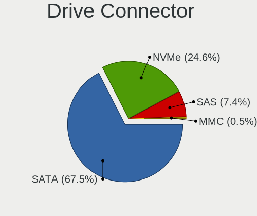
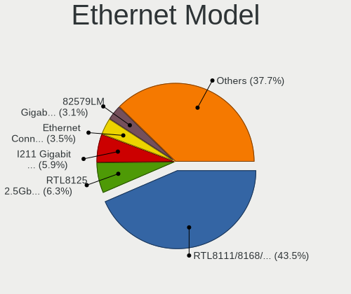
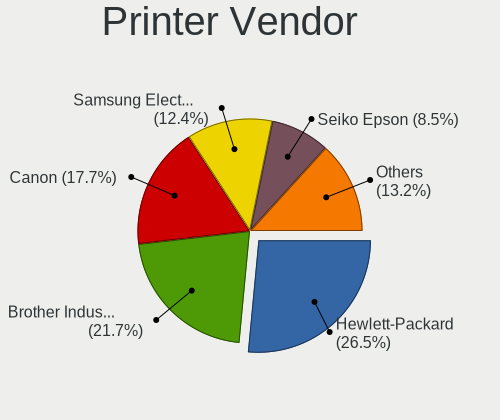
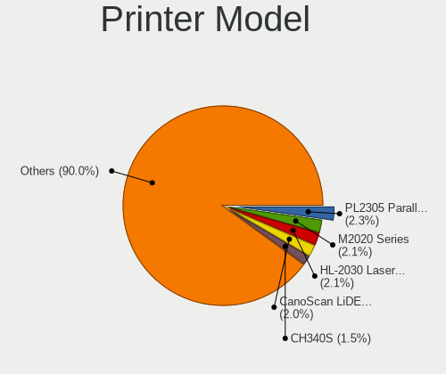
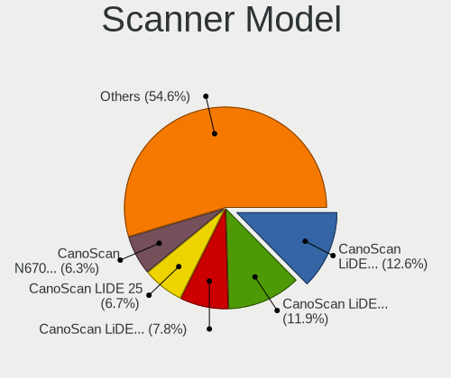

Linux in Germany - Tested Hardware & Statistics (Desktops)
----------------------------------------------------------

A project to collect tested hardware configurations for Linux in Germany.

Anyone can contribute to this report by the [hw-probe](https://github.com/linuxhw/hw-probe) tool:

    sudo -E hw-probe -all -upload

Please contribute! Especially if your hardware is rare.

Contents
--------

* [ Test Cases ](#test-cases)

* [ System ](#system)
  - [ OS                       ](#os)
  - [ OS Family                ](#os-family)
  - [ Kernel                   ](#kernel)
  - [ Kernel Family            ](#kernel-family)
  - [ Kernel Major Ver.        ](#kernel-major-ver)
  - [ Arch                     ](#arch)
  - [ DE                       ](#de)
  - [ Display Server           ](#display-server)
  - [ Display Manager          ](#display-manager)
  - [ OS Lang                  ](#os-lang)
  - [ Boot Mode                ](#boot-mode)
  - [ Filesystem               ](#filesystem)
  - [ Part. scheme             ](#part-scheme)
  - [ Dual Boot with Linux/BSD ](#dual-boot-with-linuxbsd)
  - [ Dual Boot (Win)          ](#dual-boot-win)

* [ Board ](#board)
  - [ Vendor                   ](#vendor)
  - [ Model                    ](#model)
  - [ Model Family             ](#model-family)
  - [ MFG Year                 ](#mfg-year)
  - [ Form Factor              ](#form-factor)
  - [ Secure Boot              ](#secure-boot)
  - [ Coreboot                 ](#coreboot)
  - [ RAM Size                 ](#ram-size)
  - [ RAM Used                 ](#ram-used)
  - [ Total Drives             ](#total-drives)
  - [ Has CD-ROM               ](#has-cd-rom)
  - [ Has Ethernet             ](#has-ethernet)
  - [ Has WiFi                 ](#has-wifi)
  - [ Has Bluetooth            ](#has-bluetooth)

* [ Location ](#location)
  - [ Country                  ](#country)
  - [ City                     ](#city)

* [ Drives ](#drives)
  - [ Drive Vendor             ](#drive-vendor)
  - [ Drive Model              ](#drive-model)
  - [ HDD Vendor               ](#hdd-vendor)
  - [ SSD Vendor               ](#ssd-vendor)
  - [ Drive Kind               ](#drive-kind)
  - [ Drive Connector          ](#drive-connector)
  - [ Drive Size               ](#drive-size)
  - [ Space Total              ](#space-total)
  - [ Space Used               ](#space-used)
  - [ Malfunc. Drives          ](#malfunc-drives)
  - [ Malfunc. Drive Vendor    ](#malfunc-drive-vendor)
  - [ Malfunc. HDD Vendor      ](#malfunc-hdd-vendor)
  - [ Malfunc. Drive Kind      ](#malfunc-drive-kind)
  - [ Failed Drives            ](#failed-drives)
  - [ Failed Drive Vendor      ](#failed-drive-vendor)
  - [ Drive Status             ](#drive-status)

* [ Storage controller ](#storage-controller)
  - [ Storage Vendor           ](#storage-vendor)
  - [ Storage Model            ](#storage-model)
  - [ Storage Kind             ](#storage-kind)

* [ Processor ](#processor)
  - [ CPU Vendor               ](#cpu-vendor)
  - [ CPU Model                ](#cpu-model)
  - [ CPU Model Family         ](#cpu-model-family)
  - [ CPU Cores                ](#cpu-cores)
  - [ CPU Sockets              ](#cpu-sockets)
  - [ CPU Threads              ](#cpu-threads)
  - [ CPU Op-Modes             ](#cpu-op-modes)
  - [ CPU Microcode            ](#cpu-microcode)
  - [ CPU Microarch            ](#cpu-microarch)

* [ Graphics ](#graphics)
  - [ GPU Vendor               ](#gpu-vendor)
  - [ GPU Model                ](#gpu-model)
  - [ GPU Combo                ](#gpu-combo)
  - [ GPU Driver               ](#gpu-driver)
  - [ GPU Memory               ](#gpu-memory)

* [ Monitor ](#monitor)
  - [ Monitor Vendor           ](#monitor-vendor)
  - [ Monitor Model            ](#monitor-model)
  - [ Monitor Resolution       ](#monitor-resolution)
  - [ Monitor Diagonal         ](#monitor-diagonal)
  - [ Monitor Width            ](#monitor-width)
  - [ Aspect Ratio             ](#aspect-ratio)
  - [ Monitor Area             ](#monitor-area)
  - [ Pixel Density            ](#pixel-density)
  - [ Multiple Monitors        ](#multiple-monitors)

* [ Network ](#network)
  - [ Net Controller Vendor    ](#net-controller-vendor)
  - [ Net Controller Model     ](#net-controller-model)
  - [ Wireless Vendor          ](#wireless-vendor)
  - [ Wireless Model           ](#wireless-model)
  - [ Ethernet Vendor          ](#ethernet-vendor)
  - [ Ethernet Model           ](#ethernet-model)
  - [ Net Controller Kind      ](#net-controller-kind)
  - [ Used Controller          ](#used-controller)
  - [ NICs                     ](#nics)
  - [ IPv6                     ](#ipv6)

* [ Bluetooth ](#bluetooth)
  - [ Bluetooth Vendor         ](#bluetooth-vendor)
  - [ Bluetooth Model          ](#bluetooth-model)

* [ Sound ](#sound)
  - [ Sound Vendor             ](#sound-vendor)
  - [ Sound Model              ](#sound-model)

* [ Memory ](#memory)
  - [ Memory Vendor            ](#memory-vendor)
  - [ Memory Model             ](#memory-model)
  - [ Memory Kind              ](#memory-kind)
  - [ Memory Form Factor       ](#memory-form-factor)
  - [ Memory Size              ](#memory-size)
  - [ Memory Speed             ](#memory-speed)

* [ Printers & scanners ](#printers--scanners)
  - [ Printer Vendor           ](#printer-vendor)
  - [ Printer Model            ](#printer-model)
  - [ Scanner Vendor           ](#scanner-vendor)
  - [ Scanner Model            ](#scanner-model)

* [ Camera ](#camera)
  - [ Camera Vendor            ](#camera-vendor)
  - [ Camera Model             ](#camera-model)

* [ Security ](#security)
  - [ Fingerprint Vendor       ](#fingerprint-vendor)
  - [ Fingerprint Model        ](#fingerprint-model)
  - [ Chipcard Vendor          ](#chipcard-vendor)
  - [ Chipcard Model           ](#chipcard-model)

* [ Unsupported ](#unsupported)
  - [ Unsupported Devices      ](#unsupported-devices)
  - [ Unsupported Device Types ](#unsupported-device-types)

Test Cases
----------

Total: 11583

| Vendor        | Model                       | Probe                                                      | Date         |
|---------------|-----------------------------|------------------------------------------------------------|--------------|
| Fujitsu       | D3223-A1 S26361-D3223-A1    | [9b6f7cea89](https://linux-hardware.org/?probe=9b6f7cea89) | May 01, 2023 |
| Lenovo        | 3111 SDK0J40697 WIN 3305... | [705ff684a9](https://linux-hardware.org/?probe=705ff684a9) | Apr 30, 2023 |
| ASRock        | FM2A68M-HD+                 | [467bb5ded2](https://linux-hardware.org/?probe=467bb5ded2) | Apr 30, 2023 |
| Shuttle       | DL20N                       | [3f97bcaa08](https://linux-hardware.org/?probe=3f97bcaa08) | Apr 30, 2023 |
| ASRock        | 960GM-GS3 FX                | [392492c032](https://linux-hardware.org/?probe=392492c032) | Apr 30, 2023 |
| Medion        | H81H3-EM2                   | [c85a3da4ab](https://linux-hardware.org/?probe=c85a3da4ab) | Apr 30, 2023 |
| ASRock        | N68-GS4 FX                  | [354f8689e7](https://linux-hardware.org/?probe=354f8689e7) | Apr 30, 2023 |
| MSI           | X570-A PRO                  | [4d31b88bbf](https://linux-hardware.org/?probe=4d31b88bbf) | Apr 30, 2023 |
| MSI           | X570-A PRO                  | [47a253784a](https://linux-hardware.org/?probe=47a253784a) | Apr 30, 2023 |
| Fujitsu       | D3161-A1 S26361-D3161-A1    | [ac7894081f](https://linux-hardware.org/?probe=ac7894081f) | Apr 30, 2023 |
| Gigabyte      | TRX40 AORUS XTREME          | [a88277b7f9](https://linux-hardware.org/?probe=a88277b7f9) | Apr 30, 2023 |
| Acer          | Aspire X3950                | [406366d5c1](https://linux-hardware.org/?probe=406366d5c1) | Apr 30, 2023 |
| MSI           | B450 GAMING PLUS            | [8aa973e0f5](https://linux-hardware.org/?probe=8aa973e0f5) | Apr 30, 2023 |
| Gigabyte      | Q87M-D2H                    | [16279b3c8b](https://linux-hardware.org/?probe=16279b3c8b) | Apr 30, 2023 |
| Gigabyte      | B85M-D3H                    | [2fe28d7f43](https://linux-hardware.org/?probe=2fe28d7f43) | Apr 29, 2023 |
| Medion        | TJ4125                      | [ad46974b2a](https://linux-hardware.org/?probe=ad46974b2a) | Apr 29, 2023 |
| ASUSTek       | ROG CROSSHAIR X670E HERO    | [4ac7cbf111](https://linux-hardware.org/?probe=4ac7cbf111) | Apr 29, 2023 |
| Gigabyte      | B450 AORUS M                | [ccc2fbf8a9](https://linux-hardware.org/?probe=ccc2fbf8a9) | Apr 29, 2023 |
| ASRock        | N68C-S UCC                  | [13628f3559](https://linux-hardware.org/?probe=13628f3559) | Apr 29, 2023 |
| ASUSTek       | X99-A                       | [6505e46b86](https://linux-hardware.org/?probe=6505e46b86) | Apr 29, 2023 |
| MSI           | B85M-E45                    | [db824980e5](https://linux-hardware.org/?probe=db824980e5) | Apr 29, 2023 |
| MSI           | B85M-E45                    | [42703e0a76](https://linux-hardware.org/?probe=42703e0a76) | Apr 29, 2023 |
| Intel         | DB75EN AAG39650-303         | [713c422641](https://linux-hardware.org/?probe=713c422641) | Apr 29, 2023 |
| Hardkernel    | ODROID-H3                   | [139d61e128](https://linux-hardware.org/?probe=139d61e128) | Apr 29, 2023 |
| Gigabyte      | Z790 UD                     | [536a24a0e3](https://linux-hardware.org/?probe=536a24a0e3) | Apr 29, 2023 |
| ASRock        | N68C-S UCC                  | [f7f4643b8f](https://linux-hardware.org/?probe=f7f4643b8f) | Apr 29, 2023 |
| HP            | 3397                        | [8b84766d3d](https://linux-hardware.org/?probe=8b84766d3d) | Apr 29, 2023 |
| YANYU         | EPIC-N56_I522E Ver          | [4798ab5c06](https://linux-hardware.org/?probe=4798ab5c06) | Apr 29, 2023 |
| Gigabyte      | X399 DESIGNARE EX-CF        | [e47ae2080c](https://linux-hardware.org/?probe=e47ae2080c) | Apr 29, 2023 |
| HP            | 845A                        | [d0aa2a4a7a](https://linux-hardware.org/?probe=d0aa2a4a7a) | Apr 29, 2023 |
| HP            | 845A                        | [f8bc4601ef](https://linux-hardware.org/?probe=f8bc4601ef) | Apr 29, 2023 |
| Medion        | TJ4125                      | [8f319cff50](https://linux-hardware.org/?probe=8f319cff50) | Apr 28, 2023 |
| Gigabyte      | B85M-D3H                    | [c0c226bf8c](https://linux-hardware.org/?probe=c0c226bf8c) | Apr 28, 2023 |
| Gigabyte      | Q87M-D2H                    | [6503ed5a4c](https://linux-hardware.org/?probe=6503ed5a4c) | Apr 28, 2023 |
| Fujitsu       | D3500-A1 S26361-D3500-A1    | [77150d1166](https://linux-hardware.org/?probe=77150d1166) | Apr 28, 2023 |
| ASUSTek       | PRIME X370-PRO              | [ddb48a2def](https://linux-hardware.org/?probe=ddb48a2def) | Apr 28, 2023 |
| MSI           | MAG B650 TOMAHAWK WIFI      | [99745be007](https://linux-hardware.org/?probe=99745be007) | Apr 28, 2023 |
| ASUSTek       | TUF Gaming X570-PLUS        | [278ed4fdd2](https://linux-hardware.org/?probe=278ed4fdd2) | Apr 28, 2023 |
| HP            | ProLiant ML350e Gen8 v2     | [968f941e2d](https://linux-hardware.org/?probe=968f941e2d) | Apr 28, 2023 |
| MSI           | MAG B650 TOMAHAWK WIFI      | [2427e67de4](https://linux-hardware.org/?probe=2427e67de4) | Apr 28, 2023 |
| ASRock        | A75M-HVS                    | [528362dfca](https://linux-hardware.org/?probe=528362dfca) | Apr 28, 2023 |
| Unknown       | Unknown                     | [5f5809c40f](https://linux-hardware.org/?probe=5f5809c40f) | Apr 27, 2023 |
| Shenzhen M... | F6BFC                       | [e2f7b853b1](https://linux-hardware.org/?probe=e2f7b853b1) | Apr 27, 2023 |
| HP            | 82F2 A01                    | [ea8f7364db](https://linux-hardware.org/?probe=ea8f7364db) | Apr 27, 2023 |
| ASRock        | A330GC                      | [d1a2e8dd13](https://linux-hardware.org/?probe=d1a2e8dd13) | Apr 27, 2023 |
| Gigabyte      | GA-880GMA-UD2H              | [7f2f7e75b7](https://linux-hardware.org/?probe=7f2f7e75b7) | Apr 27, 2023 |
| Dell          | 0HHV7N A00                  | [33517b7bfe](https://linux-hardware.org/?probe=33517b7bfe) | Apr 27, 2023 |
| Lenovo        | ThinkCentre M71e 3129B8G    | [2b6c3d498a](https://linux-hardware.org/?probe=2b6c3d498a) | Apr 27, 2023 |
| Gigabyte      | Z97P-D3                     | [40b51d3cae](https://linux-hardware.org/?probe=40b51d3cae) | Apr 27, 2023 |
| HP            | 18E7                        | [c6a760cb50](https://linux-hardware.org/?probe=c6a760cb50) | Apr 27, 2023 |
| Gigabyte      | H61MA-D3V                   | [3a1d89d5a0](https://linux-hardware.org/?probe=3a1d89d5a0) | Apr 27, 2023 |
| ASUSTek       | TUF Gaming B550M-PLUS       | [812906148b](https://linux-hardware.org/?probe=812906148b) | Apr 27, 2023 |
| MSI           | B350M PRO-VDH               | [a15fa484d4](https://linux-hardware.org/?probe=a15fa484d4) | Apr 26, 2023 |
| Gigabyte      | B450 I AORUS PRO WIFI-CF    | [2dcf65cf8e](https://linux-hardware.org/?probe=2dcf65cf8e) | Apr 26, 2023 |
| Gigabyte      | Z97X-UD3H-CF                | [eaac4c0ba0](https://linux-hardware.org/?probe=eaac4c0ba0) | Apr 26, 2023 |
| Gigabyte      | Z370M D3H-CF                | [ada8ff75dd](https://linux-hardware.org/?probe=ada8ff75dd) | Apr 26, 2023 |
| MSI           | B450-A PRO MAX              | [2d7c2dd8f9](https://linux-hardware.org/?probe=2d7c2dd8f9) | Apr 26, 2023 |
| ASUSTek       | M5A97 LE R2.0               | [64b15b4b1d](https://linux-hardware.org/?probe=64b15b4b1d) | Apr 26, 2023 |
| Lenovo        | 36C5 SDK0K17763 WIN 1801... | [45c453eb4e](https://linux-hardware.org/?probe=45c453eb4e) | Apr 26, 2023 |
| Lenovo        | 36C5 SDK0K17763 WIN 1801... | [b79a40ebdc](https://linux-hardware.org/?probe=b79a40ebdc) | Apr 26, 2023 |
| Intel         | D34010WYK H14771-304        | [4fbbe6e603](https://linux-hardware.org/?probe=4fbbe6e603) | Apr 26, 2023 |
| Gigabyte      | B75M-D3H                    | [4f1e4da37e](https://linux-hardware.org/?probe=4f1e4da37e) | Apr 26, 2023 |
| ASUSTek       | ROG STRIX B760-I GAMING ... | [6dec479f55](https://linux-hardware.org/?probe=6dec479f55) | Apr 25, 2023 |
| ASUSTek       | Z170-A                      | [fa21ed6900](https://linux-hardware.org/?probe=fa21ed6900) | Apr 25, 2023 |
| ASUSTek       | Z170I PRO GAMING            | [a2875a31b2](https://linux-hardware.org/?probe=a2875a31b2) | Apr 25, 2023 |
| ASUSTek       | PRIME B450M-A               | [d8c1be05af](https://linux-hardware.org/?probe=d8c1be05af) | Apr 25, 2023 |
| Gigabyte      | GA-78LMT-S2P                | [4668a2409b](https://linux-hardware.org/?probe=4668a2409b) | Apr 25, 2023 |
| Lenovo        | ThinkCentre A70z 0401G6G    | [b1b8bf3df6](https://linux-hardware.org/?probe=b1b8bf3df6) | Apr 25, 2023 |
| Gigabyte      | GA-78LMT-S2P                | [7b091628e5](https://linux-hardware.org/?probe=7b091628e5) | Apr 25, 2023 |
| ASRock        | X670E Pro RS                | [e36216c3c7](https://linux-hardware.org/?probe=e36216c3c7) | Apr 25, 2023 |
| ASUSTek       | PRIME A520M-K               | [a437a858a4](https://linux-hardware.org/?probe=a437a858a4) | Apr 25, 2023 |
| MSI           | B560M PRO-VDH               | [61cdcbbe0c](https://linux-hardware.org/?probe=61cdcbbe0c) | Apr 25, 2023 |
| ASRock        | Z690 Extreme                | [3767d30290](https://linux-hardware.org/?probe=3767d30290) | Apr 25, 2023 |
| ASUSTek       | Z170 PRO GAMING             | [7d7fd385cc](https://linux-hardware.org/?probe=7d7fd385cc) | Apr 25, 2023 |
| Gigabyte      | B450M S2H                   | [db176db0db](https://linux-hardware.org/?probe=db176db0db) | Apr 25, 2023 |
| Lenovo        | 313A NOK                    | [34a521ebad](https://linux-hardware.org/?probe=34a521ebad) | Apr 24, 2023 |
| Gigabyte      | Z97X-UD3H-CF                | [88c455761b](https://linux-hardware.org/?probe=88c455761b) | Apr 24, 2023 |
| ASUSTek       | ROG STRIX B450-F GAMING ... | [25ac3a297e](https://linux-hardware.org/?probe=25ac3a297e) | Apr 24, 2023 |
| Fujitsu       | D3221-A1 S26361-D3221-A1    | [e18fd8d449](https://linux-hardware.org/?probe=e18fd8d449) | Apr 24, 2023 |
| Lenovo        | 32E9 SDK0T76463 WIN 3422... | [9f49daf25a](https://linux-hardware.org/?probe=9f49daf25a) | Apr 24, 2023 |
| Lenovo        | 32E9 SDK0T76463 WIN 3422... | [cc7a31d3d6](https://linux-hardware.org/?probe=cc7a31d3d6) | Apr 24, 2023 |
| ASUSTek       | PRIME X370-PRO              | [eb716c53fa](https://linux-hardware.org/?probe=eb716c53fa) | Apr 24, 2023 |
| ASUSTek       | ROG STRIX B550-F GAMING ... | [4939e609de](https://linux-hardware.org/?probe=4939e609de) | Apr 24, 2023 |
| ASUSTek       | Z170 PRO GAMING             | [2a0ee71044](https://linux-hardware.org/?probe=2a0ee71044) | Apr 23, 2023 |
| Gigabyte      | B450M S2H                   | [f3c853b789](https://linux-hardware.org/?probe=f3c853b789) | Apr 23, 2023 |
| Gigabyte      | B550 AORUS PRO V2           | [e5c6fc2738](https://linux-hardware.org/?probe=e5c6fc2738) | Apr 23, 2023 |
| Foxconn       | H67M-S/H67M-V/H67           | [92fa61186f](https://linux-hardware.org/?probe=92fa61186f) | Apr 23, 2023 |
| MSI           | MEG X570S ACE MAX           | [b7ab5c207b](https://linux-hardware.org/?probe=b7ab5c207b) | Apr 23, 2023 |
| Gigabyte      | Q87M-D2H                    | [5827cd2604](https://linux-hardware.org/?probe=5827cd2604) | Apr 23, 2023 |
| HP            | 339A                        | [aa81655af9](https://linux-hardware.org/?probe=aa81655af9) | Apr 23, 2023 |
| Gigabyte      | B85M-D3H                    | [88a6d9040e](https://linux-hardware.org/?probe=88a6d9040e) | Apr 23, 2023 |
| Lenovo        | 36C5 SDK0K17763 WIN 1801... | [e653a5dd45](https://linux-hardware.org/?probe=e653a5dd45) | Apr 23, 2023 |
| ASUSTek       | F1A55-M LK R2.0             | [234e0d0738](https://linux-hardware.org/?probe=234e0d0738) | Apr 23, 2023 |
| Lenovo        | 36C5 SDK0K17763 WIN 1801... | [95e77b87f5](https://linux-hardware.org/?probe=95e77b87f5) | Apr 23, 2023 |
| Medion        | TJ4125                      | [faa241e4bc](https://linux-hardware.org/?probe=faa241e4bc) | Apr 23, 2023 |
| Dell          | 09KPNV A00                  | [0ba7a36003](https://linux-hardware.org/?probe=0ba7a36003) | Apr 23, 2023 |
| Dell          | 09KPNV A00                  | [a99600dad6](https://linux-hardware.org/?probe=a99600dad6) | Apr 23, 2023 |
| ASRock        | N68-GS4 FX                  | [58dfb135e4](https://linux-hardware.org/?probe=58dfb135e4) | Apr 23, 2023 |
| Gigabyte      | Z97X-UD3H-CF                | [a65124c792](https://linux-hardware.org/?probe=a65124c792) | Apr 23, 2023 |
| ASRock        | N68-GS4 FX                  | [6edcfed28d](https://linux-hardware.org/?probe=6edcfed28d) | Apr 23, 2023 |
| Gigabyte      | TRX40 AORUS XTREME          | [eac9934073](https://linux-hardware.org/?probe=eac9934073) | Apr 23, 2023 |
| Gigabyte      | Z390 UD                     | [418754830b](https://linux-hardware.org/?probe=418754830b) | Apr 23, 2023 |
| Packard Be... | IPOWER G3610                | [05de2306b0](https://linux-hardware.org/?probe=05de2306b0) | Apr 23, 2023 |
| MSI           | G41M-P26                    | [342a1163ab](https://linux-hardware.org/?probe=342a1163ab) | Apr 23, 2023 |
| Gigabyte      | GA-78LMT-S2P                | [b342cd8fe0](https://linux-hardware.org/?probe=b342cd8fe0) | Apr 23, 2023 |
| Gigabyte      | 970A-DS3P                   | [4a55a10fd0](https://linux-hardware.org/?probe=4a55a10fd0) | Apr 23, 2023 |
| ASRock        | A75M-HVS                    | [a4964506f7](https://linux-hardware.org/?probe=a4964506f7) | Apr 23, 2023 |
| Gigabyte      | GA-78LMT-USB3 R2 sex        | [93790f1835](https://linux-hardware.org/?probe=93790f1835) | Apr 23, 2023 |
| ASUSTek       | ROG STRIX X570-F GAMING     | [fb4c86b0c4](https://linux-hardware.org/?probe=fb4c86b0c4) | Apr 23, 2023 |
| MSI           | X470 GAMING PLUS MAX        | [8db6f88fd3](https://linux-hardware.org/?probe=8db6f88fd3) | Apr 22, 2023 |
| ASUSTek       | TUF Gaming B550M-PLUS       | [c4a5aad8a1](https://linux-hardware.org/?probe=c4a5aad8a1) | Apr 22, 2023 |
| ASUSTek       | TUF Gaming X670E-PLUS WI... | [180784b3a2](https://linux-hardware.org/?probe=180784b3a2) | Apr 22, 2023 |
| Biostar       | A75MG                       | [50cb5c256e](https://linux-hardware.org/?probe=50cb5c256e) | Apr 22, 2023 |
| Gigabyte      | Z790 UD                     | [8536a23081](https://linux-hardware.org/?probe=8536a23081) | Apr 22, 2023 |
| Fujitsu       | D3500-A1 S26361-D3500-A1    | [475a4d151d](https://linux-hardware.org/?probe=475a4d151d) | Apr 22, 2023 |
| Gigabyte      | B550M S2H                   | [485f002152](https://linux-hardware.org/?probe=485f002152) | Apr 22, 2023 |
| MSI           | Z77A-G41                    | [9cd2294229](https://linux-hardware.org/?probe=9cd2294229) | Apr 22, 2023 |
| Biostar       | H410MH S2                   | [0f2593dc78](https://linux-hardware.org/?probe=0f2593dc78) | Apr 22, 2023 |
| Fujitsu Si... | D2156-A1 S26361-D2156-A1    | [617f821f9a](https://linux-hardware.org/?probe=617f821f9a) | Apr 22, 2023 |
| ASUSTek       | ROG STRIX B550-A GAMING     | [519c11a569](https://linux-hardware.org/?probe=519c11a569) | Apr 21, 2023 |
| Gigabyte      | TRX40 AORUS XTREME          | [d4d3e7f8d6](https://linux-hardware.org/?probe=d4d3e7f8d6) | Apr 21, 2023 |
| MSI           | IONA                        | [3820fb6576](https://linux-hardware.org/?probe=3820fb6576) | Apr 21, 2023 |
| MSI           | MPG X570 GAMING PLUS        | [a898476ffa](https://linux-hardware.org/?probe=a898476ffa) | Apr 21, 2023 |
| ASRock        | H81M-HDS R2.0               | [eaf8476afd](https://linux-hardware.org/?probe=eaf8476afd) | Apr 21, 2023 |
| Gigabyte      | B550M DS3H                  | [e98b4fdd23](https://linux-hardware.org/?probe=e98b4fdd23) | Apr 21, 2023 |
| ASUSTek       | M5A97 R2.0                  | [1c0e6f85fe](https://linux-hardware.org/?probe=1c0e6f85fe) | Apr 21, 2023 |
| HP            | 8054                        | [0f2c12c877](https://linux-hardware.org/?probe=0f2c12c877) | Apr 20, 2023 |
| ASUSTek       | PRIME B360-PLUS             | [00b1045cf9](https://linux-hardware.org/?probe=00b1045cf9) | Apr 20, 2023 |
| Gigabyte      | B85-HD3                     | [07ecc38bef](https://linux-hardware.org/?probe=07ecc38bef) | Apr 20, 2023 |
| Fujitsu       | D3221-A1 S26361-D3221-A1    | [f79af9bad0](https://linux-hardware.org/?probe=f79af9bad0) | Apr 20, 2023 |
| Fujitsu       | D2917-A1 S26361-D2917-A1    | [9ff4edba5b](https://linux-hardware.org/?probe=9ff4edba5b) | Apr 20, 2023 |
| MSI           | MAG B650 TOMAHAWK WIFI      | [68e853f4c1](https://linux-hardware.org/?probe=68e853f4c1) | Apr 20, 2023 |
| ASUSTek       | ROG STRIX Z790-F GAMING ... | [adb291235a](https://linux-hardware.org/?probe=adb291235a) | Apr 20, 2023 |
| MSI           | H110M PRO-VD                | [509d9126e1](https://linux-hardware.org/?probe=509d9126e1) | Apr 19, 2023 |
| Acer          | Veriton X2632G V:1.0        | [0fa4554c3c](https://linux-hardware.org/?probe=0fa4554c3c) | Apr 19, 2023 |
| MSI           | B450 GAMING PRO CARBON A... | [e1da556a0b](https://linux-hardware.org/?probe=e1da556a0b) | Apr 19, 2023 |
| ASUSTek       | PRIME B350M-A               | [c6cd36eaed](https://linux-hardware.org/?probe=c6cd36eaed) | Apr 19, 2023 |
| ASUSTek       | M5A78L-M PLUS/USB3          | [8afed7ed9c](https://linux-hardware.org/?probe=8afed7ed9c) | Apr 19, 2023 |
| AMI           | Intel                       | [3f1890d683](https://linux-hardware.org/?probe=3f1890d683) | Apr 19, 2023 |
| MSI           | A320M-A PRO MAX             | [630a9718a0](https://linux-hardware.org/?probe=630a9718a0) | Apr 18, 2023 |
| MSI           | MAG B650 TOMAHAWK WIFI      | [47831c9091](https://linux-hardware.org/?probe=47831c9091) | Apr 18, 2023 |
| ASUSTek       | ROG STRIX B450-F GAMING ... | [a775ede9a0](https://linux-hardware.org/?probe=a775ede9a0) | Apr 18, 2023 |
| ASUSTek       | M5A97 EVO R2.0              | [da85d2406d](https://linux-hardware.org/?probe=da85d2406d) | Apr 18, 2023 |
| Dell          | 0WMJ54 A01                  | [2a7fe6d74b](https://linux-hardware.org/?probe=2a7fe6d74b) | Apr 18, 2023 |
| Dell          | 0WMJ54 A01                  | [be92b53515](https://linux-hardware.org/?probe=be92b53515) | Apr 18, 2023 |
| ASUSTek       | ROG STRIX B550-I GAMING     | [dc707578c9](https://linux-hardware.org/?probe=dc707578c9) | Apr 18, 2023 |
| Gigabyte      | X570 GAMING X               | [f9f95d964c](https://linux-hardware.org/?probe=f9f95d964c) | Apr 18, 2023 |
| Medion        | BTDD-LT                     | [b26cb60a3f](https://linux-hardware.org/?probe=b26cb60a3f) | Apr 18, 2023 |
| ASUSTek       | PRIME A320M-K               | [fd82dc08dc](https://linux-hardware.org/?probe=fd82dc08dc) | Apr 18, 2023 |
| Gigabyte      | H77N-WIFI                   | [10e158aabd](https://linux-hardware.org/?probe=10e158aabd) | Apr 18, 2023 |
| ASRock        | B650M PG Riptide            | [89670d9e1f](https://linux-hardware.org/?probe=89670d9e1f) | Apr 17, 2023 |
| ASUSTek       | B85-PRO GAMER               | [bbe3e437d6](https://linux-hardware.org/?probe=bbe3e437d6) | Apr 17, 2023 |
| Dell          | 03NVJ6 A02                  | [2b0ef62ec7](https://linux-hardware.org/?probe=2b0ef62ec7) | Apr 17, 2023 |
| HP            | 1850                        | [fa2fa68792](https://linux-hardware.org/?probe=fa2fa68792) | Apr 17, 2023 |
| Gigabyte      | B550 AORUS ELITE AX V2      | [307e22b0d6](https://linux-hardware.org/?probe=307e22b0d6) | Apr 17, 2023 |
| ASUSTek       | PRIME H410M-E               | [a537c2bd18](https://linux-hardware.org/?probe=a537c2bd18) | Apr 17, 2023 |
| MSI           | X570-A PRO                  | [65d3714b3b](https://linux-hardware.org/?probe=65d3714b3b) | Apr 17, 2023 |
| HP            | 8055                        | [f9b8b05db5](https://linux-hardware.org/?probe=f9b8b05db5) | Apr 17, 2023 |
| HP            | 8055                        | [462446d664](https://linux-hardware.org/?probe=462446d664) | Apr 17, 2023 |
| Dell          | 09KPNV A00                  | [c55a50526d](https://linux-hardware.org/?probe=c55a50526d) | Apr 16, 2023 |
| Medion        | MS-7728                     | [1da2d605db](https://linux-hardware.org/?probe=1da2d605db) | Apr 16, 2023 |
| Acer          | Aspire X3950                | [5a9abbd85f](https://linux-hardware.org/?probe=5a9abbd85f) | Apr 16, 2023 |
| ASUSTek       | X99-A/USB                   | [d686a4d03c](https://linux-hardware.org/?probe=d686a4d03c) | Apr 16, 2023 |
| ASRock        | X370 Killer SLI             | [912a7f830b](https://linux-hardware.org/?probe=912a7f830b) | Apr 16, 2023 |
| ASUSTek       | Z170I PRO GAMING            | [286c8ef93c](https://linux-hardware.org/?probe=286c8ef93c) | Apr 16, 2023 |
| Gigabyte      | H61M-D2H-USB3               | [0134b33f82](https://linux-hardware.org/?probe=0134b33f82) | Apr 16, 2023 |
| ASRock        | A300M-STX                   | [8f9e883980](https://linux-hardware.org/?probe=8f9e883980) | Apr 16, 2023 |
| ASRock        | Z270 Extreme4               | [c388675553](https://linux-hardware.org/?probe=c388675553) | Apr 16, 2023 |
| ASUSTek       | PRIME H410M-E               | [fedecfd9ff](https://linux-hardware.org/?probe=fedecfd9ff) | Apr 16, 2023 |
| Foxconn       | A7DA 3 series               | [a8f557c1c3](https://linux-hardware.org/?probe=a8f557c1c3) | Apr 16, 2023 |
| ASUSTek       | PRIME B360-PLUS             | [c228cbe8e1](https://linux-hardware.org/?probe=c228cbe8e1) | Apr 16, 2023 |
| Foxconn       | A7DA 3 series               | [4f7648a3d0](https://linux-hardware.org/?probe=4f7648a3d0) | Apr 16, 2023 |
| Gigabyte      | B85-HD3                     | [25e7d545ae](https://linux-hardware.org/?probe=25e7d545ae) | Apr 16, 2023 |
| HP            | 18E4                        | [bc45bcdf89](https://linux-hardware.org/?probe=bc45bcdf89) | Apr 16, 2023 |
| Fujitsu       | D3613-A1 S26361-D3613-A1    | [4cb39d1136](https://linux-hardware.org/?probe=4cb39d1136) | Apr 15, 2023 |
| HP            | 8055                        | [7e5328ded9](https://linux-hardware.org/?probe=7e5328ded9) | Apr 15, 2023 |
| ASUSTek       | ROG CROSSHAIR VII HERO      | [e405d73576](https://linux-hardware.org/?probe=e405d73576) | Apr 15, 2023 |
| MSI           | MPG B460I GAMING EDGE WI... | [c34c2e032c](https://linux-hardware.org/?probe=c34c2e032c) | Apr 15, 2023 |
| Foxconn       | 2A8C                        | [8a75d034c7](https://linux-hardware.org/?probe=8a75d034c7) | Apr 15, 2023 |
| Fujitsu       | D3233-A1 S26361-D3233-A1    | [9deba6cdac](https://linux-hardware.org/?probe=9deba6cdac) | Apr 15, 2023 |
| Gigabyte      | GA-MA74GM-S2H               | [c7568482a9](https://linux-hardware.org/?probe=c7568482a9) | Apr 15, 2023 |
| MSI           | Z390-A PRO                  | [7226bd3eab](https://linux-hardware.org/?probe=7226bd3eab) | Apr 15, 2023 |
| Gigabyte      | GA-870A-UD3                 | [a359e8f3ea](https://linux-hardware.org/?probe=a359e8f3ea) | Apr 15, 2023 |
| Acer          | WG43M                       | [a3a49836f9](https://linux-hardware.org/?probe=a3a49836f9) | Apr 15, 2023 |
| Biostar       | A960D+V2                    | [da262e3956](https://linux-hardware.org/?probe=da262e3956) | Apr 14, 2023 |
| ASUSTek       | ET1612I                     | [f67ace875b](https://linux-hardware.org/?probe=f67ace875b) | Apr 14, 2023 |
| MSI           | B450 GAMING PLUS            | [d49b1775be](https://linux-hardware.org/?probe=d49b1775be) | Apr 14, 2023 |
| Gigabyte      | B85M-D3H                    | [7041b36ac5](https://linux-hardware.org/?probe=7041b36ac5) | Apr 14, 2023 |
| Medion        | TJ4125                      | [887d24e023](https://linux-hardware.org/?probe=887d24e023) | Apr 14, 2023 |
| Dell          | 00V62H A01                  | [a06e8fe70f](https://linux-hardware.org/?probe=a06e8fe70f) | Apr 14, 2023 |
| Fujitsu Si... | D2824-A1 S26361-D2824-A1    | [8a5b5b102c](https://linux-hardware.org/?probe=8a5b5b102c) | Apr 14, 2023 |
| ASUSTek       | ROG STRIX B550-F GAMING     | [d7768947bc](https://linux-hardware.org/?probe=d7768947bc) | Apr 14, 2023 |
| ASRock        | A75M-HVS                    | [4d217e7a68](https://linux-hardware.org/?probe=4d217e7a68) | Apr 14, 2023 |
| HP            | ProLiant MicroServer Gen... | [d00ebfbc62](https://linux-hardware.org/?probe=d00ebfbc62) | Apr 14, 2023 |
| HP            | ProLiant MicroServer Gen... | [8b0e1ffa20](https://linux-hardware.org/?probe=8b0e1ffa20) | Apr 14, 2023 |
| HP            | ProLiant MicroServer Gen... | [3b2ac9206c](https://linux-hardware.org/?probe=3b2ac9206c) | Apr 14, 2023 |
| Gigabyte      | X570 I AORUS PRO WIFI       | [3741318176](https://linux-hardware.org/?probe=3741318176) | Apr 14, 2023 |
| HP            | ProLiant MicroServer Gen... | [16ee5e0082](https://linux-hardware.org/?probe=16ee5e0082) | Apr 14, 2023 |
| HP            | ProLiant MicroServer Gen... | [1b21351033](https://linux-hardware.org/?probe=1b21351033) | Apr 14, 2023 |
| HP            | ProLiant MicroServer Gen... | [f6f55c801f](https://linux-hardware.org/?probe=f6f55c801f) | Apr 14, 2023 |
| ASUSTek       | K30AD_M31AD_M51AD_M32AD     | [a1c457ea48](https://linux-hardware.org/?probe=a1c457ea48) | Apr 14, 2023 |
| ASUSTek       | K30AD_M31AD_M51AD_M32AD     | [6cf54a6bf4](https://linux-hardware.org/?probe=6cf54a6bf4) | Apr 14, 2023 |
| ASRock        | B550 Steel Legend           | [9da868694f](https://linux-hardware.org/?probe=9da868694f) | Apr 14, 2023 |
| ASUSTek       | PRIME B450M-K II            | [9055d69d2f](https://linux-hardware.org/?probe=9055d69d2f) | Apr 14, 2023 |
| Fujitsu       | D3403-A1 S26361-D3403-A1    | [5be961705c](https://linux-hardware.org/?probe=5be961705c) | Apr 13, 2023 |
| ASUSTek       | SABERTOOTH 990FX R2.0       | [3aaeeb54ca](https://linux-hardware.org/?probe=3aaeeb54ca) | Apr 13, 2023 |
| Gigabyte      | Z370 HD3-CF                 | [505fa87a7b](https://linux-hardware.org/?probe=505fa87a7b) | Apr 13, 2023 |
| HP            | 3397                        | [0e4d29ffcd](https://linux-hardware.org/?probe=0e4d29ffcd) | Apr 13, 2023 |
| HP            | 21EF                        | [d2b3751fd1](https://linux-hardware.org/?probe=d2b3751fd1) | Apr 13, 2023 |
| Gigabyte      | B550M DS3H                  | [d79c9f1cf1](https://linux-hardware.org/?probe=d79c9f1cf1) | Apr 12, 2023 |
| Gigabyte      | Z270-Gaming K3              | [0c03014734](https://linux-hardware.org/?probe=0c03014734) | Apr 12, 2023 |
| Gigabyte      | X570 AORUS ELITE            | [df185fb277](https://linux-hardware.org/?probe=df185fb277) | Apr 12, 2023 |
| Gigabyte      | B450M DS3H V2               | [63c52bc5db](https://linux-hardware.org/?probe=63c52bc5db) | Apr 12, 2023 |
| ASUSTek       | PRIME B450-PLUS             | [108725a205](https://linux-hardware.org/?probe=108725a205) | Apr 12, 2023 |
| MiTAC         | PD10EHI                     | [13f79a1843](https://linux-hardware.org/?probe=13f79a1843) | Apr 12, 2023 |
| MSI           | MPG X570 GAMING EDGE WIF... | [62a6c66983](https://linux-hardware.org/?probe=62a6c66983) | Apr 11, 2023 |
| Gigabyte      | EP45-DS3L                   | [ba55619ab6](https://linux-hardware.org/?probe=ba55619ab6) | Apr 11, 2023 |
| Gigabyte      | EP45-DS3L                   | [1a9f2f74bd](https://linux-hardware.org/?probe=1a9f2f74bd) | Apr 11, 2023 |
| MSI           | A320M-A PRO MAX             | [d5e033eb2e](https://linux-hardware.org/?probe=d5e033eb2e) | Apr 11, 2023 |
| Gigabyte      | GA-870A-UD3                 | [38d6c9f7ab](https://linux-hardware.org/?probe=38d6c9f7ab) | Apr 11, 2023 |
| Gigabyte      | X570S AORUS ELITE AX        | [fcb884a8aa](https://linux-hardware.org/?probe=fcb884a8aa) | Apr 11, 2023 |
| Gigabyte      | Z390 UD                     | [9a5ae96f52](https://linux-hardware.org/?probe=9a5ae96f52) | Apr 11, 2023 |
| MSI           | MEG X570S ACE MAX           | [22e5416847](https://linux-hardware.org/?probe=22e5416847) | Apr 11, 2023 |
| Gigabyte      | Q87M-D2H                    | [d041ee40cc](https://linux-hardware.org/?probe=d041ee40cc) | Apr 11, 2023 |
| ASUSTek       | H97I-PLUS                   | [8fdee327be](https://linux-hardware.org/?probe=8fdee327be) | Apr 11, 2023 |
| Dell          | 0K240Y A01                  | [1daf1b0ff6](https://linux-hardware.org/?probe=1daf1b0ff6) | Apr 10, 2023 |
| Gigabyte      | X570 GAMING X               | [761450c579](https://linux-hardware.org/?probe=761450c579) | Apr 10, 2023 |
| MSI           | B450M MORTAR MAX            | [e2cffb810b](https://linux-hardware.org/?probe=e2cffb810b) | Apr 10, 2023 |
| Lenovo        | 3138 SDK0J40697 WIN 3305... | [491da3c2c2](https://linux-hardware.org/?probe=491da3c2c2) | Apr 10, 2023 |
| ASRock        | B550M-ITX/ac                | [e043c1c94c](https://linux-hardware.org/?probe=e043c1c94c) | Apr 10, 2023 |
| ASRock        | X670E Pro RS                | [0f078152ca](https://linux-hardware.org/?probe=0f078152ca) | Apr 10, 2023 |
| MSI           | X470 GAMING PLUS MAX        | [cd7d44fb7f](https://linux-hardware.org/?probe=cd7d44fb7f) | Apr 10, 2023 |
| Fujitsu Si... | D2312-A3 S26361-D2312-A3    | [54fabc7712](https://linux-hardware.org/?probe=54fabc7712) | Apr 09, 2023 |
| ASUSTek       | ROG STRIX Z390-F GAMING     | [5b0601fc42](https://linux-hardware.org/?probe=5b0601fc42) | Apr 09, 2023 |
| Medion        | TJ4125                      | [5c5f39a8fd](https://linux-hardware.org/?probe=5c5f39a8fd) | Apr 09, 2023 |
| Gigabyte      | B85M-D3H                    | [87be7a6dc0](https://linux-hardware.org/?probe=87be7a6dc0) | Apr 09, 2023 |
| MSI           | B350M MORTAR                | [03960a3def](https://linux-hardware.org/?probe=03960a3def) | Apr 09, 2023 |
| Gigabyte      | Z690 GAMING X DDR4          | [e2521c6d93](https://linux-hardware.org/?probe=e2521c6d93) | Apr 09, 2023 |
| MSI           | MPG X570 GAMING EDGE WIF... | [4644a0ea43](https://linux-hardware.org/?probe=4644a0ea43) | Apr 09, 2023 |
| MSI           | B450 GAMING PLUS            | [b35b8e1503](https://linux-hardware.org/?probe=b35b8e1503) | Apr 09, 2023 |
| Intel         | DH67BL AAG10189-207         | [1f13dff346](https://linux-hardware.org/?probe=1f13dff346) | Apr 08, 2023 |
| Gigabyte      | Q87M-D2H                    | [2c83dbd3ef](https://linux-hardware.org/?probe=2c83dbd3ef) | Apr 08, 2023 |
| Medion        | MS-7848                     | [40e46961a4](https://linux-hardware.org/?probe=40e46961a4) | Apr 08, 2023 |
| MSI           | B350 PC MATE                | [5c6c535e4d](https://linux-hardware.org/?probe=5c6c535e4d) | Apr 08, 2023 |
| AMI           | Cherry Trail CR             | [58dea5f209](https://linux-hardware.org/?probe=58dea5f209) | Apr 08, 2023 |
| ASUSTek       | P8H77-M PRO                 | [c8b30dba27](https://linux-hardware.org/?probe=c8b30dba27) | Apr 08, 2023 |
| HPE           | ProLiant MicroServer Gen... | [e378272577](https://linux-hardware.org/?probe=e378272577) | Apr 08, 2023 |
| Gigabyte      | B450M S2H                   | [f08d8d6bbd](https://linux-hardware.org/?probe=f08d8d6bbd) | Apr 08, 2023 |
| Acer          | Aspire X3990                | [4d4816d6f8](https://linux-hardware.org/?probe=4d4816d6f8) | Apr 08, 2023 |
| ASRock        | B450 Gaming-ITX/ac          | [36c87da9d9](https://linux-hardware.org/?probe=36c87da9d9) | Apr 07, 2023 |
| Fujitsu       | D2990-A2 S26361-D2990-A2    | [c76171c0a7](https://linux-hardware.org/?probe=c76171c0a7) | Apr 07, 2023 |
| Inventec      | D CLASS A02                 | [3d53baddbf](https://linux-hardware.org/?probe=3d53baddbf) | Apr 07, 2023 |
| Inventec      | VXC Class A02               | [3ff1b18b81](https://linux-hardware.org/?probe=3ff1b18b81) | Apr 07, 2023 |
| MSI           | KA790GX                     | [c3dfb7614d](https://linux-hardware.org/?probe=c3dfb7614d) | Apr 07, 2023 |
| Foxconn       | 2A8C                        | [f202bac0de](https://linux-hardware.org/?probe=f202bac0de) | Apr 06, 2023 |
| ASRock        | A320M-DVS R4.0              | [c6e30ff3cc](https://linux-hardware.org/?probe=c6e30ff3cc) | Apr 06, 2023 |
| MSI           | B250M PRO-VDH               | [123883b7dd](https://linux-hardware.org/?probe=123883b7dd) | Apr 06, 2023 |
| ASUSTek       | PRIME B450-PLUS             | [9e99b4150b](https://linux-hardware.org/?probe=9e99b4150b) | Apr 06, 2023 |
| eMachines     | EL1352                      | [ccd83551e0](https://linux-hardware.org/?probe=ccd83551e0) | Apr 06, 2023 |
| HP            | 8055                        | [8ef78a4649](https://linux-hardware.org/?probe=8ef78a4649) | Apr 06, 2023 |
| HP            | 8055                        | [8afe68fd20](https://linux-hardware.org/?probe=8afe68fd20) | Apr 06, 2023 |
| Gigabyte      | B550 AORUS ELITE V2         | [c599e701fc](https://linux-hardware.org/?probe=c599e701fc) | Apr 06, 2023 |
| MSI           | MEG X570S ACE MAX           | [57505ad220](https://linux-hardware.org/?probe=57505ad220) | Apr 06, 2023 |
| MSI           | MEG X570S ACE MAX           | [f3703c6b73](https://linux-hardware.org/?probe=f3703c6b73) | Apr 06, 2023 |
| ASUSTek       | PRIME Z370-A II             | [8f229e46c6](https://linux-hardware.org/?probe=8f229e46c6) | Apr 05, 2023 |
| ASUSTek       | H97M-PLUS                   | [ec5d1abdf5](https://linux-hardware.org/?probe=ec5d1abdf5) | Apr 05, 2023 |
| Lenovo        | 313A NOK                    | [824eadb157](https://linux-hardware.org/?probe=824eadb157) | Apr 05, 2023 |
| Gigabyte      | X570 AORUS ULTRA            | [8b89901dc6](https://linux-hardware.org/?probe=8b89901dc6) | Apr 05, 2023 |
| Dell          | 0HHV7N A00                  | [b715735168](https://linux-hardware.org/?probe=b715735168) | Apr 05, 2023 |
| ASRock        | H87 Performance             | [34f591b007](https://linux-hardware.org/?probe=34f591b007) | Apr 05, 2023 |
| Dell          | 0HHV7N A00                  | [4f1c6c0b48](https://linux-hardware.org/?probe=4f1c6c0b48) | Apr 05, 2023 |
| ASRock        | A320M-DVS R4.0              | [6da0293a4b](https://linux-hardware.org/?probe=6da0293a4b) | Apr 05, 2023 |
| Gigabyte      | EP45-DS3L                   | [c400615c85](https://linux-hardware.org/?probe=c400615c85) | Apr 05, 2023 |
| Gigabyte      | EP45-DS3L                   | [85a4cbc899](https://linux-hardware.org/?probe=85a4cbc899) | Apr 05, 2023 |
| Fujitsu       | D3401-A1 S26361-D3401-A1    | [5304b3bb66](https://linux-hardware.org/?probe=5304b3bb66) | Apr 05, 2023 |
| Gigabyte      | X570 AORUS ELITE            | [5012c822d7](https://linux-hardware.org/?probe=5012c822d7) | Apr 05, 2023 |
| Gigabyte      | X570 AORUS ELITE            | [33eb81c75e](https://linux-hardware.org/?probe=33eb81c75e) | Apr 05, 2023 |
| ASUSTek       | M4A87TD EVO                 | [6f3f9cf977](https://linux-hardware.org/?probe=6f3f9cf977) | Apr 05, 2023 |
| Gigabyte      | GA-A75M-UD2H                | [7f4b812a58](https://linux-hardware.org/?probe=7f4b812a58) | Apr 05, 2023 |
| BESSTAR Te... | UM350                       | [ccff8e1838](https://linux-hardware.org/?probe=ccff8e1838) | Apr 05, 2023 |
| Gigabyte      | H61MA-D3V                   | [ba4ee67415](https://linux-hardware.org/?probe=ba4ee67415) | Apr 05, 2023 |
| Inventec      | D CLASS A02                 | [58cf8c28ff](https://linux-hardware.org/?probe=58cf8c28ff) | Apr 05, 2023 |
| Inventec      | D CLASS A02                 | [7f904181ea](https://linux-hardware.org/?probe=7f904181ea) | Apr 04, 2023 |
| ASUSTek       | TUF Gaming B550-PLUS        | [aa3b0a7d6f](https://linux-hardware.org/?probe=aa3b0a7d6f) | Apr 04, 2023 |
| ASUSTek       | A68HM-PLUS                  | [4246e4df2b](https://linux-hardware.org/?probe=4246e4df2b) | Apr 04, 2023 |
| Dell          | 0VHWTR A02                  | [64ca43bef0](https://linux-hardware.org/?probe=64ca43bef0) | Apr 04, 2023 |
| Dell          | 0VHWTR A02                  | [ac36b6f948](https://linux-hardware.org/?probe=ac36b6f948) | Apr 04, 2023 |
| Dell          | 0GX297                      | [5d1513fb01](https://linux-hardware.org/?probe=5d1513fb01) | Apr 04, 2023 |
| Acer          | WG43M                       | [10bf0c0d1a](https://linux-hardware.org/?probe=10bf0c0d1a) | Apr 04, 2023 |
| MSI           | B450-A PRO MAX              | [31d10a7e98](https://linux-hardware.org/?probe=31d10a7e98) | Apr 04, 2023 |
| Apple         | Mac-7BA5B2D9E42DDD94 iMa... | [015c7769f4](https://linux-hardware.org/?probe=015c7769f4) | Apr 04, 2023 |
| Dell          | 0D6H9T A00                  | [2bedb15c21](https://linux-hardware.org/?probe=2bedb15c21) | Apr 04, 2023 |
| ASUSTek       | P5N-EM HDMI                 | [2db7dfe129](https://linux-hardware.org/?probe=2db7dfe129) | Apr 04, 2023 |
| Dell          | 0GX297                      | [80c6b0b4f3](https://linux-hardware.org/?probe=80c6b0b4f3) | Apr 04, 2023 |
| Medion        | MS-7707                     | [c490d9dc74](https://linux-hardware.org/?probe=c490d9dc74) | Apr 04, 2023 |
| ASUSTek       | TUF Gaming X570-PLUS        | [2fccbc61e2](https://linux-hardware.org/?probe=2fccbc61e2) | Apr 04, 2023 |
| ASUSTek       | TUF B450-PLUS GAMING        | [60f7987af4](https://linux-hardware.org/?probe=60f7987af4) | Apr 04, 2023 |
| MSI           | PRO X670-P WIFI             | [a1457b032d](https://linux-hardware.org/?probe=a1457b032d) | Apr 03, 2023 |
| ASUSTek       | PRIME X370-PRO              | [c05957b7c0](https://linux-hardware.org/?probe=c05957b7c0) | Apr 03, 2023 |
| MSI           | X570-A PRO                  | [a03fbcf098](https://linux-hardware.org/?probe=a03fbcf098) | Apr 03, 2023 |
| MSI           | B450 GAMING PLUS            | [731bd99503](https://linux-hardware.org/?probe=731bd99503) | Apr 03, 2023 |
| Fujitsu       | D3403-A1 S26361-D3403-A1    | [aaa2e273c1](https://linux-hardware.org/?probe=aaa2e273c1) | Apr 03, 2023 |
| ASRock        | B550 Phantom Gaming-ITX/... | [db0170e4f7](https://linux-hardware.org/?probe=db0170e4f7) | Apr 03, 2023 |
| ASRock        | B550 Phantom Gaming-ITX/... | [11d3f42d9c](https://linux-hardware.org/?probe=11d3f42d9c) | Apr 03, 2023 |
| MSI           | B450-A PRO                  | [c487bcedab](https://linux-hardware.org/?probe=c487bcedab) | Apr 03, 2023 |
| Unknown       | Unknown                     | [cbcfbb8783](https://linux-hardware.org/?probe=cbcfbb8783) | Apr 03, 2023 |
| BESSTAR Te... | HM90                        | [722013016f](https://linux-hardware.org/?probe=722013016f) | Apr 03, 2023 |
| Acer          | Veriton X4610G              | [49b3c45306](https://linux-hardware.org/?probe=49b3c45306) | Apr 03, 2023 |
| Shuttle       | FH370                       | [29b2ad6149](https://linux-hardware.org/?probe=29b2ad6149) | Apr 03, 2023 |
| Gigabyte      | X570 AORUS ULTRA            | [f9d9946012](https://linux-hardware.org/?probe=f9d9946012) | Apr 02, 2023 |
| MSI           | MAG H670 TOMAHAWK WIFI D... | [453a5fd36e](https://linux-hardware.org/?probe=453a5fd36e) | Apr 02, 2023 |
| ASRock        | B450M Pro4                  | [7bfb9086ab](https://linux-hardware.org/?probe=7bfb9086ab) | Apr 02, 2023 |
| Medion        | MS-7728                     | [83f7f01bde](https://linux-hardware.org/?probe=83f7f01bde) | Apr 02, 2023 |
| ASUSTek       | PRIME B350-PLUS             | [ea4626fdcc](https://linux-hardware.org/?probe=ea4626fdcc) | Apr 02, 2023 |
| ASUSTek       | PRIME B350-PLUS             | [118effffda](https://linux-hardware.org/?probe=118effffda) | Apr 02, 2023 |
| MSI           | FM2-A75IA-E53               | [f8092c0da9](https://linux-hardware.org/?probe=f8092c0da9) | Apr 02, 2023 |
| MSI           | B350 GAMING PRO CARBON      | [0ffb7303f2](https://linux-hardware.org/?probe=0ffb7303f2) | Apr 02, 2023 |
| MSI           | MPG Z590 GAMING CARBON W... | [d0006b7678](https://linux-hardware.org/?probe=d0006b7678) | Apr 02, 2023 |
| HP            | 0AA4h                       | [9b84d8c935](https://linux-hardware.org/?probe=9b84d8c935) | Apr 02, 2023 |
| Gigabyte      | AX370-Gaming K7             | [bc77efa103](https://linux-hardware.org/?probe=bc77efa103) | Apr 01, 2023 |
| MSI           | MS-7318                     | [3d02816b24](https://linux-hardware.org/?probe=3d02816b24) | Apr 01, 2023 |
| Fujitsu       | D3061-A1 S26361-D3061-A1    | [d645276b0a](https://linux-hardware.org/?probe=d645276b0a) | Apr 01, 2023 |
| Medion        | TJ4125                      | [2627cc2d42](https://linux-hardware.org/?probe=2627cc2d42) | Apr 01, 2023 |
| Gigabyte      | B85M-D3H                    | [77187502c9](https://linux-hardware.org/?probe=77187502c9) | Apr 01, 2023 |
| Gigabyte      | Q87M-D2H                    | [4552b7c999](https://linux-hardware.org/?probe=4552b7c999) | Apr 01, 2023 |
| MSI           | P67A-C43                    | [f3e7913310](https://linux-hardware.org/?probe=f3e7913310) | Apr 01, 2023 |
| BESSTAR Te... | HM80                        | [4242425ada](https://linux-hardware.org/?probe=4242425ada) | Apr 01, 2023 |
| BESSTAR Te... | HM80                        | [702890870e](https://linux-hardware.org/?probe=702890870e) | Apr 01, 2023 |
| Unknown       | Unknown                     | [fdd5cd8cd8](https://linux-hardware.org/?probe=fdd5cd8cd8) | Apr 01, 2023 |
| AZW           | MINI S 10                   | [19d66110ff](https://linux-hardware.org/?probe=19d66110ff) | Apr 01, 2023 |
| MSI           | 970A-G46                    | [92ee520881](https://linux-hardware.org/?probe=92ee520881) | Apr 01, 2023 |
| Biostar       | A740G M2+                   | [182d84f68a](https://linux-hardware.org/?probe=182d84f68a) | Apr 01, 2023 |
| Gigabyte      | Q87M-D2H                    | [b627db43dd](https://linux-hardware.org/?probe=b627db43dd) | Apr 01, 2023 |
| Lenovo        | 317E SDK0K17763 WIN 1801... | [a4cad34ac9](https://linux-hardware.org/?probe=a4cad34ac9) | Apr 01, 2023 |
| Dell          | 0MGK50 A02                  | [3a042b5160](https://linux-hardware.org/?probe=3a042b5160) | Apr 01, 2023 |
| Gigabyte      | Z370 HD3-CF                 | [824aa0ae13](https://linux-hardware.org/?probe=824aa0ae13) | Apr 01, 2023 |
| ASUSTek       | PRIME X470-PRO              | [96fcc41161](https://linux-hardware.org/?probe=96fcc41161) | Apr 01, 2023 |
| MSI           | B450 GAMING PLUS            | [539137fb36](https://linux-hardware.org/?probe=539137fb36) | Apr 01, 2023 |
| Acer          | Aspire XC-780               | [206239c162](https://linux-hardware.org/?probe=206239c162) | Apr 01, 2023 |
| Fujitsu       | D3432-A1 S26361-D3432-A1    | [86241cd6ad](https://linux-hardware.org/?probe=86241cd6ad) | Apr 01, 2023 |
| HP            | 84FD                        | [79367d5f7d](https://linux-hardware.org/?probe=79367d5f7d) | Apr 01, 2023 |
| Lenovo        | ThinkCentre M58 9728AHG     | [cb0fa70953](https://linux-hardware.org/?probe=cb0fa70953) | Apr 01, 2023 |
| HP            | 2AFA                        | [d177838277](https://linux-hardware.org/?probe=d177838277) | Mar 31, 2023 |
| ASRock        | Z87 Extreme6                | [675d214cbe](https://linux-hardware.org/?probe=675d214cbe) | Mar 31, 2023 |
| Dell          | 0JP3NX A00                  | [016632c560](https://linux-hardware.org/?probe=016632c560) | Mar 31, 2023 |
| MSI           | Z170A KRAIT GAMING 3X       | [672242513c](https://linux-hardware.org/?probe=672242513c) | Mar 31, 2023 |
| ASUSTek       | A68HM-PLUS                  | [520ad2ca86](https://linux-hardware.org/?probe=520ad2ca86) | Mar 31, 2023 |
| ASRock        | A320M-DVS R4.0              | [e6463ab36d](https://linux-hardware.org/?probe=e6463ab36d) | Mar 31, 2023 |
| Gigabyte      | Z390 M-CF                   | [a939015daa](https://linux-hardware.org/?probe=a939015daa) | Mar 31, 2023 |
| MSI           | B550-A PRO                  | [ab4f36e0fa](https://linux-hardware.org/?probe=ab4f36e0fa) | Mar 31, 2023 |
| ASRock        | B760M Pro RS/D4             | [6a63402e9c](https://linux-hardware.org/?probe=6a63402e9c) | Mar 31, 2023 |
| ASUSTek       | TUF Gaming Z590-PLUS WIF... | [9addea9f4a](https://linux-hardware.org/?probe=9addea9f4a) | Mar 31, 2023 |
| Fujitsu       | D3600-A1 S26361-D3600-A1    | [fc9a42e387](https://linux-hardware.org/?probe=fc9a42e387) | Mar 31, 2023 |
| ASUSTek       | Z97-K                       | [da56f6c38c](https://linux-hardware.org/?probe=da56f6c38c) | Mar 31, 2023 |
| ASUSTek       | P8H67-M LE                  | [11b3a7cdb1](https://linux-hardware.org/?probe=11b3a7cdb1) | Mar 31, 2023 |
| Gigabyte      | TRX40 AORUS XTREME          | [0945961c85](https://linux-hardware.org/?probe=0945961c85) | Mar 31, 2023 |
| Gigabyte      | TRX40 AORUS XTREME          | [72c08c8ca9](https://linux-hardware.org/?probe=72c08c8ca9) | Mar 31, 2023 |
| Gigabyte      | B450 GAMING X               | [495c58a5c6](https://linux-hardware.org/?probe=495c58a5c6) | Mar 31, 2023 |
| ASUSTek       | H110M-R                     | [bd1a48e47d](https://linux-hardware.org/?probe=bd1a48e47d) | Mar 31, 2023 |
| Gigabyte      | A320M-S2H-CF                | [1c982255fa](https://linux-hardware.org/?probe=1c982255fa) | Mar 31, 2023 |
| ASRock        | Z97 Anniversary             | [c23aeb60ba](https://linux-hardware.org/?probe=c23aeb60ba) | Mar 31, 2023 |
| ECS           | G31T-M7                     | [c197c4ed1d](https://linux-hardware.org/?probe=c197c4ed1d) | Mar 31, 2023 |
| Fujitsu       | D3417-B2 S26361-D3417-B2    | [56c886069b](https://linux-hardware.org/?probe=56c886069b) | Mar 31, 2023 |
| ASUSTek       | Z87-K                       | [e596dbb5bd](https://linux-hardware.org/?probe=e596dbb5bd) | Mar 30, 2023 |
| ASUSTek       | EB1036                      | [955d389e06](https://linux-hardware.org/?probe=955d389e06) | Mar 30, 2023 |
| Unknown       | Unknown                     | [3773f3cd04](https://linux-hardware.org/?probe=3773f3cd04) | Mar 30, 2023 |
| Packard Be... | FMP55                       | [88a15e20b2](https://linux-hardware.org/?probe=88a15e20b2) | Mar 30, 2023 |
| ASUSTek       | B85M-E                      | [7c7f9d0e36](https://linux-hardware.org/?probe=7c7f9d0e36) | Mar 30, 2023 |
| Acer          | Aspire XC-1760              | [68e6aec940](https://linux-hardware.org/?probe=68e6aec940) | Mar 30, 2023 |
| HP            | 339A                        | [8f484ab259](https://linux-hardware.org/?probe=8f484ab259) | Mar 30, 2023 |
| MSI           | X79A-GD45                   | [6d78703b2c](https://linux-hardware.org/?probe=6d78703b2c) | Mar 30, 2023 |
| ASUSTek       | ROG STRIX TRX40-E GAMING    | [fbcdd4ed13](https://linux-hardware.org/?probe=fbcdd4ed13) | Mar 30, 2023 |
| HP            | 0AA4h                       | [97457bb10c](https://linux-hardware.org/?probe=97457bb10c) | Mar 30, 2023 |
| Medion        | B250H4-EM                   | [f569d44749](https://linux-hardware.org/?probe=f569d44749) | Mar 30, 2023 |
| HP            | 8399                        | [d8c0ad05f5](https://linux-hardware.org/?probe=d8c0ad05f5) | Mar 30, 2023 |
| Intel         | D510MO AAE76523-403         | [0d06f88081](https://linux-hardware.org/?probe=0d06f88081) | Mar 30, 2023 |
| Lenovo        | SKYBAY SDK0J40705 WIN 34... | [936e8b10c5](https://linux-hardware.org/?probe=936e8b10c5) | Mar 30, 2023 |
| MSI           | B550-A PRO                  | [b4a4247459](https://linux-hardware.org/?probe=b4a4247459) | Mar 29, 2023 |
| ASUSTek       | TUF Gaming Z590-PLUS WIF... | [baf3c567a7](https://linux-hardware.org/?probe=baf3c567a7) | Mar 29, 2023 |
| Medion        | TJ4125                      | [e03693b0f0](https://linux-hardware.org/?probe=e03693b0f0) | Mar 29, 2023 |
| ASRock        | B550M Pro4                  | [a78f53a6b4](https://linux-hardware.org/?probe=a78f53a6b4) | Mar 29, 2023 |
| ASRock        | B550M Pro4                  | [a4c3b109dc](https://linux-hardware.org/?probe=a4c3b109dc) | Mar 29, 2023 |
| ASUSTek       | PRIME A320M-K               | [4f9eed1de2](https://linux-hardware.org/?probe=4f9eed1de2) | Mar 29, 2023 |
| MSI           | X79A-GD45                   | [bb4680bc5b](https://linux-hardware.org/?probe=bb4680bc5b) | Mar 29, 2023 |
| HP            | 0AA4h                       | [801f843749](https://linux-hardware.org/?probe=801f843749) | Mar 29, 2023 |
| Lenovo        | 30D2 NOK                    | [e4d898e37d](https://linux-hardware.org/?probe=e4d898e37d) | Mar 29, 2023 |
| ASUSTek       | A78M-A                      | [e2ee931df2](https://linux-hardware.org/?probe=e2ee931df2) | Mar 28, 2023 |
| ASUSTek       | M3N78 PRO                   | [0f9abe9400](https://linux-hardware.org/?probe=0f9abe9400) | Mar 28, 2023 |
| ASUSTek       | Z97-P                       | [0a0ca96d28](https://linux-hardware.org/?probe=0a0ca96d28) | Mar 28, 2023 |
| Fujitsu       | D3162-A1 S26361-D3162-A1    | [4807db08a9](https://linux-hardware.org/?probe=4807db08a9) | Mar 28, 2023 |
| Unknown       | Unknown                     | [fb22157f03](https://linux-hardware.org/?probe=fb22157f03) | Mar 28, 2023 |
| Fujitsu       | D3222-A1 S26361-D3222-A1    | [ad5969356b](https://linux-hardware.org/?probe=ad5969356b) | Mar 28, 2023 |
| Gigabyte      | B85M-D3H                    | [a074e581b0](https://linux-hardware.org/?probe=a074e581b0) | Mar 28, 2023 |
| Lenovo        | 3178 SDK0J40700 WIN 3258... | [1c14b29af5](https://linux-hardware.org/?probe=1c14b29af5) | Mar 28, 2023 |
| ASUSTek       | PRIME B450M-A II            | [4fe0ddab4b](https://linux-hardware.org/?probe=4fe0ddab4b) | Mar 28, 2023 |
| Gigabyte      | X58A-UD3R                   | [74d9c5e704](https://linux-hardware.org/?probe=74d9c5e704) | Mar 28, 2023 |
| Lenovo        | ThinkStation S30 0568E8G    | [ea3855cca5](https://linux-hardware.org/?probe=ea3855cca5) | Mar 28, 2023 |
| ASUSTek       | ROG STRIX Z390-F GAMING     | [611b42e6fd](https://linux-hardware.org/?probe=611b42e6fd) | Mar 28, 2023 |
| Acer          | Predator G3-605             | [8caea0f833](https://linux-hardware.org/?probe=8caea0f833) | Mar 27, 2023 |
| Gigabyte      | Z370 AORUS Gaming 7         | [91a63afb10](https://linux-hardware.org/?probe=91a63afb10) | Mar 27, 2023 |
| Gigabyte      | B450M S2H                   | [0901eb1e27](https://linux-hardware.org/?probe=0901eb1e27) | Mar 27, 2023 |
| Lenovo        | 36C5 SDK0J40700 WIN 3258... | [8d039976c9](https://linux-hardware.org/?probe=8d039976c9) | Mar 27, 2023 |
| MSI           | B550 GAMING GEN3            | [8b14146424](https://linux-hardware.org/?probe=8b14146424) | Mar 27, 2023 |
| Gigabyte      | H97M-HD3                    | [1b531d5ada](https://linux-hardware.org/?probe=1b531d5ada) | Mar 27, 2023 |
| ASUSTek       | PRIME Z590-P                | [ab55adbf68](https://linux-hardware.org/?probe=ab55adbf68) | Mar 27, 2023 |
| ASRock        | 770 Extreme3                | [9cd5d1485c](https://linux-hardware.org/?probe=9cd5d1485c) | Mar 27, 2023 |
| Gigabyte      | Q87M-D2H                    | [dd71be113d](https://linux-hardware.org/?probe=dd71be113d) | Mar 27, 2023 |
| Medion        | TJ4125                      | [571b476915](https://linux-hardware.org/?probe=571b476915) | Mar 27, 2023 |
| Lenovo        | 102F NO DPK                 | [85a4bbf301](https://linux-hardware.org/?probe=85a4bbf301) | Mar 27, 2023 |
| Gigabyte      | F2A88XM-D3H                 | [94cd15664b](https://linux-hardware.org/?probe=94cd15664b) | Mar 27, 2023 |
| HP            | 3648h                       | [fbc5138852](https://linux-hardware.org/?probe=fbc5138852) | Mar 27, 2023 |
| Lenovo        | ThinkCentre M71e 3157AE2    | [a71ced0077](https://linux-hardware.org/?probe=a71ced0077) | Mar 27, 2023 |
| Gigabyte      | H87M-D3H                    | [b277bc971f](https://linux-hardware.org/?probe=b277bc971f) | Mar 27, 2023 |
| MSI           | B450 GAMING PLUS            | [5242d56a0f](https://linux-hardware.org/?probe=5242d56a0f) | Mar 27, 2023 |
| ASUSTek       | H110-PLUS                   | [b108ebc14f](https://linux-hardware.org/?probe=b108ebc14f) | Mar 27, 2023 |
| ASRock        | B450M Pro4                  | [a6bb6f959c](https://linux-hardware.org/?probe=a6bb6f959c) | Mar 27, 2023 |
| ASUSTek       | PRIME H310M-A R2.0          | [8af0f96567](https://linux-hardware.org/?probe=8af0f96567) | Mar 27, 2023 |
| ASRock        | AM1B-ITX                    | [e5dc5f70ac](https://linux-hardware.org/?probe=e5dc5f70ac) | Mar 27, 2023 |
| ASUSTek       | N3150I-C                    | [6c977806a1](https://linux-hardware.org/?probe=6c977806a1) | Mar 27, 2023 |
| Gigabyte      | A520M H                     | [7afe508254](https://linux-hardware.org/?probe=7afe508254) | Mar 27, 2023 |
| Gigabyte      | Z590 GAMING X               | [de1cb772e9](https://linux-hardware.org/?probe=de1cb772e9) | Mar 27, 2023 |
| Gigabyte      | Z590 GAMING X               | [db7671affd](https://linux-hardware.org/?probe=db7671affd) | Mar 27, 2023 |
| Fujitsu Si... | MS-7504VP-PV                | [83448b2d9b](https://linux-hardware.org/?probe=83448b2d9b) | Mar 26, 2023 |
| ASRock        | X300-ITX                    | [34402bbf9b](https://linux-hardware.org/?probe=34402bbf9b) | Mar 26, 2023 |
| MSI           | Z490 PLUS                   | [06032b5e04](https://linux-hardware.org/?probe=06032b5e04) | Mar 26, 2023 |
| ASRock        | B450M-HDV R4.0              | [e069fb2622](https://linux-hardware.org/?probe=e069fb2622) | Mar 26, 2023 |
| Medion        | P2A4-EM                     | [45e86dd60d](https://linux-hardware.org/?probe=45e86dd60d) | Mar 26, 2023 |
| Gigabyte      | X470 AORUS ULTRA GAMING-... | [a8d31fc431](https://linux-hardware.org/?probe=a8d31fc431) | Mar 26, 2023 |
| Lenovo        | 11061GG ThinkServer TS13... | [174e514c30](https://linux-hardware.org/?probe=174e514c30) | Mar 26, 2023 |
| Gigabyte      | H67MA-USB3-B3               | [ae3d30a042](https://linux-hardware.org/?probe=ae3d30a042) | Mar 26, 2023 |
| Gigabyte      | H67MA-USB3-B3               | [b31a6f01f6](https://linux-hardware.org/?probe=b31a6f01f6) | Mar 26, 2023 |
| Fujitsu       | D3233-A1 S26361-D3233-A1    | [b527095c8c](https://linux-hardware.org/?probe=b527095c8c) | Mar 26, 2023 |
| Gigabyte      | B550 AORUS ELITE V2         | [6553d2c85a](https://linux-hardware.org/?probe=6553d2c85a) | Mar 26, 2023 |
| Chuwi         | RZBOX                       | [14ef8add03](https://linux-hardware.org/?probe=14ef8add03) | Mar 26, 2023 |
| Gigabyte      | Q87M-D2H                    | [8690ae647e](https://linux-hardware.org/?probe=8690ae647e) | Mar 26, 2023 |
| ASUSTek       | ROG STRIX B550-F GAMING     | [cba16003d7](https://linux-hardware.org/?probe=cba16003d7) | Mar 26, 2023 |
| ASUSTek       | M2N68-AM Plus               | [e274c03773](https://linux-hardware.org/?probe=e274c03773) | Mar 26, 2023 |
| Gigabyte      | A520M H                     | [cfacabcd33](https://linux-hardware.org/?probe=cfacabcd33) | Mar 26, 2023 |
| Gigabyte      | A520M H                     | [ed01b04ada](https://linux-hardware.org/?probe=ed01b04ada) | Mar 26, 2023 |
| ASUSTek       | PRIME A520M-K               | [f01520e14a](https://linux-hardware.org/?probe=f01520e14a) | Mar 26, 2023 |
| Gigabyte      | B85M-D3H                    | [890cd39d63](https://linux-hardware.org/?probe=890cd39d63) | Mar 26, 2023 |
| Lenovo        | SHARKBAY NOK                | [74cf067852](https://linux-hardware.org/?probe=74cf067852) | Mar 26, 2023 |
| Shuttle       | B10IE01                     | [bc74a6b1a2](https://linux-hardware.org/?probe=bc74a6b1a2) | Mar 26, 2023 |
| Fujitsu       | D2917-A1 S26361-D2917-A1    | [0fc1609d81](https://linux-hardware.org/?probe=0fc1609d81) | Mar 26, 2023 |
| Dell          | 0MGK50 A02                  | [93b35b776a](https://linux-hardware.org/?probe=93b35b776a) | Mar 26, 2023 |
| Lenovo        | 3704 SDK0J40700 WIN 3258... | [b7b93f24a2](https://linux-hardware.org/?probe=b7b93f24a2) | Mar 26, 2023 |
| Medion        | TJ4125                      | [74b96baec4](https://linux-hardware.org/?probe=74b96baec4) | Mar 25, 2023 |
| Fujitsu       | D3220-A1 S26361-D3220-A1    | [cb325c06e8](https://linux-hardware.org/?probe=cb325c06e8) | Mar 25, 2023 |
| Lenovo        | 30D2 NOK                    | [dc62baadff](https://linux-hardware.org/?probe=dc62baadff) | Mar 25, 2023 |
| ASUSTek       | P8H77-M                     | [6fc56d2339](https://linux-hardware.org/?probe=6fc56d2339) | Mar 25, 2023 |
| HP            | 3397                        | [2ad66803de](https://linux-hardware.org/?probe=2ad66803de) | Mar 25, 2023 |
| Packard Be... | FIH57                       | [794fd45482](https://linux-hardware.org/?probe=794fd45482) | Mar 25, 2023 |
| MSI           | H81M-P33                    | [0944bc82b9](https://linux-hardware.org/?probe=0944bc82b9) | Mar 25, 2023 |
| Fujitsu       | D3161-A1 S26361-D3161-A1    | [76d02ffbf0](https://linux-hardware.org/?probe=76d02ffbf0) | Mar 25, 2023 |
| ASUSTek       | TUF Gaming B550-PLUS WIF... | [227aba28f2](https://linux-hardware.org/?probe=227aba28f2) | Mar 25, 2023 |
| MSI           | H110M PRO-D                 | [104b9b1c12](https://linux-hardware.org/?probe=104b9b1c12) | Mar 25, 2023 |
| MSI           | H110M PRO-D                 | [a822425dcf](https://linux-hardware.org/?probe=a822425dcf) | Mar 25, 2023 |
| ASUSTek       | TUF Gaming X670E-PLUS WI... | [f2b287b461](https://linux-hardware.org/?probe=f2b287b461) | Mar 25, 2023 |
| MSI           | MEG X570S ACE MAX           | [3a32e79b17](https://linux-hardware.org/?probe=3a32e79b17) | Mar 25, 2023 |
| HPE           | ProLiant MicroServer Gen... | [72f90312db](https://linux-hardware.org/?probe=72f90312db) | Mar 25, 2023 |
| Fujitsu       | D3062-A1 S26361-D3062-A1    | [ca8bcc6073](https://linux-hardware.org/?probe=ca8bcc6073) | Mar 25, 2023 |
| ASUSTek       | PRIME Z590-A                | [9a8b9b917f](https://linux-hardware.org/?probe=9a8b9b917f) | Mar 24, 2023 |
| HP            | 3048h                       | [69cd88b0c0](https://linux-hardware.org/?probe=69cd88b0c0) | Mar 24, 2023 |
| ASUSTek       | M4A78T-E                    | [a820ffe411](https://linux-hardware.org/?probe=a820ffe411) | Mar 24, 2023 |
| ASUSTek       | TUF Gaming X670E-PLUS WI... | [dac7782920](https://linux-hardware.org/?probe=dac7782920) | Mar 24, 2023 |
| ASUSTek       | ROG STRIX Z390-F GAMING     | [ec6fdc917b](https://linux-hardware.org/?probe=ec6fdc917b) | Mar 24, 2023 |
| ASUSTek       | TUF Gaming B550-PLUS        | [9240540b33](https://linux-hardware.org/?probe=9240540b33) | Mar 24, 2023 |
| HPE           | ProLiant MicroServer Gen... | [2c8daaa4f2](https://linux-hardware.org/?probe=2c8daaa4f2) | Mar 24, 2023 |
| Fujitsu       | D3162-B1 S26361-D3162-B1    | [a2c287936d](https://linux-hardware.org/?probe=a2c287936d) | Mar 24, 2023 |
| Fujitsu       | D3403-A1 S26361-D3403-A1    | [a5795c9f91](https://linux-hardware.org/?probe=a5795c9f91) | Mar 23, 2023 |
| ASUSTek       | ROG STRIX B450-E GAMING     | [fd2f6925ba](https://linux-hardware.org/?probe=fd2f6925ba) | Mar 23, 2023 |
| MSI           | G41M-P26                    | [49854744e6](https://linux-hardware.org/?probe=49854744e6) | Mar 23, 2023 |
| MSI           | B450M PRO-VDH MAX           | [c83000783a](https://linux-hardware.org/?probe=c83000783a) | Mar 23, 2023 |
| MSI           | MEG X570S ACE MAX           | [528ed2d3af](https://linux-hardware.org/?probe=528ed2d3af) | Mar 23, 2023 |
| Lenovo        | ThinkCentre M58 9728AHG     | [e1cfc1c76d](https://linux-hardware.org/?probe=e1cfc1c76d) | Mar 23, 2023 |
| Fujitsu       | D3161-A1 S26361-D3161-A1    | [effc5602f9](https://linux-hardware.org/?probe=effc5602f9) | Mar 23, 2023 |
| MSI           | MS-7255                     | [7322068101](https://linux-hardware.org/?probe=7322068101) | Mar 23, 2023 |
| Gigabyte      | B550 AORUS ELITE            | [bbd16627c2](https://linux-hardware.org/?probe=bbd16627c2) | Mar 22, 2023 |
| Dell          | 0X9M3X A01                  | [38f83864e4](https://linux-hardware.org/?probe=38f83864e4) | Mar 22, 2023 |
| ASUSTek       | P9X79 PRO                   | [fdc301b3ab](https://linux-hardware.org/?probe=fdc301b3ab) | Mar 22, 2023 |
| Dell          | 0NW73C A01                  | [39e1f031d9](https://linux-hardware.org/?probe=39e1f031d9) | Mar 22, 2023 |
| ASRockRack    | B665D4U-1L                  | [2be23ead3c](https://linux-hardware.org/?probe=2be23ead3c) | Mar 22, 2023 |
| Unknown       | Unknown                     | [de1dd4e459](https://linux-hardware.org/?probe=de1dd4e459) | Mar 22, 2023 |
| Unknown       | Unknown                     | [33ebf18165](https://linux-hardware.org/?probe=33ebf18165) | Mar 22, 2023 |
| Dell          | 0RK936                      | [af3e7f60cb](https://linux-hardware.org/?probe=af3e7f60cb) | Mar 22, 2023 |
| Lenovo        | ThinkCentre Edge 91Z 707... | [2f50a76b96](https://linux-hardware.org/?probe=2f50a76b96) | Mar 22, 2023 |
| ASRock        | FM2A68M-HD+                 | [7723ce424a](https://linux-hardware.org/?probe=7723ce424a) | Mar 21, 2023 |
| Dell          | 0RK936                      | [6c2680e4e9](https://linux-hardware.org/?probe=6c2680e4e9) | Mar 21, 2023 |
| Dell          | 0DFRFW A01                  | [0d10f51874](https://linux-hardware.org/?probe=0d10f51874) | Mar 21, 2023 |
| NZXT          | N7 B550                     | [8ca9bc3db9](https://linux-hardware.org/?probe=8ca9bc3db9) | Mar 21, 2023 |
| MSI           | Z170A GAMING PRO            | [8948f99354](https://linux-hardware.org/?probe=8948f99354) | Mar 21, 2023 |
| Dell          | 0XCR8D A00                  | [e86eb83730](https://linux-hardware.org/?probe=e86eb83730) | Mar 21, 2023 |
| ASUSTek       | PRIME B650-PLUS             | [5ea7504472](https://linux-hardware.org/?probe=5ea7504472) | Mar 21, 2023 |
| ASUSTek       | ROG STRIX B450-F GAMING ... | [cd12accab0](https://linux-hardware.org/?probe=cd12accab0) | Mar 21, 2023 |
| Packard Be... | IXTREME M5800               | [62d90f07ba](https://linux-hardware.org/?probe=62d90f07ba) | Mar 20, 2023 |
| Unknown       | Unknown                     | [a931b7a520](https://linux-hardware.org/?probe=a931b7a520) | Mar 20, 2023 |
| Packard Be... | IXTREME M5800               | [653b1820fe](https://linux-hardware.org/?probe=653b1820fe) | Mar 20, 2023 |
| Gigabyte      | Z68A-D3H-B3                 | [6c420d8fba](https://linux-hardware.org/?probe=6c420d8fba) | Mar 20, 2023 |
| ASUSTek       | M5A99X EVO R2.0             | [db3e17d5f1](https://linux-hardware.org/?probe=db3e17d5f1) | Mar 20, 2023 |
| MSI           | MAG Z690 TOMAHAWK WIFI D... | [5eee23b1db](https://linux-hardware.org/?probe=5eee23b1db) | Mar 20, 2023 |
| Gigabyte      | H81M-HD3                    | [8aaef31933](https://linux-hardware.org/?probe=8aaef31933) | Mar 19, 2023 |
| ASRock        | G31M-GS                     | [abef6c6862](https://linux-hardware.org/?probe=abef6c6862) | Mar 19, 2023 |
| ASRock        | B450M Pro4                  | [81e36f47be](https://linux-hardware.org/?probe=81e36f47be) | Mar 19, 2023 |
| HP            | 0A9Ch                       | [e29fa7c9f7](https://linux-hardware.org/?probe=e29fa7c9f7) | Mar 19, 2023 |
| Gigabyte      | 990FXA-UD5                  | [0daa99f732](https://linux-hardware.org/?probe=0daa99f732) | Mar 19, 2023 |
| Gigabyte      | Q87M-D2H                    | [fb5c67c585](https://linux-hardware.org/?probe=fb5c67c585) | Mar 19, 2023 |
| Gigabyte      | B85M-D3H                    | [605bc3d5b0](https://linux-hardware.org/?probe=605bc3d5b0) | Mar 19, 2023 |
| MSI           | A68HM-P33                   | [3e8c6c3d52](https://linux-hardware.org/?probe=3e8c6c3d52) | Mar 19, 2023 |
| ASRock        | Z590M-ITX/ax                | [715b1e5c6b](https://linux-hardware.org/?probe=715b1e5c6b) | Mar 18, 2023 |
| Medion        | TJ4125                      | [6895b929a4](https://linux-hardware.org/?probe=6895b929a4) | Mar 18, 2023 |
| ASRock        | X570 Steel Legend           | [480bbff9d1](https://linux-hardware.org/?probe=480bbff9d1) | Mar 18, 2023 |
| ASUSTek       | M4A87TD/USB3                | [ed76176dfa](https://linux-hardware.org/?probe=ed76176dfa) | Mar 18, 2023 |
| Gigabyte      | 990FXA-UD7                  | [faab19eb56](https://linux-hardware.org/?probe=faab19eb56) | Mar 18, 2023 |
| Gigabyte      | Q87M-D2H                    | [7051e25dc0](https://linux-hardware.org/?probe=7051e25dc0) | Mar 18, 2023 |
| MSI           | MAG X570S TORPEDO MAX       | [a3e8bcd9dd](https://linux-hardware.org/?probe=a3e8bcd9dd) | Mar 18, 2023 |
| ASUSTek       | X99-E WS/USB                | [f8029380c5](https://linux-hardware.org/?probe=f8029380c5) | Mar 18, 2023 |
| ASUSTek       | TUF Gaming B550M-PLUS       | [d8004fdcde](https://linux-hardware.org/?probe=d8004fdcde) | Mar 18, 2023 |
| Fujitsu       | D3601-A1 S26361-D3601-A1    | [ec47c2dcb7](https://linux-hardware.org/?probe=ec47c2dcb7) | Mar 18, 2023 |
| Gigabyte      | GA-970A-DS3                 | [8a94a38026](https://linux-hardware.org/?probe=8a94a38026) | Mar 18, 2023 |
| Gigabyte      | GA-970A-DS3                 | [31851c4e15](https://linux-hardware.org/?probe=31851c4e15) | Mar 18, 2023 |
| Gigabyte      | B85M-D3H                    | [4cee2dc95e](https://linux-hardware.org/?probe=4cee2dc95e) | Mar 18, 2023 |
| MSI           | MPG B460I GAMING EDGE WI... | [8cf99eb521](https://linux-hardware.org/?probe=8cf99eb521) | Mar 18, 2023 |
| ASUSTek       | A68HM-PLUS                  | [5d307f2d26](https://linux-hardware.org/?probe=5d307f2d26) | Mar 18, 2023 |
| Acer          | Aspire XC600 v1.0           | [ef3e267972](https://linux-hardware.org/?probe=ef3e267972) | Mar 18, 2023 |
| Lenovo        | MAHOBAY Win8 STD MM DPK ... | [7cf7439659](https://linux-hardware.org/?probe=7cf7439659) | Mar 18, 2023 |
| Gigabyte      | Z68XP-UD4                   | [9d5f79bbf4](https://linux-hardware.org/?probe=9d5f79bbf4) | Mar 18, 2023 |
| ASUSTek       | M5A97 R2.0                  | [cd8dd26e2d](https://linux-hardware.org/?probe=cd8dd26e2d) | Mar 17, 2023 |
| Medion        | MS-7707                     | [4748632926](https://linux-hardware.org/?probe=4748632926) | Mar 17, 2023 |
| Gigabyte      | B450 AORUS M                | [79a285d86b](https://linux-hardware.org/?probe=79a285d86b) | Mar 17, 2023 |
| Medion        | H81H3-EM2 H81EM2W08.217     | [1e1a430355](https://linux-hardware.org/?probe=1e1a430355) | Mar 17, 2023 |
| Gigabyte      | H110M-S2HP-CF               | [17d28488f3](https://linux-hardware.org/?probe=17d28488f3) | Mar 17, 2023 |
| Gigabyte      | X399 DESIGNARE EX-CF        | [557a99333f](https://linux-hardware.org/?probe=557a99333f) | Mar 17, 2023 |
| HPE           | ProLiant MicroServer Gen... | [7e11b106d7](https://linux-hardware.org/?probe=7e11b106d7) | Mar 17, 2023 |
| ASUSTek       | PRIME B450M-A               | [fbf7dd9d94](https://linux-hardware.org/?probe=fbf7dd9d94) | Mar 17, 2023 |
| ASRock        | B450M Pro4                  | [a0fd9e4138](https://linux-hardware.org/?probe=a0fd9e4138) | Mar 16, 2023 |
| Packard Be... | IXTREME M5800               | [4efa1b8600](https://linux-hardware.org/?probe=4efa1b8600) | Mar 16, 2023 |
| Fujitsu       | D3012-A1 S26361-D3012-A1    | [14c33dda50](https://linux-hardware.org/?probe=14c33dda50) | Mar 16, 2023 |
| Inventec      | D CLASS A02                 | [6b0555ac0f](https://linux-hardware.org/?probe=6b0555ac0f) | Mar 16, 2023 |
| Pegatron      | 2AB5                        | [09fdb4daa2](https://linux-hardware.org/?probe=09fdb4daa2) | Mar 16, 2023 |
| Acer          | FX58M                       | [ffc55de046](https://linux-hardware.org/?probe=ffc55de046) | Mar 16, 2023 |
| Dell          | 0PGKWF A00                  | [d03e035ed6](https://linux-hardware.org/?probe=d03e035ed6) | Mar 16, 2023 |
| Dell          | 0PGKWF A00                  | [2b34503276](https://linux-hardware.org/?probe=2b34503276) | Mar 16, 2023 |
| ASRock        | B450M Pro4                  | [108d237ebe](https://linux-hardware.org/?probe=108d237ebe) | Mar 16, 2023 |
| Dell          | 0773VG A00                  | [53c02c1bb8](https://linux-hardware.org/?probe=53c02c1bb8) | Mar 16, 2023 |
| ASUSTek       | P8H61-M LE/USB3             | [5200e8032c](https://linux-hardware.org/?probe=5200e8032c) | Mar 15, 2023 |
| Fujitsu       | D3632-A1 S26361-D3632-A1    | [56662cb899](https://linux-hardware.org/?probe=56662cb899) | Mar 15, 2023 |
| ASRock        | N68C-S UCC                  | [9fcdcbd033](https://linux-hardware.org/?probe=9fcdcbd033) | Mar 15, 2023 |
| ASRock        | N68C-S UCC                  | [a2630bc693](https://linux-hardware.org/?probe=a2630bc693) | Mar 15, 2023 |
| Gigabyte      | B450 I AORUS PRO WIFI-CF    | [b843a727ce](https://linux-hardware.org/?probe=b843a727ce) | Mar 15, 2023 |
| ASRock        | Z390M-ITX/ac                | [623a5ed92b](https://linux-hardware.org/?probe=623a5ed92b) | Mar 15, 2023 |
| Gigabyte      | X470 AORUS ULTRA GAMING-... | [4d5bb23ec0](https://linux-hardware.org/?probe=4d5bb23ec0) | Mar 15, 2023 |
| Unknown       | Unknown                     | [b20f8089c3](https://linux-hardware.org/?probe=b20f8089c3) | Mar 15, 2023 |
| MSI           | B450M MORTAR                | [14a4314e39](https://linux-hardware.org/?probe=14a4314e39) | Mar 15, 2023 |
| Lenovo        | 36EB NOK                    | [b6d8243d49](https://linux-hardware.org/?probe=b6d8243d49) | Mar 15, 2023 |
| Unknown       | Unknown                     | [b0b8ac79d9](https://linux-hardware.org/?probe=b0b8ac79d9) | Mar 15, 2023 |
| Dell          | 0WMJ54 A01                  | [de299316cc](https://linux-hardware.org/?probe=de299316cc) | Mar 15, 2023 |
| MSI           | Z97 PC Mate                 | [5b00c07288](https://linux-hardware.org/?probe=5b00c07288) | Mar 15, 2023 |
| Acer          | TDPS05                      | [a2cdc5b3cd](https://linux-hardware.org/?probe=a2cdc5b3cd) | Mar 15, 2023 |
| Acer          | TDPS05                      | [8f528a91a5](https://linux-hardware.org/?probe=8f528a91a5) | Mar 15, 2023 |
| ASRock        | X470 Master SLI             | [06141a871e](https://linux-hardware.org/?probe=06141a871e) | Mar 15, 2023 |
| ASRock        | B365M Pro4                  | [e237668eb2](https://linux-hardware.org/?probe=e237668eb2) | Mar 15, 2023 |
| Gigabyte      | B75M-D3H                    | [d45d6dce3b](https://linux-hardware.org/?probe=d45d6dce3b) | Mar 15, 2023 |
| ASUSTek       | PRIME A320I-K               | [91695981f2](https://linux-hardware.org/?probe=91695981f2) | Mar 15, 2023 |
| MSI           | B550-A PRO                  | [117ca7e4ef](https://linux-hardware.org/?probe=117ca7e4ef) | Mar 15, 2023 |
| Gigabyte      | H97M-HD3                    | [6831505433](https://linux-hardware.org/?probe=6831505433) | Mar 14, 2023 |
| Dell          | 0W0CHX A00                  | [8086e2dcee](https://linux-hardware.org/?probe=8086e2dcee) | Mar 14, 2023 |
| MSI           | X370 GAMING PRO CARBON      | [867aa61b78](https://linux-hardware.org/?probe=867aa61b78) | Mar 14, 2023 |
| ASRock        | B550 Extreme4               | [9a139b5bad](https://linux-hardware.org/?probe=9a139b5bad) | Mar 14, 2023 |
| MSI           | B450M PRO-VDH V2            | [342fc7ec97](https://linux-hardware.org/?probe=342fc7ec97) | Mar 14, 2023 |
| MSI           | B450M PRO-VDH V2            | [056353c290](https://linux-hardware.org/?probe=056353c290) | Mar 14, 2023 |
| ASRock        | H81M-HDS                    | [58f8534073](https://linux-hardware.org/?probe=58f8534073) | Mar 14, 2023 |
| Shenzhen M... | F6BFC                       | [46cb84be25](https://linux-hardware.org/?probe=46cb84be25) | Mar 14, 2023 |
| Gigabyte      | Z390 UD                     | [5f205e8b6f](https://linux-hardware.org/?probe=5f205e8b6f) | Mar 14, 2023 |
| Gigabyte      | Z390 UD                     | [916ea037f9](https://linux-hardware.org/?probe=916ea037f9) | Mar 14, 2023 |
| ASRock        | 970 Pro3 R2.0               | [137a000737](https://linux-hardware.org/?probe=137a000737) | Mar 14, 2023 |
| ASUSTek       | PRIME B550-PLUS             | [39ded01df5](https://linux-hardware.org/?probe=39ded01df5) | Mar 14, 2023 |
| ASUSTek       | PRIME B550-PLUS             | [529e83761c](https://linux-hardware.org/?probe=529e83761c) | Mar 14, 2023 |
| MSI           | MPG B550 GAMING PLUS        | [52e2dade5d](https://linux-hardware.org/?probe=52e2dade5d) | Mar 14, 2023 |
| ASUSTek       | ROG STRIX B550-A GAMING     | [c215f0cf02](https://linux-hardware.org/?probe=c215f0cf02) | Mar 14, 2023 |
| ASRock        | Z270 Gaming K6              | [3afad06d79](https://linux-hardware.org/?probe=3afad06d79) | Mar 14, 2023 |
| ASUSTek       | P7P55D                      | [c685130644](https://linux-hardware.org/?probe=c685130644) | Mar 14, 2023 |
| Intel         | DX79TO AAG28805-402         | [9d21f71f9d](https://linux-hardware.org/?probe=9d21f71f9d) | Mar 14, 2023 |
| ASUSTek       | PRIME TRX40-PRO             | [09dae67fd1](https://linux-hardware.org/?probe=09dae67fd1) | Mar 14, 2023 |
| MSI           | MAG B560M MORTAR WIFI       | [942d1f4c2c](https://linux-hardware.org/?probe=942d1f4c2c) | Mar 14, 2023 |
| ASUSTek       | CROSSHAIR VI HERO           | [e836500efa](https://linux-hardware.org/?probe=e836500efa) | Mar 14, 2023 |
| MSI           | MAG B560M MORTAR WIFI       | [3222c6ea63](https://linux-hardware.org/?probe=3222c6ea63) | Mar 14, 2023 |
| Dell          | 0Y7WYT A00                  | [f8c17c2464](https://linux-hardware.org/?probe=f8c17c2464) | Mar 14, 2023 |
| Foxconn       | TPS01                       | [60ae6d3891](https://linux-hardware.org/?probe=60ae6d3891) | Mar 14, 2023 |
| Dell          | 0773VG A00                  | [42baaa40b9](https://linux-hardware.org/?probe=42baaa40b9) | Mar 14, 2023 |
| Fujitsu Si... | D1547 S26361-D1547          | [95a9c8655d](https://linux-hardware.org/?probe=95a9c8655d) | Mar 14, 2023 |
| HP            | ProLiant SL4540 Gen8        | [fb493ce600](https://linux-hardware.org/?probe=fb493ce600) | Mar 14, 2023 |
| ASUSTek       | TUF Gaming B550-PLUS        | [2662a08251](https://linux-hardware.org/?probe=2662a08251) | Mar 14, 2023 |
| MSI           | CSM-H87M-G43                | [9df13e200e](https://linux-hardware.org/?probe=9df13e200e) | Mar 14, 2023 |
| ASRock        | H170M Pro4                  | [c34ef2441a](https://linux-hardware.org/?probe=c34ef2441a) | Mar 14, 2023 |
| Fujitsu       | D3500-A1 S26361-D3500-A1    | [eb761f4a30](https://linux-hardware.org/?probe=eb761f4a30) | Mar 14, 2023 |
| ASRock        | A320M-HDV R4.0              | [723cb09007](https://linux-hardware.org/?probe=723cb09007) | Mar 14, 2023 |
| Gigabyte      | A320M-S2H-CF                | [4b0af487e9](https://linux-hardware.org/?probe=4b0af487e9) | Mar 14, 2023 |
| Gigabyte      | A320M-S2H-CF                | [729bfdc60d](https://linux-hardware.org/?probe=729bfdc60d) | Mar 14, 2023 |
| Gigabyte      | X58A-UD7                    | [95248fc9a0](https://linux-hardware.org/?probe=95248fc9a0) | Mar 14, 2023 |
| Dell          | 0RK936                      | [59cbc1f071](https://linux-hardware.org/?probe=59cbc1f071) | Mar 14, 2023 |
| Lenovo        | MAHOBAY Win8 Pro DPK TPG    | [631e225bab](https://linux-hardware.org/?probe=631e225bab) | Mar 14, 2023 |
| Gigabyte      | H110M-S2HP-CF               | [e59eca90ee](https://linux-hardware.org/?probe=e59eca90ee) | Mar 13, 2023 |
| Medion        | MS-7707                     | [14febb7194](https://linux-hardware.org/?probe=14febb7194) | Mar 13, 2023 |
| ASUSTek       | ROG STRIX B450-F GAMING ... | [e1fc53bd25](https://linux-hardware.org/?probe=e1fc53bd25) | Mar 13, 2023 |
| ASUSTek       | PRIME X370-PRO              | [05da6b812c](https://linux-hardware.org/?probe=05da6b812c) | Mar 13, 2023 |
| ASUSTek       | ROG Maximus Z790 HERO       | [a22f7f4309](https://linux-hardware.org/?probe=a22f7f4309) | Mar 13, 2023 |
| Pegatron      | 2AB6                        | [8feb2e38c0](https://linux-hardware.org/?probe=8feb2e38c0) | Mar 13, 2023 |
| ASUSTek       | ROG Maximus Z790 HERO       | [d4f6b075c4](https://linux-hardware.org/?probe=d4f6b075c4) | Mar 13, 2023 |
| ASUSTek       | ROG STRIX B550-F GAMING     | [25c6ceb9e8](https://linux-hardware.org/?probe=25c6ceb9e8) | Mar 13, 2023 |
| Biostar       | A960D+V3                    | [e18f6a3a84](https://linux-hardware.org/?probe=e18f6a3a84) | Mar 13, 2023 |
| ASUSTek       | ROG STRIX B450-F GAMING ... | [abb73d2e5f](https://linux-hardware.org/?probe=abb73d2e5f) | Mar 13, 2023 |
| ASUSTek       | PRIME B560M-A               | [a7e24ac4b6](https://linux-hardware.org/?probe=a7e24ac4b6) | Mar 13, 2023 |
| Wortmann      | Terra 3100                  | [126586f434](https://linux-hardware.org/?probe=126586f434) | Mar 12, 2023 |
| ASRockRack    | ROMED6U-2L2T                | [1af076312d](https://linux-hardware.org/?probe=1af076312d) | Mar 12, 2023 |
| ASUSTek       | ROG STRIX B550-A GAMING     | [1e0274aed9](https://linux-hardware.org/?probe=1e0274aed9) | Mar 12, 2023 |
| Apple         | Mac-F221BEC8                | [d57befe967](https://linux-hardware.org/?probe=d57befe967) | Mar 12, 2023 |
| ASUSTek       | ROG STRIX B550-A GAMING     | [8efb3d3950](https://linux-hardware.org/?probe=8efb3d3950) | Mar 12, 2023 |
| Medion        | MS-7707                     | [a0621e0cd1](https://linux-hardware.org/?probe=a0621e0cd1) | Mar 12, 2023 |
| Gigabyte      | MJPLNBB-00                  | [e8c31757e0](https://linux-hardware.org/?probe=e8c31757e0) | Mar 12, 2023 |
| ASRock        | B450 Pro4                   | [36981b0d78](https://linux-hardware.org/?probe=36981b0d78) | Mar 12, 2023 |
| Medion        | TJ4125                      | [5b8893bf40](https://linux-hardware.org/?probe=5b8893bf40) | Mar 12, 2023 |
| Gigabyte      | Z87X-OC Force-CF            | [17deac9c67](https://linux-hardware.org/?probe=17deac9c67) | Mar 12, 2023 |
| Gigabyte      | B560M DS3H V2               | [77b7a9348b](https://linux-hardware.org/?probe=77b7a9348b) | Mar 12, 2023 |
| Medion        | MS-7707                     | [4c9432026b](https://linux-hardware.org/?probe=4c9432026b) | Mar 12, 2023 |
| Acer          | FX58M                       | [5974103b03](https://linux-hardware.org/?probe=5974103b03) | Mar 12, 2023 |
| ASUSTek       | ROG STRIX B450-I GAMING     | [35ad1f11db](https://linux-hardware.org/?probe=35ad1f11db) | Mar 12, 2023 |
| Gigabyte      | B85M-D3H                    | [f9dfd84f86](https://linux-hardware.org/?probe=f9dfd84f86) | Mar 12, 2023 |
| Gigabyte      | Q87M-D2H                    | [0c699c2214](https://linux-hardware.org/?probe=0c699c2214) | Mar 12, 2023 |
| Acer          | E946GZ                      | [9b79cd2b84](https://linux-hardware.org/?probe=9b79cd2b84) | Mar 12, 2023 |
| ASUSTek       | PRIME B350-PLUS             | [964377c32c](https://linux-hardware.org/?probe=964377c32c) | Mar 12, 2023 |
| Gigabyte      | B550 AORUS ELITE            | [b8eedb947a](https://linux-hardware.org/?probe=b8eedb947a) | Mar 11, 2023 |
| HP            | 212B                        | [0d3860ffc6](https://linux-hardware.org/?probe=0d3860ffc6) | Mar 11, 2023 |
| Dell          | 0M859N A00                  | [4de136eea0](https://linux-hardware.org/?probe=4de136eea0) | Mar 11, 2023 |
| ASUSTek       | H170-PRO                    | [c3e0b5bc1d](https://linux-hardware.org/?probe=c3e0b5bc1d) | Mar 11, 2023 |
| Lenovo        | MAHOBAY Win8 STD MM DPK ... | [916f61c8c4](https://linux-hardware.org/?probe=916f61c8c4) | Mar 11, 2023 |
| Medion        | TJ4125                      | [a93f645a7b](https://linux-hardware.org/?probe=a93f645a7b) | Mar 11, 2023 |
| Fujitsu       | D3062-A1 S26361-D3062-A1    | [9366807359](https://linux-hardware.org/?probe=9366807359) | Mar 11, 2023 |
| HP            | 3647h                       | [1d8790b03b](https://linux-hardware.org/?probe=1d8790b03b) | Mar 11, 2023 |
| Fujitsu       | D3430-A1 S26361-D3430-A1    | [4fff7009b7](https://linux-hardware.org/?probe=4fff7009b7) | Mar 11, 2023 |
| ASUSTek       | M2N-E                       | [9e3eabb730](https://linux-hardware.org/?probe=9e3eabb730) | Mar 11, 2023 |
| Lenovo        | 313A NOK                    | [eac2246a83](https://linux-hardware.org/?probe=eac2246a83) | Mar 11, 2023 |
| Acer          | WG43M                       | [5858448536](https://linux-hardware.org/?probe=5858448536) | Mar 11, 2023 |
| Acer          | WG43M                       | [3d562885d0](https://linux-hardware.org/?probe=3d562885d0) | Mar 11, 2023 |
| Lenovo        | SKYBAY SDK0J40705 WIN 34... | [c91efb0de0](https://linux-hardware.org/?probe=c91efb0de0) | Mar 11, 2023 |
| Unknown       | Unknown                     | [7e7927f2dd](https://linux-hardware.org/?probe=7e7927f2dd) | Mar 11, 2023 |
| ASRock        | B660M-STX                   | [2d0fdf6553](https://linux-hardware.org/?probe=2d0fdf6553) | Mar 11, 2023 |
| ASRock        | B660M-STX                   | [34a92205b4](https://linux-hardware.org/?probe=34a92205b4) | Mar 11, 2023 |
| Gigabyte      | B85M-D3H                    | [ee115bdfb8](https://linux-hardware.org/?probe=ee115bdfb8) | Mar 11, 2023 |
| Lenovo        | 102F SDK0J40697 WIN 3305... | [97741c600c](https://linux-hardware.org/?probe=97741c600c) | Mar 11, 2023 |
| ASRock        | FM2A58M-VG3+                | [2f98601c14](https://linux-hardware.org/?probe=2f98601c14) | Mar 11, 2023 |
| Gigabyte      | Q87M-D2H                    | [ca2f0853bf](https://linux-hardware.org/?probe=ca2f0853bf) | Mar 11, 2023 |
| Lenovo        | MAHOBAY Win8 STD MM DPK ... | [7edece131b](https://linux-hardware.org/?probe=7edece131b) | Mar 11, 2023 |
| Acer          | Aspire M5400                | [39dde8de71](https://linux-hardware.org/?probe=39dde8de71) | Mar 11, 2023 |
| ASUSTek       | AT3N7A-I                    | [59de62aac5](https://linux-hardware.org/?probe=59de62aac5) | Mar 11, 2023 |
| MSI           | B450 GAMING PLUS            | [46b213149e](https://linux-hardware.org/?probe=46b213149e) | Mar 10, 2023 |
| ASUSTek       | PRIME B650-PLUS             | [6cce878289](https://linux-hardware.org/?probe=6cce878289) | Mar 10, 2023 |
| ASUSTek       | ROG STRIX B450-F GAMING ... | [1f7b2c8bd5](https://linux-hardware.org/?probe=1f7b2c8bd5) | Mar 10, 2023 |
| ASRock        | 970 Pro3 R2.0               | [0217eab769](https://linux-hardware.org/?probe=0217eab769) | Mar 10, 2023 |
| Foxconn       | 945 7AD Series              | [d8601ee583](https://linux-hardware.org/?probe=d8601ee583) | Mar 10, 2023 |
| ASRock        | 960GM-GS3 FX                | [0ff4f2d904](https://linux-hardware.org/?probe=0ff4f2d904) | Mar 10, 2023 |
| ASUSTek       | H170-PRO                    | [26e8e51ba6](https://linux-hardware.org/?probe=26e8e51ba6) | Mar 10, 2023 |
| Acer          | Aspire M5400                | [09984fa907](https://linux-hardware.org/?probe=09984fa907) | Mar 10, 2023 |
| ASUSTek       | P5K                         | [e936aa1681](https://linux-hardware.org/?probe=e936aa1681) | Mar 10, 2023 |
| Lenovo        | MAHOBAY Win8 STD MM DPK ... | [507d61b2a9](https://linux-hardware.org/?probe=507d61b2a9) | Mar 10, 2023 |
| ASRock        | Q1900M                      | [019bcb3b4a](https://linux-hardware.org/?probe=019bcb3b4a) | Mar 09, 2023 |
| Gigabyte      | B550M DS3H                  | [dba3d6498b](https://linux-hardware.org/?probe=dba3d6498b) | Mar 09, 2023 |
| Gigabyte      | Z370 HD3-CF                 | [0ccc293fad](https://linux-hardware.org/?probe=0ccc293fad) | Mar 09, 2023 |
| HP            | 802F                        | [8dc424549c](https://linux-hardware.org/?probe=8dc424549c) | Mar 09, 2023 |
| MSI           | MPG X570 GAMING PLUS        | [cfacdb386a](https://linux-hardware.org/?probe=cfacdb386a) | Mar 09, 2023 |
| Gigabyte      | F2A88X-D3H                  | [8e817e6f43](https://linux-hardware.org/?probe=8e817e6f43) | Mar 09, 2023 |
| HP            | 886C                        | [9b59711064](https://linux-hardware.org/?probe=9b59711064) | Mar 09, 2023 |
| HP            | 3396                        | [276cd0de54](https://linux-hardware.org/?probe=276cd0de54) | Mar 09, 2023 |
| MSI           | A75MA-P35                   | [5e428388b6](https://linux-hardware.org/?probe=5e428388b6) | Mar 09, 2023 |
| Gigabyte      | 990FXA-UD7                  | [b88a423e30](https://linux-hardware.org/?probe=b88a423e30) | Mar 09, 2023 |
| Fujitsu       | D3313-E1 S26361-D3313-E1    | [7219e84299](https://linux-hardware.org/?probe=7219e84299) | Mar 08, 2023 |
| Packard Be... | IMEDIA S3810                | [7bbac39491](https://linux-hardware.org/?probe=7bbac39491) | Mar 08, 2023 |
| Packard Be... | IMEDIA S3810                | [1f6f044145](https://linux-hardware.org/?probe=1f6f044145) | Mar 08, 2023 |
| Dell          | 0N826N A03                  | [b411046bb4](https://linux-hardware.org/?probe=b411046bb4) | Mar 08, 2023 |
| Dell          | 0N826N A03                  | [d4d9bac596](https://linux-hardware.org/?probe=d4d9bac596) | Mar 08, 2023 |
| Packard Be... | FIH57                       | [676c23a829](https://linux-hardware.org/?probe=676c23a829) | Mar 08, 2023 |
| MSI           | B75MA-P45                   | [f066452d7d](https://linux-hardware.org/?probe=f066452d7d) | Mar 08, 2023 |
| ASRock        | B450 Gaming-ITX/ac          | [f06981aa62](https://linux-hardware.org/?probe=f06981aa62) | Mar 08, 2023 |
| Acer          | Aspire G7713                | [ef1594178c](https://linux-hardware.org/?probe=ef1594178c) | Mar 08, 2023 |
| Fujitsu       | D3162-A1 S26361-D3162-A1    | [43bdb7e444](https://linux-hardware.org/?probe=43bdb7e444) | Mar 08, 2023 |
| HP            | 8055                        | [0b9ddd5940](https://linux-hardware.org/?probe=0b9ddd5940) | Mar 07, 2023 |
| Lenovo        | 3111 SDK0J40697 WIN 3305... | [861ee9709a](https://linux-hardware.org/?probe=861ee9709a) | Mar 07, 2023 |
| MSI           | X370 SLI PLUS               | [d2ac8dd020](https://linux-hardware.org/?probe=d2ac8dd020) | Mar 07, 2023 |
| ASRock        | X570 Taichi                 | [4d48b829ca](https://linux-hardware.org/?probe=4d48b829ca) | Mar 07, 2023 |
| Fujitsu       | D3183-A1 S26361-D3183-A1    | [781f2a13a2](https://linux-hardware.org/?probe=781f2a13a2) | Mar 07, 2023 |
| ASRock        | G41M-GS3                    | [9e11e1f2af](https://linux-hardware.org/?probe=9e11e1f2af) | Mar 07, 2023 |
| Gigabyte      | B85M-D3H                    | [adce83e80e](https://linux-hardware.org/?probe=adce83e80e) | Mar 07, 2023 |
| Gigabyte      | Q87M-D2H                    | [e6a1c90404](https://linux-hardware.org/?probe=e6a1c90404) | Mar 07, 2023 |
| HP            | 8860 A                      | [78c9aa9174](https://linux-hardware.org/?probe=78c9aa9174) | Mar 07, 2023 |
| ECS           | CMLU-MINI                   | [b537e49549](https://linux-hardware.org/?probe=b537e49549) | Mar 07, 2023 |
| Gigabyte      | B550 AORUS ELITE            | [5bd9a1c0d2](https://linux-hardware.org/?probe=5bd9a1c0d2) | Mar 07, 2023 |
| Intel         | DG965WH AAD41692-304        | [51017515be](https://linux-hardware.org/?probe=51017515be) | Mar 07, 2023 |
| Intel         | DG965WH AAD41692-304        | [2ce36cc539](https://linux-hardware.org/?probe=2ce36cc539) | Mar 07, 2023 |
| Unknown       | Unknown                     | [ffd546b665](https://linux-hardware.org/?probe=ffd546b665) | Mar 07, 2023 |
| MSI           | MAG B560M MORTAR WIFI       | [886aa04456](https://linux-hardware.org/?probe=886aa04456) | Mar 07, 2023 |
| Fujitsu       | D3222-A1 S26361-D3222-A1    | [bfc1bf412e](https://linux-hardware.org/?probe=bfc1bf412e) | Mar 06, 2023 |
| MSI           | A55M-E33                    | [1f48360cc9](https://linux-hardware.org/?probe=1f48360cc9) | Mar 06, 2023 |
| MSI           | MPG B550I GAMING EDGE WI... | [19c3fcae2a](https://linux-hardware.org/?probe=19c3fcae2a) | Mar 06, 2023 |
| Medion        | B360H4-EM V1.0              | [fff333f854](https://linux-hardware.org/?probe=fff333f854) | Mar 06, 2023 |
| Lenovo        | 3111 SDK0J40697 WIN 3305... | [760ea275ba](https://linux-hardware.org/?probe=760ea275ba) | Mar 06, 2023 |
| HP            | ProLiant MicroServer Gen... | [ae0bbd2f73](https://linux-hardware.org/?probe=ae0bbd2f73) | Mar 06, 2023 |
| ASUSTek       | PRIME X370-PRO              | [9b72e94139](https://linux-hardware.org/?probe=9b72e94139) | Mar 06, 2023 |
| Gigabyte      | Q87M-D2H                    | [f7c65531a7](https://linux-hardware.org/?probe=f7c65531a7) | Mar 06, 2023 |
| ASUSTek       | A7N8X-E                     | [d0847fb118](https://linux-hardware.org/?probe=d0847fb118) | Mar 06, 2023 |
| MSI           | MAG B560M MORTAR WIFI       | [9088ef4d11](https://linux-hardware.org/?probe=9088ef4d11) | Mar 06, 2023 |
| Gigabyte      | Z68XP-UD3P                  | [bfb7053ff8](https://linux-hardware.org/?probe=bfb7053ff8) | Mar 06, 2023 |
| ASUSTek       | PRIME B365M-A               | [c23b8aa247](https://linux-hardware.org/?probe=c23b8aa247) | Mar 06, 2023 |
| Intel         | H61M-S2PV                   | [85f04741bb](https://linux-hardware.org/?probe=85f04741bb) | Mar 05, 2023 |
| Gigabyte      | G41M-ES2L                   | [6f52c3fe5e](https://linux-hardware.org/?probe=6f52c3fe5e) | Mar 05, 2023 |
| Gigabyte      | G41M-ES2L                   | [b3fa56bc6f](https://linux-hardware.org/?probe=b3fa56bc6f) | Mar 05, 2023 |
| MSI           | A75MA-P35                   | [240feec1ab](https://linux-hardware.org/?probe=240feec1ab) | Mar 05, 2023 |
| ASRock        | 970 Pro3 R2.0               | [c9ad4b8ba2](https://linux-hardware.org/?probe=c9ad4b8ba2) | Mar 05, 2023 |
| ASRock        | A300M-STX                   | [d920a52e51](https://linux-hardware.org/?probe=d920a52e51) | Mar 05, 2023 |
| MSI           | B450M MORTAR MAX            | [71ba309b29](https://linux-hardware.org/?probe=71ba309b29) | Mar 05, 2023 |
| Gigabyte      | B85M-D3H                    | [9178ffc6f9](https://linux-hardware.org/?probe=9178ffc6f9) | Mar 05, 2023 |
| Gigabyte      | H370M D3H GSM-CF            | [3f37f83f5a](https://linux-hardware.org/?probe=3f37f83f5a) | Mar 05, 2023 |
| Intel         | DG965WH AAD41692-304        | [cbbf38ac91](https://linux-hardware.org/?probe=cbbf38ac91) | Mar 05, 2023 |
| Shuttle       | DH670                       | [29f90ad317](https://linux-hardware.org/?probe=29f90ad317) | Mar 05, 2023 |
| Intel         | DG965WH AAD41692-304        | [93717f1fd1](https://linux-hardware.org/?probe=93717f1fd1) | Mar 05, 2023 |
| Intel         | DG965WH AAD41692-304        | [1fb2473520](https://linux-hardware.org/?probe=1fb2473520) | Mar 05, 2023 |
| Fujitsu       | D3161-A1 S26361-D3161-A1    | [984e6241f5](https://linux-hardware.org/?probe=984e6241f5) | Mar 05, 2023 |
| MSI           | X370 SLI PLUS               | [38e61e3fb5](https://linux-hardware.org/?probe=38e61e3fb5) | Mar 05, 2023 |
| ASUSTek       | PRIME Z390-A                | [859a660d90](https://linux-hardware.org/?probe=859a660d90) | Mar 05, 2023 |
| ASRock        | 970 Extreme3 R2.0           | [f49b87fc79](https://linux-hardware.org/?probe=f49b87fc79) | Mar 04, 2023 |
| ASUSTek       | B85M-G                      | [6105f440e0](https://linux-hardware.org/?probe=6105f440e0) | Mar 04, 2023 |
| MSI           | A320M-A PRO MAX             | [15aa7710e2](https://linux-hardware.org/?probe=15aa7710e2) | Mar 04, 2023 |
| ASRock        | B550 Steel Legend           | [d533a64cb9](https://linux-hardware.org/?probe=d533a64cb9) | Mar 04, 2023 |
| Fujitsu       | D3401-H2 S26361-D3401-H2    | [fc4e41c940](https://linux-hardware.org/?probe=fc4e41c940) | Mar 04, 2023 |
| Gigabyte      | B85M-D3H                    | [9f5aaa2900](https://linux-hardware.org/?probe=9f5aaa2900) | Mar 04, 2023 |
| ASRock        | X470 Taichi                 | [59392dfa37](https://linux-hardware.org/?probe=59392dfa37) | Mar 04, 2023 |
| ASUSTek       | PRIME A320M-K               | [f725604d9b](https://linux-hardware.org/?probe=f725604d9b) | Mar 04, 2023 |
| HP            | 82B4                        | [47d445cfa6](https://linux-hardware.org/?probe=47d445cfa6) | Mar 04, 2023 |
| MSI           | MPG B550 GAMING PLUS        | [1c45b9b74f](https://linux-hardware.org/?probe=1c45b9b74f) | Mar 04, 2023 |
| ASUSTek       | P8H61-M PRO                 | [5861c1d198](https://linux-hardware.org/?probe=5861c1d198) | Mar 03, 2023 |
| MSI           | X370 SLI PLUS               | [066ce423c0](https://linux-hardware.org/?probe=066ce423c0) | Mar 03, 2023 |
| ASUSTek       | P9X79                       | [9a3c215b30](https://linux-hardware.org/?probe=9a3c215b30) | Mar 03, 2023 |
| Gigabyte      | Q87M-D2H                    | [d647248880](https://linux-hardware.org/?probe=d647248880) | Mar 03, 2023 |
| Acer          | Aspire G7713                | [179b18e8a7](https://linux-hardware.org/?probe=179b18e8a7) | Mar 03, 2023 |
| Gigabyte      | Z590I AORUS ULTRA           | [bdafb68fe3](https://linux-hardware.org/?probe=bdafb68fe3) | Mar 03, 2023 |
| Gigabyte      | Q87M-D2H                    | [d5940a6492](https://linux-hardware.org/?probe=d5940a6492) | Mar 03, 2023 |
| Gigabyte      | B450M DS3H-CF               | [84e37e870d](https://linux-hardware.org/?probe=84e37e870d) | Mar 03, 2023 |
| Gigabyte      | Z370M D3H-CF                | [e51c87218a](https://linux-hardware.org/?probe=e51c87218a) | Mar 03, 2023 |
| Gigabyte      | H55M-S2H                    | [196ff8d0dc](https://linux-hardware.org/?probe=196ff8d0dc) | Mar 03, 2023 |
| Fujitsu       | D3233-A1 S26361-D3233-A1    | [6967d685e7](https://linux-hardware.org/?probe=6967d685e7) | Mar 03, 2023 |
| Biostar       | H81MHV3 5.0                 | [6ea9159a52](https://linux-hardware.org/?probe=6ea9159a52) | Mar 03, 2023 |
| ASUSTek       | PRIME B450M-A               | [053498458e](https://linux-hardware.org/?probe=053498458e) | Mar 03, 2023 |
| ASRock        | B450 Gaming-ITX/ac          | [6a9e191eed](https://linux-hardware.org/?probe=6a9e191eed) | Mar 02, 2023 |
| Gigabyte      | B550M DS3H                  | [150a75757b](https://linux-hardware.org/?probe=150a75757b) | Mar 02, 2023 |
| HP            | 82F2 A01                    | [305779159c](https://linux-hardware.org/?probe=305779159c) | Mar 02, 2023 |
| HP            | 2B4B                        | [6fe13bec4d](https://linux-hardware.org/?probe=6fe13bec4d) | Mar 02, 2023 |
| HP            | 2B4B                        | [d97467e5aa](https://linux-hardware.org/?probe=d97467e5aa) | Mar 02, 2023 |
| ASRockRack    | B450D4U-V1L                 | [93e91a76bf](https://linux-hardware.org/?probe=93e91a76bf) | Mar 02, 2023 |
| ASRockRack    | B450D4U-V1L                 | [1774000cc4](https://linux-hardware.org/?probe=1774000cc4) | Mar 02, 2023 |
| Dell          | 0WMJ54 A01                  | [39b4dcb180](https://linux-hardware.org/?probe=39b4dcb180) | Mar 02, 2023 |
| Gigabyte      | Z390 UD                     | [98447e1aa7](https://linux-hardware.org/?probe=98447e1aa7) | Mar 02, 2023 |
| Supermicro    | X9DR3-F                     | [977be97551](https://linux-hardware.org/?probe=977be97551) | Mar 02, 2023 |
| Supermicro    | X9DR3-F                     | [2191c9e96a](https://linux-hardware.org/?probe=2191c9e96a) | Mar 02, 2023 |
| MSI           | B350 TOMAHAWK               | [e699d6bb6e](https://linux-hardware.org/?probe=e699d6bb6e) | Mar 02, 2023 |
| Supermicro    | X9DR3-F                     | [5b8c79ac33](https://linux-hardware.org/?probe=5b8c79ac33) | Mar 02, 2023 |
| Supermicro    | X9DR3-F                     | [80644bb1ec](https://linux-hardware.org/?probe=80644bb1ec) | Mar 02, 2023 |
| Gigabyte      | GA-MA785GM-US2H             | [f0343cd266](https://linux-hardware.org/?probe=f0343cd266) | Mar 02, 2023 |
| Dell          | 0T656F A01                  | [189bea23b3](https://linux-hardware.org/?probe=189bea23b3) | Mar 02, 2023 |
| ASUSTek       | PRIME B650-PLUS             | [5b94fc8fa8](https://linux-hardware.org/?probe=5b94fc8fa8) | Mar 02, 2023 |
| ASRock        | B450 Gaming-ITX/ac          | [6126e81a28](https://linux-hardware.org/?probe=6126e81a28) | Mar 01, 2023 |
| Fujitsu Si... | D1561 S26361-D1561          | [5d896d4b7a](https://linux-hardware.org/?probe=5d896d4b7a) | Mar 01, 2023 |
| Fujitsu       | D3502-A1 S26361-D3502-A1    | [0cfb2983cb](https://linux-hardware.org/?probe=0cfb2983cb) | Mar 01, 2023 |
| Gigabyte      | B450M S2H                   | [37b9893751](https://linux-hardware.org/?probe=37b9893751) | Mar 01, 2023 |
| Gigabyte      | Z590 GAMING X               | [7b8fea51fd](https://linux-hardware.org/?probe=7b8fea51fd) | Mar 01, 2023 |
| Dell          | 0CU409                      | [706fbfb004](https://linux-hardware.org/?probe=706fbfb004) | Mar 01, 2023 |
| ASUSTek       | PRIME B450M-K II            | [203ab85b69](https://linux-hardware.org/?probe=203ab85b69) | Mar 01, 2023 |
| Gigabyte      | X58A-UD7                    | [727ce4b27e](https://linux-hardware.org/?probe=727ce4b27e) | Mar 01, 2023 |
| Gigabyte      | X58A-UD7                    | [bbc9bc409c](https://linux-hardware.org/?probe=bbc9bc409c) | Mar 01, 2023 |
| Gigabyte      | GB-BRR7H-4800               | [07743ae087](https://linux-hardware.org/?probe=07743ae087) | Mar 01, 2023 |
| Gigabyte      | B650M DS3H                  | [6e5e4d848d](https://linux-hardware.org/?probe=6e5e4d848d) | Mar 01, 2023 |
| Gigabyte      | Q87M-D2H                    | [f0134fccab](https://linux-hardware.org/?probe=f0134fccab) | Mar 01, 2023 |
| ASUSTek       | PRIME A320M-K               | [7f3d018e9c](https://linux-hardware.org/?probe=7f3d018e9c) | Mar 01, 2023 |
| Gigabyte      | B450 AORUS ELITE V2         | [0e0b3360ba](https://linux-hardware.org/?probe=0e0b3360ba) | Feb 28, 2023 |
| Unknown       | Unknown                     | [1c5f8fef49](https://linux-hardware.org/?probe=1c5f8fef49) | Feb 28, 2023 |
| ASRock        | B660M-STX                   | [5a32d2e162](https://linux-hardware.org/?probe=5a32d2e162) | Feb 28, 2023 |
| Medion        | TJ4125                      | [2024916642](https://linux-hardware.org/?probe=2024916642) | Feb 28, 2023 |
| Gigabyte      | B85M-D3H                    | [b6128fb3e9](https://linux-hardware.org/?probe=b6128fb3e9) | Feb 28, 2023 |
| Dell          | 0F6X5P A00                  | [de72247b2d](https://linux-hardware.org/?probe=de72247b2d) | Feb 28, 2023 |
| BESSTAR Te... | UM250 V1.0                  | [2ef76c6dff](https://linux-hardware.org/?probe=2ef76c6dff) | Feb 28, 2023 |
| Gigabyte      | Z390 UD                     | [f3dfd93cc9](https://linux-hardware.org/?probe=f3dfd93cc9) | Feb 28, 2023 |
| Gigabyte      | Q87M-D2H                    | [c2eff23772](https://linux-hardware.org/?probe=c2eff23772) | Feb 28, 2023 |
| ASUSTek       | PRIME B550M-A               | [a6af4042ea](https://linux-hardware.org/?probe=a6af4042ea) | Feb 28, 2023 |
| ASRock        | N68C-S UCC                  | [a5469adf59](https://linux-hardware.org/?probe=a5469adf59) | Feb 28, 2023 |
| ASRock        | A320M-HDV                   | [5ba575539c](https://linux-hardware.org/?probe=5ba575539c) | Feb 28, 2023 |
| MSI           | X470 GAMING PLUS MAX        | [05542207ee](https://linux-hardware.org/?probe=05542207ee) | Feb 28, 2023 |
| Acer          | TDPS05                      | [c4a636fb79](https://linux-hardware.org/?probe=c4a636fb79) | Feb 28, 2023 |
| Acer          | TDPS05                      | [114e21597f](https://linux-hardware.org/?probe=114e21597f) | Feb 28, 2023 |
| Acer          | Predator G3620              | [72f3382b60](https://linux-hardware.org/?probe=72f3382b60) | Feb 27, 2023 |
| Dell          | 0D6H9T A00                  | [70bdf485da](https://linux-hardware.org/?probe=70bdf485da) | Feb 27, 2023 |
| Dell          | 0J584C                      | [5f16a97f99](https://linux-hardware.org/?probe=5f16a97f99) | Feb 27, 2023 |
| Gigabyte      | H97-HD3                     | [bb2cac1486](https://linux-hardware.org/?probe=bb2cac1486) | Feb 27, 2023 |
| Gigabyte      | Z390 UD                     | [be3ac3e778](https://linux-hardware.org/?probe=be3ac3e778) | Feb 27, 2023 |
| Gigabyte      | B450M S2H                   | [4f55a08266](https://linux-hardware.org/?probe=4f55a08266) | Feb 27, 2023 |
| MSI           | Z170A-G45 GAMING            | [a5496030e7](https://linux-hardware.org/?probe=a5496030e7) | Feb 27, 2023 |
| ASUSTek       | ROG STRIX X570-I GAMING     | [49f3238d4a](https://linux-hardware.org/?probe=49f3238d4a) | Feb 26, 2023 |
| Dell          | 03KWTV A02                  | [8b6eae9fd5](https://linux-hardware.org/?probe=8b6eae9fd5) | Feb 26, 2023 |
| MSI           | MAG B760 TOMAHAWK WIFI D... | [575a7f4897](https://linux-hardware.org/?probe=575a7f4897) | Feb 26, 2023 |
| MSI           | MAG B760 TOMAHAWK WIFI D... | [466f8533fb](https://linux-hardware.org/?probe=466f8533fb) | Feb 26, 2023 |
| ASUSTek       | ROG STRIX B450-E GAMING     | [2088ba9df6](https://linux-hardware.org/?probe=2088ba9df6) | Feb 26, 2023 |
| Acer          | EG43M                       | [d533c457eb](https://linux-hardware.org/?probe=d533c457eb) | Feb 26, 2023 |
| HP            | 8643 SMVB                   | [4f36e23485](https://linux-hardware.org/?probe=4f36e23485) | Feb 26, 2023 |
| ASUSTek       | M5A78L                      | [693582be4e](https://linux-hardware.org/?probe=693582be4e) | Feb 26, 2023 |
| Gigabyte      | Q87M-D2H                    | [ee31b8fa71](https://linux-hardware.org/?probe=ee31b8fa71) | Feb 26, 2023 |
| MSI           | A320M-A PRO MAX             | [64cf10c762](https://linux-hardware.org/?probe=64cf10c762) | Feb 26, 2023 |
| ASUSTek       | PRIME Z490-A                | [267da4138c](https://linux-hardware.org/?probe=267da4138c) | Feb 26, 2023 |
| Dell          | 0NKW6Y A01                  | [62e7760c7a](https://linux-hardware.org/?probe=62e7760c7a) | Feb 26, 2023 |
| Gigabyte      | MZBSWBP-00                  | [525ac20362](https://linux-hardware.org/?probe=525ac20362) | Feb 26, 2023 |
| ASRock        | 960GM-VGS3 FX               | [66ea6164bf](https://linux-hardware.org/?probe=66ea6164bf) | Feb 25, 2023 |
| Gigabyte      | H77M-D3H                    | [01eb743492](https://linux-hardware.org/?probe=01eb743492) | Feb 25, 2023 |
| ASUSTek       | TUF X470-PLUS GAMING        | [ce9dda227f](https://linux-hardware.org/?probe=ce9dda227f) | Feb 25, 2023 |
| ASUSTek       | PRIME A520M-A II            | [8e913f4c3e](https://linux-hardware.org/?probe=8e913f4c3e) | Feb 25, 2023 |
| ASRock        | H97 Pro4                    | [f703af2e6b](https://linux-hardware.org/?probe=f703af2e6b) | Feb 25, 2023 |
| Gigabyte      | H77M-D3H                    | [766790f373](https://linux-hardware.org/?probe=766790f373) | Feb 25, 2023 |
| Medion        | TJ4125                      | [bde9228741](https://linux-hardware.org/?probe=bde9228741) | Feb 25, 2023 |
| Gigabyte      | B85M-D3H                    | [b1a38edcc2](https://linux-hardware.org/?probe=b1a38edcc2) | Feb 25, 2023 |
| Gigabyte      | Z77X-D3H                    | [b57e519074](https://linux-hardware.org/?probe=b57e519074) | Feb 25, 2023 |
| Gigabyte      | Z77X-D3H                    | [bf3c4ff51d](https://linux-hardware.org/?probe=bf3c4ff51d) | Feb 25, 2023 |
| MSI           | B450M PRO-M2                | [e63cbac447](https://linux-hardware.org/?probe=e63cbac447) | Feb 25, 2023 |
| MSI           | B450M PRO-M2                | [4af0524a44](https://linux-hardware.org/?probe=4af0524a44) | Feb 25, 2023 |
| ZOTAC         | MEK1                        | [a61a52d794](https://linux-hardware.org/?probe=a61a52d794) | Feb 24, 2023 |
| MSI           | A320M-A PRO MAX             | [24b1205b0c](https://linux-hardware.org/?probe=24b1205b0c) | Feb 24, 2023 |
| Fujitsu       | D3501-A1 S26361-D3501-A1    | [7031bb977d](https://linux-hardware.org/?probe=7031bb977d) | Feb 24, 2023 |
| ASRock        | X570S PG Riptide            | [23cc3fd2c4](https://linux-hardware.org/?probe=23cc3fd2c4) | Feb 24, 2023 |
| ASUSTek       | SABERTOOTH P67              | [efdc981614](https://linux-hardware.org/?probe=efdc981614) | Feb 24, 2023 |
| HP            | 8433 11                     | [e8663b2a0c](https://linux-hardware.org/?probe=e8663b2a0c) | Feb 24, 2023 |
| ASUSTek       | PRIME B550M-A WIFI II       | [5d901ddc4e](https://linux-hardware.org/?probe=5d901ddc4e) | Feb 24, 2023 |
| Fujitsu Si... | D2824-A1 S26361-D2824-A1    | [f5b4a5da72](https://linux-hardware.org/?probe=f5b4a5da72) | Feb 24, 2023 |
| Gigabyte      | Q87M-D2H                    | [dde739ae8a](https://linux-hardware.org/?probe=dde739ae8a) | Feb 24, 2023 |
| MSI           | B450 TOMAHAWK MAX II        | [bf6fc4a9d6](https://linux-hardware.org/?probe=bf6fc4a9d6) | Feb 23, 2023 |
| ASRock        | H370M-ITX/ac                | [300d88af87](https://linux-hardware.org/?probe=300d88af87) | Feb 23, 2023 |
| HP            | 8433 11                     | [9aa13c1fa5](https://linux-hardware.org/?probe=9aa13c1fa5) | Feb 23, 2023 |
| ASUSTek       | KRPA-U16 Series             | [e417ffd8e7](https://linux-hardware.org/?probe=e417ffd8e7) | Feb 23, 2023 |
| Packard Be... | IXTREME M5800               | [43b2cca281](https://linux-hardware.org/?probe=43b2cca281) | Feb 23, 2023 |
| Fujitsu       | D3062-A1 S26361-D3062-A1    | [3288bf6604](https://linux-hardware.org/?probe=3288bf6604) | Feb 23, 2023 |
| ASRock        | B450M Pro4                  | [193a97dfb1](https://linux-hardware.org/?probe=193a97dfb1) | Feb 23, 2023 |
| ASUSTek       | ROG STRIX X570-E GAMING     | [6bdb8ada9c](https://linux-hardware.org/?probe=6bdb8ada9c) | Feb 23, 2023 |
| Acer          | FX58M                       | [dd80460a7d](https://linux-hardware.org/?probe=dd80460a7d) | Feb 23, 2023 |
| MSI           | Z170-A PRO                  | [a5a54422a0](https://linux-hardware.org/?probe=a5a54422a0) | Feb 23, 2023 |
| ASUSTek       | PRIME B560-PLUS             | [4f19f71811](https://linux-hardware.org/?probe=4f19f71811) | Feb 23, 2023 |
| ASUSTek       | Maximus VI HERO             | [16618052ef](https://linux-hardware.org/?probe=16618052ef) | Feb 23, 2023 |
| Dell          | 0J584C                      | [f0c7703e3c](https://linux-hardware.org/?probe=f0c7703e3c) | Feb 23, 2023 |
| Dell          | 0J584C                      | [003da08b72](https://linux-hardware.org/?probe=003da08b72) | Feb 22, 2023 |
| ASRock        | B450M Pro4                  | [ccd3d2932f](https://linux-hardware.org/?probe=ccd3d2932f) | Feb 22, 2023 |
| Gigabyte      | B450M S2H                   | [4b440b2084](https://linux-hardware.org/?probe=4b440b2084) | Feb 22, 2023 |
| ASRock        | B450 Pro4                   | [87600137b2](https://linux-hardware.org/?probe=87600137b2) | Feb 22, 2023 |
| ASRock        | FM2A68M-HD+                 | [4468c0fcb9](https://linux-hardware.org/?probe=4468c0fcb9) | Feb 22, 2023 |
| Lenovo        | 36EB NOK                    | [019ad99dd4](https://linux-hardware.org/?probe=019ad99dd4) | Feb 22, 2023 |
| Acer          | FX58M                       | [6d689fa44b](https://linux-hardware.org/?probe=6d689fa44b) | Feb 22, 2023 |
| MSI           | B550-A PRO                  | [11d4db7a00](https://linux-hardware.org/?probe=11d4db7a00) | Feb 22, 2023 |
| Dell          | 0WMJ54 A01                  | [49a53e4b1d](https://linux-hardware.org/?probe=49a53e4b1d) | Feb 22, 2023 |
| ASUSTek       | Maximus VI HERO             | [754e37e18d](https://linux-hardware.org/?probe=754e37e18d) | Feb 22, 2023 |
| Shuttle       | FL10J                       | [943316a9c5](https://linux-hardware.org/?probe=943316a9c5) | Feb 22, 2023 |
| ASUSTek       | ROG STRIX B550-A GAMING     | [0d0a828b39](https://linux-hardware.org/?probe=0d0a828b39) | Feb 22, 2023 |
| ASUSTek       | M2NPV-MX                    | [06d857e2ff](https://linux-hardware.org/?probe=06d857e2ff) | Feb 22, 2023 |
| Unknown       | Unknown                     | [5cf4127d47](https://linux-hardware.org/?probe=5cf4127d47) | Feb 21, 2023 |
| ASUSTek       | M5A78L/USB3                 | [b4288b76ee](https://linux-hardware.org/?probe=b4288b76ee) | Feb 21, 2023 |
| ASRockRack    | X470D4U                     | [162a5279bc](https://linux-hardware.org/?probe=162a5279bc) | Feb 21, 2023 |
| HP            | 2B4B                        | [92c45eb54f](https://linux-hardware.org/?probe=92c45eb54f) | Feb 21, 2023 |
| HP            | 339A                        | [d4ee04127e](https://linux-hardware.org/?probe=d4ee04127e) | Feb 21, 2023 |
| HP            | 8906 SMVB                   | [892b3930a6](https://linux-hardware.org/?probe=892b3930a6) | Feb 21, 2023 |
| ASRock        | X570 Phantom Gaming 4       | [6b883f967d](https://linux-hardware.org/?probe=6b883f967d) | Feb 21, 2023 |
| Dell          | 0HY9JP A01                  | [8c1473e111](https://linux-hardware.org/?probe=8c1473e111) | Feb 21, 2023 |
| MSI           | MPG X570 GAMING EDGE WIF... | [64b7226700](https://linux-hardware.org/?probe=64b7226700) | Feb 21, 2023 |
| ASRock        | Z270M-ITX/ac                | [4f507f4e5a](https://linux-hardware.org/?probe=4f507f4e5a) | Feb 20, 2023 |
| MSI           | 970A-G43                    | [5fab82df57](https://linux-hardware.org/?probe=5fab82df57) | Feb 20, 2023 |
| Fujitsu       | D3161-A1 S26361-D3161-A1    | [a37ae03564](https://linux-hardware.org/?probe=a37ae03564) | Feb 20, 2023 |
| Fujitsu       | D3161-A1 S26361-D3161-A1    | [c17db0329f](https://linux-hardware.org/?probe=c17db0329f) | Feb 20, 2023 |
| Dell          | 0F642F A00                  | [b4b47b728d](https://linux-hardware.org/?probe=b4b47b728d) | Feb 20, 2023 |
| HP            | 3398                        | [3ea3d01398](https://linux-hardware.org/?probe=3ea3d01398) | Feb 20, 2023 |
| MSI           | B450M PRO-VDH V2            | [a3124367c3](https://linux-hardware.org/?probe=a3124367c3) | Feb 20, 2023 |
| ASRock        | X570 Taichi Razer Editio... | [3f44c52c3e](https://linux-hardware.org/?probe=3f44c52c3e) | Feb 20, 2023 |
| MSI           | X370 GAMING PLUS            | [a180732a9f](https://linux-hardware.org/?probe=a180732a9f) | Feb 19, 2023 |
| ASRock        | X300M-STX                   | [f689e279bc](https://linux-hardware.org/?probe=f689e279bc) | Feb 19, 2023 |
| MSI           | B450 TOMAHAWK               | [50b693cc98](https://linux-hardware.org/?probe=50b693cc98) | Feb 19, 2023 |
| Medion        | H110H4-EM                   | [71da47e860](https://linux-hardware.org/?probe=71da47e860) | Feb 19, 2023 |
| Gigabyte      | H81M-S2H                    | [d6f4d9d8df](https://linux-hardware.org/?probe=d6f4d9d8df) | Feb 19, 2023 |
| MSI           | MS-98G4                     | [7c9bd7f8bc](https://linux-hardware.org/?probe=7c9bd7f8bc) | Feb 19, 2023 |
| MSI           | MS-98G4                     | [84fd2fa298](https://linux-hardware.org/?probe=84fd2fa298) | Feb 19, 2023 |
| HP            | 0AACh                       | [3ff53d69b2](https://linux-hardware.org/?probe=3ff53d69b2) | Feb 19, 2023 |
| ASUSTek       | Maximus VIII RANGER         | [e3852ecb78](https://linux-hardware.org/?probe=e3852ecb78) | Feb 19, 2023 |
| Gigabyte      | X299 UD4 Pro-CF             | [d442995b00](https://linux-hardware.org/?probe=d442995b00) | Feb 19, 2023 |
| ASUSTek       | A78M-E                      | [3b2adbff33](https://linux-hardware.org/?probe=3b2adbff33) | Feb 18, 2023 |
| Inventec      | VXC Class A02               | [ddea00ed0c](https://linux-hardware.org/?probe=ddea00ed0c) | Feb 18, 2023 |
| Dell          | 0PY127 A02                  | [2be7133f11](https://linux-hardware.org/?probe=2be7133f11) | Feb 18, 2023 |
| Gigabyte      | B550 AORUS ELITE V2         | [ab3e07326a](https://linux-hardware.org/?probe=ab3e07326a) | Feb 18, 2023 |
| Gigabyte      | Q87M-D2H                    | [3c0c91cfd4](https://linux-hardware.org/?probe=3c0c91cfd4) | Feb 18, 2023 |
| Gigabyte      | B450M S2H                   | [2420c1fb57](https://linux-hardware.org/?probe=2420c1fb57) | Feb 18, 2023 |
| Gigabyte      | AB350-Gaming 3-CF           | [96c9f07207](https://linux-hardware.org/?probe=96c9f07207) | Feb 18, 2023 |
| Gigabyte      | AB350-Gaming 3-CF           | [2734c1a2ae](https://linux-hardware.org/?probe=2734c1a2ae) | Feb 18, 2023 |
| ASUSTek       | P5G41T-M LX2/GB             | [da12f4a29b](https://linux-hardware.org/?probe=da12f4a29b) | Feb 17, 2023 |
| Dell          | 0XC7MM A01                  | [93ccca9fdd](https://linux-hardware.org/?probe=93ccca9fdd) | Feb 17, 2023 |
| ASUSTek       | PRIME Z690M-PLUS D4         | [750c0f6337](https://linux-hardware.org/?probe=750c0f6337) | Feb 17, 2023 |
| ASUSTek       | ROG STRIX Z370-F GAMING     | [d76b048134](https://linux-hardware.org/?probe=d76b048134) | Feb 17, 2023 |
| ASUSTek       | TUF X470-PLUS GAMING        | [271ad0ffe2](https://linux-hardware.org/?probe=271ad0ffe2) | Feb 17, 2023 |
| Lenovo        | 36C5 SDK0K17763 WIN 1801... | [fa1e14d3d5](https://linux-hardware.org/?probe=fa1e14d3d5) | Feb 17, 2023 |
| Lenovo        | 36C5 SDK0K17763 WIN 1801... | [b6217420cc](https://linux-hardware.org/?probe=b6217420cc) | Feb 17, 2023 |
| ASUSTek       | TUF B450-PLUS GAMING        | [1029c7f3bb](https://linux-hardware.org/?probe=1029c7f3bb) | Feb 17, 2023 |
| Lenovo        | 1046 SDK0T08861 WIN 3305... | [b9c30fbaf8](https://linux-hardware.org/?probe=b9c30fbaf8) | Feb 17, 2023 |
| ASUSTek       | ROG STRIX B550-F GAMING     | [8fa990093e](https://linux-hardware.org/?probe=8fa990093e) | Feb 17, 2023 |
| Gigabyte      | B450 AORUS PRO-CF           | [9cd5183878](https://linux-hardware.org/?probe=9cd5183878) | Feb 17, 2023 |
| Gigabyte      | B450 AORUS PRO-CF           | [7e44f9e4ff](https://linux-hardware.org/?probe=7e44f9e4ff) | Feb 17, 2023 |
| ASUSTek       | TUF Gaming B550-PRO         | [fa6a3fe6e3](https://linux-hardware.org/?probe=fa6a3fe6e3) | Feb 17, 2023 |
| HP            | 1998                        | [24a633610d](https://linux-hardware.org/?probe=24a633610d) | Feb 17, 2023 |
| ASRock        | X470 Taichi                 | [71685845fe](https://linux-hardware.org/?probe=71685845fe) | Feb 17, 2023 |
| MSI           | MAG B550M MORTAR WIFI       | [4948ea8836](https://linux-hardware.org/?probe=4948ea8836) | Feb 17, 2023 |
| Hardkernel    | ODROID-H2                   | [0b85baa5ee](https://linux-hardware.org/?probe=0b85baa5ee) | Feb 17, 2023 |
| Pegatron      | IPM31G                      | [42d112d7e0](https://linux-hardware.org/?probe=42d112d7e0) | Feb 17, 2023 |
| Biostar       | G41U3G                      | [9d534d5d74](https://linux-hardware.org/?probe=9d534d5d74) | Feb 16, 2023 |
| ASUSTek       | TUF X470-PLUS GAMING        | [76ab936a75](https://linux-hardware.org/?probe=76ab936a75) | Feb 16, 2023 |
| MSI           | Z270 TOMAHAWK ARCTIC        | [cfdcc68921](https://linux-hardware.org/?probe=cfdcc68921) | Feb 16, 2023 |
| MSI           | Z270 TOMAHAWK ARCTIC        | [7bb3c6268f](https://linux-hardware.org/?probe=7bb3c6268f) | Feb 16, 2023 |
| MSI           | X470 GAMING PRO CARBON A... | [beec8fdf56](https://linux-hardware.org/?probe=beec8fdf56) | Feb 16, 2023 |
| Gigabyte      | B450M S2H                   | [72b29b5f80](https://linux-hardware.org/?probe=72b29b5f80) | Feb 16, 2023 |
| ASUSTek       | P5Q-PRO                     | [f01a1d6c70](https://linux-hardware.org/?probe=f01a1d6c70) | Feb 16, 2023 |
| ASRock        | FM2A68M-HD+                 | [3dbfa09166](https://linux-hardware.org/?probe=3dbfa09166) | Feb 16, 2023 |
| Inventec      | VXC Class A02               | [6e36781784](https://linux-hardware.org/?probe=6e36781784) | Feb 16, 2023 |
| Inventec      | VXC Class A02               | [f85ac5bc8a](https://linux-hardware.org/?probe=f85ac5bc8a) | Feb 16, 2023 |
| Inventec      | VXC Class A02               | [b1266a1e15](https://linux-hardware.org/?probe=b1266a1e15) | Feb 16, 2023 |
| MSI           | PRO Z690-A WIFI DDR4        | [40c415883e](https://linux-hardware.org/?probe=40c415883e) | Feb 16, 2023 |
| ASRock        | 990FX Extreme4              | [7ce91f2b1e](https://linux-hardware.org/?probe=7ce91f2b1e) | Feb 16, 2023 |
| HP            | 1494                        | [fd47ccde98](https://linux-hardware.org/?probe=fd47ccde98) | Feb 15, 2023 |
| ASUSTek       | PRIME B360M-C               | [d380600b31](https://linux-hardware.org/?probe=d380600b31) | Feb 15, 2023 |
| MSI           | Z97 GAMING 5                | [e29c56eb10](https://linux-hardware.org/?probe=e29c56eb10) | Feb 15, 2023 |
| MSI           | Z370M MORTAR                | [5ac9c9a924](https://linux-hardware.org/?probe=5ac9c9a924) | Feb 15, 2023 |
| Dell          | 0MF24N A03                  | [e48d83d96d](https://linux-hardware.org/?probe=e48d83d96d) | Feb 15, 2023 |
| Inventec      | VXC Class A02               | [52b2c70658](https://linux-hardware.org/?probe=52b2c70658) | Feb 14, 2023 |
| Medion        | MS-7800                     | [7827888ac6](https://linux-hardware.org/?probe=7827888ac6) | Feb 14, 2023 |
| Gigabyte      | Z77X-D3H                    | [85d374c1b4](https://linux-hardware.org/?probe=85d374c1b4) | Feb 14, 2023 |
| ASUSTek       | AM1M-A                      | [2947200c5c](https://linux-hardware.org/?probe=2947200c5c) | Feb 14, 2023 |
| MSI           | H310M PRO-D                 | [ce2d236a2d](https://linux-hardware.org/?probe=ce2d236a2d) | Feb 14, 2023 |
| MSI           | A320M-A PRO MAX             | [dd2017324e](https://linux-hardware.org/?probe=dd2017324e) | Feb 14, 2023 |
| ASRock        | Z77 Extreme6/TB4            | [cbcb53dec3](https://linux-hardware.org/?probe=cbcb53dec3) | Feb 14, 2023 |
| Gigabyte      | B550 AORUS ELITE            | [21ad600245](https://linux-hardware.org/?probe=21ad600245) | Feb 14, 2023 |
| Lenovo        | MAHOBAY NO DPK              | [0b0ccd06b0](https://linux-hardware.org/?probe=0b0ccd06b0) | Feb 14, 2023 |
| Dell          | 0RN474                      | [5c1bf45372](https://linux-hardware.org/?probe=5c1bf45372) | Feb 14, 2023 |
| Packard Be... | IXTREME M5800               | [6e1d13cecb](https://linux-hardware.org/?probe=6e1d13cecb) | Feb 14, 2023 |
| Packard Be... | IXTREME M5800               | [33e3d93b19](https://linux-hardware.org/?probe=33e3d93b19) | Feb 14, 2023 |
| Gigabyte      | B550 GAMING X V2            | [10c8101c9b](https://linux-hardware.org/?probe=10c8101c9b) | Feb 14, 2023 |
| Dell          | 0RN474                      | [20f3c37dc2](https://linux-hardware.org/?probe=20f3c37dc2) | Feb 14, 2023 |
| Gigabyte      | X570 AORUS MASTER           | [2d26056501](https://linux-hardware.org/?probe=2d26056501) | Feb 13, 2023 |
| ASRock        | IMB-195                     | [91da0807bb](https://linux-hardware.org/?probe=91da0807bb) | Feb 13, 2023 |
| MSI           | B450M PRO-VDH V2            | [a3a21b9c18](https://linux-hardware.org/?probe=a3a21b9c18) | Feb 13, 2023 |
| ASUSTek       | P5Q DELUXE                  | [f9a6865c0d](https://linux-hardware.org/?probe=f9a6865c0d) | Feb 13, 2023 |
| ASUSTek       | TUF X470-PLUS GAMING        | [f0899499e5](https://linux-hardware.org/?probe=f0899499e5) | Feb 13, 2023 |
| ASRock        | AOD790GX/128M               | [693f4f40f8](https://linux-hardware.org/?probe=693f4f40f8) | Feb 13, 2023 |
| Dell          | 0GM819                      | [a055c74e36](https://linux-hardware.org/?probe=a055c74e36) | Feb 13, 2023 |
| Shuttle       | FX79R                       | [b1631ebb53](https://linux-hardware.org/?probe=b1631ebb53) | Feb 13, 2023 |
| Dell          | 0YXT71 A01                  | [cdc2dedbcd](https://linux-hardware.org/?probe=cdc2dedbcd) | Feb 13, 2023 |
| ASUSTek       | ROG STRIX B550-F GAMING     | [88b290f249](https://linux-hardware.org/?probe=88b290f249) | Feb 13, 2023 |
| Fujitsu       | D3613-A1 S26361-D3613-A1    | [dd2d87798a](https://linux-hardware.org/?probe=dd2d87798a) | Feb 13, 2023 |
| Gigabyte      | Q87M-D2H                    | [1788a41484](https://linux-hardware.org/?probe=1788a41484) | Feb 12, 2023 |
| ASRock        | X570 Phantom Gaming-ITX/... | [4eb6264a20](https://linux-hardware.org/?probe=4eb6264a20) | Feb 12, 2023 |
| Gigabyte      | Q87M-D2H                    | [0742700581](https://linux-hardware.org/?probe=0742700581) | Feb 12, 2023 |
| ASUSTek       | TUF Gaming X570-PLUS        | [09a78143b4](https://linux-hardware.org/?probe=09a78143b4) | Feb 12, 2023 |
| Gigabyte      | GA-MA785GM-US2H             | [4863b5361f](https://linux-hardware.org/?probe=4863b5361f) | Feb 12, 2023 |
| Alienware     | 0N43JM A00                  | [ef1d9239ab](https://linux-hardware.org/?probe=ef1d9239ab) | Feb 12, 2023 |
| Gigabyte      | H110M-S2HP-CF               | [928f0b0e2e](https://linux-hardware.org/?probe=928f0b0e2e) | Feb 12, 2023 |
| MSI           | A320M-A PRO MAX             | [f5ef3d92cb](https://linux-hardware.org/?probe=f5ef3d92cb) | Feb 12, 2023 |
| Gigabyte      | B560 HD3                    | [067646f7f8](https://linux-hardware.org/?probe=067646f7f8) | Feb 12, 2023 |
| Gigabyte      | B75M-D3H                    | [954221ff64](https://linux-hardware.org/?probe=954221ff64) | Feb 12, 2023 |
| ASUSTek       | ROG STRIX B550-A GAMING     | [c9d3e3c1cb](https://linux-hardware.org/?probe=c9d3e3c1cb) | Feb 12, 2023 |
| ASRock        | B450 Pro4                   | [4fa0ea0e04](https://linux-hardware.org/?probe=4fa0ea0e04) | Feb 12, 2023 |
| Acer          | Aspire XC-704               | [c1ca2c8952](https://linux-hardware.org/?probe=c1ca2c8952) | Feb 12, 2023 |
| MSI           | B450 GAMING PRO CARBON A... | [874ccdcf1a](https://linux-hardware.org/?probe=874ccdcf1a) | Feb 12, 2023 |
| Fujitsu       | D3233-A1 S26361-D3233-A1    | [343d75e9d7](https://linux-hardware.org/?probe=343d75e9d7) | Feb 12, 2023 |
| ASRock        | A320M-DVS R4.0              | [1589cfe790](https://linux-hardware.org/?probe=1589cfe790) | Feb 11, 2023 |
| ASRock        | A320M-DVS R4.0              | [22fdde82eb](https://linux-hardware.org/?probe=22fdde82eb) | Feb 11, 2023 |
| Medion        | TJ4105                      | [b9f44d3290](https://linux-hardware.org/?probe=b9f44d3290) | Feb 11, 2023 |
| ASRock        | 880GMH/USB3                 | [55a9c9fd6c](https://linux-hardware.org/?probe=55a9c9fd6c) | Feb 11, 2023 |
| ASRock        | 880GMH/USB3                 | [39017e9de9](https://linux-hardware.org/?probe=39017e9de9) | Feb 11, 2023 |
| ASRock        | B450 Pro4                   | [c9a6a6e981](https://linux-hardware.org/?probe=c9a6a6e981) | Feb 11, 2023 |
| Gigabyte      | H81M-S2H                    | [a789235fe3](https://linux-hardware.org/?probe=a789235fe3) | Feb 11, 2023 |
| HP            | 8054                        | [55c5642509](https://linux-hardware.org/?probe=55c5642509) | Feb 11, 2023 |
| Gigabyte      | B85M-D3H                    | [ba06eb3e9c](https://linux-hardware.org/?probe=ba06eb3e9c) | Feb 11, 2023 |
| Acer          | Aspire TC-1760              | [a0db2f09b6](https://linux-hardware.org/?probe=a0db2f09b6) | Feb 11, 2023 |
| Gigabyte      | H81M-S2H                    | [f3919f8d69](https://linux-hardware.org/?probe=f3919f8d69) | Feb 11, 2023 |
| Gigabyte      | MZBSWAP-K4                  | [325c9ef37b](https://linux-hardware.org/?probe=325c9ef37b) | Feb 11, 2023 |
| Gigabyte      | Z77X-D3H                    | [620ed89dca](https://linux-hardware.org/?probe=620ed89dca) | Feb 10, 2023 |
| Biostar       | A68N-5100                   | [4c44b82580](https://linux-hardware.org/?probe=4c44b82580) | Feb 10, 2023 |
| ASUSTek       | PRIME B550-PLUS             | [453e95e775](https://linux-hardware.org/?probe=453e95e775) | Feb 10, 2023 |
| ASUSTek       | PRIME Z270-K                | [298bbec731](https://linux-hardware.org/?probe=298bbec731) | Feb 10, 2023 |
| Fujitsu       | D3233-A1 S26361-D3233-A1    | [def22e6194](https://linux-hardware.org/?probe=def22e6194) | Feb 10, 2023 |
| ASUSTek       | ROG STRIX B650-A GAMING ... | [f493bc6d9d](https://linux-hardware.org/?probe=f493bc6d9d) | Feb 10, 2023 |
| Lenovo        | 310B SDK0J40705 WIN 3425... | [2fafc493ce](https://linux-hardware.org/?probe=2fafc493ce) | Feb 10, 2023 |
| ASUSTek       | M5A99X EVO                  | [55dd77bf13](https://linux-hardware.org/?probe=55dd77bf13) | Feb 10, 2023 |
| ASUSTek       | M5A99X EVO                  | [09bac39306](https://linux-hardware.org/?probe=09bac39306) | Feb 10, 2023 |
| HP            | 843B                        | [990b099595](https://linux-hardware.org/?probe=990b099595) | Feb 09, 2023 |
| MSI           | MAG B550 TOMAHAWK           | [13492935fd](https://linux-hardware.org/?probe=13492935fd) | Feb 09, 2023 |
| Biostar       | H81MHV3 5.0                 | [390c8dd03a](https://linux-hardware.org/?probe=390c8dd03a) | Feb 09, 2023 |
| ASRock        | FM2A68M-HD+                 | [e6b6ee0c57](https://linux-hardware.org/?probe=e6b6ee0c57) | Feb 09, 2023 |
| ASUSTek       | PRIME B350M-A               | [287544d374](https://linux-hardware.org/?probe=287544d374) | Feb 09, 2023 |
| ASUSTek       | ROG STRIX X570-E GAMING     | [17bf959fd0](https://linux-hardware.org/?probe=17bf959fd0) | Feb 09, 2023 |
| Gigabyte      | Q87M-D2H                    | [b38d2821bf](https://linux-hardware.org/?probe=b38d2821bf) | Feb 09, 2023 |

...

See full list of test cases in the file [Test_Cases.md](</Location/Germany/Desktop/Test_Cases.md>).

System
------

OS
--

Installed operating systems

| Name                         | Desktops | Percent |
|------------------------------|----------|---------|
| Ubuntu 20.04                 | 1215     | 15.05%  |
| Ubuntu 18.04                 | 545      | 6.75%   |
| Ubuntu 22.04                 | 360      | 4.46%   |
| OpenMandriva 4.2             | 261      | 3.23%   |
| OpenMandriva 4.3             | 259      | 3.21%   |
| Linux Mint 20.3              | 229      | 2.84%   |
| Linux Mint 20.2              | 222      | 2.75%   |
| Debian 11                    | 206      | 2.55%   |
| Manjaro                      | 162      | 2.01%   |
| Arch Rolling                 | 151      | 1.87%   |
| Linux Mint 20.1              | 145      | 1.8%    |
| Ubuntu 21.10                 | 142      | 1.76%   |
| KDE neon 20.04               | 118      | 1.46%   |
| Zorin 16                     | 117      | 1.45%   |
| Arch                         | 116      | 1.44%   |
| Linux Mint 21.1              | 115      | 1.42%   |
| Linux Mint 19.3              | 115      | 1.42%   |
| Ubuntu 20.10                 | 112      | 1.39%   |
| Linux Mint 20                | 109      | 1.35%   |
| Xubuntu 20.04                | 108      | 1.34%   |
| Ubuntu 21.04                 | 102      | 1.26%   |
| Ubuntu 19.10                 | 93       | 1.15%   |
| openSUSE Tumbleweed-XXXXXXXX | 86       | 1.07%   |
| OpenMandriva 23.01           | 84       | 1.04%   |
| Ubuntu 19.04                 | 83       | 1.03%   |
| Debian 10                    | 74       | 0.92%   |
| Ubuntu 22.10                 | 72       | 0.89%   |
| Pop!_OS 22.04                | 71       | 0.88%   |
| Linux Mint 21                | 67       | 0.83%   |
| Kubuntu 20.04                | 65       | 0.81%   |
| OpenMandriva 23.03           | 60       | 0.74%   |
| Pop!_OS 20.10                | 57       | 0.71%   |
| BlackPanther 18.1            | 54       | 0.67%   |
| Linux Mint 19.2              | 51       | 0.63%   |
| Pop!_OS 20.04                | 48       | 0.59%   |
| Fedora 33                    | 48       | 0.59%   |
| Fedora 36                    | 47       | 0.58%   |
| Pop!_OS 21.04                | 46       | 0.57%   |
| Fedora 32                    | 44       | 0.54%   |
| Gentoo 2.7                   | 43       | 0.53%   |

OS Family
---------

OS without a version

| Name          | Desktops | Percent |
|---------------|----------|---------|
| Ubuntu        | 2627     | 34.77%  |
| Linux Mint    | 1013     | 13.41%  |
| OpenMandriva  | 698      | 9.24%   |
| Debian        | 350      | 4.63%   |
| Manjaro       | 307      | 4.06%   |
| Fedora        | 269      | 3.56%   |
| Arch          | 254      | 3.36%   |
| Pop!_OS       | 247      | 3.27%   |
| Xubuntu       | 189      | 2.5%    |
| Zorin         | 163      | 2.16%   |
| ROSA          | 161      | 2.13%   |
| Kubuntu       | 159      | 2.1%    |
| openSUSE      | 155      | 2.05%   |
| KDE neon      | 140      | 1.85%   |
| Gentoo        | 101      | 1.34%   |
| BlackPanther  | 56       | 0.74%   |
| Ubuntu Unity  | 54       | 0.71%   |
| Ubuntu MATE   | 49       | 0.65%   |
| ArcoLinux     | 49       | 0.65%   |
| Elementary    | 40       | 0.53%   |
| LMDE          | 38       | 0.5%    |
| EndeavourOS   | 36       | 0.48%   |
| Lubuntu       | 35       | 0.46%   |
| Endless       | 30       | 0.4%    |
| Ubuntu Budgie | 25       | 0.33%   |
| CentOS        | 25       | 0.33%   |
| Kali          | 23       | 0.3%    |
| Garuda Linux  | 22       | 0.29%   |
| Clear Linux   | 19       | 0.25%   |
| MX            | 17       | 0.22%   |
| QTS           | 15       | 0.2%    |
| Nobara        | 13       | 0.17%   |
| Ubuntu Studio | 11       | 0.15%   |
| LinuxFX       | 11       | 0.15%   |
| RHEL          | 10       | 0.13%   |
| Artix         | 9        | 0.12%   |
| Solus         | 8        | 0.11%   |
| Reborn OS     | 8        | 0.11%   |
| Peppermint    | 8        | 0.11%   |
| NixOS         | 8        | 0.11%   |

Kernel
------

Version of the Linux kernel

| Version                  | Desktops | Percent |
|--------------------------|----------|---------|
| 5.10.14-desktop-1omv4002 | 260      | 2.84%   |
| 5.16.7-desktop-1omv4003  | 251      | 2.74%   |
| 5.4.0-42-generic         | 120      | 1.31%   |
| 5.4.0-58-generic         | 100      | 1.09%   |
| 5.15.0-56-generic        | 89       | 0.97%   |
| 6.1.1-desktop-1omv2290   | 79       | 0.86%   |
| 5.4.0-52-generic         | 77       | 0.84%   |
| 5.4.0-48-generic         | 70       | 0.76%   |
| 5.15.0-58-generic        | 69       | 0.75%   |
| 5.15.0-48-generic        | 69       | 0.75%   |
| 5.19.0-35-generic        | 67       | 0.73%   |
| 5.4.0-91-generic         | 64       | 0.7%    |
| 5.4.0-26-generic         | 64       | 0.7%    |
| 6.2.6-desktop-1omv2390   | 58       | 0.63%   |
| 5.4.0-40-generic         | 58       | 0.63%   |
| 5.15.0-60-generic        | 58       | 0.63%   |
| 5.15.0-52-generic        | 56       | 0.61%   |
| 5.11.0-27-generic        | 54       | 0.59%   |
| 5.4.0-65-generic         | 53       | 0.58%   |
| 5.4.0-54-generic         | 51       | 0.56%   |
| 5.15.0-67-generic        | 50       | 0.55%   |
| 5.15.0-46-generic        | 47       | 0.51%   |
| 5.13.0-28-generic        | 47       | 0.51%   |
| 5.4.0-37-generic         | 46       | 0.5%    |
| 5.4.0-29-generic         | 46       | 0.5%    |
| 5.3.0-40-generic         | 46       | 0.5%    |
| 5.11.0-37-generic        | 46       | 0.5%    |
| 5.11.0-38-generic        | 45       | 0.49%   |
| 5.13.0-30-generic        | 44       | 0.48%   |
| 5.11.0-40-generic        | 44       | 0.48%   |
| 5.13.0-39-generic        | 43       | 0.47%   |
| 4.18.16-desktop-1bP      | 42       | 0.46%   |
| 5.15.0-47-generic        | 41       | 0.45%   |
| 5.4.0-88-generic         | 40       | 0.44%   |
| 5.4.0-81-generic         | 40       | 0.44%   |
| 5.15.0-53-generic        | 39       | 0.43%   |
| 5.8.0-43-generic         | 38       | 0.42%   |
| 5.4.0-72-generic         | 38       | 0.42%   |
| 5.8.0-53-generic         | 37       | 0.4%    |
| 5.4.0-80-generic         | 37       | 0.4%    |

Kernel Family
-------------

Linux kernel without a distro release

| Version | Desktops | Percent |
|---------|----------|---------|
| 5.4.0   | 1681     | 20.07%  |
| 5.15.0  | 676      | 8.07%   |
| 4.15.0  | 539      | 6.44%   |
| 5.8.0   | 467      | 5.58%   |
| 5.11.0  | 444      | 5.3%    |
| 5.13.0  | 422      | 5.04%   |
| 5.3.0   | 275      | 3.28%   |
| 5.10.14 | 262      | 3.13%   |
| 5.16.7  | 255      | 3.04%   |
| 5.19.0  | 218      | 2.6%    |
| 5.0.0   | 203      | 2.42%   |
| 5.10.0  | 194      | 2.32%   |
| 4.18.0  | 145      | 1.73%   |
| 6.1.1   | 88       | 1.05%   |
| 6.2.6   | 79       | 0.94%   |
| 4.19.0  | 69       | 0.82%   |
| 4.18.16 | 46       | 0.55%   |
| 5.3.18  | 39       | 0.47%   |
| 4.4.0   | 34       | 0.41%   |
| 4.9.20  | 27       | 0.32%   |
| 5.17.1  | 25       | 0.3%    |
| 4.9.60  | 25       | 0.3%    |
| 5.18.12 | 24       | 0.29%   |
| 5.12.4  | 24       | 0.29%   |
| 6.1.0   | 23       | 0.27%   |
| 6.0.12  | 23       | 0.27%   |
| 5.14.0  | 23       | 0.27%   |
| 6.1.12  | 21       | 0.25%   |
| 5.18.0  | 21       | 0.25%   |
| 5.9.11  | 19       | 0.23%   |
| 5.9.0   | 19       | 0.23%   |
| 5.9.16  | 18       | 0.21%   |
| 5.17.5  | 18       | 0.21%   |
| 6.0.10  | 17       | 0.2%    |
| 4.12.14 | 17       | 0.2%    |
| 3.10.0  | 17       | 0.2%    |
| 5.6.14  | 16       | 0.19%   |
| 5.6.0   | 16       | 0.19%   |
| 5.14.21 | 16       | 0.19%   |
| 5.11.16 | 16       | 0.19%   |

Kernel Major Ver.
-----------------

Linux kernel major version

| Version | Desktops | Percent |
|---------|----------|---------|
| 5.4     | 1791     | 21.66%  |
| 5.15    | 849      | 10.27%  |
| 5.10    | 587      | 7.1%    |
| 5.8     | 568      | 6.87%   |
| 4.15    | 542      | 6.56%   |
| 5.11    | 541      | 6.54%   |
| 5.13    | 489      | 5.92%   |
| 5.16    | 352      | 4.26%   |
| 5.3     | 335      | 4.05%   |
| 5.19    | 295      | 3.57%   |
| 6.1     | 214      | 2.59%   |
| 5.0     | 213      | 2.58%   |
| 4.18    | 196      | 2.37%   |
| 6.2     | 141      | 1.71%   |
| 5.9     | 114      | 1.38%   |
| 6.0     | 112      | 1.35%   |
| 5.18    | 107      | 1.29%   |
| 4.9     | 99       | 1.2%    |
| 5.14    | 93       | 1.12%   |
| 5.6     | 92       | 1.11%   |
| 4.19    | 86       | 1.04%   |
| 5.17    | 85       | 1.03%   |
| 5.12    | 72       | 0.87%   |
| 5.7     | 67       | 0.81%   |
| 5.5     | 48       | 0.58%   |
| 4.4     | 38       | 0.46%   |
| 5.2     | 22       | 0.27%   |
| 4.14    | 17       | 0.21%   |
| 4.12    | 17       | 0.21%   |
| 4.1     | 17       | 0.21%   |
| 3.10    | 17       | 0.21%   |
| 5.1     | 14       | 0.17%   |
| 4.13    | 8        | 0.1%    |
| 4.17    | 7        | 0.08%   |
| 4.20    | 6        | 0.07%   |
| 4.10    | 3        | 0.04%   |
| 4.8     | 2        | 0.02%   |
| 4.2     | 2        | 0.02%   |
| 4.16    | 2        | 0.02%   |
| 6.3     | 1        | 0.01%   |

Arch
----

OS architecture (x86_64, i586, etc.)

| Name     | Desktops | Percent |
|----------|----------|---------|
| x86_64   | 7118     | 97.82%  |
| i686     | 151      | 2.08%   |
| armv7l   | 3        | 0.04%   |
| ppc      | 2        | 0.03%   |
| armv5tel | 2        | 0.03%   |
| aarch64  | 1        | 0.01%   |

DE
--

Desktop Environment

| Name              | Desktops | Percent |
|-------------------|----------|---------|
| GNOME             | 2878     | 37.54%  |
| KDE5              | 1419     | 18.51%  |
| Unknown           | 1030     | 13.44%  |
| X-Cinnamon        | 825      | 10.76%  |
| XFCE              | 520      | 6.78%   |
| KDE               | 234      | 3.05%   |
| MATE              | 218      | 2.84%   |
| KDE4              | 94       | 1.23%   |
| Cinnamon          | 85       | 1.11%   |
| Unity             | 53       | 0.69%   |
| LXQt              | 45       | 0.59%   |
| i3                | 42       | 0.55%   |
| Pantheon          | 41       | 0.53%   |
| Budgie            | 40       | 0.52%   |
| LXDE              | 33       | 0.43%   |
| GNOME Classic     | 15       | 0.2%    |
| Deepin            | 15       | 0.2%    |
| GNOME Flashback   | 14       | 0.18%   |
| awesome           | 9        | 0.12%   |
| sway              | 8        | 0.1%    |
| bspwm             | 6        | 0.08%   |
| qtile             | 5        | 0.07%   |
| Openbox           | 5        | 0.07%   |
| lightdm-xsession  | 4        | 0.05%   |
| Yaru:ubuntu:GNOME | 3        | 0.04%   |
| xmonad            | 3        | 0.04%   |
| trinity           | 3        | 0.04%   |
| Hyprland          | 3        | 0.04%   |
| herbstluftwm      | 3        | 0.04%   |
| DWM               | 3        | 0.04%   |
| chadwm            | 3        | 0.04%   |
| ubuntustudio      | 1        | 0.01%   |
| pearl:GNOME       | 1        | 0.01%   |
| none+awesome      | 1        | 0.01%   |
| LeftWM            | 1        | 0.01%   |
| ICEWM             | 1        | 0.01%   |
| i3-with-shmlog    | 1        | 0.01%   |
| enlightenment     | 1        | 0.01%   |

Display Server
--------------

X11 or Wayland

| Name        | Desktops | Percent |
|-------------|----------|---------|
| X11         | 5976     | 79.63%  |
| Wayland     | 819      | 10.91%  |
| Unknown     | 482      | 6.42%   |
| Tty         | 225      | 3%      |
| Web         | 2        | 0.03%   |
| Unspecified | 1        | 0.01%   |

Display Manager
---------------

SDDM, LightDM, etc.

| Name    | Desktops | Percent |
|---------|----------|---------|
| Unknown | 3980     | 52.24%  |
| SDDM    | 1236     | 16.22%  |
| GDM3    | 848      | 11.13%  |
| LightDM | 720      | 9.45%   |
| GDM     | 469      | 6.16%   |
| TDM     | 234      | 3.07%   |
| KDM     | 94       | 1.23%   |
| XDM     | 14       | 0.18%   |
| SLiM    | 11       | 0.14%   |
| MDM     | 4        | 0.05%   |
| NODM    | 3        | 0.04%   |
| LXDM    | 3        | 0.04%   |
| Ly      | 2        | 0.03%   |
| GREETD  | 1        | 0.01%   |

OS Lang
-------

Language

| Lang        | Desktops | Percent |
|-------------|----------|---------|
| de_DE       | 4967     | 66.47%  |
| en_US       | 1180     | 15.79%  |
| Unknown     | 887      | 11.87%  |
| en_GB       | 119      | 1.59%   |
| C           | 116      | 1.55%   |
| en_DE       | 23       | 0.31%   |
| POSIX       | 21       | 0.28%   |
| ru_RU       | 18       | 0.24%   |
| fr_FR       | 14       | 0.19%   |
| de_AT       | 14       | 0.19%   |
| pl_PL       | 12       | 0.16%   |
| it_IT       | 10       | 0.13%   |
| es_ES       | 9        | 0.12%   |
| en_IE       | 8        | 0.11%   |
| C.UTF8      | 8        | 0.11%   |
| de_CH       | 7        | 0.09%   |
| nl_NL       | 6        | 0.08%   |
| hu_HU       | 6        | 0.08%   |
| en_CA       | 5        | 0.07%   |
| en_DK       | 4        | 0.05%   |
| ro_RO       | 3        | 0.04%   |
| el_GR       | 3        | 0.04%   |
| de_BE       | 3        | 0.04%   |
| tr_TR       | 2        | 0.03%   |
| ru_UA       | 2        | 0.03%   |
| pt_PT       | 2        | 0.03%   |
| hr_HR       | 2        | 0.03%   |
| de_IT       | 2        | 0.03%   |
| cs_CZ       | 2        | 0.03%   |
| bs_BA       | 2        | 0.03%   |
| zh_CN       | 1        | 0.01%   |
| uk_UA       | 1        | 0.01%   |
| fi_FI       | 1        | 0.01%   |
| en_US.UFS-8 | 1        | 0.01%   |
| en_US-UTF-8 | 1        | 0.01%   |
| en_NZ       | 1        | 0.01%   |
| en_IL       | 1        | 0.01%   |
| en_AU       | 1        | 0.01%   |
| en_AT       | 1        | 0.01%   |
| de_LI       | 1        | 0.01%   |

Boot Mode
---------

EFI or BIOS

| Mode | Desktops | Percent |
|------|----------|---------|
| BIOS | 4555     | 61.13%  |
| EFI  | 2896     | 38.87%  |

Filesystem
----------

Type of filesystem

| Type          | Desktops | Percent |
|---------------|----------|---------|
| Ext4          | 5622     | 75.23%  |
| Overlay       | 781      | 10.45%  |
| Btrfs         | 531      | 7.11%   |
| Unknown       | 255      | 3.41%   |
| Xfs           | 106      | 1.42%   |
| Zfs           | 58       | 0.78%   |
| Ext2          | 36       | 0.48%   |
| Ext3          | 34       | 0.45%   |
| Tmpfs         | 26       | 0.35%   |
| F2fs          | 10       | 0.13%   |
| Reiserfs      | 5        | 0.07%   |
| Rootfs        | 2        | 0.03%   |
| XXXXXXX       | 1        | 0.01%   |
| XXXXX         | 1        | 0.01%   |
| XXXX          | 1        | 0.01%   |
| XXX4          | 1        | 0.01%   |
| Jfs           | 1        | 0.01%   |
| Fuse.snapfuse | 1        | 0.01%   |
| Aufs          | 1        | 0.01%   |

Part. scheme
------------

Scheme of partitioning

| Type    | Desktops | Percent |
|---------|----------|---------|
| Unknown | 4245     | 56.37%  |
| GPT     | 2322     | 30.83%  |
| MBR     | 964      | 12.8%   |

Dual Boot with Linux/BSD
------------------------

Hosting more than one Linux/BSD

| Dual boot | Desktops | Percent |
|-----------|----------|---------|
| No        | 5758     | 76.69%  |
| Yes       | 1750     | 23.31%  |

Dual Boot (Win)
---------------

Hosting Linux and Windows

| Dual boot | Desktops | Percent |
|-----------|----------|---------|
| No        | 4819     | 64.5%   |
| Yes       | 2652     | 35.5%   |

Board
-----

Vendor
------

Motherboard manufacturer

| Name                                 | Desktops | Percent |
|--------------------------------------|----------|---------|
| ASUSTek Computer                     | 1760     | 24.19%  |
| Gigabyte Technology                  | 1185     | 16.29%  |
| MSI                                  | 1066     | 14.65%  |
| ASRock                               | 896      | 12.31%  |
| Hewlett-Packard                      | 427      | 5.87%   |
| Dell                                 | 361      | 4.96%   |
| Fujitsu                              | 319      | 4.38%   |
| Lenovo                               | 212      | 2.91%   |
| Acer                                 | 175      | 2.41%   |
| Medion                               | 157      | 2.16%   |
| Intel                                | 80       | 1.1%    |
| Fujitsu Siemens                      | 74       | 1.02%   |
| Biostar                              | 73       | 1%      |
| Unknown                              | 70       | 0.96%   |
| Foxconn                              | 57       | 0.78%   |
| Shuttle                              | 37       | 0.51%   |
| Pegatron                             | 35       | 0.48%   |
| Packard Bell                         | 32       | 0.44%   |
| BESSTAR Tech                         | 27       | 0.37%   |
| ASRockRack                           | 20       | 0.27%   |
| Supermicro                           | 17       | 0.23%   |
| Apple                                | 17       | 0.23%   |
| ECS                                  | 15       | 0.21%   |
| Inventec                             | 13       | 0.18%   |
| AMI                                  | 12       | 0.16%   |
| ZOTAC                                | 8        | 0.11%   |
| Hardkernel                           | 7        | 0.1%    |
| eMachines                            | 7        | 0.1%    |
| AOpen                                | 7        | 0.1%    |
| ABIT                                 | 7        | 0.1%    |
| Wortmann AG                          | 6        | 0.08%   |
| EVGA                                 | 6        | 0.08%   |
| IBM                                  | 5        | 0.07%   |
| AZW                                  | 5        | 0.07%   |
| Alienware                            | 5        | 0.07%   |
| Shenzhen Meigao Electronic Equipment | 4        | 0.05%   |
| PC Engines                           | 4        | 0.05%   |
| Tekram Technology                    | 3        | 0.04%   |
| Seco                                 | 3        | 0.04%   |
| AWOW                                 | 3        | 0.04%   |

Model
-----

Motherboard model

| Name                         | Desktops | Percent |
|------------------------------|----------|---------|
| ASUS All Series              | 129      | 1.77%   |
| Unknown                      | 76       | 1.04%   |
| MSI MS-7C37                  | 69       | 0.95%   |
| MSI MS-7B86                  | 57       | 0.78%   |
| ASUS PRIME A320M-K           | 45       | 0.62%   |
| MSI MS-7A38                  | 44       | 0.6%    |
| ASUS PRIME B350-PLUS         | 34       | 0.47%   |
| ASRock B450M Pro4            | 34       | 0.47%   |
| ASUS M5A78L-M/USB3           | 33       | 0.45%   |
| MSI MS-7B89                  | 32       | 0.44%   |
| MSI MS-7C02                  | 31       | 0.43%   |
| Dell OptiPlex 7010           | 31       | 0.43%   |
| MSI MS-7B79                  | 29       | 0.4%    |
| Gigabyte X570 AORUS ELITE    | 29       | 0.4%    |
| ASUS PRIME X370-PRO          | 29       | 0.4%    |
| MSI MS-7C56                  | 28       | 0.38%   |
| Gigabyte 970A-DS3P           | 27       | 0.37%   |
| Dell OptiPlex 790            | 25       | 0.34%   |
| MSI MS-7693                  | 24       | 0.33%   |
| ASUS A68HM-PLUS              | 24       | 0.33%   |
| ASUS A0000001                | 24       | 0.33%   |
| MSI MS-7C91                  | 22       | 0.3%    |
| MSI MS-7C52                  | 22       | 0.3%    |
| Dell OptiPlex 780            | 22       | 0.3%    |
| ASUS TUF Gaming X570-PLUS    | 22       | 0.3%    |
| ASUS PRIME B450M-A           | 22       | 0.3%    |
| ASRock B450 Pro4             | 22       | 0.3%    |
| ASRock 970 Pro3 R2.0         | 22       | 0.3%    |
| Medion MS-7728               | 21       | 0.29%   |
| Gigabyte GA-78LMT-USB3 6.0   | 21       | 0.29%   |
| Gigabyte GA-78LMT-S2P        | 21       | 0.29%   |
| ASUS PRIME X470-PRO          | 21       | 0.29%   |
| ASUS M5A97 R2.0              | 21       | 0.29%   |
| MSI MS-7A32                  | 20       | 0.27%   |
| ASUS TUF Gaming B550-PLUS    | 20       | 0.27%   |
| Gigabyte B450M DS3H          | 19       | 0.26%   |
| MSI MS-7A34                  | 18       | 0.25%   |
| ASUS Z170 PRO GAMING         | 18       | 0.25%   |
| ASUS ROG STRIX B550-F GAMING | 18       | 0.25%   |
| MSI MS-7816                  | 17       | 0.23%   |

Model Family
------------

Motherboard model prefix

| Name                    | Desktops | Percent |
|-------------------------|----------|---------|
| ASUS PRIME              | 333      | 4.58%   |
| Dell OptiPlex           | 231      | 3.17%   |
| Fujitsu ESPRIMO         | 224      | 3.08%   |
| ASUS ROG                | 186      | 2.56%   |
| HP Compaq               | 135      | 1.86%   |
| ASUS All                | 129      | 1.77%   |
| Lenovo ThinkCentre      | 120      | 1.65%   |
| Acer Aspire             | 112      | 1.54%   |
| ASUS TUF                | 100      | 1.37%   |
| ASUS M5A78L-M           | 80       | 1.1%    |
| Unknown                 | 76       | 1.04%   |
| MSI MS-7C37             | 69       | 0.95%   |
| Gigabyte X570           | 67       | 0.92%   |
| MSI MS-7B86             | 57       | 0.78%   |
| Dell Precision          | 56       | 0.77%   |
| HP EliteDesk            | 50       | 0.69%   |
| Gigabyte B450           | 50       | 0.69%   |
| ASRock 970              | 49       | 0.67%   |
| Gigabyte GA-78LMT-USB3  | 46       | 0.63%   |
| ASUS M5A97              | 46       | 0.63%   |
| MSI MS-7A38             | 44       | 0.6%    |
| Gigabyte B550           | 43       | 0.59%   |
| ASRock B450             | 42       | 0.58%   |
| Gigabyte B450M          | 40       | 0.55%   |
| Fujitsu Siemens ESPRIMO | 37       | 0.51%   |
| Fujitsu CELSIUS         | 37       | 0.51%   |
| ASRock B450M            | 36       | 0.49%   |
| Lenovo IdeaCentre       | 35       | 0.48%   |
| MSI MS-7B89             | 32       | 0.44%   |
| HP ProDesk              | 32       | 0.44%   |
| MSI MS-7C02             | 31       | 0.43%   |
| Acer Veriton            | 31       | 0.43%   |
| Gigabyte 970A-DS3P      | 30       | 0.41%   |
| MSI MS-7B79             | 29       | 0.4%    |
| MSI MS-7C56             | 28       | 0.38%   |
| Lenovo ThinkStation     | 28       | 0.38%   |
| HP Pavilion             | 28       | 0.38%   |
| ASRock X570             | 28       | 0.38%   |
| Dell Inspiron           | 25       | 0.34%   |
| MSI MS-7693             | 24       | 0.33%   |

MFG Year
--------

Motherboard manufacture year

| Year    | Desktops | Percent |
|---------|----------|---------|
| 2018    | 754      | 10.36%  |
| 2012    | 747      | 10.27%  |
| 2019    | 621      | 8.53%   |
| 2013    | 591      | 8.12%   |
| 2011    | 561      | 7.71%   |
| 2017    | 517      | 7.11%   |
| 2020    | 513      | 7.05%   |
| 2014    | 459      | 6.31%   |
| 2010    | 448      | 6.16%   |
| 2009    | 392      | 5.39%   |
| 2015    | 348      | 4.78%   |
| 2016    | 296      | 4.07%   |
| 2008    | 275      | 3.78%   |
| 2021    | 249      | 3.42%   |
| 2007    | 193      | 2.65%   |
| 2022    | 114      | 1.57%   |
| 2006    | 99       | 1.36%   |
| 2005    | 41       | 0.56%   |
| 2004    | 16       | 0.22%   |
| Unknown | 13       | 0.18%   |
| 2023    | 12       | 0.16%   |
| 2003    | 10       | 0.14%   |
| 2000    | 4        | 0.05%   |
| 2002    | 2        | 0.03%   |
| 2001    | 1        | 0.01%   |

Form Factor
-----------

Physical design of the computer

| Name    | Desktops | Percent |
|---------|----------|---------|
| Desktop | 7276     | 100%    |

Secure Boot
-----------

Enabled or disabled

| State    | Desktops | Percent |
|----------|----------|---------|
| Disabled | 7097     | 97.13%  |
| Enabled  | 210      | 2.87%   |

Coreboot
--------

Have coreboot on board

| Used | Desktops | Percent |
|------|----------|---------|
| No   | 7268     | 99.89%  |
| Yes  | 8        | 0.11%   |

RAM Size
--------

Total RAM memory

| Size in GB      | Desktops | Percent |
|-----------------|----------|---------|
| 16.01-24.0      | 1929     | 25.94%  |
| 8.01-16.0       | 1473     | 19.81%  |
| 32.01-64.0      | 1129     | 15.18%  |
| 3.01-4.0        | 1048     | 14.09%  |
| 4.01-8.0        | 1015     | 13.65%  |
| 64.01-256.0     | 369      | 4.96%   |
| 24.01-32.0      | 199      | 2.68%   |
| 1.01-2.0        | 159      | 2.14%   |
| 2.01-3.0        | 72       | 0.97%   |
| 0.51-1.0        | 27       | 0.36%   |
| More than 256.0 | 9        | 0.12%   |
| 0.01-0.5        | 5        | 0.07%   |
| Unknown         | 2        | 0.03%   |

RAM Used
--------

Used RAM memory

| Used GB     | Desktops | Percent |
|-------------|----------|---------|
| 1.01-2.0    | 3293     | 40.01%  |
| 2.01-3.0    | 1839     | 22.34%  |
| 4.01-8.0    | 1080     | 13.12%  |
| 3.01-4.0    | 859      | 10.44%  |
| 0.51-1.0    | 601      | 7.3%    |
| 8.01-16.0   | 314      | 3.81%   |
| 0.01-0.5    | 106      | 1.29%   |
| 16.01-24.0  | 69       | 0.84%   |
| 32.01-64.0  | 31       | 0.38%   |
| 24.01-32.0  | 29       | 0.35%   |
| 64.01-256.0 | 6        | 0.07%   |
| 0           | 2        | 0.02%   |
| Unknown     | 2        | 0.02%   |

Total Drives
------------

Number of drives on board

| Drives  | Desktops | Percent |
|---------|----------|---------|
| 1       | 2633     | 34.36%  |
| 2       | 2210     | 28.84%  |
| 3       | 1281     | 16.71%  |
| 4       | 758      | 9.89%   |
| 5       | 374      | 4.88%   |
| 6       | 161      | 2.1%    |
| 7       | 85       | 1.11%   |
| 0       | 79       | 1.03%   |
| 8       | 36       | 0.47%   |
| 9       | 13       | 0.17%   |
| 10      | 11       | 0.14%   |
| 13      | 5        | 0.07%   |
| 12      | 4        | 0.05%   |
| 17      | 3        | 0.04%   |
| 11      | 3        | 0.04%   |
| Unknown | 3        | 0.04%   |
| 29      | 1        | 0.01%   |
| 23      | 1        | 0.01%   |
| 22      | 1        | 0.01%   |
| 20      | 1        | 0.01%   |
| 16      | 1        | 0.01%   |

Has CD-ROM
----------

Has CD-ROM on board

| Presented | Desktops | Percent |
|-----------|----------|---------|
| Yes       | 4441     | 60.2%   |
| No        | 2936     | 39.8%   |

Has Ethernet
------------

Has Ethernet on board

| Presented | Desktops | Percent |
|-----------|----------|---------|
| Yes       | 7223     | 99.27%  |
| No        | 53       | 0.73%   |

Has WiFi
--------

Has WiFi module

| Presented | Desktops | Percent |
|-----------|----------|---------|
| No        | 4835     | 65.36%  |
| Yes       | 2562     | 34.64%  |

Has Bluetooth
-------------

Has Bluetooth module

| Presented | Desktops | Percent |
|-----------|----------|---------|
| No        | 5420     | 73.29%  |
| Yes       | 1975     | 26.71%  |

Location
--------

Country
-------

Geographic location (country)

| Country | Desktops | Percent |
|---------|----------|---------|
| Germany | 7276     | 100%    |

City
----

Geographic location (city)

| City                  | Desktops | Percent |
|-----------------------|----------|---------|
| Berlin                | 592      | 7.48%   |
| Hamburg               | 317      | 4.01%   |
| Munich                | 283      | 3.58%   |
| Frankfurt am Main     | 244      | 3.08%   |
| Cologne               | 152      | 1.92%   |
| Stuttgart             | 142      | 1.79%   |
| Leipzig               | 115      | 1.45%   |
| Essen                 | 82       | 1.04%   |
| Dsseldorf           | 81       | 1.02%   |
| Nuremberg             | 79       | 1%      |
| Mannheim              | 76       | 0.96%   |
| Dresden               | 75       | 0.95%   |
| Karlsruhe             | 73       | 0.92%   |
| Falkenstein           | 60       | 0.76%   |
| Dortmund              | 57       | 0.72%   |
| Duisburg              | 55       | 0.7%    |
| Hanover               | 48       | 0.61%   |
| Bremen                | 46       | 0.58%   |
| Bonn                  | 45       | 0.57%   |
| Bochum                | 43       | 0.54%   |
| Chemnitz              | 41       | 0.52%   |
| Mnster              | 40       | 0.51%   |
| Wuppertal             | 38       | 0.48%   |
| Kiel                  | 37       | 0.47%   |
| Augsburg              | 37       | 0.47%   |
| Mainz                 | 36       | 0.46%   |
| Wiesbaden             | 35       | 0.44%   |
| Darmstadt             | 35       | 0.44%   |
| Bielefeld             | 35       | 0.44%   |
| Krefeld               | 32       | 0.4%    |
| Braunschweig          | 32       | 0.4%    |
| Reutlingen            | 31       | 0.39%   |
| Ludwigshafen am Rhein | 31       | 0.39%   |
| Halle                 | 30       | 0.38%   |
| Regensburg            | 29       | 0.37%   |
| Bamberg               | 29       | 0.37%   |
| Gelsenkirchen         | 28       | 0.35%   |
| Erfurt                | 27       | 0.34%   |
| Aachen                | 27       | 0.34%   |
| Mnchengladbach      | 25       | 0.32%   |

Drives
------

Drive Vendor
------------

Hard drive vendors

| Vendor                    | Desktops | Drives | Percent |
|---------------------------|----------|--------|---------|
| Samsung Electronics       | 2862     | 5248   | 20.92%  |
| WDC                       | 2390     | 4233   | 17.47%  |
| Seagate                   | 2164     | 3627   | 15.82%  |
| SanDisk                   | 986      | 1500   | 7.21%   |
| Crucial                   | 823      | 1234   | 6.02%   |
| Toshiba                   | 755      | 1139   | 5.52%   |
| Kingston                  | 498      | 679    | 3.64%   |
| Intenso                   | 430      | 622    | 3.14%   |
| Hitachi                   | 427      | 601    | 3.12%   |
| Unknown                   | 185      | 325    | 1.35%   |
| Intel                     | 181      | 249    | 1.32%   |
| Phison                    | 134      | 186    | 0.98%   |
| A-DATA Technology         | 132      | 181    | 0.97%   |
| HGST                      | 117      | 177    | 0.86%   |
| OCZ                       | 114      | 148    | 0.83%   |
| Micron Technology         | 76       | 106    | 0.56%   |
| Maxtor                    | 74       | 112    | 0.54%   |
| Micron/Crucial Technology | 68       | 107    | 0.5%    |
| Transcend                 | 64       | 77     | 0.47%   |
| Patriot                   | 64       | 96     | 0.47%   |
| Corsair                   | 64       | 82     | 0.47%   |
| China                     | 57       | 69     | 0.42%   |
| SPCC                      | 50       | 72     | 0.37%   |
| Silicon Motion            | 44       | 63     | 0.32%   |
| SK hynix                  | 40       | 49     | 0.29%   |
| JMicron Technology        | 40       | 47     | 0.29%   |
| Phison Electronics        | 39       | 48     | 0.29%   |
| PNY                       | 37       | 51     | 0.27%   |
| Leven                     | 35       | 45     | 0.26%   |
| ASMT                      | 34       | 45     | 0.25%   |
| Apacer                    | 28       | 31     | 0.2%    |
| SABRENT                   | 22       | 27     | 0.16%   |
| Hewlett-Packard           | 22       | 30     | 0.16%   |
| Unknown                   | 22       | 29     | 0.16%   |
| XPG                       | 21       | 23     | 0.15%   |
| WD MediaMax               | 21       | 25     | 0.15%   |
| Verbatim                  | 19       | 27     | 0.14%   |
| LITEON                    | 18       | 21     | 0.13%   |
| INNOVATION IT             | 18       | 21     | 0.13%   |
| Team                      | 16       | 21     | 0.12%   |

Drive Model
-----------

Hard drive models

| Model                                             | Desktops | Percent |
|---------------------------------------------------|----------|---------|
| Samsung SSD 850 EVO 250GB                         | 255      | 1.57%   |
| Samsung SSD 860 EVO 500GB                         | 200      | 1.23%   |
| Samsung SSD 850 EVO 500GB                         | 173      | 1.06%   |
| Crucial CT1000MX500SSD1 1TB                       | 144      | 0.88%   |
| Seagate ST500DM002-1BD142 500GB                   | 143      | 0.88%   |
| Toshiba DT01ACA100 1TB                            | 139      | 0.85%   |
| Samsung SSD 860 EVO 1TB                           | 128      | 0.79%   |
| Samsung NVMe SSD Drive 500GB                      | 126      | 0.77%   |
| Crucial CT500MX500SSD1 500GB                      | 125      | 0.77%   |
| Samsung NVMe SSD Drive 1TB                        | 105      | 0.65%   |
| Toshiba HDWD110 1TB                               | 102      | 0.63%   |
| Seagate ST1000DM010-2EP102 1TB                    | 96       | 0.59%   |
| Samsung SSD 840 EVO 250GB                         | 95       | 0.58%   |
| Samsung NVMe SSD Controller SM981/PM981/PM983 1TB | 92       | 0.57%   |
| Seagate ST2000DM008-2FR102 2TB                    | 91       | 0.56%   |
| Samsung SSD 860 EVO 250GB                         | 85       | 0.52%   |
| WDC WD20EZRZ-00Z5HB0 2TB                          | 82       | 0.5%    |
| WDC WD10EZEX-08WN4A0 1TB                          | 82       | 0.5%    |
| SanDisk SSD PLUS 1000GB                           | 82       | 0.5%    |
| Toshiba DT01ACA200 2TB                            | 80       | 0.49%   |
| Crucial CT240BX500SSD1 240GB                      | 80       | 0.49%   |
| Samsung SSD 840 EVO 120GB                         | 79       | 0.49%   |
| Samsung SSD 970 EVO Plus 1TB                      | 78       | 0.48%   |
| Seagate ST1000DM003-1CH162 1TB                    | 76       | 0.47%   |
| SanDisk SSD PLUS 240GB                            | 73       | 0.45%   |
| SanDisk SSD PLUS 480GB                            | 72       | 0.44%   |
| Samsung SSD 970 EVO Plus 500GB                    | 71       | 0.44%   |
| Unknown SD/MMC/MS PRO 249GB                       | 70       | 0.43%   |
| Seagate ST2000DM001-1ER164 2TB                    | 70       | 0.43%   |
| Samsung SSD 860 QVO 1TB                           | 65       | 0.4%    |
| Samsung HD103SJ 1TB                               | 65       | 0.4%    |
| Kingston SA400S37240G 240GB SSD                   | 64       | 0.39%   |
| Seagate ST4000DM004-2CV104 4TB                    | 62       | 0.38%   |
| WDC WD40EZRZ-00GXCB0 4TB                          | 57       | 0.35%   |
| Seagate ST1000DM003-1ER162 1TB                    | 57       | 0.35%   |
| Samsung HD103UJ 1TB                               | 57       | 0.35%   |
| Kingston SV300S37A120G 120GB SSD                  | 56       | 0.34%   |
| WDC WD20EARX-00PASB0 2TB                          | 55       | 0.34%   |
| Samsung HD501LJ 500GB                             | 55       | 0.34%   |
| Seagate ST2000DM001-1CH164 2TB                    | 54       | 0.33%   |

HDD Vendor
----------

Hard disk drive vendors

| Vendor              | Desktops | Drives | Percent |
|---------------------|----------|--------|---------|
| WDC                 | 2175     | 3837   | 33.44%  |
| Seagate             | 2130     | 3567   | 32.74%  |
| Toshiba             | 666      | 1001   | 10.24%  |
| Samsung Electronics | 643      | 999    | 9.88%   |
| Hitachi             | 427      | 601    | 6.56%   |
| HGST                | 117      | 177    | 1.8%    |
| Unknown             | 73       | 93     | 1.12%   |
| Maxtor              | 72       | 107    | 1.11%   |
| Intenso             | 51       | 83     | 0.78%   |
| JMicron Technology  | 32       | 37     | 0.49%   |
| Fujitsu             | 16       | 18     | 0.25%   |
| WD MediaMax         | 12       | 16     | 0.18%   |
| ASMT                | 11       | 13     | 0.17%   |
| ExcelStor           | 9        | 10     | 0.14%   |
| ASMedia             | 7        | 7      | 0.11%   |
| USB3.0              | 6        | 6      | 0.09%   |
| Inateck             | 5        | 5      | 0.08%   |
| Apple               | 5        | 5      | 0.08%   |
| Hewlett-Packard     | 4        | 4      | 0.06%   |
| Dell                | 4        | 8      | 0.06%   |
| IBM/Hitachi         | 3        | 3      | 0.05%   |
| IBM                 | 3        | 4      | 0.05%   |
| HPE                 | 3        | 7      | 0.05%   |
| HGST HTS            | 3        | 3      | 0.05%   |
| USB                 | 2        | 2      | 0.03%   |
| MDT                 | 2        | 2      | 0.03%   |
| MARVELL             | 2        | 2      | 0.03%   |
| Magnetic Data       | 2        | 3      | 0.03%   |
| KESU                | 2        | 2      | 0.03%   |
| China               | 2        | 3      | 0.03%   |
| TPH00800640GB       | 1        | 1      | 0.02%   |
| TANDBERG            | 1        | 1      | 0.02%   |
| Synology            | 1        | 1      | 0.02%   |
| SABRENT             | 1        | 2      | 0.02%   |
| Quantum             | 1        | 1      | 0.02%   |
| PHD 3.0             | 1        | 2      | 0.02%   |
| Maxone              | 1        | 1      | 0.02%   |
| LIO-ORG             | 1        | 2      | 0.02%   |
| LaCie               | 1        | 1      | 0.02%   |
| IB                  | 1        | 2      | 0.02%   |

SSD Vendor
----------

Solid state drive vendors

| Vendor              | Desktops | Drives | Percent |
|---------------------|----------|--------|---------|
| Samsung Electronics | 1712     | 2731   | 31.87%  |
| SanDisk             | 845      | 1280   | 15.73%  |
| Crucial             | 764      | 1139   | 14.22%  |
| Kingston            | 340      | 460    | 6.33%   |
| Intenso             | 318      | 442    | 5.92%   |
| WDC                 | 210      | 280    | 3.91%   |
| A-DATA Technology   | 112      | 152    | 2.08%   |
| OCZ                 | 110      | 140    | 2.05%   |
| Intel               | 105      | 148    | 1.95%   |
| Toshiba             | 73       | 95     | 1.36%   |
| Micron Technology   | 62       | 84     | 1.15%   |
| Patriot             | 57       | 87     | 1.06%   |
| China               | 54       | 65     | 1.01%   |
| Transcend           | 53       | 58     | 0.99%   |
| SPCC                | 41       | 59     | 0.76%   |
| Corsair             | 35       | 49     | 0.65%   |
| Leven               | 34       | 44     | 0.63%   |
| PNY                 | 27       | 39     | 0.5%    |
| Apacer              | 24       | 27     | 0.45%   |
| ASMT                | 21       | 29     | 0.39%   |
| SK hynix            | 20       | 24     | 0.37%   |
| Unknown             | 20       | 27     | 0.37%   |
| INNOVATION IT       | 18       | 21     | 0.34%   |
| Verbatim            | 17       | 25     | 0.32%   |
| LITEON              | 16       | 19     | 0.3%    |
| KingDian            | 15       | 17     | 0.28%   |
| Team                | 14       | 19     | 0.26%   |
| Seagate             | 13       | 17     | 0.24%   |
| Plextor             | 12       | 12     | 0.22%   |
| Hewlett-Packard     | 12       | 15     | 0.22%   |
| Emtec               | 12       | 14     | 0.22%   |
| Netac               | 11       | 13     | 0.2%    |
| Mushkin             | 11       | 23     | 0.2%    |
| LITEONIT            | 11       | 11     | 0.2%    |
| Unknown             | 10       | 11     | 0.19%   |
| Phison              | 10       | 23     | 0.19%   |
| GOODRAM             | 9        | 13     | 0.17%   |
| TO Exter            | 8        | 12     | 0.15%   |
| Fanxiang            | 8        | 9      | 0.15%   |
| Drevo               | 8        | 14     | 0.15%   |

Drive Kind
----------

HDD or SSD

| Kind    | Desktops | Drives | Percent |
|---------|----------|--------|---------|
| HDD     | 4887     | 10646  | 43.07%  |
| SSD     | 4276     | 7909   | 37.68%  |
| NVMe    | 1882     | 3068   | 16.59%  |
| Unknown | 250      | 408    | 2.2%    |
| MMC     | 52       | 65     | 0.46%   |

Drive Connector
---------------

SATA, SAS, NVMe, etc.

| Type | Desktops | Drives | Percent |
|------|----------|--------|---------|
| SATA | 6622     | 17912  | 71.96%  |
| NVMe | 1874     | 3036   | 20.37%  |
| SAS  | 654      | 1083   | 7.11%   |
| MMC  | 52       | 65     | 0.57%   |

Drive Size
----------

Size of hard drive

| Size in TB | Desktops | Drives | Percent |
|------------|----------|--------|---------|
| 0.01-0.5   | 4984     | 9328   | 48.71%  |
| 0.51-1.0   | 2843     | 4880   | 27.79%  |
| 1.01-2.0   | 1283     | 2218   | 12.54%  |
| 3.01-4.0   | 474      | 869    | 4.63%   |
| 2.01-3.0   | 327      | 607    | 3.2%    |
| 4.01-10.0  | 248      | 507    | 2.42%   |
| 10.01-20.0 | 68       | 137    | 0.66%   |
| 20.01-50.0 | 4        | 8      | 0.04%   |
| 0          | 1        | 1      | 0.01%   |

Space Total
-----------

Amount of disk space available on the file system

| Size in GB     | Desktops | Percent |
|----------------|----------|---------|
| 101-250        | 1708     | 21.61%  |
| 251-500        | 1324     | 16.76%  |
| 501-1000       | 1201     | 15.2%   |
| 1001-2000      | 906      | 11.47%  |
| More than 3000 | 776      | 9.82%   |
| 1-20           | 612      | 7.74%   |
| 2001-3000      | 442      | 5.59%   |
| 51-100         | 371      | 4.7%    |
| Unknown        | 366      | 4.63%   |
| 21-50          | 196      | 2.48%   |

Space Used
----------

Amount of used disk space

| Used GB        | Desktops | Percent |
|----------------|----------|---------|
| 1-20           | 2721     | 33.3%   |
| 21-50          | 1097     | 13.43%  |
| 101-250        | 932      | 11.41%  |
| 51-100         | 763      | 9.34%   |
| 251-500        | 670      | 8.2%    |
| 501-1000       | 648      | 7.93%   |
| 1001-2000      | 468      | 5.73%   |
| Unknown        | 366      | 4.48%   |
| More than 3000 | 293      | 3.59%   |
| 2001-3000      | 209      | 2.56%   |
| 0              | 3        | 0.04%   |

Malfunc. Drives
---------------

Drive models with a malfunction

| Model                                 | Desktops | Drives | Percent |
|---------------------------------------|----------|--------|---------|
| Seagate ST500DM002-1BD142 500GB       | 19       | 23     | 2.38%   |
| Crucial CT525MX300SSD1 528GB          | 13       | 14     | 1.63%   |
| Samsung Electronics HD103UJ 1TB       | 12       | 12     | 1.5%    |
| SanDisk SSD PLUS 480GB                | 10       | 11     | 1.25%   |
| WDC WD20EARS-00MVWB0 2TB              | 9        | 12     | 1.13%   |
| Samsung Electronics SP2504C 250GB     | 9        | 10     | 1.13%   |
| Samsung Electronics HD501LJ 500GB     | 9        | 14     | 1.13%   |
| WDC WD10EARS-00Y5B1 1TB               | 8        | 9      | 1%      |
| WDC WDS240G2G0A-00JH30 240GB SSD      | 7        | 8      | 0.88%   |
| WDC WD20EFRX-68EUZN0 2TB              | 7        | 11     | 0.88%   |
| Seagate ST3500418AS 500GB             | 7        | 8      | 0.88%   |
| WDC WD20EARX-00PASB0 2TB              | 6        | 6      | 0.75%   |
| Seagate ST31000528AS 1TB              | 6        | 7      | 0.75%   |
| Seagate ST2000DL003-9VT166 2TB        | 6        | 6      | 0.75%   |
| Seagate ST1000DM003-9YN162 1TB        | 6        | 7      | 0.75%   |
| Seagate ST1000DM003-1CH162 1TB        | 6        | 8      | 0.75%   |
| SanDisk SSD PLUS 240GB                | 6        | 6      | 0.75%   |
| Samsung Electronics HD160JJ/ 160GB    | 6        | 9      | 0.75%   |
| Samsung Electronics HD103SI 1TB       | 6        | 6      | 0.75%   |
| WDC WD5000AADS-00S9B0 500GB           | 5        | 6      | 0.63%   |
| Toshiba DT01ACA100 1TB                | 5        | 6      | 0.63%   |
| Seagate ST31000524AS 1TB              | 5        | 5      | 0.63%   |
| Seagate ST2000DM001-1CH164 2TB        | 5        | 5      | 0.63%   |
| Samsung Electronics SSD 840 EVO 120GB | 5        | 6      | 0.63%   |
| Samsung Electronics HD753LJ 752GB     | 5        | 6      | 0.63%   |
| Samsung Electronics HD103SJ 1TB       | 5        | 5      | 0.63%   |
| Kingston SV300S37A120G 120GB SSD      | 5        | 6      | 0.63%   |
| Hitachi HDS721010CLA332 1TB           | 5        | 6      | 0.63%   |
| WDC WD5000AAKX-001CA0 500GB           | 4        | 5      | 0.5%    |
| WDC WD40EFRX-68N32N0 4TB              | 4        | 8      | 0.5%    |
| WDC WD30EFRX-68EUZN0 3TB              | 4        | 5      | 0.5%    |
| WDC WD20EZRX-00DC0B0 2TB              | 4        | 5      | 0.5%    |
| WDC WD10JPVX-22JC3T0 1TB              | 4        | 4      | 0.5%    |
| WDC WD10EARS-22Y5B1 1TB               | 4        | 4      | 0.5%    |
| WDC WD10EADS-00L5B1 1TB               | 4        | 4      | 0.5%    |
| Toshiba DT01ACA050 500GB              | 4        | 4      | 0.5%    |
| Seagate ST9500325AS 500GB             | 4        | 6      | 0.5%    |
| Seagate ST4000DM004-2CV104 4TB        | 4        | 4      | 0.5%    |
| Seagate ST2000DM001-1ER164 2TB        | 4        | 4      | 0.5%    |
| Seagate ST1000DX001-1CM162 1TB        | 4        | 4      | 0.5%    |

Malfunc. Drive Vendor
---------------------

Vendors of faulty drives

| Vendor              | Desktops | Drives | Percent |
|---------------------|----------|--------|---------|
| WDC                 | 201      | 279    | 25.94%  |
| Seagate             | 199      | 248    | 25.68%  |
| Samsung Electronics | 132      | 162    | 17.03%  |
| SanDisk             | 43       | 47     | 5.55%   |
| Hitachi             | 43       | 60     | 5.55%   |
| Crucial             | 28       | 32     | 3.61%   |
| Toshiba             | 27       | 30     | 3.48%   |
| Intel               | 14       | 14     | 1.81%   |
| Intenso             | 13       | 14     | 1.68%   |
| Maxtor              | 12       | 18     | 1.55%   |
| Kingston            | 10       | 12     | 1.29%   |
| HGST                | 10       | 10     | 1.29%   |
| Micron Technology   | 6        | 6      | 0.77%   |
| A-DATA Technology   | 5        | 5      | 0.65%   |
| WD MediaMax         | 3        | 3      | 0.39%   |
| IBM                 | 3        | 3      | 0.39%   |
| SK hynix            | 2        | 2      | 0.26%   |
| OCZ                 | 2        | 4      | 0.26%   |
| MDT                 | 2        | 2      | 0.26%   |
| Fujitsu             | 2        | 3      | 0.26%   |
| XPG                 | 1        | 1      | 0.13%   |
| USB3.0              | 1        | 1      | 0.13%   |
| Unknown             | 1        | 1      | 0.13%   |
| Transcend           | 1        | 1      | 0.13%   |
| TO Exter            | 1        | 1      | 0.13%   |
| SPCC                | 1        | 1      | 0.13%   |
| Plextor             | 1        | 1      | 0.13%   |
| OCZ-VERTEX2         | 1        | 1      | 0.13%   |
| Neo Forza           | 1        | 1      | 0.13%   |
| Mushkin             | 1        | 1      | 0.13%   |
| INNOVATION IT       | 1        | 1      | 0.13%   |
| IBM/Hitachi         | 1        | 1      | 0.13%   |
| IB                  | 1        | 1      | 0.13%   |
| Hewlett-Packard     | 1        | 1      | 0.13%   |
| GOODRAM             | 1        | 1      | 0.13%   |
| Corsair             | 1        | 1      | 0.13%   |
| ASMedia             | 1        | 1      | 0.13%   |
| Apple               | 1        | 1      | 0.13%   |

Malfunc. HDD Vendor
-------------------

Vendors of faulty HDD drives

| Vendor              | Desktops | Drives | Percent |
|---------------------|----------|--------|---------|
| Seagate             | 199      | 248    | 33.45%  |
| WDC                 | 193      | 270    | 32.44%  |
| Samsung Electronics | 92       | 113    | 15.46%  |
| Hitachi             | 43       | 60     | 7.23%   |
| Toshiba             | 27       | 30     | 4.54%   |
| Maxtor              | 12       | 18     | 2.02%   |
| HGST                | 10       | 10     | 1.68%   |
| WD MediaMax         | 3        | 3      | 0.5%    |
| IBM                 | 3        | 3      | 0.5%    |
| MDT                 | 2        | 2      | 0.34%   |
| Intenso             | 2        | 2      | 0.34%   |
| Fujitsu             | 2        | 3      | 0.34%   |
| USB3.0              | 1        | 1      | 0.17%   |
| Unknown             | 1        | 1      | 0.17%   |
| IBM/Hitachi         | 1        | 1      | 0.17%   |
| IB                  | 1        | 1      | 0.17%   |
| Hewlett-Packard     | 1        | 1      | 0.17%   |
| ASMedia             | 1        | 1      | 0.17%   |
| Apple               | 1        | 1      | 0.17%   |

Malfunc. Drive Kind
-------------------

Kinds of faulty drives

| Kind | Desktops | Drives | Percent |
|------|----------|--------|---------|
| HDD  | 544      | 769    | 75.24%  |
| SSD  | 155      | 176    | 21.44%  |
| NVMe | 24       | 27     | 3.32%   |

Failed Drives
-------------

Failed drive models

| Model                                            | Desktops | Drives | Percent |
|--------------------------------------------------|----------|--------|---------|
| Samsung Electronics HD103UJ 1TB                  | 3        | 4      | 15.79%  |
| Samsung Electronics HD252HJ 250GB                | 2        | 2      | 10.53%  |
| WDC WD30EZRS-00J99B0 3TB                         | 1        | 1      | 5.26%   |
| WDC WD1600YS-23SHB0 160GB                        | 1        | 1      | 5.26%   |
| TPH00800640GB 640GB                              | 1        | 1      | 5.26%   |
| Toshiba MG03ACA300 3TB                           | 1        | 1      | 5.26%   |
| Seagate ST3640323AS 640GB                        | 1        | 1      | 5.26%   |
| Samsung Electronics SSD 980 500GB                | 1        | 1      | 5.26%   |
| Samsung Electronics SSD 980 1TB                  | 1        | 1      | 5.26%   |
| Samsung Electronics SSD 850 250GB                | 1        | 1      | 5.26%   |
| Samsung Electronics MZVLB1T0HALR-00000 1TB       | 1        | 2      | 5.26%   |
| Samsung Electronics MZNTY128HDHP-00000 128GB SSD | 1        | 1      | 5.26%   |
| Samsung Electronics MZ7LN256HCHP-00000 256GB SSD | 1        | 2      | 5.26%   |
| Maxtor STM3500320AS 500GB                        | 1        | 1      | 5.26%   |
| Intenso SSD SATAIII 256GB                        | 1        | 1      | 5.26%   |
| Hitachi HDP725040GLA360 400GB                    | 1        | 1      | 5.26%   |

Failed Drive Vendor
-------------------

Failed drive vendors

| Vendor              | Desktops | Drives | Percent |
|---------------------|----------|--------|---------|
| Samsung Electronics | 11       | 14     | 57.89%  |
| WDC                 | 2        | 2      | 10.53%  |
| TPH00800640GB       | 1        | 1      | 5.26%   |
| Toshiba             | 1        | 1      | 5.26%   |
| Seagate             | 1        | 1      | 5.26%   |
| Maxtor              | 1        | 1      | 5.26%   |
| Intenso             | 1        | 1      | 5.26%   |
| Hitachi             | 1        | 1      | 5.26%   |

Drive Status
------------

Number of failed and malfunc. drives

| Status   | Desktops | Drives | Percent |
|----------|----------|--------|---------|
| Detected | 4640     | 13798  | 56.97%  |
| Works    | 2786     | 7303   | 34.21%  |
| Malfunc  | 699      | 972    | 8.58%   |
| Failed   | 19       | 22     | 0.23%   |
| Limited  | 1        | 1      | 0.01%   |

Storage controller
------------------

Storage Vendor
--------------

Storage controller vendors

| Vendor                           | Desktops | Percent |
|----------------------------------|----------|---------|
| Intel                            | 4090     | 38.8%   |
| AMD                              | 2892     | 27.43%  |
| Samsung Electronics              | 1023     | 9.7%    |
| ASMedia Technology               | 434      | 4.12%   |
| JMicron Technology               | 287      | 2.72%   |
| Marvell Technology Group         | 273      | 2.59%   |
| Nvidia                           | 246      | 2.33%   |
| SanDisk                          | 239      | 2.27%   |
| Phison Electronics               | 215      | 2.04%   |
| Kingston Technology Company      | 173      | 1.64%   |
| Micron/Crucial Technology        | 144      | 1.37%   |
| Silicon Motion                   | 68       | 0.65%   |
| VIA Technologies                 | 64       | 0.61%   |
| Silicon Image                    | 47       | 0.45%   |
| Adaptec                          | 45       | 0.43%   |
| ADATA Technology                 | 42       | 0.4%    |
| Broadcom / LSI                   | 34       | 0.32%   |
| LSI Logic / Symbios Logic        | 32       | 0.3%    |
| Toshiba America Info Systems     | 25       | 0.24%   |
| SK hynix                         | 19       | 0.18%   |
| Seagate Technology               | 18       | 0.17%   |
| Realtek Semiconductor            | 18       | 0.17%   |
| Micron Technology                | 16       | 0.15%   |
| MAXIO Technology (Hangzhou)      | 12       | 0.11%   |
| KIOXIA                           | 12       | 0.11%   |
| Integrated Technology Express    | 9        | 0.09%   |
| 3ware                            | 9        | 0.09%   |
| Silicon Integrated Systems [SiS] | 8        | 0.08%   |
| OCZ Technology Group             | 8        | 0.08%   |
| Shenzhen Longsys Electronics     | 5        | 0.05%   |
| Hewlett-Packard                  | 5        | 0.05%   |
| Lite-On Technology               | 4        | 0.04%   |
| Apple                            | 3        | 0.03%   |
| Advanced System Products         | 3        | 0.03%   |
| Union Memory (Shenzhen)          | 2        | 0.02%   |
| Tekram Technology                | 2        | 0.02%   |
| Promise Technology               | 2        | 0.02%   |
| Netac Technology                 | 2        | 0.02%   |
| Lite-On IT Corp. / Plextor       | 2        | 0.02%   |
| INNOGRIT                         | 2        | 0.02%   |

Storage Model
-------------

Storage controller models

| Model                                                                                   | Desktops | Percent |
|-----------------------------------------------------------------------------------------|----------|---------|
| AMD FCH SATA Controller [AHCI mode]                                                     | 1611     | 11.93%  |
| Samsung NVMe SSD Controller SM981/PM981/PM983                                           | 660      | 4.89%   |
| AMD 400 Series Chipset SATA Controller                                                  | 615      | 4.56%   |
| AMD SB7x0/SB8x0/SB9x0 IDE Controller                                                    | 557      | 4.13%   |
| Intel 8 Series/C220 Series Chipset Family 6-port SATA Controller 1 [AHCI mode]          | 487      | 3.61%   |
| AMD SB7x0/SB8x0/SB9x0 SATA Controller [AHCI mode]                                       | 459      | 3.4%    |
| ASMedia ASM1062 Serial ATA Controller                                                   | 405      | 3%      |
| Intel Q170/Q150/B150/H170/H110/Z170/CM236 Chipset SATA Controller [AHCI Mode]           | 372      | 2.76%   |
| Intel 6 Series/C200 Series Chipset Family 6 port Desktop SATA AHCI Controller           | 371      | 2.75%   |
| Intel 7 Series/C210 Series Chipset Family 6-port SATA Controller [AHCI mode]            | 367      | 2.72%   |
| AMD 500 Series Chipset SATA Controller                                                  | 321      | 2.38%   |
| AMD SB7x0/SB8x0/SB9x0 SATA Controller [IDE mode]                                        | 317      | 2.35%   |
| Intel 200 Series PCH SATA controller [AHCI mode]                                        | 261      | 1.93%   |
| Intel NM10/ICH7 Family SATA Controller [IDE mode]                                       | 244      | 1.81%   |
| Intel Cannon Lake PCH SATA AHCI Controller                                              | 196      | 1.45%   |
| Intel 82801G (ICH7 Family) IDE Controller                                               | 185      | 1.37%   |
| Intel SATA Controller [RAID mode]                                                       | 182      | 1.35%   |
| JMicron JMB363 SATA/IDE Controller                                                      | 181      | 1.34%   |
| Samsung NVMe SSD Controller PM9A1/PM9A3/980PRO                                          | 156      | 1.16%   |
| Samsung NVMe SSD Controller SM961/PM961/SM963                                           | 149      | 1.1%    |
| AMD 300 Series Chipset SATA Controller                                                  | 142      | 1.05%   |
| Intel 9 Series Chipset Family SATA Controller [AHCI Mode]                               | 138      | 1.02%   |
| AMD FCH SATA Controller D                                                               | 136      | 1.01%   |
| AMD X370 Series Chipset SATA Controller                                                 | 120      | 0.89%   |
| Phison E12 NVMe Controller                                                              | 114      | 0.84%   |
| Nvidia MCP61 SATA Controller                                                            | 109      | 0.81%   |
| Intel 5 Series/3400 Series Chipset 6 port SATA AHCI Controller                          | 105      | 0.78%   |
| Intel 4 Series Chipset PT IDER Controller                                               | 100      | 0.74%   |
| Nvidia MCP61 IDE                                                                        | 98       | 0.73%   |
| Intel 6 Series/C200 Series Chipset Family Desktop SATA Controller (IDE mode, ports 4-5) | 94       | 0.7%    |
| Intel 6 Series/C200 Series Chipset Family Desktop SATA Controller (IDE mode, ports 0-3) | 92       | 0.68%   |
| Intel 82801JI (ICH10 Family) SATA AHCI Controller                                       | 89       | 0.66%   |
| Kingston Company A2000 NVMe SSD                                                         | 86       | 0.64%   |
| Intel 500 Series Chipset Family SATA AHCI Controller                                    | 82       | 0.61%   |
| Samsung NVMe SSD Controller 980                                                         | 79       | 0.59%   |
| Marvell Group 88SE9172 SATA 6Gb/s Controller                                            | 75       | 0.56%   |
| Intel 82801JD/DO (ICH10 Family) SATA AHCI Controller                                    | 69       | 0.51%   |
| Phison E16 PCIe4 NVMe Controller                                                        | 66       | 0.49%   |
| Intel C610/X99 series chipset 6-Port SATA Controller [AHCI mode]                        | 66       | 0.49%   |
| Intel 82801I (ICH9 Family) 2 port SATA Controller [IDE mode]                            | 65       | 0.48%   |

Storage Kind
------------

Kind of storage controller (IDE, SATA, NVMe, SAS, ...)

| Kind | Desktops | Percent |
|------|----------|---------|
| SATA | 6103     | 58.3%   |
| IDE  | 1923     | 18.37%  |
| NVMe | 1910     | 18.24%  |
| RAID | 404      | 3.86%   |
| SAS  | 65       | 0.62%   |
| SCSI | 64       | 0.61%   |

Processor
---------

CPU Vendor
----------

Processor vendors

| Vendor                | Desktops | Percent |
|-----------------------|----------|---------|
| Intel                 | 4172     | 57.34%  |
| AMD                   | 3096     | 42.55%  |
| ARM                   | 3        | 0.04%   |
| Marvell Semiconductor | 2        | 0.03%   |
| PowerMac3,6           | 1        | 0.01%   |
| PowerMac10,2          | 1        | 0.01%   |
| Unknown               | 1        | 0.01%   |

CPU Model
---------

Processor models

| Model                                       | Desktops | Percent |
|---------------------------------------------|----------|---------|
| AMD Ryzen 5 3600 6-Core Processor           | 183      | 2.5%    |
| AMD Ryzen 7 3700X 8-Core Processor          | 161      | 2.2%    |
| AMD Ryzen 7 2700X Eight-Core Processor      | 111      | 1.51%   |
| AMD FX-8350 Eight-Core Processor            | 102      | 1.39%   |
| AMD Ryzen 5 2600 Six-Core Processor         | 97       | 1.32%   |
| AMD FX-6300 Six-Core Processor              | 86       | 1.17%   |
| Intel Core i7-6700K CPU @ 4.00GHz           | 80       | 1.09%   |
| Intel Core i5-3470 CPU @ 3.20GHz            | 80       | 1.09%   |
| Intel Core i7-3770 CPU @ 3.40GHz            | 76       | 1.04%   |
| AMD Ryzen 9 3900X 12-Core Processor         | 71       | 0.97%   |
| Intel Core 2 Duo CPU E8400 @ 3.00GHz        | 70       | 0.96%   |
| AMD Ryzen 5 1600 Six-Core Processor         | 67       | 0.91%   |
| AMD Ryzen 7 5800X 8-Core Processor          | 65       | 0.89%   |
| Intel Core i5-2400 CPU @ 3.10GHz            | 64       | 0.87%   |
| AMD Ryzen 5 3400G with Radeon Vega Graphics | 63       | 0.86%   |
| Intel Core i7-4790K CPU @ 4.00GHz           | 62       | 0.85%   |
| Intel Core i3-2120 CPU @ 3.30GHz            | 62       | 0.85%   |
| Intel Core i5-6500 CPU @ 3.20GHz            | 60       | 0.82%   |
| AMD Ryzen 5 5600X 6-Core Processor          | 57       | 0.78%   |
| Intel Core i5-4570 CPU @ 3.20GHz            | 53       | 0.72%   |
| AMD Ryzen 3 2200G with Radeon Vega Graphics | 52       | 0.71%   |
| AMD FX-4300 Quad-Core Processor             | 51       | 0.7%    |
| Intel Core i7-4790 CPU @ 3.60GHz            | 50       | 0.68%   |
| Intel Core 2 Quad CPU Q6600 @ 2.40GHz       | 50       | 0.68%   |
| AMD Ryzen 5 2400G with Radeon Vega Graphics | 50       | 0.68%   |
| AMD Ryzen 5 2600X Six-Core Processor        | 49       | 0.67%   |
| Intel Core i7-2600 CPU @ 3.40GHz            | 48       | 0.66%   |
| Intel Core i7-6700 CPU @ 3.40GHz            | 47       | 0.64%   |
| Intel Core i5-4590 CPU @ 3.30GHz            | 44       | 0.6%    |
| AMD Ryzen 9 5900X 12-Core Processor         | 44       | 0.6%    |
| AMD Phenom II X4 955 Processor              | 44       | 0.6%    |
| Intel Core i7-7700K CPU @ 4.20GHz           | 43       | 0.59%   |
| AMD Phenom II X4 965 Processor              | 42       | 0.57%   |
| Intel Core i5-2500K CPU @ 3.30GHz           | 41       | 0.56%   |
| AMD Ryzen 5 5600G with Radeon Graphics      | 41       | 0.56%   |
| Intel Core i7-8700 CPU @ 3.20GHz            | 40       | 0.55%   |
| Intel Core i5-4460 CPU @ 3.20GHz            | 40       | 0.55%   |
| Intel Core i7-8700K CPU @ 3.70GHz           | 39       | 0.53%   |
| Intel Core i5-3570K CPU @ 3.40GHz           | 39       | 0.53%   |
| AMD Athlon II X2 250 Processor              | 39       | 0.53%   |

CPU Model Family
----------------

Processor model prefix

| Model                   | Desktops | Percent |
|-------------------------|----------|---------|
| Intel Core i5           | 1237     | 16.93%  |
| Intel Core i7           | 903      | 12.36%  |
| AMD Ryzen 5             | 737      | 10.09%  |
| AMD Ryzen 7             | 560      | 7.66%   |
| AMD FX                  | 406      | 5.56%   |
| Intel Core i3           | 381      | 5.21%   |
| Intel Xeon              | 322      | 4.41%   |
| Intel Core 2 Duo        | 231      | 3.16%   |
| Intel Celeron           | 208      | 2.85%   |
| AMD Ryzen 9             | 199      | 2.72%   |
| Intel Core 2 Quad       | 188      | 2.57%   |
| AMD Phenom II X4        | 159      | 2.18%   |
| Other                   | 152      | 2.08%   |
| Intel Pentium           | 145      | 1.98%   |
| AMD Ryzen 3             | 118      | 1.62%   |
| Intel Pentium Dual-Core | 112      | 1.53%   |
| AMD Athlon II X2        | 111      | 1.52%   |
| AMD A8                  | 107      | 1.46%   |
| AMD A10                 | 93       | 1.27%   |
| Intel Core i9           | 66       | 0.9%    |
| Intel Atom              | 64       | 0.88%   |
| AMD Athlon II X4        | 61       | 0.83%   |
| AMD Athlon 64 X2        | 60       | 0.82%   |
| AMD A4                  | 60       | 0.82%   |
| Intel Pentium 4         | 53       | 0.73%   |
| Intel Core 2            | 53       | 0.73%   |
| AMD Ryzen 5 PRO         | 45       | 0.62%   |
| AMD Phenom II X6        | 42       | 0.57%   |
| AMD Ryzen Threadripper  | 39       | 0.53%   |
| AMD Athlon              | 39       | 0.53%   |
| Intel Pentium D         | 24       | 0.33%   |
| AMD Phenom              | 24       | 0.33%   |
| AMD A6                  | 23       | 0.31%   |
| Intel Pentium Dual      | 22       | 0.3%    |
| AMD Ryzen 7 PRO         | 22       | 0.3%    |
| AMD E                   | 19       | 0.26%   |
| Intel Pentium Silver    | 18       | 0.25%   |
| AMD G                   | 18       | 0.25%   |
| AMD Athlon X4           | 18       | 0.25%   |
| AMD Athlon 64           | 18       | 0.25%   |

CPU Cores
---------

Number of processor cores

| Number  | Desktops | Percent |
|---------|----------|---------|
| 4       | 3046     | 41.63%  |
| 2       | 1736     | 23.73%  |
| 6       | 1053     | 14.39%  |
| 8       | 753      | 10.29%  |
| 1       | 181      | 2.47%   |
| 12      | 179      | 2.45%   |
| 3       | 145      | 1.98%   |
| 16      | 119      | 1.63%   |
| 10      | 46       | 0.63%   |
| Unknown | 20       | 0.27%   |
| 14      | 10       | 0.14%   |
| 24      | 9        | 0.12%   |
| 18      | 8        | 0.11%   |
| 32      | 7        | 0.1%    |
| 20      | 2        | 0.03%   |
| 5       | 2        | 0.03%   |
| 64      | 1        | 0.01%   |

CPU Sockets
-----------

Number of sockets

| Number | Desktops | Percent |
|--------|----------|---------|
| 1      | 7212     | 99.12%  |
| 2      | 64       | 0.88%   |

CPU Threads
-----------

Threads per core (Hyper-Threading)

| Number  | Desktops | Percent |
|---------|----------|---------|
| 2       | 4116     | 56.36%  |
| 1       | 3166     | 43.35%  |
| Unknown | 20       | 0.27%   |
| 4       | 1        | 0.01%   |

CPU Op-Modes
------------

CPU Operation Modes (32-bit, 64-bit)

| Op mode        | Desktops | Percent |
|----------------|----------|---------|
| 32-bit, 64-bit | 7153     | 97.99%  |
| Unknown        | 109      | 1.49%   |
| 32-bit         | 37       | 0.51%   |
| 64-bit         | 1        | 0.01%   |

CPU Microcode
-------------

Microcode number

| Number     | Desktops | Percent |
|------------|----------|---------|
| Unknown    | 1704     | 22.38%  |
| 0x306c3    | 523      | 6.87%   |
| 0x206a7    | 377      | 4.95%   |
| 0x306a9    | 373      | 4.9%    |
| 0x08701021 | 305      | 4.01%   |
| 0x1067a    | 298      | 3.91%   |
| 0x506e3    | 284      | 3.73%   |
| 0x06000852 | 226      | 2.97%   |
| 0x0800820d | 221      | 2.9%    |
| 0x010000c8 | 201      | 2.64%   |
| 0x906ea    | 169      | 2.22%   |
| 0x906e9    | 135      | 1.77%   |
| 0x08701013 | 131      | 1.72%   |
| 0x06001119 | 128      | 1.68%   |
| 0x6fb      | 97       | 1.27%   |
| 0x08108109 | 89       | 1.17%   |
| 0x08001138 | 78       | 1.02%   |
| 0x106e5    | 75       | 0.99%   |
| 0x0a201016 | 66       | 0.87%   |
| 0x0600063e | 66       | 0.87%   |
| 0x08001137 | 59       | 0.77%   |
| 0x0a201009 | 58       | 0.76%   |
| 0x010000db | 58       | 0.76%   |
| 0x906ed    | 57       | 0.75%   |
| 0xa0655    | 52       | 0.68%   |
| 0x08101016 | 52       | 0.68%   |
| 0x306f2    | 46       | 0.6%    |
| 0x08600106 | 45       | 0.59%   |
| 0xa0671    | 44       | 0.58%   |
| 0x106a5    | 44       | 0.58%   |
| 0x0810100b | 43       | 0.56%   |
| 0x6fd      | 42       | 0.55%   |
| 0x06003106 | 41       | 0.54%   |
| 0x20655    | 40       | 0.53%   |
| 0x6f6      | 37       | 0.49%   |
| 0xa0653    | 36       | 0.47%   |
| 0x406c4    | 36       | 0.47%   |
| 0x20652    | 35       | 0.46%   |
| 0x0a50000c | 35       | 0.46%   |
| 0x0800820b | 35       | 0.46%   |

CPU Microarch
-------------

Microarchitecture

| Name             | Desktops | Percent |
|------------------|----------|---------|
| Haswell          | 727      | 9.95%   |
| Zen 2            | 631      | 8.63%   |
| KabyLake         | 529      | 7.24%   |
| SandyBridge      | 506      | 6.92%   |
| Piledriver       | 479      | 6.55%   |
| IvyBridge        | 479      | 6.55%   |
| Zen+             | 448      | 6.13%   |
| K10              | 448      | 6.13%   |
| Penryn           | 420      | 5.75%   |
| Skylake          | 391      | 5.35%   |
| Zen              | 352      | 4.82%   |
| Zen 3            | 303      | 4.15%   |
| Core             | 230      | 3.15%   |
| Nehalem          | 157      | 2.15%   |
| Westmere         | 124      | 1.7%    |
| CometLake        | 110      | 1.5%    |
| K8 Hammer        | 107      | 1.46%   |
| Unknown          | 101      | 1.38%   |
| Silvermont       | 99       | 1.35%   |
| NetBurst         | 88       | 1.2%    |
| Bulldozer        | 82       | 1.12%   |
| Goldmont plus    | 61       | 0.83%   |
| Excavator        | 60       | 0.82%   |
| Steamroller      | 57       | 0.78%   |
| Alderlake Hybrid | 49       | 0.67%   |
| Bonnell          | 46       | 0.63%   |
| Bobcat           | 37       | 0.51%   |
| Broadwell        | 34       | 0.47%   |
| Jaguar           | 29       | 0.4%    |
| K10 Llano        | 28       | 0.38%   |
| Icelake          | 27       | 0.37%   |
| Goldmont         | 25       | 0.34%   |
| Puma             | 21       | 0.29%   |
| Tremont          | 8        | 0.11%   |
| TigerLake        | 6        | 0.08%   |
| P6               | 5        | 0.07%   |
| K6               | 5        | 0.07%   |
| Gracemont        | 1        | 0.01%   |

Graphics
--------

GPU Vendor
----------

Vendors of graphics cards

| Vendor                                       | Desktops | Percent |
|----------------------------------------------|----------|---------|
| Nvidia                                       | 3042     | 39.41%  |
| AMD                                          | 2628     | 34.05%  |
| Intel                                        | 1944     | 25.19%  |
| ASPEED Technology                            | 41       | 0.53%   |
| Matrox Electronics Systems                   | 40       | 0.52%   |
| ATI Technologies                             | 8        | 0.1%    |
| VIA Technologies                             | 4        | 0.05%   |
| Silicon Integrated Systems [SiS]             | 4        | 0.05%   |
| S3 Graphics                                  | 4        | 0.05%   |
| XGI Technology (eXtreme Graphics Innovation) | 2        | 0.03%   |
| Dome Imaging Systems                         | 1        | 0.01%   |

GPU Model
---------

Graphics card models

| Model                                                                                    | Desktops | Percent |
|------------------------------------------------------------------------------------------|----------|---------|
| AMD Ellesmere [Radeon RX 470/480/570/570X/580/580X/590]                                  | 355      | 4.46%   |
| Intel Xeon E3-1200 v3/4th Gen Core Processor Integrated Graphics Controller              | 309      | 3.88%   |
| Intel 2nd Generation Core Processor Family Integrated Graphics Controller                | 222      | 2.79%   |
| Nvidia GP107 [GeForce GTX 1050 Ti]                                                       | 195      | 2.45%   |
| Nvidia GK208B [GeForce GT 710]                                                           | 159      | 2%      |
| Intel HD Graphics 530                                                                    | 152      | 1.91%   |
| Intel CoffeeLake-S GT2 [UHD Graphics 630]                                                | 150      | 1.88%   |
| Intel Xeon E3-1200 v2/3rd Gen Core processor Graphics Controller                         | 149      | 1.87%   |
| Nvidia GP106 [GeForce GTX 1060 6GB]                                                      | 146      | 1.83%   |
| Intel 4 Series Chipset Integrated Graphics Controller                                    | 140      | 1.76%   |
| AMD Picasso/Raven 2 [Radeon Vega Series / Radeon Vega Mobile Series]                     | 120      | 1.51%   |
| AMD Navi 10 [Radeon RX 5600 OEM/5600 XT / 5700/5700 XT]                                  | 119      | 1.49%   |
| Nvidia GP108 [GeForce GT 1030]                                                           | 111      | 1.39%   |
| AMD Caicos [Radeon HD 6450/7450/8450 / R5 230 OEM]                                       | 111      | 1.39%   |
| AMD Cedar [Radeon HD 5000/6000/7350/8350 Series]                                         | 101      | 1.27%   |
| AMD Raven Ridge [Radeon Vega Series / Radeon Vega Mobile Series]                         | 97       | 1.22%   |
| Nvidia GK208B [GeForce GT 730]                                                           | 93       | 1.17%   |
| Nvidia GM204 [GeForce GTX 970]                                                           | 88       | 1.1%    |
| Nvidia GP104 [GeForce GTX 1070]                                                          | 86       | 1.08%   |
| Nvidia GT218 [GeForce 210]                                                               | 82       | 1.03%   |
| Nvidia GM206 [GeForce GTX 960]                                                           | 79       | 0.99%   |
| Intel HD Graphics 630                                                                    | 78       | 0.98%   |
| Nvidia GM107 [GeForce GTX 750 Ti]                                                        | 75       | 0.94%   |
| Nvidia GP104 [GeForce GTX 1080]                                                          | 73       | 0.92%   |
| Intel IvyBridge GT2 [HD Graphics 4000]                                                   | 73       | 0.92%   |
| AMD RS780L [Radeon 3000]                                                                 | 70       | 0.88%   |
| AMD Cezanne [Radeon Vega Series / Radeon Vega Mobile Series]                             | 70       | 0.88%   |
| AMD Vega 10 XL/XT [Radeon RX Vega 56/64]                                                 | 68       | 0.85%   |
| AMD Renoir                                                                               | 62       | 0.78%   |
| Intel 4th Generation Core Processor Family Integrated Graphics Controller                | 60       | 0.75%   |
| Nvidia TU117 [GeForce GTX 1650]                                                          | 59       | 0.74%   |
| Nvidia GF119 [GeForce GT 610]                                                            | 59       | 0.74%   |
| Intel Atom/Celeron/Pentium Processor x5-E8000/J3xxx/N3xxx Integrated Graphics Controller | 59       | 0.74%   |
| AMD Lexa PRO [Radeon 540/540X/550/550X / RX 540X/550/550X]                               | 54       | 0.68%   |
| Intel CometLake-S GT2 [UHD Graphics 630]                                                 | 52       | 0.65%   |
| Intel GeminiLake [UHD Graphics 600]                                                      | 50       | 0.63%   |
| Nvidia GP107 [GeForce GTX 1050]                                                          | 49       | 0.61%   |
| Nvidia GP102 [GeForce GTX 1080 Ti]                                                       | 46       | 0.58%   |
| AMD Navi 14 [Radeon RX 5500/5500M / Pro 5500M]                                           | 44       | 0.55%   |
| Nvidia TU116 [GeForce GTX 1660 SUPER]                                                    | 43       | 0.54%   |

GPU Combo
---------

Combinations of graphics cards

| Name                              | Desktops | Percent |
|-----------------------------------|----------|---------|
| 1 x Nvidia                        | 2826     | 38.25%  |
| 1 x AMD                           | 2438     | 33%     |
| 1 x Intel                         | 1659     | 22.46%  |
| 2 x AMD                           | 94       | 1.27%   |
| Intel + Nvidia                    | 92       | 1.25%   |
| AMD + Nvidia                      | 59       | 0.8%    |
| 2 x Nvidia                        | 56       | 0.76%   |
| Intel + AMD                       | 39       | 0.53%   |
| 1 x Matrox                        | 37       | 0.5%    |
| 1 x ASPEED                        | 32       | 0.43%   |
| Other                             | 19       | 0.26%   |
| 2 x Intel                         | 4        | 0.05%   |
| 1 x VIA                           | 4        | 0.05%   |
| 1 x SiS                           | 4        | 0.05%   |
| 1 x S3 Graphics                   | 4        | 0.05%   |
| Nvidia + ASPEED                   | 4        | 0.05%   |
| AMD + ASPEED                      | 4        | 0.05%   |
| Nvidia + Matrox                   | 3        | 0.04%   |
| Nvidia + XGI                      | 2        | 0.03%   |
| Intel + AMD + 1 x Nvidia          | 2        | 0.03%   |
| 5 x AMD                           | 1        | 0.01%   |
| 4 x Nvidia                        | 1        | 0.01%   |
| 2 x AMD + 1 x Nvidia + 1 x ASPEED | 1        | 0.01%   |
| Nvidia + Dome Imaging Systems     | 1        | 0.01%   |
| 1 x Intel + 4 x AMD               | 1        | 0.01%   |
| Intel + 2 x Nvidia                | 1        | 0.01%   |

GPU Driver
----------

Free vs proprietary

| Driver      | Desktops | Percent |
|-------------|----------|---------|
| Free        | 5306     | 71.21%  |
| Proprietary | 1752     | 23.51%  |
| Unknown     | 393      | 5.27%   |

GPU Memory
----------

Total video memory

| Size in GB | Desktops | Percent |
|------------|----------|---------|
| Unknown    | 2859     | 37.45%  |
| 1.01-2.0   | 1119     | 14.66%  |
| 0.51-1.0   | 892      | 11.68%  |
| 0.01-0.5   | 801      | 10.49%  |
| 7.01-8.0   | 742      | 9.72%   |
| 3.01-4.0   | 673      | 8.81%   |
| 5.01-6.0   | 238      | 3.12%   |
| 8.01-16.0  | 195      | 2.55%   |
| 2.01-3.0   | 87       | 1.14%   |
| 16.01-24.0 | 21       | 0.28%   |
| 4.01-5.0   | 8        | 0.1%    |

Monitor
-------

Monitor Vendor
--------------

Monitor vendors

| Vendor               | Desktops | Percent |
|----------------------|----------|---------|
| Samsung Electronics  | 1299     | 16.6%   |
| Goldstar             | 732      | 9.35%   |
| Acer                 | 640      | 8.18%   |
| Dell                 | 581      | 7.42%   |
| BenQ                 | 547      | 6.99%   |
| Ancor Communications | 415      | 5.3%    |
| Hewlett-Packard      | 358      | 4.57%   |
| AOC                  | 321      | 4.1%    |
| Philips              | 305      | 3.9%    |
| Fujitsu Siemens      | 245      | 3.13%   |
| Iiyama               | 235      | 3%      |
| Eizo                 | 200      | 2.56%   |
| Medion               | 171      | 2.18%   |
| LG Electronics       | 115      | 1.47%   |
| ASUSTek Computer     | 107      | 1.37%   |
| Unknown              | 104      | 1.33%   |
| Lenovo               | 101      | 1.29%   |
| NEC Computers        | 92       | 1.18%   |
| HannStar             | 86       | 1.1%    |
| ViewSonic            | 84       | 1.07%   |
| Sony                 | 78       | 1%      |
| Belinea              | 56       | 0.72%   |
| Vestel Elektronik    | 53       | 0.68%   |
| Compal               | 52       | 0.66%   |
| Panasonic            | 49       | 0.63%   |
| Idek Iiyama          | 44       | 0.56%   |
| Grundig              | 39       | 0.5%    |
| Toshiba              | 37       | 0.47%   |
| MSI                  | 29       | 0.37%   |
| FUS                  | 28       | 0.36%   |
| Hitachi              | 24       | 0.31%   |
| Plain Tree Systems   | 20       | 0.26%   |
| AUS                  | 19       | 0.24%   |
| HPN                  | 18       | 0.23%   |
| Unknown              | 18       | 0.23%   |
| HannStar Display     | 17       | 0.22%   |
| Gigabyte Technology  | 16       | 0.2%    |
| HKC                  | 15       | 0.19%   |
| DENON                | 15       | 0.19%   |
| CHD                  | 15       | 0.19%   |

Monitor Model
-------------

Monitor models

| Model                                                                  | Desktops | Percent |
|------------------------------------------------------------------------|----------|---------|
| Vestel Elektronik 55UHD_LCD_TV VES3700 3840x2160 1872x1053mm 84.6-inch | 53       | 0.63%   |
| BenQ GL2450H BNQ78A7 1920x1080 531x298mm 24.0-inch                     | 45       | 0.53%   |
| Samsung Electronics U28E590 SAM0C4D 3840x2160 607x345mm 27.5-inch      | 39       | 0.46%   |
| Samsung Electronics C27F390 SAM0D32 1920x1080 598x336mm 27.0-inch      | 36       | 0.43%   |
| Grundig WUXGA GRU4448 1920x540                                         | 35       | 0.42%   |
| Goldstar Ultra HD GSM5B09 3840x2160 600x340mm 27.2-inch                | 33       | 0.39%   |
| Ancor Communications VS248 ACI2498 1920x1080 531x299mm 24.0-inch       | 30       | 0.36%   |
| Ancor Communications ASUS VS247 ACI249A 1920x1080 521x293mm 23.5-inch  | 30       | 0.36%   |
| Samsung Electronics C24F390 SAM0D2C 1920x1080 521x293mm 23.5-inch      | 27       | 0.32%   |
| Dell U2412M DELA07A 1920x1200 518x324mm 24.1-inch                      | 26       | 0.31%   |
| Acer S242HL ACR0216 1920x1080 531x299mm 24.0-inch                      | 25       | 0.3%    |
| Ancor Communications VS278 ACI27A1 1920x1080 598x336mm 27.0-inch       | 24       | 0.29%   |
| Goldstar IPS FULLHD GSM5AB8 1920x1080 480x270mm 21.7-inch              | 23       | 0.27%   |
| Philips PHL 243V5 PHLC0D1 1920x1080 521x293mm 23.5-inch                | 22       | 0.26%   |
| Samsung Electronics S24F350 SAM0D20 1920x1080 521x293mm 23.5-inch      | 21       | 0.25%   |
| Panasonic TV MEIA296 1280x1024 698x392mm 31.5-inch                     | 21       | 0.25%   |
| Goldstar Ultra HD GSM5B08 3840x2160 600x340mm 27.2-inch                | 19       | 0.23%   |
| Goldstar HDR 4K GSM7706 3840x2160 600x340mm 27.2-inch                  | 19       | 0.23%   |
| AOC 2460G5 AOC2460 1920x1080 531x299mm 24.0-inch                       | 19       | 0.23%   |
| Goldstar 32inch FHD GSM76F5 1920x1080 698x392mm 31.5-inch              | 18       | 0.21%   |
| BenQ GL2760 BNQ78D5 1920x1080 598x336mm 27.0-inch                      | 18       | 0.21%   |
| Unknown                                                                | 18       | 0.21%   |
| Samsung Electronics SyncMaster SAM027F 1680x1050 474x296mm 22.0-inch   | 17       | 0.2%    |
| Goldstar W2242 GSM5678 1680x1050 474x296mm 22.0-inch                   | 17       | 0.2%    |
| Goldstar ULTRAWIDE GSM59F1 2560x1080 673x284mm 28.8-inch               | 17       | 0.2%    |
| BenQ GL2450 BNQ78A5 1920x1080 531x298mm 24.0-inch                      | 17       | 0.2%    |
| AOC Q3279WG5B AOC3279 2560x1440 725x428mm 33.1-inch                    | 17       | 0.2%    |
| AOC 24P2W1DG5 AOC2402 1920x1080 527x296mm 23.8-inch                    | 17       | 0.2%    |
| AOC 24B1W1 AOC2401 1920x1080 527x296mm 23.8-inch                       | 17       | 0.2%    |
| Samsung Electronics LCD Monitor SyncMaster 1920x1080                   | 16       | 0.19%   |
| BenQ GL2460 BNQ78CE 1920x1080 531x299mm 24.0-inch                      | 16       | 0.19%   |
| Unknown LCD Monitor SAMSUNG                                            | 15       | 0.18%   |
| Toshiba TV TSB0108 1360x768 576x324mm 26.0-inch                        | 15       | 0.18%   |
| Samsung Electronics LCD Monitor U28E590 3840x2160                      | 15       | 0.18%   |
| Fujitsu Siemens P19-2 FUS0552 1280x1024 376x301mm 19.0-inch            | 14       | 0.17%   |
| BenQ GW2780 BNQ78E6 1920x1080 598x336mm 27.0-inch                      | 14       | 0.17%   |
| Ancor Communications ASUS VS228 ACI22FD 1920x1080 476x268mm 21.5-inch  | 14       | 0.17%   |
| Acer G246HL ACR02FF 1920x1080 531x299mm 24.0-inch                      | 14       | 0.17%   |
| Samsung Electronics U28E590 SAM0C4E 3840x2160 608x345mm 27.5-inch      | 13       | 0.15%   |
| Samsung Electronics U28E590 SAM0C4C 3840x2160 608x345mm 27.5-inch      | 13       | 0.15%   |

Monitor Resolution
------------------

Monitor screen resolution

| Resolution         | Desktops | Percent |
|--------------------|----------|---------|
| 1920x1080 (FHD)    | 3336     | 43.6%   |
| 3840x2160 (4K)     | 783      | 10.23%  |
| 1280x1024 (SXGA)   | 648      | 8.47%   |
| 2560x1440 (QHD)    | 616      | 8.05%   |
| 1680x1050 (WSXGA+) | 605      | 7.91%   |
| 1920x1200 (WUXGA)  | 351      | 4.59%   |
| Unknown            | 263      | 3.44%   |
| 3440x1440          | 147      | 1.92%   |
| 1440x900 (WXGA+)   | 125      | 1.63%   |
| 3840x1080          | 124      | 1.62%   |
| 1600x900 (HD+)     | 69       | 0.9%    |
| 1366x768 (WXGA)    | 66       | 0.86%   |
| 2560x1080          | 64       | 0.84%   |
| 1600x1200          | 62       | 0.81%   |
| 1920x540           | 50       | 0.65%   |
| 1360x768           | 45       | 0.59%   |
| 1024x768 (XGA)     | 37       | 0.48%   |
| 4480x1440          | 21       | 0.27%   |
| 3840x1600          | 21       | 0.27%   |
| 3840x1200          | 20       | 0.26%   |
| 2560x1600          | 16       | 0.21%   |
| 5760x2160          | 14       | 0.18%   |
| 1280x720 (HD)      | 13       | 0.17%   |
| 3200x1080          | 12       | 0.16%   |
| 2048x1152          | 11       | 0.14%   |
| 3600x1080          | 10       | 0.13%   |
| 5120x1440          | 9        | 0.12%   |
| 5760x1080          | 8        | 0.1%    |
| 1400x1050          | 8        | 0.1%    |
| 7680x2160          | 7        | 0.09%   |
| 2288x1287          | 7        | 0.09%   |
| 3360x1080          | 4        | 0.05%   |
| 1280x768           | 4        | 0.05%   |
| 6400x2160          | 3        | 0.04%   |
| 3360x1050          | 3        | 0.04%   |
| 7680x1440          | 2        | 0.03%   |
| 5520x1080          | 2        | 0.03%   |
| 5360x1440          | 2        | 0.03%   |
| 5280x1080          | 2        | 0.03%   |
| 5200x1200          | 2        | 0.03%   |

Monitor Diagonal
----------------

Diagonal size in inches

| Inches  | Desktops | Percent |
|---------|----------|---------|
| 27      | 1233     | 15.98%  |
| 24      | 1219     | 15.8%   |
| Unknown | 964      | 12.49%  |
| 23      | 918      | 11.9%   |
| 21      | 609      | 7.89%   |
| 19      | 535      | 6.93%   |
| 22      | 471      | 6.1%    |
| 31      | 255      | 3.3%    |
| 17      | 177      | 2.29%   |
| 34      | 158      | 2.05%   |
| 20      | 154      | 2%      |
| 84      | 153      | 1.98%   |
| 40      | 84       | 1.09%   |
| 54      | 78       | 1.01%   |
| 72      | 75       | 0.97%   |
| 32      | 75       | 0.97%   |
| 25      | 71       | 0.92%   |
| 18      | 65       | 0.84%   |
| 15      | 49       | 0.64%   |
| 28      | 33       | 0.43%   |
| 65      | 29       | 0.38%   |
| 26      | 27       | 0.35%   |
| 48      | 26       | 0.34%   |
| 16      | 24       | 0.31%   |
| 37      | 23       | 0.3%    |
| 33      | 22       | 0.29%   |
| 52      | 18       | 0.23%   |
| 35      | 17       | 0.22%   |
| 42      | 16       | 0.21%   |
| 36      | 15       | 0.19%   |
| 39      | 12       | 0.16%   |
| 55      | 11       | 0.14%   |
| 29      | 11       | 0.14%   |
| 49      | 10       | 0.13%   |
| 43      | 10       | 0.13%   |
| 46      | 9        | 0.12%   |
| 50      | 8        | 0.1%    |
| 14      | 7        | 0.09%   |
| 60      | 6        | 0.08%   |
| 47      | 6        | 0.08%   |

Monitor Width
-------------

Physical width

| Width in mm    | Desktops | Percent |
|----------------|----------|---------|
| 501-600        | 3074     | 41.11%  |
| 401-500        | 1413     | 18.9%   |
| Unknown        | 964      | 12.89%  |
| 351-400        | 446      | 5.96%   |
| 601-700        | 442      | 5.91%   |
| 701-800        | 269      | 3.6%    |
| 301-350        | 247      | 3.3%    |
| 1501-2000      | 232      | 3.1%    |
| 1001-1500      | 208      | 2.78%   |
| 801-900        | 138      | 1.85%   |
| 901-1000       | 23       | 0.31%   |
| 201-300        | 14       | 0.19%   |
| More than 2000 | 5        | 0.07%   |
| 101-200        | 2        | 0.03%   |

Aspect Ratio
------------

Proportional relationship between the width and the height

| Ratio   | Desktops | Percent |
|---------|----------|---------|
| 16/9    | 4160     | 57.71%  |
| 16/10   | 1092     | 15.15%  |
| Unknown | 869      | 12.06%  |
| 5/4     | 598      | 8.3%    |
| 21/9    | 208      | 2.89%   |
| 4/3     | 135      | 1.87%   |
| 3/2     | 56       | 0.78%   |
| 32/9    | 39       | 0.54%   |
| 6/5     | 36       | 0.5%    |
| 1.00    | 7        | 0.1%    |
| 3.20    | 4        | 0.06%   |
| 0.56    | 3        | 0.04%   |
| 1.96    | 1        | 0.01%   |

Monitor Area
------------

Area in inch

| Area in inch | Desktops | Percent |
|----------------|----------|---------|
| 201-250        | 2514     | 33.18%  |
| 301-350        | 1256     | 16.58%  |
| Unknown        | 964      | 12.72%  |
| 151-200        | 857      | 11.31%  |
| 351-500        | 565      | 7.46%   |
| 251-300        | 522      | 6.89%   |
| More than 1000 | 396      | 5.23%   |
| 141-150        | 215      | 2.84%   |
| 501-1000       | 197      | 2.6%    |
| 101-110        | 49       | 0.65%   |
| 131-140        | 23       | 0.3%    |
| 71-80          | 6        | 0.08%   |
| 111-120        | 4        | 0.05%   |
| 91-100         | 3        | 0.04%   |
| 1-40           | 2        | 0.03%   |
| 81-90          | 1        | 0.01%   |
| 61-70          | 1        | 0.01%   |
| 51-60          | 1        | 0.01%   |
| 121-130        | 1        | 0.01%   |

Pixel Density
-------------

Pixels per inch

| Density       | Desktops | Percent |
|---------------|----------|---------|
| 51-100        | 4442     | 61.58%  |
| 101-120       | 1138     | 15.78%  |
| Unknown       | 964      | 13.36%  |
| 121-160       | 301      | 4.17%   |
| 1-50          | 237      | 3.29%   |
| 161-240       | 130      | 1.8%    |
| More than 240 | 1        | 0.01%   |

Multiple Monitors
-----------------

Total monitors connected

| Total | Desktops | Percent |
|-------|----------|---------|
| 1     | 5618     | 75.43%  |
| 2     | 1181     | 15.86%  |
| 0     | 482      | 6.47%   |
| 3     | 147      | 1.97%   |
| 4     | 18       | 0.24%   |
| 5     | 2        | 0.03%   |

Network
-------

Net Controller Vendor
---------------------

Controller vendors

| Vendor                          | Desktops | Percent |
|---------------------------------|----------|---------|
| Realtek Semiconductor           | 4343     | 44.61%  |
| Intel                           | 2942     | 30.22%  |
| Qualcomm Atheros                | 523      | 5.37%   |
| Broadcom                        | 265      | 2.72%   |
| Nvidia                          | 209      | 2.15%   |
| Ralink Technology               | 164      | 1.68%   |
| TP-Link                         | 135      | 1.39%   |
| Microsoft                       | 96       | 0.99%   |
| AVM                             | 95       | 0.98%   |
| Marvell Technology Group        | 68       | 0.7%    |
| Broadcom Limited                | 64       | 0.66%   |
| IMC Networks                    | 63       | 0.65%   |
| Ralink                          | 61       | 0.63%   |
| MediaTek                        | 56       | 0.58%   |
| D-Link System                   | 55       | 0.56%   |
| Aquantia                        | 51       | 0.52%   |
| Edimax Technology               | 50       | 0.51%   |
| Samsung Electronics             | 36       | 0.37%   |
| Qualcomm Atheros Communications | 35       | 0.36%   |
| D-Link                          | 32       | 0.33%   |
| ASUSTek Computer                | 31       | 0.32%   |
| VIA Technologies                | 28       | 0.29%   |
| Belkin Components               | 22       | 0.23%   |
| NetGear                         | 21       | 0.22%   |
| ASIX Electronics                | 19       | 0.2%    |
| Sitecom Europe                  | 17       | 0.17%   |
| Mellanox Technologies           | 16       | 0.16%   |
| Huawei Technologies             | 16       | 0.16%   |
| 3Com                            | 16       | 0.16%   |
| DisplayLink                     | 13       | 0.13%   |
| Xiaomi                          | 12       | 0.12%   |
| American Megatrends             | 11       | 0.11%   |
| ZyXEL Communications            | 8        | 0.08%   |
| Arduino SA                      | 8        | 0.08%   |
| Dresden Elektronik              | 7        | 0.07%   |
| ZyDAS                           | 5        | 0.05%   |
| Holtek Semiconductor            | 5        | 0.05%   |
| Apple                           | 5        | 0.05%   |
| ADMtek                          | 5        | 0.05%   |
| Texas Instruments               | 4        | 0.04%   |

Net Controller Model
--------------------

Controller models

| Model                                                             | Desktops | Percent |
|-------------------------------------------------------------------|----------|---------|
| Realtek RTL8111/8168/8411 PCI Express Gigabit Ethernet Controller | 3637     | 33.5%   |
| Intel I211 Gigabit Network Connection                             | 499      | 4.6%    |
| Realtek RTL8125 2.5GbE Controller                                 | 306      | 2.82%   |
| Intel Ethernet Connection (2) I219-V                              | 291      | 2.68%   |
| Intel Wi-Fi 6 AX200                                               | 290      | 2.67%   |
| Intel 82579LM Gigabit Network Connection (Lewisville)             | 273      | 2.51%   |
| Intel 82579V Gigabit Network Connection                           | 161      | 1.48%   |
| Intel Ethernet Controller I225-V                                  | 139      | 1.28%   |
| Intel Ethernet Connection I217-LM                                 | 139      | 1.28%   |
| Intel Ethernet Connection I217-V                                  | 131      | 1.21%   |
| Intel Dual Band Wireless-AC 3168NGW [Stone Peak]                  | 118      | 1.09%   |
| Realtek RTL88x2bu [AC1200 Techkey]                                | 107      | 0.99%   |
| Intel Ethernet Connection (7) I219-V                              | 107      | 0.99%   |
| Nvidia MCP61 Ethernet                                             | 102      | 0.94%   |
| Intel 82567LM-3 Gigabit Network Connection                        | 101      | 0.93%   |
| Intel I210 Gigabit Network Connection                             | 86       | 0.79%   |
| Intel Ethernet Connection (2) I219-LM                             | 84       | 0.77%   |
| Intel Ethernet Connection (2) I218-V                              | 84       | 0.77%   |
| Intel Wireless-AC 9260                                            | 80       | 0.74%   |
| Qualcomm Atheros AR8151 v2.0 Gigabit Ethernet                     | 71       | 0.65%   |
| Intel 82574L Gigabit Network Connection                           | 70       | 0.64%   |
| Realtek RTL810xE PCI Express Fast Ethernet controller             | 63       | 0.58%   |
| Realtek RTL8153 Gigabit Ethernet Adapter                          | 59       | 0.54%   |
| Realtek RTL8188EUS 802.11n Wireless Network Adapter               | 58       | 0.53%   |
| Microsoft Xbox 360 Wireless Adapter                               | 53       | 0.49%   |
| Realtek RTL8821CE 802.11ac PCIe Wireless Network Adapter          | 52       | 0.48%   |
| Realtek RTL-8100/8101L/8139 PCI Fast Ethernet Adapter             | 49       | 0.45%   |
| IMC Networks Mediao 802.11n WLAN [Realtek RTL8191SU]              | 49       | 0.45%   |
| Qualcomm Atheros Killer E220x Gigabit Ethernet Controller         | 48       | 0.44%   |
| Realtek RTL8169 PCI Gigabit Ethernet Controller                   | 46       | 0.42%   |
| Qualcomm Atheros AR8161 Gigabit Ethernet                          | 46       | 0.42%   |
| TP-Link TL-WN823N v2/v3 [Realtek RTL8192EU]                       | 44       | 0.41%   |
| Aquantia AQC107 NBase-T/IEEE 802.3bz Ethernet Controller [AQtion] | 43       | 0.4%    |
| Realtek 802.11ac NIC                                              | 42       | 0.39%   |
| Realtek RTL8192CE PCIe Wireless Network Adapter                   | 40       | 0.37%   |
| Intel Wireless 8260                                               | 39       | 0.36%   |
| Intel Wireless 3165                                               | 38       | 0.35%   |
| AVM FRITZ!WLAN AC 860                                             | 38       | 0.35%   |
| Qualcomm Atheros AR9485 Wireless Network Adapter                  | 37       | 0.34%   |
| Marvell Group 88E8056 PCI-E Gigabit Ethernet Controller           | 37       | 0.34%   |

Wireless Vendor
---------------

Wireless vendors

| Vendor                                | Desktops | Percent |
|---------------------------------------|----------|---------|
| Intel                                 | 828      | 30.4%   |
| Realtek Semiconductor                 | 629      | 23.09%  |
| Qualcomm Atheros                      | 228      | 8.37%   |
| Ralink Technology                     | 164      | 6.02%   |
| TP-Link                               | 133      | 4.88%   |
| Microsoft                             | 96       | 3.52%   |
| AVM                                   | 95       | 3.49%   |
| Broadcom                              | 74       | 2.72%   |
| IMC Networks                          | 63       | 2.31%   |
| Ralink                                | 61       | 2.24%   |
| MediaTek                              | 54       | 1.98%   |
| Edimax Technology                     | 50       | 1.84%   |
| D-Link System                         | 42       | 1.54%   |
| Qualcomm Atheros Communications       | 35       | 1.28%   |
| ASUSTek Computer                      | 31       | 1.14%   |
| D-Link                                | 29       | 1.06%   |
| NetGear                               | 21       | 0.77%   |
| Belkin Components                     | 19       | 0.7%    |
| Sitecom Europe                        | 17       | 0.62%   |
| ZyXEL Communications                  | 8        | 0.29%   |
| Broadcom Limited                      | 8        | 0.29%   |
| ZyDAS                                 | 5        | 0.18%   |
| Philips (or NXP)                      | 4        | 0.15%   |
| Marvell Technology Group              | 4        | 0.15%   |
| 802.11g Adapter [Linksys WUSB54GC v3] | 4        | 0.15%   |
| Wacom                                 | 3        | 0.11%   |
| Linksys                               | 3        | 0.11%   |
| Gemtek                                | 2        | 0.07%   |
| Accton Technology                     | 2        | 0.07%   |
| Wilocity                              | 1        | 0.04%   |
| VIA Technologies                      | 1        | 0.04%   |
| Texas Instruments                     | 1        | 0.04%   |
| Sweex                                 | 1        | 0.04%   |
| Sierra Wireless                       | 1        | 0.04%   |
| PLANEX                                | 1        | 0.04%   |
| LSI                                   | 1        | 0.04%   |
| Intersil                              | 1        | 0.04%   |
| Fujitsu Siemens Computers             | 1        | 0.04%   |
| Fiberline                             | 1        | 0.04%   |
| CyberTAN Technology                   | 1        | 0.04%   |

Wireless Model
--------------

Wireless models

| Model                                                                | Desktops | Percent |
|----------------------------------------------------------------------|----------|---------|
| Intel Wi-Fi 6 AX200                                                  | 290      | 10.5%   |
| Intel Dual Band Wireless-AC 3168NGW [Stone Peak]                     | 118      | 4.27%   |
| Realtek RTL88x2bu [AC1200 Techkey]                                   | 107      | 3.87%   |
| Intel Wireless-AC 9260                                               | 80       | 2.9%    |
| Realtek RTL8188EUS 802.11n Wireless Network Adapter                  | 58       | 2.1%    |
| Microsoft Xbox 360 Wireless Adapter                                  | 53       | 1.92%   |
| Realtek RTL8821CE 802.11ac PCIe Wireless Network Adapter             | 52       | 1.88%   |
| IMC Networks Mediao 802.11n WLAN [Realtek RTL8191SU]                 | 49       | 1.77%   |
| TP-Link TL-WN823N v2/v3 [Realtek RTL8192EU]                          | 44       | 1.59%   |
| Realtek 802.11ac NIC                                                 | 42       | 1.52%   |
| Realtek RTL8192CE PCIe Wireless Network Adapter                      | 40       | 1.45%   |
| Intel Wireless 8260                                                  | 39       | 1.41%   |
| Intel Wireless 3165                                                  | 38       | 1.38%   |
| AVM FRITZ!WLAN AC 860                                                | 38       | 1.38%   |
| Qualcomm Atheros AR9485 Wireless Network Adapter                     | 37       | 1.34%   |
| Intel Wi-Fi 6 AX210/AX211/AX411 160MHz                               | 36       | 1.3%    |
| Intel Cannon Lake PCH CNVi WiFi                                      | 35       | 1.27%   |
| Realtek RTL8192CU 802.11n WLAN Adapter                               | 34       | 1.23%   |
| Intel Wireless 7265                                                  | 33       | 1.19%   |
| Edimax EW-7811Un 802.11n Wireless Adapter [Realtek RTL8188CUS]       | 33       | 1.19%   |
| Broadcom BCM4360 802.11ac Wireless Network Adapter                   | 32       | 1.16%   |
| Intel Wireless 7260                                                  | 31       | 1.12%   |
| Microsoft Xbox Wireless Adapter for Windows                          | 30       | 1.09%   |
| Realtek RTL8188CUS 802.11n WLAN Adapter                              | 29       | 1.05%   |
| Ralink RT5370 Wireless Adapter                                       | 29       | 1.05%   |
| Ralink RT2870/RT3070 Wireless Adapter                                | 29       | 1.05%   |
| Realtek RTL8812AE 802.11ac PCIe Wireless Network Adapter             | 27       | 0.98%   |
| Realtek RTL8192EE PCIe Wireless Network Adapter                      | 27       | 0.98%   |
| Ralink RT5572 Wireless Adapter                                       | 27       | 0.98%   |
| MediaTek MT7921K (RZ608) Wi-Fi 6E 80MHz                              | 27       | 0.98%   |
| Qualcomm Atheros AR9287 Wireless Network Adapter (PCI-Express)       | 26       | 0.94%   |
| Intel Wireless 8265 / 8275                                           | 26       | 0.94%   |
| AVM FRITZ WLAN N v2 [RT5572/rt2870.bin]                              | 26       | 0.94%   |
| Qualcomm Atheros AR9271 802.11n                                      | 25       | 0.91%   |
| Realtek RTL8822BE 802.11a/b/g/n/ac WiFi adapter                      | 23       | 0.83%   |
| Realtek RTL8821AE 802.11ac PCIe Wireless Network Adapter             | 23       | 0.83%   |
| Qualcomm Atheros AR9462 Wireless Network Adapter                     | 22       | 0.8%    |
| Qualcomm Atheros AR9227 Wireless Network Adapter                     | 22       | 0.8%    |
| D-Link System DWA-140 RangeBooster N Adapter(rev.B2) [Ralink RT3072] | 22       | 0.8%    |
| Ralink MT7601U Wireless Adapter                                      | 20       | 0.72%   |

Ethernet Vendor
---------------

Ethernet vendors

| Vendor                                 | Desktops | Percent |
|----------------------------------------|----------|---------|
| Realtek Semiconductor                  | 4106     | 52.99%  |
| Intel                                  | 2521     | 32.54%  |
| Qualcomm Atheros                       | 313      | 4.04%   |
| Nvidia                                 | 209      | 2.7%    |
| Broadcom                               | 193      | 2.49%   |
| Marvell Technology Group               | 64       | 0.83%   |
| Broadcom Limited                       | 56       | 0.72%   |
| Aquantia                               | 51       | 0.66%   |
| VIA Technologies                       | 27       | 0.35%   |
| Samsung Electronics                    | 25       | 0.32%   |
| ASIX Electronics                       | 19       | 0.25%   |
| 3Com                                   | 16       | 0.21%   |
| Mellanox Technologies                  | 14       | 0.18%   |
| DisplayLink                            | 13       | 0.17%   |
| D-Link System                          | 13       | 0.17%   |
| Xiaomi                                 | 12       | 0.15%   |
| Huawei Technologies                    | 12       | 0.15%   |
| American Megatrends                    | 11       | 0.14%   |
| Apple                                  | 5        | 0.06%   |
| ADMtek                                 | 5        | 0.06%   |
| JMicron Technology                     | 4        | 0.05%   |
| Emulex                                 | 4        | 0.05%   |
| ZTE WCDMA Technologies MSM             | 3        | 0.04%   |
| Netchip Technology                     | 3        | 0.04%   |
| D-Link                                 | 3        | 0.04%   |
| TP-Link                                | 2        | 0.03%   |
| Sony Ericsson Mobile Communications AB | 2        | 0.03%   |
| Silicon Integrated Systems [SiS]       | 2        | 0.03%   |
| Qualcomm                               | 2        | 0.03%   |
| QLogic                                 | 2        | 0.03%   |
| MediaTek                               | 2        | 0.03%   |
| Lenovo                                 | 2        | 0.03%   |
| ICS Advent                             | 2        | 0.03%   |
| HMD Global                             | 2        | 0.03%   |
| Google                                 | 2        | 0.03%   |
| Dell                                   | 2        | 0.03%   |
| Belkin Components                      | 2        | 0.03%   |
| Trident Microsystems                   | 1        | 0.01%   |
| Total Phase                            | 1        | 0.01%   |
| Tehuti Networks                        | 1        | 0.01%   |

Ethernet Model
--------------

Ethernet models

| Model                                                             | Desktops | Percent |
|-------------------------------------------------------------------|----------|---------|
| Realtek RTL8111/8168/8411 PCI Express Gigabit Ethernet Controller | 3637     | 45.41%  |
| Intel I211 Gigabit Network Connection                             | 499      | 6.23%   |
| Realtek RTL8125 2.5GbE Controller                                 | 306      | 3.82%   |
| Intel Ethernet Connection (2) I219-V                              | 291      | 3.63%   |
| Intel 82579LM Gigabit Network Connection (Lewisville)             | 273      | 3.41%   |
| Intel 82579V Gigabit Network Connection                           | 161      | 2.01%   |
| Intel Ethernet Controller I225-V                                  | 139      | 1.74%   |
| Intel Ethernet Connection I217-LM                                 | 139      | 1.74%   |
| Intel Ethernet Connection I217-V                                  | 131      | 1.64%   |
| Intel Ethernet Connection (7) I219-V                              | 107      | 1.34%   |
| Nvidia MCP61 Ethernet                                             | 102      | 1.27%   |
| Intel 82567LM-3 Gigabit Network Connection                        | 101      | 1.26%   |
| Intel I210 Gigabit Network Connection                             | 86       | 1.07%   |
| Intel Ethernet Connection (2) I219-LM                             | 84       | 1.05%   |
| Intel Ethernet Connection (2) I218-V                              | 84       | 1.05%   |
| Qualcomm Atheros AR8151 v2.0 Gigabit Ethernet                     | 71       | 0.89%   |
| Intel 82574L Gigabit Network Connection                           | 70       | 0.87%   |
| Realtek RTL810xE PCI Express Fast Ethernet controller             | 63       | 0.79%   |
| Realtek RTL8153 Gigabit Ethernet Adapter                          | 59       | 0.74%   |
| Realtek RTL-8100/8101L/8139 PCI Fast Ethernet Adapter             | 49       | 0.61%   |
| Qualcomm Atheros Killer E220x Gigabit Ethernet Controller         | 48       | 0.6%    |
| Realtek RTL8169 PCI Gigabit Ethernet Controller                   | 46       | 0.57%   |
| Qualcomm Atheros AR8161 Gigabit Ethernet                          | 46       | 0.57%   |
| Aquantia AQC107 NBase-T/IEEE 802.3bz Ethernet Controller [AQtion] | 43       | 0.54%   |
| Marvell Group 88E8056 PCI-E Gigabit Ethernet Controller           | 37       | 0.46%   |
| Intel 82566DM-2 Gigabit Network Connection                        | 36       | 0.45%   |
| Intel Ethernet Connection (7) I219-LM                             | 35       | 0.44%   |
| Qualcomm Atheros Killer E2500 Gigabit Ethernet Controller         | 31       | 0.39%   |
| Qualcomm Atheros AR8121/AR8113/AR8114 Gigabit or Fast Ethernet    | 29       | 0.36%   |
| Intel 82578DM Gigabit Network Connection                          | 29       | 0.36%   |
| Broadcom NetLink BCM57781 Gigabit Ethernet PCIe                   | 27       | 0.34%   |
| Qualcomm Atheros Killer E2400 Gigabit Ethernet Controller         | 26       | 0.32%   |
| Intel 82578DC Gigabit Network Connection                          | 26       | 0.32%   |
| Samsung Galaxy series, misc. (tethering mode)                     | 25       | 0.31%   |
| Qualcomm Atheros QCA8171 Gigabit Ethernet                         | 25       | 0.31%   |
| Nvidia MCP73 Ethernet                                             | 24       | 0.3%    |
| Broadcom NetXtreme BCM5761 Gigabit Ethernet PCIe                  | 24       | 0.3%    |
| Broadcom NetLink BCM57780 Gigabit Ethernet PCIe                   | 24       | 0.3%    |
| Broadcom NetXtreme BCM5754 Gigabit Ethernet PCI Express           | 23       | 0.29%   |
| Realtek RTL-8110SC/8169SC Gigabit Ethernet                        | 21       | 0.26%   |

Net Controller Kind
-------------------

Ethernet, WiFi or modem

| Kind     | Desktops | Percent |
|----------|----------|---------|
| Ethernet | 7223     | 73.26%  |
| WiFi     | 2553     | 25.9%   |
| Modem    | 66       | 0.67%   |
| Unknown  | 17       | 0.17%   |

Used Controller
---------------

Currently used network controller

| Kind     | Desktops | Percent |
|----------|----------|---------|
| Ethernet | 6216     | 82.91%  |
| WiFi     | 1278     | 17.05%  |
| Unknown  | 2        | 0.03%   |
| Modem    | 1        | 0.01%   |

NICs
----

Total network controllers on board

| Total | Desktops | Percent |
|-------|----------|---------|
| 1     | 5176     | 70.73%  |
| 2     | 1776     | 24.27%  |
| 3     | 250      | 3.42%   |
| 4     | 42       | 0.57%   |
| 0     | 41       | 0.56%   |
| 5     | 14       | 0.19%   |
| 6     | 10       | 0.14%   |
| 7     | 3        | 0.04%   |
| 18    | 2        | 0.03%   |
| 8     | 2        | 0.03%   |
| 12    | 1        | 0.01%   |
| 9     | 1        | 0.01%   |

IPv6
----

IPv6 vs IPv4

| Used | Desktops | Percent |
|------|----------|---------|
| No   | 4919     | 65.28%  |
| Yes  | 2616     | 34.72%  |

Bluetooth
---------

Bluetooth Vendor
----------------

Controller vendors

| Vendor                          | Desktops | Percent |
|---------------------------------|----------|---------|
| Intel                           | 762      | 37.5%   |
| Cambridge Silicon Radio         | 594      | 29.23%  |
| Realtek Semiconductor           | 160      | 7.87%   |
| ASUSTek Computer                | 145      | 7.14%   |
| Broadcom                        | 99       | 4.87%   |
| Qualcomm Atheros Communications | 66       | 3.25%   |
| MediaTek                        | 35       | 1.72%   |
| IMC Networks                    | 33       | 1.62%   |
| Apple                           | 22       | 1.08%   |
| Lite-On Technology              | 21       | 1.03%   |
| Integrated System Solution      | 20       | 0.98%   |
| Belkin Components               | 16       | 0.79%   |
| TP-Link                         | 13       | 0.64%   |
| Edimax Technology               | 10       | 0.49%   |
| Logitech                        | 7        | 0.34%   |
| HTC (High Tech Computer)        | 4        | 0.2%    |
| Foxconn / Hon Hai               | 4        | 0.2%    |
| Qcom                            | 3        | 0.15%   |
| Micro Star International        | 3        | 0.15%   |
| Motorola PCS                    | 2        | 0.1%    |
| Conwise Technology              | 2        | 0.1%    |
| Toshiba                         | 1        | 0.05%   |
| SINO WEALTH                     | 1        | 0.05%   |
| Realtek                         | 1        | 0.05%   |
| National Semiconductor          | 1        | 0.05%   |
| Microsoft                       | 1        | 0.05%   |
| i.Tech Dynamic Limited          | 1        | 0.05%   |
| Hewlett-Packard                 | 1        | 0.05%   |
| Fujitsu Siemens Computers       | 1        | 0.05%   |
| Dell                            | 1        | 0.05%   |
| AVM                             | 1        | 0.05%   |
| Unknown                         | 1        | 0.05%   |

Bluetooth Model
---------------

Controller models

| Model                                                 | Desktops | Percent |
|-------------------------------------------------------|----------|---------|
| Cambridge Silicon Radio Bluetooth Dongle (HCI mode)   | 593      | 29.11%  |
| Intel AX200 Bluetooth                                 | 265      | 13.01%  |
| Intel Bluetooth wireless interface                    | 176      | 8.64%   |
| Intel Wireless-AC 3168 Bluetooth                      | 112      | 5.5%    |
| Realtek Bluetooth Radio                               | 108      | 5.3%    |
| Intel Wireless-AC 9260 Bluetooth Adapter              | 77       | 3.78%   |
| ASUS Broadcom BCM20702A0 Bluetooth                    | 68       | 3.34%   |
| Broadcom BCM20702A0 Bluetooth 4.0                     | 63       | 3.09%   |
| Intel Bluetooth 9460/9560 Jefferson Peak (JfP)        | 40       | 1.96%   |
| Intel AX201 Bluetooth                                 | 38       | 1.87%   |
| Qualcomm Atheros AR3011 Bluetooth                     | 37       | 1.82%   |
| MediaTek Wireless_Device                              | 35       | 1.72%   |
| Intel AX210 Bluetooth                                 | 35       | 1.72%   |
| Realtek  Bluetooth 4.2 Adapter                        | 34       | 1.67%   |
| ASUS ASUS USB-BT500                                   | 26       | 1.28%   |
| ASUS Bluetooth Radio                                  | 21       | 1.03%   |
| Qualcomm Atheros  Bluetooth Device                    | 17       | 0.83%   |
| IMC Networks Bluetooth Radio                          | 16       | 0.79%   |
| TP-Link UB500 Adapter                                 | 13       | 0.64%   |
| Intel Bluetooth Device                                | 12       | 0.59%   |
| Belkin Components F8T065BF Mini Bluetooth 4.0 Adapter | 12       | 0.59%   |
| Lite-On Bluetooth Device                              | 11       | 0.54%   |
| ASUS Bluetooth Adapter                                | 11       | 0.54%   |
| Integrated System Solution KY-BT100 Bluetooth Adapter | 10       | 0.49%   |
| Integrated System Solution Bluetooth Device           | 10       | 0.49%   |
| Realtek Bluetooth 5.1 Radio                           | 8        | 0.39%   |
| Intel Centrino Bluetooth Wireless Transceiver         | 8        | 0.39%   |
| ASUS Qualcomm Bluetooth 4.1                           | 8        | 0.39%   |
| Apple Bluetooth Host Controller                       | 8        | 0.39%   |
| Realtek RTL8821A Bluetooth                            | 7        | 0.34%   |
| Logitech BT Mini-Receiver (HCI mode)                  | 7        | 0.34%   |
| Lite-On Qualcomm Atheros QCA9377 Bluetooth            | 7        | 0.34%   |
| Edimax Bluetooth Adapter                              | 7        | 0.34%   |
| Apple Built-in Bluetooth 2.0+EDR HCI                  | 7        | 0.34%   |
| IMC Networks Wireless_Device                          | 6        | 0.29%   |
| ASUS BCM20702A0                                       | 6        | 0.29%   |
| Qualcomm Atheros Bluetooth USB Host Controller        | 5        | 0.25%   |
| Broadcom Bluetooth 3.0 Device                         | 5        | 0.25%   |
| Broadcom BCM2035 Bluetooth dongle                     | 5        | 0.25%   |
| Realtek RTL8723B Bluetooth                            | 4        | 0.2%    |

Sound
-----

Sound Vendor
------------

Sound card vendors

| Vendor                    | Desktops | Percent |
|---------------------------|----------|---------|
| Intel                     | 3840     | 31.48%  |
| AMD                       | 3590     | 29.43%  |
| Nvidia                    | 2862     | 23.46%  |
| C-Media Electronics       | 343      | 2.81%   |
| Creative Labs             | 205      | 1.68%   |
| Logitech                  | 136      | 1.12%   |
| Texas Instruments         | 85       | 0.7%    |
| GN Netcom                 | 58       | 0.48%   |
| JMTek                     | 57       | 0.47%   |
| Focusrite-Novation        | 57       | 0.47%   |
| Creative Technology       | 57       | 0.47%   |
| Kingston Technology       | 56       | 0.46%   |
| VIA Technologies          | 53       | 0.43%   |
| Razer USA                 | 39       | 0.32%   |
| ASUSTek Computer          | 39       | 0.32%   |
| Plantronics               | 38       | 0.31%   |
| Yamaha                    | 34       | 0.28%   |
| Generalplus Technology    | 30       | 0.25%   |
| SteelSeries ApS           | 29       | 0.24%   |
| Corsair                   | 29       | 0.24%   |
| Sennheiser Communications | 28       | 0.23%   |
| RODE Microphones          | 25       | 0.2%    |
| Samson Technologies       | 23       | 0.19%   |
| BEHRINGER International   | 21       | 0.17%   |
| DSEA A/S                  | 16       | 0.13%   |
| TerraTec Electronic       | 15       | 0.12%   |
| Micro Star International  | 15       | 0.12%   |
| Realtek Semiconductor     | 13       | 0.11%   |
| Dell                      | 13       | 0.11%   |
| Native Instruments        | 12       | 0.1%    |
| GYROCOM C&C               | 12       | 0.1%    |
| Blue Microphones          | 12       | 0.1%    |
| USB MICROPHONE            | 11       | 0.09%   |
| ROCCAT                    | 11       | 0.09%   |
| M-Audio                   | 11       | 0.09%   |
| Tenx Technology           | 10       | 0.08%   |
| AKAI Professional M.I.    | 9        | 0.07%   |
| XMOS                      | 8        | 0.07%   |
| Valve Software            | 8        | 0.07%   |
| Sony                      | 8        | 0.07%   |

Sound Model
-----------

Sound card models

| Model                                                                             | Desktops | Percent |
|-----------------------------------------------------------------------------------|----------|---------|
| AMD SBx00 Azalia (Intel HDA)                                                      | 761      | 5.25%   |
| AMD Starship/Matisse HD Audio Controller                                          | 725      | 5.01%   |
| AMD Family 17h (Models 00h-0fh) HD Audio Controller                               | 523      | 3.61%   |
| Intel 8 Series/C220 Series Chipset High Definition Audio Controller               | 486      | 3.36%   |
| Intel 6 Series/C200 Series Chipset Family High Definition Audio Controller        | 458      | 3.16%   |
| AMD Family 17h/19h HD Audio Controller                                            | 416      | 2.87%   |
| Intel 7 Series/C216 Chipset Family High Definition Audio Controller               | 406      | 2.8%    |
| Intel 100 Series/C230 Series Chipset Family HD Audio Controller                   | 357      | 2.47%   |
| AMD Ellesmere HDMI Audio [Radeon RX 470/480 / 570/580/590]                        | 355      | 2.45%   |
| Intel Xeon E3-1200 v3/4th Gen Core Processor HD Audio Controller                  | 336      | 2.32%   |
| AMD FCH Azalia Controller                                                         | 283      | 1.95%   |
| Intel 200 Series PCH HD Audio                                                     | 271      | 1.87%   |
| Nvidia GK208 HDMI/DP Audio Controller                                             | 268      | 1.85%   |
| Nvidia GP107GL High Definition Audio Controller                                   | 264      | 1.82%   |
| Intel NM10/ICH7 Family High Definition Audio Controller                           | 241      | 1.66%   |
| AMD Raven/Raven2/Fenghuang HDMI/DP Audio Controller                               | 217      | 1.5%    |
| Intel Cannon Lake PCH cAVS                                                        | 202      | 1.39%   |
| Nvidia GP104 High Definition Audio Controller                                     | 192      | 1.33%   |
| AMD Oland/Hainan/Cape Verde/Pitcairn HDMI Audio [Radeon HD 7000 Series]           | 190      | 1.31%   |
| Nvidia GP106 High Definition Audio Controller                                     | 185      | 1.28%   |
| Intel 5 Series/3400 Series Chipset High Definition Audio                          | 173      | 1.19%   |
| AMD Navi 10 HDMI Audio                                                            | 163      | 1.13%   |
| Intel 82801JI (ICH10 Family) HD Audio Controller                                  | 158      | 1.09%   |
| AMD Renoir Radeon High Definition Audio Controller                                | 152      | 1.05%   |
| AMD Baffin HDMI/DP Audio [Radeon RX 550 640SP / RX 560/560X]                      | 148      | 1.02%   |
| AMD Caicos HDMI Audio [Radeon HD 6450 / 7450/8450/8490 OEM / R5 230/235/235X OEM] | 144      | 0.99%   |
| Nvidia High Definition Audio Controller                                           | 137      | 0.95%   |
| Intel 9 Series Chipset Family HD Audio Controller                                 | 135      | 0.93%   |
| Nvidia GM107 High Definition Audio Controller [GeForce 940MX]                     | 134      | 0.93%   |
| Intel 82801I (ICH9 Family) HD Audio Controller                                    | 134      | 0.93%   |
| AMD Cedar HDMI Audio [Radeon HD 5400/6300/7300 Series]                            | 128      | 0.88%   |
| AMD Navi 21/23 HDMI/DP Audio Controller                                           | 125      | 0.86%   |
| Intel 82801JD/DO (ICH10 Family) HD Audio Controller                               | 123      | 0.85%   |
| Nvidia GM204 High Definition Audio Controller                                     | 121      | 0.84%   |
| Nvidia GF108 High Definition Audio Controller                                     | 119      | 0.82%   |
| Nvidia GP108 High Definition Audio Controller                                     | 111      | 0.77%   |
| Nvidia MCP61 High Definition Audio                                                | 104      | 0.72%   |
| Nvidia TU106 High Definition Audio Controller                                     | 101      | 0.7%    |
| Nvidia GK104 HDMI Audio Controller                                                | 101      | 0.7%    |
| Nvidia GF119 HDMI Audio Controller                                                | 100      | 0.69%   |

Memory
------

Memory Vendor
-------------

Memory module vendors

| Vendor              | Desktops | Percent |
|---------------------|----------|---------|
| G.Skill             | 581      | 14.62%  |
| Unknown             | 580      | 14.59%  |
| Kingston            | 512      | 12.88%  |
| Corsair             | 481      | 12.1%   |
| Crucial             | 458      | 11.52%  |
| Samsung Electronics | 444      | 11.17%  |
| SK hynix            | 283      | 7.12%   |
| Micron Technology   | 189      | 4.76%   |
| Nanya Technology    | 67       | 1.69%   |
| A-DATA Technology   | 60       | 1.51%   |
| Team                | 48       | 1.21%   |
| Ramaxel Technology  | 30       | 0.75%   |
| Patriot             | 27       | 0.68%   |
| Unknown             | 25       | 0.63%   |
| Elpida              | 19       | 0.48%   |
| Transcend           | 16       | 0.4%    |
| Unknown (ABCD)      | 15       | 0.38%   |
| GeIL                | 13       | 0.33%   |
| Goodram             | 12       | 0.3%    |
| Unifosa             | 8        | 0.2%    |
| Avant               | 8        | 0.2%    |
| Toshiba             | 5        | 0.13%   |
| Mushkin             | 4        | 0.1%    |
| Hewlett-Packard     | 4        | 0.1%    |
| CSX                 | 4        | 0.1%    |
| Apacer              | 4        | 0.1%    |
| Timetec             | 3        | 0.08%   |
| Silicon Power       | 3        | 0.08%   |
| Qimonda             | 3        | 0.08%   |
| PNY                 | 3        | 0.08%   |
| Patriot Memory      | 3        | 0.08%   |
| Lexar               | 3        | 0.08%   |
| Golden Empire       | 3        | 0.08%   |
| Exceleram           | 3        | 0.08%   |
| Aeneon              | 3        | 0.08%   |
| 48spaces            | 3        | 0.08%   |
| Unknown (0x9801)    | 2        | 0.05%   |
| TakeMS              | 2        | 0.05%   |
| Swissbit            | 2        | 0.05%   |
| S                   | 2        | 0.05%   |

Memory Model
------------

Memory module models

| Model                                                          | Desktops | Percent |
|----------------------------------------------------------------|----------|---------|
| G.Skill RAM F4-3000C16-8GISB 8192MB DIMM DDR4 3200MT/s         | 80       | 1.84%   |
| G.Skill RAM F4-3200C16-8GVKB 8GB DIMM DDR4 3866MT/s            | 50       | 1.15%   |
| Corsair RAM CMK16GX4M2B3200C16 8GB DIMM DDR4 3600MT/s          | 46       | 1.06%   |
| G.Skill RAM F4-3200C16-8GIS 8GB DIMM DDR4 3200MT/s             | 42       | 0.97%   |
| Unknown RAM Module 4096MB DIMM 1333MT/s                        | 39       | 0.9%    |
| G.Skill RAM F4-3200C16-16GVK 16GB DIMM DDR4 3600MT/s           | 39       | 0.9%    |
| G.Skill RAM F4-3200C16-16GIS 16GB DIMM DDR4 3600MT/s           | 31       | 0.71%   |
| Unknown RAM Module 4GB DIMM 1333MT/s                           | 29       | 0.67%   |
| Unknown RAM Module 2048MB DIMM 1333MT/s                        | 27       | 0.62%   |
| Crucial RAM BLS8G3D1609DS1S00. 8GB DIMM DDR3 1600MT/s          | 26       | 0.6%    |
| Unknown                                                        | 25       | 0.58%   |
| SK hynix RAM HMT351U6CFR8C-PB 4GB DIMM DDR3 1800MT/s           | 22       | 0.51%   |
| Samsung RAM M378B5173QH0-CK0 4GB DIMM DDR3 1600MT/s            | 22       | 0.51%   |
| Corsair RAM CMK16GX4M2B3000C15 8192MB DIMM DDR4 3200MT/s       | 21       | 0.48%   |
| Corsair RAM CMX8GX3M2A1333C9 4GB DIMM DDR3 1333MT/s            | 19       | 0.44%   |
| G.Skill RAM F3-10666CL9-4GBNT 4GB DIMM DDR3 1600MT/s           | 18       | 0.41%   |
| Corsair RAM CMK32GX4M2B3200C16 16GB DIMM DDR4 3400MT/s         | 18       | 0.41%   |
| Samsung RAM M378A1K43CB2-CTD 8GB DIMM DDR4 3266MT/s            | 17       | 0.39%   |
| Samsung RAM M378A1K43CB2-CRC 8GB DIMM DDR4 3500MT/s            | 17       | 0.39%   |
| Kingston RAM KHX3200C16D4/8GX 8GB DIMM DDR4 3600MT/s           | 17       | 0.39%   |
| Micron RAM 8JTF51264AZ-1G6E1 4GB DIMM DDR3 1600MT/s            | 16       | 0.37%   |
| Micron RAM 16JTF1G64AZ-1G6E1 8192MB DIMM DDR3 1600MT/s         | 16       | 0.37%   |
| Kingston RAM 99U5584-005.A00LF 4GB DIMM DDR3 1600MT/s          | 16       | 0.37%   |
| G.Skill RAM F4-3000C16-16GISB 16GB DIMM DDR4 3200MT/s          | 16       | 0.37%   |
| Crucial RAM CT102464BA160B.C16 8GB DIMM DDR3 1600MT/s          | 16       | 0.37%   |
| Unknown RAM Module 8192MB DIMM DDR3 1600MT/s                   | 15       | 0.35%   |
| Unknown RAM Module 4GB DIMM DDR3 1333MT/s                      | 15       | 0.35%   |
| Unknown RAM Module 2GB DIMM 800MT/s                            | 15       | 0.35%   |
| Unknown RAM Module 2GB DIMM 1333MT/s                           | 15       | 0.35%   |
| Unknown (ABCD) RAM 123456789012345678 2GB DIMM LPDDR4 2400MT/s | 15       | 0.35%   |
| Samsung RAM M378B5773DH0-CH9 2GB DIMM DDR3 1333MT/s            | 15       | 0.35%   |
| Samsung RAM M378B5673FH0-CH9 2GB DIMM DDR3 1600MT/s            | 15       | 0.35%   |
| G.Skill RAM F4-3600C16-16GTZNC 16GB DIMM DDR4 3600MT/s         | 15       | 0.35%   |
| Crucial RAM BLS4G3D1609DS1S00. 4GB DIMM DDR3 1600MT/s          | 15       | 0.35%   |
| Corsair RAM CMK16GX4M2A2666C16 8GB DIMM DDR4 3400MT/s          | 15       | 0.35%   |
| Unknown RAM Module 2GB DIMM DDR2 800MT/s                       | 14       | 0.32%   |
| Unknown RAM Module 2048MB DIMM DDR2 800MT/s                    | 14       | 0.32%   |
| SK hynix RAM HMT451U6AFR8C-PB 4096MB DIMM DDR3 1600MT/s        | 14       | 0.32%   |
| Kingston RAM 99U5471-054.A00LF 8GB DIMM DDR3 1600MT/s          | 14       | 0.32%   |
| Corsair RAM CMZ8GX3M2A1600C9 4GB DIMM 1600MT/s                 | 14       | 0.32%   |

Memory Kind
-----------

Memory module kinds

| Kind    | Desktops | Percent |
|---------|----------|---------|
| DDR4    | 1737     | 48.36%  |
| DDR3    | 1161     | 32.32%  |
| Unknown | 274      | 7.63%   |
| DDR2    | 178      | 4.96%   |
| SDRAM   | 156      | 4.34%   |
| DDR     | 36       | 1%      |
| DDR5    | 22       | 0.61%   |
| LPDDR4  | 21       | 0.58%   |
| DRAM    | 6        | 0.17%   |
| LPDDR3  | 1        | 0.03%   |

Memory Form Factor
------------------

Physical design of the memory module

| Name            | Desktops | Percent |
|-----------------|----------|---------|
| DIMM            | 3252     | 92.12%  |
| SODIMM          | 253      | 7.17%   |
| RIMM            | 9        | 0.25%   |
| FB-DIMM         | 9        | 0.25%   |
| Row Of Chips    | 5        | 0.14%   |
| Proprietary Car | 1        | 0.03%   |
| Chip            | 1        | 0.03%   |

Memory Size
-----------

Memory module size

| Size  | Desktops | Percent |
|-------|----------|---------|
| 8192  | 1511     | 39.26%  |
| 4096  | 877      | 22.79%  |
| 16384 | 622      | 16.16%  |
| 2048  | 511      | 13.28%  |
| 32768 | 155      | 4.03%   |
| 1024  | 150      | 3.9%    |
| 512   | 20       | 0.52%   |
| 65536 | 1        | 0.03%   |
| 256   | 1        | 0.03%   |
| 16    | 1        | 0.03%   |

Memory Speed
------------

Memory module speed

| Speed   | Desktops | Percent |
|---------|----------|---------|
| 1600    | 738      | 18.87%  |
| 1333    | 499      | 12.76%  |
| 3200    | 425      | 10.87%  |
| 3600    | 261      | 6.67%   |
| 2400    | 248      | 6.34%   |
| 2667    | 216      | 5.52%   |
| 2133    | 203      | 5.19%   |
| 800     | 159      | 4.07%   |
| 667     | 100      | 2.56%   |
| Unknown | 71       | 1.82%   |
| 1866    | 69       | 1.76%   |
| 3000    | 63       | 1.61%   |
| 2666    | 60       | 1.53%   |
| 1867    | 57       | 1.46%   |
| 3400    | 56       | 1.43%   |
| 3866    | 55       | 1.41%   |
| 3733    | 47       | 1.2%    |
| 2933    | 47       | 1.2%    |
| 1066    | 40       | 1.02%   |
| 1800    | 39       | 1%      |
| 3800    | 38       | 0.97%   |
| 3466    | 37       | 0.95%   |
| 400     | 34       | 0.87%   |
| 3266    | 33       | 0.84%   |
| 3666    | 19       | 0.49%   |
| 2800    | 18       | 0.46%   |
| 1334    | 18       | 0.46%   |
| 3500    | 17       | 0.43%   |
| 1067    | 16       | 0.41%   |
| 3534    | 13       | 0.33%   |
| 533     | 13       | 0.33%   |
| 3100    | 12       | 0.31%   |
| 2048    | 11       | 0.28%   |
| 2000    | 11       | 0.28%   |
| 4800    | 10       | 0.26%   |
| 333     | 10       | 0.26%   |
| 4000    | 9        | 0.23%   |
| 3066    | 9        | 0.23%   |
| 2465    | 9        | 0.23%   |
| 3933    | 8        | 0.2%    |

Printers & scanners
-------------------

Printer Vendor
--------------

Printer device vendors

| Vendor                   | Desktops | Percent |
|--------------------------|----------|---------|
| Hewlett-Packard          | 153      | 28.87%  |
| Brother Industries       | 108      | 20.38%  |
| Canon                    | 94       | 17.74%  |
| Samsung Electronics      | 67       | 12.64%  |
| Seiko Epson              | 36       | 6.79%   |
| Dymo-CoStar              | 13       | 2.45%   |
| Kyocera                  | 12       | 2.26%   |
| Prolific Technology      | 11       | 2.08%   |
| QinHeng Electronics      | 10       | 1.89%   |
| Lexmark International    | 10       | 1.89%   |
| Xerox                    | 3        | 0.57%   |
| Ricoh                    | 3        | 0.57%   |
| Dell                     | 3        | 0.57%   |
| Magic Control Technology | 2        | 0.38%   |
| Seiko Instruments        | 1        | 0.19%   |
| Oki Data                 | 1        | 0.19%   |
| ATEN International       | 1        | 0.19%   |
| Agere Systems (Lucent)   | 1        | 0.19%   |
| Unknown                  | 1        | 0.19%   |

Printer Model
-------------

Printer device models

| Model                                                      | Desktops | Percent |
|------------------------------------------------------------|----------|---------|
| Samsung M2020 Series                                       | 11       | 2.06%   |
| Prolific PL2305 Parallel Port                              | 11       | 2.06%   |
| Brother HL-2030 Laser Printer                              | 11       | 2.06%   |
| QinHeng CH340S                                             | 10       | 1.87%   |
| Canon LiDE 300                                             | 9        | 1.69%   |
| Canon iP7200 series                                        | 9        | 1.69%   |
| Samsung C48x Series                                        | 7        | 1.31%   |
| HP ENVY 4520 series                                        | 7        | 1.31%   |
| Canon LiDE 400                                             | 7        | 1.31%   |
| Canon PIXMA MX920 Series                                   | 6        | 1.12%   |
| Samsung SCX-472x Series                                    | 5        | 0.94%   |
| Samsung M2070 Series                                       | 5        | 0.94%   |
| HP OfficeJet 3830 series                                   | 5        | 0.94%   |
| HP DeskJet F4200 series                                    | 5        | 0.94%   |
| Canon TR8500 series                                        | 5        | 0.94%   |
| Brother MFC-L2710DW series                                 | 5        | 0.94%   |
| Seiko Epson XP-2100 Series                                 | 4        | 0.75%   |
| Samsung ML-1640 Series Laser Printer                       | 4        | 0.75%   |
| HP Officejet Pro 8100                                      | 4        | 0.75%   |
| HP OfficeJet 5200 series                                   | 4        | 0.75%   |
| HP ENVY 4500 series                                        | 4        | 0.75%   |
| HP Deskjet 3520 series                                     | 4        | 0.75%   |
| HP DeskJet 1110 series                                     | 4        | 0.75%   |
| Dymo-CoStar LabelWriter 450                                | 4        | 0.75%   |
| Dymo-CoStar LabelWriter 400                                | 4        | 0.75%   |
| Canon PIXMA MG3600 Series                                  | 4        | 0.75%   |
| Brother HL-3142CW series                                   | 4        | 0.75%   |
| Seiko Epson ME Office 600F/Stylus Office BX300F/TX300F     | 3        | 0.56%   |
| Seiko Epson L3150 Series                                   | 3        | 0.56%   |
| Seiko Epson ET-4750 [WorkForce ET-4750 EcoTank All-in-One] | 3        | 0.56%   |
| Samsung M283x Series                                       | 3        | 0.56%   |
| Samsung C43x Series                                        | 3        | 0.56%   |
| HP OfficeJet Pro 7720 series                               | 3        | 0.56%   |
| HP OfficeJet Pro 69                                        | 3        | 0.56%   |
| HP OfficeJet 4650 series                                   | 3        | 0.56%   |
| HP Officejet 4620 series                                   | 3        | 0.56%   |
| HP Officejet 2620 series                                   | 3        | 0.56%   |
| HP DeskJet 990c                                            | 3        | 0.56%   |
| HP DeskJet 970c/970cse                                     | 3        | 0.56%   |
| HP DeskJet 2700 series                                     | 3        | 0.56%   |

Scanner Vendor
--------------

Scanner device vendors

| Vendor                 | Desktops | Percent |
|------------------------|----------|---------|
| Canon                  | 147      | 72.41%  |
| Seiko Epson            | 30       | 14.78%  |
| Hewlett-Packard        | 12       | 5.91%   |
| AGFA-Gevaert NV        | 7        | 3.45%   |
| Mustek Systems         | 5        | 2.46%   |
| Nikon                  | 1        | 0.49%   |
| Microtek International | 1        | 0.49%   |

Scanner Model
-------------

Scanner device models

| Model                                                         | Desktops | Percent |
|---------------------------------------------------------------|----------|---------|
| Canon CanoScan LiDE 210                                       | 23       | 11.33%  |
| Canon CanoScan LiDE 220                                       | 21       | 10.34%  |
| Canon CanoScan LIDE 25                                        | 14       | 6.9%    |
| Canon CanoScan LiDE 110                                       | 14       | 6.9%    |
| Canon CanoScan N670U/N676U/LiDE 20                            | 13       | 6.4%    |
| Canon CanoScan LiDE 120                                       | 10       | 4.93%   |
| Canon CanoScan LiDE 100                                       | 10       | 4.93%   |
| Seiko Epson GT-F520/GT-F570 [Perfection 3590 PHOTO]           | 8        | 3.94%   |
| Canon CanoScan LiDE 50/LiDE 35/LiDE 40                        | 7        | 3.45%   |
| Canon CanoScan LiDE 90                                        | 5        | 2.46%   |
| Seiko Epson GT-X770 [Perfection V500]                         | 4        | 1.97%   |
| Seiko Epson GT-9300UF [Perfection 2400 PHOTO]                 | 4        | 1.97%   |
| Canon CanoScan LiDE 60                                        | 4        | 1.97%   |
| Canon CanoScan LiDE 200                                       | 4        | 1.97%   |
| Canon CanoScan 9000F Mark II                                  | 4        | 1.97%   |
| Seiko Epson GT-F500/GT-F550 [Perfection 2480/2580 PHOTO]      | 3        | 1.48%   |
| HP ScanJet 3970c                                              | 3        | 1.48%   |
| Canon CanoScan N1240U/LiDE 30                                 | 3        | 1.48%   |
| Canon CanoScan 8800F                                          | 3        | 1.48%   |
| AGFA-Gevaert NV SnapScan 1212U (?)                            | 3        | 1.48%   |
| Seiko Epson GT-8200U/GT-8200UF [Perfection 1650/1650 PHOTO]   | 2        | 0.99%   |
| Seiko Epson GT-6600U [Perfection 610]                         | 2        | 0.99%   |
| Mustek Systems ScanExpress 1200 CU                            | 2        | 0.99%   |
| Canon CanoScan LiDE 700F                                      | 2        | 0.99%   |
| Canon CanoScan LiDE 600F                                      | 2        | 0.99%   |
| Seiko Epson GT-F700 [Perfection V350]                         | 1        | 0.49%   |
| Seiko Epson GT-F650 [GT-S600/Perfection V10/V100]             | 1        | 0.49%   |
| Seiko Epson GT-9700F [Perfection 2450 PHOTO]                  | 1        | 0.49%   |
| Seiko Epson GT-9400UF [Perfection 3170]                       | 1        | 0.49%   |
| Seiko Epson GT-8700/GT-8700F [Perfection 1640SU/1640SU PHOTO] | 1        | 0.49%   |
| Seiko Epson GT-7700U [Perfection 1240U]                       | 1        | 0.49%   |
| Seiko Epson CC-570L [Stylus CX3100/CX3200]                    | 1        | 0.49%   |
| Nikon Coolscan LS 40 ED                                       | 1        | 0.49%   |
| Mustek Systems ScanExpress A3 USB 1200 PRO                    | 1        | 0.49%   |
| Mustek Systems ScanExpress A3 USB                             | 1        | 0.49%   |
| Mustek Systems ScanExpress 1200 CU Plus                       | 1        | 0.49%   |
| Microtek International USB1200 Scanner                        | 1        | 0.49%   |
| HP ScanJet Pro 2500 f1                                        | 1        | 0.49%   |
| HP ScanJet G3010                                              | 1        | 0.49%   |
| HP scanjet 8270                                               | 1        | 0.49%   |

Camera
------

Camera Vendor
-------------

Camera device vendors

| Vendor                        | Desktops | Percent |
|-------------------------------|----------|---------|
| Logitech                      | 537      | 40.77%  |
| Microdia                      | 126      | 9.57%   |
| Microsoft                     | 121      | 9.19%   |
| Samsung Electronics           | 48       | 3.64%   |
| Sunplus Innovation Technology | 46       | 3.49%   |
| Creative Technology           | 38       | 2.89%   |
| Generalplus Technology        | 31       | 2.35%   |
| ARC International             | 31       | 2.35%   |
| Realtek Semiconductor         | 27       | 2.05%   |
| Apple                         | 20       | 1.52%   |
| Cubeternet                    | 17       | 1.29%   |
| Chicony Electronics           | 17       | 1.29%   |
| Trust                         | 15       | 1.14%   |
| Z-Star Microelectronics       | 14       | 1.06%   |
| Jieli Technology              | 14       | 1.06%   |
| GEMBIRD                       | 13       | 0.99%   |
| MacroSilicon                  | 12       | 0.91%   |
| Sonix Technology              | 9        | 0.68%   |
| IMC Networks                  | 9        | 0.68%   |
| Valve Software                | 8        | 0.61%   |
| Philips (or NXP)              | 8        | 0.61%   |
| 2M UVC CAMERA                 | 8        | 0.61%   |
| Sunplus IT                    | 7        | 0.53%   |
| Huawei Technologies           | 7        | 0.53%   |
| Genesys Logic                 | 7        | 0.53%   |
| Razer USA                     | 6        | 0.46%   |
| KYE Systems (Mouse Systems)   | 6        | 0.46%   |
| Arkmicro Technologies         | 6        | 0.46%   |
| Tobii Technology AB           | 5        | 0.38%   |
| Guillemot                     | 5        | 0.38%   |
| Alcor Micro                   | 5        | 0.38%   |
| WaveRider Communications      | 4        | 0.3%    |
| Sony                          | 4        | 0.3%    |
| Aveo Technology               | 4        | 0.3%    |
| Xiaomi                        | 3        | 0.23%   |
| Unknown                       | 3        | 0.23%   |
| SHENZHEN EMEET TECHNOLOGY     | 3        | 0.23%   |
| MediaTek                      | 3        | 0.23%   |
| Linux Foundation              | 3        | 0.23%   |
| LG Electronics                | 3        | 0.23%   |

Camera Model
------------

Camera device models

| Model                                      | Desktops | Percent |
|--------------------------------------------|----------|---------|
| Logitech Webcam C270                       | 119      | 8.97%   |
| Logitech HD Pro Webcam C920                | 66       | 4.98%   |
| Microsoft LifeCam HD-3000                  | 55       | 4.15%   |
| Samsung Galaxy series, misc. (MTP mode)    | 47       | 3.54%   |
| Logitech HD Webcam C525                    | 41       | 3.09%   |
| Logitech Webcam C310                       | 33       | 2.49%   |
| Logitech C922 Pro Stream Webcam            | 32       | 2.41%   |
| Microdia USB 2.0 Camera                    | 29       | 2.19%   |
| ARC International Camera                   | 29       | 2.19%   |
| Microdia Webcam Vitade AF                  | 26       | 1.96%   |
| Microdia Sonix USB 2.0 Camera              | 22       | 1.66%   |
| Logitech C920 PRO HD Webcam                | 20       | 1.51%   |
| Microdia Camera                            | 19       | 1.43%   |
| Logitech HD Webcam C510                    | 18       | 1.36%   |
| Apple iPhone 5/5C/5S/6/SE/7/8/X            | 18       | 1.36%   |
| Sunplus FHD Camera Microphone              | 17       | 1.28%   |
| Logitech HD Webcam C910                    | 16       | 1.21%   |
| Generalplus GENERAL WEBCAM                 | 16       | 1.21%   |
| Logitech Webcam C170                       | 15       | 1.13%   |
| Jieli USB PHY 2.0                          | 14       | 1.06%   |
| Creative Live! Cam Sync HD [VF0770]        | 14       | 1.06%   |
| Logitech Webcam Pro 9000                   | 13       | 0.98%   |
| Logitech Webcam C930e                      | 13       | 0.98%   |
| Logitech StreamCam                         | 13       | 0.98%   |
| Microsoft LifeCam Cinema                   | 12       | 0.9%    |
| GEMBIRD USB2.0 PC CAMERA                   | 12       | 0.9%    |
| Realtek Full HD webcam                     | 11       | 0.83%   |
| MacroSilicon USB Video                     | 11       | 0.83%   |
| Creative Live! Cam Chat HD [VF0700/VF0790] | 11       | 0.83%   |
| Logitech Webcam C250                       | 10       | 0.75%   |
| Logitech Webcam B500                       | 10       | 0.75%   |
| Logitech QuickCam Pro 9000                 | 10       | 0.75%   |
| Logitech BRIO Ultra HD Webcam              | 10       | 0.75%   |
| Logitech QuickCam E 3500                   | 9        | 0.68%   |
| Generalplus 808 Camera                     | 9        | 0.68%   |
| Valve Software 3D Camera                   | 8        | 0.6%    |
| Sunplus HD 720P webcam                     | 8        | 0.6%    |
| Sunplus Canyon CNS-CWC5 Webcam             | 8        | 0.6%    |
| Microsoft LifeCam HD-5000                  | 8        | 0.6%    |
| Logitech QuickCam Communicate MP/S5500     | 8        | 0.6%    |

Security
--------

Fingerprint Vendor
------------------

Fingerprint sensor vendors

| Vendor                     | Desktops | Percent |
|----------------------------|----------|---------|
| Elan Microelectronics      | 8        | 38.1%   |
| AuthenTec                  | 5        | 23.81%  |
| STMicroelectronics         | 2        | 9.52%   |
| Validity Sensors           | 1        | 4.76%   |
| Upek                       | 1        | 4.76%   |
| Synaptics                  | 1        | 4.76%   |
| Shenzhen Goodix Technology | 1        | 4.76%   |
| LighTuning Technology      | 1        | 4.76%   |
| DigitalPersona             | 1        | 4.76%   |

Fingerprint Model
-----------------

Fingerprint sensor models

| Model                                                  | Desktops | Percent |
|--------------------------------------------------------|----------|---------|
| Elan fingerprint sensor [FeinTech FPS00200]            | 8        | 38.1%   |
| STMicroelectronics Fingerprint Reader                  | 2        | 9.52%   |
| AuthenTec Fingerprint Sensor                           | 2        | 9.52%   |
| AuthenTec AES1600                                      | 2        | 9.52%   |
| Validity Sensors VFS 5011 fingerprint sensor           | 1        | 4.76%   |
| Upek Biometric Touchchip/Touchstrip Fingerprint Sensor | 1        | 4.76%   |
| Synaptics  WBDI Fingerprint Reader - USB 052           | 1        | 4.76%   |
| Shenzhen Goodix  Fingerprint Device                    | 1        | 4.76%   |
| LighTuning EgisTec Touch Fingerprint Sensor            | 1        | 4.76%   |
| DigitalPersona Fingerprint Reader                      | 1        | 4.76%   |
| AuthenTec AES2501 Fingerprint Sensor                   | 1        | 4.76%   |

Chipcard Vendor
---------------

Chipcard module vendors

| Vendor                    | Desktops | Percent |
|---------------------------|----------|---------|
| Reiner SCT Kartensysteme  | 21       | 30.88%  |
| Cherry                    | 7        | 10.29%  |
| Clay Logic                | 6        | 8.82%   |
| Alcor Micro               | 6        | 8.82%   |
| SCM Microsystems          | 4        | 5.88%   |
| OmniKey                   | 4        | 5.88%   |
| Fujitsu Siemens Computers | 4        | 5.88%   |
| Advanced Card Systems     | 4        | 5.88%   |
| Kobil Systems             | 3        | 4.41%   |
| Yubico.com                | 2        | 2.94%   |
| Gemalto (was Gemplus)     | 2        | 2.94%   |
| Realtek Semiconductor     | 1        | 1.47%   |
| Lenovo                    | 1        | 1.47%   |
| In Focus Systems          | 1        | 1.47%   |
| Chicony Electronics       | 1        | 1.47%   |
| Aladdin Knowledge Systems | 1        | 1.47%   |

Chipcard Model
--------------

Chipcard module models

| Model                                                                      | Desktops | Percent |
|----------------------------------------------------------------------------|----------|---------|
| Reiner SCT Kartensysteme cyberJack RFID basis contactless smartcard reader | 9        | 13.24%  |
| Reiner SCT Kartensysteme cyberJack one                                     | 7        | 10.29%  |
| Clay Logic Nitrokey Pro                                                    | 6        | 8.82%   |
| Cherry SmartCard Reader Keyboard KC 1000 SC                                | 5        | 7.35%   |
| Alcor Micro AU9540 Smartcard Reader                                        | 4        | 5.88%   |
| SCM Microsystems SCR335 SmartCard Reader                                   | 3        | 4.41%   |
| Reiner SCT Kartensysteme tanJack USB                                       | 3        | 4.41%   |
| OmniKey CardMan 3021 / 3121                                                | 3        | 4.41%   |
| Yubico.com Yubikey 4 U2F+CCID                                              | 2        | 2.94%   |
| Reiner SCT Kartensysteme cyberJack e-com/pinpad                            | 2        | 2.94%   |
| Kobil Systems KOBIL Class 3 Reader                                         | 2        | 2.94%   |
| Gemalto (was Gemplus) GemPC Twin SmartCard Reader                          | 2        | 2.94%   |
| Alcor Micro Watchdata W 1981                                               | 2        | 2.94%   |
| Advanced Card Systems ACR38 SmartCard Reader                               | 2        | 2.94%   |
| Advanced Card Systems ACR122U                                              | 2        | 2.94%   |
| SCM Microsystems SCR331 SmartCard Reader                                   | 1        | 1.47%   |
| Realtek Semiconductor Smart Card Reader Interface                          | 1        | 1.47%   |
| OmniKey CardMan 3121 (HID Technologies)                                    | 1        | 1.47%   |
| Lenovo Smartcard Keyboard                                                  | 1        | 1.47%   |
| Kobil Systems Smart Token                                                  | 1        | 1.47%   |
| In Focus Systems EMV Smartcard Reader                                      | 1        | 1.47%   |
| Fujitsu Siemens Computers Smartcard Reader D323                            | 1        | 1.47%   |
| Fujitsu Siemens Computers SmartCard Reader 2A                              | 1        | 1.47%   |
| Fujitsu Siemens Computers Keyboard KB100 SCR eSIG                          | 1        | 1.47%   |
| Fujitsu Siemens Computers Keyboard KB SCR                                  | 1        | 1.47%   |
| Chicony Electronics HP Skylab USB Smartcard Keyboard                       | 1        | 1.47%   |
| Cherry SmartTerminal XX44                                                  | 1        | 1.47%   |
| Cherry Smart Card Reader USB                                               | 1        | 1.47%   |
| Aladdin Knowledge Systems Token JC                                         | 1        | 1.47%   |

Unsupported
-----------

Unsupported Devices
-------------------

Total unsupported devices on board

| Total | Desktops | Percent |
|-------|----------|---------|
| 0     | 6268     | 84.06%  |
| 1     | 965      | 12.94%  |
| 2     | 160      | 2.15%   |
| 3     | 37       | 0.5%    |
| 5     | 13       | 0.17%   |
| 4     | 10       | 0.13%   |
| 8     | 2        | 0.03%   |
| 7     | 1        | 0.01%   |
| 6     | 1        | 0.01%   |

Unsupported Device Types
------------------------

Types of unsupported devices

| Type                     | Desktops | Percent |
|--------------------------|----------|---------|
| Graphics card            | 479      | 33.85%  |
| Net/wireless             | 279      | 19.72%  |
| Communication controller | 153      | 10.81%  |
| Unassigned class         | 96       | 6.78%   |
| Sound                    | 73       | 5.16%   |
| Multimedia controller    | 70       | 4.95%   |
| Card reader              | 56       | 3.96%   |
| Chipcard                 | 43       | 3.04%   |
| Camera                   | 28       | 1.98%   |
| Bluetooth                | 28       | 1.98%   |
| Fingerprint reader       | 20       | 1.41%   |
| Net/ethernet             | 18       | 1.27%   |
| Network                  | 17       | 1.2%    |
| Storage/raid             | 15       | 1.06%   |
| Storage/ide              | 13       | 0.92%   |
| Modem                    | 5        | 0.35%   |
| Dvb card                 | 5        | 0.35%   |
| Tv card                  | 4        | 0.28%   |
| Firewire controller      | 4        | 0.28%   |
| Storage                  | 3        | 0.21%   |
| Unclassified device      | 2        | 0.14%   |
| Storage/nvme             | 2        | 0.14%   |
| Video                    | 1        | 0.07%   |
| Storage/ata              | 1        | 0.07%   |

