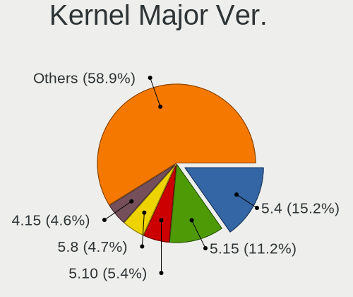
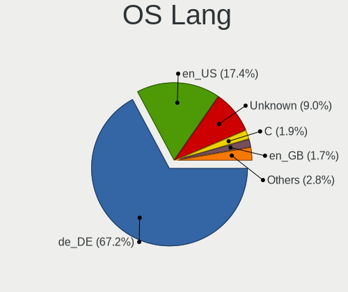
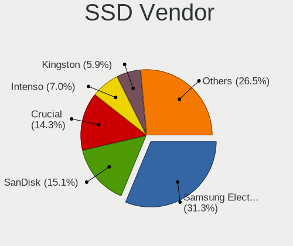
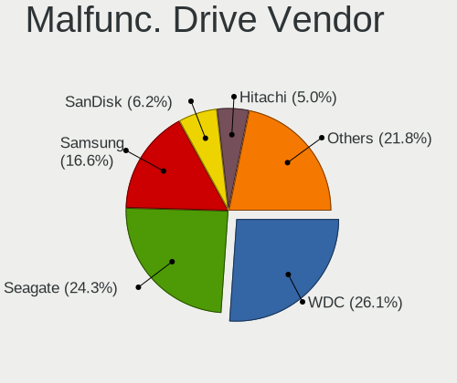
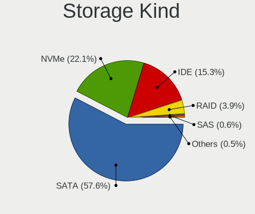
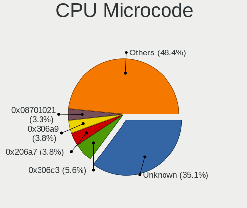

Linux in Germany - Tested Hardware & Statistics (Desktops)
----------------------------------------------------------

A project to collect tested hardware configurations for Linux in Germany.

Anyone can contribute to this report by the [hw-probe](https://github.com/linuxhw/hw-probe) tool:

    sudo -E hw-probe -all -upload

Please contribute! Especially if your hardware is rare.

Contents
--------

* [ Test Cases ](#test-cases)

* [ System ](#system)
  - [ OS                       ](#os)
  - [ OS Family                ](#os-family)
  - [ Kernel                   ](#kernel)
  - [ Kernel Family            ](#kernel-family)
  - [ Kernel Major Ver.        ](#kernel-major-ver)
  - [ Arch                     ](#arch)
  - [ DE                       ](#de)
  - [ Display Server           ](#display-server)
  - [ Display Manager          ](#display-manager)
  - [ OS Lang                  ](#os-lang)
  - [ Boot Mode                ](#boot-mode)
  - [ Filesystem               ](#filesystem)
  - [ Part. scheme             ](#part-scheme)
  - [ Dual Boot with Linux/BSD ](#dual-boot-with-linuxbsd)
  - [ Dual Boot (Win)          ](#dual-boot-win)

* [ Board ](#board)
  - [ Vendor                   ](#vendor)
  - [ Model                    ](#model)
  - [ Model Family             ](#model-family)
  - [ MFG Year                 ](#mfg-year)
  - [ Form Factor              ](#form-factor)
  - [ Secure Boot              ](#secure-boot)
  - [ Coreboot                 ](#coreboot)
  - [ RAM Size                 ](#ram-size)
  - [ RAM Used                 ](#ram-used)
  - [ Total Drives             ](#total-drives)
  - [ Has CD-ROM               ](#has-cd-rom)
  - [ Has Ethernet             ](#has-ethernet)
  - [ Has WiFi                 ](#has-wifi)
  - [ Has Bluetooth            ](#has-bluetooth)

* [ Location ](#location)
  - [ Country                  ](#country)
  - [ City                     ](#city)

* [ Drives ](#drives)
  - [ Drive Vendor             ](#drive-vendor)
  - [ Drive Model              ](#drive-model)
  - [ HDD Vendor               ](#hdd-vendor)
  - [ SSD Vendor               ](#ssd-vendor)
  - [ Drive Kind               ](#drive-kind)
  - [ Drive Connector          ](#drive-connector)
  - [ Drive Size               ](#drive-size)
  - [ Space Total              ](#space-total)
  - [ Space Used               ](#space-used)
  - [ Malfunc. Drives          ](#malfunc-drives)
  - [ Malfunc. Drive Vendor    ](#malfunc-drive-vendor)
  - [ Malfunc. HDD Vendor      ](#malfunc-hdd-vendor)
  - [ Malfunc. Drive Kind      ](#malfunc-drive-kind)
  - [ Failed Drives            ](#failed-drives)
  - [ Failed Drive Vendor      ](#failed-drive-vendor)
  - [ Drive Status             ](#drive-status)

* [ Storage controller ](#storage-controller)
  - [ Storage Vendor           ](#storage-vendor)
  - [ Storage Model            ](#storage-model)
  - [ Storage Kind             ](#storage-kind)

* [ Processor ](#processor)
  - [ CPU Vendor               ](#cpu-vendor)
  - [ CPU Model                ](#cpu-model)
  - [ CPU Model Family         ](#cpu-model-family)
  - [ CPU Cores                ](#cpu-cores)
  - [ CPU Sockets              ](#cpu-sockets)
  - [ CPU Threads              ](#cpu-threads)
  - [ CPU Op-Modes             ](#cpu-op-modes)
  - [ CPU Microcode            ](#cpu-microcode)
  - [ CPU Microarch            ](#cpu-microarch)

* [ Graphics ](#graphics)
  - [ GPU Vendor               ](#gpu-vendor)
  - [ GPU Model                ](#gpu-model)
  - [ GPU Combo                ](#gpu-combo)
  - [ GPU Driver               ](#gpu-driver)
  - [ GPU Memory               ](#gpu-memory)

* [ Monitor ](#monitor)
  - [ Monitor Vendor           ](#monitor-vendor)
  - [ Monitor Model            ](#monitor-model)
  - [ Monitor Resolution       ](#monitor-resolution)
  - [ Monitor Diagonal         ](#monitor-diagonal)
  - [ Monitor Width            ](#monitor-width)
  - [ Aspect Ratio             ](#aspect-ratio)
  - [ Monitor Area             ](#monitor-area)
  - [ Pixel Density            ](#pixel-density)
  - [ Multiple Monitors        ](#multiple-monitors)

* [ Network ](#network)
  - [ Net Controller Vendor    ](#net-controller-vendor)
  - [ Net Controller Model     ](#net-controller-model)
  - [ Wireless Vendor          ](#wireless-vendor)
  - [ Wireless Model           ](#wireless-model)
  - [ Ethernet Vendor          ](#ethernet-vendor)
  - [ Ethernet Model           ](#ethernet-model)
  - [ Net Controller Kind      ](#net-controller-kind)
  - [ Used Controller          ](#used-controller)
  - [ NICs                     ](#nics)
  - [ IPv6                     ](#ipv6)

* [ Bluetooth ](#bluetooth)
  - [ Bluetooth Vendor         ](#bluetooth-vendor)
  - [ Bluetooth Model          ](#bluetooth-model)

* [ Sound ](#sound)
  - [ Sound Vendor             ](#sound-vendor)
  - [ Sound Model              ](#sound-model)

* [ Memory ](#memory)
  - [ Memory Vendor            ](#memory-vendor)
  - [ Memory Model             ](#memory-model)
  - [ Memory Kind              ](#memory-kind)
  - [ Memory Form Factor       ](#memory-form-factor)
  - [ Memory Size              ](#memory-size)
  - [ Memory Speed             ](#memory-speed)

* [ Printers & scanners ](#printers--scanners)
  - [ Printer Vendor           ](#printer-vendor)
  - [ Printer Model            ](#printer-model)
  - [ Scanner Vendor           ](#scanner-vendor)
  - [ Scanner Model            ](#scanner-model)

* [ Camera ](#camera)
  - [ Camera Vendor            ](#camera-vendor)
  - [ Camera Model             ](#camera-model)

* [ Security ](#security)
  - [ Fingerprint Vendor       ](#fingerprint-vendor)
  - [ Fingerprint Model        ](#fingerprint-model)
  - [ Chipcard Vendor          ](#chipcard-vendor)
  - [ Chipcard Model           ](#chipcard-model)

* [ Unsupported ](#unsupported)
  - [ Unsupported Devices      ](#unsupported-devices)
  - [ Unsupported Device Types ](#unsupported-device-types)

Test Cases
----------

Total: 15104

| Vendor        | Model                       | Probe                                                      | Date         |
|---------------|-----------------------------|------------------------------------------------------------|--------------|
| ASRock        | H61M-DGS R2.0               | [47be7b76e5](https://linux-hardware.org/?probe=47be7b76e5) | May 09, 2024 |
| ASRock        | B550M Phantom Gaming 4      | [f8574bdf3e](https://linux-hardware.org/?probe=f8574bdf3e) | May 09, 2024 |
| MSI           | MAG B460M MORTAR WIFI       | [d35204127f](https://linux-hardware.org/?probe=d35204127f) | May 09, 2024 |
| MSI           | B450M MORTAR MAX            | [51a4eae4e1](https://linux-hardware.org/?probe=51a4eae4e1) | May 09, 2024 |
| ASRock        | B550M Phantom Gaming 4      | [8210b8f2f9](https://linux-hardware.org/?probe=8210b8f2f9) | May 08, 2024 |
| Gigabyte      | B550 AORUS ELITE V2         | [ab440c0aca](https://linux-hardware.org/?probe=ab440c0aca) | May 08, 2024 |
| MSI           | MS-7255                     | [5e4c3d17d6](https://linux-hardware.org/?probe=5e4c3d17d6) | May 08, 2024 |
| ASUSTek       | PRIME X370-PRO              | [54f40400ed](https://linux-hardware.org/?probe=54f40400ed) | May 08, 2024 |
| ASUSTek       | PRIME A520M-K               | [5de84bcb38](https://linux-hardware.org/?probe=5de84bcb38) | May 08, 2024 |
| ASUSTek       | P8Z77-V LX                  | [b245c99221](https://linux-hardware.org/?probe=b245c99221) | May 07, 2024 |
| Fujitsu       | D3544-A1 S26361-D3544-A1... | [e04c4654da](https://linux-hardware.org/?probe=e04c4654da) | May 07, 2024 |
| Acer          | Veriton N4640G              | [44c62400f4](https://linux-hardware.org/?probe=44c62400f4) | May 07, 2024 |
| Acer          | Veriton N4640G              | [ebe4fa74ca](https://linux-hardware.org/?probe=ebe4fa74ca) | May 07, 2024 |
| PELADN        | WI-6                        | [73069ab9f5](https://linux-hardware.org/?probe=73069ab9f5) | May 07, 2024 |
| ASRock        | FM2A88X Extreme6+           | [d12f9a31f3](https://linux-hardware.org/?probe=d12f9a31f3) | May 07, 2024 |
| ASRock        | J3710M                      | [ff2b73c846](https://linux-hardware.org/?probe=ff2b73c846) | May 06, 2024 |
| Fujitsu       | D3164-A1 S26361-D3164-A1    | [ae1edad2ab](https://linux-hardware.org/?probe=ae1edad2ab) | May 06, 2024 |
| ASUSTek       | TUF Gaming B650M-PLUS       | [0e930ac423](https://linux-hardware.org/?probe=0e930ac423) | May 06, 2024 |
| ASUSTek       | PRIME A520M-K               | [602683adef](https://linux-hardware.org/?probe=602683adef) | May 06, 2024 |
| ASUSTek       | TUF B350M-PLUS GAMING       | [e31ea5ab17](https://linux-hardware.org/?probe=e31ea5ab17) | May 06, 2024 |
| Dell          | 0F642F A00                  | [fc2a825e57](https://linux-hardware.org/?probe=fc2a825e57) | May 06, 2024 |
| ASUSTek       | H97-PLUS                    | [4f4fcced1c](https://linux-hardware.org/?probe=4f4fcced1c) | May 06, 2024 |
| ASUSTek       | TUF Gaming X570-PLUS        | [29af407035](https://linux-hardware.org/?probe=29af407035) | May 05, 2024 |
| Gigabyte      | B85M-D3H                    | [1d637d8802](https://linux-hardware.org/?probe=1d637d8802) | May 05, 2024 |
| MSI           | MPG B550 GAMING PLUS        | [dd1cdce5af](https://linux-hardware.org/?probe=dd1cdce5af) | May 05, 2024 |
| ASUSTek       | ROG STRIX B650E-E GAMING... | [14b56b3e78](https://linux-hardware.org/?probe=14b56b3e78) | May 05, 2024 |
| MSI           | H110M ECO                   | [2c97e6ca20](https://linux-hardware.org/?probe=2c97e6ca20) | May 05, 2024 |
| ASUSTek       | PRIME B450-PLUS             | [4c7d6f1e6a](https://linux-hardware.org/?probe=4c7d6f1e6a) | May 05, 2024 |
| Gigabyte      | B450M GAMING                | [dc7364667b](https://linux-hardware.org/?probe=dc7364667b) | May 05, 2024 |
| HP            | 806A                        | [d28c449530](https://linux-hardware.org/?probe=d28c449530) | May 05, 2024 |
| Gigabyte      | Z390 UD                     | [af2a20709c](https://linux-hardware.org/?probe=af2a20709c) | May 05, 2024 |
| ASUSTek       | TUF Gaming B550-PLUS WIF... | [9176ad5eb1](https://linux-hardware.org/?probe=9176ad5eb1) | May 04, 2024 |
| Dell          | 0R6PCT A01                  | [61f596b724](https://linux-hardware.org/?probe=61f596b724) | May 04, 2024 |
| HP            | 83E9                        | [d14ba283d6](https://linux-hardware.org/?probe=d14ba283d6) | May 04, 2024 |
| ASRock        | B650E PG Riptide WiFi       | [3c5e2db28c](https://linux-hardware.org/?probe=3c5e2db28c) | May 04, 2024 |
| ASRock        | A520M-HVS                   | [59c3452245](https://linux-hardware.org/?probe=59c3452245) | May 04, 2024 |
| ASUSTek       | PRIME A320M-K               | [79a0169068](https://linux-hardware.org/?probe=79a0169068) | May 04, 2024 |
| AMI           | Intel                       | [84952c85f7](https://linux-hardware.org/?probe=84952c85f7) | May 04, 2024 |
| Gigabyte      | Z690 AORUS ELITE DDR4       | [055f5e4645](https://linux-hardware.org/?probe=055f5e4645) | May 04, 2024 |
| HP            | 18E7                        | [22c3e77e54](https://linux-hardware.org/?probe=22c3e77e54) | May 03, 2024 |
| MSI           | B450 GAMING PRO CARBON A... | [9101a05646](https://linux-hardware.org/?probe=9101a05646) | May 03, 2024 |
| Gigabyte      | Z170X-Gaming 7              | [ce86347dd1](https://linux-hardware.org/?probe=ce86347dd1) | May 03, 2024 |
| ASRock        | X370 Taichi                 | [08bb9f240a](https://linux-hardware.org/?probe=08bb9f240a) | May 03, 2024 |
| Gigabyte      | Z690 AORUS ELITE DDR4       | [82d8781e9b](https://linux-hardware.org/?probe=82d8781e9b) | May 03, 2024 |
| ASRock        | Z77 WS                      | [8a8bbdb0fe](https://linux-hardware.org/?probe=8a8bbdb0fe) | May 03, 2024 |
| ASUSTek       | M5A99X EVO                  | [9d375acdb0](https://linux-hardware.org/?probe=9d375acdb0) | May 03, 2024 |
| ASRock        | FM2A88X Extreme4+           | [64005c86c7](https://linux-hardware.org/?probe=64005c86c7) | May 02, 2024 |
| Acer          | EG43M                       | [2ec9d89dd5](https://linux-hardware.org/?probe=2ec9d89dd5) | May 02, 2024 |
| Acer          | EG43M                       | [066562b548](https://linux-hardware.org/?probe=066562b548) | May 02, 2024 |
| Gigabyte      | 945GM-S2                    | [a0e44d4417](https://linux-hardware.org/?probe=a0e44d4417) | May 02, 2024 |
| ASRock        | Z270 Extreme4               | [7e548f1855](https://linux-hardware.org/?probe=7e548f1855) | May 02, 2024 |
| Gigabyte      | AX370-Gaming K7             | [e759e41a51](https://linux-hardware.org/?probe=e759e41a51) | May 01, 2024 |
| American M... | E5 Ver:3.2S                 | [748bf7d3e8](https://linux-hardware.org/?probe=748bf7d3e8) | May 01, 2024 |
| ASRock        | Q1900M                      | [edec3b8384](https://linux-hardware.org/?probe=edec3b8384) | May 01, 2024 |
| Unknown       | Unknown                     | [4b7050ad24](https://linux-hardware.org/?probe=4b7050ad24) | May 01, 2024 |
| AMI           | Intel                       | [0be237c95a](https://linux-hardware.org/?probe=0be237c95a) | May 01, 2024 |
| PC Engines    | APU2                        | [a73d02f1d2](https://linux-hardware.org/?probe=a73d02f1d2) | May 01, 2024 |
| PC Engines    | APU2                        | [218aeb1d8f](https://linux-hardware.org/?probe=218aeb1d8f) | May 01, 2024 |
| MSI           | B450M MORTAR MAX            | [527f3123a6](https://linux-hardware.org/?probe=527f3123a6) | May 01, 2024 |
| Lenovo        | 36E7 SDK0J40700 WIN 3258... | [03d6226580](https://linux-hardware.org/?probe=03d6226580) | May 01, 2024 |
| HP            | 18E7                        | [f98543789e](https://linux-hardware.org/?probe=f98543789e) | May 01, 2024 |
| ASUSTek       | ROG STRIX Z390-E GAMING     | [e04f6d1c77](https://linux-hardware.org/?probe=e04f6d1c77) | Apr 30, 2024 |
| Medion        | B360H4-EM V1.0              | [1dce3c5ac9](https://linux-hardware.org/?probe=1dce3c5ac9) | Apr 30, 2024 |
| HP            | 828A                        | [2c199ea595](https://linux-hardware.org/?probe=2c199ea595) | Apr 30, 2024 |
| MSI           | A320M-A PRO                 | [da0306ed47](https://linux-hardware.org/?probe=da0306ed47) | Apr 30, 2024 |
| HP            | 83E1                        | [56debab2d5](https://linux-hardware.org/?probe=56debab2d5) | Apr 30, 2024 |
| Gigabyte      | Z790 UD                     | [64ccf744b7](https://linux-hardware.org/?probe=64ccf744b7) | Apr 30, 2024 |
| ASUSTek       | TUF B450M-PRO GAMING        | [e442e79602](https://linux-hardware.org/?probe=e442e79602) | Apr 30, 2024 |
| Unknown       | Unknown                     | [ac60c18ae7](https://linux-hardware.org/?probe=ac60c18ae7) | Apr 30, 2024 |
| ASUSTek       | ROG CROSSHAIR VII HERO      | [d78b88c308](https://linux-hardware.org/?probe=d78b88c308) | Apr 29, 2024 |
| ASUSTek       | ROG CROSSHAIR VII HERO      | [8b2208ed39](https://linux-hardware.org/?probe=8b2208ed39) | Apr 29, 2024 |
| NCR           | Pocono                      | [b0073723fe](https://linux-hardware.org/?probe=b0073723fe) | Apr 29, 2024 |
| ASUSTek       | P8H61-I R2.0                | [2e6e9ca3ee](https://linux-hardware.org/?probe=2e6e9ca3ee) | Apr 29, 2024 |
| HP            | 3647h                       | [1c095b792f](https://linux-hardware.org/?probe=1c095b792f) | Apr 29, 2024 |
| ASUSTek       | M5A99X EVO                  | [aedd483ccc](https://linux-hardware.org/?probe=aedd483ccc) | Apr 29, 2024 |
| ASUSTek       | F2A85-M_PRO                 | [b4beb034b2](https://linux-hardware.org/?probe=b4beb034b2) | Apr 29, 2024 |
| Medion        | TJ4125                      | [5107c56945](https://linux-hardware.org/?probe=5107c56945) | Apr 29, 2024 |
| HP            | 82A2                        | [d9af0d7008](https://linux-hardware.org/?probe=d9af0d7008) | Apr 29, 2024 |
| Gigabyte      | GA-880GM-USB3               | [3645662c80](https://linux-hardware.org/?probe=3645662c80) | Apr 29, 2024 |
| MSI           | X570-A PRO                  | [8495c2639d](https://linux-hardware.org/?probe=8495c2639d) | Apr 29, 2024 |
| ASRock        | B450M Pro4                  | [96fbd89691](https://linux-hardware.org/?probe=96fbd89691) | Apr 29, 2024 |
| ASUSTek       | PRIME H770-PLUS D4          | [d05be00e83](https://linux-hardware.org/?probe=d05be00e83) | Apr 28, 2024 |
| MSI           | A68HM GRENADE               | [c1a1b60624](https://linux-hardware.org/?probe=c1a1b60624) | Apr 28, 2024 |
| MSI           | FM2-A75MA-E35               | [9ab41ba299](https://linux-hardware.org/?probe=9ab41ba299) | Apr 28, 2024 |
| Unknown       | Unknown                     | [8b5d3a333e](https://linux-hardware.org/?probe=8b5d3a333e) | Apr 28, 2024 |
| ASRock        | 980DE3/U3S3                 | [9ed5c55a61](https://linux-hardware.org/?probe=9ed5c55a61) | Apr 28, 2024 |
| Gigabyte      | GA-880GM-USB3               | [ae905aacaf](https://linux-hardware.org/?probe=ae905aacaf) | Apr 28, 2024 |
| ASRock        | B760M-HDV/M.2               | [01633e2e6d](https://linux-hardware.org/?probe=01633e2e6d) | Apr 28, 2024 |
| ASRock        | B760M-HDV/M.2               | [324ac4ff48](https://linux-hardware.org/?probe=324ac4ff48) | Apr 27, 2024 |
| HP            | 2187 A01                    | [5aad523baf](https://linux-hardware.org/?probe=5aad523baf) | Apr 27, 2024 |
| ASUSTek       | TUF Gaming A620M-PLUS WI... | [f5547c4f67](https://linux-hardware.org/?probe=f5547c4f67) | Apr 27, 2024 |
| Gigabyte      | B550M DS3H                  | [158b44fbb4](https://linux-hardware.org/?probe=158b44fbb4) | Apr 27, 2024 |
| Gigabyte      | B550M DS3H                  | [12aab4742e](https://linux-hardware.org/?probe=12aab4742e) | Apr 27, 2024 |
| MSI           | MAG B650 TOMAHAWK WIFI      | [ed27359470](https://linux-hardware.org/?probe=ed27359470) | Apr 27, 2024 |
| Dell          | 0W0CHX A00                  | [9da5e84704](https://linux-hardware.org/?probe=9da5e84704) | Apr 27, 2024 |
| Dell          | 0W0CHX A00                  | [dd4600928f](https://linux-hardware.org/?probe=dd4600928f) | Apr 27, 2024 |
| ASUSTek       | PRIME A320M-K               | [64c6882150](https://linux-hardware.org/?probe=64c6882150) | Apr 27, 2024 |
| Dell          | 0T10XW A02                  | [5836e0e02a](https://linux-hardware.org/?probe=5836e0e02a) | Apr 27, 2024 |
| ASUSTek       | PRIME B350-PLUS             | [3bd346f0cf](https://linux-hardware.org/?probe=3bd346f0cf) | Apr 27, 2024 |
| MSI           | B550-A PRO                  | [083c88fe82](https://linux-hardware.org/?probe=083c88fe82) | Apr 26, 2024 |
| Lenovo        | 3102 SDK0J40697 WIN 3305... | [d378d3e2a8](https://linux-hardware.org/?probe=d378d3e2a8) | Apr 26, 2024 |
| ASUSTek       | TUF Gaming Z590-PLUS WIF... | [e32fd35808](https://linux-hardware.org/?probe=e32fd35808) | Apr 26, 2024 |
| Fujitsu       | D3348-B1 S26361-D3348-B1    | [7dec9416f7](https://linux-hardware.org/?probe=7dec9416f7) | Apr 26, 2024 |
| Fujitsu       | D3348-B1 S26361-D3348-B1    | [3d1b636742](https://linux-hardware.org/?probe=3d1b636742) | Apr 26, 2024 |
| Gigabyte      | B550 GAMING X V2            | [29da9c39e9](https://linux-hardware.org/?probe=29da9c39e9) | Apr 25, 2024 |
| ASUSTek       | PRIME B450M-K II            | [5e0533ba7a](https://linux-hardware.org/?probe=5e0533ba7a) | Apr 25, 2024 |
| ASUSTek       | P8B WS                      | [5fa13cfb75](https://linux-hardware.org/?probe=5fa13cfb75) | Apr 25, 2024 |
| ASUSTek       | P8Z77-V LX                  | [4b42dd83cd](https://linux-hardware.org/?probe=4b42dd83cd) | Apr 24, 2024 |
| ASUSTek       | M5A97 R2.0                  | [f1a984f467](https://linux-hardware.org/?probe=f1a984f467) | Apr 24, 2024 |
| MSI           | MAG B650M MORTAR WIFI       | [d4c46c8278](https://linux-hardware.org/?probe=d4c46c8278) | Apr 24, 2024 |
| ASUSTek       | PRIME H510M-A               | [a0eca89d4e](https://linux-hardware.org/?probe=a0eca89d4e) | Apr 24, 2024 |
| ASUSTek       | H81M-PLUS                   | [b170729452](https://linux-hardware.org/?probe=b170729452) | Apr 24, 2024 |
| ASRock        | B450M Pro4 R2.0             | [188e5e5bde](https://linux-hardware.org/?probe=188e5e5bde) | Apr 24, 2024 |
| ASRock        | B550M-HDV                   | [a3fef16e3a](https://linux-hardware.org/?probe=a3fef16e3a) | Apr 24, 2024 |
| ASUSTek       | PRIME N100I-D D4            | [d6c9b24678](https://linux-hardware.org/?probe=d6c9b24678) | Apr 24, 2024 |
| ASUSTek       | P8B75-M LX                  | [addc5b5356](https://linux-hardware.org/?probe=addc5b5356) | Apr 24, 2024 |
| Gigabyte      | B660 GAMING X DDR4          | [2894e9f653](https://linux-hardware.org/?probe=2894e9f653) | Apr 23, 2024 |
| ASRock        | B660M-ITX/ac                | [7bcb91a927](https://linux-hardware.org/?probe=7bcb91a927) | Apr 23, 2024 |
| Gigabyte      | B660 GAMING X DDR4          | [cd7b10e8c0](https://linux-hardware.org/?probe=cd7b10e8c0) | Apr 23, 2024 |
| Fujitsu       | D3061-B1 S26361-D3061-B1    | [7d7fda2b7a](https://linux-hardware.org/?probe=7d7fda2b7a) | Apr 23, 2024 |
| Gigabyte      | Z790 AERO G                 | [8ef54b37b2](https://linux-hardware.org/?probe=8ef54b37b2) | Apr 23, 2024 |
| Biostar       | A960D+V2                    | [e6d3b07d8e](https://linux-hardware.org/?probe=e6d3b07d8e) | Apr 23, 2024 |
| ASUSTek       | PRIME X470-PRO              | [e86b7c32f6](https://linux-hardware.org/?probe=e86b7c32f6) | Apr 23, 2024 |
| ASUSTek       | A68HM-PLUS                  | [c495b7e3d7](https://linux-hardware.org/?probe=c495b7e3d7) | Apr 23, 2024 |
| ASUSTek       | CROSSHAIR V FORMULA-Z       | [f80ac54e1e](https://linux-hardware.org/?probe=f80ac54e1e) | Apr 23, 2024 |
| Fujitsu Si... | MS-7504VP-PV                | [e9d468f027](https://linux-hardware.org/?probe=e9d468f027) | Apr 23, 2024 |
| MSI           | MPG B550 GAMING PLUS        | [02cbf8c1ed](https://linux-hardware.org/?probe=02cbf8c1ed) | Apr 22, 2024 |
| MSI           | A320M PRO-VD/S              | [64c7f84ead](https://linux-hardware.org/?probe=64c7f84ead) | Apr 22, 2024 |
| ASUSTek       | ROG STRIX Z390-E GAMING     | [00dea34dc8](https://linux-hardware.org/?probe=00dea34dc8) | Apr 22, 2024 |
| ASUSTek       | Pro WS X570-ACE             | [164050cba4](https://linux-hardware.org/?probe=164050cba4) | Apr 22, 2024 |
| MSI           | MPG B650I EDGE WIFI         | [2655453b82](https://linux-hardware.org/?probe=2655453b82) | Apr 22, 2024 |
| HP            | 1497                        | [067e8422b4](https://linux-hardware.org/?probe=067e8422b4) | Apr 21, 2024 |
| Gigabyte      | Z390 UD                     | [60d76632dc](https://linux-hardware.org/?probe=60d76632dc) | Apr 21, 2024 |
| Gigabyte      | MZAPLBP-00                  | [8efe3f3d72](https://linux-hardware.org/?probe=8efe3f3d72) | Apr 21, 2024 |
| MSI           | PRO Z690-A DDR4             | [f426cfb62e](https://linux-hardware.org/?probe=f426cfb62e) | Apr 21, 2024 |
| ASUSTek       | PRIME X370-PRO              | [a4e68832be](https://linux-hardware.org/?probe=a4e68832be) | Apr 21, 2024 |
| ASUSTek       | TUF Gaming B550M-PLUS WI... | [66ef509347](https://linux-hardware.org/?probe=66ef509347) | Apr 21, 2024 |
| ASRock        | FM2A68M-HD+                 | [055514e3cc](https://linux-hardware.org/?probe=055514e3cc) | Apr 20, 2024 |
| ASUSTek       | TUF Gaming B760M-PLUS II    | [9666b7dd0c](https://linux-hardware.org/?probe=9666b7dd0c) | Apr 20, 2024 |
| Gigabyte      | B85-HD3                     | [110fafe0b0](https://linux-hardware.org/?probe=110fafe0b0) | Apr 20, 2024 |
| ASUSTek       | H110M-PLUS                  | [98eba50e5b](https://linux-hardware.org/?probe=98eba50e5b) | Apr 20, 2024 |
| ASUSTek       | ROG STRIX B650E-E GAMING... | [7c9a2419bf](https://linux-hardware.org/?probe=7c9a2419bf) | Apr 20, 2024 |
| ASUSTek       | P5G41T-M LX2/GB             | [9834b68734](https://linux-hardware.org/?probe=9834b68734) | Apr 20, 2024 |
| Supermicro    | X9DRi-LN4+/X9DR3-LN4+       | [2bbb8098a6](https://linux-hardware.org/?probe=2bbb8098a6) | Apr 20, 2024 |
| Fujitsu       | D3417-B1 S26361-D3417-B1    | [f0e2928850](https://linux-hardware.org/?probe=f0e2928850) | Apr 20, 2024 |
| ASUSTek       | TUF Z370-PLUS GAMING        | [542fb126b0](https://linux-hardware.org/?probe=542fb126b0) | Apr 20, 2024 |
| Foxconn       | G41MX/G41MX-K 2.0 1.0       | [a55114abfa](https://linux-hardware.org/?probe=a55114abfa) | Apr 19, 2024 |
| Gigabyte      | Z370 HD3-OP-CF              | [0f88ddd572](https://linux-hardware.org/?probe=0f88ddd572) | Apr 19, 2024 |
| ASUSTek       | P8H67-M PRO                 | [46ac746bf3](https://linux-hardware.org/?probe=46ac746bf3) | Apr 19, 2024 |
| ASUSTek       | A68HM-PLUS                  | [94cd362057](https://linux-hardware.org/?probe=94cd362057) | Apr 19, 2024 |
| Gigabyte      | B650E AORUS MASTER          | [4301ea7b67](https://linux-hardware.org/?probe=4301ea7b67) | Apr 18, 2024 |
| Medion        | MS-7728                     | [32c28c5a59](https://linux-hardware.org/?probe=32c28c5a59) | Apr 18, 2024 |
| Unknown       | i855-W83627HF               | [e1c3562c4a](https://linux-hardware.org/?probe=e1c3562c4a) | Apr 18, 2024 |
| Gigabyte      | GA-870A-UD3                 | [7cd79d20e0](https://linux-hardware.org/?probe=7cd79d20e0) | Apr 18, 2024 |
| ASRock        | A520M-HVS                   | [d1a1528321](https://linux-hardware.org/?probe=d1a1528321) | Apr 18, 2024 |
| Medion        | TJ4125                      | [283e08c36b](https://linux-hardware.org/?probe=283e08c36b) | Apr 18, 2024 |
| ASRock        | A520M-HVS                   | [0a2d73cc82](https://linux-hardware.org/?probe=0a2d73cc82) | Apr 18, 2024 |
| ASUSTek       | W680/MB DC                  | [85352380c6](https://linux-hardware.org/?probe=85352380c6) | Apr 18, 2024 |
| HP            | 8055                        | [c30b60c56d](https://linux-hardware.org/?probe=c30b60c56d) | Apr 18, 2024 |
| ASUSTek       | ROG STRIX B450-F GAMING     | [91410dd38c](https://linux-hardware.org/?probe=91410dd38c) | Apr 18, 2024 |
| ASUSTek       | Pro WS 665-ACE              | [f895b19d4c](https://linux-hardware.org/?probe=f895b19d4c) | Apr 18, 2024 |
| ASUSTek       | Pro WS 665-ACE              | [e5e21c8cb2](https://linux-hardware.org/?probe=e5e21c8cb2) | Apr 18, 2024 |
| ASUSTek       | PRIME X570-P                | [e7bc6ac35e](https://linux-hardware.org/?probe=e7bc6ac35e) | Apr 17, 2024 |
| Gigabyte      | P55-UD4                     | [fb43a8d266](https://linux-hardware.org/?probe=fb43a8d266) | Apr 17, 2024 |
| ASRock        | X670E Taichi                | [aebc928b10](https://linux-hardware.org/?probe=aebc928b10) | Apr 17, 2024 |
| Gigabyte      | Z370M D3H-CF                | [f14f8b8b13](https://linux-hardware.org/?probe=f14f8b8b13) | Apr 17, 2024 |
| ASUSTek       | A68HM-PLUS                  | [ff144e4ebc](https://linux-hardware.org/?probe=ff144e4ebc) | Apr 17, 2024 |
| HP            | 1495                        | [cd403691ad](https://linux-hardware.org/?probe=cd403691ad) | Apr 16, 2024 |
| GEEKOM        | Mini IT12                   | [fd2c385c1b](https://linux-hardware.org/?probe=fd2c385c1b) | Apr 16, 2024 |
| ASUSTek       | P6T SE                      | [31a598cb35](https://linux-hardware.org/?probe=31a598cb35) | Apr 16, 2024 |
| ASUSTek       | P7H55-M                     | [f4c4f689d2](https://linux-hardware.org/?probe=f4c4f689d2) | Apr 16, 2024 |
| ASUSTek       | H87-PLUS                    | [7da05aaadf](https://linux-hardware.org/?probe=7da05aaadf) | Apr 16, 2024 |
| Gigabyte      | 945GM-S2                    | [b7a1a47f74](https://linux-hardware.org/?probe=b7a1a47f74) | Apr 15, 2024 |
| ASUSTek       | M4A78LT-M                   | [529b10fee7](https://linux-hardware.org/?probe=529b10fee7) | Apr 15, 2024 |
| MSI           | PRO Z690-A                  | [d84c8bfb91](https://linux-hardware.org/?probe=d84c8bfb91) | Apr 15, 2024 |
| MSI           | MS-7501                     | [8f30f794e5](https://linux-hardware.org/?probe=8f30f794e5) | Apr 14, 2024 |
| Intel         | H61M-S2PV                   | [5f788a9df0](https://linux-hardware.org/?probe=5f788a9df0) | Apr 14, 2024 |
| ASUSTek       | CROSSHAIR VI HERO           | [5b1221e03a](https://linux-hardware.org/?probe=5b1221e03a) | Apr 14, 2024 |
| Gigabyte      | B550 AORUS ELITE V2         | [026488f4e9](https://linux-hardware.org/?probe=026488f4e9) | Apr 14, 2024 |
| Fujitsu       | D3222-A1 S26361-D3222-A1    | [74d9844cb6](https://linux-hardware.org/?probe=74d9844cb6) | Apr 14, 2024 |
| ASUSTek       | P10S-I Series               | [c0afefe9bc](https://linux-hardware.org/?probe=c0afefe9bc) | Apr 14, 2024 |
| ASUSTek       | ROG STRIX B450-F GAMING     | [a829e68e1f](https://linux-hardware.org/?probe=a829e68e1f) | Apr 14, 2024 |
| ASUSTek       | PRIME B550-PLUS             | [fc7619c19b](https://linux-hardware.org/?probe=fc7619c19b) | Apr 14, 2024 |
| NZXT          | N7 B550                     | [4a8cd3ae3d](https://linux-hardware.org/?probe=4a8cd3ae3d) | Apr 13, 2024 |
| Foxconn       | G41MX/G41MX-K 2.0 1.0       | [b003cebf01](https://linux-hardware.org/?probe=b003cebf01) | Apr 13, 2024 |
| Medion        | Z370H4-EM                   | [39cb6c0afb](https://linux-hardware.org/?probe=39cb6c0afb) | Apr 13, 2024 |
| Gigabyte      | Z370P D3-CF                 | [70446389fb](https://linux-hardware.org/?probe=70446389fb) | Apr 13, 2024 |
| ASUSTek       | Pro WS X570-ACE             | [2292771038](https://linux-hardware.org/?probe=2292771038) | Apr 13, 2024 |
| MSI           | B650 GAMING PLUS WIFI       | [49db2f183b](https://linux-hardware.org/?probe=49db2f183b) | Apr 13, 2024 |
| ASRock        | 970 Performance             | [f631fc640a](https://linux-hardware.org/?probe=f631fc640a) | Apr 13, 2024 |
| MSI           | MPG B550 GAMING PLUS        | [a996f7b2e9](https://linux-hardware.org/?probe=a996f7b2e9) | Apr 12, 2024 |
| Gigabyte      | X570 AORUS XTREME           | [f0de46fc9a](https://linux-hardware.org/?probe=f0de46fc9a) | Apr 12, 2024 |
| Gigabyte      | B550M AORUS ELITE           | [f79c4fd06b](https://linux-hardware.org/?probe=f79c4fd06b) | Apr 12, 2024 |
| Gigabyte      | GA-870A-UD3                 | [bd4be0124b](https://linux-hardware.org/?probe=bd4be0124b) | Apr 12, 2024 |
| MSI           | MPG B550 GAMING PLUS        | [9eed5870ee](https://linux-hardware.org/?probe=9eed5870ee) | Apr 12, 2024 |
| HP            | 3397                        | [878192f0bd](https://linux-hardware.org/?probe=878192f0bd) | Apr 11, 2024 |
| Fujitsu       | D3403-U1 S26361-D3403-U1    | [5757303d9a](https://linux-hardware.org/?probe=5757303d9a) | Apr 11, 2024 |
| AZW           | MINI S 10                   | [c35d67dc45](https://linux-hardware.org/?probe=c35d67dc45) | Apr 11, 2024 |
| ASRock        | H61M-DGS R2.0               | [6cc6864692](https://linux-hardware.org/?probe=6cc6864692) | Apr 11, 2024 |
| ASUSTek       | PRIME H310T R2.0            | [66cbd66636](https://linux-hardware.org/?probe=66cbd66636) | Apr 11, 2024 |
| MSI           | X299 GAMING PRO CARBON      | [3ae56d9b16](https://linux-hardware.org/?probe=3ae56d9b16) | Apr 11, 2024 |
| MSI           | A320M PRO-VD/S              | [fad7dacfc2](https://linux-hardware.org/?probe=fad7dacfc2) | Apr 10, 2024 |
| MSI           | B560M PRO                   | [8fb8045266](https://linux-hardware.org/?probe=8fb8045266) | Apr 10, 2024 |
| NCR           | Pocono                      | [fb4ef04821](https://linux-hardware.org/?probe=fb4ef04821) | Apr 10, 2024 |
| MSI           | X299 GAMING PRO CARBON      | [cabbba0b48](https://linux-hardware.org/?probe=cabbba0b48) | Apr 10, 2024 |
| ASRock        | B550M-ITX/ac                | [edf7dfcacb](https://linux-hardware.org/?probe=edf7dfcacb) | Apr 10, 2024 |
| MSI           | B560M PRO                   | [9f35872df2](https://linux-hardware.org/?probe=9f35872df2) | Apr 09, 2024 |
| ASRock        | Z87 Extreme6                | [61f216c065](https://linux-hardware.org/?probe=61f216c065) | Apr 09, 2024 |
| GEEKOM        | Mini IT12                   | [a5050366da](https://linux-hardware.org/?probe=a5050366da) | Apr 09, 2024 |
| HP            | 2215                        | [7e6e6d5a8e](https://linux-hardware.org/?probe=7e6e6d5a8e) | Apr 09, 2024 |
| ASRock        | X570 Phantom Gaming 4       | [ffd26f8255](https://linux-hardware.org/?probe=ffd26f8255) | Apr 09, 2024 |
| MSI           | Z97-G43                     | [f8d06c2432](https://linux-hardware.org/?probe=f8d06c2432) | Apr 09, 2024 |
| ASUSTek       | PRIME B350-PLUS             | [34d2175a48](https://linux-hardware.org/?probe=34d2175a48) | Apr 09, 2024 |
| Fujitsu       | D3401-H1 S26361-D3401-H1    | [2f2ae87a60](https://linux-hardware.org/?probe=2f2ae87a60) | Apr 08, 2024 |
| Gigabyte      | Q87M-D2H                    | [3d748511c8](https://linux-hardware.org/?probe=3d748511c8) | Apr 08, 2024 |
| ASUSTek       | H81M-PLUS                   | [dbecf611a8](https://linux-hardware.org/?probe=dbecf611a8) | Apr 08, 2024 |
| Unknown       | Unknown                     | [d516a5ac2d](https://linux-hardware.org/?probe=d516a5ac2d) | Apr 07, 2024 |
| Hardkernel    | ODROID-H2                   | [64075f354e](https://linux-hardware.org/?probe=64075f354e) | Apr 07, 2024 |
| Gigabyte      | B550M DS3H                  | [f57ed12779](https://linux-hardware.org/?probe=f57ed12779) | Apr 07, 2024 |
| Gigabyte      | B85M-D3H                    | [fa70861321](https://linux-hardware.org/?probe=fa70861321) | Apr 07, 2024 |
| MSI           | MEG X570 UNIFY              | [3b882c0d29](https://linux-hardware.org/?probe=3b882c0d29) | Apr 07, 2024 |
| Acer          | Aspire TC-105               | [7ecc002fc3](https://linux-hardware.org/?probe=7ecc002fc3) | Apr 07, 2024 |
| MSI           | MS-7369                     | [87eaeb2873](https://linux-hardware.org/?probe=87eaeb2873) | Apr 07, 2024 |
| PELADN        | WI-6                        | [16b9fe150d](https://linux-hardware.org/?probe=16b9fe150d) | Apr 07, 2024 |
| Packard Be... | FMCP7A-ION                  | [6416d4370c](https://linux-hardware.org/?probe=6416d4370c) | Apr 07, 2024 |
| ASUSTek       | PRIME B450-PLUS             | [5e5d778bb2](https://linux-hardware.org/?probe=5e5d778bb2) | Apr 07, 2024 |
| HP            | 2215                        | [eb7f7c122d](https://linux-hardware.org/?probe=eb7f7c122d) | Apr 07, 2024 |
| Dell          | 0F642F A00                  | [80ed0986ae](https://linux-hardware.org/?probe=80ed0986ae) | Apr 07, 2024 |
| Packard Be... | FMCP7A-ION                  | [980f8d3802](https://linux-hardware.org/?probe=980f8d3802) | Apr 07, 2024 |
| Acer          | Aspire TC-105               | [9c7c1f6869](https://linux-hardware.org/?probe=9c7c1f6869) | Apr 07, 2024 |
| ASUSTek       | M4A88T-M/USB3               | [69cf49e1b1](https://linux-hardware.org/?probe=69cf49e1b1) | Apr 07, 2024 |
| Gigabyte      | Z390 UD                     | [3378d48eb3](https://linux-hardware.org/?probe=3378d48eb3) | Apr 07, 2024 |
| ASUSTek       | PRIME B660-PLUS D4          | [92dd5d1690](https://linux-hardware.org/?probe=92dd5d1690) | Apr 07, 2024 |
| ASUSTek       | PRIME A320M-K               | [4a15d1a355](https://linux-hardware.org/?probe=4a15d1a355) | Apr 06, 2024 |
| ASUSTek       | TUF Gaming B550-PLUS        | [041f56c14b](https://linux-hardware.org/?probe=041f56c14b) | Apr 06, 2024 |
| ASUSTek       | PRIME B450-PLUS             | [f6d44a7557](https://linux-hardware.org/?probe=f6d44a7557) | Apr 06, 2024 |
| ASRock        | X570 Phantom Gaming 4       | [bc0f74721a](https://linux-hardware.org/?probe=bc0f74721a) | Apr 06, 2024 |
| MSI           | MAG B760M MORTAR WIFI       | [29e4279833](https://linux-hardware.org/?probe=29e4279833) | Apr 06, 2024 |
| Biostar       | A960D+V2                    | [1b995511d1](https://linux-hardware.org/?probe=1b995511d1) | Apr 06, 2024 |
| Unknown       | Unknown                     | [ac2a7ce77d](https://linux-hardware.org/?probe=ac2a7ce77d) | Apr 06, 2024 |
| Unknown       | Unknown                     | [1ada20ef48](https://linux-hardware.org/?probe=1ada20ef48) | Apr 06, 2024 |
| SZMZ          | X99-S3                      | [a3be3fb7ae](https://linux-hardware.org/?probe=a3be3fb7ae) | Apr 06, 2024 |
| MSI           | MAG B550M MORTAR WIFI       | [d6cd423d7a](https://linux-hardware.org/?probe=d6cd423d7a) | Apr 06, 2024 |
| Dell          | 0GY6Y8 A03                  | [1f6be3c2b9](https://linux-hardware.org/?probe=1f6be3c2b9) | Apr 06, 2024 |
| ASUSTek       | TUF Z370-PLUS GAMING        | [ec2b31f421](https://linux-hardware.org/?probe=ec2b31f421) | Apr 06, 2024 |
| ASUSTek       | VM62                        | [0c51119ff9](https://linux-hardware.org/?probe=0c51119ff9) | Apr 06, 2024 |
| MSI           | MPG X570 GAMING PLUS        | [282f54846f](https://linux-hardware.org/?probe=282f54846f) | Apr 05, 2024 |
| MSI           | MS-B9241                    | [f0b74d9e54](https://linux-hardware.org/?probe=f0b74d9e54) | Apr 05, 2024 |
| Gigabyte      | X570 AORUS PRO              | [e11774a346](https://linux-hardware.org/?probe=e11774a346) | Apr 05, 2024 |
| ASRock        | H61M-DGS R2.0               | [79f551af8b](https://linux-hardware.org/?probe=79f551af8b) | Apr 05, 2024 |
| Acer          | Veriton N4640-G2            | [b2aea55359](https://linux-hardware.org/?probe=b2aea55359) | Apr 05, 2024 |
| Dell          | 08HPGT A01                  | [355095de09](https://linux-hardware.org/?probe=355095de09) | Apr 05, 2024 |
| Dell          | 08HPGT A01                  | [8d0476dbc7](https://linux-hardware.org/?probe=8d0476dbc7) | Apr 05, 2024 |
| PELADN        | WI-6                        | [e3e158c12c](https://linux-hardware.org/?probe=e3e158c12c) | Apr 05, 2024 |
| ASRock        | X470 Master SLI             | [9738841123](https://linux-hardware.org/?probe=9738841123) | Apr 05, 2024 |
| Gigabyte      | GA-78LMT-S2 R2 sex          | [2d8c4c947f](https://linux-hardware.org/?probe=2d8c4c947f) | Apr 05, 2024 |
| Acer          | Aspire XC-710 V:1.1         | [b6e8461941](https://linux-hardware.org/?probe=b6e8461941) | Apr 05, 2024 |
| ASRock        | B450M Pro4-F                | [c70e4f20eb](https://linux-hardware.org/?probe=c70e4f20eb) | Apr 05, 2024 |
| ASRock        | Z170 Gaming K4              | [6903ba43b4](https://linux-hardware.org/?probe=6903ba43b4) | Apr 04, 2024 |
| ASUSTek       | TUF Gaming X670E-PLUS WI... | [c41b82e141](https://linux-hardware.org/?probe=c41b82e141) | Apr 04, 2024 |
| Lenovo        | 1030 SDK0E50510 WIN 2625... | [b0cc62ba97](https://linux-hardware.org/?probe=b0cc62ba97) | Apr 04, 2024 |
| Medion        | TJ4125                      | [9d159ef9de](https://linux-hardware.org/?probe=9d159ef9de) | Apr 04, 2024 |
| Medion        | TJ4125                      | [3133554055](https://linux-hardware.org/?probe=3133554055) | Apr 04, 2024 |
| ASRock        | B650E PG Riptide WiFi       | [57bfb487f6](https://linux-hardware.org/?probe=57bfb487f6) | Apr 04, 2024 |
| Gigabyte      | B85M-D3H                    | [f4641bc90c](https://linux-hardware.org/?probe=f4641bc90c) | Apr 04, 2024 |
| ASRock        | B450M Pro4                  | [1acd0f0250](https://linux-hardware.org/?probe=1acd0f0250) | Apr 04, 2024 |
| Gigabyte      | X570 AORUS MASTER           | [a9b4ee8ca9](https://linux-hardware.org/?probe=a9b4ee8ca9) | Apr 04, 2024 |
| MSI           | MAG B560 TORPEDO            | [ece27ae2f9](https://linux-hardware.org/?probe=ece27ae2f9) | Apr 03, 2024 |
| MSI           | B450-A PRO MAX              | [c7935b0d92](https://linux-hardware.org/?probe=c7935b0d92) | Apr 03, 2024 |
| Dell          | 0F642F A00                  | [4b165080d8](https://linux-hardware.org/?probe=4b165080d8) | Apr 03, 2024 |
| MSI           | MAG B560 TORPEDO            | [492005acf0](https://linux-hardware.org/?probe=492005acf0) | Apr 03, 2024 |
| ASRock        | P5B-DE                      | [bcf35bb538](https://linux-hardware.org/?probe=bcf35bb538) | Apr 03, 2024 |
| MSI           | X299 GAMING PRO CARBON      | [03b2438836](https://linux-hardware.org/?probe=03b2438836) | Apr 02, 2024 |
| ASRock        | Z97 Extreme4                | [0a83391fdb](https://linux-hardware.org/?probe=0a83391fdb) | Apr 02, 2024 |
| MSI           | X299 GAMING PRO CARBON      | [d39c4c71eb](https://linux-hardware.org/?probe=d39c4c71eb) | Apr 02, 2024 |
| Gigabyte      | B75M-D3H                    | [1fe25a96ab](https://linux-hardware.org/?probe=1fe25a96ab) | Apr 02, 2024 |
| ASUSTek       | M5A78L-M PLUS/USB3          | [f16c1fe48e](https://linux-hardware.org/?probe=f16c1fe48e) | Apr 02, 2024 |
| Gigabyte      | AX370-Gaming K7             | [bba7520a79](https://linux-hardware.org/?probe=bba7520a79) | Apr 01, 2024 |
| ASRock        | B760M Steel Legend WiFi     | [73bcf62b59](https://linux-hardware.org/?probe=73bcf62b59) | Apr 01, 2024 |
| ASUSTek       | PRIME B360-PLUS             | [1fd384a408](https://linux-hardware.org/?probe=1fd384a408) | Apr 01, 2024 |
| ASUSTek       | M5A97 R2.0                  | [bb4170e7fc](https://linux-hardware.org/?probe=bb4170e7fc) | Apr 01, 2024 |
| ASUSTek       | M5A97 R2.0                  | [9dc48f27f9](https://linux-hardware.org/?probe=9dc48f27f9) | Apr 01, 2024 |
| MSI           | X399 SLI PLUS               | [e519990ad6](https://linux-hardware.org/?probe=e519990ad6) | Apr 01, 2024 |
| ASUSTek       | TUF Gaming B450-PLUS II     | [d7f9c31025](https://linux-hardware.org/?probe=d7f9c31025) | Apr 01, 2024 |
| ASUSTek       | TUF Gaming B450-PLUS II     | [790377d8c3](https://linux-hardware.org/?probe=790377d8c3) | Apr 01, 2024 |
| Gigabyte      | B550M DS3H                  | [4eaa4702ec](https://linux-hardware.org/?probe=4eaa4702ec) | Mar 31, 2024 |
| ASUSTek       | A68HM-PLUS                  | [d346c3ccc9](https://linux-hardware.org/?probe=d346c3ccc9) | Mar 31, 2024 |
| MSI           | B350M MORTAR                | [fa958acf10](https://linux-hardware.org/?probe=fa958acf10) | Mar 31, 2024 |
| ASUSTek       | H87-PLUS                    | [a32a6e5814](https://linux-hardware.org/?probe=a32a6e5814) | Mar 31, 2024 |
| Gigabyte      | B85-HD3                     | [bd45787501](https://linux-hardware.org/?probe=bd45787501) | Mar 31, 2024 |
| ASUSTek       | M5A78L-M PLUS/USB3          | [553bf2a728](https://linux-hardware.org/?probe=553bf2a728) | Mar 31, 2024 |
| ASUSTek       | ROG Maximus XII HERO        | [ee05fe3752](https://linux-hardware.org/?probe=ee05fe3752) | Mar 31, 2024 |
| ASUSTek       | PRIME X570-PRO              | [740eb90402](https://linux-hardware.org/?probe=740eb90402) | Mar 30, 2024 |
| Gigabyte      | Z87X-UD5H-CF                | [890d342e54](https://linux-hardware.org/?probe=890d342e54) | Mar 30, 2024 |
| Gigabyte      | H87-HD3                     | [2dc48c8319](https://linux-hardware.org/?probe=2dc48c8319) | Mar 30, 2024 |
| ASRock        | B550 Steel Legend           | [80bcca8e5b](https://linux-hardware.org/?probe=80bcca8e5b) | Mar 30, 2024 |
| ASUSTek       | TUF Gaming B650M-PLUS       | [6da13432e0](https://linux-hardware.org/?probe=6da13432e0) | Mar 30, 2024 |
| MSI           | PRO Z790-P WIFI             | [b42b2b71ce](https://linux-hardware.org/?probe=b42b2b71ce) | Mar 30, 2024 |
| ASUSTek       | P8B WS                      | [774c65357c](https://linux-hardware.org/?probe=774c65357c) | Mar 30, 2024 |
| ASRock        | B650M Pro RS WiFi           | [ffda527258](https://linux-hardware.org/?probe=ffda527258) | Mar 30, 2024 |
| MSI           | B550-A PRO                  | [da4de8a0b3](https://linux-hardware.org/?probe=da4de8a0b3) | Mar 29, 2024 |
| ASUSTek       | P8H77-M PRO                 | [f30dd46998](https://linux-hardware.org/?probe=f30dd46998) | Mar 29, 2024 |
| MSI           | PRO B760-P WIFI DDR4        | [12ae68d7a3](https://linux-hardware.org/?probe=12ae68d7a3) | Mar 29, 2024 |
| Lenovo        | SHARKBAY NOK                | [14f3a55c33](https://linux-hardware.org/?probe=14f3a55c33) | Mar 29, 2024 |
| Dell          | 0478VN A00                  | [7300a27a93](https://linux-hardware.org/?probe=7300a27a93) | Mar 29, 2024 |
| ASRock        | Z790M-ITX WiFi              | [f1b559f2f5](https://linux-hardware.org/?probe=f1b559f2f5) | Mar 28, 2024 |
| ASUSTek       | PRIME B660M-K D4            | [ec561b98c0](https://linux-hardware.org/?probe=ec561b98c0) | Mar 28, 2024 |
| GEEKOM        | A5                          | [c7e07714cc](https://linux-hardware.org/?probe=c7e07714cc) | Mar 28, 2024 |
| Biostar       | A960D+V2                    | [1295e48af0](https://linux-hardware.org/?probe=1295e48af0) | Mar 28, 2024 |
| ASRock        | B550M-ITX/ac                | [82cd14327e](https://linux-hardware.org/?probe=82cd14327e) | Mar 28, 2024 |
| Lenovo        | ThinkStation S20 4157E87    | [ba8ccbd43a](https://linux-hardware.org/?probe=ba8ccbd43a) | Mar 28, 2024 |
| HP            | 2B4B                        | [d091c29c46](https://linux-hardware.org/?probe=d091c29c46) | Mar 28, 2024 |
| Acer          | Veriton N4640-G2            | [7880084088](https://linux-hardware.org/?probe=7880084088) | Mar 28, 2024 |
| ASUSTek       | PRIME B550-PLUS             | [cda6040806](https://linux-hardware.org/?probe=cda6040806) | Mar 28, 2024 |
| Gigabyte      | Q87M-D2H                    | [7de05d2618](https://linux-hardware.org/?probe=7de05d2618) | Mar 27, 2024 |
| Gigabyte      | Q87M-D2H                    | [577e8ee500](https://linux-hardware.org/?probe=577e8ee500) | Mar 27, 2024 |
| Fujitsu       | D3164-A1 S26361-D3164-A1    | [84dd1e7ebd](https://linux-hardware.org/?probe=84dd1e7ebd) | Mar 27, 2024 |
| ASRock        | Z790M-ITX WiFi              | [b6c8ed2284](https://linux-hardware.org/?probe=b6c8ed2284) | Mar 27, 2024 |
| Gigabyte      | Z77-D3H                     | [f74c46802a](https://linux-hardware.org/?probe=f74c46802a) | Mar 27, 2024 |
| ASUSTek       | M5A99X EVO R2.0             | [cffa8a89ce](https://linux-hardware.org/?probe=cffa8a89ce) | Mar 27, 2024 |
| MSI           | B450M MORTAR MAX            | [ae5952b714](https://linux-hardware.org/?probe=ae5952b714) | Mar 27, 2024 |
| ASRock        | J3455-ITX                   | [a0f0f8fc52](https://linux-hardware.org/?probe=a0f0f8fc52) | Mar 26, 2024 |
| Medion        | MS-7728                     | [240988c558](https://linux-hardware.org/?probe=240988c558) | Mar 26, 2024 |
| ASUSTek       | ROG STRIX B550-I GAMING     | [3f052410d3](https://linux-hardware.org/?probe=3f052410d3) | Mar 26, 2024 |
| MSI           | B550M PRO-VDH WIFI          | [21456be41e](https://linux-hardware.org/?probe=21456be41e) | Mar 26, 2024 |
| ASUSTek       | Pro WS X570-ACE             | [63eb2889bf](https://linux-hardware.org/?probe=63eb2889bf) | Mar 26, 2024 |
| Unknown       | Unknown                     | [e7b9242afd](https://linux-hardware.org/?probe=e7b9242afd) | Mar 26, 2024 |
| MSI           | MPG B550 GAMING PLUS        | [724ab910bd](https://linux-hardware.org/?probe=724ab910bd) | Mar 25, 2024 |
| HP            | 859C                        | [85e83d81b6](https://linux-hardware.org/?probe=85e83d81b6) | Mar 25, 2024 |
| Unknown       | Unknown                     | [e4035a3519](https://linux-hardware.org/?probe=e4035a3519) | Mar 25, 2024 |
| MSI           | MAG Z690 TOMAHAWK WIFI D... | [d108b92174](https://linux-hardware.org/?probe=d108b92174) | Mar 25, 2024 |
| Gigabyte      | Q87M-D2H                    | [14cbf1cf7d](https://linux-hardware.org/?probe=14cbf1cf7d) | Mar 25, 2024 |
| ASUSTek       | M4A87TD/USB3                | [9a817cbe67](https://linux-hardware.org/?probe=9a817cbe67) | Mar 24, 2024 |
| ASRock        | X670E Steel Legend          | [a595f178d8](https://linux-hardware.org/?probe=a595f178d8) | Mar 24, 2024 |
| ASUSTek       | P8B75-M LX                  | [ed517cdf25](https://linux-hardware.org/?probe=ed517cdf25) | Mar 24, 2024 |
| Fujitsu       | D3400-A1 S26361-D3400-A1    | [b58c3d38ef](https://linux-hardware.org/?probe=b58c3d38ef) | Mar 24, 2024 |
| GEEKOM        | Mini IT11                   | [959133190b](https://linux-hardware.org/?probe=959133190b) | Mar 24, 2024 |
| ASRock        | M3N78D FX                   | [ac75a8caa6](https://linux-hardware.org/?probe=ac75a8caa6) | Mar 24, 2024 |
| HP            | 1494                        | [21e1184473](https://linux-hardware.org/?probe=21e1184473) | Mar 24, 2024 |
| HP            | 859C                        | [01765c28f2](https://linux-hardware.org/?probe=01765c28f2) | Mar 24, 2024 |
| Gigabyte      | P43-ES3G                    | [2ad81b1242](https://linux-hardware.org/?probe=2ad81b1242) | Mar 24, 2024 |
| ASUSTek       | PRIME X370-PRO              | [1cbf811621](https://linux-hardware.org/?probe=1cbf811621) | Mar 24, 2024 |
| MSI           | Z87-G45 GAMING              | [8a396f9c6f](https://linux-hardware.org/?probe=8a396f9c6f) | Mar 24, 2024 |
| MSI           | B450 TOMAHAWK MAX           | [0defdbcedd](https://linux-hardware.org/?probe=0defdbcedd) | Mar 24, 2024 |
| PELADN        | WI-6                        | [76b4088a9e](https://linux-hardware.org/?probe=76b4088a9e) | Mar 23, 2024 |
| Fujitsu       | D3400-A1 S26361-D3400-A1    | [8ab7c6d8dc](https://linux-hardware.org/?probe=8ab7c6d8dc) | Mar 23, 2024 |
| Gigabyte      | H77-DS3H                    | [d9af37b2ce](https://linux-hardware.org/?probe=d9af37b2ce) | Mar 23, 2024 |
| MSI           | B450 TOMAHAWK MAX           | [810fea77aa](https://linux-hardware.org/?probe=810fea77aa) | Mar 23, 2024 |
| MSI           | B450-A PRO MAX              | [5448e71afb](https://linux-hardware.org/?probe=5448e71afb) | Mar 23, 2024 |
| Huanan        | X99-F8 GAMING V5.0          | [99f9849b94](https://linux-hardware.org/?probe=99f9849b94) | Mar 23, 2024 |
| ASRock        | B450M Pro4 R2.0             | [b733831ad1](https://linux-hardware.org/?probe=b733831ad1) | Mar 23, 2024 |
| Fujitsu       | D3222-A1 S26361-D3222-A1    | [c0ac754a59](https://linux-hardware.org/?probe=c0ac754a59) | Mar 23, 2024 |
| HP            | ProLiant MicroServer Gen... | [e309e43757](https://linux-hardware.org/?probe=e309e43757) | Mar 23, 2024 |
| ASRock        | B450M Pro4 R2.0             | [4d4bbd4d22](https://linux-hardware.org/?probe=4d4bbd4d22) | Mar 23, 2024 |
| ASRock        | B550 Steel Legend           | [01f9275812](https://linux-hardware.org/?probe=01f9275812) | Mar 23, 2024 |
| Maxtang       | BYT50                       | [57d132dab0](https://linux-hardware.org/?probe=57d132dab0) | Mar 23, 2024 |
| MSI           | PRO X670-P WIFI             | [a4cf76123c](https://linux-hardware.org/?probe=a4cf76123c) | Mar 23, 2024 |
| Intel         | D34010WYK H14771-303        | [4c578b4a13](https://linux-hardware.org/?probe=4c578b4a13) | Mar 23, 2024 |
| ASRock        | B650E PG Riptide WiFi       | [085d42e647](https://linux-hardware.org/?probe=085d42e647) | Mar 23, 2024 |
| Gigabyte      | B450M DS3H-CF               | [c21a61a96d](https://linux-hardware.org/?probe=c21a61a96d) | Mar 23, 2024 |
| Gigabyte      | Z390 UD                     | [9052435efd](https://linux-hardware.org/?probe=9052435efd) | Mar 23, 2024 |
| Gigabyte      | B550 AORUS ELITE V2         | [2441f80f98](https://linux-hardware.org/?probe=2441f80f98) | Mar 23, 2024 |
| Fujitsu       | D3430-A1 S26361-D3430-A1    | [d6d7a1ee5c](https://linux-hardware.org/?probe=d6d7a1ee5c) | Mar 23, 2024 |
| ASRock        | X300M-STX                   | [6a74f1f889](https://linux-hardware.org/?probe=6a74f1f889) | Mar 23, 2024 |
| Acer          | Veriton M4620G v1.0         | [d6f6ee455f](https://linux-hardware.org/?probe=d6f6ee455f) | Mar 23, 2024 |
| Inventec      | DQ Class A02                | [6539e1cbe7](https://linux-hardware.org/?probe=6539e1cbe7) | Mar 22, 2024 |
| HP            | 212B                        | [c2e77d634d](https://linux-hardware.org/?probe=c2e77d634d) | Mar 22, 2024 |
| HP            | 212B                        | [6862acf2e2](https://linux-hardware.org/?probe=6862acf2e2) | Mar 22, 2024 |
| ASUSTek       | ROG STRIX X670E-I GAMING... | [08adc47cd0](https://linux-hardware.org/?probe=08adc47cd0) | Mar 22, 2024 |
| ASUSTek       | M2NPV-VM                    | [9ecfe7f476](https://linux-hardware.org/?probe=9ecfe7f476) | Mar 22, 2024 |
| Gigabyte      | B460 HD3 se2                | [ac86e944ff](https://linux-hardware.org/?probe=ac86e944ff) | Mar 22, 2024 |
| ASUSTek       | M2NPV-VM                    | [a6c25bf118](https://linux-hardware.org/?probe=a6c25bf118) | Mar 22, 2024 |
| MSI           | X399 GAMING PRO CARBON A... | [7c0f257328](https://linux-hardware.org/?probe=7c0f257328) | Mar 22, 2024 |
| ASRock        | Z390 Extreme4               | [ce4a657723](https://linux-hardware.org/?probe=ce4a657723) | Mar 22, 2024 |
| MSI           | Z270 SLI PLUS               | [a1a18f868c](https://linux-hardware.org/?probe=a1a18f868c) | Mar 22, 2024 |
| Dell          | 00V62H A01                  | [06806a9263](https://linux-hardware.org/?probe=06806a9263) | Mar 21, 2024 |
| Intel         | D510MO AAE76523-403         | [4017a437d3](https://linux-hardware.org/?probe=4017a437d3) | Mar 21, 2024 |
| Gigabyte      | Z370 AORUS Gaming 7         | [a2fbfb2dca](https://linux-hardware.org/?probe=a2fbfb2dca) | Mar 21, 2024 |
| HP            | 8433 11                     | [5b2290d410](https://linux-hardware.org/?probe=5b2290d410) | Mar 21, 2024 |
| Fujitsu       | D3221-A1 S26361-D3221-A1    | [f7f667d127](https://linux-hardware.org/?probe=f7f667d127) | Mar 21, 2024 |
| Gigabyte      | H81ND2H                     | [9b5fecade5](https://linux-hardware.org/?probe=9b5fecade5) | Mar 21, 2024 |
| Dell          | 0WG864                      | [ba98cc3250](https://linux-hardware.org/?probe=ba98cc3250) | Mar 21, 2024 |
| Gigabyte      | GA-MA770-UD3                | [af9f7dda55](https://linux-hardware.org/?probe=af9f7dda55) | Mar 20, 2024 |
| ASUSTek       | PRIME B450-PLUS             | [d19c8f905a](https://linux-hardware.org/?probe=d19c8f905a) | Mar 20, 2024 |
| ASRock        | FM2A88X Extreme6+           | [9469cf24b2](https://linux-hardware.org/?probe=9469cf24b2) | Mar 20, 2024 |
| Packard Be... | IXTREME M5800               | [1f3f47a00c](https://linux-hardware.org/?probe=1f3f47a00c) | Mar 20, 2024 |
| Acer          | Aspire XC-886 V:2.0         | [624e1874e9](https://linux-hardware.org/?probe=624e1874e9) | Mar 20, 2024 |
| Packard Be... | IXTREME M5800               | [3d41908138](https://linux-hardware.org/?probe=3d41908138) | Mar 20, 2024 |
| GEEKOM        | Mini IT12                   | [55440632d5](https://linux-hardware.org/?probe=55440632d5) | Mar 20, 2024 |
| ASUSTek       | ROG STRIX Z690-F GAMING ... | [969fc32897](https://linux-hardware.org/?probe=969fc32897) | Mar 20, 2024 |
| ASUSTek       | PRIME B650M-A WIFI II       | [8aee5caf8f](https://linux-hardware.org/?probe=8aee5caf8f) | Mar 19, 2024 |
| ASUSTek       | ROG STRIX B550-F GAMING     | [dc6ef0d174](https://linux-hardware.org/?probe=dc6ef0d174) | Mar 19, 2024 |
| Fujitsu       | D3221-A1 S26361-D3221-A1    | [9ce06e146a](https://linux-hardware.org/?probe=9ce06e146a) | Mar 19, 2024 |
| Fujitsu       | D3430-A1 S26361-D3430-A1    | [6f5261ec20](https://linux-hardware.org/?probe=6f5261ec20) | Mar 19, 2024 |
| ASUSTek       | TUF Gaming Z790-PLUS WIF... | [d5b83394f2](https://linux-hardware.org/?probe=d5b83394f2) | Mar 19, 2024 |
| ASUSTek       | PRIME A320M-C R2.0          | [fd21a76e7d](https://linux-hardware.org/?probe=fd21a76e7d) | Mar 19, 2024 |
| MSI           | B550 GAMING GEN3            | [b3056c47f2](https://linux-hardware.org/?probe=b3056c47f2) | Mar 19, 2024 |
| Gigabyte      | B650 GAMING X AX V2         | [ed24ce6e59](https://linux-hardware.org/?probe=ed24ce6e59) | Mar 18, 2024 |
| Gigabyte      | Z170-HD3P-CF                | [230ed44a0f](https://linux-hardware.org/?probe=230ed44a0f) | Mar 18, 2024 |
| Dell          | 040DDP A01                  | [849df2b79d](https://linux-hardware.org/?probe=849df2b79d) | Mar 18, 2024 |
| Lenovo        | 3102 SDK0J40697 WIN 3305... | [0e6b536254](https://linux-hardware.org/?probe=0e6b536254) | Mar 18, 2024 |
| Gigabyte      | A520M H                     | [59a9f5d851](https://linux-hardware.org/?probe=59a9f5d851) | Mar 18, 2024 |
| Fujitsu       | D3513-A1 S26361-D3513-A1    | [e467a62b44](https://linux-hardware.org/?probe=e467a62b44) | Mar 18, 2024 |
| Gigabyte      | B550I AORUS PRO AX          | [a9c78a7b8e](https://linux-hardware.org/?probe=a9c78a7b8e) | Mar 18, 2024 |
| Apple         | Mac-F60DEB81FF30ACF6 Mac... | [a5af51b826](https://linux-hardware.org/?probe=a5af51b826) | Mar 18, 2024 |
| ASUSTek       | M4A785TD-V EVO              | [9a29b7badd](https://linux-hardware.org/?probe=9a29b7badd) | Mar 17, 2024 |
| Lenovo        | 3102 SDK0J40697 WIN 3305... | [4336e992fc](https://linux-hardware.org/?probe=4336e992fc) | Mar 17, 2024 |
| Gigabyte      | B550 AORUS PRO V2           | [2a82d452a3](https://linux-hardware.org/?probe=2a82d452a3) | Mar 17, 2024 |
| Gigabyte      | B650 AORUS ELITE AX         | [0a5c9e24b5](https://linux-hardware.org/?probe=0a5c9e24b5) | Mar 17, 2024 |
| ASUSTek       | TUF B450-PLUS GAMING        | [755c0a8e92](https://linux-hardware.org/?probe=755c0a8e92) | Mar 17, 2024 |
| ASUSTek       | M5A78L-M/USB3               | [aff15cce95](https://linux-hardware.org/?probe=aff15cce95) | Mar 17, 2024 |
| Lenovo        | 3753 SDK0T76461 WIN 3422... | [70be4d5e54](https://linux-hardware.org/?probe=70be4d5e54) | Mar 17, 2024 |
| Acer          | Aspire XC-710 V:1.1         | [949b3c7713](https://linux-hardware.org/?probe=949b3c7713) | Mar 17, 2024 |
| HP            | 3031h                       | [f7439044c0](https://linux-hardware.org/?probe=f7439044c0) | Mar 17, 2024 |
| Medion        | MS-7797                     | [7e9607a4b6](https://linux-hardware.org/?probe=7e9607a4b6) | Mar 17, 2024 |
| ASUSTek       | P8H61-M LE/USB3             | [d24e51a631](https://linux-hardware.org/?probe=d24e51a631) | Mar 17, 2024 |
| Gigabyte      | F2A88XM-D3H                 | [2780dec79d](https://linux-hardware.org/?probe=2780dec79d) | Mar 17, 2024 |
| HP            | 3397                        | [38a0f5c6fb](https://linux-hardware.org/?probe=38a0f5c6fb) | Mar 17, 2024 |
| MSI           | MAG B550 TOMAHAWK           | [4428cc7de0](https://linux-hardware.org/?probe=4428cc7de0) | Mar 17, 2024 |
| ASUSTek       | AM1M-A                      | [c94b951cb8](https://linux-hardware.org/?probe=c94b951cb8) | Mar 17, 2024 |
| ASUSTek       | TUF Gaming B550-PLUS        | [e8e05c9b6f](https://linux-hardware.org/?probe=e8e05c9b6f) | Mar 17, 2024 |
| ASUSTek       | PRIME A320M-K               | [e1d8b9713d](https://linux-hardware.org/?probe=e1d8b9713d) | Mar 16, 2024 |
| Acer          | FIH57                       | [1d05c2df37](https://linux-hardware.org/?probe=1d05c2df37) | Mar 16, 2024 |
| Supermicro    | H8DA8-2                     | [542f4ad8d9](https://linux-hardware.org/?probe=542f4ad8d9) | Mar 16, 2024 |
| ASRock        | X570 Phantom Gaming 4       | [cf14560ac7](https://linux-hardware.org/?probe=cf14560ac7) | Mar 16, 2024 |
| Gigabyte      | B650 GAMING X AX V2         | [7685a21ef8](https://linux-hardware.org/?probe=7685a21ef8) | Mar 16, 2024 |
| ASUSTek       | PRIME X370-PRO              | [38ef3d13d7](https://linux-hardware.org/?probe=38ef3d13d7) | Mar 16, 2024 |
| Gigabyte      | B550 AORUS ELITE AX V2      | [810fd8c1b2](https://linux-hardware.org/?probe=810fd8c1b2) | Mar 16, 2024 |
| MSI           | A320M-A PRO MAX             | [e57a54e01e](https://linux-hardware.org/?probe=e57a54e01e) | Mar 16, 2024 |
| ASUSTek       | SABERTOOTH 990FX R2.0       | [1ceb0c75ea](https://linux-hardware.org/?probe=1ceb0c75ea) | Mar 15, 2024 |
| ASUSTek       | TUF Gaming B550-PLUS        | [58e51c6410](https://linux-hardware.org/?probe=58e51c6410) | Mar 15, 2024 |
| ASUSTek       | TUF Gaming B550-PLUS        | [71c1a93c38](https://linux-hardware.org/?probe=71c1a93c38) | Mar 15, 2024 |
| Dell          | 0HY9JP A00                  | [5458e95f9f](https://linux-hardware.org/?probe=5458e95f9f) | Mar 15, 2024 |
| MSI           | MAG B550 TOMAHAWK MAX WI... | [7a11b99920](https://linux-hardware.org/?probe=7a11b99920) | Mar 15, 2024 |
| ASRock        | B550M Pro4                  | [fdc0a9c1cb](https://linux-hardware.org/?probe=fdc0a9c1cb) | Mar 15, 2024 |
| MSI           | B560M PRO                   | [c51f942cae](https://linux-hardware.org/?probe=c51f942cae) | Mar 15, 2024 |
| ASRock        | N68C-GS UCC                 | [d723eedac0](https://linux-hardware.org/?probe=d723eedac0) | Mar 15, 2024 |
| ASUSTek       | ROG STRIX Z390-F GAMING     | [10afb2b494](https://linux-hardware.org/?probe=10afb2b494) | Mar 15, 2024 |
| ASRock        | Q1900-ITX                   | [4072e46815](https://linux-hardware.org/?probe=4072e46815) | Mar 15, 2024 |
| ASRock        | Q1900-ITX                   | [828cfa47a1](https://linux-hardware.org/?probe=828cfa47a1) | Mar 14, 2024 |
| ASRockRack    | B450D4U-V1L                 | [4611e234b8](https://linux-hardware.org/?probe=4611e234b8) | Mar 14, 2024 |
| ASRock        | B450M Pro4                  | [926bde922d](https://linux-hardware.org/?probe=926bde922d) | Mar 14, 2024 |
| ASUSTek       | Z170 PRO GAMING             | [b175004524](https://linux-hardware.org/?probe=b175004524) | Mar 14, 2024 |
| Dell          | 0NNNCT A01                  | [376ec1b8b2](https://linux-hardware.org/?probe=376ec1b8b2) | Mar 13, 2024 |
| Gigabyte      | B550 AORUS ELITE AX V2      | [0db02d13a8](https://linux-hardware.org/?probe=0db02d13a8) | Mar 13, 2024 |
| MSI           | MAG Z690 TOMAHAWK WIFI D... | [891a48cda5](https://linux-hardware.org/?probe=891a48cda5) | Mar 13, 2024 |
| ASUSTek       | SABERTOOTH 990FX R2.0       | [c4fe7430eb](https://linux-hardware.org/?probe=c4fe7430eb) | Mar 13, 2024 |
| Unknown       | Unknown                     | [044a673e81](https://linux-hardware.org/?probe=044a673e81) | Mar 12, 2024 |
| ASRock        | X570 Phantom Gaming X       | [2a14a96457](https://linux-hardware.org/?probe=2a14a96457) | Mar 12, 2024 |
| MSI           | MAG X570 TOMAHAWK WIFI      | [e919992baf](https://linux-hardware.org/?probe=e919992baf) | Mar 12, 2024 |
| MSI           | B550M PRO-VDH WIFI          | [3fef39579f](https://linux-hardware.org/?probe=3fef39579f) | Mar 12, 2024 |
| MSI           | B550M PRO-VDH WIFI          | [e2f489d095](https://linux-hardware.org/?probe=e2f489d095) | Mar 12, 2024 |
| Shenzhen M... | F6BFC                       | [14060f87a1](https://linux-hardware.org/?probe=14060f87a1) | Mar 12, 2024 |
| ASUSTek       | ROG STRIX B550-F GAMING ... | [a66c5f74dd](https://linux-hardware.org/?probe=a66c5f74dd) | Mar 12, 2024 |
| ASRock        | B650M Pro RS WiFi           | [4b4239eb96](https://linux-hardware.org/?probe=4b4239eb96) | Mar 11, 2024 |
| ASUSTek       | B150M-A                     | [741fe838a7](https://linux-hardware.org/?probe=741fe838a7) | Mar 11, 2024 |
| GEEKOM        | Mini IT13                   | [945ed05c48](https://linux-hardware.org/?probe=945ed05c48) | Mar 11, 2024 |
| HP            | 8055                        | [608a6513a0](https://linux-hardware.org/?probe=608a6513a0) | Mar 11, 2024 |
| Gigabyte      | AX370-Gaming 3-CF           | [c0420b6b81](https://linux-hardware.org/?probe=c0420b6b81) | Mar 11, 2024 |
| ASUSTek       | ROG Maximus XII EXTREME     | [260fb753fe](https://linux-hardware.org/?probe=260fb753fe) | Mar 11, 2024 |
| MSI           | X470 GAMING PRO CARBON      | [459312f8b8](https://linux-hardware.org/?probe=459312f8b8) | Mar 10, 2024 |
| HP            | 2175                        | [49dc8b7f3e](https://linux-hardware.org/?probe=49dc8b7f3e) | Mar 10, 2024 |
| ASUSTek       | B85M-E                      | [0dc8cf988f](https://linux-hardware.org/?probe=0dc8cf988f) | Mar 10, 2024 |
| MSI           | B550 GAMING GEN3            | [f2c2df18c1](https://linux-hardware.org/?probe=f2c2df18c1) | Mar 10, 2024 |
| ASUSTek       | TUF Gaming X670E-PLUS WI... | [7bd68b9029](https://linux-hardware.org/?probe=7bd68b9029) | Mar 10, 2024 |
| Inventec      | VXC Class A02               | [c05d989b15](https://linux-hardware.org/?probe=c05d989b15) | Mar 10, 2024 |
| HP            | 3396                        | [63db379db7](https://linux-hardware.org/?probe=63db379db7) | Mar 10, 2024 |
| Gigabyte      | X570 GAMING X               | [2239cf5983](https://linux-hardware.org/?probe=2239cf5983) | Mar 10, 2024 |
| ASRock        | A320M-DGS                   | [74a9159cb7](https://linux-hardware.org/?probe=74a9159cb7) | Mar 10, 2024 |
| Acer          | Predator PO3-600 V:1.1      | [1d5d2d007e](https://linux-hardware.org/?probe=1d5d2d007e) | Mar 09, 2024 |
| MSI           | Z270 KRAIT GAMING           | [1b8c43466f](https://linux-hardware.org/?probe=1b8c43466f) | Mar 09, 2024 |
| Fujitsu Si... | D2587-A1 S26361-D2587-A1    | [adf50cd1a6](https://linux-hardware.org/?probe=adf50cd1a6) | Mar 09, 2024 |
| ASUSTek       | PRIME A320M-K               | [26a448f763](https://linux-hardware.org/?probe=26a448f763) | Mar 09, 2024 |
| ASUSTek       | A55BM-K                     | [e3b488cc20](https://linux-hardware.org/?probe=e3b488cc20) | Mar 09, 2024 |
| ASUSTek       | E45M1-M PRO                 | [b590f53bc5](https://linux-hardware.org/?probe=b590f53bc5) | Mar 09, 2024 |
| MSI           | B450 TOMAHAWK MAX           | [e08c8da202](https://linux-hardware.org/?probe=e08c8da202) | Mar 09, 2024 |
| Unknown       | Unknown                     | [4a657eebb6](https://linux-hardware.org/?probe=4a657eebb6) | Mar 09, 2024 |
| Dell          | 0F642F A00                  | [80cdb3ec94](https://linux-hardware.org/?probe=80cdb3ec94) | Mar 09, 2024 |
| HP            | 0B40h                       | [fef383c08d](https://linux-hardware.org/?probe=fef383c08d) | Mar 09, 2024 |
| MSI           | MAG X570S TORPEDO MAX       | [dc8badd739](https://linux-hardware.org/?probe=dc8badd739) | Mar 08, 2024 |
| MSI           | MAG X570S TORPEDO MAX       | [36f42c8be7](https://linux-hardware.org/?probe=36f42c8be7) | Mar 08, 2024 |
| Gigabyte      | B550M AORUS ELITE           | [1b2e1ca711](https://linux-hardware.org/?probe=1b2e1ca711) | Mar 08, 2024 |
| ASRock        | H510M-HDV/M.2 SE            | [ae85537ba0](https://linux-hardware.org/?probe=ae85537ba0) | Mar 08, 2024 |
| transtec      | GE2 Series                  | [c6ff6cabae](https://linux-hardware.org/?probe=c6ff6cabae) | Mar 08, 2024 |
| transtec      | GE2 Series                  | [10d18de264](https://linux-hardware.org/?probe=10d18de264) | Mar 08, 2024 |
| ASUSTek       | P8Z68-V LX                  | [279b0fbae2](https://linux-hardware.org/?probe=279b0fbae2) | Mar 08, 2024 |
| Lenovo        | SKYBAY SDK0J40705 WIN 34... | [ac4155119a](https://linux-hardware.org/?probe=ac4155119a) | Mar 08, 2024 |
| HP            | 8055                        | [bb6a69b679](https://linux-hardware.org/?probe=bb6a69b679) | Mar 08, 2024 |
| ASUSTek       | P8B75-M                     | [773a032bc4](https://linux-hardware.org/?probe=773a032bc4) | Mar 08, 2024 |
| ASUSTek       | ROG STRIX X570-E GAMING     | [367cca2568](https://linux-hardware.org/?probe=367cca2568) | Mar 07, 2024 |
| ASRock        | Z77 Extreme6                | [04a3c5dc80](https://linux-hardware.org/?probe=04a3c5dc80) | Mar 07, 2024 |
| MW            | GMLK-2_5G4L                 | [b30f73327c](https://linux-hardware.org/?probe=b30f73327c) | Mar 07, 2024 |
| ASRock        | B550M Phantom Gaming 4      | [f7faf7e32a](https://linux-hardware.org/?probe=f7faf7e32a) | Mar 06, 2024 |
| MSI           | PRO X670-P WIFI             | [7c1d6887df](https://linux-hardware.org/?probe=7c1d6887df) | Mar 06, 2024 |
| Gigabyte      | 970A-D3                     | [655090e5a1](https://linux-hardware.org/?probe=655090e5a1) | Mar 06, 2024 |
| ASUSTek       | M4A785TD-V EVO              | [0975ecbdcb](https://linux-hardware.org/?probe=0975ecbdcb) | Mar 06, 2024 |
| ASUSTek       | M4A785TD-V EVO              | [bd3fbc00fa](https://linux-hardware.org/?probe=bd3fbc00fa) | Mar 06, 2024 |
| Gigabyte      | X399 AORUS PRO-CF           | [c60aa1b735](https://linux-hardware.org/?probe=c60aa1b735) | Mar 06, 2024 |
| ASUSTek       | PRIME Z790-P D4             | [eb0b332d22](https://linux-hardware.org/?probe=eb0b332d22) | Mar 06, 2024 |
| Gigabyte      | 970A-D3                     | [010b7bcfd1](https://linux-hardware.org/?probe=010b7bcfd1) | Mar 06, 2024 |
| ASUSTek       | Pro WS WRX80E-SAGE SE WI... | [a4836fd9a9](https://linux-hardware.org/?probe=a4836fd9a9) | Mar 06, 2024 |
| ASUSTek       | TUF Gaming B650M-PLUS       | [ab740da693](https://linux-hardware.org/?probe=ab740da693) | Mar 06, 2024 |
| Hardkernel    | ODROID-H3                   | [175145ad7c](https://linux-hardware.org/?probe=175145ad7c) | Mar 06, 2024 |
| ASRock        | B650E PG-ITX WiFi           | [6d36253253](https://linux-hardware.org/?probe=6d36253253) | Mar 05, 2024 |
| BESSTAR Te... | HM80                        | [b0dd533b6a](https://linux-hardware.org/?probe=b0dd533b6a) | Mar 05, 2024 |
| ASRock        | Z370 Pro4                   | [a234df2002](https://linux-hardware.org/?probe=a234df2002) | Mar 04, 2024 |
| BESSTAR Te... | UM350                       | [4bbbcc280d](https://linux-hardware.org/?probe=4bbbcc280d) | Mar 04, 2024 |
| Apple         | Mac-F221BEC8                | [abdf139678](https://linux-hardware.org/?probe=abdf139678) | Mar 04, 2024 |
| Shenzhen M... | F6BFC                       | [34133ba182](https://linux-hardware.org/?probe=34133ba182) | Mar 04, 2024 |
| Shenzhen M... | F6BFC                       | [e8081f5809](https://linux-hardware.org/?probe=e8081f5809) | Mar 04, 2024 |
| Gigabyte      | B650 GAMING X AX V2         | [57cc1b5867](https://linux-hardware.org/?probe=57cc1b5867) | Mar 04, 2024 |
| Acer          | Aspire X3960                | [ac6dc6f4ce](https://linux-hardware.org/?probe=ac6dc6f4ce) | Mar 04, 2024 |
| Gigabyte      | EP45-DS5                    | [05e2767d01](https://linux-hardware.org/?probe=05e2767d01) | Mar 04, 2024 |
| Gigabyte      | B550 AORUS ELITE            | [98a6b003c9](https://linux-hardware.org/?probe=98a6b003c9) | Mar 04, 2024 |
| MSI           | B550-A PRO                  | [77f45fada5](https://linux-hardware.org/?probe=77f45fada5) | Mar 04, 2024 |
| MSI           | X399 GAMING PRO CARBON A... | [608e1e507e](https://linux-hardware.org/?probe=608e1e507e) | Mar 04, 2024 |
| Lenovo        | 32E1 NOK                    | [f8482cdaa3](https://linux-hardware.org/?probe=f8482cdaa3) | Mar 04, 2024 |
| ASRock        | N68C-GS UCC                 | [044465e0aa](https://linux-hardware.org/?probe=044465e0aa) | Mar 04, 2024 |
| ASUSTek       | PRIME B350-PLUS             | [4e1c5cafe7](https://linux-hardware.org/?probe=4e1c5cafe7) | Mar 03, 2024 |
| Dell          | 09M8Y8 A01                  | [19c0ac380a](https://linux-hardware.org/?probe=19c0ac380a) | Mar 03, 2024 |
| Gowin Solu... | GW-MB-U01                   | [5f65b72144](https://linux-hardware.org/?probe=5f65b72144) | Mar 03, 2024 |
| MiTAC         | PH12CMI                     | [38b1aa620d](https://linux-hardware.org/?probe=38b1aa620d) | Mar 03, 2024 |
| Dell          | 0PU052                      | [d99b3dfb94](https://linux-hardware.org/?probe=d99b3dfb94) | Mar 03, 2024 |
| ASUSTek       | ROG STRIX B550-E GAMING     | [bb92efd03f](https://linux-hardware.org/?probe=bb92efd03f) | Mar 03, 2024 |
| ASUSTek       | PRIME B360M-A               | [12cb401e25](https://linux-hardware.org/?probe=12cb401e25) | Mar 03, 2024 |
| MSI           | A320M GRENADE               | [0315b671aa](https://linux-hardware.org/?probe=0315b671aa) | Mar 03, 2024 |
| ASRock        | AMCP7A-ION                  | [60c4dbcb14](https://linux-hardware.org/?probe=60c4dbcb14) | Mar 03, 2024 |
| Lenovo        | SKYBAY SDK0J40705 WIN 34... | [be88c803fc](https://linux-hardware.org/?probe=be88c803fc) | Mar 02, 2024 |
| Lenovo        | 3753 SDK0T76461 WIN 3422... | [5824fad619](https://linux-hardware.org/?probe=5824fad619) | Mar 02, 2024 |
| Gigabyte      | A520M H                     | [1e48daf475](https://linux-hardware.org/?probe=1e48daf475) | Mar 02, 2024 |
| ASUSTek       | TUF Gaming A620M-PLUS WI... | [fe5bbe6708](https://linux-hardware.org/?probe=fe5bbe6708) | Mar 02, 2024 |
| MSI           | PRO X670-P WIFI             | [b55e4decb4](https://linux-hardware.org/?probe=b55e4decb4) | Mar 02, 2024 |
| ASUSTek       | ROG STRIX B550-F GAMING ... | [e36a1c7814](https://linux-hardware.org/?probe=e36a1c7814) | Mar 02, 2024 |
| Gigabyte      | B365M H                     | [513d4bbee5](https://linux-hardware.org/?probe=513d4bbee5) | Mar 02, 2024 |
| MSI           | PRO X670-P WIFI             | [2f05d68f15](https://linux-hardware.org/?probe=2f05d68f15) | Mar 02, 2024 |
| ASUSTek       | PRIME A520M-K               | [9cbd5c8f05](https://linux-hardware.org/?probe=9cbd5c8f05) | Mar 02, 2024 |
| Gigabyte      | X570 AORUS ELITE            | [a0a450644b](https://linux-hardware.org/?probe=a0a450644b) | Mar 02, 2024 |
| ASRock        | X570S PG Riptide            | [b53a060c10](https://linux-hardware.org/?probe=b53a060c10) | Mar 02, 2024 |
| ASUSTek       | PRIME B360M-A               | [db88ff40ea](https://linux-hardware.org/?probe=db88ff40ea) | Mar 02, 2024 |
| ASUSTek       | PRIME B350-PLUS             | [f1029248ab](https://linux-hardware.org/?probe=f1029248ab) | Mar 02, 2024 |
| Fujitsu       | D3231-S1 S26361-D3231-S1    | [3445498936](https://linux-hardware.org/?probe=3445498936) | Mar 02, 2024 |
| MSI           | B450M-A PRO MAX             | [e2da4e7c45](https://linux-hardware.org/?probe=e2da4e7c45) | Mar 02, 2024 |
| MSI           | Z270 SLI PLUS               | [25dd55b688](https://linux-hardware.org/?probe=25dd55b688) | Mar 02, 2024 |
| Gigabyte      | AX370-Gaming K7             | [59d562ccb2](https://linux-hardware.org/?probe=59d562ccb2) | Mar 02, 2024 |
| ASRock        | X470 Taichi                 | [fa0e0a621c](https://linux-hardware.org/?probe=fa0e0a621c) | Mar 01, 2024 |
| MSI           | MPG X570 GAMING EDGE WIF... | [a08db90111](https://linux-hardware.org/?probe=a08db90111) | Mar 01, 2024 |
| Biostar       | B550MX/E PRO                | [b5621fd04d](https://linux-hardware.org/?probe=b5621fd04d) | Mar 01, 2024 |
| ASUSTek       | ROG STRIX X299-E GAMING     | [36411e8252](https://linux-hardware.org/?probe=36411e8252) | Mar 01, 2024 |
| ASRock        | H370M-ITX/ac                | [65085cd786](https://linux-hardware.org/?probe=65085cd786) | Mar 01, 2024 |
| Dell          | 0J3C2F A02                  | [fd1c08fcd0](https://linux-hardware.org/?probe=fd1c08fcd0) | Mar 01, 2024 |
| Intel         | DH77KC AAG39641-401         | [8cf9c50be0](https://linux-hardware.org/?probe=8cf9c50be0) | Mar 01, 2024 |
| Fujitsu       | D3401-A1 S26361-D3401-A1    | [146b43cf79](https://linux-hardware.org/?probe=146b43cf79) | Mar 01, 2024 |
| Fujitsu       | D3501-A1 S26361-D3501-A1    | [a87711bf87](https://linux-hardware.org/?probe=a87711bf87) | Mar 01, 2024 |
| Fujitsu       | D3432-A1 S26361-D3432-A1    | [cbc637aa6a](https://linux-hardware.org/?probe=cbc637aa6a) | Mar 01, 2024 |
| ASUSTek       | PRIME B550M-A WIFI II       | [cce884f287](https://linux-hardware.org/?probe=cce884f287) | Mar 01, 2024 |
| MSI           | B85M-G43                    | [07f9ba58d1](https://linux-hardware.org/?probe=07f9ba58d1) | Mar 01, 2024 |
| Dell          | 06NWYK A00                  | [c731d1a0d3](https://linux-hardware.org/?probe=c731d1a0d3) | Feb 29, 2024 |
| ASRock        | X570S PG Riptide            | [6223869ef1](https://linux-hardware.org/?probe=6223869ef1) | Feb 29, 2024 |
| ASUSTek       | PRIME B450-PLUS             | [8464bee9a7](https://linux-hardware.org/?probe=8464bee9a7) | Feb 29, 2024 |
| Gigabyte      | B550 AORUS ELITE V2         | [613f630c9e](https://linux-hardware.org/?probe=613f630c9e) | Feb 29, 2024 |
| ASUSTek       | ROG STRIX X570-E GAMING     | [c886c83137](https://linux-hardware.org/?probe=c886c83137) | Feb 29, 2024 |
| Apple         | Mac-F221BEC8                | [263d7989cb](https://linux-hardware.org/?probe=263d7989cb) | Feb 29, 2024 |
| Supermicro    | C2SBC-Q                     | [d90714db33](https://linux-hardware.org/?probe=d90714db33) | Feb 29, 2024 |
| Gigabyte      | A620I AX                    | [684be66545](https://linux-hardware.org/?probe=684be66545) | Feb 29, 2024 |
| Gigabyte      | Z390 UD                     | [9cbfa725df](https://linux-hardware.org/?probe=9cbfa725df) | Feb 28, 2024 |
| ASUSTek       | PRIME Z390-P                | [3022d85c07](https://linux-hardware.org/?probe=3022d85c07) | Feb 28, 2024 |
| ASRock        | P5B-DE                      | [421ce59360](https://linux-hardware.org/?probe=421ce59360) | Feb 28, 2024 |
| Gigabyte      | 970A-UD3P                   | [b104cb1d44](https://linux-hardware.org/?probe=b104cb1d44) | Feb 28, 2024 |
| Intel         | H410M                       | [b22fd32a7d](https://linux-hardware.org/?probe=b22fd32a7d) | Feb 27, 2024 |
| ASRock        | B550M-ITX/ac                | [c3ea9f352f](https://linux-hardware.org/?probe=c3ea9f352f) | Feb 27, 2024 |
| Gigabyte      | H510M S2H                   | [c4f5504177](https://linux-hardware.org/?probe=c4f5504177) | Feb 27, 2024 |
| Pegatron      | 2AB6                        | [9c7039db12](https://linux-hardware.org/?probe=9c7039db12) | Feb 27, 2024 |
| MSI           | B550M PRO-VDH WIFI          | [cc59cfab4f](https://linux-hardware.org/?probe=cc59cfab4f) | Feb 27, 2024 |
| Inventec      | D CLASS A02                 | [9572e5bb93](https://linux-hardware.org/?probe=9572e5bb93) | Feb 27, 2024 |
| Gigabyte      | H97-HD3                     | [d63757d6a3](https://linux-hardware.org/?probe=d63757d6a3) | Feb 27, 2024 |
| ASUSTek       | M2N-E                       | [b3041e34a7](https://linux-hardware.org/?probe=b3041e34a7) | Feb 27, 2024 |
| Gigabyte      | A320M-S2H-CF                | [8f3bba3e55](https://linux-hardware.org/?probe=8f3bba3e55) | Feb 27, 2024 |
| Acer          | WMCP78M                     | [2374672493](https://linux-hardware.org/?probe=2374672493) | Feb 27, 2024 |
| Gigabyte      | B550 GAMING X V2            | [2810a78cf4](https://linux-hardware.org/?probe=2810a78cf4) | Feb 27, 2024 |
| ASRock        | B550M Phantom Gaming 4      | [c4cd06d98d](https://linux-hardware.org/?probe=c4cd06d98d) | Feb 27, 2024 |
| Medion        | Z370H4-EM                   | [4eb64de4c6](https://linux-hardware.org/?probe=4eb64de4c6) | Feb 27, 2024 |
| Gigabyte      | B550 GAMING X V2            | [81c23b536b](https://linux-hardware.org/?probe=81c23b536b) | Feb 27, 2024 |
| Gigabyte      | B450 AORUS M                | [196330861b](https://linux-hardware.org/?probe=196330861b) | Feb 27, 2024 |
| ASRock        | B450M Pro4-F                | [82ad67277f](https://linux-hardware.org/?probe=82ad67277f) | Feb 27, 2024 |
| Gigabyte      | B650 AERO G                 | [18db4fed19](https://linux-hardware.org/?probe=18db4fed19) | Feb 26, 2024 |
| MSI           | X79A-GD45                   | [7c95ef5a44](https://linux-hardware.org/?probe=7c95ef5a44) | Feb 26, 2024 |
| ASUSTek       | H87-PRO                     | [70406d0bf3](https://linux-hardware.org/?probe=70406d0bf3) | Feb 26, 2024 |
| ASUSTek       | TUF Gaming B650M-E WIFI     | [ebdfb428a7](https://linux-hardware.org/?probe=ebdfb428a7) | Feb 26, 2024 |
| Gigabyte      | B85M-D3H                    | [fbce03b2f2](https://linux-hardware.org/?probe=fbce03b2f2) | Feb 26, 2024 |
| Acer          | Aspire X1700                | [20842b7abc](https://linux-hardware.org/?probe=20842b7abc) | Feb 26, 2024 |
| Gigabyte      | H310M S2H x.x               | [ce358b38bc](https://linux-hardware.org/?probe=ce358b38bc) | Feb 26, 2024 |
| Lenovo        | SDK0E50510 WIN              | [937873a174](https://linux-hardware.org/?probe=937873a174) | Feb 26, 2024 |
| ASUSTek       | M11AD                       | [9c020be94b](https://linux-hardware.org/?probe=9c020be94b) | Feb 25, 2024 |
| ASUSTek       | M11AD                       | [79573fc0c7](https://linux-hardware.org/?probe=79573fc0c7) | Feb 25, 2024 |
| ASRock        | B550M-ITX/ac                | [70921daf0d](https://linux-hardware.org/?probe=70921daf0d) | Feb 25, 2024 |
| ASUSTek       | Pro WS TRX50-SAGE WIFI      | [fe14f1d35b](https://linux-hardware.org/?probe=fe14f1d35b) | Feb 25, 2024 |
| ASUSTek       | PRIME B550M-A WIFI II       | [4bc9aa7d3a](https://linux-hardware.org/?probe=4bc9aa7d3a) | Feb 25, 2024 |
| ASRock        | A520M-HVS                   | [260d32bc55](https://linux-hardware.org/?probe=260d32bc55) | Feb 25, 2024 |
| MSI           | Z170A PC MATE               | [f2f9a7b540](https://linux-hardware.org/?probe=f2f9a7b540) | Feb 25, 2024 |
| Gigabyte      | B650 AORUS ELITE AX         | [3fb56d2a04](https://linux-hardware.org/?probe=3fb56d2a04) | Feb 25, 2024 |
| ASUSTek       | TUF Gaming B650M-E WIFI     | [9455775381](https://linux-hardware.org/?probe=9455775381) | Feb 25, 2024 |
| Acer          | Aspire XC-105               | [ad7181f076](https://linux-hardware.org/?probe=ad7181f076) | Feb 25, 2024 |
| ASRock        | B450M Pro4                  | [ae7e80d680](https://linux-hardware.org/?probe=ae7e80d680) | Feb 24, 2024 |
| ASUSTek       | ROG STRIX X399-E GAMING     | [6acc7079c9](https://linux-hardware.org/?probe=6acc7079c9) | Feb 24, 2024 |
| Gigabyte      | X570 AORUS ELITE            | [ea292f4f75](https://linux-hardware.org/?probe=ea292f4f75) | Feb 24, 2024 |
| ASRock        | A520M-HVS                   | [1a4da40149](https://linux-hardware.org/?probe=1a4da40149) | Feb 24, 2024 |
| ASUSTek       | PRIME X670-P                | [02f31414e9](https://linux-hardware.org/?probe=02f31414e9) | Feb 24, 2024 |
| ASUSTek       | PRIME X470-PRO              | [6102074e6a](https://linux-hardware.org/?probe=6102074e6a) | Feb 24, 2024 |
| MSI           | B560M PRO                   | [baf7dd1c4f](https://linux-hardware.org/?probe=baf7dd1c4f) | Feb 23, 2024 |
| Gigabyte      | B550 AORUS ELITE V2         | [7fe3789b7f](https://linux-hardware.org/?probe=7fe3789b7f) | Feb 23, 2024 |
| Medion        | B360H4-EM V1.0              | [45981f1ad4](https://linux-hardware.org/?probe=45981f1ad4) | Feb 23, 2024 |
| Dell          | 0NNNCT A01                  | [608a3c6b41](https://linux-hardware.org/?probe=608a3c6b41) | Feb 23, 2024 |
| Lenovo        | 1030 SDK0E50510 WIN 2625... | [fed6833166](https://linux-hardware.org/?probe=fed6833166) | Feb 23, 2024 |
| MSI           | MS-B9171                    | [8d8e1e76c8](https://linux-hardware.org/?probe=8d8e1e76c8) | Feb 23, 2024 |
| ASUSTek       | ROG STRIX X399-E GAMING     | [635374cec6](https://linux-hardware.org/?probe=635374cec6) | Feb 23, 2024 |
| ASUSTek       | TUF Gaming B650-PLUS WIF... | [7d933c141a](https://linux-hardware.org/?probe=7d933c141a) | Feb 23, 2024 |
| Lenovo        | 36C5 SDK0K17763 WIN 1801... | [6cd07deb93](https://linux-hardware.org/?probe=6cd07deb93) | Feb 22, 2024 |
| Lenovo        | 36C5 SDK0K17763 WIN 1801... | [5b8028d16e](https://linux-hardware.org/?probe=5b8028d16e) | Feb 22, 2024 |
| MSI           | MAG B550 TOMAHAWK           | [5b33fd0eb1](https://linux-hardware.org/?probe=5b33fd0eb1) | Feb 22, 2024 |
| HP            | 8053                        | [7389203708](https://linux-hardware.org/?probe=7389203708) | Feb 22, 2024 |
| Fujitsu       | D3602-A1 S26361-D3602-A1    | [daeb6385eb](https://linux-hardware.org/?probe=daeb6385eb) | Feb 22, 2024 |
| Gigabyte      | B760M DS3H AX               | [a409a01e6a](https://linux-hardware.org/?probe=a409a01e6a) | Feb 22, 2024 |
| ASUSTek       | PRIME X670-P                | [d5a3258e39](https://linux-hardware.org/?probe=d5a3258e39) | Feb 22, 2024 |
| MSI           | A320M-A PRO MAX             | [00d5567bac](https://linux-hardware.org/?probe=00d5567bac) | Feb 22, 2024 |
| HP            | 0B40h                       | [0c5dea1307](https://linux-hardware.org/?probe=0c5dea1307) | Feb 21, 2024 |
| ASRock        | Z77 Extreme4                | [783f56b860](https://linux-hardware.org/?probe=783f56b860) | Feb 21, 2024 |
| Fujitsu       | D3230-A1 S26361-D3230-A1    | [9c3d65e57a](https://linux-hardware.org/?probe=9c3d65e57a) | Feb 21, 2024 |
| Fujitsu       | D3227-A1 S26361-D3227-A1    | [58a61b350a](https://linux-hardware.org/?probe=58a61b350a) | Feb 21, 2024 |
| MSI           | MAG X570S TORPEDO MAX       | [acb58aeb0d](https://linux-hardware.org/?probe=acb58aeb0d) | Feb 21, 2024 |
| ASUSTek       | A68HM-K                     | [5ba603ce75](https://linux-hardware.org/?probe=5ba603ce75) | Feb 21, 2024 |
| BESSTAR Te... | HM80                        | [ec826c4feb](https://linux-hardware.org/?probe=ec826c4feb) | Feb 20, 2024 |
| Dell          | 0X9M3X A03                  | [f8218461a6](https://linux-hardware.org/?probe=f8218461a6) | Feb 20, 2024 |
| Gigabyte      | X670 GAMING X AX            | [384dbf14ad](https://linux-hardware.org/?probe=384dbf14ad) | Feb 20, 2024 |
| GEEKOM        | A5                          | [43d1283121](https://linux-hardware.org/?probe=43d1283121) | Feb 20, 2024 |
| Gigabyte      | Q87M-D2H                    | [54eb218a18](https://linux-hardware.org/?probe=54eb218a18) | Feb 20, 2024 |
| HP            | 3397                        | [f136cefffa](https://linux-hardware.org/?probe=f136cefffa) | Feb 20, 2024 |
| Gowin Solu... | GW-MB-U01                   | [3705828f74](https://linux-hardware.org/?probe=3705828f74) | Feb 20, 2024 |
| Gigabyte      | B550M DS3H                  | [38bfeafdc6](https://linux-hardware.org/?probe=38bfeafdc6) | Feb 20, 2024 |
| Lenovo        | SDK0F82993 WIN              | [a825135776](https://linux-hardware.org/?probe=a825135776) | Feb 20, 2024 |
| ASRock        | Z77 Extreme4                | [65122516c9](https://linux-hardware.org/?probe=65122516c9) | Feb 20, 2024 |
| Intel         | X79M-S                      | [9d6c3240e6](https://linux-hardware.org/?probe=9d6c3240e6) | Feb 20, 2024 |
| MSI           | A320M-A PRO                 | [088d4b8a65](https://linux-hardware.org/?probe=088d4b8a65) | Feb 20, 2024 |
| MSI           | MAG B550M MORTAR WIFI       | [c3ca6fffd6](https://linux-hardware.org/?probe=c3ca6fffd6) | Feb 19, 2024 |
| Intel         | X79M-S                      | [02e1a73fbd](https://linux-hardware.org/?probe=02e1a73fbd) | Feb 19, 2024 |
| HP            | 83E9                        | [5c64b48b20](https://linux-hardware.org/?probe=5c64b48b20) | Feb 19, 2024 |
| ASUSTek       | B85M-E                      | [d1bbdc0a03](https://linux-hardware.org/?probe=d1bbdc0a03) | Feb 19, 2024 |
| BESSTAR Te... | B550                        | [864d3987bc](https://linux-hardware.org/?probe=864d3987bc) | Feb 19, 2024 |
| ASUSTek       | PRIME X470-PRO              | [8e52f716c5](https://linux-hardware.org/?probe=8e52f716c5) | Feb 19, 2024 |
| Lenovo        | 30D0 SDK0J40705 WIN 3425... | [6ebb084fa0](https://linux-hardware.org/?probe=6ebb084fa0) | Feb 19, 2024 |
| ASRock        | H61M-DGS R2.0               | [a655e312ca](https://linux-hardware.org/?probe=a655e312ca) | Feb 19, 2024 |
| ASRock        | B550 Taichi Razer Editio... | [9efd5b3b9a](https://linux-hardware.org/?probe=9efd5b3b9a) | Feb 19, 2024 |
| Gigabyte      | B550 GAMING X V2            | [0dccabca38](https://linux-hardware.org/?probe=0dccabca38) | Feb 19, 2024 |
| Gigabyte      | GA-MA770-UD3                | [862807dfbb](https://linux-hardware.org/?probe=862807dfbb) | Feb 19, 2024 |
| MSI           | MS-B1711                    | [6c87a44b5e](https://linux-hardware.org/?probe=6c87a44b5e) | Feb 19, 2024 |
| Intel         | X79M-S                      | [8a90995faf](https://linux-hardware.org/?probe=8a90995faf) | Feb 18, 2024 |
| Intel         | X79M-S                      | [fabe8b104b](https://linux-hardware.org/?probe=fabe8b104b) | Feb 18, 2024 |
| ASUSTek       | M4A87TD EVO                 | [5d31751e04](https://linux-hardware.org/?probe=5d31751e04) | Feb 18, 2024 |
| ASUSTek       | M3A79-T DELUXE              | [534a750d72](https://linux-hardware.org/?probe=534a750d72) | Feb 18, 2024 |
| Biostar       | B550M-SILVER                | [3d8121ffba](https://linux-hardware.org/?probe=3d8121ffba) | Feb 18, 2024 |
| HP            | 8459                        | [50c9809b3f](https://linux-hardware.org/?probe=50c9809b3f) | Feb 18, 2024 |
| MSI           | B450 GAMING PLUS MAX        | [92a3da7b06](https://linux-hardware.org/?probe=92a3da7b06) | Feb 18, 2024 |
| Fujitsu       | D3221-A1 S26361-D3221-A1    | [d6a420d5e4](https://linux-hardware.org/?probe=d6a420d5e4) | Feb 18, 2024 |
| Gigabyte      | Q87M-D2H                    | [741292eb40](https://linux-hardware.org/?probe=741292eb40) | Feb 18, 2024 |
| MSI           | MPG X570 GAMING PRO CARB... | [359a143838](https://linux-hardware.org/?probe=359a143838) | Feb 18, 2024 |
| MSI           | B450 TOMAHAWK               | [4652e22bd3](https://linux-hardware.org/?probe=4652e22bd3) | Feb 18, 2024 |
| Gigabyte      | B550 AORUS ELITE            | [57be1d0dbf](https://linux-hardware.org/?probe=57be1d0dbf) | Feb 18, 2024 |
| ASUSTek       | PRIME X370-PRO              | [98c654fd9c](https://linux-hardware.org/?probe=98c654fd9c) | Feb 18, 2024 |
| ASRock        | 970 Pro3 R2.0               | [bb647c01d4](https://linux-hardware.org/?probe=bb647c01d4) | Feb 18, 2024 |
| Shenzhen M... | F6BFC                       | [207f92c903](https://linux-hardware.org/?probe=207f92c903) | Feb 18, 2024 |
| ASRock        | H77M                        | [94963c3465](https://linux-hardware.org/?probe=94963c3465) | Feb 17, 2024 |
| Fujitsu       | D3221-A1 S26361-D3221-A1    | [14f9f1afa9](https://linux-hardware.org/?probe=14f9f1afa9) | Feb 17, 2024 |
| Gigabyte      | B650 GAMING X AX            | [658984c494](https://linux-hardware.org/?probe=658984c494) | Feb 17, 2024 |
| Dell          | 0F642F A00                  | [7dfb7bccfc](https://linux-hardware.org/?probe=7dfb7bccfc) | Feb 17, 2024 |
| Gowin Solu... | GW-MB-U01                   | [8f756612ce](https://linux-hardware.org/?probe=8f756612ce) | Feb 17, 2024 |
| Gigabyte      | B650 GAMING X AX V2         | [5932db3438](https://linux-hardware.org/?probe=5932db3438) | Feb 17, 2024 |
| ASUSTek       | TUF Gaming B650-PLUS WIF... | [755b61248a](https://linux-hardware.org/?probe=755b61248a) | Feb 17, 2024 |
| HP            | 81B3                        | [581fe06f44](https://linux-hardware.org/?probe=581fe06f44) | Feb 16, 2024 |
| HP            | 81B3                        | [20bf1fa8c8](https://linux-hardware.org/?probe=20bf1fa8c8) | Feb 16, 2024 |
| Gigabyte      | H510M S2H                   | [376a8f2004](https://linux-hardware.org/?probe=376a8f2004) | Feb 16, 2024 |
| Gigabyte      | Z790 AORUS ELITE AX         | [ae32d03297](https://linux-hardware.org/?probe=ae32d03297) | Feb 16, 2024 |
| Gigabyte      | B650 AORUS ELITE AX         | [c4b499381f](https://linux-hardware.org/?probe=c4b499381f) | Feb 16, 2024 |
| Unknown       | Unknown                     | [b579279ced](https://linux-hardware.org/?probe=b579279ced) | Feb 16, 2024 |
| Fujitsu       | D3600-A1 S26361-D3600-A1    | [c3c3b2bb4c](https://linux-hardware.org/?probe=c3c3b2bb4c) | Feb 16, 2024 |
| Unknown       | Unknown                     | [a117cc04c7](https://linux-hardware.org/?probe=a117cc04c7) | Feb 16, 2024 |
| Unknown       | Unknown                     | [fc1ebc3b2e](https://linux-hardware.org/?probe=fc1ebc3b2e) | Feb 16, 2024 |
| MSI           | P55-GD55                    | [d6f0f7a03b](https://linux-hardware.org/?probe=d6f0f7a03b) | Feb 16, 2024 |
| Lenovo        | Win8 Pro DPK TPG            | [eba58b31de](https://linux-hardware.org/?probe=eba58b31de) | Feb 16, 2024 |
| ASRock        | B650M Pro RS                | [448573cd33](https://linux-hardware.org/?probe=448573cd33) | Feb 15, 2024 |
| Acer          | TDPS05                      | [9156de5a01](https://linux-hardware.org/?probe=9156de5a01) | Feb 15, 2024 |
| Dell          | 0J1C3P A01                  | [dd29f10474](https://linux-hardware.org/?probe=dd29f10474) | Feb 15, 2024 |
| ABIT          | KN8 Series                  | [89b2cf7e4f](https://linux-hardware.org/?probe=89b2cf7e4f) | Feb 15, 2024 |
| Dell          | 06X1TJ A00                  | [cf44a80f01](https://linux-hardware.org/?probe=cf44a80f01) | Feb 15, 2024 |
| ASRock        | B650M Pro RS WiFi           | [6c5b0a98fc](https://linux-hardware.org/?probe=6c5b0a98fc) | Feb 15, 2024 |
| ASRock        | B450M Pro4 R2.0             | [72bef012be](https://linux-hardware.org/?probe=72bef012be) | Feb 15, 2024 |
| Fujitsu       | D3600-A1 S26361-D3600-A1    | [272b925182](https://linux-hardware.org/?probe=272b925182) | Feb 15, 2024 |
| ASRock        | Z790 Nova WiFi              | [f718b015d2](https://linux-hardware.org/?probe=f718b015d2) | Feb 15, 2024 |
| HP            | 2B4B                        | [91ca32c021](https://linux-hardware.org/?probe=91ca32c021) | Feb 15, 2024 |
| MSI           | B85M-E45                    | [e1ea6178f0](https://linux-hardware.org/?probe=e1ea6178f0) | Feb 14, 2024 |
| HP            | 8768 A                      | [4e87df84b0](https://linux-hardware.org/?probe=4e87df84b0) | Feb 14, 2024 |
| Dell          | 0VRWRC A00                  | [e681f37e56](https://linux-hardware.org/?probe=e681f37e56) | Feb 14, 2024 |
| Gigabyte      | B550 AORUS ELITE V2         | [c28bc62996](https://linux-hardware.org/?probe=c28bc62996) | Feb 14, 2024 |
| ASUSTek       | M11AD                       | [a4d746cb70](https://linux-hardware.org/?probe=a4d746cb70) | Feb 14, 2024 |
| ASRock        | H61M-DGS R2.0               | [e7448d6cb1](https://linux-hardware.org/?probe=e7448d6cb1) | Feb 14, 2024 |
| Biostar       | B450NH                      | [973991e95a](https://linux-hardware.org/?probe=973991e95a) | Feb 14, 2024 |
| Fujitsu       | D3118-A2 S26361-D3118-A2    | [169a2bedd3](https://linux-hardware.org/?probe=169a2bedd3) | Feb 14, 2024 |
| MSI           | MAG B550 TOMAHAWK           | [cd8c907b9a](https://linux-hardware.org/?probe=cd8c907b9a) | Feb 14, 2024 |
| Gigabyte      | Z790 GAMING X AX            | [f61c8ac5c8](https://linux-hardware.org/?probe=f61c8ac5c8) | Feb 14, 2024 |
| Gigabyte      | G41M-ES2L                   | [5fddc30d8b](https://linux-hardware.org/?probe=5fddc30d8b) | Feb 14, 2024 |
| ASUSTek       | ROG STRIX B450-F GAMING ... | [b412b607d6](https://linux-hardware.org/?probe=b412b607d6) | Feb 14, 2024 |
| Medion        | MS-7797                     | [b557534cdc](https://linux-hardware.org/?probe=b557534cdc) | Feb 14, 2024 |
| Intel         | D54250WYK H13922-303        | [2c7d744bc7](https://linux-hardware.org/?probe=2c7d744bc7) | Feb 14, 2024 |
| Gigabyte      | Z790 GAMING X AX            | [3162290747](https://linux-hardware.org/?probe=3162290747) | Feb 14, 2024 |
| HP            | 8055                        | [c9502cd080](https://linux-hardware.org/?probe=c9502cd080) | Feb 13, 2024 |
| Gigabyte      | A320M-S2H-CF                | [c5a7934836](https://linux-hardware.org/?probe=c5a7934836) | Feb 13, 2024 |
| Dell          | 0VHWTR A02                  | [6107c851d6](https://linux-hardware.org/?probe=6107c851d6) | Feb 13, 2024 |
| ASUSTek       | Z170-P                      | [64f459b0b9](https://linux-hardware.org/?probe=64f459b0b9) | Feb 13, 2024 |
| ASUSTek       | ROG STRIX X399-E GAMING     | [7837a817bf](https://linux-hardware.org/?probe=7837a817bf) | Feb 13, 2024 |
| Gigabyte      | A320M-S2H-CF                | [25f4ea22cd](https://linux-hardware.org/?probe=25f4ea22cd) | Feb 12, 2024 |
| Inventec      | VXC Class A02               | [f5467a7fcc](https://linux-hardware.org/?probe=f5467a7fcc) | Feb 12, 2024 |
| MSI           | B450 GAMING PLUS MAX        | [6486a2883f](https://linux-hardware.org/?probe=6486a2883f) | Feb 12, 2024 |
| ASUSTek       | ROG STRIX B550-F GAMING     | [570cf9554e](https://linux-hardware.org/?probe=570cf9554e) | Feb 12, 2024 |
| Dell          | 0C522T A01                  | [aa4b8ca306](https://linux-hardware.org/?probe=aa4b8ca306) | Feb 12, 2024 |
| Fujitsu       | D3041-A1 S26361-D3041-A1    | [b342dc33d2](https://linux-hardware.org/?probe=b342dc33d2) | Feb 11, 2024 |
| Lenovo        | NOK                         | [ee3d0a6048](https://linux-hardware.org/?probe=ee3d0a6048) | Feb 11, 2024 |
| ASUSTek       | F2A85-M PRO                 | [aa75dd8718](https://linux-hardware.org/?probe=aa75dd8718) | Feb 11, 2024 |
| ASRock        | 970 Performance             | [80103cce15](https://linux-hardware.org/?probe=80103cce15) | Feb 11, 2024 |
| Medion        | B660M DS3H AX DDR4          | [def86e5a42](https://linux-hardware.org/?probe=def86e5a42) | Feb 11, 2024 |
| Gowin Solu... | GW-MB-U01                   | [b4436f45a1](https://linux-hardware.org/?probe=b4436f45a1) | Feb 10, 2024 |
| ASUSTek       | PRIME B450-PLUS             | [b92c8573a3](https://linux-hardware.org/?probe=b92c8573a3) | Feb 10, 2024 |
| ASRock        | N68-S3 UCC                  | [c1eeb63472](https://linux-hardware.org/?probe=c1eeb63472) | Feb 10, 2024 |
| Fujitsu       | D3221-A1 S26361-D3221-A1    | [a43d95d0c8](https://linux-hardware.org/?probe=a43d95d0c8) | Feb 10, 2024 |
| MSI           | B560M PRO                   | [8d6bc7570e](https://linux-hardware.org/?probe=8d6bc7570e) | Feb 10, 2024 |
| Gigabyte      | GA-MA790FXT-UD5P            | [f77f78c9d5](https://linux-hardware.org/?probe=f77f78c9d5) | Feb 10, 2024 |
| MSI           | MPG X570 GAMING EDGE WIF... | [633fc33096](https://linux-hardware.org/?probe=633fc33096) | Feb 10, 2024 |
| Dell          | 0GY6Y8 A03                  | [403cbf716c](https://linux-hardware.org/?probe=403cbf716c) | Feb 10, 2024 |
| MSI           | X99A SLI PLUS               | [4681488249](https://linux-hardware.org/?probe=4681488249) | Feb 10, 2024 |
| Inventec      | VXC Class A02               | [cd813cc599](https://linux-hardware.org/?probe=cd813cc599) | Feb 10, 2024 |
| Gigabyte      | Z390 AORUS ELITE-CF         | [a75ac011a7](https://linux-hardware.org/?probe=a75ac011a7) | Feb 10, 2024 |
| ASUSTek       | PRIME H310M-A R2.0          | [1909164628](https://linux-hardware.org/?probe=1909164628) | Feb 09, 2024 |
| ASUSTek       | Z10PE-D16 WS                | [cc16e04516](https://linux-hardware.org/?probe=cc16e04516) | Feb 09, 2024 |
| MSI           | Z77A-GD65                   | [1e96c3b4c8](https://linux-hardware.org/?probe=1e96c3b4c8) | Feb 09, 2024 |
| ASRock        | 970 Pro3 R2.0               | [c0971c485a](https://linux-hardware.org/?probe=c0971c485a) | Feb 09, 2024 |
| Dell          | 0HHV7N A00                  | [6cc19e9f8a](https://linux-hardware.org/?probe=6cc19e9f8a) | Feb 09, 2024 |
| ASUSTek       | TUF Gaming B550-PLUS        | [e1a5930765](https://linux-hardware.org/?probe=e1a5930765) | Feb 08, 2024 |
| MSI           | MPG B550 GAMING PLUS        | [047b50329c](https://linux-hardware.org/?probe=047b50329c) | Feb 08, 2024 |
| MSI           | MPG B550 GAMING PLUS        | [9b330fa0a0](https://linux-hardware.org/?probe=9b330fa0a0) | Feb 08, 2024 |
| Acer          | RS780DV                     | [594c5d0b9e](https://linux-hardware.org/?probe=594c5d0b9e) | Feb 08, 2024 |
| Lenovo        | SDK0E50510 WIN              | [525d277672](https://linux-hardware.org/?probe=525d277672) | Feb 08, 2024 |
| ASUSTek       | ROG STRIX X670E-E GAMING... | [1e2d466f1b](https://linux-hardware.org/?probe=1e2d466f1b) | Feb 08, 2024 |
| Intel         | DP55WB AAE64798-205         | [d0f78846ba](https://linux-hardware.org/?probe=d0f78846ba) | Feb 08, 2024 |
| MSI           | X370 SLI PLUS               | [7e4ccc3d67](https://linux-hardware.org/?probe=7e4ccc3d67) | Feb 07, 2024 |
| ASRock        | Z270 Gaming-ITX/ac          | [b417d2ae80](https://linux-hardware.org/?probe=b417d2ae80) | Feb 07, 2024 |
| ASUSTek       | ROG STRIX X570-E GAMING     | [4839a7f4fd](https://linux-hardware.org/?probe=4839a7f4fd) | Feb 07, 2024 |
| ASUSTek       | A68HM-PLUS                  | [214df7602f](https://linux-hardware.org/?probe=214df7602f) | Feb 07, 2024 |
| Lenovo        | SDK0E50510 WIN              | [f8b45adf06](https://linux-hardware.org/?probe=f8b45adf06) | Feb 07, 2024 |
| MSI           | Z77A-GD65                   | [ba806409db](https://linux-hardware.org/?probe=ba806409db) | Feb 07, 2024 |
| Intel         | DH77KC AAG39641-401         | [4e3d9c1d9e](https://linux-hardware.org/?probe=4e3d9c1d9e) | Feb 07, 2024 |
| ASUSTek       | PRIME B550M-K               | [016a8ba655](https://linux-hardware.org/?probe=016a8ba655) | Feb 07, 2024 |
| American M... | K7S41GX                     | [2ea09aff2d](https://linux-hardware.org/?probe=2ea09aff2d) | Feb 07, 2024 |
| Medion        | MS-7800                     | [bcac49691f](https://linux-hardware.org/?probe=bcac49691f) | Feb 07, 2024 |
| ASUSTek       | ROG STRIX X570-E GAMING     | [8362b7c055](https://linux-hardware.org/?probe=8362b7c055) | Feb 06, 2024 |
| MSI           | H81M-P33                    | [b6389c9000](https://linux-hardware.org/?probe=b6389c9000) | Feb 06, 2024 |
| HP            | 8643 SMVB                   | [6e0daa080d](https://linux-hardware.org/?probe=6e0daa080d) | Feb 06, 2024 |
| HP            | 8643 SMVB                   | [8c68f1c1c4](https://linux-hardware.org/?probe=8c68f1c1c4) | Feb 06, 2024 |
| ASRock        | 970 Pro3 R2.0               | [1f5d48a49f](https://linux-hardware.org/?probe=1f5d48a49f) | Feb 06, 2024 |
| ASRock        | X300M-STX                   | [7e8a301da3](https://linux-hardware.org/?probe=7e8a301da3) | Feb 06, 2024 |
| Gigabyte      | X670E AORUS PRO X           | [b04a151ae2](https://linux-hardware.org/?probe=b04a151ae2) | Feb 06, 2024 |
| Foxconn       | G41MXP/G41MXP-V             | [f63c9d5f5a](https://linux-hardware.org/?probe=f63c9d5f5a) | Feb 06, 2024 |
| Acer          | RS780DV                     | [81db0e6209](https://linux-hardware.org/?probe=81db0e6209) | Feb 06, 2024 |
| Lenovo        | 3111 SDK0J40697 WIN 3305... | [5a5b5ede75](https://linux-hardware.org/?probe=5a5b5ede75) | Feb 05, 2024 |
| Lenovo        | NOK                         | [24ed0846b2](https://linux-hardware.org/?probe=24ed0846b2) | Feb 05, 2024 |
| ASUSTek       | ProArt X670E-CREATOR WIF... | [d8d66e42bc](https://linux-hardware.org/?probe=d8d66e42bc) | Feb 05, 2024 |
| ASUSTek       | PRIME X370-PRO              | [4b6f872d8b](https://linux-hardware.org/?probe=4b6f872d8b) | Feb 05, 2024 |
| ASRock        | B550M PG Riptide            | [011b14fb90](https://linux-hardware.org/?probe=011b14fb90) | Feb 05, 2024 |
| Intel         | DH87RL AAG74240-403         | [8d65745585](https://linux-hardware.org/?probe=8d65745585) | Feb 05, 2024 |
| ASRock        | P5B-DE                      | [34550c52b4](https://linux-hardware.org/?probe=34550c52b4) | Feb 05, 2024 |
| ASUSTek       | PRIME H310M-A R2.0          | [46c2322554](https://linux-hardware.org/?probe=46c2322554) | Feb 05, 2024 |
| ASUSTek       | P8Z68 DELUXE                | [b88c98ff44](https://linux-hardware.org/?probe=b88c98ff44) | Feb 05, 2024 |
| Packard Be... | FMP55                       | [9b02c688e1](https://linux-hardware.org/?probe=9b02c688e1) | Feb 05, 2024 |
| Dell          | 0GXM1W A02                  | [0389b5feb9](https://linux-hardware.org/?probe=0389b5feb9) | Feb 05, 2024 |
| ASUSTek       | PRIME B650-PLUS             | [a099a0e632](https://linux-hardware.org/?probe=a099a0e632) | Feb 05, 2024 |
| ASRock        | B75 Pro3                    | [d15b9f0cc9](https://linux-hardware.org/?probe=d15b9f0cc9) | Feb 04, 2024 |
| Gigabyte      | A320M-S2H V2-CF             | [e149fd6522](https://linux-hardware.org/?probe=e149fd6522) | Feb 04, 2024 |
| Gigabyte      | Z77-DS3H                    | [39c92c7d12](https://linux-hardware.org/?probe=39c92c7d12) | Feb 04, 2024 |
| Gigabyte      | Z77-DS3H                    | [20db025303](https://linux-hardware.org/?probe=20db025303) | Feb 04, 2024 |
| MSI           | MEG X570 ACE                | [c2fe3b7022](https://linux-hardware.org/?probe=c2fe3b7022) | Feb 04, 2024 |
| HP            | 3398                        | [e7ec91dc57](https://linux-hardware.org/?probe=e7ec91dc57) | Feb 04, 2024 |
| MSI           | Z87 MPOWER                  | [f03903a391](https://linux-hardware.org/?probe=f03903a391) | Feb 04, 2024 |
| ASUSTek       | ROG STRIX X299-E GAMING     | [a1f6b6ec20](https://linux-hardware.org/?probe=a1f6b6ec20) | Feb 03, 2024 |
| Inventec      | DQ Class A02                | [600b27c0d6](https://linux-hardware.org/?probe=600b27c0d6) | Feb 03, 2024 |
| Inventec      | DQ Class A02                | [d77a08f4f3](https://linux-hardware.org/?probe=d77a08f4f3) | Feb 03, 2024 |
| Lenovo        | 36C5 SDK0K17763 WIN 1801... | [a6319f5f17](https://linux-hardware.org/?probe=a6319f5f17) | Feb 03, 2024 |
| Lenovo        | 36C5 SDK0K17763 WIN 1801... | [e74aed08b0](https://linux-hardware.org/?probe=e74aed08b0) | Feb 03, 2024 |
| MSI           | B560M PRO-E                 | [46414dd223](https://linux-hardware.org/?probe=46414dd223) | Feb 03, 2024 |
| Gigabyte      | Z690 AORUS MASTER           | [696b85242c](https://linux-hardware.org/?probe=696b85242c) | Feb 03, 2024 |
| ASRock        | H61M-DGS R2.0               | [e68e0b9b6f](https://linux-hardware.org/?probe=e68e0b9b6f) | Feb 03, 2024 |
| HP            | 3047h                       | [205d017360](https://linux-hardware.org/?probe=205d017360) | Feb 03, 2024 |
| ASUSTek       | P5K                         | [9d9a5f3fd4](https://linux-hardware.org/?probe=9d9a5f3fd4) | Feb 03, 2024 |
| Gigabyte      | Q87M-D2H                    | [32b5d46627](https://linux-hardware.org/?probe=32b5d46627) | Feb 02, 2024 |
| MSI           | Z77A-GD65                   | [42366a1fa1](https://linux-hardware.org/?probe=42366a1fa1) | Feb 02, 2024 |
| HP            | 83E9                        | [a140a989be](https://linux-hardware.org/?probe=a140a989be) | Feb 02, 2024 |
| ASUSTek       | TUF B450-PLUS GAMING        | [4bcae97baa](https://linux-hardware.org/?probe=4bcae97baa) | Feb 02, 2024 |
| ASRock        | Z77 Pro3                    | [f1d8db0641](https://linux-hardware.org/?probe=f1d8db0641) | Feb 02, 2024 |
| ASRock        | H61M-DGS R2.0               | [fed06b0a3c](https://linux-hardware.org/?probe=fed06b0a3c) | Feb 02, 2024 |
| ASUSTek       | PRIME X370-PRO              | [58d150eef2](https://linux-hardware.org/?probe=58d150eef2) | Feb 02, 2024 |
| Gigabyte      | F2A75M-D3H                  | [a30e9bd132](https://linux-hardware.org/?probe=a30e9bd132) | Feb 02, 2024 |
| Gigabyte      | Q87M-D2H                    | [4c5e48c75f](https://linux-hardware.org/?probe=4c5e48c75f) | Feb 02, 2024 |
| Inventec      | DQ Class A02                | [4cb447dae2](https://linux-hardware.org/?probe=4cb447dae2) | Feb 02, 2024 |
| ASRock        | H61M-DGS R2.0               | [a757eacac1](https://linux-hardware.org/?probe=a757eacac1) | Feb 02, 2024 |
| MSI           | B450 GAMING PLUS MAX        | [e8554aab57](https://linux-hardware.org/?probe=e8554aab57) | Feb 02, 2024 |
| MSI           | B450 GAMING PLUS MAX        | [73e32179ef](https://linux-hardware.org/?probe=73e32179ef) | Feb 02, 2024 |
| Gigabyte      | AX370-Gaming K7             | [c2514048e9](https://linux-hardware.org/?probe=c2514048e9) | Feb 02, 2024 |
| MSI           | B550 GAMING GEN3            | [e0f8f7bf56](https://linux-hardware.org/?probe=e0f8f7bf56) | Feb 01, 2024 |
| ASUSTek       | PRIME X470-PRO              | [50c9a44280](https://linux-hardware.org/?probe=50c9a44280) | Feb 01, 2024 |
| MSI           | B450-A PRO                  | [10f58dc52e](https://linux-hardware.org/?probe=10f58dc52e) | Feb 01, 2024 |
| HP            | 2B34                        | [8d74dccabc](https://linux-hardware.org/?probe=8d74dccabc) | Feb 01, 2024 |
| ASUSTek       | PRIME B560M-K               | [007e574396](https://linux-hardware.org/?probe=007e574396) | Feb 01, 2024 |
| ASUSTek       | PRIME B560M-K               | [9d4315d3e3](https://linux-hardware.org/?probe=9d4315d3e3) | Feb 01, 2024 |
| ASUSTek       | TUF Z390-PLUS GAMING        | [f708da8a98](https://linux-hardware.org/?probe=f708da8a98) | Feb 01, 2024 |
| Dell          | 0G214D A00                  | [2973076de3](https://linux-hardware.org/?probe=2973076de3) | Feb 01, 2024 |
| MSI           | B450-A PRO                  | [aecf5f7bf1](https://linux-hardware.org/?probe=aecf5f7bf1) | Feb 01, 2024 |
| MSI           | Z77A-GD65                   | [fd7e7fcc3e](https://linux-hardware.org/?probe=fd7e7fcc3e) | Feb 01, 2024 |
| HP            | 0B40h                       | [d165885fbf](https://linux-hardware.org/?probe=d165885fbf) | Feb 01, 2024 |
| ASRock        | A320M-HDV R4.0              | [9262af6ace](https://linux-hardware.org/?probe=9262af6ace) | Jan 31, 2024 |
| Gigabyte      | Q87M-D2H                    | [78ef1fbd6c](https://linux-hardware.org/?probe=78ef1fbd6c) | Jan 31, 2024 |
| Medion        | TJ4125                      | [2705de4986](https://linux-hardware.org/?probe=2705de4986) | Jan 31, 2024 |
| Gigabyte      | B85M-D3H                    | [059252dc92](https://linux-hardware.org/?probe=059252dc92) | Jan 31, 2024 |
| Intel         | DH55PJ AAE93812-302         | [acc04ef6ef](https://linux-hardware.org/?probe=acc04ef6ef) | Jan 31, 2024 |
| ASUSTek       | P5K                         | [2835d63be5](https://linux-hardware.org/?probe=2835d63be5) | Jan 31, 2024 |
| ASUSTek       | P5K                         | [5db8fad897](https://linux-hardware.org/?probe=5db8fad897) | Jan 31, 2024 |
| ASUSTek       | TUF Gaming B650M-PLUS       | [0b234564e9](https://linux-hardware.org/?probe=0b234564e9) | Jan 31, 2024 |
| Unknown       | T3 MRD                      | [744984b9d3](https://linux-hardware.org/?probe=744984b9d3) | Jan 31, 2024 |
| Fujitsu       | D3401-A1 S26361-D3401-A1    | [2360c2cf38](https://linux-hardware.org/?probe=2360c2cf38) | Jan 31, 2024 |
| Unknown       | T3 MRD                      | [e3b3bc071f](https://linux-hardware.org/?probe=e3b3bc071f) | Jan 31, 2024 |
| ASRock        | B550M-ITX/ac                | [5996127f6c](https://linux-hardware.org/?probe=5996127f6c) | Jan 31, 2024 |
| ASRock        | B450M Pro4                  | [ec3c7a4fc6](https://linux-hardware.org/?probe=ec3c7a4fc6) | Jan 30, 2024 |
| ASRock        | X570 Phantom Gaming-ITX/... | [44c985b693](https://linux-hardware.org/?probe=44c985b693) | Jan 30, 2024 |
| ASUSTek       | ProArt X570-CREATOR WIFI    | [13e5919ccf](https://linux-hardware.org/?probe=13e5919ccf) | Jan 30, 2024 |
| HP            | 8653 A                      | [64cfa9a25f](https://linux-hardware.org/?probe=64cfa9a25f) | Jan 30, 2024 |
| ASRock        | H61M-DGS R2.0               | [dd059e849e](https://linux-hardware.org/?probe=dd059e849e) | Jan 30, 2024 |
| Gigabyte      | Z690 UD DDR4                | [454433be44](https://linux-hardware.org/?probe=454433be44) | Jan 30, 2024 |
| HP            | 859C                        | [866ac7f0ed](https://linux-hardware.org/?probe=866ac7f0ed) | Jan 30, 2024 |
| Gigabyte      | B450 AORUS PRO-CF           | [2a28e6308a](https://linux-hardware.org/?probe=2a28e6308a) | Jan 29, 2024 |
| ASRock        | Z77 Pro4                    | [c2b82aa42c](https://linux-hardware.org/?probe=c2b82aa42c) | Jan 29, 2024 |
| Packard Be... | IXTREME M5800               | [f31eaf65b4](https://linux-hardware.org/?probe=f31eaf65b4) | Jan 29, 2024 |
| MSI           | H81M-E34                    | [e7e4aeecac](https://linux-hardware.org/?probe=e7e4aeecac) | Jan 29, 2024 |
| ASRock        | B550 Phantom Gaming 4       | [93c0e7740f](https://linux-hardware.org/?probe=93c0e7740f) | Jan 29, 2024 |
| MSI           | MPG B550 GAMING PLUS        | [091fe8d216](https://linux-hardware.org/?probe=091fe8d216) | Jan 29, 2024 |
| Gigabyte      | GA-MA78GM-S2H               | [d6436b1ea4](https://linux-hardware.org/?probe=d6436b1ea4) | Jan 29, 2024 |
| ASUSTek       | Pro WS WRX80E-SAGE SE WI... | [009120e99a](https://linux-hardware.org/?probe=009120e99a) | Jan 29, 2024 |
| Dell          | 0C27VV A01                  | [629c3cb24c](https://linux-hardware.org/?probe=629c3cb24c) | Jan 29, 2024 |
| Shenzhen M... | F6BFC                       | [3ecbf7ef23](https://linux-hardware.org/?probe=3ecbf7ef23) | Jan 29, 2024 |
| Dell          | 0C2KJT A00                  | [bc76ac497b](https://linux-hardware.org/?probe=bc76ac497b) | Jan 29, 2024 |
| ASUSTek       | PRIME Z690-P WIFI           | [b9363c386a](https://linux-hardware.org/?probe=b9363c386a) | Jan 29, 2024 |
| Dell          | 0C2KJT A00                  | [b56c82b709](https://linux-hardware.org/?probe=b56c82b709) | Jan 29, 2024 |
| Supermicro    | C2SBC-Q                     | [41edfdd3b7](https://linux-hardware.org/?probe=41edfdd3b7) | Jan 29, 2024 |
| Fujitsu       | D3221-A1 S26361-D3221-A1    | [292b1b06ca](https://linux-hardware.org/?probe=292b1b06ca) | Jan 28, 2024 |
| Dell          | 0C27VV A01                  | [522198b192](https://linux-hardware.org/?probe=522198b192) | Jan 28, 2024 |
| MSI           | B450-A PRO                  | [afb7d75f84](https://linux-hardware.org/?probe=afb7d75f84) | Jan 28, 2024 |
| Lenovo        | 36C5 SDK0K17763 WIN 1801... | [0aa2140ac2](https://linux-hardware.org/?probe=0aa2140ac2) | Jan 28, 2024 |
| Lenovo        | 36C5 SDK0K17763 WIN 1801... | [752e2156f6](https://linux-hardware.org/?probe=752e2156f6) | Jan 28, 2024 |
| ASRock        | B550M Phantom Gaming 4      | [19712e098a](https://linux-hardware.org/?probe=19712e098a) | Jan 28, 2024 |
| Gigabyte      | H81M-HD3                    | [f6305c313c](https://linux-hardware.org/?probe=f6305c313c) | Jan 28, 2024 |
| Packard Be... | IXTREME M5800               | [8d8f99feb9](https://linux-hardware.org/?probe=8d8f99feb9) | Jan 28, 2024 |
| MSI           | A320M BAZOOKA               | [db3234d7aa](https://linux-hardware.org/?probe=db3234d7aa) | Jan 28, 2024 |
| Gigabyte      | B650 GAMING X AX            | [f728617f20](https://linux-hardware.org/?probe=f728617f20) | Jan 28, 2024 |
| ASRock        | B760M-HDV/M.2 D4            | [56ef6ba880](https://linux-hardware.org/?probe=56ef6ba880) | Jan 28, 2024 |
| HP            | 21EF                        | [9fcfe8d663](https://linux-hardware.org/?probe=9fcfe8d663) | Jan 28, 2024 |
| Wortmann      | TERRA_PC                    | [670f98f66b](https://linux-hardware.org/?probe=670f98f66b) | Jan 27, 2024 |
| Wortmann      | TERRA_PC                    | [ef0c89a597](https://linux-hardware.org/?probe=ef0c89a597) | Jan 27, 2024 |
| Fujitsu       | D3233-A1 S26361-D3233-A1    | [d5f5ab4b3f](https://linux-hardware.org/?probe=d5f5ab4b3f) | Jan 27, 2024 |
| ASRock        | X300-ITX                    | [8a850c251d](https://linux-hardware.org/?probe=8a850c251d) | Jan 27, 2024 |
| Dell          | 042P49 A01                  | [c419b892e0](https://linux-hardware.org/?probe=c419b892e0) | Jan 27, 2024 |
| MSI           | B560M PRO                   | [773f3d7e1c](https://linux-hardware.org/?probe=773f3d7e1c) | Jan 27, 2024 |
| ASUSTek       | ROG STRIX X570-E GAMING     | [a85c3034f2](https://linux-hardware.org/?probe=a85c3034f2) | Jan 27, 2024 |
| Gigabyte      | H97-HD3                     | [92984a124e](https://linux-hardware.org/?probe=92984a124e) | Jan 27, 2024 |
| HP            | 158A                        | [03d463519d](https://linux-hardware.org/?probe=03d463519d) | Jan 27, 2024 |
| Gigabyte      | X570 AORUS MASTER           | [f940181f19](https://linux-hardware.org/?probe=f940181f19) | Jan 27, 2024 |
| Gigabyte      | A320M-S2H V2-CF             | [53581eed88](https://linux-hardware.org/?probe=53581eed88) | Jan 27, 2024 |
| Gigabyte      | B450 AORUS M                | [03351f8523](https://linux-hardware.org/?probe=03351f8523) | Jan 27, 2024 |
| MSI           | A320M GRENADE               | [0a605bfdee](https://linux-hardware.org/?probe=0a605bfdee) | Jan 27, 2024 |
| MSI           | B550-A PRO                  | [9690cb0096](https://linux-hardware.org/?probe=9690cb0096) | Jan 27, 2024 |
| ASUSTek       | PRIME B450M-K II            | [46b23b4469](https://linux-hardware.org/?probe=46b23b4469) | Jan 27, 2024 |
| MSI           | MPG X570 GAMING EDGE WIF... | [c1267550bc](https://linux-hardware.org/?probe=c1267550bc) | Jan 27, 2024 |
| ASUSTek       | PRIME A320M-K               | [b1d979bcb3](https://linux-hardware.org/?probe=b1d979bcb3) | Jan 27, 2024 |
| ASUSTek       | ROG STRIX B450-F GAMING     | [f7b37dcead](https://linux-hardware.org/?probe=f7b37dcead) | Jan 27, 2024 |
| Lenovo        | 3098 NOK                    | [329ce0df97](https://linux-hardware.org/?probe=329ce0df97) | Jan 27, 2024 |
| HC Technol... | HCAR5000-MI2                | [19a4048799](https://linux-hardware.org/?probe=19a4048799) | Jan 27, 2024 |
| ASUSTek       | TUF Gaming B550M-PLUS       | [30139ed46d](https://linux-hardware.org/?probe=30139ed46d) | Jan 27, 2024 |
| ASUSTek       | SABERTOOTH 990FX R2.0       | [040dbb275e](https://linux-hardware.org/?probe=040dbb275e) | Jan 26, 2024 |
| Gigabyte      | Z97N-WIFI                   | [867a17b708](https://linux-hardware.org/?probe=867a17b708) | Jan 26, 2024 |
| Unknown       | P43R1600Twins-110DB         | [0741a919e4](https://linux-hardware.org/?probe=0741a919e4) | Jan 26, 2024 |
| ASRock        | B450M Pro4 R2.0             | [cb67574020](https://linux-hardware.org/?probe=cb67574020) | Jan 26, 2024 |
| Gigabyte      | A520M DS3H                  | [296732b4f9](https://linux-hardware.org/?probe=296732b4f9) | Jan 26, 2024 |
| ASRock        | B550 Pro4                   | [e6dfa57418](https://linux-hardware.org/?probe=e6dfa57418) | Jan 26, 2024 |
| ASUSTek       | Z170-K                      | [277fb7b364](https://linux-hardware.org/?probe=277fb7b364) | Jan 25, 2024 |
| Gigabyte      | A520M DS3H                  | [21d498375d](https://linux-hardware.org/?probe=21d498375d) | Jan 25, 2024 |
| Medion        | MS-7797                     | [16eb1fb145](https://linux-hardware.org/?probe=16eb1fb145) | Jan 25, 2024 |
| ASRock        | A520M-HDV                   | [db1260e2b7](https://linux-hardware.org/?probe=db1260e2b7) | Jan 25, 2024 |
| HP            | 3048h                       | [ed2d54328f](https://linux-hardware.org/?probe=ed2d54328f) | Jan 25, 2024 |
| Unknown       | Unknown                     | [57252b99d4](https://linux-hardware.org/?probe=57252b99d4) | Jan 25, 2024 |
| Gigabyte      | Z87X-D3H-CF                 | [5b23ab08ae](https://linux-hardware.org/?probe=5b23ab08ae) | Jan 25, 2024 |
| Gigabyte      | Z390 UD V2                  | [b2693bec37](https://linux-hardware.org/?probe=b2693bec37) | Jan 25, 2024 |
| Dell          | 0K240Y A01                  | [fe08501f76](https://linux-hardware.org/?probe=fe08501f76) | Jan 24, 2024 |
| ASRock        | FM2A88X Extreme6+           | [806eb6a76c](https://linux-hardware.org/?probe=806eb6a76c) | Jan 24, 2024 |
| Gigabyte      | Z270-HD3P-CF                | [b0381cdfcc](https://linux-hardware.org/?probe=b0381cdfcc) | Jan 24, 2024 |
| ASUSTek       | M4A77T                      | [082bd06cdc](https://linux-hardware.org/?probe=082bd06cdc) | Jan 24, 2024 |
| Fujitsu       | D3531-A1 S26361-D3531-A1    | [db6de09144](https://linux-hardware.org/?probe=db6de09144) | Jan 24, 2024 |
| Dell          | 0XKH0D A02                  | [7ed5013174](https://linux-hardware.org/?probe=7ed5013174) | Jan 24, 2024 |
| Lenovo        | SHARKBAY SDK0E50510 WIN     | [ff7fd4d2cd](https://linux-hardware.org/?probe=ff7fd4d2cd) | Jan 24, 2024 |
| ASUSTek       | PRIME A320M-K               | [5c2e73a06a](https://linux-hardware.org/?probe=5c2e73a06a) | Jan 23, 2024 |
| ASUSTek       | Pro WS 565-ACE              | [46ef259c25](https://linux-hardware.org/?probe=46ef259c25) | Jan 23, 2024 |
| HP            | 3396                        | [066dd08de0](https://linux-hardware.org/?probe=066dd08de0) | Jan 23, 2024 |
| ASRock        | B450 Pro4 R2.0              | [a606bceea5](https://linux-hardware.org/?probe=a606bceea5) | Jan 23, 2024 |
| Lenovo        | ThinkCentre M90p 5536AN5    | [8305fcdce9](https://linux-hardware.org/?probe=8305fcdce9) | Jan 23, 2024 |
| ASRock        | A320M-HDV R3.0              | [09e7370c8b](https://linux-hardware.org/?probe=09e7370c8b) | Jan 22, 2024 |
| Gigabyte      | G41MT-ES2L                  | [a4d37ca137](https://linux-hardware.org/?probe=a4d37ca137) | Jan 22, 2024 |
| Gigabyte      | GA-78LMT-S2P                | [615b7dc324](https://linux-hardware.org/?probe=615b7dc324) | Jan 22, 2024 |
| MSI           | MEG X570 ACE                | [85c7d79003](https://linux-hardware.org/?probe=85c7d79003) | Jan 22, 2024 |
| ASRock        | A520M-HDV                   | [34e4549f27](https://linux-hardware.org/?probe=34e4549f27) | Jan 22, 2024 |
| Fujitsu       | D3401-A1 S26361-D3401-A1    | [bb111f75bd](https://linux-hardware.org/?probe=bb111f75bd) | Jan 22, 2024 |
| Gigabyte      | B550I AORUS PRO AX          | [0d82cd43ff](https://linux-hardware.org/?probe=0d82cd43ff) | Jan 22, 2024 |
| Inventec      | D CLASS A02                 | [25d4886028](https://linux-hardware.org/?probe=25d4886028) | Jan 22, 2024 |
| Gigabyte      | B550I AORUS PRO AX          | [e47b62e5ed](https://linux-hardware.org/?probe=e47b62e5ed) | Jan 22, 2024 |
| Gigabyte      | H97-D3H-CF                  | [d32264b9cc](https://linux-hardware.org/?probe=d32264b9cc) | Jan 22, 2024 |
| ASUSTek       | A68HM-PLUS                  | [21054351d9](https://linux-hardware.org/?probe=21054351d9) | Jan 22, 2024 |
| MSI           | MS-B1711                    | [0949139f7e](https://linux-hardware.org/?probe=0949139f7e) | Jan 22, 2024 |
| Dell          | 096JG8 A01                  | [a397efcf1d](https://linux-hardware.org/?probe=a397efcf1d) | Jan 21, 2024 |
| HP            | 2B5B                        | [cdbdd68f6f](https://linux-hardware.org/?probe=cdbdd68f6f) | Jan 21, 2024 |
| MSI           | H81M ECO                    | [6b904323a3](https://linux-hardware.org/?probe=6b904323a3) | Jan 21, 2024 |
| ASUSTek       | PRIME A320M-K               | [9ba427246b](https://linux-hardware.org/?probe=9ba427246b) | Jan 21, 2024 |
| Gigabyte      | H81M-D2W                    | [03ec02fab4](https://linux-hardware.org/?probe=03ec02fab4) | Jan 21, 2024 |
| MSI           | Z170A GAMING M5             | [742588d66a](https://linux-hardware.org/?probe=742588d66a) | Jan 21, 2024 |
| ASRock        | B460M Pro4                  | [65b69b2422](https://linux-hardware.org/?probe=65b69b2422) | Jan 21, 2024 |
| MSI           | PRO Z790-P WIFI             | [55b2a770eb](https://linux-hardware.org/?probe=55b2a770eb) | Jan 21, 2024 |
| ASUSTek       | PRIME B350-PLUS             | [fbc836a9ff](https://linux-hardware.org/?probe=fbc836a9ff) | Jan 21, 2024 |
| ASUSTek       | M5A97 R2.0                  | [5a96118b34](https://linux-hardware.org/?probe=5a96118b34) | Jan 20, 2024 |
| ASUSTek       | ROG STRIX B550-F GAMING     | [5c9deadb93](https://linux-hardware.org/?probe=5c9deadb93) | Jan 20, 2024 |
| Pegatron      | 2AB6                        | [660b2b76ed](https://linux-hardware.org/?probe=660b2b76ed) | Jan 20, 2024 |
| ASUSTek       | Maximus VIII HERO           | [4b148b87c9](https://linux-hardware.org/?probe=4b148b87c9) | Jan 20, 2024 |
| Gigabyte      | Z97P-D3                     | [4ec75647b3](https://linux-hardware.org/?probe=4ec75647b3) | Jan 20, 2024 |
| ASUSTek       | PRIME B760-PLUS D4          | [c59142fa22](https://linux-hardware.org/?probe=c59142fa22) | Jan 20, 2024 |
| MSI           | B450-A PRO                  | [e11e6780da](https://linux-hardware.org/?probe=e11e6780da) | Jan 20, 2024 |
| Gigabyte      | P55-USB3                    | [2ae180284e](https://linux-hardware.org/?probe=2ae180284e) | Jan 20, 2024 |
| ASUSTek       | PRIME A320M-K               | [58be81f7c1](https://linux-hardware.org/?probe=58be81f7c1) | Jan 20, 2024 |
| ASUSTek       | PRIME B450M-K               | [5e16786940](https://linux-hardware.org/?probe=5e16786940) | Jan 20, 2024 |
| Gigabyte      | A320M-S2H V2-CF             | [726265f666](https://linux-hardware.org/?probe=726265f666) | Jan 20, 2024 |
| Gigabyte      | B550 AORUS PRO AC           | [b9dcb37cc9](https://linux-hardware.org/?probe=b9dcb37cc9) | Jan 20, 2024 |
| Fujitsu       | D3613-A1 S26361-D3613-A1    | [22c44fb878](https://linux-hardware.org/?probe=22c44fb878) | Jan 19, 2024 |
| ASUSTek       | PRIME H410M-E               | [29a0aa8446](https://linux-hardware.org/?probe=29a0aa8446) | Jan 19, 2024 |
| ASUSTek       | PRIME H510M-A               | [6aa12bd4c7](https://linux-hardware.org/?probe=6aa12bd4c7) | Jan 19, 2024 |
| Lenovo        | 3178 SDK0J40700 WIN 3258... | [ed95c81dcc](https://linux-hardware.org/?probe=ed95c81dcc) | Jan 19, 2024 |
| ASUSTek       | PRIME X470-PRO              | [8601fae7df](https://linux-hardware.org/?probe=8601fae7df) | Jan 19, 2024 |
| ASUSTek       | TUF Z390-PLUS GAMING        | [a77218f826](https://linux-hardware.org/?probe=a77218f826) | Jan 19, 2024 |
| ASUSTek       | PRIME X470-PRO              | [fa525f2f78](https://linux-hardware.org/?probe=fa525f2f78) | Jan 19, 2024 |
| Gigabyte      | B550 AORUS ELITE V2         | [13086bc4ce](https://linux-hardware.org/?probe=13086bc4ce) | Jan 19, 2024 |
| Biostar       | B450MHP                     | [16584e3717](https://linux-hardware.org/?probe=16584e3717) | Jan 19, 2024 |
| Biostar       | B450MHP                     | [24682bdb1f](https://linux-hardware.org/?probe=24682bdb1f) | Jan 19, 2024 |
| ASRock        | Z390 Extreme4               | [d81097f203](https://linux-hardware.org/?probe=d81097f203) | Jan 19, 2024 |
| ASRock        | X370 Pro4                   | [9dfd5fe2cb](https://linux-hardware.org/?probe=9dfd5fe2cb) | Jan 19, 2024 |
| ASUSTek       | ROG STRIX X399-E GAMING     | [89d65b315c](https://linux-hardware.org/?probe=89d65b315c) | Jan 19, 2024 |
| IceWhale T... | ZimaBoard 832 ZMB           | [5b5d90211c](https://linux-hardware.org/?probe=5b5d90211c) | Jan 18, 2024 |
| Fujitsu       | D3120-A1 S26361-D3120-A1    | [27b2376cad](https://linux-hardware.org/?probe=27b2376cad) | Jan 18, 2024 |
| MSI           | MEG X570 UNIFY              | [01d5509c12](https://linux-hardware.org/?probe=01d5509c12) | Jan 18, 2024 |
| ASUSTek       | M5A97 EVO R2.0              | [f0b1918981](https://linux-hardware.org/?probe=f0b1918981) | Jan 18, 2024 |
| Gigabyte      | Z690 GAMING X DDR4          | [1aa8c64606](https://linux-hardware.org/?probe=1aa8c64606) | Jan 18, 2024 |
| ASUSTek       | PRIME B360-PLUS             | [7f55ddb513](https://linux-hardware.org/?probe=7f55ddb513) | Jan 18, 2024 |
| Gigabyte      | B85-HD3                     | [66b0dbb818](https://linux-hardware.org/?probe=66b0dbb818) | Jan 18, 2024 |
| ASUSTek       | P6T SE                      | [6b60732b39](https://linux-hardware.org/?probe=6b60732b39) | Jan 18, 2024 |
| MSI           | MEG X570 UNIFY              | [d732f80c75](https://linux-hardware.org/?probe=d732f80c75) | Jan 18, 2024 |
| ASUSTek       | ROG STRIX X670E-E GAMING... | [9cea75cc3c](https://linux-hardware.org/?probe=9cea75cc3c) | Jan 18, 2024 |
| Fujitsu       | D3221-A1 S26361-D3221-A1    | [9353e2bbef](https://linux-hardware.org/?probe=9353e2bbef) | Jan 17, 2024 |
| Gigabyte      | A520M H                     | [2f58464c52](https://linux-hardware.org/?probe=2f58464c52) | Jan 17, 2024 |
| MSI           | MAG X570 TOMAHAWK WIFI      | [04707ec04e](https://linux-hardware.org/?probe=04707ec04e) | Jan 17, 2024 |
| ASUSTek       | TUF Gaming B460-PLUS        | [344b6767cd](https://linux-hardware.org/?probe=344b6767cd) | Jan 17, 2024 |
| MSI           | Z490-A PRO                  | [57eaf7e4ff](https://linux-hardware.org/?probe=57eaf7e4ff) | Jan 17, 2024 |
| ASUSTek       | SABERTOOTH 990FX R2.0       | [d4da037a11](https://linux-hardware.org/?probe=d4da037a11) | Jan 17, 2024 |
| MSI           | X470 GAMING PLUS MAX        | [f5e8165d7b](https://linux-hardware.org/?probe=f5e8165d7b) | Jan 17, 2024 |
| Medion        | MS-7800                     | [8af71869fc](https://linux-hardware.org/?probe=8af71869fc) | Jan 17, 2024 |
| ASUSTek       | PRIME A320M-K               | [b4bb61edfe](https://linux-hardware.org/?probe=b4bb61edfe) | Jan 17, 2024 |
| ASUSTek       | PRIME H510M-K               | [b780e18215](https://linux-hardware.org/?probe=b780e18215) | Jan 16, 2024 |
| ONDA          | H61V Ver:4.01               | [83030b6f99](https://linux-hardware.org/?probe=83030b6f99) | Jan 16, 2024 |
| ASUSTek       | PRIME Z490M-PLUS            | [be6d425c5a](https://linux-hardware.org/?probe=be6d425c5a) | Jan 16, 2024 |
| MSI           | B450M MORTAR MAX            | [c2c3082933](https://linux-hardware.org/?probe=c2c3082933) | Jan 16, 2024 |
| MSI           | MAG B660M MORTAR WIFI DD... | [58d64e6a70](https://linux-hardware.org/?probe=58d64e6a70) | Jan 16, 2024 |
| MSI           | X470 GAMING PLUS MAX        | [60694d3668](https://linux-hardware.org/?probe=60694d3668) | Jan 16, 2024 |
| Foxconn       | G41MXP/G41MXP-V             | [907bccb062](https://linux-hardware.org/?probe=907bccb062) | Jan 16, 2024 |
| ASUSTek       | M5A97 R2.0                  | [ccbf148cb3](https://linux-hardware.org/?probe=ccbf148cb3) | Jan 16, 2024 |
| ASUSTek       | H97-PLUS                    | [7d8b50985d](https://linux-hardware.org/?probe=7d8b50985d) | Jan 16, 2024 |
| ASUSTek       | ROG STRIX B550-F GAMING ... | [d0c72afc2d](https://linux-hardware.org/?probe=d0c72afc2d) | Jan 15, 2024 |
| MSI           | MPG X570S CARBON MAX WIF... | [c63804fec4](https://linux-hardware.org/?probe=c63804fec4) | Jan 15, 2024 |
| MSI           | MPG Z490 GAMING EDGE WIF... | [4d53425b9f](https://linux-hardware.org/?probe=4d53425b9f) | Jan 15, 2024 |
| Gigabyte      | B560M DS3H V2               | [01f214a86d](https://linux-hardware.org/?probe=01f214a86d) | Jan 15, 2024 |
| ASUSTek       | PRIME B450M-K II            | [fac0f6dfa7](https://linux-hardware.org/?probe=fac0f6dfa7) | Jan 15, 2024 |
| MSI           | Z170A PC MATE               | [9df326ae6f](https://linux-hardware.org/?probe=9df326ae6f) | Jan 15, 2024 |
| ASUSTek       | TUF Gaming B650M-PLUS       | [13451bf305](https://linux-hardware.org/?probe=13451bf305) | Jan 15, 2024 |
| Dell          | 0X8DXD A01                  | [d374bcb1f1](https://linux-hardware.org/?probe=d374bcb1f1) | Jan 15, 2024 |
| Gigabyte      | P55-USB3                    | [34cc055d6b](https://linux-hardware.org/?probe=34cc055d6b) | Jan 15, 2024 |
| Lenovo        | SHARKBAY SDK0E50510 WIN     | [c2e79b55b4](https://linux-hardware.org/?probe=c2e79b55b4) | Jan 15, 2024 |
| ASUSTek       | TUF Gaming B550-PLUS        | [5ba2479207](https://linux-hardware.org/?probe=5ba2479207) | Jan 15, 2024 |
| Medion        | MS-7800                     | [f0e70a4db4](https://linux-hardware.org/?probe=f0e70a4db4) | Jan 15, 2024 |

...

See full list of test cases in the file [Test_Cases.md](</Location/Germany/Desktop/Test_Cases.md>).

System
------

OS
--

Installed operating systems

| Name                         | Desktops | Percent |
|------------------------------|----------|---------|
| Ubuntu 20.04                 | 1245     | 12.02%  |
| Ubuntu 22.04                 | 635      | 6.13%   |
| Ubuntu 18.04                 | 547      | 5.28%   |
| OpenMandriva 4.3             | 272      | 2.63%   |
| OpenMandriva 4.2             | 269      | 2.6%    |
| Linux Mint 20.3              | 253      | 2.44%   |
| Debian 11                    | 245      | 2.37%   |
| Linux Mint 20.2              | 226      | 2.18%   |
| Arch Rolling                 | 225      | 2.17%   |
| Manjaro                      | 194      | 1.87%   |
| Linux Mint 21.1              | 184      | 1.78%   |
| Linux Mint 21.2              | 177      | 1.71%   |
| Debian 12                    | 159      | 1.53%   |
| Zorin 16                     | 155      | 1.5%    |
| Linux Mint 20.1              | 146      | 1.41%   |
| Ubuntu 21.10                 | 143      | 1.38%   |
| Pop!_OS 22.04                | 138      | 1.33%   |
| openSUSE Tumbleweed-XXXXXXXX | 121      | 1.17%   |
| Linux Mint 19.3              | 118      | 1.14%   |
| KDE neon 20.04               | 118      | 1.14%   |
| Arch                         | 116      | 1.12%   |
| Ubuntu 20.10                 | 114      | 1.1%    |
| Xubuntu 20.04                | 113      | 1.09%   |
| Linux Mint 20                | 110      | 1.06%   |
| Ubuntu 21.04                 | 102      | 0.98%   |
| Ubuntu 19.10                 | 93       | 0.9%    |
| OpenMandriva 23.03           | 90       | 0.87%   |
| OpenMandriva 23.08           | 89       | 0.86%   |
| OpenMandriva 23.01           | 86       | 0.83%   |
| Ubuntu 22.10                 | 85       | 0.82%   |
| ArcoLinux Rolling            | 84       | 0.81%   |
| Ubuntu 19.04                 | 83       | 0.8%    |
| Ubuntu 23.04                 | 79       | 0.76%   |
| Linux Mint 21                | 77       | 0.74%   |
| Debian 10                    | 77       | 0.74%   |
| Ubuntu 23.10                 | 70       | 0.68%   |
| Fedora 38                    | 68       | 0.66%   |
| Kubuntu 20.04                | 66       | 0.64%   |
| Kubuntu 22.04                | 60       | 0.58%   |
| BlackPanther 18.1            | 60       | 0.58%   |

OS Family
---------

OS without a version

| Name          | Desktops | Percent |
|---------------|----------|---------|
| Ubuntu        | 3040     | 31.73%  |
| Linux Mint    | 1307     | 13.64%  |
| OpenMandriva  | 877      | 9.15%   |
| Debian        | 547      | 5.71%   |
| Fedora        | 402      | 4.2%    |
| Manjaro       | 365      | 3.81%   |
| Arch          | 326      | 3.4%    |
| Pop!_OS       | 314      | 3.28%   |
| Zorin         | 239      | 2.49%   |
| openSUSE      | 237      | 2.47%   |
| Kubuntu       | 214      | 2.23%   |
| Xubuntu       | 210      | 2.19%   |
| ROSA          | 175      | 1.83%   |
| KDE neon      | 157      | 1.64%   |
| Gentoo        | 118      | 1.23%   |
| ArcoLinux     | 92       | 0.96%   |
| Nobara        | 74       | 0.77%   |
| EndeavourOS   | 62       | 0.65%   |
| BlackPanther  | 62       | 0.65%   |
| Ubuntu Unity  | 61       | 0.64%   |
| LMDE          | 61       | 0.64%   |
| Ubuntu MATE   | 55       | 0.57%   |
| Elementary    | 52       | 0.54%   |
| Lubuntu       | 40       | 0.42%   |
| Garuda Linux  | 36       | 0.38%   |
| Endless       | 33       | 0.34%   |
| Kali          | 30       | 0.31%   |
| Ubuntu Budgie | 28       | 0.29%   |
| CentOS        | 26       | 0.27%   |
| MX            | 23       | 0.24%   |
| NixOS         | 19       | 0.2%    |
| Clear Linux   | 19       | 0.2%    |
| Xero          | 17       | 0.18%   |
| QTS           | 15       | 0.16%   |
| Ubuntu Studio | 14       | 0.15%   |
| TUXEDO OS     | 13       | 0.14%   |
| LinuxFX       | 12       | 0.13%   |
| Artix         | 11       | 0.11%   |
| RHEL          | 10       | 0.1%    |
| Parrot        | 10       | 0.1%    |

Kernel
------

Version of the Linux kernel

| Version                  | Desktops | Percent |
|--------------------------|----------|---------|
| 5.10.14-desktop-1omv4002 | 268      | 2.26%   |
| 5.16.7-desktop-1omv4003  | 260      | 2.19%   |
| 5.4.0-42-generic         | 120      | 1.01%   |
| 5.4.0-58-generic         | 101      | 0.85%   |
| 5.15.0-56-generic        | 98       | 0.83%   |
| 6.2.6-desktop-1omv2390   | 89       | 0.75%   |
| 6.1.1-desktop-1omv2290   | 84       | 0.71%   |
| 5.15.0-91-generic        | 80       | 0.68%   |
| 6.4.11-desktop-1omv2390  | 77       | 0.65%   |
| 5.4.0-52-generic         | 77       | 0.65%   |
| 5.15.0-58-generic        | 73       | 0.62%   |
| 5.4.0-48-generic         | 70       | 0.59%   |
| 5.15.0-48-generic        | 70       | 0.59%   |
| 5.19.0-35-generic        | 67       | 0.57%   |
| 5.4.0-26-generic         | 66       | 0.56%   |
| 5.4.0-91-generic         | 64       | 0.54%   |
| 5.15.0-60-generic        | 60       | 0.51%   |
| 5.4.0-40-generic         | 58       | 0.49%   |
| 5.15.0-52-generic        | 58       | 0.49%   |
| 5.15.0-67-generic        | 55       | 0.46%   |
| 5.11.0-27-generic        | 55       | 0.46%   |
| 5.4.0-65-generic         | 53       | 0.45%   |
| 6.5.0-14-generic         | 51       | 0.43%   |
| 5.4.0-54-generic         | 51       | 0.43%   |
| 6.2.0-26-generic         | 49       | 0.41%   |
| 6.6.2-desktop-1omv2390   | 47       | 0.4%    |
| 5.15.0-46-generic        | 47       | 0.4%    |
| 5.13.0-28-generic        | 47       | 0.4%    |
| 5.4.0-37-generic         | 46       | 0.39%   |
| 5.4.0-29-generic         | 46       | 0.39%   |
| 5.3.0-40-generic         | 46       | 0.39%   |
| 5.13.0-30-generic        | 46       | 0.39%   |
| 5.11.0-37-generic        | 46       | 0.39%   |
| 5.15.0-76-generic        | 45       | 0.38%   |
| 5.11.0-38-generic        | 45       | 0.38%   |
| 5.13.0-39-generic        | 44       | 0.37%   |
| 5.11.0-40-generic        | 44       | 0.37%   |
| 5.15.0-47-generic        | 43       | 0.36%   |
| 4.18.16-desktop-1bP      | 42       | 0.35%   |
| 5.4.0-88-generic         | 40       | 0.34%   |

Kernel Family
-------------

Linux kernel without a distro release

| Version | Desktops | Percent |
|---------|----------|---------|
| 5.4.0   | 1718     | 15.91%  |
| 5.15.0  | 1065     | 9.86%   |
| 4.15.0  | 544      | 5.04%   |
| 5.8.0   | 468      | 4.33%   |
| 5.11.0  | 446      | 4.13%   |
| 5.13.0  | 426      | 3.95%   |
| 5.19.0  | 323      | 2.99%   |
| 6.2.0   | 282      | 2.61%   |
| 5.3.0   | 275      | 2.55%   |
| 5.10.14 | 270      | 2.5%    |
| 5.16.7  | 264      | 2.44%   |
| 6.5.0   | 257      | 2.38%   |
| 5.10.0  | 233      | 2.16%   |
| 5.0.0   | 203      | 1.88%   |
| 6.1.0   | 190      | 1.76%   |
| 4.18.0  | 147      | 1.36%   |
| 6.2.6   | 129      | 1.19%   |
| 6.1.1   | 93       | 0.86%   |
| 6.4.11  | 81       | 0.75%   |
| 4.19.0  | 72       | 0.67%   |
| 6.6.2   | 60       | 0.56%   |
| 5.14.21 | 59       | 0.55%   |
| 4.18.16 | 46       | 0.43%   |
| 5.3.18  | 39       | 0.36%   |
| 4.4.0   | 34       | 0.31%   |
| 6.5.6   | 32       | 0.3%    |
| 5.14.0  | 27       | 0.25%   |
| 4.9.20  | 27       | 0.25%   |
| 6.6.10  | 25       | 0.23%   |
| 6.5.5   | 25       | 0.23%   |
| 6.4.6   | 25       | 0.23%   |
| 5.18.12 | 25       | 0.23%   |
| 5.17.1  | 25       | 0.23%   |
| 4.9.60  | 25       | 0.23%   |
| 5.12.4  | 24       | 0.22%   |
| 6.0.12  | 23       | 0.21%   |
| 5.6.14  | 23       | 0.21%   |
| 6.5.9   | 22       | 0.2%    |
| 6.5.3   | 21       | 0.19%   |
| 6.1.12  | 21       | 0.19%   |

Kernel Major Ver.
-----------------

Linux kernel major version

| Version | Desktops | Percent |
|---------|----------|---------|
| 5.4     | 1831     | 17.21%  |
| 5.15    | 1251     | 11.76%  |
| 5.10    | 641      | 6.02%   |
| 5.8     | 569      | 5.35%   |
| 4.15    | 547      | 5.14%   |
| 5.11    | 546      | 5.13%   |
| 5.13    | 493      | 4.63%   |
| 6.2     | 487      | 4.58%   |
| 6.1     | 453      | 4.26%   |
| 6.5     | 411      | 3.86%   |
| 5.19    | 400      | 3.76%   |
| 5.16    | 365      | 3.43%   |
| 5.3     | 335      | 3.15%   |
| 6.6     | 225      | 2.11%   |
| 5.0     | 213      | 2%      |
| 4.18    | 198      | 1.86%   |
| 6.4     | 192      | 1.8%    |
| 5.14    | 141      | 1.33%   |
| 6.0     | 116      | 1.09%   |
| 5.9     | 114      | 1.07%   |
| 5.18    | 109      | 1.02%   |
| 6.7     | 101      | 0.95%   |
| 4.9     | 100      | 0.94%   |
| 5.6     | 99       | 0.93%   |
| 4.19    | 89       | 0.84%   |
| 5.17    | 86       | 0.81%   |
| 6.8     | 82       | 0.77%   |
| 6.3     | 79       | 0.74%   |
| 5.12    | 72       | 0.68%   |
| 5.7     | 67       | 0.63%   |
| 5.5     | 48       | 0.45%   |
| 4.4     | 38       | 0.36%   |
| 5.2     | 22       | 0.21%   |
| 4.1     | 18       | 0.17%   |
| 4.14    | 17       | 0.16%   |
| 4.12    | 17       | 0.16%   |
| 3.10    | 17       | 0.16%   |
| 5.1     | 14       | 0.13%   |
| 4.13    | 8        | 0.08%   |
| 4.20    | 6        | 0.06%   |

Arch
----

OS architecture (x86_64, i586, etc.)

| Name     | Desktops | Percent |
|----------|----------|---------|
| x86_64   | 8998     | 98.16%  |
| i686     | 160      | 1.75%   |
| armv7l   | 3        | 0.03%   |
| ppc      | 2        | 0.02%   |
| armv5tel | 2        | 0.02%   |
| mips     | 1        | 0.01%   |
| aarch64  | 1        | 0.01%   |

DE
--

Desktop Environment

| Name              | Desktops | Percent |
|-------------------|----------|---------|
| GNOME             | 3624     | 37.38%  |
| KDE5              | 1947     | 20.08%  |
| Unknown           | 1156     | 11.92%  |
| X-Cinnamon        | 1095     | 11.29%  |
| XFCE              | 644      | 6.64%   |
| MATE              | 266      | 2.74%   |
| KDE               | 245      | 2.53%   |
| Cinnamon          | 106      | 1.09%   |
| KDE4              | 97       | 1%      |
| LXQt              | 63       | 0.65%   |
| Unity             | 60       | 0.62%   |
| i3                | 58       | 0.6%    |
| Pantheon          | 54       | 0.56%   |
| Budgie            | 49       | 0.51%   |
| KDE6              | 46       | 0.47%   |
| LXDE              | 40       | 0.41%   |
| Hyprland          | 18       | 0.19%   |
| GNOME Classic     | 17       | 0.18%   |
| GNOME Flashback   | 16       | 0.17%   |
| Deepin            | 15       | 0.15%   |
| sway              | 11       | 0.11%   |
| awesome           | 9        | 0.09%   |
| openbox           | 7        | 0.07%   |
| qtile             | 6        | 0.06%   |
| bspwm             | 6        | 0.06%   |
| chadwm            | 5        | 0.05%   |
| lightdm-xsession  | 4        | 0.04%   |
| icewm             | 4        | 0.04%   |
| Yaru:ubuntu:GNOME | 3        | 0.03%   |
| xmonad            | 3        | 0.03%   |
| trinity           | 3        | 0.03%   |
| herbstluftwm      | 3        | 0.03%   |
| DWM               | 3        | 0.03%   |
| Endless:GNOME     | 2        | 0.02%   |
| wayfire           | 1        | 0.01%   |
| Unicorn:XFCE      | 1        | 0.01%   |
| ubuntustudio      | 1        | 0.01%   |
| pearl:GNOME       | 1        | 0.01%   |
| none+awesome      | 1        | 0.01%   |
| LeftWM            | 1        | 0.01%   |

Display Server
--------------

X11 or Wayland

| Name        | Desktops | Percent |
|-------------|----------|---------|
| X11         | 7113     | 74.5%   |
| Wayland     | 1557     | 16.31%  |
| Unknown     | 554      | 5.8%    |
| Tty         | 319      | 3.34%   |
| Web         | 3        | 0.03%   |
| Unspecified | 2        | 0.02%   |

Display Manager
---------------

SDDM, LightDM, etc.

| Name    | Desktops | Percent |
|---------|----------|---------|
| Unknown | 4760     | 49.46%  |
| SDDM    | 1654     | 17.19%  |
| GDM3    | 1275     | 13.25%  |
| LightDM | 1008     | 10.47%  |
| GDM     | 542      | 5.63%   |
| TDM     | 234      | 2.43%   |
| KDM     | 96       | 1%      |
| XDM     | 16       | 0.17%   |
| SLiM    | 16       | 0.17%   |
| NODM    | 5        | 0.05%   |
| LXDM    | 5        | 0.05%   |
| MDM     | 4        | 0.04%   |
| GREETD  | 3        | 0.03%   |
| SLIMSKI | 2        | 0.02%   |
| Ly      | 2        | 0.02%   |
| WDM     | 1        | 0.01%   |
| LY-DM   | 1        | 0.01%   |

OS Lang
-------

Language

| Lang        | Desktops | Percent |
|-------------|----------|---------|
| de_DE       | 6323     | 67.12%  |
| en_US       | 1589     | 16.87%  |
| Unknown     | 929      | 9.86%   |
| C           | 164      | 1.74%   |
| en_GB       | 154      | 1.63%   |
| POSIX       | 30       | 0.32%   |
| ru_RU       | 26       | 0.28%   |
| en_DE       | 26       | 0.28%   |
| pl_PL       | 17       | 0.18%   |
| fr_FR       | 15       | 0.16%   |
| de_AT       | 15       | 0.16%   |
| it_IT       | 12       | 0.13%   |
| en_IE       | 12       | 0.13%   |
| C.UTF8      | 12       | 0.13%   |
| es_ES       | 10       | 0.11%   |
| nl_NL       | 8        | 0.08%   |
| hu_HU       | 8        | 0.08%   |
| de_CH       | 8        | 0.08%   |
| ro_RO       | 6        | 0.06%   |
| en_DK       | 6        | 0.06%   |
| en_CA       | 6        | 0.06%   |
| de_BE       | 4        | 0.04%   |
| el_GR       | 3        | 0.03%   |
| cs_CZ       | 3        | 0.03%   |
| uk_UA       | 2        | 0.02%   |
| tr_TR       | 2        | 0.02%   |
| ru_UA       | 2        | 0.02%   |
| pt_PT       | 2        | 0.02%   |
| hr_HR       | 2        | 0.02%   |
| en_NZ       | 2        | 0.02%   |
| de_IT       | 2        | 0.02%   |
| bs_BA       | 2        | 0.02%   |
| bg_BG       | 2        | 0.02%   |
| aa_DJ       | 2        | 0.02%   |
| zh_CN       | 1        | 0.01%   |
| UTF-8       | 1        | 0.01%   |
| fi_FI       | 1        | 0.01%   |
| es_DO       | 1        | 0.01%   |
| en_US.UFS-8 | 1        | 0.01%   |
| en_US-UTF-8 | 1        | 0.01%   |

Boot Mode
---------

EFI or BIOS

| Mode | Desktops | Percent |
|------|----------|---------|
| BIOS | 5594     | 59.33%  |
| EFI  | 3834     | 40.67%  |

Filesystem
----------

Type of filesystem

| Type          | Desktops | Percent |
|---------------|----------|---------|
| Ext4          | 6764     | 70.72%  |
| Overlay       | 901      | 9.42%   |
| Btrfs         | 898      | 9.39%   |
| Tmpfs         | 428      | 4.48%   |
| Unknown       | 258      | 2.7%    |
| Xfs           | 123      | 1.29%   |
| Zfs           | 81       | 0.85%   |
| Ext2          | 42       | 0.44%   |
| Ext3          | 40       | 0.42%   |
| F2fs          | 13       | 0.14%   |
| Reiserfs      | 5        | 0.05%   |
| Rootfs        | 2        | 0.02%   |
| XXXXXXX       | 1        | 0.01%   |
| XXXXX         | 1        | 0.01%   |
| XXXX          | 1        | 0.01%   |
| XXX4          | 1        | 0.01%   |
| Ntfs          | 1        | 0.01%   |
| Jfs           | 1        | 0.01%   |
| Fuse.snapfuse | 1        | 0.01%   |
| Bcachefs      | 1        | 0.01%   |
| Aufs          | 1        | 0.01%   |

Part. scheme
------------

Scheme of partitioning

| Type    | Desktops | Percent |
|---------|----------|---------|
| Unknown | 4915     | 51.55%  |
| GPT     | 3436     | 36.04%  |
| MBR     | 1184     | 12.42%  |

Dual Boot with Linux/BSD
------------------------

Hosting more than one Linux/BSD

| Dual boot | Desktops | Percent |
|-----------|----------|---------|
| No        | 7308     | 76.92%  |
| Yes       | 2193     | 23.08%  |

Dual Boot (Win)
---------------

Hosting Linux and Windows

| Dual boot | Desktops | Percent |
|-----------|----------|---------|
| No        | 6196     | 65.73%  |
| Yes       | 3230     | 34.27%  |

Board
-----

Vendor
------

Motherboard manufacturer

| Name                                 | Desktops | Percent |
|--------------------------------------|----------|---------|
| ASUSTek Computer                     | 2237     | 24.41%  |
| Gigabyte Technology                  | 1480     | 16.15%  |
| MSI                                  | 1353     | 14.76%  |
| ASRock                               | 1115     | 12.17%  |
| Hewlett-Packard                      | 539      | 5.88%   |
| Dell                                 | 439      | 4.79%   |
| Fujitsu                              | 407      | 4.44%   |
| Lenovo                               | 272      | 2.97%   |
| Acer                                 | 207      | 2.26%   |
| Medion                               | 184      | 2.01%   |
| Unknown                              | 105      | 1.15%   |
| Intel                                | 99       | 1.08%   |
| Biostar                              | 95       | 1.04%   |
| Fujitsu Siemens                      | 76       | 0.83%   |
| Foxconn                              | 66       | 0.72%   |
| Shuttle                              | 43       | 0.47%   |
| Pegatron                             | 39       | 0.43%   |
| BESSTAR Tech                         | 37       | 0.4%    |
| Packard Bell                         | 34       | 0.37%   |
| Inventec                             | 25       | 0.27%   |
| ASRockRack                           | 25       | 0.27%   |
| Apple                                | 23       | 0.25%   |
| Supermicro                           | 20       | 0.22%   |
| ECS                                  | 18       | 0.2%    |
| AMI                                  | 16       | 0.17%   |
| AZW                                  | 14       | 0.15%   |
| Shenzhen Meigao Electronic Equipment | 13       | 0.14%   |
| ZOTAC                                | 11       | 0.12%   |
| Wortmann AG                          | 8        | 0.09%   |
| Hardkernel                           | 8        | 0.09%   |
| ABIT                                 | 8        | 0.09%   |
| GEEKOM                               | 7        | 0.08%   |
| eMachines                            | 7        | 0.08%   |
| AOpen                                | 7        | 0.08%   |
| EVGA                                 | 6        | 0.07%   |
| Alienware                            | 6        | 0.07%   |
| PC Engines                           | 5        | 0.05%   |
| IBM                                  | 5        | 0.05%   |
| Seco                                 | 4        | 0.04%   |
| HC Technology.                       | 4        | 0.04%   |

Model
-----

Motherboard model

| Name                         | Desktops | Percent |
|------------------------------|----------|---------|
| ASUS All Series              | 150      | 1.64%   |
| Unknown                      | 113      | 1.23%   |
| MSI MS-7C37                  | 80       | 0.87%   |
| MSI MS-7B86                  | 74       | 0.81%   |
| MSI MS-7A38                  | 52       | 0.57%   |
| ASUS PRIME A320M-K           | 52       | 0.57%   |
| MSI MS-7C56                  | 43       | 0.47%   |
| MSI MS-7B79                  | 41       | 0.45%   |
| ASUS PRIME X370-PRO          | 41       | 0.45%   |
| ASRock B450M Pro4            | 41       | 0.45%   |
| MSI MS-7B89                  | 40       | 0.44%   |
| ASUS PRIME B350-PLUS         | 39       | 0.43%   |
| MSI MS-7C02                  | 38       | 0.41%   |
| ASUS M5A78L-M/USB3           | 37       | 0.4%    |
| ASUS A0000001                | 36       | 0.39%   |
| Dell OptiPlex 7010           | 35       | 0.38%   |
| Gigabyte X570 AORUS ELITE    | 34       | 0.37%   |
| Dell OptiPlex 790            | 32       | 0.35%   |
| MSI MS-7C91                  | 31       | 0.34%   |
| ASUS ROG STRIX B550-F GAMING | 30       | 0.33%   |
| Gigabyte 970A-DS3P           | 29       | 0.32%   |
| MSI MS-7C52                  | 28       | 0.31%   |
| ASUS TUF Gaming B550-PLUS    | 28       | 0.31%   |
| ASUS A68HM-PLUS              | 28       | 0.31%   |
| ASUS M5A97 R2.0              | 27       | 0.29%   |
| MSI MS-7693                  | 26       | 0.28%   |
| ASUS PRIME X470-PRO          | 26       | 0.28%   |
| ASRock B450 Pro4             | 26       | 0.28%   |
| ASRock 970 Pro3 R2.0         | 26       | 0.28%   |
| ASUS TUF Gaming X570-PLUS    | 25       | 0.27%   |
| Gigabyte B550 AORUS ELITE V2 | 24       | 0.26%   |
| Dell OptiPlex 780            | 24       | 0.26%   |
| MSI MS-7817                  | 23       | 0.25%   |
| Medion MS-7728               | 23       | 0.25%   |
| Gigabyte GA-78LMT-USB3 6.0   | 23       | 0.25%   |
| ASUS PRIME B450M-A           | 23       | 0.25%   |
| MSI MS-7C35                  | 22       | 0.24%   |
| Gigabyte GA-78LMT-S2P        | 22       | 0.24%   |
| ASUS PRIME B450-PLUS         | 22       | 0.24%   |
| Gigabyte TERRA_PC            | 21       | 0.23%   |

Model Family
------------

Motherboard model prefix

| Name                    | Desktops | Percent |
|-------------------------|----------|---------|
| ASUS PRIME              | 426      | 4.65%   |
| ASUS ROG                | 293      | 3.2%    |
| Fujitsu ESPRIMO         | 289      | 3.15%   |
| Dell OptiPlex           | 272      | 2.97%   |
| HP Compaq               | 163      | 1.78%   |
| Lenovo ThinkCentre      | 152      | 1.66%   |
| ASUS All                | 150      | 1.64%   |
| ASUS TUF                | 144      | 1.57%   |
| Acer Aspire             | 131      | 1.43%   |
| Unknown                 | 113      | 1.23%   |
| ASUS M5A78L-M           | 93       | 1.01%   |
| Dell Precision          | 83       | 0.91%   |
| MSI MS-7C37             | 80       | 0.87%   |
| Gigabyte X570           | 80       | 0.87%   |
| HP EliteDesk            | 75       | 0.82%   |
| MSI MS-7B86             | 74       | 0.81%   |
| Gigabyte B550           | 72       | 0.79%   |
| Gigabyte B450           | 62       | 0.68%   |
| ASUS M5A97              | 55       | 0.6%    |
| ASRock 970              | 55       | 0.6%    |
| ASRock B450             | 54       | 0.59%   |
| MSI MS-7A38             | 52       | 0.57%   |
| Gigabyte GA-78LMT-USB3  | 50       | 0.55%   |
| ASRock B450M            | 50       | 0.55%   |
| HP ProDesk              | 49       | 0.53%   |
| Gigabyte B450M          | 47       | 0.51%   |
| Fujitsu CELSIUS         | 46       | 0.5%    |
| MSI MS-7C56             | 43       | 0.47%   |
| Lenovo IdeaCentre       | 43       | 0.47%   |
| MSI MS-7B79             | 41       | 0.45%   |
| MSI MS-7B89             | 40       | 0.44%   |
| MSI MS-7C02             | 38       | 0.41%   |
| Fujitsu Siemens ESPRIMO | 38       | 0.41%   |
| HP Pavilion             | 36       | 0.39%   |
| ASUS A0000001           | 36       | 0.39%   |
| Acer Veriton            | 36       | 0.39%   |
| Lenovo ThinkStation     | 35       | 0.38%   |
| ASRock X570             | 35       | 0.38%   |
| Gigabyte 970A-DS3P      | 34       | 0.37%   |
| ASRock Z77              | 34       | 0.37%   |

MFG Year
--------

Motherboard manufacture year

| Year    | Desktops | Percent |
|---------|----------|---------|
| 2018    | 933      | 10.18%  |
| 2012    | 880      | 9.6%    |
| 2020    | 740      | 8.07%   |
| 2019    | 736      | 8.03%   |
| 2013    | 721      | 7.87%   |
| 2011    | 653      | 7.12%   |
| 2017    | 614      | 6.7%    |
| 2014    | 610      | 6.66%   |
| 2010    | 499      | 5.44%   |
| 2009    | 468      | 5.11%   |
| 2015    | 426      | 4.65%   |
| 2021    | 360      | 3.93%   |
| 2016    | 358      | 3.91%   |
| 2008    | 320      | 3.49%   |
| 2022    | 287      | 3.13%   |
| 2007    | 211      | 2.3%    |
| 2023    | 137      | 1.49%   |
| 2006    | 108      | 1.18%   |
| 2005    | 44       | 0.48%   |
| Unknown | 18       | 0.2%    |
| 2004    | 17       | 0.19%   |
| 2003    | 10       | 0.11%   |
| 2024    | 7        | 0.08%   |
| 2000    | 4        | 0.04%   |
| 2002    | 3        | 0.03%   |
| 2001    | 1        | 0.01%   |

Form Factor
-----------

Physical design of the computer

| Name    | Desktops | Percent |
|---------|----------|---------|
| Desktop | 9165     | 100%    |

Secure Boot
-----------

Enabled or disabled

| State    | Desktops | Percent |
|----------|----------|---------|
| Disabled | 8926     | 96.92%  |
| Enabled  | 284      | 3.08%   |

Coreboot
--------

Have coreboot on board

| Used | Desktops | Percent |
|------|----------|---------|
| No   | 9155     | 99.89%  |
| Yes  | 10       | 0.11%   |

RAM Size
--------

Total RAM memory

| Size in GB      | Desktops | Percent |
|-----------------|----------|---------|
| 16.01-24.0      | 2417     | 25.66%  |
| 8.01-16.0       | 1788     | 18.98%  |
| 32.01-64.0      | 1597     | 16.96%  |
| 4.01-8.0        | 1264     | 13.42%  |
| 3.01-4.0        | 1179     | 12.52%  |
| 64.01-256.0     | 552      | 5.86%   |
| 24.01-32.0      | 309      | 3.28%   |
| 1.01-2.0        | 176      | 1.87%   |
| 2.01-3.0        | 82       | 0.87%   |
| 0.51-1.0        | 30       | 0.32%   |
| More than 256.0 | 16       | 0.17%   |
| 0.01-0.5        | 7        | 0.07%   |
| Unknown         | 2        | 0.02%   |

RAM Used
--------

Used RAM memory

| Used GB     | Desktops | Percent |
|-------------|----------|---------|
| 1.01-2.0    | 3868     | 36.78%  |
| 2.01-3.0    | 2429     | 23.09%  |
| 4.01-8.0    | 1569     | 14.92%  |
| 3.01-4.0    | 1182     | 11.24%  |
| 0.51-1.0    | 677      | 6.44%   |
| 8.01-16.0   | 454      | 4.32%   |
| 0.01-0.5    | 141      | 1.34%   |
| 16.01-24.0  | 104      | 0.99%   |
| 32.01-64.0  | 40       | 0.38%   |
| 24.01-32.0  | 40       | 0.38%   |
| 64.01-256.0 | 9        | 0.09%   |
| 0           | 3        | 0.03%   |
| Unknown     | 2        | 0.02%   |

Total Drives
------------

Number of drives on board

| Drives  | Desktops | Percent |
|---------|----------|---------|
| 1       | 3298     | 33.92%  |
| 2       | 2776     | 28.55%  |
| 3       | 1662     | 17.1%   |
| 4       | 972      | 10%     |
| 5       | 477      | 4.91%   |
| 6       | 220      | 2.26%   |
| 7       | 108      | 1.11%   |
| 0       | 95       | 0.98%   |
| 8       | 48       | 0.49%   |
| 9       | 24       | 0.25%   |
| 10      | 15       | 0.15%   |
| 13      | 5        | 0.05%   |
| 12      | 4        | 0.04%   |
| 11      | 4        | 0.04%   |
| Unknown | 4        | 0.04%   |
| 17      | 3        | 0.03%   |
| 32      | 1        | 0.01%   |
| 29      | 1        | 0.01%   |
| 23      | 1        | 0.01%   |
| 22      | 1        | 0.01%   |
| 20      | 1        | 0.01%   |
| 16      | 1        | 0.01%   |
| 14      | 1        | 0.01%   |

Has CD-ROM
----------

Has CD-ROM on board

| Presented | Desktops | Percent |
|-----------|----------|---------|
| Yes       | 5299     | 56.94%  |
| No        | 4008     | 43.06%  |

Has Ethernet
------------

Has Ethernet on board

| Presented | Desktops | Percent |
|-----------|----------|---------|
| Yes       | 9105     | 99.31%  |
| No        | 63       | 0.69%   |

Has WiFi
--------

Has WiFi module

| Presented | Desktops | Percent |
|-----------|----------|---------|
| No        | 5931     | 63.52%  |
| Yes       | 3406     | 36.48%  |

Has Bluetooth
-------------

Has Bluetooth module

| Presented | Desktops | Percent |
|-----------|----------|---------|
| No        | 6600     | 70.69%  |
| Yes       | 2736     | 29.31%  |

Location
--------

Country
-------

Geographic location (country)

| Country | Desktops | Percent |
|---------|----------|---------|
| Germany | 9165     | 100%    |

City
----

Geographic location (city)

| City                  | Desktops | Percent |
|-----------------------|----------|---------|
| Berlin                | 756      | 7.51%   |
| Hamburg               | 393      | 3.9%    |
| Munich                | 348      | 3.46%   |
| Frankfurt am Main     | 297      | 2.95%   |
| Cologne               | 207      | 2.06%   |
| Stuttgart             | 171      | 1.7%    |
| Leipzig               | 149      | 1.48%   |
| Essen                 | 113      | 1.12%   |
| Dsseldorf           | 111      | 1.1%    |
| Nuremberg             | 104      | 1.03%   |
| Dresden               | 104      | 1.03%   |
| Karlsruhe             | 95       | 0.94%   |
| Mannheim              | 93       | 0.92%   |
| Hanover               | 82       | 0.81%   |
| Dortmund              | 78       | 0.77%   |
| Bonn                  | 71       | 0.71%   |
| Falkenstein           | 68       | 0.68%   |
| Duisburg              | 68       | 0.68%   |
| Bremen                | 63       | 0.63%   |
| Chemnitz              | 53       | 0.53%   |
| Augsburg              | 53       | 0.53%   |
| Darmstadt             | 52       | 0.52%   |
| Wuppertal             | 51       | 0.51%   |
| Bochum                | 48       | 0.48%   |
| Braunschweig          | 46       | 0.46%   |
| Wiesbaden             | 45       | 0.45%   |
| Halle                 | 45       | 0.45%   |
| Kiel                  | 44       | 0.44%   |
| Mainz                 | 43       | 0.43%   |
| Bielefeld             | 41       | 0.41%   |
| Mnster              | 40       | 0.4%    |
| Krefeld               | 39       | 0.39%   |
| Gelsenkirchen         | 37       | 0.37%   |
| Aachen                | 37       | 0.37%   |
| Reutlingen            | 36       | 0.36%   |
| Regensburg            | 34       | 0.34%   |
| Freiburg im Breisgau  | 33       | 0.33%   |
| Bamberg               | 33       | 0.33%   |
| Saarbrcken          | 31       | 0.31%   |
| Ludwigshafen am Rhein | 31       | 0.31%   |

Drives
------

Drive Vendor
------------

Hard drive vendors

| Vendor                      | Desktops | Drives | Percent |
|-----------------------------|----------|--------|---------|
| Samsung Electronics         | 3636     | 6930   | 20.78%  |
| WDC                         | 2887     | 5255   | 16.5%   |
| Seagate                     | 2616     | 4535   | 14.95%  |
| SanDisk                     | 1313     | 2066   | 7.5%    |
| Crucial                     | 1072     | 1643   | 6.13%   |
| Toshiba                     | 927      | 1463   | 5.3%    |
| Kingston                    | 635      | 890    | 3.63%   |
| Intenso                     | 601      | 886    | 3.44%   |
| Hitachi                     | 509      | 731    | 2.91%   |
| Unknown                     | 243      | 545    | 1.39%   |
| Intel                       | 217      | 298    | 1.24%   |
| A-DATA Technology           | 161      | 224    | 0.92%   |
| Micron/Crucial Technology   | 148      | 225    | 0.85%   |
| HGST                        | 144      | 243    | 0.82%   |
| Phison                      | 141      | 211    | 0.81%   |
| OCZ                         | 131      | 173    | 0.75%   |
| Micron Technology           | 106      | 146    | 0.61%   |
| Phison Electronics          | 98       | 135    | 0.56%   |
| Maxtor                      | 86       | 130    | 0.49%   |
| China                       | 86       | 108    | 0.49%   |
| Patriot                     | 84       | 122    | 0.48%   |
| Transcend                   | 81       | 111    | 0.46%   |
| Corsair                     | 77       | 100    | 0.44%   |
| SK hynix                    | 68       | 82     | 0.39%   |
| SPCC                        | 66       | 101    | 0.38%   |
| Silicon Motion              | 65       | 100    | 0.37%   |
| Kingston Technology Company | 59       | 83     | 0.34%   |
| ASMT                        | 50       | 66     | 0.29%   |
| JMicron Technology          | 48       | 60     | 0.27%   |
| PNY                         | 43       | 76     | 0.25%   |
| Leven                       | 43       | 56     | 0.25%   |
| Unknown                     | 42       | 53     | 0.24%   |
| Verbatim                    | 37       | 65     | 0.21%   |
| Apacer                      | 36       | 40     | 0.21%   |
| MAXIO Technology (Hangzhou) | 33       | 42     | 0.19%   |
| Hewlett-Packard             | 33       | 53     | 0.19%   |
| SABRENT                     | 30       | 37     | 0.17%   |
| XPG                         | 25       | 29     | 0.14%   |
| Netac                       | 24       | 30     | 0.14%   |
| Mushkin                     | 23       | 38     | 0.13%   |

Drive Model
-----------

Hard drive models

| Model                                              | Desktops | Percent |
|----------------------------------------------------|----------|---------|
| Samsung SSD 850 EVO 250GB                          | 307      | 1.47%   |
| Samsung SSD 860 EVO 500GB                          | 242      | 1.16%   |
| Samsung NVMe SSD Controller SM981/PM981/PM983 1TB  | 217      | 1.04%   |
| Samsung SSD 850 EVO 500GB                          | 209      | 1%      |
| Crucial CT1000MX500SSD1 1TB                        | 194      | 0.93%   |
| Samsung SSD 860 EVO 1TB                            | 171      | 0.82%   |
| Toshiba DT01ACA100 1TB                             | 164      | 0.78%   |
| Seagate ST500DM002-1BD142 500GB                    | 163      | 0.78%   |
| Crucial CT500MX500SSD1 500GB                       | 159      | 0.76%   |
| Seagate ST2000DM008-2FR102 2TB                     | 126      | 0.6%    |
| Samsung NVMe SSD Drive 500GB                       | 126      | 0.6%    |
| Toshiba HDWD110 1TB                                | 124      | 0.59%   |
| Samsung SSD 840 EVO 250GB                          | 118      | 0.56%   |
| Samsung SSD 860 EVO 250GB                          | 114      | 0.54%   |
| Seagate ST1000DM010-2EP102 1TB                     | 112      | 0.54%   |
| SanDisk SSD PLUS 1000GB                            | 111      | 0.53%   |
| Samsung NVMe SSD Controller PM9A1/PM9A3/980PRO 1TB | 111      | 0.53%   |
| Samsung NVMe SSD Drive 1TB                         | 105      | 0.5%    |
| SanDisk SSD PLUS 240GB                             | 104      | 0.5%    |
| WDC WD10EZEX-08WN4A0 1TB                           | 98       | 0.47%   |
| Crucial CT240BX500SSD1 240GB                       | 98       | 0.47%   |
| Toshiba DT01ACA200 2TB                             | 96       | 0.46%   |
| WDC WD20EZRZ-00Z5HB0 2TB                           | 95       | 0.45%   |
| Samsung SSD 970 EVO Plus 1TB                       | 95       | 0.45%   |
| Seagate ST4000DM004-2CV104 4TB                     | 92       | 0.44%   |
| SanDisk SSD PLUS 480GB                             | 92       | 0.44%   |
| Samsung SSD 840 EVO 120GB                          | 92       | 0.44%   |
| Seagate ST1000DM003-1CH162 1TB                     | 91       | 0.43%   |
| Unknown SD/MMC/MS PRO 128GB                        | 88       | 0.42%   |
| Seagate ST2000DM001-1ER164 2TB                     | 81       | 0.39%   |
| Samsung SSD 970 EVO Plus 500GB                     | 81       | 0.39%   |
| Kingston SA400S37240G 240GB SSD                    | 80       | 0.38%   |
| Unknown Compact Flash 977MB                        | 78       | 0.37%   |
| Samsung SSD 870 QVO 1TB                            | 78       | 0.37%   |
| Samsung SSD 860 QVO 1TB                            | 78       | 0.37%   |
| Samsung HD103SJ 1TB                                | 78       | 0.37%   |
| Micron/Crucial P2 NVMe PCIe SSD 4TB                | 73       | 0.35%   |
| WDC WD40EZRZ-00GXCB0 4TB                           | 72       | 0.34%   |
| Seagate ST2000DM001-1CH164 2TB                     | 67       | 0.32%   |
| Seagate ST1000DM003-1ER162 1TB                     | 66       | 0.32%   |

HDD Vendor
----------

Hard disk drive vendors

| Vendor              | Desktops | Drives | Percent |
|---------------------|----------|--------|---------|
| WDC                 | 2603     | 4715   | 33.21%  |
| Seagate             | 2566     | 4452   | 32.74%  |
| Toshiba             | 811      | 1289   | 10.35%  |
| Samsung Electronics | 744      | 1161   | 9.49%   |
| Hitachi             | 509      | 731    | 6.49%   |
| HGST                | 144      | 243    | 1.84%   |
| Unknown             | 91       | 126    | 1.16%   |
| Maxtor              | 84       | 125    | 1.07%   |
| Intenso             | 64       | 109    | 0.82%   |
| JMicron Technology  | 38       | 47     | 0.48%   |
| SABRENT             | 23       | 29     | 0.29%   |
| Fujitsu             | 22       | 26     | 0.28%   |
| WD MediaMax         | 13       | 19     | 0.17%   |
| ExcelStor           | 12       | 14     | 0.15%   |
| ASMT                | 10       | 14     | 0.13%   |
| Apple               | 10       | 11     | 0.13%   |
| Hewlett-Packard     | 9        | 18     | 0.11%   |
| TO Exter            | 8        | 12     | 0.1%    |
| Inateck             | 5        | 5      | 0.06%   |
| USB3.0              | 4        | 4      | 0.05%   |
| USB                 | 4        | 5      | 0.05%   |
| IBM                 | 4        | 5      | 0.05%   |
| HGST HTS            | 4        | 4      | 0.05%   |
| Dell                | 4        | 8      | 0.05%   |
| ASMedia             | 4        | 4      | 0.05%   |
| MDT                 | 3        | 3      | 0.04%   |
| IBM/Hitachi         | 3        | 3      | 0.04%   |
| HPE                 | 3        | 7      | 0.04%   |
| Unknown (CF)        | 2        | 2      | 0.03%   |
| QUANTUM             | 2        | 2      | 0.03%   |
| Maxone              | 2        | 3      | 0.03%   |
| MARVELL             | 2        | 2      | 0.03%   |
| Magnetic Data       | 2        | 3      | 0.03%   |
| LaCie               | 2        | 2      | 0.03%   |
| KESU                | 2        | 2      | 0.03%   |
| IB-377U3            | 2        | 2      | 0.03%   |
| China               | 2        | 3      | 0.03%   |
| Unknown             | 2        | 2      | 0.03%   |
| TPH00800640GB       | 1        | 1      | 0.01%   |
| TANDBERG            | 1        | 1      | 0.01%   |

SSD Vendor
----------

Solid state drive vendors

| Vendor              | Desktops | Drives | Percent |
|---------------------|----------|--------|---------|
| Samsung Electronics | 2152     | 3542   | 31.19%  |
| SanDisk             | 1049     | 1648   | 15.21%  |
| Crucial             | 983      | 1493   | 14.25%  |
| Intenso             | 458      | 647    | 6.64%   |
| Kingston            | 417      | 586    | 6.04%   |
| WDC                 | 282      | 396    | 4.09%   |
| A-DATA Technology   | 136      | 188    | 1.97%   |
| OCZ                 | 127      | 165    | 1.84%   |
| Intel               | 122      | 171    | 1.77%   |
| Toshiba             | 96       | 121    | 1.39%   |
| China               | 81       | 102    | 1.17%   |
| Micron Technology   | 79       | 106    | 1.15%   |
| Patriot             | 74       | 109    | 1.07%   |
| Transcend           | 66       | 86     | 0.96%   |
| SPCC                | 55       | 83     | 0.8%    |
| Leven               | 42       | 55     | 0.61%   |
| Corsair             | 41       | 58     | 0.59%   |
| ASMT                | 37       | 48     | 0.54%   |
| Verbatim            | 35       | 63     | 0.51%   |
| PNY                 | 33       | 63     | 0.48%   |
| Apacer              | 32       | 36     | 0.46%   |
| Unknown             | 30       | 39     | 0.43%   |
| SK hynix            | 26       | 32     | 0.38%   |
| Emtec               | 22       | 25     | 0.32%   |
| INNOVATION IT       | 20       | 29     | 0.29%   |
| Fanxiang            | 20       | 26     | 0.29%   |
| Team                | 18       | 26     | 0.26%   |
| Netac               | 18       | 22     | 0.26%   |
| LITEONIT            | 17       | 20     | 0.25%   |
| LITEON              | 17       | 22     | 0.25%   |
| Hewlett-Packard     | 17       | 23     | 0.25%   |
| Seagate             | 16       | 20     | 0.23%   |
| Mushkin             | 16       | 30     | 0.23%   |
| Plextor             | 15       | 15     | 0.22%   |
| KingDian            | 15       | 19     | 0.22%   |
| GOODRAM             | 13       | 18     | 0.19%   |
| Unknown             | 11       | 12     | 0.16%   |
| Phison              | 11       | 35     | 0.16%   |
| Lexar               | 10       | 12     | 0.14%   |
| Drevo               | 10       | 16     | 0.14%   |

Drive Kind
----------

HDD or SSD

| Kind    | Desktops | Drives | Percent |
|---------|----------|--------|---------|
| HDD     | 5902     | 13234  | 40.62%  |
| SSD     | 5455     | 10451  | 37.55%  |
| NVMe    | 2744     | 4739   | 18.89%  |
| Unknown | 366      | 660    | 2.52%   |
| MMC     | 62       | 86     | 0.43%   |

Drive Connector
---------------

SATA, SAS, NVMe, etc.

| Type | Desktops | Drives | Percent |
|------|----------|--------|---------|
| SATA | 8198     | 22761  | 69.09%  |
| NVMe | 2739     | 4693   | 23.08%  |
| SAS  | 867      | 1630   | 7.31%   |
| MMC  | 62       | 86     | 0.52%   |

Drive Size
----------

Size of hard drive

| Size in TB      | Desktops | Drives | Percent |
|-----------------|----------|--------|---------|
| 0.01-0.5        | 6086     | 11788  | 48.08%  |
| 0.51-1.0        | 3509     | 6177   | 27.72%  |
| 1.01-2.0        | 1604     | 2823   | 12.67%  |
| 3.01-4.0        | 619      | 1181   | 4.89%   |
| 2.01-3.0        | 446      | 835    | 3.52%   |
| 4.01-10.0       | 300      | 686    | 2.37%   |
| 10.01-20.0      | 84       | 181    | 0.66%   |
| 20.01-50.0      | 6        | 11     | 0.05%   |
| 0               | 2        | 2      | 0.02%   |
| More than 100.0 | 1        | 1      | 0.01%   |

Space Total
-----------

Amount of disk space available on the file system

| Size in GB     | Desktops | Percent |
|----------------|----------|---------|
| 101-250        | 2083     | 20.68%  |
| 251-500        | 1651     | 16.39%  |
| 501-1000       | 1550     | 15.39%  |
| 1001-2000      | 1207     | 11.98%  |
| More than 3000 | 1123     | 11.15%  |
| 1-20           | 735      | 7.3%    |
| 2001-3000      | 586      | 5.82%   |
| Unknown        | 454      | 4.51%   |
| 51-100         | 447      | 4.44%   |
| 21-50          | 235      | 2.33%   |

Space Used
----------

Amount of used disk space

| Used GB        | Desktops | Percent |
|----------------|----------|---------|
| 1-20           | 3291     | 31.55%  |
| 21-50          | 1432     | 13.73%  |
| 101-250        | 1207     | 11.57%  |
| 51-100         | 971      | 9.31%   |
| 251-500        | 884      | 8.47%   |
| 501-1000       | 849      | 8.14%   |
| 1001-2000      | 640      | 6.14%   |
| Unknown        | 454      | 4.35%   |
| More than 3000 | 419      | 4.02%   |
| 2001-3000      | 276      | 2.65%   |
| 0              | 8        | 0.08%   |

Malfunc. Drives
---------------

Drive models with a malfunction

| Model                                 | Desktops | Drives | Percent |
|---------------------------------------|----------|--------|---------|
| Seagate ST500DM002-1BD142 500GB       | 24       | 40     | 2.31%   |
| Crucial CT525MX300SSD1 528GB          | 15       | 17     | 1.45%   |
| SanDisk SSD PLUS 480GB                | 14       | 15     | 1.35%   |
| Samsung Electronics HD103UJ 1TB       | 13       | 13     | 1.25%   |
| WDC WD20EFRX-68EUZN0 2TB              | 11       | 16     | 1.06%   |
| SanDisk SSD PLUS 1000GB               | 11       | 11     | 1.06%   |
| WDC WD20EARS-00MVWB0 2TB              | 10       | 13     | 0.96%   |
| Seagate ST31000528AS 1TB              | 10       | 11     | 0.96%   |
| Samsung Electronics HD501LJ 500GB     | 10       | 28     | 0.96%   |
| Samsung Electronics HD103SI 1TB       | 10       | 11     | 0.96%   |
| WDC WD10EARS-00Y5B1 1TB               | 9        | 11     | 0.87%   |
| Seagate ST3500418AS 500GB             | 9        | 10     | 0.87%   |
| Samsung Electronics SP2504C 250GB     | 9        | 10     | 0.87%   |
| WDC WD20EARX-00PASB0 2TB              | 8        | 8      | 0.77%   |
| WDC WDS240G2G0A-00JH30 240GB SSD      | 7        | 9      | 0.68%   |
| WDC WD5000AAKS-007AA0 500GB           | 7        | 26     | 0.68%   |
| WDC WD30EFRX-68EUZN0 3TB              | 7        | 10     | 0.68%   |
| Seagate ST2000DM001-1CH164 2TB        | 7        | 7      | 0.68%   |
| Seagate ST2000DL003-9VT166 2TB        | 7        | 7      | 0.68%   |
| Seagate ST1000DM003-9YN162 1TB        | 7        | 11     | 0.68%   |
| SanDisk SSD PLUS 240GB                | 7        | 8      | 0.68%   |
| WDC WD5000AADS-00S9B0 500GB           | 6        | 7      | 0.58%   |
| Toshiba DT01ACA100 1TB                | 6        | 8      | 0.58%   |
| Seagate ST1000DM003-1CH162 1TB        | 6        | 8      | 0.58%   |
| Samsung Electronics HD753LJ 752GB     | 6        | 7      | 0.58%   |
| Samsung Electronics HD502IJ 500GB     | 6        | 6      | 0.58%   |
| Samsung Electronics HD160JJ 160GB     | 6        | 9      | 0.58%   |
| Samsung Electronics HD103SJ 1TB       | 6        | 6      | 0.58%   |
| Kingston SV300S37A120G 120GB SSD      | 6        | 8      | 0.58%   |
| Hitachi HDS721010CLA332 1TB           | 6        | 7      | 0.58%   |
| WDC WD5000AAKX-001CA0 500GB           | 5        | 6      | 0.48%   |
| WDC WD10EADS-00L5B1 1TB               | 5        | 5      | 0.48%   |
| Seagate ST4000DM004-2CV104 4TB        | 5        | 5      | 0.48%   |
| Seagate ST3500413AS 500GB             | 5        | 8      | 0.48%   |
| Seagate ST31000524AS 1TB              | 5        | 6      | 0.48%   |
| Seagate ST1000LM024 HN-M101MBB 1TB    | 5        | 5      | 0.48%   |
| Seagate ST1000DX001-1CM162 1TB        | 5        | 5      | 0.48%   |
| Seagate ST1000DM010-2EP102 1TB        | 5        | 7      | 0.48%   |
| SanDisk SSD PLUS 120 GB               | 5        | 5      | 0.48%   |
| Samsung Electronics SSD 870 EVO 500GB | 5        | 5      | 0.48%   |

Malfunc. Drive Vendor
---------------------

Vendors of faulty drives

| Vendor                    | Desktops | Drives | Percent |
|---------------------------|----------|--------|---------|
| WDC                       | 261      | 379    | 25.89%  |
| Seagate                   | 252      | 328    | 25%     |
| Samsung Electronics       | 165      | 215    | 16.37%  |
| SanDisk                   | 60       | 70     | 5.95%   |
| Hitachi                   | 51       | 69     | 5.06%   |
| Toshiba                   | 37       | 44     | 3.67%   |
| Crucial                   | 37       | 52     | 3.67%   |
| Intenso                   | 19       | 21     | 1.88%   |
| Intel                     | 17       | 18     | 1.69%   |
| Maxtor                    | 16       | 26     | 1.59%   |
| Kingston                  | 11       | 14     | 1.09%   |
| HGST                      | 11       | 11     | 1.09%   |
| A-DATA Technology         | 9        | 10     | 0.89%   |
| Micron Technology         | 6        | 6      | 0.6%    |
| WD MediaMax               | 4        | 4      | 0.4%    |
| Transcend                 | 4        | 4      | 0.4%    |
| OCZ                       | 4        | 6      | 0.4%    |
| IBM                       | 4        | 4      | 0.4%    |
| MDT                       | 3        | 3      | 0.3%    |
| ASMT                      | 3        | 4      | 0.3%    |
| Apple                     | 3        | 4      | 0.3%    |
| SK hynix                  | 2        | 2      | 0.2%    |
| Plextor                   | 2        | 2      | 0.2%    |
| Fujitsu                   | 2        | 3      | 0.2%    |
| Corsair                   | 2        | 2      | 0.2%    |
| ASMedia                   | 2        | 2      | 0.2%    |
| XPG                       | 1        | 1      | 0.1%    |
| USB3.0                    | 1        | 1      | 0.1%    |
| Unknown                   | 1        | 1      | 0.1%    |
| TO Exter                  | 1        | 1      | 0.1%    |
| SXMicro                   | 1        | 1      | 0.1%    |
| SPCC                      | 1        | 1      | 0.1%    |
| Silicon Motion            | 1        | 1      | 0.1%    |
| Realtek Semiconductor     | 1        | 1      | 0.1%    |
| Patriot                   | 1        | 1      | 0.1%    |
| OCZ-VERTEX2               | 1        | 1      | 0.1%    |
| Neo Forza                 | 1        | 1      | 0.1%    |
| Mushkin                   | 1        | 1      | 0.1%    |
| Micron/Crucial Technology | 1        | 1      | 0.1%    |
| INNOVATION IT             | 1        | 2      | 0.1%    |

Malfunc. HDD Vendor
-------------------

Vendors of faulty HDD drives

| Vendor              | Desktops | Drives | Percent |
|---------------------|----------|--------|---------|
| Seagate             | 252      | 328    | 33.47%  |
| WDC                 | 250      | 363    | 33.2%   |
| Samsung Electronics | 109      | 147    | 14.48%  |
| Hitachi             | 51       | 69     | 6.77%   |
| Toshiba             | 37       | 44     | 4.91%   |
| Maxtor              | 16       | 26     | 2.12%   |
| HGST                | 11       | 11     | 1.46%   |
| WD MediaMax         | 4        | 4      | 0.53%   |
| IBM                 | 4        | 4      | 0.53%   |
| MDT                 | 3        | 3      | 0.4%    |
| ASMT                | 3        | 4      | 0.4%    |
| Apple               | 3        | 4      | 0.4%    |
| Intenso             | 2        | 2      | 0.27%   |
| Fujitsu             | 2        | 3      | 0.27%   |
| Unknown             | 1        | 1      | 0.13%   |
| TO Exter            | 1        | 1      | 0.13%   |
| IBM/Hitachi         | 1        | 1      | 0.13%   |
| IB                  | 1        | 1      | 0.13%   |
| Hewlett-Packard     | 1        | 1      | 0.13%   |
| ExcelStor           | 1        | 1      | 0.13%   |

Malfunc. Drive Kind
-------------------

Kinds of faulty drives

| Kind | Desktops | Drives | Percent |
|------|----------|--------|---------|
| HDD  | 686      | 1018   | 73.21%  |
| SSD  | 214      | 266    | 22.84%  |
| NVMe | 37       | 41     | 3.95%   |

Failed Drives
-------------

Failed drive models

| Model                                            | Desktops | Drives | Percent |
|--------------------------------------------------|----------|--------|---------|
| Samsung Electronics HD103UJ 1TB                  | 3        | 5      | 15%     |
| Samsung Electronics HD252HJ 250GB                | 2        | 2      | 10%     |
| WDC WD30EZRS-00J99B0 3TB                         | 1        | 1      | 5%      |
| WDC WD1600YS-23SHB0 160GB                        | 1        | 1      | 5%      |
| TPH00800640GB 640GB                              | 1        | 1      | 5%      |
| Toshiba MK3265GSX 320GB                          | 1        | 1      | 5%      |
| Toshiba MG03ACA300 3TB                           | 1        | 1      | 5%      |
| Seagate ST3640323AS 640GB                        | 1        | 1      | 5%      |
| Samsung Electronics SSD 980 500GB                | 1        | 1      | 5%      |
| Samsung Electronics SSD 980 1TB                  | 1        | 1      | 5%      |
| Samsung Electronics SSD 850 250GB                | 1        | 1      | 5%      |
| Samsung Electronics MZVLB1T0HALR-00000 1TB       | 1        | 2      | 5%      |
| Samsung Electronics MZNTY128HDHP-00000 128GB SSD | 1        | 1      | 5%      |
| Samsung Electronics MZ7LN256HCHP-00000 256GB SSD | 1        | 2      | 5%      |
| Maxtor STM3500320AS 500GB                        | 1        | 1      | 5%      |
| Intenso SSD SATAIII 240GB                        | 1        | 1      | 5%      |
| Hitachi HDP725040GLA360 400GB                    | 1        | 1      | 5%      |

Failed Drive Vendor
-------------------

Failed drive vendors

| Vendor              | Desktops | Drives | Percent |
|---------------------|----------|--------|---------|
| Samsung Electronics | 11       | 15     | 55%     |
| WDC                 | 2        | 2      | 10%     |
| Toshiba             | 2        | 2      | 10%     |
| TPH00800640GB       | 1        | 1      | 5%      |
| Seagate             | 1        | 1      | 5%      |
| Maxtor              | 1        | 1      | 5%      |
| Intenso             | 1        | 1      | 5%      |
| Hitachi             | 1        | 1      | 5%      |

Drive Status
------------

Number of failed and malfunc. drives

| Status   | Desktops | Drives | Percent |
|----------|----------|--------|---------|
| Detected | 5732     | 17861  | 55.5%   |
| Works    | 3677     | 9959   | 35.61%  |
| Malfunc  | 897      | 1325   | 8.69%   |
| Failed   | 20       | 24     | 0.19%   |
| Limited  | 1        | 1      | 0.01%   |

Storage controller
------------------

Storage Vendor
--------------

Storage controller vendors

| Vendor                           | Desktops | Percent |
|----------------------------------|----------|---------|
| Intel                            | 5061     | 36.87%  |
| AMD                              | 3749     | 27.32%  |
| Samsung Electronics              | 1404     | 10.23%  |
| ASMedia Technology               | 588      | 4.28%   |
| SanDisk                          | 395      | 2.88%   |
| JMicron Technology               | 339      | 2.47%   |
| Marvell Technology Group         | 318      | 2.32%   |
| Phison Electronics               | 281      | 2.05%   |
| Nvidia                           | 277      | 2.02%   |
| Kingston Technology Company      | 273      | 1.99%   |
| Micron/Crucial Technology        | 257      | 1.87%   |
| Silicon Motion                   | 92       | 0.67%   |
| VIA Technologies                 | 80       | 0.58%   |
| ADATA Technology                 | 62       | 0.45%   |
| Adaptec                          | 56       | 0.41%   |
| Silicon Image                    | 55       | 0.4%    |
| MAXIO Technology (Hangzhou)      | 44       | 0.32%   |
| Broadcom / LSI                   | 43       | 0.31%   |
| SK hynix                         | 41       | 0.3%    |
| LSI Logic / Symbios Logic        | 38       | 0.28%   |
| Toshiba America Info Systems     | 36       | 0.26%   |
| Micron Technology                | 32       | 0.23%   |
| Seagate Technology               | 29       | 0.21%   |
| Realtek Semiconductor            | 29       | 0.21%   |
| Shenzhen Longsys Electronics     | 26       | 0.19%   |
| KIOXIA                           | 22       | 0.16%   |
| Integrated Technology Express    | 11       | 0.08%   |
| Silicon Integrated Systems [SiS] | 10       | 0.07%   |
| OCZ Technology Group             | 10       | 0.07%   |
| 3ware                            | 10       | 0.07%   |
| INNOGRIT                         | 7        | 0.05%   |
| Transcend                        | 5        | 0.04%   |
| Netac Technology                 | 5        | 0.04%   |
| Lite-On Technology               | 5        | 0.04%   |
| Hewlett-Packard                  | 5        | 0.04%   |
| HighPoint Technologies           | 3        | 0.02%   |
| Apple                            | 3        | 0.02%   |
| Advanced System Products         | 3        | 0.02%   |
| Union Memory (Shenzhen)          | 2        | 0.01%   |
| Tekram Technology                | 2        | 0.01%   |

Storage Model
-------------

Storage controller models

| Model                                                                                   | Desktops | Percent |
|-----------------------------------------------------------------------------------------|----------|---------|
| AMD FCH SATA Controller [AHCI mode]                                                     | 1959     | 11.34%  |
| Samsung NVMe SSD Controller SM981/PM981/PM983                                           | 842      | 4.88%   |
| AMD 400 Series Chipset SATA Controller                                                  | 774      | 4.48%   |
| AMD SB7x0/SB8x0/SB9x0 IDE Controller                                                    | 647      | 3.75%   |
| Intel 8 Series/C220 Series Chipset Family 6-port SATA Controller 1 [AHCI mode]          | 625      | 3.62%   |
| AMD SB7x0/SB8x0/SB9x0 SATA Controller [AHCI mode]                                       | 542      | 3.14%   |
| ASMedia ASM1061/ASM1062 Serial ATA Controller                                           | 540      | 3.13%   |
| AMD 500 Series Chipset SATA Controller                                                  | 513      | 2.97%   |
| Intel Q170/Q150/B150/H170/H110/Z170/CM236 Chipset SATA Controller [AHCI Mode]           | 467      | 2.7%    |
| Intel 7 Series/C210 Series Chipset Family 6-port SATA Controller [AHCI mode]            | 437      | 2.53%   |
| Intel 6 Series/C200 Series Chipset Family 6 port Desktop SATA AHCI Controller           | 426      | 2.47%   |
| AMD SB7x0/SB8x0/SB9x0 SATA Controller [IDE mode]                                        | 377      | 2.18%   |
| Intel 200 Series PCH SATA controller [AHCI mode]                                        | 325      | 1.88%   |
| Intel SATA Controller [RAID mode]                                                       | 271      | 1.57%   |
| Intel NM10/ICH7 Family SATA Controller [IDE mode]                                       | 268      | 1.55%   |
| Samsung NVMe SSD Controller PM9A1/PM9A3/980PRO                                          | 255      | 1.48%   |
| Intel Cannon Lake PCH SATA AHCI Controller                                              | 245      | 1.42%   |
| JMicron JMB363 SATA/IDE Controller                                                      | 212      | 1.23%   |
| Intel 82801G (ICH7 Family) IDE Controller                                               | 200      | 1.16%   |
| Samsung NVMe SSD Controller SM961/PM961/SM963                                           | 182      | 1.05%   |
| AMD 300 Series Chipset SATA Controller                                                  | 172      | 1%      |
| AMD FCH SATA Controller D                                                               | 166      | 0.96%   |
| Intel 9 Series Chipset Family SATA Controller [AHCI Mode]                               | 160      | 0.93%   |
| AMD X370 Series Chipset SATA Controller                                                 | 143      | 0.83%   |
| Samsung NVMe SSD Controller 980 (DRAM-less)                                             | 140      | 0.81%   |
| Phison E12 NVMe Controller                                                              | 137      | 0.79%   |
| Micron/Crucial P2 [Nick P2] / P3 / P3 Plus NVMe PCIe SSD (DRAM-less)                    | 125      | 0.72%   |
| Nvidia MCP61 SATA Controller                                                            | 120      | 0.69%   |
| Intel 5 Series/3400 Series Chipset 6 port SATA AHCI Controller                          | 119      | 0.69%   |
| AMD 600 Series Chipset SATA Controller                                                  | 117      | 0.68%   |
| Intel 500 Series Chipset Family SATA AHCI Controller                                    | 114      | 0.66%   |
| Intel 4 Series Chipset PT IDER Controller                                               | 111      | 0.64%   |
| Kingston Company A2000 NVMe SSD SM2263EN                                                | 110      | 0.64%   |
| Intel 82801JI (ICH10 Family) SATA AHCI Controller                                       | 108      | 0.63%   |
| Nvidia MCP61 IDE                                                                        | 106      | 0.61%   |
| Intel 6 Series/C200 Series Chipset Family Desktop SATA Controller (IDE mode, ports 4-5) | 106      | 0.61%   |
| Intel Alder Lake-S PCH SATA Controller [AHCI Mode]                                      | 105      | 0.61%   |
| Intel 6 Series/C200 Series Chipset Family Desktop SATA Controller (IDE mode, ports 0-3) | 104      | 0.6%    |
| SanDisk Extreme Pro / WD Black SN750 / PC SN730 / Red SN700 NVMe SSD                    | 85       | 0.49%   |
| SanDisk Ultra 3D / WD Blue SN550 NVMe SSD                                               | 83       | 0.48%   |

Storage Kind
------------

Kind of storage controller (IDE, SATA, NVMe, SAS, ...)

| Kind | Desktops | Percent |
|------|----------|---------|
| SATA | 7795     | 57.96%  |
| NVMe | 2778     | 20.66%  |
| IDE  | 2195     | 16.32%  |
| RAID | 528      | 3.93%   |
| SAS  | 80       | 0.59%   |
| SCSI | 73       | 0.54%   |

Processor
---------

CPU Vendor
----------

Processor vendors

| Vendor                | Desktops | Percent |
|-----------------------|----------|---------|
| Intel                 | 5159     | 56.29%  |
| AMD                   | 3994     | 43.58%  |
| ARM                   | 3        | 0.03%   |
| Marvell Semiconductor | 2        | 0.02%   |
| CentaurHauls          | 2        | 0.02%   |
| PowerMac3,6           | 1        | 0.01%   |
| PowerMac10,2          | 1        | 0.01%   |
| MIPS                  | 1        | 0.01%   |
| CyrixInstead          | 1        | 0.01%   |
| Unknown               | 1        | 0.01%   |

CPU Model
---------

Processor models

| Model                                       | Desktops | Percent |
|---------------------------------------------|----------|---------|
| AMD Ryzen 5 3600 6-Core Processor           | 236      | 2.55%   |
| AMD Ryzen 7 3700X 8-Core Processor          | 198      | 2.14%   |
| AMD Ryzen 7 2700X Eight-Core Processor      | 133      | 1.44%   |
| AMD Ryzen 5 2600 Six-Core Processor         | 125      | 1.35%   |
| AMD FX-8350 Eight-Core Processor            | 123      | 1.33%   |
| Intel Core i5-3470 CPU @ 3.20GHz            | 100      | 1.08%   |
| AMD Ryzen 7 5800X 8-Core Processor          | 100      | 1.08%   |
| AMD FX-6300 Six-Core Processor              | 98       | 1.06%   |
| Intel Core i7-6700K CPU @ 4.00GHz           | 90       | 0.97%   |
| AMD Ryzen 5 5600X 6-Core Processor          | 88       | 0.95%   |
| Intel Core i7-3770 CPU @ 3.40GHz            | 87       | 0.94%   |
| AMD Ryzen 9 3900X 12-Core Processor         | 81       | 0.88%   |
| Intel Core i5-6500 CPU @ 3.20GHz            | 80       | 0.87%   |
| AMD Ryzen 5 5600G with Radeon Graphics      | 80       | 0.87%   |
| Intel Core 2 Duo CPU E8400 @ 3.00GHz        | 78       | 0.84%   |
| AMD Ryzen 9 5900X 12-Core Processor         | 77       | 0.83%   |
| AMD Ryzen 5 1600 Six-Core Processor         | 75       | 0.81%   |
| Intel Core i7-4790K CPU @ 4.00GHz           | 72       | 0.78%   |
| AMD Ryzen 5 3400G with Radeon Vega Graphics | 72       | 0.78%   |
| Intel Core i3-2120 CPU @ 3.30GHz            | 70       | 0.76%   |
| Intel Core i5-2400 CPU @ 3.10GHz            | 69       | 0.75%   |
| Intel Core i7-4790 CPU @ 3.60GHz            | 67       | 0.73%   |
| Intel Core i5-4570 CPU @ 3.20GHz            | 65       | 0.7%    |
| Intel Core i7-6700 CPU @ 3.40GHz            | 64       | 0.69%   |
| Intel Core i7-2600 CPU @ 3.40GHz            | 64       | 0.69%   |
| AMD Ryzen 3 2200G with Radeon Vega Graphics | 63       | 0.68%   |
| Intel Core i5-4590 CPU @ 3.30GHz            | 58       | 0.63%   |
| AMD Ryzen 5 2600X Six-Core Processor        | 58       | 0.63%   |
| AMD FX-4300 Quad-Core Processor             | 56       | 0.61%   |
| Intel Core i5-4460 CPU @ 3.20GHz            | 55       | 0.6%    |
| AMD Ryzen 5 2400G with Radeon Vega Graphics | 55       | 0.6%    |
| Intel Core 2 Quad CPU Q6600 @ 2.40GHz       | 54       | 0.58%   |
| AMD Phenom II X4 965 Processor              | 52       | 0.56%   |
| AMD Ryzen 7 5700G with Radeon Graphics      | 51       | 0.55%   |
| Intel Core i7-7700K CPU @ 4.20GHz           | 50       | 0.54%   |
| AMD Ryzen 9 5950X 16-Core Processor         | 50       | 0.54%   |
| AMD Phenom II X4 955 Processor              | 50       | 0.54%   |
| Intel Core i5-2500K CPU @ 3.30GHz           | 48       | 0.52%   |
| AMD Ryzen 7 2700 Eight-Core Processor       | 48       | 0.52%   |
| Intel Core i7-8700 CPU @ 3.20GHz            | 47       | 0.51%   |

CPU Model Family
----------------

Processor model prefix

| Model                   | Desktops | Percent |
|-------------------------|----------|---------|
| Intel Core i5           | 1550     | 16.84%  |
| Intel Core i7           | 1105     | 12.01%  |
| AMD Ryzen 5             | 992      | 10.78%  |
| AMD Ryzen 7             | 802      | 8.71%   |
| AMD FX                  | 466      | 5.06%   |
| Intel Core i3           | 461      | 5.01%   |
| Intel Xeon              | 387      | 4.2%    |
| AMD Ryzen 9             | 311      | 3.38%   |
| Other                   | 284      | 3.09%   |
| Intel Celeron           | 263      | 2.86%   |
| Intel Core 2 Duo        | 256      | 2.78%   |
| Intel Core 2 Quad       | 216      | 2.35%   |
| AMD Phenom II X4        | 187      | 2.03%   |
| Intel Pentium           | 171      | 1.86%   |
| AMD Ryzen 3             | 141      | 1.53%   |
| AMD Athlon II X2        | 135      | 1.47%   |
| AMD A8                  | 126      | 1.37%   |
| Intel Pentium Dual-Core | 125      | 1.36%   |
| AMD A10                 | 113      | 1.23%   |
| Intel Core i9           | 88       | 0.96%   |
| Intel Atom              | 75       | 0.81%   |
| AMD Athlon 64 X2        | 69       | 0.75%   |
| AMD Athlon II X4        | 68       | 0.74%   |
| AMD A4                  | 65       | 0.71%   |
| Intel Core 2            | 56       | 0.61%   |
| AMD Ryzen Threadripper  | 56       | 0.61%   |
| AMD Ryzen 5 PRO         | 56       | 0.61%   |
| Intel Pentium 4         | 55       | 0.6%    |
| AMD Phenom II X6        | 54       | 0.59%   |
| AMD Athlon              | 45       | 0.49%   |
| AMD G                   | 27       | 0.29%   |
| AMD A6                  | 27       | 0.29%   |
| Intel Pentium D         | 26       | 0.28%   |
| AMD Ryzen 7 PRO         | 25       | 0.27%   |
| AMD Phenom              | 25       | 0.27%   |
| AMD GX                  | 25       | 0.27%   |
| Intel Pentium Silver    | 23       | 0.25%   |
| Intel Pentium Dual      | 23       | 0.25%   |
| AMD Athlon X4           | 23       | 0.25%   |
| AMD E                   | 20       | 0.22%   |

CPU Cores
---------

Number of processor cores

| Number  | Desktops | Percent |
|---------|----------|---------|
| 4       | 3701     | 40.14%  |
| 2       | 2024     | 21.95%  |
| 6       | 1435     | 15.56%  |
| 8       | 1057     | 11.46%  |
| 12      | 268      | 2.91%   |
| 1       | 198      | 2.15%   |
| 16      | 187      | 2.03%   |
| 3       | 167      | 1.81%   |
| 10      | 66       | 0.72%   |
| 14      | 30       | 0.33%   |
| 24      | 28       | 0.3%    |
| Unknown | 20       | 0.22%   |
| 18      | 13       | 0.14%   |
| 32      | 10       | 0.11%   |
| 20      | 9        | 0.1%    |
| 5       | 5        | 0.05%   |
| 64      | 2        | 0.02%   |

CPU Sockets
-----------

Number of sockets

| Number | Desktops | Percent |
|--------|----------|---------|
| 1      | 9087     | 99.15%  |
| 2      | 78       | 0.85%   |

CPU Threads
-----------

Threads per core (Hyper-Threading)

| Number  | Desktops | Percent |
|---------|----------|---------|
| 2       | 5361     | 58.3%   |
| 1       | 3813     | 41.46%  |
| Unknown | 20       | 0.22%   |
| 4       | 2        | 0.02%   |

CPU Op-Modes
------------

CPU Operation Modes (32-bit, 64-bit)

| Op mode        | Desktops | Percent |
|----------------|----------|---------|
| 32-bit, 64-bit | 9035     | 98.32%  |
| Unknown        | 111      | 1.21%   |
| 32-bit         | 42       | 0.46%   |
| 64-bit         | 1        | 0.01%   |

CPU Microcode
-------------

Microcode number

| Number     | Desktops | Percent |
|------------|----------|---------|
| Unknown    | 2807     | 28.97%  |
| 0x306c3    | 595      | 6.14%   |
| 0x306a9    | 405      | 4.18%   |
| 0x206a7    | 400      | 4.13%   |
| 0x08701021 | 357      | 3.68%   |
| 0x506e3    | 317      | 3.27%   |
| 0x1067a    | 315      | 3.25%   |
| 0x0800820d | 264      | 2.72%   |
| 0x06000852 | 247      | 2.55%   |
| 0x010000c8 | 234      | 2.41%   |
| 0x906ea    | 193      | 1.99%   |
| 0x906e9    | 150      | 1.55%   |
| 0x08701013 | 140      | 1.44%   |
| 0x06001119 | 140      | 1.44%   |
| 0x08108109 | 105      | 1.08%   |
| 0x6fb      | 101      | 1.04%   |
| 0x08001138 | 91       | 0.94%   |
| 0x0a201016 | 85       | 0.88%   |
| 0x106e5    | 80       | 0.83%   |
| 0x0600063e | 76       | 0.78%   |
| 0x0a20120a | 71       | 0.73%   |
| 0x0a50000d | 67       | 0.69%   |
| 0x08001137 | 65       | 0.67%   |
| 0x010000db | 63       | 0.65%   |
| 0x906ed    | 61       | 0.63%   |
| 0x0a201009 | 61       | 0.63%   |
| 0xa0655    | 60       | 0.62%   |
| 0x08101016 | 60       | 0.62%   |
| 0x08600106 | 58       | 0.6%    |
| 0x0a601203 | 53       | 0.55%   |
| 0xa0671    | 51       | 0.53%   |
| 0x306f2    | 49       | 0.51%   |
| 0x06003106 | 48       | 0.5%    |
| 0x0a50000c | 47       | 0.48%   |
| 0x0810100b | 47       | 0.48%   |
| 0x106a5    | 46       | 0.47%   |
| 0xa0653    | 44       | 0.45%   |
| 0x6fd      | 44       | 0.45%   |
| 0x90672    | 42       | 0.43%   |
| 0x20655    | 40       | 0.41%   |

CPU Microarch
-------------

Microarchitecture

| Name             | Desktops | Percent |
|------------------|----------|---------|
| Haswell          | 919      | 9.97%   |
| Zen 2            | 796      | 8.63%   |
| KabyLake         | 660      | 7.16%   |
| SandyBridge      | 585      | 6.34%   |
| IvyBridge        | 579      | 6.28%   |
| Zen 3            | 551      | 5.97%   |
| Zen+             | 549      | 5.95%   |
| Piledriver       | 549      | 5.95%   |
| K10              | 529      | 5.74%   |
| Skylake          | 497      | 5.39%   |
| Penryn           | 477      | 5.17%   |
| Zen              | 408      | 4.42%   |
| Unknown          | 272      | 2.95%   |
| Core             | 248      | 2.69%   |
| Nehalem          | 184      | 2%      |
| CometLake        | 163      | 1.77%   |
| Westmere         | 139      | 1.51%   |
| K8 Hammer        | 119      | 1.29%   |
| Silvermont       | 116      | 1.26%   |
| Alderlake Hybrid | 111      | 1.2%    |
| NetBurst         | 92       | 1%      |
| Bulldozer        | 92       | 1%      |
| Excavator        | 79       | 0.86%   |
| Goldmont plus    | 75       | 0.81%   |
| Steamroller      | 70       | 0.76%   |
| Bonnell          | 53       | 0.57%   |
| Bobcat           | 47       | 0.51%   |
| Icelake          | 43       | 0.47%   |
| Jaguar           | 40       | 0.43%   |
| Broadwell        | 40       | 0.43%   |
| K10 Llano        | 30       | 0.33%   |
| Goldmont         | 30       | 0.33%   |
| Puma             | 26       | 0.28%   |
| Tremont          | 20       | 0.22%   |
| Gracemont        | 12       | 0.13%   |
| TigerLake        | 9        | 0.1%    |
| P6               | 7        | 0.08%   |
| K6               | 6        | 0.07%   |

Graphics
--------

GPU Vendor
----------

Vendors of graphics cards

| Vendor                                       | Desktops | Percent |
|----------------------------------------------|----------|---------|
| Nvidia                                       | 3764     | 38.51%  |
| AMD                                          | 3411     | 34.9%   |
| Intel                                        | 2476     | 25.33%  |
| ASPEED Technology                            | 53       | 0.54%   |
| Matrox Electronics Systems                   | 43       | 0.44%   |
| ATI Technologies                             | 9        | 0.09%   |
| VIA Technologies                             | 7        | 0.07%   |
| Silicon Integrated Systems [SiS]             | 5        | 0.05%   |
| S3 Graphics                                  | 4        | 0.04%   |
| XGI Technology (eXtreme Graphics Innovation) | 2        | 0.02%   |
| Dome Imaging Systems                         | 1        | 0.01%   |

GPU Model
---------

Graphics card models

| Model                                                                                    | Desktops | Percent |
|------------------------------------------------------------------------------------------|----------|---------|
| AMD Ellesmere [Radeon RX 470/480/570/570X/580/580X/590]                                  | 431      | 4.25%   |
| Intel Xeon E3-1200 v3/4th Gen Core Processor Integrated Graphics Controller              | 392      | 3.87%   |
| Intel 2nd Generation Core Processor Family Integrated Graphics Controller                | 253      | 2.5%    |
| Nvidia GP107 [GeForce GTX 1050 Ti]                                                       | 246      | 2.43%   |
| Intel HD Graphics 530                                                                    | 205      | 2.02%   |
| Intel CoffeeLake-S GT2 [UHD Graphics 630]                                                | 197      | 1.94%   |
| Nvidia GK208B [GeForce GT 710]                                                           | 187      | 1.85%   |
| Intel Xeon E3-1200 v2/3rd Gen Core processor Graphics Controller                         | 187      | 1.85%   |
| Nvidia GP106 [GeForce GTX 1060 6GB]                                                      | 172      | 1.7%    |
| Intel 4 Series Chipset Integrated Graphics Controller                                    | 158      | 1.56%   |
| AMD Navi 10 [Radeon RX 5600 OEM/5600 XT / 5700/5700 XT]                                  | 148      | 1.46%   |
| AMD Picasso/Raven 2 [Radeon Vega Series / Radeon Vega Mobile Series]                     | 144      | 1.42%   |
| Nvidia GP108 [GeForce GT 1030]                                                           | 139      | 1.37%   |
| AMD Cezanne [Radeon Vega Series / Radeon Vega Mobile Series]                             | 128      | 1.26%   |
| AMD Caicos [Radeon HD 6450/7450/8450 / R5 230 OEM]                                       | 125      | 1.23%   |
| Nvidia GK208B [GeForce GT 730]                                                           | 118      | 1.16%   |
| AMD Cedar [Radeon HD 5000/6000/7350/8350 Series]                                         | 117      | 1.15%   |
| AMD Raven Ridge [Radeon Vega Series / Radeon Vega Mobile Series]                         | 113      | 1.12%   |
| Nvidia GP104 [GeForce GTX 1070]                                                          | 112      | 1.11%   |
| Nvidia GM204 [GeForce GTX 970]                                                           | 109      | 1.08%   |
| Nvidia GM107 [GeForce GTX 750 Ti]                                                        | 98       | 0.97%   |
| Nvidia GM206 [GeForce GTX 960]                                                           | 96       | 0.95%   |
| Intel HD Graphics 630                                                                    | 96       | 0.95%   |
| AMD Raphael                                                                              | 96       | 0.95%   |
| Nvidia GT218 [GeForce 210]                                                               | 92       | 0.91%   |
| Intel IvyBridge GT2 [HD Graphics 4000]                                                   | 90       | 0.89%   |
| AMD Renoir [Radeon RX Vega 6 (Ryzen 4000/5000 Mobile Series)]                            | 87       | 0.86%   |
| AMD Navi 21 [Radeon RX 6800/6800 XT / 6900 XT]                                           | 87       | 0.86%   |
| AMD Navi 22 [Radeon RX 6700/6700 XT/6750 XT / 6800M/6850M XT]                            | 86       | 0.85%   |
| AMD Vega 10 XL/XT [Radeon RX Vega 56/64]                                                 | 83       | 0.82%   |
| AMD RS780L [Radeon 3000]                                                                 | 82       | 0.81%   |
| Nvidia GP104 [GeForce GTX 1080]                                                          | 80       | 0.79%   |
| Intel 4th Generation Core Processor Family Integrated Graphics Controller                | 80       | 0.79%   |
| Nvidia TU117 [GeForce GTX 1650]                                                          | 77       | 0.76%   |
| AMD Lexa PRO [Radeon 540/540X/550/550X / RX 540X/550/550X]                               | 77       | 0.76%   |
| Intel CometLake-S GT2 [UHD Graphics 630]                                                 | 71       | 0.7%    |
| Nvidia GF119 [GeForce GT 610]                                                            | 69       | 0.68%   |
| Intel Atom/Celeron/Pentium Processor x5-E8000/J3xxx/N3xxx Integrated Graphics Controller | 69       | 0.68%   |
| AMD Navi 23 [Radeon RX 6600/6600 XT/6600M]                                               | 63       | 0.62%   |
| Intel GeminiLake [UHD Graphics 600]                                                      | 60       | 0.59%   |

GPU Combo
---------

Combinations of graphics cards

| Name                              | Desktops | Percent |
|-----------------------------------|----------|---------|
| 1 x Nvidia                        | 3471     | 37.2%   |
| 1 x AMD                           | 3108     | 33.31%  |
| 1 x Intel                         | 2093     | 22.43%  |
| 2 x AMD                           | 152      | 1.63%   |
| Intel + Nvidia                    | 123      | 1.32%   |
| AMD + Nvidia                      | 100      | 1.07%   |
| 2 x Nvidia                        | 66       | 0.71%   |
| Intel + AMD                       | 61       | 0.65%   |
| 1 x ASPEED                        | 42       | 0.45%   |
| 1 x Matrox                        | 40       | 0.43%   |
| Other                             | 24       | 0.26%   |
| 2 x Intel                         | 10       | 0.11%   |
| 1 x VIA                           | 7        | 0.08%   |
| Nvidia + ASPEED                   | 6        | 0.06%   |
| 1 x SiS                           | 5        | 0.05%   |
| AMD + ASPEED                      | 5        | 0.05%   |
| 1 x S3 Graphics                   | 4        | 0.04%   |
| Nvidia + Matrox                   | 3        | 0.03%   |
| Nvidia + XGI                      | 2        | 0.02%   |
| Intel + AMD + 1 x Nvidia          | 2        | 0.02%   |
| 5 x AMD                           | 1        | 0.01%   |
| 4 x Nvidia                        | 1        | 0.01%   |
| 2 x Intel + 1 x Nvidia            | 1        | 0.01%   |
| 2 x AMD + 1 x Nvidia + 1 x ASPEED | 1        | 0.01%   |
| Nvidia + Dome Imaging Systems     | 1        | 0.01%   |
| 1 x Intel + 4 x AMD               | 1        | 0.01%   |
| Intel + 2 x Nvidia                | 1        | 0.01%   |

GPU Driver
----------

Free vs proprietary

| Driver      | Desktops | Percent |
|-------------|----------|---------|
| Free        | 6669     | 70.89%  |
| Proprietary | 2204     | 23.43%  |
| Unknown     | 534      | 5.68%   |

GPU Memory
----------

Total video memory

| Size in GB | Desktops | Percent |
|------------|----------|---------|
| Unknown    | 3845     | 39.82%  |
| 1.01-2.0   | 1293     | 13.39%  |
| 0.51-1.0   | 996      | 10.32%  |
| 7.01-8.0   | 955      | 9.89%   |
| 0.01-0.5   | 942      | 9.76%   |
| 3.01-4.0   | 829      | 8.59%   |
| 8.01-16.0  | 351      | 3.64%   |
| 5.01-6.0   | 287      | 2.97%   |
| 2.01-3.0   | 94       | 0.97%   |
| 16.01-24.0 | 52       | 0.54%   |
| 4.01-5.0   | 11       | 0.11%   |

Monitor
-------

Monitor Vendor
--------------

Monitor vendors

| Vendor               | Desktops | Percent |
|----------------------|----------|---------|
| Samsung Electronics  | 1654     | 16.54%  |
| Goldstar             | 936      | 9.36%   |
| Acer                 | 814      | 8.14%   |
| Dell                 | 750      | 7.5%    |
| BenQ                 | 683      | 6.83%   |
| Ancor Communications | 518      | 5.18%   |
| Hewlett-Packard      | 461      | 4.61%   |
| AOC                  | 428      | 4.28%   |
| Philips              | 396      | 3.96%   |
| Iiyama               | 311      | 3.11%   |
| Fujitsu Siemens      | 308      | 3.08%   |
| Eizo                 | 251      | 2.51%   |
| Medion               | 195      | 1.95%   |
| ASUSTek Computer     | 157      | 1.57%   |
| Lenovo               | 146      | 1.46%   |
| LG Electronics       | 129      | 1.29%   |
| ViewSonic            | 120      | 1.2%    |
| Unknown              | 120      | 1.2%    |
| NEC Computers        | 112      | 1.12%   |
| HannStar             | 99       | 0.99%   |
| Sony                 | 95       | 0.95%   |
| Belinea              | 71       | 0.71%   |
| Panasonic            | 70       | 0.7%    |
| Compal               | 68       | 0.68%   |
| Vestel Elektronik    | 62       | 0.62%   |
| MSI                  | 52       | 0.52%   |
| Idek Iiyama          | 49       | 0.49%   |
| Grundig              | 49       | 0.49%   |
| Toshiba              | 48       | 0.48%   |
| Gigabyte Technology  | 35       | 0.35%   |
| FUS                  | 33       | 0.33%   |
| Unknown              | 32       | 0.32%   |
| Hitachi              | 28       | 0.28%   |
| Plain Tree Systems   | 25       | 0.25%   |
| HKC                  | 25       | 0.25%   |
| Mi                   | 22       | 0.22%   |
| DENON                | 20       | 0.2%    |
| AUS                  | 19       | 0.19%   |
| Packard Bell         | 18       | 0.18%   |
| HPN                  | 18       | 0.18%   |

Monitor Model
-------------

Monitor models

| Model                                                                 | Desktops | Percent |
|-----------------------------------------------------------------------|----------|---------|
| Vestel Elektronik 22W_LCD_TV VES3700 1920x540                         | 62       | 0.58%   |
| BenQ GL2450H BNQ78A7 1920x1080 531x298mm 24.0-inch                    | 59       | 0.55%   |
| Samsung Electronics U28E590 SAM0C4D 3840x2160 607x345mm 27.5-inch     | 55       | 0.51%   |
| Samsung Electronics C27F390 SAM0D32 1920x1080 598x336mm 27.0-inch     | 49       | 0.45%   |
| Grundig WXGA GRU4448 1600x1200                                        | 45       | 0.42%   |
| Ancor Communications ASUS VS247 ACI249A 1920x1080 521x293mm 23.5-inch | 43       | 0.4%    |
| Goldstar Ultra HD GSM5B09 3840x2160 600x340mm 27.2-inch               | 41       | 0.38%   |
| Ancor Communications VS248 ACI2498 1920x1080 531x299mm 24.0-inch      | 40       | 0.37%   |
| Samsung Electronics C24F390 SAM0D2C 1920x1080 521x293mm 23.5-inch     | 39       | 0.36%   |
| Panasonic TV MEIA296 1920x1080 698x392mm 31.5-inch                    | 33       | 0.31%   |
| Dell U2412M DELA07A 1920x1200 518x324mm 24.1-inch                     | 33       | 0.31%   |
| Acer S242HL ACR0216 1920x1080 531x299mm 24.0-inch                     | 33       | 0.31%   |
| Unknown                                                               | 32       | 0.3%    |
| Samsung Electronics S24F350 SAM0D20 1920x1080 521x293mm 23.5-inch     | 29       | 0.27%   |
| Ancor Communications VS278 ACI27A1 1920x1080 598x336mm 27.0-inch      | 29       | 0.27%   |
| Goldstar IPS FULLHD GSM5AB8 1920x1080 480x270mm 21.7-inch             | 27       | 0.25%   |
| AOC 27G2G3 AOC2702 1920x1080 598x336mm 27.0-inch                      | 26       | 0.24%   |
| Philips PHL 243V5 PHLC0D1 1920x1080 521x293mm 23.5-inch               | 24       | 0.22%   |
| Goldstar Ultra HD GSM5B08 3840x2160 600x340mm 27.2-inch               | 23       | 0.21%   |
| Goldstar HDR 4K GSM7706 3840x2160 600x340mm 27.2-inch                 | 23       | 0.21%   |
| AOC G2460PG AOC2460 1920x1080 531x299mm 24.0-inch                     | 23       | 0.21%   |
| BenQ GL2460 BNQ78CE 1920x1080 531x299mm 24.0-inch                     | 22       | 0.2%    |
| AOC Q3279WG5B AOC3279 2560x1440 725x428mm 33.1-inch                   | 22       | 0.2%    |
| Goldstar W2242 GSM5678 1680x1050 474x296mm 22.0-inch                  | 21       | 0.19%   |
| BenQ GL2450 BNQ78A5 1920x1080 531x298mm 24.0-inch                     | 21       | 0.19%   |
| AOC 24B2W1 AOC2402 1920x1080 527x296mm 23.8-inch                      | 21       | 0.19%   |
| Goldstar ULTRAWIDE GSM59F1 2560x1080 673x284mm 28.8-inch              | 20       | 0.19%   |
| Goldstar 32inch FHD GSM76F5 1920x1080 698x392mm 31.5-inch             | 20       | 0.19%   |
| BenQ EL2870U BNQ7949 3840x2160 621x341mm 27.9-inch                    | 20       | 0.19%   |
| Samsung Electronics SyncMaster SAM027F 1680x1050 474x296mm 22.0-inch  | 19       | 0.18%   |
| BenQ GL2760 BNQ78D5 1920x1080 598x336mm 27.0-inch                     | 19       | 0.18%   |
| ASUSTek Computer VP28U AUS28B1 3840x2160 621x341mm 27.9-inch          | 19       | 0.18%   |
| AOC 24B1W1G5 AOC2401 1920x1080 527x296mm 23.8-inch                    | 19       | 0.18%   |
| Ancor Communications ASUS VS228 ACI22FD 1920x1080 476x268mm 21.5-inch | 19       | 0.18%   |
| Acer G246HL ACR02FF 1920x1080 531x299mm 24.0-inch                     | 19       | 0.18%   |
| Toshiba TV TSB0108 1360x768 698x393mm 31.5-inch                       | 18       | 0.17%   |
| BenQ GW2780 BNQ78E6 1920x1080 598x336mm 27.0-inch                     | 18       | 0.17%   |
| AOC Q27P1B AOC2701 2560x1440 597x336mm 27.0-inch                      | 18       | 0.17%   |
| Samsung Electronics U28E590 SAM0C4E 3840x2160 608x345mm 27.5-inch     | 17       | 0.16%   |
| BenQ PD2700U BNQ802E 3840x2160 597x336mm 27.0-inch                    | 17       | 0.16%   |

Monitor Resolution
------------------

Monitor screen resolution

| Resolution         | Desktops | Percent |
|--------------------|----------|---------|
| 1920x1080 (FHD)    | 4217     | 43.27%  |
| 3840x2160 (4K)     | 1110     | 11.39%  |
| 2560x1440 (QHD)    | 875      | 8.98%   |
| 1280x1024 (SXGA)   | 764      | 7.84%   |
| 1680x1050 (WSXGA+) | 718      | 7.37%   |
| 1920x1200 (WUXGA)  | 447      | 4.59%   |
| Unknown            | 293      | 3.01%   |
| 3440x1440          | 224      | 2.3%    |
| 3840x1080          | 150      | 1.54%   |
| 1440x900 (WXGA+)   | 150      | 1.54%   |
| 1366x768 (WXGA)    | 84       | 0.86%   |
| 2560x1080          | 81       | 0.83%   |
| 1600x900 (HD+)     | 79       | 0.81%   |
| 1600x1200          | 72       | 0.74%   |
| 1920x540           | 61       | 0.63%   |
| 1360x768           | 57       | 0.58%   |
| 1024x768 (XGA)     | 50       | 0.51%   |
| 3840x1600          | 26       | 0.27%   |
| 4480x1440          | 23       | 0.24%   |
| 2560x1600          | 21       | 0.22%   |
| 3840x1200          | 20       | 0.21%   |
| 2288x1287          | 19       | 0.19%   |
| 1280x720 (HD)      | 18       | 0.18%   |
| 5760x2160          | 14       | 0.14%   |
| 2048x1152          | 14       | 0.14%   |
| 3200x1080          | 13       | 0.13%   |
| 3600x1080          | 10       | 0.1%    |
| 5760x1080          | 9        | 0.09%   |
| 5120x1440          | 9        | 0.09%   |
| 7680x2160          | 8        | 0.08%   |
| 1400x1050          | 8        | 0.08%   |
| 3360x1080          | 6        | 0.06%   |
| 5360x1440          | 4        | 0.04%   |
| 1280x960           | 4        | 0.04%   |
| 1280x768           | 4        | 0.04%   |
| 6400x2160          | 3        | 0.03%   |
| 5520x1080          | 3        | 0.03%   |
| 4240x1440          | 3        | 0.03%   |
| 3360x1050          | 3        | 0.03%   |
| 7680x1440          | 2        | 0.02%   |

Monitor Diagonal
----------------

Diagonal size in inches

| Inches  | Desktops | Percent |
|---------|----------|---------|
| 27      | 1663     | 16.81%  |
| 24      | 1657     | 16.75%  |
| 23      | 1123     | 11.35%  |
| Unknown | 1081     | 10.93%  |
| 21      | 763      | 7.71%   |
| 19      | 630      | 6.37%   |
| 22      | 565      | 5.71%   |
| 31      | 403      | 4.07%   |
| 34      | 237      | 2.4%    |
| 17      | 219      | 2.21%   |
| 84      | 199      | 2.01%   |
| 20      | 177      | 1.79%   |
| 40      | 108      | 1.09%   |
| 54      | 103      | 1.04%   |
| 72      | 101      | 1.02%   |
| 25      | 89       | 0.9%    |
| 32      | 87       | 0.88%   |
| 18      | 83       | 0.84%   |
| 15      | 71       | 0.72%   |
| 28      | 49       | 0.5%    |
| 65      | 46       | 0.47%   |
| 48      | 37       | 0.37%   |
| 26      | 33       | 0.33%   |
| 37      | 30       | 0.3%    |
| 33      | 29       | 0.29%   |
| 16      | 28       | 0.28%   |
| 36      | 25       | 0.25%   |
| 35      | 24       | 0.24%   |
| 42      | 23       | 0.23%   |
| 52      | 21       | 0.21%   |
| 39      | 17       | 0.17%   |
| 142     | 16       | 0.16%   |
| 49      | 16       | 0.16%   |
| 46      | 15       | 0.15%   |
| 29      | 15       | 0.15%   |
| 47      | 14       | 0.14%   |
| 43      | 14       | 0.14%   |
| 55      | 13       | 0.13%   |
| 50      | 9        | 0.09%   |
| 60      | 8        | 0.08%   |

Monitor Width
-------------

Physical width

| Width in mm    | Desktops | Percent |
|----------------|----------|---------|
| 501-600        | 4011     | 41.98%  |
| 401-500        | 1728     | 18.09%  |
| Unknown        | 1081     | 11.31%  |
| 601-700        | 670      | 7.01%   |
| 351-400        | 522      | 5.46%   |
| 701-800        | 373      | 3.9%    |
| 301-350        | 315      | 3.3%    |
| 1501-2000      | 308      | 3.22%   |
| 1001-1500      | 292      | 3.06%   |
| 801-900        | 180      | 1.88%   |
| 901-1000       | 36       | 0.38%   |
| 201-300        | 19       | 0.2%    |
| More than 2000 | 17       | 0.18%   |
| 101-200        | 2        | 0.02%   |

Aspect Ratio
------------

Proportional relationship between the width and the height

| Ratio   | Desktops | Percent |
|---------|----------|---------|
| 16/9    | 5463     | 59.69%  |
| 16/10   | 1357     | 14.83%  |
| Unknown | 956      | 10.44%  |
| 5/4     | 711      | 7.77%   |
| 21/9    | 302      | 3.3%    |
| 4/3     | 161      | 1.76%   |
| 3/2     | 67       | 0.73%   |
| 32/9    | 60       | 0.66%   |
| 6/5     | 43       | 0.47%   |
| 1.00    | 18       | 0.2%    |
| 0.56    | 6        | 0.07%   |
| 3.20    | 4        | 0.04%   |
| 0.89    | 2        | 0.02%   |
| 2.00    | 1        | 0.01%   |
| 1.96    | 1        | 0.01%   |
| 0.25    | 1        | 0.01%   |

Monitor Area
------------

Area in inch

| Area in inch | Desktops | Percent |
|----------------|----------|---------|
| 201-250        | 3163     | 32.64%  |
| 301-350        | 1687     | 17.41%  |
| Unknown        | 1081     | 11.15%  |
| 151-200        | 1001     | 10.33%  |
| 351-500        | 836      | 8.63%   |
| 251-300        | 713      | 7.36%   |
| More than 1000 | 536      | 5.53%   |
| 501-1000       | 282      | 2.91%   |
| 141-150        | 267      | 2.76%   |
| 101-110        | 69       | 0.71%   |
| 131-140        | 28       | 0.29%   |
| 71-80          | 8        | 0.08%   |
| 111-120        | 5        | 0.05%   |
| 81-90          | 4        | 0.04%   |
| 121-130        | 4        | 0.04%   |
| 91-100         | 3        | 0.03%   |
| 1-40           | 2        | 0.02%   |
| 61-70          | 1        | 0.01%   |
| 51-60          | 1        | 0.01%   |

Pixel Density
-------------

Pixels per inch

| Density       | Desktops | Percent |
|---------------|----------|---------|
| 51-100        | 5637     | 61.31%  |
| 101-120       | 1513     | 16.45%  |
| Unknown       | 1081     | 11.76%  |
| 121-160       | 463      | 5.04%   |
| 1-50          | 327      | 3.56%   |
| 161-240       | 171      | 1.86%   |
| More than 240 | 3        | 0.03%   |

Multiple Monitors
-----------------

Total monitors connected

| Total | Desktops | Percent |
|-------|----------|---------|
| 1     | 6975     | 74.08%  |
| 2     | 1572     | 16.69%  |
| 0     | 633      | 6.72%   |
| 3     | 207      | 2.2%    |
| 4     | 27       | 0.29%   |
| 5     | 2        | 0.02%   |

Network
-------

Net Controller Vendor
---------------------

Controller vendors

| Vendor                          | Desktops | Percent |
|---------------------------------|----------|---------|
| Realtek Semiconductor           | 5571     | 44.92%  |
| Intel                           | 3795     | 30.6%   |
| Qualcomm Atheros                | 623      | 5.02%   |
| Broadcom                        | 316      | 2.55%   |
| Nvidia                          | 234      | 1.89%   |
| Ralink Technology               | 191      | 1.54%   |
| TP-Link                         | 185      | 1.49%   |
| MediaTek                        | 164      | 1.32%   |
| Microsoft                       | 124      | 1%      |
| AVM                             | 119      | 0.96%   |
| Marvell Technology Group        | 75       | 0.6%    |
| Aquantia                        | 69       | 0.56%   |
| Broadcom Limited                | 68       | 0.55%   |
| IMC Networks                    | 66       | 0.53%   |
| Ralink                          | 64       | 0.52%   |
| D-Link System                   | 64       | 0.52%   |
| Edimax Technology               | 57       | 0.46%   |
| Samsung Electronics             | 43       | 0.35%   |
| ASUSTek Computer                | 40       | 0.32%   |
| D-Link                          | 39       | 0.31%   |
| Qualcomm Atheros Communications | 38       | 0.31%   |
| VIA Technologies                | 31       | 0.25%   |
| NetGear                         | 29       | 0.23%   |
| ASIX Electronics                | 28       | 0.23%   |
| Belkin Components               | 22       | 0.18%   |
| Mellanox Technologies           | 21       | 0.17%   |
| Huawei Technologies             | 20       | 0.16%   |
| Sitecom Europe                  | 18       | 0.15%   |
| 3Com                            | 17       | 0.14%   |
| Xiaomi                          | 16       | 0.13%   |
| DisplayLink                     | 16       | 0.13%   |
| American Megatrends             | 13       | 0.1%    |
| ZyXEL Communications            | 10       | 0.08%   |
| Arduino SA                      | 9        | 0.07%   |
| Dresden Elektronik              | 8        | 0.06%   |
| Holtek Semiconductor            | 7        | 0.06%   |
| ADMtek                          | 7        | 0.06%   |
| ZyDAS                           | 5        | 0.04%   |
| Texas Instruments               | 5        | 0.04%   |
| Qualcomm                        | 5        | 0.04%   |

Net Controller Model
--------------------

Controller models

| Model                                                                          | Desktops | Percent |
|--------------------------------------------------------------------------------|----------|---------|
| Realtek RTL8111/8168/8211/8411 PCI Express Gigabit Ethernet Controller         | 4521     | 32.43%  |
| Intel I211 Gigabit Network Connection                                          | 610      | 4.38%   |
| Realtek RTL8125 2.5GbE Controller                                              | 540      | 3.87%   |
| Intel Wi-Fi 6 AX200                                                            | 373      | 2.68%   |
| Intel Ethernet Connection (2) I219-V                                           | 351      | 2.52%   |
| Intel 82579LM Gigabit Network Connection (Lewisville)                          | 333      | 2.39%   |
| Intel Ethernet Controller I225-V                                               | 250      | 1.79%   |
| Intel Ethernet Connection I217-LM                                              | 191      | 1.37%   |
| Intel 82579V Gigabit Network Connection                                        | 179      | 1.28%   |
| Intel Ethernet Connection I217-V                                               | 157      | 1.13%   |
| Intel Dual Band Wireless-AC 3168NGW [Stone Peak]                               | 155      | 1.11%   |
| Realtek RTL88x2bu [AC1200 Techkey]                                             | 137      | 0.98%   |
| Intel Ethernet Connection (7) I219-V                                           | 130      | 0.93%   |
| Intel I210 Gigabit Network Connection                                          | 117      | 0.84%   |
| Intel Ethernet Connection (2) I219-LM                                          | 115      | 0.82%   |
| Intel 82567LM-3 Gigabit Network Connection                                     | 111      | 0.8%    |
| Nvidia MCP61 Ethernet                                                          | 109      | 0.78%   |
| Intel Wi-Fi 5(802.11ac) Wireless-AC 9x6x [Thunder Peak]                        | 103      | 0.74%   |
| Realtek RTL8153 Gigabit Ethernet Adapter                                       | 98       | 0.7%    |
| Intel Ethernet Connection (2) I218-V                                           | 97       | 0.7%    |
| Intel Wi-Fi 6E(802.11ax) AX210/AX1675* 2x2 [Typhoon Peak]                      | 90       | 0.65%   |
| Intel 82574L Gigabit Network Connection                                        | 87       | 0.62%   |
| Realtek RTL8821CE 802.11ac PCIe Wireless Network Adapter                       | 83       | 0.6%    |
| Qualcomm Atheros AR8151 v2.0 Gigabit Ethernet                                  | 82       | 0.59%   |
| Realtek RTL810xE PCI Express Fast Ethernet controller                          | 71       | 0.51%   |
| MediaTek MT7921K (RZ608) Wi-Fi 6E 80MHz                                        | 70       | 0.5%    |
| Realtek RTL8188EUS 802.11n Wireless Network Adapter                            | 66       | 0.47%   |
| MediaTek MT7922 802.11ax PCI Express Wireless Network Adapter                  | 66       | 0.47%   |
| Realtek 802.11ac NIC                                                           | 64       | 0.46%   |
| TP-Link TL-WN823N v2/v3 [Realtek RTL8192EU]                                    | 61       | 0.44%   |
| Qualcomm Atheros Killer E220x Gigabit Ethernet Controller                      | 60       | 0.43%   |
| Microsoft Xbox 360 Wireless Adapter                                            | 60       | 0.43%   |
| Realtek RTL-8100/8101L/8139 PCI Fast Ethernet Adapter                          | 56       | 0.4%    |
| Realtek RTL8192CE PCIe Wireless Network Adapter                                | 54       | 0.39%   |
| Realtek RTL8169 PCI Gigabit Ethernet Controller                                | 54       | 0.39%   |
| IMC Networks Mediao 802.11n WLAN [Realtek RTL8191SU]                           | 52       | 0.37%   |
| Aquantia AQtion AQC107 NBase-T/IEEE 802.3an Ethernet Controller [Atlantic 10G] | 51       | 0.37%   |
| Intel Cannon Lake PCH CNVi WiFi                                                | 50       | 0.36%   |
| Qualcomm Atheros AR8161 Gigabit Ethernet                                       | 49       | 0.35%   |
| AVM FRITZ!WLAN AC 860                                                          | 49       | 0.35%   |

Wireless Vendor
---------------

Wireless vendors

| Vendor                                | Desktops | Percent |
|---------------------------------------|----------|---------|
| Intel                                 | 1146     | 31.57%  |
| Realtek Semiconductor                 | 847      | 23.33%  |
| Qualcomm Atheros                      | 279      | 7.69%   |
| Ralink Technology                     | 191      | 5.26%   |
| TP-Link                               | 183      | 5.04%   |
| MediaTek                              | 160      | 4.41%   |
| Microsoft                             | 123      | 3.39%   |
| AVM                                   | 119      | 3.28%   |
| Broadcom                              | 94       | 2.59%   |
| IMC Networks                          | 66       | 1.82%   |
| Ralink                                | 64       | 1.76%   |
| Edimax Technology                     | 57       | 1.57%   |
| D-Link System                         | 49       | 1.35%   |
| ASUSTek Computer                      | 40       | 1.1%    |
| Qualcomm Atheros Communications       | 38       | 1.05%   |
| D-Link                                | 36       | 0.99%   |
| NetGear                               | 29       | 0.8%    |
| Belkin Components                     | 19       | 0.52%   |
| Sitecom Europe                        | 18       | 0.5%    |
| Broadcom Limited                      | 11       | 0.3%    |
| ZyXEL Communications                  | 10       | 0.28%   |
| ZyDAS                                 | 5        | 0.14%   |
| Linksys                               | 5        | 0.14%   |
| Wacom                                 | 4        | 0.11%   |
| Philips (or NXP)                      | 4        | 0.11%   |
| Marvell Technology Group              | 4        | 0.11%   |
| 802.11g Adapter [Linksys WUSB54GC v3] | 4        | 0.11%   |
| Gemtek                                | 3        | 0.08%   |
| Wilocity                              | 2        | 0.06%   |
| Tenda                                 | 2        | 0.06%   |
| Sweex                                 | 2        | 0.06%   |
| CyberTAN Technology                   | 2        | 0.06%   |
| Accton Technology                     | 2        | 0.06%   |
| Z-Com                                 | 1        | 0.03%   |
| VIA Technologies                      | 1        | 0.03%   |
| Texas Instruments                     | 1        | 0.03%   |
| Sierra Wireless                       | 1        | 0.03%   |
| Qualcomm Technologies                 | 1        | 0.03%   |
| PLANEX                                | 1        | 0.03%   |
| LSI                                   | 1        | 0.03%   |

Wireless Model
--------------

Wireless models

| Model                                                          | Desktops | Percent |
|----------------------------------------------------------------|----------|---------|
| Intel Wi-Fi 6 AX200                                            | 373      | 10.13%  |
| Intel Dual Band Wireless-AC 3168NGW [Stone Peak]               | 155      | 4.21%   |
| Realtek RTL88x2bu [AC1200 Techkey]                             | 137      | 3.72%   |
| Intel Wi-Fi 5(802.11ac) Wireless-AC 9x6x [Thunder Peak]        | 103      | 2.8%    |
| Intel Wi-Fi 6E(802.11ax) AX210/AX1675* 2x2 [Typhoon Peak]      | 90       | 2.44%   |
| Realtek RTL8821CE 802.11ac PCIe Wireless Network Adapter       | 83       | 2.25%   |
| MediaTek MT7921K (RZ608) Wi-Fi 6E 80MHz                        | 70       | 1.9%    |
| Realtek RTL8188EUS 802.11n Wireless Network Adapter            | 66       | 1.79%   |
| MediaTek MT7922 802.11ax PCI Express Wireless Network Adapter  | 66       | 1.79%   |
| Realtek 802.11ac NIC                                           | 64       | 1.74%   |
| TP-Link TL-WN823N v2/v3 [Realtek RTL8192EU]                    | 61       | 1.66%   |
| Microsoft Xbox 360 Wireless Adapter                            | 60       | 1.63%   |
| Realtek RTL8192CE PCIe Wireless Network Adapter                | 54       | 1.47%   |
| IMC Networks Mediao 802.11n WLAN [Realtek RTL8191SU]           | 52       | 1.41%   |
| Intel Cannon Lake PCH CNVi WiFi                                | 50       | 1.36%   |
| AVM FRITZ!WLAN AC 860                                          | 49       | 1.33%   |
| Intel Wireless 7265                                            | 47       | 1.28%   |
| Intel Wireless 8260                                            | 45       | 1.22%   |
| Intel Wireless 3165                                            | 45       | 1.22%   |
| Microsoft XBOX ACC                                             | 44       | 1.2%    |
| Qualcomm Atheros AR9485 Wireless Network Adapter               | 41       | 1.11%   |
| Broadcom BCM4360 802.11ac Dual Band Wireless Network Adapter   | 40       | 1.09%   |
| Realtek RTL8192CU 802.11n WLAN Adapter                         | 39       | 1.06%   |
| Edimax EW-7811Un 802.11n Wireless Adapter [Realtek RTL8188CUS] | 38       | 1.03%   |
| Realtek RTL8188CUS 802.11n WLAN Adapter                        | 37       | 1%      |
| Intel Wireless 7260                                            | 37       | 1%      |
| Realtek RTL8192EE PCIe Wireless Network Adapter                | 36       | 0.98%   |
| Ralink RT5370 Wireless Adapter                                 | 36       | 0.98%   |
| Intel Alder Lake-S PCH CNVi WiFi                               | 35       | 0.95%   |
| Realtek RTL8812AE 802.11ac PCIe Wireless Network Adapter       | 33       | 0.9%    |
| Intel Raptor Lake-S PCH CNVi WiFi                              | 33       | 0.9%    |
| AVM FRITZ WLAN N v2 [RT5572/rt2870.bin]                        | 32       | 0.87%   |
| Ralink RT5572 Wireless Adapter                                 | 31       | 0.84%   |
| Ralink RT2870/RT3070 Wireless Adapter                          | 31       | 0.84%   |
| Realtek RTL8822BE 802.11a/b/g/n/ac WiFi adapter                | 30       | 0.81%   |
| Qualcomm Atheros AR93xx Wireless Network Adapter               | 30       | 0.81%   |
| Realtek RTL8821AE 802.11ac PCIe Wireless Network Adapter       | 29       | 0.79%   |
| Qualcomm Atheros AR9287 Wireless Network Adapter (PCI-Express) | 29       | 0.79%   |
| Intel Wireless 8265 / 8275                                     | 29       | 0.79%   |
| Qualcomm Atheros AR9271 802.11n                                | 27       | 0.73%   |

Ethernet Vendor
---------------

Ethernet vendors

| Vendor                                 | Desktops | Percent |
|----------------------------------------|----------|---------|
| Realtek Semiconductor                  | 5271     | 53.83%  |
| Intel                                  | 3196     | 32.64%  |
| Qualcomm Atheros                       | 366      | 3.74%   |
| Nvidia                                 | 234      | 2.39%   |
| Broadcom                               | 225      | 2.3%    |
| Marvell Technology Group               | 71       | 0.73%   |
| Aquantia                               | 69       | 0.7%    |
| Broadcom Limited                       | 57       | 0.58%   |
| Samsung Electronics                    | 43       | 0.44%   |
| VIA Technologies                       | 30       | 0.31%   |
| ASIX Electronics                       | 28       | 0.29%   |
| Mellanox Technologies                  | 18       | 0.18%   |
| 3Com                                   | 17       | 0.17%   |
| Xiaomi                                 | 16       | 0.16%   |
| DisplayLink                            | 16       | 0.16%   |
| D-Link System                          | 15       | 0.15%   |
| Huawei Technologies                    | 14       | 0.14%   |
| American Megatrends                    | 13       | 0.13%   |
| ADMtek                                 | 7        | 0.07%   |
| Qualcomm                               | 5        | 0.05%   |
| Google                                 | 5        | 0.05%   |
| Apple                                  | 5        | 0.05%   |
| ZTE WCDMA Technologies MSM             | 4        | 0.04%   |
| Lenovo                                 | 4        | 0.04%   |
| JMicron Technology                     | 4        | 0.04%   |
| Emulex                                 | 4        | 0.04%   |
| Silicon Integrated Systems [SiS]       | 3        | 0.03%   |
| Netchip Technology                     | 3        | 0.03%   |
| Motorola PCS                           | 3        | 0.03%   |
| MediaTek                               | 3        | 0.03%   |
| ICS Advent                             | 3        | 0.03%   |
| D-Link                                 | 3        | 0.03%   |
| TP-Link                                | 2        | 0.02%   |
| Sony Ericsson Mobile Communications AB | 2        | 0.02%   |
| QLogic                                 | 2        | 0.02%   |
| OPPO Electronics                       | 2        | 0.02%   |
| HTC (High Tech Computer)               | 2        | 0.02%   |
| HMD Global                             | 2        | 0.02%   |
| Dell                                   | 2        | 0.02%   |
| Belkin Components                      | 2        | 0.02%   |

Ethernet Model
--------------

Ethernet models

| Model                                                                          | Desktops | Percent |
|--------------------------------------------------------------------------------|----------|---------|
| Realtek RTL8111/8168/8211/8411 PCI Express Gigabit Ethernet Controller         | 4521     | 44.52%  |
| Intel I211 Gigabit Network Connection                                          | 610      | 6.01%   |
| Realtek RTL8125 2.5GbE Controller                                              | 540      | 5.32%   |
| Intel Ethernet Connection (2) I219-V                                           | 351      | 3.46%   |
| Intel 82579LM Gigabit Network Connection (Lewisville)                          | 333      | 3.28%   |
| Intel Ethernet Controller I225-V                                               | 250      | 2.46%   |
| Intel Ethernet Connection I217-LM                                              | 191      | 1.88%   |
| Intel 82579V Gigabit Network Connection                                        | 179      | 1.76%   |
| Intel Ethernet Connection I217-V                                               | 157      | 1.55%   |
| Intel Ethernet Connection (7) I219-V                                           | 130      | 1.28%   |
| Intel I210 Gigabit Network Connection                                          | 117      | 1.15%   |
| Intel Ethernet Connection (2) I219-LM                                          | 115      | 1.13%   |
| Intel 82567LM-3 Gigabit Network Connection                                     | 111      | 1.09%   |
| Nvidia MCP61 Ethernet                                                          | 109      | 1.07%   |
| Realtek RTL8153 Gigabit Ethernet Adapter                                       | 98       | 0.97%   |
| Intel Ethernet Connection (2) I218-V                                           | 97       | 0.96%   |
| Intel 82574L Gigabit Network Connection                                        | 87       | 0.86%   |
| Qualcomm Atheros AR8151 v2.0 Gigabit Ethernet                                  | 82       | 0.81%   |
| Realtek RTL810xE PCI Express Fast Ethernet controller                          | 71       | 0.7%    |
| Qualcomm Atheros Killer E220x Gigabit Ethernet Controller                      | 60       | 0.59%   |
| Realtek RTL-8100/8101L/8139 PCI Fast Ethernet Adapter                          | 56       | 0.55%   |
| Realtek RTL8169 PCI Gigabit Ethernet Controller                                | 54       | 0.53%   |
| Aquantia AQtion AQC107 NBase-T/IEEE 802.3an Ethernet Controller [Atlantic 10G] | 51       | 0.5%    |
| Qualcomm Atheros AR8161 Gigabit Ethernet                                       | 49       | 0.48%   |
| Intel Ethernet Connection (7) I219-LM                                          | 46       | 0.45%   |
| Intel 82566DM-2 Gigabit Network Connection                                     | 42       | 0.41%   |
| Marvell Group 88E8056 PCI-E Gigabit Ethernet Controller                        | 40       | 0.39%   |
| Qualcomm Atheros AR8121/AR8113/AR8114 Gigabit or Fast Ethernet                 | 36       | 0.35%   |
| Qualcomm Atheros Killer E2500 Gigabit Ethernet Controller                      | 34       | 0.33%   |
| Broadcom NetLink BCM57781 Gigabit Ethernet PCIe                                | 34       | 0.33%   |
| Intel 82578DM Gigabit Network Connection                                       | 32       | 0.32%   |
| Intel 82578DC Gigabit Network Connection                                       | 32       | 0.32%   |
| Broadcom NetXtreme BCM5761 Gigabit Ethernet PCIe                               | 32       | 0.32%   |
| Qualcomm Atheros Killer E2400 Gigabit Ethernet Controller                      | 31       | 0.31%   |
| Qualcomm Atheros QCA8171 Gigabit Ethernet                                      | 30       | 0.3%    |
| Intel Ethernet Controller I226-V                                               | 30       | 0.3%    |
| Samsung Galaxy series, misc. (tethering mode)                                  | 29       | 0.29%   |
| Nvidia MCP73 Ethernet                                                          | 27       | 0.27%   |
| Intel Ethernet Connection (2) I218-LM                                          | 26       | 0.26%   |
| Intel Ethernet Connection (14) I219-V                                          | 26       | 0.26%   |

Net Controller Kind
-------------------

Ethernet, WiFi or modem

| Kind     | Desktops | Percent |
|----------|----------|---------|
| Ethernet | 9107     | 72.25%  |
| WiFi     | 3398     | 26.96%  |
| Modem    | 73       | 0.58%   |
| Unknown  | 27       | 0.21%   |

Used Controller
---------------

Currently used network controller

| Kind     | Desktops | Percent |
|----------|----------|---------|
| Ethernet | 7826     | 82.47%  |
| WiFi     | 1661     | 17.5%   |
| Unknown  | 2        | 0.02%   |

NICs
----

Total network controllers on board

| Total | Desktops | Percent |
|-------|----------|---------|
| 1     | 6331     | 68.52%  |
| 2     | 2422     | 26.21%  |
| 3     | 330      | 3.57%   |
| 4     | 56       | 0.61%   |
| 0     | 54       | 0.58%   |
| 5     | 21       | 0.23%   |
| 6     | 13       | 0.14%   |
| 7     | 5        | 0.05%   |
| 8     | 3        | 0.03%   |
| 18    | 2        | 0.02%   |
| 12    | 1        | 0.01%   |
| 9     | 1        | 0.01%   |

IPv6
----

IPv6 vs IPv4

| Used | Desktops | Percent |
|------|----------|---------|
| No   | 5679     | 59.57%  |
| Yes  | 3855     | 40.43%  |

Bluetooth
---------

Bluetooth Vendor
----------------

Controller vendors

| Vendor                          | Desktops | Percent |
|---------------------------------|----------|---------|
| Intel                           | 1068     | 37.69%  |
| Cambridge Silicon Radio         | 730      | 25.76%  |
| Realtek Semiconductor           | 246      | 8.68%   |
| ASUSTek Computer                | 187      | 6.6%    |
| Broadcom                        | 125      | 4.41%   |
| MediaTek                        | 116      | 4.09%   |
| Qualcomm Atheros Communications | 77       | 2.72%   |
| IMC Networks                    | 56       | 1.98%   |
| TP-Link                         | 38       | 1.34%   |
| Apple                           | 31       | 1.09%   |
| Integrated System Solution      | 26       | 0.92%   |
| Lite-On Technology              | 24       | 0.85%   |
| Foxconn / Hon Hai               | 24       | 0.85%   |
| Belkin Components               | 18       | 0.64%   |
| Edimax Technology               | 17       | 0.6%    |
| Logitech                        | 7        | 0.25%   |
| HTC (High Tech Computer)        | 7        | 0.25%   |
| Unknown                         | 6        | 0.21%   |
| Realtek                         | 4        | 0.14%   |
| Micro Star International        | 4        | 0.14%   |
| Actions                         | 4        | 0.14%   |
| SiW                             | 3        | 0.11%   |
| Qcom                            | 3        | 0.11%   |
| Motorola PCS                    | 2        | 0.07%   |
| Conwise Technology              | 2        | 0.07%   |
| Toshiba                         | 1        | 0.04%   |
| SINO WEALTH                     | 1        | 0.04%   |
| National Semiconductor          | 1        | 0.04%   |
| Microsoft                       | 1        | 0.04%   |
| i.Tech Dynamic Limited          | 1        | 0.04%   |
| Hewlett-Packard                 | 1        | 0.04%   |
| Fujitsu Siemens Computers       | 1        | 0.04%   |
| Dell                            | 1        | 0.04%   |
| AVM                             | 1        | 0.04%   |

Bluetooth Model
---------------

Controller models

| Model                                                                | Desktops | Percent |
|----------------------------------------------------------------------|----------|---------|
| Cambridge Silicon Radio Bluetooth Dongle (HCI mode)                  | 729      | 25.68%  |
| Intel AX200 Bluetooth                                                | 347      | 12.22%  |
| Realtek Bluetooth Radio                                              | 185      | 6.52%   |
| Intel Wireless-AC 3168 Bluetooth                                     | 148      | 5.21%   |
| Intel Bluetooth wireless interface                                   | 147      | 5.18%   |
| MediaTek Wireless_Device                                             | 115      | 4.05%   |
| Intel Wireless-AC 9260 Bluetooth Adapter                             | 101      | 3.56%   |
| Intel AX210 Bluetooth                                                | 84       | 2.96%   |
| ASUS Broadcom BCM20702A0 Bluetooth                                   | 81       | 2.85%   |
| Broadcom BCM20702A0 Bluetooth 4.0                                    | 76       | 2.68%   |
| Intel Bluetooth Device                                               | 68       | 2.4%    |
| Intel AX201 Bluetooth                                                | 62       | 2.18%   |
| Intel Bluetooth 9460/9560 Jefferson Peak (JfP)                       | 58       | 2.04%   |
| Intel AX211 Bluetooth                                                | 44       | 1.55%   |
| ASUS ASUS USB-BT500                                                  | 41       | 1.44%   |
| Qualcomm Atheros AR3011 Bluetooth                                    | 40       | 1.41%   |
| Realtek  Bluetooth 4.2 Adapter                                       | 39       | 1.37%   |
| TP-Link UB500 Adapter                                                | 38       | 1.34%   |
| IMC Networks Bluetooth Radio                                         | 31       | 1.09%   |
| ASUS Bluetooth Radio                                                 | 28       | 0.99%   |
| Foxconn / Hon Hai Wireless_Device                                    | 23       | 0.81%   |
| IMC Networks Wireless_Device                                         | 14       | 0.49%   |
| Edimax Edimax Bluetooth Adapter                                      | 14       | 0.49%   |
| Belkin Components F8T065BF Mini Bluetooth 4.0 Adapter                | 14       | 0.49%   |
| Integrated System Solution KY-BT100 Bluetooth Adapter                | 13       | 0.46%   |
| Integrated System Solution Bluetooth Device                          | 13       | 0.46%   |
| Qualcomm Atheros  Bluetooth Device                                   | 12       | 0.42%   |
| Qualcomm Atheros QCA61x4 Bluetooth 4.0                               | 12       | 0.42%   |
| Lite-On Bluetooth Device                                             | 12       | 0.42%   |
| ASUS Bluetooth Adapter                                               | 12       | 0.42%   |
| Apple Bluetooth Host Controller                                      | 12       | 0.42%   |
| Intel Centrino Bluetooth Wireless Transceiver                        | 11       | 0.39%   |
| Apple Built-in Bluetooth 2.0+EDR HCI                                 | 11       | 0.39%   |
| ASUS Qualcomm Bluetooth 4.1                                          | 10       | 0.35%   |
| ASUS BCM20702A0                                                      | 9        | 0.32%   |
| Realtek RTL8821A Bluetooth                                           | 8        | 0.28%   |
| Lite-On Qualcomm Atheros QCA9377 Bluetooth                           | 8        | 0.28%   |
| Realtek Bluetooth 5.3 Radio                                          | 7        | 0.25%   |
| Logitech BT Mini-Receiver (HCI mode)                                 | 7        | 0.25%   |
| HTC (High Tech Computer) Vive Hub Bluetooth 4.1 (Broadcom BCM920703) | 7        | 0.25%   |

Sound
-----

Sound Vendor
------------

Sound card vendors

| Vendor                               | Desktops | Percent |
|--------------------------------------|----------|---------|
| Intel                                | 4782     | 30.65%  |
| AMD                                  | 4595     | 29.46%  |
| Nvidia                               | 3567     | 22.87%  |
| C-Media Electronics                  | 458      | 2.94%   |
| Creative Labs                        | 247      | 1.58%   |
| Logitech                             | 193      | 1.24%   |
| Texas Instruments                    | 109      | 0.7%    |
| GN Netcom                            | 91       | 0.58%   |
| ASUSTek Computer                     | 81       | 0.52%   |
| Kingston Technology                  | 78       | 0.5%    |
| JMTek                                | 76       | 0.49%   |
| Focusrite-Novation                   | 76       | 0.49%   |
| Creative Technology                  | 72       | 0.46%   |
| Razer USA                            | 64       | 0.41%   |
| VIA Technologies                     | 62       | 0.4%    |
| Plantronics                          | 49       | 0.31%   |
| SteelSeries ApS                      | 48       | 0.31%   |
| DSEA A/S                             | 46       | 0.29%   |
| Micro Star International             | 43       | 0.28%   |
| Yamaha                               | 42       | 0.27%   |
| Generalplus Technology               | 42       | 0.27%   |
| Corsair                              | 40       | 0.26%   |
| RODE Microphones                     | 34       | 0.22%   |
| BEHRINGER International              | 30       | 0.19%   |
| Samson Technologies                  | 26       | 0.17%   |
| ROCCAT                               | 21       | 0.13%   |
| TerraTec Electronic                  | 20       | 0.13%   |
| Realtek Semiconductor                | 19       | 0.12%   |
| Hewlett-Packard                      | 18       | 0.12%   |
| Dell                                 | 17       | 0.11%   |
| Blue Microphones                     | 17       | 0.11%   |
| M-Audio                              | 15       | 0.1%    |
| Valve Software                       | 14       | 0.09%   |
| Native Instruments                   | 14       | 0.09%   |
| GYROCOM C&C                          | 14       | 0.09%   |
| AKAI Professional M.I.               | 14       | 0.09%   |
| Tenx Technology                      | 12       | 0.08%   |
| Trust                                | 11       | 0.07%   |
| Thesycon Systemsoftware & Consulting | 10       | 0.06%   |
| Lautsprecher Teufel                  | 10       | 0.06%   |

Sound Model
-----------

Sound card models

| Model                                                                             | Desktops | Percent |
|-----------------------------------------------------------------------------------|----------|---------|
| AMD Starship/Matisse HD Audio Controller                                          | 993      | 5.31%   |
| AMD SBx00 Azalia (Intel HDA)                                                      | 890      | 4.76%   |
| AMD Family 17h/19h HD Audio Controller                                            | 651      | 3.48%   |
| Intel 8 Series/C220 Series Chipset High Definition Audio Controller               | 633      | 3.38%   |
| AMD Family 17h (Models 00h-0fh) HD Audio Controller                               | 628      | 3.36%   |
| Intel 6 Series/C200 Series Chipset Family High Definition Audio Controller        | 529      | 2.83%   |
| Intel 7 Series/C216 Chipset Family High Definition Audio Controller               | 494      | 2.64%   |
| Intel 100 Series/C230 Series Chipset Family HD Audio Controller                   | 449      | 2.4%    |
| Intel Xeon E3-1200 v3/4th Gen Core Processor HD Audio Controller                  | 433      | 2.31%   |
| AMD Ellesmere HDMI Audio [Radeon RX 470/480 / 570/580/590]                        | 431      | 2.3%    |
| Intel 200 Series PCH HD Audio                                                     | 337      | 1.8%    |
| AMD FCH Azalia Controller                                                         | 337      | 1.8%    |
| Nvidia GP107GL High Definition Audio Controller                                   | 324      | 1.73%   |
| Nvidia GK208 HDMI/DP Audio Controller                                             | 322      | 1.72%   |
| AMD Navi 21/23 HDMI/DP Audio Controller                                           | 274      | 1.46%   |
| AMD Renoir Radeon High Definition Audio Controller                                | 270      | 1.44%   |
| Intel NM10/ICH7 Family High Definition Audio Controller                           | 267      | 1.43%   |
| Intel Cannon Lake PCH cAVS                                                        | 259      | 1.38%   |
| AMD Raven/Raven2/Fenghuang HDMI/DP Audio Controller                               | 257      | 1.37%   |
| Nvidia GP104 High Definition Audio Controller                                     | 231      | 1.23%   |
| AMD Oland/Hainan/Cape Verde/Pitcairn HDMI Audio [Radeon HD 7000 Series]           | 230      | 1.23%   |
| Nvidia GP106 High Definition Audio Controller                                     | 218      | 1.17%   |
| AMD Navi 10 HDMI Audio                                                            | 199      | 1.06%   |
| Intel 5 Series/3400 Series Chipset High Definition Audio                          | 195      | 1.04%   |
| Intel 82801JI (ICH10 Family) HD Audio Controller                                  | 191      | 1.02%   |
| AMD Baffin HDMI/DP Audio [Radeon RX 550 640SP / RX 560/560X]                      | 186      | 0.99%   |
| Nvidia GM107 High Definition Audio Controller [GeForce 940MX]                     | 171      | 0.91%   |
| AMD Caicos HDMI Audio [Radeon HD 6450 / 7450/8450/8490 OEM / R5 230/235/235X OEM] | 162      | 0.87%   |
| Intel 9 Series Chipset Family HD Audio Controller                                 | 158      | 0.84%   |
| Nvidia High Definition Audio Controller                                           | 153      | 0.82%   |
| AMD Cedar HDMI Audio [Radeon HD 5400/6300/7300 Series]                            | 151      | 0.81%   |
| Nvidia GM204 High Definition Audio Controller                                     | 149      | 0.8%    |
| Intel 82801I (ICH9 Family) HD Audio Controller                                    | 148      | 0.79%   |
| Nvidia GP108 High Definition Audio Controller                                     | 139      | 0.74%   |
| Nvidia GF108 High Definition Audio Controller                                     | 136      | 0.73%   |
| Intel 82801JD/DO (ICH10 Family) HD Audio Controller                               | 134      | 0.72%   |
| Nvidia TU106 High Definition Audio Controller                                     | 129      | 0.69%   |
| Nvidia TU116 High Definition Audio Controller                                     | 123      | 0.66%   |
| Nvidia GK104 HDMI Audio Controller                                                | 121      | 0.65%   |
| Nvidia TU104 HD Audio Controller                                                  | 120      | 0.64%   |

Memory
------

Memory Vendor
-------------

Memory module vendors

| Vendor                       | Desktops | Percent |
|------------------------------|----------|---------|
| G.Skill                      | 765      | 15.03%  |
| Unknown                      | 692      | 13.59%  |
| Kingston                     | 663      | 13.02%  |
| Corsair                      | 633      | 12.43%  |
| Crucial                      | 588      | 11.55%  |
| Samsung Electronics          | 563      | 11.06%  |
| SK hynix                     | 366      | 7.19%   |
| Micron Technology            | 232      | 4.56%   |
| Nanya Technology             | 81       | 1.59%   |
| A-DATA Technology            | 75       | 1.47%   |
| Team                         | 63       | 1.24%   |
| Unknown                      | 46       | 0.9%    |
| Ramaxel Technology           | 36       | 0.71%   |
| Patriot                      | 32       | 0.63%   |
| Elpida                       | 22       | 0.43%   |
| Unknown (ABCD)               | 20       | 0.39%   |
| Transcend                    | 17       | 0.33%   |
| GOODRAM                      | 14       | 0.27%   |
| GeIL                         | 14       | 0.27%   |
| Avant                        | 14       | 0.27%   |
| Unifosa                      | 10       | 0.2%    |
| Lexar                        | 7        | 0.14%   |
| Toshiba                      | 6        | 0.12%   |
| Apacer                       | 6        | 0.12%   |
| Unknown (0x0E9D)             | 5        | 0.1%    |
| Patriot Memory (PDP Systems) | 5        | 0.1%    |
| Patriot Memory               | 5        | 0.1%    |
| Mushkin                      | 5        | 0.1%    |
| Hewlett-Packard              | 5        | 0.1%    |
| Timetec                      | 4        | 0.08%   |
| Qimonda                      | 4        | 0.08%   |
| PNY                          | 4        | 0.08%   |
| INNOVATION PC                | 4        | 0.08%   |
| CSX                          | 4        | 0.08%   |
| Unknown (0x0B45)             | 3        | 0.06%   |
| Swissbit                     | 3        | 0.06%   |
| Silicon Power                | 3        | 0.06%   |
| OCZ                          | 3        | 0.06%   |
| Lexar Co Limited             | 3        | 0.06%   |
| Golden Empire                | 3        | 0.06%   |

Memory Model
------------

Memory module models

| Model                                                        | Desktops | Percent |
|--------------------------------------------------------------|----------|---------|
| G.Skill RAM F4-3000C16-8GISB 8192MB DIMM DDR4 3200MT/s       | 94       | 1.69%   |
| G.Skill RAM F4-3200C16-8GVKB 8GB DIMM DDR4 3866MT/s          | 64       | 1.15%   |
| G.Skill RAM F4-3200C16-8GIS 8GB DIMM DDR4 3200MT/s           | 63       | 1.13%   |
| Corsair RAM CMK16GX4M2B3200C16 8GB DIMM DDR4 3600MT/s        | 61       | 1.1%    |
| G.Skill RAM F4-3200C16-16GVK 16GB DIMM DDR4 3600MT/s         | 50       | 0.9%    |
| G.Skill RAM F4-3200C16-16GIS 16GB DIMM DDR4 3600MT/s         | 46       | 0.83%   |
| Unknown                                                      | 46       | 0.83%   |
| Unknown RAM Module 4096MB DIMM 1333MT/s                      | 41       | 0.74%   |
| Unknown RAM Module 4GB DIMM 1333MT/s                         | 38       | 0.68%   |
| Crucial RAM BLS8G3D1609DS1S00. 8GB DIMM DDR3 1800MT/s        | 32       | 0.58%   |
| Samsung RAM M378B5173QH0-CK0 4GB DIMM DDR3 1600MT/s          | 29       | 0.52%   |
| Unknown RAM Module 2048MB DIMM 1333MT/s                      | 27       | 0.49%   |
| SK hynix RAM HMT351U6CFR8C-PB 4GB DIMM DDR3 1800MT/s         | 25       | 0.45%   |
| Corsair RAM CMK32GX4M2B3200C16 16GB DIMM DDR4 3800MT/s       | 25       | 0.45%   |
| Corsair RAM CMK16GX4M2B3000C15 8GB DIMM DDR4 3600MT/s        | 24       | 0.43%   |
| G.Skill RAM F4-3000C16-16GISB 16GB DIMM DDR4 3200MT/s        | 23       | 0.41%   |
| Corsair RAM CMK32GX4M2E3200C16 16GB DIMM DDR4 3534MT/s       | 23       | 0.41%   |
| Unknown RAM Module 4GB DIMM DDR3 1333MT/s                    | 22       | 0.4%    |
| Crucial RAM CT102464BA160B.C16 8GB DIMM DDR3 1600MT/s        | 22       | 0.4%    |
| Samsung RAM M378A1K43CB2-CTD 8GB DIMM DDR4 3266MT/s          | 21       | 0.38%   |
| Unknown RAM Module 8GB DIMM DDR3 1600MT/s                    | 20       | 0.36%   |
| Unknown RAM Module 2GB DIMM 1333MT/s                         | 20       | 0.36%   |
| Unknown (ABCD) RAM 123456789012345678 4GB DIMM DDR4 2400MT/s | 20       | 0.36%   |
| Samsung RAM M378A1K43CB2-CRC 8GB DIMM DDR4 3500MT/s          | 20       | 0.36%   |
| G.Skill RAM F3-10666CL9-4GBNT 4GB DIMM DDR3 1600MT/s         | 20       | 0.36%   |
| Corsair RAM CMX8GX3M2A1333C9 4GB DIMM DDR3 1333MT/s          | 20       | 0.36%   |
| Kingston RAM KHX3200C16D4/8GX 8GB DIMM DDR4 3733MT/s         | 19       | 0.34%   |
| Corsair RAM CMK16GX4M2A2666C16 8GB DIMM DDR4 3400MT/s        | 19       | 0.34%   |
| Micron RAM 16JTF1G64AZ-1G6E1 8GB DIMM DDR3 1600MT/s          | 18       | 0.32%   |
| Unknown RAM Module 4GB DIMM 1600MT/s                         | 17       | 0.31%   |
| Unknown RAM Module 2GB DIMM DDR2 800MT/s                     | 17       | 0.31%   |
| SK hynix RAM HMT451U6AFR8C-PB 4GB DIMM DDR3 1600MT/s         | 17       | 0.31%   |
| Micron RAM 8JTF51264AZ-1G6E1 4GB DIMM DDR3 1600MT/s          | 17       | 0.31%   |
| Kingston RAM 99U5584-005.A00LF 4GB DIMM DDR3 1600MT/s        | 17       | 0.31%   |
| Samsung RAM M378B5773DH0-CH9 2GB DIMM DDR3 1333MT/s          | 16       | 0.29%   |
| Samsung RAM M378B5673FH0-CH9 2GB DIMM DDR3 1600MT/s          | 16       | 0.29%   |
| Kingston RAM KHX1600C10D3/8G 8GB DIMM DDR3 1648MT/s          | 16       | 0.29%   |
| Crucial RAM BLS4G3D1609DS1S00. 4GB DIMM DDR3 1600MT/s        | 16       | 0.29%   |
| Corsair RAM CMK32GX4M2A2666C16 16GB DIMM DDR4 3100MT/s       | 16       | 0.29%   |
| Unknown RAM Module 8192MB DIMM DDR3 1600MT/s                 | 15       | 0.27%   |

Memory Kind
-----------

Memory module kinds

| Kind    | Desktops | Percent |
|---------|----------|---------|
| DDR4    | 2284     | 49.65%  |
| DDR3    | 1412     | 30.7%   |
| Unknown | 312      | 6.78%   |
| DDR2    | 202      | 4.39%   |
| SDRAM   | 182      | 3.96%   |
| DDR5    | 123      | 2.67%   |
| DDR     | 40       | 0.87%   |
| LPDDR4  | 29       | 0.63%   |
| DRAM    | 14       | 0.3%    |
| LPDDR5  | 1        | 0.02%   |
| LPDDR3  | 1        | 0.02%   |

Memory Form Factor
------------------

Physical design of the memory module

| Name            | Desktops | Percent |
|-----------------|----------|---------|
| DIMM            | 4103     | 90.63%  |
| SODIMM          | 393      | 8.68%   |
| RIMM            | 11       | 0.24%   |
| Row Of Chips    | 9        | 0.2%    |
| FB-DIMM         | 9        | 0.2%    |
| Proprietary Car | 1        | 0.02%   |
| Chip            | 1        | 0.02%   |

Memory Size
-----------

Memory module size

| Size  | Desktops | Percent |
|-------|----------|---------|
| 8192  | 1908     | 38.62%  |
| 4096  | 1067     | 21.6%   |
| 16384 | 921      | 18.64%  |
| 2048  | 581      | 11.76%  |
| 32768 | 266      | 5.38%   |
| 1024  | 167      | 3.38%   |
| 512   | 24       | 0.49%   |
| 65536 | 2        | 0.04%   |
| 49152 | 1        | 0.02%   |
| 24576 | 1        | 0.02%   |
| 256   | 1        | 0.02%   |
| 16    | 1        | 0.02%   |

Memory Speed
------------

Memory module speed

| Speed   | Desktops | Percent |
|---------|----------|---------|
| 1600    | 865      | 17.16%  |
| 3200    | 590      | 11.7%   |
| 1333    | 573      | 11.37%  |
| 3600    | 351      | 6.96%   |
| 2400    | 325      | 6.45%   |
| 2667    | 278      | 5.51%   |
| 2133    | 244      | 4.84%   |
| 800     | 181      | 3.59%   |
| 667     | 114      | 2.26%   |
| 3733    | 93       | 1.84%   |
| 1800    | 93       | 1.84%   |
| 1866    | 86       | 1.71%   |
| Unknown | 86       | 1.71%   |
| 3866    | 84       | 1.67%   |
| 3800    | 80       | 1.59%   |
| 2666    | 75       | 1.49%   |
| 3000    | 73       | 1.45%   |
| 1867    | 73       | 1.45%   |
| 2933    | 63       | 1.25%   |
| 3400    | 57       | 1.13%   |
| 1066    | 46       | 0.91%   |
| 400     | 38       | 0.75%   |
| 4800    | 36       | 0.71%   |
| 6000    | 33       | 0.65%   |
| 3666    | 31       | 0.61%   |
| 3266    | 27       | 0.54%   |
| 5600    | 24       | 0.48%   |
| 3534    | 24       | 0.48%   |
| 3066    | 22       | 0.44%   |
| 2800    | 21       | 0.42%   |
| 1334    | 21       | 0.42%   |
| 4000    | 20       | 0.4%    |
| 3500    | 20       | 0.4%    |
| 3466    | 20       | 0.4%    |
| 1067    | 19       | 0.38%   |
| 3100    | 17       | 0.34%   |
| 5200    | 15       | 0.3%    |
| 2000    | 14       | 0.28%   |
| 533     | 14       | 0.28%   |
| 3933    | 13       | 0.26%   |

Printers & scanners
-------------------

Printer Vendor
--------------

Printer device vendors

| Vendor                   | Desktops | Percent |
|--------------------------|----------|---------|
| Hewlett-Packard          | 171      | 26.76%  |
| Brother Industries       | 134      | 20.97%  |
| Canon                    | 114      | 17.84%  |
| Samsung Electronics      | 81       | 12.68%  |
| Seiko Epson              | 51       | 7.98%   |
| Kyocera                  | 16       | 2.5%    |
| Prolific Technology      | 15       | 2.35%   |
| Dymo-CoStar              | 15       | 2.35%   |
| QinHeng Electronics      | 11       | 1.72%   |
| Lexmark International    | 10       | 1.56%   |
| Xerox                    | 4        | 0.63%   |
| Ricoh                    | 3        | 0.47%   |
| Dell                     | 3        | 0.47%   |
| Oki Data                 | 2        | 0.31%   |
| Magic Control Technology | 2        | 0.31%   |
| STMicroelectronics       | 1        | 0.16%   |
| Seiko Instruments        | 1        | 0.16%   |
| Pantum                   | 1        | 0.16%   |
| GG IMAGE                 | 1        | 0.16%   |
| ATEN International       | 1        | 0.16%   |
| Agere Systems (Lucent)   | 1        | 0.16%   |
| Unknown                  | 1        | 0.16%   |

Printer Model
-------------

Printer device models

| Model                                                      | Desktops | Percent |
|------------------------------------------------------------|----------|---------|
| Prolific PL2305 Parallel Port                              | 15       | 2.32%   |
| Samsung M2020 Series                                       | 14       | 2.17%   |
| Brother HL-2030 Laser Printer                              | 14       | 2.17%   |
| Canon LiDE 300                                             | 12       | 1.86%   |
| QinHeng CH340S                                             | 11       | 1.7%    |
| Canon LiDE 400                                             | 11       | 1.7%    |
| Canon iP7200 series                                        | 9        | 1.39%   |
| Samsung M2070 Series                                       | 8        | 1.24%   |
| Samsung C48x Series Color Laser Multifunction Printer      | 7        | 1.08%   |
| HP ENVY 4520 series                                        | 7        | 1.08%   |
| Seiko Epson ET-2710 Series                                 | 6        | 0.93%   |
| HP DeskJet 2700 series                                     | 6        | 0.93%   |
| Dymo-CoStar LabelWriter 450                                | 6        | 0.93%   |
| Canon PIXMA MX920 Series                                   | 6        | 0.93%   |
| Brother MFC-L2710DW series                                 | 6        | 0.93%   |
| Brother HL-3142CW series                                   | 6        | 0.93%   |
| Seiko Epson XP-2100 Series                                 | 5        | 0.77%   |
| Samsung SCX-472x Series                                    | 5        | 0.77%   |
| Samsung ML-1640 Series Laser Printer                       | 5        | 0.77%   |
| HP OfficeJet 5200 series                                   | 5        | 0.77%   |
| HP OfficeJet 3830 series                                   | 5        | 0.77%   |
| HP DeskJet F4200 series                                    | 5        | 0.77%   |
| HP Deskjet 3520 series                                     | 5        | 0.77%   |
| Canon TR8500 series                                        | 5        | 0.77%   |
| Canon TR4500 series                                        | 5        | 0.77%   |
| Samsung M283x Series                                       | 4        | 0.62%   |
| Samsung C43x Series                                        | 4        | 0.62%   |
| HP Officejet Pro 8100                                      | 4        | 0.62%   |
| HP ENVY 4500 series                                        | 4        | 0.62%   |
| HP DeskJet 970c/970cse                                     | 4        | 0.62%   |
| HP DeskJet 1110 series                                     | 4        | 0.62%   |
| Dymo-CoStar LabelWriter 400                                | 4        | 0.62%   |
| Canon PIXMA MX490 Series                                   | 4        | 0.62%   |
| Canon PIXMA MG3600 Series                                  | 4        | 0.62%   |
| Brother MFC-L2710DN series                                 | 4        | 0.62%   |
| Brother HL-L2350DW series                                  | 4        | 0.62%   |
| Brother DCP-7030                                           | 4        | 0.62%   |
| Xerox Phaser 6510                                          | 3        | 0.46%   |
| Seiko Epson ME Office 600F/Stylus Office BX300F/TX300F     | 3        | 0.46%   |
| Seiko Epson ET-4750 [WorkForce ET-4750 EcoTank All-in-One] | 3        | 0.46%   |

Scanner Vendor
--------------

Scanner device vendors

| Vendor                 | Desktops | Percent |
|------------------------|----------|---------|
| Canon                  | 181      | 74.49%  |
| Seiko Epson            | 34       | 13.99%  |
| Hewlett-Packard        | 13       | 5.35%   |
| AGFA-Gevaert NV        | 7        | 2.88%   |
| Mustek Systems         | 5        | 2.06%   |
| Plustek                | 1        | 0.41%   |
| Nikon                  | 1        | 0.41%   |
| Microtek International | 1        | 0.41%   |

Scanner Model
-------------

Scanner device models

| Model                                                         | Desktops | Percent |
|---------------------------------------------------------------|----------|---------|
| Canon CanoScan LiDE 210                                       | 29       | 11.89%  |
| Canon CanoScan LiDE 220                                       | 26       | 10.66%  |
| Canon CanoScan LiDE 110                                       | 20       | 8.2%    |
| Canon CanoScan LIDE 25                                        | 16       | 6.56%   |
| Canon CanoScan N670U/N676U/LiDE 20                            | 15       | 6.15%   |
| Canon CanoScan LiDE 100                                       | 14       | 5.74%   |
| Canon CanoScan LiDE 120                                       | 12       | 4.92%   |
| Canon CanoScan LiDE 50/LiDE 35/LiDE 40                        | 9        | 3.69%   |
| Seiko Epson GT-F520/GT-F570 [Perfection 3590 PHOTO]           | 8        | 3.28%   |
| Canon CanoScan LiDE 90                                        | 6        | 2.46%   |
| Canon CanoScan LiDE 200                                       | 6        | 2.46%   |
| Canon CanoScan LiDE 60                                        | 5        | 2.05%   |
| Seiko Epson GT-X770 [Perfection V500]                         | 4        | 1.64%   |
| Seiko Epson GT-F500/GT-F550 [Perfection 2480/2580 PHOTO]      | 4        | 1.64%   |
| Seiko Epson GT-9300UF [Perfection 2400 PHOTO]                 | 4        | 1.64%   |
| Canon CanoScan 9000F Mark II                                  | 4        | 1.64%   |
| Seiko Epson GT-6600U [Perfection 610]                         | 3        | 1.23%   |
| HP ScanJet 3970c                                              | 3        | 1.23%   |
| Canon CanoScan N1240U/LiDE 30                                 | 3        | 1.23%   |
| Canon CanoScan 8800F                                          | 3        | 1.23%   |
| AGFA-Gevaert NV SnapScan 1212U (?)                            | 3        | 1.23%   |
| Seiko Epson GT-8200U/GT-8200UF [Perfection 1650/1650 PHOTO]   | 2        | 0.82%   |
| Mustek Systems ScanExpress 1200 CU                            | 2        | 0.82%   |
| Canon CanoScan LiDE 700F                                      | 2        | 0.82%   |
| Canon CanoScan LiDE 600F                                      | 2        | 0.82%   |
| Seiko Epson Perfection 660                                    | 1        | 0.41%   |
| Seiko Epson GT-F730 [GT-S630/Perfection V33/V330 Photo]       | 1        | 0.41%   |
| Seiko Epson GT-F700 [Perfection V350]                         | 1        | 0.41%   |
| Seiko Epson GT-F650 [GT-S600/Perfection V10/V100]             | 1        | 0.41%   |
| Seiko Epson GT-9700F [Perfection 2450 PHOTO]                  | 1        | 0.41%   |
| Seiko Epson GT-9400UF [Perfection 3170]                       | 1        | 0.41%   |
| Seiko Epson GT-8700/GT-8700F [Perfection 1640SU/1640SU PHOTO] | 1        | 0.41%   |
| Seiko Epson GT-7700U [Perfection 1240U]                       | 1        | 0.41%   |
| Seiko Epson CC-570L [Stylus CX3100/CX3200]                    | 1        | 0.41%   |
| Plustek 1200dpi USB Scanner                                   | 1        | 0.41%   |
| Nikon Coolscan LS 40 ED                                       | 1        | 0.41%   |
| Mustek Systems ScanExpress A3 USB 1200 PRO                    | 1        | 0.41%   |
| Mustek Systems ScanExpress A3 USB                             | 1        | 0.41%   |
| Mustek Systems ScanExpress 1200 CU Plus                       | 1        | 0.41%   |
| Microtek International USB1200 Scanner                        | 1        | 0.41%   |

Camera
------

Camera Vendor
-------------

Camera device vendors

| Vendor                        | Desktops | Percent |
|-------------------------------|----------|---------|
| Logitech                      | 676      | 39.86%  |
| Microdia                      | 168      | 9.91%   |
| Microsoft                     | 139      | 8.2%    |
| Sunplus Innovation Technology | 68       | 4.01%   |
| Samsung Electronics           | 54       | 3.18%   |
| Creative Technology           | 42       | 2.48%   |
| Generalplus Technology        | 41       | 2.42%   |
| ARC International             | 40       | 2.36%   |
| Realtek Semiconductor         | 28       | 1.65%   |
| Apple                         | 27       | 1.59%   |
| MacroSilicon                  | 24       | 1.42%   |
| Jieli Technology              | 22       | 1.3%    |
| Cubeternet                    | 22       | 1.3%    |
| Trust                         | 21       | 1.24%   |
| Chicony Electronics           | 21       | 1.24%   |
| Z-Star Microelectronics       | 17       | 1%      |
| GEMBIRD                       | 15       | 0.88%   |
| Valve Software                | 14       | 0.83%   |
| 2M UVC CAMERA                 | 13       | 0.77%   |
| Sonix Technology              | 11       | 0.65%   |
| Razer USA                     | 10       | 0.59%   |
| IMC Networks                  | 10       | 0.59%   |
| Philips (or NXP)              | 9        | 0.53%   |
| Sunplus IT                    | 8        | 0.47%   |
| KYE Systems (Mouse Systems)   | 8        | 0.47%   |
| Huawei Technologies           | 7        | 0.41%   |
| Guillemot                     | 7        | 0.41%   |
| Google                        | 7        | 0.41%   |
| Genesys Logic                 | 7        | 0.41%   |
| Arkmicro Technologies         | 7        | 0.41%   |
| Tobii Technology AB           | 6        | 0.35%   |
| Unknown                       | 6        | 0.35%   |
| WaveRider Communications      | 5        | 0.29%   |
| SHENZHEN EMEET TECHNOLOGY     | 5        | 0.29%   |
| eMeet                         | 5        | 0.29%   |
| Alcor Micro                   | 5        | 0.29%   |
| YT-221117-J                   | 4        | 0.24%   |
| Xiaomi                        | 4        | 0.24%   |
| Unknown                       | 4        | 0.24%   |
| Sony                          | 4        | 0.24%   |

Camera Model
------------

Camera device models

| Model                                      | Desktops | Percent |
|--------------------------------------------|----------|---------|
| Logitech Webcam C270                       | 150      | 8.78%   |
| Logitech HD Pro Webcam C920                | 85       | 4.97%   |
| Microsoft LifeCam HD-3000                  | 65       | 3.8%    |
| Samsung Galaxy series, misc. (MTP mode)    | 52       | 3.04%   |
| Microdia USB 2.0 Camera                    | 52       | 3.04%   |
| Logitech HD Webcam C525                    | 46       | 2.69%   |
| Logitech C922 Pro Stream Webcam            | 46       | 2.69%   |
| ARC International Camera                   | 38       | 2.22%   |
| Logitech Webcam C310                       | 34       | 1.99%   |
| Logitech C920 PRO HD Webcam                | 33       | 1.93%   |
| Microdia Webcam Vitade AF                  | 32       | 1.87%   |
| Sunplus PC Camera                          | 30       | 1.76%   |
| Microdia Sonix USB 2.0 Camera              | 26       | 1.52%   |
| Microdia Camera                            | 25       | 1.46%   |
| Apple iPhone 5/5C/5S/6/SE/7/8/X            | 25       | 1.46%   |
| Generalplus CAMERA - UVC                   | 23       | 1.35%   |
| MacroSilicon MiraBox Capture               | 21       | 1.23%   |
| Logitech HD Webcam C510                    | 21       | 1.23%   |
| Jieli USB PHY 2.0                          | 21       | 1.23%   |
| Logitech HD Webcam C910                    | 20       | 1.17%   |
| Logitech Webcam C930e                      | 19       | 1.11%   |
| Logitech Webcam C170                       | 18       | 1.05%   |
| Logitech StreamCam                         | 18       | 1.05%   |
| Logitech BRIO Ultra HD Webcam              | 16       | 0.94%   |
| Creative Live! Cam Sync HD [VF0770]        | 16       | 0.94%   |
| Valve Software 3D Camera                   | 14       | 0.82%   |
| Logitech Webcam Pro 9000                   | 14       | 0.82%   |
| Logitech QuickCam Pro 9000                 | 13       | 0.76%   |
| 2M UVC CAMERA NexiGo N60 FHD Webcam        | 13       | 0.76%   |
| Microsoft LifeCam Cinema                   | 12       | 0.7%    |
| Logitech QuickCam E 3500                   | 12       | 0.7%    |
| Creative Live! Cam Chat HD [VF0700/VF0790] | 12       | 0.7%    |
| Sunplus HD 720P webcam                     | 11       | 0.64%   |
| Sunplus Full HD webcam                     | 11       | 0.64%   |
| Realtek FULL HD 1080P Webcam               | 11       | 0.64%   |
| Microsoft LifeCam HD-5000                  | 11       | 0.64%   |
| Logitech Webcam C250                       | 11       | 0.64%   |
| Logitech QuickCam Communicate MP/S5500     | 11       | 0.64%   |
| Logitech BRIO 4K Stream Edition            | 11       | 0.64%   |
| Logitech Webcam B500                       | 10       | 0.59%   |

Security
--------

Fingerprint Vendor
------------------

Fingerprint sensor vendors

| Vendor                     | Desktops | Percent |
|----------------------------|----------|---------|
| Elan Microelectronics      | 8        | 27.59%  |
| AuthenTec                  | 6        | 20.69%  |
| LighTuning Technology      | 4        | 13.79%  |
| Upek                       | 2        | 6.9%    |
| Synaptics                  | 2        | 6.9%    |
| STMicroelectronics         | 2        | 6.9%    |
| Dell                       | 2        | 6.9%    |
| Validity Sensors           | 1        | 3.45%   |
| Shenzhen Goodix Technology | 1        | 3.45%   |
| DigitalPersona             | 1        | 3.45%   |

Fingerprint Model
-----------------

Fingerprint sensor models

| Model                                                  | Desktops | Percent |
|--------------------------------------------------------|----------|---------|
| Elan fingerprint sensor [FeinTech FPS00200]            | 8        | 27.59%  |
| Upek Biometric Touchchip/Touchstrip Fingerprint Sensor | 2        | 6.9%    |
| Synaptics  WBDI Fingerprint Reader - USB 052           | 2        | 6.9%    |
| STMicroelectronics Fingerprint Reader                  | 2        | 6.9%    |
| LighTuning Fingerprint Sensor                          | 2        | 6.9%    |
| LighTuning EgisTec Touch Fingerprint Sensor            | 2        | 6.9%    |
| Dell MS819 Dell Wired Mouse With Fingerprint Reader    | 2        | 6.9%    |
| AuthenTec Fingerprint Sensor                           | 2        | 6.9%    |
| AuthenTec AES2501 Fingerprint Sensor                   | 2        | 6.9%    |
| AuthenTec AES1600                                      | 2        | 6.9%    |
| Validity Sensors VFS 5011 fingerprint sensor           | 1        | 3.45%   |
| Shenzhen Goodix  Fingerprint Device                    | 1        | 3.45%   |
| DigitalPersona Fingerprint Reader                      | 1        | 3.45%   |

Chipcard Vendor
---------------

Chipcard module vendors

| Vendor                    | Desktops | Percent |
|---------------------------|----------|---------|
| Reiner SCT Kartensysteme  | 24       | 27.91%  |
| Cherry                    | 11       | 12.79%  |
| OmniKey                   | 7        | 8.14%   |
| Alcor Micro               | 7        | 8.14%   |
| Clay Logic                | 6        | 6.98%   |
| SCM Microsystems          | 5        | 5.81%   |
| Advanced Card Systems     | 5        | 5.81%   |
| Kobil Systems             | 4        | 4.65%   |
| Fujitsu Siemens Computers | 4        | 4.65%   |
| Yubico.com                | 3        | 3.49%   |
| Realtek Semiconductor     | 3        | 3.49%   |
| Gemalto (was Gemplus)     | 2        | 2.33%   |
| Chicony Electronics       | 2        | 2.33%   |
| Lenovo                    | 1        | 1.16%   |
| In Focus Systems          | 1        | 1.16%   |
| Aladdin Knowledge Systems | 1        | 1.16%   |

Chipcard Model
--------------

Chipcard module models

| Model                                                                      | Desktops | Percent |
|----------------------------------------------------------------------------|----------|---------|
| Reiner SCT Kartensysteme cyberJack RFID basis contactless smartcard reader | 12       | 13.95%  |
| CHERRY SmartCard Reader Keyboard KC 1000 SC                                | 8        | 9.3%    |
| Reiner SCT Kartensysteme cyberJack one                                     | 7        | 8.14%   |
| Clay Logic Nitrokey Pro                                                    | 6        | 6.98%   |
| Alcor Micro AU9540 Smartcard Reader                                        | 5        | 5.81%   |
| OmniKey CardMan 3021 / 3121                                                | 4        | 4.65%   |
| Yubico.com Yubikey 4/5 U2F+CCID                                            | 3        | 3.49%   |
| SCM Microsystems SCR335 SmartCard Reader                                   | 3        | 3.49%   |
| Reiner SCT Kartensysteme tanJack USB                                       | 3        | 3.49%   |
| Realtek Semiconductor Smart Card Reader Interface                          | 3        | 3.49%   |
| Kobil Systems KOBIL Class 3 Reader                                         | 3        | 3.49%   |
| Advanced Card Systems ACR122U                                              | 3        | 3.49%   |
| Reiner SCT Kartensysteme cyberJack e-com/pinpad                            | 2        | 2.33%   |
| OmniKey CardMan 3121 (HID Technologies)                                    | 2        | 2.33%   |
| Gemalto (was Gemplus) GemPC Twin SmartCard Reader                          | 2        | 2.33%   |
| Chicony Electronics HP Skylab USB Smartcard Keyboard                       | 2        | 2.33%   |
| Alcor Micro Watchdata W 1981                                               | 2        | 2.33%   |
| Advanced Card Systems ACR38 SmartCard Reader                               | 2        | 2.33%   |
| SCM Microsystems uTrust 3700 F CL Reader                                   | 1        | 1.16%   |
| SCM Microsystems SCR331 SmartCard Reader                                   | 1        | 1.16%   |
| OmniKey CardMan Smart@Link                                                 | 1        | 1.16%   |
| Lenovo Smartcard Keyboard                                                  | 1        | 1.16%   |
| Kobil Systems Smart Token                                                  | 1        | 1.16%   |
| In Focus Systems EMV Smartcard Reader                                      | 1        | 1.16%   |
| Fujitsu Siemens Computers Smartcard Reader D323                            | 1        | 1.16%   |
| Fujitsu Siemens Computers SmartCard Reader 2A                              | 1        | 1.16%   |
| Fujitsu Siemens Computers Keyboard KB100 SCR eSIG                          | 1        | 1.16%   |
| Fujitsu Siemens Computers Keyboard KB SCR                                  | 1        | 1.16%   |
| Cherry SmartTerminal XX44                                                  | 1        | 1.16%   |
| Cherry Smart Card Reader USB                                               | 1        | 1.16%   |
| Cherry KC 1000 SC Z                                                        | 1        | 1.16%   |
| Aladdin Knowledge Systems Token JC                                         | 1        | 1.16%   |

Unsupported
-----------

Unsupported Devices
-------------------

Total unsupported devices on board

| Total | Desktops | Percent |
|-------|----------|---------|
| 0     | 7865     | 83.4%   |
| 1     | 1270     | 13.47%  |
| 2     | 214      | 2.27%   |
| 3     | 44       | 0.47%   |
| 4     | 18       | 0.19%   |
| 5     | 14       | 0.15%   |
| 8     | 2        | 0.02%   |
| 6     | 2        | 0.02%   |
| 7     | 1        | 0.01%   |

Unsupported Device Types
------------------------

Types of unsupported devices

| Type                     | Desktops | Percent |
|--------------------------|----------|---------|
| Graphics card            | 691      | 37.11%  |
| Net/wireless             | 365      | 19.6%   |
| Communication controller | 180      | 9.67%   |
| Unassigned class         | 118      | 6.34%   |
| Sound                    | 89       | 4.78%   |
| Multimedia controller    | 88       | 4.73%   |
| Card reader              | 65       | 3.49%   |
| Chipcard                 | 53       | 2.85%   |
| Bluetooth                | 37       | 1.99%   |
| Camera                   | 33       | 1.77%   |
| Net/ethernet             | 27       | 1.45%   |
| Fingerprint reader       | 26       | 1.4%    |
| Network                  | 23       | 1.24%   |
| Storage/raid             | 19       | 1.02%   |
| Storage/ide              | 14       | 0.75%   |
| Dvb card                 | 10       | 0.54%   |
| Modem                    | 5        | 0.27%   |
| Tv card                  | 4        | 0.21%   |
| Storage/nvme             | 4        | 0.21%   |
| Firewire controller      | 4        | 0.21%   |
| Storage                  | 3        | 0.16%   |
| Unclassified device      | 2        | 0.11%   |
| Video                    | 1        | 0.05%   |
| Storage/ata              | 1        | 0.05%   |

