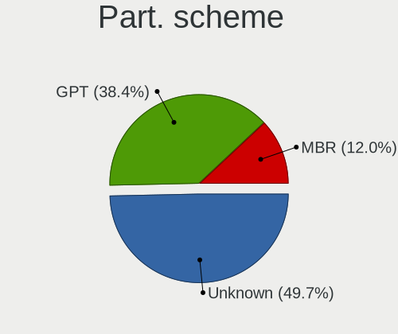
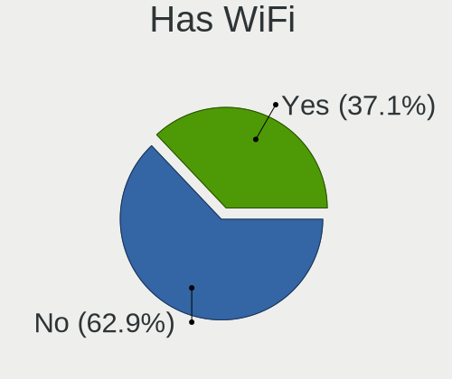
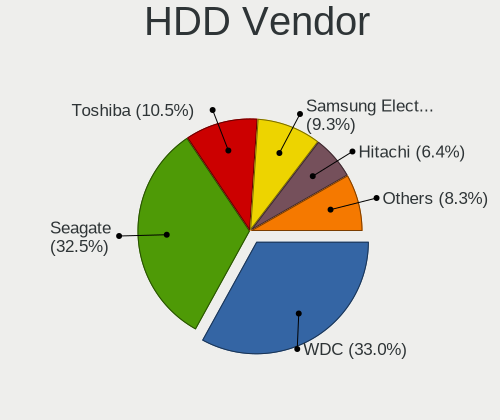
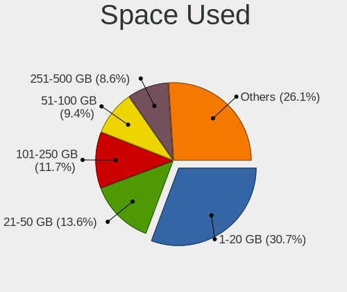
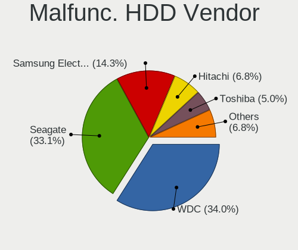
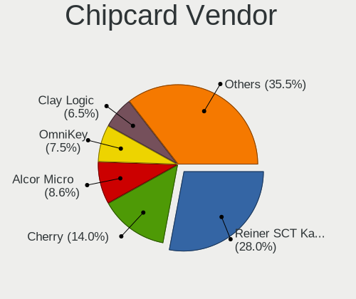

Linux in Germany - Tested Hardware & Statistics (Desktops)
----------------------------------------------------------

A project to collect tested hardware configurations for Linux in Germany.

Anyone can contribute to this report by the [hw-probe](https://github.com/linuxhw/hw-probe) tool:

    sudo -E hw-probe -all -upload

Please contribute! Especially if your hardware is rare.

Contents
--------

* [ Test Cases ](#test-cases)

* [ System ](#system)
  - [ OS                       ](#os)
  - [ OS Family                ](#os-family)
  - [ Kernel                   ](#kernel)
  - [ Kernel Family            ](#kernel-family)
  - [ Kernel Major Ver.        ](#kernel-major-ver)
  - [ Arch                     ](#arch)
  - [ DE                       ](#de)
  - [ Display Server           ](#display-server)
  - [ Display Manager          ](#display-manager)
  - [ OS Lang                  ](#os-lang)
  - [ Boot Mode                ](#boot-mode)
  - [ Filesystem               ](#filesystem)
  - [ Part. scheme             ](#part-scheme)
  - [ Dual Boot with Linux/BSD ](#dual-boot-with-linuxbsd)
  - [ Dual Boot (Win)          ](#dual-boot-win)

* [ Board ](#board)
  - [ Vendor                   ](#vendor)
  - [ Model                    ](#model)
  - [ Model Family             ](#model-family)
  - [ MFG Year                 ](#mfg-year)
  - [ Form Factor              ](#form-factor)
  - [ Secure Boot              ](#secure-boot)
  - [ Coreboot                 ](#coreboot)
  - [ RAM Size                 ](#ram-size)
  - [ RAM Used                 ](#ram-used)
  - [ Total Drives             ](#total-drives)
  - [ Has CD-ROM               ](#has-cd-rom)
  - [ Has Ethernet             ](#has-ethernet)
  - [ Has WiFi                 ](#has-wifi)
  - [ Has Bluetooth            ](#has-bluetooth)

* [ Location ](#location)
  - [ Country                  ](#country)
  - [ City                     ](#city)

* [ Drives ](#drives)
  - [ Drive Vendor             ](#drive-vendor)
  - [ Drive Model              ](#drive-model)
  - [ HDD Vendor               ](#hdd-vendor)
  - [ SSD Vendor               ](#ssd-vendor)
  - [ Drive Kind               ](#drive-kind)
  - [ Drive Connector          ](#drive-connector)
  - [ Drive Size               ](#drive-size)
  - [ Space Total              ](#space-total)
  - [ Space Used               ](#space-used)
  - [ Malfunc. Drives          ](#malfunc-drives)
  - [ Malfunc. Drive Vendor    ](#malfunc-drive-vendor)
  - [ Malfunc. HDD Vendor      ](#malfunc-hdd-vendor)
  - [ Malfunc. Drive Kind      ](#malfunc-drive-kind)
  - [ Failed Drives            ](#failed-drives)
  - [ Failed Drive Vendor      ](#failed-drive-vendor)
  - [ Drive Status             ](#drive-status)

* [ Storage controller ](#storage-controller)
  - [ Storage Vendor           ](#storage-vendor)
  - [ Storage Model            ](#storage-model)
  - [ Storage Kind             ](#storage-kind)

* [ Processor ](#processor)
  - [ CPU Vendor               ](#cpu-vendor)
  - [ CPU Model                ](#cpu-model)
  - [ CPU Model Family         ](#cpu-model-family)
  - [ CPU Cores                ](#cpu-cores)
  - [ CPU Sockets              ](#cpu-sockets)
  - [ CPU Threads              ](#cpu-threads)
  - [ CPU Op-Modes             ](#cpu-op-modes)
  - [ CPU Microcode            ](#cpu-microcode)
  - [ CPU Microarch            ](#cpu-microarch)

* [ Graphics ](#graphics)
  - [ GPU Vendor               ](#gpu-vendor)
  - [ GPU Model                ](#gpu-model)
  - [ GPU Combo                ](#gpu-combo)
  - [ GPU Driver               ](#gpu-driver)
  - [ GPU Memory               ](#gpu-memory)

* [ Monitor ](#monitor)
  - [ Monitor Vendor           ](#monitor-vendor)
  - [ Monitor Model            ](#monitor-model)
  - [ Monitor Resolution       ](#monitor-resolution)
  - [ Monitor Diagonal         ](#monitor-diagonal)
  - [ Monitor Width            ](#monitor-width)
  - [ Aspect Ratio             ](#aspect-ratio)
  - [ Monitor Area             ](#monitor-area)
  - [ Pixel Density            ](#pixel-density)
  - [ Multiple Monitors        ](#multiple-monitors)

* [ Network ](#network)
  - [ Net Controller Vendor    ](#net-controller-vendor)
  - [ Net Controller Model     ](#net-controller-model)
  - [ Wireless Vendor          ](#wireless-vendor)
  - [ Wireless Model           ](#wireless-model)
  - [ Ethernet Vendor          ](#ethernet-vendor)
  - [ Ethernet Model           ](#ethernet-model)
  - [ Net Controller Kind      ](#net-controller-kind)
  - [ Used Controller          ](#used-controller)
  - [ NICs                     ](#nics)
  - [ IPv6                     ](#ipv6)

* [ Bluetooth ](#bluetooth)
  - [ Bluetooth Vendor         ](#bluetooth-vendor)
  - [ Bluetooth Model          ](#bluetooth-model)

* [ Sound ](#sound)
  - [ Sound Vendor             ](#sound-vendor)
  - [ Sound Model              ](#sound-model)

* [ Memory ](#memory)
  - [ Memory Vendor            ](#memory-vendor)
  - [ Memory Model             ](#memory-model)
  - [ Memory Kind              ](#memory-kind)
  - [ Memory Form Factor       ](#memory-form-factor)
  - [ Memory Size              ](#memory-size)
  - [ Memory Speed             ](#memory-speed)

* [ Printers & scanners ](#printers--scanners)
  - [ Printer Vendor           ](#printer-vendor)
  - [ Printer Model            ](#printer-model)
  - [ Scanner Vendor           ](#scanner-vendor)
  - [ Scanner Model            ](#scanner-model)

* [ Camera ](#camera)
  - [ Camera Vendor            ](#camera-vendor)
  - [ Camera Model             ](#camera-model)

* [ Security ](#security)
  - [ Fingerprint Vendor       ](#fingerprint-vendor)
  - [ Fingerprint Model        ](#fingerprint-model)
  - [ Chipcard Vendor          ](#chipcard-vendor)
  - [ Chipcard Model           ](#chipcard-model)

* [ Unsupported ](#unsupported)
  - [ Unsupported Devices      ](#unsupported-devices)
  - [ Unsupported Device Types ](#unsupported-device-types)

Test Cases
----------

Total: 17088

| Vendor        | Model                       | Probe                                                      | Date         |
|---------------|-----------------------------|------------------------------------------------------------|--------------|
| Gigabyte      | B85M-D3H                    | [27053ca724](https://linux-hardware.org/?probe=27053ca724) | Jan 06, 2025 |
| PELADN        | WI-6                        | [537a11ae44](https://linux-hardware.org/?probe=537a11ae44) | Jan 06, 2025 |
| Gigabyte      | B85M-D3H                    | [3d3b4d1ab3](https://linux-hardware.org/?probe=3d3b4d1ab3) | Jan 06, 2025 |
| ASUSTek       | ROG STRIX B550-F GAMING ... | [88b1c0c262](https://linux-hardware.org/?probe=88b1c0c262) | Jan 06, 2025 |
| MSI           | B450 GAMING PLUS MAX        | [89cd372074](https://linux-hardware.org/?probe=89cd372074) | Jan 06, 2025 |
| ASUSTek       | ROG STRIX B365-F GAMING     | [01012c9b3b](https://linux-hardware.org/?probe=01012c9b3b) | Jan 06, 2025 |
| ASRock        | N100M                       | [231da8b814](https://linux-hardware.org/?probe=231da8b814) | Jan 06, 2025 |
| ASUSTek       | TUF Gaming B650M-E WIFI     | [250c829e77](https://linux-hardware.org/?probe=250c829e77) | Jan 05, 2025 |
| Gigabyte      | Z68AP-D3                    | [7f798e706e](https://linux-hardware.org/?probe=7f798e706e) | Jan 05, 2025 |
| Gigabyte      | B650M D3HP                  | [0d0a62d437](https://linux-hardware.org/?probe=0d0a62d437) | Jan 05, 2025 |
| Lenovo        | 0x36C017AA SDK0J40700 WI... | [75606d7596](https://linux-hardware.org/?probe=75606d7596) | Jan 05, 2025 |
| HP            | 8906 SMVB                   | [6fc944e5ec](https://linux-hardware.org/?probe=6fc944e5ec) | Jan 05, 2025 |
| Dell          | 0VNP2H A00                  | [eb43deacf0](https://linux-hardware.org/?probe=eb43deacf0) | Jan 05, 2025 |
| Fujitsu       | D3062-A1 S26361-D3062-A1    | [edc190a229](https://linux-hardware.org/?probe=edc190a229) | Jan 04, 2025 |
| Advantech     | MiC-770 v2                  | [1d7c3f988e](https://linux-hardware.org/?probe=1d7c3f988e) | Jan 04, 2025 |
| ASRock        | X600M-STX                   | [4a348f5b49](https://linux-hardware.org/?probe=4a348f5b49) | Jan 04, 2025 |
| ASRock        | X570 Steel Legend           | [2b29fc224e](https://linux-hardware.org/?probe=2b29fc224e) | Jan 04, 2025 |
| MSI           | B650 GAMING PLUS WIFI       | [3c54d15e6e](https://linux-hardware.org/?probe=3c54d15e6e) | Jan 04, 2025 |
| ASRock        | X570M Pro4                  | [a049693dcf](https://linux-hardware.org/?probe=a049693dcf) | Jan 04, 2025 |
| ASRock        | 970 Extreme3                | [8455ec6772](https://linux-hardware.org/?probe=8455ec6772) | Jan 04, 2025 |
| Dell          | 0F642F A00                  | [3ec5a43d19](https://linux-hardware.org/?probe=3ec5a43d19) | Jan 04, 2025 |
| HC Technol... | HCAR5000-MI                 | [bbe1844c1c](https://linux-hardware.org/?probe=bbe1844c1c) | Jan 04, 2025 |
| ASUSTek       | PRIME Z390-P                | [d6e8f1ee6c](https://linux-hardware.org/?probe=d6e8f1ee6c) | Jan 04, 2025 |
| Apple         | Mac-F221BEC8                | [05de585a46](https://linux-hardware.org/?probe=05de585a46) | Jan 04, 2025 |
| MSI           | B450 TOMAHAWK MAX           | [88d10a1126](https://linux-hardware.org/?probe=88d10a1126) | Jan 04, 2025 |
| MSI           | B450-A PRO MAX              | [a829ef7128](https://linux-hardware.org/?probe=a829ef7128) | Jan 04, 2025 |
| GEEKOM        | A7                          | [cc9ea8ad98](https://linux-hardware.org/?probe=cc9ea8ad98) | Jan 03, 2025 |
| HP            | 805D                        | [9dd735123b](https://linux-hardware.org/?probe=9dd735123b) | Jan 03, 2025 |
| Gigabyte      | B450 GAMING X               | [92b892fb46](https://linux-hardware.org/?probe=92b892fb46) | Jan 03, 2025 |
| ASRock        | H61M-DGS R2.0               | [7c2b340f98](https://linux-hardware.org/?probe=7c2b340f98) | Jan 03, 2025 |
| ASUSTek       | PRIME X370-A                | [86c0b9c6d4](https://linux-hardware.org/?probe=86c0b9c6d4) | Jan 03, 2025 |
| ASRock        | 4X4-5000 Series             | [1ff935c41c](https://linux-hardware.org/?probe=1ff935c41c) | Jan 03, 2025 |
| ASRock        | 4X4-5000 Series             | [559f6b8201](https://linux-hardware.org/?probe=559f6b8201) | Jan 03, 2025 |
| ASUSTek       | M11BB                       | [55fb5769d0](https://linux-hardware.org/?probe=55fb5769d0) | Jan 02, 2025 |
| MSI           | P45 Neo3                    | [022b141025](https://linux-hardware.org/?probe=022b141025) | Jan 02, 2025 |
| HP            | 0AECh D                     | [9306b507f4](https://linux-hardware.org/?probe=9306b507f4) | Jan 02, 2025 |
| Gigabyte      | AX370-Gaming K7             | [50b5770d28](https://linux-hardware.org/?probe=50b5770d28) | Jan 02, 2025 |
| Acer          | Aspire XC600 v1.0           | [2f22befa4d](https://linux-hardware.org/?probe=2f22befa4d) | Jan 01, 2025 |
| ASUSTek       | M3A                         | [35dd91fa94](https://linux-hardware.org/?probe=35dd91fa94) | Jan 01, 2025 |
| Acer          | Aspire XC600 v1.0           | [cad98a7856](https://linux-hardware.org/?probe=cad98a7856) | Jan 01, 2025 |
| ASRock        | A520M-HVS                   | [57e6177738](https://linux-hardware.org/?probe=57e6177738) | Jan 01, 2025 |
| Intel         | DG43GT AAE62768-300         | [f33d4be91e](https://linux-hardware.org/?probe=f33d4be91e) | Jan 01, 2025 |
| Fujitsu       | D3427-A1 S26361-D3427-A1    | [0cd4d1a295](https://linux-hardware.org/?probe=0cd4d1a295) | Jan 01, 2025 |
| Intel         | DG43GT AAE62768-300         | [c125d99d72](https://linux-hardware.org/?probe=c125d99d72) | Jan 01, 2025 |
| HP            | 8433 11                     | [94d39a7f10](https://linux-hardware.org/?probe=94d39a7f10) | Jan 01, 2025 |
| HP            | 0AECh D                     | [0827eed993](https://linux-hardware.org/?probe=0827eed993) | Jan 01, 2025 |
| ASRock        | H61M-DGS R2.0               | [7e66f7b517](https://linux-hardware.org/?probe=7e66f7b517) | Jan 01, 2025 |
| ASRock        | A520M-HVS                   | [9478ad6eab](https://linux-hardware.org/?probe=9478ad6eab) | Jan 01, 2025 |
| PELADN        | WI-6                        | [ed403a09ce](https://linux-hardware.org/?probe=ed403a09ce) | Jan 01, 2025 |
| ASUSTek       | PRIME X370-A                | [1138447504](https://linux-hardware.org/?probe=1138447504) | Jan 01, 2025 |
| ASRock        | B450 Gaming-ITX/ac          | [c2c8b85ed0](https://linux-hardware.org/?probe=c2c8b85ed0) | Jan 01, 2025 |
| Gigabyte      | B85M-D3H                    | [1766ca8469](https://linux-hardware.org/?probe=1766ca8469) | Jan 01, 2025 |
| Gigabyte      | B85M-D3H                    | [b52a4bed1c](https://linux-hardware.org/?probe=b52a4bed1c) | Dec 31, 2024 |
| PELADN        | WI-6                        | [9961c80013](https://linux-hardware.org/?probe=9961c80013) | Dec 31, 2024 |
| PELADN        | WI-6                        | [ad75e2844c](https://linux-hardware.org/?probe=ad75e2844c) | Dec 31, 2024 |
| ASUSTek       | PRIME X370-A                | [e7919fc318](https://linux-hardware.org/?probe=e7919fc318) | Dec 31, 2024 |
| ASUSTek       | TUF Gaming A620M-PLUS       | [248853b59c](https://linux-hardware.org/?probe=248853b59c) | Dec 31, 2024 |
| MSI           | MPG X570 GAMING EDGE WIF... | [364ab4800d](https://linux-hardware.org/?probe=364ab4800d) | Dec 31, 2024 |
| PELADN        | WI-6                        | [a4d452eb65](https://linux-hardware.org/?probe=a4d452eb65) | Dec 31, 2024 |
| HP            | 82F2                        | [27ef0f9faa](https://linux-hardware.org/?probe=27ef0f9faa) | Dec 31, 2024 |
| ASUSTek       | M5A78L-M LE                 | [35ecdf468a](https://linux-hardware.org/?probe=35ecdf468a) | Dec 31, 2024 |
| MSI           | B450M PRO-VDH MAX           | [9d27b3438a](https://linux-hardware.org/?probe=9d27b3438a) | Dec 30, 2024 |
| ASRock        | Z790 PG SONIC               | [89df77f290](https://linux-hardware.org/?probe=89df77f290) | Dec 30, 2024 |
| MSI           | B450M PRO-VDH MAX           | [7de6bd6878](https://linux-hardware.org/?probe=7de6bd6878) | Dec 30, 2024 |
| ASUSTek       | PRIME X370-A                | [a5cec19b2d](https://linux-hardware.org/?probe=a5cec19b2d) | Dec 30, 2024 |
| ASRock        | Z68 Extreme4 Gen3           | [9d23a9787e](https://linux-hardware.org/?probe=9d23a9787e) | Dec 30, 2024 |
| ASRock        | H61M-DGS R2.0               | [242dfca6c8](https://linux-hardware.org/?probe=242dfca6c8) | Dec 30, 2024 |
| Gigabyte      | X570S UD                    | [ce0d2a6968](https://linux-hardware.org/?probe=ce0d2a6968) | Dec 30, 2024 |
| ASRock        | QC5000-ITX/PH               | [338593f255](https://linux-hardware.org/?probe=338593f255) | Dec 30, 2024 |
| ASUSTek       | PRIME B650-PLUS             | [d94ee9a862](https://linux-hardware.org/?probe=d94ee9a862) | Dec 30, 2024 |
| Fujitsu Si... | D2348-A3 S26361-D2348-A3    | [88cfef1da9](https://linux-hardware.org/?probe=88cfef1da9) | Dec 30, 2024 |
| Biostar       | X570GT8                     | [d6d1c90108](https://linux-hardware.org/?probe=d6d1c90108) | Dec 30, 2024 |
| Unknown       | Unknown                     | [ea27b3376d](https://linux-hardware.org/?probe=ea27b3376d) | Dec 30, 2024 |
| Lenovo        | 3111 SDK0J40697 WIN 3305... | [0f37219509](https://linux-hardware.org/?probe=0f37219509) | Dec 30, 2024 |
| ASUSTek       | ROG STRIX X670E-I GAMING... | [0e48acaa7e](https://linux-hardware.org/?probe=0e48acaa7e) | Dec 29, 2024 |
| Gigabyte      | B760 GAMING X               | [88448d92de](https://linux-hardware.org/?probe=88448d92de) | Dec 29, 2024 |
| ASUSTek       | TUF Gaming B650-PLUS        | [8f62444b6a](https://linux-hardware.org/?probe=8f62444b6a) | Dec 29, 2024 |
| PELADN        | WI-6                        | [505a879d82](https://linux-hardware.org/?probe=505a879d82) | Dec 29, 2024 |
| ASRock        | H81M-DG4                    | [63308a03e7](https://linux-hardware.org/?probe=63308a03e7) | Dec 29, 2024 |
| Gigabyte      | GB-BER7-5700                | [915da57e07](https://linux-hardware.org/?probe=915da57e07) | Dec 29, 2024 |
| ASUSTek       | ROG STRIX Z690-F GAMING ... | [118dcfe37e](https://linux-hardware.org/?probe=118dcfe37e) | Dec 29, 2024 |
| GEEKOM        | A7                          | [366484f41f](https://linux-hardware.org/?probe=366484f41f) | Dec 29, 2024 |
| Gigabyte      | 970A-DS3P                   | [b72ca39acc](https://linux-hardware.org/?probe=b72ca39acc) | Dec 29, 2024 |
| MSI           | MPG B550 GAMING EDGE WIF... | [ea3e3598c1](https://linux-hardware.org/?probe=ea3e3598c1) | Dec 29, 2024 |
| MSI           | B550-A PRO                  | [93afafb17b](https://linux-hardware.org/?probe=93afafb17b) | Dec 29, 2024 |
| ASRock        | X370M-HDV R4.0              | [b11c18364f](https://linux-hardware.org/?probe=b11c18364f) | Dec 28, 2024 |
| ASUSTek       | SABERTOOTH 990FX R2.0       | [4f6862c902](https://linux-hardware.org/?probe=4f6862c902) | Dec 28, 2024 |
| ASUSTek       | PRIME H310I-PLUS            | [d6a1f13ad7](https://linux-hardware.org/?probe=d6a1f13ad7) | Dec 28, 2024 |
| ASUSTek       | M4A87TD EVO                 | [4182d5a5ec](https://linux-hardware.org/?probe=4182d5a5ec) | Dec 28, 2024 |
| MSI           | MAG B550 TOMAHAWK           | [eba97e7b79](https://linux-hardware.org/?probe=eba97e7b79) | Dec 28, 2024 |
| ASUSTek       | PRIME Z390-P                | [f680af729c](https://linux-hardware.org/?probe=f680af729c) | Dec 28, 2024 |
| HP            | 8265                        | [3b63487fcf](https://linux-hardware.org/?probe=3b63487fcf) | Dec 28, 2024 |
| Acer          | Veriton N4640G              | [3713dbb1e6](https://linux-hardware.org/?probe=3713dbb1e6) | Dec 28, 2024 |
| ASUSTek       | ROG STRIX X570-I GAMING     | [2d8791ccc2](https://linux-hardware.org/?probe=2d8791ccc2) | Dec 28, 2024 |
| Lenovo        | 1056 SDK0T76557 WIN 3915... | [9f23de610a](https://linux-hardware.org/?probe=9f23de610a) | Dec 28, 2024 |
| Lenovo        | SHARKBAY 0B98401 PRO        | [2c6d3ec5d8](https://linux-hardware.org/?probe=2c6d3ec5d8) | Dec 28, 2024 |
| GEEKOM        | A7                          | [d9be822a41](https://linux-hardware.org/?probe=d9be822a41) | Dec 28, 2024 |
| ASRock        | G31M-GS                     | [4eef3a1e4e](https://linux-hardware.org/?probe=4eef3a1e4e) | Dec 27, 2024 |
| Lenovo        | 3111 SDK0J40697 WIN 3305... | [6744d1aa53](https://linux-hardware.org/?probe=6744d1aa53) | Dec 27, 2024 |
| Gigabyte      | A520I AC                    | [1574cc05d9](https://linux-hardware.org/?probe=1574cc05d9) | Dec 27, 2024 |
| Gigabyte      | B650 EAGLE AX               | [e4b9c34646](https://linux-hardware.org/?probe=e4b9c34646) | Dec 27, 2024 |
| Gigabyte      | B550M DS3H AC               | [1767678641](https://linux-hardware.org/?probe=1767678641) | Dec 27, 2024 |
| ASUSTek       | TUF Gaming B650M-PLUS       | [aa2af1b2d7](https://linux-hardware.org/?probe=aa2af1b2d7) | Dec 27, 2024 |
| ASRock        | A320M Pro4 R2.0             | [21ce1b644b](https://linux-hardware.org/?probe=21ce1b644b) | Dec 27, 2024 |
| MSI           | B450 GAMING PLUS MAX        | [b0e7a232a0](https://linux-hardware.org/?probe=b0e7a232a0) | Dec 27, 2024 |
| ASRock        | B450M Pro4-F                | [932175112d](https://linux-hardware.org/?probe=932175112d) | Dec 27, 2024 |
| MSI           | X670E GAMING PLUS WIFI      | [59a746132a](https://linux-hardware.org/?probe=59a746132a) | Dec 26, 2024 |
| ASRock        | X670E Steel Legend          | [77dfeca508](https://linux-hardware.org/?probe=77dfeca508) | Dec 26, 2024 |
| Dell          | 0C1R19 A01                  | [ce9a260977](https://linux-hardware.org/?probe=ce9a260977) | Dec 26, 2024 |
| ASUSTek       | H97M-E                      | [4bfb3a3198](https://linux-hardware.org/?probe=4bfb3a3198) | Dec 26, 2024 |
| Medion        | MS-7713                     | [794eb82dcb](https://linux-hardware.org/?probe=794eb82dcb) | Dec 26, 2024 |
| ASRock        | G41MH/USB3                  | [bb5fb7c7af](https://linux-hardware.org/?probe=bb5fb7c7af) | Dec 26, 2024 |
| ASUSTek       | PRIME A520M-K               | [61d14e44b2](https://linux-hardware.org/?probe=61d14e44b2) | Dec 25, 2024 |
| MSI           | Z790 GAMING PLUS WIFI       | [0d13f70a8e](https://linux-hardware.org/?probe=0d13f70a8e) | Dec 25, 2024 |
| ASUSTek       | PRIME X370-PRO              | [3b87937167](https://linux-hardware.org/?probe=3b87937167) | Dec 25, 2024 |
| MSI           | Z370-A PRO                  | [9ce2977625](https://linux-hardware.org/?probe=9ce2977625) | Dec 25, 2024 |
| MSI           | MS-6701                     | [d356deb17b](https://linux-hardware.org/?probe=d356deb17b) | Dec 25, 2024 |
| MSI           | MS-6701                     | [0ab268cc0a](https://linux-hardware.org/?probe=0ab268cc0a) | Dec 25, 2024 |
| Unknown       | NISB 3500                   | [dd5b50cff4](https://linux-hardware.org/?probe=dd5b50cff4) | Dec 25, 2024 |
| HP            | 1998                        | [5cbefdf3a2](https://linux-hardware.org/?probe=5cbefdf3a2) | Dec 25, 2024 |
| Gigabyte      | B250M-Gaming 3-CF           | [b0f84564ba](https://linux-hardware.org/?probe=b0f84564ba) | Dec 25, 2024 |
| HP            | 8906 SMVB                   | [7c1ad30996](https://linux-hardware.org/?probe=7c1ad30996) | Dec 25, 2024 |
| Medion        | H81H3-EM2 H81EM2W08.309     | [4d4f395e80](https://linux-hardware.org/?probe=4d4f395e80) | Dec 24, 2024 |
| ASUSTek       | Pro WS X299 SAGE II         | [82572a2f0c](https://linux-hardware.org/?probe=82572a2f0c) | Dec 24, 2024 |
| Intel         | DH77KC AAG39641-401         | [0c54d9c7a7](https://linux-hardware.org/?probe=0c54d9c7a7) | Dec 24, 2024 |
| HP            | 2B4B                        | [fdbc072345](https://linux-hardware.org/?probe=fdbc072345) | Dec 24, 2024 |
| Gigabyte      | GA-78LMT-USB3 x.x           | [2e5a903c16](https://linux-hardware.org/?probe=2e5a903c16) | Dec 24, 2024 |
| Fujitsu Si... | D2461-A2 S26361-D2461-A2    | [246c7d0034](https://linux-hardware.org/?probe=246c7d0034) | Dec 24, 2024 |
| Fujitsu       | D3432-A1 S26361-D3432-A1    | [47eec380bd](https://linux-hardware.org/?probe=47eec380bd) | Dec 24, 2024 |
| ASRock        | X570 Steel Legend           | [eab49b95cc](https://linux-hardware.org/?probe=eab49b95cc) | Dec 24, 2024 |
| ASUSTek       | PRIME B450M-K II            | [1440d04792](https://linux-hardware.org/?probe=1440d04792) | Dec 24, 2024 |
| Gigabyte      | F2A78M-HD2                  | [c92c7f0791](https://linux-hardware.org/?probe=c92c7f0791) | Dec 23, 2024 |
| Gigabyte      | X570 AORUS ELITE            | [a847bd7a4f](https://linux-hardware.org/?probe=a847bd7a4f) | Dec 23, 2024 |
| MSI           | Z77A-GD65                   | [2bda3d9800](https://linux-hardware.org/?probe=2bda3d9800) | Dec 23, 2024 |
| ASRockRack    | TRX40D8-2N2T                | [a97760eedd](https://linux-hardware.org/?probe=a97760eedd) | Dec 23, 2024 |
| Shenzhen M... | AHBNB OEM                   | [3d886fdf20](https://linux-hardware.org/?probe=3d886fdf20) | Dec 23, 2024 |
| Dell          | 0J1C3P A00                  | [97c941fc16](https://linux-hardware.org/?probe=97c941fc16) | Dec 23, 2024 |
| Shenzhen M... | AHBNB OEM                   | [14cd81f727](https://linux-hardware.org/?probe=14cd81f727) | Dec 23, 2024 |
| HP            | 2129                        | [7c281863fb](https://linux-hardware.org/?probe=7c281863fb) | Dec 23, 2024 |
| Biostar       | X670E VALKYRIE              | [3377f74d6c](https://linux-hardware.org/?probe=3377f74d6c) | Dec 23, 2024 |
| MSI           | B650 GAMING PLUS WIFI       | [ca3ac47c6d](https://linux-hardware.org/?probe=ca3ac47c6d) | Dec 23, 2024 |
| MSI           | MPG B550 GAMING PLUS        | [b9260cccc7](https://linux-hardware.org/?probe=b9260cccc7) | Dec 22, 2024 |
| MSI           | MAG Z590 TOMAHAWK WIFI      | [482ce52b8d](https://linux-hardware.org/?probe=482ce52b8d) | Dec 22, 2024 |
| Gigabyte      | X570S UD                    | [78d70c2d5f](https://linux-hardware.org/?probe=78d70c2d5f) | Dec 22, 2024 |
| Gigabyte      | B450 I AORUS PRO WIFI-CF    | [9a174f4b8f](https://linux-hardware.org/?probe=9a174f4b8f) | Dec 22, 2024 |
| HP            | 843B                        | [6ae8cb479e](https://linux-hardware.org/?probe=6ae8cb479e) | Dec 22, 2024 |
| ASUSTek       | PRIME A320M-K               | [9a1d5cefd0](https://linux-hardware.org/?probe=9a1d5cefd0) | Dec 22, 2024 |
| HP            | 2820h                       | [64ccd9e1f2](https://linux-hardware.org/?probe=64ccd9e1f2) | Dec 22, 2024 |
| Gigabyte      | P55-USB3                    | [3fb482feaf](https://linux-hardware.org/?probe=3fb482feaf) | Dec 22, 2024 |
| MSI           | H110M PRO-D                 | [fefcbf513b](https://linux-hardware.org/?probe=fefcbf513b) | Dec 21, 2024 |
| Biostar       | H510MHP                     | [344aa9c0da](https://linux-hardware.org/?probe=344aa9c0da) | Dec 21, 2024 |
| ASRock        | P5B-DE                      | [88f13bcd5d](https://linux-hardware.org/?probe=88f13bcd5d) | Dec 21, 2024 |
| ASUSTek       | ROG STRIX B450-E GAMING     | [5ffe3ed663](https://linux-hardware.org/?probe=5ffe3ed663) | Dec 21, 2024 |
| HP            | 82F2                        | [60bc9eaafd](https://linux-hardware.org/?probe=60bc9eaafd) | Dec 21, 2024 |
| ASUSTek       | P6X58D-E                    | [823b8d450e](https://linux-hardware.org/?probe=823b8d450e) | Dec 21, 2024 |
| Gigabyte      | B660M DS3H AX DDR4          | [de1dda444a](https://linux-hardware.org/?probe=de1dda444a) | Dec 21, 2024 |
| ASRock        | X670E Steel Legend          | [b80495ed1a](https://linux-hardware.org/?probe=b80495ed1a) | Dec 20, 2024 |
| ASUSTek       | H97-PLUS                    | [a9d05502ce](https://linux-hardware.org/?probe=a9d05502ce) | Dec 20, 2024 |
| MSI           | H110M PRO-D                 | [c72cef4631](https://linux-hardware.org/?probe=c72cef4631) | Dec 20, 2024 |
| Gigabyte      | Z790 AORUS ELITE X WIFI7    | [31d1491625](https://linux-hardware.org/?probe=31d1491625) | Dec 19, 2024 |
| ASRock        | A520M-HVS                   | [47c40e8f1b](https://linux-hardware.org/?probe=47c40e8f1b) | Dec 19, 2024 |
| ASRock        | A520M-HVS                   | [4807d91515](https://linux-hardware.org/?probe=4807d91515) | Dec 19, 2024 |
| ASUSTek       | PRIME B450M-A               | [42a6edcbfb](https://linux-hardware.org/?probe=42a6edcbfb) | Dec 19, 2024 |
| ASUSTek       | PRIME H510M-A R2.0          | [600869b46a](https://linux-hardware.org/?probe=600869b46a) | Dec 19, 2024 |
| Gigabyte      | Z77-DS3H                    | [8d13b458e4](https://linux-hardware.org/?probe=8d13b458e4) | Dec 19, 2024 |
| Gigabyte      | P55-UD4                     | [687d0cebbc](https://linux-hardware.org/?probe=687d0cebbc) | Dec 19, 2024 |
| MSI           | Z390-A PRO                  | [8df543e380](https://linux-hardware.org/?probe=8df543e380) | Dec 19, 2024 |
| ASUSTek       | PRIME H310-PLUS R2.0        | [1acad3b822](https://linux-hardware.org/?probe=1acad3b822) | Dec 18, 2024 |
| ASUSTek       | Z97-K                       | [8150568178](https://linux-hardware.org/?probe=8150568178) | Dec 18, 2024 |
| ASRock        | X300M-STX                   | [ff2733d152](https://linux-hardware.org/?probe=ff2733d152) | Dec 18, 2024 |
| Gigabyte      | X870 EAGLE WIFI7            | [b80f8d2129](https://linux-hardware.org/?probe=b80f8d2129) | Dec 18, 2024 |
| HPE           | ProLiant MicroServer Gen... | [87867b5405](https://linux-hardware.org/?probe=87867b5405) | Dec 18, 2024 |
| Fujitsu       | D3601-A1 S26361-D3601-A1    | [153f551d38](https://linux-hardware.org/?probe=153f551d38) | Dec 18, 2024 |
| MSI           | B550M PRO-VDH WIFI          | [2616349c03](https://linux-hardware.org/?probe=2616349c03) | Dec 18, 2024 |
| Fujitsu       | D3091-A1 S26361-D3091-A1    | [52b54f9c5f](https://linux-hardware.org/?probe=52b54f9c5f) | Dec 18, 2024 |
| ASUSTek       | M5A99X EVO                  | [0f9a0492e2](https://linux-hardware.org/?probe=0f9a0492e2) | Dec 18, 2024 |
| Gigabyte      | B550M S2H                   | [e32011dedf](https://linux-hardware.org/?probe=e32011dedf) | Dec 18, 2024 |
| Fujitsu Si... | D2164-A1 S26361-D2164-A1    | [e0c065a693](https://linux-hardware.org/?probe=e0c065a693) | Dec 18, 2024 |
| Acer          | Aspire X3960                | [935796fbb9](https://linux-hardware.org/?probe=935796fbb9) | Dec 17, 2024 |
| ASUSTek       | P8H67-M PRO                 | [987844d0b8](https://linux-hardware.org/?probe=987844d0b8) | Dec 17, 2024 |
| Gigabyte      | X670 AORUS ELITE AX         | [47f7249a37](https://linux-hardware.org/?probe=47f7249a37) | Dec 17, 2024 |
| Gigabyte      | B85M-D3H                    | [bb23aa7480](https://linux-hardware.org/?probe=bb23aa7480) | Dec 17, 2024 |
| ASUSTek       | ROG Rampage VI EXTREME E... | [332bbb3a71](https://linux-hardware.org/?probe=332bbb3a71) | Dec 17, 2024 |
| ASUSTek       | TUF Z390-PLUS GAMING        | [3a941c604b](https://linux-hardware.org/?probe=3a941c604b) | Dec 17, 2024 |
| ASUSTek       | PRIME B660-PLUS D4          | [75dce3a5ff](https://linux-hardware.org/?probe=75dce3a5ff) | Dec 16, 2024 |
| ASRock        | Z68 Pro3                    | [55f5b867fc](https://linux-hardware.org/?probe=55f5b867fc) | Dec 16, 2024 |
| ASUSTek       | CROSSHAIR VI HERO           | [d87aaaf485](https://linux-hardware.org/?probe=d87aaaf485) | Dec 16, 2024 |
| HP            | 83E8                        | [77d40d025a](https://linux-hardware.org/?probe=77d40d025a) | Dec 16, 2024 |
| MSI           | A320M-A PRO MAX             | [f160b8eebe](https://linux-hardware.org/?probe=f160b8eebe) | Dec 16, 2024 |
| Lenovo        | 1064 SDK0T76528 WIN 3556... | [5feee3480f](https://linux-hardware.org/?probe=5feee3480f) | Dec 16, 2024 |
| MSI           | PRO Z690-A DDR4             | [c2fe7d3fe9](https://linux-hardware.org/?probe=c2fe7d3fe9) | Dec 16, 2024 |
| ASUSTek       | P8P67                       | [6322c78de6](https://linux-hardware.org/?probe=6322c78de6) | Dec 15, 2024 |
| ASUSTek       | P8P67                       | [ee3b9d1e1e](https://linux-hardware.org/?probe=ee3b9d1e1e) | Dec 15, 2024 |
| MSI           | Z370 GAMING PRO CARBON A... | [8bf8630863](https://linux-hardware.org/?probe=8bf8630863) | Dec 15, 2024 |
| ASUSTek       | P7P55D                      | [e84de5749d](https://linux-hardware.org/?probe=e84de5749d) | Dec 15, 2024 |
| HP            | 8643 SMVB                   | [c6ec98e566](https://linux-hardware.org/?probe=c6ec98e566) | Dec 15, 2024 |
| Medion        | T11X5A16                    | [14404cc77d](https://linux-hardware.org/?probe=14404cc77d) | Dec 15, 2024 |
| Medion        | T11X5A16                    | [1fc28c5865](https://linux-hardware.org/?probe=1fc28c5865) | Dec 15, 2024 |
| MSI           | Eclipse Plus                | [bd3c3d2f09](https://linux-hardware.org/?probe=bd3c3d2f09) | Dec 15, 2024 |
| Wortmann      | TERRA_PC                    | [671f5d50a6](https://linux-hardware.org/?probe=671f5d50a6) | Dec 15, 2024 |
| Fujitsu       | D3091-A1 S26361-D3091-A1    | [9ddeef2131](https://linux-hardware.org/?probe=9ddeef2131) | Dec 15, 2024 |
| ASUSTek       | PRIME A320M-K               | [4fa18c588d](https://linux-hardware.org/?probe=4fa18c588d) | Dec 15, 2024 |
| MSI           | X670E GAMING PLUS WIFI      | [8e8893c238](https://linux-hardware.org/?probe=8e8893c238) | Dec 14, 2024 |
| Medion        | Z370H4-EM                   | [970f89f0fb](https://linux-hardware.org/?probe=970f89f0fb) | Dec 14, 2024 |
| Medion        | Z370H4-EM                   | [9f3a15494d](https://linux-hardware.org/?probe=9f3a15494d) | Dec 14, 2024 |
| MSI           | Z170A PC MATE               | [226a30cded](https://linux-hardware.org/?probe=226a30cded) | Dec 14, 2024 |
| MSI           | B450 GAMING PLUS MAX        | [7beb5cea9f](https://linux-hardware.org/?probe=7beb5cea9f) | Dec 14, 2024 |
| ASRock        | Z390 Extreme4               | [e86a27a534](https://linux-hardware.org/?probe=e86a27a534) | Dec 14, 2024 |
| ASUSTek       | PRIME A320M-K               | [9e55c65b62](https://linux-hardware.org/?probe=9e55c65b62) | Dec 14, 2024 |
| Biostar       | A520MH                      | [46f468d23e](https://linux-hardware.org/?probe=46f468d23e) | Dec 14, 2024 |
| ASUSTek       | PRIME B760M-R D4            | [6e6705253e](https://linux-hardware.org/?probe=6e6705253e) | Dec 14, 2024 |
| HP            | 8299                        | [44a762b74e](https://linux-hardware.org/?probe=44a762b74e) | Dec 14, 2024 |
| Gigabyte      | B650 EAGLE                  | [f8bb6c67f0](https://linux-hardware.org/?probe=f8bb6c67f0) | Dec 14, 2024 |
| HP            | 8299                        | [f0c7982d81](https://linux-hardware.org/?probe=f0c7982d81) | Dec 14, 2024 |
| ASRock        | X570 Phantom Gaming-ITX/... | [ff22af564e](https://linux-hardware.org/?probe=ff22af564e) | Dec 14, 2024 |
| Dell          | 0GY6Y8 A03                  | [e453ed40ac](https://linux-hardware.org/?probe=e453ed40ac) | Dec 14, 2024 |
| ASRock        | B450 Gaming-ITX/ac          | [e6c039f6ca](https://linux-hardware.org/?probe=e6c039f6ca) | Dec 14, 2024 |
| Biostar       | A520MH                      | [b62ff2bde3](https://linux-hardware.org/?probe=b62ff2bde3) | Dec 13, 2024 |
| ASRock        | 970 Pro3 R2.0               | [a80ba72f56](https://linux-hardware.org/?probe=a80ba72f56) | Dec 13, 2024 |
| ASUSTek       | TUF H370-PRO GAMING         | [f39f2cc1a5](https://linux-hardware.org/?probe=f39f2cc1a5) | Dec 13, 2024 |
| Dell          | 0C27VV A02                  | [f66c549cec](https://linux-hardware.org/?probe=f66c549cec) | Dec 13, 2024 |
| ASRock        | Z68 Pro3                    | [a7b8905934](https://linux-hardware.org/?probe=a7b8905934) | Dec 13, 2024 |
| MSI           | B450 TOMAHAWK               | [aa7ebb1b4a](https://linux-hardware.org/?probe=aa7ebb1b4a) | Dec 13, 2024 |
| ASUSTek       | A68HM-PLUS                  | [f234970cc5](https://linux-hardware.org/?probe=f234970cc5) | Dec 12, 2024 |
| Medion        | Cattle24 -1M                | [61c76bd6c0](https://linux-hardware.org/?probe=61c76bd6c0) | Dec 12, 2024 |
| Gigabyte      | H470M DS3H                  | [15f8300927](https://linux-hardware.org/?probe=15f8300927) | Dec 12, 2024 |
| Gigabyte      | Z690 AORUS ELITE DDR4       | [a2e8fdca3f](https://linux-hardware.org/?probe=a2e8fdca3f) | Dec 12, 2024 |
| ASUSTek       | STRIX Z270H GAMING          | [24c88ab18a](https://linux-hardware.org/?probe=24c88ab18a) | Dec 12, 2024 |
| ASRock        | B450 Pro4                   | [685ed25a9b](https://linux-hardware.org/?probe=685ed25a9b) | Dec 11, 2024 |
| Gigabyte      | B660 GAMING X DDR4          | [1b40e982de](https://linux-hardware.org/?probe=1b40e982de) | Dec 11, 2024 |
| Foxconn       | 2A8C                        | [5c5f617649](https://linux-hardware.org/?probe=5c5f617649) | Dec 11, 2024 |
| Lenovo        | 36C5 SDK0K17763 WIN 1801... | [5afdeb8595](https://linux-hardware.org/?probe=5afdeb8595) | Dec 11, 2024 |
| Lenovo        | 36C5 SDK0K17763 WIN 1801... | [29b0f998a4](https://linux-hardware.org/?probe=29b0f998a4) | Dec 11, 2024 |
| Gigabyte      | B550I AORUS PRO AX          | [a7722c77ec](https://linux-hardware.org/?probe=a7722c77ec) | Dec 11, 2024 |
| Gigabyte      | B450 GAMING X               | [69eca05028](https://linux-hardware.org/?probe=69eca05028) | Dec 11, 2024 |
| Lenovo        | SKYBAY SDK0J40705 WIN 34... | [76f3b7fbe1](https://linux-hardware.org/?probe=76f3b7fbe1) | Dec 11, 2024 |
| Dell          | 0C27VV A01                  | [97b465f827](https://linux-hardware.org/?probe=97b465f827) | Dec 11, 2024 |
| GEEKOM        | A8                          | [1e47174e35](https://linux-hardware.org/?probe=1e47174e35) | Dec 11, 2024 |
| Fujitsu       | D3221-A1 S26361-D3221-A1    | [90920db494](https://linux-hardware.org/?probe=90920db494) | Dec 10, 2024 |
| Fujitsu       | D3164-A1 S26361-D3164-A1    | [49f31af912](https://linux-hardware.org/?probe=49f31af912) | Dec 10, 2024 |
| Gigabyte      | 970A-UD3P                   | [2a06a7c208](https://linux-hardware.org/?probe=2a06a7c208) | Dec 10, 2024 |
| Gigabyte      | 970A-UD3P                   | [98ed41d685](https://linux-hardware.org/?probe=98ed41d685) | Dec 10, 2024 |
| Gigabyte      | A320M-S2H V2-CF             | [99750c7f81](https://linux-hardware.org/?probe=99750c7f81) | Dec 10, 2024 |
| Dell          | 0F642F A00                  | [35ab39c91f](https://linux-hardware.org/?probe=35ab39c91f) | Dec 10, 2024 |
| ASUSTek       | TUF Gaming A620M-PLUS       | [44ba385052](https://linux-hardware.org/?probe=44ba385052) | Dec 10, 2024 |
| Gigabyte      | B550M AORUS PRO-P           | [4972873070](https://linux-hardware.org/?probe=4972873070) | Dec 09, 2024 |
| ASRock        | X470 Taichi                 | [3ee3f476d2](https://linux-hardware.org/?probe=3ee3f476d2) | Dec 09, 2024 |
| Medion        | MS-7616                     | [aa5ae96667](https://linux-hardware.org/?probe=aa5ae96667) | Dec 09, 2024 |
| Gigabyte      | B650 GAMING X AX V2         | [0b43550c47](https://linux-hardware.org/?probe=0b43550c47) | Dec 09, 2024 |
| Gigabyte      | B560M DS3H V2               | [00c881af99](https://linux-hardware.org/?probe=00c881af99) | Dec 09, 2024 |
| ASUSTek       | Z97-K                       | [d8ff8a4bc3](https://linux-hardware.org/?probe=d8ff8a4bc3) | Dec 09, 2024 |
| MSI           | B350M MORTAR                | [bbd843a5b9](https://linux-hardware.org/?probe=bbd843a5b9) | Dec 08, 2024 |
| ASRock        | H170M-ITX/ac                | [5e985bdf45](https://linux-hardware.org/?probe=5e985bdf45) | Dec 08, 2024 |
| ASRock        | H170M-ITX/ac                | [20b402d1b4](https://linux-hardware.org/?probe=20b402d1b4) | Dec 08, 2024 |
| ASUSTek       | PRIME X370-A                | [92208ff511](https://linux-hardware.org/?probe=92208ff511) | Dec 08, 2024 |
| ASRock        | G31M-GS                     | [ff5407f029](https://linux-hardware.org/?probe=ff5407f029) | Dec 08, 2024 |
| MSI           | B450M MORTAR MAX            | [6dd73b8ba5](https://linux-hardware.org/?probe=6dd73b8ba5) | Dec 08, 2024 |
| MSI           | Eclipse Plus                | [c3573619ad](https://linux-hardware.org/?probe=c3573619ad) | Dec 08, 2024 |
| Biostar       | A520MT                      | [937f0e5324](https://linux-hardware.org/?probe=937f0e5324) | Dec 08, 2024 |
| MSI           | B350M MORTAR                | [b7546e3068](https://linux-hardware.org/?probe=b7546e3068) | Dec 08, 2024 |
| ASRock        | B450 Gaming-ITX/ac          | [73f6fbf42e](https://linux-hardware.org/?probe=73f6fbf42e) | Dec 08, 2024 |
| Gigabyte      | 970A-DS3P                   | [1e1f3fb374](https://linux-hardware.org/?probe=1e1f3fb374) | Dec 08, 2024 |
| ASRock        | G31M-GS                     | [2f01788063](https://linux-hardware.org/?probe=2f01788063) | Dec 07, 2024 |
| ASUSTek       | TUF Z390-PLUS GAMING        | [7bd1d1908f](https://linux-hardware.org/?probe=7bd1d1908f) | Dec 07, 2024 |
| Intel         | DG41MJ AAE54659-206         | [3db9ae5cb9](https://linux-hardware.org/?probe=3db9ae5cb9) | Dec 07, 2024 |
| ASUSTek       | PRIME Z490-A                | [c9392314ab](https://linux-hardware.org/?probe=c9392314ab) | Dec 07, 2024 |
| MSI           | MPG X870E CARBON WIFI       | [1f5add1342](https://linux-hardware.org/?probe=1f5add1342) | Dec 07, 2024 |
| ASUSTek       | Maximus VIII HERO           | [57fb114501](https://linux-hardware.org/?probe=57fb114501) | Dec 07, 2024 |
| ASUSTek       | ROG STRIX Z690-I GAMING ... | [20a1c20751](https://linux-hardware.org/?probe=20a1c20751) | Dec 06, 2024 |
| MSI           | MS-7369                     | [fbfb1c6e78](https://linux-hardware.org/?probe=fbfb1c6e78) | Dec 06, 2024 |
| HP            | 8054                        | [6ce88bae4e](https://linux-hardware.org/?probe=6ce88bae4e) | Dec 06, 2024 |
| MSI           | PRO Z790-A WIFI             | [386b5bb2fa](https://linux-hardware.org/?probe=386b5bb2fa) | Dec 06, 2024 |
| MSI           | MPG Z590M GAMING EDGE WI... | [37e465fb8f](https://linux-hardware.org/?probe=37e465fb8f) | Dec 06, 2024 |
| Gigabyte      | Q87M-D2H                    | [8331103e77](https://linux-hardware.org/?probe=8331103e77) | Dec 06, 2024 |
| MSI           | A88XI AC V2                 | [3bd43ba035](https://linux-hardware.org/?probe=3bd43ba035) | Dec 06, 2024 |
| MSI           | Z87-G45 GAMING              | [7d5ba2293a](https://linux-hardware.org/?probe=7d5ba2293a) | Dec 06, 2024 |
| ASUSTek       | ProArt X870E-CREATOR WIF... | [ea0f32ae89](https://linux-hardware.org/?probe=ea0f32ae89) | Dec 06, 2024 |
| Gigabyte      | B660M DS3H DDR4             | [e026d0ed7b](https://linux-hardware.org/?probe=e026d0ed7b) | Dec 06, 2024 |
| Shenzhen M... | AHWSA                       | [2bc5597511](https://linux-hardware.org/?probe=2bc5597511) | Dec 05, 2024 |
| Gigabyte      | EP43-UD3L                   | [5e962e2194](https://linux-hardware.org/?probe=5e962e2194) | Dec 05, 2024 |
| Fujitsu       | D3430-A1 S26361-D3430-A1    | [a701c134d6](https://linux-hardware.org/?probe=a701c134d6) | Dec 05, 2024 |
| ASUSTek       | P8Z77-V LE PLUS             | [b6c0c2bf1d](https://linux-hardware.org/?probe=b6c0c2bf1d) | Dec 05, 2024 |
| MSI           | H510M-A PRO                 | [fcc2b60362](https://linux-hardware.org/?probe=fcc2b60362) | Dec 05, 2024 |
| ASRock        | Z370 Pro4                   | [3c5ea68b84](https://linux-hardware.org/?probe=3c5ea68b84) | Dec 05, 2024 |
| ASUSTek       | M5A78L-M LX3                | [93d9e2c966](https://linux-hardware.org/?probe=93d9e2c966) | Dec 05, 2024 |
| Gigabyte      | Q87M-D2H                    | [bcb77899dd](https://linux-hardware.org/?probe=bcb77899dd) | Dec 05, 2024 |
| Gigabyte      | Z490 UD                     | [93ed7e1b8b](https://linux-hardware.org/?probe=93ed7e1b8b) | Dec 03, 2024 |
| ASUSTek       | TUF Gaming B650M-PLUS WI... | [b5812f6c37](https://linux-hardware.org/?probe=b5812f6c37) | Dec 03, 2024 |
| ASUSTek       | PRIME B350M-A               | [3b2b2cdb80](https://linux-hardware.org/?probe=3b2b2cdb80) | Dec 03, 2024 |
| MSI           | MAG Z590 TOMAHAWK WIFI      | [898f745e60](https://linux-hardware.org/?probe=898f745e60) | Dec 03, 2024 |
| Gigabyte      | F2A88XM-D3HP                | [681b6fb657](https://linux-hardware.org/?probe=681b6fb657) | Dec 03, 2024 |
| MSI           | MAG B550M MORTAR WIFI       | [c0c49d4324](https://linux-hardware.org/?probe=c0c49d4324) | Dec 02, 2024 |
| Acer          | Aspire X3960                | [875985a78d](https://linux-hardware.org/?probe=875985a78d) | Dec 02, 2024 |
| HP            | 8054                        | [ee5f3ba6a0](https://linux-hardware.org/?probe=ee5f3ba6a0) | Dec 02, 2024 |
| ASRock        | X299 Extreme4               | [d1ff3afc94](https://linux-hardware.org/?probe=d1ff3afc94) | Dec 02, 2024 |
| Fujitsu Si... | D2824-A1 S26361-D2824-A1    | [ffa565d696](https://linux-hardware.org/?probe=ffa565d696) | Dec 02, 2024 |
| Fujitsu       | D3430-A1 S26361-D3430-A1    | [1ef9f00235](https://linux-hardware.org/?probe=1ef9f00235) | Dec 02, 2024 |
| HP            | 3397                        | [e11e15de86](https://linux-hardware.org/?probe=e11e15de86) | Dec 02, 2024 |
| ASUSTek       | Pro WS X299 SAGE II         | [514e655bbd](https://linux-hardware.org/?probe=514e655bbd) | Dec 02, 2024 |
| MSI           | B450 TOMAHAWK MAX           | [90d73cbdaa](https://linux-hardware.org/?probe=90d73cbdaa) | Dec 02, 2024 |
| Gigabyte      | AX370-Gaming K7             | [5b59960dcf](https://linux-hardware.org/?probe=5b59960dcf) | Dec 02, 2024 |
| Gigabyte      | X870E AORUS ELITE WIFI7     | [5f3a531f82](https://linux-hardware.org/?probe=5f3a531f82) | Dec 01, 2024 |
| Gigabyte      | X870E AORUS ELITE WIFI7     | [b2a59cd3d4](https://linux-hardware.org/?probe=b2a59cd3d4) | Dec 01, 2024 |
| Gigabyte      | B550 AORUS ELITE V2         | [267b731924](https://linux-hardware.org/?probe=267b731924) | Dec 01, 2024 |
| Lenovo        | NOK                         | [1181589067](https://linux-hardware.org/?probe=1181589067) | Dec 01, 2024 |
| MSI           | A88X-G43                    | [ed81ddd35f](https://linux-hardware.org/?probe=ed81ddd35f) | Dec 01, 2024 |
| ASUSTek       | CM6330_CM6630_CM6730_CM6... | [d5adf87090](https://linux-hardware.org/?probe=d5adf87090) | Dec 01, 2024 |
| ASRock        | Z490 Phantom Gaming 4       | [b8890d5a6a](https://linux-hardware.org/?probe=b8890d5a6a) | Dec 01, 2024 |
| ASUSTek       | ROG STRIX Z690-I GAMING ... | [b3a49c1c20](https://linux-hardware.org/?probe=b3a49c1c20) | Dec 01, 2024 |
| MSI           | MPG B550 GAMING PLUS        | [734efedbfa](https://linux-hardware.org/?probe=734efedbfa) | Dec 01, 2024 |
| Unknown       | Unknown                     | [a70ec39bef](https://linux-hardware.org/?probe=a70ec39bef) | Dec 01, 2024 |
| MSI           | MPG B550 GAMING PLUS        | [10e229d327](https://linux-hardware.org/?probe=10e229d327) | Dec 01, 2024 |
| Gigabyte      | Z390 GAMING X-CF            | [dac231b470](https://linux-hardware.org/?probe=dac231b470) | Nov 30, 2024 |
| MSI           | MPG B560I GAMING EDGE WI... | [d2f72bf9ab](https://linux-hardware.org/?probe=d2f72bf9ab) | Nov 30, 2024 |
| HP            | 81C3                        | [d288c86ffa](https://linux-hardware.org/?probe=d288c86ffa) | Nov 30, 2024 |
| HP            | 81C3                        | [4f7761bacd](https://linux-hardware.org/?probe=4f7761bacd) | Nov 30, 2024 |
| ASUSTek       | ROG STRIX X570-E GAMING     | [be0716093f](https://linux-hardware.org/?probe=be0716093f) | Nov 30, 2024 |
| Gigabyte      | Z270X-Gaming 7              | [47e2ee96e9](https://linux-hardware.org/?probe=47e2ee96e9) | Nov 30, 2024 |
| ASUSTek       | ROG STRIX B650E-I GAMING... | [341c2709d8](https://linux-hardware.org/?probe=341c2709d8) | Nov 29, 2024 |
| Gigabyte      | B760M DS3H AX DDR4          | [1c8b5bc5ae](https://linux-hardware.org/?probe=1c8b5bc5ae) | Nov 29, 2024 |
| Foxconn       | 2A8C                        | [2852c45500](https://linux-hardware.org/?probe=2852c45500) | Nov 29, 2024 |
| Gigabyte      | 970A-DS3P                   | [6d5e05ac38](https://linux-hardware.org/?probe=6d5e05ac38) | Nov 29, 2024 |
| ASRock        | H61M-DGS R2.0               | [4a13470c53](https://linux-hardware.org/?probe=4a13470c53) | Nov 29, 2024 |
| Unknown       | Unknown                     | [cc5250290b](https://linux-hardware.org/?probe=cc5250290b) | Nov 29, 2024 |
| ASRock        | H110M-ITX                   | [ee07cdcf48](https://linux-hardware.org/?probe=ee07cdcf48) | Nov 29, 2024 |
| Unknown       | Unknown                     | [31c95ec85b](https://linux-hardware.org/?probe=31c95ec85b) | Nov 29, 2024 |
| Unknown       | Unknown                     | [54dded6aef](https://linux-hardware.org/?probe=54dded6aef) | Nov 29, 2024 |
| MSI           | B450 TOMAHAWK MAX           | [5cbe341c28](https://linux-hardware.org/?probe=5cbe341c28) | Nov 28, 2024 |
| HP            | 2129                        | [c42783b47a](https://linux-hardware.org/?probe=c42783b47a) | Nov 28, 2024 |
| MSI           | Z270 GAMING PRO CARBON      | [9c1b2aff8d](https://linux-hardware.org/?probe=9c1b2aff8d) | Nov 28, 2024 |
| ASRock        | B450 Steel Legend           | [2744870a51](https://linux-hardware.org/?probe=2744870a51) | Nov 28, 2024 |
| ASRock        | X299 Extreme4               | [ebfb054460](https://linux-hardware.org/?probe=ebfb054460) | Nov 28, 2024 |
| MSI           | GF615M-P33                  | [df34126457](https://linux-hardware.org/?probe=df34126457) | Nov 28, 2024 |
| MSI           | MAG B460 TOMAHAWK           | [223ec21627](https://linux-hardware.org/?probe=223ec21627) | Nov 28, 2024 |
| MSI           | GF615M-P33                  | [2e1f2c05cd](https://linux-hardware.org/?probe=2e1f2c05cd) | Nov 28, 2024 |
| Gigabyte      | Z170-HD3P-CF                | [85900dda2b](https://linux-hardware.org/?probe=85900dda2b) | Nov 27, 2024 |
| ASRock        | Z97 Extreme4                | [2daa59942e](https://linux-hardware.org/?probe=2daa59942e) | Nov 27, 2024 |
| ASUSTek       | M4A89GTD-PRO/USB3           | [d5fbe7fe69](https://linux-hardware.org/?probe=d5fbe7fe69) | Nov 27, 2024 |
| Gigabyte      | Z170-HD3P-CF                | [1b415de6dd](https://linux-hardware.org/?probe=1b415de6dd) | Nov 27, 2024 |
| MSI           | MS-7318                     | [e117ee013a](https://linux-hardware.org/?probe=e117ee013a) | Nov 27, 2024 |
| Fujitsu       | D3230-A1 S26361-D3230-A1    | [f8b592b091](https://linux-hardware.org/?probe=f8b592b091) | Nov 27, 2024 |
| MSI           | MAG X670E TOMAHAWK WIFI     | [0cfba5ec43](https://linux-hardware.org/?probe=0cfba5ec43) | Nov 27, 2024 |
| Gigabyte      | B760 GAMING X               | [4dcc20cbc7](https://linux-hardware.org/?probe=4dcc20cbc7) | Nov 27, 2024 |
| ASUSTek       | ROG STRIX TRX40-XE GAMIN... | [3198f2c816](https://linux-hardware.org/?probe=3198f2c816) | Nov 27, 2024 |
| MSI           | B450-A PRO MAX              | [c8083abe20](https://linux-hardware.org/?probe=c8083abe20) | Nov 27, 2024 |
| Intel         | DX79TO AAG28805-402         | [4b26bc3324](https://linux-hardware.org/?probe=4b26bc3324) | Nov 26, 2024 |
| ASUSTek       | Z87-DELUXE                  | [a7fd7c8dbf](https://linux-hardware.org/?probe=a7fd7c8dbf) | Nov 26, 2024 |
| ASRockRack    | X470D4U2-2T                 | [fbaf8b576a](https://linux-hardware.org/?probe=fbaf8b576a) | Nov 26, 2024 |
| MSI           | X470 GAMING PLUS            | [760b12643d](https://linux-hardware.org/?probe=760b12643d) | Nov 26, 2024 |
| ASUSTek       | P5KPL-AM EPU                | [83fc08b3cc](https://linux-hardware.org/?probe=83fc08b3cc) | Nov 25, 2024 |
| ASRock        | X870E Taichi Lite           | [10ce3630ff](https://linux-hardware.org/?probe=10ce3630ff) | Nov 25, 2024 |
| MSI           | 790FX-GD70                  | [f3a3cdec59](https://linux-hardware.org/?probe=f3a3cdec59) | Nov 25, 2024 |
| Gigabyte      | B85M-D3H                    | [f68bc44064](https://linux-hardware.org/?probe=f68bc44064) | Nov 25, 2024 |
| Gigabyte      | B550M AORUS ELITE           | [72541ff724](https://linux-hardware.org/?probe=72541ff724) | Nov 25, 2024 |
| Dell          | 0F642F A00                  | [1d69b92d9c](https://linux-hardware.org/?probe=1d69b92d9c) | Nov 25, 2024 |
| ASUSTek       | ROG STRIX B450-E GAMING     | [875b7fc3ec](https://linux-hardware.org/?probe=875b7fc3ec) | Nov 25, 2024 |
| Gigabyte      | B550M AORUS ELITE           | [a372d0e63d](https://linux-hardware.org/?probe=a372d0e63d) | Nov 25, 2024 |
| ASUSTek       | PRIME A320M-K               | [32bd6e83f8](https://linux-hardware.org/?probe=32bd6e83f8) | Nov 25, 2024 |
| HC Technol... | HCAR5000-MI                 | [fe9e031311](https://linux-hardware.org/?probe=fe9e031311) | Nov 25, 2024 |
| ASUSTek       | ROG STRIX B550-F GAMING     | [42ff38d61f](https://linux-hardware.org/?probe=42ff38d61f) | Nov 24, 2024 |
| Lenovo        | 3148 SDK0J40700 WIN 3258... | [10abdf7972](https://linux-hardware.org/?probe=10abdf7972) | Nov 24, 2024 |
| MSI           | X299 XPOWER GAMING AC       | [76f749a1b6](https://linux-hardware.org/?probe=76f749a1b6) | Nov 24, 2024 |
| PELADN        | WI-6                        | [deec076d09](https://linux-hardware.org/?probe=deec076d09) | Nov 24, 2024 |
| Gigabyte      | B550M AORUS ELITE           | [ddd400a998](https://linux-hardware.org/?probe=ddd400a998) | Nov 24, 2024 |
| HP            | 8643 SMVB                   | [074a9e3202](https://linux-hardware.org/?probe=074a9e3202) | Nov 24, 2024 |
| PELADN        | WI-6                        | [f1daf75b91](https://linux-hardware.org/?probe=f1daf75b91) | Nov 24, 2024 |
| HP            | 2129                        | [3a95c03859](https://linux-hardware.org/?probe=3a95c03859) | Nov 23, 2024 |
| Dell          | 0F642F A00                  | [6525e05ffe](https://linux-hardware.org/?probe=6525e05ffe) | Nov 23, 2024 |
| HP            | 18E7                        | [39492841b7](https://linux-hardware.org/?probe=39492841b7) | Nov 23, 2024 |
| ASRock        | H61M-DGS R2.0               | [369dbc0ee1](https://linux-hardware.org/?probe=369dbc0ee1) | Nov 23, 2024 |
| ASRock Ind... | 4X4-8000 Series             | [0220306c05](https://linux-hardware.org/?probe=0220306c05) | Nov 23, 2024 |
| Medion        | MS-7728                     | [a68ecaf010](https://linux-hardware.org/?probe=a68ecaf010) | Nov 23, 2024 |
| ASUSTek       | H110M-PLUS                  | [0edb7dce3a](https://linux-hardware.org/?probe=0edb7dce3a) | Nov 23, 2024 |
| HP            | 83EF                        | [22dd145abb](https://linux-hardware.org/?probe=22dd145abb) | Nov 23, 2024 |
| ASUSTek       | TUF Gaming B650-PLUS WIF... | [cc807fac09](https://linux-hardware.org/?probe=cc807fac09) | Nov 23, 2024 |
| ASRock        | X870E Nova WiFi             | [8b6d3be567](https://linux-hardware.org/?probe=8b6d3be567) | Nov 23, 2024 |
| Gigabyte      | B650 EAGLE AX               | [cea045ba32](https://linux-hardware.org/?probe=cea045ba32) | Nov 22, 2024 |
| MSI           | MPG X570 GAMING EDGE WIF... | [3a27b7af40](https://linux-hardware.org/?probe=3a27b7af40) | Nov 22, 2024 |
| MSI           | B150M PRO-VDH               | [1fbfabce4e](https://linux-hardware.org/?probe=1fbfabce4e) | Nov 22, 2024 |
| ASUSTek       | H110M-A/M.2                 | [6c4b43e660](https://linux-hardware.org/?probe=6c4b43e660) | Nov 22, 2024 |
| Medion        | MS-7800                     | [619160ee6e](https://linux-hardware.org/?probe=619160ee6e) | Nov 22, 2024 |
| Medion        | MS-7800                     | [83d62f0306](https://linux-hardware.org/?probe=83d62f0306) | Nov 22, 2024 |
| MSI           | PRO Z690-A DDR4             | [e102d2434c](https://linux-hardware.org/?probe=e102d2434c) | Nov 22, 2024 |
| Gigabyte      | B550 AORUS ELITE AX         | [170159c12d](https://linux-hardware.org/?probe=170159c12d) | Nov 22, 2024 |
| ASRock        | B450 Gaming-ITX/ac          | [3ea4b9e276](https://linux-hardware.org/?probe=3ea4b9e276) | Nov 22, 2024 |
| GEEKOM        | AX8Pro                      | [e066394d3f](https://linux-hardware.org/?probe=e066394d3f) | Nov 22, 2024 |
| AOpen         | i915GMt-FSA 918ET10I9C0     | [92afb6b126](https://linux-hardware.org/?probe=92afb6b126) | Nov 22, 2024 |
| Medion        | H81H3-EM2 H81EM2W08.309     | [b51c5d011c](https://linux-hardware.org/?probe=b51c5d011c) | Nov 21, 2024 |
| ASRock        | B450 Pro4                   | [7198d4dd59](https://linux-hardware.org/?probe=7198d4dd59) | Nov 21, 2024 |
| Gigabyte      | Z97P-D3                     | [0bbffa2886](https://linux-hardware.org/?probe=0bbffa2886) | Nov 21, 2024 |
| Gigabyte      | Z97P-D3                     | [4ee9972791](https://linux-hardware.org/?probe=4ee9972791) | Nov 21, 2024 |
| GEEKOM        | AX8Pro                      | [7c747dd91c](https://linux-hardware.org/?probe=7c747dd91c) | Nov 21, 2024 |
| HP            | 83E2                        | [8cdf08d1de](https://linux-hardware.org/?probe=8cdf08d1de) | Nov 21, 2024 |
| HP            | 83E2                        | [50c935c498](https://linux-hardware.org/?probe=50c935c498) | Nov 21, 2024 |
| Gigabyte      | X570S AORUS PRO AX          | [4f1d3c3f9d](https://linux-hardware.org/?probe=4f1d3c3f9d) | Nov 21, 2024 |
| ASUSTek       | PRIME B350-PLUS             | [b37562aa88](https://linux-hardware.org/?probe=b37562aa88) | Nov 21, 2024 |
| Gigabyte      | Z790 AORUS ELITE X WIFI7    | [0c9c26d5fc](https://linux-hardware.org/?probe=0c9c26d5fc) | Nov 21, 2024 |
| Gigabyte      | Z690 AORUS MASTER           | [0b7cd81ab1](https://linux-hardware.org/?probe=0b7cd81ab1) | Nov 21, 2024 |
| ASRock        | B650E PG Riptide WiFi       | [626f03bfca](https://linux-hardware.org/?probe=626f03bfca) | Nov 21, 2024 |
| ASRock        | B650E PG Riptide WiFi       | [3f345f6fc0](https://linux-hardware.org/?probe=3f345f6fc0) | Nov 21, 2024 |
| Dell          | 084J0R A00                  | [4f45821f74](https://linux-hardware.org/?probe=4f45821f74) | Nov 20, 2024 |
| ASUSTek       | P9X79 PRO                   | [f7c8a81734](https://linux-hardware.org/?probe=f7c8a81734) | Nov 20, 2024 |
| ASUSTek       | P6T DELUXE V2               | [74d8354490](https://linux-hardware.org/?probe=74d8354490) | Nov 20, 2024 |
| BESSTAR Te... | HM90                        | [e71db87e2a](https://linux-hardware.org/?probe=e71db87e2a) | Nov 20, 2024 |
| ASUSTek       | P6T DELUXE V2               | [be63d0b85f](https://linux-hardware.org/?probe=be63d0b85f) | Nov 20, 2024 |
| Intel         | D34010WYK H14771-304        | [51e96c807d](https://linux-hardware.org/?probe=51e96c807d) | Nov 19, 2024 |
| Gigabyte      | B85M-D3H                    | [b589ae5920](https://linux-hardware.org/?probe=b589ae5920) | Nov 19, 2024 |
| ASUSTek       | PRIME B365M-K               | [99b112b09c](https://linux-hardware.org/?probe=99b112b09c) | Nov 19, 2024 |
| ASUSTek       | PRIME B365M-K               | [60e8463604](https://linux-hardware.org/?probe=60e8463604) | Nov 19, 2024 |
| Dell          | 0M5DCD A00                  | [9987b49eb1](https://linux-hardware.org/?probe=9987b49eb1) | Nov 19, 2024 |
| Lenovo        | 3728 NOK                    | [1af5098c4e](https://linux-hardware.org/?probe=1af5098c4e) | Nov 19, 2024 |
| HP            | 83EF                        | [278db40f6f](https://linux-hardware.org/?probe=278db40f6f) | Nov 19, 2024 |
| Intel         | D34010WYK H14771-304        | [d35a3bd5f8](https://linux-hardware.org/?probe=d35a3bd5f8) | Nov 18, 2024 |
| ASUSTek       | PRIME Z390-P                | [a087a2818f](https://linux-hardware.org/?probe=a087a2818f) | Nov 18, 2024 |
| ASUSTek       | TUF Gaming B650M-PLUS       | [2297a3a6f3](https://linux-hardware.org/?probe=2297a3a6f3) | Nov 18, 2024 |
| ASRock        | Z590 Phantom Gaming-ITX/... | [d158bc88f9](https://linux-hardware.org/?probe=d158bc88f9) | Nov 18, 2024 |
| Dell          | 0W0CHX A03                  | [34a6c1a544](https://linux-hardware.org/?probe=34a6c1a544) | Nov 17, 2024 |
| MSI           | A520M-A PRO                 | [2b37c32cce](https://linux-hardware.org/?probe=2b37c32cce) | Nov 17, 2024 |
| Gigabyte      | X870 AORUS ELITE WIFI7 I... | [8b148efe27](https://linux-hardware.org/?probe=8b148efe27) | Nov 17, 2024 |
| MSI           | B450 TOMAHAWK               | [458d002409](https://linux-hardware.org/?probe=458d002409) | Nov 17, 2024 |
| MSI           | B450 TOMAHAWK               | [1a152f6159](https://linux-hardware.org/?probe=1a152f6159) | Nov 17, 2024 |
| MSI           | B450 TOMAHAWK MAX           | [2bb8be3c1b](https://linux-hardware.org/?probe=2bb8be3c1b) | Nov 17, 2024 |
| MSI           | X299 GAMING PRO CARBON A... | [584b0032c5](https://linux-hardware.org/?probe=584b0032c5) | Nov 16, 2024 |
| ASUSTek       | A68HM-PLUS                  | [1d7aa20bd7](https://linux-hardware.org/?probe=1d7aa20bd7) | Nov 16, 2024 |
| Biostar       | G31-M7 TE                   | [f836b860f5](https://linux-hardware.org/?probe=f836b860f5) | Nov 16, 2024 |
| ASRock        | X570 Steel Legend           | [5b8dc636f4](https://linux-hardware.org/?probe=5b8dc636f4) | Nov 16, 2024 |
| ASUSTek       | ROG STRIX X670E-I GAMING... | [e93f79b3ed](https://linux-hardware.org/?probe=e93f79b3ed) | Nov 16, 2024 |
| ASUSTek       | A68HM-PLUS                  | [c88c8d82af](https://linux-hardware.org/?probe=c88c8d82af) | Nov 16, 2024 |
| Unknown       | Unknown                     | [3ddf105c9b](https://linux-hardware.org/?probe=3ddf105c9b) | Nov 16, 2024 |
| Unknown       | Unknown                     | [2f9a6a3df7](https://linux-hardware.org/?probe=2f9a6a3df7) | Nov 16, 2024 |
| HP            | 1589                        | [b620b573ed](https://linux-hardware.org/?probe=b620b573ed) | Nov 16, 2024 |
| MAXDATA       | P5KPL-VM/S 5123660003       | [15c9499274](https://linux-hardware.org/?probe=15c9499274) | Nov 16, 2024 |
| AOpen         | i67QMx-HA R1.03 55DE6100... | [09be9e2bee](https://linux-hardware.org/?probe=09be9e2bee) | Nov 16, 2024 |
| AOpen         | i67QMx-HA R1.03 55DE6100... | [727094dd28](https://linux-hardware.org/?probe=727094dd28) | Nov 16, 2024 |
| MSI           | PRO Z790-P WIFI             | [eab05fbd84](https://linux-hardware.org/?probe=eab05fbd84) | Nov 16, 2024 |
| Gigabyte      | X670 GAMING X AX            | [fa34e91808](https://linux-hardware.org/?probe=fa34e91808) | Nov 15, 2024 |
| Biostar       | G31-M7 TE                   | [323c5b870f](https://linux-hardware.org/?probe=323c5b870f) | Nov 15, 2024 |
| ASUSTek       | ROG STRIX Z370-H GAMING     | [bf43211d64](https://linux-hardware.org/?probe=bf43211d64) | Nov 15, 2024 |
| ASRock        | J3455B-ITX                  | [d6f7c12b21](https://linux-hardware.org/?probe=d6f7c12b21) | Nov 15, 2024 |
| ASUSTek       | TUF Gaming B650-PLUS WIF... | [eb53e59c15](https://linux-hardware.org/?probe=eb53e59c15) | Nov 15, 2024 |
| Lenovo        | 3111 SDK0J40697 WIN 3305... | [5f84be736a](https://linux-hardware.org/?probe=5f84be736a) | Nov 15, 2024 |
| Gigabyte      | X570 I AORUS PRO WIFI       | [b9d1ead15b](https://linux-hardware.org/?probe=b9d1ead15b) | Nov 14, 2024 |
| MSI           | B365M PRO-VH                | [b2796a7151](https://linux-hardware.org/?probe=b2796a7151) | Nov 14, 2024 |
| ASUSTek       | PRIME X670-P WIFI           | [82cde68696](https://linux-hardware.org/?probe=82cde68696) | Nov 14, 2024 |
| Dell          | 0GY6Y8 A03                  | [b2a0699ce8](https://linux-hardware.org/?probe=b2a0699ce8) | Nov 14, 2024 |
| Gigabyte      | X670E AORUS XTREME          | [84ed7923b5](https://linux-hardware.org/?probe=84ed7923b5) | Nov 14, 2024 |
| AZW           | Green G3                    | [36976685d1](https://linux-hardware.org/?probe=36976685d1) | Nov 14, 2024 |
| ASRock        | B760 Pro RS/D4              | [f61d4accde](https://linux-hardware.org/?probe=f61d4accde) | Nov 14, 2024 |
| MSI           | X79A-GD45                   | [bef28e937b](https://linux-hardware.org/?probe=bef28e937b) | Nov 14, 2024 |
| ASUSTek       | ROG STRIX Z370-H GAMING     | [82ada7c4f7](https://linux-hardware.org/?probe=82ada7c4f7) | Nov 14, 2024 |
| Lenovo        | 36C8 SDK0J40700 WIN 3258... | [58f234c8d9](https://linux-hardware.org/?probe=58f234c8d9) | Nov 13, 2024 |
| ASUSTek       | PRIME TRX40-PRO S           | [1497f6e734](https://linux-hardware.org/?probe=1497f6e734) | Nov 13, 2024 |
| Gigabyte      | B550 AORUS ELITE V2         | [7203c8be29](https://linux-hardware.org/?probe=7203c8be29) | Nov 13, 2024 |
| ASRock        | B650M Pro RS WiFi           | [4b51759f80](https://linux-hardware.org/?probe=4b51759f80) | Nov 13, 2024 |
| Dell          | 0NV0M7 A01                  | [9dfc73bd5d](https://linux-hardware.org/?probe=9dfc73bd5d) | Nov 12, 2024 |
| ASRock        | A520M-HVS                   | [fd707dafc0](https://linux-hardware.org/?probe=fd707dafc0) | Nov 12, 2024 |
| ASRock        | A520M-HVS                   | [3d132b71f8](https://linux-hardware.org/?probe=3d132b71f8) | Nov 12, 2024 |
| MSI           | B450M MORTAR MAX            | [4ce714a0e6](https://linux-hardware.org/?probe=4ce714a0e6) | Nov 12, 2024 |
| Lenovo        | 36F7 SDK0J40700 WIN 3258... | [b43e8ff556](https://linux-hardware.org/?probe=b43e8ff556) | Nov 12, 2024 |
| MSI           | B450 TOMAHAWK MAX           | [aa74d725f3](https://linux-hardware.org/?probe=aa74d725f3) | Nov 11, 2024 |
| Gigabyte      | G41MT-S2P                   | [03b66cc4a0](https://linux-hardware.org/?probe=03b66cc4a0) | Nov 11, 2024 |
| Dell          | 055H3G A01                  | [d373130405](https://linux-hardware.org/?probe=d373130405) | Nov 11, 2024 |
| ASUSTek       | P8Z68-V                     | [4a20d22dd5](https://linux-hardware.org/?probe=4a20d22dd5) | Nov 11, 2024 |
| ASUSTek       | P8Z68-V                     | [014f995cb5](https://linux-hardware.org/?probe=014f995cb5) | Nov 11, 2024 |
| Gigabyte      | B550M DS3H                  | [285f82aa26](https://linux-hardware.org/?probe=285f82aa26) | Nov 11, 2024 |
| MSI           | MPG B550 GAMING PLUS        | [f291721fa3](https://linux-hardware.org/?probe=f291721fa3) | Nov 10, 2024 |
| Shenzhen M... | F7BFC                       | [67be365861](https://linux-hardware.org/?probe=67be365861) | Nov 10, 2024 |
| ASUSTek       | P8Z68-V                     | [164a29cfe9](https://linux-hardware.org/?probe=164a29cfe9) | Nov 10, 2024 |
| ASUSTek       | P8H67                       | [d53b58abfb](https://linux-hardware.org/?probe=d53b58abfb) | Nov 10, 2024 |
| ASUSTek       | P8H67                       | [182a55d023](https://linux-hardware.org/?probe=182a55d023) | Nov 10, 2024 |
| ASRock        | X570 Steel Legend           | [8da35569fd](https://linux-hardware.org/?probe=8da35569fd) | Nov 10, 2024 |
| Acer          | Revo RN76 V:1.2             | [8c94b62612](https://linux-hardware.org/?probe=8c94b62612) | Nov 10, 2024 |
| HP            | 3047h                       | [5ab2315985](https://linux-hardware.org/?probe=5ab2315985) | Nov 10, 2024 |
| Gigabyte      | B450M K-CF                  | [bad8781caa](https://linux-hardware.org/?probe=bad8781caa) | Nov 10, 2024 |
| ASUSTek       | TUF Gaming B550M-PLUS       | [e46bef6af4](https://linux-hardware.org/?probe=e46bef6af4) | Nov 10, 2024 |
| Acer          | Revo RN76 V:1.2             | [e46481788a](https://linux-hardware.org/?probe=e46481788a) | Nov 10, 2024 |
| ASUSTek       | PRIME B365M-A               | [fc06ee6598](https://linux-hardware.org/?probe=fc06ee6598) | Nov 10, 2024 |
| ASUSTek       | PRIME N100I-D D4            | [78a212d959](https://linux-hardware.org/?probe=78a212d959) | Nov 10, 2024 |
| ASUSTek       | ROG STRIX B550-F GAMING ... | [41afbb2f7c](https://linux-hardware.org/?probe=41afbb2f7c) | Nov 10, 2024 |
| MSI           | X470 GAMING PLUS MAX        | [a2c99d3dfd](https://linux-hardware.org/?probe=a2c99d3dfd) | Nov 10, 2024 |
| MSI           | MEG X570S ACE MAX           | [7770b44a45](https://linux-hardware.org/?probe=7770b44a45) | Nov 09, 2024 |
| MSI           | MEG X570S ACE MAX           | [5ba7cfcdcc](https://linux-hardware.org/?probe=5ba7cfcdcc) | Nov 09, 2024 |
| Maxtang       | BYT50                       | [9c0a15d98d](https://linux-hardware.org/?probe=9c0a15d98d) | Nov 09, 2024 |
| ASRock        | B650M-HDV/M.2               | [c82c79c83b](https://linux-hardware.org/?probe=c82c79c83b) | Nov 09, 2024 |
| Lenovo        | 3111 SDK0J40697 WIN 3305... | [4647f3f497](https://linux-hardware.org/?probe=4647f3f497) | Nov 09, 2024 |
| ASUSTek       | H170-PLUS D3                | [f27a8f1d91](https://linux-hardware.org/?probe=f27a8f1d91) | Nov 09, 2024 |
| Fujitsu Si... | D2824-A1 S26361-D2824-A1    | [8e2635b72b](https://linux-hardware.org/?probe=8e2635b72b) | Nov 09, 2024 |
| UGREEN        | DXP6800 Pro                 | [ce51d3d1bd](https://linux-hardware.org/?probe=ce51d3d1bd) | Nov 09, 2024 |
| Intel         | DH55PJ AAE93812-302         | [f00ff7ef01](https://linux-hardware.org/?probe=f00ff7ef01) | Nov 09, 2024 |
| MSI           | MAG B550 TOMAHAWK MAX WI... | [8fba563431](https://linux-hardware.org/?probe=8fba563431) | Nov 09, 2024 |
| MSI           | MPG X570 GAMING EDGE WIF... | [14b9181db0](https://linux-hardware.org/?probe=14b9181db0) | Nov 09, 2024 |
| AZW           | MINI S                      | [8a0a33dbe2](https://linux-hardware.org/?probe=8a0a33dbe2) | Nov 09, 2024 |
| Gigabyte      | A520M DS3H V2               | [31a2b0708a](https://linux-hardware.org/?probe=31a2b0708a) | Nov 09, 2024 |
| Dell          | 0NKW6Y A02                  | [45681081c5](https://linux-hardware.org/?probe=45681081c5) | Nov 09, 2024 |
| MSI           | MAG B760M MORTAR WIFI II    | [8d97c445f0](https://linux-hardware.org/?probe=8d97c445f0) | Nov 09, 2024 |
| Fujitsu       | D3233-A1 S26361-D3233-A1    | [ade06d4b6d](https://linux-hardware.org/?probe=ade06d4b6d) | Nov 09, 2024 |
| ASUSTek       | ROG STRIX B550-F GAMING     | [b231e402e5](https://linux-hardware.org/?probe=b231e402e5) | Nov 09, 2024 |
| ASUSTek       | PRIME Z390-P                | [acecc3bec2](https://linux-hardware.org/?probe=acecc3bec2) | Nov 09, 2024 |
| MSI           | PRO Z690-A WIFI DDR4        | [abb5aa0dfb](https://linux-hardware.org/?probe=abb5aa0dfb) | Nov 09, 2024 |
| ASUSTek       | PRIME B550M-A WIFI II       | [8fad4727cc](https://linux-hardware.org/?probe=8fad4727cc) | Nov 08, 2024 |
| Unknown       | P43R1600Twins-110DB         | [c600d2b183](https://linux-hardware.org/?probe=c600d2b183) | Nov 08, 2024 |
| AWOW          | HA7                         | [75a3983b2b](https://linux-hardware.org/?probe=75a3983b2b) | Nov 08, 2024 |
| ASUSTek       | PRIME B350-PLUS             | [27af4e07d6](https://linux-hardware.org/?probe=27af4e07d6) | Nov 08, 2024 |
| ASUSTek       | PRIME B350-PLUS             | [09dc0a9755](https://linux-hardware.org/?probe=09dc0a9755) | Nov 08, 2024 |
| Acer          | Veriton E430 v1.0           | [07348a7554](https://linux-hardware.org/?probe=07348a7554) | Nov 07, 2024 |
| ASRock        | Z370 Taichi                 | [ebc4134c41](https://linux-hardware.org/?probe=ebc4134c41) | Nov 07, 2024 |
| ASUSTek       | PRIME Z390-P                | [8af5eb8564](https://linux-hardware.org/?probe=8af5eb8564) | Nov 07, 2024 |
| ASUSTek       | PRIME B360-PLUS             | [281b893742](https://linux-hardware.org/?probe=281b893742) | Nov 07, 2024 |
| Gigabyte      | B85-HD3                     | [426da4f80d](https://linux-hardware.org/?probe=426da4f80d) | Nov 07, 2024 |
| ASUSTek       | PRIME H310M-A R2.0          | [bd6703b61c](https://linux-hardware.org/?probe=bd6703b61c) | Nov 07, 2024 |
| Intel         | H61M-S2PV                   | [1e244ce5ef](https://linux-hardware.org/?probe=1e244ce5ef) | Nov 06, 2024 |
| ASUSTek       | PRIME X370-PRO              | [e0e7f23f24](https://linux-hardware.org/?probe=e0e7f23f24) | Nov 06, 2024 |
| Gigabyte      | B250M-D3H-CF                | [14acb7ae41](https://linux-hardware.org/?probe=14acb7ae41) | Nov 06, 2024 |
| ASUSTek       | TUF Gaming B650-PLUS WIF... | [b61fa3d781](https://linux-hardware.org/?probe=b61fa3d781) | Nov 06, 2024 |
| HP            | 0A64h                       | [c36a74ef8d](https://linux-hardware.org/?probe=c36a74ef8d) | Nov 06, 2024 |
| MSI           | P55-GD55                    | [495c5eb870](https://linux-hardware.org/?probe=495c5eb870) | Nov 06, 2024 |
| ASRock        | B450M Steel Legend          | [7b279ff880](https://linux-hardware.org/?probe=7b279ff880) | Nov 06, 2024 |
| ASUSTek       | PRIME B360M-A               | [45d0b46228](https://linux-hardware.org/?probe=45d0b46228) | Nov 06, 2024 |
| ASRock        | B450M Steel Legend          | [7ebbb04692](https://linux-hardware.org/?probe=7ebbb04692) | Nov 06, 2024 |
| Gigabyte      | Z690 UD DDR4                | [080cc4f9e0](https://linux-hardware.org/?probe=080cc4f9e0) | Nov 06, 2024 |
| ASUSTek       | M4A88T-M/USB3               | [09b525f8fd](https://linux-hardware.org/?probe=09b525f8fd) | Nov 05, 2024 |
| Lenovo        | SHARKBAY NOK                | [f7909ba95e](https://linux-hardware.org/?probe=f7909ba95e) | Nov 05, 2024 |
| MSI           | B450 GAMING PRO CARBON A... | [8fba40657f](https://linux-hardware.org/?probe=8fba40657f) | Nov 05, 2024 |
| Fujitsu       | D3227-A1 S26361-D3227-A1    | [91e79369d6](https://linux-hardware.org/?probe=91e79369d6) | Nov 05, 2024 |
| Gigabyte      | Z890 AORUS ELITE X ICE      | [db6488790e](https://linux-hardware.org/?probe=db6488790e) | Nov 05, 2024 |
| Gigabyte      | Z890 AORUS ELITE X ICE      | [35195bf24c](https://linux-hardware.org/?probe=35195bf24c) | Nov 05, 2024 |
| Dell          | 08HPGT A01                  | [230e7069ea](https://linux-hardware.org/?probe=230e7069ea) | Nov 05, 2024 |
| ASRock        | B650 LiveMixer              | [644424949e](https://linux-hardware.org/?probe=644424949e) | Nov 05, 2024 |
| Dell          | 0V8WGR A00                  | [8b995d3611](https://linux-hardware.org/?probe=8b995d3611) | Nov 05, 2024 |
| MSI           | B450 TOMAHAWK               | [9e7baf9bec](https://linux-hardware.org/?probe=9e7baf9bec) | Nov 05, 2024 |
| MSI           | B550-A PRO                  | [7047f5472f](https://linux-hardware.org/?probe=7047f5472f) | Nov 05, 2024 |
| ASUSTek       | PRIME X370-PRO              | [4d517dd28b](https://linux-hardware.org/?probe=4d517dd28b) | Nov 05, 2024 |
| ASRock        | X570 Phantom Gaming 4       | [bb9293b0a2](https://linux-hardware.org/?probe=bb9293b0a2) | Nov 05, 2024 |
| ASUSTek       | ROG STRIX B550-F GAMING     | [4e846dd208](https://linux-hardware.org/?probe=4e846dd208) | Nov 04, 2024 |
| MSI           | PRO B550M-P GEN3            | [c13f813eba](https://linux-hardware.org/?probe=c13f813eba) | Nov 04, 2024 |
| Dell          | 0496JX A02                  | [935f196b19](https://linux-hardware.org/?probe=935f196b19) | Nov 04, 2024 |
| Fujitsu       | D3431-A1 S26361-D3431-A1    | [63df87372f](https://linux-hardware.org/?probe=63df87372f) | Nov 04, 2024 |
| ASRock        | J3455B-ITX                  | [4247fee992](https://linux-hardware.org/?probe=4247fee992) | Nov 04, 2024 |
| ASUSTek       | PRIME N100I-D D4            | [8965109ff1](https://linux-hardware.org/?probe=8965109ff1) | Nov 04, 2024 |
| MSI           | MAG B760M MORTAR WIFI II    | [18739102aa](https://linux-hardware.org/?probe=18739102aa) | Nov 04, 2024 |
| ASUSTek       | PRIME N100I-D D4            | [00a33f9496](https://linux-hardware.org/?probe=00a33f9496) | Nov 04, 2024 |
| Gigabyte      | B450 AORUS PRO-CF           | [50d2f1b047](https://linux-hardware.org/?probe=50d2f1b047) | Nov 04, 2024 |
| Gigabyte      | B760 GAMING X DDR4          | [d6bd81bd6b](https://linux-hardware.org/?probe=d6bd81bd6b) | Nov 04, 2024 |
| ASUSTek       | P5Q SE/R                    | [e2902f3cdb](https://linux-hardware.org/?probe=e2902f3cdb) | Nov 04, 2024 |
| MSI           | B450M PRO-VDH MAX           | [726890cf92](https://linux-hardware.org/?probe=726890cf92) | Nov 03, 2024 |
| Gigabyte      | Z77M-D3H                    | [685be5baa0](https://linux-hardware.org/?probe=685be5baa0) | Nov 03, 2024 |
| MSI           | MPG X570 GAMING PLUS        | [f24090eaec](https://linux-hardware.org/?probe=f24090eaec) | Nov 03, 2024 |
| Fujitsu Si... | AMD690VM-FM                 | [50abcc9bfe](https://linux-hardware.org/?probe=50abcc9bfe) | Nov 03, 2024 |
| Gigabyte      | B650M AORUS ELITE AX        | [f84b68557e](https://linux-hardware.org/?probe=f84b68557e) | Nov 03, 2024 |
| Lenovo        | ThinkCentre M71e 3129B2G    | [0f3c377fbc](https://linux-hardware.org/?probe=0f3c377fbc) | Nov 03, 2024 |
| Gigabyte      | X870E AORUS ELITE WIFI7     | [808d65d525](https://linux-hardware.org/?probe=808d65d525) | Nov 03, 2024 |
| ASUSTek       | Q87M-E                      | [7bb5cd6743](https://linux-hardware.org/?probe=7bb5cd6743) | Nov 03, 2024 |
| ASRock        | B550M PG Riptide            | [215876e078](https://linux-hardware.org/?probe=215876e078) | Nov 02, 2024 |
| ASUSTek       | ROG CROSSHAIR X870E HERO    | [623459de8f](https://linux-hardware.org/?probe=623459de8f) | Nov 02, 2024 |
| HP            | 8B3B A                      | [169caafde2](https://linux-hardware.org/?probe=169caafde2) | Nov 02, 2024 |
| ASRock        | H470M-HDV/M.2               | [7922cbf8f0](https://linux-hardware.org/?probe=7922cbf8f0) | Nov 02, 2024 |
| Gigabyte      | X870E AORUS ELITE WIFI7     | [27fdbb3c09](https://linux-hardware.org/?probe=27fdbb3c09) | Nov 02, 2024 |
| Gigabyte      | F2A88XM-D3HP                | [77b3576a81](https://linux-hardware.org/?probe=77b3576a81) | Nov 02, 2024 |
| HP            | 21B4 A01                    | [ceabc980d5](https://linux-hardware.org/?probe=ceabc980d5) | Nov 02, 2024 |
| Gigabyte      | AX370-Gaming K7             | [3a24bb6154](https://linux-hardware.org/?probe=3a24bb6154) | Nov 02, 2024 |
| ASUSTek       | ROG STRIX B550-I GAMING     | [480e9ee913](https://linux-hardware.org/?probe=480e9ee913) | Nov 01, 2024 |
| ASUSTek       | PRIME A520M-K               | [e6423f596e](https://linux-hardware.org/?probe=e6423f596e) | Nov 01, 2024 |
| MSI           | G41M-P26                    | [dae061e3ee](https://linux-hardware.org/?probe=dae061e3ee) | Nov 01, 2024 |
| Gigabyte      | GA-78LMT-USB3 SEx           | [7ae1cb1ad0](https://linux-hardware.org/?probe=7ae1cb1ad0) | Nov 01, 2024 |
| ASRock        | B450 Gaming-ITX/ac          | [3139696c49](https://linux-hardware.org/?probe=3139696c49) | Nov 01, 2024 |
| Medion        | MS-7728                     | [2066262e9f](https://linux-hardware.org/?probe=2066262e9f) | Nov 01, 2024 |
| ASUSTek       | P8H67                       | [d8e3b4f3ee](https://linux-hardware.org/?probe=d8e3b4f3ee) | Oct 31, 2024 |
| ASRock        | J4125-ITX                   | [0778166f87](https://linux-hardware.org/?probe=0778166f87) | Oct 31, 2024 |
| ASRock        | B75 Pro3                    | [9d769e992e](https://linux-hardware.org/?probe=9d769e992e) | Oct 31, 2024 |
| ASUSTek       | P5B-VM                      | [f769541e31](https://linux-hardware.org/?probe=f769541e31) | Oct 31, 2024 |
| Gigabyte      | B650M AORUS ELITE AX        | [943a557017](https://linux-hardware.org/?probe=943a557017) | Oct 31, 2024 |
| Biostar       | A520MT                      | [31d93c2683](https://linux-hardware.org/?probe=31d93c2683) | Oct 31, 2024 |
| ASRock        | Z87 Extreme6                | [4ff5386727](https://linux-hardware.org/?probe=4ff5386727) | Oct 31, 2024 |
| Gigabyte      | Z790 AORUS ELITE X WIFI7    | [15db6c9b31](https://linux-hardware.org/?probe=15db6c9b31) | Oct 31, 2024 |
| Lenovo        | 3111 SDK0J40697 WIN 3305... | [bfd266a958](https://linux-hardware.org/?probe=bfd266a958) | Oct 29, 2024 |
| Gigabyte      | B85M-D3H                    | [b3a6121842](https://linux-hardware.org/?probe=b3a6121842) | Oct 29, 2024 |
| MSI           | A520M-A PRO                 | [6c16c5379f](https://linux-hardware.org/?probe=6c16c5379f) | Oct 29, 2024 |
| ASUSTek       | P8Z77-V LK                  | [5ef99b9e94](https://linux-hardware.org/?probe=5ef99b9e94) | Oct 29, 2024 |
| ASUSTek       | PRIME A320M-K               | [1f16dfb5a7](https://linux-hardware.org/?probe=1f16dfb5a7) | Oct 29, 2024 |
| Dell          | 0C27VV A01                  | [1e872d0236](https://linux-hardware.org/?probe=1e872d0236) | Oct 29, 2024 |
| HP            | 0B4Ch D                     | [4488b0b5e6](https://linux-hardware.org/?probe=4488b0b5e6) | Oct 28, 2024 |
| MSI           | Z790 GAMING PLUS WIFI       | [1ca10dd00b](https://linux-hardware.org/?probe=1ca10dd00b) | Oct 28, 2024 |
| ASUSTek       | PRIME B550-PLUS             | [0ef7db0f77](https://linux-hardware.org/?probe=0ef7db0f77) | Oct 28, 2024 |
| Gigabyte      | B85-HD3                     | [e03059b57f](https://linux-hardware.org/?probe=e03059b57f) | Oct 28, 2024 |
| ASUSTek       | PRIME B360-PLUS             | [70ef57fad3](https://linux-hardware.org/?probe=70ef57fad3) | Oct 28, 2024 |
| Fujitsu       | D3400-B1 S26361-D3400-B1    | [c18cd1aad4](https://linux-hardware.org/?probe=c18cd1aad4) | Oct 28, 2024 |
| IBASE Tech... | MB980VF B1                  | [0950d198d6](https://linux-hardware.org/?probe=0950d198d6) | Oct 27, 2024 |
| Gigabyte      | X870 GAMING X WIFI7         | [c16fb3fd42](https://linux-hardware.org/?probe=c16fb3fd42) | Oct 27, 2024 |
| IBASE Tech... | MB980VF B1                  | [b7bff2d716](https://linux-hardware.org/?probe=b7bff2d716) | Oct 27, 2024 |
| ASUSTek       | PRIME Z690-P D4             | [543cfc7093](https://linux-hardware.org/?probe=543cfc7093) | Oct 27, 2024 |
| Fujitsu       | D3233-A1 S26361-D3233-A1    | [1503565765](https://linux-hardware.org/?probe=1503565765) | Oct 27, 2024 |
| ASUSTek       | ROG STRIX X570-I GAMING     | [d48f7b52a5](https://linux-hardware.org/?probe=d48f7b52a5) | Oct 27, 2024 |
| AZW           | EQ                          | [0f7b017316](https://linux-hardware.org/?probe=0f7b017316) | Oct 27, 2024 |
| MSI           | B550-A PRO                  | [e7fe32e3ab](https://linux-hardware.org/?probe=e7fe32e3ab) | Oct 27, 2024 |
| Gigabyte      | B75M-D3H                    | [98e2047b3e](https://linux-hardware.org/?probe=98e2047b3e) | Oct 27, 2024 |
| HP            | 8860 A                      | [3c64b023a9](https://linux-hardware.org/?probe=3c64b023a9) | Oct 26, 2024 |
| ASUSTek       | Z170-P                      | [3f4ddd32a5](https://linux-hardware.org/?probe=3f4ddd32a5) | Oct 26, 2024 |
| Intel         | JSL MRD                     | [3ae724bf15](https://linux-hardware.org/?probe=3ae724bf15) | Oct 26, 2024 |
| Lenovo        | 36C5 SDK0K17763 WIN 1801... | [b2b1bfe417](https://linux-hardware.org/?probe=b2b1bfe417) | Oct 26, 2024 |
| MSI           | MS-7502 Fab D               | [c564e16813](https://linux-hardware.org/?probe=c564e16813) | Oct 26, 2024 |
| ASRock        | Z68 Professional Gen3       | [e67350c095](https://linux-hardware.org/?probe=e67350c095) | Oct 26, 2024 |
| ASRock        | Z68 Professional Gen3       | [9a1f6eb1d2](https://linux-hardware.org/?probe=9a1f6eb1d2) | Oct 26, 2024 |
| ASUSTek       | M5A97 EVO R2.0              | [97c9faaa00](https://linux-hardware.org/?probe=97c9faaa00) | Oct 26, 2024 |
| Gigabyte      | Z690 AORUS MASTER           | [bfa95cffa8](https://linux-hardware.org/?probe=bfa95cffa8) | Oct 26, 2024 |
| ASUSTek       | ROG Maximus Z690 EXTREME    | [20064f220c](https://linux-hardware.org/?probe=20064f220c) | Oct 26, 2024 |
| MSI           | PRO Z690-A DDR4             | [94a8b7f4b4](https://linux-hardware.org/?probe=94a8b7f4b4) | Oct 26, 2024 |
| Biostar       | A10N-8800E                  | [5710a05f5f](https://linux-hardware.org/?probe=5710a05f5f) | Oct 26, 2024 |
| ASUSTek       | TUF Gaming X570-PLUS        | [9bbb1efcc4](https://linux-hardware.org/?probe=9bbb1efcc4) | Oct 26, 2024 |
| MSI           | MEG Z390 ACE                | [fe092cdddb](https://linux-hardware.org/?probe=fe092cdddb) | Oct 25, 2024 |
| MSI           | B550-A PRO                  | [069d1b64d4](https://linux-hardware.org/?probe=069d1b64d4) | Oct 25, 2024 |
| ASRock        | HM65-MXM                    | [0ecf2f4f27](https://linux-hardware.org/?probe=0ecf2f4f27) | Oct 25, 2024 |
| ASRock        | J4125-ITX                   | [14a9a4f70a](https://linux-hardware.org/?probe=14a9a4f70a) | Oct 25, 2024 |
| Gigabyte      | Z690 AORUS MASTER           | [424bbe5529](https://linux-hardware.org/?probe=424bbe5529) | Oct 25, 2024 |
| HP            | 339A                        | [d20ea9b845](https://linux-hardware.org/?probe=d20ea9b845) | Oct 25, 2024 |
| Dell          | 0T7D40 A01                  | [b807fe8d7e](https://linux-hardware.org/?probe=b807fe8d7e) | Oct 25, 2024 |
| MSI           | PH67A-C43                   | [d67321fbb9](https://linux-hardware.org/?probe=d67321fbb9) | Oct 25, 2024 |
| ASUSTek       | PRIME B650M-A WIFI II       | [2f83464bd3](https://linux-hardware.org/?probe=2f83464bd3) | Oct 25, 2024 |
| ASUSTek       | P7Q57-M DO                  | [9d267c29c9](https://linux-hardware.org/?probe=9d267c29c9) | Oct 24, 2024 |
| ASUSTek       | B85M-E                      | [404462b263](https://linux-hardware.org/?probe=404462b263) | Oct 24, 2024 |
| ASUSTek       | P8H67-M LE                  | [70eaff5b4e](https://linux-hardware.org/?probe=70eaff5b4e) | Oct 24, 2024 |
| Gigabyte      | B550 AORUS ELITE V2         | [7d6371be67](https://linux-hardware.org/?probe=7d6371be67) | Oct 24, 2024 |
| ASUSTek       | ROG CROSSHAIR VIII FORMU... | [f6dfb60bd5](https://linux-hardware.org/?probe=f6dfb60bd5) | Oct 24, 2024 |
| ASUSTek       | Z97-K                       | [6bd570d9fb](https://linux-hardware.org/?probe=6bd570d9fb) | Oct 24, 2024 |
| HP            | 1495                        | [2e02e2e235](https://linux-hardware.org/?probe=2e02e2e235) | Oct 24, 2024 |
| Biostar       | A520MT                      | [5d767ea6ec](https://linux-hardware.org/?probe=5d767ea6ec) | Oct 24, 2024 |
| ASUSTek       | PRIME A320M-K               | [e3d5560e30](https://linux-hardware.org/?probe=e3d5560e30) | Oct 24, 2024 |
| MSI           | B350M PRO-VDH               | [dd36ced75f](https://linux-hardware.org/?probe=dd36ced75f) | Oct 23, 2024 |
| Gigabyte      | B550 AORUS ELITE V2         | [0bd767b322](https://linux-hardware.org/?probe=0bd767b322) | Oct 23, 2024 |
| ASUSTek       | P8B WS                      | [b00e01b1f8](https://linux-hardware.org/?probe=b00e01b1f8) | Oct 23, 2024 |
| HP            | 2AFB                        | [c7b44337e2](https://linux-hardware.org/?probe=c7b44337e2) | Oct 23, 2024 |
| HP            | 2AFB                        | [cedecd78de](https://linux-hardware.org/?probe=cedecd78de) | Oct 23, 2024 |
| ASUSTek       | PRIME H310M-K R2.0          | [3c7f38442a](https://linux-hardware.org/?probe=3c7f38442a) | Oct 23, 2024 |
| Lenovo        | 1048 SDK0T08861 WIN 3305... | [1dae97f93d](https://linux-hardware.org/?probe=1dae97f93d) | Oct 23, 2024 |
| Gigabyte      | B550M DS3H                  | [2294f95e84](https://linux-hardware.org/?probe=2294f95e84) | Oct 22, 2024 |
| ASUSTek       | ROG STRIX B550-F GAMING ... | [6c3c7b5b6e](https://linux-hardware.org/?probe=6c3c7b5b6e) | Oct 22, 2024 |
| ASUSTek       | PRIME B365M-A               | [25dc97604a](https://linux-hardware.org/?probe=25dc97604a) | Oct 22, 2024 |
| ASUSTek       | ROG CROSSHAIR VIII HERO     | [279ec9d49f](https://linux-hardware.org/?probe=279ec9d49f) | Oct 22, 2024 |
| ASUSTek       | ROG STRIX X870E-E GAMING... | [82442bccd5](https://linux-hardware.org/?probe=82442bccd5) | Oct 22, 2024 |
| ASUSTek       | TUF Gaming X570-PLUS        | [c2c84774d0](https://linux-hardware.org/?probe=c2c84774d0) | Oct 22, 2024 |
| ASUSTek       | P8B WS                      | [254c5baca1](https://linux-hardware.org/?probe=254c5baca1) | Oct 22, 2024 |
| MSI           | MPG Z390 GAMING PRO CARB... | [945da5a2f2](https://linux-hardware.org/?probe=945da5a2f2) | Oct 21, 2024 |
| Intel         | JSL MRD                     | [77928ce492](https://linux-hardware.org/?probe=77928ce492) | Oct 21, 2024 |
| MSI           | B350M PRO-VDH               | [30255b191f](https://linux-hardware.org/?probe=30255b191f) | Oct 21, 2024 |
| Medion        | MS-7616                     | [699a143003](https://linux-hardware.org/?probe=699a143003) | Oct 21, 2024 |
| Gigabyte      | B550 AORUS PRO V2           | [becc7aaddc](https://linux-hardware.org/?probe=becc7aaddc) | Oct 21, 2024 |
| MSI           | A320M-A PRO                 | [e3f6b0568c](https://linux-hardware.org/?probe=e3f6b0568c) | Oct 21, 2024 |
| ASUSTek       | TUF Gaming B550-PLUS        | [3b4ff15d6d](https://linux-hardware.org/?probe=3b4ff15d6d) | Oct 21, 2024 |
| ASRock        | B450M-HDV R4.0              | [9f01da4e5d](https://linux-hardware.org/?probe=9f01da4e5d) | Oct 20, 2024 |
| Acer          | H57M01                      | [0045e15f99](https://linux-hardware.org/?probe=0045e15f99) | Oct 20, 2024 |
| Fujitsu       | D3222-B1 S26361-D3222-B1    | [29167809af](https://linux-hardware.org/?probe=29167809af) | Oct 20, 2024 |
| MSI           | MAG B760M MORTAR WIFI II    | [fbd9656df0](https://linux-hardware.org/?probe=fbd9656df0) | Oct 20, 2024 |
| MSI           | B550 GAMING GEN3            | [109e74d5a4](https://linux-hardware.org/?probe=109e74d5a4) | Oct 20, 2024 |
| Dell          | 08WXMX A03                  | [9f8cbe49fb](https://linux-hardware.org/?probe=9f8cbe49fb) | Oct 20, 2024 |
| HP            | 82F2 A01                    | [22bea705e2](https://linux-hardware.org/?probe=22bea705e2) | Oct 20, 2024 |
| Acer          | Veriton M4630G V:1.0        | [94e3765f9b](https://linux-hardware.org/?probe=94e3765f9b) | Oct 20, 2024 |
| MSI           | A320M-A PRO                 | [637e502045](https://linux-hardware.org/?probe=637e502045) | Oct 20, 2024 |
| ASUSTek       | ROG STRIX X570-E GAMING     | [57305f6479](https://linux-hardware.org/?probe=57305f6479) | Oct 20, 2024 |
| ASUSTek       | PRIME Z370-P II             | [d99d978d2b](https://linux-hardware.org/?probe=d99d978d2b) | Oct 20, 2024 |
| ASUSTek       | ProArt X870E-CREATOR WIF... | [d0987d6dca](https://linux-hardware.org/?probe=d0987d6dca) | Oct 20, 2024 |
| ASUSTek       | ProArt X870E-CREATOR WIF... | [99917c7138](https://linux-hardware.org/?probe=99917c7138) | Oct 20, 2024 |
| ASRock        | B760M PG Riptide            | [dffb37693f](https://linux-hardware.org/?probe=dffb37693f) | Oct 20, 2024 |
| Lenovo        | Win8 Pro DPK TPG            | [aef71f8423](https://linux-hardware.org/?probe=aef71f8423) | Oct 20, 2024 |
| Gigabyte      | B650 GAMING X AX V2         | [d1456149de](https://linux-hardware.org/?probe=d1456149de) | Oct 19, 2024 |
| Gigabyte      | F2A88XM-D3HP                | [e376c220bf](https://linux-hardware.org/?probe=e376c220bf) | Oct 19, 2024 |
| ASRock        | Z68 Pro3                    | [99b5479ffd](https://linux-hardware.org/?probe=99b5479ffd) | Oct 19, 2024 |
| ASRock Ind... | 4X4-7000 Series/D5          | [21b280d23f](https://linux-hardware.org/?probe=21b280d23f) | Oct 19, 2024 |
| HP            | 212A                        | [5af12ae426](https://linux-hardware.org/?probe=5af12ae426) | Oct 19, 2024 |
| Gigabyte      | X570 AORUS PRO              | [f1f77cc299](https://linux-hardware.org/?probe=f1f77cc299) | Oct 19, 2024 |
| MSI           | MPG B550 GAMING PLUS        | [89e99ac06f](https://linux-hardware.org/?probe=89e99ac06f) | Oct 19, 2024 |
| Gigabyte      | GA-990FXA-UD3               | [ad76756fd0](https://linux-hardware.org/?probe=ad76756fd0) | Oct 19, 2024 |
| ASUSTek       | P8H67-M PRO                 | [606e0317d4](https://linux-hardware.org/?probe=606e0317d4) | Oct 19, 2024 |
| ASUSTek       | PRIME Z370-P II             | [957f60f34e](https://linux-hardware.org/?probe=957f60f34e) | Oct 19, 2024 |
| ASRock        | B75 Pro3                    | [b6b916961a](https://linux-hardware.org/?probe=b6b916961a) | Oct 18, 2024 |
| Gigabyte      | B550 AORUS PRO V2           | [fffd1c7cfd](https://linux-hardware.org/?probe=fffd1c7cfd) | Oct 18, 2024 |
| Lenovo        | 36C5 SDK0K17763 WIN 1801... | [2ae70497c4](https://linux-hardware.org/?probe=2ae70497c4) | Oct 18, 2024 |
| Packard Be... | FIH57                       | [fc47ca205c](https://linux-hardware.org/?probe=fc47ca205c) | Oct 18, 2024 |
| Intel         | DH87RL AAG74240-403         | [59941ce50f](https://linux-hardware.org/?probe=59941ce50f) | Oct 18, 2024 |
| Hardkernel    | ODROID-H2                   | [9eca9a4bbf](https://linux-hardware.org/?probe=9eca9a4bbf) | Oct 18, 2024 |
| Fujitsu       | D3222-A1 S26361-D3222-A1    | [8156434b36](https://linux-hardware.org/?probe=8156434b36) | Oct 18, 2024 |
| Lenovo        | ThinkCentre M58 7373AJ5     | [8c4f26c762](https://linux-hardware.org/?probe=8c4f26c762) | Oct 18, 2024 |
| Gigabyte      | B760M GAMING X AX DDR4      | [641ce7ca10](https://linux-hardware.org/?probe=641ce7ca10) | Oct 17, 2024 |
| ASUSTek       | ROG CROSSHAIR VII HERO      | [2c7a8f6c86](https://linux-hardware.org/?probe=2c7a8f6c86) | Oct 17, 2024 |
| Gigabyte      | Z390 GAMING X-CF            | [3ffc7f702a](https://linux-hardware.org/?probe=3ffc7f702a) | Oct 17, 2024 |
| Dell          | 0GY6Y8 A03                  | [e776045c14](https://linux-hardware.org/?probe=e776045c14) | Oct 17, 2024 |
| Shenzhen M... | F7BSC                       | [1be0a4199b](https://linux-hardware.org/?probe=1be0a4199b) | Oct 17, 2024 |
| MSI           | Z97 GAMING 7                | [b7458e064e](https://linux-hardware.org/?probe=b7458e064e) | Oct 17, 2024 |
| MSI           | B550-A PRO                  | [cc9cd84bbc](https://linux-hardware.org/?probe=cc9cd84bbc) | Oct 17, 2024 |
| ASUSTek       | CROSSBLADE RANGER           | [7ad6aad489](https://linux-hardware.org/?probe=7ad6aad489) | Oct 16, 2024 |
| MSI           | MS-B9181                    | [0057ce10cf](https://linux-hardware.org/?probe=0057ce10cf) | Oct 16, 2024 |
| Gigabyte      | B760M DS3H AX DDR4          | [d51c94d9e8](https://linux-hardware.org/?probe=d51c94d9e8) | Oct 16, 2024 |
| ASRock        | J4125-ITX                   | [f6d364da44](https://linux-hardware.org/?probe=f6d364da44) | Oct 16, 2024 |
| ASRock        | B650I Lightning WiFi        | [8444ecbd6e](https://linux-hardware.org/?probe=8444ecbd6e) | Oct 16, 2024 |
| HP            | 2215                        | [d6818a4f15](https://linux-hardware.org/?probe=d6818a4f15) | Oct 16, 2024 |
| ASUSTek       | ROG STRIX B550-E GAMING     | [00fe3a0edf](https://linux-hardware.org/?probe=00fe3a0edf) | Oct 15, 2024 |
| MSI           | MPG B550 GAMING PLUS        | [43f85b7eb4](https://linux-hardware.org/?probe=43f85b7eb4) | Oct 15, 2024 |
| Gigabyte      | B450 I AORUS PRO WIFI-CF    | [961d0d79ee](https://linux-hardware.org/?probe=961d0d79ee) | Oct 15, 2024 |
| Gigabyte      | H81M-D2V                    | [bb84bc8a87](https://linux-hardware.org/?probe=bb84bc8a87) | Oct 15, 2024 |
| ASUSTek       | ROG STRIX Z590-E GAMING ... | [77ce724909](https://linux-hardware.org/?probe=77ce724909) | Oct 15, 2024 |
| Fujitsu       | D3400-A1 S26361-D3400-A1    | [7107105e6c](https://linux-hardware.org/?probe=7107105e6c) | Oct 15, 2024 |
| Foxconn       | 2ABF                        | [a154274724](https://linux-hardware.org/?probe=a154274724) | Oct 15, 2024 |
| ASUSTek       | M4A88T-M/USB3               | [17199380fb](https://linux-hardware.org/?probe=17199380fb) | Oct 15, 2024 |
| Acer          | Aspire X3990                | [abf500e3cf](https://linux-hardware.org/?probe=abf500e3cf) | Oct 15, 2024 |
| ASUSTek       | PRIME Z270-A                | [9a84839883](https://linux-hardware.org/?probe=9a84839883) | Oct 14, 2024 |
| Gigabyte      | Z87-D3HP-CF                 | [d239d4d218](https://linux-hardware.org/?probe=d239d4d218) | Oct 14, 2024 |
| Gigabyte      | B650I AX                    | [37b320f65f](https://linux-hardware.org/?probe=37b320f65f) | Oct 14, 2024 |
| Gigabyte      | B650I AX                    | [c307891b0a](https://linux-hardware.org/?probe=c307891b0a) | Oct 14, 2024 |
| MSI           | B450M MORTAR MAX            | [d18f1963c4](https://linux-hardware.org/?probe=d18f1963c4) | Oct 14, 2024 |
| ASRock        | B450M Steel Legend          | [b5c565d986](https://linux-hardware.org/?probe=b5c565d986) | Oct 14, 2024 |
| ASRock        | B760M PG Riptide            | [f4e8c2acd6](https://linux-hardware.org/?probe=f4e8c2acd6) | Oct 14, 2024 |
| Firebat_Co... | T8_Plus                     | [b7c9b948b2](https://linux-hardware.org/?probe=b7c9b948b2) | Oct 14, 2024 |
| Gigabyte      | X570 AORUS ULTRA            | [074add1dc3](https://linux-hardware.org/?probe=074add1dc3) | Oct 14, 2024 |
| Dell          | 04YP6J A01                  | [483d1ec29c](https://linux-hardware.org/?probe=483d1ec29c) | Oct 13, 2024 |
| ASUSTek       | TUF Gaming B650-PLUS        | [5813a68384](https://linux-hardware.org/?probe=5813a68384) | Oct 13, 2024 |
| Fujitsu       | D3513-A1 S26361-D3513-A1    | [87dc3c681f](https://linux-hardware.org/?probe=87dc3c681f) | Oct 13, 2024 |
| HP            | 81C5 MVB                    | [83e83013ff](https://linux-hardware.org/?probe=83e83013ff) | Oct 13, 2024 |
| ASRock        | H97 Pro4                    | [0e47df0629](https://linux-hardware.org/?probe=0e47df0629) | Oct 13, 2024 |
| ASUSTek       | TUF Gaming B550M-PLUS       | [958542aabf](https://linux-hardware.org/?probe=958542aabf) | Oct 13, 2024 |
| HP            | 81C5 MVB                    | [7b2378ee0c](https://linux-hardware.org/?probe=7b2378ee0c) | Oct 13, 2024 |
| Gigabyte      | Z370 HD3-OP-CF              | [2d9aabb2f9](https://linux-hardware.org/?probe=2d9aabb2f9) | Oct 13, 2024 |
| MSI           | A88X-G43                    | [f2e61556e5](https://linux-hardware.org/?probe=f2e61556e5) | Oct 13, 2024 |
| Fujitsu       | D3402-B2 S26361-D3402-B2    | [a374a0a235](https://linux-hardware.org/?probe=a374a0a235) | Oct 13, 2024 |
| ASUSTek       | Maximus VIII HERO           | [cc3ba34210](https://linux-hardware.org/?probe=cc3ba34210) | Oct 13, 2024 |
| ASUSTek       | ROG STRIX Z690-I GAMING ... | [3465678d13](https://linux-hardware.org/?probe=3465678d13) | Oct 13, 2024 |
| ASUSTek       | ROG STRIX B550-A GAMING     | [fd3f9e2bc6](https://linux-hardware.org/?probe=fd3f9e2bc6) | Oct 13, 2024 |
| Lenovo        | 3132 SDK0J40697 WIN 3305... | [467678e66e](https://linux-hardware.org/?probe=467678e66e) | Oct 13, 2024 |
| ASRock        | B650M Pro RS WiFi           | [f84e73f4ac](https://linux-hardware.org/?probe=f84e73f4ac) | Oct 13, 2024 |
| ASUSTek       | PRIME B360M-C               | [93e1955262](https://linux-hardware.org/?probe=93e1955262) | Oct 13, 2024 |
| ASUSTek       | PRIME B450-PLUS             | [af7ced3aff](https://linux-hardware.org/?probe=af7ced3aff) | Oct 12, 2024 |
| ASUSTek       | ProArt X670E-CREATOR WIF... | [ccf9ef6105](https://linux-hardware.org/?probe=ccf9ef6105) | Oct 12, 2024 |
| ASRock        | Z87 Extreme3                | [05051a6582](https://linux-hardware.org/?probe=05051a6582) | Oct 12, 2024 |
| Gigabyte      | B650 AORUS ELITE AX         | [f5fd464012](https://linux-hardware.org/?probe=f5fd464012) | Oct 12, 2024 |
| Gigabyte      | X470 AORUS ULTRA GAMING-... | [afb0284dc3](https://linux-hardware.org/?probe=afb0284dc3) | Oct 12, 2024 |
| Dell          | 0F642F A00                  | [7ab5e21f87](https://linux-hardware.org/?probe=7ab5e21f87) | Oct 12, 2024 |
| ASRock        | H61M-DGS R2.0               | [46f8e372d7](https://linux-hardware.org/?probe=46f8e372d7) | Oct 12, 2024 |
| ASRock        | H97 Pro4                    | [92980dc6ab](https://linux-hardware.org/?probe=92980dc6ab) | Oct 12, 2024 |
| HP            | 82A2                        | [f5c82a12b7](https://linux-hardware.org/?probe=f5c82a12b7) | Oct 12, 2024 |
| PELADN        | WI-6                        | [475cbc4d32](https://linux-hardware.org/?probe=475cbc4d32) | Oct 12, 2024 |
| PELADN        | WI-6                        | [26845b5304](https://linux-hardware.org/?probe=26845b5304) | Oct 12, 2024 |
| PELADN        | WI-6                        | [0531287d03](https://linux-hardware.org/?probe=0531287d03) | Oct 12, 2024 |
| PELADN        | WI-6                        | [ab803d1e89](https://linux-hardware.org/?probe=ab803d1e89) | Oct 12, 2024 |
| ASUSTek       | TUF Gaming B550-PLUS        | [ae7550a269](https://linux-hardware.org/?probe=ae7550a269) | Oct 12, 2024 |
| MSI           | MPG B650 CARBON WIFI        | [e2bed32e94](https://linux-hardware.org/?probe=e2bed32e94) | Oct 12, 2024 |
| ASUSTek       | ROG CROSSHAIR VII HERO      | [801827d6a1](https://linux-hardware.org/?probe=801827d6a1) | Oct 12, 2024 |
| Dell          | 0F642F A00                  | [80a35ec503](https://linux-hardware.org/?probe=80a35ec503) | Oct 11, 2024 |
| Gigabyte      | GA-990XA-UD3                | [7d81a61c55](https://linux-hardware.org/?probe=7d81a61c55) | Oct 11, 2024 |
| MSI           | MPG X570 GAMING PRO CARB... | [b55d6cc366](https://linux-hardware.org/?probe=b55d6cc366) | Oct 11, 2024 |
| ASUSTek       | ROG STRIX B760-G GAMING ... | [7858a67bcd](https://linux-hardware.org/?probe=7858a67bcd) | Oct 11, 2024 |
| ASUSTek       | ROG STRIX B550-F GAMING     | [0aee7c3857](https://linux-hardware.org/?probe=0aee7c3857) | Oct 11, 2024 |
| Medion        | TJ4125                      | [a371c066fd](https://linux-hardware.org/?probe=a371c066fd) | Oct 11, 2024 |
| Gigabyte      | B85-HD3                     | [e7a4183763](https://linux-hardware.org/?probe=e7a4183763) | Oct 11, 2024 |
| MSI           | B550-A PRO                  | [48c2c3043b](https://linux-hardware.org/?probe=48c2c3043b) | Oct 11, 2024 |
| ASUSTek       | TUF Gaming B550-PLUS        | [95398d939f](https://linux-hardware.org/?probe=95398d939f) | Oct 11, 2024 |
| Gigabyte      | B760M DS3H AX DDR4          | [71afcb15a1](https://linux-hardware.org/?probe=71afcb15a1) | Oct 11, 2024 |
| ASUSTek       | CM6630_CM6730_CM6830        | [65a5985998](https://linux-hardware.org/?probe=65a5985998) | Oct 11, 2024 |
| ASRock        | H97 Performance             | [837dedcc72](https://linux-hardware.org/?probe=837dedcc72) | Oct 11, 2024 |
| Shuttle       | NC03U                       | [3fa597ec67](https://linux-hardware.org/?probe=3fa597ec67) | Oct 11, 2024 |
| Shuttle       | NC03U                       | [c6c31dc728](https://linux-hardware.org/?probe=c6c31dc728) | Oct 11, 2024 |
| MSI           | X370 SLI PLUS               | [6cfd972f18](https://linux-hardware.org/?probe=6cfd972f18) | Oct 11, 2024 |
| ASUSTek       | ROG CROSSHAIR VIII DARK ... | [da59756930](https://linux-hardware.org/?probe=da59756930) | Oct 11, 2024 |
| Gigabyte      | B85M-D3H                    | [a5cf4bdbe4](https://linux-hardware.org/?probe=a5cf4bdbe4) | Oct 10, 2024 |
| Gigabyte      | X670 AORUS ELITE AX         | [7b955e70d1](https://linux-hardware.org/?probe=7b955e70d1) | Oct 10, 2024 |
| ASRock        | Z77 Pro3                    | [be3976b747](https://linux-hardware.org/?probe=be3976b747) | Oct 10, 2024 |
| Gigabyte      | B550 AORUS ELITE V2         | [19bda37f58](https://linux-hardware.org/?probe=19bda37f58) | Oct 10, 2024 |
| Gigabyte      | Z790 AORUS ELITE AX         | [ebe3af12a8](https://linux-hardware.org/?probe=ebe3af12a8) | Oct 10, 2024 |
| Medion        | H110H4-EM                   | [88a6ec45b9](https://linux-hardware.org/?probe=88a6ec45b9) | Oct 10, 2024 |
| Gigabyte      | H170-HD3-CF                 | [767fd4f4a9](https://linux-hardware.org/?probe=767fd4f4a9) | Oct 10, 2024 |
| ASUSTek       | M4A88TD-V EVO/USB3          | [98ce6f6b57](https://linux-hardware.org/?probe=98ce6f6b57) | Oct 10, 2024 |
| ASUSTek       | P6T DELUXE                  | [7e93121f8e](https://linux-hardware.org/?probe=7e93121f8e) | Oct 10, 2024 |
| Lenovo        | MAHOBAY NOK                 | [87eb4b588b](https://linux-hardware.org/?probe=87eb4b588b) | Oct 10, 2024 |
| Acer          | H57M01                      | [5462efa730](https://linux-hardware.org/?probe=5462efa730) | Oct 09, 2024 |
| Gigabyte      | H170-HD3-CF                 | [9cf0171a3a](https://linux-hardware.org/?probe=9cf0171a3a) | Oct 09, 2024 |
| Gigabyte      | Z490M                       | [90c1b958b7](https://linux-hardware.org/?probe=90c1b958b7) | Oct 09, 2024 |
| Gigabyte      | X670E AORUS XTREME          | [0757f01efd](https://linux-hardware.org/?probe=0757f01efd) | Oct 09, 2024 |
| Fujitsu       | D3500-A1 S26361-D3500-A1    | [0261150227](https://linux-hardware.org/?probe=0261150227) | Oct 09, 2024 |
| HP            | ProLiant MicroServer Gen... | [2927ff6f0d](https://linux-hardware.org/?probe=2927ff6f0d) | Oct 09, 2024 |
| Gigabyte      | B150M-D3P-WG-CF             | [de88d62e95](https://linux-hardware.org/?probe=de88d62e95) | Oct 09, 2024 |
| Dell          | 0T7D40 A01                  | [4bc7fb7518](https://linux-hardware.org/?probe=4bc7fb7518) | Oct 09, 2024 |
| Dell          | 0T7D40 A01                  | [ceab6db37b](https://linux-hardware.org/?probe=ceab6db37b) | Oct 09, 2024 |
| Lenovo        | 36C5 SDK0K17763 WIN 1801... | [9a0d84e72a](https://linux-hardware.org/?probe=9a0d84e72a) | Oct 09, 2024 |
| Fujitsu       | D3500-A1 S26361-D3500-A1    | [52e52f0167](https://linux-hardware.org/?probe=52e52f0167) | Oct 09, 2024 |
| MSI           | B450M MORTAR MAX            | [a42580caf8](https://linux-hardware.org/?probe=a42580caf8) | Oct 09, 2024 |
| Gigabyte      | B150M-D3P-WG-CF             | [d0e808d5c5](https://linux-hardware.org/?probe=d0e808d5c5) | Oct 09, 2024 |
| Gigabyte      | B550 AORUS ELITE V2         | [3258142b11](https://linux-hardware.org/?probe=3258142b11) | Oct 09, 2024 |
| MSI           | B550M PRO                   | [1567bd14d8](https://linux-hardware.org/?probe=1567bd14d8) | Oct 09, 2024 |
| ASRock        | B760M PG Riptide            | [0112e0d2f6](https://linux-hardware.org/?probe=0112e0d2f6) | Oct 09, 2024 |
| ASRock        | N68-GE                      | [bff06fd070](https://linux-hardware.org/?probe=bff06fd070) | Oct 09, 2024 |
| ASUSTek       | M4N68T-M-LE-V2              | [2366b56516](https://linux-hardware.org/?probe=2366b56516) | Oct 08, 2024 |
| MSI           | B450 GAMING PLUS MAX        | [07c2b10071](https://linux-hardware.org/?probe=07c2b10071) | Oct 08, 2024 |
| Medion        | TJ4125                      | [24e446e7a7](https://linux-hardware.org/?probe=24e446e7a7) | Oct 08, 2024 |
| Fujitsu       | D3118-A1 S26361-D3118-A1    | [0b42d66aec](https://linux-hardware.org/?probe=0b42d66aec) | Oct 08, 2024 |
| Fujitsu       | D3118-A1 S26361-D3118-A1    | [f57726906e](https://linux-hardware.org/?probe=f57726906e) | Oct 08, 2024 |
| System76      | Thelio Mira thelio-mira-... | [863019f9d8](https://linux-hardware.org/?probe=863019f9d8) | Oct 08, 2024 |
| MSI           | B350M PRO-VDH               | [1f038c8ae1](https://linux-hardware.org/?probe=1f038c8ae1) | Oct 08, 2024 |
| ASUSTek       | M11BB                       | [6fbea53a56](https://linux-hardware.org/?probe=6fbea53a56) | Oct 07, 2024 |
| Fujitsu       | D3223-C1 S26361-D3223-C1    | [78dad77a6b](https://linux-hardware.org/?probe=78dad77a6b) | Oct 07, 2024 |
| HP            | 339A                        | [7d987c2ba8](https://linux-hardware.org/?probe=7d987c2ba8) | Oct 07, 2024 |
| HP            | 1495                        | [76dfdf9063](https://linux-hardware.org/?probe=76dfdf9063) | Oct 07, 2024 |
| ASRock        | B550 Phantom Gaming 4       | [b1665a534c](https://linux-hardware.org/?probe=b1665a534c) | Oct 07, 2024 |
| MSI           | MAG B550 TOMAHAWK           | [df6ee99981](https://linux-hardware.org/?probe=df6ee99981) | Oct 06, 2024 |
| MSI           | PRO H610M-G DDR4            | [385153fdf8](https://linux-hardware.org/?probe=385153fdf8) | Oct 06, 2024 |
| Lenovo        | ThinkCentre M58 7638W65     | [0fe6ac440f](https://linux-hardware.org/?probe=0fe6ac440f) | Oct 06, 2024 |
| ASRock        | B450M Steel Legend          | [d8cf6cd10a](https://linux-hardware.org/?probe=d8cf6cd10a) | Oct 06, 2024 |
| Lenovo        | 30D2 SDK0J40697 WIN 3305... | [f00ab6ccfc](https://linux-hardware.org/?probe=f00ab6ccfc) | Oct 06, 2024 |
| MSI           | B560M PRO                   | [305ee3ff23](https://linux-hardware.org/?probe=305ee3ff23) | Oct 06, 2024 |
| ASUSTek       | H81I-PLUS                   | [ed26135201](https://linux-hardware.org/?probe=ed26135201) | Oct 06, 2024 |
| MSI           | B350M PRO-VDH               | [7ec2696ce2](https://linux-hardware.org/?probe=7ec2696ce2) | Oct 06, 2024 |
| ASUSTek       | H81I-PLUS                   | [19591661c5](https://linux-hardware.org/?probe=19591661c5) | Oct 06, 2024 |
| ASRock        | H61M-DGS R2.0               | [0b57f8bc1d](https://linux-hardware.org/?probe=0b57f8bc1d) | Oct 06, 2024 |
| Dell          | 06NWYK A00                  | [cbb8e03f2b](https://linux-hardware.org/?probe=cbb8e03f2b) | Oct 05, 2024 |
| HPE           | ProLiant MicroServer Gen... | [0995faf13e](https://linux-hardware.org/?probe=0995faf13e) | Oct 05, 2024 |
| MSI           | X570-A PRO                  | [af83a15cb9](https://linux-hardware.org/?probe=af83a15cb9) | Oct 05, 2024 |
| MSI           | B560M PRO                   | [855e013fa7](https://linux-hardware.org/?probe=855e013fa7) | Oct 05, 2024 |
| MSI           | H310M PRO-M2 PLUS           | [2a7230a950](https://linux-hardware.org/?probe=2a7230a950) | Oct 05, 2024 |
| Gigabyte      | Z370 HD3P-CF                | [96b432256b](https://linux-hardware.org/?probe=96b432256b) | Oct 05, 2024 |
| Gigabyte      | B550 GAMING X               | [a334df738b](https://linux-hardware.org/?probe=a334df738b) | Oct 05, 2024 |
| Dell          | 06NWYK A00                  | [e7b9171cf8](https://linux-hardware.org/?probe=e7b9171cf8) | Oct 05, 2024 |
| Gigabyte      | X670E AORUS XTREME          | [05247b6ad6](https://linux-hardware.org/?probe=05247b6ad6) | Oct 05, 2024 |
| GEEKOM        | AX8Pro                      | [07dd8f985d](https://linux-hardware.org/?probe=07dd8f985d) | Oct 05, 2024 |
| ASUSTek       | ROG STRIX B650E-E GAMING... | [a3050c25cf](https://linux-hardware.org/?probe=a3050c25cf) | Oct 05, 2024 |
| ASUSTek       | PRIME B350-PLUS             | [057d1d7a74](https://linux-hardware.org/?probe=057d1d7a74) | Oct 04, 2024 |
| Biostar       | A960D+                      | [10e003ed0a](https://linux-hardware.org/?probe=10e003ed0a) | Oct 04, 2024 |
| Fujitsu       | D3223-C1 S26361-D3223-C1    | [9f7e0540e7](https://linux-hardware.org/?probe=9f7e0540e7) | Oct 04, 2024 |
| ASRock        | B450M Steel Legend          | [1abb05bf25](https://linux-hardware.org/?probe=1abb05bf25) | Oct 03, 2024 |
| ASRock        | Z170 Gaming K4              | [2cc8e871e2](https://linux-hardware.org/?probe=2cc8e871e2) | Oct 03, 2024 |
| MSI           | B450 GAMING PLUS MAX        | [af1e355231](https://linux-hardware.org/?probe=af1e355231) | Oct 03, 2024 |
| MSI           | MPG B550 GAMING EDGE WIF... | [c3f03cbd94](https://linux-hardware.org/?probe=c3f03cbd94) | Oct 03, 2024 |
| ASUSTek       | M4A88TD-V EVO/USB3          | [49a3a7f013](https://linux-hardware.org/?probe=49a3a7f013) | Oct 03, 2024 |
| MSI           | Z790 GAMING PLUS WIFI       | [7258a3f215](https://linux-hardware.org/?probe=7258a3f215) | Oct 03, 2024 |
| ASUSTek       | ROG STRIX B550-E GAMING     | [eabed62c84](https://linux-hardware.org/?probe=eabed62c84) | Oct 03, 2024 |
| Gigabyte      | B650 GAMING X AX V2         | [50881952d4](https://linux-hardware.org/?probe=50881952d4) | Oct 03, 2024 |
| Fujitsu       | D3402-B2 S26361-D3402-B2    | [c0d19844bc](https://linux-hardware.org/?probe=c0d19844bc) | Oct 03, 2024 |
| ASRock        | 760GM-HDV                   | [c7cc1ead6b](https://linux-hardware.org/?probe=c7cc1ead6b) | Oct 03, 2024 |
| Dell          | 0WG864                      | [0c070b007a](https://linux-hardware.org/?probe=0c070b007a) | Oct 03, 2024 |
| Dell          | 0C27VV A01                  | [c5df23a179](https://linux-hardware.org/?probe=c5df23a179) | Oct 02, 2024 |
| MSI           | MPG B550 GAMING PLUS        | [5002783c0a](https://linux-hardware.org/?probe=5002783c0a) | Oct 02, 2024 |
| Fujitsu       | D3062-A1 S26361-D3062-A1    | [32633cab77](https://linux-hardware.org/?probe=32633cab77) | Oct 02, 2024 |
| ASRock        | B650M-H/M.2+                | [40445bd99a](https://linux-hardware.org/?probe=40445bd99a) | Oct 02, 2024 |
| Gigabyte      | AX370-Gaming K7             | [ddc95ea8b4](https://linux-hardware.org/?probe=ddc95ea8b4) | Oct 01, 2024 |
| ASUSTek       | CROSSBLADE RANGER           | [7a2d2bacd1](https://linux-hardware.org/?probe=7a2d2bacd1) | Oct 01, 2024 |
| Gigabyte      | Z390 GAMING X-CF            | [1172b05111](https://linux-hardware.org/?probe=1172b05111) | Oct 01, 2024 |
| MSI           | MPG Z390 GAMING EDGE AC     | [35eab42f7a](https://linux-hardware.org/?probe=35eab42f7a) | Oct 01, 2024 |
| Gigabyte      | B550 AORUS ELITE AX V2      | [41d603ed52](https://linux-hardware.org/?probe=41d603ed52) | Oct 01, 2024 |
| Fujitsu       | D3401-A1 S26361-D3401-A1    | [8a97b8a795](https://linux-hardware.org/?probe=8a97b8a795) | Oct 01, 2024 |
| ASUSTek       | TUF B450-PLUS GAMING        | [f0a8c86880](https://linux-hardware.org/?probe=f0a8c86880) | Oct 01, 2024 |
| ASRock        | X670E Pro RS                | [d0f25c0499](https://linux-hardware.org/?probe=d0f25c0499) | Oct 01, 2024 |
| Medion        | MS-7621                     | [a020fe8c37](https://linux-hardware.org/?probe=a020fe8c37) | Oct 01, 2024 |
| MSI           | B350 GAMING PLUS            | [7608c2a6f4](https://linux-hardware.org/?probe=7608c2a6f4) | Sep 30, 2024 |
| MSI           | B550-A PRO                  | [1c771730fe](https://linux-hardware.org/?probe=1c771730fe) | Sep 30, 2024 |
| ASRock        | B660M-ITX/ac                | [da759354a2](https://linux-hardware.org/?probe=da759354a2) | Sep 30, 2024 |
| ASRock        | B550M-ITX/ac                | [61f9e31812](https://linux-hardware.org/?probe=61f9e31812) | Sep 30, 2024 |
| ASUSTek       | Q170M-C                     | [d26257b965](https://linux-hardware.org/?probe=d26257b965) | Sep 30, 2024 |
| ASRock        | Z87 Extreme3                | [ff889b3141](https://linux-hardware.org/?probe=ff889b3141) | Sep 30, 2024 |
| Biostar       | A520MT                      | [8c8e274f6e](https://linux-hardware.org/?probe=8c8e274f6e) | Sep 30, 2024 |
| ASUSTek       | P8Z77-V LK                  | [c2cf58b4cb](https://linux-hardware.org/?probe=c2cf58b4cb) | Sep 30, 2024 |
| ASRock        | B650I Lightning WiFi        | [48210e5691](https://linux-hardware.org/?probe=48210e5691) | Sep 29, 2024 |
| MSI           | Z270 GAMING PRO CARBON      | [add5dd6115](https://linux-hardware.org/?probe=add5dd6115) | Sep 29, 2024 |
| ASRock        | B650M Pro RS WiFi           | [ec24629761](https://linux-hardware.org/?probe=ec24629761) | Sep 29, 2024 |
| MSI           | B350M PRO-VDH               | [3bc1ca21f6](https://linux-hardware.org/?probe=3bc1ca21f6) | Sep 29, 2024 |
| Gigabyte      | B550M AORUS ELITE           | [f123481c0c](https://linux-hardware.org/?probe=f123481c0c) | Sep 29, 2024 |
| ASRock        | B550M-ITX/ac                | [6d7efba0bf](https://linux-hardware.org/?probe=6d7efba0bf) | Sep 29, 2024 |
| Dell          | 0T7D40 A00                  | [e6ca601fc3](https://linux-hardware.org/?probe=e6ca601fc3) | Sep 29, 2024 |
| MSI           | X370 KRAIT GAMING           | [eda2ccd052](https://linux-hardware.org/?probe=eda2ccd052) | Sep 29, 2024 |
| ASUSTek       | PRIME H310M-K R2.0          | [ccbfad6c6d](https://linux-hardware.org/?probe=ccbfad6c6d) | Sep 29, 2024 |
| ASUSTek       | P5KPL-AM SE                 | [52ae7e37f3](https://linux-hardware.org/?probe=52ae7e37f3) | Sep 28, 2024 |
| HP            | 843E A01                    | [83d1cbd651](https://linux-hardware.org/?probe=83d1cbd651) | Sep 28, 2024 |
| Gigabyte      | B550 AORUS ELITE V2         | [1ad91fa7e7](https://linux-hardware.org/?probe=1ad91fa7e7) | Sep 28, 2024 |
| Gigabyte      | B550M DS3H                  | [d1a71cd34c](https://linux-hardware.org/?probe=d1a71cd34c) | Sep 28, 2024 |
| ASUSTek       | M4A89GTD-PRO/USB3           | [adcd5c680b](https://linux-hardware.org/?probe=adcd5c680b) | Sep 28, 2024 |
| Lenovo        | Bantry CRB 31900058 STD     | [1733243080](https://linux-hardware.org/?probe=1733243080) | Sep 27, 2024 |
| HP            | 3397                        | [f226c4facd](https://linux-hardware.org/?probe=f226c4facd) | Sep 27, 2024 |
| ASUSTek       | M4A89GTD-PRO/USB3           | [7a311bbd9a](https://linux-hardware.org/?probe=7a311bbd9a) | Sep 27, 2024 |
| Gigabyte      | B760 DS3H                   | [740eb5ea15](https://linux-hardware.org/?probe=740eb5ea15) | Sep 27, 2024 |
| Gigabyte      | F2A88XM-D3HP                | [32b81edb79](https://linux-hardware.org/?probe=32b81edb79) | Sep 27, 2024 |
| ASRock        | Z790M-ITX WiFi              | [945f491d25](https://linux-hardware.org/?probe=945f491d25) | Sep 27, 2024 |
| ASUSTek       | VM40B                       | [9d27e45446](https://linux-hardware.org/?probe=9d27e45446) | Sep 27, 2024 |
| MSI           | B450M MORTAR MAX            | [a8b102ce1e](https://linux-hardware.org/?probe=a8b102ce1e) | Sep 26, 2024 |
| MSI           | PRESTIGE X570 CREATION      | [8dc1f740de](https://linux-hardware.org/?probe=8dc1f740de) | Sep 26, 2024 |
| MSI           | PRESTIGE X570 CREATION      | [0df47e18d9](https://linux-hardware.org/?probe=0df47e18d9) | Sep 26, 2024 |
| Lenovo        | MAHOBAY NO DPK              | [123ae02ef6](https://linux-hardware.org/?probe=123ae02ef6) | Sep 26, 2024 |
| Acer          | FX58M                       | [210cd1535b](https://linux-hardware.org/?probe=210cd1535b) | Sep 26, 2024 |
| ASRock        | 760GM-HDV                   | [b0ea3400e1](https://linux-hardware.org/?probe=b0ea3400e1) | Sep 26, 2024 |
| MSI           | A320M PRO-VD/S              | [40cd5165c5](https://linux-hardware.org/?probe=40cd5165c5) | Sep 25, 2024 |
| MSI           | H110M PRO-VD                | [ddad48a432](https://linux-hardware.org/?probe=ddad48a432) | Sep 25, 2024 |
| Gigabyte      | X570 AORUS ELITE            | [fe92dee5b5](https://linux-hardware.org/?probe=fe92dee5b5) | Sep 25, 2024 |
| Acer          | H57M01                      | [e6ae2a4105](https://linux-hardware.org/?probe=e6ae2a4105) | Sep 25, 2024 |
| ASRock        | FM2A78M-HD+                 | [4376e816bd](https://linux-hardware.org/?probe=4376e816bd) | Sep 25, 2024 |
| ASRock        | 970DE3/U3S3                 | [501cf4d6c0](https://linux-hardware.org/?probe=501cf4d6c0) | Sep 25, 2024 |
| Acer          | FX58M                       | [1cde7c5957](https://linux-hardware.org/?probe=1cde7c5957) | Sep 24, 2024 |
| MSI           | B450 GAMING PRO CARBON A... | [d6e03c48eb](https://linux-hardware.org/?probe=d6e03c48eb) | Sep 24, 2024 |
| MSI           | A320M-A PRO MAX             | [918ca69d72](https://linux-hardware.org/?probe=918ca69d72) | Sep 24, 2024 |
| MSI           | A320M-A PRO MAX             | [99da5085c6](https://linux-hardware.org/?probe=99da5085c6) | Sep 24, 2024 |
| Gigabyte      | GA-990XA-UD3                | [ab7b5b59ba](https://linux-hardware.org/?probe=ab7b5b59ba) | Sep 24, 2024 |
| HP            | 212A                        | [e464208487](https://linux-hardware.org/?probe=e464208487) | Sep 23, 2024 |
| MSI           | X299 GAMING PRO CARBON      | [f06f261952](https://linux-hardware.org/?probe=f06f261952) | Sep 23, 2024 |
| ASUSTek       | PRIME X370-PRO              | [262e1993ad](https://linux-hardware.org/?probe=262e1993ad) | Sep 23, 2024 |
| MSI           | PRO B550M-P GEN3            | [0d355df0ac](https://linux-hardware.org/?probe=0d355df0ac) | Sep 23, 2024 |
| MSI           | PRO B550M-P GEN3            | [51f9d6568b](https://linux-hardware.org/?probe=51f9d6568b) | Sep 23, 2024 |
| Dell          | 0PRR48 A01                  | [2d7380cfcb](https://linux-hardware.org/?probe=2d7380cfcb) | Sep 23, 2024 |
| MSI           | B450 GAMING PRO CARBON A... | [9019ddb539](https://linux-hardware.org/?probe=9019ddb539) | Sep 22, 2024 |
| Gigabyte      | X570 AORUS ELITE            | [482aeffacc](https://linux-hardware.org/?probe=482aeffacc) | Sep 22, 2024 |
| MSI           | X58 Pro-E                   | [7e3363be7b](https://linux-hardware.org/?probe=7e3363be7b) | Sep 22, 2024 |
| ASRock        | B450M Pro4-F                | [aff31dc8ce](https://linux-hardware.org/?probe=aff31dc8ce) | Sep 22, 2024 |
| ASRock        | B650M Pro RS WiFi           | [ba4fb8fc09](https://linux-hardware.org/?probe=ba4fb8fc09) | Sep 22, 2024 |
| ASUSTek       | Rampage V EXTREME           | [85bb4b05c0](https://linux-hardware.org/?probe=85bb4b05c0) | Sep 22, 2024 |
| Intel         | X79-1356 V5.32M             | [36f68093ca](https://linux-hardware.org/?probe=36f68093ca) | Sep 22, 2024 |
| HP            | 2215                        | [7b1d6a8ff7](https://linux-hardware.org/?probe=7b1d6a8ff7) | Sep 22, 2024 |
| MSI           | Z170A PC MATE               | [b70ff5a3e0](https://linux-hardware.org/?probe=b70ff5a3e0) | Sep 22, 2024 |
| Gigabyte      | A520I AC                    | [c6a5317149](https://linux-hardware.org/?probe=c6a5317149) | Sep 21, 2024 |
| Inventec      | D CLASS A02                 | [a7ec779847](https://linux-hardware.org/?probe=a7ec779847) | Sep 21, 2024 |
| Inventec      | Z CLASS A02                 | [f63fd31690](https://linux-hardware.org/?probe=f63fd31690) | Sep 21, 2024 |
| ASUSTek       | PRIME X670-P WIFI           | [e645be3d5d](https://linux-hardware.org/?probe=e645be3d5d) | Sep 21, 2024 |
| ASRock        | N100M                       | [8089f66e82](https://linux-hardware.org/?probe=8089f66e82) | Sep 21, 2024 |
| ASRock        | N100M                       | [d0230cada1](https://linux-hardware.org/?probe=d0230cada1) | Sep 21, 2024 |
| HP            | 2215                        | [5ce673ba1a](https://linux-hardware.org/?probe=5ce673ba1a) | Sep 21, 2024 |
| ASUSTek       | A68HM-K                     | [8825d6a3ff](https://linux-hardware.org/?probe=8825d6a3ff) | Sep 21, 2024 |
| Gigabyte      | B75M-D3V                    | [b96fef78f4](https://linux-hardware.org/?probe=b96fef78f4) | Sep 20, 2024 |
| ASRock        | A520M-HDV                   | [529e71a9dd](https://linux-hardware.org/?probe=529e71a9dd) | Sep 20, 2024 |
| MSI           | MPG Z390 GAMING PLUS        | [13c4edab38](https://linux-hardware.org/?probe=13c4edab38) | Sep 20, 2024 |
| Gigabyte      | Z790 GAMING X AX            | [1c5b713eaa](https://linux-hardware.org/?probe=1c5b713eaa) | Sep 20, 2024 |
| Gigabyte      | Z790 GAMING X AX            | [30a17803bc](https://linux-hardware.org/?probe=30a17803bc) | Sep 20, 2024 |
| Gigabyte      | B650E AORUS PRO X USB4      | [d1c1277774](https://linux-hardware.org/?probe=d1c1277774) | Sep 20, 2024 |
| ASRock        | J3455M                      | [4cf2574349](https://linux-hardware.org/?probe=4cf2574349) | Sep 20, 2024 |
| Gigabyte      | B450M DS3H V2               | [0767b12df1](https://linux-hardware.org/?probe=0767b12df1) | Sep 20, 2024 |
| ASRock        | B550M Steel Legend          | [727980ce56](https://linux-hardware.org/?probe=727980ce56) | Sep 19, 2024 |
| Lenovo        | Bantry CRB 31900058 STD     | [3d7fa31047](https://linux-hardware.org/?probe=3d7fa31047) | Sep 19, 2024 |
| Medion        | H110H4-EM                   | [d4b49896ca](https://linux-hardware.org/?probe=d4b49896ca) | Sep 19, 2024 |
| Acer          | FX58M                       | [4927423b37](https://linux-hardware.org/?probe=4927423b37) | Sep 19, 2024 |
| ASUSTek       | M5A97 LE R2.0               | [4754acb84b](https://linux-hardware.org/?probe=4754acb84b) | Sep 19, 2024 |
| ASUSTek       | M5A97 LE R2.0               | [0977a88252](https://linux-hardware.org/?probe=0977a88252) | Sep 19, 2024 |
| ASRock        | X570 Phantom Gaming X       | [075f6eaa32](https://linux-hardware.org/?probe=075f6eaa32) | Sep 19, 2024 |
| HP            | 212B                        | [de4cf8c628](https://linux-hardware.org/?probe=de4cf8c628) | Sep 19, 2024 |
| Acer          | Veriton M480                | [b8c1215a43](https://linux-hardware.org/?probe=b8c1215a43) | Sep 19, 2024 |
| Dell          | 096JG8 A01                  | [38fda598f0](https://linux-hardware.org/?probe=38fda598f0) | Sep 19, 2024 |
| ASUSTek       | PRIME H410I-PLUS            | [2c97f02202](https://linux-hardware.org/?probe=2c97f02202) | Sep 19, 2024 |
| MSI           | Z97-G55 SLI                 | [29dd1d68b3](https://linux-hardware.org/?probe=29dd1d68b3) | Sep 18, 2024 |
| PELADN        | WO4                         | [14ed853441](https://linux-hardware.org/?probe=14ed853441) | Sep 18, 2024 |
| BESSTAR Te... | UM350                       | [6c34d848f3](https://linux-hardware.org/?probe=6c34d848f3) | Sep 18, 2024 |
| ASUSTek       | PRIME H410I-PLUS            | [78b830019f](https://linux-hardware.org/?probe=78b830019f) | Sep 18, 2024 |
| MSI           | PRO Z790-P WIFI             | [a130f1501b](https://linux-hardware.org/?probe=a130f1501b) | Sep 18, 2024 |
| Fujitsu       | D3643-H1 S26361-D3643-H1    | [9d52b84edb](https://linux-hardware.org/?probe=9d52b84edb) | Sep 18, 2024 |
| Dell          | 0T568R A00                  | [1e475fbe85](https://linux-hardware.org/?probe=1e475fbe85) | Sep 18, 2024 |
| ASRock        | B650M Pro RS WiFi           | [8f68843f40](https://linux-hardware.org/?probe=8f68843f40) | Sep 18, 2024 |
| BESSTAR Te... | UM250 V1.0                  | [aae286e7fa](https://linux-hardware.org/?probe=aae286e7fa) | Sep 18, 2024 |
| Gigabyte      | B85M-D3H                    | [48fb264377](https://linux-hardware.org/?probe=48fb264377) | Sep 17, 2024 |
| Gigabyte      | P55-UD3                     | [6d3fbd2a9b](https://linux-hardware.org/?probe=6d3fbd2a9b) | Sep 17, 2024 |
| ASRock        | 970 Extreme3 R2.0           | [33af2beddd](https://linux-hardware.org/?probe=33af2beddd) | Sep 17, 2024 |
| PC Engines    | APU3                        | [239051a8b0](https://linux-hardware.org/?probe=239051a8b0) | Sep 17, 2024 |
| PC Engines    | APU3                        | [bc79729a25](https://linux-hardware.org/?probe=bc79729a25) | Sep 17, 2024 |
| PC Engines    | APU3                        | [a0f8992065](https://linux-hardware.org/?probe=a0f8992065) | Sep 17, 2024 |
| ASUSTek       | P8H61-MX USB3               | [081cb592e3](https://linux-hardware.org/?probe=081cb592e3) | Sep 17, 2024 |
| MSI           | A68HM GRENADE               | [e28667b3df](https://linux-hardware.org/?probe=e28667b3df) | Sep 17, 2024 |
| Fujitsu Si... | D1561 S26361-D1561          | [0433b69f5d](https://linux-hardware.org/?probe=0433b69f5d) | Sep 16, 2024 |
| GEEKOM        | A7                          | [61bb59d773](https://linux-hardware.org/?probe=61bb59d773) | Sep 16, 2024 |
| ASRock        | A520M-HVS                   | [81af18f33e](https://linux-hardware.org/?probe=81af18f33e) | Sep 16, 2024 |
| ASUSTek       | TUF Gaming X570-PLUS        | [c0d2ab907a](https://linux-hardware.org/?probe=c0d2ab907a) | Sep 16, 2024 |
| ASUSTek       | TUF Gaming B550-PLUS        | [78a2f548ce](https://linux-hardware.org/?probe=78a2f548ce) | Sep 16, 2024 |
| Gigabyte      | GA-MA790GP-UD4H             | [582830eacf](https://linux-hardware.org/?probe=582830eacf) | Sep 16, 2024 |
| ASUSTek       | PRIME A320M-K               | [e327b16a15](https://linux-hardware.org/?probe=e327b16a15) | Sep 16, 2024 |
| Dell          | 0C522T A01                  | [874c0b8f0e](https://linux-hardware.org/?probe=874c0b8f0e) | Sep 16, 2024 |
| Gigabyte      | Z390 UD                     | [87365dacf6](https://linux-hardware.org/?probe=87365dacf6) | Sep 16, 2024 |
| SHANGZHAOY... | B660-Windwalker WiFi        | [2e5ce6f6d6](https://linux-hardware.org/?probe=2e5ce6f6d6) | Sep 16, 2024 |
| ASUSTek       | P7P55D PRO                  | [a9ab78a5bf](https://linux-hardware.org/?probe=a9ab78a5bf) | Sep 15, 2024 |
| Gigabyte      | B550 AORUS ELITE V2         | [246cf80922](https://linux-hardware.org/?probe=246cf80922) | Sep 15, 2024 |
| Dell          | 0WMJ54 A01                  | [61b12e0a86](https://linux-hardware.org/?probe=61b12e0a86) | Sep 15, 2024 |
| HP            | 83E9                        | [d36e4947db](https://linux-hardware.org/?probe=d36e4947db) | Sep 15, 2024 |
| Medion        | H110H4-EM                   | [33ee05d21c](https://linux-hardware.org/?probe=33ee05d21c) | Sep 15, 2024 |
| HP            | 212B                        | [626c91f5c6](https://linux-hardware.org/?probe=626c91f5c6) | Sep 15, 2024 |
| Gigabyte      | B650 AORUS ELITE AX         | [556862a19d](https://linux-hardware.org/?probe=556862a19d) | Sep 15, 2024 |
| ASUSTek       | P6T DELUXE                  | [66d6f75b0b](https://linux-hardware.org/?probe=66d6f75b0b) | Sep 15, 2024 |
| Medion        | MS-7707                     | [de2f53db6e](https://linux-hardware.org/?probe=de2f53db6e) | Sep 14, 2024 |
| Gigabyte      | X670E AORUS XTREME          | [6ad97c8e57](https://linux-hardware.org/?probe=6ad97c8e57) | Sep 14, 2024 |
| ASRock Ind... | 4X4-7040 Series             | [f27be594ea](https://linux-hardware.org/?probe=f27be594ea) | Sep 14, 2024 |
| ASUSTek       | ROG STRIX B450-E GAMING     | [3668c12c1b](https://linux-hardware.org/?probe=3668c12c1b) | Sep 14, 2024 |
| ASUSTek       | M5A97 EVO R2.0              | [04dee0eeb8](https://linux-hardware.org/?probe=04dee0eeb8) | Sep 14, 2024 |
| Medion        | MS-7646                     | [be00be7309](https://linux-hardware.org/?probe=be00be7309) | Sep 13, 2024 |
| ASUSTek       | ROG STRIX B550-F GAMING     | [1e7ff4bdf1](https://linux-hardware.org/?probe=1e7ff4bdf1) | Sep 13, 2024 |
| HP            | 8906 SMVB                   | [30ba42125a](https://linux-hardware.org/?probe=30ba42125a) | Sep 13, 2024 |
| Gigabyte      | Z170-HD3P-CF                | [000915ff1a](https://linux-hardware.org/?probe=000915ff1a) | Sep 13, 2024 |
| ASUSTek       | ROG STRIX B450-E GAMING     | [2c72216eba](https://linux-hardware.org/?probe=2c72216eba) | Sep 13, 2024 |
| MSI           | X299 GAMING PRO CARBON      | [7a599068c6](https://linux-hardware.org/?probe=7a599068c6) | Sep 13, 2024 |
| ASUSTek       | TUF Gaming B650M-PLUS       | [9cf000f67c](https://linux-hardware.org/?probe=9cf000f67c) | Sep 12, 2024 |
| ASRock        | Z490 Steel Legend           | [ea538bf56c](https://linux-hardware.org/?probe=ea538bf56c) | Sep 12, 2024 |
| MSI           | Z77 MPower                  | [01402a011b](https://linux-hardware.org/?probe=01402a011b) | Sep 12, 2024 |
| Gigabyte      | B250-HD3P-CF                | [8793e2db92](https://linux-hardware.org/?probe=8793e2db92) | Sep 12, 2024 |
| PELADN        | HA-4                        | [d1dfd2330d](https://linux-hardware.org/?probe=d1dfd2330d) | Sep 11, 2024 |
| MSI           | B650 GAMING PLUS WIFI       | [db5724bfce](https://linux-hardware.org/?probe=db5724bfce) | Sep 11, 2024 |
| Fujitsu       | D3233-A1 S26361-D3233-A1    | [c4d841406e](https://linux-hardware.org/?probe=c4d841406e) | Sep 11, 2024 |
| Lenovo        | Annapurna CRB NOK           | [b4e8188de1](https://linux-hardware.org/?probe=b4e8188de1) | Sep 11, 2024 |
| Unknown       | Unknown                     | [789cbbc90c](https://linux-hardware.org/?probe=789cbbc90c) | Sep 11, 2024 |
| ASUSTek       | PRIME A320M-K               | [0a38853be2](https://linux-hardware.org/?probe=0a38853be2) | Sep 11, 2024 |
| Medion        | MS-7707                     | [d1d947fbb5](https://linux-hardware.org/?probe=d1d947fbb5) | Sep 11, 2024 |
| Gigabyte      | B450 AORUS ELITE V2         | [db025f3e78](https://linux-hardware.org/?probe=db025f3e78) | Sep 11, 2024 |
| Fujitsu       | D3401-B2 S26361-D3401-B2    | [ecc2fc4b42](https://linux-hardware.org/?probe=ecc2fc4b42) | Sep 11, 2024 |
| Gigabyte      | X570S AORUS MASTER          | [2bca7f2f31](https://linux-hardware.org/?probe=2bca7f2f31) | Sep 11, 2024 |
| ASUSTek       | M4A88T-M/USB3               | [03348e92b8](https://linux-hardware.org/?probe=03348e92b8) | Sep 11, 2024 |
| BESSTAR Te... | UM250 V1.0                  | [e53f27a41d](https://linux-hardware.org/?probe=e53f27a41d) | Sep 10, 2024 |
| ASUSTek       | PRIME B350-PLUS             | [67ea32fd29](https://linux-hardware.org/?probe=67ea32fd29) | Sep 10, 2024 |
| Gigabyte      | B550M DS3H                  | [2efa852076](https://linux-hardware.org/?probe=2efa852076) | Sep 10, 2024 |
| Gigabyte      | GA-970A-UD3                 | [f838f3e410](https://linux-hardware.org/?probe=f838f3e410) | Sep 10, 2024 |
| Unknown       | Unknown                     | [72a807de1e](https://linux-hardware.org/?probe=72a807de1e) | Sep 10, 2024 |
| Fujitsu       | D3502-A1 S26361-D3502-A1    | [8b9b0365cf](https://linux-hardware.org/?probe=8b9b0365cf) | Sep 10, 2024 |

...

See full list of test cases in the file [Test_Cases.md](</Location/Germany/Desktop/Test_Cases.md>).

System
------

OS
--

Installed operating systems

| Name                         | Desktops | Percent |
|------------------------------|----------|---------|
| Ubuntu 20.04                 | 1252     | 10.68%  |
| Ubuntu 22.04                 | 679      | 5.79%   |
| Ubuntu 18.04                 | 547      | 4.67%   |
| Arch Rolling                 | 294      | 2.51%   |
| OpenMandriva 4.3             | 272      | 2.32%   |
| OpenMandriva 4.2             | 272      | 2.32%   |
| Linux Mint 20.3              | 257      | 2.19%   |
| Debian 11                    | 253      | 2.16%   |
| Debian 12                    | 250      | 2.13%   |
| Linux Mint 20.2              | 226      | 1.93%   |
| Manjaro                      | 205      | 1.75%   |
| Linux Mint 21.2              | 190      | 1.62%   |
| Pop!_OS 22.04                | 188      | 1.6%    |
| Linux Mint 21.1              | 187      | 1.59%   |
| Ubuntu 24.04                 | 185      | 1.58%   |
| Zorin 16                     | 157      | 1.34%   |
| Linux Mint 20.1              | 146      | 1.25%   |
| Ubuntu 21.10                 | 144      | 1.23%   |
| openSUSE Tumbleweed-XXXXXXXX | 142      | 1.21%   |
| Linux Mint 21.3              | 127      | 1.08%   |
| Linux Mint 19.3              | 119      | 1.01%   |
| KDE neon 20.04               | 118      | 1.01%   |
| Arch                         | 116      | 0.99%   |
| Ubuntu 20.10                 | 114      | 0.97%   |
| Xubuntu 20.04                | 113      | 0.96%   |
| Linux Mint 20                | 110      | 0.94%   |
| Zorin 17                     | 109      | 0.93%   |
| Ubuntu 21.04                 | 102      | 0.87%   |
| OpenMandriva 23.08           | 102      | 0.87%   |
| ArcoLinux Rolling            | 101      | 0.86%   |
| Ubuntu 19.10                 | 93       | 0.79%   |
| Fedora 40                    | 93       | 0.79%   |
| OpenMandriva 23.03           | 92       | 0.78%   |
| Ubuntu 22.10                 | 87       | 0.74%   |
| OpenMandriva 23.01           | 86       | 0.73%   |
| Ubuntu 19.04                 | 83       | 0.71%   |
| Linux Mint 21                | 81       | 0.69%   |
| Ubuntu 23.04                 | 80       | 0.68%   |
| Debian 10                    | 78       | 0.67%   |
| Ubuntu 23.10                 | 75       | 0.64%   |

OS Family
---------

OS without a version

| Name          | Desktops | Percent |
|---------------|----------|---------|
| Ubuntu        | 3247     | 30.08%  |
| Linux Mint    | 1450     | 13.43%  |
| OpenMandriva  | 981      | 9.09%   |
| Debian        | 658      | 6.1%    |
| Fedora        | 506      | 4.69%   |
| Arch          | 395      | 3.66%   |
| Manjaro       | 386      | 3.58%   |
| Pop!_OS       | 365      | 3.38%   |
| Zorin         | 309      | 2.86%   |
| openSUSE      | 282      | 2.61%   |
| Kubuntu       | 244      | 2.26%   |
| Xubuntu       | 215      | 1.99%   |
| ROSA          | 181      | 1.68%   |
| KDE neon      | 170      | 1.57%   |
| Gentoo        | 125      | 1.16%   |
| ArcoLinux     | 110      | 1.02%   |
| Nobara        | 93       | 0.86%   |
| EndeavourOS   | 83       | 0.77%   |
| LMDE          | 76       | 0.7%    |
| BlackPanther  | 65       | 0.6%    |
| Ubuntu MATE   | 63       | 0.58%   |
| Ubuntu Unity  | 62       | 0.57%   |
| Elementary    | 61       | 0.57%   |
| Lubuntu       | 47       | 0.44%   |
| Garuda Linux  | 41       | 0.38%   |
| NixOS         | 35       | 0.32%   |
| Endless       | 35       | 0.32%   |
| Kali          | 32       | 0.3%    |
| MX            | 30       | 0.28%   |
| Ubuntu Budgie | 28       | 0.26%   |
| CentOS        | 27       | 0.25%   |
| TUXEDO OS     | 23       | 0.21%   |
| Clear Linux   | 21       | 0.19%   |
| CachyOS       | 18       | 0.17%   |
| Xero          | 17       | 0.16%   |
| Ubuntu Studio | 15       | 0.14%   |
| QTS           | 15       | 0.14%   |
| Alpine        | 14       | 0.13%   |
| Dts-distro    | 13       | 0.12%   |
| Parrot        | 12       | 0.11%   |

Kernel
------

Version of the Linux kernel

| Version                  | Desktops | Percent |
|--------------------------|----------|---------|
| 5.10.14-desktop-1omv4002 | 271      | 2.02%   |
| 5.16.7-desktop-1omv4003  | 260      | 1.93%   |
| 5.4.0-42-generic         | 120      | 0.89%   |
| 5.4.0-58-generic         | 101      | 0.75%   |
| 5.15.0-56-generic        | 98       | 0.73%   |
| 6.2.6-desktop-1omv2390   | 92       | 0.68%   |
| 6.4.11-desktop-1omv2390  | 87       | 0.65%   |
| 6.1.1-desktop-1omv2290   | 84       | 0.62%   |
| 5.15.0-91-generic        | 84       | 0.62%   |
| 5.4.0-52-generic         | 77       | 0.57%   |
| 5.15.0-58-generic        | 74       | 0.55%   |
| 5.4.0-48-generic         | 70       | 0.52%   |
| 5.15.0-48-generic        | 70       | 0.52%   |
| 5.19.0-35-generic        | 67       | 0.5%    |
| 5.4.0-26-generic         | 66       | 0.49%   |
| 5.4.0-91-generic         | 64       | 0.48%   |
| 6.6.2-desktop-1omv2390   | 61       | 0.45%   |
| 5.15.0-60-generic        | 60       | 0.45%   |
| 5.4.0-40-generic         | 58       | 0.43%   |
| 5.15.0-52-generic        | 58       | 0.43%   |
| 6.8.0-45-generic         | 57       | 0.42%   |
| 5.15.0-67-generic        | 56       | 0.42%   |
| 5.11.0-27-generic        | 55       | 0.41%   |
| 5.4.0-65-generic         | 53       | 0.39%   |
| 6.5.0-14-generic         | 51       | 0.38%   |
| 5.4.0-54-generic         | 51       | 0.38%   |
| 6.2.0-26-generic         | 50       | 0.37%   |
| 5.15.0-76-generic        | 47       | 0.35%   |
| 5.15.0-46-generic        | 47       | 0.35%   |
| 5.13.0-28-generic        | 47       | 0.35%   |
| 6.8.0-48-generic         | 46       | 0.34%   |
| 6.8.0-40-generic         | 46       | 0.34%   |
| 5.4.0-37-generic         | 46       | 0.34%   |
| 5.4.0-29-generic         | 46       | 0.34%   |
| 5.3.0-40-generic         | 46       | 0.34%   |
| 5.13.0-30-generic        | 46       | 0.34%   |
| 5.11.0-37-generic        | 46       | 0.34%   |
| 6.8.0-49-generic         | 45       | 0.33%   |
| 5.11.0-38-generic        | 45       | 0.33%   |
| 5.13.0-39-generic        | 44       | 0.33%   |

Kernel Family
-------------

Linux kernel without a distro release

| Version | Desktops | Percent |
|---------|----------|---------|
| 5.4.0   | 1724     | 14.06%  |
| 5.15.0  | 1160     | 9.46%   |
| 4.15.0  | 547      | 4.46%   |
| 5.8.0   | 468      | 3.82%   |
| 5.11.0  | 446      | 3.64%   |
| 5.13.0  | 427      | 3.48%   |
| 6.8.0   | 394      | 3.21%   |
| 6.5.0   | 352      | 2.87%   |
| 5.19.0  | 325      | 2.65%   |
| 6.2.0   | 289      | 2.36%   |
| 6.1.0   | 278      | 2.27%   |
| 5.3.0   | 275      | 2.24%   |
| 5.10.14 | 273      | 2.23%   |
| 5.16.7  | 264      | 2.15%   |
| 5.10.0  | 240      | 1.96%   |
| 5.0.0   | 203      | 1.66%   |
| 4.18.0  | 147      | 1.2%    |
| 6.2.6   | 134      | 1.09%   |
| 6.1.1   | 93       | 0.76%   |
| 6.4.11  | 91       | 0.74%   |
| 6.6.2   | 74       | 0.6%    |
| 4.19.0  | 73       | 0.6%    |
| 5.14.21 | 68       | 0.55%   |
| 6.9.3   | 52       | 0.42%   |
| 6.12.1  | 49       | 0.4%    |
| 4.18.16 | 46       | 0.38%   |
| 6.10.0  | 45       | 0.37%   |
| 6.11.0  | 43       | 0.35%   |
| 5.3.18  | 39       | 0.32%   |
| 4.4.0   | 34       | 0.28%   |
| 6.5.6   | 33       | 0.27%   |
| 5.14.0  | 33       | 0.27%   |
| 4.9.20  | 27       | 0.22%   |
| 6.6.10  | 26       | 0.21%   |
| 6.5.5   | 25       | 0.2%    |
| 6.4.6   | 25       | 0.2%    |
| 6.4.0   | 25       | 0.2%    |
| 6.0.12  | 25       | 0.2%    |
| 5.6.14  | 25       | 0.2%    |
| 5.18.12 | 25       | 0.2%    |

Kernel Major Ver.
-----------------

Linux kernel major version

| Version | Desktops | Percent |
|---------|----------|---------|
| 5.4     | 1838     | 15.23%  |
| 5.15    | 1354     | 11.22%  |
| 5.10    | 654      | 5.42%   |
| 5.8     | 569      | 4.71%   |
| 4.15    | 550      | 4.56%   |
| 5.11    | 547      | 4.53%   |
| 6.1     | 544      | 4.51%   |
| 6.8     | 519      | 4.3%    |
| 6.5     | 507      | 4.2%    |
| 6.2     | 500      | 4.14%   |
| 5.13    | 495      | 4.1%    |
| 5.19    | 402      | 3.33%   |
| 5.16    | 365      | 3.02%   |
| 5.3     | 335      | 2.78%   |
| 6.6     | 294      | 2.44%   |
| 6.4     | 220      | 1.82%   |
| 5.0     | 213      | 1.76%   |
| 4.18    | 198      | 1.64%   |
| 6.10    | 159      | 1.32%   |
| 5.14    | 156      | 1.29%   |
| 6.11    | 149      | 1.23%   |
| 6.9     | 147      | 1.22%   |
| 6.0     | 118      | 0.98%   |
| 5.9     | 114      | 0.94%   |
| 6.7     | 109      | 0.9%    |
| 5.18    | 109      | 0.9%    |
| 5.6     | 101      | 0.84%   |
| 4.9     | 100      | 0.83%   |
| 4.19    | 90       | 0.75%   |
| 5.17    | 86       | 0.71%   |
| 6.3     | 81       | 0.67%   |
| 6.12    | 81       | 0.67%   |
| 5.12    | 72       | 0.6%    |
| 5.7     | 67       | 0.56%   |
| 5.5     | 48       | 0.4%    |
| 4.4     | 38       | 0.31%   |
| 5.2     | 22       | 0.18%   |
| 4.1     | 18       | 0.15%   |
| 4.14    | 17       | 0.14%   |
| 4.12    | 17       | 0.14%   |

Arch
----

OS architecture (x86_64, i586, etc.)

| Name     | Desktops | Percent |
|----------|----------|---------|
| x86_64   | 10127    | 98.29%  |
| i686     | 165      | 1.6%    |
| armv7l   | 4        | 0.04%   |
| ppc      | 2        | 0.02%   |
| armv5tel | 2        | 0.02%   |
| riscv64  | 1        | 0.01%   |
| mips     | 1        | 0.01%   |
| aarch64  | 1        | 0.01%   |

DE
--

Desktop Environment

| Name              | Desktops | Percent |
|-------------------|----------|---------|
| GNOME             | 4096     | 37.41%  |
| KDE5              | 2062     | 18.83%  |
| Unknown           | 1327     | 12.12%  |
| X-Cinnamon        | 1224     | 11.18%  |
| XFCE              | 700      | 6.39%   |
| MATE              | 289      | 2.64%   |
| KDE               | 264      | 2.41%   |
| KDE6              | 223      | 2.04%   |
| Cinnamon          | 115      | 1.05%   |
| KDE4              | 105      | 0.96%   |
| LXQt              | 89       | 0.81%   |
| i3                | 64       | 0.58%   |
| Pantheon          | 63       | 0.58%   |
| Unity             | 61       | 0.56%   |
| Budgie            | 51       | 0.47%   |
| LXDE              | 45       | 0.41%   |
| Hyprland          | 27       | 0.25%   |
| GNOME Classic     | 19       | 0.17%   |
| GNOME Flashback   | 17       | 0.16%   |
| Deepin            | 15       | 0.14%   |
| sway              | 14       | 0.13%   |
| awesome           | 10       | 0.09%   |
| Openbox           | 7        | 0.06%   |
| qtile             | 6        | 0.05%   |
| ICEWM             | 6        | 0.05%   |
| chadwm            | 6        | 0.05%   |
| bspwm             | 6        | 0.05%   |
| lightdm-xsession  | 5        | 0.05%   |
| Endless:GNOME     | 4        | 0.04%   |
| Yaru:ubuntu:GNOME | 3        | 0.03%   |
| xmonad            | 3        | 0.03%   |
| trinity           | 3        | 0.03%   |
| herbstluftwm      | 3        | 0.03%   |
| DWM               | 3        | 0.03%   |
| wayfire           | 1        | 0.01%   |
| Unicorn:XFCE      | 1        | 0.01%   |
| ubuntustudio      | 1        | 0.01%   |
| ubuntu            | 1        | 0.01%   |
| river             | 1        | 0.01%   |
| pearl:GNOME       | 1        | 0.01%   |

Display Server
--------------

X11 or Wayland

| Name        | Desktops | Percent |
|-------------|----------|---------|
| X11         | 7689     | 71.45%  |
| Wayland     | 2090     | 19.42%  |
| Unknown     | 604      | 5.61%   |
| Tty         | 372      | 3.46%   |
| Web         | 4        | 0.04%   |
| Unspecified | 2        | 0.02%   |

Display Manager
---------------

SDDM, LightDM, etc.

| Name    | Desktops | Percent |
|---------|----------|---------|
| Unknown | 5256     | 48.52%  |
| SDDM    | 1923     | 17.75%  |
| GDM3    | 1494     | 13.79%  |
| LightDM | 1155     | 10.66%  |
| GDM     | 608      | 5.61%   |
| TDM     | 234      | 2.16%   |
| KDM     | 96       | 0.89%   |
| SLiM    | 19       | 0.18%   |
| XDM     | 17       | 0.16%   |
| LXDM    | 6        | 0.06%   |
| NODM    | 5        | 0.05%   |
| GREETD  | 5        | 0.05%   |
| SLIMSKI | 4        | 0.04%   |
| MDM     | 4        | 0.04%   |
| WDM     | 2        | 0.02%   |
| Ly      | 2        | 0.02%   |
| LY-DM   | 1        | 0.01%   |
| EMPTTY  | 1        | 0.01%   |

OS Lang
-------

Language

| Lang    | Desktops | Percent |
|---------|----------|---------|
| de_DE   | 7115     | 67.2%   |
| en_US   | 1847     | 17.44%  |
| Unknown | 949      | 8.96%   |
| C       | 204      | 1.93%   |
| en_GB   | 181      | 1.71%   |
| ru_RU   | 34       | 0.32%   |
| POSIX   | 34       | 0.32%   |
| en_DE   | 26       | 0.25%   |
| pl_PL   | 18       | 0.17%   |
| fr_FR   | 15       | 0.14%   |
| de_AT   | 15       | 0.14%   |
| C.UTF8  | 14       | 0.13%   |
| it_IT   | 12       | 0.11%   |
| es_ES   | 12       | 0.11%   |
| en_IE   | 12       | 0.11%   |
| hu_HU   | 10       | 0.09%   |
| nl_NL   | 9        | 0.09%   |
| de_CH   | 8        | 0.08%   |
| en_CA   | 7        | 0.07%   |
| ro_RO   | 6        | 0.06%   |
| en_DK   | 6        | 0.06%   |
| de_BE   | 5        | 0.05%   |
| uk_UA   | 4        | 0.04%   |
| el_GR   | 3        | 0.03%   |
| cs_CZ   | 3        | 0.03%   |
| UTF-8   | 2        | 0.02%   |
| tr_TR   | 2        | 0.02%   |
| ru_UA   | 2        | 0.02%   |
| pt_PT   | 2        | 0.02%   |
| hr_HR   | 2        | 0.02%   |
| en_NZ   | 2        | 0.02%   |
| en_BW   | 2        | 0.02%   |
| de_LI   | 2        | 0.02%   |
| de_IT   | 2        | 0.02%   |
| bs_BA   | 2        | 0.02%   |
| bg_BG   | 2        | 0.02%   |
| aa_DJ   | 2        | 0.02%   |
| zh_CN   | 1        | 0.01%   |
| fi_FI   | 1        | 0.01%   |
| es_DO   | 1        | 0.01%   |

Boot Mode
---------

EFI or BIOS

| Mode | Desktops | Percent |
|------|----------|---------|
| BIOS | 6272     | 59.13%  |
| EFI  | 4336     | 40.87%  |

Filesystem
----------

Type of filesystem

| Type          | Desktops | Percent |
|---------------|----------|---------|
| Ext4          | 7403     | 68.69%  |
| Btrfs         | 1160     | 10.76%  |
| Overlay       | 985      | 9.14%   |
| Tmpfs         | 625      | 5.8%    |
| Unknown       | 259      | 2.4%    |
| Xfs           | 140      | 1.3%    |
| Zfs           | 91       | 0.84%   |
| Ext2          | 43       | 0.4%    |
| Ext3          | 41       | 0.38%   |
| F2fs          | 15       | 0.14%   |
| Reiserfs      | 5        | 0.05%   |
| Rootfs        | 2        | 0.02%   |
| XXXXXXX       | 1        | 0.01%   |
| XXXXX         | 1        | 0.01%   |
| XXXX          | 1        | 0.01%   |
| XXX4          | 1        | 0.01%   |
| Ntfs          | 1        | 0.01%   |
| Jfs           | 1        | 0.01%   |
| Fuse.snapfuse | 1        | 0.01%   |
| Bcachefs      | 1        | 0.01%   |
| Aufs          | 1        | 0.01%   |

Part. scheme
------------

Scheme of partitioning

| Type    | Desktops | Percent |
|---------|----------|---------|
| Unknown | 5329     | 49.66%  |
| GPT     | 4116     | 38.36%  |
| MBR     | 1286     | 11.98%  |

Dual Boot with Linux/BSD
------------------------

Hosting more than one Linux/BSD

| Dual boot | Desktops | Percent |
|-----------|----------|---------|
| No        | 8254     | 77.18%  |
| Yes       | 2440     | 22.82%  |

Dual Boot (Win)
---------------

Hosting Linux and Windows

| Dual boot | Desktops | Percent |
|-----------|----------|---------|
| No        | 7028     | 66.33%  |
| Yes       | 3568     | 33.67%  |

Board
-----

Vendor
------

Motherboard manufacturer

| Name                                 | Desktops | Percent |
|--------------------------------------|----------|---------|
| ASUSTek Computer                     | 2506     | 24.33%  |
| Gigabyte Technology                  | 1664     | 16.15%  |
| MSI                                  | 1526     | 14.81%  |
| ASRock                               | 1239     | 12.03%  |
| Hewlett-Packard                      | 620      | 6.02%   |
| Dell                                 | 488      | 4.74%   |
| Fujitsu                              | 448      | 4.35%   |
| Lenovo                               | 303      | 2.94%   |
| Acer                                 | 226      | 2.19%   |
| Medion                               | 197      | 1.91%   |
| Unknown                              | 123      | 1.19%   |
| Intel                                | 112      | 1.09%   |
| Biostar                              | 106      | 1.03%   |
| Fujitsu Siemens                      | 85       | 0.83%   |
| Foxconn                              | 68       | 0.66%   |
| Shuttle                              | 45       | 0.44%   |
| BESSTAR Tech                         | 42       | 0.41%   |
| Pegatron                             | 40       | 0.39%   |
| Packard Bell                         | 36       | 0.35%   |
| ASRockRack                           | 31       | 0.3%    |
| Inventec                             | 28       | 0.27%   |
| Supermicro                           | 23       | 0.22%   |
| Shenzhen Meigao Electronic Equipment | 23       | 0.22%   |
| Apple                                | 23       | 0.22%   |
| ECS                                  | 20       | 0.19%   |
| GEEKOM                               | 17       | 0.17%   |
| AZW                                  | 17       | 0.17%   |
| AMI                                  | 16       | 0.16%   |
| ZOTAC                                | 12       | 0.12%   |
| PC Engines                           | 10       | 0.1%    |
| HC Technology.                       | 10       | 0.1%    |
| AOpen                                | 10       | 0.1%    |
| Hardkernel                           | 9        | 0.09%   |
| Wortmann AG                          | 8        | 0.08%   |
| ABIT                                 | 8        | 0.08%   |
| eMachines                            | 7        | 0.07%   |
| EVGA                                 | 6        | 0.06%   |
| Alienware                            | 6        | 0.06%   |
| PELADN                               | 5        | 0.05%   |
| IBM                                  | 5        | 0.05%   |

Model
-----

Motherboard model

| Name                         | Desktops | Percent |
|------------------------------|----------|---------|
| ASUS All Series              | 172      | 1.67%   |
| Unknown                      | 132      | 1.28%   |
| MSI MS-7C37                  | 85       | 0.83%   |
| MSI MS-7B86                  | 84       | 0.82%   |
| MSI MS-7A38                  | 60       | 0.58%   |
| ASUS PRIME A320M-K           | 55       | 0.53%   |
| MSI MS-7C56                  | 54       | 0.52%   |
| MSI MS-7C02                  | 47       | 0.46%   |
| ASRock B450M Pro4            | 45       | 0.44%   |
| MSI MS-7B89                  | 44       | 0.43%   |
| MSI MS-7B79                  | 43       | 0.42%   |
| ASUS PRIME B350-PLUS         | 43       | 0.42%   |
| ASUS PRIME X370-PRO          | 42       | 0.41%   |
| MSI MS-7C91                  | 41       | 0.4%    |
| ASUS M5A78L-M/USB3           | 39       | 0.38%   |
| Gigabyte X570 AORUS ELITE    | 38       | 0.37%   |
| ASUS A0000001                | 38       | 0.37%   |
| Dell OptiPlex 7010           | 36       | 0.35%   |
| ASUS ROG STRIX B550-F GAMING | 36       | 0.35%   |
| Dell OptiPlex 790            | 34       | 0.33%   |
| Gigabyte B550 AORUS ELITE V2 | 32       | 0.31%   |
| Gigabyte 970A-DS3P           | 31       | 0.3%    |
| ASUS TUF Gaming B550-PLUS    | 31       | 0.3%    |
| ASRock B450 Pro4             | 31       | 0.3%    |
| ASUS A68HM-PLUS              | 30       | 0.29%   |
| MSI MS-7C52                  | 29       | 0.28%   |
| ASUS M5A97 R2.0              | 28       | 0.27%   |
| MSI MS-7693                  | 27       | 0.26%   |
| ASUS PRIME X470-PRO          | 27       | 0.26%   |
| Gigabyte GA-78LMT-USB3 6.0   | 26       | 0.25%   |
| Dell OptiPlex 780            | 26       | 0.25%   |
| ASUS TUF Gaming X570-PLUS    | 26       | 0.25%   |
| ASRock 970 Pro3 R2.0         | 26       | 0.25%   |
| Medion MS-7728               | 24       | 0.23%   |
| ASUS PRIME B450M-A           | 24       | 0.23%   |
| ASUS PRIME B450-PLUS         | 24       | 0.23%   |
| MSI MS-7C35                  | 23       | 0.22%   |
| MSI MS-7A32                  | 23       | 0.22%   |
| MSI MS-7817                  | 23       | 0.22%   |
| Gigabyte TERRA_PC            | 23       | 0.22%   |

Model Family
------------

Motherboard model prefix

| Name                    | Desktops | Percent |
|-------------------------|----------|---------|
| ASUS PRIME              | 484      | 4.7%    |
| ASUS ROG                | 346      | 3.36%   |
| Fujitsu ESPRIMO         | 317      | 3.08%   |
| Dell OptiPlex           | 310      | 3.01%   |
| HP Compaq               | 175      | 1.7%    |
| ASUS TUF                | 172      | 1.67%   |
| ASUS All                | 172      | 1.67%   |
| Lenovo ThinkCentre      | 169      | 1.64%   |
| Acer Aspire             | 139      | 1.35%   |
| Unknown                 | 132      | 1.28%   |
| ASUS M5A78L-M           | 103      | 1%      |
| HP EliteDesk            | 94       | 0.91%   |
| Gigabyte X570           | 90       | 0.87%   |
| Gigabyte B550           | 90       | 0.87%   |
| Dell Precision          | 89       | 0.86%   |
| MSI MS-7C37             | 85       | 0.83%   |
| MSI MS-7B86             | 84       | 0.82%   |
| Gigabyte B450           | 70       | 0.68%   |
| ASRock B450             | 63       | 0.61%   |
| MSI MS-7A38             | 60       | 0.58%   |
| HP ProDesk              | 59       | 0.57%   |
| ASRock B450M            | 59       | 0.57%   |
| ASUS M5A97              | 58       | 0.56%   |
| ASRock 970              | 57       | 0.55%   |
| MSI MS-7C56             | 54       | 0.52%   |
| Gigabyte GA-78LMT-USB3  | 54       | 0.52%   |
| Gigabyte B450M          | 50       | 0.49%   |
| Fujitsu CELSIUS         | 49       | 0.48%   |
| Lenovo IdeaCentre       | 48       | 0.47%   |
| HP Pavilion             | 48       | 0.47%   |
| MSI MS-7C02             | 47       | 0.46%   |
| Fujitsu Siemens ESPRIMO | 45       | 0.44%   |
| MSI MS-7B89             | 44       | 0.43%   |
| Gigabyte B550M          | 44       | 0.43%   |
| MSI MS-7B79             | 43       | 0.42%   |
| MSI MS-7C91             | 41       | 0.4%    |
| Lenovo ThinkStation     | 41       | 0.4%    |
| Acer Veriton            | 41       | 0.4%    |
| ASRock X570             | 40       | 0.39%   |
| ASUS A0000001           | 38       | 0.37%   |

MFG Year
--------

Motherboard manufacture year

| Year    | Desktops | Percent |
|---------|----------|---------|
| 2018    | 1025     | 9.95%   |
| 2012    | 948      | 9.2%    |
| 2020    | 853      | 8.28%   |
| 2019    | 828      | 8.04%   |
| 2013    | 790      | 7.67%   |
| 2011    | 691      | 6.71%   |
| 2014    | 671      | 6.51%   |
| 2017    | 660      | 6.41%   |
| 2010    | 560      | 5.44%   |
| 2009    | 494      | 4.8%    |
| 2015    | 452      | 4.39%   |
| 2021    | 425      | 4.13%   |
| 2016    | 415      | 4.03%   |
| 2022    | 405      | 3.93%   |
| 2008    | 339      | 3.29%   |
| 2023    | 229      | 2.22%   |
| 2007    | 225      | 2.18%   |
| 2006    | 117      | 1.14%   |
| 2024    | 72       | 0.7%    |
| 2005    | 46       | 0.45%   |
| Unknown | 20       | 0.19%   |
| 2004    | 16       | 0.16%   |
| 2003    | 11       | 0.11%   |
| 2002    | 4        | 0.04%   |
| 2000    | 4        | 0.04%   |
| 2001    | 1        | 0.01%   |

Form Factor
-----------

Physical design of the computer

| Name    | Desktops | Percent |
|---------|----------|---------|
| Desktop | 10301    | 100%    |

Secure Boot
-----------

Enabled or disabled

| State    | Desktops | Percent |
|----------|----------|---------|
| Disabled | 10030    | 96.88%  |
| Enabled  | 323      | 3.12%   |

Coreboot
--------

Have coreboot on board

| Used | Desktops | Percent |
|------|----------|---------|
| No   | 10283    | 99.83%  |
| Yes  | 18       | 0.17%   |

RAM Size
--------

Total RAM memory

| Size in GB      | Desktops | Percent |
|-----------------|----------|---------|
| 16.01-24.0      | 2699     | 25.48%  |
| 8.01-16.0       | 1924     | 18.16%  |
| 32.01-64.0      | 1906     | 17.99%  |
| 4.01-8.0        | 1395     | 13.17%  |
| 3.01-4.0        | 1242     | 11.72%  |
| 64.01-256.0     | 701      | 6.62%   |
| 24.01-32.0      | 395      | 3.73%   |
| 1.01-2.0        | 185      | 1.75%   |
| 2.01-3.0        | 88       | 0.83%   |
| 0.51-1.0        | 31       | 0.29%   |
| More than 256.0 | 18       | 0.17%   |
| 0.01-0.5        | 8        | 0.08%   |
| Unknown         | 2        | 0.02%   |

RAM Used
--------

Used RAM memory

| Used GB     | Desktops | Percent |
|-------------|----------|---------|
| 1.01-2.0    | 4137     | 34.87%  |
| 2.01-3.0    | 2745     | 23.14%  |
| 4.01-8.0    | 1884     | 15.88%  |
| 3.01-4.0    | 1412     | 11.9%   |
| 0.51-1.0    | 733      | 6.18%   |
| 8.01-16.0   | 560      | 4.72%   |
| 0.01-0.5    | 158      | 1.33%   |
| 16.01-24.0  | 126      | 1.06%   |
| 32.01-64.0  | 47       | 0.4%    |
| 24.01-32.0  | 44       | 0.37%   |
| 64.01-256.0 | 12       | 0.1%    |
| 0           | 3        | 0.03%   |
| Unknown     | 2        | 0.02%   |

Total Drives
------------

Number of drives on board

| Drives  | Desktops | Percent |
|---------|----------|---------|
| 1       | 3679     | 33.57%  |
| 2       | 3132     | 28.58%  |
| 3       | 1877     | 17.13%  |
| 4       | 1109     | 10.12%  |
| 5       | 546      | 4.98%   |
| 6       | 258      | 2.35%   |
| 7       | 129      | 1.18%   |
| 0       | 101      | 0.92%   |
| 8       | 57       | 0.52%   |
| 9       | 28       | 0.26%   |
| 10      | 16       | 0.15%   |
| 13      | 5        | 0.05%   |
| 12      | 5        | 0.05%   |
| 11      | 4        | 0.04%   |
| Unknown | 4        | 0.04%   |
| 17      | 3        | 0.03%   |
| 32      | 1        | 0.01%   |
| 29      | 1        | 0.01%   |
| 23      | 1        | 0.01%   |
| 22      | 1        | 0.01%   |
| 20      | 1        | 0.01%   |
| 16      | 1        | 0.01%   |
| 14      | 1        | 0.01%   |

Has CD-ROM
----------

Has CD-ROM on board

| Presented | Desktops | Percent |
|-----------|----------|---------|
| Yes       | 5763     | 55.04%  |
| No        | 4707     | 44.96%  |

Has Ethernet
------------

Has Ethernet on board

| Presented | Desktops | Percent |
|-----------|----------|---------|
| Yes       | 10227    | 99.25%  |
| No        | 77       | 0.75%   |

Has WiFi
--------

Has WiFi module

| Presented | Desktops | Percent |
|-----------|----------|---------|
| No        | 6604     | 62.94%  |
| Yes       | 3889     | 37.06%  |

Has Bluetooth
-------------

Has Bluetooth module

| Presented | Desktops | Percent |
|-----------|----------|---------|
| No        | 7236     | 68.91%  |
| Yes       | 3264     | 31.09%  |

Location
--------

Country
-------

Geographic location (country)

| Country | Desktops | Percent |
|---------|----------|---------|
| Germany | 10301    | 100%    |

City
----

Geographic location (city)

| City                  | Desktops | Percent |
|-----------------------|----------|---------|
| Berlin                | 855      | 7.55%   |
| Hamburg               | 427      | 3.77%   |
| Munich                | 399      | 3.52%   |
| Frankfurt am Main     | 324      | 2.86%   |
| Cologne               | 231      | 2.04%   |
| Stuttgart             | 197      | 1.74%   |
| Leipzig               | 171      | 1.51%   |
| Dsseldorf           | 130      | 1.15%   |
| Essen                 | 126      | 1.11%   |
| Dresden               | 120      | 1.06%   |
| Nuremberg             | 119      | 1.05%   |
| Hanover               | 109      | 0.96%   |
| Mannheim              | 105      | 0.93%   |
| Karlsruhe             | 103      | 0.91%   |
| Dortmund              | 86       | 0.76%   |
| Bonn                  | 77       | 0.68%   |
| Duisburg              | 75       | 0.66%   |
| Falkenstein           | 72       | 0.64%   |
| Bremen                | 72       | 0.64%   |
| Augsburg              | 65       | 0.57%   |
| Wuppertal             | 61       | 0.54%   |
| Darmstadt             | 61       | 0.54%   |
| Bochum                | 58       | 0.51%   |
| Chemnitz              | 55       | 0.49%   |
| Braunschweig          | 50       | 0.44%   |
| Halle                 | 49       | 0.43%   |
| Mainz                 | 48       | 0.42%   |
| Bielefeld             | 48       | 0.42%   |
| Mnster              | 47       | 0.42%   |
| Reutlingen            | 46       | 0.41%   |
| Wiesbaden             | 45       | 0.4%    |
| Kiel                  | 45       | 0.4%    |
| Aachen                | 44       | 0.39%   |
| Regensburg            | 40       | 0.35%   |
| Gelsenkirchen         | 40       | 0.35%   |
| Freiburg im Breisgau  | 40       | 0.35%   |
| Krefeld               | 39       | 0.34%   |
| Saarbrcken          | 36       | 0.32%   |
| Oldenburg             | 35       | 0.31%   |
| Ludwigshafen am Rhein | 35       | 0.31%   |

Drives
------

Drive Vendor
------------

Hard drive vendors

| Vendor                       | Desktops | Drives | Percent |
|------------------------------|----------|--------|---------|
| Samsung Electronics          | 4113     | 7988   | 20.76%  |
| WDC                          | 3177     | 5809   | 16.03%  |
| Seagate                      | 2865     | 5036   | 14.46%  |
| SanDisk                      | 1527     | 2449   | 7.71%   |
| Crucial                      | 1214     | 1881   | 6.13%   |
| Toshiba                      | 1041     | 1671   | 5.25%   |
| Kingston                     | 709      | 1000   | 3.58%   |
| Intenso                      | 703      | 1032   | 3.55%   |
| Hitachi                      | 548      | 796    | 2.77%   |
| Unknown                      | 281      | 619    | 1.42%   |
| Intel                        | 248      | 342    | 1.25%   |
| Micron/Crucial Technology    | 213      | 327    | 1.08%   |
| A-DATA Technology            | 174      | 238    | 0.88%   |
| HGST                         | 165      | 283    | 0.83%   |
| Phison                       | 146      | 220    | 0.74%   |
| OCZ                          | 141      | 184    | 0.71%   |
| Phison Electronics           | 135      | 182    | 0.68%   |
| Micron Technology            | 127      | 171    | 0.64%   |
| China                        | 99       | 125    | 0.5%    |
| Transcend                    | 96       | 141    | 0.48%   |
| SK hynix                     | 93       | 115    | 0.47%   |
| Patriot                      | 92       | 133    | 0.46%   |
| Maxtor                       | 89       | 137    | 0.45%   |
| Corsair                      | 86       | 111    | 0.43%   |
| Kingston Technology Company  | 84       | 124    | 0.42%   |
| Silicon Motion               | 80       | 124    | 0.4%    |
| SPCC                         | 75       | 114    | 0.38%   |
| Unknown                      | 60       | 80     | 0.3%    |
| JMicron Technology           | 56       | 69     | 0.28%   |
| Verbatim                     | 55       | 90     | 0.28%   |
| ASMT                         | 55       | 71     | 0.28%   |
| MAXIO Technology (Hangzhou)  | 52       | 81     | 0.26%   |
| Leven                        | 48       | 66     | 0.24%   |
| PNY                          | 46       | 91     | 0.23%   |
| Shenzhen Longsys Electronics | 41       | 63     | 0.21%   |
| Apacer                       | 40       | 44     | 0.2%    |
| ADATA Technology             | 36       | 45     | 0.18%   |
| Hewlett-Packard              | 35       | 60     | 0.18%   |
| SABRENT                      | 32       | 48     | 0.16%   |
| Fanxiang                     | 32       | 42     | 0.16%   |

Drive Model
-----------

Hard drive models

| Model                                                | Desktops | Percent |
|------------------------------------------------------|----------|---------|
| Samsung SSD 850 EVO 250GB                            | 345      | 1.46%   |
| Samsung NVMe SSD Controller SM981/PM981/PM983 512GB  | 291      | 1.23%   |
| Samsung SSD 860 EVO 500GB                            | 267      | 1.13%   |
| Samsung SSD 850 EVO 500GB                            | 227      | 0.96%   |
| Crucial CT1000MX500SSD1 1TB                          | 216      | 0.91%   |
| Samsung SSD 860 EVO 1TB                              | 189      | 0.8%    |
| Crucial CT500MX500SSD1 500GB                         | 186      | 0.79%   |
| Toshiba DT01ACA100 1TB                               | 179      | 0.76%   |
| Seagate ST500DM002-1BD142 500GB                      | 175      | 0.74%   |
| Samsung NVMe SSD Controller PM9A1/PM9A3/980PRO 512GB | 162      | 0.68%   |
| Toshiba HDWD110 1TB                                  | 140      | 0.59%   |
| Seagate ST2000DM008-2FR102 2TB                       | 139      | 0.59%   |
| Samsung SSD 840 EVO 250GB                            | 137      | 0.58%   |
| Samsung SSD 860 EVO 250GB                            | 127      | 0.54%   |
| Samsung NVMe SSD Drive 500GB                         | 126      | 0.53%   |
| SanDisk SSD PLUS 1000GB                              | 124      | 0.52%   |
| SanDisk SSD PLUS 240GB                               | 121      | 0.51%   |
| Seagate ST1000DM010-2EP102 1TB                       | 119      | 0.5%    |
| WDC WD10EZEX-08WN4A0 1TB                             | 105      | 0.44%   |
| Seagate ST4000DM004-2CV104 4TB                       | 105      | 0.44%   |
| Samsung NVMe SSD Drive 1TB                           | 105      | 0.44%   |
| WDC WD20EZRZ-00Z5HB0 2TB                             | 103      | 0.43%   |
| SanDisk SSD PLUS 480GB                               | 103      | 0.43%   |
| Samsung SSD 970 EVO Plus 1TB                         | 103      | 0.43%   |
| Crucial CT240BX500SSD1 240GB                         | 103      | 0.43%   |
| Toshiba DT01ACA200 2TB                               | 102      | 0.43%   |
| Micron/Crucial P2 NVMe PCIe SSD 500GB                | 101      | 0.43%   |
| Unknown SD/MMC/MS PRO 128GB                          | 100      | 0.42%   |
| Samsung SSD 840 EVO 120GB                            | 100      | 0.42%   |
| Seagate ST1000DM003-1CH162 1TB                       | 96       | 0.41%   |
| Samsung SSD 870 QVO 1TB                              | 94       | 0.4%    |
| Seagate ST2000DM001-1ER164 2TB                       | 88       | 0.37%   |
| Samsung SSD 980 1TB                                  | 87       | 0.37%   |
| Kingston SA400S37240G 240GB SSD                      | 86       | 0.36%   |
| Unknown Compact Flash 977MB                          | 85       | 0.36%   |
| Samsung SSD 970 EVO Plus 500GB                       | 85       | 0.36%   |
| Samsung SSD 860 QVO 1TB                              | 85       | 0.36%   |
| Samsung HD103SJ 1TB                                  | 84       | 0.35%   |
| WDC WD40EZRZ-00GXCB0 4TB                             | 82       | 0.35%   |
| Intenso SSD SATAIII 512GB                            | 77       | 0.32%   |

HDD Vendor
----------

Hard disk drive vendors

| Vendor              | Desktops | Drives | Percent |
|---------------------|----------|--------|---------|
| WDC                 | 2848     | 5194   | 33.02%  |
| Seagate             | 2807     | 4936   | 32.54%  |
| Toshiba             | 908      | 1478   | 10.53%  |
| Samsung Electronics | 803      | 1266   | 9.31%   |
| Hitachi             | 548      | 796    | 6.35%   |
| HGST                | 165      | 283    | 1.91%   |
| Unknown             | 105      | 146    | 1.22%   |
| Maxtor              | 87       | 132    | 1.01%   |
| Intenso             | 70       | 121    | 0.81%   |
| ASMT                | 45       | 58     | 0.52%   |
| JMicron Technology  | 42       | 52     | 0.49%   |
| SABRENT             | 26       | 41     | 0.3%    |
| Fujitsu             | 23       | 27     | 0.27%   |
| ExcelStor           | 14       | 17     | 0.16%   |
| WD MediaMax         | 13       | 20     | 0.15%   |
| Apple               | 10       | 11     | 0.12%   |
| Hewlett-Packard     | 9        | 18     | 0.1%    |
| TO Exter            | 8        | 12     | 0.09%   |
| ASMedia             | 7        | 7      | 0.08%   |
| Inateck             | 6        | 6      | 0.07%   |
| HGST HTS            | 5        | 5      | 0.06%   |
| USB3.0              | 4        | 4      | 0.05%   |
| USB                 | 4        | 5      | 0.05%   |
| IBM                 | 4        | 8      | 0.05%   |
| External            | 4        | 4      | 0.05%   |
| Dell                | 4        | 8      | 0.05%   |
| MDT                 | 3        | 3      | 0.03%   |
| LaCie               | 3        | 3      | 0.03%   |
| IBM/Hitachi         | 3        | 3      | 0.03%   |
| HPE                 | 3        | 7      | 0.03%   |
| Unknown (CF)        | 2        | 2      | 0.02%   |
| Quantum             | 2        | 2      | 0.02%   |
| Maxone              | 2        | 3      | 0.02%   |
| MARVELL             | 2        | 2      | 0.02%   |
| Magnetic Data       | 2        | 3      | 0.02%   |
| LIO-ORG             | 2        | 3      | 0.02%   |
| KESU                | 2        | 2      | 0.02%   |
| ICY BOX             | 2        | 4      | 0.02%   |
| IB-377U3            | 2        | 2      | 0.02%   |
| China               | 2        | 3      | 0.02%   |

SSD Vendor
----------

Solid state drive vendors

| Vendor              | Desktops | Drives | Percent |
|---------------------|----------|--------|---------|
| Samsung Electronics | 2428     | 4051   | 31.27%  |
| SanDisk             | 1171     | 1874   | 15.08%  |
| Crucial             | 1107     | 1700   | 14.26%  |
| Intenso             | 544      | 765    | 7.01%   |
| Kingston            | 459      | 645    | 5.91%   |
| WDC                 | 322      | 455    | 4.15%   |
| A-DATA Technology   | 144      | 197    | 1.85%   |
| OCZ                 | 137      | 176    | 1.76%   |
| Intel               | 136      | 193    | 1.75%   |
| Toshiba             | 108      | 135    | 1.39%   |
| China               | 94       | 119    | 1.21%   |
| Micron Technology   | 89       | 118    | 1.15%   |
| Transcend           | 80       | 113    | 1.03%   |
| Patriot             | 79       | 117    | 1.02%   |
| SPCC                | 64       | 96     | 0.82%   |
| Verbatim            | 53       | 88     | 0.68%   |
| Leven               | 47       | 65     | 0.61%   |
| Corsair             | 44       | 61     | 0.57%   |
| Unknown             | 44       | 60     | 0.57%   |
| Apacer              | 35       | 39     | 0.45%   |
| SK hynix            | 34       | 40     | 0.44%   |
| PNY                 | 34       | 74     | 0.44%   |
| Fanxiang            | 29       | 39     | 0.37%   |
| Emtec               | 27       | 30     | 0.35%   |
| Netac               | 23       | 30     | 0.3%    |
| INNOVATION IT       | 21       | 33     | 0.27%   |
| Team                | 20       | 28     | 0.26%   |
| Hewlett-Packard     | 19       | 28     | 0.24%   |
| LITEONIT            | 18       | 22     | 0.23%   |
| LITEON              | 18       | 23     | 0.23%   |
| Seagate             | 17       | 21     | 0.22%   |
| Plextor             | 16       | 17     | 0.21%   |
| Mushkin             | 16       | 30     | 0.21%   |
| KingDian            | 16       | 20     | 0.21%   |
| GOODRAM             | 15       | 20     | 0.19%   |
| Phison              | 12       | 40     | 0.15%   |
| Unknown             | 11       | 12     | 0.14%   |
| Lexar               | 11       | 13     | 0.14%   |
| SD                  | 10       | 26     | 0.13%   |
| Drevo               | 10       | 16     | 0.13%   |

Drive Kind
----------

HDD or SSD

| Kind    | Desktops | Drives | Percent |
|---------|----------|--------|---------|
| HDD     | 6496     | 14727  | 39.48%  |
| SSD     | 6146     | 11902  | 37.35%  |
| NVMe    | 3336     | 5923   | 20.28%  |
| Unknown | 406      | 760    | 2.47%   |
| MMC     | 69       | 95     | 0.42%   |

Drive Connector
---------------

SATA, SAS, NVMe, etc.

| Type | Desktops | Drives | Percent |
|------|----------|--------|---------|
| SATA | 9111     | 25559  | 67.47%  |
| NVMe | 3326     | 5875   | 24.63%  |
| SAS  | 997      | 1878   | 7.38%   |
| MMC  | 69       | 95     | 0.51%   |

Drive Size
----------

Size of hard drive

| Size in TB | Desktops | Drives | Percent |
|------------|----------|--------|---------|
| 0.01-0.5   | 6641     | 12860  | 47.01%  |
| 0.51-1.0   | 4002     | 7194   | 28.33%  |
| 1.01-2.0   | 1839     | 3300   | 13.02%  |
| 3.01-4.0   | 711      | 1370   | 5.03%   |
| 2.01-3.0   | 441      | 813    | 3.12%   |
| 4.01-10.0  | 370      | 840    | 2.62%   |
| 10.01-20.0 | 115      | 237    | 0.81%   |
| 20.01-50.0 | 7        | 13     | 0.05%   |
| 0          | 2        | 2      | 0.01%   |

Space Total
-----------

Amount of disk space available on the file system

| Size in GB     | Desktops | Percent |
|----------------|----------|---------|
| 101-250        | 2259     | 19.91%  |
| 251-500        | 1848     | 16.29%  |
| 501-1000       | 1746     | 15.39%  |
| 1001-2000      | 1403     | 12.37%  |
| More than 3000 | 1369     | 12.07%  |
| 1-20           | 821      | 7.24%   |
| 2001-3000      | 664      | 5.85%   |
| Unknown        | 500      | 4.41%   |
| 51-100         | 487      | 4.29%   |
| 21-50          | 249      | 2.19%   |

Space Used
----------

Amount of used disk space

| Used GB        | Desktops | Percent |
|----------------|----------|---------|
| 1-20           | 3619     | 30.72%  |
| 21-50          | 1598     | 13.57%  |
| 101-250        | 1375     | 11.67%  |
| 51-100         | 1103     | 9.36%   |
| 251-500        | 1016     | 8.62%   |
| 501-1000       | 974      | 8.27%   |
| 1001-2000      | 754      | 6.4%    |
| More than 3000 | 509      | 4.32%   |
| Unknown        | 500      | 4.24%   |
| 2001-3000      | 321      | 2.72%   |
| 0              | 11       | 0.09%   |

Malfunc. Drives
---------------

Drive models with a malfunction

| Model                               | Desktops | Drives | Percent |
|-------------------------------------|----------|--------|---------|
| Seagate ST500DM002-1BD142 500GB     | 24       | 47     | 2.05%   |
| SanDisk SSD PLUS 480GB              | 17       | 20     | 1.45%   |
| Crucial CT525MX300SSD1 528GB        | 16       | 18     | 1.37%   |
| Samsung Electronics HD103UJ 1TB     | 15       | 18     | 1.28%   |
| WDC WD20EFRX-68EUZN0 2TB            | 14       | 20     | 1.2%    |
| Seagate ST31000528AS 1TB            | 12       | 15     | 1.02%   |
| SanDisk SSD PLUS 1000GB             | 12       | 13     | 1.02%   |
| WDC WD10EARS-00Y5B1 1TB             | 11       | 14     | 0.94%   |
| Samsung Electronics HD103SI 1TB     | 11       | 14     | 0.94%   |
| WDC WD5000AAKS-007AA0 500GB         | 10       | 31     | 0.85%   |
| WDC WD30EFRX-68EUZN0 3TB            | 10       | 13     | 0.85%   |
| WDC WD20EARS-00MVWB0 2TB            | 10       | 13     | 0.85%   |
| Samsung Electronics HD501LJ 500GB   | 10       | 29     | 0.85%   |
| WDC WD20EARX-00PASB0 2TB            | 9        | 9      | 0.77%   |
| Seagate ST3500418AS 500GB           | 9        | 10     | 0.77%   |
| Seagate ST2000DM001-1CH164 2TB      | 9        | 10     | 0.77%   |
| Samsung Electronics SP2504C 250GB   | 9        | 11     | 0.77%   |
| SanDisk SSD PLUS 240GB              | 8        | 9      | 0.68%   |
| WDC WDS240G2G0A-00JH30 240GB SSD    | 7        | 9      | 0.6%    |
| Seagate ST2000DL003-9VT166 2TB      | 7        | 7      | 0.6%    |
| Seagate ST1000DM003-9YN162 1TB      | 7        | 11     | 0.6%    |
| Samsung Electronics HD502IJ 500GB   | 7        | 7      | 0.6%    |
| WDC WD5000AADS-00S9B0 500GB         | 6        | 7      | 0.51%   |
| WDC WD40EFRX-68N32N0 4TB            | 6        | 10     | 0.51%   |
| WDC WD20EZRZ-00Z5HB0 2TB            | 6        | 11     | 0.51%   |
| Toshiba DT01ACA100 1TB              | 6        | 9      | 0.51%   |
| Seagate ST2000DM001-1ER164 2TB      | 6        | 6      | 0.51%   |
| Seagate ST1000DM003-1CH162 1TB      | 6        | 8      | 0.51%   |
| Samsung Electronics SSD 870 EVO 1TB | 6        | 7      | 0.51%   |
| Samsung Electronics HD753LJ 752GB   | 6        | 7      | 0.51%   |
| Samsung Electronics HD160JJ 160GB   | 6        | 9      | 0.51%   |
| Samsung Electronics HD154UI 1TB     | 6        | 9      | 0.51%   |
| Samsung Electronics HD103SJ 1TB     | 6        | 6      | 0.51%   |
| Kingston SV300S37A120G 120GB SSD    | 6        | 8      | 0.51%   |
| Hitachi HDS721010CLA332 1TB         | 6        | 7      | 0.51%   |
| WDC WD5000AAKX-001CA0 500GB         | 5        | 6      | 0.43%   |
| WDC WD10EADS-00L5B1 1TB             | 5        | 5      | 0.43%   |
| Toshiba DT01ACA050 500GB            | 5        | 5      | 0.43%   |
| Seagate ST9500325AS 500GB           | 5        | 7      | 0.43%   |
| Seagate ST4000DM004-2CV104 4TB      | 5        | 5      | 0.43%   |

Malfunc. Drive Vendor
---------------------

Vendors of faulty drives

| Vendor                | Desktops | Drives | Percent |
|-----------------------|----------|--------|---------|
| WDC                   | 296      | 429    | 26.1%   |
| Seagate               | 276      | 369    | 24.34%  |
| Samsung Electronics   | 188      | 253    | 16.58%  |
| SanDisk               | 70       | 85     | 6.17%   |
| Hitachi               | 57       | 76     | 5.03%   |
| Crucial               | 43       | 59     | 3.79%   |
| Toshiba               | 42       | 50     | 3.7%    |
| Intenso               | 22       | 24     | 1.94%   |
| Maxtor                | 18       | 31     | 1.59%   |
| Intel                 | 18       | 19     | 1.59%   |
| Kingston              | 12       | 15     | 1.06%   |
| HGST                  | 12       | 12     | 1.06%   |
| A-DATA Technology     | 9        | 10     | 0.79%   |
| Micron Technology     | 6        | 6      | 0.53%   |
| Transcend             | 5        | 5      | 0.44%   |
| WD MediaMax           | 4        | 4      | 0.35%   |
| OCZ                   | 4        | 6      | 0.35%   |
| IBM                   | 4        | 7      | 0.35%   |
| ASMT                  | 4        | 5      | 0.35%   |
| SK hynix              | 3        | 3      | 0.26%   |
| Plextor               | 3        | 3      | 0.26%   |
| MDT                   | 3        | 3      | 0.26%   |
| Corsair               | 3        | 3      | 0.26%   |
| Apple                 | 3        | 4      | 0.26%   |
| Fujitsu               | 2        | 3      | 0.18%   |
| ExcelStor             | 2        | 2      | 0.18%   |
| ASMedia               | 2        | 2      | 0.18%   |
| XPG                   | 1        | 1      | 0.09%   |
| Verbatim              | 1        | 2      | 0.09%   |
| USB3.0                | 1        | 1      | 0.09%   |
| Unknown               | 1        | 1      | 0.09%   |
| TrekStor              | 1        | 1      | 0.09%   |
| TO Exter              | 1        | 1      | 0.09%   |
| SXMicro               | 1        | 2      | 0.09%   |
| SPCC                  | 1        | 1      | 0.09%   |
| Silicon Motion        | 1        | 1      | 0.09%   |
| Realtek Semiconductor | 1        | 1      | 0.09%   |
| Patriot               | 1        | 1      | 0.09%   |
| OCZ-VERTEX2           | 1        | 1      | 0.09%   |
| Neo Forza             | 1        | 1      | 0.09%   |

Malfunc. HDD Vendor
-------------------

Vendors of faulty HDD drives

| Vendor              | Desktops | Drives | Percent |
|---------------------|----------|--------|---------|
| WDC                 | 284      | 412    | 34.01%  |
| Seagate             | 276      | 369    | 33.05%  |
| Samsung Electronics | 119      | 168    | 14.25%  |
| Hitachi             | 57       | 76     | 6.83%   |
| Toshiba             | 42       | 50     | 5.03%   |
| Maxtor              | 18       | 31     | 2.16%   |
| HGST                | 12       | 12     | 1.44%   |
| WD MediaMax         | 4        | 4      | 0.48%   |
| IBM                 | 4        | 7      | 0.48%   |
| MDT                 | 3        | 3      | 0.36%   |
| Apple               | 3        | 4      | 0.36%   |
| Intenso             | 2        | 2      | 0.24%   |
| Fujitsu             | 2        | 3      | 0.24%   |
| ExcelStor           | 2        | 2      | 0.24%   |
| Unknown             | 1        | 1      | 0.12%   |
| TO Exter            | 1        | 1      | 0.12%   |
| IBM/Hitachi         | 1        | 1      | 0.12%   |
| IB                  | 1        | 1      | 0.12%   |
| Hewlett-Packard     | 1        | 1      | 0.12%   |
| ASMT                | 1        | 1      | 0.12%   |
| ASMedia             | 1        | 1      | 0.12%   |

Malfunc. Drive Kind
-------------------

Kinds of faulty drives

| Kind | Desktops | Drives | Percent |
|------|----------|--------|---------|
| HDD  | 758      | 1150   | 71.92%  |
| SSD  | 248      | 310    | 23.53%  |
| NVMe | 48       | 54     | 4.55%   |

Failed Drives
-------------

Failed drive models

| Model                                            | Desktops | Drives | Percent |
|--------------------------------------------------|----------|--------|---------|
| Samsung Electronics HD103UJ 1TB                  | 3        | 5      | 14.29%  |
| Samsung Electronics HD252HJ 250GB                | 2        | 2      | 9.52%   |
| WDC WD30EZRS-00J99B0 3TB                         | 1        | 1      | 4.76%   |
| WDC WD1600YS-23SHB0 160GB                        | 1        | 1      | 4.76%   |
| TPH00800640GB 640GB                              | 1        | 1      | 4.76%   |
| Toshiba MK3265GSX 320GB                          | 1        | 1      | 4.76%   |
| Toshiba MG03ACA300 3TB                           | 1        | 1      | 4.76%   |
| Toshiba DT01ACA100 1TB                           | 1        | 1      | 4.76%   |
| Seagate ST3640323AS 640GB                        | 1        | 1      | 4.76%   |
| Samsung Electronics SSD 980 500GB                | 1        | 1      | 4.76%   |
| Samsung Electronics SSD 980 1TB                  | 1        | 1      | 4.76%   |
| Samsung Electronics SSD 850 250GB                | 1        | 1      | 4.76%   |
| Samsung Electronics MZVLB1T0HALR-00000 1TB       | 1        | 2      | 4.76%   |
| Samsung Electronics MZNTY128HDHP-00000 128GB SSD | 1        | 2      | 4.76%   |
| Samsung Electronics MZ7LN256HCHP-00000 256GB SSD | 1        | 2      | 4.76%   |
| Maxtor STM3500320AS 500GB                        | 1        | 1      | 4.76%   |
| Intenso SSD SATAIII 512GB                        | 1        | 1      | 4.76%   |
| Hitachi HDP725040GLA360 400GB                    | 1        | 1      | 4.76%   |

Failed Drive Vendor
-------------------

Failed drive vendors

| Vendor              | Desktops | Drives | Percent |
|---------------------|----------|--------|---------|
| Samsung Electronics | 11       | 16     | 52.38%  |
| Toshiba             | 3        | 3      | 14.29%  |
| WDC                 | 2        | 2      | 9.52%   |
| TPH00800640GB       | 1        | 1      | 4.76%   |
| Seagate             | 1        | 1      | 4.76%   |
| Maxtor              | 1        | 1      | 4.76%   |
| Intenso             | 1        | 1      | 4.76%   |
| Hitachi             | 1        | 1      | 4.76%   |

Drive Status
------------

Number of failed and malfunc. drives

| Status   | Desktops | Drives | Percent |
|----------|----------|--------|---------|
| Detected | 6382     | 20135  | 54.81%  |
| Works    | 4232     | 11731  | 36.35%  |
| Malfunc  | 1007     | 1514   | 8.65%   |
| Failed   | 21       | 26     | 0.18%   |
| Limited  | 1        | 1      | 0.01%   |

Storage controller
------------------

Storage Vendor
--------------

Storage controller vendors

| Vendor                           | Desktops | Percent |
|----------------------------------|----------|---------|
| Intel                            | 5668     | 36.13%  |
| AMD                              | 4237     | 27.01%  |
| Samsung Electronics              | 1642     | 10.47%  |
| ASMedia Technology               | 662      | 4.22%   |
| SanDisk                          | 511      | 3.26%   |
| JMicron Technology               | 373      | 2.38%   |
| Micron/Crucial Technology        | 337      | 2.15%   |
| Marvell Technology Group         | 334      | 2.13%   |
| Phison Electronics               | 330      | 2.1%    |
| Kingston Technology Company      | 327      | 2.08%   |
| Nvidia                           | 288      | 1.84%   |
| Silicon Motion                   | 110      | 0.7%    |
| VIA Technologies                 | 86       | 0.55%   |
| ADATA Technology                 | 81       | 0.52%   |
| MAXIO Technology (Hangzhou)      | 71       | 0.45%   |
| Adaptec                          | 59       | 0.38%   |
| SK hynix                         | 58       | 0.37%   |
| Silicon Image                    | 57       | 0.36%   |
| Shenzhen Longsys Electronics     | 56       | 0.36%   |
| Broadcom / LSI                   | 52       | 0.33%   |
| Micron Technology                | 46       | 0.29%   |
| Toshiba America Info Systems     | 41       | 0.26%   |
| Seagate Technology               | 41       | 0.26%   |
| LSI Logic / Symbios Logic        | 41       | 0.26%   |
| Realtek Semiconductor            | 34       | 0.22%   |
| KIOXIA                           | 26       | 0.17%   |
| Silicon Integrated Systems [SiS] | 11       | 0.07%   |
| Integrated Technology Express    | 11       | 0.07%   |
| OCZ Technology Group             | 10       | 0.06%   |
| INNOGRIT                         | 10       | 0.06%   |
| 3ware                            | 10       | 0.06%   |
| Unknown                          | 8        | 0.05%   |
| Transcend                        | 6        | 0.04%   |
| Netac Technology                 | 6        | 0.04%   |
| Hewlett-Packard                  | 6        | 0.04%   |
| Lite-On Technology               | 5        | 0.03%   |
| Hosin Global Electronics         | 3        | 0.02%   |
| HighPoint Technologies           | 3        | 0.02%   |
| Apple                            | 3        | 0.02%   |
| Advanced System Products         | 3        | 0.02%   |

Storage Model
-------------

Storage controller models

| Model                                                                                   | Desktops | Percent |
|-----------------------------------------------------------------------------------------|----------|---------|
| AMD FCH SATA Controller [AHCI mode]                                                     | 2148     | 10.98%  |
| Samsung NVMe SSD Controller SM981/PM981/PM983                                           | 940      | 4.81%   |
| AMD 400 Series Chipset SATA Controller                                                  | 862      | 4.41%   |
| AMD SB7x0/SB8x0/SB9x0 IDE Controller                                                    | 684      | 3.5%    |
| Intel 8 Series/C220 Series Chipset Family 6-port SATA Controller 1 [AHCI mode]          | 680      | 3.48%   |
| AMD 500 Series Chipset SATA Controller                                                  | 618      | 3.16%   |
| ASMedia ASM1061/ASM1062 Serial ATA Controller                                           | 604      | 3.09%   |
| AMD SB7x0/SB8x0/SB9x0 SATA Controller [AHCI mode]                                       | 575      | 2.94%   |
| Intel Q170/Q150/B150/H170/H110/Z170/CM236 Chipset SATA Controller [AHCI Mode]           | 522      | 2.67%   |
| Intel 6 Series/C200 Series Chipset Family 6 port Desktop SATA AHCI Controller           | 467      | 2.39%   |
| Intel 7 Series/C210 Series Chipset Family 6-port SATA Controller [AHCI mode]            | 464      | 2.37%   |
| AMD SB7x0/SB8x0/SB9x0 SATA Controller [IDE mode]                                        | 402      | 2.06%   |
| Intel 200 Series PCH SATA controller [AHCI mode]                                        | 381      | 1.95%   |
| Samsung NVMe SSD Controller PM9A1/PM9A3/980PRO                                          | 322      | 1.65%   |
| Intel SATA Controller [RAID mode]                                                       | 301      | 1.54%   |
| Intel Cannon Lake PCH SATA AHCI Controller                                              | 300      | 1.53%   |
| Intel NM10/ICH7 Family SATA Controller [IDE mode]                                       | 283      | 1.45%   |
| JMicron JMB363 SATA/IDE Controller                                                      | 234      | 1.2%    |
| AMD 600 Series Chipset SATA Controller                                                  | 215      | 1.1%    |
| Intel 82801G (ICH7 Family) IDE Controller                                               | 212      | 1.08%   |
| Samsung NVMe SSD Controller SM961/PM961/SM963                                           | 198      | 1.01%   |
| AMD 300 Series Chipset SATA Controller                                                  | 185      | 0.95%   |
| Intel 9 Series Chipset Family SATA Controller [AHCI Mode]                               | 180      | 0.92%   |
| AMD A320 Chipset SATA Controller [AHCI mode]                                            | 176      | 0.9%    |
| Samsung NVMe SSD Controller 980 (DRAM-less)                                             | 175      | 0.89%   |
| Micron/Crucial P2 [Nick P2] / P3 / P3 Plus NVMe PCIe SSD (DRAM-less)                    | 159      | 0.81%   |
| AMD X370 Series Chipset SATA Controller                                                 | 152      | 0.78%   |
| Phison E12 NVMe Controller                                                              | 148      | 0.76%   |
| Intel Alder Lake-S PCH SATA Controller [AHCI Mode]                                      | 133      | 0.68%   |
| Intel 500 Series Chipset Family SATA AHCI Controller                                    | 132      | 0.68%   |
| Nvidia MCP61 SATA Controller                                                            | 126      | 0.64%   |
| Intel 5 Series/3400 Series Chipset 6 port SATA AHCI Controller                          | 126      | 0.64%   |
| Kingston Company A2000 NVMe SSD [SM2263EN]                                              | 118      | 0.6%    |
| Intel 4 Series Chipset PT IDER Controller                                               | 116      | 0.59%   |
| Intel 6 Series/C200 Series Chipset Family Desktop SATA Controller (IDE mode, ports 4-5) | 115      | 0.59%   |
| Intel 82801JI (ICH10 Family) SATA AHCI Controller                                       | 114      | 0.58%   |
| Intel 6 Series/C200 Series Chipset Family Desktop SATA Controller (IDE mode, ports 0-3) | 113      | 0.58%   |
| Nvidia MCP61 IDE                                                                        | 111      | 0.57%   |
| SanDisk Ultra 3D / WD PC SN530, IX SN530, Blue SN550 NVMe SSD (DRAM-less)               | 99       | 0.51%   |
| SanDisk Extreme Pro / WD Black SN750 / PC SN730 / Red SN700 NVMe SSD                    | 98       | 0.5%    |

Storage Kind
------------

Kind of storage controller (IDE, SATA, NVMe, SAS, ...)

| Kind | Desktops | Percent |
|------|----------|---------|
| SATA | 8791     | 57.6%   |
| NVMe | 3366     | 22.05%  |
| IDE  | 2339     | 15.33%  |
| RAID | 598      | 3.92%   |
| SAS  | 90       | 0.59%   |
| SCSI | 78       | 0.51%   |

Processor
---------

CPU Vendor
----------

Processor vendors

| Vendor                | Desktops | Percent |
|-----------------------|----------|---------|
| Intel                 | 5771     | 56.02%  |
| AMD                   | 4516     | 43.84%  |
| ARM                   | 4        | 0.04%   |
| Marvell Semiconductor | 2        | 0.02%   |
| CentaurHauls          | 2        | 0.02%   |
| sifive,u74-mc         | 1        | 0.01%   |
| PowerMac3,6           | 1        | 0.01%   |
| PowerMac10,2          | 1        | 0.01%   |
| MIPS                  | 1        | 0.01%   |
| CyrixInstead          | 1        | 0.01%   |
| Unknown               | 1        | 0.01%   |

CPU Model
---------

Processor models

| Model                                       | Desktops | Percent |
|---------------------------------------------|----------|---------|
| AMD Ryzen 5 3600 6-Core Processor           | 266      | 2.56%   |
| AMD Ryzen 7 3700X 8-Core Processor          | 217      | 2.09%   |
| AMD Ryzen 7 2700X Eight-Core Processor      | 141      | 1.36%   |
| AMD Ryzen 5 2600 Six-Core Processor         | 135      | 1.3%    |
| AMD FX-8350 Eight-Core Processor            | 129      | 1.24%   |
| AMD Ryzen 7 5800X 8-Core Processor          | 122      | 1.17%   |
| Intel Core i5-3470 CPU @ 3.20GHz            | 110      | 1.06%   |
| AMD FX-6300 Six-Core Processor              | 106      | 1.02%   |
| AMD Ryzen 5 5600X 6-Core Processor          | 104      | 1%      |
| AMD Ryzen 9 5900X 12-Core Processor         | 98       | 0.94%   |
| Intel Core i7-6700K CPU @ 4.00GHz           | 97       | 0.93%   |
| Intel Core i5-6500 CPU @ 3.20GHz            | 95       | 0.91%   |
| Intel Core i7-3770 CPU @ 3.40GHz            | 93       | 0.9%    |
| AMD Ryzen 9 3900X 12-Core Processor         | 92       | 0.89%   |
| AMD Ryzen 5 5600G with Radeon Graphics      | 91       | 0.88%   |
| Intel Core i7-4790K CPU @ 4.00GHz           | 81       | 0.78%   |
| Intel Core 2 Duo CPU E8400 @ 3.00GHz        | 80       | 0.77%   |
| AMD Ryzen 5 1600 Six-Core Processor         | 80       | 0.77%   |
| Intel Core i5-2400 CPU @ 3.10GHz            | 79       | 0.76%   |
| Intel Core i7-4790 CPU @ 3.60GHz            | 75       | 0.72%   |
| AMD Ryzen 5 3400G with Radeon Vega Graphics | 75       | 0.72%   |
| Intel Core i3-2120 CPU @ 3.30GHz            | 73       | 0.7%    |
| Intel Core i7-6700 CPU @ 3.40GHz            | 70       | 0.67%   |
| Intel Core i7-2600 CPU @ 3.40GHz            | 70       | 0.67%   |
| Intel Core i5-4570 CPU @ 3.20GHz            | 67       | 0.65%   |
| AMD Ryzen 7 5700G with Radeon Graphics      | 66       | 0.64%   |
| AMD Ryzen 3 2200G with Radeon Vega Graphics | 65       | 0.63%   |
| AMD Ryzen 5 2600X Six-Core Processor        | 64       | 0.62%   |
| Intel Core i5-4590 CPU @ 3.30GHz            | 62       | 0.6%    |
| AMD Ryzen 5 2400G with Radeon Vega Graphics | 60       | 0.58%   |
| Intel Core i7-7700K CPU @ 4.20GHz           | 58       | 0.56%   |
| Intel Core i5-4460 CPU @ 3.20GHz            | 58       | 0.56%   |
| Intel Core i7-4770 CPU @ 3.40GHz            | 57       | 0.55%   |
| AMD FX-4300 Quad-Core Processor             | 57       | 0.55%   |
| Intel Core i7-8700 CPU @ 3.20GHz            | 56       | 0.54%   |
| Intel Core 2 Quad CPU Q6600 @ 2.40GHz       | 56       | 0.54%   |
| AMD Ryzen 9 5950X 16-Core Processor         | 56       | 0.54%   |
| AMD Phenom II X4 965 Processor              | 55       | 0.53%   |
| Intel Core i7-8700K CPU @ 3.70GHz           | 53       | 0.51%   |
| AMD Ryzen 7 2700 Eight-Core Processor       | 52       | 0.5%    |

CPU Model Family
----------------

Processor model prefix

| Model                   | Desktops | Percent |
|-------------------------|----------|---------|
| Intel Core i5           | 1726     | 16.67%  |
| Intel Core i7           | 1228     | 11.86%  |
| AMD Ryzen 5             | 1132     | 10.94%  |
| AMD Ryzen 7             | 958      | 9.25%   |
| Intel Core i3           | 512      | 4.95%   |
| AMD FX                  | 497      | 4.8%    |
| Intel Xeon              | 438      | 4.23%   |
| AMD Ryzen 9             | 409      | 3.95%   |
| Other                   | 385      | 3.72%   |
| Intel Celeron           | 286      | 2.76%   |
| Intel Core 2 Duo        | 268      | 2.59%   |
| Intel Core 2 Quad       | 223      | 2.15%   |
| AMD Phenom II X4        | 191      | 1.85%   |
| Intel Pentium           | 187      | 1.81%   |
| AMD Ryzen 3             | 152      | 1.47%   |
| AMD Athlon II X2        | 143      | 1.38%   |
| Intel Pentium Dual-Core | 138      | 1.33%   |
| AMD A8                  | 135      | 1.3%    |
| AMD A10                 | 121      | 1.17%   |
| Intel Core i9           | 115      | 1.11%   |
| Intel Atom              | 78       | 0.75%   |
| AMD Athlon 64 X2        | 76       | 0.73%   |
| AMD Athlon II X4        | 73       | 0.71%   |
| AMD A4                  | 70       | 0.68%   |
| AMD Ryzen 5 PRO         | 66       | 0.64%   |
| AMD Phenom II X6        | 62       | 0.6%    |
| AMD Ryzen Threadripper  | 60       | 0.58%   |
| Intel Pentium 4         | 59       | 0.57%   |
| Intel Core 2            | 58       | 0.56%   |
| AMD Athlon              | 47       | 0.45%   |
| AMD GX                  | 32       | 0.31%   |
| AMD G                   | 30       | 0.29%   |
| AMD A6                  | 29       | 0.28%   |
| AMD Phenom              | 27       | 0.26%   |
| Intel Pentium D         | 26       | 0.25%   |
| AMD Ryzen 7 PRO         | 26       | 0.25%   |
| Intel Pentium Dual      | 25       | 0.24%   |
| AMD Athlon X4           | 24       | 0.23%   |
| Intel Pentium Silver    | 23       | 0.22%   |
| AMD E                   | 20       | 0.19%   |

CPU Cores
---------

Number of processor cores

| Number  | Desktops | Percent |
|---------|----------|---------|
| 4       | 4049     | 39.03%  |
| 2       | 2174     | 20.96%  |
| 6       | 1672     | 16.12%  |
| 8       | 1269     | 12.23%  |
| 12      | 337      | 3.25%   |
| 16      | 233      | 2.25%   |
| 1       | 212      | 2.04%   |
| 3       | 179      | 1.73%   |
| 10      | 90       | 0.87%   |
| 24      | 45       | 0.43%   |
| 14      | 42       | 0.4%    |
| Unknown | 20       | 0.19%   |
| 18      | 15       | 0.14%   |
| 20      | 13       | 0.13%   |
| 32      | 12       | 0.12%   |
| 5       | 7        | 0.07%   |
| 64      | 3        | 0.03%   |
| 36      | 1        | 0.01%   |
| 28      | 1        | 0.01%   |

CPU Sockets
-----------

Number of sockets

| Number | Desktops | Percent |
|--------|----------|---------|
| 1      | 10208    | 99.1%   |
| 2      | 92       | 0.89%   |
| 20     | 1        | 0.01%   |

CPU Threads
-----------

Threads per core (Hyper-Threading)

| Number  | Desktops | Percent |
|---------|----------|---------|
| 2       | 6128     | 59.24%  |
| 1       | 4193     | 40.54%  |
| Unknown | 20       | 0.19%   |
| 4       | 2        | 0.02%   |
| 16      | 1        | 0.01%   |

CPU Op-Modes
------------

CPU Operation Modes (32-bit, 64-bit)

| Op mode        | Desktops | Percent |
|----------------|----------|---------|
| 32-bit, 64-bit | 10166    | 98.46%  |
| Unknown        | 113      | 1.09%   |
| 32-bit         | 45       | 0.44%   |
| 64-bit         | 1        | 0.01%   |

CPU Microcode
-------------

Microcode number

| Number     | Desktops | Percent |
|------------|----------|---------|
| Unknown    | 3842     | 35.13%  |
| 0x306c3    | 611      | 5.59%   |
| 0x206a7    | 414      | 3.79%   |
| 0x306a9    | 411      | 3.76%   |
| 0x08701021 | 363      | 3.32%   |
| 0x506e3    | 327      | 2.99%   |
| 0x1067a    | 319      | 2.92%   |
| 0x0800820d | 269      | 2.46%   |
| 0x06000852 | 250      | 2.29%   |
| 0x010000c8 | 236      | 2.16%   |
| 0x906ea    | 195      | 1.78%   |
| 0x906e9    | 155      | 1.42%   |
| 0x08701013 | 142      | 1.3%    |
| 0x06001119 | 141      | 1.29%   |
| 0x08108109 | 107      | 0.98%   |
| 0x6fb      | 101      | 0.92%   |
| 0x08001138 | 96       | 0.88%   |
| 0x0a201016 | 86       | 0.79%   |
| 0x106e5    | 82       | 0.75%   |
| 0x0600063e | 78       | 0.71%   |
| 0x0a20120a | 75       | 0.69%   |
| 0x0a50000d | 72       | 0.66%   |
| 0x08001137 | 66       | 0.6%    |
| 0x906ed    | 64       | 0.59%   |
| 0x010000db | 64       | 0.59%   |
| 0x0a201009 | 61       | 0.56%   |
| 0xa0655    | 60       | 0.55%   |
| 0x08101016 | 60       | 0.55%   |
| 0x08600106 | 59       | 0.54%   |
| 0x0a601203 | 58       | 0.53%   |
| 0xa0671    | 52       | 0.48%   |
| 0x306f2    | 49       | 0.45%   |
| 0x0810100b | 49       | 0.45%   |
| 0x0a50000c | 48       | 0.44%   |
| 0x06003106 | 48       | 0.44%   |
| 0xa0653    | 47       | 0.43%   |
| 0x106a5    | 46       | 0.42%   |
| 0x6fd      | 45       | 0.41%   |
| 0x90672    | 43       | 0.39%   |
| 0x010000dc | 43       | 0.39%   |

CPU Microarch
-------------

Microarchitecture

| Name             | Desktops | Percent |
|------------------|----------|---------|
| Haswell          | 1007     | 9.71%   |
| Zen 2            | 891      | 8.59%   |
| KabyLake         | 776      | 7.48%   |
| Zen 3            | 685      | 6.6%    |
| SandyBridge      | 639      | 6.16%   |
| IvyBridge        | 624      | 6.02%   |
| Zen+             | 588      | 5.67%   |
| Piledriver       | 582      | 5.61%   |
| Skylake          | 565      | 5.45%   |
| K10              | 558      | 5.38%   |
| Penryn           | 505      | 4.87%   |
| Unknown          | 468      | 4.51%   |
| Zen              | 437      | 4.21%   |
| Core             | 258      | 2.49%   |
| Nehalem          | 197      | 1.9%    |
| CometLake        | 186      | 1.79%   |
| Westmere         | 150      | 1.45%   |
| Alderlake Hybrid | 150      | 1.45%   |
| K8 Hammer        | 126      | 1.21%   |
| Silvermont       | 123      | 1.19%   |
| Bulldozer        | 99       | 0.95%   |
| NetBurst         | 96       | 0.93%   |
| Excavator        | 86       | 0.83%   |
| Goldmont plus    | 80       | 0.77%   |
| Steamroller      | 76       | 0.73%   |
| Bonnell          | 55       | 0.53%   |
| Icelake          | 50       | 0.48%   |
| Bobcat           | 50       | 0.48%   |
| Broadwell        | 49       | 0.47%   |
| Jaguar           | 43       | 0.41%   |
| Goldmont         | 34       | 0.33%   |
| K10 Llano        | 33       | 0.32%   |
| Puma             | 32       | 0.31%   |
| Tremont          | 23       | 0.22%   |
| Gracemont        | 23       | 0.22%   |
| TigerLake        | 11       | 0.11%   |
| P6               | 9        | 0.09%   |
| K6               | 6        | 0.06%   |
| Sapphire Rapids  | 1        | 0.01%   |

Graphics
--------

GPU Vendor
----------

Vendors of graphics cards

| Vendor                                       | Desktops | Percent |
|----------------------------------------------|----------|---------|
| Nvidia                                       | 4243     | 38.45%  |
| AMD                                          | 3851     | 34.9%   |
| Intel                                        | 2803     | 25.4%   |
| ASPEED Technology                            | 59       | 0.53%   |
| Matrox Electronics Systems                   | 50       | 0.45%   |
| ATI Technologies                             | 10       | 0.09%   |
| VIA Technologies                             | 7        | 0.06%   |
| Silicon Integrated Systems [SiS]             | 5        | 0.05%   |
| S3 Graphics                                  | 4        | 0.04%   |
| XGI Technology (eXtreme Graphics Innovation) | 2        | 0.02%   |
| Dome Imaging Systems                         | 1        | 0.01%   |

GPU Model
---------

Graphics card models

| Model                                                                                    | Desktops | Percent |
|------------------------------------------------------------------------------------------|----------|---------|
| AMD Ellesmere [Radeon RX 470/480/570/570X/580/580X/590]                                  | 474      | 4.13%   |
| Intel Xeon E3-1200 v3/4th Gen Core Processor Integrated Graphics Controller              | 424      | 3.7%    |
| Intel 2nd Generation Core Processor Family Integrated Graphics Controller                | 275      | 2.4%    |
| Nvidia GP107 [GeForce GTX 1050 Ti]                                                       | 262      | 2.28%   |
| Intel HD Graphics 530                                                                    | 241      | 2.1%    |
| Intel CoffeeLake-S GT2 [UHD Graphics 630]                                                | 239      | 2.08%   |
| Intel Xeon E3-1200 v2/3rd Gen Core processor Graphics Controller                         | 204      | 1.78%   |
| Nvidia GK208B [GeForce GT 710]                                                           | 202      | 1.76%   |
| Nvidia GP106 [GeForce GTX 1060 6GB]                                                      | 184      | 1.6%    |
| Intel 4 Series Chipset Integrated Graphics Controller                                    | 166      | 1.45%   |
| AMD Navi 10 [Radeon RX 5600 OEM/5600 XT / 5700/5700 XT]                                  | 162      | 1.41%   |
| Nvidia GP108 [GeForce GT 1030]                                                           | 156      | 1.36%   |
| AMD Picasso/Raven 2 [Radeon Vega Series / Radeon Vega Mobile Series]                     | 155      | 1.35%   |
| AMD Raphael                                                                              | 153      | 1.33%   |
| AMD Cezanne [Radeon Vega Series / Radeon Vega Mobile Series]                             | 153      | 1.33%   |
| Nvidia GK208B [GeForce GT 730]                                                           | 133      | 1.16%   |
| AMD Caicos [Radeon HD 6450/7450/8450 / R5 230 OEM]                                       | 133      | 1.16%   |
| Nvidia GM204 [GeForce GTX 970]                                                           | 124      | 1.08%   |
| Nvidia GP104 [GeForce GTX 1070]                                                          | 123      | 1.07%   |
| AMD Raven Ridge [Radeon Vega Series / Radeon Vega Mobile Series]                         | 123      | 1.07%   |
| AMD Cedar [Radeon HD 5000/6000/7350/8350 Series]                                         | 123      | 1.07%   |
| Intel HD Graphics 630                                                                    | 116      | 1.01%   |
| AMD Navi 22 [Radeon RX 6700/6700 XT/6750 XT / 6800M/6850M XT]                            | 109      | 0.95%   |
| Nvidia GM107 [GeForce GTX 750 Ti]                                                        | 108      | 0.94%   |
| Nvidia GM206 [GeForce GTX 960]                                                           | 107      | 0.93%   |
| AMD Navi 21 [Radeon RX 6800/6800 XT / 6900 XT]                                           | 105      | 0.92%   |
| AMD Renoir [Radeon Vega Series / Radeon Vega Mobile Series]                              | 97       | 0.85%   |
| Nvidia GT218 [GeForce 210]                                                               | 94       | 0.82%   |
| Intel IvyBridge GT2 [HD Graphics 4000]                                                   | 93       | 0.81%   |
| Nvidia GP104 [GeForce GTX 1080]                                                          | 90       | 0.78%   |
| AMD RS780L [Radeon 3000]                                                                 | 89       | 0.78%   |
| AMD Vega 10 XL/XT [Radeon RX Vega 56/64]                                                 | 88       | 0.77%   |
| Nvidia TU117 [GeForce GTX 1650]                                                          | 87       | 0.76%   |
| AMD Lexa PRO [Radeon 540/540X/550/550X / RX 540X/550/550X]                               | 87       | 0.76%   |
| Intel 4th Generation Core Processor Family Integrated Graphics Controller                | 84       | 0.73%   |
| AMD Navi 23 [Radeon RX 6600/6600 XT/6600M]                                               | 83       | 0.72%   |
| Nvidia GF119 [GeForce GT 610]                                                            | 77       | 0.67%   |
| Intel CometLake-S GT2 [UHD Graphics 630]                                                 | 76       | 0.66%   |
| Intel Atom/Celeron/Pentium Processor x5-E8000/J3xxx/N3xxx Integrated Graphics Controller | 71       | 0.62%   |
| Nvidia TU116 [GeForce GTX 1660 SUPER]                                                    | 66       | 0.58%   |

GPU Combo
---------

Combinations of graphics cards

| Name                              | Desktops | Percent |
|-----------------------------------|----------|---------|
| 1 x Nvidia                        | 3871     | 36.87%  |
| 1 x AMD                           | 3458     | 32.94%  |
| 1 x Intel                         | 2357     | 22.45%  |
| 2 x AMD                           | 193      | 1.84%   |
| Intel + Nvidia                    | 151      | 1.44%   |
| AMD + Nvidia                      | 143      | 1.36%   |
| Intel + AMD                       | 70       | 0.67%   |
| 2 x Nvidia                        | 69       | 0.66%   |
| 1 x Matrox                        | 45       | 0.43%   |
| 1 x ASPEED                        | 45       | 0.43%   |
| Other                             | 33       | 0.31%   |
| 2 x Intel                         | 15       | 0.14%   |
| Nvidia + ASPEED                   | 8        | 0.08%   |
| 1 x VIA                           | 7        | 0.07%   |
| 1 x SiS                           | 5        | 0.05%   |
| AMD + ASPEED                      | 5        | 0.05%   |
| 1 x S3 Graphics                   | 4        | 0.04%   |
| Nvidia + Matrox                   | 4        | 0.04%   |
| Nvidia + XGI                      | 2        | 0.02%   |
| Intel + 2 x Nvidia                | 2        | 0.02%   |
| Intel + AMD + 1 x Nvidia          | 2        | 0.02%   |
| 5 x AMD                           | 1        | 0.01%   |
| 4 x Nvidia                        | 1        | 0.01%   |
| 2 x Intel + 1 x Nvidia            | 1        | 0.01%   |
| 2 x AMD + 1 x Nvidia + 1 x ASPEED | 1        | 0.01%   |
| Nvidia + Dome Imaging Systems     | 1        | 0.01%   |
| 1 x Intel + 4 x AMD               | 1        | 0.01%   |
| 1 x Intel + 3 x Nvidia            | 1        | 0.01%   |
| AMD + Nvidia + 1 x ASPEED         | 1        | 0.01%   |
| AMD + Matrox                      | 1        | 0.01%   |

GPU Driver
----------

Free vs proprietary

| Driver      | Desktops | Percent |
|-------------|----------|---------|
| Free        | 7451     | 70.44%  |
| Proprietary | 2502     | 23.65%  |
| Unknown     | 625      | 5.91%   |

GPU Memory
----------

Total video memory

| Size in GB | Desktops | Percent |
|------------|----------|---------|
| Unknown    | 4551     | 41.85%  |
| 1.01-2.0   | 1387     | 12.76%  |
| 7.01-8.0   | 1056     | 9.71%   |
| 0.51-1.0   | 1039     | 9.55%   |
| 0.01-0.5   | 1011     | 9.3%    |
| 3.01-4.0   | 895      | 8.23%   |
| 8.01-16.0  | 431      | 3.96%   |
| 5.01-6.0   | 312      | 2.87%   |
| 2.01-3.0   | 100      | 0.92%   |
| 16.01-24.0 | 80       | 0.74%   |
| 4.01-5.0   | 12       | 0.11%   |

Monitor
-------

Monitor Vendor
--------------

Monitor vendors

| Vendor               | Desktops | Percent |
|----------------------|----------|---------|
| Samsung Electronics  | 1851     | 16.37%  |
| Goldstar             | 1084     | 9.58%   |
| Acer                 | 911      | 8.05%   |
| Dell                 | 850      | 7.52%   |
| BenQ                 | 784      | 6.93%   |
| Ancor Communications | 567      | 5.01%   |
| Hewlett-Packard      | 521      | 4.61%   |
| AOC                  | 483      | 4.27%   |
| Philips              | 455      | 4.02%   |
| Iiyama               | 357      | 3.16%   |
| Fujitsu Siemens      | 335      | 2.96%   |
| Eizo                 | 279      | 2.47%   |
| Medion               | 217      | 1.92%   |
| ASUSTek Computer     | 202      | 1.79%   |
| Lenovo               | 169      | 1.49%   |
| ViewSonic            | 138      | 1.22%   |
| LG Electronics       | 135      | 1.19%   |
| Unknown              | 128      | 1.13%   |
| NEC Computers        | 120      | 1.06%   |
| HannStar             | 109      | 0.96%   |
| Sony                 | 105      | 0.93%   |
| Compal               | 76       | 0.67%   |
| Belinea              | 75       | 0.66%   |
| MSI                  | 74       | 0.65%   |
| Panasonic            | 73       | 0.65%   |
| Vestel Elektronik    | 68       | 0.6%    |
| Toshiba              | 53       | 0.47%   |
| Grundig              | 52       | 0.46%   |
| Idek Iiyama          | 49       | 0.43%   |
| Gigabyte Technology  | 47       | 0.42%   |
| Unknown              | 40       | 0.35%   |
| Hitachi              | 35       | 0.31%   |
| FUS                  | 35       | 0.31%   |
| HKC                  | 33       | 0.29%   |
| DENON                | 27       | 0.24%   |
| Mi                   | 26       | 0.23%   |
| Plain Tree Systems   | 25       | 0.22%   |
| Packard Bell         | 21       | 0.19%   |
| Denver               | 21       | 0.19%   |
| HUAWEI               | 20       | 0.18%   |

Monitor Model
-------------

Monitor models

| Model                                                                 | Desktops | Percent |
|-----------------------------------------------------------------------|----------|---------|
| Vestel Elektronik 49FHD_LCD_TV VES3700 1920x1080 1280x720mm 57.8-inch | 68       | 0.56%   |
| BenQ GL2450H BNQ78A7 1920x1080 530x300mm 24.0-inch                    | 68       | 0.56%   |
| Samsung Electronics U28E590 SAM0C4D 3840x2160 607x345mm 27.5-inch     | 65       | 0.53%   |
| Samsung Electronics C27F390 SAM0D32 1920x1080 600x340mm 27.2-inch     | 55       | 0.45%   |
| Samsung Electronics C24F390 SAM0D2C 1920x1080 521x293mm 23.5-inch     | 48       | 0.39%   |
| Grundig WXGA GRU4448 1600x1200                                        | 48       | 0.39%   |
| Ancor Communications ASUS VS247 ACI249A 1920x1080 521x293mm 23.5-inch | 47       | 0.39%   |
| Goldstar Ultra HD GSM5B09 3840x2160 600x340mm 27.2-inch               | 46       | 0.38%   |
| Ancor Communications VS248 ACI2498 1920x1080 531x299mm 24.0-inch      | 46       | 0.38%   |
| AOC Q27G2WG4 AOC2702 2560x1440 597x336mm 27.0-inch                    | 40       | 0.33%   |
| Unknown                                                               | 40       | 0.33%   |
| Acer S242HL ACR0216 1920x1080 531x299mm 24.0-inch                     | 37       | 0.3%    |
| Samsung Electronics S24F350 SAM0D20 1920x1080 521x293mm 23.5-inch     | 33       | 0.27%   |
| Panasonic TV MEIA296 1920x1080 698x392mm 31.5-inch                    | 33       | 0.27%   |
| Dell U2412M DELA07A 1920x1200 518x324mm 24.1-inch                     | 33       | 0.27%   |
| Goldstar Ultra HD GSM5B08 3840x2160 600x340mm 27.2-inch               | 32       | 0.26%   |
| Ancor Communications VS278 ACI27A1 1920x1080 598x336mm 27.0-inch      | 30       | 0.25%   |
| Goldstar IPS FULLHD GSM5AB8 1920x1080 480x270mm 21.7-inch             | 28       | 0.23%   |
| AOC 2460G4 AOC2460 1920x1080 531x299mm 24.0-inch                      | 28       | 0.23%   |
| Philips PHL 243V5 PHLC0D1 1920x1080 521x293mm 23.5-inch               | 26       | 0.21%   |
| Goldstar HDR 4K GSM7706 3840x2160 600x340mm 27.2-inch                 | 25       | 0.21%   |
| BenQ GL2460 BNQ78CE 1920x1080 531x299mm 24.0-inch                     | 25       | 0.21%   |
| BenQ GL2450 BNQ78A5 1920x1080 531x298mm 24.0-inch                     | 25       | 0.21%   |
| AOC Q3279WG5B AOC3279 2560x1440 725x428mm 33.1-inch                   | 25       | 0.21%   |
| Unknown LCD Monitor FFFF 2288x1287 2550x2550mm 142.0-inch             | 24       | 0.2%    |
| BenQ GL2760 BNQ78D5 1920x1080 598x336mm 27.0-inch                     | 24       | 0.2%    |
| Goldstar 32inch FHD GSM76F5 1920x1080 698x392mm 31.5-inch             | 23       | 0.19%   |
| ASUSTek Computer VP28U AUS28B1 3840x2160 621x341mm 27.9-inch          | 23       | 0.19%   |
| AOC 24G2W1G5 AOC2402 1920x1080 527x296mm 23.8-inch                    | 23       | 0.19%   |
| Acer G246HL ACR02FF 1920x1080 531x299mm 24.0-inch                     | 23       | 0.19%   |
| Goldstar HDR 4K GSM7707 3840x2160 600x340mm 27.2-inch                 | 22       | 0.18%   |
| Toshiba TV TSB0108 1920x540                                           | 21       | 0.17%   |
| Goldstar W2242 GSM5678 1680x1050 474x296mm 22.0-inch                  | 21       | 0.17%   |
| BenQ EL2870U BNQ7949 3840x2160 621x341mm 27.9-inch                    | 21       | 0.17%   |
| AOC 24B1W1 AOC2401 1920x1080 527x296mm 23.8-inch                      | 21       | 0.17%   |
| Ancor Communications ASUS VS228 ACI22FD 1920x1080 476x268mm 21.5-inch | 21       | 0.17%   |
| Samsung Electronics SyncMaster SAM027F 1680x1050 474x296mm 22.0-inch  | 20       | 0.16%   |
| Samsung Electronics C32F391 SAM0D34 1920x1080 698x393mm 31.5-inch     | 20       | 0.16%   |
| Goldstar ULTRAWIDE GSM59F1 2560x1080 677x290mm 29.0-inch              | 20       | 0.16%   |
| Samsung Electronics U28E590 SAM0C4E 3840x2160 608x345mm 27.5-inch     | 19       | 0.16%   |

Monitor Resolution
------------------

Monitor screen resolution

| Resolution         | Desktops | Percent |
|--------------------|----------|---------|
| 1920x1080 (FHD)    | 4743     | 43.23%  |
| 3840x2160 (4K)     | 1341     | 12.22%  |
| 2560x1440 (QHD)    | 1020     | 9.3%    |
| 1280x1024 (SXGA)   | 808      | 7.36%   |
| 1680x1050 (WSXGA+) | 772      | 7.04%   |
| 1920x1200 (WUXGA)  | 489      | 4.46%   |
| Unknown            | 308      | 2.81%   |
| 3440x1440          | 288      | 2.62%   |
| 3840x1080          | 171      | 1.56%   |
| 1440x900 (WXGA+)   | 154      | 1.4%    |
| 1366x768 (WXGA)    | 94       | 0.86%   |
| 2560x1080          | 90       | 0.82%   |
| 1600x900 (HD+)     | 81       | 0.74%   |
| 1600x1200          | 75       | 0.68%   |
| 1920x540           | 70       | 0.64%   |
| 1360x768           | 59       | 0.54%   |
| 1024x768 (XGA)     | 53       | 0.48%   |
| 3840x1600          | 35       | 0.32%   |
| 2288x1287          | 27       | 0.25%   |
| 2560x1600          | 25       | 0.23%   |
| 4480x1440          | 24       | 0.22%   |
| 3840x1200          | 22       | 0.2%    |
| 1280x720 (HD)      | 20       | 0.18%   |
| 5760x2160          | 14       | 0.13%   |
| 2048x1152          | 14       | 0.13%   |
| 3200x1080          | 13       | 0.12%   |
| 3600x1080          | 11       | 0.1%    |
| 1400x1050          | 10       | 0.09%   |
| 7680x2160          | 9        | 0.08%   |
| 5760x1080          | 9        | 0.08%   |
| 5120x1440          | 9        | 0.08%   |
| 3360x1080          | 7        | 0.06%   |
| 1280x768           | 5        | 0.05%   |
| 6400x2160          | 4        | 0.04%   |
| 5360x1440          | 4        | 0.04%   |
| 1280x960           | 4        | 0.04%   |
| 5520x1080          | 3        | 0.03%   |
| 4240x1440          | 3        | 0.03%   |
| 3360x1050          | 3        | 0.03%   |
| 2560x2880          | 3        | 0.03%   |

Monitor Diagonal
----------------

Diagonal size in inches

| Inches  | Desktops | Percent |
|---------|----------|---------|
| 27      | 1947     | 17.43%  |
| 24      | 1871     | 16.75%  |
| 23      | 1255     | 11.24%  |
| Unknown | 1129     | 10.11%  |
| 21      | 824      | 7.38%   |
| 19      | 669      | 5.99%   |
| 22      | 611      | 5.47%   |
| 31      | 510      | 4.57%   |
| 34      | 304      | 2.72%   |
| 17      | 233      | 2.09%   |
| 84      | 228      | 2.04%   |
| 20      | 188      | 1.68%   |
| 32      | 119      | 1.07%   |
| 40      | 117      | 1.05%   |
| 72      | 111      | 0.99%   |
| 54      | 108      | 0.97%   |
| 25      | 101      | 0.9%    |
| 18      | 88       | 0.79%   |
| 15      | 85       | 0.76%   |
| 28      | 58       | 0.52%   |
| 65      | 56       | 0.5%    |
| 48      | 53       | 0.47%   |
| 26      | 41       | 0.37%   |
| 37      | 38       | 0.34%   |
| 16      | 34       | 0.3%    |
| 33      | 32       | 0.29%   |
| 35      | 31       | 0.28%   |
| 52      | 27       | 0.24%   |
| 42      | 26       | 0.23%   |
| 49      | 25       | 0.22%   |
| 142     | 24       | 0.21%   |
| 46      | 23       | 0.21%   |
| 43      | 23       | 0.21%   |
| 39      | 23       | 0.21%   |
| 36      | 23       | 0.21%   |
| 29      | 16       | 0.14%   |
| 47      | 15       | 0.13%   |
| 55      | 13       | 0.12%   |
| 14      | 10       | 0.09%   |
| 50      | 9        | 0.08%   |

Monitor Width
-------------

Physical width

| Width in mm    | Desktops | Percent |
|----------------|----------|---------|
| 501-600        | 4579     | 42.48%  |
| 401-500        | 1860     | 17.26%  |
| Unknown        | 1129     | 10.48%  |
| 601-700        | 822      | 7.63%   |
| 351-400        | 554      | 5.14%   |
| 701-800        | 469      | 4.35%   |
| 1001-1500      | 356      | 3.3%    |
| 1501-2000      | 350      | 3.25%   |
| 301-350        | 347      | 3.22%   |
| 801-900        | 211      | 1.96%   |
| 901-1000       | 51       | 0.47%   |
| More than 2000 | 26       | 0.24%   |
| 201-300        | 21       | 0.19%   |
| 101-200        | 3        | 0.03%   |

Aspect Ratio
------------

Proportional relationship between the width and the height

| Ratio   | Desktops | Percent |
|---------|----------|---------|
| 16/9    | 6258     | 60.75%  |
| 16/10   | 1494     | 14.5%   |
| Unknown | 995      | 9.66%   |
| 5/4     | 751      | 7.29%   |
| 21/9    | 391      | 3.8%    |
| 4/3     | 176      | 1.71%   |
| 32/9    | 82       | 0.8%    |
| 3/2     | 68       | 0.66%   |
| 6/5     | 44       | 0.43%   |
| 1.00    | 26       | 0.25%   |
| 0.56    | 6        | 0.06%   |
| 3.20    | 5        | 0.05%   |
| 0.89    | 3        | 0.03%   |
| 2.00    | 1        | 0.01%   |
| 1.96    | 1        | 0.01%   |
| 0.25    | 1        | 0.01%   |

Monitor Area
------------

Area in inch

| Area in inch | Desktops | Percent |
|----------------|----------|---------|
| 201-250        | 3518     | 32.13%  |
| 301-350        | 1975     | 18.04%  |
| Unknown        | 1129     | 10.31%  |
| 151-200        | 1068     | 9.75%   |
| 351-500        | 1057     | 9.65%   |
| 251-300        | 801      | 7.32%   |
| More than 1000 | 618      | 5.64%   |
| 501-1000       | 349      | 3.19%   |
| 141-150        | 284      | 2.59%   |
| 101-110        | 79       | 0.72%   |
| 131-140        | 33       | 0.3%    |
| 111-120        | 10       | 0.09%   |
| 71-80          | 9        | 0.08%   |
| 81-90          | 6        | 0.05%   |
| 121-130        | 4        | 0.04%   |
| 91-100         | 4        | 0.04%   |
| 1-40           | 3        | 0.03%   |
| 61-70          | 1        | 0.01%   |
| 51-60          | 1        | 0.01%   |

Pixel Density
-------------

Pixels per inch

| Density       | Desktops | Percent |
|---------------|----------|---------|
| 51-100        | 6324     | 60.97%  |
| 101-120       | 1752     | 16.89%  |
| Unknown       | 1129     | 10.89%  |
| 121-160       | 562      | 5.42%   |
| 1-50          | 392      | 3.78%   |
| 161-240       | 209      | 2.02%   |
| More than 240 | 4        | 0.04%   |

Multiple Monitors
-----------------

Total monitors connected

| Total | Desktops | Percent |
|-------|----------|---------|
| 1     | 7813     | 73.79%  |
| 2     | 1784     | 16.85%  |
| 0     | 721      | 6.81%   |
| 3     | 237      | 2.24%   |
| 4     | 31       | 0.29%   |
| 5     | 2        | 0.02%   |

Network
-------

Net Controller Vendor
---------------------

Controller vendors

| Vendor                          | Desktops | Percent |
|---------------------------------|----------|---------|
| Realtek Semiconductor           | 6286     | 44.82%  |
| Intel                           | 4312     | 30.75%  |
| Qualcomm Atheros                | 663      | 4.73%   |
| Broadcom                        | 343      | 2.45%   |
| MediaTek                        | 256      | 1.83%   |
| Nvidia                          | 243      | 1.73%   |
| TP-Link                         | 217      | 1.55%   |
| Ralink Technology               | 201      | 1.43%   |
| Microsoft                       | 147      | 1.05%   |
| AVM                             | 132      | 0.94%   |
| Aquantia                        | 92       | 0.66%   |
| Marvell Technology Group        | 81       | 0.58%   |
| Broadcom Limited                | 75       | 0.53%   |
| Ralink                          | 72       | 0.51%   |
| IMC Networks                    | 72       | 0.51%   |
| D-Link System                   | 65       | 0.46%   |
| Edimax Technology               | 62       | 0.44%   |
| Samsung Electronics             | 49       | 0.35%   |
| Qualcomm Atheros Communications | 46       | 0.33%   |
| D-Link                          | 43       | 0.31%   |
| ASIX Electronics                | 43       | 0.31%   |
| ASUSTek Computer                | 42       | 0.3%    |
| VIA Technologies                | 32       | 0.23%   |
| NetGear                         | 32       | 0.23%   |
| Mellanox Technologies           | 24       | 0.17%   |
| Belkin Components               | 23       | 0.16%   |
| Xiaomi                          | 21       | 0.15%   |
| Huawei Technologies             | 21       | 0.15%   |
| Sitecom Europe                  | 19       | 0.14%   |
| DisplayLink                     | 19       | 0.14%   |
| 3Com                            | 19       | 0.14%   |
| American Megatrends             | 16       | 0.11%   |
| ZyXEL Communications            | 10       | 0.07%   |
| Arduino SA                      | 9        | 0.06%   |
| Holtek Semiconductor            | 8        | 0.06%   |
| Dresden Elektronik              | 8        | 0.06%   |
| ADMtek                          | 8        | 0.06%   |
| QinHeng Electronics             | 7        | 0.05%   |
| Google                          | 7        | 0.05%   |
| ZyDAS                           | 6        | 0.04%   |

Net Controller Model
--------------------

Controller models

| Model                                                                          | Desktops | Percent |
|--------------------------------------------------------------------------------|----------|---------|
| Realtek RTL8111/8168/8211/8411 PCI Express Gigabit Ethernet Controller         | 5001     | 31.59%  |
| Realtek RTL8125 2.5GbE Controller                                              | 726      | 4.59%   |
| Intel I211 Gigabit Network Connection                                          | 674      | 4.26%   |
| Intel Wi-Fi 6 AX200                                                            | 429      | 2.71%   |
| Intel Ethernet Connection (2) I219-V                                           | 400      | 2.53%   |
| Intel 82579LM Gigabit Network Connection (Lewisville)                          | 360      | 2.27%   |
| Intel Ethernet Controller I225-V                                               | 316      | 2%      |
| Intel Ethernet Connection I217-LM                                              | 211      | 1.33%   |
| Intel 82579V Gigabit Network Connection                                        | 191      | 1.21%   |
| Intel Dual Band Wireless-AC 3168NGW [Stone Peak]                               | 176      | 1.11%   |
| Intel Ethernet Connection I217-V                                               | 172      | 1.09%   |
| Realtek RTL88x2bu [AC1200 Techkey]                                             | 149      | 0.94%   |
| Intel Ethernet Connection (7) I219-V                                           | 147      | 0.93%   |
| Intel Ethernet Connection (2) I219-LM                                          | 135      | 0.85%   |
| Intel I210 Gigabit Network Connection                                          | 129      | 0.81%   |
| Intel Wi-Fi 6E(802.11ax) AX210/AX1675* 2x2 [Typhoon Peak]                      | 128      | 0.81%   |
| Realtek RTL8153 Gigabit Ethernet Adapter                                       | 123      | 0.78%   |
| Nvidia MCP61 Ethernet                                                          | 114      | 0.72%   |
| Intel 82567LM-3 Gigabit Network Connection                                     | 114      | 0.72%   |
| MediaTek MT7922 802.11ax PCI Express Wireless Network Adapter                  | 112      | 0.71%   |
| Realtek RTL8821CE 802.11ac PCIe Wireless Network Adapter                       | 108      | 0.68%   |
| Intel Wi-Fi 5(802.11ac) Wireless-AC 9x6x [Thunder Peak]                        | 107      | 0.68%   |
| Intel Ethernet Connection (2) I218-V                                           | 107      | 0.68%   |
| MediaTek MT7921K (RZ608) Wi-Fi 6E 80MHz                                        | 91       | 0.57%   |
| Intel 82574L Gigabit Network Connection                                        | 91       | 0.57%   |
| Qualcomm Atheros AR8151 v2.0 Gigabit Ethernet                                  | 84       | 0.53%   |
| Microsoft Xbox Wireless Adapter for Windows                                    | 82       | 0.52%   |
| Realtek 802.11ac NIC                                                           | 79       | 0.5%    |
| Realtek RTL810xE PCI Express Fast Ethernet controller                          | 76       | 0.48%   |
| TP-Link TL-WN823N v2/v3 [Realtek RTL8192EU]                                    | 72       | 0.45%   |
| Realtek RTL8188EUS 802.11n Wireless Network Adapter                            | 69       | 0.44%   |
| Microsoft Xbox 360 Wireless Adapter                                            | 67       | 0.42%   |
| Qualcomm Atheros Killer E220x Gigabit Ethernet Controller                      | 64       | 0.4%    |
| Intel Ethernet Connection (7) I219-LM                                          | 64       | 0.4%    |
| Intel Cannon Lake PCH CNVi WiFi                                                | 63       | 0.4%    |
| Realtek RTL8192CE PCIe Wireless Network Adapter                                | 58       | 0.37%   |
| Aquantia AQtion AQC107 NBase-T/IEEE 802.3an Ethernet Controller [Atlantic 10G] | 58       | 0.37%   |
| Realtek RTL-8100/8101L/8139 PCI Fast Ethernet Adapter                          | 57       | 0.36%   |
| IMC Networks Mediao 802.11n WLAN [Realtek RTL8191SU]                           | 57       | 0.36%   |
| Realtek RTL8169 PCI Gigabit Ethernet Controller                                | 56       | 0.35%   |

Wireless Vendor
---------------

Wireless vendors

| Vendor                                | Desktops | Percent |
|---------------------------------------|----------|---------|
| Intel                                 | 1338     | 32.31%  |
| Realtek Semiconductor                 | 965      | 23.3%   |
| Qualcomm Atheros                      | 298      | 7.2%    |
| TP-Link                               | 215      | 5.19%   |
| MediaTek                              | 208      | 5.02%   |
| Ralink Technology                     | 201      | 4.85%   |
| Microsoft                             | 146      | 3.53%   |
| AVM                                   | 132      | 3.19%   |
| Broadcom                              | 105      | 2.54%   |
| Ralink                                | 72       | 1.74%   |
| IMC Networks                          | 72       | 1.74%   |
| Edimax Technology                     | 62       | 1.5%    |
| D-Link System                         | 49       | 1.18%   |
| Qualcomm Atheros Communications       | 46       | 1.11%   |
| ASUSTek Computer                      | 42       | 1.01%   |
| D-Link                                | 40       | 0.97%   |
| NetGear                               | 32       | 0.77%   |
| Sitecom Europe                        | 19       | 0.46%   |
| Belkin Components                     | 19       | 0.46%   |
| Broadcom Limited                      | 13       | 0.31%   |
| ZyXEL Communications                  | 10       | 0.24%   |
| ZyDAS                                 | 6        | 0.14%   |
| Wacom                                 | 5        | 0.12%   |
| Linksys                               | 5        | 0.12%   |
| Qualcomm Technologies                 | 4        | 0.1%    |
| Philips (or NXP)                      | 4        | 0.1%    |
| Marvell Technology Group              | 4        | 0.1%    |
| 802.11g Adapter [Linksys WUSB54GC v3] | 4        | 0.1%    |
| Gemtek                                | 3        | 0.07%   |
| Wilocity                              | 2        | 0.05%   |
| Tenda                                 | 2        | 0.05%   |
| Sweex                                 | 2        | 0.05%   |
| CyberTAN Technology                   | 2        | 0.05%   |
| Accton Technology                     | 2        | 0.05%   |
| Z-Com                                 | 1        | 0.02%   |
| VIA Technologies                      | 1        | 0.02%   |
| Texas Instruments                     | 1        | 0.02%   |
| Sierra Wireless                       | 1        | 0.02%   |
| Realtek                               | 1        | 0.02%   |
| PLANEX                                | 1        | 0.02%   |

Wireless Model
--------------

Wireless models

| Model                                                          | Desktops | Percent |
|----------------------------------------------------------------|----------|---------|
| Intel Wi-Fi 6 AX200                                            | 429      | 10.2%   |
| Intel Dual Band Wireless-AC 3168NGW [Stone Peak]               | 176      | 4.19%   |
| Realtek RTL88x2bu [AC1200 Techkey]                             | 149      | 3.54%   |
| Intel Wi-Fi 6E(802.11ax) AX210/AX1675* 2x2 [Typhoon Peak]      | 128      | 3.04%   |
| Realtek RTL8821CE 802.11ac PCIe Wireless Network Adapter       | 108      | 2.57%   |
| Intel Wi-Fi 5(802.11ac) Wireless-AC 9x6x [Thunder Peak]        | 107      | 2.55%   |
| MediaTek MT7921K (RZ608) Wi-Fi 6E 80MHz                        | 91       | 2.16%   |
| MediaTek MT7922 802.11ax PCI Express Wireless Network Adapter  | 83       | 1.97%   |
| Microsoft Xbox Wireless Adapter for Windows                    | 82       | 1.95%   |
| Realtek 802.11ac NIC                                           | 79       | 1.88%   |
| TP-Link TL-WN823N v2/v3 [Realtek RTL8192EU]                    | 72       | 1.71%   |
| Realtek RTL8188EUS 802.11n Wireless Network Adapter            | 69       | 1.64%   |
| Microsoft Xbox 360 Wireless Adapter                            | 67       | 1.59%   |
| Intel Cannon Lake PCH CNVi WiFi                                | 63       | 1.5%    |
| Realtek RTL8192CE PCIe Wireless Network Adapter                | 58       | 1.38%   |
| IMC Networks Mediao 802.11n WLAN [Realtek RTL8191SU]           | 57       | 1.36%   |
| AVM FRITZ!WLAN AC 860                                          | 56       | 1.33%   |
| Intel Wireless 7265                                            | 52       | 1.24%   |
| Intel Raptor Lake-S PCH CNVi WiFi                              | 52       | 1.24%   |
| Intel Wireless 3165                                            | 49       | 1.17%   |
| Intel Wireless 8260                                            | 47       | 1.12%   |
| Broadcom BCM4360 802.11ac Dual Band Wireless Network Adapter   | 46       | 1.09%   |
| Realtek RTL8192CU 802.11n WLAN Adapter                         | 43       | 1.02%   |
| Intel Alder Lake-S PCH CNVi WiFi                               | 43       | 1.02%   |
| Realtek RTL8192EE PCIe Wireless Network Adapter                | 42       | 1%      |
| Realtek RTL8188CUS 802.11n WLAN Adapter                        | 42       | 1%      |
| Qualcomm Atheros AR9485 Wireless Network Adapter               | 42       | 1%      |
| Intel Wireless 7260                                            | 41       | 0.98%   |
| Edimax EW-7811Un 802.11n Wireless Adapter [Realtek RTL8188CUS] | 40       | 0.95%   |
| Ralink RT5370 Wireless Adapter                                 | 38       | 0.9%    |
| Realtek RTL8812AE 802.11ac PCIe Wireless Network Adapter       | 35       | 0.83%   |
| AVM FRITZ WLAN N v2 [RT5572/rt2870.bin]                        | 35       | 0.83%   |
| Qualcomm Atheros AR9287 Wireless Network Adapter (PCI-Express) | 34       | 0.81%   |
| Ralink RT2870/RT3070 Wireless Adapter                          | 33       | 0.78%   |
| Qualcomm Atheros AR93xx Wireless Network Adapter               | 33       | 0.78%   |
| Intel Wireless 8265 / 8275                                     | 33       | 0.78%   |
| Realtek RTL8852BE PCIe 802.11ax Wireless Network Controller    | 31       | 0.74%   |
| Realtek RTL8822BE 802.11a/b/g/n/ac WiFi adapter                | 31       | 0.74%   |
| Realtek RTL8821AE 802.11ac PCIe Wireless Network Adapter       | 31       | 0.74%   |
| Ralink RT5572 Wireless Adapter                                 | 31       | 0.74%   |

Ethernet Vendor
---------------

Ethernet vendors

| Vendor                                 | Desktops | Percent |
|----------------------------------------|----------|---------|
| Realtek Semiconductor                  | 5954     | 53.85%  |
| Intel                                  | 3620     | 32.74%  |
| Qualcomm Atheros                       | 387      | 3.5%    |
| Nvidia                                 | 243      | 2.2%    |
| Broadcom                               | 242      | 2.19%   |
| Aquantia                               | 92       | 0.83%   |
| Marvell Technology Group               | 77       | 0.7%    |
| Broadcom Limited                       | 62       | 0.56%   |
| MediaTek                               | 43       | 0.39%   |
| ASIX Electronics                       | 43       | 0.39%   |
| Samsung Electronics                    | 34       | 0.31%   |
| VIA Technologies                       | 31       | 0.28%   |
| Xiaomi                                 | 21       | 0.19%   |
| Mellanox Technologies                  | 21       | 0.19%   |
| DisplayLink                            | 19       | 0.17%   |
| 3Com                                   | 19       | 0.17%   |
| D-Link System                          | 16       | 0.14%   |
| American Megatrends                    | 16       | 0.14%   |
| Huawei Technologies                    | 15       | 0.14%   |
| ADMtek                                 | 8        | 0.07%   |
| Google                                 | 7        | 0.06%   |
| Qualcomm                               | 5        | 0.05%   |
| Emulex                                 | 5        | 0.05%   |
| Apple                                  | 5        | 0.05%   |
| ZTE WCDMA Technologies MSM             | 4        | 0.04%   |
| Silicon Integrated Systems [SiS]       | 4        | 0.04%   |
| Lenovo                                 | 4        | 0.04%   |
| JMicron Technology                     | 4        | 0.04%   |
| Netchip Technology                     | 3        | 0.03%   |
| Motorola PCS                           | 3        | 0.03%   |
| ICS Advent                             | 3        | 0.03%   |
| D-Link                                 | 3        | 0.03%   |
| Belkin Components                      | 3        | 0.03%   |
| TP-Link                                | 2        | 0.02%   |
| Sony Ericsson Mobile Communications AB | 2        | 0.02%   |
| QLogic                                 | 2        | 0.02%   |
| QinHeng Electronics                    | 2        | 0.02%   |
| OPPO Electronics                       | 2        | 0.02%   |
| HTC (High Tech Computer)               | 2        | 0.02%   |
| HMD Global                             | 2        | 0.02%   |

Ethernet Model
--------------

Ethernet models

| Model                                                                          | Desktops | Percent |
|--------------------------------------------------------------------------------|----------|---------|
| Realtek RTL8111/8168/8211/8411 PCI Express Gigabit Ethernet Controller         | 5001     | 43.52%  |
| Realtek RTL8125 2.5GbE Controller                                              | 726      | 6.32%   |
| Intel I211 Gigabit Network Connection                                          | 674      | 5.86%   |
| Intel Ethernet Connection (2) I219-V                                           | 400      | 3.48%   |
| Intel 82579LM Gigabit Network Connection (Lewisville)                          | 360      | 3.13%   |
| Intel Ethernet Controller I225-V                                               | 316      | 2.75%   |
| Intel Ethernet Connection I217-LM                                              | 211      | 1.84%   |
| Intel 82579V Gigabit Network Connection                                        | 191      | 1.66%   |
| Intel Ethernet Connection I217-V                                               | 172      | 1.5%    |
| Intel Ethernet Connection (7) I219-V                                           | 147      | 1.28%   |
| Intel Ethernet Connection (2) I219-LM                                          | 135      | 1.17%   |
| Intel I210 Gigabit Network Connection                                          | 129      | 1.12%   |
| Realtek RTL8153 Gigabit Ethernet Adapter                                       | 123      | 1.07%   |
| Nvidia MCP61 Ethernet                                                          | 114      | 0.99%   |
| Intel 82567LM-3 Gigabit Network Connection                                     | 114      | 0.99%   |
| Intel Ethernet Connection (2) I218-V                                           | 107      | 0.93%   |
| Intel 82574L Gigabit Network Connection                                        | 91       | 0.79%   |
| Qualcomm Atheros AR8151 v2.0 Gigabit Ethernet                                  | 84       | 0.73%   |
| Realtek RTL810xE PCI Express Fast Ethernet controller                          | 76       | 0.66%   |
| Qualcomm Atheros Killer E220x Gigabit Ethernet Controller                      | 64       | 0.56%   |
| Intel Ethernet Connection (7) I219-LM                                          | 64       | 0.56%   |
| Aquantia AQtion AQC107 NBase-T/IEEE 802.3an Ethernet Controller [Atlantic 10G] | 58       | 0.5%    |
| Realtek RTL-8100/8101L/8139 PCI Fast Ethernet Adapter                          | 57       | 0.5%    |
| Realtek RTL8169 PCI Gigabit Ethernet Controller                                | 56       | 0.49%   |
| Qualcomm Atheros AR8161 Gigabit Ethernet                                       | 52       | 0.45%   |
| Intel Ethernet Controller I226-V                                               | 49       | 0.43%   |
| Marvell Group 88E8056 PCI-E Gigabit Ethernet Controller                        | 44       | 0.38%   |
| Intel 82566DM-2 Gigabit Network Connection                                     | 44       | 0.38%   |
| Qualcomm Atheros AR8121/AR8113/AR8114 Gigabit or Fast Ethernet                 | 38       | 0.33%   |
| Qualcomm Atheros Killer E2500 Gigabit Ethernet Controller                      | 36       | 0.31%   |
| Intel 82578DM Gigabit Network Connection                                       | 35       | 0.3%    |
| Broadcom NetLink BCM57781 Gigabit Ethernet PCIe                                | 35       | 0.3%    |
| ASIX AX88179 Gigabit Ethernet                                                  | 35       | 0.3%    |
| Samsung Galaxy series, misc. (tethering mode)                                  | 34       | 0.3%    |
| Intel 82578DC Gigabit Network Connection                                       | 34       | 0.3%    |
| Broadcom NetXtreme BCM5761 Gigabit Ethernet PCIe                               | 34       | 0.3%    |
| Qualcomm Atheros QCA8171 Gigabit Ethernet                                      | 32       | 0.28%   |
| Qualcomm Atheros Killer E2400 Gigabit Ethernet Controller                      | 32       | 0.28%   |
| Intel Ethernet Connection (2) I218-LM                                          | 32       | 0.28%   |
| Intel Ethernet Connection (14) I219-V                                          | 30       | 0.26%   |

Net Controller Kind
-------------------

Ethernet, WiFi or modem

| Kind     | Desktops | Percent |
|----------|----------|---------|
| Ethernet | 10229    | 71.82%  |
| WiFi     | 3880     | 27.24%  |
| Modem    | 99       | 0.7%    |
| Unknown  | 34       | 0.24%   |

Used Controller
---------------

Currently used network controller

| Kind     | Desktops | Percent |
|----------|----------|---------|
| Ethernet | 8775     | 82.32%  |
| WiFi     | 1880     | 17.64%  |
| Modem    | 3        | 0.03%   |
| Unknown  | 2        | 0.02%   |

NICs
----

Total network controllers on board

| Total | Desktops | Percent |
|-------|----------|---------|
| 1     | 6984     | 67.22%  |
| 2     | 2818     | 27.12%  |
| 3     | 396      | 3.81%   |
| 4     | 69       | 0.66%   |
| 0     | 69       | 0.66%   |
| 5     | 27       | 0.26%   |
| 6     | 14       | 0.13%   |
| 7     | 5        | 0.05%   |
| 8     | 4        | 0.04%   |
| 18    | 2        | 0.02%   |
| 12    | 1        | 0.01%   |
| 9     | 1        | 0.01%   |

IPv6
----

IPv6 vs IPv4

| Used | Desktops | Percent |
|------|----------|---------|
| No   | 6109     | 56.97%  |
| Yes  | 4615     | 43.03%  |

Bluetooth
---------

Bluetooth Vendor
----------------

Controller vendors

| Vendor                          | Desktops | Percent |
|---------------------------------|----------|---------|
| Intel                           | 1258     | 37.1%   |
| Cambridge Silicon Radio         | 811      | 23.92%  |
| Realtek Semiconductor           | 330      | 9.73%   |
| ASUSTek Computer                | 225      | 6.64%   |
| MediaTek                        | 169      | 4.98%   |
| Broadcom                        | 131      | 3.86%   |
| IMC Networks                    | 84       | 2.48%   |
| Qualcomm Atheros Communications | 83       | 2.45%   |
| TP-Link                         | 60       | 1.77%   |
| Foxconn / Hon Hai               | 46       | 1.36%   |
| Apple                           | 36       | 1.06%   |
| Integrated System Solution      | 28       | 0.83%   |
| Lite-On Technology              | 25       | 0.74%   |
| Edimax Technology               | 19       | 0.56%   |
| Belkin Components               | 18       | 0.53%   |
| Unknown                         | 15       | 0.44%   |
| Realtek                         | 8        | 0.24%   |
| Logitech                        | 7        | 0.21%   |
| HTC (High Tech Computer)        | 7        | 0.21%   |
| Actions                         | 7        | 0.21%   |
| Micro Star International        | 4        | 0.12%   |
| SiW                             | 3        | 0.09%   |
| Qcom                            | 3        | 0.09%   |
| Motorola PCS                    | 2        | 0.06%   |
| Dell                            | 2        | 0.06%   |
| Conwise Technology              | 2        | 0.06%   |
| Toshiba                         | 1        | 0.03%   |
| SINO WEALTH                     | 1        | 0.03%   |
| National Semiconductor          | 1        | 0.03%   |
| Microsoft                       | 1        | 0.03%   |
| i.Tech Dynamic Limited          | 1        | 0.03%   |
| Hewlett-Packard                 | 1        | 0.03%   |
| Fujitsu Siemens Computers       | 1        | 0.03%   |
| AVM                             | 1        | 0.03%   |

Bluetooth Model
---------------

Controller models

| Model                                                 | Desktops | Percent |
|-------------------------------------------------------|----------|---------|
| Cambridge Silicon Radio Bluetooth Dongle (HCI mode)   | 810      | 23.84%  |
| Intel AX200 Bluetooth                                 | 403      | 11.86%  |
| Realtek Bluetooth Radio                               | 242      | 7.12%   |
| Intel Bluetooth wireless interface                    | 237      | 6.97%   |
| MediaTek Wireless_Device                              | 168      | 4.94%   |
| Intel Wireless-AC 3168 Bluetooth                      | 168      | 4.94%   |
| Intel AX210 Bluetooth                                 | 119      | 3.5%    |
| Intel Wireless-AC 9260 Bluetooth Adapter              | 102      | 3%      |
| ASUS Broadcom BCM20702A0 Bluetooth                    | 91       | 2.68%   |
| Broadcom BCM20702A0 Bluetooth 4.0                     | 79       | 2.32%   |
| Intel AX201 Bluetooth                                 | 76       | 2.24%   |
| Intel Bluetooth 9460/9560 Jefferson Peak (JfP)        | 73       | 2.15%   |
| Intel AX211 Bluetooth                                 | 64       | 1.88%   |
| TP-Link TP-Link Bluetooth USB Adapter                 | 60       | 1.77%   |
| ASUS ASUS USB-BT500                                   | 59       | 1.74%   |
| Realtek  Bluetooth 4.2 Adapter                        | 49       | 1.44%   |
| Qualcomm Atheros AR3011 Bluetooth                     | 45       | 1.32%   |
| IMC Networks Bluetooth Radio                          | 42       | 1.24%   |
| Foxconn / Hon Hai Wireless_Device                     | 41       | 1.21%   |
| IMC Networks Wireless_Device                          | 30       | 0.88%   |
| ASUS Bluetooth Radio                                  | 30       | 0.88%   |
| Realtek Bluetooth 5.3 Radio                           | 17       | 0.5%    |
| Intel Centrino Bluetooth Wireless Transceiver         | 16       | 0.47%   |
| Integrated System Solution Bluetooth Device           | 15       | 0.44%   |
| Edimax Bluetooth Adapter                              | 15       | 0.44%   |
| Apple Bluetooth Host Controller                       | 15       | 0.44%   |
| Unknown                                               | 15       | 0.44%   |
| Belkin Components F8T065BF Mini Bluetooth 4.0 Adapter | 14       | 0.41%   |
| Qualcomm Atheros  Bluetooth Device                    | 13       | 0.38%   |
| Lite-On Bluetooth Device                              | 13       | 0.38%   |
| Integrated System Solution KY-BT100 Bluetooth Adapter | 13       | 0.38%   |
| ASUS Bluetooth Adapter                                | 13       | 0.38%   |
| Qualcomm Atheros QCA61x4 Bluetooth 4.0                | 12       | 0.35%   |
| ASUS Qualcomm Bluetooth 4.1                           | 11       | 0.32%   |
| ASUS BCM20702A0                                       | 11       | 0.32%   |
| Apple Built-in Bluetooth 2.0+EDR HCI                  | 11       | 0.32%   |
| Realtek RTL8821A Bluetooth                            | 9        | 0.26%   |
| Realtek Bluetooth Radio                               | 8        | 0.24%   |
| Lite-On Qualcomm Atheros QCA9377 Bluetooth            | 8        | 0.24%   |
| Logitech BT Mini-Receiver (HCI mode)                  | 7        | 0.21%   |

Sound
-----

Sound Vendor
------------

Sound card vendors

| Vendor                                       | Desktops | Percent |
|----------------------------------------------|----------|---------|
| Intel                                        | 5361     | 30.23%  |
| AMD                                          | 5195     | 29.3%   |
| Nvidia                                       | 4032     | 22.74%  |
| C-Media Electronics                          | 536      | 3.02%   |
| Creative Labs                                | 275      | 1.55%   |
| Logitech                                     | 225      | 1.27%   |
| Texas Instruments                            | 121      | 0.68%   |
| GN Netcom                                    | 106      | 0.6%    |
| Focusrite-Novation                           | 103      | 0.58%   |
| ASUSTek Computer                             | 100      | 0.56%   |
| Kingston Technology                          | 91       | 0.51%   |
| Creative Technology                          | 90       | 0.51%   |
| JMTek                                        | 87       | 0.49%   |
| Razer USA                                    | 76       | 0.43%   |
| SteelSeries ApS                              | 66       | 0.37%   |
| VIA Technologies                             | 63       | 0.36%   |
| Micro Star International                     | 55       | 0.31%   |
| Plantronics                                  | 54       | 0.3%    |
| Corsair                                      | 53       | 0.3%    |
| Generalplus Technology                       | 49       | 0.28%   |
| DSEA A/S                                     | 48       | 0.27%   |
| Yamaha                                       | 46       | 0.26%   |
| RODE Microphones                             | 42       | 0.24%   |
| BEHRINGER International                      | 38       | 0.21%   |
| Samson Technologies                          | 31       | 0.17%   |
| Hewlett-Packard                              | 24       | 0.14%   |
| TerraTec Electronic                          | 22       | 0.12%   |
| ROCCAT                                       | 22       | 0.12%   |
| Dell                                         | 21       | 0.12%   |
| Realtek Semiconductor                        | 20       | 0.11%   |
| Zoran Co. Personal Media Division (Nogatech) | 19       | 0.11%   |
| Blue Microphones                             | 17       | 0.1%    |
| Native Instruments                           | 16       | 0.09%   |
| KTMicro                                      | 16       | 0.09%   |
| AKAI Professional M.I.                       | 16       | 0.09%   |
| Sony                                         | 15       | 0.08%   |
| M-Audio                                      | 15       | 0.08%   |
| Jieli Technology                             | 15       | 0.08%   |
| GYROCOM C&C                                  | 15       | 0.08%   |
| Valve Software                               | 14       | 0.08%   |

Sound Model
-----------

Sound card models

| Model                                                                             | Desktops | Percent |
|-----------------------------------------------------------------------------------|----------|---------|
| AMD Starship/Matisse HD Audio Controller                                          | 1162     | 5.46%   |
| AMD SBx00 Azalia (Intel HDA)                                                      | 946      | 4.44%   |
| AMD Family 17h/19h/1ah HD Audio Controller                                        | 835      | 3.92%   |
| Intel 8 Series/C220 Series Chipset High Definition Audio Controller               | 688      | 3.23%   |
| AMD Family 17h (Models 00h-0fh) HD Audio Controller                               | 670      | 3.15%   |
| Intel 6 Series/C200 Series Chipset Family High Definition Audio Controller        | 583      | 2.74%   |
| Intel 7 Series/C216 Chipset Family High Definition Audio Controller               | 527      | 2.48%   |
| Intel 100 Series/C230 Series Chipset Family HD Audio Controller                   | 507      | 2.38%   |
| AMD Ellesmere HDMI Audio [Radeon RX 470/480 / 570/580/590]                        | 478      | 2.25%   |
| Intel Xeon E3-1200 v3/4th Gen Core Processor HD Audio Controller                  | 467      | 2.19%   |
| Intel 200 Series PCH HD Audio                                                     | 392      | 1.84%   |
| AMD FCH Azalia Controller                                                         | 362      | 1.7%    |
| Nvidia GK208 HDMI/DP Audio Controller                                             | 354      | 1.66%   |
| Nvidia GP107GL High Definition Audio Controller                                   | 352      | 1.65%   |
| AMD Navi 21/23 HDMI/DP Audio Controller                                           | 350      | 1.64%   |
| AMD Renoir Radeon High Definition Audio Controller                                | 325      | 1.53%   |
| Intel Cannon Lake PCH cAVS                                                        | 312      | 1.47%   |
| Intel NM10/ICH7 Family High Definition Audio Controller                           | 281      | 1.32%   |
| AMD Raven/Raven2/Fenghuang HDMI/DP Audio Controller                               | 278      | 1.31%   |
| Nvidia GP104 High Definition Audio Controller                                     | 255      | 1.2%    |
| AMD Oland/Hainan/Cape Verde/Pitcairn HDMI Audio [Radeon HD 7000 Series]           | 249      | 1.17%   |
| Nvidia GP106 High Definition Audio Controller                                     | 235      | 1.1%    |
| AMD Navi 10 HDMI Audio                                                            | 215      | 1.01%   |
| Intel 5 Series/3400 Series Chipset High Definition Audio                          | 209      | 0.98%   |
| AMD Rembrandt Radeon High Definition Audio Controller                             | 206      | 0.97%   |
| Intel 82801JI (ICH10 Family) HD Audio Controller                                  | 205      | 0.96%   |
| AMD Baffin HDMI/DP Audio [Radeon RX 550 640SP / RX 560/560X]                      | 204      | 0.96%   |
| Nvidia GM107 High Definition Audio Controller [GeForce 940MX]                     | 189      | 0.89%   |
| Intel 9 Series Chipset Family HD Audio Controller                                 | 176      | 0.83%   |
| AMD Caicos HDMI Audio [Radeon HD 6450 / 7450/8450/8490 OEM / R5 230/235/235X OEM] | 173      | 0.81%   |
| Nvidia GM204 High Definition Audio Controller                                     | 167      | 0.78%   |
| Nvidia High Definition Audio Controller                                           | 158      | 0.74%   |
| AMD Cedar HDMI Audio [Radeon HD 5400/6300/7300 Series]                            | 158      | 0.74%   |
| Nvidia GP108 High Definition Audio Controller                                     | 156      | 0.73%   |
| Intel 82801I (ICH9 Family) HD Audio Controller                                    | 156      | 0.73%   |
| Nvidia TU116 High Definition Audio Controller                                     | 148      | 0.7%    |
| Nvidia GF108 High Definition Audio Controller                                     | 145      | 0.68%   |
| Nvidia TU106 High Definition Audio Controller                                     | 143      | 0.67%   |
| C-Media Electronics Audio Adapter (Unitek Y-247A)                                 | 141      | 0.66%   |
| Intel 82801JD/DO (ICH10 Family) HD Audio Controller                               | 140      | 0.66%   |

Memory
------

Memory Vendor
-------------

Memory module vendors

| Vendor                       | Desktops | Percent |
|------------------------------|----------|---------|
| G.Skill                      | 875      | 15.09%  |
| Kingston                     | 768      | 13.25%  |
| Unknown                      | 756      | 13.04%  |
| Corsair                      | 734      | 12.66%  |
| Crucial                      | 666      | 11.49%  |
| Samsung Electronics          | 629      | 10.85%  |
| SK hynix                     | 411      | 7.09%   |
| Micron Technology            | 264      | 4.55%   |
| Nanya Technology             | 94       | 1.62%   |
| A-DATA Technology            | 86       | 1.48%   |
| Team                         | 69       | 1.19%   |
| Unknown                      | 57       | 0.98%   |
| Ramaxel Technology           | 40       | 0.69%   |
| Patriot                      | 37       | 0.64%   |
| Elpida                       | 22       | 0.38%   |
| Unknown (ABCD)               | 21       | 0.36%   |
| Transcend                    | 17       | 0.29%   |
| GOODRAM                      | 14       | 0.24%   |
| GeIL                         | 14       | 0.24%   |
| Avant                        | 14       | 0.24%   |
| Unifosa                      | 13       | 0.22%   |
| Lexar                        | 12       | 0.21%   |
| Apacer                       | 11       | 0.19%   |
| Patriot Memory               | 9        | 0.16%   |
| Unknown (0x0E9D)             | 8        | 0.14%   |
| Toshiba                      | 7        | 0.12%   |
| Qimonda                      | 6        | 0.1%    |
| Mushkin                      | 6        | 0.1%    |
| Patriot Memory (PDP Systems) | 5        | 0.09%   |
| Lexar Co Limited             | 5        | 0.09%   |
| Hewlett-Packard              | 5        | 0.09%   |
| Timetec                      | 4        | 0.07%   |
| PNY                          | 4        | 0.07%   |
| INNOVATION PC                | 4        | 0.07%   |
| CSX                          | 4        | 0.07%   |
| Wodposit                     | 3        | 0.05%   |
| Unknown (0x0B45)             | 3        | 0.05%   |
| TakeMS                       | 3        | 0.05%   |
| Swissbit                     | 3        | 0.05%   |
| Silicon Power                | 3        | 0.05%   |

Memory Model
------------

Memory module models

| Model                                                        | Desktops | Percent |
|--------------------------------------------------------------|----------|---------|
| G.Skill RAM F4-3000C16-8GISB 8GB DIMM DDR4 3200MT/s          | 108      | 1.71%   |
| G.Skill RAM F4-3200C16-8GIS 8GB DIMM DDR4 3200MT/s           | 71       | 1.13%   |
| G.Skill RAM F4-3200C16-8GVKB 8GB DIMM DDR4 4000MT/s          | 70       | 1.11%   |
| Corsair RAM CMK16GX4M2B3200C16 8GB DIMM DDR4 3600MT/s        | 69       | 1.09%   |
| Unknown                                                      | 57       | 0.9%    |
| G.Skill RAM F4-3200C16-16GVK 16GB DIMM DDR4 3600MT/s         | 56       | 0.89%   |
| G.Skill RAM F4-3200C16-16GIS 16GB DIMM DDR4 3600MT/s         | 51       | 0.81%   |
| Unknown RAM Module 4096MB DIMM 1333MT/s                      | 42       | 0.67%   |
| Unknown RAM Module 4GB DIMM 1333MT/s                         | 41       | 0.65%   |
| Crucial RAM BLS8G3D1609DS1S00. 8GB DIMM DDR3 1800MT/s        | 33       | 0.52%   |
| Corsair RAM CMK32GX4M2E3200C16 16GB DIMM DDR4 3534MT/s       | 33       | 0.52%   |
| Samsung RAM M378B5173QH0-CK0 4GB DIMM DDR3 1600MT/s          | 30       | 0.48%   |
| Unknown RAM Module 2048MB DIMM 1333MT/s                      | 27       | 0.43%   |
| Corsair RAM CMK32GX4M2B3200C16 16GB DIMM DDR4 3800MT/s       | 27       | 0.43%   |
| Unknown RAM Module 4GB DIMM DDR3 1333MT/s                    | 26       | 0.41%   |
| SK hynix RAM HMT351U6CFR8C-PB 4GB DIMM DDR3 1800MT/s         | 26       | 0.41%   |
| G.Skill RAM F4-3000C16-16GISB 16GB DIMM DDR4 3200MT/s        | 26       | 0.41%   |
| Corsair RAM CMK16GX4M2B3000C15 8GB DIMM DDR4 3600MT/s        | 26       | 0.41%   |
| Crucial RAM CT102464BA160B.C16 8192MB DIMM DDR3 1600MT/s     | 25       | 0.4%    |
| Unknown RAM Module 8GB DIMM DDR3 1600MT/s                    | 23       | 0.36%   |
| Samsung RAM M378A1K43CB2-CTD 8GB DIMM DDR4 3266MT/s          | 22       | 0.35%   |
| Samsung RAM M378A1K43CB2-CRC 8GB DIMM DDR4 3500MT/s          | 22       | 0.35%   |
| Corsair RAM CMK16GX4M2A2666C16 8GB DIMM DDR4 3400MT/s        | 22       | 0.35%   |
| Unknown RAM Module 2GB DIMM 1333MT/s                         | 21       | 0.33%   |
| Unknown (ABCD) RAM 123456789012345678 2GB DIMM DDR3 2400MT/s | 21       | 0.33%   |
| G.Skill RAM F3-10666CL9-4GBNT 4GB DIMM DDR3 1600MT/s         | 21       | 0.33%   |
| Corsair RAM CMX8GX3M2A1333C9 4GB DIMM DDR3 1333MT/s          | 21       | 0.33%   |
| Unknown RAM Module 2GB DIMM DDR2 800MT/s                     | 20       | 0.32%   |
| Samsung RAM M378B5773DH0-CH9 2048MB DIMM DDR3 1333MT/s       | 19       | 0.3%    |
| Micron RAM 8JTF51264AZ-1G6E1 4GB DIMM 1600MT/s               | 19       | 0.3%    |
| Micron RAM 16JTF1G64AZ-1G6E1 8GB DIMM DDR3 1600MT/s          | 19       | 0.3%    |
| Kingston RAM KHX3200C16D4/8GX 8GB DIMM DDR4 3733MT/s         | 19       | 0.3%    |
| Crucial RAM BLS4G3D1609DS1S00. 4GB DIMM DDR3 1600MT/s        | 19       | 0.3%    |
| Unknown RAM Module 4GB DIMM 1600MT/s                         | 18       | 0.29%   |
| SK hynix RAM HMT451U6AFR8C-PB 4GB DIMM DDR3 1600MT/s         | 18       | 0.29%   |
| Patriot RAM 3200 C16 Series 4GB DIMM DDR4 3600MT/s           | 18       | 0.29%   |
| Kingston RAM KHX1600C9D3/4GX 4GB DIMM DDR3 1800MT/s          | 18       | 0.29%   |
| Kingston RAM 99U5584-005.A00LF 4GB DIMM DDR3 1600MT/s        | 18       | 0.29%   |
| Unknown RAM Module 2GB DIMM SDRAM                            | 17       | 0.27%   |
| Samsung RAM M378B5673FH0-CH9 2GB DIMM DDR3 1600MT/s          | 17       | 0.27%   |

Memory Kind
-----------

Memory module kinds

| Kind    | Desktops | Percent |
|---------|----------|---------|
| DDR4    | 2626     | 50.21%  |
| DDR3    | 1534     | 29.33%  |
| Unknown | 328      | 6.27%   |
| DDR5    | 225      | 4.3%    |
| DDR2    | 219      | 4.19%   |
| SDRAM   | 199      | 3.8%    |
| DDR     | 44       | 0.84%   |
| LPDDR4  | 34       | 0.65%   |
| DRAM    | 15       | 0.29%   |
| LPDDR5  | 4        | 0.08%   |
| LPDDR3  | 2        | 0.04%   |

Memory Form Factor
------------------

Physical design of the memory module

| Name            | Desktops | Percent |
|-----------------|----------|---------|
| DIMM            | 4611     | 89.59%  |
| SODIMM          | 496      | 9.64%   |
| Row Of Chips    | 14       | 0.27%   |
| FB-DIMM         | 12       | 0.23%   |
| RIMM            | 11       | 0.21%   |
| Chip            | 2        | 0.04%   |
| Proprietary Car | 1        | 0.02%   |

Memory Size
-----------

Memory module size

| Size  | Desktops | Percent |
|-------|----------|---------|
| 8192  | 2114     | 37.67%  |
| 4096  | 1162     | 20.71%  |
| 16384 | 1133     | 20.19%  |
| 2048  | 628      | 11.19%  |
| 32768 | 350      | 6.24%   |
| 1024  | 184      | 3.28%   |
| 512   | 28       | 0.5%    |
| 49152 | 5        | 0.09%   |
| 65536 | 3        | 0.05%   |
| 12288 | 2        | 0.04%   |
| 24576 | 1        | 0.02%   |
| 256   | 1        | 0.02%   |
| 16    | 1        | 0.02%   |

Memory Speed
------------

Memory module speed

| Speed   | Desktops | Percent |
|---------|----------|---------|
| 1600    | 929      | 16.23%  |
| 3200    | 695      | 12.14%  |
| 1333    | 627      | 10.96%  |
| 3600    | 422      | 7.37%   |
| 2400    | 354      | 6.19%   |
| 2667    | 310      | 5.42%   |
| 2133    | 273      | 4.77%   |
| 800     | 186      | 3.25%   |
| 667     | 128      | 2.24%   |
| 3800    | 104      | 1.82%   |
| 1800    | 98       | 1.71%   |
| 3000    | 97       | 1.69%   |
| 3733    | 96       | 1.68%   |
| Unknown | 96       | 1.68%   |
| 4000    | 93       | 1.63%   |
| 1866    | 92       | 1.61%   |
| 2666    | 89       | 1.56%   |
| 1867    | 76       | 1.33%   |
| 2933    | 71       | 1.24%   |
| 6000    | 70       | 1.22%   |
| 3400    | 59       | 1.03%   |
| 4800    | 53       | 0.93%   |
| 5600    | 48       | 0.84%   |
| 1066    | 46       | 0.8%    |
| 400     | 40       | 0.7%    |
| 3534    | 34       | 0.59%   |
| 3666    | 33       | 0.58%   |
| 3266    | 29       | 0.51%   |
| 3466    | 25       | 0.44%   |
| 2800    | 25       | 0.44%   |
| 5200    | 24       | 0.42%   |
| 3866    | 24       | 0.42%   |
| 1334    | 23       | 0.4%    |
| 3500    | 22       | 0.38%   |
| 1067    | 22       | 0.38%   |
| 6400    | 18       | 0.31%   |
| 3066    | 18       | 0.31%   |
| 3100    | 17       | 0.3%    |
| 533     | 17       | 0.3%    |
| 3933    | 16       | 0.28%   |

Printers & scanners
-------------------

Printer Vendor
--------------

Printer device vendors

| Vendor                   | Desktops | Percent |
|--------------------------|----------|---------|
| Hewlett-Packard          | 186      | 26.5%   |
| Brother Industries       | 152      | 21.65%  |
| Canon                    | 124      | 17.66%  |
| Samsung Electronics      | 87       | 12.39%  |
| Seiko Epson              | 60       | 8.55%   |
| Dymo-CoStar              | 18       | 2.56%   |
| Kyocera                  | 17       | 2.42%   |
| Prolific Technology      | 16       | 2.28%   |
| QinHeng Electronics      | 11       | 1.57%   |
| Lexmark International    | 10       | 1.42%   |
| Xerox                    | 4        | 0.57%   |
| Ricoh                    | 3        | 0.43%   |
| Dell                     | 3        | 0.43%   |
| Oki Data                 | 2        | 0.28%   |
| Magic Control Technology | 2        | 0.28%   |
| STMicroelectronics       | 1        | 0.14%   |
| Seiko Instruments        | 1        | 0.14%   |
| Pantum                   | 1        | 0.14%   |
| GG IMAGE                 | 1        | 0.14%   |
| ATEN International       | 1        | 0.14%   |
| Agere Systems (Lucent)   | 1        | 0.14%   |
| Unknown                  | 1        | 0.14%   |

Printer Model
-------------

Printer device models

| Model                                                 | Desktops | Percent |
|-------------------------------------------------------|----------|---------|
| Prolific PL2305 Parallel Port                         | 16       | 2.25%   |
| Samsung M2020 Series                                  | 15       | 2.11%   |
| Brother HL-2030 Laser Printer                         | 15       | 2.11%   |
| Canon CanoScan LiDE 300                               | 14       | 1.97%   |
| QinHeng CH340S                                        | 11       | 1.55%   |
| Canon LiDE 400                                        | 11       | 1.55%   |
| Canon iP7200 series                                   | 10       | 1.41%   |
| Samsung M2070 Series                                  | 9        | 1.27%   |
| Samsung C48x Series Color Laser Multifunction Printer | 8        | 1.13%   |
| Dymo-CoStar LabelWriter 450                           | 8        | 1.13%   |
| Seiko Epson L3150 Series                              | 7        | 0.98%   |
| HP ENVY 4520 series                                   | 7        | 0.98%   |
| HP DeskJet F4200 series                               | 7        | 0.98%   |
| Brother HL-3142CW series                              | 7        | 0.98%   |
| Seiko Epson XP-2100 Series                            | 6        | 0.84%   |
| HP OfficeJet 3830 series                              | 6        | 0.84%   |
| HP DeskJet 2700 series                                | 6        | 0.84%   |
| Canon TR4500 series                                   | 6        | 0.84%   |
| Canon PIXMA MX920 Series                              | 6        | 0.84%   |
| Brother MFC-L2710DW series                            | 6        | 0.84%   |
| Samsung SCX-472x Series                               | 5        | 0.7%    |
| Samsung ML-1640 Series Laser Printer                  | 5        | 0.7%    |
| HP Officejet Pro 8100                                 | 5        | 0.7%    |
| HP OfficeJet 5200 series                              | 5        | 0.7%    |
| HP Deskjet 3520 series                                | 5        | 0.7%    |
| Canon TR8500 series                                   | 5        | 0.7%    |
| Brother HL-52x0 series                                | 5        | 0.7%    |
| Brother DCP-7030                                      | 5        | 0.7%    |
| Seiko Epson XP-3100 Series                            | 4        | 0.56%   |
| Samsung M283x Series                                  | 4        | 0.56%   |
| Samsung C43x Series                                   | 4        | 0.56%   |
| HP OfficeJet 4650 series                              | 4        | 0.56%   |
| HP ENVY 5000 series                                   | 4        | 0.56%   |
| HP ENVY 4500 series                                   | 4        | 0.56%   |
| HP DeskJet 970c/970cse                                | 4        | 0.56%   |
| HP DeskJet 2620 All-in-One Printer                    | 4        | 0.56%   |
| HP DeskJet 1110 series                                | 4        | 0.56%   |
| Dymo-CoStar LabelWriter 400                           | 4        | 0.56%   |
| Canon PIXMA MX490 Series                              | 4        | 0.56%   |
| Canon PIXMA MG3600 Series                             | 4        | 0.56%   |

Scanner Vendor
--------------

Scanner device vendors

| Vendor                 | Desktops | Percent |
|------------------------|----------|---------|
| Canon                  | 200      | 74.63%  |
| Seiko Epson            | 40       | 14.93%  |
| Hewlett-Packard        | 13       | 4.85%   |
| AGFA-Gevaert NV        | 7        | 2.61%   |
| Mustek Systems         | 5        | 1.87%   |
| Plustek                | 1        | 0.37%   |
| Nikon                  | 1        | 0.37%   |
| Microtek International | 1        | 0.37%   |

Scanner Model
-------------

Scanner device models

| Model                                                         | Desktops | Percent |
|---------------------------------------------------------------|----------|---------|
| Canon CanoScan LiDE 210                                       | 34       | 12.64%  |
| Canon CanoScan LiDE 220                                       | 32       | 11.9%   |
| Canon CanoScan LiDE 110                                       | 21       | 7.81%   |
| Canon CanoScan LIDE 25                                        | 18       | 6.69%   |
| Canon CanoScan N670U/N676U/LiDE 20                            | 17       | 6.32%   |
| Canon CanoScan LiDE 100                                       | 14       | 5.2%    |
| Canon CanoScan LiDE 120                                       | 12       | 4.46%   |
| Canon CanoScan LiDE 50/LiDE 35/LiDE 40                        | 9        | 3.35%   |
| Seiko Epson GT-F520/GT-F570 [Perfection 3590 PHOTO]           | 8        | 2.97%   |
| Canon CanoScan LiDE 200                                       | 8        | 2.97%   |
| Canon CanoScan LiDE 90                                        | 6        | 2.23%   |
| Canon CanoScan LiDE 60                                        | 5        | 1.86%   |
| Seiko Epson GT-X770 [Perfection V500]                         | 4        | 1.49%   |
| Seiko Epson GT-F500/GT-F550 [Perfection 2480/2580 PHOTO]      | 4        | 1.49%   |
| Seiko Epson GT-9300UF [Perfection 2400 PHOTO]                 | 4        | 1.49%   |
| Canon CanoScan N1240U/LiDE 30                                 | 4        | 1.49%   |
| Canon CanoScan 9000F Mark II                                  | 4        | 1.49%   |
| Seiko Epson Perfection V37/V370                               | 3        | 1.12%   |
| Seiko Epson GT-6600U [Perfection 610]                         | 3        | 1.12%   |
| HP ScanJet 3970c                                              | 3        | 1.12%   |
| Canon CanoScan 8800F                                          | 3        | 1.12%   |
| AGFA-Gevaert NV SnapScan 1212U (?)                            | 3        | 1.12%   |
| Seiko Epson GT-8200U/GT-8200UF [Perfection 1650/1650 PHOTO]   | 2        | 0.74%   |
| Mustek Systems ScanExpress 1200 CU                            | 2        | 0.74%   |
| Canon CanoScan LiDE 700F                                      | 2        | 0.74%   |
| Canon CanoScan LiDE 600F                                      | 2        | 0.74%   |
| Seiko Epson Perfection 660                                    | 1        | 0.37%   |
| Seiko Epson GT-X900 [Perfection V700/V750 Photo]              | 1        | 0.37%   |
| Seiko Epson GT-F730 [GT-S630/Perfection V33/V330 Photo]       | 1        | 0.37%   |
| Seiko Epson GT-F700 [Perfection V350]                         | 1        | 0.37%   |
| Seiko Epson GT-F670 [Perfection V200 Photo]                   | 1        | 0.37%   |
| Seiko Epson GT-F650 [GT-S600/Perfection V10/V100]             | 1        | 0.37%   |
| Seiko Epson GT-9700F [Perfection 2450 PHOTO]                  | 1        | 0.37%   |
| Seiko Epson GT-9400UF [Perfection 3170]                       | 1        | 0.37%   |
| Seiko Epson GT-8700/GT-8700F [Perfection 1640SU/1640SU PHOTO] | 1        | 0.37%   |
| Seiko Epson GT-8300UF [Perfection 1660 PHOTO]                 | 1        | 0.37%   |
| Seiko Epson GT-7700U [Perfection 1240U]                       | 1        | 0.37%   |
| Seiko Epson CC-570L [Stylus CX3100/CX3200]                    | 1        | 0.37%   |
| Plustek 1200dpi USB Scanner                                   | 1        | 0.37%   |
| Nikon Coolscan LS 40 ED                                       | 1        | 0.37%   |

Camera
------

Camera Vendor
-------------

Camera device vendors

| Vendor                        | Desktops | Percent |
|-------------------------------|----------|---------|
| Logitech                      | 767      | 39.78%  |
| Microdia                      | 194      | 10.06%  |
| Microsoft                     | 155      | 8.04%   |
| Sunplus Innovation Technology | 81       | 4.2%    |
| Samsung Electronics           | 62       | 3.22%   |
| Creative Technology           | 49       | 2.54%   |
| Generalplus Technology        | 45       | 2.33%   |
| ARC International             | 42       | 2.18%   |
| Apple                         | 31       | 1.61%   |
| Realtek Semiconductor         | 29       | 1.5%    |
| MacroSilicon                  | 26       | 1.35%   |
| Jieli Technology              | 24       | 1.24%   |
| Trust                         | 22       | 1.14%   |
| Cubeternet                    | 22       | 1.14%   |
| Chicony Electronics           | 22       | 1.14%   |
| Z-Star Microelectronics       | 17       | 0.88%   |
| GEMBIRD                       | 16       | 0.83%   |
| Sonix Technology              | 15       | 0.78%   |
| Valve Software                | 14       | 0.73%   |
| Razer USA                     | 14       | 0.73%   |
| 2M UVC CAMERA                 | 14       | 0.73%   |
| Philips (or NXP)              | 12       | 0.62%   |
| SHENZHEN EMEET TECHNOLOGY     | 11       | 0.57%   |
| IMC Networks                  | 11       | 0.57%   |
| Tobii Technology AB           | 10       | 0.52%   |
| KYE Systems (Mouse Systems)   | 9        | 0.47%   |
| Google                        | 9        | 0.47%   |
| Elgato Systems                | 9        | 0.47%   |
| Guillemot                     | 8        | 0.41%   |
| Huawei Technologies           | 7        | 0.36%   |
| Genesys Logic                 | 7        | 0.36%   |
| Arkmicro Technologies         | 7        | 0.36%   |
| Unknown                       | 7        | 0.36%   |
| WaveRider Communications      | 6        | 0.31%   |
| SunplusIT                     | 6        | 0.31%   |
| eMeet                         | 6        | 0.31%   |
| AVerMedia Technologies        | 6        | 0.31%   |
| Alcor Micro                   | 6        | 0.31%   |
| Xiaomi                        | 4        | 0.21%   |
| Unknown                       | 4        | 0.21%   |

Camera Model
------------

Camera device models

| Model                                      | Desktops | Percent |
|--------------------------------------------|----------|---------|
| Logitech Webcam C270                       | 168      | 8.65%   |
| Logitech HD Pro Webcam C920                | 138      | 7.1%    |
| Microsoft LifeCam HD-3000                  | 69       | 3.55%   |
| Samsung Galaxy series, misc. (MTP mode)    | 60       | 3.09%   |
| Logitech C922 Pro Stream Webcam            | 55       | 2.83%   |
| Logitech HD Webcam C525                    | 51       | 2.62%   |
| Microdia USB 2.0 Camera                    | 46       | 2.37%   |
| ARC International Camera                   | 40       | 2.06%   |
| Sunplus DICOTA 4K                          | 38       | 1.96%   |
| Microdia Webcam Vitade AF                  | 35       | 1.8%    |
| Logitech Webcam C310                       | 35       | 1.8%    |
| Generalplus GENERAL WEBCAM                 | 33       | 1.7%    |
| Microdia Camera                            | 30       | 1.54%   |
| Apple iPhone 5/5C/5S/6/SE/7/8/X/XR         | 29       | 1.49%   |
| Microdia Sonix USB 2.0 Camera              | 27       | 1.39%   |
| MacroSilicon USB Video                     | 25       | 1.29%   |
| Logitech StreamCam                         | 23       | 1.18%   |
| Jieli USB PHY 2.0                          | 23       | 1.18%   |
| Logitech Webcam C930e                      | 22       | 1.13%   |
| Logitech HD Webcam C910                    | 21       | 1.08%   |
| Logitech HD Webcam C510                    | 21       | 1.08%   |
| Logitech BRIO Ultra HD Webcam              | 20       | 1.03%   |
| Logitech Webcam C170                       | 19       | 0.98%   |
| Microdia Streaming Camera W8GS             | 18       | 0.93%   |
| Creative Live! Cam Sync HD [VF0770]        | 18       | 0.93%   |
| Logitech Webcam Pro 9000                   | 16       | 0.82%   |
| Logitech QuickCam Pro 9000                 | 16       | 0.82%   |
| Logitech BRIO 4K Stream Edition            | 15       | 0.77%   |
| Valve Software 3D Camera                   | 14       | 0.72%   |
| Sunplus FULL HD webcam                     | 14       | 0.72%   |
| 2M UVC CAMERA NexiGo N60 FHD Webcam        | 14       | 0.72%   |
| Microsoft LifeCam Cinema                   | 13       | 0.67%   |
| Logitech Webcam C250                       | 13       | 0.67%   |
| Logitech QuickCam Communicate MP/S5500     | 13       | 0.67%   |
| Creative Live! Cam Chat HD [VF0700/VF0790] | 13       | 0.67%   |
| Microsoft LifeCam HD-5000                  | 12       | 0.62%   |
| Logitech QuickCam E 3500                   | 12       | 0.62%   |
| Generalplus 808 Camera #9 (web-cam mode)   | 12       | 0.62%   |
| Sunplus HD 720P webcam                     | 11       | 0.57%   |
| Realtek FULL HD 1080P Webcam               | 11       | 0.57%   |

Security
--------

Fingerprint Vendor
------------------

Fingerprint sensor vendors

| Vendor                     | Desktops | Percent |
|----------------------------|----------|---------|
| Elan Microelectronics      | 9        | 28.13%  |
| AuthenTec                  | 7        | 21.88%  |
| LighTuning Technology      | 4        | 12.5%   |
| Upek                       | 2        | 6.25%   |
| Synaptics                  | 2        | 6.25%   |
| STMicroelectronics         | 2        | 6.25%   |
| DigitalPersona             | 2        | 6.25%   |
| Dell                       | 2        | 6.25%   |
| Validity Sensors           | 1        | 3.13%   |
| Shenzhen Goodix Technology | 1        | 3.13%   |

Fingerprint Model
-----------------

Fingerprint sensor models

| Model                                                  | Desktops | Percent |
|--------------------------------------------------------|----------|---------|
| Elan fingerprint sensor [FeinTech FPS00200]            | 9        | 28.13%  |
| AuthenTec AES2501 Fingerprint Sensor                   | 3        | 9.38%   |
| Upek Biometric Touchchip/Touchstrip Fingerprint Sensor | 2        | 6.25%   |
| Synaptics  WBDI Fingerprint Reader - USB 052           | 2        | 6.25%   |
| STMicroelectronics Fingerprint Reader                  | 2        | 6.25%   |
| LighTuning Fingerprint Sensor                          | 2        | 6.25%   |
| LighTuning EgisTec Touch Fingerprint Sensor            | 2        | 6.25%   |
| DigitalPersona Fingerprint Reader                      | 2        | 6.25%   |
| Dell MS819 Wired Mouse With Fingerprint Reader         | 2        | 6.25%   |
| AuthenTec Fingerprint Sensor                           | 2        | 6.25%   |
| AuthenTec AES1600                                      | 2        | 6.25%   |
| Validity Sensors VFS 5011 fingerprint sensor           | 1        | 3.13%   |
| Shenzhen Goodix  Fingerprint Device                    | 1        | 3.13%   |

Chipcard Vendor
---------------

Chipcard module vendors

| Vendor                    | Desktops | Percent |
|---------------------------|----------|---------|
| Reiner SCT Kartensysteme  | 26       | 27.96%  |
| Cherry                    | 13       | 13.98%  |
| Alcor Micro               | 8        | 8.6%    |
| OmniKey                   | 7        | 7.53%   |
| Clay Logic                | 6        | 6.45%   |
| Advanced Card Systems     | 6        | 6.45%   |
| SCM Microsystems          | 5        | 5.38%   |
| Kobil Systems             | 4        | 4.3%    |
| Fujitsu Siemens Computers | 4        | 4.3%    |
| Yubico.com                | 3        | 3.23%   |
| Realtek Semiconductor     | 3        | 3.23%   |
| Gemalto (was Gemplus)     | 3        | 3.23%   |
| Chicony Electronics       | 2        | 2.15%   |
| Lenovo                    | 1        | 1.08%   |
| In Focus Systems          | 1        | 1.08%   |
| Aladdin Knowledge Systems | 1        | 1.08%   |

Chipcard Model
--------------

Chipcard module models

| Model                                                                      | Desktops | Percent |
|----------------------------------------------------------------------------|----------|---------|
| Reiner SCT Kartensysteme cyberJack RFID basis contactless smartcard reader | 14       | 15.05%  |
| CHERRY SmartCard Reader Keyboard KC 1000 SC                                | 8        | 8.6%    |
| Reiner SCT Kartensysteme cyberJack one                                     | 7        | 7.53%   |
| Clay Logic Nitrokey Pro                                                    | 6        | 6.45%   |
| Alcor Micro AU9540 Smartcard Reader                                        | 6        | 6.45%   |
| OmniKey CardMan 3021 / 3121                                                | 4        | 4.3%    |
| Advanced Card Systems ACR122U                                              | 4        | 4.3%    |
| Yubico.com Yubikey 4/5 U2F+CCID                                            | 3        | 3.23%   |
| SCM Microsystems SCR335 SmartCard Reader                                   | 3        | 3.23%   |
| Reiner SCT Kartensysteme tanJack USB                                       | 3        | 3.23%   |
| Realtek Semiconductor Smart Card Reader Interface                          | 3        | 3.23%   |
| Kobil Systems KOBIL Class 3 Reader                                         | 3        | 3.23%   |
| Gemalto (was Gemplus) GemPC Twin SmartCard Reader                          | 3        | 3.23%   |
| Reiner SCT Kartensysteme cyberJack e-com/pinpad                            | 2        | 2.15%   |
| OmniKey CardMan 3121 (HID Technologies)                                    | 2        | 2.15%   |
| Chicony Electronics HP Skylab USB Smartcard Keyboard                       | 2        | 2.15%   |
| CHERRY SmartTerminal ST-2xxx                                               | 2        | 2.15%   |
| Alcor Micro Watchdata W 1981                                               | 2        | 2.15%   |
| Advanced Card Systems ACR38 SmartCard Reader                               | 2        | 2.15%   |
| SCM Microsystems uTrust 3700 F CL Reader                                   | 1        | 1.08%   |
| SCM Microsystems SCR331 SmartCard Reader                                   | 1        | 1.08%   |
| OmniKey CardMan Smart@Link                                                 | 1        | 1.08%   |
| Lenovo Smartcard Keyboard                                                  | 1        | 1.08%   |
| Kobil Systems Smart Token                                                  | 1        | 1.08%   |
| In Focus Systems EMV Smartcard Reader                                      | 1        | 1.08%   |
| Fujitsu Siemens Computers Smartcard Reader D323                            | 1        | 1.08%   |
| Fujitsu Siemens Computers SmartCard Reader 2A                              | 1        | 1.08%   |
| Fujitsu Siemens Computers Keyboard KB100 SCR eSIG                          | 1        | 1.08%   |
| Fujitsu Siemens Computers Keyboard KB SCR                                  | 1        | 1.08%   |
| Cherry SmartTerminal XX44                                                  | 1        | 1.08%   |
| Cherry Smart Card Reader USB                                               | 1        | 1.08%   |
| Cherry KC 1000 SC Z                                                        | 1        | 1.08%   |
| Aladdin Knowledge Systems Token JC                                         | 1        | 1.08%   |

Unsupported
-----------

Unsupported Devices
-------------------

Total unsupported devices on board

| Total | Desktops | Percent |
|-------|----------|---------|
| 0     | 8794     | 82.83%  |
| 1     | 1486     | 14%     |
| 2     | 244      | 2.3%    |
| 3     | 50       | 0.47%   |
| 4     | 22       | 0.21%   |
| 5     | 15       | 0.14%   |
| 6     | 3        | 0.03%   |
| 8     | 2        | 0.02%   |
| 7     | 1        | 0.01%   |

Unsupported Device Types
------------------------

Types of unsupported devices

| Type                     | Desktops | Percent |
|--------------------------|----------|---------|
| Graphics card            | 823      | 38.15%  |
| Net/wireless             | 413      | 19.15%  |
| Communication controller | 198      | 9.18%   |
| Unassigned class         | 137      | 6.35%   |
| Multimedia controller    | 98       | 4.54%   |
| Sound                    | 95       | 4.4%    |
| Card reader              | 78       | 3.62%   |
| Chipcard                 | 57       | 2.64%   |
| Bluetooth                | 49       | 2.27%   |
| Camera                   | 41       | 1.9%    |
| Network                  | 33       | 1.53%   |
| Net/ethernet             | 31       | 1.44%   |
| Fingerprint reader       | 29       | 1.34%   |
| Storage/raid             | 24       | 1.11%   |
| Storage/ide              | 17       | 0.79%   |
| Dvb card                 | 10       | 0.46%   |
| Modem                    | 5        | 0.23%   |
| Tv card                  | 4        | 0.19%   |
| Storage/nvme             | 4        | 0.19%   |
| Firewire controller      | 4        | 0.19%   |
| Storage                  | 3        | 0.14%   |
| Unclassified device      | 2        | 0.09%   |
| Video                    | 1        | 0.05%   |
| Storage/ata              | 1        | 0.05%   |

