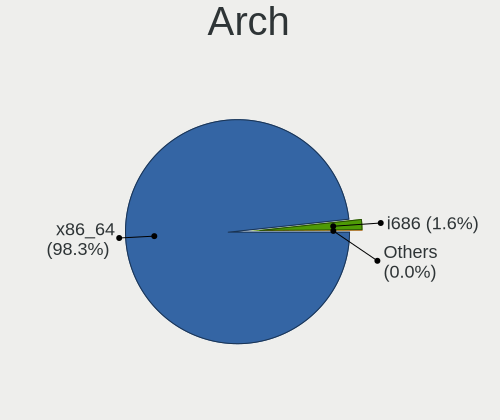
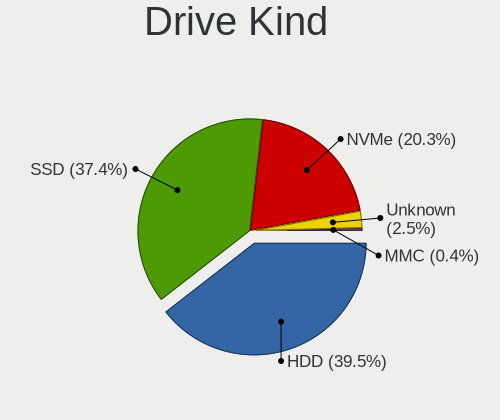
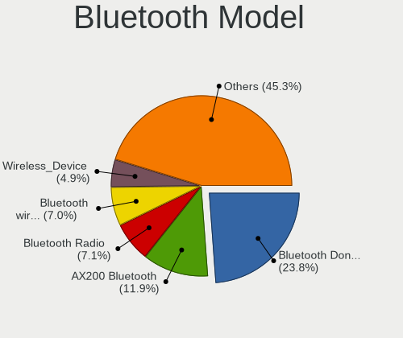
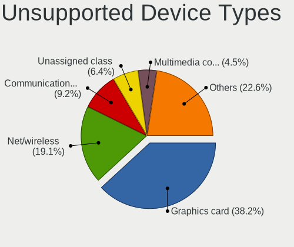

Linux in Germany - Tested Hardware & Statistics (Desktops)
----------------------------------------------------------

A project to collect tested hardware configurations for Linux in Germany.

Anyone can contribute to this report by the [hw-probe](https://github.com/linuxhw/hw-probe) tool:

    sudo -E hw-probe -all -upload

Please contribute! Especially if your hardware is rare.

Contents
--------

* [ Test Cases ](#test-cases)

* [ System ](#system)
  - [ OS                       ](#os)
  - [ OS Family                ](#os-family)
  - [ Kernel                   ](#kernel)
  - [ Kernel Family            ](#kernel-family)
  - [ Kernel Major Ver.        ](#kernel-major-ver)
  - [ Arch                     ](#arch)
  - [ DE                       ](#de)
  - [ Display Server           ](#display-server)
  - [ Display Manager          ](#display-manager)
  - [ OS Lang                  ](#os-lang)
  - [ Boot Mode                ](#boot-mode)
  - [ Filesystem               ](#filesystem)
  - [ Part. scheme             ](#part-scheme)
  - [ Dual Boot with Linux/BSD ](#dual-boot-with-linuxbsd)
  - [ Dual Boot (Win)          ](#dual-boot-win)

* [ Board ](#board)
  - [ Vendor                   ](#vendor)
  - [ Model                    ](#model)
  - [ Model Family             ](#model-family)
  - [ MFG Year                 ](#mfg-year)
  - [ Form Factor              ](#form-factor)
  - [ Secure Boot              ](#secure-boot)
  - [ Coreboot                 ](#coreboot)
  - [ RAM Size                 ](#ram-size)
  - [ RAM Used                 ](#ram-used)
  - [ Total Drives             ](#total-drives)
  - [ Has CD-ROM               ](#has-cd-rom)
  - [ Has Ethernet             ](#has-ethernet)
  - [ Has WiFi                 ](#has-wifi)
  - [ Has Bluetooth            ](#has-bluetooth)

* [ Location ](#location)
  - [ Country                  ](#country)
  - [ City                     ](#city)

* [ Drives ](#drives)
  - [ Drive Vendor             ](#drive-vendor)
  - [ Drive Model              ](#drive-model)
  - [ HDD Vendor               ](#hdd-vendor)
  - [ SSD Vendor               ](#ssd-vendor)
  - [ Drive Kind               ](#drive-kind)
  - [ Drive Connector          ](#drive-connector)
  - [ Drive Size               ](#drive-size)
  - [ Space Total              ](#space-total)
  - [ Space Used               ](#space-used)
  - [ Malfunc. Drives          ](#malfunc-drives)
  - [ Malfunc. Drive Vendor    ](#malfunc-drive-vendor)
  - [ Malfunc. HDD Vendor      ](#malfunc-hdd-vendor)
  - [ Malfunc. Drive Kind      ](#malfunc-drive-kind)
  - [ Failed Drives            ](#failed-drives)
  - [ Failed Drive Vendor      ](#failed-drive-vendor)
  - [ Drive Status             ](#drive-status)

* [ Storage controller ](#storage-controller)
  - [ Storage Vendor           ](#storage-vendor)
  - [ Storage Model            ](#storage-model)
  - [ Storage Kind             ](#storage-kind)

* [ Processor ](#processor)
  - [ CPU Vendor               ](#cpu-vendor)
  - [ CPU Model                ](#cpu-model)
  - [ CPU Model Family         ](#cpu-model-family)
  - [ CPU Cores                ](#cpu-cores)
  - [ CPU Sockets              ](#cpu-sockets)
  - [ CPU Threads              ](#cpu-threads)
  - [ CPU Op-Modes             ](#cpu-op-modes)
  - [ CPU Microcode            ](#cpu-microcode)
  - [ CPU Microarch            ](#cpu-microarch)

* [ Graphics ](#graphics)
  - [ GPU Vendor               ](#gpu-vendor)
  - [ GPU Model                ](#gpu-model)
  - [ GPU Combo                ](#gpu-combo)
  - [ GPU Driver               ](#gpu-driver)
  - [ GPU Memory               ](#gpu-memory)

* [ Monitor ](#monitor)
  - [ Monitor Vendor           ](#monitor-vendor)
  - [ Monitor Model            ](#monitor-model)
  - [ Monitor Resolution       ](#monitor-resolution)
  - [ Monitor Diagonal         ](#monitor-diagonal)
  - [ Monitor Width            ](#monitor-width)
  - [ Aspect Ratio             ](#aspect-ratio)
  - [ Monitor Area             ](#monitor-area)
  - [ Pixel Density            ](#pixel-density)
  - [ Multiple Monitors        ](#multiple-monitors)

* [ Network ](#network)
  - [ Net Controller Vendor    ](#net-controller-vendor)
  - [ Net Controller Model     ](#net-controller-model)
  - [ Wireless Vendor          ](#wireless-vendor)
  - [ Wireless Model           ](#wireless-model)
  - [ Ethernet Vendor          ](#ethernet-vendor)
  - [ Ethernet Model           ](#ethernet-model)
  - [ Net Controller Kind      ](#net-controller-kind)
  - [ Used Controller          ](#used-controller)
  - [ NICs                     ](#nics)
  - [ IPv6                     ](#ipv6)

* [ Bluetooth ](#bluetooth)
  - [ Bluetooth Vendor         ](#bluetooth-vendor)
  - [ Bluetooth Model          ](#bluetooth-model)

* [ Sound ](#sound)
  - [ Sound Vendor             ](#sound-vendor)
  - [ Sound Model              ](#sound-model)

* [ Memory ](#memory)
  - [ Memory Vendor            ](#memory-vendor)
  - [ Memory Model             ](#memory-model)
  - [ Memory Kind              ](#memory-kind)
  - [ Memory Form Factor       ](#memory-form-factor)
  - [ Memory Size              ](#memory-size)
  - [ Memory Speed             ](#memory-speed)

* [ Printers & scanners ](#printers--scanners)
  - [ Printer Vendor           ](#printer-vendor)
  - [ Printer Model            ](#printer-model)
  - [ Scanner Vendor           ](#scanner-vendor)
  - [ Scanner Model            ](#scanner-model)

* [ Camera ](#camera)
  - [ Camera Vendor            ](#camera-vendor)
  - [ Camera Model             ](#camera-model)

* [ Security ](#security)
  - [ Fingerprint Vendor       ](#fingerprint-vendor)
  - [ Fingerprint Model        ](#fingerprint-model)
  - [ Chipcard Vendor          ](#chipcard-vendor)
  - [ Chipcard Model           ](#chipcard-model)

* [ Unsupported ](#unsupported)
  - [ Unsupported Devices      ](#unsupported-devices)
  - [ Unsupported Device Types ](#unsupported-device-types)

Test Cases
----------

Total: 13384

| Vendor        | Model                       | Probe                                                      | Date         |
|---------------|-----------------------------|------------------------------------------------------------|--------------|
| Gigabyte      | B550 AORUS ELITE V2         | [77a31d50ce](https://linux-hardware.org/?probe=77a31d50ce) | Nov 06, 2023 |
| ASUSTek       | M4A785TD-V EVO              | [d57d789e77](https://linux-hardware.org/?probe=d57d789e77) | Nov 06, 2023 |
| Gigabyte      | B550M S2H                   | [b58de33b7d](https://linux-hardware.org/?probe=b58de33b7d) | Nov 06, 2023 |
| ASUSTek       | ROG Maximus XII FORMULA     | [6c8bb1840e](https://linux-hardware.org/?probe=6c8bb1840e) | Nov 05, 2023 |
| Biostar       | A10N-8800E                  | [35b7407efb](https://linux-hardware.org/?probe=35b7407efb) | Nov 05, 2023 |
| Gigabyte      | Q87M-D2H                    | [62a888f71c](https://linux-hardware.org/?probe=62a888f71c) | Nov 05, 2023 |
| Dell          | 0J1C3P A01                  | [8aefbb37f5](https://linux-hardware.org/?probe=8aefbb37f5) | Nov 05, 2023 |
| Gigabyte      | B85M-D3H                    | [42cbdffa93](https://linux-hardware.org/?probe=42cbdffa93) | Nov 05, 2023 |
| Medion        | TJ4125                      | [65a059325e](https://linux-hardware.org/?probe=65a059325e) | Nov 05, 2023 |
| ASUSTek       | PRIME J4005I-C              | [76b89da142](https://linux-hardware.org/?probe=76b89da142) | Nov 05, 2023 |
| Gigabyte      | B450M H                     | [436a3dc68e](https://linux-hardware.org/?probe=436a3dc68e) | Nov 05, 2023 |
| MSI           | NIGHTBLADE Z97              | [3da62b47b3](https://linux-hardware.org/?probe=3da62b47b3) | Nov 05, 2023 |
| Gigabyte      | MZBSWAP-K4                  | [ef6c15830d](https://linux-hardware.org/?probe=ef6c15830d) | Nov 05, 2023 |
| Gigabyte      | 970A-DS3P FX                | [615e914ddd](https://linux-hardware.org/?probe=615e914ddd) | Nov 05, 2023 |
| Gigabyte      | 970A-DS3P FX                | [7ba5de3dfd](https://linux-hardware.org/?probe=7ba5de3dfd) | Nov 05, 2023 |
| ASUSTek       | ROG STRIX B650E-E GAMING... | [60f590c96c](https://linux-hardware.org/?probe=60f590c96c) | Nov 05, 2023 |
| GEEKOM        | A5                          | [d3dd0e1aca](https://linux-hardware.org/?probe=d3dd0e1aca) | Nov 05, 2023 |
| ASRock        | 970 Pro3 R2.0               | [f070e73453](https://linux-hardware.org/?probe=f070e73453) | Nov 05, 2023 |
| MSI           | MAG B550 TOMAHAWK           | [482f1a0fe7](https://linux-hardware.org/?probe=482f1a0fe7) | Nov 05, 2023 |
| Medion        | H110H4-EM                   | [9fe03aa296](https://linux-hardware.org/?probe=9fe03aa296) | Nov 04, 2023 |
| Unknown       | Unknown                     | [f1e059fa93](https://linux-hardware.org/?probe=f1e059fa93) | Nov 04, 2023 |
| HP            | 8767 A                      | [307b4eb17b](https://linux-hardware.org/?probe=307b4eb17b) | Nov 04, 2023 |
| ASUSTek       | TUF Gaming B550-PLUS        | [e6f4957064](https://linux-hardware.org/?probe=e6f4957064) | Nov 04, 2023 |
| MSI           | B560M PRO                   | [903907b7c0](https://linux-hardware.org/?probe=903907b7c0) | Nov 04, 2023 |
| ASRock        | H470M-STX                   | [5a50d371b8](https://linux-hardware.org/?probe=5a50d371b8) | Nov 04, 2023 |
| MSI           | X570-A PRO                  | [30416c0355](https://linux-hardware.org/?probe=30416c0355) | Nov 04, 2023 |
| Gigabyte      | 945GM-S2                    | [f71f764594](https://linux-hardware.org/?probe=f71f764594) | Nov 04, 2023 |
| ASUSTek       | M5A97 R2.0                  | [905d699d4d](https://linux-hardware.org/?probe=905d699d4d) | Nov 04, 2023 |
| HP            | 8767 A                      | [a9d65549d2](https://linux-hardware.org/?probe=a9d65549d2) | Nov 04, 2023 |
| ASRock        | B450 Steel Legend           | [26aff1917e](https://linux-hardware.org/?probe=26aff1917e) | Nov 04, 2023 |
| ASRock        | B450 Steel Legend           | [2ab63a2fb6](https://linux-hardware.org/?probe=2ab63a2fb6) | Nov 04, 2023 |
| ASUSTek       | PRIME H510M-K               | [9501d6d6cf](https://linux-hardware.org/?probe=9501d6d6cf) | Nov 03, 2023 |
| HP            | 859C                        | [7928158950](https://linux-hardware.org/?probe=7928158950) | Nov 03, 2023 |
| Inventec      | D CLASS A02                 | [4342649c26](https://linux-hardware.org/?probe=4342649c26) | Nov 03, 2023 |
| Biostar       | A10N-8800E                  | [76374cbbfe](https://linux-hardware.org/?probe=76374cbbfe) | Nov 03, 2023 |
| ASUSTek       | PRIME B450-PLUS             | [d6f5634b02](https://linux-hardware.org/?probe=d6f5634b02) | Nov 03, 2023 |
| Gigabyte      | GA-790XTA-UD4               | [71fd69724b](https://linux-hardware.org/?probe=71fd69724b) | Nov 03, 2023 |
| Medion        | MS-7848                     | [ced5528ea5](https://linux-hardware.org/?probe=ced5528ea5) | Nov 03, 2023 |
| MSI           | MEG B550 UNIFY-X            | [88f58a978f](https://linux-hardware.org/?probe=88f58a978f) | Nov 03, 2023 |
| Fujitsu Si... | G31T-M2 V3.02               | [d069c6012d](https://linux-hardware.org/?probe=d069c6012d) | Nov 03, 2023 |
| Gigabyte      | Z370 HD3P-CF                | [1a0272a4ca](https://linux-hardware.org/?probe=1a0272a4ca) | Nov 02, 2023 |
| Gigabyte      | Z370 HD3P-CF                | [8ce1afee32](https://linux-hardware.org/?probe=8ce1afee32) | Nov 02, 2023 |
| MSI           | X370 SLI PLUS               | [98208c406a](https://linux-hardware.org/?probe=98208c406a) | Nov 02, 2023 |
| Inventec      | VXC Class A02               | [15fcabdf83](https://linux-hardware.org/?probe=15fcabdf83) | Nov 02, 2023 |
| MSI           | H110M PRO-D                 | [da5c3ffb7e](https://linux-hardware.org/?probe=da5c3ffb7e) | Nov 02, 2023 |
| Dell          | 0FXD80 A00                  | [d9b51a3a36](https://linux-hardware.org/?probe=d9b51a3a36) | Nov 02, 2023 |
| MSI           | B560M PRO                   | [adf6c161fa](https://linux-hardware.org/?probe=adf6c161fa) | Nov 02, 2023 |
| ASUSTek       | PRIME B450-PLUS             | [6531cff0ef](https://linux-hardware.org/?probe=6531cff0ef) | Nov 02, 2023 |
| HP            | 2AF7                        | [65ac8348d7](https://linux-hardware.org/?probe=65ac8348d7) | Nov 02, 2023 |
| ASUSTek       | P8B75-M LX                  | [77d328e8b9](https://linux-hardware.org/?probe=77d328e8b9) | Nov 02, 2023 |
| MSI           | B450M-A PRO MAX             | [97ef2a8173](https://linux-hardware.org/?probe=97ef2a8173) | Nov 02, 2023 |
| Gigabyte      | AX370-Gaming K7             | [0f4435d620](https://linux-hardware.org/?probe=0f4435d620) | Nov 02, 2023 |
| MSI           | MPG B550 GAMING PLUS        | [72a2946c83](https://linux-hardware.org/?probe=72a2946c83) | Nov 01, 2023 |
| ASUSTek       | M5A87                       | [b254c30981](https://linux-hardware.org/?probe=b254c30981) | Nov 01, 2023 |
| MSI           | B450-A PRO MAX              | [5116fa401d](https://linux-hardware.org/?probe=5116fa401d) | Nov 01, 2023 |
| Lenovo        | 3704 SDK0J40700 WIN 3258... | [3987d09af3](https://linux-hardware.org/?probe=3987d09af3) | Nov 01, 2023 |
| MSI           | B450-A PRO                  | [f0b1ef4bc8](https://linux-hardware.org/?probe=f0b1ef4bc8) | Nov 01, 2023 |
| ASRock        | B450M Pro4                  | [0dc16901b7](https://linux-hardware.org/?probe=0dc16901b7) | Nov 01, 2023 |
| MSI           | B550 GAMING GEN3            | [bd3efc9d84](https://linux-hardware.org/?probe=bd3efc9d84) | Nov 01, 2023 |
| ASUSTek       | B85M-E                      | [6709fd475b](https://linux-hardware.org/?probe=6709fd475b) | Nov 01, 2023 |
| ASUSTek       | ROG STRIX B550-F GAMING ... | [56fe3d964b](https://linux-hardware.org/?probe=56fe3d964b) | Nov 01, 2023 |
| Fujitsu       | D4017-A1 S26361-D4017-A1... | [939aebfa68](https://linux-hardware.org/?probe=939aebfa68) | Nov 01, 2023 |
| ASUSTek       | M5A97 R2.0                  | [8c9a8c3bcc](https://linux-hardware.org/?probe=8c9a8c3bcc) | Oct 31, 2023 |
| MSI           | H81M-E34                    | [0babe23a9d](https://linux-hardware.org/?probe=0babe23a9d) | Oct 31, 2023 |
| ASRock        | A520M Phantom Gaming 4      | [a63d934992](https://linux-hardware.org/?probe=a63d934992) | Oct 31, 2023 |
| Gigabyte      | Z97P-D3                     | [cf26456a24](https://linux-hardware.org/?probe=cf26456a24) | Oct 31, 2023 |
| ASUSTek       | P8H67-M LE                  | [d4a5c11db9](https://linux-hardware.org/?probe=d4a5c11db9) | Oct 31, 2023 |
| MSI           | X370 GAMING PRO             | [c8ba0de51d](https://linux-hardware.org/?probe=c8ba0de51d) | Oct 31, 2023 |
| Fujitsu Si... | D2750-A2 S26361-D2750-A2    | [5432c8a9f1](https://linux-hardware.org/?probe=5432c8a9f1) | Oct 30, 2023 |
| ASUSTek       | STRIX H270F GAMING          | [b4f34c54ae](https://linux-hardware.org/?probe=b4f34c54ae) | Oct 30, 2023 |
| ASUSTek       | STRIX H270F GAMING          | [1c1290e065](https://linux-hardware.org/?probe=1c1290e065) | Oct 30, 2023 |
| ASRock        | H61M-DGS R2.0               | [d8bd0d7795](https://linux-hardware.org/?probe=d8bd0d7795) | Oct 30, 2023 |
| MSI           | B450 GAMING PLUS            | [d7fb2de5a7](https://linux-hardware.org/?probe=d7fb2de5a7) | Oct 30, 2023 |
| MSI           | MPG B550 GAMING PLUS        | [09d5186c37](https://linux-hardware.org/?probe=09d5186c37) | Oct 30, 2023 |
| Gigabyte      | MZBSWAP-K4                  | [aed94a16c1](https://linux-hardware.org/?probe=aed94a16c1) | Oct 30, 2023 |
| HP            | 1790                        | [8bde9984db](https://linux-hardware.org/?probe=8bde9984db) | Oct 29, 2023 |
| Trigkey       | Green G4 10                 | [bb72f6af02](https://linux-hardware.org/?probe=bb72f6af02) | Oct 29, 2023 |
| HP            | 2AF7                        | [1960b3a243](https://linux-hardware.org/?probe=1960b3a243) | Oct 29, 2023 |
| ASUSTek       | Z87-DELUXE                  | [00b15965c5](https://linux-hardware.org/?probe=00b15965c5) | Oct 29, 2023 |
| Medion        | H110H4-EM                   | [1a2d0e5ed4](https://linux-hardware.org/?probe=1a2d0e5ed4) | Oct 29, 2023 |
| Fujitsu       | D2912-A1 S26361-D2912-A1    | [e0b8432cdc](https://linux-hardware.org/?probe=e0b8432cdc) | Oct 29, 2023 |
| ASUSTek       | PRIME B550-PLUS             | [28f261fb9a](https://linux-hardware.org/?probe=28f261fb9a) | Oct 29, 2023 |
| MSI           | B450 TOMAHAWK MAX II        | [67a61bc860](https://linux-hardware.org/?probe=67a61bc860) | Oct 29, 2023 |
| Gigabyte      | B760 AORUS ELITE AX DDR4    | [53ff42384c](https://linux-hardware.org/?probe=53ff42384c) | Oct 29, 2023 |
| MSI           | Z370M MORTAR                | [0af3708cd3](https://linux-hardware.org/?probe=0af3708cd3) | Oct 29, 2023 |
| Fujitsu       | D3222-A1 S26361-D3222-A1    | [db992da5fa](https://linux-hardware.org/?probe=db992da5fa) | Oct 28, 2023 |
| MSI           | MAG B650 TOMAHAWK WIFI      | [04e2b9cf4d](https://linux-hardware.org/?probe=04e2b9cf4d) | Oct 28, 2023 |
| Dell          | 0JP3NX A00                  | [434961d005](https://linux-hardware.org/?probe=434961d005) | Oct 28, 2023 |
| ASRock        | B550M-ITX/ac                | [1643900d75](https://linux-hardware.org/?probe=1643900d75) | Oct 28, 2023 |
| ASUSTek       | P5Q-PRO                     | [2722dd43f2](https://linux-hardware.org/?probe=2722dd43f2) | Oct 28, 2023 |
| ASRock        | B450 Steel Legend           | [21beb00969](https://linux-hardware.org/?probe=21beb00969) | Oct 28, 2023 |
| HP            | 1589                        | [fe31fa1d5e](https://linux-hardware.org/?probe=fe31fa1d5e) | Oct 28, 2023 |
| HP            | 1589                        | [5d14d38ded](https://linux-hardware.org/?probe=5d14d38ded) | Oct 28, 2023 |
| ASUSTek       | P8B75-M                     | [b9830b7f02](https://linux-hardware.org/?probe=b9830b7f02) | Oct 28, 2023 |
| Gigabyte      | B550 VISION D-P             | [d78b4f6222](https://linux-hardware.org/?probe=d78b4f6222) | Oct 28, 2023 |
| Lenovo        | ThinkCentre A70z 0401G6G    | [52e07e7ffe](https://linux-hardware.org/?probe=52e07e7ffe) | Oct 28, 2023 |
| Biostar       | A960D+V2                    | [8631ec3b22](https://linux-hardware.org/?probe=8631ec3b22) | Oct 27, 2023 |
| Lenovo        | 36F7 SDK0J40700 WIN 3258... | [b5e0b9a020](https://linux-hardware.org/?probe=b5e0b9a020) | Oct 27, 2023 |
| Lenovo        | 36F7 SDK0J40700 WIN 3258... | [38ed4f25af](https://linux-hardware.org/?probe=38ed4f25af) | Oct 27, 2023 |
| Fujitsu       | D2912-A1 S26361-D2912-A1    | [eb1a1b2e44](https://linux-hardware.org/?probe=eb1a1b2e44) | Oct 27, 2023 |
| Medion        | TJ4125                      | [f791cf88cb](https://linux-hardware.org/?probe=f791cf88cb) | Oct 27, 2023 |
| HC Technol... | HCAR5000-MI                 | [0c3d1e964a](https://linux-hardware.org/?probe=0c3d1e964a) | Oct 27, 2023 |
| Lenovo        | SDK0J40700 WIN              | [09f4736f4f](https://linux-hardware.org/?probe=09f4736f4f) | Oct 27, 2023 |
| ASUSTek       | A68HM-PLUS                  | [9d662bd187](https://linux-hardware.org/?probe=9d662bd187) | Oct 27, 2023 |
| ASUSTek       | H81M-PLUS                   | [509c70e6c1](https://linux-hardware.org/?probe=509c70e6c1) | Oct 27, 2023 |
| ASUSTek       | P6TD DELUXE                 | [46049da51f](https://linux-hardware.org/?probe=46049da51f) | Oct 27, 2023 |
| ASRock        | Z790 PG SONIC               | [3d8af896cc](https://linux-hardware.org/?probe=3d8af896cc) | Oct 27, 2023 |
| Fujitsu       | D3233-A1 S26361-D3233-A1    | [05961f3f8d](https://linux-hardware.org/?probe=05961f3f8d) | Oct 27, 2023 |
| Dell          | 040DDP A01                  | [6d081e2627](https://linux-hardware.org/?probe=6d081e2627) | Oct 27, 2023 |
| Gigabyte      | Z790 GAMING X AX            | [8555f763b4](https://linux-hardware.org/?probe=8555f763b4) | Oct 27, 2023 |
| HP            | 2215                        | [01fd79c4fe](https://linux-hardware.org/?probe=01fd79c4fe) | Oct 26, 2023 |
| ASUSTek       | PRIME Z370-A                | [75fcf950c2](https://linux-hardware.org/?probe=75fcf950c2) | Oct 26, 2023 |
| Lenovo        | SHARKBAY SDK0E50510 WIN     | [bcbce33659](https://linux-hardware.org/?probe=bcbce33659) | Oct 26, 2023 |
| Gigabyte      | GA-990XA-UD3                | [0990fc4382](https://linux-hardware.org/?probe=0990fc4382) | Oct 26, 2023 |
| MSI           | B450-A PRO                  | [e71634ac32](https://linux-hardware.org/?probe=e71634ac32) | Oct 26, 2023 |
| Gigabyte      | GA-MA78GM-S2H               | [6c7a32d339](https://linux-hardware.org/?probe=6c7a32d339) | Oct 26, 2023 |
| Gigabyte      | 945GM-S2                    | [baaa212a39](https://linux-hardware.org/?probe=baaa212a39) | Oct 26, 2023 |
| Medion        | MS-7848                     | [ab89c9cc22](https://linux-hardware.org/?probe=ab89c9cc22) | Oct 26, 2023 |
| ASUSTek       | Z170-A                      | [7d69a76c23](https://linux-hardware.org/?probe=7d69a76c23) | Oct 26, 2023 |
| ASUSTek       | M5A78L-M LX3                | [d3dacafdc2](https://linux-hardware.org/?probe=d3dacafdc2) | Oct 26, 2023 |
| Fujitsu       | D3162-A1 S26361-D3162-A1    | [37eda24908](https://linux-hardware.org/?probe=37eda24908) | Oct 26, 2023 |
| ASUSTek       | P5K-V                       | [d49d2a9835](https://linux-hardware.org/?probe=d49d2a9835) | Oct 26, 2023 |
| ASUSTek       | ROG CROSSHAIR X670E HERO    | [f38d8a7556](https://linux-hardware.org/?probe=f38d8a7556) | Oct 26, 2023 |
| ASUSTek       | ROG STRIX B550-F GAMING ... | [336fa07e6a](https://linux-hardware.org/?probe=336fa07e6a) | Oct 26, 2023 |
| ASUSTek       | PRIME X370-PRO              | [9cb0b1ec27](https://linux-hardware.org/?probe=9cb0b1ec27) | Oct 26, 2023 |
| ASUSTek       | P8H61-M LE/USB3             | [13ad3bb316](https://linux-hardware.org/?probe=13ad3bb316) | Oct 26, 2023 |
| ASUSTek       | P8H61-M LE/USB3             | [a8d850eef8](https://linux-hardware.org/?probe=a8d850eef8) | Oct 26, 2023 |
| ASUSTek       | ROG STRIX X570-F GAMING     | [ca40b148a0](https://linux-hardware.org/?probe=ca40b148a0) | Oct 26, 2023 |
| HP            | 822A                        | [4d1e3ee1f2](https://linux-hardware.org/?probe=4d1e3ee1f2) | Oct 25, 2023 |
| ASUSTek       | Pro WS WRX80E-SAGE SE WI... | [6ae562130f](https://linux-hardware.org/?probe=6ae562130f) | Oct 25, 2023 |
| GEEKOM        | A5                          | [2a6fe744c1](https://linux-hardware.org/?probe=2a6fe744c1) | Oct 25, 2023 |
| Intel         | JSL MRD                     | [4cf2468a9c](https://linux-hardware.org/?probe=4cf2468a9c) | Oct 25, 2023 |
| Gigabyte      | 945GM-S2                    | [259ddccf1b](https://linux-hardware.org/?probe=259ddccf1b) | Oct 25, 2023 |
| ASUSTek       | ROG STRIX B760-I GAMING ... | [e0dc5536a8](https://linux-hardware.org/?probe=e0dc5536a8) | Oct 25, 2023 |
| Gigabyte      | Z77-D3H                     | [2355d71878](https://linux-hardware.org/?probe=2355d71878) | Oct 25, 2023 |
| MSI           | X370 SLI PLUS               | [926619798d](https://linux-hardware.org/?probe=926619798d) | Oct 25, 2023 |
| MSI           | X370 SLI PLUS               | [504b1a1994](https://linux-hardware.org/?probe=504b1a1994) | Oct 25, 2023 |
| Gigabyte      | 990FXA-UD7                  | [eb3960a181](https://linux-hardware.org/?probe=eb3960a181) | Oct 25, 2023 |
| ASRock        | H87M Pro4                   | [64ba15c5e5](https://linux-hardware.org/?probe=64ba15c5e5) | Oct 24, 2023 |
| MSI           | GF615M-P33                  | [364be0dfae](https://linux-hardware.org/?probe=364be0dfae) | Oct 24, 2023 |
| ASRock        | H87M Pro4                   | [4677d3d0b8](https://linux-hardware.org/?probe=4677d3d0b8) | Oct 24, 2023 |
| Gigabyte      | A320M-S2H-CF                | [3b5b639e73](https://linux-hardware.org/?probe=3b5b639e73) | Oct 24, 2023 |
| ASUSTek       | Crosshair IV Formula        | [9664d44f1e](https://linux-hardware.org/?probe=9664d44f1e) | Oct 24, 2023 |
| MSI           | B550-A PRO                  | [ed696b1c52](https://linux-hardware.org/?probe=ed696b1c52) | Oct 24, 2023 |
| MSI           | Z390-A PRO                  | [48233204f6](https://linux-hardware.org/?probe=48233204f6) | Oct 23, 2023 |
| Inventec      | D CLASS A02                 | [41bf70ff0b](https://linux-hardware.org/?probe=41bf70ff0b) | Oct 23, 2023 |
| ASRock        | H61M-DGS R2.0               | [24d1406cad](https://linux-hardware.org/?probe=24d1406cad) | Oct 23, 2023 |
| ASUSTek       | Z97-A                       | [c715f1ecb0](https://linux-hardware.org/?probe=c715f1ecb0) | Oct 23, 2023 |
| ASRock        | 970 Extreme4                | [e1786f278d](https://linux-hardware.org/?probe=e1786f278d) | Oct 23, 2023 |
| MSI           | B450M PRO-VDH MAX           | [b981ef3e39](https://linux-hardware.org/?probe=b981ef3e39) | Oct 23, 2023 |
| Dell          | 09KPNV A00                  | [e7d2257726](https://linux-hardware.org/?probe=e7d2257726) | Oct 23, 2023 |
| Shenzhen M... | F6BFC                       | [04dd8d9baf](https://linux-hardware.org/?probe=04dd8d9baf) | Oct 23, 2023 |
| Gigabyte      | B550 AORUS ELITE V2         | [79ef1e4f2b](https://linux-hardware.org/?probe=79ef1e4f2b) | Oct 22, 2023 |
| ASUSTek       | PRIME B450M-A               | [e0f48fec00](https://linux-hardware.org/?probe=e0f48fec00) | Oct 22, 2023 |
| Fujitsu       | D3601-A1 S26361-D3601-A1    | [dba9cc7689](https://linux-hardware.org/?probe=dba9cc7689) | Oct 22, 2023 |
| Gigabyte      | B85M-D3H                    | [93e9d3b857](https://linux-hardware.org/?probe=93e9d3b857) | Oct 22, 2023 |
| Packard Be... | FIH57                       | [322f0cceaa](https://linux-hardware.org/?probe=322f0cceaa) | Oct 22, 2023 |
| ASUSTek       | PRIME X670-P WIFI           | [8bc4a56151](https://linux-hardware.org/?probe=8bc4a56151) | Oct 22, 2023 |
| Gigabyte      | H77-D3H                     | [2c786f10b7](https://linux-hardware.org/?probe=2c786f10b7) | Oct 22, 2023 |
| Gigabyte      | H77-D3H                     | [7b1e876aef](https://linux-hardware.org/?probe=7b1e876aef) | Oct 22, 2023 |
| Gigabyte      | B760 GAMING X DDR4          | [ce9770538c](https://linux-hardware.org/?probe=ce9770538c) | Oct 22, 2023 |
| Gigabyte      | Z390 UD                     | [c926b51230](https://linux-hardware.org/?probe=c926b51230) | Oct 22, 2023 |
| ASUSTek       | PRIME X670-P WIFI           | [9908be161f](https://linux-hardware.org/?probe=9908be161f) | Oct 22, 2023 |
| Gigabyte      | A320M-S2H-CF                | [b3113ef419](https://linux-hardware.org/?probe=b3113ef419) | Oct 22, 2023 |
| Fujitsu       | D3162-A1 S26361-D3162-A1    | [3e46064143](https://linux-hardware.org/?probe=3e46064143) | Oct 22, 2023 |
| Gigabyte      | GA-890FXA-UD5               | [bd8cdfe190](https://linux-hardware.org/?probe=bd8cdfe190) | Oct 22, 2023 |
| Gigabyte      | Z390 UD                     | [ce8bac4075](https://linux-hardware.org/?probe=ce8bac4075) | Oct 22, 2023 |
| Gigabyte      | Q87M-D2H                    | [74d5de2172](https://linux-hardware.org/?probe=74d5de2172) | Oct 21, 2023 |
| MSI           | B550-A PRO                  | [8db756bae3](https://linux-hardware.org/?probe=8db756bae3) | Oct 21, 2023 |
| ASUSTek       | TUF Gaming B650M-PLUS       | [67c6d6e482](https://linux-hardware.org/?probe=67c6d6e482) | Oct 21, 2023 |
| Gigabyte      | B85M-D2V                    | [f7b3792e3e](https://linux-hardware.org/?probe=f7b3792e3e) | Oct 21, 2023 |
| MSI           | B350M MORTAR                | [8dce4bcd71](https://linux-hardware.org/?probe=8dce4bcd71) | Oct 21, 2023 |
| Gigabyte      | B85-HD3                     | [36f840931d](https://linux-hardware.org/?probe=36f840931d) | Oct 21, 2023 |
| ASUSTek       | PRIME B360-PLUS             | [1190f127a2](https://linux-hardware.org/?probe=1190f127a2) | Oct 21, 2023 |
| ASUSTek       | ROG STRIX B550-A GAMING     | [87212fc8b1](https://linux-hardware.org/?probe=87212fc8b1) | Oct 21, 2023 |
| ASRock        | H97M Pro4                   | [04f6bc7f0c](https://linux-hardware.org/?probe=04f6bc7f0c) | Oct 21, 2023 |
| Packard Be... | FIH57                       | [b16d87199a](https://linux-hardware.org/?probe=b16d87199a) | Oct 21, 2023 |
| Gigabyte      | B760 GAMING X AX DDR4       | [eb5de485aa](https://linux-hardware.org/?probe=eb5de485aa) | Oct 21, 2023 |
| Gigabyte      | B650 GAMING X AX            | [eb853298f9](https://linux-hardware.org/?probe=eb853298f9) | Oct 21, 2023 |
| Fujitsu       | D3233-A1 S26361-D3233-A1    | [a3af824c75](https://linux-hardware.org/?probe=a3af824c75) | Oct 20, 2023 |
| Gigabyte      | B85M-D3H                    | [5a47896ccd](https://linux-hardware.org/?probe=5a47896ccd) | Oct 20, 2023 |
| Gigabyte      | Q87M-D2H                    | [4633508fb0](https://linux-hardware.org/?probe=4633508fb0) | Oct 20, 2023 |
| ASRock        | Q1900-ITX                   | [d4d8b74595](https://linux-hardware.org/?probe=d4d8b74595) | Oct 20, 2023 |
| Lenovo        | SHARKBAY SDK0E50510 WIN     | [ed9af05f78](https://linux-hardware.org/?probe=ed9af05f78) | Oct 20, 2023 |
| Gigabyte      | B450 I AORUS PRO WIFI-CF    | [bae930bd47](https://linux-hardware.org/?probe=bae930bd47) | Oct 20, 2023 |
| ASUSTek       | PRIME X570-PRO              | [3baedd7e19](https://linux-hardware.org/?probe=3baedd7e19) | Oct 20, 2023 |
| ASUSTek       | ROG Maximus Z790 HERO       | [e5b7455426](https://linux-hardware.org/?probe=e5b7455426) | Oct 19, 2023 |
| MSI           | MS-7309                     | [2d1eefe4be](https://linux-hardware.org/?probe=2d1eefe4be) | Oct 19, 2023 |
| MSI           | B85M-E45                    | [8c3f253c5e](https://linux-hardware.org/?probe=8c3f253c5e) | Oct 19, 2023 |
| MSI           | MAG Z590 TOMAHAWK WIFI      | [77079711d3](https://linux-hardware.org/?probe=77079711d3) | Oct 19, 2023 |
| ASUSTek       | H110M-A/M.2                 | [8b06221698](https://linux-hardware.org/?probe=8b06221698) | Oct 19, 2023 |
| MSI           | Z390-A PRO                  | [7fd0eeaeec](https://linux-hardware.org/?probe=7fd0eeaeec) | Oct 19, 2023 |
| Fujitsu       | D3432-A1 S26361-D3432-A1    | [87d2e5945b](https://linux-hardware.org/?probe=87d2e5945b) | Oct 19, 2023 |
| Dell          | 073MMW A02                  | [1c1ea56be3](https://linux-hardware.org/?probe=1c1ea56be3) | Oct 19, 2023 |
| Gigabyte      | B85M-D2V                    | [572daeb059](https://linux-hardware.org/?probe=572daeb059) | Oct 19, 2023 |
| Lenovo        | MAHOBAY                     | [56477ae2bb](https://linux-hardware.org/?probe=56477ae2bb) | Oct 19, 2023 |
| ASUSTek       | ROG Maximus X HERO          | [d7d89d2b1b](https://linux-hardware.org/?probe=d7d89d2b1b) | Oct 19, 2023 |
| Acer          | Aspire TC-330               | [99424bb03e](https://linux-hardware.org/?probe=99424bb03e) | Oct 19, 2023 |
| MSI           | H81M-E34                    | [18c6eb940d](https://linux-hardware.org/?probe=18c6eb940d) | Oct 19, 2023 |
| Fujitsu       | D2990-A3 S26361-D2990-A3    | [c2215ccabb](https://linux-hardware.org/?probe=c2215ccabb) | Oct 19, 2023 |
| Acer          | Aspire TC-330               | [ddabdcc2b7](https://linux-hardware.org/?probe=ddabdcc2b7) | Oct 19, 2023 |
| Acer          | Predator G3-605             | [d3b59b34a0](https://linux-hardware.org/?probe=d3b59b34a0) | Oct 19, 2023 |
| ASUSTek       | PRIME X570-PRO              | [84517c1f4c](https://linux-hardware.org/?probe=84517c1f4c) | Oct 19, 2023 |
| ASRock        | N100M                       | [a52836d33c](https://linux-hardware.org/?probe=a52836d33c) | Oct 19, 2023 |
| Gigabyte      | A320M-S2H-CF                | [3745e48bdc](https://linux-hardware.org/?probe=3745e48bdc) | Oct 18, 2023 |
| ASUSTek       | PRIME H510M-A               | [04e9833b48](https://linux-hardware.org/?probe=04e9833b48) | Oct 18, 2023 |
| ASUSTek       | ROG STRIX B550-F GAMING     | [8f79e82a3a](https://linux-hardware.org/?probe=8f79e82a3a) | Oct 17, 2023 |
| Foxconn       | 2ABF                        | [5d936f030f](https://linux-hardware.org/?probe=5d936f030f) | Oct 17, 2023 |
| Gigabyte      | H110M-D2P-WG-CF             | [113b3d362d](https://linux-hardware.org/?probe=113b3d362d) | Oct 17, 2023 |
| ASUSTek       | P5K-V                       | [ca8e1433c5](https://linux-hardware.org/?probe=ca8e1433c5) | Oct 17, 2023 |
| ASRock        | X570 Phantom Gaming 4       | [78e9e09f46](https://linux-hardware.org/?probe=78e9e09f46) | Oct 17, 2023 |
| HP            | 212B                        | [f3793f3e05](https://linux-hardware.org/?probe=f3793f3e05) | Oct 17, 2023 |
| AMI           | IB70 V202                   | [712b29d6db](https://linux-hardware.org/?probe=712b29d6db) | Oct 17, 2023 |
| Acer          | Aspire TC-886 V:2.0         | [808704ebf0](https://linux-hardware.org/?probe=808704ebf0) | Oct 17, 2023 |
| Gigabyte      | B560M AORUS PRO AX          | [5573fff3e6](https://linux-hardware.org/?probe=5573fff3e6) | Oct 17, 2023 |
| ASRock        | FM2A68M-HD+                 | [3597183b2f](https://linux-hardware.org/?probe=3597183b2f) | Oct 17, 2023 |
| ASRock        | X570 Phantom Gaming 4       | [3f87e6216a](https://linux-hardware.org/?probe=3f87e6216a) | Oct 16, 2023 |
| Fujitsu Si... | D2312-A3 S26361-D2312-A3    | [eb657acc28](https://linux-hardware.org/?probe=eb657acc28) | Oct 16, 2023 |
| ASRock        | B550 Steel Legend           | [dba8d15f50](https://linux-hardware.org/?probe=dba8d15f50) | Oct 16, 2023 |
| Lenovo        | SHARKBAY 31900058 STD       | [d48d54a951](https://linux-hardware.org/?probe=d48d54a951) | Oct 16, 2023 |
| Unknown       | Unknown                     | [90af9ca939](https://linux-hardware.org/?probe=90af9ca939) | Oct 16, 2023 |
| ASUSTek       | Z170-A                      | [9671bbc29b](https://linux-hardware.org/?probe=9671bbc29b) | Oct 16, 2023 |
| ASRock        | B550 Phantom Gaming-ITX/... | [d294330c51](https://linux-hardware.org/?probe=d294330c51) | Oct 16, 2023 |
| Dell          | 0D28YY A01                  | [a69ebf1645](https://linux-hardware.org/?probe=a69ebf1645) | Oct 15, 2023 |
| Gigabyte      | GA-78LMT-USB3 SEx           | [c0446b13ce](https://linux-hardware.org/?probe=c0446b13ce) | Oct 15, 2023 |
| MSI           | MPG B550 GAMING EDGE WIF... | [5330b349cb](https://linux-hardware.org/?probe=5330b349cb) | Oct 15, 2023 |
| MSI           | MPG X570 GAMING EDGE WIF... | [a116875c3f](https://linux-hardware.org/?probe=a116875c3f) | Oct 15, 2023 |
| HP            | 212B                        | [8a59414060](https://linux-hardware.org/?probe=8a59414060) | Oct 15, 2023 |
| Pegatron      | 2AB6                        | [9f5a8c985a](https://linux-hardware.org/?probe=9f5a8c985a) | Oct 15, 2023 |
| HP            | 212B                        | [c0b9765d6e](https://linux-hardware.org/?probe=c0b9765d6e) | Oct 15, 2023 |
| Pegatron      | 2AB6                        | [6f3a56878d](https://linux-hardware.org/?probe=6f3a56878d) | Oct 15, 2023 |
| ASRock        | X470 Gaming K4              | [740122e9fa](https://linux-hardware.org/?probe=740122e9fa) | Oct 15, 2023 |
| Acer          | FIH57                       | [5146d9ed8a](https://linux-hardware.org/?probe=5146d9ed8a) | Oct 14, 2023 |
| Dell          | 0D28YY A01                  | [39ea3f0798](https://linux-hardware.org/?probe=39ea3f0798) | Oct 14, 2023 |
| ASUSTek       | ROG CROSSHAIR VIII HERO     | [430df05ea3](https://linux-hardware.org/?probe=430df05ea3) | Oct 14, 2023 |
| Lenovo        | 3111 SDK0J40697 WIN 3305... | [1d1e26c1fe](https://linux-hardware.org/?probe=1d1e26c1fe) | Oct 14, 2023 |
| Gigabyte      | X58A-UD7                    | [1a722caeea](https://linux-hardware.org/?probe=1a722caeea) | Oct 14, 2023 |
| ASUSTek       | P8Q77-M                     | [ed4ca29c66](https://linux-hardware.org/?probe=ed4ca29c66) | Oct 14, 2023 |
| ASRock        | H610M-ITX/ac                | [6bfc83ddf0](https://linux-hardware.org/?probe=6bfc83ddf0) | Oct 14, 2023 |
| MSI           | MPG X570 GAMING PLUS        | [eaf16e3ac3](https://linux-hardware.org/?probe=eaf16e3ac3) | Oct 14, 2023 |
| Fujitsu       | D3221-A1 S26361-D3221-A1    | [babe25d4ce](https://linux-hardware.org/?probe=babe25d4ce) | Oct 14, 2023 |
| ASRock        | H55M-LE                     | [444d608969](https://linux-hardware.org/?probe=444d608969) | Oct 14, 2023 |
| Dell          | 0T568R A00                  | [ef9aa5b89c](https://linux-hardware.org/?probe=ef9aa5b89c) | Oct 14, 2023 |
| MSI           | MPG B460I GAMING EDGE WI... | [1bea1dafbf](https://linux-hardware.org/?probe=1bea1dafbf) | Oct 13, 2023 |
| MSI           | X470 GAMING PRO CARBON      | [039e898b5d](https://linux-hardware.org/?probe=039e898b5d) | Oct 13, 2023 |
| Inventec      | D CLASS A02                 | [9559c016fb](https://linux-hardware.org/?probe=9559c016fb) | Oct 13, 2023 |
| Inventec      | D CLASS A02                 | [e978ca79f0](https://linux-hardware.org/?probe=e978ca79f0) | Oct 13, 2023 |
| Inventec      | D CLASS A02                 | [2fcdc2d0c9](https://linux-hardware.org/?probe=2fcdc2d0c9) | Oct 13, 2023 |
| Inventec      | D CLASS A02                 | [4a80e43244](https://linux-hardware.org/?probe=4a80e43244) | Oct 13, 2023 |
| HP            | 2B4B                        | [8dc275b21d](https://linux-hardware.org/?probe=8dc275b21d) | Oct 13, 2023 |
| ASRock        | H61M-DGS R2.0               | [8ca3e29982](https://linux-hardware.org/?probe=8ca3e29982) | Oct 13, 2023 |
| HP            | 83EC                        | [5a68f90404](https://linux-hardware.org/?probe=5a68f90404) | Oct 13, 2023 |
| Dell          | 0WR7PY A03                  | [f59286c03f](https://linux-hardware.org/?probe=f59286c03f) | Oct 13, 2023 |
| MSI           | MAG B650 TOMAHAWK WIFI      | [e30927f66e](https://linux-hardware.org/?probe=e30927f66e) | Oct 12, 2023 |
| MSI           | MAG B650 TOMAHAWK WIFI      | [2869814e7d](https://linux-hardware.org/?probe=2869814e7d) | Oct 12, 2023 |
| Acer          | Aspire XC-780               | [b92c12a77d](https://linux-hardware.org/?probe=b92c12a77d) | Oct 12, 2023 |
| Foxconn       | 45CMX/45GMX/45CMX-K         | [eed28015b6](https://linux-hardware.org/?probe=eed28015b6) | Oct 12, 2023 |
| MSI           | B560M PRO                   | [3ad673132a](https://linux-hardware.org/?probe=3ad673132a) | Oct 12, 2023 |
| Gigabyte      | X570S UD                    | [c7b68dbfe1](https://linux-hardware.org/?probe=c7b68dbfe1) | Oct 12, 2023 |
| Gigabyte      | X570 AORUS ELITE            | [dc82ec9351](https://linux-hardware.org/?probe=dc82ec9351) | Oct 11, 2023 |
| Fujitsu       | D3233-A1 S26361-D3233-A1    | [b3fedf98f7](https://linux-hardware.org/?probe=b3fedf98f7) | Oct 11, 2023 |
| MSI           | X470 GAMING PRO             | [24f5b87752](https://linux-hardware.org/?probe=24f5b87752) | Oct 11, 2023 |
| Fujitsu       | D3222-A1 S26361-D3222-A1    | [8606120535](https://linux-hardware.org/?probe=8606120535) | Oct 10, 2023 |
| Medion        | TJ4125                      | [e60adf45ac](https://linux-hardware.org/?probe=e60adf45ac) | Oct 10, 2023 |
| ASRock        | B450 Gaming-ITX/ac          | [3d02079672](https://linux-hardware.org/?probe=3d02079672) | Oct 10, 2023 |
| Lenovo        | 30D2 NOK                    | [e81b1e1e21](https://linux-hardware.org/?probe=e81b1e1e21) | Oct 10, 2023 |
| Gigabyte      | Z97P-D3                     | [e8d34cd0b9](https://linux-hardware.org/?probe=e8d34cd0b9) | Oct 10, 2023 |
| AMI           | Intel                       | [1615dc16ba](https://linux-hardware.org/?probe=1615dc16ba) | Oct 10, 2023 |
| ASRock        | J5040-ITX                   | [8ed86b8780](https://linux-hardware.org/?probe=8ed86b8780) | Oct 10, 2023 |
| Fujitsu       | D3401-A1 S26361-D3401-A1    | [21bc932110](https://linux-hardware.org/?probe=21bc932110) | Oct 10, 2023 |
| Gigabyte      | GA-A75M-D2H                 | [541d9a0542](https://linux-hardware.org/?probe=541d9a0542) | Oct 10, 2023 |
| Gigabyte      | X570 GAMING X               | [b09f4a3a8a](https://linux-hardware.org/?probe=b09f4a3a8a) | Oct 10, 2023 |
| ASUSTek       | M4A89GTD-PRO/USB3           | [9e03b4745f](https://linux-hardware.org/?probe=9e03b4745f) | Oct 10, 2023 |
| ASRock        | X570 Phantom Gaming 4       | [24e0ada60a](https://linux-hardware.org/?probe=24e0ada60a) | Oct 10, 2023 |
| LattePanda    | 3 Delta LP-BS-7-S70JR120... | [107d1f4d14](https://linux-hardware.org/?probe=107d1f4d14) | Oct 09, 2023 |
| ASUSTek       | Maximus VIII RANGER         | [e1dc170ad7](https://linux-hardware.org/?probe=e1dc170ad7) | Oct 09, 2023 |
| HP            | 82A2                        | [91032b3166](https://linux-hardware.org/?probe=91032b3166) | Oct 09, 2023 |
| ASRock        | H97 Anniversary             | [c9e7861ff4](https://linux-hardware.org/?probe=c9e7861ff4) | Oct 09, 2023 |
| Centerm       | C32A                        | [8943d70e57](https://linux-hardware.org/?probe=8943d70e57) | Oct 09, 2023 |
| Dell          | 0WMJ54 A01                  | [58b4471d7e](https://linux-hardware.org/?probe=58b4471d7e) | Oct 09, 2023 |
| MSI           | Z87-G45 GAMING              | [358f4a0030](https://linux-hardware.org/?probe=358f4a0030) | Oct 08, 2023 |
| ASUSTek       | PRIME B450M-K               | [ef1a8f61be](https://linux-hardware.org/?probe=ef1a8f61be) | Oct 08, 2023 |
| ASUSTek       | B85M-G                      | [b87a632a3b](https://linux-hardware.org/?probe=b87a632a3b) | Oct 08, 2023 |
| ASUSTek       | P8H67-M EVO                 | [146bc4cb2c](https://linux-hardware.org/?probe=146bc4cb2c) | Oct 08, 2023 |
| Gigabyte      | Z170-HD3P-CF                | [fb4e034718](https://linux-hardware.org/?probe=fb4e034718) | Oct 08, 2023 |
| ASUSTek       | ROG STRIX B760-G GAMING ... | [21c1a0fa63](https://linux-hardware.org/?probe=21c1a0fa63) | Oct 08, 2023 |
| ASUSTek       | ROG STRIX X570-E GAMING     | [94f6dd97ae](https://linux-hardware.org/?probe=94f6dd97ae) | Oct 08, 2023 |
| MSI           | B450M MORTAR MAX            | [b03eea6d75](https://linux-hardware.org/?probe=b03eea6d75) | Oct 08, 2023 |
| Gigabyte      | B550 VISION D-P             | [b0a2980430](https://linux-hardware.org/?probe=b0a2980430) | Oct 08, 2023 |
| MSI           | X58 Pro-E                   | [939bfb5fe4](https://linux-hardware.org/?probe=939bfb5fe4) | Oct 08, 2023 |
| MSI           | X58 Pro-E                   | [fcf3cf909a](https://linux-hardware.org/?probe=fcf3cf909a) | Oct 08, 2023 |
| Gigabyte      | B450M DS3H V2               | [4f2f37c5ba](https://linux-hardware.org/?probe=4f2f37c5ba) | Oct 08, 2023 |
| MSI           | X370 SLI PLUS               | [61ffd24590](https://linux-hardware.org/?probe=61ffd24590) | Oct 08, 2023 |
| MSI           | B450M-A PRO MAX             | [3ac34a911c](https://linux-hardware.org/?probe=3ac34a911c) | Oct 08, 2023 |
| ASRock        | Q1900B-ITX                  | [f8ad7736e2](https://linux-hardware.org/?probe=f8ad7736e2) | Oct 07, 2023 |
| ASUSTek       | M5A78L-M LE                 | [c5387f239d](https://linux-hardware.org/?probe=c5387f239d) | Oct 07, 2023 |
| Gigabyte      | B450M H                     | [0ad7f99071](https://linux-hardware.org/?probe=0ad7f99071) | Oct 07, 2023 |
| ASUSTek       | P8H61-MX USB3               | [f542691a6b](https://linux-hardware.org/?probe=f542691a6b) | Oct 07, 2023 |
| ASUSTek       | M5A78L-M LE/USB3            | [765a6eb640](https://linux-hardware.org/?probe=765a6eb640) | Oct 07, 2023 |
| Fujitsu       | D3432-A1 S26361-D3432-A1    | [100eb19d44](https://linux-hardware.org/?probe=100eb19d44) | Oct 07, 2023 |
| ASUSTek       | ROG STRIX B550-F GAMING     | [13d4e4c49f](https://linux-hardware.org/?probe=13d4e4c49f) | Oct 07, 2023 |
| ASUSTek       | B85M-G                      | [dbe9a8352b](https://linux-hardware.org/?probe=dbe9a8352b) | Oct 07, 2023 |
| ASUSTek       | P8Z77-V LX                  | [096a49de1b](https://linux-hardware.org/?probe=096a49de1b) | Oct 06, 2023 |
| Dell          | 0T7D40 A00                  | [ede23a61ce](https://linux-hardware.org/?probe=ede23a61ce) | Oct 06, 2023 |
| Gigabyte      | Z390 UD                     | [539e4b56a6](https://linux-hardware.org/?probe=539e4b56a6) | Oct 06, 2023 |
| Gigabyte      | B450 I AORUS PRO WIFI-CF    | [8ad2fc1fd8](https://linux-hardware.org/?probe=8ad2fc1fd8) | Oct 06, 2023 |
| Gigabyte      | H81M-D2V                    | [a41f086304](https://linux-hardware.org/?probe=a41f086304) | Oct 06, 2023 |
| Lenovo        | 3148 SDK0J40700 WIN 3258... | [06814a2a87](https://linux-hardware.org/?probe=06814a2a87) | Oct 06, 2023 |
| Dell          | 0T7D40 A00                  | [bdeb014556](https://linux-hardware.org/?probe=bdeb014556) | Oct 05, 2023 |
| Gigabyte      | GA-A75M-S2V                 | [aa3a892278](https://linux-hardware.org/?probe=aa3a892278) | Oct 05, 2023 |
| Medion        | MS-7707                     | [42bc6357f7](https://linux-hardware.org/?probe=42bc6357f7) | Oct 05, 2023 |
| Gigabyte      | X570 GAMING X               | [ebbd23f352](https://linux-hardware.org/?probe=ebbd23f352) | Oct 05, 2023 |
| ASUSTek       | M5A78L-M/USB3               | [a2df1f8024](https://linux-hardware.org/?probe=a2df1f8024) | Oct 05, 2023 |
| ASUSTek       | M4A78T-E                    | [2eadbdec5d](https://linux-hardware.org/?probe=2eadbdec5d) | Oct 05, 2023 |
| eMachines     | EL1352                      | [741a66b428](https://linux-hardware.org/?probe=741a66b428) | Oct 05, 2023 |
| Gigabyte      | Z68XP-UD4                   | [274ebab6c4](https://linux-hardware.org/?probe=274ebab6c4) | Oct 04, 2023 |
| MSI           | X370 SLI PLUS               | [2dd3582507](https://linux-hardware.org/?probe=2dd3582507) | Oct 04, 2023 |
| Intel         | X79M-S                      | [a62dc4f931](https://linux-hardware.org/?probe=a62dc4f931) | Oct 04, 2023 |
| ASUSTek       | ROG STRIX B550-F GAMING     | [b8a1928378](https://linux-hardware.org/?probe=b8a1928378) | Oct 04, 2023 |
| Shenzhen M... | HX90G                       | [135859015c](https://linux-hardware.org/?probe=135859015c) | Oct 04, 2023 |
| ASUSTek       | PRIME H510M-K               | [43dfd73b17](https://linux-hardware.org/?probe=43dfd73b17) | Oct 04, 2023 |
| HP            | 3397                        | [e77e1b6391](https://linux-hardware.org/?probe=e77e1b6391) | Oct 04, 2023 |
| HP            | 8594                        | [320d02db05](https://linux-hardware.org/?probe=320d02db05) | Oct 04, 2023 |
| Unknown       | Unknown                     | [bceb27e642](https://linux-hardware.org/?probe=bceb27e642) | Oct 04, 2023 |
| ASRock        | Z97 Extreme4                | [eec7dacbba](https://linux-hardware.org/?probe=eec7dacbba) | Oct 04, 2023 |
| Gigabyte      | B760 GAMING X DDR4          | [811561ec05](https://linux-hardware.org/?probe=811561ec05) | Oct 04, 2023 |
| Gigabyte      | X570S AORUS PRO AX          | [d034b84815](https://linux-hardware.org/?probe=d034b84815) | Oct 04, 2023 |
| Gigabyte      | GA-MA790XT-UD4P             | [dcdb58537e](https://linux-hardware.org/?probe=dcdb58537e) | Oct 04, 2023 |
| Acer          | Aspire G7760                | [a6d77a2162](https://linux-hardware.org/?probe=a6d77a2162) | Oct 04, 2023 |
| ASUSTek       | E2KM1I-DELUXE               | [bb9493309a](https://linux-hardware.org/?probe=bb9493309a) | Oct 04, 2023 |
| HP            | 0AA4h                       | [8e4a645689](https://linux-hardware.org/?probe=8e4a645689) | Oct 03, 2023 |
| ASUSTek       | PRIME X370-PRO              | [573f1da6a9](https://linux-hardware.org/?probe=573f1da6a9) | Oct 03, 2023 |
| ASUSTek       | SABERTOOTH 990FX R3.0       | [b63af8760f](https://linux-hardware.org/?probe=b63af8760f) | Oct 03, 2023 |
| Gigabyte      | 945GM-S2                    | [a445c2511c](https://linux-hardware.org/?probe=a445c2511c) | Oct 03, 2023 |
| Gigabyte      | 945GM-S2                    | [49cddeaaea](https://linux-hardware.org/?probe=49cddeaaea) | Oct 03, 2023 |
| Gigabyte      | X570S UD                    | [5d8ef7c003](https://linux-hardware.org/?probe=5d8ef7c003) | Oct 03, 2023 |
| ASUSTek       | M5A97 R2.0                  | [2e1316fb48](https://linux-hardware.org/?probe=2e1316fb48) | Oct 03, 2023 |
| ASUSTek       | M5A78L-M/USB3               | [f289b8e738](https://linux-hardware.org/?probe=f289b8e738) | Oct 03, 2023 |
| Acer          | Nitro N50-600 V:1.1         | [8959fc9294](https://linux-hardware.org/?probe=8959fc9294) | Oct 03, 2023 |
| MSI           | PRO B650-P WIFI             | [b4c43b115b](https://linux-hardware.org/?probe=b4c43b115b) | Oct 03, 2023 |
| ASUSTek       | ROG STRIX B650E-F GAMING... | [400e01b1bf](https://linux-hardware.org/?probe=400e01b1bf) | Oct 03, 2023 |
| Biostar       | G41 DVI                     | [6eeec57cc9](https://linux-hardware.org/?probe=6eeec57cc9) | Oct 03, 2023 |
| Medion        | TJ4125                      | [626065ec1b](https://linux-hardware.org/?probe=626065ec1b) | Oct 03, 2023 |
| Intel         | JSL MRD                     | [5a4bfcaba3](https://linux-hardware.org/?probe=5a4bfcaba3) | Oct 03, 2023 |
| Gigabyte      | GA-880GM-USB3               | [4817937b18](https://linux-hardware.org/?probe=4817937b18) | Oct 03, 2023 |
| Dell          | 0NK5PH A00                  | [acf4a7170d](https://linux-hardware.org/?probe=acf4a7170d) | Oct 03, 2023 |
| Kllisre       | X79 V1.2                    | [fb9b29c804](https://linux-hardware.org/?probe=fb9b29c804) | Oct 03, 2023 |
| Gigabyte      | B85M-D3H                    | [a6aa43cf26](https://linux-hardware.org/?probe=a6aa43cf26) | Oct 03, 2023 |
| Fujitsu Si... | G31T-M2 V3.02               | [8a0f0948e0](https://linux-hardware.org/?probe=8a0f0948e0) | Oct 03, 2023 |
| Dell          | 0Y3R3K A03                  | [0675277f70](https://linux-hardware.org/?probe=0675277f70) | Oct 03, 2023 |
| Medion        | MS-7713                     | [511fe2eef1](https://linux-hardware.org/?probe=511fe2eef1) | Oct 02, 2023 |
| Gigabyte      | B550M AORUS PRO-P           | [257a13e71a](https://linux-hardware.org/?probe=257a13e71a) | Oct 02, 2023 |
| Gigabyte      | Q87M-D2H                    | [ee49b13b77](https://linux-hardware.org/?probe=ee49b13b77) | Oct 02, 2023 |
| MSI           | B560M PRO                   | [1312550a66](https://linux-hardware.org/?probe=1312550a66) | Oct 02, 2023 |
| Dell          | 0WMJ54 A01                  | [479028c9e5](https://linux-hardware.org/?probe=479028c9e5) | Oct 02, 2023 |
| ASUSTek       | P5K-V                       | [899f52c343](https://linux-hardware.org/?probe=899f52c343) | Oct 02, 2023 |
| MSI           | MPG B460I GAMING EDGE WI... | [124cb639c1](https://linux-hardware.org/?probe=124cb639c1) | Oct 02, 2023 |
| Gigabyte      | Z170-HD3P-CF                | [7a0bb156df](https://linux-hardware.org/?probe=7a0bb156df) | Oct 02, 2023 |
| Lenovo        | ThinkStation S20 4157E87    | [ef8fcbec51](https://linux-hardware.org/?probe=ef8fcbec51) | Oct 02, 2023 |
| MSI           | B450M-A PRO MAX             | [57ddb0f758](https://linux-hardware.org/?probe=57ddb0f758) | Oct 01, 2023 |
| Gigabyte      | AX370-Gaming K7             | [f8ee109cbd](https://linux-hardware.org/?probe=f8ee109cbd) | Oct 01, 2023 |
| ASRock        | B650E PG-ITX WiFi           | [10e1561364](https://linux-hardware.org/?probe=10e1561364) | Oct 01, 2023 |
| MSI           | MAG Z790 TOMAHAWK WIFI      | [4869929ae9](https://linux-hardware.org/?probe=4869929ae9) | Oct 01, 2023 |
| Acer          | Aspire X3400                | [9bdfd8cfd2](https://linux-hardware.org/?probe=9bdfd8cfd2) | Oct 01, 2023 |
| ASRock        | H61M-DGS R2.0               | [44eaf9c58d](https://linux-hardware.org/?probe=44eaf9c58d) | Oct 01, 2023 |
| Biostar       | A960D+V2                    | [61b27d4d00](https://linux-hardware.org/?probe=61b27d4d00) | Oct 01, 2023 |
| ASUSTek       | SABERTOOTH 990FX R3.0       | [5ac9728fe0](https://linux-hardware.org/?probe=5ac9728fe0) | Oct 01, 2023 |
| AZW           | MINI S 10                   | [13e3a733fd](https://linux-hardware.org/?probe=13e3a733fd) | Oct 01, 2023 |
| Gigabyte      | Z390 UD                     | [e470a4941a](https://linux-hardware.org/?probe=e470a4941a) | Oct 01, 2023 |
| Gigabyte      | Z390 UD                     | [864f9a143f](https://linux-hardware.org/?probe=864f9a143f) | Sep 30, 2023 |
| ASUSTek       | A55BM-K                     | [532e0b0654](https://linux-hardware.org/?probe=532e0b0654) | Sep 30, 2023 |
| ASRock        | B75 Pro3-M                  | [05c68ef556](https://linux-hardware.org/?probe=05c68ef556) | Sep 30, 2023 |
| ASRock        | H61M-DGS R2.0               | [6074f655ad](https://linux-hardware.org/?probe=6074f655ad) | Sep 30, 2023 |
| Acer          | Predator G3610              | [cddfa514ba](https://linux-hardware.org/?probe=cddfa514ba) | Sep 30, 2023 |
| ASRock        | 960GM/U3S3 FX               | [e2175cc32b](https://linux-hardware.org/?probe=e2175cc32b) | Sep 30, 2023 |
| MSI           | MPG Z390M GAMING EDGE AC    | [04432690a4](https://linux-hardware.org/?probe=04432690a4) | Sep 30, 2023 |
| AZW           | MINI S 10                   | [e065b9c701](https://linux-hardware.org/?probe=e065b9c701) | Sep 30, 2023 |
| Fujitsu       | D3401-A1 S26361-D3401-A1    | [5d41b45d45](https://linux-hardware.org/?probe=5d41b45d45) | Sep 30, 2023 |
| Fujitsu       | D3401-A1 S26361-D3401-A1    | [65643e78ef](https://linux-hardware.org/?probe=65643e78ef) | Sep 30, 2023 |
| Pegatron      | 2AB6                        | [4bb43a39c1](https://linux-hardware.org/?probe=4bb43a39c1) | Sep 29, 2023 |
| Lenovo        | 0B98401 PRO                 | [17bb772d78](https://linux-hardware.org/?probe=17bb772d78) | Sep 29, 2023 |
| Apple         | Mac-F221BEC8                | [7b4a0099a9](https://linux-hardware.org/?probe=7b4a0099a9) | Sep 29, 2023 |
| ASRock        | Z490 Phantom Gaming 4       | [6fc3fe7a63](https://linux-hardware.org/?probe=6fc3fe7a63) | Sep 29, 2023 |
| MSI           | B560M PRO                   | [1dc06a927c](https://linux-hardware.org/?probe=1dc06a927c) | Sep 29, 2023 |
| HP            | 1790                        | [b87e9dd9ad](https://linux-hardware.org/?probe=b87e9dd9ad) | Sep 29, 2023 |
| HP            | 1790                        | [89791e7bf0](https://linux-hardware.org/?probe=89791e7bf0) | Sep 29, 2023 |
| HP            | 3398                        | [13aa132a7d](https://linux-hardware.org/?probe=13aa132a7d) | Sep 29, 2023 |
| MSI           | B560M PRO                   | [ce2f5b7349](https://linux-hardware.org/?probe=ce2f5b7349) | Sep 29, 2023 |
| HP            | 198E                        | [a311728a5f](https://linux-hardware.org/?probe=a311728a5f) | Sep 29, 2023 |
| ASUSTek       | ROG STRIX Z690-A GAMING ... | [0177e96165](https://linux-hardware.org/?probe=0177e96165) | Sep 28, 2023 |
| HP            | 8619                        | [d631850d2f](https://linux-hardware.org/?probe=d631850d2f) | Sep 28, 2023 |
| Fujitsu       | D3222-A1 S26361-D3222-A1    | [a40dc4964e](https://linux-hardware.org/?probe=a40dc4964e) | Sep 28, 2023 |
| MSI           | A520M-A PRO                 | [27d7959e57](https://linux-hardware.org/?probe=27d7959e57) | Sep 28, 2023 |
| Gigabyte      | Q87M-D2H                    | [1d749b29ad](https://linux-hardware.org/?probe=1d749b29ad) | Sep 28, 2023 |
| Lenovo        | NOK                         | [95ba956749](https://linux-hardware.org/?probe=95ba956749) | Sep 28, 2023 |
| Fujitsu       | D3041-A1 S26361-D3041-A1    | [013801fc61](https://linux-hardware.org/?probe=013801fc61) | Sep 28, 2023 |
| Fujitsu       | D3222-A1 S26361-D3222-A1    | [a1ef1eb6e6](https://linux-hardware.org/?probe=a1ef1eb6e6) | Sep 28, 2023 |
| ASUSTek       | ROG STRIX B550-A GAMING     | [7ed50e5e43](https://linux-hardware.org/?probe=7ed50e5e43) | Sep 27, 2023 |
| Gigabyte      | B550 AORUS ELITE AX V2      | [7cfa1007ee](https://linux-hardware.org/?probe=7cfa1007ee) | Sep 27, 2023 |
| HP            | 8594                        | [374067df48](https://linux-hardware.org/?probe=374067df48) | Sep 27, 2023 |
| Lenovo        | 3102 SDK0J40697 WIN 3305... | [1d8c54163d](https://linux-hardware.org/?probe=1d8c54163d) | Sep 27, 2023 |
| Gigabyte      | H61MA-D3V                   | [a9c8158139](https://linux-hardware.org/?probe=a9c8158139) | Sep 27, 2023 |
| MSI           | PRO Z790-A WIFI DDR4        | [74ea1c8adf](https://linux-hardware.org/?probe=74ea1c8adf) | Sep 27, 2023 |
| Lenovo        | 0B98401 PRO                 | [2cdf3dac45](https://linux-hardware.org/?probe=2cdf3dac45) | Sep 27, 2023 |
| MSI           | MAG B550M MORTAR            | [5a2571575f](https://linux-hardware.org/?probe=5a2571575f) | Sep 26, 2023 |
| Medion        | D3F3-EM                     | [82989a21af](https://linux-hardware.org/?probe=82989a21af) | Sep 26, 2023 |
| ASUSTek       | PRIME B450M-A II            | [d94b85c889](https://linux-hardware.org/?probe=d94b85c889) | Sep 26, 2023 |
| MSI           | MAG B550M MORTAR            | [efee605c17](https://linux-hardware.org/?probe=efee605c17) | Sep 26, 2023 |
| ASRock        | H61M-DGS R2.0               | [5ace4ce0ad](https://linux-hardware.org/?probe=5ace4ce0ad) | Sep 26, 2023 |
| ASUSTek       | ROG STRIX B550-A GAMING     | [9c9070da5f](https://linux-hardware.org/?probe=9c9070da5f) | Sep 26, 2023 |
| ASUSTek       | M2N-VM DVI                  | [7b8649cccc](https://linux-hardware.org/?probe=7b8649cccc) | Sep 26, 2023 |
| MSI           | MPG B650 CARBON WIFI        | [4b0aff27e8](https://linux-hardware.org/?probe=4b0aff27e8) | Sep 26, 2023 |
| HP            | 8643 SMVB                   | [64f1cd854d](https://linux-hardware.org/?probe=64f1cd854d) | Sep 26, 2023 |
| Gigabyte      | GA-MA790XT-UD4P             | [3e59f9341a](https://linux-hardware.org/?probe=3e59f9341a) | Sep 26, 2023 |
| ASUSTek       | PRIME Z390-P                | [37840dad1c](https://linux-hardware.org/?probe=37840dad1c) | Sep 26, 2023 |
| ASUSTek       | M5A78L-M LE/USB3            | [19858af3cd](https://linux-hardware.org/?probe=19858af3cd) | Sep 26, 2023 |
| Medion        | MS-7848                     | [5ce2a07d18](https://linux-hardware.org/?probe=5ce2a07d18) | Sep 25, 2023 |
| ASUSTek       | ROG STRIX B550-A GAMING     | [65369ae480](https://linux-hardware.org/?probe=65369ae480) | Sep 25, 2023 |
| ASUSTek       | TUF B450-PLUS GAMING        | [b7dae6ef48](https://linux-hardware.org/?probe=b7dae6ef48) | Sep 25, 2023 |
| Gigabyte      | Q87M-D2H                    | [8bdc8129ff](https://linux-hardware.org/?probe=8bdc8129ff) | Sep 25, 2023 |
| ASUSTek       | M51AC                       | [b4bd7fad24](https://linux-hardware.org/?probe=b4bd7fad24) | Sep 25, 2023 |
| ASUSTek       | Z170I PRO GAMING            | [f4d45948eb](https://linux-hardware.org/?probe=f4d45948eb) | Sep 25, 2023 |
| ASRock        | FM2A85X Extreme4-M          | [bef6ef227b](https://linux-hardware.org/?probe=bef6ef227b) | Sep 25, 2023 |
| MSI           | MAG X670E TOMAHAWK WIFI     | [666b064064](https://linux-hardware.org/?probe=666b064064) | Sep 24, 2023 |
| MSI           | MS-7318                     | [0e03a1818a](https://linux-hardware.org/?probe=0e03a1818a) | Sep 24, 2023 |
| MSI           | MAG B550 TOMAHAWK MAX WI... | [23d9e87224](https://linux-hardware.org/?probe=23d9e87224) | Sep 24, 2023 |
| Fujitsu       | D3067-A1 S26361-D3067-A1    | [14c3077129](https://linux-hardware.org/?probe=14c3077129) | Sep 24, 2023 |
| Gigabyte      | Q87M-D2H                    | [87cba2e3a2](https://linux-hardware.org/?probe=87cba2e3a2) | Sep 24, 2023 |
| ASUSTek       | P5G41T-M LX                 | [a1ced3b0bd](https://linux-hardware.org/?probe=a1ced3b0bd) | Sep 24, 2023 |
| MSI           | B350 TOMAHAWK               | [7119229a1b](https://linux-hardware.org/?probe=7119229a1b) | Sep 24, 2023 |
| ASUSTek       | PRIME A320M-K               | [a3e2e5f3c0](https://linux-hardware.org/?probe=a3e2e5f3c0) | Sep 24, 2023 |
| MSI           | B550-A PRO                  | [3fce945550](https://linux-hardware.org/?probe=3fce945550) | Sep 23, 2023 |
| Gigabyte      | B85M-D3H                    | [e568bc8439](https://linux-hardware.org/?probe=e568bc8439) | Sep 23, 2023 |
| Medion        | TJ4125                      | [434dd057a6](https://linux-hardware.org/?probe=434dd057a6) | Sep 23, 2023 |
| MSI           | B450M MORTAR MAX            | [da277c4d5a](https://linux-hardware.org/?probe=da277c4d5a) | Sep 23, 2023 |
| BESSTAR Te... | HM80                        | [909cdffc4d](https://linux-hardware.org/?probe=909cdffc4d) | Sep 23, 2023 |
| ASUSTek       | ROG STRIX B550-F GAMING     | [e96b971928](https://linux-hardware.org/?probe=e96b971928) | Sep 23, 2023 |
| Pegatron      | 2AB6                        | [9b814d0254](https://linux-hardware.org/?probe=9b814d0254) | Sep 23, 2023 |
| ASRock        | H61M/U3S3                   | [1d397abb90](https://linux-hardware.org/?probe=1d397abb90) | Sep 23, 2023 |
| Gigabyte      | B85-HD3                     | [5da83e8683](https://linux-hardware.org/?probe=5da83e8683) | Sep 23, 2023 |
| ASUSTek       | PRIME B360-PLUS             | [5629e161ab](https://linux-hardware.org/?probe=5629e161ab) | Sep 23, 2023 |
| HP            | 8055                        | [d8ea4bc33a](https://linux-hardware.org/?probe=d8ea4bc33a) | Sep 23, 2023 |
| ASUSTek       | P8H61-M LX                  | [48a5b6b71d](https://linux-hardware.org/?probe=48a5b6b71d) | Sep 23, 2023 |
| HP            | 8055                        | [fce4660553](https://linux-hardware.org/?probe=fce4660553) | Sep 22, 2023 |
| ASRock        | Z68 Pro3                    | [6f9b69be0e](https://linux-hardware.org/?probe=6f9b69be0e) | Sep 22, 2023 |
| HP            | 8055                        | [a6e2adc34a](https://linux-hardware.org/?probe=a6e2adc34a) | Sep 22, 2023 |
| Gigabyte      | 990FXA-UD3 R5               | [2a62bbc302](https://linux-hardware.org/?probe=2a62bbc302) | Sep 22, 2023 |
| ASUSTek       | P7P55-M                     | [f5b912e122](https://linux-hardware.org/?probe=f5b912e122) | Sep 22, 2023 |
| Fujitsu       | D3432-A1 S26361-D3432-A1    | [c3043092b9](https://linux-hardware.org/?probe=c3043092b9) | Sep 22, 2023 |
| Lenovo        | ThinkCentre M58p 6137B28    | [25c3f2b6f8](https://linux-hardware.org/?probe=25c3f2b6f8) | Sep 22, 2023 |
| Foxconn       | 45CMX/45GMX/45CMX-K         | [43d9a8a827](https://linux-hardware.org/?probe=43d9a8a827) | Sep 22, 2023 |
| ASRock        | A300M-STX                   | [2fc60c03c3](https://linux-hardware.org/?probe=2fc60c03c3) | Sep 22, 2023 |
| ASRock        | H87 Pro4                    | [dc831a82cd](https://linux-hardware.org/?probe=dc831a82cd) | Sep 22, 2023 |
| ASRock        | Z68 Pro3                    | [19c8215a05](https://linux-hardware.org/?probe=19c8215a05) | Sep 22, 2023 |
| ASUSTek       | M5A97 LE R2.0               | [d6b8e831ce](https://linux-hardware.org/?probe=d6b8e831ce) | Sep 22, 2023 |
| Fujitsu       | D3230-A1 S26361-D3230-A1    | [3d3b14f0f9](https://linux-hardware.org/?probe=3d3b14f0f9) | Sep 21, 2023 |
| ASRock        | H61M-DGS R2.0               | [96847f97e6](https://linux-hardware.org/?probe=96847f97e6) | Sep 21, 2023 |
| MSI           | PRO H610M-B DDR4            | [ee0a21be07](https://linux-hardware.org/?probe=ee0a21be07) | Sep 21, 2023 |
| DFI           | CH960                       | [a6514c3301](https://linux-hardware.org/?probe=a6514c3301) | Sep 21, 2023 |
| ASUSTek       | PRIME H510M-K               | [4d863063d6](https://linux-hardware.org/?probe=4d863063d6) | Sep 21, 2023 |
| MSI           | MS-7318                     | [38f011e50d](https://linux-hardware.org/?probe=38f011e50d) | Sep 21, 2023 |
| Dell          | 08WKV3 A00                  | [55942db040](https://linux-hardware.org/?probe=55942db040) | Sep 21, 2023 |
| MSI           | MPG B460I GAMING EDGE WI... | [b6d619d509](https://linux-hardware.org/?probe=b6d619d509) | Sep 21, 2023 |
| ASRock        | Z270 Extreme4               | [0df72a698a](https://linux-hardware.org/?probe=0df72a698a) | Sep 20, 2023 |
| MSI           | MPG B460I GAMING EDGE WI... | [42b79f2641](https://linux-hardware.org/?probe=42b79f2641) | Sep 20, 2023 |
| MSI           | B450-A PRO MAX              | [2a477b71f7](https://linux-hardware.org/?probe=2a477b71f7) | Sep 20, 2023 |
| HP            | 8027                        | [e8568c8f9b](https://linux-hardware.org/?probe=e8568c8f9b) | Sep 20, 2023 |
| HP            | 859C                        | [7de1553287](https://linux-hardware.org/?probe=7de1553287) | Sep 20, 2023 |
| CWWK          | MINIPC-G12                  | [003a19cc19](https://linux-hardware.org/?probe=003a19cc19) | Sep 20, 2023 |
| ASUSTek       | Z170I PRO GAMING            | [238224ef08](https://linux-hardware.org/?probe=238224ef08) | Sep 20, 2023 |
| ASUSTek       | Z170 PRO GAMING             | [96a7016b7e](https://linux-hardware.org/?probe=96a7016b7e) | Sep 19, 2023 |
| Medion        | D3F3-EM                     | [6fe93a02c7](https://linux-hardware.org/?probe=6fe93a02c7) | Sep 19, 2023 |
| Foxconn       | G31MXP FAB:1.1              | [5c72d9c9a4](https://linux-hardware.org/?probe=5c72d9c9a4) | Sep 19, 2023 |
| ASRock        | Z68 Pro3                    | [4ffee8598b](https://linux-hardware.org/?probe=4ffee8598b) | Sep 19, 2023 |
| ASRock        | 880GMH/U3S3                 | [8b16ba21ae](https://linux-hardware.org/?probe=8b16ba21ae) | Sep 19, 2023 |
| ASUSTek       | P8H61-M LE/USB3             | [8ea05ba99b](https://linux-hardware.org/?probe=8ea05ba99b) | Sep 18, 2023 |
| AZW           | GTR V02                     | [2d4817f092](https://linux-hardware.org/?probe=2d4817f092) | Sep 18, 2023 |
| ASRock        | B85M                        | [8a3dc73931](https://linux-hardware.org/?probe=8a3dc73931) | Sep 18, 2023 |
| HP            | 82F2                        | [e4fe8b67fc](https://linux-hardware.org/?probe=e4fe8b67fc) | Sep 18, 2023 |
| ASUSTek       | PRIME X370-PRO              | [603ddfc4cf](https://linux-hardware.org/?probe=603ddfc4cf) | Sep 18, 2023 |
| ASUSTek       | PRIME B550M-A               | [c6abc7bdf4](https://linux-hardware.org/?probe=c6abc7bdf4) | Sep 18, 2023 |
| Unknown       | Unknown                     | [77f967302f](https://linux-hardware.org/?probe=77f967302f) | Sep 18, 2023 |
| Gigabyte      | B450M S2H                   | [75f2d2b31d](https://linux-hardware.org/?probe=75f2d2b31d) | Sep 18, 2023 |
| MSI           | MAG B550 TOMAHAWK           | [f6b5fab580](https://linux-hardware.org/?probe=f6b5fab580) | Sep 18, 2023 |
| ASRock        | X570 Extreme4               | [18bc19acdf](https://linux-hardware.org/?probe=18bc19acdf) | Sep 18, 2023 |
| Gigabyte      | B550I AORUS PRO AX          | [517795acfd](https://linux-hardware.org/?probe=517795acfd) | Sep 18, 2023 |
| Alienware     | 07W25T A00                  | [8a56672ca9](https://linux-hardware.org/?probe=8a56672ca9) | Sep 18, 2023 |
| ASUSTek       | M4N68T-M-LE-V2              | [202375fbb7](https://linux-hardware.org/?probe=202375fbb7) | Sep 18, 2023 |
| Lenovo        | 30D2 SDK0J40705 WIN 3425... | [4a0a0d006c](https://linux-hardware.org/?probe=4a0a0d006c) | Sep 17, 2023 |
| MSI           | X79A-GD45                   | [85a9bad81b](https://linux-hardware.org/?probe=85a9bad81b) | Sep 17, 2023 |
| MSI           | B450 GAMING PLUS MAX        | [9e7069cdc3](https://linux-hardware.org/?probe=9e7069cdc3) | Sep 17, 2023 |
| Gigabyte      | X570 AORUS ELITE            | [1630396f5b](https://linux-hardware.org/?probe=1630396f5b) | Sep 17, 2023 |
| ASUSTek       | PRIME B550M-K               | [524eb9d966](https://linux-hardware.org/?probe=524eb9d966) | Sep 17, 2023 |
| ASUSTek       | PRIME B550M-K               | [2f86649b91](https://linux-hardware.org/?probe=2f86649b91) | Sep 17, 2023 |
| ASRock        | Z77 Pro4                    | [13f3de6336](https://linux-hardware.org/?probe=13f3de6336) | Sep 17, 2023 |
| Acer          | Veriton L4630G V:1.0        | [4ee96f70b9](https://linux-hardware.org/?probe=4ee96f70b9) | Sep 17, 2023 |
| Acer          | Veriton L4630G V:1.0        | [1a0448ff84](https://linux-hardware.org/?probe=1a0448ff84) | Sep 17, 2023 |
| ASUSTek       | PRIME B450M-A               | [17e0d2ab92](https://linux-hardware.org/?probe=17e0d2ab92) | Sep 17, 2023 |
| ASRock        | X670E Pro RS                | [11d9d55772](https://linux-hardware.org/?probe=11d9d55772) | Sep 17, 2023 |
| Gigabyte      | B360M D2V                   | [eaffff1bae](https://linux-hardware.org/?probe=eaffff1bae) | Sep 17, 2023 |
| Gigabyte      | Z170X-GamingG1              | [b42ad40603](https://linux-hardware.org/?probe=b42ad40603) | Sep 17, 2023 |
| ASUSTek       | ROG STRIX Z590-F GAMING ... | [0b88f9bfaa](https://linux-hardware.org/?probe=0b88f9bfaa) | Sep 16, 2023 |
| Gigabyte      | Z170X-GamingG1              | [3a230dc10f](https://linux-hardware.org/?probe=3a230dc10f) | Sep 16, 2023 |
| ASUSTek       | PRIME H270-PRO              | [394d932643](https://linux-hardware.org/?probe=394d932643) | Sep 16, 2023 |
| ASUSTek       | TUF Gaming X570-PLUS        | [83c2fb6018](https://linux-hardware.org/?probe=83c2fb6018) | Sep 16, 2023 |
| ASUSTek       | TUF Gaming B450M-PLUS II    | [eb2fcff0f3](https://linux-hardware.org/?probe=eb2fcff0f3) | Sep 16, 2023 |
| ASUSTek       | TUF Gaming B450M-PLUS II    | [c95eedf70e](https://linux-hardware.org/?probe=c95eedf70e) | Sep 16, 2023 |
| HC Technol... | HCAR5000-MI                 | [14ec27ff9d](https://linux-hardware.org/?probe=14ec27ff9d) | Sep 16, 2023 |
| ASRock        | G41M-GS3                    | [145d2c27ac](https://linux-hardware.org/?probe=145d2c27ac) | Sep 16, 2023 |
| ASUSTek       | ROG STRIX B450-F GAMING ... | [f328796d1c](https://linux-hardware.org/?probe=f328796d1c) | Sep 16, 2023 |
| ASUSTek       | TUF Gaming B550-PLUS        | [18820f4980](https://linux-hardware.org/?probe=18820f4980) | Sep 15, 2023 |
| ASUSTek       | M5A78L-M LE/USB3            | [923d176004](https://linux-hardware.org/?probe=923d176004) | Sep 15, 2023 |
| Acer          | Aspire XC-780               | [1019ced6e5](https://linux-hardware.org/?probe=1019ced6e5) | Sep 15, 2023 |
| MSI           | B450 GAMING PRO CARBON M... | [caba916cf4](https://linux-hardware.org/?probe=caba916cf4) | Sep 15, 2023 |
| Gigabyte      | B450 AORUS PRO-CF           | [807a40b618](https://linux-hardware.org/?probe=807a40b618) | Sep 15, 2023 |
| ASUSTek       | P8B75-M LX                  | [cdbfe7dc54](https://linux-hardware.org/?probe=cdbfe7dc54) | Sep 15, 2023 |
| MSI           | B550-A PRO                  | [83cb90361c](https://linux-hardware.org/?probe=83cb90361c) | Sep 14, 2023 |
| Unknown       | Unknown                     | [f3ebb86644](https://linux-hardware.org/?probe=f3ebb86644) | Sep 13, 2023 |
| Fujitsu       | D3400-A1 S26361-D3400-A1    | [d405b46cb7](https://linux-hardware.org/?probe=d405b46cb7) | Sep 13, 2023 |
| Intel         | X99H                        | [e38e67a30c](https://linux-hardware.org/?probe=e38e67a30c) | Sep 13, 2023 |
| ASRock        | B450 Gaming-ITX/ac          | [93563efdab](https://linux-hardware.org/?probe=93563efdab) | Sep 13, 2023 |
| ASRock        | B450 Gaming-ITX/ac          | [87bcf1d18a](https://linux-hardware.org/?probe=87bcf1d18a) | Sep 13, 2023 |
| MSI           | A88XM GAMING                | [0b0a88f781](https://linux-hardware.org/?probe=0b0a88f781) | Sep 13, 2023 |
| Lenovo        | 310B SDK0J40705 WIN 3425... | [863317803b](https://linux-hardware.org/?probe=863317803b) | Sep 12, 2023 |
| HP            | 870C                        | [3de222afdb](https://linux-hardware.org/?probe=3de222afdb) | Sep 12, 2023 |
| ASRock        | J5005-ITX                   | [1ef1e0a2cb](https://linux-hardware.org/?probe=1ef1e0a2cb) | Sep 12, 2023 |
| Gigabyte      | GA-890FXA-UD5               | [9fc04871b0](https://linux-hardware.org/?probe=9fc04871b0) | Sep 12, 2023 |
| ASUSTek       | P8Z77-V LE PLUS             | [ef6f0ae453](https://linux-hardware.org/?probe=ef6f0ae453) | Sep 11, 2023 |
| Gigabyte      | GA-890FXA-UD5               | [a80cffbabe](https://linux-hardware.org/?probe=a80cffbabe) | Sep 11, 2023 |
| ASUSTek       | PRIME X370-PRO              | [895c1ebe1c](https://linux-hardware.org/?probe=895c1ebe1c) | Sep 11, 2023 |
| ASRock        | B450 Pro4                   | [6ced8d357d](https://linux-hardware.org/?probe=6ced8d357d) | Sep 11, 2023 |
| Medion        | D3F3-EM                     | [93d5b4643d](https://linux-hardware.org/?probe=93d5b4643d) | Sep 11, 2023 |
| Lenovo        | 3741 SDK0T76463 WIN 3422... | [baeb174dc3](https://linux-hardware.org/?probe=baeb174dc3) | Sep 10, 2023 |
| Gigabyte      | GA-880GMA-UD2H              | [36feb258a8](https://linux-hardware.org/?probe=36feb258a8) | Sep 10, 2023 |
| ASUSTek       | PRIME N100I-D D4            | [ce24c28731](https://linux-hardware.org/?probe=ce24c28731) | Sep 10, 2023 |
| MSI           | B450-A PRO MAX              | [1e60d905c5](https://linux-hardware.org/?probe=1e60d905c5) | Sep 10, 2023 |
| Gigabyte      | AX370-Gaming 3-CF           | [b037f9322d](https://linux-hardware.org/?probe=b037f9322d) | Sep 10, 2023 |
| Dell          | 0HY9JP A00                  | [3b642be7da](https://linux-hardware.org/?probe=3b642be7da) | Sep 10, 2023 |
| HP            | 876C SMVB                   | [f122d202cc](https://linux-hardware.org/?probe=f122d202cc) | Sep 10, 2023 |
| ASUSTek       | PRIME H510M-K               | [b6a07d9f09](https://linux-hardware.org/?probe=b6a07d9f09) | Sep 10, 2023 |
| ASUSTek       | TUF Z390-PLUS GAMING        | [f818765b79](https://linux-hardware.org/?probe=f818765b79) | Sep 10, 2023 |
| Gigabyte      | B85M-D3H                    | [9e26f5a8d3](https://linux-hardware.org/?probe=9e26f5a8d3) | Sep 09, 2023 |
| Medion        | TJ4125                      | [80a4e5fbff](https://linux-hardware.org/?probe=80a4e5fbff) | Sep 09, 2023 |
| HP            | 859C                        | [c113eb162e](https://linux-hardware.org/?probe=c113eb162e) | Sep 09, 2023 |
| ASUSTek       | ROG STRIX B550-E GAMING     | [3e5c4db7aa](https://linux-hardware.org/?probe=3e5c4db7aa) | Sep 09, 2023 |
| ASRock        | FM2A68M-HD+                 | [a08c0789c1](https://linux-hardware.org/?probe=a08c0789c1) | Sep 09, 2023 |
| Fujitsu       | D2778-B1 S26361-D2778-B1    | [c043df4efb](https://linux-hardware.org/?probe=c043df4efb) | Sep 09, 2023 |
| ASRock        | J3455-ITX                   | [724826d84b](https://linux-hardware.org/?probe=724826d84b) | Sep 09, 2023 |
| ASRock        | H61M-DGS R2.0               | [7512caafc3](https://linux-hardware.org/?probe=7512caafc3) | Sep 09, 2023 |
| MSI           | B450M MORTAR MAX            | [6526a9d926](https://linux-hardware.org/?probe=6526a9d926) | Sep 09, 2023 |
| ONDA          | H61V Ver:4.01               | [7423e0ce99](https://linux-hardware.org/?probe=7423e0ce99) | Sep 09, 2023 |
| Gigabyte      | 990FXA-UD3                  | [8ce4063e5b](https://linux-hardware.org/?probe=8ce4063e5b) | Sep 09, 2023 |
| Lenovo        | Annapurna CRB NOK           | [dc4bc20437](https://linux-hardware.org/?probe=dc4bc20437) | Sep 09, 2023 |
| Packard Be... | IXTREME M5800               | [841d189992](https://linux-hardware.org/?probe=841d189992) | Sep 09, 2023 |
| ASUSTek       | PRIME B760M-K D4            | [4e97e7f757](https://linux-hardware.org/?probe=4e97e7f757) | Sep 09, 2023 |
| ASRock        | AB350 Gaming-ITX/ac         | [a4e0bc39ba](https://linux-hardware.org/?probe=a4e0bc39ba) | Sep 09, 2023 |
| MSI           | Z170A PC MATE               | [8ef6db8e31](https://linux-hardware.org/?probe=8ef6db8e31) | Sep 09, 2023 |
| Fujitsu       | D3427-A1 S26361-D3427-A1    | [cd4215585d](https://linux-hardware.org/?probe=cd4215585d) | Sep 08, 2023 |
| ASUSTek       | H110M-A/M.2                 | [7ccec4335d](https://linux-hardware.org/?probe=7ccec4335d) | Sep 08, 2023 |
| ASUSTek       | H110M-A/M.2                 | [566a29eb5e](https://linux-hardware.org/?probe=566a29eb5e) | Sep 08, 2023 |
| ASUSTek       | P6T                         | [50079d9e1d](https://linux-hardware.org/?probe=50079d9e1d) | Sep 08, 2023 |
| ASUSTek       | M4A78T-E                    | [cd885cee58](https://linux-hardware.org/?probe=cd885cee58) | Sep 08, 2023 |
| Dell          | 0F642F A00                  | [e8c0c5c274](https://linux-hardware.org/?probe=e8c0c5c274) | Sep 08, 2023 |
| Dell          | 0427JK A00                  | [d6a8fc3557](https://linux-hardware.org/?probe=d6a8fc3557) | Sep 08, 2023 |
| ASUSTek       | H87-PLUS                    | [9cbcec0d39](https://linux-hardware.org/?probe=9cbcec0d39) | Sep 08, 2023 |
| Gigabyte      | 970A-DS3P                   | [ef1d9bfdab](https://linux-hardware.org/?probe=ef1d9bfdab) | Sep 08, 2023 |
| ASUSTek       | M51AC                       | [2cd8d3959a](https://linux-hardware.org/?probe=2cd8d3959a) | Sep 07, 2023 |
| Medion        | H110H4-CM2                  | [184f133a7d](https://linux-hardware.org/?probe=184f133a7d) | Sep 07, 2023 |
| Gigabyte      | Q87M-D2H                    | [3389baa197](https://linux-hardware.org/?probe=3389baa197) | Sep 07, 2023 |
| ASRock        | A68M-ITX                    | [f995094d6b](https://linux-hardware.org/?probe=f995094d6b) | Sep 07, 2023 |
| Dell          | 096JG8 A01                  | [00e5bebc6a](https://linux-hardware.org/?probe=00e5bebc6a) | Sep 06, 2023 |
| Fujitsu       | D3236-S1 S26361-D3236-S1    | [1e743d0b2d](https://linux-hardware.org/?probe=1e743d0b2d) | Sep 06, 2023 |
| ASRock        | H77 Pro4/MVP                | [9e650e7107](https://linux-hardware.org/?probe=9e650e7107) | Sep 06, 2023 |
| Shenzhen M... | F7BFD                       | [3f1c2a5cfa](https://linux-hardware.org/?probe=3f1c2a5cfa) | Sep 06, 2023 |
| MSI           | B450 TOMAHAWK MAX           | [9e7c97275d](https://linux-hardware.org/?probe=9e7c97275d) | Sep 06, 2023 |
| ASUSTek       | TUF Gaming B550-PLUS        | [09e4ad77a9](https://linux-hardware.org/?probe=09e4ad77a9) | Sep 06, 2023 |
| Biostar       | G31-M7 TE                   | [2ef74da3f9](https://linux-hardware.org/?probe=2ef74da3f9) | Sep 06, 2023 |
| DFI           | CH960                       | [f0caeeeae0](https://linux-hardware.org/?probe=f0caeeeae0) | Sep 06, 2023 |
| Alienware     | 0H869M A00                  | [64132daa63](https://linux-hardware.org/?probe=64132daa63) | Sep 06, 2023 |
| ASRock        | H61M-DGS R2.0               | [69a1288adb](https://linux-hardware.org/?probe=69a1288adb) | Sep 06, 2023 |
| ASRock        | H61M-DGS R2.0               | [f00617a2cf](https://linux-hardware.org/?probe=f00617a2cf) | Sep 06, 2023 |
| Gigabyte      | 970A-DS3P                   | [2ce7b78a76](https://linux-hardware.org/?probe=2ce7b78a76) | Sep 06, 2023 |
| ASRockRack    | B565D4-V1L                  | [ff236ef40e](https://linux-hardware.org/?probe=ff236ef40e) | Sep 06, 2023 |
| ASRock        | A320M-HDV R3.0              | [0d796a5d20](https://linux-hardware.org/?probe=0d796a5d20) | Sep 05, 2023 |
| Gigabyte      | Q87M-D2H                    | [f73f6d9301](https://linux-hardware.org/?probe=f73f6d9301) | Sep 05, 2023 |
| ASRock        | N68C-S UCC                  | [c2e1fe7134](https://linux-hardware.org/?probe=c2e1fe7134) | Sep 05, 2023 |
| DFI           | CH960                       | [29c9bcf1ed](https://linux-hardware.org/?probe=29c9bcf1ed) | Sep 05, 2023 |
| Gigabyte      | B550 AORUS ELITE V2         | [38aad324f2](https://linux-hardware.org/?probe=38aad324f2) | Sep 05, 2023 |
| Gigabyte      | Q87M-D2H                    | [61c5e35c02](https://linux-hardware.org/?probe=61c5e35c02) | Sep 05, 2023 |
| MSI           | Z270 GAMING PRO CARBON      | [6644f7f91e](https://linux-hardware.org/?probe=6644f7f91e) | Sep 05, 2023 |
| ASRock        | FM2A68M-HD+                 | [5971b283b6](https://linux-hardware.org/?probe=5971b283b6) | Sep 05, 2023 |
| MSI           | MAG B560M MORTAR WIFI       | [376e22722b](https://linux-hardware.org/?probe=376e22722b) | Sep 05, 2023 |
| Techvision    | TVI7309X B0                 | [846d8027c3](https://linux-hardware.org/?probe=846d8027c3) | Sep 05, 2023 |
| Gigabyte      | H310M H                     | [47b2450a3e](https://linux-hardware.org/?probe=47b2450a3e) | Sep 05, 2023 |
| ASUSTek       | P5G41T-M LX2/GB             | [4823d1487d](https://linux-hardware.org/?probe=4823d1487d) | Sep 05, 2023 |
| Lenovo        | Dory CRB                    | [4c136b6049](https://linux-hardware.org/?probe=4c136b6049) | Sep 04, 2023 |
| Fujitsu       | D3183-A1 S26361-D3183-A1    | [85e1b123db](https://linux-hardware.org/?probe=85e1b123db) | Sep 04, 2023 |
| ASRock        | B450 Gaming-ITX/ac          | [66dedbf64b](https://linux-hardware.org/?probe=66dedbf64b) | Sep 04, 2023 |
| HP            | 8055                        | [2ed2e99af3](https://linux-hardware.org/?probe=2ed2e99af3) | Sep 04, 2023 |
| HP            | 2129                        | [d021b12b77](https://linux-hardware.org/?probe=d021b12b77) | Sep 04, 2023 |
| Gigabyte      | Q87M-D2H                    | [f5e7afad66](https://linux-hardware.org/?probe=f5e7afad66) | Sep 04, 2023 |
| ASRock        | H61M-DGS R2.0               | [3edb7718df](https://linux-hardware.org/?probe=3edb7718df) | Sep 04, 2023 |
| ASRockRack    | X470D4U                     | [d38e269d11](https://linux-hardware.org/?probe=d38e269d11) | Sep 04, 2023 |
| Fujitsu       | D3603-A1 S26361-D3603-A1    | [caa794eff8](https://linux-hardware.org/?probe=caa794eff8) | Sep 04, 2023 |
| Gigabyte      | H510M S2H                   | [82f3e710d9](https://linux-hardware.org/?probe=82f3e710d9) | Sep 04, 2023 |
| Medion        | TJ4125                      | [e2e111051c](https://linux-hardware.org/?probe=e2e111051c) | Sep 03, 2023 |
| Gigabyte      | B85M-D3H                    | [9d4d9e6ffa](https://linux-hardware.org/?probe=9d4d9e6ffa) | Sep 03, 2023 |
| Acer          | Aspire XC-830               | [a3356b9a91](https://linux-hardware.org/?probe=a3356b9a91) | Sep 03, 2023 |
| ASUSTek       | M5A97 EVO R2.0              | [493d16ff67](https://linux-hardware.org/?probe=493d16ff67) | Sep 03, 2023 |
| ASUSTek       | P5E-VM SE                   | [6ce264a945](https://linux-hardware.org/?probe=6ce264a945) | Sep 03, 2023 |
| Fujitsu       | D3223-C1 S26361-D3223-C1    | [75c1744e6f](https://linux-hardware.org/?probe=75c1744e6f) | Sep 03, 2023 |
| HP            | 828A                        | [13126d5ce1](https://linux-hardware.org/?probe=13126d5ce1) | Sep 03, 2023 |
| Dell          | 0VHWTR A02                  | [be2e4d0e02](https://linux-hardware.org/?probe=be2e4d0e02) | Sep 03, 2023 |
| Pegatron      | IPMSB-GS                    | [35b8f645a7](https://linux-hardware.org/?probe=35b8f645a7) | Sep 03, 2023 |
| Acer          | Nitro N50-600 V:1.1         | [d15e4d0045](https://linux-hardware.org/?probe=d15e4d0045) | Sep 03, 2023 |
| ASRock        | Z77 Extreme4                | [1115c7ff24](https://linux-hardware.org/?probe=1115c7ff24) | Sep 03, 2023 |
| Gigabyte      | H310M H                     | [ab3739f4e8](https://linux-hardware.org/?probe=ab3739f4e8) | Sep 03, 2023 |
| HP            | ProLiant MicroServer        | [b312bca31d](https://linux-hardware.org/?probe=b312bca31d) | Sep 03, 2023 |
| HP            | ProLiant MicroServer        | [734d6a99e7](https://linux-hardware.org/?probe=734d6a99e7) | Sep 03, 2023 |
| Gigabyte      | Z97X-SLI-CF                 | [ffc201e884](https://linux-hardware.org/?probe=ffc201e884) | Sep 02, 2023 |
| ASRock        | Z790 PG SONIC               | [72f1cf1ac0](https://linux-hardware.org/?probe=72f1cf1ac0) | Sep 02, 2023 |
| ASUSTek       | Pro WS X570-ACE             | [c3dc3fd84b](https://linux-hardware.org/?probe=c3dc3fd84b) | Sep 02, 2023 |
| MSI           | MAG B560M MORTAR WIFI       | [388f380783](https://linux-hardware.org/?probe=388f380783) | Sep 02, 2023 |
| MSI           | Z270 GAMING PRO CARBON      | [43a2fbe118](https://linux-hardware.org/?probe=43a2fbe118) | Sep 02, 2023 |
| ASUSTek       | PRIME B550M-A               | [70f99195d8](https://linux-hardware.org/?probe=70f99195d8) | Sep 02, 2023 |
| Gigabyte      | B550 GAMING X V2            | [9259a8f3f3](https://linux-hardware.org/?probe=9259a8f3f3) | Sep 02, 2023 |
| ASRock        | B660M Pro RS                | [f24f7fb5bf](https://linux-hardware.org/?probe=f24f7fb5bf) | Sep 02, 2023 |
| Biostar       | H81MHV3 5.0                 | [8e05d94e36](https://linux-hardware.org/?probe=8e05d94e36) | Sep 02, 2023 |
| Fujitsu       | D3061-A1 S26361-D3061-A1    | [32a90ea48e](https://linux-hardware.org/?probe=32a90ea48e) | Sep 02, 2023 |
| Gigabyte      | AX370-Gaming K7             | [7dabe0d117](https://linux-hardware.org/?probe=7dabe0d117) | Sep 01, 2023 |
| Fujitsu       | D3400-A1 S26361-D3400-A1    | [f11dacb362](https://linux-hardware.org/?probe=f11dacb362) | Sep 01, 2023 |
| Pegatron      | 2AB6                        | [a0649549b3](https://linux-hardware.org/?probe=a0649549b3) | Sep 01, 2023 |
| MSI           | 760GM-P23                   | [76b83d4e93](https://linux-hardware.org/?probe=76b83d4e93) | Sep 01, 2023 |
| ASUSTek       | PRIME H510M-K               | [f39e23df01](https://linux-hardware.org/?probe=f39e23df01) | Sep 01, 2023 |
| HP            | 339A                        | [e4423b3eb7](https://linux-hardware.org/?probe=e4423b3eb7) | Sep 01, 2023 |
| ASUSTek       | H81M2                       | [55dd352412](https://linux-hardware.org/?probe=55dd352412) | Sep 01, 2023 |
| Gigabyte      | P55A-UD3                    | [d8e4c2da1e](https://linux-hardware.org/?probe=d8e4c2da1e) | Sep 01, 2023 |
| ASUSTek       | P8Q77-M                     | [0192700365](https://linux-hardware.org/?probe=0192700365) | Sep 01, 2023 |
| Lenovo        | 30D2 SDK0J40705 WIN 3425... | [6434195348](https://linux-hardware.org/?probe=6434195348) | Sep 01, 2023 |
| ASUSTek       | A68HM-PLUS                  | [6f84a1d68f](https://linux-hardware.org/?probe=6f84a1d68f) | Sep 01, 2023 |
| Medion        | B250H4-EM                   | [c2e1f2eb0b](https://linux-hardware.org/?probe=c2e1f2eb0b) | Sep 01, 2023 |
| ASRock        | B450M Pro4                  | [4725c2be8e](https://linux-hardware.org/?probe=4725c2be8e) | Sep 01, 2023 |
| Fujitsu       | D3410-B2 S26361-D3410-B2    | [924293e07f](https://linux-hardware.org/?probe=924293e07f) | Sep 01, 2023 |
| Gigabyte      | B450 I AORUS PRO WIFI-CF    | [d728ff01da](https://linux-hardware.org/?probe=d728ff01da) | Sep 01, 2023 |
| MSI           | PRO B660M-A DDR4            | [b6a24176aa](https://linux-hardware.org/?probe=b6a24176aa) | Aug 31, 2023 |
| MSI           | A320M-A PRO MAX             | [281e7176d8](https://linux-hardware.org/?probe=281e7176d8) | Aug 31, 2023 |
| HP            | 18E5                        | [75c3b34f87](https://linux-hardware.org/?probe=75c3b34f87) | Aug 31, 2023 |
| ASUSTek       | ROG STRIX B660-F GAMING ... | [d0a3fefd23](https://linux-hardware.org/?probe=d0a3fefd23) | Aug 31, 2023 |
| ASUSTek       | ROG STRIX B660-F GAMING ... | [710315c4f1](https://linux-hardware.org/?probe=710315c4f1) | Aug 31, 2023 |
| Dell          | 0GM819                      | [8144006f85](https://linux-hardware.org/?probe=8144006f85) | Aug 31, 2023 |
| HP            | 8768 A                      | [99787646c5](https://linux-hardware.org/?probe=99787646c5) | Aug 31, 2023 |
| Dell          | 0GM819                      | [f7c99aa51b](https://linux-hardware.org/?probe=f7c99aa51b) | Aug 31, 2023 |
| Gigabyte      | H97-HD3                     | [ba11958a48](https://linux-hardware.org/?probe=ba11958a48) | Aug 31, 2023 |
| Gigabyte      | H55M-USB3                   | [9ebfdab7fa](https://linux-hardware.org/?probe=9ebfdab7fa) | Aug 31, 2023 |
| Gigabyte      | H97-HD3                     | [158ed240bf](https://linux-hardware.org/?probe=158ed240bf) | Aug 31, 2023 |
| ASUSTek       | PRIME B550M-A               | [19cb61cbf6](https://linux-hardware.org/?probe=19cb61cbf6) | Aug 31, 2023 |
| Fujitsu       | D3061-A1 S26361-D3061-A1    | [f0e20e0089](https://linux-hardware.org/?probe=f0e20e0089) | Aug 31, 2023 |
| Lenovo        | SDK0J40700 WIN              | [12785fd41a](https://linux-hardware.org/?probe=12785fd41a) | Aug 31, 2023 |
| ASRock        | NUC-8265U                   | [6f9f173920](https://linux-hardware.org/?probe=6f9f173920) | Aug 31, 2023 |
| MSI           | MAG B550 TOMAHAWK           | [085b3d4330](https://linux-hardware.org/?probe=085b3d4330) | Aug 31, 2023 |
| MSI           | MAG B550 TOMAHAWK           | [98b18bb67a](https://linux-hardware.org/?probe=98b18bb67a) | Aug 31, 2023 |
| Dell          | 08WKV3 A00                  | [31138e2c0a](https://linux-hardware.org/?probe=31138e2c0a) | Aug 31, 2023 |
| Gigabyte      | X570 AORUS ELITE            | [42f87cb09b](https://linux-hardware.org/?probe=42f87cb09b) | Aug 30, 2023 |
| MSI           | H61MA-E35                   | [5eee145629](https://linux-hardware.org/?probe=5eee145629) | Aug 30, 2023 |
| LattePanda    | 3 Delta LP-BS-7-S70JR120... | [04d647ae08](https://linux-hardware.org/?probe=04d647ae08) | Aug 30, 2023 |
| Lenovo        | SDK0E50510 WIN              | [d963970016](https://linux-hardware.org/?probe=d963970016) | Aug 30, 2023 |
| MSI           | Z97-G43                     | [74492b4424](https://linux-hardware.org/?probe=74492b4424) | Aug 30, 2023 |
| Medion        | B460H6-EM                   | [fac263bf1a](https://linux-hardware.org/?probe=fac263bf1a) | Aug 30, 2023 |
| Fujitsu       | D3061-B1 S26361-D3061-B1    | [5de56db01e](https://linux-hardware.org/?probe=5de56db01e) | Aug 30, 2023 |
| ASUSTek       | M5A78L-M LE                 | [58446213e2](https://linux-hardware.org/?probe=58446213e2) | Aug 30, 2023 |
| Pegatron      | 2AB6                        | [272508eb60](https://linux-hardware.org/?probe=272508eb60) | Aug 30, 2023 |
| ASUSTek       | P8H67-V                     | [24b196c99a](https://linux-hardware.org/?probe=24b196c99a) | Aug 30, 2023 |
| Gigabyte      | EP35-DS3                    | [c317e9aa3a](https://linux-hardware.org/?probe=c317e9aa3a) | Aug 30, 2023 |
| ASRock        | H170M-ITX/ac                | [7921e28c6b](https://linux-hardware.org/?probe=7921e28c6b) | Aug 30, 2023 |
| HP            | 8054                        | [f73271d96e](https://linux-hardware.org/?probe=f73271d96e) | Aug 30, 2023 |
| ASRock        | 970 Pro3 R2.0               | [f59364572a](https://linux-hardware.org/?probe=f59364572a) | Aug 30, 2023 |
| MSI           | MPG B460I GAMING EDGE WI... | [5a4e0650a2](https://linux-hardware.org/?probe=5a4e0650a2) | Aug 30, 2023 |
| ASUSTek       | P8Z68-V PRO GEN3            | [a9d960e012](https://linux-hardware.org/?probe=a9d960e012) | Aug 29, 2023 |
| MSI           | MPG X570 GAMING PRO CARB... | [0b44043b10](https://linux-hardware.org/?probe=0b44043b10) | Aug 29, 2023 |
| Unknown       | Unknown                     | [abdd8929db](https://linux-hardware.org/?probe=abdd8929db) | Aug 29, 2023 |
| MSI           | Z97 GAMING 7                | [ea78ba2d46](https://linux-hardware.org/?probe=ea78ba2d46) | Aug 29, 2023 |
| Lenovo        | ThinkCentre M57 6087D44     | [0b30efa677](https://linux-hardware.org/?probe=0b30efa677) | Aug 29, 2023 |
| Gigabyte      | H81M-D2V                    | [079adcbbe9](https://linux-hardware.org/?probe=079adcbbe9) | Aug 29, 2023 |
| Gigabyte      | P55-UD4                     | [071fa35482](https://linux-hardware.org/?probe=071fa35482) | Aug 29, 2023 |
| Dell          | 0KWVT8 A03                  | [04ee67e1ad](https://linux-hardware.org/?probe=04ee67e1ad) | Aug 29, 2023 |
| Lenovo        | ThinkCentre M91p 4518B84    | [e2fd5511ee](https://linux-hardware.org/?probe=e2fd5511ee) | Aug 29, 2023 |
| Gigabyte      | GA-880GA-UD3H               | [183437f6de](https://linux-hardware.org/?probe=183437f6de) | Aug 29, 2023 |
| ASUSTek       | A68HM-PLUS                  | [599a95cff7](https://linux-hardware.org/?probe=599a95cff7) | Aug 29, 2023 |
| Gigabyte      | Z390 UD                     | [9cbff867a4](https://linux-hardware.org/?probe=9cbff867a4) | Aug 28, 2023 |
| Gigabyte      | Z390 UD                     | [8cc632de8d](https://linux-hardware.org/?probe=8cc632de8d) | Aug 28, 2023 |
| Fujitsu       | D3233-A1 S26361-D3233-A1    | [6d4609efa2](https://linux-hardware.org/?probe=6d4609efa2) | Aug 28, 2023 |
| Gigabyte      | Z390 UD                     | [16c1728f79](https://linux-hardware.org/?probe=16c1728f79) | Aug 28, 2023 |
| Fujitsu       | D3817-A1 S26361-D3817-A1... | [50e64dbfa2](https://linux-hardware.org/?probe=50e64dbfa2) | Aug 28, 2023 |
| Gigabyte      | H81M-S2H                    | [c04be07d75](https://linux-hardware.org/?probe=c04be07d75) | Aug 28, 2023 |
| ASRock        | H97M Pro4                   | [a9cd91e3be](https://linux-hardware.org/?probe=a9cd91e3be) | Aug 28, 2023 |
| ASUSTek       | H110M-A/M.2                 | [d8c81e6e37](https://linux-hardware.org/?probe=d8c81e6e37) | Aug 28, 2023 |
| MSI           | MAG B550M BAZOOKA           | [5b0183001d](https://linux-hardware.org/?probe=5b0183001d) | Aug 28, 2023 |
| Lenovo        | 30D2 SDK0J40697 WIN 3305... | [a27df9649c](https://linux-hardware.org/?probe=a27df9649c) | Aug 27, 2023 |
| MSI           | MPG X570 GAMING EDGE WIF... | [929efec703](https://linux-hardware.org/?probe=929efec703) | Aug 27, 2023 |
| ASUSTek       | Z170-A                      | [eadbc95dc7](https://linux-hardware.org/?probe=eadbc95dc7) | Aug 27, 2023 |
| Gigabyte      | P55-UD4                     | [db36b0429d](https://linux-hardware.org/?probe=db36b0429d) | Aug 27, 2023 |
| ASUSTek       | TUF Gaming X670E-PLUS       | [f108558763](https://linux-hardware.org/?probe=f108558763) | Aug 27, 2023 |
| Fujitsu       | D3162-A1 S26361-D3162-A1    | [713e62f936](https://linux-hardware.org/?probe=713e62f936) | Aug 27, 2023 |
| Foxconn       | 2ABF                        | [b0a8f65bca](https://linux-hardware.org/?probe=b0a8f65bca) | Aug 27, 2023 |
| Gigabyte      | B550 GAMING X V2            | [fa48902a10](https://linux-hardware.org/?probe=fa48902a10) | Aug 27, 2023 |
| Dell          | 0782GW A00                  | [038c293f3b](https://linux-hardware.org/?probe=038c293f3b) | Aug 26, 2023 |
| Dell          | 0782GW A00                  | [4b8fa7c22e](https://linux-hardware.org/?probe=4b8fa7c22e) | Aug 26, 2023 |
| Lenovo        | 30D2 SDK0J40697 WIN 3305... | [6f81752b36](https://linux-hardware.org/?probe=6f81752b36) | Aug 26, 2023 |
| ASUSTek       | Z77-A                       | [1aa1747b87](https://linux-hardware.org/?probe=1aa1747b87) | Aug 26, 2023 |
| Dell          | 0VRWRC A00                  | [e3a47f55c9](https://linux-hardware.org/?probe=e3a47f55c9) | Aug 26, 2023 |
| MSI           | PRO Z790-A WIFI             | [f3874bf2fc](https://linux-hardware.org/?probe=f3874bf2fc) | Aug 26, 2023 |
| Gigabyte      | Z370 AORUS Ultra Gaming-... | [9bde22726b](https://linux-hardware.org/?probe=9bde22726b) | Aug 26, 2023 |
| HP            | 2129                        | [7ebe21012d](https://linux-hardware.org/?probe=7ebe21012d) | Aug 26, 2023 |
| MSI           | B550M PRO-VDH WIFI          | [fcfb9cd970](https://linux-hardware.org/?probe=fcfb9cd970) | Aug 26, 2023 |
| MSI           | B550M PRO-VDH WIFI          | [c3490914f6](https://linux-hardware.org/?probe=c3490914f6) | Aug 26, 2023 |
| ASUSTek       | M5A78L-M PLUS/USB3          | [a29a9ddeb6](https://linux-hardware.org/?probe=a29a9ddeb6) | Aug 26, 2023 |
| ASUSTek       | AT5NM10-I                   | [15edd1ec31](https://linux-hardware.org/?probe=15edd1ec31) | Aug 26, 2023 |
| MSI           | H81M-P33                    | [e86c3faf2e](https://linux-hardware.org/?probe=e86c3faf2e) | Aug 26, 2023 |
| MSI           | X470 GAMING PLUS MAX        | [baa3bc61e9](https://linux-hardware.org/?probe=baa3bc61e9) | Aug 25, 2023 |
| HP            | 859C                        | [978d715b29](https://linux-hardware.org/?probe=978d715b29) | Aug 25, 2023 |
| ASRock        | B250M-HDV                   | [1bc8a402b3](https://linux-hardware.org/?probe=1bc8a402b3) | Aug 25, 2023 |
| ASUSTek       | H97I-PLUS                   | [2c9e75e34a](https://linux-hardware.org/?probe=2c9e75e34a) | Aug 25, 2023 |
| ASUSTek       | P8Q77-M                     | [8445b944a5](https://linux-hardware.org/?probe=8445b944a5) | Aug 25, 2023 |
| ASUSTek       | PRIME B450M-A II            | [255eeb3d65](https://linux-hardware.org/?probe=255eeb3d65) | Aug 25, 2023 |
| Gigabyte      | B550 AORUS ELITE            | [26c7035d28](https://linux-hardware.org/?probe=26c7035d28) | Aug 25, 2023 |
| Gigabyte      | B550 AORUS ELITE            | [e5317c3887](https://linux-hardware.org/?probe=e5317c3887) | Aug 25, 2023 |
| ASUSTek       | M4A87TD EVO                 | [70a6d20dbf](https://linux-hardware.org/?probe=70a6d20dbf) | Aug 25, 2023 |
| ASUSTek       | TUF Gaming X570-PRO         | [85984e2830](https://linux-hardware.org/?probe=85984e2830) | Aug 24, 2023 |
| Gigabyte      | P35-DS3R                    | [798717deb6](https://linux-hardware.org/?probe=798717deb6) | Aug 24, 2023 |
| ASUSTek       | TUF Gaming B550-PLUS        | [c86651dbd3](https://linux-hardware.org/?probe=c86651dbd3) | Aug 24, 2023 |
| Lenovo        | 30D2 SDK0J40705 WIN 3425... | [c15e2ed529](https://linux-hardware.org/?probe=c15e2ed529) | Aug 24, 2023 |
| ASRock        | FP6D4-P1                    | [722789f2ac](https://linux-hardware.org/?probe=722789f2ac) | Aug 23, 2023 |
| ASUSTek       | PRIME B550M-A               | [fae1a274d9](https://linux-hardware.org/?probe=fae1a274d9) | Aug 23, 2023 |
| ASUSTek       | ROG STRIX B550-F GAMING     | [acc3f87d28](https://linux-hardware.org/?probe=acc3f87d28) | Aug 23, 2023 |
| ASRock        | FM2A68M-HD+                 | [6811a2231b](https://linux-hardware.org/?probe=6811a2231b) | Aug 23, 2023 |
| ASRock        | 990FX Killer                | [20a65c4f0d](https://linux-hardware.org/?probe=20a65c4f0d) | Aug 23, 2023 |
| ASRock        | Z77 Extreme6                | [6477cdd647](https://linux-hardware.org/?probe=6477cdd647) | Aug 23, 2023 |
| Gigabyte      | B550 GAMING X V2            | [5663c30e5e](https://linux-hardware.org/?probe=5663c30e5e) | Aug 23, 2023 |
| ASRock        | H310CM-ITX/ac               | [5725adebf5](https://linux-hardware.org/?probe=5725adebf5) | Aug 22, 2023 |
| Acer          | Nitro N50-600 V:1.1         | [6e915a1913](https://linux-hardware.org/?probe=6e915a1913) | Aug 22, 2023 |
| Medion        | B460H6-EM                   | [7da77cb4d7](https://linux-hardware.org/?probe=7da77cb4d7) | Aug 22, 2023 |
| Gigabyte      | B550 GAMING X V2            | [5a9553b9a2](https://linux-hardware.org/?probe=5a9553b9a2) | Aug 22, 2023 |
| Fujitsu       | D3162-A1 S26361-D3162-A1    | [888f62077c](https://linux-hardware.org/?probe=888f62077c) | Aug 22, 2023 |
| Supermicro    | H12SSL-i                    | [0981b40b5c](https://linux-hardware.org/?probe=0981b40b5c) | Aug 22, 2023 |
| Dell          | 06D7TR A00                  | [6e44011ff7](https://linux-hardware.org/?probe=6e44011ff7) | Aug 22, 2023 |
| HP            | 859C                        | [63f9e00825](https://linux-hardware.org/?probe=63f9e00825) | Aug 22, 2023 |
| Dell          | 06D7TR A00                  | [f80faa8301](https://linux-hardware.org/?probe=f80faa8301) | Aug 22, 2023 |
| Win Elemen... | M9                          | [f161447dfc](https://linux-hardware.org/?probe=f161447dfc) | Aug 22, 2023 |
| HP            | 18E7                        | [c750e8d3e6](https://linux-hardware.org/?probe=c750e8d3e6) | Aug 22, 2023 |
| ASUSTek       | ROG STRIX B650E-I GAMING... | [443006ec08](https://linux-hardware.org/?probe=443006ec08) | Aug 22, 2023 |
| ASUSTek       | P5Q-PRO                     | [625ff7df38](https://linux-hardware.org/?probe=625ff7df38) | Aug 22, 2023 |
| ASUSTek       | ROG Maximus Z790 HERO       | [b4aa1b8daa](https://linux-hardware.org/?probe=b4aa1b8daa) | Aug 22, 2023 |
| Gigabyte      | B550 AORUS ELITE AX V2      | [fdfc3b92f9](https://linux-hardware.org/?probe=fdfc3b92f9) | Aug 21, 2023 |
| Shuttle       | FH170                       | [f96106ab4c](https://linux-hardware.org/?probe=f96106ab4c) | Aug 21, 2023 |
| MSI           | MPG X570 GAMING PRO CARB... | [4bc2673b83](https://linux-hardware.org/?probe=4bc2673b83) | Aug 21, 2023 |
| ASUSTek       | P8Z68-V GEN3                | [aad70f30d7](https://linux-hardware.org/?probe=aad70f30d7) | Aug 21, 2023 |
| ASRock        | B450M Pro4                  | [cdbe8c2f04](https://linux-hardware.org/?probe=cdbe8c2f04) | Aug 21, 2023 |
| ASUSTek       | PRIME B450M-A II            | [156c7f4eae](https://linux-hardware.org/?probe=156c7f4eae) | Aug 21, 2023 |
| HP            | 822A                        | [1bb168776a](https://linux-hardware.org/?probe=1bb168776a) | Aug 21, 2023 |
| Dell          | 0D883F A04                  | [f76b91821d](https://linux-hardware.org/?probe=f76b91821d) | Aug 21, 2023 |
| Fujitsu       | D3233-A1 S26361-D3233-A1    | [a7cd220563](https://linux-hardware.org/?probe=a7cd220563) | Aug 21, 2023 |
| Fujitsu       | D3602-A1 S26361-D3602-A1    | [8144c6d466](https://linux-hardware.org/?probe=8144c6d466) | Aug 21, 2023 |
| AZW           | GTR V11                     | [9aefbc3e69](https://linux-hardware.org/?probe=9aefbc3e69) | Aug 20, 2023 |
| ASUSTek       | PRIME N100I-D D4            | [34ef0ea7ff](https://linux-hardware.org/?probe=34ef0ea7ff) | Aug 20, 2023 |
| MSI           | MAG B550M MORTAR            | [1c177ea7e4](https://linux-hardware.org/?probe=1c177ea7e4) | Aug 20, 2023 |
| ASUSTek       | ROG CROSSHAIR VIII HERO     | [f8f877ce04](https://linux-hardware.org/?probe=f8f877ce04) | Aug 20, 2023 |
| Fujitsu       | D3223-C1 S26361-D3223-C1    | [bca7b6990c](https://linux-hardware.org/?probe=bca7b6990c) | Aug 20, 2023 |
| Fujitsu       | D3430-A1 S26361-D3430-A1    | [9f7605c000](https://linux-hardware.org/?probe=9f7605c000) | Aug 20, 2023 |
| ASRock        | B550M-HDV                   | [2e8b5e3b34](https://linux-hardware.org/?probe=2e8b5e3b34) | Aug 20, 2023 |
| MSI           | B450 GAMING PLUS            | [0f2cba56cc](https://linux-hardware.org/?probe=0f2cba56cc) | Aug 20, 2023 |
| Medion        | D3F3-EM                     | [3a91d248b9](https://linux-hardware.org/?probe=3a91d248b9) | Aug 20, 2023 |
| Fujitsu       | D3233-A1 S26361-D3233-A1    | [fee22676ae](https://linux-hardware.org/?probe=fee22676ae) | Aug 20, 2023 |
| HP            | 18E7                        | [0bd07157fb](https://linux-hardware.org/?probe=0bd07157fb) | Aug 20, 2023 |
| ASUSTek       | PRIME A320M-K               | [b2e1bdd7a8](https://linux-hardware.org/?probe=b2e1bdd7a8) | Aug 20, 2023 |
| ASUSTek       | ROG STRIX B550-F GAMING     | [3803f61627](https://linux-hardware.org/?probe=3803f61627) | Aug 20, 2023 |
| ASUSTek       | PRIME N100I-D D4            | [101202101b](https://linux-hardware.org/?probe=101202101b) | Aug 19, 2023 |
| MSI           | B350 TOMAHAWK               | [8b6ec2d9e2](https://linux-hardware.org/?probe=8b6ec2d9e2) | Aug 19, 2023 |
| Medion        | D3F3-EM                     | [ccd1591521](https://linux-hardware.org/?probe=ccd1591521) | Aug 19, 2023 |
| ASRock        | Q1900M                      | [1e1e781c93](https://linux-hardware.org/?probe=1e1e781c93) | Aug 19, 2023 |
| ASUSTek       | PRIME B450-PLUS             | [679cf99998](https://linux-hardware.org/?probe=679cf99998) | Aug 19, 2023 |
| MSI           | B350 TOMAHAWK               | [cf83ce90b0](https://linux-hardware.org/?probe=cf83ce90b0) | Aug 19, 2023 |
| ASRock        | Z270 Pro4                   | [de0587ccf3](https://linux-hardware.org/?probe=de0587ccf3) | Aug 19, 2023 |
| ASRock        | B450M Pro4                  | [12ec49f019](https://linux-hardware.org/?probe=12ec49f019) | Aug 19, 2023 |
| HP            | 8055                        | [f50f16cbd2](https://linux-hardware.org/?probe=f50f16cbd2) | Aug 19, 2023 |
| MSI           | H510M-A PRO                 | [1e39da3f6e](https://linux-hardware.org/?probe=1e39da3f6e) | Aug 18, 2023 |
| ASUSTek       | P8Z68-V LX                  | [d3586db858](https://linux-hardware.org/?probe=d3586db858) | Aug 18, 2023 |
| ASRock        | B660M Steel Legend          | [31c15ac9dd](https://linux-hardware.org/?probe=31c15ac9dd) | Aug 18, 2023 |
| Dell          | 0X8582                      | [c9661782e6](https://linux-hardware.org/?probe=c9661782e6) | Aug 18, 2023 |
| Lenovo        | 3708 SDK0J40700 WIN 3258... | [e9b5fbc6ba](https://linux-hardware.org/?probe=e9b5fbc6ba) | Aug 18, 2023 |
| MSI           | Z77A-G45                    | [b72192373b](https://linux-hardware.org/?probe=b72192373b) | Aug 17, 2023 |
| Gigabyte      | Z390 AORUS ULTRA-CF         | [9c90e63339](https://linux-hardware.org/?probe=9c90e63339) | Aug 17, 2023 |
| Gigabyte      | GA-78LMT-S2P                | [b63e7d3466](https://linux-hardware.org/?probe=b63e7d3466) | Aug 17, 2023 |
| ASUSTek       | PRIME Z790-P WIFI           | [cb98230ea1](https://linux-hardware.org/?probe=cb98230ea1) | Aug 17, 2023 |
| ASUSTek       | PRIME Z790-P WIFI           | [a2ff8100b0](https://linux-hardware.org/?probe=a2ff8100b0) | Aug 17, 2023 |
| ASUSTek       | F2A55-M LK                  | [c2acb99219](https://linux-hardware.org/?probe=c2acb99219) | Aug 17, 2023 |
| Gigabyte      | GA-MA770-UD3                | [4c36ef643e](https://linux-hardware.org/?probe=4c36ef643e) | Aug 17, 2023 |
| Shuttle       | DS20U                       | [3a1ceb6021](https://linux-hardware.org/?probe=3a1ceb6021) | Aug 17, 2023 |
| ASUSTek       | ROG STRIX X570-I GAMING     | [f0b1f6f364](https://linux-hardware.org/?probe=f0b1f6f364) | Aug 17, 2023 |
| MSI           | MPG B460I GAMING EDGE WI... | [2da4b77f8a](https://linux-hardware.org/?probe=2da4b77f8a) | Aug 17, 2023 |
| HP            | 2B43                        | [2c3ffc174e](https://linux-hardware.org/?probe=2c3ffc174e) | Aug 17, 2023 |
| ASUSTek       | ROG STRIX B650E-E GAMING... | [ae88c56896](https://linux-hardware.org/?probe=ae88c56896) | Aug 17, 2023 |
| Fujitsu       | D2828-A2 S26361-D2828-A2    | [bfc46e751d](https://linux-hardware.org/?probe=bfc46e751d) | Aug 17, 2023 |
| Gigabyte      | H81M-D2V                    | [68639ddf06](https://linux-hardware.org/?probe=68639ddf06) | Aug 16, 2023 |
| Dell          | 0F642F A00                  | [910bc81fd1](https://linux-hardware.org/?probe=910bc81fd1) | Aug 16, 2023 |
| ASUSTek       | F2A55-M LK                  | [e14c769e1b](https://linux-hardware.org/?probe=e14c769e1b) | Aug 16, 2023 |
| ASRock        | 970 Pro3 R2.0               | [50b5957370](https://linux-hardware.org/?probe=50b5957370) | Aug 16, 2023 |
| ASRock        | H61M-DGS R2.0               | [ccd21d7858](https://linux-hardware.org/?probe=ccd21d7858) | Aug 16, 2023 |
| Gigabyte      | H510M S2H                   | [e5661bef5b](https://linux-hardware.org/?probe=e5661bef5b) | Aug 16, 2023 |
| Acer          | Aspire G7750                | [2ff2db272f](https://linux-hardware.org/?probe=2ff2db272f) | Aug 16, 2023 |
| ASUSTek       | Pro WS X570-ACE             | [a247bcbeb2](https://linux-hardware.org/?probe=a247bcbeb2) | Aug 16, 2023 |
| ASRock        | B360M Pro4                  | [948ab98a6f](https://linux-hardware.org/?probe=948ab98a6f) | Aug 15, 2023 |
| Gigabyte      | H510M H                     | [374096baa6](https://linux-hardware.org/?probe=374096baa6) | Aug 15, 2023 |
| Fujitsu       | D3233-A1 S26361-D3233-A1    | [32a347b989](https://linux-hardware.org/?probe=32a347b989) | Aug 15, 2023 |
| Fujitsu       | D3233-A1 S26361-D3233-A1    | [26a0de5b36](https://linux-hardware.org/?probe=26a0de5b36) | Aug 15, 2023 |
| ASRock        | FM2A68M-DG3+                | [fd5dd48ab1](https://linux-hardware.org/?probe=fd5dd48ab1) | Aug 15, 2023 |
| ASUSTek       | PRIME B450-PLUS             | [cd3074537b](https://linux-hardware.org/?probe=cd3074537b) | Aug 15, 2023 |
| Medion        | MS-7800                     | [afab92f1e4](https://linux-hardware.org/?probe=afab92f1e4) | Aug 14, 2023 |
| Lenovo        | 1046 SBB1C50531 WIN 3556... | [f24668bfd7](https://linux-hardware.org/?probe=f24668bfd7) | Aug 14, 2023 |
| Gigabyte      | P35-DS3R                    | [4bb45d75da](https://linux-hardware.org/?probe=4bb45d75da) | Aug 14, 2023 |
| MSI           | X470 GAMING PLUS            | [5297d177b4](https://linux-hardware.org/?probe=5297d177b4) | Aug 14, 2023 |
| ASRock        | H97 Performance             | [54fc07549a](https://linux-hardware.org/?probe=54fc07549a) | Aug 14, 2023 |
| ASUSTek       | ROG STRIX B650E-E GAMING... | [0b194349eb](https://linux-hardware.org/?probe=0b194349eb) | Aug 14, 2023 |
| ASUSTek       | CROSSHAIR VI HERO           | [e9b2347b46](https://linux-hardware.org/?probe=e9b2347b46) | Aug 14, 2023 |
| Gigabyte      | B760 GAMING X AX            | [fd4109923b](https://linux-hardware.org/?probe=fd4109923b) | Aug 14, 2023 |
| Gigabyte      | B760 GAMING X AX            | [c2d8da14dd](https://linux-hardware.org/?probe=c2d8da14dd) | Aug 14, 2023 |
| Gigabyte      | B550M DS3H                  | [aadb9e5aab](https://linux-hardware.org/?probe=aadb9e5aab) | Aug 14, 2023 |
| Unknown       | CN700-8237                  | [5890f075f7](https://linux-hardware.org/?probe=5890f075f7) | Aug 13, 2023 |
| Gigabyte      | GA-880GMA-UD2H              | [b0e10f6505](https://linux-hardware.org/?probe=b0e10f6505) | Aug 13, 2023 |
| Fujitsu       | D3223-A1 S26361-D3223-A1    | [9862e96420](https://linux-hardware.org/?probe=9862e96420) | Aug 13, 2023 |
| Gigabyte      | B360HD3PLM-CF               | [650f840aa5](https://linux-hardware.org/?probe=650f840aa5) | Aug 13, 2023 |
| Medion        | TJ4125                      | [e24dc34df5](https://linux-hardware.org/?probe=e24dc34df5) | Aug 13, 2023 |
| ASUSTek       | PRIME B550-PLUS             | [396327d1fa](https://linux-hardware.org/?probe=396327d1fa) | Aug 13, 2023 |
| Gigabyte      | B85M-D3H                    | [448534f935](https://linux-hardware.org/?probe=448534f935) | Aug 13, 2023 |
| HP            | 3048h                       | [482d637e99](https://linux-hardware.org/?probe=482d637e99) | Aug 13, 2023 |
| Foxconn       | TPS01                       | [8e5b20544d](https://linux-hardware.org/?probe=8e5b20544d) | Aug 13, 2023 |
| ASRock        | X300M-STX                   | [dc72ce1b47](https://linux-hardware.org/?probe=dc72ce1b47) | Aug 13, 2023 |
| Gigabyte      | H81M-D2V                    | [2996bc5d6c](https://linux-hardware.org/?probe=2996bc5d6c) | Aug 13, 2023 |
| MSI           | Z97 GAMING 7                | [8414f16824](https://linux-hardware.org/?probe=8414f16824) | Aug 12, 2023 |
| ASUSTek       | Z170-K                      | [689401dab4](https://linux-hardware.org/?probe=689401dab4) | Aug 12, 2023 |
| MSI           | B450M PRO-VDH MAX           | [151c51f46f](https://linux-hardware.org/?probe=151c51f46f) | Aug 12, 2023 |
| ASRock        | 960GM/U3S3 FX               | [c2e2948843](https://linux-hardware.org/?probe=c2e2948843) | Aug 12, 2023 |
| Gigabyte      | Q87M-D2H                    | [6289a9e628](https://linux-hardware.org/?probe=6289a9e628) | Aug 12, 2023 |
| ASRock        | 960GM/U3S3 FX               | [807a844b61](https://linux-hardware.org/?probe=807a844b61) | Aug 12, 2023 |
| BESSTAR Te... | TH50                        | [dd2c1243af](https://linux-hardware.org/?probe=dd2c1243af) | Aug 12, 2023 |
| ASRock        | H61M-DGS R2.0               | [6af1365446](https://linux-hardware.org/?probe=6af1365446) | Aug 12, 2023 |
| ASRock        | H61M-DGS R2.0               | [70e9fe8cdb](https://linux-hardware.org/?probe=70e9fe8cdb) | Aug 12, 2023 |
| ASUSTek       | M5A78L-M LE                 | [a68db843ea](https://linux-hardware.org/?probe=a68db843ea) | Aug 12, 2023 |
| MSI           | MAG B550M MORTAR WIFI       | [da8cf53467](https://linux-hardware.org/?probe=da8cf53467) | Aug 12, 2023 |
| ASRock        | 970A-G                      | [5a2b77eaee](https://linux-hardware.org/?probe=5a2b77eaee) | Aug 12, 2023 |
| Lenovo        | SHARKBAY SDK0E50510 WIN     | [ab2473ff49](https://linux-hardware.org/?probe=ab2473ff49) | Aug 11, 2023 |
| Biostar       | B660GTQ                     | [520d57cadc](https://linux-hardware.org/?probe=520d57cadc) | Aug 11, 2023 |
| ASRock        | B450M Pro4                  | [65d55091fa](https://linux-hardware.org/?probe=65d55091fa) | Aug 11, 2023 |
| Gigabyte      | Z790 GAMING X AX            | [a6d2358585](https://linux-hardware.org/?probe=a6d2358585) | Aug 11, 2023 |
| ASUSTek       | PRIME B550-PLUS             | [7f2903e1a4](https://linux-hardware.org/?probe=7f2903e1a4) | Aug 11, 2023 |
| Acer          | Aspire G7713                | [cb79bdce06](https://linux-hardware.org/?probe=cb79bdce06) | Aug 11, 2023 |
| Gigabyte      | GA-78LMT-USB3               | [6a1d87f2aa](https://linux-hardware.org/?probe=6a1d87f2aa) | Aug 10, 2023 |
| HP            | ProLiant ML115 G5           | [305ccefd04](https://linux-hardware.org/?probe=305ccefd04) | Aug 10, 2023 |
| ASRock        | H61M-DGS R2.0               | [4f05b77547](https://linux-hardware.org/?probe=4f05b77547) | Aug 10, 2023 |
| Gigabyte      | B365M H                     | [b23c1e6e73](https://linux-hardware.org/?probe=b23c1e6e73) | Aug 10, 2023 |
| MSI           | A320M PRO-VD/S              | [7f7c988470](https://linux-hardware.org/?probe=7f7c988470) | Aug 10, 2023 |
| ASUSTek       | ROG Maximus X HERO          | [d5d888506b](https://linux-hardware.org/?probe=d5d888506b) | Aug 10, 2023 |
| ASUSTek       | H87-PRO                     | [817c5f9f93](https://linux-hardware.org/?probe=817c5f9f93) | Aug 09, 2023 |
| Gigabyte      | 970A-UD3P                   | [b1a8fc0704](https://linux-hardware.org/?probe=b1a8fc0704) | Aug 09, 2023 |
| HP            | 859C                        | [24dd090f2c](https://linux-hardware.org/?probe=24dd090f2c) | Aug 09, 2023 |
| ASRock        | Z77 Extreme4                | [aadaab77db](https://linux-hardware.org/?probe=aadaab77db) | Aug 09, 2023 |
| Gigabyte      | 970A-UD3P                   | [920797388b](https://linux-hardware.org/?probe=920797388b) | Aug 09, 2023 |
| ASUSTek       | Pro WS 565-ACE              | [3d9112e038](https://linux-hardware.org/?probe=3d9112e038) | Aug 09, 2023 |
| Gigabyte      | X570 AORUS ELITE            | [13b739e83a](https://linux-hardware.org/?probe=13b739e83a) | Aug 09, 2023 |
| HP            | 8433 11                     | [93432b3df2](https://linux-hardware.org/?probe=93432b3df2) | Aug 09, 2023 |
| NZXT          | N7 Z590                     | [3831033bdc](https://linux-hardware.org/?probe=3831033bdc) | Aug 09, 2023 |
| Unknown       | HX90                        | [7a14bb927e](https://linux-hardware.org/?probe=7a14bb927e) | Aug 09, 2023 |
| MSI           | Z97-G43                     | [b6edd8931f](https://linux-hardware.org/?probe=b6edd8931f) | Aug 09, 2023 |
| ASUSTek       | PRIME X470-PRO              | [afef0bb361](https://linux-hardware.org/?probe=afef0bb361) | Aug 09, 2023 |
| Gigabyte      | B550M DS3H                  | [7889f62638](https://linux-hardware.org/?probe=7889f62638) | Aug 08, 2023 |
| ASUSTek       | M5A97 LE R2.0               | [2e30c62b25](https://linux-hardware.org/?probe=2e30c62b25) | Aug 08, 2023 |
| ASUSTek       | P5Q                         | [f485bf4b6e](https://linux-hardware.org/?probe=f485bf4b6e) | Aug 08, 2023 |
| Pegatron      | 2AB5                        | [9579022e6f](https://linux-hardware.org/?probe=9579022e6f) | Aug 07, 2023 |
| ASRock        | Z97 Extreme4                | [27c70b528b](https://linux-hardware.org/?probe=27c70b528b) | Aug 07, 2023 |
| ASUSTek       | M5A97 R2.0                  | [783906b878](https://linux-hardware.org/?probe=783906b878) | Aug 07, 2023 |
| Gigabyte      | Q87M-D2H                    | [dbcb2c4a80](https://linux-hardware.org/?probe=dbcb2c4a80) | Aug 07, 2023 |
| ASUSTek       | PRIME B560M-K               | [a5ae5a237a](https://linux-hardware.org/?probe=a5ae5a237a) | Aug 06, 2023 |
| Foxconn       | 2ADA                        | [17d44b6d2c](https://linux-hardware.org/?probe=17d44b6d2c) | Aug 06, 2023 |
| ASUSTek       | M5A97 R2.0                  | [1d8737323b](https://linux-hardware.org/?probe=1d8737323b) | Aug 06, 2023 |
| Gigabyte      | EP35-DS4                    | [761d545a1e](https://linux-hardware.org/?probe=761d545a1e) | Aug 06, 2023 |
| ASRock        | H61M-DGS R2.0               | [032b99ac4f](https://linux-hardware.org/?probe=032b99ac4f) | Aug 06, 2023 |
| ASRock        | Q1900M                      | [51f69dffd5](https://linux-hardware.org/?probe=51f69dffd5) | Aug 06, 2023 |
| ASUSTek       | M5A97 EVO R2.0              | [80c705f1a7](https://linux-hardware.org/?probe=80c705f1a7) | Aug 06, 2023 |
| MSI           | H81M-P33                    | [ebed30097f](https://linux-hardware.org/?probe=ebed30097f) | Aug 06, 2023 |
| MSI           | X470 GAMING PLUS            | [0e79a19ed6](https://linux-hardware.org/?probe=0e79a19ed6) | Aug 06, 2023 |
| HP            | 2B4B                        | [f85fada33f](https://linux-hardware.org/?probe=f85fada33f) | Aug 06, 2023 |
| Fujitsu       | D3128-A1 S26361-D3128-A1    | [ac2bdfc67b](https://linux-hardware.org/?probe=ac2bdfc67b) | Aug 06, 2023 |
| ASUSTek       | PRIME B650-PLUS             | [93917e587f](https://linux-hardware.org/?probe=93917e587f) | Aug 06, 2023 |
| ASRock        | X470 Taichi                 | [f9d29dca0d](https://linux-hardware.org/?probe=f9d29dca0d) | Aug 06, 2023 |
| ASUSTek       | PRIME X570-P                | [48ec623298](https://linux-hardware.org/?probe=48ec623298) | Aug 06, 2023 |
| ASRock        | B550M Steel Legend          | [d9107b9cb9](https://linux-hardware.org/?probe=d9107b9cb9) | Aug 06, 2023 |
| ASUSTek       | PRIME B450M-K II            | [06e86f7f63](https://linux-hardware.org/?probe=06e86f7f63) | Aug 06, 2023 |
| Gigabyte      | Z590 GAMING X               | [a8c865c9bb](https://linux-hardware.org/?probe=a8c865c9bb) | Aug 06, 2023 |
| Gigabyte      | B85M-D3H                    | [ed642341d8](https://linux-hardware.org/?probe=ed642341d8) | Aug 06, 2023 |
| Medion        | TJ4125                      | [e35dc275ce](https://linux-hardware.org/?probe=e35dc275ce) | Aug 06, 2023 |
| ASRock        | B550M-HDV                   | [83ee40459a](https://linux-hardware.org/?probe=83ee40459a) | Aug 05, 2023 |
| Gigabyte      | Z790 AORUS ELITE AX         | [9365c3de56](https://linux-hardware.org/?probe=9365c3de56) | Aug 05, 2023 |
| Gigabyte      | Z590 GAMING X               | [231ad3947e](https://linux-hardware.org/?probe=231ad3947e) | Aug 05, 2023 |
| Acer          | Aspire TC-895 V:1.0         | [85d2740423](https://linux-hardware.org/?probe=85d2740423) | Aug 05, 2023 |
| Fujitsu       | D3011-A1 S26361-D3011-A1    | [597856f529](https://linux-hardware.org/?probe=597856f529) | Aug 05, 2023 |
| Lenovo        | 3178 SDK0J40700 WIN 3258... | [4e0084cd74](https://linux-hardware.org/?probe=4e0084cd74) | Aug 05, 2023 |
| Unknown       | Unknown                     | [8ee9cccace](https://linux-hardware.org/?probe=8ee9cccace) | Aug 05, 2023 |
| MSI           | A68HM GRENADE               | [a186d8863f](https://linux-hardware.org/?probe=a186d8863f) | Aug 05, 2023 |
| ASRock        | P67 Pro3                    | [da235e8c08](https://linux-hardware.org/?probe=da235e8c08) | Aug 05, 2023 |
| ASUSTek       | PRIME B450M-K II            | [fed2da6500](https://linux-hardware.org/?probe=fed2da6500) | Aug 05, 2023 |
| ASUSTek       | PRIME B450M-K II            | [2531b9d0db](https://linux-hardware.org/?probe=2531b9d0db) | Aug 05, 2023 |
| Gigabyte      | GA-880GMA-UD2H              | [9ffeb0adcd](https://linux-hardware.org/?probe=9ffeb0adcd) | Aug 04, 2023 |
| ASRockRack    | X470D4U                     | [3c7626751d](https://linux-hardware.org/?probe=3c7626751d) | Aug 04, 2023 |
| Gigabyte      | GA-880GMA-UD2H              | [2886f9202b](https://linux-hardware.org/?probe=2886f9202b) | Aug 04, 2023 |
| ASUSTek       | ROG STRIX B550-I GAMING     | [01846991de](https://linux-hardware.org/?probe=01846991de) | Aug 04, 2023 |
| Gigabyte      | B85M-D3H                    | [5157c58f81](https://linux-hardware.org/?probe=5157c58f81) | Aug 04, 2023 |
| Medion        | TJ4125                      | [0adec5cb7e](https://linux-hardware.org/?probe=0adec5cb7e) | Aug 04, 2023 |
| MSI           | 760GM-P23                   | [5746742389](https://linux-hardware.org/?probe=5746742389) | Aug 04, 2023 |
| ASRock        | N68-VS3 UCC                 | [3793d876eb](https://linux-hardware.org/?probe=3793d876eb) | Aug 04, 2023 |
| ASUSTek       | TUF Gaming B560-PLUS WIF... | [af4f153b11](https://linux-hardware.org/?probe=af4f153b11) | Aug 04, 2023 |
| Medion        | B360H4-EM V1.0              | [18146f8bc9](https://linux-hardware.org/?probe=18146f8bc9) | Aug 04, 2023 |
| ASRock        | X370 Taichi                 | [af453d6ef1](https://linux-hardware.org/?probe=af453d6ef1) | Aug 04, 2023 |
| Gigabyte      | Q87M-D2H                    | [d3df0e8ee1](https://linux-hardware.org/?probe=d3df0e8ee1) | Aug 04, 2023 |
| ASUSTek       | B85-PRO GAMER               | [d4bb94e07e](https://linux-hardware.org/?probe=d4bb94e07e) | Aug 04, 2023 |
| ASUSTek       | PRIME X370-PRO              | [1abcf2ad6f](https://linux-hardware.org/?probe=1abcf2ad6f) | Aug 04, 2023 |
| ASRock        | B450M Pro4                  | [b2004d5d59](https://linux-hardware.org/?probe=b2004d5d59) | Aug 04, 2023 |
| ASRock        | Z97 Extreme4                | [4252e9a028](https://linux-hardware.org/?probe=4252e9a028) | Aug 04, 2023 |
| ASUSTek       | ROG STRIX B450-E GAMING     | [724beebcb2](https://linux-hardware.org/?probe=724beebcb2) | Aug 04, 2023 |
| HP            | 3031h                       | [95b5c80f67](https://linux-hardware.org/?probe=95b5c80f67) | Aug 03, 2023 |
| MSI           | MAG B650 TOMAHAWK WIFI      | [983329d56b](https://linux-hardware.org/?probe=983329d56b) | Aug 03, 2023 |
| HP            | 8055                        | [21c8e1fdc2](https://linux-hardware.org/?probe=21c8e1fdc2) | Aug 03, 2023 |
| Medion        | MS-7616                     | [7b9dae91ad](https://linux-hardware.org/?probe=7b9dae91ad) | Aug 03, 2023 |
| Dell          | 0F642F A00                  | [b2c444dc4f](https://linux-hardware.org/?probe=b2c444dc4f) | Aug 03, 2023 |
| ASUSTek       | P8H77-M                     | [1764158bf6](https://linux-hardware.org/?probe=1764158bf6) | Aug 03, 2023 |
| MSI           | MPG X570 GAMING PRO CARB... | [88e9cc22bf](https://linux-hardware.org/?probe=88e9cc22bf) | Aug 03, 2023 |
| Gigabyte      | GA-78LMT-USB3 SEx           | [39e2c1bfad](https://linux-hardware.org/?probe=39e2c1bfad) | Aug 03, 2023 |
| Gigabyte      | Q87M-D2H                    | [37725aaff8](https://linux-hardware.org/?probe=37725aaff8) | Aug 03, 2023 |
| Gigabyte      | B450M S2H V2                | [a01412b320](https://linux-hardware.org/?probe=a01412b320) | Aug 03, 2023 |
| MSI           | MPG X570 GAMING PRO CARB... | [52319a8cef](https://linux-hardware.org/?probe=52319a8cef) | Aug 03, 2023 |
| ASUSTek       | B85-PRO GAMER               | [e888742592](https://linux-hardware.org/?probe=e888742592) | Aug 03, 2023 |
| HP            | 3031h                       | [04c8ac1eee](https://linux-hardware.org/?probe=04c8ac1eee) | Aug 03, 2023 |
| ASUSTek       | PRIME B450M-K II            | [35cf0fd859](https://linux-hardware.org/?probe=35cf0fd859) | Aug 03, 2023 |
| MSI           | A320M-A PRO MAX             | [881ac0a0e0](https://linux-hardware.org/?probe=881ac0a0e0) | Aug 02, 2023 |
| MSI           | X370 GAMING PRO             | [b684b97e44](https://linux-hardware.org/?probe=b684b97e44) | Aug 02, 2023 |
| ASUSTek       | ROG STRIX Z690-E GAMING ... | [221b0f2db2](https://linux-hardware.org/?probe=221b0f2db2) | Aug 02, 2023 |
| MSI           | A320M-A PRO MAX             | [c3beec95b8](https://linux-hardware.org/?probe=c3beec95b8) | Aug 02, 2023 |
| Gigabyte      | B85M-D3H                    | [4e092275e4](https://linux-hardware.org/?probe=4e092275e4) | Aug 02, 2023 |
| Gigabyte      | B550 AORUS ELITE            | [60cb0baf9d](https://linux-hardware.org/?probe=60cb0baf9d) | Aug 02, 2023 |
| Dell          | 0NKW6Y A01                  | [6bae407930](https://linux-hardware.org/?probe=6bae407930) | Aug 02, 2023 |
| Gigabyte      | AX370-Gaming K7             | [7748df9ae9](https://linux-hardware.org/?probe=7748df9ae9) | Aug 01, 2023 |
| ASRock        | Z170 Extreme4               | [7ef89d48d6](https://linux-hardware.org/?probe=7ef89d48d6) | Aug 01, 2023 |
| HP            | 18E4                        | [20ebffd9a8](https://linux-hardware.org/?probe=20ebffd9a8) | Aug 01, 2023 |
| MSI           | X470 GAMING PLUS            | [9e892c6bc7](https://linux-hardware.org/?probe=9e892c6bc7) | Aug 01, 2023 |
| ASRock        | H61M/U3S3                   | [33c887e577](https://linux-hardware.org/?probe=33c887e577) | Aug 01, 2023 |
| ASRock        | B450M Pro4 R2.0             | [244a32825d](https://linux-hardware.org/?probe=244a32825d) | Aug 01, 2023 |
| Lenovo        | 1066 SDK0T76528 WIN 3556... | [df0702afb0](https://linux-hardware.org/?probe=df0702afb0) | Aug 01, 2023 |
| Lenovo        | 1066 SDK0T76528 WIN 3556... | [0ac623dd70](https://linux-hardware.org/?probe=0ac623dd70) | Aug 01, 2023 |
| ASUSTek       | M5A78L-M/USB3               | [3a500cdb55](https://linux-hardware.org/?probe=3a500cdb55) | Aug 01, 2023 |
| ASUSTek       | P8H67-M PRO                 | [1090d19a71](https://linux-hardware.org/?probe=1090d19a71) | Aug 01, 2023 |
| ASUSTek       | P8H67-M PRO                 | [49e503da8e](https://linux-hardware.org/?probe=49e503da8e) | Aug 01, 2023 |
| ASUSTek       | P8H67-M                     | [7bebd786bd](https://linux-hardware.org/?probe=7bebd786bd) | Aug 01, 2023 |
| ASRock        | X300-ITX                    | [70a181c62b](https://linux-hardware.org/?probe=70a181c62b) | Jul 31, 2023 |
| MSI           | H97 PC Mate                 | [3e200ead3c](https://linux-hardware.org/?probe=3e200ead3c) | Jul 31, 2023 |
| MSI           | B450M PRO-VDH MAX           | [a7cf8e8ef1](https://linux-hardware.org/?probe=a7cf8e8ef1) | Jul 31, 2023 |
| ASUSTek       | M4N78-AM                    | [a4740d2b14](https://linux-hardware.org/?probe=a4740d2b14) | Jul 31, 2023 |
| HP            | 3398                        | [444f9d27d5](https://linux-hardware.org/?probe=444f9d27d5) | Jul 30, 2023 |
| HP            | 8056                        | [3a98a11778](https://linux-hardware.org/?probe=3a98a11778) | Jul 30, 2023 |
| Gigabyte      | B450 I AORUS PRO WIFI-CF    | [63017a7eb1](https://linux-hardware.org/?probe=63017a7eb1) | Jul 30, 2023 |
| Acer          | Aspire G7713                | [e0624d410e](https://linux-hardware.org/?probe=e0624d410e) | Jul 30, 2023 |
| MSI           | MS-B1591                    | [9bdfd87437](https://linux-hardware.org/?probe=9bdfd87437) | Jul 30, 2023 |
| ASUSTek       | PRIME A320M-K               | [de6e904009](https://linux-hardware.org/?probe=de6e904009) | Jul 30, 2023 |
| ASUSTek       | PRIME A320M-K               | [6928788f05](https://linux-hardware.org/?probe=6928788f05) | Jul 30, 2023 |
| Gigabyte      | GA-880GMA-UD2H              | [356dae8360](https://linux-hardware.org/?probe=356dae8360) | Jul 30, 2023 |
| Unknown       | Unknown                     | [a15a3cfa70](https://linux-hardware.org/?probe=a15a3cfa70) | Jul 30, 2023 |
| ASUSTek       | TUF Gaming B550-PLUS        | [d788283742](https://linux-hardware.org/?probe=d788283742) | Jul 30, 2023 |
| ASUSTek       | H81M-PLUS                   | [fde88e808d](https://linux-hardware.org/?probe=fde88e808d) | Jul 29, 2023 |
| Gigabyte      | MZAPLBP-00                  | [b70677782d](https://linux-hardware.org/?probe=b70677782d) | Jul 29, 2023 |
| Gigabyte      | MZAPLBP-00                  | [ae8a9f3aaf](https://linux-hardware.org/?probe=ae8a9f3aaf) | Jul 29, 2023 |
| MSI           | MPG Z490 GAMING EDGE WIF... | [f36740f05f](https://linux-hardware.org/?probe=f36740f05f) | Jul 29, 2023 |
| Medion        | H110H4-EM                   | [7c2b005f92](https://linux-hardware.org/?probe=7c2b005f92) | Jul 29, 2023 |
| ASRock        | H61M-DGS R2.0               | [9d6da42aec](https://linux-hardware.org/?probe=9d6da42aec) | Jul 29, 2023 |
| Apple         | Mac-F221BEC8                | [12932af713](https://linux-hardware.org/?probe=12932af713) | Jul 29, 2023 |
| Gigabyte      | H97-D3H-CF                  | [a294c01e5d](https://linux-hardware.org/?probe=a294c01e5d) | Jul 29, 2023 |
| Gigabyte      | B550I AORUS PRO AX          | [b1b6854522](https://linux-hardware.org/?probe=b1b6854522) | Jul 29, 2023 |
| ASUSTek       | PRIME B450-PLUS             | [fde0e0e94f](https://linux-hardware.org/?probe=fde0e0e94f) | Jul 29, 2023 |
| MSI           | A320M-A PRO MAX             | [36dda4bbfa](https://linux-hardware.org/?probe=36dda4bbfa) | Jul 28, 2023 |
| MSI           | A320M-A PRO MAX             | [10fa87c167](https://linux-hardware.org/?probe=10fa87c167) | Jul 28, 2023 |
| Gigabyte      | B450 I AORUS PRO WIFI-CF    | [aaa06048d5](https://linux-hardware.org/?probe=aaa06048d5) | Jul 28, 2023 |
| Gigabyte      | Z690 GAMING X DDR4          | [5a968533da](https://linux-hardware.org/?probe=5a968533da) | Jul 28, 2023 |
| ASRock        | B450M Pro4 R2.0             | [07feda799a](https://linux-hardware.org/?probe=07feda799a) | Jul 28, 2023 |
| IceWhale T... | ZimaBoard 832 ZMB           | [4cbba6622f](https://linux-hardware.org/?probe=4cbba6622f) | Jul 28, 2023 |
| ASUSTek       | ROG STRIX B450-F GAMING ... | [06731541dd](https://linux-hardware.org/?probe=06731541dd) | Jul 28, 2023 |
| Medion        | TJ4125                      | [0882778c0a](https://linux-hardware.org/?probe=0882778c0a) | Jul 28, 2023 |
| IceWhale T... | ZimaBoard 832 ZMB           | [8cf3decf30](https://linux-hardware.org/?probe=8cf3decf30) | Jul 28, 2023 |
| ASUSTek       | PRIME B350M-A               | [d52776a0a8](https://linux-hardware.org/?probe=d52776a0a8) | Jul 28, 2023 |
| ASUSTek       | TUF Gaming B550-PLUS        | [735d4f8f84](https://linux-hardware.org/?probe=735d4f8f84) | Jul 28, 2023 |
| ASRock        | X670E PG Lightning          | [b5fec7d5ff](https://linux-hardware.org/?probe=b5fec7d5ff) | Jul 28, 2023 |
| Gigabyte      | B85M-D3H                    | [32e3874db3](https://linux-hardware.org/?probe=32e3874db3) | Jul 28, 2023 |
| Lenovo        | MAHOBAY NOK                 | [ffb2276d18](https://linux-hardware.org/?probe=ffb2276d18) | Jul 28, 2023 |
| Gigabyte      | GA-890GPA-UD3H              | [04fcfe86e9](https://linux-hardware.org/?probe=04fcfe86e9) | Jul 27, 2023 |
| Medion        | MS-7797                     | [734c2ae113](https://linux-hardware.org/?probe=734c2ae113) | Jul 27, 2023 |
| MSI           | H97 PC Mate                 | [6b32ba5f5d](https://linux-hardware.org/?probe=6b32ba5f5d) | Jul 27, 2023 |

...

See full list of test cases in the file [Test_Cases.md](</Location/Germany/Desktop/Test_Cases.md>).

System
------

OS
--

Installed operating systems

| Name                         | Desktops | Percent |
|------------------------------|----------|---------|
| Ubuntu 20.04                 | 1237     | 13.41%  |
| Ubuntu 18.04                 | 547      | 5.93%   |
| Ubuntu 22.04                 | 494      | 5.36%   |
| OpenMandriva 4.3             | 270      | 2.93%   |
| OpenMandriva 4.2             | 267      | 2.89%   |
| Linux Mint 20.3              | 250      | 2.71%   |
| Debian 11                    | 235      | 2.55%   |
| Linux Mint 20.2              | 224      | 2.43%   |
| Arch Rolling                 | 182      | 1.97%   |
| Manjaro                      | 180      | 1.95%   |
| Linux Mint 21.1              | 180      | 1.95%   |
| Linux Mint 20.1              | 145      | 1.57%   |
| Ubuntu 21.10                 | 142      | 1.54%   |
| Zorin 16                     | 138      | 1.5%    |
| KDE neon 20.04               | 118      | 1.28%   |
| Linux Mint 19.3              | 117      | 1.27%   |
| Arch                         | 116      | 1.26%   |
| Ubuntu 20.10                 | 113      | 1.23%   |
| Linux Mint 20                | 110      | 1.19%   |
| Xubuntu 20.04                | 109      | 1.18%   |
| Pop!_OS 22.04                | 108      | 1.17%   |
| Ubuntu 21.04                 | 102      | 1.11%   |
| openSUSE Tumbleweed-XXXXXXXX | 102      | 1.11%   |
| Linux Mint 21.2              | 100      | 1.08%   |
| Ubuntu 19.10                 | 93       | 1.01%   |
| OpenMandriva 23.01           | 85       | 0.92%   |
| Ubuntu 19.04                 | 83       | 0.9%    |
| OpenMandriva 23.03           | 83       | 0.9%    |
| Ubuntu 22.10                 | 81       | 0.88%   |
| Debian 12                    | 78       | 0.85%   |
| Linux Mint 21                | 75       | 0.81%   |
| Debian 10                    | 75       | 0.81%   |
| Ubuntu 23.04                 | 73       | 0.79%   |
| Kubuntu 20.04                | 65       | 0.7%    |
| Fedora 38                    | 61       | 0.66%   |
| Pop!_OS 20.10                | 57       | 0.62%   |
| BlackPanther 18.1            | 57       | 0.62%   |
| ArcoLinux Rolling            | 56       | 0.61%   |
| OpenMandriva 23.08           | 52       | 0.56%   |
| Linux Mint 19.2              | 51       | 0.55%   |

OS Family
---------

OS without a version

| Name          | Desktops | Percent |
|---------------|----------|---------|
| Ubuntu        | 2837     | 33.12%  |
| Linux Mint    | 1179     | 13.77%  |
| OpenMandriva  | 801      | 9.35%   |
| Debian        | 450      | 5.25%   |
| Manjaro       | 336      | 3.92%   |
| Fedora        | 328      | 3.83%   |
| Pop!_OS       | 284      | 3.32%   |
| Arch          | 283      | 3.3%    |
| Xubuntu       | 200      | 2.34%   |
| openSUSE      | 198      | 2.31%   |
| Kubuntu       | 190      | 2.22%   |
| Zorin         | 185      | 2.16%   |
| ROSA          | 169      | 1.97%   |
| KDE neon      | 145      | 1.69%   |
| Gentoo        | 109      | 1.27%   |
| ArcoLinux     | 63       | 0.74%   |
| BlackPanther  | 59       | 0.69%   |
| Ubuntu Unity  | 57       | 0.67%   |
| Ubuntu MATE   | 52       | 0.61%   |
| LMDE          | 48       | 0.56%   |
| Elementary    | 48       | 0.56%   |
| EndeavourOS   | 46       | 0.54%   |
| Lubuntu       | 39       | 0.46%   |
| Nobara        | 32       | 0.37%   |
| Endless       | 31       | 0.36%   |
| Garuda Linux  | 28       | 0.33%   |
| Ubuntu Budgie | 27       | 0.32%   |
| Kali          | 27       | 0.32%   |
| CentOS        | 26       | 0.3%    |
| MX            | 19       | 0.22%   |
| Clear Linux   | 19       | 0.22%   |
| QTS           | 15       | 0.18%   |
| Xero          | 13       | 0.15%   |
| Ubuntu Studio | 13       | 0.15%   |
| NixOS         | 12       | 0.14%   |
| LinuxFX       | 12       | 0.14%   |
| RHEL          | 10       | 0.12%   |
| Parrot        | 10       | 0.12%   |
| Artix         | 10       | 0.12%   |
| TUXEDO OS     | 9        | 0.11%   |

Kernel
------

Version of the Linux kernel

| Version                  | Desktops | Percent |
|--------------------------|----------|---------|
| 5.10.14-desktop-1omv4002 | 266      | 2.53%   |
| 5.16.7-desktop-1omv4003  | 258      | 2.45%   |
| 5.4.0-42-generic         | 120      | 1.14%   |
| 5.4.0-58-generic         | 100      | 0.95%   |
| 5.15.0-56-generic        | 97       | 0.92%   |
| 6.2.6-desktop-1omv2390   | 82       | 0.78%   |
| 6.1.1-desktop-1omv2290   | 82       | 0.78%   |
| 5.4.0-52-generic         | 77       | 0.73%   |
| 5.15.0-58-generic        | 73       | 0.69%   |
| 5.4.0-48-generic         | 70       | 0.67%   |
| 5.15.0-48-generic        | 70       | 0.67%   |
| 5.19.0-35-generic        | 67       | 0.64%   |
| 5.4.0-26-generic         | 66       | 0.63%   |
| 5.4.0-91-generic         | 64       | 0.61%   |
| 5.15.0-60-generic        | 60       | 0.57%   |
| 5.4.0-40-generic         | 58       | 0.55%   |
| 5.15.0-52-generic        | 58       | 0.55%   |
| 5.11.0-27-generic        | 54       | 0.51%   |
| 5.4.0-65-generic         | 53       | 0.5%    |
| 5.15.0-67-generic        | 53       | 0.5%    |
| 5.4.0-54-generic         | 51       | 0.49%   |
| 5.15.0-46-generic        | 47       | 0.45%   |
| 5.13.0-28-generic        | 47       | 0.45%   |
| 5.4.0-37-generic         | 46       | 0.44%   |
| 5.4.0-29-generic         | 46       | 0.44%   |
| 5.3.0-40-generic         | 46       | 0.44%   |
| 5.11.0-37-generic        | 46       | 0.44%   |
| 6.4.11-desktop-1omv2390  | 45       | 0.43%   |
| 5.13.0-30-generic        | 45       | 0.43%   |
| 5.11.0-38-generic        | 45       | 0.43%   |
| 5.11.0-40-generic        | 44       | 0.42%   |
| 5.13.0-39-generic        | 43       | 0.41%   |
| 6.2.0-26-generic         | 42       | 0.4%    |
| 5.15.0-76-generic        | 42       | 0.4%    |
| 5.15.0-47-generic        | 42       | 0.4%    |
| 4.18.16-desktop-1bP      | 42       | 0.4%    |
| 5.4.0-88-generic         | 40       | 0.38%   |
| 5.4.0-81-generic         | 40       | 0.38%   |
| 5.15.0-53-generic        | 40       | 0.38%   |
| 5.15.0-43-generic        | 39       | 0.37%   |

Kernel Family
-------------

Linux kernel without a distro release

| Version | Desktops | Percent |
|---------|----------|---------|
| 5.4.0   | 1710     | 17.84%  |
| 5.15.0  | 893      | 9.31%   |
| 4.15.0  | 542      | 5.65%   |
| 5.8.0   | 468      | 4.88%   |
| 5.11.0  | 444      | 4.63%   |
| 5.13.0  | 424      | 4.42%   |
| 5.19.0  | 315      | 3.29%   |
| 5.3.0   | 275      | 2.87%   |
| 5.10.14 | 268      | 2.8%    |
| 5.16.7  | 262      | 2.73%   |
| 5.10.0  | 225      | 2.35%   |
| 6.2.0   | 205      | 2.14%   |
| 5.0.0   | 203      | 2.12%   |
| 4.18.0  | 145      | 1.51%   |
| 6.2.6   | 123      | 1.28%   |
| 6.1.0   | 103      | 1.07%   |
| 6.1.1   | 91       | 0.95%   |
| 4.19.0  | 72       | 0.75%   |
| 6.4.11  | 49       | 0.51%   |
| 4.18.16 | 46       | 0.48%   |
| 5.14.21 | 43       | 0.45%   |
| 5.3.18  | 39       | 0.41%   |
| 4.4.0   | 34       | 0.35%   |
| 4.9.20  | 27       | 0.28%   |
| 5.18.12 | 25       | 0.26%   |
| 5.17.1  | 25       | 0.26%   |
| 4.9.60  | 25       | 0.26%   |
| 6.4.6   | 24       | 0.25%   |
| 5.14.0  | 24       | 0.25%   |
| 5.12.4  | 24       | 0.25%   |
| 6.5.5   | 23       | 0.24%   |
| 6.0.12  | 23       | 0.24%   |
| 6.5.3   | 21       | 0.22%   |
| 6.1.12  | 21       | 0.22%   |
| 5.18.0  | 21       | 0.22%   |
| 5.6.14  | 20       | 0.21%   |
| 5.9.11  | 19       | 0.2%    |
| 5.9.0   | 19       | 0.2%    |
| 5.16.13 | 19       | 0.2%    |
| 6.0.0   | 18       | 0.19%   |

Kernel Major Ver.
-----------------

Linux kernel major version

| Version | Desktops | Percent |
|---------|----------|---------|
| 5.4     | 1820     | 19.25%  |
| 5.15    | 1073     | 11.35%  |
| 5.10    | 630      | 6.66%   |
| 5.8     | 569      | 6.02%   |
| 4.15    | 545      | 5.77%   |
| 5.11    | 543      | 5.74%   |
| 5.13    | 491      | 5.19%   |
| 6.2     | 402      | 4.25%   |
| 5.19    | 392      | 4.15%   |
| 5.16    | 363      | 3.84%   |
| 6.1     | 343      | 3.63%   |
| 5.3     | 335      | 3.54%   |
| 5.0     | 213      | 2.25%   |
| 4.18    | 196      | 2.07%   |
| 6.4     | 150      | 1.59%   |
| 5.14    | 121      | 1.28%   |
| 6.0     | 117      | 1.24%   |
| 6.5     | 114      | 1.21%   |
| 5.9     | 114      | 1.21%   |
| 5.18    | 109      | 1.15%   |
| 4.9     | 100      | 1.06%   |
| 5.6     | 96       | 1.02%   |
| 4.19    | 89       | 0.94%   |
| 5.17    | 85       | 0.9%    |
| 6.3     | 75       | 0.79%   |
| 5.12    | 72       | 0.76%   |
| 5.7     | 67       | 0.71%   |
| 5.5     | 48       | 0.51%   |
| 4.4     | 38       | 0.4%    |
| 5.2     | 22       | 0.23%   |
| 4.14    | 17       | 0.18%   |
| 4.12    | 17       | 0.18%   |
| 4.1     | 17       | 0.18%   |
| 3.10    | 17       | 0.18%   |
| 5.1     | 14       | 0.15%   |
| 4.13    | 8        | 0.08%   |
| 4.17    | 7        | 0.07%   |
| 4.20    | 6        | 0.06%   |
| 6.6     | 3        | 0.03%   |
| 4.10    | 3        | 0.03%   |

Arch
----

OS architecture (x86_64, i586, etc.)

| Name     | Desktops | Percent |
|----------|----------|---------|
| x86_64   | 8062     | 98.01%  |
| i686     | 156      | 1.9%    |
| armv7l   | 3        | 0.04%   |
| ppc      | 2        | 0.02%   |
| armv5tel | 2        | 0.02%   |
| aarch64  | 1        | 0.01%   |

DE
--

Desktop Environment

| Name              | Desktops | Percent |
|-------------------|----------|---------|
| GNOME             | 3249     | 37.45%  |
| KDE5              | 1696     | 19.55%  |
| Unknown           | 1095     | 12.62%  |
| X-Cinnamon        | 981      | 11.31%  |
| XFCE              | 573      | 6.61%   |
| KDE               | 238      | 2.74%   |
| MATE              | 237      | 2.73%   |
| Cinnamon          | 96       | 1.11%   |
| KDE4              | 95       | 1.1%    |
| Unity             | 56       | 0.65%   |
| LXQt              | 53       | 0.61%   |
| Pantheon          | 50       | 0.58%   |
| i3                | 47       | 0.54%   |
| Budgie            | 44       | 0.51%   |
| LXDE              | 39       | 0.45%   |
| GNOME Classic     | 16       | 0.18%   |
| GNOME Flashback   | 15       | 0.17%   |
| Deepin            | 15       | 0.17%   |
| Hyprland          | 13       | 0.15%   |
| sway              | 9        | 0.1%    |
| Awesome           | 9        | 0.1%    |
| qtile             | 6        | 0.07%   |
| Openbox           | 6        | 0.07%   |
| bspwm             | 6        | 0.07%   |
| lightdm-xsession  | 4        | 0.05%   |
| chadwm            | 4        | 0.05%   |
| Yaru:ubuntu:GNOME | 3        | 0.03%   |
| xmonad            | 3        | 0.03%   |
| trinity           | 3        | 0.03%   |
| herbstluftwm      | 3        | 0.03%   |
| DWM               | 3        | 0.03%   |
| ICEWM             | 2        | 0.02%   |
| ubuntustudio      | 1        | 0.01%   |
| pearl:GNOME       | 1        | 0.01%   |
| none+awesome      | 1        | 0.01%   |
| LeftWM            | 1        | 0.01%   |
| i3-with-shmlog    | 1        | 0.01%   |
| enlightenment     | 1        | 0.01%   |

Display Server
--------------

X11 or Wayland

| Name        | Desktops | Percent |
|-------------|----------|---------|
| X11         | 6565     | 77.07%  |
| Wayland     | 1159     | 13.61%  |
| Unknown     | 523      | 6.14%   |
| Tty         | 267      | 3.13%   |
| Web         | 2        | 0.02%   |
| Unspecified | 2        | 0.02%   |

Display Manager
---------------

SDDM, LightDM, etc.

| Name    | Desktops | Percent |
|---------|----------|---------|
| Unknown | 4366     | 50.64%  |
| SDDM    | 1455     | 16.88%  |
| GDM3    | 1053     | 12.21%  |
| LightDM | 864      | 10.02%  |
| GDM     | 507      | 5.88%   |
| TDM     | 234      | 2.71%   |
| KDM     | 95       | 1.1%    |
| XDM     | 15       | 0.17%   |
| SLiM    | 14       | 0.16%   |
| NODM    | 5        | 0.06%   |
| LXDM    | 5        | 0.06%   |
| MDM     | 4        | 0.05%   |
| Ly      | 2        | 0.02%   |
| GREETD  | 2        | 0.02%   |
| WDM     | 1        | 0.01%   |

OS Lang
-------

Language

| Lang        | Desktops | Percent |
|-------------|----------|---------|
| de_DE       | 5647     | 66.81%  |
| en_US       | 1384     | 16.37%  |
| Unknown     | 911      | 10.78%  |
| C           | 141      | 1.67%   |
| en_GB       | 139      | 1.64%   |
| en_DE       | 26       | 0.31%   |
| POSIX       | 24       | 0.28%   |
| ru_RU       | 23       | 0.27%   |
| pl_PL       | 15       | 0.18%   |
| de_AT       | 15       | 0.18%   |
| fr_FR       | 14       | 0.17%   |
| it_IT       | 11       | 0.13%   |
| es_ES       | 9        | 0.11%   |
| C.UTF8      | 9        | 0.11%   |
| nl_NL       | 8        | 0.09%   |
| en_IE       | 8        | 0.09%   |
| de_CH       | 8        | 0.09%   |
| hu_HU       | 6        | 0.07%   |
| en_DK       | 5        | 0.06%   |
| en_CA       | 5        | 0.06%   |
| ro_RO       | 4        | 0.05%   |
| de_BE       | 4        | 0.05%   |
| el_GR       | 3        | 0.04%   |
| tr_TR       | 2        | 0.02%   |
| ru_UA       | 2        | 0.02%   |
| pt_PT       | 2        | 0.02%   |
| hr_HR       | 2        | 0.02%   |
| en_NZ       | 2        | 0.02%   |
| de_IT       | 2        | 0.02%   |
| cs_CZ       | 2        | 0.02%   |
| bs_BA       | 2        | 0.02%   |
| bg_BG       | 2        | 0.02%   |
| zh_CN       | 1        | 0.01%   |
| uk_UA       | 1        | 0.01%   |
| fi_FI       | 1        | 0.01%   |
| es_DO       | 1        | 0.01%   |
| en_US.UFS-8 | 1        | 0.01%   |
| en_US-UTF-8 | 1        | 0.01%   |
| en_IL       | 1        | 0.01%   |
| en_AU       | 1        | 0.01%   |

Boot Mode
---------

EFI or BIOS

| Mode | Desktops | Percent |
|------|----------|---------|
| BIOS | 5057     | 59.9%   |
| EFI  | 3385     | 40.1%   |

Filesystem
----------

Type of filesystem

| Type          | Desktops | Percent |
|---------------|----------|---------|
| Ext4          | 6220     | 72.93%  |
| Overlay       | 838      | 9.83%   |
| Btrfs         | 696      | 8.16%   |
| Unknown       | 255      | 2.99%   |
| Tmpfs         | 233      | 2.73%   |
| Xfs           | 113      | 1.32%   |
| Zfs           | 71       | 0.83%   |
| Ext2          | 39       | 0.46%   |
| Ext3          | 38       | 0.45%   |
| F2fs          | 11       | 0.13%   |
| Reiserfs      | 5        | 0.06%   |
| Rootfs        | 2        | 0.02%   |
| XXXXXXX       | 1        | 0.01%   |
| XXXXX         | 1        | 0.01%   |
| XXXX          | 1        | 0.01%   |
| XXX4          | 1        | 0.01%   |
| Ntfs          | 1        | 0.01%   |
| Jfs           | 1        | 0.01%   |
| Fuse.snapfuse | 1        | 0.01%   |
| Aufs          | 1        | 0.01%   |

Part. scheme
------------

Scheme of partitioning

| Type    | Desktops | Percent |
|---------|----------|---------|
| Unknown | 4572     | 53.56%  |
| GPT     | 2887     | 33.82%  |
| MBR     | 1077     | 12.62%  |

Dual Boot with Linux/BSD
------------------------

Hosting more than one Linux/BSD

| Dual boot | Desktops | Percent |
|-----------|----------|---------|
| No        | 6542     | 76.84%  |
| Yes       | 1972     | 23.16%  |

Dual Boot (Win)
---------------

Hosting Linux and Windows

| Dual boot | Desktops | Percent |
|-----------|----------|---------|
| No        | 5502     | 65.11%  |
| Yes       | 2948     | 34.89%  |

Board
-----

Vendor
------

Motherboard manufacturer

| Name                                 | Desktops | Percent |
|--------------------------------------|----------|---------|
| ASUSTek Computer                     | 1994     | 24.24%  |
| Gigabyte Technology                  | 1342     | 16.32%  |
| MSI                                  | 1205     | 14.65%  |
| ASRock                               | 1006     | 12.23%  |
| Hewlett-Packard                      | 487      | 5.92%   |
| Dell                                 | 395      | 4.8%    |
| Fujitsu                              | 365      | 4.44%   |
| Lenovo                               | 245      | 2.98%   |
| Acer                                 | 193      | 2.35%   |
| Medion                               | 170      | 2.07%   |
| Intel                                | 88       | 1.07%   |
| Unknown                              | 88       | 1.07%   |
| Biostar                              | 83       | 1.01%   |
| Fujitsu Siemens                      | 76       | 0.92%   |
| Foxconn                              | 62       | 0.75%   |
| Shuttle                              | 41       | 0.5%    |
| Pegatron                             | 38       | 0.46%   |
| Packard Bell                         | 32       | 0.39%   |
| BESSTAR Tech                         | 30       | 0.36%   |
| ASRockRack                           | 24       | 0.29%   |
| Inventec                             | 20       | 0.24%   |
| Apple                                | 19       | 0.23%   |
| Supermicro                           | 18       | 0.22%   |
| ECS                                  | 17       | 0.21%   |
| AMI                                  | 14       | 0.17%   |
| AZW                                  | 11       | 0.13%   |
| ZOTAC                                | 10       | 0.12%   |
| Shenzhen Meigao Electronic Equipment | 8        | 0.1%    |
| Wortmann AG                          | 7        | 0.09%   |
| Hardkernel                           | 7        | 0.09%   |
| eMachines                            | 7        | 0.09%   |
| AOpen                                | 7        | 0.09%   |
| ABIT                                 | 7        | 0.09%   |
| EVGA                                 | 6        | 0.07%   |
| Alienware                            | 6        | 0.07%   |
| IBM                                  | 5        | 0.06%   |
| Seco                                 | 4        | 0.05%   |
| PC Engines                           | 4        | 0.05%   |
| Tekram Technology                    | 3        | 0.04%   |
| HC Technology.                       | 3        | 0.04%   |

Model
-----

Motherboard model

| Name                         | Desktops | Percent |
|------------------------------|----------|---------|
| ASUS All Series              | 138      | 1.68%   |
| Unknown                      | 96       | 1.17%   |
| MSI MS-7C37                  | 74       | 0.9%    |
| MSI MS-7B86                  | 68       | 0.83%   |
| MSI MS-7A38                  | 49       | 0.6%    |
| ASUS PRIME A320M-K           | 47       | 0.57%   |
| ASUS PRIME B350-PLUS         | 38       | 0.46%   |
| ASRock B450M Pro4            | 37       | 0.45%   |
| MSI MS-7B89                  | 36       | 0.44%   |
| MSI MS-7B79                  | 36       | 0.44%   |
| ASUS M5A78L-M/USB3           | 36       | 0.44%   |
| MSI MS-7C56                  | 35       | 0.43%   |
| MSI MS-7C02                  | 35       | 0.43%   |
| Gigabyte X570 AORUS ELITE    | 34       | 0.41%   |
| ASUS PRIME X370-PRO          | 34       | 0.41%   |
| Dell OptiPlex 7010           | 33       | 0.4%    |
| Gigabyte 970A-DS3P           | 29       | 0.35%   |
| Dell OptiPlex 790            | 29       | 0.35%   |
| MSI MS-7C91                  | 27       | 0.33%   |
| ASUS A0000001                | 27       | 0.33%   |
| MSI MS-7C52                  | 26       | 0.32%   |
| ASUS A68HM-PLUS              | 26       | 0.32%   |
| MSI MS-7693                  | 25       | 0.3%    |
| ASUS TUF Gaming X570-PLUS    | 25       | 0.3%    |
| ASUS M5A97 R2.0              | 25       | 0.3%    |
| ASUS ROG STRIX B550-F GAMING | 24       | 0.29%   |
| ASRock 970 Pro3 R2.0         | 24       | 0.29%   |
| Gigabyte GA-78LMT-USB3 6.0   | 23       | 0.28%   |
| ASUS TUF Gaming B550-PLUS    | 23       | 0.28%   |
| ASUS PRIME B450M-A           | 23       | 0.28%   |
| ASRock B450 Pro4             | 23       | 0.28%   |
| Dell OptiPlex 780            | 22       | 0.27%   |
| ASUS PRIME X470-PRO          | 22       | 0.27%   |
| Medion MS-7728               | 21       | 0.26%   |
| Gigabyte GA-78LMT-S2P        | 21       | 0.26%   |
| MSI MS-7A34                  | 20       | 0.24%   |
| MSI MS-7A32                  | 20       | 0.24%   |
| MSI MS-7817                  | 20       | 0.24%   |
| Gigabyte TERRA_PC            | 19       | 0.23%   |
| Gigabyte B450M DS3H          | 19       | 0.23%   |

Model Family
------------

Motherboard model prefix

| Name                    | Desktops | Percent |
|-------------------------|----------|---------|
| ASUS PRIME              | 376      | 4.57%   |
| Fujitsu ESPRIMO         | 258      | 3.14%   |
| Dell OptiPlex           | 251      | 3.05%   |
| ASUS ROG                | 243      | 2.95%   |
| HP Compaq               | 148      | 1.8%    |
| ASUS All                | 138      | 1.68%   |
| Lenovo ThinkCentre      | 137      | 1.67%   |
| Acer Aspire             | 122      | 1.48%   |
| ASUS TUF                | 114      | 1.39%   |
| Unknown                 | 96       | 1.17%   |
| ASUS M5A78L-M           | 90       | 1.09%   |
| MSI MS-7C37             | 74       | 0.9%    |
| Gigabyte X570           | 74       | 0.9%    |
| MSI MS-7B86             | 68       | 0.83%   |
| HP EliteDesk            | 66       | 0.8%    |
| Dell Precision          | 66       | 0.8%    |
| Gigabyte B450           | 57       | 0.69%   |
| Gigabyte B550           | 54       | 0.66%   |
| ASUS M5A97              | 53       | 0.64%   |
| ASRock 970              | 52       | 0.63%   |
| Gigabyte GA-78LMT-USB3  | 50       | 0.61%   |
| MSI MS-7A38             | 49       | 0.6%    |
| ASRock B450             | 48       | 0.58%   |
| Gigabyte B450M          | 44       | 0.53%   |
| Fujitsu CELSIUS         | 44       | 0.53%   |
| HP ProDesk              | 41       | 0.5%    |
| ASRock B450M            | 40       | 0.49%   |
| Lenovo IdeaCentre       | 39       | 0.47%   |
| Fujitsu Siemens ESPRIMO | 38       | 0.46%   |
| MSI MS-7B89             | 36       | 0.44%   |
| MSI MS-7B79             | 36       | 0.44%   |
| MSI MS-7C56             | 35       | 0.43%   |
| MSI MS-7C02             | 35       | 0.43%   |
| HP Pavilion             | 34       | 0.41%   |
| Gigabyte 970A-DS3P      | 33       | 0.4%    |
| Acer Veriton            | 33       | 0.4%    |
| Lenovo ThinkStation     | 32       | 0.39%   |
| ASRock X570             | 30       | 0.36%   |
| Gigabyte Z390           | 28       | 0.34%   |
| MSI MS-7C91             | 27       | 0.33%   |

MFG Year
--------

Motherboard manufacture year

| Year    | Desktops | Percent |
|---------|----------|---------|
| 2018    | 835      | 10.15%  |
| 2012    | 811      | 9.86%   |
| 2013    | 670      | 8.15%   |
| 2019    | 669      | 8.13%   |
| 2011    | 627      | 7.62%   |
| 2020    | 619      | 7.53%   |
| 2017    | 569      | 6.92%   |
| 2014    | 547      | 6.65%   |
| 2010    | 475      | 5.78%   |
| 2009    | 428      | 5.2%    |
| 2015    | 385      | 4.68%   |
| 2016    | 324      | 3.94%   |
| 2021    | 305      | 3.71%   |
| 2008    | 302      | 3.67%   |
| 2007    | 203      | 2.47%   |
| 2022    | 202      | 2.46%   |
| 2006    | 103      | 1.25%   |
| 2023    | 61       | 0.74%   |
| 2005    | 41       | 0.5%    |
| 2004    | 16       | 0.19%   |
| Unknown | 15       | 0.18%   |
| 2003    | 10       | 0.12%   |
| 2000    | 4        | 0.05%   |
| 2002    | 3        | 0.04%   |
| 2001    | 1        | 0.01%   |

Form Factor
-----------

Physical design of the computer

| Name    | Desktops | Percent |
|---------|----------|---------|
| Desktop | 8225     | 100%    |

Secure Boot
-----------

Enabled or disabled

| State    | Desktops | Percent |
|----------|----------|---------|
| Disabled | 8015     | 97.01%  |
| Enabled  | 247      | 2.99%   |

Coreboot
--------

Have coreboot on board

| Used | Desktops | Percent |
|------|----------|---------|
| No   | 8217     | 99.9%   |
| Yes  | 8        | 0.1%    |

RAM Size
--------

Total RAM memory

| Size in GB      | Desktops | Percent |
|-----------------|----------|---------|
| 16.01-24.0      | 2184     | 25.9%   |
| 8.01-16.0       | 1644     | 19.49%  |
| 32.01-64.0      | 1345     | 15.95%  |
| 4.01-8.0        | 1141     | 13.53%  |
| 3.01-4.0        | 1119     | 13.27%  |
| 64.01-256.0     | 448      | 5.31%   |
| 24.01-32.0      | 258      | 3.06%   |
| 1.01-2.0        | 168      | 1.99%   |
| 2.01-3.0        | 78       | 0.92%   |
| 0.51-1.0        | 29       | 0.34%   |
| More than 256.0 | 12       | 0.14%   |
| 0.01-0.5        | 5        | 0.06%   |
| Unknown         | 2        | 0.02%   |

RAM Used
--------

Used RAM memory

| Used GB     | Desktops | Percent |
|-------------|----------|---------|
| 1.01-2.0    | 3609     | 38.48%  |
| 2.01-3.0    | 2138     | 22.8%   |
| 4.01-8.0    | 1316     | 14.03%  |
| 3.01-4.0    | 1007     | 10.74%  |
| 0.51-1.0    | 642      | 6.85%   |
| 8.01-16.0   | 383      | 4.08%   |
| 0.01-0.5    | 125      | 1.33%   |
| 16.01-24.0  | 82       | 0.87%   |
| 24.01-32.0  | 34       | 0.36%   |
| 32.01-64.0  | 33       | 0.35%   |
| 64.01-256.0 | 6        | 0.06%   |
| 0           | 2        | 0.02%   |
| Unknown     | 2        | 0.02%   |

Total Drives
------------

Number of drives on board

| Drives  | Desktops | Percent |
|---------|----------|---------|
| 1       | 2976     | 34.23%  |
| 2       | 2499     | 28.75%  |
| 3       | 1468     | 16.89%  |
| 4       | 857      | 9.86%   |
| 5       | 427      | 4.91%   |
| 6       | 190      | 2.19%   |
| 7       | 92       | 1.06%   |
| 0       | 86       | 0.99%   |
| 8       | 41       | 0.47%   |
| 9       | 19       | 0.22%   |
| 10      | 14       | 0.16%   |
| 13      | 5        | 0.06%   |
| 12      | 4        | 0.05%   |
| 17      | 3        | 0.03%   |
| 11      | 3        | 0.03%   |
| Unknown | 3        | 0.03%   |
| 32      | 1        | 0.01%   |
| 29      | 1        | 0.01%   |
| 23      | 1        | 0.01%   |
| 22      | 1        | 0.01%   |
| 20      | 1        | 0.01%   |
| 16      | 1        | 0.01%   |

Has CD-ROM
----------

Has CD-ROM on board

| Presented | Desktops | Percent |
|-----------|----------|---------|
| Yes       | 4854     | 58.22%  |
| No        | 3484     | 41.78%  |

Has Ethernet
------------

Has Ethernet on board

| Presented | Desktops | Percent |
|-----------|----------|---------|
| Yes       | 8168     | 99.29%  |
| No        | 58       | 0.71%   |

Has WiFi
--------

Has WiFi module

| Presented | Desktops | Percent |
|-----------|----------|---------|
| No        | 5395     | 64.46%  |
| Yes       | 2975     | 35.54%  |

Has Bluetooth
-------------

Has Bluetooth module

| Presented | Desktops | Percent |
|-----------|----------|---------|
| No        | 6039     | 72.18%  |
| Yes       | 2328     | 27.82%  |

Location
--------

Country
-------

Geographic location (country)

| Country | Desktops | Percent |
|---------|----------|---------|
| Germany | 8225     | 100%    |

City
----

Geographic location (city)

| City                  | Desktops | Percent |
|-----------------------|----------|---------|
| Berlin                | 676      | 7.51%   |
| Hamburg               | 358      | 3.98%   |
| Munich                | 317      | 3.52%   |
| Frankfurt am Main     | 274      | 3.04%   |
| Cologne               | 183      | 2.03%   |
| Stuttgart             | 158      | 1.75%   |
| Leipzig               | 131      | 1.45%   |
| Essen                 | 98       | 1.09%   |
| Dsseldorf           | 95       | 1.05%   |
| Nuremberg             | 92       | 1.02%   |
| Karlsruhe             | 89       | 0.99%   |
| Dresden               | 89       | 0.99%   |
| Mannheim              | 84       | 0.93%   |
| Hanover               | 70       | 0.78%   |
| Dortmund              | 67       | 0.74%   |
| Falkenstein           | 63       | 0.7%    |
| Duisburg              | 61       | 0.68%   |
| Bonn                  | 56       | 0.62%   |
| Bremen                | 52       | 0.58%   |
| Augsburg              | 49       | 0.54%   |
| Wuppertal             | 46       | 0.51%   |
| Darmstadt             | 46       | 0.51%   |
| Bochum                | 46       | 0.51%   |
| Chemnitz              | 44       | 0.49%   |
| Kiel                  | 41       | 0.46%   |
| Braunschweig          | 41       | 0.46%   |
| Wiesbaden             | 39       | 0.43%   |
| Mnster              | 39       | 0.43%   |
| Mainz                 | 38       | 0.42%   |
| Bielefeld             | 37       | 0.41%   |
| Halle                 | 35       | 0.39%   |
| Krefeld               | 34       | 0.38%   |
| Regensburg            | 32       | 0.36%   |
| Gelsenkirchen         | 32       | 0.36%   |
| Reutlingen            | 31       | 0.34%   |
| Saarbrcken          | 30       | 0.33%   |
| Hamm                  | 30       | 0.33%   |
| Bamberg               | 30       | 0.33%   |
| Aachen                | 30       | 0.33%   |
| Ludwigshafen am Rhein | 29       | 0.32%   |

Drives
------

Drive Vendor
------------

Hard drive vendors

| Vendor                      | Desktops | Drives | Percent |
|-----------------------------|----------|--------|---------|
| Samsung Electronics         | 3249     | 6091   | 20.87%  |
| WDC                         | 2633     | 4732   | 16.91%  |
| Seagate                     | 2392     | 4070   | 15.36%  |
| SanDisk                     | 1148     | 1781   | 7.37%   |
| Crucial                     | 954      | 1442   | 6.13%   |
| Toshiba                     | 854      | 1313   | 5.48%   |
| Kingston                    | 574      | 793    | 3.69%   |
| Intenso                     | 515      | 754    | 3.31%   |
| Hitachi                     | 473      | 673    | 3.04%   |
| Unknown                     | 212      | 386    | 1.36%   |
| Intel                       | 195      | 268    | 1.25%   |
| A-DATA Technology           | 146      | 202    | 0.94%   |
| Phison                      | 138      | 199    | 0.89%   |
| HGST                        | 134      | 228    | 0.86%   |
| OCZ                         | 123      | 160    | 0.79%   |
| Micron/Crucial Technology   | 98       | 151    | 0.63%   |
| Micron Technology           | 90       | 125    | 0.58%   |
| Maxtor                      | 80       | 121    | 0.51%   |
| Patriot                     | 73       | 110    | 0.47%   |
| China                       | 71       | 89     | 0.46%   |
| Transcend                   | 70       | 94     | 0.45%   |
| Corsair                     | 67       | 88     | 0.43%   |
| SPCC                        | 59       | 89     | 0.38%   |
| Phison Electronics          | 59       | 81     | 0.38%   |
| Silicon Motion              | 55       | 79     | 0.35%   |
| SK hynix                    | 52       | 64     | 0.33%   |
| JMicron Technology          | 42       | 50     | 0.27%   |
| ASMT                        | 41       | 53     | 0.26%   |
| PNY                         | 40       | 65     | 0.26%   |
| Leven                       | 40       | 50     | 0.26%   |
| Kingston Technology Company | 34       | 49     | 0.22%   |
| Apacer                      | 33       | 36     | 0.21%   |
| Unknown                     | 30       | 38     | 0.19%   |
| Verbatim                    | 29       | 46     | 0.19%   |
| SABRENT                     | 26       | 32     | 0.17%   |
| Hewlett-Packard             | 25       | 36     | 0.16%   |
| XPG                         | 24       | 28     | 0.15%   |
| WD MediaMax                 | 22       | 29     | 0.14%   |
| Team                        | 20       | 26     | 0.13%   |
| Netac                       | 20       | 24     | 0.13%   |

Drive Model
-----------

Hard drive models

| Model                                              | Desktops | Percent |
|----------------------------------------------------|----------|---------|
| Samsung SSD 850 EVO 250GB                          | 285      | 1.54%   |
| Samsung SSD 860 EVO 500GB                          | 224      | 1.21%   |
| Samsung SSD 850 EVO 500GB                          | 187      | 1.01%   |
| Crucial CT1000MX500SSD1 1TB                        | 170      | 0.92%   |
| Samsung NVMe SSD Controller SM981/PM981/PM983 1TB  | 156      | 0.84%   |
| Toshiba DT01ACA100 1TB                             | 155      | 0.84%   |
| Seagate ST500DM002-1BD142 500GB                    | 154      | 0.83%   |
| Samsung SSD 860 EVO 1TB                            | 147      | 0.79%   |
| Crucial CT500MX500SSD1 500GB                       | 141      | 0.76%   |
| Samsung NVMe SSD Drive 500GB                       | 126      | 0.68%   |
| Toshiba HDWD110 1TB                                | 112      | 0.6%    |
| Seagate ST2000DM008-2FR102 2TB                     | 112      | 0.6%    |
| Samsung SSD 840 EVO 250GB                          | 105      | 0.57%   |
| Samsung NVMe SSD Drive 1TB                         | 105      | 0.57%   |
| Seagate ST1000DM010-2EP102 1TB                     | 104      | 0.56%   |
| SanDisk SSD PLUS 1000GB                            | 94       | 0.51%   |
| Samsung SSD 860 EVO 250GB                          | 94       | 0.51%   |
| SanDisk SSD PLUS 240GB                             | 92       | 0.5%    |
| Crucial CT240BX500SSD1 240GB                       | 91       | 0.49%   |
| WDC WD10EZEX-08WN4A0 1TB                           | 90       | 0.49%   |
| WDC WD20EZRZ-00Z5HB0 2TB                           | 88       | 0.47%   |
| Samsung SSD 970 EVO Plus 1TB                       | 88       | 0.47%   |
| Toshiba DT01ACA200 2TB                             | 87       | 0.47%   |
| Seagate ST1000DM003-1CH162 1TB                     | 86       | 0.46%   |
| Samsung SSD 840 EVO 120GB                          | 86       | 0.46%   |
| SanDisk SSD PLUS 480GB                             | 84       | 0.45%   |
| Unknown SD/MMC/MS PRO 16GB                         | 80       | 0.43%   |
| Seagate ST2000DM001-1ER164 2TB                     | 78       | 0.42%   |
| Samsung HD103SJ 1TB                                | 75       | 0.4%    |
| Kingston SA400S37240G 240GB SSD                    | 75       | 0.4%    |
| Samsung SSD 970 EVO Plus 500GB                     | 74       | 0.4%    |
| Seagate ST4000DM004-2CV104 4TB                     | 72       | 0.39%   |
| Samsung SSD 860 QVO 1TB                            | 71       | 0.38%   |
| Samsung NVMe SSD Controller PM9A1/PM9A3/980PRO 1TB | 67       | 0.36%   |
| Samsung SSD 870 QVO 1TB                            | 66       | 0.36%   |
| Seagate ST1000DM003-1ER162 1TB                     | 64       | 0.35%   |
| Kingston SV300S37A120G 120GB SSD                   | 63       | 0.34%   |
| WDC WD40EZRZ-00GXCB0 4TB                           | 60       | 0.32%   |
| WDC WD20EARX-00PASB0 2TB                           | 60       | 0.32%   |
| Seagate ST3500418AS 500GB                          | 59       | 0.32%   |

HDD Vendor
----------

Hard disk drive vendors

| Vendor              | Desktops | Drives | Percent |
|---------------------|----------|--------|---------|
| WDC                 | 2381     | 4263   | 33.38%  |
| Seagate             | 2350     | 3998   | 32.95%  |
| Toshiba             | 751      | 1157   | 10.53%  |
| Samsung Electronics | 700      | 1095   | 9.81%   |
| Hitachi             | 473      | 673    | 6.63%   |
| HGST                | 134      | 228    | 1.88%   |
| Unknown             | 83       | 109    | 1.16%   |
| Maxtor              | 78       | 116    | 1.09%   |
| Intenso             | 58       | 95     | 0.81%   |
| Fujitsu             | 18       | 23     | 0.25%   |
| WD MediaMax         | 12       | 18     | 0.17%   |
| ExcelStor           | 10       | 11     | 0.14%   |
| USB3.0              | 7        | 7      | 0.1%    |
| ASMT                | 6        | 8      | 0.08%   |
| Apple               | 6        | 6      | 0.08%   |
| Hewlett-Packard     | 5        | 5      | 0.07%   |
| USB                 | 4        | 5      | 0.06%   |
| IBM                 | 4        | 5      | 0.06%   |
| HGST HTS            | 4        | 4      | 0.06%   |
| Dell                | 4        | 8      | 0.06%   |
| SSK                 | 3        | 5      | 0.04%   |
| MDT                 | 3        | 3      | 0.04%   |
| IBM/Hitachi         | 3        | 3      | 0.04%   |
| HPE                 | 3        | 7      | 0.04%   |
| External            | 3        | 3      | 0.04%   |
| Quantum             | 2        | 2      | 0.03%   |
| Maxone              | 2        | 3      | 0.03%   |
| MARVELL             | 2        | 2      | 0.03%   |
| Magnetic Data       | 2        | 3      | 0.03%   |
| KESU                | 2        | 2      | 0.03%   |
| China               | 2        | 3      | 0.03%   |
| Unknown             | 2        | 2      | 0.03%   |
| TPH00800640GB       | 1        | 1      | 0.01%   |
| TANDBERG            | 1        | 1      | 0.01%   |
| Synology            | 1        | 1      | 0.01%   |
| SABRENT             | 1        | 2      | 0.01%   |
| LIO-ORG             | 1        | 2      | 0.01%   |
| LaCie               | 1        | 1      | 0.01%   |
| JMicron Technology  | 1        | 1      | 0.01%   |
| IB-377U3            | 1        | 1      | 0.01%   |

SSD Vendor
----------

Solid state drive vendors

| Vendor              | Desktops | Drives | Percent |
|---------------------|----------|--------|---------|
| Samsung Electronics | 1922     | 3140   | 31.12%  |
| SanDisk             | 954      | 1473   | 15.45%  |
| Crucial             | 877      | 1313   | 14.2%   |
| Intenso             | 388      | 545    | 6.28%   |
| Kingston            | 386      | 532    | 6.25%   |
| WDC                 | 250      | 337    | 4.05%   |
| A-DATA Technology   | 123      | 169    | 1.99%   |
| OCZ                 | 119      | 152    | 1.93%   |
| Intel               | 111      | 156    | 1.8%    |
| Toshiba             | 87       | 110    | 1.41%   |
| Micron Technology   | 71       | 98     | 1.15%   |
| China               | 68       | 85     | 1.1%    |
| Patriot             | 63       | 97     | 1.02%   |
| Transcend           | 57       | 72     | 0.92%   |
| SPCC                | 48       | 71     | 0.78%   |
| Leven               | 39       | 49     | 0.63%   |
| Corsair             | 36       | 52     | 0.58%   |
| ASMT                | 32       | 41     | 0.52%   |
| PNY                 | 30       | 52     | 0.49%   |
| Apacer              | 29       | 32     | 0.47%   |
| Verbatim            | 26       | 43     | 0.42%   |
| SABRENT             | 23       | 28     | 0.37%   |
| SK hynix            | 22       | 28     | 0.36%   |
| Unknown             | 22       | 29     | 0.36%   |
| INNOVATION IT       | 20       | 27     | 0.32%   |
| Team                | 18       | 24     | 0.29%   |
| LITEON              | 16       | 20     | 0.26%   |
| Plextor             | 15       | 15     | 0.24%   |
| Netac               | 15       | 18     | 0.24%   |
| KingDian            | 15       | 19     | 0.24%   |
| Fanxiang            | 15       | 19     | 0.24%   |
| Emtec               | 15       | 18     | 0.24%   |
| Mushkin             | 14       | 28     | 0.23%   |
| LITEONIT            | 14       | 16     | 0.23%   |
| Seagate             | 13       | 17     | 0.21%   |
| Hewlett-Packard     | 13       | 19     | 0.21%   |
| Phison              | 11       | 32     | 0.18%   |
| Goodram             | 11       | 16     | 0.18%   |
| Unknown             | 10       | 11     | 0.16%   |
| ASMedia             | 10       | 10     | 0.16%   |

Drive Kind
----------

HDD or SSD

| Kind    | Desktops | Drives | Percent |
|---------|----------|--------|---------|
| HDD     | 5371     | 11892  | 41.63%  |
| SSD     | 4887     | 9242   | 37.88%  |
| NVMe    | 2293     | 3856   | 17.77%  |
| Unknown | 294      | 490    | 2.28%   |
| MMC     | 57       | 76     | 0.44%   |

Drive Connector
---------------

SATA, SAS, NVMe, etc.

| Type | Desktops | Drives | Percent |
|------|----------|--------|---------|
| SATA | 7413     | 20365  | 70.59%  |
| NVMe | 2270     | 3798   | 21.62%  |
| SAS  | 761      | 1317   | 7.25%   |
| MMC  | 57       | 76     | 0.54%   |

Drive Size
----------

Size of hard drive

| Size in TB      | Desktops | Drives | Percent |
|-----------------|----------|--------|---------|
| 0.01-0.5        | 5524     | 10483  | 48.18%  |
| 0.51-1.0        | 3255     | 5707   | 28.39%  |
| 1.01-2.0        | 1405     | 2443   | 12.25%  |
| 3.01-4.0        | 504      | 958    | 4.4%    |
| 2.01-3.0        | 442      | 802    | 3.85%   |
| 4.01-10.0       | 267      | 603    | 2.33%   |
| 10.01-20.0      | 61       | 126    | 0.53%   |
| 20.01-50.0      | 5        | 9      | 0.04%   |
| 0               | 2        | 2      | 0.02%   |
| More than 100.0 | 1        | 1      | 0.01%   |

Space Total
-----------

Amount of disk space available on the file system

| Size in GB     | Desktops | Percent |
|----------------|----------|---------|
| 101-250        | 1901     | 21.13%  |
| 251-500        | 1487     | 16.53%  |
| 501-1000       | 1379     | 15.33%  |
| 1001-2000      | 1062     | 11.81%  |
| More than 3000 | 934      | 10.38%  |
| 1-20           | 677      | 7.53%   |
| 2001-3000      | 511      | 5.68%   |
| Unknown        | 417      | 4.64%   |
| 51-100         | 412      | 4.58%   |
| 21-50          | 216      | 2.4%    |

Space Used
----------

Amount of used disk space

| Used GB        | Desktops | Percent |
|----------------|----------|---------|
| 1-20           | 3034     | 32.56%  |
| 21-50          | 1246     | 13.37%  |
| 101-250        | 1072     | 11.5%   |
| 51-100         | 866      | 9.29%   |
| 251-500        | 789      | 8.47%   |
| 501-1000       | 742      | 7.96%   |
| 1001-2000      | 552      | 5.92%   |
| Unknown        | 417      | 4.48%   |
| More than 3000 | 354      | 3.8%    |
| 2001-3000      | 243      | 2.61%   |
| 0              | 3        | 0.03%   |

Malfunc. Drives
---------------

Drive models with a malfunction

| Model                                 | Desktops | Drives | Percent |
|---------------------------------------|----------|--------|---------|
| Seagate ST500DM002-1BD142 500GB       | 21       | 30     | 2.25%   |
| Crucial CT525MX300SSD1 528GB          | 13       | 15     | 1.39%   |
| Samsung Electronics HD103UJ 1TB       | 12       | 12     | 1.29%   |
| SanDisk SSD PLUS 480GB                | 11       | 12     | 1.18%   |
| WDC WD20EARS-00MVWB0 2TB              | 10       | 13     | 1.07%   |
| WDC WD20EFRX-68EUZN0 2TB              | 9        | 14     | 0.96%   |
| WDC WD10EARS-00Y5B1 1TB               | 9        | 11     | 0.96%   |
| Seagate ST3500418AS 500GB             | 9        | 10     | 0.96%   |
| Samsung Electronics SP2504C 250GB     | 9        | 10     | 0.96%   |
| Samsung Electronics HD501LJ 500GB     | 9        | 21     | 0.96%   |
| Seagate ST31000528AS 1TB              | 8        | 9      | 0.86%   |
| Samsung Electronics HD103SI 1TB       | 8        | 8      | 0.86%   |
| WDC WDS240G2G0A-00JH30 240GB SSD      | 7        | 8      | 0.75%   |
| WDC WD30EFRX-68EUZN0 3TB              | 7        | 10     | 0.75%   |
| WDC WD20EARX-00PASB0 2TB              | 7        | 7      | 0.75%   |
| Seagate ST2000DL003-9VT166 2TB        | 7        | 7      | 0.75%   |
| Seagate ST1000DM003-9YN162 1TB        | 7        | 10     | 0.75%   |
| SanDisk SSD PLUS 240GB                | 7        | 7      | 0.75%   |
| SanDisk SSD PLUS 1000GB               | 7        | 7      | 0.75%   |
| WDC WD5000AADS-00S9B0 500GB           | 6        | 7      | 0.64%   |
| Toshiba DT01ACA100 1TB                | 6        | 7      | 0.64%   |
| Seagate ST2000DM001-1CH164 2TB        | 6        | 6      | 0.64%   |
| Seagate ST1000DM003-1CH162 1TB        | 6        | 8      | 0.64%   |
| Samsung Electronics HD753LJ 752GB     | 6        | 7      | 0.64%   |
| Samsung Electronics HD160JJ 160GB     | 6        | 9      | 0.64%   |
| Samsung Electronics HD103SJ 1TB       | 6        | 6      | 0.64%   |
| Kingston SV300S37A120G 120GB SSD      | 6        | 7      | 0.64%   |
| Hitachi HDS721010CLA332 1TB           | 6        | 7      | 0.64%   |
| Seagate ST3500413AS 500GB             | 5        | 8      | 0.54%   |
| Seagate ST31000524AS 1TB              | 5        | 5      | 0.54%   |
| Seagate ST1000DM010-2EP102 1TB        | 5        | 7      | 0.54%   |
| SanDisk SSD PLUS 120 GB               | 5        | 5      | 0.54%   |
| Samsung Electronics SSD 840 EVO 120GB | 5        | 6      | 0.54%   |
| WDC WD5000AAKX-001CA0 500GB           | 4        | 5      | 0.43%   |
| WDC WD5000AAKS-007AA0 500GB           | 4        | 19     | 0.43%   |
| WDC WD40EFRX-68N32N0 4TB              | 4        | 8      | 0.43%   |
| WDC WD20EZRZ-00Z5HB0 2TB              | 4        | 9      | 0.43%   |
| WDC WD20EZRX-00DC0B0 2TB              | 4        | 5      | 0.43%   |
| WDC WD10JPVX-22JC3T0 1TB              | 4        | 5      | 0.43%   |
| WDC WD10EARS-22Y5B1 1TB               | 4        | 4      | 0.43%   |

Malfunc. Drive Vendor
---------------------

Vendors of faulty drives

| Vendor                | Desktops | Drives | Percent |
|-----------------------|----------|--------|---------|
| WDC                   | 235      | 338    | 25.94%  |
| Seagate               | 230      | 290    | 25.39%  |
| Samsung Electronics   | 150      | 192    | 16.56%  |
| SanDisk               | 52       | 58     | 5.74%   |
| Hitachi               | 48       | 66     | 5.3%    |
| Toshiba               | 35       | 39     | 3.86%   |
| Crucial               | 32       | 41     | 3.53%   |
| Intenso               | 17       | 19     | 1.88%   |
| Intel                 | 17       | 17     | 1.88%   |
| Maxtor                | 15       | 24     | 1.66%   |
| Kingston              | 11       | 13     | 1.21%   |
| HGST                  | 10       | 10     | 1.1%    |
| Micron Technology     | 6        | 6      | 0.66%   |
| A-DATA Technology     | 6        | 6      | 0.66%   |
| WD MediaMax           | 4        | 4      | 0.44%   |
| OCZ                   | 4        | 6      | 0.44%   |
| IBM                   | 4        | 4      | 0.44%   |
| MDT                   | 3        | 3      | 0.33%   |
| SK hynix              | 2        | 2      | 0.22%   |
| Plextor               | 2        | 2      | 0.22%   |
| Fujitsu               | 2        | 3      | 0.22%   |
| ASMedia               | 2        | 2      | 0.22%   |
| XPG                   | 1        | 1      | 0.11%   |
| USB3.0                | 1        | 1      | 0.11%   |
| Unknown               | 1        | 1      | 0.11%   |
| Transcend             | 1        | 1      | 0.11%   |
| TO Exter              | 1        | 1      | 0.11%   |
| SPCC                  | 1        | 1      | 0.11%   |
| Realtek Semiconductor | 1        | 1      | 0.11%   |
| OCZ-VERTEX2           | 1        | 1      | 0.11%   |
| Neo Forza             | 1        | 1      | 0.11%   |
| Mushkin               | 1        | 1      | 0.11%   |
| INNOVATION IT         | 1        | 2      | 0.11%   |
| IBM/Hitachi           | 1        | 1      | 0.11%   |
| IB                    | 1        | 1      | 0.11%   |
| Hewlett-Packard       | 1        | 1      | 0.11%   |
| GOODRAM               | 1        | 1      | 0.11%   |
| ExcelStor             | 1        | 1      | 0.11%   |
| Corsair               | 1        | 1      | 0.11%   |
| ASMT                  | 1        | 2      | 0.11%   |

Malfunc. HDD Vendor
-------------------

Vendors of faulty HDD drives

| Vendor              | Desktops | Drives | Percent |
|---------------------|----------|--------|---------|
| Seagate             | 230      | 290    | 33.48%  |
| WDC                 | 225      | 326    | 32.75%  |
| Samsung Electronics | 102      | 132    | 14.85%  |
| Hitachi             | 48       | 66     | 6.99%   |
| Toshiba             | 35       | 39     | 5.09%   |
| Maxtor              | 15       | 24     | 2.18%   |
| HGST                | 10       | 10     | 1.46%   |
| WD MediaMax         | 4        | 4      | 0.58%   |
| IBM                 | 4        | 4      | 0.58%   |
| MDT                 | 3        | 3      | 0.44%   |
| Intenso             | 2        | 2      | 0.29%   |
| Fujitsu             | 2        | 3      | 0.29%   |
| USB3.0              | 1        | 1      | 0.15%   |
| Unknown             | 1        | 1      | 0.15%   |
| IBM/Hitachi         | 1        | 1      | 0.15%   |
| IB                  | 1        | 1      | 0.15%   |
| Hewlett-Packard     | 1        | 1      | 0.15%   |
| ExcelStor           | 1        | 1      | 0.15%   |
| Apple               | 1        | 1      | 0.15%   |

Malfunc. Drive Kind
-------------------

Kinds of faulty drives

| Kind | Desktops | Drives | Percent |
|------|----------|--------|---------|
| HDD  | 626      | 910    | 74.35%  |
| SSD  | 184      | 220    | 21.85%  |
| NVMe | 32       | 36     | 3.8%    |

Failed Drives
-------------

Failed drive models

| Model                                            | Desktops | Drives | Percent |
|--------------------------------------------------|----------|--------|---------|
| Samsung Electronics HD103UJ 1TB                  | 3        | 5      | 15%     |
| Samsung Electronics HD252HJ 250GB                | 2        | 2      | 10%     |
| WDC WD30EZRS-00J99B0 3TB                         | 1        | 1      | 5%      |
| WDC WD1600YS-23SHB0 160GB                        | 1        | 1      | 5%      |
| TPH00800640GB 640GB                              | 1        | 1      | 5%      |
| Toshiba MK3265GSX 320GB                          | 1        | 1      | 5%      |
| Toshiba MG03ACA300 3TB                           | 1        | 1      | 5%      |
| Seagate ST3640323AS 640GB                        | 1        | 1      | 5%      |
| Samsung Electronics SSD 980 500GB                | 1        | 1      | 5%      |
| Samsung Electronics SSD 980 1TB                  | 1        | 1      | 5%      |
| Samsung Electronics SSD 850 250GB                | 1        | 1      | 5%      |
| Samsung Electronics MZVLB1T0HALR-00000 1TB       | 1        | 2      | 5%      |
| Samsung Electronics MZNTY128HDHP-00000 128GB SSD | 1        | 1      | 5%      |
| Samsung Electronics MZ7LN256HCHP-00000 256GB SSD | 1        | 2      | 5%      |
| Maxtor STM3500320AS 500GB                        | 1        | 1      | 5%      |
| Intenso SSD SATAIII 512GB                        | 1        | 1      | 5%      |
| Hitachi HDP725040GLA360 400GB                    | 1        | 1      | 5%      |

Failed Drive Vendor
-------------------

Failed drive vendors

| Vendor              | Desktops | Drives | Percent |
|---------------------|----------|--------|---------|
| Samsung Electronics | 11       | 15     | 55%     |
| WDC                 | 2        | 2      | 10%     |
| Toshiba             | 2        | 2      | 10%     |
| TPH00800640GB       | 1        | 1      | 5%      |
| Seagate             | 1        | 1      | 5%      |
| Maxtor              | 1        | 1      | 5%      |
| Intenso             | 1        | 1      | 5%      |
| Hitachi             | 1        | 1      | 5%      |

Drive Status
------------

Number of failed and malfunc. drives

| Status   | Desktops | Drives | Percent |
|----------|----------|--------|---------|
| Detected | 5179     | 15709  | 55.96%  |
| Works    | 3245     | 8656   | 35.07%  |
| Malfunc  | 809      | 1166   | 8.74%   |
| Failed   | 20       | 24     | 0.22%   |
| Limited  | 1        | 1      | 0.01%   |

Storage controller
------------------

Storage Vendor
--------------

Storage controller vendors

| Vendor                           | Desktops | Percent |
|----------------------------------|----------|---------|
| Intel                            | 4593     | 37.93%  |
| AMD                              | 3308     | 27.32%  |
| Samsung Electronics              | 1208     | 9.98%   |
| ASMedia Technology               | 511      | 4.22%   |
| JMicron Technology               | 315      | 2.6%    |
| SanDisk                          | 312      | 2.58%   |
| Marvell Technology Group         | 301      | 2.49%   |
| Nvidia                           | 263      | 2.17%   |
| Phison Electronics               | 238      | 1.97%   |
| Kingston Technology Company      | 221      | 1.83%   |
| Micron/Crucial Technology        | 193      | 1.59%   |
| Silicon Motion                   | 81       | 0.67%   |
| VIA Technologies                 | 72       | 0.59%   |
| ADATA Technology                 | 57       | 0.47%   |
| Adaptec                          | 53       | 0.44%   |
| Silicon Image                    | 50       | 0.41%   |
| Broadcom / LSI                   | 38       | 0.31%   |
| LSI Logic / Symbios Logic        | 35       | 0.29%   |
| Toshiba America Info Systems     | 31       | 0.26%   |
| SK hynix                         | 29       | 0.24%   |
| MAXIO Technology (Hangzhou)      | 24       | 0.2%    |
| Seagate Technology               | 23       | 0.19%   |
| Realtek Semiconductor            | 22       | 0.18%   |
| Micron Technology                | 22       | 0.18%   |
| KIOXIA                           | 18       | 0.15%   |
| Shenzhen Longsys Electronics     | 11       | 0.09%   |
| Integrated Technology Express    | 10       | 0.08%   |
| 3ware                            | 10       | 0.08%   |
| Silicon Integrated Systems [SiS] | 8        | 0.07%   |
| OCZ Technology Group             | 8        | 0.07%   |
| Lite-On Technology               | 5        | 0.04%   |
| Hewlett-Packard                  | 5        | 0.04%   |
| Netac Technology                 | 4        | 0.03%   |
| INNOGRIT                         | 4        | 0.03%   |
| HighPoint Technologies           | 3        | 0.02%   |
| Apple                            | 3        | 0.02%   |
| Advanced System Products         | 3        | 0.02%   |
| Union Memory (Shenzhen)          | 2        | 0.02%   |
| Transcend                        | 2        | 0.02%   |
| Tekram Technology                | 2        | 0.02%   |

Storage Model
-------------

Storage controller models

| Model                                                                                   | Desktops | Percent |
|-----------------------------------------------------------------------------------------|----------|---------|
| AMD FCH SATA Controller [AHCI mode]                                                     | 1831     | 11.92%  |
| Samsung NVMe SSD Controller SM981/PM981/PM983                                           | 752      | 4.89%   |
| AMD 400 Series Chipset SATA Controller                                                  | 697      | 4.54%   |
| AMD SB7x0/SB8x0/SB9x0 IDE Controller                                                    | 614      | 4%      |
| Intel 8 Series/C220 Series Chipset Family 6-port SATA Controller 1 [AHCI mode]          | 566      | 3.68%   |
| AMD SB7x0/SB8x0/SB9x0 SATA Controller [AHCI mode]                                       | 506      | 3.29%   |
| ASMedia ASM1062 Serial ATA Controller                                                   | 474      | 3.08%   |
| Intel Q170/Q150/B150/H170/H110/Z170/CM236 Chipset SATA Controller [AHCI Mode]           | 419      | 2.73%   |
| Intel 6 Series/C200 Series Chipset Family 6 port Desktop SATA AHCI Controller           | 404      | 2.63%   |
| AMD 500 Series Chipset SATA Controller                                                  | 404      | 2.63%   |
| Intel 7 Series/C210 Series Chipset Family 6-port SATA Controller [AHCI mode]            | 403      | 2.62%   |
| AMD SB7x0/SB8x0/SB9x0 SATA Controller [IDE mode]                                        | 356      | 2.32%   |
| Intel 200 Series PCH SATA controller [AHCI mode]                                        | 292      | 1.9%    |
| Intel NM10/ICH7 Family SATA Controller [IDE mode]                                       | 259      | 1.69%   |
| Intel Cannon Lake PCH SATA AHCI Controller                                              | 218      | 1.42%   |
| Samsung NVMe SSD Controller PM9A1/PM9A3/980PRO                                          | 202      | 1.31%   |
| Intel SATA Controller [RAID mode]                                                       | 201      | 1.31%   |
| JMicron JMB363 SATA/IDE Controller                                                      | 198      | 1.29%   |
| Intel 82801G (ICH7 Family) IDE Controller                                               | 194      | 1.26%   |
| Samsung NVMe SSD Controller SM961/PM961/SM963                                           | 165      | 1.07%   |
| AMD 300 Series Chipset SATA Controller                                                  | 159      | 1.03%   |
| Intel 9 Series Chipset Family SATA Controller [AHCI Mode]                               | 151      | 0.98%   |
| AMD FCH SATA Controller D                                                               | 145      | 0.94%   |
| AMD X370 Series Chipset SATA Controller                                                 | 132      | 0.86%   |
| Phison E12 NVMe Controller                                                              | 121      | 0.79%   |
| Nvidia MCP61 SATA Controller                                                            | 117      | 0.76%   |
| Intel 5 Series/3400 Series Chipset 6 port SATA AHCI Controller                          | 112      | 0.73%   |
| Samsung NVMe SSD Controller 980 (DRAM-less)                                             | 108      | 0.7%    |
| Intel 4 Series Chipset PT IDER Controller                                               | 106      | 0.69%   |
| Nvidia MCP61 IDE                                                                        | 105      | 0.68%   |
| Intel 82801JI (ICH10 Family) SATA AHCI Controller                                       | 103      | 0.67%   |
| Intel 6 Series/C200 Series Chipset Family Desktop SATA Controller (IDE mode, ports 4-5) | 103      | 0.67%   |
| Intel 500 Series Chipset Family SATA AHCI Controller                                    | 102      | 0.66%   |
| Intel 6 Series/C200 Series Chipset Family Desktop SATA Controller (IDE mode, ports 0-3) | 101      | 0.66%   |
| Kingston Company A2000 NVMe SSD SM2263EN                                                | 99       | 0.64%   |
| Micron/Crucial P2 [Nick P2] / P3 / P3 Plus NVMe PCIe SSD (DRAM-less)                    | 84       | 0.55%   |
| Marvell Group 88SE9172 SATA 6Gb/s Controller                                            | 83       | 0.54%   |
| Intel Alder Lake-S PCH SATA Controller [AHCI Mode]                                      | 81       | 0.53%   |
| Intel 82801JD/DO (ICH10 Family) SATA AHCI Controller                                    | 73       | 0.48%   |
| SanDisk Ultra 3D / WD Blue SN550 NVMe SSD                                               | 71       | 0.46%   |

Storage Kind
------------

Kind of storage controller (IDE, SATA, NVMe, SAS, ...)

| Kind | Desktops | Percent |
|------|----------|---------|
| SATA | 6954     | 58.29%  |
| NVMe | 2301     | 19.29%  |
| IDE  | 2079     | 17.43%  |
| RAID | 459      | 3.85%   |
| SAS  | 69       | 0.58%   |
| SCSI | 69       | 0.58%   |

Processor
---------

CPU Vendor
----------

Processor vendors

| Vendor                | Desktops | Percent |
|-----------------------|----------|---------|
| Intel                 | 4683     | 56.94%  |
| AMD                   | 3533     | 42.95%  |
| ARM                   | 3        | 0.04%   |
| Marvell Semiconductor | 2        | 0.02%   |
| PowerMac3,6           | 1        | 0.01%   |
| PowerMac10,2          | 1        | 0.01%   |
| CentaurHauls          | 1        | 0.01%   |
| Unknown               | 1        | 0.01%   |

CPU Model
---------

Processor models

| Model                                       | Desktops | Percent |
|---------------------------------------------|----------|---------|
| AMD Ryzen 5 3600 6-Core Processor           | 212      | 2.56%   |
| AMD Ryzen 7 3700X 8-Core Processor          | 178      | 2.15%   |
| AMD Ryzen 7 2700X Eight-Core Processor      | 119      | 1.44%   |
| AMD FX-8350 Eight-Core Processor            | 115      | 1.39%   |
| AMD Ryzen 5 2600 Six-Core Processor         | 112      | 1.35%   |
| AMD FX-6300 Six-Core Processor              | 93       | 1.12%   |
| Intel Core i5-3470 CPU @ 3.20GHz            | 87       | 1.05%   |
| AMD Ryzen 7 5800X 8-Core Processor          | 84       | 1.01%   |
| Intel Core i7-6700K CPU @ 4.00GHz           | 83       | 1%      |
| Intel Core i7-3770 CPU @ 3.40GHz            | 81       | 0.98%   |
| Intel Core 2 Duo CPU E8400 @ 3.00GHz        | 75       | 0.9%    |
| AMD Ryzen 9 3900X 12-Core Processor         | 75       | 0.9%    |
| AMD Ryzen 5 1600 Six-Core Processor         | 72       | 0.87%   |
| AMD Ryzen 5 5600X 6-Core Processor          | 71       | 0.86%   |
| Intel Core i5-6500 CPU @ 3.20GHz            | 70       | 0.84%   |
| Intel Core i3-2120 CPU @ 3.30GHz            | 69       | 0.83%   |
| Intel Core i7-4790K CPU @ 4.00GHz           | 67       | 0.81%   |
| Intel Core i5-2400 CPU @ 3.10GHz            | 67       | 0.81%   |
| AMD Ryzen 5 3400G with Radeon Vega Graphics | 67       | 0.81%   |
| Intel Core i7-4790 CPU @ 3.60GHz            | 62       | 0.75%   |
| Intel Core i7-2600 CPU @ 3.40GHz            | 60       | 0.72%   |
| Intel Core i5-4570 CPU @ 3.20GHz            | 60       | 0.72%   |
| AMD Ryzen 5 5600G with Radeon Graphics      | 59       | 0.71%   |
| AMD Ryzen 9 5900X 12-Core Processor         | 57       | 0.69%   |
| AMD Ryzen 3 2200G with Radeon Vega Graphics | 56       | 0.68%   |
| Intel Core i7-6700 CPU @ 3.40GHz            | 55       | 0.66%   |
| AMD Ryzen 5 2600X Six-Core Processor        | 54       | 0.65%   |
| AMD FX-4300 Quad-Core Processor             | 54       | 0.65%   |
| Intel Core 2 Quad CPU Q6600 @ 2.40GHz       | 53       | 0.64%   |
| AMD Ryzen 5 2400G with Radeon Vega Graphics | 53       | 0.64%   |
| Intel Core i5-4590 CPU @ 3.30GHz            | 52       | 0.63%   |
| Intel Core i7-7700K CPU @ 4.20GHz           | 48       | 0.58%   |
| AMD Phenom II X4 965 Processor              | 48       | 0.58%   |
| AMD Phenom II X4 955 Processor              | 47       | 0.57%   |
| Intel Core i5-4460 CPU @ 3.20GHz            | 46       | 0.56%   |
| Intel Core i5-2500K CPU @ 3.30GHz           | 45       | 0.54%   |
| Intel Core i7-8700K CPU @ 3.70GHz           | 44       | 0.53%   |
| AMD Athlon II X2 250 Processor              | 44       | 0.53%   |
| Intel Core i7-8700 CPU @ 3.20GHz            | 43       | 0.52%   |
| Intel Core i7-4770 CPU @ 3.40GHz            | 43       | 0.52%   |

CPU Model Family
----------------

Processor model prefix

| Model                   | Desktops | Percent |
|-------------------------|----------|---------|
| Intel Core i5           | 1404     | 17%     |
| Intel Core i7           | 1006     | 12.18%  |
| AMD Ryzen 5             | 855      | 10.35%  |
| AMD Ryzen 7             | 681      | 8.24%   |
| AMD FX                  | 441      | 5.34%   |
| Intel Core i3           | 418      | 5.06%   |
| Intel Xeon              | 350      | 4.24%   |
| AMD Ryzen 9             | 247      | 2.99%   |
| Intel Celeron           | 246      | 2.98%   |
| Intel Core 2 Duo        | 243      | 2.94%   |
| Other                   | 220      | 2.66%   |
| Intel Core 2 Quad       | 207      | 2.51%   |
| AMD Phenom II X4        | 174      | 2.11%   |
| Intel Pentium           | 155      | 1.88%   |
| AMD Ryzen 3             | 129      | 1.56%   |
| AMD Athlon II X2        | 124      | 1.5%    |
| Intel Pentium Dual-Core | 120      | 1.45%   |
| AMD A8                  | 117      | 1.42%   |
| AMD A10                 | 104      | 1.26%   |
| Intel Core i9           | 75       | 0.91%   |
| Intel Atom              | 68       | 0.82%   |
| AMD Athlon II X4        | 65       | 0.79%   |
| AMD Athlon 64 X2        | 63       | 0.76%   |
| AMD A4                  | 63       | 0.76%   |
| Intel Pentium 4         | 54       | 0.65%   |
| Intel Core 2            | 54       | 0.65%   |
| AMD Ryzen 5 PRO         | 51       | 0.62%   |
| AMD Phenom II X6        | 50       | 0.61%   |
| AMD Ryzen Threadripper  | 46       | 0.56%   |
| AMD Athlon              | 42       | 0.51%   |
| AMD G                   | 25       | 0.3%    |
| Intel Pentium D         | 24       | 0.29%   |
| AMD Phenom              | 24       | 0.29%   |
| AMD A6                  | 24       | 0.29%   |
| Intel Pentium Dual      | 23       | 0.28%   |
| AMD Ryzen 7 PRO         | 22       | 0.27%   |
| Intel Pentium Silver    | 20       | 0.24%   |
| AMD Athlon X4           | 20       | 0.24%   |
| AMD E                   | 19       | 0.23%   |
| AMD Athlon 64           | 18       | 0.22%   |

CPU Cores
---------

Number of processor cores

| Number  | Desktops | Percent |
|---------|----------|---------|
| 4       | 3397     | 41.05%  |
| 2       | 1887     | 22.8%   |
| 6       | 1241     | 15%     |
| 8       | 902      | 10.9%   |
| 12      | 219      | 2.65%   |
| 1       | 187      | 2.26%   |
| 3       | 161      | 1.95%   |
| 16      | 145      | 1.75%   |
| 10      | 55       | 0.66%   |
| Unknown | 20       | 0.24%   |
| 24      | 19       | 0.23%   |
| 14      | 16       | 0.19%   |
| 18      | 11       | 0.13%   |
| 32      | 9        | 0.11%   |
| 5       | 4        | 0.05%   |
| 20      | 2        | 0.02%   |
| 64      | 1        | 0.01%   |

CPU Sockets
-----------

Number of sockets

| Number | Desktops | Percent |
|--------|----------|---------|
| 1      | 8156     | 99.16%  |
| 2      | 69       | 0.84%   |

CPU Threads
-----------

Threads per core (Hyper-Threading)

| Number  | Desktops | Percent |
|---------|----------|---------|
| 2       | 4723     | 57.23%  |
| 1       | 3508     | 42.51%  |
| Unknown | 20       | 0.24%   |
| 4       | 2        | 0.02%   |

CPU Op-Modes
------------

CPU Operation Modes (32-bit, 64-bit)

| Op mode        | Desktops | Percent |
|----------------|----------|---------|
| 32-bit, 64-bit | 8099     | 98.18%  |
| Unknown        | 110      | 1.33%   |
| 32-bit         | 39       | 0.47%   |
| 64-bit         | 1        | 0.01%   |

CPU Microcode
-------------

Microcode number

| Number     | Desktops | Percent |
|------------|----------|---------|
| Unknown    | 2200     | 25.41%  |
| 0x306c3    | 570      | 6.58%   |
| 0x206a7    | 394      | 4.55%   |
| 0x306a9    | 386      | 4.46%   |
| 0x08701021 | 335      | 3.87%   |
| 0x1067a    | 310      | 3.58%   |
| 0x506e3    | 303      | 3.5%    |
| 0x0800820d | 244      | 2.82%   |
| 0x06000852 | 239      | 2.76%   |
| 0x010000c8 | 220      | 2.54%   |
| 0x906ea    | 180      | 2.08%   |
| 0x906e9    | 144      | 1.66%   |
| 0x08701013 | 134      | 1.55%   |
| 0x06001119 | 131      | 1.51%   |
| 0x08108109 | 101      | 1.17%   |
| 0x6fb      | 99       | 1.14%   |
| 0x08001138 | 91       | 1.05%   |
| 0x106e5    | 79       | 0.91%   |
| 0x0a201016 | 79       | 0.91%   |
| 0x0600063e | 72       | 0.83%   |
| 0x08001137 | 63       | 0.73%   |
| 0x010000db | 61       | 0.7%    |
| 0x0a201009 | 60       | 0.69%   |
| 0xa0655    | 58       | 0.67%   |
| 0x906ed    | 58       | 0.67%   |
| 0x0a20120a | 56       | 0.65%   |
| 0x08101016 | 55       | 0.64%   |
| 0x08600106 | 50       | 0.58%   |
| 0xa0671    | 49       | 0.57%   |
| 0x0a50000d | 49       | 0.57%   |
| 0x306f2    | 47       | 0.54%   |
| 0x06003106 | 47       | 0.54%   |
| 0x0810100b | 46       | 0.53%   |
| 0x106a5    | 45       | 0.52%   |
| 0x6fd      | 44       | 0.51%   |
| 0x0a50000c | 44       | 0.51%   |
| 0x0a601203 | 41       | 0.47%   |
| 0xa0653    | 40       | 0.46%   |
| 0x20655    | 40       | 0.46%   |
| 0x90672    | 39       | 0.45%   |

CPU Microarch
-------------

Microarchitecture

| Name             | Desktops | Percent |
|------------------|----------|---------|
| Haswell          | 830      | 10.03%  |
| Zen 2            | 705      | 8.52%   |
| KabyLake         | 588      | 7.11%   |
| SandyBridge      | 556      | 6.72%   |
| IvyBridge        | 526      | 6.36%   |
| Piledriver       | 514      | 6.21%   |
| Zen+             | 501      | 6.06%   |
| K10              | 495      | 5.98%   |
| Penryn           | 454      | 5.49%   |
| Skylake          | 442      | 5.34%   |
| Zen 3            | 421      | 5.09%   |
| Zen              | 381      | 4.61%   |
| Core             | 241      | 2.91%   |
| Unknown          | 173      | 2.09%   |
| Nehalem          | 172      | 2.08%   |
| CometLake        | 139      | 1.68%   |
| Westmere         | 131      | 1.58%   |
| K8 Hammer        | 112      | 1.35%   |
| Silvermont       | 108      | 1.31%   |
| NetBurst         | 89       | 1.08%   |
| Bulldozer        | 88       | 1.06%   |
| Alderlake Hybrid | 79       | 0.96%   |
| Excavator        | 72       | 0.87%   |
| Goldmont plus    | 70       | 0.85%   |
| Steamroller      | 64       | 0.77%   |
| Bonnell          | 48       | 0.58%   |
| Bobcat           | 45       | 0.54%   |
| Icelake          | 37       | 0.45%   |
| Broadwell        | 36       | 0.44%   |
| Jaguar           | 31       | 0.37%   |
| K10 Llano        | 30       | 0.36%   |
| Goldmont         | 28       | 0.34%   |
| Puma             | 22       | 0.27%   |
| Tremont          | 18       | 0.22%   |
| TigerLake        | 8        | 0.1%    |
| Gracemont        | 7        | 0.08%   |
| P6               | 6        | 0.07%   |
| K6               | 5        | 0.06%   |

Graphics
--------

GPU Vendor
----------

Vendors of graphics cards

| Vendor                                       | Desktops | Percent |
|----------------------------------------------|----------|---------|
| Nvidia                                       | 3408     | 38.96%  |
| AMD                                          | 3004     | 34.34%  |
| Intel                                        | 2223     | 25.41%  |
| ASPEED Technology                            | 48       | 0.55%   |
| Matrox Electronics Systems                   | 41       | 0.47%   |
| ATI Technologies                             | 8        | 0.09%   |
| VIA Technologies                             | 5        | 0.06%   |
| Silicon Integrated Systems [SiS]             | 4        | 0.05%   |
| S3 Graphics                                  | 4        | 0.05%   |
| XGI Technology (eXtreme Graphics Innovation) | 2        | 0.02%   |
| Dome Imaging Systems                         | 1        | 0.01%   |

GPU Model
---------

Graphics card models

| Model                                                                                    | Desktops | Percent |
|------------------------------------------------------------------------------------------|----------|---------|
| AMD Ellesmere [Radeon RX 470/480/570/570X/580/580X/590]                                  | 385      | 4.26%   |
| Intel Xeon E3-1200 v3/4th Gen Core Processor Integrated Graphics Controller              | 352      | 3.89%   |
| Intel 2nd Generation Core Processor Family Integrated Graphics Controller                | 241      | 2.67%   |
| Nvidia GP107 [GeForce GTX 1050 Ti]                                                       | 221      | 2.45%   |
| Intel HD Graphics 530                                                                    | 182      | 2.01%   |
| Nvidia GK208B [GeForce GT 710]                                                           | 173      | 1.91%   |
| Intel CoffeeLake-S GT2 [UHD Graphics 630]                                                | 171      | 1.89%   |
| Intel Xeon E3-1200 v2/3rd Gen Core processor Graphics Controller                         | 168      | 1.86%   |
| Nvidia GP106 [GeForce GTX 1060 6GB]                                                      | 158      | 1.75%   |
| Intel 4 Series Chipset Integrated Graphics Controller                                    | 148      | 1.64%   |
| AMD Navi 10 [Radeon RX 5600 OEM/5600 XT / 5700/5700 XT]                                  | 134      | 1.48%   |
| AMD Picasso/Raven 2 [Radeon Vega Series / Radeon Vega Mobile Series]                     | 133      | 1.47%   |
| Nvidia GP108 [GeForce GT 1030]                                                           | 128      | 1.42%   |
| AMD Caicos [Radeon HD 6450/7450/8450 / R5 230 OEM]                                       | 117      | 1.29%   |
| AMD Cedar [Radeon HD 5000/6000/7350/8350 Series]                                         | 110      | 1.22%   |
| Nvidia GK208B [GeForce GT 730]                                                           | 106      | 1.17%   |
| AMD Raven Ridge [Radeon Vega Series / Radeon Vega Mobile Series]                         | 105      | 1.16%   |
| Nvidia GM204 [GeForce GTX 970]                                                           | 101      | 1.12%   |
| Nvidia GP104 [GeForce GTX 1070]                                                          | 97       | 1.07%   |
| AMD Cezanne [Radeon Vega Series / Radeon Vega Mobile Series]                             | 97       | 1.07%   |
| Nvidia GT218 [GeForce 210]                                                               | 90       | 1%      |
| Nvidia GM206 [GeForce GTX 960]                                                           | 90       | 1%      |
| Nvidia GM107 [GeForce GTX 750 Ti]                                                        | 89       | 0.98%   |
| Intel HD Graphics 630                                                                    | 88       | 0.97%   |
| Intel IvyBridge GT2 [HD Graphics 4000]                                                   | 81       | 0.9%    |
| AMD Vega 10 XL/XT [Radeon RX Vega 56/64]                                                 | 78       | 0.86%   |
| AMD RS780L [Radeon 3000]                                                                 | 78       | 0.86%   |
| Nvidia GP104 [GeForce GTX 1080]                                                          | 77       | 0.85%   |
| Nvidia TU117 [GeForce GTX 1650]                                                          | 71       | 0.79%   |
| Intel 4th Generation Core Processor Family Integrated Graphics Controller                | 71       | 0.79%   |
| AMD Renoir [Radeon RX Vega 6 (Ryzen 4000/5000 Mobile Series)]                            | 71       | 0.79%   |
| AMD Navi 22 [Radeon RX 6700/6700 XT/6750 XT / 6800M/6850M XT]                            | 66       | 0.73%   |
| Intel CometLake-S GT2 [UHD Graphics 630]                                                 | 65       | 0.72%   |
| Intel Atom/Celeron/Pentium Processor x5-E8000/J3xxx/N3xxx Integrated Graphics Controller | 65       | 0.72%   |
| Nvidia GF119 [GeForce GT 610]                                                            | 64       | 0.71%   |
| AMD Navi 21 [Radeon RX 6800/6800 XT / 6900 XT]                                           | 63       | 0.7%    |
| AMD Lexa PRO [Radeon 540/540X/550/550X / RX 540X/550/550X]                               | 62       | 0.69%   |
| Intel GeminiLake [UHD Graphics 600]                                                      | 57       | 0.63%   |
| AMD Raphael                                                                              | 54       | 0.6%    |
| Nvidia GP107 [GeForce GTX 1050]                                                          | 52       | 0.58%   |

GPU Combo
---------

Combinations of graphics cards

| Name                              | Desktops | Percent |
|-----------------------------------|----------|---------|
| 1 x Nvidia                        | 3150     | 37.67%  |
| 1 x AMD                           | 2763     | 33.04%  |
| 1 x Intel                         | 1896     | 22.67%  |
| 2 x AMD                           | 116      | 1.39%   |
| Intel + Nvidia                    | 107      | 1.28%   |
| AMD + Nvidia                      | 82       | 0.98%   |
| 2 x Nvidia                        | 61       | 0.73%   |
| Intel + AMD                       | 46       | 0.55%   |
| 1 x Matrox                        | 38       | 0.45%   |
| 1 x ASPEED                        | 38       | 0.45%   |
| Other                             | 21       | 0.25%   |
| 2 x Intel                         | 7        | 0.08%   |
| 1 x VIA                           | 5        | 0.06%   |
| Nvidia + ASPEED                   | 5        | 0.06%   |
| AMD + ASPEED                      | 5        | 0.06%   |
| 1 x SiS                           | 4        | 0.05%   |
| 1 x S3 Graphics                   | 4        | 0.05%   |
| Nvidia + Matrox                   | 3        | 0.04%   |
| Nvidia + XGI                      | 2        | 0.02%   |
| Intel + AMD + 1 x Nvidia          | 2        | 0.02%   |
| 5 x AMD                           | 1        | 0.01%   |
| 4 x Nvidia                        | 1        | 0.01%   |
| 2 x Intel + 1 x Nvidia            | 1        | 0.01%   |
| 2 x AMD + 1 x Nvidia + 1 x ASPEED | 1        | 0.01%   |
| Nvidia + Dome Imaging Systems     | 1        | 0.01%   |
| 1 x Intel + 4 x AMD               | 1        | 0.01%   |
| Intel + 2 x Nvidia                | 1        | 0.01%   |

GPU Driver
----------

Free vs proprietary

| Driver      | Desktops | Percent |
|-------------|----------|---------|
| Free        | 6006     | 71.25%  |
| Proprietary | 1969     | 23.36%  |
| Unknown     | 455      | 5.4%    |

GPU Memory
----------

Total video memory

| Size in GB | Desktops | Percent |
|------------|----------|---------|
| Unknown    | 3341     | 38.65%  |
| 1.01-2.0   | 1218     | 14.09%  |
| 0.51-1.0   | 943      | 10.91%  |
| 0.01-0.5   | 875      | 10.12%  |
| 7.01-8.0   | 848      | 9.81%   |
| 3.01-4.0   | 755      | 8.73%   |
| 8.01-16.0  | 266      | 3.08%   |
| 5.01-6.0   | 263      | 3.04%   |
| 2.01-3.0   | 91       | 1.05%   |
| 16.01-24.0 | 34       | 0.39%   |
| 4.01-5.0   | 10       | 0.12%   |

Monitor
-------

Monitor Vendor
--------------

Monitor vendors

| Vendor               | Desktops | Percent |
|----------------------|----------|---------|
| Samsung Electronics  | 1492     | 16.71%  |
| Goldstar             | 835      | 9.35%   |
| Acer                 | 733      | 8.21%   |
| Dell                 | 678      | 7.59%   |
| BenQ                 | 609      | 6.82%   |
| Ancor Communications | 463      | 5.18%   |
| Hewlett-Packard      | 407      | 4.56%   |
| AOC                  | 376      | 4.21%   |
| Philips              | 349      | 3.91%   |
| Fujitsu Siemens      | 278      | 3.11%   |
| Iiyama               | 275      | 3.08%   |
| Eizo                 | 230      | 2.58%   |
| Medion               | 180      | 2.02%   |
| ASUSTek Computer     | 129      | 1.44%   |
| Lenovo               | 122      | 1.37%   |
| LG Electronics       | 121      | 1.35%   |
| Unknown              | 112      | 1.25%   |
| ViewSonic            | 103      | 1.15%   |
| NEC Computers        | 98       | 1.1%    |
| HannStar             | 92       | 1.03%   |
| Sony                 | 82       | 0.92%   |
| Belinea              | 63       | 0.71%   |
| Compal               | 57       | 0.64%   |
| Vestel Elektronik    | 55       | 0.62%   |
| Panasonic            | 55       | 0.62%   |
| Grundig              | 46       | 0.52%   |
| Idek Iiyama          | 45       | 0.5%    |
| MSI                  | 43       | 0.48%   |
| Toshiba              | 41       | 0.46%   |
| FUS                  | 30       | 0.34%   |
| Gigabyte Technology  | 28       | 0.31%   |
| Unknown              | 27       | 0.3%    |
| Hitachi              | 26       | 0.29%   |
| Plain Tree Systems   | 22       | 0.25%   |
| HKC                  | 20       | 0.22%   |
| Mi                   | 19       | 0.21%   |
| AUS                  | 19       | 0.21%   |
| HPN                  | 18       | 0.2%    |
| DENON                | 18       | 0.2%    |
| HannStar Display     | 17       | 0.19%   |

Monitor Model
-------------

Monitor models

| Model                                                                 | Desktops | Percent |
|-----------------------------------------------------------------------|----------|---------|
| Vestel Elektronik 42 FHD_LCD-TV VES3700 1920x540                      | 55       | 0.57%   |
| BenQ GL2450H BNQ78A7 1920x1080 531x298mm 24.0-inch                    | 51       | 0.53%   |
| Samsung Electronics U28E590 SAM0C4D 3840x2160 610x350mm 27.7-inch     | 45       | 0.47%   |
| Samsung Electronics C27F390 SAM0D32 1920x1080 598x336mm 27.0-inch     | 44       | 0.46%   |
| Grundig WXGA GRU4448 1600x1200                                        | 42       | 0.44%   |
| Goldstar Ultra HD GSM5B09 3840x2160 600x340mm 27.2-inch               | 37       | 0.38%   |
| Ancor Communications ASUS VS247 ACI249A 1920x1080 521x293mm 23.5-inch | 36       | 0.37%   |
| Ancor Communications VS248 ACI2498 1920x1080 531x299mm 24.0-inch      | 34       | 0.35%   |
| Samsung Electronics C24F390 SAM0D2C 1920x1080 521x293mm 23.5-inch     | 33       | 0.34%   |
| Dell U2412M DELA07A 1920x1200 518x324mm 24.1-inch                     | 31       | 0.32%   |
| Acer S242HL ACR0216 1920x1080 531x299mm 24.0-inch                     | 29       | 0.3%    |
| Samsung Electronics S24F350 SAM0D20 1920x1080 521x293mm 23.5-inch     | 27       | 0.28%   |
| Unknown                                                               | 27       | 0.28%   |
| Goldstar LG IPS FULLHD GSM5AB8 1920x1080 480x270mm 21.7-inch          | 26       | 0.27%   |
| Ancor Communications VS278 ACI27A1 1920x1080 598x336mm 27.0-inch      | 25       | 0.26%   |
| Panasonic TV MEIA296 1920x1080 698x392mm 31.5-inch                    | 23       | 0.24%   |
| Philips PHL 243V5 PHLC0D1 1920x1080 521x293mm 23.5-inch               | 22       | 0.23%   |
| Goldstar HDR 4K GSM7706 3840x2160 600x340mm 27.2-inch                 | 22       | 0.23%   |
| Goldstar Ultra HD GSM5B08 3840x2160 600x340mm 27.2-inch               | 21       | 0.22%   |
| AOC G2460 AOC2460 1920x1080 531x299mm 24.0-inch                       | 21       | 0.22%   |
| Goldstar W2242 GSM5678 1680x1050 474x296mm 22.0-inch                  | 20       | 0.21%   |
| Goldstar 32inch FHD GSM76F5 1920x1080 698x392mm 31.5-inch             | 20       | 0.21%   |
| AOC Q3279WG5B AOC3279 2560x1440 725x428mm 33.1-inch                   | 20       | 0.21%   |
| Goldstar LG ULTRAWIDE GSM59F1 2560x1080 800x340mm 34.2-inch           | 19       | 0.2%    |
| BenQ GL2760 BNQ78D5 1920x1080 598x336mm 27.0-inch                     | 19       | 0.2%    |
| Samsung Electronics SyncMaster SAM027F 1680x1050 474x296mm 22.0-inch  | 18       | 0.19%   |
| AOC 24B2W1G5 AOC2402 1920x1080 527x296mm 23.8-inch                    | 18       | 0.19%   |
| AOC 24B1W1 AOC2401 1920x1080 527x296mm 23.8-inch                      | 18       | 0.19%   |
| Toshiba TV TSB0108 1360x768 698x393mm 31.5-inch                       | 17       | 0.18%   |
| BenQ PD2700U BNQ802E 3840x2160 597x336mm 27.0-inch                    | 17       | 0.18%   |
| BenQ GL2460 BNQ78CE 1920x1080 531x299mm 24.0-inch                     | 17       | 0.18%   |
| BenQ GL2450 BNQ78A5 1920x1080 531x298mm 24.0-inch                     | 17       | 0.18%   |
| Samsung Electronics LCD Monitor SyncMaster 1920x1080                  | 16       | 0.17%   |
| AOC Q27P2W AOC2702 2560x1440 597x336mm 27.0-inch                      | 16       | 0.17%   |
| Ancor Communications ASUS VS228 ACI22FD 1920x1080 476x268mm 21.5-inch | 16       | 0.17%   |
| Unknown LCD Monitor SAMSUNG                                           | 15       | 0.16%   |
| Samsung Electronics LCD Monitor U28E590 3840x2160                     | 15       | 0.16%   |
| Samsung Electronics C32F391 SAM0D34 1920x1080 698x393mm 31.5-inch     | 15       | 0.16%   |
| Goldstar W2242 GSM5677 1680x1050 474x296mm 22.0-inch                  | 15       | 0.16%   |
| AOC 27G1G4 AOC2701 1920x1080 598x336mm 27.0-inch                      | 15       | 0.16%   |

Monitor Resolution
------------------

Monitor screen resolution

| Resolution         | Desktops | Percent |
|--------------------|----------|---------|
| 1920x1080 (FHD)    | 3788     | 43.46%  |
| 3840x2160 (4K)     | 933      | 10.7%   |
| 2560x1440 (QHD)    | 747      | 8.57%   |
| 1280x1024 (SXGA)   | 713      | 8.18%   |
| 1680x1050 (WSXGA+) | 670      | 7.69%   |
| 1920x1200 (WUXGA)  | 410      | 4.7%    |
| Unknown            | 283      | 3.25%   |
| 3440x1440          | 181      | 2.08%   |
| 1440x900 (WXGA+)   | 138      | 1.58%   |
| 3840x1080          | 134      | 1.54%   |
| 1366x768 (WXGA)    | 78       | 0.89%   |
| 2560x1080          | 73       | 0.84%   |
| 1600x900 (HD+)     | 73       | 0.84%   |
| 1600x1200          | 67       | 0.77%   |
| 1920x540           | 56       | 0.64%   |
| 1360x768           | 49       | 0.56%   |
| 1024x768 (XGA)     | 39       | 0.45%   |
| 3840x1600          | 23       | 0.26%   |
| 4480x1440          | 21       | 0.24%   |
| 3840x1200          | 20       | 0.23%   |
| 2560x1600          | 19       | 0.22%   |
| 1280x720 (HD)      | 15       | 0.17%   |
| 5760x2160          | 14       | 0.16%   |
| 2048x1152          | 13       | 0.15%   |
| 3200x1080          | 12       | 0.14%   |
| 2288x1287          | 11       | 0.13%   |
| 3600x1080          | 10       | 0.11%   |
| 5760x1080          | 9        | 0.1%    |
| 5120x1440          | 9        | 0.1%    |
| 7680x2160          | 8        | 0.09%   |
| 1400x1050          | 8        | 0.09%   |
| 3360x1080          | 5        | 0.06%   |
| 1280x768           | 4        | 0.05%   |
| 6400x2160          | 3        | 0.03%   |
| 5520x1080          | 3        | 0.03%   |
| 4240x1440          | 3        | 0.03%   |
| 3360x1050          | 3        | 0.03%   |
| 7680x1440          | 2        | 0.02%   |
| 5360x1440          | 2        | 0.02%   |
| 5280x1080          | 2        | 0.02%   |

Monitor Diagonal
----------------

Diagonal size in inches

| Inches  | Desktops | Percent |
|---------|----------|---------|
| 24      | 1447     | 16.42%  |
| 27      | 1442     | 16.36%  |
| Unknown | 1034     | 11.73%  |
| 23      | 1030     | 11.69%  |
| 21      | 684      | 7.76%   |
| 19      | 582      | 6.6%    |
| 22      | 521      | 5.91%   |
| 31      | 330      | 3.74%   |
| 17      | 204      | 2.31%   |
| 34      | 194      | 2.2%    |
| 84      | 171      | 1.94%   |
| 20      | 169      | 1.92%   |
| 40      | 98       | 1.11%   |
| 54      | 93       | 1.06%   |
| 72      | 87       | 0.99%   |
| 32      | 80       | 0.91%   |
| 25      | 78       | 0.88%   |
| 18      | 77       | 0.87%   |
| 15      | 56       | 0.64%   |
| 28      | 43       | 0.49%   |
| 65      | 39       | 0.44%   |
| 26      | 32       | 0.36%   |
| 48      | 27       | 0.31%   |
| 33      | 27       | 0.31%   |
| 16      | 26       | 0.29%   |
| 37      | 25       | 0.28%   |
| 35      | 21       | 0.24%   |
| 52      | 20       | 0.23%   |
| 42      | 18       | 0.2%    |
| 36      | 16       | 0.18%   |
| 49      | 13       | 0.15%   |
| 29      | 13       | 0.15%   |
| 39      | 12       | 0.14%   |
| 55      | 11       | 0.12%   |
| 46      | 11       | 0.12%   |
| 43      | 11       | 0.12%   |
| 142     | 9        | 0.1%    |
| 60      | 8        | 0.09%   |
| 50      | 8        | 0.09%   |
| 47      | 8        | 0.09%   |

Monitor Width
-------------

Physical width

| Width in mm    | Desktops | Percent |
|----------------|----------|---------|
| 501-600        | 3554     | 41.69%  |
| 401-500        | 1578     | 18.51%  |
| Unknown        | 1034     | 12.13%  |
| 601-700        | 555      | 6.51%   |
| 351-400        | 492      | 5.77%   |
| 701-800        | 315      | 3.7%    |
| 301-350        | 278      | 3.26%   |
| 1501-2000      | 262      | 3.07%   |
| 1001-1500      | 246      | 2.89%   |
| 801-900        | 159      | 1.87%   |
| 901-1000       | 26       | 0.3%    |
| 201-300        | 15       | 0.18%   |
| More than 2000 | 9        | 0.11%   |
| 101-200        | 2        | 0.02%   |

Aspect Ratio
------------

Proportional relationship between the width and the height

| Ratio   | Desktops | Percent |
|---------|----------|---------|
| 16/9    | 4807     | 58.67%  |
| 16/10   | 1239     | 15.12%  |
| Unknown | 921      | 11.24%  |
| 5/4     | 656      | 8.01%   |
| 21/9    | 250      | 3.05%   |
| 4/3     | 147      | 1.79%   |
| 3/2     | 65       | 0.79%   |
| 32/9    | 46       | 0.56%   |
| 6/5     | 40       | 0.49%   |
| 1.00    | 11       | 0.13%   |
| 0.56    | 5        | 0.06%   |
| 3.20    | 4        | 0.05%   |
| 1.96    | 1        | 0.01%   |
| 0.25    | 1        | 0.01%   |

Monitor Area
------------

Area in inch

| Area in inch | Desktops | Percent |
|----------------|----------|---------|
| 201-250        | 2856     | 33.03%  |
| 301-350        | 1466     | 16.96%  |
| Unknown        | 1034     | 11.96%  |
| 151-200        | 936      | 10.83%  |
| 351-500        | 702      | 8.12%   |
| 251-300        | 621      | 7.18%   |
| More than 1000 | 461      | 5.33%   |
| 141-150        | 243      | 2.81%   |
| 501-1000       | 222      | 2.57%   |
| 101-110        | 55       | 0.64%   |
| 131-140        | 26       | 0.3%    |
| 71-80          | 6        | 0.07%   |
| 111-120        | 5        | 0.06%   |
| 81-90          | 3        | 0.03%   |
| 121-130        | 3        | 0.03%   |
| 91-100         | 3        | 0.03%   |
| 1-40           | 2        | 0.02%   |
| 61-70          | 1        | 0.01%   |
| 51-60          | 1        | 0.01%   |

Pixel Density
-------------

Pixels per inch

| Density       | Desktops | Percent |
|---------------|----------|---------|
| 51-100        | 5053     | 61.54%  |
| 101-120       | 1310     | 15.95%  |
| Unknown       | 1034     | 12.59%  |
| 121-160       | 381      | 4.64%   |
| 1-50          | 276      | 3.36%   |
| 161-240       | 154      | 1.88%   |
| More than 240 | 3        | 0.04%   |

Multiple Monitors
-----------------

Total monitors connected

| Total | Desktops | Percent |
|-------|----------|---------|
| 1     | 6297     | 74.67%  |
| 2     | 1376     | 16.32%  |
| 0     | 553      | 6.56%   |
| 3     | 182      | 2.16%   |
| 4     | 23       | 0.27%   |
| 5     | 2        | 0.02%   |

Network
-------

Net Controller Vendor
---------------------

Controller vendors

| Vendor                          | Desktops | Percent |
|---------------------------------|----------|---------|
| Realtek Semiconductor           | 4942     | 44.71%  |
| Intel                           | 3367     | 30.46%  |
| Qualcomm Atheros                | 574      | 5.19%   |
| Broadcom                        | 293      | 2.65%   |
| Nvidia                          | 221      | 2%      |
| Ralink Technology               | 183      | 1.66%   |
| TP-Link                         | 159      | 1.44%   |
| Microsoft                       | 109      | 0.99%   |
| AVM                             | 109      | 0.99%   |
| MediaTek                        | 104      | 0.94%   |
| Marvell Technology Group        | 72       | 0.65%   |
| Broadcom Limited                | 66       | 0.6%    |
| IMC Networks                    | 64       | 0.58%   |
| Ralink                          | 62       | 0.56%   |
| D-Link System                   | 59       | 0.53%   |
| Aquantia                        | 58       | 0.52%   |
| Edimax Technology               | 53       | 0.48%   |
| Samsung Electronics             | 39       | 0.35%   |
| Qualcomm Atheros Communications | 36       | 0.33%   |
| D-Link                          | 36       | 0.33%   |
| ASUSTek Computer                | 34       | 0.31%   |
| VIA Technologies                | 29       | 0.26%   |
| ASIX Electronics                | 24       | 0.22%   |
| NetGear                         | 23       | 0.21%   |
| Belkin Components               | 22       | 0.2%    |
| Huawei Technologies             | 20       | 0.18%   |
| Mellanox Technologies           | 18       | 0.16%   |
| Sitecom Europe                  | 17       | 0.15%   |
| 3Com                            | 17       | 0.15%   |
| Xiaomi                          | 14       | 0.13%   |
| DisplayLink                     | 14       | 0.13%   |
| American Megatrends             | 13       | 0.12%   |
| ZyXEL Communications            | 9        | 0.08%   |
| Arduino SA                      | 9        | 0.08%   |
| Dresden Elektronik              | 8        | 0.07%   |
| ZyDAS                           | 5        | 0.05%   |
| Texas Instruments               | 5        | 0.05%   |
| Microchip Technology            | 5        | 0.05%   |
| Linksys                         | 5        | 0.05%   |
| Holtek Semiconductor            | 5        | 0.05%   |

Net Controller Model
--------------------

Controller models

| Model                                                             | Desktops | Percent |
|-------------------------------------------------------------------|----------|---------|
| Realtek RTL8111/8168/8411 PCI Express Gigabit Ethernet Controller | 4083     | 32.99%  |
| Intel I211 Gigabit Network Connection                             | 563      | 4.55%   |
| Realtek RTL8125 2.5GbE Controller                                 | 404      | 3.26%   |
| Intel Wi-Fi 6 AX200                                               | 325      | 2.63%   |
| Intel Ethernet Connection (2) I219-V                              | 322      | 2.6%    |
| Intel 82579LM Gigabit Network Connection (Lewisville)             | 304      | 2.46%   |
| Intel Ethernet Controller I225-V                                  | 198      | 1.6%    |
| Intel 82579V Gigabit Network Connection                           | 172      | 1.39%   |
| Intel Ethernet Connection I217-LM                                 | 166      | 1.34%   |
| Intel Ethernet Connection I217-V                                  | 143      | 1.16%   |
| Intel Dual Band Wireless-AC 3168NGW [Stone Peak]                  | 140      | 1.13%   |
| Realtek RTL88x2bu [AC1200 Techkey]                                | 122      | 0.99%   |
| Intel Ethernet Connection (7) I219-V                              | 116      | 0.94%   |
| Nvidia MCP61 Ethernet                                             | 107      | 0.86%   |
| Intel 82567LM-3 Gigabit Network Connection                        | 106      | 0.86%   |
| Intel I210 Gigabit Network Connection                             | 100      | 0.81%   |
| Intel Ethernet Connection (2) I219-LM                             | 99       | 0.8%    |
| Intel Wireless-AC 9260                                            | 98       | 0.79%   |
| Intel Ethernet Connection (2) I218-V                              | 90       | 0.73%   |
| Realtek RTL8153 Gigabit Ethernet Adapter                          | 80       | 0.65%   |
| Qualcomm Atheros AR8151 v2.0 Gigabit Ethernet                     | 79       | 0.64%   |
| Intel 82574L Gigabit Network Connection                           | 75       | 0.61%   |
| Realtek RTL810xE PCI Express Fast Ethernet controller             | 71       | 0.57%   |
| Realtek RTL8821CE 802.11ac PCIe Wireless Network Adapter          | 69       | 0.56%   |
| Intel Wi-Fi 6 AX210/AX211/AX411 160MHz                            | 63       | 0.51%   |
| Realtek RTL8188EUS 802.11n Wireless Network Adapter               | 59       | 0.48%   |
| Microsoft Xbox 360 Wireless Adapter                               | 56       | 0.45%   |
| Qualcomm Atheros Killer E220x Gigabit Ethernet Controller         | 54       | 0.44%   |
| Realtek RTL-8100/8101L/8139 PCI Fast Ethernet Adapter             | 53       | 0.43%   |
| Realtek 802.11ac NIC                                              | 53       | 0.43%   |
| MediaTek MT7921K (RZ608) Wi-Fi 6E 80MHz                           | 52       | 0.42%   |
| TP-Link TL-WN823N v2/v3 [Realtek RTL8192EU]                       | 50       | 0.4%    |
| Realtek RTL8169 PCI Gigabit Ethernet Controller                   | 50       | 0.4%    |
| IMC Networks Mediao 802.11n WLAN [Realtek RTL8191SU]              | 50       | 0.4%    |
| Qualcomm Atheros AR8161 Gigabit Ethernet                          | 48       | 0.39%   |
| Aquantia AQC107 NBase-T/IEEE 802.3bz Ethernet Controller [AQtion] | 48       | 0.39%   |
| Realtek RTL8192CE PCIe Wireless Network Adapter                   | 46       | 0.37%   |
| Intel Wireless 3165                                               | 43       | 0.35%   |
| Intel Ethernet Connection (7) I219-LM                             | 43       | 0.35%   |
| AVM FRITZ!WLAN AC 860                                             | 43       | 0.35%   |

Wireless Vendor
---------------

Wireless vendors

| Vendor                                | Desktops | Percent |
|---------------------------------------|----------|---------|
| Intel                                 | 984      | 31.07%  |
| Realtek Semiconductor                 | 739      | 23.33%  |
| Qualcomm Atheros                      | 250      | 7.89%   |
| Ralink Technology                     | 183      | 5.78%   |
| TP-Link                               | 157      | 4.96%   |
| AVM                                   | 109      | 3.44%   |
| Microsoft                             | 108      | 3.41%   |
| MediaTek                              | 102      | 3.22%   |
| Broadcom                              | 82       | 2.59%   |
| IMC Networks                          | 64       | 2.02%   |
| Ralink                                | 62       | 1.96%   |
| Edimax Technology                     | 53       | 1.67%   |
| D-Link System                         | 46       | 1.45%   |
| Qualcomm Atheros Communications       | 36       | 1.14%   |
| ASUSTek Computer                      | 34       | 1.07%   |
| D-Link                                | 33       | 1.04%   |
| NetGear                               | 23       | 0.73%   |
| Belkin Components                     | 19       | 0.6%    |
| Sitecom Europe                        | 17       | 0.54%   |
| ZyXEL Communications                  | 9        | 0.28%   |
| Broadcom Limited                      | 9        | 0.28%   |
| ZyDAS                                 | 5        | 0.16%   |
| Linksys                               | 5        | 0.16%   |
| Wacom                                 | 4        | 0.13%   |
| Philips (or NXP)                      | 4        | 0.13%   |
| Marvell Technology Group              | 4        | 0.13%   |
| 802.11g Adapter [Linksys WUSB54GC v3] | 4        | 0.13%   |
| Gemtek                                | 3        | 0.09%   |
| Tenda                                 | 2        | 0.06%   |
| Sweex                                 | 2        | 0.06%   |
| CyberTAN Technology                   | 2        | 0.06%   |
| Accton Technology                     | 2        | 0.06%   |
| Z-Com                                 | 1        | 0.03%   |
| Wilocity                              | 1        | 0.03%   |
| VIA Technologies                      | 1        | 0.03%   |
| Texas Instruments                     | 1        | 0.03%   |
| Sierra Wireless                       | 1        | 0.03%   |
| PLANEX                                | 1        | 0.03%   |
| LSI                                   | 1        | 0.03%   |
| Intersil                              | 1        | 0.03%   |

Wireless Model
--------------

Wireless models

| Model                                                          | Desktops | Percent |
|----------------------------------------------------------------|----------|---------|
| Intel Wi-Fi 6 AX200                                            | 325      | 10.12%  |
| Intel Dual Band Wireless-AC 3168NGW [Stone Peak]               | 140      | 4.36%   |
| Realtek RTL88x2bu [AC1200 Techkey]                             | 122      | 3.8%    |
| Intel Wireless-AC 9260                                         | 98       | 3.05%   |
| Realtek RTL8821CE 802.11ac PCIe Wireless Network Adapter       | 69       | 2.15%   |
| Intel Wi-Fi 6 AX210/AX211/AX411 160MHz                         | 63       | 1.96%   |
| Realtek RTL8188EUS 802.11n Wireless Network Adapter            | 59       | 1.84%   |
| Microsoft Xbox 360 Wireless Adapter                            | 56       | 1.74%   |
| Realtek 802.11ac NIC                                           | 53       | 1.65%   |
| MediaTek MT7921K (RZ608) Wi-Fi 6E 80MHz                        | 52       | 1.62%   |
| TP-Link TL-WN823N v2/v3 [Realtek RTL8192EU]                    | 50       | 1.56%   |
| IMC Networks Mediao 802.11n WLAN [Realtek RTL8191SU]           | 50       | 1.56%   |
| Realtek RTL8192CE PCIe Wireless Network Adapter                | 46       | 1.43%   |
| Intel Wireless 3165                                            | 43       | 1.34%   |
| AVM FRITZ!WLAN AC 860                                          | 43       | 1.34%   |
| Intel Cannon Lake PCH CNVi WiFi                                | 42       | 1.31%   |
| Intel Wireless 8260                                            | 41       | 1.28%   |
| Realtek RTL8192CU 802.11n WLAN Adapter                         | 39       | 1.21%   |
| Qualcomm Atheros AR9485 Wireless Network Adapter               | 39       | 1.21%   |
| Ralink RT5370 Wireless Adapter                                 | 36       | 1.12%   |
| Microsoft Xbox Wireless Adapter for Windows                    | 35       | 1.09%   |
| Intel Wireless 7265                                            | 35       | 1.09%   |
| Edimax EW-7811Un 802.11n Wireless Adapter [Realtek RTL8188CUS] | 35       | 1.09%   |
| Broadcom BCM4360 802.11ac Dual Band Wireless Network Adapter   | 35       | 1.09%   |
| MediaTek MT7922 802.11ax PCI Express Wireless Network Adapter  | 34       | 1.06%   |
| Intel Wireless 7260                                            | 34       | 1.06%   |
| Realtek RTL8192EE PCIe Wireless Network Adapter                | 31       | 0.97%   |
| Realtek RTL8188CUS 802.11n WLAN Adapter                        | 30       | 0.93%   |
| Ralink RT2870/RT3070 Wireless Adapter                          | 30       | 0.93%   |
| AVM FRITZ WLAN N v2 [RT5572/rt2870.bin]                        | 30       | 0.93%   |
| Realtek RTL8812AE 802.11ac PCIe Wireless Network Adapter       | 29       | 0.9%    |
| Ralink RT5572 Wireless Adapter                                 | 29       | 0.9%    |
| Qualcomm Atheros AR9287 Wireless Network Adapter (PCI-Express) | 29       | 0.9%    |
| Realtek RTL8821AE 802.11ac PCIe Wireless Network Adapter       | 27       | 0.84%   |
| Intel Wireless 8265 / 8275                                     | 27       | 0.84%   |
| Realtek RTL8822BE 802.11a/b/g/n/ac WiFi adapter                | 26       | 0.81%   |
| Qualcomm Atheros AR9271 802.11n                                | 26       | 0.81%   |
| Intel Alder Lake-S PCH CNVi WiFi                               | 26       | 0.81%   |
| Qualcomm Atheros AR93xx Wireless Network Adapter               | 25       | 0.78%   |
| Ralink MT7601U Wireless Adapter                                | 24       | 0.75%   |

Ethernet Vendor
---------------

Ethernet vendors

| Vendor                                 | Desktops | Percent |
|----------------------------------------|----------|---------|
| Realtek Semiconductor                  | 4674     | 53.27%  |
| Intel                                  | 2865     | 32.65%  |
| Qualcomm Atheros                       | 344      | 3.92%   |
| Nvidia                                 | 221      | 2.52%   |
| Broadcom                               | 212      | 2.42%   |
| Marvell Technology Group               | 68       | 0.78%   |
| Aquantia                               | 58       | 0.66%   |
| Broadcom Limited                       | 57       | 0.65%   |
| Samsung Electronics                    | 39       | 0.44%   |
| VIA Technologies                       | 28       | 0.32%   |
| ASIX Electronics                       | 24       | 0.27%   |
| 3Com                                   | 17       | 0.19%   |
| Mellanox Technologies                  | 16       | 0.18%   |
| Xiaomi                                 | 14       | 0.16%   |
| Huawei Technologies                    | 14       | 0.16%   |
| DisplayLink                            | 14       | 0.16%   |
| D-Link System                          | 13       | 0.15%   |
| American Megatrends                    | 13       | 0.15%   |
| Apple                                  | 5        | 0.06%   |
| ADMtek                                 | 5        | 0.06%   |
| ZTE WCDMA Technologies MSM             | 4        | 0.05%   |
| Qualcomm                               | 4        | 0.05%   |
| JMicron Technology                     | 4        | 0.05%   |
| Google                                 | 4        | 0.05%   |
| Emulex                                 | 4        | 0.05%   |
| Netchip Technology                     | 3        | 0.03%   |
| Lenovo                                 | 3        | 0.03%   |
| ICS Advent                             | 3        | 0.03%   |
| D-Link                                 | 3        | 0.03%   |
| TP-Link                                | 2        | 0.02%   |
| Sony Ericsson Mobile Communications AB | 2        | 0.02%   |
| Silicon Integrated Systems [SiS]       | 2        | 0.02%   |
| QLogic                                 | 2        | 0.02%   |
| OPPO Electronics                       | 2        | 0.02%   |
| MediaTek                               | 2        | 0.02%   |
| HMD Global                             | 2        | 0.02%   |
| Dell                                   | 2        | 0.02%   |
| Belkin Components                      | 2        | 0.02%   |
| Trident Microsystems                   | 1        | 0.01%   |
| Total Phase                            | 1        | 0.01%   |

Ethernet Model
--------------

Ethernet models

| Model                                                             | Desktops | Percent |
|-------------------------------------------------------------------|----------|---------|
| Realtek RTL8111/8168/8411 PCI Express Gigabit Ethernet Controller | 4083     | 44.99%  |
| Intel I211 Gigabit Network Connection                             | 563      | 6.2%    |
| Realtek RTL8125 2.5GbE Controller                                 | 404      | 4.45%   |
| Intel Ethernet Connection (2) I219-V                              | 322      | 3.55%   |
| Intel 82579LM Gigabit Network Connection (Lewisville)             | 304      | 3.35%   |
| Intel Ethernet Controller I225-V                                  | 198      | 2.18%   |
| Intel 82579V Gigabit Network Connection                           | 172      | 1.9%    |
| Intel Ethernet Connection I217-LM                                 | 166      | 1.83%   |
| Intel Ethernet Connection I217-V                                  | 143      | 1.58%   |
| Intel Ethernet Connection (7) I219-V                              | 116      | 1.28%   |
| Nvidia MCP61 Ethernet                                             | 107      | 1.18%   |
| Intel 82567LM-3 Gigabit Network Connection                        | 106      | 1.17%   |
| Intel I210 Gigabit Network Connection                             | 100      | 1.1%    |
| Intel Ethernet Connection (2) I219-LM                             | 99       | 1.09%   |
| Intel Ethernet Connection (2) I218-V                              | 90       | 0.99%   |
| Realtek RTL8153 Gigabit Ethernet Adapter                          | 80       | 0.88%   |
| Qualcomm Atheros AR8151 v2.0 Gigabit Ethernet                     | 79       | 0.87%   |
| Intel 82574L Gigabit Network Connection                           | 75       | 0.83%   |
| Realtek RTL810xE PCI Express Fast Ethernet controller             | 71       | 0.78%   |
| Qualcomm Atheros Killer E220x Gigabit Ethernet Controller         | 54       | 0.6%    |
| Realtek RTL-8100/8101L/8139 PCI Fast Ethernet Adapter             | 53       | 0.58%   |
| Realtek RTL8169 PCI Gigabit Ethernet Controller                   | 50       | 0.55%   |
| Qualcomm Atheros AR8161 Gigabit Ethernet                          | 48       | 0.53%   |
| Aquantia AQC107 NBase-T/IEEE 802.3bz Ethernet Controller [AQtion] | 48       | 0.53%   |
| Intel Ethernet Connection (7) I219-LM                             | 43       | 0.47%   |
| Intel 82566DM-2 Gigabit Network Connection                        | 40       | 0.44%   |
| Marvell Group 88E8056 PCI-E Gigabit Ethernet Controller           | 39       | 0.43%   |
| Qualcomm Atheros AR8121/AR8113/AR8114 Gigabit or Fast Ethernet    | 35       | 0.39%   |
| Qualcomm Atheros Killer E2500 Gigabit Ethernet Controller         | 32       | 0.35%   |
| Intel 82578DM Gigabit Network Connection                          | 31       | 0.34%   |
| Broadcom NetLink BCM57781 Gigabit Ethernet PCIe                   | 31       | 0.34%   |
| Qualcomm Atheros Killer E2400 Gigabit Ethernet Controller         | 28       | 0.31%   |
| Intel 82578DC Gigabit Network Connection                          | 28       | 0.31%   |
| Broadcom NetXtreme BCM5761 Gigabit Ethernet PCIe                  | 28       | 0.31%   |
| Samsung Galaxy series, misc. (tethering mode)                     | 27       | 0.3%    |
| Qualcomm Atheros QCA8171 Gigabit Ethernet                         | 27       | 0.3%    |
| Nvidia MCP73 Ethernet                                             | 27       | 0.3%    |
| Broadcom NetLink BCM57780 Gigabit Ethernet PCIe                   | 26       | 0.29%   |
| Intel Ethernet Connection (2) I218-LM                             | 24       | 0.26%   |
| Nvidia MCP77 Ethernet                                             | 23       | 0.25%   |

Net Controller Kind
-------------------

Ethernet, WiFi or modem

| Kind     | Desktops | Percent |
|----------|----------|---------|
| Ethernet | 8168     | 72.79%  |
| WiFi     | 2965     | 26.42%  |
| Modem    | 69       | 0.61%   |
| Unknown  | 19       | 0.17%   |

Used Controller
---------------

Currently used network controller

| Kind     | Desktops | Percent |
|----------|----------|---------|
| Ethernet | 7035     | 82.85%  |
| WiFi     | 1454     | 17.12%  |
| Unknown  | 2        | 0.02%   |

NICs
----

Total network controllers on board

| Total | Desktops | Percent |
|-------|----------|---------|
| 1     | 5764     | 69.59%  |
| 2     | 2102     | 25.38%  |
| 3     | 281      | 3.39%   |
| 0     | 51       | 0.62%   |
| 4     | 47       | 0.57%   |
| 5     | 17       | 0.21%   |
| 6     | 12       | 0.14%   |
| 7     | 3        | 0.04%   |
| 18    | 2        | 0.02%   |
| 8     | 2        | 0.02%   |
| 12    | 1        | 0.01%   |
| 9     | 1        | 0.01%   |

IPv6
----

IPv6 vs IPv4

| Used | Desktops | Percent |
|------|----------|---------|
| No   | 5308     | 62.15%  |
| Yes  | 3232     | 37.85%  |

Bluetooth
---------

Bluetooth Vendor
----------------

Controller vendors

| Vendor                          | Desktops | Percent |
|---------------------------------|----------|---------|
| Intel                           | 911      | 37.91%  |
| Cambridge Silicon Radio         | 661      | 27.51%  |
| Realtek Semiconductor           | 198      | 8.24%   |
| ASUSTek Computer                | 159      | 6.62%   |
| Broadcom                        | 109      | 4.54%   |
| Qualcomm Atheros Communications | 73       | 3.04%   |
| MediaTek                        | 72       | 3%      |
| IMC Networks                    | 39       | 1.62%   |
| Apple                           | 24       | 1%      |
| TP-Link                         | 23       | 0.96%   |
| Lite-On Technology              | 23       | 0.96%   |
| Integrated System Solution      | 23       | 0.96%   |
| Belkin Components               | 18       | 0.75%   |
| Edimax Technology               | 14       | 0.58%   |
| Foxconn / Hon Hai               | 13       | 0.54%   |
| Logitech                        | 7        | 0.29%   |
| HTC (High Tech Computer)        | 7        | 0.29%   |
| Unknown                         | 4        | 0.17%   |
| Qcom                            | 3        | 0.12%   |
| Micro Star International        | 3        | 0.12%   |
| Realtek                         | 2        | 0.08%   |
| Motorola PCS                    | 2        | 0.08%   |
| ISSC                            | 2        | 0.08%   |
| Conwise Technology              | 2        | 0.08%   |
| Actions                         | 2        | 0.08%   |
| Toshiba                         | 1        | 0.04%   |
| SINO WEALTH                     | 1        | 0.04%   |
| National Semiconductor          | 1        | 0.04%   |
| Microsoft                       | 1        | 0.04%   |
| i.Tech Dynamic Limited          | 1        | 0.04%   |
| Hewlett-Packard                 | 1        | 0.04%   |
| Fujitsu Siemens Computers       | 1        | 0.04%   |
| Dell                            | 1        | 0.04%   |
| AVM                             | 1        | 0.04%   |

Bluetooth Model
---------------

Controller models

| Model                                                                | Desktops | Percent |
|----------------------------------------------------------------------|----------|---------|
| Cambridge Silicon Radio Bluetooth Dongle (HCI mode)                  | 660      | 27.41%  |
| Intel AX200 Bluetooth                                                | 299      | 12.42%  |
| Intel Bluetooth wireless interface                                   | 191      | 7.93%   |
| Realtek Bluetooth Radio                                              | 146      | 6.06%   |
| Intel Wireless-AC 3168 Bluetooth                                     | 133      | 5.52%   |
| Intel Wireless-AC 9260 Bluetooth Adapter                             | 96       | 3.99%   |
| ASUS Broadcom BCM20702A0 Bluetooth                                   | 74       | 3.07%   |
| MediaTek Wireless_Device                                             | 72       | 2.99%   |
| Broadcom BCM20702A0 Bluetooth 4.0                                    | 69       | 2.87%   |
| Intel AX210 Bluetooth                                                | 59       | 2.45%   |
| Intel AX201 Bluetooth                                                | 52       | 2.16%   |
| Intel Bluetooth 9460/9560 Jefferson Peak (JfP)                       | 48       | 1.99%   |
| Qualcomm Atheros AR3011 Bluetooth                                    | 40       | 1.66%   |
| Realtek  Bluetooth 4.2 Adapter                                       | 39       | 1.62%   |
| ASUS ASUS USB-BT500                                                  | 29       | 1.2%    |
| Intel Bluetooth Device                                               | 24       | 1%      |
| TP-Link UB500 Adapter                                                | 23       | 0.96%   |
| ASUS Bluetooth Radio                                                 | 23       | 0.96%   |
| IMC Networks Bluetooth Radio                                         | 22       | 0.91%   |
| Belkin Components F8T065BF Mini Bluetooth 4.0 Adapter                | 14       | 0.58%   |
| Lite-On Bluetooth Device                                             | 12       | 0.5%    |
| Integrated System Solution Bluetooth Device                          | 12       | 0.5%    |
| Foxconn / Hon Hai Wireless_Device                                    | 12       | 0.5%    |
| Qualcomm Atheros QCA61x4 Bluetooth 4.0                               | 11       | 0.46%   |
| Intel Centrino Bluetooth Wireless Transceiver                        | 11       | 0.46%   |
| Integrated System Solution KY-BT100 Bluetooth Adapter                | 11       | 0.46%   |
| Edimax Bluetooth Adapter                                             | 11       | 0.46%   |
| ASUS Bluetooth Adapter                                               | 11       | 0.46%   |
| Qualcomm Atheros  Bluetooth Device                                   | 9        | 0.37%   |
| ASUS Qualcomm Bluetooth 4.1                                          | 9        | 0.37%   |
| Apple Built-in Bluetooth 2.0+EDR HCI                                 | 9        | 0.37%   |
| Realtek RTL8821A Bluetooth                                           | 8        | 0.33%   |
| Lite-On Qualcomm Atheros QCA9377 Bluetooth                           | 8        | 0.33%   |
| ASUS BCM20702A0                                                      | 8        | 0.33%   |
| Apple Bluetooth Host Controller                                      | 8        | 0.33%   |
| Logitech BT Mini-Receiver (HCI mode)                                 | 7        | 0.29%   |
| HTC (High Tech Computer) Vive Hub Bluetooth 4.1 (Broadcom BCM920703) | 7        | 0.29%   |
| Broadcom Bluetooth 3.0 Device                                        | 7        | 0.29%   |
| IMC Networks Wireless_Device                                         | 6        | 0.25%   |
| Realtek RTL8723B Bluetooth                                           | 5        | 0.21%   |

Sound
-----

Sound Vendor
------------

Sound card vendors

| Vendor                    | Desktops | Percent |
|---------------------------|----------|---------|
| Intel                     | 4330     | 31.15%  |
| AMD                       | 4076     | 29.32%  |
| Nvidia                    | 3217     | 23.14%  |
| C-Media Electronics       | 407      | 2.93%   |
| Creative Labs             | 229      | 1.65%   |
| Logitech                  | 169      | 1.22%   |
| Texas Instruments         | 98       | 0.7%    |
| GN Netcom                 | 75       | 0.54%   |
| JMTek                     | 66       | 0.47%   |
| Focusrite-Novation        | 66       | 0.47%   |
| Kingston Technology       | 65       | 0.47%   |
| Creative Technology       | 63       | 0.45%   |
| ASUSTek Computer          | 59       | 0.42%   |
| VIA Technologies          | 58       | 0.42%   |
| Razer USA                 | 51       | 0.37%   |
| Plantronics               | 42       | 0.3%    |
| SteelSeries ApS           | 39       | 0.28%   |
| Yamaha                    | 36       | 0.26%   |
| Generalplus Technology    | 35       | 0.25%   |
| Corsair                   | 34       | 0.24%   |
| RODE Microphones          | 28       | 0.2%    |
| Sennheiser Communications | 27       | 0.19%   |
| Micro Star International  | 27       | 0.19%   |
| BEHRINGER International   | 25       | 0.18%   |
| Samson Technologies       | 23       | 0.17%   |
| DSEA A/S                  | 20       | 0.14%   |
| TerraTec Electronic       | 18       | 0.13%   |
| ROCCAT                    | 18       | 0.13%   |
| Realtek Semiconductor     | 16       | 0.12%   |
| M-Audio                   | 15       | 0.11%   |
| Blue Microphones          | 15       | 0.11%   |
| GYROCOM C&C               | 14       | 0.1%    |
| Dell                      | 14       | 0.1%    |
| Valve Software            | 13       | 0.09%   |
| Native Instruments        | 13       | 0.09%   |
| Hewlett-Packard           | 12       | 0.09%   |
| AKAI Professional M.I.    | 11       | 0.08%   |
| Tenx Technology           | 10       | 0.07%   |
| USB MICROPHONE            | 9        | 0.06%   |
| Sony                      | 9        | 0.06%   |

Sound Model
-----------

Sound card models

| Model                                                                             | Desktops | Percent |
|-----------------------------------------------------------------------------------|----------|---------|
| AMD Starship/Matisse HD Audio Controller                                          | 849      | 5.12%   |
| AMD SBx00 Azalia (Intel HDA)                                                      | 836      | 5.04%   |
| AMD Family 17h (Models 00h-0fh) HD Audio Controller                               | 578      | 3.49%   |
| Intel 8 Series/C220 Series Chipset High Definition Audio Controller               | 570      | 3.44%   |
| AMD Family 17h/19h HD Audio Controller                                            | 519      | 3.13%   |
| Intel 6 Series/C200 Series Chipset Family High Definition Audio Controller        | 503      | 3.03%   |
| Intel 7 Series/C216 Chipset Family High Definition Audio Controller               | 447      | 2.7%    |
| Intel 100 Series/C230 Series Chipset Family HD Audio Controller                   | 403      | 2.43%   |
| Intel Xeon E3-1200 v3/4th Gen Core Processor HD Audio Controller                  | 387      | 2.33%   |
| AMD Ellesmere HDMI Audio [Radeon RX 470/480 / 570/580/590]                        | 385      | 2.32%   |
| AMD FCH Azalia Controller                                                         | 304      | 1.83%   |
| Intel 200 Series PCH HD Audio                                                     | 303      | 1.83%   |
| Nvidia GP107GL High Definition Audio Controller                                   | 296      | 1.79%   |
| Nvidia GK208 HDMI/DP Audio Controller                                             | 295      | 1.78%   |
| Intel NM10/ICH7 Family High Definition Audio Controller                           | 256      | 1.54%   |
| AMD Raven/Raven2/Fenghuang HDMI/DP Audio Controller                               | 238      | 1.44%   |
| Intel Cannon Lake PCH cAVS                                                        | 227      | 1.37%   |
| AMD Oland/Hainan/Cape Verde/Pitcairn HDMI Audio [Radeon HD 7000 Series]           | 212      | 1.28%   |
| Nvidia GP104 High Definition Audio Controller                                     | 209      | 1.26%   |
| AMD Renoir Radeon High Definition Audio Controller                                | 204      | 1.23%   |
| Nvidia GP106 High Definition Audio Controller                                     | 200      | 1.21%   |
| AMD Navi 21/23 HDMI/DP Audio Controller                                           | 199      | 1.2%    |
| Intel 5 Series/3400 Series Chipset High Definition Audio                          | 184      | 1.11%   |
| AMD Navi 10 HDMI Audio                                                            | 180      | 1.09%   |
| Intel 82801JI (ICH10 Family) HD Audio Controller                                  | 178      | 1.07%   |
| AMD Baffin HDMI/DP Audio [Radeon RX 550 640SP / RX 560/560X]                      | 166      | 1%      |
| Nvidia GM107 High Definition Audio Controller [GeForce 940MX]                     | 158      | 0.95%   |
| AMD Caicos HDMI Audio [Radeon HD 6450 / 7450/8450/8490 OEM / R5 230/235/235X OEM] | 151      | 0.91%   |
| Nvidia High Definition Audio Controller                                           | 147      | 0.89%   |
| Intel 9 Series Chipset Family HD Audio Controller                                 | 147      | 0.89%   |
| Intel 82801I (ICH9 Family) HD Audio Controller                                    | 143      | 0.86%   |
| AMD Cedar HDMI Audio [Radeon HD 5400/6300/7300 Series]                            | 139      | 0.84%   |
| Nvidia GM204 High Definition Audio Controller                                     | 135      | 0.81%   |
| Intel 82801JD/DO (ICH10 Family) HD Audio Controller                               | 129      | 0.78%   |
| Nvidia GP108 High Definition Audio Controller                                     | 128      | 0.77%   |
| Nvidia GF108 High Definition Audio Controller                                     | 127      | 0.77%   |
| Nvidia TU106 High Definition Audio Controller                                     | 113      | 0.68%   |
| Nvidia GM206 High Definition Audio Controller                                     | 112      | 0.68%   |
| Nvidia MCP61 High Definition Audio                                                | 111      | 0.67%   |
| Nvidia GK104 HDMI Audio Controller                                                | 111      | 0.67%   |

Memory
------

Memory Vendor
-------------

Memory module vendors

| Vendor                       | Desktops | Percent |
|------------------------------|----------|---------|
| G.Skill                      | 680      | 14.96%  |
| Unknown                      | 646      | 14.21%  |
| Kingston                     | 580      | 12.76%  |
| Corsair                      | 556      | 12.23%  |
| Crucial                      | 522      | 11.49%  |
| Samsung Electronics          | 504      | 11.09%  |
| SK hynix                     | 326      | 7.17%   |
| Micron Technology            | 208      | 4.58%   |
| Nanya Technology             | 74       | 1.63%   |
| A-DATA Technology            | 70       | 1.54%   |
| Team                         | 55       | 1.21%   |
| Unknown                      | 35       | 0.77%   |
| Ramaxel Technology           | 34       | 0.75%   |
| Patriot                      | 29       | 0.64%   |
| Elpida                       | 20       | 0.44%   |
| Unknown (ABCD)               | 19       | 0.42%   |
| Transcend                    | 17       | 0.37%   |
| GOODRAM                      | 14       | 0.31%   |
| GeIL                         | 14       | 0.31%   |
| Avant                        | 9        | 0.2%    |
| Unifosa                      | 8        | 0.18%   |
| Toshiba                      | 6        | 0.13%   |
| Lexar                        | 6        | 0.13%   |
| Mushkin                      | 5        | 0.11%   |
| Hewlett-Packard              | 5        | 0.11%   |
| Apacer                       | 5        | 0.11%   |
| PNY                          | 4        | 0.09%   |
| Patriot Memory               | 4        | 0.09%   |
| CSX                          | 4        | 0.09%   |
| Unknown (0x0E9D)             | 3        | 0.07%   |
| Timetec                      | 3        | 0.07%   |
| Swissbit                     | 3        | 0.07%   |
| Silicon Power                | 3        | 0.07%   |
| Qimonda                      | 3        | 0.07%   |
| Patriot Memory (PDP Systems) | 3        | 0.07%   |
| INNOVATION PC                | 3        | 0.07%   |
| Golden Empire                | 3        | 0.07%   |
| Exceleram                    | 3        | 0.07%   |
| Aeneon                       | 3        | 0.07%   |
| 48spaces                     | 3        | 0.07%   |

Memory Model
------------

Memory module models

| Model                                                          | Desktops | Percent |
|----------------------------------------------------------------|----------|---------|
| G.Skill RAM F4-3000C16-8GISB 8GB DIMM DDR4 3200MT/s            | 88       | 1.77%   |
| G.Skill RAM F4-3200C16-8GVKB 8GB DIMM DDR4 3866MT/s            | 58       | 1.17%   |
| Corsair RAM CMK16GX4M2B3200C16 8GB DIMM DDR4 3600MT/s          | 56       | 1.13%   |
| G.Skill RAM F4-3200C16-8GIS 8GB DIMM DDR4 3200MT/s             | 51       | 1.03%   |
| G.Skill RAM F4-3200C16-16GVK 16GB DIMM DDR4 3600MT/s           | 43       | 0.87%   |
| Unknown RAM Module 4096MB DIMM 1333MT/s                        | 41       | 0.83%   |
| G.Skill RAM F4-3200C16-16GIS 16GB DIMM DDR4 3600MT/s           | 41       | 0.83%   |
| Unknown RAM Module 4GB DIMM 1333MT/s                           | 36       | 0.72%   |
| Unknown                                                        | 35       | 0.7%    |
| Crucial RAM BLS8G3D1609DS1S00. 8GB DIMM DDR3 1800MT/s          | 29       | 0.58%   |
| Unknown RAM Module 2048MB DIMM 1333MT/s                        | 27       | 0.54%   |
| Samsung RAM M378B5173QH0-CK0 4GB DIMM DDR3 1600MT/s            | 26       | 0.52%   |
| Corsair RAM CMK16GX4M2B3000C15 8GB DIMM DDR4 3533MT/s          | 23       | 0.46%   |
| SK hynix RAM HMT351U6CFR8C-PB 4GB DIMM DDR3 1800MT/s           | 22       | 0.44%   |
| Corsair RAM CMK32GX4M2B3200C16 16GB DIMM DDR4 3400MT/s         | 21       | 0.42%   |
| Samsung RAM M378A1K43CB2-CTD 8GB DIMM DDR4 3266MT/s            | 20       | 0.4%    |
| Crucial RAM CT102464BA160B.C16 8GB DIMM DDR3 1600MT/s          | 20       | 0.4%    |
| Corsair RAM CMX8GX3M2A1333C9 4GB DIMM DDR3 1333MT/s            | 20       | 0.4%    |
| Unknown RAM Module 4GB DIMM DDR3 1333MT/s                      | 19       | 0.38%   |
| Unknown (ABCD) RAM 123456789012345678 2GB DIMM LPDDR4 2400MT/s | 19       | 0.38%   |
| Kingston RAM KHX3200C16D4/8GX 8GB DIMM DDR4 3733MT/s           | 19       | 0.38%   |
| G.Skill RAM F4-3000C16-16GISB 16GB DIMM DDR4 3200MT/s          | 19       | 0.38%   |
| Unknown RAM Module 2GB DIMM 1333MT/s                           | 18       | 0.36%   |
| Samsung RAM M378A1K43CB2-CRC 8GB DIMM DDR4 3500MT/s            | 18       | 0.36%   |
| Micron RAM 16JTF1G64AZ-1G6E1 8GB DIMM DDR3 1600MT/s            | 18       | 0.36%   |
| G.Skill RAM F3-10666CL9-4GBNT 4GB DIMM DDR3 1600MT/s           | 18       | 0.36%   |
| Corsair RAM CMK32GX4M2E3200C16 16GB DIMM DDR4 3534MT/s         | 18       | 0.36%   |
| Micron RAM 8JTF51264AZ-1G6E1 4GB DIMM DDR3 1600MT/s            | 17       | 0.34%   |
| Corsair RAM CMK16GX4M2A2666C16 8GB DIMM DDR4 3400MT/s          | 17       | 0.34%   |
| Unknown RAM Module 8GB DIMM DDR3 1600MT/s                      | 16       | 0.32%   |
| SK hynix RAM HMT451U6AFR8C-PB 4GB DIMM DDR3 1600MT/s           | 16       | 0.32%   |
| Samsung RAM M378B5773DH0-CH9 2GB DIMM DDR3 1333MT/s            | 16       | 0.32%   |
| Samsung RAM M378B5673FH0-CH9 2GB DIMM 1600MT/s                 | 16       | 0.32%   |
| Kingston RAM KHX1600C10D3/8G 8GB DIMM DDR3 1648MT/s            | 16       | 0.32%   |
| Kingston RAM 99U5584-005.A00LF 4GB DIMM DDR3 1600MT/s          | 16       | 0.32%   |
| Unknown RAM Module 8192MB DIMM DDR3 1600MT/s                   | 15       | 0.3%    |
| Unknown RAM Module 4GB DIMM 1600MT/s                           | 15       | 0.3%    |
| Unknown RAM Module 2GB DIMM DDR2 800MT/s                       | 15       | 0.3%    |
| Unknown RAM Module 2GB DIMM 800MT/s                            | 15       | 0.3%    |
| Kingston RAM 99U5471-054.A00LF 8GB DIMM DDR3 1600MT/s          | 15       | 0.3%    |

Memory Kind
-----------

Memory module kinds

| Kind    | Desktops | Percent |
|---------|----------|---------|
| DDR4    | 2016     | 49.03%  |
| DDR3    | 1296     | 31.52%  |
| Unknown | 297      | 7.22%   |
| DDR2    | 191      | 4.64%   |
| SDRAM   | 171      | 4.16%   |
| DDR5    | 64       | 1.56%   |
| DDR     | 38       | 0.92%   |
| LPDDR4  | 27       | 0.66%   |
| DRAM    | 11       | 0.27%   |
| LPDDR3  | 1        | 0.02%   |

Memory Form Factor
------------------

Physical design of the memory module

| Name            | Desktops | Percent |
|-----------------|----------|---------|
| DIMM            | 3691     | 91.34%  |
| SODIMM          | 323      | 7.99%   |
| RIMM            | 9        | 0.22%   |
| FB-DIMM         | 9        | 0.22%   |
| Row Of Chips    | 7        | 0.17%   |
| Proprietary Car | 1        | 0.02%   |
| Chip            | 1        | 0.02%   |

Memory Size
-----------

Memory module size

| Size  | Desktops | Percent |
|-------|----------|---------|
| 8192  | 1740     | 39.43%  |
| 4096  | 976      | 22.12%  |
| 16384 | 758      | 17.18%  |
| 2048  | 551      | 12.49%  |
| 32768 | 205      | 4.65%   |
| 1024  | 157      | 3.56%   |
| 512   | 22       | 0.5%    |
| 65536 | 2        | 0.05%   |
| 256   | 1        | 0.02%   |
| 16    | 1        | 0.02%   |

Memory Speed
------------

Memory module speed

| Speed   | Desktops | Percent |
|---------|----------|---------|
| 1600    | 792      | 17.6%   |
| 1333    | 543      | 12.07%  |
| 3200    | 505      | 11.22%  |
| 3600    | 285      | 6.33%   |
| 2400    | 280      | 6.22%   |
| 2667    | 242      | 5.38%   |
| 2133    | 227      | 5.04%   |
| 800     | 172      | 3.82%   |
| 667     | 108      | 2.4%    |
| 1800    | 86       | 1.91%   |
| 1866    | 80       | 1.78%   |
| Unknown | 78       | 1.73%   |
| 3733    | 73       | 1.62%   |
| 3000    | 73       | 1.62%   |
| 2666    | 72       | 1.6%    |
| 1867    | 67       | 1.49%   |
| 2933    | 64       | 1.42%   |
| 3866    | 63       | 1.4%    |
| 3400    | 62       | 1.38%   |
| 3800    | 45       | 1%      |
| 1066    | 41       | 0.91%   |
| 3266    | 39       | 0.87%   |
| 400     | 36       | 0.8%    |
| 3533    | 29       | 0.64%   |
| 3666    | 25       | 0.56%   |
| 2800    | 22       | 0.49%   |
| 4800    | 21       | 0.47%   |
| 1334    | 20       | 0.44%   |
| 3534    | 19       | 0.42%   |
| 4000    | 18       | 0.4%    |
| 3500    | 18       | 0.4%    |
| 3466    | 18       | 0.4%    |
| 1067    | 17       | 0.38%   |
| 6000    | 15       | 0.33%   |
| 5600    | 15       | 0.33%   |
| 3100    | 15       | 0.33%   |
| 533     | 14       | 0.31%   |
| 2048    | 13       | 0.29%   |
| 2000    | 13       | 0.29%   |
| 3066    | 12       | 0.27%   |

Printers & scanners
-------------------

Printer Vendor
--------------

Printer device vendors

| Vendor                   | Desktops | Percent |
|--------------------------|----------|---------|
| Hewlett-Packard          | 160      | 27.49%  |
| Brother Industries       | 119      | 20.45%  |
| Canon                    | 107      | 18.38%  |
| Samsung Electronics      | 72       | 12.37%  |
| Seiko Epson              | 45       | 7.73%   |
| Kyocera                  | 15       | 2.58%   |
| Prolific Technology      | 13       | 2.23%   |
| Dymo-CoStar              | 13       | 2.23%   |
| QinHeng Electronics      | 10       | 1.72%   |
| Lexmark International    | 10       | 1.72%   |
| Xerox                    | 3        | 0.52%   |
| Ricoh                    | 3        | 0.52%   |
| Dell                     | 3        | 0.52%   |
| Oki Data                 | 2        | 0.34%   |
| Magic Control Technology | 2        | 0.34%   |
| Seiko Instruments        | 1        | 0.17%   |
| GG IMAGE                 | 1        | 0.17%   |
| ATEN International       | 1        | 0.17%   |
| Agere Systems (Lucent)   | 1        | 0.17%   |
| Unknown                  | 1        | 0.17%   |

Printer Model
-------------

Printer device models

| Model                                                      | Desktops | Percent |
|------------------------------------------------------------|----------|---------|
| Prolific PL2305 Parallel Port                              | 13       | 2.21%   |
| Samsung M2020 Series                                       | 12       | 2.04%   |
| Canon LiDE 300                                             | 11       | 1.87%   |
| Brother HL-2030 Laser Printer                              | 11       | 1.87%   |
| QinHeng CH340S                                             | 10       | 1.7%    |
| Canon LiDE 400                                             | 9        | 1.53%   |
| Canon iP7200 series                                        | 9        | 1.53%   |
| Samsung C48x Series                                        | 7        | 1.19%   |
| HP ENVY 4520 series                                        | 7        | 1.19%   |
| Samsung M2070 Series                                       | 6        | 1.02%   |
| Canon PIXMA MX920 Series                                   | 6        | 1.02%   |
| Seiko Epson XP-2100 Series                                 | 5        | 0.85%   |
| Seiko Epson ET-2710 Series                                 | 5        | 0.85%   |
| Samsung SCX-472x Series                                    | 5        | 0.85%   |
| HP OfficeJet 3830 series                                   | 5        | 0.85%   |
| HP DeskJet F4200 series                                    | 5        | 0.85%   |
| Canon TR8500 series                                        | 5        | 0.85%   |
| Brother MFC-L2710DW series                                 | 5        | 0.85%   |
| Samsung ML-1640 Series Laser Printer                       | 4        | 0.68%   |
| HP Officejet Pro 8100                                      | 4        | 0.68%   |
| HP OfficeJet 5200 series                                   | 4        | 0.68%   |
| HP ENVY 4500 series                                        | 4        | 0.68%   |
| HP Deskjet 3520 series                                     | 4        | 0.68%   |
| HP DeskJet 2700 series                                     | 4        | 0.68%   |
| HP DeskJet 1110 series                                     | 4        | 0.68%   |
| Dymo-CoStar LabelWriter 450                                | 4        | 0.68%   |
| Dymo-CoStar LabelWriter 400                                | 4        | 0.68%   |
| Canon PIXMA MX490 Series                                   | 4        | 0.68%   |
| Canon PIXMA MG3600 Series                                  | 4        | 0.68%   |
| Brother MFC-L2710DN series                                 | 4        | 0.68%   |
| Brother HL-3142CW series                                   | 4        | 0.68%   |
| Brother DCP-7030                                           | 4        | 0.68%   |
| Seiko Epson ME Office 600F/Stylus Office BX300F/TX300F     | 3        | 0.51%   |
| Seiko Epson ET-4750 [WorkForce ET-4750 EcoTank All-in-One] | 3        | 0.51%   |
| Samsung M283x Series                                       | 3        | 0.51%   |
| Samsung C43x Series                                        | 3        | 0.51%   |
| HP OfficeJet Pro 7720 series                               | 3        | 0.51%   |
| HP OfficeJet Pro 69                                        | 3        | 0.51%   |
| HP OfficeJet 4650 series                                   | 3        | 0.51%   |
| HP Officejet 4620 series                                   | 3        | 0.51%   |

Scanner Vendor
--------------

Scanner device vendors

| Vendor                 | Desktops | Percent |
|------------------------|----------|---------|
| Canon                  | 156      | 72.56%  |
| Seiko Epson            | 32       | 14.88%  |
| Hewlett-Packard        | 12       | 5.58%   |
| AGFA-Gevaert NV        | 7        | 3.26%   |
| Mustek Systems         | 5        | 2.33%   |
| Plustek                | 1        | 0.47%   |
| Nikon                  | 1        | 0.47%   |
| Microtek International | 1        | 0.47%   |

Scanner Model
-------------

Scanner device models

| Model                                                         | Desktops | Percent |
|---------------------------------------------------------------|----------|---------|
| Canon CanoScan LiDE 220                                       | 24       | 11.11%  |
| Canon CanoScan LiDE 210                                       | 24       | 11.11%  |
| Canon CanoScan LiDE 110                                       | 16       | 7.41%   |
| Canon CanoScan LIDE 25                                        | 15       | 6.94%   |
| Canon CanoScan N670U/N676U/LiDE 20                            | 14       | 6.48%   |
| Canon CanoScan LiDE 100                                       | 11       | 5.09%   |
| Canon CanoScan LiDE 120                                       | 10       | 4.63%   |
| Seiko Epson GT-F520/GT-F570 [Perfection 3590 PHOTO]           | 8        | 3.7%    |
| Canon CanoScan LiDE 50/LiDE 35/LiDE 40                        | 7        | 3.24%   |
| Canon CanoScan LiDE 90                                        | 5        | 2.31%   |
| Canon CanoScan LiDE 200                                       | 5        | 2.31%   |
| Seiko Epson GT-X770 [Perfection V500]                         | 4        | 1.85%   |
| Seiko Epson GT-F500/GT-F550 [Perfection 2480/2580 PHOTO]      | 4        | 1.85%   |
| Seiko Epson GT-9300UF [Perfection 2400 PHOTO]                 | 4        | 1.85%   |
| Canon CanoScan LiDE 60                                        | 4        | 1.85%   |
| Canon CanoScan 9000F Mark II                                  | 4        | 1.85%   |
| HP ScanJet 3970c                                              | 3        | 1.39%   |
| Canon CanoScan N1240U/LiDE 30                                 | 3        | 1.39%   |
| Canon CanoScan 8800F                                          | 3        | 1.39%   |
| AGFA-Gevaert NV SnapScan 1212U (?)                            | 3        | 1.39%   |
| Seiko Epson GT-8200U/GT-8200UF [Perfection 1650/1650 PHOTO]   | 2        | 0.93%   |
| Seiko Epson GT-6600U [Perfection 610]                         | 2        | 0.93%   |
| Mustek Systems ScanExpress 1200 CU                            | 2        | 0.93%   |
| Canon CanoScan LiDE 700F                                      | 2        | 0.93%   |
| Canon CanoScan LiDE 600F                                      | 2        | 0.93%   |
| Seiko Epson GT-F730 [GT-S630/Perfection V33/V330 Photo]       | 1        | 0.46%   |
| Seiko Epson GT-F700 [Perfection V350]                         | 1        | 0.46%   |
| Seiko Epson GT-F650 [GT-S600/Perfection V10/V100]             | 1        | 0.46%   |
| Seiko Epson GT-9700F [Perfection 2450 PHOTO]                  | 1        | 0.46%   |
| Seiko Epson GT-9400UF [Perfection 3170]                       | 1        | 0.46%   |
| Seiko Epson GT-8700/GT-8700F [Perfection 1640SU/1640SU PHOTO] | 1        | 0.46%   |
| Seiko Epson GT-7700U [Perfection 1240U]                       | 1        | 0.46%   |
| Seiko Epson CC-570L [Stylus CX3100/CX3200]                    | 1        | 0.46%   |
| Plustek 1200dpi USB Scanner                                   | 1        | 0.46%   |
| Nikon Coolscan LS 40 ED                                       | 1        | 0.46%   |
| Mustek Systems ScanExpress A3 USB 1200 PRO                    | 1        | 0.46%   |
| Mustek Systems ScanExpress A3 USB                             | 1        | 0.46%   |
| Mustek Systems ScanExpress 1200 CU Plus                       | 1        | 0.46%   |
| Microtek International USB1200 Scanner                        | 1        | 0.46%   |
| HP ScanJet Pro 2500 f1                                        | 1        | 0.46%   |

Camera
------

Camera Vendor
-------------

Camera device vendors

| Vendor                        | Desktops | Percent |
|-------------------------------|----------|---------|
| Logitech                      | 603      | 40.39%  |
| Microdia                      | 143      | 9.58%   |
| Microsoft                     | 128      | 8.57%   |
| Sunplus Innovation Technology | 57       | 3.82%   |
| Samsung Electronics           | 50       | 3.35%   |
| Creative Technology           | 40       | 2.68%   |
| Generalplus Technology        | 36       | 2.41%   |
| ARC International             | 33       | 2.21%   |
| Realtek Semiconductor         | 28       | 1.88%   |
| Apple                         | 23       | 1.54%   |
| Cubeternet                    | 21       | 1.41%   |
| Chicony Electronics           | 21       | 1.41%   |
| Trust                         | 20       | 1.34%   |
| Jieli Technology              | 17       | 1.14%   |
| MacroSilicon                  | 16       | 1.07%   |
| Z-Star Microelectronics       | 15       | 1%      |
| Valve Software                | 13       | 0.87%   |
| GEMBIRD                       | 13       | 0.87%   |
| HD 2MP WEBCAM                 | 12       | 0.8%    |
| Sonix Technology              | 11       | 0.74%   |
| IMC Networks                  | 9        | 0.6%    |
| Philips (or NXP)              | 8        | 0.54%   |
| SHENZHEN EMEET TECHNOLOGY     | 7        | 0.47%   |
| Razer USA                     | 7        | 0.47%   |
| KYE Systems (Mouse Systems)   | 7        | 0.47%   |
| Huawei Technologies           | 7        | 0.47%   |
| Genesys Logic                 | 7        | 0.47%   |
| Tobii Technology AB           | 6        | 0.4%    |
| SunplusIT                     | 6        | 0.4%    |
| Guillemot                     | 6        | 0.4%    |
| Arkmicro Technologies         | 6        | 0.4%    |
| WaveRider Communications      | 5        | 0.33%   |
| Google                        | 5        | 0.33%   |
| Alcor Micro                   | 5        | 0.33%   |
| Unknown                       | 4        | 0.27%   |
| Sony                          | 4        | 0.27%   |
| Aveo Technology               | 4        | 0.27%   |
| Unknown                       | 4        | 0.27%   |
| YGTek                         | 3        | 0.2%    |
| Xiaomi                        | 3        | 0.2%    |

Camera Model
------------

Camera device models

| Model                                      | Desktops | Percent |
|--------------------------------------------|----------|---------|
| Logitech Webcam C270                       | 137      | 9.1%    |
| Logitech HD Pro Webcam C920                | 74       | 4.92%   |
| Microsoft LifeCam HD-3000                  | 58       | 3.85%   |
| Samsung Galaxy series, misc. (MTP mode)    | 48       | 3.19%   |
| Logitech HD Webcam C525                    | 45       | 2.99%   |
| Logitech C922 Pro Stream Webcam            | 37       | 2.46%   |
| Logitech Webcam C310                       | 34       | 2.26%   |
| ARC International Camera                   | 31       | 2.06%   |
| Microdia Webcam Vitade AF                  | 29       | 1.93%   |
| Logitech C920 PRO HD Webcam                | 27       | 1.79%   |
| Sunplus MTD Camera                         | 24       | 1.59%   |
| Microdia USB 2.0 Camera                    | 24       | 1.59%   |
| Microdia Sonix USB 2.0 Camera              | 23       | 1.53%   |
| Microdia Camera                            | 23       | 1.53%   |
| Apple iPhone 5/5C/5S/6/SE/7/8/X            | 21       | 1.4%    |
| Generalplus GENERAL WEBCAM                 | 20       | 1.33%   |
| Sunplus Full HD webcam                     | 19       | 1.26%   |
| Logitech HD Webcam C510                    | 19       | 1.26%   |
| Logitech Webcam C170                       | 18       | 1.2%    |
| Logitech HD Webcam C910                    | 16       | 1.06%   |
| Jieli USB PHY 2.0                          | 16       | 1.06%   |
| MacroSilicon USB Video                     | 15       | 1%      |
| Logitech Webcam C930e                      | 15       | 1%      |
| Creative Live! Cam Sync HD [VF0770]        | 15       | 1%      |
| Logitech Webcam Pro 9000                   | 14       | 0.93%   |
| Logitech StreamCam                         | 14       | 0.93%   |
| Valve Software 3D Camera                   | 13       | 0.86%   |
| Logitech BRIO Ultra HD Webcam              | 13       | 0.86%   |
| Microsoft LifeCam Cinema                   | 12       | 0.8%    |
| HD 2MP WEBCAM HD 2MP WEBCAM                | 12       | 0.8%    |
| Realtek Full HD webcam                     | 11       | 0.73%   |
| Logitech Webcam C250                       | 11       | 0.73%   |
| Creative Live! Cam Chat HD [VF0700/VF0790] | 11       | 0.73%   |
| Logitech Webcam B500                       | 10       | 0.66%   |
| Logitech QuickCam Pro 9000                 | 10       | 0.66%   |
| Logitech QuickCam E 3500                   | 10       | 0.66%   |
| Microsoft LifeCam HD-5000                  | 9        | 0.6%    |
| Microdia PC-LM1E                           | 9        | 0.6%    |
| Logitech QuickCam Communicate MP/S5500     | 9        | 0.6%    |
| Logitech HD Webcam C615                    | 9        | 0.6%    |

Security
--------

Fingerprint Vendor
------------------

Fingerprint sensor vendors

| Vendor                     | Desktops | Percent |
|----------------------------|----------|---------|
| Elan Microelectronics      | 8        | 30.77%  |
| AuthenTec                  | 6        | 23.08%  |
| LighTuning Technology      | 3        | 11.54%  |
| Synaptics                  | 2        | 7.69%   |
| STMicroelectronics         | 2        | 7.69%   |
| Validity Sensors           | 1        | 3.85%   |
| Upek                       | 1        | 3.85%   |
| Shenzhen Goodix Technology | 1        | 3.85%   |
| DigitalPersona             | 1        | 3.85%   |
| Dell                       | 1        | 3.85%   |

Fingerprint Model
-----------------

Fingerprint sensor models

| Model                                                  | Desktops | Percent |
|--------------------------------------------------------|----------|---------|
| Elan fingerprint sensor [FeinTech FPS00200]            | 8        | 30.77%  |
| Synaptics  WBDI Fingerprint Reader - USB 052           | 2        | 7.69%   |
| STMicroelectronics Fingerprint Reader                  | 2        | 7.69%   |
| LighTuning Fingerprint Sensor                          | 2        | 7.69%   |
| AuthenTec Fingerprint Sensor                           | 2        | 7.69%   |
| AuthenTec AES2501 Fingerprint Sensor                   | 2        | 7.69%   |
| AuthenTec AES1600                                      | 2        | 7.69%   |
| Validity Sensors VFS 5011 fingerprint sensor           | 1        | 3.85%   |
| Upek Biometric Touchchip/Touchstrip Fingerprint Sensor | 1        | 3.85%   |
| Shenzhen Goodix  Fingerprint Device                    | 1        | 3.85%   |
| LighTuning EgisTec Touch Fingerprint Sensor            | 1        | 3.85%   |
| DigitalPersona Fingerprint Reader                      | 1        | 3.85%   |
| Dell MS819 Wired Mouse With Fingerprint Reader         | 1        | 3.85%   |

Chipcard Vendor
---------------

Chipcard module vendors

| Vendor                    | Desktops | Percent |
|---------------------------|----------|---------|
| Reiner SCT Kartensysteme  | 22       | 29.33%  |
| Cherry                    | 7        | 9.33%   |
| OmniKey                   | 6        | 8%      |
| Clay Logic                | 6        | 8%      |
| Alcor Micro               | 6        | 8%      |
| Advanced Card Systems     | 5        | 6.67%   |
| SCM Microsystems          | 4        | 5.33%   |
| Fujitsu Siemens Computers | 4        | 5.33%   |
| Yubico.com                | 3        | 4%      |
| Kobil Systems             | 3        | 4%      |
| Realtek Semiconductor     | 2        | 2.67%   |
| Gemalto (was Gemplus)     | 2        | 2.67%   |
| Chicony Electronics       | 2        | 2.67%   |
| Lenovo                    | 1        | 1.33%   |
| In Focus Systems          | 1        | 1.33%   |
| Aladdin Knowledge Systems | 1        | 1.33%   |

Chipcard Model
--------------

Chipcard module models

| Model                                                                      | Desktops | Percent |
|----------------------------------------------------------------------------|----------|---------|
| Reiner SCT Kartensysteme cyberJack RFID basis contactless smartcard reader | 10       | 13.33%  |
| Reiner SCT Kartensysteme cyberJack one                                     | 7        | 9.33%   |
| Clay Logic Nitrokey Pro                                                    | 6        | 8%      |
| Cherry SmartCard Reader Keyboard KC 1000 SC                                | 5        | 6.67%   |
| Alcor Micro AU9540 Smartcard Reader                                        | 4        | 5.33%   |
| Yubico.com Yubikey 4/5 U2F+CCID                                            | 3        | 4%      |
| SCM Microsystems SCR335 SmartCard Reader                                   | 3        | 4%      |
| Reiner SCT Kartensysteme tanJack USB                                       | 3        | 4%      |
| OmniKey CardMan 3021 / 3121                                                | 3        | 4%      |
| Advanced Card Systems ACR122U                                              | 3        | 4%      |
| Reiner SCT Kartensysteme cyberJack e-com/pinpad                            | 2        | 2.67%   |
| Realtek Semiconductor Smart Card Reader Interface                          | 2        | 2.67%   |
| OmniKey CardMan 3121 (HID Technologies)                                    | 2        | 2.67%   |
| Kobil Systems KOBIL Class 3 Reader                                         | 2        | 2.67%   |
| Gemalto (was Gemplus) GemPC Twin SmartCard Reader                          | 2        | 2.67%   |
| Chicony Electronics HP Skylab USB Smartcard Keyboard                       | 2        | 2.67%   |
| Alcor Micro Watchdata W 1981                                               | 2        | 2.67%   |
| Advanced Card Systems ACR38 SmartCard Reader                               | 2        | 2.67%   |
| SCM Microsystems SCR331 SmartCard Reader                                   | 1        | 1.33%   |
| OmniKey CardMan Smart@Link                                                 | 1        | 1.33%   |
| Lenovo Smartcard Keyboard                                                  | 1        | 1.33%   |
| Kobil Systems Smart Token                                                  | 1        | 1.33%   |
| In Focus Systems EMV Smartcard Reader                                      | 1        | 1.33%   |
| Fujitsu Siemens Computers Smartcard Reader D323                            | 1        | 1.33%   |
| Fujitsu Siemens Computers SmartCard Reader 2A                              | 1        | 1.33%   |
| Fujitsu Siemens Computers Keyboard KB100 SCR eSIG                          | 1        | 1.33%   |
| Fujitsu Siemens Computers Keyboard KB SCR                                  | 1        | 1.33%   |
| Cherry SmartTerminal XX44                                                  | 1        | 1.33%   |
| Cherry Smart Card Reader USB                                               | 1        | 1.33%   |
| Aladdin Knowledge Systems Token JC                                         | 1        | 1.33%   |

Unsupported
-----------

Unsupported Devices
-------------------

Total unsupported devices on board

| Total | Desktops | Percent |
|-------|----------|---------|
| 0     | 7062     | 83.6%   |
| 1     | 1124     | 13.31%  |
| 2     | 186      | 2.2%    |
| 3     | 42       | 0.5%    |
| 5     | 14       | 0.17%   |
| 4     | 14       | 0.17%   |
| 8     | 2        | 0.02%   |
| 6     | 2        | 0.02%   |
| 7     | 1        | 0.01%   |

Unsupported Device Types
------------------------

Types of unsupported devices

| Type                     | Desktops | Percent |
|--------------------------|----------|---------|
| Graphics card            | 588      | 35.66%  |
| Net/wireless             | 324      | 19.65%  |
| Communication controller | 168      | 10.19%  |
| Unassigned class         | 103      | 6.25%   |
| Sound                    | 85       | 5.15%   |
| Multimedia controller    | 80       | 4.85%   |
| Card reader              | 59       | 3.58%   |
| Chipcard                 | 47       | 2.85%   |
| Camera                   | 32       | 1.94%   |
| Bluetooth                | 31       | 1.88%   |
| Fingerprint reader       | 24       | 1.46%   |
| Net/ethernet             | 23       | 1.39%   |
| Network                  | 21       | 1.27%   |
| Storage/raid             | 19       | 1.15%   |
| Storage/ide              | 14       | 0.85%   |
| Dvb card                 | 8        | 0.49%   |
| Modem                    | 5        | 0.3%    |
| Tv card                  | 4        | 0.24%   |
| Firewire controller      | 4        | 0.24%   |
| Storage/nvme             | 3        | 0.18%   |
| Storage                  | 3        | 0.18%   |
| Unclassified device      | 2        | 0.12%   |
| Video                    | 1        | 0.06%   |
| Storage/ata              | 1        | 0.06%   |

