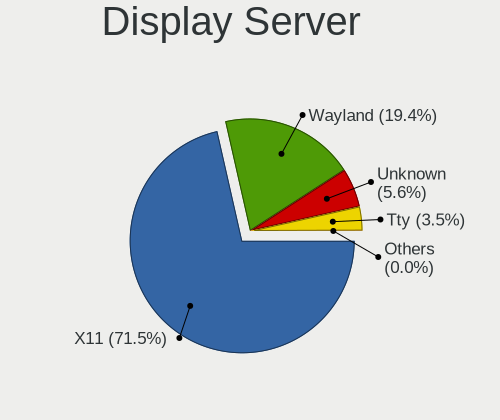
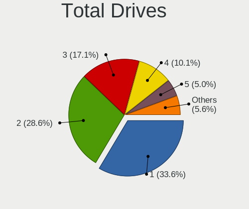
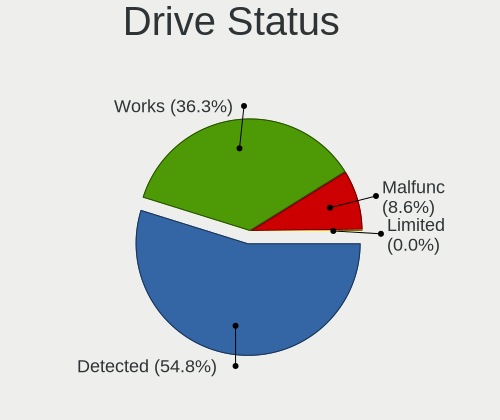
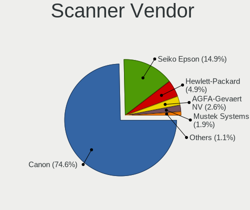
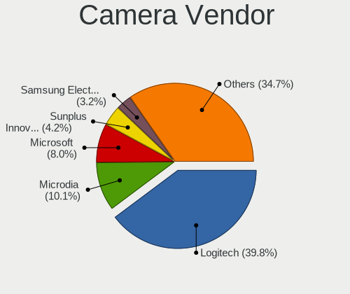
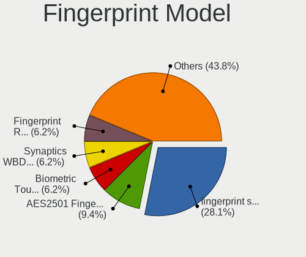

Linux in Germany - Tested Hardware & Statistics (Desktops)
----------------------------------------------------------

A project to collect tested hardware configurations for Linux in Germany.

Anyone can contribute to this report by the [hw-probe](https://github.com/linuxhw/hw-probe) tool:

    sudo -E hw-probe -all -upload

Please contribute! Especially if your hardware is rare.

Contents
--------

* [ Test Cases ](#test-cases)

* [ System ](#system)
  - [ OS                       ](#os)
  - [ OS Family                ](#os-family)
  - [ Kernel                   ](#kernel)
  - [ Kernel Family            ](#kernel-family)
  - [ Kernel Major Ver.        ](#kernel-major-ver)
  - [ Arch                     ](#arch)
  - [ DE                       ](#de)
  - [ Display Server           ](#display-server)
  - [ Display Manager          ](#display-manager)
  - [ OS Lang                  ](#os-lang)
  - [ Boot Mode                ](#boot-mode)
  - [ Filesystem               ](#filesystem)
  - [ Part. scheme             ](#part-scheme)
  - [ Dual Boot with Linux/BSD ](#dual-boot-with-linuxbsd)
  - [ Dual Boot (Win)          ](#dual-boot-win)

* [ Board ](#board)
  - [ Vendor                   ](#vendor)
  - [ Model                    ](#model)
  - [ Model Family             ](#model-family)
  - [ MFG Year                 ](#mfg-year)
  - [ Form Factor              ](#form-factor)
  - [ Secure Boot              ](#secure-boot)
  - [ Coreboot                 ](#coreboot)
  - [ RAM Size                 ](#ram-size)
  - [ RAM Used                 ](#ram-used)
  - [ Total Drives             ](#total-drives)
  - [ Has CD-ROM               ](#has-cd-rom)
  - [ Has Ethernet             ](#has-ethernet)
  - [ Has WiFi                 ](#has-wifi)
  - [ Has Bluetooth            ](#has-bluetooth)

* [ Location ](#location)
  - [ Country                  ](#country)
  - [ City                     ](#city)

* [ Drives ](#drives)
  - [ Drive Vendor             ](#drive-vendor)
  - [ Drive Model              ](#drive-model)
  - [ HDD Vendor               ](#hdd-vendor)
  - [ SSD Vendor               ](#ssd-vendor)
  - [ Drive Kind               ](#drive-kind)
  - [ Drive Connector          ](#drive-connector)
  - [ Drive Size               ](#drive-size)
  - [ Space Total              ](#space-total)
  - [ Space Used               ](#space-used)
  - [ Malfunc. Drives          ](#malfunc-drives)
  - [ Malfunc. Drive Vendor    ](#malfunc-drive-vendor)
  - [ Malfunc. HDD Vendor      ](#malfunc-hdd-vendor)
  - [ Malfunc. Drive Kind      ](#malfunc-drive-kind)
  - [ Failed Drives            ](#failed-drives)
  - [ Failed Drive Vendor      ](#failed-drive-vendor)
  - [ Drive Status             ](#drive-status)

* [ Storage controller ](#storage-controller)
  - [ Storage Vendor           ](#storage-vendor)
  - [ Storage Model            ](#storage-model)
  - [ Storage Kind             ](#storage-kind)

* [ Processor ](#processor)
  - [ CPU Vendor               ](#cpu-vendor)
  - [ CPU Model                ](#cpu-model)
  - [ CPU Model Family         ](#cpu-model-family)
  - [ CPU Cores                ](#cpu-cores)
  - [ CPU Sockets              ](#cpu-sockets)
  - [ CPU Threads              ](#cpu-threads)
  - [ CPU Op-Modes             ](#cpu-op-modes)
  - [ CPU Microcode            ](#cpu-microcode)
  - [ CPU Microarch            ](#cpu-microarch)

* [ Graphics ](#graphics)
  - [ GPU Vendor               ](#gpu-vendor)
  - [ GPU Model                ](#gpu-model)
  - [ GPU Combo                ](#gpu-combo)
  - [ GPU Driver               ](#gpu-driver)
  - [ GPU Memory               ](#gpu-memory)

* [ Monitor ](#monitor)
  - [ Monitor Vendor           ](#monitor-vendor)
  - [ Monitor Model            ](#monitor-model)
  - [ Monitor Resolution       ](#monitor-resolution)
  - [ Monitor Diagonal         ](#monitor-diagonal)
  - [ Monitor Width            ](#monitor-width)
  - [ Aspect Ratio             ](#aspect-ratio)
  - [ Monitor Area             ](#monitor-area)
  - [ Pixel Density            ](#pixel-density)
  - [ Multiple Monitors        ](#multiple-monitors)

* [ Network ](#network)
  - [ Net Controller Vendor    ](#net-controller-vendor)
  - [ Net Controller Model     ](#net-controller-model)
  - [ Wireless Vendor          ](#wireless-vendor)
  - [ Wireless Model           ](#wireless-model)
  - [ Ethernet Vendor          ](#ethernet-vendor)
  - [ Ethernet Model           ](#ethernet-model)
  - [ Net Controller Kind      ](#net-controller-kind)
  - [ Used Controller          ](#used-controller)
  - [ NICs                     ](#nics)
  - [ IPv6                     ](#ipv6)

* [ Bluetooth ](#bluetooth)
  - [ Bluetooth Vendor         ](#bluetooth-vendor)
  - [ Bluetooth Model          ](#bluetooth-model)

* [ Sound ](#sound)
  - [ Sound Vendor             ](#sound-vendor)
  - [ Sound Model              ](#sound-model)

* [ Memory ](#memory)
  - [ Memory Vendor            ](#memory-vendor)
  - [ Memory Model             ](#memory-model)
  - [ Memory Kind              ](#memory-kind)
  - [ Memory Form Factor       ](#memory-form-factor)
  - [ Memory Size              ](#memory-size)
  - [ Memory Speed             ](#memory-speed)

* [ Printers & scanners ](#printers--scanners)
  - [ Printer Vendor           ](#printer-vendor)
  - [ Printer Model            ](#printer-model)
  - [ Scanner Vendor           ](#scanner-vendor)
  - [ Scanner Model            ](#scanner-model)

* [ Camera ](#camera)
  - [ Camera Vendor            ](#camera-vendor)
  - [ Camera Model             ](#camera-model)

* [ Security ](#security)
  - [ Fingerprint Vendor       ](#fingerprint-vendor)
  - [ Fingerprint Model        ](#fingerprint-model)
  - [ Chipcard Vendor          ](#chipcard-vendor)
  - [ Chipcard Model           ](#chipcard-model)

* [ Unsupported ](#unsupported)
  - [ Unsupported Devices      ](#unsupported-devices)
  - [ Unsupported Device Types ](#unsupported-device-types)

Test Cases
----------

Total: 10803

| Vendor        | Model                       | Probe                                                      | Date         |
|---------------|-----------------------------|------------------------------------------------------------|--------------|
| Gigabyte      | B450 AORUS ELITE V2         | [0e0b3360ba](https://linux-hardware.org/?probe=0e0b3360ba) | Feb 28, 2023 |
| Unknown       | Unknown                     | [1c5f8fef49](https://linux-hardware.org/?probe=1c5f8fef49) | Feb 28, 2023 |
| ASRock        | B660M-STX                   | [5a32d2e162](https://linux-hardware.org/?probe=5a32d2e162) | Feb 28, 2023 |
| Medion        | TJ4125                      | [2024916642](https://linux-hardware.org/?probe=2024916642) | Feb 28, 2023 |
| Gigabyte      | B85M-D3H                    | [b6128fb3e9](https://linux-hardware.org/?probe=b6128fb3e9) | Feb 28, 2023 |
| Dell          | 0F6X5P A00                  | [de72247b2d](https://linux-hardware.org/?probe=de72247b2d) | Feb 28, 2023 |
| BESSTAR Te... | UM250 V1.0                  | [2ef76c6dff](https://linux-hardware.org/?probe=2ef76c6dff) | Feb 28, 2023 |
| Gigabyte      | Z390 UD                     | [f3dfd93cc9](https://linux-hardware.org/?probe=f3dfd93cc9) | Feb 28, 2023 |
| Gigabyte      | Q87M-D2H                    | [c2eff23772](https://linux-hardware.org/?probe=c2eff23772) | Feb 28, 2023 |
| ASUSTek       | PRIME B550M-A               | [a6af4042ea](https://linux-hardware.org/?probe=a6af4042ea) | Feb 28, 2023 |
| ASRock        | N68C-S UCC                  | [a5469adf59](https://linux-hardware.org/?probe=a5469adf59) | Feb 28, 2023 |
| ASRock        | A320M-HDV                   | [5ba575539c](https://linux-hardware.org/?probe=5ba575539c) | Feb 28, 2023 |
| MSI           | X470 GAMING PLUS MAX        | [05542207ee](https://linux-hardware.org/?probe=05542207ee) | Feb 28, 2023 |
| Acer          | TDPS05                      | [c4a636fb79](https://linux-hardware.org/?probe=c4a636fb79) | Feb 28, 2023 |
| Acer          | TDPS05                      | [114e21597f](https://linux-hardware.org/?probe=114e21597f) | Feb 28, 2023 |
| Acer          | Predator G3620              | [72f3382b60](https://linux-hardware.org/?probe=72f3382b60) | Feb 27, 2023 |
| Dell          | 0D6H9T A00                  | [70bdf485da](https://linux-hardware.org/?probe=70bdf485da) | Feb 27, 2023 |
| Dell          | 0J584C                      | [5f16a97f99](https://linux-hardware.org/?probe=5f16a97f99) | Feb 27, 2023 |
| Gigabyte      | H97-HD3                     | [bb2cac1486](https://linux-hardware.org/?probe=bb2cac1486) | Feb 27, 2023 |
| Gigabyte      | Z390 UD                     | [be3ac3e778](https://linux-hardware.org/?probe=be3ac3e778) | Feb 27, 2023 |
| Gigabyte      | B450M S2H                   | [4f55a08266](https://linux-hardware.org/?probe=4f55a08266) | Feb 27, 2023 |
| MSI           | Z170A-G45 GAMING            | [a5496030e7](https://linux-hardware.org/?probe=a5496030e7) | Feb 27, 2023 |
| ASUSTek       | ROG STRIX X570-I GAMING     | [49f3238d4a](https://linux-hardware.org/?probe=49f3238d4a) | Feb 26, 2023 |
| Dell          | 03KWTV A02                  | [8b6eae9fd5](https://linux-hardware.org/?probe=8b6eae9fd5) | Feb 26, 2023 |
| MSI           | MAG B760 TOMAHAWK WIFI D... | [575a7f4897](https://linux-hardware.org/?probe=575a7f4897) | Feb 26, 2023 |
| MSI           | MAG B760 TOMAHAWK WIFI D... | [466f8533fb](https://linux-hardware.org/?probe=466f8533fb) | Feb 26, 2023 |
| ASUSTek       | ROG STRIX B450-E GAMING     | [2088ba9df6](https://linux-hardware.org/?probe=2088ba9df6) | Feb 26, 2023 |
| Acer          | EG43M                       | [d533c457eb](https://linux-hardware.org/?probe=d533c457eb) | Feb 26, 2023 |
| HP            | 8643 SMVB                   | [4f36e23485](https://linux-hardware.org/?probe=4f36e23485) | Feb 26, 2023 |
| ASUSTek       | M5A78L                      | [693582be4e](https://linux-hardware.org/?probe=693582be4e) | Feb 26, 2023 |
| Gigabyte      | Q87M-D2H                    | [ee31b8fa71](https://linux-hardware.org/?probe=ee31b8fa71) | Feb 26, 2023 |
| MSI           | A320M-A PRO MAX             | [64cf10c762](https://linux-hardware.org/?probe=64cf10c762) | Feb 26, 2023 |
| ASUSTek       | PRIME Z490-A                | [267da4138c](https://linux-hardware.org/?probe=267da4138c) | Feb 26, 2023 |
| Dell          | 0NKW6Y A01                  | [62e7760c7a](https://linux-hardware.org/?probe=62e7760c7a) | Feb 26, 2023 |
| Gigabyte      | MZBSWBP-00                  | [525ac20362](https://linux-hardware.org/?probe=525ac20362) | Feb 26, 2023 |
| ASRock        | 960GM-VGS3 FX               | [66ea6164bf](https://linux-hardware.org/?probe=66ea6164bf) | Feb 25, 2023 |
| Gigabyte      | H77M-D3H                    | [01eb743492](https://linux-hardware.org/?probe=01eb743492) | Feb 25, 2023 |
| ASUSTek       | TUF X470-PLUS GAMING        | [ce9dda227f](https://linux-hardware.org/?probe=ce9dda227f) | Feb 25, 2023 |
| ASUSTek       | PRIME A520M-A II            | [8e913f4c3e](https://linux-hardware.org/?probe=8e913f4c3e) | Feb 25, 2023 |
| ASRock        | H97 Pro4                    | [f703af2e6b](https://linux-hardware.org/?probe=f703af2e6b) | Feb 25, 2023 |
| Gigabyte      | H77M-D3H                    | [766790f373](https://linux-hardware.org/?probe=766790f373) | Feb 25, 2023 |
| Medion        | TJ4125                      | [bde9228741](https://linux-hardware.org/?probe=bde9228741) | Feb 25, 2023 |
| Gigabyte      | B85M-D3H                    | [b1a38edcc2](https://linux-hardware.org/?probe=b1a38edcc2) | Feb 25, 2023 |
| Gigabyte      | Z77X-D3H                    | [b57e519074](https://linux-hardware.org/?probe=b57e519074) | Feb 25, 2023 |
| Gigabyte      | Z77X-D3H                    | [bf3c4ff51d](https://linux-hardware.org/?probe=bf3c4ff51d) | Feb 25, 2023 |
| MSI           | B450M PRO-M2                | [e63cbac447](https://linux-hardware.org/?probe=e63cbac447) | Feb 25, 2023 |
| MSI           | B450M PRO-M2                | [4af0524a44](https://linux-hardware.org/?probe=4af0524a44) | Feb 25, 2023 |
| ZOTAC         | MEK1                        | [a61a52d794](https://linux-hardware.org/?probe=a61a52d794) | Feb 24, 2023 |
| MSI           | A320M-A PRO MAX             | [24b1205b0c](https://linux-hardware.org/?probe=24b1205b0c) | Feb 24, 2023 |
| Fujitsu       | D3501-A1 S26361-D3501-A1    | [7031bb977d](https://linux-hardware.org/?probe=7031bb977d) | Feb 24, 2023 |
| ASRock        | X570S PG Riptide            | [23cc3fd2c4](https://linux-hardware.org/?probe=23cc3fd2c4) | Feb 24, 2023 |
| ASUSTek       | SABERTOOTH P67              | [efdc981614](https://linux-hardware.org/?probe=efdc981614) | Feb 24, 2023 |
| HP            | 8433 11                     | [e8663b2a0c](https://linux-hardware.org/?probe=e8663b2a0c) | Feb 24, 2023 |
| ASUSTek       | PRIME B550M-A WIFI II       | [5d901ddc4e](https://linux-hardware.org/?probe=5d901ddc4e) | Feb 24, 2023 |
| Fujitsu Si... | D2824-A1 S26361-D2824-A1    | [f5b4a5da72](https://linux-hardware.org/?probe=f5b4a5da72) | Feb 24, 2023 |
| Gigabyte      | Q87M-D2H                    | [dde739ae8a](https://linux-hardware.org/?probe=dde739ae8a) | Feb 24, 2023 |
| MSI           | B450 TOMAHAWK MAX II        | [bf6fc4a9d6](https://linux-hardware.org/?probe=bf6fc4a9d6) | Feb 23, 2023 |
| ASRock        | H370M-ITX/ac                | [300d88af87](https://linux-hardware.org/?probe=300d88af87) | Feb 23, 2023 |
| HP            | 8433 11                     | [9aa13c1fa5](https://linux-hardware.org/?probe=9aa13c1fa5) | Feb 23, 2023 |
| ASUSTek       | KRPA-U16 Series             | [e417ffd8e7](https://linux-hardware.org/?probe=e417ffd8e7) | Feb 23, 2023 |
| Packard Be... | IXTREME M5800               | [43b2cca281](https://linux-hardware.org/?probe=43b2cca281) | Feb 23, 2023 |
| Fujitsu       | D3062-A1 S26361-D3062-A1    | [3288bf6604](https://linux-hardware.org/?probe=3288bf6604) | Feb 23, 2023 |
| ASRock        | B450M Pro4                  | [193a97dfb1](https://linux-hardware.org/?probe=193a97dfb1) | Feb 23, 2023 |
| ASUSTek       | ROG STRIX X570-E GAMING     | [6bdb8ada9c](https://linux-hardware.org/?probe=6bdb8ada9c) | Feb 23, 2023 |
| Acer          | FX58M                       | [dd80460a7d](https://linux-hardware.org/?probe=dd80460a7d) | Feb 23, 2023 |
| MSI           | Z170-A PRO                  | [a5a54422a0](https://linux-hardware.org/?probe=a5a54422a0) | Feb 23, 2023 |
| ASUSTek       | PRIME B560-PLUS             | [4f19f71811](https://linux-hardware.org/?probe=4f19f71811) | Feb 23, 2023 |
| ASUSTek       | Maximus VI HERO             | [16618052ef](https://linux-hardware.org/?probe=16618052ef) | Feb 23, 2023 |
| Dell          | 0J584C                      | [f0c7703e3c](https://linux-hardware.org/?probe=f0c7703e3c) | Feb 23, 2023 |
| Dell          | 0J584C                      | [003da08b72](https://linux-hardware.org/?probe=003da08b72) | Feb 22, 2023 |
| ASRock        | B450M Pro4                  | [ccd3d2932f](https://linux-hardware.org/?probe=ccd3d2932f) | Feb 22, 2023 |
| Gigabyte      | B450M S2H                   | [4b440b2084](https://linux-hardware.org/?probe=4b440b2084) | Feb 22, 2023 |
| ASRock        | B450 Pro4                   | [87600137b2](https://linux-hardware.org/?probe=87600137b2) | Feb 22, 2023 |
| ASRock        | FM2A68M-HD+                 | [4468c0fcb9](https://linux-hardware.org/?probe=4468c0fcb9) | Feb 22, 2023 |
| Lenovo        | 36EB NOK                    | [019ad99dd4](https://linux-hardware.org/?probe=019ad99dd4) | Feb 22, 2023 |
| Acer          | FX58M                       | [6d689fa44b](https://linux-hardware.org/?probe=6d689fa44b) | Feb 22, 2023 |
| MSI           | B550-A PRO                  | [11d4db7a00](https://linux-hardware.org/?probe=11d4db7a00) | Feb 22, 2023 |
| Dell          | 0WMJ54 A01                  | [49a53e4b1d](https://linux-hardware.org/?probe=49a53e4b1d) | Feb 22, 2023 |
| ASUSTek       | Maximus VI HERO             | [754e37e18d](https://linux-hardware.org/?probe=754e37e18d) | Feb 22, 2023 |
| Shuttle       | FL10J                       | [943316a9c5](https://linux-hardware.org/?probe=943316a9c5) | Feb 22, 2023 |
| ASUSTek       | ROG STRIX B550-A GAMING     | [0d0a828b39](https://linux-hardware.org/?probe=0d0a828b39) | Feb 22, 2023 |
| ASUSTek       | M2NPV-MX                    | [06d857e2ff](https://linux-hardware.org/?probe=06d857e2ff) | Feb 22, 2023 |
| Unknown       | Unknown                     | [5cf4127d47](https://linux-hardware.org/?probe=5cf4127d47) | Feb 21, 2023 |
| ASUSTek       | M5A78L/USB3                 | [b4288b76ee](https://linux-hardware.org/?probe=b4288b76ee) | Feb 21, 2023 |
| ASRockRack    | X470D4U                     | [162a5279bc](https://linux-hardware.org/?probe=162a5279bc) | Feb 21, 2023 |
| HP            | 2B4B                        | [92c45eb54f](https://linux-hardware.org/?probe=92c45eb54f) | Feb 21, 2023 |
| HP            | 339A                        | [d4ee04127e](https://linux-hardware.org/?probe=d4ee04127e) | Feb 21, 2023 |
| HP            | 8906 SMVB                   | [892b3930a6](https://linux-hardware.org/?probe=892b3930a6) | Feb 21, 2023 |
| ASRock        | X570 Phantom Gaming 4       | [6b883f967d](https://linux-hardware.org/?probe=6b883f967d) | Feb 21, 2023 |
| Dell          | 0HY9JP A01                  | [8c1473e111](https://linux-hardware.org/?probe=8c1473e111) | Feb 21, 2023 |
| MSI           | MPG X570 GAMING EDGE WIF... | [64b7226700](https://linux-hardware.org/?probe=64b7226700) | Feb 21, 2023 |
| ASRock        | Z270M-ITX/ac                | [4f507f4e5a](https://linux-hardware.org/?probe=4f507f4e5a) | Feb 20, 2023 |
| MSI           | 970A-G43                    | [5fab82df57](https://linux-hardware.org/?probe=5fab82df57) | Feb 20, 2023 |
| Fujitsu       | D3161-A1 S26361-D3161-A1    | [a37ae03564](https://linux-hardware.org/?probe=a37ae03564) | Feb 20, 2023 |
| Fujitsu       | D3161-A1 S26361-D3161-A1    | [c17db0329f](https://linux-hardware.org/?probe=c17db0329f) | Feb 20, 2023 |
| Dell          | 0F642F A00                  | [b4b47b728d](https://linux-hardware.org/?probe=b4b47b728d) | Feb 20, 2023 |
| HP            | 3398                        | [3ea3d01398](https://linux-hardware.org/?probe=3ea3d01398) | Feb 20, 2023 |
| MSI           | B450M PRO-VDH V2            | [a3124367c3](https://linux-hardware.org/?probe=a3124367c3) | Feb 20, 2023 |
| ASRock        | X570 Taichi Razer Editio... | [3f44c52c3e](https://linux-hardware.org/?probe=3f44c52c3e) | Feb 20, 2023 |
| MSI           | X370 GAMING PLUS            | [a180732a9f](https://linux-hardware.org/?probe=a180732a9f) | Feb 19, 2023 |
| ASRock        | X300M-STX                   | [f689e279bc](https://linux-hardware.org/?probe=f689e279bc) | Feb 19, 2023 |
| MSI           | B450 TOMAHAWK               | [50b693cc98](https://linux-hardware.org/?probe=50b693cc98) | Feb 19, 2023 |
| Medion        | H110H4-EM                   | [71da47e860](https://linux-hardware.org/?probe=71da47e860) | Feb 19, 2023 |
| Gigabyte      | H81M-S2H                    | [d6f4d9d8df](https://linux-hardware.org/?probe=d6f4d9d8df) | Feb 19, 2023 |
| MSI           | MS-98G4                     | [7c9bd7f8bc](https://linux-hardware.org/?probe=7c9bd7f8bc) | Feb 19, 2023 |
| MSI           | MS-98G4                     | [84fd2fa298](https://linux-hardware.org/?probe=84fd2fa298) | Feb 19, 2023 |
| HP            | 0AACh                       | [3ff53d69b2](https://linux-hardware.org/?probe=3ff53d69b2) | Feb 19, 2023 |
| ASUSTek       | Maximus VIII RANGER         | [e3852ecb78](https://linux-hardware.org/?probe=e3852ecb78) | Feb 19, 2023 |
| Gigabyte      | X299 UD4 Pro-CF             | [d442995b00](https://linux-hardware.org/?probe=d442995b00) | Feb 19, 2023 |
| ASUSTek       | A78M-E                      | [3b2adbff33](https://linux-hardware.org/?probe=3b2adbff33) | Feb 18, 2023 |
| Inventec      | VXC Class A02               | [ddea00ed0c](https://linux-hardware.org/?probe=ddea00ed0c) | Feb 18, 2023 |
| Dell          | 0PY127 A02                  | [2be7133f11](https://linux-hardware.org/?probe=2be7133f11) | Feb 18, 2023 |
| Gigabyte      | B550 AORUS ELITE V2         | [ab3e07326a](https://linux-hardware.org/?probe=ab3e07326a) | Feb 18, 2023 |
| Gigabyte      | Q87M-D2H                    | [3c0c91cfd4](https://linux-hardware.org/?probe=3c0c91cfd4) | Feb 18, 2023 |
| Gigabyte      | B450M S2H                   | [2420c1fb57](https://linux-hardware.org/?probe=2420c1fb57) | Feb 18, 2023 |
| Gigabyte      | AB350-Gaming 3-CF           | [96c9f07207](https://linux-hardware.org/?probe=96c9f07207) | Feb 18, 2023 |
| Gigabyte      | AB350-Gaming 3-CF           | [2734c1a2ae](https://linux-hardware.org/?probe=2734c1a2ae) | Feb 18, 2023 |
| ASUSTek       | P5G41T-M LX2/GB             | [da12f4a29b](https://linux-hardware.org/?probe=da12f4a29b) | Feb 17, 2023 |
| Dell          | 0XC7MM A01                  | [93ccca9fdd](https://linux-hardware.org/?probe=93ccca9fdd) | Feb 17, 2023 |
| ASUSTek       | PRIME Z690M-PLUS D4         | [750c0f6337](https://linux-hardware.org/?probe=750c0f6337) | Feb 17, 2023 |
| ASUSTek       | ROG STRIX Z370-F GAMING     | [d76b048134](https://linux-hardware.org/?probe=d76b048134) | Feb 17, 2023 |
| ASUSTek       | TUF X470-PLUS GAMING        | [271ad0ffe2](https://linux-hardware.org/?probe=271ad0ffe2) | Feb 17, 2023 |
| Lenovo        | 36C5 SDK0K17763 WIN 1801... | [fa1e14d3d5](https://linux-hardware.org/?probe=fa1e14d3d5) | Feb 17, 2023 |
| Lenovo        | 36C5 SDK0K17763 WIN 1801... | [b6217420cc](https://linux-hardware.org/?probe=b6217420cc) | Feb 17, 2023 |
| ASUSTek       | TUF B450-PLUS GAMING        | [1029c7f3bb](https://linux-hardware.org/?probe=1029c7f3bb) | Feb 17, 2023 |
| Lenovo        | 1046 SDK0T08861 WIN 3305... | [b9c30fbaf8](https://linux-hardware.org/?probe=b9c30fbaf8) | Feb 17, 2023 |
| ASUSTek       | ROG STRIX B550-F GAMING     | [8fa990093e](https://linux-hardware.org/?probe=8fa990093e) | Feb 17, 2023 |
| Gigabyte      | B450 AORUS PRO-CF           | [9cd5183878](https://linux-hardware.org/?probe=9cd5183878) | Feb 17, 2023 |
| Gigabyte      | B450 AORUS PRO-CF           | [7e44f9e4ff](https://linux-hardware.org/?probe=7e44f9e4ff) | Feb 17, 2023 |
| ASUSTek       | TUF Gaming B550-PRO         | [fa6a3fe6e3](https://linux-hardware.org/?probe=fa6a3fe6e3) | Feb 17, 2023 |
| HP            | 1998                        | [24a633610d](https://linux-hardware.org/?probe=24a633610d) | Feb 17, 2023 |
| ASRock        | X470 Taichi                 | [71685845fe](https://linux-hardware.org/?probe=71685845fe) | Feb 17, 2023 |
| MSI           | MAG B550M MORTAR WIFI       | [4948ea8836](https://linux-hardware.org/?probe=4948ea8836) | Feb 17, 2023 |
| Hardkernel    | ODROID-H2                   | [0b85baa5ee](https://linux-hardware.org/?probe=0b85baa5ee) | Feb 17, 2023 |
| Pegatron      | IPM31G                      | [42d112d7e0](https://linux-hardware.org/?probe=42d112d7e0) | Feb 17, 2023 |
| Biostar       | G41U3G                      | [9d534d5d74](https://linux-hardware.org/?probe=9d534d5d74) | Feb 16, 2023 |
| ASUSTek       | TUF X470-PLUS GAMING        | [76ab936a75](https://linux-hardware.org/?probe=76ab936a75) | Feb 16, 2023 |
| MSI           | Z270 TOMAHAWK ARCTIC        | [cfdcc68921](https://linux-hardware.org/?probe=cfdcc68921) | Feb 16, 2023 |
| MSI           | Z270 TOMAHAWK ARCTIC        | [7bb3c6268f](https://linux-hardware.org/?probe=7bb3c6268f) | Feb 16, 2023 |
| MSI           | X470 GAMING PRO CARBON A... | [beec8fdf56](https://linux-hardware.org/?probe=beec8fdf56) | Feb 16, 2023 |
| Gigabyte      | B450M S2H                   | [72b29b5f80](https://linux-hardware.org/?probe=72b29b5f80) | Feb 16, 2023 |
| ASUSTek       | P5Q-PRO                     | [f01a1d6c70](https://linux-hardware.org/?probe=f01a1d6c70) | Feb 16, 2023 |
| ASRock        | FM2A68M-HD+                 | [3dbfa09166](https://linux-hardware.org/?probe=3dbfa09166) | Feb 16, 2023 |
| Inventec      | VXC Class A02               | [6e36781784](https://linux-hardware.org/?probe=6e36781784) | Feb 16, 2023 |
| Inventec      | VXC Class A02               | [f85ac5bc8a](https://linux-hardware.org/?probe=f85ac5bc8a) | Feb 16, 2023 |
| Inventec      | VXC Class A02               | [b1266a1e15](https://linux-hardware.org/?probe=b1266a1e15) | Feb 16, 2023 |
| MSI           | PRO Z690-A WIFI DDR4        | [40c415883e](https://linux-hardware.org/?probe=40c415883e) | Feb 16, 2023 |
| ASRock        | 990FX Extreme4              | [7ce91f2b1e](https://linux-hardware.org/?probe=7ce91f2b1e) | Feb 16, 2023 |
| HP            | 1494                        | [fd47ccde98](https://linux-hardware.org/?probe=fd47ccde98) | Feb 15, 2023 |
| ASUSTek       | PRIME B360M-C               | [d380600b31](https://linux-hardware.org/?probe=d380600b31) | Feb 15, 2023 |
| MSI           | Z97 GAMING 5                | [e29c56eb10](https://linux-hardware.org/?probe=e29c56eb10) | Feb 15, 2023 |
| MSI           | Z370M MORTAR                | [5ac9c9a924](https://linux-hardware.org/?probe=5ac9c9a924) | Feb 15, 2023 |
| Dell          | 0MF24N A03                  | [e48d83d96d](https://linux-hardware.org/?probe=e48d83d96d) | Feb 15, 2023 |
| Inventec      | VXC Class A02               | [52b2c70658](https://linux-hardware.org/?probe=52b2c70658) | Feb 14, 2023 |
| Medion        | MS-7800                     | [7827888ac6](https://linux-hardware.org/?probe=7827888ac6) | Feb 14, 2023 |
| Gigabyte      | Z77X-D3H                    | [85d374c1b4](https://linux-hardware.org/?probe=85d374c1b4) | Feb 14, 2023 |
| ASUSTek       | AM1M-A                      | [2947200c5c](https://linux-hardware.org/?probe=2947200c5c) | Feb 14, 2023 |
| MSI           | H310M PRO-D                 | [ce2d236a2d](https://linux-hardware.org/?probe=ce2d236a2d) | Feb 14, 2023 |
| MSI           | A320M-A PRO MAX             | [dd2017324e](https://linux-hardware.org/?probe=dd2017324e) | Feb 14, 2023 |
| ASRock        | Z77 Extreme6/TB4            | [cbcb53dec3](https://linux-hardware.org/?probe=cbcb53dec3) | Feb 14, 2023 |
| Gigabyte      | B550 AORUS ELITE            | [21ad600245](https://linux-hardware.org/?probe=21ad600245) | Feb 14, 2023 |
| Lenovo        | MAHOBAY NO DPK              | [0b0ccd06b0](https://linux-hardware.org/?probe=0b0ccd06b0) | Feb 14, 2023 |
| Dell          | 0RN474                      | [5c1bf45372](https://linux-hardware.org/?probe=5c1bf45372) | Feb 14, 2023 |
| Packard Be... | IXTREME M5800               | [6e1d13cecb](https://linux-hardware.org/?probe=6e1d13cecb) | Feb 14, 2023 |
| Packard Be... | IXTREME M5800               | [33e3d93b19](https://linux-hardware.org/?probe=33e3d93b19) | Feb 14, 2023 |
| Gigabyte      | B550 GAMING X V2            | [10c8101c9b](https://linux-hardware.org/?probe=10c8101c9b) | Feb 14, 2023 |
| Dell          | 0RN474                      | [20f3c37dc2](https://linux-hardware.org/?probe=20f3c37dc2) | Feb 14, 2023 |
| Gigabyte      | X570 AORUS MASTER           | [2d26056501](https://linux-hardware.org/?probe=2d26056501) | Feb 13, 2023 |
| ASRock        | IMB-195                     | [91da0807bb](https://linux-hardware.org/?probe=91da0807bb) | Feb 13, 2023 |
| MSI           | B450M PRO-VDH V2            | [a3a21b9c18](https://linux-hardware.org/?probe=a3a21b9c18) | Feb 13, 2023 |
| ASUSTek       | P5Q DELUXE                  | [f9a6865c0d](https://linux-hardware.org/?probe=f9a6865c0d) | Feb 13, 2023 |
| ASUSTek       | TUF X470-PLUS GAMING        | [f0899499e5](https://linux-hardware.org/?probe=f0899499e5) | Feb 13, 2023 |
| ASRock        | AOD790GX/128M               | [693f4f40f8](https://linux-hardware.org/?probe=693f4f40f8) | Feb 13, 2023 |
| Dell          | 0GM819                      | [a055c74e36](https://linux-hardware.org/?probe=a055c74e36) | Feb 13, 2023 |
| Shuttle       | FX79R                       | [b1631ebb53](https://linux-hardware.org/?probe=b1631ebb53) | Feb 13, 2023 |
| Dell          | 0YXT71 A01                  | [cdc2dedbcd](https://linux-hardware.org/?probe=cdc2dedbcd) | Feb 13, 2023 |
| ASUSTek       | ROG STRIX B550-F GAMING     | [88b290f249](https://linux-hardware.org/?probe=88b290f249) | Feb 13, 2023 |
| Fujitsu       | D3613-A1 S26361-D3613-A1    | [dd2d87798a](https://linux-hardware.org/?probe=dd2d87798a) | Feb 13, 2023 |
| Gigabyte      | Q87M-D2H                    | [1788a41484](https://linux-hardware.org/?probe=1788a41484) | Feb 12, 2023 |
| ASRock        | X570 Phantom Gaming-ITX/... | [4eb6264a20](https://linux-hardware.org/?probe=4eb6264a20) | Feb 12, 2023 |
| Gigabyte      | Q87M-D2H                    | [0742700581](https://linux-hardware.org/?probe=0742700581) | Feb 12, 2023 |
| ASUSTek       | TUF Gaming X570-PLUS        | [09a78143b4](https://linux-hardware.org/?probe=09a78143b4) | Feb 12, 2023 |
| Gigabyte      | GA-MA785GM-US2H             | [4863b5361f](https://linux-hardware.org/?probe=4863b5361f) | Feb 12, 2023 |
| Alienware     | 0N43JM A00                  | [ef1d9239ab](https://linux-hardware.org/?probe=ef1d9239ab) | Feb 12, 2023 |
| Gigabyte      | H110M-S2HP-CF               | [928f0b0e2e](https://linux-hardware.org/?probe=928f0b0e2e) | Feb 12, 2023 |
| MSI           | A320M-A PRO MAX             | [f5ef3d92cb](https://linux-hardware.org/?probe=f5ef3d92cb) | Feb 12, 2023 |
| Gigabyte      | B560 HD3                    | [067646f7f8](https://linux-hardware.org/?probe=067646f7f8) | Feb 12, 2023 |
| Gigabyte      | B75M-D3H                    | [954221ff64](https://linux-hardware.org/?probe=954221ff64) | Feb 12, 2023 |
| ASUSTek       | ROG STRIX B550-A GAMING     | [c9d3e3c1cb](https://linux-hardware.org/?probe=c9d3e3c1cb) | Feb 12, 2023 |
| ASRock        | B450 Pro4                   | [4fa0ea0e04](https://linux-hardware.org/?probe=4fa0ea0e04) | Feb 12, 2023 |
| Acer          | Aspire XC-704               | [c1ca2c8952](https://linux-hardware.org/?probe=c1ca2c8952) | Feb 12, 2023 |
| MSI           | B450 GAMING PRO CARBON A... | [874ccdcf1a](https://linux-hardware.org/?probe=874ccdcf1a) | Feb 12, 2023 |
| Fujitsu       | D3233-A1 S26361-D3233-A1    | [343d75e9d7](https://linux-hardware.org/?probe=343d75e9d7) | Feb 12, 2023 |
| ASRock        | A320M-DVS R4.0              | [1589cfe790](https://linux-hardware.org/?probe=1589cfe790) | Feb 11, 2023 |
| ASRock        | A320M-DVS R4.0              | [22fdde82eb](https://linux-hardware.org/?probe=22fdde82eb) | Feb 11, 2023 |
| Medion        | TJ4105                      | [b9f44d3290](https://linux-hardware.org/?probe=b9f44d3290) | Feb 11, 2023 |
| ASRock        | 880GMH/USB3                 | [55a9c9fd6c](https://linux-hardware.org/?probe=55a9c9fd6c) | Feb 11, 2023 |
| ASRock        | 880GMH/USB3                 | [39017e9de9](https://linux-hardware.org/?probe=39017e9de9) | Feb 11, 2023 |
| ASRock        | B450 Pro4                   | [c9a6a6e981](https://linux-hardware.org/?probe=c9a6a6e981) | Feb 11, 2023 |
| Gigabyte      | H81M-S2H                    | [a789235fe3](https://linux-hardware.org/?probe=a789235fe3) | Feb 11, 2023 |
| HP            | 8054                        | [55c5642509](https://linux-hardware.org/?probe=55c5642509) | Feb 11, 2023 |
| Gigabyte      | B85M-D3H                    | [ba06eb3e9c](https://linux-hardware.org/?probe=ba06eb3e9c) | Feb 11, 2023 |
| Acer          | Aspire TC-1760              | [a0db2f09b6](https://linux-hardware.org/?probe=a0db2f09b6) | Feb 11, 2023 |
| Gigabyte      | H81M-S2H                    | [f3919f8d69](https://linux-hardware.org/?probe=f3919f8d69) | Feb 11, 2023 |
| Gigabyte      | MZBSWAP-K4                  | [325c9ef37b](https://linux-hardware.org/?probe=325c9ef37b) | Feb 11, 2023 |
| Gigabyte      | Z77X-D3H                    | [620ed89dca](https://linux-hardware.org/?probe=620ed89dca) | Feb 10, 2023 |
| Biostar       | A68N-5100                   | [4c44b82580](https://linux-hardware.org/?probe=4c44b82580) | Feb 10, 2023 |
| ASUSTek       | PRIME B550-PLUS             | [453e95e775](https://linux-hardware.org/?probe=453e95e775) | Feb 10, 2023 |
| ASUSTek       | PRIME Z270-K                | [298bbec731](https://linux-hardware.org/?probe=298bbec731) | Feb 10, 2023 |
| Fujitsu       | D3233-A1 S26361-D3233-A1    | [def22e6194](https://linux-hardware.org/?probe=def22e6194) | Feb 10, 2023 |
| ASUSTek       | ROG STRIX B650-A GAMING ... | [f493bc6d9d](https://linux-hardware.org/?probe=f493bc6d9d) | Feb 10, 2023 |
| Lenovo        | 310B SDK0J40705 WIN 3425... | [2fafc493ce](https://linux-hardware.org/?probe=2fafc493ce) | Feb 10, 2023 |
| ASUSTek       | M5A99X EVO                  | [55dd77bf13](https://linux-hardware.org/?probe=55dd77bf13) | Feb 10, 2023 |
| ASUSTek       | M5A99X EVO                  | [09bac39306](https://linux-hardware.org/?probe=09bac39306) | Feb 10, 2023 |
| HP            | 843B                        | [990b099595](https://linux-hardware.org/?probe=990b099595) | Feb 09, 2023 |
| MSI           | MAG B550 TOMAHAWK           | [13492935fd](https://linux-hardware.org/?probe=13492935fd) | Feb 09, 2023 |
| Biostar       | H81MHV3 5.0                 | [390c8dd03a](https://linux-hardware.org/?probe=390c8dd03a) | Feb 09, 2023 |
| ASRock        | FM2A68M-HD+                 | [e6b6ee0c57](https://linux-hardware.org/?probe=e6b6ee0c57) | Feb 09, 2023 |
| ASUSTek       | PRIME B350M-A               | [287544d374](https://linux-hardware.org/?probe=287544d374) | Feb 09, 2023 |
| ASUSTek       | ROG STRIX X570-E GAMING     | [17bf959fd0](https://linux-hardware.org/?probe=17bf959fd0) | Feb 09, 2023 |
| Gigabyte      | Q87M-D2H                    | [b38d2821bf](https://linux-hardware.org/?probe=b38d2821bf) | Feb 09, 2023 |
| Gigabyte      | Q87M-D2H                    | [a26baa69ab](https://linux-hardware.org/?probe=a26baa69ab) | Feb 09, 2023 |
| Dell          | 0JP3NX A00                  | [c56d23fcfc](https://linux-hardware.org/?probe=c56d23fcfc) | Feb 09, 2023 |
| MSI           | X570-A PRO                  | [9decf03532](https://linux-hardware.org/?probe=9decf03532) | Feb 09, 2023 |
| MSI           | X99S SLI PLUS               | [8c6fb84b12](https://linux-hardware.org/?probe=8c6fb84b12) | Feb 09, 2023 |
| Gigabyte      | B560 HD3                    | [b4fa86401f](https://linux-hardware.org/?probe=b4fa86401f) | Feb 09, 2023 |
| Fujitsu       | D3221-A1 S26361-D3221-A1    | [46193e11d4](https://linux-hardware.org/?probe=46193e11d4) | Feb 09, 2023 |
| ASRock        | Z68 Extreme4 Gen3           | [4548de054f](https://linux-hardware.org/?probe=4548de054f) | Feb 09, 2023 |
| ASUSTek       | ROG STRIX X670E-A GAMING... | [157c2ef73f](https://linux-hardware.org/?probe=157c2ef73f) | Feb 09, 2023 |
| Medion        | TJ4105                      | [cd654518c0](https://linux-hardware.org/?probe=cd654518c0) | Feb 09, 2023 |
| Dell          | 0JP3NX A00                  | [444cfa4969](https://linux-hardware.org/?probe=444cfa4969) | Feb 09, 2023 |
| MSI           | X370 XPOWER GAMING TITAN... | [f09cd898c8](https://linux-hardware.org/?probe=f09cd898c8) | Feb 09, 2023 |
| HP            | 8459                        | [5e71f95f59](https://linux-hardware.org/?probe=5e71f95f59) | Feb 08, 2023 |
| ASUSTek       | PRIME B660-PLUS D4          | [a0132107aa](https://linux-hardware.org/?probe=a0132107aa) | Feb 08, 2023 |
| ASUSTek       | PRIME B550M-A               | [dd76c764a1](https://linux-hardware.org/?probe=dd76c764a1) | Feb 08, 2023 |
| ASUSTek       | PRIME B660-PLUS D4          | [6231dbe6d4](https://linux-hardware.org/?probe=6231dbe6d4) | Feb 08, 2023 |
| Gigabyte      | B650M AORUS ELITE AX        | [58346a45de](https://linux-hardware.org/?probe=58346a45de) | Feb 08, 2023 |
| Acer          | FX58M                       | [2e7718be04](https://linux-hardware.org/?probe=2e7718be04) | Feb 08, 2023 |
| Gigabyte      | GA-MA74GM-S2H               | [e7ee51ecdd](https://linux-hardware.org/?probe=e7ee51ecdd) | Feb 08, 2023 |
| Fujitsu       | D3501-A1 S26361-D3501-A1    | [91050a6f99](https://linux-hardware.org/?probe=91050a6f99) | Feb 08, 2023 |
| MSI           | MPG X570 GAMING PLUS        | [38a5652498](https://linux-hardware.org/?probe=38a5652498) | Feb 08, 2023 |
| MSI           | MPG X570 GAMING PLUS        | [bb3f563900](https://linux-hardware.org/?probe=bb3f563900) | Feb 08, 2023 |
| MSI           | X570-A PRO                  | [8193758f55](https://linux-hardware.org/?probe=8193758f55) | Feb 08, 2023 |
| MSI           | B350M PRO-VDH               | [41249a7b9f](https://linux-hardware.org/?probe=41249a7b9f) | Feb 08, 2023 |
| ASUSTek       | PRIME H310M-E R2.0          | [7cc20180f3](https://linux-hardware.org/?probe=7cc20180f3) | Feb 08, 2023 |
| Shenzhen M... | F7BFC                       | [04f7bc268b](https://linux-hardware.org/?probe=04f7bc268b) | Feb 07, 2023 |
| Gigabyte      | G41M-ES2L                   | [0f31a45e98](https://linux-hardware.org/?probe=0f31a45e98) | Feb 07, 2023 |
| Gigabyte      | X570 AORUS ELITE            | [b4b14d9d66](https://linux-hardware.org/?probe=b4b14d9d66) | Feb 06, 2023 |
| Dell          | 0DFRFW A01                  | [b715b202c7](https://linux-hardware.org/?probe=b715b202c7) | Feb 06, 2023 |
| Dell          | 0DFRFW A01                  | [3871eeccac](https://linux-hardware.org/?probe=3871eeccac) | Feb 06, 2023 |
| MSI           | A320M-A PRO MAX             | [40ba1db546](https://linux-hardware.org/?probe=40ba1db546) | Feb 06, 2023 |
| MSI           | A320M-A PRO MAX             | [21a9cc1c97](https://linux-hardware.org/?probe=21a9cc1c97) | Feb 06, 2023 |
| Gigabyte      | B550I AORUS PRO AX          | [42dba6bdb3](https://linux-hardware.org/?probe=42dba6bdb3) | Feb 06, 2023 |
| ASUSTek       | TUF B450M-PLUS GAMING       | [a9bfc9669d](https://linux-hardware.org/?probe=a9bfc9669d) | Feb 06, 2023 |
| Fujitsu       | D3233-A1 S26361-D3233-A1    | [d0fc8bac6c](https://linux-hardware.org/?probe=d0fc8bac6c) | Feb 06, 2023 |
| ASUSTek       | PRIME A320M-K               | [4f67dd9470](https://linux-hardware.org/?probe=4f67dd9470) | Feb 06, 2023 |
| Lenovo        | Myrtle CRB SDK0J40700 WI... | [96f24866e0](https://linux-hardware.org/?probe=96f24866e0) | Feb 06, 2023 |
| ASUSTek       | PRIME H310M-A R2.0          | [4a971615e8](https://linux-hardware.org/?probe=4a971615e8) | Feb 05, 2023 |
| MSI           | MPG X570 GAMING PLUS        | [e281d5800f](https://linux-hardware.org/?probe=e281d5800f) | Feb 05, 2023 |
| ASRock        | Z77 Pro3                    | [897fe5b70f](https://linux-hardware.org/?probe=897fe5b70f) | Feb 05, 2023 |
| Gigabyte      | Z390 GAMING X-CF            | [89846cdd59](https://linux-hardware.org/?probe=89846cdd59) | Feb 05, 2023 |
| Gigabyte      | H61MA-D2V                   | [b708cdc12f](https://linux-hardware.org/?probe=b708cdc12f) | Feb 05, 2023 |
| ASRock        | Z77 Pro3                    | [a5d1048918](https://linux-hardware.org/?probe=a5d1048918) | Feb 05, 2023 |
| ASUSTek       | M4A78T-E                    | [365f2be75e](https://linux-hardware.org/?probe=365f2be75e) | Feb 05, 2023 |
| MSI           | X570-A PRO                  | [aeab6dd32b](https://linux-hardware.org/?probe=aeab6dd32b) | Feb 05, 2023 |
| Gigabyte      | B550 AORUS ELITE V2         | [add74ba4b4](https://linux-hardware.org/?probe=add74ba4b4) | Feb 05, 2023 |
| Medion        | Akoya E6240T                | [3707cf7d95](https://linux-hardware.org/?probe=3707cf7d95) | Feb 05, 2023 |
| Fujitsu       | D3233-A1 S26361-D3233-A1    | [e5707e3ff0](https://linux-hardware.org/?probe=e5707e3ff0) | Feb 05, 2023 |
| Unknown       | Unknown                     | [5a491991ef](https://linux-hardware.org/?probe=5a491991ef) | Feb 05, 2023 |
| ASUSTek       | P8H61-M LX R2.0             | [1985f76677](https://linux-hardware.org/?probe=1985f76677) | Feb 05, 2023 |
| ASUSTek       | M5A99X EVO                  | [2bf0bbb10a](https://linux-hardware.org/?probe=2bf0bbb10a) | Feb 05, 2023 |
| ASRock        | X570 Extreme4               | [73e37c2b14](https://linux-hardware.org/?probe=73e37c2b14) | Feb 05, 2023 |
| Lenovo        | SHARKBAY SDK0E50510 WIN     | [83a5201a65](https://linux-hardware.org/?probe=83a5201a65) | Feb 05, 2023 |
| ASRock        | X300M-STX                   | [c614e44344](https://linux-hardware.org/?probe=c614e44344) | Feb 05, 2023 |
| ASRock        | X300M-STX                   | [ad59fdb4e4](https://linux-hardware.org/?probe=ad59fdb4e4) | Feb 05, 2023 |
| HP            | 845A                        | [3e744bcf5b](https://linux-hardware.org/?probe=3e744bcf5b) | Feb 05, 2023 |
| ASUSTek       | P7P55 LX                    | [3786e7a211](https://linux-hardware.org/?probe=3786e7a211) | Feb 04, 2023 |
| Medion        | B660H7-M20                  | [90cdf106b9](https://linux-hardware.org/?probe=90cdf106b9) | Feb 04, 2023 |
| ASRock        | B450M Pro4                  | [187414de1f](https://linux-hardware.org/?probe=187414de1f) | Feb 04, 2023 |
| Gigabyte      | GA-78LMT-USB3 SEx           | [f319fe6763](https://linux-hardware.org/?probe=f319fe6763) | Feb 04, 2023 |
| Gigabyte      | Z87-HD3                     | [d214fb8d55](https://linux-hardware.org/?probe=d214fb8d55) | Feb 04, 2023 |
| Gigabyte      | MZBSWMP-00                  | [018b3728ea](https://linux-hardware.org/?probe=018b3728ea) | Feb 04, 2023 |
| MSI           | Z170-A PRO                  | [564a19c004](https://linux-hardware.org/?probe=564a19c004) | Feb 04, 2023 |
| ASUSTek       | ROG STRIX X570-F GAMING     | [66a494b2ec](https://linux-hardware.org/?probe=66a494b2ec) | Feb 04, 2023 |
| Dell          | 0GDG8Y A00                  | [b9b0a6cccb](https://linux-hardware.org/?probe=b9b0a6cccb) | Feb 04, 2023 |
| Gigabyte      | MZBSWMP-00                  | [52bb20e0b2](https://linux-hardware.org/?probe=52bb20e0b2) | Feb 04, 2023 |
| ASUSTek       | PRIME A320M-K               | [a1b3ef275a](https://linux-hardware.org/?probe=a1b3ef275a) | Feb 04, 2023 |
| ASUSTek       | PRIME A320M-K               | [6a67c722de](https://linux-hardware.org/?probe=6a67c722de) | Feb 04, 2023 |
| Gigabyte      | B560M DS3H V2               | [c73b66a241](https://linux-hardware.org/?probe=c73b66a241) | Feb 04, 2023 |
| Unknown       | HX90                        | [60ade05817](https://linux-hardware.org/?probe=60ade05817) | Feb 03, 2023 |
| Inventec      | Z CLASS A02                 | [81c4e4ce60](https://linux-hardware.org/?probe=81c4e4ce60) | Feb 03, 2023 |
| Gigabyte      | B450 I AORUS PRO WIFI-CF    | [bb6553a9c3](https://linux-hardware.org/?probe=bb6553a9c3) | Feb 03, 2023 |
| Gigabyte      | B560M DS3H V2               | [53c49f808e](https://linux-hardware.org/?probe=53c49f808e) | Feb 03, 2023 |
| Biostar       | H81MHV3 5.0                 | [084eee2317](https://linux-hardware.org/?probe=084eee2317) | Feb 03, 2023 |
| ASUSTek       | M5A97 R2.0                  | [e5a1cf7284](https://linux-hardware.org/?probe=e5a1cf7284) | Feb 03, 2023 |
| Acer          | WMCP78M                     | [cd9dccabaf](https://linux-hardware.org/?probe=cd9dccabaf) | Feb 03, 2023 |
| ASUSTek       | PRIME B450M-A               | [19b6a074e8](https://linux-hardware.org/?probe=19b6a074e8) | Feb 03, 2023 |
| Gigabyte      | B560M DS3H V2               | [1a9042435b](https://linux-hardware.org/?probe=1a9042435b) | Feb 03, 2023 |
| MSI           | MPG X570 GAMING EDGE WIF... | [4f6655087b](https://linux-hardware.org/?probe=4f6655087b) | Feb 03, 2023 |
| MSI           | B85M-E45                    | [13453f924e](https://linux-hardware.org/?probe=13453f924e) | Feb 03, 2023 |
| ASRock        | Z97 Killer                  | [6ef63fb3ba](https://linux-hardware.org/?probe=6ef63fb3ba) | Feb 03, 2023 |
| ASRock        | X570S PG Riptide            | [473d3aa027](https://linux-hardware.org/?probe=473d3aa027) | Feb 02, 2023 |
| HP            | 1825                        | [fd942fd3ba](https://linux-hardware.org/?probe=fd942fd3ba) | Feb 02, 2023 |
| ASUSTek       | M5A99X EVO                  | [a6035b01eb](https://linux-hardware.org/?probe=a6035b01eb) | Feb 02, 2023 |
| ASUSTek       | M5A99X EVO                  | [a84ffe2c81](https://linux-hardware.org/?probe=a84ffe2c81) | Feb 02, 2023 |
| ASUSTek       | M5A97 LE R2.0               | [5cf5d890a2](https://linux-hardware.org/?probe=5cf5d890a2) | Feb 02, 2023 |
| HP            | 8436                        | [01c0c7e212](https://linux-hardware.org/?probe=01c0c7e212) | Feb 01, 2023 |
| HP            | 8436                        | [636618ef58](https://linux-hardware.org/?probe=636618ef58) | Feb 01, 2023 |
| Gigabyte      | B650M DS3H                  | [981bcc29a7](https://linux-hardware.org/?probe=981bcc29a7) | Feb 01, 2023 |
| ASUSTek       | TUF B450-PLUS GAMING        | [d44fb4f702](https://linux-hardware.org/?probe=d44fb4f702) | Feb 01, 2023 |
| ASUSTek       | A8N-SLI Premium             | [faf81c22ae](https://linux-hardware.org/?probe=faf81c22ae) | Feb 01, 2023 |
| ASUSTek       | P9X79                       | [01e8662b39](https://linux-hardware.org/?probe=01e8662b39) | Feb 01, 2023 |
| MSI           | Z170A PC MATE               | [ff305089b2](https://linux-hardware.org/?probe=ff305089b2) | Feb 01, 2023 |
| MSI           | B250M PRO-VDH               | [1dbacce612](https://linux-hardware.org/?probe=1dbacce612) | Feb 01, 2023 |
| MSI           | X470 GAMING PLUS MAX        | [f1fecf5447](https://linux-hardware.org/?probe=f1fecf5447) | Feb 01, 2023 |
| Gigabyte      | MZBSWMP-00                  | [894f632950](https://linux-hardware.org/?probe=894f632950) | Feb 01, 2023 |
| Gigabyte      | H55M-UD2H                   | [9337f49fff](https://linux-hardware.org/?probe=9337f49fff) | Feb 01, 2023 |
| MSI           | 870A-G54                    | [0aaa012de5](https://linux-hardware.org/?probe=0aaa012de5) | Jan 31, 2023 |
| Dell          | 0NKW6Y A02                  | [4a63357651](https://linux-hardware.org/?probe=4a63357651) | Jan 31, 2023 |
| MSI           | B550-A PRO                  | [78ab25ef78](https://linux-hardware.org/?probe=78ab25ef78) | Jan 31, 2023 |
| MSI           | B550-A PRO                  | [2458455037](https://linux-hardware.org/?probe=2458455037) | Jan 31, 2023 |
| ASUSTek       | P5V800-MX                   | [a8696956aa](https://linux-hardware.org/?probe=a8696956aa) | Jan 31, 2023 |
| Maxtang       | EHL30 V1.0                  | [d104ad1307](https://linux-hardware.org/?probe=d104ad1307) | Jan 31, 2023 |
| ASUSTek       | PRIME X670E-PRO WIFI        | [4f08ac24d9](https://linux-hardware.org/?probe=4f08ac24d9) | Jan 30, 2023 |
| Gigabyte      | X570 AORUS ELITE            | [034ae066aa](https://linux-hardware.org/?probe=034ae066aa) | Jan 30, 2023 |
| MSI           | MPG X570 GAMING EDGE WIF... | [353272e0d2](https://linux-hardware.org/?probe=353272e0d2) | Jan 30, 2023 |
| ASRock        | B450M Pro4                  | [c63c663181](https://linux-hardware.org/?probe=c63c663181) | Jan 30, 2023 |
| Lenovo        | 1046 SDK0T08861 WIN 3305... | [fa81cc9dea](https://linux-hardware.org/?probe=fa81cc9dea) | Jan 30, 2023 |
| Gigabyte      | GA-990FXA-UD3               | [78cd3f7f65](https://linux-hardware.org/?probe=78cd3f7f65) | Jan 30, 2023 |
| Gigabyte      | B550 AORUS ELITE            | [3fac03d01d](https://linux-hardware.org/?probe=3fac03d01d) | Jan 30, 2023 |
| ASRock        | X470 Master SLI             | [1746dfe4b1](https://linux-hardware.org/?probe=1746dfe4b1) | Jan 30, 2023 |
| ASUSTek       | H81M2                       | [304b95972c](https://linux-hardware.org/?probe=304b95972c) | Jan 30, 2023 |
| ASUSTek       | Z170 PRO GAMING             | [c2a4529e33](https://linux-hardware.org/?probe=c2a4529e33) | Jan 30, 2023 |
| ASUSTek       | B85M-G                      | [73deb30280](https://linux-hardware.org/?probe=73deb30280) | Jan 29, 2023 |
| HP            | 8460                        | [078e151afc](https://linux-hardware.org/?probe=078e151afc) | Jan 29, 2023 |
| Gigabyte      | Z270X-Ultra Gaming-CF       | [55c3e9597c](https://linux-hardware.org/?probe=55c3e9597c) | Jan 29, 2023 |
| Gigabyte      | Z370 HD3-CF                 | [1721760555](https://linux-hardware.org/?probe=1721760555) | Jan 29, 2023 |
| MSI           | X399 SLI PLUS               | [f7008e788b](https://linux-hardware.org/?probe=f7008e788b) | Jan 29, 2023 |
| HP            | 339A                        | [5bd8bab56c](https://linux-hardware.org/?probe=5bd8bab56c) | Jan 29, 2023 |
| Medion        | TJ4125                      | [5fb5d01ae9](https://linux-hardware.org/?probe=5fb5d01ae9) | Jan 29, 2023 |
| Fujitsu Si... | D2587-A1 S26361-D2587-A1    | [6378111bbd](https://linux-hardware.org/?probe=6378111bbd) | Jan 29, 2023 |
| HP            | 8643 SMVB                   | [d9047d3c7b](https://linux-hardware.org/?probe=d9047d3c7b) | Jan 29, 2023 |
| ASUSTek       | PRIME H310I-PLUS R2.0       | [1b8a1f7b64](https://linux-hardware.org/?probe=1b8a1f7b64) | Jan 29, 2023 |
| ASUSTek       | ProArt B550-CREATOR         | [c93e84b79b](https://linux-hardware.org/?probe=c93e84b79b) | Jan 29, 2023 |
| MSI           | A68HM GRENADE               | [696581b7b6](https://linux-hardware.org/?probe=696581b7b6) | Jan 28, 2023 |
| Fujitsu       | D3221-A1 S26361-D3221-A1    | [bc4b6513bb](https://linux-hardware.org/?probe=bc4b6513bb) | Jan 28, 2023 |
| BESSTAR Te... | UM350                       | [1ec2f78884](https://linux-hardware.org/?probe=1ec2f78884) | Jan 28, 2023 |
| ASRock        | X570 Pro4                   | [bf09bd7413](https://linux-hardware.org/?probe=bf09bd7413) | Jan 28, 2023 |
| ASRock        | Z97 Killer                  | [2658d00cd2](https://linux-hardware.org/?probe=2658d00cd2) | Jan 28, 2023 |
| MSI           | B85M-E45                    | [335cebea8b](https://linux-hardware.org/?probe=335cebea8b) | Jan 28, 2023 |
| Gigabyte      | AX370-Gaming K7             | [e369c6e5b8](https://linux-hardware.org/?probe=e369c6e5b8) | Jan 28, 2023 |
| ASRock        | Z370 Extreme4               | [8c6abbc491](https://linux-hardware.org/?probe=8c6abbc491) | Jan 28, 2023 |
| Gigabyte      | X570 AORUS ULTRA            | [40152faf5b](https://linux-hardware.org/?probe=40152faf5b) | Jan 28, 2023 |
| ASUSTek       | TUF Gaming X570-PLUS        | [c67c5a3cfe](https://linux-hardware.org/?probe=c67c5a3cfe) | Jan 28, 2023 |
| ASUSTek       | TUF Gaming X570-PLUS        | [6cdea948c5](https://linux-hardware.org/?probe=6cdea948c5) | Jan 28, 2023 |
| ASUSTek       | M5A78L-M LE                 | [a4c0ee5753](https://linux-hardware.org/?probe=a4c0ee5753) | Jan 27, 2023 |
| ASRock        | B550M-HDV                   | [29bdcc85ad](https://linux-hardware.org/?probe=29bdcc85ad) | Jan 27, 2023 |
| ASRock        | Z97 Killer                  | [d4c609c373](https://linux-hardware.org/?probe=d4c609c373) | Jan 27, 2023 |
| ASUSTek       | PRIME Z390-A                | [a30690db0c](https://linux-hardware.org/?probe=a30690db0c) | Jan 27, 2023 |
| Gigabyte      | GA-78LMT-USB3               | [55d50f6d18](https://linux-hardware.org/?probe=55d50f6d18) | Jan 27, 2023 |
| ASUSTek       | PRIME B450M-A               | [4a33dd0b76](https://linux-hardware.org/?probe=4a33dd0b76) | Jan 27, 2023 |
| Acer          | Predator G3620              | [0fdd7e30ce](https://linux-hardware.org/?probe=0fdd7e30ce) | Jan 27, 2023 |
| BESSTAR Te... | UM340                       | [77efbbb270](https://linux-hardware.org/?probe=77efbbb270) | Jan 27, 2023 |
| ASUSTek       | P8H61-M LX R2.0             | [6d2e490a23](https://linux-hardware.org/?probe=6d2e490a23) | Jan 27, 2023 |
| ASUSTek       | Z170-K                      | [a1f535bfca](https://linux-hardware.org/?probe=a1f535bfca) | Jan 27, 2023 |
| MSI           | B365M PRO-VDH               | [d5bbfc18d5](https://linux-hardware.org/?probe=d5bbfc18d5) | Jan 27, 2023 |
| Gigabyte      | Z170X-UD5 TH-CF             | [0d9491187e](https://linux-hardware.org/?probe=0d9491187e) | Jan 27, 2023 |
| Gigabyte      | J3455N-D3H                  | [3eb9131ab1](https://linux-hardware.org/?probe=3eb9131ab1) | Jan 27, 2023 |
| Medion        | TJ4125                      | [eaca458ea2](https://linux-hardware.org/?probe=eaca458ea2) | Jan 26, 2023 |
| ASUSTek       | PRIME Z490-A                | [91dbb8d045](https://linux-hardware.org/?probe=91dbb8d045) | Jan 26, 2023 |
| ASUSTek       | M4N78 PRO                   | [e547b297b0](https://linux-hardware.org/?probe=e547b297b0) | Jan 26, 2023 |
| ASUSTek       | P8H77-V LE                  | [0305833fbd](https://linux-hardware.org/?probe=0305833fbd) | Jan 26, 2023 |
| HP            | 18E4                        | [1f51508eeb](https://linux-hardware.org/?probe=1f51508eeb) | Jan 26, 2023 |
| HP            | 3397                        | [1584c8c840](https://linux-hardware.org/?probe=1584c8c840) | Jan 26, 2023 |
| Fujitsu       | D3233-A1 S26361-D3233-A1    | [d30b7c1657](https://linux-hardware.org/?probe=d30b7c1657) | Jan 25, 2023 |
| ASRock        | B75 Pro3-M                  | [cf662e2730](https://linux-hardware.org/?probe=cf662e2730) | Jan 25, 2023 |
| ASRock        | B75 Pro3-M                  | [c2ff1b1e23](https://linux-hardware.org/?probe=c2ff1b1e23) | Jan 25, 2023 |
| ASUSTek       | ROG STRIX H370-I GAMING     | [decfe6ab97](https://linux-hardware.org/?probe=decfe6ab97) | Jan 25, 2023 |
| Medion        | MS-7728                     | [76298f7282](https://linux-hardware.org/?probe=76298f7282) | Jan 25, 2023 |
| ASRock        | X300M-STX                   | [f111e4de3b](https://linux-hardware.org/?probe=f111e4de3b) | Jan 25, 2023 |
| ASUSTek       | B150M-A/M.2                 | [5c1d469037](https://linux-hardware.org/?probe=5c1d469037) | Jan 25, 2023 |
| Lenovo        | 36F7 SDK0J40700 WIN 3258... | [b7dea81a92](https://linux-hardware.org/?probe=b7dea81a92) | Jan 25, 2023 |
| Lenovo        | 36F7 SDK0J40700 WIN 3258... | [831fd897ec](https://linux-hardware.org/?probe=831fd897ec) | Jan 25, 2023 |
| ASRock        | B85M DASH/OL R2.0           | [71c0a5abe5](https://linux-hardware.org/?probe=71c0a5abe5) | Jan 25, 2023 |
| Medion        | MS-7728                     | [5759a31d8f](https://linux-hardware.org/?probe=5759a31d8f) | Jan 25, 2023 |
| MSI           | B550-A PRO                  | [0bbf395806](https://linux-hardware.org/?probe=0bbf395806) | Jan 25, 2023 |
| HP            | 82B4                        | [29e2d03c1a](https://linux-hardware.org/?probe=29e2d03c1a) | Jan 24, 2023 |
| HP            | 82B4                        | [3df98736a1](https://linux-hardware.org/?probe=3df98736a1) | Jan 24, 2023 |
| HP            | 8460                        | [2bfad5b267](https://linux-hardware.org/?probe=2bfad5b267) | Jan 24, 2023 |
| Gigabyte      | B550 AORUS PRO AC           | [ac08bf34c3](https://linux-hardware.org/?probe=ac08bf34c3) | Jan 24, 2023 |
| ASRock        | 960GM-GS3 FX                | [f2894f6970](https://linux-hardware.org/?probe=f2894f6970) | Jan 23, 2023 |
| ASUSTek       | PRIME X470-PRO              | [bfe0416657](https://linux-hardware.org/?probe=bfe0416657) | Jan 23, 2023 |
| Gigabyte      | B550 AORUS ELITE            | [7e91e49912](https://linux-hardware.org/?probe=7e91e49912) | Jan 23, 2023 |
| Gigabyte      | X570 AORUS ULTRA            | [2f215e1ce7](https://linux-hardware.org/?probe=2f215e1ce7) | Jan 23, 2023 |
| Gigabyte      | B550 AORUS ELITE            | [3324fafe5a](https://linux-hardware.org/?probe=3324fafe5a) | Jan 23, 2023 |
| ASRock        | N68-S                       | [aeadf689c9](https://linux-hardware.org/?probe=aeadf689c9) | Jan 23, 2023 |
| MSI           | B550-A PRO                  | [88c03a1f6f](https://linux-hardware.org/?probe=88c03a1f6f) | Jan 23, 2023 |
| MSI           | 870A-G54                    | [b1baf04990](https://linux-hardware.org/?probe=b1baf04990) | Jan 23, 2023 |
| MSI           | Z390-A PRO                  | [68a1d06f54](https://linux-hardware.org/?probe=68a1d06f54) | Jan 23, 2023 |
| ASUSTek       | A68HM-PLUS                  | [3afbe94c21](https://linux-hardware.org/?probe=3afbe94c21) | Jan 23, 2023 |
| MSI           | B550-A PRO                  | [683938d28b](https://linux-hardware.org/?probe=683938d28b) | Jan 23, 2023 |
| Dell          | 0C27VV A01                  | [e43d24d2b6](https://linux-hardware.org/?probe=e43d24d2b6) | Jan 23, 2023 |
| ASUSTek       | PRIME A320M-K               | [bfb889f5d5](https://linux-hardware.org/?probe=bfb889f5d5) | Jan 23, 2023 |
| MSI           | B450 GAMING PLUS            | [bc95b86800](https://linux-hardware.org/?probe=bc95b86800) | Jan 22, 2023 |
| Fujitsu       | D3544-A1 S26361-D3544-A1... | [363fa41965](https://linux-hardware.org/?probe=363fa41965) | Jan 22, 2023 |
| Gigabyte      | B560M AORUS PRO AX          | [7407dcc533](https://linux-hardware.org/?probe=7407dcc533) | Jan 22, 2023 |
| Gigabyte      | Z77X-D3H                    | [e81c0bcfc4](https://linux-hardware.org/?probe=e81c0bcfc4) | Jan 22, 2023 |
| ASRock        | FM2A85X Extreme4-M          | [f51082b385](https://linux-hardware.org/?probe=f51082b385) | Jan 22, 2023 |
| Medion        | H110H4-EM                   | [02ac31d42d](https://linux-hardware.org/?probe=02ac31d42d) | Jan 22, 2023 |
| MSI           | MPG B550 GAMING PLUS        | [b5e6a74fcb](https://linux-hardware.org/?probe=b5e6a74fcb) | Jan 22, 2023 |
| Medion        | MS-7797                     | [4c2ac2561e](https://linux-hardware.org/?probe=4c2ac2561e) | Jan 22, 2023 |
| ASUSTek       | ROG STRIX B550-A GAMING     | [d1b63bbd2d](https://linux-hardware.org/?probe=d1b63bbd2d) | Jan 22, 2023 |
| Hardkernel    | ODROID-H3                   | [98f5768c61](https://linux-hardware.org/?probe=98f5768c61) | Jan 22, 2023 |
| ASUSTek       | TUF B450-PRO GAMING         | [27ea4205e5](https://linux-hardware.org/?probe=27ea4205e5) | Jan 22, 2023 |
| ASUSTek       | P5B-Deluxe                  | [d61be7d11a](https://linux-hardware.org/?probe=d61be7d11a) | Jan 21, 2023 |
| HP            | 339A                        | [ceba4dbf16](https://linux-hardware.org/?probe=ceba4dbf16) | Jan 21, 2023 |
| ASRock        | X570 Phantom Gaming-ITX/... | [a7ed4482ca](https://linux-hardware.org/?probe=a7ed4482ca) | Jan 21, 2023 |
| MSI           | B550-A PRO                  | [54b061790b](https://linux-hardware.org/?probe=54b061790b) | Jan 21, 2023 |
| ASUSTek       | ROG STRIX X570-F GAMING     | [be39389c7f](https://linux-hardware.org/?probe=be39389c7f) | Jan 21, 2023 |
| Gigabyte      | 8I945GMF                    | [2971006e43](https://linux-hardware.org/?probe=2971006e43) | Jan 21, 2023 |
| MSI           | B550-A PRO                  | [633a1df7d5](https://linux-hardware.org/?probe=633a1df7d5) | Jan 21, 2023 |
| ASRock        | AB350M Pro4 R2.0            | [e601a547c8](https://linux-hardware.org/?probe=e601a547c8) | Jan 21, 2023 |
| ASUSTek       | ROG STRIX B550-F GAMING     | [b4591be73d](https://linux-hardware.org/?probe=b4591be73d) | Jan 21, 2023 |
| Gigabyte      | N3050ND3H                   | [1663928526](https://linux-hardware.org/?probe=1663928526) | Jan 21, 2023 |
| Intel         | DH77EB AAG39073-304         | [4af2ea2f7f](https://linux-hardware.org/?probe=4af2ea2f7f) | Jan 20, 2023 |
| ASUSTek       | Z87-PRO                     | [334bde8bc6](https://linux-hardware.org/?probe=334bde8bc6) | Jan 20, 2023 |
| ASRock        | X570S PG Riptide            | [66ed399dbf](https://linux-hardware.org/?probe=66ed399dbf) | Jan 20, 2023 |
| Gigabyte      | GB-BRR7H-4800               | [0f0f1ed390](https://linux-hardware.org/?probe=0f0f1ed390) | Jan 20, 2023 |
| MSI           | MS-7369                     | [7e96534421](https://linux-hardware.org/?probe=7e96534421) | Jan 20, 2023 |
| ASUSTek       | TUF B450-PLUS GAMING        | [b1dd15e0d8](https://linux-hardware.org/?probe=b1dd15e0d8) | Jan 20, 2023 |
| ASUSTek       | ProArt X670E-CREATOR WIF... | [5bbd614c0f](https://linux-hardware.org/?probe=5bbd614c0f) | Jan 20, 2023 |
| ASUSTek       | TUF Gaming B550M-PLUS       | [ddf8638851](https://linux-hardware.org/?probe=ddf8638851) | Jan 20, 2023 |
| ASUSTek       | B85M-G                      | [632af1a08c](https://linux-hardware.org/?probe=632af1a08c) | Jan 20, 2023 |
| ASRock        | B450M Pro4                  | [ad81812b67](https://linux-hardware.org/?probe=ad81812b67) | Jan 20, 2023 |
| Gigabyte      | B75M-D3H                    | [a3def8bf43](https://linux-hardware.org/?probe=a3def8bf43) | Jan 19, 2023 |
| MSI           | B550-A PRO                  | [502749ed41](https://linux-hardware.org/?probe=502749ed41) | Jan 19, 2023 |
| Gigabyte      | B85M-HD3G                   | [f57d881e5f](https://linux-hardware.org/?probe=f57d881e5f) | Jan 19, 2023 |
| Gigabyte      | B85M-HD3G                   | [3d569fc92f](https://linux-hardware.org/?probe=3d569fc92f) | Jan 19, 2023 |
| AZW           | GTR V02                     | [524948189b](https://linux-hardware.org/?probe=524948189b) | Jan 19, 2023 |
| Biostar       | A68N-5100                   | [22ac73677b](https://linux-hardware.org/?probe=22ac73677b) | Jan 19, 2023 |
| ASUSTek       | M4A3000E                    | [650236c7cc](https://linux-hardware.org/?probe=650236c7cc) | Jan 19, 2023 |
| ASRock        | B450 Pro4                   | [8131194ea1](https://linux-hardware.org/?probe=8131194ea1) | Jan 19, 2023 |
| Dell          | 0GY6Y8 A02                  | [33b364ed89](https://linux-hardware.org/?probe=33b364ed89) | Jan 19, 2023 |
| ASUSTek       | M4A3000E                    | [4f8a71f0c5](https://linux-hardware.org/?probe=4f8a71f0c5) | Jan 19, 2023 |
| ASUSTek       | ROG STRIX X570-F GAMING     | [35e6e9ba34](https://linux-hardware.org/?probe=35e6e9ba34) | Jan 19, 2023 |
| MSI           | B550-A PRO                  | [d061beb5c1](https://linux-hardware.org/?probe=d061beb5c1) | Jan 19, 2023 |
| ASRock        | Z690 PG Riptide             | [582e3e3026](https://linux-hardware.org/?probe=582e3e3026) | Jan 19, 2023 |
| ASRock        | X300M-STX                   | [8303a9c2a0](https://linux-hardware.org/?probe=8303a9c2a0) | Jan 18, 2023 |
| ASUSTek       | C60M1-I                     | [defd3912ae](https://linux-hardware.org/?probe=defd3912ae) | Jan 18, 2023 |
| Medion        | TJ4125                      | [b4f48c3140](https://linux-hardware.org/?probe=b4f48c3140) | Jan 18, 2023 |
| HP            | 339A                        | [5166ade723](https://linux-hardware.org/?probe=5166ade723) | Jan 18, 2023 |
| HP            | 2B5E                        | [42896b55bb](https://linux-hardware.org/?probe=42896b55bb) | Jan 17, 2023 |
| HP            | 805A                        | [0f9521809b](https://linux-hardware.org/?probe=0f9521809b) | Jan 17, 2023 |
| ASRock        | Z590M-ITX/ax                | [15548bbea4](https://linux-hardware.org/?probe=15548bbea4) | Jan 17, 2023 |
| ASRock        | Z590M-ITX/ax                | [5663d8c22e](https://linux-hardware.org/?probe=5663d8c22e) | Jan 17, 2023 |
| Gigabyte      | B450M S2H                   | [2ba8d32a71](https://linux-hardware.org/?probe=2ba8d32a71) | Jan 17, 2023 |
| ASUSTek       | Rampage IV GENE             | [64553c4fd7](https://linux-hardware.org/?probe=64553c4fd7) | Jan 17, 2023 |
| Gigabyte      | F2A88XM-D3H                 | [2f40be547f](https://linux-hardware.org/?probe=2f40be547f) | Jan 17, 2023 |
| Fujitsu       | D3233-A1 S26361-D3233-A1    | [8c0e31f290](https://linux-hardware.org/?probe=8c0e31f290) | Jan 17, 2023 |
| Gigabyte      | B650M DS3H                  | [8493fa353c](https://linux-hardware.org/?probe=8493fa353c) | Jan 16, 2023 |
| Biostar       | A68N-5100                   | [61efb13e43](https://linux-hardware.org/?probe=61efb13e43) | Jan 16, 2023 |
| ASUSTek       | PRIME A320M-K               | [17fd020689](https://linux-hardware.org/?probe=17fd020689) | Jan 16, 2023 |
| Medion        | MS-7707                     | [9665ceabf1](https://linux-hardware.org/?probe=9665ceabf1) | Jan 16, 2023 |
| Fujitsu Si... | MS-7504VP-PV                | [11964c6701](https://linux-hardware.org/?probe=11964c6701) | Jan 16, 2023 |
| Fujitsu Si... | MS-7504VP-PV                | [a8325f9743](https://linux-hardware.org/?probe=a8325f9743) | Jan 16, 2023 |
| MSI           | MS-7369                     | [ab65628cf9](https://linux-hardware.org/?probe=ab65628cf9) | Jan 16, 2023 |
| Intel         | DH77EB AAG39073-304         | [cb3c4b1eb4](https://linux-hardware.org/?probe=cb3c4b1eb4) | Jan 16, 2023 |
| ASUSTek       | H87M-PLUS                   | [48f796fb17](https://linux-hardware.org/?probe=48f796fb17) | Jan 15, 2023 |
| ASUSTek       | TUF Gaming B550-PLUS        | [b68ce1375d](https://linux-hardware.org/?probe=b68ce1375d) | Jan 15, 2023 |
| Foxconn       | nT-i2000 Series PCB         | [a879fdd461](https://linux-hardware.org/?probe=a879fdd461) | Jan 15, 2023 |
| MSI           | B450M PRO-VDH MAX           | [87e7a60bfa](https://linux-hardware.org/?probe=87e7a60bfa) | Jan 15, 2023 |
| HP            | 0A64h                       | [0bd8226db3](https://linux-hardware.org/?probe=0bd8226db3) | Jan 15, 2023 |
| Dell          | 0C27VV A00                  | [119d4062db](https://linux-hardware.org/?probe=119d4062db) | Jan 15, 2023 |
| MSI           | MS-7369                     | [470e3a3eca](https://linux-hardware.org/?probe=470e3a3eca) | Jan 15, 2023 |
| ASUSTek       | TUF Gaming B550-PLUS WIF... | [64bb2953ec](https://linux-hardware.org/?probe=64bb2953ec) | Jan 15, 2023 |
| ASRock        | B550 Extreme4               | [01f850d2fb](https://linux-hardware.org/?probe=01f850d2fb) | Jan 15, 2023 |
| ASUSTek       | TUF B450-PLUS GAMING        | [7b0f824533](https://linux-hardware.org/?probe=7b0f824533) | Jan 15, 2023 |
| Biostar       | A68N-5100                   | [01857de1c8](https://linux-hardware.org/?probe=01857de1c8) | Jan 15, 2023 |
| ASRock        | B450 Pro4                   | [4b28ddc6ca](https://linux-hardware.org/?probe=4b28ddc6ca) | Jan 15, 2023 |
| MSI           | Z170A GAMING M5             | [c4f311b801](https://linux-hardware.org/?probe=c4f311b801) | Jan 15, 2023 |
| BESSTAR Te... | UM340                       | [c6abd16019](https://linux-hardware.org/?probe=c6abd16019) | Jan 15, 2023 |
| HP            | 1589                        | [483338b531](https://linux-hardware.org/?probe=483338b531) | Jan 15, 2023 |
| MSI           | B75MA-E33                   | [d8d5ce1a20](https://linux-hardware.org/?probe=d8d5ce1a20) | Jan 15, 2023 |
| ASRock        | J3455-ITX                   | [3ffcbce83c](https://linux-hardware.org/?probe=3ffcbce83c) | Jan 15, 2023 |
| MSI           | Z97-GD65 GAMING             | [da67dabbd2](https://linux-hardware.org/?probe=da67dabbd2) | Jan 15, 2023 |
| ASRock        | B450M Pro4                  | [39c541e374](https://linux-hardware.org/?probe=39c541e374) | Jan 14, 2023 |
| Intel         | D34010WYK H14771-302        | [7c336f50d2](https://linux-hardware.org/?probe=7c336f50d2) | Jan 14, 2023 |
| Gigabyte      | GA-790XT-USB3               | [22c3999607](https://linux-hardware.org/?probe=22c3999607) | Jan 14, 2023 |
| ASRock        | H110 Pro BTC+               | [306cc23f03](https://linux-hardware.org/?probe=306cc23f03) | Jan 14, 2023 |
| ASUSTek       | A8N32-SLI-Deluxe            | [5534c879b6](https://linux-hardware.org/?probe=5534c879b6) | Jan 14, 2023 |
| HP            | 18E4                        | [64ced7ce97](https://linux-hardware.org/?probe=64ced7ce97) | Jan 14, 2023 |
| Intel         | DH61DL AAG14066-206         | [0157ca23e3](https://linux-hardware.org/?probe=0157ca23e3) | Jan 14, 2023 |
| ASRock        | 970M Pro3                   | [041c698c85](https://linux-hardware.org/?probe=041c698c85) | Jan 14, 2023 |
| ASRock        | B450M Pro4                  | [3ae4aad8a2](https://linux-hardware.org/?probe=3ae4aad8a2) | Jan 14, 2023 |
| ASUSTek       | ROG STRIX X570-F GAMING     | [63ae151c66](https://linux-hardware.org/?probe=63ae151c66) | Jan 14, 2023 |
| ASUSTek       | M5A78L-M/USB3               | [7f29ebf729](https://linux-hardware.org/?probe=7f29ebf729) | Jan 14, 2023 |
| Dell          | 00V62H A01                  | [47aa34eddd](https://linux-hardware.org/?probe=47aa34eddd) | Jan 14, 2023 |
| MSI           | Z170A PC MATE               | [5cec973cb5](https://linux-hardware.org/?probe=5cec973cb5) | Jan 14, 2023 |
| ASUSTek       | Z170-P D3                   | [990c8c732a](https://linux-hardware.org/?probe=990c8c732a) | Jan 13, 2023 |
| ASRock        | 970M Pro3                   | [692331d7d2](https://linux-hardware.org/?probe=692331d7d2) | Jan 13, 2023 |
| HP            | 339A                        | [2815b575f3](https://linux-hardware.org/?probe=2815b575f3) | Jan 13, 2023 |
| Dell          | 033FF6 A00                  | [7ec0ca850c](https://linux-hardware.org/?probe=7ec0ca850c) | Jan 13, 2023 |
| Dell          | 033FF6 A00                  | [b18da1bc5b](https://linux-hardware.org/?probe=b18da1bc5b) | Jan 13, 2023 |
| MSI           | B560M-A PRO                 | [182428165f](https://linux-hardware.org/?probe=182428165f) | Jan 13, 2023 |
| ASRock        | Z68 Pro3                    | [40c7685a12](https://linux-hardware.org/?probe=40c7685a12) | Jan 13, 2023 |
| Lenovo        | 36F7 SDK0J40700 WIN 3258... | [882399aa2f](https://linux-hardware.org/?probe=882399aa2f) | Jan 13, 2023 |
| ASRock        | H370M Pro4                  | [af4733abb4](https://linux-hardware.org/?probe=af4733abb4) | Jan 13, 2023 |
| Medion        | TJ4125                      | [700f862aa6](https://linux-hardware.org/?probe=700f862aa6) | Jan 13, 2023 |
| Acer          | FRS690L                     | [5b27fe10aa](https://linux-hardware.org/?probe=5b27fe10aa) | Jan 13, 2023 |
| ASUSTek       | M5A78L-M/USB3               | [87740a6180](https://linux-hardware.org/?probe=87740a6180) | Jan 13, 2023 |
| ASRock        | H370M Pro4                  | [0a3cc3d3f4](https://linux-hardware.org/?probe=0a3cc3d3f4) | Jan 13, 2023 |
| MSI           | B550-A PRO                  | [a71025c173](https://linux-hardware.org/?probe=a71025c173) | Jan 12, 2023 |
| Fujitsu Si... | D2804-A1 S26361-D2804-A1    | [2cf01973f4](https://linux-hardware.org/?probe=2cf01973f4) | Jan 12, 2023 |
| Fujitsu       | D3654-C1 S26361-D3654-C1    | [0d5c20b240](https://linux-hardware.org/?probe=0d5c20b240) | Jan 12, 2023 |
| Gigabyte      | X470 AORUS ULTRA GAMING-... | [563d7aaba5](https://linux-hardware.org/?probe=563d7aaba5) | Jan 12, 2023 |
| Alienware     | 0H869M A00                  | [6dc1967760](https://linux-hardware.org/?probe=6dc1967760) | Jan 12, 2023 |
| Gigabyte      | 970A-DS3P                   | [da4d50adca](https://linux-hardware.org/?probe=da4d50adca) | Jan 12, 2023 |
| MSI           | X370 SLI PLUS               | [201f89bdd9](https://linux-hardware.org/?probe=201f89bdd9) | Jan 11, 2023 |
| Gigabyte      | B85M-D3H                    | [e83827b548](https://linux-hardware.org/?probe=e83827b548) | Jan 11, 2023 |
| MSI           | B450 TOMAHAWK MAX II        | [5f719b2ac4](https://linux-hardware.org/?probe=5f719b2ac4) | Jan 11, 2023 |
| ASUSTek       | PRIME A320M-K               | [54711252e5](https://linux-hardware.org/?probe=54711252e5) | Jan 11, 2023 |
| ASRockRack    | X470D4U2/1N1                | [ee2147214c](https://linux-hardware.org/?probe=ee2147214c) | Jan 11, 2023 |
| MSI           | MAG X570 TOMAHAWK WIFI      | [72eca4e860](https://linux-hardware.org/?probe=72eca4e860) | Jan 11, 2023 |
| Gigabyte      | B85M-D3H                    | [0e81ffb471](https://linux-hardware.org/?probe=0e81ffb471) | Jan 11, 2023 |
| Lenovo        | MAHOBAY NO DPK              | [b1f77d75b5](https://linux-hardware.org/?probe=b1f77d75b5) | Jan 11, 2023 |
| Gigabyte      | F2A78M-D3H                  | [28d357840c](https://linux-hardware.org/?probe=28d357840c) | Jan 11, 2023 |
| ASUSTek       | PRIME B450M-A II            | [744948f1ee](https://linux-hardware.org/?probe=744948f1ee) | Jan 10, 2023 |
| ASUSTek       | PRIME A320M-K               | [09b4dd388a](https://linux-hardware.org/?probe=09b4dd388a) | Jan 10, 2023 |
| Medion        | TJ4125                      | [a82000e2e9](https://linux-hardware.org/?probe=a82000e2e9) | Jan 10, 2023 |
| ASUSTek       | H81M-E                      | [a439deec55](https://linux-hardware.org/?probe=a439deec55) | Jan 10, 2023 |
| ASRock        | X570M Pro4                  | [c9363854af](https://linux-hardware.org/?probe=c9363854af) | Jan 10, 2023 |
| ASUSTek       | IP4BL-ME_S                  | [5a700a5c81](https://linux-hardware.org/?probe=5a700a5c81) | Jan 10, 2023 |
| ASUSTek       | PRIME H670-PLUS D4          | [760cc2eaed](https://linux-hardware.org/?probe=760cc2eaed) | Jan 10, 2023 |
| Fujitsu       | D3233-A1 S26361-D3233-A1    | [fe38670c16](https://linux-hardware.org/?probe=fe38670c16) | Jan 10, 2023 |
| HP            | 82F2 A01                    | [6fdcfd6469](https://linux-hardware.org/?probe=6fdcfd6469) | Jan 10, 2023 |
| ASUSTek       | P8H61/USB3 R2.0             | [5e29a1afb7](https://linux-hardware.org/?probe=5e29a1afb7) | Jan 10, 2023 |
| Gigabyte      | B450 AORUS M                | [93377fdd79](https://linux-hardware.org/?probe=93377fdd79) | Jan 09, 2023 |
| Gigabyte      | H110M-S2HP-CF               | [061e82a658](https://linux-hardware.org/?probe=061e82a658) | Jan 09, 2023 |
| Fujitsu       | D3348-A1 S26361-D3348-A1    | [45b391774f](https://linux-hardware.org/?probe=45b391774f) | Jan 09, 2023 |
| ASUSTek       | H97I-PLUS                   | [9f7ce3b1a8](https://linux-hardware.org/?probe=9f7ce3b1a8) | Jan 09, 2023 |
| ASUSTek       | P8H61/USB3 R2.0             | [8daa546122](https://linux-hardware.org/?probe=8daa546122) | Jan 09, 2023 |
| HP            | 82B4                        | [889e00de1c](https://linux-hardware.org/?probe=889e00de1c) | Jan 09, 2023 |
| Acer          | Aspire XC600 v1.0           | [1784713820](https://linux-hardware.org/?probe=1784713820) | Jan 09, 2023 |
| ASRock        | J3455-ITX                   | [7d3fc9bc9c](https://linux-hardware.org/?probe=7d3fc9bc9c) | Jan 09, 2023 |
| ASRock        | J3455-ITX                   | [d818a8b895](https://linux-hardware.org/?probe=d818a8b895) | Jan 09, 2023 |
| Lenovo        | MAHOBAY NO DPK              | [6e1a5dc6c1](https://linux-hardware.org/?probe=6e1a5dc6c1) | Jan 09, 2023 |
| Fujitsu       | D3222-A1 S26361-D3222-A1    | [af255fa9f7](https://linux-hardware.org/?probe=af255fa9f7) | Jan 09, 2023 |
| Dell          | 0C27VV A02                  | [2167c523ba](https://linux-hardware.org/?probe=2167c523ba) | Jan 09, 2023 |
| ASRock        | Z390 Extreme4               | [a6f511ee0c](https://linux-hardware.org/?probe=a6f511ee0c) | Jan 09, 2023 |
| ASUSTek       | ROG STRIX B450-F GAMING     | [3982bc570e](https://linux-hardware.org/?probe=3982bc570e) | Jan 09, 2023 |
| Dell          | 0C27VV A02                  | [07c6aa5399](https://linux-hardware.org/?probe=07c6aa5399) | Jan 09, 2023 |
| ASUSTek       | M2N-E                       | [2a7342c2cb](https://linux-hardware.org/?probe=2a7342c2cb) | Jan 09, 2023 |
| ASUSTek       | ROG Maximus Z790 HERO       | [6473e002a6](https://linux-hardware.org/?probe=6473e002a6) | Jan 09, 2023 |
| Gigabyte      | B85M-HD3                    | [9b25d7ee46](https://linux-hardware.org/?probe=9b25d7ee46) | Jan 09, 2023 |
| MSI           | X570-A PRO                  | [cccac0a924](https://linux-hardware.org/?probe=cccac0a924) | Jan 08, 2023 |
| Gigabyte      | AX370-Gaming K7             | [3b3f695b94](https://linux-hardware.org/?probe=3b3f695b94) | Jan 08, 2023 |
| ASUSTek       | ROG STRIX B650E-I GAMING... | [38162bac47](https://linux-hardware.org/?probe=38162bac47) | Jan 08, 2023 |
| ASRock        | B550 Phantom Gaming 4       | [1b055dc79d](https://linux-hardware.org/?probe=1b055dc79d) | Jan 08, 2023 |
| MSI           | X570-A PRO                  | [d3e35671cd](https://linux-hardware.org/?probe=d3e35671cd) | Jan 08, 2023 |
| MSI           | B550-A PRO                  | [cfb62074a7](https://linux-hardware.org/?probe=cfb62074a7) | Jan 08, 2023 |
| MSI           | B560M-A PRO                 | [af898286d5](https://linux-hardware.org/?probe=af898286d5) | Jan 08, 2023 |
| MSI           | B450M PRO-VDH MAX           | [2f2f7a3a60](https://linux-hardware.org/?probe=2f2f7a3a60) | Jan 08, 2023 |
| HP            | 8265                        | [83897e98cf](https://linux-hardware.org/?probe=83897e98cf) | Jan 08, 2023 |
| Medion        | MS-7728                     | [27c0dc6078](https://linux-hardware.org/?probe=27c0dc6078) | Jan 08, 2023 |
| Fujitsu       | D3531-A1 S26361-D3531-A1    | [90aefc5fbd](https://linux-hardware.org/?probe=90aefc5fbd) | Jan 08, 2023 |
| ASUSTek       | P7H55-M LE                  | [28ca031bfd](https://linux-hardware.org/?probe=28ca031bfd) | Jan 08, 2023 |
| Gigabyte      | Z390 AORUS MASTER-CF        | [78ed7a1a24](https://linux-hardware.org/?probe=78ed7a1a24) | Jan 08, 2023 |
| MSI           | Z97 MPOWER MAX AC           | [53a4b9ea17](https://linux-hardware.org/?probe=53a4b9ea17) | Jan 08, 2023 |
| MSI           | Z270 PC MATE                | [4d780d6bf9](https://linux-hardware.org/?probe=4d780d6bf9) | Jan 08, 2023 |
| ASUSTek       | Z170-A                      | [eb562a1e24](https://linux-hardware.org/?probe=eb562a1e24) | Jan 08, 2023 |
| ASUSTek       | TUF Gaming B550M-PLUS       | [7773146220](https://linux-hardware.org/?probe=7773146220) | Jan 08, 2023 |
| MSI           | MAG B560 TORPEDO            | [570d25dbe5](https://linux-hardware.org/?probe=570d25dbe5) | Jan 08, 2023 |
| HP            | ProLiant MicroServer Gen... | [49a38aa896](https://linux-hardware.org/?probe=49a38aa896) | Jan 07, 2023 |
| HP            | 8653 A                      | [604431e12a](https://linux-hardware.org/?probe=604431e12a) | Jan 07, 2023 |
| Shuttle       | NC01U V1.0                  | [248dbe6335](https://linux-hardware.org/?probe=248dbe6335) | Jan 07, 2023 |
| HP            | ProLiant ML115 G5           | [a052401dd5](https://linux-hardware.org/?probe=a052401dd5) | Jan 07, 2023 |
| Gigabyte      | B450 AORUS ELITE            | [8865a695e5](https://linux-hardware.org/?probe=8865a695e5) | Jan 07, 2023 |
| MSI           | FM2-A55M-E33                | [1ce8a2718b](https://linux-hardware.org/?probe=1ce8a2718b) | Jan 07, 2023 |
| Gigabyte      | Z390 GAMING X-CF            | [237f175ef3](https://linux-hardware.org/?probe=237f175ef3) | Jan 07, 2023 |
| Acer          | Aspire XC-780               | [66823871a5](https://linux-hardware.org/?probe=66823871a5) | Jan 07, 2023 |
| ASRock        | 970 Pro3 R2.0               | [beca9fd3ae](https://linux-hardware.org/?probe=beca9fd3ae) | Jan 07, 2023 |
| ASUSTek       | ROG STRIX B650E-I GAMING... | [d601d866a1](https://linux-hardware.org/?probe=d601d866a1) | Jan 07, 2023 |
| MSI           | B450 TOMAHAWK MAX           | [874ab2d9a6](https://linux-hardware.org/?probe=874ab2d9a6) | Jan 07, 2023 |
| ASUSTek       | H97M-PLUS                   | [f8eb9887b6](https://linux-hardware.org/?probe=f8eb9887b6) | Jan 07, 2023 |
| Medion        | TJ4125                      | [300abe4711](https://linux-hardware.org/?probe=300abe4711) | Jan 06, 2023 |
| Medion        | TJ4125                      | [8cc0541dff](https://linux-hardware.org/?probe=8cc0541dff) | Jan 06, 2023 |
| Gigabyte      | X79-UP4                     | [01459563cf](https://linux-hardware.org/?probe=01459563cf) | Jan 06, 2023 |
| ASUSTek       | H97M-PLUS                   | [4a90c46eaa](https://linux-hardware.org/?probe=4a90c46eaa) | Jan 05, 2023 |
| Fujitsu       | D3233-A1 S26361-D3233-A1    | [567e08a2d6](https://linux-hardware.org/?probe=567e08a2d6) | Jan 05, 2023 |
| ASUSTek       | H81M-E                      | [c854243b33](https://linux-hardware.org/?probe=c854243b33) | Jan 04, 2023 |
| ASRock        | B550 Phantom Gaming 4       | [98fafd877d](https://linux-hardware.org/?probe=98fafd877d) | Jan 04, 2023 |
| Unknown       | Unknown                     | [5194029152](https://linux-hardware.org/?probe=5194029152) | Jan 04, 2023 |
| ASUSTek       | ROG STRIX B650E-I GAMING... | [ee715da567](https://linux-hardware.org/?probe=ee715da567) | Jan 04, 2023 |
| MSI           | H110M PRO-VD                | [5b2857e18b](https://linux-hardware.org/?probe=5b2857e18b) | Jan 04, 2023 |
| Dell          | 0NW6H5 A00                  | [5d3c5f4546](https://linux-hardware.org/?probe=5d3c5f4546) | Jan 04, 2023 |
| ASUSTek       | A68HM-K                     | [e73ee99f9d](https://linux-hardware.org/?probe=e73ee99f9d) | Jan 03, 2023 |
| ASUSTek       | A68HM-K                     | [bfd9c22459](https://linux-hardware.org/?probe=bfd9c22459) | Jan 03, 2023 |
| ASUSTek       | H97M-PLUS                   | [f15e1ca72e](https://linux-hardware.org/?probe=f15e1ca72e) | Jan 03, 2023 |
| HP            | 8459                        | [18f44a4e07](https://linux-hardware.org/?probe=18f44a4e07) | Jan 03, 2023 |
| ASUSTek       | M5A78L-M/USB3               | [636d76f55d](https://linux-hardware.org/?probe=636d76f55d) | Jan 03, 2023 |
| ASUSTek       | M5A78L-M/USB3               | [b2e9e7e99f](https://linux-hardware.org/?probe=b2e9e7e99f) | Jan 03, 2023 |
| Fujitsu       | D3432-A1 S26361-D3432-A1    | [afe5105302](https://linux-hardware.org/?probe=afe5105302) | Jan 03, 2023 |
| Medion        | MS-7797                     | [dcb2dc9b1f](https://linux-hardware.org/?probe=dcb2dc9b1f) | Jan 02, 2023 |
| MSI           | X370 GAMING PRO CARBON      | [54403a8bbf](https://linux-hardware.org/?probe=54403a8bbf) | Jan 02, 2023 |
| ASRock        | B550M Steel Legend          | [e8ad216a59](https://linux-hardware.org/?probe=e8ad216a59) | Jan 02, 2023 |
| ASRock        | QC5000M                     | [ea11df2a20](https://linux-hardware.org/?probe=ea11df2a20) | Jan 02, 2023 |
| Shenzhen M... | F7BFC                       | [6a53c626dd](https://linux-hardware.org/?probe=6a53c626dd) | Jan 02, 2023 |
| MSI           | Z97S SLI Krait Edition      | [432bfa0f40](https://linux-hardware.org/?probe=432bfa0f40) | Jan 02, 2023 |
| Gigabyte      | AX370-Gaming K5-CF          | [8b0b477726](https://linux-hardware.org/?probe=8b0b477726) | Jan 02, 2023 |
| ASUSTek       | M5A78L-M LX V2              | [704cc86124](https://linux-hardware.org/?probe=704cc86124) | Jan 01, 2023 |
| ASRock        | X570 Extreme4               | [e8c0ee1f17](https://linux-hardware.org/?probe=e8c0ee1f17) | Jan 01, 2023 |
| ASUSTek       | M5A97 R2.0                  | [e877a9f9e3](https://linux-hardware.org/?probe=e877a9f9e3) | Jan 01, 2023 |
| Dell          | 0DF42J A00                  | [a3e1f5ed40](https://linux-hardware.org/?probe=a3e1f5ed40) | Jan 01, 2023 |
| ASUSTek       | PRIME A320M-K               | [afbe6b4362](https://linux-hardware.org/?probe=afbe6b4362) | Dec 31, 2022 |
| Dell          | 0PTTT9 A00                  | [7f2851fcf5](https://linux-hardware.org/?probe=7f2851fcf5) | Dec 31, 2022 |
| ASUSTek       | Crosshair IV Formula        | [da685b7ff8](https://linux-hardware.org/?probe=da685b7ff8) | Dec 31, 2022 |
| ASUSTek       | UN45                        | [bde2e2efb1](https://linux-hardware.org/?probe=bde2e2efb1) | Dec 31, 2022 |
| Medion        | MS-7728                     | [3d6078552c](https://linux-hardware.org/?probe=3d6078552c) | Dec 31, 2022 |
| MSI           | MS-7502 Fab D               | [9126e1035f](https://linux-hardware.org/?probe=9126e1035f) | Dec 31, 2022 |
| ASRock        | A320M-DGS                   | [a9df519d4f](https://linux-hardware.org/?probe=a9df519d4f) | Dec 31, 2022 |
| ASUSTek       | P5Q-PRO                     | [cec0830928](https://linux-hardware.org/?probe=cec0830928) | Dec 31, 2022 |
| MSI           | MAG B650 TOMAHAWK WIFI      | [b1220a23ad](https://linux-hardware.org/?probe=b1220a23ad) | Dec 31, 2022 |
| MSI           | MAG B650 TOMAHAWK WIFI      | [31343e35f0](https://linux-hardware.org/?probe=31343e35f0) | Dec 31, 2022 |
| ASUSTek       | Pro WS X570-ACE             | [fc2f55c02e](https://linux-hardware.org/?probe=fc2f55c02e) | Dec 31, 2022 |
| Fujitsu       | D3003-S2 S26361-D3003-S2    | [cb55beafca](https://linux-hardware.org/?probe=cb55beafca) | Dec 30, 2022 |
| Acer          | Aspire XC-1660 V:1.1        | [9c4b578c67](https://linux-hardware.org/?probe=9c4b578c67) | Dec 30, 2022 |
| Fujitsu       | D3003-S2 S26361-D3003-S2    | [938db016a2](https://linux-hardware.org/?probe=938db016a2) | Dec 30, 2022 |
| Dell          | 0HN7XN A00                  | [27fa9012d0](https://linux-hardware.org/?probe=27fa9012d0) | Dec 30, 2022 |
| MSI           | 760GM-P23                   | [06c8e21a6f](https://linux-hardware.org/?probe=06c8e21a6f) | Dec 30, 2022 |
| Acer          | Aspire XC-1660 V:1.1        | [c352c59c64](https://linux-hardware.org/?probe=c352c59c64) | Dec 30, 2022 |
| Gigabyte      | 970A-DS3P                   | [c841093094](https://linux-hardware.org/?probe=c841093094) | Dec 30, 2022 |
| MSI           | X99A RAIDER                 | [59f6170d5b](https://linux-hardware.org/?probe=59f6170d5b) | Dec 29, 2022 |
| MSI           | A320M-A PRO MAX             | [6a419b06d6](https://linux-hardware.org/?probe=6a419b06d6) | Dec 29, 2022 |
| ASRock        | B650M PG Riptide            | [614e6307eb](https://linux-hardware.org/?probe=614e6307eb) | Dec 29, 2022 |
| ASRock        | P67 Pro3                    | [47ea7331f5](https://linux-hardware.org/?probe=47ea7331f5) | Dec 29, 2022 |
| ASUSTek       | PRIME B360M-C               | [c38ca6386e](https://linux-hardware.org/?probe=c38ca6386e) | Dec 29, 2022 |
| Intel         | DP55WB AAE64798-206         | [2373b5141b](https://linux-hardware.org/?probe=2373b5141b) | Dec 29, 2022 |
| ASUSTek       | ROG STRIX B650E-I GAMING... | [e4c8909f2c](https://linux-hardware.org/?probe=e4c8909f2c) | Dec 29, 2022 |
| ASUSTek       | Z170 PRO GAMING/AURA        | [87e8ae1350](https://linux-hardware.org/?probe=87e8ae1350) | Dec 29, 2022 |
| MSI           | B450M PRO-VDH MAX           | [0447771b4f](https://linux-hardware.org/?probe=0447771b4f) | Dec 29, 2022 |
| MSI           | MPG Z490 GAMING EDGE WIF... | [a72887241e](https://linux-hardware.org/?probe=a72887241e) | Dec 29, 2022 |
| Unknown       | Freecom Silverstore HNCN... | [723fbcd23f](https://linux-hardware.org/?probe=723fbcd23f) | Dec 29, 2022 |
| ASUSTek       | P5K SE/EPU                  | [6eed1ad6e5](https://linux-hardware.org/?probe=6eed1ad6e5) | Dec 29, 2022 |
| ASUSTek       | P5K SE/EPU                  | [3f0c89985c](https://linux-hardware.org/?probe=3f0c89985c) | Dec 29, 2022 |
| Gigabyte      | Z77M-D3H                    | [f20c6365d3](https://linux-hardware.org/?probe=f20c6365d3) | Dec 28, 2022 |
| HP            | 339A                        | [eb2bb9bcec](https://linux-hardware.org/?probe=eb2bb9bcec) | Dec 28, 2022 |
| HP            | ProLiant ML30 Gen9          | [174e7e831b](https://linux-hardware.org/?probe=174e7e831b) | Dec 28, 2022 |
| MSI           | PRO Z690-A WIFI DDR4        | [a4292b855d](https://linux-hardware.org/?probe=a4292b855d) | Dec 28, 2022 |
| ASUSTek       | M5A78L-M LX                 | [a8b80cb4f6](https://linux-hardware.org/?probe=a8b80cb4f6) | Dec 28, 2022 |
| Dell          | 0JP3NX A01                  | [acbe3ce1ef](https://linux-hardware.org/?probe=acbe3ce1ef) | Dec 28, 2022 |
| BESSTAR Te... | F6BFC                       | [7c6adb6279](https://linux-hardware.org/?probe=7c6adb6279) | Dec 28, 2022 |
| ASRock        | B75 Pro3-M                  | [108f0c24de](https://linux-hardware.org/?probe=108f0c24de) | Dec 28, 2022 |
| BESSTAR Te... | F6BFC                       | [59b38f9b63](https://linux-hardware.org/?probe=59b38f9b63) | Dec 28, 2022 |
| MSI           | Z370 PC PRO                 | [367bcf2d16](https://linux-hardware.org/?probe=367bcf2d16) | Dec 28, 2022 |
| ASUSTek       | PRIME A320M-K               | [20c0841830](https://linux-hardware.org/?probe=20c0841830) | Dec 28, 2022 |
| ASUSTek       | PRIME Z790-P WIFI           | [7bb247e453](https://linux-hardware.org/?probe=7bb247e453) | Dec 28, 2022 |
| ASUSTek       | P5K SE/EPU                  | [ea64c817e2](https://linux-hardware.org/?probe=ea64c817e2) | Dec 28, 2022 |
| ASUSTek       | P5K SE/EPU                  | [b1c95f1d21](https://linux-hardware.org/?probe=b1c95f1d21) | Dec 28, 2022 |
| ASUSTek       | Z170M-PLUS                  | [6b61c9a811](https://linux-hardware.org/?probe=6b61c9a811) | Dec 28, 2022 |
| Dell          | 040DDP A01                  | [3548fd618d](https://linux-hardware.org/?probe=3548fd618d) | Dec 28, 2022 |
| HP            | 2B4B                        | [b07e2ecc23](https://linux-hardware.org/?probe=b07e2ecc23) | Dec 28, 2022 |
| Apple         | Mac-F221BEC8                | [85730ed1a1](https://linux-hardware.org/?probe=85730ed1a1) | Dec 28, 2022 |
| ASUSTek       | P8H61-M LE R2.0             | [b9fd8381a4](https://linux-hardware.org/?probe=b9fd8381a4) | Dec 27, 2022 |
| Apple         | Mac-F221BEC8                | [94ae481e51](https://linux-hardware.org/?probe=94ae481e51) | Dec 27, 2022 |
| Gigabyte      | B85M-D3H                    | [4283e3bb1e](https://linux-hardware.org/?probe=4283e3bb1e) | Dec 27, 2022 |
| ASUSTek       | PRIME B450-PLUS             | [ee1658b320](https://linux-hardware.org/?probe=ee1658b320) | Dec 27, 2022 |
| ASUSTek       | H97I-PLUS                   | [8f039f1be9](https://linux-hardware.org/?probe=8f039f1be9) | Dec 27, 2022 |
| HP            | 876C SMVB                   | [7926807626](https://linux-hardware.org/?probe=7926807626) | Dec 27, 2022 |
| Acer          | Aspire XC-780               | [0d90d1884c](https://linux-hardware.org/?probe=0d90d1884c) | Dec 27, 2022 |
| BESSTAR Te... | HM90                        | [01cd4c50dd](https://linux-hardware.org/?probe=01cd4c50dd) | Dec 26, 2022 |
| MSI           | Z390-A PRO                  | [9bfeb5727a](https://linux-hardware.org/?probe=9bfeb5727a) | Dec 26, 2022 |
| Gigabyte      | B150M-D2V DDR3-CF           | [cd90f1782c](https://linux-hardware.org/?probe=cd90f1782c) | Dec 26, 2022 |
| MSI           | B450M PRO-VDH MAX           | [410ac6980a](https://linux-hardware.org/?probe=410ac6980a) | Dec 25, 2022 |
| Gigabyte      | B150M-D2V DDR3-CF           | [78418bfaa6](https://linux-hardware.org/?probe=78418bfaa6) | Dec 25, 2022 |
| Fujitsu       | D3221-A1 S26361-D3221-A1    | [8855d29d69](https://linux-hardware.org/?probe=8855d29d69) | Dec 25, 2022 |
| Acer          | Aspire XC-704               | [c4e808c172](https://linux-hardware.org/?probe=c4e808c172) | Dec 25, 2022 |
| Acer          | Aspire XC-704               | [9f3adaa228](https://linux-hardware.org/?probe=9f3adaa228) | Dec 25, 2022 |
| Supermicro    | C2SBX                       | [1b275899d5](https://linux-hardware.org/?probe=1b275899d5) | Dec 25, 2022 |
| ASRock        | Q1900M                      | [051ff70bc8](https://linux-hardware.org/?probe=051ff70bc8) | Dec 25, 2022 |
| ASUSTek       | PRIME B450M-A               | [1fc8c5a4d4](https://linux-hardware.org/?probe=1fc8c5a4d4) | Dec 24, 2022 |
| ASRock        | X670E Pro RS                | [b7a0a3d703](https://linux-hardware.org/?probe=b7a0a3d703) | Dec 24, 2022 |
| ASUSTek       | PRIME Z790-P WIFI           | [e853f645cf](https://linux-hardware.org/?probe=e853f645cf) | Dec 24, 2022 |
| MSI           | B450 TOMAHAWK MAX           | [457612540c](https://linux-hardware.org/?probe=457612540c) | Dec 24, 2022 |
| ASUSTek       | ROG Maximus Z690 EXTREME    | [4d19273307](https://linux-hardware.org/?probe=4d19273307) | Dec 24, 2022 |
| ASUSTek       | P5K SE/EPU                  | [6e816fc83e](https://linux-hardware.org/?probe=6e816fc83e) | Dec 24, 2022 |
| ASUSTek       | WS C422 DC                  | [7be7c81575](https://linux-hardware.org/?probe=7be7c81575) | Dec 24, 2022 |
| ASUSTek       | WS C422 DC                  | [526414fd8f](https://linux-hardware.org/?probe=526414fd8f) | Dec 24, 2022 |
| MiTAC         | PD14RI                      | [eb02828e7c](https://linux-hardware.org/?probe=eb02828e7c) | Dec 24, 2022 |
| ASUSTek       | M5A78L-M/USB3               | [3dce1a76e7](https://linux-hardware.org/?probe=3dce1a76e7) | Dec 24, 2022 |
| HP            | 876C SMVB                   | [988b03aae5](https://linux-hardware.org/?probe=988b03aae5) | Dec 23, 2022 |
| MSI           | B550-A PRO                  | [a54a0884ce](https://linux-hardware.org/?probe=a54a0884ce) | Dec 23, 2022 |
| MSI           | B450-A PRO                  | [ee92214342](https://linux-hardware.org/?probe=ee92214342) | Dec 23, 2022 |
| ASUSTek       | ROG Maximus Z790 HERO       | [6ca59441d7](https://linux-hardware.org/?probe=6ca59441d7) | Dec 23, 2022 |
| Dell          | 0WMJ54 A01                  | [b0b07249ae](https://linux-hardware.org/?probe=b0b07249ae) | Dec 23, 2022 |
| ASRock        | Z97 Anniversary             | [c4e60094f3](https://linux-hardware.org/?probe=c4e60094f3) | Dec 23, 2022 |
| MSI           | H61MU-E35                   | [cb9ec3d5ad](https://linux-hardware.org/?probe=cb9ec3d5ad) | Dec 22, 2022 |
| MSI           | H61MU-E35                   | [bfdc9d1e12](https://linux-hardware.org/?probe=bfdc9d1e12) | Dec 22, 2022 |
| ASUSTek       | ROG Maximus Z790 HERO       | [e486047e83](https://linux-hardware.org/?probe=e486047e83) | Dec 22, 2022 |
| ASUSTek       | PRIME Z690M-HZ              | [4a8c08c437](https://linux-hardware.org/?probe=4a8c08c437) | Dec 22, 2022 |
| Dell          | 0H4VK7 A01                  | [c2f0c73bec](https://linux-hardware.org/?probe=c2f0c73bec) | Dec 22, 2022 |
| Lenovo        | 310B SDK0J40705 WIN 3425... | [abb4201228](https://linux-hardware.org/?probe=abb4201228) | Dec 22, 2022 |
| ASUSTek       | Z170-A                      | [9790670c6f](https://linux-hardware.org/?probe=9790670c6f) | Dec 22, 2022 |
| HP            | 8027                        | [752200e795](https://linux-hardware.org/?probe=752200e795) | Dec 22, 2022 |
| ASUSTek       | ROG CROSSHAIR VI EXTREME    | [0410f7cdcf](https://linux-hardware.org/?probe=0410f7cdcf) | Dec 22, 2022 |
| ASUSTek       | M5A78L-M/USB3               | [ec54aedcc6](https://linux-hardware.org/?probe=ec54aedcc6) | Dec 21, 2022 |
| HP            | 339A                        | [77b8b56b9d](https://linux-hardware.org/?probe=77b8b56b9d) | Dec 21, 2022 |
| HP            | 3047h                       | [f5492c4ad4](https://linux-hardware.org/?probe=f5492c4ad4) | Dec 21, 2022 |
| ASUSTek       | P8Z77-M PRO                 | [afc187a5af](https://linux-hardware.org/?probe=afc187a5af) | Dec 21, 2022 |
| Gigabyte      | Z97M-DS3H                   | [dca79c9d6d](https://linux-hardware.org/?probe=dca79c9d6d) | Dec 21, 2022 |
| ASUSTek       | M4A88T-M                    | [c646f359b8](https://linux-hardware.org/?probe=c646f359b8) | Dec 21, 2022 |
| ASRock        | X670E Taichi                | [e1b13226a4](https://linux-hardware.org/?probe=e1b13226a4) | Dec 21, 2022 |
| MSI           | MS-7318                     | [4622016059](https://linux-hardware.org/?probe=4622016059) | Dec 21, 2022 |
| Gigabyte      | B650 AORUS ELITE AX         | [58da003de3](https://linux-hardware.org/?probe=58da003de3) | Dec 21, 2022 |
| MSI           | B550-A PRO                  | [d2ebdf5627](https://linux-hardware.org/?probe=d2ebdf5627) | Dec 20, 2022 |
| MSI           | Z270 SLI PLUS               | [caaac44bac](https://linux-hardware.org/?probe=caaac44bac) | Dec 20, 2022 |
| ASUSTek       | PRIME B350-PLUS             | [5d3e747abe](https://linux-hardware.org/?probe=5d3e747abe) | Dec 20, 2022 |
| Acer          | Aspire XC-830               | [ee5a538a22](https://linux-hardware.org/?probe=ee5a538a22) | Dec 20, 2022 |
| ASUSTek       | M4A88T-M/USB3               | [52b5b53173](https://linux-hardware.org/?probe=52b5b53173) | Dec 19, 2022 |
| HP            | 0AA8h                       | [f04f3c4d42](https://linux-hardware.org/?probe=f04f3c4d42) | Dec 19, 2022 |
| ASUSTek       | M4A88T-M/USB3               | [64972eb902](https://linux-hardware.org/?probe=64972eb902) | Dec 19, 2022 |
| Gigabyte      | Z170X-Gaming 7              | [d7a2fa6abf](https://linux-hardware.org/?probe=d7a2fa6abf) | Dec 19, 2022 |
| ASRock        | Z170 Extreme6+              | [74b4357180](https://linux-hardware.org/?probe=74b4357180) | Dec 19, 2022 |
| Dell          | OptiPlex 7010               | [dd934b17d2](https://linux-hardware.org/?probe=dd934b17d2) | Dec 19, 2022 |
| ASUSTek       | Crosshair IV Formula        | [2c8eb65394](https://linux-hardware.org/?probe=2c8eb65394) | Dec 19, 2022 |
| ASRock        | B550M-ITX/ac                | [21a91196b1](https://linux-hardware.org/?probe=21a91196b1) | Dec 19, 2022 |
| AMI           | Cherry Trail CR             | [ad74aff6fa](https://linux-hardware.org/?probe=ad74aff6fa) | Dec 19, 2022 |
| Lenovo        | ThinkCentre M91p 4524WAP    | [0d5c4254b7](https://linux-hardware.org/?probe=0d5c4254b7) | Dec 19, 2022 |
| ASUSTek       | M2N-TE                      | [b67e414d65](https://linux-hardware.org/?probe=b67e414d65) | Dec 19, 2022 |
| HP            | 0AA8h                       | [0c11d6bb2a](https://linux-hardware.org/?probe=0c11d6bb2a) | Dec 18, 2022 |
| Gigabyte      | A520M DS3H                  | [4251c08b5d](https://linux-hardware.org/?probe=4251c08b5d) | Dec 18, 2022 |
| Dell          | 0M858N A00                  | [2eb73cbb7a](https://linux-hardware.org/?probe=2eb73cbb7a) | Dec 18, 2022 |
| ASUSTek       | ROG Maximus XI HERO         | [0d4ba683ce](https://linux-hardware.org/?probe=0d4ba683ce) | Dec 18, 2022 |
| ASUSTek       | PRIME B550M-A WIFI II       | [2d5d4c1d6b](https://linux-hardware.org/?probe=2d5d4c1d6b) | Dec 18, 2022 |
| Dell          | 06JWJY A00                  | [89ac693c2c](https://linux-hardware.org/?probe=89ac693c2c) | Dec 18, 2022 |
| ASUSTek       | ROG STRIX B550-F GAMING     | [d179359230](https://linux-hardware.org/?probe=d179359230) | Dec 18, 2022 |
| ASRock        | Z77 Extreme4                | [ac3472dcd0](https://linux-hardware.org/?probe=ac3472dcd0) | Dec 18, 2022 |
| Gigabyte      | MQLP3AP-WG                  | [bdb3b0161e](https://linux-hardware.org/?probe=bdb3b0161e) | Dec 18, 2022 |
| Dell          | 0C27VV A01                  | [91c790d54e](https://linux-hardware.org/?probe=91c790d54e) | Dec 18, 2022 |
| Gigabyte      | B550M DS3H                  | [d868b73cfb](https://linux-hardware.org/?probe=d868b73cfb) | Dec 18, 2022 |
| MSI           | A520M-A PRO                 | [164b37d0e5](https://linux-hardware.org/?probe=164b37d0e5) | Dec 18, 2022 |
| Gigabyte      | Z170X-Gaming 3              | [1773b79334](https://linux-hardware.org/?probe=1773b79334) | Dec 17, 2022 |
| Biostar       | H81MHV3 5.0                 | [57191b83bb](https://linux-hardware.org/?probe=57191b83bb) | Dec 17, 2022 |
| ASUSTek       | Crosshair IV Formula        | [c2eff145f7](https://linux-hardware.org/?probe=c2eff145f7) | Dec 17, 2022 |
| ASRock        | Z77 Extreme4                | [84c83fa399](https://linux-hardware.org/?probe=84c83fa399) | Dec 17, 2022 |
| ASUSTek       | ROG STRIX X470-F GAMING     | [67d1ddeefb](https://linux-hardware.org/?probe=67d1ddeefb) | Dec 17, 2022 |
| ASRock        | Z77 Pro4                    | [42cd781d07](https://linux-hardware.org/?probe=42cd781d07) | Dec 17, 2022 |
| Dell          | 0WR7PY A01                  | [5c1e2b0030](https://linux-hardware.org/?probe=5c1e2b0030) | Dec 17, 2022 |
| HP            | 8027                        | [07834099d5](https://linux-hardware.org/?probe=07834099d5) | Dec 17, 2022 |
| ASUSTek       | PRIME H670-PLUS D4          | [54132f7285](https://linux-hardware.org/?probe=54132f7285) | Dec 17, 2022 |
| ASUSTek       | ROG STRIX Z690-A GAMING ... | [ac15fdcc8b](https://linux-hardware.org/?probe=ac15fdcc8b) | Dec 16, 2022 |
| ASUSTek       | TUF B450-PLUS GAMING        | [fdb9e278dd](https://linux-hardware.org/?probe=fdb9e278dd) | Dec 16, 2022 |
| ASUSTek       | PRIME H510M-K               | [ca088f2039](https://linux-hardware.org/?probe=ca088f2039) | Dec 16, 2022 |
| HP            | 876C SMVB                   | [e214378eea](https://linux-hardware.org/?probe=e214378eea) | Dec 16, 2022 |
| ASUSTek       | Crosshair IV Formula        | [7739bbf37e](https://linux-hardware.org/?probe=7739bbf37e) | Dec 16, 2022 |
| ASUSTek       | Crosshair IV Formula        | [645efe8dd2](https://linux-hardware.org/?probe=645efe8dd2) | Dec 16, 2022 |
| MSI           | B450 TOMAHAWK MAX           | [10a60af5c6](https://linux-hardware.org/?probe=10a60af5c6) | Dec 16, 2022 |
| ASRock        | X570 Steel Legend           | [64bdae140b](https://linux-hardware.org/?probe=64bdae140b) | Dec 16, 2022 |
| Gigabyte      | X570 AORUS ELITE            | [d2dce9cbfd](https://linux-hardware.org/?probe=d2dce9cbfd) | Dec 16, 2022 |
| ASUSTek       | M5A99X EVO                  | [7139cd000e](https://linux-hardware.org/?probe=7139cd000e) | Dec 16, 2022 |
| Gigabyte      | B150-HD3P-CF                | [18b9f94390](https://linux-hardware.org/?probe=18b9f94390) | Dec 16, 2022 |
| Gigabyte      | B650 AORUS ELITE AX         | [adb08a48f3](https://linux-hardware.org/?probe=adb08a48f3) | Dec 15, 2022 |
| Acer          | Veriton N2620G              | [a626bf668e](https://linux-hardware.org/?probe=a626bf668e) | Dec 15, 2022 |
| Fujitsu       | D3223-A1 S26361-D3223-A1    | [827fabbd5f](https://linux-hardware.org/?probe=827fabbd5f) | Dec 15, 2022 |
| HP            | 876C SMVB                   | [c704265799](https://linux-hardware.org/?probe=c704265799) | Dec 15, 2022 |
| ASUSTek       | PRIME B550M-A               | [fdcf005f22](https://linux-hardware.org/?probe=fdcf005f22) | Dec 15, 2022 |
| HP            | 876C SMVB                   | [3a6fdcc184](https://linux-hardware.org/?probe=3a6fdcc184) | Dec 15, 2022 |
| Gigabyte      | B550M DS3H                  | [81092c4ca4](https://linux-hardware.org/?probe=81092c4ca4) | Dec 15, 2022 |
| Gigabyte      | B550 AORUS ELITE V2         | [8df2e8b58c](https://linux-hardware.org/?probe=8df2e8b58c) | Dec 15, 2022 |
| Lenovo        | NOK                         | [01d1b7fdb7](https://linux-hardware.org/?probe=01d1b7fdb7) | Dec 15, 2022 |
| Dell          | 04YP6J A02                  | [8753f49245](https://linux-hardware.org/?probe=8753f49245) | Dec 15, 2022 |
| MiTAC         | PD10EHI                     | [d62826c4b8](https://linux-hardware.org/?probe=d62826c4b8) | Dec 15, 2022 |
| ASUSTek       | Z170 PRO GAMING             | [77fcf302d4](https://linux-hardware.org/?probe=77fcf302d4) | Dec 14, 2022 |
| MSI           | A320M PRO-VD/S              | [9e9573c0c5](https://linux-hardware.org/?probe=9e9573c0c5) | Dec 14, 2022 |
| Fujitsu       | D3313-G1 S26361-D3313-G1    | [4651fa0db3](https://linux-hardware.org/?probe=4651fa0db3) | Dec 14, 2022 |
| Fujitsu       | D3544-A1 S26361-D3544-A1... | [75180b50a8](https://linux-hardware.org/?probe=75180b50a8) | Dec 14, 2022 |
| Dell          | 0GX297                      | [dbc7c02e0c](https://linux-hardware.org/?probe=dbc7c02e0c) | Dec 14, 2022 |
| Gigabyte      | B560M AORUS PRO AX          | [32a9ae4611](https://linux-hardware.org/?probe=32a9ae4611) | Dec 14, 2022 |
| ASRockRack    | X470D4U2-2T                 | [47c18717db](https://linux-hardware.org/?probe=47c18717db) | Dec 14, 2022 |
| Dell          | 0M5DCD A00                  | [5357f2124d](https://linux-hardware.org/?probe=5357f2124d) | Dec 14, 2022 |
| Lenovo        | ThinkCentre A70 7844H9G     | [aad5a91184](https://linux-hardware.org/?probe=aad5a91184) | Dec 14, 2022 |
| MSI           | A320M PRO-VD/S              | [c428800285](https://linux-hardware.org/?probe=c428800285) | Dec 14, 2022 |
| MSI           | MS-7318                     | [420ae8857b](https://linux-hardware.org/?probe=420ae8857b) | Dec 13, 2022 |
| Medion        | TJ4125                      | [6e2f722d4c](https://linux-hardware.org/?probe=6e2f722d4c) | Dec 13, 2022 |
| ASUSTek       | Z170 PRO GAMING             | [9b056bc9ff](https://linux-hardware.org/?probe=9b056bc9ff) | Dec 13, 2022 |
| Dell          | 08WKV3 A00                  | [f58a0ffbc3](https://linux-hardware.org/?probe=f58a0ffbc3) | Dec 13, 2022 |
| AMI           | Cherry Trail CR             | [868f4725db](https://linux-hardware.org/?probe=868f4725db) | Dec 12, 2022 |
| Biostar       | A960D+V2                    | [6dea2bd72f](https://linux-hardware.org/?probe=6dea2bd72f) | Dec 12, 2022 |
| ASRock        | B75M R2.0                   | [780eecc5e8](https://linux-hardware.org/?probe=780eecc5e8) | Dec 12, 2022 |
| Gigabyte      | H310M S2V                   | [6895902fe7](https://linux-hardware.org/?probe=6895902fe7) | Dec 12, 2022 |
| ASRock        | N68C-S UCC                  | [c405e5bd16](https://linux-hardware.org/?probe=c405e5bd16) | Dec 12, 2022 |
| ASUSTek       | PRIME X370-PRO              | [7fe77a3d6f](https://linux-hardware.org/?probe=7fe77a3d6f) | Dec 12, 2022 |
| MSI           | H310M PRO-M2                | [b470ff0f63](https://linux-hardware.org/?probe=b470ff0f63) | Dec 12, 2022 |
| ASRock        | N68C-S UCC                  | [6fa4a67111](https://linux-hardware.org/?probe=6fa4a67111) | Dec 12, 2022 |
| Fujitsu       | D3161-A1 S26361-D3161-A1    | [62f6fd5f8d](https://linux-hardware.org/?probe=62f6fd5f8d) | Dec 12, 2022 |
| ASRock        | H570 Steel Legend           | [ef9d66faf0](https://linux-hardware.org/?probe=ef9d66faf0) | Dec 11, 2022 |
| ASUSTek       | PRIME B450-PLUS             | [822e79aa3e](https://linux-hardware.org/?probe=822e79aa3e) | Dec 11, 2022 |
| Gigabyte      | F2A88XM-D3H                 | [cdc6f36d8c](https://linux-hardware.org/?probe=cdc6f36d8c) | Dec 11, 2022 |
| MSI           | B450M PRO-VDH MAX           | [6bf96cf0fc](https://linux-hardware.org/?probe=6bf96cf0fc) | Dec 11, 2022 |
| HP            | 1497                        | [475049bb79](https://linux-hardware.org/?probe=475049bb79) | Dec 10, 2022 |
| Apple         | Mac-F221BEC8                | [55a5f34bf0](https://linux-hardware.org/?probe=55a5f34bf0) | Dec 10, 2022 |
| ASUSTek       | PRIME X370-PRO              | [4bb3c91677](https://linux-hardware.org/?probe=4bb3c91677) | Dec 10, 2022 |
| HP            | 876C SMVB                   | [d6211ccceb](https://linux-hardware.org/?probe=d6211ccceb) | Dec 10, 2022 |
| ASUSTek       | ROG STRIX X570-I GAMING     | [9a14eb6994](https://linux-hardware.org/?probe=9a14eb6994) | Dec 10, 2022 |
| ASUSTek       | ROG STRIX X570-I GAMING     | [7c41dddf3f](https://linux-hardware.org/?probe=7c41dddf3f) | Dec 10, 2022 |
| BESSTAR Te... | B550                        | [d9fbac807d](https://linux-hardware.org/?probe=d9fbac807d) | Dec 10, 2022 |
| ASUSTek       | TUF Gaming A520M-PLUS WI... | [e8d8a922a2](https://linux-hardware.org/?probe=e8d8a922a2) | Dec 10, 2022 |
| ASRock        | Z790M-ITX WiFi              | [32b3218ae1](https://linux-hardware.org/?probe=32b3218ae1) | Dec 10, 2022 |
| ASUSTek       | PRIME B550M-A               | [3c18fca709](https://linux-hardware.org/?probe=3c18fca709) | Dec 09, 2022 |
| ASUSTek       | ROG STRIX X570-E GAMING     | [499627a7b9](https://linux-hardware.org/?probe=499627a7b9) | Dec 09, 2022 |
| HP            | 18E7                        | [9759493e06](https://linux-hardware.org/?probe=9759493e06) | Dec 09, 2022 |
| ASRock        | X300M-STX                   | [a6f72ec4e3](https://linux-hardware.org/?probe=a6f72ec4e3) | Dec 09, 2022 |
| ASUSTek       | M5A99X EVO                  | [62e7c35465](https://linux-hardware.org/?probe=62e7c35465) | Dec 09, 2022 |
| Fujitsu       | D3430-U1 S26361-D3430-U1    | [5db82eb3e7](https://linux-hardware.org/?probe=5db82eb3e7) | Dec 09, 2022 |
| Dell          | 0JP3NX A01                  | [db2f15960f](https://linux-hardware.org/?probe=db2f15960f) | Dec 08, 2022 |
| ASUSTek       | ROG STRIX Z370-E GAMING     | [e6c64e15dd](https://linux-hardware.org/?probe=e6c64e15dd) | Dec 08, 2022 |
| ASUSTek       | ROG CROSSHAIR VI EXTREME    | [3814024cdc](https://linux-hardware.org/?probe=3814024cdc) | Dec 08, 2022 |
| Medion        | TJ4125                      | [62b9f7158b](https://linux-hardware.org/?probe=62b9f7158b) | Dec 08, 2022 |
| MSI           | X370 GAMING PRO CARBON      | [bf01a239b1](https://linux-hardware.org/?probe=bf01a239b1) | Dec 08, 2022 |
| Fujitsu       | D3233-A1 S26361-D3233-A1    | [f8e4c21cce](https://linux-hardware.org/?probe=f8e4c21cce) | Dec 08, 2022 |
| Fujitsu       | D3233-A1 S26361-D3233-A1    | [7a0988dc52](https://linux-hardware.org/?probe=7a0988dc52) | Dec 08, 2022 |
| Gigabyte      | Z690 GAMING X DDR4          | [9ce2c75190](https://linux-hardware.org/?probe=9ce2c75190) | Dec 08, 2022 |
| ASUSTek       | PRIME A320M-K               | [543bb22214](https://linux-hardware.org/?probe=543bb22214) | Dec 08, 2022 |
| ASRock        | B550 Taichi                 | [0203e79add](https://linux-hardware.org/?probe=0203e79add) | Dec 08, 2022 |
| Dell          | 0M5DCD A00                  | [db7ce2f1a1](https://linux-hardware.org/?probe=db7ce2f1a1) | Dec 08, 2022 |
| Dell          | 0T7D40 A00                  | [170971ac17](https://linux-hardware.org/?probe=170971ac17) | Dec 08, 2022 |
| ASRock        | B550M-ITX/ac                | [1d97601be2](https://linux-hardware.org/?probe=1d97601be2) | Dec 08, 2022 |
| ASRock        | B550M-ITX/ac                | [4943e0aa12](https://linux-hardware.org/?probe=4943e0aa12) | Dec 08, 2022 |
| BESSTAR Te... | HM80                        | [ca1b93abed](https://linux-hardware.org/?probe=ca1b93abed) | Dec 08, 2022 |
| Gigabyte      | X570 AORUS ELITE            | [d6666dccec](https://linux-hardware.org/?probe=d6666dccec) | Dec 08, 2022 |
| MSI           | PRO Z790-A WIFI             | [9dfb20d74f](https://linux-hardware.org/?probe=9dfb20d74f) | Dec 08, 2022 |
| Unknown       | Unknown                     | [3a5aa82738](https://linux-hardware.org/?probe=3a5aa82738) | Dec 07, 2022 |
| HP            | ProLiant MicroServer Gen... | [c5c0e6d78a](https://linux-hardware.org/?probe=c5c0e6d78a) | Dec 07, 2022 |
| Unknown       | Unknown                     | [4d8d2c3a47](https://linux-hardware.org/?probe=4d8d2c3a47) | Dec 07, 2022 |
| ASUSTek       | P7P55 LX                    | [be0753651f](https://linux-hardware.org/?probe=be0753651f) | Dec 07, 2022 |
| ASUSTek       | STRIX Z270F GAMING          | [7766e8d043](https://linux-hardware.org/?probe=7766e8d043) | Dec 07, 2022 |
| Gigabyte      | B550 GAMING X V2            | [7ac17baea3](https://linux-hardware.org/?probe=7ac17baea3) | Dec 07, 2022 |
| HP            | 8460                        | [6089c30228](https://linux-hardware.org/?probe=6089c30228) | Dec 07, 2022 |
| MSI           | MAG B550 TOMAHAWK           | [a742429421](https://linux-hardware.org/?probe=a742429421) | Dec 06, 2022 |
| Gigabyte      | B450 AORUS PRO-CF           | [037c8e9cbc](https://linux-hardware.org/?probe=037c8e9cbc) | Dec 06, 2022 |
| Dell          | 0T7D40 A00                  | [8763fcfe9d](https://linux-hardware.org/?probe=8763fcfe9d) | Dec 06, 2022 |
| ASUSTek       | CROSSHAIR V FORMULA-Z       | [3a458bc7c5](https://linux-hardware.org/?probe=3a458bc7c5) | Dec 06, 2022 |
| ASUSTek       | TUF Gaming B550-PLUS        | [5be32d156a](https://linux-hardware.org/?probe=5be32d156a) | Dec 06, 2022 |
| ASRock        | B75M R2.0                   | [93dc9d7b3e](https://linux-hardware.org/?probe=93dc9d7b3e) | Dec 06, 2022 |
| ASUSTek       | P5K                         | [8e3fef0d6b](https://linux-hardware.org/?probe=8e3fef0d6b) | Dec 06, 2022 |
| HP            | 81B3                        | [7aa4bda274](https://linux-hardware.org/?probe=7aa4bda274) | Dec 06, 2022 |
| HP            | 81B3                        | [9a2e408cc4](https://linux-hardware.org/?probe=9a2e408cc4) | Dec 06, 2022 |
| Acer          | H57M01                      | [581e6bfb75](https://linux-hardware.org/?probe=581e6bfb75) | Dec 05, 2022 |
| HP            | 3047h                       | [8d023ce0c3](https://linux-hardware.org/?probe=8d023ce0c3) | Dec 05, 2022 |
| Lenovo        | ThinkCentre M58 7637AD4     | [fa5c9707de](https://linux-hardware.org/?probe=fa5c9707de) | Dec 05, 2022 |
| ASUSTek       | PRIME A320M-K               | [6487bbd7b7](https://linux-hardware.org/?probe=6487bbd7b7) | Dec 05, 2022 |
| ASUSTek       | Z170 PRO GAMING             | [60d47a3b37](https://linux-hardware.org/?probe=60d47a3b37) | Dec 05, 2022 |
| MSI           | MPG Z690 CARBON WIFI        | [7a88ea16d8](https://linux-hardware.org/?probe=7a88ea16d8) | Dec 04, 2022 |
| ASRock        | 970 Extreme3 R2.0           | [688fd5eed6](https://linux-hardware.org/?probe=688fd5eed6) | Dec 04, 2022 |
| ASUSTek       | ROG STRIX Z390-F GAMING     | [cff58a3529](https://linux-hardware.org/?probe=cff58a3529) | Dec 04, 2022 |
| Lenovo        | Kabini CRB 31900058 STD     | [4e1e3965a1](https://linux-hardware.org/?probe=4e1e3965a1) | Dec 04, 2022 |
| ASUSTek       | A55BM-PLUS                  | [ae8127fd3b](https://linux-hardware.org/?probe=ae8127fd3b) | Dec 04, 2022 |
| MiTAC         | PD10EHI                     | [fe6117c822](https://linux-hardware.org/?probe=fe6117c822) | Dec 04, 2022 |
| Fujitsu       | D3222-A1 S26361-D3222-A1    | [3272263f3b](https://linux-hardware.org/?probe=3272263f3b) | Dec 04, 2022 |
| ASUSTek       | M5A97 R2.0                  | [b3b5eb90e5](https://linux-hardware.org/?probe=b3b5eb90e5) | Dec 03, 2022 |
| MiTAC         | PD10EHI                     | [02780973f0](https://linux-hardware.org/?probe=02780973f0) | Dec 03, 2022 |
| Dell          | 0N826N A02                  | [e9f0634dd6](https://linux-hardware.org/?probe=e9f0634dd6) | Dec 03, 2022 |
| ASRock        | Z370 Pro4                   | [76cd787c24](https://linux-hardware.org/?probe=76cd787c24) | Dec 03, 2022 |
| Fujitsu       | D3602-A1 S26361-D3602-A1    | [6f57ed994c](https://linux-hardware.org/?probe=6f57ed994c) | Dec 03, 2022 |
| Lenovo        | SHARKBAY SDK0E50510 WIN     | [7fe4c21bf6](https://linux-hardware.org/?probe=7fe4c21bf6) | Dec 03, 2022 |
| Dell          | 0C27VV A01                  | [f39ec1d618](https://linux-hardware.org/?probe=f39ec1d618) | Dec 03, 2022 |
| Intel         | DP45SG AAE27733-401         | [bc19b3f6a3](https://linux-hardware.org/?probe=bc19b3f6a3) | Dec 02, 2022 |
| Biostar       | TPower X58                  | [320769fceb](https://linux-hardware.org/?probe=320769fceb) | Dec 02, 2022 |
| Gigabyte      | Z77M-D3H                    | [770621fcf5](https://linux-hardware.org/?probe=770621fcf5) | Dec 02, 2022 |
| Gigabyte      | Z77M-D3H                    | [80ef6435a3](https://linux-hardware.org/?probe=80ef6435a3) | Dec 02, 2022 |
| ASUSTek       | Z170 PRO GAMING             | [3f642a7844](https://linux-hardware.org/?probe=3f642a7844) | Dec 02, 2022 |
| ASUSTek       | TUF Gaming X570-PLUS        | [ee24c782fa](https://linux-hardware.org/?probe=ee24c782fa) | Dec 02, 2022 |
| ASUSTek       | H110M-R                     | [6d0d8627fb](https://linux-hardware.org/?probe=6d0d8627fb) | Dec 02, 2022 |
| ASUSTek       | P8H67                       | [31a7799a34](https://linux-hardware.org/?probe=31a7799a34) | Dec 01, 2022 |
| ASUSTek       | P7P55D                      | [0a012accfd](https://linux-hardware.org/?probe=0a012accfd) | Dec 01, 2022 |
| Fujitsu       | D3128-A1 S26361-D3128-A1    | [ad24dc05a0](https://linux-hardware.org/?probe=ad24dc05a0) | Dec 01, 2022 |
| Fujitsu       | D3128-A1 S26361-D3128-A1    | [0e38c9a3be](https://linux-hardware.org/?probe=0e38c9a3be) | Dec 01, 2022 |
| Lenovo        | SHARKBAY SDK0E50510 WIN     | [475ad82d2b](https://linux-hardware.org/?probe=475ad82d2b) | Nov 30, 2022 |
| Medion        | MS-7748                     | [0e92aa55ca](https://linux-hardware.org/?probe=0e92aa55ca) | Nov 30, 2022 |
| Medion        | MS-7800                     | [a5658a6933](https://linux-hardware.org/?probe=a5658a6933) | Nov 30, 2022 |
| ASUSTek       | ROG STRIX Z490-A GAMING     | [dc5ec6eb84](https://linux-hardware.org/?probe=dc5ec6eb84) | Nov 30, 2022 |
| Dell          | 0M5DCD A00                  | [e9fae02409](https://linux-hardware.org/?probe=e9fae02409) | Nov 30, 2022 |
| ASRock        | 970 Extreme3                | [4951da34da](https://linux-hardware.org/?probe=4951da34da) | Nov 30, 2022 |
| ASUSTek       | M5A78L-M LE/USB3            | [dd3801095f](https://linux-hardware.org/?probe=dd3801095f) | Nov 30, 2022 |
| ASUSTek       | M5A78L-M PLUS/USB3          | [efecce0072](https://linux-hardware.org/?probe=efecce0072) | Nov 30, 2022 |
| ASUSTek       | ROG STRIX B450-E GAMING     | [abcc431f9f](https://linux-hardware.org/?probe=abcc431f9f) | Nov 30, 2022 |
| ASUSTek       | PRIME X370-PRO              | [7f89d71e2e](https://linux-hardware.org/?probe=7f89d71e2e) | Nov 30, 2022 |
| ASRock        | N68-S3 UCC                  | [ede29d01f8](https://linux-hardware.org/?probe=ede29d01f8) | Nov 30, 2022 |
| Gigabyte      | 970A-DS3P                   | [22c7db0e68](https://linux-hardware.org/?probe=22c7db0e68) | Nov 30, 2022 |
| Gigabyte      | 970A-DS3P                   | [65493a981c](https://linux-hardware.org/?probe=65493a981c) | Nov 30, 2022 |
| Fujitsu       | D3162-A1 S26361-D3162-A1    | [b38075cef4](https://linux-hardware.org/?probe=b38075cef4) | Nov 29, 2022 |
| MSI           | MPG X570 GAMING EDGE WIF... | [c01a10b89d](https://linux-hardware.org/?probe=c01a10b89d) | Nov 29, 2022 |
| HP            | 18E4                        | [39b839e527](https://linux-hardware.org/?probe=39b839e527) | Nov 29, 2022 |
| ASRock        | N68-S3 UCC                  | [fd6f368580](https://linux-hardware.org/?probe=fd6f368580) | Nov 29, 2022 |
| Dell          | 0M859N A00                  | [95cf7fe257](https://linux-hardware.org/?probe=95cf7fe257) | Nov 29, 2022 |
| ASRock        | 960GM-GS3 FX                | [1474b9ee78](https://linux-hardware.org/?probe=1474b9ee78) | Nov 29, 2022 |
| ASUSTek       | TUF B450-PLUS GAMING        | [472530d650](https://linux-hardware.org/?probe=472530d650) | Nov 29, 2022 |
| ASUSTek       | Q170T                       | [99abcc63ab](https://linux-hardware.org/?probe=99abcc63ab) | Nov 29, 2022 |
| Medion        | H110H4-EM2                  | [38b9e166f2](https://linux-hardware.org/?probe=38b9e166f2) | Nov 29, 2022 |
| Gigabyte      | B450M DS3H-CF               | [a73d36e579](https://linux-hardware.org/?probe=a73d36e579) | Nov 29, 2022 |
| MSI           | X570-A PRO                  | [92ddd925db](https://linux-hardware.org/?probe=92ddd925db) | Nov 28, 2022 |
| ASRock        | Q1900M                      | [0a90a5d3a5](https://linux-hardware.org/?probe=0a90a5d3a5) | Nov 28, 2022 |
| HP            | 18E5                        | [e336f0ac13](https://linux-hardware.org/?probe=e336f0ac13) | Nov 28, 2022 |
| MSI           | Z77A-G43                    | [207d763813](https://linux-hardware.org/?probe=207d763813) | Nov 28, 2022 |
| ASUSTek       | TUF Gaming X570-PLUS        | [e3f55c7b9d](https://linux-hardware.org/?probe=e3f55c7b9d) | Nov 28, 2022 |
| Shuttle       | FS35V4                      | [46923496a3](https://linux-hardware.org/?probe=46923496a3) | Nov 28, 2022 |
| ASUSTek       | TUF Gaming X570-PLUS        | [54407c7caa](https://linux-hardware.org/?probe=54407c7caa) | Nov 28, 2022 |
| ASUSTek       | ROG STRIX B550-E GAMING     | [b0078eda9b](https://linux-hardware.org/?probe=b0078eda9b) | Nov 27, 2022 |
| Acer          | Veriton X4620G V1.0         | [37be4a2bf8](https://linux-hardware.org/?probe=37be4a2bf8) | Nov 27, 2022 |
| Medion        | TJ4125                      | [a1c7ac96d3](https://linux-hardware.org/?probe=a1c7ac96d3) | Nov 27, 2022 |
| MSI           | X570-A PRO                  | [c2c27cf47f](https://linux-hardware.org/?probe=c2c27cf47f) | Nov 27, 2022 |
| ASUSTek       | ROG STRIX B450-F GAMING ... | [a60076a8c2](https://linux-hardware.org/?probe=a60076a8c2) | Nov 27, 2022 |
| ASUSTek       | PRIME B365M-A               | [4f3216dfdc](https://linux-hardware.org/?probe=4f3216dfdc) | Nov 27, 2022 |
| ASUSTek       | PRIME B365M-A               | [498f0a31dc](https://linux-hardware.org/?probe=498f0a31dc) | Nov 27, 2022 |
| Gigabyte      | B550 AORUS ELITE V2         | [bbf4464c41](https://linux-hardware.org/?probe=bbf4464c41) | Nov 27, 2022 |
| Lenovo        | SHARKBAY SDK0E50510 WIN     | [1deadcff69](https://linux-hardware.org/?probe=1deadcff69) | Nov 27, 2022 |
| HP            | 18E4                        | [11c1530767](https://linux-hardware.org/?probe=11c1530767) | Nov 26, 2022 |
| MSI           | 970 GAMING                  | [82a3d83d20](https://linux-hardware.org/?probe=82a3d83d20) | Nov 26, 2022 |
| ASUSTek       | Rampage IV EXTREME          | [e70ff25b31](https://linux-hardware.org/?probe=e70ff25b31) | Nov 26, 2022 |
| ASRock        | H61M-DGS R2.0               | [189b3c0ea0](https://linux-hardware.org/?probe=189b3c0ea0) | Nov 26, 2022 |
| ASUSTek       | PRIME A320M-K               | [be12141830](https://linux-hardware.org/?probe=be12141830) | Nov 26, 2022 |
| ASUSTek       | PRIME A320M-K               | [f34d75bde0](https://linux-hardware.org/?probe=f34d75bde0) | Nov 26, 2022 |
| MSI           | B550-A PRO                  | [8d0b06aa1d](https://linux-hardware.org/?probe=8d0b06aa1d) | Nov 26, 2022 |
| Gigabyte      | GA-890GPA-UD3H              | [5b531b7b41](https://linux-hardware.org/?probe=5b531b7b41) | Nov 26, 2022 |
| Foxconn       | G41MXP/G41MXP-V             | [f8e0414c84](https://linux-hardware.org/?probe=f8e0414c84) | Nov 26, 2022 |
| Gigabyte      | X470 AORUS GAMING 5 WIFI... | [2a7b6d570f](https://linux-hardware.org/?probe=2a7b6d570f) | Nov 26, 2022 |
| Fujitsu       | D3221-A1 S26361-D3221-A1    | [a787a49407](https://linux-hardware.org/?probe=a787a49407) | Nov 25, 2022 |
| ASUSTek       | P8B75-M LX                  | [8522486d64](https://linux-hardware.org/?probe=8522486d64) | Nov 25, 2022 |
| Gigabyte      | Z390 UD                     | [06e25ffa57](https://linux-hardware.org/?probe=06e25ffa57) | Nov 25, 2022 |
| Acer          | Veriton L6620G v1.0         | [33f168992e](https://linux-hardware.org/?probe=33f168992e) | Nov 25, 2022 |
| Gigabyte      | B75M-D3H                    | [d70a6e41ba](https://linux-hardware.org/?probe=d70a6e41ba) | Nov 24, 2022 |
| ASRock        | 960GM-GS3 FX                | [1af92d9936](https://linux-hardware.org/?probe=1af92d9936) | Nov 24, 2022 |
| HP            | 339A                        | [52f957ef60](https://linux-hardware.org/?probe=52f957ef60) | Nov 24, 2022 |
| Dell          | 0MN1TX A01                  | [7f0ba24aad](https://linux-hardware.org/?probe=7f0ba24aad) | Nov 24, 2022 |
| Gigabyte      | Z390 UD                     | [447045be5d](https://linux-hardware.org/?probe=447045be5d) | Nov 24, 2022 |
| Fujitsu       | D3222-A1 S26361-D3222-A1    | [00f8658ee8](https://linux-hardware.org/?probe=00f8658ee8) | Nov 24, 2022 |
| ASRock        | FP6D4-P1                    | [5e52f1b520](https://linux-hardware.org/?probe=5e52f1b520) | Nov 24, 2022 |
| Lenovo        | ThinkCentre M91p 4524WAP    | [51f3e71650](https://linux-hardware.org/?probe=51f3e71650) | Nov 24, 2022 |
| Dell          | 0MN1TX A01                  | [8de6a24029](https://linux-hardware.org/?probe=8de6a24029) | Nov 24, 2022 |
| Lenovo        | 310B SDK0J40705 WIN 3425... | [7265ce493e](https://linux-hardware.org/?probe=7265ce493e) | Nov 23, 2022 |
| Medion        | TJ4125                      | [84084e5cdc](https://linux-hardware.org/?probe=84084e5cdc) | Nov 23, 2022 |
| Medion        | TJ4125                      | [810477dfd9](https://linux-hardware.org/?probe=810477dfd9) | Nov 23, 2022 |
| HP            | 18E4                        | [8dd5fdb580](https://linux-hardware.org/?probe=8dd5fdb580) | Nov 23, 2022 |
| Dell          | 0NDYHG A01                  | [0e693ae457](https://linux-hardware.org/?probe=0e693ae457) | Nov 23, 2022 |
| Gigabyte      | X470 AORUS GAMING 5 WIFI... | [58b3db6784](https://linux-hardware.org/?probe=58b3db6784) | Nov 23, 2022 |
| ASRock        | Q1900B-ITX                  | [7239c46e95](https://linux-hardware.org/?probe=7239c46e95) | Nov 23, 2022 |
| ASUSTek       | PRIME B450M-K               | [2438420107](https://linux-hardware.org/?probe=2438420107) | Nov 22, 2022 |
| ASUSTek       | P8H61-I LX                  | [a537f96848](https://linux-hardware.org/?probe=a537f96848) | Nov 22, 2022 |
| Gigabyte      | B550 AORUS ELITE V2         | [76ac354e17](https://linux-hardware.org/?probe=76ac354e17) | Nov 22, 2022 |
| ASUSTek       | Maximus IX HERO             | [587aa317bd](https://linux-hardware.org/?probe=587aa317bd) | Nov 22, 2022 |
| Gigabyte      | 970A-DS3P FX                | [d4d9cadf9f](https://linux-hardware.org/?probe=d4d9cadf9f) | Nov 22, 2022 |
| ASUSTek       | Pro WS C246-ACE             | [1a38780da8](https://linux-hardware.org/?probe=1a38780da8) | Nov 22, 2022 |
| Gigabyte      | A320M-S2H-CF                | [62048f37d6](https://linux-hardware.org/?probe=62048f37d6) | Nov 22, 2022 |
| ASUSTek       | PRIME B250M-PLUS            | [ba7795ec44](https://linux-hardware.org/?probe=ba7795ec44) | Nov 22, 2022 |
| Gigabyte      | B450 I AORUS PRO WIFI-CF    | [f2a00a7bb3](https://linux-hardware.org/?probe=f2a00a7bb3) | Nov 21, 2022 |
| HP            | 3647h                       | [8f77a73e9b](https://linux-hardware.org/?probe=8f77a73e9b) | Nov 21, 2022 |
| Gigabyte      | Z690 GAMING X DDR4          | [89e6ad23e9](https://linux-hardware.org/?probe=89e6ad23e9) | Nov 21, 2022 |
| Intel         | SKYBAY                      | [7c0566f0ba](https://linux-hardware.org/?probe=7c0566f0ba) | Nov 21, 2022 |
| ASUSTek       | M5A78L-M/USB3               | [f4e5d3bd1c](https://linux-hardware.org/?probe=f4e5d3bd1c) | Nov 21, 2022 |
| ASUSTek       | ROG STRIX H470-I GAMING     | [8b8ac358e4](https://linux-hardware.org/?probe=8b8ac358e4) | Nov 21, 2022 |
| ASRock        | 960GM-VGS3 FX               | [c5ecd06a6f](https://linux-hardware.org/?probe=c5ecd06a6f) | Nov 21, 2022 |
| Fujitsu       | D3162-C1 S26361-D3162-C1    | [79403c8f5d](https://linux-hardware.org/?probe=79403c8f5d) | Nov 20, 2022 |
| MSI           | A320M-A PRO MAX             | [486c850cd6](https://linux-hardware.org/?probe=486c850cd6) | Nov 20, 2022 |
| Gigabyte      | GA-890GPA-UD3H              | [41cca3d850](https://linux-hardware.org/?probe=41cca3d850) | Nov 20, 2022 |
| MSI           | X570-A PRO                  | [912f6ac7a3](https://linux-hardware.org/?probe=912f6ac7a3) | Nov 20, 2022 |
| Acer          | Aspire XC-780               | [bfc11805d9](https://linux-hardware.org/?probe=bfc11805d9) | Nov 20, 2022 |
| Acer          | Aspire XC-780               | [a992606b70](https://linux-hardware.org/?probe=a992606b70) | Nov 20, 2022 |
| ASUSTek       | PRIME Z590-A                | [ba2c2a39ed](https://linux-hardware.org/?probe=ba2c2a39ed) | Nov 20, 2022 |
| ASUSTek       | PRIME Z590-A                | [07985535f4](https://linux-hardware.org/?probe=07985535f4) | Nov 20, 2022 |
| Acer          | FX58M                       | [5e7abd5852](https://linux-hardware.org/?probe=5e7abd5852) | Nov 20, 2022 |
| Gigabyte      | B75M-D3H                    | [e5db58baec](https://linux-hardware.org/?probe=e5db58baec) | Nov 19, 2022 |
| Acer          | FX58M                       | [837da7d885](https://linux-hardware.org/?probe=837da7d885) | Nov 19, 2022 |
| ASUSTek       | X99-S                       | [b0bb31d7d9](https://linux-hardware.org/?probe=b0bb31d7d9) | Nov 19, 2022 |
| Gigabyte      | H81M-HD3                    | [d858d2656d](https://linux-hardware.org/?probe=d858d2656d) | Nov 19, 2022 |
| Acer          | Aspire TC-1760              | [a4f03aea9c](https://linux-hardware.org/?probe=a4f03aea9c) | Nov 19, 2022 |
| Intel         | DH55PJ AAE93812-303         | [bebe890c96](https://linux-hardware.org/?probe=bebe890c96) | Nov 19, 2022 |
| Unknown       | QNAP TS-221                 | [b9ff535a3f](https://linux-hardware.org/?probe=b9ff535a3f) | Nov 18, 2022 |
| Lenovo        | ThinkCentre M58 7373AJ5     | [ac213d4e52](https://linux-hardware.org/?probe=ac213d4e52) | Nov 18, 2022 |
| MSI           | X570-A PRO                  | [891ed6f2dc](https://linux-hardware.org/?probe=891ed6f2dc) | Nov 18, 2022 |
| MSI           | A75MA-P35                   | [10016f0246](https://linux-hardware.org/?probe=10016f0246) | Nov 17, 2022 |
| MSI           | H310M PRO-M2 PLUS           | [c5a1b3e5ae](https://linux-hardware.org/?probe=c5a1b3e5ae) | Nov 17, 2022 |
| Fujitsu       | D2912-A1 S26361-D2912-A1    | [169294b358](https://linux-hardware.org/?probe=169294b358) | Nov 17, 2022 |
| HP            | 8169                        | [6dd9ea2ef0](https://linux-hardware.org/?probe=6dd9ea2ef0) | Nov 17, 2022 |
| MSI           | X79A-GD45                   | [7f7b7354b8](https://linux-hardware.org/?probe=7f7b7354b8) | Nov 17, 2022 |
| MSI           | X79A-GD45                   | [42d08e1136](https://linux-hardware.org/?probe=42d08e1136) | Nov 17, 2022 |
| MSI           | B450M PRO-VDH MAX           | [9f45de6ee3](https://linux-hardware.org/?probe=9f45de6ee3) | Nov 17, 2022 |
| MSI           | A75MA-G55                   | [b678f31b24](https://linux-hardware.org/?probe=b678f31b24) | Nov 16, 2022 |
| Medion        | MS-7728                     | [813d86814d](https://linux-hardware.org/?probe=813d86814d) | Nov 16, 2022 |
| Fujitsu       | D3161-A1 S26361-D3161-A1    | [90662fa2e9](https://linux-hardware.org/?probe=90662fa2e9) | Nov 16, 2022 |
| MSI           | MEG X570 UNIFY              | [750d7eb0d7](https://linux-hardware.org/?probe=750d7eb0d7) | Nov 16, 2022 |
| ASRock        | N68-S3 UCC                  | [3f0f992387](https://linux-hardware.org/?probe=3f0f992387) | Nov 16, 2022 |
| ASRock        | FM2A68M-HD+                 | [e907b4c718](https://linux-hardware.org/?probe=e907b4c718) | Nov 15, 2022 |
| Gigabyte      | GA-A75M-UD2H                | [4da8ff348a](https://linux-hardware.org/?probe=4da8ff348a) | Nov 15, 2022 |
| Gigabyte      | GA-78LMT-S2P                | [ee8a80240d](https://linux-hardware.org/?probe=ee8a80240d) | Nov 15, 2022 |
| ASUSTek       | X79-DELUXE                  | [3005933159](https://linux-hardware.org/?probe=3005933159) | Nov 15, 2022 |
| Gigabyte      | B75M-D3H                    | [e7f0316884](https://linux-hardware.org/?probe=e7f0316884) | Nov 14, 2022 |
| ASUSTek       | PRIME X570-PRO              | [642a889fcc](https://linux-hardware.org/?probe=642a889fcc) | Nov 14, 2022 |
| ASUSTek       | PRIME A520M-A II            | [ff1f659f4e](https://linux-hardware.org/?probe=ff1f659f4e) | Nov 14, 2022 |
| ASUSTek       | PRIME A520M-A II            | [a316ed1e2c](https://linux-hardware.org/?probe=a316ed1e2c) | Nov 14, 2022 |
| ASRock        | 960GM-GS3 FX                | [b47205075c](https://linux-hardware.org/?probe=b47205075c) | Nov 14, 2022 |
| Intel         | H81                         | [738056c2ab](https://linux-hardware.org/?probe=738056c2ab) | Nov 14, 2022 |
| Dell          | 0C27VV A01                  | [5e87654e7a](https://linux-hardware.org/?probe=5e87654e7a) | Nov 14, 2022 |

...

See full list of test cases in the file [Test_Cases.md](</Location/Germany/Desktop/Test_Cases.md>).

System
------

OS
--

Installed operating systems

| Name                         | Desktops | Percent |
|------------------------------|----------|---------|
| Ubuntu 20.04                 | 1207     | 15.94%  |
| Ubuntu 18.04                 | 543      | 7.17%   |
| Ubuntu 22.04                 | 276      | 3.65%   |
| OpenMandriva 4.2             | 258      | 3.41%   |
| OpenMandriva 4.3             | 246      | 3.25%   |
| Linux Mint 20.2              | 221      | 2.92%   |
| Linux Mint 20.3              | 218      | 2.88%   |
| Debian 11                    | 173      | 2.29%   |
| Manjaro                      | 154      | 2.03%   |
| Linux Mint 20.1              | 143      | 1.89%   |
| Ubuntu 21.10                 | 142      | 1.88%   |
| Arch Rolling                 | 138      | 1.82%   |
| KDE neon 20.04               | 118      | 1.56%   |
| Arch                         | 116      | 1.53%   |
| Linux Mint 19.3              | 115      | 1.52%   |
| Ubuntu 20.10                 | 112      | 1.48%   |
| Linux Mint 20                | 109      | 1.44%   |
| Xubuntu 20.04                | 108      | 1.43%   |
| Zorin 16                     | 107      | 1.41%   |
| Ubuntu 21.04                 | 102      | 1.35%   |
| Ubuntu 19.10                 | 93       | 1.23%   |
| Ubuntu 19.04                 | 83       | 1.1%    |
| openSUSE Tumbleweed-XXXXXXXX | 83       | 1.1%    |
| Debian 10                    | 74       | 0.98%   |
| OpenMandriva 23.01           | 67       | 0.89%   |
| Kubuntu 20.04                | 65       | 0.86%   |
| Linux Mint 21                | 63       | 0.83%   |
| Pop!_OS 20.10                | 57       | 0.75%   |
| Linux Mint 21.1              | 54       | 0.71%   |
| BlackPanther 18.1            | 54       | 0.71%   |
| Pop!_OS 22.04                | 52       | 0.69%   |
| Ubuntu 22.10                 | 51       | 0.67%   |
| Linux Mint 19.2              | 51       | 0.67%   |
| Pop!_OS 20.04                | 48       | 0.63%   |
| Fedora 33                    | 48       | 0.63%   |
| Pop!_OS 21.04                | 46       | 0.61%   |
| Fedora 36                    | 46       | 0.61%   |
| Fedora 32                    | 44       | 0.58%   |
| Gentoo 2.7                   | 43       | 0.57%   |
| ROSA R11                     | 41       | 0.54%   |

OS Family
---------

OS without a version

| Name          | Desktops | Percent |
|---------------|----------|---------|
| Ubuntu        | 2524     | 35.43%  |
| Linux Mint    | 948      | 13.31%  |
| OpenMandriva  | 624      | 8.76%   |
| Debian        | 309      | 4.34%   |
| Manjaro       | 288      | 4.04%   |
| Fedora        | 255      | 3.58%   |
| Arch          | 242      | 3.4%    |
| Pop!_OS       | 230      | 3.23%   |
| Xubuntu       | 187      | 2.62%   |
| ROSA          | 159      | 2.23%   |
| Zorin         | 153      | 2.15%   |
| openSUSE      | 148      | 2.08%   |
| Kubuntu       | 146      | 2.05%   |
| KDE neon      | 135      | 1.9%    |
| Gentoo        | 95       | 1.33%   |
| BlackPanther  | 56       | 0.79%   |
| Ubuntu Unity  | 53       | 0.74%   |
| Ubuntu MATE   | 47       | 0.66%   |
| ArcoLinux     | 47       | 0.66%   |
| Elementary    | 39       | 0.55%   |
| LMDE          | 34       | 0.48%   |
| EndeavourOS   | 32       | 0.45%   |
| Lubuntu       | 31       | 0.44%   |
| Endless       | 30       | 0.42%   |
| Ubuntu Budgie | 25       | 0.35%   |
| CentOS        | 25       | 0.35%   |
| Kali          | 22       | 0.31%   |
| Garuda Linux  | 21       | 0.29%   |
| Clear Linux   | 17       | 0.24%   |
| QTS           | 15       | 0.21%   |
| MX            | 14       | 0.2%    |
| LinuxFX       | 11       | 0.15%   |
| Ubuntu Studio | 10       | 0.14%   |
| RHEL          | 10       | 0.14%   |
| Solus         | 8        | 0.11%   |
| Reborn OS     | 8        | 0.11%   |
| Peppermint    | 8        | 0.11%   |
| Nobara        | 8        | 0.11%   |
| NixOS         | 8        | 0.11%   |
| Mageia        | 8        | 0.11%   |

Kernel
------

Version of the Linux kernel

| Version                  | Desktops | Percent |
|--------------------------|----------|---------|
| 5.10.14-desktop-1omv4002 | 256      | 2.99%   |
| 5.16.7-desktop-1omv4003  | 242      | 2.82%   |
| 5.4.0-42-generic         | 120      | 1.4%    |
| 5.4.0-58-generic         | 100      | 1.17%   |
| 5.15.0-56-generic        | 83       | 0.97%   |
| 5.4.0-52-generic         | 77       | 0.9%    |
| 5.4.0-48-generic         | 70       | 0.82%   |
| 5.15.0-48-generic        | 68       | 0.79%   |
| 5.15.0-58-generic        | 65       | 0.76%   |
| 5.4.0-26-generic         | 64       | 0.75%   |
| 5.4.0-91-generic         | 63       | 0.73%   |
| 6.1.1-desktop-1omv2290   | 62       | 0.72%   |
| 5.4.0-40-generic         | 58       | 0.68%   |
| 5.15.0-52-generic        | 56       | 0.65%   |
| 5.11.0-27-generic        | 54       | 0.63%   |
| 5.4.0-65-generic         | 53       | 0.62%   |
| 5.4.0-54-generic         | 51       | 0.59%   |
| 5.15.0-60-generic        | 51       | 0.59%   |
| 5.15.0-46-generic        | 47       | 0.55%   |
| 5.13.0-28-generic        | 47       | 0.55%   |
| 5.4.0-37-generic         | 46       | 0.54%   |
| 5.4.0-29-generic         | 46       | 0.54%   |
| 5.3.0-40-generic         | 46       | 0.54%   |
| 5.11.0-37-generic        | 46       | 0.54%   |
| 5.11.0-38-generic        | 45       | 0.52%   |
| 5.13.0-30-generic        | 44       | 0.51%   |
| 5.11.0-40-generic        | 44       | 0.51%   |
| 5.13.0-39-generic        | 43       | 0.5%    |
| 4.18.16-desktop-1bP      | 42       | 0.49%   |
| 5.4.0-88-generic         | 40       | 0.47%   |
| 5.4.0-81-generic         | 40       | 0.47%   |
| 5.15.0-47-generic        | 40       | 0.47%   |
| 5.15.0-53-generic        | 39       | 0.45%   |
| 5.8.0-43-generic         | 38       | 0.44%   |
| 5.4.0-72-generic         | 38       | 0.44%   |
| 5.8.0-53-generic         | 37       | 0.43%   |
| 5.4.0-80-generic         | 37       | 0.43%   |
| 5.4.0-33-generic         | 37       | 0.43%   |
| 5.15.0-43-generic        | 37       | 0.43%   |
| 5.8.0-44-generic         | 36       | 0.42%   |

Kernel Family
-------------

Linux kernel without a distro release

| Version | Desktops | Percent |
|---------|----------|---------|
| 5.4.0   | 1668     | 21.25%  |
| 5.15.0  | 586      | 7.47%   |
| 4.15.0  | 538      | 6.85%   |
| 5.8.0   | 467      | 5.95%   |
| 5.11.0  | 444      | 5.66%   |
| 5.13.0  | 420      | 5.35%   |
| 5.3.0   | 275      | 3.5%    |
| 5.10.14 | 258      | 3.29%   |
| 5.16.7  | 246      | 3.13%   |
| 5.0.0   | 203      | 2.59%   |
| 5.10.0  | 168      | 2.14%   |
| 4.18.0  | 145      | 1.85%   |
| 5.19.0  | 89       | 1.13%   |
| 6.1.1   | 70       | 0.89%   |
| 4.19.0  | 69       | 0.88%   |
| 4.18.16 | 46       | 0.59%   |
| 5.3.18  | 39       | 0.5%    |
| 4.4.0   | 34       | 0.43%   |
| 4.9.20  | 27       | 0.34%   |
| 5.17.1  | 25       | 0.32%   |
| 4.9.60  | 25       | 0.32%   |
| 5.18.12 | 24       | 0.31%   |
| 5.12.4  | 24       | 0.31%   |
| 5.14.0  | 23       | 0.29%   |
| 5.18.0  | 21       | 0.27%   |
| 6.0.12  | 20       | 0.25%   |
| 5.9.11  | 19       | 0.24%   |
| 5.9.0   | 19       | 0.24%   |
| 5.9.16  | 18       | 0.23%   |
| 6.0.10  | 17       | 0.22%   |
| 5.17.5  | 17       | 0.22%   |
| 4.12.14 | 17       | 0.22%   |
| 3.10.0  | 17       | 0.22%   |
| 5.6.14  | 16       | 0.2%    |
| 5.6.0   | 16       | 0.2%    |
| 5.11.16 | 16       | 0.2%    |
| 5.7.0   | 15       | 0.19%   |
| 5.16.0  | 15       | 0.19%   |
| 5.9.8   | 14       | 0.18%   |
| 5.8.11  | 14       | 0.18%   |

Kernel Major Ver.
-----------------

Linux kernel major version

| Version | Desktops | Percent |
|---------|----------|---------|
| 5.4     | 1778     | 22.94%  |
| 5.15    | 746      | 9.62%   |
| 5.8     | 568      | 7.33%   |
| 5.10    | 557      | 7.19%   |
| 4.15    | 541      | 6.98%   |
| 5.11    | 540      | 6.97%   |
| 5.13    | 487      | 6.28%   |
| 5.16    | 340      | 4.39%   |
| 5.3     | 335      | 4.32%   |
| 5.0     | 213      | 2.75%   |
| 4.18    | 196      | 2.53%   |
| 5.19    | 165      | 2.13%   |
| 6.1     | 145      | 1.87%   |
| 5.9     | 114      | 1.47%   |
| 6.0     | 106      | 1.37%   |
| 5.18    | 105      | 1.35%   |
| 4.9     | 99       | 1.28%   |
| 5.6     | 92       | 1.19%   |
| 5.14    | 88       | 1.14%   |
| 4.19    | 86       | 1.11%   |
| 5.17    | 84       | 1.08%   |
| 5.12    | 72       | 0.93%   |
| 5.7     | 67       | 0.86%   |
| 5.5     | 48       | 0.62%   |
| 4.4     | 38       | 0.49%   |
| 5.2     | 22       | 0.28%   |
| 4.14    | 17       | 0.22%   |
| 4.12    | 17       | 0.22%   |
| 4.1     | 17       | 0.22%   |
| 3.10    | 17       | 0.22%   |
| 5.1     | 14       | 0.18%   |
| 4.13    | 8        | 0.1%    |
| 4.17    | 7        | 0.09%   |
| 4.20    | 6        | 0.08%   |
| 4.10    | 3        | 0.04%   |
| 6.2     | 2        | 0.03%   |
| 4.8     | 2        | 0.03%   |
| 4.2     | 2        | 0.03%   |
| 4.16    | 2        | 0.03%   |
| 4.7     | 1        | 0.01%   |

Arch
----

OS architecture (x86_64, i586, etc.)

| Name     | Desktops | Percent |
|----------|----------|---------|
| x86_64   | 6714     | 97.72%  |
| i686     | 149      | 2.17%   |
| armv7l   | 3        | 0.04%   |
| ppc      | 2        | 0.03%   |
| armv5tel | 2        | 0.03%   |
| aarch64  | 1        | 0.01%   |

DE
--

Desktop Environment

| Name              | Desktops | Percent |
|-------------------|----------|---------|
| GNOME             | 2719     | 37.61%  |
| KDE5              | 1298     | 17.96%  |
| Unknown           | 1002     | 13.86%  |
| X-Cinnamon        | 767      | 10.61%  |
| XFCE              | 495      | 6.85%   |
| KDE               | 230      | 3.18%   |
| MATE              | 206      | 2.85%   |
| KDE4              | 94       | 1.3%    |
| Cinnamon          | 81       | 1.12%   |
| Unity             | 52       | 0.72%   |
| Pantheon          | 40       | 0.55%   |
| i3                | 40       | 0.55%   |
| Budgie            | 38       | 0.53%   |
| LXQt              | 37       | 0.51%   |
| LXDE              | 30       | 0.41%   |
| GNOME Classic     | 15       | 0.21%   |
| Deepin            | 14       | 0.19%   |
| GNOME Flashback   | 13       | 0.18%   |
| awesome           | 9        | 0.12%   |
| sway              | 7        | 0.1%    |
| qtile             | 5        | 0.07%   |
| Openbox           | 5        | 0.07%   |
| bspwm             | 5        | 0.07%   |
| lightdm-xsession  | 4        | 0.06%   |
| trinity           | 3        | 0.04%   |
| herbstluftwm      | 3        | 0.04%   |
| DWM               | 3        | 0.04%   |
| chadwm            | 3        | 0.04%   |
| Yaru:ubuntu:GNOME | 2        | 0.03%   |
| xmonad            | 2        | 0.03%   |
| ubuntustudio      | 1        | 0.01%   |
| pearl:GNOME       | 1        | 0.01%   |
| none+awesome      | 1        | 0.01%   |
| LeftWM            | 1        | 0.01%   |
| i3-with-shmlog    | 1        | 0.01%   |
| hyprland          | 1        | 0.01%   |
| enlightenment     | 1        | 0.01%   |

Display Server
--------------

X11 or Wayland

| Name        | Desktops | Percent |
|-------------|----------|---------|
| X11         | 5707     | 80.64%  |
| Wayland     | 701      | 9.91%   |
| Unknown     | 471      | 6.66%   |
| Tty         | 196      | 2.77%   |
| Web         | 1        | 0.01%   |
| Unspecified | 1        | 0.01%   |

Display Manager
---------------

SDDM, LightDM, etc.

| Name    | Desktops | Percent |
|---------|----------|---------|
| Unknown | 3851     | 53.67%  |
| SDDM    | 1129     | 15.74%  |
| GDM3    | 745      | 10.38%  |
| LightDM | 652      | 9.09%   |
| GDM     | 436      | 6.08%   |
| TDM     | 234      | 3.26%   |
| KDM     | 94       | 1.31%   |
| XDM     | 13       | 0.18%   |
| SLiM    | 9        | 0.13%   |
| MDM     | 4        | 0.06%   |
| NODM    | 3        | 0.04%   |
| LXDM    | 3        | 0.04%   |
| Ly      | 2        | 0.03%   |

OS Lang
-------

Language

| Lang        | Desktops | Percent |
|-------------|----------|---------|
| de_DE       | 4654     | 65.95%  |
| en_US       | 1105     | 15.66%  |
| Unknown     | 882      | 12.5%   |
| en_GB       | 114      | 1.62%   |
| C           | 112      | 1.59%   |
| en_DE       | 23       | 0.33%   |
| POSIX       | 20       | 0.28%   |
| ru_RU       | 16       | 0.23%   |
| fr_FR       | 14       | 0.2%    |
| pl_PL       | 12       | 0.17%   |
| de_AT       | 11       | 0.16%   |
| es_ES       | 9        | 0.13%   |
| it_IT       | 8        | 0.11%   |
| en_IE       | 7        | 0.1%    |
| nl_NL       | 6        | 0.09%   |
| hu_HU       | 6        | 0.09%   |
| de_CH       | 6        | 0.09%   |
| en_CA       | 5        | 0.07%   |
| C.UTF8      | 5        | 0.07%   |
| en_DK       | 4        | 0.06%   |
| ro_RO       | 3        | 0.04%   |
| el_GR       | 3        | 0.04%   |
| de_BE       | 3        | 0.04%   |
| tr_TR       | 2        | 0.03%   |
| ru_UA       | 2        | 0.03%   |
| pt_PT       | 2        | 0.03%   |
| hr_HR       | 2        | 0.03%   |
| de_IT       | 2        | 0.03%   |
| cs_CZ       | 2        | 0.03%   |
| bs_BA       | 2        | 0.03%   |
| zh_CN       | 1        | 0.01%   |
| uk_UA       | 1        | 0.01%   |
| fi_FI       | 1        | 0.01%   |
| en_US-UTF-8 | 1        | 0.01%   |
| en_NZ       | 1        | 0.01%   |
| en_IL       | 1        | 0.01%   |
| en_AU       | 1        | 0.01%   |
| en_AT       | 1        | 0.01%   |
| de_LI       | 1        | 0.01%   |
| de_DE@utf8  | 1        | 0.01%   |

Boot Mode
---------

EFI or BIOS

| Mode | Desktops | Percent |
|------|----------|---------|
| BIOS | 4330     | 61.59%  |
| EFI  | 2700     | 38.41%  |

Filesystem
----------

Type of filesystem

| Type          | Desktops | Percent |
|---------------|----------|---------|
| Ext4          | 5299     | 75.3%   |
| Overlay       | 746      | 10.6%   |
| Btrfs         | 487      | 6.92%   |
| Unknown       | 254      | 3.61%   |
| Xfs           | 102      | 1.45%   |
| Zfs           | 48       | 0.68%   |
| Ext2          | 36       | 0.51%   |
| Ext3          | 34       | 0.48%   |
| F2fs          | 9        | 0.13%   |
| Tmpfs         | 8        | 0.11%   |
| Reiserfs      | 5        | 0.07%   |
| Rootfs        | 2        | 0.03%   |
| XXXXXXX       | 1        | 0.01%   |
| XXXXX         | 1        | 0.01%   |
| XXXX          | 1        | 0.01%   |
| XXX4          | 1        | 0.01%   |
| Jfs           | 1        | 0.01%   |
| Fuse.snapfuse | 1        | 0.01%   |
| Aufs          | 1        | 0.01%   |

Part. scheme
------------

Scheme of partitioning

| Type    | Desktops | Percent |
|---------|----------|---------|
| Unknown | 4144     | 58.46%  |
| GPT     | 2051     | 28.93%  |
| MBR     | 894      | 12.61%  |

Dual Boot with Linux/BSD
------------------------

Hosting more than one Linux/BSD

| Dual boot | Desktops | Percent |
|-----------|----------|---------|
| No        | 5435     | 76.79%  |
| Yes       | 1643     | 23.21%  |

Dual Boot (Win)
---------------

Hosting Linux and Windows

| Dual boot | Desktops | Percent |
|-----------|----------|---------|
| No        | 4534     | 64.33%  |
| Yes       | 2514     | 35.67%  |

Board
-----

Vendor
------

Motherboard manufacturer

| Name                | Desktops | Percent |
|---------------------|----------|---------|
| ASUSTek Computer    | 1676     | 24.4%   |
| Gigabyte Technology | 1124     | 16.36%  |
| MSI                 | 1018     | 14.82%  |
| ASRock              | 853      | 12.42%  |
| Hewlett-Packard     | 402      | 5.85%   |
| Dell                | 344      | 5.01%   |
| Fujitsu             | 289      | 4.21%   |
| Lenovo              | 197      | 2.87%   |
| Acer                | 164      | 2.39%   |
| Medion              | 150      | 2.18%   |
| Intel               | 73       | 1.06%   |
| Fujitsu Siemens     | 69       | 1%      |
| Biostar             | 69       | 1%      |
| Unknown             | 62       | 0.9%    |
| Foxconn             | 51       | 0.74%   |
| Pegatron            | 34       | 0.49%   |
| Shuttle             | 33       | 0.48%   |
| Packard Bell        | 29       | 0.42%   |
| BESSTAR Tech        | 24       | 0.35%   |
| ASRockRack          | 16       | 0.23%   |
| Apple               | 16       | 0.23%   |
| Supermicro          | 15       | 0.22%   |
| ECS                 | 13       | 0.19%   |
| Inventec            | 10       | 0.15%   |
| AMI                 | 10       | 0.15%   |
| ZOTAC               | 8        | 0.12%   |
| AOpen               | 7        | 0.1%    |
| ABIT                | 7        | 0.1%    |
| Hardkernel          | 6        | 0.09%   |
| EVGA                | 6        | 0.09%   |
| eMachines           | 6        | 0.09%   |
| Wortmann AG         | 5        | 0.07%   |
| IBM                 | 5        | 0.07%   |
| Alienware           | 5        | 0.07%   |
| PC Engines          | 4        | 0.06%   |
| AZW                 | 4        | 0.06%   |
| Tekram Technology   | 3        | 0.04%   |
| Seco                | 3        | 0.04%   |
| AWOW                | 3        | 0.04%   |
| WinFast             | 2        | 0.03%   |

Model
-----

Motherboard model

| Name                       | Desktops | Percent |
|----------------------------|----------|---------|
| ASUS All Series            | 120      | 1.75%   |
| Unknown                    | 68       | 0.99%   |
| MSI MS-7C37                | 66       | 0.96%   |
| MSI MS-7B86                | 53       | 0.77%   |
| MSI MS-7A38                | 43       | 0.63%   |
| ASUS PRIME A320M-K         | 42       | 0.61%   |
| ASUS PRIME B350-PLUS       | 33       | 0.48%   |
| ASUS M5A78L-M/USB3         | 33       | 0.48%   |
| MSI MS-7C02                | 31       | 0.45%   |
| MSI MS-7B89                | 31       | 0.45%   |
| ASRock B450M Pro4          | 31       | 0.45%   |
| Dell OptiPlex 7010         | 30       | 0.44%   |
| Gigabyte X570 AORUS ELITE  | 28       | 0.41%   |
| ASUS PRIME X370-PRO        | 28       | 0.41%   |
| MSI MS-7B79                | 27       | 0.39%   |
| Gigabyte 970A-DS3P         | 27       | 0.39%   |
| MSI MS-7C56                | 26       | 0.38%   |
| Dell OptiPlex 790          | 25       | 0.36%   |
| ASUS A0000001              | 24       | 0.35%   |
| MSI MS-7693                | 23       | 0.33%   |
| ASUS A68HM-PLUS            | 23       | 0.33%   |
| MSI MS-7C91                | 22       | 0.32%   |
| ASUS TUF Gaming X570-PLUS  | 22       | 0.32%   |
| ASRock B450 Pro4           | 22       | 0.32%   |
| Gigabyte GA-78LMT-USB3 6.0 | 21       | 0.31%   |
| Dell OptiPlex 780          | 21       | 0.31%   |
| ASUS PRIME B450M-A         | 21       | 0.31%   |
| ASRock 970 Pro3 R2.0       | 21       | 0.31%   |
| MSI MS-7C52                | 20       | 0.29%   |
| ASUS PRIME X470-PRO        | 20       | 0.29%   |
| ASUS M5A97 R2.0            | 20       | 0.29%   |
| MSI MS-7A32                | 19       | 0.28%   |
| Medion MS-7728             | 19       | 0.28%   |
| Gigabyte GA-78LMT-S2P      | 19       | 0.28%   |
| Gigabyte B450M DS3H        | 18       | 0.26%   |
| ASUS TUF Gaming B550-PLUS  | 18       | 0.26%   |
| MSI MS-7816                | 17       | 0.25%   |
| Gigabyte TERRA_PC          | 17       | 0.25%   |
| ASUS Z170 PRO GAMING       | 17       | 0.25%   |
| MSI MS-7A34                | 16       | 0.23%   |

Model Family
------------

Motherboard model prefix

| Name                    | Desktops | Percent |
|-------------------------|----------|---------|
| ASUS PRIME              | 311      | 4.53%   |
| Dell OptiPlex           | 223      | 3.25%   |
| Fujitsu ESPRIMO         | 199      | 2.9%    |
| ASUS ROG                | 171      | 2.49%   |
| HP Compaq               | 127      | 1.85%   |
| ASUS All                | 120      | 1.75%   |
| Lenovo ThinkCentre      | 112      | 1.63%   |
| Acer Aspire             | 105      | 1.53%   |
| ASUS TUF                | 94       | 1.37%   |
| ASUS M5A78L-M           | 80       | 1.16%   |
| Unknown                 | 68       | 0.99%   |
| MSI MS-7C37             | 66       | 0.96%   |
| Gigabyte X570           | 64       | 0.93%   |
| MSI MS-7B86             | 53       | 0.77%   |
| Dell Precision          | 51       | 0.74%   |
| Gigabyte B450           | 49       | 0.71%   |
| ASRock 970              | 47       | 0.68%   |
| HP EliteDesk            | 45       | 0.66%   |
| Gigabyte GA-78LMT-USB3  | 45       | 0.66%   |
| ASUS M5A97              | 45       | 0.66%   |
| MSI MS-7A38             | 43       | 0.63%   |
| Gigabyte B550           | 40       | 0.58%   |
| ASRock B450             | 39       | 0.57%   |
| Fujitsu CELSIUS         | 37       | 0.54%   |
| Gigabyte B450M          | 35       | 0.51%   |
| Fujitsu Siemens ESPRIMO | 35       | 0.51%   |
| ASRock B450M            | 33       | 0.48%   |
| Lenovo IdeaCentre       | 32       | 0.47%   |
| MSI MS-7C02             | 31       | 0.45%   |
| MSI MS-7B89             | 31       | 0.45%   |
| HP ProDesk              | 31       | 0.45%   |
| Gigabyte 970A-DS3P      | 30       | 0.44%   |
| Acer Veriton            | 29       | 0.42%   |
| MSI MS-7B79             | 27       | 0.39%   |
| ASRock X570             | 27       | 0.39%   |
| MSI MS-7C56             | 26       | 0.38%   |
| Lenovo ThinkStation     | 26       | 0.38%   |
| HP Pavilion             | 26       | 0.38%   |
| Dell Inspiron           | 24       | 0.35%   |
| ASUS A0000001           | 24       | 0.35%   |

MFG Year
--------

Motherboard manufacture year

| Year    | Desktops | Percent |
|---------|----------|---------|
| 2018    | 710      | 10.33%  |
| 2012    | 710      | 10.33%  |
| 2019    | 602      | 8.76%   |
| 2013    | 568      | 8.27%   |
| 2011    | 536      | 7.8%    |
| 2017    | 491      | 7.15%   |
| 2020    | 473      | 6.89%   |
| 2014    | 438      | 6.38%   |
| 2010    | 429      | 6.24%   |
| 2009    | 373      | 5.43%   |
| 2015    | 322      | 4.69%   |
| 2016    | 283      | 4.12%   |
| 2008    | 268      | 3.9%    |
| 2021    | 222      | 3.23%   |
| 2007    | 188      | 2.74%   |
| 2006    | 94       | 1.37%   |
| 2022    | 79       | 1.15%   |
| 2005    | 41       | 0.6%    |
| 2004    | 15       | 0.22%   |
| Unknown | 12       | 0.17%   |
| 2003    | 9        | 0.13%   |
| 2000    | 4        | 0.06%   |
| 2002    | 2        | 0.03%   |
| 2001    | 1        | 0.01%   |

Form Factor
-----------

Physical design of the computer

| Name    | Desktops | Percent |
|---------|----------|---------|
| Desktop | 6870     | 100%    |

Secure Boot
-----------

Enabled or disabled

| State    | Desktops | Percent |
|----------|----------|---------|
| Disabled | 6702     | 97.19%  |
| Enabled  | 194      | 2.81%   |

Coreboot
--------

Have coreboot on board

| Used | Desktops | Percent |
|------|----------|---------|
| No   | 6862     | 99.88%  |
| Yes  | 8        | 0.12%   |

RAM Size
--------

Total RAM memory

| Size in GB      | Desktops | Percent |
|-----------------|----------|---------|
| 16.01-24.0      | 1817     | 25.9%   |
| 8.01-16.0       | 1404     | 20.01%  |
| 32.01-64.0      | 1050     | 14.97%  |
| 3.01-4.0        | 1004     | 14.31%  |
| 4.01-8.0        | 963      | 13.73%  |
| 64.01-256.0     | 333      | 4.75%   |
| 24.01-32.0      | 186      | 2.65%   |
| 1.01-2.0        | 149      | 2.12%   |
| 2.01-3.0        | 67       | 0.95%   |
| 0.51-1.0        | 27       | 0.38%   |
| More than 256.0 | 9        | 0.13%   |
| 0.01-0.5        | 5        | 0.07%   |
| Unknown         | 2        | 0.03%   |

RAM Used
--------

Used RAM memory

| Used GB     | Desktops | Percent |
|-------------|----------|---------|
| 1.01-2.0    | 3141     | 40.63%  |
| 2.01-3.0    | 1712     | 22.15%  |
| 4.01-8.0    | 987      | 12.77%  |
| 3.01-4.0    | 801      | 10.36%  |
| 0.51-1.0    | 582      | 7.53%   |
| 8.01-16.0   | 288      | 3.73%   |
| 0.01-0.5    | 99       | 1.28%   |
| 16.01-24.0  | 59       | 0.76%   |
| 32.01-64.0  | 27       | 0.35%   |
| 24.01-32.0  | 25       | 0.32%   |
| 64.01-256.0 | 5        | 0.06%   |
| 0           | 2        | 0.03%   |
| Unknown     | 2        | 0.03%   |

Total Drives
------------

Number of drives on board

| Drives  | Desktops | Percent |
|---------|----------|---------|
| 1       | 2483     | 34.36%  |
| 2       | 2094     | 28.98%  |
| 3       | 1205     | 16.68%  |
| 4       | 710      | 9.83%   |
| 5       | 356      | 4.93%   |
| 6       | 148      | 2.05%   |
| 7       | 78       | 1.08%   |
| 0       | 76       | 1.05%   |
| 8       | 33       | 0.46%   |
| 9       | 11       | 0.15%   |
| 10      | 10       | 0.14%   |
| 13      | 5        | 0.07%   |
| 12      | 4        | 0.06%   |
| 17      | 3        | 0.04%   |
| 11      | 3        | 0.04%   |
| Unknown | 3        | 0.04%   |
| 23      | 1        | 0.01%   |
| 22      | 1        | 0.01%   |
| 20      | 1        | 0.01%   |
| 16      | 1        | 0.01%   |

Has CD-ROM
----------

Has CD-ROM on board

| Presented | Desktops | Percent |
|-----------|----------|---------|
| Yes       | 4219     | 60.64%  |
| No        | 2739     | 39.36%  |

Has Ethernet
------------

Has Ethernet on board

| Presented | Desktops | Percent |
|-----------|----------|---------|
| Yes       | 6822     | 99.3%   |
| No        | 48       | 0.7%    |

Has WiFi
--------

Has WiFi module

| Presented | Desktops | Percent |
|-----------|----------|---------|
| No        | 4586     | 65.67%  |
| Yes       | 2397     | 34.33%  |

Has Bluetooth
-------------

Has Bluetooth module

| Presented | Desktops | Percent |
|-----------|----------|---------|
| No        | 5147     | 73.69%  |
| Yes       | 1838     | 26.31%  |

Location
--------

Country
-------

Geographic location (country)

| Country | Desktops | Percent |
|---------|----------|---------|
| Germany | 6870     | 100%    |

City
----

Geographic location (city)

| City                  | Desktops | Percent |
|-----------------------|----------|---------|
| Berlin                | 565      | 7.59%   |
| Hamburg               | 304      | 4.09%   |
| Munich                | 269      | 3.62%   |
| Frankfurt am Main     | 228      | 3.06%   |
| Cologne               | 143      | 1.92%   |
| Stuttgart             | 136      | 1.83%   |
| Leipzig               | 113      | 1.52%   |
| Essen                 | 80       | 1.08%   |
| Dsseldorf           | 80       | 1.08%   |
| Nuremberg             | 75       | 1.01%   |
| Mannheim              | 72       | 0.97%   |
| Karlsruhe             | 69       | 0.93%   |
| Dresden               | 69       | 0.93%   |
| Falkenstein           | 55       | 0.74%   |
| Duisburg              | 54       | 0.73%   |
| Dortmund              | 53       | 0.71%   |
| Bremen                | 45       | 0.6%    |
| Bonn                  | 43       | 0.58%   |
| Hanover               | 41       | 0.55%   |
| Bochum                | 39       | 0.52%   |
| Wuppertal             | 37       | 0.5%    |
| Chemnitz              | 36       | 0.48%   |
| Augsburg              | 36       | 0.48%   |
| Mainz                 | 35       | 0.47%   |
| Wiesbaden             | 34       | 0.46%   |
| Mnster              | 34       | 0.46%   |
| Darmstadt             | 33       | 0.44%   |
| Kiel                  | 32       | 0.43%   |
| Braunschweig          | 31       | 0.42%   |
| Krefeld               | 30       | 0.4%    |
| Regensburg            | 29       | 0.39%   |
| Reutlingen            | 28       | 0.38%   |
| Bielefeld             | 28       | 0.38%   |
| Halle                 | 27       | 0.36%   |
| Gelsenkirchen         | 27       | 0.36%   |
| Erfurt                | 27       | 0.36%   |
| Ludwigshafen am Rhein | 26       | 0.35%   |
| Bamberg               | 25       | 0.34%   |
| Giessen               | 24       | 0.32%   |
| Aachen                | 24       | 0.32%   |

Drives
------

Drive Vendor
------------

Hard drive vendors

| Vendor                    | Desktops | Drives | Percent |
|---------------------------|----------|--------|---------|
| Samsung Electronics       | 2704     | 4905   | 21.03%  |
| WDC                       | 2276     | 3993   | 17.7%   |
| Seagate                   | 2063     | 3415   | 16.05%  |
| SanDisk                   | 912      | 1376   | 7.09%   |
| Crucial                   | 764      | 1141   | 5.94%   |
| Toshiba                   | 705      | 1059   | 5.48%   |
| Kingston                  | 471      | 637    | 3.66%   |
| Intenso                   | 412      | 585    | 3.2%    |
| Hitachi                   | 405      | 566    | 3.15%   |
| Unknown                   | 176      | 305    | 1.37%   |
| Intel                     | 174      | 240    | 1.35%   |
| Phison                    | 131      | 181    | 1.02%   |
| A-DATA Technology         | 125      | 167    | 0.97%   |
| OCZ                       | 111      | 143    | 0.86%   |
| HGST                      | 108      | 166    | 0.84%   |
| Maxtor                    | 73       | 111    | 0.57%   |
| Micron Technology         | 71       | 97     | 0.55%   |
| Micron/Crucial Technology | 62       | 93     | 0.48%   |
| Patriot                   | 59       | 89     | 0.46%   |
| Corsair                   | 59       | 75     | 0.46%   |
| Transcend                 | 54       | 64     | 0.42%   |
| China                     | 49       | 59     | 0.38%   |
| SPCC                      | 46       | 66     | 0.36%   |
| Silicon Motion            | 42       | 61     | 0.33%   |
| SK hynix                  | 38       | 46     | 0.3%    |
| JMicron Technology        | 35       | 38     | 0.27%   |
| Leven                     | 32       | 39     | 0.25%   |
| ASMT                      | 31       | 41     | 0.24%   |
| PNY                       | 29       | 40     | 0.23%   |
| Phison Electronics        | 24       | 32     | 0.19%   |
| Apacer                    | 24       | 27     | 0.19%   |
| XPG                       | 21       | 23     | 0.16%   |
| WD MediaMax               | 21       | 25     | 0.16%   |
| Hewlett-Packard           | 21       | 27     | 0.16%   |
| SABRENT                   | 18       | 21     | 0.14%   |
| Unknown                   | 18       | 25     | 0.14%   |
| Verbatim                  | 17       | 24     | 0.13%   |
| LITEON                    | 17       | 20     | 0.13%   |
| Mushkin                   | 16       | 27     | 0.12%   |
| INNOVATION IT             | 16       | 19     | 0.12%   |

Drive Model
-----------

Hard drive models

| Model                                               | Desktops | Percent |
|-----------------------------------------------------|----------|---------|
| Samsung SSD 850 EVO 250GB                           | 238      | 1.56%   |
| Samsung SSD 860 EVO 500GB                           | 189      | 1.24%   |
| Samsung SSD 850 EVO 500GB                           | 163      | 1.07%   |
| Seagate ST500DM002-1BD142 500GB                     | 138      | 0.9%    |
| Crucial CT1000MX500SSD1 1TB                         | 134      | 0.88%   |
| Toshiba DT01ACA100 1TB                              | 133      | 0.87%   |
| Samsung NVMe SSD Drive 500GB                        | 126      | 0.82%   |
| Samsung SSD 860 EVO 1TB                             | 122      | 0.8%    |
| Crucial CT500MX500SSD1 500GB                        | 118      | 0.77%   |
| Samsung NVMe SSD Drive 1TB                          | 105      | 0.69%   |
| Toshiba HDWD110 1TB                                 | 93       | 0.61%   |
| Seagate ST1000DM010-2EP102 1TB                      | 93       | 0.61%   |
| Samsung SSD 840 EVO 250GB                           | 93       | 0.61%   |
| Seagate ST2000DM008-2FR102 2TB                      | 84       | 0.55%   |
| Samsung SSD 860 EVO 250GB                           | 82       | 0.54%   |
| WDC WD20EZRZ-00Z5HB0 2TB                            | 79       | 0.52%   |
| WDC WD10EZEX-08WN4A0 1TB                            | 78       | 0.51%   |
| Crucial CT240BX500SSD1 240GB                        | 76       | 0.5%    |
| Toshiba DT01ACA200 2TB                              | 74       | 0.48%   |
| Seagate ST1000DM003-1CH162 1TB                      | 73       | 0.48%   |
| SanDisk SSD PLUS 1000GB                             | 72       | 0.47%   |
| Samsung SSD 970 EVO Plus 1TB                        | 72       | 0.47%   |
| Samsung SSD 840 EVO 120GB                           | 72       | 0.47%   |
| Samsung NVMe SSD Controller SM981/PM981/PM983 250GB | 72       | 0.47%   |
| Unknown SD/MMC/MS PRO 16GB                          | 66       | 0.43%   |
| Samsung SSD 970 EVO Plus 500GB                      | 66       | 0.43%   |
| Seagate ST2000DM001-1ER164 2TB                      | 65       | 0.43%   |
| SanDisk SSD PLUS 480GB                              | 65       | 0.43%   |
| Samsung HD103SJ 1TB                                 | 65       | 0.43%   |
| SanDisk SSD PLUS 240GB                              | 64       | 0.42%   |
| Samsung SSD 860 QVO 1TB                             | 58       | 0.38%   |
| Kingston SA400S37240G 240GB SSD                     | 58       | 0.38%   |
| Seagate ST4000DM004-2CV104 4TB                      | 57       | 0.37%   |
| Samsung HD103UJ 1TB                                 | 56       | 0.37%   |
| WDC WD40EZRZ-00GXCB0 4TB                            | 55       | 0.36%   |
| Samsung HD501LJ 500GB                               | 55       | 0.36%   |
| SanDisk SDSSDA240G 240GB                            | 54       | 0.35%   |
| WDC WD20EARX-00PASB0 2TB                            | 53       | 0.35%   |
| Seagate ST1000DM003-1ER162 1TB                      | 53       | 0.35%   |
| Kingston SV300S37A120G 120GB SSD                    | 53       | 0.35%   |

HDD Vendor
----------

Hard disk drive vendors

| Vendor              | Desktops | Drives | Percent |
|---------------------|----------|--------|---------|
| WDC                 | 2075     | 3619   | 33.43%  |
| Seagate             | 2030     | 3359   | 32.71%  |
| Samsung Electronics | 627      | 958    | 10.1%   |
| Toshiba             | 623      | 934    | 10.04%  |
| Hitachi             | 405      | 566    | 6.52%   |
| HGST                | 108      | 166    | 1.74%   |
| Maxtor              | 71       | 106    | 1.14%   |
| Unknown             | 69       | 87     | 1.11%   |
| Intenso             | 50       | 79     | 0.81%   |
| JMicron Technology  | 27       | 29     | 0.43%   |
| SABRENT             | 15       | 18     | 0.24%   |
| Fujitsu             | 15       | 16     | 0.24%   |
| WD MediaMax         | 12       | 16     | 0.19%   |
| ASMT                | 11       | 13     | 0.18%   |
| ExcelStor           | 9        | 10     | 0.14%   |
| USB3.0              | 6        | 6      | 0.1%    |
| Apple               | 5        | 5      | 0.08%   |
| Hewlett-Packard     | 4        | 4      | 0.06%   |
| Dell                | 4        | 8      | 0.06%   |
| IBM/Hitachi         | 3        | 3      | 0.05%   |
| IBM                 | 3        | 4      | 0.05%   |
| HGST HTS            | 3        | 3      | 0.05%   |
| ASMedia             | 3        | 3      | 0.05%   |
| USB                 | 2        | 2      | 0.03%   |
| MDT                 | 2        | 2      | 0.03%   |
| MARVELL             | 2        | 2      | 0.03%   |
| Magnetic Data       | 2        | 3      | 0.03%   |
| KESU                | 2        | 2      | 0.03%   |
| HPE                 | 2        | 6      | 0.03%   |
| China               | 2        | 3      | 0.03%   |
| TPH00800640GB       | 1        | 1      | 0.02%   |
| TANDBERG            | 1        | 1      | 0.02%   |
| Synology            | 1        | 1      | 0.02%   |
| Quantum             | 1        | 1      | 0.02%   |
| PHD 3.0             | 1        | 2      | 0.02%   |
| Maxone              | 1        | 1      | 0.02%   |
| LIO-ORG             | 1        | 2      | 0.02%   |
| LaCie               | 1        | 1      | 0.02%   |
| IB                  | 1        | 2      | 0.02%   |
| Fantom              | 1        | 1      | 0.02%   |

SSD Vendor
----------

Solid state drive vendors

| Vendor              | Desktops | Drives | Percent |
|---------------------|----------|--------|---------|
| Samsung Electronics | 1616     | 2553   | 32.08%  |
| SanDisk             | 793      | 1187   | 15.74%  |
| Crucial             | 711      | 1056   | 14.12%  |
| Kingston            | 321      | 430    | 6.37%   |
| Intenso             | 305      | 416    | 6.06%   |
| WDC                 | 197      | 263    | 3.91%   |
| OCZ                 | 107      | 135    | 2.12%   |
| A-DATA Technology   | 106      | 143    | 2.1%    |
| Intel               | 102      | 144    | 2.03%   |
| Toshiba             | 69       | 91     | 1.37%   |
| Micron Technology   | 59       | 78     | 1.17%   |
| Patriot             | 53       | 81     | 1.05%   |
| China               | 46       | 55     | 0.91%   |
| Transcend           | 44       | 46     | 0.87%   |
| SPCC                | 38       | 54     | 0.75%   |
| Corsair             | 33       | 45     | 0.66%   |
| Leven               | 31       | 38     | 0.62%   |
| PNY                 | 23       | 34     | 0.46%   |
| Apacer              | 20       | 23     | 0.4%    |
| SK hynix            | 19       | 22     | 0.38%   |
| ASMT                | 18       | 25     | 0.36%   |
| Unknown             | 17       | 24     | 0.34%   |
| INNOVATION IT       | 16       | 19     | 0.32%   |
| Verbatim            | 15       | 22     | 0.3%    |
| LITEON              | 15       | 18     | 0.3%    |
| KingDian            | 15       | 16     | 0.3%    |
| Team                | 13       | 17     | 0.26%   |
| Seagate             | 13       | 17     | 0.26%   |
| Plextor             | 11       | 11     | 0.22%   |
| Netac               | 11       | 12     | 0.22%   |
| Mushkin             | 11       | 22     | 0.22%   |
| Hewlett-Packard     | 11       | 14     | 0.22%   |
| Unknown             | 10       | 11     | 0.2%    |
| Phison              | 10       | 21     | 0.2%    |
| LITEONIT            | 10       | 10     | 0.2%    |
| Emtec               | 10       | 12     | 0.2%    |
| GOODRAM             | 9        | 13     | 0.18%   |
| TO Exter            | 8        | 12     | 0.16%   |
| Drevo               | 8        | 14     | 0.16%   |
| TCSUNBOW            | 6        | 10     | 0.12%   |

Drive Kind
----------

HDD or SSD

| Kind    | Desktops | Drives | Percent |
|---------|----------|--------|---------|
| HDD     | 4667     | 10051  | 43.68%  |
| SSD     | 4027     | 7355   | 37.69%  |
| NVMe    | 1707     | 2759   | 15.98%  |
| Unknown | 235      | 379    | 2.2%    |
| MMC     | 49       | 62     | 0.46%   |

Drive Connector
---------------

SATA, SAS, NVMe, etc.

| Type | Desktops | Drives | Percent |
|------|----------|--------|---------|
| SATA | 6272     | 16808  | 72.68%  |
| NVMe | 1705     | 2750   | 19.76%  |
| SAS  | 604      | 986    | 7%      |
| MMC  | 49       | 62     | 0.57%   |

Drive Size
----------

Size of hard drive

| Size in TB      | Desktops | Drives | Percent |
|-----------------|----------|--------|---------|
| 0.01-0.5        | 4773     | 8864   | 49.3%   |
| 0.51-1.0        | 2668     | 4547   | 27.56%  |
| 1.01-2.0        | 1189     | 2031   | 12.28%  |
| 3.01-4.0        | 443      | 805    | 4.58%   |
| 2.01-3.0        | 318      | 575    | 3.28%   |
| 4.01-10.0       | 238      | 465    | 2.46%   |
| 10.01-20.0      | 47       | 109    | 0.49%   |
| 20.01-50.0      | 4        | 8      | 0.04%   |
| More than 100.0 | 1        | 1      | 0.01%   |
| 0               | 1        | 1      | 0.01%   |

Space Total
-----------

Amount of disk space available on the file system

| Size in GB     | Desktops | Percent |
|----------------|----------|---------|
| 101-250        | 1619     | 21.76%  |
| 251-500        | 1245     | 16.73%  |
| 501-1000       | 1116     | 15%     |
| 1001-2000      | 850      | 11.42%  |
| More than 3000 | 735      | 9.88%   |
| 1-20           | 575      | 7.73%   |
| 2001-3000      | 413      | 5.55%   |
| 51-100         | 351      | 4.72%   |
| Unknown        | 350      | 4.7%    |
| 21-50          | 186      | 2.5%    |

Space Used
----------

Amount of used disk space

| Used GB        | Desktops | Percent |
|----------------|----------|---------|
| 1-20           | 2579     | 33.49%  |
| 21-50          | 1027     | 13.34%  |
| 101-250        | 881      | 11.44%  |
| 51-100         | 716      | 9.3%    |
| 251-500        | 628      | 8.15%   |
| 501-1000       | 605      | 7.86%   |
| 1001-2000      | 442      | 5.74%   |
| Unknown        | 350      | 4.54%   |
| More than 3000 | 272      | 3.53%   |
| 2001-3000      | 198      | 2.57%   |
| 0              | 3        | 0.04%   |

Malfunc. Drives
---------------

Drive models with a malfunction

| Model                                 | Desktops | Drives | Percent |
|---------------------------------------|----------|--------|---------|
| Seagate ST500DM002-1BD142 500GB       | 17       | 19     | 2.32%   |
| Samsung Electronics HD103UJ 1TB       | 12       | 12     | 1.64%   |
| Crucial CT525MX300SSD1 528GB          | 11       | 12     | 1.5%    |
| WDC WD20EARS-00MVWB0 2TB              | 9        | 12     | 1.23%   |
| Samsung Electronics SP2504C 250GB     | 9        | 9      | 1.23%   |
| Samsung Electronics HD501LJ 500GB     | 9        | 13     | 1.23%   |
| WDC WDS240G2G0A-00JH30 240GB SSD      | 7        | 8      | 0.96%   |
| WDC WD20EFRX-68EUZN0 2TB              | 7        | 11     | 0.96%   |
| WDC WD10EARS-00Y5B1 1TB               | 7        | 8      | 0.96%   |
| Seagate ST3500418AS 500GB             | 7        | 8      | 0.96%   |
| Seagate ST31000528AS 1TB              | 6        | 7      | 0.82%   |
| Seagate ST1000DM003-9YN162 1TB        | 6        | 6      | 0.82%   |
| SanDisk SSD PLUS 480GB                | 6        | 6      | 0.82%   |
| Samsung Electronics HD160JJ/ 160GB    | 6        | 9      | 0.82%   |
| Samsung Electronics HD103SI 1TB       | 6        | 6      | 0.82%   |
| WDC WD20EARX-00PASB0 2TB              | 5        | 5      | 0.68%   |
| Toshiba DT01ACA100 1TB                | 5        | 5      | 0.68%   |
| Seagate ST1000DM003-1CH162 1TB        | 5        | 7      | 0.68%   |
| Samsung Electronics SSD 840 EVO 120GB | 5        | 6      | 0.68%   |
| Samsung Electronics HD753LJ 752GB     | 5        | 6      | 0.68%   |
| Samsung Electronics HD103SJ 1TB       | 5        | 5      | 0.68%   |
| Kingston SV300S37A120G 120GB SSD      | 5        | 6      | 0.68%   |
| WDC WD5000AAKX-001CA0 500GB           | 4        | 5      | 0.55%   |
| WDC WD5000AADS-00S9B0 500GB           | 4        | 5      | 0.55%   |
| WDC WD40EFRX-68N32N0 4TB              | 4        | 8      | 0.55%   |
| WDC WD30EFRX-68EUZN0 3TB              | 4        | 5      | 0.55%   |
| WDC WD20EZRX-00DC0B0 2TB              | 4        | 5      | 0.55%   |
| WDC WD10JPVX-22JC3T0 1TB              | 4        | 4      | 0.55%   |
| WDC WD10EARS-22Y5B1 1TB               | 4        | 4      | 0.55%   |
| WDC WD10EADS-00L5B1 1TB               | 4        | 4      | 0.55%   |
| Seagate ST9500325AS 500GB             | 4        | 6      | 0.55%   |
| Seagate ST31000524AS 1TB              | 4        | 4      | 0.55%   |
| Seagate ST2000DM001-1CH164 2TB        | 4        | 4      | 0.55%   |
| Seagate ST2000DL003-9VT166 2TB        | 4        | 4      | 0.55%   |
| Seagate ST1000DX001-1CM162 1TB        | 4        | 4      | 0.55%   |
| SanDisk SSD PLUS 240GB                | 4        | 4      | 0.55%   |
| SanDisk SSD PLUS 120 GB               | 4        | 4      | 0.55%   |
| Samsung Electronics HD642JJ 640GB     | 4        | 4      | 0.55%   |
| Hitachi HDT721010SLA360 1TB           | 4        | 6      | 0.55%   |
| Hitachi HDS721010CLA332 1TB           | 4        | 5      | 0.55%   |

Malfunc. Drive Vendor
---------------------

Vendors of faulty drives

| Vendor              | Desktops | Drives | Percent |
|---------------------|----------|--------|---------|
| WDC                 | 187      | 258    | 26.3%   |
| Seagate             | 181      | 224    | 25.46%  |
| Samsung Electronics | 125      | 150    | 17.58%  |
| Hitachi             | 40       | 57     | 5.63%   |
| SanDisk             | 35       | 38     | 4.92%   |
| Toshiba             | 24       | 26     | 3.38%   |
| Crucial             | 23       | 26     | 3.23%   |
| Intel               | 13       | 13     | 1.83%   |
| Maxtor              | 11       | 17     | 1.55%   |
| Kingston            | 10       | 11     | 1.41%   |
| Intenso             | 10       | 11     | 1.41%   |
| HGST                | 10       | 10     | 1.41%   |
| Micron Technology   | 6        | 6      | 0.84%   |
| A-DATA Technology   | 5        | 5      | 0.7%    |
| WD MediaMax         | 3        | 3      | 0.42%   |
| IBM                 | 3        | 3      | 0.42%   |
| SK hynix            | 2        | 2      | 0.28%   |
| OCZ                 | 2        | 4      | 0.28%   |
| MDT                 | 2        | 2      | 0.28%   |
| Fujitsu             | 2        | 3      | 0.28%   |
| XPG                 | 1        | 1      | 0.14%   |
| USB3.0              | 1        | 1      | 0.14%   |
| Unknown             | 1        | 1      | 0.14%   |
| Transcend           | 1        | 1      | 0.14%   |
| TO Exter            | 1        | 1      | 0.14%   |
| SPCC                | 1        | 1      | 0.14%   |
| Plextor             | 1        | 1      | 0.14%   |
| OCZ-VERTEX2         | 1        | 1      | 0.14%   |
| Neo Forza           | 1        | 1      | 0.14%   |
| Mushkin             | 1        | 1      | 0.14%   |
| INNOVATION IT       | 1        | 1      | 0.14%   |
| IBM/Hitachi         | 1        | 1      | 0.14%   |
| IB                  | 1        | 1      | 0.14%   |
| Hewlett-Packard     | 1        | 1      | 0.14%   |
| GOODRAM             | 1        | 1      | 0.14%   |
| Corsair             | 1        | 1      | 0.14%   |
| Apple               | 1        | 1      | 0.14%   |

Malfunc. HDD Vendor
-------------------

Vendors of faulty HDD drives

| Vendor              | Desktops | Drives | Percent |
|---------------------|----------|--------|---------|
| Seagate             | 181      | 224    | 32.85%  |
| WDC                 | 179      | 249    | 32.49%  |
| Samsung Electronics | 89       | 106    | 16.15%  |
| Hitachi             | 40       | 57     | 7.26%   |
| Toshiba             | 24       | 26     | 4.36%   |
| Maxtor              | 11       | 17     | 2%      |
| HGST                | 10       | 10     | 1.81%   |
| WD MediaMax         | 3        | 3      | 0.54%   |
| IBM                 | 3        | 3      | 0.54%   |
| MDT                 | 2        | 2      | 0.36%   |
| Fujitsu             | 2        | 3      | 0.36%   |
| USB3.0              | 1        | 1      | 0.18%   |
| Unknown             | 1        | 1      | 0.18%   |
| Intenso             | 1        | 1      | 0.18%   |
| IBM/Hitachi         | 1        | 1      | 0.18%   |
| IB                  | 1        | 1      | 0.18%   |
| Hewlett-Packard     | 1        | 1      | 0.18%   |
| Apple               | 1        | 1      | 0.18%   |

Malfunc. Drive Kind
-------------------

Kinds of faulty drives

| Kind | Desktops | Drives | Percent |
|------|----------|--------|---------|
| HDD  | 504      | 707    | 76.02%  |
| SSD  | 138      | 155    | 20.81%  |
| NVMe | 21       | 24     | 3.17%   |

Failed Drives
-------------

Failed drive models

| Model                                            | Desktops | Drives | Percent |
|--------------------------------------------------|----------|--------|---------|
| Samsung Electronics HD103UJ 1TB                  | 3        | 3      | 16.67%  |
| Samsung Electronics HD252HJ 250GB                | 2        | 2      | 11.11%  |
| WDC WD30EZRS-00J99B0 3TB                         | 1        | 1      | 5.56%   |
| WDC WD1600YS-23SHB0 160GB                        | 1        | 1      | 5.56%   |
| TPH00800640GB 640GB                              | 1        | 1      | 5.56%   |
| Toshiba MG03ACA300 3TB                           | 1        | 1      | 5.56%   |
| Seagate ST3640323AS 640GB                        | 1        | 1      | 5.56%   |
| Samsung Electronics SSD 980 500GB                | 1        | 1      | 5.56%   |
| Samsung Electronics SSD 980 1TB                  | 1        | 1      | 5.56%   |
| Samsung Electronics SSD 850 250GB                | 1        | 1      | 5.56%   |
| Samsung Electronics MZVLB1T0HALR-00000 1TB       | 1        | 2      | 5.56%   |
| Samsung Electronics MZ7LN256HCHP-00000 256GB SSD | 1        | 2      | 5.56%   |
| Maxtor STM3500320AS 500GB                        | 1        | 1      | 5.56%   |
| Intenso SSD SATAIII 256GB                        | 1        | 1      | 5.56%   |
| Hitachi HDP725040GLA360 400GB                    | 1        | 1      | 5.56%   |

Failed Drive Vendor
-------------------

Failed drive vendors

| Vendor              | Desktops | Drives | Percent |
|---------------------|----------|--------|---------|
| Samsung Electronics | 10       | 12     | 55.56%  |
| WDC                 | 2        | 2      | 11.11%  |
| TPH00800640GB       | 1        | 1      | 5.56%   |
| Toshiba             | 1        | 1      | 5.56%   |
| Seagate             | 1        | 1      | 5.56%   |
| Maxtor              | 1        | 1      | 5.56%   |
| Intenso             | 1        | 1      | 5.56%   |
| Hitachi             | 1        | 1      | 5.56%   |

Drive Status
------------

Number of failed and malfunc. drives

| Status   | Desktops | Drives | Percent |
|----------|----------|--------|---------|
| Detected | 4451     | 13093  | 58.27%  |
| Works    | 2529     | 6606   | 33.11%  |
| Malfunc  | 640      | 886    | 8.38%   |
| Failed   | 18       | 20     | 0.24%   |
| Limited  | 1        | 1      | 0.01%   |

Storage controller
------------------

Storage Vendor
--------------

Storage controller vendors

| Vendor                           | Desktops | Percent |
|----------------------------------|----------|---------|
| Intel                            | 3853     | 38.92%  |
| AMD                              | 2735     | 27.62%  |
| Samsung Electronics              | 944      | 9.53%   |
| ASMedia Technology               | 416      | 4.2%    |
| JMicron Technology               | 275      | 2.78%   |
| Marvell Technology Group         | 261      | 2.64%   |
| Nvidia                           | 236      | 2.38%   |
| SanDisk                          | 213      | 2.15%   |
| Phison Electronics               | 189      | 1.91%   |
| Kingston Technology Company      | 161      | 1.63%   |
| Micron/Crucial Technology        | 130      | 1.31%   |
| Silicon Motion                   | 64       | 0.65%   |
| VIA Technologies                 | 63       | 0.64%   |
| Silicon Image                    | 45       | 0.45%   |
| Adaptec                          | 43       | 0.43%   |
| ADATA Technology                 | 39       | 0.39%   |
| Broadcom / LSI                   | 33       | 0.33%   |
| LSI Logic / Symbios Logic        | 32       | 0.32%   |
| Toshiba America Info Systems     | 22       | 0.22%   |
| SK hynix                         | 19       | 0.19%   |
| Realtek Semiconductor            | 17       | 0.17%   |
| Seagate Technology               | 16       | 0.16%   |
| Micron Technology                | 14       | 0.14%   |
| KIOXIA                           | 9        | 0.09%   |
| Integrated Technology Express    | 9        | 0.09%   |
| 3ware                            | 9        | 0.09%   |
| Silicon Integrated Systems [SiS] | 8        | 0.08%   |
| OCZ Technology Group             | 7        | 0.07%   |
| MAXIO Technology (Hangzhou)      | 6        | 0.06%   |
| Shenzhen Longsys Electronics     | 4        | 0.04%   |
| Lite-On Technology               | 4        | 0.04%   |
| Hewlett-Packard                  | 4        | 0.04%   |
| Advanced System Products         | 3        | 0.03%   |
| Tekram Technology                | 2        | 0.02%   |
| Promise Technology               | 2        | 0.02%   |
| Lite-On IT Corp. / Plextor       | 2        | 0.02%   |
| INNOGRIT                         | 2        | 0.02%   |
| HighPoint Technologies           | 2        | 0.02%   |
| Apple                            | 2        | 0.02%   |
| Union Memory (Shenzhen)          | 1        | 0.01%   |

Storage Model
-------------

Storage controller models

| Model                                                                                   | Desktops | Percent |
|-----------------------------------------------------------------------------------------|----------|---------|
| AMD FCH SATA Controller [AHCI mode]                                                     | 1507     | 11.83%  |
| Samsung NVMe SSD Controller SM981/PM981/PM983                                           | 615      | 4.83%   |
| AMD 400 Series Chipset SATA Controller                                                  | 578      | 4.54%   |
| AMD SB7x0/SB8x0/SB9x0 IDE Controller                                                    | 541      | 4.25%   |
| Intel 8 Series/C220 Series Chipset Family 6-port SATA Controller 1 [AHCI mode]          | 459      | 3.6%    |
| AMD SB7x0/SB8x0/SB9x0 SATA Controller [AHCI mode]                                       | 446      | 3.5%    |
| ASMedia ASM1062 Serial ATA Controller                                                   | 389      | 3.05%   |
| Intel 6 Series/C200 Series Chipset Family 6 port Desktop SATA AHCI Controller           | 353      | 2.77%   |
| Intel 7 Series/C210 Series Chipset Family 6-port SATA Controller [AHCI mode]            | 349      | 2.74%   |
| Intel Q170/Q150/B150/H170/H110/Z170/CM236 Chipset SATA Controller [AHCI Mode]           | 342      | 2.69%   |
| AMD SB7x0/SB8x0/SB9x0 SATA Controller [IDE mode]                                        | 306      | 2.4%    |
| AMD 500 Series Chipset SATA Controller                                                  | 293      | 2.3%    |
| Intel 200 Series PCH SATA controller [AHCI mode]                                        | 250      | 1.96%   |
| Intel NM10/ICH7 Family SATA Controller [IDE mode]                                       | 234      | 1.84%   |
| Intel Cannon Lake PCH SATA AHCI Controller                                              | 181      | 1.42%   |
| Intel 82801G (ICH7 Family) IDE Controller                                               | 177      | 1.39%   |
| JMicron JMB363 SATA/IDE Controller                                                      | 173      | 1.36%   |
| Intel SATA Controller [RAID mode]                                                       | 172      | 1.35%   |
| Samsung NVMe SSD Controller PM9A1/PM9A3/980PRO                                          | 142      | 1.11%   |
| Samsung NVMe SSD Controller SM961/PM961/SM963                                           | 139      | 1.09%   |
| AMD 300 Series Chipset SATA Controller                                                  | 135      | 1.06%   |
| Intel 9 Series Chipset Family SATA Controller [AHCI Mode]                               | 132      | 1.04%   |
| AMD FCH SATA Controller D                                                               | 126      | 0.99%   |
| AMD X370 Series Chipset SATA Controller                                                 | 115      | 0.9%    |
| Nvidia MCP61 SATA Controller                                                            | 105      | 0.82%   |
| Phison E12 NVMe Controller                                                              | 102      | 0.8%    |
| Intel 4 Series Chipset PT IDER Controller                                               | 99       | 0.78%   |
| Intel 5 Series/3400 Series Chipset 6 port SATA AHCI Controller                          | 98       | 0.77%   |
| Nvidia MCP61 IDE                                                                        | 94       | 0.74%   |
| Intel 6 Series/C200 Series Chipset Family Desktop SATA Controller (IDE mode, ports 4-5) | 91       | 0.71%   |
| Intel 6 Series/C200 Series Chipset Family Desktop SATA Controller (IDE mode, ports 0-3) | 89       | 0.7%    |
| Intel 82801JI (ICH10 Family) SATA AHCI Controller                                       | 87       | 0.68%   |
| Kingston Company A2000 NVMe SSD                                                         | 82       | 0.64%   |
| Marvell Group 88SE9172 SATA 6Gb/s Controller                                            | 74       | 0.58%   |
| Intel 500 Series Chipset Family SATA AHCI Controller                                    | 71       | 0.56%   |
| Samsung NVMe SSD Controller 980                                                         | 67       | 0.53%   |
| Intel 82801JD/DO (ICH10 Family) SATA AHCI Controller                                    | 66       | 0.52%   |
| Phison E16 PCIe4 NVMe Controller                                                        | 64       | 0.5%    |
| Intel C610/X99 series chipset 6-Port SATA Controller [AHCI mode]                        | 63       | 0.49%   |
| Intel 5 Series/3400 Series Chipset 4 port SATA IDE Controller                           | 63       | 0.49%   |

Storage Kind
------------

Kind of storage controller (IDE, SATA, NVMe, SAS, ...)

| Kind | Desktops | Percent |
|------|----------|---------|
| SATA | 5746     | 58.34%  |
| IDE  | 1858     | 18.86%  |
| NVMe | 1741     | 17.68%  |
| RAID | 380      | 3.86%   |
| SAS  | 62       | 0.63%   |
| SCSI | 62       | 0.63%   |

Processor
---------

CPU Vendor
----------

Processor vendors

| Vendor                | Desktops | Percent |
|-----------------------|----------|---------|
| Intel                 | 3930     | 57.21%  |
| AMD                   | 2932     | 42.68%  |
| ARM                   | 3        | 0.04%   |
| Marvell Semiconductor | 2        | 0.03%   |
| PowerMac3,6           | 1        | 0.01%   |
| PowerMac10,2          | 1        | 0.01%   |
| Unknown               | 1        | 0.01%   |

CPU Model
---------

Processor models

| Model                                       | Desktops | Percent |
|---------------------------------------------|----------|---------|
| AMD Ryzen 5 3600 6-Core Processor           | 174      | 2.52%   |
| AMD Ryzen 7 3700X 8-Core Processor          | 153      | 2.21%   |
| AMD Ryzen 7 2700X Eight-Core Processor      | 106      | 1.53%   |
| AMD FX-8350 Eight-Core Processor            | 100      | 1.45%   |
| AMD Ryzen 5 2600 Six-Core Processor         | 89       | 1.29%   |
| AMD FX-6300 Six-Core Processor              | 83       | 1.2%    |
| Intel Core i7-6700K CPU @ 4.00GHz           | 79       | 1.14%   |
| Intel Core i5-3470 CPU @ 3.20GHz            | 76       | 1.1%    |
| Intel Core i7-3770 CPU @ 3.40GHz            | 70       | 1.01%   |
| AMD Ryzen 9 3900X 12-Core Processor         | 70       | 1.01%   |
| Intel Core 2 Duo CPU E8400 @ 3.00GHz        | 68       | 0.98%   |
| AMD Ryzen 5 1600 Six-Core Processor         | 62       | 0.9%    |
| Intel Core i5-2400 CPU @ 3.10GHz            | 61       | 0.88%   |
| AMD Ryzen 7 5800X 8-Core Processor          | 61       | 0.88%   |
| Intel Core i7-4790K CPU @ 4.00GHz           | 60       | 0.87%   |
| AMD Ryzen 5 3400G with Radeon Vega Graphics | 60       | 0.87%   |
| Intel Core i3-2120 CPU @ 3.30GHz            | 58       | 0.84%   |
| Intel Core i5-6500 CPU @ 3.20GHz            | 55       | 0.8%    |
| AMD Ryzen 5 5600X 6-Core Processor          | 52       | 0.75%   |
| Intel Core i5-4570 CPU @ 3.20GHz            | 50       | 0.72%   |
| Intel Core 2 Quad CPU Q6600 @ 2.40GHz       | 50       | 0.72%   |
| AMD Ryzen 3 2200G with Radeon Vega Graphics | 50       | 0.72%   |
| AMD FX-4300 Quad-Core Processor             | 50       | 0.72%   |
| Intel Core i7-4790 CPU @ 3.60GHz            | 49       | 0.71%   |
| AMD Ryzen 5 2600X Six-Core Processor        | 47       | 0.68%   |
| AMD Ryzen 5 2400G with Radeon Vega Graphics | 47       | 0.68%   |
| Intel Core i7-6700 CPU @ 3.40GHz            | 44       | 0.64%   |
| Intel Core i7-2600 CPU @ 3.40GHz            | 43       | 0.62%   |
| AMD Phenom II X4 955 Processor              | 43       | 0.62%   |
| Intel Core i7-7700K CPU @ 4.20GHz           | 41       | 0.59%   |
| Intel Core i5-4590 CPU @ 3.30GHz            | 41       | 0.59%   |
| AMD Phenom II X4 965 Processor              | 41       | 0.59%   |
| Intel Core i7-8700 CPU @ 3.20GHz            | 39       | 0.56%   |
| Intel Core i5-2500K CPU @ 3.30GHz           | 39       | 0.56%   |
| AMD Ryzen 9 5900X 12-Core Processor         | 39       | 0.56%   |
| Intel Core i7-8700K CPU @ 3.70GHz           | 38       | 0.55%   |
| Intel Core i5-3570K CPU @ 3.40GHz           | 38       | 0.55%   |
| AMD Ryzen 7 2700 Eight-Core Processor       | 38       | 0.55%   |
| AMD Athlon II X2 250 Processor              | 38       | 0.55%   |
| Intel Core i7-2600K CPU @ 3.40GHz           | 37       | 0.54%   |

CPU Model Family
----------------

Processor model prefix

| Model                   | Desktops | Percent |
|-------------------------|----------|---------|
| Intel Core i5           | 1157     | 16.79%  |
| Intel Core i7           | 858      | 12.45%  |
| AMD Ryzen 5             | 679      | 9.85%   |
| AMD Ryzen 7             | 525      | 7.62%   |
| AMD FX                  | 397      | 5.76%   |
| Intel Core i3           | 357      | 5.18%   |
| Intel Xeon              | 302      | 4.38%   |
| Intel Core 2 Duo        | 220      | 3.19%   |
| Intel Celeron           | 197      | 2.86%   |
| AMD Ryzen 9             | 184      | 2.67%   |
| Intel Core 2 Quad       | 183      | 2.66%   |
| AMD Phenom II X4        | 154      | 2.23%   |
| Intel Pentium           | 138      | 2%      |
| Other                   | 128      | 1.86%   |
| AMD Ryzen 3             | 114      | 1.65%   |
| Intel Pentium Dual-Core | 111      | 1.61%   |
| AMD Athlon II X2        | 108      | 1.57%   |
| AMD A8                  | 102      | 1.48%   |
| AMD A10                 | 92       | 1.34%   |
| Intel Core i9           | 64       | 0.93%   |
| AMD Athlon II X4        | 58       | 0.84%   |
| AMD Athlon 64 X2        | 58       | 0.84%   |
| AMD A4                  | 58       | 0.84%   |
| Intel Atom              | 57       | 0.83%   |
| Intel Pentium 4         | 51       | 0.74%   |
| Intel Core 2            | 51       | 0.74%   |
| AMD Ryzen 5 PRO         | 40       | 0.58%   |
| AMD Phenom II X6        | 40       | 0.58%   |
| AMD Athlon              | 39       | 0.57%   |
| AMD Ryzen Threadripper  | 34       | 0.49%   |
| AMD Phenom              | 23       | 0.33%   |
| AMD A6                  | 23       | 0.33%   |
| Intel Pentium Dual      | 22       | 0.32%   |
| Intel Pentium D         | 22       | 0.32%   |
| AMD Ryzen 7 PRO         | 19       | 0.28%   |
| AMD E                   | 19       | 0.28%   |
| AMD Athlon 64           | 18       | 0.26%   |
| AMD Athlon X4           | 17       | 0.25%   |
| Intel Pentium Silver    | 16       | 0.23%   |
| AMD G                   | 15       | 0.22%   |

CPU Cores
---------

Number of processor cores

| Number  | Desktops | Percent |
|---------|----------|---------|
| 4       | 2884     | 41.78%  |
| 2       | 1661     | 24.06%  |
| 6       | 977      | 14.15%  |
| 8       | 702      | 10.17%  |
| 1       | 175      | 2.54%   |
| 12      | 163      | 2.36%   |
| 3       | 140      | 2.03%   |
| 16      | 107      | 1.55%   |
| 10      | 43       | 0.62%   |
| Unknown | 20       | 0.29%   |
| 18      | 7        | 0.1%    |
| 14      | 7        | 0.1%    |
| 32      | 6        | 0.09%   |
| 24      | 6        | 0.09%   |
| 20      | 2        | 0.03%   |
| 5       | 2        | 0.03%   |
| 64      | 1        | 0.01%   |

CPU Sockets
-----------

Number of sockets

| Number | Desktops | Percent |
|--------|----------|---------|
| 1      | 6809     | 99.11%  |
| 2      | 61       | 0.89%   |

CPU Threads
-----------

Threads per core (Hyper-Threading)

| Number  | Desktops | Percent |
|---------|----------|---------|
| 2       | 3869     | 56.13%  |
| 1       | 3003     | 43.57%  |
| Unknown | 20       | 0.29%   |
| 4       | 1        | 0.01%   |

CPU Op-Modes
------------

CPU Operation Modes (32-bit, 64-bit)

| Op mode        | Desktops | Percent |
|----------------|----------|---------|
| 32-bit, 64-bit | 6750     | 97.91%  |
| Unknown        | 108      | 1.57%   |
| 32-bit         | 35       | 0.51%   |
| 64-bit         | 1        | 0.01%   |

CPU Microcode
-------------

Microcode number

| Number     | Desktops | Percent |
|------------|----------|---------|
| Unknown    | 1510     | 21.09%  |
| 0x306c3    | 502      | 7.01%   |
| 0x206a7    | 365      | 5.1%    |
| 0x306a9    | 361      | 5.04%   |
| 0x1067a    | 293      | 4.09%   |
| 0x08701021 | 290      | 4.05%   |
| 0x506e3    | 270      | 3.77%   |
| 0x06000852 | 223      | 3.11%   |
| 0x0800820d | 209      | 2.92%   |
| 0x010000c8 | 192      | 2.68%   |
| 0x906ea    | 163      | 2.28%   |
| 0x906e9    | 130      | 1.82%   |
| 0x08701013 | 128      | 1.79%   |
| 0x06001119 | 126      | 1.76%   |
| 0x6fb      | 96       | 1.34%   |
| 0x08108109 | 84       | 1.17%   |
| 0x08001138 | 76       | 1.06%   |
| 0x106e5    | 73       | 1.02%   |
| 0x0600063e | 64       | 0.89%   |
| 0x0a201016 | 60       | 0.84%   |
| 0x010000db | 58       | 0.81%   |
| 0x0a201009 | 57       | 0.8%    |
| 0x08001137 | 54       | 0.75%   |
| 0x906ed    | 53       | 0.74%   |
| 0x08101016 | 51       | 0.71%   |
| 0xa0655    | 50       | 0.7%    |
| 0x306f2    | 44       | 0.61%   |
| 0x106a5    | 43       | 0.6%    |
| 0xa0671    | 42       | 0.59%   |
| 0x6fd      | 42       | 0.59%   |
| 0x0810100b | 42       | 0.59%   |
| 0x20655    | 39       | 0.54%   |
| 0x08600106 | 38       | 0.53%   |
| 0x06003106 | 38       | 0.53%   |
| 0xa0653    | 35       | 0.49%   |
| 0x6f6      | 35       | 0.49%   |
| 0x406c4    | 35       | 0.49%   |
| 0x20652    | 35       | 0.49%   |
| 0x0800820b | 35       | 0.49%   |
| 0x0a50000c | 33       | 0.46%   |

CPU Microarch
-------------

Microarchitecture

| Name             | Desktops | Percent |
|------------------|----------|---------|
| Haswell          | 684      | 9.92%   |
| Zen 2            | 591      | 8.57%   |
| KabyLake         | 495      | 7.18%   |
| SandyBridge      | 479      | 6.94%   |
| Piledriver       | 470      | 6.81%   |
| IvyBridge        | 455      | 6.6%    |
| K10              | 432      | 6.26%   |
| Zen+             | 426      | 6.18%   |
| Penryn           | 408      | 5.91%   |
| Skylake          | 363      | 5.26%   |
| Zen              | 334      | 4.84%   |
| Zen 3            | 270      | 3.91%   |
| Core             | 222      | 3.22%   |
| Nehalem          | 150      | 2.17%   |
| Westmere         | 119      | 1.73%   |
| K8 Hammer        | 105      | 1.52%   |
| CometLake        | 99       | 1.44%   |
| Silvermont       | 95       | 1.38%   |
| NetBurst         | 84       | 1.22%   |
| Bulldozer        | 80       | 1.16%   |
| Unknown          | 76       | 1.1%    |
| Goldmont plus    | 60       | 0.87%   |
| Excavator        | 58       | 0.84%   |
| Steamroller      | 54       | 0.78%   |
| Alderlake Hybrid | 41       | 0.59%   |
| Bonnell          | 40       | 0.58%   |
| Bobcat           | 34       | 0.49%   |
| Broadwell        | 33       | 0.48%   |
| Jaguar           | 29       | 0.42%   |
| K10 Llano        | 26       | 0.38%   |
| Icelake          | 25       | 0.36%   |
| Goldmont         | 25       | 0.36%   |
| Puma             | 19       | 0.28%   |
| Tremont          | 5        | 0.07%   |
| P6               | 5        | 0.07%   |
| K6               | 4        | 0.06%   |
| TigerLake        | 3        | 0.04%   |

Graphics
--------

GPU Vendor
----------

Vendors of graphics cards

| Vendor                                       | Desktops | Percent |
|----------------------------------------------|----------|---------|
| Nvidia                                       | 2873     | 39.48%  |
| AMD                                          | 2491     | 34.23%  |
| Intel                                        | 1817     | 24.97%  |
| ASPEED Technology                            | 39       | 0.54%   |
| Matrox Electronics Systems                   | 35       | 0.48%   |
| ATI Technologies                             | 7        | 0.1%    |
| VIA Technologies                             | 4        | 0.05%   |
| Silicon Integrated Systems [SiS]             | 4        | 0.05%   |
| S3 Graphics                                  | 4        | 0.05%   |
| XGI Technology (eXtreme Graphics Innovation) | 2        | 0.03%   |
| Dome Imaging Systems                         | 1        | 0.01%   |

GPU Model
---------

Graphics card models

| Model                                                                                    | Desktops | Percent |
|------------------------------------------------------------------------------------------|----------|---------|
| AMD Ellesmere [Radeon RX 470/480/570/570X/580/580X/590]                                  | 337      | 4.49%   |
| Intel Xeon E3-1200 v3/4th Gen Core Processor Integrated Graphics Controller              | 291      | 3.87%   |
| Intel 2nd Generation Core Processor Family Integrated Graphics Controller                | 212      | 2.82%   |
| Nvidia GP107 [GeForce GTX 1050 Ti]                                                       | 185      | 2.46%   |
| Nvidia GK208B [GeForce GT 710]                                                           | 149      | 1.98%   |
| Intel Xeon E3-1200 v2/3rd Gen Core processor Graphics Controller                         | 142      | 1.89%   |
| Intel CoffeeLake-S GT2 [UHD Graphics 630]                                                | 140      | 1.86%   |
| Nvidia GP106 [GeForce GTX 1060 6GB]                                                      | 137      | 1.82%   |
| Intel 4 Series Chipset Integrated Graphics Controller                                    | 134      | 1.78%   |
| Intel HD Graphics 530                                                                    | 133      | 1.77%   |
| AMD Navi 10 [Radeon RX 5600 OEM/5600 XT / 5700/5700 XT]                                  | 115      | 1.53%   |
| AMD Picasso/Raven 2 [Radeon Vega Series / Radeon Vega Mobile Series]                     | 113      | 1.5%    |
| AMD Caicos [Radeon HD 6450/7450/8450 / R5 230 OEM]                                       | 104      | 1.38%   |
| Nvidia GP108 [GeForce GT 1030]                                                           | 96       | 1.28%   |
| AMD Raven Ridge [Radeon Vega Series / Radeon Vega Mobile Series]                         | 94       | 1.25%   |
| AMD Cedar [Radeon HD 5000/6000/7350/8350 Series]                                         | 94       | 1.25%   |
| Nvidia GM204 [GeForce GTX 970]                                                           | 87       | 1.16%   |
| Nvidia GK208B [GeForce GT 730]                                                           | 87       | 1.16%   |
| Nvidia GP104 [GeForce GTX 1070]                                                          | 84       | 1.12%   |
| Nvidia GT218 [GeForce 210]                                                               | 79       | 1.05%   |
| Nvidia GM206 [GeForce GTX 960]                                                           | 74       | 0.99%   |
| Intel HD Graphics 630                                                                    | 73       | 0.97%   |
| Nvidia GP104 [GeForce GTX 1080]                                                          | 71       | 0.95%   |
| Intel IvyBridge GT2 [HD Graphics 4000]                                                   | 70       | 0.93%   |
| Nvidia GM107 [GeForce GTX 750 Ti]                                                        | 67       | 0.89%   |
| AMD RS780L [Radeon 3000]                                                                 | 67       | 0.89%   |
| AMD Vega 10 XL/XT [Radeon RX Vega 56/64]                                                 | 66       | 0.88%   |
| AMD Cezanne [Radeon Vega Series / Radeon Vega Mobile Series]                             | 61       | 0.81%   |
| Nvidia TU117 [GeForce GTX 1650]                                                          | 58       | 0.77%   |
| Intel Atom/Celeron/Pentium Processor x5-E8000/J3xxx/N3xxx Integrated Graphics Controller | 57       | 0.76%   |
| Intel 4th Generation Core Processor Family Integrated Graphics Controller                | 56       | 0.75%   |
| Nvidia GF119 [GeForce GT 610]                                                            | 54       | 0.72%   |
| AMD Renoir                                                                               | 53       | 0.71%   |
| Intel GeminiLake [UHD Graphics 600]                                                      | 49       | 0.65%   |
| Intel CometLake-S GT2 [UHD Graphics 630]                                                 | 49       | 0.65%   |
| AMD Lexa PRO [Radeon 540/540X/550/550X / RX 540X/550/550X]                               | 49       | 0.65%   |
| Nvidia GP107 [GeForce GTX 1050]                                                          | 48       | 0.64%   |
| AMD Navi 14 [Radeon RX 5500/5500M / Pro 5500M]                                           | 44       | 0.59%   |
| Nvidia GP102 [GeForce GTX 1080 Ti]                                                       | 42       | 0.56%   |
| Nvidia TU116 [GeForce GTX 1660 SUPER]                                                    | 40       | 0.53%   |

GPU Combo
---------

Combinations of graphics cards

| Name                              | Desktops | Percent |
|-----------------------------------|----------|---------|
| 1 x Nvidia                        | 2679     | 38.42%  |
| 1 x AMD                           | 2315     | 33.2%   |
| 1 x Intel                         | 1552     | 22.26%  |
| 2 x AMD                           | 88       | 1.26%   |
| Intel + Nvidia                    | 79       | 1.13%   |
| 2 x Nvidia                        | 55       | 0.79%   |
| AMD + Nvidia                      | 50       | 0.72%   |
| Intel + AMD                       | 38       | 0.54%   |
| 1 x Matrox                        | 32       | 0.46%   |
| 1 x ASPEED                        | 30       | 0.43%   |
| Other                             | 19       | 0.27%   |
| 1 x VIA                           | 4        | 0.06%   |
| 1 x SiS                           | 4        | 0.06%   |
| 1 x S3 Graphics                   | 4        | 0.06%   |
| Nvidia + ASPEED                   | 4        | 0.06%   |
| AMD + ASPEED                      | 4        | 0.06%   |
| 2 x Intel                         | 3        | 0.04%   |
| Nvidia + Matrox                   | 3        | 0.04%   |
| Nvidia + XGI                      | 2        | 0.03%   |
| Intel + AMD + 1 x Nvidia          | 2        | 0.03%   |
| 5 x AMD                           | 1        | 0.01%   |
| 4 x Nvidia                        | 1        | 0.01%   |
| 2 x AMD + 1 x Nvidia + 1 x ASPEED | 1        | 0.01%   |
| Nvidia + Dome Imaging Systems     | 1        | 0.01%   |
| 1 x Intel + 4 x AMD               | 1        | 0.01%   |
| Intel + 2 x Nvidia                | 1        | 0.01%   |

GPU Driver
----------

Free vs proprietary

| Driver      | Desktops | Percent |
|-------------|----------|---------|
| Free        | 5007     | 71.22%  |
| Proprietary | 1655     | 23.54%  |
| Unknown     | 368      | 5.23%   |

GPU Memory
----------

Total video memory

| Size in GB | Desktops | Percent |
|------------|----------|---------|
| Unknown    | 2649     | 36.81%  |
| 1.01-2.0   | 1060     | 14.73%  |
| 0.51-1.0   | 861      | 11.96%  |
| 0.01-0.5   | 766      | 10.64%  |
| 7.01-8.0   | 711      | 9.88%   |
| 3.01-4.0   | 642      | 8.92%   |
| 5.01-6.0   | 224      | 3.11%   |
| 8.01-16.0  | 172      | 2.39%   |
| 2.01-3.0   | 87       | 1.21%   |
| 16.01-24.0 | 17       | 0.24%   |
| 4.01-5.0   | 8        | 0.11%   |

Monitor
-------

Monitor Vendor
--------------

Monitor vendors

| Vendor               | Desktops | Percent |
|----------------------|----------|---------|
| Samsung Electronics  | 1242     | 16.69%  |
| Goldstar             | 731      | 9.82%   |
| Acer                 | 615      | 8.26%   |
| Dell                 | 559      | 7.51%   |
| BenQ                 | 522      | 7.01%   |
| Ancor Communications | 398      | 5.35%   |
| Hewlett-Packard      | 343      | 4.61%   |
| AOC                  | 292      | 3.92%   |
| Philips              | 290      | 3.9%    |
| Fujitsu Siemens      | 231      | 3.1%    |
| Iiyama               | 212      | 2.85%   |
| Eizo                 | 187      | 2.51%   |
| Medion               | 161      | 2.16%   |
| LG Electronics       | 109      | 1.46%   |
| Unknown              | 102      | 1.37%   |
| ASUSTek Computer     | 97       | 1.3%    |
| NEC Computers        | 90       | 1.21%   |
| Lenovo               | 90       | 1.21%   |
| HannStar             | 83       | 1.12%   |
| ViewSonic            | 75       | 1.01%   |
| Sony                 | 69       | 0.93%   |
| Belinea              | 54       | 0.73%   |
| Vestel Elektronik    | 51       | 0.69%   |
| Compal               | 49       | 0.66%   |
| Panasonic            | 48       | 0.64%   |
| Idek Iiyama          | 41       | 0.55%   |
| Toshiba              | 37       | 0.5%    |
| Grundig              | 37       | 0.5%    |
| MSI                  | 29       | 0.39%   |
| FUS                  | 25       | 0.34%   |
| Hitachi              | 21       | 0.28%   |
| Plain Tree Systems   | 19       | 0.26%   |
| AUS                  | 19       | 0.26%   |
| HPN                  | 18       | 0.24%   |
| HannStar Display     | 16       | 0.21%   |
| CHD                  | 15       | 0.2%    |
| Packard Bell         | 14       | 0.19%   |
| DENON                | 14       | 0.19%   |
| HKC                  | 13       | 0.17%   |
| Unknown              | 13       | 0.17%   |

Monitor Model
-------------

Monitor models

| Model                                                                 | Desktops | Percent |
|-----------------------------------------------------------------------|----------|---------|
| Vestel Elektronik 42 FHD_LCD-TV VES3700 1920x540                      | 51       | 0.64%   |
| BenQ GL2450H BNQ78A7 1920x1080 531x298mm 24.0-inch                    | 45       | 0.56%   |
| Samsung Electronics U28E590 SAM0C4D 3840x2160 607x345mm 27.5-inch     | 35       | 0.44%   |
| Samsung Electronics C27F390 SAM0D32 1920x1080 598x336mm 27.0-inch     | 34       | 0.42%   |
| Grundig TV GRU4448 1920x1080                                          | 33       | 0.41%   |
| Goldstar Ultra HD GSM5B09 3840x2160 600x340mm 27.2-inch               | 31       | 0.39%   |
| Ancor Communications VS248 ACI2498 1920x1080 531x299mm 24.0-inch      | 30       | 0.37%   |
| Ancor Communications ASUS VS247 ACI249A 1920x1080 521x293mm 23.5-inch | 30       | 0.37%   |
| Samsung Electronics C24F390 SAM0D2C 1920x1080 521x293mm 23.5-inch     | 26       | 0.32%   |
| Goldstar HDR 4K GSM7707 3840x2160 600x340mm 27.2-inch                 | 26       | 0.32%   |
| Dell U2412M DELA07A 1920x1200 518x324mm 24.1-inch                     | 25       | 0.31%   |
| Acer S242HL ACR0216 1920x1080 531x299mm 24.0-inch                     | 25       | 0.31%   |
| Philips PHL 243V5 PHLC0D1 1920x1080 521x293mm 23.5-inch               | 22       | 0.27%   |
| Goldstar IPS FULLHD GSM5AB8 1920x1080 480x270mm 21.7-inch             | 22       | 0.27%   |
| Ancor Communications VS278 ACI27A1 1920x1080 598x336mm 27.0-inch      | 22       | 0.27%   |
| Samsung Electronics S24F350 SAM0D20 1920x1080 521x293mm 23.5-inch     | 21       | 0.26%   |
| Panasonic TV MEIA296 3840x2160 1872x1053mm 84.6-inch                  | 21       | 0.26%   |
| Goldstar Ultra HD GSM5B08 3780x2160 600x340mm 27.2-inch               | 19       | 0.24%   |
| Goldstar HDR 4K GSM7706 3840x2160 600x340mm 27.2-inch                 | 19       | 0.24%   |
| Dell U2412M DELA07B 1920x1200 518x324mm 24.1-inch                     | 19       | 0.24%   |
| Goldstar 32inch FHD GSM76F5 1920x1080 698x392mm 31.5-inch             | 18       | 0.22%   |
| Goldstar W2242 GSM5678 1680x1050 474x296mm 22.0-inch                  | 17       | 0.21%   |
| Goldstar ULTRAWIDE GSM59F1 2560x1080 798x334mm 34.1-inch              | 17       | 0.21%   |
| BenQ GL2450 BNQ78A5 1920x1080 531x298mm 24.0-inch                     | 17       | 0.21%   |
| AOC 2460G5 AOC2460 1920x1080 531x299mm 24.0-inch                      | 17       | 0.21%   |
| Samsung Electronics LCD Monitor SyncMaster 1920x1080                  | 16       | 0.2%    |
| BenQ GL2460 BNQ78CE 1920x1080 531x299mm 24.0-inch                     | 16       | 0.2%    |
| AOC Q3279WG5B AOC3279 2560x1440 725x428mm 33.1-inch                   | 16       | 0.2%    |
| Unknown LCD Monitor SAMSUNG                                           | 15       | 0.19%   |
| Toshiba TV TSB0108 1440x900 700x390mm 31.5-inch                       | 15       | 0.19%   |
| Samsung Electronics SyncMaster SAM027F 1680x1050 474x296mm 22.0-inch  | 15       | 0.19%   |
| BenQ GL2760 BNQ78D5 1920x1080 598x336mm 27.0-inch                     | 15       | 0.19%   |
| AOC 24B2W1G5 AOC2402 1920x1080 527x296mm 23.8-inch                    | 15       | 0.19%   |
| Samsung Electronics LCD Monitor U28E590 3840x2160                     | 14       | 0.17%   |
| Fujitsu Siemens P19-2 FUS0552 1280x1024 380x300mm 19.1-inch           | 14       | 0.17%   |
| Ancor Communications ASUS VS228 ACI22FD 1920x1080 476x268mm 21.5-inch | 14       | 0.17%   |
| Acer G246HL ACR02FF 1920x1080 531x299mm 24.0-inch                     | 14       | 0.17%   |
| Samsung Electronics U28E590 SAM0C4E 3840x2160 608x345mm 27.5-inch     | 13       | 0.16%   |
| Samsung Electronics U28E590 SAM0C4C 3840x2160 608x345mm 27.5-inch     | 13       | 0.16%   |
| BenQ GL2580 BNQ78E5 1920x1080 544x303mm 24.5-inch                     | 13       | 0.16%   |

Monitor Resolution
------------------

Monitor screen resolution

| Resolution         | Desktops | Percent |
|--------------------|----------|---------|
| 1920x1080 (FHD)    | 3180     | 43.69%  |
| 3840x2160 (4K)     | 743      | 10.21%  |
| 1280x1024 (SXGA)   | 630      | 8.66%   |
| 1680x1050 (WSXGA+) | 574      | 7.89%   |
| 2560x1440 (QHD)    | 570      | 7.83%   |
| 1920x1200 (WUXGA)  | 347      | 4.77%   |
| Unknown            | 245      | 3.37%   |
| 3440x1440          | 136      | 1.87%   |
| 3840x1080          | 121      | 1.66%   |
| 1440x900 (WXGA+)   | 119      | 1.64%   |
| 1600x900 (HD+)     | 66       | 0.91%   |
| 2560x1080          | 62       | 0.85%   |
| 1366x768 (WXGA)    | 62       | 0.85%   |
| 1600x1200          | 59       | 0.81%   |
| 1920x540           | 47       | 0.65%   |
| 1360x768           | 43       | 0.59%   |
| 1024x768 (XGA)     | 35       | 0.48%   |
| 3840x1600          | 21       | 0.29%   |
| 4480x1440          | 20       | 0.27%   |
| 3840x1200          | 17       | 0.23%   |
| 2560x1600          | 15       | 0.21%   |
| 5760x2160          | 12       | 0.16%   |
| 1280x720 (HD)      | 12       | 0.16%   |
| 3200x1080          | 11       | 0.15%   |
| 2048x1152          | 10       | 0.14%   |
| 3600x1080          | 9        | 0.12%   |
| 5760x1080          | 8        | 0.11%   |
| 5120x1440          | 8        | 0.11%   |
| 1400x1050          | 8        | 0.11%   |
| 7680x2160          | 7        | 0.1%    |
| 2288x1287          | 5        | 0.07%   |
| 3360x1080          | 4        | 0.05%   |
| 1280x768           | 4        | 0.05%   |
| 6400x2160          | 3        | 0.04%   |
| 3360x1050          | 3        | 0.04%   |
| 7680x1440          | 2        | 0.03%   |
| 5520x1080          | 2        | 0.03%   |
| 5360x1440          | 2        | 0.03%   |
| 5280x1080          | 2        | 0.03%   |
| 5200x1200          | 2        | 0.03%   |

Monitor Diagonal
----------------

Diagonal size in inches

| Inches  | Desktops | Percent |
|---------|----------|---------|
| 24      | 1185     | 16.14%  |
| 27      | 1179     | 16.06%  |
| Unknown | 910      | 12.39%  |
| 23      | 860      | 11.71%  |
| 21      | 583      | 7.94%   |
| 19      | 518      | 7.06%   |
| 22      | 452      | 6.16%   |
| 31      | 233      | 3.17%   |
| 17      | 171      | 2.33%   |
| 34      | 150      | 2.04%   |
| 20      | 148      | 2.02%   |
| 84      | 145      | 1.97%   |
| 54      | 80       | 1.09%   |
| 40      | 77       | 1.05%   |
| 32      | 69       | 0.94%   |
| 72      | 68       | 0.93%   |
| 25      | 68       | 0.93%   |
| 18      | 62       | 0.84%   |
| 15      | 46       | 0.63%   |
| 28      | 31       | 0.42%   |
| 65      | 24       | 0.33%   |
| 16      | 24       | 0.33%   |
| 48      | 23       | 0.31%   |
| 37      | 23       | 0.31%   |
| 26      | 22       | 0.3%    |
| 33      | 21       | 0.29%   |
| 52      | 16       | 0.22%   |
| 49      | 16       | 0.22%   |
| 42      | 13       | 0.18%   |
| 35      | 13       | 0.18%   |
| 43      | 12       | 0.16%   |
| 39      | 12       | 0.16%   |
| 50      | 11       | 0.15%   |
| 29      | 10       | 0.14%   |
| 46      | 9        | 0.12%   |
| 55      | 7        | 0.1%    |
| 14      | 7        | 0.1%    |
| 60      | 6        | 0.08%   |
| 36      | 5        | 0.07%   |
| 142     | 4        | 0.05%   |

Monitor Width
-------------

Physical width

| Width in mm    | Desktops | Percent |
|----------------|----------|---------|
| 501-600        | 2932     | 41.22%  |
| 401-500        | 1351     | 18.99%  |
| Unknown        | 910      | 12.79%  |
| 351-400        | 433      | 6.09%   |
| 601-700        | 419      | 5.89%   |
| 701-800        | 244      | 3.43%   |
| 301-350        | 238      | 3.35%   |
| 1501-2000      | 216      | 3.04%   |
| 1001-1500      | 203      | 2.85%   |
| 801-900        | 127      | 1.79%   |
| 901-1000       | 21       | 0.3%    |
| 201-300        | 13       | 0.18%   |
| More than 2000 | 4        | 0.06%   |
| 101-200        | 2        | 0.03%   |

Aspect Ratio
------------

Proportional relationship between the width and the height

| Ratio   | Desktops | Percent |
|---------|----------|---------|
| 16/9    | 3949     | 57.57%  |
| 16/10   | 1042     | 15.19%  |
| Unknown | 820      | 11.96%  |
| 5/4     | 580      | 8.46%   |
| 21/9    | 196      | 2.86%   |
| 4/3     | 131      | 1.91%   |
| 3/2     | 52       | 0.76%   |
| 32/9    | 40       | 0.58%   |
| 6/5     | 36       | 0.52%   |
| 1.00    | 6        | 0.09%   |
| 3.20    | 4        | 0.06%   |
| 0.56    | 2        | 0.03%   |
| 1.96    | 1        | 0.01%   |

Monitor Area
------------

Area in inch

| Area in inch | Desktops | Percent |
|----------------|----------|---------|
| 201-250        | 2396     | 33.25%  |
| 301-350        | 1196     | 16.59%  |
| Unknown        | 910      | 12.63%  |
| 151-200        | 821      | 11.39%  |
| 351-500        | 522      | 7.24%   |
| 251-300        | 516      | 7.16%   |
| More than 1000 | 373      | 5.18%   |
| 141-150        | 207      | 2.87%   |
| 501-1000       | 179      | 2.48%   |
| 101-110        | 46       | 0.64%   |
| 131-140        | 23       | 0.32%   |
| 71-80          | 6        | 0.08%   |
| 111-120        | 4        | 0.06%   |
| 91-100         | 3        | 0.04%   |
| 1-40           | 2        | 0.03%   |
| 81-90          | 1        | 0.01%   |
| 61-70          | 1        | 0.01%   |
| 121-130        | 1        | 0.01%   |

Pixel Density
-------------

Pixels per inch

| Density       | Desktops | Percent |
|---------------|----------|---------|
| 51-100        | 4215     | 61.42%  |
| 101-120       | 1081     | 15.75%  |
| Unknown       | 910      | 13.26%  |
| 121-160       | 280      | 4.08%   |
| 1-50          | 232      | 3.38%   |
| 161-240       | 144      | 2.1%    |
| More than 240 | 1        | 0.01%   |

Multiple Monitors
-----------------

Total monitors connected

| Total | Desktops | Percent |
|-------|----------|---------|
| 1     | 5305     | 75.49%  |
| 2     | 1122     | 15.97%  |
| 0     | 449      | 6.39%   |
| 3     | 132      | 1.88%   |
| 4     | 17       | 0.24%   |
| 5     | 2        | 0.03%   |

Network
-------

Net Controller Vendor
---------------------

Controller vendors

| Vendor                          | Desktops | Percent |
|---------------------------------|----------|---------|
| Realtek Semiconductor           | 4092     | 44.64%  |
| Intel                           | 2749     | 29.99%  |
| Qualcomm Atheros                | 506      | 5.52%   |
| Broadcom                        | 256      | 2.79%   |
| Nvidia                          | 202      | 2.2%    |
| Ralink Technology               | 156      | 1.7%    |
| TP-Link                         | 129      | 1.41%   |
| Microsoft                       | 90       | 0.98%   |
| AVM                             | 89       | 0.97%   |
| Marvell Technology Group        | 66       | 0.72%   |
| IMC Networks                    | 61       | 0.67%   |
| Broadcom Limited                | 61       | 0.67%   |
| Ralink                          | 57       | 0.62%   |
| D-Link System                   | 52       | 0.57%   |
| Edimax Technology               | 48       | 0.52%   |
| Aquantia                        | 46       | 0.5%    |
| MediaTek                        | 42       | 0.46%   |
| Samsung Electronics             | 34       | 0.37%   |
| Qualcomm Atheros Communications | 33       | 0.36%   |
| ASUSTek Computer                | 29       | 0.32%   |
| VIA Technologies                | 28       | 0.31%   |
| D-Link                          | 26       | 0.28%   |
| NetGear                         | 21       | 0.23%   |
| Belkin Components               | 20       | 0.22%   |
| Sitecom Europe                  | 16       | 0.17%   |
| ASIX Electronics                | 16       | 0.17%   |
| 3Com                            | 15       | 0.16%   |
| Mellanox Technologies           | 14       | 0.15%   |
| Huawei Technologies             | 14       | 0.15%   |
| DisplayLink                     | 13       | 0.14%   |
| Xiaomi                          | 12       | 0.13%   |
| American Megatrends             | 10       | 0.11%   |
| ZyXEL Communications            | 8        | 0.09%   |
| Arduino SA                      | 8        | 0.09%   |
| Dresden Elektronik              | 7        | 0.08%   |
| ZyDAS                           | 5        | 0.05%   |
| Holtek Semiconductor            | 5        | 0.05%   |
| Apple                           | 5        | 0.05%   |
| ADMtek                          | 5        | 0.05%   |
| Texas Instruments               | 4        | 0.04%   |

Net Controller Model
--------------------

Controller models

| Model                                                             | Desktops | Percent |
|-------------------------------------------------------------------|----------|---------|
| Realtek RTL8111/8168/8411 PCI Express Gigabit Ethernet Controller | 3458     | 33.86%  |
| Intel I211 Gigabit Network Connection                             | 470      | 4.6%    |
| Intel Wi-Fi 6 AX200                                               | 277      | 2.71%   |
| Intel Ethernet Connection (2) I219-V                              | 277      | 2.71%   |
| Realtek RTL8125 2.5GbE Controller                                 | 267      | 2.61%   |
| Intel 82579LM Gigabit Network Connection (Lewisville)             | 257      | 2.52%   |
| Intel 82579V Gigabit Network Connection                           | 153      | 1.5%    |
| Intel Ethernet Connection I217-LM                                 | 130      | 1.27%   |
| Intel Ethernet Controller I225-V                                  | 121      | 1.18%   |
| Intel Ethernet Connection I217-V                                  | 121      | 1.18%   |
| Intel Dual Band Wireless-AC 3168NGW [Stone Peak]                  | 111      | 1.09%   |
| Intel Ethernet Connection (7) I219-V                              | 101      | 0.99%   |
| Realtek RTL88x2bu [AC1200 Techkey]                                | 100      | 0.98%   |
| Nvidia MCP61 Ethernet                                             | 99       | 0.97%   |
| Intel 82567LM-3 Gigabit Network Connection                        | 98       | 0.96%   |
| Intel Ethernet Connection (2) I218-V                              | 81       | 0.79%   |
| Intel I210 Gigabit Network Connection                             | 79       | 0.77%   |
| Intel Wireless-AC 9260                                            | 74       | 0.72%   |
| Intel Ethernet Connection (2) I219-LM                             | 74       | 0.72%   |
| Qualcomm Atheros AR8151 v2.0 Gigabit Ethernet                     | 68       | 0.67%   |
| Intel 82574L Gigabit Network Connection                           | 67       | 0.66%   |
| Realtek RTL8188EUS 802.11n Wireless Network Adapter               | 58       | 0.57%   |
| Realtek RTL810xE PCI Express Fast Ethernet controller             | 57       | 0.56%   |
| Realtek RTL8153 Gigabit Ethernet Adapter                          | 51       | 0.5%    |
| Realtek RTL8821CE 802.11ac PCIe Wireless Network Adapter          | 50       | 0.49%   |
| Microsoft Xbox 360 Wireless Adapter                               | 49       | 0.48%   |
| Realtek RTL-8100/8101L/8139 PCI Fast Ethernet Adapter             | 48       | 0.47%   |
| Qualcomm Atheros Killer E220x Gigabit Ethernet Controller         | 48       | 0.47%   |
| IMC Networks Mediao 802.11n WLAN [Realtek RTL8191SU]              | 48       | 0.47%   |
| Qualcomm Atheros AR8161 Gigabit Ethernet                          | 45       | 0.44%   |
| TP-Link TL-WN823N v2/v3 [Realtek RTL8192EU]                       | 43       | 0.42%   |
| Realtek 802.11ac NIC                                              | 41       | 0.4%    |
| Realtek RTL8192CE PCIe Wireless Network Adapter                   | 39       | 0.38%   |
| Aquantia AQC107 NBase-T/IEEE 802.3bz Ethernet Controller [AQtion] | 39       | 0.38%   |
| Realtek RTL8169 PCI Gigabit Ethernet Controller                   | 38       | 0.37%   |
| Marvell Group 88E8056 PCI-E Gigabit Ethernet Controller           | 36       | 0.35%   |
| Intel Wireless 8260                                               | 36       | 0.35%   |
| AVM FRITZ!WLAN AC 860                                             | 36       | 0.35%   |
| Intel Wireless 3165                                               | 35       | 0.34%   |
| Intel 82566DM-2 Gigabit Network Connection                        | 35       | 0.34%   |

Wireless Vendor
---------------

Wireless vendors

| Vendor                                | Desktops | Percent |
|---------------------------------------|----------|---------|
| Intel                                 | 768      | 30.14%  |
| Realtek Semiconductor                 | 590      | 23.16%  |
| Qualcomm Atheros                      | 217      | 8.52%   |
| Ralink Technology                     | 156      | 6.12%   |
| TP-Link                               | 127      | 4.98%   |
| Microsoft                             | 90       | 3.53%   |
| AVM                                   | 89       | 3.49%   |
| Broadcom                              | 71       | 2.79%   |
| IMC Networks                          | 61       | 2.39%   |
| Ralink                                | 57       | 2.24%   |
| Edimax Technology                     | 48       | 1.88%   |
| MediaTek                              | 40       | 1.57%   |
| D-Link System                         | 39       | 1.53%   |
| Qualcomm Atheros Communications       | 33       | 1.3%    |
| ASUSTek Computer                      | 29       | 1.14%   |
| D-Link                                | 24       | 0.94%   |
| NetGear                               | 21       | 0.82%   |
| Belkin Components                     | 17       | 0.67%   |
| Sitecom Europe                        | 16       | 0.63%   |
| ZyXEL Communications                  | 8        | 0.31%   |
| Broadcom Limited                      | 8        | 0.31%   |
| ZyDAS                                 | 5        | 0.2%    |
| Philips (or NXP)                      | 4        | 0.16%   |
| Marvell Technology Group              | 4        | 0.16%   |
| 802.11g Adapter [Linksys WUSB54GC v3] | 4        | 0.16%   |
| Wacom                                 | 3        | 0.12%   |
| Linksys                               | 3        | 0.12%   |
| Gemtek                                | 2        | 0.08%   |
| Accton Technology                     | 2        | 0.08%   |
| Wilocity                              | 1        | 0.04%   |
| VIA Technologies                      | 1        | 0.04%   |
| Texas Instruments                     | 1        | 0.04%   |
| Sweex                                 | 1        | 0.04%   |
| Sierra Wireless                       | 1        | 0.04%   |
| PLANEX                                | 1        | 0.04%   |
| LSI                                   | 1        | 0.04%   |
| Intersil                              | 1        | 0.04%   |
| Fujitsu Siemens Computers             | 1        | 0.04%   |
| Fiberline                             | 1        | 0.04%   |
| CyberTAN Technology                   | 1        | 0.04%   |

Wireless Model
--------------

Wireless models

| Model                                                                | Desktops | Percent |
|----------------------------------------------------------------------|----------|---------|
| Intel Wi-Fi 6 AX200                                                  | 277      | 10.72%  |
| Intel Dual Band Wireless-AC 3168NGW [Stone Peak]                     | 111      | 4.3%    |
| Realtek RTL88x2bu [AC1200 Techkey]                                   | 100      | 3.87%   |
| Intel Wireless-AC 9260                                               | 74       | 2.86%   |
| Realtek RTL8188EUS 802.11n Wireless Network Adapter                  | 58       | 2.25%   |
| Realtek RTL8821CE 802.11ac PCIe Wireless Network Adapter             | 50       | 1.94%   |
| Microsoft Xbox 360 Wireless Adapter                                  | 49       | 1.9%    |
| IMC Networks Mediao 802.11n WLAN [Realtek RTL8191SU]                 | 48       | 1.86%   |
| TP-Link TL-WN823N v2/v3 [Realtek RTL8192EU]                          | 43       | 1.66%   |
| Realtek 802.11ac NIC                                                 | 41       | 1.59%   |
| Realtek RTL8192CE PCIe Wireless Network Adapter                      | 39       | 1.51%   |
| Intel Wireless 8260                                                  | 36       | 1.39%   |
| AVM FRITZ!WLAN AC 860                                                | 36       | 1.39%   |
| Intel Wireless 3165                                                  | 35       | 1.36%   |
| Qualcomm Atheros AR9485 Wireless Network Adapter                     | 34       | 1.32%   |
| Intel Cannon Lake PCH CNVi WiFi                                      | 34       | 1.32%   |
| Realtek RTL8192CU 802.11n WLAN Adapter                               | 32       | 1.24%   |
| Edimax EW-7811Un 802.11n Wireless Adapter [Realtek RTL8188CUS]       | 32       | 1.24%   |
| Broadcom BCM4360 802.11ac Wireless Network Adapter                   | 31       | 1.2%    |
| Intel Wireless 7265                                                  | 30       | 1.16%   |
| Realtek RTL8188CUS 802.11n WLAN Adapter                              | 29       | 1.12%   |
| Intel Wireless 7260                                                  | 29       | 1.12%   |
| Ralink RT5370 Wireless Adapter                                       | 28       | 1.08%   |
| Microsoft XBOX ACC                                                   | 28       | 1.08%   |
| Realtek RTL8812AE 802.11ac PCIe Wireless Network Adapter             | 27       | 1.05%   |
| Ralink RT2870/RT3070 Wireless Adapter                                | 27       | 1.05%   |
| Intel Wi-Fi 6 AX210/AX211/AX411 160MHz                               | 27       | 1.05%   |
| Ralink RT5572 Wireless Adapter                                       | 25       | 0.97%   |
| Qualcomm Atheros AR9287 Wireless Network Adapter (PCI-Express)       | 25       | 0.97%   |
| Realtek RTL8192EE PCIe Wireless Network Adapter                      | 24       | 0.93%   |
| Intel Wireless 8265 / 8275                                           | 24       | 0.93%   |
| AVM FRITZ WLAN N v2 [RT5572/rt2870.bin]                              | 24       | 0.93%   |
| Qualcomm Atheros AR9271 802.11n                                      | 23       | 0.89%   |
| Realtek RTL8822BE 802.11a/b/g/n/ac WiFi adapter                      | 21       | 0.81%   |
| Realtek RTL8821AE 802.11ac PCIe Wireless Network Adapter             | 21       | 0.81%   |
| Qualcomm Atheros AR9462 Wireless Network Adapter                     | 21       | 0.81%   |
| Qualcomm Atheros AR9227 Wireless Network Adapter                     | 21       | 0.81%   |
| D-Link System DWA-140 RangeBooster N Adapter(rev.B2) [Ralink RT3072] | 21       | 0.81%   |
| Ralink MT7601U Wireless Adapter                                      | 19       | 0.74%   |
| Qualcomm Atheros AR93xx Wireless Network Adapter                     | 19       | 0.74%   |

Ethernet Vendor
---------------

Ethernet vendors

| Vendor                                 | Desktops | Percent |
|----------------------------------------|----------|---------|
| Realtek Semiconductor                  | 3874     | 52.94%  |
| Intel                                  | 2358     | 32.22%  |
| Qualcomm Atheros                       | 307      | 4.2%    |
| Nvidia                                 | 202      | 2.76%   |
| Broadcom                               | 187      | 2.56%   |
| Marvell Technology Group               | 62       | 0.85%   |
| Broadcom Limited                       | 53       | 0.72%   |
| Aquantia                               | 46       | 0.63%   |
| Samsung Electronics                    | 34       | 0.46%   |
| VIA Technologies                       | 27       | 0.37%   |
| ASIX Electronics                       | 16       | 0.22%   |
| 3Com                                   | 15       | 0.2%    |
| DisplayLink                            | 13       | 0.18%   |
| D-Link System                          | 13       | 0.18%   |
| Xiaomi                                 | 12       | 0.16%   |
| Mellanox Technologies                  | 12       | 0.16%   |
| Huawei Technologies                    | 10       | 0.14%   |
| American Megatrends                    | 10       | 0.14%   |
| Apple                                  | 5        | 0.07%   |
| ADMtek                                 | 5        | 0.07%   |
| Netchip Technology                     | 3        | 0.04%   |
| Emulex                                 | 3        | 0.04%   |
| ZTE WCDMA Technologies MSM             | 2        | 0.03%   |
| TP-Link                                | 2        | 0.03%   |
| Sony Ericsson Mobile Communications AB | 2        | 0.03%   |
| Silicon Integrated Systems [SiS]       | 2        | 0.03%   |
| Qualcomm                               | 2        | 0.03%   |
| QLogic                                 | 2        | 0.03%   |
| MediaTek                               | 2        | 0.03%   |
| Lenovo                                 | 2        | 0.03%   |
| JMicron Technology                     | 2        | 0.03%   |
| ICS Advent                             | 2        | 0.03%   |
| HMD Global                             | 2        | 0.03%   |
| Google                                 | 2        | 0.03%   |
| Dell                                   | 2        | 0.03%   |
| D-Link                                 | 2        | 0.03%   |
| Belkin Components                      | 2        | 0.03%   |
| Trident Microsystems                   | 1        | 0.01%   |
| Total Phase                            | 1        | 0.01%   |
| Tehuti Networks                        | 1        | 0.01%   |

Ethernet Model
--------------

Ethernet models

| Model                                                             | Desktops | Percent |
|-------------------------------------------------------------------|----------|---------|
| Realtek RTL8111/8168/8411 PCI Express Gigabit Ethernet Controller | 3458     | 45.75%  |
| Intel I211 Gigabit Network Connection                             | 470      | 6.22%   |
| Intel Ethernet Connection (2) I219-V                              | 277      | 3.66%   |
| Realtek RTL8125 2.5GbE Controller                                 | 267      | 3.53%   |
| Intel 82579LM Gigabit Network Connection (Lewisville)             | 257      | 3.4%    |
| Intel 82579V Gigabit Network Connection                           | 153      | 2.02%   |
| Intel Ethernet Connection I217-LM                                 | 130      | 1.72%   |
| Intel Ethernet Controller I225-V                                  | 121      | 1.6%    |
| Intel Ethernet Connection I217-V                                  | 121      | 1.6%    |
| Intel Ethernet Connection (7) I219-V                              | 101      | 1.34%   |
| Nvidia MCP61 Ethernet                                             | 99       | 1.31%   |
| Intel 82567LM-3 Gigabit Network Connection                        | 98       | 1.3%    |
| Intel Ethernet Connection (2) I218-V                              | 81       | 1.07%   |
| Intel I210 Gigabit Network Connection                             | 79       | 1.05%   |
| Intel Ethernet Connection (2) I219-LM                             | 74       | 0.98%   |
| Qualcomm Atheros AR8151 v2.0 Gigabit Ethernet                     | 68       | 0.9%    |
| Intel 82574L Gigabit Network Connection                           | 67       | 0.89%   |
| Realtek RTL810xE PCI Express Fast Ethernet controller             | 57       | 0.75%   |
| Realtek RTL8153 Gigabit Ethernet Adapter                          | 51       | 0.67%   |
| Realtek RTL-8100/8101L/8139 PCI Fast Ethernet Adapter             | 48       | 0.64%   |
| Qualcomm Atheros Killer E220x Gigabit Ethernet Controller         | 48       | 0.64%   |
| Qualcomm Atheros AR8161 Gigabit Ethernet                          | 45       | 0.6%    |
| Aquantia AQC107 NBase-T/IEEE 802.3bz Ethernet Controller [AQtion] | 39       | 0.52%   |
| Realtek RTL8169 PCI Gigabit Ethernet Controller                   | 38       | 0.5%    |
| Marvell Group 88E8056 PCI-E Gigabit Ethernet Controller           | 36       | 0.48%   |
| Intel 82566DM-2 Gigabit Network Connection                        | 35       | 0.46%   |
| Intel Ethernet Connection (7) I219-LM                             | 32       | 0.42%   |
| Qualcomm Atheros Killer E2500 Gigabit Ethernet Controller         | 30       | 0.4%    |
| Qualcomm Atheros AR8121/AR8113/AR8114 Gigabit or Fast Ethernet    | 29       | 0.38%   |
| Intel 82578DM Gigabit Network Connection                          | 29       | 0.38%   |
| Broadcom NetLink BCM57781 Gigabit Ethernet PCIe                   | 27       | 0.36%   |
| Qualcomm Atheros Killer E2400 Gigabit Ethernet Controller         | 26       | 0.34%   |
| Samsung Galaxy series, misc. (tethering mode)                     | 24       | 0.32%   |
| Qualcomm Atheros QCA8171 Gigabit Ethernet                         | 24       | 0.32%   |
| Intel 82578DC Gigabit Network Connection                          | 24       | 0.32%   |
| Broadcom NetLink BCM57780 Gigabit Ethernet PCIe                   | 24       | 0.32%   |
| Nvidia MCP73 Ethernet                                             | 22       | 0.29%   |
| Broadcom NetXtreme BCM5754 Gigabit Ethernet PCI Express           | 22       | 0.29%   |
| Realtek RTL-8110SC/8169SC Gigabit Ethernet                        | 21       | 0.28%   |
| Nvidia MCP77 Ethernet                                             | 21       | 0.28%   |

Net Controller Kind
-------------------

Ethernet, WiFi or modem

| Kind     | Desktops | Percent |
|----------|----------|---------|
| Ethernet | 6822     | 73.52%  |
| WiFi     | 2388     | 25.74%  |
| Modem    | 52       | 0.56%   |
| Unknown  | 17       | 0.18%   |

Used Controller
---------------

Currently used network controller

| Kind     | Desktops | Percent |
|----------|----------|---------|
| Ethernet | 5874     | 83.12%  |
| WiFi     | 1191     | 16.85%  |
| Unknown  | 2        | 0.03%   |

NICs
----

Total network controllers on board

| Total | Desktops | Percent |
|-------|----------|---------|
| 1     | 4917     | 71.17%  |
| 2     | 1657     | 23.98%  |
| 3     | 230      | 3.33%   |
| 4     | 38       | 0.55%   |
| 0     | 38       | 0.55%   |
| 5     | 12       | 0.17%   |
| 6     | 9        | 0.13%   |
| 7     | 3        | 0.04%   |
| 18    | 2        | 0.03%   |
| 12    | 1        | 0.01%   |
| 9     | 1        | 0.01%   |
| 8     | 1        | 0.01%   |

IPv6
----

IPv6 vs IPv4

| Used | Desktops | Percent |
|------|----------|---------|
| No   | 4734     | 66.62%  |
| Yes  | 2372     | 33.38%  |

Bluetooth
---------

Bluetooth Vendor
----------------

Controller vendors

| Vendor                          | Desktops | Percent |
|---------------------------------|----------|---------|
| Intel                           | 703      | 37.25%  |
| Cambridge Silicon Radio         | 563      | 29.84%  |
| Realtek Semiconductor           | 145      | 7.68%   |
| ASUSTek Computer                | 135      | 7.15%   |
| Broadcom                        | 96       | 5.09%   |
| Qualcomm Atheros Communications | 64       | 3.39%   |
| IMC Networks                    | 30       | 1.59%   |
| Apple                           | 22       | 1.17%   |
| MediaTek                        | 20       | 1.06%   |
| Lite-On Technology              | 20       | 1.06%   |
| Integrated System Solution      | 20       | 1.06%   |
| Belkin Components               | 16       | 0.85%   |
| TP-Link                         | 9        | 0.48%   |
| Edimax Technology               | 8        | 0.42%   |
| Logitech                        | 7        | 0.37%   |
| HTC (High Tech Computer)        | 4        | 0.21%   |
| Foxconn / Hon Hai               | 4        | 0.21%   |
| Qcom                            | 3        | 0.16%   |
| Micro Star International        | 3        | 0.16%   |
| Motorola PCS                    | 2        | 0.11%   |
| Conwise Technology              | 2        | 0.11%   |
| Toshiba                         | 1        | 0.05%   |
| SINO WEALTH                     | 1        | 0.05%   |
| Realtek                         | 1        | 0.05%   |
| National Semiconductor          | 1        | 0.05%   |
| Microsoft                       | 1        | 0.05%   |
| i.Tech Dynamic Limited          | 1        | 0.05%   |
| Hewlett-Packard                 | 1        | 0.05%   |
| Fujitsu Siemens Computers       | 1        | 0.05%   |
| Dell                            | 1        | 0.05%   |
| AVM                             | 1        | 0.05%   |
| Unknown                         | 1        | 0.05%   |

Bluetooth Model
---------------

Controller models

| Model                                                 | Desktops | Percent |
|-------------------------------------------------------|----------|---------|
| Cambridge Silicon Radio Bluetooth Dongle (HCI mode)   | 562      | 29.75%  |
| Intel AX200 Bluetooth                                 | 251      | 13.29%  |
| Intel Bluetooth wireless interface                    | 162      | 8.58%   |
| Intel Wireless-AC 3168 Bluetooth                      | 105      | 5.56%   |
| Realtek Bluetooth Radio                               | 101      | 5.35%   |
| Intel Wireless-AC 9260 Bluetooth Adapter              | 72       | 3.81%   |
| ASUS Broadcom BCM20702A0 Bluetooth                    | 67       | 3.55%   |
| Broadcom BCM20702A0 Bluetooth 4.0                     | 62       | 3.28%   |
| Intel Bluetooth 9460/9560 Jefferson Peak (JfP)        | 39       | 2.06%   |
| Qualcomm Atheros AR3011 Bluetooth                     | 37       | 1.96%   |
| Intel AX201 Bluetooth                                 | 34       | 1.8%    |
| Realtek  Bluetooth 4.2 Adapter                        | 33       | 1.75%   |
| Intel AX210 Bluetooth                                 | 26       | 1.38%   |
| MediaTek Wireless_Device                              | 20       | 1.06%   |
| ASUS Bluetooth Radio                                  | 20       | 1.06%   |
| ASUS ASUS USB-BT500                                   | 19       | 1.01%   |
| IMC Networks Bluetooth Radio                          | 14       | 0.74%   |
| Belkin Components F8T065BF Mini Bluetooth 4.0 Adapter | 12       | 0.64%   |
| Apple Bluetooth USB Host Controller                   | 11       | 0.58%   |
| Lite-On Bluetooth Device                              | 10       | 0.53%   |
| Intel Bluetooth Device                                | 10       | 0.53%   |
| Integrated System Solution KY-BT100 Bluetooth Adapter | 10       | 0.53%   |
| Integrated System Solution Bluetooth Device           | 10       | 0.53%   |
| ASUS Bluetooth Adapter                                | 10       | 0.53%   |
| TP-Link TPuLink UB500 Adapter                         | 9        | 0.48%   |
| Qualcomm Atheros QCA61x4 Bluetooth 4.0                | 9        | 0.48%   |
| Qualcomm Atheros  Bluetooth Device                    | 8        | 0.42%   |
| Realtek RTL8821A Bluetooth                            | 7        | 0.37%   |
| Logitech BT Mini-Receiver (HCI mode)                  | 7        | 0.37%   |
| Lite-On Qualcomm Atheros QCA9377 Bluetooth            | 7        | 0.37%   |
| ASUS Qualcomm Bluetooth 4.1                           | 7        | 0.37%   |
| Apple Built-in Bluetooth 2.0+EDR HCI                  | 7        | 0.37%   |
| ASUS BCM20702A0                                       | 6        | 0.32%   |
| Intel Centrino Bluetooth Wireless Transceiver         | 5        | 0.26%   |
| IMC Networks Wireless_Device                          | 5        | 0.26%   |
| Edimax Bluetooth Adapter                              | 5        | 0.26%   |
| Broadcom Bluetooth 3.0 Device                         | 5        | 0.26%   |
| Broadcom BCM2035 Bluetooth dongle                     | 5        | 0.26%   |
| Realtek RTL8723B Bluetooth                            | 4        | 0.21%   |
| Qualcomm Atheros Bluetooth USB Host Controller        | 4        | 0.21%   |

Sound
-----

Sound Vendor
------------

Sound card vendors

| Vendor                    | Desktops | Percent |
|---------------------------|----------|---------|
| Intel                     | 3615     | 31.48%  |
| AMD                       | 3395     | 29.57%  |
| Nvidia                    | 2700     | 23.52%  |
| C-Media Electronics       | 320      | 2.79%   |
| Creative Labs             | 199      | 1.73%   |
| Logitech                  | 133      | 1.16%   |
| Texas Instruments         | 79       | 0.69%   |
| Kingston Technology       | 54       | 0.47%   |
| Focusrite-Novation        | 53       | 0.46%   |
| Creative Technology       | 53       | 0.46%   |
| VIA Technologies          | 52       | 0.45%   |
| GN Netcom                 | 52       | 0.45%   |
| JMTek                     | 51       | 0.44%   |
| Razer USA                 | 36       | 0.31%   |
| Plantronics               | 35       | 0.3%    |
| Yamaha                    | 33       | 0.29%   |
| DSEA A/S                  | 32       | 0.28%   |
| ASUSTek Computer          | 31       | 0.27%   |
| Generalplus Technology    | 28       | 0.24%   |
| SteelSeries ApS           | 27       | 0.24%   |
| Corsair                   | 27       | 0.24%   |
| Samson Technologies       | 23       | 0.2%    |
| BEHRINGER International   | 20       | 0.17%   |
| RODE Microphones          | 19       | 0.17%   |
| TerraTec Electronic       | 14       | 0.12%   |
| Native Instruments        | 12       | 0.1%    |
| GYROCOM C&C               | 12       | 0.1%    |
| Dell                      | 12       | 0.1%    |
| ROCCAT                    | 11       | 0.1%    |
| Realtek Semiconductor     | 11       | 0.1%    |
| M-Audio                   | 11       | 0.1%    |
| Blue Microphones          | 11       | 0.1%    |
| USB MICROPHONE            | 10       | 0.09%   |
| Tenx Technology           | 10       | 0.09%   |
| Sennheiser Communications | 9        | 0.08%   |
| AKAI Professional M.I.    | 9        | 0.08%   |
| Valve Software            | 8        | 0.07%   |
| Micro Star International  | 8        | 0.07%   |
| Hewlett-Packard           | 8        | 0.07%   |
| Cambridge Silicon Radio   | 8        | 0.07%   |

Sound Model
-----------

Sound card models

| Model                                                                             | Desktops | Percent |
|-----------------------------------------------------------------------------------|----------|---------|
| AMD SBx00 Azalia (Intel HDA)                                                      | 737      | 5.41%   |
| AMD Starship/Matisse HD Audio Controller                                          | 676      | 4.96%   |
| AMD Family 17h (Models 00h-0fh) HD Audio Controller                               | 494      | 3.62%   |
| Intel 8 Series/C220 Series Chipset High Definition Audio Controller               | 457      | 3.35%   |
| Intel 6 Series/C200 Series Chipset Family High Definition Audio Controller        | 437      | 3.21%   |
| Intel 7 Series/C216 Chipset Family High Definition Audio Controller               | 386      | 2.83%   |
| AMD Family 17h/19h HD Audio Controller                                            | 373      | 2.74%   |
| AMD Ellesmere HDMI Audio [Radeon RX 470/480 / 570/580/590]                        | 338      | 2.48%   |
| Intel 100 Series/C230 Series Chipset Family HD Audio Controller                   | 329      | 2.41%   |
| Intel Xeon E3-1200 v3/4th Gen Core Processor HD Audio Controller                  | 317      | 2.33%   |
| AMD FCH Azalia Controller                                                         | 274      | 2.01%   |
| Intel 200 Series PCH HD Audio                                                     | 261      | 1.91%   |
| Nvidia GK208 HDMI/DP Audio Controller                                             | 252      | 1.85%   |
| Nvidia GP107GL High Definition Audio Controller                                   | 251      | 1.84%   |
| Intel NM10/ICH7 Family High Definition Audio Controller                           | 230      | 1.69%   |
| AMD Raven/Raven2/Fenghuang HDMI/DP Audio Controller                               | 207      | 1.52%   |
| Intel Cannon Lake PCH cAVS                                                        | 188      | 1.38%   |
| AMD Oland/Hainan/Cape Verde/Pitcairn HDMI Audio [Radeon HD 7000 Series]           | 183      | 1.34%   |
| Nvidia GP104 High Definition Audio Controller                                     | 182      | 1.33%   |
| Nvidia GP106 High Definition Audio Controller                                     | 176      | 1.29%   |
| Intel 5 Series/3400 Series Chipset High Definition Audio                          | 165      | 1.21%   |
| AMD Navi 10 HDMI Audio                                                            | 159      | 1.17%   |
| Intel 82801JI (ICH10 Family) HD Audio Controller                                  | 153      | 1.12%   |
| AMD Baffin HDMI/DP Audio [Radeon RX 550 640SP / RX 560/560X]                      | 138      | 1.01%   |
| AMD Caicos HDMI Audio [Radeon HD 6450 / 7450/8450/8490 OEM / R5 230/235/235X OEM] | 137      | 1%      |
| Nvidia High Definition Audio Controller                                           | 131      | 0.96%   |
| AMD Renoir Radeon High Definition Audio Controller                                | 131      | 0.96%   |
| Intel 82801I (ICH9 Family) HD Audio Controller                                    | 130      | 0.95%   |
| Intel 9 Series Chipset Family HD Audio Controller                                 | 129      | 0.95%   |
| Nvidia GM204 High Definition Audio Controller                                     | 119      | 0.87%   |
| Intel 82801JD/DO (ICH10 Family) HD Audio Controller                               | 119      | 0.87%   |
| AMD Cedar HDMI Audio [Radeon HD 5400/6300/7300 Series]                            | 119      | 0.87%   |
| Nvidia GM107 High Definition Audio Controller [GeForce 940MX]                     | 117      | 0.86%   |
| Nvidia GF108 High Definition Audio Controller                                     | 116      | 0.85%   |
| AMD Navi 21/23 HDMI/DP Audio Controller                                           | 105      | 0.77%   |
| Nvidia MCP61 High Definition Audio                                                | 100      | 0.73%   |
| Nvidia GF119 HDMI Audio Controller                                                | 97       | 0.71%   |
| Nvidia TU104 HD Audio Controller                                                  | 96       | 0.7%    |
| Nvidia GP108 High Definition Audio Controller                                     | 96       | 0.7%    |
| AMD Trinity HDMI Audio Controller                                                 | 96       | 0.7%    |

Memory
------

Memory Vendor
-------------

Memory module vendors

| Vendor              | Desktops | Percent |
|---------------------|----------|---------|
| Unknown             | 545      | 14.87%  |
| G.Skill             | 538      | 14.68%  |
| Kingston            | 469      | 12.8%   |
| Corsair             | 447      | 12.2%   |
| Crucial             | 418      | 11.41%  |
| Samsung Electronics | 402      | 10.97%  |
| SK hynix            | 260      | 7.1%    |
| Micron Technology   | 169      | 4.61%   |
| Nanya Technology    | 61       | 1.66%   |
| A-DATA Technology   | 54       | 1.47%   |
| Team                | 45       | 1.23%   |
| Unknown             | 32       | 0.87%   |
| Ramaxel Technology  | 26       | 0.71%   |
| Patriot             | 24       | 0.66%   |
| Elpida              | 17       | 0.46%   |
| Transcend           | 15       | 0.41%   |
| Unknown (ABCD)      | 14       | 0.38%   |
| GeIL                | 13       | 0.35%   |
| GOODRAM             | 10       | 0.27%   |
| Avant               | 8        | 0.22%   |
| Unifosa             | 7        | 0.19%   |
| Toshiba             | 4        | 0.11%   |
| Mushkin             | 4        | 0.11%   |
| CSX                 | 4        | 0.11%   |
| Apacer              | 4        | 0.11%   |
| Timetec             | 3        | 0.08%   |
| Qimonda             | 3        | 0.08%   |
| PNY                 | 3        | 0.08%   |
| Patriot Memory      | 3        | 0.08%   |
| Lexar               | 3        | 0.08%   |
| Hewlett-Packard     | 3        | 0.08%   |
| Golden Empire       | 3        | 0.08%   |
| Exceleram           | 3        | 0.08%   |
| Aeneon              | 3        | 0.08%   |
| 48spaces            | 3        | 0.08%   |
| TakeMS              | 2        | 0.05%   |
| Swissbit            | 2        | 0.05%   |
| Silicon Power       | 2        | 0.05%   |
| S                   | 2        | 0.05%   |
| INNOVATION PC       | 2        | 0.05%   |

Memory Model
------------

Memory module models

| Model                                                          | Desktops | Percent |
|----------------------------------------------------------------|----------|---------|
| G.Skill RAM F4-3000C16-8GISB 8GB DIMM DDR4 3200MT/s            | 75       | 1.88%   |
| G.Skill RAM F4-3200C16-8GVKB 8GB DIMM DDR4 3866MT/s            | 46       | 1.15%   |
| Corsair RAM CMK16GX4M2B3200C16 8GB DIMM DDR4 3600MT/s          | 41       | 1.03%   |
| Unknown RAM Module 4096MB DIMM 1333MT/s                        | 39       | 0.98%   |
| G.Skill RAM F4-3200C16-8GIS 8GB DIMM DDR4 3200MT/s             | 38       | 0.95%   |
| G.Skill RAM F4-3200C16-16GVK 16GB DIMM DDR4 3600MT/s           | 38       | 0.95%   |
| Unknown                                                        | 32       | 0.8%    |
| Unknown RAM Module 2048MB DIMM 1333MT/s                        | 27       | 0.68%   |
| G.Skill RAM F4-3200C16-16GIS 16384MB DIMM DDR4 3600MT/s        | 26       | 0.65%   |
| Unknown RAM Module 4GB DIMM 1333MT/s                           | 23       | 0.58%   |
| Crucial RAM BLS8G3D1609DS1S00. 8GB DIMM DDR3 1600MT/s          | 23       | 0.58%   |
| SK hynix RAM HMT351U6CFR8C-PB 4GB DIMM DDR3 1800MT/s           | 21       | 0.53%   |
| Samsung RAM M378B5173QH0-CK0 4GB DIMM DDR3 1600MT/s            | 19       | 0.48%   |
| Corsair RAM CMX8GX3M2A1333C9 4GB DIMM DDR3 1333MT/s            | 19       | 0.48%   |
| Corsair RAM CMK16GX4M2B3000C15 8GB DIMM DDR4 3200MT/s          | 19       | 0.48%   |
| G.Skill RAM F3-10666CL9-4GBNT 4GB DIMM DDR3 1600MT/s           | 18       | 0.45%   |
| Corsair RAM CMK32GX4M2B3200C16 16GB DIMM DDR4 3400MT/s         | 18       | 0.45%   |
| Kingston RAM KHX3200C16D4/8GX 8GB DIMM DDR4 3600MT/s           | 16       | 0.4%    |
| Crucial RAM CT102464BA160B.C16 8GB DIMM DDR3 1600MT/s          | 16       | 0.4%    |
| Unknown RAM Module 8192MB DIMM DDR3 1600MT/s                   | 15       | 0.38%   |
| Micron RAM 16JTF1G64AZ-1G6E1 8GB DIMM DDR3 1600MT/s            | 15       | 0.38%   |
| Unknown RAM Module 4GB DIMM DDR3 1333MT/s                      | 14       | 0.35%   |
| Unknown RAM Module 2GB DIMM 800MT/s                            | 14       | 0.35%   |
| Unknown RAM Module 2048MB DIMM DDR2 800MT/s                    | 14       | 0.35%   |
| Unknown (ABCD) RAM 123456789012345678 2GB DIMM LPDDR4 2400MT/s | 14       | 0.35%   |
| SK hynix RAM HMT451U6AFR8C-PB 4096MB DIMM DDR3 1600MT/s        | 14       | 0.35%   |
| Samsung RAM M378A1K43CB2-CTD 8GB DIMM DDR4 3266MT/s            | 14       | 0.35%   |
| Micron RAM 8JTF51264AZ-1G6E1 4GB DIMM DDR3 1600MT/s            | 14       | 0.35%   |
| Kingston RAM 99U5584-005.A00LF 4096MB DIMM DDR3 1600MT/s       | 14       | 0.35%   |
| G.Skill RAM F4-3600C16-16GTZNC 16GB DIMM DDR4 3600MT/s         | 14       | 0.35%   |
| G.Skill RAM F4-3000C16-16GISB 16GB DIMM DDR4 3000MT/s          | 14       | 0.35%   |
| Crucial RAM BLS4G3D1609DS1S00. 4GB DIMM DDR3 1600MT/s          | 14       | 0.35%   |
| Corsair RAM CMZ8GX3M2A1600C9 4GB DIMM DDR3 1600MT/s            | 14       | 0.35%   |
| Corsair RAM CMK16GX4M2A2666C16 8GB DIMM DDR4 3400MT/s          | 14       | 0.35%   |
| Unknown RAM Module 4GB DIMM 1600MT/s                           | 13       | 0.33%   |
| Unknown RAM Module 2GB DIMM DDR2 800MT/s                       | 13       | 0.33%   |
| Unknown RAM Module 2GB DIMM 1333MT/s                           | 13       | 0.33%   |
| Samsung RAM M378B5773DH0-CH9 2GB DIMM DDR3 1333MT/s            | 13       | 0.33%   |
| Samsung RAM M378B5673FH0-CH9 2GB DIMM 1600MT/s                 | 13       | 0.33%   |
| Samsung RAM M378A1K43CB2-CRC 8GB DIMM DDR4 3500MT/s            | 13       | 0.33%   |

Memory Kind
-----------

Memory module kinds

| Kind    | Desktops | Percent |
|---------|----------|---------|
| DDR4    | 1588     | 47.95%  |
| DDR3    | 1084     | 32.73%  |
| Unknown | 254      | 7.67%   |
| DDR2    | 166      | 5.01%   |
| SDRAM   | 145      | 4.38%   |
| DDR     | 35       | 1.06%   |
| LPDDR4  | 18       | 0.54%   |
| DDR5    | 17       | 0.51%   |
| DRAM    | 5        | 0.15%   |

Memory Form Factor
------------------

Physical design of the memory module

| Name            | Desktops | Percent |
|-----------------|----------|---------|
| DIMM            | 3010     | 92.5%   |
| SODIMM          | 223      | 6.85%   |
| FB-DIMM         | 9        | 0.28%   |
| RIMM            | 8        | 0.25%   |
| Row Of Chips    | 2        | 0.06%   |
| Proprietary Car | 1        | 0.03%   |
| Chip            | 1        | 0.03%   |

Memory Size
-----------

Memory module size

| Size  | Desktops | Percent |
|-------|----------|---------|
| 8192  | 1403     | 39.57%  |
| 4096  | 826      | 23.29%  |
| 16384 | 555      | 15.65%  |
| 2048  | 464      | 13.09%  |
| 1024  | 141      | 3.98%   |
| 32768 | 136      | 3.84%   |
| 512   | 18       | 0.51%   |
| 65536 | 1        | 0.03%   |
| 256   | 1        | 0.03%   |
| 16    | 1        | 0.03%   |

Memory Speed
------------

Memory module speed

| Speed   | Desktops | Percent |
|---------|----------|---------|
| 1600    | 686      | 19.01%  |
| 1333    | 462      | 12.8%   |
| 3200    | 373      | 10.34%  |
| 3600    | 235      | 6.51%   |
| 2400    | 231      | 6.4%    |
| 2667    | 198      | 5.49%   |
| 2133    | 194      | 5.38%   |
| 800     | 148      | 4.1%    |
| 667     | 95       | 2.63%   |
| 3000    | 77       | 2.13%   |
| Unknown | 68       | 1.88%   |
| 1866    | 63       | 1.75%   |
| 2666    | 55       | 1.52%   |
| 1867    | 54       | 1.5%    |
| 3400    | 53       | 1.47%   |
| 3866    | 50       | 1.39%   |
| 2933    | 44       | 1.22%   |
| 3733    | 42       | 1.16%   |
| 1066    | 37       | 1.03%   |
| 3266    | 36       | 1%      |
| 1800    | 36       | 1%      |
| 3800    | 35       | 0.97%   |
| 3466    | 34       | 0.94%   |
| 400     | 31       | 0.86%   |
| 2800    | 18       | 0.5%    |
| 3666    | 17       | 0.47%   |
| 1334    | 17       | 0.47%   |
| 1067    | 16       | 0.44%   |
| 3500    | 13       | 0.36%   |
| 533     | 13       | 0.36%   |
| 2048    | 11       | 0.3%    |
| 4800    | 10       | 0.28%   |
| 3534    | 10       | 0.28%   |
| 4000    | 9        | 0.25%   |
| 3100    | 9        | 0.25%   |
| 2000    | 9        | 0.25%   |
| 333     | 9        | 0.25%   |
| 2465    | 8        | 0.22%   |
| 3334    | 7        | 0.19%   |
| 3066    | 7        | 0.19%   |

Printers & scanners
-------------------

Printer Vendor
--------------

Printer device vendors

| Vendor                   | Desktops | Percent |
|--------------------------|----------|---------|
| Hewlett-Packard          | 145      | 28.83%  |
| Brother Industries       | 103      | 20.48%  |
| Canon                    | 90       | 17.89%  |
| Samsung Electronics      | 66       | 13.12%  |
| Seiko Epson              | 32       | 6.36%   |
| Kyocera                  | 12       | 2.39%   |
| Prolific Technology      | 11       | 2.19%   |
| Dymo-CoStar              | 11       | 2.19%   |
| QinHeng Electronics      | 10       | 1.99%   |
| Lexmark International    | 8        | 1.59%   |
| Ricoh                    | 3        | 0.6%    |
| Dell                     | 3        | 0.6%    |
| Xerox                    | 2        | 0.4%    |
| Magic Control Technology | 2        | 0.4%    |
| Seiko Instruments        | 1        | 0.2%    |
| Oki Data                 | 1        | 0.2%    |
| ATEN International       | 1        | 0.2%    |
| Agere Systems (Lucent)   | 1        | 0.2%    |
| Unknown                  | 1        | 0.2%    |

Printer Model
-------------

Printer device models

| Model                                                  | Desktops | Percent |
|--------------------------------------------------------|----------|---------|
| Samsung M2020 Series                                   | 11       | 2.17%   |
| Prolific PL2305 Parallel Port                          | 11       | 2.17%   |
| Brother HL-2030 Laser Printer                          | 11       | 2.17%   |
| QinHeng CH340S                                         | 10       | 1.97%   |
| Canon iP7200 series                                    | 9        | 1.78%   |
| Canon CanoScan LiDE 300                                | 9        | 1.78%   |
| Samsung C48x Series                                    | 7        | 1.38%   |
| HP ENVY 4520 series                                    | 7        | 1.38%   |
| Canon LiDE 400                                         | 7        | 1.38%   |
| Canon PIXMA MX920 Series                               | 6        | 1.18%   |
| Samsung SCX-472x Series                                | 5        | 0.99%   |
| Samsung M2070 Series                                   | 5        | 0.99%   |
| HP OfficeJet 3830 series                               | 5        | 0.99%   |
| HP DeskJet F4200 series                                | 5        | 0.99%   |
| Samsung ML-1640 Series Laser Printer                   | 4        | 0.79%   |
| HP Officejet Pro 8100                                  | 4        | 0.79%   |
| HP OfficeJet 5200 series                               | 4        | 0.79%   |
| HP ENVY 4500 series                                    | 4        | 0.79%   |
| HP DeskJet 1110 series                                 | 4        | 0.79%   |
| Canon TR8500 series                                    | 4        | 0.79%   |
| Canon PIXMA MG3600 Series                              | 4        | 0.79%   |
| Brother MFC-L2710DW series                             | 4        | 0.79%   |
| Brother HL-3142CW series                               | 4        | 0.79%   |
| Seiko Epson XP-2100 Series                             | 3        | 0.59%   |
| Seiko Epson ME Office 600F/Stylus Office BX300F/TX300F | 3        | 0.59%   |
| Seiko Epson ET-2710 Series                             | 3        | 0.59%   |
| Samsung M283x Series                                   | 3        | 0.59%   |
| Samsung C43x Series                                    | 3        | 0.59%   |
| HP OfficeJet Pro 7720 series                           | 3        | 0.59%   |
| HP OfficeJet Pro 69                                    | 3        | 0.59%   |
| HP OfficeJet 4650 series                               | 3        | 0.59%   |
| HP Officejet 4620 series                               | 3        | 0.59%   |
| HP Officejet 2620 series                               | 3        | 0.59%   |
| HP DeskJet 990c                                        | 3        | 0.59%   |
| HP DeskJet 970c/970cse                                 | 3        | 0.59%   |
| HP Deskjet 3520 series                                 | 3        | 0.59%   |
| HP DeskJet 2620 All-in-One Printer                     | 3        | 0.59%   |
| HP Deskjet 2540 series                                 | 3        | 0.59%   |
| Dymo-CoStar LabelWriter 450                            | 3        | 0.59%   |
| Dymo-CoStar LabelWriter 400                            | 3        | 0.59%   |

Scanner Vendor
--------------

Scanner device vendors

| Vendor                 | Desktops | Percent |
|------------------------|----------|---------|
| Canon                  | 142      | 72.08%  |
| Seiko Epson            | 29       | 14.72%  |
| Hewlett-Packard        | 12       | 6.09%   |
| AGFA-Gevaert NV        | 7        | 3.55%   |
| Mustek Systems         | 5        | 2.54%   |
| Nikon                  | 1        | 0.51%   |
| Microtek International | 1        | 0.51%   |

Scanner Model
-------------

Scanner device models

| Model                                                         | Desktops | Percent |
|---------------------------------------------------------------|----------|---------|
| Canon CanoScan LiDE 210                                       | 22       | 11.17%  |
| Canon CanoScan LiDE 220                                       | 20       | 10.15%  |
| Canon CanoScan LIDE 25                                        | 14       | 7.11%   |
| Canon CanoScan LiDE 110                                       | 14       | 7.11%   |
| Canon CanoScan N670U/N676U/LiDE 20                            | 12       | 6.09%   |
| Canon CanoScan LiDE 120                                       | 10       | 5.08%   |
| Canon CanoScan LiDE 100                                       | 9        | 4.57%   |
| Seiko Epson GT-F520/GT-F570 [Perfection 3590 PHOTO]           | 8        | 4.06%   |
| Canon CanoScan LiDE 50/LiDE 35/LiDE 40                        | 7        | 3.55%   |
| Seiko Epson GT-X770 [Perfection V500]                         | 4        | 2.03%   |
| Seiko Epson GT-9300UF [Perfection 2400 PHOTO]                 | 4        | 2.03%   |
| Canon CanoScan LiDE 90                                        | 4        | 2.03%   |
| Canon CanoScan LiDE 60                                        | 4        | 2.03%   |
| Canon CanoScan LiDE 200                                       | 4        | 2.03%   |
| Canon CanoScan 9000F Mark II                                  | 4        | 2.03%   |
| Seiko Epson GT-F500/GT-F550 [Perfection 2480/2580 PHOTO]      | 3        | 1.52%   |
| HP ScanJet 3970c                                              | 3        | 1.52%   |
| Canon CanoScan N1240U/LiDE 30                                 | 3        | 1.52%   |
| Canon CanoScan 8800F                                          | 3        | 1.52%   |
| AGFA-Gevaert NV SnapScan 1212U (?)                            | 3        | 1.52%   |
| Seiko Epson GT-8200U/GT-8200UF [Perfection 1650/1650 PHOTO]   | 2        | 1.02%   |
| Mustek Systems ScanExpress 1200 CU                            | 2        | 1.02%   |
| Canon CanoScan LiDE 700F                                      | 2        | 1.02%   |
| Canon CanoScan LiDE 600F                                      | 2        | 1.02%   |
| Seiko Epson GT-F700 [Perfection V350]                         | 1        | 0.51%   |
| Seiko Epson GT-F650 [GT-S600/Perfection V10/V100]             | 1        | 0.51%   |
| Seiko Epson GT-9700F [Perfection 2450 PHOTO]                  | 1        | 0.51%   |
| Seiko Epson GT-9400UF [Perfection 3170]                       | 1        | 0.51%   |
| Seiko Epson GT-8700/GT-8700F [Perfection 1640SU/1640SU PHOTO] | 1        | 0.51%   |
| Seiko Epson GT-7700U [Perfection 1240U]                       | 1        | 0.51%   |
| Seiko Epson GT-6600U [Perfection 610]                         | 1        | 0.51%   |
| Seiko Epson CC-570L [Stylus CX3100/CX3200]                    | 1        | 0.51%   |
| Nikon Coolscan LS 40 ED                                       | 1        | 0.51%   |
| Mustek Systems ScanExpress A3 USB 1200 PRO                    | 1        | 0.51%   |
| Mustek Systems ScanExpress A3 USB                             | 1        | 0.51%   |
| Mustek Systems ScanExpress 1200 CU Plus                       | 1        | 0.51%   |
| Microtek International USB1200 Scanner                        | 1        | 0.51%   |
| HP ScanJet Pro 2500 f1                                        | 1        | 0.51%   |
| HP ScanJet G3010                                              | 1        | 0.51%   |
| HP scanjet 8270                                               | 1        | 0.51%   |

Camera
------

Camera Vendor
-------------

Camera device vendors

| Vendor                        | Desktops | Percent |
|-------------------------------|----------|---------|
| Logitech                      | 493      | 40.34%  |
| Microdia                      | 122      | 9.98%   |
| Microsoft                     | 117      | 9.57%   |
| Sunplus Innovation Technology | 44       | 3.6%    |
| Samsung Electronics           | 44       | 3.6%    |
| Creative Technology           | 33       | 2.7%    |
| Generalplus Technology        | 29       | 2.37%   |
| ARC International             | 29       | 2.37%   |
| Realtek Semiconductor         | 26       | 2.13%   |
| Apple                         | 17       | 1.39%   |
| Cubeternet                    | 16       | 1.31%   |
| Chicony Electronics           | 16       | 1.31%   |
| Trust                         | 15       | 1.23%   |
| Z-Star Microelectronics       | 13       | 1.06%   |
| Jieli Technology              | 13       | 1.06%   |
| GEMBIRD                       | 12       | 0.98%   |
| MacroSilicon                  | 10       | 0.82%   |
| Sonix Technology              | 9        | 0.74%   |
| Valve Software                | 8        | 0.65%   |
| Philips (or NXP)              | 8        | 0.65%   |
| IMC Networks                  | 8        | 0.65%   |
| 2M UVC CAMERA                 | 8        | 0.65%   |
| Huawei Technologies           | 7        | 0.57%   |
| SJ-180517-N                   | 6        | 0.49%   |
| Razer USA                     | 6        | 0.49%   |
| Genesys Logic                 | 6        | 0.49%   |
| Arkmicro Technologies         | 6        | 0.49%   |
| Alcor Micro                   | 5        | 0.41%   |
| Sony                          | 4        | 0.33%   |
| KYE Systems (Mouse Systems)   | 4        | 0.33%   |
| Guillemot                     | 4        | 0.33%   |
| Xiaomi                        | 3        | 0.25%   |
| WaveRider Communications      | 3        | 0.25%   |
| Unknown                       | 3        | 0.25%   |
| SHENZHEN EMEET TECHNOLOGY     | 3        | 0.25%   |
| MediaTek                      | 3        | 0.25%   |
| Linux Foundation              | 3        | 0.25%   |
| LG Electronics                | 3        | 0.25%   |
| Google                        | 3        | 0.25%   |
| Aveo Technology               | 3        | 0.25%   |

Camera Model
------------

Camera device models

| Model                                             | Desktops | Percent |
|---------------------------------------------------|----------|---------|
| Logitech Webcam C270                              | 110      | 8.94%   |
| Logitech HD Pro Webcam C920                       | 61       | 4.96%   |
| Microsoft LifeCam HD-3000                         | 53       | 4.31%   |
| Samsung Galaxy A5 (MTP)                           | 43       | 3.5%    |
| Logitech HD Webcam C525                           | 40       | 3.25%   |
| Logitech Webcam C310                              | 31       | 2.52%   |
| Logitech C922 Pro Stream Webcam                   | 30       | 2.44%   |
| ARC International Camera                          | 27       | 2.2%    |
| Microdia Webcam Vitade AF                         | 25       | 2.03%   |
| Microdia USB 2.0 Camera                           | 22       | 1.79%   |
| Microdia Sonix USB 2.0 Camera                     | 22       | 1.79%   |
| Microdia Camera                                   | 19       | 1.54%   |
| Logitech HD Webcam C510                           | 17       | 1.38%   |
| Sunplus FHD Camera Microphone                     | 16       | 1.3%    |
| Microdia CameraA                                  | 15       | 1.22%   |
| Logitech C920 PRO HD Webcam                       | 15       | 1.22%   |
| Generalplus GENERAL WEBCAM                        | 15       | 1.22%   |
| Apple iPhone 5/5C/5S/6/SE                         | 15       | 1.22%   |
| Logitech Webcam C170                              | 14       | 1.14%   |
| Logitech HD Webcam C910                           | 14       | 1.14%   |
| Logitech Webcam Pro 9000                          | 13       | 1.06%   |
| Logitech Webcam C930e                             | 13       | 1.06%   |
| Jieli USB PHY 2.0                                 | 13       | 1.06%   |
| Creative Live! Cam Sync HD [VF0770]               | 13       | 1.06%   |
| Microsoft LifeCam Cinema                          | 12       | 0.98%   |
| Realtek FULL HD 1080P Webcam                      | 11       | 0.89%   |
| Logitech StreamCam                                | 11       | 0.89%   |
| Logitech Webcam C250                              | 10       | 0.81%   |
| Logitech BRIO Ultra HD Webcam                     | 10       | 0.81%   |
| MacroSilicon USB Video                            | 9        | 0.73%   |
| Logitech Webcam B500                              | 9        | 0.73%   |
| Logitech QuickCam Pro 9000                        | 9        | 0.73%   |
| Logitech QuickCam E 3500                          | 9        | 0.73%   |
| Valve Software 3D Camera                          | 8        | 0.65%   |
| Sunplus HD 720P webcam                            | 8        | 0.65%   |
| Generalplus 808 Camera                            | 8        | 0.65%   |
| GEMBIRD Generic UVC 1.00 camera [AppoTech AX2311] | 8        | 0.65%   |
| Creative Live! Cam Chat HD [VF0700]               | 8        | 0.65%   |
| 2M UVC CAMERA NexiGo N660 FHD Webcam              | 8        | 0.65%   |
| Trust USB Camera                                  | 7        | 0.57%   |

Security
--------

Fingerprint Vendor
------------------

Fingerprint sensor vendors

| Vendor                     | Desktops | Percent |
|----------------------------|----------|---------|
| Elan Microelectronics      | 8        | 40%     |
| AuthenTec                  | 4        | 20%     |
| STMicroelectronics         | 2        | 10%     |
| Validity Sensors           | 1        | 5%      |
| Upek                       | 1        | 5%      |
| Synaptics                  | 1        | 5%      |
| Shenzhen Goodix Technology | 1        | 5%      |
| LighTuning Technology      | 1        | 5%      |
| DigitalPersona             | 1        | 5%      |

Fingerprint Model
-----------------

Fingerprint sensor models

| Model                                                  | Desktops | Percent |
|--------------------------------------------------------|----------|---------|
| Elan fingerprint sensor [FeinTech FPS00200]            | 8        | 40%     |
| STMicroelectronics Fingerprint Reader                  | 2        | 10%     |
| AuthenTec Fingerprint Sensor                           | 2        | 10%     |
| Validity Sensors VFS 5011 fingerprint sensor           | 1        | 5%      |
| Upek Biometric Touchchip/Touchstrip Fingerprint Sensor | 1        | 5%      |
| Synaptics  WBDI Fingerprint Reader - USB 052           | 1        | 5%      |
| Shenzhen Goodix  Fingerprint Device                    | 1        | 5%      |
| LighTuning EgisTec Touch Fingerprint Sensor            | 1        | 5%      |
| DigitalPersona Fingerprint Reader                      | 1        | 5%      |
| AuthenTec AES2501 Fingerprint Sensor                   | 1        | 5%      |
| AuthenTec AES1600                                      | 1        | 5%      |

Chipcard Vendor
---------------

Chipcard module vendors

| Vendor                    | Desktops | Percent |
|---------------------------|----------|---------|
| Reiner SCT Kartensysteme  | 21       | 31.82%  |
| Cherry                    | 7        | 10.61%  |
| Clay Logic                | 6        | 9.09%   |
| Alcor Micro               | 6        | 9.09%   |
| SCM Microsystems          | 4        | 6.06%   |
| OmniKey                   | 4        | 6.06%   |
| Fujitsu Siemens Computers | 4        | 6.06%   |
| Kobil Systems             | 3        | 4.55%   |
| Advanced Card Systems     | 3        | 4.55%   |
| Yubico.com                | 2        | 3.03%   |
| Realtek Semiconductor     | 1        | 1.52%   |
| Lenovo                    | 1        | 1.52%   |
| In Focus Systems          | 1        | 1.52%   |
| Gemalto (was Gemplus)     | 1        | 1.52%   |
| Chicony Electronics       | 1        | 1.52%   |
| Aladdin Knowledge Systems | 1        | 1.52%   |

Chipcard Model
--------------

Chipcard module models

| Model                                                                      | Desktops | Percent |
|----------------------------------------------------------------------------|----------|---------|
| Reiner SCT Kartensysteme cyberJack RFID basis contactless smartcard reader | 9        | 13.64%  |
| Reiner SCT Kartensysteme cyberJack one                                     | 7        | 10.61%  |
| Clay Logic Nitrokey Pro                                                    | 6        | 9.09%   |
| Cherry SmartCard Reader Keyboard KC 1000 SC                                | 5        | 7.58%   |
| Alcor Micro AU9540 Smartcard Reader                                        | 4        | 6.06%   |
| SCM Microsystems SCR335 SmartCard Reader                                   | 3        | 4.55%   |
| Reiner SCT Kartensysteme tanJack USB                                       | 3        | 4.55%   |
| OmniKey CardMan 3021 / 3121                                                | 3        | 4.55%   |
| Yubico.com Yubikey 4 U2F+CCID                                              | 2        | 3.03%   |
| Reiner SCT Kartensysteme cyberJack e-com/pinpad                            | 2        | 3.03%   |
| Kobil Systems KOBIL Class 3 Reader                                         | 2        | 3.03%   |
| Alcor Micro Watchdata W 1981                                               | 2        | 3.03%   |
| Advanced Card Systems ACR122U                                              | 2        | 3.03%   |
| SCM Microsystems SCR331 SmartCard Reader                                   | 1        | 1.52%   |
| Realtek Semiconductor Smart Card Reader Interface                          | 1        | 1.52%   |
| OmniKey CardMan 3121 (HID Technologies)                                    | 1        | 1.52%   |
| Lenovo Smartcard Keyboard                                                  | 1        | 1.52%   |
| Kobil Systems Smart Token                                                  | 1        | 1.52%   |
| In Focus Systems EMV Smartcard Reader                                      | 1        | 1.52%   |
| Gemalto (was Gemplus) GemPC Twin SmartCard Reader                          | 1        | 1.52%   |
| Fujitsu Siemens Computers Smartcard Reader D323                            | 1        | 1.52%   |
| Fujitsu Siemens Computers SmartCard Reader 2A                              | 1        | 1.52%   |
| Fujitsu Siemens Computers Keyboard KB100 SCR eSIG                          | 1        | 1.52%   |
| Fujitsu Siemens Computers Keyboard KB SCR                                  | 1        | 1.52%   |
| Chicony Electronics HP Skylab USB Smartcard Keyboard                       | 1        | 1.52%   |
| Cherry SmartTerminal XX44                                                  | 1        | 1.52%   |
| Cherry Smart Card Reader USB                                               | 1        | 1.52%   |
| Aladdin Knowledge Systems Token JC                                         | 1        | 1.52%   |
| Advanced Card Systems ACR38 SmartCard Reader                               | 1        | 1.52%   |

Unsupported
-----------

Unsupported Devices
-------------------

Total unsupported devices on board

| Total | Desktops | Percent |
|-------|----------|---------|
| 0     | 5918     | 84.15%  |
| 1     | 901      | 12.81%  |
| 2     | 157      | 2.23%   |
| 3     | 32       | 0.45%   |
| 5     | 13       | 0.18%   |
| 4     | 9        | 0.13%   |
| 8     | 1        | 0.01%   |
| 7     | 1        | 0.01%   |
| 6     | 1        | 0.01%   |

Unsupported Device Types
------------------------

Types of unsupported devices

| Type                     | Desktops | Percent |
|--------------------------|----------|---------|
| Graphics card            | 445      | 33.48%  |
| Net/wireless             | 267      | 20.09%  |
| Communication controller | 146      | 10.99%  |
| Unassigned class         | 90       | 6.77%   |
| Multimedia controller    | 66       | 4.97%   |
| Sound                    | 65       | 4.89%   |
| Card reader              | 54       | 4.06%   |
| Chipcard                 | 42       | 3.16%   |
| Bluetooth                | 27       | 2.03%   |
| Camera                   | 25       | 1.88%   |
| Fingerprint reader       | 19       | 1.43%   |
| Storage/raid             | 15       | 1.13%   |
| Network                  | 15       | 1.13%   |
| Net/ethernet             | 15       | 1.13%   |
| Storage/ide              | 13       | 0.98%   |
| Modem                    | 5        | 0.38%   |
| Dvb card                 | 5        | 0.38%   |
| Tv card                  | 4        | 0.3%    |
| Firewire controller      | 4        | 0.3%    |
| Storage                  | 3        | 0.23%   |
| Unclassified device      | 2        | 0.15%   |
| Video                    | 1        | 0.08%   |
| Storage/nvme             | 1        | 0.08%   |

