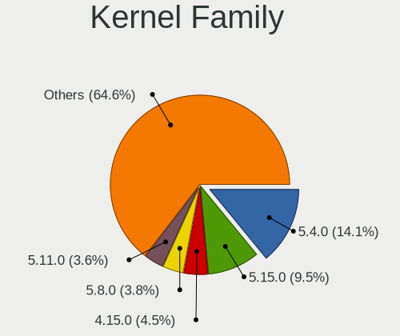
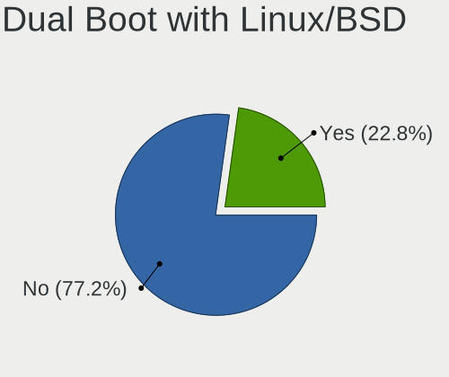
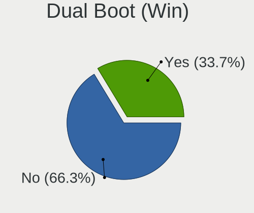
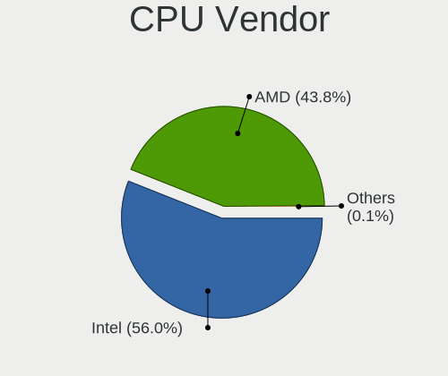
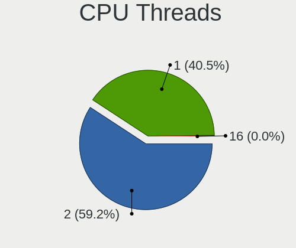
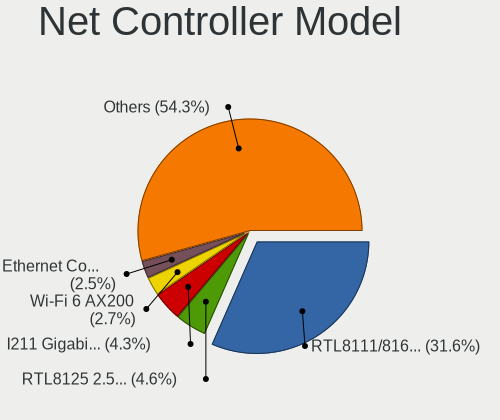
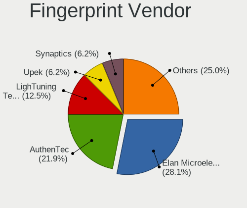

Linux in Germany - Tested Hardware & Statistics (Desktops)
----------------------------------------------------------

A project to collect tested hardware configurations for Linux in Germany.

Anyone can contribute to this report by the [hw-probe](https://github.com/linuxhw/hw-probe) tool:

    sudo -E hw-probe -all -upload

Please contribute! Especially if your hardware is rare.

Contents
--------

* [ Test Cases ](#test-cases)

* [ System ](#system)
  - [ OS                       ](#os)
  - [ OS Family                ](#os-family)
  - [ Kernel                   ](#kernel)
  - [ Kernel Family            ](#kernel-family)
  - [ Kernel Major Ver.        ](#kernel-major-ver)
  - [ Arch                     ](#arch)
  - [ DE                       ](#de)
  - [ Display Server           ](#display-server)
  - [ Display Manager          ](#display-manager)
  - [ OS Lang                  ](#os-lang)
  - [ Boot Mode                ](#boot-mode)
  - [ Filesystem               ](#filesystem)
  - [ Part. scheme             ](#part-scheme)
  - [ Dual Boot with Linux/BSD ](#dual-boot-with-linuxbsd)
  - [ Dual Boot (Win)          ](#dual-boot-win)

* [ Board ](#board)
  - [ Vendor                   ](#vendor)
  - [ Model                    ](#model)
  - [ Model Family             ](#model-family)
  - [ MFG Year                 ](#mfg-year)
  - [ Form Factor              ](#form-factor)
  - [ Secure Boot              ](#secure-boot)
  - [ Coreboot                 ](#coreboot)
  - [ RAM Size                 ](#ram-size)
  - [ RAM Used                 ](#ram-used)
  - [ Total Drives             ](#total-drives)
  - [ Has CD-ROM               ](#has-cd-rom)
  - [ Has Ethernet             ](#has-ethernet)
  - [ Has WiFi                 ](#has-wifi)
  - [ Has Bluetooth            ](#has-bluetooth)

* [ Location ](#location)
  - [ Country                  ](#country)
  - [ City                     ](#city)

* [ Drives ](#drives)
  - [ Drive Vendor             ](#drive-vendor)
  - [ Drive Model              ](#drive-model)
  - [ HDD Vendor               ](#hdd-vendor)
  - [ SSD Vendor               ](#ssd-vendor)
  - [ Drive Kind               ](#drive-kind)
  - [ Drive Connector          ](#drive-connector)
  - [ Drive Size               ](#drive-size)
  - [ Space Total              ](#space-total)
  - [ Space Used               ](#space-used)
  - [ Malfunc. Drives          ](#malfunc-drives)
  - [ Malfunc. Drive Vendor    ](#malfunc-drive-vendor)
  - [ Malfunc. HDD Vendor      ](#malfunc-hdd-vendor)
  - [ Malfunc. Drive Kind      ](#malfunc-drive-kind)
  - [ Failed Drives            ](#failed-drives)
  - [ Failed Drive Vendor      ](#failed-drive-vendor)
  - [ Drive Status             ](#drive-status)

* [ Storage controller ](#storage-controller)
  - [ Storage Vendor           ](#storage-vendor)
  - [ Storage Model            ](#storage-model)
  - [ Storage Kind             ](#storage-kind)

* [ Processor ](#processor)
  - [ CPU Vendor               ](#cpu-vendor)
  - [ CPU Model                ](#cpu-model)
  - [ CPU Model Family         ](#cpu-model-family)
  - [ CPU Cores                ](#cpu-cores)
  - [ CPU Sockets              ](#cpu-sockets)
  - [ CPU Threads              ](#cpu-threads)
  - [ CPU Op-Modes             ](#cpu-op-modes)
  - [ CPU Microcode            ](#cpu-microcode)
  - [ CPU Microarch            ](#cpu-microarch)

* [ Graphics ](#graphics)
  - [ GPU Vendor               ](#gpu-vendor)
  - [ GPU Model                ](#gpu-model)
  - [ GPU Combo                ](#gpu-combo)
  - [ GPU Driver               ](#gpu-driver)
  - [ GPU Memory               ](#gpu-memory)

* [ Monitor ](#monitor)
  - [ Monitor Vendor           ](#monitor-vendor)
  - [ Monitor Model            ](#monitor-model)
  - [ Monitor Resolution       ](#monitor-resolution)
  - [ Monitor Diagonal         ](#monitor-diagonal)
  - [ Monitor Width            ](#monitor-width)
  - [ Aspect Ratio             ](#aspect-ratio)
  - [ Monitor Area             ](#monitor-area)
  - [ Pixel Density            ](#pixel-density)
  - [ Multiple Monitors        ](#multiple-monitors)

* [ Network ](#network)
  - [ Net Controller Vendor    ](#net-controller-vendor)
  - [ Net Controller Model     ](#net-controller-model)
  - [ Wireless Vendor          ](#wireless-vendor)
  - [ Wireless Model           ](#wireless-model)
  - [ Ethernet Vendor          ](#ethernet-vendor)
  - [ Ethernet Model           ](#ethernet-model)
  - [ Net Controller Kind      ](#net-controller-kind)
  - [ Used Controller          ](#used-controller)
  - [ NICs                     ](#nics)
  - [ IPv6                     ](#ipv6)

* [ Bluetooth ](#bluetooth)
  - [ Bluetooth Vendor         ](#bluetooth-vendor)
  - [ Bluetooth Model          ](#bluetooth-model)

* [ Sound ](#sound)
  - [ Sound Vendor             ](#sound-vendor)
  - [ Sound Model              ](#sound-model)

* [ Memory ](#memory)
  - [ Memory Vendor            ](#memory-vendor)
  - [ Memory Model             ](#memory-model)
  - [ Memory Kind              ](#memory-kind)
  - [ Memory Form Factor       ](#memory-form-factor)
  - [ Memory Size              ](#memory-size)
  - [ Memory Speed             ](#memory-speed)

* [ Printers & scanners ](#printers--scanners)
  - [ Printer Vendor           ](#printer-vendor)
  - [ Printer Model            ](#printer-model)
  - [ Scanner Vendor           ](#scanner-vendor)
  - [ Scanner Model            ](#scanner-model)

* [ Camera ](#camera)
  - [ Camera Vendor            ](#camera-vendor)
  - [ Camera Model             ](#camera-model)

* [ Security ](#security)
  - [ Fingerprint Vendor       ](#fingerprint-vendor)
  - [ Fingerprint Model        ](#fingerprint-model)
  - [ Chipcard Vendor          ](#chipcard-vendor)
  - [ Chipcard Model           ](#chipcard-model)

* [ Unsupported ](#unsupported)
  - [ Unsupported Devices      ](#unsupported-devices)
  - [ Unsupported Device Types ](#unsupported-device-types)

Test Cases
----------

Total: 14309

| Vendor        | Model                       | Probe                                                      | Date         |
|---------------|-----------------------------|------------------------------------------------------------|--------------|
| MSI           | Z77A-GD65                   | [42366a1fa1](https://linux-hardware.org/?probe=42366a1fa1) | Feb 02, 2024 |
| HP            | 83E9                        | [a140a989be](https://linux-hardware.org/?probe=a140a989be) | Feb 02, 2024 |
| ASUSTek       | TUF B450-PLUS GAMING        | [4bcae97baa](https://linux-hardware.org/?probe=4bcae97baa) | Feb 02, 2024 |
| ASRock        | Z77 Pro3                    | [f1d8db0641](https://linux-hardware.org/?probe=f1d8db0641) | Feb 02, 2024 |
| ASRock        | H61M-DGS R2.0               | [fed06b0a3c](https://linux-hardware.org/?probe=fed06b0a3c) | Feb 02, 2024 |
| ASUSTek       | PRIME X370-PRO              | [58d150eef2](https://linux-hardware.org/?probe=58d150eef2) | Feb 02, 2024 |
| Gigabyte      | F2A75M-D3H                  | [a30e9bd132](https://linux-hardware.org/?probe=a30e9bd132) | Feb 02, 2024 |
| Gigabyte      | Q87M-D2H                    | [4c5e48c75f](https://linux-hardware.org/?probe=4c5e48c75f) | Feb 02, 2024 |
| Inventec      | DQ Class A02                | [4cb447dae2](https://linux-hardware.org/?probe=4cb447dae2) | Feb 02, 2024 |
| ASRock        | H61M-DGS R2.0               | [a757eacac1](https://linux-hardware.org/?probe=a757eacac1) | Feb 02, 2024 |
| MSI           | B450 GAMING PLUS MAX        | [e8554aab57](https://linux-hardware.org/?probe=e8554aab57) | Feb 02, 2024 |
| MSI           | B450 GAMING PLUS MAX        | [73e32179ef](https://linux-hardware.org/?probe=73e32179ef) | Feb 02, 2024 |
| Gigabyte      | AX370-Gaming K7             | [c2514048e9](https://linux-hardware.org/?probe=c2514048e9) | Feb 02, 2024 |
| MSI           | B550 GAMING GEN3            | [e0f8f7bf56](https://linux-hardware.org/?probe=e0f8f7bf56) | Feb 01, 2024 |
| ASUSTek       | PRIME X470-PRO              | [50c9a44280](https://linux-hardware.org/?probe=50c9a44280) | Feb 01, 2024 |
| MSI           | B450-A PRO                  | [10f58dc52e](https://linux-hardware.org/?probe=10f58dc52e) | Feb 01, 2024 |
| HP            | 2B34                        | [8d74dccabc](https://linux-hardware.org/?probe=8d74dccabc) | Feb 01, 2024 |
| ASUSTek       | PRIME B560M-K               | [007e574396](https://linux-hardware.org/?probe=007e574396) | Feb 01, 2024 |
| ASUSTek       | PRIME B560M-K               | [9d4315d3e3](https://linux-hardware.org/?probe=9d4315d3e3) | Feb 01, 2024 |
| ASUSTek       | TUF Z390-PLUS GAMING        | [f708da8a98](https://linux-hardware.org/?probe=f708da8a98) | Feb 01, 2024 |
| Dell          | 0G214D A00                  | [2973076de3](https://linux-hardware.org/?probe=2973076de3) | Feb 01, 2024 |
| MSI           | B450-A PRO                  | [aecf5f7bf1](https://linux-hardware.org/?probe=aecf5f7bf1) | Feb 01, 2024 |
| MSI           | Z77A-GD65                   | [fd7e7fcc3e](https://linux-hardware.org/?probe=fd7e7fcc3e) | Feb 01, 2024 |
| HP            | 0B40h                       | [d165885fbf](https://linux-hardware.org/?probe=d165885fbf) | Feb 01, 2024 |
| ASRock        | A320M-HDV R4.0              | [9262af6ace](https://linux-hardware.org/?probe=9262af6ace) | Jan 31, 2024 |
| Gigabyte      | Q87M-D2H                    | [78ef1fbd6c](https://linux-hardware.org/?probe=78ef1fbd6c) | Jan 31, 2024 |
| Medion        | TJ4125                      | [2705de4986](https://linux-hardware.org/?probe=2705de4986) | Jan 31, 2024 |
| Gigabyte      | B85M-D3H                    | [059252dc92](https://linux-hardware.org/?probe=059252dc92) | Jan 31, 2024 |
| Intel         | DH55PJ AAE93812-302         | [acc04ef6ef](https://linux-hardware.org/?probe=acc04ef6ef) | Jan 31, 2024 |
| ASUSTek       | P5K                         | [2835d63be5](https://linux-hardware.org/?probe=2835d63be5) | Jan 31, 2024 |
| ASUSTek       | P5K                         | [5db8fad897](https://linux-hardware.org/?probe=5db8fad897) | Jan 31, 2024 |
| ASUSTek       | TUF Gaming B650M-PLUS       | [0b234564e9](https://linux-hardware.org/?probe=0b234564e9) | Jan 31, 2024 |
| Unknown       | T3 MRD                      | [744984b9d3](https://linux-hardware.org/?probe=744984b9d3) | Jan 31, 2024 |
| Fujitsu       | D3401-A1 S26361-D3401-A1    | [2360c2cf38](https://linux-hardware.org/?probe=2360c2cf38) | Jan 31, 2024 |
| Unknown       | T3 MRD                      | [e3b3bc071f](https://linux-hardware.org/?probe=e3b3bc071f) | Jan 31, 2024 |
| ASRock        | B550M-ITX/ac                | [5996127f6c](https://linux-hardware.org/?probe=5996127f6c) | Jan 31, 2024 |
| ASRock        | B450M Pro4                  | [ec3c7a4fc6](https://linux-hardware.org/?probe=ec3c7a4fc6) | Jan 30, 2024 |
| ASRock        | X570 Phantom Gaming-ITX/... | [44c985b693](https://linux-hardware.org/?probe=44c985b693) | Jan 30, 2024 |
| ASUSTek       | ProArt X570-CREATOR WIFI    | [13e5919ccf](https://linux-hardware.org/?probe=13e5919ccf) | Jan 30, 2024 |
| HP            | 8653 A                      | [64cfa9a25f](https://linux-hardware.org/?probe=64cfa9a25f) | Jan 30, 2024 |
| ASRock        | H61M-DGS R2.0               | [dd059e849e](https://linux-hardware.org/?probe=dd059e849e) | Jan 30, 2024 |
| Gigabyte      | Z690 UD DDR4                | [454433be44](https://linux-hardware.org/?probe=454433be44) | Jan 30, 2024 |
| HP            | 859C                        | [866ac7f0ed](https://linux-hardware.org/?probe=866ac7f0ed) | Jan 30, 2024 |
| Gigabyte      | B450 AORUS PRO-CF           | [2a28e6308a](https://linux-hardware.org/?probe=2a28e6308a) | Jan 29, 2024 |
| ASRock        | Z77 Pro4                    | [c2b82aa42c](https://linux-hardware.org/?probe=c2b82aa42c) | Jan 29, 2024 |
| Packard Be... | IXTREME M5800               | [f31eaf65b4](https://linux-hardware.org/?probe=f31eaf65b4) | Jan 29, 2024 |
| MSI           | H81M-E34                    | [e7e4aeecac](https://linux-hardware.org/?probe=e7e4aeecac) | Jan 29, 2024 |
| ASRock        | B550 Phantom Gaming 4       | [93c0e7740f](https://linux-hardware.org/?probe=93c0e7740f) | Jan 29, 2024 |
| MSI           | MPG B550 GAMING PLUS        | [091fe8d216](https://linux-hardware.org/?probe=091fe8d216) | Jan 29, 2024 |
| Gigabyte      | GA-MA78GM-S2H               | [d6436b1ea4](https://linux-hardware.org/?probe=d6436b1ea4) | Jan 29, 2024 |
| ASUSTek       | Pro WS WRX80E-SAGE SE WI... | [009120e99a](https://linux-hardware.org/?probe=009120e99a) | Jan 29, 2024 |
| Dell          | 0C27VV A01                  | [629c3cb24c](https://linux-hardware.org/?probe=629c3cb24c) | Jan 29, 2024 |
| Shenzhen M... | F6BFC                       | [3ecbf7ef23](https://linux-hardware.org/?probe=3ecbf7ef23) | Jan 29, 2024 |
| Dell          | 0C2KJT A00                  | [bc76ac497b](https://linux-hardware.org/?probe=bc76ac497b) | Jan 29, 2024 |
| ASUSTek       | PRIME Z690-P WIFI           | [b9363c386a](https://linux-hardware.org/?probe=b9363c386a) | Jan 29, 2024 |
| Dell          | 0C2KJT A00                  | [b56c82b709](https://linux-hardware.org/?probe=b56c82b709) | Jan 29, 2024 |
| Supermicro    | C2SBC-Q                     | [41edfdd3b7](https://linux-hardware.org/?probe=41edfdd3b7) | Jan 29, 2024 |
| Fujitsu       | D3221-A1 S26361-D3221-A1    | [292b1b06ca](https://linux-hardware.org/?probe=292b1b06ca) | Jan 28, 2024 |
| Dell          | 0C27VV A01                  | [522198b192](https://linux-hardware.org/?probe=522198b192) | Jan 28, 2024 |
| MSI           | B450-A PRO                  | [afb7d75f84](https://linux-hardware.org/?probe=afb7d75f84) | Jan 28, 2024 |
| Lenovo        | 36C5 SDK0K17763 WIN 1801... | [0aa2140ac2](https://linux-hardware.org/?probe=0aa2140ac2) | Jan 28, 2024 |
| Lenovo        | 36C5 SDK0K17763 WIN 1801... | [752e2156f6](https://linux-hardware.org/?probe=752e2156f6) | Jan 28, 2024 |
| ASRock        | B550M Phantom Gaming 4      | [19712e098a](https://linux-hardware.org/?probe=19712e098a) | Jan 28, 2024 |
| Gigabyte      | H81M-HD3                    | [f6305c313c](https://linux-hardware.org/?probe=f6305c313c) | Jan 28, 2024 |
| Packard Be... | IXTREME M5800               | [8d8f99feb9](https://linux-hardware.org/?probe=8d8f99feb9) | Jan 28, 2024 |
| MSI           | A320M BAZOOKA               | [db3234d7aa](https://linux-hardware.org/?probe=db3234d7aa) | Jan 28, 2024 |
| Gigabyte      | B650 GAMING X AX            | [f728617f20](https://linux-hardware.org/?probe=f728617f20) | Jan 28, 2024 |
| ASRock        | B760M-HDV/M.2 D4            | [56ef6ba880](https://linux-hardware.org/?probe=56ef6ba880) | Jan 28, 2024 |
| HP            | 21EF                        | [9fcfe8d663](https://linux-hardware.org/?probe=9fcfe8d663) | Jan 28, 2024 |
| Wortmann      | TERRA_PC                    | [670f98f66b](https://linux-hardware.org/?probe=670f98f66b) | Jan 27, 2024 |
| Wortmann      | TERRA_PC                    | [ef0c89a597](https://linux-hardware.org/?probe=ef0c89a597) | Jan 27, 2024 |
| Fujitsu       | D3233-A1 S26361-D3233-A1    | [d5f5ab4b3f](https://linux-hardware.org/?probe=d5f5ab4b3f) | Jan 27, 2024 |
| ASRock        | X300-ITX                    | [8a850c251d](https://linux-hardware.org/?probe=8a850c251d) | Jan 27, 2024 |
| Dell          | 042P49 A01                  | [c419b892e0](https://linux-hardware.org/?probe=c419b892e0) | Jan 27, 2024 |
| MSI           | B560M PRO                   | [773f3d7e1c](https://linux-hardware.org/?probe=773f3d7e1c) | Jan 27, 2024 |
| ASUSTek       | ROG STRIX X570-E GAMING     | [a85c3034f2](https://linux-hardware.org/?probe=a85c3034f2) | Jan 27, 2024 |
| Gigabyte      | H97-HD3                     | [92984a124e](https://linux-hardware.org/?probe=92984a124e) | Jan 27, 2024 |
| HP            | 158A                        | [03d463519d](https://linux-hardware.org/?probe=03d463519d) | Jan 27, 2024 |
| Gigabyte      | X570 AORUS MASTER           | [f940181f19](https://linux-hardware.org/?probe=f940181f19) | Jan 27, 2024 |
| Gigabyte      | A320M-S2H V2-CF             | [53581eed88](https://linux-hardware.org/?probe=53581eed88) | Jan 27, 2024 |
| Gigabyte      | B450 AORUS M                | [03351f8523](https://linux-hardware.org/?probe=03351f8523) | Jan 27, 2024 |
| MSI           | A320M GRENADE               | [0a605bfdee](https://linux-hardware.org/?probe=0a605bfdee) | Jan 27, 2024 |
| MSI           | B550-A PRO                  | [9690cb0096](https://linux-hardware.org/?probe=9690cb0096) | Jan 27, 2024 |
| ASUSTek       | PRIME B450M-K II            | [46b23b4469](https://linux-hardware.org/?probe=46b23b4469) | Jan 27, 2024 |
| MSI           | MPG X570 GAMING EDGE WIF... | [c1267550bc](https://linux-hardware.org/?probe=c1267550bc) | Jan 27, 2024 |
| ASUSTek       | PRIME A320M-K               | [b1d979bcb3](https://linux-hardware.org/?probe=b1d979bcb3) | Jan 27, 2024 |
| ASUSTek       | ROG STRIX B450-F GAMING     | [f7b37dcead](https://linux-hardware.org/?probe=f7b37dcead) | Jan 27, 2024 |
| Lenovo        | 3098 NOK                    | [329ce0df97](https://linux-hardware.org/?probe=329ce0df97) | Jan 27, 2024 |
| HC Technol... | HCAR5000-MI2                | [19a4048799](https://linux-hardware.org/?probe=19a4048799) | Jan 27, 2024 |
| ASUSTek       | TUF Gaming B550M-PLUS       | [30139ed46d](https://linux-hardware.org/?probe=30139ed46d) | Jan 27, 2024 |
| ASUSTek       | SABERTOOTH 990FX R2.0       | [040dbb275e](https://linux-hardware.org/?probe=040dbb275e) | Jan 26, 2024 |
| Gigabyte      | Z97N-WIFI                   | [867a17b708](https://linux-hardware.org/?probe=867a17b708) | Jan 26, 2024 |
| Unknown       | P43R1600Twins-110DB         | [0741a919e4](https://linux-hardware.org/?probe=0741a919e4) | Jan 26, 2024 |
| ASRock        | B450M Pro4 R2.0             | [cb67574020](https://linux-hardware.org/?probe=cb67574020) | Jan 26, 2024 |
| Gigabyte      | A520M DS3H                  | [296732b4f9](https://linux-hardware.org/?probe=296732b4f9) | Jan 26, 2024 |
| ASRock        | B550 Pro4                   | [e6dfa57418](https://linux-hardware.org/?probe=e6dfa57418) | Jan 26, 2024 |
| ASUSTek       | Z170-K                      | [277fb7b364](https://linux-hardware.org/?probe=277fb7b364) | Jan 25, 2024 |
| Gigabyte      | A520M DS3H                  | [21d498375d](https://linux-hardware.org/?probe=21d498375d) | Jan 25, 2024 |
| Medion        | MS-7797                     | [16eb1fb145](https://linux-hardware.org/?probe=16eb1fb145) | Jan 25, 2024 |
| ASRock        | A520M-HDV                   | [db1260e2b7](https://linux-hardware.org/?probe=db1260e2b7) | Jan 25, 2024 |
| HP            | 3048h                       | [ed2d54328f](https://linux-hardware.org/?probe=ed2d54328f) | Jan 25, 2024 |
| Unknown       | Unknown                     | [57252b99d4](https://linux-hardware.org/?probe=57252b99d4) | Jan 25, 2024 |
| Gigabyte      | Z87X-D3H-CF                 | [5b23ab08ae](https://linux-hardware.org/?probe=5b23ab08ae) | Jan 25, 2024 |
| Gigabyte      | Z390 UD V2                  | [b2693bec37](https://linux-hardware.org/?probe=b2693bec37) | Jan 25, 2024 |
| Dell          | 0K240Y A01                  | [fe08501f76](https://linux-hardware.org/?probe=fe08501f76) | Jan 24, 2024 |
| ASRock        | FM2A88X Extreme6+           | [806eb6a76c](https://linux-hardware.org/?probe=806eb6a76c) | Jan 24, 2024 |
| Gigabyte      | Z270-HD3P-CF                | [b0381cdfcc](https://linux-hardware.org/?probe=b0381cdfcc) | Jan 24, 2024 |
| ASUSTek       | M4A77T                      | [082bd06cdc](https://linux-hardware.org/?probe=082bd06cdc) | Jan 24, 2024 |
| Fujitsu       | D3531-A1 S26361-D3531-A1    | [db6de09144](https://linux-hardware.org/?probe=db6de09144) | Jan 24, 2024 |
| Dell          | 0XKH0D A02                  | [7ed5013174](https://linux-hardware.org/?probe=7ed5013174) | Jan 24, 2024 |
| Lenovo        | SHARKBAY SDK0E50510 WIN     | [ff7fd4d2cd](https://linux-hardware.org/?probe=ff7fd4d2cd) | Jan 24, 2024 |
| ASUSTek       | PRIME A320M-K               | [5c2e73a06a](https://linux-hardware.org/?probe=5c2e73a06a) | Jan 23, 2024 |
| ASUSTek       | Pro WS 565-ACE              | [46ef259c25](https://linux-hardware.org/?probe=46ef259c25) | Jan 23, 2024 |
| HP            | 3396                        | [066dd08de0](https://linux-hardware.org/?probe=066dd08de0) | Jan 23, 2024 |
| ASRock        | B450 Pro4 R2.0              | [a606bceea5](https://linux-hardware.org/?probe=a606bceea5) | Jan 23, 2024 |
| Lenovo        | ThinkCentre M90p 5536AN5    | [8305fcdce9](https://linux-hardware.org/?probe=8305fcdce9) | Jan 23, 2024 |
| ASRock        | A320M-HDV R3.0              | [09e7370c8b](https://linux-hardware.org/?probe=09e7370c8b) | Jan 22, 2024 |
| Gigabyte      | G41MT-ES2L                  | [a4d37ca137](https://linux-hardware.org/?probe=a4d37ca137) | Jan 22, 2024 |
| Gigabyte      | GA-78LMT-S2P                | [615b7dc324](https://linux-hardware.org/?probe=615b7dc324) | Jan 22, 2024 |
| MSI           | MEG X570 ACE                | [85c7d79003](https://linux-hardware.org/?probe=85c7d79003) | Jan 22, 2024 |
| ASRock        | A520M-HDV                   | [34e4549f27](https://linux-hardware.org/?probe=34e4549f27) | Jan 22, 2024 |
| Fujitsu       | D3401-A1 S26361-D3401-A1    | [bb111f75bd](https://linux-hardware.org/?probe=bb111f75bd) | Jan 22, 2024 |
| Gigabyte      | B550I AORUS PRO AX          | [0d82cd43ff](https://linux-hardware.org/?probe=0d82cd43ff) | Jan 22, 2024 |
| Inventec      | D CLASS A02                 | [25d4886028](https://linux-hardware.org/?probe=25d4886028) | Jan 22, 2024 |
| Gigabyte      | B550I AORUS PRO AX          | [e47b62e5ed](https://linux-hardware.org/?probe=e47b62e5ed) | Jan 22, 2024 |
| Gigabyte      | H97-D3H-CF                  | [d32264b9cc](https://linux-hardware.org/?probe=d32264b9cc) | Jan 22, 2024 |
| ASUSTek       | A68HM-PLUS                  | [21054351d9](https://linux-hardware.org/?probe=21054351d9) | Jan 22, 2024 |
| MSI           | MS-B1711                    | [0949139f7e](https://linux-hardware.org/?probe=0949139f7e) | Jan 22, 2024 |
| Dell          | 096JG8 A01                  | [a397efcf1d](https://linux-hardware.org/?probe=a397efcf1d) | Jan 21, 2024 |
| HP            | 2B5B                        | [cdbdd68f6f](https://linux-hardware.org/?probe=cdbdd68f6f) | Jan 21, 2024 |
| MSI           | H81M ECO                    | [6b904323a3](https://linux-hardware.org/?probe=6b904323a3) | Jan 21, 2024 |
| ASUSTek       | PRIME A320M-K               | [9ba427246b](https://linux-hardware.org/?probe=9ba427246b) | Jan 21, 2024 |
| Gigabyte      | H81M-D2W                    | [03ec02fab4](https://linux-hardware.org/?probe=03ec02fab4) | Jan 21, 2024 |
| MSI           | Z170A GAMING M5             | [742588d66a](https://linux-hardware.org/?probe=742588d66a) | Jan 21, 2024 |
| ASRock        | B460M Pro4                  | [65b69b2422](https://linux-hardware.org/?probe=65b69b2422) | Jan 21, 2024 |
| MSI           | PRO Z790-P WIFI             | [55b2a770eb](https://linux-hardware.org/?probe=55b2a770eb) | Jan 21, 2024 |
| ASUSTek       | PRIME B350-PLUS             | [fbc836a9ff](https://linux-hardware.org/?probe=fbc836a9ff) | Jan 21, 2024 |
| ASUSTek       | M5A97 R2.0                  | [5a96118b34](https://linux-hardware.org/?probe=5a96118b34) | Jan 20, 2024 |
| ASUSTek       | ROG STRIX B550-F GAMING     | [5c9deadb93](https://linux-hardware.org/?probe=5c9deadb93) | Jan 20, 2024 |
| Pegatron      | 2AB6                        | [660b2b76ed](https://linux-hardware.org/?probe=660b2b76ed) | Jan 20, 2024 |
| ASUSTek       | Maximus VIII HERO           | [4b148b87c9](https://linux-hardware.org/?probe=4b148b87c9) | Jan 20, 2024 |
| Gigabyte      | Z97P-D3                     | [4ec75647b3](https://linux-hardware.org/?probe=4ec75647b3) | Jan 20, 2024 |
| ASUSTek       | PRIME B760-PLUS D4          | [c59142fa22](https://linux-hardware.org/?probe=c59142fa22) | Jan 20, 2024 |
| MSI           | B450-A PRO                  | [e11e6780da](https://linux-hardware.org/?probe=e11e6780da) | Jan 20, 2024 |
| Gigabyte      | P55-USB3                    | [2ae180284e](https://linux-hardware.org/?probe=2ae180284e) | Jan 20, 2024 |
| ASUSTek       | PRIME A320M-K               | [58be81f7c1](https://linux-hardware.org/?probe=58be81f7c1) | Jan 20, 2024 |
| ASUSTek       | PRIME B450M-K               | [5e16786940](https://linux-hardware.org/?probe=5e16786940) | Jan 20, 2024 |
| Gigabyte      | A320M-S2H V2-CF             | [726265f666](https://linux-hardware.org/?probe=726265f666) | Jan 20, 2024 |
| Gigabyte      | B550 AORUS PRO AC           | [b9dcb37cc9](https://linux-hardware.org/?probe=b9dcb37cc9) | Jan 20, 2024 |
| Fujitsu       | D3613-A1 S26361-D3613-A1    | [22c44fb878](https://linux-hardware.org/?probe=22c44fb878) | Jan 19, 2024 |
| ASUSTek       | PRIME H410M-E               | [29a0aa8446](https://linux-hardware.org/?probe=29a0aa8446) | Jan 19, 2024 |
| ASUSTek       | PRIME H510M-A               | [6aa12bd4c7](https://linux-hardware.org/?probe=6aa12bd4c7) | Jan 19, 2024 |
| Lenovo        | 3178 SDK0J40700 WIN 3258... | [ed95c81dcc](https://linux-hardware.org/?probe=ed95c81dcc) | Jan 19, 2024 |
| ASUSTek       | PRIME X470-PRO              | [8601fae7df](https://linux-hardware.org/?probe=8601fae7df) | Jan 19, 2024 |
| ASUSTek       | TUF Z390-PLUS GAMING        | [a77218f826](https://linux-hardware.org/?probe=a77218f826) | Jan 19, 2024 |
| ASUSTek       | PRIME X470-PRO              | [fa525f2f78](https://linux-hardware.org/?probe=fa525f2f78) | Jan 19, 2024 |
| Gigabyte      | B550 AORUS ELITE V2         | [13086bc4ce](https://linux-hardware.org/?probe=13086bc4ce) | Jan 19, 2024 |
| Biostar       | B450MHP                     | [16584e3717](https://linux-hardware.org/?probe=16584e3717) | Jan 19, 2024 |
| Biostar       | B450MHP                     | [24682bdb1f](https://linux-hardware.org/?probe=24682bdb1f) | Jan 19, 2024 |
| ASRock        | Z390 Extreme4               | [d81097f203](https://linux-hardware.org/?probe=d81097f203) | Jan 19, 2024 |
| ASRock        | X370 Pro4                   | [9dfd5fe2cb](https://linux-hardware.org/?probe=9dfd5fe2cb) | Jan 19, 2024 |
| ASUSTek       | ROG STRIX X399-E GAMING     | [89d65b315c](https://linux-hardware.org/?probe=89d65b315c) | Jan 19, 2024 |
| IceWhale T... | ZimaBoard 832 ZMB           | [5b5d90211c](https://linux-hardware.org/?probe=5b5d90211c) | Jan 18, 2024 |
| Fujitsu       | D3120-A1 S26361-D3120-A1    | [27b2376cad](https://linux-hardware.org/?probe=27b2376cad) | Jan 18, 2024 |
| MSI           | MEG X570 UNIFY              | [01d5509c12](https://linux-hardware.org/?probe=01d5509c12) | Jan 18, 2024 |
| ASUSTek       | M5A97 EVO R2.0              | [f0b1918981](https://linux-hardware.org/?probe=f0b1918981) | Jan 18, 2024 |
| Gigabyte      | Z690 GAMING X DDR4          | [1aa8c64606](https://linux-hardware.org/?probe=1aa8c64606) | Jan 18, 2024 |
| ASUSTek       | PRIME B360-PLUS             | [7f55ddb513](https://linux-hardware.org/?probe=7f55ddb513) | Jan 18, 2024 |
| Gigabyte      | B85-HD3                     | [66b0dbb818](https://linux-hardware.org/?probe=66b0dbb818) | Jan 18, 2024 |
| ASUSTek       | P6T SE                      | [6b60732b39](https://linux-hardware.org/?probe=6b60732b39) | Jan 18, 2024 |
| MSI           | MEG X570 UNIFY              | [d732f80c75](https://linux-hardware.org/?probe=d732f80c75) | Jan 18, 2024 |
| ASUSTek       | ROG STRIX X670E-E GAMING... | [9cea75cc3c](https://linux-hardware.org/?probe=9cea75cc3c) | Jan 18, 2024 |
| Fujitsu       | D3221-A1 S26361-D3221-A1    | [9353e2bbef](https://linux-hardware.org/?probe=9353e2bbef) | Jan 17, 2024 |
| Gigabyte      | A520M H                     | [2f58464c52](https://linux-hardware.org/?probe=2f58464c52) | Jan 17, 2024 |
| MSI           | MAG X570 TOMAHAWK WIFI      | [04707ec04e](https://linux-hardware.org/?probe=04707ec04e) | Jan 17, 2024 |
| ASUSTek       | TUF Gaming B460-PLUS        | [344b6767cd](https://linux-hardware.org/?probe=344b6767cd) | Jan 17, 2024 |
| MSI           | Z490-A PRO                  | [57eaf7e4ff](https://linux-hardware.org/?probe=57eaf7e4ff) | Jan 17, 2024 |
| ASUSTek       | SABERTOOTH 990FX R2.0       | [d4da037a11](https://linux-hardware.org/?probe=d4da037a11) | Jan 17, 2024 |
| MSI           | X470 GAMING PLUS MAX        | [f5e8165d7b](https://linux-hardware.org/?probe=f5e8165d7b) | Jan 17, 2024 |
| Medion        | MS-7800                     | [8af71869fc](https://linux-hardware.org/?probe=8af71869fc) | Jan 17, 2024 |
| ASUSTek       | PRIME A320M-K               | [b4bb61edfe](https://linux-hardware.org/?probe=b4bb61edfe) | Jan 17, 2024 |
| ASUSTek       | PRIME H510M-K               | [b780e18215](https://linux-hardware.org/?probe=b780e18215) | Jan 16, 2024 |
| ONDA          | H61V Ver:4.01               | [83030b6f99](https://linux-hardware.org/?probe=83030b6f99) | Jan 16, 2024 |
| ASUSTek       | PRIME Z490M-PLUS            | [be6d425c5a](https://linux-hardware.org/?probe=be6d425c5a) | Jan 16, 2024 |
| MSI           | B450M MORTAR MAX            | [c2c3082933](https://linux-hardware.org/?probe=c2c3082933) | Jan 16, 2024 |
| MSI           | MAG B660M MORTAR WIFI DD... | [58d64e6a70](https://linux-hardware.org/?probe=58d64e6a70) | Jan 16, 2024 |
| MSI           | X470 GAMING PLUS MAX        | [60694d3668](https://linux-hardware.org/?probe=60694d3668) | Jan 16, 2024 |
| Foxconn       | G41MXP/G41MXP-V             | [907bccb062](https://linux-hardware.org/?probe=907bccb062) | Jan 16, 2024 |
| ASUSTek       | M5A97 R2.0                  | [ccbf148cb3](https://linux-hardware.org/?probe=ccbf148cb3) | Jan 16, 2024 |
| ASUSTek       | H97-PLUS                    | [7d8b50985d](https://linux-hardware.org/?probe=7d8b50985d) | Jan 16, 2024 |
| ASUSTek       | ROG STRIX B550-F GAMING ... | [d0c72afc2d](https://linux-hardware.org/?probe=d0c72afc2d) | Jan 15, 2024 |
| MSI           | MPG X570S CARBON MAX WIF... | [c63804fec4](https://linux-hardware.org/?probe=c63804fec4) | Jan 15, 2024 |
| MSI           | MPG Z490 GAMING EDGE WIF... | [4d53425b9f](https://linux-hardware.org/?probe=4d53425b9f) | Jan 15, 2024 |
| Gigabyte      | B560M DS3H V2               | [01f214a86d](https://linux-hardware.org/?probe=01f214a86d) | Jan 15, 2024 |
| ASUSTek       | PRIME B450M-K II            | [fac0f6dfa7](https://linux-hardware.org/?probe=fac0f6dfa7) | Jan 15, 2024 |
| MSI           | Z170A PC MATE               | [9df326ae6f](https://linux-hardware.org/?probe=9df326ae6f) | Jan 15, 2024 |
| ASUSTek       | TUF Gaming B650M-PLUS       | [13451bf305](https://linux-hardware.org/?probe=13451bf305) | Jan 15, 2024 |
| Dell          | 0X8DXD A01                  | [d374bcb1f1](https://linux-hardware.org/?probe=d374bcb1f1) | Jan 15, 2024 |
| Gigabyte      | P55-USB3                    | [34cc055d6b](https://linux-hardware.org/?probe=34cc055d6b) | Jan 15, 2024 |
| Lenovo        | SHARKBAY SDK0E50510 WIN     | [c2e79b55b4](https://linux-hardware.org/?probe=c2e79b55b4) | Jan 15, 2024 |
| ASUSTek       | TUF Gaming B550-PLUS        | [5ba2479207](https://linux-hardware.org/?probe=5ba2479207) | Jan 15, 2024 |
| Medion        | MS-7800                     | [f0e70a4db4](https://linux-hardware.org/?probe=f0e70a4db4) | Jan 15, 2024 |
| MSI           | B250M PRO-VDH               | [e3752cb3af](https://linux-hardware.org/?probe=e3752cb3af) | Jan 14, 2024 |
| Lenovo        | ThinkCentre M81 5048E2G     | [d4de0eb368](https://linux-hardware.org/?probe=d4de0eb368) | Jan 14, 2024 |
| Lenovo        | ThinkCentre M81 5048E2G     | [b4aecb91bf](https://linux-hardware.org/?probe=b4aecb91bf) | Jan 14, 2024 |
| ASRock        | X300M-STX                   | [2802b8b35f](https://linux-hardware.org/?probe=2802b8b35f) | Jan 14, 2024 |
| ASUSTek       | TUF Gaming X670E-PLUS       | [c6374ed5f1](https://linux-hardware.org/?probe=c6374ed5f1) | Jan 14, 2024 |
| T-bao Tian... | GOD78                       | [c2f6e2c9e1](https://linux-hardware.org/?probe=c2f6e2c9e1) | Jan 14, 2024 |
| ASRock        | B450 Pro4                   | [b082a9bd9f](https://linux-hardware.org/?probe=b082a9bd9f) | Jan 14, 2024 |
| AMI           | Intel                       | [b28b13aa17](https://linux-hardware.org/?probe=b28b13aa17) | Jan 14, 2024 |
| ASUSTek       | ROG STRIX B550-F GAMING ... | [c7e19dad56](https://linux-hardware.org/?probe=c7e19dad56) | Jan 14, 2024 |
| GMKtec        | NucBox K4                   | [4b50e01269](https://linux-hardware.org/?probe=4b50e01269) | Jan 14, 2024 |
| Intel         | DP35DP AAD81073-210         | [690aec4d6e](https://linux-hardware.org/?probe=690aec4d6e) | Jan 14, 2024 |
| MSI           | MPG X570 GAMING PLUS        | [48662f6676](https://linux-hardware.org/?probe=48662f6676) | Jan 14, 2024 |
| ASUSTek       | PRIME A520M-K               | [98fb005bdf](https://linux-hardware.org/?probe=98fb005bdf) | Jan 13, 2024 |
| MSI           | MPG X570 GAMING PLUS        | [cd20d27cfa](https://linux-hardware.org/?probe=cd20d27cfa) | Jan 13, 2024 |
| ASUSTek       | PRIME B550-PLUS             | [6443f8b7e5](https://linux-hardware.org/?probe=6443f8b7e5) | Jan 13, 2024 |
| Fujitsu       | D3222-A1 S26361-D3222-A1    | [d1ac553f96](https://linux-hardware.org/?probe=d1ac553f96) | Jan 13, 2024 |
| Dell          | 0JP3NX A00                  | [ef21514ab1](https://linux-hardware.org/?probe=ef21514ab1) | Jan 13, 2024 |
| ASUSTek       | ROG Rampage VI EXTREME      | [d69cce27fe](https://linux-hardware.org/?probe=d69cce27fe) | Jan 13, 2024 |
| MSI           | B450M MORTAR MAX            | [bcd08b212b](https://linux-hardware.org/?probe=bcd08b212b) | Jan 13, 2024 |
| Unknown       | Unknown                     | [38bfc4e262](https://linux-hardware.org/?probe=38bfc4e262) | Jan 13, 2024 |
| MSI           | MPG Z790 EDGE TI MAX WIF... | [f77145f9e7](https://linux-hardware.org/?probe=f77145f9e7) | Jan 13, 2024 |
| Gigabyte      | Z790 AORUS ELITE AX         | [0b0fb2477f](https://linux-hardware.org/?probe=0b0fb2477f) | Jan 13, 2024 |
| ASUSTek       | TUF Gaming B550M-PLUS       | [daefd59105](https://linux-hardware.org/?probe=daefd59105) | Jan 13, 2024 |
| Lenovo        | 3098 NOK                    | [2a536e2055](https://linux-hardware.org/?probe=2a536e2055) | Jan 13, 2024 |
| MSI           | X370 SLI PLUS               | [d36968c401](https://linux-hardware.org/?probe=d36968c401) | Jan 12, 2024 |
| MSI           | H81M-P33 V2                 | [5cb55d28df](https://linux-hardware.org/?probe=5cb55d28df) | Jan 12, 2024 |
| MSI           | H81M-P33 V2                 | [24387d4f46](https://linux-hardware.org/?probe=24387d4f46) | Jan 12, 2024 |
| ASUSTek       | ROG STRIX B450-E GAMING     | [cf1d697418](https://linux-hardware.org/?probe=cf1d697418) | Jan 12, 2024 |
| Lenovo        | 1046 SDK0K17763 WIN 1801... | [04f69940d9](https://linux-hardware.org/?probe=04f69940d9) | Jan 12, 2024 |
| ASUSTek       | ROG STRIX B650E-F GAMING... | [e73c5fda0f](https://linux-hardware.org/?probe=e73c5fda0f) | Jan 12, 2024 |
| Gigabyte      | B450M S2H                   | [5ff6a8a29a](https://linux-hardware.org/?probe=5ff6a8a29a) | Jan 12, 2024 |
| Gigabyte      | B450M S2H                   | [ea8bf22b21](https://linux-hardware.org/?probe=ea8bf22b21) | Jan 12, 2024 |
| Inventec      | VXC Class A02               | [6d6e888c50](https://linux-hardware.org/?probe=6d6e888c50) | Jan 12, 2024 |
| MSI           | H77MA-G43                   | [51882b379d](https://linux-hardware.org/?probe=51882b379d) | Jan 12, 2024 |
| Gigabyte      | B550 AORUS ELITE V2         | [c8b80fe147](https://linux-hardware.org/?probe=c8b80fe147) | Jan 12, 2024 |
| ASUSTek       | TUF Gaming A620M-PLUS WI... | [8834b80a4f](https://linux-hardware.org/?probe=8834b80a4f) | Jan 11, 2024 |
| ASUSTek       | TUF Gaming A620M-PLUS WI... | [ad813cead7](https://linux-hardware.org/?probe=ad813cead7) | Jan 11, 2024 |
| MSI           | MAG X570 TOMAHAWK WIFI      | [6f2ff7e922](https://linux-hardware.org/?probe=6f2ff7e922) | Jan 11, 2024 |
| HP            | 0B40h                       | [33c3ec0511](https://linux-hardware.org/?probe=33c3ec0511) | Jan 11, 2024 |
| MSI           | MS-7318                     | [58f55e6bd3](https://linux-hardware.org/?probe=58f55e6bd3) | Jan 11, 2024 |
| Gigabyte      | Z690 AORUS MASTER           | [bdc05e8e4e](https://linux-hardware.org/?probe=bdc05e8e4e) | Jan 11, 2024 |
| Gigabyte      | MFLP5IP-00                  | [82e2bfd859](https://linux-hardware.org/?probe=82e2bfd859) | Jan 11, 2024 |
| ASRock        | B550M Pro4                  | [5a91b2f042](https://linux-hardware.org/?probe=5a91b2f042) | Jan 11, 2024 |
| Foxconn       | G31MX Series                | [44648fbf16](https://linux-hardware.org/?probe=44648fbf16) | Jan 11, 2024 |
| ASUSTek       | TUF Gaming B550-PLUS        | [0b4b01f1aa](https://linux-hardware.org/?probe=0b4b01f1aa) | Jan 11, 2024 |
| GEEKOM        | Mini IT 8                   | [16b759767e](https://linux-hardware.org/?probe=16b759767e) | Jan 11, 2024 |
| Acer          | Aspire XC-705               | [5d9f3a2b2e](https://linux-hardware.org/?probe=5d9f3a2b2e) | Jan 11, 2024 |
| Phoenix       | 945GM                       | [12f56a36d9](https://linux-hardware.org/?probe=12f56a36d9) | Jan 11, 2024 |
| MSI           | MS-B1711                    | [dc032b6456](https://linux-hardware.org/?probe=dc032b6456) | Jan 11, 2024 |
| Foxconn       | G31MX Series                | [0062a4f8dd](https://linux-hardware.org/?probe=0062a4f8dd) | Jan 10, 2024 |
| MSI           | B350 GAMING PRO CARBON      | [e8b3f439b3](https://linux-hardware.org/?probe=e8b3f439b3) | Jan 10, 2024 |
| ASRock        | B760M-STX                   | [1648b583d6](https://linux-hardware.org/?probe=1648b583d6) | Jan 10, 2024 |
| ASUSTek       | ROG STRIX X470-F GAMING     | [ba35c93df7](https://linux-hardware.org/?probe=ba35c93df7) | Jan 10, 2024 |
| Biostar       | B450NH                      | [81337c8589](https://linux-hardware.org/?probe=81337c8589) | Jan 10, 2024 |
| Gigabyte      | P35-DS3R                    | [8012464652](https://linux-hardware.org/?probe=8012464652) | Jan 10, 2024 |
| Dell          | 030VXY A01                  | [50a18e5eba](https://linux-hardware.org/?probe=50a18e5eba) | Jan 10, 2024 |
| Acer          | Aspire XC-705               | [0a921b1a3d](https://linux-hardware.org/?probe=0a921b1a3d) | Jan 10, 2024 |
| Fujitsu       | D3431-A1 S26361-D3431-A1    | [5f33f48cbe](https://linux-hardware.org/?probe=5f33f48cbe) | Jan 10, 2024 |
| ASRock        | B550 PG Riptide             | [5221601add](https://linux-hardware.org/?probe=5221601add) | Jan 10, 2024 |
| Dell          | 0YXT71 A01                  | [e50164b814](https://linux-hardware.org/?probe=e50164b814) | Jan 10, 2024 |
| MSI           | H110M PRO-D                 | [f5ce848a82](https://linux-hardware.org/?probe=f5ce848a82) | Jan 10, 2024 |
| ASRock        | Q1900B-ITX                  | [610dfd5b71](https://linux-hardware.org/?probe=610dfd5b71) | Jan 10, 2024 |
| MSI           | B350 GAMING PRO CARBON      | [a089502ce1](https://linux-hardware.org/?probe=a089502ce1) | Jan 10, 2024 |
| MSI           | PRO B650M-A WIFI            | [245ccd0eb9](https://linux-hardware.org/?probe=245ccd0eb9) | Jan 09, 2024 |
| MSI           | B550M PRO-VDH WIFI          | [79504ec34b](https://linux-hardware.org/?probe=79504ec34b) | Jan 09, 2024 |
| ASRock        | Z87 Extreme6                | [def7fb52af](https://linux-hardware.org/?probe=def7fb52af) | Jan 09, 2024 |
| ASUSTek       | ROG STRIX X570-E GAMING     | [e1d9aaa0f2](https://linux-hardware.org/?probe=e1d9aaa0f2) | Jan 09, 2024 |
| ASUSTek       | TUF Gaming B550-PLUS        | [8a25bf8215](https://linux-hardware.org/?probe=8a25bf8215) | Jan 09, 2024 |
| MSI           | 970A-G43                    | [00e0cf9c8d](https://linux-hardware.org/?probe=00e0cf9c8d) | Jan 09, 2024 |
| Fujitsu       | D3183-A1 S26361-D3183-A1    | [c9096376d8](https://linux-hardware.org/?probe=c9096376d8) | Jan 09, 2024 |
| HP            | 83EC                        | [ae8e6f1556](https://linux-hardware.org/?probe=ae8e6f1556) | Jan 09, 2024 |
| ASUSTek       | ROG STRIX Z690-F GAMING ... | [f7db7dfd14](https://linux-hardware.org/?probe=f7db7dfd14) | Jan 09, 2024 |
| Biostar       | B550MX/E PRO                | [8c12a7197e](https://linux-hardware.org/?probe=8c12a7197e) | Jan 08, 2024 |
| Acer          | Aspire XC-605               | [45cfea1b20](https://linux-hardware.org/?probe=45cfea1b20) | Jan 08, 2024 |
| Dell          | 014GRG A00                  | [d1dff13468](https://linux-hardware.org/?probe=d1dff13468) | Jan 08, 2024 |
| Shenzhen M... | F6BFC                       | [5b8c8357ea](https://linux-hardware.org/?probe=5b8c8357ea) | Jan 08, 2024 |
| OEM           | B7D                         | [be419ae1dd](https://linux-hardware.org/?probe=be419ae1dd) | Jan 08, 2024 |
| Fujitsu       | D2778-D1 S26361-D2778-D1    | [51f442f0d4](https://linux-hardware.org/?probe=51f442f0d4) | Jan 08, 2024 |
| ASRock        | B450M Pro4                  | [1c83544337](https://linux-hardware.org/?probe=1c83544337) | Jan 08, 2024 |
| ASUSTek       | PRIME Z490M-PLUS            | [f63753ff07](https://linux-hardware.org/?probe=f63753ff07) | Jan 08, 2024 |
| MSI           | MPG B550 GAMING PLUS        | [fab97aa087](https://linux-hardware.org/?probe=fab97aa087) | Jan 07, 2024 |
| MSI           | B150I GAMING PRO            | [deead2af5c](https://linux-hardware.org/?probe=deead2af5c) | Jan 07, 2024 |
| ASUSTek       | PRIME X670-P WIFI           | [19d6b3732e](https://linux-hardware.org/?probe=19d6b3732e) | Jan 07, 2024 |
| MSI           | B150I GAMING PRO            | [bc1fc63e30](https://linux-hardware.org/?probe=bc1fc63e30) | Jan 07, 2024 |
| Dell          | 0M859N A00                  | [4717bbc785](https://linux-hardware.org/?probe=4717bbc785) | Jan 07, 2024 |
| MSI           | MS-7349                     | [a59b29f0fb](https://linux-hardware.org/?probe=a59b29f0fb) | Jan 07, 2024 |
| Dell          | 0NK5PH A00                  | [6a6d55183a](https://linux-hardware.org/?probe=6a6d55183a) | Jan 07, 2024 |
| ASUSTek       | ROG STRIX B550-F GAMING     | [0d23e6d4c2](https://linux-hardware.org/?probe=0d23e6d4c2) | Jan 07, 2024 |
| ASUSTek       | ROG STRIX B650E-I GAMING... | [ea0e1750c9](https://linux-hardware.org/?probe=ea0e1750c9) | Jan 06, 2024 |
| ASUSTek       | B85M-E                      | [1f5304b336](https://linux-hardware.org/?probe=1f5304b336) | Jan 06, 2024 |
| ASUSTek       | B85M-E                      | [7c7fb3af69](https://linux-hardware.org/?probe=7c7fb3af69) | Jan 06, 2024 |
| ASUSTek       | P5QLD PRO                   | [9086cfaba8](https://linux-hardware.org/?probe=9086cfaba8) | Jan 06, 2024 |
| MSI           | B550-A PRO                  | [e2e58f59b7](https://linux-hardware.org/?probe=e2e58f59b7) | Jan 06, 2024 |
| Gigabyte      | B150M-DS3H-CF               | [428c97e8d0](https://linux-hardware.org/?probe=428c97e8d0) | Jan 06, 2024 |
| ASUSTek       | P7P55D                      | [3d2ef1558b](https://linux-hardware.org/?probe=3d2ef1558b) | Jan 06, 2024 |
| Unknown       | Unknown                     | [8f7440e4aa](https://linux-hardware.org/?probe=8f7440e4aa) | Jan 06, 2024 |
| Gigabyte      | B150M-DS3H-CF               | [05bbb14c15](https://linux-hardware.org/?probe=05bbb14c15) | Jan 06, 2024 |
| ASUSTek       | ROG STRIX B550-F GAMING     | [7f28dd699b](https://linux-hardware.org/?probe=7f28dd699b) | Jan 06, 2024 |
| Gigabyte      | MZBSWAP-00                  | [eb3700b576](https://linux-hardware.org/?probe=eb3700b576) | Jan 06, 2024 |
| Intel         | JSL MRD                     | [546cbf14b5](https://linux-hardware.org/?probe=546cbf14b5) | Jan 06, 2024 |
| Gigabyte      | A320M-S2H V2-CF             | [454ec37034](https://linux-hardware.org/?probe=454ec37034) | Jan 06, 2024 |
| MSI           | MEG X570 UNIFY              | [56df310601](https://linux-hardware.org/?probe=56df310601) | Jan 06, 2024 |
| ASUSTek       | Maximus VIII HERO           | [e23adc98db](https://linux-hardware.org/?probe=e23adc98db) | Jan 06, 2024 |
| Gigabyte      | Z690 AORUS MASTER           | [fb05620dfd](https://linux-hardware.org/?probe=fb05620dfd) | Jan 05, 2024 |
| HP            | 3397                        | [0ba7322ded](https://linux-hardware.org/?probe=0ba7322ded) | Jan 05, 2024 |
| ASUSTek       | ROG STRIX X470-F GAMING     | [ff3bea52dc](https://linux-hardware.org/?probe=ff3bea52dc) | Jan 05, 2024 |
| ASUSTek       | PRIME A320M-K               | [aa3bcd9633](https://linux-hardware.org/?probe=aa3bcd9633) | Jan 05, 2024 |
| ASUSTek       | ROG STRIX B450-F GAMING     | [09e0325d35](https://linux-hardware.org/?probe=09e0325d35) | Jan 05, 2024 |
| Dell          | 06YCRT A00                  | [c5b422a558](https://linux-hardware.org/?probe=c5b422a558) | Jan 05, 2024 |
| Pegatron      | 2A84h                       | [d9de7d8df1](https://linux-hardware.org/?probe=d9de7d8df1) | Jan 05, 2024 |
| IceWhale T... | ZimaBoard 832 ZMB           | [408830a147](https://linux-hardware.org/?probe=408830a147) | Jan 05, 2024 |
| ASUSTek       | B85M-E                      | [b0441e7d65](https://linux-hardware.org/?probe=b0441e7d65) | Jan 05, 2024 |
| ASUSTek       | ROG STRIX B550-F GAMING     | [6ce7cc075c](https://linux-hardware.org/?probe=6ce7cc075c) | Jan 05, 2024 |
| ASRock        | B550M Pro4                  | [0009b1d1c0](https://linux-hardware.org/?probe=0009b1d1c0) | Jan 04, 2024 |
| Biostar       | B365MHC                     | [0936a451ce](https://linux-hardware.org/?probe=0936a451ce) | Jan 04, 2024 |
| ASUSTek       | B85M-E                      | [6207f6a6cc](https://linux-hardware.org/?probe=6207f6a6cc) | Jan 04, 2024 |
| HP            | 8AB6 SMVB                   | [b846966b99](https://linux-hardware.org/?probe=b846966b99) | Jan 04, 2024 |
| Gigabyte      | H81M-D2V                    | [1c7845bdee](https://linux-hardware.org/?probe=1c7845bdee) | Jan 04, 2024 |
| Dell          | 0M858N A01                  | [9f73363db2](https://linux-hardware.org/?probe=9f73363db2) | Jan 04, 2024 |
| Gigabyte      | AX370-Gaming 3-CF           | [e984790c53](https://linux-hardware.org/?probe=e984790c53) | Jan 04, 2024 |
| ASUSTek       | H81M-PLUS                   | [029706288d](https://linux-hardware.org/?probe=029706288d) | Jan 04, 2024 |
| Dell          | 0NDYHG A00                  | [3eb6487c6e](https://linux-hardware.org/?probe=3eb6487c6e) | Jan 04, 2024 |
| Gigabyte      | B550 AORUS PRO              | [6b11f2a462](https://linux-hardware.org/?probe=6b11f2a462) | Jan 04, 2024 |
| ASUSTek       | ROG STRIX B550-I GAMING     | [121de1d27a](https://linux-hardware.org/?probe=121de1d27a) | Jan 04, 2024 |
| ASUSTek       | PRIME B450M-K II            | [798bc45ec5](https://linux-hardware.org/?probe=798bc45ec5) | Jan 03, 2024 |
| ASRock        | H61M-DGS R2.0               | [f8fc67e9fc](https://linux-hardware.org/?probe=f8fc67e9fc) | Jan 03, 2024 |
| Gowin Solu... | GW-MB-U01                   | [9cbf31ad86](https://linux-hardware.org/?probe=9cbf31ad86) | Jan 03, 2024 |
| ASRock        | X370 Pro4                   | [f2bd8e4b5d](https://linux-hardware.org/?probe=f2bd8e4b5d) | Jan 03, 2024 |
| ASUSTek       | PRIME X370-PRO              | [52935ac75e](https://linux-hardware.org/?probe=52935ac75e) | Jan 02, 2024 |
| Gigabyte      | P55A-UD4                    | [aef8e25f5a](https://linux-hardware.org/?probe=aef8e25f5a) | Jan 02, 2024 |
| Gigabyte      | P55A-UD4                    | [e050707d30](https://linux-hardware.org/?probe=e050707d30) | Jan 02, 2024 |
| Medion        | TJ4125                      | [ca0e4105c2](https://linux-hardware.org/?probe=ca0e4105c2) | Jan 02, 2024 |
| Lenovo        | ThinkStation S20 4157E87    | [0d92b00ebc](https://linux-hardware.org/?probe=0d92b00ebc) | Jan 02, 2024 |
| Lenovo        | SHARKBAY SDK0E50510 WIN     | [c8dca6cd51](https://linux-hardware.org/?probe=c8dca6cd51) | Jan 02, 2024 |
| Gigabyte      | B85M-D3H                    | [a146bec6e1](https://linux-hardware.org/?probe=a146bec6e1) | Jan 02, 2024 |
| Gigabyte      | GA-78LMT-S2P                | [2fee56835f](https://linux-hardware.org/?probe=2fee56835f) | Jan 02, 2024 |
| Gigabyte      | Q87M-D2H                    | [26f77fa950](https://linux-hardware.org/?probe=26f77fa950) | Jan 02, 2024 |
| MSI           | B450-A PRO MAX              | [efda91dc2a](https://linux-hardware.org/?probe=efda91dc2a) | Jan 02, 2024 |
| ASRock        | J5005-ITX                   | [5373e7f16c](https://linux-hardware.org/?probe=5373e7f16c) | Jan 02, 2024 |
| Dell          | 0XJ8C4 A00                  | [e902f5396d](https://linux-hardware.org/?probe=e902f5396d) | Jan 02, 2024 |
| Gigabyte      | AX370-Gaming K7             | [435dc251c1](https://linux-hardware.org/?probe=435dc251c1) | Jan 02, 2024 |
| Gigabyte      | X670 GAMING X AX            | [6b4b87c927](https://linux-hardware.org/?probe=6b4b87c927) | Jan 01, 2024 |
| ASUSTek       | P8Z77-V LX                  | [148f8c250f](https://linux-hardware.org/?probe=148f8c250f) | Jan 01, 2024 |
| ASUSTek       | PRIME A320M-K               | [685d971973](https://linux-hardware.org/?probe=685d971973) | Jan 01, 2024 |
| ASRock        | B550M-ITX/ac                | [2ae0bbe734](https://linux-hardware.org/?probe=2ae0bbe734) | Jan 01, 2024 |
| ASUSTek       | PRIME X470-PRO              | [7cb99217f7](https://linux-hardware.org/?probe=7cb99217f7) | Jan 01, 2024 |
| Medion        | H110H4-EM                   | [da3367c80e](https://linux-hardware.org/?probe=da3367c80e) | Jan 01, 2024 |
| ASUSTek       | PRIME X470-PRO              | [1934632c28](https://linux-hardware.org/?probe=1934632c28) | Jan 01, 2024 |
| ASUSTek       | PRIME X470-PRO              | [7df50c6495](https://linux-hardware.org/?probe=7df50c6495) | Jan 01, 2024 |
| Gigabyte      | Z170X-Gaming 3              | [cd5e5dff22](https://linux-hardware.org/?probe=cd5e5dff22) | Jan 01, 2024 |
| ASRock        | B650E PG Riptide WiFi       | [9c99c1bf71](https://linux-hardware.org/?probe=9c99c1bf71) | Dec 31, 2023 |
| ASUSTek       | P8Z77-V LX                  | [109efb840b](https://linux-hardware.org/?probe=109efb840b) | Dec 31, 2023 |
| Gigabyte      | Q87M-D2H                    | [0f440edfb5](https://linux-hardware.org/?probe=0f440edfb5) | Dec 31, 2023 |
| ASUSTek       | TUF Gaming B550M-PLUS       | [e1c9fdb53b](https://linux-hardware.org/?probe=e1c9fdb53b) | Dec 31, 2023 |
| ASUSTek       | P8Z77-V LX                  | [bb0f439fbe](https://linux-hardware.org/?probe=bb0f439fbe) | Dec 31, 2023 |
| MSI           | 970 GAMING                  | [aa028d5af2](https://linux-hardware.org/?probe=aa028d5af2) | Dec 31, 2023 |
| Gigabyte      | GA-MA790GPT-UD3H            | [0ff4f2cb79](https://linux-hardware.org/?probe=0ff4f2cb79) | Dec 31, 2023 |
| ZOTAC         | NM10                        | [c0f4135bd0](https://linux-hardware.org/?probe=c0f4135bd0) | Dec 31, 2023 |
| HP            | 3047h                       | [b7a000586f](https://linux-hardware.org/?probe=b7a000586f) | Dec 31, 2023 |
| Gigabyte      | Q87M-D2H                    | [edbe61f4fa](https://linux-hardware.org/?probe=edbe61f4fa) | Dec 31, 2023 |
| ASRock        | B450M Pro4 R2.0             | [f70bdb7fa5](https://linux-hardware.org/?probe=f70bdb7fa5) | Dec 31, 2023 |
| HC Technol... | HCAR5000-MI2                | [907ca49963](https://linux-hardware.org/?probe=907ca49963) | Dec 31, 2023 |
| Gigabyte      | Z790 AORUS ELITE AX         | [5d368c5304](https://linux-hardware.org/?probe=5d368c5304) | Dec 31, 2023 |
| Dell          | 0GN6JF A01                  | [19456ad0cb](https://linux-hardware.org/?probe=19456ad0cb) | Dec 30, 2023 |
| ASUSTek       | P11C-I Series               | [b38bcf215d](https://linux-hardware.org/?probe=b38bcf215d) | Dec 30, 2023 |
| Dell          | 0GN6JF A01                  | [fcf352f5e9](https://linux-hardware.org/?probe=fcf352f5e9) | Dec 30, 2023 |
| ASRock        | X300M-STX                   | [7cd1d9d16c](https://linux-hardware.org/?probe=7cd1d9d16c) | Dec 30, 2023 |
| ASRock        | X300M-STX                   | [5fa6e9f755](https://linux-hardware.org/?probe=5fa6e9f755) | Dec 30, 2023 |
| ASRock        | H170M Pro4                  | [27e24a6ef3](https://linux-hardware.org/?probe=27e24a6ef3) | Dec 30, 2023 |
| MSI           | B350 KRAIT GAMING           | [a4582db0da](https://linux-hardware.org/?probe=a4582db0da) | Dec 30, 2023 |
| ASUSTek       | TUF Gaming H670-PRO WIFI... | [3b26c92d22](https://linux-hardware.org/?probe=3b26c92d22) | Dec 30, 2023 |
| ASRock        | B550M-ITX/ac                | [2f69bdfbc7](https://linux-hardware.org/?probe=2f69bdfbc7) | Dec 30, 2023 |
| MSI           | MS-B9311                    | [47bab5481d](https://linux-hardware.org/?probe=47bab5481d) | Dec 30, 2023 |
| ASUSTek       | M5A97 R2.0                  | [e14a6e4044](https://linux-hardware.org/?probe=e14a6e4044) | Dec 30, 2023 |
| HC Technol... | HCAR5000-MI2                | [44a9ba60e7](https://linux-hardware.org/?probe=44a9ba60e7) | Dec 29, 2023 |
| Acer          | WMCP78M                     | [1384395472](https://linux-hardware.org/?probe=1384395472) | Dec 29, 2023 |
| ASRock        | B550M-ITX/ac                | [3729a3492e](https://linux-hardware.org/?probe=3729a3492e) | Dec 29, 2023 |
| MSI           | 760GMA-P34                  | [4d6001354b](https://linux-hardware.org/?probe=4d6001354b) | Dec 29, 2023 |
| Gigabyte      | GA-78LMT-S2P                | [658dc99555](https://linux-hardware.org/?probe=658dc99555) | Dec 29, 2023 |
| Gigabyte      | P55A-UD4                    | [c1694a8923](https://linux-hardware.org/?probe=c1694a8923) | Dec 29, 2023 |
| ASUSTek       | ROG STRIX B450-F GAMING ... | [7108d28aab](https://linux-hardware.org/?probe=7108d28aab) | Dec 29, 2023 |
| MSI           | 760GMA-P34                  | [0e59657bca](https://linux-hardware.org/?probe=0e59657bca) | Dec 29, 2023 |
| Gigabyte      | B75M-D3H                    | [1229449c91](https://linux-hardware.org/?probe=1229449c91) | Dec 29, 2023 |
| Gigabyte      | P55A-UD4                    | [580efd7b07](https://linux-hardware.org/?probe=580efd7b07) | Dec 29, 2023 |
| Lenovo        | Annapurna CRB NOK           | [1e5fb94730](https://linux-hardware.org/?probe=1e5fb94730) | Dec 29, 2023 |
| MSI           | H510M PRO                   | [642f22170e](https://linux-hardware.org/?probe=642f22170e) | Dec 29, 2023 |
| Inventec      | VXC Class A02               | [0575404de8](https://linux-hardware.org/?probe=0575404de8) | Dec 29, 2023 |
| ASUSTek       | ROG STRIX X570-F GAMING     | [9f85581cdb](https://linux-hardware.org/?probe=9f85581cdb) | Dec 29, 2023 |
| MSI           | B450 TOMAHAWK MAX           | [656b1b3ae1](https://linux-hardware.org/?probe=656b1b3ae1) | Dec 29, 2023 |
| Fujitsu       | D3222-A1 S26361-D3222-A1    | [6f277a8c3f](https://linux-hardware.org/?probe=6f277a8c3f) | Dec 28, 2023 |
| ASUSTek       | PRIME H510M-A               | [e65000c3c2](https://linux-hardware.org/?probe=e65000c3c2) | Dec 28, 2023 |
| ASRock        | B650E PG Riptide WiFi       | [3bf93539f3](https://linux-hardware.org/?probe=3bf93539f3) | Dec 28, 2023 |
| Gigabyte      | H61M-D2H-USB3               | [018e344b4d](https://linux-hardware.org/?probe=018e344b4d) | Dec 28, 2023 |
| ASRock        | AMCP7A-ION                  | [8358bb2fb8](https://linux-hardware.org/?probe=8358bb2fb8) | Dec 28, 2023 |
| ASUSTek       | ROG STRIX B350-F GAMING     | [c68ea76b65](https://linux-hardware.org/?probe=c68ea76b65) | Dec 28, 2023 |
| ASUSTek       | ROG STRIX B350-F GAMING     | [48d04b219b](https://linux-hardware.org/?probe=48d04b219b) | Dec 28, 2023 |
| ASUSTek       | M5A97 R2.0                  | [020ea108b0](https://linux-hardware.org/?probe=020ea108b0) | Dec 28, 2023 |
| ASRock        | X570 Steel Legend           | [a2a45575d5](https://linux-hardware.org/?probe=a2a45575d5) | Dec 28, 2023 |
| ASRock        | X570 Steel Legend           | [836a55f0b6](https://linux-hardware.org/?probe=836a55f0b6) | Dec 28, 2023 |
| Dell          | 0F642F A00                  | [6adfd04a7e](https://linux-hardware.org/?probe=6adfd04a7e) | Dec 27, 2023 |
| MSI           | MAG B650 TOMAHAWK WIFI      | [a6041ee7fc](https://linux-hardware.org/?probe=a6041ee7fc) | Dec 27, 2023 |
| MSI           | MPG B650 CARBON WIFI        | [6a0970bd24](https://linux-hardware.org/?probe=6a0970bd24) | Dec 27, 2023 |
| Gigabyte      | H61M-D2H-USB3               | [64a4b468b6](https://linux-hardware.org/?probe=64a4b468b6) | Dec 27, 2023 |
| Biostar       | A68N-5000                   | [19f4961efd](https://linux-hardware.org/?probe=19f4961efd) | Dec 27, 2023 |
| ASRock        | H61M-DGS R2.0               | [fd5af25b3b](https://linux-hardware.org/?probe=fd5af25b3b) | Dec 27, 2023 |
| ASUSTek       | H97-PLUS                    | [b1e081701a](https://linux-hardware.org/?probe=b1e081701a) | Dec 27, 2023 |
| ASUSTek       | PRIME B450M-K II            | [45f0a0ac2d](https://linux-hardware.org/?probe=45f0a0ac2d) | Dec 27, 2023 |
| ASUSTek       | PRIME B450M-K II            | [a74968ee9c](https://linux-hardware.org/?probe=a74968ee9c) | Dec 27, 2023 |
| Gigabyte      | Z370M D3H-CF                | [d73ec66a3a](https://linux-hardware.org/?probe=d73ec66a3a) | Dec 26, 2023 |
| Gigabyte      | A320M-DS2-CF                | [a0ef6497e0](https://linux-hardware.org/?probe=a0ef6497e0) | Dec 26, 2023 |
| ASRock        | B450M Pro4 R2.0             | [ab795ed232](https://linux-hardware.org/?probe=ab795ed232) | Dec 26, 2023 |
| Biostar       | A68N-5000                   | [39703ac1bc](https://linux-hardware.org/?probe=39703ac1bc) | Dec 26, 2023 |
| Gigabyte      | Z270-HD3P-CF                | [6bf30b2ec5](https://linux-hardware.org/?probe=6bf30b2ec5) | Dec 26, 2023 |
| ASUSTek       | TUF B450-PLUS GAMING        | [e1bbb2ee71](https://linux-hardware.org/?probe=e1bbb2ee71) | Dec 26, 2023 |
| Gigabyte      | B75M-D3V                    | [a58934ade1](https://linux-hardware.org/?probe=a58934ade1) | Dec 26, 2023 |
| Gigabyte      | B75M-D3V                    | [8616b021c1](https://linux-hardware.org/?probe=8616b021c1) | Dec 26, 2023 |
| Gigabyte      | Z390 UD                     | [82333229d6](https://linux-hardware.org/?probe=82333229d6) | Dec 26, 2023 |
| Gigabyte      | Z390 UD                     | [a87c271e68](https://linux-hardware.org/?probe=a87c271e68) | Dec 26, 2023 |
| Gigabyte      | Z390 UD                     | [30780ea209](https://linux-hardware.org/?probe=30780ea209) | Dec 26, 2023 |
| Dell          | 0K240Y A02                  | [c9ace2ba93](https://linux-hardware.org/?probe=c9ace2ba93) | Dec 26, 2023 |
| ASRock        | FM2A68M-HD+                 | [f6df6fc800](https://linux-hardware.org/?probe=f6df6fc800) | Dec 25, 2023 |
| ASRock        | FM2A68M-HD+                 | [2f1d5396df](https://linux-hardware.org/?probe=2f1d5396df) | Dec 25, 2023 |
| HP            | 82FE 11                     | [e9d77b121e](https://linux-hardware.org/?probe=e9d77b121e) | Dec 25, 2023 |
| ASRock        | B450M Pro4 R2.0             | [96aa7493e0](https://linux-hardware.org/?probe=96aa7493e0) | Dec 25, 2023 |
| MSI           | MEG X570 UNIFY              | [5cc2120efc](https://linux-hardware.org/?probe=5cc2120efc) | Dec 25, 2023 |
| ASRock        | H61M-DGS R2.0               | [de35c0b58a](https://linux-hardware.org/?probe=de35c0b58a) | Dec 25, 2023 |
| Gigabyte      | 990FXA-UD7                  | [9bc8844164](https://linux-hardware.org/?probe=9bc8844164) | Dec 25, 2023 |
| Gigabyte      | B550 AORUS ELITE V2         | [9a82f5d4ae](https://linux-hardware.org/?probe=9a82f5d4ae) | Dec 25, 2023 |
| Medion        | H81H3-EM2 H81EM2W08.309     | [a8025e429f](https://linux-hardware.org/?probe=a8025e429f) | Dec 25, 2023 |
| MSI           | MEG X570 UNIFY              | [6bcc868ad6](https://linux-hardware.org/?probe=6bcc868ad6) | Dec 25, 2023 |
| Lenovo        | Annapurna CRB NOK           | [2cf0a3c6b7](https://linux-hardware.org/?probe=2cf0a3c6b7) | Dec 25, 2023 |
| ASUSTek       | ROG Maximus Z790 HERO       | [61d0f60cae](https://linux-hardware.org/?probe=61d0f60cae) | Dec 25, 2023 |
| Gigabyte      | Z87X-UD3H-CF                | [736c52940a](https://linux-hardware.org/?probe=736c52940a) | Dec 24, 2023 |
| Intel         | D34010WYK H14771-304        | [95ab790a9c](https://linux-hardware.org/?probe=95ab790a9c) | Dec 24, 2023 |
| ASUSTek       | Z97-K                       | [d330d1d9f9](https://linux-hardware.org/?probe=d330d1d9f9) | Dec 24, 2023 |
| Gigabyte      | Z790 AORUS ELITE AX         | [6c327c054f](https://linux-hardware.org/?probe=6c327c054f) | Dec 24, 2023 |
| ASUSTek       | Z97-K                       | [d8ae24af2b](https://linux-hardware.org/?probe=d8ae24af2b) | Dec 24, 2023 |
| MSI           | H97 PC Mate                 | [f1c5d0d405](https://linux-hardware.org/?probe=f1c5d0d405) | Dec 24, 2023 |
| Fujitsu       | D3061-A1 S26361-D3061-A1    | [646b9af5a9](https://linux-hardware.org/?probe=646b9af5a9) | Dec 24, 2023 |
| MSI           | B350M PRO-VDH               | [d845a3492b](https://linux-hardware.org/?probe=d845a3492b) | Dec 24, 2023 |
| MSI           | B350M PRO-VDH               | [a6e1fc3b29](https://linux-hardware.org/?probe=a6e1fc3b29) | Dec 24, 2023 |
| Acer          | TDPS05                      | [ce9b5d0c48](https://linux-hardware.org/?probe=ce9b5d0c48) | Dec 23, 2023 |
| ASUSTek       | M2V                         | [67c7bc43ed](https://linux-hardware.org/?probe=67c7bc43ed) | Dec 23, 2023 |
| ASUSTek       | M2V                         | [1d6970f290](https://linux-hardware.org/?probe=1d6970f290) | Dec 23, 2023 |
| MSI           | 970 GAMING                  | [275aa2eb92](https://linux-hardware.org/?probe=275aa2eb92) | Dec 23, 2023 |
| Gigabyte      | Q87M-D2H                    | [4b2ed8b976](https://linux-hardware.org/?probe=4b2ed8b976) | Dec 23, 2023 |
| AZW           | EQ                          | [a04c9735a7](https://linux-hardware.org/?probe=a04c9735a7) | Dec 23, 2023 |
| AZW           | EQ                          | [9b3d265cd1](https://linux-hardware.org/?probe=9b3d265cd1) | Dec 23, 2023 |
| Dell          | 0J1C3P A01                  | [faea7a3006](https://linux-hardware.org/?probe=faea7a3006) | Dec 23, 2023 |
| Fujitsu       | D3161-A1 S26361-D3161-A1    | [c8bab56547](https://linux-hardware.org/?probe=c8bab56547) | Dec 23, 2023 |
| Gigabyte      | GA-78LMT-S2P                | [6f36390142](https://linux-hardware.org/?probe=6f36390142) | Dec 23, 2023 |
| ASRock        | AMCP7A-ION                  | [fb0acc2d50](https://linux-hardware.org/?probe=fb0acc2d50) | Dec 23, 2023 |
| MSI           | B550-A PRO                  | [64a00841b2](https://linux-hardware.org/?probe=64a00841b2) | Dec 23, 2023 |
| Acer          | TDPS05                      | [d0260b1327](https://linux-hardware.org/?probe=d0260b1327) | Dec 23, 2023 |
| ASUSTek       | X99-A II                    | [37e4430c0e](https://linux-hardware.org/?probe=37e4430c0e) | Dec 23, 2023 |
| Foxconn       | 2ABF                        | [d12d3a2f21](https://linux-hardware.org/?probe=d12d3a2f21) | Dec 23, 2023 |
| Lenovo        | ThinkCentre M58 7373AJ5     | [201981bc3f](https://linux-hardware.org/?probe=201981bc3f) | Dec 23, 2023 |
| Gigabyte      | B85-HD3                     | [79fbb89592](https://linux-hardware.org/?probe=79fbb89592) | Dec 23, 2023 |
| ASUSTek       | PRIME B360-PLUS             | [4cd7d986cd](https://linux-hardware.org/?probe=4cd7d986cd) | Dec 23, 2023 |
| T-bao Tian... | GOD78                       | [cd28753d06](https://linux-hardware.org/?probe=cd28753d06) | Dec 23, 2023 |
| ASRock        | AMCP7A-ION                  | [7d19dec574](https://linux-hardware.org/?probe=7d19dec574) | Dec 23, 2023 |
| Dell          | 0VHWTR A02                  | [86e89b6ffd](https://linux-hardware.org/?probe=86e89b6ffd) | Dec 23, 2023 |
| ASUSTek       | ROG STRIX X570-E GAMING     | [391ef34135](https://linux-hardware.org/?probe=391ef34135) | Dec 23, 2023 |
| Gigabyte      | Z390 UD                     | [cd36fc0dc1](https://linux-hardware.org/?probe=cd36fc0dc1) | Dec 23, 2023 |
| MSI           | B560M PRO                   | [3885df62ab](https://linux-hardware.org/?probe=3885df62ab) | Dec 23, 2023 |
| ASUSTek       | P6T                         | [d90adb3a12](https://linux-hardware.org/?probe=d90adb3a12) | Dec 23, 2023 |
| ASUSTek       | ROG STRIX X570-E GAMING     | [b9b670d3c0](https://linux-hardware.org/?probe=b9b670d3c0) | Dec 23, 2023 |
| AZW           | SER V1                      | [73cc7b7f87](https://linux-hardware.org/?probe=73cc7b7f87) | Dec 22, 2023 |
| MSI           | PRO B650M-A WIFI            | [4adc5f3f81](https://linux-hardware.org/?probe=4adc5f3f81) | Dec 22, 2023 |
| MSI           | MPG B550 GAMING PLUS        | [db8c00daf3](https://linux-hardware.org/?probe=db8c00daf3) | Dec 22, 2023 |
| Gigabyte      | B550 AORUS ELITE V2         | [f71924e3e4](https://linux-hardware.org/?probe=f71924e3e4) | Dec 22, 2023 |
| MSI           | B450M PRO-VDH MAX           | [94462e79e4](https://linux-hardware.org/?probe=94462e79e4) | Dec 22, 2023 |
| ASUSTek       | Maximus VI GENE             | [178aab1062](https://linux-hardware.org/?probe=178aab1062) | Dec 22, 2023 |
| ASUSTek       | M5A97 R2.0                  | [3ff2f289b9](https://linux-hardware.org/?probe=3ff2f289b9) | Dec 22, 2023 |
| Gigabyte      | GA-78LMT-S2P                | [dbc2e93666](https://linux-hardware.org/?probe=dbc2e93666) | Dec 21, 2023 |
| ASUSTek       | TUF Gaming B650M-PLUS       | [0dc09851b1](https://linux-hardware.org/?probe=0dc09851b1) | Dec 21, 2023 |
| Gigabyte      | B450 AORUS M                | [084e48827c](https://linux-hardware.org/?probe=084e48827c) | Dec 21, 2023 |
| MSI           | A320M-A PRO MAX             | [37e175c7a2](https://linux-hardware.org/?probe=37e175c7a2) | Dec 21, 2023 |
| Gigabyte      | GA-990XA-UD3                | [f8215b7e03](https://linux-hardware.org/?probe=f8215b7e03) | Dec 21, 2023 |
| MSI           | MAG X570 TOMAHAWK WIFI      | [13b303a58b](https://linux-hardware.org/?probe=13b303a58b) | Dec 21, 2023 |
| ASRock        | A520M-HDV                   | [918677a1da](https://linux-hardware.org/?probe=918677a1da) | Dec 21, 2023 |
| MSI           | MPG X570 GAMING EDGE WIF... | [628ca02992](https://linux-hardware.org/?probe=628ca02992) | Dec 21, 2023 |
| ASRock        | A520M-HDV                   | [7136ba3916](https://linux-hardware.org/?probe=7136ba3916) | Dec 21, 2023 |
| ASUSTek       | Maximus VIII RANGER         | [b87a575222](https://linux-hardware.org/?probe=b87a575222) | Dec 21, 2023 |
| ASUSTek       | PRIME H510M-K               | [5c0166e1f8](https://linux-hardware.org/?probe=5c0166e1f8) | Dec 21, 2023 |
| MSI           | B450M PRO-VDH MAX           | [1b8100314e](https://linux-hardware.org/?probe=1b8100314e) | Dec 21, 2023 |
| ASRock        | H61M-DGS R2.0               | [5693d09326](https://linux-hardware.org/?probe=5693d09326) | Dec 21, 2023 |
| ASUSTek       | M4A785TD-V EVO              | [8b094a74c9](https://linux-hardware.org/?probe=8b094a74c9) | Dec 21, 2023 |
| ASUSTek       | M5A97 R2.0                  | [93a7029d22](https://linux-hardware.org/?probe=93a7029d22) | Dec 21, 2023 |
| ASUSTek       | P5G41-M                     | [cbab9e248d](https://linux-hardware.org/?probe=cbab9e248d) | Dec 20, 2023 |
| Gigabyte      | B560M H                     | [6e7f8b2300](https://linux-hardware.org/?probe=6e7f8b2300) | Dec 20, 2023 |
| Pegatron      | TRUCKEE                     | [dbf9508eef](https://linux-hardware.org/?probe=dbf9508eef) | Dec 20, 2023 |
| HP            | 3047h                       | [8f868cea54](https://linux-hardware.org/?probe=8f868cea54) | Dec 20, 2023 |
| HP            | 3047h                       | [6e6ab07000](https://linux-hardware.org/?probe=6e6ab07000) | Dec 20, 2023 |
| HP            | 3047h                       | [a1f3ed3f68](https://linux-hardware.org/?probe=a1f3ed3f68) | Dec 20, 2023 |
| ASUSTek       | TUF Gaming B650M-PLUS       | [088b57605f](https://linux-hardware.org/?probe=088b57605f) | Dec 20, 2023 |
| MSI           | H61M-E33                    | [ab39035cef](https://linux-hardware.org/?probe=ab39035cef) | Dec 20, 2023 |
| MSI           | A78M-E45                    | [6d11f72d41](https://linux-hardware.org/?probe=6d11f72d41) | Dec 20, 2023 |
| Gigabyte      | B85M-D3H                    | [a641f9b41d](https://linux-hardware.org/?probe=a641f9b41d) | Dec 20, 2023 |
| ASUSTek       | PRIME H510M-K               | [b6b4165e86](https://linux-hardware.org/?probe=b6b4165e86) | Dec 20, 2023 |
| Medion        | TJ4125                      | [8fce958467](https://linux-hardware.org/?probe=8fce958467) | Dec 20, 2023 |
| MSI           | 970A-G46                    | [078bef5c72](https://linux-hardware.org/?probe=078bef5c72) | Dec 19, 2023 |
| ASUSTek       | PRIME B450M-A               | [e66c224547](https://linux-hardware.org/?probe=e66c224547) | Dec 19, 2023 |
| MSI           | Z77A-G45                    | [047feb8e76](https://linux-hardware.org/?probe=047feb8e76) | Dec 19, 2023 |
| HP            | 83E0                        | [8f41483d26](https://linux-hardware.org/?probe=8f41483d26) | Dec 19, 2023 |
| Lenovo        | 3704 SDK0K17763 WIN 1801... | [9a2472e628](https://linux-hardware.org/?probe=9a2472e628) | Dec 19, 2023 |
| HP            | 81B3                        | [86d9fc12a5](https://linux-hardware.org/?probe=86d9fc12a5) | Dec 19, 2023 |
| Gigabyte      | B550 AORUS MASTER           | [7bd446ee65](https://linux-hardware.org/?probe=7bd446ee65) | Dec 18, 2023 |
| Unknown       | HX90                        | [2bf61c79c6](https://linux-hardware.org/?probe=2bf61c79c6) | Dec 18, 2023 |
| MSI           | MAG X670E TOMAHAWK WIFI     | [5255e11641](https://linux-hardware.org/?probe=5255e11641) | Dec 18, 2023 |
| Fujitsu       | D3161-A1 S26361-D3161-A1    | [985b139723](https://linux-hardware.org/?probe=985b139723) | Dec 18, 2023 |
| MSI           | Z77A-GD65                   | [a6d9b065a7](https://linux-hardware.org/?probe=a6d9b065a7) | Dec 18, 2023 |
| MSI           | B550-A PRO                  | [d333f0b082](https://linux-hardware.org/?probe=d333f0b082) | Dec 18, 2023 |
| Medion        | TJ4125                      | [c7eeb77279](https://linux-hardware.org/?probe=c7eeb77279) | Dec 18, 2023 |
| Gigabyte      | B85M-D3H                    | [95d29a0474](https://linux-hardware.org/?probe=95d29a0474) | Dec 18, 2023 |
| ASRock        | H61M-DGS R2.0               | [dc6e7e06c3](https://linux-hardware.org/?probe=dc6e7e06c3) | Dec 18, 2023 |
| MSI           | MAG X570 TOMAHAWK WIFI      | [85358f7505](https://linux-hardware.org/?probe=85358f7505) | Dec 18, 2023 |
| MSI           | A75MA-G55                   | [6af3c61744](https://linux-hardware.org/?probe=6af3c61744) | Dec 18, 2023 |
| ASRock        | Z390 Extreme4               | [4067f8d4cb](https://linux-hardware.org/?probe=4067f8d4cb) | Dec 17, 2023 |
| Apple         | Mac-F60DEB81FF30ACF6 Mac... | [a411802ac6](https://linux-hardware.org/?probe=a411802ac6) | Dec 17, 2023 |
| ASUSTek       | M5A78L-M LE                 | [d70deaa140](https://linux-hardware.org/?probe=d70deaa140) | Dec 17, 2023 |
| Dell          | 0J1C3P A01                  | [99eb1f88a4](https://linux-hardware.org/?probe=99eb1f88a4) | Dec 17, 2023 |
| ASRock        | Z77 Extreme4                | [ead1dfb3ae](https://linux-hardware.org/?probe=ead1dfb3ae) | Dec 17, 2023 |
| Dell          | 02K9CR A02                  | [aeb868db71](https://linux-hardware.org/?probe=aeb868db71) | Dec 17, 2023 |
| ASRock        | Z390 Extreme4               | [5db549dd99](https://linux-hardware.org/?probe=5db549dd99) | Dec 17, 2023 |
| MSI           | MAG X570S TORPEDO MAX       | [3a10e23529](https://linux-hardware.org/?probe=3a10e23529) | Dec 17, 2023 |
| Medion        | B660H7-M20                  | [749b3e49ca](https://linux-hardware.org/?probe=749b3e49ca) | Dec 17, 2023 |
| Gigabyte      | Q87M-D2H                    | [378b82ce2f](https://linux-hardware.org/?probe=378b82ce2f) | Dec 17, 2023 |
| ASRock        | H61M-DGS R2.0               | [b8bef59357](https://linux-hardware.org/?probe=b8bef59357) | Dec 17, 2023 |
| Gigabyte      | Q87M-D2H                    | [e7f9b37ee3](https://linux-hardware.org/?probe=e7f9b37ee3) | Dec 17, 2023 |
| Gigabyte      | Q87M-D2H                    | [935f688c90](https://linux-hardware.org/?probe=935f688c90) | Dec 17, 2023 |
| ASRock        | H61M-DGS R2.0               | [d60c1bd23e](https://linux-hardware.org/?probe=d60c1bd23e) | Dec 17, 2023 |
| ASRock        | H61M-DGS R2.0               | [f627f950ab](https://linux-hardware.org/?probe=f627f950ab) | Dec 17, 2023 |
| Gigabyte      | Q87M-D2H                    | [f53d129b3d](https://linux-hardware.org/?probe=f53d129b3d) | Dec 17, 2023 |
| HP            | 2B5B                        | [fb3877b170](https://linux-hardware.org/?probe=fb3877b170) | Dec 17, 2023 |
| ASUSTek       | TUF B450-PLUS GAMING        | [a5e443e89c](https://linux-hardware.org/?probe=a5e443e89c) | Dec 17, 2023 |
| Medion        | TJ4125                      | [7556d73046](https://linux-hardware.org/?probe=7556d73046) | Dec 17, 2023 |
| Gigabyte      | B85M-D3H                    | [4d81e6300c](https://linux-hardware.org/?probe=4d81e6300c) | Dec 17, 2023 |
| MSI           | Z97-G43                     | [84486f678f](https://linux-hardware.org/?probe=84486f678f) | Dec 16, 2023 |
| Dell          | 08WKV3 A00                  | [75274d24c0](https://linux-hardware.org/?probe=75274d24c0) | Dec 16, 2023 |
| MSI           | MPG Z490 GAMING PLUS        | [faf62fd1be](https://linux-hardware.org/?probe=faf62fd1be) | Dec 16, 2023 |
| ASUSTek       | ROG STRIX B550-F GAMING     | [72b7f2d771](https://linux-hardware.org/?probe=72b7f2d771) | Dec 16, 2023 |
| Fujitsu       | D3513-A1 S26361-D3513-A1    | [6f4f0f65bb](https://linux-hardware.org/?probe=6f4f0f65bb) | Dec 15, 2023 |
| VIA Techno... | AMOS-3005                   | [10cf5bf932](https://linux-hardware.org/?probe=10cf5bf932) | Dec 15, 2023 |
| VIA Techno... | AMOS-3005                   | [0af62d144a](https://linux-hardware.org/?probe=0af62d144a) | Dec 15, 2023 |
| MSI           | Z77A-GD65                   | [61b10e308f](https://linux-hardware.org/?probe=61b10e308f) | Dec 15, 2023 |
| Shenzhen M... | AHBNB OEM                   | [1fae1d3423](https://linux-hardware.org/?probe=1fae1d3423) | Dec 15, 2023 |
| Shenzhen M... | AHBNB OEM                   | [1a70a13ff4](https://linux-hardware.org/?probe=1a70a13ff4) | Dec 15, 2023 |
| Shenzhen M... | AHBNB OEM                   | [8be30808ec](https://linux-hardware.org/?probe=8be30808ec) | Dec 15, 2023 |
| Shenzhen M... | AHBNB OEM                   | [1e0ba866f7](https://linux-hardware.org/?probe=1e0ba866f7) | Dec 15, 2023 |
| Gigabyte      | MZAPLBP-00                  | [3935358dce](https://linux-hardware.org/?probe=3935358dce) | Dec 15, 2023 |
| Unknown       | Unknown                     | [9fb745d9fe](https://linux-hardware.org/?probe=9fb745d9fe) | Dec 14, 2023 |
| Lenovo        | SDK0J40700 WIN              | [48c963a11d](https://linux-hardware.org/?probe=48c963a11d) | Dec 14, 2023 |
| ASUSTek       | TUF B360M-PLUS GAMING       | [2982c2a2c6](https://linux-hardware.org/?probe=2982c2a2c6) | Dec 14, 2023 |
| Lenovo        | SHARKBAY SDK0E50510 WIN     | [ba4e95a15e](https://linux-hardware.org/?probe=ba4e95a15e) | Dec 13, 2023 |
| Gigabyte      | B550 AORUS ELITE AX V2      | [e101fc39e2](https://linux-hardware.org/?probe=e101fc39e2) | Dec 13, 2023 |
| ASUSTek       | ROG STRIX B650E-E GAMING... | [c132a249e4](https://linux-hardware.org/?probe=c132a249e4) | Dec 13, 2023 |
| MSI           | X470 GAMING PLUS MAX        | [5d1e9e6d47](https://linux-hardware.org/?probe=5d1e9e6d47) | Dec 13, 2023 |
| MSI           | MPG Z490 GAMING EDGE WIF... | [7762e5b295](https://linux-hardware.org/?probe=7762e5b295) | Dec 13, 2023 |
| ASUSTek       | ROG STRIX B450-I GAMING     | [913708c3f0](https://linux-hardware.org/?probe=913708c3f0) | Dec 13, 2023 |
| HP            | 18E9                        | [ab47a5d40b](https://linux-hardware.org/?probe=ab47a5d40b) | Dec 13, 2023 |
| ASRock        | A620M Pro RS WiFi           | [069de62879](https://linux-hardware.org/?probe=069de62879) | Dec 13, 2023 |
| HP            | 18E5                        | [8195da7520](https://linux-hardware.org/?probe=8195da7520) | Dec 13, 2023 |
| MSI           | Z77A-GD65                   | [ce6556590b](https://linux-hardware.org/?probe=ce6556590b) | Dec 13, 2023 |
| MSI           | H310M PRO-M2 PLUS           | [60461068e8](https://linux-hardware.org/?probe=60461068e8) | Dec 13, 2023 |
| HP            | 8169                        | [e0549dcc03](https://linux-hardware.org/?probe=e0549dcc03) | Dec 12, 2023 |
| Gigabyte      | MZAPLBP-00                  | [fdb303e7e6](https://linux-hardware.org/?probe=fdb303e7e6) | Dec 12, 2023 |
| Lenovo        | Annapurna CRB NOK           | [2207f3a9a1](https://linux-hardware.org/?probe=2207f3a9a1) | Dec 12, 2023 |
| Lenovo        | NO DPK                      | [2204183295](https://linux-hardware.org/?probe=2204183295) | Dec 12, 2023 |
| Gigabyte      | B450M DS3H-CF               | [8f2db425db](https://linux-hardware.org/?probe=8f2db425db) | Dec 12, 2023 |
| Foxconn       | TPS01                       | [a417ff19ae](https://linux-hardware.org/?probe=a417ff19ae) | Dec 12, 2023 |
| MSI           | A320M PRO-VD/S              | [c2a6947086](https://linux-hardware.org/?probe=c2a6947086) | Dec 12, 2023 |
| Acer          | Aspire XC-705               | [c9193baaf8](https://linux-hardware.org/?probe=c9193baaf8) | Dec 12, 2023 |
| Lenovo        | SKYBAY SDK0J40705 WIN 34... | [0720cbce6b](https://linux-hardware.org/?probe=0720cbce6b) | Dec 12, 2023 |
| ASUSTek       | Maximus VII HERO            | [f779186ae7](https://linux-hardware.org/?probe=f779186ae7) | Dec 11, 2023 |
| MSI           | MPG B550I GAMING EDGE WI... | [8b80683b06](https://linux-hardware.org/?probe=8b80683b06) | Dec 11, 2023 |
| ASRock        | B85M Pro4                   | [8a11fe8107](https://linux-hardware.org/?probe=8a11fe8107) | Dec 11, 2023 |
| MSI           | Z170-A PRO                  | [8d77ff0fe8](https://linux-hardware.org/?probe=8d77ff0fe8) | Dec 11, 2023 |
| MSI           | X470 GAMING PLUS MAX        | [8a8dc0ce48](https://linux-hardware.org/?probe=8a8dc0ce48) | Dec 11, 2023 |
| Gigabyte      | Z790 GAMING X AX            | [8617acecda](https://linux-hardware.org/?probe=8617acecda) | Dec 11, 2023 |
| ASRock        | A520M-HVS                   | [5d07d03602](https://linux-hardware.org/?probe=5d07d03602) | Dec 10, 2023 |
| MSI           | MS-7516                     | [bafee6f86e](https://linux-hardware.org/?probe=bafee6f86e) | Dec 10, 2023 |
| ASUSTek       | ROG STRIX Z390-E GAMING     | [5522722e53](https://linux-hardware.org/?probe=5522722e53) | Dec 10, 2023 |
| Gigabyte      | B550 AORUS ELITE            | [6c3916c3fa](https://linux-hardware.org/?probe=6c3916c3fa) | Dec 10, 2023 |
| ASUSTek       | ROG STRIX Z390-E GAMING     | [52e1cb6958](https://linux-hardware.org/?probe=52e1cb6958) | Dec 10, 2023 |
| ASUSTek       | SABERTOOTH 990FX R2.0       | [530b8a868e](https://linux-hardware.org/?probe=530b8a868e) | Dec 10, 2023 |
| HP            | 2AF7                        | [e7a6fd7a82](https://linux-hardware.org/?probe=e7a6fd7a82) | Dec 10, 2023 |
| BESSTAR Te... | HM90                        | [6d805d9e86](https://linux-hardware.org/?probe=6d805d9e86) | Dec 10, 2023 |
| ASUSTek       | M4N68T-M-LE-V2              | [e126cdbf4b](https://linux-hardware.org/?probe=e126cdbf4b) | Dec 10, 2023 |
| ASRock        | B760M PG Riptide            | [ef47cf6d30](https://linux-hardware.org/?probe=ef47cf6d30) | Dec 10, 2023 |
| ASUSTek       | P8Z77-V DELUXE              | [6e57197ce6](https://linux-hardware.org/?probe=6e57197ce6) | Dec 10, 2023 |
| Inventec      | DQ Class A02                | [8e1c466924](https://linux-hardware.org/?probe=8e1c466924) | Dec 09, 2023 |
| ASUSTek       | ROG STRIX Z390-E GAMING     | [3bca387137](https://linux-hardware.org/?probe=3bca387137) | Dec 09, 2023 |
| MSI           | MAG B650 TOMAHAWK WIFI      | [09e302c4ab](https://linux-hardware.org/?probe=09e302c4ab) | Dec 09, 2023 |
| ASRock        | A520M-HDV                   | [c274f291c4](https://linux-hardware.org/?probe=c274f291c4) | Dec 09, 2023 |
| HP            | 0B4Ch D                     | [d129c3b01f](https://linux-hardware.org/?probe=d129c3b01f) | Dec 09, 2023 |
| ASUSTek       | PRIME B450M-K               | [c02997fc15](https://linux-hardware.org/?probe=c02997fc15) | Dec 09, 2023 |
| MSI           | B550-A PRO                  | [f4033fbe79](https://linux-hardware.org/?probe=f4033fbe79) | Dec 09, 2023 |
| Biostar       | A10N-8800E                  | [283ae39c42](https://linux-hardware.org/?probe=283ae39c42) | Dec 09, 2023 |
| AZW           | GTR V02                     | [ece705bc91](https://linux-hardware.org/?probe=ece705bc91) | Dec 09, 2023 |
| ASRock        | A620M Pro RS WiFi           | [3bbc394b2e](https://linux-hardware.org/?probe=3bbc394b2e) | Dec 08, 2023 |
| Intel         | DH67CL AAG10212-206         | [957289310d](https://linux-hardware.org/?probe=957289310d) | Dec 08, 2023 |
| ASUSTek       | TUF Gaming B760M-PLUS       | [a6d71c281f](https://linux-hardware.org/?probe=a6d71c281f) | Dec 08, 2023 |
| ASUSTek       | M5A78L-M PLUS/USB3          | [beb5466523](https://linux-hardware.org/?probe=beb5466523) | Dec 08, 2023 |
| ASUSTek       | ROG STRIX B650E-F GAMING... | [7267af3f34](https://linux-hardware.org/?probe=7267af3f34) | Dec 08, 2023 |
| ASUSTek       | ROG STRIX B650E-F GAMING... | [8d7f7aebab](https://linux-hardware.org/?probe=8d7f7aebab) | Dec 08, 2023 |
| ASUSTek       | Pro WS WRX80E-SAGE SE WI... | [69df0251d9](https://linux-hardware.org/?probe=69df0251d9) | Dec 08, 2023 |
| ASUSTek       | ROG STRIX B550-A GAMING     | [07f1a6b2f7](https://linux-hardware.org/?probe=07f1a6b2f7) | Dec 08, 2023 |
| ASRock        | A520M-HDV                   | [8c7f7f9b91](https://linux-hardware.org/?probe=8c7f7f9b91) | Dec 08, 2023 |
| Gigabyte      | AB350M-DS3H-CF              | [307525b07f](https://linux-hardware.org/?probe=307525b07f) | Dec 08, 2023 |
| MSI           | GF615M-P33                  | [577b12bc67](https://linux-hardware.org/?probe=577b12bc67) | Dec 08, 2023 |
| ASUSTek       | B85M-E                      | [0677dbe5ce](https://linux-hardware.org/?probe=0677dbe5ce) | Dec 08, 2023 |
| Biostar       | A10N-8800E                  | [b56d3e163b](https://linux-hardware.org/?probe=b56d3e163b) | Dec 07, 2023 |
| HP            | 18E9                        | [80f4acdcfd](https://linux-hardware.org/?probe=80f4acdcfd) | Dec 07, 2023 |
| ASRock        | B450 Gaming-ITX/ac          | [9da65cd80e](https://linux-hardware.org/?probe=9da65cd80e) | Dec 07, 2023 |
| MSI           | Z270 GAMING M3              | [68bd979ae6](https://linux-hardware.org/?probe=68bd979ae6) | Dec 07, 2023 |
| ASUSTek       | TUF Gaming B650-PLUS WIF... | [04dd7cde77](https://linux-hardware.org/?probe=04dd7cde77) | Dec 07, 2023 |
| ASUSTek       | Z170-P                      | [d15f2a367c](https://linux-hardware.org/?probe=d15f2a367c) | Dec 07, 2023 |
| HP            | 21B4 A01                    | [a8f5a67f32](https://linux-hardware.org/?probe=a8f5a67f32) | Dec 07, 2023 |
| MSI           | MEG X570 ACE                | [18c7fcf897](https://linux-hardware.org/?probe=18c7fcf897) | Dec 06, 2023 |
| ASUSTek       | M4A87TD EVO                 | [58a4befaf3](https://linux-hardware.org/?probe=58a4befaf3) | Dec 06, 2023 |
| HP            | 83E0                        | [a4266f2a5e](https://linux-hardware.org/?probe=a4266f2a5e) | Dec 06, 2023 |
| MSI           | MAG X570S TORPEDO MAX       | [0ab3c62102](https://linux-hardware.org/?probe=0ab3c62102) | Dec 06, 2023 |
| Dell          | 0F642F A00                  | [72a8f53afa](https://linux-hardware.org/?probe=72a8f53afa) | Dec 06, 2023 |
| Intel         | X79M-S                      | [2cec7d970f](https://linux-hardware.org/?probe=2cec7d970f) | Dec 06, 2023 |
| ASUSTek       | H110M-A/M.2                 | [f15eca360f](https://linux-hardware.org/?probe=f15eca360f) | Dec 06, 2023 |
| ASUSTek       | ROG STRIX X570-E GAMING     | [7d7cf8fd3d](https://linux-hardware.org/?probe=7d7cf8fd3d) | Dec 06, 2023 |
| Fujitsu       | D3164-C2 S26361-D3164-C2    | [2c7e824ceb](https://linux-hardware.org/?probe=2c7e824ceb) | Dec 05, 2023 |
| ASUSTek       | ROG STRIX B650E-F GAMING... | [757356c6f7](https://linux-hardware.org/?probe=757356c6f7) | Dec 05, 2023 |
| HP            | 3047h                       | [4e580a9467](https://linux-hardware.org/?probe=4e580a9467) | Dec 05, 2023 |
| Unknown       | NISB 3500                   | [454871dab4](https://linux-hardware.org/?probe=454871dab4) | Dec 05, 2023 |
| ASUSTek       | ROG STRIX Z490-G GAMING     | [fca34ce9bc](https://linux-hardware.org/?probe=fca34ce9bc) | Dec 05, 2023 |
| Gigabyte      | H370M DS3H-CF               | [332f084cba](https://linux-hardware.org/?probe=332f084cba) | Dec 05, 2023 |
| Gigabyte      | B550 AORUS ELITE AX V2      | [53dbcd2c87](https://linux-hardware.org/?probe=53dbcd2c87) | Dec 05, 2023 |
| ASRock        | B450 Pro4                   | [1d99a563c9](https://linux-hardware.org/?probe=1d99a563c9) | Dec 05, 2023 |
| Gigabyte      | B550 AORUS ELITE AX V2      | [5ec26a4bca](https://linux-hardware.org/?probe=5ec26a4bca) | Dec 05, 2023 |
| MSI           | MAG B550M MORTAR            | [d6edae5cc8](https://linux-hardware.org/?probe=d6edae5cc8) | Dec 05, 2023 |
| Lenovo        | 312A SDK0J40697 WIN 3305... | [599d20e4ef](https://linux-hardware.org/?probe=599d20e4ef) | Dec 04, 2023 |
| Fujitsu       | D3221-A1 S26361-D3221-A1    | [cfc7698579](https://linux-hardware.org/?probe=cfc7698579) | Dec 04, 2023 |
| ASUSTek       | ROG STRIX X570-E GAMING     | [54b2e1f4f1](https://linux-hardware.org/?probe=54b2e1f4f1) | Dec 04, 2023 |
| ASUSTek       | ROG STRIX X570-E GAMING     | [4d938aed80](https://linux-hardware.org/?probe=4d938aed80) | Dec 04, 2023 |
| Dell          | 0RN474                      | [17392605bb](https://linux-hardware.org/?probe=17392605bb) | Dec 04, 2023 |
| MSI           | Z97 GAMING 7                | [887cbb52f3](https://linux-hardware.org/?probe=887cbb52f3) | Dec 04, 2023 |
| ASUSTek       | PRIME X370-PRO              | [cea029e467](https://linux-hardware.org/?probe=cea029e467) | Dec 04, 2023 |
| ASUSTek       | Z97-PRO GAMER               | [362161fd73](https://linux-hardware.org/?probe=362161fd73) | Dec 04, 2023 |
| Unknown       | Unknown                     | [4800fa6c99](https://linux-hardware.org/?probe=4800fa6c99) | Dec 04, 2023 |
| ZOTAC         | NM10                        | [a567bbf0a7](https://linux-hardware.org/?probe=a567bbf0a7) | Dec 04, 2023 |
| MSI           | H270 PC MATE                | [d1f25d8eb8](https://linux-hardware.org/?probe=d1f25d8eb8) | Dec 03, 2023 |
| BESSTAR Te... | UM350                       | [28b627c64a](https://linux-hardware.org/?probe=28b627c64a) | Dec 03, 2023 |
| ASUSTek       | Maximus VIII RANGER         | [830b83bf5c](https://linux-hardware.org/?probe=830b83bf5c) | Dec 03, 2023 |
| ASRock        | H570 Steel Legend           | [e1478d8694](https://linux-hardware.org/?probe=e1478d8694) | Dec 03, 2023 |
| ASUSTek       | Maximus VIII RANGER         | [83b954a1cd](https://linux-hardware.org/?probe=83b954a1cd) | Dec 03, 2023 |
| ASRock        | H570 Steel Legend           | [f1d29c75a0](https://linux-hardware.org/?probe=f1d29c75a0) | Dec 03, 2023 |
| Lenovo        | 3178 SDK0J40700 WIN 3258... | [e215f304c3](https://linux-hardware.org/?probe=e215f304c3) | Dec 03, 2023 |
| Dell          | 0HD5W2 A01                  | [b1b80bfd4e](https://linux-hardware.org/?probe=b1b80bfd4e) | Dec 03, 2023 |
| MSI           | A75MA-G55                   | [02a8179117](https://linux-hardware.org/?probe=02a8179117) | Dec 03, 2023 |
| ASUSTek       | A88XM-PLUS                  | [f9a74ad44f](https://linux-hardware.org/?probe=f9a74ad44f) | Dec 03, 2023 |
| HP            | 8265                        | [1faa811cf0](https://linux-hardware.org/?probe=1faa811cf0) | Dec 03, 2023 |
| Dell          | 0HY9JP A00                  | [c5bdb91907](https://linux-hardware.org/?probe=c5bdb91907) | Dec 03, 2023 |
| ASUSTek       | PRIME B350-PLUS             | [6fca6c7335](https://linux-hardware.org/?probe=6fca6c7335) | Dec 03, 2023 |
| ASUSTek       | STRIX Z270E GAMING          | [e3950352ba](https://linux-hardware.org/?probe=e3950352ba) | Dec 03, 2023 |
| Unknown       | Unknown                     | [dca543f661](https://linux-hardware.org/?probe=dca543f661) | Dec 03, 2023 |
| Gigabyte      | Z390 UD                     | [694abd409f](https://linux-hardware.org/?probe=694abd409f) | Dec 03, 2023 |
| Gigabyte      | H81M-D2W                    | [98567fb8e0](https://linux-hardware.org/?probe=98567fb8e0) | Dec 03, 2023 |
| Gigabyte      | H81M-D2W                    | [00da9d31bd](https://linux-hardware.org/?probe=00da9d31bd) | Dec 03, 2023 |
| Gigabyte      | F2A88XM-D3HP                | [bc2256e5f6](https://linux-hardware.org/?probe=bc2256e5f6) | Dec 03, 2023 |
| HP            | 8169                        | [6bdddabb7f](https://linux-hardware.org/?probe=6bdddabb7f) | Dec 03, 2023 |
| MSI           | MPG X570 GAMING EDGE WIF... | [1d3323974f](https://linux-hardware.org/?probe=1d3323974f) | Dec 03, 2023 |
| Gigabyte      | B75M-D3V                    | [62a3456f1c](https://linux-hardware.org/?probe=62a3456f1c) | Dec 02, 2023 |
| ASUSTek       | A8N-SLI Premium             | [79f209d7a3](https://linux-hardware.org/?probe=79f209d7a3) | Dec 02, 2023 |
| Gigabyte      | GA-890GPA-UD3H              | [7a932c5570](https://linux-hardware.org/?probe=7a932c5570) | Dec 02, 2023 |
| ASRock        | B550 Phantom Gaming 4       | [9b46bc6583](https://linux-hardware.org/?probe=9b46bc6583) | Dec 02, 2023 |
| MSI           | Z370 GAMING PRO CARBON      | [4b1c01f9b4](https://linux-hardware.org/?probe=4b1c01f9b4) | Dec 02, 2023 |
| ASUSTek       | CROSSHAIR                   | [2b2a87350b](https://linux-hardware.org/?probe=2b2a87350b) | Dec 02, 2023 |
| Gigabyte      | GA-970A-D3                  | [d01b48eb39](https://linux-hardware.org/?probe=d01b48eb39) | Dec 02, 2023 |
| HP            | 3047h                       | [754e0de21d](https://linux-hardware.org/?probe=754e0de21d) | Dec 02, 2023 |
| MSI           | PRO B660M-A WIFI            | [d3a2fc2cb0](https://linux-hardware.org/?probe=d3a2fc2cb0) | Dec 02, 2023 |
| Dell          | 0HY9JP A00                  | [0714d912db](https://linux-hardware.org/?probe=0714d912db) | Dec 02, 2023 |
| Gigabyte      | AX370-Gaming K7             | [ff37eb859a](https://linux-hardware.org/?probe=ff37eb859a) | Dec 02, 2023 |
| ASUSTek       | PRIME A320M-K               | [ed158c0464](https://linux-hardware.org/?probe=ed158c0464) | Dec 01, 2023 |
| HP            | 3397                        | [a858c3e80b](https://linux-hardware.org/?probe=a858c3e80b) | Dec 01, 2023 |
| MSI           | MPG Z590M GAMING EDGE WI... | [a8495b2209](https://linux-hardware.org/?probe=a8495b2209) | Dec 01, 2023 |
| Medion        | MS-7501                     | [4380c6e022](https://linux-hardware.org/?probe=4380c6e022) | Dec 01, 2023 |
| ASUSTek       | ROG STRIX B460-G GAMING     | [320fdec41d](https://linux-hardware.org/?probe=320fdec41d) | Dec 01, 2023 |
| Shenzhen M... | F6BFC                       | [d18d77b15f](https://linux-hardware.org/?probe=d18d77b15f) | Dec 01, 2023 |
| Lenovo        | Annapurna CRB NOK           | [9fe0854829](https://linux-hardware.org/?probe=9fe0854829) | Dec 01, 2023 |
| ASUSTek       | ROG STRIX B550-A GAMING     | [bb6640572b](https://linux-hardware.org/?probe=bb6640572b) | Nov 30, 2023 |
| Unknown       | N15                         | [a968ec315f](https://linux-hardware.org/?probe=a968ec315f) | Nov 29, 2023 |
| Fujitsu       | D3222-B1 S26361-D3222-B1    | [7e2d79a521](https://linux-hardware.org/?probe=7e2d79a521) | Nov 29, 2023 |
| ASUSTek       | PRIME A520M-K               | [cd63a4710a](https://linux-hardware.org/?probe=cd63a4710a) | Nov 29, 2023 |
| Lenovo        | 317E SDK0K17763 WIN 1801... | [8bc25c47be](https://linux-hardware.org/?probe=8bc25c47be) | Nov 29, 2023 |
| ASUSTek       | PRIME A320M-K               | [1537766927](https://linux-hardware.org/?probe=1537766927) | Nov 29, 2023 |
| HP            | 805D                        | [997f828456](https://linux-hardware.org/?probe=997f828456) | Nov 29, 2023 |
| ASUSTek       | PRIME B450M-A               | [e47384c541](https://linux-hardware.org/?probe=e47384c541) | Nov 29, 2023 |
| Gigabyte      | GA-870A-UD3                 | [062cd64553](https://linux-hardware.org/?probe=062cd64553) | Nov 29, 2023 |
| Gigabyte      | F2A88X-D3H                  | [15c78cff63](https://linux-hardware.org/?probe=15c78cff63) | Nov 29, 2023 |
| Gigabyte      | B550 AORUS ELITE V2         | [1b2c06817f](https://linux-hardware.org/?probe=1b2c06817f) | Nov 29, 2023 |
| HP            | 1589                        | [4130285e5d](https://linux-hardware.org/?probe=4130285e5d) | Nov 29, 2023 |
| MSI           | KA790GX                     | [5bc35f82f6](https://linux-hardware.org/?probe=5bc35f82f6) | Nov 28, 2023 |
| ASRock        | X370 Pro4                   | [c4f19bc722](https://linux-hardware.org/?probe=c4f19bc722) | Nov 28, 2023 |
| ASUSTek       | PRIME A320M-K               | [7c53518c08](https://linux-hardware.org/?probe=7c53518c08) | Nov 28, 2023 |
| Lenovo        | SDK0F82993 WIN              | [d9bc93a89f](https://linux-hardware.org/?probe=d9bc93a89f) | Nov 28, 2023 |
| MSI           | X470 GAMING PLUS            | [5030903de4](https://linux-hardware.org/?probe=5030903de4) | Nov 28, 2023 |
| HP            | 18E5                        | [a078eaa1d4](https://linux-hardware.org/?probe=a078eaa1d4) | Nov 28, 2023 |
| MSI           | X470 GAMING PLUS MAX        | [39cd133974](https://linux-hardware.org/?probe=39cd133974) | Nov 28, 2023 |
| ASRock        | 960GM-GS3 FX                | [312461ed56](https://linux-hardware.org/?probe=312461ed56) | Nov 28, 2023 |
| MSI           | MPG X570 GAMING PLUS        | [5474258ca4](https://linux-hardware.org/?probe=5474258ca4) | Nov 28, 2023 |
| ASUSTek       | Z170 PRO GAMING             | [f2dae5468d](https://linux-hardware.org/?probe=f2dae5468d) | Nov 27, 2023 |
| ASUSTek       | M5A78L-M LX3                | [ad30ce41a1](https://linux-hardware.org/?probe=ad30ce41a1) | Nov 27, 2023 |
| MSI           | Z97 PC Mate                 | [3bc66597b8](https://linux-hardware.org/?probe=3bc66597b8) | Nov 27, 2023 |
| MSI           | MAG X570 TOMAHAWK WIFI      | [36fb8bfcab](https://linux-hardware.org/?probe=36fb8bfcab) | Nov 27, 2023 |
| Gigabyte      | B550 AORUS PRO V2           | [fccb07c19e](https://linux-hardware.org/?probe=fccb07c19e) | Nov 27, 2023 |
| Fujitsu       | D3222-A1 S26361-D3222-A1    | [a82d950345](https://linux-hardware.org/?probe=a82d950345) | Nov 27, 2023 |
| ASUSTek       | Z170-A                      | [e38428746a](https://linux-hardware.org/?probe=e38428746a) | Nov 27, 2023 |
| Biostar       | A78MD                       | [c7e8dd6939](https://linux-hardware.org/?probe=c7e8dd6939) | Nov 27, 2023 |
| MSI           | X470 GAMING PLUS MAX        | [7a4bbea6d5](https://linux-hardware.org/?probe=7a4bbea6d5) | Nov 27, 2023 |
| MSI           | MPG B650I EDGE WIFI         | [e1e2845536](https://linux-hardware.org/?probe=e1e2845536) | Nov 27, 2023 |
| HP            | 2820h                       | [e9bdfab0be](https://linux-hardware.org/?probe=e9bdfab0be) | Nov 27, 2023 |
| ASRock        | H61M-DGS R2.0               | [47b2127822](https://linux-hardware.org/?probe=47b2127822) | Nov 27, 2023 |
| HP            | 8056                        | [9972a0e20f](https://linux-hardware.org/?probe=9972a0e20f) | Nov 27, 2023 |
| ASUSTek       | P6T SE                      | [caddbf7d43](https://linux-hardware.org/?probe=caddbf7d43) | Nov 27, 2023 |
| ASUSTek       | M5A97 R2.0                  | [8885a17766](https://linux-hardware.org/?probe=8885a17766) | Nov 27, 2023 |
| Acer          | Aspire XC-705               | [bb68899722](https://linux-hardware.org/?probe=bb68899722) | Nov 27, 2023 |
| ASRock        | Z77 Pro4                    | [619c36fb07](https://linux-hardware.org/?probe=619c36fb07) | Nov 27, 2023 |
| HP            | 82F2 A01                    | [21ece36869](https://linux-hardware.org/?probe=21ece36869) | Nov 27, 2023 |
| ASUSTek       | PRIME A320M-E               | [ea990a4015](https://linux-hardware.org/?probe=ea990a4015) | Nov 26, 2023 |
| BESSTAR Te... | UM700 V1.0                  | [67225ae87e](https://linux-hardware.org/?probe=67225ae87e) | Nov 26, 2023 |
| ASRock        | B550M-ITX/ac                | [c28cfb7cd7](https://linux-hardware.org/?probe=c28cfb7cd7) | Nov 26, 2023 |
| Shenzhen M... | F7BAA                       | [8c0edc3315](https://linux-hardware.org/?probe=8c0edc3315) | Nov 26, 2023 |
| ASRock        | B450 Pro4                   | [5aa0f85707](https://linux-hardware.org/?probe=5aa0f85707) | Nov 26, 2023 |
| Dell          | 0200DY A02                  | [7d5df62892](https://linux-hardware.org/?probe=7d5df62892) | Nov 26, 2023 |
| ASRock        | G41M-GS3                    | [0e679ecab4](https://linux-hardware.org/?probe=0e679ecab4) | Nov 26, 2023 |
| Fujitsu       | D3120-A1 S26361-D3120-A1    | [d384af59f3](https://linux-hardware.org/?probe=d384af59f3) | Nov 26, 2023 |
| Gigabyte      | B550I AORUS PRO AX          | [007cf510b3](https://linux-hardware.org/?probe=007cf510b3) | Nov 26, 2023 |
| Gigabyte      | X570 AORUS PRO              | [d6f36dff1d](https://linux-hardware.org/?probe=d6f36dff1d) | Nov 26, 2023 |
| Medion        | MS-7728                     | [1e13c1a36d](https://linux-hardware.org/?probe=1e13c1a36d) | Nov 26, 2023 |
| Acer          | Aspire X1920                | [c97acbf5df](https://linux-hardware.org/?probe=c97acbf5df) | Nov 26, 2023 |
| MSI           | MS-B1711                    | [963341bb09](https://linux-hardware.org/?probe=963341bb09) | Nov 26, 2023 |
| MSI           | MS-7358 Fab D               | [689ffd51f0](https://linux-hardware.org/?probe=689ffd51f0) | Nov 26, 2023 |
| ASUSTek       | M5A97 R2.0                  | [a41a3d9679](https://linux-hardware.org/?probe=a41a3d9679) | Nov 26, 2023 |
| ASRock        | 970A-G                      | [aabcb223d0](https://linux-hardware.org/?probe=aabcb223d0) | Nov 26, 2023 |
| Gigabyte      | Z390 GAMING X-CF            | [5c990c2d29](https://linux-hardware.org/?probe=5c990c2d29) | Nov 25, 2023 |
| Gigabyte      | B450 AORUS PRO-CF           | [af8e097b69](https://linux-hardware.org/?probe=af8e097b69) | Nov 25, 2023 |
| ASUSTek       | Maximus VII HERO            | [6dce0312bc](https://linux-hardware.org/?probe=6dce0312bc) | Nov 25, 2023 |
| ASUSTek       | PRIME A320M-K               | [e2bbfbaca9](https://linux-hardware.org/?probe=e2bbfbaca9) | Nov 25, 2023 |
| ASUSTek       | ROG Maximus XI HERO         | [a18b2f2c3e](https://linux-hardware.org/?probe=a18b2f2c3e) | Nov 25, 2023 |
| HP            | 3397                        | [ea69fd3531](https://linux-hardware.org/?probe=ea69fd3531) | Nov 25, 2023 |
| ASRock        | B550M-ITX/ac                | [fd893be7c7](https://linux-hardware.org/?probe=fd893be7c7) | Nov 25, 2023 |
| Fujitsu       | D3161-A1 S26361-D3161-A1    | [29e5f23c70](https://linux-hardware.org/?probe=29e5f23c70) | Nov 25, 2023 |
| Medion        | TJ4125                      | [512206df27](https://linux-hardware.org/?probe=512206df27) | Nov 24, 2023 |
| Fujitsu       | D3221-A1 S26361-D3221-A1    | [541efb8e16](https://linux-hardware.org/?probe=541efb8e16) | Nov 24, 2023 |
| ASUSTek       | ROG STRIX B550-F GAMING ... | [94177be7ac](https://linux-hardware.org/?probe=94177be7ac) | Nov 24, 2023 |
| ASUSTek       | Z170 PRO GAMING             | [dcc7dca975](https://linux-hardware.org/?probe=dcc7dca975) | Nov 24, 2023 |
| MSI           | MEG X570 ACE                | [9e25aa3d8f](https://linux-hardware.org/?probe=9e25aa3d8f) | Nov 24, 2023 |
| Gigabyte      | B560M AORUS ELITE           | [9e8f9907bb](https://linux-hardware.org/?probe=9e8f9907bb) | Nov 24, 2023 |
| Fujitsu       | D3233-A1 S26361-D3233-A1    | [dc456b5cc5](https://linux-hardware.org/?probe=dc456b5cc5) | Nov 24, 2023 |
| Gigabyte      | B560M AORUS ELITE           | [fde8cf07ef](https://linux-hardware.org/?probe=fde8cf07ef) | Nov 24, 2023 |
| Inventec      | D CLASS A02                 | [d8e9de7c1d](https://linux-hardware.org/?probe=d8e9de7c1d) | Nov 23, 2023 |
| ASUSTek       | PRIME A320M-K               | [81d1db42ea](https://linux-hardware.org/?probe=81d1db42ea) | Nov 23, 2023 |
| Gigabyte      | X570 AORUS PRO              | [6b22ebc1d6](https://linux-hardware.org/?probe=6b22ebc1d6) | Nov 23, 2023 |
| Dell          | 0F642F A00                  | [2c0a966390](https://linux-hardware.org/?probe=2c0a966390) | Nov 23, 2023 |
| Lenovo        | MAHOBAY NOK                 | [cb6301a778](https://linux-hardware.org/?probe=cb6301a778) | Nov 23, 2023 |
| ASUSTek       | P6T SE                      | [60e24166f1](https://linux-hardware.org/?probe=60e24166f1) | Nov 23, 2023 |
| Gigabyte      | X470 AORUS ULTRA GAMING-... | [f34b79c5eb](https://linux-hardware.org/?probe=f34b79c5eb) | Nov 23, 2023 |
| Dell          | 0JC474                      | [c0f2f63941](https://linux-hardware.org/?probe=c0f2f63941) | Nov 23, 2023 |
| HP            | 1589                        | [43d2f5dae9](https://linux-hardware.org/?probe=43d2f5dae9) | Nov 23, 2023 |
| HP            | 2AF7                        | [5594c88f44](https://linux-hardware.org/?probe=5594c88f44) | Nov 23, 2023 |
| Lenovo        | SHARKBAY SDK0E50510 WIN     | [6bb22f8ebd](https://linux-hardware.org/?probe=6bb22f8ebd) | Nov 23, 2023 |
| Lenovo        | SHARKBAY SDK0E50510 WIN     | [5eaf549e65](https://linux-hardware.org/?probe=5eaf549e65) | Nov 23, 2023 |
| ASRock        | B450M Pro4                  | [1a0c353a8e](https://linux-hardware.org/?probe=1a0c353a8e) | Nov 22, 2023 |
| ASRock        | FM2A58M-VG3+                | [df8c7b0bdb](https://linux-hardware.org/?probe=df8c7b0bdb) | Nov 22, 2023 |
| Shuttle       | FH170                       | [3c63771810](https://linux-hardware.org/?probe=3c63771810) | Nov 22, 2023 |
| Packard Be... | FMP55                       | [be803156dc](https://linux-hardware.org/?probe=be803156dc) | Nov 22, 2023 |
| Gigabyte      | B450 AORUS M                | [942a2e278a](https://linux-hardware.org/?probe=942a2e278a) | Nov 22, 2023 |
| Gigabyte      | B450 AORUS M                | [11bf0b075f](https://linux-hardware.org/?probe=11bf0b075f) | Nov 22, 2023 |
| MSI           | MAG X570 TOMAHAWK WIFI      | [deec229c15](https://linux-hardware.org/?probe=deec229c15) | Nov 22, 2023 |
| Gigabyte      | B85M-D3H                    | [f6c29a55ad](https://linux-hardware.org/?probe=f6c29a55ad) | Nov 22, 2023 |
| Gigabyte      | Q87M-D2H                    | [a0f12099c5](https://linux-hardware.org/?probe=a0f12099c5) | Nov 22, 2023 |
| Gigabyte      | 970A-DS3P FX                | [eff4442629](https://linux-hardware.org/?probe=eff4442629) | Nov 22, 2023 |
| ASUSTek       | PRIME X370-PRO              | [26da233e2b](https://linux-hardware.org/?probe=26da233e2b) | Nov 21, 2023 |
| Gigabyte      | H81M-D2V                    | [db14f85966](https://linux-hardware.org/?probe=db14f85966) | Nov 21, 2023 |
| Gigabyte      | H81M-D2V                    | [43ee7dd2b9](https://linux-hardware.org/?probe=43ee7dd2b9) | Nov 21, 2023 |
| Shenzhen M... | F6BFC                       | [a77d63b7e0](https://linux-hardware.org/?probe=a77d63b7e0) | Nov 21, 2023 |
| ASRock        | A300M-STX                   | [b5a017b437](https://linux-hardware.org/?probe=b5a017b437) | Nov 21, 2023 |
| Lenovo        | 3706 NOK                    | [217aeae75c](https://linux-hardware.org/?probe=217aeae75c) | Nov 21, 2023 |
| MSI           | MAG X570 TOMAHAWK WIFI      | [42064a20b4](https://linux-hardware.org/?probe=42064a20b4) | Nov 21, 2023 |
| Gigabyte      | B550M DS3H AC               | [a5406ad359](https://linux-hardware.org/?probe=a5406ad359) | Nov 20, 2023 |
| HP            | 1905                        | [7718b065fd](https://linux-hardware.org/?probe=7718b065fd) | Nov 20, 2023 |
| Medion        | H81H3-EM2 H81EM2W08.309     | [5372788890](https://linux-hardware.org/?probe=5372788890) | Nov 20, 2023 |
| Medion        | MS-7728                     | [d61f69eb37](https://linux-hardware.org/?probe=d61f69eb37) | Nov 20, 2023 |
| Dell          | 0C27VV A01                  | [402608ffea](https://linux-hardware.org/?probe=402608ffea) | Nov 20, 2023 |
| ASUSTek       | TUF Gaming B450-PLUS II     | [6eb6350799](https://linux-hardware.org/?probe=6eb6350799) | Nov 20, 2023 |
| Biostar       | Z790 VALKYRIE               | [b052717bb5](https://linux-hardware.org/?probe=b052717bb5) | Nov 20, 2023 |
| Lenovo        | 3178 SDK0J40700 WIN 3258... | [6ed1f31ed3](https://linux-hardware.org/?probe=6ed1f31ed3) | Nov 20, 2023 |
| Lenovo        | 3706 NOK                    | [6b574437e8](https://linux-hardware.org/?probe=6b574437e8) | Nov 20, 2023 |
| Lenovo        | 3706 NOK                    | [75a75b4495](https://linux-hardware.org/?probe=75a75b4495) | Nov 20, 2023 |
| Gigabyte      | GA-790XTA-UD4               | [142c93b927](https://linux-hardware.org/?probe=142c93b927) | Nov 19, 2023 |
| HP            | 0AECh D                     | [208a7b27ab](https://linux-hardware.org/?probe=208a7b27ab) | Nov 19, 2023 |
| ASRock        | Z87 Extreme6                | [48eb056cc2](https://linux-hardware.org/?probe=48eb056cc2) | Nov 19, 2023 |
| Gigabyte      | Q87M-D2H                    | [085623428e](https://linux-hardware.org/?probe=085623428e) | Nov 19, 2023 |
| ASUSTek       | ROG STRIX Z590-F GAMING ... | [7a4e5e7709](https://linux-hardware.org/?probe=7a4e5e7709) | Nov 19, 2023 |
| ASRock        | Z87 Extreme6                | [a104c2cffb](https://linux-hardware.org/?probe=a104c2cffb) | Nov 19, 2023 |
| ASUSTek       | TUF B450-PLUS GAMING        | [e50540f1a0](https://linux-hardware.org/?probe=e50540f1a0) | Nov 19, 2023 |
| Gigabyte      | Z590 GAMING X               | [6a82caaeb1](https://linux-hardware.org/?probe=6a82caaeb1) | Nov 19, 2023 |
| ASUSTek       | TUF Gaming B760-PLUS WIF... | [891cfac8cd](https://linux-hardware.org/?probe=891cfac8cd) | Nov 19, 2023 |
| ASRock        | B760M PG Riptide            | [fca337aea5](https://linux-hardware.org/?probe=fca337aea5) | Nov 19, 2023 |
| ASRock        | B760M PG Riptide            | [7c45a9b620](https://linux-hardware.org/?probe=7c45a9b620) | Nov 19, 2023 |
| ASUSTek       | Z170-A                      | [aacf668d6c](https://linux-hardware.org/?probe=aacf668d6c) | Nov 19, 2023 |
| Dell          | 09WH54 A00                  | [a40c9af400](https://linux-hardware.org/?probe=a40c9af400) | Nov 18, 2023 |
| Lenovo        | 3148 SDK0J40700 WIN 3258... | [da62fc3c21](https://linux-hardware.org/?probe=da62fc3c21) | Nov 18, 2023 |
| ASRock        | H110M-ITX                   | [13cebb66ed](https://linux-hardware.org/?probe=13cebb66ed) | Nov 18, 2023 |
| Dell          | 0HY9JP A02                  | [c97b664653](https://linux-hardware.org/?probe=c97b664653) | Nov 18, 2023 |
| Inventec      | D CLASS A02                 | [ac41b7769d](https://linux-hardware.org/?probe=ac41b7769d) | Nov 18, 2023 |
| ASRock        | H61M-DGS R2.0               | [680361ada3](https://linux-hardware.org/?probe=680361ada3) | Nov 18, 2023 |
| ONDA          | H61V Ver:4.01               | [9686807789](https://linux-hardware.org/?probe=9686807789) | Nov 18, 2023 |
| ASUSTek       | ROG STRIX B550-I GAMING     | [5e4c68c7cd](https://linux-hardware.org/?probe=5e4c68c7cd) | Nov 18, 2023 |
| Dell          | 00V62H A01                  | [dea5928ecf](https://linux-hardware.org/?probe=dea5928ecf) | Nov 18, 2023 |
| MSI           | MAG X570 TOMAHAWK WIFI      | [41a350bfbd](https://linux-hardware.org/?probe=41a350bfbd) | Nov 18, 2023 |
| ASRock        | 960GM/U3S3 FX               | [0640663504](https://linux-hardware.org/?probe=0640663504) | Nov 18, 2023 |
| Shuttle       | SW580                       | [31e6c1c2bf](https://linux-hardware.org/?probe=31e6c1c2bf) | Nov 18, 2023 |
| ASUSTek       | TUF Z390-PLUS GAMING        | [db393353d9](https://linux-hardware.org/?probe=db393353d9) | Nov 18, 2023 |
| Dell          | 0VRWRC A00                  | [b43ea86bfc](https://linux-hardware.org/?probe=b43ea86bfc) | Nov 18, 2023 |
| Gigabyte      | G41M-ES2L                   | [9ef435ea1f](https://linux-hardware.org/?probe=9ef435ea1f) | Nov 18, 2023 |
| ASRock        | B450 Gaming-ITX/ac          | [ae962a2552](https://linux-hardware.org/?probe=ae962a2552) | Nov 18, 2023 |
| Lenovo        | 3111 SDK0J40697 WIN 3305... | [010f3a3380](https://linux-hardware.org/?probe=010f3a3380) | Nov 18, 2023 |
| Lenovo        | Win8 STD MM DPK IPG         | [a2a900b2cd](https://linux-hardware.org/?probe=a2a900b2cd) | Nov 18, 2023 |
| MSI           | A320M PRO-VD/S              | [2b5bf0b25f](https://linux-hardware.org/?probe=2b5bf0b25f) | Nov 17, 2023 |
| ASRock        | X99X Killer                 | [954fe7c236](https://linux-hardware.org/?probe=954fe7c236) | Nov 17, 2023 |
| Gigabyte      | X570 GAMING X               | [56b8d552fc](https://linux-hardware.org/?probe=56b8d552fc) | Nov 17, 2023 |
| ECS           | A780GM-A                    | [ff658975f3](https://linux-hardware.org/?probe=ff658975f3) | Nov 17, 2023 |
| Medion        | H110H4-EM                   | [e6ca6d6e19](https://linux-hardware.org/?probe=e6ca6d6e19) | Nov 17, 2023 |
| MSI           | MAG X570 TOMAHAWK WIFI      | [b33b5da196](https://linux-hardware.org/?probe=b33b5da196) | Nov 16, 2023 |
| Gigabyte      | GA-78LMT-USB3 SEx           | [a7540248a1](https://linux-hardware.org/?probe=a7540248a1) | Nov 16, 2023 |
| HP            | 339A                        | [5bcaa29a01](https://linux-hardware.org/?probe=5bcaa29a01) | Nov 16, 2023 |
| Unknown       | Unknown                     | [f5e4b8400a](https://linux-hardware.org/?probe=f5e4b8400a) | Nov 16, 2023 |
| HP            | 8464                        | [2eae0556b2](https://linux-hardware.org/?probe=2eae0556b2) | Nov 16, 2023 |
| Dell          | 0PRR48 A01                  | [85839a8c00](https://linux-hardware.org/?probe=85839a8c00) | Nov 16, 2023 |
| Fujitsu       | D3221-A1 S26361-D3221-A1    | [182484eef8](https://linux-hardware.org/?probe=182484eef8) | Nov 15, 2023 |
| Unknown       | T3 MRD                      | [f4a73d26e0](https://linux-hardware.org/?probe=f4a73d26e0) | Nov 15, 2023 |
| MSI           | B350M PRO-VDH               | [6560a26a12](https://linux-hardware.org/?probe=6560a26a12) | Nov 15, 2023 |
| ASRock        | B450 Steel Legend           | [fdd574a6ac](https://linux-hardware.org/?probe=fdd574a6ac) | Nov 15, 2023 |
| Fujitsu       | D3162-A1 S26361-D3162-A1    | [193b97cc55](https://linux-hardware.org/?probe=193b97cc55) | Nov 15, 2023 |
| MSI           | Z390-A PRO                  | [c3c068a998](https://linux-hardware.org/?probe=c3c068a998) | Nov 14, 2023 |
| ASUSTek       | A88XM-A                     | [64a9f57782](https://linux-hardware.org/?probe=64a9f57782) | Nov 14, 2023 |
| Dell          | 04Y8V0 A01                  | [c209d4f74a](https://linux-hardware.org/?probe=c209d4f74a) | Nov 14, 2023 |
| Dell          | 0VHWTR A02                  | [d8f7e591fc](https://linux-hardware.org/?probe=d8f7e591fc) | Nov 14, 2023 |
| ASUSTek       | Crosshair V Formula         | [81264f0e4e](https://linux-hardware.org/?probe=81264f0e4e) | Nov 14, 2023 |
| HP            | 2AF7                        | [dd8d87a916](https://linux-hardware.org/?probe=dd8d87a916) | Nov 14, 2023 |
| ASRock        | J3710M                      | [0cb1ebf230](https://linux-hardware.org/?probe=0cb1ebf230) | Nov 14, 2023 |
| ASRock        | J3710M                      | [5b0fe5e0b3](https://linux-hardware.org/?probe=5b0fe5e0b3) | Nov 14, 2023 |
| ASUSTek       | ROG STRIX B450-F GAMING     | [f77b01e069](https://linux-hardware.org/?probe=f77b01e069) | Nov 13, 2023 |
| ASUSTek       | M5A97 R2.0                  | [05e0b7749a](https://linux-hardware.org/?probe=05e0b7749a) | Nov 13, 2023 |
| ASUSTek       | P8B75-M LX                  | [8b4b1d263d](https://linux-hardware.org/?probe=8b4b1d263d) | Nov 13, 2023 |
| Dell          | 08WKV3 A00                  | [5aecbcd1f3](https://linux-hardware.org/?probe=5aecbcd1f3) | Nov 13, 2023 |
| Lenovo        | 310B SDK0J40705 WIN 3425... | [15f3bc5d7e](https://linux-hardware.org/?probe=15f3bc5d7e) | Nov 13, 2023 |
| Gigabyte      | GB-BRR3H-4300               | [13950e752d](https://linux-hardware.org/?probe=13950e752d) | Nov 13, 2023 |
| Lenovo        | 312A SDK0J40697 WIN 3305... | [0874caf8a9](https://linux-hardware.org/?probe=0874caf8a9) | Nov 13, 2023 |
| MSI           | MPG X570S CARBON MAX WIF... | [37b0caaf30](https://linux-hardware.org/?probe=37b0caaf30) | Nov 13, 2023 |
| MSI           | B450M GAMING PLUS           | [038ffaab27](https://linux-hardware.org/?probe=038ffaab27) | Nov 13, 2023 |
| ASUSTek       | M5A97 R2.0                  | [0020161387](https://linux-hardware.org/?probe=0020161387) | Nov 13, 2023 |
| Fujitsu       | D3222-A1 S26361-D3222-A1    | [64ce1a549b](https://linux-hardware.org/?probe=64ce1a549b) | Nov 13, 2023 |
| Medion        | MS-7707                     | [a6971454a0](https://linux-hardware.org/?probe=a6971454a0) | Nov 12, 2023 |
| MSI           | H110M PRO-VD                | [954580f051](https://linux-hardware.org/?probe=954580f051) | Nov 12, 2023 |
| Medion        | B360H4-EM V1.0              | [3efb188b16](https://linux-hardware.org/?probe=3efb188b16) | Nov 12, 2023 |
| Fujitsu       | D3221-A1 S26361-D3221-A1    | [8bcc86ef17](https://linux-hardware.org/?probe=8bcc86ef17) | Nov 12, 2023 |
| Fujitsu       | D2990-A1 S26361-D2990-A1    | [82ac0e505a](https://linux-hardware.org/?probe=82ac0e505a) | Nov 12, 2023 |
| MSI           | X99A SLI PLUS               | [0afc087be6](https://linux-hardware.org/?probe=0afc087be6) | Nov 12, 2023 |
| HP            | ProLiant ML350e Gen8 v2     | [f5de128dd1](https://linux-hardware.org/?probe=f5de128dd1) | Nov 12, 2023 |
| Lenovo        | SHARKBAY SDK0E50510 PRO     | [d46548a5e6](https://linux-hardware.org/?probe=d46548a5e6) | Nov 12, 2023 |
| Gigabyte      | B85M-D3H                    | [3b86ff657d](https://linux-hardware.org/?probe=3b86ff657d) | Nov 12, 2023 |
| Dell          | 08WKV3 A00                  | [d864294cc1](https://linux-hardware.org/?probe=d864294cc1) | Nov 12, 2023 |
| Medion        | TJ4125                      | [1e0f7cdf34](https://linux-hardware.org/?probe=1e0f7cdf34) | Nov 12, 2023 |
| Gigabyte      | Z68AP-D3                    | [d15a200351](https://linux-hardware.org/?probe=d15a200351) | Nov 11, 2023 |
| Gigabyte      | Z68AP-D3                    | [a0230d58fd](https://linux-hardware.org/?probe=a0230d58fd) | Nov 11, 2023 |
| MSI           | MAG B550 TOMAHAWK           | [4779217105](https://linux-hardware.org/?probe=4779217105) | Nov 11, 2023 |
| Gigabyte      | 945GM-S2                    | [ced84ca25c](https://linux-hardware.org/?probe=ced84ca25c) | Nov 11, 2023 |
| ASRock        | J3455-ITX                   | [29b6fb8a4f](https://linux-hardware.org/?probe=29b6fb8a4f) | Nov 11, 2023 |
| ASUSTek       | TUF B450-PLUS GAMING        | [874094cf2c](https://linux-hardware.org/?probe=874094cf2c) | Nov 11, 2023 |
| ASUSTek       | TUF Gaming B550M-PLUS       | [68e581186c](https://linux-hardware.org/?probe=68e581186c) | Nov 11, 2023 |
| Dell          | 0M5DCD A00                  | [559e6bb7f9](https://linux-hardware.org/?probe=559e6bb7f9) | Nov 11, 2023 |
| Fujitsu       | D3403-U1 S26361-D3403-U1    | [f7eccdf840](https://linux-hardware.org/?probe=f7eccdf840) | Nov 11, 2023 |
| Fujitsu       | D3432-A1 S26361-D3432-A1    | [cb0839803a](https://linux-hardware.org/?probe=cb0839803a) | Nov 11, 2023 |
| ASUSTek       | B85M-E                      | [584c9e1aea](https://linux-hardware.org/?probe=584c9e1aea) | Nov 11, 2023 |
| Wistron       | X3xx A                      | [30dbd2bb2b](https://linux-hardware.org/?probe=30dbd2bb2b) | Nov 11, 2023 |
| MSI           | X99A SLI PLUS               | [f34d67b79a](https://linux-hardware.org/?probe=f34d67b79a) | Nov 11, 2023 |
| Medion        | TJ4125                      | [ab37177769](https://linux-hardware.org/?probe=ab37177769) | Nov 10, 2023 |
| Gigabyte      | B85M-D3H                    | [70792a111c](https://linux-hardware.org/?probe=70792a111c) | Nov 10, 2023 |
| ASUSTek       | PRIME B550M-A               | [e0a76f750b](https://linux-hardware.org/?probe=e0a76f750b) | Nov 10, 2023 |
| Gigabyte      | Z170X-Gaming 3              | [20b6ed3f62](https://linux-hardware.org/?probe=20b6ed3f62) | Nov 10, 2023 |
| ASUSTek       | TUF Gaming B450-PLUS II     | [d91c0b4b6f](https://linux-hardware.org/?probe=d91c0b4b6f) | Nov 10, 2023 |
| ASUSTek       | ROG STRIX X399-E GAMING     | [5cc12c788a](https://linux-hardware.org/?probe=5cc12c788a) | Nov 10, 2023 |
| Gigabyte      | GA-78LMT-USB3 SEx           | [cea741ce3e](https://linux-hardware.org/?probe=cea741ce3e) | Nov 10, 2023 |
| ASRock        | Z590M-ITX/ax                | [238b7326f1](https://linux-hardware.org/?probe=238b7326f1) | Nov 10, 2023 |
| Gigabyte      | Q87M-D2H                    | [80bba409c5](https://linux-hardware.org/?probe=80bba409c5) | Nov 10, 2023 |
| Lenovo        | 3102 SDK0J40697 WIN 3305... | [5145a1ee65](https://linux-hardware.org/?probe=5145a1ee65) | Nov 10, 2023 |
| ASUSTek       | H170-PLUS D3                | [64c6fbdbdd](https://linux-hardware.org/?probe=64c6fbdbdd) | Nov 10, 2023 |
| Fujitsu       | D3613-A1 S26361-D3613-A1    | [941b37816d](https://linux-hardware.org/?probe=941b37816d) | Nov 10, 2023 |
| ASUSTek       | ROG STRIX B550-F GAMING ... | [7c15ca35c4](https://linux-hardware.org/?probe=7c15ca35c4) | Nov 09, 2023 |
| ASUSTek       | PRIME A320M-K               | [5f06f30bd3](https://linux-hardware.org/?probe=5f06f30bd3) | Nov 09, 2023 |
| ASUSTek       | A78M-E                      | [cc1b2dd9fd](https://linux-hardware.org/?probe=cc1b2dd9fd) | Nov 09, 2023 |
| ASUSTek       | X99-A                       | [9c40898369](https://linux-hardware.org/?probe=9c40898369) | Nov 09, 2023 |
| Dell          | 03KWTV A00                  | [6927bdc467](https://linux-hardware.org/?probe=6927bdc467) | Nov 09, 2023 |
| ASUSTek       | PRIME X370-PRO              | [d9cad8ffde](https://linux-hardware.org/?probe=d9cad8ffde) | Nov 09, 2023 |
| ASUSTek       | P8H61-M LE/USB3             | [97e4b3093b](https://linux-hardware.org/?probe=97e4b3093b) | Nov 09, 2023 |
| ASRock        | Z590M-ITX/ax                | [c1a263f3b5](https://linux-hardware.org/?probe=c1a263f3b5) | Nov 08, 2023 |
| MSI           | H110M ECO                   | [850e3ac421](https://linux-hardware.org/?probe=850e3ac421) | Nov 08, 2023 |
| Pegatron      | 2AB6                        | [2b43be31f6](https://linux-hardware.org/?probe=2b43be31f6) | Nov 08, 2023 |
| Fujitsu       | D3061-B1 S26361-D3061-B1    | [50e28f0f9b](https://linux-hardware.org/?probe=50e28f0f9b) | Nov 08, 2023 |
| ASRock        | Z690 Extreme                | [6377c6ca79](https://linux-hardware.org/?probe=6377c6ca79) | Nov 08, 2023 |
| ASRock        | Z68 Pro3                    | [dbe90ad5d6](https://linux-hardware.org/?probe=dbe90ad5d6) | Nov 08, 2023 |
| MSI           | MPG Z390 GAMING PRO CARB... | [414894f4aa](https://linux-hardware.org/?probe=414894f4aa) | Nov 08, 2023 |
| Gigabyte      | GA-890FXA-UD5               | [abb549b943](https://linux-hardware.org/?probe=abb549b943) | Nov 07, 2023 |
| MSI           | H81M-E34                    | [f4fc84f8f0](https://linux-hardware.org/?probe=f4fc84f8f0) | Nov 07, 2023 |
| ASRock        | Z77 Extreme4                | [18013e6256](https://linux-hardware.org/?probe=18013e6256) | Nov 07, 2023 |
| MSI           | MPG Z490 GAMING PLUS        | [fbcc1627f8](https://linux-hardware.org/?probe=fbcc1627f8) | Nov 07, 2023 |
| ASUSTek       | B85M-E                      | [844ccdb050](https://linux-hardware.org/?probe=844ccdb050) | Nov 07, 2023 |
| ASRock        | H61M-DGS R2.0               | [a202d5b0c6](https://linux-hardware.org/?probe=a202d5b0c6) | Nov 07, 2023 |
| MSI           | A78M-E45                    | [920763b803](https://linux-hardware.org/?probe=920763b803) | Nov 07, 2023 |
| MSI           | X299 RAIDER                 | [a30007c9f1](https://linux-hardware.org/?probe=a30007c9f1) | Nov 07, 2023 |
| ASRock        | Z77 Pro4                    | [275fbaee75](https://linux-hardware.org/?probe=275fbaee75) | Nov 07, 2023 |
| ASRock        | B450 Gaming K4              | [d37874f2dd](https://linux-hardware.org/?probe=d37874f2dd) | Nov 07, 2023 |
| ASUSTek       | PRIME A320M-K               | [3fb2d2a6f0](https://linux-hardware.org/?probe=3fb2d2a6f0) | Nov 06, 2023 |
| BESSTAR Te... | HM90                        | [5ce37cedf9](https://linux-hardware.org/?probe=5ce37cedf9) | Nov 06, 2023 |
| Gigabyte      | B550 AORUS ELITE V2         | [77a31d50ce](https://linux-hardware.org/?probe=77a31d50ce) | Nov 06, 2023 |
| ASUSTek       | M4A785TD-V EVO              | [d57d789e77](https://linux-hardware.org/?probe=d57d789e77) | Nov 06, 2023 |
| Gigabyte      | B550M S2H                   | [b58de33b7d](https://linux-hardware.org/?probe=b58de33b7d) | Nov 06, 2023 |
| ASUSTek       | ROG Maximus XII FORMULA     | [6c8bb1840e](https://linux-hardware.org/?probe=6c8bb1840e) | Nov 05, 2023 |
| Biostar       | A10N-8800E                  | [35b7407efb](https://linux-hardware.org/?probe=35b7407efb) | Nov 05, 2023 |
| Gigabyte      | Q87M-D2H                    | [62a888f71c](https://linux-hardware.org/?probe=62a888f71c) | Nov 05, 2023 |
| Dell          | 0J1C3P A01                  | [8aefbb37f5](https://linux-hardware.org/?probe=8aefbb37f5) | Nov 05, 2023 |
| Gigabyte      | B85M-D3H                    | [42cbdffa93](https://linux-hardware.org/?probe=42cbdffa93) | Nov 05, 2023 |
| Medion        | TJ4125                      | [65a059325e](https://linux-hardware.org/?probe=65a059325e) | Nov 05, 2023 |
| ASUSTek       | PRIME J4005I-C              | [76b89da142](https://linux-hardware.org/?probe=76b89da142) | Nov 05, 2023 |
| Gigabyte      | B450M H                     | [436a3dc68e](https://linux-hardware.org/?probe=436a3dc68e) | Nov 05, 2023 |
| MSI           | NIGHTBLADE Z97              | [3da62b47b3](https://linux-hardware.org/?probe=3da62b47b3) | Nov 05, 2023 |
| Gigabyte      | MZBSWAP-K4                  | [ef6c15830d](https://linux-hardware.org/?probe=ef6c15830d) | Nov 05, 2023 |
| Gigabyte      | 970A-DS3P FX                | [615e914ddd](https://linux-hardware.org/?probe=615e914ddd) | Nov 05, 2023 |
| Gigabyte      | 970A-DS3P FX                | [7ba5de3dfd](https://linux-hardware.org/?probe=7ba5de3dfd) | Nov 05, 2023 |
| ASUSTek       | ROG STRIX B650E-E GAMING... | [60f590c96c](https://linux-hardware.org/?probe=60f590c96c) | Nov 05, 2023 |
| GEEKOM        | A5                          | [d3dd0e1aca](https://linux-hardware.org/?probe=d3dd0e1aca) | Nov 05, 2023 |
| ASRock        | 970 Pro3 R2.0               | [f070e73453](https://linux-hardware.org/?probe=f070e73453) | Nov 05, 2023 |
| MSI           | MAG B550 TOMAHAWK           | [482f1a0fe7](https://linux-hardware.org/?probe=482f1a0fe7) | Nov 05, 2023 |
| Medion        | H110H4-EM                   | [9fe03aa296](https://linux-hardware.org/?probe=9fe03aa296) | Nov 04, 2023 |
| Unknown       | Unknown                     | [f1e059fa93](https://linux-hardware.org/?probe=f1e059fa93) | Nov 04, 2023 |
| HP            | 8767 A                      | [307b4eb17b](https://linux-hardware.org/?probe=307b4eb17b) | Nov 04, 2023 |
| ASUSTek       | TUF Gaming B550-PLUS        | [e6f4957064](https://linux-hardware.org/?probe=e6f4957064) | Nov 04, 2023 |
| MSI           | B560M PRO                   | [903907b7c0](https://linux-hardware.org/?probe=903907b7c0) | Nov 04, 2023 |
| ASRock        | H470M-STX                   | [5a50d371b8](https://linux-hardware.org/?probe=5a50d371b8) | Nov 04, 2023 |
| MSI           | X570-A PRO                  | [30416c0355](https://linux-hardware.org/?probe=30416c0355) | Nov 04, 2023 |
| Gigabyte      | 945GM-S2                    | [f71f764594](https://linux-hardware.org/?probe=f71f764594) | Nov 04, 2023 |
| ASUSTek       | M5A97 R2.0                  | [905d699d4d](https://linux-hardware.org/?probe=905d699d4d) | Nov 04, 2023 |
| HP            | 8767 A                      | [a9d65549d2](https://linux-hardware.org/?probe=a9d65549d2) | Nov 04, 2023 |
| ASRock        | B450 Steel Legend           | [26aff1917e](https://linux-hardware.org/?probe=26aff1917e) | Nov 04, 2023 |
| ASRock        | B450 Steel Legend           | [2ab63a2fb6](https://linux-hardware.org/?probe=2ab63a2fb6) | Nov 04, 2023 |
| ASUSTek       | PRIME H510M-K               | [9501d6d6cf](https://linux-hardware.org/?probe=9501d6d6cf) | Nov 03, 2023 |
| HP            | 859C                        | [7928158950](https://linux-hardware.org/?probe=7928158950) | Nov 03, 2023 |
| Inventec      | D CLASS A02                 | [4342649c26](https://linux-hardware.org/?probe=4342649c26) | Nov 03, 2023 |
| Biostar       | A10N-8800E                  | [76374cbbfe](https://linux-hardware.org/?probe=76374cbbfe) | Nov 03, 2023 |
| ASUSTek       | PRIME B450-PLUS             | [d6f5634b02](https://linux-hardware.org/?probe=d6f5634b02) | Nov 03, 2023 |
| Gigabyte      | GA-790XTA-UD4               | [71fd69724b](https://linux-hardware.org/?probe=71fd69724b) | Nov 03, 2023 |
| Medion        | MS-7848                     | [ced5528ea5](https://linux-hardware.org/?probe=ced5528ea5) | Nov 03, 2023 |
| MSI           | MEG B550 UNIFY-X            | [88f58a978f](https://linux-hardware.org/?probe=88f58a978f) | Nov 03, 2023 |
| Fujitsu Si... | G31T-M2 V3.02               | [d069c6012d](https://linux-hardware.org/?probe=d069c6012d) | Nov 03, 2023 |
| Gigabyte      | Z370 HD3P-CF                | [1a0272a4ca](https://linux-hardware.org/?probe=1a0272a4ca) | Nov 02, 2023 |
| Gigabyte      | Z370 HD3P-CF                | [8ce1afee32](https://linux-hardware.org/?probe=8ce1afee32) | Nov 02, 2023 |
| MSI           | X370 SLI PLUS               | [98208c406a](https://linux-hardware.org/?probe=98208c406a) | Nov 02, 2023 |
| Inventec      | VXC Class A02               | [15fcabdf83](https://linux-hardware.org/?probe=15fcabdf83) | Nov 02, 2023 |
| MSI           | H110M PRO-D                 | [da5c3ffb7e](https://linux-hardware.org/?probe=da5c3ffb7e) | Nov 02, 2023 |
| Dell          | 0FXD80 A00                  | [d9b51a3a36](https://linux-hardware.org/?probe=d9b51a3a36) | Nov 02, 2023 |
| MSI           | B560M PRO                   | [adf6c161fa](https://linux-hardware.org/?probe=adf6c161fa) | Nov 02, 2023 |
| ASUSTek       | PRIME B450-PLUS             | [6531cff0ef](https://linux-hardware.org/?probe=6531cff0ef) | Nov 02, 2023 |
| HP            | 2AF7                        | [65ac8348d7](https://linux-hardware.org/?probe=65ac8348d7) | Nov 02, 2023 |
| ASUSTek       | P8B75-M LX                  | [77d328e8b9](https://linux-hardware.org/?probe=77d328e8b9) | Nov 02, 2023 |
| MSI           | B450M-A PRO MAX             | [97ef2a8173](https://linux-hardware.org/?probe=97ef2a8173) | Nov 02, 2023 |
| Gigabyte      | AX370-Gaming K7             | [0f4435d620](https://linux-hardware.org/?probe=0f4435d620) | Nov 02, 2023 |
| MSI           | MPG B550 GAMING PLUS        | [72a2946c83](https://linux-hardware.org/?probe=72a2946c83) | Nov 01, 2023 |
| ASUSTek       | M5A87                       | [b254c30981](https://linux-hardware.org/?probe=b254c30981) | Nov 01, 2023 |
| MSI           | B450-A PRO MAX              | [5116fa401d](https://linux-hardware.org/?probe=5116fa401d) | Nov 01, 2023 |
| Lenovo        | 3704 SDK0J40700 WIN 3258... | [3987d09af3](https://linux-hardware.org/?probe=3987d09af3) | Nov 01, 2023 |
| MSI           | B450-A PRO                  | [f0b1ef4bc8](https://linux-hardware.org/?probe=f0b1ef4bc8) | Nov 01, 2023 |
| ASRock        | B450M Pro4                  | [0dc16901b7](https://linux-hardware.org/?probe=0dc16901b7) | Nov 01, 2023 |
| MSI           | B550 GAMING GEN3            | [bd3efc9d84](https://linux-hardware.org/?probe=bd3efc9d84) | Nov 01, 2023 |
| ASUSTek       | B85M-E                      | [6709fd475b](https://linux-hardware.org/?probe=6709fd475b) | Nov 01, 2023 |
| ASUSTek       | ROG STRIX B550-F GAMING ... | [56fe3d964b](https://linux-hardware.org/?probe=56fe3d964b) | Nov 01, 2023 |
| Fujitsu       | D4017-A1 S26361-D4017-A1... | [939aebfa68](https://linux-hardware.org/?probe=939aebfa68) | Nov 01, 2023 |
| ASUSTek       | M5A97 R2.0                  | [8c9a8c3bcc](https://linux-hardware.org/?probe=8c9a8c3bcc) | Oct 31, 2023 |
| MSI           | H81M-E34                    | [0babe23a9d](https://linux-hardware.org/?probe=0babe23a9d) | Oct 31, 2023 |
| ASRock        | A520M Phantom Gaming 4      | [a63d934992](https://linux-hardware.org/?probe=a63d934992) | Oct 31, 2023 |
| Gigabyte      | Z97P-D3                     | [cf26456a24](https://linux-hardware.org/?probe=cf26456a24) | Oct 31, 2023 |
| ASUSTek       | P8H67-M LE                  | [d4a5c11db9](https://linux-hardware.org/?probe=d4a5c11db9) | Oct 31, 2023 |
| MSI           | X370 GAMING PRO             | [c8ba0de51d](https://linux-hardware.org/?probe=c8ba0de51d) | Oct 31, 2023 |
| Fujitsu Si... | D2750-A2 S26361-D2750-A2    | [5432c8a9f1](https://linux-hardware.org/?probe=5432c8a9f1) | Oct 30, 2023 |
| ASUSTek       | STRIX H270F GAMING          | [b4f34c54ae](https://linux-hardware.org/?probe=b4f34c54ae) | Oct 30, 2023 |
| ASUSTek       | STRIX H270F GAMING          | [1c1290e065](https://linux-hardware.org/?probe=1c1290e065) | Oct 30, 2023 |
| ASRock        | H61M-DGS R2.0               | [d8bd0d7795](https://linux-hardware.org/?probe=d8bd0d7795) | Oct 30, 2023 |
| MSI           | B450 GAMING PLUS            | [d7fb2de5a7](https://linux-hardware.org/?probe=d7fb2de5a7) | Oct 30, 2023 |
| MSI           | MPG B550 GAMING PLUS        | [09d5186c37](https://linux-hardware.org/?probe=09d5186c37) | Oct 30, 2023 |
| Gigabyte      | MZBSWAP-K4                  | [aed94a16c1](https://linux-hardware.org/?probe=aed94a16c1) | Oct 30, 2023 |
| HP            | 1790                        | [8bde9984db](https://linux-hardware.org/?probe=8bde9984db) | Oct 29, 2023 |

...

See full list of test cases in the file [Test_Cases.md](</Location/Germany/Desktop/Test_Cases.md>).

System
------

OS
--

Installed operating systems

| Name                         | Desktops | Percent |
|------------------------------|----------|---------|
| Ubuntu 20.04                 | 1240     | 12.61%  |
| Ubuntu 22.04                 | 566      | 5.76%   |
| Ubuntu 18.04                 | 547      | 5.56%   |
| OpenMandriva 4.3             | 272      | 2.77%   |
| OpenMandriva 4.2             | 267      | 2.72%   |
| Linux Mint 20.3              | 253      | 2.57%   |
| Debian 11                    | 238      | 2.42%   |
| Linux Mint 20.2              | 225      | 2.29%   |
| Arch Rolling                 | 201      | 2.04%   |
| Manjaro                      | 186      | 1.89%   |
| Linux Mint 21.1              | 183      | 1.86%   |
| Linux Mint 21.2              | 172      | 1.75%   |
| Zorin 16                     | 154      | 1.57%   |
| Linux Mint 20.1              | 146      | 1.49%   |
| Ubuntu 21.10                 | 142      | 1.44%   |
| Pop!_OS 22.04                | 129      | 1.31%   |
| Debian 12                    | 120      | 1.22%   |
| Linux Mint 19.3              | 118      | 1.2%    |
| KDE neon 20.04               | 118      | 1.2%    |
| Arch                         | 116      | 1.18%   |
| Ubuntu 20.10                 | 114      | 1.16%   |
| Xubuntu 20.04                | 112      | 1.14%   |
| openSUSE Tumbleweed-XXXXXXXX | 111      | 1.13%   |
| Linux Mint 20                | 110      | 1.12%   |
| Ubuntu 21.04                 | 102      | 1.04%   |
| Ubuntu 19.10                 | 93       | 0.95%   |
| OpenMandriva 23.03           | 86       | 0.87%   |
| OpenMandriva 23.01           | 86       | 0.87%   |
| Ubuntu 22.10                 | 84       | 0.85%   |
| Ubuntu 19.04                 | 83       | 0.84%   |
| Ubuntu 23.04                 | 77       | 0.78%   |
| Linux Mint 21                | 77       | 0.78%   |
| OpenMandriva 23.08           | 76       | 0.77%   |
| Debian 10                    | 76       | 0.77%   |
| ArcoLinux Rolling            | 69       | 0.7%    |
| Fedora 38                    | 67       | 0.68%   |
| Kubuntu 20.04                | 66       | 0.67%   |
| BlackPanther 18.1            | 59       | 0.6%    |
| Pop!_OS 20.10                | 57       | 0.58%   |
| Kubuntu 22.04                | 54       | 0.55%   |

OS Family
---------

OS without a version

| Name          | Desktops | Percent |
|---------------|----------|---------|
| Ubuntu        | 2940     | 32.31%  |
| Linux Mint    | 1267     | 13.92%  |
| OpenMandriva  | 846      | 9.3%    |
| Debian        | 496      | 5.45%   |
| Fedora        | 366      | 4.02%   |
| Manjaro       | 350      | 3.85%   |
| Pop!_OS       | 305      | 3.35%   |
| Arch          | 302      | 3.32%   |
| Zorin         | 216      | 2.37%   |
| openSUSE      | 212      | 2.33%   |
| Xubuntu       | 204      | 2.24%   |
| Kubuntu       | 204      | 2.24%   |
| ROSA          | 171      | 1.88%   |
| KDE neon      | 147      | 1.62%   |
| Gentoo        | 114      | 1.25%   |
| ArcoLinux     | 76       | 0.84%   |
| BlackPanther  | 61       | 0.67%   |
| Ubuntu Unity  | 60       | 0.66%   |
| EndeavourOS   | 56       | 0.62%   |
| LMDE          | 54       | 0.59%   |
| Ubuntu MATE   | 53       | 0.58%   |
| Nobara        | 53       | 0.58%   |
| Elementary    | 49       | 0.54%   |
| Lubuntu       | 40       | 0.44%   |
| Endless       | 32       | 0.35%   |
| Garuda Linux  | 31       | 0.34%   |
| Kali          | 29       | 0.32%   |
| Ubuntu Budgie | 27       | 0.3%    |
| CentOS        | 26       | 0.29%   |
| MX            | 20       | 0.22%   |
| Clear Linux   | 19       | 0.21%   |
| Xero          | 16       | 0.18%   |
| QTS           | 15       | 0.16%   |
| NixOS         | 15       | 0.16%   |
| Ubuntu Studio | 14       | 0.15%   |
| LinuxFX       | 12       | 0.13%   |
| TUXEDO OS     | 11       | 0.12%   |
| RHEL          | 10       | 0.11%   |
| Parrot        | 10       | 0.11%   |
| Artix         | 10       | 0.11%   |

Kernel
------

Version of the Linux kernel

| Version                  | Desktops | Percent |
|--------------------------|----------|---------|
| 5.10.14-desktop-1omv4002 | 266      | 2.37%   |
| 5.16.7-desktop-1omv4003  | 260      | 2.32%   |
| 5.4.0-42-generic         | 120      | 1.07%   |
| 5.4.0-58-generic         | 101      | 0.9%    |
| 5.15.0-56-generic        | 98       | 0.87%   |
| 6.2.6-desktop-1omv2390   | 85       | 0.76%   |
| 6.1.1-desktop-1omv2290   | 83       | 0.74%   |
| 5.4.0-52-generic         | 77       | 0.69%   |
| 5.15.0-91-generic        | 75       | 0.67%   |
| 5.15.0-58-generic        | 73       | 0.65%   |
| 5.4.0-48-generic         | 70       | 0.62%   |
| 5.15.0-48-generic        | 70       | 0.62%   |
| 5.19.0-35-generic        | 67       | 0.6%    |
| 6.4.11-desktop-1omv2390  | 66       | 0.59%   |
| 5.4.0-26-generic         | 66       | 0.59%   |
| 5.4.0-91-generic         | 64       | 0.57%   |
| 5.15.0-60-generic        | 60       | 0.53%   |
| 5.4.0-40-generic         | 58       | 0.52%   |
| 5.15.0-52-generic        | 58       | 0.52%   |
| 5.11.0-27-generic        | 54       | 0.48%   |
| 5.4.0-65-generic         | 53       | 0.47%   |
| 5.15.0-67-generic        | 53       | 0.47%   |
| 5.4.0-54-generic         | 51       | 0.45%   |
| 6.5.0-14-generic         | 48       | 0.43%   |
| 5.15.0-46-generic        | 47       | 0.42%   |
| 5.13.0-28-generic        | 47       | 0.42%   |
| 6.2.0-26-generic         | 46       | 0.41%   |
| 5.4.0-37-generic         | 46       | 0.41%   |
| 5.4.0-29-generic         | 46       | 0.41%   |
| 5.3.0-40-generic         | 46       | 0.41%   |
| 5.13.0-30-generic        | 46       | 0.41%   |
| 5.11.0-37-generic        | 46       | 0.41%   |
| 5.15.0-76-generic        | 45       | 0.4%    |
| 5.11.0-38-generic        | 45       | 0.4%    |
| 5.11.0-40-generic        | 44       | 0.39%   |
| 5.15.0-47-generic        | 43       | 0.38%   |
| 5.13.0-39-generic        | 43       | 0.38%   |
| 4.18.16-desktop-1bP      | 42       | 0.37%   |
| 5.4.0-88-generic         | 40       | 0.36%   |
| 5.4.0-81-generic         | 40       | 0.36%   |

Kernel Family
-------------

Linux kernel without a distro release

| Version | Desktops | Percent |
|---------|----------|---------|
| 5.4.0   | 1717     | 16.78%  |
| 5.15.0  | 1014     | 9.91%   |
| 4.15.0  | 543      | 5.31%   |
| 5.8.0   | 469      | 4.58%   |
| 5.11.0  | 444      | 4.34%   |
| 5.13.0  | 425      | 4.15%   |
| 5.19.0  | 320      | 3.13%   |
| 5.3.0   | 275      | 2.69%   |
| 6.2.0   | 274      | 2.68%   |
| 5.10.14 | 268      | 2.62%   |
| 5.16.7  | 264      | 2.58%   |
| 5.10.0  | 227      | 2.22%   |
| 5.0.0   | 203      | 1.98%   |
| 6.1.0   | 146      | 1.43%   |
| 4.18.0  | 146      | 1.43%   |
| 6.2.6   | 126      | 1.23%   |
| 6.5.0   | 103      | 1.01%   |
| 6.1.1   | 92       | 0.9%    |
| 4.19.0  | 72       | 0.7%    |
| 6.4.11  | 70       | 0.68%   |
| 6.6.2   | 49       | 0.48%   |
| 5.14.21 | 47       | 0.46%   |
| 4.18.16 | 46       | 0.45%   |
| 5.3.18  | 39       | 0.38%   |
| 4.4.0   | 34       | 0.33%   |
| 6.5.6   | 30       | 0.29%   |
| 4.9.20  | 27       | 0.26%   |
| 5.18.12 | 25       | 0.24%   |
| 5.17.1  | 25       | 0.24%   |
| 4.9.60  | 25       | 0.24%   |
| 6.4.6   | 24       | 0.23%   |
| 5.14.0  | 24       | 0.23%   |
| 5.12.4  | 24       | 0.23%   |
| 6.5.5   | 23       | 0.22%   |
| 6.0.12  | 23       | 0.22%   |
| 5.6.14  | 22       | 0.21%   |
| 6.5.9   | 21       | 0.21%   |
| 6.5.3   | 21       | 0.21%   |
| 6.1.12  | 21       | 0.21%   |
| 5.18.0  | 21       | 0.21%   |

Kernel Major Ver.
-----------------

Linux kernel major version

| Version | Desktops | Percent |
|---------|----------|---------|
| 5.4     | 1828     | 18.12%  |
| 5.15    | 1195     | 11.84%  |
| 5.10    | 634      | 6.28%   |
| 5.8     | 570      | 5.65%   |
| 4.15    | 546      | 5.41%   |
| 5.11    | 544      | 5.39%   |
| 5.13    | 492      | 4.88%   |
| 6.2     | 476      | 4.72%   |
| 6.1     | 404      | 4%      |
| 5.19    | 397      | 3.93%   |
| 5.16    | 365      | 3.62%   |
| 5.3     | 335      | 3.32%   |
| 6.5     | 247      | 2.45%   |
| 5.0     | 213      | 2.11%   |
| 4.18    | 197      | 1.95%   |
| 6.4     | 178      | 1.76%   |
| 6.6     | 169      | 1.68%   |
| 5.14    | 125      | 1.24%   |
| 6.0     | 117      | 1.16%   |
| 5.9     | 114      | 1.13%   |
| 5.18    | 109      | 1.08%   |
| 4.9     | 100      | 0.99%   |
| 5.6     | 98       | 0.97%   |
| 4.19    | 89       | 0.88%   |
| 5.17    | 86       | 0.85%   |
| 6.3     | 79       | 0.78%   |
| 5.12    | 72       | 0.71%   |
| 5.7     | 67       | 0.66%   |
| 5.5     | 48       | 0.48%   |
| 4.4     | 38       | 0.38%   |
| 5.2     | 22       | 0.22%   |
| 6.7     | 17       | 0.17%   |
| 4.14    | 17       | 0.17%   |
| 4.12    | 17       | 0.17%   |
| 4.1     | 17       | 0.17%   |
| 3.10    | 17       | 0.17%   |
| 5.1     | 14       | 0.14%   |
| 4.13    | 8        | 0.08%   |
| 4.17    | 7        | 0.07%   |
| 4.20    | 6        | 0.06%   |

Arch
----

OS architecture (x86_64, i586, etc.)

| Name     | Desktops | Percent |
|----------|----------|---------|
| x86_64   | 8559     | 98.11%  |
| i686     | 157      | 1.8%    |
| armv7l   | 3        | 0.03%   |
| ppc      | 2        | 0.02%   |
| armv5tel | 2        | 0.02%   |
| aarch64  | 1        | 0.01%   |

DE
--

Desktop Environment

| Name              | Desktops | Percent |
|-------------------|----------|---------|
| GNOME             | 3448     | 37.46%  |
| KDE5              | 1840     | 19.99%  |
| Unknown           | 1122     | 12.19%  |
| X-Cinnamon        | 1057     | 11.48%  |
| XFCE              | 607      | 6.59%   |
| MATE              | 251      | 2.73%   |
| KDE               | 240      | 2.61%   |
| Cinnamon          | 103      | 1.12%   |
| KDE4              | 95       | 1.03%   |
| Unity             | 59       | 0.64%   |
| LXQt              | 59       | 0.64%   |
| i3                | 54       | 0.59%   |
| Pantheon          | 51       | 0.55%   |
| Budgie            | 46       | 0.5%    |
| LXDE              | 39       | 0.42%   |
| GNOME Classic     | 16       | 0.17%   |
| Hyprland          | 15       | 0.16%   |
| GNOME Flashback   | 15       | 0.16%   |
| Deepin            | 15       | 0.16%   |
| sway              | 10       | 0.11%   |
| awesome           | 9        | 0.1%    |
| qtile             | 6        | 0.07%   |
| openbox           | 6        | 0.07%   |
| bspwm             | 6        | 0.07%   |
| lightdm-xsession  | 4        | 0.04%   |
| ICEWM             | 4        | 0.04%   |
| chadwm            | 4        | 0.04%   |
| Yaru:ubuntu:GNOME | 3        | 0.03%   |
| xmonad            | 3        | 0.03%   |
| trinity           | 3        | 0.03%   |
| herbstluftwm      | 3        | 0.03%   |
| DWM               | 3        | 0.03%   |
| wayfire           | 1        | 0.01%   |
| ubuntustudio      | 1        | 0.01%   |
| pearl:GNOME       | 1        | 0.01%   |
| none+awesome      | 1        | 0.01%   |
| LeftWM            | 1        | 0.01%   |
| i3-with-shmlog    | 1        | 0.01%   |
| enlightenment     | 1        | 0.01%   |
| Endless:GNOME     | 1        | 0.01%   |

Display Server
--------------

X11 or Wayland

| Name        | Desktops | Percent |
|-------------|----------|---------|
| X11         | 6867     | 75.67%  |
| Wayland     | 1376     | 15.16%  |
| Unknown     | 537      | 5.92%   |
| Tty         | 291      | 3.21%   |
| Web         | 2        | 0.02%   |
| Unspecified | 2        | 0.02%   |

Display Manager
---------------

SDDM, LightDM, etc.

| Name    | Desktops | Percent |
|---------|----------|---------|
| Unknown | 4584     | 50.1%   |
| SDDM    | 1555     | 17%     |
| GDM3    | 1169     | 12.78%  |
| LightDM | 936      | 10.23%  |
| GDM     | 524      | 5.73%   |
| TDM     | 234      | 2.56%   |
| KDM     | 95       | 1.04%   |
| XDM     | 16       | 0.17%   |
| SLiM    | 15       | 0.16%   |
| NODM    | 5        | 0.05%   |
| LXDM    | 5        | 0.05%   |
| MDM     | 4        | 0.04%   |
| SLIMSKI | 2        | 0.02%   |
| Ly      | 2        | 0.02%   |
| GREETD  | 2        | 0.02%   |
| WDM     | 1        | 0.01%   |

OS Lang
-------

Language

| Lang        | Desktops | Percent |
|-------------|----------|---------|
| de_DE       | 6004     | 66.97%  |
| en_US       | 1494     | 16.66%  |
| Unknown     | 922      | 10.28%  |
| C           | 156      | 1.74%   |
| en_GB       | 147      | 1.64%   |
| POSIX       | 26       | 0.29%   |
| en_DE       | 26       | 0.29%   |
| ru_RU       | 24       | 0.27%   |
| pl_PL       | 16       | 0.18%   |
| de_AT       | 15       | 0.17%   |
| fr_FR       | 14       | 0.16%   |
| it_IT       | 12       | 0.13%   |
| C.UTF8      | 10       | 0.11%   |
| es_ES       | 9        | 0.1%    |
| en_IE       | 9        | 0.1%    |
| nl_NL       | 8        | 0.09%   |
| de_CH       | 8        | 0.09%   |
| hu_HU       | 7        | 0.08%   |
| en_DK       | 6        | 0.07%   |
| en_CA       | 5        | 0.06%   |
| ro_RO       | 4        | 0.04%   |
| de_BE       | 4        | 0.04%   |
| el_GR       | 3        | 0.03%   |
| uk_UA       | 2        | 0.02%   |
| tr_TR       | 2        | 0.02%   |
| ru_UA       | 2        | 0.02%   |
| pt_PT       | 2        | 0.02%   |
| hr_HR       | 2        | 0.02%   |
| en_NZ       | 2        | 0.02%   |
| de_IT       | 2        | 0.02%   |
| cs_CZ       | 2        | 0.02%   |
| bs_BA       | 2        | 0.02%   |
| bg_BG       | 2        | 0.02%   |
| aa_DJ       | 2        | 0.02%   |
| zh_CN       | 1        | 0.01%   |
| UTF-8       | 1        | 0.01%   |
| fi_FI       | 1        | 0.01%   |
| es_DO       | 1        | 0.01%   |
| en_US.UFS-8 | 1        | 0.01%   |
| en_US-UTF-8 | 1        | 0.01%   |

Boot Mode
---------

EFI or BIOS

| Mode | Desktops | Percent |
|------|----------|---------|
| BIOS | 5323     | 59.42%  |
| EFI  | 3636     | 40.58%  |

Filesystem
----------

Type of filesystem

| Type          | Desktops | Percent |
|---------------|----------|---------|
| Ext4          | 6521     | 71.86%  |
| Overlay       | 872      | 9.61%   |
| Btrfs         | 795      | 8.76%   |
| Tmpfs         | 330      | 3.64%   |
| Unknown       | 255      | 2.81%   |
| Xfs           | 121      | 1.33%   |
| Zfs           | 75       | 0.83%   |
| Ext2          | 41       | 0.45%   |
| Ext3          | 39       | 0.43%   |
| F2fs          | 11       | 0.12%   |
| Reiserfs      | 5        | 0.06%   |
| Rootfs        | 2        | 0.02%   |
| XXXXXXX       | 1        | 0.01%   |
| XXXXX         | 1        | 0.01%   |
| XXXX          | 1        | 0.01%   |
| XXX4          | 1        | 0.01%   |
| Ntfs          | 1        | 0.01%   |
| Jfs           | 1        | 0.01%   |
| Fuse.snapfuse | 1        | 0.01%   |
| Aufs          | 1        | 0.01%   |

Part. scheme
------------

Scheme of partitioning

| Type    | Desktops | Percent |
|---------|----------|---------|
| Unknown | 4762     | 52.55%  |
| GPT     | 3167     | 34.95%  |
| MBR     | 1132     | 12.49%  |

Dual Boot with Linux/BSD
------------------------

Hosting more than one Linux/BSD

| Dual boot | Desktops | Percent |
|-----------|----------|---------|
| No        | 6954     | 76.94%  |
| Yes       | 2084     | 23.06%  |

Dual Boot (Win)
---------------

Hosting Linux and Windows

| Dual boot | Desktops | Percent |
|-----------|----------|---------|
| No        | 5879     | 65.58%  |
| Yes       | 3086     | 34.42%  |

Board
-----

Vendor
------

Motherboard manufacturer

| Name                                 | Desktops | Percent |
|--------------------------------------|----------|---------|
| ASUSTek Computer                     | 2115     | 24.25%  |
| Gigabyte Technology                  | 1415     | 16.22%  |
| MSI                                  | 1291     | 14.8%   |
| ASRock                               | 1062     | 12.17%  |
| Hewlett-Packard                      | 518      | 5.94%   |
| Dell                                 | 422      | 4.84%   |
| Fujitsu                              | 387      | 4.44%   |
| Lenovo                               | 263      | 3.02%   |
| Acer                                 | 195      | 2.24%   |
| Medion                               | 177      | 2.03%   |
| Unknown                              | 96       | 1.1%    |
| Intel                                | 93       | 1.07%   |
| Biostar                              | 91       | 1.04%   |
| Fujitsu Siemens                      | 76       | 0.87%   |
| Foxconn                              | 64       | 0.73%   |
| Shuttle                              | 43       | 0.49%   |
| Pegatron                             | 40       | 0.46%   |
| BESSTAR Tech                         | 34       | 0.39%   |
| Packard Bell                         | 33       | 0.38%   |
| ASRockRack                           | 24       | 0.28%   |
| Inventec                             | 23       | 0.26%   |
| Apple                                | 20       | 0.23%   |
| Supermicro                           | 18       | 0.21%   |
| ECS                                  | 18       | 0.21%   |
| AMI                                  | 15       | 0.17%   |
| AZW                                  | 13       | 0.15%   |
| Shenzhen Meigao Electronic Equipment | 12       | 0.14%   |
| ZOTAC                                | 11       | 0.13%   |
| Wortmann AG                          | 8        | 0.09%   |
| Hardkernel                           | 7        | 0.08%   |
| eMachines                            | 7        | 0.08%   |
| AOpen                                | 7        | 0.08%   |
| ABIT                                 | 7        | 0.08%   |
| EVGA                                 | 6        | 0.07%   |
| Alienware                            | 6        | 0.07%   |
| IBM                                  | 5        | 0.06%   |
| Seco                                 | 4        | 0.05%   |
| PC Engines                           | 4        | 0.05%   |
| HC Technology.                       | 4        | 0.05%   |
| Tekram Technology                    | 3        | 0.03%   |

Model
-----

Motherboard model

| Name                         | Desktops | Percent |
|------------------------------|----------|---------|
| ASUS All Series              | 146      | 1.67%   |
| Unknown                      | 104      | 1.19%   |
| MSI MS-7C37                  | 78       | 0.89%   |
| MSI MS-7B86                  | 71       | 0.81%   |
| MSI MS-7A38                  | 52       | 0.6%    |
| ASUS PRIME A320M-K           | 49       | 0.56%   |
| MSI MS-7B79                  | 41       | 0.47%   |
| ASRock B450M Pro4            | 40       | 0.46%   |
| MSI MS-7C56                  | 39       | 0.45%   |
| ASUS PRIME B350-PLUS         | 39       | 0.45%   |
| MSI MS-7B89                  | 37       | 0.42%   |
| ASUS PRIME X370-PRO          | 37       | 0.42%   |
| MSI MS-7C02                  | 36       | 0.41%   |
| ASUS M5A78L-M/USB3           | 36       | 0.41%   |
| Gigabyte X570 AORUS ELITE    | 34       | 0.39%   |
| ASUS A0000001                | 34       | 0.39%   |
| Dell OptiPlex 7010           | 33       | 0.38%   |
| Dell OptiPlex 790            | 31       | 0.36%   |
| Gigabyte 970A-DS3P           | 29       | 0.33%   |
| ASUS ROG STRIX B550-F GAMING | 29       | 0.33%   |
| MSI MS-7C91                  | 28       | 0.32%   |
| MSI MS-7C52                  | 27       | 0.31%   |
| MSI MS-7693                  | 26       | 0.3%    |
| ASUS A68HM-PLUS              | 26       | 0.3%    |
| ASRock B450 Pro4             | 26       | 0.3%    |
| ASUS TUF Gaming X570-PLUS    | 25       | 0.29%   |
| ASUS TUF Gaming B550-PLUS    | 25       | 0.29%   |
| ASUS M5A97 R2.0              | 25       | 0.29%   |
| Dell OptiPlex 780            | 24       | 0.28%   |
| ASRock 970 Pro3 R2.0         | 24       | 0.28%   |
| Gigabyte GA-78LMT-USB3 6.0   | 23       | 0.26%   |
| ASUS PRIME X470-PRO          | 23       | 0.26%   |
| ASUS PRIME B450M-A           | 23       | 0.26%   |
| Gigabyte GA-78LMT-S2P        | 22       | 0.25%   |
| MSI MS-7817                  | 21       | 0.24%   |
| Medion MS-7728               | 21       | 0.24%   |
| Gigabyte TERRA_PC            | 21       | 0.24%   |
| MSI MS-7C35                  | 20       | 0.23%   |
| MSI MS-7A34                  | 20       | 0.23%   |
| MSI MS-7A32                  | 20       | 0.23%   |

Model Family
------------

Motherboard model prefix

| Name                    | Desktops | Percent |
|-------------------------|----------|---------|
| ASUS PRIME              | 392      | 4.49%   |
| Fujitsu ESPRIMO         | 277      | 3.18%   |
| ASUS ROG                | 274      | 3.14%   |
| Dell OptiPlex           | 266      | 3.05%   |
| HP Compaq               | 157      | 1.8%    |
| Lenovo ThinkCentre      | 148      | 1.7%    |
| ASUS All                | 146      | 1.67%   |
| ASUS TUF                | 131      | 1.5%    |
| Acer Aspire             | 124      | 1.42%   |
| Unknown                 | 104      | 1.19%   |
| ASUS M5A78L-M           | 92       | 1.05%   |
| MSI MS-7C37             | 78       | 0.89%   |
| Gigabyte X570           | 77       | 0.88%   |
| Dell Precision          | 75       | 0.86%   |
| MSI MS-7B86             | 71       | 0.81%   |
| HP EliteDesk            | 71       | 0.81%   |
| Gigabyte B550           | 63       | 0.72%   |
| Gigabyte B450           | 61       | 0.7%    |
| ASRock B450             | 54       | 0.62%   |
| ASUS M5A97              | 53       | 0.61%   |
| MSI MS-7A38             | 52       | 0.6%    |
| ASRock 970              | 52       | 0.6%    |
| Gigabyte GA-78LMT-USB3  | 50       | 0.57%   |
| HP ProDesk              | 46       | 0.53%   |
| Gigabyte B450M          | 46       | 0.53%   |
| ASRock B450M            | 46       | 0.53%   |
| Fujitsu CELSIUS         | 44       | 0.5%    |
| Lenovo IdeaCentre       | 42       | 0.48%   |
| MSI MS-7B79             | 41       | 0.47%   |
| MSI MS-7C56             | 39       | 0.45%   |
| Fujitsu Siemens ESPRIMO | 38       | 0.44%   |
| MSI MS-7B89             | 37       | 0.42%   |
| MSI MS-7C02             | 36       | 0.41%   |
| HP Pavilion             | 35       | 0.4%    |
| Lenovo ThinkStation     | 34       | 0.39%   |
| Gigabyte 970A-DS3P      | 34       | 0.39%   |
| ASUS A0000001           | 34       | 0.39%   |
| ASRock Z77              | 33       | 0.38%   |
| Acer Veriton            | 33       | 0.38%   |
| Gigabyte Z390           | 31       | 0.36%   |

MFG Year
--------

Motherboard manufacture year

| Year    | Desktops | Percent |
|---------|----------|---------|
| 2018    | 898      | 10.29%  |
| 2012    | 850      | 9.74%   |
| 2019    | 700      | 8.02%   |
| 2013    | 697      | 7.99%   |
| 2020    | 691      | 7.92%   |
| 2011    | 637      | 7.3%    |
| 2017    | 589      | 6.75%   |
| 2014    | 587      | 6.73%   |
| 2010    | 490      | 5.62%   |
| 2009    | 449      | 5.15%   |
| 2015    | 408      | 4.68%   |
| 2016    | 340      | 3.9%    |
| 2021    | 333      | 3.82%   |
| 2008    | 313      | 3.59%   |
| 2022    | 241      | 2.76%   |
| 2007    | 208      | 2.38%   |
| 2006    | 104      | 1.19%   |
| 2023    | 96       | 1.1%    |
| 2005    | 43       | 0.49%   |
| 2004    | 16       | 0.18%   |
| Unknown | 15       | 0.17%   |
| 2003    | 10       | 0.11%   |
| 2000    | 4        | 0.05%   |
| 2002    | 3        | 0.03%   |
| 2001    | 1        | 0.01%   |

Form Factor
-----------

Physical design of the computer

| Name    | Desktops | Percent |
|---------|----------|---------|
| Desktop | 8723     | 100%    |

Secure Boot
-----------

Enabled or disabled

| State    | Desktops | Percent |
|----------|----------|---------|
| Disabled | 8493     | 96.91%  |
| Enabled  | 271      | 3.09%   |

Coreboot
--------

Have coreboot on board

| Used | Desktops | Percent |
|------|----------|---------|
| No   | 8715     | 99.91%  |
| Yes  | 8        | 0.09%   |

RAM Size
--------

Total RAM memory

| Size in GB      | Desktops | Percent |
|-----------------|----------|---------|
| 16.01-24.0      | 2314     | 25.83%  |
| 8.01-16.0       | 1718     | 19.17%  |
| 32.01-64.0      | 1480     | 16.52%  |
| 4.01-8.0        | 1212     | 13.53%  |
| 3.01-4.0        | 1160     | 12.95%  |
| 64.01-256.0     | 486      | 5.42%   |
| 24.01-32.0      | 286      | 3.19%   |
| 1.01-2.0        | 172      | 1.92%   |
| 2.01-3.0        | 81       | 0.9%    |
| 0.51-1.0        | 29       | 0.32%   |
| More than 256.0 | 15       | 0.17%   |
| 0.01-0.5        | 5        | 0.06%   |
| Unknown         | 2        | 0.02%   |

RAM Used
--------

Used RAM memory

| Used GB     | Desktops | Percent |
|-------------|----------|---------|
| 1.01-2.0    | 3755     | 37.63%  |
| 2.01-3.0    | 2297     | 23.02%  |
| 4.01-8.0    | 1443     | 14.46%  |
| 3.01-4.0    | 1102     | 11.04%  |
| 0.51-1.0    | 664      | 6.65%   |
| 8.01-16.0   | 417      | 4.18%   |
| 0.01-0.5    | 132      | 1.32%   |
| 16.01-24.0  | 90       | 0.9%    |
| 24.01-32.0  | 36       | 0.36%   |
| 32.01-64.0  | 34       | 0.34%   |
| 64.01-256.0 | 6        | 0.06%   |
| 0           | 2        | 0.02%   |
| Unknown     | 2        | 0.02%   |

Total Drives
------------

Number of drives on board

| Drives  | Desktops | Percent |
|---------|----------|---------|
| 1       | 3156     | 34.17%  |
| 2       | 2645     | 28.63%  |
| 3       | 1562     | 16.91%  |
| 4       | 916      | 9.92%   |
| 5       | 449      | 4.86%   |
| 6       | 207      | 2.24%   |
| 7       | 99       | 1.07%   |
| 0       | 93       | 1.01%   |
| 8       | 47       | 0.51%   |
| 9       | 24       | 0.26%   |
| 10      | 14       | 0.15%   |
| 13      | 5        | 0.05%   |
| 12      | 4        | 0.04%   |
| 11      | 4        | 0.04%   |
| 17      | 3        | 0.03%   |
| Unknown | 3        | 0.03%   |
| 32      | 1        | 0.01%   |
| 29      | 1        | 0.01%   |
| 23      | 1        | 0.01%   |
| 22      | 1        | 0.01%   |
| 20      | 1        | 0.01%   |
| 16      | 1        | 0.01%   |

Has CD-ROM
----------

Has CD-ROM on board

| Presented | Desktops | Percent |
|-----------|----------|---------|
| Yes       | 5112     | 57.74%  |
| No        | 3742     | 42.26%  |

Has Ethernet
------------

Has Ethernet on board

| Presented | Desktops | Percent |
|-----------|----------|---------|
| Yes       | 8662     | 99.28%  |
| No        | 63       | 0.72%   |

Has WiFi
--------

Has WiFi module

| Presented | Desktops | Percent |
|-----------|----------|---------|
| No        | 5671     | 63.87%  |
| Yes       | 3208     | 36.13%  |

Has Bluetooth
-------------

Has Bluetooth module

| Presented | Desktops | Percent |
|-----------|----------|---------|
| No        | 6350     | 71.51%  |
| Yes       | 2530     | 28.49%  |

Location
--------

Country
-------

Geographic location (country)

| Country | Desktops | Percent |
|---------|----------|---------|
| Germany | 8723     | 100%    |

City
----

Geographic location (city)

| City              | Desktops | Percent |
|-------------------|----------|---------|
| Berlin            | 715      | 7.47%   |
| Hamburg           | 377      | 3.94%   |
| Munich            | 333      | 3.48%   |
| Frankfurt am Main | 287      | 3%      |
| Cologne           | 201      | 2.1%    |
| Stuttgart         | 165      | 1.72%   |
| Leipzig           | 137      | 1.43%   |
| Essen             | 105      | 1.1%    |
| Dsseldorf       | 104      | 1.09%   |
| Nuremberg         | 100      | 1.05%   |
| Dresden           | 100      | 1.05%   |
| Karlsruhe         | 92       | 0.96%   |
| Mannheim          | 89       | 0.93%   |
| Hanover           | 74       | 0.77%   |
| Dortmund          | 73       | 0.76%   |
| Falkenstein       | 64       | 0.67%   |
| Duisburg          | 64       | 0.67%   |
| Bonn              | 62       | 0.65%   |
| Bremen            | 60       | 0.63%   |
| Chemnitz          | 50       | 0.52%   |
| Augsburg          | 50       | 0.52%   |
| Wuppertal         | 49       | 0.51%   |
| Darmstadt         | 48       | 0.5%    |
| Bochum            | 48       | 0.5%    |
| Wiesbaden         | 42       | 0.44%   |
| Mainz             | 42       | 0.44%   |
| Kiel              | 42       | 0.44%   |
| Halle             | 42       | 0.44%   |
| Braunschweig      | 42       | 0.44%   |
| Mnster          | 39       | 0.41%   |
| Bielefeld         | 39       | 0.41%   |
| Krefeld           | 36       | 0.38%   |
| Gelsenkirchen     | 36       | 0.38%   |
| Aachen            | 35       | 0.37%   |
| Reutlingen        | 33       | 0.34%   |
| Regensburg        | 32       | 0.33%   |
| Bamberg           | 32       | 0.33%   |
| Hamm              | 31       | 0.32%   |
| Saarbrcken      | 30       | 0.31%   |
| Mnchengladbach  | 30       | 0.31%   |

Drives
------

Drive Vendor
------------

Hard drive vendors

| Vendor                      | Desktops | Drives | Percent |
|-----------------------------|----------|--------|---------|
| Samsung Electronics         | 3466     | 6582   | 20.92%  |
| WDC                         | 2776     | 5005   | 16.76%  |
| Seagate                     | 2511     | 4309   | 15.16%  |
| SanDisk                     | 1231     | 1922   | 7.43%   |
| Crucial                     | 1007     | 1540   | 6.08%   |
| Toshiba                     | 892      | 1391   | 5.38%   |
| Kingston                    | 600      | 841    | 3.62%   |
| Intenso                     | 555      | 817    | 3.35%   |
| Hitachi                     | 493      | 705    | 2.98%   |
| Unknown                     | 232      | 525    | 1.4%    |
| Intel                       | 210      | 287    | 1.27%   |
| A-DATA Technology           | 155      | 214    | 0.94%   |
| Phison                      | 139      | 205    | 0.84%   |
| HGST                        | 139      | 238    | 0.84%   |
| OCZ                         | 127      | 166    | 0.77%   |
| Micron/Crucial Technology   | 118      | 183    | 0.71%   |
| Micron Technology           | 95       | 133    | 0.57%   |
| Maxtor                      | 83       | 124    | 0.5%    |
| Phison Electronics          | 82       | 110    | 0.5%    |
| China                       | 79       | 100    | 0.48%   |
| Patriot                     | 76       | 113    | 0.46%   |
| Transcend                   | 74       | 101    | 0.45%   |
| Corsair                     | 73       | 95     | 0.44%   |
| SPCC                        | 64       | 98     | 0.39%   |
| Silicon Motion              | 61       | 90     | 0.37%   |
| SK hynix                    | 58       | 71     | 0.35%   |
| Kingston Technology Company | 49       | 66     | 0.3%    |
| JMicron Technology          | 46       | 57     | 0.28%   |
| ASMT                        | 43       | 58     | 0.26%   |
| PNY                         | 41       | 71     | 0.25%   |
| Leven                       | 41       | 52     | 0.25%   |
| Unknown                     | 36       | 44     | 0.22%   |
| Apacer                      | 34       | 38     | 0.21%   |
| Verbatim                    | 32       | 57     | 0.19%   |
| SABRENT                     | 28       | 35     | 0.17%   |
| Hewlett-Packard             | 27       | 38     | 0.16%   |
| MAXIO Technology (Hangzhou) | 25       | 31     | 0.15%   |
| XPG                         | 24       | 28     | 0.14%   |
| WD MediaMax                 | 22       | 29     | 0.13%   |
| Mushkin                     | 22       | 37     | 0.13%   |

Drive Model
-----------

Hard drive models

| Model                                              | Desktops | Percent |
|----------------------------------------------------|----------|---------|
| Samsung SSD 850 EVO 250GB                          | 301      | 1.52%   |
| Samsung SSD 860 EVO 500GB                          | 234      | 1.18%   |
| Samsung SSD 850 EVO 500GB                          | 199      | 1%      |
| Samsung NVMe SSD Controller SM981/PM981/PM983 1TB  | 193      | 0.97%   |
| Crucial CT1000MX500SSD1 1TB                        | 181      | 0.91%   |
| Samsung SSD 860 EVO 1TB                            | 163      | 0.82%   |
| Seagate ST500DM002-1BD142 500GB                    | 161      | 0.81%   |
| Toshiba DT01ACA100 1TB                             | 160      | 0.81%   |
| Crucial CT500MX500SSD1 500GB                       | 148      | 0.75%   |
| Samsung NVMe SSD Drive 500GB                       | 126      | 0.64%   |
| Toshiba HDWD110 1TB                                | 120      | 0.6%    |
| Seagate ST2000DM008-2FR102 2TB                     | 119      | 0.6%    |
| Samsung SSD 840 EVO 250GB                          | 113      | 0.57%   |
| Samsung SSD 860 EVO 250GB                          | 107      | 0.54%   |
| Seagate ST1000DM010-2EP102 1TB                     | 106      | 0.53%   |
| Samsung NVMe SSD Drive 1TB                         | 105      | 0.53%   |
| SanDisk SSD PLUS 1000GB                            | 104      | 0.52%   |
| SanDisk SSD PLUS 240GB                             | 98       | 0.49%   |
| Samsung NVMe SSD Controller PM9A1/PM9A3/980PRO 2TB | 94       | 0.47%   |
| Crucial CT240BX500SSD1 240GB                       | 94       | 0.47%   |
| WDC WD10EZEX-08WN4A0 1TB                           | 93       | 0.47%   |
| Samsung SSD 970 EVO Plus 1TB                       | 93       | 0.47%   |
| WDC WD20EZRZ-00Z5HB0 2TB                           | 91       | 0.46%   |
| Toshiba DT01ACA200 2TB                             | 91       | 0.46%   |
| Seagate ST1000DM003-1CH162 1TB                     | 90       | 0.45%   |
| SanDisk SSD PLUS 480GB                             | 90       | 0.45%   |
| Samsung SSD 840 EVO 120GB                          | 89       | 0.45%   |
| Unknown SD/MMC/MS PRO 256GB                        | 85       | 0.43%   |
| Seagate ST4000DM004-2CV104 4TB                     | 84       | 0.42%   |
| Seagate ST2000DM001-1ER164 2TB                     | 79       | 0.4%    |
| Unknown Compact Flash 977MB                        | 77       | 0.39%   |
| Samsung SSD 970 EVO Plus 500GB                     | 77       | 0.39%   |
| Samsung HD103SJ 1TB                                | 76       | 0.38%   |
| Kingston SA400S37240G 240GB SSD                    | 76       | 0.38%   |
| Samsung SSD 860 QVO 1TB                            | 74       | 0.37%   |
| Samsung SSD 870 QVO 1TB                            | 72       | 0.36%   |
| WDC WD40EZRZ-00GXCB0 4TB                           | 67       | 0.34%   |
| Seagate ST1000DM003-1ER162 1TB                     | 65       | 0.33%   |
| WDC WD20EARX-00PASB0 2TB                           | 64       | 0.32%   |
| Samsung HD103UJ 1TB                                | 64       | 0.32%   |

HDD Vendor
----------

Hard disk drive vendors

| Vendor              | Desktops | Drives | Percent |
|---------------------|----------|--------|---------|
| WDC                 | 2502     | 4488   | 33.26%  |
| Seagate             | 2466     | 4232   | 32.78%  |
| Toshiba             | 785      | 1231   | 10.43%  |
| Samsung Electronics | 722      | 1128   | 9.6%    |
| Hitachi             | 493      | 705    | 6.55%   |
| HGST                | 139      | 238    | 1.85%   |
| Unknown             | 88       | 119    | 1.17%   |
| Maxtor              | 81       | 119    | 1.08%   |
| Intenso             | 61       | 103    | 0.81%   |
| JMicron Technology  | 37       | 45     | 0.49%   |
| Fujitsu             | 21       | 25     | 0.28%   |
| WD MediaMax         | 13       | 19     | 0.17%   |
| ExcelStor           | 11       | 13     | 0.15%   |
| TO Exter            | 8        | 12     | 0.11%   |
| ASMT                | 8        | 12     | 0.11%   |
| Apple               | 7        | 8      | 0.09%   |
| Inateck             | 5        | 5      | 0.07%   |
| Hewlett-Packard     | 5        | 5      | 0.07%   |
| USB3.0              | 4        | 4      | 0.05%   |
| USB                 | 4        | 5      | 0.05%   |
| IBM                 | 4        | 5      | 0.05%   |
| HGST HTS            | 4        | 4      | 0.05%   |
| External            | 4        | 4      | 0.05%   |
| Dell                | 4        | 8      | 0.05%   |
| SSK                 | 3        | 5      | 0.04%   |
| MDT                 | 3        | 3      | 0.04%   |
| IBM/Hitachi         | 3        | 3      | 0.04%   |
| HPE                 | 3        | 7      | 0.04%   |
| Unknown (CF)        | 2        | 2      | 0.03%   |
| StoreJet            | 2        | 4      | 0.03%   |
| Quantum             | 2        | 2      | 0.03%   |
| Maxone              | 2        | 3      | 0.03%   |
| MARVELL             | 2        | 2      | 0.03%   |
| Magnetic Data       | 2        | 3      | 0.03%   |
| KESU                | 2        | 2      | 0.03%   |
| IB-377U3            | 2        | 2      | 0.03%   |
| China               | 2        | 3      | 0.03%   |
| Unknown             | 2        | 2      | 0.03%   |
| TPH00800640GB       | 1        | 1      | 0.01%   |
| TANDBERG            | 1        | 1      | 0.01%   |

SSD Vendor
----------

Solid state drive vendors

| Vendor              | Desktops | Drives | Percent |
|---------------------|----------|--------|---------|
| Samsung Electronics | 2062     | 3388   | 31.46%  |
| SanDisk             | 1009     | 1566   | 15.4%   |
| Crucial             | 924      | 1401   | 14.1%   |
| Intenso             | 421      | 594    | 6.42%   |
| Kingston            | 399      | 560    | 6.09%   |
| WDC                 | 271      | 376    | 4.13%   |
| A-DATA Technology   | 130      | 179    | 1.98%   |
| OCZ                 | 123      | 158    | 1.88%   |
| Intel               | 118      | 165    | 1.8%    |
| Toshiba             | 89       | 112    | 1.36%   |
| China               | 75       | 95     | 1.14%   |
| Micron Technology   | 73       | 101    | 1.11%   |
| Patriot             | 66       | 100    | 1.01%   |
| Transcend           | 60       | 77     | 0.92%   |
| SPCC                | 53       | 80     | 0.81%   |
| Leven               | 40       | 51     | 0.61%   |
| Corsair             | 40       | 57     | 0.61%   |
| ASMT                | 32       | 42     | 0.49%   |
| PNY                 | 31       | 58     | 0.47%   |
| Apacer              | 30       | 34     | 0.46%   |
| Verbatim            | 29       | 54     | 0.44%   |
| SABRENT             | 25       | 30     | 0.38%   |
| Unknown             | 24       | 31     | 0.37%   |
| SK hynix            | 23       | 29     | 0.35%   |
| INNOVATION IT       | 20       | 28     | 0.31%   |
| Emtec               | 20       | 23     | 0.31%   |
| Team                | 18       | 25     | 0.27%   |
| Fanxiang            | 17       | 23     | 0.26%   |
| Mushkin             | 16       | 30     | 0.24%   |
| LITEONIT            | 16       | 18     | 0.24%   |
| LITEON              | 16       | 21     | 0.24%   |
| Plextor             | 15       | 15     | 0.23%   |
| Netac               | 15       | 18     | 0.23%   |
| KingDian            | 15       | 21     | 0.23%   |
| Hewlett-Packard     | 15       | 21     | 0.23%   |
| Seagate             | 14       | 18     | 0.21%   |
| GOODRAM             | 12       | 17     | 0.18%   |
| Unknown             | 11       | 12     | 0.17%   |
| Phison              | 11       | 34     | 0.17%   |
| ASMedia             | 10       | 10     | 0.15%   |

Drive Kind
----------

HDD or SSD

| Kind    | Desktops | Drives | Percent |
|---------|----------|--------|---------|
| HDD     | 5654     | 12599  | 41.09%  |
| SSD     | 5177     | 9898   | 37.63%  |
| NVMe    | 2518     | 4280   | 18.3%   |
| Unknown | 349      | 635    | 2.54%   |
| MMC     | 61       | 82     | 0.44%   |

Drive Connector
---------------

SATA, SAS, NVMe, etc.

| Type | Desktops | Drives | Percent |
|------|----------|--------|---------|
| SATA | 7821     | 21622  | 69.75%  |
| NVMe | 2514     | 4258   | 22.42%  |
| SAS  | 817      | 1532   | 7.29%   |
| MMC  | 61       | 82     | 0.54%   |

Drive Size
----------

Size of hard drive

| Size in TB      | Desktops | Drives | Percent |
|-----------------|----------|--------|---------|
| 0.01-0.5        | 5807     | 11122  | 47.92%  |
| 0.51-1.0        | 3396     | 5984   | 28.03%  |
| 1.01-2.0        | 1563     | 2725   | 12.9%   |
| 3.01-4.0        | 543      | 1039   | 4.48%   |
| 2.01-3.0        | 427      | 797    | 3.52%   |
| 4.01-10.0       | 306      | 672    | 2.53%   |
| 10.01-20.0      | 66       | 144    | 0.54%   |
| 20.01-50.0      | 6        | 11     | 0.05%   |
| 0               | 2        | 2      | 0.02%   |
| More than 100.0 | 1        | 1      | 0.01%   |

Space Total
-----------

Amount of disk space available on the file system

| Size in GB     | Desktops | Percent |
|----------------|----------|---------|
| 101-250        | 1992     | 20.83%  |
| 251-500        | 1580     | 16.52%  |
| 501-1000       | 1474     | 15.41%  |
| 1001-2000      | 1136     | 11.88%  |
| More than 3000 | 1033     | 10.8%   |
| 1-20           | 705      | 7.37%   |
| 2001-3000      | 550      | 5.75%   |
| Unknown        | 439      | 4.59%   |
| 51-100         | 429      | 4.49%   |
| 21-50          | 227      | 2.37%   |

Space Used
----------

Amount of used disk space

| Used GB        | Desktops | Percent |
|----------------|----------|---------|
| 1-20           | 3173     | 32.02%  |
| 21-50          | 1349     | 13.62%  |
| 101-250        | 1136     | 11.47%  |
| 51-100         | 929      | 9.38%   |
| 251-500        | 841      | 8.49%   |
| 501-1000       | 793      | 8%      |
| 1001-2000      | 598      | 6.04%   |
| Unknown        | 439      | 4.43%   |
| More than 3000 | 385      | 3.89%   |
| 2001-3000      | 260      | 2.62%   |
| 0              | 5        | 0.05%   |

Malfunc. Drives
---------------

Drive models with a malfunction

| Model                                 | Desktops | Drives | Percent |
|---------------------------------------|----------|--------|---------|
| Seagate ST500DM002-1BD142 500GB       | 23       | 36     | 2.3%    |
| Crucial CT525MX300SSD1 528GB          | 14       | 16     | 1.4%    |
| Samsung Electronics HD103UJ 1TB       | 13       | 13     | 1.3%    |
| SanDisk SSD PLUS 480GB                | 11       | 12     | 1.1%    |
| WDC WD20EFRX-68EUZN0 2TB              | 10       | 15     | 1%      |
| WDC WD20EARS-00MVWB0 2TB              | 10       | 13     | 1%      |
| SanDisk SSD PLUS 1000GB               | 10       | 10     | 1%      |
| Samsung Electronics HD103SI 1TB       | 10       | 11     | 1%      |
| WDC WD10EARS-00Y5B1 1TB               | 9        | 11     | 0.9%    |
| Seagate ST3500418AS 500GB             | 9        | 10     | 0.9%    |
| Seagate ST31000528AS 1TB              | 9        | 10     | 0.9%    |
| Samsung Electronics SP2504C 250GB     | 9        | 10     | 0.9%    |
| Samsung Electronics HD501LJ 500GB     | 9        | 24     | 0.9%    |
| WDC WD20EARX-00PASB0 2TB              | 8        | 8      | 0.8%    |
| WDC WDS240G2G0A-00JH30 240GB SSD      | 7        | 9      | 0.7%    |
| WDC WD30EFRX-68EUZN0 3TB              | 7        | 10     | 0.7%    |
| Seagate ST2000DL003-9VT166 2TB        | 7        | 7      | 0.7%    |
| Seagate ST1000DM003-9YN162 1TB        | 7        | 11     | 0.7%    |
| SanDisk SSD PLUS 240GB                | 7        | 7      | 0.7%    |
| WDC WD5000AAKS-007AA0 500GB           | 6        | 22     | 0.6%    |
| WDC WD5000AADS-00S9B0 500GB           | 6        | 7      | 0.6%    |
| Toshiba DT01ACA100 1TB                | 6        | 8      | 0.6%    |
| Seagate ST2000DM001-1CH164 2TB        | 6        | 6      | 0.6%    |
| Seagate ST1000DM003-1CH162 1TB        | 6        | 8      | 0.6%    |
| Samsung Electronics HD753LJ 752GB     | 6        | 7      | 0.6%    |
| Samsung Electronics HD160JJ 160GB     | 6        | 9      | 0.6%    |
| Samsung Electronics HD103SJ 1TB       | 6        | 6      | 0.6%    |
| Kingston SV300S37A120G 120GB SSD      | 6        | 7      | 0.6%    |
| Hitachi HDS721010CLA332 1TB           | 6        | 7      | 0.6%    |
| WDC WD5000AAKX-001CA0 500GB           | 5        | 6      | 0.5%    |
| Seagate ST3500413AS 500GB             | 5        | 8      | 0.5%    |
| Seagate ST31000524AS 1TB              | 5        | 6      | 0.5%    |
| Seagate ST1000LM024 HN-M101MBB 1TB    | 5        | 5      | 0.5%    |
| Seagate ST1000DX001-1CM162 1TB        | 5        | 5      | 0.5%    |
| Seagate ST1000DM010-2EP102 1TB        | 5        | 7      | 0.5%    |
| SanDisk SSD PLUS 120 GB               | 5        | 5      | 0.5%    |
| Samsung Electronics SSD 870 EVO 500GB | 5        | 5      | 0.5%    |
| Samsung Electronics SSD 840 EVO 120GB | 5        | 6      | 0.5%    |
| WDC WD40EFRX-68N32N0 4TB              | 4        | 8      | 0.4%    |
| WDC WD20EZRZ-00Z5HB0 2TB              | 4        | 9      | 0.4%    |

Malfunc. Drive Vendor
---------------------

Vendors of faulty drives

| Vendor                    | Desktops | Drives | Percent |
|---------------------------|----------|--------|---------|
| WDC                       | 252      | 361    | 25.98%  |
| Seagate                   | 243      | 313    | 25.05%  |
| Samsung Electronics       | 160      | 207    | 16.49%  |
| SanDisk                   | 56       | 64     | 5.77%   |
| Hitachi                   | 49       | 67     | 5.05%   |
| Toshiba                   | 37       | 43     | 3.81%   |
| Crucial                   | 34       | 46     | 3.51%   |
| Intenso                   | 18       | 20     | 1.86%   |
| Intel                     | 17       | 18     | 1.75%   |
| Maxtor                    | 15       | 24     | 1.55%   |
| Kingston                  | 11       | 13     | 1.13%   |
| HGST                      | 10       | 10     | 1.03%   |
| A-DATA Technology         | 9        | 9      | 0.93%   |
| Micron Technology         | 6        | 6      | 0.62%   |
| WD MediaMax               | 4        | 4      | 0.41%   |
| OCZ                       | 4        | 6      | 0.41%   |
| IBM                       | 4        | 4      | 0.41%   |
| MDT                       | 3        | 3      | 0.31%   |
| ASMT                      | 3        | 4      | 0.31%   |
| Transcend                 | 2        | 2      | 0.21%   |
| SK hynix                  | 2        | 2      | 0.21%   |
| Plextor                   | 2        | 2      | 0.21%   |
| Fujitsu                   | 2        | 3      | 0.21%   |
| Corsair                   | 2        | 2      | 0.21%   |
| ASMedia                   | 2        | 2      | 0.21%   |
| Apple                     | 2        | 3      | 0.21%   |
| XPG                       | 1        | 1      | 0.1%    |
| USB3.0                    | 1        | 1      | 0.1%    |
| Unknown                   | 1        | 1      | 0.1%    |
| TO Exter                  | 1        | 1      | 0.1%    |
| SXMicro                   | 1        | 1      | 0.1%    |
| SPCC                      | 1        | 1      | 0.1%    |
| Silicon Motion            | 1        | 1      | 0.1%    |
| Realtek Semiconductor     | 1        | 1      | 0.1%    |
| Patriot                   | 1        | 1      | 0.1%    |
| OCZ-VERTEX2               | 1        | 1      | 0.1%    |
| Neo Forza                 | 1        | 1      | 0.1%    |
| Mushkin                   | 1        | 1      | 0.1%    |
| Micron/Crucial Technology | 1        | 1      | 0.1%    |
| INNOVATION IT             | 1        | 2      | 0.1%    |

Malfunc. HDD Vendor
-------------------

Vendors of faulty HDD drives

| Vendor              | Desktops | Drives | Percent |
|---------------------|----------|--------|---------|
| Seagate             | 243      | 313    | 33.47%  |
| WDC                 | 241      | 345    | 33.2%   |
| Samsung Electronics | 106      | 141    | 14.6%   |
| Hitachi             | 49       | 67     | 6.75%   |
| Toshiba             | 37       | 43     | 5.1%    |
| Maxtor              | 15       | 24     | 2.07%   |
| HGST                | 10       | 10     | 1.38%   |
| WD MediaMax         | 4        | 4      | 0.55%   |
| IBM                 | 4        | 4      | 0.55%   |
| MDT                 | 3        | 3      | 0.41%   |
| Intenso             | 2        | 2      | 0.28%   |
| Fujitsu             | 2        | 3      | 0.28%   |
| ASMT                | 2        | 3      | 0.28%   |
| Apple               | 2        | 3      | 0.28%   |
| Unknown             | 1        | 1      | 0.14%   |
| TO Exter            | 1        | 1      | 0.14%   |
| IBM/Hitachi         | 1        | 1      | 0.14%   |
| IB                  | 1        | 1      | 0.14%   |
| Hewlett-Packard     | 1        | 1      | 0.14%   |
| ExcelStor           | 1        | 1      | 0.14%   |

Malfunc. Drive Kind
-------------------

Kinds of faulty drives

| Kind | Desktops | Drives | Percent |
|------|----------|--------|---------|
| HDD  | 663      | 971    | 73.42%  |
| SSD  | 204      | 249    | 22.59%  |
| NVMe | 36       | 40     | 3.99%   |

Failed Drives
-------------

Failed drive models

| Model                                            | Desktops | Drives | Percent |
|--------------------------------------------------|----------|--------|---------|
| Samsung Electronics HD103UJ 1TB                  | 3        | 5      | 15%     |
| Samsung Electronics HD252HJ 250GB                | 2        | 2      | 10%     |
| WDC WD30EZRS-00J99B0 3TB                         | 1        | 1      | 5%      |
| WDC WD1600YS-23SHB0 160GB                        | 1        | 1      | 5%      |
| TPH00800640GB 640GB                              | 1        | 1      | 5%      |
| Toshiba MK3265GSX 320GB                          | 1        | 1      | 5%      |
| Toshiba MG03ACA300 3TB                           | 1        | 1      | 5%      |
| Seagate ST3640323AS 640GB                        | 1        | 1      | 5%      |
| Samsung Electronics SSD 980 500GB                | 1        | 1      | 5%      |
| Samsung Electronics SSD 980 1TB                  | 1        | 1      | 5%      |
| Samsung Electronics SSD 850 250GB                | 1        | 1      | 5%      |
| Samsung Electronics MZVLB1T0HALR-00000 1TB       | 1        | 2      | 5%      |
| Samsung Electronics MZNTY128HDHP-00000 128GB SSD | 1        | 1      | 5%      |
| Samsung Electronics MZ7LN256HCHP-00000 256GB SSD | 1        | 2      | 5%      |
| Maxtor STM3500320AS 500GB                        | 1        | 1      | 5%      |
| Intenso SSD SATAIII 1024GB                       | 1        | 1      | 5%      |
| Hitachi HDP725040GLA360 400GB                    | 1        | 1      | 5%      |

Failed Drive Vendor
-------------------

Failed drive vendors

| Vendor              | Desktops | Drives | Percent |
|---------------------|----------|--------|---------|
| Samsung Electronics | 11       | 15     | 55%     |
| WDC                 | 2        | 2      | 10%     |
| Toshiba             | 2        | 2      | 10%     |
| TPH00800640GB       | 1        | 1      | 5%      |
| Seagate             | 1        | 1      | 5%      |
| Maxtor              | 1        | 1      | 5%      |
| Intenso             | 1        | 1      | 5%      |
| Hitachi             | 1        | 1      | 5%      |

Drive Status
------------

Number of failed and malfunc. drives

| Status   | Desktops | Drives | Percent |
|----------|----------|--------|---------|
| Detected | 5475     | 16873  | 55.71%  |
| Works    | 3466     | 9336   | 35.27%  |
| Malfunc  | 865      | 1260   | 8.8%    |
| Failed   | 20       | 24     | 0.2%    |
| Limited  | 1        | 1      | 0.01%   |

Storage controller
------------------

Storage Vendor
--------------

Storage controller vendors

| Vendor                           | Desktops | Percent |
|----------------------------------|----------|---------|
| Intel                            | 4847     | 37.42%  |
| AMD                              | 3535     | 27.29%  |
| Samsung Electronics              | 1323     | 10.21%  |
| ASMedia Technology               | 552      | 4.26%   |
| SanDisk                          | 349      | 2.69%   |
| JMicron Technology               | 328      | 2.53%   |
| Marvell Technology Group         | 312      | 2.41%   |
| Nvidia                           | 269      | 2.08%   |
| Phison Electronics               | 261      | 2.01%   |
| Kingston Technology Company      | 246      | 1.9%    |
| Micron/Crucial Technology        | 220      | 1.7%    |
| Silicon Motion                   | 88       | 0.68%   |
| VIA Technologies                 | 75       | 0.58%   |
| ADATA Technology                 | 61       | 0.47%   |
| Adaptec                          | 56       | 0.43%   |
| Silicon Image                    | 54       | 0.42%   |
| Broadcom / LSI                   | 39       | 0.3%    |
| LSI Logic / Symbios Logic        | 37       | 0.29%   |
| SK hynix                         | 34       | 0.26%   |
| Toshiba America Info Systems     | 33       | 0.25%   |
| MAXIO Technology (Hangzhou)      | 33       | 0.25%   |
| Seagate Technology               | 27       | 0.21%   |
| Micron Technology                | 26       | 0.2%    |
| Realtek Semiconductor            | 23       | 0.18%   |
| KIOXIA                           | 20       | 0.15%   |
| Shenzhen Longsys Electronics     | 18       | 0.14%   |
| Integrated Technology Express    | 11       | 0.08%   |
| 3ware                            | 10       | 0.08%   |
| OCZ Technology Group             | 9        | 0.07%   |
| Silicon Integrated Systems [SiS] | 8        | 0.06%   |
| Netac Technology                 | 5        | 0.04%   |
| Lite-On Technology               | 5        | 0.04%   |
| INNOGRIT                         | 5        | 0.04%   |
| Hewlett-Packard                  | 5        | 0.04%   |
| Transcend                        | 4        | 0.03%   |
| HighPoint Technologies           | 3        | 0.02%   |
| Apple                            | 3        | 0.02%   |
| Advanced System Products         | 3        | 0.02%   |
| Union Memory (Shenzhen)          | 2        | 0.02%   |
| Tekram Technology                | 2        | 0.02%   |

Storage Model
-------------

Storage controller models

| Model                                                                                   | Desktops | Percent |
|-----------------------------------------------------------------------------------------|----------|---------|
| AMD FCH SATA Controller [AHCI mode]                                                     | 1873     | 11.44%  |
| Samsung NVMe SSD Controller SM981/PM981/PM983                                           | 811      | 4.95%   |
| AMD 400 Series Chipset SATA Controller                                                  | 743      | 4.54%   |
| AMD SB7x0/SB8x0/SB9x0 IDE Controller                                                    | 629      | 3.84%   |
| Intel 8 Series/C220 Series Chipset Family 6-port SATA Controller 1 [AHCI mode]          | 600      | 3.67%   |
| AMD SB7x0/SB8x0/SB9x0 SATA Controller [AHCI mode]                                       | 525      | 3.21%   |
| ASMedia ASM1061/ASM1062 Serial ATA Controller                                           | 511      | 3.12%   |
| AMD 500 Series Chipset SATA Controller                                                  | 456      | 2.79%   |
| Intel Q170/Q150/B150/H170/H110/Z170/CM236 Chipset SATA Controller [AHCI Mode]           | 448      | 2.74%   |
| Intel 7 Series/C210 Series Chipset Family 6-port SATA Controller [AHCI mode]            | 425      | 2.6%    |
| Intel 6 Series/C200 Series Chipset Family 6 port Desktop SATA AHCI Controller           | 413      | 2.52%   |
| AMD SB7x0/SB8x0/SB9x0 SATA Controller [IDE mode]                                        | 365      | 2.23%   |
| Intel 200 Series PCH SATA controller [AHCI mode]                                        | 306      | 1.87%   |
| Intel NM10/ICH7 Family SATA Controller [IDE mode]                                       | 263      | 1.61%   |
| Intel SATA Controller [RAID mode]                                                       | 254      | 1.55%   |
| Intel Cannon Lake PCH SATA AHCI Controller                                              | 237      | 1.45%   |
| Samsung NVMe SSD Controller PM9A1/PM9A3/980PRO                                          | 235      | 1.44%   |
| JMicron JMB363 SATA/IDE Controller                                                      | 209      | 1.28%   |
| Intel 82801G (ICH7 Family) IDE Controller                                               | 196      | 1.2%    |
| Samsung NVMe SSD Controller SM961/PM961/SM963                                           | 173      | 1.06%   |
| AMD 300 Series Chipset SATA Controller                                                  | 168      | 1.03%   |
| AMD FCH SATA Controller D                                                               | 159      | 0.97%   |
| Intel 9 Series Chipset Family SATA Controller [AHCI Mode]                               | 158      | 0.97%   |
| AMD X370 Series Chipset SATA Controller                                                 | 137      | 0.84%   |
| Phison E12 NVMe Controller                                                              | 133      | 0.81%   |
| Samsung NVMe SSD Controller 980 (DRAM-less)                                             | 127      | 0.78%   |
| Nvidia MCP61 SATA Controller                                                            | 119      | 0.73%   |
| Intel 5 Series/3400 Series Chipset 6 port SATA AHCI Controller                          | 115      | 0.7%    |
| Intel 500 Series Chipset Family SATA AHCI Controller                                    | 111      | 0.68%   |
| Intel 4 Series Chipset PT IDER Controller                                               | 111      | 0.68%   |
| Nvidia MCP61 IDE                                                                        | 106      | 0.65%   |
| Intel 82801JI (ICH10 Family) SATA AHCI Controller                                       | 105      | 0.64%   |
| Intel 6 Series/C200 Series Chipset Family Desktop SATA Controller (IDE mode, ports 4-5) | 104      | 0.64%   |
| Micron/Crucial P2 [Nick P2] / P3 / P3 Plus NVMe PCIe SSD (DRAM-less)                    | 102      | 0.62%   |
| Kingston Company A2000 NVMe SSD SM2263EN                                                | 102      | 0.62%   |
| Intel 6 Series/C200 Series Chipset Family Desktop SATA Controller (IDE mode, ports 0-3) | 102      | 0.62%   |
| Intel Alder Lake-S PCH SATA Controller [AHCI Mode]                                      | 92       | 0.56%   |
| Marvell Group 88SE9172 SATA 6Gb/s Controller                                            | 83       | 0.51%   |
| AMD 600 Series Chipset SATA Controller                                                  | 83       | 0.51%   |
| SanDisk Ultra 3D / WD Blue SN550 NVMe SSD                                               | 78       | 0.48%   |

Storage Kind
------------

Kind of storage controller (IDE, SATA, NVMe, SAS, ...)

| Kind | Desktops | Percent |
|------|----------|---------|
| SATA | 7402     | 58.15%  |
| NVMe | 2553     | 20.06%  |
| IDE  | 2126     | 16.7%   |
| RAID | 501      | 3.94%   |
| SAS  | 74       | 0.58%   |
| SCSI | 73       | 0.57%   |

Processor
---------

CPU Vendor
----------

Processor vendors

| Vendor                | Desktops | Percent |
|-----------------------|----------|---------|
| Intel                 | 4940     | 56.63%  |
| AMD                   | 3773     | 43.25%  |
| ARM                   | 3        | 0.03%   |
| Marvell Semiconductor | 2        | 0.02%   |
| CentaurHauls          | 2        | 0.02%   |
| PowerMac3,6           | 1        | 0.01%   |
| PowerMac10,2          | 1        | 0.01%   |
| Unknown               | 1        | 0.01%   |

CPU Model
---------

Processor models

| Model                                       | Desktops | Percent |
|---------------------------------------------|----------|---------|
| AMD Ryzen 5 3600 6-Core Processor           | 225      | 2.56%   |
| AMD Ryzen 7 3700X 8-Core Processor          | 190      | 2.16%   |
| AMD Ryzen 7 2700X Eight-Core Processor      | 125      | 1.42%   |
| AMD FX-8350 Eight-Core Processor            | 118      | 1.34%   |
| AMD Ryzen 5 2600 Six-Core Processor         | 117      | 1.33%   |
| AMD FX-6300 Six-Core Processor              | 95       | 1.08%   |
| Intel Core i5-3470 CPU @ 3.20GHz            | 93       | 1.06%   |
| AMD Ryzen 7 5800X 8-Core Processor          | 92       | 1.05%   |
| Intel Core i7-6700K CPU @ 4.00GHz           | 88       | 1%      |
| Intel Core i7-3770 CPU @ 3.40GHz            | 84       | 0.96%   |
| AMD Ryzen 5 5600X 6-Core Processor          | 81       | 0.92%   |
| AMD Ryzen 9 3900X 12-Core Processor         | 79       | 0.9%    |
| Intel Core i5-6500 CPU @ 3.20GHz            | 77       | 0.88%   |
| Intel Core 2 Duo CPU E8400 @ 3.00GHz        | 76       | 0.86%   |
| AMD Ryzen 5 1600 Six-Core Processor         | 75       | 0.85%   |
| AMD Ryzen 5 5600G with Radeon Graphics      | 72       | 0.82%   |
| Intel Core i7-4790K CPU @ 4.00GHz           | 71       | 0.81%   |
| AMD Ryzen 5 3400G with Radeon Vega Graphics | 71       | 0.81%   |
| Intel Core i3-2120 CPU @ 3.30GHz            | 70       | 0.8%    |
| Intel Core i5-2400 CPU @ 3.10GHz            | 68       | 0.77%   |
| Intel Core i7-4790 CPU @ 3.60GHz            | 64       | 0.73%   |
| Intel Core i5-4570 CPU @ 3.20GHz            | 64       | 0.73%   |
| AMD Ryzen 9 5900X 12-Core Processor         | 64       | 0.73%   |
| Intel Core i7-2600 CPU @ 3.40GHz            | 61       | 0.69%   |
| AMD Ryzen 3 2200G with Radeon Vega Graphics | 61       | 0.69%   |
| Intel Core i7-6700 CPU @ 3.40GHz            | 59       | 0.67%   |
| Intel Core i5-4590 CPU @ 3.30GHz            | 56       | 0.64%   |
| AMD Ryzen 5 2600X Six-Core Processor        | 56       | 0.64%   |
| AMD FX-4300 Quad-Core Processor             | 55       | 0.63%   |
| Intel Core 2 Quad CPU Q6600 @ 2.40GHz       | 54       | 0.61%   |
| Intel Core i5-4460 CPU @ 3.20GHz            | 53       | 0.6%    |
| AMD Ryzen 5 2400G with Radeon Vega Graphics | 53       | 0.6%    |
| AMD Phenom II X4 965 Processor              | 50       | 0.57%   |
| Intel Core i7-7700K CPU @ 4.20GHz           | 49       | 0.56%   |
| AMD Ryzen 7 5700G with Radeon Graphics      | 49       | 0.56%   |
| AMD Phenom II X4 955 Processor              | 49       | 0.56%   |
| AMD Ryzen 7 2700 Eight-Core Processor       | 48       | 0.55%   |
| Intel Core i5-2500K CPU @ 3.30GHz           | 47       | 0.53%   |
| AMD Ryzen 9 5950X 16-Core Processor         | 46       | 0.52%   |
| Intel Core i7-8700K CPU @ 3.70GHz           | 45       | 0.51%   |

CPU Model Family
----------------

Processor model prefix

| Model                   | Desktops | Percent |
|-------------------------|----------|---------|
| Intel Core i5           | 1489     | 17%     |
| Intel Core i7           | 1055     | 12.04%  |
| AMD Ryzen 5             | 927      | 10.58%  |
| AMD Ryzen 7             | 747      | 8.53%   |
| AMD FX                  | 453      | 5.17%   |
| Intel Core i3           | 445      | 5.08%   |
| Intel Xeon              | 365      | 4.17%   |
| AMD Ryzen 9             | 275      | 3.14%   |
| Intel Celeron           | 257      | 2.93%   |
| Intel Core 2 Duo        | 251      | 2.87%   |
| Other                   | 248      | 2.83%   |
| Intel Core 2 Quad       | 212      | 2.42%   |
| AMD Phenom II X4        | 183      | 2.09%   |
| Intel Pentium           | 166      | 1.9%    |
| AMD Ryzen 3             | 138      | 1.58%   |
| AMD Athlon II X2        | 130      | 1.48%   |
| Intel Pentium Dual-Core | 124      | 1.42%   |
| AMD A8                  | 121      | 1.38%   |
| AMD A10                 | 110      | 1.26%   |
| Intel Core i9           | 82       | 0.94%   |
| Intel Atom              | 73       | 0.83%   |
| AMD Athlon 64 X2        | 66       | 0.75%   |
| AMD Athlon II X4        | 65       | 0.74%   |
| AMD A4                  | 64       | 0.73%   |
| Intel Pentium 4         | 55       | 0.63%   |
| Intel Core 2            | 54       | 0.62%   |
| AMD Ryzen 5 PRO         | 52       | 0.59%   |
| AMD Phenom II X6        | 51       | 0.58%   |
| AMD Ryzen Threadripper  | 50       | 0.57%   |
| AMD Athlon              | 44       | 0.5%    |
| AMD G                   | 26       | 0.3%    |
| AMD A6                  | 26       | 0.3%    |
| AMD Phenom              | 25       | 0.29%   |
| Intel Pentium D         | 24       | 0.27%   |
| AMD Ryzen 7 PRO         | 24       | 0.27%   |
| Intel Pentium Dual      | 23       | 0.26%   |
| AMD Athlon X4           | 23       | 0.26%   |
| Intel Pentium Silver    | 21       | 0.24%   |
| AMD GX                  | 21       | 0.24%   |
| AMD E                   | 19       | 0.22%   |

CPU Cores
---------

Number of processor cores

| Number  | Desktops | Percent |
|---------|----------|---------|
| 4       | 3565     | 40.63%  |
| 2       | 1969     | 22.44%  |
| 6       | 1340     | 15.27%  |
| 8       | 991      | 11.29%  |
| 12      | 238      | 2.71%   |
| 1       | 190      | 2.17%   |
| 16      | 164      | 1.87%   |
| 3       | 164      | 1.87%   |
| 10      | 59       | 0.67%   |
| 24      | 23       | 0.26%   |
| 14      | 21       | 0.24%   |
| Unknown | 20       | 0.23%   |
| 18      | 12       | 0.14%   |
| 32      | 10       | 0.11%   |
| 5       | 4        | 0.05%   |
| 20      | 3        | 0.03%   |
| 64      | 2        | 0.02%   |

CPU Sockets
-----------

Number of sockets

| Number | Desktops | Percent |
|--------|----------|---------|
| 1      | 8652     | 99.19%  |
| 2      | 71       | 0.81%   |

CPU Threads
-----------

Threads per core (Hyper-Threading)

| Number  | Desktops | Percent |
|---------|----------|---------|
| 2       | 5048     | 57.67%  |
| 1       | 3683     | 42.08%  |
| Unknown | 20       | 0.23%   |
| 4       | 2        | 0.02%   |

CPU Op-Modes
------------

CPU Operation Modes (32-bit, 64-bit)

| Op mode        | Desktops | Percent |
|----------------|----------|---------|
| 32-bit, 64-bit | 8597     | 98.29%  |
| Unknown        | 110      | 1.26%   |
| 32-bit         | 39       | 0.45%   |
| 64-bit         | 1        | 0.01%   |

CPU Microcode
-------------

Microcode number

| Number     | Desktops | Percent |
|------------|----------|---------|
| Unknown    | 2481     | 26.93%  |
| 0x306c3    | 588      | 6.38%   |
| 0x206a7    | 398      | 4.32%   |
| 0x306a9    | 396      | 4.3%    |
| 0x08701021 | 349      | 3.79%   |
| 0x1067a    | 314      | 3.41%   |
| 0x506e3    | 311      | 3.38%   |
| 0x0800820d | 258      | 2.8%    |
| 0x06000852 | 244      | 2.65%   |
| 0x010000c8 | 230      | 2.5%    |
| 0x906ea    | 187      | 2.03%   |
| 0x906e9    | 149      | 1.62%   |
| 0x08701013 | 137      | 1.49%   |
| 0x06001119 | 136      | 1.48%   |
| 0x08108109 | 104      | 1.13%   |
| 0x6fb      | 101      | 1.1%    |
| 0x08001138 | 91       | 0.99%   |
| 0x0a201016 | 85       | 0.92%   |
| 0x106e5    | 80       | 0.87%   |
| 0x0600063e | 75       | 0.81%   |
| 0x08001137 | 64       | 0.69%   |
| 0x0a20120a | 63       | 0.68%   |
| 0x010000db | 63       | 0.68%   |
| 0x0a50000d | 62       | 0.67%   |
| 0x906ed    | 60       | 0.65%   |
| 0x0a201009 | 60       | 0.65%   |
| 0xa0655    | 59       | 0.64%   |
| 0x08101016 | 59       | 0.64%   |
| 0x08600106 | 55       | 0.6%    |
| 0xa0671    | 51       | 0.55%   |
| 0x306f2    | 48       | 0.52%   |
| 0x0a601203 | 48       | 0.52%   |
| 0x0810100b | 47       | 0.51%   |
| 0x06003106 | 47       | 0.51%   |
| 0x106a5    | 46       | 0.5%    |
| 0x0a50000c | 46       | 0.5%    |
| 0x6fd      | 44       | 0.48%   |
| 0xa0653    | 41       | 0.45%   |
| 0x90672    | 41       | 0.45%   |
| 0x20655    | 40       | 0.43%   |

CPU Microarch
-------------

Microarchitecture

| Name             | Desktops | Percent |
|------------------|----------|---------|
| Haswell          | 881      | 10.04%  |
| Zen 2            | 758      | 8.64%   |
| KabyLake         | 627      | 7.15%   |
| SandyBridge      | 571      | 6.51%   |
| IvyBridge        | 551      | 6.28%   |
| Piledriver       | 529      | 6.03%   |
| Zen+             | 527      | 6.01%   |
| K10              | 513      | 5.85%   |
| Zen 3            | 487      | 5.55%   |
| Skylake          | 475      | 5.41%   |
| Penryn           | 468      | 5.34%   |
| Zen              | 394      | 4.49%   |
| Core             | 244      | 2.78%   |
| Unknown          | 214      | 2.44%   |
| Nehalem          | 182      | 2.07%   |
| CometLake        | 153      | 1.74%   |
| Westmere         | 135      | 1.54%   |
| K8 Hammer        | 115      | 1.31%   |
| Silvermont       | 114      | 1.3%    |
| Alderlake Hybrid | 93       | 1.06%   |
| Bulldozer        | 91       | 1.04%   |
| NetBurst         | 90       | 1.03%   |
| Excavator        | 79       | 0.9%    |
| Goldmont plus    | 72       | 0.82%   |
| Steamroller      | 66       | 0.75%   |
| Bonnell          | 51       | 0.58%   |
| Bobcat           | 46       | 0.52%   |
| Icelake          | 41       | 0.47%   |
| Broadwell        | 38       | 0.43%   |
| Jaguar           | 35       | 0.4%    |
| K10 Llano        | 31       | 0.35%   |
| Goldmont         | 29       | 0.33%   |
| Puma             | 24       | 0.27%   |
| Tremont          | 19       | 0.22%   |
| Gracemont        | 10       | 0.11%   |
| TigerLake        | 8        | 0.09%   |
| P6               | 6        | 0.07%   |
| K6               | 5        | 0.06%   |

Graphics
--------

GPU Vendor
----------

Vendors of graphics cards

| Vendor                                       | Desktops | Percent |
|----------------------------------------------|----------|---------|
| Nvidia                                       | 3598     | 38.72%  |
| AMD                                          | 3215     | 34.6%   |
| Intel                                        | 2361     | 25.41%  |
| ASPEED Technology                            | 50       | 0.54%   |
| Matrox Electronics Systems                   | 42       | 0.45%   |
| ATI Technologies                             | 9        | 0.1%    |
| VIA Technologies                             | 6        | 0.06%   |
| Silicon Integrated Systems [SiS]             | 4        | 0.04%   |
| S3 Graphics                                  | 4        | 0.04%   |
| XGI Technology (eXtreme Graphics Innovation) | 2        | 0.02%   |
| Dome Imaging Systems                         | 1        | 0.01%   |

GPU Model
---------

Graphics card models

| Model                                                                                    | Desktops | Percent |
|------------------------------------------------------------------------------------------|----------|---------|
| AMD Ellesmere [Radeon RX 470/480/570/570X/580/580X/590]                                  | 414      | 4.31%   |
| Intel Xeon E3-1200 v3/4th Gen Core Processor Integrated Graphics Controller              | 378      | 3.93%   |
| Intel 2nd Generation Core Processor Family Integrated Graphics Controller                | 249      | 2.59%   |
| Nvidia GP107 [GeForce GTX 1050 Ti]                                                       | 235      | 2.44%   |
| Intel HD Graphics 530                                                                    | 194      | 2.02%   |
| Intel CoffeeLake-S GT2 [UHD Graphics 630]                                                | 184      | 1.91%   |
| Nvidia GK208B [GeForce GT 710]                                                           | 180      | 1.87%   |
| Intel Xeon E3-1200 v2/3rd Gen Core processor Graphics Controller                         | 179      | 1.86%   |
| Nvidia GP106 [GeForce GTX 1060 6GB]                                                      | 160      | 1.66%   |
| Intel 4 Series Chipset Integrated Graphics Controller                                    | 154      | 1.6%    |
| AMD Picasso/Raven 2 [Radeon Vega Series / Radeon Vega Mobile Series]                     | 140      | 1.46%   |
| AMD Navi 10 [Radeon RX 5600 OEM/5600 XT / 5700/5700 XT]                                  | 138      | 1.44%   |
| Nvidia GP108 [GeForce GT 1030]                                                           | 135      | 1.4%    |
| AMD Caicos [Radeon HD 6450/7450/8450 / R5 230 OEM]                                       | 122      | 1.27%   |
| AMD Cezanne [Radeon Vega Series / Radeon Vega Mobile Series]                             | 118      | 1.23%   |
| Nvidia GK208B [GeForce GT 730]                                                           | 113      | 1.18%   |
| AMD Cedar [Radeon HD 5000/6000/7350/8350 Series]                                         | 113      | 1.18%   |
| AMD Raven Ridge [Radeon Vega Series / Radeon Vega Mobile Series]                         | 109      | 1.13%   |
| Nvidia GP104 [GeForce GTX 1070]                                                          | 105      | 1.09%   |
| Nvidia GM204 [GeForce GTX 970]                                                           | 105      | 1.09%   |
| Nvidia GM206 [GeForce GTX 960]                                                           | 95       | 0.99%   |
| Nvidia GM107 [GeForce GTX 750 Ti]                                                        | 94       | 0.98%   |
| Intel HD Graphics 630                                                                    | 92       | 0.96%   |
| Nvidia GT218 [GeForce 210]                                                               | 91       | 0.95%   |
| Intel IvyBridge GT2 [HD Graphics 4000]                                                   | 86       | 0.89%   |
| AMD Vega 10 XL/XT [Radeon RX Vega 56/64]                                                 | 81       | 0.84%   |
| AMD Renoir [Radeon RX Vega 6 (Ryzen 4000/5000 Mobile Series)]                            | 81       | 0.84%   |
| AMD RS780L [Radeon 3000]                                                                 | 80       | 0.83%   |
| Nvidia GP104 [GeForce GTX 1080]                                                          | 79       | 0.82%   |
| AMD Navi 21 [Radeon RX 6800/6800 XT / 6900 XT]                                           | 78       | 0.81%   |
| Intel 4th Generation Core Processor Family Integrated Graphics Controller                | 77       | 0.8%    |
| Nvidia TU117 [GeForce GTX 1650]                                                          | 75       | 0.78%   |
| AMD Navi 22 [Radeon RX 6700/6700 XT/6750 XT / 6800M/6850M XT]                            | 74       | 0.77%   |
| AMD Raphael                                                                              | 70       | 0.73%   |
| Intel Atom/Celeron/Pentium Processor x5-E8000/J3xxx/N3xxx Integrated Graphics Controller | 69       | 0.72%   |
| AMD Lexa PRO [Radeon 540/540X/550/550X / RX 540X/550/550X]                               | 69       | 0.72%   |
| Intel CometLake-S GT2 [UHD Graphics 630]                                                 | 68       | 0.71%   |
| Nvidia GF119 [GeForce GT 610]                                                            | 67       | 0.7%    |
| Intel GeminiLake [UHD Graphics 600]                                                      | 58       | 0.6%    |
| AMD Navi 23 [Radeon RX 6600/6600 XT/6600M]                                               | 54       | 0.56%   |

GPU Combo
---------

Combinations of graphics cards

| Name                              | Desktops | Percent |
|-----------------------------------|----------|---------|
| 1 x Nvidia                        | 3328     | 37.49%  |
| 1 x AMD                           | 2945     | 33.18%  |
| 1 x Intel                         | 2002     | 22.55%  |
| 2 x AMD                           | 133      | 1.5%    |
| Intel + Nvidia                    | 114      | 1.28%   |
| AMD + Nvidia                      | 88       | 0.99%   |
| 2 x Nvidia                        | 64       | 0.72%   |
| Intel + AMD                       | 56       | 0.63%   |
| 1 x ASPEED                        | 40       | 0.45%   |
| 1 x Matrox                        | 39       | 0.44%   |
| Other                             | 21       | 0.24%   |
| 2 x Intel                         | 9        | 0.1%    |
| 1 x VIA                           | 6        | 0.07%   |
| Nvidia + ASPEED                   | 5        | 0.06%   |
| AMD + ASPEED                      | 5        | 0.06%   |
| 1 x SiS                           | 4        | 0.05%   |
| 1 x S3 Graphics                   | 4        | 0.05%   |
| Nvidia + Matrox                   | 3        | 0.03%   |
| Nvidia + XGI                      | 2        | 0.02%   |
| Intel + AMD + 1 x Nvidia          | 2        | 0.02%   |
| 5 x AMD                           | 1        | 0.01%   |
| 4 x Nvidia                        | 1        | 0.01%   |
| 2 x Intel + 1 x Nvidia            | 1        | 0.01%   |
| 2 x AMD + 1 x Nvidia + 1 x ASPEED | 1        | 0.01%   |
| Nvidia + Dome Imaging Systems     | 1        | 0.01%   |
| 1 x Intel + 4 x AMD               | 1        | 0.01%   |
| Intel + 2 x Nvidia                | 1        | 0.01%   |

GPU Driver
----------

Free vs proprietary

| Driver      | Desktops | Percent |
|-------------|----------|---------|
| Free        | 6374     | 71.22%  |
| Proprietary | 2093     | 23.39%  |
| Unknown     | 483      | 5.4%    |

GPU Memory
----------

Total video memory

| Size in GB | Desktops | Percent |
|------------|----------|---------|
| Unknown    | 3582     | 39.03%  |
| 1.01-2.0   | 1267     | 13.81%  |
| 0.51-1.0   | 972      | 10.59%  |
| 0.01-0.5   | 923      | 10.06%  |
| 7.01-8.0   | 900      | 9.81%   |
| 3.01-4.0   | 801      | 8.73%   |
| 8.01-16.0  | 306      | 3.33%   |
| 5.01-6.0   | 276      | 3.01%   |
| 2.01-3.0   | 94       | 1.02%   |
| 16.01-24.0 | 45       | 0.49%   |
| 4.01-5.0   | 11       | 0.12%   |

Monitor
-------

Monitor Vendor
--------------

Monitor vendors

| Vendor               | Desktops | Percent |
|----------------------|----------|---------|
| Samsung Electronics  | 1586     | 16.68%  |
| Goldstar             | 887      | 9.33%   |
| Acer                 | 773      | 8.13%   |
| Dell                 | 720      | 7.57%   |
| BenQ                 | 646      | 6.79%   |
| Ancor Communications | 490      | 5.15%   |
| Hewlett-Packard      | 442      | 4.65%   |
| AOC                  | 399      | 4.2%    |
| Philips              | 376      | 3.95%   |
| Iiyama               | 297      | 3.12%   |
| Fujitsu Siemens      | 293      | 3.08%   |
| Eizo                 | 239      | 2.51%   |
| Medion               | 183      | 1.92%   |
| ASUSTek Computer     | 145      | 1.52%   |
| Lenovo               | 135      | 1.42%   |
| LG Electronics       | 125      | 1.31%   |
| Unknown              | 118      | 1.24%   |
| ViewSonic            | 109      | 1.15%   |
| NEC Computers        | 105      | 1.1%    |
| HannStar             | 94       | 0.99%   |
| Sony                 | 93       | 0.98%   |
| Belinea              | 70       | 0.74%   |
| Panasonic            | 66       | 0.69%   |
| Compal               | 65       | 0.68%   |
| Vestel Elektronik    | 56       | 0.59%   |
| MSI                  | 48       | 0.5%    |
| Idek Iiyama          | 48       | 0.5%    |
| Grundig              | 47       | 0.49%   |
| Toshiba              | 43       | 0.45%   |
| FUS                  | 33       | 0.35%   |
| Gigabyte Technology  | 32       | 0.34%   |
| Unknown              | 30       | 0.32%   |
| Hitachi              | 27       | 0.28%   |
| Plain Tree Systems   | 24       | 0.25%   |
| HKC                  | 23       | 0.24%   |
| Mi                   | 21       | 0.22%   |
| DENON                | 20       | 0.21%   |
| AUS                  | 19       | 0.2%    |
| HPN                  | 18       | 0.19%   |
| HannStar Display     | 18       | 0.19%   |

Monitor Model
-------------

Monitor models

| Model                                                                 | Desktops | Percent |
|-----------------------------------------------------------------------|----------|---------|
| Vestel Elektronik 32FHD_LCD_TV VES3700 1920x1080 700x400mm 31.7-inch  | 56       | 0.55%   |
| BenQ GL2450H BNQ78A7 1920x1080 531x298mm 24.0-inch                    | 56       | 0.55%   |
| Samsung Electronics U28E590 SAM0C4D 3840x2160 607x345mm 27.5-inch     | 50       | 0.49%   |
| Samsung Electronics C27F390 SAM0D32 1920x1080 598x336mm 27.0-inch     | 46       | 0.45%   |
| Grundig WXGA GRU4448 1600x1200                                        | 43       | 0.42%   |
| Goldstar Ultra HD GSM5B09 3840x2160 600x340mm 27.2-inch               | 37       | 0.36%   |
| Ancor Communications VS248 ACI2498 1920x1080 531x299mm 24.0-inch      | 37       | 0.36%   |
| Ancor Communications ASUS VS247 ACI249A 1920x1080 521x293mm 23.5-inch | 37       | 0.36%   |
| Samsung Electronics C24F390 SAM0D2C 1920x1080 521x293mm 23.5-inch     | 35       | 0.34%   |
| Panasonic TV MEIA296 3840x2160 698x392mm 31.5-inch                    | 32       | 0.31%   |
| Dell U2412M DELA07A 1920x1200 518x324mm 24.1-inch                     | 31       | 0.3%    |
| Acer S242HL ACR0216 1920x1080 531x299mm 24.0-inch                     | 31       | 0.3%    |
| Unknown                                                               | 30       | 0.29%   |
| Samsung Electronics S24F350 SAM0D20 1920x1080 521x293mm 23.5-inch     | 29       | 0.28%   |
| Ancor Communications VS278 ACI27A1 1920x1080 598x336mm 27.0-inch      | 29       | 0.28%   |
| Goldstar IPS FULLHD GSM5AB8 1920x1080 480x270mm 21.7-inch             | 26       | 0.25%   |
| AOC 2460 AOC2460 1920x1080 531x299mm 24.0-inch                        | 23       | 0.22%   |
| Philips PHL 243V5 PHLC0D1 1920x1080 521x293mm 23.5-inch               | 22       | 0.21%   |
| Goldstar Ultra HD GSM5B08 3840x2160 600x340mm 27.2-inch               | 22       | 0.21%   |
| Goldstar HDR 4K GSM7706 3840x2160 600x340mm 27.2-inch                 | 22       | 0.21%   |
| AOC Q3279WG5B AOC3279 2560x1440 725x428mm 33.1-inch                   | 22       | 0.21%   |
| Goldstar W2242 GSM5678 1680x1050 490x320mm 23.0-inch                  | 20       | 0.2%    |
| Goldstar ULTRAWIDE GSM59F1 2560x1080 673x284mm 28.8-inch              | 20       | 0.2%    |
| Goldstar 32inch FHD GSM76F5 1920x1080 698x392mm 31.5-inch             | 20       | 0.2%    |
| AOC 27G2G8 AOC2702 1920x1080 598x336mm 27.0-inch                      | 20       | 0.2%    |
| AOC 24G2W1G4 AOC2402 1920x1080 527x296mm 23.8-inch                    | 20       | 0.2%    |
| Samsung Electronics SyncMaster SAM027F 1680x1050 474x296mm 22.0-inch  | 19       | 0.19%   |
| BenQ GL2760 BNQ78D5 1920x1080 598x336mm 27.0-inch                     | 19       | 0.19%   |
| BenQ GL2460 BNQ78CE 1920x1080 531x299mm 24.0-inch                     | 19       | 0.19%   |
| Toshiba TV TSB0108 1920x540                                           | 18       | 0.18%   |
| BenQ GL2450 BNQ78A5 1920x1080 531x298mm 24.0-inch                     | 18       | 0.18%   |
| ASUSTek Computer VP28U AUS28B1 3840x2160 621x341mm 27.9-inch          | 18       | 0.18%   |
| AOC 24B1W1 AOC2401 1920x1080 527x296mm 23.8-inch                      | 18       | 0.18%   |
| BenQ PD2700U BNQ802E 3840x2160 597x336mm 27.0-inch                    | 17       | 0.17%   |
| BenQ GW2780 BNQ78E6 1920x1080 598x336mm 27.0-inch                     | 17       | 0.17%   |
| Ancor Communications ASUS VS228 ACI22FD 1920x1080 476x268mm 21.5-inch | 17       | 0.17%   |
| Samsung Electronics LCD Monitor SyncMaster 1920x1080                  | 16       | 0.16%   |
| BenQ EL2870U BNQ7949 3840x2160 621x341mm 27.9-inch                    | 16       | 0.16%   |
| Acer G246HL ACR02FF 1920x1080 531x299mm 24.0-inch                     | 16       | 0.16%   |
| Unknown LCD Monitor SAMSUNG                                           | 15       | 0.15%   |

Monitor Resolution
------------------

Monitor screen resolution

| Resolution         | Desktops | Percent |
|--------------------|----------|---------|
| 1920x1080 (FHD)    | 4030     | 43.44%  |
| 3840x2160 (4K)     | 1016     | 10.95%  |
| 2560x1440 (QHD)    | 804      | 8.67%   |
| 1280x1024 (SXGA)   | 741      | 7.99%   |
| 1680x1050 (WSXGA+) | 704      | 7.59%   |
| 1920x1200 (WUXGA)  | 433      | 4.67%   |
| Unknown            | 288      | 3.1%    |
| 3440x1440          | 200      | 2.16%   |
| 1440x900 (WXGA+)   | 145      | 1.56%   |
| 3840x1080          | 144      | 1.55%   |
| 1366x768 (WXGA)    | 82       | 0.88%   |
| 1600x900 (HD+)     | 78       | 0.84%   |
| 2560x1080          | 77       | 0.83%   |
| 1600x1200          | 70       | 0.75%   |
| 1920x540           | 59       | 0.64%   |
| 1360x768           | 54       | 0.58%   |
| 1024x768 (XGA)     | 49       | 0.53%   |
| 3840x1600          | 25       | 0.27%   |
| 4480x1440          | 22       | 0.24%   |
| 3840x1200          | 20       | 0.22%   |
| 2560x1600          | 20       | 0.22%   |
| 1280x720 (HD)      | 17       | 0.18%   |
| 2288x1287          | 16       | 0.17%   |
| 5760x2160          | 14       | 0.15%   |
| 2048x1152          | 14       | 0.15%   |
| 3200x1080          | 13       | 0.14%   |
| 3600x1080          | 10       | 0.11%   |
| 5760x1080          | 9        | 0.1%    |
| 5120x1440          | 9        | 0.1%    |
| 7680x2160          | 8        | 0.09%   |
| 1400x1050          | 8        | 0.09%   |
| 3360x1080          | 6        | 0.06%   |
| 1280x960           | 4        | 0.04%   |
| 1280x768           | 4        | 0.04%   |
| 6400x2160          | 3        | 0.03%   |
| 5520x1080          | 3        | 0.03%   |
| 5360x1440          | 3        | 0.03%   |
| 4240x1440          | 3        | 0.03%   |
| 3360x1050          | 3        | 0.03%   |
| 7680x1440          | 2        | 0.02%   |

Monitor Diagonal
----------------

Diagonal size in inches

| Inches  | Desktops | Percent |
|---------|----------|---------|
| 27      | 1563     | 16.62%  |
| 24      | 1554     | 16.52%  |
| 23      | 1080     | 11.48%  |
| Unknown | 1063     | 11.3%   |
| 21      | 723      | 7.69%   |
| 19      | 607      | 6.45%   |
| 22      | 552      | 5.87%   |
| 31      | 365      | 3.88%   |
| 17      | 215      | 2.29%   |
| 34      | 213      | 2.26%   |
| 84      | 188      | 2%      |
| 20      | 176      | 1.87%   |
| 40      | 103      | 1.1%    |
| 72      | 98       | 1.04%   |
| 54      | 98       | 1.04%   |
| 32      | 84       | 0.89%   |
| 25      | 83       | 0.88%   |
| 18      | 82       | 0.87%   |
| 15      | 68       | 0.72%   |
| 28      | 46       | 0.49%   |
| 65      | 41       | 0.44%   |
| 48      | 35       | 0.37%   |
| 26      | 32       | 0.34%   |
| 33      | 29       | 0.31%   |
| 37      | 27       | 0.29%   |
| 16      | 27       | 0.29%   |
| 35      | 24       | 0.26%   |
| 42      | 22       | 0.23%   |
| 52      | 21       | 0.22%   |
| 36      | 21       | 0.22%   |
| 49      | 15       | 0.16%   |
| 142     | 14       | 0.15%   |
| 29      | 14       | 0.15%   |
| 55      | 13       | 0.14%   |
| 46      | 13       | 0.14%   |
| 39      | 13       | 0.14%   |
| 43      | 12       | 0.13%   |
| 50      | 9        | 0.1%    |
| 47      | 9        | 0.1%    |
| 60      | 8        | 0.09%   |

Monitor Width
-------------

Physical width

| Width in mm    | Desktops | Percent |
|----------------|----------|---------|
| 501-600        | 3800     | 41.8%   |
| 401-500        | 1665     | 18.31%  |
| Unknown        | 1063     | 11.69%  |
| 601-700        | 607      | 6.68%   |
| 351-400        | 513      | 5.64%   |
| 701-800        | 343      | 3.77%   |
| 301-350        | 302      | 3.32%   |
| 1501-2000      | 292      | 3.21%   |
| 1001-1500      | 270      | 2.97%   |
| 801-900        | 169      | 1.86%   |
| 901-1000       | 33       | 0.36%   |
| 201-300        | 17       | 0.19%   |
| More than 2000 | 15       | 0.16%   |
| 101-200        | 2        | 0.02%   |

Aspect Ratio
------------

Proportional relationship between the width and the height

| Ratio   | Desktops | Percent |
|---------|----------|---------|
| 16/9    | 5152     | 59.08%  |
| 16/10   | 1312     | 15.04%  |
| Unknown | 944      | 10.82%  |
| 5/4     | 685      | 7.85%   |
| 21/9    | 276      | 3.16%   |
| 4/3     | 161      | 1.85%   |
| 3/2     | 66       | 0.76%   |
| 32/9    | 55       | 0.63%   |
| 6/5     | 41       | 0.47%   |
| 1.00    | 16       | 0.18%   |
| 0.56    | 5        | 0.06%   |
| 3.20    | 4        | 0.05%   |
| 2.00    | 1        | 0.01%   |
| 1.96    | 1        | 0.01%   |
| 0.89    | 1        | 0.01%   |
| 0.25    | 1        | 0.01%   |

Monitor Area
------------

Area in inch

| Area in inch | Desktops | Percent |
|----------------|----------|---------|
| 201-250        | 3024     | 32.81%  |
| 301-350        | 1586     | 17.21%  |
| Unknown        | 1063     | 11.53%  |
| 151-200        | 981      | 10.64%  |
| 351-500        | 765      | 8.3%    |
| 251-300        | 661      | 7.17%   |
| More than 1000 | 507      | 5.5%    |
| 141-150        | 256      | 2.78%   |
| 501-1000       | 255      | 2.77%   |
| 101-110        | 67       | 0.73%   |
| 131-140        | 27       | 0.29%   |
| 71-80          | 7        | 0.08%   |
| 111-120        | 5        | 0.05%   |
| 81-90          | 4        | 0.04%   |
| 121-130        | 3        | 0.03%   |
| 91-100         | 3        | 0.03%   |
| 1-40           | 2        | 0.02%   |
| 61-70          | 1        | 0.01%   |
| 51-60          | 1        | 0.01%   |

Pixel Density
-------------

Pixels per inch

| Density       | Desktops | Percent |
|---------------|----------|---------|
| 51-100        | 5382     | 61.56%  |
| 101-120       | 1407     | 16.09%  |
| Unknown       | 1063     | 12.16%  |
| 121-160       | 421      | 4.82%   |
| 1-50          | 306      | 3.5%    |
| 161-240       | 160      | 1.83%   |
| More than 240 | 3        | 0.03%   |

Multiple Monitors
-----------------

Total monitors connected

| Total | Desktops | Percent |
|-------|----------|---------|
| 1     | 6668     | 74.49%  |
| 2     | 1473     | 16.45%  |
| 0     | 584      | 6.52%   |
| 3     | 199      | 2.22%   |
| 4     | 26       | 0.29%   |
| 5     | 2        | 0.02%   |

Network
-------

Net Controller Vendor
---------------------

Controller vendors

| Vendor                          | Desktops | Percent |
|---------------------------------|----------|---------|
| Realtek Semiconductor           | 5269     | 44.77%  |
| Intel                           | 3600     | 30.59%  |
| Qualcomm Atheros                | 604      | 5.13%   |
| Broadcom                        | 309      | 2.63%   |
| Nvidia                          | 226      | 1.92%   |
| Ralink Technology               | 188      | 1.6%    |
| TP-Link                         | 172      | 1.46%   |
| MediaTek                        | 128      | 1.09%   |
| Microsoft                       | 119      | 1.01%   |
| AVM                             | 116      | 0.99%   |
| Marvell Technology Group        | 73       | 0.62%   |
| IMC Networks                    | 66       | 0.56%   |
| Broadcom Limited                | 66       | 0.56%   |
| Ralink                          | 63       | 0.54%   |
| D-Link System                   | 62       | 0.53%   |
| Aquantia                        | 62       | 0.53%   |
| Edimax Technology               | 55       | 0.47%   |
| Samsung Electronics             | 39       | 0.33%   |
| D-Link                          | 39       | 0.33%   |
| ASUSTek Computer                | 38       | 0.32%   |
| Qualcomm Atheros Communications | 36       | 0.31%   |
| VIA Technologies                | 29       | 0.25%   |
| NetGear                         | 26       | 0.22%   |
| ASIX Electronics                | 25       | 0.21%   |
| Belkin Components               | 22       | 0.19%   |
| Mellanox Technologies           | 20       | 0.17%   |
| Huawei Technologies             | 20       | 0.17%   |
| Sitecom Europe                  | 18       | 0.15%   |
| 3Com                            | 17       | 0.14%   |
| Xiaomi                          | 15       | 0.13%   |
| DisplayLink                     | 15       | 0.13%   |
| American Megatrends             | 13       | 0.11%   |
| ZyXEL Communications            | 9        | 0.08%   |
| Arduino SA                      | 9        | 0.08%   |
| Dresden Elektronik              | 8        | 0.07%   |
| Holtek Semiconductor            | 7        | 0.06%   |
| ADMtek                          | 6        | 0.05%   |
| ZyDAS                           | 5        | 0.04%   |
| Texas Instruments               | 5        | 0.04%   |
| Qualcomm                        | 5        | 0.04%   |

Net Controller Model
--------------------

Controller models

| Model                                                                          | Desktops | Percent |
|--------------------------------------------------------------------------------|----------|---------|
| Realtek RTL8111/8168/8211/8411 PCI Express Gigabit Ethernet Controller         | 4304     | 32.59%  |
| Intel I211 Gigabit Network Connection                                          | 586      | 4.44%   |
| Realtek RTL8125 2.5GbE Controller                                              | 472      | 3.57%   |
| Intel Wi-Fi 6 AX200                                                            | 354      | 2.68%   |
| Intel Ethernet Connection (2) I219-V                                           | 340      | 2.57%   |
| Intel 82579LM Gigabit Network Connection (Lewisville)                          | 319      | 2.42%   |
| Intel Ethernet Controller I225-V                                               | 226      | 1.71%   |
| Intel Ethernet Connection I217-LM                                              | 180      | 1.36%   |
| Intel 82579V Gigabit Network Connection                                        | 175      | 1.33%   |
| Intel Ethernet Connection I217-V                                               | 153      | 1.16%   |
| Intel Dual Band Wireless-AC 3168NGW [Stone Peak]                               | 147      | 1.11%   |
| Realtek RTL88x2bu [AC1200 Techkey]                                             | 133      | 1.01%   |
| Intel Ethernet Connection (7) I219-V                                           | 127      | 0.96%   |
| Intel Ethernet Connection (2) I219-LM                                          | 111      | 0.84%   |
| Intel 82567LM-3 Gigabit Network Connection                                     | 111      | 0.84%   |
| Nvidia MCP61 Ethernet                                                          | 108      | 0.82%   |
| Intel I210 Gigabit Network Connection                                          | 107      | 0.81%   |
| Intel Wi-Fi 5(802.11ac) Wireless-AC 9x6x [Thunder Peak]                        | 101      | 0.76%   |
| Intel Ethernet Connection (2) I218-V                                           | 96       | 0.73%   |
| Realtek RTL8153 Gigabit Ethernet Adapter                                       | 87       | 0.66%   |
| Intel 82574L Gigabit Network Connection                                        | 81       | 0.61%   |
| Qualcomm Atheros AR8151 v2.0 Gigabit Ethernet                                  | 80       | 0.61%   |
| Intel Wi-Fi 6E(802.11ax) AX210/AX1675* 2x2 [Typhoon Peak]                      | 80       | 0.61%   |
| Realtek RTL8821CE 802.11ac PCIe Wireless Network Adapter                       | 75       | 0.57%   |
| Realtek RTL810xE PCI Express Fast Ethernet controller                          | 71       | 0.54%   |
| Realtek RTL8188EUS 802.11n Wireless Network Adapter                            | 64       | 0.48%   |
| MediaTek MT7921K (RZ608) Wi-Fi 6E 80MHz                                        | 64       | 0.48%   |
| Realtek 802.11ac NIC                                                           | 62       | 0.47%   |
| Microsoft Xbox Wireless Adapter for Windows                                    | 62       | 0.47%   |
| Microsoft Xbox 360 Wireless Adapter                                            | 59       | 0.45%   |
| Qualcomm Atheros Killer E220x Gigabit Ethernet Controller                      | 58       | 0.44%   |
| TP-Link TL-WN823N v2/v3 [Realtek RTL8192EU]                                    | 55       | 0.42%   |
| Realtek RTL-8100/8101L/8139 PCI Fast Ethernet Adapter                          | 55       | 0.42%   |
| Realtek RTL8169 PCI Gigabit Ethernet Controller                                | 53       | 0.4%    |
| IMC Networks Mediao 802.11n WLAN [Realtek RTL8191SU]                           | 52       | 0.39%   |
| Realtek RTL8192CE PCIe Wireless Network Adapter                                | 51       | 0.39%   |
| Qualcomm Atheros AR8161 Gigabit Ethernet                                       | 49       | 0.37%   |
| Aquantia AQtion AQC107 NBase-T/IEEE 802.3an Ethernet Controller [Atlantic 10G] | 48       | 0.36%   |
| AVM FRITZ!WLAN AC 860                                                          | 47       | 0.36%   |
| Intel Cannon Lake PCH CNVi WiFi                                                | 46       | 0.35%   |

Wireless Vendor
---------------

Wireless vendors

| Vendor                                | Desktops | Percent |
|---------------------------------------|----------|---------|
| Intel                                 | 1069     | 31.26%  |
| Realtek Semiconductor                 | 802      | 23.45%  |
| Qualcomm Atheros                      | 267      | 7.81%   |
| Ralink Technology                     | 188      | 5.5%    |
| TP-Link                               | 170      | 4.97%   |
| MediaTek                              | 126      | 3.68%   |
| Microsoft                             | 118      | 3.45%   |
| AVM                                   | 116      | 3.39%   |
| Broadcom                              | 90       | 2.63%   |
| IMC Networks                          | 66       | 1.93%   |
| Ralink                                | 63       | 1.84%   |
| Edimax Technology                     | 55       | 1.61%   |
| D-Link System                         | 49       | 1.43%   |
| ASUSTek Computer                      | 38       | 1.11%   |
| Qualcomm Atheros Communications       | 36       | 1.05%   |
| D-Link                                | 36       | 1.05%   |
| NetGear                               | 26       | 0.76%   |
| Belkin Components                     | 19       | 0.56%   |
| Sitecom Europe                        | 18       | 0.53%   |
| ZyXEL Communications                  | 9        | 0.26%   |
| Broadcom Limited                      | 9        | 0.26%   |
| ZyDAS                                 | 5        | 0.15%   |
| Linksys                               | 5        | 0.15%   |
| Wacom                                 | 4        | 0.12%   |
| Philips (or NXP)                      | 4        | 0.12%   |
| Marvell Technology Group              | 4        | 0.12%   |
| 802.11g Adapter [Linksys WUSB54GC v3] | 4        | 0.12%   |
| Gemtek                                | 3        | 0.09%   |
| Wilocity                              | 2        | 0.06%   |
| Tenda                                 | 2        | 0.06%   |
| Sweex                                 | 2        | 0.06%   |
| CyberTAN Technology                   | 2        | 0.06%   |
| Accton Technology                     | 2        | 0.06%   |
| Z-Com                                 | 1        | 0.03%   |
| VIA Technologies                      | 1        | 0.03%   |
| Texas Instruments                     | 1        | 0.03%   |
| Sierra Wireless                       | 1        | 0.03%   |
| PLANEX                                | 1        | 0.03%   |
| LSI                                   | 1        | 0.03%   |
| Intersil                              | 1        | 0.03%   |

Wireless Model
--------------

Wireless models

| Model                                                          | Desktops | Percent |
|----------------------------------------------------------------|----------|---------|
| Intel Wi-Fi 6 AX200                                            | 354      | 10.21%  |
| Intel Dual Band Wireless-AC 3168NGW [Stone Peak]               | 147      | 4.24%   |
| Realtek RTL88x2bu [AC1200 Techkey]                             | 133      | 3.84%   |
| Intel Wi-Fi 5(802.11ac) Wireless-AC 9x6x [Thunder Peak]        | 101      | 2.91%   |
| Intel Wi-Fi 6E(802.11ax) AX210/AX1675* 2x2 [Typhoon Peak]      | 80       | 2.31%   |
| Realtek RTL8821CE 802.11ac PCIe Wireless Network Adapter       | 75       | 2.16%   |
| Realtek RTL8188EUS 802.11n Wireless Network Adapter            | 64       | 1.85%   |
| MediaTek MT7921K (RZ608) Wi-Fi 6E 80MHz                        | 64       | 1.85%   |
| Realtek 802.11ac NIC                                           | 62       | 1.79%   |
| Microsoft Xbox Wireless Adapter for Windows                    | 62       | 1.79%   |
| Microsoft Xbox 360 Wireless Adapter                            | 59       | 1.7%    |
| TP-Link TL-WN823N v2/v3 [Realtek RTL8192EU]                    | 55       | 1.59%   |
| IMC Networks Mediao 802.11n WLAN [Realtek RTL8191SU]           | 52       | 1.5%    |
| Realtek RTL8192CE PCIe Wireless Network Adapter                | 51       | 1.47%   |
| AVM FRITZ!WLAN AC 860                                          | 47       | 1.36%   |
| Intel Cannon Lake PCH CNVi WiFi                                | 46       | 1.33%   |
| MediaTek MT7922 802.11ax PCI Express Wireless Network Adapter  | 45       | 1.3%    |
| Intel Wireless 8260                                            | 44       | 1.27%   |
| Intel Wireless 3165                                            | 43       | 1.24%   |
| Qualcomm Atheros AR9485 Wireless Network Adapter               | 40       | 1.15%   |
| Realtek RTL8192CU 802.11n WLAN Adapter                         | 39       | 1.12%   |
| Intel Wireless 7265                                            | 39       | 1.12%   |
| Broadcom BCM4360 802.11ac Dual Band Wireless Network Adapter   | 38       | 1.1%    |
| Ralink RT5370 Wireless Adapter                                 | 36       | 1.04%   |
| Edimax EW-7811Un 802.11n Wireless Adapter [Realtek RTL8188CUS] | 36       | 1.04%   |
| Realtek RTL8188CUS 802.11n WLAN Adapter                        | 35       | 1.01%   |
| Intel Wireless 7260                                            | 35       | 1.01%   |
| Realtek RTL8812AE 802.11ac PCIe Wireless Network Adapter       | 33       | 0.95%   |
| Realtek RTL8192EE PCIe Wireless Network Adapter                | 33       | 0.95%   |
| AVM FRITZ WLAN N v2 [RT5572/rt2870.bin]                        | 32       | 0.92%   |
| Ralink RT2870/RT3070 Wireless Adapter                          | 31       | 0.89%   |
| Intel Alder Lake-S PCH CNVi WiFi                               | 31       | 0.89%   |
| Ralink RT5572 Wireless Adapter                                 | 30       | 0.87%   |
| Qualcomm Atheros AR9287 Wireless Network Adapter (PCI-Express) | 29       | 0.84%   |
| Intel Wireless 8265 / 8275                                     | 28       | 0.81%   |
| Realtek RTL8822BE 802.11a/b/g/n/ac WiFi adapter                | 27       | 0.78%   |
| Realtek RTL8821AE 802.11ac PCIe Wireless Network Adapter       | 27       | 0.78%   |
| Qualcomm Atheros AR93xx Wireless Network Adapter               | 27       | 0.78%   |
| Qualcomm Atheros AR9271 802.11n                                | 26       | 0.75%   |
| Ralink MT7601U Wireless Adapter                                | 25       | 0.72%   |

Ethernet Vendor
---------------

Ethernet vendors

| Vendor                                 | Desktops | Percent |
|----------------------------------------|----------|---------|
| Realtek Semiconductor                  | 4980     | 53.49%  |
| Intel                                  | 3052     | 32.78%  |
| Qualcomm Atheros                       | 358      | 3.85%   |
| Nvidia                                 | 226      | 2.43%   |
| Broadcom                               | 221      | 2.37%   |
| Marvell Technology Group               | 69       | 0.74%   |
| Aquantia                               | 62       | 0.67%   |
| Broadcom Limited                       | 57       | 0.61%   |
| Samsung Electronics                    | 39       | 0.42%   |
| VIA Technologies                       | 28       | 0.3%    |
| ASIX Electronics                       | 25       | 0.27%   |
| Mellanox Technologies                  | 17       | 0.18%   |
| 3Com                                   | 17       | 0.18%   |
| Xiaomi                                 | 15       | 0.16%   |
| DisplayLink                            | 15       | 0.16%   |
| Huawei Technologies                    | 14       | 0.15%   |
| D-Link System                          | 13       | 0.14%   |
| American Megatrends                    | 13       | 0.14%   |
| ADMtek                                 | 6        | 0.06%   |
| Qualcomm                               | 5        | 0.05%   |
| Apple                                  | 5        | 0.05%   |
| ZTE WCDMA Technologies MSM             | 4        | 0.04%   |
| Lenovo                                 | 4        | 0.04%   |
| JMicron Technology                     | 4        | 0.04%   |
| Google                                 | 4        | 0.04%   |
| Emulex                                 | 4        | 0.04%   |
| Netchip Technology                     | 3        | 0.03%   |
| Motorola PCS                           | 3        | 0.03%   |
| ICS Advent                             | 3        | 0.03%   |
| D-Link                                 | 3        | 0.03%   |
| TP-Link                                | 2        | 0.02%   |
| Sony Ericsson Mobile Communications AB | 2        | 0.02%   |
| Silicon Integrated Systems [SiS]       | 2        | 0.02%   |
| QLogic                                 | 2        | 0.02%   |
| OPPO Electronics                       | 2        | 0.02%   |
| MediaTek                               | 2        | 0.02%   |
| HTC (High Tech Computer)               | 2        | 0.02%   |
| HMD Global                             | 2        | 0.02%   |
| Dell                                   | 2        | 0.02%   |
| Belkin Components                      | 2        | 0.02%   |

Ethernet Model
--------------

Ethernet models

| Model                                                                          | Desktops | Percent |
|--------------------------------------------------------------------------------|----------|---------|
| Realtek RTL8111/8168/8211/8411 PCI Express Gigabit Ethernet Controller         | 4304     | 44.65%  |
| Intel I211 Gigabit Network Connection                                          | 586      | 6.08%   |
| Realtek RTL8125 2.5GbE Controller                                              | 472      | 4.9%    |
| Intel Ethernet Connection (2) I219-V                                           | 340      | 3.53%   |
| Intel 82579LM Gigabit Network Connection (Lewisville)                          | 319      | 3.31%   |
| Intel Ethernet Controller I225-V                                               | 226      | 2.34%   |
| Intel Ethernet Connection I217-LM                                              | 180      | 1.87%   |
| Intel 82579V Gigabit Network Connection                                        | 175      | 1.82%   |
| Intel Ethernet Connection I217-V                                               | 153      | 1.59%   |
| Intel Ethernet Connection (7) I219-V                                           | 127      | 1.32%   |
| Intel Ethernet Connection (2) I219-LM                                          | 111      | 1.15%   |
| Intel 82567LM-3 Gigabit Network Connection                                     | 111      | 1.15%   |
| Nvidia MCP61 Ethernet                                                          | 108      | 1.12%   |
| Intel I210 Gigabit Network Connection                                          | 107      | 1.11%   |
| Intel Ethernet Connection (2) I218-V                                           | 96       | 1%      |
| Realtek RTL8153 Gigabit Ethernet Adapter                                       | 87       | 0.9%    |
| Intel 82574L Gigabit Network Connection                                        | 81       | 0.84%   |
| Qualcomm Atheros AR8151 v2.0 Gigabit Ethernet                                  | 80       | 0.83%   |
| Realtek RTL810xE PCI Express Fast Ethernet controller                          | 71       | 0.74%   |
| Qualcomm Atheros Killer E220x Gigabit Ethernet Controller                      | 58       | 0.6%    |
| Realtek RTL-8100/8101L/8139 PCI Fast Ethernet Adapter                          | 55       | 0.57%   |
| Realtek RTL8169 PCI Gigabit Ethernet Controller                                | 53       | 0.55%   |
| Qualcomm Atheros AR8161 Gigabit Ethernet                                       | 49       | 0.51%   |
| Aquantia AQtion AQC107 NBase-T/IEEE 802.3an Ethernet Controller [Atlantic 10G] | 48       | 0.5%    |
| Intel Ethernet Connection (7) I219-LM                                          | 44       | 0.46%   |
| Intel 82566DM-2 Gigabit Network Connection                                     | 41       | 0.43%   |
| Marvell Group 88E8056 PCI-E Gigabit Ethernet Controller                        | 39       | 0.4%    |
| Qualcomm Atheros AR8121/AR8113/AR8114 Gigabit or Fast Ethernet                 | 36       | 0.37%   |
| Qualcomm Atheros Killer E2500 Gigabit Ethernet Controller                      | 33       | 0.34%   |
| Broadcom NetLink BCM57781 Gigabit Ethernet PCIe                                | 33       | 0.34%   |
| Intel 82578DM Gigabit Network Connection                                       | 32       | 0.33%   |
| Broadcom NetXtreme BCM5761 Gigabit Ethernet PCIe                               | 31       | 0.32%   |
| Intel 82578DC Gigabit Network Connection                                       | 30       | 0.31%   |
| Qualcomm Atheros QCA8171 Gigabit Ethernet                                      | 29       | 0.3%    |
| Qualcomm Atheros Killer E2400 Gigabit Ethernet Controller                      | 29       | 0.3%    |
| Samsung Galaxy series, misc. (tethering mode)                                  | 27       | 0.28%   |
| Nvidia MCP73 Ethernet                                                          | 27       | 0.28%   |
| Intel Ethernet Controller I226-V                                               | 26       | 0.27%   |
| Broadcom NetLink BCM57780 Gigabit Ethernet PCIe                                | 26       | 0.27%   |
| Intel Ethernet Connection (14) I219-V                                          | 25       | 0.26%   |

Net Controller Kind
-------------------

Ethernet, WiFi or modem

| Kind     | Desktops | Percent |
|----------|----------|---------|
| Ethernet | 8662     | 72.44%  |
| WiFi     | 3198     | 26.75%  |
| Modem    | 72       | 0.6%    |
| Unknown  | 25       | 0.21%   |

Used Controller
---------------

Currently used network controller

| Kind     | Desktops | Percent |
|----------|----------|---------|
| Ethernet | 7456     | 82.66%  |
| WiFi     | 1562     | 17.32%  |
| Unknown  | 2        | 0.02%   |

NICs
----

Total network controllers on board

| Total | Desktops | Percent |
|-------|----------|---------|
| 1     | 6075     | 69.13%  |
| 2     | 2262     | 25.74%  |
| 3     | 303      | 3.45%   |
| 0     | 54       | 0.61%   |
| 4     | 51       | 0.58%   |
| 5     | 19       | 0.22%   |
| 6     | 12       | 0.14%   |
| 7     | 5        | 0.06%   |
| 8     | 3        | 0.03%   |
| 18    | 2        | 0.02%   |
| 12    | 1        | 0.01%   |
| 9     | 1        | 0.01%   |

IPv6
----

IPv6 vs IPv4

| Used | Desktops | Percent |
|------|----------|---------|
| No   | 5511     | 60.79%  |
| Yes  | 3554     | 39.21%  |

Bluetooth
---------

Bluetooth Vendor
----------------

Controller vendors

| Vendor                          | Desktops | Percent |
|---------------------------------|----------|---------|
| Intel                           | 992      | 37.91%  |
| Cambridge Silicon Radio         | 699      | 26.71%  |
| Realtek Semiconductor           | 222      | 8.48%   |
| ASUSTek Computer                | 175      | 6.69%   |
| Broadcom                        | 123      | 4.7%    |
| MediaTek                        | 94       | 3.59%   |
| Qualcomm Atheros Communications | 74       | 2.83%   |
| IMC Networks                    | 43       | 1.64%   |
| TP-Link                         | 28       | 1.07%   |
| Apple                           | 26       | 0.99%   |
| Lite-On Technology              | 24       | 0.92%   |
| Integrated System Solution      | 24       | 0.92%   |
| Belkin Components               | 18       | 0.69%   |
| Foxconn / Hon Hai               | 16       | 0.61%   |
| Edimax Technology               | 15       | 0.57%   |
| Logitech                        | 7        | 0.27%   |
| HTC (High Tech Computer)        | 7        | 0.27%   |
| Realtek                         | 4        | 0.15%   |
| Unknown                         | 4        | 0.15%   |
| Qcom                            | 3        | 0.11%   |
| Micro Star International        | 3        | 0.11%   |
| Actions                         | 3        | 0.11%   |
| Motorola PCS                    | 2        | 0.08%   |
| Conwise Technology              | 2        | 0.08%   |
| Toshiba                         | 1        | 0.04%   |
| SINO WEALTH                     | 1        | 0.04%   |
| National Semiconductor          | 1        | 0.04%   |
| Microsoft                       | 1        | 0.04%   |
| i.Tech Dynamic Limited          | 1        | 0.04%   |
| Hewlett-Packard                 | 1        | 0.04%   |
| Fujitsu Siemens Computers       | 1        | 0.04%   |
| Dell                            | 1        | 0.04%   |
| AVM                             | 1        | 0.04%   |

Bluetooth Model
---------------

Controller models

| Model                                                                | Desktops | Percent |
|----------------------------------------------------------------------|----------|---------|
| Cambridge Silicon Radio Bluetooth Dongle (HCI mode)                  | 698      | 26.62%  |
| Intel AX200 Bluetooth                                                | 327      | 12.47%  |
| Intel Bluetooth wireless interface                                   | 200      | 7.63%   |
| Realtek Bluetooth Radio                                              | 175      | 6.67%   |
| Intel Wireless-AC 3168 Bluetooth                                     | 140      | 5.34%   |
| Intel Wireless-AC 9260 Bluetooth Adapter                             | 99       | 3.78%   |
| MediaTek Wireless_Device                                             | 94       | 3.59%   |
| ASUS Broadcom BCM20702A0 Bluetooth                                   | 79       | 3.01%   |
| Intel AX210 Bluetooth                                                | 75       | 2.86%   |
| Broadcom BCM20702A0 Bluetooth 4.0                                    | 73       | 2.78%   |
| Intel AX201 Bluetooth                                                | 58       | 2.21%   |
| Intel Bluetooth 9460/9560 Jefferson Peak (JfP)                       | 54       | 2.06%   |
| Realtek  Bluetooth 4.2 Adapter                                       | 40       | 1.53%   |
| Qualcomm Atheros AR3011 Bluetooth                                    | 40       | 1.53%   |
| ASUS ASUS USB-BT500                                                  | 36       | 1.37%   |
| Intel Bluetooth Device                                               | 30       | 1.14%   |
| TP-Link UB500 Adapter                                                | 28       | 1.07%   |
| IMC Networks Bluetooth Radio                                         | 25       | 0.95%   |
| ASUS Bluetooth Radio                                                 | 24       | 0.92%   |
| Foxconn / Hon Hai Wireless_Device                                    | 15       | 0.57%   |
| Belkin Components F8T065BF Mini Bluetooth 4.0 Adapter                | 14       | 0.53%   |
| Lite-On Bluetooth Device                                             | 12       | 0.46%   |
| Integrated System Solution KY-BT100 Bluetooth Adapter                | 12       | 0.46%   |
| Integrated System Solution Bluetooth Device                          | 12       | 0.46%   |
| Edimax Bluetooth Adapter                                             | 12       | 0.46%   |
| Qualcomm Atheros QCA61x4 Bluetooth 4.0                               | 11       | 0.42%   |
| Intel Centrino Bluetooth Wireless Transceiver                        | 11       | 0.42%   |
| ASUS Bluetooth Adapter                                               | 11       | 0.42%   |
| Qualcomm Atheros  Bluetooth Device                                   | 10       | 0.38%   |
| ASUS Qualcomm Bluetooth 4.1                                          | 10       | 0.38%   |
| Apple Bluetooth Host Controller                                      | 10       | 0.38%   |
| ASUS BCM20702A0                                                      | 9        | 0.34%   |
| Apple Built-in Bluetooth 2.0+EDR HCI                                 | 9        | 0.34%   |
| Lite-On Qualcomm Atheros QCA9377 Bluetooth                           | 8        | 0.31%   |
| Logitech BT Mini-Receiver (HCI mode)                                 | 7        | 0.27%   |
| IMC Networks Wireless_Device                                         | 7        | 0.27%   |
| HTC (High Tech Computer) Vive Hub Bluetooth 4.1 (Broadcom BCM920703) | 7        | 0.27%   |
| Broadcom Bluetooth 3.0 Device                                        | 7        | 0.27%   |
| Broadcom BCM2045 Bluetooth                                           | 7        | 0.27%   |
| Realtek RTL8723B Bluetooth                                           | 5        | 0.19%   |

Sound
-----

Sound Vendor
------------

Sound card vendors

| Vendor                    | Desktops | Percent |
|---------------------------|----------|---------|
| Intel                     | 4574     | 30.94%  |
| AMD                       | 4343     | 29.38%  |
| Nvidia                    | 3400     | 23%     |
| C-Media Electronics       | 436      | 2.95%   |
| Creative Labs             | 237      | 1.6%    |
| Logitech                  | 180      | 1.22%   |
| Texas Instruments         | 103      | 0.7%    |
| GN Netcom                 | 80       | 0.54%   |
| Kingston Technology       | 73       | 0.49%   |
| Focusrite-Novation        | 73       | 0.49%   |
| ASUSTek Computer          | 73       | 0.49%   |
| JMTek                     | 68       | 0.46%   |
| Creative Technology       | 68       | 0.46%   |
| VIA Technologies          | 61       | 0.41%   |
| Razer USA                 | 57       | 0.39%   |
| SteelSeries ApS           | 46       | 0.31%   |
| Plantronics               | 46       | 0.31%   |
| Generalplus Technology    | 39       | 0.26%   |
| Yamaha                    | 38       | 0.26%   |
| Micro Star International  | 36       | 0.24%   |
| Sennheiser Communications | 34       | 0.23%   |
| Corsair                   | 34       | 0.23%   |
| RODE Microphones          | 31       | 0.21%   |
| BEHRINGER International   | 28       | 0.19%   |
| Samson Technologies       | 24       | 0.16%   |
| TerraTec Electronic       | 19       | 0.13%   |
| ROCCAT                    | 18       | 0.12%   |
| DSEA A/S                  | 18       | 0.12%   |
| Realtek Semiconductor     | 17       | 0.12%   |
| Dell                      | 16       | 0.11%   |
| M-Audio                   | 15       | 0.1%    |
| Blue Microphones          | 15       | 0.1%    |
| Native Instruments        | 14       | 0.09%   |
| GYROCOM C&C               | 14       | 0.09%   |
| Valve Software            | 13       | 0.09%   |
| AKAI Professional M.I.    | 13       | 0.09%   |
| Hewlett-Packard           | 12       | 0.08%   |
| Tenx Technology           | 11       | 0.07%   |
| KTMicro                   | 11       | 0.07%   |
| DEXP U700 microphone      | 10       | 0.07%   |

Sound Model
-----------

Sound card models

| Model                                                                             | Desktops | Percent |
|-----------------------------------------------------------------------------------|----------|---------|
| AMD Starship/Matisse HD Audio Controller                                          | 922      | 5.21%   |
| AMD SBx00 Azalia (Intel HDA)                                                      | 863      | 4.88%   |
| Intel 8 Series/C220 Series Chipset High Definition Audio Controller               | 608      | 3.44%   |
| AMD Family 17h (Models 00h-0fh) HD Audio Controller                               | 601      | 3.4%    |
| AMD Family 17h/19h HD Audio Controller                                            | 590      | 3.34%   |
| Intel 6 Series/C200 Series Chipset Family High Definition Audio Controller        | 513      | 2.9%    |
| Intel 7 Series/C216 Chipset Family High Definition Audio Controller               | 472      | 2.67%   |
| Intel 100 Series/C230 Series Chipset Family HD Audio Controller                   | 433      | 2.45%   |
| Intel Xeon E3-1200 v3/4th Gen Core Processor HD Audio Controller                  | 416      | 2.35%   |
| AMD Ellesmere HDMI Audio [Radeon RX 470/480 / 570/580/590]                        | 414      | 2.34%   |
| AMD FCH Azalia Controller                                                         | 320      | 1.81%   |
| Intel 200 Series PCH HD Audio                                                     | 317      | 1.79%   |
| Nvidia GP107GL High Definition Audio Controller                                   | 311      | 1.76%   |
| Nvidia GK208 HDMI/DP Audio Controller                                             | 310      | 1.75%   |
| Intel NM10/ICH7 Family High Definition Audio Controller                           | 261      | 1.48%   |
| AMD Raven/Raven2/Fenghuang HDMI/DP Audio Controller                               | 249      | 1.41%   |
| Intel Cannon Lake PCH cAVS                                                        | 247      | 1.4%    |
| AMD Renoir Radeon High Definition Audio Controller                                | 245      | 1.39%   |
| AMD Navi 21/23 HDMI/DP Audio Controller                                           | 237      | 1.34%   |
| Nvidia GP104 High Definition Audio Controller                                     | 222      | 1.26%   |
| AMD Oland/Hainan/Cape Verde/Pitcairn HDMI Audio [Radeon HD 7000 Series]           | 220      | 1.24%   |
| Nvidia GP106 High Definition Audio Controller                                     | 205      | 1.16%   |
| Intel 5 Series/3400 Series Chipset High Definition Audio                          | 192      | 1.09%   |
| Intel 82801JI (ICH10 Family) HD Audio Controller                                  | 186      | 1.05%   |
| AMD Navi 10 HDMI Audio                                                            | 186      | 1.05%   |
| AMD Baffin HDMI/DP Audio [Radeon RX 550 640SP / RX 560/560X]                      | 174      | 0.98%   |
| Nvidia GM107 High Definition Audio Controller [GeForce 940MX]                     | 166      | 0.94%   |
| AMD Caicos HDMI Audio [Radeon HD 6450 / 7450/8450/8490 OEM / R5 230/235/235X OEM] | 157      | 0.89%   |
| Intel 9 Series Chipset Family HD Audio Controller                                 | 155      | 0.88%   |
| Nvidia High Definition Audio Controller                                           | 149      | 0.84%   |
| Intel 82801I (ICH9 Family) HD Audio Controller                                    | 147      | 0.83%   |
| Nvidia GM204 High Definition Audio Controller                                     | 143      | 0.81%   |
| AMD Cedar HDMI Audio [Radeon HD 5400/6300/7300 Series]                            | 143      | 0.81%   |
| Nvidia GP108 High Definition Audio Controller                                     | 135      | 0.76%   |
| Intel 82801JD/DO (ICH10 Family) HD Audio Controller                               | 134      | 0.76%   |
| Nvidia GF108 High Definition Audio Controller                                     | 133      | 0.75%   |
| Nvidia TU106 High Definition Audio Controller                                     | 120      | 0.68%   |
| Nvidia TU116 High Definition Audio Controller                                     | 119      | 0.67%   |
| Nvidia GM206 High Definition Audio Controller                                     | 118      | 0.67%   |
| Nvidia GK104 HDMI Audio Controller                                                | 115      | 0.65%   |

Memory
------

Memory Vendor
-------------

Memory module vendors

| Vendor                       | Desktops | Percent |
|------------------------------|----------|---------|
| G.Skill                      | 723      | 14.94%  |
| Unknown                      | 671      | 13.87%  |
| Kingston                     | 624      | 12.9%   |
| Corsair                      | 591      | 12.21%  |
| Crucial                      | 565      | 11.68%  |
| Samsung Electronics          | 536      | 11.08%  |
| SK hynix                     | 350      | 7.23%   |
| Micron Technology            | 219      | 4.53%   |
| Nanya Technology             | 79       | 1.63%   |
| A-DATA Technology            | 74       | 1.53%   |
| Team                         | 59       | 1.22%   |
| Unknown                      | 41       | 0.85%   |
| Ramaxel Technology           | 36       | 0.74%   |
| Patriot                      | 31       | 0.64%   |
| Elpida                       | 22       | 0.45%   |
| Unknown (ABCD)               | 20       | 0.41%   |
| Transcend                    | 17       | 0.35%   |
| GOODRAM                      | 14       | 0.29%   |
| GeIL                         | 14       | 0.29%   |
| Avant                        | 13       | 0.27%   |
| Unifosa                      | 8        | 0.17%   |
| Lexar                        | 7        | 0.14%   |
| Toshiba                      | 6        | 0.12%   |
| Apacer                       | 6        | 0.12%   |
| Mushkin                      | 5        | 0.1%    |
| Hewlett-Packard              | 5        | 0.1%    |
| PNY                          | 4        | 0.08%   |
| Patriot Memory               | 4        | 0.08%   |
| INNOVATION PC                | 4        | 0.08%   |
| CSX                          | 4        | 0.08%   |
| Unknown (0x0E9D)             | 3        | 0.06%   |
| Timetec                      | 3        | 0.06%   |
| Swissbit                     | 3        | 0.06%   |
| Silicon Power                | 3        | 0.06%   |
| Qimonda                      | 3        | 0.06%   |
| Patriot Memory (PDP Systems) | 3        | 0.06%   |
| OCZ                          | 3        | 0.06%   |
| Golden Empire                | 3        | 0.06%   |
| Exceleram                    | 3        | 0.06%   |
| Aeneon                       | 3        | 0.06%   |

Memory Model
------------

Memory module models

| Model                                                          | Desktops | Percent |
|----------------------------------------------------------------|----------|---------|
| G.Skill RAM F4-3000C16-8GISB 8192MB DIMM DDR4 3200MT/s         | 89       | 1.69%   |
| G.Skill RAM F4-3200C16-8GVKB 8GB DIMM DDR4 3866MT/s            | 60       | 1.14%   |
| Corsair RAM CMK16GX4M2B3200C16 8GB DIMM DDR4 3600MT/s          | 59       | 1.12%   |
| G.Skill RAM F4-3200C16-8GIS 8GB DIMM DDR4 3200MT/s             | 56       | 1.06%   |
| G.Skill RAM F4-3200C16-16GVK 16GB DIMM DDR4 3600MT/s           | 45       | 0.85%   |
| G.Skill RAM F4-3200C16-16GIS 16GB DIMM DDR4 3600MT/s           | 44       | 0.83%   |
| Unknown RAM Module 4096MB DIMM 1333MT/s                        | 41       | 0.78%   |
| Unknown                                                        | 41       | 0.78%   |
| Unknown RAM Module 4GB DIMM 1333MT/s                           | 37       | 0.7%    |
| Crucial RAM BLS8G3D1609DS1S00. 8GB DIMM DDR3 1800MT/s          | 31       | 0.59%   |
| Samsung RAM M378B5173QH0-CK0 4GB DIMM DDR3 1600MT/s            | 29       | 0.55%   |
| Unknown RAM Module 2048MB DIMM 1333MT/s                        | 27       | 0.51%   |
| Corsair RAM CMK16GX4M2B3000C15 8GB DIMM DDR4 3533MT/s          | 24       | 0.45%   |
| SK hynix RAM HMT351U6CFR8C-PB 4GB DIMM DDR3 1800MT/s           | 23       | 0.44%   |
| Crucial RAM CT102464BA160B.C16 8GB DIMM DDR3 1600MT/s          | 22       | 0.42%   |
| Corsair RAM CMK32GX4M2B3200C16 16GB DIMM DDR4 3800MT/s         | 22       | 0.42%   |
| Unknown RAM Module 4GB DIMM DDR3 1333MT/s                      | 21       | 0.4%    |
| Unknown (ABCD) RAM 123456789012345678 2GB DIMM LPDDR4 2400MT/s | 20       | 0.38%   |
| Samsung RAM M378A1K43CB2-CTD 8GB DIMM DDR4 3266MT/s            | 20       | 0.38%   |
| G.Skill RAM F4-3000C16-16GISB 16GB DIMM DDR4 3200MT/s          | 20       | 0.38%   |
| Corsair RAM CMX8GX3M2A1333C9 4GB DIMM DDR3 1333MT/s            | 20       | 0.38%   |
| Corsair RAM CMK32GX4M2E3200C16 16GB DIMM DDR4 3534MT/s         | 20       | 0.38%   |
| Unknown RAM Module 2GB DIMM 1333MT/s                           | 19       | 0.36%   |
| Samsung RAM M378A1K43CB2-CRC 8GB DIMM DDR4 3500MT/s            | 19       | 0.36%   |
| Kingston RAM KHX3200C16D4/8GX 8GB DIMM DDR4 3733MT/s           | 19       | 0.36%   |
| G.Skill RAM F3-10666CL9-4GBNT 4GB DIMM DDR3 1600MT/s           | 19       | 0.36%   |
| Micron RAM 16JTF1G64AZ-1G6E1 8GB DIMM DDR3 1600MT/s            | 18       | 0.34%   |
| Corsair RAM CMK16GX4M2A2666C16 8GB DIMM DDR4 3400MT/s          | 18       | 0.34%   |
| Unknown RAM Module 8GB DIMM DDR3 1600MT/s                      | 17       | 0.32%   |
| SK hynix RAM HMT451U6AFR8C-PB 4GB DIMM DDR3 1600MT/s           | 17       | 0.32%   |
| Micron RAM 8JTF51264AZ-1G6E1 4GB DIMM DDR3 1600MT/s            | 17       | 0.32%   |
| Unknown RAM Module 4GB DIMM 1600MT/s                           | 16       | 0.3%    |
| Unknown RAM Module 2GB DIMM DDR2 800MT/s                       | 16       | 0.3%    |
| Samsung RAM M378B5773DH0-CH9 2GB DIMM DDR3 1333MT/s            | 16       | 0.3%    |
| Samsung RAM M378B5673FH0-CH9 2GB DIMM DDR3 1600MT/s            | 16       | 0.3%    |
| Kingston RAM KHX1600C10D3/8G 8GB DIMM DDR3 1648MT/s            | 16       | 0.3%    |
| Kingston RAM 99U5584-005.A00LF 4GB DIMM DDR3 1600MT/s          | 16       | 0.3%    |
| Crucial RAM BLS4G3D1609DS1S00. 4GB DIMM DDR3 1600MT/s          | 16       | 0.3%    |
| Unknown RAM Module 8192MB DIMM DDR3 1600MT/s                   | 15       | 0.28%   |
| Unknown RAM Module 2GB DIMM 800MT/s                            | 15       | 0.28%   |

Memory Kind
-----------

Memory module kinds

| Kind    | Desktops | Percent |
|---------|----------|---------|
| DDR4    | 2156     | 49.35%  |
| DDR3    | 1361     | 31.15%  |
| Unknown | 306      | 7%      |
| DDR2    | 197      | 4.51%   |
| SDRAM   | 176      | 4.03%   |
| DDR5    | 94       | 2.15%   |
| DDR     | 38       | 0.87%   |
| LPDDR4  | 28       | 0.64%   |
| DRAM    | 11       | 0.25%   |
| LPDDR5  | 1        | 0.02%   |
| LPDDR3  | 1        | 0.02%   |

Memory Form Factor
------------------

Physical design of the memory module

| Name            | Desktops | Percent |
|-----------------|----------|---------|
| DIMM            | 3904     | 90.85%  |
| SODIMM          | 363      | 8.45%   |
| RIMM            | 11       | 0.26%   |
| FB-DIMM         | 9        | 0.21%   |
| Row Of Chips    | 8        | 0.19%   |
| Proprietary Car | 1        | 0.02%   |
| Chip            | 1        | 0.02%   |

Memory Size
-----------

Memory module size

| Size  | Desktops | Percent |
|-------|----------|---------|
| 8192  | 1849     | 39.41%  |
| 4096  | 1031     | 21.97%  |
| 16384 | 823      | 17.54%  |
| 2048  | 563      | 12%     |
| 32768 | 236      | 5.03%   |
| 1024  | 163      | 3.47%   |
| 512   | 23       | 0.49%   |
| 65536 | 2        | 0.04%   |
| 256   | 1        | 0.02%   |
| 16    | 1        | 0.02%   |

Memory Speed
------------

Memory module speed

| Speed   | Desktops | Percent |
|---------|----------|---------|
| 1600    | 827      | 17.28%  |
| 1333    | 559      | 11.68%  |
| 3200    | 554      | 11.58%  |
| 3600    | 314      | 6.56%   |
| 2400    | 303      | 6.33%   |
| 2667    | 263      | 5.5%    |
| 2133    | 240      | 5.02%   |
| 800     | 177      | 3.7%    |
| 667     | 111      | 2.32%   |
| 1800    | 91       | 1.9%    |
| 1866    | 86       | 1.8%    |
| 3733    | 83       | 1.73%   |
| Unknown | 80       | 1.67%   |
| 3800    | 74       | 1.55%   |
| 2666    | 74       | 1.55%   |
| 1867    | 74       | 1.55%   |
| 3000    | 69       | 1.44%   |
| 3866    | 65       | 1.36%   |
| 2933    | 63       | 1.32%   |
| 3400    | 51       | 1.07%   |
| 1066    | 45       | 0.94%   |
| 400     | 37       | 0.77%   |
| 4800    | 34       | 0.71%   |
| 3533    | 30       | 0.63%   |
| 3666    | 28       | 0.59%   |
| 3266    | 26       | 0.54%   |
| 6000    | 22       | 0.46%   |
| 5600    | 22       | 0.46%   |
| 3534    | 21       | 0.44%   |
| 3066    | 21       | 0.44%   |
| 2800    | 21       | 0.44%   |
| 1334    | 20       | 0.42%   |
| 3500    | 19       | 0.4%    |
| 4000    | 18       | 0.38%   |
| 3466    | 18       | 0.38%   |
| 1067    | 18       | 0.38%   |
| 3100    | 15       | 0.31%   |
| 2000    | 14       | 0.29%   |
| 533     | 14       | 0.29%   |
| 2048    | 13       | 0.27%   |

Printers & scanners
-------------------

Printer Vendor
--------------

Printer device vendors

| Vendor                   | Desktops | Percent |
|--------------------------|----------|---------|
| Hewlett-Packard          | 163      | 26.77%  |
| Brother Industries       | 128      | 21.02%  |
| Canon                    | 111      | 18.23%  |
| Samsung Electronics      | 75       | 12.32%  |
| Seiko Epson              | 48       | 7.88%   |
| Kyocera                  | 15       | 2.46%   |
| Prolific Technology      | 14       | 2.3%    |
| Dymo-CoStar              | 14       | 2.3%    |
| QinHeng Electronics      | 11       | 1.81%   |
| Lexmark International    | 10       | 1.64%   |
| Xerox                    | 3        | 0.49%   |
| Ricoh                    | 3        | 0.49%   |
| Dell                     | 3        | 0.49%   |
| Oki Data                 | 2        | 0.33%   |
| Magic Control Technology | 2        | 0.33%   |
| STMicroelectronics       | 1        | 0.16%   |
| Seiko Instruments        | 1        | 0.16%   |
| Pantum                   | 1        | 0.16%   |
| GG IMAGE                 | 1        | 0.16%   |
| ATEN International       | 1        | 0.16%   |
| Agere Systems (Lucent)   | 1        | 0.16%   |
| Unknown                  | 1        | 0.16%   |

Printer Model
-------------

Printer device models

| Model                                                      | Desktops | Percent |
|------------------------------------------------------------|----------|---------|
| Prolific PL2305 Parallel Port                              | 14       | 2.28%   |
| Samsung M2020 Series                                       | 13       | 2.11%   |
| Brother HL-2030 Laser Printer                              | 13       | 2.11%   |
| QinHeng CH340S                                             | 11       | 1.79%   |
| Canon LiDE 400                                             | 11       | 1.79%   |
| Canon CanoScan LiDE 300                                    | 11       | 1.79%   |
| Canon iP7200 series                                        | 9        | 1.46%   |
| Samsung C48x Series                                        | 7        | 1.14%   |
| HP ENVY 4520 series                                        | 7        | 1.14%   |
| Samsung M2070 Series                                       | 6        | 0.98%   |
| Canon PIXMA MX920 Series                                   | 6        | 0.98%   |
| Seiko Epson XP-2100 Series                                 | 5        | 0.81%   |
| Seiko Epson L3150 Series                                   | 5        | 0.81%   |
| Samsung SCX-472x Series                                    | 5        | 0.81%   |
| Samsung ML-1640 Series Laser Printer                       | 5        | 0.81%   |
| HP OfficeJet 5200 series                                   | 5        | 0.81%   |
| HP OfficeJet 3830 series                                   | 5        | 0.81%   |
| HP DeskJet F4200 series                                    | 5        | 0.81%   |
| Dymo-CoStar LabelWriter 450                                | 5        | 0.81%   |
| Canon TR8500 series                                        | 5        | 0.81%   |
| Brother MFC-L2710DW series                                 | 5        | 0.81%   |
| Brother HL-3142CW series                                   | 5        | 0.81%   |
| Samsung M283x Series                                       | 4        | 0.65%   |
| HP Officejet Pro 8100                                      | 4        | 0.65%   |
| HP ENVY 4500 series                                        | 4        | 0.65%   |
| HP Deskjet 3520 series                                     | 4        | 0.65%   |
| HP DeskJet 2700 series                                     | 4        | 0.65%   |
| HP DeskJet 1110 series                                     | 4        | 0.65%   |
| Dymo-CoStar LabelWriter 400                                | 4        | 0.65%   |
| Canon TR4500 series                                        | 4        | 0.65%   |
| Canon PIXMA MX490 Series                                   | 4        | 0.65%   |
| Canon PIXMA MG3600 Series                                  | 4        | 0.65%   |
| Brother MFC-L2710DN series                                 | 4        | 0.65%   |
| Brother HL-L2350DW series                                  | 4        | 0.65%   |
| Brother DCP-7030                                           | 4        | 0.65%   |
| Seiko Epson ME Office 600F/Stylus Office BX300F/TX300F     | 3        | 0.49%   |
| Seiko Epson ET-4750 [WorkForce ET-4750 EcoTank All-in-One] | 3        | 0.49%   |
| Samsung C43x Series                                        | 3        | 0.49%   |
| HP OfficeJet Pro 7720 series                               | 3        | 0.49%   |
| HP OfficeJet Pro 69                                        | 3        | 0.49%   |

Scanner Vendor
--------------

Scanner device vendors

| Vendor                 | Desktops | Percent |
|------------------------|----------|---------|
| Canon                  | 170      | 73.91%  |
| Seiko Epson            | 33       | 14.35%  |
| Hewlett-Packard        | 12       | 5.22%   |
| AGFA-Gevaert NV        | 7        | 3.04%   |
| Mustek Systems         | 5        | 2.17%   |
| Plustek                | 1        | 0.43%   |
| Nikon                  | 1        | 0.43%   |
| Microtek International | 1        | 0.43%   |

Scanner Model
-------------

Scanner device models

| Model                                                         | Desktops | Percent |
|---------------------------------------------------------------|----------|---------|
| Canon CanoScan LiDE 210                                       | 27       | 11.69%  |
| Canon CanoScan LiDE 220                                       | 26       | 11.26%  |
| Canon CanoScan LiDE 110                                       | 18       | 7.79%   |
| Canon CanoScan N670U/N676U/LiDE 20                            | 15       | 6.49%   |
| Canon CanoScan LIDE 25                                        | 15       | 6.49%   |
| Canon CanoScan LiDE 100                                       | 12       | 5.19%   |
| Canon CanoScan LiDE 120                                       | 10       | 4.33%   |
| Seiko Epson GT-F520/GT-F570 [Perfection 3590 PHOTO]           | 8        | 3.46%   |
| Canon CanoScan LiDE 50/LiDE 35/LiDE 40                        | 8        | 3.46%   |
| Canon CanoScan LiDE 90                                        | 6        | 2.6%    |
| Canon CanoScan LiDE 200                                       | 6        | 2.6%    |
| Canon CanoScan LiDE 60                                        | 5        | 2.16%   |
| Seiko Epson GT-X770 [Perfection V500]                         | 4        | 1.73%   |
| Seiko Epson GT-F500/GT-F550 [Perfection 2480/2580 PHOTO]      | 4        | 1.73%   |
| Seiko Epson GT-9300UF [Perfection 2400 PHOTO]                 | 4        | 1.73%   |
| Canon CanoScan 9000F Mark II                                  | 4        | 1.73%   |
| HP ScanJet 3970c                                              | 3        | 1.3%    |
| Canon CanoScan N1240U/LiDE 30                                 | 3        | 1.3%    |
| Canon CanoScan 8800F                                          | 3        | 1.3%    |
| AGFA-Gevaert NV SnapScan 1212U (?)                            | 3        | 1.3%    |
| Seiko Epson GT-8200U/GT-8200UF [Perfection 1650/1650 PHOTO]   | 2        | 0.87%   |
| Seiko Epson GT-6600U [Perfection 610]                         | 2        | 0.87%   |
| Mustek Systems ScanExpress 1200 CU                            | 2        | 0.87%   |
| Canon CanoScan LiDE 700F                                      | 2        | 0.87%   |
| Canon CanoScan LiDE 600F                                      | 2        | 0.87%   |
| Seiko Epson Perfection 660                                    | 1        | 0.43%   |
| Seiko Epson GT-F730 [GT-S630/Perfection V33/V330 Photo]       | 1        | 0.43%   |
| Seiko Epson GT-F700 [Perfection V350]                         | 1        | 0.43%   |
| Seiko Epson GT-F650 [GT-S600/Perfection V10/V100]             | 1        | 0.43%   |
| Seiko Epson GT-9700F [Perfection 2450 PHOTO]                  | 1        | 0.43%   |
| Seiko Epson GT-9400UF [Perfection 3170]                       | 1        | 0.43%   |
| Seiko Epson GT-8700/GT-8700F [Perfection 1640SU/1640SU PHOTO] | 1        | 0.43%   |
| Seiko Epson GT-7700U [Perfection 1240U]                       | 1        | 0.43%   |
| Seiko Epson CC-570L [Stylus CX3100/CX3200]                    | 1        | 0.43%   |
| Plustek 1200dpi USB Scanner                                   | 1        | 0.43%   |
| Nikon Coolscan LS 40 ED                                       | 1        | 0.43%   |
| Mustek Systems ScanExpress A3 USB 1200 PRO                    | 1        | 0.43%   |
| Mustek Systems ScanExpress A3 USB                             | 1        | 0.43%   |
| Mustek Systems ScanExpress 1200 CU Plus                       | 1        | 0.43%   |
| Microtek International USB1200 Scanner                        | 1        | 0.43%   |

Camera
------

Camera Vendor
-------------

Camera device vendors

| Vendor                        | Desktops | Percent |
|-------------------------------|----------|---------|
| Logitech                      | 651      | 40.61%  |
| Microdia                      | 154      | 9.61%   |
| Microsoft                     | 132      | 8.23%   |
| Sunplus Innovation Technology | 60       | 3.74%   |
| Samsung Electronics           | 53       | 3.31%   |
| Creative Technology           | 41       | 2.56%   |
| Generalplus Technology        | 39       | 2.43%   |
| ARC International             | 36       | 2.25%   |
| Realtek Semiconductor         | 28       | 1.75%   |
| Apple                         | 26       | 1.62%   |
| Cubeternet                    | 22       | 1.37%   |
| Trust                         | 21       | 1.31%   |
| Jieli Technology              | 21       | 1.31%   |
| Chicony Electronics           | 21       | 1.31%   |
| MacroSilicon                  | 19       | 1.19%   |
| Z-Star Microelectronics       | 16       | 1%      |
| GEMBIRD                       | 15       | 0.94%   |
| webcamvendor                  | 13       | 0.81%   |
| Valve Software                | 13       | 0.81%   |
| Sonix Technology              | 11       | 0.69%   |
| IMC Networks                  | 10       | 0.62%   |
| Razer USA                     | 8        | 0.5%    |
| Philips (or NXP)              | 8        | 0.5%    |
| KYE Systems (Mouse Systems)   | 7        | 0.44%   |
| Huawei Technologies           | 7        | 0.44%   |
| Genesys Logic                 | 7        | 0.44%   |
| Tobii Technology AB           | 6        | 0.37%   |
| SJ-180517-N                   | 6        | 0.37%   |
| Guillemot                     | 6        | 0.37%   |
| Arkmicro Technologies         | 6        | 0.37%   |
| Unknown                       | 6        | 0.37%   |
| WaveRider Communications      | 5        | 0.31%   |
| Google                        | 5        | 0.31%   |
| Alcor Micro                   | 5        | 0.31%   |
| YT-221117-J                   | 4        | 0.25%   |
| Xiaomi                        | 4        | 0.25%   |
| Unknown                       | 4        | 0.25%   |
| Sony                          | 4        | 0.25%   |
| SHENZHEN EMEET TECHNOLOGY     | 4        | 0.25%   |
| Aveo Technology               | 4        | 0.25%   |

Camera Model
------------

Camera device models

| Model                                      | Desktops | Percent |
|--------------------------------------------|----------|---------|
| Logitech Webcam C270                       | 147      | 9.1%    |
| Logitech HD Pro Webcam C920                | 81       | 5.01%   |
| Microsoft LifeCam HD-3000                  | 60       | 3.71%   |
| Samsung Galaxy series, misc. (MTP mode)    | 51       | 3.16%   |
| Microdia USB 2.0 Camera                    | 49       | 3.03%   |
| Logitech HD Webcam C525                    | 46       | 2.85%   |
| Logitech C922 Pro Stream Webcam            | 40       | 2.48%   |
| Logitech Webcam C310                       | 34       | 2.1%    |
| ARC International Camera                   | 34       | 2.1%    |
| Logitech C920 PRO HD Webcam                | 32       | 1.98%   |
| Microdia Webcam Vitade AF                  | 31       | 1.92%   |
| Generalplus GENERAL WEBCAM                 | 29       | 1.79%   |
| Sunplus FHD Camera Microphone              | 26       | 1.61%   |
| Microdia Sonix USB 2.0 Camera              | 24       | 1.49%   |
| Microdia Camera                            | 24       | 1.49%   |
| Apple iPhone 5/5C/5S/6/SE/7/8/X/XR         | 24       | 1.49%   |
| Logitech HD Webcam C510                    | 20       | 1.24%   |
| Jieli USB PHY 2.0                          | 20       | 1.24%   |
| Logitech Webcam C930e                      | 19       | 1.18%   |
| Logitech HD Webcam C910                    | 19       | 1.18%   |
| MacroSilicon USB3. 0 capture               | 18       | 1.11%   |
| Logitech Webcam C170                       | 18       | 1.11%   |
| Logitech StreamCam                         | 16       | 0.99%   |
| Logitech BRIO Ultra HD Webcam              | 15       | 0.93%   |
| Creative Live! Cam Sync HD [VF0770]        | 15       | 0.93%   |
| Logitech Webcam Pro 9000                   | 14       | 0.87%   |
| webcamvendor webcamproduct                 | 13       | 0.8%    |
| Valve Software 3D Camera                   | 13       | 0.8%    |
| Logitech QuickCam Pro 9000                 | 13       | 0.8%    |
| Microsoft LifeCam Cinema                   | 12       | 0.74%   |
| Creative Live! Cam Chat HD [VF0700/VF0790] | 12       | 0.74%   |
| Sunplus HD 720P webcam                     | 11       | 0.68%   |
| Realtek Full HD webcam                     | 11       | 0.68%   |
| Logitech Webcam C250                       | 11       | 0.68%   |
| Logitech QuickCam E 3500                   | 11       | 0.68%   |
| Microsoft LifeCam HD-5000                  | 10       | 0.62%   |
| Logitech Webcam B500                       | 10       | 0.62%   |
| Logitech QuickCam Communicate MP/S5500     | 10       | 0.62%   |
| Logitech BRIO 4K Stream Edition            | 10       | 0.62%   |
| Generalplus 808 Camera                     | 10       | 0.62%   |

Security
--------

Fingerprint Vendor
------------------

Fingerprint sensor vendors

| Vendor                     | Desktops | Percent |
|----------------------------|----------|---------|
| Elan Microelectronics      | 8        | 29.63%  |
| AuthenTec                  | 6        | 22.22%  |
| LighTuning Technology      | 3        | 11.11%  |
| Synaptics                  | 2        | 7.41%   |
| STMicroelectronics         | 2        | 7.41%   |
| Dell                       | 2        | 7.41%   |
| Validity Sensors           | 1        | 3.7%    |
| Upek                       | 1        | 3.7%    |
| Shenzhen Goodix Technology | 1        | 3.7%    |
| DigitalPersona             | 1        | 3.7%    |

Fingerprint Model
-----------------

Fingerprint sensor models

| Model                                                  | Desktops | Percent |
|--------------------------------------------------------|----------|---------|
| Elan fingerprint sensor [FeinTech FPS00200]            | 8        | 29.63%  |
| Synaptics  WBDI Fingerprint Reader - USB 052           | 2        | 7.41%   |
| STMicroelectronics Fingerprint Reader                  | 2        | 7.41%   |
| LighTuning Fingerprint Sensor                          | 2        | 7.41%   |
| Dell MS819 Wired Mouse With Fingerprint Reader         | 2        | 7.41%   |
| AuthenTec Fingerprint Sensor                           | 2        | 7.41%   |
| AuthenTec AES2501 Fingerprint Sensor                   | 2        | 7.41%   |
| AuthenTec AES1600                                      | 2        | 7.41%   |
| Validity Sensors VFS 5011 fingerprint sensor           | 1        | 3.7%    |
| Upek Biometric Touchchip/Touchstrip Fingerprint Sensor | 1        | 3.7%    |
| Shenzhen Goodix  Fingerprint Device                    | 1        | 3.7%    |
| LighTuning EgisTec Touch Fingerprint Sensor            | 1        | 3.7%    |
| DigitalPersona Fingerprint Reader                      | 1        | 3.7%    |

Chipcard Vendor
---------------

Chipcard module vendors

| Vendor                    | Desktops | Percent |
|---------------------------|----------|---------|
| Reiner SCT Kartensysteme  | 23       | 28.4%   |
| Cherry                    | 8        | 9.88%   |
| OmniKey                   | 7        | 8.64%   |
| Alcor Micro               | 7        | 8.64%   |
| Clay Logic                | 6        | 7.41%   |
| SCM Microsystems          | 5        | 6.17%   |
| Advanced Card Systems     | 5        | 6.17%   |
| Fujitsu Siemens Computers | 4        | 4.94%   |
| Yubico.com                | 3        | 3.7%    |
| Realtek Semiconductor     | 3        | 3.7%    |
| Kobil Systems             | 3        | 3.7%    |
| Gemalto (was Gemplus)     | 2        | 2.47%   |
| Chicony Electronics       | 2        | 2.47%   |
| Lenovo                    | 1        | 1.23%   |
| In Focus Systems          | 1        | 1.23%   |
| Aladdin Knowledge Systems | 1        | 1.23%   |

Chipcard Model
--------------

Chipcard module models

| Model                                                                      | Desktops | Percent |
|----------------------------------------------------------------------------|----------|---------|
| Reiner SCT Kartensysteme cyberJack RFID basis contactless smartcard reader | 11       | 13.58%  |
| Reiner SCT Kartensysteme cyberJack one                                     | 7        | 8.64%   |
| Clay Logic Nitrokey Pro                                                    | 6        | 7.41%   |
| Cherry SmartCard Reader Keyboard KC 1000 SC                                | 5        | 6.17%   |
| Alcor Micro AU9540 Smartcard Reader                                        | 5        | 6.17%   |
| OmniKey CardMan 3021 / 3121                                                | 4        | 4.94%   |
| Yubico.com Yubikey 4/5 U2F+CCID                                            | 3        | 3.7%    |
| SCM Microsystems SCR335 SmartCard Reader                                   | 3        | 3.7%    |
| Reiner SCT Kartensysteme tanJack USB                                       | 3        | 3.7%    |
| Realtek Semiconductor Smart Card Reader Interface                          | 3        | 3.7%    |
| Advanced Card Systems ACR122U                                              | 3        | 3.7%    |
| Reiner SCT Kartensysteme cyberJack e-com/pinpad                            | 2        | 2.47%   |
| OmniKey CardMan 3121 (HID Technologies)                                    | 2        | 2.47%   |
| Kobil Systems KOBIL Class 3 Reader                                         | 2        | 2.47%   |
| Gemalto (was Gemplus) GemPC Twin SmartCard Reader                          | 2        | 2.47%   |
| Chicony Electronics HP Skylab USB Smartcard Keyboard                       | 2        | 2.47%   |
| Alcor Micro Watchdata W 1981                                               | 2        | 2.47%   |
| Advanced Card Systems ACR38 SmartCard Reader                               | 2        | 2.47%   |
| SCM Microsystems uTrust 3700 F CL Reader                                   | 1        | 1.23%   |
| SCM Microsystems SCR331 SmartCard Reader                                   | 1        | 1.23%   |
| OmniKey CardMan Smart@Link                                                 | 1        | 1.23%   |
| Lenovo Smartcard Keyboard                                                  | 1        | 1.23%   |
| Kobil Systems Smart Token                                                  | 1        | 1.23%   |
| In Focus Systems EMV Smartcard Reader                                      | 1        | 1.23%   |
| Fujitsu Siemens Computers Smartcard Reader D323                            | 1        | 1.23%   |
| Fujitsu Siemens Computers SmartCard Reader 2A                              | 1        | 1.23%   |
| Fujitsu Siemens Computers Keyboard KB100 SCR eSIG                          | 1        | 1.23%   |
| Fujitsu Siemens Computers Keyboard KB SCR                                  | 1        | 1.23%   |
| Cherry SmartTerminal XX44                                                  | 1        | 1.23%   |
| Cherry Smart Card Reader USB                                               | 1        | 1.23%   |
| Cherry KC 1000 SC Z                                                        | 1        | 1.23%   |
| Aladdin Knowledge Systems Token JC                                         | 1        | 1.23%   |

Unsupported
-----------

Unsupported Devices
-------------------

Total unsupported devices on board

| Total | Desktops | Percent |
|-------|----------|---------|
| 0     | 7501     | 83.68%  |
| 1     | 1192     | 13.3%   |
| 2     | 194      | 2.16%   |
| 3     | 42       | 0.47%   |
| 4     | 16       | 0.18%   |
| 5     | 14       | 0.16%   |
| 8     | 2        | 0.02%   |
| 6     | 2        | 0.02%   |
| 7     | 1        | 0.01%   |

Unsupported Device Types
------------------------

Types of unsupported devices

| Type                     | Desktops | Percent |
|--------------------------|----------|---------|
| Graphics card            | 616      | 35.42%  |
| Net/wireless             | 352      | 20.24%  |
| Communication controller | 170      | 9.78%   |
| Unassigned class         | 111      | 6.38%   |
| Sound                    | 87       | 5%      |
| Multimedia controller    | 84       | 4.83%   |
| Card reader              | 62       | 3.57%   |
| Chipcard                 | 51       | 2.93%   |
| Bluetooth                | 35       | 2.01%   |
| Camera                   | 33       | 1.9%    |
| Net/ethernet             | 25       | 1.44%   |
| Fingerprint reader       | 24       | 1.38%   |
| Network                  | 22       | 1.27%   |
| Storage/raid             | 19       | 1.09%   |
| Storage/ide              | 14       | 0.81%   |
| Dvb card                 | 10       | 0.58%   |
| Modem                    | 5        | 0.29%   |
| Tv card                  | 4        | 0.23%   |
| Storage/nvme             | 4        | 0.23%   |
| Firewire controller      | 4        | 0.23%   |
| Storage                  | 3        | 0.17%   |
| Unclassified device      | 2        | 0.12%   |
| Video                    | 1        | 0.06%   |
| Storage/ata              | 1        | 0.06%   |

