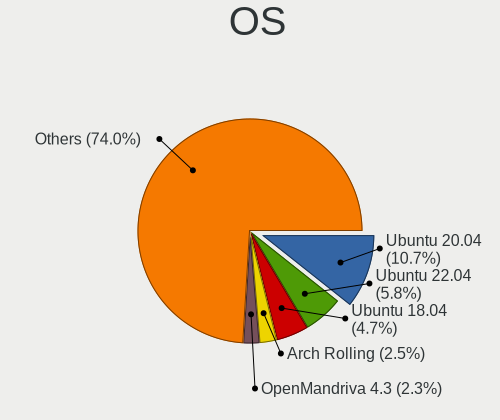
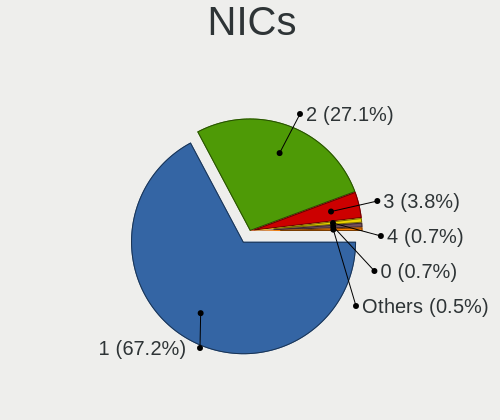
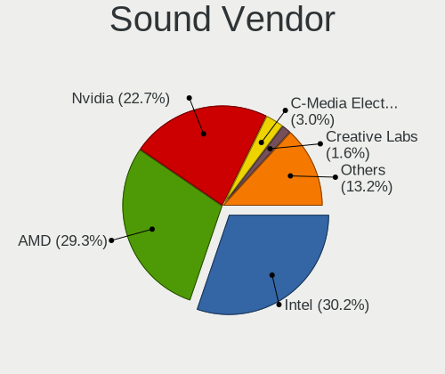

Linux in Germany - Tested Hardware & Statistics (Desktops)
----------------------------------------------------------

A project to collect tested hardware configurations for Linux in Germany.

Anyone can contribute to this report by the [hw-probe](https://github.com/linuxhw/hw-probe) tool:

    sudo -E hw-probe -all -upload

Please contribute! Especially if your hardware is rare.

Contents
--------

* [ Test Cases ](#test-cases)

* [ System ](#system)
  - [ OS                       ](#os)
  - [ OS Family                ](#os-family)
  - [ Kernel                   ](#kernel)
  - [ Kernel Family            ](#kernel-family)
  - [ Kernel Major Ver.        ](#kernel-major-ver)
  - [ Arch                     ](#arch)
  - [ DE                       ](#de)
  - [ Display Server           ](#display-server)
  - [ Display Manager          ](#display-manager)
  - [ OS Lang                  ](#os-lang)
  - [ Boot Mode                ](#boot-mode)
  - [ Filesystem               ](#filesystem)
  - [ Part. scheme             ](#part-scheme)
  - [ Dual Boot with Linux/BSD ](#dual-boot-with-linuxbsd)
  - [ Dual Boot (Win)          ](#dual-boot-win)

* [ Board ](#board)
  - [ Vendor                   ](#vendor)
  - [ Model                    ](#model)
  - [ Model Family             ](#model-family)
  - [ MFG Year                 ](#mfg-year)
  - [ Form Factor              ](#form-factor)
  - [ Secure Boot              ](#secure-boot)
  - [ Coreboot                 ](#coreboot)
  - [ RAM Size                 ](#ram-size)
  - [ RAM Used                 ](#ram-used)
  - [ Total Drives             ](#total-drives)
  - [ Has CD-ROM               ](#has-cd-rom)
  - [ Has Ethernet             ](#has-ethernet)
  - [ Has WiFi                 ](#has-wifi)
  - [ Has Bluetooth            ](#has-bluetooth)

* [ Location ](#location)
  - [ Country                  ](#country)
  - [ City                     ](#city)

* [ Drives ](#drives)
  - [ Drive Vendor             ](#drive-vendor)
  - [ Drive Model              ](#drive-model)
  - [ HDD Vendor               ](#hdd-vendor)
  - [ SSD Vendor               ](#ssd-vendor)
  - [ Drive Kind               ](#drive-kind)
  - [ Drive Connector          ](#drive-connector)
  - [ Drive Size               ](#drive-size)
  - [ Space Total              ](#space-total)
  - [ Space Used               ](#space-used)
  - [ Malfunc. Drives          ](#malfunc-drives)
  - [ Malfunc. Drive Vendor    ](#malfunc-drive-vendor)
  - [ Malfunc. HDD Vendor      ](#malfunc-hdd-vendor)
  - [ Malfunc. Drive Kind      ](#malfunc-drive-kind)
  - [ Failed Drives            ](#failed-drives)
  - [ Failed Drive Vendor      ](#failed-drive-vendor)
  - [ Drive Status             ](#drive-status)

* [ Storage controller ](#storage-controller)
  - [ Storage Vendor           ](#storage-vendor)
  - [ Storage Model            ](#storage-model)
  - [ Storage Kind             ](#storage-kind)

* [ Processor ](#processor)
  - [ CPU Vendor               ](#cpu-vendor)
  - [ CPU Model                ](#cpu-model)
  - [ CPU Model Family         ](#cpu-model-family)
  - [ CPU Cores                ](#cpu-cores)
  - [ CPU Sockets              ](#cpu-sockets)
  - [ CPU Threads              ](#cpu-threads)
  - [ CPU Op-Modes             ](#cpu-op-modes)
  - [ CPU Microcode            ](#cpu-microcode)
  - [ CPU Microarch            ](#cpu-microarch)

* [ Graphics ](#graphics)
  - [ GPU Vendor               ](#gpu-vendor)
  - [ GPU Model                ](#gpu-model)
  - [ GPU Combo                ](#gpu-combo)
  - [ GPU Driver               ](#gpu-driver)
  - [ GPU Memory               ](#gpu-memory)

* [ Monitor ](#monitor)
  - [ Monitor Vendor           ](#monitor-vendor)
  - [ Monitor Model            ](#monitor-model)
  - [ Monitor Resolution       ](#monitor-resolution)
  - [ Monitor Diagonal         ](#monitor-diagonal)
  - [ Monitor Width            ](#monitor-width)
  - [ Aspect Ratio             ](#aspect-ratio)
  - [ Monitor Area             ](#monitor-area)
  - [ Pixel Density            ](#pixel-density)
  - [ Multiple Monitors        ](#multiple-monitors)

* [ Network ](#network)
  - [ Net Controller Vendor    ](#net-controller-vendor)
  - [ Net Controller Model     ](#net-controller-model)
  - [ Wireless Vendor          ](#wireless-vendor)
  - [ Wireless Model           ](#wireless-model)
  - [ Ethernet Vendor          ](#ethernet-vendor)
  - [ Ethernet Model           ](#ethernet-model)
  - [ Net Controller Kind      ](#net-controller-kind)
  - [ Used Controller          ](#used-controller)
  - [ NICs                     ](#nics)
  - [ IPv6                     ](#ipv6)

* [ Bluetooth ](#bluetooth)
  - [ Bluetooth Vendor         ](#bluetooth-vendor)
  - [ Bluetooth Model          ](#bluetooth-model)

* [ Sound ](#sound)
  - [ Sound Vendor             ](#sound-vendor)
  - [ Sound Model              ](#sound-model)

* [ Memory ](#memory)
  - [ Memory Vendor            ](#memory-vendor)
  - [ Memory Model             ](#memory-model)
  - [ Memory Kind              ](#memory-kind)
  - [ Memory Form Factor       ](#memory-form-factor)
  - [ Memory Size              ](#memory-size)
  - [ Memory Speed             ](#memory-speed)

* [ Printers & scanners ](#printers--scanners)
  - [ Printer Vendor           ](#printer-vendor)
  - [ Printer Model            ](#printer-model)
  - [ Scanner Vendor           ](#scanner-vendor)
  - [ Scanner Model            ](#scanner-model)

* [ Camera ](#camera)
  - [ Camera Vendor            ](#camera-vendor)
  - [ Camera Model             ](#camera-model)

* [ Security ](#security)
  - [ Fingerprint Vendor       ](#fingerprint-vendor)
  - [ Fingerprint Model        ](#fingerprint-model)
  - [ Chipcard Vendor          ](#chipcard-vendor)
  - [ Chipcard Model           ](#chipcard-model)

* [ Unsupported ](#unsupported)
  - [ Unsupported Devices      ](#unsupported-devices)
  - [ Unsupported Device Types ](#unsupported-device-types)

Test Cases
----------

Total: 12540

| Vendor        | Model                       | Probe                                                      | Date         |
|---------------|-----------------------------|------------------------------------------------------------|--------------|
| ASRock        | H61M-DGS R2.0               | [6af1365446](https://linux-hardware.org/?probe=6af1365446) | Aug 12, 2023 |
| ASRock        | H61M-DGS R2.0               | [70e9fe8cdb](https://linux-hardware.org/?probe=70e9fe8cdb) | Aug 12, 2023 |
| ASUSTek       | M5A78L-M LE                 | [a68db843ea](https://linux-hardware.org/?probe=a68db843ea) | Aug 12, 2023 |
| MSI           | MAG B550M MORTAR WIFI       | [da8cf53467](https://linux-hardware.org/?probe=da8cf53467) | Aug 12, 2023 |
| ASRock        | 970A-G                      | [5a2b77eaee](https://linux-hardware.org/?probe=5a2b77eaee) | Aug 12, 2023 |
| Lenovo        | SHARKBAY SDK0E50510 WIN     | [ab2473ff49](https://linux-hardware.org/?probe=ab2473ff49) | Aug 11, 2023 |
| Biostar       | B660GTQ                     | [520d57cadc](https://linux-hardware.org/?probe=520d57cadc) | Aug 11, 2023 |
| ASRock        | B450M Pro4                  | [65d55091fa](https://linux-hardware.org/?probe=65d55091fa) | Aug 11, 2023 |
| Gigabyte      | Z790 GAMING X AX            | [a6d2358585](https://linux-hardware.org/?probe=a6d2358585) | Aug 11, 2023 |
| ASUSTek       | PRIME B550-PLUS             | [7f2903e1a4](https://linux-hardware.org/?probe=7f2903e1a4) | Aug 11, 2023 |
| Acer          | Aspire G7713                | [cb79bdce06](https://linux-hardware.org/?probe=cb79bdce06) | Aug 11, 2023 |
| Gigabyte      | GA-78LMT-USB3               | [6a1d87f2aa](https://linux-hardware.org/?probe=6a1d87f2aa) | Aug 10, 2023 |
| HP            | ProLiant ML115 G5           | [305ccefd04](https://linux-hardware.org/?probe=305ccefd04) | Aug 10, 2023 |
| ASRock        | H61M-DGS R2.0               | [4f05b77547](https://linux-hardware.org/?probe=4f05b77547) | Aug 10, 2023 |
| Gigabyte      | B365M H                     | [b23c1e6e73](https://linux-hardware.org/?probe=b23c1e6e73) | Aug 10, 2023 |
| MSI           | A320M PRO-VD/S              | [7f7c988470](https://linux-hardware.org/?probe=7f7c988470) | Aug 10, 2023 |
| ASUSTek       | ROG Maximus X HERO          | [d5d888506b](https://linux-hardware.org/?probe=d5d888506b) | Aug 10, 2023 |
| ASUSTek       | H87-PRO                     | [817c5f9f93](https://linux-hardware.org/?probe=817c5f9f93) | Aug 09, 2023 |
| Gigabyte      | 970A-UD3P                   | [b1a8fc0704](https://linux-hardware.org/?probe=b1a8fc0704) | Aug 09, 2023 |
| HP            | 859C                        | [24dd090f2c](https://linux-hardware.org/?probe=24dd090f2c) | Aug 09, 2023 |
| ASRock        | Z77 Extreme4                | [aadaab77db](https://linux-hardware.org/?probe=aadaab77db) | Aug 09, 2023 |
| Gigabyte      | 970A-UD3P                   | [920797388b](https://linux-hardware.org/?probe=920797388b) | Aug 09, 2023 |
| ASUSTek       | Pro WS 565-ACE              | [3d9112e038](https://linux-hardware.org/?probe=3d9112e038) | Aug 09, 2023 |
| Gigabyte      | X570 AORUS ELITE            | [13b739e83a](https://linux-hardware.org/?probe=13b739e83a) | Aug 09, 2023 |
| HP            | 8433 11                     | [93432b3df2](https://linux-hardware.org/?probe=93432b3df2) | Aug 09, 2023 |
| NZXT          | N7 Z590                     | [3831033bdc](https://linux-hardware.org/?probe=3831033bdc) | Aug 09, 2023 |
| Unknown       | HX90                        | [7a14bb927e](https://linux-hardware.org/?probe=7a14bb927e) | Aug 09, 2023 |
| MSI           | Z97-G43                     | [b6edd8931f](https://linux-hardware.org/?probe=b6edd8931f) | Aug 09, 2023 |
| ASUSTek       | PRIME X470-PRO              | [afef0bb361](https://linux-hardware.org/?probe=afef0bb361) | Aug 09, 2023 |
| Gigabyte      | B550M DS3H                  | [7889f62638](https://linux-hardware.org/?probe=7889f62638) | Aug 08, 2023 |
| ASUSTek       | M5A97 LE R2.0               | [2e30c62b25](https://linux-hardware.org/?probe=2e30c62b25) | Aug 08, 2023 |
| ASUSTek       | P5Q                         | [f485bf4b6e](https://linux-hardware.org/?probe=f485bf4b6e) | Aug 08, 2023 |
| Pegatron      | 2AB5                        | [9579022e6f](https://linux-hardware.org/?probe=9579022e6f) | Aug 07, 2023 |
| ASRock        | Z97 Extreme4                | [27c70b528b](https://linux-hardware.org/?probe=27c70b528b) | Aug 07, 2023 |
| ASUSTek       | M5A97 R2.0                  | [783906b878](https://linux-hardware.org/?probe=783906b878) | Aug 07, 2023 |
| Gigabyte      | Q87M-D2H                    | [dbcb2c4a80](https://linux-hardware.org/?probe=dbcb2c4a80) | Aug 07, 2023 |
| ASUSTek       | PRIME B560M-K               | [a5ae5a237a](https://linux-hardware.org/?probe=a5ae5a237a) | Aug 06, 2023 |
| Foxconn       | 2ADA                        | [17d44b6d2c](https://linux-hardware.org/?probe=17d44b6d2c) | Aug 06, 2023 |
| ASUSTek       | M5A97 R2.0                  | [1d8737323b](https://linux-hardware.org/?probe=1d8737323b) | Aug 06, 2023 |
| Gigabyte      | EP35-DS4                    | [761d545a1e](https://linux-hardware.org/?probe=761d545a1e) | Aug 06, 2023 |
| ASRock        | H61M-DGS R2.0               | [032b99ac4f](https://linux-hardware.org/?probe=032b99ac4f) | Aug 06, 2023 |
| ASRock        | Q1900M                      | [51f69dffd5](https://linux-hardware.org/?probe=51f69dffd5) | Aug 06, 2023 |
| ASUSTek       | M5A97 EVO R2.0              | [80c705f1a7](https://linux-hardware.org/?probe=80c705f1a7) | Aug 06, 2023 |
| MSI           | H81M-P33                    | [ebed30097f](https://linux-hardware.org/?probe=ebed30097f) | Aug 06, 2023 |
| MSI           | X470 GAMING PLUS            | [0e79a19ed6](https://linux-hardware.org/?probe=0e79a19ed6) | Aug 06, 2023 |
| HP            | 2B4B                        | [f85fada33f](https://linux-hardware.org/?probe=f85fada33f) | Aug 06, 2023 |
| Fujitsu       | D3128-A1 S26361-D3128-A1    | [ac2bdfc67b](https://linux-hardware.org/?probe=ac2bdfc67b) | Aug 06, 2023 |
| ASUSTek       | PRIME B650-PLUS             | [93917e587f](https://linux-hardware.org/?probe=93917e587f) | Aug 06, 2023 |
| ASRock        | X470 Taichi                 | [f9d29dca0d](https://linux-hardware.org/?probe=f9d29dca0d) | Aug 06, 2023 |
| ASUSTek       | PRIME X570-P                | [48ec623298](https://linux-hardware.org/?probe=48ec623298) | Aug 06, 2023 |
| ASRock        | B550M Steel Legend          | [d9107b9cb9](https://linux-hardware.org/?probe=d9107b9cb9) | Aug 06, 2023 |
| ASUSTek       | PRIME B450M-K II            | [06e86f7f63](https://linux-hardware.org/?probe=06e86f7f63) | Aug 06, 2023 |
| Gigabyte      | Z590 GAMING X               | [a8c865c9bb](https://linux-hardware.org/?probe=a8c865c9bb) | Aug 06, 2023 |
| Gigabyte      | B85M-D3H                    | [ed642341d8](https://linux-hardware.org/?probe=ed642341d8) | Aug 06, 2023 |
| Medion        | TJ4125                      | [e35dc275ce](https://linux-hardware.org/?probe=e35dc275ce) | Aug 06, 2023 |
| ASRock        | B550M-HDV                   | [83ee40459a](https://linux-hardware.org/?probe=83ee40459a) | Aug 05, 2023 |
| Gigabyte      | Z790 AORUS ELITE AX         | [9365c3de56](https://linux-hardware.org/?probe=9365c3de56) | Aug 05, 2023 |
| Gigabyte      | Z590 GAMING X               | [231ad3947e](https://linux-hardware.org/?probe=231ad3947e) | Aug 05, 2023 |
| Acer          | Aspire TC-895 V:1.0         | [85d2740423](https://linux-hardware.org/?probe=85d2740423) | Aug 05, 2023 |
| Fujitsu       | D3011-A1 S26361-D3011-A1    | [597856f529](https://linux-hardware.org/?probe=597856f529) | Aug 05, 2023 |
| Lenovo        | 3178 SDK0J40700 WIN 3258... | [4e0084cd74](https://linux-hardware.org/?probe=4e0084cd74) | Aug 05, 2023 |
| Unknown       | Unknown                     | [8ee9cccace](https://linux-hardware.org/?probe=8ee9cccace) | Aug 05, 2023 |
| MSI           | A68HM GRENADE               | [a186d8863f](https://linux-hardware.org/?probe=a186d8863f) | Aug 05, 2023 |
| ASRock        | P67 Pro3                    | [da235e8c08](https://linux-hardware.org/?probe=da235e8c08) | Aug 05, 2023 |
| ASUSTek       | PRIME B450M-K II            | [fed2da6500](https://linux-hardware.org/?probe=fed2da6500) | Aug 05, 2023 |
| ASUSTek       | PRIME B450M-K II            | [2531b9d0db](https://linux-hardware.org/?probe=2531b9d0db) | Aug 05, 2023 |
| Gigabyte      | GA-880GMA-UD2H              | [9ffeb0adcd](https://linux-hardware.org/?probe=9ffeb0adcd) | Aug 04, 2023 |
| ASRockRack    | X470D4U                     | [3c7626751d](https://linux-hardware.org/?probe=3c7626751d) | Aug 04, 2023 |
| Gigabyte      | GA-880GMA-UD2H              | [2886f9202b](https://linux-hardware.org/?probe=2886f9202b) | Aug 04, 2023 |
| ASUSTek       | ROG STRIX B550-I GAMING     | [01846991de](https://linux-hardware.org/?probe=01846991de) | Aug 04, 2023 |
| Gigabyte      | B85M-D3H                    | [5157c58f81](https://linux-hardware.org/?probe=5157c58f81) | Aug 04, 2023 |
| Medion        | TJ4125                      | [0adec5cb7e](https://linux-hardware.org/?probe=0adec5cb7e) | Aug 04, 2023 |
| MSI           | 760GM-P23                   | [5746742389](https://linux-hardware.org/?probe=5746742389) | Aug 04, 2023 |
| ASRock        | N68-VS3 UCC                 | [3793d876eb](https://linux-hardware.org/?probe=3793d876eb) | Aug 04, 2023 |
| ASUSTek       | TUF Gaming B560-PLUS WIF... | [af4f153b11](https://linux-hardware.org/?probe=af4f153b11) | Aug 04, 2023 |
| Medion        | B360H4-EM V1.0              | [18146f8bc9](https://linux-hardware.org/?probe=18146f8bc9) | Aug 04, 2023 |
| ASRock        | X370 Taichi                 | [af453d6ef1](https://linux-hardware.org/?probe=af453d6ef1) | Aug 04, 2023 |
| Gigabyte      | Q87M-D2H                    | [d3df0e8ee1](https://linux-hardware.org/?probe=d3df0e8ee1) | Aug 04, 2023 |
| ASUSTek       | B85-PRO GAMER               | [d4bb94e07e](https://linux-hardware.org/?probe=d4bb94e07e) | Aug 04, 2023 |
| ASUSTek       | PRIME X370-PRO              | [1abcf2ad6f](https://linux-hardware.org/?probe=1abcf2ad6f) | Aug 04, 2023 |
| ASRock        | B450M Pro4                  | [b2004d5d59](https://linux-hardware.org/?probe=b2004d5d59) | Aug 04, 2023 |
| ASRock        | Z97 Extreme4                | [4252e9a028](https://linux-hardware.org/?probe=4252e9a028) | Aug 04, 2023 |
| ASUSTek       | ROG STRIX B450-E GAMING     | [724beebcb2](https://linux-hardware.org/?probe=724beebcb2) | Aug 04, 2023 |
| HP            | 3031h                       | [95b5c80f67](https://linux-hardware.org/?probe=95b5c80f67) | Aug 03, 2023 |
| MSI           | MAG B650 TOMAHAWK WIFI      | [983329d56b](https://linux-hardware.org/?probe=983329d56b) | Aug 03, 2023 |
| HP            | 8055                        | [21c8e1fdc2](https://linux-hardware.org/?probe=21c8e1fdc2) | Aug 03, 2023 |
| Medion        | MS-7616                     | [7b9dae91ad](https://linux-hardware.org/?probe=7b9dae91ad) | Aug 03, 2023 |
| Dell          | 0F642F A00                  | [b2c444dc4f](https://linux-hardware.org/?probe=b2c444dc4f) | Aug 03, 2023 |
| ASUSTek       | P8H77-M                     | [1764158bf6](https://linux-hardware.org/?probe=1764158bf6) | Aug 03, 2023 |
| MSI           | MPG X570 GAMING PRO CARB... | [88e9cc22bf](https://linux-hardware.org/?probe=88e9cc22bf) | Aug 03, 2023 |
| Gigabyte      | GA-78LMT-USB3 SEx           | [39e2c1bfad](https://linux-hardware.org/?probe=39e2c1bfad) | Aug 03, 2023 |
| Gigabyte      | Q87M-D2H                    | [37725aaff8](https://linux-hardware.org/?probe=37725aaff8) | Aug 03, 2023 |
| Gigabyte      | B450M S2H V2                | [a01412b320](https://linux-hardware.org/?probe=a01412b320) | Aug 03, 2023 |
| MSI           | MPG X570 GAMING PRO CARB... | [52319a8cef](https://linux-hardware.org/?probe=52319a8cef) | Aug 03, 2023 |
| ASUSTek       | B85-PRO GAMER               | [e888742592](https://linux-hardware.org/?probe=e888742592) | Aug 03, 2023 |
| HP            | 3031h                       | [04c8ac1eee](https://linux-hardware.org/?probe=04c8ac1eee) | Aug 03, 2023 |
| ASUSTek       | PRIME B450M-K II            | [35cf0fd859](https://linux-hardware.org/?probe=35cf0fd859) | Aug 03, 2023 |
| MSI           | A320M-A PRO MAX             | [881ac0a0e0](https://linux-hardware.org/?probe=881ac0a0e0) | Aug 02, 2023 |
| MSI           | X370 GAMING PRO             | [b684b97e44](https://linux-hardware.org/?probe=b684b97e44) | Aug 02, 2023 |
| ASUSTek       | ROG STRIX Z690-E GAMING ... | [221b0f2db2](https://linux-hardware.org/?probe=221b0f2db2) | Aug 02, 2023 |
| MSI           | A320M-A PRO MAX             | [c3beec95b8](https://linux-hardware.org/?probe=c3beec95b8) | Aug 02, 2023 |
| Gigabyte      | B85M-D3H                    | [4e092275e4](https://linux-hardware.org/?probe=4e092275e4) | Aug 02, 2023 |
| Gigabyte      | B550 AORUS ELITE            | [60cb0baf9d](https://linux-hardware.org/?probe=60cb0baf9d) | Aug 02, 2023 |
| Dell          | 0NKW6Y A01                  | [6bae407930](https://linux-hardware.org/?probe=6bae407930) | Aug 02, 2023 |
| Gigabyte      | AX370-Gaming K7             | [7748df9ae9](https://linux-hardware.org/?probe=7748df9ae9) | Aug 01, 2023 |
| ASRock        | Z170 Extreme4               | [7ef89d48d6](https://linux-hardware.org/?probe=7ef89d48d6) | Aug 01, 2023 |
| HP            | 18E4                        | [20ebffd9a8](https://linux-hardware.org/?probe=20ebffd9a8) | Aug 01, 2023 |
| MSI           | X470 GAMING PLUS            | [9e892c6bc7](https://linux-hardware.org/?probe=9e892c6bc7) | Aug 01, 2023 |
| ASRock        | H61M/U3S3                   | [33c887e577](https://linux-hardware.org/?probe=33c887e577) | Aug 01, 2023 |
| ASRock        | B450M Pro4 R2.0             | [244a32825d](https://linux-hardware.org/?probe=244a32825d) | Aug 01, 2023 |
| Lenovo        | 1066 SDK0T76528 WIN 3556... | [df0702afb0](https://linux-hardware.org/?probe=df0702afb0) | Aug 01, 2023 |
| Lenovo        | 1066 SDK0T76528 WIN 3556... | [0ac623dd70](https://linux-hardware.org/?probe=0ac623dd70) | Aug 01, 2023 |
| ASUSTek       | M5A78L-M/USB3               | [3a500cdb55](https://linux-hardware.org/?probe=3a500cdb55) | Aug 01, 2023 |
| ASUSTek       | P8H67-M PRO                 | [1090d19a71](https://linux-hardware.org/?probe=1090d19a71) | Aug 01, 2023 |
| ASUSTek       | P8H67-M PRO                 | [49e503da8e](https://linux-hardware.org/?probe=49e503da8e) | Aug 01, 2023 |
| ASUSTek       | P8H67-M                     | [7bebd786bd](https://linux-hardware.org/?probe=7bebd786bd) | Aug 01, 2023 |
| ASRock        | X300-ITX                    | [70a181c62b](https://linux-hardware.org/?probe=70a181c62b) | Jul 31, 2023 |
| MSI           | H97 PC Mate                 | [3e200ead3c](https://linux-hardware.org/?probe=3e200ead3c) | Jul 31, 2023 |
| MSI           | B450M PRO-VDH MAX           | [a7cf8e8ef1](https://linux-hardware.org/?probe=a7cf8e8ef1) | Jul 31, 2023 |
| ASUSTek       | M4N78-AM                    | [a4740d2b14](https://linux-hardware.org/?probe=a4740d2b14) | Jul 31, 2023 |
| HP            | 3398                        | [444f9d27d5](https://linux-hardware.org/?probe=444f9d27d5) | Jul 30, 2023 |
| HP            | 8056                        | [3a98a11778](https://linux-hardware.org/?probe=3a98a11778) | Jul 30, 2023 |
| Gigabyte      | B450 I AORUS PRO WIFI-CF    | [63017a7eb1](https://linux-hardware.org/?probe=63017a7eb1) | Jul 30, 2023 |
| Acer          | Aspire G7713                | [e0624d410e](https://linux-hardware.org/?probe=e0624d410e) | Jul 30, 2023 |
| MSI           | MS-B1591                    | [9bdfd87437](https://linux-hardware.org/?probe=9bdfd87437) | Jul 30, 2023 |
| ASUSTek       | PRIME A320M-K               | [de6e904009](https://linux-hardware.org/?probe=de6e904009) | Jul 30, 2023 |
| ASUSTek       | PRIME A320M-K               | [6928788f05](https://linux-hardware.org/?probe=6928788f05) | Jul 30, 2023 |
| Gigabyte      | GA-880GMA-UD2H              | [356dae8360](https://linux-hardware.org/?probe=356dae8360) | Jul 30, 2023 |
| Unknown       | Unknown                     | [a15a3cfa70](https://linux-hardware.org/?probe=a15a3cfa70) | Jul 30, 2023 |
| ASUSTek       | TUF Gaming B550-PLUS        | [d788283742](https://linux-hardware.org/?probe=d788283742) | Jul 30, 2023 |
| ASUSTek       | H81M-PLUS                   | [fde88e808d](https://linux-hardware.org/?probe=fde88e808d) | Jul 29, 2023 |
| Gigabyte      | MZAPLBP-00                  | [b70677782d](https://linux-hardware.org/?probe=b70677782d) | Jul 29, 2023 |
| Gigabyte      | MZAPLBP-00                  | [ae8a9f3aaf](https://linux-hardware.org/?probe=ae8a9f3aaf) | Jul 29, 2023 |
| MSI           | MPG Z490 GAMING EDGE WIF... | [f36740f05f](https://linux-hardware.org/?probe=f36740f05f) | Jul 29, 2023 |
| Medion        | H110H4-EM                   | [7c2b005f92](https://linux-hardware.org/?probe=7c2b005f92) | Jul 29, 2023 |
| ASRock        | H61M-DGS R2.0               | [9d6da42aec](https://linux-hardware.org/?probe=9d6da42aec) | Jul 29, 2023 |
| Apple         | Mac-F221BEC8                | [12932af713](https://linux-hardware.org/?probe=12932af713) | Jul 29, 2023 |
| Gigabyte      | H97-D3H-CF                  | [a294c01e5d](https://linux-hardware.org/?probe=a294c01e5d) | Jul 29, 2023 |
| Gigabyte      | B550I AORUS PRO AX          | [b1b6854522](https://linux-hardware.org/?probe=b1b6854522) | Jul 29, 2023 |
| ASUSTek       | PRIME B450-PLUS             | [fde0e0e94f](https://linux-hardware.org/?probe=fde0e0e94f) | Jul 29, 2023 |
| MSI           | A320M-A PRO MAX             | [36dda4bbfa](https://linux-hardware.org/?probe=36dda4bbfa) | Jul 28, 2023 |
| MSI           | A320M-A PRO MAX             | [10fa87c167](https://linux-hardware.org/?probe=10fa87c167) | Jul 28, 2023 |
| Gigabyte      | B450 I AORUS PRO WIFI-CF    | [aaa06048d5](https://linux-hardware.org/?probe=aaa06048d5) | Jul 28, 2023 |
| Gigabyte      | Z690 GAMING X DDR4          | [5a968533da](https://linux-hardware.org/?probe=5a968533da) | Jul 28, 2023 |
| ASRock        | B450M Pro4 R2.0             | [07feda799a](https://linux-hardware.org/?probe=07feda799a) | Jul 28, 2023 |
| IceWhale T... | ZimaBoard 832 ZMB           | [4cbba6622f](https://linux-hardware.org/?probe=4cbba6622f) | Jul 28, 2023 |
| ASUSTek       | ROG STRIX B450-F GAMING ... | [06731541dd](https://linux-hardware.org/?probe=06731541dd) | Jul 28, 2023 |
| Medion        | TJ4125                      | [0882778c0a](https://linux-hardware.org/?probe=0882778c0a) | Jul 28, 2023 |
| IceWhale T... | ZimaBoard 832 ZMB           | [8cf3decf30](https://linux-hardware.org/?probe=8cf3decf30) | Jul 28, 2023 |
| ASUSTek       | PRIME B350M-A               | [d52776a0a8](https://linux-hardware.org/?probe=d52776a0a8) | Jul 28, 2023 |
| ASUSTek       | TUF Gaming B550-PLUS        | [735d4f8f84](https://linux-hardware.org/?probe=735d4f8f84) | Jul 28, 2023 |
| ASRock        | X670E PG Lightning          | [b5fec7d5ff](https://linux-hardware.org/?probe=b5fec7d5ff) | Jul 28, 2023 |
| Gigabyte      | B85M-D3H                    | [32e3874db3](https://linux-hardware.org/?probe=32e3874db3) | Jul 28, 2023 |
| Lenovo        | MAHOBAY NOK                 | [ffb2276d18](https://linux-hardware.org/?probe=ffb2276d18) | Jul 28, 2023 |
| Gigabyte      | GA-890GPA-UD3H              | [04fcfe86e9](https://linux-hardware.org/?probe=04fcfe86e9) | Jul 27, 2023 |
| Medion        | MS-7797                     | [734c2ae113](https://linux-hardware.org/?probe=734c2ae113) | Jul 27, 2023 |
| MSI           | H97 PC Mate                 | [6b32ba5f5d](https://linux-hardware.org/?probe=6b32ba5f5d) | Jul 27, 2023 |
| Gigabyte      | H110-D3A-CF                 | [87a06556a6](https://linux-hardware.org/?probe=87a06556a6) | Jul 27, 2023 |
| ASUSTek       | M5A78L-M LE                 | [b7c8e3ad22](https://linux-hardware.org/?probe=b7c8e3ad22) | Jul 27, 2023 |
| Medion        | MS-7616                     | [349360bcba](https://linux-hardware.org/?probe=349360bcba) | Jul 27, 2023 |
| ASUSTek       | P8H67-M PRO                 | [a9c6664e68](https://linux-hardware.org/?probe=a9c6664e68) | Jul 27, 2023 |
| ASUSTek       | P5P43TD/USB3                | [60397b779b](https://linux-hardware.org/?probe=60397b779b) | Jul 27, 2023 |
| Medion        | H110H4-EM                   | [080a30ad72](https://linux-hardware.org/?probe=080a30ad72) | Jul 27, 2023 |
| Fujitsu       | D3221-A1 S26361-D3221-A1    | [e7fdf45ff0](https://linux-hardware.org/?probe=e7fdf45ff0) | Jul 27, 2023 |
| ASRock        | H61M-DGS R2.0               | [0a92529b68](https://linux-hardware.org/?probe=0a92529b68) | Jul 27, 2023 |
| Gigabyte      | GA-MA790XT-UD4P             | [63e4d8c8d4](https://linux-hardware.org/?probe=63e4d8c8d4) | Jul 27, 2023 |
| ASRock        | B360M Pro4                  | [20221ed288](https://linux-hardware.org/?probe=20221ed288) | Jul 27, 2023 |
| Intel         | H81                         | [6fa9f0cd2d](https://linux-hardware.org/?probe=6fa9f0cd2d) | Jul 27, 2023 |
| ASUSTek       | PRIME B450M-K II            | [87bb7b0b79](https://linux-hardware.org/?probe=87bb7b0b79) | Jul 26, 2023 |
| MSI           | A520M-A PRO                 | [6a1aa5fbc8](https://linux-hardware.org/?probe=6a1aa5fbc8) | Jul 26, 2023 |
| Gigabyte      | GA-78LMT-USB3 SEx           | [29ffe99ae1](https://linux-hardware.org/?probe=29ffe99ae1) | Jul 26, 2023 |
| ASRock        | X570 Pro4                   | [96dcaad094](https://linux-hardware.org/?probe=96dcaad094) | Jul 26, 2023 |
| HP            | 3646h                       | [fbc7ac7c08](https://linux-hardware.org/?probe=fbc7ac7c08) | Jul 26, 2023 |
| Gigabyte      | Q87M-D2H                    | [374c405364](https://linux-hardware.org/?probe=374c405364) | Jul 26, 2023 |
| Intel         | X79                         | [46434d0a2c](https://linux-hardware.org/?probe=46434d0a2c) | Jul 26, 2023 |
| Gigabyte      | B550M DS3H                  | [9d891afae0](https://linux-hardware.org/?probe=9d891afae0) | Jul 26, 2023 |
| ASUSTek       | PRIME B450M-K II            | [2fe1d4509a](https://linux-hardware.org/?probe=2fe1d4509a) | Jul 26, 2023 |
| Gateway       | MS-7399                     | [904775a387](https://linux-hardware.org/?probe=904775a387) | Jul 25, 2023 |
| Lenovo        | MAHOBAY Win8 Pro DPK TPG    | [a08da8df65](https://linux-hardware.org/?probe=a08da8df65) | Jul 25, 2023 |
| Gigabyte      | B550 AORUS ELITE V2         | [0e029ddc2d](https://linux-hardware.org/?probe=0e029ddc2d) | Jul 25, 2023 |
| ASUSTek       | PRIME B450M-K II            | [32707549f9](https://linux-hardware.org/?probe=32707549f9) | Jul 25, 2023 |
| Gigabyte      | B550 AORUS ELITE            | [2ae4820944](https://linux-hardware.org/?probe=2ae4820944) | Jul 25, 2023 |
| Intel         | X79                         | [520788cdc8](https://linux-hardware.org/?probe=520788cdc8) | Jul 25, 2023 |
| ASUSTek       | Pro WS X570-ACE             | [d60f3de4c7](https://linux-hardware.org/?probe=d60f3de4c7) | Jul 25, 2023 |
| MSI           | B450 GAMING PLUS MAX        | [606780c010](https://linux-hardware.org/?probe=606780c010) | Jul 24, 2023 |
| MSI           | MPG B550 GAMING PLUS        | [351ebe5f4f](https://linux-hardware.org/?probe=351ebe5f4f) | Jul 24, 2023 |
| Gigabyte      | B560M AORUS ELITE           | [8f1677af63](https://linux-hardware.org/?probe=8f1677af63) | Jul 24, 2023 |
| ASRock        | Z690 Phantom Gaming 4       | [0a334297a5](https://linux-hardware.org/?probe=0a334297a5) | Jul 24, 2023 |
| Acer          | Aspire X3990                | [7b6b27241f](https://linux-hardware.org/?probe=7b6b27241f) | Jul 24, 2023 |
| Gigabyte      | B85M-D3H                    | [67daf82d15](https://linux-hardware.org/?probe=67daf82d15) | Jul 24, 2023 |
| Gigabyte      | Q87M-D2H                    | [7aaa099507](https://linux-hardware.org/?probe=7aaa099507) | Jul 24, 2023 |
| Intel         | X79                         | [c0c619638e](https://linux-hardware.org/?probe=c0c619638e) | Jul 24, 2023 |
| ASRock        | H61M-DGS R2.0               | [d78b20715a](https://linux-hardware.org/?probe=d78b20715a) | Jul 24, 2023 |
| ASUSTek       | PRIME B450M-K II            | [010638f417](https://linux-hardware.org/?probe=010638f417) | Jul 24, 2023 |
| Gigabyte      | B650 AORUS ELITE AX         | [e1f3c75353](https://linux-hardware.org/?probe=e1f3c75353) | Jul 23, 2023 |
| ASUSTek       | PRIME A320M-K               | [fc09bdf7bb](https://linux-hardware.org/?probe=fc09bdf7bb) | Jul 23, 2023 |
| Gigabyte      | Z370P D3-CF                 | [5b4c2db6cf](https://linux-hardware.org/?probe=5b4c2db6cf) | Jul 23, 2023 |
| ASUSTek       | ROG STRIX X570-F GAMING     | [bf4dff1328](https://linux-hardware.org/?probe=bf4dff1328) | Jul 23, 2023 |
| ASRock        | 960GM-GS3 FX                | [3ddda4afa3](https://linux-hardware.org/?probe=3ddda4afa3) | Jul 23, 2023 |
| ASUSTek       | PRIME Z370-A                | [9a2136d9ef](https://linux-hardware.org/?probe=9a2136d9ef) | Jul 23, 2023 |
| Gigabyte      | 990FXA-UD7                  | [3600f5bc63](https://linux-hardware.org/?probe=3600f5bc63) | Jul 22, 2023 |
| ASUSTek       | ProArt X670E-CREATOR WIF... | [8dbf2477d3](https://linux-hardware.org/?probe=8dbf2477d3) | Jul 22, 2023 |
| ASUSTek       | ROG STRIX B550-F GAMING     | [83df4e51e4](https://linux-hardware.org/?probe=83df4e51e4) | Jul 22, 2023 |
| ASUSTek       | X99-DELUXE II               | [afc4d3c307](https://linux-hardware.org/?probe=afc4d3c307) | Jul 22, 2023 |
| MSI           | X58 Pro-E                   | [01f822dec1](https://linux-hardware.org/?probe=01f822dec1) | Jul 22, 2023 |
| ASUSTek       | ProArt X670E-CREATOR WIF... | [4bd62a58b8](https://linux-hardware.org/?probe=4bd62a58b8) | Jul 22, 2023 |
| ASUSTek       | ROG STRIX B550-F GAMING     | [cda75b5e7a](https://linux-hardware.org/?probe=cda75b5e7a) | Jul 22, 2023 |
| ASUSTek       | STRIX Z270F GAMING          | [80e44d8594](https://linux-hardware.org/?probe=80e44d8594) | Jul 22, 2023 |
| ASRock        | 970M Pro3                   | [e359256b4f](https://linux-hardware.org/?probe=e359256b4f) | Jul 22, 2023 |
| ASUSTek       | ROG STRIX B450-F GAMING ... | [50641feb57](https://linux-hardware.org/?probe=50641feb57) | Jul 22, 2023 |
| Lenovo        | ThinkCentre M57 6087D44     | [2bf0872f6a](https://linux-hardware.org/?probe=2bf0872f6a) | Jul 21, 2023 |
| Gigabyte      | X670 AORUS ELITE AX         | [8c79a454ff](https://linux-hardware.org/?probe=8c79a454ff) | Jul 21, 2023 |
| Foxconn       | TPS01                       | [d8e4cab1b8](https://linux-hardware.org/?probe=d8e4cab1b8) | Jul 21, 2023 |
| Gigabyte      | PA65-UD3-B3                 | [fc4238904c](https://linux-hardware.org/?probe=fc4238904c) | Jul 21, 2023 |
| MSI           | MPG B550 GAMING PLUS        | [16423d4124](https://linux-hardware.org/?probe=16423d4124) | Jul 21, 2023 |
| MSI           | H61M-P31/W8                 | [7313dd64c7](https://linux-hardware.org/?probe=7313dd64c7) | Jul 21, 2023 |
| Fujitsu       | D3223-C1 S26361-D3223-C1    | [e35d64a41b](https://linux-hardware.org/?probe=e35d64a41b) | Jul 21, 2023 |
| ASUSTek       | ROG STRIX B450-E GAMING     | [18c995e9a6](https://linux-hardware.org/?probe=18c995e9a6) | Jul 21, 2023 |
| Lenovo        | SHARKBAY SDK0E50510 PRO     | [97f8d99cd9](https://linux-hardware.org/?probe=97f8d99cd9) | Jul 21, 2023 |
| ASUSTek       | ROG STRIX B650E-I GAMING... | [2dbb6f2466](https://linux-hardware.org/?probe=2dbb6f2466) | Jul 20, 2023 |
| MW            | NAS-N5105                   | [1a5c7ab436](https://linux-hardware.org/?probe=1a5c7ab436) | Jul 20, 2023 |
| MSI           | MEG X570 UNIFY              | [62ab77a6f6](https://linux-hardware.org/?probe=62ab77a6f6) | Jul 20, 2023 |
| Gigabyte      | GA-880GMA-UD2H              | [7b6300dfc7](https://linux-hardware.org/?probe=7b6300dfc7) | Jul 20, 2023 |
| Gigabyte      | A520M DS3H                  | [3bd7501f03](https://linux-hardware.org/?probe=3bd7501f03) | Jul 20, 2023 |
| ASUSTek       | ROG STRIX B450-E GAMING     | [228c16fb0f](https://linux-hardware.org/?probe=228c16fb0f) | Jul 20, 2023 |
| Gigabyte      | 990FXA-UD3                  | [8be5de827d](https://linux-hardware.org/?probe=8be5de827d) | Jul 20, 2023 |
| Gigabyte      | GA-880GMA-UD2H              | [65da6837ae](https://linux-hardware.org/?probe=65da6837ae) | Jul 20, 2023 |
| ASUSTek       | H97I-PLUS                   | [d244fb3ef9](https://linux-hardware.org/?probe=d244fb3ef9) | Jul 19, 2023 |
| HP            | 18E4                        | [4668ecbc61](https://linux-hardware.org/?probe=4668ecbc61) | Jul 19, 2023 |
| Lenovo        | 310B SDK0J40705 WIN 3425... | [ececa8856a](https://linux-hardware.org/?probe=ececa8856a) | Jul 19, 2023 |
| ASRock        | B450 Pro4                   | [c10ecff0f6](https://linux-hardware.org/?probe=c10ecff0f6) | Jul 19, 2023 |
| Unknown       | Unknown                     | [5aebab18d6](https://linux-hardware.org/?probe=5aebab18d6) | Jul 19, 2023 |
| Gigabyte      | Z77-DS3H                    | [f99a99e95e](https://linux-hardware.org/?probe=f99a99e95e) | Jul 19, 2023 |
| Lenovo        | 36C5 SDK0K17763 WIN 1801... | [290f64f841](https://linux-hardware.org/?probe=290f64f841) | Jul 19, 2023 |
| Lenovo        | 312A SDK0J40697 WIN 3305... | [a2779c6ac8](https://linux-hardware.org/?probe=a2779c6ac8) | Jul 19, 2023 |
| Unknown       | Unknown                     | [32816fb789](https://linux-hardware.org/?probe=32816fb789) | Jul 19, 2023 |
| HP            | 8055                        | [5f74df3997](https://linux-hardware.org/?probe=5f74df3997) | Jul 19, 2023 |
| ECS           | GeForce7050M-M              | [fc26acb7f8](https://linux-hardware.org/?probe=fc26acb7f8) | Jul 18, 2023 |
| Unknown       | Unknown                     | [ce80e4d17f](https://linux-hardware.org/?probe=ce80e4d17f) | Jul 18, 2023 |
| LattePanda    | 3 Delta LP-BS-7-S70JR120... | [0296e5fd5c](https://linux-hardware.org/?probe=0296e5fd5c) | Jul 18, 2023 |
| MSI           | MAG B550 TOMAHAWK           | [322db1cde6](https://linux-hardware.org/?probe=322db1cde6) | Jul 18, 2023 |
| ASRock        | X570M Pro4                  | [bb84df2364](https://linux-hardware.org/?probe=bb84df2364) | Jul 18, 2023 |
| ASRock        | X570M Pro4                  | [b8caf7c9a3](https://linux-hardware.org/?probe=b8caf7c9a3) | Jul 18, 2023 |
| Foxconn       | 2A8C                        | [539fb9855b](https://linux-hardware.org/?probe=539fb9855b) | Jul 18, 2023 |
| ASUSTek       | PRIME X670E-PRO WIFI        | [4e4d74fab5](https://linux-hardware.org/?probe=4e4d74fab5) | Jul 17, 2023 |
| Lenovo        | SHARKBAY SDK0E50510 WIN     | [60280e0708](https://linux-hardware.org/?probe=60280e0708) | Jul 17, 2023 |
| ASUSTek       | P5B-Deluxe                  | [fe065234a9](https://linux-hardware.org/?probe=fe065234a9) | Jul 17, 2023 |
| MSI           | X370 XPOWER GAMING TITAN... | [aac317ef80](https://linux-hardware.org/?probe=aac317ef80) | Jul 17, 2023 |
| Lenovo        | 36C5 SDK0K17763 WIN 1801... | [d4b5c25500](https://linux-hardware.org/?probe=d4b5c25500) | Jul 17, 2023 |
| Gigabyte      | H310M H                     | [06451fbeab](https://linux-hardware.org/?probe=06451fbeab) | Jul 17, 2023 |
| ASRock        | H170 Pro4S                  | [e1a51f73cc](https://linux-hardware.org/?probe=e1a51f73cc) | Jul 17, 2023 |
| MSI           | MEG X570S ACE MAX           | [e6141dfd65](https://linux-hardware.org/?probe=e6141dfd65) | Jul 17, 2023 |
| ASRock        | FM2A68M-HD+                 | [5abf5fb1c3](https://linux-hardware.org/?probe=5abf5fb1c3) | Jul 16, 2023 |
| Unknown       | Unknown                     | [29ed3e238d](https://linux-hardware.org/?probe=29ed3e238d) | Jul 16, 2023 |
| HP            | 83E0                        | [35abf30fff](https://linux-hardware.org/?probe=35abf30fff) | Jul 16, 2023 |
| Gigabyte      | X570S UD                    | [8fb3c405c0](https://linux-hardware.org/?probe=8fb3c405c0) | Jul 16, 2023 |
| HP            | ProLiant MicroServer Gen... | [ec8fee15ed](https://linux-hardware.org/?probe=ec8fee15ed) | Jul 16, 2023 |
| Fujitsu       | D3222-A1 S26361-D3222-A1    | [61ed023e0c](https://linux-hardware.org/?probe=61ed023e0c) | Jul 16, 2023 |
| Dell          | 08WXMX A02                  | [7d6238272f](https://linux-hardware.org/?probe=7d6238272f) | Jul 15, 2023 |
| ASRock        | X300M-STX                   | [0b447416c6](https://linux-hardware.org/?probe=0b447416c6) | Jul 15, 2023 |
| MSI           | MS-7369                     | [7cd5c6d6f0](https://linux-hardware.org/?probe=7cd5c6d6f0) | Jul 15, 2023 |
| Pegatron      | 2AB5                        | [f625288322](https://linux-hardware.org/?probe=f625288322) | Jul 15, 2023 |
| Gigabyte      | F2A88XM-D3H                 | [0bd37865ac](https://linux-hardware.org/?probe=0bd37865ac) | Jul 15, 2023 |
| Gigabyte      | H410M S2H V3                | [e31d121593](https://linux-hardware.org/?probe=e31d121593) | Jul 15, 2023 |
| Gigabyte      | GA-890GPA-UD3H              | [57b17e7ae1](https://linux-hardware.org/?probe=57b17e7ae1) | Jul 15, 2023 |
| ASRock        | B450M Pro4                  | [d1aa3f2d70](https://linux-hardware.org/?probe=d1aa3f2d70) | Jul 15, 2023 |
| ASUSTek       | PRIME B450M-A               | [7d3eea9c76](https://linux-hardware.org/?probe=7d3eea9c76) | Jul 15, 2023 |
| Biostar       | FX9830M                     | [db3c95d18d](https://linux-hardware.org/?probe=db3c95d18d) | Jul 15, 2023 |
| MSI           | MAG X570S TOMAHAWK MAX W... | [7026c5b007](https://linux-hardware.org/?probe=7026c5b007) | Jul 14, 2023 |
| MSI           | MAG X570S TOMAHAWK MAX W... | [8e3cc576fd](https://linux-hardware.org/?probe=8e3cc576fd) | Jul 14, 2023 |
| Fujitsu       | D3223-C1 S26361-D3223-C1    | [e5357d4768](https://linux-hardware.org/?probe=e5357d4768) | Jul 14, 2023 |
| Gigabyte      | H87M-D3H                    | [7590f7f557](https://linux-hardware.org/?probe=7590f7f557) | Jul 14, 2023 |
| Unknown       | Unknown                     | [a63f044df1](https://linux-hardware.org/?probe=a63f044df1) | Jul 14, 2023 |
| ASRock        | B650M PG Riptide WiFi       | [62890116b3](https://linux-hardware.org/?probe=62890116b3) | Jul 14, 2023 |
| ASRock        | B650M PG Riptide WiFi       | [476c241a58](https://linux-hardware.org/?probe=476c241a58) | Jul 14, 2023 |
| Gigabyte      | B550I AORUS PRO AX          | [78f620581b](https://linux-hardware.org/?probe=78f620581b) | Jul 14, 2023 |
| ASUSTek       | PRIME B365M-A               | [62099e9da7](https://linux-hardware.org/?probe=62099e9da7) | Jul 14, 2023 |
| Biostar       | A960D+V2                    | [2896f9267c](https://linux-hardware.org/?probe=2896f9267c) | Jul 13, 2023 |
| Shenzhen M... | F7BFC                       | [a0c045bcd6](https://linux-hardware.org/?probe=a0c045bcd6) | Jul 13, 2023 |
| HP            | 3397                        | [d20efc761c](https://linux-hardware.org/?probe=d20efc761c) | Jul 13, 2023 |
| Shenzhen M... | F7BFC                       | [c0c4f2abb6](https://linux-hardware.org/?probe=c0c4f2abb6) | Jul 13, 2023 |
| Wortmann      | TERRA_PC                    | [60ece53188](https://linux-hardware.org/?probe=60ece53188) | Jul 13, 2023 |
| HP            | 0B40h                       | [12ebaf7420](https://linux-hardware.org/?probe=12ebaf7420) | Jul 13, 2023 |
| MSI           | MEG X570S ACE MAX           | [a6e0425c53](https://linux-hardware.org/?probe=a6e0425c53) | Jul 12, 2023 |
| Gigabyte      | GA-78LMT-USB3 x.x           | [58c9a4c19c](https://linux-hardware.org/?probe=58c9a4c19c) | Jul 12, 2023 |
| ASUSTek       | PRIME B450M-A               | [8857b11281](https://linux-hardware.org/?probe=8857b11281) | Jul 11, 2023 |
| Gigabyte      | 990FXA-UD7                  | [c489c76cf6](https://linux-hardware.org/?probe=c489c76cf6) | Jul 11, 2023 |
| ASUSTek       | ROG STRIX B650E-E GAMING... | [6481c63fee](https://linux-hardware.org/?probe=6481c63fee) | Jul 11, 2023 |
| MSI           | MPG B460I GAMING EDGE WI... | [93b2067918](https://linux-hardware.org/?probe=93b2067918) | Jul 11, 2023 |
| ASRock        | X79 Extreme9                | [bfd488feb9](https://linux-hardware.org/?probe=bfd488feb9) | Jul 10, 2023 |
| Fujitsu       | D3230-A1 S26361-D3230-A1    | [eda9b7d2e8](https://linux-hardware.org/?probe=eda9b7d2e8) | Jul 10, 2023 |
| Biostar       | A960D+V2                    | [e6bfab517b](https://linux-hardware.org/?probe=e6bfab517b) | Jul 10, 2023 |
| ASUSTek       | H87-PRO                     | [ef2ca9e804](https://linux-hardware.org/?probe=ef2ca9e804) | Jul 10, 2023 |
| ASRock        | B550 Phantom Gaming 4       | [45f9180fd5](https://linux-hardware.org/?probe=45f9180fd5) | Jul 10, 2023 |
| Gigabyte      | H410M S2H V3                | [9c3135decf](https://linux-hardware.org/?probe=9c3135decf) | Jul 10, 2023 |
| ASUSTek       | ROG STRIX B450-I GAMING     | [b581326f50](https://linux-hardware.org/?probe=b581326f50) | Jul 10, 2023 |
| ASRock        | H61M-DGS R2.0               | [deb72736da](https://linux-hardware.org/?probe=deb72736da) | Jul 10, 2023 |
| ASUSTek       | Maximus IX FORMULA          | [72cbef111d](https://linux-hardware.org/?probe=72cbef111d) | Jul 09, 2023 |
| Medion        | TJ4125                      | [88fb5ecc29](https://linux-hardware.org/?probe=88fb5ecc29) | Jul 09, 2023 |
| Gigabyte      | MZAPLBP-00                  | [8f57c74864](https://linux-hardware.org/?probe=8f57c74864) | Jul 09, 2023 |
| Medion        | TJ4125                      | [efa563ec1f](https://linux-hardware.org/?probe=efa563ec1f) | Jul 09, 2023 |
| MSI           | X470 GAMING PLUS MAX        | [4d33bb92ce](https://linux-hardware.org/?probe=4d33bb92ce) | Jul 09, 2023 |
| Gigabyte      | B650 GAMING X AX            | [64e129ec04](https://linux-hardware.org/?probe=64e129ec04) | Jul 09, 2023 |
| ASUSTek       | B75M-A                      | [9120c3aa90](https://linux-hardware.org/?probe=9120c3aa90) | Jul 09, 2023 |
| Gigabyte      | B85M-D3H                    | [1e85aec604](https://linux-hardware.org/?probe=1e85aec604) | Jul 09, 2023 |
| Gigabyte      | Q87M-D2H                    | [d660aa6f35](https://linux-hardware.org/?probe=d660aa6f35) | Jul 09, 2023 |
| ASUSTek       | B75M-A                      | [b48f49fab3](https://linux-hardware.org/?probe=b48f49fab3) | Jul 09, 2023 |
| Gigabyte      | Q87M-D2H                    | [87872596c0](https://linux-hardware.org/?probe=87872596c0) | Jul 08, 2023 |
| Medion        | TJ4125                      | [38d2ffe2de](https://linux-hardware.org/?probe=38d2ffe2de) | Jul 08, 2023 |
| Gigabyte      | B85M-D3H                    | [f73623381d](https://linux-hardware.org/?probe=f73623381d) | Jul 08, 2023 |
| ASUSTek       | BM2AD_D510MT_D310MT         | [d7f7dc2ef3](https://linux-hardware.org/?probe=d7f7dc2ef3) | Jul 08, 2023 |
| Gigabyte      | Z170X-UD3-CF                | [f36d062c95](https://linux-hardware.org/?probe=f36d062c95) | Jul 08, 2023 |
| AZW           | U59                         | [5cf3ddbe4b](https://linux-hardware.org/?probe=5cf3ddbe4b) | Jul 08, 2023 |
| AZW           | U59                         | [ea367423d1](https://linux-hardware.org/?probe=ea367423d1) | Jul 08, 2023 |
| ASUSTek       | ROG STRIX B350-F GAMING     | [62a68429a2](https://linux-hardware.org/?probe=62a68429a2) | Jul 08, 2023 |
| ASUSTek       | PRIME J4005I-C              | [8cccaeb0ed](https://linux-hardware.org/?probe=8cccaeb0ed) | Jul 08, 2023 |
| AZW           | MINI S                      | [b13eb96728](https://linux-hardware.org/?probe=b13eb96728) | Jul 08, 2023 |
| HP            | 3048h                       | [0058f6686a](https://linux-hardware.org/?probe=0058f6686a) | Jul 08, 2023 |
| ASUSTek       | M5A97 R2.0                  | [89a1894d2a](https://linux-hardware.org/?probe=89a1894d2a) | Jul 08, 2023 |
| Medion        | MS-7633                     | [c559387c2a](https://linux-hardware.org/?probe=c559387c2a) | Jul 07, 2023 |
| ASRock        | B550 Taichi Razer Editio... | [c5578cae9e](https://linux-hardware.org/?probe=c5578cae9e) | Jul 07, 2023 |
| Gigabyte      | B85M-D3H                    | [d37d74ba93](https://linux-hardware.org/?probe=d37d74ba93) | Jul 07, 2023 |
| Medion        | TJ4125                      | [1de78b3365](https://linux-hardware.org/?probe=1de78b3365) | Jul 07, 2023 |
| Gigabyte      | Z170-HD3P-CF                | [f56d4aa99c](https://linux-hardware.org/?probe=f56d4aa99c) | Jul 07, 2023 |
| ASUSTek       | A8N-SLI Premium             | [a0c8acc9f2](https://linux-hardware.org/?probe=a0c8acc9f2) | Jul 07, 2023 |
| HP            | 876C SMVB                   | [eaef6e0f22](https://linux-hardware.org/?probe=eaef6e0f22) | Jul 07, 2023 |
| Acer          | Predator G3600              | [79f515acf1](https://linux-hardware.org/?probe=79f515acf1) | Jul 07, 2023 |
| Lenovo        | SHARKBAY NOK                | [ab73e6cc7f](https://linux-hardware.org/?probe=ab73e6cc7f) | Jul 07, 2023 |
| MSI           | B450 GAMING PRO CARBON A... | [2eb6b1bb05](https://linux-hardware.org/?probe=2eb6b1bb05) | Jul 07, 2023 |
| MSI           | X470 GAMING PRO CARBON      | [4068c56cd3](https://linux-hardware.org/?probe=4068c56cd3) | Jul 07, 2023 |
| ASUSTek       | PRIME X370-PRO              | [d7afc91d12](https://linux-hardware.org/?probe=d7afc91d12) | Jul 07, 2023 |
| MSI           | B450 GAMING PRO CARBON A... | [e177e22bff](https://linux-hardware.org/?probe=e177e22bff) | Jul 07, 2023 |
| ASUSTek       | ROG STRIX B650E-I GAMING... | [7e3f6aabfb](https://linux-hardware.org/?probe=7e3f6aabfb) | Jul 06, 2023 |
| ASRock        | H61M-DGS R2.0               | [1da9260d6a](https://linux-hardware.org/?probe=1da9260d6a) | Jul 06, 2023 |
| Lenovo        | SHARKBAY NOK                | [40d2eef376](https://linux-hardware.org/?probe=40d2eef376) | Jul 06, 2023 |
| HP            | 2B2C                        | [3989b4f642](https://linux-hardware.org/?probe=3989b4f642) | Jul 06, 2023 |
| HP            | 8B3B A                      | [b003988978](https://linux-hardware.org/?probe=b003988978) | Jul 05, 2023 |
| ASUSTek       | ROG STRIX B350-F GAMING     | [4cbea103d2](https://linux-hardware.org/?probe=4cbea103d2) | Jul 05, 2023 |
| MSI           | 760GM-E51                   | [757eefb29d](https://linux-hardware.org/?probe=757eefb29d) | Jul 05, 2023 |
| ASRock        | FP6D4-P1                    | [42b5bdcdd7](https://linux-hardware.org/?probe=42b5bdcdd7) | Jul 05, 2023 |
| Gigabyte      | B450M DS3H V2               | [4cf6a2bc14](https://linux-hardware.org/?probe=4cf6a2bc14) | Jul 05, 2023 |
| MSI           | PRO X670-P WIFI             | [12e2330b5a](https://linux-hardware.org/?probe=12e2330b5a) | Jul 05, 2023 |
| Gigabyte      | Q87M-D2H                    | [22a3b2defb](https://linux-hardware.org/?probe=22a3b2defb) | Jul 05, 2023 |
| ASUSTek       | WS X299 SAGE                | [f97dafae6f](https://linux-hardware.org/?probe=f97dafae6f) | Jul 05, 2023 |
| Dell          | 0D6H9T A00                  | [03aae0870c](https://linux-hardware.org/?probe=03aae0870c) | Jul 05, 2023 |
| Gigabyte      | GA-78LMT-USB3 SEx           | [2e89ea0ccf](https://linux-hardware.org/?probe=2e89ea0ccf) | Jul 05, 2023 |
| Lenovo        | ThinkCentre A70 7844H9G     | [46bfb7c0ff](https://linux-hardware.org/?probe=46bfb7c0ff) | Jul 05, 2023 |
| MSI           | PRO X670-P WIFI             | [497e454852](https://linux-hardware.org/?probe=497e454852) | Jul 05, 2023 |
| ASUSTek       | PRIME B350-PLUS             | [3e2bd561bd](https://linux-hardware.org/?probe=3e2bd561bd) | Jul 05, 2023 |
| Lenovo        | SHARKBAY NOK                | [a89cd340ff](https://linux-hardware.org/?probe=a89cd340ff) | Jul 05, 2023 |
| MSI           | MEG X570S ACE MAX           | [d05d869af1](https://linux-hardware.org/?probe=d05d869af1) | Jul 05, 2023 |
| MSI           | B550-A PRO                  | [2fcf89fb6d](https://linux-hardware.org/?probe=2fcf89fb6d) | Jul 05, 2023 |
| MSI           | MPG X670E CARBON WIFI       | [b67973ece1](https://linux-hardware.org/?probe=b67973ece1) | Jul 04, 2023 |
| HP            | 0B40h                       | [691de06e29](https://linux-hardware.org/?probe=691de06e29) | Jul 04, 2023 |
| Gigabyte      | B550 GAMING X V2            | [6013dcdf1e](https://linux-hardware.org/?probe=6013dcdf1e) | Jul 04, 2023 |
| ASUSTek       | PRIME B350-PLUS             | [5de6281012](https://linux-hardware.org/?probe=5de6281012) | Jul 04, 2023 |
| MSI           | B450 GAMING PRO CARBON A... | [49bcd116ba](https://linux-hardware.org/?probe=49bcd116ba) | Jul 04, 2023 |
| Gigabyte      | 990XA-UD3                   | [848887207a](https://linux-hardware.org/?probe=848887207a) | Jul 04, 2023 |
| MSI           | 880GMA-E35                  | [27caceabea](https://linux-hardware.org/?probe=27caceabea) | Jul 04, 2023 |
| Biostar       | X370GTN                     | [709f4893c8](https://linux-hardware.org/?probe=709f4893c8) | Jul 03, 2023 |
| Biostar       | X370GTN                     | [e95e7d9ee1](https://linux-hardware.org/?probe=e95e7d9ee1) | Jul 03, 2023 |
| ASUSTek       | Pro WS WRX80E-SAGE SE WI... | [4b9e57acb0](https://linux-hardware.org/?probe=4b9e57acb0) | Jul 03, 2023 |
| Lenovo        | 3706 SDK0J40697 WIN 3305... | [35e0dd6624](https://linux-hardware.org/?probe=35e0dd6624) | Jul 03, 2023 |
| ASUSTek       | TUF B450-PLUS GAMING        | [a9b28705a3](https://linux-hardware.org/?probe=a9b28705a3) | Jul 03, 2023 |
| Gigabyte      | GA-78LMT-USB3 SEx           | [1eb50d88d7](https://linux-hardware.org/?probe=1eb50d88d7) | Jul 03, 2023 |
| Gigabyte      | B550 AORUS PRO              | [61c278235a](https://linux-hardware.org/?probe=61c278235a) | Jul 03, 2023 |
| Gigabyte      | B550 AORUS PRO              | [48f79dc803](https://linux-hardware.org/?probe=48f79dc803) | Jul 03, 2023 |
| Gigabyte      | B550 AORUS PRO              | [9d47ca40b8](https://linux-hardware.org/?probe=9d47ca40b8) | Jul 03, 2023 |
| Gigabyte      | MZBSWMP-00                  | [5e40ca68b2](https://linux-hardware.org/?probe=5e40ca68b2) | Jul 03, 2023 |
| ASUSTek       | PRIME A520M-K               | [9b1631574e](https://linux-hardware.org/?probe=9b1631574e) | Jul 03, 2023 |
| Fujitsu       | D3432-A1 S26361-D3432-A1    | [8b5a73fa21](https://linux-hardware.org/?probe=8b5a73fa21) | Jul 03, 2023 |
| Medion        | BTDD-LT                     | [6c22cd4728](https://linux-hardware.org/?probe=6c22cd4728) | Jul 03, 2023 |
| ASRock        | H61M-DGS R2.0               | [8cfc5cebd5](https://linux-hardware.org/?probe=8cfc5cebd5) | Jul 03, 2023 |
| ASUSTek       | UN45                        | [487845dd55](https://linux-hardware.org/?probe=487845dd55) | Jul 03, 2023 |
| Gigabyte      | Z390 UD                     | [12bdaa446f](https://linux-hardware.org/?probe=12bdaa446f) | Jul 03, 2023 |
| Gigabyte      | B550 GAMING X V2            | [6db9b5e42a](https://linux-hardware.org/?probe=6db9b5e42a) | Jul 02, 2023 |
| Gigabyte      | B550 GAMING X V2            | [73d4fb6c33](https://linux-hardware.org/?probe=73d4fb6c33) | Jul 02, 2023 |
| Medion        | TJ4125                      | [8d8748e1dc](https://linux-hardware.org/?probe=8d8748e1dc) | Jul 02, 2023 |
| Gigabyte      | B85M-D3H                    | [ce2d3b5375](https://linux-hardware.org/?probe=ce2d3b5375) | Jul 02, 2023 |
| ECS           | GeForce7050M-M              | [7ca7d27dfe](https://linux-hardware.org/?probe=7ca7d27dfe) | Jul 02, 2023 |
| Gigabyte      | 970A-DS3P                   | [fc58264275](https://linux-hardware.org/?probe=fc58264275) | Jul 02, 2023 |
| Gigabyte      | X570S UD                    | [22ca0e18f4](https://linux-hardware.org/?probe=22ca0e18f4) | Jul 02, 2023 |
| Medion        | BTDD-LT                     | [fb1c5c941c](https://linux-hardware.org/?probe=fb1c5c941c) | Jul 02, 2023 |
| Dell          | 01TKCC A00                  | [a3a9917544](https://linux-hardware.org/?probe=a3a9917544) | Jul 02, 2023 |
| Gigabyte      | Q87M-D2H                    | [89c111d3ec](https://linux-hardware.org/?probe=89c111d3ec) | Jul 02, 2023 |
| MSI           | 970 GAMING                  | [0260c066be](https://linux-hardware.org/?probe=0260c066be) | Jul 02, 2023 |
| MSI           | PRO Z690-A WIFI             | [2bc4b36c94](https://linux-hardware.org/?probe=2bc4b36c94) | Jul 02, 2023 |
| Biostar       | A10N-8800E                  | [261bb38239](https://linux-hardware.org/?probe=261bb38239) | Jul 02, 2023 |
| Shenzhen M... | F6BFC                       | [61bc4ee589](https://linux-hardware.org/?probe=61bc4ee589) | Jul 02, 2023 |
| ASRock        | H110 Pro BTC+               | [6be7ea1b48](https://linux-hardware.org/?probe=6be7ea1b48) | Jul 02, 2023 |
| Lenovo        | SHARKBAY 0B98401 PRO        | [b4e7dadba8](https://linux-hardware.org/?probe=b4e7dadba8) | Jul 02, 2023 |
| Shenzhen M... | F6BFC                       | [38e6f08816](https://linux-hardware.org/?probe=38e6f08816) | Jul 02, 2023 |
| Gigabyte      | AX370-Gaming K7             | [1c976fee39](https://linux-hardware.org/?probe=1c976fee39) | Jul 01, 2023 |
| MSI           | H61MA-E35                   | [a5b11bc53c](https://linux-hardware.org/?probe=a5b11bc53c) | Jul 01, 2023 |
| Medion        | TJ4125                      | [e99bd03d75](https://linux-hardware.org/?probe=e99bd03d75) | Jul 01, 2023 |
| T-bao         | MINI PC                     | [b0a115211a](https://linux-hardware.org/?probe=b0a115211a) | Jul 01, 2023 |
| Gigabyte      | B550 AORUS ELITE            | [72d0376041](https://linux-hardware.org/?probe=72d0376041) | Jul 01, 2023 |
| Gigabyte      | B85M-D3H                    | [0bb17f7e1b](https://linux-hardware.org/?probe=0bb17f7e1b) | Jul 01, 2023 |
| ASUSTek       | TUF Gaming X570-PLUS        | [a0ac212cac](https://linux-hardware.org/?probe=a0ac212cac) | Jul 01, 2023 |
| Gigabyte      | GA-78LMT-USB3 SEx           | [b983ec2c57](https://linux-hardware.org/?probe=b983ec2c57) | Jul 01, 2023 |
| Acer          | TDPS05                      | [71cf03e3a2](https://linux-hardware.org/?probe=71cf03e3a2) | Jul 01, 2023 |
| Gigabyte      | B550 GAMING X V2            | [a0ffc60087](https://linux-hardware.org/?probe=a0ffc60087) | Jul 01, 2023 |
| Gigabyte      | GA-78LMT-USB3 SEx           | [b2fe1d1525](https://linux-hardware.org/?probe=b2fe1d1525) | Jul 01, 2023 |
| Gigabyte      | A320M-S2H-CF                | [7e7099c099](https://linux-hardware.org/?probe=7e7099c099) | Jul 01, 2023 |
| Gigabyte      | Q87M-D2H                    | [729fb2873e](https://linux-hardware.org/?probe=729fb2873e) | Jul 01, 2023 |
| MSI           | MPG Z390M GAMING EDGE AC    | [cfdff3114c](https://linux-hardware.org/?probe=cfdff3114c) | Jul 01, 2023 |
| Fujitsu       | D3401-A1 S26361-D3401-A1    | [f50a86955f](https://linux-hardware.org/?probe=f50a86955f) | Jul 01, 2023 |
| ASUSTek       | M4A78LT-M-LE                | [9564e74fb6](https://linux-hardware.org/?probe=9564e74fb6) | Jul 01, 2023 |
| Gigabyte      | Q87M-D2H                    | [633c55d4ba](https://linux-hardware.org/?probe=633c55d4ba) | Jun 30, 2023 |
| Medion        | TJ4125                      | [5cebe0a1d0](https://linux-hardware.org/?probe=5cebe0a1d0) | Jun 30, 2023 |
| Gigabyte      | B85M-D3H                    | [99b07ae636](https://linux-hardware.org/?probe=99b07ae636) | Jun 30, 2023 |
| Gigabyte      | H410M S2H V3                | [e539937c27](https://linux-hardware.org/?probe=e539937c27) | Jun 30, 2023 |
| Medion        | TJ4125                      | [327794cb1a](https://linux-hardware.org/?probe=327794cb1a) | Jun 30, 2023 |
| Gigabyte      | B85M-D3H                    | [498eb9b539](https://linux-hardware.org/?probe=498eb9b539) | Jun 30, 2023 |
| Pegatron      | 2AB5                        | [f23fa01e43](https://linux-hardware.org/?probe=f23fa01e43) | Jun 30, 2023 |
| Gigabyte      | GA-MA770-UD3                | [03b1ea3bfa](https://linux-hardware.org/?probe=03b1ea3bfa) | Jun 30, 2023 |
| HP            | 1497                        | [4dd582d288](https://linux-hardware.org/?probe=4dd582d288) | Jun 30, 2023 |
| ASRock        | H310CM-DVS                  | [46429ac6ae](https://linux-hardware.org/?probe=46429ac6ae) | Jun 29, 2023 |
| HP            | 8459                        | [11e9d33725](https://linux-hardware.org/?probe=11e9d33725) | Jun 29, 2023 |
| Dell          | 0D28YY A03                  | [9c056f8643](https://linux-hardware.org/?probe=9c056f8643) | Jun 29, 2023 |
| ASUSTek       | ROG STRIX B450-F GAMING ... | [b94582735c](https://linux-hardware.org/?probe=b94582735c) | Jun 28, 2023 |
| ASUSTek       | H170-PRO                    | [506c909e37](https://linux-hardware.org/?probe=506c909e37) | Jun 28, 2023 |
| ASRock        | Z97 Extreme4                | [b1e629bc3c](https://linux-hardware.org/?probe=b1e629bc3c) | Jun 28, 2023 |
| Gigabyte      | B550 AORUS ELITE            | [e46c7340d7](https://linux-hardware.org/?probe=e46c7340d7) | Jun 28, 2023 |
| Dell          | 0PC5F7 A01                  | [133ed5cc64](https://linux-hardware.org/?probe=133ed5cc64) | Jun 28, 2023 |
| MSI           | MPG Z490 GAMING EDGE WIF... | [238e77122e](https://linux-hardware.org/?probe=238e77122e) | Jun 28, 2023 |
| Acer          | Veriton M490G               | [1f3da6e87f](https://linux-hardware.org/?probe=1f3da6e87f) | Jun 28, 2023 |
| ASRock        | H510M-HVS                   | [b90f532588](https://linux-hardware.org/?probe=b90f532588) | Jun 28, 2023 |
| ASUSTek       | F2A55-M LK                  | [0fcac8a0af](https://linux-hardware.org/?probe=0fcac8a0af) | Jun 28, 2023 |
| ASRock        | AB350M-HDV                  | [a055db3af3](https://linux-hardware.org/?probe=a055db3af3) | Jun 27, 2023 |
| Dell          | 0KWVT8 A03                  | [8dcd3c3200](https://linux-hardware.org/?probe=8dcd3c3200) | Jun 27, 2023 |
| Fujitsu       | D3403-U1 S26361-D3403-U1    | [90067b8232](https://linux-hardware.org/?probe=90067b8232) | Jun 27, 2023 |
| AMI           | Cherry Trail CR             | [65fb07ed8d](https://linux-hardware.org/?probe=65fb07ed8d) | Jun 27, 2023 |
| Gigabyte      | EG45M-DS2H                  | [b9b25df5a3](https://linux-hardware.org/?probe=b9b25df5a3) | Jun 27, 2023 |
| Gigabyte      | Q87M-D2H                    | [95e5472f48](https://linux-hardware.org/?probe=95e5472f48) | Jun 27, 2023 |
| ASRock        | H61M-DGS R2.0               | [9cab8ca8c0](https://linux-hardware.org/?probe=9cab8ca8c0) | Jun 27, 2023 |
| Lenovo        | 1048 SDK0K17763 WIN 1801... | [d903758323](https://linux-hardware.org/?probe=d903758323) | Jun 27, 2023 |
| ASRock        | H61M-DGS R2.0               | [f719df9920](https://linux-hardware.org/?probe=f719df9920) | Jun 27, 2023 |
| Lenovo        | 36C5 SDK0K17763 WIN 1801... | [708131b231](https://linux-hardware.org/?probe=708131b231) | Jun 27, 2023 |
| Lenovo        | 36C5 SDK0K17763 WIN 1801... | [ef8f76e9e1](https://linux-hardware.org/?probe=ef8f76e9e1) | Jun 27, 2023 |
| Gigabyte      | GA-MA770T-UD3               | [73dfca737b](https://linux-hardware.org/?probe=73dfca737b) | Jun 27, 2023 |
| ASRock        | 960GM-VGS3 FX               | [2cd4ef0e5d](https://linux-hardware.org/?probe=2cd4ef0e5d) | Jun 27, 2023 |
| ASRock        | H370M-ITX/ac                | [5e1d8d04f2](https://linux-hardware.org/?probe=5e1d8d04f2) | Jun 26, 2023 |
| ASRock        | A320M-DVS R4.0              | [742d015edb](https://linux-hardware.org/?probe=742d015edb) | Jun 26, 2023 |
| ASRock        | A320M-DVS R4.0              | [6c659f8e1f](https://linux-hardware.org/?probe=6c659f8e1f) | Jun 26, 2023 |
| Lenovo        | ThinkCentre M90p 5450A26    | [78632c3242](https://linux-hardware.org/?probe=78632c3242) | Jun 26, 2023 |
| MSI           | MAG X570S TORPEDO MAX       | [9b9eeefdef](https://linux-hardware.org/?probe=9b9eeefdef) | Jun 26, 2023 |
| Gigabyte      | H310MD2P-CF                 | [1ad319cfc7](https://linux-hardware.org/?probe=1ad319cfc7) | Jun 26, 2023 |
| HP            | 8906 SMVB                   | [18ab778722](https://linux-hardware.org/?probe=18ab778722) | Jun 26, 2023 |
| Lenovo        | ThinkCentre M91p 4524WAP    | [85eeeb037b](https://linux-hardware.org/?probe=85eeeb037b) | Jun 26, 2023 |
| MSI           | X399 GAMING PRO CARBON A... | [b9bef208f1](https://linux-hardware.org/?probe=b9bef208f1) | Jun 26, 2023 |
| ASUSTek       | PRIME X370-PRO              | [827cec37c7](https://linux-hardware.org/?probe=827cec37c7) | Jun 26, 2023 |
| MSI           | B450 TOMAHAWK MAX           | [1bd3b2b912](https://linux-hardware.org/?probe=1bd3b2b912) | Jun 25, 2023 |
| MSI           | B450 TOMAHAWK MAX           | [d436c6bcdf](https://linux-hardware.org/?probe=d436c6bcdf) | Jun 25, 2023 |
| HP            | 3648h                       | [16b9a3d94d](https://linux-hardware.org/?probe=16b9a3d94d) | Jun 25, 2023 |
| ASRock        | X570 Extreme4               | [0ab63facb3](https://linux-hardware.org/?probe=0ab63facb3) | Jun 25, 2023 |
| Biostar       | X370GTN                     | [80b2b1d180](https://linux-hardware.org/?probe=80b2b1d180) | Jun 25, 2023 |
| ASUSTek       | H110M-A/M.2                 | [6b36aca9e6](https://linux-hardware.org/?probe=6b36aca9e6) | Jun 25, 2023 |
| ASUSTek       | P8B75-M LX                  | [5d7fd5b529](https://linux-hardware.org/?probe=5d7fd5b529) | Jun 25, 2023 |
| MSI           | MPG X570 GAMING PLUS        | [bd418c39bf](https://linux-hardware.org/?probe=bd418c39bf) | Jun 25, 2023 |
| Medion        | H110H4-CM2                  | [49df9d792a](https://linux-hardware.org/?probe=49df9d792a) | Jun 25, 2023 |
| MSI           | Z97 MPOWER                  | [0cf75057cc](https://linux-hardware.org/?probe=0cf75057cc) | Jun 24, 2023 |
| Gigabyte      | GB-BRR7H-4800               | [d4125c6a4f](https://linux-hardware.org/?probe=d4125c6a4f) | Jun 24, 2023 |
| Gigabyte      | F2A88XM-D3H                 | [a39abe1278](https://linux-hardware.org/?probe=a39abe1278) | Jun 24, 2023 |
| MSI           | MAG B650 TOMAHAWK WIFI      | [6760d73caf](https://linux-hardware.org/?probe=6760d73caf) | Jun 24, 2023 |
| HP            | 805D                        | [d55246de23](https://linux-hardware.org/?probe=d55246de23) | Jun 24, 2023 |
| MSI           | Z170A GAMING M3             | [96c2d6503c](https://linux-hardware.org/?probe=96c2d6503c) | Jun 24, 2023 |
| ASRock        | H61M-DGS R2.0               | [d26676c6f5](https://linux-hardware.org/?probe=d26676c6f5) | Jun 24, 2023 |
| ASUSTek       | A68HM-PLUS                  | [fa162784e0](https://linux-hardware.org/?probe=fa162784e0) | Jun 24, 2023 |
| Shenzhen M... | F6BFC                       | [7f13c620bf](https://linux-hardware.org/?probe=7f13c620bf) | Jun 23, 2023 |
| ASRock        | X300M-STX                   | [eea6cc91ec](https://linux-hardware.org/?probe=eea6cc91ec) | Jun 23, 2023 |
| ASUSTek       | P7P55 LX                    | [e700828afa](https://linux-hardware.org/?probe=e700828afa) | Jun 23, 2023 |
| ASUSTek       | P7P55 LX                    | [cd9b9aae75](https://linux-hardware.org/?probe=cd9b9aae75) | Jun 23, 2023 |
| Fujitsu       | D3220-A1 S26361-D3220-A1    | [fa288c80f2](https://linux-hardware.org/?probe=fa288c80f2) | Jun 23, 2023 |
| Gigabyte      | B550M DS3H                  | [088398f2e7](https://linux-hardware.org/?probe=088398f2e7) | Jun 23, 2023 |
| ASRock        | B360M Pro4                  | [645a24c7bc](https://linux-hardware.org/?probe=645a24c7bc) | Jun 23, 2023 |
| Lenovo        | BRASWELL NOK                | [1fe857b53b](https://linux-hardware.org/?probe=1fe857b53b) | Jun 23, 2023 |
| HP            | 3397                        | [8c9be2f4c0](https://linux-hardware.org/?probe=8c9be2f4c0) | Jun 23, 2023 |
| Gigabyte      | Z77X-D3H                    | [54097cc170](https://linux-hardware.org/?probe=54097cc170) | Jun 22, 2023 |
| Lenovo        | 3717 SDK0R32862 WIN 3258... | [7bf78e33d4](https://linux-hardware.org/?probe=7bf78e33d4) | Jun 22, 2023 |
| Dell          | 0JP3NX A02                  | [fbfe3fab11](https://linux-hardware.org/?probe=fbfe3fab11) | Jun 22, 2023 |
| ASRock        | J3160M                      | [0521c9a5a7](https://linux-hardware.org/?probe=0521c9a5a7) | Jun 22, 2023 |
| MSI           | B250M PRO-VDH               | [e8391a9f3d](https://linux-hardware.org/?probe=e8391a9f3d) | Jun 22, 2023 |
| ASUSTek       | PRIME B450M-K               | [fcb112b431](https://linux-hardware.org/?probe=fcb112b431) | Jun 22, 2023 |
| Unknown       | Unknown                     | [3e25fc74a7](https://linux-hardware.org/?probe=3e25fc74a7) | Jun 22, 2023 |
| HP            | 3397                        | [a47ce0d4dc](https://linux-hardware.org/?probe=a47ce0d4dc) | Jun 22, 2023 |
| Unknown       | Unknown                     | [c2e0154437](https://linux-hardware.org/?probe=c2e0154437) | Jun 22, 2023 |
| Acer          | Aspire X1700                | [aac17ef2f2](https://linux-hardware.org/?probe=aac17ef2f2) | Jun 22, 2023 |
| ASRock        | X399 Taichi                 | [d9ca7c4369](https://linux-hardware.org/?probe=d9ca7c4369) | Jun 22, 2023 |
| AMI           | Intel                       | [1a4a632d56](https://linux-hardware.org/?probe=1a4a632d56) | Jun 22, 2023 |
| ASUSTek       | M5A78L-M PLUS/USB3          | [e177167295](https://linux-hardware.org/?probe=e177167295) | Jun 22, 2023 |
| Gigabyte      | Z77X-D3H                    | [1a47171330](https://linux-hardware.org/?probe=1a47171330) | Jun 21, 2023 |
| MSI           | B450-A PRO MAX              | [589e702758](https://linux-hardware.org/?probe=589e702758) | Jun 21, 2023 |
| Hardkernel    | ODROID-H2                   | [8f879f5566](https://linux-hardware.org/?probe=8f879f5566) | Jun 21, 2023 |
| MSI           | H110M PRO-D                 | [b652abc634](https://linux-hardware.org/?probe=b652abc634) | Jun 21, 2023 |
| Gigabyte      | Z97M-D3H                    | [66e2a42098](https://linux-hardware.org/?probe=66e2a42098) | Jun 21, 2023 |
| Shenzhen M... | F7BFC                       | [f76394a58a](https://linux-hardware.org/?probe=f76394a58a) | Jun 21, 2023 |
| HP            | 339A                        | [960fd64baa](https://linux-hardware.org/?probe=960fd64baa) | Jun 21, 2023 |
| Lenovo        | 36C5 SDK0K17763 WIN 1801... | [92f6324f8a](https://linux-hardware.org/?probe=92f6324f8a) | Jun 20, 2023 |
| Gigabyte      | B550 AORUS ELITE            | [c2313cf371](https://linux-hardware.org/?probe=c2313cf371) | Jun 20, 2023 |
| Intel         | D34010WYK H14771-304        | [0d3af8114b](https://linux-hardware.org/?probe=0d3af8114b) | Jun 20, 2023 |
| Gigabyte      | Q87M-D2H                    | [67a44b0d84](https://linux-hardware.org/?probe=67a44b0d84) | Jun 20, 2023 |
| Dell          | 06FW8P A02                  | [f65ec61ffc](https://linux-hardware.org/?probe=f65ec61ffc) | Jun 20, 2023 |
| HP            | 18E4                        | [9e2ad40fc3](https://linux-hardware.org/?probe=9e2ad40fc3) | Jun 20, 2023 |
| Lenovo        | SHARKBAY NOK                | [4560c6d34d](https://linux-hardware.org/?probe=4560c6d34d) | Jun 19, 2023 |
| MSI           | B450 TOMAHAWK MAX           | [bfe09e12f0](https://linux-hardware.org/?probe=bfe09e12f0) | Jun 18, 2023 |
| MSI           | B550-A PRO                  | [b0f066ab7e](https://linux-hardware.org/?probe=b0f066ab7e) | Jun 18, 2023 |
| Acer          | Veriton M490G               | [f9405b8bd2](https://linux-hardware.org/?probe=f9405b8bd2) | Jun 18, 2023 |
| Gigabyte      | B85M-D3H                    | [033c027010](https://linux-hardware.org/?probe=033c027010) | Jun 18, 2023 |
| Medion        | TJ4125                      | [4c6aec7e33](https://linux-hardware.org/?probe=4c6aec7e33) | Jun 18, 2023 |
| MSI           | Z77A-GD65                   | [93400d2b87](https://linux-hardware.org/?probe=93400d2b87) | Jun 18, 2023 |
| Gigabyte      | F2A88XM-D3H                 | [10b3b517f3](https://linux-hardware.org/?probe=10b3b517f3) | Jun 18, 2023 |
| ASUSTek       | F2A55-M LK                  | [961b50409f](https://linux-hardware.org/?probe=961b50409f) | Jun 18, 2023 |
| MSI           | B450 GAMING PRO CARBON A... | [11161fa30c](https://linux-hardware.org/?probe=11161fa30c) | Jun 18, 2023 |
| MSI           | Z97 PC Mate                 | [191a3b02ac](https://linux-hardware.org/?probe=191a3b02ac) | Jun 17, 2023 |
| ASRock        | IMB-171-L                   | [257b925f7a](https://linux-hardware.org/?probe=257b925f7a) | Jun 17, 2023 |
| Gigabyte      | B550M DS3H                  | [d40a2861ce](https://linux-hardware.org/?probe=d40a2861ce) | Jun 17, 2023 |
| ASUSTek       | TUF Gaming B550M-PLUS       | [b244c822ef](https://linux-hardware.org/?probe=b244c822ef) | Jun 17, 2023 |
| Medion        | H110H4-EM                   | [d1cae28722](https://linux-hardware.org/?probe=d1cae28722) | Jun 17, 2023 |
| Lenovo        | ThinkCentre M91p 4524WAP    | [707e7d9862](https://linux-hardware.org/?probe=707e7d9862) | Jun 17, 2023 |
| ASUSTek       | PRIME H310M-A R2.0          | [a599147e58](https://linux-hardware.org/?probe=a599147e58) | Jun 17, 2023 |
| ASUSTek       | ROG Maximus Z790 HERO       | [29c006c668](https://linux-hardware.org/?probe=29c006c668) | Jun 17, 2023 |
| ASRock        | B660M Steel Legend          | [75f3194c4e](https://linux-hardware.org/?probe=75f3194c4e) | Jun 17, 2023 |
| ASRock        | B660M Steel Legend          | [454fea2b00](https://linux-hardware.org/?probe=454fea2b00) | Jun 17, 2023 |
| Dell          | 0MN1TX A02                  | [61343d72f2](https://linux-hardware.org/?probe=61343d72f2) | Jun 16, 2023 |
| Lenovo        | 3132 SDK0J40697 WIN 3305... | [2149968671](https://linux-hardware.org/?probe=2149968671) | Jun 16, 2023 |
| Gigabyte      | B85M-D3H                    | [fe0d892e82](https://linux-hardware.org/?probe=fe0d892e82) | Jun 16, 2023 |
| Medion        | TJ4125                      | [fc102c077c](https://linux-hardware.org/?probe=fc102c077c) | Jun 16, 2023 |
| ASUSTek       | TUF Gaming B550-PRO         | [2543c7b4c9](https://linux-hardware.org/?probe=2543c7b4c9) | Jun 16, 2023 |
| MSI           | B450M MORTAR TITANIUM       | [3b83e2ea48](https://linux-hardware.org/?probe=3b83e2ea48) | Jun 16, 2023 |
| MSI           | X470 GAMING PLUS MAX        | [61e45982dc](https://linux-hardware.org/?probe=61e45982dc) | Jun 16, 2023 |
| ASRock        | X399 Phantom Gaming 6       | [aad3ead710](https://linux-hardware.org/?probe=aad3ead710) | Jun 16, 2023 |
| HP            | 1587h                       | [bb361f8bca](https://linux-hardware.org/?probe=bb361f8bca) | Jun 16, 2023 |
| ASRock        | B450 Gaming-ITX/ac          | [d10c160695](https://linux-hardware.org/?probe=d10c160695) | Jun 16, 2023 |
| MSI           | 760GM-P23                   | [b27c911277](https://linux-hardware.org/?probe=b27c911277) | Jun 15, 2023 |
| Fujitsu       | D3162-C1 S26361-D3162-C1    | [31d4ce59c3](https://linux-hardware.org/?probe=31d4ce59c3) | Jun 15, 2023 |
| ASUSTek       | P5Q-PRO                     | [df63208f37](https://linux-hardware.org/?probe=df63208f37) | Jun 15, 2023 |
| ASUSTek       | F2A55-M LK                  | [68965d8ed9](https://linux-hardware.org/?probe=68965d8ed9) | Jun 15, 2023 |
| Gigabyte      | B450M S2H                   | [1bcfd50d08](https://linux-hardware.org/?probe=1bcfd50d08) | Jun 15, 2023 |
| Gigabyte      | B450M S2H                   | [04b5148080](https://linux-hardware.org/?probe=04b5148080) | Jun 15, 2023 |
| ASUSTek       | ROG STRIX Z490-F GAMING     | [95a5739eda](https://linux-hardware.org/?probe=95a5739eda) | Jun 14, 2023 |
| Shenzhen M... | F7BFC                       | [7ae905703c](https://linux-hardware.org/?probe=7ae905703c) | Jun 14, 2023 |
| ASRock        | QC5000-ITX/PH               | [b50d647073](https://linux-hardware.org/?probe=b50d647073) | Jun 14, 2023 |
| Gigabyte      | X79-UD3                     | [3781214e55](https://linux-hardware.org/?probe=3781214e55) | Jun 14, 2023 |
| ASUSTek       | PRIME B350-PLUS             | [f9ebdca1bd](https://linux-hardware.org/?probe=f9ebdca1bd) | Jun 14, 2023 |
| ASRock        | H170M Pro4                  | [818c9bc358](https://linux-hardware.org/?probe=818c9bc358) | Jun 14, 2023 |
| Lenovo        | SHARKBAY SDK0E50510 WIN     | [83d9a91c16](https://linux-hardware.org/?probe=83d9a91c16) | Jun 13, 2023 |
| ASUSTek       | PRIME B350-PLUS             | [b548786e27](https://linux-hardware.org/?probe=b548786e27) | Jun 13, 2023 |
| ASUSTek       | PRIME B350-PLUS             | [928063a305](https://linux-hardware.org/?probe=928063a305) | Jun 13, 2023 |
| Gigabyte      | B450 AORUS M                | [aaef0bda82](https://linux-hardware.org/?probe=aaef0bda82) | Jun 13, 2023 |
| Shuttle       | FM10 V10                    | [f1396e2cce](https://linux-hardware.org/?probe=f1396e2cce) | Jun 13, 2023 |
| Gigabyte      | B550I AORUS PRO AX          | [d85ad203ff](https://linux-hardware.org/?probe=d85ad203ff) | Jun 13, 2023 |
| Intel         | Alder Lake-H PCH E1.0G      | [26e6a1f816](https://linux-hardware.org/?probe=26e6a1f816) | Jun 13, 2023 |
| Gigabyte      | C246-WU4-CF                 | [8babb9b5f1](https://linux-hardware.org/?probe=8babb9b5f1) | Jun 13, 2023 |
| MSI           | Z270 TOMAHAWK ARCTIC        | [86ab821b84](https://linux-hardware.org/?probe=86ab821b84) | Jun 13, 2023 |
| Intel         | JSL MRD                     | [8943f697bc](https://linux-hardware.org/?probe=8943f697bc) | Jun 13, 2023 |
| Intel         | JSL MRD                     | [764e533752](https://linux-hardware.org/?probe=764e533752) | Jun 13, 2023 |
| ASUSTek       | TUF Gaming Z690-PLUS WIF... | [7f974cd282](https://linux-hardware.org/?probe=7f974cd282) | Jun 12, 2023 |
| ASRockRack    | B565D4-V1L                  | [34df85cbb3](https://linux-hardware.org/?probe=34df85cbb3) | Jun 12, 2023 |
| MSI           | X470 GAMING PRO             | [5f60b4bbac](https://linux-hardware.org/?probe=5f60b4bbac) | Jun 12, 2023 |
| MSI           | 760GM-P23                   | [9abb16943e](https://linux-hardware.org/?probe=9abb16943e) | Jun 12, 2023 |
| Fujitsu       | D2942-B1 S26361-D2942-B1    | [ed8bd3839f](https://linux-hardware.org/?probe=ed8bd3839f) | Jun 12, 2023 |
| MSI           | MEG X570S ACE MAX           | [9f509b3507](https://linux-hardware.org/?probe=9f509b3507) | Jun 12, 2023 |
| MSI           | MEG X570S ACE MAX           | [ad78badc4f](https://linux-hardware.org/?probe=ad78badc4f) | Jun 12, 2023 |
| Gigabyte      | Q87M-D2H                    | [59b855f1a1](https://linux-hardware.org/?probe=59b855f1a1) | Jun 12, 2023 |
| MSI           | Z590-A PRO                  | [bac6eb2f16](https://linux-hardware.org/?probe=bac6eb2f16) | Jun 12, 2023 |
| Gigabyte      | Z390 UD                     | [62965b4b77](https://linux-hardware.org/?probe=62965b4b77) | Jun 12, 2023 |
| MSI           | MEG X570 UNIFY              | [1f4d0ebdc1](https://linux-hardware.org/?probe=1f4d0ebdc1) | Jun 12, 2023 |
| Acer          | Veriton M490G               | [78ff85b0a4](https://linux-hardware.org/?probe=78ff85b0a4) | Jun 11, 2023 |
| HP            | 8703                        | [3bb8525ff9](https://linux-hardware.org/?probe=3bb8525ff9) | Jun 11, 2023 |
| Gigabyte      | X470 AORUS GAMING 5 WIFI... | [c6401638dd](https://linux-hardware.org/?probe=c6401638dd) | Jun 11, 2023 |
| Shuttle       | FX50V4                      | [f6954d1b3c](https://linux-hardware.org/?probe=f6954d1b3c) | Jun 11, 2023 |
| Shuttle       | FX50V4                      | [1a76b058a0](https://linux-hardware.org/?probe=1a76b058a0) | Jun 11, 2023 |
| Lenovo        | 36C5 SDK0K17763 WIN 1801... | [e2673cf04e](https://linux-hardware.org/?probe=e2673cf04e) | Jun 11, 2023 |
| Unknown       | Unknown                     | [fae1758e76](https://linux-hardware.org/?probe=fae1758e76) | Jun 11, 2023 |
| MSI           | MPG B550 GAMING PLUS        | [e7d498373d](https://linux-hardware.org/?probe=e7d498373d) | Jun 11, 2023 |
| Gigabyte      | B450 AORUS ELITE            | [baf1f44dc8](https://linux-hardware.org/?probe=baf1f44dc8) | Jun 11, 2023 |
| MSI           | B550M PRO-VDH WIFI          | [5b985144ad](https://linux-hardware.org/?probe=5b985144ad) | Jun 11, 2023 |
| Gigabyte      | Z390 UD                     | [d9ff4ccb1c](https://linux-hardware.org/?probe=d9ff4ccb1c) | Jun 11, 2023 |
| Gigabyte      | Z390 UD                     | [5adb23a979](https://linux-hardware.org/?probe=5adb23a979) | Jun 11, 2023 |
| ASRock        | B650M PG Riptide            | [0f8fc0513f](https://linux-hardware.org/?probe=0f8fc0513f) | Jun 11, 2023 |
| Fujitsu       | D3417-A2 S26361-D3417-A2    | [9ea7188339](https://linux-hardware.org/?probe=9ea7188339) | Jun 11, 2023 |
| ASRock        | B360M Pro4                  | [396e828c07](https://linux-hardware.org/?probe=396e828c07) | Jun 11, 2023 |
| ASUSTek       | H110M-A/M.2                 | [e98ac1bb4c](https://linux-hardware.org/?probe=e98ac1bb4c) | Jun 11, 2023 |
| ASRock        | H61M-DGS R2.0               | [78fe530046](https://linux-hardware.org/?probe=78fe530046) | Jun 11, 2023 |
| Gigabyte      | H57M-USB3                   | [91b1655f60](https://linux-hardware.org/?probe=91b1655f60) | Jun 10, 2023 |
| ASRock        | H61M-DGS R2.0               | [cc206f52b1](https://linux-hardware.org/?probe=cc206f52b1) | Jun 10, 2023 |
| HP            | 2B4B                        | [3ade78a07e](https://linux-hardware.org/?probe=3ade78a07e) | Jun 10, 2023 |
| HP            | 2B4B                        | [2da60252b5](https://linux-hardware.org/?probe=2da60252b5) | Jun 10, 2023 |
| ASUSTek       | ROG STRIX B350-F GAMING     | [08114e8a97](https://linux-hardware.org/?probe=08114e8a97) | Jun 10, 2023 |
| ASUSTek       | PRIME B450-PLUS             | [93555cfd25](https://linux-hardware.org/?probe=93555cfd25) | Jun 10, 2023 |
| ASUSTek       | PRIME B450-PLUS             | [2e6d82c14f](https://linux-hardware.org/?probe=2e6d82c14f) | Jun 10, 2023 |
| Seco          | C40 C                       | [4d990c8a0c](https://linux-hardware.org/?probe=4d990c8a0c) | Jun 10, 2023 |
| ASRock        | B360M Pro4                  | [9b52b20f3e](https://linux-hardware.org/?probe=9b52b20f3e) | Jun 09, 2023 |
| ASUSTek       | ROG STRIX Z690-A GAMING ... | [afa2a30d75](https://linux-hardware.org/?probe=afa2a30d75) | Jun 09, 2023 |
| ASUSTek       | M5A97 LE R2.0               | [a1877cb5b3](https://linux-hardware.org/?probe=a1877cb5b3) | Jun 09, 2023 |
| ASRock        | H61M-DGS R2.0               | [37c25e136f](https://linux-hardware.org/?probe=37c25e136f) | Jun 09, 2023 |
| Gigabyte      | B550M DS3H                  | [ea724e204b](https://linux-hardware.org/?probe=ea724e204b) | Jun 09, 2023 |
| MSI           | 970A-G46                    | [e4471b7a38](https://linux-hardware.org/?probe=e4471b7a38) | Jun 09, 2023 |
| MSI           | MAG B550M MORTAR WIFI       | [6491127e6e](https://linux-hardware.org/?probe=6491127e6e) | Jun 09, 2023 |
| Gigabyte      | B450 AORUS PRO WIFI-CF      | [f9677c0861](https://linux-hardware.org/?probe=f9677c0861) | Jun 09, 2023 |
| ASUSTek       | PRIME B350-PLUS             | [cc1f571000](https://linux-hardware.org/?probe=cc1f571000) | Jun 09, 2023 |
| Gigabyte      | Q87M-D2H                    | [56421d7b0f](https://linux-hardware.org/?probe=56421d7b0f) | Jun 09, 2023 |
| ASUSTek       | M4A785G-HTPC                | [76304dfb4a](https://linux-hardware.org/?probe=76304dfb4a) | Jun 09, 2023 |
| Fujitsu       | D2942-B1 S26361-D2942-B1    | [9fb55abc56](https://linux-hardware.org/?probe=9fb55abc56) | Jun 08, 2023 |
| MSI           | H110M PRO-D                 | [ad5baed526](https://linux-hardware.org/?probe=ad5baed526) | Jun 08, 2023 |
| Gigabyte      | B75M-D3H                    | [8c84a543bf](https://linux-hardware.org/?probe=8c84a543bf) | Jun 08, 2023 |
| Dell          | 0GDG8Y A00                  | [4789561d79](https://linux-hardware.org/?probe=4789561d79) | Jun 08, 2023 |
| Inventec      | VXC Class A02               | [c2bc26120f](https://linux-hardware.org/?probe=c2bc26120f) | Jun 08, 2023 |
| Gigabyte      | B450 AORUS ELITE            | [1d84d556bf](https://linux-hardware.org/?probe=1d84d556bf) | Jun 07, 2023 |
| Gigabyte      | B85M-D3H                    | [befd126f43](https://linux-hardware.org/?probe=befd126f43) | Jun 07, 2023 |
| ASUSTek       | STRIX Z270I GAMING          | [f836a7d0ff](https://linux-hardware.org/?probe=f836a7d0ff) | Jun 07, 2023 |
| Gigabyte      | B85M-D3H                    | [e146923f12](https://linux-hardware.org/?probe=e146923f12) | Jun 07, 2023 |
| Lenovo        | 1036 SDK0K17763 WIN 1801... | [1d36e85f27](https://linux-hardware.org/?probe=1d36e85f27) | Jun 07, 2023 |
| Lenovo        | 3704 SDK0J40700 WIN 3258... | [b18ffc5311](https://linux-hardware.org/?probe=b18ffc5311) | Jun 07, 2023 |
| Fujitsu Si... | D2811-A1 S26361-D2811-A1    | [bcb9105121](https://linux-hardware.org/?probe=bcb9105121) | Jun 06, 2023 |
| Gigabyte      | Z390 UD                     | [1bf88bda62](https://linux-hardware.org/?probe=1bf88bda62) | Jun 06, 2023 |
| HP            | 2820h                       | [eb7322ad95](https://linux-hardware.org/?probe=eb7322ad95) | Jun 06, 2023 |
| Gigabyte      | Q87M-D2H                    | [05a3b3210a](https://linux-hardware.org/?probe=05a3b3210a) | Jun 06, 2023 |
| Gigabyte      | Z590 VISION G               | [ee1abb360e](https://linux-hardware.org/?probe=ee1abb360e) | Jun 06, 2023 |
| ASUSTek       | CROSSHAIR VI HERO           | [9286154198](https://linux-hardware.org/?probe=9286154198) | Jun 05, 2023 |
| Gigabyte      | X570 I AORUS PRO WIFI       | [91ee57c108](https://linux-hardware.org/?probe=91ee57c108) | Jun 05, 2023 |
| Gigabyte      | Q87M-D2H                    | [eeaf6dbd4c](https://linux-hardware.org/?probe=eeaf6dbd4c) | Jun 05, 2023 |
| ASRock        | N68C-S UCC                  | [741e39b142](https://linux-hardware.org/?probe=741e39b142) | Jun 05, 2023 |
| Gigabyte      | B85M-D3H                    | [0bd595e07a](https://linux-hardware.org/?probe=0bd595e07a) | Jun 04, 2023 |
| Medion        | TJ4125                      | [3faed0102f](https://linux-hardware.org/?probe=3faed0102f) | Jun 04, 2023 |
| Gigabyte      | B660M GAMING X DDR4         | [0bd883cae2](https://linux-hardware.org/?probe=0bd883cae2) | Jun 04, 2023 |
| HP            | 1495                        | [0cbf6bee1f](https://linux-hardware.org/?probe=0cbf6bee1f) | Jun 04, 2023 |
| ASRock        | A75M-HVS                    | [69bc52dc4f](https://linux-hardware.org/?probe=69bc52dc4f) | Jun 04, 2023 |
| Biostar       | B350GT5                     | [18e1da8cce](https://linux-hardware.org/?probe=18e1da8cce) | Jun 04, 2023 |
| Biostar       | B350GT5                     | [123beb390f](https://linux-hardware.org/?probe=123beb390f) | Jun 04, 2023 |
| ASUSTek       | PRIME H310M-A R2.0          | [60749b6e47](https://linux-hardware.org/?probe=60749b6e47) | Jun 04, 2023 |
| HP            | 2B43                        | [d66cd5f48e](https://linux-hardware.org/?probe=d66cd5f48e) | Jun 04, 2023 |
| ASUSTek       | P5Q-PRO                     | [76cd01b045](https://linux-hardware.org/?probe=76cd01b045) | Jun 03, 2023 |
| ASUSTek       | TUF Gaming Z590-PLUS WIF... | [51868dd3c8](https://linux-hardware.org/?probe=51868dd3c8) | Jun 03, 2023 |
| Gigabyte      | B365M H                     | [b7a585d1f1](https://linux-hardware.org/?probe=b7a585d1f1) | Jun 03, 2023 |
| ASUSTek       | Z170-A                      | [4f512af4c2](https://linux-hardware.org/?probe=4f512af4c2) | Jun 03, 2023 |
| ASRock        | H81M-HDS                    | [248372dd54](https://linux-hardware.org/?probe=248372dd54) | Jun 03, 2023 |
| Medion        | TJ4125                      | [6244ae0e43](https://linux-hardware.org/?probe=6244ae0e43) | Jun 02, 2023 |
| Gigabyte      | B85M-D3H                    | [908f094e9d](https://linux-hardware.org/?probe=908f094e9d) | Jun 02, 2023 |
| Gigabyte      | A320M-S2H-CF                | [914fa73266](https://linux-hardware.org/?probe=914fa73266) | Jun 02, 2023 |
| ASUSTek       | ROG STRIX B550-A GAMING     | [25721b28d3](https://linux-hardware.org/?probe=25721b28d3) | Jun 02, 2023 |
| HC Technol... | HCAR357-NR                  | [58f698b10a](https://linux-hardware.org/?probe=58f698b10a) | Jun 02, 2023 |
| ASUSTek       | Z87-C                       | [20242d8299](https://linux-hardware.org/?probe=20242d8299) | Jun 02, 2023 |
| ASUSTek       | B85M-E                      | [ba95473e9c](https://linux-hardware.org/?probe=ba95473e9c) | Jun 02, 2023 |
| Gigabyte      | Z690 AORUS ELITE DDR4       | [c716b12ee2](https://linux-hardware.org/?probe=c716b12ee2) | Jun 02, 2023 |
| Gigabyte      | B85-HD3                     | [9931f8e663](https://linux-hardware.org/?probe=9931f8e663) | Jun 02, 2023 |
| Gigabyte      | AX370-Gaming K7             | [7baed02e0e](https://linux-hardware.org/?probe=7baed02e0e) | Jun 01, 2023 |
| Gigabyte      | H61M-S2PV                   | [6c86bd69e0](https://linux-hardware.org/?probe=6c86bd69e0) | Jun 01, 2023 |
| Gigabyte      | Q87M-D2H                    | [8f3525a119](https://linux-hardware.org/?probe=8f3525a119) | Jun 01, 2023 |
| Gigabyte      | Z390 UD                     | [b66cbe20f8](https://linux-hardware.org/?probe=b66cbe20f8) | Jun 01, 2023 |
| Gigabyte      | Z390 UD                     | [3cca879110](https://linux-hardware.org/?probe=3cca879110) | Jun 01, 2023 |
| ASUSTek       | B85M-E                      | [57f47246aa](https://linux-hardware.org/?probe=57f47246aa) | Jun 01, 2023 |
| ASRock        | H81M-HDS                    | [775913e245](https://linux-hardware.org/?probe=775913e245) | Jun 01, 2023 |
| Inventec      | D CLASS A02                 | [433df815db](https://linux-hardware.org/?probe=433df815db) | Jun 01, 2023 |
| MSI           | P55-GD55                    | [1400fdf705](https://linux-hardware.org/?probe=1400fdf705) | May 31, 2023 |
| HP            | 1497                        | [cc138de04b](https://linux-hardware.org/?probe=cc138de04b) | May 31, 2023 |
| Gigabyte      | Q87M-D2H                    | [7400ec0f1a](https://linux-hardware.org/?probe=7400ec0f1a) | May 31, 2023 |
| Fujitsu Si... | D2811-A1 S26361-D2811-A1    | [c0ff761729](https://linux-hardware.org/?probe=c0ff761729) | May 31, 2023 |
| ASUSTek       | P5Q                         | [e936e44332](https://linux-hardware.org/?probe=e936e44332) | May 31, 2023 |
| ASUSTek       | B85M-E                      | [08e31c6634](https://linux-hardware.org/?probe=08e31c6634) | May 31, 2023 |
| ZOTAC         | Unknown                     | [0626de1b2a](https://linux-hardware.org/?probe=0626de1b2a) | May 31, 2023 |
| ASUSTek       | PRIME B450M-K II            | [2703e7856e](https://linux-hardware.org/?probe=2703e7856e) | May 30, 2023 |
| ASRock        | Q1900B-ITX                  | [88e4924fa2](https://linux-hardware.org/?probe=88e4924fa2) | May 30, 2023 |
| ASUSTek       | TUF Gaming Z590-PLUS WIF... | [45e5adbb22](https://linux-hardware.org/?probe=45e5adbb22) | May 30, 2023 |
| Dell          | 002KVM A01                  | [09d2d63c82](https://linux-hardware.org/?probe=09d2d63c82) | May 30, 2023 |
| Gigabyte      | Z170-HD3P-CF                | [e51651a755](https://linux-hardware.org/?probe=e51651a755) | May 30, 2023 |
| Gigabyte      | B550 AORUS ELITE AX V2      | [ffbccb8f47](https://linux-hardware.org/?probe=ffbccb8f47) | May 30, 2023 |
| Gigabyte      | Q87M-D2H                    | [5e7eb5b41c](https://linux-hardware.org/?probe=5e7eb5b41c) | May 29, 2023 |
| Inventec      | VXC Class A02               | [0befe25313](https://linux-hardware.org/?probe=0befe25313) | May 29, 2023 |
| ASUSTek       | B85M-E                      | [eea74e88a5](https://linux-hardware.org/?probe=eea74e88a5) | May 29, 2023 |
| Inventec      | VXC Class A02               | [363827ad8c](https://linux-hardware.org/?probe=363827ad8c) | May 29, 2023 |
| MSI           | 970A-G46                    | [180eb351d7](https://linux-hardware.org/?probe=180eb351d7) | May 29, 2023 |
| Gigabyte      | B450 AORUS ELITE            | [d98102f69a](https://linux-hardware.org/?probe=d98102f69a) | May 29, 2023 |
| HP            | 82F2 A01                    | [fb729f1358](https://linux-hardware.org/?probe=fb729f1358) | May 29, 2023 |
| Packard Be... | MCP73                       | [e180017a10](https://linux-hardware.org/?probe=e180017a10) | May 29, 2023 |
| ASUSTek       | ROG STRIX B350-F GAMING     | [16b9dfbbe0](https://linux-hardware.org/?probe=16b9dfbbe0) | May 29, 2023 |
| Gigabyte      | Z77X-UD5H                   | [e947dd7da1](https://linux-hardware.org/?probe=e947dd7da1) | May 29, 2023 |
| MSI           | P67A-GD65                   | [fe5e3bcd7b](https://linux-hardware.org/?probe=fe5e3bcd7b) | May 29, 2023 |
| ASUSTek       | Z10PA-D8 Series             | [02821a3220](https://linux-hardware.org/?probe=02821a3220) | May 29, 2023 |
| ASUSTek       | M5A97 R2.0                  | [f4a8ca4825](https://linux-hardware.org/?probe=f4a8ca4825) | May 29, 2023 |
| ASRock        | J4105-ITX                   | [570bc894da](https://linux-hardware.org/?probe=570bc894da) | May 29, 2023 |
| ASUSTek       | TUF Gaming B550-PLUS        | [9e0fc265de](https://linux-hardware.org/?probe=9e0fc265de) | May 29, 2023 |
| ASRock        | 970 Pro3 R2.0               | [a9ff8334b4](https://linux-hardware.org/?probe=a9ff8334b4) | May 28, 2023 |
| ASRock        | 970 Pro3 R2.0               | [4ae997cf6b](https://linux-hardware.org/?probe=4ae997cf6b) | May 28, 2023 |
| Gigabyte      | J4005ND2P-CF                | [ccc5d73179](https://linux-hardware.org/?probe=ccc5d73179) | May 28, 2023 |
| Gigabyte      | B550M AORUS PRO-P           | [dbb348e8bf](https://linux-hardware.org/?probe=dbb348e8bf) | May 28, 2023 |
| Lenovo        | 36C5 SDK0K17763 WIN 1801... | [ccf71ca66c](https://linux-hardware.org/?probe=ccf71ca66c) | May 27, 2023 |
| Lenovo        | 36C5 SDK0K17763 WIN 1801... | [1a3a921775](https://linux-hardware.org/?probe=1a3a921775) | May 27, 2023 |
| ASUSTek       | ROG STRIX B550-F GAMING ... | [6465343084](https://linux-hardware.org/?probe=6465343084) | May 27, 2023 |
| MSI           | A55M-E33                    | [c25cb7cbb6](https://linux-hardware.org/?probe=c25cb7cbb6) | May 27, 2023 |
| ASRock        | H87M Pro4                   | [efd2db0783](https://linux-hardware.org/?probe=efd2db0783) | May 27, 2023 |
| Dell          | 00V62H A01                  | [0d8c590c8d](https://linux-hardware.org/?probe=0d8c590c8d) | May 27, 2023 |
| Gigabyte      | A320M-S2H V2-CF             | [b82f4b77f4](https://linux-hardware.org/?probe=b82f4b77f4) | May 26, 2023 |
| ASRock        | B450 Gaming-ITX/ac          | [4862d28e3f](https://linux-hardware.org/?probe=4862d28e3f) | May 26, 2023 |
| ASUSTek       | M5A78L-M PLUS/USB3          | [6bcf3cf056](https://linux-hardware.org/?probe=6bcf3cf056) | May 26, 2023 |
| HP            | 0AA4h                       | [41ec821e77](https://linux-hardware.org/?probe=41ec821e77) | May 26, 2023 |
| Gigabyte      | B550M AORUS ELITE           | [5d54a10d85](https://linux-hardware.org/?probe=5d54a10d85) | May 26, 2023 |
| ASUSTek       | PRIME B450-PLUS             | [e29fb14e81](https://linux-hardware.org/?probe=e29fb14e81) | May 26, 2023 |
| ASUSTek       | PRIME B450-PLUS             | [84d0d9807f](https://linux-hardware.org/?probe=84d0d9807f) | May 26, 2023 |
| Fujitsu Si... | D2464-A1 S26361-D2464-A1    | [313c8a3663](https://linux-hardware.org/?probe=313c8a3663) | May 26, 2023 |
| Gigabyte      | B650M AORUS ELITE AX        | [f757bc2c6e](https://linux-hardware.org/?probe=f757bc2c6e) | May 25, 2023 |
| ASUSTek       | ROG CROSSHAIR VII HERO      | [1c62418caf](https://linux-hardware.org/?probe=1c62418caf) | May 25, 2023 |
| MSI           | Z590 PLUS                   | [1f531f4e58](https://linux-hardware.org/?probe=1f531f4e58) | May 25, 2023 |
| Gigabyte      | Q87M-D2H                    | [a3e5c89fe6](https://linux-hardware.org/?probe=a3e5c89fe6) | May 25, 2023 |
| Gigabyte      | B560M AORUS ELITE           | [c2d85ba655](https://linux-hardware.org/?probe=c2d85ba655) | May 25, 2023 |
| Fujitsu       | D3061-A1 S26361-D3061-A1    | [94da2a33fe](https://linux-hardware.org/?probe=94da2a33fe) | May 25, 2023 |
| ASUSTek       | F2A85-V                     | [c166f91030](https://linux-hardware.org/?probe=c166f91030) | May 25, 2023 |
| ASRock        | B450 Gaming-ITX/ac          | [ac28804681](https://linux-hardware.org/?probe=ac28804681) | May 25, 2023 |
| ASUSTek       | Berkeley                    | [c3e5448952](https://linux-hardware.org/?probe=c3e5448952) | May 24, 2023 |
| ASRock        | AB350M Pro4                 | [1efd2eb268](https://linux-hardware.org/?probe=1efd2eb268) | May 24, 2023 |
| Gigabyte      | B650 AORUS ELITE AX         | [ddfad3653a](https://linux-hardware.org/?probe=ddfad3653a) | May 24, 2023 |
| ASUSTek       | ROG STRIX X399-E GAMING     | [647a30ff09](https://linux-hardware.org/?probe=647a30ff09) | May 24, 2023 |
| MSI           | B550-A PRO                  | [f77697fdd0](https://linux-hardware.org/?probe=f77697fdd0) | May 24, 2023 |
| Gigabyte      | B550 AORUS ELITE            | [2dfed39533](https://linux-hardware.org/?probe=2dfed39533) | May 24, 2023 |
| HP            | 8906 SMVB                   | [ca3ed99a5c](https://linux-hardware.org/?probe=ca3ed99a5c) | May 24, 2023 |
| ASRock        | B85M-HDS                    | [fc128a2474](https://linux-hardware.org/?probe=fc128a2474) | May 24, 2023 |
| Lenovo        | SKYBAY SDK0J40705 WIN 34... | [3a26097c6a](https://linux-hardware.org/?probe=3a26097c6a) | May 24, 2023 |
| Gigabyte      | X470 AORUS GAMING 5 WIFI... | [8c6370ac0d](https://linux-hardware.org/?probe=8c6370ac0d) | May 23, 2023 |
| ASUSTek       | ROG STRIX X399-E GAMING     | [fcefb35b05](https://linux-hardware.org/?probe=fcefb35b05) | May 23, 2023 |
| Medion        | H110H4-EM                   | [218e19be02](https://linux-hardware.org/?probe=218e19be02) | May 23, 2023 |
| ASRock        | H270 Performance            | [b3f7fdc329](https://linux-hardware.org/?probe=b3f7fdc329) | May 23, 2023 |
| Gigabyte      | Q87M-D2H                    | [3c82eec4d2](https://linux-hardware.org/?probe=3c82eec4d2) | May 23, 2023 |
| MSI           | B550-A PRO                  | [0a952bd502](https://linux-hardware.org/?probe=0a952bd502) | May 22, 2023 |
| Packard Be... | MCP73                       | [1203dc5301](https://linux-hardware.org/?probe=1203dc5301) | May 22, 2023 |
| ASUSTek       | ROG STRIX X670E-I GAMING... | [a1fb857bcc](https://linux-hardware.org/?probe=a1fb857bcc) | May 22, 2023 |
| ASRock        | B550 Taichi                 | [175272b7e0](https://linux-hardware.org/?probe=175272b7e0) | May 22, 2023 |
| Dell          | 033FF6 A00                  | [086dd9367e](https://linux-hardware.org/?probe=086dd9367e) | May 21, 2023 |
| Gigabyte      | X570 AORUS ELITE            | [7b5628af0e](https://linux-hardware.org/?probe=7b5628af0e) | May 21, 2023 |
| ASUSTek       | PRIME B450-PLUS             | [d4460792c6](https://linux-hardware.org/?probe=d4460792c6) | May 21, 2023 |
| MSI           | MPG B460I GAMING EDGE WI... | [80c62a0473](https://linux-hardware.org/?probe=80c62a0473) | May 21, 2023 |
| Gigabyte      | Q87M-D2H                    | [ee4eca623f](https://linux-hardware.org/?probe=ee4eca623f) | May 21, 2023 |
| MSI           | MPG Z790 EDGE WIFI          | [30e9eb3dd1](https://linux-hardware.org/?probe=30e9eb3dd1) | May 21, 2023 |
| Foxconn       | TPS01                       | [385129d471](https://linux-hardware.org/?probe=385129d471) | May 21, 2023 |
| ASUSTek       | H110M-A/M.2                 | [3f97487981](https://linux-hardware.org/?probe=3f97487981) | May 21, 2023 |
| Unknown       | HX90                        | [d640a32296](https://linux-hardware.org/?probe=d640a32296) | May 21, 2023 |
| ASUSTek       | ROG STRIX B650E-F GAMING... | [262bc7c88f](https://linux-hardware.org/?probe=262bc7c88f) | May 21, 2023 |
| Gigabyte      | B450 AORUS M                | [71a87fa176](https://linux-hardware.org/?probe=71a87fa176) | May 20, 2023 |
| Gigabyte      | F2A88X-D3H                  | [a547a22c01](https://linux-hardware.org/?probe=a547a22c01) | May 20, 2023 |
| Biostar       | NF520D3                     | [806beba322](https://linux-hardware.org/?probe=806beba322) | May 20, 2023 |
| HP            | 8055                        | [ddfca600c1](https://linux-hardware.org/?probe=ddfca600c1) | May 20, 2023 |
| Medion        | BTDD-LT                     | [3b5eac782c](https://linux-hardware.org/?probe=3b5eac782c) | May 20, 2023 |
| MSI           | B450 GAMING PLUS MAX        | [7384b29d21](https://linux-hardware.org/?probe=7384b29d21) | May 20, 2023 |
| ASUSTek       | ROG STRIX B550-A GAMING     | [0c87a87d33](https://linux-hardware.org/?probe=0c87a87d33) | May 20, 2023 |
| Foxconn       | TPS01                       | [853284b818](https://linux-hardware.org/?probe=853284b818) | May 20, 2023 |
| HP            | 8433 11                     | [5d9e3a1dcc](https://linux-hardware.org/?probe=5d9e3a1dcc) | May 20, 2023 |
| HP            | 8055                        | [d7b466e881](https://linux-hardware.org/?probe=d7b466e881) | May 20, 2023 |
| Gigabyte      | X570 AORUS ELITE            | [22ef34bb50](https://linux-hardware.org/?probe=22ef34bb50) | May 20, 2023 |
| MSI           | B350M BAZOOKA               | [49e536226c](https://linux-hardware.org/?probe=49e536226c) | May 19, 2023 |
| MSI           | X370 GAMING PLUS            | [610c8c1a42](https://linux-hardware.org/?probe=610c8c1a42) | May 19, 2023 |
| Acer          | TDPS05                      | [ed5384ee4d](https://linux-hardware.org/?probe=ed5384ee4d) | May 19, 2023 |
| MSI           | B350M BAZOOKA               | [2abefd21ea](https://linux-hardware.org/?probe=2abefd21ea) | May 19, 2023 |
| MSI           | B450 GAMING PRO CARBON A... | [8bd01d7d16](https://linux-hardware.org/?probe=8bd01d7d16) | May 19, 2023 |
| Fujitsu       | D3430-U1 S26361-D3430-U1    | [1e7af790ed](https://linux-hardware.org/?probe=1e7af790ed) | May 19, 2023 |
| ASUSTek       | A88XM-A                     | [eea6382d39](https://linux-hardware.org/?probe=eea6382d39) | May 19, 2023 |
| Gigabyte      | H67A-D3H-B3                 | [606bb335e6](https://linux-hardware.org/?probe=606bb335e6) | May 19, 2023 |
| ASUSTek       | PRIME B660-PLUS D4          | [f79cecb83e](https://linux-hardware.org/?probe=f79cecb83e) | May 19, 2023 |
| MSI           | B450 TOMAHAWK MAX           | [584948af65](https://linux-hardware.org/?probe=584948af65) | May 19, 2023 |
| Fujitsu       | D3222-A1 S26361-D3222-A1    | [87418d1634](https://linux-hardware.org/?probe=87418d1634) | May 18, 2023 |
| ASRock        | X370 Taichi                 | [94bf603662](https://linux-hardware.org/?probe=94bf603662) | May 18, 2023 |
| Gigabyte      | B450M DS3H V2               | [c9f5da779c](https://linux-hardware.org/?probe=c9f5da779c) | May 18, 2023 |
| MSI           | MAG B460M MORTAR            | [da74cacf64](https://linux-hardware.org/?probe=da74cacf64) | May 18, 2023 |
| ASUSTek       | ROG STRIX X570-E GAMING     | [5e003a073d](https://linux-hardware.org/?probe=5e003a073d) | May 18, 2023 |
| Unknown       | Unknown                     | [58066198c4](https://linux-hardware.org/?probe=58066198c4) | May 18, 2023 |
| HP            | 339A                        | [44a6e1f861](https://linux-hardware.org/?probe=44a6e1f861) | May 17, 2023 |
| ASRock        | N68-GS4/USB3 FX             | [80fa152a82](https://linux-hardware.org/?probe=80fa152a82) | May 17, 2023 |
| Gigabyte      | B550 AORUS ELITE            | [84bd50bc27](https://linux-hardware.org/?probe=84bd50bc27) | May 17, 2023 |
| Gigabyte      | B550 AORUS ELITE            | [3a7b647f0b](https://linux-hardware.org/?probe=3a7b647f0b) | May 17, 2023 |
| AMI           | Cherry Trail CR             | [60abe2cf78](https://linux-hardware.org/?probe=60abe2cf78) | May 17, 2023 |
| Acer          | TDPS05                      | [2cfc303d36](https://linux-hardware.org/?probe=2cfc303d36) | May 17, 2023 |
| Dell          | 048DY8 A01                  | [aaf390dad1](https://linux-hardware.org/?probe=aaf390dad1) | May 17, 2023 |
| Dell          | 048DY8 A00                  | [1456bc7f66](https://linux-hardware.org/?probe=1456bc7f66) | May 17, 2023 |
| ZOTAC         | Unknown                     | [5ae0ed6f5a](https://linux-hardware.org/?probe=5ae0ed6f5a) | May 16, 2023 |
| ASRock        | Z97 Pro3                    | [f8be8d5d2c](https://linux-hardware.org/?probe=f8be8d5d2c) | May 16, 2023 |
| ASUSTek       | H110M-A/M.2                 | [e2878f2250](https://linux-hardware.org/?probe=e2878f2250) | May 16, 2023 |
| TYAN Compu... | S2505T                      | [a17c60c707](https://linux-hardware.org/?probe=a17c60c707) | May 16, 2023 |
| Unknown       | Unknown                     | [baa2041a25](https://linux-hardware.org/?probe=baa2041a25) | May 16, 2023 |
| ASUSTek       | PRIME B450M-K II            | [e77f91338e](https://linux-hardware.org/?probe=e77f91338e) | May 16, 2023 |
| HP            | 8055                        | [639cc3308f](https://linux-hardware.org/?probe=639cc3308f) | May 16, 2023 |
| HP            | 8055                        | [15c8401c45](https://linux-hardware.org/?probe=15c8401c45) | May 16, 2023 |
| ASUSTek       | ROG STRIX B650E-F GAMING... | [294fe7853f](https://linux-hardware.org/?probe=294fe7853f) | May 15, 2023 |
| Unknown       | Unknown                     | [39f109f45a](https://linux-hardware.org/?probe=39f109f45a) | May 15, 2023 |
| ASUSTek       | H110I-PLUS                  | [652d9e0fa9](https://linux-hardware.org/?probe=652d9e0fa9) | May 15, 2023 |
| Gigabyte      | Q87M-D2H                    | [98f104037a](https://linux-hardware.org/?probe=98f104037a) | May 15, 2023 |
| Gigabyte      | B550 AORUS PRO AC           | [34e7782996](https://linux-hardware.org/?probe=34e7782996) | May 15, 2023 |
| MSI           | Z87-G45 GAMING              | [06e1ef84b3](https://linux-hardware.org/?probe=06e1ef84b3) | May 15, 2023 |
| ASUSTek       | PRIME B550M-K               | [61e6c3f5f1](https://linux-hardware.org/?probe=61e6c3f5f1) | May 15, 2023 |
| ASUSTek       | P8B75-M LX                  | [a0632f2587](https://linux-hardware.org/?probe=a0632f2587) | May 15, 2023 |
| AMI           | Intel                       | [05850f17d5](https://linux-hardware.org/?probe=05850f17d5) | May 14, 2023 |
| Lenovo        | 310B SDK0J40705 WIN 3425... | [94d901f023](https://linux-hardware.org/?probe=94d901f023) | May 14, 2023 |
| MSI           | B550-A PRO                  | [c226d29f06](https://linux-hardware.org/?probe=c226d29f06) | May 14, 2023 |
| ASRock        | Z790M-ITX WiFi              | [1560f547ad](https://linux-hardware.org/?probe=1560f547ad) | May 14, 2023 |
| ASUSTek       | ROG STRIX B550-E GAMING     | [aa0e7978c5](https://linux-hardware.org/?probe=aa0e7978c5) | May 14, 2023 |
| ASUSTek       | ROG STRIX B550-E GAMING     | [34efd36999](https://linux-hardware.org/?probe=34efd36999) | May 14, 2023 |
| Gigabyte      | Q87M-D2H                    | [42db835c47](https://linux-hardware.org/?probe=42db835c47) | May 14, 2023 |
| Intel         | D510MO AAE76523-404         | [03221e90c1](https://linux-hardware.org/?probe=03221e90c1) | May 14, 2023 |
| ASUSTek       | ROG STRIX B450-F GAMING     | [41dee90f85](https://linux-hardware.org/?probe=41dee90f85) | May 14, 2023 |
| ASRock        | B650E PG Riptide WiFi       | [9243456914](https://linux-hardware.org/?probe=9243456914) | May 14, 2023 |
| Foxconn       | nT-330i                     | [b95166587e](https://linux-hardware.org/?probe=b95166587e) | May 14, 2023 |
| Pegatron      | 2AB5                        | [2381fb0c55](https://linux-hardware.org/?probe=2381fb0c55) | May 14, 2023 |
| Gigabyte      | Q87M-D2H                    | [3f4eafaf9c](https://linux-hardware.org/?probe=3f4eafaf9c) | May 13, 2023 |
| ASRock        | G41M-GS3                    | [8859685e86](https://linux-hardware.org/?probe=8859685e86) | May 13, 2023 |
| ASUSTek       | PRIME X570-PRO              | [0701f94970](https://linux-hardware.org/?probe=0701f94970) | May 13, 2023 |
| ASRock        | H370M-ITX/ac                | [7f4f38aeb1](https://linux-hardware.org/?probe=7f4f38aeb1) | May 13, 2023 |
| Gigabyte      | X570 AORUS ELITE            | [878a94a7c7](https://linux-hardware.org/?probe=878a94a7c7) | May 13, 2023 |
| MSI           | MEG X399 CREATION           | [7f11045d3f](https://linux-hardware.org/?probe=7f11045d3f) | May 13, 2023 |
| ASRock        | Z97 Pro3                    | [34b2fb40b9](https://linux-hardware.org/?probe=34b2fb40b9) | May 13, 2023 |
| Gigabyte      | B550 AORUS ELITE AX V2      | [fdf45a81de](https://linux-hardware.org/?probe=fdf45a81de) | May 13, 2023 |
| ASRock        | B450 Gaming-ITX/ac          | [921f919bb6](https://linux-hardware.org/?probe=921f919bb6) | May 12, 2023 |
| Gigabyte      | B550I AORUS PRO AX          | [bd6f8927b4](https://linux-hardware.org/?probe=bd6f8927b4) | May 12, 2023 |
| Medion        | TJ4125                      | [a0fcafbf70](https://linux-hardware.org/?probe=a0fcafbf70) | May 12, 2023 |
| Gigabyte      | B85M-D3H                    | [67122d7cd6](https://linux-hardware.org/?probe=67122d7cd6) | May 12, 2023 |
| ASUSTek       | ROG STRIX B450-I GAMING     | [a2a47b4c35](https://linux-hardware.org/?probe=a2a47b4c35) | May 12, 2023 |
| ASUSTek       | SABERTOOTH 990FX            | [b56358c287](https://linux-hardware.org/?probe=b56358c287) | May 12, 2023 |
| Gigabyte      | X470 AORUS GAMING 5 WIFI... | [41b69ae4db](https://linux-hardware.org/?probe=41b69ae4db) | May 12, 2023 |
| Gigabyte      | B85M-D3H                    | [9c8ffba5f4](https://linux-hardware.org/?probe=9c8ffba5f4) | May 12, 2023 |
| Medion        | TJ4125                      | [4d7467c0bc](https://linux-hardware.org/?probe=4d7467c0bc) | May 12, 2023 |
| Unknown       | T3 MRD                      | [c37c04d223](https://linux-hardware.org/?probe=c37c04d223) | May 12, 2023 |
| Gigabyte      | Q87M-D2H                    | [99c9764b7e](https://linux-hardware.org/?probe=99c9764b7e) | May 12, 2023 |
| Medion        | BTDD-LT                     | [86a5697c9c](https://linux-hardware.org/?probe=86a5697c9c) | May 12, 2023 |
| Gigabyte      | Z77-DS3H                    | [c86f346e1d](https://linux-hardware.org/?probe=c86f346e1d) | May 12, 2023 |
| ASUSTek       | X79-DELUXE                  | [ad6be5fe7c](https://linux-hardware.org/?probe=ad6be5fe7c) | May 12, 2023 |
| ASUSTek       | ROG CROSSHAIR VIII DARK ... | [6c61b581ba](https://linux-hardware.org/?probe=6c61b581ba) | May 12, 2023 |
| Gigabyte      | GA-970A-D3                  | [2302fc6860](https://linux-hardware.org/?probe=2302fc6860) | May 12, 2023 |
| Fujitsu       | D3313-A1 S26361-D3313-A1    | [92a39a22a2](https://linux-hardware.org/?probe=92a39a22a2) | May 12, 2023 |
| MSI           | B450 GAMING PRO CARBON A... | [cfa81980a9](https://linux-hardware.org/?probe=cfa81980a9) | May 12, 2023 |
| AZW           | Green G3                    | [e11013e93f](https://linux-hardware.org/?probe=e11013e93f) | May 11, 2023 |
| ZOTAC         | Unknown                     | [9495c6ca84](https://linux-hardware.org/?probe=9495c6ca84) | May 11, 2023 |
| Dell          | 0GY6Y8 A02                  | [99ad79383e](https://linux-hardware.org/?probe=99ad79383e) | May 11, 2023 |
| ASRock        | Z590M-ITX/ax                | [2d3692d380](https://linux-hardware.org/?probe=2d3692d380) | May 11, 2023 |
| ASRock        | Z590M-ITX/ax                | [3c43bfe7bc](https://linux-hardware.org/?probe=3c43bfe7bc) | May 11, 2023 |
| Fujitsu       | D3224-A1 S26361-D3224-A1    | [4b5279de3c](https://linux-hardware.org/?probe=4b5279de3c) | May 11, 2023 |
| Dell          | 0GU083 A00                  | [eec8f60d12](https://linux-hardware.org/?probe=eec8f60d12) | May 11, 2023 |
| Dell          | 0J3C2F A02                  | [622dd024aa](https://linux-hardware.org/?probe=622dd024aa) | May 11, 2023 |
| MSI           | K9N6PGM2-V2                 | [a011c93e5a](https://linux-hardware.org/?probe=a011c93e5a) | May 11, 2023 |
| MSI           | K9N6PGM2-V2                 | [175c8a6b39](https://linux-hardware.org/?probe=175c8a6b39) | May 11, 2023 |
| Acer          | EQ45M                       | [57fa86c8dc](https://linux-hardware.org/?probe=57fa86c8dc) | May 11, 2023 |
| Lenovo        | 310B SDK0J40705 WIN 3425... | [53d9e318f6](https://linux-hardware.org/?probe=53d9e318f6) | May 11, 2023 |
| Lenovo        | 3138 SDK0J40697 WIN 3305... | [36022cb1ac](https://linux-hardware.org/?probe=36022cb1ac) | May 11, 2023 |
| Gigabyte      | Z390 AORUS PRO WIFI-CF      | [3df5f7ec7e](https://linux-hardware.org/?probe=3df5f7ec7e) | May 11, 2023 |
| ASRock        | J4125M                      | [bf3fa2ddd3](https://linux-hardware.org/?probe=bf3fa2ddd3) | May 10, 2023 |
| Gigabyte      | Z390 AORUS PRO WIFI-CF      | [1b20151b4c](https://linux-hardware.org/?probe=1b20151b4c) | May 10, 2023 |
| ASUSTek       | ROG STRIX B650E-F GAMING... | [0625860f59](https://linux-hardware.org/?probe=0625860f59) | May 10, 2023 |
| ASUSTek       | ROG STRIX B550-F GAMING     | [554b258b3c](https://linux-hardware.org/?probe=554b258b3c) | May 10, 2023 |
| MSI           | B350M PRO-VDH               | [76dbae3614](https://linux-hardware.org/?probe=76dbae3614) | May 10, 2023 |
| Dell          | 0GM819                      | [ccd99ab6c3](https://linux-hardware.org/?probe=ccd99ab6c3) | May 10, 2023 |
| ASUSTek       | ROG STRIX B450-E GAMING     | [f53beea0c9](https://linux-hardware.org/?probe=f53beea0c9) | May 10, 2023 |
| MSI           | B450 GAMING PLUS            | [df94e4a72a](https://linux-hardware.org/?probe=df94e4a72a) | May 10, 2023 |
| Gigabyte      | GA-78LMT-USB3               | [719d80a236](https://linux-hardware.org/?probe=719d80a236) | May 10, 2023 |
| Gigabyte      | GA-78LMT-USB3               | [b25b524237](https://linux-hardware.org/?probe=b25b524237) | May 10, 2023 |
| ASUSTek       | P8H77-V                     | [f86702afcf](https://linux-hardware.org/?probe=f86702afcf) | May 10, 2023 |
| MSI           | X470 GAMING PLUS MAX        | [ebe0f52831](https://linux-hardware.org/?probe=ebe0f52831) | May 10, 2023 |
| ASUSTek       | TUF Gaming X570-PLUS        | [02db88a814](https://linux-hardware.org/?probe=02db88a814) | May 10, 2023 |
| HP            | 18E5                        | [09eb27d0c5](https://linux-hardware.org/?probe=09eb27d0c5) | May 09, 2023 |
| ASUSTek       | ROG STRIX B550-A GAMING     | [f2f9e06eaf](https://linux-hardware.org/?probe=f2f9e06eaf) | May 09, 2023 |
| Gigabyte      | AX370-Gaming 5              | [462a9b182b](https://linux-hardware.org/?probe=462a9b182b) | May 09, 2023 |
| ASUSTek       | ROG STRIX B650E-F GAMING... | [1e41703eca](https://linux-hardware.org/?probe=1e41703eca) | May 09, 2023 |
| ASUSTek       | M5A78L-M LX3                | [7a623e22fc](https://linux-hardware.org/?probe=7a623e22fc) | May 09, 2023 |
| ASUSTek       | PRIME B450M-A II            | [aee249559e](https://linux-hardware.org/?probe=aee249559e) | May 09, 2023 |
| Gigabyte      | Q87M-D2H                    | [a70e02af94](https://linux-hardware.org/?probe=a70e02af94) | May 09, 2023 |
| MSI           | X470 GAMING PLUS MAX        | [aa31c3dd8f](https://linux-hardware.org/?probe=aa31c3dd8f) | May 09, 2023 |
| Gigabyte      | X470 AORUS GAMING 5 WIFI... | [bf3fee03d2](https://linux-hardware.org/?probe=bf3fee03d2) | May 09, 2023 |
| ASRockRack    | X470D4U2/1N1                | [0df088e75f](https://linux-hardware.org/?probe=0df088e75f) | May 09, 2023 |
| ASUSTek       | SABERTOOTH 990FX            | [e98eff32d6](https://linux-hardware.org/?probe=e98eff32d6) | May 08, 2023 |
| ASRock        | J4125M                      | [a702df382b](https://linux-hardware.org/?probe=a702df382b) | May 08, 2023 |
| Acer          | H57M01                      | [3cdf8244ef](https://linux-hardware.org/?probe=3cdf8244ef) | May 08, 2023 |
| Gigabyte      | Z390 UD                     | [19d78d1685](https://linux-hardware.org/?probe=19d78d1685) | May 08, 2023 |
| ASRock        | Z87 Pro4                    | [e3971068b6](https://linux-hardware.org/?probe=e3971068b6) | May 08, 2023 |
| Dell          | 0JP3NX A00                  | [974cb924d5](https://linux-hardware.org/?probe=974cb924d5) | May 08, 2023 |
| Gigabyte      | Z390 GAMING X-CF            | [aa2af0a4bc](https://linux-hardware.org/?probe=aa2af0a4bc) | May 08, 2023 |
| ASUSTek       | TUF Gaming B550-PRO         | [dc43e4a7e3](https://linux-hardware.org/?probe=dc43e4a7e3) | May 08, 2023 |
| Gigabyte      | Z390 GAMING X-CF            | [bfd53a8d28](https://linux-hardware.org/?probe=bfd53a8d28) | May 08, 2023 |
| ASUSTek       | P5QLD PRO                   | [c2a0653c52](https://linux-hardware.org/?probe=c2a0653c52) | May 08, 2023 |
| ASUSTek       | P8P67-M                     | [386d7c9de4](https://linux-hardware.org/?probe=386d7c9de4) | May 07, 2023 |
| Gigabyte      | P35-DS4                     | [fd830a3568](https://linux-hardware.org/?probe=fd830a3568) | May 07, 2023 |
| Gigabyte      | Q87M-D2H                    | [7d861acbd6](https://linux-hardware.org/?probe=7d861acbd6) | May 07, 2023 |
| ASUSTek       | M5A78L-M PLUS/USB3          | [31123c256d](https://linux-hardware.org/?probe=31123c256d) | May 07, 2023 |
| ASUSTek       | M5A88-V EVO                 | [c174fcc2d8](https://linux-hardware.org/?probe=c174fcc2d8) | May 07, 2023 |
| ASUSTek       | M5A78L-M PLUS/USB3          | [1e62d5884b](https://linux-hardware.org/?probe=1e62d5884b) | May 07, 2023 |
| Gigabyte      | B450 AORUS M                | [87e972803c](https://linux-hardware.org/?probe=87e972803c) | May 07, 2023 |
| Dell          | 042P49 A02                  | [de394c8663](https://linux-hardware.org/?probe=de394c8663) | May 07, 2023 |
| ECS           | H410-SF110                  | [5e5011bdd3](https://linux-hardware.org/?probe=5e5011bdd3) | May 07, 2023 |
| ASRock        | B650E PG Riptide WiFi       | [ed03df615e](https://linux-hardware.org/?probe=ed03df615e) | May 07, 2023 |
| Lenovo        | 1036 SDK0K17763 WIN 1801... | [eeb37c9c4f](https://linux-hardware.org/?probe=eeb37c9c4f) | May 07, 2023 |
| Gigabyte      | Z390 UD                     | [b5a495cf0a](https://linux-hardware.org/?probe=b5a495cf0a) | May 07, 2023 |
| ASUSTek       | ROG STRIX B650E-F GAMING... | [f894b9a2c4](https://linux-hardware.org/?probe=f894b9a2c4) | May 07, 2023 |
| ASUSTek       | Z77-A                       | [92b5951471](https://linux-hardware.org/?probe=92b5951471) | May 07, 2023 |
| ASUSTek       | WS X299 SAGE                | [1c9e5ee2a6](https://linux-hardware.org/?probe=1c9e5ee2a6) | May 07, 2023 |
| ASRock        | J4125M                      | [57865d6cea](https://linux-hardware.org/?probe=57865d6cea) | May 07, 2023 |
| Medion        | TJ4125                      | [583b49089e](https://linux-hardware.org/?probe=583b49089e) | May 07, 2023 |
| Gigabyte      | B85M-D3H                    | [11a41c975d](https://linux-hardware.org/?probe=11a41c975d) | May 07, 2023 |
| ASUSTek       | P5Q SE/R                    | [4d78dbbdc6](https://linux-hardware.org/?probe=4d78dbbdc6) | May 06, 2023 |
| ASUSTek       | PRIME B450-PLUS             | [f3ea9b926d](https://linux-hardware.org/?probe=f3ea9b926d) | May 06, 2023 |
| Gigabyte      | A320M-S2H-CF                | [42a38fb30a](https://linux-hardware.org/?probe=42a38fb30a) | May 06, 2023 |
| Gigabyte      | GA-880GMA-UD2H              | [087681f84e](https://linux-hardware.org/?probe=087681f84e) | May 06, 2023 |
| ASRock        | N3150-NUC                   | [5775b2c94f](https://linux-hardware.org/?probe=5775b2c94f) | May 06, 2023 |
| Acer          | Predator PO3-640            | [6417de34e5](https://linux-hardware.org/?probe=6417de34e5) | May 06, 2023 |
| ASUSTek       | M11BB                       | [35d2ca0280](https://linux-hardware.org/?probe=35d2ca0280) | May 06, 2023 |
| MSI           | B450M PRO-VDH MAX           | [a9d1794eec](https://linux-hardware.org/?probe=a9d1794eec) | May 06, 2023 |
| Lenovo        | SHARKBAY 0B98401 PRO        | [f4e56e51d7](https://linux-hardware.org/?probe=f4e56e51d7) | May 06, 2023 |
| ASUSTek       | M4A78LT-M-LE                | [b561c005c5](https://linux-hardware.org/?probe=b561c005c5) | May 06, 2023 |
| Medion        | MS-7621                     | [83c862da24](https://linux-hardware.org/?probe=83c862da24) | May 06, 2023 |
| ASUSTek       | PRIME B350-PLUS             | [1b7398e5e8](https://linux-hardware.org/?probe=1b7398e5e8) | May 06, 2023 |
| ASUSTek       | M4A78LT-M-LE                | [b08872130e](https://linux-hardware.org/?probe=b08872130e) | May 06, 2023 |
| Acer          | EG43M                       | [50ee9c3423](https://linux-hardware.org/?probe=50ee9c3423) | May 06, 2023 |
| ASUSTek       | SABERTOOTH X79              | [f9d2b57c91](https://linux-hardware.org/?probe=f9d2b57c91) | May 06, 2023 |
| ASUSTek       | TUF Gaming X570-PLUS        | [1445a9b10d](https://linux-hardware.org/?probe=1445a9b10d) | May 06, 2023 |
| HP            | 8055                        | [693d157be0](https://linux-hardware.org/?probe=693d157be0) | May 06, 2023 |
| ASUSTek       | M4A87TD EVO                 | [ecb5894e85](https://linux-hardware.org/?probe=ecb5894e85) | May 06, 2023 |
| ASRock        | Q270 Pro BTC+               | [4fc3d2c86f](https://linux-hardware.org/?probe=4fc3d2c86f) | May 05, 2023 |
| Medion        | TJ4125                      | [2255946fa5](https://linux-hardware.org/?probe=2255946fa5) | May 05, 2023 |
| Gigabyte      | GA-78LMT-USB3               | [09bd22441b](https://linux-hardware.org/?probe=09bd22441b) | May 05, 2023 |
| Dell          | 0RN474                      | [b638694274](https://linux-hardware.org/?probe=b638694274) | May 05, 2023 |
| ASUSTek       | PRIME B350-PLUS             | [b6ec076cc6](https://linux-hardware.org/?probe=b6ec076cc6) | May 05, 2023 |
| Gigabyte      | B550 AORUS ELITE            | [307dfb1c46](https://linux-hardware.org/?probe=307dfb1c46) | May 05, 2023 |
| Gigabyte      | X470 AORUS GAMING 5 WIFI... | [101ec0a833](https://linux-hardware.org/?probe=101ec0a833) | May 05, 2023 |
| ASUSTek       | PRIME B350M-A               | [c5a8cec4f6](https://linux-hardware.org/?probe=c5a8cec4f6) | May 05, 2023 |
| Gigabyte      | GA-970A-UD3                 | [f1dec1f586](https://linux-hardware.org/?probe=f1dec1f586) | May 05, 2023 |
| YANYU         | EPIC-N56_I522E Ver          | [b2ff986f07](https://linux-hardware.org/?probe=b2ff986f07) | May 04, 2023 |
| Acer          | Predator G3-605             | [6f91022c83](https://linux-hardware.org/?probe=6f91022c83) | May 04, 2023 |
| ASUSTek       | P5N73-CM                    | [e64a3c2da5](https://linux-hardware.org/?probe=e64a3c2da5) | May 04, 2023 |
| Gigabyte      | GA-970A-UD3                 | [d83f1c354f](https://linux-hardware.org/?probe=d83f1c354f) | May 04, 2023 |
| Gigabyte      | B550 AORUS ELITE            | [11e132041b](https://linux-hardware.org/?probe=11e132041b) | May 04, 2023 |
| MSI           | H61M-E33                    | [f8f3b7bfcd](https://linux-hardware.org/?probe=f8f3b7bfcd) | May 04, 2023 |
| Gigabyte      | P55M-UD2                    | [a07a7cf773](https://linux-hardware.org/?probe=a07a7cf773) | May 04, 2023 |
| HP            | 8055                        | [b17e451ea7](https://linux-hardware.org/?probe=b17e451ea7) | May 03, 2023 |
| ASRock        | H310CM-HDV                  | [788d950ad8](https://linux-hardware.org/?probe=788d950ad8) | May 03, 2023 |
| ASUSTek       | M4A88TD-V EVO/USB3          | [2dabac74e0](https://linux-hardware.org/?probe=2dabac74e0) | May 03, 2023 |
| ASUSTek       | SABERTOOTH 990FX R2.0       | [d0df4d195a](https://linux-hardware.org/?probe=d0df4d195a) | May 03, 2023 |
| Gigabyte      | B85-HD3                     | [1e7a8a2576](https://linux-hardware.org/?probe=1e7a8a2576) | May 03, 2023 |
| ASUSTek       | P5NT WS                     | [70d5fd7a1d](https://linux-hardware.org/?probe=70d5fd7a1d) | May 03, 2023 |
| ASRock        | H81M-HDS R2.0               | [d0120d30ca](https://linux-hardware.org/?probe=d0120d30ca) | May 03, 2023 |
| Dell          | 00V62H A01                  | [a8d6e3cb45](https://linux-hardware.org/?probe=a8d6e3cb45) | May 03, 2023 |
| Gigabyte      | H87-HD3                     | [f0e4057e5f](https://linux-hardware.org/?probe=f0e4057e5f) | May 03, 2023 |
| ASUSTek       | ROG STRIX B550-F GAMING     | [89ae1a3e9d](https://linux-hardware.org/?probe=89ae1a3e9d) | May 03, 2023 |
| ASUSTek       | ROG STRIX B550-F GAMING     | [6dd26d16c2](https://linux-hardware.org/?probe=6dd26d16c2) | May 03, 2023 |
| ASUSTek       | P8B75-M LX                  | [48cd52c257](https://linux-hardware.org/?probe=48cd52c257) | May 03, 2023 |
| ASUSTek       | P8B75-M LX                  | [6f581a5919](https://linux-hardware.org/?probe=6f581a5919) | May 03, 2023 |
| MSI           | B450 GAMING PLUS            | [017222d810](https://linux-hardware.org/?probe=017222d810) | May 02, 2023 |
| ASUSTek       | ROG STRIX B650E-E GAMING... | [9bb83ed0d4](https://linux-hardware.org/?probe=9bb83ed0d4) | May 02, 2023 |
| MSI           | B550-A PRO                  | [97620ac3e7](https://linux-hardware.org/?probe=97620ac3e7) | May 02, 2023 |
| Gigabyte      | X570 AORUS MASTER           | [0dd7d869b2](https://linux-hardware.org/?probe=0dd7d869b2) | May 02, 2023 |
| Gigabyte      | B760 GAMING X DDR4          | [6ee65c19d2](https://linux-hardware.org/?probe=6ee65c19d2) | May 02, 2023 |
| Gigabyte      | B85M-D3H                    | [f9c27ab898](https://linux-hardware.org/?probe=f9c27ab898) | May 02, 2023 |
| MSI           | K9N6PGM2-V2                 | [d7c60c4667](https://linux-hardware.org/?probe=d7c60c4667) | May 02, 2023 |
| Gigabyte      | Q87M-D2H                    | [ae586408c4](https://linux-hardware.org/?probe=ae586408c4) | May 02, 2023 |
| BESSTAR Te... | DMAF5                       | [b9f947fec3](https://linux-hardware.org/?probe=b9f947fec3) | May 02, 2023 |
| Gigabyte      | AX370-Gaming K7             | [ee8e81add2](https://linux-hardware.org/?probe=ee8e81add2) | May 01, 2023 |
| ASRock        | B550M-ITX/ac                | [b77341d8f0](https://linux-hardware.org/?probe=b77341d8f0) | May 01, 2023 |
| MSI           | B550M PRO-VDH WIFI          | [00dc63bf78](https://linux-hardware.org/?probe=00dc63bf78) | May 01, 2023 |
| ASUSTek       | PRIME H410M-A               | [147006a71f](https://linux-hardware.org/?probe=147006a71f) | May 01, 2023 |
| Medion        | B360H4-EM V1.0              | [86a89a1986](https://linux-hardware.org/?probe=86a89a1986) | May 01, 2023 |
| MSI           | B450M PRO-VDH MAX           | [8fb29cf081](https://linux-hardware.org/?probe=8fb29cf081) | May 01, 2023 |
| Lenovo        | 36C5 SDK0K17763 WIN 1801... | [56c837b00f](https://linux-hardware.org/?probe=56c837b00f) | May 01, 2023 |
| Fujitsu Si... | D2811-A1 S26361-D2811-A1    | [b971501e28](https://linux-hardware.org/?probe=b971501e28) | May 01, 2023 |
| ASRock        | B550 Taichi                 | [826fd3bad0](https://linux-hardware.org/?probe=826fd3bad0) | May 01, 2023 |
| Unknown       | Unknown                     | [31f41f9646](https://linux-hardware.org/?probe=31f41f9646) | May 01, 2023 |
| Fujitsu       | D3223-A1 S26361-D3223-A1    | [9b6f7cea89](https://linux-hardware.org/?probe=9b6f7cea89) | May 01, 2023 |
| Lenovo        | 3111 SDK0J40697 WIN 3305... | [705ff684a9](https://linux-hardware.org/?probe=705ff684a9) | Apr 30, 2023 |
| ASRock        | FM2A68M-HD+                 | [467bb5ded2](https://linux-hardware.org/?probe=467bb5ded2) | Apr 30, 2023 |
| Shuttle       | DL20N                       | [3f97bcaa08](https://linux-hardware.org/?probe=3f97bcaa08) | Apr 30, 2023 |
| ASRock        | 960GM-GS3 FX                | [392492c032](https://linux-hardware.org/?probe=392492c032) | Apr 30, 2023 |
| Medion        | H81H3-EM2                   | [c85a3da4ab](https://linux-hardware.org/?probe=c85a3da4ab) | Apr 30, 2023 |
| ASRock        | N68-GS4 FX                  | [354f8689e7](https://linux-hardware.org/?probe=354f8689e7) | Apr 30, 2023 |
| MSI           | X570-A PRO                  | [4d31b88bbf](https://linux-hardware.org/?probe=4d31b88bbf) | Apr 30, 2023 |
| MSI           | X570-A PRO                  | [47a253784a](https://linux-hardware.org/?probe=47a253784a) | Apr 30, 2023 |
| Fujitsu       | D3161-A1 S26361-D3161-A1    | [ac7894081f](https://linux-hardware.org/?probe=ac7894081f) | Apr 30, 2023 |
| Gigabyte      | TRX40 AORUS XTREME          | [a88277b7f9](https://linux-hardware.org/?probe=a88277b7f9) | Apr 30, 2023 |
| Acer          | Aspire X3950                | [406366d5c1](https://linux-hardware.org/?probe=406366d5c1) | Apr 30, 2023 |
| MSI           | B450 GAMING PLUS            | [8aa973e0f5](https://linux-hardware.org/?probe=8aa973e0f5) | Apr 30, 2023 |
| Gigabyte      | Q87M-D2H                    | [16279b3c8b](https://linux-hardware.org/?probe=16279b3c8b) | Apr 30, 2023 |
| Gigabyte      | B85M-D3H                    | [2fe28d7f43](https://linux-hardware.org/?probe=2fe28d7f43) | Apr 29, 2023 |
| Medion        | TJ4125                      | [ad46974b2a](https://linux-hardware.org/?probe=ad46974b2a) | Apr 29, 2023 |
| ASUSTek       | ROG CROSSHAIR X670E HERO    | [4ac7cbf111](https://linux-hardware.org/?probe=4ac7cbf111) | Apr 29, 2023 |
| Gigabyte      | B450 AORUS M                | [ccc2fbf8a9](https://linux-hardware.org/?probe=ccc2fbf8a9) | Apr 29, 2023 |
| ASRock        | N68C-S UCC                  | [13628f3559](https://linux-hardware.org/?probe=13628f3559) | Apr 29, 2023 |
| ASUSTek       | X99-A                       | [6505e46b86](https://linux-hardware.org/?probe=6505e46b86) | Apr 29, 2023 |
| MSI           | B85M-E45                    | [db824980e5](https://linux-hardware.org/?probe=db824980e5) | Apr 29, 2023 |
| MSI           | B85M-E45                    | [42703e0a76](https://linux-hardware.org/?probe=42703e0a76) | Apr 29, 2023 |
| Intel         | DB75EN AAG39650-303         | [713c422641](https://linux-hardware.org/?probe=713c422641) | Apr 29, 2023 |
| Hardkernel    | ODROID-H3                   | [139d61e128](https://linux-hardware.org/?probe=139d61e128) | Apr 29, 2023 |
| Gigabyte      | Z790 UD                     | [536a24a0e3](https://linux-hardware.org/?probe=536a24a0e3) | Apr 29, 2023 |
| ASRock        | N68C-S UCC                  | [f7f4643b8f](https://linux-hardware.org/?probe=f7f4643b8f) | Apr 29, 2023 |
| HP            | 3397                        | [8b84766d3d](https://linux-hardware.org/?probe=8b84766d3d) | Apr 29, 2023 |
| YANYU         | EPIC-N56_I522E Ver          | [4798ab5c06](https://linux-hardware.org/?probe=4798ab5c06) | Apr 29, 2023 |
| Gigabyte      | X399 DESIGNARE EX-CF        | [e47ae2080c](https://linux-hardware.org/?probe=e47ae2080c) | Apr 29, 2023 |
| HP            | 845A                        | [d0aa2a4a7a](https://linux-hardware.org/?probe=d0aa2a4a7a) | Apr 29, 2023 |
| HP            | 845A                        | [f8bc4601ef](https://linux-hardware.org/?probe=f8bc4601ef) | Apr 29, 2023 |
| Medion        | TJ4125                      | [8f319cff50](https://linux-hardware.org/?probe=8f319cff50) | Apr 28, 2023 |
| Gigabyte      | B85M-D3H                    | [c0c226bf8c](https://linux-hardware.org/?probe=c0c226bf8c) | Apr 28, 2023 |
| Gigabyte      | Q87M-D2H                    | [6503ed5a4c](https://linux-hardware.org/?probe=6503ed5a4c) | Apr 28, 2023 |
| Fujitsu       | D3500-A1 S26361-D3500-A1    | [77150d1166](https://linux-hardware.org/?probe=77150d1166) | Apr 28, 2023 |
| ASUSTek       | PRIME X370-PRO              | [ddb48a2def](https://linux-hardware.org/?probe=ddb48a2def) | Apr 28, 2023 |
| MSI           | MAG B650 TOMAHAWK WIFI      | [99745be007](https://linux-hardware.org/?probe=99745be007) | Apr 28, 2023 |
| ASUSTek       | TUF Gaming X570-PLUS        | [278ed4fdd2](https://linux-hardware.org/?probe=278ed4fdd2) | Apr 28, 2023 |
| HP            | ProLiant ML350e Gen8 v2     | [968f941e2d](https://linux-hardware.org/?probe=968f941e2d) | Apr 28, 2023 |
| MSI           | MAG B650 TOMAHAWK WIFI      | [2427e67de4](https://linux-hardware.org/?probe=2427e67de4) | Apr 28, 2023 |
| ASRock        | A75M-HVS                    | [528362dfca](https://linux-hardware.org/?probe=528362dfca) | Apr 28, 2023 |
| Unknown       | Unknown                     | [5f5809c40f](https://linux-hardware.org/?probe=5f5809c40f) | Apr 27, 2023 |
| Shenzhen M... | F6BFC                       | [e2f7b853b1](https://linux-hardware.org/?probe=e2f7b853b1) | Apr 27, 2023 |
| HP            | 82F2 A01                    | [ea8f7364db](https://linux-hardware.org/?probe=ea8f7364db) | Apr 27, 2023 |

...

See full list of test cases in the file [Test_Cases.md](</Location/Germany/Desktop/Test_Cases.md>).

System
------

OS
--

Installed operating systems

| Name                         | Desktops | Percent |
|------------------------------|----------|---------|
| Ubuntu 20.04                 | 1225     | 14.18%  |
| Ubuntu 18.04                 | 546      | 6.32%   |
| Ubuntu 22.04                 | 424      | 4.91%   |
| OpenMandriva 4.3             | 264      | 3.06%   |
| OpenMandriva 4.2             | 262      | 3.03%   |
| Linux Mint 20.3              | 247      | 2.86%   |
| Debian 11                    | 228      | 2.64%   |
| Linux Mint 20.2              | 224      | 2.59%   |
| Linux Mint 21.1              | 174      | 2.01%   |
| Manjaro                      | 171      | 1.98%   |
| Arch Rolling                 | 169      | 1.96%   |
| Linux Mint 20.1              | 145      | 1.68%   |
| Ubuntu 21.10                 | 142      | 1.64%   |
| Zorin 16                     | 124      | 1.44%   |
| KDE neon 20.04               | 118      | 1.37%   |
| Linux Mint 19.3              | 117      | 1.35%   |
| Arch                         | 116      | 1.34%   |
| Ubuntu 20.10                 | 113      | 1.31%   |
| Linux Mint 20                | 110      | 1.27%   |
| Xubuntu 20.04                | 108      | 1.25%   |
| Ubuntu 21.04                 | 102      | 1.18%   |
| Ubuntu 19.10                 | 93       | 1.08%   |
| Pop!_OS 22.04                | 91       | 1.05%   |
| openSUSE Tumbleweed-XXXXXXXX | 91       | 1.05%   |
| OpenMandriva 23.01           | 85       | 0.98%   |
| Ubuntu 19.04                 | 83       | 0.96%   |
| Ubuntu 22.10                 | 80       | 0.93%   |
| OpenMandriva 23.03           | 80       | 0.93%   |
| Debian 10                    | 75       | 0.87%   |
| Linux Mint 21                | 72       | 0.83%   |
| Kubuntu 20.04                | 65       | 0.75%   |
| Pop!_OS 20.10                | 57       | 0.66%   |
| BlackPanther 18.1            | 56       | 0.65%   |
| Linux Mint 19.2              | 51       | 0.59%   |
| ArcoLinux Rolling            | 51       | 0.59%   |
| Debian 12                    | 49       | 0.57%   |
| Pop!_OS 20.04                | 48       | 0.56%   |
| Fedora 36                    | 48       | 0.56%   |
| Fedora 33                    | 48       | 0.56%   |
| Pop!_OS 21.04                | 46       | 0.53%   |

OS Family
---------

OS without a version

| Name          | Desktops | Percent |
|---------------|----------|---------|
| Ubuntu        | 2739     | 34.02%  |
| Linux Mint    | 1103     | 13.7%   |
| OpenMandriva  | 729      | 9.05%   |
| Debian        | 409      | 5.08%   |
| Manjaro       | 320      | 3.97%   |
| Fedora        | 296      | 3.68%   |
| Arch          | 270      | 3.35%   |
| Pop!_OS       | 267      | 3.32%   |
| Xubuntu       | 194      | 2.41%   |
| Kubuntu       | 176      | 2.19%   |
| openSUSE      | 172      | 2.14%   |
| Zorin         | 171      | 2.12%   |
| ROSA          | 167      | 2.07%   |
| KDE neon      | 143      | 1.78%   |
| Gentoo        | 105      | 1.3%    |
| BlackPanther  | 58       | 0.72%   |
| ArcoLinux     | 58       | 0.72%   |
| Ubuntu Unity  | 55       | 0.68%   |
| Ubuntu MATE   | 51       | 0.63%   |
| Elementary    | 44       | 0.55%   |
| LMDE          | 41       | 0.51%   |
| EndeavourOS   | 38       | 0.47%   |
| Lubuntu       | 37       | 0.46%   |
| Endless       | 30       | 0.37%   |
| Ubuntu Budgie | 26       | 0.32%   |
| CentOS        | 26       | 0.32%   |
| Kali          | 25       | 0.31%   |
| Garuda Linux  | 24       | 0.3%    |
| Nobara        | 21       | 0.26%   |
| Clear Linux   | 19       | 0.24%   |
| MX            | 18       | 0.22%   |
| QTS           | 15       | 0.19%   |
| Ubuntu Studio | 12       | 0.15%   |
| LinuxFX       | 12       | 0.15%   |
| RHEL          | 10       | 0.12%   |
| NixOS         | 10       | 0.12%   |
| Artix         | 10       | 0.12%   |
| Parrot        | 9        | 0.11%   |
| Solus         | 8        | 0.1%    |
| Reborn OS     | 8        | 0.1%    |

Kernel
------

Version of the Linux kernel

| Version                  | Desktops | Percent |
|--------------------------|----------|---------|
| 5.10.14-desktop-1omv4002 | 261      | 2.65%   |
| 5.16.7-desktop-1omv4003  | 253      | 2.57%   |
| 5.4.0-42-generic         | 120      | 1.22%   |
| 5.4.0-58-generic         | 100      | 1.02%   |
| 5.15.0-56-generic        | 95       | 0.97%   |
| 6.1.1-desktop-1omv2290   | 81       | 0.82%   |
| 6.2.6-desktop-1omv2390   | 79       | 0.8%    |
| 5.4.0-52-generic         | 77       | 0.78%   |
| 5.15.0-58-generic        | 71       | 0.72%   |
| 5.4.0-48-generic         | 70       | 0.71%   |
| 5.15.0-48-generic        | 70       | 0.71%   |
| 5.19.0-35-generic        | 67       | 0.68%   |
| 5.4.0-26-generic         | 65       | 0.66%   |
| 5.4.0-91-generic         | 64       | 0.65%   |
| 5.15.0-60-generic        | 59       | 0.6%    |
| 5.4.0-40-generic         | 58       | 0.59%   |
| 5.15.0-52-generic        | 58       | 0.59%   |
| 5.11.0-27-generic        | 54       | 0.55%   |
| 5.4.0-65-generic         | 53       | 0.54%   |
| 5.4.0-54-generic         | 51       | 0.52%   |
| 5.15.0-67-generic        | 51       | 0.52%   |
| 5.15.0-46-generic        | 47       | 0.48%   |
| 5.13.0-28-generic        | 47       | 0.48%   |
| 5.4.0-37-generic         | 46       | 0.47%   |
| 5.4.0-29-generic         | 46       | 0.47%   |
| 5.3.0-40-generic         | 46       | 0.47%   |
| 5.11.0-37-generic        | 46       | 0.47%   |
| 5.13.0-30-generic        | 45       | 0.46%   |
| 5.11.0-38-generic        | 45       | 0.46%   |
| 5.11.0-40-generic        | 44       | 0.45%   |
| 5.13.0-39-generic        | 43       | 0.44%   |
| 4.18.16-desktop-1bP      | 42       | 0.43%   |
| 5.15.0-47-generic        | 41       | 0.42%   |
| 5.4.0-88-generic         | 40       | 0.41%   |
| 5.4.0-81-generic         | 40       | 0.41%   |
| 5.15.0-53-generic        | 40       | 0.41%   |
| 5.8.0-43-generic         | 38       | 0.39%   |
| 5.4.0-72-generic         | 38       | 0.39%   |
| 5.15.0-69-generic        | 38       | 0.39%   |
| 5.15.0-43-generic        | 38       | 0.39%   |

Kernel Family
-------------

Linux kernel without a distro release

| Version | Desktops | Percent |
|---------|----------|---------|
| 5.4.0   | 1701     | 18.95%  |
| 5.15.0  | 787      | 8.77%   |
| 4.15.0  | 541      | 6.03%   |
| 5.8.0   | 468      | 5.21%   |
| 5.11.0  | 444      | 4.95%   |
| 5.13.0  | 424      | 4.72%   |
| 5.19.0  | 309      | 3.44%   |
| 5.3.0   | 275      | 3.06%   |
| 5.10.14 | 263      | 2.93%   |
| 5.16.7  | 257      | 2.86%   |
| 5.10.0  | 217      | 2.42%   |
| 5.0.0   | 203      | 2.26%   |
| 4.18.0  | 145      | 1.62%   |
| 6.2.6   | 117      | 1.3%    |
| 6.1.1   | 90       | 1%      |
| 6.2.0   | 73       | 0.81%   |
| 4.19.0  | 72       | 0.8%    |
| 6.1.0   | 65       | 0.72%   |
| 4.18.16 | 46       | 0.51%   |
| 5.3.18  | 39       | 0.43%   |
| 4.4.0   | 34       | 0.38%   |
| 5.14.21 | 28       | 0.31%   |
| 4.9.20  | 27       | 0.3%    |
| 5.18.12 | 25       | 0.28%   |
| 5.17.1  | 25       | 0.28%   |
| 4.9.60  | 25       | 0.28%   |
| 5.14.0  | 24       | 0.27%   |
| 5.12.4  | 24       | 0.27%   |
| 6.0.12  | 23       | 0.26%   |
| 6.1.12  | 21       | 0.23%   |
| 5.18.0  | 21       | 0.23%   |
| 5.9.11  | 19       | 0.21%   |
| 5.9.0   | 19       | 0.21%   |
| 5.6.14  | 19       | 0.21%   |
| 6.0.0   | 18       | 0.2%    |
| 5.9.16  | 18       | 0.2%    |
| 5.17.5  | 18       | 0.2%    |
| 5.16.13 | 18       | 0.2%    |
| 6.0.10  | 17       | 0.19%   |
| 4.12.14 | 17       | 0.19%   |

Kernel Major Ver.
-----------------

Linux kernel major version

| Version | Desktops | Percent |
|---------|----------|---------|
| 5.4     | 1811     | 20.45%  |
| 5.15    | 964      | 10.89%  |
| 5.10    | 612      | 6.91%   |
| 5.8     | 569      | 6.43%   |
| 4.15    | 544      | 6.14%   |
| 5.11    | 543      | 6.13%   |
| 5.13    | 491      | 5.55%   |
| 5.19    | 386      | 4.36%   |
| 5.16    | 357      | 4.03%   |
| 5.3     | 335      | 3.78%   |
| 6.1     | 287      | 3.24%   |
| 6.2     | 258      | 2.91%   |
| 5.0     | 213      | 2.41%   |
| 4.18    | 196      | 2.21%   |
| 6.0     | 117      | 1.32%   |
| 5.9     | 114      | 1.29%   |
| 5.18    | 109      | 1.23%   |
| 5.14    | 106      | 1.2%    |
| 4.9     | 99       | 1.12%   |
| 5.6     | 95       | 1.07%   |
| 4.19    | 89       | 1.01%   |
| 5.17    | 85       | 0.96%   |
| 5.12    | 72       | 0.81%   |
| 6.3     | 70       | 0.79%   |
| 5.7     | 67       | 0.76%   |
| 5.5     | 48       | 0.54%   |
| 6.4     | 39       | 0.44%   |
| 4.4     | 38       | 0.43%   |
| 5.2     | 22       | 0.25%   |
| 4.14    | 17       | 0.19%   |
| 4.12    | 17       | 0.19%   |
| 4.1     | 17       | 0.19%   |
| 3.10    | 17       | 0.19%   |
| 5.1     | 14       | 0.16%   |
| 4.13    | 8        | 0.09%   |
| 4.17    | 7        | 0.08%   |
| 4.20    | 6        | 0.07%   |
| 4.10    | 3        | 0.03%   |
| 4.8     | 2        | 0.02%   |
| 4.2     | 2        | 0.02%   |

Arch
----

OS architecture (x86_64, i586, etc.)

| Name     | Desktops | Percent |
|----------|----------|---------|
| x86_64   | 7571     | 97.89%  |
| i686     | 155      | 2%      |
| armv7l   | 3        | 0.04%   |
| ppc      | 2        | 0.03%   |
| armv5tel | 2        | 0.03%   |
| aarch64  | 1        | 0.01%   |

DE
--

Desktop Environment

| Name              | Desktops | Percent |
|-------------------|----------|---------|
| GNOME             | 3072     | 37.66%  |
| KDE5              | 1527     | 18.72%  |
| Unknown           | 1061     | 13.01%  |
| X-Cinnamon        | 905      | 11.09%  |
| XFCE              | 546      | 6.69%   |
| KDE               | 236      | 2.89%   |
| MATE              | 230      | 2.82%   |
| KDE4              | 95       | 1.16%   |
| Cinnamon          | 93       | 1.14%   |
| Unity             | 54       | 0.66%   |
| LXQt              | 50       | 0.61%   |
| Pantheon          | 46       | 0.56%   |
| i3                | 45       | 0.55%   |
| Budgie            | 42       | 0.51%   |
| LXDE              | 37       | 0.45%   |
| GNOME Classic     | 16       | 0.2%    |
| Deepin            | 15       | 0.18%   |
| GNOME Flashback   | 14       | 0.17%   |
| hyprland          | 9        | 0.11%   |
| Awesome           | 9        | 0.11%   |
| sway              | 8        | 0.1%    |
| qtile             | 6        | 0.07%   |
| bspwm             | 6        | 0.07%   |
| openbox           | 5        | 0.06%   |
| lightdm-xsession  | 4        | 0.05%   |
| chadwm            | 4        | 0.05%   |
| Yaru:ubuntu:GNOME | 3        | 0.04%   |
| xmonad            | 3        | 0.04%   |
| trinity           | 3        | 0.04%   |
| herbstluftwm      | 3        | 0.04%   |
| DWM               | 3        | 0.04%   |
| ubuntustudio      | 1        | 0.01%   |
| pearl:GNOME       | 1        | 0.01%   |
| none+awesome      | 1        | 0.01%   |
| LeftWM            | 1        | 0.01%   |
| ICEWM             | 1        | 0.01%   |
| i3-with-shmlog    | 1        | 0.01%   |
| enlightenment     | 1        | 0.01%   |

Display Server
--------------

X11 or Wayland

| Name        | Desktops | Percent |
|-------------|----------|---------|
| X11         | 6275     | 78.53%  |
| Wayland     | 961      | 12.03%  |
| Unknown     | 507      | 6.34%   |
| Tty         | 245      | 3.07%   |
| Web         | 2        | 0.03%   |
| Unspecified | 1        | 0.01%   |

Display Manager
---------------

SDDM, LightDM, etc.

| Name    | Desktops | Percent |
|---------|----------|---------|
| Unknown | 4160     | 51.35%  |
| SDDM    | 1326     | 16.37%  |
| GDM3    | 962      | 11.88%  |
| LightDM | 798      | 9.85%   |
| GDM     | 486      | 6%      |
| TDM     | 234      | 2.89%   |
| KDM     | 95       | 1.17%   |
| XDM     | 14       | 0.17%   |
| SLiM    | 11       | 0.14%   |
| NODM    | 4        | 0.05%   |
| MDM     | 4        | 0.05%   |
| LXDM    | 4        | 0.05%   |
| Ly      | 2        | 0.02%   |
| GREETD  | 1        | 0.01%   |

OS Lang
-------

Language

| Lang        | Desktops | Percent |
|-------------|----------|---------|
| de_DE       | 5301     | 66.71%  |
| en_US       | 1268     | 15.96%  |
| Unknown     | 899      | 11.31%  |
| en_GB       | 131      | 1.65%   |
| C           | 131      | 1.65%   |
| en_DE       | 26       | 0.33%   |
| POSIX       | 24       | 0.3%    |
| ru_RU       | 21       | 0.26%   |
| fr_FR       | 14       | 0.18%   |
| de_AT       | 14       | 0.18%   |
| pl_PL       | 12       | 0.15%   |
| it_IT       | 10       | 0.13%   |
| es_ES       | 9        | 0.11%   |
| en_IE       | 8        | 0.1%    |
| C.UTF8      | 8        | 0.1%    |
| de_CH       | 7        | 0.09%   |
| nl_NL       | 6        | 0.08%   |
| hu_HU       | 6        | 0.08%   |
| en_CA       | 5        | 0.06%   |
| en_DK       | 4        | 0.05%   |
| de_BE       | 4        | 0.05%   |
| ro_RO       | 3        | 0.04%   |
| el_GR       | 3        | 0.04%   |
| tr_TR       | 2        | 0.03%   |
| ru_UA       | 2        | 0.03%   |
| pt_PT       | 2        | 0.03%   |
| hr_HR       | 2        | 0.03%   |
| de_IT       | 2        | 0.03%   |
| cs_CZ       | 2        | 0.03%   |
| bs_BA       | 2        | 0.03%   |
| bg_BG       | 2        | 0.03%   |
| zh_CN       | 1        | 0.01%   |
| uk_UA       | 1        | 0.01%   |
| fi_FI       | 1        | 0.01%   |
| es_DO       | 1        | 0.01%   |
| en_US.UFS-8 | 1        | 0.01%   |
| en_US-UTF-8 | 1        | 0.01%   |
| en_NZ       | 1        | 0.01%   |
| en_IL       | 1        | 0.01%   |
| en_AU       | 1        | 0.01%   |

Boot Mode
---------

EFI or BIOS

| Mode | Desktops | Percent |
|------|----------|---------|
| BIOS | 4806     | 60.56%  |
| EFI  | 3130     | 39.44%  |

Filesystem
----------

Type of filesystem

| Type          | Desktops | Percent |
|---------------|----------|---------|
| Ext4          | 5923     | 74.09%  |
| Overlay       | 803      | 10.05%  |
| Btrfs         | 604      | 7.56%   |
| Unknown       | 255      | 3.19%   |
| Tmpfs         | 138      | 1.73%   |
| Xfs           | 109      | 1.36%   |
| Zfs           | 63       | 0.79%   |
| Ext3          | 38       | 0.48%   |
| Ext2          | 37       | 0.46%   |
| F2fs          | 10       | 0.13%   |
| Reiserfs      | 5        | 0.06%   |
| Rootfs        | 2        | 0.03%   |
| XXXXXXX       | 1        | 0.01%   |
| XXXXX         | 1        | 0.01%   |
| XXXX          | 1        | 0.01%   |
| XXX4          | 1        | 0.01%   |
| Jfs           | 1        | 0.01%   |
| Fuse.snapfuse | 1        | 0.01%   |
| Aufs          | 1        | 0.01%   |

Part. scheme
------------

Scheme of partitioning

| Type    | Desktops | Percent |
|---------|----------|---------|
| Unknown | 4396     | 54.85%  |
| GPT     | 2598     | 32.42%  |
| MBR     | 1020     | 12.73%  |

Dual Boot with Linux/BSD
------------------------

Hosting more than one Linux/BSD

| Dual boot | Desktops | Percent |
|-----------|----------|---------|
| No        | 6142     | 76.82%  |
| Yes       | 1853     | 23.18%  |

Dual Boot (Win)
---------------

Hosting Linux and Windows

| Dual boot | Desktops | Percent |
|-----------|----------|---------|
| No        | 5141     | 64.71%  |
| Yes       | 2804     | 35.29%  |

Board
-----

Vendor
------

Motherboard manufacturer

| Name                                 | Desktops | Percent |
|--------------------------------------|----------|---------|
| ASUSTek Computer                     | 1876     | 24.26%  |
| Gigabyte Technology                  | 1268     | 16.4%   |
| MSI                                  | 1133     | 14.65%  |
| ASRock                               | 946      | 12.23%  |
| Hewlett-Packard                      | 459      | 5.94%   |
| Dell                                 | 377      | 4.88%   |
| Fujitsu                              | 333      | 4.31%   |
| Lenovo                               | 226      | 2.92%   |
| Acer                                 | 183      | 2.37%   |
| Medion                               | 160      | 2.07%   |
| Intel                                | 85       | 1.1%    |
| Unknown                              | 82       | 1.06%   |
| Biostar                              | 80       | 1.03%   |
| Fujitsu Siemens                      | 75       | 0.97%   |
| Foxconn                              | 58       | 0.75%   |
| Shuttle                              | 39       | 0.5%    |
| Pegatron                             | 36       | 0.47%   |
| Packard Bell                         | 32       | 0.41%   |
| BESSTAR Tech                         | 28       | 0.36%   |
| ASRockRack                           | 22       | 0.28%   |
| Apple                                | 18       | 0.23%   |
| Supermicro                           | 17       | 0.22%   |
| ECS                                  | 17       | 0.22%   |
| Inventec                             | 15       | 0.19%   |
| AMI                                  | 12       | 0.16%   |
| ZOTAC                                | 10       | 0.13%   |
| AZW                                  | 8        | 0.1%    |
| Wortmann AG                          | 7        | 0.09%   |
| Hardkernel                           | 7        | 0.09%   |
| eMachines                            | 7        | 0.09%   |
| AOpen                                | 7        | 0.09%   |
| ABIT                                 | 7        | 0.09%   |
| Shenzhen Meigao Electronic Equipment | 6        | 0.08%   |
| EVGA                                 | 6        | 0.08%   |
| IBM                                  | 5        | 0.06%   |
| Alienware                            | 5        | 0.06%   |
| Seco                                 | 4        | 0.05%   |
| PC Engines                           | 4        | 0.05%   |
| Tekram Technology                    | 3        | 0.04%   |
| AWOW                                 | 3        | 0.04%   |

Model
-----

Motherboard model

| Name                         | Desktops | Percent |
|------------------------------|----------|---------|
| ASUS All Series              | 134      | 1.73%   |
| Unknown                      | 90       | 1.16%   |
| MSI MS-7C37                  | 70       | 0.91%   |
| MSI MS-7B86                  | 61       | 0.79%   |
| MSI MS-7A38                  | 48       | 0.62%   |
| ASUS PRIME A320M-K           | 47       | 0.61%   |
| ASUS PRIME B350-PLUS         | 38       | 0.49%   |
| ASRock B450M Pro4            | 35       | 0.45%   |
| ASUS M5A78L-M/USB3           | 34       | 0.44%   |
| MSI MS-7C02                  | 33       | 0.43%   |
| MSI MS-7B89                  | 33       | 0.43%   |
| MSI MS-7B79                  | 33       | 0.43%   |
| Dell OptiPlex 7010           | 32       | 0.41%   |
| MSI MS-7C56                  | 31       | 0.4%    |
| Gigabyte X570 AORUS ELITE    | 31       | 0.4%    |
| ASUS PRIME X370-PRO          | 30       | 0.39%   |
| Gigabyte 970A-DS3P           | 28       | 0.36%   |
| Dell OptiPlex 790            | 28       | 0.36%   |
| MSI MS-7693                  | 25       | 0.32%   |
| MSI MS-7C52                  | 24       | 0.31%   |
| ASUS TUF Gaming X570-PLUS    | 24       | 0.31%   |
| ASUS A68HM-PLUS              | 24       | 0.31%   |
| ASUS A0000001                | 24       | 0.31%   |
| Gigabyte GA-78LMT-USB3 6.0   | 23       | 0.3%    |
| ASUS M5A97 R2.0              | 23       | 0.3%    |
| MSI MS-7C91                  | 22       | 0.28%   |
| Dell OptiPlex 780            | 22       | 0.28%   |
| ASUS TUF Gaming B550-PLUS    | 22       | 0.28%   |
| ASUS PRIME X470-PRO          | 22       | 0.28%   |
| ASUS PRIME B450M-A           | 22       | 0.28%   |
| ASRock B450 Pro4             | 22       | 0.28%   |
| ASRock 970 Pro3 R2.0         | 22       | 0.28%   |
| Medion MS-7728               | 21       | 0.27%   |
| Gigabyte GA-78LMT-S2P        | 21       | 0.27%   |
| MSI MS-7A32                  | 20       | 0.26%   |
| ASUS ROG STRIX B550-F GAMING | 20       | 0.26%   |
| Gigabyte B450M DS3H          | 19       | 0.25%   |
| MSI MS-7A34                  | 18       | 0.23%   |
| MSI MS-7816                  | 18       | 0.23%   |
| Gigabyte TERRA_PC            | 18       | 0.23%   |

Model Family
------------

Motherboard model prefix

| Name                    | Desktops | Percent |
|-------------------------|----------|---------|
| ASUS PRIME              | 354      | 4.58%   |
| Dell OptiPlex           | 239      | 3.09%   |
| Fujitsu ESPRIMO         | 233      | 3.01%   |
| ASUS ROG                | 215      | 2.78%   |
| HP Compaq               | 146      | 1.89%   |
| ASUS All                | 134      | 1.73%   |
| Lenovo ThinkCentre      | 129      | 1.67%   |
| Acer Aspire             | 116      | 1.5%    |
| ASUS TUF                | 107      | 1.38%   |
| Unknown                 | 90       | 1.16%   |
| ASUS M5A78L-M           | 84       | 1.09%   |
| MSI MS-7C37             | 70       | 0.91%   |
| Gigabyte X570           | 70       | 0.91%   |
| Dell Precision          | 62       | 0.8%    |
| MSI MS-7B86             | 61       | 0.79%   |
| HP EliteDesk            | 59       | 0.76%   |
| Gigabyte B450           | 55       | 0.71%   |
| Gigabyte GA-78LMT-USB3  | 50       | 0.65%   |
| ASUS M5A97              | 50       | 0.65%   |
| ASRock 970              | 49       | 0.63%   |
| MSI MS-7A38             | 48       | 0.62%   |
| Gigabyte B550           | 48       | 0.62%   |
| Gigabyte B450M          | 42       | 0.54%   |
| ASRock B450             | 42       | 0.54%   |
| Fujitsu CELSIUS         | 39       | 0.5%    |
| Fujitsu Siemens ESPRIMO | 38       | 0.49%   |
| ASRock B450M            | 38       | 0.49%   |
| Lenovo IdeaCentre       | 35       | 0.45%   |
| HP ProDesk              | 34       | 0.44%   |
| MSI MS-7C02             | 33       | 0.43%   |
| MSI MS-7B89             | 33       | 0.43%   |
| MSI MS-7B79             | 33       | 0.43%   |
| Acer Veriton            | 32       | 0.41%   |
| MSI MS-7C56             | 31       | 0.4%    |
| HP Pavilion             | 31       | 0.4%    |
| Gigabyte 970A-DS3P      | 31       | 0.4%    |
| Lenovo ThinkStation     | 29       | 0.38%   |
| ASRock X570             | 28       | 0.36%   |
| Gigabyte Z390           | 26       | 0.34%   |
| Dell Inspiron           | 26       | 0.34%   |

MFG Year
--------

Motherboard manufacture year

| Year    | Desktops | Percent |
|---------|----------|---------|
| 2018    | 798      | 10.32%  |
| 2012    | 775      | 10.02%  |
| 2019    | 659      | 8.52%   |
| 2013    | 629      | 8.13%   |
| 2011    | 598      | 7.73%   |
| 2020    | 567      | 7.33%   |
| 2017    | 544      | 7.03%   |
| 2014    | 475      | 6.14%   |
| 2010    | 462      | 5.97%   |
| 2009    | 408      | 5.28%   |
| 2015    | 374      | 4.84%   |
| 2016    | 303      | 3.92%   |
| 2008    | 290      | 3.75%   |
| 2021    | 280      | 3.62%   |
| 2007    | 198      | 2.56%   |
| 2022    | 155      | 2%      |
| 2006    | 101      | 1.31%   |
| 2005    | 41       | 0.53%   |
| 2023    | 27       | 0.35%   |
| 2004    | 16       | 0.21%   |
| Unknown | 15       | 0.19%   |
| 2003    | 10       | 0.13%   |
| 2000    | 4        | 0.05%   |
| 2002    | 3        | 0.04%   |
| 2001    | 1        | 0.01%   |

Form Factor
-----------

Physical design of the computer

| Name    | Desktops | Percent |
|---------|----------|---------|
| Desktop | 7733     | 100%    |

Secure Boot
-----------

Enabled or disabled

| State    | Desktops | Percent |
|----------|----------|---------|
| Disabled | 7544     | 97.14%  |
| Enabled  | 222      | 2.86%   |

Coreboot
--------

Have coreboot on board

| Used | Desktops | Percent |
|------|----------|---------|
| No   | 7725     | 99.9%   |
| Yes  | 8        | 0.1%    |

RAM Size
--------

Total RAM memory

| Size in GB      | Desktops | Percent |
|-----------------|----------|---------|
| 16.01-24.0      | 2039     | 25.75%  |
| 8.01-16.0       | 1557     | 19.66%  |
| 32.01-64.0      | 1235     | 15.6%   |
| 3.01-4.0        | 1089     | 13.75%  |
| 4.01-8.0        | 1074     | 13.56%  |
| 64.01-256.0     | 411      | 5.19%   |
| 24.01-32.0      | 230      | 2.9%    |
| 1.01-2.0        | 163      | 2.06%   |
| 2.01-3.0        | 74       | 0.93%   |
| 0.51-1.0        | 28       | 0.35%   |
| More than 256.0 | 11       | 0.14%   |
| 0.01-0.5        | 5        | 0.06%   |
| Unknown         | 2        | 0.03%   |

RAM Used
--------

Used RAM memory

| Used GB     | Desktops | Percent |
|-------------|----------|---------|
| 1.01-2.0    | 3453     | 39.28%  |
| 2.01-3.0    | 1988     | 22.62%  |
| 4.01-8.0    | 1202     | 13.67%  |
| 3.01-4.0    | 923      | 10.5%   |
| 0.51-1.0    | 622      | 7.08%   |
| 8.01-16.0   | 338      | 3.85%   |
| 0.01-0.5    | 116      | 1.32%   |
| 16.01-24.0  | 76       | 0.86%   |
| 32.01-64.0  | 32       | 0.36%   |
| 24.01-32.0  | 30       | 0.34%   |
| 64.01-256.0 | 6        | 0.07%   |
| 0           | 2        | 0.02%   |
| Unknown     | 2        | 0.02%   |

Total Drives
------------

Number of drives on board

| Drives  | Desktops | Percent |
|---------|----------|---------|
| 1       | 2804     | 34.32%  |
| 2       | 2338     | 28.62%  |
| 3       | 1364     | 16.7%   |
| 4       | 815      | 9.98%   |
| 5       | 400      | 4.9%    |
| 6       | 185      | 2.26%   |
| 7       | 88       | 1.08%   |
| 0       | 86       | 1.05%   |
| 8       | 39       | 0.48%   |
| 9       | 15       | 0.18%   |
| 10      | 12       | 0.15%   |
| 13      | 5        | 0.06%   |
| 12      | 4        | 0.05%   |
| 17      | 3        | 0.04%   |
| 11      | 3        | 0.04%   |
| Unknown | 3        | 0.04%   |
| 29      | 1        | 0.01%   |
| 23      | 1        | 0.01%   |
| 22      | 1        | 0.01%   |
| 20      | 1        | 0.01%   |
| 16      | 1        | 0.01%   |

Has CD-ROM
----------

Has CD-ROM on board

| Presented | Desktops | Percent |
|-----------|----------|---------|
| Yes       | 4667     | 59.49%  |
| No        | 3178     | 40.51%  |

Has Ethernet
------------

Has Ethernet on board

| Presented | Desktops | Percent |
|-----------|----------|---------|
| Yes       | 7676     | 99.25%  |
| No        | 58       | 0.75%   |

Has WiFi
--------

Has WiFi module

| Presented | Desktops | Percent |
|-----------|----------|---------|
| No        | 5105     | 64.9%   |
| Yes       | 2761     | 35.1%   |

Has Bluetooth
-------------

Has Bluetooth module

| Presented | Desktops | Percent |
|-----------|----------|---------|
| No        | 5721     | 72.74%  |
| Yes       | 2144     | 27.26%  |

Location
--------

Country
-------

Geographic location (country)

| Country | Desktops | Percent |
|---------|----------|---------|
| Germany | 7733     | 100%    |

City
----

Geographic location (city)

| City                  | Desktops | Percent |
|-----------------------|----------|---------|
| Berlin                | 630      | 7.46%   |
| Hamburg               | 337      | 3.99%   |
| Munich                | 306      | 3.62%   |
| Frankfurt am Main     | 257      | 3.04%   |
| Cologne               | 167      | 1.98%   |
| Stuttgart             | 144      | 1.7%    |
| Leipzig               | 124      | 1.47%   |
| Essen                 | 93       | 1.1%    |
| Dsseldorf           | 87       | 1.03%   |
| Nuremberg             | 86       | 1.02%   |
| Dresden               | 86       | 1.02%   |
| Karlsruhe             | 81       | 0.96%   |
| Mannheim              | 78       | 0.92%   |
| Dortmund              | 63       | 0.75%   |
| Falkenstein           | 62       | 0.73%   |
| Hanover               | 60       | 0.71%   |
| Duisburg              | 57       | 0.67%   |
| Bonn                  | 50       | 0.59%   |
| Bremen                | 49       | 0.58%   |
| Chemnitz              | 44       | 0.52%   |
| Augsburg              | 44       | 0.52%   |
| Bochum                | 43       | 0.51%   |
| Wuppertal             | 41       | 0.49%   |
| Mnster              | 39       | 0.46%   |
| Kiel                  | 38       | 0.45%   |
| Darmstadt             | 38       | 0.45%   |
| Wiesbaden             | 37       | 0.44%   |
| Mainz                 | 37       | 0.44%   |
| Braunschweig          | 34       | 0.4%    |
| Bielefeld             | 34       | 0.4%    |
| Krefeld               | 32       | 0.38%   |
| Reutlingen            | 31       | 0.37%   |
| Regensburg            | 30       | 0.36%   |
| Gelsenkirchen         | 30       | 0.36%   |
| Aachen                | 30       | 0.36%   |
| Ludwigshafen am Rhein | 29       | 0.34%   |
| Halle                 | 29       | 0.34%   |
| Hamm                  | 28       | 0.33%   |
| Mnchengladbach      | 27       | 0.32%   |
| Giessen               | 27       | 0.32%   |

Drives
------

Drive Vendor
------------

Hard drive vendors

| Vendor                      | Desktops | Drives | Percent |
|-----------------------------|----------|--------|---------|
| Samsung Electronics         | 3052     | 5708   | 20.9%   |
| WDC                         | 2503     | 4480   | 17.14%  |
| Seagate                     | 2280     | 3868   | 15.62%  |
| SanDisk                     | 1066     | 1643   | 7.3%    |
| Crucial                     | 888      | 1343   | 6.08%   |
| Toshiba                     | 804      | 1229   | 5.51%   |
| Kingston                    | 529      | 731    | 3.62%   |
| Intenso                     | 475      | 698    | 3.25%   |
| Hitachi                     | 456      | 648    | 3.12%   |
| Unknown                     | 197      | 349    | 1.35%   |
| Intel                       | 188      | 259    | 1.29%   |
| A-DATA Technology           | 139      | 193    | 0.95%   |
| Phison                      | 135      | 193    | 0.92%   |
| HGST                        | 123      | 188    | 0.84%   |
| OCZ                         | 118      | 155    | 0.81%   |
| Micron/Crucial Technology   | 83       | 132    | 0.57%   |
| Micron Technology           | 83       | 116    | 0.57%   |
| Maxtor                      | 78       | 117    | 0.53%   |
| Patriot                     | 71       | 107    | 0.49%   |
| Transcend                   | 67       | 86     | 0.46%   |
| Corsair                     | 65       | 86     | 0.45%   |
| China                       | 64       | 80     | 0.44%   |
| SPCC                        | 55       | 82     | 0.38%   |
| Phison Electronics          | 49       | 64     | 0.34%   |
| Silicon Motion              | 47       | 68     | 0.32%   |
| SK hynix                    | 45       | 55     | 0.31%   |
| JMicron Technology          | 40       | 48     | 0.27%   |
| Leven                       | 39       | 49     | 0.27%   |
| ASMT                        | 39       | 51     | 0.27%   |
| PNY                         | 37       | 57     | 0.25%   |
| Apacer                      | 30       | 33     | 0.21%   |
| Unknown                     | 26       | 34     | 0.18%   |
| SABRENT                     | 24       | 30     | 0.16%   |
| Verbatim                    | 23       | 37     | 0.16%   |
| XPG                         | 22       | 26     | 0.15%   |
| WD MediaMax                 | 22       | 27     | 0.15%   |
| Hewlett-Packard             | 22       | 32     | 0.15%   |
| Kingston Technology Company | 21       | 35     | 0.14%   |
| Team                        | 19       | 25     | 0.13%   |
| Netac                       | 18       | 22     | 0.12%   |

Drive Model
-----------

Hard drive models

| Model                                               | Desktops | Percent |
|-----------------------------------------------------|----------|---------|
| Samsung SSD 850 EVO 250GB                           | 268      | 1.54%   |
| Samsung SSD 860 EVO 500GB                           | 211      | 1.21%   |
| Samsung SSD 850 EVO 500GB                           | 181      | 1.04%   |
| Crucial CT1000MX500SSD1 1TB                         | 158      | 0.91%   |
| Toshiba DT01ACA100 1TB                              | 148      | 0.85%   |
| Seagate ST500DM002-1BD142 500GB                     | 148      | 0.85%   |
| Samsung SSD 860 EVO 1TB                             | 138      | 0.79%   |
| Crucial CT500MX500SSD1 500GB                        | 129      | 0.74%   |
| Samsung NVMe SSD Controller SM981/PM981/PM983 500GB | 127      | 0.73%   |
| Samsung NVMe SSD Drive 500GB                        | 126      | 0.72%   |
| Toshiba HDWD110 1TB                                 | 108      | 0.62%   |
| Samsung NVMe SSD Drive 1TB                          | 105      | 0.6%    |
| Seagate ST1000DM010-2EP102 1TB                      | 101      | 0.58%   |
| Seagate ST2000DM008-2FR102 2TB                      | 100      | 0.57%   |
| Samsung SSD 840 EVO 250GB                           | 99       | 0.57%   |
| Samsung SSD 860 EVO 250GB                           | 87       | 0.5%    |
| SanDisk SSD PLUS 1000GB                             | 86       | 0.49%   |
| Crucial CT240BX500SSD1 240GB                        | 86       | 0.49%   |
| WDC WD20EZRZ-00Z5HB0 2TB                            | 85       | 0.49%   |
| WDC WD10EZEX-08WN4A0 1TB                            | 85       | 0.49%   |
| Toshiba DT01ACA200 2TB                              | 83       | 0.48%   |
| SanDisk SSD PLUS 240GB                              | 82       | 0.47%   |
| Samsung SSD 970 EVO Plus 1TB                        | 82       | 0.47%   |
| Samsung SSD 840 EVO 120GB                           | 82       | 0.47%   |
| Seagate ST1000DM003-1CH162 1TB                      | 81       | 0.47%   |
| SanDisk SSD PLUS 480GB                              | 80       | 0.46%   |
| Unknown SD/MMC/MS PRO 128GB                         | 74       | 0.43%   |
| Seagate ST2000DM001-1ER164 2TB                      | 74       | 0.43%   |
| Samsung SSD 970 EVO Plus 500GB                      | 72       | 0.41%   |
| Seagate ST4000DM004-2CV104 4TB                      | 69       | 0.4%    |
| Samsung HD103SJ 1TB                                 | 69       | 0.4%    |
| Kingston SA400S37240G 240GB SSD                     | 69       | 0.4%    |
| Samsung SSD 860 QVO 1TB                             | 66       | 0.38%   |
| Seagate ST1000DM003-1ER162 1TB                      | 61       | 0.35%   |
| Kingston SV300S37A120G 120GB SSD                    | 60       | 0.34%   |
| WDC WD40EZRZ-00GXCB0 4TB                            | 59       | 0.34%   |
| Samsung HD501LJ 500GB                               | 59       | 0.34%   |
| Samsung HD103UJ 1TB                                 | 59       | 0.34%   |
| WDC WD20EARX-00PASB0 2TB                            | 57       | 0.33%   |
| Seagate ST3500418AS 500GB                           | 57       | 0.33%   |

HDD Vendor
----------

Hard disk drive vendors

| Vendor              | Desktops | Drives | Percent |
|---------------------|----------|--------|---------|
| WDC                 | 2272     | 4050   | 33.08%  |
| Seagate             | 2242     | 3800   | 32.64%  |
| Toshiba             | 709      | 1085   | 10.32%  |
| Samsung Electronics | 673      | 1058   | 9.8%    |
| Hitachi             | 456      | 648    | 6.64%   |
| HGST                | 123      | 188    | 1.79%   |
| Unknown             | 77       | 99     | 1.12%   |
| Maxtor              | 76       | 112    | 1.11%   |
| Intenso             | 55       | 90     | 0.8%    |
| JMicron Technology  | 32       | 37     | 0.47%   |
| ASMT                | 32       | 42     | 0.47%   |
| Fujitsu             | 18       | 22     | 0.26%   |
| WD MediaMax         | 12       | 17     | 0.17%   |
| ExcelStor           | 9        | 10     | 0.13%   |
| ASMedia             | 7        | 7      | 0.1%    |
| USB3.0              | 6        | 6      | 0.09%   |
| Inateck             | 5        | 5      | 0.07%   |
| Apple               | 5        | 5      | 0.07%   |
| USB                 | 4        | 5      | 0.06%   |
| IBM                 | 4        | 5      | 0.06%   |
| Hewlett-Packard     | 4        | 4      | 0.06%   |
| Dell                | 4        | 8      | 0.06%   |
| SSK                 | 3        | 3      | 0.04%   |
| MDT                 | 3        | 3      | 0.04%   |
| IBM/Hitachi         | 3        | 3      | 0.04%   |
| HPE                 | 3        | 7      | 0.04%   |
| HGST HTS            | 3        | 3      | 0.04%   |
| QUANTUM             | 2        | 2      | 0.03%   |
| Maxone              | 2        | 2      | 0.03%   |
| MARVELL             | 2        | 2      | 0.03%   |
| Magnetic Data       | 2        | 3      | 0.03%   |
| KESU                | 2        | 2      | 0.03%   |
| External            | 2        | 2      | 0.03%   |
| China               | 2        | 3      | 0.03%   |
| TPH00800640GB       | 1        | 1      | 0.01%   |
| TANDBERG            | 1        | 1      | 0.01%   |
| Synology            | 1        | 1      | 0.01%   |
| SABRENT             | 1        | 2      | 0.01%   |
| PHD 3.0             | 1        | 2      | 0.01%   |
| LIO-ORG             | 1        | 2      | 0.01%   |

SSD Vendor
----------

Solid state drive vendors

| Vendor              | Desktops | Drives | Percent |
|---------------------|----------|--------|---------|
| Samsung Electronics | 1811     | 2943   | 31.67%  |
| SanDisk             | 900      | 1381   | 15.74%  |
| Crucial             | 819      | 1230   | 14.32%  |
| Kingston            | 362      | 496    | 6.33%   |
| Intenso             | 356      | 502    | 6.22%   |
| WDC                 | 229      | 308    | 4%      |
| A-DATA Technology   | 117      | 162    | 2.05%   |
| OCZ                 | 114      | 147    | 1.99%   |
| Intel               | 108      | 152    | 1.89%   |
| Toshiba             | 79       | 101    | 1.38%   |
| Micron Technology   | 67       | 92     | 1.17%   |
| Patriot             | 61       | 94     | 1.07%   |
| China               | 61       | 76     | 1.07%   |
| Transcend           | 54       | 64     | 0.94%   |
| SPCC                | 45       | 67     | 0.79%   |
| Leven               | 38       | 48     | 0.66%   |
| Corsair             | 35       | 51     | 0.61%   |
| PNY                 | 27       | 44     | 0.47%   |
| Apacer              | 26       | 29     | 0.45%   |
| Verbatim            | 21       | 35     | 0.37%   |
| SK hynix            | 21       | 25     | 0.37%   |
| Unknown             | 20       | 27     | 0.35%   |
| INNOVATION IT       | 18       | 24     | 0.31%   |
| Team                | 17       | 23     | 0.3%    |
| LITEON              | 16       | 20     | 0.28%   |
| KingDian            | 15       | 19     | 0.26%   |
| Plextor             | 14       | 14     | 0.24%   |
| LITEONIT            | 14       | 15     | 0.24%   |
| Seagate             | 13       | 17     | 0.23%   |
| Netac               | 13       | 16     | 0.23%   |
| Mushkin             | 13       | 27     | 0.23%   |
| Emtec               | 13       | 15     | 0.23%   |
| Hewlett-Packard     | 12       | 17     | 0.21%   |
| Unknown             | 10       | 11     | 0.17%   |
| Phison              | 10       | 28     | 0.17%   |
| GOODRAM             | 9        | 13     | 0.16%   |
| Fanxiang            | 9        | 13     | 0.16%   |
| TO Exter            | 8        | 12     | 0.14%   |
| Drevo               | 8        | 14     | 0.14%   |
| TCSUNBOW            | 6        | 10     | 0.1%    |

Drive Kind
----------

HDD or SSD

| Kind    | Desktops | Drives | Percent |
|---------|----------|--------|---------|
| HDD     | 5145     | 11358  | 42.52%  |
| SSD     | 4553     | 8554   | 37.63%  |
| NVMe    | 2070     | 3460   | 17.11%  |
| Unknown | 275      | 451    | 2.27%   |
| MMC     | 56       | 72     | 0.46%   |

Drive Connector
---------------

SATA, SAS, NVMe, etc.

| Type | Desktops | Drives | Percent |
|------|----------|--------|---------|
| SATA | 6997     | 19200  | 71.22%  |
| NVMe | 2059     | 3423   | 20.96%  |
| SAS  | 712      | 1200   | 7.25%   |
| MMC  | 56       | 72     | 0.57%   |

Drive Size
----------

Size of hard drive

| Size in TB      | Desktops | Drives | Percent |
|-----------------|----------|--------|---------|
| 0.01-0.5        | 5252     | 9958   | 48.71%  |
| 0.51-1.0        | 3064     | 5418   | 28.42%  |
| 1.01-2.0        | 1313     | 2300   | 12.18%  |
| 3.01-4.0        | 474      | 893    | 4.4%    |
| 2.01-3.0        | 342      | 642    | 3.17%   |
| 4.01-10.0       | 276      | 572    | 2.56%   |
| 10.01-20.0      | 55       | 118    | 0.51%   |
| 20.01-50.0      | 4        | 8      | 0.04%   |
| 0               | 2        | 2      | 0.02%   |
| More than 100.0 | 1        | 1      | 0.01%   |

Space Total
-----------

Amount of disk space available on the file system

| Size in GB     | Desktops | Percent |
|----------------|----------|---------|
| 101-250        | 1820     | 21.57%  |
| 251-500        | 1400     | 16.6%   |
| 501-1000       | 1291     | 15.3%   |
| 1001-2000      | 984      | 11.66%  |
| More than 3000 | 848      | 10.05%  |
| 1-20           | 636      | 7.54%   |
| 2001-3000      | 471      | 5.58%   |
| 51-100         | 392      | 4.65%   |
| Unknown        | 386      | 4.58%   |
| 21-50          | 208      | 2.47%   |

Space Used
----------

Amount of used disk space

| Used GB        | Desktops | Percent |
|----------------|----------|---------|
| 1-20           | 2869     | 32.83%  |
| 21-50          | 1180     | 13.5%   |
| 101-250        | 1003     | 11.48%  |
| 51-100         | 809      | 9.26%   |
| 251-500        | 734      | 8.4%    |
| 501-1000       | 697      | 7.98%   |
| 1001-2000      | 507      | 5.8%    |
| Unknown        | 386      | 4.42%   |
| More than 3000 | 327      | 3.74%   |
| 2001-3000      | 223      | 2.55%   |
| 0              | 3        | 0.03%   |

Malfunc. Drives
---------------

Drive models with a malfunction

| Model                                 | Desktops | Drives | Percent |
|---------------------------------------|----------|--------|---------|
| Seagate ST500DM002-1BD142 500GB       | 19       | 26     | 2.17%   |
| Crucial CT525MX300SSD1 528GB          | 13       | 15     | 1.48%   |
| Samsung Electronics HD103UJ 1TB       | 12       | 12     | 1.37%   |
| SanDisk SSD PLUS 480GB                | 11       | 12     | 1.26%   |
| WDC WD20EARS-00MVWB0 2TB              | 10       | 13     | 1.14%   |
| WDC WD10EARS-00Y5B1 1TB               | 9        | 11     | 1.03%   |
| Samsung Electronics SP2504C 250GB     | 9        | 10     | 1.03%   |
| Samsung Electronics HD501LJ 500GB     | 9        | 18     | 1.03%   |
| WDC WD20EFRX-68EUZN0 2TB              | 8        | 13     | 0.91%   |
| Seagate ST3500418AS 500GB             | 8        | 9      | 0.91%   |
| WDC WDS240G2G0A-00JH30 240GB SSD      | 7        | 8      | 0.8%    |
| Seagate ST1000DM003-9YN162 1TB        | 7        | 9      | 0.8%    |
| SanDisk SSD PLUS 240GB                | 7        | 7      | 0.8%    |
| WDC WD5000AADS-00S9B0 500GB           | 6        | 7      | 0.68%   |
| WDC WD20EARX-00PASB0 2TB              | 6        | 6      | 0.68%   |
| Toshiba DT01ACA100 1TB                | 6        | 7      | 0.68%   |
| Seagate ST31000528AS 1TB              | 6        | 7      | 0.68%   |
| Seagate ST2000DM001-1CH164 2TB        | 6        | 6      | 0.68%   |
| Seagate ST2000DL003-9VT166 2TB        | 6        | 6      | 0.68%   |
| Seagate ST1000DM003-1CH162 1TB        | 6        | 8      | 0.68%   |
| Samsung Electronics HD753LJ 752GB     | 6        | 7      | 0.68%   |
| Samsung Electronics HD160JJ/ 160GB    | 6        | 9      | 0.68%   |
| Samsung Electronics HD103SI 1TB       | 6        | 6      | 0.68%   |
| Kingston SV300S37A120G 120GB SSD      | 6        | 7      | 0.68%   |
| Hitachi HDS721010CLA332 1TB           | 6        | 7      | 0.68%   |
| WDC WD30EFRX-68EUZN0 3TB              | 5        | 8      | 0.57%   |
| Seagate ST3500413AS 500GB             | 5        | 8      | 0.57%   |
| Seagate ST31000524AS 1TB              | 5        | 5      | 0.57%   |
| SanDisk SSD PLUS 120 GB               | 5        | 5      | 0.57%   |
| Samsung Electronics SSD 840 EVO 120GB | 5        | 6      | 0.57%   |
| Samsung Electronics HD103SJ 1TB       | 5        | 5      | 0.57%   |
| WDC WD5000AAKX-001CA0 500GB           | 4        | 5      | 0.46%   |
| WDC WD40EFRX-68N32N0 4TB              | 4        | 8      | 0.46%   |
| WDC WD20EZRZ-00Z5HB0 2TB              | 4        | 9      | 0.46%   |
| WDC WD20EZRX-00DC0B0 2TB              | 4        | 5      | 0.46%   |
| WDC WD10JPVX-22JC3T0 1TB              | 4        | 4      | 0.46%   |
| WDC WD10EARS-22Y5B1 1TB               | 4        | 4      | 0.46%   |
| WDC WD10EADS-00L5B1 1TB               | 4        | 4      | 0.46%   |
| Toshiba DT01ACA050 500GB              | 4        | 4      | 0.46%   |
| Seagate ST9500325AS 500GB             | 4        | 6      | 0.46%   |

Malfunc. Drive Vendor
---------------------

Vendors of faulty drives

| Vendor              | Desktops | Drives | Percent |
|---------------------|----------|--------|---------|
| WDC                 | 221      | 312    | 26.03%  |
| Seagate             | 215      | 270    | 25.32%  |
| Samsung Electronics | 141      | 179    | 16.61%  |
| SanDisk             | 47       | 53     | 5.54%   |
| Hitachi             | 47       | 65     | 5.54%   |
| Crucial             | 31       | 38     | 3.65%   |
| Toshiba             | 30       | 33     | 3.53%   |
| Intenso             | 17       | 19     | 2%      |
| Intel               | 16       | 16     | 1.88%   |
| Maxtor              | 14       | 21     | 1.65%   |
| Kingston            | 11       | 13     | 1.3%    |
| HGST                | 10       | 10     | 1.18%   |
| Micron Technology   | 6        | 6      | 0.71%   |
| A-DATA Technology   | 5        | 5      | 0.59%   |
| WD MediaMax         | 4        | 4      | 0.47%   |
| OCZ                 | 4        | 6      | 0.47%   |
| IBM                 | 4        | 4      | 0.47%   |
| MDT                 | 3        | 3      | 0.35%   |
| SK hynix            | 2        | 2      | 0.24%   |
| Fujitsu             | 2        | 3      | 0.24%   |
| XPG                 | 1        | 1      | 0.12%   |
| USB3.0              | 1        | 1      | 0.12%   |
| Unknown             | 1        | 1      | 0.12%   |
| Transcend           | 1        | 1      | 0.12%   |
| TO Exter            | 1        | 1      | 0.12%   |
| SPCC                | 1        | 1      | 0.12%   |
| Plextor             | 1        | 1      | 0.12%   |
| OCZ-VERTEX2         | 1        | 1      | 0.12%   |
| Neo Forza           | 1        | 1      | 0.12%   |
| Mushkin             | 1        | 1      | 0.12%   |
| INNOVATION IT       | 1        | 1      | 0.12%   |
| IBM/Hitachi         | 1        | 1      | 0.12%   |
| IB                  | 1        | 1      | 0.12%   |
| Hewlett-Packard     | 1        | 1      | 0.12%   |
| GOODRAM             | 1        | 1      | 0.12%   |
| Corsair             | 1        | 1      | 0.12%   |
| ASMT                | 1        | 2      | 0.12%   |
| ASMedia             | 1        | 1      | 0.12%   |
| Apple               | 1        | 1      | 0.12%   |

Malfunc. HDD Vendor
-------------------

Vendors of faulty HDD drives

| Vendor              | Desktops | Drives | Percent |
|---------------------|----------|--------|---------|
| Seagate             | 215      | 270    | 33.39%  |
| WDC                 | 211      | 300    | 32.76%  |
| Samsung Electronics | 95       | 122    | 14.75%  |
| Hitachi             | 47       | 65     | 7.3%    |
| Toshiba             | 30       | 33     | 4.66%   |
| Maxtor              | 14       | 21     | 2.17%   |
| HGST                | 10       | 10     | 1.55%   |
| WD MediaMax         | 4        | 4      | 0.62%   |
| IBM                 | 4        | 4      | 0.62%   |
| MDT                 | 3        | 3      | 0.47%   |
| Intenso             | 2        | 2      | 0.31%   |
| Fujitsu             | 2        | 3      | 0.31%   |
| USB3.0              | 1        | 1      | 0.16%   |
| Unknown             | 1        | 1      | 0.16%   |
| IBM/Hitachi         | 1        | 1      | 0.16%   |
| IB                  | 1        | 1      | 0.16%   |
| Hewlett-Packard     | 1        | 1      | 0.16%   |
| ASMedia             | 1        | 1      | 0.16%   |
| Apple               | 1        | 1      | 0.16%   |

Malfunc. Drive Kind
-------------------

Kinds of faulty drives

| Kind | Desktops | Drives | Percent |
|------|----------|--------|---------|
| HDD  | 589      | 844    | 74.37%  |
| SSD  | 174      | 206    | 21.97%  |
| NVMe | 29       | 32     | 3.66%   |

Failed Drives
-------------

Failed drive models

| Model                                            | Desktops | Drives | Percent |
|--------------------------------------------------|----------|--------|---------|
| Samsung Electronics HD103UJ 1TB                  | 3        | 5      | 15%     |
| Samsung Electronics HD252HJ 250GB                | 2        | 2      | 10%     |
| WDC WD30EZRS-00J99B0 3TB                         | 1        | 1      | 5%      |
| WDC WD1600YS-23SHB0 160GB                        | 1        | 1      | 5%      |
| TPH00800640GB 640GB                              | 1        | 1      | 5%      |
| Toshiba MK3265GSX 320GB                          | 1        | 1      | 5%      |
| Toshiba MG03ACA300 3TB                           | 1        | 1      | 5%      |
| Seagate ST3640323AS 640GB                        | 1        | 1      | 5%      |
| Samsung Electronics SSD 980 500GB                | 1        | 1      | 5%      |
| Samsung Electronics SSD 980 1TB                  | 1        | 1      | 5%      |
| Samsung Electronics SSD 850 250GB                | 1        | 1      | 5%      |
| Samsung Electronics MZVLB1T0HALR-00000 1TB       | 1        | 2      | 5%      |
| Samsung Electronics MZNTY128HDHP-00000 128GB SSD | 1        | 1      | 5%      |
| Samsung Electronics MZ7LN256HCHP-00000 256GB SSD | 1        | 2      | 5%      |
| Maxtor STM3500320AS 500GB                        | 1        | 1      | 5%      |
| Intenso SSD SATAIII 128GB                        | 1        | 1      | 5%      |
| Hitachi HDP725040GLA360 400GB                    | 1        | 1      | 5%      |

Failed Drive Vendor
-------------------

Failed drive vendors

| Vendor              | Desktops | Drives | Percent |
|---------------------|----------|--------|---------|
| Samsung Electronics | 11       | 15     | 55%     |
| WDC                 | 2        | 2      | 10%     |
| Toshiba             | 2        | 2      | 10%     |
| TPH00800640GB       | 1        | 1      | 5%      |
| Seagate             | 1        | 1      | 5%      |
| Maxtor              | 1        | 1      | 5%      |
| Intenso             | 1        | 1      | 5%      |
| Hitachi             | 1        | 1      | 5%      |

Drive Status
------------

Number of failed and malfunc. drives

| Status   | Desktops | Drives | Percent |
|----------|----------|--------|---------|
| Detected | 4898     | 14781  | 56.4%   |
| Works    | 3004     | 8007   | 34.59%  |
| Malfunc  | 761      | 1082   | 8.76%   |
| Failed   | 20       | 24     | 0.23%   |
| Limited  | 1        | 1      | 0.01%   |

Storage controller
------------------

Storage Vendor
--------------

Storage controller vendors

| Vendor                           | Desktops | Percent |
|----------------------------------|----------|---------|
| Intel                            | 4324     | 38.29%  |
| AMD                              | 3098     | 27.44%  |
| Samsung Electronics              | 1122     | 9.94%   |
| ASMedia Technology               | 470      | 4.16%   |
| JMicron Technology               | 299      | 2.65%   |
| Marvell Technology Group         | 287      | 2.54%   |
| SanDisk                          | 272      | 2.41%   |
| Nvidia                           | 258      | 2.28%   |
| Phison Electronics               | 229      | 2.03%   |
| Kingston Technology Company      | 187      | 1.66%   |
| Micron/Crucial Technology        | 167      | 1.48%   |
| Silicon Motion                   | 72       | 0.64%   |
| VIA Technologies                 | 70       | 0.62%   |
| Adaptec                          | 51       | 0.45%   |
| ADATA Technology                 | 50       | 0.44%   |
| Silicon Image                    | 48       | 0.43%   |
| LSI Logic / Symbios Logic        | 35       | 0.31%   |
| Broadcom / LSI                   | 35       | 0.31%   |
| Toshiba America Info Systems     | 28       | 0.25%   |
| SK hynix                         | 23       | 0.2%    |
| Seagate Technology               | 20       | 0.18%   |
| Micron Technology                | 19       | 0.17%   |
| Realtek Semiconductor            | 18       | 0.16%   |
| MAXIO Technology (Hangzhou)      | 16       | 0.14%   |
| KIOXIA                           | 15       | 0.13%   |
| Integrated Technology Express    | 10       | 0.09%   |
| 3ware                            | 9        | 0.08%   |
| Silicon Integrated Systems [SiS] | 8        | 0.07%   |
| OCZ Technology Group             | 8        | 0.07%   |
| Shenzhen Longsys Electronics     | 5        | 0.04%   |
| Hewlett-Packard                  | 5        | 0.04%   |
| Lite-On Technology               | 4        | 0.04%   |
| Netac Technology                 | 3        | 0.03%   |
| HighPoint Technologies           | 3        | 0.03%   |
| Apple                            | 3        | 0.03%   |
| Advanced System Products         | 3        | 0.03%   |
| Union Memory (Shenzhen)          | 2        | 0.02%   |
| Transcend                        | 2        | 0.02%   |
| Tekram Technology                | 2        | 0.02%   |
| Promise Technology               | 2        | 0.02%   |

Storage Model
-------------

Storage controller models

| Model                                                                                   | Desktops | Percent |
|-----------------------------------------------------------------------------------------|----------|---------|
| AMD FCH SATA Controller [AHCI mode]                                                     | 1723     | 11.95%  |
| Samsung NVMe SSD Controller SM981/PM981/PM983                                           | 707      | 4.9%    |
| AMD 400 Series Chipset SATA Controller                                                  | 652      | 4.52%   |
| AMD SB7x0/SB8x0/SB9x0 IDE Controller                                                    | 584      | 4.05%   |
| Intel 8 Series/C220 Series Chipset Family 6-port SATA Controller 1 [AHCI mode]          | 521      | 3.61%   |
| AMD SB7x0/SB8x0/SB9x0 SATA Controller [AHCI mode]                                       | 482      | 3.34%   |
| ASMedia ASM1062 Serial ATA Controller                                                   | 439      | 3.05%   |
| Intel Q170/Q150/B150/H170/H110/Z170/CM236 Chipset SATA Controller [AHCI Mode]           | 393      | 2.73%   |
| Intel 6 Series/C200 Series Chipset Family 6 port Desktop SATA AHCI Controller           | 388      | 2.69%   |
| Intel 7 Series/C210 Series Chipset Family 6-port SATA Controller [AHCI mode]            | 383      | 2.66%   |
| AMD 500 Series Chipset SATA Controller                                                  | 361      | 2.5%    |
| AMD SB7x0/SB8x0/SB9x0 SATA Controller [IDE mode]                                        | 336      | 2.33%   |
| Intel 200 Series PCH SATA controller [AHCI mode]                                        | 277      | 1.92%   |
| Intel NM10/ICH7 Family SATA Controller [IDE mode]                                       | 248      | 1.72%   |
| Intel Cannon Lake PCH SATA AHCI Controller                                              | 204      | 1.42%   |
| Intel SATA Controller [RAID mode]                                                       | 192      | 1.33%   |
| JMicron JMB363 SATA/IDE Controller                                                      | 187      | 1.3%    |
| Intel 82801G (ICH7 Family) IDE Controller                                               | 187      | 1.3%    |
| Samsung NVMe SSD Controller PM9A1/PM9A3/980PRO                                          | 183      | 1.27%   |
| Samsung NVMe SSD Controller SM961/PM961/SM963                                           | 159      | 1.1%    |
| AMD 300 Series Chipset SATA Controller                                                  | 155      | 1.08%   |
| Intel 9 Series Chipset Family SATA Controller [AHCI Mode]                               | 144      | 1%      |
| AMD FCH SATA Controller D                                                               | 140      | 0.97%   |
| AMD X370 Series Chipset SATA Controller                                                 | 126      | 0.87%   |
| Phison E12 NVMe Controller                                                              | 118      | 0.82%   |
| Nvidia MCP61 SATA Controller                                                            | 114      | 0.79%   |
| Intel 5 Series/3400 Series Chipset 6 port SATA AHCI Controller                          | 106      | 0.74%   |
| Intel 4 Series Chipset PT IDER Controller                                               | 104      | 0.72%   |
| Nvidia MCP61 IDE                                                                        | 102      | 0.71%   |
| Intel 6 Series/C200 Series Chipset Family Desktop SATA Controller (IDE mode, ports 4-5) | 99       | 0.69%   |
| Samsung NVMe SSD Controller 980                                                         | 97       | 0.67%   |
| Intel 6 Series/C200 Series Chipset Family Desktop SATA Controller (IDE mode, ports 0-3) | 97       | 0.67%   |
| Intel 82801JI (ICH10 Family) SATA AHCI Controller                                       | 94       | 0.65%   |
| Intel 500 Series Chipset Family SATA AHCI Controller                                    | 91       | 0.63%   |
| Kingston Company A2000 NVMe SSD                                                         | 88       | 0.61%   |
| Marvell Group 88SE9172 SATA 6Gb/s Controller                                            | 80       | 0.55%   |
| Intel Alder Lake-S PCH SATA Controller [AHCI Mode]                                      | 73       | 0.51%   |
| Intel 82801JD/DO (ICH10 Family) SATA AHCI Controller                                    | 72       | 0.5%    |
| Phison E16 PCIe4 NVMe Controller                                                        | 71       | 0.49%   |
| Intel 82801I (ICH9 Family) 2 port SATA Controller [IDE mode]                            | 69       | 0.48%   |

Storage Kind
------------

Kind of storage controller (IDE, SATA, NVMe, SAS, ...)

| Kind | Desktops | Percent |
|------|----------|---------|
| SATA | 6508     | 58.24%  |
| NVMe | 2096     | 18.76%  |
| IDE  | 2004     | 17.93%  |
| RAID | 434      | 3.88%   |
| SCSI | 67       | 0.6%    |
| SAS  | 66       | 0.59%   |

Processor
---------

CPU Vendor
----------

Processor vendors

| Vendor                | Desktops | Percent |
|-----------------------|----------|---------|
| Intel                 | 4412     | 57.05%  |
| AMD                   | 3313     | 42.84%  |
| ARM                   | 3        | 0.04%   |
| Marvell Semiconductor | 2        | 0.03%   |
| PowerMac3,6           | 1        | 0.01%   |
| PowerMac10,2          | 1        | 0.01%   |
| Unknown               | 1        | 0.01%   |

CPU Model
---------

Processor models

| Model                                       | Desktops | Percent |
|---------------------------------------------|----------|---------|
| AMD Ryzen 5 3600 6-Core Processor           | 192      | 2.46%   |
| AMD Ryzen 7 3700X 8-Core Processor          | 170      | 2.18%   |
| AMD Ryzen 7 2700X Eight-Core Processor      | 115      | 1.48%   |
| AMD Ryzen 5 2600 Six-Core Processor         | 106      | 1.36%   |
| AMD FX-8350 Eight-Core Processor            | 106      | 1.36%   |
| AMD FX-6300 Six-Core Processor              | 89       | 1.14%   |
| Intel Core i5-3470 CPU @ 3.20GHz            | 82       | 1.05%   |
| Intel Core i7-6700K CPU @ 4.00GHz           | 81       | 1.04%   |
| Intel Core i7-3770 CPU @ 3.40GHz            | 79       | 1.01%   |
| AMD Ryzen 7 5800X 8-Core Processor          | 75       | 0.96%   |
| AMD Ryzen 9 3900X 12-Core Processor         | 74       | 0.95%   |
| Intel Core 2 Duo CPU E8400 @ 3.00GHz        | 72       | 0.92%   |
| AMD Ryzen 5 1600 Six-Core Processor         | 68       | 0.87%   |
| Intel Core i3-2120 CPU @ 3.30GHz            | 67       | 0.86%   |
| Intel Core i7-4790K CPU @ 4.00GHz           | 66       | 0.85%   |
| Intel Core i5-2400 CPU @ 3.10GHz            | 65       | 0.83%   |
| Intel Core i5-6500 CPU @ 3.20GHz            | 64       | 0.82%   |
| AMD Ryzen 5 5600X 6-Core Processor          | 64       | 0.82%   |
| AMD Ryzen 5 3400G with Radeon Vega Graphics | 64       | 0.82%   |
| Intel Core i5-4570 CPU @ 3.20GHz            | 58       | 0.74%   |
| Intel Core i7-2600 CPU @ 3.40GHz            | 54       | 0.69%   |
| AMD Ryzen 3 2200G with Radeon Vega Graphics | 54       | 0.69%   |
| AMD FX-4300 Quad-Core Processor             | 54       | 0.69%   |
| Intel Core i7-4790 CPU @ 3.60GHz            | 53       | 0.68%   |
| Intel Core 2 Quad CPU Q6600 @ 2.40GHz       | 52       | 0.67%   |
| AMD Ryzen 5 2400G with Radeon Vega Graphics | 52       | 0.67%   |
| Intel Core i7-6700 CPU @ 3.40GHz            | 51       | 0.65%   |
| AMD Ryzen 9 5900X 12-Core Processor         | 51       | 0.65%   |
| AMD Ryzen 5 2600X Six-Core Processor        | 50       | 0.64%   |
| Intel Core i5-4590 CPU @ 3.30GHz            | 49       | 0.63%   |
| AMD Ryzen 5 5600G with Radeon Graphics      | 47       | 0.6%    |
| AMD Phenom II X4 955 Processor              | 45       | 0.58%   |
| Intel Core i7-7700K CPU @ 4.20GHz           | 44       | 0.56%   |
| AMD Phenom II X4 965 Processor              | 44       | 0.56%   |
| Intel Core i5-4460 CPU @ 3.20GHz            | 43       | 0.55%   |
| Intel Core i5-2500K CPU @ 3.30GHz           | 42       | 0.54%   |
| AMD Athlon II X2 250 Processor              | 42       | 0.54%   |
| Intel Core i7-8700K CPU @ 3.70GHz           | 41       | 0.53%   |
| Intel Core i7-8700 CPU @ 3.20GHz            | 41       | 0.53%   |
| Intel Core i7-4770 CPU @ 3.40GHz            | 41       | 0.53%   |

CPU Model Family
----------------

Processor model prefix

| Model                   | Desktops | Percent |
|-------------------------|----------|---------|
| Intel Core i5           | 1312     | 16.89%  |
| Intel Core i7           | 946      | 12.18%  |
| AMD Ryzen 5             | 784      | 10.09%  |
| AMD Ryzen 7             | 626      | 8.06%   |
| AMD FX                  | 422      | 5.43%   |
| Intel Core i3           | 401      | 5.16%   |
| Intel Xeon              | 331      | 4.26%   |
| Intel Core 2 Duo        | 238      | 3.06%   |
| Intel Celeron           | 229      | 2.95%   |
| AMD Ryzen 9             | 226      | 2.91%   |
| Intel Core 2 Quad       | 201      | 2.59%   |
| Other                   | 181      | 2.33%   |
| AMD Phenom II X4        | 166      | 2.14%   |
| Intel Pentium           | 152      | 1.96%   |
| AMD Ryzen 3             | 125      | 1.61%   |
| AMD Athlon II X2        | 120      | 1.54%   |
| Intel Pentium Dual-Core | 116      | 1.49%   |
| AMD A8                  | 112      | 1.44%   |
| AMD A10                 | 96       | 1.24%   |
| Intel Core i9           | 70       | 0.9%    |
| Intel Atom              | 66       | 0.85%   |
| AMD Athlon II X4        | 64       | 0.82%   |
| AMD Athlon 64 X2        | 61       | 0.79%   |
| AMD A4                  | 61       | 0.79%   |
| Intel Core 2            | 54       | 0.7%    |
| Intel Pentium 4         | 53       | 0.68%   |
| AMD Ryzen 5 PRO         | 50       | 0.64%   |
| AMD Phenom II X6        | 47       | 0.61%   |
| AMD Ryzen Threadripper  | 45       | 0.58%   |
| AMD Athlon              | 41       | 0.53%   |
| Intel Pentium D         | 24       | 0.31%   |
| AMD Phenom              | 24       | 0.31%   |
| Intel Pentium Dual      | 23       | 0.3%    |
| AMD A6                  | 23       | 0.3%    |
| AMD Ryzen 7 PRO         | 22       | 0.28%   |
| AMD G                   | 20       | 0.26%   |
| AMD E                   | 19       | 0.24%   |
| AMD Athlon X4           | 19       | 0.24%   |
| Intel Pentium Silver    | 18       | 0.23%   |
| AMD Athlon 64           | 18       | 0.23%   |

CPU Cores
---------

Number of processor cores

| Number  | Desktops | Percent |
|---------|----------|---------|
| 4       | 3205     | 41.19%  |
| 2       | 1817     | 23.35%  |
| 6       | 1131     | 14.54%  |
| 8       | 834      | 10.72%  |
| 12      | 203      | 2.61%   |
| 1       | 183      | 2.35%   |
| 3       | 153      | 1.97%   |
| 16      | 134      | 1.72%   |
| 10      | 48       | 0.62%   |
| Unknown | 20       | 0.26%   |
| 24      | 15       | 0.19%   |
| 14      | 13       | 0.17%   |
| 18      | 10       | 0.13%   |
| 32      | 9        | 0.12%   |
| 5       | 3        | 0.04%   |
| 20      | 2        | 0.03%   |
| 64      | 1        | 0.01%   |

CPU Sockets
-----------

Number of sockets

| Number | Desktops | Percent |
|--------|----------|---------|
| 1      | 7665     | 99.12%  |
| 2      | 68       | 0.88%   |

CPU Threads
-----------

Threads per core (Hyper-Threading)

| Number  | Desktops | Percent |
|---------|----------|---------|
| 2       | 4404     | 56.75%  |
| 1       | 3335     | 42.97%  |
| Unknown | 20       | 0.26%   |
| 4       | 2        | 0.03%   |

CPU Op-Modes
------------

CPU Operation Modes (32-bit, 64-bit)

| Op mode        | Desktops | Percent |
|----------------|----------|---------|
| 32-bit, 64-bit | 7608     | 98.08%  |
| Unknown        | 110      | 1.42%   |
| 32-bit         | 38       | 0.49%   |
| 64-bit         | 1        | 0.01%   |

CPU Microcode
-------------

Microcode number

| Number     | Desktops | Percent |
|------------|----------|---------|
| Unknown    | 1926     | 23.71%  |
| 0x306c3    | 544      | 6.7%    |
| 0x206a7    | 390      | 4.8%    |
| 0x306a9    | 380      | 4.68%   |
| 0x08701021 | 318      | 3.92%   |
| 0x1067a    | 308      | 3.79%   |
| 0x506e3    | 296      | 3.64%   |
| 0x0800820d | 232      | 2.86%   |
| 0x06000852 | 232      | 2.86%   |
| 0x010000c8 | 210      | 2.59%   |
| 0x906ea    | 176      | 2.17%   |
| 0x906e9    | 138      | 1.7%    |
| 0x08701013 | 133      | 1.64%   |
| 0x06001119 | 128      | 1.58%   |
| 0x6fb      | 98       | 1.21%   |
| 0x08108109 | 96       | 1.18%   |
| 0x08001138 | 86       | 1.06%   |
| 0x106e5    | 77       | 0.95%   |
| 0x0a201016 | 74       | 0.91%   |
| 0x0600063e | 68       | 0.84%   |
| 0x08001137 | 63       | 0.78%   |
| 0x010000db | 61       | 0.75%   |
| 0x906ed    | 58       | 0.71%   |
| 0x0a201009 | 58       | 0.71%   |
| 0xa0655    | 56       | 0.69%   |
| 0x08101016 | 54       | 0.66%   |
| 0x08600106 | 48       | 0.59%   |
| 0x306f2    | 46       | 0.57%   |
| 0xa0671    | 45       | 0.55%   |
| 0x0810100b | 45       | 0.55%   |
| 0x6fd      | 44       | 0.54%   |
| 0x106a5    | 44       | 0.54%   |
| 0x06003106 | 42       | 0.52%   |
| 0x20655    | 40       | 0.49%   |
| 0x0a50000d | 40       | 0.49%   |
| 0x0a50000c | 40       | 0.49%   |
| 0xa0653    | 39       | 0.48%   |
| 0x406c4    | 38       | 0.47%   |
| 0x90672    | 37       | 0.46%   |
| 0x6f6      | 37       | 0.46%   |

CPU Microarch
-------------

Microarchitecture

| Name             | Desktops | Percent |
|------------------|----------|---------|
| Haswell          | 772      | 9.93%   |
| Zen 2            | 668      | 8.59%   |
| KabyLake         | 551      | 7.09%   |
| SandyBridge      | 532      | 6.84%   |
| IvyBridge        | 502      | 6.46%   |
| Piledriver       | 495      | 6.37%   |
| Zen+             | 476      | 6.12%   |
| K10              | 476      | 6.12%   |
| Penryn           | 440      | 5.66%   |
| Skylake          | 417      | 5.36%   |
| Zen              | 372      | 4.78%   |
| Zen 3            | 360      | 4.63%   |
| Core             | 238      | 3.06%   |
| Nehalem          | 161      | 2.07%   |
| Unknown          | 136      | 1.75%   |
| Westmere         | 127      | 1.63%   |
| CometLake        | 123      | 1.58%   |
| K8 Hammer        | 109      | 1.4%    |
| Silvermont       | 104      | 1.34%   |
| NetBurst         | 88       | 1.13%   |
| Bulldozer        | 84       | 1.08%   |
| Goldmont plus    | 66       | 0.85%   |
| Excavator        | 66       | 0.85%   |
| Alderlake Hybrid | 65       | 0.84%   |
| Steamroller      | 58       | 0.75%   |
| Bonnell          | 47       | 0.6%    |
| Bobcat           | 39       | 0.5%    |
| Broadwell        | 35       | 0.45%   |
| Jaguar           | 31       | 0.4%    |
| Icelake          | 30       | 0.39%   |
| K10 Llano        | 28       | 0.36%   |
| Goldmont         | 27       | 0.35%   |
| Puma             | 21       | 0.27%   |
| Tremont          | 13       | 0.17%   |
| TigerLake        | 6        | 0.08%   |
| P6               | 6        | 0.08%   |
| K6               | 5        | 0.06%   |
| Gracemont        | 2        | 0.03%   |

Graphics
--------

GPU Vendor
----------

Vendors of graphics cards

| Vendor                                       | Desktops | Percent |
|----------------------------------------------|----------|---------|
| Nvidia                                       | 3213     | 39.15%  |
| AMD                                          | 2814     | 34.29%  |
| Intel                                        | 2070     | 25.23%  |
| ASPEED Technology                            | 45       | 0.55%   |
| Matrox Electronics Systems                   | 41       | 0.5%    |
| ATI Technologies                             | 8        | 0.1%    |
| VIA Technologies                             | 4        | 0.05%   |
| Silicon Integrated Systems [SiS]             | 4        | 0.05%   |
| S3 Graphics                                  | 4        | 0.05%   |
| XGI Technology (eXtreme Graphics Innovation) | 2        | 0.02%   |
| Dome Imaging Systems                         | 1        | 0.01%   |

GPU Model
---------

Graphics card models

| Model                                                                                    | Desktops | Percent |
|------------------------------------------------------------------------------------------|----------|---------|
| AMD Ellesmere [Radeon RX 470/480/570/570X/580/580X/590]                                  | 374      | 4.41%   |
| Intel Xeon E3-1200 v3/4th Gen Core Processor Integrated Graphics Controller              | 324      | 3.82%   |
| Intel 2nd Generation Core Processor Family Integrated Graphics Controller                | 231      | 2.73%   |
| Nvidia GP107 [GeForce GTX 1050 Ti]                                                       | 210      | 2.48%   |
| Intel HD Graphics 530                                                                    | 167      | 1.97%   |
| Nvidia GK208B [GeForce GT 710]                                                           | 165      | 1.95%   |
| Intel Xeon E3-1200 v2/3rd Gen Core processor Graphics Controller                         | 160      | 1.89%   |
| Intel CoffeeLake-S GT2 [UHD Graphics 630]                                                | 157      | 1.85%   |
| Nvidia GP106 [GeForce GTX 1060 6GB]                                                      | 152      | 1.79%   |
| Intel 4 Series Chipset Integrated Graphics Controller                                    | 144      | 1.7%    |
| AMD Picasso/Raven 2 [Radeon Vega Series / Radeon Vega Mobile Series]                     | 127      | 1.5%    |
| AMD Navi 10 [Radeon RX 5600 OEM/5600 XT / 5700/5700 XT]                                  | 126      | 1.49%   |
| Nvidia GP108 [GeForce GT 1030]                                                           | 117      | 1.38%   |
| AMD Caicos [Radeon HD 6450/7450/8450 / R5 230 OEM]                                       | 116      | 1.37%   |
| AMD Cedar [Radeon HD 5000/6000/7350/8350 Series]                                         | 105      | 1.24%   |
| Nvidia GK208B [GeForce GT 730]                                                           | 104      | 1.23%   |
| AMD Raven Ridge [Radeon Vega Series / Radeon Vega Mobile Series]                         | 102      | 1.2%    |
| Nvidia GM204 [GeForce GTX 970]                                                           | 93       | 1.1%    |
| Nvidia GP104 [GeForce GTX 1070]                                                          | 89       | 1.05%   |
| Nvidia GT218 [GeForce 210]                                                               | 88       | 1.04%   |
| Nvidia GM206 [GeForce GTX 960]                                                           | 86       | 1.01%   |
| Intel HD Graphics 630                                                                    | 81       | 0.96%   |
| AMD Cezanne [Radeon Vega Series / Radeon Vega Mobile Series]                             | 81       | 0.96%   |
| Nvidia GM107 [GeForce GTX 750 Ti]                                                        | 80       | 0.94%   |
| Nvidia GP104 [GeForce GTX 1080]                                                          | 76       | 0.9%    |
| Intel IvyBridge GT2 [HD Graphics 4000]                                                   | 76       | 0.9%    |
| AMD RS780L [Radeon 3000]                                                                 | 75       | 0.88%   |
| AMD Vega 10 XL/XT [Radeon RX Vega 56/64]                                                 | 73       | 0.86%   |
| AMD Renoir                                                                               | 67       | 0.79%   |
| Intel 4th Generation Core Processor Family Integrated Graphics Controller                | 66       | 0.78%   |
| Intel Atom/Celeron/Pentium Processor x5-E8000/J3xxx/N3xxx Integrated Graphics Controller | 64       | 0.76%   |
| Nvidia TU117 [GeForce GTX 1650]                                                          | 63       | 0.74%   |
| Nvidia GF119 [GeForce GT 610]                                                            | 62       | 0.73%   |
| AMD Lexa PRO [Radeon 540/540X/550/550X / RX 540X/550/550X]                               | 61       | 0.72%   |
| Intel CometLake-S GT2 [UHD Graphics 630]                                                 | 58       | 0.68%   |
| Intel GeminiLake [UHD Graphics 600]                                                      | 55       | 0.65%   |
| AMD Navi 22 [Radeon RX 6700/6700 XT/6750 XT / 6800M/6850M XT]                            | 52       | 0.61%   |
| Nvidia GP107 [GeForce GTX 1050]                                                          | 50       | 0.59%   |
| AMD Navi 21 [Radeon RX 6800/6800 XT / 6900 XT]                                           | 49       | 0.58%   |
| Nvidia GP102 [GeForce GTX 1080 Ti]                                                       | 48       | 0.57%   |

GPU Combo
---------

Combinations of graphics cards

| Name                              | Desktops | Percent |
|-----------------------------------|----------|---------|
| 1 x Nvidia                        | 2978     | 37.89%  |
| 1 x AMD                           | 2604     | 33.13%  |
| 1 x Intel                         | 1773     | 22.56%  |
| 2 x AMD                           | 103      | 1.31%   |
| Intel + Nvidia                    | 98       | 1.25%   |
| AMD + Nvidia                      | 69       | 0.88%   |
| 2 x Nvidia                        | 59       | 0.75%   |
| Intel + AMD                       | 41       | 0.52%   |
| 1 x Matrox                        | 38       | 0.48%   |
| 1 x ASPEED                        | 35       | 0.45%   |
| Other                             | 21       | 0.27%   |
| 2 x Intel                         | 5        | 0.06%   |
| Nvidia + ASPEED                   | 5        | 0.06%   |
| AMD + ASPEED                      | 5        | 0.06%   |
| 1 x VIA                           | 4        | 0.05%   |
| 1 x SiS                           | 4        | 0.05%   |
| 1 x S3 Graphics                   | 4        | 0.05%   |
| Nvidia + Matrox                   | 3        | 0.04%   |
| Nvidia + XGI                      | 2        | 0.03%   |
| Intel + AMD + 1 x Nvidia          | 2        | 0.03%   |
| 5 x AMD                           | 1        | 0.01%   |
| 4 x Nvidia                        | 1        | 0.01%   |
| 2 x AMD + 1 x Nvidia + 1 x ASPEED | 1        | 0.01%   |
| Nvidia + Dome Imaging Systems     | 1        | 0.01%   |
| 1 x Intel + 4 x AMD               | 1        | 0.01%   |
| Intel + 2 x Nvidia                | 1        | 0.01%   |

GPU Driver
----------

Free vs proprietary

| Driver      | Desktops | Percent |
|-------------|----------|---------|
| Free        | 5641     | 71.17%  |
| Proprietary | 1859     | 23.45%  |
| Unknown     | 426      | 5.37%   |

GPU Memory
----------

Total video memory

| Size in GB | Desktops | Percent |
|------------|----------|---------|
| Unknown    | 3105     | 38.2%   |
| 1.01-2.0   | 1168     | 14.37%  |
| 0.51-1.0   | 916      | 11.27%  |
| 0.01-0.5   | 835      | 10.27%  |
| 7.01-8.0   | 793      | 9.76%   |
| 3.01-4.0   | 713      | 8.77%   |
| 5.01-6.0   | 249      | 3.06%   |
| 8.01-16.0  | 224      | 2.76%   |
| 2.01-3.0   | 89       | 1.09%   |
| 16.01-24.0 | 27       | 0.33%   |
| 4.01-5.0   | 10       | 0.12%   |

Monitor
-------

Monitor Vendor
--------------

Monitor vendors

| Vendor               | Desktops | Percent |
|----------------------|----------|---------|
| Samsung Electronics  | 1391     | 16.66%  |
| Goldstar             | 783      | 9.38%   |
| Acer                 | 689      | 8.25%   |
| Dell                 | 632      | 7.57%   |
| BenQ                 | 576      | 6.9%    |
| Ancor Communications | 436      | 5.22%   |
| Hewlett-Packard      | 381      | 4.56%   |
| AOC                  | 342      | 4.1%    |
| Philips              | 328      | 3.93%   |
| Fujitsu Siemens      | 259      | 3.1%    |
| Iiyama               | 252      | 3.02%   |
| Eizo                 | 214      | 2.56%   |
| Medion               | 175      | 2.1%    |
| LG Electronics       | 119      | 1.43%   |
| ASUSTek Computer     | 117      | 1.4%    |
| Lenovo               | 111      | 1.33%   |
| Unknown              | 106      | 1.27%   |
| ViewSonic            | 92       | 1.1%    |
| NEC Computers        | 92       | 1.1%    |
| HannStar             | 89       | 1.07%   |
| Sony                 | 81       | 0.97%   |
| Belinea              | 61       | 0.73%   |
| Vestel Elektronik    | 54       | 0.65%   |
| Panasonic            | 53       | 0.63%   |
| Compal               | 53       | 0.63%   |
| Idek Iiyama          | 44       | 0.53%   |
| Grundig              | 42       | 0.5%    |
| Toshiba              | 40       | 0.48%   |
| MSI                  | 36       | 0.43%   |
| FUS                  | 30       | 0.36%   |
| Hitachi              | 25       | 0.3%    |
| Gigabyte Technology  | 22       | 0.26%   |
| Unknown              | 22       | 0.26%   |
| Plain Tree Systems   | 21       | 0.25%   |
| AUS                  | 19       | 0.23%   |
| HPN                  | 18       | 0.22%   |
| Mi                   | 17       | 0.2%    |
| HKC                  | 17       | 0.2%    |
| HannStar Display     | 17       | 0.2%    |
| DENON                | 16       | 0.19%   |

Monitor Model
-------------

Monitor models

| Model                                                                 | Desktops | Percent |
|-----------------------------------------------------------------------|----------|---------|
| Vestel Elektronik 42 FHD_LCD-TV VES3700 1920x540                      | 54       | 0.6%    |
| BenQ GL2450H BNQ78A7 1920x1080 531x298mm 24.0-inch                    | 48       | 0.53%   |
| Samsung Electronics U28E590 SAM0C4D 3840x2160 607x345mm 27.5-inch     | 43       | 0.48%   |
| Samsung Electronics C27F390 SAM0D32 1920x1080 598x336mm 27.0-inch     | 40       | 0.45%   |
| Grundig WUXGA GRU4448 1920x1080                                       | 38       | 0.42%   |
| Goldstar Ultra HD GSM5B09 3840x2160 600x340mm 27.2-inch               | 35       | 0.39%   |
| Ancor Communications VS248 ACI2498 1920x1080 531x299mm 24.0-inch      | 33       | 0.37%   |
| Ancor Communications ASUS VS247 ACI249A 1920x1080 521x293mm 23.5-inch | 33       | 0.37%   |
| Dell U2412M DELA07A 1920x1200 518x324mm 24.1-inch                     | 29       | 0.32%   |
| Acer S242HL ACR0216 1920x1080 531x299mm 24.0-inch                     | 29       | 0.32%   |
| Samsung Electronics C24F390 SAM0D2C 1920x1080 521x293mm 23.5-inch     | 27       | 0.3%    |
| Samsung Electronics S24F350 SAM0D20 1920x1080 521x293mm 23.5-inch     | 25       | 0.28%   |
| Goldstar LG IPS FULLHD GSM5AB8 1920x1080 480x270mm 21.7-inch          | 25       | 0.28%   |
| Ancor Communications VS278 ACI27A1 1920x1080 598x336mm 27.0-inch      | 24       | 0.27%   |
| Philips PHL 243V5 PHLC0D1 1920x1080 521x293mm 23.5-inch               | 22       | 0.24%   |
| Panasonic TV MEIA296 3840x2160 698x392mm 31.5-inch                    | 22       | 0.24%   |
| Unknown                                                               | 22       | 0.24%   |
| AOC 2460 AOC2460 1920x1080 531x299mm 24.0-inch                        | 20       | 0.22%   |
| Goldstar W2242 GSM5678 1680x1050 474x296mm 22.0-inch                  | 19       | 0.21%   |
| Goldstar Ultra HD GSM5B08 3840x2160 600x340mm 27.2-inch               | 19       | 0.21%   |
| Goldstar HDR 4K GSM7706 3840x2160 600x340mm 27.2-inch                 | 19       | 0.21%   |
| Goldstar 32inch FHD GSM76F5 1920x1080 698x392mm 31.5-inch             | 19       | 0.21%   |
| BenQ GL2760 BNQ78D5 1920x1080 598x336mm 27.0-inch                     | 19       | 0.21%   |
| Samsung Electronics SyncMaster SAM027F 1680x1050 474x296mm 22.0-inch  | 18       | 0.2%    |
| AOC 24B2W1 AOC2402 1920x1080 527x296mm 23.8-inch                      | 18       | 0.2%    |
| Goldstar ULTRAWIDE GSM59F1 2560x1080 673x284mm 28.8-inch              | 17       | 0.19%   |
| BenQ GL2450 BNQ78A5 1920x1080 531x298mm 24.0-inch                     | 17       | 0.19%   |
| AOC Q3279WG5B AOC3279 2560x1440 725x428mm 33.1-inch                   | 17       | 0.19%   |
| AOC 24P1W1 AOC2401 1920x1080 527x296mm 23.8-inch                      | 17       | 0.19%   |
| Toshiba TV TSB0108 1360x768 930x523mm 42.0-inch                       | 16       | 0.18%   |
| Samsung Electronics LCD Monitor SyncMaster 1920x1080                  | 16       | 0.18%   |
| BenQ GL2460 BNQ78CE 1920x1080 531x299mm 24.0-inch                     | 16       | 0.18%   |
| Unknown LCD Monitor SAMSUNG                                           | 15       | 0.17%   |
| Samsung Electronics LCD Monitor U28E590 3840x2160                     | 15       | 0.17%   |
| Goldstar W2242 GSM5677 1680x1050 474x296mm 22.0-inch                  | 15       | 0.17%   |
| BenQ PD2700U BNQ802E 3840x2160 597x336mm 27.0-inch                    | 15       | 0.17%   |
| Ancor Communications ASUS VS228 ACI22FD 1920x1080 476x268mm 21.5-inch | 15       | 0.17%   |
| Samsung Electronics SyncMaster SAM05CD 1920x1080                      | 14       | 0.16%   |
| Samsung Electronics C32F391 SAM0D34 1920x1080 700x390mm 31.5-inch     | 14       | 0.16%   |
| Fujitsu Siemens P19-2 FUS0552 1280x1024 376x301mm 19.0-inch           | 14       | 0.16%   |

Monitor Resolution
------------------

Monitor screen resolution

| Resolution         | Desktops | Percent |
|--------------------|----------|---------|
| 1920x1080 (FHD)    | 3546     | 43.44%  |
| 3840x2160 (4K)     | 860      | 10.54%  |
| 1280x1024 (SXGA)   | 683      | 8.37%   |
| 2560x1440 (QHD)    | 682      | 8.35%   |
| 1680x1050 (WSXGA+) | 641      | 7.85%   |
| 1920x1200 (WUXGA)  | 372      | 4.56%   |
| Unknown            | 273      | 3.34%   |
| 3440x1440          | 162      | 1.98%   |
| 1440x900 (WXGA+)   | 132      | 1.62%   |
| 3840x1080          | 128      | 1.57%   |
| 1600x900 (HD+)     | 70       | 0.86%   |
| 1366x768 (WXGA)    | 69       | 0.85%   |
| 2560x1080          | 68       | 0.83%   |
| 1600x1200          | 66       | 0.81%   |
| 1920x540           | 52       | 0.64%   |
| 1360x768           | 46       | 0.56%   |
| 1024x768 (XGA)     | 37       | 0.45%   |
| 4480x1440          | 21       | 0.26%   |
| 3840x1600          | 21       | 0.26%   |
| 3840x1200          | 20       | 0.25%   |
| 2560x1600          | 18       | 0.22%   |
| 1280x720 (HD)      | 15       | 0.18%   |
| 5760x2160          | 14       | 0.17%   |
| 3200x1080          | 12       | 0.15%   |
| 2048x1152          | 12       | 0.15%   |
| 3600x1080          | 10       | 0.12%   |
| 5760x1080          | 9        | 0.11%   |
| 5120x1440          | 9        | 0.11%   |
| 7680x2160          | 8        | 0.1%    |
| 2288x1287          | 8        | 0.1%    |
| 1400x1050          | 8        | 0.1%    |
| 3360x1080          | 4        | 0.05%   |
| 1280x768           | 4        | 0.05%   |
| 6400x2160          | 3        | 0.04%   |
| 5520x1080          | 3        | 0.04%   |
| 3360x1050          | 3        | 0.04%   |
| 7680x1440          | 2        | 0.02%   |
| 5360x1440          | 2        | 0.02%   |
| 5280x1080          | 2        | 0.02%   |
| 5200x1200          | 2        | 0.02%   |

Monitor Diagonal
----------------

Diagonal size in inches

| Inches  | Desktops | Percent |
|---------|----------|---------|
| 27      | 1337     | 16.22%  |
| 24      | 1324     | 16.06%  |
| Unknown | 1002     | 12.16%  |
| 23      | 972      | 11.79%  |
| 21      | 646      | 7.84%   |
| 19      | 563      | 6.83%   |
| 22      | 492      | 5.97%   |
| 31      | 287      | 3.48%   |
| 17      | 188      | 2.28%   |
| 34      | 174      | 2.11%   |
| 84      | 161      | 1.95%   |
| 20      | 160      | 1.94%   |
| 40      | 90       | 1.09%   |
| 54      | 84       | 1.02%   |
| 72      | 82       | 0.99%   |
| 32      | 75       | 0.91%   |
| 25      | 74       | 0.9%    |
| 18      | 70       | 0.85%   |
| 15      | 54       | 0.66%   |
| 28      | 39       | 0.47%   |
| 65      | 35       | 0.42%   |
| 26      | 29       | 0.35%   |
| 48      | 27       | 0.33%   |
| 16      | 24       | 0.29%   |
| 37      | 23       | 0.28%   |
| 33      | 23       | 0.28%   |
| 52      | 19       | 0.23%   |
| 35      | 19       | 0.23%   |
| 42      | 17       | 0.21%   |
| 36      | 16       | 0.19%   |
| 39      | 12       | 0.15%   |
| 29      | 12       | 0.15%   |
| 55      | 11       | 0.13%   |
| 49      | 11       | 0.13%   |
| 46      | 11       | 0.13%   |
| 43      | 11       | 0.13%   |
| 47      | 10       | 0.12%   |
| 50      | 8        | 0.1%    |
| 60      | 7        | 0.08%   |
| 14      | 7        | 0.08%   |

Monitor Width
-------------

Physical width

| Width in mm    | Desktops | Percent |
|----------------|----------|---------|
| 501-600        | 3305     | 41.39%  |
| 401-500        | 1491     | 18.67%  |
| Unknown        | 1002     | 12.55%  |
| 601-700        | 495      | 6.2%    |
| 351-400        | 473      | 5.92%   |
| 701-800        | 286      | 3.58%   |
| 301-350        | 261      | 3.27%   |
| 1501-2000      | 247      | 3.09%   |
| 1001-1500      | 230      | 2.88%   |
| 801-900        | 147      | 1.84%   |
| 901-1000       | 25       | 0.31%   |
| 201-300        | 15       | 0.19%   |
| More than 2000 | 6        | 0.08%   |
| 101-200        | 2        | 0.03%   |

Aspect Ratio
------------

Proportional relationship between the width and the height

| Ratio   | Desktops | Percent |
|---------|----------|---------|
| 16/9    | 4473     | 58.2%   |
| 16/10   | 1157     | 15.06%  |
| Unknown | 898      | 11.69%  |
| 5/4     | 629      | 8.18%   |
| 21/9    | 226      | 2.94%   |
| 4/3     | 142      | 1.85%   |
| 3/2     | 64       | 0.83%   |
| 32/9    | 42       | 0.55%   |
| 6/5     | 37       | 0.48%   |
| 1.00    | 8        | 0.1%    |
| 3.20    | 4        | 0.05%   |
| 0.56    | 3        | 0.04%   |
| 1.96    | 1        | 0.01%   |
| 0.25    | 1        | 0.01%   |

Monitor Area
------------

Area in inch

| Area in inch | Desktops | Percent |
|----------------|----------|---------|
| 201-250        | 2685     | 33.21%  |
| 301-350        | 1359     | 16.81%  |
| Unknown        | 1002     | 12.39%  |
| 151-200        | 891      | 11.02%  |
| 351-500        | 623      | 7.71%   |
| 251-300        | 562      | 6.95%   |
| More than 1000 | 426      | 5.27%   |
| 141-150        | 225      | 2.78%   |
| 501-1000       | 212      | 2.62%   |
| 101-110        | 53       | 0.66%   |
| 131-140        | 24       | 0.3%    |
| 71-80          | 6        | 0.07%   |
| 111-120        | 5        | 0.06%   |
| 81-90          | 3        | 0.04%   |
| 91-100         | 3        | 0.04%   |
| 1-40           | 2        | 0.02%   |
| 121-130        | 2        | 0.02%   |
| 61-70          | 1        | 0.01%   |
| 51-60          | 1        | 0.01%   |

Pixel Density
-------------

Pixels per inch

| Density       | Desktops | Percent |
|---------------|----------|---------|
| 51-100        | 4725     | 61.4%   |
| 101-120       | 1223     | 15.89%  |
| Unknown       | 1002     | 13.02%  |
| 121-160       | 342      | 4.44%   |
| 1-50          | 258      | 3.35%   |
| 161-240       | 143      | 1.86%   |
| More than 240 | 3        | 0.04%   |

Multiple Monitors
-----------------

Total monitors connected

| Total | Desktops | Percent |
|-------|----------|---------|
| 1     | 5949     | 75.07%  |
| 2     | 1266     | 15.97%  |
| 0     | 520      | 6.56%   |
| 3     | 166      | 2.09%   |
| 4     | 22       | 0.28%   |
| 5     | 2        | 0.03%   |

Network
-------

Net Controller Vendor
---------------------

Controller vendors

| Vendor                          | Desktops | Percent |
|---------------------------------|----------|---------|
| Realtek Semiconductor           | 4624     | 44.56%  |
| Intel                           | 3153     | 30.39%  |
| Qualcomm Atheros                | 549      | 5.29%   |
| Broadcom                        | 275      | 2.65%   |
| Nvidia                          | 218      | 2.1%    |
| Ralink Technology               | 175      | 1.69%   |
| TP-Link                         | 144      | 1.39%   |
| AVM                             | 101      | 0.97%   |
| Microsoft                       | 99       | 0.95%   |
| MediaTek                        | 80       | 0.77%   |
| Marvell Technology Group        | 70       | 0.67%   |
| Broadcom Limited                | 66       | 0.64%   |
| IMC Networks                    | 63       | 0.61%   |
| Ralink                          | 61       | 0.59%   |
| D-Link System                   | 59       | 0.57%   |
| Aquantia                        | 55       | 0.53%   |
| Edimax Technology               | 53       | 0.51%   |
| Samsung Electronics             | 37       | 0.36%   |
| Qualcomm Atheros Communications | 36       | 0.35%   |
| D-Link                          | 33       | 0.32%   |
| ASUSTek Computer                | 33       | 0.32%   |
| VIA Technologies                | 28       | 0.27%   |
| NetGear                         | 23       | 0.22%   |
| Belkin Components               | 22       | 0.21%   |
| ASIX Electronics                | 22       | 0.21%   |
| Huawei Technologies             | 18       | 0.17%   |
| Sitecom Europe                  | 17       | 0.16%   |
| Mellanox Technologies           | 17       | 0.16%   |
| 3Com                            | 17       | 0.16%   |
| DisplayLink                     | 13       | 0.13%   |
| Xiaomi                          | 12       | 0.12%   |
| American Megatrends             | 12       | 0.12%   |
| ZyXEL Communications            | 9        | 0.09%   |
| Arduino SA                      | 8        | 0.08%   |
| Dresden Elektronik              | 7        | 0.07%   |
| ZyDAS                           | 5        | 0.05%   |
| Texas Instruments               | 5        | 0.05%   |
| Holtek Semiconductor            | 5        | 0.05%   |
| Apple                           | 5        | 0.05%   |
| ADMtek                          | 5        | 0.05%   |

Net Controller Model
--------------------

Controller models

| Model                                                             | Desktops | Percent |
|-------------------------------------------------------------------|----------|---------|
| Realtek RTL8111/8168/8411 PCI Express Gigabit Ethernet Controller | 3841     | 33.13%  |
| Intel I211 Gigabit Network Connection                             | 535      | 4.61%   |
| Realtek RTL8125 2.5GbE Controller                                 | 359      | 3.1%    |
| Intel Wi-Fi 6 AX200                                               | 308      | 2.66%   |
| Intel Ethernet Connection (2) I219-V                              | 302      | 2.6%    |
| Intel 82579LM Gigabit Network Connection (Lewisville)             | 288      | 2.48%   |
| Intel 82579V Gigabit Network Connection                           | 167      | 1.44%   |
| Intel Ethernet Controller I225-V                                  | 166      | 1.43%   |
| Intel Ethernet Connection I217-LM                                 | 151      | 1.3%    |
| Intel Ethernet Connection I217-V                                  | 138      | 1.19%   |
| Intel Dual Band Wireless-AC 3168NGW [Stone Peak]                  | 128      | 1.1%    |
| Realtek RTL88x2bu [AC1200 Techkey]                                | 117      | 1.01%   |
| Intel Ethernet Connection (7) I219-V                              | 112      | 0.97%   |
| Nvidia MCP61 Ethernet                                             | 105      | 0.91%   |
| Intel 82567LM-3 Gigabit Network Connection                        | 104      | 0.9%    |
| Intel I210 Gigabit Network Connection                             | 95       | 0.82%   |
| Intel Ethernet Connection (2) I219-LM                             | 93       | 0.8%    |
| Intel Wireless-AC 9260                                            | 92       | 0.79%   |
| Intel Ethernet Connection (2) I218-V                              | 87       | 0.75%   |
| Qualcomm Atheros AR8151 v2.0 Gigabit Ethernet                     | 76       | 0.66%   |
| Intel 82574L Gigabit Network Connection                           | 73       | 0.63%   |
| Realtek RTL8153 Gigabit Ethernet Adapter                          | 66       | 0.57%   |
| Realtek RTL810xE PCI Express Fast Ethernet controller             | 66       | 0.57%   |
| Realtek RTL8821CE 802.11ac PCIe Wireless Network Adapter          | 60       | 0.52%   |
| Realtek RTL8188EUS 802.11n Wireless Network Adapter               | 59       | 0.51%   |
| Microsoft Xbox 360 Wireless Adapter                               | 53       | 0.46%   |
| Realtek RTL-8100/8101L/8139 PCI Fast Ethernet Adapter             | 50       | 0.43%   |
| Realtek 802.11ac NIC                                              | 50       | 0.43%   |
| Realtek RTL8169 PCI Gigabit Ethernet Controller                   | 49       | 0.42%   |
| Qualcomm Atheros Killer E220x Gigabit Ethernet Controller         | 49       | 0.42%   |
| Microsoft Xbox Wireless Adapter for Windows                       | 49       | 0.42%   |
| IMC Networks Mediao 802.11n WLAN [Realtek RTL8191SU]              | 49       | 0.42%   |
| Qualcomm Atheros AR8161 Gigabit Ethernet                          | 48       | 0.41%   |
| Intel Wi-Fi 6 AX210/AX211/AX411 160MHz                            | 47       | 0.41%   |
| Aquantia AQC107 NBase-T/IEEE 802.3bz Ethernet Controller [AQtion] | 46       | 0.4%    |
| TP-Link TL-WN823N v2/v3 [Realtek RTL8192EU]                       | 45       | 0.39%   |
| Realtek RTL8192CE PCIe Wireless Network Adapter                   | 41       | 0.35%   |
| Intel Wireless 3165                                               | 41       | 0.35%   |
| AVM FRITZ!WLAN AC 860                                             | 40       | 0.35%   |
| MediaTek MT7921K (RZ608) Wi-Fi 6E 80MHz                           | 39       | 0.34%   |

Wireless Vendor
---------------

Wireless vendors

| Vendor                                | Desktops | Percent |
|---------------------------------------|----------|---------|
| Intel                                 | 905      | 30.78%  |
| Realtek Semiconductor                 | 684      | 23.27%  |
| Qualcomm Atheros                      | 238      | 8.1%    |
| Ralink Technology                     | 175      | 5.95%   |
| TP-Link                               | 142      | 4.83%   |
| AVM                                   | 101      | 3.44%   |
| Microsoft                             | 99       | 3.37%   |
| MediaTek                              | 78       | 2.65%   |
| Broadcom                              | 76       | 2.59%   |
| IMC Networks                          | 63       | 2.14%   |
| Ralink                                | 61       | 2.07%   |
| Edimax Technology                     | 53       | 1.8%    |
| D-Link System                         | 46       | 1.56%   |
| Qualcomm Atheros Communications       | 36       | 1.22%   |
| ASUSTek Computer                      | 33       | 1.12%   |
| D-Link                                | 30       | 1.02%   |
| NetGear                               | 23       | 0.78%   |
| Belkin Components                     | 19       | 0.65%   |
| Sitecom Europe                        | 17       | 0.58%   |
| ZyXEL Communications                  | 9        | 0.31%   |
| Broadcom Limited                      | 9        | 0.31%   |
| ZyDAS                                 | 5        | 0.17%   |
| Philips (or NXP)                      | 4        | 0.14%   |
| Marvell Technology Group              | 4        | 0.14%   |
| Linksys                               | 4        | 0.14%   |
| 802.11g Adapter [Linksys WUSB54GC v3] | 4        | 0.14%   |
| Wacom                                 | 3        | 0.1%    |
| Gemtek                                | 3        | 0.1%    |
| Sweex                                 | 2        | 0.07%   |
| Accton Technology                     | 2        | 0.07%   |
| Z-Com                                 | 1        | 0.03%   |
| Wilocity                              | 1        | 0.03%   |
| VIA Technologies                      | 1        | 0.03%   |
| Texas Instruments                     | 1        | 0.03%   |
| Sierra Wireless                       | 1        | 0.03%   |
| PLANEX                                | 1        | 0.03%   |
| LSI                                   | 1        | 0.03%   |
| Intersil                              | 1        | 0.03%   |
| Fujitsu Siemens Computers             | 1        | 0.03%   |
| Fiberline                             | 1        | 0.03%   |

Wireless Model
--------------

Wireless models

| Model                                                                | Desktops | Percent |
|----------------------------------------------------------------------|----------|---------|
| Intel Wi-Fi 6 AX200                                                  | 308      | 10.34%  |
| Intel Dual Band Wireless-AC 3168NGW [Stone Peak]                     | 128      | 4.3%    |
| Realtek RTL88x2bu [AC1200 Techkey]                                   | 117      | 3.93%   |
| Intel Wireless-AC 9260                                               | 92       | 3.09%   |
| Realtek RTL8821CE 802.11ac PCIe Wireless Network Adapter             | 60       | 2.01%   |
| Realtek RTL8188EUS 802.11n Wireless Network Adapter                  | 59       | 1.98%   |
| Microsoft Xbox 360 Wireless Adapter                                  | 53       | 1.78%   |
| Realtek 802.11ac NIC                                                 | 50       | 1.68%   |
| Microsoft Xbox Wireless Adapter for Windows                          | 49       | 1.64%   |
| IMC Networks Mediao 802.11n WLAN [Realtek RTL8191SU]                 | 49       | 1.64%   |
| Intel Wi-Fi 6 AX210/AX211/AX411 160MHz                               | 47       | 1.58%   |
| TP-Link TL-WN823N v2/v3 [Realtek RTL8192EU]                          | 45       | 1.51%   |
| Realtek RTL8192CE PCIe Wireless Network Adapter                      | 41       | 1.38%   |
| Intel Wireless 3165                                                  | 41       | 1.38%   |
| AVM FRITZ!WLAN AC 860                                                | 40       | 1.34%   |
| MediaTek MT7921K (RZ608) Wi-Fi 6E 80MHz                              | 39       | 1.31%   |
| Intel Wireless 8260                                                  | 39       | 1.31%   |
| Intel Cannon Lake PCH CNVi WiFi                                      | 38       | 1.28%   |
| Realtek RTL8192CU 802.11n WLAN Adapter                               | 37       | 1.24%   |
| Qualcomm Atheros AR9485 Wireless Network Adapter                     | 37       | 1.24%   |
| Edimax EW-7811Un 802.11n Wireless Adapter [Realtek RTL8188CUS]       | 35       | 1.17%   |
| Intel Wireless 7265                                                  | 34       | 1.14%   |
| Ralink RT5370 Wireless Adapter                                       | 33       | 1.11%   |
| Broadcom BCM4360 802.11ac Wireless Network Adapter                   | 33       | 1.11%   |
| Intel Wireless 7260                                                  | 32       | 1.07%   |
| Ralink RT2870/RT3070 Wireless Adapter                                | 30       | 1.01%   |
| Realtek RTL8188CUS 802.11n WLAN Adapter                              | 29       | 0.97%   |
| Realtek RTL8812AE 802.11ac PCIe Wireless Network Adapter             | 28       | 0.94%   |
| Ralink RT5572 Wireless Adapter                                       | 28       | 0.94%   |
| Qualcomm Atheros AR9287 Wireless Network Adapter (PCI-Express)       | 28       | 0.94%   |
| Realtek RTL8192EE PCIe Wireless Network Adapter                      | 27       | 0.91%   |
| AVM FRITZ WLAN N v2 [RT5572/rt2870.bin]                              | 27       | 0.91%   |
| Realtek RTL8822BE 802.11a/b/g/n/ac WiFi adapter                      | 26       | 0.87%   |
| Qualcomm Atheros AR9271 802.11n                                      | 26       | 0.87%   |
| Intel Wireless 8265 / 8275                                           | 26       | 0.87%   |
| Realtek RTL8821AE 802.11ac PCIe Wireless Network Adapter             | 24       | 0.81%   |
| MediaTek MT7922 802.11ax PCI Express Wireless Network Adapter        | 24       | 0.81%   |
| Qualcomm Atheros AR9462 Wireless Network Adapter                     | 23       | 0.77%   |
| Qualcomm Atheros AR93xx Wireless Network Adapter                     | 23       | 0.77%   |
| D-Link System DWA-140 RangeBooster N Adapter(rev.B2) [Ralink RT3072] | 23       | 0.77%   |

Ethernet Vendor
---------------

Ethernet vendors

| Vendor                                 | Desktops | Percent |
|----------------------------------------|----------|---------|
| Realtek Semiconductor                  | 4372     | 53.09%  |
| Intel                                  | 2689     | 32.65%  |
| Qualcomm Atheros                       | 330      | 4.01%   |
| Nvidia                                 | 218      | 2.65%   |
| Broadcom                               | 201      | 2.44%   |
| Marvell Technology Group               | 66       | 0.8%    |
| Broadcom Limited                       | 57       | 0.69%   |
| Aquantia                               | 55       | 0.67%   |
| VIA Technologies                       | 27       | 0.33%   |
| Samsung Electronics                    | 26       | 0.32%   |
| ASIX Electronics                       | 22       | 0.27%   |
| 3Com                                   | 17       | 0.21%   |
| Mellanox Technologies                  | 15       | 0.18%   |
| DisplayLink                            | 13       | 0.16%   |
| D-Link System                          | 13       | 0.16%   |
| Xiaomi                                 | 12       | 0.15%   |
| Huawei Technologies                    | 12       | 0.15%   |
| American Megatrends                    | 12       | 0.15%   |
| Apple                                  | 5        | 0.06%   |
| ADMtek                                 | 5        | 0.06%   |
| Qualcomm                               | 4        | 0.05%   |
| JMicron Technology                     | 4        | 0.05%   |
| Emulex                                 | 4        | 0.05%   |
| ZTE WCDMA Technologies MSM             | 3        | 0.04%   |
| Netchip Technology                     | 3        | 0.04%   |
| ICS Advent                             | 3        | 0.04%   |
| Google                                 | 3        | 0.04%   |
| D-Link                                 | 3        | 0.04%   |
| TP-Link                                | 2        | 0.02%   |
| Sony Ericsson Mobile Communications AB | 2        | 0.02%   |
| Silicon Integrated Systems [SiS]       | 2        | 0.02%   |
| QLogic                                 | 2        | 0.02%   |
| MediaTek                               | 2        | 0.02%   |
| Lenovo                                 | 2        | 0.02%   |
| HMD Global                             | 2        | 0.02%   |
| Dell                                   | 2        | 0.02%   |
| Belkin Components                      | 2        | 0.02%   |
| Trident Microsystems                   | 1        | 0.01%   |
| Total Phase                            | 1        | 0.01%   |
| Tenda                                  | 1        | 0.01%   |

Ethernet Model
--------------

Ethernet models

| Model                                                             | Desktops | Percent |
|-------------------------------------------------------------------|----------|---------|
| Realtek RTL8111/8168/8411 PCI Express Gigabit Ethernet Controller | 3841     | 45.1%   |
| Intel I211 Gigabit Network Connection                             | 535      | 6.28%   |
| Realtek RTL8125 2.5GbE Controller                                 | 359      | 4.22%   |
| Intel Ethernet Connection (2) I219-V                              | 302      | 3.55%   |
| Intel 82579LM Gigabit Network Connection (Lewisville)             | 288      | 3.38%   |
| Intel 82579V Gigabit Network Connection                           | 167      | 1.96%   |
| Intel Ethernet Controller I225-V                                  | 166      | 1.95%   |
| Intel Ethernet Connection I217-LM                                 | 151      | 1.77%   |
| Intel Ethernet Connection I217-V                                  | 138      | 1.62%   |
| Intel Ethernet Connection (7) I219-V                              | 112      | 1.32%   |
| Nvidia MCP61 Ethernet                                             | 105      | 1.23%   |
| Intel 82567LM-3 Gigabit Network Connection                        | 104      | 1.22%   |
| Intel I210 Gigabit Network Connection                             | 95       | 1.12%   |
| Intel Ethernet Connection (2) I219-LM                             | 93       | 1.09%   |
| Intel Ethernet Connection (2) I218-V                              | 87       | 1.02%   |
| Qualcomm Atheros AR8151 v2.0 Gigabit Ethernet                     | 76       | 0.89%   |
| Intel 82574L Gigabit Network Connection                           | 73       | 0.86%   |
| Realtek RTL8153 Gigabit Ethernet Adapter                          | 66       | 0.78%   |
| Realtek RTL810xE PCI Express Fast Ethernet controller             | 66       | 0.78%   |
| Realtek RTL-8100/8101L/8139 PCI Fast Ethernet Adapter             | 50       | 0.59%   |
| Realtek RTL8169 PCI Gigabit Ethernet Controller                   | 49       | 0.58%   |
| Qualcomm Atheros Killer E220x Gigabit Ethernet Controller         | 49       | 0.58%   |
| Qualcomm Atheros AR8161 Gigabit Ethernet                          | 48       | 0.56%   |
| Aquantia AQC107 NBase-T/IEEE 802.3bz Ethernet Controller [AQtion] | 46       | 0.54%   |
| Intel 82566DM-2 Gigabit Network Connection                        | 39       | 0.46%   |
| Marvell Group 88E8056 PCI-E Gigabit Ethernet Controller           | 38       | 0.45%   |
| Intel Ethernet Connection (7) I219-LM                             | 37       | 0.43%   |
| Qualcomm Atheros AR8121/AR8113/AR8114 Gigabit or Fast Ethernet    | 33       | 0.39%   |
| Qualcomm Atheros Killer E2500 Gigabit Ethernet Controller         | 32       | 0.38%   |
| Intel 82578DM Gigabit Network Connection                          | 30       | 0.35%   |
| Broadcom NetLink BCM57781 Gigabit Ethernet PCIe                   | 29       | 0.34%   |
| Qualcomm Atheros Killer E2400 Gigabit Ethernet Controller         | 27       | 0.32%   |
| Nvidia MCP73 Ethernet                                             | 27       | 0.32%   |
| Intel 82578DC Gigabit Network Connection                          | 27       | 0.32%   |
| Samsung Galaxy series, misc. (tethering mode)                     | 26       | 0.31%   |
| Qualcomm Atheros QCA8171 Gigabit Ethernet                         | 26       | 0.31%   |
| Broadcom NetXtreme BCM5761 Gigabit Ethernet PCIe                  | 26       | 0.31%   |
| Broadcom NetLink BCM57780 Gigabit Ethernet PCIe                   | 25       | 0.29%   |
| Broadcom NetXtreme BCM5754 Gigabit Ethernet PCI Express           | 23       | 0.27%   |
| Nvidia MCP77 Ethernet                                             | 22       | 0.26%   |

Net Controller Kind
-------------------

Ethernet, WiFi or modem

| Kind     | Desktops | Percent |
|----------|----------|---------|
| Ethernet | 7676     | 72.94%  |
| WiFi     | 2752     | 26.15%  |
| Modem    | 76       | 0.72%   |
| Unknown  | 19       | 0.18%   |

Used Controller
---------------

Currently used network controller

| Kind     | Desktops | Percent |
|----------|----------|---------|
| Ethernet | 6609     | 82.85%  |
| WiFi     | 1365     | 17.11%  |
| Unknown  | 2        | 0.03%   |
| Modem    | 1        | 0.01%   |

NICs
----

Total network controllers on board

| Total | Desktops | Percent |
|-------|----------|---------|
| 1     | 5453     | 70.08%  |
| 2     | 1933     | 24.84%  |
| 3     | 266      | 3.42%   |
| 0     | 48       | 0.62%   |
| 4     | 46       | 0.59%   |
| 5     | 16       | 0.21%   |
| 6     | 10       | 0.13%   |
| 7     | 3        | 0.04%   |
| 18    | 2        | 0.03%   |
| 8     | 2        | 0.03%   |
| 12    | 1        | 0.01%   |
| 9     | 1        | 0.01%   |

IPv6
----

IPv6 vs IPv4

| Used | Desktops | Percent |
|------|----------|---------|
| No   | 5108     | 63.64%  |
| Yes  | 2919     | 36.36%  |

Bluetooth
---------

Bluetooth Vendor
----------------

Controller vendors

| Vendor                          | Desktops | Percent |
|---------------------------------|----------|---------|
| Intel                           | 837      | 37.8%   |
| Cambridge Silicon Radio         | 626      | 28.27%  |
| Realtek Semiconductor           | 179      | 8.08%   |
| ASUSTek Computer                | 149      | 6.73%   |
| Broadcom                        | 104      | 4.7%    |
| Qualcomm Atheros Communications | 66       | 2.98%   |
| MediaTek                        | 52       | 2.35%   |
| IMC Networks                    | 34       | 1.54%   |
| Lite-On Technology              | 23       | 1.04%   |
| Apple                           | 23       | 1.04%   |
| Integrated System Solution      | 22       | 0.99%   |
| TP-Link                         | 18       | 0.81%   |
| Belkin Components               | 17       | 0.77%   |
| Edimax Technology               | 13       | 0.59%   |
| Foxconn / Hon Hai               | 9        | 0.41%   |
| Logitech                        | 7        | 0.32%   |
| HTC (High Tech Computer)        | 7        | 0.32%   |
| Qcom                            | 3        | 0.14%   |
| Micro Star International        | 3        | 0.14%   |
| Unknown                         | 3        | 0.14%   |
| Realtek                         | 2        | 0.09%   |
| Motorola PCS                    | 2        | 0.09%   |
| ISSC                            | 2        | 0.09%   |
| Conwise Technology              | 2        | 0.09%   |
| Actions                         | 2        | 0.09%   |
| Toshiba                         | 1        | 0.05%   |
| SINO WEALTH                     | 1        | 0.05%   |
| National Semiconductor          | 1        | 0.05%   |
| Microsoft                       | 1        | 0.05%   |
| i.Tech Dynamic Limited          | 1        | 0.05%   |
| Hewlett-Packard                 | 1        | 0.05%   |
| Fujitsu Siemens Computers       | 1        | 0.05%   |
| Dell                            | 1        | 0.05%   |
| AVM                             | 1        | 0.05%   |

Bluetooth Model
---------------

Controller models

| Model                                                                | Desktops | Percent |
|----------------------------------------------------------------------|----------|---------|
| Cambridge Silicon Radio Bluetooth Dongle (HCI mode)                  | 625      | 28.17%  |
| Intel AX200 Bluetooth                                                | 282      | 12.71%  |
| Intel Bluetooth wireless interface                                   | 184      | 8.29%   |
| Realtek Bluetooth Radio                                              | 124      | 5.59%   |
| Intel Wireless-AC 3168 Bluetooth                                     | 121      | 5.45%   |
| Intel Wireless-AC 9260 Bluetooth Adapter                             | 90       | 4.06%   |
| ASUS Broadcom BCM20702A0 Bluetooth                                   | 69       | 3.11%   |
| Broadcom BCM20702A0 Bluetooth 4.0                                    | 66       | 2.97%   |
| MediaTek Wireless_Device                                             | 52       | 2.34%   |
| Intel AX210 Bluetooth                                                | 46       | 2.07%   |
| Intel AX201 Bluetooth                                                | 45       | 2.03%   |
| Intel Bluetooth 9460/9560 Jefferson Peak (JfP)                       | 43       | 1.94%   |
| Qualcomm Atheros AR3011 Bluetooth                                    | 37       | 1.67%   |
| Realtek  Bluetooth 4.2 Adapter                                       | 36       | 1.62%   |
| ASUS ASUS USB-BT500                                                  | 27       | 1.22%   |
| ASUS Bluetooth Radio                                                 | 23       | 1.04%   |
| TP-Link UB500 Adapter                                                | 18       | 0.81%   |
| Intel Bluetooth Device                                               | 18       | 0.81%   |
| IMC Networks Bluetooth Radio                                         | 17       | 0.77%   |
| Belkin Components F8T065BF Mini Bluetooth 4.0 Adapter                | 13       | 0.59%   |
| Lite-On Bluetooth Device                                             | 12       | 0.54%   |
| Integrated System Solution KY-BT100 Bluetooth Adapter                | 11       | 0.5%    |
| Integrated System Solution Bluetooth Device                          | 11       | 0.5%    |
| ASUS Bluetooth Adapter                                               | 11       | 0.5%    |
| Apple Bluetooth USB Host Controller                                  | 11       | 0.5%    |
| Edimax Bluetooth Adapter                                             | 10       | 0.45%   |
| Qualcomm Atheros QCA61x4 Bluetooth 4.0                               | 9        | 0.41%   |
| Intel Centrino Bluetooth Wireless Transceiver                        | 9        | 0.41%   |
| Realtek RTL8821A Bluetooth                                           | 8        | 0.36%   |
| Realtek Bluetooth 5.1 Radio                                          | 8        | 0.36%   |
| Qualcomm Atheros  Bluetooth Device                                   | 8        | 0.36%   |
| Lite-On Qualcomm Atheros QCA9377 Bluetooth                           | 8        | 0.36%   |
| Foxconn / Hon Hai Wireless_Device                                    | 8        | 0.36%   |
| ASUS Qualcomm Bluetooth 4.1                                          | 8        | 0.36%   |
| Apple Built-in Bluetooth 2.0+EDR HCI                                 | 8        | 0.36%   |
| Logitech BT Mini-Receiver (HCI mode)                                 | 7        | 0.32%   |
| HTC (High Tech Computer) Vive Hub Bluetooth 4.1 (Broadcom BCM920703) | 7        | 0.32%   |
| IMC Networks Wireless_Device                                         | 6        | 0.27%   |
| ASUS BCM20702A0                                                      | 6        | 0.27%   |
| Qualcomm Atheros Bluetooth USB Host Controller                       | 5        | 0.23%   |

Sound
-----

Sound Vendor
------------

Sound card vendors

| Vendor                    | Desktops | Percent |
|---------------------------|----------|---------|
| Intel                     | 4065     | 31.27%  |
| AMD                       | 3829     | 29.45%  |
| Nvidia                    | 3029     | 23.3%   |
| C-Media Electronics       | 379      | 2.92%   |
| Creative Labs             | 214      | 1.65%   |
| Logitech                  | 155      | 1.19%   |
| Texas Instruments         | 89       | 0.68%   |
| GN Netcom                 | 68       | 0.52%   |
| Creative Technology       | 63       | 0.48%   |
| JMTek                     | 62       | 0.48%   |
| Kingston Technology       | 60       | 0.46%   |
| Focusrite-Novation        | 56       | 0.43%   |
| VIA Technologies          | 55       | 0.42%   |
| ASUSTek Computer          | 49       | 0.38%   |
| Razer USA                 | 45       | 0.35%   |
| Plantronics               | 39       | 0.3%    |
| Yamaha                    | 35       | 0.27%   |
| SteelSeries ApS           | 33       | 0.25%   |
| Generalplus Technology    | 31       | 0.24%   |
| Corsair                   | 31       | 0.24%   |
| Sennheiser Communications | 28       | 0.22%   |
| RODE Microphones          | 26       | 0.2%    |
| BEHRINGER International   | 24       | 0.18%   |
| Samson Technologies       | 23       | 0.18%   |
| Micro Star International  | 21       | 0.16%   |
| TerraTec Electronic       | 18       | 0.14%   |
| DSEA A/S                  | 17       | 0.13%   |
| Realtek Semiconductor     | 15       | 0.12%   |
| Dell                      | 13       | 0.1%    |
| ROCCAT                    | 12       | 0.09%   |
| Native Instruments        | 12       | 0.09%   |
| M-Audio                   | 12       | 0.09%   |
| GYROCOM C&C               | 12       | 0.09%   |
| Blue Microphones          | 12       | 0.09%   |
| Valve Software            | 11       | 0.08%   |
| USB MICROPHONE            | 11       | 0.08%   |
| Tenx Technology           | 10       | 0.08%   |
| Sony                      | 9        | 0.07%   |
| AKAI Professional M.I.    | 9        | 0.07%   |
| XMOS                      | 8        | 0.06%   |

Sound Model
-----------

Sound card models

| Model                                                                             | Desktops | Percent |
|-----------------------------------------------------------------------------------|----------|---------|
| AMD SBx00 Azalia (Intel HDA)                                                      | 797      | 5.15%   |
| AMD Starship/Matisse HD Audio Controller                                          | 781      | 5.04%   |
| AMD Family 17h (Models 00h-0fh) HD Audio Controller                               | 554      | 3.58%   |
| Intel 8 Series/C220 Series Chipset High Definition Audio Controller               | 523      | 3.38%   |
| Intel 6 Series/C200 Series Chipset Family High Definition Audio Controller        | 480      | 3.1%    |
| AMD Family 17h/19h HD Audio Controller                                            | 473      | 3.06%   |
| Intel 7 Series/C216 Chipset Family High Definition Audio Controller               | 424      | 2.74%   |
| Intel 100 Series/C230 Series Chipset Family HD Audio Controller                   | 379      | 2.45%   |
| AMD Ellesmere HDMI Audio [Radeon RX 470/480 / 570/580/590]                        | 374      | 2.42%   |
| Intel Xeon E3-1200 v3/4th Gen Core Processor HD Audio Controller                  | 357      | 2.31%   |
| AMD FCH Azalia Controller                                                         | 290      | 1.87%   |
| Intel 200 Series PCH HD Audio                                                     | 286      | 1.85%   |
| Nvidia GK208 HDMI/DP Audio Controller                                             | 285      | 1.84%   |
| Nvidia GP107GL High Definition Audio Controller                                   | 281      | 1.82%   |
| Intel NM10/ICH7 Family High Definition Audio Controller                           | 245      | 1.58%   |
| AMD Raven/Raven2/Fenghuang HDMI/DP Audio Controller                               | 229      | 1.48%   |
| Intel Cannon Lake PCH cAVS                                                        | 212      | 1.37%   |
| AMD Oland/Hainan/Cape Verde/Pitcairn HDMI Audio [Radeon HD 7000 Series]           | 202      | 1.3%    |
| Nvidia GP104 High Definition Audio Controller                                     | 198      | 1.28%   |
| Nvidia GP106 High Definition Audio Controller                                     | 193      | 1.25%   |
| AMD Renoir Radeon High Definition Audio Controller                                | 179      | 1.16%   |
| Intel 5 Series/3400 Series Chipset High Definition Audio                          | 177      | 1.14%   |
| AMD Navi 10 HDMI Audio                                                            | 172      | 1.11%   |
| Intel 82801JI (ICH10 Family) HD Audio Controller                                  | 168      | 1.09%   |
| AMD Baffin HDMI/DP Audio [Radeon RX 550 640SP / RX 560/560X]                      | 159      | 1.03%   |
| AMD Navi 21/23 HDMI/DP Audio Controller                                           | 158      | 1.02%   |
| AMD Caicos HDMI Audio [Radeon HD 6450 / 7450/8450/8490 OEM / R5 230/235/235X OEM] | 150      | 0.97%   |
| Nvidia High Definition Audio Controller                                           | 145      | 0.94%   |
| Nvidia GM107 High Definition Audio Controller [GeForce 940MX]                     | 144      | 0.93%   |
| Intel 9 Series Chipset Family HD Audio Controller                                 | 141      | 0.91%   |
| Intel 82801I (ICH9 Family) HD Audio Controller                                    | 139      | 0.9%    |
| AMD Cedar HDMI Audio [Radeon HD 5400/6300/7300 Series]                            | 133      | 0.86%   |
| Intel 82801JD/DO (ICH10 Family) HD Audio Controller                               | 127      | 0.82%   |
| Nvidia GM204 High Definition Audio Controller                                     | 126      | 0.81%   |
| Nvidia GF108 High Definition Audio Controller                                     | 121      | 0.78%   |
| Nvidia GP108 High Definition Audio Controller                                     | 117      | 0.76%   |
| Nvidia MCP61 High Definition Audio                                                | 108      | 0.7%    |
| Nvidia GK104 HDMI Audio Controller                                                | 108      | 0.7%    |
| Nvidia TU106 High Definition Audio Controller                                     | 106      | 0.68%   |
| Nvidia GM206 High Definition Audio Controller                                     | 106      | 0.68%   |

Memory
------

Memory Vendor
-------------

Memory module vendors

| Vendor              | Desktops | Percent |
|---------------------|----------|---------|
| G.Skill             | 626      | 14.75%  |
| Unknown             | 613      | 14.44%  |
| Kingston            | 548      | 12.91%  |
| Corsair             | 517      | 12.18%  |
| Crucial             | 487      | 11.47%  |
| Samsung Electronics | 469      | 11.05%  |
| SK hynix            | 301      | 7.09%   |
| Micron Technology   | 200      | 4.71%   |
| Nanya Technology    | 70       | 1.65%   |
| A-DATA Technology   | 67       | 1.58%   |
| Team                | 51       | 1.2%    |
| Ramaxel Technology  | 31       | 0.73%   |
| Unknown             | 28       | 0.66%   |
| Patriot             | 27       | 0.64%   |
| Elpida              | 20       | 0.47%   |
| Unknown (ABCD)      | 19       | 0.45%   |
| Transcend           | 17       | 0.4%    |
| GeIL                | 14       | 0.33%   |
| GOODRAM             | 13       | 0.31%   |
| Unifosa             | 8        | 0.19%   |
| Avant               | 8        | 0.19%   |
| Toshiba             | 6        | 0.14%   |
| Mushkin             | 5        | 0.12%   |
| Hewlett-Packard     | 5        | 0.12%   |
| PNY                 | 4        | 0.09%   |
| Lexar               | 4        | 0.09%   |
| CSX                 | 4        | 0.09%   |
| Apacer              | 4        | 0.09%   |
| Timetec             | 3        | 0.07%   |
| Swissbit            | 3        | 0.07%   |
| Silicon Power       | 3        | 0.07%   |
| Qimonda             | 3        | 0.07%   |
| Patriot Memory      | 3        | 0.07%   |
| Golden Empire       | 3        | 0.07%   |
| Exceleram           | 3        | 0.07%   |
| Aeneon              | 3        | 0.07%   |
| 48spaces            | 3        | 0.07%   |
| Unknown (0x9801)    | 2        | 0.05%   |
| TakeMS              | 2        | 0.05%   |
| S                   | 2        | 0.05%   |

Memory Model
------------

Memory module models

| Model                                                             | Desktops | Percent |
|-------------------------------------------------------------------|----------|---------|
| G.Skill RAM F4-3000C16-8GISB 8GB DIMM DDR4 3200MT/s               | 83       | 1.79%   |
| G.Skill RAM F4-3200C16-8GVKB 8GB DIMM DDR4 3866MT/s               | 55       | 1.19%   |
| Corsair RAM CMK16GX4M2B3200C16 8GB DIMM DDR4 3600MT/s             | 49       | 1.06%   |
| G.Skill RAM F4-3200C16-8GIS 8GB DIMM DDR4 3200MT/s                | 45       | 0.97%   |
| Unknown RAM Module 4096MB DIMM 1333MT/s                           | 40       | 0.86%   |
| G.Skill RAM F4-3200C16-16GVK 16GB DIMM DDR4 3600MT/s              | 40       | 0.86%   |
| G.Skill RAM F4-3200C16-16GIS 16GB DIMM DDR4 3600MT/s              | 33       | 0.71%   |
| Unknown RAM Module 4GB DIMM 1333MT/s                              | 31       | 0.67%   |
| Unknown                                                           | 28       | 0.6%    |
| Unknown RAM Module 2048MB DIMM 1333MT/s                           | 27       | 0.58%   |
| Crucial RAM BLS8G3D1609DS1S00. 8GB DIMM DDR3 1800MT/s             | 26       | 0.56%   |
| Samsung RAM M378B5173QH0-CK0 4GB DIMM DDR3 1600MT/s               | 24       | 0.52%   |
| SK hynix RAM HMT351U6CFR8C-PB 4GB DIMM DDR3 1800MT/s              | 22       | 0.47%   |
| Corsair RAM CMK16GX4M2B3000C15 8GB DIMM DDR4 3533MT/s             | 22       | 0.47%   |
| Samsung RAM M378A1K43CB2-CTD 8GB DIMM DDR4 3266MT/s               | 20       | 0.43%   |
| Corsair RAM CMX8GX3M2A1333C9 4GB DIMM DDR3 1333MT/s               | 20       | 0.43%   |
| Corsair RAM CMK32GX4M2B3200C16 16384MB DIMM DDR4 3400MT/s         | 20       | 0.43%   |
| Unknown (ABCD) RAM 123456789012345678 1536MB DIMM LPDDR4 2400MT/s | 19       | 0.41%   |
| Samsung RAM M378A1K43CB2-CRC 8GB DIMM DDR4 3500MT/s               | 18       | 0.39%   |
| Kingston RAM KHX3200C16D4/8GX 8GB DIMM DDR4 3600MT/s              | 18       | 0.39%   |
| G.Skill RAM F3-10666CL9-4GBNT 4GB DIMM DDR3 1600MT/s              | 18       | 0.39%   |
| Unknown RAM Module 4GB DIMM DDR3 1333MT/s                         | 17       | 0.37%   |
| Unknown RAM Module 2GB DIMM 1333MT/s                              | 17       | 0.37%   |
| Micron RAM 16JTF1G64AZ-1G6E1 8192MB DIMM DDR3 1600MT/s            | 17       | 0.37%   |
| G.Skill RAM F4-3000C16-16GISB 16GB DIMM DDR4 3200MT/s             | 17       | 0.37%   |
| Crucial RAM CT102464BA160B.C16 8GB DIMM DDR3 1600MT/s             | 17       | 0.37%   |
| SK hynix RAM HMT451U6AFR8C-PB 4GB DIMM DDR3 1600MT/s              | 16       | 0.35%   |
| Samsung RAM M378B5673FH0-CH9 2GB DIMM DDR3 1600MT/s               | 16       | 0.35%   |
| Micron RAM 8JTF51264AZ-1G6E1 4GB DIMM DDR3 1600MT/s               | 16       | 0.35%   |
| Kingston RAM 99U5584-005.A00LF 4GB DIMM DDR3 1600MT/s             | 16       | 0.35%   |
| Unknown RAM Module 8192MB DIMM DDR3 1600MT/s                      | 15       | 0.32%   |
| Unknown RAM Module 4GB DIMM 1600MT/s                              | 15       | 0.32%   |
| Unknown RAM Module 2GB DIMM DDR2 800MT/s                          | 15       | 0.32%   |
| Unknown RAM Module 2GB DIMM 800MT/s                               | 15       | 0.32%   |
| Samsung RAM M378B5773DH0-CH9 2GB DIMM DDR3 1333MT/s               | 15       | 0.32%   |
| G.Skill RAM F4-3600C16-16GTZNC 16GB DIMM DDR4 3600MT/s            | 15       | 0.32%   |
| Crucial RAM BLS4G3D1609DS1S00. 4GB DIMM DDR3                      | 15       | 0.32%   |
| Corsair RAM CMZ8GX3M2A1600C9 4GB DIMM DDR3 1800MT/s               | 15       | 0.32%   |
| Corsair RAM CMK16GX4M2A2666C16 8GB DIMM DDR4 3400MT/s             | 15       | 0.32%   |
| Unknown RAM Module 2048MB DIMM DDR2 800MT/s                       | 14       | 0.3%    |

Memory Kind
-----------

Memory module kinds

| Kind    | Desktops | Percent |
|---------|----------|---------|
| DDR4    | 1871     | 48.67%  |
| DDR3    | 1221     | 31.76%  |
| Unknown | 284      | 7.39%   |
| DDR2    | 183      | 4.76%   |
| SDRAM   | 168      | 4.37%   |
| DDR5    | 48       | 1.25%   |
| DDR     | 37       | 0.96%   |
| LPDDR4  | 25       | 0.65%   |
| DRAM    | 6        | 0.16%   |
| LPDDR3  | 1        | 0.03%   |

Memory Form Factor
------------------

Physical design of the memory module

| Name            | Desktops | Percent |
|-----------------|----------|---------|
| DIMM            | 3467     | 91.79%  |
| SODIMM          | 285      | 7.55%   |
| RIMM            | 9        | 0.24%   |
| FB-DIMM         | 9        | 0.24%   |
| Row Of Chips    | 5        | 0.13%   |
| Proprietary Car | 1        | 0.03%   |
| Chip            | 1        | 0.03%   |

Memory Size
-----------

Memory module size

| Size  | Desktops | Percent |
|-------|----------|---------|
| 8192  | 1621     | 39.31%  |
| 4096  | 919      | 22.28%  |
| 16384 | 696      | 16.88%  |
| 2048  | 535      | 12.97%  |
| 32768 | 179      | 4.34%   |
| 1024  | 149      | 3.61%   |
| 512   | 22       | 0.53%   |
| 65536 | 1        | 0.02%   |
| 256   | 1        | 0.02%   |
| 16    | 1        | 0.02%   |

Memory Speed
------------

Memory module speed

| Speed   | Desktops | Percent |
|---------|----------|---------|
| 1600    | 741      | 17.65%  |
| 1333    | 521      | 12.41%  |
| 3200    | 456      | 10.86%  |
| 3600    | 277      | 6.6%    |
| 2400    | 265      | 6.31%   |
| 2667    | 236      | 5.62%   |
| 2133    | 215      | 5.12%   |
| 800     | 166      | 3.95%   |
| 667     | 106      | 2.53%   |
| 1800    | 81       | 1.93%   |
| 1866    | 75       | 1.79%   |
| Unknown | 74       | 1.76%   |
| 3000    | 67       | 1.6%    |
| 2666    | 66       | 1.57%   |
| 3866    | 60       | 1.43%   |
| 1867    | 60       | 1.43%   |
| 3400    | 59       | 1.41%   |
| 2933    | 51       | 1.21%   |
| 3733    | 50       | 1.19%   |
| 3800    | 43       | 1.02%   |
| 1066    | 41       | 0.98%   |
| 3266    | 37       | 0.88%   |
| 400     | 35       | 0.83%   |
| 3533    | 28       | 0.67%   |
| 3666    | 24       | 0.57%   |
| 2800    | 21       | 0.5%    |
| 1334    | 20       | 0.48%   |
| 4800    | 18       | 0.43%   |
| 4000    | 18       | 0.43%   |
| 3500    | 18       | 0.43%   |
| 1067    | 17       | 0.4%    |
| 3466    | 16       | 0.38%   |
| 3534    | 15       | 0.36%   |
| 3100    | 14       | 0.33%   |
| 533     | 14       | 0.33%   |
| 2048    | 13       | 0.31%   |
| 6000    | 12       | 0.29%   |
| 2000    | 12       | 0.29%   |
| 3066    | 11       | 0.26%   |
| 333     | 10       | 0.24%   |

Printers & scanners
-------------------

Printer Vendor
--------------

Printer device vendors

| Vendor                   | Desktops | Percent |
|--------------------------|----------|---------|
| Hewlett-Packard          | 157      | 28.44%  |
| Brother Industries       | 114      | 20.65%  |
| Canon                    | 97       | 17.57%  |
| Samsung Electronics      | 69       | 12.5%   |
| Seiko Epson              | 39       | 7.07%   |
| Kyocera                  | 14       | 2.54%   |
| Prolific Technology      | 13       | 2.36%   |
| Dymo-CoStar              | 13       | 2.36%   |
| QinHeng Electronics      | 10       | 1.81%   |
| Lexmark International    | 10       | 1.81%   |
| Xerox                    | 3        | 0.54%   |
| Ricoh                    | 3        | 0.54%   |
| Dell                     | 3        | 0.54%   |
| Magic Control Technology | 2        | 0.36%   |
| Seiko Instruments        | 1        | 0.18%   |
| Oki Data                 | 1        | 0.18%   |
| ATEN International       | 1        | 0.18%   |
| Agere Systems (Lucent)   | 1        | 0.18%   |
| Unknown                  | 1        | 0.18%   |

Printer Model
-------------

Printer device models

| Model                                                      | Desktops | Percent |
|------------------------------------------------------------|----------|---------|
| Prolific PL2305 Parallel Port                              | 13       | 2.33%   |
| Samsung M2020 Series                                       | 11       | 1.97%   |
| Brother HL-2030 Laser Printer                              | 11       | 1.97%   |
| QinHeng CH340S                                             | 10       | 1.8%    |
| Canon CanoScan LiDE 300                                    | 10       | 1.8%    |
| Canon iP7200 series                                        | 9        | 1.62%   |
| Canon LiDE 400                                             | 8        | 1.44%   |
| Samsung C48x Series Color Laser Multifunction Printer      | 7        | 1.26%   |
| HP ENVY 4520 series                                        | 7        | 1.26%   |
| Samsung M2070 Series                                       | 6        | 1.08%   |
| Canon PIXMA MX920 Series                                   | 6        | 1.08%   |
| Seiko Epson XP-2100 Series                                 | 5        | 0.9%    |
| Samsung SCX-472x Series                                    | 5        | 0.9%    |
| HP OfficeJet 3830 series                                   | 5        | 0.9%    |
| HP DeskJet F4200 series                                    | 5        | 0.9%    |
| Canon TR8500 series                                        | 5        | 0.9%    |
| Brother MFC-L2710DW series                                 | 5        | 0.9%    |
| Seiko Epson ET-2710 Series                                 | 4        | 0.72%   |
| Samsung ML-1640 Series Laser Printer                       | 4        | 0.72%   |
| HP Officejet Pro 8100                                      | 4        | 0.72%   |
| HP OfficeJet 5200 series                                   | 4        | 0.72%   |
| HP ENVY 4500 series                                        | 4        | 0.72%   |
| HP Deskjet 3520 series                                     | 4        | 0.72%   |
| HP DeskJet 2700 series                                     | 4        | 0.72%   |
| HP DeskJet 1110 series                                     | 4        | 0.72%   |
| Dymo-CoStar LabelWriter 450                                | 4        | 0.72%   |
| Dymo-CoStar LabelWriter 400                                | 4        | 0.72%   |
| Canon PIXMA MG3600 Series                                  | 4        | 0.72%   |
| Brother HL-3142CW series                                   | 4        | 0.72%   |
| Brother DCP-7030                                           | 4        | 0.72%   |
| Seiko Epson ME Office 600F/Stylus Office BX300F/TX300F     | 3        | 0.54%   |
| Seiko Epson ET-4750 [WorkForce ET-4750 EcoTank All-in-One] | 3        | 0.54%   |
| Samsung M283x Series                                       | 3        | 0.54%   |
| Samsung C43x Series                                        | 3        | 0.54%   |
| HP OfficeJet Pro 7720 series                               | 3        | 0.54%   |
| HP OfficeJet Pro 69                                        | 3        | 0.54%   |
| HP OfficeJet 4650 series                                   | 3        | 0.54%   |
| HP Officejet 4620 series                                   | 3        | 0.54%   |
| HP Officejet 2620 series                                   | 3        | 0.54%   |
| HP LaserJet 1200                                           | 3        | 0.54%   |

Scanner Vendor
--------------

Scanner device vendors

| Vendor                 | Desktops | Percent |
|------------------------|----------|---------|
| Canon                  | 151      | 72.25%  |
| Seiko Epson            | 32       | 15.31%  |
| Hewlett-Packard        | 12       | 5.74%   |
| AGFA-Gevaert NV        | 7        | 3.35%   |
| Mustek Systems         | 5        | 2.39%   |
| Nikon                  | 1        | 0.48%   |
| Microtek International | 1        | 0.48%   |

Scanner Model
-------------

Scanner device models

| Model                                                         | Desktops | Percent |
|---------------------------------------------------------------|----------|---------|
| Canon CanoScan LiDE 210                                       | 23       | 10.95%  |
| Canon CanoScan LiDE 220                                       | 22       | 10.48%  |
| Canon CanoScan LIDE 25                                        | 15       | 7.14%   |
| Canon CanoScan N670U/N676U/LiDE 20                            | 14       | 6.67%   |
| Canon CanoScan LiDE 110                                       | 14       | 6.67%   |
| Canon CanoScan LiDE 100                                       | 11       | 5.24%   |
| Canon CanoScan LiDE 120                                       | 10       | 4.76%   |
| Seiko Epson GT-F520/GT-F570 [Perfection 3590 PHOTO]           | 8        | 3.81%   |
| Canon CanoScan LiDE 50/LiDE 35/LiDE 40                        | 7        | 3.33%   |
| Canon CanoScan LiDE 90                                        | 5        | 2.38%   |
| Canon CanoScan LiDE 200                                       | 5        | 2.38%   |
| Seiko Epson GT-X770 [Perfection V500]                         | 4        | 1.9%    |
| Seiko Epson GT-F500/GT-F550 [Perfection 2480/2580 PHOTO]      | 4        | 1.9%    |
| Seiko Epson GT-9300UF [Perfection 2400 PHOTO]                 | 4        | 1.9%    |
| Canon CanoScan LiDE 60                                        | 4        | 1.9%    |
| Canon CanoScan 9000F Mark II                                  | 4        | 1.9%    |
| HP ScanJet 3970c                                              | 3        | 1.43%   |
| Canon CanoScan N1240U/LiDE 30                                 | 3        | 1.43%   |
| Canon CanoScan 8800F                                          | 3        | 1.43%   |
| AGFA-Gevaert NV SnapScan 1212U (?)                            | 3        | 1.43%   |
| Seiko Epson GT-8200U/GT-8200UF [Perfection 1650/1650 PHOTO]   | 2        | 0.95%   |
| Seiko Epson GT-6600U [Perfection 610]                         | 2        | 0.95%   |
| Mustek Systems ScanExpress 1200 CU                            | 2        | 0.95%   |
| Canon CanoScan LiDE 700F                                      | 2        | 0.95%   |
| Canon CanoScan LiDE 600F                                      | 2        | 0.95%   |
| Seiko Epson GT-F730 [GT-S630/Perfection V33/V330 Photo]       | 1        | 0.48%   |
| Seiko Epson GT-F700 [Perfection V350]                         | 1        | 0.48%   |
| Seiko Epson GT-F650 [GT-S600/Perfection V10/V100]             | 1        | 0.48%   |
| Seiko Epson GT-9700F [Perfection 2450 PHOTO]                  | 1        | 0.48%   |
| Seiko Epson GT-9400UF [Perfection 3170]                       | 1        | 0.48%   |
| Seiko Epson GT-8700/GT-8700F [Perfection 1640SU/1640SU PHOTO] | 1        | 0.48%   |
| Seiko Epson GT-7700U [Perfection 1240U]                       | 1        | 0.48%   |
| Seiko Epson CC-570L [Stylus CX3100/CX3200]                    | 1        | 0.48%   |
| Nikon Coolscan LS 40 ED                                       | 1        | 0.48%   |
| Mustek Systems ScanExpress A3 USB 1200 PRO                    | 1        | 0.48%   |
| Mustek Systems ScanExpress A3 USB                             | 1        | 0.48%   |
| Mustek Systems ScanExpress 1200 CU Plus                       | 1        | 0.48%   |
| Microtek International USB1200 Scanner                        | 1        | 0.48%   |
| HP ScanJet Pro 2500 f1                                        | 1        | 0.48%   |
| HP ScanJet G3010                                              | 1        | 0.48%   |

Camera
------

Camera Vendor
-------------

Camera device vendors

| Vendor                        | Desktops | Percent |
|-------------------------------|----------|---------|
| Logitech                      | 564      | 40.31%  |
| Microdia                      | 131      | 9.36%   |
| Microsoft                     | 127      | 9.08%   |
| Sunplus Innovation Technology | 51       | 3.65%   |
| Samsung Electronics           | 49       | 3.5%    |
| Creative Technology           | 40       | 2.86%   |
| Generalplus Technology        | 34       | 2.43%   |
| ARC International             | 32       | 2.29%   |
| Realtek Semiconductor         | 27       | 1.93%   |
| Apple                         | 22       | 1.57%   |
| Chicony Electronics           | 20       | 1.43%   |
| Trust                         | 19       | 1.36%   |
| Cubeternet                    | 19       | 1.36%   |
| MacroSilicon                  | 15       | 1.07%   |
| Jieli Technology              | 15       | 1.07%   |
| Z-Star Microelectronics       | 14       | 1%      |
| GEMBIRD                       | 13       | 0.93%   |
| Valve Software                | 11       | 0.79%   |
| 2M UVC CAMERA                 | 10       | 0.71%   |
| Sonix Technology              | 9        | 0.64%   |
| IMC Networks                  | 9        | 0.64%   |
| Philips (or NXP)              | 8        | 0.57%   |
| Sunplus IT                    | 7        | 0.5%    |
| Razer USA                     | 7        | 0.5%    |
| Huawei Technologies           | 7        | 0.5%    |
| Genesys Logic                 | 7        | 0.5%    |
| Tobii Technology AB           | 6        | 0.43%   |
| KYE Systems (Mouse Systems)   | 6        | 0.43%   |
| Arkmicro Technologies         | 6        | 0.43%   |
| Guillemot                     | 5        | 0.36%   |
| Google                        | 5        | 0.36%   |
| Alcor Micro                   | 5        | 0.36%   |
| WaveRider Communications      | 4        | 0.29%   |
| Unknown                       | 4        | 0.29%   |
| Sony                          | 4        | 0.29%   |
| Aveo Technology               | 4        | 0.29%   |
| YT-221117-J                   | 3        | 0.21%   |
| Xiaomi                        | 3        | 0.21%   |
| SHENZHEN EMEET TECHNOLOGY     | 3        | 0.21%   |
| MediaTek                      | 3        | 0.21%   |

Camera Model
------------

Camera device models

| Model                                             | Desktops | Percent |
|---------------------------------------------------|----------|---------|
| Logitech Webcam C270                              | 126      | 8.94%   |
| Logitech HD Pro Webcam C920                       | 69       | 4.9%    |
| Microsoft LifeCam HD-3000                         | 58       | 4.12%   |
| Samsung Galaxy series, misc. (MTP mode)           | 47       | 3.34%   |
| Logitech HD Webcam C525                           | 43       | 3.05%   |
| Logitech Webcam C310                              | 33       | 2.34%   |
| Microdia USB 2.0 Camera                           | 32       | 2.27%   |
| Logitech C922 Pro Stream Webcam                   | 32       | 2.27%   |
| ARC International Camera                          | 30       | 2.13%   |
| Microdia Webcam Vitade AF                         | 27       | 1.92%   |
| Logitech C920 PRO HD Webcam                       | 23       | 1.63%   |
| Sunplus 1080P Webcam                              | 22       | 1.56%   |
| Microdia Sonix USB 2.0 Camera                     | 22       | 1.56%   |
| Microdia Camera                                   | 21       | 1.49%   |
| Apple iPhone 5/5C/5S/6/SE/7/8/X                   | 20       | 1.42%   |
| Logitech HD Webcam C510                           | 18       | 1.28%   |
| Generalplus GENERAL WEBCAM                        | 18       | 1.28%   |
| Logitech Webcam C170                              | 17       | 1.21%   |
| Logitech HD Webcam C910                           | 16       | 1.14%   |
| Logitech Webcam C930e                             | 15       | 1.06%   |
| Jieli USB PHY 2.0                                 | 15       | 1.06%   |
| Creative Live! Cam Sync HD [VF0770]               | 15       | 1.06%   |
| MacroSilicon USB Video                            | 14       | 0.99%   |
| Logitech Webcam Pro 9000                          | 13       | 0.92%   |
| Logitech StreamCam                                | 13       | 0.92%   |
| Microsoft LifeCam Cinema                          | 12       | 0.85%   |
| Valve Software 3D Camera                          | 11       | 0.78%   |
| Realtek FULL HD 1080P Webcam                      | 11       | 0.78%   |
| Logitech Webcam C250                              | 11       | 0.78%   |
| Logitech BRIO Ultra HD Webcam                     | 11       | 0.78%   |
| Creative Live! Cam Chat HD [VF0700/VF0790]        | 11       | 0.78%   |
| Logitech Webcam B500                              | 10       | 0.71%   |
| Logitech QuickCam Pro 9000                        | 10       | 0.71%   |
| 2M UVC CAMERA Web Camera                          | 10       | 0.71%   |
| Microsoft LifeCam HD-5000                         | 9        | 0.64%   |
| Logitech QuickCam E 3500                          | 9        | 0.64%   |
| Generalplus 808 Camera #9 (web-cam mode)          | 9        | 0.64%   |
| GEMBIRD Generic UVC 1.00 camera [AppoTech AX2311] | 9        | 0.64%   |
| Sunplus HD 720P webcam                            | 8        | 0.57%   |
| Microsoft Microsoft LifeCam Studio              | 8        | 0.57%   |

Security
--------

Fingerprint Vendor
------------------

Fingerprint sensor vendors

| Vendor                     | Desktops | Percent |
|----------------------------|----------|---------|
| Elan Microelectronics      | 8        | 36.36%  |
| AuthenTec                  | 5        | 22.73%  |
| Synaptics                  | 2        | 9.09%   |
| STMicroelectronics         | 2        | 9.09%   |
| Validity Sensors           | 1        | 4.55%   |
| Upek                       | 1        | 4.55%   |
| Shenzhen Goodix Technology | 1        | 4.55%   |
| LighTuning Technology      | 1        | 4.55%   |
| DigitalPersona             | 1        | 4.55%   |

Fingerprint Model
-----------------

Fingerprint sensor models

| Model                                                  | Desktops | Percent |
|--------------------------------------------------------|----------|---------|
| Elan fingerprint sensor [FeinTech FPS00200]            | 8        | 36.36%  |
| Synaptics  WBDI Fingerprint Reader - USB 052           | 2        | 9.09%   |
| STMicroelectronics Fingerprint Reader                  | 2        | 9.09%   |
| AuthenTec Fingerprint Sensor                           | 2        | 9.09%   |
| AuthenTec AES1600                                      | 2        | 9.09%   |
| Validity Sensors VFS 5011 fingerprint sensor           | 1        | 4.55%   |
| Upek Biometric Touchchip/Touchstrip Fingerprint Sensor | 1        | 4.55%   |
| Shenzhen Goodix  Fingerprint Device                    | 1        | 4.55%   |
| LighTuning EgisTec Touch Fingerprint Sensor            | 1        | 4.55%   |
| DigitalPersona Fingerprint Reader                      | 1        | 4.55%   |
| AuthenTec AES2501 Fingerprint Sensor                   | 1        | 4.55%   |

Chipcard Vendor
---------------

Chipcard module vendors

| Vendor                    | Desktops | Percent |
|---------------------------|----------|---------|
| Reiner SCT Kartensysteme  | 22       | 30.56%  |
| Cherry                    | 7        | 9.72%   |
| Clay Logic                | 6        | 8.33%   |
| Alcor Micro               | 6        | 8.33%   |
| OmniKey                   | 5        | 6.94%   |
| SCM Microsystems          | 4        | 5.56%   |
| Fujitsu Siemens Computers | 4        | 5.56%   |
| Advanced Card Systems     | 4        | 5.56%   |
| Yubico.com                | 3        | 4.17%   |
| Kobil Systems             | 3        | 4.17%   |
| Realtek Semiconductor     | 2        | 2.78%   |
| Gemalto (was Gemplus)     | 2        | 2.78%   |
| Lenovo                    | 1        | 1.39%   |
| In Focus Systems          | 1        | 1.39%   |
| Chicony Electronics       | 1        | 1.39%   |
| Aladdin Knowledge Systems | 1        | 1.39%   |

Chipcard Model
--------------

Chipcard module models

| Model                                                                      | Desktops | Percent |
|----------------------------------------------------------------------------|----------|---------|
| Reiner SCT Kartensysteme cyberJack RFID basis contactless smartcard reader | 10       | 13.89%  |
| Reiner SCT Kartensysteme cyberJack one                                     | 7        | 9.72%   |
| Clay Logic Nitrokey Pro                                                    | 6        | 8.33%   |
| Cherry SmartCard Reader Keyboard KC 1000 SC                                | 5        | 6.94%   |
| Alcor Micro AU9540 Smartcard Reader                                        | 4        | 5.56%   |
| Yubico.com Yubikey 4/5 U2F+CCID                                            | 3        | 4.17%   |
| SCM Microsystems SCR335 SmartCard Reader                                   | 3        | 4.17%   |
| Reiner SCT Kartensysteme tanJack USB                                       | 3        | 4.17%   |
| OmniKey CardMan 3021 / 3121                                                | 3        | 4.17%   |
| Reiner SCT Kartensysteme cyberJack e-com/pinpad                            | 2        | 2.78%   |
| Realtek Semiconductor Smart Card Reader Interface                          | 2        | 2.78%   |
| Kobil Systems KOBIL Class 3 Reader                                         | 2        | 2.78%   |
| Gemalto (was Gemplus) GemPC Twin SmartCard Reader                          | 2        | 2.78%   |
| Alcor Micro Watchdata W 1981                                               | 2        | 2.78%   |
| Advanced Card Systems ACR38 SmartCard Reader                               | 2        | 2.78%   |
| Advanced Card Systems ACR122U                                              | 2        | 2.78%   |
| SCM Microsystems SCR331 SmartCard Reader                                   | 1        | 1.39%   |
| OmniKey CardMan Smart@Link                                                 | 1        | 1.39%   |
| OmniKey CardMan 3121 (HID Technologies)                                    | 1        | 1.39%   |
| Lenovo Smartcard Keyboard                                                  | 1        | 1.39%   |
| Kobil Systems Smart Token                                                  | 1        | 1.39%   |
| In Focus Systems EMV Smartcard Reader                                      | 1        | 1.39%   |
| Fujitsu Siemens Computers Smartcard Reader D323                            | 1        | 1.39%   |
| Fujitsu Siemens Computers SmartCard Reader 2A                              | 1        | 1.39%   |
| Fujitsu Siemens Computers Keyboard KB100 SCR eSIG                          | 1        | 1.39%   |
| Fujitsu Siemens Computers Keyboard KB SCR                                  | 1        | 1.39%   |
| Chicony Electronics HP Skylab USB Smartcard Keyboard                       | 1        | 1.39%   |
| Cherry SmartTerminal XX44                                                  | 1        | 1.39%   |
| Cherry Smart Card Reader USB                                               | 1        | 1.39%   |
| Aladdin Knowledge Systems Token JC                                         | 1        | 1.39%   |

Unsupported
-----------

Unsupported Devices
-------------------

Total unsupported devices on board

| Total | Desktops | Percent |
|-------|----------|---------|
| 0     | 6653     | 83.78%  |
| 1     | 1042     | 13.12%  |
| 2     | 179      | 2.25%   |
| 3     | 37       | 0.47%   |
| 5     | 14       | 0.18%   |
| 4     | 12       | 0.15%   |
| 8     | 2        | 0.03%   |
| 7     | 1        | 0.01%   |
| 6     | 1        | 0.01%   |

Unsupported Device Types
------------------------

Types of unsupported devices

| Type                     | Desktops | Percent |
|--------------------------|----------|---------|
| Graphics card            | 536      | 34.87%  |
| Net/wireless             | 306      | 19.91%  |
| Communication controller | 159      | 10.34%  |
| Unassigned class         | 99       | 6.44%   |
| Sound                    | 77       | 5.01%   |
| Multimedia controller    | 75       | 4.88%   |
| Card reader              | 57       | 3.71%   |
| Chipcard                 | 46       | 2.99%   |
| Camera                   | 31       | 2.02%   |
| Bluetooth                | 30       | 1.95%   |
| Fingerprint reader       | 21       | 1.37%   |
| Net/ethernet             | 20       | 1.3%    |
| Network                  | 19       | 1.24%   |
| Storage/raid             | 18       | 1.17%   |
| Storage/ide              | 14       | 0.91%   |
| Dvb card                 | 6        | 0.39%   |
| Modem                    | 5        | 0.33%   |
| Tv card                  | 4        | 0.26%   |
| Firewire controller      | 4        | 0.26%   |
| Storage/nvme             | 3        | 0.2%    |
| Storage                  | 3        | 0.2%    |
| Unclassified device      | 2        | 0.13%   |
| Video                    | 1        | 0.07%   |
| Storage/ata              | 1        | 0.07%   |

