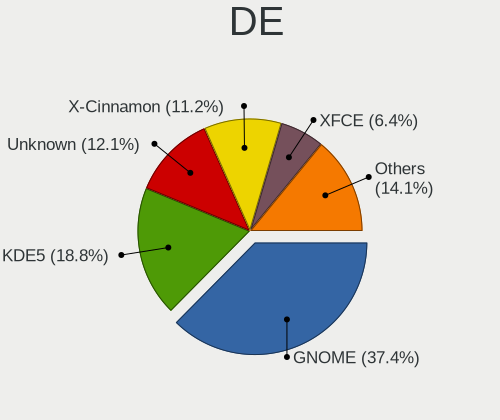
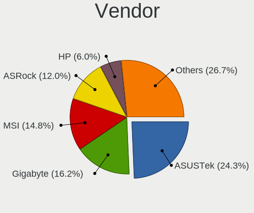

Linux in Germany - Tested Hardware & Statistics (Desktops)
----------------------------------------------------------

A project to collect tested hardware configurations for Linux in Germany.

Anyone can contribute to this report by the [hw-probe](https://github.com/linuxhw/hw-probe) tool:

    sudo -E hw-probe -all -upload

Please contribute! Especially if your hardware is rare.

Contents
--------

* [ Test Cases ](#test-cases)

* [ System ](#system)
  - [ OS                       ](#os)
  - [ OS Family                ](#os-family)
  - [ Kernel                   ](#kernel)
  - [ Kernel Family            ](#kernel-family)
  - [ Kernel Major Ver.        ](#kernel-major-ver)
  - [ Arch                     ](#arch)
  - [ DE                       ](#de)
  - [ Display Server           ](#display-server)
  - [ Display Manager          ](#display-manager)
  - [ OS Lang                  ](#os-lang)
  - [ Boot Mode                ](#boot-mode)
  - [ Filesystem               ](#filesystem)
  - [ Part. scheme             ](#part-scheme)
  - [ Dual Boot with Linux/BSD ](#dual-boot-with-linuxbsd)
  - [ Dual Boot (Win)          ](#dual-boot-win)

* [ Board ](#board)
  - [ Vendor                   ](#vendor)
  - [ Model                    ](#model)
  - [ Model Family             ](#model-family)
  - [ MFG Year                 ](#mfg-year)
  - [ Form Factor              ](#form-factor)
  - [ Secure Boot              ](#secure-boot)
  - [ Coreboot                 ](#coreboot)
  - [ RAM Size                 ](#ram-size)
  - [ RAM Used                 ](#ram-used)
  - [ Total Drives             ](#total-drives)
  - [ Has CD-ROM               ](#has-cd-rom)
  - [ Has Ethernet             ](#has-ethernet)
  - [ Has WiFi                 ](#has-wifi)
  - [ Has Bluetooth            ](#has-bluetooth)

* [ Location ](#location)
  - [ Country                  ](#country)
  - [ City                     ](#city)

* [ Drives ](#drives)
  - [ Drive Vendor             ](#drive-vendor)
  - [ Drive Model              ](#drive-model)
  - [ HDD Vendor               ](#hdd-vendor)
  - [ SSD Vendor               ](#ssd-vendor)
  - [ Drive Kind               ](#drive-kind)
  - [ Drive Connector          ](#drive-connector)
  - [ Drive Size               ](#drive-size)
  - [ Space Total              ](#space-total)
  - [ Space Used               ](#space-used)
  - [ Malfunc. Drives          ](#malfunc-drives)
  - [ Malfunc. Drive Vendor    ](#malfunc-drive-vendor)
  - [ Malfunc. HDD Vendor      ](#malfunc-hdd-vendor)
  - [ Malfunc. Drive Kind      ](#malfunc-drive-kind)
  - [ Failed Drives            ](#failed-drives)
  - [ Failed Drive Vendor      ](#failed-drive-vendor)
  - [ Drive Status             ](#drive-status)

* [ Storage controller ](#storage-controller)
  - [ Storage Vendor           ](#storage-vendor)
  - [ Storage Model            ](#storage-model)
  - [ Storage Kind             ](#storage-kind)

* [ Processor ](#processor)
  - [ CPU Vendor               ](#cpu-vendor)
  - [ CPU Model                ](#cpu-model)
  - [ CPU Model Family         ](#cpu-model-family)
  - [ CPU Cores                ](#cpu-cores)
  - [ CPU Sockets              ](#cpu-sockets)
  - [ CPU Threads              ](#cpu-threads)
  - [ CPU Op-Modes             ](#cpu-op-modes)
  - [ CPU Microcode            ](#cpu-microcode)
  - [ CPU Microarch            ](#cpu-microarch)

* [ Graphics ](#graphics)
  - [ GPU Vendor               ](#gpu-vendor)
  - [ GPU Model                ](#gpu-model)
  - [ GPU Combo                ](#gpu-combo)
  - [ GPU Driver               ](#gpu-driver)
  - [ GPU Memory               ](#gpu-memory)

* [ Monitor ](#monitor)
  - [ Monitor Vendor           ](#monitor-vendor)
  - [ Monitor Model            ](#monitor-model)
  - [ Monitor Resolution       ](#monitor-resolution)
  - [ Monitor Diagonal         ](#monitor-diagonal)
  - [ Monitor Width            ](#monitor-width)
  - [ Aspect Ratio             ](#aspect-ratio)
  - [ Monitor Area             ](#monitor-area)
  - [ Pixel Density            ](#pixel-density)
  - [ Multiple Monitors        ](#multiple-monitors)

* [ Network ](#network)
  - [ Net Controller Vendor    ](#net-controller-vendor)
  - [ Net Controller Model     ](#net-controller-model)
  - [ Wireless Vendor          ](#wireless-vendor)
  - [ Wireless Model           ](#wireless-model)
  - [ Ethernet Vendor          ](#ethernet-vendor)
  - [ Ethernet Model           ](#ethernet-model)
  - [ Net Controller Kind      ](#net-controller-kind)
  - [ Used Controller          ](#used-controller)
  - [ NICs                     ](#nics)
  - [ IPv6                     ](#ipv6)

* [ Bluetooth ](#bluetooth)
  - [ Bluetooth Vendor         ](#bluetooth-vendor)
  - [ Bluetooth Model          ](#bluetooth-model)

* [ Sound ](#sound)
  - [ Sound Vendor             ](#sound-vendor)
  - [ Sound Model              ](#sound-model)

* [ Memory ](#memory)
  - [ Memory Vendor            ](#memory-vendor)
  - [ Memory Model             ](#memory-model)
  - [ Memory Kind              ](#memory-kind)
  - [ Memory Form Factor       ](#memory-form-factor)
  - [ Memory Size              ](#memory-size)
  - [ Memory Speed             ](#memory-speed)

* [ Printers & scanners ](#printers--scanners)
  - [ Printer Vendor           ](#printer-vendor)
  - [ Printer Model            ](#printer-model)
  - [ Scanner Vendor           ](#scanner-vendor)
  - [ Scanner Model            ](#scanner-model)

* [ Camera ](#camera)
  - [ Camera Vendor            ](#camera-vendor)
  - [ Camera Model             ](#camera-model)

* [ Security ](#security)
  - [ Fingerprint Vendor       ](#fingerprint-vendor)
  - [ Fingerprint Model        ](#fingerprint-model)
  - [ Chipcard Vendor          ](#chipcard-vendor)
  - [ Chipcard Model           ](#chipcard-model)

* [ Unsupported ](#unsupported)
  - [ Unsupported Devices      ](#unsupported-devices)
  - [ Unsupported Device Types ](#unsupported-device-types)

Test Cases
----------

Total: 13969

| Vendor        | Model                       | Probe                                                      | Date         |
|---------------|-----------------------------|------------------------------------------------------------|--------------|
| ASRock        | J5005-ITX                   | [5373e7f16c](https://linux-hardware.org/?probe=5373e7f16c) | Jan 02, 2024 |
| Dell          | 0XJ8C4 A00                  | [e902f5396d](https://linux-hardware.org/?probe=e902f5396d) | Jan 02, 2024 |
| Gigabyte      | AX370-Gaming K7             | [435dc251c1](https://linux-hardware.org/?probe=435dc251c1) | Jan 02, 2024 |
| Gigabyte      | X670 GAMING X AX            | [6b4b87c927](https://linux-hardware.org/?probe=6b4b87c927) | Jan 01, 2024 |
| ASUSTek       | P8Z77-V LX                  | [148f8c250f](https://linux-hardware.org/?probe=148f8c250f) | Jan 01, 2024 |
| ASUSTek       | PRIME A320M-K               | [685d971973](https://linux-hardware.org/?probe=685d971973) | Jan 01, 2024 |
| ASRock        | B550M-ITX/ac                | [2ae0bbe734](https://linux-hardware.org/?probe=2ae0bbe734) | Jan 01, 2024 |
| ASUSTek       | PRIME X470-PRO              | [7cb99217f7](https://linux-hardware.org/?probe=7cb99217f7) | Jan 01, 2024 |
| Medion        | H110H4-EM                   | [da3367c80e](https://linux-hardware.org/?probe=da3367c80e) | Jan 01, 2024 |
| ASUSTek       | PRIME X470-PRO              | [1934632c28](https://linux-hardware.org/?probe=1934632c28) | Jan 01, 2024 |
| ASUSTek       | PRIME X470-PRO              | [7df50c6495](https://linux-hardware.org/?probe=7df50c6495) | Jan 01, 2024 |
| Gigabyte      | Z170X-Gaming 3              | [cd5e5dff22](https://linux-hardware.org/?probe=cd5e5dff22) | Jan 01, 2024 |
| ASRock        | B650E PG Riptide WiFi       | [9c99c1bf71](https://linux-hardware.org/?probe=9c99c1bf71) | Dec 31, 2023 |
| ASUSTek       | P8Z77-V LX                  | [109efb840b](https://linux-hardware.org/?probe=109efb840b) | Dec 31, 2023 |
| Gigabyte      | Q87M-D2H                    | [0f440edfb5](https://linux-hardware.org/?probe=0f440edfb5) | Dec 31, 2023 |
| ASUSTek       | TUF Gaming B550M-PLUS       | [e1c9fdb53b](https://linux-hardware.org/?probe=e1c9fdb53b) | Dec 31, 2023 |
| ASUSTek       | P8Z77-V LX                  | [bb0f439fbe](https://linux-hardware.org/?probe=bb0f439fbe) | Dec 31, 2023 |
| MSI           | 970 GAMING                  | [aa028d5af2](https://linux-hardware.org/?probe=aa028d5af2) | Dec 31, 2023 |
| Gigabyte      | GA-MA790GPT-UD3H            | [0ff4f2cb79](https://linux-hardware.org/?probe=0ff4f2cb79) | Dec 31, 2023 |
| ZOTAC         | NM10                        | [c0f4135bd0](https://linux-hardware.org/?probe=c0f4135bd0) | Dec 31, 2023 |
| HP            | 3047h                       | [b7a000586f](https://linux-hardware.org/?probe=b7a000586f) | Dec 31, 2023 |
| Gigabyte      | Q87M-D2H                    | [edbe61f4fa](https://linux-hardware.org/?probe=edbe61f4fa) | Dec 31, 2023 |
| ASRock        | B450M Pro4 R2.0             | [f70bdb7fa5](https://linux-hardware.org/?probe=f70bdb7fa5) | Dec 31, 2023 |
| HC Technol... | HCAR5000-MI2                | [907ca49963](https://linux-hardware.org/?probe=907ca49963) | Dec 31, 2023 |
| Gigabyte      | Z790 AORUS ELITE AX         | [5d368c5304](https://linux-hardware.org/?probe=5d368c5304) | Dec 31, 2023 |
| Dell          | 0GN6JF A01                  | [19456ad0cb](https://linux-hardware.org/?probe=19456ad0cb) | Dec 30, 2023 |
| ASUSTek       | P11C-I Series               | [b38bcf215d](https://linux-hardware.org/?probe=b38bcf215d) | Dec 30, 2023 |
| Dell          | 0GN6JF A01                  | [fcf352f5e9](https://linux-hardware.org/?probe=fcf352f5e9) | Dec 30, 2023 |
| ASRock        | X300M-STX                   | [7cd1d9d16c](https://linux-hardware.org/?probe=7cd1d9d16c) | Dec 30, 2023 |
| ASRock        | X300M-STX                   | [5fa6e9f755](https://linux-hardware.org/?probe=5fa6e9f755) | Dec 30, 2023 |
| ASRock        | H170M Pro4                  | [27e24a6ef3](https://linux-hardware.org/?probe=27e24a6ef3) | Dec 30, 2023 |
| MSI           | B350 KRAIT GAMING           | [a4582db0da](https://linux-hardware.org/?probe=a4582db0da) | Dec 30, 2023 |
| ASUSTek       | TUF Gaming H670-PRO WIFI... | [3b26c92d22](https://linux-hardware.org/?probe=3b26c92d22) | Dec 30, 2023 |
| ASRock        | B550M-ITX/ac                | [2f69bdfbc7](https://linux-hardware.org/?probe=2f69bdfbc7) | Dec 30, 2023 |
| MSI           | MS-B9311                    | [47bab5481d](https://linux-hardware.org/?probe=47bab5481d) | Dec 30, 2023 |
| ASUSTek       | M5A97 R2.0                  | [e14a6e4044](https://linux-hardware.org/?probe=e14a6e4044) | Dec 30, 2023 |
| HC Technol... | HCAR5000-MI2                | [44a9ba60e7](https://linux-hardware.org/?probe=44a9ba60e7) | Dec 29, 2023 |
| Acer          | WMCP78M                     | [1384395472](https://linux-hardware.org/?probe=1384395472) | Dec 29, 2023 |
| ASRock        | B550M-ITX/ac                | [3729a3492e](https://linux-hardware.org/?probe=3729a3492e) | Dec 29, 2023 |
| MSI           | 760GMA-P34                  | [4d6001354b](https://linux-hardware.org/?probe=4d6001354b) | Dec 29, 2023 |
| Gigabyte      | GA-78LMT-S2P                | [658dc99555](https://linux-hardware.org/?probe=658dc99555) | Dec 29, 2023 |
| Gigabyte      | P55A-UD4                    | [c1694a8923](https://linux-hardware.org/?probe=c1694a8923) | Dec 29, 2023 |
| ASUSTek       | ROG STRIX B450-F GAMING ... | [7108d28aab](https://linux-hardware.org/?probe=7108d28aab) | Dec 29, 2023 |
| MSI           | 760GMA-P34                  | [0e59657bca](https://linux-hardware.org/?probe=0e59657bca) | Dec 29, 2023 |
| Gigabyte      | B75M-D3H                    | [1229449c91](https://linux-hardware.org/?probe=1229449c91) | Dec 29, 2023 |
| Gigabyte      | P55A-UD4                    | [580efd7b07](https://linux-hardware.org/?probe=580efd7b07) | Dec 29, 2023 |
| Lenovo        | Annapurna CRB NOK           | [1e5fb94730](https://linux-hardware.org/?probe=1e5fb94730) | Dec 29, 2023 |
| MSI           | H510M PRO                   | [642f22170e](https://linux-hardware.org/?probe=642f22170e) | Dec 29, 2023 |
| Inventec      | VXC Class A02               | [0575404de8](https://linux-hardware.org/?probe=0575404de8) | Dec 29, 2023 |
| ASUSTek       | ROG STRIX X570-F GAMING     | [9f85581cdb](https://linux-hardware.org/?probe=9f85581cdb) | Dec 29, 2023 |
| MSI           | B450 TOMAHAWK MAX           | [656b1b3ae1](https://linux-hardware.org/?probe=656b1b3ae1) | Dec 29, 2023 |
| Fujitsu       | D3222-A1 S26361-D3222-A1    | [6f277a8c3f](https://linux-hardware.org/?probe=6f277a8c3f) | Dec 28, 2023 |
| ASUSTek       | PRIME H510M-A               | [e65000c3c2](https://linux-hardware.org/?probe=e65000c3c2) | Dec 28, 2023 |
| ASRock        | B650E PG Riptide WiFi       | [3bf93539f3](https://linux-hardware.org/?probe=3bf93539f3) | Dec 28, 2023 |
| Gigabyte      | H61M-D2H-USB3               | [018e344b4d](https://linux-hardware.org/?probe=018e344b4d) | Dec 28, 2023 |
| ASRock        | AMCP7A-ION                  | [8358bb2fb8](https://linux-hardware.org/?probe=8358bb2fb8) | Dec 28, 2023 |
| ASUSTek       | ROG STRIX B350-F GAMING     | [c68ea76b65](https://linux-hardware.org/?probe=c68ea76b65) | Dec 28, 2023 |
| ASUSTek       | ROG STRIX B350-F GAMING     | [48d04b219b](https://linux-hardware.org/?probe=48d04b219b) | Dec 28, 2023 |
| ASUSTek       | M5A97 R2.0                  | [020ea108b0](https://linux-hardware.org/?probe=020ea108b0) | Dec 28, 2023 |
| ASRock        | X570 Steel Legend           | [a2a45575d5](https://linux-hardware.org/?probe=a2a45575d5) | Dec 28, 2023 |
| ASRock        | X570 Steel Legend           | [836a55f0b6](https://linux-hardware.org/?probe=836a55f0b6) | Dec 28, 2023 |
| Dell          | 0F642F A00                  | [6adfd04a7e](https://linux-hardware.org/?probe=6adfd04a7e) | Dec 27, 2023 |
| MSI           | MAG B650 TOMAHAWK WIFI      | [a6041ee7fc](https://linux-hardware.org/?probe=a6041ee7fc) | Dec 27, 2023 |
| MSI           | MPG B650 CARBON WIFI        | [6a0970bd24](https://linux-hardware.org/?probe=6a0970bd24) | Dec 27, 2023 |
| Gigabyte      | H61M-D2H-USB3               | [64a4b468b6](https://linux-hardware.org/?probe=64a4b468b6) | Dec 27, 2023 |
| Biostar       | A68N-5000                   | [19f4961efd](https://linux-hardware.org/?probe=19f4961efd) | Dec 27, 2023 |
| ASRock        | H61M-DGS R2.0               | [fd5af25b3b](https://linux-hardware.org/?probe=fd5af25b3b) | Dec 27, 2023 |
| ASUSTek       | H97-PLUS                    | [b1e081701a](https://linux-hardware.org/?probe=b1e081701a) | Dec 27, 2023 |
| ASUSTek       | PRIME B450M-K II            | [45f0a0ac2d](https://linux-hardware.org/?probe=45f0a0ac2d) | Dec 27, 2023 |
| ASUSTek       | PRIME B450M-K II            | [a74968ee9c](https://linux-hardware.org/?probe=a74968ee9c) | Dec 27, 2023 |
| Gigabyte      | Z370M D3H-CF                | [d73ec66a3a](https://linux-hardware.org/?probe=d73ec66a3a) | Dec 26, 2023 |
| Gigabyte      | A320M-DS2-CF                | [a0ef6497e0](https://linux-hardware.org/?probe=a0ef6497e0) | Dec 26, 2023 |
| ASRock        | B450M Pro4 R2.0             | [ab795ed232](https://linux-hardware.org/?probe=ab795ed232) | Dec 26, 2023 |
| Biostar       | A68N-5000                   | [39703ac1bc](https://linux-hardware.org/?probe=39703ac1bc) | Dec 26, 2023 |
| Gigabyte      | Z270-HD3P-CF                | [6bf30b2ec5](https://linux-hardware.org/?probe=6bf30b2ec5) | Dec 26, 2023 |
| ASUSTek       | TUF B450-PLUS GAMING        | [e1bbb2ee71](https://linux-hardware.org/?probe=e1bbb2ee71) | Dec 26, 2023 |
| Gigabyte      | B75M-D3V                    | [a58934ade1](https://linux-hardware.org/?probe=a58934ade1) | Dec 26, 2023 |
| Gigabyte      | B75M-D3V                    | [8616b021c1](https://linux-hardware.org/?probe=8616b021c1) | Dec 26, 2023 |
| Gigabyte      | Z390 UD                     | [82333229d6](https://linux-hardware.org/?probe=82333229d6) | Dec 26, 2023 |
| Gigabyte      | Z390 UD                     | [a87c271e68](https://linux-hardware.org/?probe=a87c271e68) | Dec 26, 2023 |
| Gigabyte      | Z390 UD                     | [30780ea209](https://linux-hardware.org/?probe=30780ea209) | Dec 26, 2023 |
| Dell          | 0K240Y A02                  | [c9ace2ba93](https://linux-hardware.org/?probe=c9ace2ba93) | Dec 26, 2023 |
| ASRock        | FM2A68M-HD+                 | [f6df6fc800](https://linux-hardware.org/?probe=f6df6fc800) | Dec 25, 2023 |
| ASRock        | FM2A68M-HD+                 | [2f1d5396df](https://linux-hardware.org/?probe=2f1d5396df) | Dec 25, 2023 |
| HP            | 82FE 11                     | [e9d77b121e](https://linux-hardware.org/?probe=e9d77b121e) | Dec 25, 2023 |
| ASRock        | B450M Pro4 R2.0             | [96aa7493e0](https://linux-hardware.org/?probe=96aa7493e0) | Dec 25, 2023 |
| MSI           | MEG X570 UNIFY              | [5cc2120efc](https://linux-hardware.org/?probe=5cc2120efc) | Dec 25, 2023 |
| ASRock        | H61M-DGS R2.0               | [de35c0b58a](https://linux-hardware.org/?probe=de35c0b58a) | Dec 25, 2023 |
| Gigabyte      | 990FXA-UD7                  | [9bc8844164](https://linux-hardware.org/?probe=9bc8844164) | Dec 25, 2023 |
| Gigabyte      | B550 AORUS ELITE V2         | [9a82f5d4ae](https://linux-hardware.org/?probe=9a82f5d4ae) | Dec 25, 2023 |
| Medion        | H81H3-EM2 H81EM2W08.309     | [a8025e429f](https://linux-hardware.org/?probe=a8025e429f) | Dec 25, 2023 |
| MSI           | MEG X570 UNIFY              | [6bcc868ad6](https://linux-hardware.org/?probe=6bcc868ad6) | Dec 25, 2023 |
| Lenovo        | Annapurna CRB NOK           | [2cf0a3c6b7](https://linux-hardware.org/?probe=2cf0a3c6b7) | Dec 25, 2023 |
| ASUSTek       | ROG Maximus Z790 HERO       | [61d0f60cae](https://linux-hardware.org/?probe=61d0f60cae) | Dec 25, 2023 |
| Gigabyte      | Z87X-UD3H-CF                | [736c52940a](https://linux-hardware.org/?probe=736c52940a) | Dec 24, 2023 |
| Intel         | D34010WYK H14771-304        | [95ab790a9c](https://linux-hardware.org/?probe=95ab790a9c) | Dec 24, 2023 |
| ASUSTek       | Z97-K                       | [d330d1d9f9](https://linux-hardware.org/?probe=d330d1d9f9) | Dec 24, 2023 |
| Gigabyte      | Z790 AORUS ELITE AX         | [6c327c054f](https://linux-hardware.org/?probe=6c327c054f) | Dec 24, 2023 |
| ASUSTek       | Z97-K                       | [d8ae24af2b](https://linux-hardware.org/?probe=d8ae24af2b) | Dec 24, 2023 |
| MSI           | H97 PC Mate                 | [f1c5d0d405](https://linux-hardware.org/?probe=f1c5d0d405) | Dec 24, 2023 |
| Fujitsu       | D3061-A1 S26361-D3061-A1    | [646b9af5a9](https://linux-hardware.org/?probe=646b9af5a9) | Dec 24, 2023 |
| MSI           | B350M PRO-VDH               | [d845a3492b](https://linux-hardware.org/?probe=d845a3492b) | Dec 24, 2023 |
| MSI           | B350M PRO-VDH               | [a6e1fc3b29](https://linux-hardware.org/?probe=a6e1fc3b29) | Dec 24, 2023 |
| Acer          | TDPS05                      | [ce9b5d0c48](https://linux-hardware.org/?probe=ce9b5d0c48) | Dec 23, 2023 |
| ASUSTek       | M2V                         | [67c7bc43ed](https://linux-hardware.org/?probe=67c7bc43ed) | Dec 23, 2023 |
| ASUSTek       | M2V                         | [1d6970f290](https://linux-hardware.org/?probe=1d6970f290) | Dec 23, 2023 |
| MSI           | 970 GAMING                  | [275aa2eb92](https://linux-hardware.org/?probe=275aa2eb92) | Dec 23, 2023 |
| Gigabyte      | Q87M-D2H                    | [4b2ed8b976](https://linux-hardware.org/?probe=4b2ed8b976) | Dec 23, 2023 |
| AZW           | EQ                          | [a04c9735a7](https://linux-hardware.org/?probe=a04c9735a7) | Dec 23, 2023 |
| AZW           | EQ                          | [9b3d265cd1](https://linux-hardware.org/?probe=9b3d265cd1) | Dec 23, 2023 |
| Dell          | 0J1C3P A01                  | [faea7a3006](https://linux-hardware.org/?probe=faea7a3006) | Dec 23, 2023 |
| Fujitsu       | D3161-A1 S26361-D3161-A1    | [c8bab56547](https://linux-hardware.org/?probe=c8bab56547) | Dec 23, 2023 |
| Gigabyte      | GA-78LMT-S2P                | [6f36390142](https://linux-hardware.org/?probe=6f36390142) | Dec 23, 2023 |
| ASRock        | AMCP7A-ION                  | [fb0acc2d50](https://linux-hardware.org/?probe=fb0acc2d50) | Dec 23, 2023 |
| MSI           | B550-A PRO                  | [64a00841b2](https://linux-hardware.org/?probe=64a00841b2) | Dec 23, 2023 |
| Acer          | TDPS05                      | [d0260b1327](https://linux-hardware.org/?probe=d0260b1327) | Dec 23, 2023 |
| ASUSTek       | X99-A II                    | [37e4430c0e](https://linux-hardware.org/?probe=37e4430c0e) | Dec 23, 2023 |
| Foxconn       | 2ABF                        | [d12d3a2f21](https://linux-hardware.org/?probe=d12d3a2f21) | Dec 23, 2023 |
| Lenovo        | ThinkCentre M58 7373AJ5     | [201981bc3f](https://linux-hardware.org/?probe=201981bc3f) | Dec 23, 2023 |
| Gigabyte      | B85-HD3                     | [79fbb89592](https://linux-hardware.org/?probe=79fbb89592) | Dec 23, 2023 |
| ASUSTek       | PRIME B360-PLUS             | [4cd7d986cd](https://linux-hardware.org/?probe=4cd7d986cd) | Dec 23, 2023 |
| T-bao Tian... | GOD78                       | [cd28753d06](https://linux-hardware.org/?probe=cd28753d06) | Dec 23, 2023 |
| ASRock        | AMCP7A-ION                  | [7d19dec574](https://linux-hardware.org/?probe=7d19dec574) | Dec 23, 2023 |
| Dell          | 0VHWTR A02                  | [86e89b6ffd](https://linux-hardware.org/?probe=86e89b6ffd) | Dec 23, 2023 |
| ASUSTek       | ROG STRIX X570-E GAMING     | [391ef34135](https://linux-hardware.org/?probe=391ef34135) | Dec 23, 2023 |
| Gigabyte      | Z390 UD                     | [cd36fc0dc1](https://linux-hardware.org/?probe=cd36fc0dc1) | Dec 23, 2023 |
| MSI           | B560M PRO                   | [3885df62ab](https://linux-hardware.org/?probe=3885df62ab) | Dec 23, 2023 |
| ASUSTek       | P6T                         | [d90adb3a12](https://linux-hardware.org/?probe=d90adb3a12) | Dec 23, 2023 |
| ASUSTek       | ROG STRIX X570-E GAMING     | [b9b670d3c0](https://linux-hardware.org/?probe=b9b670d3c0) | Dec 23, 2023 |
| AZW           | SER V1                      | [73cc7b7f87](https://linux-hardware.org/?probe=73cc7b7f87) | Dec 22, 2023 |
| MSI           | PRO B650M-A WIFI            | [4adc5f3f81](https://linux-hardware.org/?probe=4adc5f3f81) | Dec 22, 2023 |
| MSI           | MPG B550 GAMING PLUS        | [db8c00daf3](https://linux-hardware.org/?probe=db8c00daf3) | Dec 22, 2023 |
| Gigabyte      | B550 AORUS ELITE V2         | [f71924e3e4](https://linux-hardware.org/?probe=f71924e3e4) | Dec 22, 2023 |
| MSI           | B450M PRO-VDH MAX           | [94462e79e4](https://linux-hardware.org/?probe=94462e79e4) | Dec 22, 2023 |
| ASUSTek       | Maximus VI GENE             | [178aab1062](https://linux-hardware.org/?probe=178aab1062) | Dec 22, 2023 |
| ASUSTek       | M5A97 R2.0                  | [3ff2f289b9](https://linux-hardware.org/?probe=3ff2f289b9) | Dec 22, 2023 |
| Gigabyte      | GA-78LMT-S2P                | [dbc2e93666](https://linux-hardware.org/?probe=dbc2e93666) | Dec 21, 2023 |
| ASUSTek       | TUF Gaming B650M-PLUS       | [0dc09851b1](https://linux-hardware.org/?probe=0dc09851b1) | Dec 21, 2023 |
| Gigabyte      | B450 AORUS M                | [084e48827c](https://linux-hardware.org/?probe=084e48827c) | Dec 21, 2023 |
| MSI           | A320M-A PRO MAX             | [37e175c7a2](https://linux-hardware.org/?probe=37e175c7a2) | Dec 21, 2023 |
| Gigabyte      | GA-990XA-UD3                | [f8215b7e03](https://linux-hardware.org/?probe=f8215b7e03) | Dec 21, 2023 |
| MSI           | MAG X570 TOMAHAWK WIFI      | [13b303a58b](https://linux-hardware.org/?probe=13b303a58b) | Dec 21, 2023 |
| ASRock        | A520M-HDV                   | [918677a1da](https://linux-hardware.org/?probe=918677a1da) | Dec 21, 2023 |
| MSI           | MPG X570 GAMING EDGE WIF... | [628ca02992](https://linux-hardware.org/?probe=628ca02992) | Dec 21, 2023 |
| ASRock        | A520M-HDV                   | [7136ba3916](https://linux-hardware.org/?probe=7136ba3916) | Dec 21, 2023 |
| ASUSTek       | Maximus VIII RANGER         | [b87a575222](https://linux-hardware.org/?probe=b87a575222) | Dec 21, 2023 |
| ASUSTek       | PRIME H510M-K               | [5c0166e1f8](https://linux-hardware.org/?probe=5c0166e1f8) | Dec 21, 2023 |
| MSI           | B450M PRO-VDH MAX           | [1b8100314e](https://linux-hardware.org/?probe=1b8100314e) | Dec 21, 2023 |
| ASRock        | H61M-DGS R2.0               | [5693d09326](https://linux-hardware.org/?probe=5693d09326) | Dec 21, 2023 |
| ASUSTek       | M4A785TD-V EVO              | [8b094a74c9](https://linux-hardware.org/?probe=8b094a74c9) | Dec 21, 2023 |
| ASUSTek       | M5A97 R2.0                  | [93a7029d22](https://linux-hardware.org/?probe=93a7029d22) | Dec 21, 2023 |
| ASUSTek       | P5G41-M                     | [cbab9e248d](https://linux-hardware.org/?probe=cbab9e248d) | Dec 20, 2023 |
| Gigabyte      | B560M H                     | [6e7f8b2300](https://linux-hardware.org/?probe=6e7f8b2300) | Dec 20, 2023 |
| Pegatron      | TRUCKEE                     | [dbf9508eef](https://linux-hardware.org/?probe=dbf9508eef) | Dec 20, 2023 |
| HP            | 3047h                       | [8f868cea54](https://linux-hardware.org/?probe=8f868cea54) | Dec 20, 2023 |
| HP            | 3047h                       | [6e6ab07000](https://linux-hardware.org/?probe=6e6ab07000) | Dec 20, 2023 |
| HP            | 3047h                       | [a1f3ed3f68](https://linux-hardware.org/?probe=a1f3ed3f68) | Dec 20, 2023 |
| ASUSTek       | TUF Gaming B650M-PLUS       | [088b57605f](https://linux-hardware.org/?probe=088b57605f) | Dec 20, 2023 |
| MSI           | H61M-E33                    | [ab39035cef](https://linux-hardware.org/?probe=ab39035cef) | Dec 20, 2023 |
| MSI           | A78M-E45                    | [6d11f72d41](https://linux-hardware.org/?probe=6d11f72d41) | Dec 20, 2023 |
| Gigabyte      | B85M-D3H                    | [a641f9b41d](https://linux-hardware.org/?probe=a641f9b41d) | Dec 20, 2023 |
| ASUSTek       | PRIME H510M-K               | [b6b4165e86](https://linux-hardware.org/?probe=b6b4165e86) | Dec 20, 2023 |
| Medion        | TJ4125                      | [8fce958467](https://linux-hardware.org/?probe=8fce958467) | Dec 20, 2023 |
| MSI           | 970A-G46                    | [078bef5c72](https://linux-hardware.org/?probe=078bef5c72) | Dec 19, 2023 |
| ASUSTek       | PRIME B450M-A               | [e66c224547](https://linux-hardware.org/?probe=e66c224547) | Dec 19, 2023 |
| MSI           | Z77A-G45                    | [047feb8e76](https://linux-hardware.org/?probe=047feb8e76) | Dec 19, 2023 |
| HP            | 83E0                        | [8f41483d26](https://linux-hardware.org/?probe=8f41483d26) | Dec 19, 2023 |
| Lenovo        | 3704 SDK0K17763 WIN 1801... | [9a2472e628](https://linux-hardware.org/?probe=9a2472e628) | Dec 19, 2023 |
| HP            | 81B3                        | [86d9fc12a5](https://linux-hardware.org/?probe=86d9fc12a5) | Dec 19, 2023 |
| Gigabyte      | B550 AORUS MASTER           | [7bd446ee65](https://linux-hardware.org/?probe=7bd446ee65) | Dec 18, 2023 |
| Unknown       | HX90                        | [2bf61c79c6](https://linux-hardware.org/?probe=2bf61c79c6) | Dec 18, 2023 |
| MSI           | MAG X670E TOMAHAWK WIFI     | [5255e11641](https://linux-hardware.org/?probe=5255e11641) | Dec 18, 2023 |
| Fujitsu       | D3161-A1 S26361-D3161-A1    | [985b139723](https://linux-hardware.org/?probe=985b139723) | Dec 18, 2023 |
| MSI           | Z77A-GD65                   | [a6d9b065a7](https://linux-hardware.org/?probe=a6d9b065a7) | Dec 18, 2023 |
| MSI           | B550-A PRO                  | [d333f0b082](https://linux-hardware.org/?probe=d333f0b082) | Dec 18, 2023 |
| Medion        | TJ4125                      | [c7eeb77279](https://linux-hardware.org/?probe=c7eeb77279) | Dec 18, 2023 |
| Gigabyte      | B85M-D3H                    | [95d29a0474](https://linux-hardware.org/?probe=95d29a0474) | Dec 18, 2023 |
| ASRock        | H61M-DGS R2.0               | [dc6e7e06c3](https://linux-hardware.org/?probe=dc6e7e06c3) | Dec 18, 2023 |
| MSI           | MAG X570 TOMAHAWK WIFI      | [85358f7505](https://linux-hardware.org/?probe=85358f7505) | Dec 18, 2023 |
| MSI           | A75MA-G55                   | [6af3c61744](https://linux-hardware.org/?probe=6af3c61744) | Dec 18, 2023 |
| ASRock        | Z390 Extreme4               | [4067f8d4cb](https://linux-hardware.org/?probe=4067f8d4cb) | Dec 17, 2023 |
| Apple         | Mac-F60DEB81FF30ACF6 Mac... | [a411802ac6](https://linux-hardware.org/?probe=a411802ac6) | Dec 17, 2023 |
| ASUSTek       | M5A78L-M LE                 | [d70deaa140](https://linux-hardware.org/?probe=d70deaa140) | Dec 17, 2023 |
| Dell          | 0J1C3P A01                  | [99eb1f88a4](https://linux-hardware.org/?probe=99eb1f88a4) | Dec 17, 2023 |
| ASRock        | Z77 Extreme4                | [ead1dfb3ae](https://linux-hardware.org/?probe=ead1dfb3ae) | Dec 17, 2023 |
| Dell          | 02K9CR A02                  | [aeb868db71](https://linux-hardware.org/?probe=aeb868db71) | Dec 17, 2023 |
| ASRock        | Z390 Extreme4               | [5db549dd99](https://linux-hardware.org/?probe=5db549dd99) | Dec 17, 2023 |
| MSI           | MAG X570S TORPEDO MAX       | [3a10e23529](https://linux-hardware.org/?probe=3a10e23529) | Dec 17, 2023 |
| Medion        | B660H7-M20                  | [749b3e49ca](https://linux-hardware.org/?probe=749b3e49ca) | Dec 17, 2023 |
| Gigabyte      | Q87M-D2H                    | [378b82ce2f](https://linux-hardware.org/?probe=378b82ce2f) | Dec 17, 2023 |
| ASRock        | H61M-DGS R2.0               | [b8bef59357](https://linux-hardware.org/?probe=b8bef59357) | Dec 17, 2023 |
| Gigabyte      | Q87M-D2H                    | [e7f9b37ee3](https://linux-hardware.org/?probe=e7f9b37ee3) | Dec 17, 2023 |
| Gigabyte      | Q87M-D2H                    | [935f688c90](https://linux-hardware.org/?probe=935f688c90) | Dec 17, 2023 |
| ASRock        | H61M-DGS R2.0               | [d60c1bd23e](https://linux-hardware.org/?probe=d60c1bd23e) | Dec 17, 2023 |
| ASRock        | H61M-DGS R2.0               | [f627f950ab](https://linux-hardware.org/?probe=f627f950ab) | Dec 17, 2023 |
| Gigabyte      | Q87M-D2H                    | [f53d129b3d](https://linux-hardware.org/?probe=f53d129b3d) | Dec 17, 2023 |
| HP            | 2B5B                        | [fb3877b170](https://linux-hardware.org/?probe=fb3877b170) | Dec 17, 2023 |
| ASUSTek       | TUF B450-PLUS GAMING        | [a5e443e89c](https://linux-hardware.org/?probe=a5e443e89c) | Dec 17, 2023 |
| Medion        | TJ4125                      | [7556d73046](https://linux-hardware.org/?probe=7556d73046) | Dec 17, 2023 |
| Gigabyte      | B85M-D3H                    | [4d81e6300c](https://linux-hardware.org/?probe=4d81e6300c) | Dec 17, 2023 |
| MSI           | Z97-G43                     | [84486f678f](https://linux-hardware.org/?probe=84486f678f) | Dec 16, 2023 |
| Dell          | 08WKV3 A00                  | [75274d24c0](https://linux-hardware.org/?probe=75274d24c0) | Dec 16, 2023 |
| MSI           | MPG Z490 GAMING PLUS        | [faf62fd1be](https://linux-hardware.org/?probe=faf62fd1be) | Dec 16, 2023 |
| ASUSTek       | ROG STRIX B550-F GAMING     | [72b7f2d771](https://linux-hardware.org/?probe=72b7f2d771) | Dec 16, 2023 |
| Fujitsu       | D3513-A1 S26361-D3513-A1    | [6f4f0f65bb](https://linux-hardware.org/?probe=6f4f0f65bb) | Dec 15, 2023 |
| VIA Techno... | AMOS-3005                   | [10cf5bf932](https://linux-hardware.org/?probe=10cf5bf932) | Dec 15, 2023 |
| VIA Techno... | AMOS-3005                   | [0af62d144a](https://linux-hardware.org/?probe=0af62d144a) | Dec 15, 2023 |
| MSI           | Z77A-GD65                   | [61b10e308f](https://linux-hardware.org/?probe=61b10e308f) | Dec 15, 2023 |
| Shenzhen M... | AHBNB OEM                   | [1fae1d3423](https://linux-hardware.org/?probe=1fae1d3423) | Dec 15, 2023 |
| Shenzhen M... | AHBNB OEM                   | [1a70a13ff4](https://linux-hardware.org/?probe=1a70a13ff4) | Dec 15, 2023 |
| Shenzhen M... | AHBNB OEM                   | [8be30808ec](https://linux-hardware.org/?probe=8be30808ec) | Dec 15, 2023 |
| Shenzhen M... | AHBNB OEM                   | [1e0ba866f7](https://linux-hardware.org/?probe=1e0ba866f7) | Dec 15, 2023 |
| Gigabyte      | MZAPLBP-00                  | [3935358dce](https://linux-hardware.org/?probe=3935358dce) | Dec 15, 2023 |
| Unknown       | Unknown                     | [9fb745d9fe](https://linux-hardware.org/?probe=9fb745d9fe) | Dec 14, 2023 |
| Lenovo        | SDK0J40700 WIN              | [48c963a11d](https://linux-hardware.org/?probe=48c963a11d) | Dec 14, 2023 |
| ASUSTek       | TUF B360M-PLUS GAMING       | [2982c2a2c6](https://linux-hardware.org/?probe=2982c2a2c6) | Dec 14, 2023 |
| Lenovo        | SHARKBAY SDK0E50510 WIN     | [ba4e95a15e](https://linux-hardware.org/?probe=ba4e95a15e) | Dec 13, 2023 |
| Gigabyte      | B550 AORUS ELITE AX V2      | [e101fc39e2](https://linux-hardware.org/?probe=e101fc39e2) | Dec 13, 2023 |
| ASUSTek       | ROG STRIX B650E-E GAMING... | [c132a249e4](https://linux-hardware.org/?probe=c132a249e4) | Dec 13, 2023 |
| MSI           | X470 GAMING PLUS MAX        | [5d1e9e6d47](https://linux-hardware.org/?probe=5d1e9e6d47) | Dec 13, 2023 |
| MSI           | MPG Z490 GAMING EDGE WIF... | [7762e5b295](https://linux-hardware.org/?probe=7762e5b295) | Dec 13, 2023 |
| ASUSTek       | ROG STRIX B450-I GAMING     | [913708c3f0](https://linux-hardware.org/?probe=913708c3f0) | Dec 13, 2023 |
| HP            | 18E9                        | [ab47a5d40b](https://linux-hardware.org/?probe=ab47a5d40b) | Dec 13, 2023 |
| ASRock        | A620M Pro RS WiFi           | [069de62879](https://linux-hardware.org/?probe=069de62879) | Dec 13, 2023 |
| HP            | 18E5                        | [8195da7520](https://linux-hardware.org/?probe=8195da7520) | Dec 13, 2023 |
| MSI           | Z77A-GD65                   | [ce6556590b](https://linux-hardware.org/?probe=ce6556590b) | Dec 13, 2023 |
| MSI           | H310M PRO-M2 PLUS           | [60461068e8](https://linux-hardware.org/?probe=60461068e8) | Dec 13, 2023 |
| HP            | 8169                        | [e0549dcc03](https://linux-hardware.org/?probe=e0549dcc03) | Dec 12, 2023 |
| Gigabyte      | MZAPLBP-00                  | [fdb303e7e6](https://linux-hardware.org/?probe=fdb303e7e6) | Dec 12, 2023 |
| Lenovo        | Annapurna CRB NOK           | [2207f3a9a1](https://linux-hardware.org/?probe=2207f3a9a1) | Dec 12, 2023 |
| Lenovo        | NO DPK                      | [2204183295](https://linux-hardware.org/?probe=2204183295) | Dec 12, 2023 |
| Gigabyte      | B450M DS3H-CF               | [8f2db425db](https://linux-hardware.org/?probe=8f2db425db) | Dec 12, 2023 |
| Foxconn       | TPS01                       | [a417ff19ae](https://linux-hardware.org/?probe=a417ff19ae) | Dec 12, 2023 |
| MSI           | A320M PRO-VD/S              | [c2a6947086](https://linux-hardware.org/?probe=c2a6947086) | Dec 12, 2023 |
| Acer          | Aspire XC-705               | [c9193baaf8](https://linux-hardware.org/?probe=c9193baaf8) | Dec 12, 2023 |
| Lenovo        | SKYBAY SDK0J40705 WIN 34... | [0720cbce6b](https://linux-hardware.org/?probe=0720cbce6b) | Dec 12, 2023 |
| ASUSTek       | Maximus VII HERO            | [f779186ae7](https://linux-hardware.org/?probe=f779186ae7) | Dec 11, 2023 |
| MSI           | MPG B550I GAMING EDGE WI... | [8b80683b06](https://linux-hardware.org/?probe=8b80683b06) | Dec 11, 2023 |
| ASRock        | B85M Pro4                   | [8a11fe8107](https://linux-hardware.org/?probe=8a11fe8107) | Dec 11, 2023 |
| MSI           | Z170-A PRO                  | [8d77ff0fe8](https://linux-hardware.org/?probe=8d77ff0fe8) | Dec 11, 2023 |
| MSI           | X470 GAMING PLUS MAX        | [8a8dc0ce48](https://linux-hardware.org/?probe=8a8dc0ce48) | Dec 11, 2023 |
| Gigabyte      | Z790 GAMING X AX            | [8617acecda](https://linux-hardware.org/?probe=8617acecda) | Dec 11, 2023 |
| ASRock        | A520M-HVS                   | [5d07d03602](https://linux-hardware.org/?probe=5d07d03602) | Dec 10, 2023 |
| MSI           | MS-7516                     | [bafee6f86e](https://linux-hardware.org/?probe=bafee6f86e) | Dec 10, 2023 |
| ASUSTek       | ROG STRIX Z390-E GAMING     | [5522722e53](https://linux-hardware.org/?probe=5522722e53) | Dec 10, 2023 |
| Gigabyte      | B550 AORUS ELITE            | [6c3916c3fa](https://linux-hardware.org/?probe=6c3916c3fa) | Dec 10, 2023 |
| ASUSTek       | ROG STRIX Z390-E GAMING     | [52e1cb6958](https://linux-hardware.org/?probe=52e1cb6958) | Dec 10, 2023 |
| ASUSTek       | SABERTOOTH 990FX R2.0       | [530b8a868e](https://linux-hardware.org/?probe=530b8a868e) | Dec 10, 2023 |
| HP            | 2AF7                        | [e7a6fd7a82](https://linux-hardware.org/?probe=e7a6fd7a82) | Dec 10, 2023 |
| BESSTAR Te... | HM90                        | [6d805d9e86](https://linux-hardware.org/?probe=6d805d9e86) | Dec 10, 2023 |
| ASUSTek       | M4N68T-M-LE-V2              | [e126cdbf4b](https://linux-hardware.org/?probe=e126cdbf4b) | Dec 10, 2023 |
| ASRock        | B760M PG Riptide            | [ef47cf6d30](https://linux-hardware.org/?probe=ef47cf6d30) | Dec 10, 2023 |
| ASUSTek       | P8Z77-V DELUXE              | [6e57197ce6](https://linux-hardware.org/?probe=6e57197ce6) | Dec 10, 2023 |
| Inventec      | DQ Class A02                | [8e1c466924](https://linux-hardware.org/?probe=8e1c466924) | Dec 09, 2023 |
| ASUSTek       | ROG STRIX Z390-E GAMING     | [3bca387137](https://linux-hardware.org/?probe=3bca387137) | Dec 09, 2023 |
| MSI           | MAG B650 TOMAHAWK WIFI      | [09e302c4ab](https://linux-hardware.org/?probe=09e302c4ab) | Dec 09, 2023 |
| ASRock        | A520M-HDV                   | [c274f291c4](https://linux-hardware.org/?probe=c274f291c4) | Dec 09, 2023 |
| HP            | 0B4Ch D                     | [d129c3b01f](https://linux-hardware.org/?probe=d129c3b01f) | Dec 09, 2023 |
| ASUSTek       | PRIME B450M-K               | [c02997fc15](https://linux-hardware.org/?probe=c02997fc15) | Dec 09, 2023 |
| MSI           | B550-A PRO                  | [f4033fbe79](https://linux-hardware.org/?probe=f4033fbe79) | Dec 09, 2023 |
| Biostar       | A10N-8800E                  | [283ae39c42](https://linux-hardware.org/?probe=283ae39c42) | Dec 09, 2023 |
| AZW           | GTR V02                     | [ece705bc91](https://linux-hardware.org/?probe=ece705bc91) | Dec 09, 2023 |
| ASRock        | A620M Pro RS WiFi           | [3bbc394b2e](https://linux-hardware.org/?probe=3bbc394b2e) | Dec 08, 2023 |
| Intel         | DH67CL AAG10212-206         | [957289310d](https://linux-hardware.org/?probe=957289310d) | Dec 08, 2023 |
| ASUSTek       | TUF Gaming B760M-PLUS       | [a6d71c281f](https://linux-hardware.org/?probe=a6d71c281f) | Dec 08, 2023 |
| ASUSTek       | M5A78L-M PLUS/USB3          | [beb5466523](https://linux-hardware.org/?probe=beb5466523) | Dec 08, 2023 |
| ASUSTek       | ROG STRIX B650E-F GAMING... | [7267af3f34](https://linux-hardware.org/?probe=7267af3f34) | Dec 08, 2023 |
| ASUSTek       | ROG STRIX B650E-F GAMING... | [8d7f7aebab](https://linux-hardware.org/?probe=8d7f7aebab) | Dec 08, 2023 |
| ASUSTek       | Pro WS WRX80E-SAGE SE WI... | [69df0251d9](https://linux-hardware.org/?probe=69df0251d9) | Dec 08, 2023 |
| ASUSTek       | ROG STRIX B550-A GAMING     | [07f1a6b2f7](https://linux-hardware.org/?probe=07f1a6b2f7) | Dec 08, 2023 |
| ASRock        | A520M-HDV                   | [8c7f7f9b91](https://linux-hardware.org/?probe=8c7f7f9b91) | Dec 08, 2023 |
| Gigabyte      | AB350M-DS3H-CF              | [307525b07f](https://linux-hardware.org/?probe=307525b07f) | Dec 08, 2023 |
| MSI           | GF615M-P33                  | [577b12bc67](https://linux-hardware.org/?probe=577b12bc67) | Dec 08, 2023 |
| ASUSTek       | B85M-E                      | [0677dbe5ce](https://linux-hardware.org/?probe=0677dbe5ce) | Dec 08, 2023 |
| Biostar       | A10N-8800E                  | [b56d3e163b](https://linux-hardware.org/?probe=b56d3e163b) | Dec 07, 2023 |
| HP            | 18E9                        | [80f4acdcfd](https://linux-hardware.org/?probe=80f4acdcfd) | Dec 07, 2023 |
| ASRock        | B450 Gaming-ITX/ac          | [9da65cd80e](https://linux-hardware.org/?probe=9da65cd80e) | Dec 07, 2023 |
| MSI           | Z270 GAMING M3              | [68bd979ae6](https://linux-hardware.org/?probe=68bd979ae6) | Dec 07, 2023 |
| ASUSTek       | TUF Gaming B650-PLUS WIF... | [04dd7cde77](https://linux-hardware.org/?probe=04dd7cde77) | Dec 07, 2023 |
| ASUSTek       | Z170-P                      | [d15f2a367c](https://linux-hardware.org/?probe=d15f2a367c) | Dec 07, 2023 |
| HP            | 21B4 A01                    | [a8f5a67f32](https://linux-hardware.org/?probe=a8f5a67f32) | Dec 07, 2023 |
| MSI           | MEG X570 ACE                | [18c7fcf897](https://linux-hardware.org/?probe=18c7fcf897) | Dec 06, 2023 |
| ASUSTek       | M4A87TD EVO                 | [58a4befaf3](https://linux-hardware.org/?probe=58a4befaf3) | Dec 06, 2023 |
| HP            | 83E0                        | [a4266f2a5e](https://linux-hardware.org/?probe=a4266f2a5e) | Dec 06, 2023 |
| MSI           | MAG X570S TORPEDO MAX       | [0ab3c62102](https://linux-hardware.org/?probe=0ab3c62102) | Dec 06, 2023 |
| Dell          | 0F642F A00                  | [72a8f53afa](https://linux-hardware.org/?probe=72a8f53afa) | Dec 06, 2023 |
| Intel         | X79M-S                      | [2cec7d970f](https://linux-hardware.org/?probe=2cec7d970f) | Dec 06, 2023 |
| ASUSTek       | H110M-A/M.2                 | [f15eca360f](https://linux-hardware.org/?probe=f15eca360f) | Dec 06, 2023 |
| ASUSTek       | ROG STRIX X570-E GAMING     | [7d7cf8fd3d](https://linux-hardware.org/?probe=7d7cf8fd3d) | Dec 06, 2023 |
| Fujitsu       | D3164-C2 S26361-D3164-C2    | [2c7e824ceb](https://linux-hardware.org/?probe=2c7e824ceb) | Dec 05, 2023 |
| ASUSTek       | ROG STRIX B650E-F GAMING... | [757356c6f7](https://linux-hardware.org/?probe=757356c6f7) | Dec 05, 2023 |
| HP            | 3047h                       | [4e580a9467](https://linux-hardware.org/?probe=4e580a9467) | Dec 05, 2023 |
| Unknown       | NISB 3500                   | [454871dab4](https://linux-hardware.org/?probe=454871dab4) | Dec 05, 2023 |
| ASUSTek       | ROG STRIX Z490-G GAMING     | [fca34ce9bc](https://linux-hardware.org/?probe=fca34ce9bc) | Dec 05, 2023 |
| Gigabyte      | H370M DS3H-CF               | [332f084cba](https://linux-hardware.org/?probe=332f084cba) | Dec 05, 2023 |
| Gigabyte      | B550 AORUS ELITE AX V2      | [53dbcd2c87](https://linux-hardware.org/?probe=53dbcd2c87) | Dec 05, 2023 |
| ASRock        | B450 Pro4                   | [1d99a563c9](https://linux-hardware.org/?probe=1d99a563c9) | Dec 05, 2023 |
| Gigabyte      | B550 AORUS ELITE AX V2      | [5ec26a4bca](https://linux-hardware.org/?probe=5ec26a4bca) | Dec 05, 2023 |
| MSI           | MAG B550M MORTAR            | [d6edae5cc8](https://linux-hardware.org/?probe=d6edae5cc8) | Dec 05, 2023 |
| Lenovo        | 312A SDK0J40697 WIN 3305... | [599d20e4ef](https://linux-hardware.org/?probe=599d20e4ef) | Dec 04, 2023 |
| Fujitsu       | D3221-A1 S26361-D3221-A1    | [cfc7698579](https://linux-hardware.org/?probe=cfc7698579) | Dec 04, 2023 |
| ASUSTek       | ROG STRIX X570-E GAMING     | [54b2e1f4f1](https://linux-hardware.org/?probe=54b2e1f4f1) | Dec 04, 2023 |
| ASUSTek       | ROG STRIX X570-E GAMING     | [4d938aed80](https://linux-hardware.org/?probe=4d938aed80) | Dec 04, 2023 |
| Dell          | 0RN474                      | [17392605bb](https://linux-hardware.org/?probe=17392605bb) | Dec 04, 2023 |
| MSI           | Z97 GAMING 7                | [887cbb52f3](https://linux-hardware.org/?probe=887cbb52f3) | Dec 04, 2023 |
| ASUSTek       | PRIME X370-PRO              | [cea029e467](https://linux-hardware.org/?probe=cea029e467) | Dec 04, 2023 |
| ASUSTek       | Z97-PRO GAMER               | [362161fd73](https://linux-hardware.org/?probe=362161fd73) | Dec 04, 2023 |
| Unknown       | Unknown                     | [4800fa6c99](https://linux-hardware.org/?probe=4800fa6c99) | Dec 04, 2023 |
| ZOTAC         | NM10                        | [a567bbf0a7](https://linux-hardware.org/?probe=a567bbf0a7) | Dec 04, 2023 |
| MSI           | H270 PC MATE                | [d1f25d8eb8](https://linux-hardware.org/?probe=d1f25d8eb8) | Dec 03, 2023 |
| BESSTAR Te... | UM350                       | [28b627c64a](https://linux-hardware.org/?probe=28b627c64a) | Dec 03, 2023 |
| ASUSTek       | Maximus VIII RANGER         | [830b83bf5c](https://linux-hardware.org/?probe=830b83bf5c) | Dec 03, 2023 |
| ASRock        | H570 Steel Legend           | [e1478d8694](https://linux-hardware.org/?probe=e1478d8694) | Dec 03, 2023 |
| ASUSTek       | Maximus VIII RANGER         | [83b954a1cd](https://linux-hardware.org/?probe=83b954a1cd) | Dec 03, 2023 |
| ASRock        | H570 Steel Legend           | [f1d29c75a0](https://linux-hardware.org/?probe=f1d29c75a0) | Dec 03, 2023 |
| Lenovo        | 3178 SDK0J40700 WIN 3258... | [e215f304c3](https://linux-hardware.org/?probe=e215f304c3) | Dec 03, 2023 |
| Dell          | 0HD5W2 A01                  | [b1b80bfd4e](https://linux-hardware.org/?probe=b1b80bfd4e) | Dec 03, 2023 |
| MSI           | A75MA-G55                   | [02a8179117](https://linux-hardware.org/?probe=02a8179117) | Dec 03, 2023 |
| ASUSTek       | A88XM-PLUS                  | [f9a74ad44f](https://linux-hardware.org/?probe=f9a74ad44f) | Dec 03, 2023 |
| HP            | 8265                        | [1faa811cf0](https://linux-hardware.org/?probe=1faa811cf0) | Dec 03, 2023 |
| Dell          | 0HY9JP A00                  | [c5bdb91907](https://linux-hardware.org/?probe=c5bdb91907) | Dec 03, 2023 |
| ASUSTek       | PRIME B350-PLUS             | [6fca6c7335](https://linux-hardware.org/?probe=6fca6c7335) | Dec 03, 2023 |
| ASUSTek       | STRIX Z270E GAMING          | [e3950352ba](https://linux-hardware.org/?probe=e3950352ba) | Dec 03, 2023 |
| Unknown       | Unknown                     | [dca543f661](https://linux-hardware.org/?probe=dca543f661) | Dec 03, 2023 |
| Gigabyte      | Z390 UD                     | [694abd409f](https://linux-hardware.org/?probe=694abd409f) | Dec 03, 2023 |
| Gigabyte      | H81M-D2W                    | [98567fb8e0](https://linux-hardware.org/?probe=98567fb8e0) | Dec 03, 2023 |
| Gigabyte      | H81M-D2W                    | [00da9d31bd](https://linux-hardware.org/?probe=00da9d31bd) | Dec 03, 2023 |
| Gigabyte      | F2A88XM-D3HP                | [bc2256e5f6](https://linux-hardware.org/?probe=bc2256e5f6) | Dec 03, 2023 |
| HP            | 8169                        | [6bdddabb7f](https://linux-hardware.org/?probe=6bdddabb7f) | Dec 03, 2023 |
| MSI           | MPG X570 GAMING EDGE WIF... | [1d3323974f](https://linux-hardware.org/?probe=1d3323974f) | Dec 03, 2023 |
| Gigabyte      | B75M-D3V                    | [62a3456f1c](https://linux-hardware.org/?probe=62a3456f1c) | Dec 02, 2023 |
| ASUSTek       | A8N-SLI Premium             | [79f209d7a3](https://linux-hardware.org/?probe=79f209d7a3) | Dec 02, 2023 |
| Gigabyte      | GA-890GPA-UD3H              | [7a932c5570](https://linux-hardware.org/?probe=7a932c5570) | Dec 02, 2023 |
| ASRock        | B550 Phantom Gaming 4       | [9b46bc6583](https://linux-hardware.org/?probe=9b46bc6583) | Dec 02, 2023 |
| MSI           | Z370 GAMING PRO CARBON      | [4b1c01f9b4](https://linux-hardware.org/?probe=4b1c01f9b4) | Dec 02, 2023 |
| ASUSTek       | CROSSHAIR                   | [2b2a87350b](https://linux-hardware.org/?probe=2b2a87350b) | Dec 02, 2023 |
| Gigabyte      | GA-970A-D3                  | [d01b48eb39](https://linux-hardware.org/?probe=d01b48eb39) | Dec 02, 2023 |
| HP            | 3047h                       | [754e0de21d](https://linux-hardware.org/?probe=754e0de21d) | Dec 02, 2023 |
| MSI           | PRO B660M-A WIFI            | [d3a2fc2cb0](https://linux-hardware.org/?probe=d3a2fc2cb0) | Dec 02, 2023 |
| Dell          | 0HY9JP A00                  | [0714d912db](https://linux-hardware.org/?probe=0714d912db) | Dec 02, 2023 |
| Gigabyte      | AX370-Gaming K7             | [ff37eb859a](https://linux-hardware.org/?probe=ff37eb859a) | Dec 02, 2023 |
| ASUSTek       | PRIME A320M-K               | [ed158c0464](https://linux-hardware.org/?probe=ed158c0464) | Dec 01, 2023 |
| HP            | 3397                        | [a858c3e80b](https://linux-hardware.org/?probe=a858c3e80b) | Dec 01, 2023 |
| MSI           | MPG Z590M GAMING EDGE WI... | [a8495b2209](https://linux-hardware.org/?probe=a8495b2209) | Dec 01, 2023 |
| Medion        | MS-7501                     | [4380c6e022](https://linux-hardware.org/?probe=4380c6e022) | Dec 01, 2023 |
| ASUSTek       | ROG STRIX B460-G GAMING     | [320fdec41d](https://linux-hardware.org/?probe=320fdec41d) | Dec 01, 2023 |
| Shenzhen M... | F6BFC                       | [d18d77b15f](https://linux-hardware.org/?probe=d18d77b15f) | Dec 01, 2023 |
| Lenovo        | Annapurna CRB NOK           | [9fe0854829](https://linux-hardware.org/?probe=9fe0854829) | Dec 01, 2023 |
| ASUSTek       | ROG STRIX B550-A GAMING     | [bb6640572b](https://linux-hardware.org/?probe=bb6640572b) | Nov 30, 2023 |
| Unknown       | N15                         | [a968ec315f](https://linux-hardware.org/?probe=a968ec315f) | Nov 29, 2023 |
| Fujitsu       | D3222-B1 S26361-D3222-B1    | [7e2d79a521](https://linux-hardware.org/?probe=7e2d79a521) | Nov 29, 2023 |
| ASUSTek       | PRIME A520M-K               | [cd63a4710a](https://linux-hardware.org/?probe=cd63a4710a) | Nov 29, 2023 |
| Lenovo        | 317E SDK0K17763 WIN 1801... | [8bc25c47be](https://linux-hardware.org/?probe=8bc25c47be) | Nov 29, 2023 |
| ASUSTek       | PRIME A320M-K               | [1537766927](https://linux-hardware.org/?probe=1537766927) | Nov 29, 2023 |
| HP            | 805D                        | [997f828456](https://linux-hardware.org/?probe=997f828456) | Nov 29, 2023 |
| ASUSTek       | PRIME B450M-A               | [e47384c541](https://linux-hardware.org/?probe=e47384c541) | Nov 29, 2023 |
| Gigabyte      | GA-870A-UD3                 | [062cd64553](https://linux-hardware.org/?probe=062cd64553) | Nov 29, 2023 |
| Gigabyte      | F2A88X-D3H                  | [15c78cff63](https://linux-hardware.org/?probe=15c78cff63) | Nov 29, 2023 |
| Gigabyte      | B550 AORUS ELITE V2         | [1b2c06817f](https://linux-hardware.org/?probe=1b2c06817f) | Nov 29, 2023 |
| HP            | 1589                        | [4130285e5d](https://linux-hardware.org/?probe=4130285e5d) | Nov 29, 2023 |
| MSI           | KA790GX                     | [5bc35f82f6](https://linux-hardware.org/?probe=5bc35f82f6) | Nov 28, 2023 |
| ASRock        | X370 Pro4                   | [c4f19bc722](https://linux-hardware.org/?probe=c4f19bc722) | Nov 28, 2023 |
| ASUSTek       | PRIME A320M-K               | [7c53518c08](https://linux-hardware.org/?probe=7c53518c08) | Nov 28, 2023 |
| Lenovo        | SDK0F82993 WIN              | [d9bc93a89f](https://linux-hardware.org/?probe=d9bc93a89f) | Nov 28, 2023 |
| MSI           | X470 GAMING PLUS            | [5030903de4](https://linux-hardware.org/?probe=5030903de4) | Nov 28, 2023 |
| HP            | 18E5                        | [a078eaa1d4](https://linux-hardware.org/?probe=a078eaa1d4) | Nov 28, 2023 |
| MSI           | X470 GAMING PLUS MAX        | [39cd133974](https://linux-hardware.org/?probe=39cd133974) | Nov 28, 2023 |
| ASRock        | 960GM-GS3 FX                | [312461ed56](https://linux-hardware.org/?probe=312461ed56) | Nov 28, 2023 |
| MSI           | MPG X570 GAMING PLUS        | [5474258ca4](https://linux-hardware.org/?probe=5474258ca4) | Nov 28, 2023 |
| ASUSTek       | Z170 PRO GAMING             | [f2dae5468d](https://linux-hardware.org/?probe=f2dae5468d) | Nov 27, 2023 |
| ASUSTek       | M5A78L-M LX3                | [ad30ce41a1](https://linux-hardware.org/?probe=ad30ce41a1) | Nov 27, 2023 |
| MSI           | Z97 PC Mate                 | [3bc66597b8](https://linux-hardware.org/?probe=3bc66597b8) | Nov 27, 2023 |
| MSI           | MAG X570 TOMAHAWK WIFI      | [36fb8bfcab](https://linux-hardware.org/?probe=36fb8bfcab) | Nov 27, 2023 |
| Gigabyte      | B550 AORUS PRO V2           | [fccb07c19e](https://linux-hardware.org/?probe=fccb07c19e) | Nov 27, 2023 |
| Fujitsu       | D3222-A1 S26361-D3222-A1    | [a82d950345](https://linux-hardware.org/?probe=a82d950345) | Nov 27, 2023 |
| ASUSTek       | Z170-A                      | [e38428746a](https://linux-hardware.org/?probe=e38428746a) | Nov 27, 2023 |
| Biostar       | A78MD                       | [c7e8dd6939](https://linux-hardware.org/?probe=c7e8dd6939) | Nov 27, 2023 |
| MSI           | X470 GAMING PLUS MAX        | [7a4bbea6d5](https://linux-hardware.org/?probe=7a4bbea6d5) | Nov 27, 2023 |
| MSI           | MPG B650I EDGE WIFI         | [e1e2845536](https://linux-hardware.org/?probe=e1e2845536) | Nov 27, 2023 |
| HP            | 2820h                       | [e9bdfab0be](https://linux-hardware.org/?probe=e9bdfab0be) | Nov 27, 2023 |
| ASRock        | H61M-DGS R2.0               | [47b2127822](https://linux-hardware.org/?probe=47b2127822) | Nov 27, 2023 |
| HP            | 8056                        | [9972a0e20f](https://linux-hardware.org/?probe=9972a0e20f) | Nov 27, 2023 |
| ASUSTek       | P6T SE                      | [caddbf7d43](https://linux-hardware.org/?probe=caddbf7d43) | Nov 27, 2023 |
| ASUSTek       | M5A97 R2.0                  | [8885a17766](https://linux-hardware.org/?probe=8885a17766) | Nov 27, 2023 |
| Acer          | Aspire XC-705               | [bb68899722](https://linux-hardware.org/?probe=bb68899722) | Nov 27, 2023 |
| ASRock        | Z77 Pro4                    | [619c36fb07](https://linux-hardware.org/?probe=619c36fb07) | Nov 27, 2023 |
| HP            | 82F2 A01                    | [21ece36869](https://linux-hardware.org/?probe=21ece36869) | Nov 27, 2023 |
| ASUSTek       | PRIME A320M-E               | [ea990a4015](https://linux-hardware.org/?probe=ea990a4015) | Nov 26, 2023 |
| BESSTAR Te... | UM700 V1.0                  | [67225ae87e](https://linux-hardware.org/?probe=67225ae87e) | Nov 26, 2023 |
| ASRock        | B550M-ITX/ac                | [c28cfb7cd7](https://linux-hardware.org/?probe=c28cfb7cd7) | Nov 26, 2023 |
| Shenzhen M... | F7BAA                       | [8c0edc3315](https://linux-hardware.org/?probe=8c0edc3315) | Nov 26, 2023 |
| ASRock        | B450 Pro4                   | [5aa0f85707](https://linux-hardware.org/?probe=5aa0f85707) | Nov 26, 2023 |
| Dell          | 0200DY A02                  | [7d5df62892](https://linux-hardware.org/?probe=7d5df62892) | Nov 26, 2023 |
| ASRock        | G41M-GS3                    | [0e679ecab4](https://linux-hardware.org/?probe=0e679ecab4) | Nov 26, 2023 |
| Fujitsu       | D3120-A1 S26361-D3120-A1    | [d384af59f3](https://linux-hardware.org/?probe=d384af59f3) | Nov 26, 2023 |
| Gigabyte      | B550I AORUS PRO AX          | [007cf510b3](https://linux-hardware.org/?probe=007cf510b3) | Nov 26, 2023 |
| Gigabyte      | X570 AORUS PRO              | [d6f36dff1d](https://linux-hardware.org/?probe=d6f36dff1d) | Nov 26, 2023 |
| Medion        | MS-7728                     | [1e13c1a36d](https://linux-hardware.org/?probe=1e13c1a36d) | Nov 26, 2023 |
| Acer          | Aspire X1920                | [c97acbf5df](https://linux-hardware.org/?probe=c97acbf5df) | Nov 26, 2023 |
| MSI           | MS-B1711                    | [963341bb09](https://linux-hardware.org/?probe=963341bb09) | Nov 26, 2023 |
| MSI           | MS-7358 Fab D               | [689ffd51f0](https://linux-hardware.org/?probe=689ffd51f0) | Nov 26, 2023 |
| ASUSTek       | M5A97 R2.0                  | [a41a3d9679](https://linux-hardware.org/?probe=a41a3d9679) | Nov 26, 2023 |
| ASRock        | 970A-G                      | [aabcb223d0](https://linux-hardware.org/?probe=aabcb223d0) | Nov 26, 2023 |
| Gigabyte      | Z390 GAMING X-CF            | [5c990c2d29](https://linux-hardware.org/?probe=5c990c2d29) | Nov 25, 2023 |
| Gigabyte      | B450 AORUS PRO-CF           | [af8e097b69](https://linux-hardware.org/?probe=af8e097b69) | Nov 25, 2023 |
| ASUSTek       | Maximus VII HERO            | [6dce0312bc](https://linux-hardware.org/?probe=6dce0312bc) | Nov 25, 2023 |
| ASUSTek       | PRIME A320M-K               | [e2bbfbaca9](https://linux-hardware.org/?probe=e2bbfbaca9) | Nov 25, 2023 |
| ASUSTek       | ROG Maximus XI HERO         | [a18b2f2c3e](https://linux-hardware.org/?probe=a18b2f2c3e) | Nov 25, 2023 |
| HP            | 3397                        | [ea69fd3531](https://linux-hardware.org/?probe=ea69fd3531) | Nov 25, 2023 |
| ASRock        | B550M-ITX/ac                | [fd893be7c7](https://linux-hardware.org/?probe=fd893be7c7) | Nov 25, 2023 |
| Fujitsu       | D3161-A1 S26361-D3161-A1    | [29e5f23c70](https://linux-hardware.org/?probe=29e5f23c70) | Nov 25, 2023 |
| Medion        | TJ4125                      | [512206df27](https://linux-hardware.org/?probe=512206df27) | Nov 24, 2023 |
| Fujitsu       | D3221-A1 S26361-D3221-A1    | [541efb8e16](https://linux-hardware.org/?probe=541efb8e16) | Nov 24, 2023 |
| ASUSTek       | ROG STRIX B550-F GAMING ... | [94177be7ac](https://linux-hardware.org/?probe=94177be7ac) | Nov 24, 2023 |
| ASUSTek       | Z170 PRO GAMING             | [dcc7dca975](https://linux-hardware.org/?probe=dcc7dca975) | Nov 24, 2023 |
| MSI           | MEG X570 ACE                | [9e25aa3d8f](https://linux-hardware.org/?probe=9e25aa3d8f) | Nov 24, 2023 |
| Gigabyte      | B560M AORUS ELITE           | [9e8f9907bb](https://linux-hardware.org/?probe=9e8f9907bb) | Nov 24, 2023 |
| Fujitsu       | D3233-A1 S26361-D3233-A1    | [dc456b5cc5](https://linux-hardware.org/?probe=dc456b5cc5) | Nov 24, 2023 |
| Gigabyte      | B560M AORUS ELITE           | [fde8cf07ef](https://linux-hardware.org/?probe=fde8cf07ef) | Nov 24, 2023 |
| Inventec      | D CLASS A02                 | [d8e9de7c1d](https://linux-hardware.org/?probe=d8e9de7c1d) | Nov 23, 2023 |
| ASUSTek       | PRIME A320M-K               | [81d1db42ea](https://linux-hardware.org/?probe=81d1db42ea) | Nov 23, 2023 |
| Gigabyte      | X570 AORUS PRO              | [6b22ebc1d6](https://linux-hardware.org/?probe=6b22ebc1d6) | Nov 23, 2023 |
| Dell          | 0F642F A00                  | [2c0a966390](https://linux-hardware.org/?probe=2c0a966390) | Nov 23, 2023 |
| Lenovo        | MAHOBAY NOK                 | [cb6301a778](https://linux-hardware.org/?probe=cb6301a778) | Nov 23, 2023 |
| ASUSTek       | P6T SE                      | [60e24166f1](https://linux-hardware.org/?probe=60e24166f1) | Nov 23, 2023 |
| Gigabyte      | X470 AORUS ULTRA GAMING-... | [f34b79c5eb](https://linux-hardware.org/?probe=f34b79c5eb) | Nov 23, 2023 |
| Dell          | 0JC474                      | [c0f2f63941](https://linux-hardware.org/?probe=c0f2f63941) | Nov 23, 2023 |
| HP            | 1589                        | [43d2f5dae9](https://linux-hardware.org/?probe=43d2f5dae9) | Nov 23, 2023 |
| HP            | 2AF7                        | [5594c88f44](https://linux-hardware.org/?probe=5594c88f44) | Nov 23, 2023 |
| Lenovo        | SHARKBAY SDK0E50510 WIN     | [6bb22f8ebd](https://linux-hardware.org/?probe=6bb22f8ebd) | Nov 23, 2023 |
| Lenovo        | SHARKBAY SDK0E50510 WIN     | [5eaf549e65](https://linux-hardware.org/?probe=5eaf549e65) | Nov 23, 2023 |
| ASRock        | B450M Pro4                  | [1a0c353a8e](https://linux-hardware.org/?probe=1a0c353a8e) | Nov 22, 2023 |
| ASRock        | FM2A58M-VG3+                | [df8c7b0bdb](https://linux-hardware.org/?probe=df8c7b0bdb) | Nov 22, 2023 |
| Shuttle       | FH170                       | [3c63771810](https://linux-hardware.org/?probe=3c63771810) | Nov 22, 2023 |
| Packard Be... | FMP55                       | [be803156dc](https://linux-hardware.org/?probe=be803156dc) | Nov 22, 2023 |
| Gigabyte      | B450 AORUS M                | [942a2e278a](https://linux-hardware.org/?probe=942a2e278a) | Nov 22, 2023 |
| Gigabyte      | B450 AORUS M                | [11bf0b075f](https://linux-hardware.org/?probe=11bf0b075f) | Nov 22, 2023 |
| MSI           | MAG X570 TOMAHAWK WIFI      | [deec229c15](https://linux-hardware.org/?probe=deec229c15) | Nov 22, 2023 |
| Gigabyte      | B85M-D3H                    | [f6c29a55ad](https://linux-hardware.org/?probe=f6c29a55ad) | Nov 22, 2023 |
| Gigabyte      | Q87M-D2H                    | [a0f12099c5](https://linux-hardware.org/?probe=a0f12099c5) | Nov 22, 2023 |
| Gigabyte      | 970A-DS3P FX                | [eff4442629](https://linux-hardware.org/?probe=eff4442629) | Nov 22, 2023 |
| ASUSTek       | PRIME X370-PRO              | [26da233e2b](https://linux-hardware.org/?probe=26da233e2b) | Nov 21, 2023 |
| Gigabyte      | H81M-D2V                    | [db14f85966](https://linux-hardware.org/?probe=db14f85966) | Nov 21, 2023 |
| Gigabyte      | H81M-D2V                    | [43ee7dd2b9](https://linux-hardware.org/?probe=43ee7dd2b9) | Nov 21, 2023 |
| Shenzhen M... | F6BFC                       | [a77d63b7e0](https://linux-hardware.org/?probe=a77d63b7e0) | Nov 21, 2023 |
| ASRock        | A300M-STX                   | [b5a017b437](https://linux-hardware.org/?probe=b5a017b437) | Nov 21, 2023 |
| Lenovo        | 3706 NOK                    | [217aeae75c](https://linux-hardware.org/?probe=217aeae75c) | Nov 21, 2023 |
| MSI           | MAG X570 TOMAHAWK WIFI      | [42064a20b4](https://linux-hardware.org/?probe=42064a20b4) | Nov 21, 2023 |
| Gigabyte      | B550M DS3H AC               | [a5406ad359](https://linux-hardware.org/?probe=a5406ad359) | Nov 20, 2023 |
| HP            | 1905                        | [7718b065fd](https://linux-hardware.org/?probe=7718b065fd) | Nov 20, 2023 |
| Medion        | H81H3-EM2 H81EM2W08.309     | [5372788890](https://linux-hardware.org/?probe=5372788890) | Nov 20, 2023 |
| Medion        | MS-7728                     | [d61f69eb37](https://linux-hardware.org/?probe=d61f69eb37) | Nov 20, 2023 |
| Dell          | 0C27VV A01                  | [402608ffea](https://linux-hardware.org/?probe=402608ffea) | Nov 20, 2023 |
| ASUSTek       | TUF Gaming B450-PLUS II     | [6eb6350799](https://linux-hardware.org/?probe=6eb6350799) | Nov 20, 2023 |
| Biostar       | Z790 VALKYRIE               | [b052717bb5](https://linux-hardware.org/?probe=b052717bb5) | Nov 20, 2023 |
| Lenovo        | 3178 SDK0J40700 WIN 3258... | [6ed1f31ed3](https://linux-hardware.org/?probe=6ed1f31ed3) | Nov 20, 2023 |
| Lenovo        | 3706 NOK                    | [6b574437e8](https://linux-hardware.org/?probe=6b574437e8) | Nov 20, 2023 |
| Lenovo        | 3706 NOK                    | [75a75b4495](https://linux-hardware.org/?probe=75a75b4495) | Nov 20, 2023 |
| Gigabyte      | GA-790XTA-UD4               | [142c93b927](https://linux-hardware.org/?probe=142c93b927) | Nov 19, 2023 |
| HP            | 0AECh D                     | [208a7b27ab](https://linux-hardware.org/?probe=208a7b27ab) | Nov 19, 2023 |
| ASRock        | Z87 Extreme6                | [48eb056cc2](https://linux-hardware.org/?probe=48eb056cc2) | Nov 19, 2023 |
| Gigabyte      | Q87M-D2H                    | [085623428e](https://linux-hardware.org/?probe=085623428e) | Nov 19, 2023 |
| ASUSTek       | ROG STRIX Z590-F GAMING ... | [7a4e5e7709](https://linux-hardware.org/?probe=7a4e5e7709) | Nov 19, 2023 |
| ASRock        | Z87 Extreme6                | [a104c2cffb](https://linux-hardware.org/?probe=a104c2cffb) | Nov 19, 2023 |
| ASUSTek       | TUF B450-PLUS GAMING        | [e50540f1a0](https://linux-hardware.org/?probe=e50540f1a0) | Nov 19, 2023 |
| Gigabyte      | Z590 GAMING X               | [6a82caaeb1](https://linux-hardware.org/?probe=6a82caaeb1) | Nov 19, 2023 |
| ASUSTek       | TUF Gaming B760-PLUS WIF... | [891cfac8cd](https://linux-hardware.org/?probe=891cfac8cd) | Nov 19, 2023 |
| ASRock        | B760M PG Riptide            | [fca337aea5](https://linux-hardware.org/?probe=fca337aea5) | Nov 19, 2023 |
| ASRock        | B760M PG Riptide            | [7c45a9b620](https://linux-hardware.org/?probe=7c45a9b620) | Nov 19, 2023 |
| ASUSTek       | Z170-A                      | [aacf668d6c](https://linux-hardware.org/?probe=aacf668d6c) | Nov 19, 2023 |
| Dell          | 09WH54 A00                  | [a40c9af400](https://linux-hardware.org/?probe=a40c9af400) | Nov 18, 2023 |
| Lenovo        | 3148 SDK0J40700 WIN 3258... | [da62fc3c21](https://linux-hardware.org/?probe=da62fc3c21) | Nov 18, 2023 |
| ASRock        | H110M-ITX                   | [13cebb66ed](https://linux-hardware.org/?probe=13cebb66ed) | Nov 18, 2023 |
| Dell          | 0HY9JP A02                  | [c97b664653](https://linux-hardware.org/?probe=c97b664653) | Nov 18, 2023 |
| Inventec      | D CLASS A02                 | [ac41b7769d](https://linux-hardware.org/?probe=ac41b7769d) | Nov 18, 2023 |
| ASRock        | H61M-DGS R2.0               | [680361ada3](https://linux-hardware.org/?probe=680361ada3) | Nov 18, 2023 |
| ONDA          | H61V Ver:4.01               | [9686807789](https://linux-hardware.org/?probe=9686807789) | Nov 18, 2023 |
| ASUSTek       | ROG STRIX B550-I GAMING     | [5e4c68c7cd](https://linux-hardware.org/?probe=5e4c68c7cd) | Nov 18, 2023 |
| Dell          | 00V62H A01                  | [dea5928ecf](https://linux-hardware.org/?probe=dea5928ecf) | Nov 18, 2023 |
| MSI           | MAG X570 TOMAHAWK WIFI      | [41a350bfbd](https://linux-hardware.org/?probe=41a350bfbd) | Nov 18, 2023 |
| ASRock        | 960GM/U3S3 FX               | [0640663504](https://linux-hardware.org/?probe=0640663504) | Nov 18, 2023 |
| Shuttle       | SW580                       | [31e6c1c2bf](https://linux-hardware.org/?probe=31e6c1c2bf) | Nov 18, 2023 |
| ASUSTek       | TUF Z390-PLUS GAMING        | [db393353d9](https://linux-hardware.org/?probe=db393353d9) | Nov 18, 2023 |
| Dell          | 0VRWRC A00                  | [b43ea86bfc](https://linux-hardware.org/?probe=b43ea86bfc) | Nov 18, 2023 |
| Gigabyte      | G41M-ES2L                   | [9ef435ea1f](https://linux-hardware.org/?probe=9ef435ea1f) | Nov 18, 2023 |
| ASRock        | B450 Gaming-ITX/ac          | [ae962a2552](https://linux-hardware.org/?probe=ae962a2552) | Nov 18, 2023 |
| Lenovo        | 3111 SDK0J40697 WIN 3305... | [010f3a3380](https://linux-hardware.org/?probe=010f3a3380) | Nov 18, 2023 |
| Lenovo        | Win8 STD MM DPK IPG         | [a2a900b2cd](https://linux-hardware.org/?probe=a2a900b2cd) | Nov 18, 2023 |
| MSI           | A320M PRO-VD/S              | [2b5bf0b25f](https://linux-hardware.org/?probe=2b5bf0b25f) | Nov 17, 2023 |
| ASRock        | X99X Killer                 | [954fe7c236](https://linux-hardware.org/?probe=954fe7c236) | Nov 17, 2023 |
| Gigabyte      | X570 GAMING X               | [56b8d552fc](https://linux-hardware.org/?probe=56b8d552fc) | Nov 17, 2023 |
| ECS           | A780GM-A                    | [ff658975f3](https://linux-hardware.org/?probe=ff658975f3) | Nov 17, 2023 |
| Medion        | H110H4-EM                   | [e6ca6d6e19](https://linux-hardware.org/?probe=e6ca6d6e19) | Nov 17, 2023 |
| MSI           | MAG X570 TOMAHAWK WIFI      | [b33b5da196](https://linux-hardware.org/?probe=b33b5da196) | Nov 16, 2023 |
| Gigabyte      | GA-78LMT-USB3 SEx           | [a7540248a1](https://linux-hardware.org/?probe=a7540248a1) | Nov 16, 2023 |
| HP            | 339A                        | [5bcaa29a01](https://linux-hardware.org/?probe=5bcaa29a01) | Nov 16, 2023 |
| Unknown       | Unknown                     | [f5e4b8400a](https://linux-hardware.org/?probe=f5e4b8400a) | Nov 16, 2023 |
| HP            | 8464                        | [2eae0556b2](https://linux-hardware.org/?probe=2eae0556b2) | Nov 16, 2023 |
| Dell          | 0PRR48 A01                  | [85839a8c00](https://linux-hardware.org/?probe=85839a8c00) | Nov 16, 2023 |
| Fujitsu       | D3221-A1 S26361-D3221-A1    | [182484eef8](https://linux-hardware.org/?probe=182484eef8) | Nov 15, 2023 |
| Unknown       | T3 MRD                      | [f4a73d26e0](https://linux-hardware.org/?probe=f4a73d26e0) | Nov 15, 2023 |
| MSI           | B350M PRO-VDH               | [6560a26a12](https://linux-hardware.org/?probe=6560a26a12) | Nov 15, 2023 |
| ASRock        | B450 Steel Legend           | [fdd574a6ac](https://linux-hardware.org/?probe=fdd574a6ac) | Nov 15, 2023 |
| Fujitsu       | D3162-A1 S26361-D3162-A1    | [193b97cc55](https://linux-hardware.org/?probe=193b97cc55) | Nov 15, 2023 |
| MSI           | Z390-A PRO                  | [c3c068a998](https://linux-hardware.org/?probe=c3c068a998) | Nov 14, 2023 |
| ASUSTek       | A88XM-A                     | [64a9f57782](https://linux-hardware.org/?probe=64a9f57782) | Nov 14, 2023 |
| Dell          | 04Y8V0 A01                  | [c209d4f74a](https://linux-hardware.org/?probe=c209d4f74a) | Nov 14, 2023 |
| Dell          | 0VHWTR A02                  | [d8f7e591fc](https://linux-hardware.org/?probe=d8f7e591fc) | Nov 14, 2023 |
| ASUSTek       | Crosshair V Formula         | [81264f0e4e](https://linux-hardware.org/?probe=81264f0e4e) | Nov 14, 2023 |
| HP            | 2AF7                        | [dd8d87a916](https://linux-hardware.org/?probe=dd8d87a916) | Nov 14, 2023 |
| ASRock        | J3710M                      | [0cb1ebf230](https://linux-hardware.org/?probe=0cb1ebf230) | Nov 14, 2023 |
| ASRock        | J3710M                      | [5b0fe5e0b3](https://linux-hardware.org/?probe=5b0fe5e0b3) | Nov 14, 2023 |
| ASUSTek       | ROG STRIX B450-F GAMING     | [f77b01e069](https://linux-hardware.org/?probe=f77b01e069) | Nov 13, 2023 |
| ASUSTek       | M5A97 R2.0                  | [05e0b7749a](https://linux-hardware.org/?probe=05e0b7749a) | Nov 13, 2023 |
| ASUSTek       | P8B75-M LX                  | [8b4b1d263d](https://linux-hardware.org/?probe=8b4b1d263d) | Nov 13, 2023 |
| Dell          | 08WKV3 A00                  | [5aecbcd1f3](https://linux-hardware.org/?probe=5aecbcd1f3) | Nov 13, 2023 |
| Lenovo        | 310B SDK0J40705 WIN 3425... | [15f3bc5d7e](https://linux-hardware.org/?probe=15f3bc5d7e) | Nov 13, 2023 |
| Gigabyte      | GB-BRR3H-4300               | [13950e752d](https://linux-hardware.org/?probe=13950e752d) | Nov 13, 2023 |
| Lenovo        | 312A SDK0J40697 WIN 3305... | [0874caf8a9](https://linux-hardware.org/?probe=0874caf8a9) | Nov 13, 2023 |
| MSI           | MPG X570S CARBON MAX WIF... | [37b0caaf30](https://linux-hardware.org/?probe=37b0caaf30) | Nov 13, 2023 |
| MSI           | B450M GAMING PLUS           | [038ffaab27](https://linux-hardware.org/?probe=038ffaab27) | Nov 13, 2023 |
| ASUSTek       | M5A97 R2.0                  | [0020161387](https://linux-hardware.org/?probe=0020161387) | Nov 13, 2023 |
| Fujitsu       | D3222-A1 S26361-D3222-A1    | [64ce1a549b](https://linux-hardware.org/?probe=64ce1a549b) | Nov 13, 2023 |
| Medion        | MS-7707                     | [a6971454a0](https://linux-hardware.org/?probe=a6971454a0) | Nov 12, 2023 |
| MSI           | H110M PRO-VD                | [954580f051](https://linux-hardware.org/?probe=954580f051) | Nov 12, 2023 |
| Medion        | B360H4-EM V1.0              | [3efb188b16](https://linux-hardware.org/?probe=3efb188b16) | Nov 12, 2023 |
| Fujitsu       | D3221-A1 S26361-D3221-A1    | [8bcc86ef17](https://linux-hardware.org/?probe=8bcc86ef17) | Nov 12, 2023 |
| Fujitsu       | D2990-A1 S26361-D2990-A1    | [82ac0e505a](https://linux-hardware.org/?probe=82ac0e505a) | Nov 12, 2023 |
| MSI           | X99A SLI PLUS               | [0afc087be6](https://linux-hardware.org/?probe=0afc087be6) | Nov 12, 2023 |
| HP            | ProLiant ML350e Gen8 v2     | [f5de128dd1](https://linux-hardware.org/?probe=f5de128dd1) | Nov 12, 2023 |
| Lenovo        | SHARKBAY SDK0E50510 PRO     | [d46548a5e6](https://linux-hardware.org/?probe=d46548a5e6) | Nov 12, 2023 |
| Gigabyte      | B85M-D3H                    | [3b86ff657d](https://linux-hardware.org/?probe=3b86ff657d) | Nov 12, 2023 |
| Dell          | 08WKV3 A00                  | [d864294cc1](https://linux-hardware.org/?probe=d864294cc1) | Nov 12, 2023 |
| Medion        | TJ4125                      | [1e0f7cdf34](https://linux-hardware.org/?probe=1e0f7cdf34) | Nov 12, 2023 |
| Gigabyte      | Z68AP-D3                    | [d15a200351](https://linux-hardware.org/?probe=d15a200351) | Nov 11, 2023 |
| Gigabyte      | Z68AP-D3                    | [a0230d58fd](https://linux-hardware.org/?probe=a0230d58fd) | Nov 11, 2023 |
| MSI           | MAG B550 TOMAHAWK           | [4779217105](https://linux-hardware.org/?probe=4779217105) | Nov 11, 2023 |
| Gigabyte      | 945GM-S2                    | [ced84ca25c](https://linux-hardware.org/?probe=ced84ca25c) | Nov 11, 2023 |
| ASRock        | J3455-ITX                   | [29b6fb8a4f](https://linux-hardware.org/?probe=29b6fb8a4f) | Nov 11, 2023 |
| ASUSTek       | TUF B450-PLUS GAMING        | [874094cf2c](https://linux-hardware.org/?probe=874094cf2c) | Nov 11, 2023 |
| ASUSTek       | TUF Gaming B550M-PLUS       | [68e581186c](https://linux-hardware.org/?probe=68e581186c) | Nov 11, 2023 |
| Dell          | 0M5DCD A00                  | [559e6bb7f9](https://linux-hardware.org/?probe=559e6bb7f9) | Nov 11, 2023 |
| Fujitsu       | D3403-U1 S26361-D3403-U1    | [f7eccdf840](https://linux-hardware.org/?probe=f7eccdf840) | Nov 11, 2023 |
| Fujitsu       | D3432-A1 S26361-D3432-A1    | [cb0839803a](https://linux-hardware.org/?probe=cb0839803a) | Nov 11, 2023 |
| ASUSTek       | B85M-E                      | [584c9e1aea](https://linux-hardware.org/?probe=584c9e1aea) | Nov 11, 2023 |
| Wistron       | X3xx A                      | [30dbd2bb2b](https://linux-hardware.org/?probe=30dbd2bb2b) | Nov 11, 2023 |
| MSI           | X99A SLI PLUS               | [f34d67b79a](https://linux-hardware.org/?probe=f34d67b79a) | Nov 11, 2023 |
| Medion        | TJ4125                      | [ab37177769](https://linux-hardware.org/?probe=ab37177769) | Nov 10, 2023 |
| Gigabyte      | B85M-D3H                    | [70792a111c](https://linux-hardware.org/?probe=70792a111c) | Nov 10, 2023 |
| ASUSTek       | PRIME B550M-A               | [e0a76f750b](https://linux-hardware.org/?probe=e0a76f750b) | Nov 10, 2023 |
| Gigabyte      | Z170X-Gaming 3              | [20b6ed3f62](https://linux-hardware.org/?probe=20b6ed3f62) | Nov 10, 2023 |
| ASUSTek       | TUF Gaming B450-PLUS II     | [d91c0b4b6f](https://linux-hardware.org/?probe=d91c0b4b6f) | Nov 10, 2023 |
| ASUSTek       | ROG STRIX X399-E GAMING     | [5cc12c788a](https://linux-hardware.org/?probe=5cc12c788a) | Nov 10, 2023 |
| Gigabyte      | GA-78LMT-USB3 SEx           | [cea741ce3e](https://linux-hardware.org/?probe=cea741ce3e) | Nov 10, 2023 |
| ASRock        | Z590M-ITX/ax                | [238b7326f1](https://linux-hardware.org/?probe=238b7326f1) | Nov 10, 2023 |
| Gigabyte      | Q87M-D2H                    | [80bba409c5](https://linux-hardware.org/?probe=80bba409c5) | Nov 10, 2023 |
| Lenovo        | 3102 SDK0J40697 WIN 3305... | [5145a1ee65](https://linux-hardware.org/?probe=5145a1ee65) | Nov 10, 2023 |
| ASUSTek       | H170-PLUS D3                | [64c6fbdbdd](https://linux-hardware.org/?probe=64c6fbdbdd) | Nov 10, 2023 |
| Fujitsu       | D3613-A1 S26361-D3613-A1    | [941b37816d](https://linux-hardware.org/?probe=941b37816d) | Nov 10, 2023 |
| ASUSTek       | ROG STRIX B550-F GAMING ... | [7c15ca35c4](https://linux-hardware.org/?probe=7c15ca35c4) | Nov 09, 2023 |
| ASUSTek       | PRIME A320M-K               | [5f06f30bd3](https://linux-hardware.org/?probe=5f06f30bd3) | Nov 09, 2023 |
| ASUSTek       | A78M-E                      | [cc1b2dd9fd](https://linux-hardware.org/?probe=cc1b2dd9fd) | Nov 09, 2023 |
| ASUSTek       | X99-A                       | [9c40898369](https://linux-hardware.org/?probe=9c40898369) | Nov 09, 2023 |
| Dell          | 03KWTV A00                  | [6927bdc467](https://linux-hardware.org/?probe=6927bdc467) | Nov 09, 2023 |
| ASUSTek       | PRIME X370-PRO              | [d9cad8ffde](https://linux-hardware.org/?probe=d9cad8ffde) | Nov 09, 2023 |
| ASUSTek       | P8H61-M LE/USB3             | [97e4b3093b](https://linux-hardware.org/?probe=97e4b3093b) | Nov 09, 2023 |
| ASRock        | Z590M-ITX/ax                | [c1a263f3b5](https://linux-hardware.org/?probe=c1a263f3b5) | Nov 08, 2023 |
| MSI           | H110M ECO                   | [850e3ac421](https://linux-hardware.org/?probe=850e3ac421) | Nov 08, 2023 |
| Pegatron      | 2AB6                        | [2b43be31f6](https://linux-hardware.org/?probe=2b43be31f6) | Nov 08, 2023 |
| Fujitsu       | D3061-B1 S26361-D3061-B1    | [50e28f0f9b](https://linux-hardware.org/?probe=50e28f0f9b) | Nov 08, 2023 |
| ASRock        | Z690 Extreme                | [6377c6ca79](https://linux-hardware.org/?probe=6377c6ca79) | Nov 08, 2023 |
| ASRock        | Z68 Pro3                    | [dbe90ad5d6](https://linux-hardware.org/?probe=dbe90ad5d6) | Nov 08, 2023 |
| MSI           | MPG Z390 GAMING PRO CARB... | [414894f4aa](https://linux-hardware.org/?probe=414894f4aa) | Nov 08, 2023 |
| Gigabyte      | GA-890FXA-UD5               | [abb549b943](https://linux-hardware.org/?probe=abb549b943) | Nov 07, 2023 |
| MSI           | H81M-E34                    | [f4fc84f8f0](https://linux-hardware.org/?probe=f4fc84f8f0) | Nov 07, 2023 |
| ASRock        | Z77 Extreme4                | [18013e6256](https://linux-hardware.org/?probe=18013e6256) | Nov 07, 2023 |
| MSI           | MPG Z490 GAMING PLUS        | [fbcc1627f8](https://linux-hardware.org/?probe=fbcc1627f8) | Nov 07, 2023 |
| ASUSTek       | B85M-E                      | [844ccdb050](https://linux-hardware.org/?probe=844ccdb050) | Nov 07, 2023 |
| ASRock        | H61M-DGS R2.0               | [a202d5b0c6](https://linux-hardware.org/?probe=a202d5b0c6) | Nov 07, 2023 |
| MSI           | A78M-E45                    | [920763b803](https://linux-hardware.org/?probe=920763b803) | Nov 07, 2023 |
| MSI           | X299 RAIDER                 | [a30007c9f1](https://linux-hardware.org/?probe=a30007c9f1) | Nov 07, 2023 |
| ASRock        | Z77 Pro4                    | [275fbaee75](https://linux-hardware.org/?probe=275fbaee75) | Nov 07, 2023 |
| ASRock        | B450 Gaming K4              | [d37874f2dd](https://linux-hardware.org/?probe=d37874f2dd) | Nov 07, 2023 |
| ASUSTek       | PRIME A320M-K               | [3fb2d2a6f0](https://linux-hardware.org/?probe=3fb2d2a6f0) | Nov 06, 2023 |
| BESSTAR Te... | HM90                        | [5ce37cedf9](https://linux-hardware.org/?probe=5ce37cedf9) | Nov 06, 2023 |
| Gigabyte      | B550 AORUS ELITE V2         | [77a31d50ce](https://linux-hardware.org/?probe=77a31d50ce) | Nov 06, 2023 |
| ASUSTek       | M4A785TD-V EVO              | [d57d789e77](https://linux-hardware.org/?probe=d57d789e77) | Nov 06, 2023 |
| Gigabyte      | B550M S2H                   | [b58de33b7d](https://linux-hardware.org/?probe=b58de33b7d) | Nov 06, 2023 |
| ASUSTek       | ROG Maximus XII FORMULA     | [6c8bb1840e](https://linux-hardware.org/?probe=6c8bb1840e) | Nov 05, 2023 |
| Biostar       | A10N-8800E                  | [35b7407efb](https://linux-hardware.org/?probe=35b7407efb) | Nov 05, 2023 |
| Gigabyte      | Q87M-D2H                    | [62a888f71c](https://linux-hardware.org/?probe=62a888f71c) | Nov 05, 2023 |
| Dell          | 0J1C3P A01                  | [8aefbb37f5](https://linux-hardware.org/?probe=8aefbb37f5) | Nov 05, 2023 |
| Gigabyte      | B85M-D3H                    | [42cbdffa93](https://linux-hardware.org/?probe=42cbdffa93) | Nov 05, 2023 |
| Medion        | TJ4125                      | [65a059325e](https://linux-hardware.org/?probe=65a059325e) | Nov 05, 2023 |
| ASUSTek       | PRIME J4005I-C              | [76b89da142](https://linux-hardware.org/?probe=76b89da142) | Nov 05, 2023 |
| Gigabyte      | B450M H                     | [436a3dc68e](https://linux-hardware.org/?probe=436a3dc68e) | Nov 05, 2023 |
| MSI           | NIGHTBLADE Z97              | [3da62b47b3](https://linux-hardware.org/?probe=3da62b47b3) | Nov 05, 2023 |
| Gigabyte      | MZBSWAP-K4                  | [ef6c15830d](https://linux-hardware.org/?probe=ef6c15830d) | Nov 05, 2023 |
| Gigabyte      | 970A-DS3P FX                | [615e914ddd](https://linux-hardware.org/?probe=615e914ddd) | Nov 05, 2023 |
| Gigabyte      | 970A-DS3P FX                | [7ba5de3dfd](https://linux-hardware.org/?probe=7ba5de3dfd) | Nov 05, 2023 |
| ASUSTek       | ROG STRIX B650E-E GAMING... | [60f590c96c](https://linux-hardware.org/?probe=60f590c96c) | Nov 05, 2023 |
| GEEKOM        | A5                          | [d3dd0e1aca](https://linux-hardware.org/?probe=d3dd0e1aca) | Nov 05, 2023 |
| ASRock        | 970 Pro3 R2.0               | [f070e73453](https://linux-hardware.org/?probe=f070e73453) | Nov 05, 2023 |
| MSI           | MAG B550 TOMAHAWK           | [482f1a0fe7](https://linux-hardware.org/?probe=482f1a0fe7) | Nov 05, 2023 |
| Medion        | H110H4-EM                   | [9fe03aa296](https://linux-hardware.org/?probe=9fe03aa296) | Nov 04, 2023 |
| Unknown       | Unknown                     | [f1e059fa93](https://linux-hardware.org/?probe=f1e059fa93) | Nov 04, 2023 |
| HP            | 8767 A                      | [307b4eb17b](https://linux-hardware.org/?probe=307b4eb17b) | Nov 04, 2023 |
| ASUSTek       | TUF Gaming B550-PLUS        | [e6f4957064](https://linux-hardware.org/?probe=e6f4957064) | Nov 04, 2023 |
| MSI           | B560M PRO                   | [903907b7c0](https://linux-hardware.org/?probe=903907b7c0) | Nov 04, 2023 |
| ASRock        | H470M-STX                   | [5a50d371b8](https://linux-hardware.org/?probe=5a50d371b8) | Nov 04, 2023 |
| MSI           | X570-A PRO                  | [30416c0355](https://linux-hardware.org/?probe=30416c0355) | Nov 04, 2023 |
| Gigabyte      | 945GM-S2                    | [f71f764594](https://linux-hardware.org/?probe=f71f764594) | Nov 04, 2023 |
| ASUSTek       | M5A97 R2.0                  | [905d699d4d](https://linux-hardware.org/?probe=905d699d4d) | Nov 04, 2023 |
| HP            | 8767 A                      | [a9d65549d2](https://linux-hardware.org/?probe=a9d65549d2) | Nov 04, 2023 |
| ASRock        | B450 Steel Legend           | [26aff1917e](https://linux-hardware.org/?probe=26aff1917e) | Nov 04, 2023 |
| ASRock        | B450 Steel Legend           | [2ab63a2fb6](https://linux-hardware.org/?probe=2ab63a2fb6) | Nov 04, 2023 |
| ASUSTek       | PRIME H510M-K               | [9501d6d6cf](https://linux-hardware.org/?probe=9501d6d6cf) | Nov 03, 2023 |
| HP            | 859C                        | [7928158950](https://linux-hardware.org/?probe=7928158950) | Nov 03, 2023 |
| Inventec      | D CLASS A02                 | [4342649c26](https://linux-hardware.org/?probe=4342649c26) | Nov 03, 2023 |
| Biostar       | A10N-8800E                  | [76374cbbfe](https://linux-hardware.org/?probe=76374cbbfe) | Nov 03, 2023 |
| ASUSTek       | PRIME B450-PLUS             | [d6f5634b02](https://linux-hardware.org/?probe=d6f5634b02) | Nov 03, 2023 |
| Gigabyte      | GA-790XTA-UD4               | [71fd69724b](https://linux-hardware.org/?probe=71fd69724b) | Nov 03, 2023 |
| Medion        | MS-7848                     | [ced5528ea5](https://linux-hardware.org/?probe=ced5528ea5) | Nov 03, 2023 |
| MSI           | MEG B550 UNIFY-X            | [88f58a978f](https://linux-hardware.org/?probe=88f58a978f) | Nov 03, 2023 |
| Fujitsu Si... | G31T-M2 V3.02               | [d069c6012d](https://linux-hardware.org/?probe=d069c6012d) | Nov 03, 2023 |
| Gigabyte      | Z370 HD3P-CF                | [1a0272a4ca](https://linux-hardware.org/?probe=1a0272a4ca) | Nov 02, 2023 |
| Gigabyte      | Z370 HD3P-CF                | [8ce1afee32](https://linux-hardware.org/?probe=8ce1afee32) | Nov 02, 2023 |
| MSI           | X370 SLI PLUS               | [98208c406a](https://linux-hardware.org/?probe=98208c406a) | Nov 02, 2023 |
| Inventec      | VXC Class A02               | [15fcabdf83](https://linux-hardware.org/?probe=15fcabdf83) | Nov 02, 2023 |
| MSI           | H110M PRO-D                 | [da5c3ffb7e](https://linux-hardware.org/?probe=da5c3ffb7e) | Nov 02, 2023 |
| Dell          | 0FXD80 A00                  | [d9b51a3a36](https://linux-hardware.org/?probe=d9b51a3a36) | Nov 02, 2023 |
| MSI           | B560M PRO                   | [adf6c161fa](https://linux-hardware.org/?probe=adf6c161fa) | Nov 02, 2023 |
| ASUSTek       | PRIME B450-PLUS             | [6531cff0ef](https://linux-hardware.org/?probe=6531cff0ef) | Nov 02, 2023 |
| HP            | 2AF7                        | [65ac8348d7](https://linux-hardware.org/?probe=65ac8348d7) | Nov 02, 2023 |
| ASUSTek       | P8B75-M LX                  | [77d328e8b9](https://linux-hardware.org/?probe=77d328e8b9) | Nov 02, 2023 |
| MSI           | B450M-A PRO MAX             | [97ef2a8173](https://linux-hardware.org/?probe=97ef2a8173) | Nov 02, 2023 |
| Gigabyte      | AX370-Gaming K7             | [0f4435d620](https://linux-hardware.org/?probe=0f4435d620) | Nov 02, 2023 |
| MSI           | MPG B550 GAMING PLUS        | [72a2946c83](https://linux-hardware.org/?probe=72a2946c83) | Nov 01, 2023 |
| ASUSTek       | M5A87                       | [b254c30981](https://linux-hardware.org/?probe=b254c30981) | Nov 01, 2023 |
| MSI           | B450-A PRO MAX              | [5116fa401d](https://linux-hardware.org/?probe=5116fa401d) | Nov 01, 2023 |
| Lenovo        | 3704 SDK0J40700 WIN 3258... | [3987d09af3](https://linux-hardware.org/?probe=3987d09af3) | Nov 01, 2023 |
| MSI           | B450-A PRO                  | [f0b1ef4bc8](https://linux-hardware.org/?probe=f0b1ef4bc8) | Nov 01, 2023 |
| ASRock        | B450M Pro4                  | [0dc16901b7](https://linux-hardware.org/?probe=0dc16901b7) | Nov 01, 2023 |
| MSI           | B550 GAMING GEN3            | [bd3efc9d84](https://linux-hardware.org/?probe=bd3efc9d84) | Nov 01, 2023 |
| ASUSTek       | B85M-E                      | [6709fd475b](https://linux-hardware.org/?probe=6709fd475b) | Nov 01, 2023 |
| ASUSTek       | ROG STRIX B550-F GAMING ... | [56fe3d964b](https://linux-hardware.org/?probe=56fe3d964b) | Nov 01, 2023 |
| Fujitsu       | D4017-A1 S26361-D4017-A1... | [939aebfa68](https://linux-hardware.org/?probe=939aebfa68) | Nov 01, 2023 |
| ASUSTek       | M5A97 R2.0                  | [8c9a8c3bcc](https://linux-hardware.org/?probe=8c9a8c3bcc) | Oct 31, 2023 |
| MSI           | H81M-E34                    | [0babe23a9d](https://linux-hardware.org/?probe=0babe23a9d) | Oct 31, 2023 |
| ASRock        | A520M Phantom Gaming 4      | [a63d934992](https://linux-hardware.org/?probe=a63d934992) | Oct 31, 2023 |
| Gigabyte      | Z97P-D3                     | [cf26456a24](https://linux-hardware.org/?probe=cf26456a24) | Oct 31, 2023 |
| ASUSTek       | P8H67-M LE                  | [d4a5c11db9](https://linux-hardware.org/?probe=d4a5c11db9) | Oct 31, 2023 |
| MSI           | X370 GAMING PRO             | [c8ba0de51d](https://linux-hardware.org/?probe=c8ba0de51d) | Oct 31, 2023 |
| Fujitsu Si... | D2750-A2 S26361-D2750-A2    | [5432c8a9f1](https://linux-hardware.org/?probe=5432c8a9f1) | Oct 30, 2023 |
| ASUSTek       | STRIX H270F GAMING          | [b4f34c54ae](https://linux-hardware.org/?probe=b4f34c54ae) | Oct 30, 2023 |
| ASUSTek       | STRIX H270F GAMING          | [1c1290e065](https://linux-hardware.org/?probe=1c1290e065) | Oct 30, 2023 |
| ASRock        | H61M-DGS R2.0               | [d8bd0d7795](https://linux-hardware.org/?probe=d8bd0d7795) | Oct 30, 2023 |
| MSI           | B450 GAMING PLUS            | [d7fb2de5a7](https://linux-hardware.org/?probe=d7fb2de5a7) | Oct 30, 2023 |
| MSI           | MPG B550 GAMING PLUS        | [09d5186c37](https://linux-hardware.org/?probe=09d5186c37) | Oct 30, 2023 |
| Gigabyte      | MZBSWAP-K4                  | [aed94a16c1](https://linux-hardware.org/?probe=aed94a16c1) | Oct 30, 2023 |
| HP            | 1790                        | [8bde9984db](https://linux-hardware.org/?probe=8bde9984db) | Oct 29, 2023 |
| Trigkey       | Green G4 10                 | [bb72f6af02](https://linux-hardware.org/?probe=bb72f6af02) | Oct 29, 2023 |
| HP            | 2AF7                        | [1960b3a243](https://linux-hardware.org/?probe=1960b3a243) | Oct 29, 2023 |
| ASUSTek       | Z87-DELUXE                  | [00b15965c5](https://linux-hardware.org/?probe=00b15965c5) | Oct 29, 2023 |
| Medion        | H110H4-EM                   | [1a2d0e5ed4](https://linux-hardware.org/?probe=1a2d0e5ed4) | Oct 29, 2023 |
| Fujitsu       | D2912-A1 S26361-D2912-A1    | [e0b8432cdc](https://linux-hardware.org/?probe=e0b8432cdc) | Oct 29, 2023 |
| ASUSTek       | PRIME B550-PLUS             | [28f261fb9a](https://linux-hardware.org/?probe=28f261fb9a) | Oct 29, 2023 |
| MSI           | B450 TOMAHAWK MAX II        | [67a61bc860](https://linux-hardware.org/?probe=67a61bc860) | Oct 29, 2023 |
| Gigabyte      | B760 AORUS ELITE AX DDR4    | [53ff42384c](https://linux-hardware.org/?probe=53ff42384c) | Oct 29, 2023 |
| MSI           | Z370M MORTAR                | [0af3708cd3](https://linux-hardware.org/?probe=0af3708cd3) | Oct 29, 2023 |
| Fujitsu       | D3222-A1 S26361-D3222-A1    | [db992da5fa](https://linux-hardware.org/?probe=db992da5fa) | Oct 28, 2023 |
| MSI           | MAG B650 TOMAHAWK WIFI      | [04e2b9cf4d](https://linux-hardware.org/?probe=04e2b9cf4d) | Oct 28, 2023 |
| Dell          | 0JP3NX A00                  | [434961d005](https://linux-hardware.org/?probe=434961d005) | Oct 28, 2023 |
| ASRock        | B550M-ITX/ac                | [1643900d75](https://linux-hardware.org/?probe=1643900d75) | Oct 28, 2023 |
| ASUSTek       | P5Q-PRO                     | [2722dd43f2](https://linux-hardware.org/?probe=2722dd43f2) | Oct 28, 2023 |
| ASRock        | B450 Steel Legend           | [21beb00969](https://linux-hardware.org/?probe=21beb00969) | Oct 28, 2023 |
| HP            | 1589                        | [fe31fa1d5e](https://linux-hardware.org/?probe=fe31fa1d5e) | Oct 28, 2023 |
| HP            | 1589                        | [5d14d38ded](https://linux-hardware.org/?probe=5d14d38ded) | Oct 28, 2023 |
| ASUSTek       | P8B75-M                     | [b9830b7f02](https://linux-hardware.org/?probe=b9830b7f02) | Oct 28, 2023 |
| Gigabyte      | B550 VISION D-P             | [d78b4f6222](https://linux-hardware.org/?probe=d78b4f6222) | Oct 28, 2023 |
| Lenovo        | ThinkCentre A70z 0401G6G    | [52e07e7ffe](https://linux-hardware.org/?probe=52e07e7ffe) | Oct 28, 2023 |
| Biostar       | A960D+V2                    | [8631ec3b22](https://linux-hardware.org/?probe=8631ec3b22) | Oct 27, 2023 |
| Lenovo        | 36F7 SDK0J40700 WIN 3258... | [b5e0b9a020](https://linux-hardware.org/?probe=b5e0b9a020) | Oct 27, 2023 |
| Lenovo        | 36F7 SDK0J40700 WIN 3258... | [38ed4f25af](https://linux-hardware.org/?probe=38ed4f25af) | Oct 27, 2023 |
| Fujitsu       | D2912-A1 S26361-D2912-A1    | [eb1a1b2e44](https://linux-hardware.org/?probe=eb1a1b2e44) | Oct 27, 2023 |
| Medion        | TJ4125                      | [f791cf88cb](https://linux-hardware.org/?probe=f791cf88cb) | Oct 27, 2023 |
| HC Technol... | HCAR5000-MI                 | [0c3d1e964a](https://linux-hardware.org/?probe=0c3d1e964a) | Oct 27, 2023 |
| Lenovo        | SDK0J40700 WIN              | [09f4736f4f](https://linux-hardware.org/?probe=09f4736f4f) | Oct 27, 2023 |
| ASUSTek       | A68HM-PLUS                  | [9d662bd187](https://linux-hardware.org/?probe=9d662bd187) | Oct 27, 2023 |
| ASUSTek       | H81M-PLUS                   | [509c70e6c1](https://linux-hardware.org/?probe=509c70e6c1) | Oct 27, 2023 |
| ASUSTek       | P6TD DELUXE                 | [46049da51f](https://linux-hardware.org/?probe=46049da51f) | Oct 27, 2023 |
| ASRock        | Z790 PG SONIC               | [3d8af896cc](https://linux-hardware.org/?probe=3d8af896cc) | Oct 27, 2023 |
| Fujitsu       | D3233-A1 S26361-D3233-A1    | [05961f3f8d](https://linux-hardware.org/?probe=05961f3f8d) | Oct 27, 2023 |
| Dell          | 040DDP A01                  | [6d081e2627](https://linux-hardware.org/?probe=6d081e2627) | Oct 27, 2023 |
| Gigabyte      | Z790 GAMING X AX            | [8555f763b4](https://linux-hardware.org/?probe=8555f763b4) | Oct 27, 2023 |
| HP            | 2215                        | [01fd79c4fe](https://linux-hardware.org/?probe=01fd79c4fe) | Oct 26, 2023 |
| ASUSTek       | PRIME Z370-A                | [75fcf950c2](https://linux-hardware.org/?probe=75fcf950c2) | Oct 26, 2023 |
| Lenovo        | SHARKBAY SDK0E50510 WIN     | [bcbce33659](https://linux-hardware.org/?probe=bcbce33659) | Oct 26, 2023 |
| Gigabyte      | GA-990XA-UD3                | [0990fc4382](https://linux-hardware.org/?probe=0990fc4382) | Oct 26, 2023 |
| MSI           | B450-A PRO                  | [e71634ac32](https://linux-hardware.org/?probe=e71634ac32) | Oct 26, 2023 |
| Gigabyte      | GA-MA78GM-S2H               | [6c7a32d339](https://linux-hardware.org/?probe=6c7a32d339) | Oct 26, 2023 |
| Gigabyte      | 945GM-S2                    | [baaa212a39](https://linux-hardware.org/?probe=baaa212a39) | Oct 26, 2023 |
| Medion        | MS-7848                     | [ab89c9cc22](https://linux-hardware.org/?probe=ab89c9cc22) | Oct 26, 2023 |
| ASUSTek       | Z170-A                      | [7d69a76c23](https://linux-hardware.org/?probe=7d69a76c23) | Oct 26, 2023 |
| ASUSTek       | M5A78L-M LX3                | [d3dacafdc2](https://linux-hardware.org/?probe=d3dacafdc2) | Oct 26, 2023 |
| Fujitsu       | D3162-A1 S26361-D3162-A1    | [37eda24908](https://linux-hardware.org/?probe=37eda24908) | Oct 26, 2023 |
| ASUSTek       | P5K-V                       | [d49d2a9835](https://linux-hardware.org/?probe=d49d2a9835) | Oct 26, 2023 |
| ASUSTek       | ROG CROSSHAIR X670E HERO    | [f38d8a7556](https://linux-hardware.org/?probe=f38d8a7556) | Oct 26, 2023 |
| ASUSTek       | ROG STRIX B550-F GAMING ... | [336fa07e6a](https://linux-hardware.org/?probe=336fa07e6a) | Oct 26, 2023 |
| ASUSTek       | PRIME X370-PRO              | [9cb0b1ec27](https://linux-hardware.org/?probe=9cb0b1ec27) | Oct 26, 2023 |
| ASUSTek       | P8H61-M LE/USB3             | [13ad3bb316](https://linux-hardware.org/?probe=13ad3bb316) | Oct 26, 2023 |
| ASUSTek       | P8H61-M LE/USB3             | [a8d850eef8](https://linux-hardware.org/?probe=a8d850eef8) | Oct 26, 2023 |
| ASUSTek       | ROG STRIX X570-F GAMING     | [ca40b148a0](https://linux-hardware.org/?probe=ca40b148a0) | Oct 26, 2023 |
| HP            | 822A                        | [4d1e3ee1f2](https://linux-hardware.org/?probe=4d1e3ee1f2) | Oct 25, 2023 |
| ASUSTek       | Pro WS WRX80E-SAGE SE WI... | [6ae562130f](https://linux-hardware.org/?probe=6ae562130f) | Oct 25, 2023 |
| GEEKOM        | A5                          | [2a6fe744c1](https://linux-hardware.org/?probe=2a6fe744c1) | Oct 25, 2023 |
| Intel         | JSL MRD                     | [4cf2468a9c](https://linux-hardware.org/?probe=4cf2468a9c) | Oct 25, 2023 |
| Gigabyte      | 945GM-S2                    | [259ddccf1b](https://linux-hardware.org/?probe=259ddccf1b) | Oct 25, 2023 |
| ASUSTek       | ROG STRIX B760-I GAMING ... | [e0dc5536a8](https://linux-hardware.org/?probe=e0dc5536a8) | Oct 25, 2023 |
| Gigabyte      | Z77-D3H                     | [2355d71878](https://linux-hardware.org/?probe=2355d71878) | Oct 25, 2023 |
| MSI           | X370 SLI PLUS               | [926619798d](https://linux-hardware.org/?probe=926619798d) | Oct 25, 2023 |
| MSI           | X370 SLI PLUS               | [504b1a1994](https://linux-hardware.org/?probe=504b1a1994) | Oct 25, 2023 |
| Gigabyte      | 990FXA-UD7                  | [eb3960a181](https://linux-hardware.org/?probe=eb3960a181) | Oct 25, 2023 |
| ASRock        | H87M Pro4                   | [64ba15c5e5](https://linux-hardware.org/?probe=64ba15c5e5) | Oct 24, 2023 |
| MSI           | GF615M-P33                  | [364be0dfae](https://linux-hardware.org/?probe=364be0dfae) | Oct 24, 2023 |
| ASRock        | H87M Pro4                   | [4677d3d0b8](https://linux-hardware.org/?probe=4677d3d0b8) | Oct 24, 2023 |
| Gigabyte      | A320M-S2H-CF                | [3b5b639e73](https://linux-hardware.org/?probe=3b5b639e73) | Oct 24, 2023 |
| ASUSTek       | Crosshair IV Formula        | [9664d44f1e](https://linux-hardware.org/?probe=9664d44f1e) | Oct 24, 2023 |
| MSI           | B550-A PRO                  | [ed696b1c52](https://linux-hardware.org/?probe=ed696b1c52) | Oct 24, 2023 |
| MSI           | Z390-A PRO                  | [48233204f6](https://linux-hardware.org/?probe=48233204f6) | Oct 23, 2023 |
| Inventec      | D CLASS A02                 | [41bf70ff0b](https://linux-hardware.org/?probe=41bf70ff0b) | Oct 23, 2023 |
| ASRock        | H61M-DGS R2.0               | [24d1406cad](https://linux-hardware.org/?probe=24d1406cad) | Oct 23, 2023 |
| ASUSTek       | Z97-A                       | [c715f1ecb0](https://linux-hardware.org/?probe=c715f1ecb0) | Oct 23, 2023 |
| ASRock        | 970 Extreme4                | [e1786f278d](https://linux-hardware.org/?probe=e1786f278d) | Oct 23, 2023 |
| MSI           | B450M PRO-VDH MAX           | [b981ef3e39](https://linux-hardware.org/?probe=b981ef3e39) | Oct 23, 2023 |
| Dell          | 09KPNV A00                  | [e7d2257726](https://linux-hardware.org/?probe=e7d2257726) | Oct 23, 2023 |
| Shenzhen M... | F6BFC                       | [04dd8d9baf](https://linux-hardware.org/?probe=04dd8d9baf) | Oct 23, 2023 |
| Gigabyte      | B550 AORUS ELITE V2         | [79ef1e4f2b](https://linux-hardware.org/?probe=79ef1e4f2b) | Oct 22, 2023 |
| ASUSTek       | PRIME B450M-A               | [e0f48fec00](https://linux-hardware.org/?probe=e0f48fec00) | Oct 22, 2023 |
| Fujitsu       | D3601-A1 S26361-D3601-A1    | [dba9cc7689](https://linux-hardware.org/?probe=dba9cc7689) | Oct 22, 2023 |
| Gigabyte      | B85M-D3H                    | [93e9d3b857](https://linux-hardware.org/?probe=93e9d3b857) | Oct 22, 2023 |
| Packard Be... | FIH57                       | [322f0cceaa](https://linux-hardware.org/?probe=322f0cceaa) | Oct 22, 2023 |
| ASUSTek       | PRIME X670-P WIFI           | [8bc4a56151](https://linux-hardware.org/?probe=8bc4a56151) | Oct 22, 2023 |
| Gigabyte      | H77-D3H                     | [2c786f10b7](https://linux-hardware.org/?probe=2c786f10b7) | Oct 22, 2023 |
| Gigabyte      | H77-D3H                     | [7b1e876aef](https://linux-hardware.org/?probe=7b1e876aef) | Oct 22, 2023 |
| Gigabyte      | B760 GAMING X DDR4          | [ce9770538c](https://linux-hardware.org/?probe=ce9770538c) | Oct 22, 2023 |
| Gigabyte      | Z390 UD                     | [c926b51230](https://linux-hardware.org/?probe=c926b51230) | Oct 22, 2023 |
| ASUSTek       | PRIME X670-P WIFI           | [9908be161f](https://linux-hardware.org/?probe=9908be161f) | Oct 22, 2023 |
| Gigabyte      | A320M-S2H-CF                | [b3113ef419](https://linux-hardware.org/?probe=b3113ef419) | Oct 22, 2023 |
| Fujitsu       | D3162-A1 S26361-D3162-A1    | [3e46064143](https://linux-hardware.org/?probe=3e46064143) | Oct 22, 2023 |
| Gigabyte      | GA-890FXA-UD5               | [bd8cdfe190](https://linux-hardware.org/?probe=bd8cdfe190) | Oct 22, 2023 |
| Gigabyte      | Z390 UD                     | [ce8bac4075](https://linux-hardware.org/?probe=ce8bac4075) | Oct 22, 2023 |
| Gigabyte      | Q87M-D2H                    | [74d5de2172](https://linux-hardware.org/?probe=74d5de2172) | Oct 21, 2023 |
| MSI           | B550-A PRO                  | [8db756bae3](https://linux-hardware.org/?probe=8db756bae3) | Oct 21, 2023 |
| ASUSTek       | TUF Gaming B650M-PLUS       | [67c6d6e482](https://linux-hardware.org/?probe=67c6d6e482) | Oct 21, 2023 |
| Gigabyte      | B85M-D2V                    | [f7b3792e3e](https://linux-hardware.org/?probe=f7b3792e3e) | Oct 21, 2023 |
| MSI           | B350M MORTAR                | [8dce4bcd71](https://linux-hardware.org/?probe=8dce4bcd71) | Oct 21, 2023 |
| Gigabyte      | B85-HD3                     | [36f840931d](https://linux-hardware.org/?probe=36f840931d) | Oct 21, 2023 |
| ASUSTek       | PRIME B360-PLUS             | [1190f127a2](https://linux-hardware.org/?probe=1190f127a2) | Oct 21, 2023 |
| ASUSTek       | ROG STRIX B550-A GAMING     | [87212fc8b1](https://linux-hardware.org/?probe=87212fc8b1) | Oct 21, 2023 |
| ASRock        | H97M Pro4                   | [04f6bc7f0c](https://linux-hardware.org/?probe=04f6bc7f0c) | Oct 21, 2023 |
| Packard Be... | FIH57                       | [b16d87199a](https://linux-hardware.org/?probe=b16d87199a) | Oct 21, 2023 |
| Gigabyte      | B760 GAMING X AX DDR4       | [eb5de485aa](https://linux-hardware.org/?probe=eb5de485aa) | Oct 21, 2023 |
| Gigabyte      | B650 GAMING X AX            | [eb853298f9](https://linux-hardware.org/?probe=eb853298f9) | Oct 21, 2023 |
| Fujitsu       | D3233-A1 S26361-D3233-A1    | [a3af824c75](https://linux-hardware.org/?probe=a3af824c75) | Oct 20, 2023 |
| Gigabyte      | B85M-D3H                    | [5a47896ccd](https://linux-hardware.org/?probe=5a47896ccd) | Oct 20, 2023 |
| Gigabyte      | Q87M-D2H                    | [4633508fb0](https://linux-hardware.org/?probe=4633508fb0) | Oct 20, 2023 |
| ASRock        | Q1900-ITX                   | [d4d8b74595](https://linux-hardware.org/?probe=d4d8b74595) | Oct 20, 2023 |
| Lenovo        | SHARKBAY SDK0E50510 WIN     | [ed9af05f78](https://linux-hardware.org/?probe=ed9af05f78) | Oct 20, 2023 |
| Gigabyte      | B450 I AORUS PRO WIFI-CF    | [bae930bd47](https://linux-hardware.org/?probe=bae930bd47) | Oct 20, 2023 |
| ASUSTek       | PRIME X570-PRO              | [3baedd7e19](https://linux-hardware.org/?probe=3baedd7e19) | Oct 20, 2023 |
| ASUSTek       | ROG Maximus Z790 HERO       | [e5b7455426](https://linux-hardware.org/?probe=e5b7455426) | Oct 19, 2023 |
| MSI           | MS-7309                     | [2d1eefe4be](https://linux-hardware.org/?probe=2d1eefe4be) | Oct 19, 2023 |
| MSI           | B85M-E45                    | [8c3f253c5e](https://linux-hardware.org/?probe=8c3f253c5e) | Oct 19, 2023 |
| MSI           | MAG Z590 TOMAHAWK WIFI      | [77079711d3](https://linux-hardware.org/?probe=77079711d3) | Oct 19, 2023 |
| ASUSTek       | H110M-A/M.2                 | [8b06221698](https://linux-hardware.org/?probe=8b06221698) | Oct 19, 2023 |
| MSI           | Z390-A PRO                  | [7fd0eeaeec](https://linux-hardware.org/?probe=7fd0eeaeec) | Oct 19, 2023 |
| Fujitsu       | D3432-A1 S26361-D3432-A1    | [87d2e5945b](https://linux-hardware.org/?probe=87d2e5945b) | Oct 19, 2023 |
| Dell          | 073MMW A02                  | [1c1ea56be3](https://linux-hardware.org/?probe=1c1ea56be3) | Oct 19, 2023 |
| Gigabyte      | B85M-D2V                    | [572daeb059](https://linux-hardware.org/?probe=572daeb059) | Oct 19, 2023 |
| Lenovo        | MAHOBAY                     | [56477ae2bb](https://linux-hardware.org/?probe=56477ae2bb) | Oct 19, 2023 |
| ASUSTek       | ROG Maximus X HERO          | [d7d89d2b1b](https://linux-hardware.org/?probe=d7d89d2b1b) | Oct 19, 2023 |
| Acer          | Aspire TC-330               | [99424bb03e](https://linux-hardware.org/?probe=99424bb03e) | Oct 19, 2023 |
| MSI           | H81M-E34                    | [18c6eb940d](https://linux-hardware.org/?probe=18c6eb940d) | Oct 19, 2023 |
| Fujitsu       | D2990-A3 S26361-D2990-A3    | [c2215ccabb](https://linux-hardware.org/?probe=c2215ccabb) | Oct 19, 2023 |
| Acer          | Aspire TC-330               | [ddabdcc2b7](https://linux-hardware.org/?probe=ddabdcc2b7) | Oct 19, 2023 |
| Acer          | Predator G3-605             | [d3b59b34a0](https://linux-hardware.org/?probe=d3b59b34a0) | Oct 19, 2023 |
| ASUSTek       | PRIME X570-PRO              | [84517c1f4c](https://linux-hardware.org/?probe=84517c1f4c) | Oct 19, 2023 |
| ASRock        | N100M                       | [a52836d33c](https://linux-hardware.org/?probe=a52836d33c) | Oct 19, 2023 |
| Gigabyte      | A320M-S2H-CF                | [3745e48bdc](https://linux-hardware.org/?probe=3745e48bdc) | Oct 18, 2023 |
| ASUSTek       | PRIME H510M-A               | [04e9833b48](https://linux-hardware.org/?probe=04e9833b48) | Oct 18, 2023 |
| ASUSTek       | ROG STRIX B550-F GAMING     | [8f79e82a3a](https://linux-hardware.org/?probe=8f79e82a3a) | Oct 17, 2023 |
| Foxconn       | 2ABF                        | [5d936f030f](https://linux-hardware.org/?probe=5d936f030f) | Oct 17, 2023 |
| Gigabyte      | H110M-D2P-WG-CF             | [113b3d362d](https://linux-hardware.org/?probe=113b3d362d) | Oct 17, 2023 |
| ASUSTek       | P5K-V                       | [ca8e1433c5](https://linux-hardware.org/?probe=ca8e1433c5) | Oct 17, 2023 |
| ASRock        | X570 Phantom Gaming 4       | [78e9e09f46](https://linux-hardware.org/?probe=78e9e09f46) | Oct 17, 2023 |
| HP            | 212B                        | [f3793f3e05](https://linux-hardware.org/?probe=f3793f3e05) | Oct 17, 2023 |
| AMI           | IB70 V202                   | [712b29d6db](https://linux-hardware.org/?probe=712b29d6db) | Oct 17, 2023 |
| Acer          | Aspire TC-886 V:2.0         | [808704ebf0](https://linux-hardware.org/?probe=808704ebf0) | Oct 17, 2023 |
| Gigabyte      | B560M AORUS PRO AX          | [5573fff3e6](https://linux-hardware.org/?probe=5573fff3e6) | Oct 17, 2023 |
| ASRock        | FM2A68M-HD+                 | [3597183b2f](https://linux-hardware.org/?probe=3597183b2f) | Oct 17, 2023 |
| ASRock        | X570 Phantom Gaming 4       | [3f87e6216a](https://linux-hardware.org/?probe=3f87e6216a) | Oct 16, 2023 |
| Fujitsu Si... | D2312-A3 S26361-D2312-A3    | [eb657acc28](https://linux-hardware.org/?probe=eb657acc28) | Oct 16, 2023 |
| ASRock        | B550 Steel Legend           | [dba8d15f50](https://linux-hardware.org/?probe=dba8d15f50) | Oct 16, 2023 |
| Lenovo        | SHARKBAY 31900058 STD       | [d48d54a951](https://linux-hardware.org/?probe=d48d54a951) | Oct 16, 2023 |
| Unknown       | Unknown                     | [90af9ca939](https://linux-hardware.org/?probe=90af9ca939) | Oct 16, 2023 |
| ASUSTek       | Z170-A                      | [9671bbc29b](https://linux-hardware.org/?probe=9671bbc29b) | Oct 16, 2023 |
| ASRock        | B550 Phantom Gaming-ITX/... | [d294330c51](https://linux-hardware.org/?probe=d294330c51) | Oct 16, 2023 |
| Dell          | 0D28YY A01                  | [a69ebf1645](https://linux-hardware.org/?probe=a69ebf1645) | Oct 15, 2023 |
| Gigabyte      | GA-78LMT-USB3 SEx           | [c0446b13ce](https://linux-hardware.org/?probe=c0446b13ce) | Oct 15, 2023 |
| MSI           | MPG B550 GAMING EDGE WIF... | [5330b349cb](https://linux-hardware.org/?probe=5330b349cb) | Oct 15, 2023 |
| MSI           | MPG X570 GAMING EDGE WIF... | [a116875c3f](https://linux-hardware.org/?probe=a116875c3f) | Oct 15, 2023 |
| HP            | 212B                        | [8a59414060](https://linux-hardware.org/?probe=8a59414060) | Oct 15, 2023 |
| Pegatron      | 2AB6                        | [9f5a8c985a](https://linux-hardware.org/?probe=9f5a8c985a) | Oct 15, 2023 |
| HP            | 212B                        | [c0b9765d6e](https://linux-hardware.org/?probe=c0b9765d6e) | Oct 15, 2023 |
| Pegatron      | 2AB6                        | [6f3a56878d](https://linux-hardware.org/?probe=6f3a56878d) | Oct 15, 2023 |
| ASRock        | X470 Gaming K4              | [740122e9fa](https://linux-hardware.org/?probe=740122e9fa) | Oct 15, 2023 |
| Acer          | FIH57                       | [5146d9ed8a](https://linux-hardware.org/?probe=5146d9ed8a) | Oct 14, 2023 |
| Dell          | 0D28YY A01                  | [39ea3f0798](https://linux-hardware.org/?probe=39ea3f0798) | Oct 14, 2023 |
| ASUSTek       | ROG CROSSHAIR VIII HERO     | [430df05ea3](https://linux-hardware.org/?probe=430df05ea3) | Oct 14, 2023 |
| Lenovo        | 3111 SDK0J40697 WIN 3305... | [1d1e26c1fe](https://linux-hardware.org/?probe=1d1e26c1fe) | Oct 14, 2023 |
| Gigabyte      | X58A-UD7                    | [1a722caeea](https://linux-hardware.org/?probe=1a722caeea) | Oct 14, 2023 |
| ASUSTek       | P8Q77-M                     | [ed4ca29c66](https://linux-hardware.org/?probe=ed4ca29c66) | Oct 14, 2023 |
| ASRock        | H610M-ITX/ac                | [6bfc83ddf0](https://linux-hardware.org/?probe=6bfc83ddf0) | Oct 14, 2023 |
| MSI           | MPG X570 GAMING PLUS        | [eaf16e3ac3](https://linux-hardware.org/?probe=eaf16e3ac3) | Oct 14, 2023 |
| Fujitsu       | D3221-A1 S26361-D3221-A1    | [babe25d4ce](https://linux-hardware.org/?probe=babe25d4ce) | Oct 14, 2023 |
| ASRock        | H55M-LE                     | [444d608969](https://linux-hardware.org/?probe=444d608969) | Oct 14, 2023 |
| Dell          | 0T568R A00                  | [ef9aa5b89c](https://linux-hardware.org/?probe=ef9aa5b89c) | Oct 14, 2023 |
| MSI           | MPG B460I GAMING EDGE WI... | [1bea1dafbf](https://linux-hardware.org/?probe=1bea1dafbf) | Oct 13, 2023 |
| MSI           | X470 GAMING PRO CARBON      | [039e898b5d](https://linux-hardware.org/?probe=039e898b5d) | Oct 13, 2023 |
| Inventec      | D CLASS A02                 | [9559c016fb](https://linux-hardware.org/?probe=9559c016fb) | Oct 13, 2023 |
| Inventec      | D CLASS A02                 | [e978ca79f0](https://linux-hardware.org/?probe=e978ca79f0) | Oct 13, 2023 |
| Inventec      | D CLASS A02                 | [2fcdc2d0c9](https://linux-hardware.org/?probe=2fcdc2d0c9) | Oct 13, 2023 |
| Inventec      | D CLASS A02                 | [4a80e43244](https://linux-hardware.org/?probe=4a80e43244) | Oct 13, 2023 |
| HP            | 2B4B                        | [8dc275b21d](https://linux-hardware.org/?probe=8dc275b21d) | Oct 13, 2023 |
| ASRock        | H61M-DGS R2.0               | [8ca3e29982](https://linux-hardware.org/?probe=8ca3e29982) | Oct 13, 2023 |
| HP            | 83EC                        | [5a68f90404](https://linux-hardware.org/?probe=5a68f90404) | Oct 13, 2023 |
| Dell          | 0WR7PY A03                  | [f59286c03f](https://linux-hardware.org/?probe=f59286c03f) | Oct 13, 2023 |
| MSI           | MAG B650 TOMAHAWK WIFI      | [e30927f66e](https://linux-hardware.org/?probe=e30927f66e) | Oct 12, 2023 |
| MSI           | MAG B650 TOMAHAWK WIFI      | [2869814e7d](https://linux-hardware.org/?probe=2869814e7d) | Oct 12, 2023 |
| Acer          | Aspire XC-780               | [b92c12a77d](https://linux-hardware.org/?probe=b92c12a77d) | Oct 12, 2023 |
| Foxconn       | 45CMX/45GMX/45CMX-K         | [eed28015b6](https://linux-hardware.org/?probe=eed28015b6) | Oct 12, 2023 |
| MSI           | B560M PRO                   | [3ad673132a](https://linux-hardware.org/?probe=3ad673132a) | Oct 12, 2023 |
| Gigabyte      | X570S UD                    | [c7b68dbfe1](https://linux-hardware.org/?probe=c7b68dbfe1) | Oct 12, 2023 |
| Gigabyte      | X570 AORUS ELITE            | [dc82ec9351](https://linux-hardware.org/?probe=dc82ec9351) | Oct 11, 2023 |
| Fujitsu       | D3233-A1 S26361-D3233-A1    | [b3fedf98f7](https://linux-hardware.org/?probe=b3fedf98f7) | Oct 11, 2023 |
| MSI           | X470 GAMING PRO             | [24f5b87752](https://linux-hardware.org/?probe=24f5b87752) | Oct 11, 2023 |
| Fujitsu       | D3222-A1 S26361-D3222-A1    | [8606120535](https://linux-hardware.org/?probe=8606120535) | Oct 10, 2023 |
| Medion        | TJ4125                      | [e60adf45ac](https://linux-hardware.org/?probe=e60adf45ac) | Oct 10, 2023 |
| ASRock        | B450 Gaming-ITX/ac          | [3d02079672](https://linux-hardware.org/?probe=3d02079672) | Oct 10, 2023 |
| Lenovo        | 30D2 NOK                    | [e81b1e1e21](https://linux-hardware.org/?probe=e81b1e1e21) | Oct 10, 2023 |
| Gigabyte      | Z97P-D3                     | [e8d34cd0b9](https://linux-hardware.org/?probe=e8d34cd0b9) | Oct 10, 2023 |
| AMI           | Intel                       | [1615dc16ba](https://linux-hardware.org/?probe=1615dc16ba) | Oct 10, 2023 |
| ASRock        | J5040-ITX                   | [8ed86b8780](https://linux-hardware.org/?probe=8ed86b8780) | Oct 10, 2023 |
| Fujitsu       | D3401-A1 S26361-D3401-A1    | [21bc932110](https://linux-hardware.org/?probe=21bc932110) | Oct 10, 2023 |
| Gigabyte      | GA-A75M-D2H                 | [541d9a0542](https://linux-hardware.org/?probe=541d9a0542) | Oct 10, 2023 |
| Gigabyte      | X570 GAMING X               | [b09f4a3a8a](https://linux-hardware.org/?probe=b09f4a3a8a) | Oct 10, 2023 |
| ASUSTek       | M4A89GTD-PRO/USB3           | [9e03b4745f](https://linux-hardware.org/?probe=9e03b4745f) | Oct 10, 2023 |
| ASRock        | X570 Phantom Gaming 4       | [24e0ada60a](https://linux-hardware.org/?probe=24e0ada60a) | Oct 10, 2023 |
| LattePanda    | 3 Delta LP-BS-7-S70JR120... | [107d1f4d14](https://linux-hardware.org/?probe=107d1f4d14) | Oct 09, 2023 |
| ASUSTek       | Maximus VIII RANGER         | [e1dc170ad7](https://linux-hardware.org/?probe=e1dc170ad7) | Oct 09, 2023 |
| HP            | 82A2                        | [91032b3166](https://linux-hardware.org/?probe=91032b3166) | Oct 09, 2023 |
| ASRock        | H97 Anniversary             | [c9e7861ff4](https://linux-hardware.org/?probe=c9e7861ff4) | Oct 09, 2023 |
| Centerm       | C32A                        | [8943d70e57](https://linux-hardware.org/?probe=8943d70e57) | Oct 09, 2023 |
| Dell          | 0WMJ54 A01                  | [58b4471d7e](https://linux-hardware.org/?probe=58b4471d7e) | Oct 09, 2023 |
| MSI           | Z87-G45 GAMING              | [358f4a0030](https://linux-hardware.org/?probe=358f4a0030) | Oct 08, 2023 |
| ASUSTek       | PRIME B450M-K               | [ef1a8f61be](https://linux-hardware.org/?probe=ef1a8f61be) | Oct 08, 2023 |
| ASUSTek       | B85M-G                      | [b87a632a3b](https://linux-hardware.org/?probe=b87a632a3b) | Oct 08, 2023 |
| ASUSTek       | P8H67-M EVO                 | [146bc4cb2c](https://linux-hardware.org/?probe=146bc4cb2c) | Oct 08, 2023 |
| Gigabyte      | Z170-HD3P-CF                | [fb4e034718](https://linux-hardware.org/?probe=fb4e034718) | Oct 08, 2023 |
| ASUSTek       | ROG STRIX B760-G GAMING ... | [21c1a0fa63](https://linux-hardware.org/?probe=21c1a0fa63) | Oct 08, 2023 |
| ASUSTek       | ROG STRIX X570-E GAMING     | [94f6dd97ae](https://linux-hardware.org/?probe=94f6dd97ae) | Oct 08, 2023 |
| MSI           | B450M MORTAR MAX            | [b03eea6d75](https://linux-hardware.org/?probe=b03eea6d75) | Oct 08, 2023 |
| Gigabyte      | B550 VISION D-P             | [b0a2980430](https://linux-hardware.org/?probe=b0a2980430) | Oct 08, 2023 |
| MSI           | X58 Pro-E                   | [939bfb5fe4](https://linux-hardware.org/?probe=939bfb5fe4) | Oct 08, 2023 |
| MSI           | X58 Pro-E                   | [fcf3cf909a](https://linux-hardware.org/?probe=fcf3cf909a) | Oct 08, 2023 |
| Gigabyte      | B450M DS3H V2               | [4f2f37c5ba](https://linux-hardware.org/?probe=4f2f37c5ba) | Oct 08, 2023 |
| MSI           | X370 SLI PLUS               | [61ffd24590](https://linux-hardware.org/?probe=61ffd24590) | Oct 08, 2023 |
| MSI           | B450M-A PRO MAX             | [3ac34a911c](https://linux-hardware.org/?probe=3ac34a911c) | Oct 08, 2023 |
| ASRock        | Q1900B-ITX                  | [f8ad7736e2](https://linux-hardware.org/?probe=f8ad7736e2) | Oct 07, 2023 |
| ASUSTek       | M5A78L-M LE                 | [c5387f239d](https://linux-hardware.org/?probe=c5387f239d) | Oct 07, 2023 |
| Gigabyte      | B450M H                     | [0ad7f99071](https://linux-hardware.org/?probe=0ad7f99071) | Oct 07, 2023 |
| ASUSTek       | P8H61-MX USB3               | [f542691a6b](https://linux-hardware.org/?probe=f542691a6b) | Oct 07, 2023 |
| ASUSTek       | M5A78L-M LE/USB3            | [765a6eb640](https://linux-hardware.org/?probe=765a6eb640) | Oct 07, 2023 |
| Fujitsu       | D3432-A1 S26361-D3432-A1    | [100eb19d44](https://linux-hardware.org/?probe=100eb19d44) | Oct 07, 2023 |
| ASUSTek       | ROG STRIX B550-F GAMING     | [13d4e4c49f](https://linux-hardware.org/?probe=13d4e4c49f) | Oct 07, 2023 |
| ASUSTek       | B85M-G                      | [dbe9a8352b](https://linux-hardware.org/?probe=dbe9a8352b) | Oct 07, 2023 |
| ASUSTek       | P8Z77-V LX                  | [096a49de1b](https://linux-hardware.org/?probe=096a49de1b) | Oct 06, 2023 |
| Dell          | 0T7D40 A00                  | [ede23a61ce](https://linux-hardware.org/?probe=ede23a61ce) | Oct 06, 2023 |
| Gigabyte      | Z390 UD                     | [539e4b56a6](https://linux-hardware.org/?probe=539e4b56a6) | Oct 06, 2023 |
| Gigabyte      | B450 I AORUS PRO WIFI-CF    | [8ad2fc1fd8](https://linux-hardware.org/?probe=8ad2fc1fd8) | Oct 06, 2023 |
| Gigabyte      | H81M-D2V                    | [a41f086304](https://linux-hardware.org/?probe=a41f086304) | Oct 06, 2023 |
| Lenovo        | 3148 SDK0J40700 WIN 3258... | [06814a2a87](https://linux-hardware.org/?probe=06814a2a87) | Oct 06, 2023 |
| Dell          | 0T7D40 A00                  | [bdeb014556](https://linux-hardware.org/?probe=bdeb014556) | Oct 05, 2023 |
| Gigabyte      | GA-A75M-S2V                 | [aa3a892278](https://linux-hardware.org/?probe=aa3a892278) | Oct 05, 2023 |
| Medion        | MS-7707                     | [42bc6357f7](https://linux-hardware.org/?probe=42bc6357f7) | Oct 05, 2023 |
| Gigabyte      | X570 GAMING X               | [ebbd23f352](https://linux-hardware.org/?probe=ebbd23f352) | Oct 05, 2023 |
| ASUSTek       | M5A78L-M/USB3               | [a2df1f8024](https://linux-hardware.org/?probe=a2df1f8024) | Oct 05, 2023 |
| ASUSTek       | M4A78T-E                    | [2eadbdec5d](https://linux-hardware.org/?probe=2eadbdec5d) | Oct 05, 2023 |
| eMachines     | EL1352                      | [741a66b428](https://linux-hardware.org/?probe=741a66b428) | Oct 05, 2023 |
| Gigabyte      | Z68XP-UD4                   | [274ebab6c4](https://linux-hardware.org/?probe=274ebab6c4) | Oct 04, 2023 |
| MSI           | X370 SLI PLUS               | [2dd3582507](https://linux-hardware.org/?probe=2dd3582507) | Oct 04, 2023 |
| Intel         | X79M-S                      | [a62dc4f931](https://linux-hardware.org/?probe=a62dc4f931) | Oct 04, 2023 |
| ASUSTek       | ROG STRIX B550-F GAMING     | [b8a1928378](https://linux-hardware.org/?probe=b8a1928378) | Oct 04, 2023 |
| Shenzhen M... | HX90G                       | [135859015c](https://linux-hardware.org/?probe=135859015c) | Oct 04, 2023 |
| ASUSTek       | PRIME H510M-K               | [43dfd73b17](https://linux-hardware.org/?probe=43dfd73b17) | Oct 04, 2023 |
| HP            | 3397                        | [e77e1b6391](https://linux-hardware.org/?probe=e77e1b6391) | Oct 04, 2023 |
| HP            | 8594                        | [320d02db05](https://linux-hardware.org/?probe=320d02db05) | Oct 04, 2023 |
| Unknown       | Unknown                     | [bceb27e642](https://linux-hardware.org/?probe=bceb27e642) | Oct 04, 2023 |
| ASRock        | Z97 Extreme4                | [eec7dacbba](https://linux-hardware.org/?probe=eec7dacbba) | Oct 04, 2023 |
| Gigabyte      | B760 GAMING X DDR4          | [811561ec05](https://linux-hardware.org/?probe=811561ec05) | Oct 04, 2023 |
| Gigabyte      | X570S AORUS PRO AX          | [d034b84815](https://linux-hardware.org/?probe=d034b84815) | Oct 04, 2023 |
| Gigabyte      | GA-MA790XT-UD4P             | [dcdb58537e](https://linux-hardware.org/?probe=dcdb58537e) | Oct 04, 2023 |
| Acer          | Aspire G7760                | [a6d77a2162](https://linux-hardware.org/?probe=a6d77a2162) | Oct 04, 2023 |
| ASUSTek       | E2KM1I-DELUXE               | [bb9493309a](https://linux-hardware.org/?probe=bb9493309a) | Oct 04, 2023 |
| HP            | 0AA4h                       | [8e4a645689](https://linux-hardware.org/?probe=8e4a645689) | Oct 03, 2023 |
| ASUSTek       | PRIME X370-PRO              | [573f1da6a9](https://linux-hardware.org/?probe=573f1da6a9) | Oct 03, 2023 |
| ASUSTek       | SABERTOOTH 990FX R3.0       | [b63af8760f](https://linux-hardware.org/?probe=b63af8760f) | Oct 03, 2023 |
| Gigabyte      | 945GM-S2                    | [a445c2511c](https://linux-hardware.org/?probe=a445c2511c) | Oct 03, 2023 |
| Gigabyte      | 945GM-S2                    | [49cddeaaea](https://linux-hardware.org/?probe=49cddeaaea) | Oct 03, 2023 |
| Gigabyte      | X570S UD                    | [5d8ef7c003](https://linux-hardware.org/?probe=5d8ef7c003) | Oct 03, 2023 |
| ASUSTek       | M5A97 R2.0                  | [2e1316fb48](https://linux-hardware.org/?probe=2e1316fb48) | Oct 03, 2023 |
| ASUSTek       | M5A78L-M/USB3               | [f289b8e738](https://linux-hardware.org/?probe=f289b8e738) | Oct 03, 2023 |
| Acer          | Nitro N50-600 V:1.1         | [8959fc9294](https://linux-hardware.org/?probe=8959fc9294) | Oct 03, 2023 |
| MSI           | PRO B650-P WIFI             | [b4c43b115b](https://linux-hardware.org/?probe=b4c43b115b) | Oct 03, 2023 |
| ASUSTek       | ROG STRIX B650E-F GAMING... | [400e01b1bf](https://linux-hardware.org/?probe=400e01b1bf) | Oct 03, 2023 |
| Biostar       | G41 DVI                     | [6eeec57cc9](https://linux-hardware.org/?probe=6eeec57cc9) | Oct 03, 2023 |
| Medion        | TJ4125                      | [626065ec1b](https://linux-hardware.org/?probe=626065ec1b) | Oct 03, 2023 |
| Intel         | JSL MRD                     | [5a4bfcaba3](https://linux-hardware.org/?probe=5a4bfcaba3) | Oct 03, 2023 |
| Gigabyte      | GA-880GM-USB3               | [4817937b18](https://linux-hardware.org/?probe=4817937b18) | Oct 03, 2023 |
| Dell          | 0NK5PH A00                  | [acf4a7170d](https://linux-hardware.org/?probe=acf4a7170d) | Oct 03, 2023 |
| Kllisre       | X79 V1.2                    | [fb9b29c804](https://linux-hardware.org/?probe=fb9b29c804) | Oct 03, 2023 |
| Gigabyte      | B85M-D3H                    | [a6aa43cf26](https://linux-hardware.org/?probe=a6aa43cf26) | Oct 03, 2023 |
| Fujitsu Si... | G31T-M2 V3.02               | [8a0f0948e0](https://linux-hardware.org/?probe=8a0f0948e0) | Oct 03, 2023 |
| Dell          | 0Y3R3K A03                  | [0675277f70](https://linux-hardware.org/?probe=0675277f70) | Oct 03, 2023 |
| Medion        | MS-7713                     | [511fe2eef1](https://linux-hardware.org/?probe=511fe2eef1) | Oct 02, 2023 |
| Gigabyte      | B550M AORUS PRO-P           | [257a13e71a](https://linux-hardware.org/?probe=257a13e71a) | Oct 02, 2023 |
| Gigabyte      | Q87M-D2H                    | [ee49b13b77](https://linux-hardware.org/?probe=ee49b13b77) | Oct 02, 2023 |
| MSI           | B560M PRO                   | [1312550a66](https://linux-hardware.org/?probe=1312550a66) | Oct 02, 2023 |
| Dell          | 0WMJ54 A01                  | [479028c9e5](https://linux-hardware.org/?probe=479028c9e5) | Oct 02, 2023 |
| ASUSTek       | P5K-V                       | [899f52c343](https://linux-hardware.org/?probe=899f52c343) | Oct 02, 2023 |
| MSI           | MPG B460I GAMING EDGE WI... | [124cb639c1](https://linux-hardware.org/?probe=124cb639c1) | Oct 02, 2023 |
| Gigabyte      | Z170-HD3P-CF                | [7a0bb156df](https://linux-hardware.org/?probe=7a0bb156df) | Oct 02, 2023 |
| Lenovo        | ThinkStation S20 4157E87    | [ef8fcbec51](https://linux-hardware.org/?probe=ef8fcbec51) | Oct 02, 2023 |
| MSI           | B450M-A PRO MAX             | [57ddb0f758](https://linux-hardware.org/?probe=57ddb0f758) | Oct 01, 2023 |
| Gigabyte      | AX370-Gaming K7             | [f8ee109cbd](https://linux-hardware.org/?probe=f8ee109cbd) | Oct 01, 2023 |
| ASRock        | B650E PG-ITX WiFi           | [10e1561364](https://linux-hardware.org/?probe=10e1561364) | Oct 01, 2023 |
| MSI           | MAG Z790 TOMAHAWK WIFI      | [4869929ae9](https://linux-hardware.org/?probe=4869929ae9) | Oct 01, 2023 |
| Acer          | Aspire X3400                | [9bdfd8cfd2](https://linux-hardware.org/?probe=9bdfd8cfd2) | Oct 01, 2023 |
| ASRock        | H61M-DGS R2.0               | [44eaf9c58d](https://linux-hardware.org/?probe=44eaf9c58d) | Oct 01, 2023 |
| Biostar       | A960D+V2                    | [61b27d4d00](https://linux-hardware.org/?probe=61b27d4d00) | Oct 01, 2023 |
| ASUSTek       | SABERTOOTH 990FX R3.0       | [5ac9728fe0](https://linux-hardware.org/?probe=5ac9728fe0) | Oct 01, 2023 |
| AZW           | MINI S 10                   | [13e3a733fd](https://linux-hardware.org/?probe=13e3a733fd) | Oct 01, 2023 |
| Gigabyte      | Z390 UD                     | [e470a4941a](https://linux-hardware.org/?probe=e470a4941a) | Oct 01, 2023 |
| Gigabyte      | Z390 UD                     | [864f9a143f](https://linux-hardware.org/?probe=864f9a143f) | Sep 30, 2023 |
| ASUSTek       | A55BM-K                     | [532e0b0654](https://linux-hardware.org/?probe=532e0b0654) | Sep 30, 2023 |
| ASRock        | B75 Pro3-M                  | [05c68ef556](https://linux-hardware.org/?probe=05c68ef556) | Sep 30, 2023 |
| ASRock        | H61M-DGS R2.0               | [6074f655ad](https://linux-hardware.org/?probe=6074f655ad) | Sep 30, 2023 |
| Acer          | Predator G3610              | [cddfa514ba](https://linux-hardware.org/?probe=cddfa514ba) | Sep 30, 2023 |
| ASRock        | 960GM/U3S3 FX               | [e2175cc32b](https://linux-hardware.org/?probe=e2175cc32b) | Sep 30, 2023 |
| MSI           | MPG Z390M GAMING EDGE AC    | [04432690a4](https://linux-hardware.org/?probe=04432690a4) | Sep 30, 2023 |
| AZW           | MINI S 10                   | [e065b9c701](https://linux-hardware.org/?probe=e065b9c701) | Sep 30, 2023 |
| Fujitsu       | D3401-A1 S26361-D3401-A1    | [5d41b45d45](https://linux-hardware.org/?probe=5d41b45d45) | Sep 30, 2023 |
| Fujitsu       | D3401-A1 S26361-D3401-A1    | [65643e78ef](https://linux-hardware.org/?probe=65643e78ef) | Sep 30, 2023 |
| Pegatron      | 2AB6                        | [4bb43a39c1](https://linux-hardware.org/?probe=4bb43a39c1) | Sep 29, 2023 |
| Lenovo        | 0B98401 PRO                 | [17bb772d78](https://linux-hardware.org/?probe=17bb772d78) | Sep 29, 2023 |
| Apple         | Mac-F221BEC8                | [7b4a0099a9](https://linux-hardware.org/?probe=7b4a0099a9) | Sep 29, 2023 |
| ASRock        | Z490 Phantom Gaming 4       | [6fc3fe7a63](https://linux-hardware.org/?probe=6fc3fe7a63) | Sep 29, 2023 |
| MSI           | B560M PRO                   | [1dc06a927c](https://linux-hardware.org/?probe=1dc06a927c) | Sep 29, 2023 |
| HP            | 1790                        | [b87e9dd9ad](https://linux-hardware.org/?probe=b87e9dd9ad) | Sep 29, 2023 |
| HP            | 1790                        | [89791e7bf0](https://linux-hardware.org/?probe=89791e7bf0) | Sep 29, 2023 |
| HP            | 3398                        | [13aa132a7d](https://linux-hardware.org/?probe=13aa132a7d) | Sep 29, 2023 |
| MSI           | B560M PRO                   | [ce2f5b7349](https://linux-hardware.org/?probe=ce2f5b7349) | Sep 29, 2023 |
| HP            | 198E                        | [a311728a5f](https://linux-hardware.org/?probe=a311728a5f) | Sep 29, 2023 |
| ASUSTek       | ROG STRIX Z690-A GAMING ... | [0177e96165](https://linux-hardware.org/?probe=0177e96165) | Sep 28, 2023 |
| HP            | 8619                        | [d631850d2f](https://linux-hardware.org/?probe=d631850d2f) | Sep 28, 2023 |
| Fujitsu       | D3222-A1 S26361-D3222-A1    | [a40dc4964e](https://linux-hardware.org/?probe=a40dc4964e) | Sep 28, 2023 |
| MSI           | A520M-A PRO                 | [27d7959e57](https://linux-hardware.org/?probe=27d7959e57) | Sep 28, 2023 |
| Gigabyte      | Q87M-D2H                    | [1d749b29ad](https://linux-hardware.org/?probe=1d749b29ad) | Sep 28, 2023 |
| Lenovo        | NOK                         | [95ba956749](https://linux-hardware.org/?probe=95ba956749) | Sep 28, 2023 |
| Fujitsu       | D3041-A1 S26361-D3041-A1    | [013801fc61](https://linux-hardware.org/?probe=013801fc61) | Sep 28, 2023 |
| Fujitsu       | D3222-A1 S26361-D3222-A1    | [a1ef1eb6e6](https://linux-hardware.org/?probe=a1ef1eb6e6) | Sep 28, 2023 |
| ASUSTek       | ROG STRIX B550-A GAMING     | [7ed50e5e43](https://linux-hardware.org/?probe=7ed50e5e43) | Sep 27, 2023 |
| Gigabyte      | B550 AORUS ELITE AX V2      | [7cfa1007ee](https://linux-hardware.org/?probe=7cfa1007ee) | Sep 27, 2023 |
| HP            | 8594                        | [374067df48](https://linux-hardware.org/?probe=374067df48) | Sep 27, 2023 |
| Lenovo        | 3102 SDK0J40697 WIN 3305... | [1d8c54163d](https://linux-hardware.org/?probe=1d8c54163d) | Sep 27, 2023 |
| Gigabyte      | H61MA-D3V                   | [a9c8158139](https://linux-hardware.org/?probe=a9c8158139) | Sep 27, 2023 |
| MSI           | PRO Z790-A WIFI DDR4        | [74ea1c8adf](https://linux-hardware.org/?probe=74ea1c8adf) | Sep 27, 2023 |
| Lenovo        | 0B98401 PRO                 | [2cdf3dac45](https://linux-hardware.org/?probe=2cdf3dac45) | Sep 27, 2023 |
| MSI           | MAG B550M MORTAR            | [5a2571575f](https://linux-hardware.org/?probe=5a2571575f) | Sep 26, 2023 |
| Medion        | D3F3-EM                     | [82989a21af](https://linux-hardware.org/?probe=82989a21af) | Sep 26, 2023 |
| ASUSTek       | PRIME B450M-A II            | [d94b85c889](https://linux-hardware.org/?probe=d94b85c889) | Sep 26, 2023 |
| MSI           | MAG B550M MORTAR            | [efee605c17](https://linux-hardware.org/?probe=efee605c17) | Sep 26, 2023 |
| ASRock        | H61M-DGS R2.0               | [5ace4ce0ad](https://linux-hardware.org/?probe=5ace4ce0ad) | Sep 26, 2023 |
| ASUSTek       | ROG STRIX B550-A GAMING     | [9c9070da5f](https://linux-hardware.org/?probe=9c9070da5f) | Sep 26, 2023 |
| ASUSTek       | M2N-VM DVI                  | [7b8649cccc](https://linux-hardware.org/?probe=7b8649cccc) | Sep 26, 2023 |
| MSI           | MPG B650 CARBON WIFI        | [4b0aff27e8](https://linux-hardware.org/?probe=4b0aff27e8) | Sep 26, 2023 |
| HP            | 8643 SMVB                   | [64f1cd854d](https://linux-hardware.org/?probe=64f1cd854d) | Sep 26, 2023 |
| Gigabyte      | GA-MA790XT-UD4P             | [3e59f9341a](https://linux-hardware.org/?probe=3e59f9341a) | Sep 26, 2023 |
| ASUSTek       | PRIME Z390-P                | [37840dad1c](https://linux-hardware.org/?probe=37840dad1c) | Sep 26, 2023 |
| ASUSTek       | M5A78L-M LE/USB3            | [19858af3cd](https://linux-hardware.org/?probe=19858af3cd) | Sep 26, 2023 |

...

See full list of test cases in the file [Test_Cases.md](</Location/Germany/Desktop/Test_Cases.md>).

System
------

OS
--

Installed operating systems

| Name                         | Desktops | Percent |
|------------------------------|----------|---------|
| Ubuntu 20.04                 | 1240     | 12.92%  |
| Ubuntu 18.04                 | 547      | 5.7%    |
| Ubuntu 22.04                 | 536      | 5.58%   |
| OpenMandriva 4.3             | 270      | 2.81%   |
| OpenMandriva 4.2             | 267      | 2.78%   |
| Linux Mint 20.3              | 251      | 2.61%   |
| Debian 11                    | 238      | 2.48%   |
| Linux Mint 20.2              | 224      | 2.33%   |
| Arch Rolling                 | 196      | 2.04%   |
| Manjaro                      | 182      | 1.9%    |
| Linux Mint 21.1              | 182      | 1.9%    |
| Linux Mint 21.2              | 154      | 1.6%    |
| Zorin 16                     | 153      | 1.59%   |
| Linux Mint 20.1              | 146      | 1.52%   |
| Ubuntu 21.10                 | 142      | 1.48%   |
| Pop!_OS 22.04                | 121      | 1.26%   |
| KDE neon 20.04               | 118      | 1.23%   |
| Linux Mint 19.3              | 117      | 1.22%   |
| Arch                         | 116      | 1.21%   |
| Ubuntu 20.10                 | 114      | 1.19%   |
| Xubuntu 20.04                | 111      | 1.16%   |
| openSUSE Tumbleweed-XXXXXXXX | 110      | 1.15%   |
| Linux Mint 20                | 110      | 1.15%   |
| Ubuntu 21.04                 | 102      | 1.06%   |
| Debian 12                    | 102      | 1.06%   |
| Ubuntu 19.10                 | 93       | 0.97%   |
| OpenMandriva 23.03           | 86       | 0.9%    |
| OpenMandriva 23.01           | 86       | 0.9%    |
| Ubuntu 22.10                 | 84       | 0.88%   |
| Ubuntu 19.04                 | 83       | 0.86%   |
| Linux Mint 21                | 77       | 0.8%    |
| Ubuntu 23.04                 | 75       | 0.78%   |
| Debian 10                    | 75       | 0.78%   |
| OpenMandriva 23.08           | 69       | 0.72%   |
| Fedora 38                    | 66       | 0.69%   |
| Kubuntu 20.04                | 65       | 0.68%   |
| ArcoLinux Rolling            | 63       | 0.66%   |
| BlackPanther 18.1            | 59       | 0.61%   |
| Pop!_OS 20.10                | 57       | 0.59%   |
| Linux Mint 19.2              | 51       | 0.53%   |

OS Family
---------

OS without a version

| Name          | Desktops | Percent |
|---------------|----------|---------|
| Ubuntu        | 2899     | 32.62%  |
| Linux Mint    | 1235     | 13.9%   |
| OpenMandriva  | 831      | 9.35%   |
| Debian        | 477      | 5.37%   |
| Fedora        | 348      | 3.92%   |
| Manjaro       | 344      | 3.87%   |
| Pop!_OS       | 297      | 3.34%   |
| Arch          | 297      | 3.34%   |
| openSUSE      | 208      | 2.34%   |
| Zorin         | 205      | 2.31%   |
| Xubuntu       | 202      | 2.27%   |
| Kubuntu       | 197      | 2.22%   |
| ROSA          | 171      | 1.92%   |
| KDE neon      | 145      | 1.63%   |
| Gentoo        | 112      | 1.26%   |
| ArcoLinux     | 70       | 0.79%   |
| BlackPanther  | 61       | 0.69%   |
| Ubuntu Unity  | 57       | 0.64%   |
| Ubuntu MATE   | 52       | 0.59%   |
| LMDE          | 52       | 0.59%   |
| EndeavourOS   | 52       | 0.59%   |
| Elementary    | 49       | 0.55%   |
| Nobara        | 43       | 0.48%   |
| Lubuntu       | 40       | 0.45%   |
| Endless       | 32       | 0.36%   |
| Garuda Linux  | 29       | 0.33%   |
| Ubuntu Budgie | 27       | 0.3%    |
| Kali          | 27       | 0.3%    |
| CentOS        | 26       | 0.29%   |
| MX            | 19       | 0.21%   |
| Clear Linux   | 19       | 0.21%   |
| Xero          | 16       | 0.18%   |
| QTS           | 15       | 0.17%   |
| Ubuntu Studio | 14       | 0.16%   |
| NixOS         | 14       | 0.16%   |
| LinuxFX       | 12       | 0.14%   |
| TUXEDO OS     | 11       | 0.12%   |
| RHEL          | 10       | 0.11%   |
| Parrot        | 10       | 0.11%   |
| Artix         | 10       | 0.11%   |

Kernel
------

Version of the Linux kernel

| Version                  | Desktops | Percent |
|--------------------------|----------|---------|
| 5.10.14-desktop-1omv4002 | 266      | 2.43%   |
| 5.16.7-desktop-1omv4003  | 258      | 2.36%   |
| 5.4.0-42-generic         | 120      | 1.1%    |
| 5.4.0-58-generic         | 101      | 0.92%   |
| 5.15.0-56-generic        | 98       | 0.89%   |
| 6.2.6-desktop-1omv2390   | 85       | 0.78%   |
| 6.1.1-desktop-1omv2290   | 83       | 0.76%   |
| 5.4.0-52-generic         | 77       | 0.7%    |
| 5.15.0-58-generic        | 73       | 0.67%   |
| 5.4.0-48-generic         | 70       | 0.64%   |
| 5.15.0-48-generic        | 70       | 0.64%   |
| 5.19.0-35-generic        | 67       | 0.61%   |
| 5.4.0-26-generic         | 66       | 0.6%    |
| 5.4.0-91-generic         | 64       | 0.58%   |
| 6.4.11-desktop-1omv2390  | 60       | 0.55%   |
| 5.15.0-60-generic        | 60       | 0.55%   |
| 5.4.0-40-generic         | 58       | 0.53%   |
| 5.15.0-52-generic        | 58       | 0.53%   |
| 5.11.0-27-generic        | 54       | 0.49%   |
| 5.4.0-65-generic         | 53       | 0.48%   |
| 5.15.0-67-generic        | 53       | 0.48%   |
| 5.4.0-54-generic         | 51       | 0.47%   |
| 5.15.0-46-generic        | 47       | 0.43%   |
| 5.13.0-28-generic        | 47       | 0.43%   |
| 5.4.0-37-generic         | 46       | 0.42%   |
| 5.4.0-29-generic         | 46       | 0.42%   |
| 5.3.0-40-generic         | 46       | 0.42%   |
| 5.11.0-37-generic        | 46       | 0.42%   |
| 6.2.0-26-generic         | 45       | 0.41%   |
| 5.13.0-30-generic        | 45       | 0.41%   |
| 5.11.0-38-generic        | 45       | 0.41%   |
| 5.15.0-76-generic        | 44       | 0.4%    |
| 5.11.0-40-generic        | 44       | 0.4%    |
| 5.15.0-47-generic        | 43       | 0.39%   |
| 5.13.0-39-generic        | 43       | 0.39%   |
| 4.18.16-desktop-1bP      | 42       | 0.38%   |
| 5.4.0-88-generic         | 40       | 0.37%   |
| 5.4.0-81-generic         | 40       | 0.37%   |
| 5.15.0-53-generic        | 40       | 0.37%   |
| 5.15.0-43-generic        | 39       | 0.36%   |

Kernel Family
-------------

Linux kernel without a distro release

| Version | Desktops | Percent |
|---------|----------|---------|
| 5.4.0   | 1712     | 17.14%  |
| 5.15.0  | 975      | 9.76%   |
| 4.15.0  | 542      | 5.43%   |
| 5.8.0   | 469      | 4.7%    |
| 5.11.0  | 444      | 4.45%   |
| 5.13.0  | 424      | 4.25%   |
| 5.19.0  | 320      | 3.2%    |
| 5.3.0   | 275      | 2.75%   |
| 5.10.14 | 268      | 2.68%   |
| 5.16.7  | 262      | 2.62%   |
| 6.2.0   | 259      | 2.59%   |
| 5.10.0  | 225      | 2.25%   |
| 5.0.0   | 203      | 2.03%   |
| 4.18.0  | 145      | 1.45%   |
| 6.1.0   | 132      | 1.32%   |
| 6.2.6   | 126      | 1.26%   |
| 6.1.1   | 92       | 0.92%   |
| 4.19.0  | 72       | 0.72%   |
| 6.4.11  | 64       | 0.64%   |
| 6.5.0   | 53       | 0.53%   |
| 4.18.16 | 46       | 0.46%   |
| 5.14.21 | 44       | 0.44%   |
| 6.6.2   | 41       | 0.41%   |
| 5.3.18  | 39       | 0.39%   |
| 4.4.0   | 34       | 0.34%   |
| 6.5.6   | 27       | 0.27%   |
| 4.9.20  | 27       | 0.27%   |
| 5.18.12 | 25       | 0.25%   |
| 5.17.1  | 25       | 0.25%   |
| 4.9.60  | 25       | 0.25%   |
| 6.4.6   | 24       | 0.24%   |
| 5.14.0  | 24       | 0.24%   |
| 5.12.4  | 24       | 0.24%   |
| 6.5.5   | 23       | 0.23%   |
| 6.0.12  | 23       | 0.23%   |
| 5.6.14  | 22       | 0.22%   |
| 6.5.3   | 21       | 0.21%   |
| 6.1.12  | 21       | 0.21%   |
| 5.18.0  | 21       | 0.21%   |
| 6.5.9   | 20       | 0.2%    |

Kernel Major Ver.
-----------------

Linux kernel major version

| Version | Desktops | Percent |
|---------|----------|---------|
| 5.4     | 1822     | 18.5%   |
| 5.15    | 1156     | 11.74%  |
| 5.10    | 630      | 6.4%    |
| 5.8     | 570      | 5.79%   |
| 4.15    | 545      | 5.53%   |
| 5.11    | 544      | 5.52%   |
| 5.13    | 491      | 4.99%   |
| 6.2     | 461      | 4.68%   |
| 5.19    | 397      | 4.03%   |
| 6.1     | 385      | 3.91%   |
| 5.16    | 363      | 3.69%   |
| 5.3     | 335      | 3.4%    |
| 5.0     | 213      | 2.16%   |
| 4.18    | 196      | 1.99%   |
| 6.5     | 188      | 1.91%   |
| 6.4     | 170      | 1.73%   |
| 5.14    | 122      | 1.24%   |
| 6.0     | 117      | 1.19%   |
| 5.9     | 114      | 1.16%   |
| 5.18    | 109      | 1.11%   |
| 6.6     | 105      | 1.07%   |
| 4.9     | 100      | 1.02%   |
| 5.6     | 98       | 1%      |
| 4.19    | 89       | 0.9%    |
| 5.17    | 85       | 0.86%   |
| 6.3     | 78       | 0.79%   |
| 5.12    | 72       | 0.73%   |
| 5.7     | 67       | 0.68%   |
| 5.5     | 48       | 0.49%   |
| 4.4     | 38       | 0.39%   |
| 5.2     | 22       | 0.22%   |
| 4.14    | 17       | 0.17%   |
| 4.12    | 17       | 0.17%   |
| 4.1     | 17       | 0.17%   |
| 3.10    | 17       | 0.17%   |
| 5.1     | 14       | 0.14%   |
| 4.13    | 8        | 0.08%   |
| 4.17    | 7        | 0.07%   |
| 4.20    | 6        | 0.06%   |
| 4.10    | 3        | 0.03%   |

Arch
----

OS architecture (x86_64, i586, etc.)

| Name     | Desktops | Percent |
|----------|----------|---------|
| x86_64   | 8362     | 98.08%  |
| i686     | 156      | 1.83%   |
| armv7l   | 3        | 0.04%   |
| ppc      | 2        | 0.02%   |
| armv5tel | 2        | 0.02%   |
| aarch64  | 1        | 0.01%   |

DE
--

Desktop Environment

| Name              | Desktops | Percent |
|-------------------|----------|---------|
| GNOME             | 3370     | 37.46%  |
| KDE5              | 1787     | 19.86%  |
| Unknown           | 1112     | 12.36%  |
| X-Cinnamon        | 1030     | 11.45%  |
| XFCE              | 585      | 6.5%    |
| MATE              | 245      | 2.72%   |
| KDE               | 238      | 2.65%   |
| Cinnamon          | 102      | 1.13%   |
| KDE4              | 95       | 1.06%   |
| LXQt              | 58       | 0.64%   |
| Unity             | 56       | 0.62%   |
| i3                | 53       | 0.59%   |
| Pantheon          | 51       | 0.57%   |
| Budgie            | 46       | 0.51%   |
| LXDE              | 39       | 0.43%   |
| GNOME Classic     | 16       | 0.18%   |
| GNOME Flashback   | 15       | 0.17%   |
| Deepin            | 15       | 0.17%   |
| Hyprland          | 14       | 0.16%   |
| sway              | 10       | 0.11%   |
| Awesome           | 9        | 0.1%    |
| qtile             | 6        | 0.07%   |
| Openbox           | 6        | 0.07%   |
| bspwm             | 6        | 0.07%   |
| lightdm-xsession  | 4        | 0.04%   |
| chadwm            | 4        | 0.04%   |
| Yaru:ubuntu:GNOME | 3        | 0.03%   |
| xmonad            | 3        | 0.03%   |
| trinity           | 3        | 0.03%   |
| herbstluftwm      | 3        | 0.03%   |
| DWM               | 3        | 0.03%   |
| ICEWM             | 2        | 0.02%   |
| wayfire           | 1        | 0.01%   |
| ubuntustudio      | 1        | 0.01%   |
| pearl:GNOME       | 1        | 0.01%   |
| none+awesome      | 1        | 0.01%   |
| LeftWM            | 1        | 0.01%   |
| i3-with-shmlog    | 1        | 0.01%   |
| enlightenment     | 1        | 0.01%   |
| Endless:GNOME     | 1        | 0.01%   |

Display Server
--------------

X11 or Wayland

| Name        | Desktops | Percent |
|-------------|----------|---------|
| X11         | 6751     | 76.18%  |
| Wayland     | 1296     | 14.62%  |
| Unknown     | 533      | 6.01%   |
| Tty         | 278      | 3.14%   |
| Web         | 2        | 0.02%   |
| Unspecified | 2        | 0.02%   |

Display Manager
---------------

SDDM, LightDM, etc.

| Name    | Desktops | Percent |
|---------|----------|---------|
| Unknown | 4495     | 50.27%  |
| SDDM    | 1525     | 17.05%  |
| GDM3    | 1125     | 12.58%  |
| LightDM | 902      | 10.09%  |
| GDM     | 518      | 5.79%   |
| TDM     | 234      | 2.62%   |
| KDM     | 95       | 1.06%   |
| XDM     | 15       | 0.17%   |
| SLiM    | 14       | 0.16%   |
| NODM    | 5        | 0.06%   |
| LXDM    | 5        | 0.06%   |
| MDM     | 4        | 0.04%   |
| Ly      | 2        | 0.02%   |
| GREETD  | 2        | 0.02%   |
| WDM     | 1        | 0.01%   |

OS Lang
-------

Language

| Lang        | Desktops | Percent |
|-------------|----------|---------|
| de_DE       | 5866     | 66.93%  |
| en_US       | 1446     | 16.5%   |
| Unknown     | 918      | 10.47%  |
| C           | 151      | 1.72%   |
| en_GB       | 143      | 1.63%   |
| POSIX       | 26       | 0.3%    |
| en_DE       | 26       | 0.3%    |
| ru_RU       | 24       | 0.27%   |
| pl_PL       | 16       | 0.18%   |
| de_AT       | 15       | 0.17%   |
| fr_FR       | 14       | 0.16%   |
| it_IT       | 12       | 0.14%   |
| es_ES       | 9        | 0.1%    |
| en_IE       | 9        | 0.1%    |
| C.UTF8      | 9        | 0.1%    |
| nl_NL       | 8        | 0.09%   |
| de_CH       | 8        | 0.09%   |
| hu_HU       | 7        | 0.08%   |
| en_DK       | 6        | 0.07%   |
| en_CA       | 5        | 0.06%   |
| ro_RO       | 4        | 0.05%   |
| de_BE       | 4        | 0.05%   |
| el_GR       | 3        | 0.03%   |
| tr_TR       | 2        | 0.02%   |
| ru_UA       | 2        | 0.02%   |
| pt_PT       | 2        | 0.02%   |
| hr_HR       | 2        | 0.02%   |
| en_NZ       | 2        | 0.02%   |
| de_IT       | 2        | 0.02%   |
| cs_CZ       | 2        | 0.02%   |
| bs_BA       | 2        | 0.02%   |
| bg_BG       | 2        | 0.02%   |
| aa_DJ       | 2        | 0.02%   |
| zh_CN       | 1        | 0.01%   |
| UTF-8       | 1        | 0.01%   |
| uk_UA       | 1        | 0.01%   |
| fi_FI       | 1        | 0.01%   |
| es_DO       | 1        | 0.01%   |
| en_US.UFS-8 | 1        | 0.01%   |
| en_US-UTF-8 | 1        | 0.01%   |

Boot Mode
---------

EFI or BIOS

| Mode | Desktops | Percent |
|------|----------|---------|
| BIOS | 5219     | 59.59%  |
| EFI  | 3539     | 40.41%  |

Filesystem
----------

Type of filesystem

| Type          | Desktops | Percent |
|---------------|----------|---------|
| Ext4          | 6407     | 72.27%  |
| Overlay       | 860      | 9.7%    |
| Btrfs         | 752      | 8.48%   |
| Tmpfs         | 299      | 3.37%   |
| Unknown       | 255      | 2.88%   |
| Xfs           | 114      | 1.29%   |
| Zfs           | 73       | 0.82%   |
| Ext2          | 40       | 0.45%   |
| Ext3          | 39       | 0.44%   |
| F2fs          | 11       | 0.12%   |
| Reiserfs      | 5        | 0.06%   |
| Rootfs        | 2        | 0.02%   |
| XXXXXXX       | 1        | 0.01%   |
| XXXXX         | 1        | 0.01%   |
| XXXX          | 1        | 0.01%   |
| XXX4          | 1        | 0.01%   |
| Ntfs          | 1        | 0.01%   |
| Jfs           | 1        | 0.01%   |
| Fuse.snapfuse | 1        | 0.01%   |
| Aufs          | 1        | 0.01%   |

Part. scheme
------------

Scheme of partitioning

| Type    | Desktops | Percent |
|---------|----------|---------|
| Unknown | 4685     | 52.88%  |
| GPT     | 3065     | 34.59%  |
| MBR     | 1110     | 12.53%  |

Dual Boot with Linux/BSD
------------------------

Hosting more than one Linux/BSD

| Dual boot | Desktops | Percent |
|-----------|----------|---------|
| No        | 6795     | 76.94%  |
| Yes       | 2036     | 23.06%  |

Dual Boot (Win)
---------------

Hosting Linux and Windows

| Dual boot | Desktops | Percent |
|-----------|----------|---------|
| No        | 5729     | 65.39%  |
| Yes       | 3032     | 34.61%  |

Board
-----

Vendor
------

Motherboard manufacturer

| Name                                 | Desktops | Percent |
|--------------------------------------|----------|---------|
| ASUSTek Computer                     | 2065     | 24.22%  |
| Gigabyte Technology                  | 1383     | 16.22%  |
| MSI                                  | 1261     | 14.79%  |
| ASRock                               | 1040     | 12.2%   |
| Hewlett-Packard                      | 507      | 5.95%   |
| Dell                                 | 408      | 4.79%   |
| Fujitsu                              | 377      | 4.42%   |
| Lenovo                               | 259      | 3.04%   |
| Acer                                 | 194      | 2.28%   |
| Medion                               | 174      | 2.04%   |
| Unknown                              | 93       | 1.09%   |
| Intel                                | 90       | 1.06%   |
| Biostar                              | 87       | 1.02%   |
| Fujitsu Siemens                      | 76       | 0.89%   |
| Foxconn                              | 63       | 0.74%   |
| Shuttle                              | 43       | 0.5%    |
| Pegatron                             | 39       | 0.46%   |
| BESSTAR Tech                         | 34       | 0.4%    |
| Packard Bell                         | 33       | 0.39%   |
| ASRockRack                           | 24       | 0.28%   |
| Inventec                             | 22       | 0.26%   |
| Apple                                | 20       | 0.23%   |
| Supermicro                           | 18       | 0.21%   |
| ECS                                  | 18       | 0.21%   |
| AMI                                  | 14       | 0.16%   |
| AZW                                  | 13       | 0.15%   |
| ZOTAC                                | 11       | 0.13%   |
| Shenzhen Meigao Electronic Equipment | 11       | 0.13%   |
| Wortmann AG                          | 7        | 0.08%   |
| Hardkernel                           | 7        | 0.08%   |
| eMachines                            | 7        | 0.08%   |
| AOpen                                | 7        | 0.08%   |
| ABIT                                 | 7        | 0.08%   |
| EVGA                                 | 6        | 0.07%   |
| Alienware                            | 6        | 0.07%   |
| IBM                                  | 5        | 0.06%   |
| Seco                                 | 4        | 0.05%   |
| PC Engines                           | 4        | 0.05%   |
| HC Technology.                       | 4        | 0.05%   |
| Tekram Technology                    | 3        | 0.04%   |

Model
-----

Motherboard model

| Name                         | Desktops | Percent |
|------------------------------|----------|---------|
| ASUS All Series              | 143      | 1.68%   |
| Unknown                      | 101      | 1.18%   |
| MSI MS-7C37                  | 76       | 0.89%   |
| MSI MS-7B86                  | 68       | 0.8%    |
| MSI MS-7A38                  | 51       | 0.6%    |
| ASUS PRIME A320M-K           | 48       | 0.56%   |
| MSI MS-7B79                  | 40       | 0.47%   |
| ASUS PRIME B350-PLUS         | 38       | 0.45%   |
| ASRock B450M Pro4            | 38       | 0.45%   |
| MSI MS-7C56                  | 37       | 0.43%   |
| MSI MS-7C02                  | 36       | 0.42%   |
| MSI MS-7B89                  | 36       | 0.42%   |
| ASUS PRIME X370-PRO          | 36       | 0.42%   |
| ASUS M5A78L-M/USB3           | 36       | 0.42%   |
| Gigabyte X570 AORUS ELITE    | 34       | 0.4%    |
| Dell OptiPlex 7010           | 33       | 0.39%   |
| Dell OptiPlex 790            | 31       | 0.36%   |
| ASUS A0000001                | 30       | 0.35%   |
| Gigabyte 970A-DS3P           | 29       | 0.34%   |
| MSI MS-7C91                  | 28       | 0.33%   |
| MSI MS-7C52                  | 27       | 0.32%   |
| MSI MS-7693                  | 26       | 0.3%    |
| ASUS A68HM-PLUS              | 26       | 0.3%    |
| ASUS TUF Gaming X570-PLUS    | 25       | 0.29%   |
| ASUS ROG STRIX B550-F GAMING | 25       | 0.29%   |
| ASUS M5A97 R2.0              | 25       | 0.29%   |
| ASRock B450 Pro4             | 25       | 0.29%   |
| ASRock 970 Pro3 R2.0         | 24       | 0.28%   |
| Gigabyte GA-78LMT-USB3 6.0   | 23       | 0.27%   |
| Dell OptiPlex 780            | 23       | 0.27%   |
| ASUS TUF Gaming B550-PLUS    | 23       | 0.27%   |
| ASUS PRIME X470-PRO          | 23       | 0.27%   |
| ASUS PRIME B450M-A           | 23       | 0.27%   |
| Gigabyte GA-78LMT-S2P        | 22       | 0.26%   |
| Medion MS-7728               | 21       | 0.25%   |
| MSI MS-7A34                  | 20       | 0.23%   |
| MSI MS-7A32                  | 20       | 0.23%   |
| MSI MS-7817                  | 20       | 0.23%   |
| Gigabyte TERRA_PC            | 20       | 0.23%   |
| Gigabyte B450M DS3H          | 20       | 0.23%   |

Model Family
------------

Motherboard model prefix

| Name                    | Desktops | Percent |
|-------------------------|----------|---------|
| ASUS PRIME              | 384      | 4.5%    |
| Fujitsu ESPRIMO         | 269      | 3.16%   |
| ASUS ROG                | 260      | 3.05%   |
| Dell OptiPlex           | 258      | 3.03%   |
| HP Compaq               | 154      | 1.81%   |
| Lenovo ThinkCentre      | 145      | 1.7%    |
| ASUS All                | 143      | 1.68%   |
| ASUS TUF                | 124      | 1.45%   |
| Acer Aspire             | 123      | 1.44%   |
| Unknown                 | 101      | 1.18%   |
| ASUS M5A78L-M           | 92       | 1.08%   |
| MSI MS-7C37             | 76       | 0.89%   |
| Gigabyte X570           | 76       | 0.89%   |
| Dell Precision          | 71       | 0.83%   |
| HP EliteDesk            | 70       | 0.82%   |
| MSI MS-7B86             | 68       | 0.8%    |
| Gigabyte B550           | 60       | 0.7%    |
| Gigabyte B450           | 59       | 0.69%   |
| ASUS M5A97              | 53       | 0.62%   |
| ASRock B450             | 52       | 0.61%   |
| ASRock 970              | 52       | 0.61%   |
| MSI MS-7A38             | 51       | 0.6%    |
| Gigabyte GA-78LMT-USB3  | 50       | 0.59%   |
| Gigabyte B450M          | 45       | 0.53%   |
| HP ProDesk              | 44       | 0.52%   |
| Fujitsu CELSIUS         | 44       | 0.52%   |
| ASRock B450M            | 43       | 0.5%    |
| Lenovo IdeaCentre       | 42       | 0.49%   |
| MSI MS-7B79             | 40       | 0.47%   |
| Fujitsu Siemens ESPRIMO | 38       | 0.45%   |
| MSI MS-7C56             | 37       | 0.43%   |
| MSI MS-7C02             | 36       | 0.42%   |
| MSI MS-7B89             | 36       | 0.42%   |
| HP Pavilion             | 34       | 0.4%    |
| Gigabyte 970A-DS3P      | 34       | 0.4%    |
| Lenovo ThinkStation     | 33       | 0.39%   |
| Acer Veriton            | 33       | 0.39%   |
| ASRock Z77              | 31       | 0.36%   |
| ASRock X570             | 31       | 0.36%   |
| Gigabyte Z390           | 30       | 0.35%   |

MFG Year
--------

Motherboard manufacture year

| Year    | Desktops | Percent |
|---------|----------|---------|
| 2018    | 871      | 10.22%  |
| 2012    | 836      | 9.81%   |
| 2019    | 692      | 8.12%   |
| 2013    | 682      | 8%      |
| 2020    | 658      | 7.72%   |
| 2011    | 636      | 7.46%   |
| 2017    | 581      | 6.82%   |
| 2014    | 575      | 6.74%   |
| 2010    | 483      | 5.67%   |
| 2009    | 444      | 5.21%   |
| 2015    | 399      | 4.68%   |
| 2016    | 337      | 3.95%   |
| 2021    | 321      | 3.77%   |
| 2008    | 308      | 3.61%   |
| 2022    | 217      | 2.55%   |
| 2007    | 205      | 2.4%    |
| 2006    | 104      | 1.22%   |
| 2023    | 84       | 0.99%   |
| 2005    | 43       | 0.5%    |
| 2004    | 16       | 0.19%   |
| Unknown | 15       | 0.18%   |
| 2003    | 10       | 0.12%   |
| 2000    | 4        | 0.05%   |
| 2002    | 3        | 0.04%   |
| 2001    | 1        | 0.01%   |

Form Factor
-----------

Physical design of the computer

| Name    | Desktops | Percent |
|---------|----------|---------|
| Desktop | 8525     | 100%    |

Secure Boot
-----------

Enabled or disabled

| State    | Desktops | Percent |
|----------|----------|---------|
| Disabled | 8304     | 96.95%  |
| Enabled  | 261      | 3.05%   |

Coreboot
--------

Have coreboot on board

| Used | Desktops | Percent |
|------|----------|---------|
| No   | 8517     | 99.91%  |
| Yes  | 8        | 0.09%   |

RAM Size
--------

Total RAM memory

| Size in GB      | Desktops | Percent |
|-----------------|----------|---------|
| 16.01-24.0      | 2261     | 25.83%  |
| 8.01-16.0       | 1690     | 19.31%  |
| 32.01-64.0      | 1432     | 16.36%  |
| 4.01-8.0        | 1183     | 13.52%  |
| 3.01-4.0        | 1145     | 13.08%  |
| 64.01-256.0     | 468      | 5.35%   |
| 24.01-32.0      | 276      | 3.15%   |
| 1.01-2.0        | 170      | 1.94%   |
| 2.01-3.0        | 79       | 0.9%    |
| 0.51-1.0        | 29       | 0.33%   |
| More than 256.0 | 13       | 0.15%   |
| 0.01-0.5        | 5        | 0.06%   |
| Unknown         | 2        | 0.02%   |

RAM Used
--------

Used RAM memory

| Used GB     | Desktops | Percent |
|-------------|----------|---------|
| 1.01-2.0    | 3702     | 37.98%  |
| 2.01-3.0    | 2228     | 22.86%  |
| 4.01-8.0    | 1398     | 14.34%  |
| 3.01-4.0    | 1065     | 10.93%  |
| 0.51-1.0    | 654      | 6.71%   |
| 8.01-16.0   | 403      | 4.13%   |
| 0.01-0.5    | 132      | 1.35%   |
| 16.01-24.0  | 85       | 0.87%   |
| 24.01-32.0  | 36       | 0.37%   |
| 32.01-64.0  | 34       | 0.35%   |
| 64.01-256.0 | 6        | 0.06%   |
| 0           | 2        | 0.02%   |
| Unknown     | 2        | 0.02%   |

Total Drives
------------

Number of drives on board

| Drives  | Desktops | Percent |
|---------|----------|---------|
| 1       | 3085     | 34.16%  |
| 2       | 2583     | 28.6%   |
| 3       | 1530     | 16.94%  |
| 4       | 898      | 9.94%   |
| 5       | 441      | 4.88%   |
| 6       | 200      | 2.21%   |
| 7       | 96       | 1.06%   |
| 0       | 92       | 1.02%   |
| 8       | 46       | 0.51%   |
| 9       | 22       | 0.24%   |
| 10      | 14       | 0.16%   |
| 13      | 5        | 0.06%   |
| 12      | 4        | 0.04%   |
| 17      | 3        | 0.03%   |
| 11      | 3        | 0.03%   |
| Unknown | 3        | 0.03%   |
| 32      | 1        | 0.01%   |
| 29      | 1        | 0.01%   |
| 23      | 1        | 0.01%   |
| 22      | 1        | 0.01%   |
| 20      | 1        | 0.01%   |
| 16      | 1        | 0.01%   |

Has CD-ROM
----------

Has CD-ROM on board

| Presented | Desktops | Percent |
|-----------|----------|---------|
| Yes       | 5025     | 58.07%  |
| No        | 3629     | 41.93%  |

Has Ethernet
------------

Has Ethernet on board

| Presented | Desktops | Percent |
|-----------|----------|---------|
| Yes       | 8464     | 99.27%  |
| No        | 62       | 0.73%   |

Has WiFi
--------

Has WiFi module

| Presented | Desktops | Percent |
|-----------|----------|---------|
| No        | 5557     | 64.07%  |
| Yes       | 3116     | 35.93%  |

Has Bluetooth
-------------

Has Bluetooth module

| Presented | Desktops | Percent |
|-----------|----------|---------|
| No        | 6218     | 71.68%  |
| Yes       | 2457     | 28.32%  |

Location
--------

Country
-------

Geographic location (country)

| Country | Desktops | Percent |
|---------|----------|---------|
| Germany | 8525     | 100%    |

City
----

Geographic location (city)

| City                  | Desktops | Percent |
|-----------------------|----------|---------|
| Berlin                | 702      | 7.51%   |
| Hamburg               | 368      | 3.94%   |
| Munich                | 329      | 3.52%   |
| Frankfurt am Main     | 282      | 3.02%   |
| Cologne               | 195      | 2.09%   |
| Stuttgart             | 161      | 1.72%   |
| Leipzig               | 134      | 1.43%   |
| Essen                 | 102      | 1.09%   |
| Dsseldorf           | 102      | 1.09%   |
| Nuremberg             | 95       | 1.02%   |
| Dresden               | 93       | 1%      |
| Karlsruhe             | 90       | 0.96%   |
| Mannheim              | 87       | 0.93%   |
| Hanover               | 72       | 0.77%   |
| Dortmund              | 71       | 0.76%   |
| Falkenstein           | 63       | 0.67%   |
| Duisburg              | 63       | 0.67%   |
| Bonn                  | 59       | 0.63%   |
| Bremen                | 55       | 0.59%   |
| Augsburg              | 50       | 0.54%   |
| Wuppertal             | 48       | 0.51%   |
| Darmstadt             | 48       | 0.51%   |
| Bochum                | 47       | 0.5%    |
| Chemnitz              | 46       | 0.49%   |
| Kiel                  | 42       | 0.45%   |
| Mainz                 | 41       | 0.44%   |
| Halle                 | 41       | 0.44%   |
| Braunschweig          | 41       | 0.44%   |
| Wiesbaden             | 40       | 0.43%   |
| Mnster              | 39       | 0.42%   |
| Bielefeld             | 39       | 0.42%   |
| Krefeld               | 36       | 0.39%   |
| Reutlingen            | 33       | 0.35%   |
| Gelsenkirchen         | 33       | 0.35%   |
| Regensburg            | 32       | 0.34%   |
| Bamberg               | 32       | 0.34%   |
| Aachen                | 32       | 0.34%   |
| Hamm                  | 31       | 0.33%   |
| Saarbrcken          | 30       | 0.32%   |
| Ludwigshafen am Rhein | 30       | 0.32%   |

Drives
------

Drive Vendor
------------

Hard drive vendors

| Vendor                      | Desktops | Drives | Percent |
|-----------------------------|----------|--------|---------|
| Samsung Electronics         | 3383     | 6399   | 20.9%   |
| WDC                         | 2729     | 4911   | 16.86%  |
| Seagate                     | 2465     | 4214   | 15.23%  |
| SanDisk                     | 1198     | 1865   | 7.4%    |
| Crucial                     | 986      | 1496   | 6.09%   |
| Toshiba                     | 872      | 1363   | 5.39%   |
| Kingston                    | 588      | 816    | 3.63%   |
| Intenso                     | 538      | 789    | 3.32%   |
| Hitachi                     | 486      | 694    | 3%      |
| Unknown                     | 221      | 406    | 1.37%   |
| Intel                       | 202      | 278    | 1.25%   |
| A-DATA Technology           | 153      | 210    | 0.95%   |
| Phison                      | 139      | 203    | 0.86%   |
| HGST                        | 139      | 237    | 0.86%   |
| OCZ                         | 124      | 162    | 0.77%   |
| Micron/Crucial Technology   | 112      | 170    | 0.69%   |
| Micron Technology           | 93       | 130    | 0.57%   |
| Maxtor                      | 82       | 123    | 0.51%   |
| China                       | 77       | 96     | 0.48%   |
| Phison Electronics          | 75       | 102    | 0.46%   |
| Patriot                     | 75       | 112    | 0.46%   |
| Transcend                   | 73       | 98     | 0.45%   |
| Corsair                     | 72       | 94     | 0.44%   |
| SPCC                        | 63       | 96     | 0.39%   |
| Silicon Motion              | 58       | 85     | 0.36%   |
| SK hynix                    | 52       | 65     | 0.32%   |
| JMicron Technology          | 46       | 55     | 0.28%   |
| ASMT                        | 42       | 56     | 0.26%   |
| PNY                         | 40       | 69     | 0.25%   |
| Leven                       | 40       | 50     | 0.25%   |
| Kingston Technology Company | 40       | 56     | 0.25%   |
| Apacer                      | 33       | 36     | 0.2%    |
| Verbatim                    | 32       | 53     | 0.2%    |
| Unknown                     | 32       | 40     | 0.2%    |
| SABRENT                     | 27       | 34     | 0.17%   |
| Hewlett-Packard             | 26       | 37     | 0.16%   |
| XPG                         | 24       | 28     | 0.15%   |
| WD MediaMax                 | 22       | 29     | 0.14%   |
| Mushkin                     | 22       | 37     | 0.14%   |
| MAXIO Technology (Hangzhou) | 22       | 27     | 0.14%   |

Drive Model
-----------

Hard drive models

| Model                                               | Desktops | Percent |
|-----------------------------------------------------|----------|---------|
| Samsung SSD 850 EVO 250GB                           | 296      | 1.53%   |
| Samsung SSD 860 EVO 500GB                           | 229      | 1.19%   |
| Samsung SSD 850 EVO 500GB                           | 195      | 1.01%   |
| Crucial CT1000MX500SSD1 1TB                         | 178      | 0.92%   |
| Samsung NVMe SSD Controller SM981/PM981/PM983 512GB | 177      | 0.92%   |
| Seagate ST500DM002-1BD142 500GB                     | 160      | 0.83%   |
| Toshiba DT01ACA100 1TB                              | 158      | 0.82%   |
| Samsung SSD 860 EVO 1TB                             | 155      | 0.8%    |
| Crucial CT500MX500SSD1 500GB                        | 143      | 0.74%   |
| Samsung NVMe SSD Drive 500GB                        | 126      | 0.65%   |
| Toshiba HDWD110 1TB                                 | 117      | 0.61%   |
| Seagate ST2000DM008-2FR102 2TB                      | 117      | 0.61%   |
| Samsung SSD 840 EVO 250GB                           | 112      | 0.58%   |
| Seagate ST1000DM010-2EP102 1TB                      | 106      | 0.55%   |
| Samsung SSD 860 EVO 250GB                           | 105      | 0.54%   |
| Samsung NVMe SSD Drive 1TB                          | 105      | 0.54%   |
| SanDisk SSD PLUS 1000GB                             | 98       | 0.51%   |
| SanDisk SSD PLUS 240GB                              | 96       | 0.5%    |
| Crucial CT240BX500SSD1 240GB                        | 93       | 0.48%   |
| WDC WD10EZEX-08WN4A0 1TB                            | 92       | 0.48%   |
| WDC WD20EZRZ-00Z5HB0 2TB                            | 91       | 0.47%   |
| Samsung SSD 970 EVO Plus 1TB                        | 90       | 0.47%   |
| Toshiba DT01ACA200 2TB                              | 88       | 0.46%   |
| SanDisk SSD PLUS 480GB                              | 88       | 0.46%   |
| Seagate ST1000DM003-1CH162 1TB                      | 87       | 0.45%   |
| Samsung SSD 840 EVO 120GB                           | 87       | 0.45%   |
| Samsung NVMe SSD Controller PM9A1/PM9A3/980PRO 2TB  | 87       | 0.45%   |
| Unknown SD/MMC/MS PRO 512GB                         | 82       | 0.42%   |
| Seagate ST4000DM004-2CV104 4TB                      | 79       | 0.41%   |
| Seagate ST2000DM001-1ER164 2TB                      | 78       | 0.4%    |
| Samsung SSD 970 EVO Plus 500GB                      | 77       | 0.4%    |
| Samsung HD103SJ 1TB                                 | 76       | 0.39%   |
| Kingston SA400S37240G 240GB SSD                     | 76       | 0.39%   |
| Samsung SSD 860 QVO 1TB                             | 73       | 0.38%   |
| Samsung SSD 870 QVO 1TB                             | 68       | 0.35%   |
| WDC WD40EZRZ-00GXCB0 4TB                            | 65       | 0.34%   |
| Seagate ST1000DM003-1ER162 1TB                      | 65       | 0.34%   |
| Samsung HD103UJ 1TB                                 | 63       | 0.33%   |
| Kingston SV300S37A120G 120GB SSD                    | 63       | 0.33%   |
| WDC WD20EARX-00PASB0 2TB                            | 62       | 0.32%   |

HDD Vendor
----------

Hard disk drive vendors

| Vendor              | Desktops | Drives | Percent |
|---------------------|----------|--------|---------|
| WDC                 | 2464     | 4412   | 33.33%  |
| Seagate             | 2422     | 4140   | 32.77%  |
| Toshiba             | 768      | 1206   | 10.39%  |
| Samsung Electronics | 716      | 1120   | 9.69%   |
| Hitachi             | 486      | 694    | 6.57%   |
| HGST                | 139      | 237    | 1.88%   |
| Unknown             | 85       | 114    | 1.15%   |
| Maxtor              | 80       | 118    | 1.08%   |
| Intenso             | 60       | 99     | 0.81%   |
| SABRENT             | 21       | 27     | 0.28%   |
| Fujitsu             | 21       | 25     | 0.28%   |
| WD MediaMax         | 13       | 19     | 0.18%   |
| ExcelStor           | 11       | 13     | 0.15%   |
| USB3.0              | 9        | 9      | 0.12%   |
| TO Exter            | 8        | 12     | 0.11%   |
| ASMT                | 8        | 12     | 0.11%   |
| Apple               | 6        | 6      | 0.08%   |
| Inateck             | 5        | 5      | 0.07%   |
| Hewlett-Packard     | 5        | 5      | 0.07%   |
| USB                 | 4        | 5      | 0.05%   |
| IBM                 | 4        | 5      | 0.05%   |
| HGST HTS            | 4        | 4      | 0.05%   |
| Dell                | 4        | 8      | 0.05%   |
| SSK                 | 3        | 5      | 0.04%   |
| MDT                 | 3        | 3      | 0.04%   |
| IBM/Hitachi         | 3        | 3      | 0.04%   |
| HPE                 | 3        | 7      | 0.04%   |
| External            | 3        | 3      | 0.04%   |
| StoreJet            | 2        | 4      | 0.03%   |
| Quantum             | 2        | 2      | 0.03%   |
| Maxone              | 2        | 3      | 0.03%   |
| MARVELL             | 2        | 2      | 0.03%   |
| Magnetic Data       | 2        | 3      | 0.03%   |
| KESU                | 2        | 2      | 0.03%   |
| JMicron Technology  | 2        | 2      | 0.03%   |
| IB-377U3            | 2        | 2      | 0.03%   |
| China               | 2        | 3      | 0.03%   |
| Unknown             | 2        | 2      | 0.03%   |
| TPH00800640GB       | 1        | 1      | 0.01%   |
| TANDBERG            | 1        | 1      | 0.01%   |

SSD Vendor
----------

Solid state drive vendors

| Vendor              | Desktops | Drives | Percent |
|---------------------|----------|--------|---------|
| Samsung Electronics | 2011     | 3300   | 31.35%  |
| SanDisk             | 988      | 1532   | 15.4%   |
| Crucial             | 905      | 1361   | 14.11%  |
| Intenso             | 406      | 572    | 6.33%   |
| Kingston            | 392      | 543    | 6.11%   |
| WDC                 | 263      | 361    | 4.1%    |
| A-DATA Technology   | 129      | 176    | 2.01%   |
| OCZ                 | 120      | 154    | 1.87%   |
| Intel               | 113      | 159    | 1.76%   |
| Toshiba             | 88       | 111    | 1.37%   |
| China               | 73       | 91     | 1.14%   |
| Micron Technology   | 72       | 100    | 1.12%   |
| Patriot             | 65       | 99     | 1.01%   |
| Transcend           | 60       | 76     | 0.94%   |
| SPCC                | 52       | 78     | 0.81%   |
| Leven               | 39       | 49     | 0.61%   |
| Corsair             | 39       | 56     | 0.61%   |
| JMicron Technology  | 35       | 41     | 0.55%   |
| ASMT                | 31       | 40     | 0.48%   |
| PNY                 | 30       | 56     | 0.47%   |
| Verbatim            | 29       | 50     | 0.45%   |
| Apacer              | 29       | 32     | 0.45%   |
| Unknown             | 23       | 30     | 0.36%   |
| SK hynix            | 22       | 28     | 0.34%   |
| INNOVATION IT       | 20       | 28     | 0.31%   |
| Emtec               | 20       | 23     | 0.31%   |
| Team                | 18       | 25     | 0.28%   |
| Mushkin             | 16       | 30     | 0.25%   |
| LITEON              | 16       | 21     | 0.25%   |
| Fanxiang            | 16       | 22     | 0.25%   |
| Plextor             | 15       | 15     | 0.23%   |
| Netac               | 15       | 18     | 0.23%   |
| KingDian            | 15       | 21     | 0.23%   |
| Seagate             | 14       | 18     | 0.22%   |
| LITEONIT            | 14       | 16     | 0.22%   |
| Hewlett-Packard     | 14       | 20     | 0.22%   |
| GOODRAM             | 12       | 17     | 0.19%   |
| Unknown             | 11       | 12     | 0.17%   |
| Phison              | 11       | 33     | 0.17%   |
| ASMedia             | 10       | 10     | 0.16%   |

Drive Kind
----------

HDD or SSD

| Kind    | Desktops | Drives | Percent |
|---------|----------|--------|---------|
| HDD     | 5560     | 12358  | 41.43%  |
| SSD     | 5070     | 9645   | 37.78%  |
| NVMe    | 2418     | 4084   | 18.02%  |
| Unknown | 314      | 520    | 2.34%   |
| MMC     | 58       | 77     | 0.43%   |

Drive Connector
---------------

SATA, SAS, NVMe, etc.

| Type | Desktops | Drives | Percent |
|------|----------|--------|---------|
| SATA | 7658     | 21149  | 70.08%  |
| NVMe | 2414     | 4066   | 22.09%  |
| SAS  | 797      | 1392   | 7.29%   |
| MMC  | 58       | 77     | 0.53%   |

Drive Size
----------

Size of hard drive

| Size in TB      | Desktops | Drives | Percent |
|-----------------|----------|--------|---------|
| 0.01-0.5        | 5635     | 10719  | 47.41%  |
| 0.51-1.0        | 3389     | 5979   | 28.51%  |
| 1.01-2.0        | 1539     | 2712   | 12.95%  |
| 3.01-4.0        | 571      | 1090   | 4.8%    |
| 2.01-3.0        | 377      | 699    | 3.17%   |
| 4.01-10.0       | 300      | 654    | 2.52%   |
| 10.01-20.0      | 67       | 138    | 0.56%   |
| 20.01-50.0      | 5        | 9      | 0.04%   |
| 0               | 2        | 2      | 0.02%   |
| More than 100.0 | 1        | 1      | 0.01%   |

Space Total
-----------

Amount of disk space available on the file system

| Size in GB     | Desktops | Percent |
|----------------|----------|---------|
| 101-250        | 1953     | 20.9%   |
| 251-500        | 1551     | 16.6%   |
| 501-1000       | 1434     | 15.34%  |
| 1001-2000      | 1112     | 11.9%   |
| More than 3000 | 993      | 10.62%  |
| 1-20           | 695      | 7.44%   |
| 2001-3000      | 530      | 5.67%   |
| Unknown        | 429      | 4.59%   |
| 51-100         | 426      | 4.56%   |
| 21-50          | 223      | 2.39%   |

Space Used
----------

Amount of used disk space

| Used GB        | Desktops | Percent |
|----------------|----------|---------|
| 1-20           | 3124     | 32.28%  |
| 21-50          | 1304     | 13.47%  |
| 101-250        | 1120     | 11.57%  |
| 51-100         | 906      | 9.36%   |
| 251-500        | 820      | 8.47%   |
| 501-1000       | 766      | 7.91%   |
| 1001-2000      | 579      | 5.98%   |
| Unknown        | 429      | 4.43%   |
| More than 3000 | 374      | 3.86%   |
| 2001-3000      | 253      | 2.61%   |
| 0              | 4        | 0.04%   |

Malfunc. Drives
---------------

Drive models with a malfunction

| Model                                 | Desktops | Drives | Percent |
|---------------------------------------|----------|--------|---------|
| Seagate ST500DM002-1BD142 500GB       | 23       | 34     | 2.36%   |
| Crucial CT525MX300SSD1 528GB          | 14       | 16     | 1.44%   |
| Samsung Electronics HD103UJ 1TB       | 13       | 13     | 1.33%   |
| SanDisk SSD PLUS 480GB                | 11       | 12     | 1.13%   |
| WDC WD20EFRX-68EUZN0 2TB              | 10       | 15     | 1.03%   |
| WDC WD20EARS-00MVWB0 2TB              | 10       | 13     | 1.03%   |
| Samsung Electronics HD103SI 1TB       | 10       | 11     | 1.03%   |
| WDC WD10EARS-00Y5B1 1TB               | 9        | 11     | 0.92%   |
| Seagate ST3500418AS 500GB             | 9        | 10     | 0.92%   |
| Seagate ST31000528AS 1TB              | 9        | 10     | 0.92%   |
| Samsung Electronics SP2504C 250GB     | 9        | 10     | 0.92%   |
| Samsung Electronics HD501LJ 500GB     | 9        | 23     | 0.92%   |
| WDC WD20EARX-00PASB0 2TB              | 8        | 8      | 0.82%   |
| SanDisk SSD PLUS 1000GB               | 8        | 8      | 0.82%   |
| WDC WDS240G2G0A-00JH30 240GB SSD      | 7        | 8      | 0.72%   |
| WDC WD30EFRX-68EUZN0 3TB              | 7        | 10     | 0.72%   |
| Seagate ST2000DL003-9VT166 2TB        | 7        | 7      | 0.72%   |
| Seagate ST1000DM003-9YN162 1TB        | 7        | 11     | 0.72%   |
| SanDisk SSD PLUS 240GB                | 7        | 7      | 0.72%   |
| WDC WD5000AAKS-007AA0 500GB           | 6        | 22     | 0.62%   |
| WDC WD5000AADS-00S9B0 500GB           | 6        | 7      | 0.62%   |
| Toshiba DT01ACA100 1TB                | 6        | 8      | 0.62%   |
| Seagate ST2000DM001-1CH164 2TB        | 6        | 6      | 0.62%   |
| Seagate ST1000DM003-1CH162 1TB        | 6        | 8      | 0.62%   |
| Samsung Electronics HD753LJ 752GB     | 6        | 7      | 0.62%   |
| Samsung Electronics HD160JJ 160GB     | 6        | 9      | 0.62%   |
| Samsung Electronics HD103SJ 1TB       | 6        | 6      | 0.62%   |
| Kingston SV300S37A120G 120GB SSD      | 6        | 7      | 0.62%   |
| Hitachi HDS721010CLA332 1TB           | 6        | 7      | 0.62%   |
| WDC WD5000AAKX-001CA0 500GB           | 5        | 6      | 0.51%   |
| Seagate ST3500413AS 500GB             | 5        | 8      | 0.51%   |
| Seagate ST31000524AS 1TB              | 5        | 6      | 0.51%   |
| Seagate ST1000DM010-2EP102 1TB        | 5        | 7      | 0.51%   |
| SanDisk SSD PLUS 120 GB               | 5        | 5      | 0.51%   |
| Samsung Electronics SSD 870 EVO 500GB | 5        | 5      | 0.51%   |
| Samsung Electronics SSD 840 EVO 120GB | 5        | 6      | 0.51%   |
| WDC WD40EFRX-68N32N0 4TB              | 4        | 8      | 0.41%   |
| WDC WD20EZRZ-00Z5HB0 2TB              | 4        | 9      | 0.41%   |
| WDC WD20EZRX-00DC0B0 2TB              | 4        | 5      | 0.41%   |
| WDC WD10JPVX-22JC3T0 1TB              | 4        | 5      | 0.41%   |

Malfunc. Drive Vendor
---------------------

Vendors of faulty drives

| Vendor                | Desktops | Drives | Percent |
|-----------------------|----------|--------|---------|
| WDC                   | 248      | 354    | 26.16%  |
| Seagate               | 238      | 304    | 25.11%  |
| Samsung Electronics   | 159      | 205    | 16.77%  |
| SanDisk               | 53       | 59     | 5.59%   |
| Hitachi               | 49       | 67     | 5.17%   |
| Toshiba               | 36       | 42     | 3.8%    |
| Crucial               | 33       | 43     | 3.48%   |
| Intenso               | 17       | 19     | 1.79%   |
| Intel                 | 17       | 18     | 1.79%   |
| Maxtor                | 15       | 24     | 1.58%   |
| Kingston              | 11       | 13     | 1.16%   |
| HGST                  | 10       | 10     | 1.05%   |
| A-DATA Technology     | 9        | 9      | 0.95%   |
| Micron Technology     | 6        | 6      | 0.63%   |
| WD MediaMax           | 4        | 4      | 0.42%   |
| OCZ                   | 4        | 6      | 0.42%   |
| IBM                   | 4        | 4      | 0.42%   |
| MDT                   | 3        | 3      | 0.32%   |
| Transcend             | 2        | 2      | 0.21%   |
| SK hynix              | 2        | 2      | 0.21%   |
| Plextor               | 2        | 2      | 0.21%   |
| Fujitsu               | 2        | 3      | 0.21%   |
| Corsair               | 2        | 2      | 0.21%   |
| ASMT                  | 2        | 3      | 0.21%   |
| ASMedia               | 2        | 2      | 0.21%   |
| XPG                   | 1        | 1      | 0.11%   |
| USB3.0                | 1        | 1      | 0.11%   |
| Unknown               | 1        | 1      | 0.11%   |
| TO Exter              | 1        | 1      | 0.11%   |
| SPCC                  | 1        | 1      | 0.11%   |
| Silicon Motion        | 1        | 1      | 0.11%   |
| Realtek Semiconductor | 1        | 1      | 0.11%   |
| OCZ-VERTEX2           | 1        | 1      | 0.11%   |
| Neo Forza             | 1        | 1      | 0.11%   |
| Mushkin               | 1        | 1      | 0.11%   |
| INNOVATION IT         | 1        | 2      | 0.11%   |
| IBM/Hitachi           | 1        | 1      | 0.11%   |
| IB                    | 1        | 1      | 0.11%   |
| Hewlett-Packard       | 1        | 1      | 0.11%   |
| GOODRAM               | 1        | 1      | 0.11%   |

Malfunc. HDD Vendor
-------------------

Vendors of faulty HDD drives

| Vendor              | Desktops | Drives | Percent |
|---------------------|----------|--------|---------|
| Seagate             | 238      | 304    | 33.24%  |
| WDC                 | 237      | 341    | 33.1%   |
| Samsung Electronics | 106      | 140    | 14.8%   |
| Hitachi             | 49       | 67     | 6.84%   |
| Toshiba             | 36       | 42     | 5.03%   |
| Maxtor              | 15       | 24     | 2.09%   |
| HGST                | 10       | 10     | 1.4%    |
| WD MediaMax         | 4        | 4      | 0.56%   |
| IBM                 | 4        | 4      | 0.56%   |
| MDT                 | 3        | 3      | 0.42%   |
| Intenso             | 2        | 2      | 0.28%   |
| Fujitsu             | 2        | 3      | 0.28%   |
| ASMT                | 2        | 3      | 0.28%   |
| USB3.0              | 1        | 1      | 0.14%   |
| Unknown             | 1        | 1      | 0.14%   |
| TO Exter            | 1        | 1      | 0.14%   |
| IBM/Hitachi         | 1        | 1      | 0.14%   |
| IB                  | 1        | 1      | 0.14%   |
| Hewlett-Packard     | 1        | 1      | 0.14%   |
| ExcelStor           | 1        | 1      | 0.14%   |
| Apple               | 1        | 1      | 0.14%   |

Malfunc. Drive Kind
-------------------

Kinds of faulty drives

| Kind | Desktops | Drives | Percent |
|------|----------|--------|---------|
| HDD  | 653      | 955    | 74.2%   |
| SSD  | 193      | 232    | 21.93%  |
| NVMe | 34       | 38     | 3.86%   |

Failed Drives
-------------

Failed drive models

| Model                                            | Desktops | Drives | Percent |
|--------------------------------------------------|----------|--------|---------|
| Samsung Electronics HD103UJ 1TB                  | 3        | 5      | 15%     |
| Samsung Electronics HD252HJ 250GB                | 2        | 2      | 10%     |
| WDC WD30EZRS-00J99B0 3TB                         | 1        | 1      | 5%      |
| WDC WD1600YS-23SHB0 160GB                        | 1        | 1      | 5%      |
| TPH00800640GB 640GB                              | 1        | 1      | 5%      |
| Toshiba MK3265GSX 320GB                          | 1        | 1      | 5%      |
| Toshiba MG03ACA300 3TB                           | 1        | 1      | 5%      |
| Seagate ST3640323AS 640GB                        | 1        | 1      | 5%      |
| Samsung Electronics SSD 980 500GB                | 1        | 1      | 5%      |
| Samsung Electronics SSD 980 1TB                  | 1        | 1      | 5%      |
| Samsung Electronics SSD 850 250GB                | 1        | 1      | 5%      |
| Samsung Electronics MZVLB1T0HALR-00000 1TB       | 1        | 2      | 5%      |
| Samsung Electronics MZNTY128HDHP-00000 128GB SSD | 1        | 1      | 5%      |
| Samsung Electronics MZ7LN256HCHP-00000 256GB SSD | 1        | 2      | 5%      |
| Maxtor STM3500320AS 500GB                        | 1        | 1      | 5%      |
| Intenso SSD SATAIII 512GB                        | 1        | 1      | 5%      |
| Hitachi HDP725040GLA360 400GB                    | 1        | 1      | 5%      |

Failed Drive Vendor
-------------------

Failed drive vendors

| Vendor              | Desktops | Drives | Percent |
|---------------------|----------|--------|---------|
| Samsung Electronics | 11       | 15     | 55%     |
| WDC                 | 2        | 2      | 10%     |
| Toshiba             | 2        | 2      | 10%     |
| TPH00800640GB       | 1        | 1      | 5%      |
| Seagate             | 1        | 1      | 5%      |
| Maxtor              | 1        | 1      | 5%      |
| Intenso             | 1        | 1      | 5%      |
| Hitachi             | 1        | 1      | 5%      |

Drive Status
------------

Number of failed and malfunc. drives

| Status   | Desktops | Drives | Percent |
|----------|----------|--------|---------|
| Detected | 5359     | 16343  | 55.8%   |
| Works    | 3379     | 9091   | 35.18%  |
| Malfunc  | 845      | 1225   | 8.8%    |
| Failed   | 20       | 24     | 0.21%   |
| Limited  | 1        | 1      | 0.01%   |

Storage controller
------------------

Storage Vendor
--------------

Storage controller vendors

| Vendor                           | Desktops | Percent |
|----------------------------------|----------|---------|
| Intel                            | 4744     | 37.58%  |
| AMD                              | 3444     | 27.28%  |
| Samsung Electronics              | 1280     | 10.14%  |
| ASMedia Technology               | 539      | 4.27%   |
| SanDisk                          | 334      | 2.65%   |
| JMicron Technology               | 324      | 2.57%   |
| Marvell Technology Group         | 310      | 2.46%   |
| Nvidia                           | 268      | 2.12%   |
| Phison Electronics               | 255      | 2.02%   |
| Kingston Technology Company      | 234      | 1.85%   |
| Micron/Crucial Technology        | 212      | 1.68%   |
| Silicon Motion                   | 85       | 0.67%   |
| VIA Technologies                 | 75       | 0.59%   |
| ADATA Technology                 | 60       | 0.48%   |
| Adaptec                          | 55       | 0.44%   |
| Silicon Image                    | 52       | 0.41%   |
| Broadcom / LSI                   | 38       | 0.3%    |
| LSI Logic / Symbios Logic        | 37       | 0.29%   |
| Toshiba America Info Systems     | 31       | 0.25%   |
| MAXIO Technology (Hangzhou)      | 30       | 0.24%   |
| SK hynix                         | 29       | 0.23%   |
| Seagate Technology               | 24       | 0.19%   |
| Micron Technology                | 24       | 0.19%   |
| Realtek Semiconductor            | 23       | 0.18%   |
| KIOXIA                           | 19       | 0.15%   |
| Shenzhen Longsys Electronics     | 15       | 0.12%   |
| Integrated Technology Express    | 11       | 0.09%   |
| 3ware                            | 10       | 0.08%   |
| OCZ Technology Group             | 9        | 0.07%   |
| Silicon Integrated Systems [SiS] | 8        | 0.06%   |
| Lite-On Technology               | 5        | 0.04%   |
| INNOGRIT                         | 5        | 0.04%   |
| Hewlett-Packard                  | 5        | 0.04%   |
| Netac Technology                 | 4        | 0.03%   |
| Transcend                        | 3        | 0.02%   |
| HighPoint Technologies           | 3        | 0.02%   |
| Apple                            | 3        | 0.02%   |
| Advanced System Products         | 3        | 0.02%   |
| Union Memory (Shenzhen)          | 2        | 0.02%   |
| Tekram Technology                | 2        | 0.02%   |

Storage Model
-------------

Storage controller models

| Model                                                                                   | Desktops | Percent |
|-----------------------------------------------------------------------------------------|----------|---------|
| AMD FCH SATA Controller [AHCI mode]                                                     | 1902     | 11.91%  |
| Samsung NVMe SSD Controller SM981/PM981/PM983                                           | 785      | 4.91%   |
| AMD 400 Series Chipset SATA Controller                                                  | 722      | 4.52%   |
| AMD SB7x0/SB8x0/SB9x0 IDE Controller                                                    | 627      | 3.93%   |
| Intel 8 Series/C220 Series Chipset Family 6-port SATA Controller 1 [AHCI mode]          | 586      | 3.67%   |
| AMD SB7x0/SB8x0/SB9x0 SATA Controller [AHCI mode]                                       | 521      | 3.26%   |
| ASMedia ASM1062 Serial ATA Controller                                                   | 499      | 3.12%   |
| Intel Q170/Q150/B150/H170/H110/Z170/CM236 Chipset SATA Controller [AHCI Mode]           | 437      | 2.74%   |
| AMD 500 Series Chipset SATA Controller                                                  | 428      | 2.68%   |
| Intel 7 Series/C210 Series Chipset Family 6-port SATA Controller [AHCI mode]            | 418      | 2.62%   |
| Intel 6 Series/C200 Series Chipset Family 6 port Desktop SATA AHCI Controller           | 410      | 2.57%   |
| AMD SB7x0/SB8x0/SB9x0 SATA Controller [IDE mode]                                        | 364      | 2.28%   |
| Intel 200 Series PCH SATA controller [AHCI mode]                                        | 301      | 1.88%   |
| Intel NM10/ICH7 Family SATA Controller [IDE mode]                                       | 261      | 1.63%   |
| Intel Cannon Lake PCH SATA AHCI Controller                                              | 231      | 1.45%   |
| Samsung NVMe SSD Controller PM9A1/PM9A3/980PRO                                          | 225      | 1.41%   |
| Intel SATA Controller [RAID mode]                                                       | 212      | 1.33%   |
| JMicron JMB363 SATA/IDE Controller                                                      | 206      | 1.29%   |
| Intel 82801G (ICH7 Family) IDE Controller                                               | 195      | 1.22%   |
| Samsung NVMe SSD Controller SM961/PM961/SM963                                           | 170      | 1.06%   |
| AMD 300 Series Chipset SATA Controller                                                  | 163      | 1.02%   |
| Intel 9 Series Chipset Family SATA Controller [AHCI Mode]                               | 156      | 0.98%   |
| AMD FCH SATA Controller D                                                               | 152      | 0.95%   |
| AMD X370 Series Chipset SATA Controller                                                 | 136      | 0.85%   |
| Phison E12 NVMe Controller                                                              | 132      | 0.83%   |
| Samsung NVMe SSD Controller 980 (DRAM-less)                                             | 121      | 0.76%   |
| Nvidia MCP61 SATA Controller                                                            | 119      | 0.75%   |
| Intel 5 Series/3400 Series Chipset 6 port SATA AHCI Controller                          | 114      | 0.71%   |
| Intel 500 Series Chipset Family SATA AHCI Controller                                    | 109      | 0.68%   |
| Intel 4 Series Chipset PT IDER Controller                                               | 107      | 0.67%   |
| Nvidia MCP61 IDE                                                                        | 106      | 0.66%   |
| Intel 6 Series/C200 Series Chipset Family Desktop SATA Controller (IDE mode, ports 4-5) | 104      | 0.65%   |
| Intel 82801JI (ICH10 Family) SATA AHCI Controller                                       | 103      | 0.64%   |
| Intel 6 Series/C200 Series Chipset Family Desktop SATA Controller (IDE mode, ports 0-3) | 102      | 0.64%   |
| Kingston Company A2000 NVMe SSD SM2263EN                                                | 99       | 0.62%   |
| Micron/Crucial P2 [Nick P2] / P3 / P3 Plus NVMe PCIe SSD (DRAM-less)                    | 95       | 0.59%   |
| Intel Alder Lake-S PCH SATA Controller [AHCI Mode]                                      | 85       | 0.53%   |
| Marvell Group 88SE9172 SATA 6Gb/s Controller                                            | 83       | 0.52%   |
| SanDisk Ultra 3D / WD Blue SN550 NVMe SSD                                               | 76       | 0.48%   |
| Phison E16 PCIe4 NVMe Controller                                                        | 74       | 0.46%   |

Storage Kind
------------

Kind of storage controller (IDE, SATA, NVMe, SAS, ...)

| Kind | Desktops | Percent |
|------|----------|---------|
| SATA | 7221     | 58.14%  |
| NVMe | 2453     | 19.75%  |
| IDE  | 2117     | 17.05%  |
| RAID | 483      | 3.89%   |
| SCSI | 73       | 0.59%   |
| SAS  | 72       | 0.58%   |

Processor
---------

CPU Vendor
----------

Processor vendors

| Vendor                | Desktops | Percent |
|-----------------------|----------|---------|
| Intel                 | 4836     | 56.73%  |
| AMD                   | 3679     | 43.16%  |
| ARM                   | 3        | 0.04%   |
| Marvell Semiconductor | 2        | 0.02%   |
| CentaurHauls          | 2        | 0.02%   |
| PowerMac3,6           | 1        | 0.01%   |
| PowerMac10,2          | 1        | 0.01%   |
| Unknown               | 1        | 0.01%   |

CPU Model
---------

Processor models

| Model                                       | Desktops | Percent |
|---------------------------------------------|----------|---------|
| AMD Ryzen 5 3600 6-Core Processor           | 219      | 2.55%   |
| AMD Ryzen 7 3700X 8-Core Processor          | 182      | 2.12%   |
| AMD Ryzen 7 2700X Eight-Core Processor      | 123      | 1.43%   |
| AMD FX-8350 Eight-Core Processor            | 117      | 1.36%   |
| AMD Ryzen 5 2600 Six-Core Processor         | 114      | 1.33%   |
| AMD FX-6300 Six-Core Processor              | 95       | 1.11%   |
| Intel Core i5-3470 CPU @ 3.20GHz            | 91       | 1.06%   |
| AMD Ryzen 7 5800X 8-Core Processor          | 87       | 1.01%   |
| Intel Core i7-6700K CPU @ 4.00GHz           | 85       | 0.99%   |
| Intel Core i7-3770 CPU @ 3.40GHz            | 83       | 0.97%   |
| AMD Ryzen 9 3900X 12-Core Processor         | 79       | 0.92%   |
| AMD Ryzen 5 5600X 6-Core Processor          | 77       | 0.9%    |
| Intel Core i5-6500 CPU @ 3.20GHz            | 75       | 0.87%   |
| Intel Core 2 Duo CPU E8400 @ 3.00GHz        | 75       | 0.87%   |
| AMD Ryzen 5 1600 Six-Core Processor         | 72       | 0.84%   |
| Intel Core i7-4790K CPU @ 4.00GHz           | 71       | 0.83%   |
| AMD Ryzen 5 3400G with Radeon Vega Graphics | 71       | 0.83%   |
| Intel Core i3-2120 CPU @ 3.30GHz            | 70       | 0.81%   |
| Intel Core i5-2400 CPU @ 3.10GHz            | 68       | 0.79%   |
| Intel Core i7-4790 CPU @ 3.60GHz            | 64       | 0.75%   |
| Intel Core i5-4570 CPU @ 3.20GHz            | 63       | 0.73%   |
| AMD Ryzen 5 5600G with Radeon Graphics      | 63       | 0.73%   |
| Intel Core i7-2600 CPU @ 3.40GHz            | 61       | 0.71%   |
| AMD Ryzen 9 5900X 12-Core Processor         | 61       | 0.71%   |
| AMD Ryzen 3 2200G with Radeon Vega Graphics | 59       | 0.69%   |
| Intel Core i7-6700 CPU @ 3.40GHz            | 57       | 0.66%   |
| Intel Core i5-4590 CPU @ 3.30GHz            | 55       | 0.64%   |
| AMD FX-4300 Quad-Core Processor             | 55       | 0.64%   |
| Intel Core 2 Quad CPU Q6600 @ 2.40GHz       | 54       | 0.63%   |
| AMD Ryzen 5 2600X Six-Core Processor        | 54       | 0.63%   |
| AMD Ryzen 5 2400G with Radeon Vega Graphics | 53       | 0.62%   |
| Intel Core i7-7700K CPU @ 4.20GHz           | 49       | 0.57%   |
| Intel Core i5-4460 CPU @ 3.20GHz            | 49       | 0.57%   |
| AMD Phenom II X4 965 Processor              | 49       | 0.57%   |
| AMD Phenom II X4 955 Processor              | 49       | 0.57%   |
| AMD Ryzen 7 2700 Eight-Core Processor       | 48       | 0.56%   |
| Intel Core i5-2500K CPU @ 3.30GHz           | 47       | 0.55%   |
| AMD Ryzen 7 5700G with Radeon Graphics      | 46       | 0.54%   |
| Intel Core i7-8700K CPU @ 3.70GHz           | 45       | 0.52%   |
| Intel Core i7-2600K CPU @ 3.40GHz           | 45       | 0.52%   |

CPU Model Family
----------------

Processor model prefix

| Model                   | Desktops | Percent |
|-------------------------|----------|---------|
| Intel Core i5           | 1455     | 17%     |
| Intel Core i7           | 1041     | 12.16%  |
| AMD Ryzen 5             | 890      | 10.4%   |
| AMD Ryzen 7             | 722      | 8.43%   |
| AMD FX                  | 451      | 5.27%   |
| Intel Core i3           | 433      | 5.06%   |
| Intel Xeon              | 361      | 4.22%   |
| AMD Ryzen 9             | 265      | 3.1%    |
| Intel Celeron           | 251      | 2.93%   |
| Intel Core 2 Duo        | 244      | 2.85%   |
| Other                   | 234      | 2.73%   |
| Intel Core 2 Quad       | 210      | 2.45%   |
| AMD Phenom II X4        | 181      | 2.11%   |
| Intel Pentium           | 163      | 1.9%    |
| AMD Ryzen 3             | 135      | 1.58%   |
| AMD Athlon II X2        | 130      | 1.52%   |
| Intel Pentium Dual-Core | 122      | 1.43%   |
| AMD A8                  | 118      | 1.38%   |
| AMD A10                 | 108      | 1.26%   |
| Intel Core i9           | 78       | 0.91%   |
| Intel Atom              | 72       | 0.84%   |
| AMD Athlon II X4        | 65       | 0.76%   |
| AMD Athlon 64 X2        | 65       | 0.76%   |
| AMD A4                  | 64       | 0.75%   |
| Intel Pentium 4         | 55       | 0.64%   |
| Intel Core 2            | 54       | 0.63%   |
| AMD Ryzen 5 PRO         | 52       | 0.61%   |
| AMD Phenom II X6        | 51       | 0.6%    |
| AMD Ryzen Threadripper  | 48       | 0.56%   |
| AMD Athlon              | 43       | 0.5%    |
| AMD G                   | 26       | 0.3%    |
| AMD A6                  | 26       | 0.3%    |
| AMD Phenom              | 25       | 0.29%   |
| Intel Pentium D         | 24       | 0.28%   |
| Intel Pentium Dual      | 23       | 0.27%   |
| AMD Ryzen 7 PRO         | 23       | 0.27%   |
| AMD Athlon X4           | 21       | 0.25%   |
| Intel Pentium Silver    | 20       | 0.23%   |
| AMD GX                  | 19       | 0.22%   |
| AMD E                   | 19       | 0.22%   |

CPU Cores
---------

Number of processor cores

| Number  | Desktops | Percent |
|---------|----------|---------|
| 4       | 3510     | 40.93%  |
| 2       | 1934     | 22.55%  |
| 6       | 1293     | 15.08%  |
| 8       | 958      | 11.17%  |
| 12      | 230      | 2.68%   |
| 1       | 188      | 2.19%   |
| 3       | 163      | 1.9%    |
| 16      | 155      | 1.81%   |
| 10      | 57       | 0.66%   |
| 24      | 20       | 0.23%   |
| Unknown | 20       | 0.23%   |
| 14      | 19       | 0.22%   |
| 18      | 11       | 0.13%   |
| 32      | 9        | 0.1%    |
| 5       | 4        | 0.05%   |
| 20      | 3        | 0.03%   |
| 64      | 2        | 0.02%   |

CPU Sockets
-----------

Number of sockets

| Number | Desktops | Percent |
|--------|----------|---------|
| 1      | 8455     | 99.18%  |
| 2      | 70       | 0.82%   |

CPU Threads
-----------

Threads per core (Hyper-Threading)

| Number  | Desktops | Percent |
|---------|----------|---------|
| 2       | 4912     | 57.43%  |
| 1       | 3619     | 42.31%  |
| Unknown | 20       | 0.23%   |
| 4       | 2        | 0.02%   |

CPU Op-Modes
------------

CPU Operation Modes (32-bit, 64-bit)

| Op mode        | Desktops | Percent |
|----------------|----------|---------|
| 32-bit, 64-bit | 8399     | 98.25%  |
| Unknown        | 110      | 1.29%   |
| 32-bit         | 39       | 0.46%   |
| 64-bit         | 1        | 0.01%   |

CPU Microcode
-------------

Microcode number

| Number     | Desktops | Percent |
|------------|----------|---------|
| Unknown    | 2365     | 26.29%  |
| 0x306c3    | 581      | 6.46%   |
| 0x206a7    | 398      | 4.42%   |
| 0x306a9    | 391      | 4.35%   |
| 0x08701021 | 339      | 3.77%   |
| 0x1067a    | 312      | 3.47%   |
| 0x506e3    | 308      | 3.42%   |
| 0x0800820d | 253      | 2.81%   |
| 0x06000852 | 243      | 2.7%    |
| 0x010000c8 | 228      | 2.53%   |
| 0x906ea    | 184      | 2.05%   |
| 0x906e9    | 148      | 1.65%   |
| 0x08701013 | 135      | 1.5%    |
| 0x06001119 | 133      | 1.48%   |
| 0x08108109 | 104      | 1.16%   |
| 0x6fb      | 100      | 1.11%   |
| 0x08001138 | 91       | 1.01%   |
| 0x0a201016 | 83       | 0.92%   |
| 0x106e5    | 80       | 0.89%   |
| 0x0600063e | 75       | 0.83%   |
| 0x08001137 | 64       | 0.71%   |
| 0x0a20120a | 63       | 0.7%    |
| 0x010000db | 63       | 0.7%    |
| 0x0a201009 | 60       | 0.67%   |
| 0xa0655    | 59       | 0.66%   |
| 0x906ed    | 59       | 0.66%   |
| 0x0a50000d | 56       | 0.62%   |
| 0x08101016 | 56       | 0.62%   |
| 0x08600106 | 52       | 0.58%   |
| 0xa0671    | 51       | 0.57%   |
| 0x306f2    | 48       | 0.53%   |
| 0x0810100b | 47       | 0.52%   |
| 0x06003106 | 47       | 0.52%   |
| 0x106a5    | 46       | 0.51%   |
| 0x0a601203 | 46       | 0.51%   |
| 0x0a50000c | 46       | 0.51%   |
| 0x6fd      | 44       | 0.49%   |
| 0xa0653    | 41       | 0.46%   |
| 0x90672    | 40       | 0.44%   |
| 0x20655    | 40       | 0.44%   |

CPU Microarch
-------------

Microarchitecture

| Name             | Desktops | Percent |
|------------------|----------|---------|
| Haswell          | 862      | 10.05%  |
| Zen 2            | 732      | 8.54%   |
| KabyLake         | 615      | 7.17%   |
| SandyBridge      | 570      | 6.65%   |
| IvyBridge        | 540      | 6.3%    |
| Piledriver       | 523      | 6.1%    |
| Zen+             | 519      | 6.05%   |
| K10              | 511      | 5.96%   |
| Skylake          | 460      | 5.37%   |
| Penryn           | 458      | 5.34%   |
| Zen 3            | 457      | 5.33%   |
| Zen              | 387      | 4.51%   |
| Core             | 243      | 2.83%   |
| Unknown          | 196      | 2.29%   |
| Nehalem          | 177      | 2.06%   |
| CometLake        | 147      | 1.71%   |
| Westmere         | 134      | 1.56%   |
| K8 Hammer        | 114      | 1.33%   |
| Silvermont       | 110      | 1.28%   |
| Bulldozer        | 91       | 1.06%   |
| NetBurst         | 90       | 1.05%   |
| Alderlake Hybrid | 87       | 1.01%   |
| Excavator        | 76       | 0.89%   |
| Goldmont plus    | 70       | 0.82%   |
| Steamroller      | 66       | 0.77%   |
| Bonnell          | 51       | 0.59%   |
| Bobcat           | 46       | 0.54%   |
| Icelake          | 41       | 0.48%   |
| Broadwell        | 37       | 0.43%   |
| Jaguar           | 34       | 0.4%    |
| K10 Llano        | 31       | 0.36%   |
| Goldmont         | 29       | 0.34%   |
| Puma             | 23       | 0.27%   |
| Tremont          | 19       | 0.22%   |
| TigerLake        | 8        | 0.09%   |
| Gracemont        | 8        | 0.09%   |
| P6               | 6        | 0.07%   |
| K6               | 5        | 0.06%   |

Graphics
--------

GPU Vendor
----------

Vendors of graphics cards

| Vendor                                       | Desktops | Percent |
|----------------------------------------------|----------|---------|
| Nvidia                                       | 3521     | 38.8%   |
| AMD                                          | 3136     | 34.56%  |
| Intel                                        | 2301     | 25.36%  |
| ASPEED Technology                            | 49       | 0.54%   |
| Matrox Electronics Systems                   | 42       | 0.46%   |
| ATI Technologies                             | 9        | 0.1%    |
| VIA Technologies                             | 6        | 0.07%   |
| Silicon Integrated Systems [SiS]             | 4        | 0.04%   |
| S3 Graphics                                  | 4        | 0.04%   |
| XGI Technology (eXtreme Graphics Innovation) | 2        | 0.02%   |
| Dome Imaging Systems                         | 1        | 0.01%   |

GPU Model
---------

Graphics card models

| Model                                                                                    | Desktops | Percent |
|------------------------------------------------------------------------------------------|----------|---------|
| AMD Ellesmere [Radeon RX 470/480/570/570X/580/580X/590]                                  | 406      | 4.33%   |
| Intel Xeon E3-1200 v3/4th Gen Core Processor Integrated Graphics Controller              | 365      | 3.89%   |
| Intel 2nd Generation Core Processor Family Integrated Graphics Controller                | 249      | 2.65%   |
| Nvidia GP107 [GeForce GTX 1050 Ti]                                                       | 230      | 2.45%   |
| Intel HD Graphics 530                                                                    | 190      | 2.02%   |
| Intel CoffeeLake-S GT2 [UHD Graphics 630]                                                | 178      | 1.9%    |
| Nvidia GK208B [GeForce GT 710]                                                           | 175      | 1.86%   |
| Intel Xeon E3-1200 v2/3rd Gen Core processor Graphics Controller                         | 175      | 1.86%   |
| Nvidia GP106 [GeForce GTX 1060 6GB]                                                      | 159      | 1.69%   |
| Intel 4 Series Chipset Integrated Graphics Controller                                    | 150      | 1.6%    |
| AMD Picasso/Raven 2 [Radeon Vega Series / Radeon Vega Mobile Series]                     | 140      | 1.49%   |
| AMD Navi 10 [Radeon RX 5600 OEM/5600 XT / 5700/5700 XT]                                  | 137      | 1.46%   |
| Nvidia GP108 [GeForce GT 1030]                                                           | 133      | 1.42%   |
| AMD Caicos [Radeon HD 6450/7450/8450 / R5 230 OEM]                                       | 122      | 1.3%    |
| AMD Cedar [Radeon HD 5000/6000/7350/8350 Series]                                         | 111      | 1.18%   |
| Nvidia GK208B [GeForce GT 730]                                                           | 110      | 1.17%   |
| AMD Raven Ridge [Radeon Vega Series / Radeon Vega Mobile Series]                         | 106      | 1.13%   |
| AMD Cezanne [Radeon Vega Series / Radeon Vega Mobile Series]                             | 106      | 1.13%   |
| Nvidia GM204 [GeForce GTX 970]                                                           | 104      | 1.11%   |
| Nvidia GP104 [GeForce GTX 1070]                                                          | 102      | 1.09%   |
| Nvidia GM206 [GeForce GTX 960]                                                           | 94       | 1%      |
| Intel HD Graphics 630                                                                    | 92       | 0.98%   |
| Nvidia GT218 [GeForce 210]                                                               | 91       | 0.97%   |
| Nvidia GM107 [GeForce GTX 750 Ti]                                                        | 91       | 0.97%   |
| Intel IvyBridge GT2 [HD Graphics 4000]                                                   | 84       | 0.9%    |
| AMD Vega 10 XL/XT [Radeon RX Vega 56/64]                                                 | 80       | 0.85%   |
| AMD RS780L [Radeon 3000]                                                                 | 80       | 0.85%   |
| Nvidia GP104 [GeForce GTX 1080]                                                          | 78       | 0.83%   |
| AMD Renoir [Radeon RX Vega 6 (Ryzen 4000/5000 Mobile Series)]                            | 76       | 0.81%   |
| Nvidia TU117 [GeForce GTX 1650]                                                          | 74       | 0.79%   |
| Intel 4th Generation Core Processor Family Integrated Graphics Controller                | 74       | 0.79%   |
| AMD Navi 21 [Radeon RX 6800/6800 XT / 6900 XT]                                           | 70       | 0.75%   |
| AMD Navi 22 [Radeon RX 6700/6700 XT/6750 XT / 6800M/6850M XT]                            | 69       | 0.74%   |
| Intel CometLake-S GT2 [UHD Graphics 630]                                                 | 68       | 0.72%   |
| Intel Atom/Celeron/Pentium Processor x5-E8000/J3xxx/N3xxx Integrated Graphics Controller | 67       | 0.71%   |
| Nvidia GF119 [GeForce GT 610]                                                            | 65       | 0.69%   |
| AMD Raphael                                                                              | 65       | 0.69%   |
| AMD Lexa PRO [Radeon 540/540X/550/550X / RX 540X/550/550X]                               | 65       | 0.69%   |
| Intel GeminiLake [UHD Graphics 600]                                                      | 57       | 0.61%   |
| Nvidia TU116 [GeForce GTX 1660 SUPER]                                                    | 53       | 0.56%   |

GPU Combo
---------

Combinations of graphics cards

| Name                              | Desktops | Percent |
|-----------------------------------|----------|---------|
| 1 x Nvidia                        | 3258     | 37.57%  |
| 1 x AMD                           | 2877     | 33.18%  |
| 1 x Intel                         | 1954     | 22.53%  |
| 2 x AMD                           | 127      | 1.46%   |
| Intel + Nvidia                    | 111      | 1.28%   |
| AMD + Nvidia                      | 85       | 0.98%   |
| 2 x Nvidia                        | 62       | 0.71%   |
| Intel + AMD                       | 53       | 0.61%   |
| 1 x Matrox                        | 39       | 0.45%   |
| 1 x ASPEED                        | 39       | 0.45%   |
| Other                             | 21       | 0.24%   |
| 2 x Intel                         | 8        | 0.09%   |
| 1 x VIA                           | 6        | 0.07%   |
| Nvidia + ASPEED                   | 5        | 0.06%   |
| AMD + ASPEED                      | 5        | 0.06%   |
| 1 x SiS                           | 4        | 0.05%   |
| 1 x S3 Graphics                   | 4        | 0.05%   |
| Nvidia + Matrox                   | 3        | 0.03%   |
| Nvidia + XGI                      | 2        | 0.02%   |
| Intel + AMD + 1 x Nvidia          | 2        | 0.02%   |
| 5 x AMD                           | 1        | 0.01%   |
| 4 x Nvidia                        | 1        | 0.01%   |
| 2 x Intel + 1 x Nvidia            | 1        | 0.01%   |
| 2 x AMD + 1 x Nvidia + 1 x ASPEED | 1        | 0.01%   |
| Nvidia + Dome Imaging Systems     | 1        | 0.01%   |
| 1 x Intel + 4 x AMD               | 1        | 0.01%   |
| Intel + 2 x Nvidia                | 1        | 0.01%   |

GPU Driver
----------

Free vs proprietary

| Driver      | Desktops | Percent |
|-------------|----------|---------|
| Free        | 6228     | 71.21%  |
| Proprietary | 2048     | 23.42%  |
| Unknown     | 470      | 5.37%   |

GPU Memory
----------

Total video memory

| Size in GB | Desktops | Percent |
|------------|----------|---------|
| Unknown    | 3483     | 38.83%  |
| 1.01-2.0   | 1250     | 13.93%  |
| 0.51-1.0   | 965      | 10.76%  |
| 0.01-0.5   | 902      | 10.05%  |
| 7.01-8.0   | 881      | 9.82%   |
| 3.01-4.0   | 789      | 8.8%    |
| 8.01-16.0  | 287      | 3.2%    |
| 5.01-6.0   | 272      | 3.03%   |
| 2.01-3.0   | 92       | 1.03%   |
| 16.01-24.0 | 40       | 0.45%   |
| 4.01-5.0   | 10       | 0.11%   |

Monitor
-------

Monitor Vendor
--------------

Monitor vendors

| Vendor               | Desktops | Percent |
|----------------------|----------|---------|
| Samsung Electronics  | 1553     | 16.72%  |
| Goldstar             | 861      | 9.27%   |
| Acer                 | 761      | 8.19%   |
| Dell                 | 704      | 7.58%   |
| BenQ                 | 625      | 6.73%   |
| Ancor Communications | 477      | 5.14%   |
| Hewlett-Packard      | 432      | 4.65%   |
| AOC                  | 389      | 4.19%   |
| Philips              | 368      | 3.96%   |
| Iiyama               | 289      | 3.11%   |
| Fujitsu Siemens      | 289      | 3.11%   |
| Eizo                 | 232      | 2.5%    |
| Medion               | 183      | 1.97%   |
| ASUSTek Computer     | 140      | 1.51%   |
| Lenovo               | 129      | 1.39%   |
| LG Electronics       | 122      | 1.31%   |
| Unknown              | 117      | 1.26%   |
| ViewSonic            | 108      | 1.16%   |
| NEC Computers        | 104      | 1.12%   |
| HannStar             | 93       | 1%      |
| Sony                 | 90       | 0.97%   |
| Belinea              | 67       | 0.72%   |
| Compal               | 63       | 0.68%   |
| Panasonic            | 62       | 0.67%   |
| Vestel Elektronik    | 56       | 0.6%    |
| Grundig              | 47       | 0.51%   |
| Idek Iiyama          | 46       | 0.5%    |
| MSI                  | 44       | 0.47%   |
| Toshiba              | 42       | 0.45%   |
| FUS                  | 32       | 0.34%   |
| Gigabyte Technology  | 31       | 0.33%   |
| Unknown              | 28       | 0.3%    |
| Hitachi              | 26       | 0.28%   |
| HKC                  | 23       | 0.25%   |
| Plain Tree Systems   | 22       | 0.24%   |
| Mi                   | 20       | 0.22%   |
| DENON                | 19       | 0.2%    |
| AUS                  | 19       | 0.2%    |
| HPN                  | 18       | 0.19%   |
| HannStar Display     | 18       | 0.19%   |

Monitor Model
-------------

Monitor models

| Model                                                                  | Desktops | Percent |
|------------------------------------------------------------------------|----------|---------|
| Vestel Elektronik 55UHD_LCD_TV VES3700 3840x2160 1872x1053mm 84.6-inch | 56       | 0.56%   |
| BenQ GL2450H BNQ78A7 1920x1080 530x300mm 24.0-inch                     | 54       | 0.54%   |
| Samsung Electronics U28E590 SAM0C4D 3840x2160 610x350mm 27.7-inch      | 50       | 0.5%    |
| Samsung Electronics C27F390 SAM0D32 1920x1080 598x336mm 27.0-inch      | 46       | 0.46%   |
| Grundig WUXGA GRU4448 1920x1080                                        | 43       | 0.43%   |
| Goldstar LG Ultra HD GSM5B09 3840x2160 600x340mm 27.2-inch             | 37       | 0.37%   |
| Ancor Communications VS248 ACI2498 1920x1080 531x299mm 24.0-inch       | 36       | 0.36%   |
| Ancor Communications ASUS VS247 ACI249A 1920x1080 521x293mm 23.5-inch  | 36       | 0.36%   |
| Samsung Electronics C24F390 SAM0D2C 1920x1080 521x293mm 23.5-inch      | 35       | 0.35%   |
| Dell U2412M DELA07A 1920x1200 520x320mm 24.0-inch                      | 31       | 0.31%   |
| Acer S242HL ACR0216 1920x1080 531x299mm 24.0-inch                      | 31       | 0.31%   |
| Samsung Electronics S24F350 SAM0D20 1920x1080 521x293mm 23.5-inch      | 28       | 0.28%   |
| Panasonic TV MEIA296 1920x1080 698x392mm 31.5-inch                     | 28       | 0.28%   |
| Ancor Communications VS278 ACI27A1 1920x1080 598x336mm 27.0-inch       | 28       | 0.28%   |
| Unknown                                                                | 28       | 0.28%   |
| Goldstar LG IPS FULLHD GSM5AB8 1920x1080 480x270mm 21.7-inch           | 26       | 0.26%   |
| Philips PHL 243V5 PHLC0D1 1920x1080 521x293mm 23.5-inch                | 22       | 0.22%   |
| Goldstar HDR 4K GSM7706 3840x2160 600x340mm 27.2-inch                  | 22       | 0.22%   |
| AOC Q3279WG5B AOC3279 2560x1440 725x428mm 33.1-inch                    | 22       | 0.22%   |
| AOC G2460 AOC2460 1920x1080 531x299mm 24.0-inch                        | 22       | 0.22%   |
| Goldstar Ultra HD GSM5B08 3840x2160 600x340mm 27.2-inch                | 21       | 0.21%   |
| Goldstar W2242 GSM5678 1680x1050 490x320mm 23.0-inch                   | 20       | 0.2%    |
| Goldstar 32inch FHD GSM76F5 1920x1080 698x392mm 31.5-inch              | 20       | 0.2%    |
| Samsung Electronics SyncMaster SAM027F 1680x1050 474x296mm 22.0-inch   | 19       | 0.19%   |
| Goldstar ULTRAWIDE GSM59F1 2560x1080 673x284mm 28.8-inch               | 19       | 0.19%   |
| BenQ GL2760 BNQ78D5 1920x1080 598x336mm 27.0-inch                      | 19       | 0.19%   |
| BenQ GL2460 BNQ78CE 1920x1080 531x299mm 24.0-inch                      | 19       | 0.19%   |
| AOC 27G2G4 AOC2702 1920x1080 598x336mm 27.0-inch                       | 19       | 0.19%   |
| AOC 24B2W1G5 AOC2402 1920x1080 527x296mm 23.8-inch                     | 18       | 0.18%   |
| AOC 24B1W AOC2401 1920x1080 521x293mm 23.5-inch                        | 18       | 0.18%   |
| Toshiba TV TSB0108 1280x1024 708x398mm 32.0-inch                       | 17       | 0.17%   |
| BenQ PD2700U BNQ802E 3840x2160 597x336mm 27.0-inch                     | 17       | 0.17%   |
| BenQ GL2450 BNQ78A5 1920x1080 531x298mm 24.0-inch                      | 17       | 0.17%   |
| ASUSTek Computer VP28U AUS28B1 3840x2160 621x341mm 27.9-inch           | 17       | 0.17%   |
| Samsung Electronics LCD Monitor SyncMaster 1920x1080                   | 16       | 0.16%   |
| Ancor Communications ASUS VS228 ACI22FD 1920x1080 480x270mm 21.7-inch  | 16       | 0.16%   |
| Acer G246HL ACR02FF 1920x1080 531x299mm 24.0-inch                      | 16       | 0.16%   |
| Unknown LCD Monitor SAMSUNG                                            | 15       | 0.15%   |
| Samsung Electronics U28E590 SAM0C4E 3840x2160 608x345mm 27.5-inch      | 15       | 0.15%   |
| Samsung Electronics LCD Monitor U28E590 3840x2160                      | 15       | 0.15%   |

Monitor Resolution
------------------

Monitor screen resolution

| Resolution         | Desktops | Percent |
|--------------------|----------|---------|
| 1920x1080 (FHD)    | 3938     | 43.45%  |
| 3840x2160 (4K)     | 982      | 10.84%  |
| 2560x1440 (QHD)    | 778      | 8.58%   |
| 1280x1024 (SXGA)   | 727      | 8.02%   |
| 1680x1050 (WSXGA+) | 694      | 7.66%   |
| 1920x1200 (WUXGA)  | 426      | 4.7%    |
| Unknown            | 286      | 3.16%   |
| 3440x1440          | 194      | 2.14%   |
| 1440x900 (WXGA+)   | 144      | 1.59%   |
| 3840x1080          | 141      | 1.56%   |
| 1366x768 (WXGA)    | 81       | 0.89%   |
| 1600x900 (HD+)     | 77       | 0.85%   |
| 2560x1080          | 74       | 0.82%   |
| 1600x1200          | 69       | 0.76%   |
| 1920x540           | 57       | 0.63%   |
| 1360x768           | 52       | 0.57%   |
| 1024x768 (XGA)     | 45       | 0.5%    |
| 3840x1600          | 24       | 0.26%   |
| 4480x1440          | 22       | 0.24%   |
| 3840x1200          | 20       | 0.22%   |
| 2560x1600          | 19       | 0.21%   |
| 1280x720 (HD)      | 17       | 0.19%   |
| 2288x1287          | 15       | 0.17%   |
| 5760x2160          | 14       | 0.15%   |
| 2048x1152          | 14       | 0.15%   |
| 3200x1080          | 13       | 0.14%   |
| 3600x1080          | 10       | 0.11%   |
| 5760x1080          | 9        | 0.1%    |
| 5120x1440          | 9        | 0.1%    |
| 7680x2160          | 8        | 0.09%   |
| 1400x1050          | 8        | 0.09%   |
| 3360x1080          | 6        | 0.07%   |
| 1280x960           | 4        | 0.04%   |
| 1280x768           | 4        | 0.04%   |
| 6400x2160          | 3        | 0.03%   |
| 5520x1080          | 3        | 0.03%   |
| 4240x1440          | 3        | 0.03%   |
| 3360x1050          | 3        | 0.03%   |
| 7680x1440          | 2        | 0.02%   |
| 5360x1440          | 2        | 0.02%   |

Monitor Diagonal
----------------

Diagonal size in inches

| Inches  | Desktops | Percent |
|---------|----------|---------|
| 27      | 1517     | 16.53%  |
| 24      | 1517     | 16.53%  |
| 23      | 1055     | 11.49%  |
| Unknown | 1052     | 11.46%  |
| 21      | 709      | 7.72%   |
| 19      | 597      | 6.5%    |
| 22      | 540      | 5.88%   |
| 31      | 344      | 3.75%   |
| 17      | 210      | 2.29%   |
| 34      | 205      | 2.23%   |
| 84      | 181      | 1.97%   |
| 20      | 174      | 1.9%    |
| 40      | 102      | 1.11%   |
| 72      | 96       | 1.05%   |
| 54      | 96       | 1.05%   |
| 25      | 83       | 0.9%    |
| 32      | 82       | 0.89%   |
| 18      | 80       | 0.87%   |
| 15      | 64       | 0.7%    |
| 28      | 45       | 0.49%   |
| 65      | 40       | 0.44%   |
| 48      | 35       | 0.38%   |
| 26      | 32       | 0.35%   |
| 33      | 29       | 0.32%   |
| 16      | 27       | 0.29%   |
| 37      | 26       | 0.28%   |
| 35      | 24       | 0.26%   |
| 52      | 21       | 0.23%   |
| 42      | 21       | 0.23%   |
| 36      | 17       | 0.19%   |
| 142     | 13       | 0.14%   |
| 55      | 13       | 0.14%   |
| 49      | 13       | 0.14%   |
| 29      | 13       | 0.14%   |
| 43      | 12       | 0.13%   |
| 39      | 12       | 0.13%   |
| 46      | 11       | 0.12%   |
| 50      | 9        | 0.1%    |
| 47      | 9        | 0.1%    |
| 60      | 8        | 0.09%   |

Monitor Width
-------------

Physical width

| Width in mm    | Desktops | Percent |
|----------------|----------|---------|
| 501-600        | 3702     | 41.73%  |
| 401-500        | 1633     | 18.41%  |
| Unknown        | 1052     | 11.86%  |
| 601-700        | 582      | 6.56%   |
| 351-400        | 504      | 5.68%   |
| 701-800        | 330      | 3.72%   |
| 301-350        | 293      | 3.3%    |
| 1501-2000      | 282      | 3.18%   |
| 1001-1500      | 263      | 2.96%   |
| 801-900        | 167      | 1.88%   |
| 901-1000       | 31       | 0.35%   |
| 201-300        | 17       | 0.19%   |
| More than 2000 | 14       | 0.16%   |
| 101-200        | 2        | 0.02%   |

Aspect Ratio
------------

Proportional relationship between the width and the height

| Ratio   | Desktops | Percent |
|---------|----------|---------|
| 16/9    | 5013     | 58.86%  |
| 16/10   | 1289     | 15.13%  |
| Unknown | 936      | 10.99%  |
| 5/4     | 672      | 7.89%   |
| 21/9    | 265      | 3.11%   |
| 4/3     | 156      | 1.83%   |
| 3/2     | 66       | 0.77%   |
| 32/9    | 53       | 0.62%   |
| 6/5     | 40       | 0.47%   |
| 1.00    | 15       | 0.18%   |
| 0.56    | 5        | 0.06%   |
| 3.20    | 4        | 0.05%   |
| 2.00    | 1        | 0.01%   |
| 1.96    | 1        | 0.01%   |
| 0.25    | 1        | 0.01%   |

Monitor Area
------------

Area in inch

| Area in inch | Desktops | Percent |
|----------------|----------|---------|
| 201-250        | 2956     | 32.85%  |
| 301-350        | 1541     | 17.13%  |
| Unknown        | 1052     | 11.69%  |
| 151-200        | 966      | 10.74%  |
| 351-500        | 734      | 8.16%   |
| 251-300        | 647      | 7.19%   |
| More than 1000 | 493      | 5.48%   |
| 141-150        | 250      | 2.78%   |
| 501-1000       | 243      | 2.7%    |
| 101-110        | 63       | 0.7%    |
| 131-140        | 27       | 0.3%    |
| 71-80          | 7        | 0.08%   |
| 111-120        | 5        | 0.06%   |
| 81-90          | 4        | 0.04%   |
| 121-130        | 3        | 0.03%   |
| 91-100         | 3        | 0.03%   |
| 1-40           | 2        | 0.02%   |
| 61-70          | 1        | 0.01%   |
| 51-60          | 1        | 0.01%   |

Pixel Density
-------------

Pixels per inch

| Density       | Desktops | Percent |
|---------------|----------|---------|
| 51-100        | 5259     | 61.59%  |
| 101-120       | 1369     | 16.03%  |
| Unknown       | 1052     | 12.32%  |
| 121-160       | 400      | 4.68%   |
| 1-50          | 297      | 3.48%   |
| 161-240       | 159      | 1.86%   |
| More than 240 | 3        | 0.04%   |

Multiple Monitors
-----------------

Total monitors connected

| Total | Desktops | Percent |
|-------|----------|---------|
| 1     | 6524     | 74.56%  |
| 2     | 1434     | 16.39%  |
| 0     | 571      | 6.53%   |
| 3     | 194      | 2.22%   |
| 4     | 25       | 0.29%   |
| 5     | 2        | 0.02%   |

Network
-------

Net Controller Vendor
---------------------

Controller vendors

| Vendor                          | Desktops | Percent |
|---------------------------------|----------|---------|
| Realtek Semiconductor           | 5132     | 44.67%  |
| Intel                           | 3512     | 30.57%  |
| Qualcomm Atheros                | 593      | 5.16%   |
| Broadcom                        | 306      | 2.66%   |
| Nvidia                          | 225      | 1.96%   |
| Ralink Technology               | 185      | 1.61%   |
| TP-Link                         | 166      | 1.44%   |
| MediaTek                        | 122      | 1.06%   |
| Microsoft                       | 117      | 1.02%   |
| AVM                             | 113      | 0.98%   |
| Marvell Technology Group        | 73       | 0.64%   |
| Broadcom Limited                | 66       | 0.57%   |
| IMC Networks                    | 64       | 0.56%   |
| Ralink                          | 63       | 0.55%   |
| D-Link System                   | 61       | 0.53%   |
| Aquantia                        | 59       | 0.51%   |
| Edimax Technology               | 55       | 0.48%   |
| Samsung Electronics             | 39       | 0.34%   |
| D-Link                          | 38       | 0.33%   |
| Qualcomm Atheros Communications | 36       | 0.31%   |
| ASUSTek Computer                | 36       | 0.31%   |
| VIA Technologies                | 29       | 0.25%   |
| NetGear                         | 24       | 0.21%   |
| ASIX Electronics                | 24       | 0.21%   |
| Belkin Components               | 22       | 0.19%   |
| Huawei Technologies             | 20       | 0.17%   |
| Mellanox Technologies           | 19       | 0.17%   |
| Sitecom Europe                  | 18       | 0.16%   |
| 3Com                            | 17       | 0.15%   |
| DisplayLink                     | 15       | 0.13%   |
| Xiaomi                          | 14       | 0.12%   |
| American Megatrends             | 13       | 0.11%   |
| ZyXEL Communications            | 9        | 0.08%   |
| Arduino SA                      | 9        | 0.08%   |
| Dresden Elektronik              | 8        | 0.07%   |
| Holtek Semiconductor            | 7        | 0.06%   |
| ZyDAS                           | 5        | 0.04%   |
| Texas Instruments               | 5        | 0.04%   |
| Microchip Technology            | 5        | 0.04%   |
| Linksys                         | 5        | 0.04%   |

Net Controller Model
--------------------

Controller models

| Model                                                             | Desktops | Percent |
|-------------------------------------------------------------------|----------|---------|
| Realtek RTL8111/8168/8411 PCI Express Gigabit Ethernet Controller | 4215     | 32.73%  |
| Intel I211 Gigabit Network Connection                             | 578      | 4.49%   |
| Realtek RTL8125 2.5GbE Controller                                 | 448      | 3.48%   |
| Intel Wi-Fi 6 AX200                                               | 344      | 2.67%   |
| Intel Ethernet Connection (2) I219-V                              | 333      | 2.59%   |
| Intel 82579LM Gigabit Network Connection (Lewisville)             | 314      | 2.44%   |
| Intel Ethernet Controller I225-V                                  | 213      | 1.65%   |
| Intel Ethernet Connection I217-LM                                 | 175      | 1.36%   |
| Intel 82579V Gigabit Network Connection                           | 175      | 1.36%   |
| Intel Ethernet Connection I217-V                                  | 149      | 1.16%   |
| Intel Dual Band Wireless-AC 3168NGW [Stone Peak]                  | 143      | 1.11%   |
| Realtek RTL88x2bu [AC1200 Techkey]                                | 128      | 0.99%   |
| Intel Ethernet Connection (7) I219-V                              | 124      | 0.96%   |
| Intel Ethernet Connection (2) I219-LM                             | 110      | 0.85%   |
| Nvidia MCP61 Ethernet                                             | 108      | 0.84%   |
| Intel 82567LM-3 Gigabit Network Connection                        | 107      | 0.83%   |
| Intel I210 Gigabit Network Connection                             | 103      | 0.8%    |
| Intel Wireless-AC 9260                                            | 99       | 0.77%   |
| Intel Ethernet Connection (2) I218-V                              | 95       | 0.74%   |
| Realtek RTL8153 Gigabit Ethernet Adapter                          | 84       | 0.65%   |
| Qualcomm Atheros AR8151 v2.0 Gigabit Ethernet                     | 80       | 0.62%   |
| Intel 82574L Gigabit Network Connection                           | 78       | 0.61%   |
| Intel Wi-Fi 6 AX210/AX211/AX411 160MHz                            | 74       | 0.57%   |
| Realtek RTL8821CE 802.11ac PCIe Wireless Network Adapter          | 72       | 0.56%   |
| Realtek RTL810xE PCI Express Fast Ethernet controller             | 71       | 0.55%   |
| Realtek RTL8188EUS 802.11n Wireless Network Adapter               | 61       | 0.47%   |
| MediaTek MT7921K (RZ608) Wi-Fi 6E 80MHz                           | 61       | 0.47%   |
| Microsoft Xbox 360 Wireless Adapter                               | 59       | 0.46%   |
| Realtek 802.11ac NIC                                              | 58       | 0.45%   |
| Qualcomm Atheros Killer E220x Gigabit Ethernet Controller         | 58       | 0.45%   |
| Realtek RTL-8100/8101L/8139 PCI Fast Ethernet Adapter             | 54       | 0.42%   |
| TP-Link TL-WN823N v2/v3 [Realtek RTL8192EU]                       | 53       | 0.41%   |
| Realtek RTL8169 PCI Gigabit Ethernet Controller                   | 50       | 0.39%   |
| IMC Networks Mediao 802.11n WLAN [Realtek RTL8191SU]              | 50       | 0.39%   |
| Realtek RTL8192CE PCIe Wireless Network Adapter                   | 49       | 0.38%   |
| Aquantia AQC107 NBase-T/IEEE 802.3bz Ethernet Controller [AQtion] | 49       | 0.38%   |
| Qualcomm Atheros AR8161 Gigabit Ethernet                          | 48       | 0.37%   |
| Intel Cannon Lake PCH CNVi WiFi                                   | 45       | 0.35%   |
| AVM FRITZ!WLAN AC 860                                             | 45       | 0.35%   |
| Intel Wireless 8260                                               | 44       | 0.34%   |

Wireless Vendor
---------------

Wireless vendors

| Vendor                                | Desktops | Percent |
|---------------------------------------|----------|---------|
| Intel                                 | 1038     | 31.27%  |
| Realtek Semiconductor                 | 773      | 23.29%  |
| Qualcomm Atheros                      | 260      | 7.83%   |
| Ralink Technology                     | 185      | 5.57%   |
| TP-Link                               | 164      | 4.94%   |
| MediaTek                              | 120      | 3.62%   |
| Microsoft                             | 116      | 3.5%    |
| AVM                                   | 113      | 3.4%    |
| Broadcom                              | 88       | 2.65%   |
| IMC Networks                          | 64       | 1.93%   |
| Ralink                                | 63       | 1.9%    |
| Edimax Technology                     | 53       | 1.6%    |
| D-Link System                         | 48       | 1.45%   |
| Qualcomm Atheros Communications       | 36       | 1.08%   |
| ASUSTek Computer                      | 36       | 1.08%   |
| D-Link                                | 35       | 1.05%   |
| NetGear                               | 24       | 0.72%   |
| Belkin Components                     | 19       | 0.57%   |
| Sitecom Europe                        | 18       | 0.54%   |
| ZyXEL Communications                  | 9        | 0.27%   |
| Broadcom Limited                      | 9        | 0.27%   |
| ZyDAS                                 | 5        | 0.15%   |
| Linksys                               | 5        | 0.15%   |
| Wacom                                 | 4        | 0.12%   |
| Philips (or NXP)                      | 4        | 0.12%   |
| Marvell Technology Group              | 4        | 0.12%   |
| 802.11g Adapter [Linksys WUSB54GC v3] | 4        | 0.12%   |
| Gemtek                                | 3        | 0.09%   |
| Tenda                                 | 2        | 0.06%   |
| Sweex                                 | 2        | 0.06%   |
| CyberTAN Technology                   | 2        | 0.06%   |
| Accton Technology                     | 2        | 0.06%   |
| Z-Com                                 | 1        | 0.03%   |
| Wilocity                              | 1        | 0.03%   |
| VIA Technologies                      | 1        | 0.03%   |
| Texas Instruments                     | 1        | 0.03%   |
| Sierra Wireless                       | 1        | 0.03%   |
| PLANEX                                | 1        | 0.03%   |
| LSI                                   | 1        | 0.03%   |
| Intersil                              | 1        | 0.03%   |

Wireless Model
--------------

Wireless models

| Model                                                          | Desktops | Percent |
|----------------------------------------------------------------|----------|---------|
| Intel Wi-Fi 6 AX200                                            | 344      | 10.22%  |
| Intel Dual Band Wireless-AC 3168NGW [Stone Peak]               | 143      | 4.25%   |
| Realtek RTL88x2bu [AC1200 Techkey]                             | 128      | 3.8%    |
| Intel Wireless-AC 9260                                         | 99       | 2.94%   |
| Intel Wi-Fi 6 AX210/AX211/AX411 160MHz                         | 74       | 2.2%    |
| Realtek RTL8821CE 802.11ac PCIe Wireless Network Adapter       | 72       | 2.14%   |
| Realtek RTL8188EUS 802.11n Wireless Network Adapter            | 61       | 1.81%   |
| MediaTek MT7921K (RZ608) Wi-Fi 6E 80MHz                        | 61       | 1.81%   |
| Microsoft Xbox 360 Wireless Adapter                            | 59       | 1.75%   |
| Realtek 802.11ac NIC                                           | 58       | 1.72%   |
| TP-Link TL-WN823N v2/v3 [Realtek RTL8192EU]                    | 53       | 1.57%   |
| IMC Networks Mediao 802.11n WLAN [Realtek RTL8191SU]           | 50       | 1.49%   |
| Realtek RTL8192CE PCIe Wireless Network Adapter                | 49       | 1.46%   |
| Intel Cannon Lake PCH CNVi WiFi                                | 45       | 1.34%   |
| AVM FRITZ!WLAN AC 860                                          | 45       | 1.34%   |
| Intel Wireless 8260                                            | 44       | 1.31%   |
| MediaTek MT7922 802.11ax PCI Express Wireless Network Adapter  | 43       | 1.28%   |
| Intel Wireless 3165                                            | 43       | 1.28%   |
| Qualcomm Atheros AR9485 Wireless Network Adapter               | 40       | 1.19%   |
| Realtek RTL8192CU 802.11n WLAN Adapter                         | 39       | 1.16%   |
| Microsoft Xbox Wireless Adapter for Windows                    | 39       | 1.16%   |
| Intel Wireless 7265                                            | 38       | 1.13%   |
| Broadcom BCM4360 802.11ac Dual Band Wireless Network Adapter   | 38       | 1.13%   |
| Ralink RT5370 Wireless Adapter                                 | 36       | 1.07%   |
| Edimax EW-7811Un 802.11n Wireless Adapter [Realtek RTL8188CUS] | 36       | 1.07%   |
| Intel Wireless 7260                                            | 35       | 1.04%   |
| Realtek RTL8188CUS 802.11n WLAN Adapter                        | 33       | 0.98%   |
| Realtek RTL8812AE 802.11ac PCIe Wireless Network Adapter       | 32       | 0.95%   |
| Realtek RTL8192EE PCIe Wireless Network Adapter                | 31       | 0.92%   |
| AVM FRITZ WLAN N v2 [RT5572/rt2870.bin]                        | 31       | 0.92%   |
| Ralink RT2870/RT3070 Wireless Adapter                          | 30       | 0.89%   |
| Ralink RT5572 Wireless Adapter                                 | 29       | 0.86%   |
| Qualcomm Atheros AR9287 Wireless Network Adapter (PCI-Express) | 29       | 0.86%   |
| Intel Wireless 8265 / 8275                                     | 28       | 0.83%   |
| Intel Alder Lake-S PCH CNVi WiFi                               | 28       | 0.83%   |
| Realtek RTL8821AE 802.11ac PCIe Wireless Network Adapter       | 27       | 0.8%    |
| Realtek RTL8822BE 802.11a/b/g/n/ac WiFi adapter                | 26       | 0.77%   |
| Qualcomm Atheros AR9271 802.11n                                | 26       | 0.77%   |
| Qualcomm Atheros AR93xx Wireless Network Adapter               | 25       | 0.74%   |
| Ralink MT7601U Wireless Adapter                                | 24       | 0.71%   |

Ethernet Vendor
---------------

Ethernet vendors

| Vendor                                 | Desktops | Percent |
|----------------------------------------|----------|---------|
| Realtek Semiconductor                  | 4852     | 53.41%  |
| Intel                                  | 2980     | 32.8%   |
| Qualcomm Atheros                       | 354      | 3.9%    |
| Nvidia                                 | 225      | 2.48%   |
| Broadcom                               | 220      | 2.42%   |
| Marvell Technology Group               | 69       | 0.76%   |
| Aquantia                               | 59       | 0.65%   |
| Broadcom Limited                       | 57       | 0.63%   |
| VIA Technologies                       | 28       | 0.31%   |
| Samsung Electronics                    | 27       | 0.3%    |
| ASIX Electronics                       | 24       | 0.26%   |
| 3Com                                   | 17       | 0.19%   |
| Mellanox Technologies                  | 16       | 0.18%   |
| DisplayLink                            | 15       | 0.17%   |
| Xiaomi                                 | 14       | 0.15%   |
| Huawei Technologies                    | 14       | 0.15%   |
| D-Link System                          | 13       | 0.14%   |
| American Megatrends                    | 13       | 0.14%   |
| Apple                                  | 5        | 0.06%   |
| ADMtek                                 | 5        | 0.06%   |
| ZTE WCDMA Technologies MSM             | 4        | 0.04%   |
| Qualcomm                               | 4        | 0.04%   |
| Lenovo                                 | 4        | 0.04%   |
| JMicron Technology                     | 4        | 0.04%   |
| Google                                 | 4        | 0.04%   |
| Emulex                                 | 4        | 0.04%   |
| Netchip Technology                     | 3        | 0.03%   |
| Motorola PCS                           | 3        | 0.03%   |
| ICS Advent                             | 3        | 0.03%   |
| D-Link                                 | 3        | 0.03%   |
| TP-Link                                | 2        | 0.02%   |
| Sony Ericsson Mobile Communications AB | 2        | 0.02%   |
| Silicon Integrated Systems [SiS]       | 2        | 0.02%   |
| QLogic                                 | 2        | 0.02%   |
| OPPO Electronics                       | 2        | 0.02%   |
| MediaTek                               | 2        | 0.02%   |
| HMD Global                             | 2        | 0.02%   |
| Edimax Technology                      | 2        | 0.02%   |
| Dell                                   | 2        | 0.02%   |
| Belkin Components                      | 2        | 0.02%   |

Ethernet Model
--------------

Ethernet models

| Model                                                             | Desktops | Percent |
|-------------------------------------------------------------------|----------|---------|
| Realtek RTL8111/8168/8411 PCI Express Gigabit Ethernet Controller | 4215     | 44.84%  |
| Intel I211 Gigabit Network Connection                             | 578      | 6.15%   |
| Realtek RTL8125 2.5GbE Controller                                 | 448      | 4.77%   |
| Intel Ethernet Connection (2) I219-V                              | 333      | 3.54%   |
| Intel 82579LM Gigabit Network Connection (Lewisville)             | 314      | 3.34%   |
| Intel Ethernet Controller I225-V                                  | 213      | 2.27%   |
| Intel Ethernet Connection I217-LM                                 | 175      | 1.86%   |
| Intel 82579V Gigabit Network Connection                           | 175      | 1.86%   |
| Intel Ethernet Connection I217-V                                  | 149      | 1.58%   |
| Intel Ethernet Connection (7) I219-V                              | 124      | 1.32%   |
| Intel Ethernet Connection (2) I219-LM                             | 110      | 1.17%   |
| Nvidia MCP61 Ethernet                                             | 108      | 1.15%   |
| Intel 82567LM-3 Gigabit Network Connection                        | 107      | 1.14%   |
| Intel I210 Gigabit Network Connection                             | 103      | 1.1%    |
| Intel Ethernet Connection (2) I218-V                              | 95       | 1.01%   |
| Realtek RTL8153 Gigabit Ethernet Adapter                          | 84       | 0.89%   |
| Qualcomm Atheros AR8151 v2.0 Gigabit Ethernet                     | 80       | 0.85%   |
| Intel 82574L Gigabit Network Connection                           | 78       | 0.83%   |
| Realtek RTL810xE PCI Express Fast Ethernet controller             | 71       | 0.76%   |
| Qualcomm Atheros Killer E220x Gigabit Ethernet Controller         | 58       | 0.62%   |
| Realtek RTL-8100/8101L/8139 PCI Fast Ethernet Adapter             | 54       | 0.57%   |
| Realtek RTL8169 PCI Gigabit Ethernet Controller                   | 50       | 0.53%   |
| Aquantia AQC107 NBase-T/IEEE 802.3bz Ethernet Controller [AQtion] | 49       | 0.52%   |
| Qualcomm Atheros AR8161 Gigabit Ethernet                          | 48       | 0.51%   |
| Intel Ethernet Connection (7) I219-LM                             | 43       | 0.46%   |
| Intel 82566DM-2 Gigabit Network Connection                        | 41       | 0.44%   |
| Marvell Group 88E8056 PCI-E Gigabit Ethernet Controller           | 39       | 0.41%   |
| Qualcomm Atheros AR8121/AR8113/AR8114 Gigabit or Fast Ethernet    | 36       | 0.38%   |
| Qualcomm Atheros Killer E2500 Gigabit Ethernet Controller         | 33       | 0.35%   |
| Broadcom NetLink BCM57781 Gigabit Ethernet PCIe                   | 33       | 0.35%   |
| Intel 82578DM Gigabit Network Connection                          | 31       | 0.33%   |
| Broadcom NetXtreme BCM5761 Gigabit Ethernet PCIe                  | 31       | 0.33%   |
| Intel 82578DC Gigabit Network Connection                          | 29       | 0.31%   |
| Qualcomm Atheros QCA8171 Gigabit Ethernet                         | 28       | 0.3%    |
| Qualcomm Atheros Killer E2400 Gigabit Ethernet Controller         | 28       | 0.3%    |
| Samsung Galaxy series, misc. (tethering mode)                     | 27       | 0.29%   |
| Nvidia MCP73 Ethernet                                             | 27       | 0.29%   |
| Broadcom NetLink BCM57780 Gigabit Ethernet PCIe                   | 26       | 0.28%   |
| Intel Ethernet Controller I226-V                                  | 24       | 0.26%   |
| Intel Ethernet Connection (2) I218-LM                             | 24       | 0.26%   |

Net Controller Kind
-------------------

Ethernet, WiFi or modem

| Kind     | Desktops | Percent |
|----------|----------|---------|
| Ethernet | 8464     | 72.48%  |
| WiFi     | 3106     | 26.6%   |
| Modem    | 82       | 0.7%    |
| Unknown  | 25       | 0.21%   |

Used Controller
---------------

Currently used network controller

| Kind     | Desktops | Percent |
|----------|----------|---------|
| Ethernet | 7286     | 82.7%   |
| WiFi     | 1520     | 17.25%  |
| Modem    | 2        | 0.02%   |
| Unknown  | 2        | 0.02%   |

NICs
----

Total network controllers on board

| Total | Desktops | Percent |
|-------|----------|---------|
| 1     | 5944     | 69.23%  |
| 2     | 2201     | 25.63%  |
| 3     | 298      | 3.47%   |
| 0     | 53       | 0.62%   |
| 4     | 48       | 0.56%   |
| 5     | 19       | 0.22%   |
| 6     | 12       | 0.14%   |
| 7     | 5        | 0.06%   |
| 18    | 2        | 0.02%   |
| 8     | 2        | 0.02%   |
| 12    | 1        | 0.01%   |
| 9     | 1        | 0.01%   |

IPv6
----

IPv6 vs IPv4

| Used | Desktops | Percent |
|------|----------|---------|
| No   | 5434     | 61.34%  |
| Yes  | 3425     | 38.66%  |

Bluetooth
---------

Bluetooth Vendor
----------------

Controller vendors

| Vendor                          | Desktops | Percent |
|---------------------------------|----------|---------|
| Intel                           | 962      | 37.87%  |
| Cambridge Silicon Radio         | 683      | 26.89%  |
| Realtek Semiconductor           | 214      | 8.43%   |
| ASUSTek Computer                | 167      | 6.57%   |
| Broadcom                        | 120      | 4.72%   |
| MediaTek                        | 90       | 3.54%   |
| Qualcomm Atheros Communications | 74       | 2.91%   |
| IMC Networks                    | 42       | 1.65%   |
| Apple                           | 26       | 1.02%   |
| TP-Link                         | 25       | 0.98%   |
| Lite-On Technology              | 24       | 0.94%   |
| Integrated System Solution      | 24       | 0.94%   |
| Belkin Components               | 18       | 0.71%   |
| Foxconn / Hon Hai               | 14       | 0.55%   |
| Edimax Technology               | 14       | 0.55%   |
| Logitech                        | 7        | 0.28%   |
| HTC (High Tech Computer)        | 7        | 0.28%   |
| Unknown                         | 4        | 0.16%   |
| Realtek                         | 3        | 0.12%   |
| Qcom                            | 3        | 0.12%   |
| Micro Star International        | 3        | 0.12%   |
| Actions                         | 3        | 0.12%   |
| Motorola PCS                    | 2        | 0.08%   |
| Conwise Technology              | 2        | 0.08%   |
| Toshiba                         | 1        | 0.04%   |
| SINO WEALTH                     | 1        | 0.04%   |
| National Semiconductor          | 1        | 0.04%   |
| Microsoft                       | 1        | 0.04%   |
| i.Tech Dynamic Limited          | 1        | 0.04%   |
| Hewlett-Packard                 | 1        | 0.04%   |
| Fujitsu Siemens Computers       | 1        | 0.04%   |
| Dell                            | 1        | 0.04%   |
| AVM                             | 1        | 0.04%   |

Bluetooth Model
---------------

Controller models

| Model                                                                | Desktops | Percent |
|----------------------------------------------------------------------|----------|---------|
| Cambridge Silicon Radio Bluetooth Dongle (HCI mode)                  | 682      | 26.79%  |
| Intel AX200 Bluetooth                                                | 317      | 12.45%  |
| Intel Bluetooth wireless interface                                   | 199      | 7.82%   |
| Realtek Bluetooth Radio                                              | 153      | 6.01%   |
| Intel Wireless-AC 3168 Bluetooth                                     | 136      | 5.34%   |
| Intel Wireless-AC 9260 Bluetooth Adapter                             | 97       | 3.81%   |
| MediaTek Wireless_Device                                             | 90       | 3.53%   |
| Intel Bluetooth Device                                               | 83       | 3.26%   |
| ASUS Broadcom BCM20702A0 Bluetooth                                   | 76       | 2.99%   |
| Broadcom BCM20702A0 Bluetooth 4.0                                    | 71       | 2.79%   |
| Intel AX210 Bluetooth                                                | 70       | 2.75%   |
| Intel Bluetooth 9460/9560 Jefferson Peak (JfP)                       | 51       | 2%      |
| Qualcomm Atheros AR3011 Bluetooth                                    | 40       | 1.57%   |
| Realtek  Bluetooth 4.2 Adapter                                       | 39       | 1.53%   |
| ASUS Bluetooth Device                                                | 39       | 1.53%   |
| TP-Link UB500 Adapter                                                | 25       | 0.98%   |
| IMC Networks Bluetooth Radio                                         | 25       | 0.98%   |
| ASUS Bluetooth Radio                                                 | 23       | 0.9%    |
| Belkin Components F8T065BF Mini Bluetooth 4.0 Adapter                | 14       | 0.55%   |
| Foxconn / Hon Hai Wireless_Device                                    | 13       | 0.51%   |
| Apple Bluetooth USB Host Controller                                  | 13       | 0.51%   |
| Lite-On Bluetooth Device                                             | 12       | 0.47%   |
| Integrated System Solution KY-BT100 Bluetooth Adapter                | 12       | 0.47%   |
| Integrated System Solution Bluetooth Device                          | 12       | 0.47%   |
| Qualcomm Atheros QCA61x4 Bluetooth 4.0                               | 11       | 0.43%   |
| Intel Centrino Bluetooth Wireless Transceiver                        | 11       | 0.43%   |
| Edimax Edimax Bluetooth Adapter                                      | 11       | 0.43%   |
| ASUS Bluetooth Adapter                                               | 11       | 0.43%   |
| Realtek Bluetooth 5.1 Radio                                          | 10       | 0.39%   |
| Qualcomm Atheros  Bluetooth Device                                   | 10       | 0.39%   |
| ASUS Qualcomm Bluetooth 4.1                                          | 10       | 0.39%   |
| Apple Built-in Bluetooth 2.0+EDR HCI                                 | 9        | 0.35%   |
| Realtek RTL8821A Bluetooth                                           | 8        | 0.31%   |
| Lite-On Qualcomm Atheros QCA9377 Bluetooth                           | 8        | 0.31%   |
| Logitech BT Mini-Receiver (HCI mode)                                 | 7        | 0.27%   |
| HTC (High Tech Computer) Vive Hub Bluetooth 4.1 (Broadcom BCM920703) | 7        | 0.27%   |
| Broadcom Bluetooth 3.0 Device                                        | 7        | 0.27%   |
| ASUS BCM20702A0                                                      | 7        | 0.27%   |
| IMC Networks Wireless_Device                                         | 6        | 0.24%   |
| Broadcom BCM2045 Bluetooth                                           | 6        | 0.24%   |

Sound
-----

Sound Vendor
------------

Sound card vendors

| Vendor                    | Desktops | Percent |
|---------------------------|----------|---------|
| Intel                     | 4473     | 30.99%  |
| AMD                       | 4241     | 29.38%  |
| Nvidia                    | 3326     | 23.04%  |
| C-Media Electronics       | 423      | 2.93%   |
| Creative Labs             | 236      | 1.64%   |
| Logitech                  | 173      | 1.2%    |
| Texas Instruments         | 102      | 0.71%   |
| GN Netcom                 | 77       | 0.53%   |
| Kingston Technology       | 70       | 0.48%   |
| Focusrite-Novation        | 69       | 0.48%   |
| ASUSTek Computer          | 68       | 0.47%   |
| JMTek                     | 67       | 0.46%   |
| Creative Technology       | 67       | 0.46%   |
| VIA Technologies          | 60       | 0.42%   |
| Razer USA                 | 55       | 0.38%   |
| Plantronics               | 45       | 0.31%   |
| SteelSeries ApS           | 44       | 0.3%    |
| DSEA A/S                  | 40       | 0.28%   |
| Generalplus Technology    | 39       | 0.27%   |
| Yamaha                    | 37       | 0.26%   |
| Micro Star International  | 35       | 0.24%   |
| Corsair                   | 34       | 0.24%   |
| RODE Microphones          | 29       | 0.2%    |
| BEHRINGER International   | 26       | 0.18%   |
| Samson Technologies       | 23       | 0.16%   |
| TerraTec Electronic       | 18       | 0.12%   |
| ROCCAT                    | 18       | 0.12%   |
| Realtek Semiconductor     | 17       | 0.12%   |
| Dell                      | 16       | 0.11%   |
| M-Audio                   | 15       | 0.1%    |
| Blue Microphones          | 15       | 0.1%    |
| Native Instruments        | 14       | 0.1%    |
| GYROCOM C&C               | 14       | 0.1%    |
| Valve Software            | 13       | 0.09%   |
| Hewlett-Packard           | 12       | 0.08%   |
| AKAI Professional M.I.    | 12       | 0.08%   |
| Sennheiser Communications | 11       | 0.08%   |
| Tenx Technology           | 10       | 0.07%   |
| Genesis Radium 600        | 10       | 0.07%   |
| Sony                      | 9        | 0.06%   |

Sound Model
-----------

Sound card models

| Model                                                                             | Desktops | Percent |
|-----------------------------------------------------------------------------------|----------|---------|
| AMD Starship/Matisse HD Audio Controller                                          | 891      | 5.17%   |
| AMD SBx00 Azalia (Intel HDA)                                                      | 859      | 4.98%   |
| Intel 8 Series/C220 Series Chipset High Definition Audio Controller               | 592      | 3.43%   |
| AMD Family 17h (Models 00h-0fh) HD Audio Controller                               | 590      | 3.42%   |
| AMD Family 17h/19h HD Audio Controller                                            | 562      | 3.26%   |
| Intel 6 Series/C200 Series Chipset Family High Definition Audio Controller        | 510      | 2.96%   |
| Intel 7 Series/C216 Chipset Family High Definition Audio Controller               | 464      | 2.69%   |
| Intel 100 Series/C230 Series Chipset Family HD Audio Controller                   | 422      | 2.45%   |
| AMD Ellesmere HDMI Audio [Radeon RX 470/480 / 570/580/590]                        | 406      | 2.35%   |
| Intel Xeon E3-1200 v3/4th Gen Core Processor HD Audio Controller                  | 401      | 2.33%   |
| AMD FCH Azalia Controller                                                         | 314      | 1.82%   |
| Intel 200 Series PCH HD Audio                                                     | 312      | 1.81%   |
| Nvidia GP107GL High Definition Audio Controller                                   | 306      | 1.77%   |
| Nvidia GK208 HDMI/DP Audio Controller                                             | 301      | 1.75%   |
| Intel NM10/ICH7 Family High Definition Audio Controller                           | 259      | 1.5%    |
| AMD Raven/Raven2/Fenghuang HDMI/DP Audio Controller                               | 246      | 1.43%   |
| Intel Cannon Lake PCH cAVS                                                        | 239      | 1.39%   |
| AMD Renoir Radeon High Definition Audio Controller                                | 225      | 1.3%    |
| AMD Oland/Hainan/Cape Verde/Pitcairn HDMI Audio [Radeon HD 7000 Series]           | 219      | 1.27%   |
| AMD Navi 21/23 HDMI/DP Audio Controller                                           | 218      | 1.26%   |
| Nvidia GP104 High Definition Audio Controller                                     | 215      | 1.25%   |
| Nvidia GP106 High Definition Audio Controller                                     | 202      | 1.17%   |
| Intel 5 Series/3400 Series Chipset High Definition Audio                          | 187      | 1.08%   |
| AMD Navi 10 HDMI Audio                                                            | 185      | 1.07%   |
| Intel 82801JI (ICH10 Family) HD Audio Controller                                  | 183      | 1.06%   |
| AMD Baffin HDMI/DP Audio [Radeon RX 550 640SP / RX 560/560X]                      | 170      | 0.99%   |
| Nvidia GM107 High Definition Audio Controller [GeForce 940MX]                     | 162      | 0.94%   |
| AMD Caicos HDMI Audio [Radeon HD 6450 / 7450/8450/8490 OEM / R5 230/235/235X OEM] | 157      | 0.91%   |
| Intel 9 Series Chipset Family HD Audio Controller                                 | 153      | 0.89%   |
| Nvidia High Definition Audio Controller                                           | 149      | 0.86%   |
| Intel 82801I (ICH9 Family) HD Audio Controller                                    | 145      | 0.84%   |
| Nvidia GM204 High Definition Audio Controller                                     | 141      | 0.82%   |
| AMD Cedar HDMI Audio [Radeon HD 5400/6300/7300 Series]                            | 141      | 0.82%   |
| Nvidia GP108 High Definition Audio Controller                                     | 133      | 0.77%   |
| Nvidia GF108 High Definition Audio Controller                                     | 131      | 0.76%   |
| Intel 82801JD/DO (ICH10 Family) HD Audio Controller                               | 130      | 0.75%   |
| Nvidia TU106 High Definition Audio Controller                                     | 118      | 0.68%   |
| Nvidia GM206 High Definition Audio Controller                                     | 117      | 0.68%   |
| Nvidia TU116 High Definition Audio Controller                                     | 116      | 0.67%   |
| Nvidia GK104 HDMI Audio Controller                                                | 115      | 0.67%   |

Memory
------

Memory Vendor
-------------

Memory module vendors

| Vendor                       | Desktops | Percent |
|------------------------------|----------|---------|
| G.Skill                      | 710      | 15.04%  |
| Unknown                      | 660      | 13.98%  |
| Kingston                     | 606      | 12.83%  |
| Corsair                      | 576      | 12.2%   |
| Crucial                      | 551      | 11.67%  |
| Samsung Electronics          | 523      | 11.08%  |
| SK hynix                     | 337      | 7.14%   |
| Micron Technology            | 214      | 4.53%   |
| Nanya Technology             | 78       | 1.65%   |
| A-DATA Technology            | 72       | 1.52%   |
| Team                         | 56       | 1.19%   |
| Unknown                      | 39       | 0.83%   |
| Ramaxel Technology           | 35       | 0.74%   |
| Patriot                      | 30       | 0.64%   |
| Elpida                       | 21       | 0.44%   |
| Unknown (ABCD)               | 19       | 0.4%    |
| Transcend                    | 17       | 0.36%   |
| GOODRAM                      | 14       | 0.3%    |
| GeIL                         | 14       | 0.3%    |
| Avant                        | 11       | 0.23%   |
| Unifosa                      | 8        | 0.17%   |
| Lexar                        | 7        | 0.15%   |
| Toshiba                      | 6        | 0.13%   |
| Mushkin                      | 5        | 0.11%   |
| Hewlett-Packard              | 5        | 0.11%   |
| Apacer                       | 5        | 0.11%   |
| PNY                          | 4        | 0.08%   |
| Patriot Memory               | 4        | 0.08%   |
| INNOVATION PC                | 4        | 0.08%   |
| CSX                          | 4        | 0.08%   |
| Unknown (0x0E9D)             | 3        | 0.06%   |
| Timetec                      | 3        | 0.06%   |
| Swissbit                     | 3        | 0.06%   |
| Silicon Power                | 3        | 0.06%   |
| Qimonda                      | 3        | 0.06%   |
| Patriot Memory (PDP Systems) | 3        | 0.06%   |
| OCZ                          | 3        | 0.06%   |
| Golden Empire                | 3        | 0.06%   |
| Exceleram                    | 3        | 0.06%   |
| Aeneon                       | 3        | 0.06%   |

Memory Model
------------

Memory module models

| Model                                                          | Desktops | Percent |
|----------------------------------------------------------------|----------|---------|
| G.Skill RAM F4-3000C16-8GISB 8192MB DIMM DDR4 3200MT/s         | 89       | 1.73%   |
| G.Skill RAM F4-3200C16-8GVKB 8GB DIMM DDR4 3866MT/s            | 59       | 1.14%   |
| Corsair RAM CMK16GX4M2B3200C16 8GB DIMM DDR4 3600MT/s          | 58       | 1.12%   |
| G.Skill RAM F4-3200C16-8GIS 8GB DIMM DDR4 3200MT/s             | 56       | 1.09%   |
| G.Skill RAM F4-3200C16-16GVK 16GB DIMM DDR4 3600MT/s           | 44       | 0.85%   |
| G.Skill RAM F4-3200C16-16GIS 16GB DIMM DDR4 3600MT/s           | 43       | 0.83%   |
| Unknown RAM Module 4096MB DIMM 1333MT/s                        | 41       | 0.79%   |
| Unknown                                                        | 39       | 0.76%   |
| Unknown RAM Module 4GB DIMM 1333MT/s                           | 37       | 0.72%   |
| Crucial RAM BLS8G3D1609DS1S00. 8GB DIMM DDR3 1800MT/s          | 30       | 0.58%   |
| Samsung RAM M378B5173QH0-CK0 4GB DIMM DDR3 1600MT/s            | 29       | 0.56%   |
| Unknown RAM Module 2048MB DIMM 1333MT/s                        | 27       | 0.52%   |
| Corsair RAM CMK16GX4M2B3000C15 8GB DIMM DDR4 3533MT/s          | 23       | 0.45%   |
| SK hynix RAM HMT351U6CFR8C-PB 4GB DIMM DDR3 1800MT/s           | 22       | 0.43%   |
| Crucial RAM CT102464BA160B.C16 8GB DIMM DDR3 1600MT/s          | 22       | 0.43%   |
| Corsair RAM CMK32GX4M2B3200C16 16GB DIMM DDR4 3400MT/s         | 21       | 0.41%   |
| Unknown RAM Module 4GB DIMM DDR3 1333MT/s                      | 20       | 0.39%   |
| Samsung RAM M378A1K43CB2-CTD 8GB DIMM DDR4 3266MT/s            | 20       | 0.39%   |
| G.Skill RAM F4-3000C16-16GISB 16GB DIMM DDR4 3200MT/s          | 20       | 0.39%   |
| Corsair RAM CMX8GX3M2A1333C9 4GB DIMM DDR3 1333MT/s            | 20       | 0.39%   |
| Unknown (ABCD) RAM 123456789012345678 2GB DIMM LPDDR4 2400MT/s | 19       | 0.37%   |
| Kingston RAM KHX3200C16D4/8GX 8GB DIMM DDR4 3733MT/s           | 19       | 0.37%   |
| G.Skill RAM F3-10666CL9-4GBNT 4GB DIMM DDR3 1600MT/s           | 19       | 0.37%   |
| Corsair RAM CMK32GX4M2E3200C16 16GB DIMM DDR4 3534MT/s         | 19       | 0.37%   |
| Unknown RAM Module 2GB DIMM 1333MT/s                           | 18       | 0.35%   |
| Samsung RAM M378A1K43CB2-CRC 8GB DIMM DDR4 3500MT/s            | 18       | 0.35%   |
| Micron RAM 16JTF1G64AZ-1G6E1 8GB DIMM DDR3 1600MT/s            | 18       | 0.35%   |
| Unknown RAM Module 8GB DIMM DDR3 1600MT/s                      | 17       | 0.33%   |
| SK hynix RAM HMT451U6AFR8C-PB 4GB DIMM DDR3 1600MT/s           | 17       | 0.33%   |
| Micron RAM 8JTF51264AZ-1G6E1 4GB DIMM DDR3 1600MT/s            | 17       | 0.33%   |
| Corsair RAM CMK16GX4M2A2666C16 8GB DIMM DDR4 3400MT/s          | 17       | 0.33%   |
| Unknown RAM Module 4GB DIMM 1600MT/s                           | 16       | 0.31%   |
| Unknown RAM Module 2GB DIMM DDR2 800MT/s                       | 16       | 0.31%   |
| Samsung RAM M378B5773DH0-CH9 2GB DIMM DDR3 1333MT/s            | 16       | 0.31%   |
| Samsung RAM M378B5673FH0-CH9 2GB DIMM DDR3 1600MT/s            | 16       | 0.31%   |
| Kingston RAM KHX1600C10D3/8G 8GB DIMM DDR3 1648MT/s            | 16       | 0.31%   |
| Kingston RAM 99U5584-005.A00LF 4GB DIMM DDR3 1600MT/s          | 16       | 0.31%   |
| Unknown RAM Module 8192MB DIMM DDR3 1600MT/s                   | 15       | 0.29%   |
| Unknown RAM Module 2GB DIMM 800MT/s                            | 15       | 0.29%   |
| Kingston RAM 99U5471-054.A00LF 8GB DIMM DDR3 1600MT/s          | 15       | 0.29%   |

Memory Kind
-----------

Memory module kinds

| Kind    | Desktops | Percent |
|---------|----------|---------|
| DDR4    | 2099     | 49.19%  |
| DDR3    | 1337     | 31.33%  |
| Unknown | 303      | 7.1%    |
| DDR2    | 194      | 4.55%   |
| SDRAM   | 175      | 4.1%    |
| DDR5    | 82       | 1.92%   |
| DDR     | 38       | 0.89%   |
| LPDDR4  | 27       | 0.63%   |
| DRAM    | 11       | 0.26%   |
| LPDDR3  | 1        | 0.02%   |

Memory Form Factor
------------------

Physical design of the memory module

| Name            | Desktops | Percent |
|-----------------|----------|---------|
| DIMM            | 3816     | 90.97%  |
| SODIMM          | 351      | 8.37%   |
| RIMM            | 10       | 0.24%   |
| FB-DIMM         | 9        | 0.21%   |
| Row Of Chips    | 7        | 0.17%   |
| Proprietary Car | 1        | 0.02%   |
| Chip            | 1        | 0.02%   |

Memory Size
-----------

Memory module size

| Size  | Desktops | Percent |
|-------|----------|---------|
| 8192  | 1809     | 39.47%  |
| 4096  | 1009     | 22.02%  |
| 16384 | 798      | 17.41%  |
| 2048  | 559      | 12.2%   |
| 32768 | 222      | 4.84%   |
| 1024  | 160      | 3.49%   |
| 512   | 22       | 0.48%   |
| 65536 | 2        | 0.04%   |
| 256   | 1        | 0.02%   |
| 16    | 1        | 0.02%   |

Memory Speed
------------

Memory module speed

| Speed   | Desktops | Percent |
|---------|----------|---------|
| 1600    | 814      | 17.41%  |
| 1333    | 555      | 11.87%  |
| 3200    | 529      | 11.31%  |
| 3600    | 306      | 6.54%   |
| 2400    | 292      | 6.24%   |
| 2667    | 254      | 5.43%   |
| 2133    | 240      | 5.13%   |
| 800     | 174      | 3.72%   |
| 667     | 110      | 2.35%   |
| 1800    | 89       | 1.9%    |
| 1866    | 86       | 1.84%   |
| 3733    | 82       | 1.75%   |
| 3000    | 79       | 1.69%   |
| Unknown | 78       | 1.67%   |
| 2666    | 72       | 1.54%   |
| 1867    | 71       | 1.52%   |
| 3400    | 69       | 1.48%   |
| 2933    | 65       | 1.39%   |
| 3866    | 64       | 1.37%   |
| 3800    | 51       | 1.09%   |
| 1066    | 44       | 0.94%   |
| 400     | 36       | 0.77%   |
| 4800    | 29       | 0.62%   |
| 3533    | 29       | 0.62%   |
| 3666    | 28       | 0.6%    |
| 3266    | 26       | 0.56%   |
| 2800    | 22       | 0.47%   |
| 5600    | 20       | 0.43%   |
| 3534    | 20       | 0.43%   |
| 1334    | 20       | 0.43%   |
| 6000    | 19       | 0.41%   |
| 4000    | 18       | 0.38%   |
| 3500    | 18       | 0.38%   |
| 3466    | 18       | 0.38%   |
| 1067    | 18       | 0.38%   |
| 3100    | 15       | 0.32%   |
| 2000    | 14       | 0.3%    |
| 533     | 14       | 0.3%    |
| 2048    | 13       | 0.28%   |
| 3066    | 12       | 0.26%   |

Printers & scanners
-------------------

Printer Vendor
--------------

Printer device vendors

| Vendor                   | Desktops | Percent |
|--------------------------|----------|---------|
| Hewlett-Packard          | 163      | 27.26%  |
| Brother Industries       | 124      | 20.74%  |
| Canon                    | 109      | 18.23%  |
| Samsung Electronics      | 73       | 12.21%  |
| Seiko Epson              | 46       | 7.69%   |
| Kyocera                  | 15       | 2.51%   |
| Dymo-CoStar              | 14       | 2.34%   |
| Prolific Technology      | 13       | 2.17%   |
| QinHeng Electronics      | 11       | 1.84%   |
| Lexmark International    | 10       | 1.67%   |
| Xerox                    | 3        | 0.5%    |
| Ricoh                    | 3        | 0.5%    |
| Dell                     | 3        | 0.5%    |
| Oki Data                 | 2        | 0.33%   |
| Magic Control Technology | 2        | 0.33%   |
| STMicroelectronics       | 1        | 0.17%   |
| Seiko Instruments        | 1        | 0.17%   |
| Pantum                   | 1        | 0.17%   |
| GG IMAGE                 | 1        | 0.17%   |
| ATEN International       | 1        | 0.17%   |
| Agere Systems (Lucent)   | 1        | 0.17%   |
| Unknown                  | 1        | 0.17%   |

Printer Model
-------------

Printer device models

| Model                                                      | Desktops | Percent |
|------------------------------------------------------------|----------|---------|
| Samsung M2020 Series                                       | 13       | 2.15%   |
| Prolific PL2305 Parallel Port                              | 13       | 2.15%   |
| Brother HL-2030 Laser Printer                              | 12       | 1.99%   |
| QinHeng CH340S                                             | 11       | 1.82%   |
| Canon CanoScan LiDE 300                                    | 11       | 1.82%   |
| Canon LiDE 400                                             | 10       | 1.66%   |
| Canon iP7200 series                                        | 9        | 1.49%   |
| Samsung C48x Series                                        | 7        | 1.16%   |
| HP ENVY 4520 series                                        | 7        | 1.16%   |
| Samsung M2070 Series                                       | 6        | 0.99%   |
| Canon PIXMA MX920 Series                                   | 6        | 0.99%   |
| Seiko Epson XP-2100 Series                                 | 5        | 0.83%   |
| Seiko Epson L3150 Series                                   | 5        | 0.83%   |
| Samsung SCX-472x Series                                    | 5        | 0.83%   |
| HP OfficeJet 5200 series                                   | 5        | 0.83%   |
| HP OfficeJet 3830 series                                   | 5        | 0.83%   |
| HP DeskJet F4200 series                                    | 5        | 0.83%   |
| Dymo-CoStar LabelWriter 450                                | 5        | 0.83%   |
| Canon TR8500 series                                        | 5        | 0.83%   |
| Brother MFC-L2710DW series                                 | 5        | 0.83%   |
| Samsung ML-1640 Series Laser Printer                       | 4        | 0.66%   |
| HP Officejet Pro 8100                                      | 4        | 0.66%   |
| HP ENVY 4500 series                                        | 4        | 0.66%   |
| HP Deskjet 3520 series                                     | 4        | 0.66%   |
| HP DeskJet 2700 series                                     | 4        | 0.66%   |
| HP DeskJet 1110 series                                     | 4        | 0.66%   |
| Dymo-CoStar LabelWriter 400                                | 4        | 0.66%   |
| Canon TR4500 series                                        | 4        | 0.66%   |
| Canon PIXMA MX490 Series                                   | 4        | 0.66%   |
| Canon PIXMA MG3600 Series                                  | 4        | 0.66%   |
| Brother MFC-L2710DN series                                 | 4        | 0.66%   |
| Brother HL-L2350DW series                                  | 4        | 0.66%   |
| Brother HL-3142CW series                                   | 4        | 0.66%   |
| Brother DCP-7030                                           | 4        | 0.66%   |
| Seiko Epson ME Office 600F/Stylus Office BX300F/TX300F     | 3        | 0.5%    |
| Seiko Epson ET-4750 [WorkForce ET-4750 EcoTank All-in-One] | 3        | 0.5%    |
| Samsung M283x Series                                       | 3        | 0.5%    |
| Samsung C43x Series                                        | 3        | 0.5%    |
| HP OfficeJet Pro 7720 series                               | 3        | 0.5%    |
| HP OfficeJet Pro 69                                        | 3        | 0.5%    |

Scanner Vendor
--------------

Scanner device vendors

| Vendor                 | Desktops | Percent |
|------------------------|----------|---------|
| Canon                  | 166      | 73.78%  |
| Seiko Epson            | 32       | 14.22%  |
| Hewlett-Packard        | 12       | 5.33%   |
| AGFA-Gevaert NV        | 7        | 3.11%   |
| Mustek Systems         | 5        | 2.22%   |
| Plustek                | 1        | 0.44%   |
| Nikon                  | 1        | 0.44%   |
| Microtek International | 1        | 0.44%   |

Scanner Model
-------------

Scanner device models

| Model                                                         | Desktops | Percent |
|---------------------------------------------------------------|----------|---------|
| Canon CanoScan LiDE 220                                       | 26       | 11.5%   |
| Canon CanoScan LiDE 210                                       | 26       | 11.5%   |
| Canon CanoScan LiDE 110                                       | 18       | 7.96%   |
| Canon CanoScan N670U/N676U/LiDE 20                            | 15       | 6.64%   |
| Canon CanoScan LIDE 25                                        | 15       | 6.64%   |
| Canon CanoScan LiDE 100                                       | 12       | 5.31%   |
| Canon CanoScan LiDE 120                                       | 10       | 4.42%   |
| Seiko Epson GT-F520/GT-F570 [Perfection 3590 PHOTO]           | 8        | 3.54%   |
| Canon CanoScan LiDE 50/LiDE 35/LiDE 40                        | 8        | 3.54%   |
| Canon CanoScan LiDE 90                                        | 6        | 2.65%   |
| Canon CanoScan LiDE 200                                       | 5        | 2.21%   |
| Seiko Epson GT-X770 [Perfection V500]                         | 4        | 1.77%   |
| Seiko Epson GT-F500/GT-F550 [Perfection 2480/2580 PHOTO]      | 4        | 1.77%   |
| Seiko Epson GT-9300UF [Perfection 2400 PHOTO]                 | 4        | 1.77%   |
| Canon CanoScan LiDE 60                                        | 4        | 1.77%   |
| Canon CanoScan 9000F Mark II                                  | 4        | 1.77%   |
| HP ScanJet 3970c                                              | 3        | 1.33%   |
| Canon CanoScan N1240U/LiDE 30                                 | 3        | 1.33%   |
| Canon CanoScan 8800F                                          | 3        | 1.33%   |
| AGFA-Gevaert NV SnapScan 1212U (?)                            | 3        | 1.33%   |
| Seiko Epson GT-8200U/GT-8200UF [Perfection 1650/1650 PHOTO]   | 2        | 0.88%   |
| Seiko Epson GT-6600U [Perfection 610]                         | 2        | 0.88%   |
| Mustek Systems ScanExpress 1200 CU                            | 2        | 0.88%   |
| Canon CanoScan LiDE 700F                                      | 2        | 0.88%   |
| Canon CanoScan LiDE 600F                                      | 2        | 0.88%   |
| Seiko Epson GT-F730 [GT-S630/Perfection V33/V330 Photo]       | 1        | 0.44%   |
| Seiko Epson GT-F700 [Perfection V350]                         | 1        | 0.44%   |
| Seiko Epson GT-F650 [GT-S600/Perfection V10/V100]             | 1        | 0.44%   |
| Seiko Epson GT-9700F [Perfection 2450 PHOTO]                  | 1        | 0.44%   |
| Seiko Epson GT-9400UF [Perfection 3170]                       | 1        | 0.44%   |
| Seiko Epson GT-8700/GT-8700F [Perfection 1640SU/1640SU PHOTO] | 1        | 0.44%   |
| Seiko Epson GT-7700U [Perfection 1240U]                       | 1        | 0.44%   |
| Seiko Epson CC-570L [Stylus CX3100/CX3200]                    | 1        | 0.44%   |
| Plustek 1200dpi USB Scanner                                   | 1        | 0.44%   |
| Nikon Coolscan LS 40 ED                                       | 1        | 0.44%   |
| Mustek Systems ScanExpress A3 USB 1200 PRO                    | 1        | 0.44%   |
| Mustek Systems ScanExpress A3 USB                             | 1        | 0.44%   |
| Mustek Systems ScanExpress 1200 CU Plus                       | 1        | 0.44%   |
| Microtek International USB1200 Scanner                        | 1        | 0.44%   |
| HP ScanJet Pro 2500 f1                                        | 1        | 0.44%   |

Camera
------

Camera Vendor
-------------

Camera device vendors

| Vendor                        | Desktops | Percent |
|-------------------------------|----------|---------|
| Logitech                      | 632      | 40.62%  |
| Microdia                      | 150      | 9.64%   |
| Microsoft                     | 131      | 8.42%   |
| Sunplus Innovation Technology | 58       | 3.73%   |
| Samsung Electronics           | 51       | 3.28%   |
| Creative Technology           | 41       | 2.63%   |
| Generalplus Technology        | 37       | 2.38%   |
| ARC International             | 35       | 2.25%   |
| Realtek Semiconductor         | 28       | 1.8%    |
| Apple                         | 25       | 1.61%   |
| Cubeternet                    | 21       | 1.35%   |
| Chicony Electronics           | 21       | 1.35%   |
| Trust                         | 20       | 1.29%   |
| Jieli Technology              | 18       | 1.16%   |
| MacroSilicon                  | 17       | 1.09%   |
| Z-Star Microelectronics       | 16       | 1.03%   |
| GEMBIRD                       | 14       | 0.9%    |
| Valve Software                | 13       | 0.84%   |
| Creality 3D Technology        | 13       | 0.84%   |
| Sonix Technology              | 11       | 0.71%   |
| IMC Networks                  | 10       | 0.64%   |
| Razer USA                     | 8        | 0.51%   |
| Philips (or NXP)              | 8        | 0.51%   |
| KYE Systems (Mouse Systems)   | 7        | 0.45%   |
| Huawei Technologies           | 7        | 0.45%   |
| Genesys Logic                 | 7        | 0.45%   |
| Tobii Technology AB           | 6        | 0.39%   |
| SunplusIT                     | 6        | 0.39%   |
| Guillemot                     | 6        | 0.39%   |
| Arkmicro Technologies         | 6        | 0.39%   |
| WaveRider Communications      | 5        | 0.32%   |
| Google                        | 5        | 0.32%   |
| Alcor Micro                   | 5        | 0.32%   |
| Unknown                       | 5        | 0.32%   |
| YT-221117-J                   | 4        | 0.26%   |
| Xiaomi                        | 4        | 0.26%   |
| Unknown                       | 4        | 0.26%   |
| Sony                          | 4        | 0.26%   |
| SHENZHEN EMEET TECHNOLOGY     | 4        | 0.26%   |
| Aveo Technology               | 4        | 0.26%   |

Camera Model
------------

Camera device models

| Model                                      | Desktops | Percent |
|--------------------------------------------|----------|---------|
| Logitech Webcam C270                       | 143      | 9.11%   |
| Logitech HD Pro Webcam C920                | 78       | 4.97%   |
| Microsoft LifeCam HD-3000                  | 59       | 3.76%   |
| Samsung Galaxy series, misc. (MTP mode)    | 49       | 3.12%   |
| Logitech HD Webcam C525                    | 45       | 2.87%   |
| Logitech C922 Pro Stream Webcam            | 40       | 2.55%   |
| Logitech Webcam C310                       | 34       | 2.17%   |
| ARC International Camera                   | 33       | 2.1%    |
| Logitech C920 PRO HD Webcam                | 31       | 1.98%   |
| Microdia Webcam Vitade AF                  | 30       | 1.91%   |
| Microdia USB Camera                        | 27       | 1.72%   |
| Microdia USB 2.0 Camera                    | 26       | 1.66%   |
| Sunplus Integrated_Webcam_HD               | 25       | 1.59%   |
| Microdia Sonix USB 2.0 Camera              | 24       | 1.53%   |
| Microdia Camera                            | 24       | 1.53%   |
| Apple iPhone 5/5C/5S/6/SE                  | 23       | 1.47%   |
| Logitech HD Webcam C510                    | 20       | 1.27%   |
| Generalplus GENERAL WEBCAM                 | 20       | 1.27%   |
| Logitech Webcam C930e                      | 18       | 1.15%   |
| Logitech Webcam C170                       | 18       | 1.15%   |
| Logitech HD Webcam C910                    | 17       | 1.08%   |
| Jieli USB PHY 2.0                          | 17       | 1.08%   |
| MacroSilicon USB3. 0 capture               | 16       | 1.02%   |
| Logitech StreamCam                         | 16       | 1.02%   |
| Creative Live! Cam Sync HD [VF0770]        | 15       | 0.96%   |
| Logitech Webcam Pro 9000                   | 14       | 0.89%   |
| Logitech BRIO Ultra HD Webcam              | 14       | 0.89%   |
| Valve Software 3D Camera                   | 13       | 0.83%   |
| Creality 3D CREALITY CAM                   | 13       | 0.83%   |
| Microsoft LifeCam Cinema                   | 12       | 0.76%   |
| Logitech QuickCam Pro 9000                 | 12       | 0.76%   |
| Creative Live! Cam Chat HD [VF0700/VF0790] | 12       | 0.76%   |
| Realtek Full HD webcam                     | 11       | 0.7%    |
| Logitech Webcam C250                       | 11       | 0.7%    |
| Sunplus HD 720P webcam                     | 10       | 0.64%   |
| Microsoft LifeCam HD-5000                  | 10       | 0.64%   |
| Logitech Webcam B500                       | 10       | 0.64%   |
| Logitech QuickCam E 3500                   | 10       | 0.64%   |
| Logitech QuickCam Communicate MP/S5500     | 10       | 0.64%   |
| Logitech BRIO 4K Stream Edition            | 10       | 0.64%   |

Security
--------

Fingerprint Vendor
------------------

Fingerprint sensor vendors

| Vendor                     | Desktops | Percent |
|----------------------------|----------|---------|
| Elan Microelectronics      | 8        | 29.63%  |
| AuthenTec                  | 6        | 22.22%  |
| LighTuning Technology      | 3        | 11.11%  |
| Synaptics                  | 2        | 7.41%   |
| STMicroelectronics         | 2        | 7.41%   |
| Dell                       | 2        | 7.41%   |
| Validity Sensors           | 1        | 3.7%    |
| Upek                       | 1        | 3.7%    |
| Shenzhen Goodix Technology | 1        | 3.7%    |
| DigitalPersona             | 1        | 3.7%    |

Fingerprint Model
-----------------

Fingerprint sensor models

| Model                                                  | Desktops | Percent |
|--------------------------------------------------------|----------|---------|
| Elan fingerprint sensor [FeinTech FPS00200]            | 8        | 29.63%  |
| Synaptics  WBDI Fingerprint Reader - USB 052           | 2        | 7.41%   |
| STMicroelectronics Fingerprint Reader                  | 2        | 7.41%   |
| LighTuning Fingerprint Sensor                          | 2        | 7.41%   |
| Dell MS819 Wired Mouse With Fingerprint Reader         | 2        | 7.41%   |
| AuthenTec Fingerprint Sensor                           | 2        | 7.41%   |
| AuthenTec AES2501 Fingerprint Sensor                   | 2        | 7.41%   |
| AuthenTec AES1600                                      | 2        | 7.41%   |
| Validity Sensors VFS 5011 fingerprint sensor           | 1        | 3.7%    |
| Upek Biometric Touchchip/Touchstrip Fingerprint Sensor | 1        | 3.7%    |
| Shenzhen Goodix  Fingerprint Device                    | 1        | 3.7%    |
| LighTuning EgisTec Touch Fingerprint Sensor            | 1        | 3.7%    |
| DigitalPersona Fingerprint Reader                      | 1        | 3.7%    |

Chipcard Vendor
---------------

Chipcard module vendors

| Vendor                    | Desktops | Percent |
|---------------------------|----------|---------|
| Reiner SCT Kartensysteme  | 22       | 27.85%  |
| OmniKey                   | 7        | 8.86%   |
| Cherry                    | 7        | 8.86%   |
| Alcor Micro               | 7        | 8.86%   |
| Clay Logic                | 6        | 7.59%   |
| SCM Microsystems          | 5        | 6.33%   |
| Advanced Card Systems     | 5        | 6.33%   |
| Fujitsu Siemens Computers | 4        | 5.06%   |
| Yubico.com                | 3        | 3.8%    |
| Realtek Semiconductor     | 3        | 3.8%    |
| Kobil Systems             | 3        | 3.8%    |
| Gemalto (was Gemplus)     | 2        | 2.53%   |
| Chicony Electronics       | 2        | 2.53%   |
| Lenovo                    | 1        | 1.27%   |
| In Focus Systems          | 1        | 1.27%   |
| Aladdin Knowledge Systems | 1        | 1.27%   |

Chipcard Model
--------------

Chipcard module models

| Model                                                                      | Desktops | Percent |
|----------------------------------------------------------------------------|----------|---------|
| Reiner SCT Kartensysteme cyberJack RFID basis contactless smartcard reader | 10       | 12.66%  |
| Reiner SCT Kartensysteme cyberJack one                                     | 7        | 8.86%   |
| Clay Logic Nitrokey Pro                                                    | 6        | 7.59%   |
| Cherry SmartCard Reader Keyboard KC 1000 SC                                | 5        | 6.33%   |
| Alcor Micro AU9540 Smartcard Reader                                        | 5        | 6.33%   |
| OmniKey CardMan 3021 / 3121                                                | 4        | 5.06%   |
| Yubico.com Yubikey 4/5 U2F+CCID                                            | 3        | 3.8%    |
| SCM Microsystems SCR335 SmartCard Reader                                   | 3        | 3.8%    |
| Reiner SCT Kartensysteme tanJack USB                                       | 3        | 3.8%    |
| Realtek Semiconductor Smart Card Reader Interface                          | 3        | 3.8%    |
| Advanced Card Systems ACR122U                                              | 3        | 3.8%    |
| Reiner SCT Kartensysteme cyberJack e-com/pinpad                            | 2        | 2.53%   |
| OmniKey CardMan 3121 (HID Technologies)                                    | 2        | 2.53%   |
| Kobil Systems KOBIL Class 3 Reader                                         | 2        | 2.53%   |
| Gemalto (was Gemplus) GemPC Twin SmartCard Reader                          | 2        | 2.53%   |
| Chicony Electronics HP Skylab USB Smartcard Keyboard                       | 2        | 2.53%   |
| Alcor Micro Watchdata W 1981                                               | 2        | 2.53%   |
| Advanced Card Systems ACR38 SmartCard Reader                               | 2        | 2.53%   |
| SCM Microsystems uTrust 3700 F CL Reader                                   | 1        | 1.27%   |
| SCM Microsystems SCR331 SmartCard Reader                                   | 1        | 1.27%   |
| OmniKey CardMan Smart@Link                                                 | 1        | 1.27%   |
| Lenovo Smartcard Keyboard                                                  | 1        | 1.27%   |
| Kobil Systems Smart Token                                                  | 1        | 1.27%   |
| In Focus Systems EMV Smartcard Reader                                      | 1        | 1.27%   |
| Fujitsu Siemens Computers Smartcard Reader D323                            | 1        | 1.27%   |
| Fujitsu Siemens Computers SmartCard Reader 2A                              | 1        | 1.27%   |
| Fujitsu Siemens Computers Keyboard KB100 SCR eSIG                          | 1        | 1.27%   |
| Fujitsu Siemens Computers Keyboard KB SCR                                  | 1        | 1.27%   |
| Cherry SmartTerminal XX44                                                  | 1        | 1.27%   |
| Cherry Smart Card Reader USB                                               | 1        | 1.27%   |
| Aladdin Knowledge Systems Token JC                                         | 1        | 1.27%   |

Unsupported
-----------

Unsupported Devices
-------------------

Total unsupported devices on board

| Total | Desktops | Percent |
|-------|----------|---------|
| 0     | 7322     | 83.59%  |
| 1     | 1167     | 13.32%  |
| 2     | 195      | 2.23%   |
| 3     | 41       | 0.47%   |
| 4     | 15       | 0.17%   |
| 5     | 14       | 0.16%   |
| 8     | 2        | 0.02%   |
| 6     | 2        | 0.02%   |
| 7     | 1        | 0.01%   |

Unsupported Device Types
------------------------

Types of unsupported devices

| Type                     | Desktops | Percent |
|--------------------------|----------|---------|
| Graphics card            | 613      | 35.83%  |
| Net/wireless             | 339      | 19.81%  |
| Communication controller | 170      | 9.94%   |
| Unassigned class         | 108      | 6.31%   |
| Sound                    | 86       | 5.03%   |
| Multimedia controller    | 82       | 4.79%   |
| Card reader              | 61       | 3.57%   |
| Chipcard                 | 50       | 2.92%   |
| Bluetooth                | 35       | 2.05%   |
| Camera                   | 32       | 1.87%   |
| Net/ethernet             | 24       | 1.4%    |
| Fingerprint reader       | 24       | 1.4%    |
| Network                  | 22       | 1.29%   |
| Storage/raid             | 19       | 1.11%   |
| Storage/ide              | 14       | 0.82%   |
| Dvb card                 | 9        | 0.53%   |
| Modem                    | 5        | 0.29%   |
| Tv card                  | 4        | 0.23%   |
| Firewire controller      | 4        | 0.23%   |
| Storage/nvme             | 3        | 0.18%   |
| Storage                  | 3        | 0.18%   |
| Unclassified device      | 2        | 0.12%   |
| Video                    | 1        | 0.06%   |
| Storage/ata              | 1        | 0.06%   |

