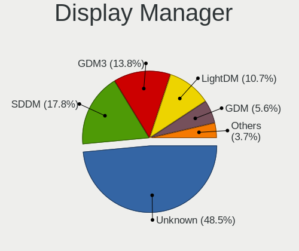
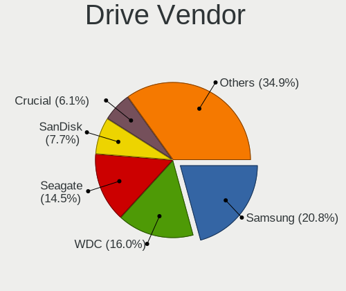
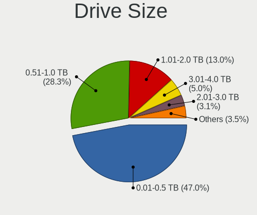
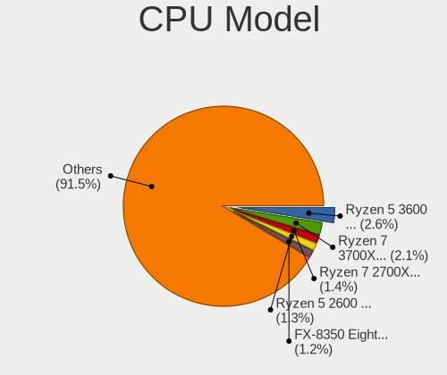
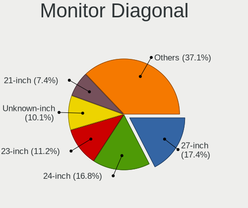
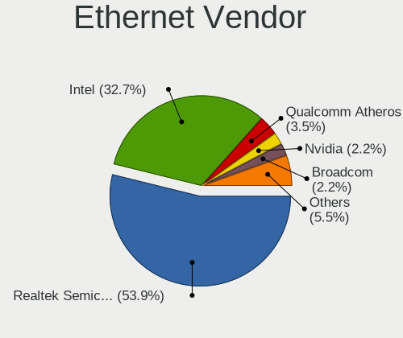

Linux in Germany - Tested Hardware & Statistics (Desktops)
----------------------------------------------------------

A project to collect tested hardware configurations for Linux in Germany.

Anyone can contribute to this report by the [hw-probe](https://github.com/linuxhw/hw-probe) tool:

    sudo -E hw-probe -all -upload

Please contribute! Especially if your hardware is rare.

Contents
--------

* [ Test Cases ](#test-cases)

* [ System ](#system)
  - [ OS                       ](#os)
  - [ OS Family                ](#os-family)
  - [ Kernel                   ](#kernel)
  - [ Kernel Family            ](#kernel-family)
  - [ Kernel Major Ver.        ](#kernel-major-ver)
  - [ Arch                     ](#arch)
  - [ DE                       ](#de)
  - [ Display Server           ](#display-server)
  - [ Display Manager          ](#display-manager)
  - [ OS Lang                  ](#os-lang)
  - [ Boot Mode                ](#boot-mode)
  - [ Filesystem               ](#filesystem)
  - [ Part. scheme             ](#part-scheme)
  - [ Dual Boot with Linux/BSD ](#dual-boot-with-linuxbsd)
  - [ Dual Boot (Win)          ](#dual-boot-win)

* [ Board ](#board)
  - [ Vendor                   ](#vendor)
  - [ Model                    ](#model)
  - [ Model Family             ](#model-family)
  - [ MFG Year                 ](#mfg-year)
  - [ Form Factor              ](#form-factor)
  - [ Secure Boot              ](#secure-boot)
  - [ Coreboot                 ](#coreboot)
  - [ RAM Size                 ](#ram-size)
  - [ RAM Used                 ](#ram-used)
  - [ Total Drives             ](#total-drives)
  - [ Has CD-ROM               ](#has-cd-rom)
  - [ Has Ethernet             ](#has-ethernet)
  - [ Has WiFi                 ](#has-wifi)
  - [ Has Bluetooth            ](#has-bluetooth)

* [ Location ](#location)
  - [ Country                  ](#country)
  - [ City                     ](#city)

* [ Drives ](#drives)
  - [ Drive Vendor             ](#drive-vendor)
  - [ Drive Model              ](#drive-model)
  - [ HDD Vendor               ](#hdd-vendor)
  - [ SSD Vendor               ](#ssd-vendor)
  - [ Drive Kind               ](#drive-kind)
  - [ Drive Connector          ](#drive-connector)
  - [ Drive Size               ](#drive-size)
  - [ Space Total              ](#space-total)
  - [ Space Used               ](#space-used)
  - [ Malfunc. Drives          ](#malfunc-drives)
  - [ Malfunc. Drive Vendor    ](#malfunc-drive-vendor)
  - [ Malfunc. HDD Vendor      ](#malfunc-hdd-vendor)
  - [ Malfunc. Drive Kind      ](#malfunc-drive-kind)
  - [ Failed Drives            ](#failed-drives)
  - [ Failed Drive Vendor      ](#failed-drive-vendor)
  - [ Drive Status             ](#drive-status)

* [ Storage controller ](#storage-controller)
  - [ Storage Vendor           ](#storage-vendor)
  - [ Storage Model            ](#storage-model)
  - [ Storage Kind             ](#storage-kind)

* [ Processor ](#processor)
  - [ CPU Vendor               ](#cpu-vendor)
  - [ CPU Model                ](#cpu-model)
  - [ CPU Model Family         ](#cpu-model-family)
  - [ CPU Cores                ](#cpu-cores)
  - [ CPU Sockets              ](#cpu-sockets)
  - [ CPU Threads              ](#cpu-threads)
  - [ CPU Op-Modes             ](#cpu-op-modes)
  - [ CPU Microcode            ](#cpu-microcode)
  - [ CPU Microarch            ](#cpu-microarch)

* [ Graphics ](#graphics)
  - [ GPU Vendor               ](#gpu-vendor)
  - [ GPU Model                ](#gpu-model)
  - [ GPU Combo                ](#gpu-combo)
  - [ GPU Driver               ](#gpu-driver)
  - [ GPU Memory               ](#gpu-memory)

* [ Monitor ](#monitor)
  - [ Monitor Vendor           ](#monitor-vendor)
  - [ Monitor Model            ](#monitor-model)
  - [ Monitor Resolution       ](#monitor-resolution)
  - [ Monitor Diagonal         ](#monitor-diagonal)
  - [ Monitor Width            ](#monitor-width)
  - [ Aspect Ratio             ](#aspect-ratio)
  - [ Monitor Area             ](#monitor-area)
  - [ Pixel Density            ](#pixel-density)
  - [ Multiple Monitors        ](#multiple-monitors)

* [ Network ](#network)
  - [ Net Controller Vendor    ](#net-controller-vendor)
  - [ Net Controller Model     ](#net-controller-model)
  - [ Wireless Vendor          ](#wireless-vendor)
  - [ Wireless Model           ](#wireless-model)
  - [ Ethernet Vendor          ](#ethernet-vendor)
  - [ Ethernet Model           ](#ethernet-model)
  - [ Net Controller Kind      ](#net-controller-kind)
  - [ Used Controller          ](#used-controller)
  - [ NICs                     ](#nics)
  - [ IPv6                     ](#ipv6)

* [ Bluetooth ](#bluetooth)
  - [ Bluetooth Vendor         ](#bluetooth-vendor)
  - [ Bluetooth Model          ](#bluetooth-model)

* [ Sound ](#sound)
  - [ Sound Vendor             ](#sound-vendor)
  - [ Sound Model              ](#sound-model)

* [ Memory ](#memory)
  - [ Memory Vendor            ](#memory-vendor)
  - [ Memory Model             ](#memory-model)
  - [ Memory Kind              ](#memory-kind)
  - [ Memory Form Factor       ](#memory-form-factor)
  - [ Memory Size              ](#memory-size)
  - [ Memory Speed             ](#memory-speed)

* [ Printers & scanners ](#printers--scanners)
  - [ Printer Vendor           ](#printer-vendor)
  - [ Printer Model            ](#printer-model)
  - [ Scanner Vendor           ](#scanner-vendor)
  - [ Scanner Model            ](#scanner-model)

* [ Camera ](#camera)
  - [ Camera Vendor            ](#camera-vendor)
  - [ Camera Model             ](#camera-model)

* [ Security ](#security)
  - [ Fingerprint Vendor       ](#fingerprint-vendor)
  - [ Fingerprint Model        ](#fingerprint-model)
  - [ Chipcard Vendor          ](#chipcard-vendor)
  - [ Chipcard Model           ](#chipcard-model)

* [ Unsupported ](#unsupported)
  - [ Unsupported Devices      ](#unsupported-devices)
  - [ Unsupported Device Types ](#unsupported-device-types)

Test Cases
----------

Total: 9531

| Vendor        | Model                       | Probe                                                      | Date         |
|---------------|-----------------------------|------------------------------------------------------------|--------------|
| ASRock        | Z97 Anniversary             | [558ca4b56e](https://linux-hardware.org/?probe=558ca4b56e) | Oct 01, 2022 |
| ASUSTek       | ROG STRIX X570-F GAMING     | [ff1c77c45a](https://linux-hardware.org/?probe=ff1c77c45a) | Oct 01, 2022 |
| ASUSTek       | ROG STRIX B550-E GAMING     | [8a75a2c50b](https://linux-hardware.org/?probe=8a75a2c50b) | Oct 01, 2022 |
| MSI           | MAG B550 TOMAHAWK           | [a7268f8fba](https://linux-hardware.org/?probe=a7268f8fba) | Oct 01, 2022 |
| Lenovo        | ThinkCentre M58 9728AHG     | [a2bc7fc88f](https://linux-hardware.org/?probe=a2bc7fc88f) | Oct 01, 2022 |
| Medion        | MS-7366                     | [c8138f4ffe](https://linux-hardware.org/?probe=c8138f4ffe) | Oct 01, 2022 |
| Medion        | MS-7366                     | [c25c10b259](https://linux-hardware.org/?probe=c25c10b259) | Oct 01, 2022 |
| ASRock        | H87M Pro4                   | [bf8e635afa](https://linux-hardware.org/?probe=bf8e635afa) | Oct 01, 2022 |
| Fujitsu       | D2990-A2 S26361-D2990-A2    | [982b143d73](https://linux-hardware.org/?probe=982b143d73) | Oct 01, 2022 |
| MSI           | MAG B550 TOMAHAWK           | [151510a184](https://linux-hardware.org/?probe=151510a184) | Oct 01, 2022 |
| MSI           | X370 GAMING PLUS            | [2aa92cb043](https://linux-hardware.org/?probe=2aa92cb043) | Oct 01, 2022 |
| ASUSTek       | M4N72-E                     | [c1c308be2a](https://linux-hardware.org/?probe=c1c308be2a) | Oct 01, 2022 |
| MSI           | A55M-E33                    | [13bd049f55](https://linux-hardware.org/?probe=13bd049f55) | Sep 30, 2022 |
| MSI           | MEG X570 UNIFY              | [4d2e449699](https://linux-hardware.org/?probe=4d2e449699) | Sep 30, 2022 |
| ASUSTek       | M5A78L-M LX3                | [938523ed34](https://linux-hardware.org/?probe=938523ed34) | Sep 30, 2022 |
| ASRock        | H87M Pro4                   | [f8bb8b6de8](https://linux-hardware.org/?probe=f8bb8b6de8) | Sep 30, 2022 |
| MSI           | B450 GAMING PLUS MAX        | [c06e7e3586](https://linux-hardware.org/?probe=c06e7e3586) | Sep 30, 2022 |
| ASUSTek       | PRIME B450M-A               | [cfe1aba7e6](https://linux-hardware.org/?probe=cfe1aba7e6) | Sep 30, 2022 |
| MSI           | Z97 MPOWER                  | [f16a15a5b7](https://linux-hardware.org/?probe=f16a15a5b7) | Sep 30, 2022 |
| Gigabyte      | B660M DS3H AX DDR4          | [97e7d2d80f](https://linux-hardware.org/?probe=97e7d2d80f) | Sep 30, 2022 |
| ASUSTek       | EX-A320M-GAMING             | [33d5d34654](https://linux-hardware.org/?probe=33d5d34654) | Sep 30, 2022 |
| Lenovo        | ThinkCentre M58 9728AHG     | [773ae7f01e](https://linux-hardware.org/?probe=773ae7f01e) | Sep 30, 2022 |
| ASRock        | Q1900M                      | [e6804dc6b7](https://linux-hardware.org/?probe=e6804dc6b7) | Sep 29, 2022 |
| HP            | 3398                        | [c2190a0657](https://linux-hardware.org/?probe=c2190a0657) | Sep 29, 2022 |
| ASUSTek       | AM1I-A                      | [201c745d4e](https://linux-hardware.org/?probe=201c745d4e) | Sep 29, 2022 |
| ASRock        | Z97 Pro3                    | [7b34a50df8](https://linux-hardware.org/?probe=7b34a50df8) | Sep 28, 2022 |
| Gigabyte      | H81M-D2W                    | [467845e1c1](https://linux-hardware.org/?probe=467845e1c1) | Sep 28, 2022 |
| Medion        | MS-7707                     | [240ac993dc](https://linux-hardware.org/?probe=240ac993dc) | Sep 28, 2022 |
| MSI           | 2A9Ch                       | [16d3df803b](https://linux-hardware.org/?probe=16d3df803b) | Sep 28, 2022 |
| ASRock        | B450 Pro4                   | [9053250a2c](https://linux-hardware.org/?probe=9053250a2c) | Sep 27, 2022 |
| ASUSTek       | PRIME B550-PLUS             | [1e0110dd5c](https://linux-hardware.org/?probe=1e0110dd5c) | Sep 27, 2022 |
| ASRock        | Z97 Anniversary             | [6132513116](https://linux-hardware.org/?probe=6132513116) | Sep 27, 2022 |
| MSI           | B550-A PRO                  | [2a5a7aeb95](https://linux-hardware.org/?probe=2a5a7aeb95) | Sep 27, 2022 |
| Medion        | MS-7707                     | [a88f6ba4da](https://linux-hardware.org/?probe=a88f6ba4da) | Sep 27, 2022 |
| MSI           | X570-A PRO                  | [a26dee0cd5](https://linux-hardware.org/?probe=a26dee0cd5) | Sep 27, 2022 |
| Gigabyte      | GA-78LMT-USB3 R2 sex        | [63cd838fcc](https://linux-hardware.org/?probe=63cd838fcc) | Sep 27, 2022 |
| Medion        | MS-7728                     | [0b9b2ca570](https://linux-hardware.org/?probe=0b9b2ca570) | Sep 27, 2022 |
| ASUSTek       | Z170-K                      | [5048b5bef9](https://linux-hardware.org/?probe=5048b5bef9) | Sep 27, 2022 |
| ASUSTek       | H97I-PLUS                   | [31036cd828](https://linux-hardware.org/?probe=31036cd828) | Sep 27, 2022 |
| ASUSTek       | H97I-PLUS                   | [fa2a23dff8](https://linux-hardware.org/?probe=fa2a23dff8) | Sep 27, 2022 |
| Lenovo        | MAHOBAY NO DPK              | [1979013fa2](https://linux-hardware.org/?probe=1979013fa2) | Sep 27, 2022 |
| HP            | 1494                        | [aa2bd7da6c](https://linux-hardware.org/?probe=aa2bd7da6c) | Sep 26, 2022 |
| ASRock        | X300M-STX                   | [7bb3e847e2](https://linux-hardware.org/?probe=7bb3e847e2) | Sep 26, 2022 |
| ASRock        | A75M-HVS                    | [75d51e6237](https://linux-hardware.org/?probe=75d51e6237) | Sep 26, 2022 |
| HP            | 0B40h                       | [d72bb749ff](https://linux-hardware.org/?probe=d72bb749ff) | Sep 26, 2022 |
| Lenovo        | Myrtle CRB SDK0J40700 WI... | [508c873693](https://linux-hardware.org/?probe=508c873693) | Sep 26, 2022 |
| Gigabyte      | X399 AORUS XTREME-CF        | [762ad6e460](https://linux-hardware.org/?probe=762ad6e460) | Sep 26, 2022 |
| ASRock        | A75M-HVS                    | [fa3be9d376](https://linux-hardware.org/?probe=fa3be9d376) | Sep 25, 2022 |
| ASUSTek       | B150-PLUS                   | [c64181dd6a](https://linux-hardware.org/?probe=c64181dd6a) | Sep 25, 2022 |
| ASRockRack    | X570D4U-2L2T                | [779faa3cfd](https://linux-hardware.org/?probe=779faa3cfd) | Sep 25, 2022 |
| Dell          | 0Y2MRG A00                  | [af1ab104ed](https://linux-hardware.org/?probe=af1ab104ed) | Sep 25, 2022 |
| ASRock        | B450M-HDV                   | [a1639d1654](https://linux-hardware.org/?probe=a1639d1654) | Sep 25, 2022 |
| ASRock        | J3160M                      | [c9cc54f48e](https://linux-hardware.org/?probe=c9cc54f48e) | Sep 25, 2022 |
| ASUSTek       | ROG STRIX B550-F GAMING     | [208c7988f7](https://linux-hardware.org/?probe=208c7988f7) | Sep 25, 2022 |
| ASRock        | QC5000M-ITX/PH              | [571b95c201](https://linux-hardware.org/?probe=571b95c201) | Sep 25, 2022 |
| ASUSTek       | P8Z77-V DELUXE              | [cd57bfa69c](https://linux-hardware.org/?probe=cd57bfa69c) | Sep 24, 2022 |
| ASUSTek       | P8Z77-V DELUXE              | [bad1de13cc](https://linux-hardware.org/?probe=bad1de13cc) | Sep 24, 2022 |
| Medion        | MS-7616                     | [72af7b904f](https://linux-hardware.org/?probe=72af7b904f) | Sep 24, 2022 |
| ASUSTek       | TUF Gaming B550-PLUS WIF... | [0daf5c5df5](https://linux-hardware.org/?probe=0daf5c5df5) | Sep 24, 2022 |
| Fujitsu Si... | MS-7504VP-PV                | [fa75c2dfde](https://linux-hardware.org/?probe=fa75c2dfde) | Sep 24, 2022 |
| MSI           | H510M PRO                   | [bb7475d072](https://linux-hardware.org/?probe=bb7475d072) | Sep 24, 2022 |
| ASRock        | X300M-STX                   | [c354f2b293](https://linux-hardware.org/?probe=c354f2b293) | Sep 24, 2022 |
| Lenovo        | NO DPK                      | [7bdaedd0f7](https://linux-hardware.org/?probe=7bdaedd0f7) | Sep 24, 2022 |
| Lenovo        | SHARKBAY SDK0E50510 WIN     | [fd63352b24](https://linux-hardware.org/?probe=fd63352b24) | Sep 24, 2022 |
| MSI           | MS-7358                     | [29d88b0c3b](https://linux-hardware.org/?probe=29d88b0c3b) | Sep 23, 2022 |
| Medion        | B460H6-EM                   | [9ab2a06631](https://linux-hardware.org/?probe=9ab2a06631) | Sep 23, 2022 |
| ASRock        | A320M-DVS R4.0              | [42deee504b](https://linux-hardware.org/?probe=42deee504b) | Sep 23, 2022 |
| ASUSTek       | PRIME B365M-A               | [c4c88d72ae](https://linux-hardware.org/?probe=c4c88d72ae) | Sep 23, 2022 |
| HP            | 0AA8h                       | [9c02e3fc31](https://linux-hardware.org/?probe=9c02e3fc31) | Sep 23, 2022 |
| Fujitsu Si... | MS-7504VP-PV                | [f0916efbf9](https://linux-hardware.org/?probe=f0916efbf9) | Sep 23, 2022 |
| Gigabyte      | B660I AORUS PRO DDR4        | [810c7883d4](https://linux-hardware.org/?probe=810c7883d4) | Sep 23, 2022 |
| HP            | 876C SMVB                   | [c6fbf7c631](https://linux-hardware.org/?probe=c6fbf7c631) | Sep 23, 2022 |
| HP            | 1494                        | [cd3778e7eb](https://linux-hardware.org/?probe=cd3778e7eb) | Sep 22, 2022 |
| HP            | 1494                        | [4a3ad3e89d](https://linux-hardware.org/?probe=4a3ad3e89d) | Sep 22, 2022 |
| MSI           | X470 GAMING PRO             | [a48daa11cd](https://linux-hardware.org/?probe=a48daa11cd) | Sep 22, 2022 |
| ASUSTek       | M5A78L-M LX3                | [75a6fc3a08](https://linux-hardware.org/?probe=75a6fc3a08) | Sep 22, 2022 |
| ASUSTek       | M5A99X EVO                  | [48f4738047](https://linux-hardware.org/?probe=48f4738047) | Sep 22, 2022 |
| ASUSTek       | M5A99X EVO                  | [a484071017](https://linux-hardware.org/?probe=a484071017) | Sep 22, 2022 |
| ASUSTek       | B85M-E                      | [07477a078f](https://linux-hardware.org/?probe=07477a078f) | Sep 22, 2022 |
| HP            | 3647h                       | [7c54133b32](https://linux-hardware.org/?probe=7c54133b32) | Sep 22, 2022 |
| ASUSTek       | Z97-PRO GAMER               | [f6e7ad269e](https://linux-hardware.org/?probe=f6e7ad269e) | Sep 22, 2022 |
| ASUSTek       | PRIME B365M-A               | [289b9dcac8](https://linux-hardware.org/?probe=289b9dcac8) | Sep 21, 2022 |
| MSI           | 2A9C                        | [0c026ab669](https://linux-hardware.org/?probe=0c026ab669) | Sep 21, 2022 |
| BESSTAR Te... | UM350                       | [62a9723eb7](https://linux-hardware.org/?probe=62a9723eb7) | Sep 21, 2022 |
| ASUSTek       | A8N-SLI                     | [95d20defd7](https://linux-hardware.org/?probe=95d20defd7) | Sep 21, 2022 |
| MSI           | X470 GAMING PRO             | [5c64c61090](https://linux-hardware.org/?probe=5c64c61090) | Sep 21, 2022 |
| ASRock        | A75M-HVS                    | [a2fb3b0ed7](https://linux-hardware.org/?probe=a2fb3b0ed7) | Sep 21, 2022 |
| ASRock        | A75M-HVS                    | [0f81852612](https://linux-hardware.org/?probe=0f81852612) | Sep 21, 2022 |
| Lenovo        | ThinkCentre M81 5049W16     | [67067bfc09](https://linux-hardware.org/?probe=67067bfc09) | Sep 21, 2022 |
| HP            | 3647h                       | [64cc139cac](https://linux-hardware.org/?probe=64cc139cac) | Sep 21, 2022 |
| MSI           | X470 GAMING PLUS MAX        | [ed6f75ec9f](https://linux-hardware.org/?probe=ed6f75ec9f) | Sep 20, 2022 |
| HP            | 1589                        | [da376a40a1](https://linux-hardware.org/?probe=da376a40a1) | Sep 20, 2022 |
| Gigabyte      | X570 I AORUS PRO WIFI       | [1869422fde](https://linux-hardware.org/?probe=1869422fde) | Sep 20, 2022 |
| ASUSTek       | M5A99X EVO                  | [c59de2d375](https://linux-hardware.org/?probe=c59de2d375) | Sep 20, 2022 |
| MSI           | B450M PRO-VDH MAX           | [06d6be8b85](https://linux-hardware.org/?probe=06d6be8b85) | Sep 20, 2022 |
| ASUSTek       | M5A99X EVO                  | [c93edfa02c](https://linux-hardware.org/?probe=c93edfa02c) | Sep 20, 2022 |
| Lenovo        | SHARKBAY SDK0E50510 WIN     | [88b0561dbc](https://linux-hardware.org/?probe=88b0561dbc) | Sep 20, 2022 |
| Gigabyte      | EP45T-UD3R                  | [979765d106](https://linux-hardware.org/?probe=979765d106) | Sep 20, 2022 |
| Gigabyte      | GA-78LMT-USB3               | [a0a61b5d8c](https://linux-hardware.org/?probe=a0a61b5d8c) | Sep 20, 2022 |
| Gigabyte      | GA-78LMT-USB3               | [bb8e3ae62a](https://linux-hardware.org/?probe=bb8e3ae62a) | Sep 20, 2022 |
| ASUSTek       | TUF B450-PRO GAMING         | [37673aa4e2](https://linux-hardware.org/?probe=37673aa4e2) | Sep 20, 2022 |
| ASUSTek       | PRIME X470-PRO              | [a6857e4b03](https://linux-hardware.org/?probe=a6857e4b03) | Sep 19, 2022 |
| Dell          | 0GX297                      | [57e334a0c2](https://linux-hardware.org/?probe=57e334a0c2) | Sep 19, 2022 |
| ASUSTek       | ROG STRIX X570-F GAMING     | [7a1dbe2204](https://linux-hardware.org/?probe=7a1dbe2204) | Sep 19, 2022 |
| ASUSTek       | P5K-VM                      | [d90ca77597](https://linux-hardware.org/?probe=d90ca77597) | Sep 19, 2022 |
| ASUSTek       | TUF B450-PRO GAMING         | [8c4a94cb33](https://linux-hardware.org/?probe=8c4a94cb33) | Sep 19, 2022 |
| Foxconn       | 2ADA                        | [736a1c0eec](https://linux-hardware.org/?probe=736a1c0eec) | Sep 19, 2022 |
| ASRock        | AB350M-HDV                  | [22b753798c](https://linux-hardware.org/?probe=22b753798c) | Sep 19, 2022 |
| ASRock        | Z97 Anniversary             | [8c308a3e22](https://linux-hardware.org/?probe=8c308a3e22) | Sep 19, 2022 |
| MSI           | Z590-A PRO                  | [42bc6e4e69](https://linux-hardware.org/?probe=42bc6e4e69) | Sep 19, 2022 |
| MSI           | MPG X570 GAMING EDGE WIF... | [a479d9ef5f](https://linux-hardware.org/?probe=a479d9ef5f) | Sep 19, 2022 |
| ASRock        | Z590M-ITX/ax                | [d202b0a504](https://linux-hardware.org/?probe=d202b0a504) | Sep 19, 2022 |
| ASUSTek       | TUF Gaming B550-PLUS        | [ca1b76cefe](https://linux-hardware.org/?probe=ca1b76cefe) | Sep 19, 2022 |
| Gigabyte      | EP45-UD3                    | [3a6ef7d23b](https://linux-hardware.org/?probe=3a6ef7d23b) | Sep 19, 2022 |
| HP            | 3647h                       | [63d5e6ee6a](https://linux-hardware.org/?probe=63d5e6ee6a) | Sep 19, 2022 |
| Lenovo        | ThinkCentre M71e 3157AE2    | [9022058466](https://linux-hardware.org/?probe=9022058466) | Sep 19, 2022 |
| Gigabyte      | Z77-DS3H                    | [5de472d6c0](https://linux-hardware.org/?probe=5de472d6c0) | Sep 18, 2022 |
| ASUSTek       | M5A97 R2.0                  | [a7b0a5d6f3](https://linux-hardware.org/?probe=a7b0a5d6f3) | Sep 18, 2022 |
| Dell          | 0Y2MRG A00                  | [f523e394ba](https://linux-hardware.org/?probe=f523e394ba) | Sep 18, 2022 |
| ASUSTek       | P7H55-M LX/USB3             | [76eedbf647](https://linux-hardware.org/?probe=76eedbf647) | Sep 18, 2022 |
| MSI           | MPG B550 GAMING EDGE WIF... | [543fad9f1c](https://linux-hardware.org/?probe=543fad9f1c) | Sep 18, 2022 |
| ASUSTek       | P7H55-M LX/USB3             | [95015c9edb](https://linux-hardware.org/?probe=95015c9edb) | Sep 18, 2022 |
| Medion        | MS-7707                     | [df4472374c](https://linux-hardware.org/?probe=df4472374c) | Sep 18, 2022 |
| Medion        | MS-7707                     | [248b893ed4](https://linux-hardware.org/?probe=248b893ed4) | Sep 18, 2022 |
| ASUSTek       | ROG STRIX Z690-A GAMING ... | [21da8441d5](https://linux-hardware.org/?probe=21da8441d5) | Sep 18, 2022 |
| Lenovo        | ThinkStation D20 4158F76    | [d6b369855e](https://linux-hardware.org/?probe=d6b369855e) | Sep 18, 2022 |
| Dell          | 0Y2MRG A00                  | [38a87b4cda](https://linux-hardware.org/?probe=38a87b4cda) | Sep 18, 2022 |
| MSI           | MAG Z590 TORPEDO            | [2daced0309](https://linux-hardware.org/?probe=2daced0309) | Sep 17, 2022 |
| Biostar       | H410MH S2                   | [832dd81851](https://linux-hardware.org/?probe=832dd81851) | Sep 17, 2022 |
| ASUSTek       | M5A99X EVO                  | [5653a39e40](https://linux-hardware.org/?probe=5653a39e40) | Sep 17, 2022 |
| HP            | 0AECh D                     | [23adee752f](https://linux-hardware.org/?probe=23adee752f) | Sep 17, 2022 |
| Fujitsu       | D3617-A1 S26361-D3617-A1    | [51d9d832b7](https://linux-hardware.org/?probe=51d9d832b7) | Sep 17, 2022 |
| ASUSTek       | P8P67                       | [a790b35cc1](https://linux-hardware.org/?probe=a790b35cc1) | Sep 17, 2022 |
| Unknown       | Unknown                     | [e61dc9628f](https://linux-hardware.org/?probe=e61dc9628f) | Sep 17, 2022 |
| HP            | 3647h                       | [0e821515bd](https://linux-hardware.org/?probe=0e821515bd) | Sep 17, 2022 |
| ASUSTek       | P5K                         | [4a3727841e](https://linux-hardware.org/?probe=4a3727841e) | Sep 17, 2022 |
| ASUSTek       | PRIME A520M-A II            | [0bec316a0b](https://linux-hardware.org/?probe=0bec316a0b) | Sep 17, 2022 |
| ASUSTek       | P8Z77-M                     | [c06544862e](https://linux-hardware.org/?probe=c06544862e) | Sep 16, 2022 |
| ASUSTek       | PRIME B365M-A               | [e191511194](https://linux-hardware.org/?probe=e191511194) | Sep 16, 2022 |
| Gigabyte      | 970A-DS3P                   | [c362a2f06e](https://linux-hardware.org/?probe=c362a2f06e) | Sep 16, 2022 |
| ASUSTek       | KCMA-D8                     | [dc8ecec94f](https://linux-hardware.org/?probe=dc8ecec94f) | Sep 16, 2022 |
| Dell          | 0X8582                      | [3498499960](https://linux-hardware.org/?probe=3498499960) | Sep 16, 2022 |
| Biostar       | A10N-8800E                  | [4a06fb8bfa](https://linux-hardware.org/?probe=4a06fb8bfa) | Sep 16, 2022 |
| Gigabyte      | EP45T-UD3R                  | [04a99c2508](https://linux-hardware.org/?probe=04a99c2508) | Sep 16, 2022 |
| HP            | 82F2 A01                    | [f97faeff54](https://linux-hardware.org/?probe=f97faeff54) | Sep 16, 2022 |
| ASUSTek       | ROG STRIX Z690-A GAMING ... | [081d4b1d50](https://linux-hardware.org/?probe=081d4b1d50) | Sep 16, 2022 |
| ASUSTek       | P8Z68-V LX                  | [07dd87b76b](https://linux-hardware.org/?probe=07dd87b76b) | Sep 16, 2022 |
| Lenovo        | ThinkStation D20 4158F76    | [45a3f96ced](https://linux-hardware.org/?probe=45a3f96ced) | Sep 16, 2022 |
| MSI           | B450-A PRO MAX              | [c63f6d45b4](https://linux-hardware.org/?probe=c63f6d45b4) | Sep 16, 2022 |
| ASUSTek       | P5K-VM                      | [b0242689c2](https://linux-hardware.org/?probe=b0242689c2) | Sep 16, 2022 |
| Fujitsu       | D3028-A1 S26361-D3028-A1    | [26699f7431](https://linux-hardware.org/?probe=26699f7431) | Sep 16, 2022 |
| Packard Be... | IMEDIA S3850                | [1fd4536a73](https://linux-hardware.org/?probe=1fd4536a73) | Sep 16, 2022 |
| Fujitsu       | D3028-A1 S26361-D3028-A1    | [b8262094b0](https://linux-hardware.org/?probe=b8262094b0) | Sep 16, 2022 |
| Gigabyte      | AB350N-Gaming WIFI-CF       | [dcaf7e8bd0](https://linux-hardware.org/?probe=dcaf7e8bd0) | Sep 15, 2022 |
| ASUSTek       | CROSSHAIR V FORMULA-Z       | [68749016d1](https://linux-hardware.org/?probe=68749016d1) | Sep 15, 2022 |
| Foxconn       | 2ADA                        | [812586d5e3](https://linux-hardware.org/?probe=812586d5e3) | Sep 15, 2022 |
| Fujitsu       | D3221-A1 S26361-D3221-A1    | [875435f3f0](https://linux-hardware.org/?probe=875435f3f0) | Sep 15, 2022 |
| Acer          | FMP55                       | [6721345b03](https://linux-hardware.org/?probe=6721345b03) | Sep 15, 2022 |
| Fujitsu       | D3221-A1 S26361-D3221-A1    | [3ff6899749](https://linux-hardware.org/?probe=3ff6899749) | Sep 15, 2022 |
| Acer          | FMP55                       | [450dc952d1](https://linux-hardware.org/?probe=450dc952d1) | Sep 15, 2022 |
| Gigabyte      | EP45T-UD3R                  | [007e9d4205](https://linux-hardware.org/?probe=007e9d4205) | Sep 15, 2022 |
| HP            | 3048h                       | [34d67ab175](https://linux-hardware.org/?probe=34d67ab175) | Sep 15, 2022 |
| HP            | 876C SMVB                   | [adc81b2fd5](https://linux-hardware.org/?probe=adc81b2fd5) | Sep 15, 2022 |
| ASUSTek       | H97I-PLUS                   | [5269bfb990](https://linux-hardware.org/?probe=5269bfb990) | Sep 14, 2022 |
| MSI           | B450-A PRO MAX              | [f1c8ae3891](https://linux-hardware.org/?probe=f1c8ae3891) | Sep 14, 2022 |
| Gigabyte      | P35C-DS3R                   | [eb49db3a8c](https://linux-hardware.org/?probe=eb49db3a8c) | Sep 14, 2022 |
| HP            | 1495                        | [462389df36](https://linux-hardware.org/?probe=462389df36) | Sep 14, 2022 |
| ASUSTek       | Maximus VIII RANGER         | [832824de54](https://linux-hardware.org/?probe=832824de54) | Sep 14, 2022 |
| HP            | 876C SMVB                   | [347ab44533](https://linux-hardware.org/?probe=347ab44533) | Sep 14, 2022 |
| Gigabyte      | X470 AORUS GAMING 7 WIFI... | [e7cb70c141](https://linux-hardware.org/?probe=e7cb70c141) | Sep 14, 2022 |
| Gigabyte      | X470 AORUS ULTRA GAMING-... | [754d0f3a2b](https://linux-hardware.org/?probe=754d0f3a2b) | Sep 14, 2022 |
| Lenovo        | ThinkCentre M71e 3157AE2    | [d88e0026dc](https://linux-hardware.org/?probe=d88e0026dc) | Sep 14, 2022 |
| ASUSTek       | ROG STRIX X570-F GAMING     | [175c84f6ea](https://linux-hardware.org/?probe=175c84f6ea) | Sep 13, 2022 |
| Gigabyte      | B365M H                     | [20125b1c13](https://linux-hardware.org/?probe=20125b1c13) | Sep 13, 2022 |
| ASUSTek       | M5A99X EVO                  | [a27df20eda](https://linux-hardware.org/?probe=a27df20eda) | Sep 13, 2022 |
| ASUSTek       | M5A99X EVO                  | [ae9712f9b3](https://linux-hardware.org/?probe=ae9712f9b3) | Sep 13, 2022 |
| HP            | 3647h                       | [e94712a856](https://linux-hardware.org/?probe=e94712a856) | Sep 13, 2022 |
| ASUSTek       | P7P55 LX                    | [cc28ed218f](https://linux-hardware.org/?probe=cc28ed218f) | Sep 13, 2022 |
| HP            | 876C SMVB                   | [61df16cfc9](https://linux-hardware.org/?probe=61df16cfc9) | Sep 13, 2022 |
| Medion        | MS-7707                     | [68428aab84](https://linux-hardware.org/?probe=68428aab84) | Sep 13, 2022 |
| HP            | 876C SMVB                   | [15ec81ce9d](https://linux-hardware.org/?probe=15ec81ce9d) | Sep 13, 2022 |
| HP            | 3647h                       | [c40ded9736](https://linux-hardware.org/?probe=c40ded9736) | Sep 13, 2022 |
| MSI           | Z97 MPOWER                  | [a98aedda05](https://linux-hardware.org/?probe=a98aedda05) | Sep 13, 2022 |
| Fujitsu       | D3162-A1 S26361-D3162-A1    | [00bca0eeff](https://linux-hardware.org/?probe=00bca0eeff) | Sep 12, 2022 |
| ASUSTek       | CROSSHAIR V FORMULA-Z       | [717942ca91](https://linux-hardware.org/?probe=717942ca91) | Sep 12, 2022 |
| Shuttle       | XH310V2                     | [c99efae947](https://linux-hardware.org/?probe=c99efae947) | Sep 12, 2022 |
| ASRock        | B450 Pro4                   | [d750223c3f](https://linux-hardware.org/?probe=d750223c3f) | Sep 12, 2022 |
| Gigabyte      | H81M-D2V                    | [6da1838df1](https://linux-hardware.org/?probe=6da1838df1) | Sep 12, 2022 |
| Gigabyte      | MQLP3AP-00                  | [b7dd480183](https://linux-hardware.org/?probe=b7dd480183) | Sep 12, 2022 |
| Unknown       | Unknown                     | [637418c4f3](https://linux-hardware.org/?probe=637418c4f3) | Sep 12, 2022 |
| ASUSTek       | Pro WS 565-ACE              | [e8da6da2b0](https://linux-hardware.org/?probe=e8da6da2b0) | Sep 12, 2022 |
| ASUSTek       | PRIME X370-PRO              | [2228f0dc13](https://linux-hardware.org/?probe=2228f0dc13) | Sep 12, 2022 |
| HP            | 304Bh                       | [0a7bcbdd9e](https://linux-hardware.org/?probe=0a7bcbdd9e) | Sep 11, 2022 |
| Gigabyte      | 970A-DS3P                   | [581cd5c8f3](https://linux-hardware.org/?probe=581cd5c8f3) | Sep 11, 2022 |
| Gigabyte      | G1.Sniper Z97               | [445e54016b](https://linux-hardware.org/?probe=445e54016b) | Sep 11, 2022 |
| Pegatron      | Benicia                     | [1f8dceb256](https://linux-hardware.org/?probe=1f8dceb256) | Sep 11, 2022 |
| Gigabyte      | Z77-DS3H                    | [7532844cd7](https://linux-hardware.org/?probe=7532844cd7) | Sep 11, 2022 |
| Dell          | 0GY6Y8 A03                  | [675c43f981](https://linux-hardware.org/?probe=675c43f981) | Sep 11, 2022 |
| ASUSTek       | ROG STRIX B450-F GAMING     | [1e43753d7a](https://linux-hardware.org/?probe=1e43753d7a) | Sep 10, 2022 |
| ASRock        | G41M-S3                     | [2cdcaebd43](https://linux-hardware.org/?probe=2cdcaebd43) | Sep 10, 2022 |
| ASUSTek       | M5A78L/USB3                 | [49158d0782](https://linux-hardware.org/?probe=49158d0782) | Sep 10, 2022 |
| MSI           | B550-A PRO                  | [f1bdda02e5](https://linux-hardware.org/?probe=f1bdda02e5) | Sep 10, 2022 |
| ASRock        | J3455B-ITX                  | [41d44c11cc](https://linux-hardware.org/?probe=41d44c11cc) | Sep 10, 2022 |
| ASUSTek       | H81M-E                      | [1a9835fb13](https://linux-hardware.org/?probe=1a9835fb13) | Sep 10, 2022 |
| ASUSTek       | ROG STRIX B450-F GAMING     | [5aa9031e93](https://linux-hardware.org/?probe=5aa9031e93) | Sep 10, 2022 |
| ASUSTek       | ROG STRIX B450-F GAMING     | [81fcfbb095](https://linux-hardware.org/?probe=81fcfbb095) | Sep 10, 2022 |
| HP            | 3647h                       | [a6a28c7e12](https://linux-hardware.org/?probe=a6a28c7e12) | Sep 10, 2022 |
| Gigabyte      | Z77X-D3H                    | [a81bea8a93](https://linux-hardware.org/?probe=a81bea8a93) | Sep 10, 2022 |
| Gigabyte      | Z77X-D3H                    | [aea58c6ced](https://linux-hardware.org/?probe=aea58c6ced) | Sep 10, 2022 |
| Apple         | Mac-F42C88C8 Proto1         | [7c5a6e51dc](https://linux-hardware.org/?probe=7c5a6e51dc) | Sep 09, 2022 |
| ASUSTek       | PRIME B550M-A               | [98fd9b974e](https://linux-hardware.org/?probe=98fd9b974e) | Sep 09, 2022 |
| ASUSTek       | M5A78L-M/USB3               | [951a99cc8f](https://linux-hardware.org/?probe=951a99cc8f) | Sep 09, 2022 |
| ASUSTek       | ROG STRIX X570-E GAMING ... | [c6dac06569](https://linux-hardware.org/?probe=c6dac06569) | Sep 09, 2022 |
| ASRock        | B450M Pro4                  | [90b89510ba](https://linux-hardware.org/?probe=90b89510ba) | Sep 09, 2022 |
| Medion        | MS-7707                     | [b8489db42b](https://linux-hardware.org/?probe=b8489db42b) | Sep 08, 2022 |
| ASRock        | Q1900M                      | [aadbe54f8d](https://linux-hardware.org/?probe=aadbe54f8d) | Sep 08, 2022 |
| Fujitsu Si... | D2811-A1 S26361-D2811-A1    | [2c39df8b9f](https://linux-hardware.org/?probe=2c39df8b9f) | Sep 08, 2022 |
| MSI           | MPG X570 GAMING EDGE WIF... | [69216092ab](https://linux-hardware.org/?probe=69216092ab) | Sep 08, 2022 |
| ASRock        | B560 Steel Legend           | [1e26c1ce80](https://linux-hardware.org/?probe=1e26c1ce80) | Sep 08, 2022 |
| ASRock        | Q1900-ITX                   | [738bae7e52](https://linux-hardware.org/?probe=738bae7e52) | Sep 08, 2022 |
| ASUSTek       | PRIME B450M-K II            | [c7a272ed96](https://linux-hardware.org/?probe=c7a272ed96) | Sep 08, 2022 |
| ASRock        | Z390 Phantom Gaming 4S      | [146e7ebf49](https://linux-hardware.org/?probe=146e7ebf49) | Sep 08, 2022 |
| Pegatron      | Benicia                     | [95339a1bdd](https://linux-hardware.org/?probe=95339a1bdd) | Sep 08, 2022 |
| ASUSTek       | P8Z68-V GEN3                | [677554ca4b](https://linux-hardware.org/?probe=677554ca4b) | Sep 08, 2022 |
| HP            | 8460                        | [d74207aa28](https://linux-hardware.org/?probe=d74207aa28) | Sep 08, 2022 |
| ASUSTek       | H97-PRO                     | [fb4bfcf055](https://linux-hardware.org/?probe=fb4bfcf055) | Sep 07, 2022 |
| MSI           | MPG B550 GAMING PLUS        | [a45b18c4bb](https://linux-hardware.org/?probe=a45b18c4bb) | Sep 07, 2022 |
| Medion        | H110H4-EM                   | [1b22e5560d](https://linux-hardware.org/?probe=1b22e5560d) | Sep 07, 2022 |
| ASRock        | Z170 Extreme4               | [70e3d85420](https://linux-hardware.org/?probe=70e3d85420) | Sep 07, 2022 |
| ASRock        | X300M-STX                   | [52f4b6e022](https://linux-hardware.org/?probe=52f4b6e022) | Sep 07, 2022 |
| ASRock        | N68-S3 UCC                  | [31fdd16d2f](https://linux-hardware.org/?probe=31fdd16d2f) | Sep 07, 2022 |
| ASUSTek       | P8H77-V                     | [c92f578a36](https://linux-hardware.org/?probe=c92f578a36) | Sep 07, 2022 |
| Gigabyte      | H310M S2H                   | [9a5564db94](https://linux-hardware.org/?probe=9a5564db94) | Sep 06, 2022 |
| Dell          | 0GY6Y8 A02                  | [10ac4ee2cb](https://linux-hardware.org/?probe=10ac4ee2cb) | Sep 06, 2022 |
| ASUSTek       | P8H61-M LE/USB3             | [8a66fbdadd](https://linux-hardware.org/?probe=8a66fbdadd) | Sep 06, 2022 |
| Fujitsu       | D3222-A1 S26361-D3222-A1    | [dd20f0351c](https://linux-hardware.org/?probe=dd20f0351c) | Sep 06, 2022 |
| Fujitsu       | D3222-A1 S26361-D3222-A1    | [3aca46f88b](https://linux-hardware.org/?probe=3aca46f88b) | Sep 06, 2022 |
| ASRock        | N68-S3 UCC                  | [24647846ee](https://linux-hardware.org/?probe=24647846ee) | Sep 06, 2022 |
| MSI           | Z97-G43                     | [eeea153bb2](https://linux-hardware.org/?probe=eeea153bb2) | Sep 06, 2022 |
| Unknown       | Unknown                     | [b88c3e55b5](https://linux-hardware.org/?probe=b88c3e55b5) | Sep 06, 2022 |
| Unknown       | Unknown                     | [cc2c8ef4c8](https://linux-hardware.org/?probe=cc2c8ef4c8) | Sep 06, 2022 |
| ASUSTek       | PRIME Z690M-HZ              | [2c5b0be3af](https://linux-hardware.org/?probe=2c5b0be3af) | Sep 06, 2022 |
| MSI           | Z87-G41 PC Mate             | [775e007fc8](https://linux-hardware.org/?probe=775e007fc8) | Sep 05, 2022 |
| ASUSTek       | KGPE-D16                    | [75e6c71399](https://linux-hardware.org/?probe=75e6c71399) | Sep 05, 2022 |
| Gigabyte      | Z690 UD DDR4                | [322fd169c2](https://linux-hardware.org/?probe=322fd169c2) | Sep 05, 2022 |
| Lenovo        | SHARKBAY 0B98401 PRO        | [cbb8ba307c](https://linux-hardware.org/?probe=cbb8ba307c) | Sep 05, 2022 |
| Gigabyte      | Z370M DS3H-CF               | [e590a83122](https://linux-hardware.org/?probe=e590a83122) | Sep 05, 2022 |
| Gigabyte      | Z690 UD DDR4                | [8ff56070e0](https://linux-hardware.org/?probe=8ff56070e0) | Sep 05, 2022 |
| ASUSTek       | PRIME X299-A                | [b580e2e636](https://linux-hardware.org/?probe=b580e2e636) | Sep 05, 2022 |
| Fujitsu       | D3061-A1 S26361-D3061-A1    | [889306ad51](https://linux-hardware.org/?probe=889306ad51) | Sep 04, 2022 |
| AMI           | Cherry Trail CR             | [63136bf463](https://linux-hardware.org/?probe=63136bf463) | Sep 04, 2022 |
| HP            | 8054                        | [878115f808](https://linux-hardware.org/?probe=878115f808) | Sep 04, 2022 |
| ASUSTek       | Z87-A                       | [d57a581b09](https://linux-hardware.org/?probe=d57a581b09) | Sep 04, 2022 |
| Fujitsu       | D3061-A1 S26361-D3061-A1    | [319c882b9f](https://linux-hardware.org/?probe=319c882b9f) | Sep 04, 2022 |
| Gigabyte      | GA-970A-UD3                 | [670953f8b3](https://linux-hardware.org/?probe=670953f8b3) | Sep 04, 2022 |
| MSI           | H510M-A PRO                 | [7bb2d68f03](https://linux-hardware.org/?probe=7bb2d68f03) | Sep 04, 2022 |
| Gigabyte      | B560 AORUS PRO AX           | [fbd2e39516](https://linux-hardware.org/?probe=fbd2e39516) | Sep 04, 2022 |
| MSI           | B450-A PRO MAX              | [2be7ac6aad](https://linux-hardware.org/?probe=2be7ac6aad) | Sep 03, 2022 |
| Gigabyte      | GA-880GA-UD3H               | [14af0852b9](https://linux-hardware.org/?probe=14af0852b9) | Sep 03, 2022 |
| Gigabyte      | GA-970A-UD3                 | [f4c465d47c](https://linux-hardware.org/?probe=f4c465d47c) | Sep 03, 2022 |
| Gigabyte      | GA-880GA-UD3H               | [6c80288d39](https://linux-hardware.org/?probe=6c80288d39) | Sep 03, 2022 |
| ASRock        | Z370M-ITX/ac                | [0151fa47ef](https://linux-hardware.org/?probe=0151fa47ef) | Sep 03, 2022 |
| Gigabyte      | H77-D3H                     | [2d14cae483](https://linux-hardware.org/?probe=2d14cae483) | Sep 03, 2022 |
| Gigabyte      | H77-D3H                     | [b0b601dba0](https://linux-hardware.org/?probe=b0b601dba0) | Sep 03, 2022 |
| ASUSTek       | P8Z77-V PRO/THUNDERBOLT     | [793f82cda7](https://linux-hardware.org/?probe=793f82cda7) | Sep 03, 2022 |
| ASRockRack    | X470D4U2/1N1                | [0be6c5963d](https://linux-hardware.org/?probe=0be6c5963d) | Sep 02, 2022 |
| ASUSTek       | P8B WS                      | [bd82f7708c](https://linux-hardware.org/?probe=bd82f7708c) | Sep 02, 2022 |
| HP            | ProLiant MicroServer        | [b7aa18986d](https://linux-hardware.org/?probe=b7aa18986d) | Sep 02, 2022 |
| HP            | ProLiant MicroServer        | [7ab65a419a](https://linux-hardware.org/?probe=7ab65a419a) | Sep 02, 2022 |
| ASRock        | Q1900-ITX                   | [3f3708d874](https://linux-hardware.org/?probe=3f3708d874) | Sep 02, 2022 |
| Gigabyte      | B550M DS3H                  | [acdd27f635](https://linux-hardware.org/?probe=acdd27f635) | Sep 02, 2022 |
| HP            | 8054                        | [1586ce33d1](https://linux-hardware.org/?probe=1586ce33d1) | Sep 02, 2022 |
| Gigabyte      | B450M DS3H-CF               | [0789b27bdb](https://linux-hardware.org/?probe=0789b27bdb) | Sep 02, 2022 |
| Lenovo        | 1036 SDK0K17763 WIN 1801... | [3772ec2911](https://linux-hardware.org/?probe=3772ec2911) | Sep 02, 2022 |
| ASRockRack    | X470D4U2/1N1                | [2b524b9c24](https://linux-hardware.org/?probe=2b524b9c24) | Sep 01, 2022 |
| Gigabyte      | Z370 HD3-OP-CF              | [55f8dbfb24](https://linux-hardware.org/?probe=55f8dbfb24) | Sep 01, 2022 |
| Gigabyte      | Z370 HD3-OP-CF              | [ead5d021a7](https://linux-hardware.org/?probe=ead5d021a7) | Sep 01, 2022 |
| Gigabyte      | X150M-PRO ECC-CF            | [6db003ed3a](https://linux-hardware.org/?probe=6db003ed3a) | Sep 01, 2022 |
| Gigabyte      | X150M-PRO ECC-CF            | [2f21cd30ff](https://linux-hardware.org/?probe=2f21cd30ff) | Sep 01, 2022 |
| HP            | 81B4                        | [b81985e04e](https://linux-hardware.org/?probe=b81985e04e) | Aug 31, 2022 |
| Acidanther... | Mac-F60DEB81FF30ACF6 Mac... | [1dd7a06125](https://linux-hardware.org/?probe=1dd7a06125) | Aug 31, 2022 |
| ASUSTek       | Z170-K                      | [544582fd23](https://linux-hardware.org/?probe=544582fd23) | Aug 31, 2022 |
| Unknown       | 1.0                         | [8f5cffd54f](https://linux-hardware.org/?probe=8f5cffd54f) | Aug 31, 2022 |
| MSI           | B550-A PRO                  | [75a1c786f0](https://linux-hardware.org/?probe=75a1c786f0) | Aug 31, 2022 |
| ASRock        | Z77 Pro4-M                  | [d7c9a106e7](https://linux-hardware.org/?probe=d7c9a106e7) | Aug 31, 2022 |
| Packard Be... | WMCP78M                     | [93ead8d396](https://linux-hardware.org/?probe=93ead8d396) | Aug 31, 2022 |
| Gigabyte      | H61M-D2H-USB3               | [eb74fdbbbc](https://linux-hardware.org/?probe=eb74fdbbbc) | Aug 30, 2022 |
| Dell          | 0R230R A00                  | [0ea749e83c](https://linux-hardware.org/?probe=0ea749e83c) | Aug 30, 2022 |
| MSI           | X79A-GD45                   | [bb940d6220](https://linux-hardware.org/?probe=bb940d6220) | Aug 30, 2022 |
| Fujitsu       | D3348-B1 S26361-D3348-B1    | [9721d1f81d](https://linux-hardware.org/?probe=9721d1f81d) | Aug 30, 2022 |
| ASUSTek       | M2N-TE                      | [82e7cc26e7](https://linux-hardware.org/?probe=82e7cc26e7) | Aug 30, 2022 |
| ASRock        | B450M Pro4 R2.0             | [d0ca11a18a](https://linux-hardware.org/?probe=d0ca11a18a) | Aug 29, 2022 |
| ASRock        | B450M Pro4 R2.0             | [fb155ef3bd](https://linux-hardware.org/?probe=fb155ef3bd) | Aug 29, 2022 |
| ASRock        | B85 Pro4                    | [db3bc987b6](https://linux-hardware.org/?probe=db3bc987b6) | Aug 29, 2022 |
| HP            | 18E5                        | [c40ab0e3e3](https://linux-hardware.org/?probe=c40ab0e3e3) | Aug 29, 2022 |
| HP            | ProLiant MicroServer Gen... | [b613af8e42](https://linux-hardware.org/?probe=b613af8e42) | Aug 29, 2022 |
| ASUSTek       | TUF Gaming B550-PLUS        | [9fbdc83458](https://linux-hardware.org/?probe=9fbdc83458) | Aug 29, 2022 |
| ASUSTek       | TUF Gaming B550-PLUS        | [7b0113a203](https://linux-hardware.org/?probe=7b0113a203) | Aug 29, 2022 |
| ASRock        | N68-S                       | [9d18792f64](https://linux-hardware.org/?probe=9d18792f64) | Aug 29, 2022 |
| MSI           | B75A-G41                    | [1d0e275f3e](https://linux-hardware.org/?probe=1d0e275f3e) | Aug 28, 2022 |
| ASUSTek       | M2N68-AM SE2                | [0f71a52e11](https://linux-hardware.org/?probe=0f71a52e11) | Aug 28, 2022 |
| MSI           | B550-A PRO                  | [cb5e9cd1a8](https://linux-hardware.org/?probe=cb5e9cd1a8) | Aug 28, 2022 |
| Unknown       | 1.0                         | [38ebf9fce3](https://linux-hardware.org/?probe=38ebf9fce3) | Aug 28, 2022 |
| ASUSTek       | P7P55-M                     | [7a73291019](https://linux-hardware.org/?probe=7a73291019) | Aug 28, 2022 |
| MSI           | MPG X570 GAMING PLUS        | [942675a80c](https://linux-hardware.org/?probe=942675a80c) | Aug 28, 2022 |
| MSI           | E350IA-E45                  | [d1d570a455](https://linux-hardware.org/?probe=d1d570a455) | Aug 28, 2022 |
| Gigabyte      | H67A-USB3-B3                | [b04fc1333e](https://linux-hardware.org/?probe=b04fc1333e) | Aug 28, 2022 |
| Lenovo        | SHARKBAY NOK                | [8571fd0486](https://linux-hardware.org/?probe=8571fd0486) | Aug 27, 2022 |
| Gigabyte      | B550 GAMING X V2            | [94e2f7cedc](https://linux-hardware.org/?probe=94e2f7cedc) | Aug 27, 2022 |
| HP            | 3647h                       | [c83122d4d4](https://linux-hardware.org/?probe=c83122d4d4) | Aug 27, 2022 |
| Dell          | 0G3HR7 A00                  | [500cf5a2b4](https://linux-hardware.org/?probe=500cf5a2b4) | Aug 27, 2022 |
| Dell          | 0G3HR7 A00                  | [f9671d44ad](https://linux-hardware.org/?probe=f9671d44ad) | Aug 27, 2022 |
| HP            | 2820h                       | [66e45394e9](https://linux-hardware.org/?probe=66e45394e9) | Aug 27, 2022 |
| ASUSTek       | A68HM-PLUS                  | [f585d57226](https://linux-hardware.org/?probe=f585d57226) | Aug 27, 2022 |
| ASRock        | FM2A68M-HD+                 | [22cc477cd2](https://linux-hardware.org/?probe=22cc477cd2) | Aug 26, 2022 |
| ASUSTek       | IPN73-BA                    | [89f8b175e2](https://linux-hardware.org/?probe=89f8b175e2) | Aug 26, 2022 |
| ASUSTek       | ROG STRIX X570-E GAMING ... | [dd68273352](https://linux-hardware.org/?probe=dd68273352) | Aug 26, 2022 |
| MSI           | X370 GAMING PRO CARBON      | [d988a14a82](https://linux-hardware.org/?probe=d988a14a82) | Aug 26, 2022 |
| ASUSTek       | M5A78L-M LX                 | [5efc5cdd53](https://linux-hardware.org/?probe=5efc5cdd53) | Aug 25, 2022 |
| Dell          | 0F642F A00                  | [832cf31a6f](https://linux-hardware.org/?probe=832cf31a6f) | Aug 25, 2022 |
| MSI           | MS-7369                     | [3f701de216](https://linux-hardware.org/?probe=3f701de216) | Aug 25, 2022 |
| Dell          | 0GY6Y8 A03                  | [cb1949a84c](https://linux-hardware.org/?probe=cb1949a84c) | Aug 25, 2022 |
| ASUSTek       | IPN73-BA                    | [da7e1db516](https://linux-hardware.org/?probe=da7e1db516) | Aug 25, 2022 |
| MSI           | A320M PRO-VD/S              | [676e223d96](https://linux-hardware.org/?probe=676e223d96) | Aug 25, 2022 |
| Gigabyte      | Z77X-D3H                    | [294fe7d6c8](https://linux-hardware.org/?probe=294fe7d6c8) | Aug 24, 2022 |
| ASUSTek       | TUF Gaming B550M-PLUS       | [94446a9884](https://linux-hardware.org/?probe=94446a9884) | Aug 24, 2022 |
| ASUSTek       | TUF B450-PLUS GAMING        | [c37bc2a345](https://linux-hardware.org/?probe=c37bc2a345) | Aug 24, 2022 |
| ASRock        | AD2550-ITX                  | [79e491790d](https://linux-hardware.org/?probe=79e491790d) | Aug 24, 2022 |
| ASUSTek       | P8Z77-M PRO                 | [8360395b95](https://linux-hardware.org/?probe=8360395b95) | Aug 24, 2022 |
| Gigabyte      | Z77X-D3H                    | [2952e542e1](https://linux-hardware.org/?probe=2952e542e1) | Aug 24, 2022 |
| ASUSTek       | P8Z77-M PRO                 | [fdce8d9d0d](https://linux-hardware.org/?probe=fdce8d9d0d) | Aug 24, 2022 |
| ASUSTek       | TUF Gaming B550-PLUS        | [ae4a81a473](https://linux-hardware.org/?probe=ae4a81a473) | Aug 24, 2022 |
| HP            | 1906                        | [b26f30eca5](https://linux-hardware.org/?probe=b26f30eca5) | Aug 24, 2022 |
| IBASE Tech... | MI970VFA                    | [27fc0d8773](https://linux-hardware.org/?probe=27fc0d8773) | Aug 24, 2022 |
| Gigabyte      | H61M-D2H-USB3               | [eae2c82e26](https://linux-hardware.org/?probe=eae2c82e26) | Aug 23, 2022 |
| Gigabyte      | Z390 GAMING X-CF            | [d396a491c2](https://linux-hardware.org/?probe=d396a491c2) | Aug 23, 2022 |
| ASUSTek       | PRIME B450-PLUS             | [6e5a434d0d](https://linux-hardware.org/?probe=6e5a434d0d) | Aug 23, 2022 |
| HP            | 844C                        | [b56856200e](https://linux-hardware.org/?probe=b56856200e) | Aug 23, 2022 |
| ICP / iEi     | B217 V1.0                   | [9b540ece9f](https://linux-hardware.org/?probe=9b540ece9f) | Aug 23, 2022 |
| ASUSTek       | Pro B550M-C                 | [f0691dc9d8](https://linux-hardware.org/?probe=f0691dc9d8) | Aug 23, 2022 |
| Lenovo        | 1046 SDK0T08861 WIN 3305... | [bb84a4e155](https://linux-hardware.org/?probe=bb84a4e155) | Aug 23, 2022 |
| MSI           | Z87-GD65 GAMING             | [f6f358dde8](https://linux-hardware.org/?probe=f6f358dde8) | Aug 23, 2022 |
| ASRock        | FM2A88M-HD+ R3.0            | [10973eca34](https://linux-hardware.org/?probe=10973eca34) | Aug 22, 2022 |
| Gigabyte      | X570 I AORUS PRO WIFI       | [b0af95356c](https://linux-hardware.org/?probe=b0af95356c) | Aug 22, 2022 |
| Gigabyte      | X570 I AORUS PRO WIFI       | [bc32a93168](https://linux-hardware.org/?probe=bc32a93168) | Aug 22, 2022 |
| ASUSTek       | A78M-E                      | [594e3ae5f4](https://linux-hardware.org/?probe=594e3ae5f4) | Aug 22, 2022 |
| MSI           | FM2-A55M-P33                | [3ff97d9be5](https://linux-hardware.org/?probe=3ff97d9be5) | Aug 22, 2022 |
| ASUSTek       | Z10PA-U8 Series             | [3e560a4018](https://linux-hardware.org/?probe=3e560a4018) | Aug 22, 2022 |
| ASRock        | X470 Taichi                 | [8f7d642c46](https://linux-hardware.org/?probe=8f7d642c46) | Aug 22, 2022 |
| ASRock        | Z97 Pro3                    | [a9f2cced08](https://linux-hardware.org/?probe=a9f2cced08) | Aug 22, 2022 |
| ASRock        | Z97 Pro3                    | [9590ddbb06](https://linux-hardware.org/?probe=9590ddbb06) | Aug 22, 2022 |
| Gigabyte      | H370 HD3-CF                 | [3f06afc812](https://linux-hardware.org/?probe=3f06afc812) | Aug 21, 2022 |
| MSI           | B550-A PRO                  | [421874f76a](https://linux-hardware.org/?probe=421874f76a) | Aug 21, 2022 |
| MSI           | P55-GD55                    | [89f2c92fa1](https://linux-hardware.org/?probe=89f2c92fa1) | Aug 21, 2022 |
| Acidanther... | Mac-F60DEB81FF30ACF6 Mac... | [c717f7c6d5](https://linux-hardware.org/?probe=c717f7c6d5) | Aug 21, 2022 |
| MSI           | A55M-E33                    | [80d29c4f23](https://linux-hardware.org/?probe=80d29c4f23) | Aug 20, 2022 |
| Packard Be... | WMCP78M                     | [f9cb5cf0a8](https://linux-hardware.org/?probe=f9cb5cf0a8) | Aug 20, 2022 |
| ASUSTek       | PRIME B450M-K II            | [6b101e9381](https://linux-hardware.org/?probe=6b101e9381) | Aug 19, 2022 |
| ASUSTek       | F2A55                       | [fbeb34e877](https://linux-hardware.org/?probe=fbeb34e877) | Aug 19, 2022 |
| ASUSTek       | ROG STRIX X570-E GAMING     | [4dc3a452d9](https://linux-hardware.org/?probe=4dc3a452d9) | Aug 19, 2022 |
| MSI           | Z77A-G45                    | [ff3c734303](https://linux-hardware.org/?probe=ff3c734303) | Aug 19, 2022 |
| ASUSTek       | M4A88T-M/USB3               | [2494475fe0](https://linux-hardware.org/?probe=2494475fe0) | Aug 19, 2022 |
| ASRock        | B450 Pro4                   | [ed013e82aa](https://linux-hardware.org/?probe=ed013e82aa) | Aug 19, 2022 |
| ASUSTek       | ROG STRIX X570-F GAMING     | [d59342b7a4](https://linux-hardware.org/?probe=d59342b7a4) | Aug 19, 2022 |
| MSI           | MEG X570 UNIFY              | [e32743d60f](https://linux-hardware.org/?probe=e32743d60f) | Aug 19, 2022 |
| Gigabyte      | X299 AORUS MASTER           | [8d76a030ca](https://linux-hardware.org/?probe=8d76a030ca) | Aug 18, 2022 |
| ASUSTek       | H81M-E                      | [2b0b66767d](https://linux-hardware.org/?probe=2b0b66767d) | Aug 18, 2022 |
| BESSTAR Te... | UM350                       | [c7bb6b56fb](https://linux-hardware.org/?probe=c7bb6b56fb) | Aug 18, 2022 |
| Gigabyte      | B450M S2H                   | [a0a7a845e3](https://linux-hardware.org/?probe=a0a7a845e3) | Aug 18, 2022 |
| ASUSTek       | Z97-E                       | [aa95967c03](https://linux-hardware.org/?probe=aa95967c03) | Aug 18, 2022 |
| Lenovo        | SHARKBAY NOK                | [e73d7ae317](https://linux-hardware.org/?probe=e73d7ae317) | Aug 17, 2022 |
| Gigabyte      | F2A88XM-D3H                 | [c4336ae88d](https://linux-hardware.org/?probe=c4336ae88d) | Aug 17, 2022 |
| Lenovo        | SHARKBAY SDK0E50510 WIN     | [8911aeaaaf](https://linux-hardware.org/?probe=8911aeaaaf) | Aug 17, 2022 |
| MSI           | Z87-G41 PC Mate             | [08e79a0a1c](https://linux-hardware.org/?probe=08e79a0a1c) | Aug 16, 2022 |
| MSI           | Z170A GAMING M3             | [e0834224d7](https://linux-hardware.org/?probe=e0834224d7) | Aug 16, 2022 |
| Gigabyte      | H81M-D2V                    | [aa03343ca1](https://linux-hardware.org/?probe=aa03343ca1) | Aug 16, 2022 |
| Gigabyte      | GA-880GMA-UD2H              | [4dae42f9b2](https://linux-hardware.org/?probe=4dae42f9b2) | Aug 16, 2022 |
| MSI           | B450-A PRO MAX              | [8341abd9e2](https://linux-hardware.org/?probe=8341abd9e2) | Aug 16, 2022 |
| ASRock        | B450 Pro4                   | [79f5c08bff](https://linux-hardware.org/?probe=79f5c08bff) | Aug 15, 2022 |
| ASUSTek       | PRIME B450-PLUS             | [d01ce7811a](https://linux-hardware.org/?probe=d01ce7811a) | Aug 15, 2022 |
| MSI           | MAG B560 TORPEDO            | [4a2ce50049](https://linux-hardware.org/?probe=4a2ce50049) | Aug 15, 2022 |
| HP            | 339A                        | [c3e5458c9a](https://linux-hardware.org/?probe=c3e5458c9a) | Aug 15, 2022 |
| ASUSTek       | WS C422 DC                  | [92d816348a](https://linux-hardware.org/?probe=92d816348a) | Aug 15, 2022 |
| Gigabyte      | H81M-D2V                    | [76ab505e7c](https://linux-hardware.org/?probe=76ab505e7c) | Aug 14, 2022 |
| MSI           | X570-A PRO                  | [30146876c6](https://linux-hardware.org/?probe=30146876c6) | Aug 14, 2022 |
| MSI           | Boston                      | [aa89e501bd](https://linux-hardware.org/?probe=aa89e501bd) | Aug 14, 2022 |
| MSI           | H510M PRO                   | [30a01dd713](https://linux-hardware.org/?probe=30a01dd713) | Aug 14, 2022 |
| ASUSTek       | PRIME Z690-P WIFI D4        | [58d97fbc16](https://linux-hardware.org/?probe=58d97fbc16) | Aug 14, 2022 |
| ASRock        | 970 Pro3 R2.0               | [3c5d50938d](https://linux-hardware.org/?probe=3c5d50938d) | Aug 14, 2022 |
| MSI           | A320M PRO-E                 | [2aa966d8af](https://linux-hardware.org/?probe=2aa966d8af) | Aug 14, 2022 |
| Lenovo        | SHARKBAY NOK                | [ee169e47b3](https://linux-hardware.org/?probe=ee169e47b3) | Aug 13, 2022 |
| ASRock        | H67M                        | [c09d83ca79](https://linux-hardware.org/?probe=c09d83ca79) | Aug 13, 2022 |
| HP            | 8906 SMVB                   | [9aeadd926d](https://linux-hardware.org/?probe=9aeadd926d) | Aug 13, 2022 |
| HP            | 8906 SMVB                   | [4f7bbd7462](https://linux-hardware.org/?probe=4f7bbd7462) | Aug 13, 2022 |
| MSI           | Boston                      | [890c944be0](https://linux-hardware.org/?probe=890c944be0) | Aug 12, 2022 |
| MSI           | B450 TOMAHAWK               | [8d95c82a1d](https://linux-hardware.org/?probe=8d95c82a1d) | Aug 12, 2022 |
| MSI           | MPG X570 GAMING PLUS        | [f82761570b](https://linux-hardware.org/?probe=f82761570b) | Aug 12, 2022 |
| MSI           | Z97 GAMING 5                | [e7c81a6ce7](https://linux-hardware.org/?probe=e7c81a6ce7) | Aug 12, 2022 |
| Nvidia        | FN68PT V10                  | [41303a45d7](https://linux-hardware.org/?probe=41303a45d7) | Aug 11, 2022 |
| HP            | 2B4B                        | [6763057a55](https://linux-hardware.org/?probe=6763057a55) | Aug 11, 2022 |
| MSI           | X570-A PRO                  | [63ca983715](https://linux-hardware.org/?probe=63ca983715) | Aug 11, 2022 |
| MSI           | Z87-G45 GAMING              | [5f25d77994](https://linux-hardware.org/?probe=5f25d77994) | Aug 11, 2022 |
| ASUSTek       | PRIME B250-PRO              | [0b8d707dbe](https://linux-hardware.org/?probe=0b8d707dbe) | Aug 11, 2022 |
| MSI           | Z87-G45 GAMING              | [0790b09ae3](https://linux-hardware.org/?probe=0790b09ae3) | Aug 11, 2022 |
| Pegatron      | Benicia                     | [8b8224cb4b](https://linux-hardware.org/?probe=8b8224cb4b) | Aug 11, 2022 |
| MSI           | Z170A GAMING PRO CARBON     | [3cfba5bad8](https://linux-hardware.org/?probe=3cfba5bad8) | Aug 11, 2022 |
| Lenovo        | ThinkCentre M81 5049W16     | [5035953069](https://linux-hardware.org/?probe=5035953069) | Aug 10, 2022 |
| Dell          | 042P49 A00                  | [6556e46383](https://linux-hardware.org/?probe=6556e46383) | Aug 10, 2022 |
| Intel         | DH87RL AAG74240-402         | [a83fd820d4](https://linux-hardware.org/?probe=a83fd820d4) | Aug 10, 2022 |
| Fujitsu       | D3162-A1 S26361-D3162-A1    | [2696ad6f3e](https://linux-hardware.org/?probe=2696ad6f3e) | Aug 10, 2022 |
| Unknown       | QNAP TS-221                 | [8d3f7ca9cf](https://linux-hardware.org/?probe=8d3f7ca9cf) | Aug 10, 2022 |
| ASUSTek       | PRIME Z390-A                | [2781a13b80](https://linux-hardware.org/?probe=2781a13b80) | Aug 10, 2022 |
| ASUSTek       | PRIME B450M-K               | [ed054f1da7](https://linux-hardware.org/?probe=ed054f1da7) | Aug 10, 2022 |
| Intel         | DH87RL AAG74240-402         | [8ea693190b](https://linux-hardware.org/?probe=8ea693190b) | Aug 09, 2022 |
| ASUSTek       | PRIME B450M-A               | [d5ddfb6210](https://linux-hardware.org/?probe=d5ddfb6210) | Aug 09, 2022 |
| MSI           | B550-A PRO                  | [b9fb53384c](https://linux-hardware.org/?probe=b9fb53384c) | Aug 09, 2022 |
| ASUSTek       | PRIME X370-PRO              | [73e439f7f9](https://linux-hardware.org/?probe=73e439f7f9) | Aug 09, 2022 |
| MSI           | Z87-G45 GAMING              | [093a936372](https://linux-hardware.org/?probe=093a936372) | Aug 08, 2022 |
| ASUSTek       | Pro WS WRX80E-SAGE SE WI... | [935f3a82af](https://linux-hardware.org/?probe=935f3a82af) | Aug 08, 2022 |
| MSI           | A320M-A PRO MAX             | [9ee274e581](https://linux-hardware.org/?probe=9ee274e581) | Aug 08, 2022 |
| HP            | 18E7                        | [7dd119f85e](https://linux-hardware.org/?probe=7dd119f85e) | Aug 08, 2022 |
| Lenovo        | MAHOBAY NOK                 | [6018df068b](https://linux-hardware.org/?probe=6018df068b) | Aug 08, 2022 |
| Acer          | FMP55                       | [89d529dd4b](https://linux-hardware.org/?probe=89d529dd4b) | Aug 07, 2022 |
| HP            | 1589                        | [0827fa8662](https://linux-hardware.org/?probe=0827fa8662) | Aug 07, 2022 |
| Foxconn       | 2ACA                        | [2ede4f1763](https://linux-hardware.org/?probe=2ede4f1763) | Aug 07, 2022 |
| HP            | 8768 A                      | [2ee49e3506](https://linux-hardware.org/?probe=2ee49e3506) | Aug 07, 2022 |
| ASUSTek       | P5Q                         | [f45edaf8a6](https://linux-hardware.org/?probe=f45edaf8a6) | Aug 07, 2022 |
| ASUSTek       | P5Q                         | [e07c48b40d](https://linux-hardware.org/?probe=e07c48b40d) | Aug 07, 2022 |
| ASUSTek       | PRIME Z690M-HZ              | [67934f8ed6](https://linux-hardware.org/?probe=67934f8ed6) | Aug 07, 2022 |
| ASUSTek       | PRIME Z690M-HZ              | [d6d5cc239f](https://linux-hardware.org/?probe=d6d5cc239f) | Aug 07, 2022 |
| ASRock        | B450M-HDV R4.0              | [ec538ff66a](https://linux-hardware.org/?probe=ec538ff66a) | Aug 07, 2022 |
| MSI           | B550-A PRO                  | [fb01882d07](https://linux-hardware.org/?probe=fb01882d07) | Aug 06, 2022 |
| MSI           | FM2-A55M-P33                | [d7a868f0af](https://linux-hardware.org/?probe=d7a868f0af) | Aug 06, 2022 |
| Biostar       | B550MX/E PRO                | [53596a82d1](https://linux-hardware.org/?probe=53596a82d1) | Aug 06, 2022 |
| Gigabyte      | 970A-DS3P                   | [23905636a4](https://linux-hardware.org/?probe=23905636a4) | Aug 06, 2022 |
| Gigabyte      | X570 AORUS ULTRA            | [c6d818b28f](https://linux-hardware.org/?probe=c6d818b28f) | Aug 06, 2022 |
| BESSTAR Te... | HM90                        | [36e148426c](https://linux-hardware.org/?probe=36e148426c) | Aug 06, 2022 |
| BESSTAR Te... | HM90                        | [28ec23aa22](https://linux-hardware.org/?probe=28ec23aa22) | Aug 06, 2022 |
| Gigabyte      | B550 GAMING X V2            | [5e1b4032ae](https://linux-hardware.org/?probe=5e1b4032ae) | Aug 05, 2022 |
| ASRock        | A300M-STX                   | [f6b820d15f](https://linux-hardware.org/?probe=f6b820d15f) | Aug 05, 2022 |
| Gigabyte      | B660I AORUS PRO DDR4        | [0a0341c481](https://linux-hardware.org/?probe=0a0341c481) | Aug 05, 2022 |
| Dell          | 0XR1GT A00                  | [2e069ba5c2](https://linux-hardware.org/?probe=2e069ba5c2) | Aug 04, 2022 |
| Gigabyte      | H87-HD3                     | [afc72e5375](https://linux-hardware.org/?probe=afc72e5375) | Aug 04, 2022 |
| ASUSTek       | ROG CROSSHAIR VIII HERO     | [7a60eede9a](https://linux-hardware.org/?probe=7a60eede9a) | Aug 04, 2022 |
| ASUSTek       | TUF B450M-PLUS GAMING       | [56b0b42020](https://linux-hardware.org/?probe=56b0b42020) | Aug 04, 2022 |
| MSI           | X99A TOMAHAWK               | [731716b865](https://linux-hardware.org/?probe=731716b865) | Aug 04, 2022 |
| ASRock        | H77 Pro4-M                  | [71ffad2942](https://linux-hardware.org/?probe=71ffad2942) | Aug 04, 2022 |
| ASUSTek       | PRIME B450M-A               | [fc5ee0d2f9](https://linux-hardware.org/?probe=fc5ee0d2f9) | Aug 04, 2022 |
| Lenovo        | ThinkCentre M58 7373AJ5     | [adcf756453](https://linux-hardware.org/?probe=adcf756453) | Aug 04, 2022 |
| ASUSTek       | PRIME X370-PRO              | [3ff2577782](https://linux-hardware.org/?probe=3ff2577782) | Aug 04, 2022 |
| MSI           | MPG X570 GAMING EDGE WIF... | [d8ac4382e8](https://linux-hardware.org/?probe=d8ac4382e8) | Aug 03, 2022 |
| Gigabyte      | G1.Sniper Z97               | [6e5ce364b3](https://linux-hardware.org/?probe=6e5ce364b3) | Aug 03, 2022 |
| Lenovo        | 3714 SDK0J40700 WIN 3258... | [e5afdebd04](https://linux-hardware.org/?probe=e5afdebd04) | Aug 03, 2022 |
| Gigabyte      | Z690 UD DDR4                | [3225b48633](https://linux-hardware.org/?probe=3225b48633) | Aug 03, 2022 |
| Fujitsu       | D3011-A1 S26361-D3011-A1    | [9c48743761](https://linux-hardware.org/?probe=9c48743761) | Aug 02, 2022 |
| Gigabyte      | B550 AORUS ELITE V2         | [82291dc9a5](https://linux-hardware.org/?probe=82291dc9a5) | Aug 02, 2022 |
| Dell          | 0GY6Y8 A03                  | [bd49c779fa](https://linux-hardware.org/?probe=bd49c779fa) | Aug 02, 2022 |
| Lenovo        | MAHOBAY NOK                 | [049607c94a](https://linux-hardware.org/?probe=049607c94a) | Aug 02, 2022 |
| Dell          | 0GY6Y8 A03                  | [09ba22e06b](https://linux-hardware.org/?probe=09ba22e06b) | Aug 02, 2022 |
| ASRock        | B450 Pro4                   | [aacc138812](https://linux-hardware.org/?probe=aacc138812) | Aug 02, 2022 |
| ASRock        | X370 Taichi                 | [7d13857a3a](https://linux-hardware.org/?probe=7d13857a3a) | Aug 02, 2022 |
| ASRock        | A300M-STX                   | [a6aba67197](https://linux-hardware.org/?probe=a6aba67197) | Aug 02, 2022 |
| ASRock        | A300M-STX                   | [fae724727b](https://linux-hardware.org/?probe=fae724727b) | Aug 02, 2022 |
| ASRock        | E350M1                      | [87efe56c26](https://linux-hardware.org/?probe=87efe56c26) | Aug 01, 2022 |
| MSI           | X370 KRAIT GAMING           | [fe950a68a3](https://linux-hardware.org/?probe=fe950a68a3) | Aug 01, 2022 |
| ASUSTek       | F2A55-M LK2                 | [97a5e9c390](https://linux-hardware.org/?probe=97a5e9c390) | Aug 01, 2022 |
| ASUSTek       | M2A-VM                      | [4b1dabbf52](https://linux-hardware.org/?probe=4b1dabbf52) | Aug 01, 2022 |
| ASUSTek       | Maximus IX FORMULA          | [2212732244](https://linux-hardware.org/?probe=2212732244) | Aug 01, 2022 |
| Acer          | Veriton M4620G v1.0         | [13304f7d9e](https://linux-hardware.org/?probe=13304f7d9e) | Jul 31, 2022 |
| Dell          | 0T656F A01                  | [02ae993867](https://linux-hardware.org/?probe=02ae993867) | Jul 31, 2022 |
| ASRock        | AB350 Pro4                  | [c300f62638](https://linux-hardware.org/?probe=c300f62638) | Jul 31, 2022 |
| ASRock        | N68-S3 UCC                  | [bcb1d1da28](https://linux-hardware.org/?probe=bcb1d1da28) | Jul 31, 2022 |
| ASUSTek       | P8B75-M LX                  | [653f46c8e3](https://linux-hardware.org/?probe=653f46c8e3) | Jul 31, 2022 |
| MSI           | X399 SLI PLUS               | [515c5375c1](https://linux-hardware.org/?probe=515c5375c1) | Jul 31, 2022 |
| ASUSTek       | PRIME X370-PRO              | [80007c0939](https://linux-hardware.org/?probe=80007c0939) | Jul 31, 2022 |
| MSI           | B85M-P33                    | [6e9af1d1e4](https://linux-hardware.org/?probe=6e9af1d1e4) | Jul 31, 2022 |
| ASUSTek       | PRIME X399-A                | [4fba223020](https://linux-hardware.org/?probe=4fba223020) | Jul 31, 2022 |
| Lenovo        | 3106 SDK0J40697 WIN 3305... | [cc1944f4a3](https://linux-hardware.org/?probe=cc1944f4a3) | Jul 31, 2022 |
| MSI           | MEG Z690 UNIFY              | [571f500e5e](https://linux-hardware.org/?probe=571f500e5e) | Jul 30, 2022 |
| ASRock        | Z390 Extreme4               | [670d8c5f1e](https://linux-hardware.org/?probe=670d8c5f1e) | Jul 30, 2022 |
| Dell          | 06NWYK A00                  | [1182388bb6](https://linux-hardware.org/?probe=1182388bb6) | Jul 30, 2022 |
| MSI           | MS-7418 100                 | [c17e48cc2b](https://linux-hardware.org/?probe=c17e48cc2b) | Jul 30, 2022 |
| MSI           | MS-7418 100                 | [4644e4eaa8](https://linux-hardware.org/?probe=4644e4eaa8) | Jul 30, 2022 |
| ASUSTek       | P8B75-M                     | [ddf26da899](https://linux-hardware.org/?probe=ddf26da899) | Jul 30, 2022 |
| ASRock        | Z390 Extreme4               | [8130877fa3](https://linux-hardware.org/?probe=8130877fa3) | Jul 30, 2022 |
| MSI           | B450M MORTAR MAX            | [1316e90024](https://linux-hardware.org/?probe=1316e90024) | Jul 30, 2022 |
| ASUSTek       | STRIX Z270F GAMING          | [3b1f863612](https://linux-hardware.org/?probe=3b1f863612) | Jul 30, 2022 |
| MSI           | X470 GAMING PRO MAX         | [5651db0a63](https://linux-hardware.org/?probe=5651db0a63) | Jul 30, 2022 |
| Gigabyte      | 970A-DS3                    | [78f00bd2aa](https://linux-hardware.org/?probe=78f00bd2aa) | Jul 30, 2022 |
| ASUSTek       | PRIME Z590-P                | [a90cc43a4b](https://linux-hardware.org/?probe=a90cc43a4b) | Jul 29, 2022 |
| Gigabyte      | GA-890XA-UD3                | [b05155fd03](https://linux-hardware.org/?probe=b05155fd03) | Jul 29, 2022 |
| Gigabyte      | H77-D3H                     | [a1b47c2f81](https://linux-hardware.org/?probe=a1b47c2f81) | Jul 29, 2022 |
| ASRock        | B85 Pro4                    | [98e02ef2cd](https://linux-hardware.org/?probe=98e02ef2cd) | Jul 29, 2022 |
| ASUSTek       | Z87-PRO                     | [715fac7551](https://linux-hardware.org/?probe=715fac7551) | Jul 29, 2022 |
| ASRock        | B85 Pro4                    | [ec68a40236](https://linux-hardware.org/?probe=ec68a40236) | Jul 29, 2022 |
| Biostar       | A880G+                      | [5f10c78e54](https://linux-hardware.org/?probe=5f10c78e54) | Jul 29, 2022 |
| Gigabyte      | H510M S2H                   | [7c42ac18e4](https://linux-hardware.org/?probe=7c42ac18e4) | Jul 29, 2022 |
| Lenovo        | 1046 SDK0T08861 WIN 3305... | [d3d824f468](https://linux-hardware.org/?probe=d3d824f468) | Jul 29, 2022 |
| Fujitsu       | D3313-A1 S26361-D3313-A1    | [902ee3b350](https://linux-hardware.org/?probe=902ee3b350) | Jul 29, 2022 |
| MSI           | B450M MORTAR                | [29a26324b9](https://linux-hardware.org/?probe=29a26324b9) | Jul 29, 2022 |
| ASUSTek       | P8B75-M LX                  | [af972287a0](https://linux-hardware.org/?probe=af972287a0) | Jul 29, 2022 |
| ASUSTek       | PRIME B450M-K               | [aa77364c9c](https://linux-hardware.org/?probe=aa77364c9c) | Jul 29, 2022 |
| Gigabyte      | P55M-UD2                    | [1920d703bb](https://linux-hardware.org/?probe=1920d703bb) | Jul 28, 2022 |
| Gigabyte      | B550M AORUS PRO             | [7a5337e18d](https://linux-hardware.org/?probe=7a5337e18d) | Jul 28, 2022 |
| MSI           | B550-A PRO                  | [f597d7cc46](https://linux-hardware.org/?probe=f597d7cc46) | Jul 28, 2022 |
| ASUSTek       | H97-PRO                     | [ca77f59b41](https://linux-hardware.org/?probe=ca77f59b41) | Jul 28, 2022 |
| MSI           | B550-A PRO                  | [2ae0b5a47a](https://linux-hardware.org/?probe=2ae0b5a47a) | Jul 28, 2022 |
| Biostar       | B365MHC                     | [9defcd36e9](https://linux-hardware.org/?probe=9defcd36e9) | Jul 28, 2022 |
| ASUSTek       | H110M-A/M.2                 | [93ad7b0efb](https://linux-hardware.org/?probe=93ad7b0efb) | Jul 28, 2022 |
| ASUSTek       | Z170-A                      | [47f6481e91](https://linux-hardware.org/?probe=47f6481e91) | Jul 28, 2022 |
| ASUSTek       | EB1012G                     | [45c78b3ee4](https://linux-hardware.org/?probe=45c78b3ee4) | Jul 28, 2022 |
| Dell          | 06NWYK A00                  | [4f90c96687](https://linux-hardware.org/?probe=4f90c96687) | Jul 27, 2022 |
| ASRock        | X300M-STX                   | [859f2b1a9c](https://linux-hardware.org/?probe=859f2b1a9c) | Jul 27, 2022 |
| Fujitsu       | D3062-A1 S26361-D3062-A1    | [d0ef6d20cf](https://linux-hardware.org/?probe=d0ef6d20cf) | Jul 27, 2022 |
| Gigabyte      | 970A-UD3P                   | [0d503b2789](https://linux-hardware.org/?probe=0d503b2789) | Jul 27, 2022 |
| Lenovo        | SHARKBAY 0B98401 PRO        | [55318bcefe](https://linux-hardware.org/?probe=55318bcefe) | Jul 27, 2022 |
| MSI           | B250M PRO-VDH               | [eb1ff40d2d](https://linux-hardware.org/?probe=eb1ff40d2d) | Jul 27, 2022 |
| Acer          | EG43M                       | [962c69e9fd](https://linux-hardware.org/?probe=962c69e9fd) | Jul 27, 2022 |
| Dell          | 0200DY A02                  | [40abd530f4](https://linux-hardware.org/?probe=40abd530f4) | Jul 27, 2022 |
| ASUSTek       | PRIME H310M-A R2.0          | [85378ff84a](https://linux-hardware.org/?probe=85378ff84a) | Jul 27, 2022 |
| Acer          | IPXHW-RL                    | [d99b7cb71e](https://linux-hardware.org/?probe=d99b7cb71e) | Jul 27, 2022 |
| Medion        | MS-7728                     | [662e3948f2](https://linux-hardware.org/?probe=662e3948f2) | Jul 27, 2022 |
| ASUSTek       | TUF B450-PRO GAMING         | [cb4bc3fa42](https://linux-hardware.org/?probe=cb4bc3fa42) | Jul 27, 2022 |
| ASUSTek       | TUF B450-PRO GAMING         | [9f5bf108ac](https://linux-hardware.org/?probe=9f5bf108ac) | Jul 27, 2022 |
| MSI           | B550-A PRO                  | [b924a924e0](https://linux-hardware.org/?probe=b924a924e0) | Jul 27, 2022 |
| Dell          | 06NWYK A00                  | [effad14bc0](https://linux-hardware.org/?probe=effad14bc0) | Jul 26, 2022 |
| Gigabyte      | Z590 AORUS MASTER           | [300ddea4d6](https://linux-hardware.org/?probe=300ddea4d6) | Jul 26, 2022 |
| Gigabyte      | Z370 AORUS Gaming 7         | [6cb2605585](https://linux-hardware.org/?probe=6cb2605585) | Jul 26, 2022 |
| ASUSTek       | P8B75-M                     | [46e85f96ca](https://linux-hardware.org/?probe=46e85f96ca) | Jul 26, 2022 |
| ASRock        | J5005-ITX                   | [36313bb369](https://linux-hardware.org/?probe=36313bb369) | Jul 26, 2022 |
| Gigabyte      | Z590 GAMING X               | [6701685bb5](https://linux-hardware.org/?probe=6701685bb5) | Jul 26, 2022 |
| MSI           | B450M PRO-VDH MAX           | [941092ee95](https://linux-hardware.org/?probe=941092ee95) | Jul 26, 2022 |
| ASUSTek       | PRIME Z690M-HZ              | [9d3da43bea](https://linux-hardware.org/?probe=9d3da43bea) | Jul 25, 2022 |
| ASRock        | M3A785GMH/128M              | [87836918b2](https://linux-hardware.org/?probe=87836918b2) | Jul 25, 2022 |
| Gigabyte      | X570 AORUS MASTER           | [3a34e9c018](https://linux-hardware.org/?probe=3a34e9c018) | Jul 25, 2022 |
| Medion        | MS-7797                     | [9ad7252b8a](https://linux-hardware.org/?probe=9ad7252b8a) | Jul 25, 2022 |
| MSI           | H510M PRO                   | [07c98d99d5](https://linux-hardware.org/?probe=07c98d99d5) | Jul 25, 2022 |
| MSI           | H510M PRO                   | [e8693a9212](https://linux-hardware.org/?probe=e8693a9212) | Jul 25, 2022 |
| ASRockRack    | B565D4-V1L                  | [1301ad9bd0](https://linux-hardware.org/?probe=1301ad9bd0) | Jul 25, 2022 |
| ASUSTek       | A78M-E                      | [50b987b79d](https://linux-hardware.org/?probe=50b987b79d) | Jul 25, 2022 |
| ASRock        | H81M-HDS                    | [b3f2310571](https://linux-hardware.org/?probe=b3f2310571) | Jul 24, 2022 |
| Dell          | 03NVJ6 A03                  | [9c0bb64bd9](https://linux-hardware.org/?probe=9c0bb64bd9) | Jul 24, 2022 |
| ASRock        | B450 Gaming-ITX/ac          | [221bb14fbd](https://linux-hardware.org/?probe=221bb14fbd) | Jul 24, 2022 |
| ASUSTek       | TUF Gaming B550-PLUS        | [a1aa08113d](https://linux-hardware.org/?probe=a1aa08113d) | Jul 24, 2022 |
| Gigabyte      | GA-78LMT-USB3               | [d0a69fba02](https://linux-hardware.org/?probe=d0a69fba02) | Jul 23, 2022 |
| HP            | 339A                        | [313af629be](https://linux-hardware.org/?probe=313af629be) | Jul 23, 2022 |
| MSI           | 970 GAMING                  | [2814270f24](https://linux-hardware.org/?probe=2814270f24) | Jul 23, 2022 |
| ASUSTek       | PRIME B450M-A               | [b0e3bc86bc](https://linux-hardware.org/?probe=b0e3bc86bc) | Jul 23, 2022 |
| ASUSTek       | PRIME B450M-A               | [8288af270f](https://linux-hardware.org/?probe=8288af270f) | Jul 23, 2022 |
| HP            | 08B4h                       | [8ff662507a](https://linux-hardware.org/?probe=8ff662507a) | Jul 22, 2022 |
| MSI           | Z77A-GD65                   | [f0cf5d1f55](https://linux-hardware.org/?probe=f0cf5d1f55) | Jul 22, 2022 |
| Gigabyte      | GA-78LMT-USB3 R2            | [a57ab4e2dc](https://linux-hardware.org/?probe=a57ab4e2dc) | Jul 22, 2022 |
| MSI           | Z77A-GD65                   | [edfa6cb848](https://linux-hardware.org/?probe=edfa6cb848) | Jul 22, 2022 |
| Biostar       | A10N-8800E                  | [3f61195f75](https://linux-hardware.org/?probe=3f61195f75) | Jul 22, 2022 |
| MSI           | MAG B550M MORTAR            | [51c2b5bc3b](https://linux-hardware.org/?probe=51c2b5bc3b) | Jul 22, 2022 |
| HP            | 0AECh D                     | [ca7abdaae0](https://linux-hardware.org/?probe=ca7abdaae0) | Jul 22, 2022 |
| Dell          | 0GY6Y8 A03                  | [88d49ee4d4](https://linux-hardware.org/?probe=88d49ee4d4) | Jul 21, 2022 |
| ASUSTek       | P9X79                       | [5ff04691ce](https://linux-hardware.org/?probe=5ff04691ce) | Jul 21, 2022 |
| Dell          | 0GY6Y8 A03                  | [636819dfaf](https://linux-hardware.org/?probe=636819dfaf) | Jul 21, 2022 |
| ASUSTek       | P9X79                       | [1bcee43b6e](https://linux-hardware.org/?probe=1bcee43b6e) | Jul 21, 2022 |
| Unknown       | QNAP TS-221                 | [fb3741faab](https://linux-hardware.org/?probe=fb3741faab) | Jul 21, 2022 |
| Gigabyte      | G41MT-S2PT                  | [b291af1e34](https://linux-hardware.org/?probe=b291af1e34) | Jul 21, 2022 |
| Gigabyte      | 970A-DS3P                   | [379da1a196](https://linux-hardware.org/?probe=379da1a196) | Jul 21, 2022 |
| Gigabyte      | 970A-DS3P                   | [4a2e56ae7b](https://linux-hardware.org/?probe=4a2e56ae7b) | Jul 21, 2022 |
| HP            | 8054                        | [466d7f5591](https://linux-hardware.org/?probe=466d7f5591) | Jul 21, 2022 |
| HP            | 18E9                        | [f15b2671b0](https://linux-hardware.org/?probe=f15b2671b0) | Jul 21, 2022 |
| Pegatron      | Benicia                     | [f197aeb457](https://linux-hardware.org/?probe=f197aeb457) | Jul 21, 2022 |
| ASRock        | B450 Pro4                   | [7037061aed](https://linux-hardware.org/?probe=7037061aed) | Jul 20, 2022 |
| ASUSTek       | TUF Gaming Z690-PLUS        | [468283ab86](https://linux-hardware.org/?probe=468283ab86) | Jul 20, 2022 |
| Foxconn       | 2AAF                        | [b97dc9fd47](https://linux-hardware.org/?probe=b97dc9fd47) | Jul 20, 2022 |
| Acer          | EQ45M                       | [53a74d39e4](https://linux-hardware.org/?probe=53a74d39e4) | Jul 20, 2022 |
| Gigabyte      | Z77N-WIFI                   | [a29cfe60ae](https://linux-hardware.org/?probe=a29cfe60ae) | Jul 20, 2022 |
| Gigabyte      | GA-78LMT-USB3 SEx           | [d5ebe1a737](https://linux-hardware.org/?probe=d5ebe1a737) | Jul 20, 2022 |
| ASUSTek       | P8H61/USB3 R2.0             | [1076f6d59a](https://linux-hardware.org/?probe=1076f6d59a) | Jul 19, 2022 |
| ASUSTek       | STRIX Z270G GAMING          | [795808bf39](https://linux-hardware.org/?probe=795808bf39) | Jul 19, 2022 |
| Acer          | Veriton M2110G              | [060e101a26](https://linux-hardware.org/?probe=060e101a26) | Jul 19, 2022 |
| Huanan        | X99-TF V2.0                 | [4217957e12](https://linux-hardware.org/?probe=4217957e12) | Jul 19, 2022 |
| ASRock        | X570 Taichi                 | [56d5853243](https://linux-hardware.org/?probe=56d5853243) | Jul 19, 2022 |
| MSI           | MAG B550 TOMAHAWK           | [63489ff6e5](https://linux-hardware.org/?probe=63489ff6e5) | Jul 19, 2022 |
| Medion        | MS-7797                     | [68faff0dba](https://linux-hardware.org/?probe=68faff0dba) | Jul 19, 2022 |
| MSI           | A320M BAZOOKA               | [d1a4b7b468](https://linux-hardware.org/?probe=d1a4b7b468) | Jul 19, 2022 |
| Gigabyte      | X570 AORUS MASTER           | [fd46c32d92](https://linux-hardware.org/?probe=fd46c32d92) | Jul 19, 2022 |
| Dell          | 08WKV3 A00                  | [05fb8c3ed5](https://linux-hardware.org/?probe=05fb8c3ed5) | Jul 19, 2022 |
| Biostar       | N61PC-M2S                   | [fcf3368031](https://linux-hardware.org/?probe=fcf3368031) | Jul 18, 2022 |
| MSI           | MS-98K3                     | [6cf34c40d4](https://linux-hardware.org/?probe=6cf34c40d4) | Jul 18, 2022 |
| Intel         | X79M-S                      | [225309497e](https://linux-hardware.org/?probe=225309497e) | Jul 18, 2022 |
| Intel         | X79M-S                      | [d788e4c74d](https://linux-hardware.org/?probe=d788e4c74d) | Jul 18, 2022 |
| ASRock        | X300M-STX                   | [150da602c4](https://linux-hardware.org/?probe=150da602c4) | Jul 17, 2022 |
| ASRock        | X300M-STX                   | [a46f6b3901](https://linux-hardware.org/?probe=a46f6b3901) | Jul 17, 2022 |
| Gigabyte      | B560M DS3H V2               | [43d7f05696](https://linux-hardware.org/?probe=43d7f05696) | Jul 17, 2022 |
| Gigabyte      | G1.Sniper Z97               | [75a19b4509](https://linux-hardware.org/?probe=75a19b4509) | Jul 17, 2022 |
| BESSTAR Te... | HM90                        | [ee18049d28](https://linux-hardware.org/?probe=ee18049d28) | Jul 17, 2022 |
| MSI           | MAG B550 TOMAHAWK           | [84d62872f5](https://linux-hardware.org/?probe=84d62872f5) | Jul 17, 2022 |
| ASRock        | H110M-DGS R3.0              | [895550b6d3](https://linux-hardware.org/?probe=895550b6d3) | Jul 17, 2022 |
| ASUSTek       | ROG STRIX B550-E GAMING     | [1bbf3dcdf6](https://linux-hardware.org/?probe=1bbf3dcdf6) | Jul 17, 2022 |
| ASUSTek       | Z170-K                      | [094ba7059b](https://linux-hardware.org/?probe=094ba7059b) | Jul 16, 2022 |
| ASUSTek       | ROG STRIX X570-F GAMING     | [326c97ba50](https://linux-hardware.org/?probe=326c97ba50) | Jul 16, 2022 |
| ASUSTek       | PRIME B450M-A               | [d5a64d7baa](https://linux-hardware.org/?probe=d5a64d7baa) | Jul 16, 2022 |
| Gigabyte      | M57SLI-S4                   | [288984fb9e](https://linux-hardware.org/?probe=288984fb9e) | Jul 16, 2022 |
| Lenovo        | ThinkCentre M58 7373AJ5     | [551385298a](https://linux-hardware.org/?probe=551385298a) | Jul 16, 2022 |
| ASUSTek       | ROG STRIX B560-I GAMING ... | [e6b6d3b5e6](https://linux-hardware.org/?probe=e6b6d3b5e6) | Jul 16, 2022 |
| ASUSTek       | ROG STRIX B560-I GAMING ... | [93f8a4ce9f](https://linux-hardware.org/?probe=93f8a4ce9f) | Jul 16, 2022 |
| ASRock        | H61M-GS                     | [a653521268](https://linux-hardware.org/?probe=a653521268) | Jul 16, 2022 |
| ASRock        | H61M-GS                     | [1d2de44667](https://linux-hardware.org/?probe=1d2de44667) | Jul 16, 2022 |
| Unknown       | Unknown                     | [e862207f95](https://linux-hardware.org/?probe=e862207f95) | Jul 15, 2022 |
| Gigabyte      | B550 AORUS ELITE            | [85a02f5d41](https://linux-hardware.org/?probe=85a02f5d41) | Jul 15, 2022 |
| Medion        | MS-7633                     | [35af25c619](https://linux-hardware.org/?probe=35af25c619) | Jul 15, 2022 |
| ASUSTek       | P8H61/USB3 R2.0             | [e53d3eb407](https://linux-hardware.org/?probe=e53d3eb407) | Jul 15, 2022 |
| ASRock        | J5005-ITX                   | [800d053735](https://linux-hardware.org/?probe=800d053735) | Jul 14, 2022 |
| Gigabyte      | 990FXA-UD5                  | [7797840c50](https://linux-hardware.org/?probe=7797840c50) | Jul 14, 2022 |
| Lenovo        | MAHOBAY NO DPK              | [3a443e4fcb](https://linux-hardware.org/?probe=3a443e4fcb) | Jul 14, 2022 |
| Gigabyte      | Z490 AORUS ELITE AC         | [050da1ebe6](https://linux-hardware.org/?probe=050da1ebe6) | Jul 13, 2022 |
| MSI           | Z77A-GD65                   | [b2990d4341](https://linux-hardware.org/?probe=b2990d4341) | Jul 13, 2022 |
| Unknown       | Unknown                     | [d857b93614](https://linux-hardware.org/?probe=d857b93614) | Jul 13, 2022 |
| HP            | 0AE8h C                     | [9e71cf3fbc](https://linux-hardware.org/?probe=9e71cf3fbc) | Jul 13, 2022 |
| Dell          | 0WR7PY A01                  | [5f479562d2](https://linux-hardware.org/?probe=5f479562d2) | Jul 13, 2022 |
| ASUSTek       | TUF Gaming X570-PLUS        | [7426ebebe1](https://linux-hardware.org/?probe=7426ebebe1) | Jul 13, 2022 |
| ASUSTek       | ROG STRIX B360-H GAMING     | [4cc1f4384c](https://linux-hardware.org/?probe=4cc1f4384c) | Jul 12, 2022 |
| Acer          | EQ45M                       | [22911b2564](https://linux-hardware.org/?probe=22911b2564) | Jul 12, 2022 |
| ASRock        | Z170 Gaming K4              | [a1bf65c2d7](https://linux-hardware.org/?probe=a1bf65c2d7) | Jul 12, 2022 |
| MSI           | B450M MORTAR MAX            | [ef6695e9f9](https://linux-hardware.org/?probe=ef6695e9f9) | Jul 12, 2022 |
| MSI           | MAG B550M MORTAR WIFI       | [d9122a14c0](https://linux-hardware.org/?probe=d9122a14c0) | Jul 12, 2022 |
| Medion        | MS-7708                     | [a8d0368fac](https://linux-hardware.org/?probe=a8d0368fac) | Jul 12, 2022 |
| ASRock        | J5005-ITX                   | [1f6eafefae](https://linux-hardware.org/?probe=1f6eafefae) | Jul 11, 2022 |
| MSI           | B450M MORTAR MAX            | [ddd990405d](https://linux-hardware.org/?probe=ddd990405d) | Jul 11, 2022 |
| ASUSTek       | PRIME Z690M-HZ              | [abf6dfebe1](https://linux-hardware.org/?probe=abf6dfebe1) | Jul 11, 2022 |
| ASUSTek       | PRIME Z690M-HZ              | [6aeac582a4](https://linux-hardware.org/?probe=6aeac582a4) | Jul 11, 2022 |
| ASUSTek       | TUF Gaming B550-PLUS        | [0e8e13e1f2](https://linux-hardware.org/?probe=0e8e13e1f2) | Jul 10, 2022 |
| Packard Be... | FIH57                       | [80d6653bb6](https://linux-hardware.org/?probe=80d6653bb6) | Jul 10, 2022 |
| MSI           | MAG B550 TOMAHAWK           | [5c8deeb62c](https://linux-hardware.org/?probe=5c8deeb62c) | Jul 10, 2022 |
| Gigabyte      | B550 AORUS ELITE AX V2      | [57227ff9c1](https://linux-hardware.org/?probe=57227ff9c1) | Jul 10, 2022 |
| ASUSTek       | P5Q-PRO                     | [ad6eedb5e5](https://linux-hardware.org/?probe=ad6eedb5e5) | Jul 10, 2022 |
| ASRock        | J5005-ITX                   | [0eb0582ff4](https://linux-hardware.org/?probe=0eb0582ff4) | Jul 10, 2022 |
| Biostar       | A68N-5600                   | [6e94343ca2](https://linux-hardware.org/?probe=6e94343ca2) | Jul 10, 2022 |
| Medion        | H81H3-EM2                   | [fbe5cf60f0](https://linux-hardware.org/?probe=fbe5cf60f0) | Jul 10, 2022 |
| Gigabyte      | PH67A-D3-B3                 | [5ccd729440](https://linux-hardware.org/?probe=5ccd729440) | Jul 10, 2022 |
| MSI           | A320M PRO-E                 | [d16a812a12](https://linux-hardware.org/?probe=d16a812a12) | Jul 10, 2022 |
| ASUSTek       | PRIME X470-PRO              | [314c3aaf0e](https://linux-hardware.org/?probe=314c3aaf0e) | Jul 10, 2022 |
| ASUSTek       | PRIME X470-PRO              | [d6f1e47bf5](https://linux-hardware.org/?probe=d6f1e47bf5) | Jul 10, 2022 |
| Gigabyte      | B450 AORUS M                | [39e99bec7a](https://linux-hardware.org/?probe=39e99bec7a) | Jul 10, 2022 |
| ASUSTek       | P5Q-PRO                     | [9860ca66f6](https://linux-hardware.org/?probe=9860ca66f6) | Jul 09, 2022 |
| ASUSTek       | M4A88T-M/USB3               | [abe1c10adf](https://linux-hardware.org/?probe=abe1c10adf) | Jul 09, 2022 |
| ASRock        | J5005-ITX                   | [274cff0a1f](https://linux-hardware.org/?probe=274cff0a1f) | Jul 09, 2022 |
| Gigabyte      | Z690 UD DDR4                | [bcec55fd41](https://linux-hardware.org/?probe=bcec55fd41) | Jul 09, 2022 |
| Gigabyte      | M57SLI-S4                   | [938c441bfe](https://linux-hardware.org/?probe=938c441bfe) | Jul 09, 2022 |
| MSI           | B450 GAMING PLUS MAX        | [8434bd1682](https://linux-hardware.org/?probe=8434bd1682) | Jul 09, 2022 |
| MSI           | B450 GAMING PLUS MAX        | [49cc36caf5](https://linux-hardware.org/?probe=49cc36caf5) | Jul 09, 2022 |
| Lenovo        | 1030 SDK0E50510 WIN 2625... | [bc7d8ae7c7](https://linux-hardware.org/?probe=bc7d8ae7c7) | Jul 09, 2022 |
| AMI           | Cherry Trail CR             | [193fba9119](https://linux-hardware.org/?probe=193fba9119) | Jul 08, 2022 |
| Gigabyte      | 990FXA-UD5                  | [9c7f4deae5](https://linux-hardware.org/?probe=9c7f4deae5) | Jul 08, 2022 |
| Gigabyte      | Z97X-UD3H-CF                | [b7ed1ecdf2](https://linux-hardware.org/?probe=b7ed1ecdf2) | Jul 08, 2022 |
| Fujitsu       | D3221-A1 S26361-D3221-A1    | [c16cbf2fd2](https://linux-hardware.org/?probe=c16cbf2fd2) | Jul 08, 2022 |
| Fujitsu       | D3221-A1 S26361-D3221-A1    | [6adb30e36e](https://linux-hardware.org/?probe=6adb30e36e) | Jul 08, 2022 |
| Dell          | 07T4MC A02                  | [88de707c31](https://linux-hardware.org/?probe=88de707c31) | Jul 08, 2022 |
| Foxconn       | 2ACA                        | [92681ef1e5](https://linux-hardware.org/?probe=92681ef1e5) | Jul 07, 2022 |
| HP            | 2B2C                        | [0ba46e3565](https://linux-hardware.org/?probe=0ba46e3565) | Jul 07, 2022 |
| Gigabyte      | GA-MA790XT-UD4P             | [46c7d18e75](https://linux-hardware.org/?probe=46c7d18e75) | Jul 07, 2022 |
| ASUSTek       | M5A97 R2.0                  | [b46404cc89](https://linux-hardware.org/?probe=b46404cc89) | Jul 07, 2022 |
| ASUSTek       | P9X79 PRO                   | [d7e1136386](https://linux-hardware.org/?probe=d7e1136386) | Jul 07, 2022 |
| ASUSTek       | P8H61-M LE/USB3             | [3fe5bf97c0](https://linux-hardware.org/?probe=3fe5bf97c0) | Jul 07, 2022 |
| Dell          | 0GXM1W A00                  | [d25a986124](https://linux-hardware.org/?probe=d25a986124) | Jul 07, 2022 |
| Dell          | 0DR845                      | [4c4a530cc5](https://linux-hardware.org/?probe=4c4a530cc5) | Jul 06, 2022 |
| Fujitsu Si... | D2840-A1 S26361-D2840-A1    | [30d2925108](https://linux-hardware.org/?probe=30d2925108) | Jul 06, 2022 |
| ASRock        | B550 Phantom Gaming 4/ac    | [e068e197b4](https://linux-hardware.org/?probe=e068e197b4) | Jul 06, 2022 |
| ASRockRack    | B565D4-V1L                  | [a363492ad6](https://linux-hardware.org/?probe=a363492ad6) | Jul 06, 2022 |
| ASRock        | B450M Pro4 R2.0             | [d9dc513be7](https://linux-hardware.org/?probe=d9dc513be7) | Jul 06, 2022 |
| Fujitsu       | D2981-A1 S26361-D2981-A1    | [5e40d26a2b](https://linux-hardware.org/?probe=5e40d26a2b) | Jul 06, 2022 |
| HP            | 843C                        | [5f218ccb19](https://linux-hardware.org/?probe=5f218ccb19) | Jul 06, 2022 |
| Acer          | Aspire X3950                | [989767c6eb](https://linux-hardware.org/?probe=989767c6eb) | Jul 05, 2022 |
| Acer          | Aspire X3950                | [3bc567dfcf](https://linux-hardware.org/?probe=3bc567dfcf) | Jul 05, 2022 |
| ASUSTek       | PRIME B350-PLUS             | [a64427981a](https://linux-hardware.org/?probe=a64427981a) | Jul 05, 2022 |
| Medion        | MS-7713                     | [c99970c90f](https://linux-hardware.org/?probe=c99970c90f) | Jul 05, 2022 |
| ASUSTek       | IP4BL-ME_S                  | [63a5ec5213](https://linux-hardware.org/?probe=63a5ec5213) | Jul 05, 2022 |
| ASRock        | X370 Pro4                   | [d77bbb292c](https://linux-hardware.org/?probe=d77bbb292c) | Jul 04, 2022 |
| ASRock        | X370 Pro4                   | [31d8330aaa](https://linux-hardware.org/?probe=31d8330aaa) | Jul 04, 2022 |
| Biostar       | J3060NH                     | [63d3e6c980](https://linux-hardware.org/?probe=63d3e6c980) | Jul 04, 2022 |
| ASRock        | IMB-1213                    | [6e1ba0ba69](https://linux-hardware.org/?probe=6e1ba0ba69) | Jul 04, 2022 |
| HP            | 0A9Ch                       | [3dafdd1a3f](https://linux-hardware.org/?probe=3dafdd1a3f) | Jul 03, 2022 |
| ASUSTek       | M5A78L-M PLUS/USB3          | [6069a015bb](https://linux-hardware.org/?probe=6069a015bb) | Jul 03, 2022 |
| MSI           | A68HM-E33                   | [262461454a](https://linux-hardware.org/?probe=262461454a) | Jul 03, 2022 |
| ASUSTek       | PRIME A320M-K               | [a381b573f6](https://linux-hardware.org/?probe=a381b573f6) | Jul 03, 2022 |
| BESSTAR Te... | HM90                        | [064e176be8](https://linux-hardware.org/?probe=064e176be8) | Jul 02, 2022 |
| Medion        | MS-7797                     | [0fa607f9a5](https://linux-hardware.org/?probe=0fa607f9a5) | Jul 02, 2022 |
| Fujitsu       | D3162-A1 S26361-D3162-A1    | [dbeb1565c1](https://linux-hardware.org/?probe=dbeb1565c1) | Jul 02, 2022 |
| ASUSTek       | PRIME B350-PLUS             | [c633887935](https://linux-hardware.org/?probe=c633887935) | Jul 02, 2022 |
| ASUSTek       | PRIME Z390-A                | [1af80d1cdb](https://linux-hardware.org/?probe=1af80d1cdb) | Jul 01, 2022 |
| Fujitsu       | D3162-A1 S26361-D3162-A1    | [060a34b3a1](https://linux-hardware.org/?probe=060a34b3a1) | Jul 01, 2022 |
| Fujitsu       | D3162-A1 S26361-D3162-A1    | [630bb92cd8](https://linux-hardware.org/?probe=630bb92cd8) | Jul 01, 2022 |
| MSI           | Z390 GAM PRO CARB AC        | [a55ab11db7](https://linux-hardware.org/?probe=a55ab11db7) | Jul 01, 2022 |
| Dell          | 042P49 A02                  | [110e5da723](https://linux-hardware.org/?probe=110e5da723) | Jul 01, 2022 |
| ASUSTek       | TUF X470-PLUS GAMING        | [80a981f992](https://linux-hardware.org/?probe=80a981f992) | Jul 01, 2022 |
| Medion        | MS-7797                     | [01ff2f8272](https://linux-hardware.org/?probe=01ff2f8272) | Jul 01, 2022 |
| Dell          | 042P49 A02                  | [169b7b8c30](https://linux-hardware.org/?probe=169b7b8c30) | Jul 01, 2022 |
| ASUSTek       | ET2400A                     | [8801791f80](https://linux-hardware.org/?probe=8801791f80) | Jul 01, 2022 |
| ECS           | A780GM-A                    | [2cea4325e9](https://linux-hardware.org/?probe=2cea4325e9) | Jul 01, 2022 |
| Gigabyte      | Q170M-D3H-CF                | [241f8bd9da](https://linux-hardware.org/?probe=241f8bd9da) | Jul 01, 2022 |
| ASRock        | B450M Pro4 R2.0             | [d17c3a2817](https://linux-hardware.org/?probe=d17c3a2817) | Jun 30, 2022 |
| MSI           | PRESTIGE X570 CREATION      | [7f17faf180](https://linux-hardware.org/?probe=7f17faf180) | Jun 30, 2022 |
| ASRock        | B450M Pro4 R2.0             | [10675bc552](https://linux-hardware.org/?probe=10675bc552) | Jun 30, 2022 |
| Dell          | 0GDG8Y A00                  | [4ccd9d239d](https://linux-hardware.org/?probe=4ccd9d239d) | Jun 30, 2022 |
| Gigabyte      | AX370-Gaming 5              | [bd54eb7f9c](https://linux-hardware.org/?probe=bd54eb7f9c) | Jun 30, 2022 |
| MSI           | B75MA-E33                   | [482aec0a52](https://linux-hardware.org/?probe=482aec0a52) | Jun 30, 2022 |
| Lenovo        | MAHOBAY NOK                 | [20a14662e8](https://linux-hardware.org/?probe=20a14662e8) | Jun 29, 2022 |
| Dell          | 0TTDMJ A00                  | [e45e0b0c90](https://linux-hardware.org/?probe=e45e0b0c90) | Jun 29, 2022 |
| ASRock        | B550M-ITX/ac                | [01614433d5](https://linux-hardware.org/?probe=01614433d5) | Jun 29, 2022 |
| ASRock        | X470 Gaming K4              | [2ec3c19308](https://linux-hardware.org/?probe=2ec3c19308) | Jun 29, 2022 |
| ASUSTek       | PRIME A520M-K               | [d8a4ade22e](https://linux-hardware.org/?probe=d8a4ade22e) | Jun 28, 2022 |
| ASUSTek       | TUF Gaming H670-PRO WIFI... | [ea4459628e](https://linux-hardware.org/?probe=ea4459628e) | Jun 28, 2022 |
| MSI           | B550M PRO-VDH WIFI          | [6ca667e6c4](https://linux-hardware.org/?probe=6ca667e6c4) | Jun 28, 2022 |
| MSI           | B450-A PRO MAX              | [23b355d820](https://linux-hardware.org/?probe=23b355d820) | Jun 27, 2022 |
| MSI           | B450M-A PRO MAX             | [666f9678a5](https://linux-hardware.org/?probe=666f9678a5) | Jun 27, 2022 |
| Fujitsu       | D3161-A1 S26361-D3161-A1    | [f9630aadbb](https://linux-hardware.org/?probe=f9630aadbb) | Jun 26, 2022 |
| Fujitsu       | D3161-A1 S26361-D3161-A1    | [c49e821c3c](https://linux-hardware.org/?probe=c49e821c3c) | Jun 26, 2022 |
| Fujitsu       | D3417-B2 S26361-D3417-B2    | [f03dcf744a](https://linux-hardware.org/?probe=f03dcf744a) | Jun 26, 2022 |
| MSI           | B450M-A PRO MAX             | [aa9757e958](https://linux-hardware.org/?probe=aa9757e958) | Jun 26, 2022 |
| Unknown       | 1.0                         | [340f931c7f](https://linux-hardware.org/?probe=340f931c7f) | Jun 26, 2022 |
| ASRock        | B450M Pro4 R2.0             | [f1e0998426](https://linux-hardware.org/?probe=f1e0998426) | Jun 25, 2022 |
| Fujitsu       | D3041-A1 S26361-D3041-A1    | [ac7c0c7169](https://linux-hardware.org/?probe=ac7c0c7169) | Jun 25, 2022 |
| Lenovo        | 3714 SDK0J40700 WIN 3258... | [1be22bc8af](https://linux-hardware.org/?probe=1be22bc8af) | Jun 24, 2022 |
| ASUSTek       | Maximus VIII GENE           | [af189c58fe](https://linux-hardware.org/?probe=af189c58fe) | Jun 24, 2022 |
| ASRock        | B450M Pro4 R2.0             | [abdb925c2a](https://linux-hardware.org/?probe=abdb925c2a) | Jun 24, 2022 |
| MSI           | MPG X570 GAMING PLUS        | [ece1eb60ef](https://linux-hardware.org/?probe=ece1eb60ef) | Jun 24, 2022 |
| Gigabyte      | Z77-DS3H                    | [fbde5d214f](https://linux-hardware.org/?probe=fbde5d214f) | Jun 24, 2022 |
| MSI           | Z170A PC MATE               | [9ecdc2afa1](https://linux-hardware.org/?probe=9ecdc2afa1) | Jun 23, 2022 |
| ASUSTek       | B85-PLUS                    | [1086e71f79](https://linux-hardware.org/?probe=1086e71f79) | Jun 23, 2022 |
| Lenovo        | ThinkCentre A70 7844H9G     | [8cf9d783a3](https://linux-hardware.org/?probe=8cf9d783a3) | Jun 23, 2022 |
| ASUSTek       | CROSSHAIR V FORMULA-Z       | [5129e4893a](https://linux-hardware.org/?probe=5129e4893a) | Jun 23, 2022 |
| ASRock        | Z590M-ITX/ax                | [263e8a50af](https://linux-hardware.org/?probe=263e8a50af) | Jun 23, 2022 |
| Fujitsu       | D3221-A1 S26361-D3221-A1    | [b21a0caebf](https://linux-hardware.org/?probe=b21a0caebf) | Jun 22, 2022 |
| HP            | 3396                        | [00782afa06](https://linux-hardware.org/?probe=00782afa06) | Jun 22, 2022 |
| ASUSTek       | PRIME Z270-A                | [c8b0e5e0ca](https://linux-hardware.org/?probe=c8b0e5e0ca) | Jun 22, 2022 |
| ASRock        | N68-S3 UCC                  | [5e9cdd75c7](https://linux-hardware.org/?probe=5e9cdd75c7) | Jun 22, 2022 |
| HP            | 2B4B                        | [fe2eceeeda](https://linux-hardware.org/?probe=fe2eceeeda) | Jun 22, 2022 |
| Dell          | 0Y7WYT A00                  | [51f72b720d](https://linux-hardware.org/?probe=51f72b720d) | Jun 22, 2022 |
| ASUSTek       | SABERTOOTH 990FX R2.0       | [6fd11970ae](https://linux-hardware.org/?probe=6fd11970ae) | Jun 22, 2022 |
| MSI           | B150M PRO-VDH               | [ac535a081f](https://linux-hardware.org/?probe=ac535a081f) | Jun 21, 2022 |
| ASUSTek       | H110M-A/M.2                 | [98b2b138f4](https://linux-hardware.org/?probe=98b2b138f4) | Jun 20, 2022 |
| Foxconn       | 2ADA                        | [d720505734](https://linux-hardware.org/?probe=d720505734) | Jun 20, 2022 |
| Foxconn       | 2ADA                        | [c2b0898c1a](https://linux-hardware.org/?probe=c2b0898c1a) | Jun 20, 2022 |
| Dell          | 0GY6Y8 A03                  | [d830a11b04](https://linux-hardware.org/?probe=d830a11b04) | Jun 20, 2022 |
| MSI           | X570-A PRO                  | [3ac49a6b54](https://linux-hardware.org/?probe=3ac49a6b54) | Jun 19, 2022 |
| ASRock        | B365M Pro4                  | [1cc64b4898](https://linux-hardware.org/?probe=1cc64b4898) | Jun 19, 2022 |
| HP            | 158B                        | [b66a2770e7](https://linux-hardware.org/?probe=b66a2770e7) | Jun 18, 2022 |
| ASUSTek       | Z77-A                       | [b416c587af](https://linux-hardware.org/?probe=b416c587af) | Jun 18, 2022 |
| ASUSTek       | M5A97 R2.0                  | [8fe0980445](https://linux-hardware.org/?probe=8fe0980445) | Jun 18, 2022 |
| Dell          | 0XHGV1 A00                  | [aeb1a92366](https://linux-hardware.org/?probe=aeb1a92366) | Jun 18, 2022 |
| MSI           | A320M-A PRO MAX             | [50149d3df0](https://linux-hardware.org/?probe=50149d3df0) | Jun 18, 2022 |
| Gigabyte      | Z87X-UD3H-CF                | [8113862978](https://linux-hardware.org/?probe=8113862978) | Jun 18, 2022 |
| Acer          | Aspire TC-605               | [7356d9b33a](https://linux-hardware.org/?probe=7356d9b33a) | Jun 18, 2022 |
| MSI           | X570-A PRO                  | [fc761acd97](https://linux-hardware.org/?probe=fc761acd97) | Jun 18, 2022 |
| ASUSTek       | PRIME A520M-K               | [e41f474842](https://linux-hardware.org/?probe=e41f474842) | Jun 18, 2022 |
| ASUSTek       | 970 PRO GAMING/AURA         | [f51215fa91](https://linux-hardware.org/?probe=f51215fa91) | Jun 18, 2022 |
| MSI           | 760GM-P23                   | [7780379c50](https://linux-hardware.org/?probe=7780379c50) | Jun 18, 2022 |
| MSI           | 760GM-P23                   | [77f495e6f2](https://linux-hardware.org/?probe=77f495e6f2) | Jun 18, 2022 |
| ASUSTek       | B85-PLUS                    | [369f6c7b33](https://linux-hardware.org/?probe=369f6c7b33) | Jun 17, 2022 |
| Gigabyte      | B550 AORUS PRO AC           | [4a18a31e47](https://linux-hardware.org/?probe=4a18a31e47) | Jun 17, 2022 |
| Gigabyte      | B550 AORUS PRO AC           | [c8ff6a7094](https://linux-hardware.org/?probe=c8ff6a7094) | Jun 17, 2022 |
| Gigabyte      | MQLP3AP-00                  | [6becedb122](https://linux-hardware.org/?probe=6becedb122) | Jun 17, 2022 |
| Gigabyte      | MQLP3AP-00                  | [126eee65ed](https://linux-hardware.org/?probe=126eee65ed) | Jun 17, 2022 |
| Dell          | 0T10XW A02                  | [0f85e88219](https://linux-hardware.org/?probe=0f85e88219) | Jun 17, 2022 |
| ASUSTek       | PRIME X570-P                | [d1c0e8e35c](https://linux-hardware.org/?probe=d1c0e8e35c) | Jun 16, 2022 |
| ASUSTek       | M5A78L-M/USB3               | [c5ecda7a62](https://linux-hardware.org/?probe=c5ecda7a62) | Jun 16, 2022 |
| ASUSTek       | P5QL PRO                    | [20245460b0](https://linux-hardware.org/?probe=20245460b0) | Jun 15, 2022 |
| Acer          | Aspire XC-830               | [bad3539617](https://linux-hardware.org/?probe=bad3539617) | Jun 15, 2022 |
| Gigabyte      | H87-HD3                     | [b018aaf572](https://linux-hardware.org/?probe=b018aaf572) | Jun 15, 2022 |
| Lenovo        | ThinkCentre M58 7373AJ5     | [84c9b71eb9](https://linux-hardware.org/?probe=84c9b71eb9) | Jun 15, 2022 |
| ASUSTek       | CROSSHAIR VI HERO           | [b4a87914f3](https://linux-hardware.org/?probe=b4a87914f3) | Jun 15, 2022 |
| Medion        | MS-7728                     | [ae02539c17](https://linux-hardware.org/?probe=ae02539c17) | Jun 15, 2022 |
| Medion        | B460H6-EM                   | [b2d8ad91a9](https://linux-hardware.org/?probe=b2d8ad91a9) | Jun 14, 2022 |
| Unknown       | 1.0                         | [de849825ee](https://linux-hardware.org/?probe=de849825ee) | Jun 14, 2022 |
| Gigabyte      | B450 AORUS ELITE            | [7587cca95a](https://linux-hardware.org/?probe=7587cca95a) | Jun 14, 2022 |
| HP            | 1589                        | [84975145b5](https://linux-hardware.org/?probe=84975145b5) | Jun 14, 2022 |
| HP            | 1589                        | [d1900e1d60](https://linux-hardware.org/?probe=d1900e1d60) | Jun 14, 2022 |
| ASUSTek       | F2A55-M                     | [845c94e939](https://linux-hardware.org/?probe=845c94e939) | Jun 14, 2022 |
| Medion        | Cattle24 1M                 | [6d125575d3](https://linux-hardware.org/?probe=6d125575d3) | Jun 14, 2022 |
| ASUSTek       | F2A55-M                     | [3cf5e25cca](https://linux-hardware.org/?probe=3cf5e25cca) | Jun 14, 2022 |
| Gigabyte      | B550 AORUS ELITE AX V2      | [d0050d4fcd](https://linux-hardware.org/?probe=d0050d4fcd) | Jun 14, 2022 |
| HP            | 0A9Ch                       | [788e320860](https://linux-hardware.org/?probe=788e320860) | Jun 14, 2022 |
| ASRock        | AB350M Pro4                 | [7a99ff7052](https://linux-hardware.org/?probe=7a99ff7052) | Jun 13, 2022 |
| ASUSTek       | F2A55-M                     | [e6a15fe5a4](https://linux-hardware.org/?probe=e6a15fe5a4) | Jun 13, 2022 |
| ASUSTek       | 970 PRO GAMING/AURA         | [bde09cf3b5](https://linux-hardware.org/?probe=bde09cf3b5) | Jun 13, 2022 |
| ASRock        | Z77 Extreme3                | [ed78c98285](https://linux-hardware.org/?probe=ed78c98285) | Jun 12, 2022 |
| Dell          | 0XHGV1 A00                  | [6eec9d17a5](https://linux-hardware.org/?probe=6eec9d17a5) | Jun 12, 2022 |
| HP            | 0AECh D                     | [4710a6a676](https://linux-hardware.org/?probe=4710a6a676) | Jun 12, 2022 |
| ASUSTek       | F2A55-M                     | [8f99758eb8](https://linux-hardware.org/?probe=8f99758eb8) | Jun 12, 2022 |
| ASRock        | B450M Pro4                  | [3de31234b3](https://linux-hardware.org/?probe=3de31234b3) | Jun 12, 2022 |
| Gigabyte      | MZBSWAP-00                  | [6999f0da8f](https://linux-hardware.org/?probe=6999f0da8f) | Jun 12, 2022 |
| HP            | 3032h                       | [f59cbf10c6](https://linux-hardware.org/?probe=f59cbf10c6) | Jun 12, 2022 |
| HP            | 2129                        | [1e716f8086](https://linux-hardware.org/?probe=1e716f8086) | Jun 12, 2022 |
| HP            | 0A9Ch                       | [bd8345d324](https://linux-hardware.org/?probe=bd8345d324) | Jun 12, 2022 |
| Foxconn       | 2A8C                        | [1e4619dbe7](https://linux-hardware.org/?probe=1e4619dbe7) | Jun 11, 2022 |
| ASRock        | X99 Extreme4                | [40b1802c1d](https://linux-hardware.org/?probe=40b1802c1d) | Jun 11, 2022 |
| Gigabyte      | M57SLI-S4                   | [dda722eb80](https://linux-hardware.org/?probe=dda722eb80) | Jun 11, 2022 |
| MSI           | Z77A-G43                    | [1e309ebe77](https://linux-hardware.org/?probe=1e309ebe77) | Jun 11, 2022 |
| HP            | 2129                        | [ad6f94da2e](https://linux-hardware.org/?probe=ad6f94da2e) | Jun 11, 2022 |
| MSI           | B450M MORTAR                | [18240b9552](https://linux-hardware.org/?probe=18240b9552) | Jun 11, 2022 |
| ASUSTek       | 970 PRO GAMING/AURA         | [bca7de0216](https://linux-hardware.org/?probe=bca7de0216) | Jun 11, 2022 |
| Gigabyte      | B550M DS3H                  | [32415f8bd1](https://linux-hardware.org/?probe=32415f8bd1) | Jun 10, 2022 |
| HP            | 821D                        | [351824a4fa](https://linux-hardware.org/?probe=351824a4fa) | Jun 10, 2022 |
| Gigabyte      | Z270-HD3P-CF                | [317ae1383a](https://linux-hardware.org/?probe=317ae1383a) | Jun 10, 2022 |
| Lenovo        | CRESCENTBAY 31900058 STD    | [f42a689093](https://linux-hardware.org/?probe=f42a689093) | Jun 10, 2022 |
| Lenovo        | 102F SDK0J40705 WIN 3425... | [c6a4d5dc2b](https://linux-hardware.org/?probe=c6a4d5dc2b) | Jun 10, 2022 |
| Acer          | Aspire M3970                | [66016e2c0d](https://linux-hardware.org/?probe=66016e2c0d) | Jun 10, 2022 |
| ASUSTek       | P5Q                         | [df07364c28](https://linux-hardware.org/?probe=df07364c28) | Jun 10, 2022 |
| Dell          | 0XHGV1 A00                  | [0de2a3f1a0](https://linux-hardware.org/?probe=0de2a3f1a0) | Jun 10, 2022 |
| MSI           | X99S GAMING 7               | [d36fec156a](https://linux-hardware.org/?probe=d36fec156a) | Jun 10, 2022 |
| Biostar       | A960D+V2                    | [67e4ebffc0](https://linux-hardware.org/?probe=67e4ebffc0) | Jun 10, 2022 |
| ASRockRack    | X470D4U                     | [bdf16fa487](https://linux-hardware.org/?probe=bdf16fa487) | Jun 09, 2022 |
| ASRock        | N68-S3 UCC                  | [535126df2b](https://linux-hardware.org/?probe=535126df2b) | Jun 09, 2022 |
| MSI           | B85M-E45                    | [e2055b48e0](https://linux-hardware.org/?probe=e2055b48e0) | Jun 09, 2022 |
| MSI           | B550-A PRO                  | [f549e0407f](https://linux-hardware.org/?probe=f549e0407f) | Jun 09, 2022 |
| ASRock        | 970 Extreme3 R2.0           | [9dc62331f5](https://linux-hardware.org/?probe=9dc62331f5) | Jun 09, 2022 |
| MSI           | A55M-E33                    | [388ba5e3dd](https://linux-hardware.org/?probe=388ba5e3dd) | Jun 09, 2022 |
| ASUSTek       | P5G41T-M LE                 | [6ae73c0b67](https://linux-hardware.org/?probe=6ae73c0b67) | Jun 09, 2022 |
| MSI           | MPG B550 GAMING PLUS        | [bfe8486e59](https://linux-hardware.org/?probe=bfe8486e59) | Jun 09, 2022 |
| Gigabyte      | GA-MA78G-DS3H               | [80614713b9](https://linux-hardware.org/?probe=80614713b9) | Jun 08, 2022 |
| HP            | 085Ch                       | [357911a814](https://linux-hardware.org/?probe=357911a814) | Jun 08, 2022 |
| MSI           | B550M PRO-VDH WIFI          | [f498a9e83f](https://linux-hardware.org/?probe=f498a9e83f) | Jun 08, 2022 |
| ASRock        | B450 Gaming-ITX/ac          | [6daae3f4db](https://linux-hardware.org/?probe=6daae3f4db) | Jun 08, 2022 |
| ASUSTek       | TUF Gaming B550M-E          | [06e496124a](https://linux-hardware.org/?probe=06e496124a) | Jun 08, 2022 |
| ASUSTek       | TUF Gaming B550M-E          | [fd421da52b](https://linux-hardware.org/?probe=fd421da52b) | Jun 08, 2022 |
| ASUSTek       | PRIME B350M-A               | [d5f5af27dc](https://linux-hardware.org/?probe=d5f5af27dc) | Jun 08, 2022 |
| HP            | 1998                        | [fd5184fe12](https://linux-hardware.org/?probe=fd5184fe12) | Jun 08, 2022 |
| Fujitsu       | D3061-A1 S26361-D3061-A1    | [f9d2af2ce6](https://linux-hardware.org/?probe=f9d2af2ce6) | Jun 07, 2022 |
| Medion        | H110H4-CM2                  | [6c7f5da497](https://linux-hardware.org/?probe=6c7f5da497) | Jun 07, 2022 |
| Acer          | Aspire XC-830               | [8f2c9a5210](https://linux-hardware.org/?probe=8f2c9a5210) | Jun 07, 2022 |
| Medion        | MS-7501                     | [e5bf3cfdc2](https://linux-hardware.org/?probe=e5bf3cfdc2) | Jun 07, 2022 |
| ASUSTek       | ROG STRIX B460-G GAMING     | [03aa0a045a](https://linux-hardware.org/?probe=03aa0a045a) | Jun 07, 2022 |
| Gigabyte      | Z77MX-D3H                   | [c378fa5649](https://linux-hardware.org/?probe=c378fa5649) | Jun 07, 2022 |
| HP            | 805D                        | [78c1a75dfd](https://linux-hardware.org/?probe=78c1a75dfd) | Jun 07, 2022 |
| ASUSTek       | B150M-C                     | [e71ebc3456](https://linux-hardware.org/?probe=e71ebc3456) | Jun 07, 2022 |
| ASUSTek       | TUF Gaming B550-PLUS        | [c446ea33eb](https://linux-hardware.org/?probe=c446ea33eb) | Jun 07, 2022 |
| Gigabyte      | B85M-D2V                    | [fabaa25753](https://linux-hardware.org/?probe=fabaa25753) | Jun 07, 2022 |
| ASUSTek       | P7F-X Series                | [282b61400a](https://linux-hardware.org/?probe=282b61400a) | Jun 07, 2022 |
| ASUSTek       | PRIME X370-A                | [bd1889b281](https://linux-hardware.org/?probe=bd1889b281) | Jun 06, 2022 |
| PC Engines    | APU2                        | [269fa69513](https://linux-hardware.org/?probe=269fa69513) | Jun 06, 2022 |
| MSI           | B350M PRO-VDH               | [ae45bf67a3](https://linux-hardware.org/?probe=ae45bf67a3) | Jun 06, 2022 |
| Gigabyte      | GA-990FXA-UD5               | [d9e8d3957e](https://linux-hardware.org/?probe=d9e8d3957e) | Jun 06, 2022 |
| Lenovo        | 1036 SDK0K17763 WIN 1801... | [325cde32e5](https://linux-hardware.org/?probe=325cde32e5) | Jun 06, 2022 |
| Lenovo        | 1036 SDK0K17763 WIN 1801... | [6abee365c1](https://linux-hardware.org/?probe=6abee365c1) | Jun 06, 2022 |
| BESSTAR Te... | DMAF5 V1.0                  | [9a2ab90fd4](https://linux-hardware.org/?probe=9a2ab90fd4) | Jun 06, 2022 |
| ASUSTek       | ROG STRIX B560-G GAMING ... | [8b87017c24](https://linux-hardware.org/?probe=8b87017c24) | Jun 05, 2022 |
| Gigabyte      | A320M-S2H-CF                | [e3c84aefa8](https://linux-hardware.org/?probe=e3c84aefa8) | Jun 05, 2022 |
| Gigabyte      | B75M-D3H                    | [f6580efa52](https://linux-hardware.org/?probe=f6580efa52) | Jun 05, 2022 |
| HP            | 3398                        | [fe4629c354](https://linux-hardware.org/?probe=fe4629c354) | Jun 05, 2022 |
| Dell          | 0200DY A01                  | [00f49d760b](https://linux-hardware.org/?probe=00f49d760b) | Jun 05, 2022 |
| ASUSTek       | TUF Gaming B550-PLUS        | [1504d60bf5](https://linux-hardware.org/?probe=1504d60bf5) | Jun 05, 2022 |
| ASRock        | B450 Gaming-ITX/ac          | [0948fcded8](https://linux-hardware.org/?probe=0948fcded8) | Jun 05, 2022 |
| Acer          | Aspire XC-830               | [0976fa3abf](https://linux-hardware.org/?probe=0976fa3abf) | Jun 05, 2022 |
| ASUSTek       | ROG STRIX B550-E GAMING     | [f312ce5167](https://linux-hardware.org/?probe=f312ce5167) | Jun 05, 2022 |
| MSI           | E350IA-E45                  | [048b860a2e](https://linux-hardware.org/?probe=048b860a2e) | Jun 05, 2022 |
| ASRock        | 870 Extreme3                | [e93db26e8c](https://linux-hardware.org/?probe=e93db26e8c) | Jun 04, 2022 |
| ASUSTek       | K30AD_M31AD_M51AD_M32AD     | [9c78c623e1](https://linux-hardware.org/?probe=9c78c623e1) | Jun 04, 2022 |
| ASRock        | 970 Extreme3                | [d5648a1a95](https://linux-hardware.org/?probe=d5648a1a95) | Jun 04, 2022 |
| Biostar       | G41U3G                      | [40d72e8d4a](https://linux-hardware.org/?probe=40d72e8d4a) | Jun 04, 2022 |
| ASUSTek       | PRIME B450M-A               | [1813b3a9a5](https://linux-hardware.org/?probe=1813b3a9a5) | Jun 04, 2022 |
| MSI           | E350IA-E45                  | [cf188991af](https://linux-hardware.org/?probe=cf188991af) | Jun 04, 2022 |
| Dell          | 0GDG8Y A00                  | [00a4463324](https://linux-hardware.org/?probe=00a4463324) | Jun 04, 2022 |
| Biostar       | G41U3G                      | [d3eb0d0a63](https://linux-hardware.org/?probe=d3eb0d0a63) | Jun 03, 2022 |
| Gigabyte      | GA-78LMT-USB3               | [fed2077ec5](https://linux-hardware.org/?probe=fed2077ec5) | Jun 03, 2022 |
| Fujitsu       | D3221-A1 S26361-D3221-A1    | [f011e99578](https://linux-hardware.org/?probe=f011e99578) | Jun 03, 2022 |
| Gigabyte      | GA-78LMT-USB3               | [714b071c59](https://linux-hardware.org/?probe=714b071c59) | Jun 03, 2022 |
| ASRock        | Q1900B-ITX                  | [cec9d6d159](https://linux-hardware.org/?probe=cec9d6d159) | Jun 03, 2022 |
| BESSTAR Te... | TL50                        | [0455aba8a3](https://linux-hardware.org/?probe=0455aba8a3) | Jun 03, 2022 |
| HP            | 3029h                       | [d536fb8e36](https://linux-hardware.org/?probe=d536fb8e36) | Jun 03, 2022 |
| Acer          | Aspire XC-830               | [5d508f6e59](https://linux-hardware.org/?probe=5d508f6e59) | Jun 03, 2022 |
| Biostar       | A78MD                       | [206b04b6d8](https://linux-hardware.org/?probe=206b04b6d8) | Jun 02, 2022 |
| MSI           | B450M-A PRO MAX             | [86be2de304](https://linux-hardware.org/?probe=86be2de304) | Jun 02, 2022 |
| MSI           | B450M-A PRO MAX             | [979e6b0d13](https://linux-hardware.org/?probe=979e6b0d13) | Jun 02, 2022 |
| Gigabyte      | Z690 UD DDR4                | [17a0805ec2](https://linux-hardware.org/?probe=17a0805ec2) | Jun 02, 2022 |
| ASUSTek       | ROG STRIX B450-F GAMING     | [d4925f48cb](https://linux-hardware.org/?probe=d4925f48cb) | Jun 02, 2022 |
| MSI           | MS-7255                     | [772cf64635](https://linux-hardware.org/?probe=772cf64635) | Jun 02, 2022 |
| Acidanther... | Mac-F60DEB81FF30ACF6 Mac... | [a1d8839df6](https://linux-hardware.org/?probe=a1d8839df6) | Jun 01, 2022 |
| Biostar       | A78MD                       | [49ea0bd0e4](https://linux-hardware.org/?probe=49ea0bd0e4) | Jun 01, 2022 |
| Dell          | 0200DY A01                  | [0d7be8de90](https://linux-hardware.org/?probe=0d7be8de90) | May 31, 2022 |
| ASUSTek       | P7H55-USB3                  | [69107f5575](https://linux-hardware.org/?probe=69107f5575) | May 31, 2022 |
| Dell          | 0200DY A01                  | [c3c585ba02](https://linux-hardware.org/?probe=c3c585ba02) | May 31, 2022 |
| MSI           | Z370M MORTAR                | [adf569334b](https://linux-hardware.org/?probe=adf569334b) | May 31, 2022 |
| ASUSTek       | P5QPL-AM                    | [accc8d064e](https://linux-hardware.org/?probe=accc8d064e) | May 31, 2022 |
| ASRock        | A75M-HVS                    | [8acb02e08e](https://linux-hardware.org/?probe=8acb02e08e) | May 30, 2022 |
| MSI           | B450M PRO-VDH MAX           | [07a1bcfa9e](https://linux-hardware.org/?probe=07a1bcfa9e) | May 30, 2022 |
| ASRock        | 870 Extreme3                | [7e2000d3a1](https://linux-hardware.org/?probe=7e2000d3a1) | May 30, 2022 |
| HP            | 339A                        | [a637c54b40](https://linux-hardware.org/?probe=a637c54b40) | May 30, 2022 |
| Gigabyte      | B550 AORUS PRO V2           | [7fe5175e37](https://linux-hardware.org/?probe=7fe5175e37) | May 30, 2022 |
| Lenovo        | SHARKBAY SDK0E50510 WIN     | [9a8c443285](https://linux-hardware.org/?probe=9a8c443285) | May 30, 2022 |
| Gigabyte      | GA-890GPA-UD3H              | [3195007eb2](https://linux-hardware.org/?probe=3195007eb2) | May 30, 2022 |
| HP            | 0AECh D                     | [09438db418](https://linux-hardware.org/?probe=09438db418) | May 30, 2022 |
| Gigabyte      | H110N-CF                    | [3a0b00c45d](https://linux-hardware.org/?probe=3a0b00c45d) | May 30, 2022 |
| Packard Be... | FIH57                       | [87a8b26ecd](https://linux-hardware.org/?probe=87a8b26ecd) | May 30, 2022 |
| HP            | 3398                        | [3ef17274f8](https://linux-hardware.org/?probe=3ef17274f8) | May 30, 2022 |
| ASUSTek       | Maximus VII RANGER          | [68103ecbe5](https://linux-hardware.org/?probe=68103ecbe5) | May 29, 2022 |
| HP            | 8266                        | [d0e35451ab](https://linux-hardware.org/?probe=d0e35451ab) | May 29, 2022 |
| Fujitsu Si... | D2464-A1 S26361-D2464-A1    | [2f5bdf6497](https://linux-hardware.org/?probe=2f5bdf6497) | May 29, 2022 |
| ASUSTek       | ROG CROSSHAIR VIII HERO     | [0b83e8fa79](https://linux-hardware.org/?probe=0b83e8fa79) | May 29, 2022 |
| Biostar       | A960D+V2                    | [e14b3c6b95](https://linux-hardware.org/?probe=e14b3c6b95) | May 29, 2022 |
| Biostar       | A960D+V2                    | [fcf9116768](https://linux-hardware.org/?probe=fcf9116768) | May 29, 2022 |
| Biostar       | G41U3G                      | [1c6caef665](https://linux-hardware.org/?probe=1c6caef665) | May 29, 2022 |
| ASUSTek       | M4A88TD-V EVO/USB3          | [8de22bccc5](https://linux-hardware.org/?probe=8de22bccc5) | May 29, 2022 |
| Lenovo        | ThinkCentre A57 98517HG     | [b550a4b70e](https://linux-hardware.org/?probe=b550a4b70e) | May 29, 2022 |
| Gigabyte      | G1.Sniper Z97               | [2c3ba3123f](https://linux-hardware.org/?probe=2c3ba3123f) | May 29, 2022 |
| HP            | 0AECh D                     | [f415a5920f](https://linux-hardware.org/?probe=f415a5920f) | May 29, 2022 |
| Acer          | Aspire TC-895 V:1.0         | [19a5c1de8e](https://linux-hardware.org/?probe=19a5c1de8e) | May 29, 2022 |
| MSI           | X79A-GD45                   | [16379fe38e](https://linux-hardware.org/?probe=16379fe38e) | May 29, 2022 |
| ASRock        | B450 Pro4                   | [fa0b4c98df](https://linux-hardware.org/?probe=fa0b4c98df) | May 29, 2022 |
| Unknown       | Unknown                     | [0ac7c4deee](https://linux-hardware.org/?probe=0ac7c4deee) | May 28, 2022 |
| HP            | 0AECh D                     | [c178fb2398](https://linux-hardware.org/?probe=c178fb2398) | May 28, 2022 |
| MSI           | X570-A PRO                  | [6e231b1970](https://linux-hardware.org/?probe=6e231b1970) | May 28, 2022 |
| ASRock        | B450M Pro4                  | [2359c2d4d6](https://linux-hardware.org/?probe=2359c2d4d6) | May 28, 2022 |
| Gigabyte      | B550M AORUS PRO             | [0075e2d9df](https://linux-hardware.org/?probe=0075e2d9df) | May 28, 2022 |
| HP            | 81C3                        | [7a57cdec90](https://linux-hardware.org/?probe=7a57cdec90) | May 28, 2022 |
| Dell          | 0K240Y A01                  | [4ef7645f2d](https://linux-hardware.org/?probe=4ef7645f2d) | May 28, 2022 |
| Gigabyte      | Z270-HD3P-CF                | [326c7a11e6](https://linux-hardware.org/?probe=326c7a11e6) | May 28, 2022 |
| Dell          | 0NW6H5 A00                  | [b722cdafe4](https://linux-hardware.org/?probe=b722cdafe4) | May 28, 2022 |
| ASUSTek       | ROG STRIX X570-E GAMING     | [caeeaac144](https://linux-hardware.org/?probe=caeeaac144) | May 28, 2022 |
| HP            | 0AECh D                     | [c4db4a5384](https://linux-hardware.org/?probe=c4db4a5384) | May 28, 2022 |
| MSI           | PRO Z690-A DDR4             | [b9f38d3572](https://linux-hardware.org/?probe=b9f38d3572) | May 28, 2022 |
| ASUSTek       | SABERTOOTH Z170 MARK 1      | [bdf54228e5](https://linux-hardware.org/?probe=bdf54228e5) | May 27, 2022 |
| ASRock        | H270M-ITX/ac                | [e77300d74a](https://linux-hardware.org/?probe=e77300d74a) | May 27, 2022 |
| MSI           | MAG B460 TOMAHAWK           | [bd499069a8](https://linux-hardware.org/?probe=bd499069a8) | May 27, 2022 |
| Gigabyte      | H87-HD3                     | [38875f631e](https://linux-hardware.org/?probe=38875f631e) | May 27, 2022 |
| ASUSTek       | ROG STRIX B450-F GAMING     | [3766ac4bad](https://linux-hardware.org/?probe=3766ac4bad) | May 27, 2022 |
| Medion        | MS-7621                     | [185387c178](https://linux-hardware.org/?probe=185387c178) | May 26, 2022 |
| Gigabyte      | 990XA-UD3                   | [6cc0861cc3](https://linux-hardware.org/?probe=6cc0861cc3) | May 26, 2022 |
| HP            | 3047h                       | [5ff85894f2](https://linux-hardware.org/?probe=5ff85894f2) | May 26, 2022 |
| ASUSTek       | M32CD                       | [1c70901862](https://linux-hardware.org/?probe=1c70901862) | May 26, 2022 |
| ASRock        | ALiveNF6G-GLAN              | [ae17b83ca5](https://linux-hardware.org/?probe=ae17b83ca5) | May 26, 2022 |
| Gigabyte      | Z77-DS3H                    | [fe6eb0ff04](https://linux-hardware.org/?probe=fe6eb0ff04) | May 26, 2022 |
| Gigabyte      | X570 AORUS ELITE            | [c8f47b62d2](https://linux-hardware.org/?probe=c8f47b62d2) | May 26, 2022 |
| Intel         | DZ77SL-50K AAG55115-300     | [a05a4109f7](https://linux-hardware.org/?probe=a05a4109f7) | May 26, 2022 |
| ASRock        | H670M-ITX/ax                | [b3f7ff3d98](https://linux-hardware.org/?probe=b3f7ff3d98) | May 25, 2022 |
| ASRock        | H670M-ITX/ax                | [c11c9ac073](https://linux-hardware.org/?probe=c11c9ac073) | May 25, 2022 |
| Gigabyte      | B550 AORUS PRO AC           | [0390e0a7c2](https://linux-hardware.org/?probe=0390e0a7c2) | May 25, 2022 |
| Gigabyte      | G31M-S2C                    | [5251ce0950](https://linux-hardware.org/?probe=5251ce0950) | May 25, 2022 |
| Gigabyte      | H510M S2H                   | [a5fb178d31](https://linux-hardware.org/?probe=a5fb178d31) | May 25, 2022 |
| ASUSTek       | M5A78L-M/USB3               | [8dcce6eadb](https://linux-hardware.org/?probe=8dcce6eadb) | May 24, 2022 |
| Lenovo        | 313A NOK                    | [9df6ec850c](https://linux-hardware.org/?probe=9df6ec850c) | May 24, 2022 |
| ASUSTek       | P8H67-V                     | [aadb91c1a3](https://linux-hardware.org/?probe=aadb91c1a3) | May 24, 2022 |
| ASUSTek       | M5A78L-M/USB3               | [401023c3b3](https://linux-hardware.org/?probe=401023c3b3) | May 24, 2022 |
| ASUSTek       | PRIME B450M-A               | [0b71165d45](https://linux-hardware.org/?probe=0b71165d45) | May 24, 2022 |
| ASUSTek       | TUF Gaming B550-PLUS        | [282c849b82](https://linux-hardware.org/?probe=282c849b82) | May 24, 2022 |
| Intel         | DX79SR AAG57199-200         | [0675f1755a](https://linux-hardware.org/?probe=0675f1755a) | May 24, 2022 |
| Unknown       | Unknown                     | [62b61f57ef](https://linux-hardware.org/?probe=62b61f57ef) | May 24, 2022 |
| Gigabyte      | H510M S2H                   | [f37210fa6b](https://linux-hardware.org/?probe=f37210fa6b) | May 23, 2022 |
| Gigabyte      | Z77M-D3H                    | [b7369242f9](https://linux-hardware.org/?probe=b7369242f9) | May 23, 2022 |
| HP            | 1497                        | [4b9a65b621](https://linux-hardware.org/?probe=4b9a65b621) | May 23, 2022 |
| MSI           | Z77A-G43                    | [7d35f08c28](https://linux-hardware.org/?probe=7d35f08c28) | May 23, 2022 |
| Gigabyte      | B450M DS3H-CF               | [6d2738eb29](https://linux-hardware.org/?probe=6d2738eb29) | May 23, 2022 |
| ASRock        | 970 Pro3 R2.0               | [afeae78ecd](https://linux-hardware.org/?probe=afeae78ecd) | May 23, 2022 |
| Unknown       | Unknown                     | [98a5322922](https://linux-hardware.org/?probe=98a5322922) | May 23, 2022 |
| Fujitsu       | D3822-A1 S26361-D3822-A1... | [3aa973e069](https://linux-hardware.org/?probe=3aa973e069) | May 23, 2022 |
| ASUSTek       | PRIME B550M-A               | [97fc69a492](https://linux-hardware.org/?probe=97fc69a492) | May 22, 2022 |
| ASUSTek       | PRIME B550M-A               | [a5cd1ea7e4](https://linux-hardware.org/?probe=a5cd1ea7e4) | May 22, 2022 |
| Gigabyte      | Z690 UD DDR4                | [85ec601970](https://linux-hardware.org/?probe=85ec601970) | May 22, 2022 |
| Gigabyte      | Z690 UD DDR4                | [1ceb70430f](https://linux-hardware.org/?probe=1ceb70430f) | May 22, 2022 |
| Acer          | Aspire XC600 v1.0           | [d3b38962f8](https://linux-hardware.org/?probe=d3b38962f8) | May 22, 2022 |
| AMI           | Cherry Trail CR             | [e3860849ce](https://linux-hardware.org/?probe=e3860849ce) | May 22, 2022 |
| Acer          | Aspire XC600 v1.0           | [15fe2a020b](https://linux-hardware.org/?probe=15fe2a020b) | May 22, 2022 |
| Gigabyte      | H81M-D2W                    | [6c87e24016](https://linux-hardware.org/?probe=6c87e24016) | May 22, 2022 |
| Gigabyte      | GA-78LMT-S2P                | [3d856e6f83](https://linux-hardware.org/?probe=3d856e6f83) | May 22, 2022 |
| Lenovo        | SHARKBAY SDK0E50510 WIN     | [68cb4801ac](https://linux-hardware.org/?probe=68cb4801ac) | May 22, 2022 |
| MSI           | X570-A PRO                  | [d5af9cfce8](https://linux-hardware.org/?probe=d5af9cfce8) | May 22, 2022 |
| ASRock        | AB350M-HDV R3.0             | [01fcce62c6](https://linux-hardware.org/?probe=01fcce62c6) | May 21, 2022 |
| MSI           | X370 GAMING PRO CARBON      | [9acb45109f](https://linux-hardware.org/?probe=9acb45109f) | May 21, 2022 |
| ASUSTek       | M5A99X EVO R2.0             | [cedcf3fa98](https://linux-hardware.org/?probe=cedcf3fa98) | May 21, 2022 |
| ASUSTek       | M5A99X EVO R2.0             | [72560a6e0c](https://linux-hardware.org/?probe=72560a6e0c) | May 21, 2022 |
| Gigabyte      | B550 AORUS PRO V2           | [dffc3ea80a](https://linux-hardware.org/?probe=dffc3ea80a) | May 21, 2022 |
| MSI           | B450M PRO-M2 MAX            | [1984313b19](https://linux-hardware.org/?probe=1984313b19) | May 20, 2022 |
| Fujitsu       | D3164-C2 S26361-D3164-C2    | [942f142f46](https://linux-hardware.org/?probe=942f142f46) | May 20, 2022 |
| MSI           | Z170A GAMING PRO            | [3a9789ed8a](https://linux-hardware.org/?probe=3a9789ed8a) | May 20, 2022 |
| Medion        | H81H3-EM2                   | [ba616a92bf](https://linux-hardware.org/?probe=ba616a92bf) | May 20, 2022 |
| ASUSTek       | 970 PRO GAMING/AURA         | [54f43d3430](https://linux-hardware.org/?probe=54f43d3430) | May 20, 2022 |
| MSI           | H510M PRO                   | [838a31905c](https://linux-hardware.org/?probe=838a31905c) | May 20, 2022 |
| Dell          | 0T568R A00                  | [68a3bee13b](https://linux-hardware.org/?probe=68a3bee13b) | May 20, 2022 |
| Medion        | MS-7728                     | [72b22a927a](https://linux-hardware.org/?probe=72b22a927a) | May 19, 2022 |
| Gigabyte      | A520M S2H                   | [74a45b7cec](https://linux-hardware.org/?probe=74a45b7cec) | May 19, 2022 |
| Gigabyte      | H67MA-USB3-B3               | [8fd26320ef](https://linux-hardware.org/?probe=8fd26320ef) | May 19, 2022 |
| ASUSTek       | M4A79 Deluxe                | [83e476a7a0](https://linux-hardware.org/?probe=83e476a7a0) | May 19, 2022 |
| ASUSTek       | P8Z77-V DELUXE              | [539a5b0327](https://linux-hardware.org/?probe=539a5b0327) | May 19, 2022 |
| Biostar       | A68N-5600E                  | [025e31f0d1](https://linux-hardware.org/?probe=025e31f0d1) | May 19, 2022 |
| ASUSTek       | P5K-V                       | [148b64ffd8](https://linux-hardware.org/?probe=148b64ffd8) | May 19, 2022 |
| ASUSTek       | PRIME B360M-D               | [6a00f5f597](https://linux-hardware.org/?probe=6a00f5f597) | May 18, 2022 |
| ASUSTek       | PRIME X570-PRO              | [f7225b80ed](https://linux-hardware.org/?probe=f7225b80ed) | May 18, 2022 |
| ASUSTek       | PRIME X570-PRO              | [84a0dc5b83](https://linux-hardware.org/?probe=84a0dc5b83) | May 18, 2022 |
| Foxconn       | 2AAF                        | [dd1193f7ab](https://linux-hardware.org/?probe=dd1193f7ab) | May 18, 2022 |
| ASUSTek       | ROG CROSSHAIR VI EXTREME    | [bcc6954482](https://linux-hardware.org/?probe=bcc6954482) | May 18, 2022 |
| Gigabyte      | B550 AORUS PRO V2           | [2b889fc85b](https://linux-hardware.org/?probe=2b889fc85b) | May 17, 2022 |
| Gigabyte      | F2A88X-D3H                  | [ae481d2526](https://linux-hardware.org/?probe=ae481d2526) | May 17, 2022 |
| Shuttle       | DS20U                       | [c904499bfe](https://linux-hardware.org/?probe=c904499bfe) | May 17, 2022 |
| ASUSTek       | CROSSHAIR VI HERO           | [b5a519663c](https://linux-hardware.org/?probe=b5a519663c) | May 17, 2022 |
| ASUSTek       | TUF Gaming B550-PLUS        | [91638ab9be](https://linux-hardware.org/?probe=91638ab9be) | May 17, 2022 |
| MSI           | X99S GAMING 7               | [ff6fe109c0](https://linux-hardware.org/?probe=ff6fe109c0) | May 17, 2022 |
| ASUSTek       | P5QL PRO                    | [60e61a51df](https://linux-hardware.org/?probe=60e61a51df) | May 17, 2022 |
| Medion        | H81H3-EM2                   | [c689116218](https://linux-hardware.org/?probe=c689116218) | May 16, 2022 |
| ASUSTek       | PRIME B350-PLUS             | [178d910ec8](https://linux-hardware.org/?probe=178d910ec8) | May 15, 2022 |
| Gigabyte      | Z690 UD DDR4                | [e2ed8b47c2](https://linux-hardware.org/?probe=e2ed8b47c2) | May 15, 2022 |
| Dell          | 0KJCC5 A00                  | [bb68e24835](https://linux-hardware.org/?probe=bb68e24835) | May 15, 2022 |
| ASUSTek       | TUF Gaming B550M-PLUS       | [12d277d32c](https://linux-hardware.org/?probe=12d277d32c) | May 15, 2022 |
| ASRock        | 970 Pro3 R2.0               | [5ad0b4a6c6](https://linux-hardware.org/?probe=5ad0b4a6c6) | May 15, 2022 |
| ASUSTek       | STRIX Z270E GAMING          | [3973263b34](https://linux-hardware.org/?probe=3973263b34) | May 15, 2022 |
| Dell          | 0W0CHX A00                  | [e545d0925d](https://linux-hardware.org/?probe=e545d0925d) | May 15, 2022 |
| Gigabyte      | Z690 UD DDR4                | [858abd9c59](https://linux-hardware.org/?probe=858abd9c59) | May 15, 2022 |

...

See full list of test cases in the file [Test_Cases.md](</Location/Germany/Desktop/Test_Cases.md>).

System
------

OS
--

Installed operating systems

| Name                         | Desktops | Percent |
|------------------------------|----------|---------|
| Ubuntu 20.04                 | 1182     | 17.71%  |
| Ubuntu 18.04                 | 534      | 8%      |
| OpenMandriva 4.2             | 257      | 3.85%   |
| OpenMandriva 4.3             | 222      | 3.33%   |
| Linux Mint 20.2              | 219      | 3.28%   |
| Linux Mint 20.3              | 182      | 2.73%   |
| Ubuntu 21.10                 | 141      | 2.11%   |
| Linux Mint 20.1              | 141      | 2.11%   |
| Manjaro                      | 136      | 2.04%   |
| Ubuntu 22.04                 | 134      | 2.01%   |
| Debian 11                    | 127      | 1.9%    |
| Arch                         | 116      | 1.74%   |
| KDE neon 20.04               | 114      | 1.71%   |
| Linux Mint 19.3              | 113      | 1.69%   |
| Ubuntu 20.10                 | 112      | 1.68%   |
| Arch Rolling                 | 108      | 1.62%   |
| Linux Mint 20                | 106      | 1.59%   |
| Xubuntu 20.04                | 105      | 1.57%   |
| Ubuntu 21.04                 | 102      | 1.53%   |
| Ubuntu 19.10                 | 93       | 1.39%   |
| Zorin 16                     | 83       | 1.24%   |
| Ubuntu 19.04                 | 83       | 1.24%   |
| Debian 10                    | 68       | 1.02%   |
| openSUSE Tumbleweed-XXXXXXXX | 67       | 1%      |
| Kubuntu 20.04                | 60       | 0.9%    |
| Pop!_OS 20.10                | 57       | 0.85%   |
| BlackPanther 18.1            | 54       | 0.81%   |
| Linux Mint 19.2              | 50       | 0.75%   |
| Pop!_OS 20.04                | 48       | 0.72%   |
| Fedora 33                    | 48       | 0.72%   |
| Pop!_OS 21.04                | 46       | 0.69%   |
| Fedora 32                    | 44       | 0.66%   |
| Gentoo 2.7                   | 43       | 0.64%   |
| ROSA R11                     | 41       | 0.61%   |
| Ubuntu 18.10                 | 39       | 0.58%   |
| Zorin 15                     | 37       | 0.55%   |
| ROSA R10                     | 37       | 0.55%   |
| Fedora 36                    | 37       | 0.55%   |
| Fedora 35                    | 36       | 0.54%   |
| Fedora 34                    | 36       | 0.54%   |

OS Family
---------

OS without a version

| Name          | Desktops | Percent |
|---------------|----------|---------|
| Ubuntu        | 2325     | 36.81%  |
| Linux Mint    | 830      | 13.14%  |
| OpenMandriva  | 519      | 8.22%   |
| Manjaro       | 261      | 4.13%   |
| Debian        | 250      | 3.96%   |
| Fedora        | 225      | 3.56%   |
| Arch          | 216      | 3.42%   |
| Pop!_OS       | 200      | 3.17%   |
| Xubuntu       | 169      | 2.68%   |
| ROSA          | 150      | 2.37%   |
| Zorin         | 129      | 2.04%   |
| openSUSE      | 127      | 2.01%   |
| KDE neon      | 122      | 1.93%   |
| Kubuntu       | 120      | 1.9%    |
| Gentoo        | 86       | 1.36%   |
| BlackPanther  | 56       | 0.89%   |
| Ubuntu Unity  | 51       | 0.81%   |
| Ubuntu MATE   | 41       | 0.65%   |
| ArcoLinux     | 41       | 0.65%   |
| Elementary    | 32       | 0.51%   |
| EndeavourOS   | 28       | 0.44%   |
| Endless       | 27       | 0.43%   |
| Lubuntu       | 26       | 0.41%   |
| CentOS        | 24       | 0.38%   |
| LMDE          | 23       | 0.36%   |
| Ubuntu Budgie | 22       | 0.35%   |
| Kali          | 20       | 0.32%   |
| Clear Linux   | 17       | 0.27%   |
| QTS           | 15       | 0.24%   |
| Garuda Linux  | 15       | 0.24%   |
| RHEL          | 9        | 0.14%   |
| MX            | 9        | 0.14%   |
| LinuxFX       | 9        | 0.14%   |
| Ubuntu Studio | 8        | 0.13%   |
| Solus         | 8        | 0.13%   |
| Peppermint    | 8        | 0.13%   |
| Artix         | 8        | 0.13%   |
| Reborn OS     | 7        | 0.11%   |
| Parrot        | 7        | 0.11%   |
| NixOS         | 7        | 0.11%   |

Kernel
------

Version of the Linux kernel

| Version                  | Desktops | Percent |
|--------------------------|----------|---------|
| 5.10.14-desktop-1omv4002 | 255      | 3.38%   |
| 5.16.7-desktop-1omv4003  | 221      | 2.93%   |
| 5.4.0-42-generic         | 119      | 1.58%   |
| 5.4.0-58-generic         | 100      | 1.33%   |
| 5.4.0-52-generic         | 76       | 1.01%   |
| 5.4.0-48-generic         | 70       | 0.93%   |
| 5.4.0-26-generic         | 64       | 0.85%   |
| 5.4.0-91-generic         | 61       | 0.81%   |
| 5.4.0-40-generic         | 58       | 0.77%   |
| 5.4.0-65-generic         | 53       | 0.7%    |
| 5.11.0-27-generic        | 53       | 0.7%    |
| 5.4.0-54-generic         | 51       | 0.68%   |
| 5.13.0-28-generic        | 48       | 0.64%   |
| 5.4.0-37-generic         | 46       | 0.61%   |
| 5.4.0-29-generic         | 46       | 0.61%   |
| 5.3.0-40-generic         | 46       | 0.61%   |
| 5.15.0-46-generic        | 46       | 0.61%   |
| 5.11.0-38-generic        | 45       | 0.6%    |
| 5.11.0-37-generic        | 45       | 0.6%    |
| 5.13.0-30-generic        | 44       | 0.58%   |
| 5.11.0-40-generic        | 44       | 0.58%   |
| 5.13.0-39-generic        | 42       | 0.56%   |
| 4.18.16-desktop-1bP      | 42       | 0.56%   |
| 5.15.0-48-generic        | 41       | 0.54%   |
| 5.4.0-88-generic         | 40       | 0.53%   |
| 5.4.0-81-generic         | 40       | 0.53%   |
| 5.8.0-43-generic         | 38       | 0.5%    |
| 5.15.0-47-generic        | 38       | 0.5%    |
| 5.8.0-53-generic         | 37       | 0.49%   |
| 5.4.0-72-generic         | 37       | 0.49%   |
| 5.4.0-33-generic         | 37       | 0.49%   |
| 5.8.0-44-generic         | 36       | 0.48%   |
| 5.4.0-80-generic         | 36       | 0.48%   |
| 5.4.0-70-generic         | 36       | 0.48%   |
| 5.11.0-41-generic        | 35       | 0.46%   |
| 5.11.0-25-generic        | 35       | 0.46%   |
| 5.8.0-7630-generic       | 34       | 0.45%   |
| 5.4.0-90-generic         | 34       | 0.45%   |
| 5.4.0-45-generic         | 34       | 0.45%   |
| 5.8.0-48-generic         | 33       | 0.44%   |

Kernel Family
-------------

Linux kernel without a distro release

| Version | Desktops | Percent |
|---------|----------|---------|
| 5.4.0   | 1621     | 23.44%  |
| 4.15.0  | 530      | 7.66%   |
| 5.8.0   | 467      | 6.75%   |
| 5.11.0  | 438      | 6.33%   |
| 5.13.0  | 414      | 5.99%   |
| 5.3.0   | 275      | 3.98%   |
| 5.10.14 | 257      | 3.72%   |
| 5.15.0  | 248      | 3.59%   |
| 5.16.7  | 225      | 3.25%   |
| 5.0.0   | 202      | 2.92%   |
| 4.18.0  | 144      | 2.08%   |
| 5.10.0  | 116      | 1.68%   |
| 4.19.0  | 64       | 0.93%   |
| 4.18.16 | 46       | 0.67%   |
| 5.3.18  | 37       | 0.53%   |
| 4.4.0   | 34       | 0.49%   |
| 4.9.20  | 27       | 0.39%   |
| 4.9.60  | 25       | 0.36%   |
| 5.17.1  | 24       | 0.35%   |
| 5.12.4  | 23       | 0.33%   |
| 5.18.12 | 21       | 0.3%    |
| 5.14.0  | 20       | 0.29%   |
| 5.9.11  | 19       | 0.27%   |
| 5.9.0   | 19       | 0.27%   |
| 5.18.0  | 17       | 0.25%   |
| 5.17.5  | 17       | 0.25%   |
| 3.10.0  | 17       | 0.25%   |
| 5.9.16  | 16       | 0.23%   |
| 5.6.14  | 16       | 0.23%   |
| 5.6.0   | 16       | 0.23%   |
| 5.11.16 | 16       | 0.23%   |
| 4.12.14 | 16       | 0.23%   |
| 5.7.0   | 15       | 0.22%   |
| 5.16.0  | 15       | 0.22%   |
| 5.9.8   | 14       | 0.2%    |
| 5.8.11  | 14       | 0.2%    |
| 5.7.9   | 13       | 0.19%   |
| 5.11.6  | 13       | 0.19%   |
| 5.11.12 | 13       | 0.19%   |
| 5.10.7  | 13       | 0.19%   |

Kernel Major Ver.
-----------------

Linux kernel major version

| Version | Desktops | Percent |
|---------|----------|---------|
| 5.4     | 1728     | 25.29%  |
| 5.8     | 568      | 8.31%   |
| 5.11    | 534      | 7.81%   |
| 4.15    | 533      | 7.8%    |
| 5.10    | 499      | 7.3%    |
| 5.13    | 481      | 7.04%   |
| 5.15    | 376      | 5.5%    |
| 5.3     | 333      | 4.87%   |
| 5.16    | 315      | 4.61%   |
| 5.0     | 212      | 3.1%    |
| 4.18    | 195      | 2.85%   |
| 5.9     | 112      | 1.64%   |
| 4.9     | 99       | 1.45%   |
| 5.18    | 95       | 1.39%   |
| 5.6     | 92       | 1.35%   |
| 5.17    | 82       | 1.2%    |
| 5.14    | 82       | 1.2%    |
| 4.19    | 81       | 1.19%   |
| 5.12    | 71       | 1.04%   |
| 5.7     | 67       | 0.98%   |
| 5.19    | 55       | 0.8%    |
| 5.5     | 48       | 0.7%    |
| 4.4     | 38       | 0.56%   |
| 5.2     | 22       | 0.32%   |
| 4.14    | 17       | 0.25%   |
| 4.1     | 17       | 0.25%   |
| 3.10    | 17       | 0.25%   |
| 4.12    | 16       | 0.23%   |
| 5.1     | 14       | 0.2%    |
| 4.13    | 8        | 0.12%   |
| 4.17    | 7        | 0.1%    |
| 4.20    | 6        | 0.09%   |
| 4.10    | 3        | 0.04%   |
| 4.2     | 2        | 0.03%   |
| 4.16    | 2        | 0.03%   |
| 4.8     | 1        | 0.01%   |
| 4.7     | 1        | 0.01%   |
| 4.6     | 1        | 0.01%   |
| 4.3     | 1        | 0.01%   |
| 3.19    | 1        | 0.01%   |

Arch
----

OS architecture (x86_64, i586, etc.)

| Name     | Desktops | Percent |
|----------|----------|---------|
| x86_64   | 5948     | 97.51%  |
| i686     | 144      | 2.36%   |
| armv7l   | 3        | 0.05%   |
| ppc      | 2        | 0.03%   |
| armv5tel | 2        | 0.03%   |
| aarch64  | 1        | 0.02%   |

DE
--

Desktop Environment

| Name              | Desktops | Percent |
|-------------------|----------|---------|
| GNOME             | 2418     | 37.66%  |
| KDE5              | 1092     | 17.01%  |
| Unknown           | 955      | 14.88%  |
| X-Cinnamon        | 646      | 10.06%  |
| XFCE              | 433      | 6.74%   |
| KDE               | 226      | 3.52%   |
| MATE              | 188      | 2.93%   |
| KDE4              | 91       | 1.42%   |
| Cinnamon          | 69       | 1.07%   |
| Unity             | 51       | 0.79%   |
| i3                | 35       | 0.55%   |
| Budgie            | 35       | 0.55%   |
| Pantheon          | 33       | 0.51%   |
| LXQt              | 33       | 0.51%   |
| LXDE              | 27       | 0.42%   |
| GNOME Classic     | 15       | 0.23%   |
| Deepin            | 14       | 0.22%   |
| GNOME Flashback   | 12       | 0.19%   |
| Awesome           | 9        | 0.14%   |
| sway              | 7        | 0.11%   |
| qtile             | 4        | 0.06%   |
| openbox           | 4        | 0.06%   |
| lightdm-xsession  | 3        | 0.05%   |
| herbstluftwm      | 3        | 0.05%   |
| DWM               | 3        | 0.05%   |
| bspwm             | 3        | 0.05%   |
| Yaru:ubuntu:GNOME | 2        | 0.03%   |
| trinity           | 2        | 0.03%   |
| xmonad            | 1        | 0.02%   |
| ubuntustudio      | 1        | 0.02%   |
| pearl:GNOME       | 1        | 0.02%   |
| LeftWM            | 1        | 0.02%   |
| i3-with-shmlog    | 1        | 0.02%   |
| hyprland          | 1        | 0.02%   |
| enlightenment     | 1        | 0.02%   |

Display Server
--------------

X11 or Wayland

| Name        | Desktops | Percent |
|-------------|----------|---------|
| X11         | 5130     | 81.82%  |
| Wayland     | 524      | 8.36%   |
| Unknown     | 459      | 7.32%   |
| Tty         | 155      | 2.47%   |
| Web         | 1        | 0.02%   |
| Unspecified | 1        | 0.02%   |

Display Manager
---------------

SDDM, LightDM, etc.

| Name    | Desktops | Percent |
|---------|----------|---------|
| Unknown | 3591     | 56.4%   |
| SDDM    | 964      | 15.14%  |
| GDM3    | 547      | 8.59%   |
| LightDM | 520      | 8.17%   |
| GDM     | 390      | 6.13%   |
| TDM     | 234      | 3.68%   |
| KDM     | 91       | 1.43%   |
| XDM     | 12       | 0.19%   |
| SLiM    | 7        | 0.11%   |
| MDM     | 4        | 0.06%   |
| NODM    | 3        | 0.05%   |
| Ly      | 2        | 0.03%   |
| LXDM    | 2        | 0.03%   |

OS Lang
-------

Language

| Lang        | Desktops | Percent |
|-------------|----------|---------|
| de_DE       | 4092     | 65.34%  |
| en_US       | 936      | 14.94%  |
| Unknown     | 877      | 14%     |
| en_GB       | 101      | 1.61%   |
| C           | 95       | 1.52%   |
| en_DE       | 23       | 0.37%   |
| POSIX       | 16       | 0.26%   |
| ru_RU       | 15       | 0.24%   |
| fr_FR       | 11       | 0.18%   |
| pl_PL       | 10       | 0.16%   |
| es_ES       | 8        | 0.13%   |
| de_AT       | 8        | 0.13%   |
| nl_NL       | 6        | 0.1%    |
| it_IT       | 6        | 0.1%    |
| en_IE       | 6        | 0.1%    |
| de_CH       | 6        | 0.1%    |
| hu_HU       | 5        | 0.08%   |
| en_CA       | 5        | 0.08%   |
| C.UTF8      | 4        | 0.06%   |
| en_DK       | 3        | 0.05%   |
| el_GR       | 3        | 0.05%   |
| de_BE       | 3        | 0.05%   |
| ro_RO       | 2        | 0.03%   |
| pt_PT       | 2        | 0.03%   |
| hr_HR       | 2        | 0.03%   |
| de_IT       | 2        | 0.03%   |
| uk_UA       | 1        | 0.02%   |
| tr_TR       | 1        | 0.02%   |
| en_US-UTF-8 | 1        | 0.02%   |
| en_NZ       | 1        | 0.02%   |
| en_IL       | 1        | 0.02%   |
| en_AU       | 1        | 0.02%   |
| en_AT       | 1        | 0.02%   |
| de_LI       | 1        | 0.02%   |
| de_DE@utf8  | 1        | 0.02%   |
| de_DE.UTF8  | 1        | 0.02%   |
| cs_CZ       | 1        | 0.02%   |
| bs_BA       | 1        | 0.02%   |
| bg_BG       | 1        | 0.02%   |
| be_BY       | 1        | 0.02%   |

Boot Mode
---------

EFI or BIOS

| Mode | Desktops | Percent |
|------|----------|---------|
| BIOS | 3885     | 62.39%  |
| EFI  | 2342     | 37.61%  |

Filesystem
----------

Type of filesystem

| Type     | Desktops | Percent |
|----------|----------|---------|
| Ext4     | 4719     | 75.61%  |
| Overlay  | 639      | 10.24%  |
| Btrfs    | 403      | 6.46%   |
| Unknown  | 254      | 4.07%   |
| Xfs      | 92       | 1.47%   |
| Zfs      | 40       | 0.64%   |
| Ext2     | 35       | 0.56%   |
| Ext3     | 34       | 0.54%   |
| F2fs     | 8        | 0.13%   |
| Tmpfs    | 6        | 0.1%    |
| Reiserfs | 4        | 0.06%   |
| Rootfs   | 2        | 0.03%   |
| XXXXXXX  | 1        | 0.02%   |
| XXXXX    | 1        | 0.02%   |
| XXXX     | 1        | 0.02%   |
| Jfs      | 1        | 0.02%   |
| Aufs     | 1        | 0.02%   |

Part. scheme
------------

Scheme of partitioning

| Type    | Desktops | Percent |
|---------|----------|---------|
| Unknown | 3926     | 63.02%  |
| GPT     | 1554     | 24.94%  |
| MBR     | 750      | 12.04%  |

Dual Boot with Linux/BSD
------------------------

Hosting more than one Linux/BSD

| Dual boot | Desktops | Percent |
|-----------|----------|---------|
| No        | 4838     | 77.03%  |
| Yes       | 1443     | 22.97%  |

Dual Boot (Win)
---------------

Hosting Linux and Windows

| Dual boot | Desktops | Percent |
|-----------|----------|---------|
| No        | 4013     | 64.13%  |
| Yes       | 2245     | 35.87%  |

Board
-----

Vendor
------

Motherboard manufacturer

| Name                | Desktops | Percent |
|---------------------|----------|---------|
| ASUSTek Computer    | 1486     | 24.36%  |
| Gigabyte Technology | 998      | 16.36%  |
| MSI                 | 905      | 14.84%  |
| ASRock              | 762      | 12.49%  |
| Hewlett-Packard     | 355      | 5.82%   |
| Dell                | 298      | 4.89%   |
| Fujitsu             | 245      | 4.02%   |
| Lenovo              | 184      | 3.02%   |
| Acer                | 142      | 2.33%   |
| Medion              | 137      | 2.25%   |
| Intel               | 67       | 1.1%    |
| Fujitsu Siemens     | 65       | 1.07%   |
| Biostar             | 64       | 1.05%   |
| Unknown             | 54       | 0.89%   |
| Foxconn             | 49       | 0.8%    |
| Pegatron            | 32       | 0.52%   |
| Shuttle             | 28       | 0.46%   |
| Packard Bell        | 28       | 0.46%   |
| BESSTAR Tech        | 16       | 0.26%   |
| Supermicro          | 14       | 0.23%   |
| ASRockRack          | 14       | 0.23%   |
| Apple               | 14       | 0.23%   |
| ECS                 | 13       | 0.21%   |
| AMI                 | 9        | 0.15%   |
| ZOTAC               | 7        | 0.11%   |
| AOpen               | 7        | 0.11%   |
| ABIT                | 7        | 0.11%   |
| EVGA                | 6        | 0.1%    |
| eMachines           | 6        | 0.1%    |
| Wortmann AG         | 5        | 0.08%   |
| IBM                 | 5        | 0.08%   |
| PC Engines          | 4        | 0.07%   |
| Hardkernel          | 4        | 0.07%   |
| AZW                 | 4        | 0.07%   |
| Tekram Technology   | 3        | 0.05%   |
| Seco                | 3        | 0.05%   |
| Inventec            | 3        | 0.05%   |
| AWOW                | 3        | 0.05%   |
| Alienware           | 3        | 0.05%   |
| WinFast             | 2        | 0.03%   |

Model
-----

Motherboard model

| Name                         | Desktops | Percent |
|------------------------------|----------|---------|
| ASUS All Series              | 112      | 1.84%   |
| Unknown                      | 60       | 0.98%   |
| MSI MS-7C37                  | 55       | 0.9%    |
| MSI MS-7B86                  | 48       | 0.79%   |
| MSI MS-7A38                  | 36       | 0.59%   |
| ASUS PRIME B350-PLUS         | 32       | 0.52%   |
| MSI MS-7B89                  | 31       | 0.51%   |
| ASUS PRIME A320M-K           | 30       | 0.49%   |
| MSI MS-7C02                  | 28       | 0.46%   |
| ASUS M5A78L-M/USB3           | 28       | 0.46%   |
| Dell OptiPlex 7010           | 26       | 0.43%   |
| ASRock B450M Pro4            | 26       | 0.43%   |
| Gigabyte 970A-DS3P           | 25       | 0.41%   |
| MSI MS-7B79                  | 24       | 0.39%   |
| Gigabyte X570 AORUS ELITE    | 24       | 0.39%   |
| ASUS PRIME X370-PRO          | 24       | 0.39%   |
| ASUS A68HM-PLUS              | 23       | 0.38%   |
| Dell OptiPlex 790            | 22       | 0.36%   |
| MSI MS-7693                  | 21       | 0.34%   |
| Gigabyte GA-78LMT-USB3 6.0   | 21       | 0.34%   |
| MSI MS-7C91                  | 20       | 0.33%   |
| MSI MS-7C56                  | 20       | 0.33%   |
| ASUS PRIME B450M-A           | 20       | 0.33%   |
| ASRock 970 Pro3 R2.0         | 20       | 0.33%   |
| ASUS PRIME X470-PRO          | 19       | 0.31%   |
| ASUS A0000001                | 19       | 0.31%   |
| ASRock B450 Pro4             | 19       | 0.31%   |
| Gigabyte GA-78LMT-S2P        | 18       | 0.3%    |
| ASUS TUF Gaming X570-PLUS    | 18       | 0.3%    |
| ASUS TUF Gaming B550-PLUS    | 18       | 0.3%    |
| ASUS M5A97 R2.0              | 18       | 0.3%    |
| MSI MS-7A32                  | 17       | 0.28%   |
| MSI MS-7816                  | 17       | 0.28%   |
| Gigabyte B450M DS3H          | 17       | 0.28%   |
| MSI MS-7A34                  | 16       | 0.26%   |
| Medion MS-7728               | 16       | 0.26%   |
| Dell OptiPlex 780            | 16       | 0.26%   |
| MSI MS-7C52                  | 15       | 0.25%   |
| ASUS ROG STRIX B450-F GAMING | 15       | 0.25%   |
| MSI MS-7C35                  | 14       | 0.23%   |

Model Family
------------

Motherboard model prefix

| Name                    | Desktops | Percent |
|-------------------------|----------|---------|
| ASUS PRIME              | 266      | 4.36%   |
| Dell OptiPlex           | 190      | 3.12%   |
| Fujitsu ESPRIMO         | 167      | 2.74%   |
| ASUS ROG                | 143      | 2.34%   |
| HP Compaq               | 115      | 1.89%   |
| ASUS All                | 112      | 1.84%   |
| Lenovo ThinkCentre      | 102      | 1.67%   |
| Acer Aspire             | 92       | 1.51%   |
| ASUS TUF                | 81       | 1.33%   |
| ASUS M5A78L-M           | 69       | 1.13%   |
| Unknown                 | 60       | 0.98%   |
| Gigabyte X570           | 56       | 0.92%   |
| MSI MS-7C37             | 55       | 0.9%    |
| MSI MS-7B86             | 48       | 0.79%   |
| Dell Precision          | 46       | 0.75%   |
| Gigabyte GA-78LMT-USB3  | 44       | 0.72%   |
| ASRock 970              | 44       | 0.72%   |
| ASUS M5A97              | 42       | 0.69%   |
| Gigabyte B450           | 40       | 0.66%   |
| MSI MS-7A38             | 36       | 0.59%   |
| HP EliteDesk            | 36       | 0.59%   |
| ASRock B450             | 36       | 0.59%   |
| Fujitsu CELSIUS         | 34       | 0.56%   |
| Gigabyte B450M          | 33       | 0.54%   |
| Lenovo IdeaCentre       | 32       | 0.52%   |
| Fujitsu Siemens ESPRIMO | 32       | 0.52%   |
| MSI MS-7B89             | 31       | 0.51%   |
| Gigabyte B550           | 31       | 0.51%   |
| MSI MS-7C02             | 28       | 0.46%   |
| ASRock B450M            | 28       | 0.46%   |
| Gigabyte 970A-DS3P      | 27       | 0.44%   |
| HP ProDesk              | 26       | 0.43%   |
| Lenovo ThinkStation     | 25       | 0.41%   |
| Acer Veriton            | 25       | 0.41%   |
| MSI MS-7B79             | 24       | 0.39%   |
| ASUS A68HM-PLUS         | 23       | 0.38%   |
| ASRock X470             | 22       | 0.36%   |
| MSI MS-7693             | 21       | 0.34%   |
| ASUS P8P67              | 21       | 0.34%   |
| ASRock Z77              | 21       | 0.34%   |

MFG Year
--------

Motherboard manufacture year

| Year    | Desktops | Percent |
|---------|----------|---------|
| 2018    | 638      | 10.46%  |
| 2012    | 631      | 10.35%  |
| 2019    | 523      | 8.58%   |
| 2013    | 516      | 8.46%   |
| 2011    | 492      | 8.07%   |
| 2017    | 435      | 7.13%   |
| 2020    | 408      | 6.69%   |
| 2014    | 402      | 6.59%   |
| 2010    | 397      | 6.51%   |
| 2009    | 339      | 5.56%   |
| 2015    | 274      | 4.49%   |
| 2008    | 248      | 4.07%   |
| 2016    | 244      | 4%      |
| 2021    | 178      | 2.92%   |
| 2007    | 172      | 2.82%   |
| 2006    | 89       | 1.46%   |
| 2005    | 37       | 0.61%   |
| 2022    | 34       | 0.56%   |
| 2004    | 15       | 0.25%   |
| Unknown | 11       | 0.18%   |
| 2003    | 9        | 0.15%   |
| 2000    | 4        | 0.07%   |
| 2002    | 2        | 0.03%   |
| 2001    | 1        | 0.02%   |

Form Factor
-----------

Physical design of the computer

| Name    | Desktops | Percent |
|---------|----------|---------|
| Desktop | 6099     | 100%    |

Secure Boot
-----------

Enabled or disabled

| State    | Desktops | Percent |
|----------|----------|---------|
| Disabled | 5950     | 97.3%   |
| Enabled  | 165      | 2.7%    |

Coreboot
--------

Have coreboot on board

| Used | Desktops | Percent |
|------|----------|---------|
| No   | 6092     | 99.89%  |
| Yes  | 7        | 0.11%   |

RAM Size
--------

Total RAM memory

| Size in GB      | Desktops | Percent |
|-----------------|----------|---------|
| 16.01-24.0      | 1632     | 26.21%  |
| 8.01-16.0       | 1253     | 20.13%  |
| 3.01-4.0        | 922      | 14.81%  |
| 32.01-64.0      | 880      | 14.13%  |
| 4.01-8.0        | 857      | 13.76%  |
| 64.01-256.0     | 286      | 4.59%   |
| 24.01-32.0      | 157      | 2.52%   |
| 1.01-2.0        | 140      | 2.25%   |
| 2.01-3.0        | 58       | 0.93%   |
| 0.51-1.0        | 26       | 0.42%   |
| More than 256.0 | 8        | 0.13%   |
| 0.01-0.5        | 5        | 0.08%   |
| Unknown         | 2        | 0.03%   |

RAM Used
--------

Used RAM memory

| Used GB     | Desktops | Percent |
|-------------|----------|---------|
| 1.01-2.0    | 2827     | 41.36%  |
| 2.01-3.0    | 1495     | 21.87%  |
| 4.01-8.0    | 847      | 12.39%  |
| 3.01-4.0    | 680      | 9.95%   |
| 0.51-1.0    | 538      | 7.87%   |
| 8.01-16.0   | 255      | 3.73%   |
| 0.01-0.5    | 91       | 1.33%   |
| 16.01-24.0  | 49       | 0.72%   |
| 32.01-64.0  | 23       | 0.34%   |
| 24.01-32.0  | 22       | 0.32%   |
| 64.01-256.0 | 5        | 0.07%   |
| Unknown     | 2        | 0.03%   |
| 0           | 1        | 0.01%   |

Total Drives
------------

Number of drives on board

| Drives  | Desktops | Percent |
|---------|----------|---------|
| 1       | 2201     | 34.44%  |
| 2       | 1868     | 29.23%  |
| 3       | 1073     | 16.79%  |
| 4       | 623      | 9.75%   |
| 5       | 305      | 4.77%   |
| 6       | 125      | 1.96%   |
| 0       | 70       | 1.1%    |
| 7       | 60       | 0.94%   |
| 8       | 28       | 0.44%   |
| 10      | 9        | 0.14%   |
| 9       | 9        | 0.14%   |
| 13      | 4        | 0.06%   |
| 12      | 4        | 0.06%   |
| 17      | 3        | 0.05%   |
| 11      | 3        | 0.05%   |
| Unknown | 3        | 0.05%   |
| 22      | 1        | 0.02%   |
| 20      | 1        | 0.02%   |
| 16      | 1        | 0.02%   |

Has CD-ROM
----------

Has CD-ROM on board

| Presented | Desktops | Percent |
|-----------|----------|---------|
| Yes       | 3801     | 61.56%  |
| No        | 2373     | 38.44%  |

Has Ethernet
------------

Has Ethernet on board

| Presented | Desktops | Percent |
|-----------|----------|---------|
| Yes       | 6054     | 99.26%  |
| No        | 45       | 0.74%   |

Has WiFi
--------

Has WiFi module

| Presented | Desktops | Percent |
|-----------|----------|---------|
| No        | 4116     | 66.41%  |
| Yes       | 2082     | 33.59%  |

Has Bluetooth
-------------

Has Bluetooth module

| Presented | Desktops | Percent |
|-----------|----------|---------|
| No        | 4622     | 74.55%  |
| Yes       | 1578     | 25.45%  |

Location
--------

Country
-------

Geographic location (country)

| Country | Desktops | Percent |
|---------|----------|---------|
| Germany | 6099     | 100%    |

City
----

Geographic location (city)

| City                  | Desktops | Percent |
|-----------------------|----------|---------|
| Berlin                | 504      | 7.67%   |
| Hamburg               | 265      | 4.03%   |
| Munich                | 246      | 3.74%   |
| Frankfurt am Main     | 209      | 3.18%   |
| Cologne               | 128      | 1.95%   |
| Stuttgart             | 120      | 1.83%   |
| Leipzig               | 104      | 1.58%   |
| Essen                 | 74       | 1.13%   |
| Dsseldorf           | 68       | 1.03%   |
| Nuremberg             | 67       | 1.02%   |
| Mannheim              | 66       | 1%      |
| Karlsruhe             | 63       | 0.96%   |
| Dresden               | 61       | 0.93%   |
| Falkenstein           | 50       | 0.76%   |
| Duisburg              | 50       | 0.76%   |
| Dortmund              | 50       | 0.76%   |
| Bremen                | 39       | 0.59%   |
| Bonn                  | 34       | 0.52%   |
| Bochum                | 34       | 0.52%   |
| Wuppertal             | 32       | 0.49%   |
| Hanover               | 31       | 0.47%   |
| Chemnitz              | 31       | 0.47%   |
| Kiel                  | 30       | 0.46%   |
| Darmstadt             | 30       | 0.46%   |
| Braunschweig          | 29       | 0.44%   |
| Reutlingen            | 27       | 0.41%   |
| Mainz                 | 27       | 0.41%   |
| Krefeld               | 27       | 0.41%   |
| Wiesbaden             | 26       | 0.4%    |
| Regensburg            | 26       | 0.4%    |
| Mnster              | 26       | 0.4%    |
| Bielefeld             | 25       | 0.38%   |
| Augsburg              | 25       | 0.38%   |
| Gelsenkirchen         | 24       | 0.37%   |
| Ludwigshafen am Rhein | 23       | 0.35%   |
| Garbsen               | 23       | 0.35%   |
| Erfurt                | 23       | 0.35%   |
| Halle                 | 22       | 0.33%   |
| Bamberg               | 22       | 0.33%   |
| Aachen                | 22       | 0.33%   |

Drives
------

Drive Vendor
------------

Hard drive vendors

| Vendor                    | Desktops | Drives | Percent |
|---------------------------|----------|--------|---------|
| Samsung Electronics       | 2381     | 4239   | 21.1%   |
| WDC                       | 2067     | 3599   | 18.31%  |
| Seagate                   | 1849     | 3053   | 16.38%  |
| SanDisk                   | 792      | 1187   | 7.02%   |
| Crucial                   | 670      | 991    | 5.94%   |
| Toshiba                   | 612      | 914    | 5.42%   |
| Kingston                  | 398      | 538    | 3.53%   |
| Hitachi                   | 366      | 505    | 3.24%   |
| Intenso                   | 342      | 494    | 3.03%   |
| Intel                     | 152      | 207    | 1.35%   |
| Unknown                   | 149      | 253    | 1.32%   |
| Phison                    | 126      | 171    | 1.12%   |
| A-DATA Technology         | 116      | 155    | 1.03%   |
| HGST                      | 96       | 152    | 0.85%   |
| OCZ                       | 95       | 121    | 0.84%   |
| Maxtor                    | 67       | 104    | 0.59%   |
| Micron Technology         | 60       | 82     | 0.53%   |
| Corsair                   | 55       | 70     | 0.49%   |
| Patriot                   | 50       | 79     | 0.44%   |
| Micron/Crucial Technology | 49       | 74     | 0.43%   |
| Transcend                 | 46       | 56     | 0.41%   |
| China                     | 41       | 49     | 0.36%   |
| SPCC                      | 40       | 56     | 0.35%   |
| SK hynix                  | 34       | 40     | 0.3%    |
| Silicon Motion            | 31       | 46     | 0.27%   |
| ASMT                      | 27       | 37     | 0.24%   |
| Leven                     | 26       | 31     | 0.23%   |
| JMicron Technology        | 25       | 28     | 0.22%   |
| PNY                       | 22       | 29     | 0.19%   |
| WD MediaMax               | 21       | 24     | 0.19%   |
| XPG                       | 19       | 21     | 0.17%   |
| Hewlett-Packard           | 18       | 23     | 0.16%   |
| Apacer                    | 18       | 20     | 0.16%   |
| SABRENT                   | 16       | 17     | 0.14%   |
| LITEON                    | 16       | 18     | 0.14%   |
| Mushkin                   | 15       | 24     | 0.13%   |
| INNOVATION IT             | 14       | 16     | 0.12%   |
| Fujitsu                   | 14       | 15     | 0.12%   |
| Plextor                   | 13       | 13     | 0.12%   |
| KingDian                  | 13       | 14     | 0.12%   |

Drive Model
-----------

Hard drive models

| Model                            | Desktops | Percent |
|----------------------------------|----------|---------|
| Samsung SSD 850 EVO 250GB        | 218      | 1.63%   |
| Samsung SSD 860 EVO 500GB        | 174      | 1.3%    |
| Samsung SSD 850 EVO 500GB        | 141      | 1.05%   |
| Samsung NVMe SSD Drive 500GB     | 126      | 0.94%   |
| Seagate ST500DM002-1BD142 500GB  | 123      | 0.92%   |
| Crucial CT1000MX500SSD1 1TB      | 116      | 0.87%   |
| Toshiba DT01ACA100 1TB           | 113      | 0.84%   |
| Samsung SSD 860 EVO 1TB          | 111      | 0.83%   |
| Crucial CT500MX500SSD1 500GB     | 105      | 0.78%   |
| Samsung NVMe SSD Drive 1TB       | 104      | 0.78%   |
| Toshiba HDWD110 1TB              | 82       | 0.61%   |
| Seagate ST1000DM010-2EP102 1TB   | 81       | 0.61%   |
| Samsung SSD 840 EVO 250GB        | 80       | 0.6%    |
| Samsung SSD 860 EVO 250GB        | 78       | 0.58%   |
| Seagate ST2000DM008-2FR102 2TB   | 75       | 0.56%   |
| WDC WD10EZEX-08WN4A0 1TB         | 72       | 0.54%   |
| WDC WD20EZRZ-00Z5HB0 2TB         | 69       | 0.52%   |
| Crucial CT240BX500SSD1 240GB     | 68       | 0.51%   |
| Seagate ST1000DM003-1CH162 1TB   | 65       | 0.49%   |
| Samsung SSD 970 EVO Plus 1TB     | 63       | 0.47%   |
| SanDisk SSD PLUS 240GB           | 62       | 0.46%   |
| Toshiba DT01ACA200 2TB           | 61       | 0.46%   |
| Samsung SSD 970 EVO Plus 500GB   | 61       | 0.46%   |
| SanDisk SSD PLUS 480GB           | 60       | 0.45%   |
| SanDisk SSD PLUS 1000GB          | 59       | 0.44%   |
| Samsung SSD 840 EVO 120GB        | 59       | 0.44%   |
| Seagate ST2000DM001-1ER164 2TB   | 56       | 0.42%   |
| Samsung HD103SJ 1TB              | 56       | 0.42%   |
| Samsung HD103UJ 1TB              | 53       | 0.4%    |
| WDC WD40EZRZ-00GXCB0 4TB         | 52       | 0.39%   |
| SanDisk SDSSDA240G 240GB         | 52       | 0.39%   |
| Samsung NVMe SSD Drive 250GB     | 52       | 0.39%   |
| Seagate ST4000DM004-2CV104 4TB   | 51       | 0.38%   |
| Unknown SD/MMC/MS PRO 2GB        | 50       | 0.37%   |
| Samsung HD501LJ 500GB            | 50       | 0.37%   |
| WDC WD40EFRX-68N32N0 4TB         | 49       | 0.37%   |
| Samsung SSD 860 QVO 1TB          | 49       | 0.37%   |
| Seagate ST3500418AS 500GB        | 48       | 0.36%   |
| Kingston SV300S37A120G 120GB SSD | 48       | 0.36%   |
| Kingston SA400S37240G 240GB SSD  | 47       | 0.35%   |

HDD Vendor
----------

Hard disk drive vendors

| Vendor              | Desktops | Drives | Percent |
|---------------------|----------|--------|---------|
| WDC                 | 1892     | 3264   | 34.15%  |
| Seagate             | 1819     | 3003   | 32.83%  |
| Samsung Electronics | 569      | 852    | 10.27%  |
| Toshiba             | 537      | 806    | 9.69%   |
| Hitachi             | 366      | 505    | 6.61%   |
| HGST                | 96       | 152    | 1.73%   |
| Maxtor              | 66       | 101    | 1.19%   |
| Unknown             | 53       | 69     | 0.96%   |
| Intenso             | 41       | 67     | 0.74%   |
| Fujitsu             | 14       | 15     | 0.25%   |
| WD MediaMax         | 12       | 15     | 0.22%   |
| ExcelStor           | 9        | 10     | 0.16%   |
| ASMT                | 9        | 11     | 0.16%   |
| Dell                | 4        | 8      | 0.07%   |
| USB3.0              | 3        | 3      | 0.05%   |
| Inateck             | 3        | 3      | 0.05%   |
| IBM/Hitachi         | 3        | 3      | 0.05%   |
| IBM                 | 3        | 4      | 0.05%   |
| HGST HTS            | 3        | 3      | 0.05%   |
| Hewlett-Packard     | 3        | 3      | 0.05%   |
| ASMedia             | 3        | 3      | 0.05%   |
| Apple               | 3        | 3      | 0.05%   |
| USB                 | 2        | 2      | 0.04%   |
| MDT                 | 2        | 2      | 0.04%   |
| MARVELL             | 2        | 2      | 0.04%   |
| Magnetic Data       | 2        | 3      | 0.04%   |
| KESU                | 2        | 2      | 0.04%   |
| HPE                 | 2        | 5      | 0.04%   |
| China               | 2        | 2      | 0.04%   |
| TPH00800640GB       | 1        | 1      | 0.02%   |
| TANDBERG            | 1        | 1      | 0.02%   |
| Synology            | 1        | 1      | 0.02%   |
| Quantum             | 1        | 1      | 0.02%   |
| PHD 3.0             | 1        | 2      | 0.02%   |
| Maxone              | 1        | 1      | 0.02%   |
| LIO-ORG             | 1        | 1      | 0.02%   |
| LaCie               | 1        | 1      | 0.02%   |
| JMicron Technology  | 1        | 1      | 0.02%   |
| IB                  | 1        | 2      | 0.02%   |
| Fantom              | 1        | 1      | 0.02%   |

SSD Vendor
----------

Solid state drive vendors

| Vendor              | Desktops | Drives | Percent |
|---------------------|----------|--------|---------|
| Samsung Electronics | 1443     | 2246   | 32.63%  |
| SanDisk             | 702      | 1046   | 15.88%  |
| Crucial             | 631      | 926    | 14.27%  |
| Kingston            | 278      | 367    | 6.29%   |
| Intenso             | 253      | 352    | 5.72%   |
| WDC                 | 179      | 236    | 4.05%   |
| A-DATA Technology   | 98       | 133    | 2.22%   |
| OCZ                 | 91       | 113    | 2.06%   |
| Intel               | 90       | 127    | 2.04%   |
| Toshiba             | 62       | 79     | 1.4%    |
| Micron Technology   | 49       | 66     | 1.11%   |
| Patriot             | 46       | 73     | 1.04%   |
| China               | 38       | 46     | 0.86%   |
| Transcend           | 37       | 39     | 0.84%   |
| SPCC                | 33       | 45     | 0.75%   |
| Corsair             | 31       | 42     | 0.7%    |
| Leven               | 25       | 30     | 0.57%   |
| SK hynix            | 17       | 20     | 0.38%   |
| PNY                 | 17       | 24     | 0.38%   |
| ASMT                | 16       | 23     | 0.36%   |
| Apacer              | 16       | 18     | 0.36%   |
| LITEON              | 14       | 16     | 0.32%   |
| INNOVATION IT       | 14       | 16     | 0.32%   |
| KingDian            | 13       | 14     | 0.29%   |
| Unknown             | 13       | 19     | 0.29%   |
| Seagate             | 12       | 15     | 0.27%   |
| Verbatim            | 11       | 15     | 0.25%   |
| Plextor             | 11       | 11     | 0.25%   |
| Mushkin             | 11       | 20     | 0.25%   |
| Unknown             | 10       | 11     | 0.23%   |
| Netac               | 10       | 11     | 0.23%   |
| Hewlett-Packard     | 10       | 12     | 0.23%   |
| Team                | 9        | 13     | 0.2%    |
| LITEONIT            | 8        | 8      | 0.18%   |
| GOODRAM             | 8        | 12     | 0.18%   |
| Emtec               | 8        | 10     | 0.18%   |
| Drevo               | 8        | 12     | 0.18%   |
| Phison              | 7        | 15     | 0.16%   |
| TO Exter            | 6        | 10     | 0.14%   |
| TCSUNBOW            | 6        | 10     | 0.14%   |

Drive Kind
----------

HDD or SSD

| Kind    | Desktops | Drives | Percent |
|---------|----------|--------|---------|
| HDD     | 4194     | 8940   | 44.51%  |
| SSD     | 3560     | 6410   | 37.78%  |
| NVMe    | 1433     | 2274   | 15.21%  |
| Unknown | 191      | 315    | 2.03%   |
| MMC     | 45       | 57     | 0.48%   |

Drive Connector
---------------

SATA, SAS, NVMe, etc.

| Type | Desktops | Drives | Percent |
|------|----------|--------|---------|
| SATA | 5594     | 14881  | 74.06%  |
| NVMe | 1413     | 2233   | 18.71%  |
| SAS  | 501      | 825    | 6.63%   |
| MMC  | 45       | 57     | 0.6%    |

Drive Size
----------

Size of hard drive

| Size in TB | Desktops | Drives | Percent |
|------------|----------|--------|---------|
| 0.01-0.5   | 4256     | 7805   | 49.48%  |
| 0.51-1.0   | 2372     | 4029   | 27.58%  |
| 1.01-2.0   | 1094     | 1878   | 12.72%  |
| 3.01-4.0   | 375      | 675    | 4.36%   |
| 2.01-3.0   | 280      | 500    | 3.26%   |
| 4.01-10.0  | 178      | 361    | 2.07%   |
| 10.01-20.0 | 41       | 93     | 0.48%   |
| 20.01-50.0 | 4        | 8      | 0.05%   |
| 0          | 1        | 1      | 0.01%   |

Space Total
-----------

Amount of disk space available on the file system

| Size in GB     | Desktops | Percent |
|----------------|----------|---------|
| 101-250        | 1427     | 21.67%  |
| 251-500        | 1108     | 16.82%  |
| 501-1000       | 990      | 15.03%  |
| 1001-2000      | 743      | 11.28%  |
| More than 3000 | 640      | 9.72%   |
| 1-20           | 507      | 7.7%    |
| 2001-3000      | 366      | 5.56%   |
| 51-100         | 323      | 4.9%    |
| Unknown        | 308      | 4.68%   |
| 21-50          | 174      | 2.64%   |

Space Used
----------

Amount of used disk space

| Used GB        | Desktops | Percent |
|----------------|----------|---------|
| 1-20           | 2321     | 34.04%  |
| 21-50          | 908      | 13.32%  |
| 101-250        | 776      | 11.38%  |
| 51-100         | 630      | 9.24%   |
| 251-500        | 550      | 8.07%   |
| 501-1000       | 524      | 7.69%   |
| 1001-2000      | 392      | 5.75%   |
| Unknown        | 308      | 4.52%   |
| More than 3000 | 242      | 3.55%   |
| 2001-3000      | 166      | 2.43%   |
| 0              | 1        | 0.01%   |

Malfunc. Drives
---------------

Drive models with a malfunction

| Model                                 | Desktops | Drives | Percent |
|---------------------------------------|----------|--------|---------|
| Seagate ST500DM002-1BD142 500GB       | 15       | 17     | 2.38%   |
| Samsung Electronics HD103UJ 1TB       | 12       | 12     | 1.9%    |
| Crucial CT525MX300SSD1 528GB          | 11       | 12     | 1.74%   |
| Samsung Electronics HD501LJ 500GB     | 9        | 12     | 1.43%   |
| WDC WD20EARS-00MVWB0 2TB              | 8        | 10     | 1.27%   |
| Samsung Electronics SP2504C 250GB     | 8        | 8      | 1.27%   |
| WDC WD10EARS-00Y5B1 1TB               | 6        | 6      | 0.95%   |
| Seagate ST31000528AS 1TB              | 6        | 6      | 0.95%   |
| Samsung Electronics HD160JJ 160GB     | 6        | 9      | 0.95%   |
| WDC WDS240G2G0A-00JH30 240GB SSD      | 5        | 5      | 0.79%   |
| WDC WD20EFRX-68EUZN0 2TB              | 5        | 8      | 0.79%   |
| WDC WD20EARX-00PASB0 2TB              | 5        | 5      | 0.79%   |
| Seagate ST3500418AS 500GB             | 5        | 6      | 0.79%   |
| Seagate ST1000DM003-9YN162 1TB        | 5        | 5      | 0.79%   |
| Seagate ST1000DM003-1CH162 1TB        | 5        | 7      | 0.79%   |
| SanDisk SSD PLUS 480GB                | 5        | 5      | 0.79%   |
| Samsung Electronics SSD 840 EVO 120GB | 5        | 6      | 0.79%   |
| Samsung Electronics HD753LJ 752GB     | 5        | 6      | 0.79%   |
| Samsung Electronics HD103SI 1TB       | 5        | 5      | 0.79%   |
| WDC WD5000AADS-00S9B0 500GB           | 4        | 5      | 0.63%   |
| WDC WD40EFRX-68N32N0 4TB              | 4        | 8      | 0.63%   |
| WDC WD20EZRX-00DC0B0 2TB              | 4        | 5      | 0.63%   |
| WDC WD10EARS-22Y5B1 1TB               | 4        | 4      | 0.63%   |
| Seagate ST9500325AS 500GB             | 4        | 6      | 0.63%   |
| Seagate ST1000DX001-1CM162 1TB        | 4        | 4      | 0.63%   |
| Samsung Electronics HD642JJ 640GB     | 4        | 4      | 0.63%   |
| Samsung Electronics HD103SJ 1TB       | 4        | 4      | 0.63%   |
| Hitachi HDT721010SLA360 1TB           | 4        | 6      | 0.63%   |
| Hitachi HDS721010CLA332 1TB           | 4        | 5      | 0.63%   |
| WDC WD5003ABYZ-011FA0 500GB           | 3        | 3      | 0.48%   |
| WDC WD5000AAKX-001CA0 500GB           | 3        | 4      | 0.48%   |
| WDC WD30EFRX-68EUZN0 3TB              | 3        | 4      | 0.48%   |
| WDC WD20EZRZ-00Z5HB0 2TB              | 3        | 8      | 0.48%   |
| WDC WD2000FYYZ-01UL1B1 2TB            | 3        | 6      | 0.48%   |
| WDC WD10JPVX-22JC3T0 1TB              | 3        | 3      | 0.48%   |
| WDC WD10EZEX-00BN5A0 1TB              | 3        | 5      | 0.48%   |
| WDC WD10EFRX-68JCSN0 1TB              | 3        | 4      | 0.48%   |
| WDC WD10EADS-00M2B0 1TB               | 3        | 3      | 0.48%   |
| WDC WD10EADS-00L5B1 1TB               | 3        | 3      | 0.48%   |
| WDC WD10EACS-22D6B0 1TB               | 3        | 3      | 0.48%   |

Malfunc. Drive Vendor
---------------------

Vendors of faulty drives

| Vendor              | Desktops | Drives | Percent |
|---------------------|----------|--------|---------|
| WDC                 | 165      | 221    | 26.92%  |
| Seagate             | 159      | 195    | 25.94%  |
| Samsung Electronics | 107      | 129    | 17.46%  |
| Hitachi             | 39       | 56     | 6.36%   |
| SanDisk             | 30       | 33     | 4.89%   |
| Crucial             | 21       | 23     | 3.43%   |
| Toshiba             | 17       | 18     | 2.77%   |
| HGST                | 10       | 10     | 1.63%   |
| Intel               | 9        | 9      | 1.47%   |
| Maxtor              | 8        | 14     | 1.31%   |
| Kingston            | 6        | 7      | 0.98%   |
| Micron Technology   | 5        | 5      | 0.82%   |
| Intenso             | 5        | 6      | 0.82%   |
| A-DATA Technology   | 4        | 4      | 0.65%   |
| WD MediaMax         | 3        | 3      | 0.49%   |
| IBM                 | 3        | 3      | 0.49%   |
| SK hynix            | 2        | 2      | 0.33%   |
| OCZ                 | 2        | 4      | 0.33%   |
| MDT                 | 2        | 2      | 0.33%   |
| Fujitsu             | 2        | 3      | 0.33%   |
| XPG                 | 1        | 1      | 0.16%   |
| Unknown             | 1        | 1      | 0.16%   |
| TO Exter            | 1        | 1      | 0.16%   |
| SPCC                | 1        | 1      | 0.16%   |
| Plextor             | 1        | 1      | 0.16%   |
| OCZ-VERTEX2         | 1        | 1      | 0.16%   |
| Neo Forza           | 1        | 1      | 0.16%   |
| Mushkin             | 1        | 1      | 0.16%   |
| INNOVATION IT       | 1        | 1      | 0.16%   |
| IBM/Hitachi         | 1        | 1      | 0.16%   |
| IB                  | 1        | 1      | 0.16%   |
| GOODRAM             | 1        | 1      | 0.16%   |
| Corsair             | 1        | 1      | 0.16%   |
| Apple               | 1        | 1      | 0.16%   |

Malfunc. HDD Vendor
-------------------

Vendors of faulty HDD drives

| Vendor              | Desktops | Drives | Percent |
|---------------------|----------|--------|---------|
| WDC                 | 160      | 216    | 32.85%  |
| Seagate             | 159      | 195    | 32.65%  |
| Samsung Electronics | 80       | 95     | 16.43%  |
| Hitachi             | 39       | 56     | 8.01%   |
| Toshiba             | 17       | 18     | 3.49%   |
| HGST                | 10       | 10     | 2.05%   |
| Maxtor              | 8        | 14     | 1.64%   |
| WD MediaMax         | 3        | 3      | 0.62%   |
| IBM                 | 3        | 3      | 0.62%   |
| MDT                 | 2        | 2      | 0.41%   |
| Fujitsu             | 2        | 3      | 0.41%   |
| Unknown             | 1        | 1      | 0.21%   |
| IBM/Hitachi         | 1        | 1      | 0.21%   |
| IB                  | 1        | 1      | 0.21%   |
| Apple               | 1        | 1      | 0.21%   |

Malfunc. Drive Kind
-------------------

Kinds of faulty drives

| Kind | Desktops | Drives | Percent |
|------|----------|--------|---------|
| HDD  | 445      | 619    | 77.8%   |
| SSD  | 112      | 125    | 19.58%  |
| NVMe | 15       | 17     | 2.62%   |

Failed Drives
-------------

Failed drive models

| Model                                            | Desktops | Drives | Percent |
|--------------------------------------------------|----------|--------|---------|
| Samsung Electronics HD252HJ 250GB                | 2        | 2      | 14.29%  |
| Samsung Electronics HD103UJ 1TB                  | 2        | 2      | 14.29%  |
| WDC WD30EZRS-00J99B0 3TB                         | 1        | 1      | 7.14%   |
| WDC WD1600YS-23SHB0 160GB                        | 1        | 1      | 7.14%   |
| TPH00800640GB 640GB                              | 1        | 1      | 7.14%   |
| Seagate ST3640323AS 640GB                        | 1        | 1      | 7.14%   |
| Samsung Electronics SSD 850 250GB                | 1        | 1      | 7.14%   |
| Samsung Electronics MZVLB1T0HALR-00000 1TB       | 1        | 2      | 7.14%   |
| Samsung Electronics MZ7LN256HCHP-00000 256GB SSD | 1        | 2      | 7.14%   |
| Maxtor STM3500320AS 500GB                        | 1        | 1      | 7.14%   |
| Intenso SSD SATAIII 120GB                        | 1        | 1      | 7.14%   |
| Hitachi HDP725040GLA360 400GB                    | 1        | 1      | 7.14%   |

Failed Drive Vendor
-------------------

Failed drive vendors

| Vendor              | Desktops | Drives | Percent |
|---------------------|----------|--------|---------|
| Samsung Electronics | 7        | 9      | 50%     |
| WDC                 | 2        | 2      | 14.29%  |
| TPH00800640GB       | 1        | 1      | 7.14%   |
| Seagate             | 1        | 1      | 7.14%   |
| Maxtor              | 1        | 1      | 7.14%   |
| Intenso             | 1        | 1      | 7.14%   |
| Hitachi             | 1        | 1      | 7.14%   |

Drive Status
------------

Number of failed and malfunc. drives

| Status   | Desktops | Drives | Percent |
|----------|----------|--------|---------|
| Detected | 4019     | 11665  | 59.69%  |
| Works    | 2148     | 5553   | 31.9%   |
| Malfunc  | 551      | 761    | 8.18%   |
| Failed   | 14       | 16     | 0.21%   |
| Limited  | 1        | 1      | 0.01%   |

Storage controller
------------------

Storage Vendor
--------------

Storage controller vendors

| Vendor                           | Desktops | Percent |
|----------------------------------|----------|---------|
| Intel                            | 3434     | 39.47%  |
| AMD                              | 2401     | 27.6%   |
| Samsung Electronics              | 795      | 9.14%   |
| ASMedia Technology               | 362      | 4.16%   |
| JMicron Technology               | 257      | 2.95%   |
| Marvell Technology Group         | 242      | 2.78%   |
| Nvidia                           | 219      | 2.52%   |
| SanDisk                          | 170      | 1.95%   |
| Phison Electronics               | 165      | 1.9%    |
| Kingston Technology Company      | 124      | 1.43%   |
| Micron/Crucial Technology        | 100      | 1.15%   |
| VIA Technologies                 | 60       | 0.69%   |
| Silicon Motion                   | 52       | 0.6%    |
| Silicon Image                    | 41       | 0.47%   |
| Adaptec                          | 38       | 0.44%   |
| ADATA Technology                 | 34       | 0.39%   |
| Broadcom / LSI                   | 32       | 0.37%   |
| LSI Logic / Symbios Logic        | 29       | 0.33%   |
| Toshiba America Info Systems     | 20       | 0.23%   |
| SK hynix                         | 17       | 0.2%    |
| Seagate Technology               | 14       | 0.16%   |
| Realtek Semiconductor            | 14       | 0.16%   |
| Micron Technology                | 13       | 0.15%   |
| 3ware                            | 9        | 0.1%    |
| Integrated Technology Express    | 8        | 0.09%   |
| Silicon Integrated Systems [SiS] | 7        | 0.08%   |
| KIOXIA                           | 7        | 0.08%   |
| OCZ Technology Group             | 6        | 0.07%   |
| Lite-On Technology               | 4        | 0.05%   |
| Hewlett-Packard                  | 4        | 0.05%   |
| Shenzhen Longsys Electronics     | 3        | 0.03%   |
| Advanced System Products         | 3        | 0.03%   |
| Promise Technology               | 2        | 0.02%   |
| Lite-On IT Corp. / Plextor       | 2        | 0.02%   |
| HighPoint Technologies           | 2        | 0.02%   |
| Apple                            | 2        | 0.02%   |
| Unknown                          | 1        | 0.01%   |
| ULi Electronics                  | 1        | 0.01%   |
| Tekram Technology                | 1        | 0.01%   |
| Solid State Storage Technology   | 1        | 0.01%   |

Storage Model
-------------

Storage controller models

| Model                                                                                   | Desktops | Percent |
|-----------------------------------------------------------------------------------------|----------|---------|
| AMD FCH SATA Controller [AHCI mode]                                                     | 1335     | 11.83%  |
| Samsung NVMe SSD Controller SM981/PM981/PM983                                           | 529      | 4.69%   |
| AMD 400 Series Chipset SATA Controller                                                  | 520      | 4.61%   |
| AMD SB7x0/SB8x0/SB9x0 IDE Controller                                                    | 500      | 4.43%   |
| AMD SB7x0/SB8x0/SB9x0 SATA Controller [AHCI mode]                                       | 414      | 3.67%   |
| Intel 8 Series/C220 Series Chipset Family 6-port SATA Controller 1 [AHCI mode]          | 406      | 3.6%    |
| ASMedia ASM1062 Serial ATA Controller                                                   | 340      | 3.01%   |
| Intel 6 Series/C200 Series Chipset Family 6 port Desktop SATA AHCI Controller           | 334      | 2.96%   |
| Intel 7 Series/C210 Series Chipset Family 6-port SATA Controller [AHCI mode]            | 310      | 2.75%   |
| Intel Q170/Q150/B150/H170/H110/Z170/CM236 Chipset SATA Controller [AHCI Mode]           | 294      | 2.61%   |
| AMD SB7x0/SB8x0/SB9x0 SATA Controller [IDE mode]                                        | 276      | 2.45%   |
| AMD 500 Series Chipset SATA Controller                                                  | 241      | 2.14%   |
| Intel NM10/ICH7 Family SATA Controller [IDE mode]                                       | 227      | 2.01%   |
| Intel 200 Series PCH SATA controller [AHCI mode]                                        | 214      | 1.9%    |
| Intel 82801G (ICH7 Family) IDE Controller                                               | 173      | 1.53%   |
| Intel Cannon Lake PCH SATA AHCI Controller                                              | 163      | 1.44%   |
| JMicron JMB363 SATA/IDE Controller                                                      | 162      | 1.44%   |
| Intel SATA Controller [RAID mode]                                                       | 153      | 1.36%   |
| Samsung NVMe SSD Controller SM961/PM961/SM963                                           | 128      | 1.13%   |
| AMD 300 Series Chipset SATA Controller                                                  | 127      | 1.13%   |
| Intel 9 Series Chipset Family SATA Controller [AHCI Mode]                               | 120      | 1.06%   |
| AMD X370 Series Chipset SATA Controller                                                 | 104      | 0.92%   |
| Samsung NVMe SSD Controller PM9A1/PM9A3/980PRO                                          | 101      | 0.89%   |
| AMD FCH SATA Controller D                                                               | 101      | 0.89%   |
| Nvidia MCP61 SATA Controller                                                            | 99       | 0.88%   |
| Intel 4 Series Chipset PT IDER Controller                                               | 94       | 0.83%   |
| Phison E12 NVMe Controller                                                              | 89       | 0.79%   |
| Nvidia MCP61 IDE                                                                        | 89       | 0.79%   |
| Intel 5 Series/3400 Series Chipset 6 port SATA AHCI Controller                          | 88       | 0.78%   |
| Intel 6 Series/C200 Series Chipset Family Desktop SATA Controller (IDE mode, ports 4-5) | 81       | 0.72%   |
| Intel 82801JI (ICH10 Family) SATA AHCI Controller                                       | 80       | 0.71%   |
| Intel 6 Series/C200 Series Chipset Family Desktop SATA Controller (IDE mode, ports 0-3) | 80       | 0.71%   |
| Kingston Company A2000 NVMe SSD                                                         | 71       | 0.63%   |
| Marvell Group 88SE9172 SATA 6Gb/s Controller                                            | 68       | 0.6%    |
| Intel 82801JD/DO (ICH10 Family) SATA AHCI Controller                                    | 62       | 0.55%   |
| Intel 500 Series Chipset Family SATA AHCI Controller                                    | 60       | 0.53%   |
| Intel C610/X99 series chipset 6-Port SATA Controller [AHCI mode]                        | 58       | 0.51%   |
| JMicron JMB368 IDE controller                                                           | 57       | 0.51%   |
| Intel 5 Series/3400 Series Chipset 4 port SATA IDE Controller                           | 57       | 0.51%   |
| Phison E16 PCIe4 NVMe Controller                                                        | 56       | 0.5%    |

Storage Kind
------------

Kind of storage controller (IDE, SATA, NVMe, SAS, ...)

| Kind | Desktops | Percent |
|------|----------|---------|
| SATA | 5065     | 58.34%  |
| IDE  | 1725     | 19.87%  |
| NVMe | 1449     | 16.69%  |
| RAID | 329      | 3.79%   |
| SAS  | 58       | 0.67%   |
| SCSI | 56       | 0.65%   |

Processor
---------

CPU Vendor
----------

Processor vendors

| Vendor                | Desktops | Percent |
|-----------------------|----------|---------|
| Intel                 | 3510     | 57.55%  |
| AMD                   | 2581     | 42.32%  |
| ARM                   | 3        | 0.05%   |
| Marvell Semiconductor | 2        | 0.03%   |
| PowerMac3,6           | 1        | 0.02%   |
| PowerMac10,2          | 1        | 0.02%   |
| Unknown               | 1        | 0.02%   |

CPU Model
---------

Processor models

| Model                                       | Desktops | Percent |
|---------------------------------------------|----------|---------|
| AMD Ryzen 5 3600 6-Core Processor           | 157      | 2.56%   |
| AMD Ryzen 7 3700X 8-Core Processor          | 135      | 2.2%    |
| AMD Ryzen 7 2700X Eight-Core Processor      | 101      | 1.65%   |
| AMD FX-8350 Eight-Core Processor            | 91       | 1.48%   |
| AMD FX-6300 Six-Core Processor              | 79       | 1.29%   |
| AMD Ryzen 5 2600 Six-Core Processor         | 75       | 1.22%   |
| Intel Core i7-6700K CPU @ 4.00GHz           | 69       | 1.12%   |
| Intel Core i5-3470 CPU @ 3.20GHz            | 67       | 1.09%   |
| AMD Ryzen 9 3900X 12-Core Processor         | 65       | 1.06%   |
| Intel Core 2 Duo CPU E8400 @ 3.00GHz        | 63       | 1.03%   |
| Intel Core i7-3770 CPU @ 3.40GHz            | 62       | 1.01%   |
| Intel Core i5-2400 CPU @ 3.10GHz            | 57       | 0.93%   |
| AMD Ryzen 5 3400G with Radeon Vega Graphics | 57       | 0.93%   |
| Intel Core i7-4790K CPU @ 4.00GHz           | 56       | 0.91%   |
| AMD Ryzen 5 1600 Six-Core Processor         | 56       | 0.91%   |
| Intel Core i3-2120 CPU @ 3.30GHz            | 54       | 0.88%   |
| AMD Ryzen 7 5800X 8-Core Processor          | 50       | 0.81%   |
| Intel Core i5-4570 CPU @ 3.20GHz            | 48       | 0.78%   |
| Intel Core 2 Quad CPU Q6600 @ 2.40GHz       | 48       | 0.78%   |
| AMD FX-4300 Quad-Core Processor             | 47       | 0.77%   |
| Intel Core i5-6500 CPU @ 3.20GHz            | 44       | 0.72%   |
| AMD Ryzen 3 2200G with Radeon Vega Graphics | 44       | 0.72%   |
| Intel Core i7-2600 CPU @ 3.40GHz            | 43       | 0.7%    |
| AMD Ryzen 5 2400G with Radeon Vega Graphics | 43       | 0.7%    |
| AMD Ryzen 5 5600X 6-Core Processor          | 42       | 0.68%   |
| AMD Ryzen 5 2600X Six-Core Processor        | 42       | 0.68%   |
| AMD Phenom II X4 955 Processor              | 40       | 0.65%   |
| Intel Core i7-4790 CPU @ 3.60GHz            | 39       | 0.64%   |
| AMD Phenom II X4 965 Processor              | 39       | 0.64%   |
| Intel Core i7-6700 CPU @ 3.40GHz            | 38       | 0.62%   |
| Intel Core i7-8700 CPU @ 3.20GHz            | 37       | 0.6%    |
| Intel Core i5-2500K CPU @ 3.30GHz           | 37       | 0.6%    |
| AMD Ryzen 7 2700 Eight-Core Processor       | 37       | 0.6%    |
| Intel Core i7-8700K CPU @ 3.70GHz           | 36       | 0.59%   |
| Intel Core i7-2600K CPU @ 3.40GHz           | 35       | 0.57%   |
| Intel Core i5-3570K CPU @ 3.40GHz           | 35       | 0.57%   |
| AMD Athlon II X2 250 Processor              | 35       | 0.57%   |
| Intel Core i7-7700K CPU @ 4.20GHz           | 34       | 0.55%   |
| Intel Core i5-4460 CPU @ 3.20GHz            | 34       | 0.55%   |
| Intel Core i7-4770 CPU @ 3.40GHz            | 33       | 0.54%   |

CPU Model Family
----------------

Processor model prefix

| Model                   | Desktops | Percent |
|-------------------------|----------|---------|
| Intel Core i5           | 1015     | 16.58%  |
| Intel Core i7           | 773      | 12.63%  |
| AMD Ryzen 5             | 581      | 9.49%   |
| AMD Ryzen 7             | 459      | 7.5%    |
| AMD FX                  | 369      | 6.03%   |
| Intel Core i3           | 322      | 5.26%   |
| Intel Xeon              | 283      | 4.62%   |
| Intel Core 2 Duo        | 202      | 3.3%    |
| Intel Core 2 Quad       | 172      | 2.81%   |
| Intel Celeron           | 160      | 2.61%   |
| AMD Ryzen 9             | 151      | 2.47%   |
| AMD Phenom II X4        | 141      | 2.3%    |
| Intel Pentium           | 126      | 2.06%   |
| Intel Pentium Dual-Core | 107      | 1.75%   |
| AMD Athlon II X2        | 99       | 1.62%   |
| AMD Ryzen 3             | 98       | 1.6%    |
| Other                   | 96       | 1.57%   |
| AMD A8                  | 87       | 1.42%   |
| AMD A10                 | 83       | 1.36%   |
| AMD Athlon II X4        | 54       | 0.88%   |
| Intel Core i9           | 53       | 0.87%   |
| Intel Atom              | 53       | 0.87%   |
| AMD Athlon 64 X2        | 53       | 0.87%   |
| AMD A4                  | 51       | 0.83%   |
| Intel Pentium 4         | 50       | 0.82%   |
| Intel Core 2            | 47       | 0.77%   |
| AMD Athlon              | 36       | 0.59%   |
| AMD Phenom II X6        | 35       | 0.57%   |
| AMD Ryzen 5 PRO         | 33       | 0.54%   |
| AMD Ryzen Threadripper  | 30       | 0.49%   |
| AMD Phenom              | 23       | 0.38%   |
| Intel Pentium Dual      | 20       | 0.33%   |
| Intel Pentium D         | 20       | 0.33%   |
| AMD E                   | 19       | 0.31%   |
| AMD A6                  | 19       | 0.31%   |
| AMD Athlon 64           | 17       | 0.28%   |
| AMD Ryzen 7 PRO         | 16       | 0.26%   |
| AMD Athlon X4           | 16       | 0.26%   |
| AMD Athlon Dual Core    | 15       | 0.25%   |
| Intel Pentium Silver    | 14       | 0.23%   |

CPU Cores
---------

Number of processor cores

| Number  | Desktops | Percent |
|---------|----------|---------|
| 4       | 2572     | 41.95%  |
| 2       | 1506     | 24.56%  |
| 6       | 835      | 13.62%  |
| 8       | 616      | 10.05%  |
| 1       | 165      | 2.69%   |
| 12      | 137      | 2.23%   |
| 3       | 133      | 2.17%   |
| 16      | 88       | 1.44%   |
| 10      | 36       | 0.59%   |
| Unknown | 20       | 0.33%   |
| 14      | 6        | 0.1%    |
| 32      | 4        | 0.07%   |
| 24      | 4        | 0.07%   |
| 18      | 4        | 0.07%   |
| 20      | 2        | 0.03%   |
| 5       | 2        | 0.03%   |
| 64      | 1        | 0.02%   |

CPU Sockets
-----------

Number of sockets

| Number | Desktops | Percent |
|--------|----------|---------|
| 1      | 6040     | 99.03%  |
| 2      | 59       | 0.97%   |

CPU Threads
-----------

Threads per core (Hyper-Threading)

| Number  | Desktops | Percent |
|---------|----------|---------|
| 2       | 3422     | 55.9%   |
| 1       | 2679     | 43.76%  |
| Unknown | 20       | 0.33%   |
| 4       | 1        | 0.02%   |

CPU Op-Modes
------------

CPU Operation Modes (32-bit, 64-bit)

| Op mode        | Desktops | Percent |
|----------------|----------|---------|
| 32-bit, 64-bit | 5979     | 97.66%  |
| Unknown        | 107      | 1.75%   |
| 32-bit         | 35       | 0.57%   |
| 64-bit         | 1        | 0.02%   |

CPU Microcode
-------------

Microcode number

| Number     | Desktops | Percent |
|------------|----------|---------|
| Unknown    | 1256     | 19.79%  |
| 0x306c3    | 458      | 7.22%   |
| 0x206a7    | 341      | 5.37%   |
| 0x306a9    | 330      | 5.2%    |
| 0x1067a    | 276      | 4.35%   |
| 0x08701021 | 251      | 3.96%   |
| 0x506e3    | 237      | 3.73%   |
| 0x06000852 | 214      | 3.37%   |
| 0x0800820d | 188      | 2.96%   |
| 0x010000c8 | 181      | 2.85%   |
| 0x906ea    | 148      | 2.33%   |
| 0x08701013 | 121      | 1.91%   |
| 0x06001119 | 118      | 1.86%   |
| 0x906e9    | 115      | 1.81%   |
| 0x6fb      | 89       | 1.4%    |
| 0x08108109 | 77       | 1.21%   |
| 0x08001138 | 71       | 1.12%   |
| 0x106e5    | 68       | 1.07%   |
| 0x0600063e | 57       | 0.9%    |
| 0x0a201009 | 53       | 0.84%   |
| 0x08001137 | 53       | 0.84%   |
| 0x010000db | 53       | 0.84%   |
| 0x906ed    | 48       | 0.76%   |
| 0x0a201016 | 45       | 0.71%   |
| 0xa0655    | 43       | 0.68%   |
| 0x08101016 | 43       | 0.68%   |
| 0x306f2    | 41       | 0.65%   |
| 0x106a5    | 41       | 0.65%   |
| 0x6fd      | 39       | 0.61%   |
| 0x0810100b | 39       | 0.61%   |
| 0xa0671    | 37       | 0.58%   |
| 0x20655    | 37       | 0.58%   |
| 0x06003106 | 36       | 0.57%   |
| 0xa0653    | 34       | 0.54%   |
| 0x6f6      | 33       | 0.52%   |
| 0x20652    | 32       | 0.5%    |
| 0x0800820b | 32       | 0.5%    |
| 0x08600106 | 31       | 0.49%   |
| 0x406c4    | 30       | 0.47%   |
| 0x10676    | 30       | 0.47%   |

CPU Microarch
-------------

Microarchitecture

| Name             | Desktops | Percent |
|------------------|----------|---------|
| Haswell          | 609      | 9.95%   |
| Zen 2            | 518      | 8.46%   |
| KabyLake         | 442      | 7.22%   |
| SandyBridge      | 441      | 7.2%    |
| Piledriver       | 438      | 7.15%   |
| IvyBridge        | 407      | 6.65%   |
| K10              | 398      | 6.5%    |
| Zen+             | 384      | 6.27%   |
| Penryn           | 383      | 6.26%   |
| Zen              | 305      | 4.98%   |
| Skylake          | 305      | 4.98%   |
| Core             | 207      | 3.38%   |
| Zen 3            | 198      | 3.23%   |
| Nehalem          | 136      | 2.22%   |
| Westmere         | 110      | 1.8%    |
| K8 Hammer        | 99       | 1.62%   |
| CometLake        | 88       | 1.44%   |
| NetBurst         | 81       | 1.32%   |
| Silvermont       | 79       | 1.29%   |
| Bulldozer        | 70       | 1.14%   |
| Excavator        | 49       | 0.8%    |
| Steamroller      | 48       | 0.78%   |
| Unknown          | 47       | 0.77%   |
| Goldmont plus    | 46       | 0.75%   |
| Bonnell          | 37       | 0.6%    |
| Broadwell        | 31       | 0.51%   |
| Alderlake Hybrid | 26       | 0.42%   |
| Bobcat           | 24       | 0.39%   |
| Jaguar           | 23       | 0.38%   |
| Goldmont         | 22       | 0.36%   |
| K10 Llano        | 20       | 0.33%   |
| Icelake          | 20       | 0.33%   |
| Puma             | 17       | 0.28%   |
| P6               | 5        | 0.08%   |
| K6               | 4        | 0.07%   |
| TigerLake        | 3        | 0.05%   |
| Tremont          | 2        | 0.03%   |

Graphics
--------

GPU Vendor
----------

Vendors of graphics cards

| Vendor                                       | Desktops | Percent |
|----------------------------------------------|----------|---------|
| Nvidia                                       | 2562     | 39.78%  |
| AMD                                          | 2209     | 34.3%   |
| Intel                                        | 1588     | 24.65%  |
| ASPEED Technology                            | 33       | 0.51%   |
| Matrox Electronics Systems                   | 31       | 0.48%   |
| ATI Technologies                             | 5        | 0.08%   |
| S3 Graphics                                  | 4        | 0.06%   |
| VIA Technologies                             | 3        | 0.05%   |
| Silicon Integrated Systems [SiS]             | 3        | 0.05%   |
| XGI Technology (eXtreme Graphics Innovation) | 2        | 0.03%   |
| Dome Imaging Systems                         | 1        | 0.02%   |

GPU Model
---------

Graphics card models

| Model                                                                                    | Desktops | Percent |
|------------------------------------------------------------------------------------------|----------|---------|
| AMD Ellesmere [Radeon RX 470/480/570/570X/580/580X/590]                                  | 306      | 4.6%    |
| Intel Xeon E3-1200 v3/4th Gen Core Processor Integrated Graphics Controller              | 253      | 3.81%   |
| Intel 2nd Generation Core Processor Family Integrated Graphics Controller                | 195      | 2.93%   |
| Nvidia GP107 [GeForce GTX 1050 Ti]                                                       | 167      | 2.51%   |
| Nvidia GK208B [GeForce GT 710]                                                           | 135      | 2.03%   |
| Nvidia GP106 [GeForce GTX 1060 6GB]                                                      | 126      | 1.9%    |
| Intel CoffeeLake-S GT2 [UHD Graphics 630]                                                | 126      | 1.9%    |
| Intel 4 Series Chipset Integrated Graphics Controller                                    | 126      | 1.9%    |
| Intel Xeon E3-1200 v2/3rd Gen Core processor Graphics Controller                         | 121      | 1.82%   |
| Intel HD Graphics 530                                                                    | 107      | 1.61%   |
| AMD Navi 10 [Radeon RX 5600 OEM/5600 XT / 5700/5700 XT]                                  | 106      | 1.59%   |
| AMD Picasso/Raven 2 [Radeon Vega Series / Radeon Vega Mobile Series]                     | 100      | 1.5%    |
| AMD Caicos [Radeon HD 6450/7450/8450 / R5 230 OEM]                                       | 97       | 1.46%   |
| AMD Cedar [Radeon HD 5000/6000/7350/8350 Series]                                         | 87       | 1.31%   |
| AMD Raven Ridge [Radeon Vega Series / Radeon Vega Mobile Series]                         | 81       | 1.22%   |
| Nvidia GP108 [GeForce GT 1030]                                                           | 79       | 1.19%   |
| Nvidia GK208B [GeForce GT 730]                                                           | 79       | 1.19%   |
| Nvidia GM204 [GeForce GTX 970]                                                           | 78       | 1.17%   |
| Nvidia GP104 [GeForce GTX 1070]                                                          | 72       | 1.08%   |
| Nvidia GT218 [GeForce 210]                                                               | 70       | 1.05%   |
| Nvidia GM206 [GeForce GTX 960]                                                           | 66       | 0.99%   |
| Intel HD Graphics 630                                                                    | 65       | 0.98%   |
| Intel IvyBridge GT2 [HD Graphics 4000]                                                   | 64       | 0.96%   |
| AMD Vega 10 XL/XT [Radeon RX Vega 56/64]                                                 | 63       | 0.95%   |
| Nvidia GM107 [GeForce GTX 750 Ti]                                                        | 61       | 0.92%   |
| Nvidia GP104 [GeForce GTX 1080]                                                          | 60       | 0.9%    |
| AMD RS780L [Radeon 3000]                                                                 | 60       | 0.9%    |
| Nvidia GF119 [GeForce GT 610]                                                            | 49       | 0.74%   |
| Intel 4th Generation Core Processor Family Integrated Graphics Controller                | 47       | 0.71%   |
| Nvidia TU117 [GeForce GTX 1650]                                                          | 46       | 0.69%   |
| Intel Atom/Celeron/Pentium Processor x5-E8000/J3xxx/N3xxx Integrated Graphics Controller | 46       | 0.69%   |
| Nvidia GP107 [GeForce GTX 1050]                                                          | 45       | 0.68%   |
| AMD Lexa PRO [Radeon 540/540X/550/550X / RX 540X/550/550X]                               | 44       | 0.66%   |
| AMD Renoir                                                                               | 42       | 0.63%   |
| AMD Navi 14 [Radeon RX 5500/5500M / Pro 5500M]                                           | 42       | 0.63%   |
| AMD Cezanne                                                                              | 42       | 0.63%   |
| Intel CometLake-S GT2 [UHD Graphics 630]                                                 | 41       | 0.62%   |
| Nvidia GP102 [GeForce GTX 1080 Ti]                                                       | 39       | 0.59%   |
| AMD Baffin [Radeon RX 460/560D / Pro 450/455/460/555/555X/560/560X]                      | 37       | 0.56%   |
| Nvidia TU104 [GeForce RTX 2070 SUPER]                                                    | 35       | 0.53%   |

GPU Combo
---------

Combinations of graphics cards

| Name                              | Desktops | Percent |
|-----------------------------------|----------|---------|
| 1 x Nvidia                        | 2397     | 38.75%  |
| 1 x AMD                           | 2065     | 33.38%  |
| 1 x Intel                         | 1358     | 21.95%  |
| 2 x AMD                           | 72       | 1.16%   |
| Intel + Nvidia                    | 70       | 1.13%   |
| 2 x Nvidia                        | 53       | 0.86%   |
| Intel + AMD                       | 34       | 0.55%   |
| AMD + Nvidia                      | 34       | 0.55%   |
| 1 x Matrox                        | 28       | 0.45%   |
| 1 x ASPEED                        | 24       | 0.39%   |
| Other                             | 19       | 0.31%   |
| 1 x S3 Graphics                   | 4        | 0.06%   |
| Nvidia + ASPEED                   | 4        | 0.06%   |
| AMD + ASPEED                      | 4        | 0.06%   |
| 1 x VIA                           | 3        | 0.05%   |
| 1 x SiS                           | 3        | 0.05%   |
| Nvidia + Matrox                   | 3        | 0.05%   |
| 2 x Intel                         | 2        | 0.03%   |
| Nvidia + XGI                      | 2        | 0.03%   |
| Intel + AMD + 1 x Nvidia          | 2        | 0.03%   |
| 5 x AMD                           | 1        | 0.02%   |
| 4 x Nvidia                        | 1        | 0.02%   |
| 2 x AMD + 1 x Nvidia + 1 x ASPEED | 1        | 0.02%   |
| Nvidia + Dome Imaging Systems     | 1        | 0.02%   |
| 1 x Intel + 4 x AMD               | 1        | 0.02%   |

GPU Driver
----------

Free vs proprietary

| Driver      | Desktops | Percent |
|-------------|----------|---------|
| Free        | 4442     | 71.23%  |
| Proprietary | 1464     | 23.48%  |
| Unknown     | 330      | 5.29%   |

GPU Memory
----------

Total video memory

| Size in GB | Desktops | Percent |
|------------|----------|---------|
| Unknown    | 2251     | 35.29%  |
| 1.01-2.0   | 961      | 15.07%  |
| 0.51-1.0   | 805      | 12.62%  |
| 0.01-0.5   | 707      | 11.08%  |
| 7.01-8.0   | 632      | 9.91%   |
| 3.01-4.0   | 591      | 9.26%   |
| 5.01-6.0   | 201      | 3.15%   |
| 8.01-16.0  | 138      | 2.16%   |
| 2.01-3.0   | 79       | 1.24%   |
| 4.01-5.0   | 7        | 0.11%   |
| 16.01-24.0 | 7        | 0.11%   |

Monitor
-------

Monitor Vendor
--------------

Monitor vendors

| Vendor               | Desktops | Percent |
|----------------------|----------|---------|
| Samsung Electronics  | 1103     | 16.71%  |
| Goldstar             | 651      | 9.86%   |
| Acer                 | 535      | 8.11%   |
| Dell                 | 497      | 7.53%   |
| BenQ                 | 456      | 6.91%   |
| Ancor Communications | 358      | 5.42%   |
| Hewlett-Packard      | 309      | 4.68%   |
| AOC                  | 261      | 3.95%   |
| Philips              | 256      | 3.88%   |
| Fujitsu Siemens      | 213      | 3.23%   |
| Iiyama               | 188      | 2.85%   |
| Eizo                 | 154      | 2.33%   |
| Medion               | 148      | 2.24%   |
| Unknown              | 98       | 1.48%   |
| LG Electronics       | 97       | 1.47%   |
| NEC Computers        | 82       | 1.24%   |
| ASUSTek Computer     | 79       | 1.2%    |
| Lenovo               | 76       | 1.15%   |
| HannStar             | 71       | 1.08%   |
| Sony                 | 65       | 0.98%   |
| ViewSonic            | 64       | 0.97%   |
| Belinea              | 49       | 0.74%   |
| Vestel Elektronik    | 47       | 0.71%   |
| Panasonic            | 44       | 0.67%   |
| Compal               | 43       | 0.65%   |
| Idek Iiyama          | 38       | 0.58%   |
| Grundig              | 34       | 0.52%   |
| Toshiba              | 32       | 0.48%   |
| MSI                  | 26       | 0.39%   |
| FUS                  | 24       | 0.36%   |
| Hitachi              | 19       | 0.29%   |
| Plain Tree Systems   | 17       | 0.26%   |
| HPN                  | 17       | 0.26%   |
| AUS                  | 17       | 0.26%   |
| HannStar Display     | 15       | 0.23%   |
| DENON                | 14       | 0.21%   |
| CHD                  | 14       | 0.21%   |
| Packard Bell         | 13       | 0.2%    |
| Unknown              | 12       | 0.18%   |
| Targa Visionary      | 11       | 0.17%   |

Monitor Model
-------------

Monitor models

| Model                                                                 | Desktops | Percent |
|-----------------------------------------------------------------------|----------|---------|
| Vestel Elektronik 24W_LCD_TV VES3700 1920x1080 706x398mm 31.9-inch    | 47       | 0.66%   |
| BenQ GL2450H BNQ78A7 1920x1080 530x300mm 24.0-inch                    | 40       | 0.56%   |
| Grundig TV GRU4448 1920x1080 1210x680mm 54.6-inch                     | 31       | 0.44%   |
| Samsung Electronics U28E590 SAM0C4D 3840x2160 607x345mm 27.5-inch     | 28       | 0.39%   |
| Goldstar Ultra HD GSM5B09 3840x2160 600x340mm 27.2-inch               | 28       | 0.39%   |
| Ancor Communications VS248 ACI2498 1920x1080 531x299mm 24.0-inch      | 28       | 0.39%   |
| Samsung Electronics C27F390 SAM0D32 1920x1080 600x340mm 27.2-inch     | 27       | 0.38%   |
| Ancor Communications ASUS VS247 ACI249A 1920x1080 521x293mm 23.5-inch | 27       | 0.38%   |
| Dell U2412M DELA07A 1920x1200 518x324mm 24.1-inch                     | 24       | 0.34%   |
| Samsung Electronics C24F390 SAM0D2C 1920x1080 521x293mm 23.5-inch     | 23       | 0.32%   |
| Goldstar HDR 4K GSM7707 3840x2160 600x340mm 27.2-inch                 | 21       | 0.3%    |
| Acer S242HL ACR0216 1920x1080 531x299mm 24.0-inch                     | 21       | 0.3%    |
| Philips PHL 243V5 PHLC0D1 1920x1080 521x293mm 23.5-inch               | 20       | 0.28%   |
| Goldstar IPS FULLHD GSM5AB8 1920x1080 480x270mm 21.7-inch             | 20       | 0.28%   |
| Panasonic TV MEIA296 1920x1080 698x392mm 31.5-inch                    | 18       | 0.25%   |
| Dell U2412M DELA07B 1920x1200 518x324mm 24.1-inch                     | 18       | 0.25%   |
| Ancor Communications VS278 ACI27A1 1920x1080 598x336mm 27.0-inch      | 18       | 0.25%   |
| Goldstar W2242 GSM5678 1680x1050 474x296mm 22.0-inch                  | 17       | 0.24%   |
| Goldstar LG HDR 4K GSM7706 3840x2160 600x340mm 27.2-inch              | 17       | 0.24%   |
| BenQ GL2450 BNQ78A5 1920x1080 531x298mm 24.0-inch                     | 17       | 0.24%   |
| Samsung Electronics S24F350 SAM0D20 1920x1080 521x293mm 23.5-inch     | 16       | 0.23%   |
| Samsung Electronics LCD Monitor SyncMaster 1920x1080                  | 16       | 0.23%   |
| Goldstar ULTRAWIDE GSM59F1 2560x1080 673x284mm 28.8-inch              | 16       | 0.23%   |
| Goldstar Ultra HD GSM5B08 3840x2160 600x340mm 27.2-inch               | 16       | 0.23%   |
| Unknown LCD Monitor SAMSUNG                                           | 15       | 0.21%   |
| Goldstar 32inch FHD GSM76F5 1920x1080 698x392mm 31.5-inch             | 15       | 0.21%   |
| BenQ GL2760 BNQ78D5 1920x1080 598x336mm 27.0-inch                     | 15       | 0.21%   |
| AOC 2460G5 AOC2460 1920x1080 531x299mm 24.0-inch                      | 15       | 0.21%   |
| Samsung Electronics SyncMaster SAM027F 1680x1050 474x296mm 22.0-inch  | 14       | 0.2%    |
| AOC Q3279WG5B AOC3279 2560x1440 725x428mm 33.1-inch                   | 14       | 0.2%    |
| Acer G246HL ACR02FF 1920x1080 531x299mm 24.0-inch                     | 14       | 0.2%    |
| Toshiba TV TSB0108 1920x1080 708x398mm 32.0-inch                      | 13       | 0.18%   |
| Samsung Electronics LCD Monitor U28E590 3840x2160                     | 13       | 0.18%   |
| Fujitsu Siemens P19-2 FUS0552 1280x1024 376x301mm 19.0-inch           | 13       | 0.18%   |
| Samsung Electronics U28E590 SAM0C4E 3840x2160 610x350mm 27.7-inch     | 12       | 0.17%   |
| BenQ PD2700U BNQ802E 3840x2160 597x336mm 27.0-inch                    | 12       | 0.17%   |
| AOC 24P1X AOC2401 1920x1200 518x324mm 24.1-inch                       | 12       | 0.17%   |
| Ancor Communications ASUS VS228 ACI22FD 1920x1080 476x268mm 21.5-inch | 12       | 0.17%   |
| Unknown                                                               | 12       | 0.17%   |
| Samsung Electronics SyncMaster SAM05CD 1920x1080                      | 11       | 0.15%   |

Monitor Resolution
------------------

Monitor screen resolution

| Resolution         | Desktops | Percent |
|--------------------|----------|---------|
| 1920x1080 (FHD)    | 2811     | 43.5%   |
| 3840x2160 (4K)     | 633      | 9.8%    |
| 1280x1024 (SXGA)   | 571      | 8.84%   |
| 1680x1050 (WSXGA+) | 525      | 8.12%   |
| 2560x1440 (QHD)    | 497      | 7.69%   |
| 1920x1200 (WUXGA)  | 317      | 4.91%   |
| Unknown            | 226      | 3.5%    |
| 3440x1440          | 110      | 1.7%    |
| 3840x1080          | 105      | 1.62%   |
| 1440x900 (WXGA+)   | 104      | 1.61%   |
| 1600x900 (HD+)     | 63       | 0.97%   |
| 2560x1080          | 59       | 0.91%   |
| 1366x768 (WXGA)    | 56       | 0.87%   |
| 1600x1200          | 54       | 0.84%   |
| 1920x540           | 43       | 0.67%   |
| 1360x768           | 36       | 0.56%   |
| 1024x768 (XGA)     | 31       | 0.48%   |
| 3840x1600          | 21       | 0.32%   |
| 4480x1440          | 17       | 0.26%   |
| 3840x1200          | 15       | 0.23%   |
| 2560x1600          | 14       | 0.22%   |
| 5760x2160          | 12       | 0.19%   |
| 1280x720 (HD)      | 11       | 0.17%   |
| 3200x1080          | 10       | 0.15%   |
| 2048x1152          | 10       | 0.15%   |
| 3600x1080          | 8        | 0.12%   |
| 5760x1080          | 7        | 0.11%   |
| 5120x1440          | 7        | 0.11%   |
| 7680x2160          | 6        | 0.09%   |
| 1400x1050          | 6        | 0.09%   |
| 3360x1080          | 4        | 0.06%   |
| 1280x768           | 4        | 0.06%   |
| 6400x2160          | 3        | 0.05%   |
| 3360x1050          | 3        | 0.05%   |
| 2288x1287          | 3        | 0.05%   |
| 7680x1440          | 2        | 0.03%   |
| 5520x1080          | 2        | 0.03%   |
| 5360x1440          | 2        | 0.03%   |
| 5280x1080          | 2        | 0.03%   |
| 5200x1200          | 2        | 0.03%   |

Monitor Diagonal
----------------

Diagonal size in inches

| Inches  | Desktops | Percent |
|---------|----------|---------|
| 24      | 1047     | 16.09%  |
| 27      | 1039     | 15.97%  |
| Unknown | 846      | 13%     |
| 23      | 759      | 11.67%  |
| 21      | 522      | 8.02%   |
| 19      | 466      | 7.16%   |
| 22      | 411      | 6.32%   |
| 31      | 185      | 2.84%   |
| 17      | 153      | 2.35%   |
| 20      | 138      | 2.12%   |
| 84      | 129      | 1.98%   |
| 34      | 125      | 1.92%   |
| 54      | 74       | 1.14%   |
| 25      | 64       | 0.98%   |
| 72      | 61       | 0.94%   |
| 32      | 60       | 0.92%   |
| 18      | 57       | 0.88%   |
| 40      | 44       | 0.68%   |
| 15      | 41       | 0.63%   |
| 28      | 28       | 0.43%   |
| 65      | 22       | 0.34%   |
| 37      | 22       | 0.34%   |
| 26      | 20       | 0.31%   |
| 16      | 20       | 0.31%   |
| 33      | 19       | 0.29%   |
| 48      | 17       | 0.26%   |
| 49      | 14       | 0.22%   |
| 52      | 12       | 0.18%   |
| 35      | 12       | 0.18%   |
| 46      | 11       | 0.17%   |
| 42      | 11       | 0.17%   |
| 39      | 11       | 0.17%   |
| 50      | 9        | 0.14%   |
| 43      | 9        | 0.14%   |
| 29      | 8        | 0.12%   |
| 14      | 6        | 0.09%   |
| 55      | 5        | 0.08%   |
| 30      | 4        | 0.06%   |
| 13      | 4        | 0.06%   |
| 60      | 3        | 0.05%   |

Monitor Width
-------------

Physical width

| Width in mm    | Desktops | Percent |
|----------------|----------|---------|
| 501-600        | 2594     | 41.15%  |
| 401-500        | 1221     | 19.37%  |
| Unknown        | 846      | 13.42%  |
| 351-400        | 394      | 6.25%   |
| 601-700        | 345      | 5.47%   |
| 301-350        | 211      | 3.35%   |
| 701-800        | 204      | 3.24%   |
| 1501-2000      | 193      | 3.06%   |
| 1001-1500      | 176      | 2.79%   |
| 801-900        | 89       | 1.41%   |
| 901-1000       | 17       | 0.27%   |
| 201-300        | 11       | 0.17%   |
| More than 2000 | 2        | 0.03%   |
| 101-200        | 1        | 0.02%   |

Aspect Ratio
------------

Proportional relationship between the width and the height

| Ratio   | Desktops | Percent |
|---------|----------|---------|
| 16/9    | 3451     | 56.69%  |
| 16/10   | 938      | 15.41%  |
| Unknown | 768      | 12.61%  |
| 5/4     | 527      | 8.66%   |
| 21/9    | 168      | 2.76%   |
| 4/3     | 117      | 1.92%   |
| 3/2     | 48       | 0.79%   |
| 32/9    | 32       | 0.53%   |
| 6/5     | 30       | 0.49%   |
| 1.00    | 4        | 0.07%   |
| 3.20    | 3        | 0.05%   |
| 1.96    | 1        | 0.02%   |
| 0.56    | 1        | 0.02%   |

Monitor Area
------------

Area in inch

| Area in inch | Desktops | Percent |
|----------------|----------|---------|
| 201-250        | 2129     | 33.32%  |
| 301-350        | 1052     | 16.46%  |
| Unknown        | 846      | 13.24%  |
| 151-200        | 746      | 11.67%  |
| 251-300        | 466      | 7.29%   |
| 351-500        | 435      | 6.81%   |
| More than 1000 | 328      | 5.13%   |
| 141-150        | 185      | 2.9%    |
| 501-1000       | 128      | 2%      |
| 101-110        | 41       | 0.64%   |
| 131-140        | 19       | 0.3%    |
| 71-80          | 6        | 0.09%   |
| 111-120        | 3        | 0.05%   |
| 91-100         | 3        | 0.05%   |
| 81-90          | 1        | 0.02%   |
| 1-40           | 1        | 0.02%   |
| 121-130        | 1        | 0.02%   |

Pixel Density
-------------

Pixels per inch

| Density       | Desktops | Percent |
|---------------|----------|---------|
| 51-100        | 3731     | 61.34%  |
| 101-120       | 952      | 15.65%  |
| Unknown       | 846      | 13.91%  |
| 121-160       | 230      | 3.78%   |
| 1-50          | 198      | 3.26%   |
| 161-240       | 124      | 2.04%   |
| More than 240 | 1        | 0.02%   |

Multiple Monitors
-----------------

Total monitors connected

| Total | Desktops | Percent |
|-------|----------|---------|
| 1     | 4718     | 75.69%  |
| 2     | 986      | 15.82%  |
| 0     | 394      | 6.32%   |
| 3     | 117      | 1.88%   |
| 4     | 16       | 0.26%   |
| 5     | 2        | 0.03%   |

Network
-------

Net Controller Vendor
---------------------

Controller vendors

| Vendor                          | Desktops | Percent |
|---------------------------------|----------|---------|
| Realtek Semiconductor           | 3644     | 45.03%  |
| Intel                           | 2388     | 29.51%  |
| Qualcomm Atheros                | 453      | 5.6%    |
| Broadcom                        | 229      | 2.83%   |
| Nvidia                          | 188      | 2.32%   |
| Ralink Technology               | 135      | 1.67%   |
| TP-Link                         | 110      | 1.36%   |
| Microsoft                       | 85       | 1.05%   |
| AVM                             | 81       | 1%      |
| Marvell Technology Group        | 58       | 0.72%   |
| Broadcom Limited                | 56       | 0.69%   |
| IMC Networks                    | 54       | 0.67%   |
| Ralink                          | 53       | 0.65%   |
| D-Link System                   | 50       | 0.62%   |
| Edimax Technology               | 42       | 0.52%   |
| Aquantia                        | 38       | 0.47%   |
| Qualcomm Atheros Communications | 31       | 0.38%   |
| Samsung Electronics             | 29       | 0.36%   |
| ASUSTek Computer                | 27       | 0.33%   |
| VIA Technologies                | 25       | 0.31%   |
| D-Link                          | 23       | 0.28%   |
| NetGear                         | 21       | 0.26%   |
| MediaTek                        | 21       | 0.26%   |
| Belkin Components               | 20       | 0.25%   |
| Sitecom Europe                  | 15       | 0.19%   |
| 3Com                            | 14       | 0.17%   |
| Huawei Technologies             | 13       | 0.16%   |
| ASIX Electronics                | 13       | 0.16%   |
| Mellanox Technologies           | 12       | 0.15%   |
| DisplayLink                     | 12       | 0.15%   |
| Xiaomi                          | 9        | 0.11%   |
| Arduino SA                      | 8        | 0.1%    |
| ZyXEL Communications            | 7        | 0.09%   |
| American Megatrends             | 7        | 0.09%   |
| Dresden Elektronik              | 6        | 0.07%   |
| Holtek Semiconductor            | 5        | 0.06%   |
| Apple                           | 5        | 0.06%   |
| ADMtek                          | 5        | 0.06%   |
| ZyDAS                           | 4        | 0.05%   |
| Texas Instruments               | 4        | 0.05%   |

Net Controller Model
--------------------

Controller models

| Model                                                             | Desktops | Percent |
|-------------------------------------------------------------------|----------|---------|
| Realtek RTL8111/8168/8411 PCI Express Gigabit Ethernet Controller | 3096     | 34.36%  |
| Intel I211 Gigabit Network Connection                             | 416      | 4.62%   |
| Intel Wi-Fi 6 AX200                                               | 242      | 2.69%   |
| Intel Ethernet Connection (2) I219-V                              | 242      | 2.69%   |
| Intel 82579LM Gigabit Network Connection (Lewisville)             | 232      | 2.57%   |
| Realtek RTL8125 2.5GbE Controller                                 | 223      | 2.48%   |
| Intel 82579V Gigabit Network Connection                           | 136      | 1.51%   |
| Realtek 802.11ac NIC                                              | 121      | 1.34%   |
| Intel Ethernet Connection I217-V                                  | 110      | 1.22%   |
| Intel Ethernet Connection I217-LM                                 | 105      | 1.17%   |
| Intel Dual Band Wireless-AC 3168NGW [Stone Peak]                  | 97       | 1.08%   |
| Nvidia MCP61 Ethernet                                             | 93       | 1.03%   |
| Intel Ethernet Connection (7) I219-V                              | 91       | 1.01%   |
| Intel 82567LM-3 Gigabit Network Connection                        | 90       | 1%      |
| Intel Ethernet Controller I225-V                                  | 86       | 0.95%   |
| Intel Ethernet Connection (2) I218-V                              | 73       | 0.81%   |
| Intel I210 Gigabit Network Connection                             | 71       | 0.79%   |
| Intel Wireless-AC 9260                                            | 63       | 0.7%    |
| Qualcomm Atheros AR8151 v2.0 Gigabit Ethernet                     | 62       | 0.69%   |
| Intel Ethernet Connection (2) I219-LM                             | 62       | 0.69%   |
| Intel 82574L Gigabit Network Connection                           | 61       | 0.68%   |
| Realtek RTL810xE PCI Express Fast Ethernet controller             | 54       | 0.6%    |
| Realtek RTL8188EUS 802.11n Wireless Network Adapter               | 53       | 0.59%   |
| Realtek RTL-8100/8101L/8139 PCI Fast Ethernet Adapter             | 47       | 0.52%   |
| Microsoft Xbox 360 Wireless Adapter                               | 46       | 0.51%   |
| IMC Networks Mediao 802.11n WLAN [Realtek RTL8191SU]              | 43       | 0.48%   |
| Qualcomm Atheros Killer E220x Gigabit Ethernet Controller         | 42       | 0.47%   |
| Qualcomm Atheros AR8161 Gigabit Ethernet                          | 42       | 0.47%   |
| TP-Link TL-WN823N v2/v3 [Realtek RTL8192EU]                       | 38       | 0.42%   |
| Realtek RTL8821CE 802.11ac PCIe Wireless Network Adapter          | 38       | 0.42%   |
| Realtek RTL8153 Gigabit Ethernet Adapter                          | 37       | 0.41%   |
| Realtek RTL8169 PCI Gigabit Ethernet Controller                   | 35       | 0.39%   |
| Realtek RTL8192CE PCIe Wireless Network Adapter                   | 34       | 0.38%   |
| Aquantia AQC107 NBase-T/IEEE 802.3bz Ethernet Controller [AQtion] | 34       | 0.38%   |
| Intel Wireless 8260                                               | 33       | 0.37%   |
| Marvell Group 88E8056 PCI-E Gigabit Ethernet Controller           | 32       | 0.36%   |
| AVM FRITZ!WLAN AC 860                                             | 32       | 0.36%   |
| Qualcomm Atheros AR9485 Wireless Network Adapter                  | 31       | 0.34%   |
| Intel Cannon Lake PCH CNVi WiFi                                   | 31       | 0.34%   |
| Realtek RTL8192CU 802.11n WLAN Adapter                            | 30       | 0.33%   |

Wireless Vendor
---------------

Wireless vendors

| Vendor                                | Desktops | Percent |
|---------------------------------------|----------|---------|
| Intel                                 | 658      | 29.65%  |
| Realtek Semiconductor                 | 521      | 23.48%  |
| Qualcomm Atheros                      | 189      | 8.52%   |
| Ralink Technology                     | 135      | 6.08%   |
| TP-Link                               | 108      | 4.87%   |
| Microsoft                             | 85       | 3.83%   |
| AVM                                   | 81       | 3.65%   |
| Broadcom                              | 60       | 2.7%    |
| IMC Networks                          | 54       | 2.43%   |
| Ralink                                | 53       | 2.39%   |
| Edimax Technology                     | 42       | 1.89%   |
| D-Link System                         | 38       | 1.71%   |
| Qualcomm Atheros Communications       | 31       | 1.4%    |
| ASUSTek Computer                      | 27       | 1.22%   |
| D-Link                                | 22       | 0.99%   |
| NetGear                               | 21       | 0.95%   |
| MediaTek                              | 19       | 0.86%   |
| Belkin Components                     | 17       | 0.77%   |
| Sitecom Europe                        | 15       | 0.68%   |
| ZyXEL Communications                  | 7        | 0.32%   |
| Broadcom Limited                      | 7        | 0.32%   |
| ZyDAS                                 | 4        | 0.18%   |
| Marvell Technology Group              | 4        | 0.18%   |
| Linksys                               | 4        | 0.18%   |
| Wacom                                 | 3        | 0.14%   |
| Philips (or NXP)                      | 2        | 0.09%   |
| Gemtek                                | 2        | 0.09%   |
| 802.11g Adapter [Linksys WUSB54GC v3] | 2        | 0.09%   |
| Wilocity                              | 1        | 0.05%   |
| Texas Instruments                     | 1        | 0.05%   |
| Sierra Wireless                       | 1        | 0.05%   |
| PLANEX                                | 1        | 0.05%   |
| Intersil                              | 1        | 0.05%   |
| Fujitsu Siemens Computers             | 1        | 0.05%   |
| Fiberline                             | 1        | 0.05%   |
| Accton Technology                     | 1        | 0.05%   |

Wireless Model
--------------

Wireless models

| Model                                                                | Desktops | Percent |
|----------------------------------------------------------------------|----------|---------|
| Intel Wi-Fi 6 AX200                                                  | 242      | 10.75%  |
| Realtek 802.11ac NIC                                                 | 121      | 5.38%   |
| Intel Dual Band Wireless-AC 3168NGW [Stone Peak]                     | 97       | 4.31%   |
| Intel Wireless-AC 9260                                               | 63       | 2.8%    |
| Realtek RTL8188EUS 802.11n Wireless Network Adapter                  | 53       | 2.35%   |
| Microsoft Xbox 360 Wireless Adapter                                  | 46       | 2.04%   |
| IMC Networks Mediao 802.11n WLAN [Realtek RTL8191SU]                 | 43       | 1.91%   |
| TP-Link TL-WN823N v2/v3 [Realtek RTL8192EU]                          | 38       | 1.69%   |
| Realtek RTL8821CE 802.11ac PCIe Wireless Network Adapter             | 38       | 1.69%   |
| Realtek RTL8192CE PCIe Wireless Network Adapter                      | 34       | 1.51%   |
| Intel Wireless 8260                                                  | 33       | 1.47%   |
| AVM FRITZ!WLAN AC 860                                                | 32       | 1.42%   |
| Qualcomm Atheros AR9485 Wireless Network Adapter                     | 31       | 1.38%   |
| Intel Cannon Lake PCH CNVi WiFi                                      | 31       | 1.38%   |
| Realtek RTL8192CU 802.11n WLAN Adapter                               | 30       | 1.33%   |
| Intel Wireless 3165                                                  | 28       | 1.24%   |
| Edimax EW-7811Un 802.11n Wireless Adapter [Realtek RTL8188CUS]       | 28       | 1.24%   |
| Realtek RTL8812AE 802.11ac PCIe Wireless Network Adapter             | 27       | 1.2%    |
| Realtek RTL8188CUS 802.11n WLAN Adapter                              | 27       | 1.2%    |
| Microsoft XBOX ACC                                                   | 27       | 1.2%    |
| Intel Wireless 7260                                                  | 26       | 1.16%   |
| Broadcom BCM4360 802.11ac Wireless Network Adapter                   | 26       | 1.16%   |
| Qualcomm Atheros AR9287 Wireless Network Adapter (PCI-Express)       | 25       | 1.11%   |
| Ralink RT5572 Wireless Adapter                                       | 24       | 1.07%   |
| Ralink RT2870/RT3070 Wireless Adapter                                | 24       | 1.07%   |
| Intel Wireless 7265                                                  | 24       | 1.07%   |
| Qualcomm Atheros AR9271 802.11n                                      | 22       | 0.98%   |
| Intel Wireless 8265 / 8275                                           | 22       | 0.98%   |
| AVM FRITZ WLAN N v2 [RT5572/rt2870.bin]                              | 22       | 0.98%   |
| Realtek RTL8192EE PCIe Wireless Network Adapter                      | 21       | 0.93%   |
| Ralink RT5370 Wireless Adapter                                       | 21       | 0.93%   |
| Realtek RTL8822BE 802.11a/b/g/n/ac WiFi adapter                      | 20       | 0.89%   |
| Realtek RTL8821AE 802.11ac PCIe Wireless Network Adapter             | 20       | 0.89%   |
| Intel Wi-Fi 6 AX210/AX211/AX411 160MHz                               | 20       | 0.89%   |
| D-Link System DWA-140 RangeBooster N Adapter(rev.B2) [Ralink RT3072] | 20       | 0.89%   |
| Qualcomm Atheros AR9227 Wireless Network Adapter                     | 18       | 0.8%    |
| Qualcomm Atheros QCA6174 802.11ac Wireless Network Adapter           | 16       | 0.71%   |
| Qualcomm Atheros AR93xx Wireless Network Adapter                     | 16       | 0.71%   |
| Realtek RTL8191SU 802.11n WLAN Adapter                               | 15       | 0.67%   |
| Ralink RT2501/RT2573 Wireless Adapter                                | 15       | 0.67%   |

Ethernet Vendor
---------------

Ethernet vendors

| Vendor                                 | Desktops | Percent |
|----------------------------------------|----------|---------|
| Realtek Semiconductor                  | 3452     | 53.21%  |
| Intel                                  | 2057     | 31.71%  |
| Qualcomm Atheros                       | 280      | 4.32%   |
| Nvidia                                 | 188      | 2.9%    |
| Broadcom                               | 171      | 2.64%   |
| Marvell Technology Group               | 54       | 0.83%   |
| Broadcom Limited                       | 49       | 0.76%   |
| Aquantia                               | 38       | 0.59%   |
| Samsung Electronics                    | 29       | 0.45%   |
| VIA Technologies                       | 25       | 0.39%   |
| 3Com                                   | 14       | 0.22%   |
| ASIX Electronics                       | 13       | 0.2%    |
| DisplayLink                            | 12       | 0.18%   |
| D-Link System                          | 12       | 0.18%   |
| Mellanox Technologies                  | 10       | 0.15%   |
| Xiaomi                                 | 9        | 0.14%   |
| Huawei Technologies                    | 9        | 0.14%   |
| American Megatrends                    | 7        | 0.11%   |
| Apple                                  | 5        | 0.08%   |
| ADMtek                                 | 5        | 0.08%   |
| Netchip Technology                     | 3        | 0.05%   |
| ZTE WCDMA Technologies MSM             | 2        | 0.03%   |
| TP-Link                                | 2        | 0.03%   |
| Sony Ericsson Mobile Communications AB | 2        | 0.03%   |
| Silicon Integrated Systems [SiS]       | 2        | 0.03%   |
| Qualcomm                               | 2        | 0.03%   |
| MediaTek                               | 2        | 0.03%   |
| Lenovo                                 | 2        | 0.03%   |
| JMicron Technology                     | 2        | 0.03%   |
| ICS Advent                             | 2        | 0.03%   |
| HMD Global                             | 2        | 0.03%   |
| Google                                 | 2        | 0.03%   |
| Emulex                                 | 2        | 0.03%   |
| Belkin Components                      | 2        | 0.03%   |
| Trident Microsystems                   | 1        | 0.02%   |
| Total Phase                            | 1        | 0.02%   |
| SysKonnect                             | 1        | 0.02%   |
| Sundance Technology Inc / IC Plus      | 1        | 0.02%   |
| QLogic                                 | 1        | 0.02%   |
| Pioneer DJ                             | 1        | 0.02%   |

Ethernet Model
--------------

Ethernet models

| Model                                                             | Desktops | Percent |
|-------------------------------------------------------------------|----------|---------|
| Realtek RTL8111/8168/8411 PCI Express Gigabit Ethernet Controller | 3096     | 46.24%  |
| Intel I211 Gigabit Network Connection                             | 416      | 6.21%   |
| Intel Ethernet Connection (2) I219-V                              | 242      | 3.61%   |
| Intel 82579LM Gigabit Network Connection (Lewisville)             | 232      | 3.47%   |
| Realtek RTL8125 2.5GbE Controller                                 | 223      | 3.33%   |
| Intel 82579V Gigabit Network Connection                           | 136      | 2.03%   |
| Intel Ethernet Connection I217-V                                  | 110      | 1.64%   |
| Intel Ethernet Connection I217-LM                                 | 105      | 1.57%   |
| Nvidia MCP61 Ethernet                                             | 93       | 1.39%   |
| Intel Ethernet Connection (7) I219-V                              | 91       | 1.36%   |
| Intel 82567LM-3 Gigabit Network Connection                        | 90       | 1.34%   |
| Intel Ethernet Controller I225-V                                  | 86       | 1.28%   |
| Intel Ethernet Connection (2) I218-V                              | 73       | 1.09%   |
| Intel I210 Gigabit Network Connection                             | 71       | 1.06%   |
| Qualcomm Atheros AR8151 v2.0 Gigabit Ethernet                     | 62       | 0.93%   |
| Intel Ethernet Connection (2) I219-LM                             | 62       | 0.93%   |
| Intel 82574L Gigabit Network Connection                           | 61       | 0.91%   |
| Realtek RTL810xE PCI Express Fast Ethernet controller             | 54       | 0.81%   |
| Realtek RTL-8100/8101L/8139 PCI Fast Ethernet Adapter             | 47       | 0.7%    |
| Qualcomm Atheros Killer E220x Gigabit Ethernet Controller         | 42       | 0.63%   |
| Qualcomm Atheros AR8161 Gigabit Ethernet                          | 42       | 0.63%   |
| Realtek RTL8153 Gigabit Ethernet Adapter                          | 37       | 0.55%   |
| Realtek RTL8169 PCI Gigabit Ethernet Controller                   | 35       | 0.52%   |
| Aquantia AQC107 NBase-T/IEEE 802.3bz Ethernet Controller [AQtion] | 34       | 0.51%   |
| Marvell Group 88E8056 PCI-E Gigabit Ethernet Controller           | 32       | 0.48%   |
| Qualcomm Atheros Killer E2500 Gigabit Ethernet Controller         | 29       | 0.43%   |
| Intel 82566DM-2 Gigabit Network Connection                        | 29       | 0.43%   |
| Intel Ethernet Connection (7) I219-LM                             | 28       | 0.42%   |
| Intel 82578DM Gigabit Network Connection                          | 27       | 0.4%    |
| Qualcomm Atheros AR8121/AR8113/AR8114 Gigabit or Fast Ethernet    | 26       | 0.39%   |
| Broadcom NetLink BCM57781 Gigabit Ethernet PCIe                   | 24       | 0.36%   |
| Qualcomm Atheros Killer E2400 Gigabit Ethernet Controller         | 23       | 0.34%   |
| Broadcom NetLink BCM57780 Gigabit Ethernet PCIe                   | 23       | 0.34%   |
| Qualcomm Atheros QCA8171 Gigabit Ethernet                         | 22       | 0.33%   |
| Intel 82578DC Gigabit Network Connection                          | 22       | 0.33%   |
| Samsung Galaxy series, misc. (tethering mode)                     | 20       | 0.3%    |
| Realtek RTL-8110SC/8169SC Gigabit Ethernet                        | 20       | 0.3%    |
| Nvidia MCP77 Ethernet                                             | 20       | 0.3%    |
| Nvidia MCP73 Ethernet                                             | 20       | 0.3%    |
| Broadcom NetXtreme BCM5754 Gigabit Ethernet PCI Express           | 20       | 0.3%    |

Net Controller Kind
-------------------

Ethernet, WiFi or modem

| Kind     | Desktops | Percent |
|----------|----------|---------|
| Ethernet | 6054     | 73.89%  |
| WiFi     | 2077     | 25.35%  |
| Modem    | 44       | 0.54%   |
| Unknown  | 18       | 0.22%   |

Used Controller
---------------

Currently used network controller

| Kind     | Desktops | Percent |
|----------|----------|---------|
| Ethernet | 5229     | 83.45%  |
| WiFi     | 1035     | 16.52%  |
| Unknown  | 2        | 0.03%   |

NICs
----

Total network controllers on board

| Total | Desktops | Percent |
|-------|----------|---------|
| 1     | 4411     | 71.97%  |
| 2     | 1433     | 23.38%  |
| 3     | 196      | 3.2%    |
| 4     | 33       | 0.54%   |
| 0     | 33       | 0.54%   |
| 6     | 9        | 0.15%   |
| 5     | 7        | 0.11%   |
| 7     | 3        | 0.05%   |
| 18    | 2        | 0.03%   |
| 12    | 1        | 0.02%   |
| 8     | 1        | 0.02%   |

IPv6
----

IPv6 vs IPv4

| Used | Desktops | Percent |
|------|----------|---------|
| No   | 4397     | 69.74%  |
| Yes  | 1908     | 30.26%  |

Bluetooth
---------

Bluetooth Vendor
----------------

Controller vendors

| Vendor                          | Desktops | Percent |
|---------------------------------|----------|---------|
| Intel                           | 601      | 37.14%  |
| Cambridge Silicon Radio         | 504      | 31.15%  |
| Realtek Semiconductor           | 120      | 7.42%   |
| ASUSTek Computer                | 111      | 6.86%   |
| Broadcom                        | 87       | 5.38%   |
| Qualcomm Atheros Communications | 58       | 3.58%   |
| IMC Networks                    | 22       | 1.36%   |
| Integrated System Solution      | 18       | 1.11%   |
| Apple                           | 18       | 1.11%   |
| Lite-On Technology              | 15       | 0.93%   |
| Belkin Components               | 14       | 0.87%   |
| MediaTek                        | 9        | 0.56%   |
| Edimax Technology               | 7        | 0.43%   |
| Logitech                        | 6        | 0.37%   |
| TP-Link                         | 5        | 0.31%   |
| HTC (High Tech Computer)        | 4        | 0.25%   |
| Qcom                            | 3        | 0.19%   |
| Motorola PCS                    | 2        | 0.12%   |
| Micro Star International        | 2        | 0.12%   |
| Conwise Technology              | 2        | 0.12%   |
| Toshiba                         | 1        | 0.06%   |
| Realtek                         | 1        | 0.06%   |
| National Semiconductor          | 1        | 0.06%   |
| i.Tech Dynamic Limited          | 1        | 0.06%   |
| Hewlett-Packard                 | 1        | 0.06%   |
| Fujitsu Siemens Computers       | 1        | 0.06%   |
| Foxconn / Hon Hai               | 1        | 0.06%   |
| Dell                            | 1        | 0.06%   |
| AVM                             | 1        | 0.06%   |
| Unknown                         | 1        | 0.06%   |

Bluetooth Model
---------------

Controller models

| Model                                                                | Desktops | Percent |
|----------------------------------------------------------------------|----------|---------|
| Cambridge Silicon Radio Bluetooth Dongle (HCI mode)                  | 503      | 31.07%  |
| Intel AX200 Bluetooth                                                | 217      | 13.4%   |
| Intel Bluetooth wireless interface                                   | 139      | 8.59%   |
| Intel Wireless-AC 3168 Bluetooth                                     | 93       | 5.74%   |
| Realtek Bluetooth Radio                                              | 90       | 5.56%   |
| Intel Wireless-AC 9260 Bluetooth Adapter                             | 61       | 3.77%   |
| ASUS Broadcom BCM20702A0 Bluetooth                                   | 57       | 3.52%   |
| Broadcom BCM20702A0 Bluetooth 4.0                                    | 56       | 3.46%   |
| Qualcomm Atheros AR3011 Bluetooth                                    | 36       | 2.22%   |
| Intel Bluetooth 9460/9560 Jefferson Peak (JfP)                       | 36       | 2.22%   |
| Realtek  Bluetooth 4.2 Adapter                                       | 26       | 1.61%   |
| Intel AX201 Bluetooth                                                | 25       | 1.54%   |
| Intel AX210 Bluetooth                                                | 20       | 1.24%   |
| ASUS Bluetooth Radio                                                 | 17       | 1.05%   |
| IMC Networks Bluetooth Radio                                         | 10       | 0.62%   |
| Belkin Components F8T065BF Mini Bluetooth 4.0 Adapter                | 10       | 0.62%   |
| ASUS Bluetooth Adapter                                               | 10       | 0.62%   |
| MediaTek Wireless_Device                                             | 9        | 0.56%   |
| Integrated System Solution KY-BT100 Bluetooth Adapter                | 9        | 0.56%   |
| Integrated System Solution Bluetooth Device                          | 9        | 0.56%   |
| ASUS ASUS USB-BT500                                                  | 9        | 0.56%   |
| Apple Bluetooth USB Host Controller                                  | 9        | 0.56%   |
| Qualcomm Atheros QCA61x4 Bluetooth 4.0                               | 8        | 0.49%   |
| Lite-On Bluetooth Device                                             | 7        | 0.43%   |
| ASUS Qualcomm Bluetooth 4.1                                          | 7        | 0.43%   |
| Logitech BT Mini-Receiver (HCI mode)                                 | 6        | 0.37%   |
| ASUS BCM20702A0                                                      | 6        | 0.37%   |
| TP-Link UB500 Adapter                                                | 5        | 0.31%   |
| Qualcomm Atheros  Bluetooth Device                                   | 5        | 0.31%   |
| Lite-On Qualcomm Atheros QCA9377 Bluetooth                           | 5        | 0.31%   |
| Intel Centrino Bluetooth Wireless Transceiver                        | 5        | 0.31%   |
| Intel Bluetooth Device                                               | 5        | 0.31%   |
| Broadcom BCM2035 Bluetooth dongle                                    | 5        | 0.31%   |
| Apple Built-in Bluetooth 2.0+EDR HCI                                 | 5        | 0.31%   |
| Realtek RTL8723B Bluetooth                                           | 4        | 0.25%   |
| Qualcomm Atheros Bluetooth USB Host Controller                       | 4        | 0.25%   |
| IMC Networks Bluetooth Module                                        | 4        | 0.25%   |
| IMC Networks BCM20702A0                                              | 4        | 0.25%   |
| HTC (High Tech Computer) Vive Hub Bluetooth 4.1 (Broadcom BCM920703) | 4        | 0.25%   |
| Edimax Bluetooth Adapter                                             | 4        | 0.25%   |

Sound
-----

Sound Vendor
------------

Sound card vendors

| Vendor                    | Desktops | Percent |
|---------------------------|----------|---------|
| Intel                     | 3220     | 31.75%  |
| AMD                       | 3010     | 29.68%  |
| Nvidia                    | 2392     | 23.59%  |
| C-Media Electronics       | 283      | 2.79%   |
| Creative Labs             | 178      | 1.76%   |
| Logitech                  | 121      | 1.19%   |
| Texas Instruments         | 74       | 0.73%   |
| VIA Technologies          | 47       | 0.46%   |
| Creative Technology       | 45       | 0.44%   |
| Focusrite-Novation        | 44       | 0.43%   |
| Kingston Technology       | 43       | 0.42%   |
| JMTek                     | 42       | 0.41%   |
| GN Netcom                 | 42       | 0.41%   |
| Plantronics               | 33       | 0.33%   |
| Yamaha                    | 28       | 0.28%   |
| Razer USA                 | 27       | 0.27%   |
| ASUSTek Computer          | 24       | 0.24%   |
| Corsair                   | 23       | 0.23%   |
| SteelSeries ApS           | 22       | 0.22%   |
| Samson Technologies       | 21       | 0.21%   |
| Sennheiser Communications | 20       | 0.2%    |
| Generalplus Technology    | 19       | 0.19%   |
| RODE Microphones          | 18       | 0.18%   |
| DSEA A/S                  | 18       | 0.18%   |
| BEHRINGER International   | 18       | 0.18%   |
| TerraTec Electronic       | 12       | 0.12%   |
| GYROCOM C&C               | 12       | 0.12%   |
| ROCCAT                    | 10       | 0.1%    |
| Realtek Semiconductor     | 10       | 0.1%    |
| M-Audio                   | 10       | 0.1%    |
| Dell                      | 10       | 0.1%    |
| Blue Microphones          | 10       | 0.1%    |
| Valve Software            | 8        | 0.08%   |
| XMOS                      | 7        | 0.07%   |
| USB MICROPHONE            | 7        | 0.07%   |
| Tenx Technology           | 7        | 0.07%   |
| SAVITECH                  | 7        | 0.07%   |
| Native Instruments        | 7        | 0.07%   |
| Sony                      | 6        | 0.06%   |
| Microsoft                 | 6        | 0.06%   |

Sound Model
-----------

Sound card models

| Model                                                                             | Desktops | Percent |
|-----------------------------------------------------------------------------------|----------|---------|
| AMD SBx00 Azalia (Intel HDA)                                                      | 677      | 5.64%   |
| AMD Starship/Matisse HD Audio Controller                                          | 578      | 4.81%   |
| AMD Family 17h (Models 00h-0fh) HD Audio Controller                               | 453      | 3.77%   |
| Intel 6 Series/C200 Series Chipset Family High Definition Audio Controller        | 409      | 3.4%    |
| Intel 8 Series/C220 Series Chipset High Definition Audio Controller               | 403      | 3.35%   |
| Intel 7 Series/C216 Chipset Family High Definition Audio Controller               | 341      | 2.84%   |
| AMD Ellesmere HDMI Audio [Radeon RX 470/480 / 570/580/590]                        | 307      | 2.56%   |
| AMD Family 17h/19h HD Audio Controller                                            | 296      | 2.46%   |
| Intel 100 Series/C230 Series Chipset Family HD Audio Controller                   | 280      | 2.33%   |
| Intel Xeon E3-1200 v3/4th Gen Core Processor HD Audio Controller                  | 271      | 2.26%   |
| AMD FCH Azalia Controller                                                         | 241      | 2.01%   |
| Nvidia GK208 HDMI/DP Audio Controller                                             | 229      | 1.91%   |
| Nvidia GP107GL High Definition Audio Controller                                   | 228      | 1.9%    |
| Intel 200 Series PCH HD Audio                                                     | 226      | 1.88%   |
| Intel NM10/ICH7 Family High Definition Audio Controller                           | 223      | 1.86%   |
| AMD Raven/Raven2/Fenghuang HDMI/DP Audio Controller                               | 181      | 1.51%   |
| Intel Cannon Lake PCH cAVS                                                        | 170      | 1.42%   |
| AMD Oland/Hainan/Cape Verde/Pitcairn HDMI Audio [Radeon HD 7000 Series]           | 168      | 1.4%    |
| Nvidia GP104 High Definition Audio Controller                                     | 157      | 1.31%   |
| Nvidia GP106 High Definition Audio Controller                                     | 156      | 1.3%    |
| Intel 5 Series/3400 Series Chipset High Definition Audio                          | 150      | 1.25%   |
| AMD Navi 10 HDMI Audio                                                            | 147      | 1.22%   |
| Intel 82801JI (ICH10 Family) HD Audio Controller                                  | 142      | 1.18%   |
| AMD Caicos HDMI Audio [Radeon HD 6450 / 7450/8450/8490 OEM / R5 230/235/235X OEM] | 130      | 1.08%   |
| AMD Baffin HDMI/DP Audio [Radeon RX 550 640SP / RX 560/560X]                      | 126      | 1.05%   |
| Nvidia High Definition Audio Controller                                           | 121      | 1.01%   |
| Intel 82801I (ICH9 Family) HD Audio Controller                                    | 120      | 1%      |
| Intel 9 Series Chipset Family HD Audio Controller                                 | 117      | 0.97%   |
| AMD Cedar HDMI Audio [Radeon HD 5400/6300/7300 Series]                            | 110      | 0.92%   |
| Intel 82801JD/DO (ICH10 Family) HD Audio Controller                               | 109      | 0.91%   |
| Nvidia GM204 High Definition Audio Controller                                     | 108      | 0.9%    |
| Nvidia GM107 High Definition Audio Controller [GeForce 940MX]                     | 108      | 0.9%    |
| Nvidia GF108 High Definition Audio Controller                                     | 105      | 0.87%   |
| Nvidia MCP61 High Definition Audio                                                | 95       | 0.79%   |
| AMD Renoir Radeon High Definition Audio Controller                                | 93       | 0.77%   |
| Nvidia GF119 HDMI Audio Controller                                                | 89       | 0.74%   |
| Nvidia TU106 High Definition Audio Controller                                     | 87       | 0.72%   |
| AMD Trinity HDMI Audio Controller                                                 | 87       | 0.72%   |
| Nvidia GK104 HDMI Audio Controller                                                | 85       | 0.71%   |
| Nvidia GM206 High Definition Audio Controller                                     | 82       | 0.68%   |

Memory
------

Memory Vendor
-------------

Memory module vendors

| Vendor              | Desktops | Percent |
|---------------------|----------|---------|
| Unknown             | 485      | 15.28%  |
| G.Skill             | 477      | 15.02%  |
| Kingston            | 409      | 12.88%  |
| Corsair             | 381      | 12%     |
| Crucial             | 361      | 11.37%  |
| Samsung Electronics | 350      | 11.02%  |
| SK hynix            | 223      | 7.02%   |
| Micron Technology   | 146      | 4.6%    |
| A-DATA Technology   | 50       | 1.57%   |
| Nanya Technology    | 49       | 1.54%   |
| Team                | 38       | 1.2%    |
| Ramaxel Technology  | 24       | 0.76%   |
| Patriot             | 22       | 0.69%   |
| Unknown             | 18       | 0.57%   |
| Elpida              | 15       | 0.47%   |
| Transcend           | 12       | 0.38%   |
| GeIL                | 12       | 0.38%   |
| Unknown (ABCD)      | 8        | 0.25%   |
| GOODRAM             | 8        | 0.25%   |
| Unifosa             | 7        | 0.22%   |
| Avant               | 6        | 0.19%   |
| CSX                 | 4        | 0.13%   |
| Toshiba             | 3        | 0.09%   |
| Qimonda             | 3        | 0.09%   |
| Patriot Memory      | 3        | 0.09%   |
| Mushkin             | 3        | 0.09%   |
| Hewlett-Packard     | 3        | 0.09%   |
| Golden Empire       | 3        | 0.09%   |
| 48spaces            | 3        | 0.09%   |
| Timetec             | 2        | 0.06%   |
| Swissbit            | 2        | 0.06%   |
| Silicon Power       | 2        | 0.06%   |
| S                   | 2        | 0.06%   |
| INNOVATION PC       | 2        | 0.06%   |
| Exceleram           | 2        | 0.06%   |
| ATP                 | 2        | 0.06%   |
| Apacer              | 2        | 0.06%   |
| Aeneon              | 2        | 0.06%   |
| A Force             | 2        | 0.06%   |
| V-Color             | 1        | 0.03%   |

Memory Model
------------

Memory module models

| Model                                                    | Desktops | Percent |
|----------------------------------------------------------|----------|---------|
| G.Skill RAM F4-3000C16-8GISB 8GB DIMM DDR4 3200MT/s      | 65       | 1.87%   |
| G.Skill RAM F4-3200C16-8GVKB 8GB DIMM DDR4 3200MT/s      | 42       | 1.21%   |
| Unknown RAM Module 4096MB DIMM 1333MT/s                  | 39       | 1.12%   |
| Corsair RAM CMK16GX4M2B3200C16 8GB DIMM DDR4 3600MT/s    | 37       | 1.06%   |
| G.Skill RAM F4-3200C16-16GVK 16GB DIMM DDR4 3600MT/s     | 35       | 1.01%   |
| G.Skill RAM F4-3200C16-8GIS 8192MB DIMM DDR4 3200MT/s    | 31       | 0.89%   |
| Unknown RAM Module 2048MB DIMM 1333MT/s                  | 27       | 0.78%   |
| G.Skill RAM F4-3200C16-16GIS 16GB DIMM DDR4 3600MT/s     | 22       | 0.63%   |
| Crucial RAM BLS8G3D1609DS1S00. 8GB DIMM DDR3 1600MT/s    | 21       | 0.6%    |
| Unknown RAM Module 4GB DIMM 1333MT/s                     | 20       | 0.57%   |
| SK hynix RAM HMT351U6CFR8C-PB 4GB DIMM DDR3 1800MT/s     | 19       | 0.55%   |
| Samsung RAM M378B5173QH0-CK0 4GB DIMM DDR3 1866MT/s      | 18       | 0.52%   |
| Corsair RAM CMX8GX3M2A1333C9 4GB DIMM DDR3 1333MT/s      | 18       | 0.52%   |
| Unknown                                                  | 18       | 0.52%   |
| G.Skill RAM F3-10666CL9-4GBNT 4GB DIMM DDR3 1400MT/s     | 17       | 0.49%   |
| Corsair RAM CMK32GX4M2B3200C16 16GB DIMM DDR4 3400MT/s   | 16       | 0.46%   |
| Crucial RAM CT102464BA160B.C16 8GB DIMM DDR3 1600MT/s    | 15       | 0.43%   |
| Unknown RAM Module 2048MB DIMM DDR2 800MT/s              | 14       | 0.4%    |
| Micron RAM 16JTF1G64AZ-1G6E1 8GB DIMM DDR3 1600MT/s      | 14       | 0.4%    |
| Kingston RAM KHX3200C16D4/8GX 8GB DIMM DDR4 3600MT/s     | 14       | 0.4%    |
| G.Skill RAM F4-3600C16-16GTZNC 16GB DIMM DDR4 3600MT/s   | 14       | 0.4%    |
| Corsair RAM CMK16GX4M2B3000C15 8GB DIMM DDR4 3200MT/s    | 14       | 0.4%    |
| Unknown RAM Module 8192MB DIMM DDR3 1600MT/s             | 13       | 0.37%   |
| SK hynix RAM HMT451U6AFR8C-PB 4GB DIMM DDR3 1600MT/s     | 13       | 0.37%   |
| Samsung RAM M378B5673FH0-CH9 2GB DIMM DDR3 1600MT/s      | 13       | 0.37%   |
| Kingston RAM 99U5584-005.A00LF 4096MB DIMM DDR3 1600MT/s | 13       | 0.37%   |
| Crucial RAM BLS4G3D1609DS1S00. 4GB DIMM DDR3 1600MT/s    | 13       | 0.37%   |
| Unknown RAM Module 2GB DIMM 800MT/s                      | 12       | 0.34%   |
| Samsung RAM M378A1K43CB2-CTD 8192MB DIMM DDR4 3200MT/s   | 12       | 0.34%   |
| Samsung RAM M378A1K43CB2-CRC 8GB DIMM DDR4 3500MT/s      | 12       | 0.34%   |
| Micron RAM 8JTF51264AZ-1G6E1 4GB DIMM DDR3 1600MT/s      | 12       | 0.34%   |
| Kingston RAM KHX1600C9D3/4GX 4GB DIMM DDR3 2400MT/s      | 12       | 0.34%   |
| Corsair RAM CMZ8GX3M2A1600C9 4096MB DIMM DDR3 1600MT/s   | 12       | 0.34%   |
| Corsair RAM CMK16GX4M2A2666C16 8GB DIMM DDR4 3400MT/s    | 12       | 0.34%   |
| Unknown RAM Module 8192MB DIMM 1333MT/s                  | 11       | 0.32%   |
| Unknown RAM Module 4096MB DIMM 1600MT/s                  | 11       | 0.32%   |
| Kingston RAM KHX1600C10D3/8G 8GB DIMM DDR3 1600MT/s      | 11       | 0.32%   |
| G.Skill RAM F4-3000C16-16GISB 16GB DIMM DDR4 3000MT/s    | 11       | 0.32%   |
| Unknown RAM Module 4GB DIMM 1600MT/s                     | 10       | 0.29%   |
| Unknown RAM Module 2GB DIMM SDRAM                        | 10       | 0.29%   |

Memory Kind
-----------

Memory module kinds

| Kind    | Desktops | Percent |
|---------|----------|---------|
| DDR4    | 1355     | 47.23%  |
| DDR3    | 964      | 33.6%   |
| Unknown | 234      | 8.16%   |
| DDR2    | 146      | 5.09%   |
| SDRAM   | 122      | 4.25%   |
| DDR     | 30       | 1.05%   |
| LPDDR4  | 12       | 0.42%   |
| DRAM    | 5        | 0.17%   |
| DDR5    | 1        | 0.03%   |

Memory Form Factor
------------------

Physical design of the memory module

| Name            | Desktops | Percent |
|-----------------|----------|---------|
| DIMM            | 2629     | 93.13%  |
| SODIMM          | 173      | 6.13%   |
| FB-DIMM         | 9        | 0.32%   |
| RIMM            | 8        | 0.28%   |
| Row Of Chips    | 2        | 0.07%   |
| Proprietary Car | 1        | 0.04%   |
| Chip            | 1        | 0.04%   |

Memory Size
-----------

Memory module size

| Size  | Desktops | Percent |
|-------|----------|---------|
| 8192  | 1232     | 39.92%  |
| 4096  | 728      | 23.59%  |
| 16384 | 455      | 14.74%  |
| 2048  | 420      | 13.61%  |
| 1024  | 123      | 3.99%   |
| 32768 | 110      | 3.56%   |
| 512   | 17       | 0.55%   |
| 256   | 1        | 0.03%   |

Memory Speed
------------

Memory module speed

| Speed   | Desktops | Percent |
|---------|----------|---------|
| 1600    | 585      | 18.7%   |
| 1333    | 408      | 13.04%  |
| 3200    | 351      | 11.22%  |
| 3600    | 212      | 6.78%   |
| 2400    | 202      | 6.46%   |
| 2667    | 169      | 5.4%    |
| 2133    | 167      | 5.34%   |
| 800     | 133      | 4.25%   |
| 667     | 90       | 2.88%   |
| 3466    | 68       | 2.17%   |
| 3000    | 65       | 2.08%   |
| Unknown | 65       | 2.08%   |
| 1866    | 57       | 1.82%   |
| 2666    | 53       | 1.69%   |
| 1867    | 50       | 1.6%    |
| 2933    | 41       | 1.31%   |
| 1800    | 33       | 1.05%   |
| 1066    | 33       | 1.05%   |
| 3400    | 29       | 0.93%   |
| 3733    | 28       | 0.89%   |
| 400     | 25       | 0.8%    |
| 3800    | 22       | 0.7%    |
| 1400    | 18       | 0.58%   |
| 1067    | 18       | 0.58%   |
| 1334    | 17       | 0.54%   |
| 2800    | 16       | 0.51%   |
| 3266    | 13       | 0.42%   |
| 3500    | 12       | 0.38%   |
| 533     | 12       | 0.38%   |
| 2048    | 10       | 0.32%   |
| 3100    | 8        | 0.26%   |
| 2465    | 8        | 0.26%   |
| 333     | 8        | 0.26%   |
| 4000    | 7        | 0.22%   |
| 3666    | 7        | 0.22%   |
| 3066    | 7        | 0.22%   |
| 2200    | 7        | 0.22%   |
| 2000    | 7        | 0.22%   |
| 1639    | 7        | 0.22%   |
| 3334    | 5        | 0.16%   |

Printers & scanners
-------------------

Printer Vendor
--------------

Printer device vendors

| Vendor                   | Desktops | Percent |
|--------------------------|----------|---------|
| Hewlett-Packard          | 128      | 29.63%  |
| Brother Industries       | 86       | 19.91%  |
| Canon                    | 74       | 17.13%  |
| Samsung Electronics      | 59       | 13.66%  |
| Seiko Epson              | 25       | 5.79%   |
| Prolific Technology      | 11       | 2.55%   |
| Kyocera                  | 11       | 2.55%   |
| Dymo-CoStar              | 9        | 2.08%   |
| QinHeng Electronics      | 8        | 1.85%   |
| Lexmark International    | 8        | 1.85%   |
| Dell                     | 3        | 0.69%   |
| Xerox                    | 2        | 0.46%   |
| Magic Control Technology | 2        | 0.46%   |
| Seiko Instruments        | 1        | 0.23%   |
| Ricoh                    | 1        | 0.23%   |
| Oki Data                 | 1        | 0.23%   |
| ATEN International       | 1        | 0.23%   |
| Agere Systems (Lucent)   | 1        | 0.23%   |
| Unknown                  | 1        | 0.23%   |

Printer Model
-------------

Printer device models

| Model                                                 | Desktops | Percent |
|-------------------------------------------------------|----------|---------|
| Prolific PL2305 Parallel Port                         | 11       | 2.52%   |
| Samsung M2020 Series                                  | 10       | 2.29%   |
| Brother HL-2030 Laser Printer                         | 10       | 2.29%   |
| QinHeng CH340S                                        | 8        | 1.83%   |
| Canon iP7200 series                                   | 8        | 1.83%   |
| HP ENVY 4520 series                                   | 7        | 1.61%   |
| Samsung C48x Series Color Laser Multifunction Printer | 6        | 1.38%   |
| Canon LiDE 300                                        | 6        | 1.38%   |
| HP DeskJet F4200 series                               | 5        | 1.15%   |
| Canon PIXMA MX920 Series                              | 5        | 1.15%   |
| Canon LiDE 400                                        | 5        | 1.15%   |
| Samsung SCX-472x Series                               | 4        | 0.92%   |
| Samsung ML-1640 Series Laser Printer                  | 4        | 0.92%   |
| Samsung M2070 Series                                  | 4        | 0.92%   |
| HP Officejet Pro 8100                                 | 4        | 0.92%   |
| HP ENVY 4500 series                                   | 4        | 0.92%   |
| HP DeskJet 1110 series                                | 4        | 0.92%   |
| Brother HL-3142CW series                              | 4        | 0.92%   |
| Samsung M283x Series                                  | 3        | 0.69%   |
| Samsung C43x Series                                   | 3        | 0.69%   |
| HP OfficeJet Pro 69                                   | 3        | 0.69%   |
| HP OfficeJet 5200 series                              | 3        | 0.69%   |
| HP OfficeJet 4650 series                              | 3        | 0.69%   |
| HP OfficeJet 3830 series                              | 3        | 0.69%   |
| HP Officejet 2620 series                              | 3        | 0.69%   |
| HP Deskjet 3520 series                                | 3        | 0.69%   |
| HP DeskJet 2620 All-in-One Printer                    | 3        | 0.69%   |
| HP Deskjet 2540 series                                | 3        | 0.69%   |
| Canon PIXMA MX720 Series                              | 3        | 0.69%   |
| Canon PIXMA MG3600 Series                             | 3        | 0.69%   |
| Canon PIXMA MG2500 Series                             | 3        | 0.69%   |
| Canon Pixma iP4500 Printer                            | 3        | 0.69%   |
| Brother MFC-L2710DW series                            | 3        | 0.69%   |
| Brother MFC-J470DW                                    | 3        | 0.69%   |
| Brother HL-L3210CW series                             | 3        | 0.69%   |
| Brother HL-52x0 series                                | 3        | 0.69%   |
| Brother HL-2250DN Laser Printer                       | 3        | 0.69%   |
| Brother HL-2140 series                                | 3        | 0.69%   |
| Brother DCP-7030                                      | 3        | 0.69%   |
| Seiko Epson XP-7100 Series                            | 2        | 0.46%   |

Scanner Vendor
--------------

Scanner device vendors

| Vendor                 | Desktops | Percent |
|------------------------|----------|---------|
| Canon                  | 124      | 71.26%  |
| Seiko Epson            | 25       | 14.37%  |
| Hewlett-Packard        | 11       | 6.32%   |
| AGFA-Gevaert NV        | 7        | 4.02%   |
| Mustek Systems         | 5        | 2.87%   |
| Nikon                  | 1        | 0.57%   |
| Microtek International | 1        | 0.57%   |

Scanner Model
-------------

Scanner device models

| Model                                                         | Desktops | Percent |
|---------------------------------------------------------------|----------|---------|
| Canon CanoScan LiDE 210                                       | 18       | 10.34%  |
| Canon CanoScan LiDE 220                                       | 17       | 9.77%   |
| Canon CanoScan LIDE 25                                        | 13       | 7.47%   |
| Canon CanoScan LiDE 110                                       | 13       | 7.47%   |
| Canon CanoScan N670U/N676U/LiDE 20                            | 12       | 6.9%    |
| Seiko Epson GT-F520/GT-F570 [Perfection 3590 PHOTO]           | 8        | 4.6%    |
| Canon CanoScan LiDE 120                                       | 8        | 4.6%    |
| Canon CanoScan LiDE 100                                       | 7        | 4.02%   |
| Canon CanoScan LiDE 50/LiDE 35/LiDE 40                        | 5        | 2.87%   |
| Seiko Epson GT-X770 [Perfection V500]                         | 4        | 2.3%    |
| Seiko Epson GT-9300UF [Perfection 2400 PHOTO]                 | 4        | 2.3%    |
| Canon CanoScan LiDE 90                                        | 4        | 2.3%    |
| Canon CanoScan 9000F Mark II                                  | 4        | 2.3%    |
| HP ScanJet 3970c                                              | 3        | 1.72%   |
| Canon CanoScan N1240U/LiDE 30                                 | 3        | 1.72%   |
| Canon CanoScan LiDE 60                                        | 3        | 1.72%   |
| Canon CanoScan LiDE 200                                       | 3        | 1.72%   |
| Canon CanoScan 8800F                                          | 3        | 1.72%   |
| AGFA-Gevaert NV SnapScan 1212U (?)                            | 3        | 1.72%   |
| Seiko Epson GT-F500/GT-F550 [Perfection 2480/2580 PHOTO]      | 2        | 1.15%   |
| Mustek Systems ScanExpress 1200 CU                            | 2        | 1.15%   |
| Canon CanoScan LiDE 700F                                      | 2        | 1.15%   |
| Canon CanoScan LiDE 600F                                      | 2        | 1.15%   |
| Seiko Epson GT-F650 [GT-S600/Perfection V10/V100]             | 1        | 0.57%   |
| Seiko Epson GT-9700F [Perfection 2450 PHOTO]                  | 1        | 0.57%   |
| Seiko Epson GT-9400UF [Perfection 3170]                       | 1        | 0.57%   |
| Seiko Epson GT-8700/GT-8700F [Perfection 1640SU/1640SU PHOTO] | 1        | 0.57%   |
| Seiko Epson GT-8200U/GT-8200UF [Perfection 1650/1650 PHOTO]   | 1        | 0.57%   |
| Seiko Epson GT-7700U [Perfection 1240U]                       | 1        | 0.57%   |
| Seiko Epson CC-570L [Stylus CX3100/CX3200]                    | 1        | 0.57%   |
| Nikon Coolscan LS 40 ED                                       | 1        | 0.57%   |
| Mustek Systems ScanExpress A3 USB 1200 PRO                    | 1        | 0.57%   |
| Mustek Systems ScanExpress A3 USB                             | 1        | 0.57%   |
| Mustek Systems ScanExpress 1200 CU Plus                       | 1        | 0.57%   |
| Microtek International USB1200 Scanner                        | 1        | 0.57%   |
| HP ScanJet Pro 2500 f1                                        | 1        | 0.57%   |
| HP ScanJet G3010                                              | 1        | 0.57%   |
| HP scanjet 8270                                               | 1        | 0.57%   |
| HP ScanJet 5590                                               | 1        | 0.57%   |
| HP ScanJet 4370                                               | 1        | 0.57%   |

Camera
------

Camera Vendor
-------------

Camera device vendors

| Vendor                        | Desktops | Percent |
|-------------------------------|----------|---------|
| Logitech                      | 439      | 40.84%  |
| Microsoft                     | 106      | 9.86%   |
| Microdia                      | 99       | 9.21%   |
| Sunplus Innovation Technology | 41       | 3.81%   |
| Samsung Electronics           | 36       | 3.35%   |
| Creative Technology           | 31       | 2.88%   |
| Generalplus Technology        | 26       | 2.42%   |
| ARC International             | 26       | 2.42%   |
| Realtek Semiconductor         | 22       | 2.05%   |
| Chicony Electronics           | 16       | 1.49%   |
| Apple                         | 15       | 1.4%    |
| Cubeternet                    | 14       | 1.3%    |
| Z-Star Microelectronics       | 13       | 1.21%   |
| Trust                         | 13       | 1.21%   |
| Jieli Technology              | 13       | 1.21%   |
| GEMBIRD                       | 11       | 1.02%   |
| MacroSilicon                  | 9        | 0.84%   |
| Valve Software                | 8        | 0.74%   |
| Sonix Technology              | 8        | 0.74%   |
| IMC Networks                  | 8        | 0.74%   |
| 2M UVC CAMERA                 | 7        | 0.65%   |
| Huawei Technologies           | 6        | 0.56%   |
| Arkmicro Technologies         | 6        | 0.56%   |
| Razer USA                     | 5        | 0.47%   |
| Sony                          | 4        | 0.37%   |
| SJ-180517-N                   | 4        | 0.37%   |
| Philips (or NXP)              | 4        | 0.37%   |
| KYE Systems (Mouse Systems)   | 4        | 0.37%   |
| Guillemot                     | 4        | 0.37%   |
| Genesys Logic                 | 4        | 0.37%   |
| Alcor Micro                   | 4        | 0.37%   |
| Unknown                       | 3        | 0.28%   |
| SHENZHEN EMEET TECHNOLOGY     | 3        | 0.28%   |
| MediaTek                      | 3        | 0.28%   |
| Linux Foundation              | 3        | 0.28%   |
| Google                        | 3        | 0.28%   |
| Aveo Technology               | 3        | 0.28%   |
| YGTek                         | 2        | 0.19%   |
| WaveRider Communications      | 2        | 0.19%   |
| Syntek                        | 2        | 0.19%   |

Camera Model
------------

Camera device models

| Model                                             | Desktops | Percent |
|---------------------------------------------------|----------|---------|
| Logitech Webcam C270                              | 104      | 9.61%   |
| Logitech HD Pro Webcam C920                       | 51       | 4.71%   |
| Microsoft LifeCam HD-3000                         | 50       | 4.62%   |
| Samsung Galaxy A5 (MTP)                           | 35       | 3.23%   |
| Logitech HD Webcam C525                           | 35       | 3.23%   |
| Logitech Webcam C310                              | 28       | 2.59%   |
| Logitech C922 Pro Stream Webcam                   | 24       | 2.22%   |
| ARC International Camera                          | 24       | 2.22%   |
| Microdia Sonix USB 2.0 Camera                     | 20       | 1.85%   |
| Generalplus GENERAL WEBCAM                        | 18       | 1.66%   |
| Microdia Webcam Vitade AF                         | 17       | 1.57%   |
| Sunplus HK 1080P K20Pro                           | 15       | 1.39%   |
| Microdia Camera                                   | 15       | 1.39%   |
| Logitech HD Webcam C510                           | 15       | 1.39%   |
| Logitech Webcam C170                              | 14       | 1.29%   |
| Logitech C920 PRO HD Webcam                       | 13       | 1.2%    |
| Jieli USB PHY 2.0                                 | 13       | 1.2%    |
| Apple iPhone5/5C/5S/6                             | 13       | 1.2%    |
| Microsoft LifeCam Cinema                          | 12       | 1.11%   |
| Microdia USB 2.0 Camera                           | 12       | 1.11%   |
| Logitech Webcam Pro 9000                          | 12       | 1.11%   |
| Logitech Webcam C930e                             | 12       | 1.11%   |
| Logitech HD Webcam C910                           | 12       | 1.11%   |
| Creative Live! Cam Sync HD [VF0770]               | 12       | 1.11%   |
| Microdia CameraA                                  | 11       | 1.02%   |
| Logitech StreamCam                                | 11       | 1.02%   |
| Realtek FULL HD 1080P Webcam                      | 9        | 0.83%   |
| Logitech QuickCam Pro 9000                        | 9        | 0.83%   |
| Logitech QuickCam E 3500                          | 9        | 0.83%   |
| Logitech BRIO Ultra HD Webcam                     | 9        | 0.83%   |
| Valve Software 3D Camera                          | 8        | 0.74%   |
| Sunplus HD 720P webcam                            | 8        | 0.74%   |
| MacroSilicon USB Video                            | 8        | 0.74%   |
| Logitech Webcam B500                              | 8        | 0.74%   |
| Generalplus 808 Camera #9 (web-cam mode)          | 8        | 0.74%   |
| Creative Live! Cam Chat HD [VF0700]               | 8        | 0.74%   |
| Trust USB Camera                                  | 7        | 0.65%   |
| Microsoft LifeCam HD-5000                         | 7        | 0.65%   |
| Logitech Webcam C250                              | 7        | 0.65%   |
| GEMBIRD Generic UVC 1.00 camera [AppoTech AX2311] | 7        | 0.65%   |

Security
--------

Fingerprint Vendor
------------------

Fingerprint sensor vendors

| Vendor                     | Desktops | Percent |
|----------------------------|----------|---------|
| Elan Microelectronics      | 8        | 47.06%  |
| AuthenTec                  | 2        | 11.76%  |
| Validity Sensors           | 1        | 5.88%   |
| Upek                       | 1        | 5.88%   |
| Synaptics                  | 1        | 5.88%   |
| STMicroelectronics         | 1        | 5.88%   |
| Shenzhen Goodix Technology | 1        | 5.88%   |
| LighTuning Technology      | 1        | 5.88%   |
| DigitalPersona             | 1        | 5.88%   |

Fingerprint Model
-----------------

Fingerprint sensor models

| Model                                                  | Desktops | Percent |
|--------------------------------------------------------|----------|---------|
| Elan fingerprint sensor [FeinTech FPS00200]            | 8        | 47.06%  |
| Validity Sensors VFS 5011 fingerprint sensor           | 1        | 5.88%   |
| Upek Biometric Touchchip/Touchstrip Fingerprint Sensor | 1        | 5.88%   |
| Synaptics  WBDI Fingerprint Reader - USB 052           | 1        | 5.88%   |
| STMicroelectronics Fingerprint Reader                  | 1        | 5.88%   |
| Shenzhen Goodix  Fingerprint Device                    | 1        | 5.88%   |
| LighTuning EgisTec Touch Fingerprint Sensor            | 1        | 5.88%   |
| DigitalPersona Fingerprint Reader                      | 1        | 5.88%   |
| AuthenTec AES2501 Fingerprint Sensor                   | 1        | 5.88%   |
| AuthenTec AES1600                                      | 1        | 5.88%   |

Chipcard Vendor
---------------

Chipcard module vendors

| Vendor                    | Desktops | Percent |
|---------------------------|----------|---------|
| Reiner SCT Kartensysteme  | 18       | 30.51%  |
| Clay Logic                | 6        | 10.17%  |
| Cherry                    | 6        | 10.17%  |
| Alcor Micro               | 6        | 10.17%  |
| SCM Microsystems          | 4        | 6.78%   |
| OmniKey                   | 4        | 6.78%   |
| Fujitsu Siemens Computers | 4        | 6.78%   |
| Kobil Systems             | 3        | 5.08%   |
| Advanced Card Systems     | 2        | 3.39%   |
| Yubico.com                | 1        | 1.69%   |
| Realtek Semiconductor     | 1        | 1.69%   |
| Lenovo                    | 1        | 1.69%   |
| In Focus Systems          | 1        | 1.69%   |
| Chicony Electronics       | 1        | 1.69%   |
| Aladdin Knowledge Systems | 1        | 1.69%   |

Chipcard Model
--------------

Chipcard module models

| Model                                                                      | Desktops | Percent |
|----------------------------------------------------------------------------|----------|---------|
| Reiner SCT Kartensysteme cyberJack one                                     | 7        | 11.86%  |
| Reiner SCT Kartensysteme cyberJack RFID basis contactless smartcard reader | 6        | 10.17%  |
| Clay Logic Nitrokey Pro                                                    | 6        | 10.17%  |
| Cherry SmartCard Reader Keyboard KC 1000 SC                                | 4        | 6.78%   |
| Alcor Micro AU9540 Smartcard Reader                                        | 4        | 6.78%   |
| SCM Microsystems SCR335 SmartCard Reader                                   | 3        | 5.08%   |
| Reiner SCT Kartensysteme tanJack USB                                       | 3        | 5.08%   |
| OmniKey CardMan 3021 / 3121                                                | 3        | 5.08%   |
| Reiner SCT Kartensysteme cyberJack e-com/pinpad                            | 2        | 3.39%   |
| Kobil Systems KOBIL Class 3 Reader                                         | 2        | 3.39%   |
| Alcor Micro Watchdata W 1981                                               | 2        | 3.39%   |
| Yubico.com Yubikey 4/5 U2F+CCID                                            | 1        | 1.69%   |
| SCM Microsystems SCR331 SmartCard Reader                                   | 1        | 1.69%   |
| Realtek Semiconductor Smart Card Reader Interface                          | 1        | 1.69%   |
| OmniKey CardMan 3121 (HID Technologies)                                    | 1        | 1.69%   |
| Lenovo Smartcard Keyboard                                                  | 1        | 1.69%   |
| Kobil Systems Smart Token                                                  | 1        | 1.69%   |
| In Focus Systems EMV Smartcard Reader                                      | 1        | 1.69%   |
| Fujitsu Siemens Computers Smartcard Reader D323                            | 1        | 1.69%   |
| Fujitsu Siemens Computers SmartCard Reader 2A                              | 1        | 1.69%   |
| Fujitsu Siemens Computers Keyboard KB100 SCR eSIG                          | 1        | 1.69%   |
| Fujitsu Siemens Computers Keyboard KB SCR                                  | 1        | 1.69%   |
| Chicony Electronics HP Skylab USB Smartcard Keyboard                       | 1        | 1.69%   |
| Cherry SmartTerminal XX44                                                  | 1        | 1.69%   |
| Cherry Smart Card Reader USB                                               | 1        | 1.69%   |
| Aladdin Knowledge Systems Token JC                                         | 1        | 1.69%   |
| Advanced Card Systems ACR38 SmartCard Reader                               | 1        | 1.69%   |
| Advanced Card Systems ACR122U                                              | 1        | 1.69%   |

Unsupported
-----------

Unsupported Devices
-------------------

Total unsupported devices on board

| Total | Desktops | Percent |
|-------|----------|---------|
| 0     | 5269     | 84.43%  |
| 1     | 778      | 12.47%  |
| 2     | 146      | 2.34%   |
| 3     | 28       | 0.45%   |
| 5     | 10       | 0.16%   |
| 4     | 9        | 0.14%   |
| 7     | 1        | 0.02%   |

Unsupported Device Types
------------------------

Types of unsupported devices

| Type                     | Desktops | Percent |
|--------------------------|----------|---------|
| Graphics card            | 390      | 33.42%  |
| Net/wireless             | 232      | 19.88%  |
| Communication controller | 129      | 11.05%  |
| Unassigned class         | 85       | 7.28%   |
| Multimedia controller    | 62       | 5.31%   |
| Sound                    | 55       | 4.71%   |
| Card reader              | 49       | 4.2%    |
| Chipcard                 | 38       | 3.26%   |
| Camera                   | 22       | 1.89%   |
| Bluetooth                | 19       | 1.63%   |
| Fingerprint reader       | 16       | 1.37%   |
| Network                  | 14       | 1.2%    |
| Storage/ide              | 12       | 1.03%   |
| Net/ethernet             | 11       | 0.94%   |
| Storage/raid             | 9        | 0.77%   |
| Modem                    | 5        | 0.43%   |
| Dvb card                 | 5        | 0.43%   |
| Firewire controller      | 4        | 0.34%   |
| Tv card                  | 3        | 0.26%   |
| Storage                  | 3        | 0.26%   |
| Unclassified device      | 2        | 0.17%   |
| Video                    | 1        | 0.09%   |
| Storage/nvme             | 1        | 0.09%   |

