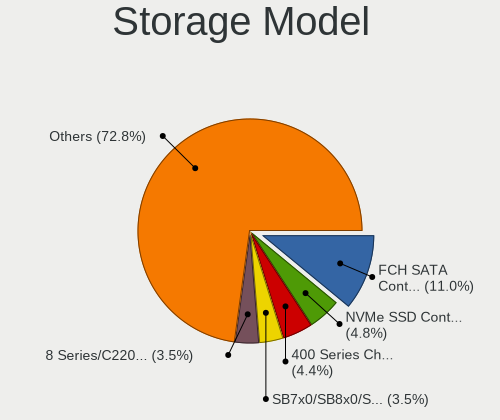

Linux in Germany - Tested Hardware & Statistics (Desktops)
----------------------------------------------------------

A project to collect tested hardware configurations for Linux in Germany.

Anyone can contribute to this report by the [hw-probe](https://github.com/linuxhw/hw-probe) tool:

    sudo -E hw-probe -all -upload

Please contribute! Especially if your hardware is rare.

Contents
--------

* [ Test Cases ](#test-cases)

* [ System ](#system)
  - [ OS                       ](#os)
  - [ OS Family                ](#os-family)
  - [ Kernel                   ](#kernel)
  - [ Kernel Family            ](#kernel-family)
  - [ Kernel Major Ver.        ](#kernel-major-ver)
  - [ Arch                     ](#arch)
  - [ DE                       ](#de)
  - [ Display Server           ](#display-server)
  - [ Display Manager          ](#display-manager)
  - [ OS Lang                  ](#os-lang)
  - [ Boot Mode                ](#boot-mode)
  - [ Filesystem               ](#filesystem)
  - [ Part. scheme             ](#part-scheme)
  - [ Dual Boot with Linux/BSD ](#dual-boot-with-linuxbsd)
  - [ Dual Boot (Win)          ](#dual-boot-win)

* [ Board ](#board)
  - [ Vendor                   ](#vendor)
  - [ Model                    ](#model)
  - [ Model Family             ](#model-family)
  - [ MFG Year                 ](#mfg-year)
  - [ Form Factor              ](#form-factor)
  - [ Secure Boot              ](#secure-boot)
  - [ Coreboot                 ](#coreboot)
  - [ RAM Size                 ](#ram-size)
  - [ RAM Used                 ](#ram-used)
  - [ Total Drives             ](#total-drives)
  - [ Has CD-ROM               ](#has-cd-rom)
  - [ Has Ethernet             ](#has-ethernet)
  - [ Has WiFi                 ](#has-wifi)
  - [ Has Bluetooth            ](#has-bluetooth)

* [ Location ](#location)
  - [ Country                  ](#country)
  - [ City                     ](#city)

* [ Drives ](#drives)
  - [ Drive Vendor             ](#drive-vendor)
  - [ Drive Model              ](#drive-model)
  - [ HDD Vendor               ](#hdd-vendor)
  - [ SSD Vendor               ](#ssd-vendor)
  - [ Drive Kind               ](#drive-kind)
  - [ Drive Connector          ](#drive-connector)
  - [ Drive Size               ](#drive-size)
  - [ Space Total              ](#space-total)
  - [ Space Used               ](#space-used)
  - [ Malfunc. Drives          ](#malfunc-drives)
  - [ Malfunc. Drive Vendor    ](#malfunc-drive-vendor)
  - [ Malfunc. HDD Vendor      ](#malfunc-hdd-vendor)
  - [ Malfunc. Drive Kind      ](#malfunc-drive-kind)
  - [ Failed Drives            ](#failed-drives)
  - [ Failed Drive Vendor      ](#failed-drive-vendor)
  - [ Drive Status             ](#drive-status)

* [ Storage controller ](#storage-controller)
  - [ Storage Vendor           ](#storage-vendor)
  - [ Storage Model            ](#storage-model)
  - [ Storage Kind             ](#storage-kind)

* [ Processor ](#processor)
  - [ CPU Vendor               ](#cpu-vendor)
  - [ CPU Model                ](#cpu-model)
  - [ CPU Model Family         ](#cpu-model-family)
  - [ CPU Cores                ](#cpu-cores)
  - [ CPU Sockets              ](#cpu-sockets)
  - [ CPU Threads              ](#cpu-threads)
  - [ CPU Op-Modes             ](#cpu-op-modes)
  - [ CPU Microcode            ](#cpu-microcode)
  - [ CPU Microarch            ](#cpu-microarch)

* [ Graphics ](#graphics)
  - [ GPU Vendor               ](#gpu-vendor)
  - [ GPU Model                ](#gpu-model)
  - [ GPU Combo                ](#gpu-combo)
  - [ GPU Driver               ](#gpu-driver)
  - [ GPU Memory               ](#gpu-memory)

* [ Monitor ](#monitor)
  - [ Monitor Vendor           ](#monitor-vendor)
  - [ Monitor Model            ](#monitor-model)
  - [ Monitor Resolution       ](#monitor-resolution)
  - [ Monitor Diagonal         ](#monitor-diagonal)
  - [ Monitor Width            ](#monitor-width)
  - [ Aspect Ratio             ](#aspect-ratio)
  - [ Monitor Area             ](#monitor-area)
  - [ Pixel Density            ](#pixel-density)
  - [ Multiple Monitors        ](#multiple-monitors)

* [ Network ](#network)
  - [ Net Controller Vendor    ](#net-controller-vendor)
  - [ Net Controller Model     ](#net-controller-model)
  - [ Wireless Vendor          ](#wireless-vendor)
  - [ Wireless Model           ](#wireless-model)
  - [ Ethernet Vendor          ](#ethernet-vendor)
  - [ Ethernet Model           ](#ethernet-model)
  - [ Net Controller Kind      ](#net-controller-kind)
  - [ Used Controller          ](#used-controller)
  - [ NICs                     ](#nics)
  - [ IPv6                     ](#ipv6)

* [ Bluetooth ](#bluetooth)
  - [ Bluetooth Vendor         ](#bluetooth-vendor)
  - [ Bluetooth Model          ](#bluetooth-model)

* [ Sound ](#sound)
  - [ Sound Vendor             ](#sound-vendor)
  - [ Sound Model              ](#sound-model)

* [ Memory ](#memory)
  - [ Memory Vendor            ](#memory-vendor)
  - [ Memory Model             ](#memory-model)
  - [ Memory Kind              ](#memory-kind)
  - [ Memory Form Factor       ](#memory-form-factor)
  - [ Memory Size              ](#memory-size)
  - [ Memory Speed             ](#memory-speed)

* [ Printers & scanners ](#printers--scanners)
  - [ Printer Vendor           ](#printer-vendor)
  - [ Printer Model            ](#printer-model)
  - [ Scanner Vendor           ](#scanner-vendor)
  - [ Scanner Model            ](#scanner-model)

* [ Camera ](#camera)
  - [ Camera Vendor            ](#camera-vendor)
  - [ Camera Model             ](#camera-model)

* [ Security ](#security)
  - [ Fingerprint Vendor       ](#fingerprint-vendor)
  - [ Fingerprint Model        ](#fingerprint-model)
  - [ Chipcard Vendor          ](#chipcard-vendor)
  - [ Chipcard Model           ](#chipcard-model)

* [ Unsupported ](#unsupported)
  - [ Unsupported Devices      ](#unsupported-devices)
  - [ Unsupported Device Types ](#unsupported-device-types)

Test Cases
----------

Total: 9375

| Vendor        | Model                       | Probe                                                      | Date         |
|---------------|-----------------------------|------------------------------------------------------------|--------------|
| Fujitsu       | D3221-A1 S26361-D3221-A1    | [d7c94f5e83](https://linux-hardware.org/?probe=d7c94f5e83) | May 07, 2022 |
| Medion        | B460H6-EM                   | [e2abcd94ce](https://linux-hardware.org/?probe=e2abcd94ce) | May 06, 2022 |
| Gigabyte      | B250M-DS3H-CF               | [86bb047b79](https://linux-hardware.org/?probe=86bb047b79) | May 06, 2022 |
| Lenovo        | 0B98401 WIN                 | [b080a2bae5](https://linux-hardware.org/?probe=b080a2bae5) | May 06, 2022 |
| MSI           | X370 KRAIT GAMING           | [83101fe031](https://linux-hardware.org/?probe=83101fe031) | May 06, 2022 |
| Gigabyte      | B550 AORUS PRO AC           | [033456f893](https://linux-hardware.org/?probe=033456f893) | May 06, 2022 |
| MSI           | Z370-A PRO                  | [b8cd5b5109](https://linux-hardware.org/?probe=b8cd5b5109) | May 06, 2022 |
| MSI           | B450 TOMAHAWK MAX           | [246c63d834](https://linux-hardware.org/?probe=246c63d834) | May 06, 2022 |
| ASUSTek       | M4A785TD-V EVO              | [622ff28b28](https://linux-hardware.org/?probe=622ff28b28) | May 05, 2022 |
| Gigabyte      | Z170-HD3P-CF                | [7b7f29e504](https://linux-hardware.org/?probe=7b7f29e504) | May 05, 2022 |
| Gigabyte      | GA-78LMT-S2P                | [b2b025fb12](https://linux-hardware.org/?probe=b2b025fb12) | May 05, 2022 |
| Medion        | B460H6-EM                   | [19650634fb](https://linux-hardware.org/?probe=19650634fb) | May 05, 2022 |
| ASUSTek       | PRIME X370-PRO              | [b0a2114a0f](https://linux-hardware.org/?probe=b0a2114a0f) | May 05, 2022 |
| ASRock        | X470 Taichi                 | [e133868179](https://linux-hardware.org/?probe=e133868179) | May 05, 2022 |
| MSI           | 770-C45                     | [0e9179888b](https://linux-hardware.org/?probe=0e9179888b) | May 05, 2022 |
| ASRock        | X470 Taichi                 | [93d6fb1610](https://linux-hardware.org/?probe=93d6fb1610) | May 05, 2022 |
| ASRock        | A320M Pro4                  | [b51c7ae18b](https://linux-hardware.org/?probe=b51c7ae18b) | May 04, 2022 |
| Gigabyte      | B550 AORUS PRO V2           | [699a7ea54b](https://linux-hardware.org/?probe=699a7ea54b) | May 04, 2022 |
| MSI           | H55M-E23                    | [d42084b294](https://linux-hardware.org/?probe=d42084b294) | May 04, 2022 |
| Acer          | Veriton M490G               | [f55983d536](https://linux-hardware.org/?probe=f55983d536) | May 04, 2022 |
| Fujitsu       | D3128-A1 S26361-D3128-A1    | [31eaff1b28](https://linux-hardware.org/?probe=31eaff1b28) | May 04, 2022 |
| Gigabyte      | G33M-DS2R                   | [d4dff7f002](https://linux-hardware.org/?probe=d4dff7f002) | May 04, 2022 |
| Lenovo        | 0B98401 WIN                 | [180a5d086f](https://linux-hardware.org/?probe=180a5d086f) | May 04, 2022 |
| Lenovo        | 0B98401 WIN                 | [f47683cd76](https://linux-hardware.org/?probe=f47683cd76) | May 04, 2022 |
| MSI           | MS-7100                     | [3f753d8582](https://linux-hardware.org/?probe=3f753d8582) | May 04, 2022 |
| ASUSTek       | CROSSHAIR V FORMULA-Z       | [e5a11e0fdd](https://linux-hardware.org/?probe=e5a11e0fdd) | May 04, 2022 |
| MSI           | Z77A-GD65                   | [35fda687da](https://linux-hardware.org/?probe=35fda687da) | May 04, 2022 |
| ASUSTek       | CROSSHAIR V FORMULA-Z       | [34dcc7bc0c](https://linux-hardware.org/?probe=34dcc7bc0c) | May 04, 2022 |
| ASUSTek       | M4A785TD-V EVO              | [aea37c880d](https://linux-hardware.org/?probe=aea37c880d) | May 04, 2022 |
| ASUSTek       | PRIME X570-P                | [246546447c](https://linux-hardware.org/?probe=246546447c) | May 04, 2022 |
| MSI           | Z77A-GD65                   | [b6ddc1be0e](https://linux-hardware.org/?probe=b6ddc1be0e) | May 04, 2022 |
| Lenovo        | ThinkCentre M81 5049W16     | [4725dabbde](https://linux-hardware.org/?probe=4725dabbde) | May 04, 2022 |
| ASUSTek       | Z170 PRO GAMING             | [bd1a249d54](https://linux-hardware.org/?probe=bd1a249d54) | May 04, 2022 |
| ASUSTek       | TUF Gaming B550-PLUS        | [9a2b895663](https://linux-hardware.org/?probe=9a2b895663) | May 04, 2022 |
| MSI           | Z77A-G43                    | [362ea22fd2](https://linux-hardware.org/?probe=362ea22fd2) | May 04, 2022 |
| MSI           | MAG B550M MORTAR WIFI       | [0a2ba1d529](https://linux-hardware.org/?probe=0a2ba1d529) | May 04, 2022 |
| Gigabyte      | Z170-HD3P-CF                | [7196bf2ec6](https://linux-hardware.org/?probe=7196bf2ec6) | May 03, 2022 |
| MSI           | PRO H610M-G DDR4            | [04b90d62d9](https://linux-hardware.org/?probe=04b90d62d9) | May 03, 2022 |
| ASUSTek       | PRIME X370-PRO              | [aed319bae8](https://linux-hardware.org/?probe=aed319bae8) | May 03, 2022 |
| ASUSTek       | PRIME X370-PRO              | [fd61db399b](https://linux-hardware.org/?probe=fd61db399b) | May 03, 2022 |
| Shuttle       | FG41 V20                    | [fd07bdf7b5](https://linux-hardware.org/?probe=fd07bdf7b5) | May 02, 2022 |
| ASUSTek       | P8B75-M                     | [dadde1bbc0](https://linux-hardware.org/?probe=dadde1bbc0) | May 02, 2022 |
| ASRock        | P55 Pro                     | [e626676348](https://linux-hardware.org/?probe=e626676348) | May 02, 2022 |
| Foxconn       | 2A8C                        | [26e7765e3a](https://linux-hardware.org/?probe=26e7765e3a) | May 02, 2022 |
| MSI           | PRO H610M-G DDR4            | [152b42c7c6](https://linux-hardware.org/?probe=152b42c7c6) | May 02, 2022 |
| Acer          | FMP55                       | [264c50cbed](https://linux-hardware.org/?probe=264c50cbed) | May 02, 2022 |
| ASRock        | X570 Phantom Gaming 4       | [0e40616573](https://linux-hardware.org/?probe=0e40616573) | May 02, 2022 |
| ASRock        | G31M-VS2                    | [501dd7e38b](https://linux-hardware.org/?probe=501dd7e38b) | May 01, 2022 |
| Gigabyte      | X570S AERO G                | [ab6b8eaa71](https://linux-hardware.org/?probe=ab6b8eaa71) | May 01, 2022 |
| Gigabyte      | B85M-D3H                    | [e00cc77c41](https://linux-hardware.org/?probe=e00cc77c41) | May 01, 2022 |
| Gigabyte      | B550 AORUS PRO AC           | [5e020f2247](https://linux-hardware.org/?probe=5e020f2247) | May 01, 2022 |
| Biostar       | A960D+V2                    | [136145a59c](https://linux-hardware.org/?probe=136145a59c) | May 01, 2022 |
| Intel         | DB85FL AAG89861-203         | [7d75948e9a](https://linux-hardware.org/?probe=7d75948e9a) | May 01, 2022 |
| HP            | 8459                        | [21d5d92fda](https://linux-hardware.org/?probe=21d5d92fda) | May 01, 2022 |
| Foxconn       | 2A8C                        | [205d18a183](https://linux-hardware.org/?probe=205d18a183) | May 01, 2022 |
| Intel         | DB85FL AAG89861-203         | [1d3dfb69e7](https://linux-hardware.org/?probe=1d3dfb69e7) | May 01, 2022 |
| MSI           | MS-7267                     | [12ef52bd6d](https://linux-hardware.org/?probe=12ef52bd6d) | May 01, 2022 |
| Gigabyte      | GA-78LMT-S2P                | [b8194d3077](https://linux-hardware.org/?probe=b8194d3077) | May 01, 2022 |
| Dell          | 0M017G A01                  | [653212f53c](https://linux-hardware.org/?probe=653212f53c) | May 01, 2022 |
| ASUSTek       | ROG Maximus X HERO          | [18daf9705b](https://linux-hardware.org/?probe=18daf9705b) | Apr 30, 2022 |
| ASUSTek       | PRIME B350M-A               | [87542ba2c2](https://linux-hardware.org/?probe=87542ba2c2) | Apr 30, 2022 |
| Medion        | MS-7616                     | [f3572ea9a5](https://linux-hardware.org/?probe=f3572ea9a5) | Apr 30, 2022 |
| MSI           | A320M-A PRO MAX             | [dc1c0d091e](https://linux-hardware.org/?probe=dc1c0d091e) | Apr 30, 2022 |
| MSI           | PRO H610M-G DDR4            | [f7806fa6f0](https://linux-hardware.org/?probe=f7806fa6f0) | Apr 30, 2022 |
| HP            | 0AECh D                     | [89441b750f](https://linux-hardware.org/?probe=89441b750f) | Apr 30, 2022 |
| MSI           | B450 TOMAHAWK MAX II        | [6db8017245](https://linux-hardware.org/?probe=6db8017245) | Apr 30, 2022 |
| Gigabyte      | GA-970A-UD3                 | [0158bc69ec](https://linux-hardware.org/?probe=0158bc69ec) | Apr 30, 2022 |
| Lenovo        | 36C5 SDK0J40700 WIN 3258... | [d9ac32b17d](https://linux-hardware.org/?probe=d9ac32b17d) | Apr 30, 2022 |
| ASUSTek       | PRIME B350-PLUS             | [13fd8e249d](https://linux-hardware.org/?probe=13fd8e249d) | Apr 30, 2022 |
| ASUSTek       | TUF Gaming X570-PLUS        | [a1199bffe2](https://linux-hardware.org/?probe=a1199bffe2) | Apr 30, 2022 |
| MSI           | A320M PRO-E                 | [655905bb3b](https://linux-hardware.org/?probe=655905bb3b) | Apr 29, 2022 |
| ASRock        | ALiveNF6G-GLAN              | [7dfb4ca9f5](https://linux-hardware.org/?probe=7dfb4ca9f5) | Apr 29, 2022 |
| Fujitsu       | D3222-A1 S26361-D3222-A1    | [fe522bdf2e](https://linux-hardware.org/?probe=fe522bdf2e) | Apr 29, 2022 |
| ASUSTek       | Rampage IV EXTREME          | [111d072676](https://linux-hardware.org/?probe=111d072676) | Apr 29, 2022 |
| HARDKERNEL    | ODROID-H2                   | [c3303164ff](https://linux-hardware.org/?probe=c3303164ff) | Apr 29, 2022 |
| Gigabyte      | X570 AORUS ULTRA            | [6bb8f4af30](https://linux-hardware.org/?probe=6bb8f4af30) | Apr 29, 2022 |
| MSI           | MPG X570 GAMING PLUS        | [e45e120b35](https://linux-hardware.org/?probe=e45e120b35) | Apr 29, 2022 |
| Dell          | 0T568R A00                  | [290f6d6b48](https://linux-hardware.org/?probe=290f6d6b48) | Apr 29, 2022 |
| Lenovo        | ThinkCentre A57 98517HG     | [e8cab6c0fb](https://linux-hardware.org/?probe=e8cab6c0fb) | Apr 28, 2022 |
| Lenovo        | ThinkCentre A57 98517HG     | [f6bfd948e9](https://linux-hardware.org/?probe=f6bfd948e9) | Apr 28, 2022 |
| ASUSTek       | PRIME B450M-A II            | [21b89b5942](https://linux-hardware.org/?probe=21b89b5942) | Apr 28, 2022 |
| MSI           | B450-A PRO MAX              | [efd0934b49](https://linux-hardware.org/?probe=efd0934b49) | Apr 28, 2022 |
| ASUSTek       | PRIME B450M-A II            | [cc6cd50096](https://linux-hardware.org/?probe=cc6cd50096) | Apr 28, 2022 |
| Gigabyte      | B450 AORUS M                | [13f68cfe10](https://linux-hardware.org/?probe=13f68cfe10) | Apr 28, 2022 |
| MSI           | MAG B550M MORTAR WIFI       | [8d8cef9b7d](https://linux-hardware.org/?probe=8d8cef9b7d) | Apr 28, 2022 |
| MSI           | MAG B550M MORTAR WIFI       | [6f320b7fcb](https://linux-hardware.org/?probe=6f320b7fcb) | Apr 28, 2022 |
| MSI           | B450M PRO-VDH MAX           | [2514409f18](https://linux-hardware.org/?probe=2514409f18) | Apr 28, 2022 |
| MSI           | B450M PRO-VDH PLUS          | [c4f91167bb](https://linux-hardware.org/?probe=c4f91167bb) | Apr 27, 2022 |
| Fujitsu       | D3162-A1 S26361-D3162-A1    | [19e0445e6f](https://linux-hardware.org/?probe=19e0445e6f) | Apr 27, 2022 |
| ASUSTek       | PRIME Z490-A                | [2ae652bf21](https://linux-hardware.org/?probe=2ae652bf21) | Apr 27, 2022 |
| ASUSTek       | H87-PRO                     | [476e417317](https://linux-hardware.org/?probe=476e417317) | Apr 27, 2022 |
| ASUSTek       | Z170-A                      | [127862c3f7](https://linux-hardware.org/?probe=127862c3f7) | Apr 27, 2022 |
| Gigabyte      | B550M AORUS PRO-P           | [b15f34dd41](https://linux-hardware.org/?probe=b15f34dd41) | Apr 27, 2022 |
| ASUSTek       | Z170-A                      | [e2461ef9a7](https://linux-hardware.org/?probe=e2461ef9a7) | Apr 27, 2022 |
| ASRockRack    | B565D4-V1L                  | [bf0b5a06c9](https://linux-hardware.org/?probe=bf0b5a06c9) | Apr 27, 2022 |
| Medion        | B460H6-EM                   | [82b4baa4ed](https://linux-hardware.org/?probe=82b4baa4ed) | Apr 27, 2022 |
| Medion        | B360H4-EM V1.0              | [9ed05797b0](https://linux-hardware.org/?probe=9ed05797b0) | Apr 27, 2022 |
| Medion        | B360H4-EM V1.0              | [7a35687e1d](https://linux-hardware.org/?probe=7a35687e1d) | Apr 27, 2022 |
| MSI           | MPG X570 GAMING PLUS        | [bd185a521b](https://linux-hardware.org/?probe=bd185a521b) | Apr 27, 2022 |
| Gigabyte      | GA-78LMT-USB3 SEx           | [5721b7c107](https://linux-hardware.org/?probe=5721b7c107) | Apr 27, 2022 |
| MSI           | Z370 SLI PLUS               | [75dbc4ddab](https://linux-hardware.org/?probe=75dbc4ddab) | Apr 27, 2022 |
| Gigabyte      | B550I AORUS PRO AX          | [3c6aace75c](https://linux-hardware.org/?probe=3c6aace75c) | Apr 27, 2022 |
| Gigabyte      | F2A78M-HD2                  | [454d879501](https://linux-hardware.org/?probe=454d879501) | Apr 26, 2022 |
| Gigabyte      | H67MA-USB3-B3               | [f2fb45ef53](https://linux-hardware.org/?probe=f2fb45ef53) | Apr 26, 2022 |
| Gigabyte      | H67MA-USB3-B3               | [d1e23f1023](https://linux-hardware.org/?probe=d1e23f1023) | Apr 26, 2022 |
| Unknown       | Unknown                     | [f67ff826d9](https://linux-hardware.org/?probe=f67ff826d9) | Apr 25, 2022 |
| ASUSTek       | M4A87TD/USB3                | [9574f78f95](https://linux-hardware.org/?probe=9574f78f95) | Apr 25, 2022 |
| ASUSTek       | P5GC-MX/MEDION/SI           | [8801f8d20c](https://linux-hardware.org/?probe=8801f8d20c) | Apr 25, 2022 |
| ASUSTek       | A55BM-E                     | [b2b220b65d](https://linux-hardware.org/?probe=b2b220b65d) | Apr 25, 2022 |
| ASUSTek       | B85-PRO GAMER               | [c76074f5e0](https://linux-hardware.org/?probe=c76074f5e0) | Apr 25, 2022 |
| ASUSTek       | PRIME B350-PLUS             | [b24ac490a1](https://linux-hardware.org/?probe=b24ac490a1) | Apr 25, 2022 |
| ASRock        | Z270 Extreme4               | [b060c039ca](https://linux-hardware.org/?probe=b060c039ca) | Apr 24, 2022 |
| Acer          | FX58M                       | [af1d52769d](https://linux-hardware.org/?probe=af1d52769d) | Apr 24, 2022 |
| Acer          | FX58M                       | [3074ddb372](https://linux-hardware.org/?probe=3074ddb372) | Apr 24, 2022 |
| Lenovo        | SHARKBAY 31900058 STD       | [b36aa38e8a](https://linux-hardware.org/?probe=b36aa38e8a) | Apr 24, 2022 |
| ASUSTek       | M5A78L-M/USB3               | [4d564b4038](https://linux-hardware.org/?probe=4d564b4038) | Apr 24, 2022 |
| Gigabyte      | GA-78LMT-S2P                | [3aeeaee161](https://linux-hardware.org/?probe=3aeeaee161) | Apr 23, 2022 |
| ASUSTek       | B85M-E                      | [037b7180fd](https://linux-hardware.org/?probe=037b7180fd) | Apr 23, 2022 |
| MSI           | X570-A PRO                  | [b6a4a77ba4](https://linux-hardware.org/?probe=b6a4a77ba4) | Apr 23, 2022 |
| HP            | 21EF                        | [9e37979ea3](https://linux-hardware.org/?probe=9e37979ea3) | Apr 23, 2022 |
| MSI           | E350IA-E45                  | [8271a7f1d5](https://linux-hardware.org/?probe=8271a7f1d5) | Apr 23, 2022 |
| MSI           | E350IA-E45                  | [da7d376e11](https://linux-hardware.org/?probe=da7d376e11) | Apr 23, 2022 |
| ASRock        | B450 Pro4                   | [61ab02b4e8](https://linux-hardware.org/?probe=61ab02b4e8) | Apr 23, 2022 |
| ASUSTek       | M4A78-EM                    | [5ef7775195](https://linux-hardware.org/?probe=5ef7775195) | Apr 23, 2022 |
| MSI           | H510M PRO                   | [62b9c33cba](https://linux-hardware.org/?probe=62b9c33cba) | Apr 23, 2022 |
| HP            | 0AECh D                     | [5fd33a9a4e](https://linux-hardware.org/?probe=5fd33a9a4e) | Apr 23, 2022 |
| ASUSTek       | ROG STRIX Z390-F GAMING     | [7ad6e17281](https://linux-hardware.org/?probe=7ad6e17281) | Apr 23, 2022 |
| ASUSTek       | ROG STRIX Z390-F GAMING     | [73c09c4d29](https://linux-hardware.org/?probe=73c09c4d29) | Apr 23, 2022 |
| Lenovo        | SHARKBAY SDK0E50510 WIN     | [7538f27511](https://linux-hardware.org/?probe=7538f27511) | Apr 23, 2022 |
| ASUSTek       | PRIME A320M-C R2.0          | [ba551e9420](https://linux-hardware.org/?probe=ba551e9420) | Apr 23, 2022 |
| Lenovo        | NO DPK                      | [709f4d5f8c](https://linux-hardware.org/?probe=709f4d5f8c) | Apr 22, 2022 |
| Gigabyte      | G33M-DS2R                   | [d2cd51f72d](https://linux-hardware.org/?probe=d2cd51f72d) | Apr 22, 2022 |
| ASUSTek       | PRIME X570-P                | [2c7cee55b7](https://linux-hardware.org/?probe=2c7cee55b7) | Apr 22, 2022 |
| ASUSTek       | PRIME X570-P                | [b8a5ec8483](https://linux-hardware.org/?probe=b8a5ec8483) | Apr 22, 2022 |
| ASRock        | G31M-VS2                    | [962b281504](https://linux-hardware.org/?probe=962b281504) | Apr 22, 2022 |
| Medion        | H110H4-EM                   | [bdbf84afd8](https://linux-hardware.org/?probe=bdbf84afd8) | Apr 22, 2022 |
| ASUSTek       | M5A78L-M LX3                | [caebf74610](https://linux-hardware.org/?probe=caebf74610) | Apr 21, 2022 |
| ASRock        | X470 Taichi                 | [0da1d9833d](https://linux-hardware.org/?probe=0da1d9833d) | Apr 21, 2022 |
| HP            | 304Ah                       | [08fbf0f311](https://linux-hardware.org/?probe=08fbf0f311) | Apr 21, 2022 |
| ASUSTek       | Z170-P                      | [aa004d1627](https://linux-hardware.org/?probe=aa004d1627) | Apr 21, 2022 |
| Gigabyte      | AB350M-HD3-CF               | [dd16ab4768](https://linux-hardware.org/?probe=dd16ab4768) | Apr 21, 2022 |
| ASUSTek       | P8H67-M LE                  | [0d5a9fcacc](https://linux-hardware.org/?probe=0d5a9fcacc) | Apr 20, 2022 |
| ASUSTek       | H87-PRO                     | [aa1df63f27](https://linux-hardware.org/?probe=aa1df63f27) | Apr 20, 2022 |
| Gigabyte      | X570 AORUS ELITE            | [fd661468b9](https://linux-hardware.org/?probe=fd661468b9) | Apr 19, 2022 |
| Gigabyte      | B550M S2H                   | [208972e3b5](https://linux-hardware.org/?probe=208972e3b5) | Apr 19, 2022 |
| Medion        | H110H4-EM                   | [358d943521](https://linux-hardware.org/?probe=358d943521) | Apr 19, 2022 |
| Medion        | H81H3-EM2                   | [f9a0473778](https://linux-hardware.org/?probe=f9a0473778) | Apr 19, 2022 |
| MSI           | AMETHYST-M                  | [73864e97e4](https://linux-hardware.org/?probe=73864e97e4) | Apr 19, 2022 |
| MSI           | B450 TOMAHAWK MAX           | [34c876e7e6](https://linux-hardware.org/?probe=34c876e7e6) | Apr 19, 2022 |
| Lenovo        | ThinkCentre M81 5049W16     | [0fd05faa69](https://linux-hardware.org/?probe=0fd05faa69) | Apr 19, 2022 |
| Inventec      | D CLASS A02                 | [d00d37285b](https://linux-hardware.org/?probe=d00d37285b) | Apr 19, 2022 |
| MSI           | B450M PRO-VDH MAX           | [73dbb7e52a](https://linux-hardware.org/?probe=73dbb7e52a) | Apr 19, 2022 |
| HP            | ML110 G4                    | [f8ffa1a82a](https://linux-hardware.org/?probe=f8ffa1a82a) | Apr 18, 2022 |
| Dell          | 0TTDMJ A00                  | [4db6e91115](https://linux-hardware.org/?probe=4db6e91115) | Apr 18, 2022 |
| ASUSTek       | WS C422 SAGE/10G            | [27db6c7db6](https://linux-hardware.org/?probe=27db6c7db6) | Apr 18, 2022 |
| ASUSTek       | PRIME B450-PLUS             | [49d51ee541](https://linux-hardware.org/?probe=49d51ee541) | Apr 18, 2022 |
| ASRock        | 970 Pro3 R2.0               | [fefd073d6d](https://linux-hardware.org/?probe=fefd073d6d) | Apr 18, 2022 |
| Shuttle       | FH61V                       | [2fae1ee493](https://linux-hardware.org/?probe=2fae1ee493) | Apr 18, 2022 |
| MSI           | Z87-GD65 GAMING             | [5bfeeef88e](https://linux-hardware.org/?probe=5bfeeef88e) | Apr 18, 2022 |
| ASRock        | Z87M Extreme4               | [83ffe21604](https://linux-hardware.org/?probe=83ffe21604) | Apr 18, 2022 |
| Gigabyte      | GA-78LMT-USB3               | [70beb92c3b](https://linux-hardware.org/?probe=70beb92c3b) | Apr 18, 2022 |
| MSI           | X470 GAMING PLUS            | [2ddbae278a](https://linux-hardware.org/?probe=2ddbae278a) | Apr 18, 2022 |
| ASUSTek       | P8H67-M LE                  | [3bea0f2a6a](https://linux-hardware.org/?probe=3bea0f2a6a) | Apr 18, 2022 |
| Fujitsu       | D3162-C1 S26361-D3162-C1    | [3ef27dafd2](https://linux-hardware.org/?probe=3ef27dafd2) | Apr 17, 2022 |
| Gigabyte      | X570 AORUS ELITE            | [f7008a1e16](https://linux-hardware.org/?probe=f7008a1e16) | Apr 17, 2022 |
| HP            | 86E9 A                      | [11004e6442](https://linux-hardware.org/?probe=11004e6442) | Apr 17, 2022 |
| MSI           | B350M PRO-VDH               | [884f15c1df](https://linux-hardware.org/?probe=884f15c1df) | Apr 17, 2022 |
| MSI           | Z77A-GD65                   | [0350456f3b](https://linux-hardware.org/?probe=0350456f3b) | Apr 17, 2022 |
| ASUSTek       | PRIME Z490-A                | [1bf9523120](https://linux-hardware.org/?probe=1bf9523120) | Apr 17, 2022 |
| Gigabyte      | B550M S2H                   | [1127f26185](https://linux-hardware.org/?probe=1127f26185) | Apr 17, 2022 |
| Fujitsu       | D3091-A1 S26361-D3091-A1    | [d2559a2f19](https://linux-hardware.org/?probe=d2559a2f19) | Apr 17, 2022 |
| ASUSTek       | TUF Gaming X570-PLUS        | [c5bc86febb](https://linux-hardware.org/?probe=c5bc86febb) | Apr 17, 2022 |
| ASRock        | B450 Gaming-ITX/ac          | [063cead5c3](https://linux-hardware.org/?probe=063cead5c3) | Apr 17, 2022 |
| MSI           | H510M PRO                   | [a9ce7c295a](https://linux-hardware.org/?probe=a9ce7c295a) | Apr 17, 2022 |
| HP            | 1497                        | [6d2caeac34](https://linux-hardware.org/?probe=6d2caeac34) | Apr 16, 2022 |
| ASUSTek       | A68HM-PLUS                  | [0bfefd6499](https://linux-hardware.org/?probe=0bfefd6499) | Apr 16, 2022 |
| ASUSTek       | 970 PRO GAMING/AURA         | [7efbdedc5f](https://linux-hardware.org/?probe=7efbdedc5f) | Apr 16, 2022 |
| Medion        | H110H4-EM                   | [b1fcc5abcf](https://linux-hardware.org/?probe=b1fcc5abcf) | Apr 16, 2022 |
| ASRock        | B550M Phantom Gaming 4      | [3e3e2fd22f](https://linux-hardware.org/?probe=3e3e2fd22f) | Apr 16, 2022 |
| HP            | 1494                        | [6ad3ca1745](https://linux-hardware.org/?probe=6ad3ca1745) | Apr 16, 2022 |
| Fujitsu Si... | D2750-A2 S26361-D2750-A2    | [44b99daa8e](https://linux-hardware.org/?probe=44b99daa8e) | Apr 16, 2022 |
| Lenovo        | SDK0J40700 WIN              | [142a0092f1](https://linux-hardware.org/?probe=142a0092f1) | Apr 15, 2022 |
| BESSTAR Te... | TL50                        | [28dba12634](https://linux-hardware.org/?probe=28dba12634) | Apr 15, 2022 |
| MSI           | Z87-GD65 GAMING             | [8c57fd797b](https://linux-hardware.org/?probe=8c57fd797b) | Apr 15, 2022 |
| Medion        | H110H4-EM                   | [d4c3d27956](https://linux-hardware.org/?probe=d4c3d27956) | Apr 15, 2022 |
| MSI           | B85I GAMING                 | [be865001b9](https://linux-hardware.org/?probe=be865001b9) | Apr 15, 2022 |
| Gigabyte      | B550I AORUS PRO AX          | [14f5389e9e](https://linux-hardware.org/?probe=14f5389e9e) | Apr 15, 2022 |
| MSI           | 790FX-GD70                  | [0a8776ac60](https://linux-hardware.org/?probe=0a8776ac60) | Apr 15, 2022 |
| ASUSTek       | A68HM-PLUS                  | [f52ef2faf2](https://linux-hardware.org/?probe=f52ef2faf2) | Apr 15, 2022 |
| Gigabyte      | Z77X-D3H                    | [da67065e13](https://linux-hardware.org/?probe=da67065e13) | Apr 14, 2022 |
| Fujitsu       | D3513-A1 S26361-D3513-A1    | [72b9c04a51](https://linux-hardware.org/?probe=72b9c04a51) | Apr 14, 2022 |
| Fujitsu       | D3531-A1 S26361-D3531-A1    | [46dd533a5e](https://linux-hardware.org/?probe=46dd533a5e) | Apr 14, 2022 |
| ASRock        | B450 Gaming-ITX/ac          | [6bc3ced902](https://linux-hardware.org/?probe=6bc3ced902) | Apr 14, 2022 |
| ASRock        | X570 Phantom Gaming 4       | [c372810f3f](https://linux-hardware.org/?probe=c372810f3f) | Apr 14, 2022 |
| ASUSTek       | PRIME X570-P                | [57a3a5a999](https://linux-hardware.org/?probe=57a3a5a999) | Apr 14, 2022 |
| ASUSTek       | PRIME X570-P                | [f9b71f206c](https://linux-hardware.org/?probe=f9b71f206c) | Apr 14, 2022 |
| Dell          | 0D24M8 A01                  | [fe4bb32aa1](https://linux-hardware.org/?probe=fe4bb32aa1) | Apr 14, 2022 |
| Gigabyte      | H97-D3H-CF                  | [e9ad69846b](https://linux-hardware.org/?probe=e9ad69846b) | Apr 14, 2022 |
| Lenovo        | 30C9 SDK0J40697 WIN 3305... | [d00bde2a05](https://linux-hardware.org/?probe=d00bde2a05) | Apr 14, 2022 |
| MSI           | MEG B550 UNIFY              | [8ebb61ef39](https://linux-hardware.org/?probe=8ebb61ef39) | Apr 14, 2022 |
| Lenovo        | 30D0 SDK0J40697 WIN 3305... | [91a7810a37](https://linux-hardware.org/?probe=91a7810a37) | Apr 14, 2022 |
| Gigabyte      | X570 AORUS PRO              | [acd0ebed7c](https://linux-hardware.org/?probe=acd0ebed7c) | Apr 13, 2022 |
| ASUSTek       | PRIME B450-PLUS             | [e3cc5e949a](https://linux-hardware.org/?probe=e3cc5e949a) | Apr 13, 2022 |
| HARDKERNEL    | ODROID-H2                   | [63ab4fa5ac](https://linux-hardware.org/?probe=63ab4fa5ac) | Apr 13, 2022 |
| MSI           | B450M MORTAR TITANIUM       | [6b11750e41](https://linux-hardware.org/?probe=6b11750e41) | Apr 13, 2022 |
| ASUSTek       | X99-A                       | [2ac66bb174](https://linux-hardware.org/?probe=2ac66bb174) | Apr 13, 2022 |
| MSI           | MAG B550M MORTAR            | [7a9f6e1de7](https://linux-hardware.org/?probe=7a9f6e1de7) | Apr 13, 2022 |
| MSI           | B450M MORTAR MAX            | [2ae073e712](https://linux-hardware.org/?probe=2ae073e712) | Apr 13, 2022 |
| ASUSTek       | Z87-PLUS                    | [22fe7aea72](https://linux-hardware.org/?probe=22fe7aea72) | Apr 13, 2022 |
| ASRock        | H97 Pro4                    | [db6bf8f1b9](https://linux-hardware.org/?probe=db6bf8f1b9) | Apr 13, 2022 |
| Fujitsu       | D3162-C1 S26361-D3162-C1    | [5f4fac95df](https://linux-hardware.org/?probe=5f4fac95df) | Apr 13, 2022 |
| ASRock        | X570 Phantom Gaming 4       | [4a91953dcb](https://linux-hardware.org/?probe=4a91953dcb) | Apr 13, 2022 |
| ASUSTek       | PRIME Z690M-HZ              | [4bf977cb4d](https://linux-hardware.org/?probe=4bf977cb4d) | Apr 13, 2022 |
| ASUSTek       | TUF X470-PLUS GAMING        | [3440d2dd8c](https://linux-hardware.org/?probe=3440d2dd8c) | Apr 12, 2022 |
| ASUSTek       | PRIME B450-PLUS             | [47404cf177](https://linux-hardware.org/?probe=47404cf177) | Apr 12, 2022 |
| Fujitsu       | D3221-A1 S26361-D3221-A1    | [842cfcf606](https://linux-hardware.org/?probe=842cfcf606) | Apr 12, 2022 |
| MSI           | H510M PRO                   | [19dffc4e17](https://linux-hardware.org/?probe=19dffc4e17) | Apr 12, 2022 |
| MSI           | H510M PRO                   | [c4cd29bb7f](https://linux-hardware.org/?probe=c4cd29bb7f) | Apr 12, 2022 |
| Gigabyte      | 970A-DS3P                   | [97bd95a7bb](https://linux-hardware.org/?probe=97bd95a7bb) | Apr 12, 2022 |
| MSI           | Z170-A PRO                  | [db5ab86328](https://linux-hardware.org/?probe=db5ab86328) | Apr 11, 2022 |
| Lenovo        | 3178 SDK0J40700 WIN 3258... | [637023ab6d](https://linux-hardware.org/?probe=637023ab6d) | Apr 11, 2022 |
| Lenovo        | ThinkCentre M81 5049W16     | [201076a42a](https://linux-hardware.org/?probe=201076a42a) | Apr 11, 2022 |
| eMachines     | EL1850                      | [4c641c8e6a](https://linux-hardware.org/?probe=4c641c8e6a) | Apr 11, 2022 |
| Gigabyte      | Z97-HD3                     | [0f28cbb37d](https://linux-hardware.org/?probe=0f28cbb37d) | Apr 11, 2022 |
| ASUSTek       | P8B75-M                     | [5d36c5b15f](https://linux-hardware.org/?probe=5d36c5b15f) | Apr 11, 2022 |
| MSI           | B460M PRO-VDH WIFI          | [27cb501628](https://linux-hardware.org/?probe=27cb501628) | Apr 11, 2022 |
| Fujitsu       | D2912-A1 S26361-D2912-A1    | [210b897284](https://linux-hardware.org/?probe=210b897284) | Apr 10, 2022 |
| MSI           | A320M-A PRO MAX             | [c522f42e92](https://linux-hardware.org/?probe=c522f42e92) | Apr 10, 2022 |
| MSI           | Z170-A PRO                  | [3bd5bb8d08](https://linux-hardware.org/?probe=3bd5bb8d08) | Apr 10, 2022 |
| HP            | 21F5 0A                     | [516f2dbc9e](https://linux-hardware.org/?probe=516f2dbc9e) | Apr 10, 2022 |
| ASUSTek       | PRIME A320M-K               | [e55b3bf73c](https://linux-hardware.org/?probe=e55b3bf73c) | Apr 10, 2022 |
| ASUSTek       | Pro WS 565-ACE              | [71adeab793](https://linux-hardware.org/?probe=71adeab793) | Apr 10, 2022 |
| Gigabyte      | W480 VISION D               | [69e85ce80c](https://linux-hardware.org/?probe=69e85ce80c) | Apr 10, 2022 |
| ASRock        | H110M-ITX                   | [13dff6f000](https://linux-hardware.org/?probe=13dff6f000) | Apr 10, 2022 |
| Dell          | 0KC9NP A00                  | [7b3bb36e84](https://linux-hardware.org/?probe=7b3bb36e84) | Apr 10, 2022 |
| ASRock        | A300M-STX                   | [6d3fe856b8](https://linux-hardware.org/?probe=6d3fe856b8) | Apr 10, 2022 |
| Medion        | H81H3-EM2 H81EM2W08.309     | [9d20eaf1f2](https://linux-hardware.org/?probe=9d20eaf1f2) | Apr 10, 2022 |
| Fujitsu       | D3500-A1 S26361-D3500-A1    | [50cfb4d530](https://linux-hardware.org/?probe=50cfb4d530) | Apr 09, 2022 |
| MSI           | MS-7369                     | [0a32c9427a](https://linux-hardware.org/?probe=0a32c9427a) | Apr 09, 2022 |
| MSI           | Z77A-G45 GAMING             | [622ecbb225](https://linux-hardware.org/?probe=622ecbb225) | Apr 09, 2022 |
| Foxconn       | A7DA 3 series               | [2fc0654e61](https://linux-hardware.org/?probe=2fc0654e61) | Apr 09, 2022 |
| ASRock        | Z77 Pro4                    | [38eeb648af](https://linux-hardware.org/?probe=38eeb648af) | Apr 09, 2022 |
| MSI           | 2AE0                        | [57e29c9110](https://linux-hardware.org/?probe=57e29c9110) | Apr 09, 2022 |
| Gigabyte      | 970A-DS3P                   | [08f79499bd](https://linux-hardware.org/?probe=08f79499bd) | Apr 09, 2022 |
| Gigabyte      | B550M AORUS ELITE           | [648d7a9a57](https://linux-hardware.org/?probe=648d7a9a57) | Apr 09, 2022 |
| Biostar       | B550MH                      | [abd373497b](https://linux-hardware.org/?probe=abd373497b) | Apr 09, 2022 |
| Gigabyte      | B360HD3PLM-CF               | [1c3d254151](https://linux-hardware.org/?probe=1c3d254151) | Apr 09, 2022 |
| Gigabyte      | B360HD3PLM-CF               | [d966170231](https://linux-hardware.org/?probe=d966170231) | Apr 09, 2022 |
| Medion        | TJ4125                      | [4541511f38](https://linux-hardware.org/?probe=4541511f38) | Apr 08, 2022 |
| Gigabyte      | MZBSWAP-K4                  | [8f7798d84a](https://linux-hardware.org/?probe=8f7798d84a) | Apr 08, 2022 |
| ASUSTek       | PRIME B450-PLUS             | [c0d7bcd89b](https://linux-hardware.org/?probe=c0d7bcd89b) | Apr 08, 2022 |
| EVGA          | 140-SS-E177                 | [4af369b993](https://linux-hardware.org/?probe=4af369b993) | Apr 08, 2022 |
| MSI           | X470 GAMING PLUS MAX        | [d973a4378b](https://linux-hardware.org/?probe=d973a4378b) | Apr 08, 2022 |
| Fujitsu       | D3028-A1 S26361-D3028-A1    | [1a031845b1](https://linux-hardware.org/?probe=1a031845b1) | Apr 08, 2022 |
| ASUSTek       | P8H67-M LE                  | [f21e5ade5d](https://linux-hardware.org/?probe=f21e5ade5d) | Apr 08, 2022 |
| MSI           | MPG X570 GAMING EDGE WIF... | [7438fcdda2](https://linux-hardware.org/?probe=7438fcdda2) | Apr 08, 2022 |
| ASRockRack    | B565D4-V1L                  | [12f3bc72ea](https://linux-hardware.org/?probe=12f3bc72ea) | Apr 08, 2022 |
| ASUSTek       | B150M-C                     | [008522be3f](https://linux-hardware.org/?probe=008522be3f) | Apr 08, 2022 |
| ASUSTek       | B150M-C                     | [5c4348526d](https://linux-hardware.org/?probe=5c4348526d) | Apr 08, 2022 |
| ASRock        | 990FX Extreme3              | [74624f8363](https://linux-hardware.org/?probe=74624f8363) | Apr 08, 2022 |
| Unknown       | HX90                        | [ab8a381a52](https://linux-hardware.org/?probe=ab8a381a52) | Apr 08, 2022 |
| MSI           | B450M MORTAR MAX            | [bde8b0ab3c](https://linux-hardware.org/?probe=bde8b0ab3c) | Apr 07, 2022 |
| Biostar       | N68S3B                      | [9410ef1116](https://linux-hardware.org/?probe=9410ef1116) | Apr 07, 2022 |
| ASUSTek       | ROG STRIX Z370-G GAMING     | [c5ea221f34](https://linux-hardware.org/?probe=c5ea221f34) | Apr 07, 2022 |
| Fujitsu       | D3161-A1 S26361-D3161-A1    | [b43ffa5ce5](https://linux-hardware.org/?probe=b43ffa5ce5) | Apr 07, 2022 |
| ASRock        | Z87 Extreme6                | [7d74be6897](https://linux-hardware.org/?probe=7d74be6897) | Apr 07, 2022 |
| ASUSTek       | P8B75-M                     | [808661699f](https://linux-hardware.org/?probe=808661699f) | Apr 07, 2022 |
| Gigabyte      | 970A-UD3P                   | [5b3b1df897](https://linux-hardware.org/?probe=5b3b1df897) | Apr 07, 2022 |
| Gigabyte      | W480 VISION D               | [da6d84cf89](https://linux-hardware.org/?probe=da6d84cf89) | Apr 07, 2022 |
| ASUSTek       | Z10PG-D16 Series            | [9076954881](https://linux-hardware.org/?probe=9076954881) | Apr 07, 2022 |
| Unknown       | HX90                        | [a83217f763](https://linux-hardware.org/?probe=a83217f763) | Apr 07, 2022 |
| Unknown       | HX90                        | [fa9981d1bd](https://linux-hardware.org/?probe=fa9981d1bd) | Apr 07, 2022 |
| ASUSTek       | P5Q-E                       | [224591ad3c](https://linux-hardware.org/?probe=224591ad3c) | Apr 07, 2022 |
| ASRock        | 990FX Extreme3              | [d7ca137052](https://linux-hardware.org/?probe=d7ca137052) | Apr 07, 2022 |
| ASUSTek       | P5Q-E                       | [93aa02920a](https://linux-hardware.org/?probe=93aa02920a) | Apr 07, 2022 |
| Fujitsu Si... | D2587-A1 S26361-D2587-A1    | [45c9919e96](https://linux-hardware.org/?probe=45c9919e96) | Apr 07, 2022 |
| ASUSTek       | ROG STRIX B550-I GAMING     | [c1e66c6b66](https://linux-hardware.org/?probe=c1e66c6b66) | Apr 06, 2022 |
| ASUSTek       | Z97-K                       | [605aa4f068](https://linux-hardware.org/?probe=605aa4f068) | Apr 06, 2022 |
| MSI           | MS-7358 Fab D               | [1867be94e3](https://linux-hardware.org/?probe=1867be94e3) | Apr 06, 2022 |
| Gigabyte      | Z77-DS3H                    | [a3d3ff5ac5](https://linux-hardware.org/?probe=a3d3ff5ac5) | Apr 06, 2022 |
| ASRock        | 970 Pro3 R2.0               | [59479b59ec](https://linux-hardware.org/?probe=59479b59ec) | Apr 06, 2022 |
| Gigabyte      | B360M D2V                   | [87f55ffa54](https://linux-hardware.org/?probe=87f55ffa54) | Apr 06, 2022 |
| Gigabyte      | B550M AORUS ELITE           | [3c27532090](https://linux-hardware.org/?probe=3c27532090) | Apr 05, 2022 |
| ASRock        | Z97X Killer                 | [628d137846](https://linux-hardware.org/?probe=628d137846) | Apr 05, 2022 |
| Gigabyte      | AB350-Gaming 3-CF           | [c95df20756](https://linux-hardware.org/?probe=c95df20756) | Apr 05, 2022 |
| HP            | 1494                        | [5d81c1dd3c](https://linux-hardware.org/?probe=5d81c1dd3c) | Apr 05, 2022 |
| Lenovo        | MAHOBAY                     | [ad714d63bc](https://linux-hardware.org/?probe=ad714d63bc) | Apr 05, 2022 |
| MSI           | MPG B550 GAMING PLUS        | [5600c7649a](https://linux-hardware.org/?probe=5600c7649a) | Apr 05, 2022 |
| ASUSTek       | ROG STRIX B550-I GAMING     | [d2f9498bd2](https://linux-hardware.org/?probe=d2f9498bd2) | Apr 05, 2022 |
| Lenovo        | 1036 SDK0K17763 WIN 1801... | [eec98977a3](https://linux-hardware.org/?probe=eec98977a3) | Apr 05, 2022 |
| MSI           | MAG X570 TOMAHAWK WIFI      | [3f086610fc](https://linux-hardware.org/?probe=3f086610fc) | Apr 05, 2022 |
| MSI           | H510M PRO                   | [0874882b3f](https://linux-hardware.org/?probe=0874882b3f) | Apr 04, 2022 |
| Foxconn       | 2A8C                        | [e4d8c4ccf0](https://linux-hardware.org/?probe=e4d8c4ccf0) | Apr 04, 2022 |
| Dell          | 0WR7PY A02                  | [3086c641fb](https://linux-hardware.org/?probe=3086c641fb) | Apr 04, 2022 |
| MSI           | H510M PRO                   | [ee05ef80b8](https://linux-hardware.org/?probe=ee05ef80b8) | Apr 04, 2022 |
| ASUSTek       | P6T                         | [5ed6ed355f](https://linux-hardware.org/?probe=5ed6ed355f) | Apr 04, 2022 |
| MSI           | H97 PC Mate                 | [8e47753650](https://linux-hardware.org/?probe=8e47753650) | Apr 04, 2022 |
| MSI           | H97 PC Mate                 | [98788451c4](https://linux-hardware.org/?probe=98788451c4) | Apr 04, 2022 |
| MSI           | H510M PRO                   | [e11c2453c5](https://linux-hardware.org/?probe=e11c2453c5) | Apr 04, 2022 |
| ASUSTek       | H81M-E                      | [2659a11330](https://linux-hardware.org/?probe=2659a11330) | Apr 04, 2022 |
| HP            | 805D                        | [198cff1b8e](https://linux-hardware.org/?probe=198cff1b8e) | Apr 04, 2022 |
| Gigabyte      | Z690 UD AX                  | [e7083be036](https://linux-hardware.org/?probe=e7083be036) | Apr 04, 2022 |
| Shuttle       | FS35V4                      | [bfe34cde0c](https://linux-hardware.org/?probe=bfe34cde0c) | Apr 04, 2022 |
| ASUSTek       | PRIME B450-PLUS             | [f067a2d929](https://linux-hardware.org/?probe=f067a2d929) | Apr 04, 2022 |
| ASUSTek       | PRIME B350-PLUS             | [5348103896](https://linux-hardware.org/?probe=5348103896) | Apr 03, 2022 |
| ASUSTek       | PRIME H570-PLUS             | [4a9be0ab22](https://linux-hardware.org/?probe=4a9be0ab22) | Apr 03, 2022 |
| ASRock        | H670M-ITX/ax                | [d4dc39b64e](https://linux-hardware.org/?probe=d4dc39b64e) | Apr 03, 2022 |
| MSI           | X58M                        | [7484dce6ce](https://linux-hardware.org/?probe=7484dce6ce) | Apr 03, 2022 |
| Packard Be... | M2N-NM                      | [7231602b33](https://linux-hardware.org/?probe=7231602b33) | Apr 03, 2022 |
| ASRock        | H670M-ITX/ax                | [d97f9a02fe](https://linux-hardware.org/?probe=d97f9a02fe) | Apr 03, 2022 |
| Acer          | WMCP78M                     | [7c9d2a802f](https://linux-hardware.org/?probe=7c9d2a802f) | Apr 03, 2022 |
| HP            | 1998                        | [4b6628b734](https://linux-hardware.org/?probe=4b6628b734) | Apr 03, 2022 |
| MSI           | MEG X570 ACE                | [62b7931f9b](https://linux-hardware.org/?probe=62b7931f9b) | Apr 03, 2022 |
| Gigabyte      | MZBSWAP-K4                  | [dfcfb79dcb](https://linux-hardware.org/?probe=dfcfb79dcb) | Apr 02, 2022 |
| Gigabyte      | MZBSWAP-K4                  | [78665d8f57](https://linux-hardware.org/?probe=78665d8f57) | Apr 02, 2022 |
| Gigabyte      | H97-D3H-CF                  | [e7b9989223](https://linux-hardware.org/?probe=e7b9989223) | Apr 02, 2022 |
| ASUSTek       | M5A78L-M LE                 | [2054f135d4](https://linux-hardware.org/?probe=2054f135d4) | Apr 02, 2022 |
| MSI           | Z77A-GD65                   | [d7e7b28b04](https://linux-hardware.org/?probe=d7e7b28b04) | Apr 02, 2022 |
| Fujitsu       | D3221-A1 S26361-D3221-A1    | [981ddceae1](https://linux-hardware.org/?probe=981ddceae1) | Apr 02, 2022 |
| Fujitsu       | D3221-A1 S26361-D3221-A1    | [b88c7aef34](https://linux-hardware.org/?probe=b88c7aef34) | Apr 02, 2022 |
| MSI           | B450-A PRO MAX              | [a47ab656ab](https://linux-hardware.org/?probe=a47ab656ab) | Apr 01, 2022 |
| Gigabyte      | B550 GAMING X V2            | [3d37374fae](https://linux-hardware.org/?probe=3d37374fae) | Apr 01, 2022 |
| Shuttle       | FG41 V20                    | [2db99e0b09](https://linux-hardware.org/?probe=2db99e0b09) | Apr 01, 2022 |
| ASUSTek       | M4A77TD PRO                 | [3049a1dd96](https://linux-hardware.org/?probe=3049a1dd96) | Apr 01, 2022 |
| ASUSTek       | M5A78L-M LE/USB3            | [07d499a6f9](https://linux-hardware.org/?probe=07d499a6f9) | Apr 01, 2022 |
| Fujitsu       | D3223-C1 S26361-D3223-C1    | [f0fdc95810](https://linux-hardware.org/?probe=f0fdc95810) | Apr 01, 2022 |
| MSI           | MPG Z590 GAMING CARBON W... | [f7946783ea](https://linux-hardware.org/?probe=f7946783ea) | Mar 31, 2022 |
| ASUSTek       | TUF Gaming B550-PLUS        | [b08e7d8589](https://linux-hardware.org/?probe=b08e7d8589) | Mar 31, 2022 |
| ASRock        | X570 Taichi                 | [1247f2f024](https://linux-hardware.org/?probe=1247f2f024) | Mar 31, 2022 |
| MSI           | X370 GAMING PRO CARBON      | [45e05e692e](https://linux-hardware.org/?probe=45e05e692e) | Mar 31, 2022 |
| ASUSTek       | A68HM-PLUS                  | [cd6ebcba97](https://linux-hardware.org/?probe=cd6ebcba97) | Mar 31, 2022 |
| BESSTAR Te... | JB9                         | [ad56d40441](https://linux-hardware.org/?probe=ad56d40441) | Mar 31, 2022 |
| Gigabyte      | H87-HD3                     | [e8f29093f9](https://linux-hardware.org/?probe=e8f29093f9) | Mar 31, 2022 |
| Gigabyte      | X570 AORUS ELITE            | [6c25b53900](https://linux-hardware.org/?probe=6c25b53900) | Mar 31, 2022 |
| Gigabyte      | F2A88XM-DS2                 | [f265f5e3b1](https://linux-hardware.org/?probe=f265f5e3b1) | Mar 31, 2022 |
| Biostar       | X370GT5                     | [efe58d6ab1](https://linux-hardware.org/?probe=efe58d6ab1) | Mar 31, 2022 |
| Gigabyte      | GA-E6010N                   | [0ab26a135d](https://linux-hardware.org/?probe=0ab26a135d) | Mar 31, 2022 |
| ASRock        | 960GM-GS3 FX                | [2c9c93fcb5](https://linux-hardware.org/?probe=2c9c93fcb5) | Mar 31, 2022 |
| ASUSTek       | ProArt B550-CREATOR         | [a33c598546](https://linux-hardware.org/?probe=a33c598546) | Mar 31, 2022 |
| Gigabyte      | H61M-DS2V                   | [830357fbc8](https://linux-hardware.org/?probe=830357fbc8) | Mar 31, 2022 |
| ASUSTek       | M5A97 R2.0                  | [1cab31778a](https://linux-hardware.org/?probe=1cab31778a) | Mar 30, 2022 |
| MSI           | 770-C45                     | [f77be5fea4](https://linux-hardware.org/?probe=f77be5fea4) | Mar 30, 2022 |
| MSI           | MPG B550 GAMING PLUS        | [abacf8ed50](https://linux-hardware.org/?probe=abacf8ed50) | Mar 30, 2022 |
| Dell          | 0F642F A00                  | [b3ae697cd6](https://linux-hardware.org/?probe=b3ae697cd6) | Mar 30, 2022 |
| ASUSTek       | P5K                         | [c62991184f](https://linux-hardware.org/?probe=c62991184f) | Mar 30, 2022 |
| Gigabyte      | F2A88XM-DS2                 | [69e5ad3c75](https://linux-hardware.org/?probe=69e5ad3c75) | Mar 30, 2022 |
| MSI           | B450M PRO-M2 MAX            | [f21ef43d0f](https://linux-hardware.org/?probe=f21ef43d0f) | Mar 30, 2022 |
| Pegatron      | IPMSB-GS                    | [57ed5ec512](https://linux-hardware.org/?probe=57ed5ec512) | Mar 30, 2022 |
| Lenovo        | Myrtle CRB SDK0J40700 WI... | [078946745f](https://linux-hardware.org/?probe=078946745f) | Mar 30, 2022 |
| Maita         | NUCCF01                     | [ef888d0be5](https://linux-hardware.org/?probe=ef888d0be5) | Mar 29, 2022 |
| Maita         | NUCCF01                     | [c3c283c0f6](https://linux-hardware.org/?probe=c3c283c0f6) | Mar 29, 2022 |
| ASUSTek       | P5K                         | [0ba62d4144](https://linux-hardware.org/?probe=0ba62d4144) | Mar 29, 2022 |
| ASUSTek       | ET2700I                     | [8379cf3a4a](https://linux-hardware.org/?probe=8379cf3a4a) | Mar 29, 2022 |
| Lenovo        | SHARKBAY SDK0E50510 PRO     | [de17fecb09](https://linux-hardware.org/?probe=de17fecb09) | Mar 28, 2022 |
| ASUSTek       | A88X-GAMER                  | [8340e366fc](https://linux-hardware.org/?probe=8340e366fc) | Mar 28, 2022 |
| MSI           | MPG B550 GAMING PLUS        | [6a14049259](https://linux-hardware.org/?probe=6a14049259) | Mar 28, 2022 |
| MSI           | MPG Z590 GAMING FORCE       | [bb7fa2ac4b](https://linux-hardware.org/?probe=bb7fa2ac4b) | Mar 28, 2022 |
| ASUSTek       | M5A99FX PRO R2.0            | [9aa5a3401d](https://linux-hardware.org/?probe=9aa5a3401d) | Mar 28, 2022 |
| ASUSTek       | H81M-R                      | [0d4d2c1358](https://linux-hardware.org/?probe=0d4d2c1358) | Mar 27, 2022 |
| ASRock        | B450 Gaming-ITX/ac          | [a96405351a](https://linux-hardware.org/?probe=a96405351a) | Mar 27, 2022 |
| HP            | 18E7                        | [18decc1420](https://linux-hardware.org/?probe=18decc1420) | Mar 27, 2022 |
| Acer          | Veriton X490G               | [d8283d82c4](https://linux-hardware.org/?probe=d8283d82c4) | Mar 27, 2022 |
| ASUSTek       | P5K                         | [6e11e7348c](https://linux-hardware.org/?probe=6e11e7348c) | Mar 27, 2022 |
| Gigabyte      | Q57M-S2H                    | [6f2b606477](https://linux-hardware.org/?probe=6f2b606477) | Mar 27, 2022 |
| MSI           | MS-B1711                    | [29b3da3fb7](https://linux-hardware.org/?probe=29b3da3fb7) | Mar 27, 2022 |
| ASUSTek       | ROG STRIX B550-I GAMING     | [8252c302e2](https://linux-hardware.org/?probe=8252c302e2) | Mar 27, 2022 |
| HP            | 0A98h                       | [4b9c0556af](https://linux-hardware.org/?probe=4b9c0556af) | Mar 26, 2022 |
| ASUSTek       | M5A78L-M LE/USB3            | [b31460778c](https://linux-hardware.org/?probe=b31460778c) | Mar 26, 2022 |
| MSI           | B450 GAMING PLUS            | [31106ba339](https://linux-hardware.org/?probe=31106ba339) | Mar 26, 2022 |
| ASRock        | 970 Pro3                    | [1b877e6f7a](https://linux-hardware.org/?probe=1b877e6f7a) | Mar 26, 2022 |
| Gigabyte      | X570 AORUS ELITE            | [8341d3f6f9](https://linux-hardware.org/?probe=8341d3f6f9) | Mar 26, 2022 |
| MSI           | B450 GAMING PLUS MAX        | [02a3f1feaf](https://linux-hardware.org/?probe=02a3f1feaf) | Mar 26, 2022 |
| Unknown       | T3 MRD                      | [3e12cb02f8](https://linux-hardware.org/?probe=3e12cb02f8) | Mar 26, 2022 |
| Fujitsu       | D3221-A1 S26361-D3221-A1    | [c8a76eb9ae](https://linux-hardware.org/?probe=c8a76eb9ae) | Mar 25, 2022 |
| ASRock        | H110M-HDS                   | [4d571e07cc](https://linux-hardware.org/?probe=4d571e07cc) | Mar 25, 2022 |
| MSI           | B450 GAMING PLUS MAX        | [243d5352ef](https://linux-hardware.org/?probe=243d5352ef) | Mar 25, 2022 |
| MSI           | B450 GAMING PLUS MAX        | [88c6d60a0b](https://linux-hardware.org/?probe=88c6d60a0b) | Mar 25, 2022 |
| ASUSTek       | SABERTOOTH P67              | [27099d48f9](https://linux-hardware.org/?probe=27099d48f9) | Mar 25, 2022 |
| Fujitsu       | D3500-A1 S26361-D3500-A1    | [d975f1b581](https://linux-hardware.org/?probe=d975f1b581) | Mar 25, 2022 |
| MSI           | B550M PRO-VDH               | [acd7be917a](https://linux-hardware.org/?probe=acd7be917a) | Mar 25, 2022 |
| ASUSTek       | P5G41-M LX2/GB/LPT          | [38f567bb43](https://linux-hardware.org/?probe=38f567bb43) | Mar 25, 2022 |
| HP            | 843E A01                    | [8b6e63fbd4](https://linux-hardware.org/?probe=8b6e63fbd4) | Mar 25, 2022 |
| ASRock        | A75M-HVS                    | [5340d6cada](https://linux-hardware.org/?probe=5340d6cada) | Mar 25, 2022 |
| MSI           | X370 GAMING PRO CARBON      | [0579061135](https://linux-hardware.org/?probe=0579061135) | Mar 25, 2022 |
| ASUSTek       | PRIME X370-PRO              | [dfe9201f95](https://linux-hardware.org/?probe=dfe9201f95) | Mar 24, 2022 |
| ASRock        | B550 Taichi                 | [2c71d397fd](https://linux-hardware.org/?probe=2c71d397fd) | Mar 24, 2022 |
| HP            | 212B                        | [b7c0d8bedf](https://linux-hardware.org/?probe=b7c0d8bedf) | Mar 24, 2022 |
| Lenovo        | MAHOBAY Win8 STD MM DPK ... | [80fa34cf94](https://linux-hardware.org/?probe=80fa34cf94) | Mar 24, 2022 |
| Gigabyte      | H55-UD3H                    | [1cf4bf2cfd](https://linux-hardware.org/?probe=1cf4bf2cfd) | Mar 24, 2022 |
| Gigabyte      | EX58-UD5                    | [beb844045e](https://linux-hardware.org/?probe=beb844045e) | Mar 24, 2022 |
| Gigabyte      | X570 AORUS MASTER           | [346857be22](https://linux-hardware.org/?probe=346857be22) | Mar 24, 2022 |
| ASUSTek       | PRIME B350-PLUS             | [bb1d6b4aae](https://linux-hardware.org/?probe=bb1d6b4aae) | Mar 24, 2022 |
| ASUSTek       | M5A78L-M/USB3               | [689868473e](https://linux-hardware.org/?probe=689868473e) | Mar 24, 2022 |
| Foxconn       | 2ADA                        | [b9aec6129a](https://linux-hardware.org/?probe=b9aec6129a) | Mar 23, 2022 |
| Dell          | 0HN7XN A01                  | [53f17c5666](https://linux-hardware.org/?probe=53f17c5666) | Mar 23, 2022 |
| MSI           | B450 GAMING PLUS MAX        | [7c4be75815](https://linux-hardware.org/?probe=7c4be75815) | Mar 23, 2022 |
| Gigabyte      | B660 GAMING X DDR4          | [1b81b37d97](https://linux-hardware.org/?probe=1b81b37d97) | Mar 23, 2022 |
| ASUSTek       | ROG STRIX B450-F GAMING ... | [bd0e0e448b](https://linux-hardware.org/?probe=bd0e0e448b) | Mar 23, 2022 |
| Gigabyte      | H97-HD3                     | [33fa2b3eff](https://linux-hardware.org/?probe=33fa2b3eff) | Mar 23, 2022 |
| ASUSTek       | PRIME B550M-A               | [ccfdbc46a0](https://linux-hardware.org/?probe=ccfdbc46a0) | Mar 23, 2022 |
| Unknown       | T3 MRD                      | [3ec2149915](https://linux-hardware.org/?probe=3ec2149915) | Mar 23, 2022 |
| HP            | 1589                        | [8c1f30bb6f](https://linux-hardware.org/?probe=8c1f30bb6f) | Mar 23, 2022 |
| Unknown       | T3 MRD                      | [81ba20b0d1](https://linux-hardware.org/?probe=81ba20b0d1) | Mar 23, 2022 |
| ASUSTek       | M5A78L-M/USB3               | [388e425010](https://linux-hardware.org/?probe=388e425010) | Mar 23, 2022 |
| ASUSTek       | ROG STRIX B550-F GAMING     | [c5a0300da9](https://linux-hardware.org/?probe=c5a0300da9) | Mar 23, 2022 |
| ASUSTek       | A68HM-PLUS                  | [21e6b2c7c3](https://linux-hardware.org/?probe=21e6b2c7c3) | Mar 22, 2022 |
| Gigabyte      | GA-78LMT-USB3               | [5298f9dcc9](https://linux-hardware.org/?probe=5298f9dcc9) | Mar 22, 2022 |
| ASUSTek       | M4A89GTD-PRO/USB3           | [d24fcefe24](https://linux-hardware.org/?probe=d24fcefe24) | Mar 22, 2022 |
| HP            | 1589                        | [a97fa22164](https://linux-hardware.org/?probe=a97fa22164) | Mar 22, 2022 |
| NU591         | 1.0                         | [a2e3eb7d41](https://linux-hardware.org/?probe=a2e3eb7d41) | Mar 22, 2022 |
| Unknown       | T3 MRD                      | [1e89cedec2](https://linux-hardware.org/?probe=1e89cedec2) | Mar 22, 2022 |
| MSI           | B450 GAMING PLUS MAX        | [dec65a823a](https://linux-hardware.org/?probe=dec65a823a) | Mar 22, 2022 |
| MSI           | E350IA-E45                  | [84a19b6203](https://linux-hardware.org/?probe=84a19b6203) | Mar 21, 2022 |
| MSI           | B450 GAMING PLUS MAX        | [4492e433cd](https://linux-hardware.org/?probe=4492e433cd) | Mar 21, 2022 |
| MSI           | MPG B550 GAMING PLUS        | [366258c1f2](https://linux-hardware.org/?probe=366258c1f2) | Mar 21, 2022 |
| Supermicro    | C2SBC-Q                     | [338275254e](https://linux-hardware.org/?probe=338275254e) | Mar 21, 2022 |
| MSI           | A320M-A PRO MAX             | [8ffacf54c4](https://linux-hardware.org/?probe=8ffacf54c4) | Mar 21, 2022 |
| Gigabyte      | Z490 VISION D               | [da9773a25d](https://linux-hardware.org/?probe=da9773a25d) | Mar 21, 2022 |
| Lenovo        | 102F SDK0J40697 WIN 3305... | [adce0625d3](https://linux-hardware.org/?probe=adce0625d3) | Mar 20, 2022 |
| Dell          | 0XJ8C4 A00                  | [2b010e4e7c](https://linux-hardware.org/?probe=2b010e4e7c) | Mar 20, 2022 |
| ASUSTek       | A68HM-PLUS                  | [d4a63f4b81](https://linux-hardware.org/?probe=d4a63f4b81) | Mar 20, 2022 |
| MSI           | X570-A PRO                  | [622384c18e](https://linux-hardware.org/?probe=622384c18e) | Mar 20, 2022 |
| MSI           | A320M-A PRO MAX             | [7504eeaaa1](https://linux-hardware.org/?probe=7504eeaaa1) | Mar 20, 2022 |
| MSI           | B450M GAMING PLUS           | [9f0ed452aa](https://linux-hardware.org/?probe=9f0ed452aa) | Mar 20, 2022 |
| Fujitsu       | D3041-A1 S26361-D3041-A1    | [e2d7611daa](https://linux-hardware.org/?probe=e2d7611daa) | Mar 20, 2022 |
| Gigabyte      | H510M H                     | [4e555a8efa](https://linux-hardware.org/?probe=4e555a8efa) | Mar 20, 2022 |
| MSI           | A320M-A PRO MAX             | [f3ed30e261](https://linux-hardware.org/?probe=f3ed30e261) | Mar 20, 2022 |
| Unknown       | Unknown                     | [4f882f4865](https://linux-hardware.org/?probe=4f882f4865) | Mar 20, 2022 |
| Gigabyte      | F2A78M-HD2                  | [ae9d2db004](https://linux-hardware.org/?probe=ae9d2db004) | Mar 19, 2022 |
| Gigabyte      | Z77X-UD3H                   | [9ad4cf0954](https://linux-hardware.org/?probe=9ad4cf0954) | Mar 19, 2022 |
| Gigabyte      | B450M GAMING                | [9cc0fc6cd0](https://linux-hardware.org/?probe=9cc0fc6cd0) | Mar 19, 2022 |
| ASUSTek       | P8B75-M                     | [b1a437de4c](https://linux-hardware.org/?probe=b1a437de4c) | Mar 19, 2022 |
| MSI           | A320M-A PRO MAX             | [b77a3343c9](https://linux-hardware.org/?probe=b77a3343c9) | Mar 19, 2022 |
| Fujitsu       | D3162-A1 S26361-D3162-A1    | [a763963402](https://linux-hardware.org/?probe=a763963402) | Mar 19, 2022 |
| ASUSTek       | P4P800                      | [0cb6a89491](https://linux-hardware.org/?probe=0cb6a89491) | Mar 19, 2022 |
| Dell          | 08WKV3 A00                  | [147bdbc26d](https://linux-hardware.org/?probe=147bdbc26d) | Mar 18, 2022 |
| Gigabyte      | Z77X-UD3H                   | [0c7c91a687](https://linux-hardware.org/?probe=0c7c91a687) | Mar 18, 2022 |
| ASRock        | H570M Pro4                  | [b04e0c4c1c](https://linux-hardware.org/?probe=b04e0c4c1c) | Mar 18, 2022 |
| Gigabyte      | Z690 GAMING X DDR4          | [8b31578713](https://linux-hardware.org/?probe=8b31578713) | Mar 18, 2022 |
| Gigabyte      | B550 GAMING X V2            | [a3b5b7c37e](https://linux-hardware.org/?probe=a3b5b7c37e) | Mar 18, 2022 |
| Gigabyte      | B550 GAMING X V2            | [5d2c6c0279](https://linux-hardware.org/?probe=5d2c6c0279) | Mar 18, 2022 |
| ASRock        | Z87 Pro4                    | [7c46cc65dc](https://linux-hardware.org/?probe=7c46cc65dc) | Mar 18, 2022 |
| Medion        | TJ4125                      | [d8535f37cc](https://linux-hardware.org/?probe=d8535f37cc) | Mar 17, 2022 |
| Gigabyte      | GA-78LMT-USB3 SEx           | [b68926de8f](https://linux-hardware.org/?probe=b68926de8f) | Mar 17, 2022 |
| Gigabyte      | Z390 M GAMING-CF            | [d75cb4d8c6](https://linux-hardware.org/?probe=d75cb4d8c6) | Mar 17, 2022 |
| Fujitsu Si... | D2750-A2 S26361-D2750-A2    | [0a880e2e5c](https://linux-hardware.org/?probe=0a880e2e5c) | Mar 17, 2022 |
| Lenovo        | 1046 NO DPK                 | [561b1c3324](https://linux-hardware.org/?probe=561b1c3324) | Mar 17, 2022 |
| ASRock        | H510M-HVS R2.0              | [0af153934b](https://linux-hardware.org/?probe=0af153934b) | Mar 17, 2022 |
| ASRock        | H510M-HVS R2.0              | [2071129adb](https://linux-hardware.org/?probe=2071129adb) | Mar 17, 2022 |
| MSI           | H61I-E35 V2/W8              | [172c4ac7f6](https://linux-hardware.org/?probe=172c4ac7f6) | Mar 17, 2022 |
| ASUSTek       | PRIME B460-PLUS             | [c0db7c9966](https://linux-hardware.org/?probe=c0db7c9966) | Mar 17, 2022 |
| ASUSTek       | P6X58D-E                    | [613580cf62](https://linux-hardware.org/?probe=613580cf62) | Mar 17, 2022 |
| Gigabyte      | H110M-S2H-CF                | [d62422fe16](https://linux-hardware.org/?probe=d62422fe16) | Mar 17, 2022 |
| HP            | 1790                        | [4dbf4f5f70](https://linux-hardware.org/?probe=4dbf4f5f70) | Mar 16, 2022 |
| ASUSTek       | PRIME B550M-A               | [d2cf96d262](https://linux-hardware.org/?probe=d2cf96d262) | Mar 16, 2022 |
| ASUSTek       | TUF X299 MARK 2             | [651e0fb5eb](https://linux-hardware.org/?probe=651e0fb5eb) | Mar 16, 2022 |
| ASUSTek       | Z87-A                       | [b671affabe](https://linux-hardware.org/?probe=b671affabe) | Mar 16, 2022 |
| Fujitsu       | D3500-A1 S26361-D3500-A1    | [c553d7cb4c](https://linux-hardware.org/?probe=c553d7cb4c) | Mar 16, 2022 |
| MSI           | B75MA-P45                   | [f617b8e30b](https://linux-hardware.org/?probe=f617b8e30b) | Mar 16, 2022 |
| MSI           | MPG X570 GAMING EDGE WIF... | [ca405b99d5](https://linux-hardware.org/?probe=ca405b99d5) | Mar 16, 2022 |
| Dell          | 0WMJ54 A01                  | [fe21b2c644](https://linux-hardware.org/?probe=fe21b2c644) | Mar 15, 2022 |
| MSI           | MEG X570 UNIFY              | [0927f69114](https://linux-hardware.org/?probe=0927f69114) | Mar 15, 2022 |
| ASUSTek       | P5KPL-AM                    | [4fc92e9a16](https://linux-hardware.org/?probe=4fc92e9a16) | Mar 15, 2022 |
| MSI           | MEG X570 UNIFY              | [a4dd59149a](https://linux-hardware.org/?probe=a4dd59149a) | Mar 15, 2022 |
| ASUSTek       | A55BM-E                     | [7bbbcc53c1](https://linux-hardware.org/?probe=7bbbcc53c1) | Mar 14, 2022 |
| ASUSTek       | PRIME J4005I-C              | [707cb5ce3b](https://linux-hardware.org/?probe=707cb5ce3b) | Mar 14, 2022 |
| MSI           | MPG X570 GAMING PRO CARB... | [d555e645ce](https://linux-hardware.org/?probe=d555e645ce) | Mar 14, 2022 |
| MSI           | X470 GAMING PLUS            | [45b54744d3](https://linux-hardware.org/?probe=45b54744d3) | Mar 13, 2022 |
| Gigabyte      | GA-78LMT-USB3 SEx           | [3a5b71395a](https://linux-hardware.org/?probe=3a5b71395a) | Mar 13, 2022 |
| Gigabyte      | GA-78LMT-USB3 SEx           | [8cfd0e9795](https://linux-hardware.org/?probe=8cfd0e9795) | Mar 13, 2022 |
| AOpen         | D1009 A1A4                  | [a7375d4581](https://linux-hardware.org/?probe=a7375d4581) | Mar 13, 2022 |
| MSI           | Z390-A PRO                  | [6645577bc5](https://linux-hardware.org/?probe=6645577bc5) | Mar 13, 2022 |
| MSI           | Z87 MPOWER                  | [8010ef8dd6](https://linux-hardware.org/?probe=8010ef8dd6) | Mar 13, 2022 |
| Gigabyte      | B550 AORUS ELITE            | [ee1dd1170b](https://linux-hardware.org/?probe=ee1dd1170b) | Mar 13, 2022 |
| MSI           | B450-A PRO MAX              | [467c7871eb](https://linux-hardware.org/?probe=467c7871eb) | Mar 13, 2022 |
| ASUSTek       | F2A85-M                     | [36d17e4fdb](https://linux-hardware.org/?probe=36d17e4fdb) | Mar 13, 2022 |
| ASUSTek       | F2A85-M                     | [453d0816b3](https://linux-hardware.org/?probe=453d0816b3) | Mar 13, 2022 |
| ASRock        | H61 Pro BTC                 | [43528c8a20](https://linux-hardware.org/?probe=43528c8a20) | Mar 13, 2022 |
| MSI           | MEG X570 UNIFY              | [ec1783840e](https://linux-hardware.org/?probe=ec1783840e) | Mar 13, 2022 |
| Gigabyte      | X79-UD3                     | [32e2e3a0f0](https://linux-hardware.org/?probe=32e2e3a0f0) | Mar 13, 2022 |
| ASUSTek       | Maximus VIII GENE           | [f264de34b1](https://linux-hardware.org/?probe=f264de34b1) | Mar 13, 2022 |
| Medion        | B560H6-EM2                  | [b60d99a16b](https://linux-hardware.org/?probe=b60d99a16b) | Mar 13, 2022 |
| MSI           | MS-7502 Fab D               | [8c29483032](https://linux-hardware.org/?probe=8c29483032) | Mar 12, 2022 |
| Gigabyte      | H61MA-D3V                   | [d8b0e137ea](https://linux-hardware.org/?probe=d8b0e137ea) | Mar 12, 2022 |
| Gigabyte      | G1.Sniper 3                 | [718c17782e](https://linux-hardware.org/?probe=718c17782e) | Mar 12, 2022 |
| ASUSTek       | TUF B450M-PLUS GAMING       | [85920b5b34](https://linux-hardware.org/?probe=85920b5b34) | Mar 12, 2022 |
| BESSTAR Te... | DMAF5 V1.0                  | [64a01267e3](https://linux-hardware.org/?probe=64a01267e3) | Mar 12, 2022 |
| MSI           | B450M PRO-VDH MAX           | [2f53098049](https://linux-hardware.org/?probe=2f53098049) | Mar 12, 2022 |
| MSI           | 970 GAMING                  | [72e05276c6](https://linux-hardware.org/?probe=72e05276c6) | Mar 12, 2022 |
| MSI           | 970 GAMING                  | [1d740c1027](https://linux-hardware.org/?probe=1d740c1027) | Mar 12, 2022 |
| Lenovo        | SHARKBAY NOK                | [382125d883](https://linux-hardware.org/?probe=382125d883) | Mar 12, 2022 |
| HP            | 0AECh D                     | [2c677684a5](https://linux-hardware.org/?probe=2c677684a5) | Mar 11, 2022 |
| MSI           | Indio                       | [a2b0e5c1e2](https://linux-hardware.org/?probe=a2b0e5c1e2) | Mar 11, 2022 |
| Gigabyte      | B550I AORUS PRO AX          | [67369297e2](https://linux-hardware.org/?probe=67369297e2) | Mar 11, 2022 |
| ASRock        | 970 Extreme3 R2.0           | [f417e6a6ef](https://linux-hardware.org/?probe=f417e6a6ef) | Mar 11, 2022 |
| ASUSTek       | P5G41-M LX2/GB/LPT          | [4dc5bfdc61](https://linux-hardware.org/?probe=4dc5bfdc61) | Mar 11, 2022 |
| Gigabyte      | B75M-D3H                    | [30df05cc2f](https://linux-hardware.org/?probe=30df05cc2f) | Mar 11, 2022 |
| Pegatron      | 2AD5                        | [b4d7d04e65](https://linux-hardware.org/?probe=b4d7d04e65) | Mar 11, 2022 |
| MSI           | B450M MORTAR MAX            | [1d6563ada3](https://linux-hardware.org/?probe=1d6563ada3) | Mar 11, 2022 |
| ASRock        | X99 Extreme4                | [d47819516a](https://linux-hardware.org/?probe=d47819516a) | Mar 10, 2022 |
| ASUSTek       | P10S-I Series               | [80dfcfd4bf](https://linux-hardware.org/?probe=80dfcfd4bf) | Mar 10, 2022 |
| Gigabyte      | Z690 UD DDR4                | [40e96f459b](https://linux-hardware.org/?probe=40e96f459b) | Mar 09, 2022 |
| ASUSTek       | PRIME B350-PLUS             | [4a89454909](https://linux-hardware.org/?probe=4a89454909) | Mar 09, 2022 |
| Gigabyte      | Z690 UD DDR4                | [0d20279113](https://linux-hardware.org/?probe=0d20279113) | Mar 09, 2022 |
| ASUSTek       | ROG CROSSHAIR VI EXTREME    | [19894bd1a8](https://linux-hardware.org/?probe=19894bd1a8) | Mar 09, 2022 |
| MSI           | MAG X570 TOMAHAWK WIFI      | [f38279e396](https://linux-hardware.org/?probe=f38279e396) | Mar 09, 2022 |
| ASUSTek       | P5G41T-M LX                 | [cfd96dd963](https://linux-hardware.org/?probe=cfd96dd963) | Mar 08, 2022 |
| MSI           | H510M-A PRO                 | [bbd0c9e387](https://linux-hardware.org/?probe=bbd0c9e387) | Mar 08, 2022 |
| Fujitsu       | D3162-A1 S26361-D3162-A1    | [bd1f2169bf](https://linux-hardware.org/?probe=bd1f2169bf) | Mar 08, 2022 |
| Acer          | Predator G3-710             | [5caa62791e](https://linux-hardware.org/?probe=5caa62791e) | Mar 08, 2022 |
| Gigabyte      | Z77-DS3H                    | [3a5b474c25](https://linux-hardware.org/?probe=3a5b474c25) | Mar 08, 2022 |
| Gigabyte      | Z77-DS3H                    | [bac5f3b0ba](https://linux-hardware.org/?probe=bac5f3b0ba) | Mar 08, 2022 |
| Gigabyte      | Z590M GAMING X              | [0f91bdb0c4](https://linux-hardware.org/?probe=0f91bdb0c4) | Mar 08, 2022 |
| HP            | 1589                        | [5a3c3065d0](https://linux-hardware.org/?probe=5a3c3065d0) | Mar 07, 2022 |
| Gigabyte      | GA-990FXA-D3                | [35e716f504](https://linux-hardware.org/?probe=35e716f504) | Mar 07, 2022 |
| ASUSTek       | X99-A                       | [0a0f830750](https://linux-hardware.org/?probe=0a0f830750) | Mar 07, 2022 |
| Lenovo        | SHARKBAY SDK0E50510 WIN     | [8b6d3c257a](https://linux-hardware.org/?probe=8b6d3c257a) | Mar 07, 2022 |
| Gigabyte      | B450M DS3H-CF               | [b69a703ea3](https://linux-hardware.org/?probe=b69a703ea3) | Mar 07, 2022 |
| HP            | ProLiant MicroServer        | [38c79d4929](https://linux-hardware.org/?probe=38c79d4929) | Mar 07, 2022 |
| MSI           | A320M-A PRO MAX             | [a658bf2304](https://linux-hardware.org/?probe=a658bf2304) | Mar 07, 2022 |
| Gigabyte      | Z68XP-UD3                   | [6382c70064](https://linux-hardware.org/?probe=6382c70064) | Mar 07, 2022 |
| Intel         | DH87RL AAG74240-403         | [9c8ac31778](https://linux-hardware.org/?probe=9c8ac31778) | Mar 07, 2022 |
| ASUSTek       | ProArt Z690-CREATOR WIFI    | [a789a0bd98](https://linux-hardware.org/?probe=a789a0bd98) | Mar 06, 2022 |
| ASUSTek       | PRIME X399-A                | [6ea4f3e080](https://linux-hardware.org/?probe=6ea4f3e080) | Mar 06, 2022 |
| ASUSTek       | PRIME B250-PRO              | [aa3b366734](https://linux-hardware.org/?probe=aa3b366734) | Mar 06, 2022 |
| ASUSTek       | PRIME B660-PLUS D4          | [fe252970ae](https://linux-hardware.org/?probe=fe252970ae) | Mar 06, 2022 |
| Gigabyte      | B550 AORUS PRO V2           | [783c8d9097](https://linux-hardware.org/?probe=783c8d9097) | Mar 06, 2022 |
| ASUSTek       | M5A97 R2.0                  | [3a889dd69f](https://linux-hardware.org/?probe=3a889dd69f) | Mar 06, 2022 |
| Acer          | H57M01                      | [7519d0fded](https://linux-hardware.org/?probe=7519d0fded) | Mar 06, 2022 |
| MSI           | H61MA-E35                   | [f95f2cdf47](https://linux-hardware.org/?probe=f95f2cdf47) | Mar 06, 2022 |
| Gigabyte      | B550M AORUS ELITE           | [ddc210f8d1](https://linux-hardware.org/?probe=ddc210f8d1) | Mar 06, 2022 |
| MSI           | A320M-A PRO MAX             | [f37fbd930e](https://linux-hardware.org/?probe=f37fbd930e) | Mar 06, 2022 |
| Dell          | 0KWVT8 A02                  | [d10f2fddcf](https://linux-hardware.org/?probe=d10f2fddcf) | Mar 06, 2022 |
| Gigabyte      | EP35-DS3                    | [dd1758aaa7](https://linux-hardware.org/?probe=dd1758aaa7) | Mar 05, 2022 |
| ASUSTek       | ROG STRIX X570-E GAMING     | [dff6b97b90](https://linux-hardware.org/?probe=dff6b97b90) | Mar 05, 2022 |
| ASRock        | X570 Steel Legend           | [e7843ce1cf](https://linux-hardware.org/?probe=e7843ce1cf) | Mar 05, 2022 |
| Gigabyte      | H61M-S1                     | [50f8055f7f](https://linux-hardware.org/?probe=50f8055f7f) | Mar 05, 2022 |
| Lenovo        | SHARKBAY SDK0E50510 WIN     | [a95029db57](https://linux-hardware.org/?probe=a95029db57) | Mar 05, 2022 |
| Gigabyte      | 970A-DS3P                   | [d14c8653c5](https://linux-hardware.org/?probe=d14c8653c5) | Mar 05, 2022 |
| ASUSTek       | PRIME B350-PLUS             | [072edd2dca](https://linux-hardware.org/?probe=072edd2dca) | Mar 05, 2022 |
| Lenovo        | 3102 SDK0J40697 WIN 3305... | [5ad2748e93](https://linux-hardware.org/?probe=5ad2748e93) | Mar 05, 2022 |
| ASUSTek       | PRIME H310-PLUS R2.0        | [7514554127](https://linux-hardware.org/?probe=7514554127) | Mar 05, 2022 |
| ASUSTek       | P6T                         | [fec110ebb0](https://linux-hardware.org/?probe=fec110ebb0) | Mar 05, 2022 |
| ASUSTek       | PRIME H310-PLUS R2.0        | [eb47ea883e](https://linux-hardware.org/?probe=eb47ea883e) | Mar 05, 2022 |
| MSI           | X99A SLI PLUS               | [b56033aa1d](https://linux-hardware.org/?probe=b56033aa1d) | Mar 05, 2022 |
| Foxconn       | A74ML/A74ML-K 3.0 1.0       | [61c50ec77f](https://linux-hardware.org/?probe=61c50ec77f) | Mar 04, 2022 |
| MSI           | Z77A-GD65                   | [c25ffc39db](https://linux-hardware.org/?probe=c25ffc39db) | Mar 04, 2022 |
| MSI           | Z77A-GD65                   | [261fc7fc09](https://linux-hardware.org/?probe=261fc7fc09) | Mar 04, 2022 |
| ASRock        | B450M Pro4                  | [87f171aaf2](https://linux-hardware.org/?probe=87f171aaf2) | Mar 04, 2022 |
| ASRock        | B450 Gaming K4              | [504b20acce](https://linux-hardware.org/?probe=504b20acce) | Mar 04, 2022 |
| MSI           | B450 GAMING PLUS MAX        | [61ae40f852](https://linux-hardware.org/?probe=61ae40f852) | Mar 04, 2022 |
| Lenovo        | 102F SDK0E50510 WIN 2625... | [efc3112f5a](https://linux-hardware.org/?probe=efc3112f5a) | Mar 04, 2022 |
| MSI           | H97 PC Mate                 | [4902f63911](https://linux-hardware.org/?probe=4902f63911) | Mar 03, 2022 |
| Dell          | 01TN68 A01                  | [f57cafd9b1](https://linux-hardware.org/?probe=f57cafd9b1) | Mar 03, 2022 |
| Dell          | 01TN68 A01                  | [a93c073676](https://linux-hardware.org/?probe=a93c073676) | Mar 03, 2022 |
| ASUSTek       | PRIME X370-PRO              | [78089f6e8c](https://linux-hardware.org/?probe=78089f6e8c) | Mar 03, 2022 |
| Gigabyte      | Z77-DS3H                    | [16268a74aa](https://linux-hardware.org/?probe=16268a74aa) | Mar 03, 2022 |
| ASRock        | 970 Pro3 R2.0               | [50f5b458cf](https://linux-hardware.org/?probe=50f5b458cf) | Mar 03, 2022 |
| Lenovo        | ThinkCentre M91p 4524WAP    | [1d01e4616b](https://linux-hardware.org/?probe=1d01e4616b) | Mar 03, 2022 |
| Gigabyte      | GA-78LMT-USB3               | [154e9a732e](https://linux-hardware.org/?probe=154e9a732e) | Mar 02, 2022 |
| ASRock        | J5005-ITX                   | [39757e65f1](https://linux-hardware.org/?probe=39757e65f1) | Mar 02, 2022 |
| ASRock        | N68C-S UCC                  | [22b1e02dcd](https://linux-hardware.org/?probe=22b1e02dcd) | Mar 02, 2022 |
| Gigabyte      | B450M DS3H-CF               | [ea7eabcf23](https://linux-hardware.org/?probe=ea7eabcf23) | Mar 02, 2022 |
| ASUSTek       | P8P67 LE                    | [6cc4fbe484](https://linux-hardware.org/?probe=6cc4fbe484) | Mar 02, 2022 |
| ASRock        | Z77 Pro4                    | [ae5611419f](https://linux-hardware.org/?probe=ae5611419f) | Mar 02, 2022 |
| ASUSTek       | PRIME X370-PRO              | [b74317d80e](https://linux-hardware.org/?probe=b74317d80e) | Mar 02, 2022 |
| MSI           | X99A SLI PLUS               | [0c6f411b98](https://linux-hardware.org/?probe=0c6f411b98) | Mar 01, 2022 |
| ASUSTek       | TUF GAMING X570-PLUS        | [336ddc137d](https://linux-hardware.org/?probe=336ddc137d) | Mar 01, 2022 |
| ASUSTek       | TUF GAMING X570-PLUS        | [4935a5660c](https://linux-hardware.org/?probe=4935a5660c) | Mar 01, 2022 |
| ABIT          | AN8 32X                     | [bd11e8ebd1](https://linux-hardware.org/?probe=bd11e8ebd1) | Mar 01, 2022 |
| Gigabyte      | GA-MA770T-UD3               | [4bb09313d1](https://linux-hardware.org/?probe=4bb09313d1) | Mar 01, 2022 |
| Medion        | H81H3-EM2                   | [88c0b3ad37](https://linux-hardware.org/?probe=88c0b3ad37) | Mar 01, 2022 |
| Gigabyte      | Z68A-D3H-B3                 | [3bba8576a0](https://linux-hardware.org/?probe=3bba8576a0) | Feb 28, 2022 |
| ASUSTek       | A68HM-PLUS                  | [edfa6eb6e3](https://linux-hardware.org/?probe=edfa6eb6e3) | Feb 28, 2022 |
| Gigabyte      | AX370-Gaming K5-CF          | [61f8410abd](https://linux-hardware.org/?probe=61f8410abd) | Feb 28, 2022 |
| ASUSTek       | ROG STRIX Z370-H GAMING     | [0bb471d9a2](https://linux-hardware.org/?probe=0bb471d9a2) | Feb 28, 2022 |
| PC Engines    | APU2                        | [3865ba76a4](https://linux-hardware.org/?probe=3865ba76a4) | Feb 28, 2022 |
| BESSTAR Te... | TL50                        | [54383b0005](https://linux-hardware.org/?probe=54383b0005) | Feb 28, 2022 |
| ASRock        | X370 Taichi                 | [9315349aa3](https://linux-hardware.org/?probe=9315349aa3) | Feb 28, 2022 |
| Gigabyte      | X570 AORUS MASTER           | [2623cf5090](https://linux-hardware.org/?probe=2623cf5090) | Feb 28, 2022 |
| ASRock        | X370 Taichi                 | [4fe10bf579](https://linux-hardware.org/?probe=4fe10bf579) | Feb 28, 2022 |
| Medion        | MS-7728                     | [c1a78e4700](https://linux-hardware.org/?probe=c1a78e4700) | Feb 28, 2022 |
| ASUSTek       | PRIME B450M-A               | [a688333ca8](https://linux-hardware.org/?probe=a688333ca8) | Feb 27, 2022 |
| Acer          | EG43M                       | [eb63ef98be](https://linux-hardware.org/?probe=eb63ef98be) | Feb 27, 2022 |
| ASUSTek       | PRIME B450M-A               | [de3e77f3b2](https://linux-hardware.org/?probe=de3e77f3b2) | Feb 27, 2022 |
| ASUSTek       | M2N-VM DVI                  | [9445334bf6](https://linux-hardware.org/?probe=9445334bf6) | Feb 27, 2022 |
| Foxconn       | G41MX/G41MX-K 2.0 1.0       | [b1e2e1baa3](https://linux-hardware.org/?probe=b1e2e1baa3) | Feb 27, 2022 |
| Acer          | Aspire X3950                | [29e02ae274](https://linux-hardware.org/?probe=29e02ae274) | Feb 27, 2022 |
| Dell          | 0Y958C A00                  | [e2abde1282](https://linux-hardware.org/?probe=e2abde1282) | Feb 27, 2022 |
| Gigabyte      | X570 AORUS ELITE            | [a2ab2cc330](https://linux-hardware.org/?probe=a2ab2cc330) | Feb 27, 2022 |
| EVGA          | 132-CK-NF79 2               | [5fa52d2663](https://linux-hardware.org/?probe=5fa52d2663) | Feb 27, 2022 |
| Lenovo        | 30D0 SDK0J40705 WIN 3425... | [d595617abd](https://linux-hardware.org/?probe=d595617abd) | Feb 26, 2022 |
| ASRock        | H170M Pro4                  | [c86d644cbc](https://linux-hardware.org/?probe=c86d644cbc) | Feb 26, 2022 |
| MSI           | B450 TOMAHAWK               | [73992b02d0](https://linux-hardware.org/?probe=73992b02d0) | Feb 26, 2022 |
| Gigabyte      | H77-D3H                     | [3ee9b2192f](https://linux-hardware.org/?probe=3ee9b2192f) | Feb 26, 2022 |
| Gigabyte      | X570 AORUS ELITE            | [7fb770cac8](https://linux-hardware.org/?probe=7fb770cac8) | Feb 25, 2022 |
| ASRock        | A320M-DVS R4.0              | [e6b5acbb9e](https://linux-hardware.org/?probe=e6b5acbb9e) | Feb 25, 2022 |
| ASUSTek       | PRIME B450-PLUS             | [cb5e72732d](https://linux-hardware.org/?probe=cb5e72732d) | Feb 25, 2022 |
| MSI           | B85-G41 PC Mate             | [ba28960b69](https://linux-hardware.org/?probe=ba28960b69) | Feb 25, 2022 |
| ASUSTek       | M5A78L-M PLUS/USB3          | [284a79d341](https://linux-hardware.org/?probe=284a79d341) | Feb 25, 2022 |
| MSI           | B450M GAMING PLUS           | [abb828286d](https://linux-hardware.org/?probe=abb828286d) | Feb 25, 2022 |
| MSI           | H81M-E34                    | [af63be0001](https://linux-hardware.org/?probe=af63be0001) | Feb 25, 2022 |
| Packard Be... | Veriton M275                | [4957ee6cb9](https://linux-hardware.org/?probe=4957ee6cb9) | Feb 25, 2022 |
| ASUSTek       | P5G41T-M LE                 | [a8f77b99e9](https://linux-hardware.org/?probe=a8f77b99e9) | Feb 25, 2022 |
| ASUSTek       | ROG STRIX B550-E GAMING     | [7fa418eb00](https://linux-hardware.org/?probe=7fa418eb00) | Feb 25, 2022 |
| Biostar       | A960D+V2                    | [44b785c006](https://linux-hardware.org/?probe=44b785c006) | Feb 24, 2022 |
| ASUSTek       | H81M-K                      | [22061aea18](https://linux-hardware.org/?probe=22061aea18) | Feb 24, 2022 |
| MSI           | H310M PRO-D                 | [e81725af53](https://linux-hardware.org/?probe=e81725af53) | Feb 24, 2022 |
| ASUSTek       | ROG STRIX B450-F GAMING     | [5e9d5e778e](https://linux-hardware.org/?probe=5e9d5e778e) | Feb 24, 2022 |
| ASRock        | N68C-S UCC                  | [8bff68d779](https://linux-hardware.org/?probe=8bff68d779) | Feb 24, 2022 |
| Lenovo        | 31900058 STD                | [967d48cd30](https://linux-hardware.org/?probe=967d48cd30) | Feb 24, 2022 |
| Medion        | MS-7501                     | [3f2b6c92b5](https://linux-hardware.org/?probe=3f2b6c92b5) | Feb 24, 2022 |
| Acer          | Aspire XC600 v1.0           | [164d113d00](https://linux-hardware.org/?probe=164d113d00) | Feb 24, 2022 |
| ASUSTek       | P5Q                         | [73b06b11d3](https://linux-hardware.org/?probe=73b06b11d3) | Feb 24, 2022 |
| ASRock        | Q1900M                      | [428eb82cd0](https://linux-hardware.org/?probe=428eb82cd0) | Feb 23, 2022 |
| ASRock        | A320M-DGS                   | [f01c5c6bb8](https://linux-hardware.org/?probe=f01c5c6bb8) | Feb 23, 2022 |
| Medion        | MS-7707                     | [563fc4ee5a](https://linux-hardware.org/?probe=563fc4ee5a) | Feb 23, 2022 |
| Medion        | MS-7707                     | [f3b9e8796b](https://linux-hardware.org/?probe=f3b9e8796b) | Feb 23, 2022 |
| ASRock        | P67 Professional            | [3135f5a2d7](https://linux-hardware.org/?probe=3135f5a2d7) | Feb 23, 2022 |
| ASUSTek       | Pro WS C621-64L SAGE Ser... | [17aa7b3d5b](https://linux-hardware.org/?probe=17aa7b3d5b) | Feb 23, 2022 |
| MSI           | P35 Platinum                | [e9c24cd6e9](https://linux-hardware.org/?probe=e9c24cd6e9) | Feb 23, 2022 |
| HP            | 1589                        | [c7b43e89e4](https://linux-hardware.org/?probe=c7b43e89e4) | Feb 22, 2022 |
| Fujitsu       | D3227-A1 S26361-D3227-A1    | [7b9414055a](https://linux-hardware.org/?probe=7b9414055a) | Feb 22, 2022 |
| Medion        | MS-7707                     | [2e4723aea4](https://linux-hardware.org/?probe=2e4723aea4) | Feb 22, 2022 |
| MSI           | Z97 GAMING 5                | [779dfa3e78](https://linux-hardware.org/?probe=779dfa3e78) | Feb 22, 2022 |
| MSI           | MPG X570 GAMING EDGE WIF... | [4a5f73ba98](https://linux-hardware.org/?probe=4a5f73ba98) | Feb 21, 2022 |
| ASRock        | H61M-GS                     | [00b85049e6](https://linux-hardware.org/?probe=00b85049e6) | Feb 21, 2022 |
| Medion        | TJ4125                      | [04d5f95a16](https://linux-hardware.org/?probe=04d5f95a16) | Feb 21, 2022 |
| ASUSTek       | TUF GAMING B550-PLUS        | [f6ac7c7952](https://linux-hardware.org/?probe=f6ac7c7952) | Feb 21, 2022 |
| ASUSTek       | P8H61-M LX R2.0             | [de98ed057a](https://linux-hardware.org/?probe=de98ed057a) | Feb 21, 2022 |
| MSI           | MPG B560I GAMING EDGE WI... | [62fc974ec7](https://linux-hardware.org/?probe=62fc974ec7) | Feb 21, 2022 |
| Pegatron      | 2AB5                        | [2bb0bac8e9](https://linux-hardware.org/?probe=2bb0bac8e9) | Feb 21, 2022 |
| Gigabyte      | H370M DS3H-CF               | [c6baf7375d](https://linux-hardware.org/?probe=c6baf7375d) | Feb 21, 2022 |
| Gigabyte      | Z68MX-UD2H-B3               | [2e649a1179](https://linux-hardware.org/?probe=2e649a1179) | Feb 21, 2022 |
| Alienware     | 0C92D0 A00                  | [5764fbfde4](https://linux-hardware.org/?probe=5764fbfde4) | Feb 20, 2022 |
| ASUSTek       | P8H67-M LE                  | [d7cea444f3](https://linux-hardware.org/?probe=d7cea444f3) | Feb 20, 2022 |
| ASRock        | N68-GS4 FX                  | [a73c8072f9](https://linux-hardware.org/?probe=a73c8072f9) | Feb 20, 2022 |
| Packard Be... | TBGM01                      | [01fcf9c4ce](https://linux-hardware.org/?probe=01fcf9c4ce) | Feb 20, 2022 |
| Dell          | 0HY9JP A02                  | [3c4a78636b](https://linux-hardware.org/?probe=3c4a78636b) | Feb 20, 2022 |
| ASRock        | N68-GS4 FX                  | [a457ae32df](https://linux-hardware.org/?probe=a457ae32df) | Feb 20, 2022 |
| Gigabyte      | Z77M-D3H                    | [b82091c19c](https://linux-hardware.org/?probe=b82091c19c) | Feb 20, 2022 |
| Gigabyte      | Z77M-D3H                    | [24e82fe564](https://linux-hardware.org/?probe=24e82fe564) | Feb 20, 2022 |
| Apple         | Mac-F221BEC8                | [7738c67892](https://linux-hardware.org/?probe=7738c67892) | Feb 20, 2022 |
| HP            | 304Bh                       | [5228a8de2d](https://linux-hardware.org/?probe=5228a8de2d) | Feb 20, 2022 |
| Unknown       | T3 MRD                      | [bcb5d92f02](https://linux-hardware.org/?probe=bcb5d92f02) | Feb 20, 2022 |
| ASRock        | 970 Pro3 R2.0               | [5b7a77242b](https://linux-hardware.org/?probe=5b7a77242b) | Feb 20, 2022 |
| MSI           | B450M PRO-M2 MAX            | [2d6eeb7dbc](https://linux-hardware.org/?probe=2d6eeb7dbc) | Feb 20, 2022 |
| ASRock        | 970 Pro3 R2.0               | [8e70b5fb30](https://linux-hardware.org/?probe=8e70b5fb30) | Feb 20, 2022 |
| Gigabyte      | EP35-DS4                    | [5810977ba5](https://linux-hardware.org/?probe=5810977ba5) | Feb 20, 2022 |
| ASUSTek       | VM62                        | [b94bd6bcf1](https://linux-hardware.org/?probe=b94bd6bcf1) | Feb 20, 2022 |
| ASRock        | H110M-HDV R3.0              | [6fd6345632](https://linux-hardware.org/?probe=6fd6345632) | Feb 20, 2022 |
| ASRock        | H110M-HDV R3.0              | [f9923aebcb](https://linux-hardware.org/?probe=f9923aebcb) | Feb 20, 2022 |
| ASRock        | 970 Pro3 R2.0               | [9b8714532b](https://linux-hardware.org/?probe=9b8714532b) | Feb 20, 2022 |
| MSI           | MEG Z590I UNIFY             | [1656e263ab](https://linux-hardware.org/?probe=1656e263ab) | Feb 20, 2022 |
| ASRock        | J4205-ITX                   | [e7e09c80fa](https://linux-hardware.org/?probe=e7e09c80fa) | Feb 20, 2022 |
| MSI           | X370 GAMING PLUS            | [07968f0946](https://linux-hardware.org/?probe=07968f0946) | Feb 19, 2022 |
| ASUSTek       | H81M-K                      | [bca70f8674](https://linux-hardware.org/?probe=bca70f8674) | Feb 19, 2022 |
| ASRock        | H370M-ITX/ac                | [95b177e121](https://linux-hardware.org/?probe=95b177e121) | Feb 19, 2022 |
| MSI           | B450M PRO-VDH MAX           | [621f2c5bec](https://linux-hardware.org/?probe=621f2c5bec) | Feb 19, 2022 |
| Gigabyte      | GA-MA790XT-UD4P             | [f04139c372](https://linux-hardware.org/?probe=f04139c372) | Feb 19, 2022 |
| Gigabyte      | GA-78LMT-USB3               | [5714c771cf](https://linux-hardware.org/?probe=5714c771cf) | Feb 19, 2022 |
| Gigabyte      | C246-WU4-CF                 | [e849c7b27b](https://linux-hardware.org/?probe=e849c7b27b) | Feb 19, 2022 |
| ASUSTek       | ROG STRIX B450-F GAMING     | [f9daebc3cd](https://linux-hardware.org/?probe=f9daebc3cd) | Feb 19, 2022 |
| MSI           | Z77A-GD65                   | [13dcc6145e](https://linux-hardware.org/?probe=13dcc6145e) | Feb 19, 2022 |
| ASUSTek       | H97-PLUS                    | [59eb7271ed](https://linux-hardware.org/?probe=59eb7271ed) | Feb 19, 2022 |
| ASUSTek       | H97-PLUS                    | [4d1f04bc66](https://linux-hardware.org/?probe=4d1f04bc66) | Feb 19, 2022 |
| ASUSTek       | PRIME Z690-P D4             | [eccaa1c72e](https://linux-hardware.org/?probe=eccaa1c72e) | Feb 19, 2022 |
| Dell          | 0NW73C A00                  | [1ab4f3167b](https://linux-hardware.org/?probe=1ab4f3167b) | Feb 19, 2022 |
| ASUSTek       | TUF GAMING B550-PLUS        | [8b5be0871c](https://linux-hardware.org/?probe=8b5be0871c) | Feb 19, 2022 |
| HP            | 3031h                       | [78b80c1159](https://linux-hardware.org/?probe=78b80c1159) | Feb 19, 2022 |
| Gigabyte      | B360M D2V                   | [7ddecfd5b6](https://linux-hardware.org/?probe=7ddecfd5b6) | Feb 19, 2022 |
| MSI           | B450-A PRO MAX              | [16b6deff57](https://linux-hardware.org/?probe=16b6deff57) | Feb 19, 2022 |
| ASRock        | Z68 Extreme4 Gen3           | [91f7933c5b](https://linux-hardware.org/?probe=91f7933c5b) | Feb 18, 2022 |
| ASRock        | A300M-STX                   | [0797e9e8e3](https://linux-hardware.org/?probe=0797e9e8e3) | Feb 18, 2022 |
| MSI           | B450-A PRO MAX              | [7814d1e2f8](https://linux-hardware.org/?probe=7814d1e2f8) | Feb 18, 2022 |
| ASRock        | B450M Pro4                  | [2bfd36f050](https://linux-hardware.org/?probe=2bfd36f050) | Feb 18, 2022 |
| MSI           | P55-GD80                    | [1b84542ad4](https://linux-hardware.org/?probe=1b84542ad4) | Feb 18, 2022 |
| ASUSTek       | TUF GAMING B550-PLUS        | [d08ed1959b](https://linux-hardware.org/?probe=d08ed1959b) | Feb 18, 2022 |
| ASUSTek       | M4A88TD-V EVO/USB3          | [664d13320f](https://linux-hardware.org/?probe=664d13320f) | Feb 18, 2022 |
| Lenovo        | SDK0J40700 WIN              | [01c12eb94c](https://linux-hardware.org/?probe=01c12eb94c) | Feb 18, 2022 |
| Fujitsu       | D2812-A2 S26361-D2812-A2    | [f064e4f947](https://linux-hardware.org/?probe=f064e4f947) | Feb 18, 2022 |
| ASRock        | A520M-HVS                   | [f9705ca187](https://linux-hardware.org/?probe=f9705ca187) | Feb 18, 2022 |
| ASRock        | A520M-HVS                   | [54887060c2](https://linux-hardware.org/?probe=54887060c2) | Feb 18, 2022 |
| Gigabyte      | B365M H                     | [b983a5173e](https://linux-hardware.org/?probe=b983a5173e) | Feb 17, 2022 |
| Gigabyte      | B365M H                     | [16b755cff8](https://linux-hardware.org/?probe=16b755cff8) | Feb 17, 2022 |
| Dell          | 0DR845                      | [1dd9b9acaa](https://linux-hardware.org/?probe=1dd9b9acaa) | Feb 17, 2022 |
| Acer          | Aspire M3420                | [93be723109](https://linux-hardware.org/?probe=93be723109) | Feb 17, 2022 |
| MSI           | Z77A-GD65                   | [75bab544df](https://linux-hardware.org/?probe=75bab544df) | Feb 17, 2022 |
| Gigabyte      | F2A88XM-D3H                 | [99909847e0](https://linux-hardware.org/?probe=99909847e0) | Feb 17, 2022 |
| Intel         | DN2820FYK H24582-204        | [c79110bc16](https://linux-hardware.org/?probe=c79110bc16) | Feb 17, 2022 |
| Acer          | K8VM800MAE                  | [e4505f1541](https://linux-hardware.org/?probe=e4505f1541) | Feb 17, 2022 |
| Acer          | K8VM800MAE                  | [ac2f1dab87](https://linux-hardware.org/?probe=ac2f1dab87) | Feb 17, 2022 |
| MSI           | Z170-A PRO                  | [9628754bf4](https://linux-hardware.org/?probe=9628754bf4) | Feb 17, 2022 |
| Dell          | 0J8G6F A03                  | [c4314fa1c4](https://linux-hardware.org/?probe=c4314fa1c4) | Feb 17, 2022 |
| ASUSTek       | ROG STRIX X570-E GAMING     | [fb47a70139](https://linux-hardware.org/?probe=fb47a70139) | Feb 17, 2022 |
| ASUSTek       | ROG STRIX X570-E GAMING     | [56ca73dc6d](https://linux-hardware.org/?probe=56ca73dc6d) | Feb 17, 2022 |
| HP            | 8433 11                     | [879012c323](https://linux-hardware.org/?probe=879012c323) | Feb 17, 2022 |
| MSI           | A68HM GRENADE               | [ca74f33fe0](https://linux-hardware.org/?probe=ca74f33fe0) | Feb 17, 2022 |
| MSI           | MPG X570 GAMING EDGE WIF... | [3c099cd157](https://linux-hardware.org/?probe=3c099cd157) | Feb 17, 2022 |
| MSI           | MPG X570 GAMING PRO CARB... | [9f7425aac2](https://linux-hardware.org/?probe=9f7425aac2) | Feb 17, 2022 |
| Fujitsu       | D3062-A1 S26361-D3062-A1    | [e8c4c665b1](https://linux-hardware.org/?probe=e8c4c665b1) | Feb 17, 2022 |
| MSI           | Z77A-GD65                   | [b8f472be64](https://linux-hardware.org/?probe=b8f472be64) | Feb 17, 2022 |
| HP            | 8876 11                     | [4d3b19e49f](https://linux-hardware.org/?probe=4d3b19e49f) | Feb 17, 2022 |
| ASRock        | B660M Pro RS                | [e421d6584e](https://linux-hardware.org/?probe=e421d6584e) | Feb 17, 2022 |
| ASUSTek       | M3A78-EM                    | [116a92ffa8](https://linux-hardware.org/?probe=116a92ffa8) | Feb 16, 2022 |
| ASUSTek       | Pro WS C621-64L SAGE Ser... | [922f3559c8](https://linux-hardware.org/?probe=922f3559c8) | Feb 16, 2022 |
| Biostar       | A68MD PRO                   | [da42cc4da7](https://linux-hardware.org/?probe=da42cc4da7) | Feb 16, 2022 |
| Dell          | 0HN7XN A00                  | [e5b4b833a4](https://linux-hardware.org/?probe=e5b4b833a4) | Feb 16, 2022 |
| Gigabyte      | P55-UD3L                    | [e7318489dd](https://linux-hardware.org/?probe=e7318489dd) | Feb 16, 2022 |
| ASUSTek       | PRIME B350-PLUS             | [5a378e922a](https://linux-hardware.org/?probe=5a378e922a) | Feb 16, 2022 |
| HP            | 8433 11                     | [3e76b8876b](https://linux-hardware.org/?probe=3e76b8876b) | Feb 16, 2022 |
| MSI           | H81M-E34                    | [d5d33c5ba1](https://linux-hardware.org/?probe=d5d33c5ba1) | Feb 16, 2022 |
| HP            | 1495                        | [a66b522cfb](https://linux-hardware.org/?probe=a66b522cfb) | Feb 16, 2022 |
| ASUSTek       | PRIME B450M-A               | [d8e8a1481a](https://linux-hardware.org/?probe=d8e8a1481a) | Feb 16, 2022 |
| ASUSTek       | Z97I-PLUS                   | [7da122cf5b](https://linux-hardware.org/?probe=7da122cf5b) | Feb 16, 2022 |
| Gigabyte      | Z87X-UD4H-CF                | [b111f4af09](https://linux-hardware.org/?probe=b111f4af09) | Feb 16, 2022 |
| ASUSTek       | P8P67                       | [e52f9b0748](https://linux-hardware.org/?probe=e52f9b0748) | Feb 15, 2022 |
| Gigabyte      | B550 AORUS ELITE AX V2      | [0731118682](https://linux-hardware.org/?probe=0731118682) | Feb 15, 2022 |
| Gigabyte      | Z77M-D3H                    | [af9220740f](https://linux-hardware.org/?probe=af9220740f) | Feb 15, 2022 |
| ASRock        | B450 Pro4                   | [1b2a216e13](https://linux-hardware.org/?probe=1b2a216e13) | Feb 15, 2022 |
| Fujitsu       | D3221-A1 S26361-D3221-A1    | [752f501827](https://linux-hardware.org/?probe=752f501827) | Feb 15, 2022 |
| ASUSTek       | PRIME B350M-A               | [40e4251b1c](https://linux-hardware.org/?probe=40e4251b1c) | Feb 15, 2022 |
| MSI           | B450M MORTAR MAX            | [68f6b7dd88](https://linux-hardware.org/?probe=68f6b7dd88) | Feb 15, 2022 |
| ASUSTek       | ROG STRIX X570-E GAMING     | [3442d4ea25](https://linux-hardware.org/?probe=3442d4ea25) | Feb 15, 2022 |
| ASUSTek       | ROG STRIX X570-E GAMING     | [3bfd2622ae](https://linux-hardware.org/?probe=3bfd2622ae) | Feb 15, 2022 |
| Gigabyte      | B550 AORUS ELITE AX V2      | [5026ea812a](https://linux-hardware.org/?probe=5026ea812a) | Feb 15, 2022 |
| MSI           | Z77A-GD65                   | [c26a245a90](https://linux-hardware.org/?probe=c26a245a90) | Feb 14, 2022 |
| ASUSTek       | PRIME Z390-P                | [5f38fac8b4](https://linux-hardware.org/?probe=5f38fac8b4) | Feb 14, 2022 |
| MSI           | B450-A PRO MAX              | [142f983ed2](https://linux-hardware.org/?probe=142f983ed2) | Feb 14, 2022 |
| HP            | 212B                        | [7ddf821817](https://linux-hardware.org/?probe=7ddf821817) | Feb 14, 2022 |
| Gigabyte      | H61M-S1                     | [2aad458cd3](https://linux-hardware.org/?probe=2aad458cd3) | Feb 14, 2022 |
| ASUSTek       | P8H61-M EVO                 | [40ed7abcc5](https://linux-hardware.org/?probe=40ed7abcc5) | Feb 14, 2022 |
| Gigabyte      | P55-UD3L                    | [bf852c386f](https://linux-hardware.org/?probe=bf852c386f) | Feb 14, 2022 |
| ASUSTek       | M3N78 PRO                   | [3625d4d1d0](https://linux-hardware.org/?probe=3625d4d1d0) | Feb 14, 2022 |
| ASUSTek       | PRIME B250-PRO              | [be377c733e](https://linux-hardware.org/?probe=be377c733e) | Feb 14, 2022 |
| Gigabyte      | M68M-S2P                    | [775639095e](https://linux-hardware.org/?probe=775639095e) | Feb 13, 2022 |
| HARDKERNEL    | ODROID-H2                   | [c30826317d](https://linux-hardware.org/?probe=c30826317d) | Feb 13, 2022 |
| MSI           | B150I GAMING PRO AC         | [a69e146e71](https://linux-hardware.org/?probe=a69e146e71) | Feb 13, 2022 |
| Gigabyte      | F2A78M-HD2                  | [e87aaff114](https://linux-hardware.org/?probe=e87aaff114) | Feb 13, 2022 |
| Gigabyte      | F2A78M-HD2                  | [990899de1e](https://linux-hardware.org/?probe=990899de1e) | Feb 13, 2022 |
| ASUSTek       | P8H61-M EVO                 | [94bcb91d02](https://linux-hardware.org/?probe=94bcb91d02) | Feb 13, 2022 |
| ASUSTek       | M5A78L-M/USB3               | [6071bd2108](https://linux-hardware.org/?probe=6071bd2108) | Feb 13, 2022 |
| ASRock        | FM2A68M-HD+                 | [c034584d73](https://linux-hardware.org/?probe=c034584d73) | Feb 13, 2022 |
| ASUSTek       | M5A99X EVO R2.0             | [186c62676c](https://linux-hardware.org/?probe=186c62676c) | Feb 13, 2022 |
| MSI           | B360M GAMING PLUS           | [6068e205c1](https://linux-hardware.org/?probe=6068e205c1) | Feb 13, 2022 |
| Gigabyte      | H410M S2H V2                | [4dd3773193](https://linux-hardware.org/?probe=4dd3773193) | Feb 13, 2022 |
| MSI           | A78-G41 PC Mate             | [38885f39bb](https://linux-hardware.org/?probe=38885f39bb) | Feb 13, 2022 |
| MSI           | A68HM GRENADE               | [ca0bc05e3d](https://linux-hardware.org/?probe=ca0bc05e3d) | Feb 13, 2022 |
| ASRock        | K8A780LM                    | [4ad26b4255](https://linux-hardware.org/?probe=4ad26b4255) | Feb 12, 2022 |
| ASUSTek       | PRIME H570M-PLUS            | [adc14fca30](https://linux-hardware.org/?probe=adc14fca30) | Feb 12, 2022 |
| ASRock        | K8A780LM                    | [d9641143f2](https://linux-hardware.org/?probe=d9641143f2) | Feb 12, 2022 |
| ASUSTek       | B150M-C                     | [40269e6b77](https://linux-hardware.org/?probe=40269e6b77) | Feb 12, 2022 |
| Gigabyte      | GA-78LMT-USB3 SEx           | [393686a6c4](https://linux-hardware.org/?probe=393686a6c4) | Feb 12, 2022 |
| Gigabyte      | H81M-D2V                    | [1033adb0bf](https://linux-hardware.org/?probe=1033adb0bf) | Feb 12, 2022 |
| ASUSTek       | P8B75-M LE                  | [bc22a75684](https://linux-hardware.org/?probe=bc22a75684) | Feb 12, 2022 |
| ASUSTek       | PRIME Z490-P                | [00ffc660f1](https://linux-hardware.org/?probe=00ffc660f1) | Feb 12, 2022 |
| ASUSTek       | PRIME X570-PRO              | [cb9c4ddeb5](https://linux-hardware.org/?probe=cb9c4ddeb5) | Feb 12, 2022 |
| BESSTAR Te... | UM250 V1.0                  | [204eaf4081](https://linux-hardware.org/?probe=204eaf4081) | Feb 12, 2022 |
| ASUSTek       | B150M-C                     | [c4aa2fa626](https://linux-hardware.org/?probe=c4aa2fa626) | Feb 12, 2022 |
| ASRock        | 960GM-VGS3 FX               | [26ac1f4605](https://linux-hardware.org/?probe=26ac1f4605) | Feb 12, 2022 |
| Biostar       | AM1ML                       | [54e50bd790](https://linux-hardware.org/?probe=54e50bd790) | Feb 12, 2022 |
| Biostar       | AM1ML                       | [e933dbc718](https://linux-hardware.org/?probe=e933dbc718) | Feb 12, 2022 |
| ASUSTek       | ROG STRIX Z370-F GAMING     | [aaf3557539](https://linux-hardware.org/?probe=aaf3557539) | Feb 12, 2022 |
| ASUSTek       | WS C422 DC                  | [24c30b31f5](https://linux-hardware.org/?probe=24c30b31f5) | Feb 12, 2022 |
| MSI           | MPG X570 GAMING EDGE WIF... | [62d94ae03d](https://linux-hardware.org/?probe=62d94ae03d) | Feb 11, 2022 |
| Gigabyte      | X399 AORUS XTREME-CF        | [562f2116cd](https://linux-hardware.org/?probe=562f2116cd) | Feb 11, 2022 |
| MSI           | H81M-P33                    | [e40a9cf57a](https://linux-hardware.org/?probe=e40a9cf57a) | Feb 11, 2022 |
| ASUSTek       | Maximus VII HERO            | [4f53e07ed1](https://linux-hardware.org/?probe=4f53e07ed1) | Feb 11, 2022 |
| MSI           | B250M BAZOOKA               | [4a8f0501a2](https://linux-hardware.org/?probe=4a8f0501a2) | Feb 11, 2022 |
| HP            | 1494                        | [b8af49b874](https://linux-hardware.org/?probe=b8af49b874) | Feb 11, 2022 |
| ASUSTek       | ROG STRIX Z390-F GAMING     | [3f6c7b343f](https://linux-hardware.org/?probe=3f6c7b343f) | Feb 11, 2022 |
| MSI           | B450 TOMAHAWK MAX II        | [674524b893](https://linux-hardware.org/?probe=674524b893) | Feb 11, 2022 |
| Fujitsu       | D3348-A1 S26361-D3348-A1    | [267cf29034](https://linux-hardware.org/?probe=267cf29034) | Feb 11, 2022 |
| Gigabyte      | H81M-D2V                    | [2146c426fa](https://linux-hardware.org/?probe=2146c426fa) | Feb 11, 2022 |
| MSI           | MAG Z390 TOMAHAWK           | [e58751112a](https://linux-hardware.org/?probe=e58751112a) | Feb 11, 2022 |
| Gigabyte      | X570 I AORUS PRO WIFI       | [a36bb76b5e](https://linux-hardware.org/?probe=a36bb76b5e) | Feb 11, 2022 |
| ASUSTek       | PRIME A320M-K               | [4cbfb2942d](https://linux-hardware.org/?probe=4cbfb2942d) | Feb 11, 2022 |
| Dell          | 0YXT71 A01                  | [aab6383ad8](https://linux-hardware.org/?probe=aab6383ad8) | Feb 11, 2022 |
| Gigabyte      | H87M-D3H                    | [50d11c7fd7](https://linux-hardware.org/?probe=50d11c7fd7) | Feb 11, 2022 |
| ASUSTek       | PRIME A320M-K               | [d41fb38b28](https://linux-hardware.org/?probe=d41fb38b28) | Feb 11, 2022 |
| MSI           | Z370 GAMING PLUS            | [13fe160642](https://linux-hardware.org/?probe=13fe160642) | Feb 11, 2022 |
| ASUSTek       | ROG STRIX Z390-F GAMING     | [bee4fb458f](https://linux-hardware.org/?probe=bee4fb458f) | Feb 11, 2022 |
| MSI           | Z370 GAMING PLUS            | [156061600c](https://linux-hardware.org/?probe=156061600c) | Feb 11, 2022 |
| ASUSTek       | Z97-PRO GAMER               | [8b833fe2a1](https://linux-hardware.org/?probe=8b833fe2a1) | Feb 11, 2022 |
| ASUSTek       | M5A78L-M LX3                | [c12a459084](https://linux-hardware.org/?probe=c12a459084) | Feb 11, 2022 |
| Acer          | Predator PO3-630            | [96dccc1214](https://linux-hardware.org/?probe=96dccc1214) | Feb 11, 2022 |
| Gigabyte      | GA-MA785GMT-UD2H            | [362be85e1e](https://linux-hardware.org/?probe=362be85e1e) | Feb 11, 2022 |
| HP            | 2B2C                        | [e5b45f315c](https://linux-hardware.org/?probe=e5b45f315c) | Feb 11, 2022 |
| ASRock        | B450M Pro4                  | [0d80dc8143](https://linux-hardware.org/?probe=0d80dc8143) | Feb 11, 2022 |
| ASRock        | B550 Taichi                 | [ccf0482689](https://linux-hardware.org/?probe=ccf0482689) | Feb 11, 2022 |
| ASRock        | B450M Pro4                  | [1b98c3db08](https://linux-hardware.org/?probe=1b98c3db08) | Feb 11, 2022 |
| HP            | 2B2C                        | [08d8d29478](https://linux-hardware.org/?probe=08d8d29478) | Feb 10, 2022 |
| MSI           | A320M PRO-VD/S              | [70fb79e62b](https://linux-hardware.org/?probe=70fb79e62b) | Feb 10, 2022 |
| ASRockRack    | X470D4U2-2T                 | [c462619a26](https://linux-hardware.org/?probe=c462619a26) | Feb 10, 2022 |
| ASUSTek       | P5Q-WS                      | [068af08645](https://linux-hardware.org/?probe=068af08645) | Feb 10, 2022 |
| MSI           | MAG X570 TOMAHAWK WIFI      | [aab268e083](https://linux-hardware.org/?probe=aab268e083) | Feb 10, 2022 |
| Medion        | H81H3-EM2 H81EM2W08.309     | [849ce8b82a](https://linux-hardware.org/?probe=849ce8b82a) | Feb 10, 2022 |
| Gigabyte      | Z690 AORUS ELITE DDR4       | [cdc87c7a4d](https://linux-hardware.org/?probe=cdc87c7a4d) | Feb 10, 2022 |
| ASRock        | 960GM/U3S3 FX               | [4225e4762c](https://linux-hardware.org/?probe=4225e4762c) | Feb 10, 2022 |
| ASUSTek       | M2N                         | [1f54a226be](https://linux-hardware.org/?probe=1f54a226be) | Feb 10, 2022 |
| PC Engines    | APU2                        | [e82abd224c](https://linux-hardware.org/?probe=e82abd224c) | Feb 10, 2022 |
| MSI           | MS-7502 Fab D               | [16d13ffcd0](https://linux-hardware.org/?probe=16d13ffcd0) | Feb 10, 2022 |
| MSI           | X58 Pro                     | [b2b7d3ff51](https://linux-hardware.org/?probe=b2b7d3ff51) | Feb 10, 2022 |
| ASUSTek       | Crosshair IV Formula        | [afb3c1d02c](https://linux-hardware.org/?probe=afb3c1d02c) | Feb 10, 2022 |
| ASUSTek       | P8B75-M                     | [ba9d045c2d](https://linux-hardware.org/?probe=ba9d045c2d) | Feb 10, 2022 |
| Fujitsu       | D3222-A1 S26361-D3222-A1    | [1382b7bcc6](https://linux-hardware.org/?probe=1382b7bcc6) | Feb 10, 2022 |
| Acer          | Aspire TC-895 V:1.0         | [fb0408c4ea](https://linux-hardware.org/?probe=fb0408c4ea) | Feb 10, 2022 |
| ASUSTek       | ROG CROSSHAIR VIII DARK ... | [5836ccecc2](https://linux-hardware.org/?probe=5836ccecc2) | Feb 10, 2022 |
| Acer          | Veriton M4630G V:1.0        | [d0c6871bff](https://linux-hardware.org/?probe=d0c6871bff) | Feb 10, 2022 |
| ASRock        | J3455M                      | [ad065cc2d7](https://linux-hardware.org/?probe=ad065cc2d7) | Feb 10, 2022 |
| ASUSTek       | A320M-C                     | [11443172e0](https://linux-hardware.org/?probe=11443172e0) | Feb 10, 2022 |
| ASUSTek       | PRIME B550-PLUS             | [afc31097cd](https://linux-hardware.org/?probe=afc31097cd) | Feb 09, 2022 |
| MSI           | MPG B550 GAMING PLUS        | [8df3c1d7cb](https://linux-hardware.org/?probe=8df3c1d7cb) | Feb 09, 2022 |
| Acer          | Aspire XC-895 V:1.0         | [56bdbd5cc9](https://linux-hardware.org/?probe=56bdbd5cc9) | Feb 09, 2022 |
| Acer          | Veriton M4610G              | [ca02feda72](https://linux-hardware.org/?probe=ca02feda72) | Feb 09, 2022 |
| ASRock        | Z77 Extreme4                | [ef5bb8ff46](https://linux-hardware.org/?probe=ef5bb8ff46) | Feb 09, 2022 |
| MSI           | H81M-P33                    | [d45239c6f0](https://linux-hardware.org/?probe=d45239c6f0) | Feb 09, 2022 |
| ASUSTek       | M11AD                       | [a6fd984676](https://linux-hardware.org/?probe=a6fd984676) | Feb 09, 2022 |
| ASRock        | AB350 Pro4                  | [1564cdd40b](https://linux-hardware.org/?probe=1564cdd40b) | Feb 09, 2022 |
| Packard Be... | FMP55                       | [f83c583918](https://linux-hardware.org/?probe=f83c583918) | Feb 09, 2022 |
| Acer          | Aspire M3870                | [e718b5d2e4](https://linux-hardware.org/?probe=e718b5d2e4) | Feb 09, 2022 |
| ASRock        | 960GM/U3S3 FX               | [2660c70aaf](https://linux-hardware.org/?probe=2660c70aaf) | Feb 09, 2022 |
| Gigabyte      | 990XA-UD3                   | [7e801d22d8](https://linux-hardware.org/?probe=7e801d22d8) | Feb 09, 2022 |
| ASUSTek       | PRIME X570-PRO              | [ee8d9394ff](https://linux-hardware.org/?probe=ee8d9394ff) | Feb 09, 2022 |
| Dell          | 0YJPT1 A00                  | [455ada7882](https://linux-hardware.org/?probe=455ada7882) | Feb 09, 2022 |
| Lenovo        | ThinkCentre A70z 0401G6G    | [96fedec8a8](https://linux-hardware.org/?probe=96fedec8a8) | Feb 09, 2022 |
| Gigabyte      | B450M S2H                   | [010f1c23a9](https://linux-hardware.org/?probe=010f1c23a9) | Feb 09, 2022 |
| Acer          | Aspire TC-895 V:1.0         | [4fe66f8af6](https://linux-hardware.org/?probe=4fe66f8af6) | Feb 09, 2022 |
| Dell          | 0J3C2F A02                  | [2a3e957626](https://linux-hardware.org/?probe=2a3e957626) | Feb 09, 2022 |
| Gigabyte      | H81M-D2V                    | [3e5f48037c](https://linux-hardware.org/?probe=3e5f48037c) | Feb 09, 2022 |
| ASUSTek       | B150M-A/M.2                 | [3098c1fdf3](https://linux-hardware.org/?probe=3098c1fdf3) | Feb 09, 2022 |
| MSI           | MPG Z590 GAMING FORCE       | [961be2a608](https://linux-hardware.org/?probe=961be2a608) | Feb 09, 2022 |
| MSI           | MPG Z590 GAMING FORCE       | [4ab26645c2](https://linux-hardware.org/?probe=4ab26645c2) | Feb 09, 2022 |
| ASRock        | G31M-GS                     | [b6e2355249](https://linux-hardware.org/?probe=b6e2355249) | Feb 09, 2022 |
| Fujitsu       | D3403-A1 S26361-D3403-A1    | [e44d50036a](https://linux-hardware.org/?probe=e44d50036a) | Feb 09, 2022 |
| MSI           | 970A-G43 PLUS               | [39a6b91358](https://linux-hardware.org/?probe=39a6b91358) | Feb 08, 2022 |
| Fujitsu Si... | D2811-A1 S26361-D2811-A1    | [c2c63c372d](https://linux-hardware.org/?probe=c2c63c372d) | Feb 08, 2022 |
| MSI           | Z390-A PRO                  | [692e311416](https://linux-hardware.org/?probe=692e311416) | Feb 08, 2022 |
| Medion        | P2A4-EM                     | [4af039380f](https://linux-hardware.org/?probe=4af039380f) | Feb 08, 2022 |
| MSI           | MAG B550 TOMAHAWK           | [cd6d825a3e](https://linux-hardware.org/?probe=cd6d825a3e) | Feb 08, 2022 |
| Pegatron      | 2AB6                        | [1700ea2cb1](https://linux-hardware.org/?probe=1700ea2cb1) | Feb 08, 2022 |
| MSI           | B75A-G43                    | [5decf8afd5](https://linux-hardware.org/?probe=5decf8afd5) | Feb 08, 2022 |
| Medion        | MS-7748                     | [51b6c04c53](https://linux-hardware.org/?probe=51b6c04c53) | Feb 08, 2022 |
| ASUSTek       | M5A97 R2.0                  | [bb826e0f4e](https://linux-hardware.org/?probe=bb826e0f4e) | Feb 08, 2022 |
| Fujitsu       | D3233-A1 S26361-D3233-A1    | [0808be878f](https://linux-hardware.org/?probe=0808be878f) | Feb 08, 2022 |
| ASUSTek       | ROG STRIX B450-F GAMING     | [8f66106772](https://linux-hardware.org/?probe=8f66106772) | Feb 08, 2022 |
| Packard Be... | TBGM01                      | [20ab04387b](https://linux-hardware.org/?probe=20ab04387b) | Feb 08, 2022 |
| MSI           | B250M PRO-VDH               | [264a4470eb](https://linux-hardware.org/?probe=264a4470eb) | Feb 08, 2022 |
| Dell          | 0Y2MRG A00                  | [2503dd3cc9](https://linux-hardware.org/?probe=2503dd3cc9) | Feb 08, 2022 |
| HP            | 18E5                        | [f47102a5ea](https://linux-hardware.org/?probe=f47102a5ea) | Feb 08, 2022 |
| Medion        | H81H3-EM2 H81EM2W08.309     | [d15b5662dc](https://linux-hardware.org/?probe=d15b5662dc) | Feb 08, 2022 |
| Gigabyte      | Z77X-UD3H                   | [6d72583104](https://linux-hardware.org/?probe=6d72583104) | Feb 08, 2022 |
| Fujitsu       | D3233-A1 S26361-D3233-A1    | [4158d10717](https://linux-hardware.org/?probe=4158d10717) | Feb 08, 2022 |
| Lenovo        | MAHOBAY                     | [5939855fc2](https://linux-hardware.org/?probe=5939855fc2) | Feb 08, 2022 |
| HP            | ProLiant MicroServer Gen... | [0b17c19b0f](https://linux-hardware.org/?probe=0b17c19b0f) | Feb 08, 2022 |
| ASUSTek       | PRIME A520M-K               | [1ce92ab181](https://linux-hardware.org/?probe=1ce92ab181) | Feb 08, 2022 |
| Gigabyte      | Z87X-UD3H-CF                | [507a073b3b](https://linux-hardware.org/?probe=507a073b3b) | Feb 08, 2022 |
| Gigabyte      | H87-HD3                     | [8262493e8d](https://linux-hardware.org/?probe=8262493e8d) | Feb 08, 2022 |
| HP            | 339A                        | [55b76d666c](https://linux-hardware.org/?probe=55b76d666c) | Feb 08, 2022 |
| Acer          | Aspire XC-886 V:2.0         | [44cd92d342](https://linux-hardware.org/?probe=44cd92d342) | Feb 08, 2022 |
| Fujitsu       | D3432-A1 S26361-D3432-A1    | [76f58a410b](https://linux-hardware.org/?probe=76f58a410b) | Feb 08, 2022 |
| Fujitsu       | D3041-A1 S26361-D3041-A1    | [decf9c65a0](https://linux-hardware.org/?probe=decf9c65a0) | Feb 08, 2022 |
| ASRock        | A320M-HDV                   | [1090fc46ed](https://linux-hardware.org/?probe=1090fc46ed) | Feb 08, 2022 |
| HP            | 2B2C                        | [524718f4ab](https://linux-hardware.org/?probe=524718f4ab) | Feb 08, 2022 |
| Intel         | DZ68DB AAG27985-104         | [bc0462d8e3](https://linux-hardware.org/?probe=bc0462d8e3) | Feb 08, 2022 |
| ASRock        | B550M Pro4                  | [df943fa94a](https://linux-hardware.org/?probe=df943fa94a) | Feb 08, 2022 |
| ASUSTek       | B85-PRO GAMER               | [ccc2ed8c61](https://linux-hardware.org/?probe=ccc2ed8c61) | Feb 08, 2022 |
| ASUSTek       | B85M-G                      | [3192836e87](https://linux-hardware.org/?probe=3192836e87) | Feb 08, 2022 |
| ASRock        | 970 Extreme4                | [ec794a0697](https://linux-hardware.org/?probe=ec794a0697) | Feb 08, 2022 |
| Gigabyte      | Z87X-UD3H-CF                | [7fb23c35de](https://linux-hardware.org/?probe=7fb23c35de) | Feb 08, 2022 |
| Gigabyte      | 970A-DS3P                   | [1f6b5440d5](https://linux-hardware.org/?probe=1f6b5440d5) | Feb 08, 2022 |
| MSI           | Z390-A PRO                  | [f63e17bd4c](https://linux-hardware.org/?probe=f63e17bd4c) | Feb 08, 2022 |
| ASUSTek       | M4A87TD EVO                 | [ba1c658949](https://linux-hardware.org/?probe=ba1c658949) | Feb 08, 2022 |
| MSI           | X470 GAMING PLUS MAX        | [6ddacf7875](https://linux-hardware.org/?probe=6ddacf7875) | Feb 08, 2022 |
| ASRock        | H67M-GE/HT                  | [c804a0cb49](https://linux-hardware.org/?probe=c804a0cb49) | Feb 08, 2022 |
| ASUSTek       | PRIME B450M-A               | [b23b568543](https://linux-hardware.org/?probe=b23b568543) | Feb 08, 2022 |
| MSI           | MPG X570 GAMING EDGE WIF... | [6eeae24799](https://linux-hardware.org/?probe=6eeae24799) | Feb 08, 2022 |
| ASRock        | Z77 Extreme4                | [b9391856c6](https://linux-hardware.org/?probe=b9391856c6) | Feb 08, 2022 |
| Gigabyte      | H81M-D2W                    | [43a458cd6d](https://linux-hardware.org/?probe=43a458cd6d) | Feb 08, 2022 |
| ASRock        | X300M-STX                   | [739bf4f36a](https://linux-hardware.org/?probe=739bf4f36a) | Feb 08, 2022 |
| Gigabyte      | H510M S2H                   | [24368cd6ce](https://linux-hardware.org/?probe=24368cd6ce) | Feb 08, 2022 |
| Gigabyte      | Z490M                       | [f61241414c](https://linux-hardware.org/?probe=f61241414c) | Feb 08, 2022 |
| MSI           | Z370 GAMING PRO CARBON      | [2485a2de04](https://linux-hardware.org/?probe=2485a2de04) | Feb 08, 2022 |
| Gigabyte      | GA-78LMT-USB3 x.x           | [0defb36db4](https://linux-hardware.org/?probe=0defb36db4) | Feb 08, 2022 |
| Gigabyte      | X570 AORUS ELITE            | [2bf75fae6b](https://linux-hardware.org/?probe=2bf75fae6b) | Feb 07, 2022 |
| ASRock        | B450 Steel Legend           | [26ae09cc1a](https://linux-hardware.org/?probe=26ae09cc1a) | Feb 07, 2022 |
| Medion        | MS-7646                     | [2102f0dbc0](https://linux-hardware.org/?probe=2102f0dbc0) | Feb 07, 2022 |
| Gigabyte      | Z68XP-UD3P                  | [e442030d39](https://linux-hardware.org/?probe=e442030d39) | Feb 07, 2022 |
| ASUSTek       | ROG STRIX B550-E GAMING     | [b45a25dc18](https://linux-hardware.org/?probe=b45a25dc18) | Feb 07, 2022 |
| ASUSTek       | PRIME Z390-A                | [e7524a8c81](https://linux-hardware.org/?probe=e7524a8c81) | Feb 07, 2022 |
| MSI           | B450M MORTAR MAX            | [d018a94552](https://linux-hardware.org/?probe=d018a94552) | Feb 07, 2022 |
| Medion        | H81H3-EM2                   | [22d484c88a](https://linux-hardware.org/?probe=22d484c88a) | Feb 07, 2022 |
| Dell          | 0HR330                      | [564cd3050e](https://linux-hardware.org/?probe=564cd3050e) | Feb 07, 2022 |
| Lenovo        | SKYBAY SDK0J40700 WIN 32... | [54ebd54640](https://linux-hardware.org/?probe=54ebd54640) | Feb 07, 2022 |
| HP            | 8643 SMVB                   | [f6fe9d077a](https://linux-hardware.org/?probe=f6fe9d077a) | Feb 07, 2022 |
| ASUSTek       | TUF GAMING B550M-PLUS       | [a7b70904a2](https://linux-hardware.org/?probe=a7b70904a2) | Feb 07, 2022 |
| MSI           | B150M BAZOOKA               | [1aa14df65c](https://linux-hardware.org/?probe=1aa14df65c) | Feb 07, 2022 |
| ASUSTek       | H110M-R                     | [4ba54a77df](https://linux-hardware.org/?probe=4ba54a77df) | Feb 07, 2022 |
| Lenovo        | 102F NO DPK                 | [ef9434937d](https://linux-hardware.org/?probe=ef9434937d) | Feb 07, 2022 |
| Foxconn       | 2ABF                        | [9e2a944be5](https://linux-hardware.org/?probe=9e2a944be5) | Feb 07, 2022 |
| ASRock        | A320M Pro4 R2.0             | [aeb7d17744](https://linux-hardware.org/?probe=aeb7d17744) | Feb 07, 2022 |
| ASUSTek       | ROG STRIX B360-H GAMING     | [92d9fdcc97](https://linux-hardware.org/?probe=92d9fdcc97) | Feb 07, 2022 |
| Gigabyte      | H61M-S2PV                   | [c473a69c44](https://linux-hardware.org/?probe=c473a69c44) | Feb 07, 2022 |
| ASRock        | X570 Extreme4               | [2046886414](https://linux-hardware.org/?probe=2046886414) | Feb 07, 2022 |
| ASRock        | X570 Extreme4               | [662f470f73](https://linux-hardware.org/?probe=662f470f73) | Feb 07, 2022 |
| HP            | 81B3                        | [aecaad32ad](https://linux-hardware.org/?probe=aecaad32ad) | Feb 07, 2022 |
| HP            | 1497                        | [2a41e081da](https://linux-hardware.org/?probe=2a41e081da) | Feb 06, 2022 |
| ASRock        | H510M-HDV/M.2               | [11b7d331bc](https://linux-hardware.org/?probe=11b7d331bc) | Feb 06, 2022 |
| MSI           | 760GA-P43                   | [6212c219c8](https://linux-hardware.org/?probe=6212c219c8) | Feb 06, 2022 |
| Lenovo        | MAHOBAY NOK                 | [4a7d691fa6](https://linux-hardware.org/?probe=4a7d691fa6) | Feb 06, 2022 |
| Lenovo        | NO DPK                      | [4bb7cedbd8](https://linux-hardware.org/?probe=4bb7cedbd8) | Feb 06, 2022 |
| Packard Be... | TBGM01                      | [295ffc3ec6](https://linux-hardware.org/?probe=295ffc3ec6) | Feb 06, 2022 |
| Lenovo        | ThinkCentre M91p 7052A9G    | [0375c86d72](https://linux-hardware.org/?probe=0375c86d72) | Feb 06, 2022 |
| Fujitsu       | D3403-A1 S26361-D3403-A1    | [adcbe6fd5f](https://linux-hardware.org/?probe=adcbe6fd5f) | Feb 06, 2022 |
| ASRock        | Z68 Extreme4 Gen3           | [29ea90b598](https://linux-hardware.org/?probe=29ea90b598) | Feb 06, 2022 |
| Packard Be... | GA-T671MG                   | [6b8d22e40e](https://linux-hardware.org/?probe=6b8d22e40e) | Feb 06, 2022 |
| MSI           | MPG B550 GAMING PLUS        | [f1f4bcd2bc](https://linux-hardware.org/?probe=f1f4bcd2bc) | Feb 06, 2022 |
| Lenovo        | MAHOBAY Win8 Pro DPK TPG    | [06f1cfec0c](https://linux-hardware.org/?probe=06f1cfec0c) | Feb 06, 2022 |
| MSI           | A320M-A PRO MAX             | [7a203bf128](https://linux-hardware.org/?probe=7a203bf128) | Feb 06, 2022 |
| Gigabyte      | G1.Sniper Z97               | [5ef683a8ed](https://linux-hardware.org/?probe=5ef683a8ed) | Feb 06, 2022 |
| Dell          | 0C27VV A02                  | [f6bb9b0ffd](https://linux-hardware.org/?probe=f6bb9b0ffd) | Feb 06, 2022 |
| ASRock        | H570M Pro4                  | [0e3a001264](https://linux-hardware.org/?probe=0e3a001264) | Feb 06, 2022 |
| ASUSTek       | ROG CROSSHAIR VIII HERO     | [429dd68374](https://linux-hardware.org/?probe=429dd68374) | Feb 06, 2022 |
| Gigabyte      | P55-UD3R                    | [a3398260e2](https://linux-hardware.org/?probe=a3398260e2) | Feb 05, 2022 |
| Supermicro    | A1SRM-2758F                 | [33b8806332](https://linux-hardware.org/?probe=33b8806332) | Feb 05, 2022 |
| Acer          | Predator PO3-630            | [7d12bf5399](https://linux-hardware.org/?probe=7d12bf5399) | Feb 05, 2022 |
| Gigabyte      | Z77M-D3H                    | [f960601cd0](https://linux-hardware.org/?probe=f960601cd0) | Feb 05, 2022 |
| MSI           | B450M PRO-VDH MAX           | [70125d2629](https://linux-hardware.org/?probe=70125d2629) | Feb 05, 2022 |
| Dell          | 0T568R A00                  | [78286bc201](https://linux-hardware.org/?probe=78286bc201) | Feb 05, 2022 |
| Supermicro    | X9DRW                       | [432d4db3ea](https://linux-hardware.org/?probe=432d4db3ea) | Feb 05, 2022 |
| Lenovo        | ThinkStation S30 056834G    | [654f88d25b](https://linux-hardware.org/?probe=654f88d25b) | Feb 05, 2022 |
| Dell          | 0J190T A00                  | [14c0b99201](https://linux-hardware.org/?probe=14c0b99201) | Feb 05, 2022 |
| MSI           | Z270I GAMING PRO CARBON ... | [424f798e37](https://linux-hardware.org/?probe=424f798e37) | Feb 05, 2022 |
| ASUSTek       | H110M-R                     | [db1ac3b47e](https://linux-hardware.org/?probe=db1ac3b47e) | Feb 05, 2022 |
| Gigabyte      | GA-MA785GMT-UD2H            | [71245e433d](https://linux-hardware.org/?probe=71245e433d) | Feb 05, 2022 |
| ASRock        | A300M-STX                   | [ed9e69a65f](https://linux-hardware.org/?probe=ed9e69a65f) | Feb 05, 2022 |
| Fujitsu       | D3128-A1 S26361-D3128-A1    | [80996b75ff](https://linux-hardware.org/?probe=80996b75ff) | Feb 04, 2022 |
| Gigabyte      | B450M S2H                   | [1a0186c0a7](https://linux-hardware.org/?probe=1a0186c0a7) | Feb 04, 2022 |
| MSI           | MPG B550 GAMING PLUS        | [d30cab784e](https://linux-hardware.org/?probe=d30cab784e) | Feb 04, 2022 |
| MSI           | MPG B550 GAMING PLUS        | [7f87e3773a](https://linux-hardware.org/?probe=7f87e3773a) | Feb 04, 2022 |
| ASUSTek       | B150M-C                     | [237bbb0cf5](https://linux-hardware.org/?probe=237bbb0cf5) | Feb 04, 2022 |
| ASRock        | 970 Extreme3                | [2ea42468c2](https://linux-hardware.org/?probe=2ea42468c2) | Feb 04, 2022 |
| HP            | 2B2C                        | [45c409ba35](https://linux-hardware.org/?probe=45c409ba35) | Feb 04, 2022 |
| ASRockRack    | X470D4U2/1N1                | [735bc0f806](https://linux-hardware.org/?probe=735bc0f806) | Feb 04, 2022 |
| HC            | HCAR357-MI V1.0             | [37a019edd2](https://linux-hardware.org/?probe=37a019edd2) | Feb 03, 2022 |
| MSI           | H81M-E34                    | [0c134a78ad](https://linux-hardware.org/?probe=0c134a78ad) | Feb 03, 2022 |
| Foxconn       | NETBOX nT-435/535 Ver       | [c7d50db62b](https://linux-hardware.org/?probe=c7d50db62b) | Feb 03, 2022 |
| Foxconn       | 2A8C                        | [3c8e7bd3eb](https://linux-hardware.org/?probe=3c8e7bd3eb) | Feb 03, 2022 |
| Foxconn       | NETBOX nT-435/535 Ver       | [2ee2be7ccf](https://linux-hardware.org/?probe=2ee2be7ccf) | Feb 03, 2022 |
| HP            | 0AECh D                     | [0faad8b8f3](https://linux-hardware.org/?probe=0faad8b8f3) | Feb 03, 2022 |
| Dell          | 0XR1GT A00                  | [436259c69f](https://linux-hardware.org/?probe=436259c69f) | Feb 03, 2022 |
| Gigabyte      | P43-ES3G                    | [2c8817d959](https://linux-hardware.org/?probe=2c8817d959) | Feb 03, 2022 |
| ASRock        | A320M-DGS                   | [c8857db260](https://linux-hardware.org/?probe=c8857db260) | Feb 03, 2022 |
| ASRock        | A320M-DGS                   | [be8b394e63](https://linux-hardware.org/?probe=be8b394e63) | Feb 03, 2022 |
| MSI           | B550M PRO                   | [bf3292945e](https://linux-hardware.org/?probe=bf3292945e) | Feb 02, 2022 |
| Fujitsu Si... | MS-7504VP-PV                | [8b92af27e3](https://linux-hardware.org/?probe=8b92af27e3) | Feb 02, 2022 |
| HP            | 8105                        | [8e49155614](https://linux-hardware.org/?probe=8e49155614) | Feb 02, 2022 |
| Acer          | Aspire X3950                | [d80e213b52](https://linux-hardware.org/?probe=d80e213b52) | Feb 02, 2022 |
| Lenovo        | SKYBAY SDK0J40700 WIN 32... | [9f9648d05c](https://linux-hardware.org/?probe=9f9648d05c) | Feb 02, 2022 |
| ASUSTek       | PRIME Z270-P                | [26a4917db5](https://linux-hardware.org/?probe=26a4917db5) | Feb 02, 2022 |
| Gigabyte      | B75M-D3V                    | [bf085b398d](https://linux-hardware.org/?probe=bf085b398d) | Feb 02, 2022 |
| Gigabyte      | B75M-D3V                    | [020982ee77](https://linux-hardware.org/?probe=020982ee77) | Feb 02, 2022 |
| HP            | 2B4B                        | [4205ceb454](https://linux-hardware.org/?probe=4205ceb454) | Feb 01, 2022 |
| ASUSTek       | M4A87TD EVO                 | [8eab19298c](https://linux-hardware.org/?probe=8eab19298c) | Feb 01, 2022 |
| Gigabyte      | X570 AORUS PRO              | [55dc5e6e08](https://linux-hardware.org/?probe=55dc5e6e08) | Feb 01, 2022 |
| ASUSTek       | P5QL-CM                     | [dfcb53da8c](https://linux-hardware.org/?probe=dfcb53da8c) | Feb 01, 2022 |
| ASRock        | 980DE3/U3S3                 | [bfc99c3e13](https://linux-hardware.org/?probe=bfc99c3e13) | Feb 01, 2022 |
| MSI           | B450-A PRO MAX              | [08a40b3e98](https://linux-hardware.org/?probe=08a40b3e98) | Feb 01, 2022 |
| Gigabyte      | Z77M-D3H                    | [64874bde42](https://linux-hardware.org/?probe=64874bde42) | Feb 01, 2022 |
| Acer          | FX58M                       | [e68b127961](https://linux-hardware.org/?probe=e68b127961) | Feb 01, 2022 |
| Unknown       | Unknown                     | [629972c689](https://linux-hardware.org/?probe=629972c689) | Feb 01, 2022 |
| Fujitsu       | D3613-A1 S26361-D3613-A1    | [27b9e98a16](https://linux-hardware.org/?probe=27b9e98a16) | Feb 01, 2022 |
| Gigabyte      | B450 AORUS M                | [fb9c5fac50](https://linux-hardware.org/?probe=fb9c5fac50) | Feb 01, 2022 |
| Fujitsu       | D3600-A1 S26361-D3600-A1    | [9ba4b1306f](https://linux-hardware.org/?probe=9ba4b1306f) | Jan 31, 2022 |
| Medion        | P2A4-EM                     | [330e43b195](https://linux-hardware.org/?probe=330e43b195) | Jan 31, 2022 |
| MSI           | B550-A PRO                  | [b16ba2b14a](https://linux-hardware.org/?probe=b16ba2b14a) | Jan 31, 2022 |
| ASUSTek       | H110M-R                     | [38a03d3718](https://linux-hardware.org/?probe=38a03d3718) | Jan 31, 2022 |
| Gigabyte      | H81M-D2V                    | [83d98b94dd](https://linux-hardware.org/?probe=83d98b94dd) | Jan 31, 2022 |
| ASRock        | 970 Pro3 R2.0               | [53ea0036b1](https://linux-hardware.org/?probe=53ea0036b1) | Jan 31, 2022 |
| ASRock        | 970 Pro3 R2.0               | [2609297f16](https://linux-hardware.org/?probe=2609297f16) | Jan 31, 2022 |
| MSI           | Z370 GAMING PLUS            | [72ad880143](https://linux-hardware.org/?probe=72ad880143) | Jan 31, 2022 |
| ASUSTek       | ROG Maximus X HERO          | [f3ed6567f9](https://linux-hardware.org/?probe=f3ed6567f9) | Jan 31, 2022 |
| PC Engines    | APU2                        | [92bee3c45e](https://linux-hardware.org/?probe=92bee3c45e) | Jan 30, 2022 |
| MSI           | Z77A-GD65                   | [582fc22a3b](https://linux-hardware.org/?probe=582fc22a3b) | Jan 30, 2022 |
| ASUSTek       | P6T WS PRO                  | [007b4193a0](https://linux-hardware.org/?probe=007b4193a0) | Jan 30, 2022 |
| Gigabyte      | GA-890FXA-UD5               | [a7a2a13e23](https://linux-hardware.org/?probe=a7a2a13e23) | Jan 30, 2022 |
| PC Engines    | APU2                        | [c2c55a3278](https://linux-hardware.org/?probe=c2c55a3278) | Jan 30, 2022 |
| Dell          | 0NKW6Y A02                  | [f01b040659](https://linux-hardware.org/?probe=f01b040659) | Jan 30, 2022 |
| MSI           | X370 GAMING PRO CARBON      | [d74e691baf](https://linux-hardware.org/?probe=d74e691baf) | Jan 30, 2022 |
| Packard Be... | MCP73                       | [cd16e68670](https://linux-hardware.org/?probe=cd16e68670) | Jan 30, 2022 |
| Acer          | Aspire X3950                | [c3e1066388](https://linux-hardware.org/?probe=c3e1066388) | Jan 30, 2022 |
| ASRock        | H510M-HVS                   | [5873b06924](https://linux-hardware.org/?probe=5873b06924) | Jan 30, 2022 |
| ASRock        | N68-S3 UCC                  | [7b47741e03](https://linux-hardware.org/?probe=7b47741e03) | Jan 30, 2022 |
| Google        | Kench                       | [f9982ebf7b](https://linux-hardware.org/?probe=f9982ebf7b) | Jan 30, 2022 |
| Packard Be... | MCP73                       | [256d182a40](https://linux-hardware.org/?probe=256d182a40) | Jan 30, 2022 |
| MSI           | Z77A-GD65                   | [908fbe05d3](https://linux-hardware.org/?probe=908fbe05d3) | Jan 29, 2022 |
| Gigabyte      | H81M-D2V                    | [5dc80948c0](https://linux-hardware.org/?probe=5dc80948c0) | Jan 29, 2022 |
| Acer          | RS740DVF                    | [88322439c0](https://linux-hardware.org/?probe=88322439c0) | Jan 29, 2022 |
| MSI           | Boston                      | [cf8bef5290](https://linux-hardware.org/?probe=cf8bef5290) | Jan 29, 2022 |
| ASRock        | B150M Pro4S/D3              | [b7a65f897c](https://linux-hardware.org/?probe=b7a65f897c) | Jan 29, 2022 |
| MSI           | Boston                      | [2a9f7de116](https://linux-hardware.org/?probe=2a9f7de116) | Jan 29, 2022 |
| ASUSTek       | PRIME B450M-A               | [1ce7d1b347](https://linux-hardware.org/?probe=1ce7d1b347) | Jan 29, 2022 |
| Gigabyte      | Z87X-UD3H-CF                | [533df9d207](https://linux-hardware.org/?probe=533df9d207) | Jan 28, 2022 |
| ASRock        | H570M-ITX/ac                | [e901364a26](https://linux-hardware.org/?probe=e901364a26) | Jan 28, 2022 |
| ASRock        | 970 Extreme3                | [82d0c3e60e](https://linux-hardware.org/?probe=82d0c3e60e) | Jan 28, 2022 |
| MSI           | B560M PRO                   | [00b3d4717d](https://linux-hardware.org/?probe=00b3d4717d) | Jan 28, 2022 |
| ASRock        | H570M-ITX/ac                | [7295dda221](https://linux-hardware.org/?probe=7295dda221) | Jan 28, 2022 |
| Fujitsu Si... | G31T-M2 V3.02               | [1cff880d91](https://linux-hardware.org/?probe=1cff880d91) | Jan 28, 2022 |
| Dell          | 0TTDMJ A00                  | [599bb60663](https://linux-hardware.org/?probe=599bb60663) | Jan 28, 2022 |
| MSI           | A68HM GRENADE               | [ea2a58f958](https://linux-hardware.org/?probe=ea2a58f958) | Jan 28, 2022 |
| MSI           | B560M PRO                   | [b3a84eebc3](https://linux-hardware.org/?probe=b3a84eebc3) | Jan 28, 2022 |
| Gigabyte      | X570 AORUS XTREME           | [67424a014e](https://linux-hardware.org/?probe=67424a014e) | Jan 28, 2022 |
| MSI           | Z270 KRAIT GAMING           | [17ccbf9c76](https://linux-hardware.org/?probe=17ccbf9c76) | Jan 28, 2022 |
| HP            | 1497                        | [3a3b4fe530](https://linux-hardware.org/?probe=3a3b4fe530) | Jan 27, 2022 |
| MSI           | MPG B550 GAMING EDGE WIF... | [bfc2cf603f](https://linux-hardware.org/?probe=bfc2cf603f) | Jan 27, 2022 |
| MSI           | H81M-E34                    | [fc61aaf589](https://linux-hardware.org/?probe=fc61aaf589) | Jan 27, 2022 |
| Gigabyte      | Z77M-D3H                    | [a1cda00de3](https://linux-hardware.org/?probe=a1cda00de3) | Jan 27, 2022 |
| ASUSTek       | M2N68-AM Plus               | [6e695b85fb](https://linux-hardware.org/?probe=6e695b85fb) | Jan 27, 2022 |
| MSI           | G41M-P26                    | [3d8dd4cb0a](https://linux-hardware.org/?probe=3d8dd4cb0a) | Jan 27, 2022 |
| ASRock        | H87 Performance             | [0972f4e6db](https://linux-hardware.org/?probe=0972f4e6db) | Jan 27, 2022 |
| ASRock        | AM1H-ITX                    | [e945292f54](https://linux-hardware.org/?probe=e945292f54) | Jan 27, 2022 |
| ASUSTek       | A68HM-PLUS                  | [a8678e1dc3](https://linux-hardware.org/?probe=a8678e1dc3) | Jan 26, 2022 |
| Intel         | DG31PR AAD97573-306         | [8b3d53834f](https://linux-hardware.org/?probe=8b3d53834f) | Jan 26, 2022 |
| Medion        | MS-7728                     | [ca561d8bda](https://linux-hardware.org/?probe=ca561d8bda) | Jan 26, 2022 |
| Intel         | DG31PR AAD97573-306         | [5e11b9b4e3](https://linux-hardware.org/?probe=5e11b9b4e3) | Jan 26, 2022 |
| Lenovo        | 36F7 SDK0J40700 WIN 3258... | [7ecb97de3d](https://linux-hardware.org/?probe=7ecb97de3d) | Jan 26, 2022 |
| ASRock        | N68-VS3 FX                  | [f6341b79f7](https://linux-hardware.org/?probe=f6341b79f7) | Jan 26, 2022 |
| ASUSTek       | M5A97                       | [eb7b653d12](https://linux-hardware.org/?probe=eb7b653d12) | Jan 26, 2022 |
| ASUSTek       | M5A97                       | [495ec36875](https://linux-hardware.org/?probe=495ec36875) | Jan 26, 2022 |
| ASRock        | Z77 Pro4                    | [8062682731](https://linux-hardware.org/?probe=8062682731) | Jan 25, 2022 |
| Gigabyte      | H61M-S2PV                   | [3254fbfc4f](https://linux-hardware.org/?probe=3254fbfc4f) | Jan 25, 2022 |
| ASUSTek       | P7H55-USB3                  | [1f4b756d04](https://linux-hardware.org/?probe=1f4b756d04) | Jan 25, 2022 |
| Acer          | ConceptD CM100-51A V:1.1    | [663bbd709d](https://linux-hardware.org/?probe=663bbd709d) | Jan 24, 2022 |
| Gigabyte      | B450M S2H                   | [656da02110](https://linux-hardware.org/?probe=656da02110) | Jan 24, 2022 |
| Gigabyte      | B450M S2H                   | [1721bed3e1](https://linux-hardware.org/?probe=1721bed3e1) | Jan 24, 2022 |
| Medion        | P2A4-EM                     | [6e80bcdcd1](https://linux-hardware.org/?probe=6e80bcdcd1) | Jan 24, 2022 |
| Gigabyte      | B560M DS3H V2               | [1f1008ad86](https://linux-hardware.org/?probe=1f1008ad86) | Jan 24, 2022 |
| ASUSTek       | H110M-R                     | [3eafb8a2af](https://linux-hardware.org/?probe=3eafb8a2af) | Jan 24, 2022 |
| ASUSTek       | PRIME X370-PRO              | [3a0e9b68fb](https://linux-hardware.org/?probe=3a0e9b68fb) | Jan 24, 2022 |
| MSI           | Z77A-G41                    | [8e4a87ce17](https://linux-hardware.org/?probe=8e4a87ce17) | Jan 24, 2022 |
| ASUSTek       | ROG STRIX B560-I GAMING ... | [db8b77c1ff](https://linux-hardware.org/?probe=db8b77c1ff) | Jan 23, 2022 |
| MSI           | MPG X570 GAMING PLUS        | [86e6d5c19a](https://linux-hardware.org/?probe=86e6d5c19a) | Jan 23, 2022 |
| ASRock        | Z77 Extreme4                | [1d9246a4f9](https://linux-hardware.org/?probe=1d9246a4f9) | Jan 23, 2022 |
| MSI           | H310M PRO-M2 PLUS           | [b63214b1e1](https://linux-hardware.org/?probe=b63214b1e1) | Jan 23, 2022 |
| Lenovo        | ThinkCentre M57 9172A13     | [b98c3a53e0](https://linux-hardware.org/?probe=b98c3a53e0) | Jan 23, 2022 |
| ASUSTek       | B85M-G PLUS/USB             | [f02501a8a9](https://linux-hardware.org/?probe=f02501a8a9) | Jan 23, 2022 |
| MSI           | MPG B550 GAMING PLUS        | [8d888fc583](https://linux-hardware.org/?probe=8d888fc583) | Jan 23, 2022 |
| Lenovo        | ThinkCentre M57 9172A13     | [b92524a5c1](https://linux-hardware.org/?probe=b92524a5c1) | Jan 23, 2022 |
| Intel         | DP67BG AAG10491-400         | [854d730053](https://linux-hardware.org/?probe=854d730053) | Jan 23, 2022 |
| Dell          | 0HY9JP A00                  | [57d9a51438](https://linux-hardware.org/?probe=57d9a51438) | Jan 23, 2022 |
| MSI           | Z170A GAMING M3             | [3913d07acf](https://linux-hardware.org/?probe=3913d07acf) | Jan 23, 2022 |
| ASUSTek       | A68HM-PLUS                  | [bd309bc0ae](https://linux-hardware.org/?probe=bd309bc0ae) | Jan 22, 2022 |
| ASUSTek       | M5A78L-M LE                 | [a7209bb34a](https://linux-hardware.org/?probe=a7209bb34a) | Jan 22, 2022 |
| ASUSTek       | M5A78L-M LE                 | [5f7c38d0d5](https://linux-hardware.org/?probe=5f7c38d0d5) | Jan 22, 2022 |
| Gigabyte      | B450M DS3H-CF               | [a0034083eb](https://linux-hardware.org/?probe=a0034083eb) | Jan 22, 2022 |
| ASUSTek       | A68HM-PLUS                  | [e477b84aa1](https://linux-hardware.org/?probe=e477b84aa1) | Jan 22, 2022 |
| Medion        | MS-7713                     | [e3eb63e81f](https://linux-hardware.org/?probe=e3eb63e81f) | Jan 22, 2022 |
| Gigabyte      | Z97-HD3                     | [0206126edb](https://linux-hardware.org/?probe=0206126edb) | Jan 22, 2022 |
| HP            | 339A                        | [ee8bf5c45e](https://linux-hardware.org/?probe=ee8bf5c45e) | Jan 22, 2022 |
| Lenovo        | MAHOBAY NO DPK              | [9eaa5ec16f](https://linux-hardware.org/?probe=9eaa5ec16f) | Jan 22, 2022 |
| Lenovo        | MAHOBAY NO DPK              | [dc2fed01f8](https://linux-hardware.org/?probe=dc2fed01f8) | Jan 22, 2022 |
| ASUSTek       | ROG STRIX B550-E GAMING     | [85e77e3834](https://linux-hardware.org/?probe=85e77e3834) | Jan 22, 2022 |
| MSI           | P45 Platinum                | [d6025ae24d](https://linux-hardware.org/?probe=d6025ae24d) | Jan 22, 2022 |
| ASUSTek       | P8H77-M PRO                 | [c706f6dd55](https://linux-hardware.org/?probe=c706f6dd55) | Jan 21, 2022 |
| ASUSTek       | ROG STRIX B360-H GAMING     | [d1505fe489](https://linux-hardware.org/?probe=d1505fe489) | Jan 21, 2022 |
| MSI           | B350 PC MATE                | [ab31e5f54c](https://linux-hardware.org/?probe=ab31e5f54c) | Jan 21, 2022 |
| MSI           | Z77A-GD65                   | [d4ebf1228f](https://linux-hardware.org/?probe=d4ebf1228f) | Jan 21, 2022 |
| Dell          | 0HN7XN A01                  | [1de8a60923](https://linux-hardware.org/?probe=1de8a60923) | Jan 21, 2022 |
| Lenovo        | 36F7 SDK0J40700 WIN 3258... | [2890d013eb](https://linux-hardware.org/?probe=2890d013eb) | Jan 21, 2022 |
| MSI           | H310M PRO-M2 PLUS           | [7599c2d302](https://linux-hardware.org/?probe=7599c2d302) | Jan 21, 2022 |
| Medion        | MS-7748                     | [4f7fd0ee2a](https://linux-hardware.org/?probe=4f7fd0ee2a) | Jan 21, 2022 |
| Gigabyte      | B560M DS3H V2               | [c2bec0fc16](https://linux-hardware.org/?probe=c2bec0fc16) | Jan 21, 2022 |
| Gigabyte      | B560M DS3H V2               | [16dc35d7f3](https://linux-hardware.org/?probe=16dc35d7f3) | Jan 21, 2022 |
| MSI           | MAG B550 TOMAHAWK           | [09c6c38d95](https://linux-hardware.org/?probe=09c6c38d95) | Jan 21, 2022 |
| ASUSTek       | ROG STRIX Z390-F GAMING     | [f772b2fd3c](https://linux-hardware.org/?probe=f772b2fd3c) | Jan 20, 2022 |
| MSI           | MS-7469 100                 | [8476ffa27e](https://linux-hardware.org/?probe=8476ffa27e) | Jan 20, 2022 |
| HP            | 1589                        | [79882b1033](https://linux-hardware.org/?probe=79882b1033) | Jan 20, 2022 |
| ASUSTek       | M5A78L-M LX3                | [bcb3fa334d](https://linux-hardware.org/?probe=bcb3fa334d) | Jan 20, 2022 |
| ASUSTek       | M5A78L-M LX3                | [9d58c5796d](https://linux-hardware.org/?probe=9d58c5796d) | Jan 20, 2022 |
| MSI           | Z77A-GD65                   | [b7eb1484b1](https://linux-hardware.org/?probe=b7eb1484b1) | Jan 20, 2022 |
| ASUSTek       | Z97-K                       | [7d370214de](https://linux-hardware.org/?probe=7d370214de) | Jan 20, 2022 |
| HP            | 0AE8h C                     | [686981f251](https://linux-hardware.org/?probe=686981f251) | Jan 20, 2022 |
| MSI           | X470 GAMING PLUS            | [8433f6a685](https://linux-hardware.org/?probe=8433f6a685) | Jan 20, 2022 |
| Lenovo        | Myrtle CRB SDK0J40700 WI... | [44b718700d](https://linux-hardware.org/?probe=44b718700d) | Jan 19, 2022 |
| ASUSTek       | PRIME B450M-A II            | [838fd0c9cb](https://linux-hardware.org/?probe=838fd0c9cb) | Jan 19, 2022 |
| Gigabyte      | B450 AORUS M                | [a846ee2ac3](https://linux-hardware.org/?probe=a846ee2ac3) | Jan 19, 2022 |
| HP            | 18EB                        | [59cce3a9a2](https://linux-hardware.org/?probe=59cce3a9a2) | Jan 19, 2022 |
| ASRock        | H470 Steel Legend           | [9242aab8fa](https://linux-hardware.org/?probe=9242aab8fa) | Jan 19, 2022 |
| MSI           | FM2-A75IA-E53               | [e2b013c3eb](https://linux-hardware.org/?probe=e2b013c3eb) | Jan 19, 2022 |
| Gigabyte      | B550 AORUS ELITE V2         | [9af982ddf0](https://linux-hardware.org/?probe=9af982ddf0) | Jan 19, 2022 |
| Gigabyte      | 970A-DS3P                   | [eac4c9509d](https://linux-hardware.org/?probe=eac4c9509d) | Jan 19, 2022 |
| Lenovo        | MAHOBAY Win8 Pro DPK TPG    | [cbc94c270d](https://linux-hardware.org/?probe=cbc94c270d) | Jan 19, 2022 |
| Gigabyte      | GA-990FXA-UD3               | [630c1a087a](https://linux-hardware.org/?probe=630c1a087a) | Jan 19, 2022 |
| MSI           | B450 GAMING PLUS MAX        | [47eae3d6b2](https://linux-hardware.org/?probe=47eae3d6b2) | Jan 19, 2022 |
| ASRock        | B85M-HDS                    | [08a10e8f68](https://linux-hardware.org/?probe=08a10e8f68) | Jan 19, 2022 |
| Gigabyte      | GA-990FXA-UD3               | [e90aff774e](https://linux-hardware.org/?probe=e90aff774e) | Jan 19, 2022 |
| Lenovo        | MAHOBAY Win8 Pro DPK TPG    | [62c465d499](https://linux-hardware.org/?probe=62c465d499) | Jan 19, 2022 |
| Gigabyte      | B560M H                     | [8d57aad6be](https://linux-hardware.org/?probe=8d57aad6be) | Jan 19, 2022 |
| ASUSTek       | PRIME B350M-A               | [8cf30a73c8](https://linux-hardware.org/?probe=8cf30a73c8) | Jan 19, 2022 |
| Lenovo        | ThinkCentre M91p 4524WAP    | [bb0d1c1c68](https://linux-hardware.org/?probe=bb0d1c1c68) | Jan 19, 2022 |
| Fujitsu       | D3227-A1 S26361-D3227-A1    | [3dd363739d](https://linux-hardware.org/?probe=3dd363739d) | Jan 18, 2022 |
| MSI           | H510M PRO                   | [80761af465](https://linux-hardware.org/?probe=80761af465) | Jan 18, 2022 |
| Gigabyte      | GA-78LMT-S2P                | [ca37e4f3e0](https://linux-hardware.org/?probe=ca37e4f3e0) | Jan 18, 2022 |
| DFI           | LP 925X-T2                  | [7c615bd7de](https://linux-hardware.org/?probe=7c615bd7de) | Jan 18, 2022 |
| DFI           | LP 925X-T2                  | [cbc72841ed](https://linux-hardware.org/?probe=cbc72841ed) | Jan 18, 2022 |
| ASUSTek       | M5A78L-M LE                 | [06f155ab72](https://linux-hardware.org/?probe=06f155ab72) | Jan 18, 2022 |
| Dell          | 0HN7XN A01                  | [d639b1deb0](https://linux-hardware.org/?probe=d639b1deb0) | Jan 18, 2022 |
| Acer          | Aspire XC-105               | [890e3a285f](https://linux-hardware.org/?probe=890e3a285f) | Jan 18, 2022 |
| MSI           | Z77A-GD65                   | [705984b378](https://linux-hardware.org/?probe=705984b378) | Jan 17, 2022 |
| ASUSTek       | PRIME B550M-A               | [30edae47a1](https://linux-hardware.org/?probe=30edae47a1) | Jan 17, 2022 |
| Dell          | 0TTDMJ A00                  | [99e6e8d48e](https://linux-hardware.org/?probe=99e6e8d48e) | Jan 17, 2022 |
| MSI           | A320M-A PRO MAX             | [f8018a96fb](https://linux-hardware.org/?probe=f8018a96fb) | Jan 17, 2022 |
| ASUSTek       | A78M-E                      | [08b4a65622](https://linux-hardware.org/?probe=08b4a65622) | Jan 17, 2022 |
| Gigabyte      | Z690 AORUS ELITE DDR4       | [1668e6dc43](https://linux-hardware.org/?probe=1668e6dc43) | Jan 17, 2022 |
| MSI           | A320M-A PRO MAX             | [bfd22356b2](https://linux-hardware.org/?probe=bfd22356b2) | Jan 17, 2022 |
| Gigabyte      | Z270X-Gaming 5              | [d1cf9b9344](https://linux-hardware.org/?probe=d1cf9b9344) | Jan 17, 2022 |
| Gigabyte      | GA-78LMT-USB3 x.x           | [91d1d727ec](https://linux-hardware.org/?probe=91d1d727ec) | Jan 16, 2022 |
| HP            | 1497                        | [47f5df0da8](https://linux-hardware.org/?probe=47f5df0da8) | Jan 16, 2022 |
| ASUSTek       | Z97-K                       | [4b03f84c93](https://linux-hardware.org/?probe=4b03f84c93) | Jan 16, 2022 |
| Fujitsu Si... | D2812-A1 S26361-D2812-A1    | [7f01a1ab15](https://linux-hardware.org/?probe=7f01a1ab15) | Jan 16, 2022 |
| MSI           | B350M MORTAR                | [5f93713b6d](https://linux-hardware.org/?probe=5f93713b6d) | Jan 16, 2022 |
| AZW           | U59                         | [d036a94aac](https://linux-hardware.org/?probe=d036a94aac) | Jan 15, 2022 |
| ASUSTek       | M5A99FX PRO R2.0            | [6d015ef040](https://linux-hardware.org/?probe=6d015ef040) | Jan 15, 2022 |
| MSI           | Z77A-GD65                   | [d6c5cd3656](https://linux-hardware.org/?probe=d6c5cd3656) | Jan 15, 2022 |
| MSI           | X58 Pro-E                   | [32b53a700a](https://linux-hardware.org/?probe=32b53a700a) | Jan 15, 2022 |
| ASUSTek       | PRIME A320M-K               | [e741963fd0](https://linux-hardware.org/?probe=e741963fd0) | Jan 15, 2022 |
| ASRock        | N68-S3 UCC                  | [1414842f81](https://linux-hardware.org/?probe=1414842f81) | Jan 14, 2022 |
| ASUSTek       | H110M-C                     | [5dde58c339](https://linux-hardware.org/?probe=5dde58c339) | Jan 14, 2022 |
| Pegatron      | IPM31G                      | [7ca6a7c129](https://linux-hardware.org/?probe=7ca6a7c129) | Jan 14, 2022 |
| Gigabyte      | B560M DS3H V2               | [6eea3739a1](https://linux-hardware.org/?probe=6eea3739a1) | Jan 14, 2022 |
| Fujitsu Si... | D2464-B1 S26361-D2464-B1    | [962a3a8bb0](https://linux-hardware.org/?probe=962a3a8bb0) | Jan 14, 2022 |
| ASRock        | Z87 Killer                  | [268b4e1ed2](https://linux-hardware.org/?probe=268b4e1ed2) | Jan 14, 2022 |
| HP            | 0AECh D                     | [c42b2d840d](https://linux-hardware.org/?probe=c42b2d840d) | Jan 14, 2022 |
| ASUSTek       | ROG Maximus X HERO          | [7723b652d9](https://linux-hardware.org/?probe=7723b652d9) | Jan 13, 2022 |
| MSI           | Z77A-GD65                   | [6b97a34c09](https://linux-hardware.org/?probe=6b97a34c09) | Jan 13, 2022 |
| MSI           | X470 GAMING PLUS MAX        | [00a00c3cac](https://linux-hardware.org/?probe=00a00c3cac) | Jan 13, 2022 |
| ASUSTek       | PRIME B450M-A               | [ad49cdde74](https://linux-hardware.org/?probe=ad49cdde74) | Jan 13, 2022 |
| Packard Be... | IMEDIA S1360                | [93a8fdf43c](https://linux-hardware.org/?probe=93a8fdf43c) | Jan 13, 2022 |
| MSI           | A320M-A PRO MAX             | [c0cb966fb7](https://linux-hardware.org/?probe=c0cb966fb7) | Jan 13, 2022 |
| MSI           | MAG X570 TOMAHAWK WIFI      | [051ac4ce21](https://linux-hardware.org/?probe=051ac4ce21) | Jan 13, 2022 |
| MSI           | MPG B550 GAMING PLUS        | [eedded0ee5](https://linux-hardware.org/?probe=eedded0ee5) | Jan 13, 2022 |
| MSI           | B75MA-P45                   | [dc73e7a540](https://linux-hardware.org/?probe=dc73e7a540) | Jan 12, 2022 |
| MSI           | B75MA-P45                   | [60d7670ca3](https://linux-hardware.org/?probe=60d7670ca3) | Jan 12, 2022 |
| AURES         | W-TOUCH                     | [adc4279e12](https://linux-hardware.org/?probe=adc4279e12) | Jan 12, 2022 |
| MSI           | Z370 TOMAHAWK               | [d110296eb8](https://linux-hardware.org/?probe=d110296eb8) | Jan 12, 2022 |
| ASRock        | 4X4-4000 Series             | [172d5b0abc](https://linux-hardware.org/?probe=172d5b0abc) | Jan 12, 2022 |
| Pegatron      | IPMSB-GS                    | [62ad0508ac](https://linux-hardware.org/?probe=62ad0508ac) | Jan 12, 2022 |
| MSI           | X99S GAMING 7               | [66556a15be](https://linux-hardware.org/?probe=66556a15be) | Jan 11, 2022 |
| Gigabyte      | GA-78LMT-USB3               | [db2f4d2084](https://linux-hardware.org/?probe=db2f4d2084) | Jan 11, 2022 |
| Gigabyte      | GA-78LMT-USB3               | [7a7ddf7315](https://linux-hardware.org/?probe=7a7ddf7315) | Jan 11, 2022 |
| MSI           | H310M PRO-M2 PLUS           | [672d80e216](https://linux-hardware.org/?probe=672d80e216) | Jan 11, 2022 |
| Gigabyte      | G1.Sniper A88X-CF           | [7dc2a420d0](https://linux-hardware.org/?probe=7dc2a420d0) | Jan 11, 2022 |
| Lenovo        | SKYBAY SDK0J40697 WIN 33... | [368df270dc](https://linux-hardware.org/?probe=368df270dc) | Jan 11, 2022 |
| ASUSTek       | ROG STRIX B550-E GAMING     | [1e08ba87bd](https://linux-hardware.org/?probe=1e08ba87bd) | Jan 11, 2022 |
| ASRock        | T48EM1                      | [940b643114](https://linux-hardware.org/?probe=940b643114) | Jan 11, 2022 |
| ASRock        | T48EM1                      | [2dc47923df](https://linux-hardware.org/?probe=2dc47923df) | Jan 11, 2022 |
| Gigabyte      | GA-880GM-D2H                | [140f1ced79](https://linux-hardware.org/?probe=140f1ced79) | Jan 11, 2022 |
| Gigabyte      | GA-880GM-D2H                | [f63fbfe3b2](https://linux-hardware.org/?probe=f63fbfe3b2) | Jan 11, 2022 |
| Gigabyte      | GA-770TA-UD3                | [cda49a0b67](https://linux-hardware.org/?probe=cda49a0b67) | Jan 10, 2022 |
| ASUSTek       | TUF GAMING X570-PLUS        | [4c9489e27a](https://linux-hardware.org/?probe=4c9489e27a) | Jan 10, 2022 |
| Medion        | MS-7708                     | [730133d40b](https://linux-hardware.org/?probe=730133d40b) | Jan 10, 2022 |
| Gigabyte      | Z87M-D3H                    | [7e4fe3d952](https://linux-hardware.org/?probe=7e4fe3d952) | Jan 10, 2022 |
| Dell          | 0XR1GT A00                  | [1c534662b8](https://linux-hardware.org/?probe=1c534662b8) | Jan 10, 2022 |
| Lenovo        | ThinkCentre M91p 4524WAP    | [ce5b35b77b](https://linux-hardware.org/?probe=ce5b35b77b) | Jan 10, 2022 |
| ASUSTek       | PRIME B450M-A II            | [6e76d9068e](https://linux-hardware.org/?probe=6e76d9068e) | Jan 10, 2022 |
| ASUSTek       | PRIME B450M-A II            | [9224684769](https://linux-hardware.org/?probe=9224684769) | Jan 10, 2022 |
| ASUSTek       | M5A78L-M PLUS/USB3          | [70ba3d0f9d](https://linux-hardware.org/?probe=70ba3d0f9d) | Jan 10, 2022 |
| MSI           | Z270 GAMING M5              | [02d70182fd](https://linux-hardware.org/?probe=02d70182fd) | Jan 10, 2022 |
| ASUSTek       | PRIME A320M-K               | [c658920fd7](https://linux-hardware.org/?probe=c658920fd7) | Jan 10, 2022 |
| ASUSTek       | TUF GAMING Z690-PLUS D4     | [5066e9278a](https://linux-hardware.org/?probe=5066e9278a) | Jan 09, 2022 |
| Gigabyte      | H110M-D2P-WG-CF             | [74c908ffe6](https://linux-hardware.org/?probe=74c908ffe6) | Jan 09, 2022 |
| ASUSTek       | PRIME A320M-K               | [9fc01215dd](https://linux-hardware.org/?probe=9fc01215dd) | Jan 09, 2022 |
| HP            | 0AECh D                     | [f755fbe60f](https://linux-hardware.org/?probe=f755fbe60f) | Jan 09, 2022 |
| ASUSTek       | Z97-K                       | [78f18e59c9](https://linux-hardware.org/?probe=78f18e59c9) | Jan 09, 2022 |
| ASUSTek       | Z97-K                       | [569783a078](https://linux-hardware.org/?probe=569783a078) | Jan 09, 2022 |
| ASUSTek       | PRIME B250-PLUS             | [42ba344da9](https://linux-hardware.org/?probe=42ba344da9) | Jan 09, 2022 |
| Gigabyte      | Z77M-D3H                    | [45f4229804](https://linux-hardware.org/?probe=45f4229804) | Jan 09, 2022 |
| Biostar       | H81MGV3                     | [533d05d210](https://linux-hardware.org/?probe=533d05d210) | Jan 09, 2022 |
| Gigabyte      | Z77M-D3H                    | [7bb3d0ab76](https://linux-hardware.org/?probe=7bb3d0ab76) | Jan 09, 2022 |
| Gigabyte      | B550M DS3H                  | [8e5e7a9260](https://linux-hardware.org/?probe=8e5e7a9260) | Jan 09, 2022 |
| Fujitsu Si... | D2156-A1 S26361-D2156-A1    | [dcc677848e](https://linux-hardware.org/?probe=dcc677848e) | Jan 09, 2022 |
| Gigabyte      | MJPLNAB-00                  | [79d90bf440](https://linux-hardware.org/?probe=79d90bf440) | Jan 08, 2022 |
| ASUSTek       | Z97-K                       | [87ffc81034](https://linux-hardware.org/?probe=87ffc81034) | Jan 08, 2022 |
| HP            | 3398                        | [b36bba1dac](https://linux-hardware.org/?probe=b36bba1dac) | Jan 08, 2022 |
| MSI           | B550-A PRO                  | [14e41b405a](https://linux-hardware.org/?probe=14e41b405a) | Jan 08, 2022 |
| ASUSTek       | Z97-K                       | [43b421ad06](https://linux-hardware.org/?probe=43b421ad06) | Jan 08, 2022 |
| Wortmann      | TERRA_PC                    | [16239fb870](https://linux-hardware.org/?probe=16239fb870) | Jan 08, 2022 |
| HP            | 3398                        | [9f6575f374](https://linux-hardware.org/?probe=9f6575f374) | Jan 08, 2022 |
| MSI           | B450M PRO-VDH MAX           | [d3b89ef42a](https://linux-hardware.org/?probe=d3b89ef42a) | Jan 08, 2022 |
| HP            | 1496                        | [9b373bd8f1](https://linux-hardware.org/?probe=9b373bd8f1) | Jan 08, 2022 |
| Acer          | Aspire XC-105               | [3c3281b716](https://linux-hardware.org/?probe=3c3281b716) | Jan 08, 2022 |
| HP            | 3048h                       | [8580cdd56f](https://linux-hardware.org/?probe=8580cdd56f) | Jan 08, 2022 |
| HP            | 8643 SMVB                   | [0ab2fce296](https://linux-hardware.org/?probe=0ab2fce296) | Jan 08, 2022 |
| ASUSTek       | ROG STRIX X570-F GAMING     | [ca93455055](https://linux-hardware.org/?probe=ca93455055) | Jan 07, 2022 |
| ASRock        | FM2A68M-HD+                 | [ea6b18dff1](https://linux-hardware.org/?probe=ea6b18dff1) | Jan 07, 2022 |
| Gigabyte      | B85-HD3                     | [e18e4826c0](https://linux-hardware.org/?probe=e18e4826c0) | Jan 07, 2022 |
| ASUSTek       | PRIME A320M-K               | [39baad1df0](https://linux-hardware.org/?probe=39baad1df0) | Jan 07, 2022 |
| ASRock        | AM1B-ITX                    | [c374329271](https://linux-hardware.org/?probe=c374329271) | Jan 07, 2022 |
| Medion        | H110H4-EM                   | [5d991fa9a1](https://linux-hardware.org/?probe=5d991fa9a1) | Jan 07, 2022 |
| ASUSTek       | ROG STRIX B560-I GAMING ... | [596fafa091](https://linux-hardware.org/?probe=596fafa091) | Jan 07, 2022 |
| ASRock        | Z75 Pro3                    | [e7c4424882](https://linux-hardware.org/?probe=e7c4424882) | Jan 06, 2022 |
| Dell          | 0TTDMJ A00                  | [34c426e4e4](https://linux-hardware.org/?probe=34c426e4e4) | Jan 06, 2022 |
| Dell          | 0K240Y A01                  | [2542ffac8a](https://linux-hardware.org/?probe=2542ffac8a) | Jan 06, 2022 |
| BESSTAR Te... | HM50                        | [1ca6712001](https://linux-hardware.org/?probe=1ca6712001) | Jan 06, 2022 |
| HP            | 3396                        | [939dc1ef96](https://linux-hardware.org/?probe=939dc1ef96) | Jan 06, 2022 |
| HP            | 3396                        | [39df16b288](https://linux-hardware.org/?probe=39df16b288) | Jan 06, 2022 |
| Lenovo        | SKYBAY SDK0J40705 WIN 34... | [7a166402d8](https://linux-hardware.org/?probe=7a166402d8) | Jan 06, 2022 |
| Gigabyte      | D525TUD                     | [bc75234559](https://linux-hardware.org/?probe=bc75234559) | Jan 06, 2022 |
| ASUSTek       | PRIME X370-PRO              | [6b366d0bda](https://linux-hardware.org/?probe=6b366d0bda) | Jan 06, 2022 |
| ASUSTek       | PRIME X370-PRO              | [fbc46e16c6](https://linux-hardware.org/?probe=fbc46e16c6) | Jan 06, 2022 |
| ASRock        | N68-S3 UCC                  | [13caf15327](https://linux-hardware.org/?probe=13caf15327) | Jan 05, 2022 |
| Acer          | Aspire TC-605               | [14c214290f](https://linux-hardware.org/?probe=14c214290f) | Jan 05, 2022 |
| Gigabyte      | H67MA-USB3-B3               | [aae3c5234f](https://linux-hardware.org/?probe=aae3c5234f) | Jan 05, 2022 |
| Gigabyte      | D525TUD                     | [3d44173eda](https://linux-hardware.org/?probe=3d44173eda) | Jan 05, 2022 |
| MSI           | MS-B0A1                     | [110935722f](https://linux-hardware.org/?probe=110935722f) | Jan 05, 2022 |
| Lenovo        | SHARKBAY 31900058 STD       | [fc860fdb7a](https://linux-hardware.org/?probe=fc860fdb7a) | Jan 05, 2022 |
| Gigabyte      | D525TUD                     | [759f405820](https://linux-hardware.org/?probe=759f405820) | Jan 05, 2022 |
| MSI           | Z270 GAMING PRO CARBON      | [f00aac4419](https://linux-hardware.org/?probe=f00aac4419) | Jan 05, 2022 |
| ASUSTek       | P8Z77-V LX                  | [8e11cb731a](https://linux-hardware.org/?probe=8e11cb731a) | Jan 05, 2022 |
| ASRock        | N68-S3 UCC                  | [7d66181ba1](https://linux-hardware.org/?probe=7d66181ba1) | Jan 05, 2022 |
| MSI           | H61MU-E35                   | [5694489e55](https://linux-hardware.org/?probe=5694489e55) | Jan 05, 2022 |
| ASUSTek       | ROG Maximus Z690 EXTREME    | [c05eb652bd](https://linux-hardware.org/?probe=c05eb652bd) | Jan 05, 2022 |
| MSI           | H61MU-E35                   | [c9ece2a64e](https://linux-hardware.org/?probe=c9ece2a64e) | Jan 05, 2022 |
| Medion        | MS-7728                     | [c450aeb1bf](https://linux-hardware.org/?probe=c450aeb1bf) | Jan 05, 2022 |
| Gigabyte      | 970A-UD3P                   | [a03672b4e9](https://linux-hardware.org/?probe=a03672b4e9) | Jan 05, 2022 |
| Medion        | H81H3-EM2                   | [90043844f2](https://linux-hardware.org/?probe=90043844f2) | Jan 05, 2022 |
| Gigabyte      | GA-880GA-UD3H               | [40324b4766](https://linux-hardware.org/?probe=40324b4766) | Jan 05, 2022 |
| ASUSTek       | ROG STRIX B560-I GAMING ... | [d4b7cd87ac](https://linux-hardware.org/?probe=d4b7cd87ac) | Jan 05, 2022 |
| ASRock        | Z77 Pro4                    | [d83cbe9961](https://linux-hardware.org/?probe=d83cbe9961) | Jan 05, 2022 |
| Lenovo        | ThinkCentre M81 5049W16     | [09727504a3](https://linux-hardware.org/?probe=09727504a3) | Jan 05, 2022 |
| ASUSTek       | PRIME X370-PRO              | [2226b8f419](https://linux-hardware.org/?probe=2226b8f419) | Jan 05, 2022 |
| MSI           | MAG X570 TOMAHAWK WIFI      | [c84b603f92](https://linux-hardware.org/?probe=c84b603f92) | Jan 04, 2022 |
| ASRock        | N68-S                       | [2336710edb](https://linux-hardware.org/?probe=2336710edb) | Jan 04, 2022 |
| MSI           | H61MU-E35                   | [2c3f24c851](https://linux-hardware.org/?probe=2c3f24c851) | Jan 04, 2022 |
| Lenovo        | 30D2 SDK0J40705 WIN 3425... | [c778e8e570](https://linux-hardware.org/?probe=c778e8e570) | Jan 04, 2022 |
| Dell          | 032W55 A03                  | [e68d1bd4aa](https://linux-hardware.org/?probe=e68d1bd4aa) | Jan 04, 2022 |
| Dell          | 032W55 A03                  | [f3838abaaf](https://linux-hardware.org/?probe=f3838abaaf) | Jan 04, 2022 |
| Dell          | 0TTDMJ A00                  | [e43e4e661d](https://linux-hardware.org/?probe=e43e4e661d) | Jan 04, 2022 |
| ASUSTek       | PRIME B350-PLUS             | [b838b1e1cc](https://linux-hardware.org/?probe=b838b1e1cc) | Jan 04, 2022 |
| MSI           | A320M-A PRO MAX             | [d595df0e84](https://linux-hardware.org/?probe=d595df0e84) | Jan 04, 2022 |
| HP            | 1497                        | [a75c612918](https://linux-hardware.org/?probe=a75c612918) | Jan 04, 2022 |
| Gigabyte      | H57M-USB3                   | [71d90e1797](https://linux-hardware.org/?probe=71d90e1797) | Jan 04, 2022 |
| ASRock        | B85 Pro4                    | [e568726216](https://linux-hardware.org/?probe=e568726216) | Jan 04, 2022 |
| ASRock        | FM2A68M-HD+                 | [1c30a50382](https://linux-hardware.org/?probe=1c30a50382) | Jan 03, 2022 |
| Gigabyte      | P35-DS3                     | [50ae24d560](https://linux-hardware.org/?probe=50ae24d560) | Jan 03, 2022 |
| ASRock        | FM2A68M-HD+                 | [99eef11083](https://linux-hardware.org/?probe=99eef11083) | Jan 03, 2022 |
| MSI           | A320M PRO-VD/S              | [40afcf3662](https://linux-hardware.org/?probe=40afcf3662) | Jan 03, 2022 |
| ASUSTek       | ROG STRIX B560-I GAMING ... | [582c2d190f](https://linux-hardware.org/?probe=582c2d190f) | Jan 03, 2022 |
| ASUSTek       | ROG STRIX B560-I GAMING ... | [519b9f223e](https://linux-hardware.org/?probe=519b9f223e) | Jan 03, 2022 |
| HP            | 3398                        | [b37e81de0d](https://linux-hardware.org/?probe=b37e81de0d) | Jan 03, 2022 |
| ASUSTek       | PRIME B350-PLUS             | [ecbc189f69](https://linux-hardware.org/?probe=ecbc189f69) | Jan 03, 2022 |
| ASUSTek       | 970 PRO GAMING/AURA         | [bfd3b013ad](https://linux-hardware.org/?probe=bfd3b013ad) | Jan 02, 2022 |
| Biostar       | A10N-8800E                  | [7a5a11f1b6](https://linux-hardware.org/?probe=7a5a11f1b6) | Jan 02, 2022 |
| Biostar       | A10N-8800E                  | [58f0b7c394](https://linux-hardware.org/?probe=58f0b7c394) | Jan 02, 2022 |
| ECS           | H61H2-A                     | [ff162b6454](https://linux-hardware.org/?probe=ff162b6454) | Jan 02, 2022 |
| ASUSTek       | Maximus VIII GENE           | [0c33771b47](https://linux-hardware.org/?probe=0c33771b47) | Jan 02, 2022 |
| ASUSTek       | CROSSHAIR V FORMULA-Z       | [28ab0b10f5](https://linux-hardware.org/?probe=28ab0b10f5) | Jan 02, 2022 |
| Gigabyte      | Z370 AORUS Gaming 5-CF      | [190d8738ba](https://linux-hardware.org/?probe=190d8738ba) | Jan 02, 2022 |
| Gigabyte      | H81M-HD3                    | [015723366b](https://linux-hardware.org/?probe=015723366b) | Jan 01, 2022 |
| Gigabyte      | H81M-HD3                    | [4757b6ef32](https://linux-hardware.org/?probe=4757b6ef32) | Jan 01, 2022 |
| Dell          | 0M859N A00                  | [64c79ba7c1](https://linux-hardware.org/?probe=64c79ba7c1) | Jan 01, 2022 |
| Intel         | DP35DP AAD81073-209         | [f6ec40d0f8](https://linux-hardware.org/?probe=f6ec40d0f8) | Jan 01, 2022 |
| Gigabyte      | H57M-USB3                   | [60b9497731](https://linux-hardware.org/?probe=60b9497731) | Jan 01, 2022 |
| MSI           | A320M-A PRO MAX             | [b010826415](https://linux-hardware.org/?probe=b010826415) | Jan 01, 2022 |
| Fujitsu       | D3221-A1 S26361-D3221-A1    | [ab62777cb6](https://linux-hardware.org/?probe=ab62777cb6) | Jan 01, 2022 |
| Medion        | H110H4-EM2                  | [6c930d03e9](https://linux-hardware.org/?probe=6c930d03e9) | Jan 01, 2022 |
| Gigabyte      | H97N-WIFI                   | [3350bd017d](https://linux-hardware.org/?probe=3350bd017d) | Dec 31, 2021 |
| Gigabyte      | P35-DS3                     | [0ae3a6663a](https://linux-hardware.org/?probe=0ae3a6663a) | Dec 31, 2021 |
| Gigabyte      | P35-DS3                     | [c89a329954](https://linux-hardware.org/?probe=c89a329954) | Dec 31, 2021 |
| Dell          | 0RW203                      | [7d16607324](https://linux-hardware.org/?probe=7d16607324) | Dec 31, 2021 |
| ASUSTek       | TUF GAMING B550-PLUS        | [26643bc267](https://linux-hardware.org/?probe=26643bc267) | Dec 31, 2021 |
| MSI           | A320M-A PRO MAX             | [6601708090](https://linux-hardware.org/?probe=6601708090) | Dec 31, 2021 |
| Fujitsu       | D3222-A1 S26361-D3222-A1    | [38a2166cb3](https://linux-hardware.org/?probe=38a2166cb3) | Dec 31, 2021 |
| MSI           | H81M-P33                    | [e637f730e7](https://linux-hardware.org/?probe=e637f730e7) | Dec 31, 2021 |
| MSI           | H81M-P33                    | [4c225dc457](https://linux-hardware.org/?probe=4c225dc457) | Dec 30, 2021 |
| MSI           | A320M PRO-M2 V2             | [4e84971678](https://linux-hardware.org/?probe=4e84971678) | Dec 30, 2021 |
| ASUSTek       | ROG STRIX B550-A GAMING     | [80bb463c02](https://linux-hardware.org/?probe=80bb463c02) | Dec 30, 2021 |
| ASUSTek       | X99-A                       | [aa5ebb90a2](https://linux-hardware.org/?probe=aa5ebb90a2) | Dec 30, 2021 |
| HP            | 8643 SMVB                   | [2bcaa67438](https://linux-hardware.org/?probe=2bcaa67438) | Dec 30, 2021 |
| ASUSTek       | 970 PRO GAMING/AURA         | [b29f429221](https://linux-hardware.org/?probe=b29f429221) | Dec 30, 2021 |
| MSI           | Q45MDO                      | [e3ea0d80d3](https://linux-hardware.org/?probe=e3ea0d80d3) | Dec 30, 2021 |
| ASUSTek       | P7H55-USB3                  | [da1ccbe603](https://linux-hardware.org/?probe=da1ccbe603) | Dec 29, 2021 |
| Unknown       | K7VM2                       | [06f13210ad](https://linux-hardware.org/?probe=06f13210ad) | Dec 29, 2021 |
| MSI           | B450M PRO-VDH MAX           | [204ffe4516](https://linux-hardware.org/?probe=204ffe4516) | Dec 29, 2021 |
| ASRock        | B550M-ITX/ac                | [1e4bffb013](https://linux-hardware.org/?probe=1e4bffb013) | Dec 29, 2021 |
| Gigabyte      | X570 AORUS PRO              | [ae5445f352](https://linux-hardware.org/?probe=ae5445f352) | Dec 29, 2021 |
| ASUSTek       | P7H55-M                     | [3550171788](https://linux-hardware.org/?probe=3550171788) | Dec 29, 2021 |
| Gigabyte      | 970A-DS3P                   | [991ca7d758](https://linux-hardware.org/?probe=991ca7d758) | Dec 29, 2021 |
| ASUSTek       | Rampage Formula             | [5c4181f9b7](https://linux-hardware.org/?probe=5c4181f9b7) | Dec 29, 2021 |
| Unknown       | K7VM2                       | [be785b672c](https://linux-hardware.org/?probe=be785b672c) | Dec 29, 2021 |
| Gigabyte      | GA-880GMA-UD2H              | [ca7b20563b](https://linux-hardware.org/?probe=ca7b20563b) | Dec 28, 2021 |
| Gigabyte      | Z690 AORUS ELITE DDR4       | [8b006f4339](https://linux-hardware.org/?probe=8b006f4339) | Dec 28, 2021 |
| ASUSTek       | PRIME B450M-A               | [f5d7590fc7](https://linux-hardware.org/?probe=f5d7590fc7) | Dec 28, 2021 |
| ASUSTek       | Rampage Formula             | [c3ffe96d5f](https://linux-hardware.org/?probe=c3ffe96d5f) | Dec 28, 2021 |
| ASUSTek       | PRIME X470-PRO              | [aa5505f30e](https://linux-hardware.org/?probe=aa5505f30e) | Dec 28, 2021 |
| Intel         | DZ77SL-50K AAG55115-300     | [d644ed8f37](https://linux-hardware.org/?probe=d644ed8f37) | Dec 28, 2021 |
| ASRock        | AB350M Pro4                 | [4b2031d0f5](https://linux-hardware.org/?probe=4b2031d0f5) | Dec 28, 2021 |
| ASUSTek       | Rampage IV FORMULA          | [da8ef794e6](https://linux-hardware.org/?probe=da8ef794e6) | Dec 28, 2021 |
| Gigabyte      | Z97-HD3                     | [5536599b58](https://linux-hardware.org/?probe=5536599b58) | Dec 28, 2021 |
| Pegatron      | Benicia                     | [2edd5769d6](https://linux-hardware.org/?probe=2edd5769d6) | Dec 28, 2021 |
| MSI           | B450M PRO-M2 MAX            | [509959fdd1](https://linux-hardware.org/?probe=509959fdd1) | Dec 28, 2021 |
| Acer          | Aspire X3950                | [ff8f1aed65](https://linux-hardware.org/?probe=ff8f1aed65) | Dec 28, 2021 |
| ASUSTek       | Z97-PRO                     | [328dcfa510](https://linux-hardware.org/?probe=328dcfa510) | Dec 28, 2021 |
| ASUSTek       | 970 PRO GAMING/AURA         | [727d42c466](https://linux-hardware.org/?probe=727d42c466) | Dec 28, 2021 |
| Medion        | H81H3-EM2 H81EM2W08.308     | [cb6cfc3c5e](https://linux-hardware.org/?probe=cb6cfc3c5e) | Dec 27, 2021 |
| Gigabyte      | Z690 AORUS ELITE DDR4       | [5ea8f7d7a8](https://linux-hardware.org/?probe=5ea8f7d7a8) | Dec 27, 2021 |
| ASUSTek       | TUF GAMING B550M-E WIFI     | [40a793e129](https://linux-hardware.org/?probe=40a793e129) | Dec 27, 2021 |
| HP            | 21EF                        | [952572f778](https://linux-hardware.org/?probe=952572f778) | Dec 27, 2021 |
| HP            | 21EF                        | [1dd061783f](https://linux-hardware.org/?probe=1dd061783f) | Dec 27, 2021 |
| MSI           | X470 GAMING PRO MAX         | [311d35db0f](https://linux-hardware.org/?probe=311d35db0f) | Dec 27, 2021 |
| Gigabyte      | B450 AORUS PRO-CF           | [32842c33b7](https://linux-hardware.org/?probe=32842c33b7) | Dec 27, 2021 |
| ZOTAC         | H55                         | [08e8c1aff2](https://linux-hardware.org/?probe=08e8c1aff2) | Dec 27, 2021 |
| ASUSTek       | M5A99FX PRO R2.0            | [5d3083efd6](https://linux-hardware.org/?probe=5d3083efd6) | Dec 26, 2021 |
| Acer          | Aspire XC-105               | [a1e52237f8](https://linux-hardware.org/?probe=a1e52237f8) | Dec 26, 2021 |
| MSI           | B450 GAMING PLUS MAX        | [5f62a9d831](https://linux-hardware.org/?probe=5f62a9d831) | Dec 26, 2021 |
| Lenovo        | MAHOBAY Win8 Pro DPK TPG    | [0c5c2186b4](https://linux-hardware.org/?probe=0c5c2186b4) | Dec 26, 2021 |
| MSI           | B450-A PRO MAX              | [2151771a0d](https://linux-hardware.org/?probe=2151771a0d) | Dec 26, 2021 |
| ASUSTek       | PRIME B550M-A               | [81f1473127](https://linux-hardware.org/?probe=81f1473127) | Dec 26, 2021 |
| ASRock        | X99 Extreme4                | [5eedf51dce](https://linux-hardware.org/?probe=5eedf51dce) | Dec 26, 2021 |
| Acer          | Aspire XC-105               | [7bc924adf2](https://linux-hardware.org/?probe=7bc924adf2) | Dec 26, 2021 |
| MSI           | B450-A PRO MAX              | [0477f867f5](https://linux-hardware.org/?probe=0477f867f5) | Dec 25, 2021 |
| Lenovo        | SHARKBAY SDK0E50510 WIN     | [ea9ed3625a](https://linux-hardware.org/?probe=ea9ed3625a) | Dec 25, 2021 |
| Acer          | Aspire XC-885 V:1.1         | [c7fcfb6f2a](https://linux-hardware.org/?probe=c7fcfb6f2a) | Dec 25, 2021 |
| ASUSTek       | M4A89GTD-PRO/USB3           | [0ed55de90b](https://linux-hardware.org/?probe=0ed55de90b) | Dec 25, 2021 |
| ASUSTek       | M4A89GTD-PRO/USB3           | [e93a789ba7](https://linux-hardware.org/?probe=e93a789ba7) | Dec 25, 2021 |
| Medion        | MS-7707                     | [2590f9fac3](https://linux-hardware.org/?probe=2590f9fac3) | Dec 25, 2021 |
| Medion        | MS-7707                     | [9a64e7919f](https://linux-hardware.org/?probe=9a64e7919f) | Dec 25, 2021 |
| MSI           | 760GM-P23                   | [62abb9d0ef](https://linux-hardware.org/?probe=62abb9d0ef) | Dec 25, 2021 |
| Lenovo        | Myrtle CRB SDK0J40700 WI... | [9ec98daaac](https://linux-hardware.org/?probe=9ec98daaac) | Dec 25, 2021 |
| Lenovo        | Myrtle CRB SDK0J40700 WI... | [47fb05b7d1](https://linux-hardware.org/?probe=47fb05b7d1) | Dec 25, 2021 |
| ASRock        | B550 Phantom Gaming 4/ac    | [58979c9b44](https://linux-hardware.org/?probe=58979c9b44) | Dec 24, 2021 |
| Gigabyte      | GA-MA790XT-UD4P             | [8e996ca8f5](https://linux-hardware.org/?probe=8e996ca8f5) | Dec 24, 2021 |
| HP            | 158A                        | [dc1212a83a](https://linux-hardware.org/?probe=dc1212a83a) | Dec 24, 2021 |
| HP            | 1494                        | [b22a15d991](https://linux-hardware.org/?probe=b22a15d991) | Dec 24, 2021 |
| Acer          | Aspire XC-704               | [7ba1aa2a04](https://linux-hardware.org/?probe=7ba1aa2a04) | Dec 24, 2021 |
| ASUSTek       | ROG STRIX Z370-F GAMING     | [5b9e6ac08e](https://linux-hardware.org/?probe=5b9e6ac08e) | Dec 24, 2021 |
| Gigabyte      | EG41MFT-US2H                | [2bfb4702c3](https://linux-hardware.org/?probe=2bfb4702c3) | Dec 23, 2021 |
| Gigabyte      | EG41MFT-US2H                | [b29d64341c](https://linux-hardware.org/?probe=b29d64341c) | Dec 23, 2021 |
| MSI           | Z77A-G43                    | [f3b0f91998](https://linux-hardware.org/?probe=f3b0f91998) | Dec 23, 2021 |
| Gigabyte      | GA-870A-UD3                 | [0d9b8b9c3b](https://linux-hardware.org/?probe=0d9b8b9c3b) | Dec 23, 2021 |
| HP            | 1494                        | [90d0b8a869](https://linux-hardware.org/?probe=90d0b8a869) | Dec 23, 2021 |
| MSI           | Z77A-G43                    | [ec762046b0](https://linux-hardware.org/?probe=ec762046b0) | Dec 23, 2021 |
| ASUSTek       | TUF B450-PLUS GAMING        | [04f1714e45](https://linux-hardware.org/?probe=04f1714e45) | Dec 23, 2021 |
| HP            | 1494                        | [ee445aa388](https://linux-hardware.org/?probe=ee445aa388) | Dec 23, 2021 |
| HP            | 1494                        | [690d2204ea](https://linux-hardware.org/?probe=690d2204ea) | Dec 23, 2021 |
| Acer          | Aspire XC-704               | [3313dd9a09](https://linux-hardware.org/?probe=3313dd9a09) | Dec 23, 2021 |
| Dell          | 0VHWTR A02                  | [3be006d99a](https://linux-hardware.org/?probe=3be006d99a) | Dec 23, 2021 |
| ASUSTek       | Z170-K                      | [1535d91deb](https://linux-hardware.org/?probe=1535d91deb) | Dec 23, 2021 |
| ASRock        | Q1900M                      | [627eef9622](https://linux-hardware.org/?probe=627eef9622) | Dec 22, 2021 |
| ASUSTek       | H97-PLUS                    | [cba91c2ad2](https://linux-hardware.org/?probe=cba91c2ad2) | Dec 22, 2021 |
| Gigabyte      | B450M DS3H-CF               | [4453e33b88](https://linux-hardware.org/?probe=4453e33b88) | Dec 22, 2021 |
| Fujitsu Si... | D2594-A1 S26361-D2594-A1    | [206071607f](https://linux-hardware.org/?probe=206071607f) | Dec 22, 2021 |
| MSI           | X299 RAIDER                 | [305fffd6f2](https://linux-hardware.org/?probe=305fffd6f2) | Dec 22, 2021 |
| Gigabyte      | GA-870A-UD3                 | [cb63a0c016](https://linux-hardware.org/?probe=cb63a0c016) | Dec 22, 2021 |
| Dell          | 0MM599                      | [91a32378db](https://linux-hardware.org/?probe=91a32378db) | Dec 22, 2021 |
| ASRock        | 970A-G                      | [2fe7ad63d1](https://linux-hardware.org/?probe=2fe7ad63d1) | Dec 22, 2021 |
| ASUSTek       | PRIME Z270-P                | [7d802b5274](https://linux-hardware.org/?probe=7d802b5274) | Dec 22, 2021 |
| Acer          | Aspire XC-105               | [71279fe5e1](https://linux-hardware.org/?probe=71279fe5e1) | Dec 22, 2021 |
| Acer          | Aspire XC-105               | [1cd0d91afb](https://linux-hardware.org/?probe=1cd0d91afb) | Dec 22, 2021 |
| Fujitsu Si... | D2594-A1 S26361-D2594-A1    | [56569799a8](https://linux-hardware.org/?probe=56569799a8) | Dec 21, 2021 |
| Acer          | Aspire TC-780               | [5dc2b71ca6](https://linux-hardware.org/?probe=5dc2b71ca6) | Dec 21, 2021 |
| Acer          | Aspire TC-780               | [9f8df596ea](https://linux-hardware.org/?probe=9f8df596ea) | Dec 21, 2021 |
| ASUSTek       | A68HM-K                     | [83d1f12a0d](https://linux-hardware.org/?probe=83d1f12a0d) | Dec 21, 2021 |
| Lenovo        | 31900058 STD                | [0d85603510](https://linux-hardware.org/?probe=0d85603510) | Dec 21, 2021 |
| ASRock        | APL-NUC/J3455               | [5b97bc8891](https://linux-hardware.org/?probe=5b97bc8891) | Dec 21, 2021 |
| HP            | 0A98h                       | [b65e13fa88](https://linux-hardware.org/?probe=b65e13fa88) | Dec 21, 2021 |
| Lenovo        | 36F7 SDK0J40700 WIN 3258... | [ddf55561ad](https://linux-hardware.org/?probe=ddf55561ad) | Dec 21, 2021 |
| MSI           | Z87-G41 PC Mate             | [aa7388fdd1](https://linux-hardware.org/?probe=aa7388fdd1) | Dec 21, 2021 |
| HP            | 18E7                        | [7e72b63f96](https://linux-hardware.org/?probe=7e72b63f96) | Dec 21, 2021 |
| ASUSTek       | H170 PRO GAMING             | [6df6c5e48b](https://linux-hardware.org/?probe=6df6c5e48b) | Dec 21, 2021 |
| ASRock        | A320M-DVS R4.0              | [c38dcdb848](https://linux-hardware.org/?probe=c38dcdb848) | Dec 21, 2021 |
| AMI           | Cherry Trail Tablet         | [c5c7ca1d56](https://linux-hardware.org/?probe=c5c7ca1d56) | Dec 20, 2021 |
| Gigabyte      | B450 AORUS M                | [abc283a58a](https://linux-hardware.org/?probe=abc283a58a) | Dec 20, 2021 |
| Lenovo        | ThinkCentre M58p 7479AA3    | [a9a33efb46](https://linux-hardware.org/?probe=a9a33efb46) | Dec 20, 2021 |
| ASUSTek       | H61M-K                      | [b30f66939b](https://linux-hardware.org/?probe=b30f66939b) | Dec 20, 2021 |
| ASUSTek       | PRIME B350M-A               | [09d76b803c](https://linux-hardware.org/?probe=09d76b803c) | Dec 20, 2021 |
| ASUSTek       | Maximus VII HERO            | [38d5166fd8](https://linux-hardware.org/?probe=38d5166fd8) | Dec 20, 2021 |
| Gigabyte      | Z170X-Gaming 7              | [bcd3f5edf4](https://linux-hardware.org/?probe=bcd3f5edf4) | Dec 20, 2021 |
| ASUSTek       | P8P67                       | [a93fc821e8](https://linux-hardware.org/?probe=a93fc821e8) | Dec 19, 2021 |
| Lenovo        | SHARKBAY 31900058 STD       | [717b852409](https://linux-hardware.org/?probe=717b852409) | Dec 19, 2021 |
| MSI           | B450-A PRO MAX              | [61993c502d](https://linux-hardware.org/?probe=61993c502d) | Dec 19, 2021 |
| Gigabyte      | H61M-S2PV                   | [48dc06ec66](https://linux-hardware.org/?probe=48dc06ec66) | Dec 19, 2021 |
| Gigabyte      | H61M-S2PV                   | [9dbd058e37](https://linux-hardware.org/?probe=9dbd058e37) | Dec 19, 2021 |
| MSI           | A78M-E45 V2                 | [abed6d2431](https://linux-hardware.org/?probe=abed6d2431) | Dec 19, 2021 |
| ASUSTek       | TUF GAMING B550M-PLUS       | [a94bf3ef84](https://linux-hardware.org/?probe=a94bf3ef84) | Dec 19, 2021 |
| Dell          | 0HY9JP A02                  | [063c3ec5d2](https://linux-hardware.org/?probe=063c3ec5d2) | Dec 19, 2021 |
| Lenovo        | 312A SDK0J40697 WIN 3305... | [e2ce1d7284](https://linux-hardware.org/?probe=e2ce1d7284) | Dec 19, 2021 |
| ASRock        | AM1B-ITX                    | [50d68d9e27](https://linux-hardware.org/?probe=50d68d9e27) | Dec 19, 2021 |
| ASUSTek       | PRIME Z270-P                | [185e3c7fc3](https://linux-hardware.org/?probe=185e3c7fc3) | Dec 19, 2021 |
| Gigabyte      | Z77M-D3H                    | [49ab77fc8d](https://linux-hardware.org/?probe=49ab77fc8d) | Dec 19, 2021 |
| Gigabyte      | Z77M-D3H                    | [b1597555c4](https://linux-hardware.org/?probe=b1597555c4) | Dec 19, 2021 |
| Shuttle       | FH61V                       | [39d341d8be](https://linux-hardware.org/?probe=39d341d8be) | Dec 19, 2021 |
| ASUSTek       | Rampage III Extreme         | [f692488a75](https://linux-hardware.org/?probe=f692488a75) | Dec 19, 2021 |
| Fujitsu       | D3221-A1 S26361-D3221-A1    | [2a8ce98dc1](https://linux-hardware.org/?probe=2a8ce98dc1) | Dec 19, 2021 |
| ASUSTek       | M4A77TD PRO                 | [4e65d26e64](https://linux-hardware.org/?probe=4e65d26e64) | Dec 18, 2021 |
| ASUSTek       | P7P55-M                     | [6fa81ab3e9](https://linux-hardware.org/?probe=6fa81ab3e9) | Dec 18, 2021 |
| ASUSTek       | PRIME B450M-A               | [efd600293e](https://linux-hardware.org/?probe=efd600293e) | Dec 18, 2021 |
| Medion        | MS-7707                     | [7df27b874f](https://linux-hardware.org/?probe=7df27b874f) | Dec 18, 2021 |
| Gigabyte      | 970A-DS3P FX                | [91512a1dc8](https://linux-hardware.org/?probe=91512a1dc8) | Dec 18, 2021 |
| MSI           | Z170-A PRO                  | [71409aa774](https://linux-hardware.org/?probe=71409aa774) | Dec 18, 2021 |
| MSI           | MEG X570 UNIFY              | [ee24508cd3](https://linux-hardware.org/?probe=ee24508cd3) | Dec 18, 2021 |
| Dell          | 0J3C2F A00                  | [6a5d19d886](https://linux-hardware.org/?probe=6a5d19d886) | Dec 18, 2021 |
| MSI           | X470 GAMING M7 AC           | [aa83fa2478](https://linux-hardware.org/?probe=aa83fa2478) | Dec 18, 2021 |
| Dell          | 0WR7PY A01                  | [1403869c6b](https://linux-hardware.org/?probe=1403869c6b) | Dec 17, 2021 |
| Gigabyte      | B550M DS3H                  | [061ac817cd](https://linux-hardware.org/?probe=061ac817cd) | Dec 17, 2021 |
| Lenovo        | 36F7 SDK0J40700 WIN 3258... | [d416ec7878](https://linux-hardware.org/?probe=d416ec7878) | Dec 17, 2021 |
| Dell          | 0Y2K8N A01                  | [2e29930670](https://linux-hardware.org/?probe=2e29930670) | Dec 17, 2021 |
| ASUSTek       | PRIME Z590-P                | [653951ef3c](https://linux-hardware.org/?probe=653951ef3c) | Dec 17, 2021 |
| ASUSTek       | P5G41-M LX2/GB/LPT          | [9944679494](https://linux-hardware.org/?probe=9944679494) | Dec 17, 2021 |
| ASRock        | 970A-G                      | [3329908d4f](https://linux-hardware.org/?probe=3329908d4f) | Dec 17, 2021 |
| BESSTAR Te... | HM50                        | [f83d953bf8](https://linux-hardware.org/?probe=f83d953bf8) | Dec 17, 2021 |
| MSI           | MS-7502 Fab D               | [a4313cbf93](https://linux-hardware.org/?probe=a4313cbf93) | Dec 17, 2021 |
| Pegatron      | 2AD5                        | [36388e69c2](https://linux-hardware.org/?probe=36388e69c2) | Dec 16, 2021 |
| Gigabyte      | Z590 AORUS ELITE AX         | [c068e358e8](https://linux-hardware.org/?probe=c068e358e8) | Dec 16, 2021 |
| MSI           | MS-7502 Fab D               | [e9b2c5193a](https://linux-hardware.org/?probe=e9b2c5193a) | Dec 16, 2021 |
| Dell          | 0NDYHG A01                  | [2a5dec1257](https://linux-hardware.org/?probe=2a5dec1257) | Dec 16, 2021 |
| MSI           | H81M-P33                    | [cd3905cb0a](https://linux-hardware.org/?probe=cd3905cb0a) | Dec 16, 2021 |
| Fujitsu       | D3221-A1 S26361-D3221-A1    | [78d4e04363](https://linux-hardware.org/?probe=78d4e04363) | Dec 16, 2021 |
| Gigabyte      | EP35-DS4                    | [46e2648ab6](https://linux-hardware.org/?probe=46e2648ab6) | Dec 16, 2021 |
| Dell          | 09KPNV A00                  | [52dca5cabc](https://linux-hardware.org/?probe=52dca5cabc) | Dec 16, 2021 |
| HP            | 3032h                       | [b835cd4718](https://linux-hardware.org/?probe=b835cd4718) | Dec 16, 2021 |
| MSI           | Z490-A PRO                  | [82bd12bcf4](https://linux-hardware.org/?probe=82bd12bcf4) | Dec 15, 2021 |
| Acer          | Veriton M4650G V:1.0        | [8bb734cd2f](https://linux-hardware.org/?probe=8bb734cd2f) | Dec 15, 2021 |
| ASUSTek       | P5QP18L/T5-P5G41E           | [2707ae13b7](https://linux-hardware.org/?probe=2707ae13b7) | Dec 15, 2021 |
| MSI           | B450-A PRO MAX              | [3d2df8463f](https://linux-hardware.org/?probe=3d2df8463f) | Dec 15, 2021 |
| Dell          | 0GDG8Y A00                  | [9141edfbb5](https://linux-hardware.org/?probe=9141edfbb5) | Dec 15, 2021 |
| BESSTAR Te... | HM50                        | [cb2d53c616](https://linux-hardware.org/?probe=cb2d53c616) | Dec 15, 2021 |
| ASUSTek       | Rampage Formula             | [1c224f9f9a](https://linux-hardware.org/?probe=1c224f9f9a) | Dec 15, 2021 |
| ASUSTek       | M5A78L-M/USB3               | [303ffabe87](https://linux-hardware.org/?probe=303ffabe87) | Dec 15, 2021 |
| ASRock        | Z170M Pro4S                 | [cf6c977c87](https://linux-hardware.org/?probe=cf6c977c87) | Dec 14, 2021 |
| ASUSTek       | PRIME B450M-A               | [906909677d](https://linux-hardware.org/?probe=906909677d) | Dec 14, 2021 |
| Biostar       | X370GT5                     | [40849a76de](https://linux-hardware.org/?probe=40849a76de) | Dec 14, 2021 |
| ASUSTek       | PRIME B450M-A               | [fff0d6956f](https://linux-hardware.org/?probe=fff0d6956f) | Dec 14, 2021 |
| ASUSTek       | SABERTOOTH X79              | [3ad9c4f3dc](https://linux-hardware.org/?probe=3ad9c4f3dc) | Dec 14, 2021 |
| ASUSTek       | VM40B                       | [c53952beab](https://linux-hardware.org/?probe=c53952beab) | Dec 14, 2021 |
| Dell          | 0NDYHG A01                  | [32a2934e30](https://linux-hardware.org/?probe=32a2934e30) | Dec 13, 2021 |
| MSI           | MS-B1831                    | [30448f7ed3](https://linux-hardware.org/?probe=30448f7ed3) | Dec 13, 2021 |
| Acer          | ConceptD CM100-51A V:1.1    | [0b3e5753fc](https://linux-hardware.org/?probe=0b3e5753fc) | Dec 13, 2021 |
| Acer          | E946GZ                      | [b64895971c](https://linux-hardware.org/?probe=b64895971c) | Dec 13, 2021 |
| ASRock        | H81M-HDS                    | [010e56531a](https://linux-hardware.org/?probe=010e56531a) | Dec 13, 2021 |
| Acer          | RS880M05                    | [dabed201a1](https://linux-hardware.org/?probe=dabed201a1) | Dec 13, 2021 |
| ASUSTek       | PRIME B350M-A               | [aa92a82326](https://linux-hardware.org/?probe=aa92a82326) | Dec 13, 2021 |
| Lenovo        | 31900058 STD                | [460a4eb80d](https://linux-hardware.org/?probe=460a4eb80d) | Dec 12, 2021 |
| Gigabyte      | 990FXA-UD3                  | [09d7c3567e](https://linux-hardware.org/?probe=09d7c3567e) | Dec 12, 2021 |
| HP            | 339A                        | [14f4f8df69](https://linux-hardware.org/?probe=14f4f8df69) | Dec 12, 2021 |
| HP            | 0A98h                       | [f9b0508e7a](https://linux-hardware.org/?probe=f9b0508e7a) | Dec 12, 2021 |
| Fujitsu       | D3061-A1 S26361-D3061-A1    | [304e2838c7](https://linux-hardware.org/?probe=304e2838c7) | Dec 12, 2021 |
| ASUSTek       | P8Z77-V LX                  | [bb37c2061e](https://linux-hardware.org/?probe=bb37c2061e) | Dec 12, 2021 |
| ASRock        | 970A-G                      | [b2a7c58757](https://linux-hardware.org/?probe=b2a7c58757) | Dec 12, 2021 |
| ASUSTek       | PRIME B250-PRO              | [51dfe24c10](https://linux-hardware.org/?probe=51dfe24c10) | Dec 12, 2021 |
| ASUSTek       | ROG STRIX X570-E GAMING     | [a2bfa3a5d3](https://linux-hardware.org/?probe=a2bfa3a5d3) | Dec 12, 2021 |
| ASUSTek       | ROG STRIX B450-F GAMING     | [d65256bf72](https://linux-hardware.org/?probe=d65256bf72) | Dec 12, 2021 |
| DFI           | LP DK 790FXB-M2RS           | [3262122e9d](https://linux-hardware.org/?probe=3262122e9d) | Dec 12, 2021 |
| Biostar       | A960D+V2                    | [4b86b1daed](https://linux-hardware.org/?probe=4b86b1daed) | Dec 12, 2021 |
| ASUSTek       | Rampage III Extreme         | [e60b9ed6dd](https://linux-hardware.org/?probe=e60b9ed6dd) | Dec 12, 2021 |
| HP            | 8768 A                      | [dddb82f6a8](https://linux-hardware.org/?probe=dddb82f6a8) | Dec 11, 2021 |
| ASUSTek       | PRIME B550M-A               | [be567b9516](https://linux-hardware.org/?probe=be567b9516) | Dec 11, 2021 |
| Lenovo        | ThinkCentre A70 7844H9G     | [1b7f8b1fb9](https://linux-hardware.org/?probe=1b7f8b1fb9) | Dec 11, 2021 |
| ASUSTek       | PRIME X470-PRO              | [9c69e84acb](https://linux-hardware.org/?probe=9c69e84acb) | Dec 11, 2021 |
| ASRock        | 4Core1600-GLAN              | [d533c4790e](https://linux-hardware.org/?probe=d533c4790e) | Dec 10, 2021 |
| ASUSTek       | M5A97 PLUS                  | [8684f34a9e](https://linux-hardware.org/?probe=8684f34a9e) | Dec 10, 2021 |
| ASUSTek       | PRIME A320M-K               | [43602a8079](https://linux-hardware.org/?probe=43602a8079) | Dec 10, 2021 |
| ASRock        | FM2A68M-HD+                 | [a46a3aab04](https://linux-hardware.org/?probe=a46a3aab04) | Dec 10, 2021 |
| Medion        | MS-7633                     | [de58cbbfe7](https://linux-hardware.org/?probe=de58cbbfe7) | Dec 10, 2021 |
| Pegatron      | Eureka3                     | [de5382fb1e](https://linux-hardware.org/?probe=de5382fb1e) | Dec 09, 2021 |
| Intel         | DP67DE AAG10217-205         | [55ba22a8a2](https://linux-hardware.org/?probe=55ba22a8a2) | Dec 09, 2021 |
| ASUSTek       | PRIME B450M-A               | [b6e2e39051](https://linux-hardware.org/?probe=b6e2e39051) | Dec 09, 2021 |
| ASRock        | B450M Pro4                  | [e4fb1e4fe4](https://linux-hardware.org/?probe=e4fb1e4fe4) | Dec 09, 2021 |
| ASUSTek       | H97I-PLUS                   | [47f631ff16](https://linux-hardware.org/?probe=47f631ff16) | Dec 09, 2021 |
| MSI           | B550-A PRO                  | [1cea605cac](https://linux-hardware.org/?probe=1cea605cac) | Dec 08, 2021 |
| HP            | 8906 SMVB                   | [37c29b3e1b](https://linux-hardware.org/?probe=37c29b3e1b) | Dec 08, 2021 |
| HP            | 8307                        | [488c2db91c](https://linux-hardware.org/?probe=488c2db91c) | Dec 08, 2021 |
| ASUSTek       | P8H61-M LE/USB3             | [dcf03398ed](https://linux-hardware.org/?probe=dcf03398ed) | Dec 08, 2021 |
| ASUSTek       | P8B75-M                     | [1540cd62c4](https://linux-hardware.org/?probe=1540cd62c4) | Dec 08, 2021 |
| Dell          | 0GY6Y8 A02                  | [9c7fe9c5e9](https://linux-hardware.org/?probe=9c7fe9c5e9) | Dec 08, 2021 |
| Gigabyte      | GA-78LMT-S2P                | [d580dc1bf8](https://linux-hardware.org/?probe=d580dc1bf8) | Dec 08, 2021 |
| Dell          | 0WR7PY A01                  | [0b427019d5](https://linux-hardware.org/?probe=0b427019d5) | Dec 07, 2021 |
| Acer          | Aspire TC-105               | [9b258cda27](https://linux-hardware.org/?probe=9b258cda27) | Dec 07, 2021 |
| HP            | 8750                        | [b6c8c71af0](https://linux-hardware.org/?probe=b6c8c71af0) | Dec 07, 2021 |
| MSI           | X370 SLI PLUS               | [b82efe27ad](https://linux-hardware.org/?probe=b82efe27ad) | Dec 07, 2021 |
| Gigabyte      | EX58-UD5                    | [29f0eb6b67](https://linux-hardware.org/?probe=29f0eb6b67) | Dec 07, 2021 |
| Gigabyte      | GA-970A-UD3                 | [85ffe220e9](https://linux-hardware.org/?probe=85ffe220e9) | Dec 07, 2021 |
| HP            | 8750                        | [5c912921e0](https://linux-hardware.org/?probe=5c912921e0) | Dec 07, 2021 |
| ASUSTek       | P5G41T-M LX                 | [001eec2b02](https://linux-hardware.org/?probe=001eec2b02) | Dec 06, 2021 |
| MSI           | H310M PRO-M2 PLUS           | [49a7488270](https://linux-hardware.org/?probe=49a7488270) | Dec 06, 2021 |
| Gigabyte      | H110M-S2H-CF                | [69f260930e](https://linux-hardware.org/?probe=69f260930e) | Dec 06, 2021 |
| HP            | 1496                        | [31ec83655b](https://linux-hardware.org/?probe=31ec83655b) | Dec 06, 2021 |
| ASUSTek       | TUF GAMING B550-PLUS        | [9e878d83a3](https://linux-hardware.org/?probe=9e878d83a3) | Dec 06, 2021 |
| Gigabyte      | GA-78LMT-USB3 x.x           | [3d7d697cd5](https://linux-hardware.org/?probe=3d7d697cd5) | Dec 06, 2021 |
| ASUSTek       | PRIME H310M-K R2.0          | [fb0e807417](https://linux-hardware.org/?probe=fb0e807417) | Dec 06, 2021 |
| ASUSTek       | TUF Gaming B550-PLUS        | [0a06cba7c5](https://linux-hardware.org/?probe=0a06cba7c5) | Dec 06, 2021 |
| Gigabyte      | MZBSWAP-K4                  | [944d447a7c](https://linux-hardware.org/?probe=944d447a7c) | Dec 06, 2021 |
| Gigabyte      | MZBSWAP-K4                  | [571baeeaa8](https://linux-hardware.org/?probe=571baeeaa8) | Dec 06, 2021 |
| Acer          | Aspire X3990                | [e291d06394](https://linux-hardware.org/?probe=e291d06394) | Dec 05, 2021 |
| Lenovo        | ThinkCentre M81 5049W16     | [ca1fd18874](https://linux-hardware.org/?probe=ca1fd18874) | Dec 05, 2021 |
| Gigabyte      | GA-MA790FXT-UD5P            | [249c96ea80](https://linux-hardware.org/?probe=249c96ea80) | Dec 05, 2021 |
| Gigabyte      | 970A-UD3                    | [381fefe20e](https://linux-hardware.org/?probe=381fefe20e) | Dec 05, 2021 |
| ASUSTek       | B150I PRO GAMING/AURA       | [12182b50f7](https://linux-hardware.org/?probe=12182b50f7) | Dec 05, 2021 |
| HP            | 2B4B                        | [efc81a48f3](https://linux-hardware.org/?probe=efc81a48f3) | Dec 05, 2021 |
| MSI           | MPG X570 GAMING PLUS        | [0adb90548e](https://linux-hardware.org/?probe=0adb90548e) | Dec 05, 2021 |
| MSI           | MPG X570 GAMING PLUS        | [e6222fe364](https://linux-hardware.org/?probe=e6222fe364) | Dec 05, 2021 |
| Shuttle       | FH81                        | [03f217d1e6](https://linux-hardware.org/?probe=03f217d1e6) | Dec 05, 2021 |
| Dell          | 0M859N A00                  | [f254ee88c6](https://linux-hardware.org/?probe=f254ee88c6) | Dec 05, 2021 |
| Gigabyte      | EP35-DS4                    | [570104ad1e](https://linux-hardware.org/?probe=570104ad1e) | Dec 04, 2021 |
| Gigabyte      | Z68MA-D2H-B3                | [444b1611a3](https://linux-hardware.org/?probe=444b1611a3) | Dec 04, 2021 |
| ASUSTek       | PRIME A320M-K               | [1f37d4567d](https://linux-hardware.org/?probe=1f37d4567d) | Dec 04, 2021 |
| ASUSTek       | ROG STRIX X570-F GAMING     | [142f88e753](https://linux-hardware.org/?probe=142f88e753) | Dec 04, 2021 |
| Gigabyte      | B550 AORUS ELITE            | [589a80be53](https://linux-hardware.org/?probe=589a80be53) | Dec 04, 2021 |
| Gigabyte      | X79-UP4                     | [c98cb8462e](https://linux-hardware.org/?probe=c98cb8462e) | Dec 04, 2021 |
| Gigabyte      | B450M DS3H-CF               | [2e34a3a698](https://linux-hardware.org/?probe=2e34a3a698) | Dec 04, 2021 |
| ASUSTek       | Rampage III Extreme         | [50d31f61ab](https://linux-hardware.org/?probe=50d31f61ab) | Dec 04, 2021 |
| ASUSTek       | Rampage III Extreme         | [62fe653f0b](https://linux-hardware.org/?probe=62fe653f0b) | Dec 03, 2021 |
| ASUSTek       | TUF Gaming B550-PLUS        | [511a349d7f](https://linux-hardware.org/?probe=511a349d7f) | Dec 03, 2021 |
| Gigabyte      | H510M S2H                   | [cc74fe9536](https://linux-hardware.org/?probe=cc74fe9536) | Dec 03, 2021 |
| HP            | 0A9Ch                       | [99f101fa02](https://linux-hardware.org/?probe=99f101fa02) | Dec 03, 2021 |
| ASUSTek       | A88XM-PLUS                  | [16fa85e296](https://linux-hardware.org/?probe=16fa85e296) | Dec 03, 2021 |
| ASRock        | ConRoe1333-D667             | [dce4f3f103](https://linux-hardware.org/?probe=dce4f3f103) | Dec 03, 2021 |
| Gigabyte      | B450M S2H                   | [5df988dd63](https://linux-hardware.org/?probe=5df988dd63) | Dec 03, 2021 |
| Dell          | 0JP3NX A01                  | [b1a639beb6](https://linux-hardware.org/?probe=b1a639beb6) | Dec 02, 2021 |
| Dell          | 0TP412                      | [f446f1af53](https://linux-hardware.org/?probe=f446f1af53) | Dec 02, 2021 |
| Gigabyte      | 970A-DS3P                   | [054aa7b858](https://linux-hardware.org/?probe=054aa7b858) | Dec 02, 2021 |
| ASUSTek       | PRIME B250-PRO              | [ca0a1ff745](https://linux-hardware.org/?probe=ca0a1ff745) | Dec 02, 2021 |
| ASUSTek       | ROG STRIX B450-E GAMING     | [d0d07fd1c6](https://linux-hardware.org/?probe=d0d07fd1c6) | Dec 02, 2021 |
| MSI           | A320M-A PRO MAX             | [fe9d69185a](https://linux-hardware.org/?probe=fe9d69185a) | Dec 02, 2021 |
| Lenovo        | NO DPK                      | [0d7784e414](https://linux-hardware.org/?probe=0d7784e414) | Dec 02, 2021 |
| Medion        | H81M-P33                    | [29b3a27675](https://linux-hardware.org/?probe=29b3a27675) | Dec 02, 2021 |
| ASUSTek       | M5A99X EVO R2.0             | [74c095d213](https://linux-hardware.org/?probe=74c095d213) | Dec 02, 2021 |
| ASRock        | Z68 Extreme4 Gen3           | [00a3ad4abc](https://linux-hardware.org/?probe=00a3ad4abc) | Dec 02, 2021 |
| ASUSTek       | PRIME B250-PRO              | [51a3b8e589](https://linux-hardware.org/?probe=51a3b8e589) | Dec 02, 2021 |
| ASUSTek       | X750LA                      | [8b0d1d4fde](https://linux-hardware.org/?probe=8b0d1d4fde) | Dec 02, 2021 |
| HP            | 8653 A                      | [85d1730019](https://linux-hardware.org/?probe=85d1730019) | Dec 01, 2021 |
| MSI           | MAG B550 TOMAHAWK           | [46024c473c](https://linux-hardware.org/?probe=46024c473c) | Dec 01, 2021 |
| ASRock        | B450M Pro4                  | [7e72abd32f](https://linux-hardware.org/?probe=7e72abd32f) | Dec 01, 2021 |
| MSI           | MAG B550 TOMAHAWK           | [7221613dbc](https://linux-hardware.org/?probe=7221613dbc) | Dec 01, 2021 |
| ASUSTek       | PRIME B450M-A               | [b11c66e0d4](https://linux-hardware.org/?probe=b11c66e0d4) | Dec 01, 2021 |
| ASRock        | Z68 Extreme4 Gen3           | [e75c56906a](https://linux-hardware.org/?probe=e75c56906a) | Dec 01, 2021 |
| Dell          | 0YC523                      | [ce423e948f](https://linux-hardware.org/?probe=ce423e948f) | Dec 01, 2021 |
| ASUSTek       | PRIME B550M-A               | [c0b2c3fff7](https://linux-hardware.org/?probe=c0b2c3fff7) | Dec 01, 2021 |
| Dell          | 0YC523                      | [e8126f128e](https://linux-hardware.org/?probe=e8126f128e) | Dec 01, 2021 |
| ASRock        | Z87M Pro4                   | [21bbad84a6](https://linux-hardware.org/?probe=21bbad84a6) | Dec 01, 2021 |
| HP            | 18E5                        | [ae79df8d35](https://linux-hardware.org/?probe=ae79df8d35) | Dec 01, 2021 |
| ASUSTek       | M5A99X EVO R2.0             | [0af96f7206](https://linux-hardware.org/?probe=0af96f7206) | Dec 01, 2021 |
| MSI           | Z170-A PRO                  | [c2f7b10891](https://linux-hardware.org/?probe=c2f7b10891) | Dec 01, 2021 |
| ASRock        | N68-VS3 FX                  | [d2a86a97df](https://linux-hardware.org/?probe=d2a86a97df) | Dec 01, 2021 |
| ASUSTek       | SABERTOOTH 990FX            | [a327249b33](https://linux-hardware.org/?probe=a327249b33) | Dec 01, 2021 |
| Gigabyte      | Z270X-Gaming 9              | [cfa6af3bdc](https://linux-hardware.org/?probe=cfa6af3bdc) | Nov 30, 2021 |
| Medion        | MS-7707                     | [3d0a46f2ef](https://linux-hardware.org/?probe=3d0a46f2ef) | Nov 30, 2021 |
| HP            | 8455                        | [67bf763ee3](https://linux-hardware.org/?probe=67bf763ee3) | Nov 30, 2021 |
| Gigabyte      | Z68MA-D2H-B3                | [0d7490f2c4](https://linux-hardware.org/?probe=0d7490f2c4) | Nov 30, 2021 |
| Gigabyte      | H61M-S2PV                   | [9feb65b15d](https://linux-hardware.org/?probe=9feb65b15d) | Nov 30, 2021 |
| ASUSTek       | M4A88T-V EVO/USB3           | [b2c68b39e6](https://linux-hardware.org/?probe=b2c68b39e6) | Nov 30, 2021 |
| Gigabyte      | X570 AORUS ELITE            | [a40dfe3adf](https://linux-hardware.org/?probe=a40dfe3adf) | Nov 30, 2021 |
| Shuttle       | NC03U                       | [2453ada3ba](https://linux-hardware.org/?probe=2453ada3ba) | Nov 30, 2021 |
| ASUSTek       | ROG STRIX B550-F GAMING     | [4b156cde7e](https://linux-hardware.org/?probe=4b156cde7e) | Nov 30, 2021 |
| ASUSTek       | Z97-A                       | [a4f4e18aa1](https://linux-hardware.org/?probe=a4f4e18aa1) | Nov 30, 2021 |
| Medion        | H110H4-EM                   | [d5db91e351](https://linux-hardware.org/?probe=d5db91e351) | Nov 30, 2021 |
| Gigabyte      | Z490 AORUS XTREME           | [e964d05300](https://linux-hardware.org/?probe=e964d05300) | Nov 29, 2021 |
| ASRock        | FM2A68M-HD+                 | [e643c12a79](https://linux-hardware.org/?probe=e643c12a79) | Nov 29, 2021 |
| Pegatron      | IPI43-TTM                   | [3cea520e1f](https://linux-hardware.org/?probe=3cea520e1f) | Nov 29, 2021 |
| Gigabyte      | X570 AORUS ELITE            | [ba5d36de48](https://linux-hardware.org/?probe=ba5d36de48) | Nov 29, 2021 |
| Fujitsu Si... | D2812-A1 S26361-D2812-A1    | [42dc852701](https://linux-hardware.org/?probe=42dc852701) | Nov 29, 2021 |
| Gigabyte      | Z87M-D3H                    | [ef4bb0d011](https://linux-hardware.org/?probe=ef4bb0d011) | Nov 29, 2021 |
| Lenovo        | 36F7 SDK0J40700 WIN 3258... | [b299a8c681](https://linux-hardware.org/?probe=b299a8c681) | Nov 29, 2021 |
| ASUSTek       | F1A55-M LK R2.0             | [45faf5c05a](https://linux-hardware.org/?probe=45faf5c05a) | Nov 29, 2021 |
| ASRock        | X570 Steel Legend           | [e5e357405c](https://linux-hardware.org/?probe=e5e357405c) | Nov 29, 2021 |
| Gigabyte      | B550 AORUS ELITE            | [5e81a55ce3](https://linux-hardware.org/?probe=5e81a55ce3) | Nov 28, 2021 |
| Gigabyte      | Z370 HD3P-CF                | [2454e9c547](https://linux-hardware.org/?probe=2454e9c547) | Nov 28, 2021 |
| ASUSTek       | 970 PRO GAMING/AURA         | [8b68d87b85](https://linux-hardware.org/?probe=8b68d87b85) | Nov 28, 2021 |
| ASUSTek       | P8Q77-M                     | [8750a82b89](https://linux-hardware.org/?probe=8750a82b89) | Nov 28, 2021 |
| Gigabyte      | B550M S2H                   | [1b41504caf](https://linux-hardware.org/?probe=1b41504caf) | Nov 28, 2021 |
| Dell          | 0F642F A00                  | [86a0053059](https://linux-hardware.org/?probe=86a0053059) | Nov 28, 2021 |
| Gigabyte      | X570 AORUS ELITE            | [8c2024b822](https://linux-hardware.org/?probe=8c2024b822) | Nov 28, 2021 |
| Gigabyte      | GA-770T-USB3                | [3ec823c570](https://linux-hardware.org/?probe=3ec823c570) | Nov 28, 2021 |
| Lenovo        | 1730BF8                     | [0c2c4e548a](https://linux-hardware.org/?probe=0c2c4e548a) | Nov 28, 2021 |
| ASUSTek       | CM1435                      | [febd571863](https://linux-hardware.org/?probe=febd571863) | Nov 28, 2021 |
| ASRock        | Z77 Extreme6                | [3823cd8f77](https://linux-hardware.org/?probe=3823cd8f77) | Nov 28, 2021 |
| Gigabyte      | Z87M-D3H                    | [185831a6a6](https://linux-hardware.org/?probe=185831a6a6) | Nov 28, 2021 |
| Gigabyte      | Z87M-D3H                    | [ca784a026f](https://linux-hardware.org/?probe=ca784a026f) | Nov 28, 2021 |
| MSI           | 970 GAMING                  | [2c7f8bf22f](https://linux-hardware.org/?probe=2c7f8bf22f) | Nov 28, 2021 |
| MSI           | 970 GAMING                  | [cc054ae3fa](https://linux-hardware.org/?probe=cc054ae3fa) | Nov 28, 2021 |
| ASUSTek       | PRIME Z270-P                | [3c66514b27](https://linux-hardware.org/?probe=3c66514b27) | Nov 28, 2021 |
| Lenovo        | 36E7 SDK0J40700 WIN 3258... | [382bfc4a86](https://linux-hardware.org/?probe=382bfc4a86) | Nov 28, 2021 |
| Gigabyte      | B560M AORUS ELITE           | [03fbeed10f](https://linux-hardware.org/?probe=03fbeed10f) | Nov 28, 2021 |
| HP            | 0A98h                       | [c4b124d84c](https://linux-hardware.org/?probe=c4b124d84c) | Nov 28, 2021 |
| ASUSTek       | PRIME B450M-A               | [629e6cac75](https://linux-hardware.org/?probe=629e6cac75) | Nov 28, 2021 |
| HP            | 0A98h                       | [00940902aa](https://linux-hardware.org/?probe=00940902aa) | Nov 27, 2021 |
| ASUSTek       | ROG STRIX X570-E GAMING     | [88cf97c553](https://linux-hardware.org/?probe=88cf97c553) | Nov 27, 2021 |
| ASUSTek       | H87M-PLUS                   | [cc071c8579](https://linux-hardware.org/?probe=cc071c8579) | Nov 27, 2021 |
| ASUSTek       | 970 PRO GAMING/AURA         | [064efec6fb](https://linux-hardware.org/?probe=064efec6fb) | Nov 27, 2021 |
| Fujitsu       | D2991-A1 S26361-D2991-A1    | [cc542d4d8f](https://linux-hardware.org/?probe=cc542d4d8f) | Nov 27, 2021 |
| Gigabyte      | F2A78M-HD2                  | [f12441b91f](https://linux-hardware.org/?probe=f12441b91f) | Nov 27, 2021 |
| HC            | HCAR357-MI V1.0             | [c095de3db5](https://linux-hardware.org/?probe=c095de3db5) | Nov 27, 2021 |
| Dell          | 0WR7PY A02                  | [2f54ed391e](https://linux-hardware.org/?probe=2f54ed391e) | Nov 27, 2021 |
| Dell          | 0HY9JP A02                  | [b8432be2da](https://linux-hardware.org/?probe=b8432be2da) | Nov 27, 2021 |
| Acer          | Aspire X3990                | [5559b2d988](https://linux-hardware.org/?probe=5559b2d988) | Nov 27, 2021 |
| Gigabyte      | Z87X-UD3H-CF                | [9076c615dc](https://linux-hardware.org/?probe=9076c615dc) | Nov 27, 2021 |
| Lenovo        | 36E7 SDK0J40700 WIN 3258... | [cd58d98b6a](https://linux-hardware.org/?probe=cd58d98b6a) | Nov 27, 2021 |
| Pegatron      | IPI43-TTM                   | [3fbd626bf6](https://linux-hardware.org/?probe=3fbd626bf6) | Nov 27, 2021 |
| Pegatron      | IPI43-TTM                   | [ba184983ea](https://linux-hardware.org/?probe=ba184983ea) | Nov 27, 2021 |
| MSI           | P55-GD65                    | [7b2676ac43](https://linux-hardware.org/?probe=7b2676ac43) | Nov 27, 2021 |
| ASUSTek       | Z170-P                      | [09a6ad012f](https://linux-hardware.org/?probe=09a6ad012f) | Nov 26, 2021 |
| ASUSTek       | B85-PRO GAMER               | [35726ded98](https://linux-hardware.org/?probe=35726ded98) | Nov 26, 2021 |
| HP            | 2129                        | [8379f5fd56](https://linux-hardware.org/?probe=8379f5fd56) | Nov 26, 2021 |
| ASRock        | H570 Steel Legend           | [138885f80a](https://linux-hardware.org/?probe=138885f80a) | Nov 26, 2021 |
| HP            | 8266                        | [ffadccf874](https://linux-hardware.org/?probe=ffadccf874) | Nov 26, 2021 |
| ASRock        | APL-NUC/J3455               | [75a1e66d2a](https://linux-hardware.org/?probe=75a1e66d2a) | Nov 26, 2021 |
| ASUSTek       | Commando                    | [93b2d8a807](https://linux-hardware.org/?probe=93b2d8a807) | Nov 26, 2021 |
| Dell          | 0RW199                      | [f00caa69eb](https://linux-hardware.org/?probe=f00caa69eb) | Nov 26, 2021 |
| Gigabyte      | Z370 HD3P-CF                | [1830d1dcf2](https://linux-hardware.org/?probe=1830d1dcf2) | Nov 26, 2021 |
| Gigabyte      | B550 AORUS ELITE            | [deed540bd4](https://linux-hardware.org/?probe=deed540bd4) | Nov 26, 2021 |
| ASUSTek       | ROG CROSSHAIR VII HERO      | [e7cfc4b381](https://linux-hardware.org/?probe=e7cfc4b381) | Nov 25, 2021 |
| MSI           | 760GM-P23                   | [3019490aa7](https://linux-hardware.org/?probe=3019490aa7) | Nov 25, 2021 |
| ASUSTek       | P8Z68-V GEN3                | [e8a1a915a4](https://linux-hardware.org/?probe=e8a1a915a4) | Nov 25, 2021 |
| Gigabyte      | H110M-D2P-WG-CF             | [52d32ab3be](https://linux-hardware.org/?probe=52d32ab3be) | Nov 25, 2021 |
| ASRock        | B450 Steel Legend           | [edeb251a5b](https://linux-hardware.org/?probe=edeb251a5b) | Nov 25, 2021 |
| Dell          | 04YP6J A02                  | [f35b231963](https://linux-hardware.org/?probe=f35b231963) | Nov 25, 2021 |
| ASRock        | APL-NUC/J3455               | [3857c5d565](https://linux-hardware.org/?probe=3857c5d565) | Nov 25, 2021 |
| A10 Networ... | TH4435                      | [46267dfe86](https://linux-hardware.org/?probe=46267dfe86) | Nov 25, 2021 |
| ASRock        | B450 Gaming-ITX/ac          | [b9c8e3ec8f](https://linux-hardware.org/?probe=b9c8e3ec8f) | Nov 24, 2021 |
| ASUSTek       | M5A97 LE R2.0               | [11ec96a447](https://linux-hardware.org/?probe=11ec96a447) | Nov 24, 2021 |
| ASRock        | B450 Steel Legend           | [44ccc8eb49](https://linux-hardware.org/?probe=44ccc8eb49) | Nov 24, 2021 |
| MSI           | B350 PC MATE                | [7fbe80215d](https://linux-hardware.org/?probe=7fbe80215d) | Nov 24, 2021 |
| SixForOne     | 64Megaspeed                 | [f85bf8ab77](https://linux-hardware.org/?probe=f85bf8ab77) | Nov 24, 2021 |
| SixForOne     | 64Megaspeed                 | [1cba9688c0](https://linux-hardware.org/?probe=1cba9688c0) | Nov 24, 2021 |
| MSI           | B550-A PRO                  | [b90083da69](https://linux-hardware.org/?probe=b90083da69) | Nov 24, 2021 |
| ASUSTek       | PRIME X370-PRO              | [011f4ef64a](https://linux-hardware.org/?probe=011f4ef64a) | Nov 24, 2021 |
| ASUSTek       | H110M-C                     | [ace435cd77](https://linux-hardware.org/?probe=ace435cd77) | Nov 24, 2021 |
| ASUSTek       | H87M-PLUS                   | [e6a4932f8b](https://linux-hardware.org/?probe=e6a4932f8b) | Nov 24, 2021 |
| MSI           | MPG Z390 GAMING PLUS        | [2d5ec95a93](https://linux-hardware.org/?probe=2d5ec95a93) | Nov 23, 2021 |
| MSI           | MPG Z390 GAMING PLUS        | [3fcd092ee3](https://linux-hardware.org/?probe=3fcd092ee3) | Nov 23, 2021 |
| ASUSTek       | H110M-K                     | [dd276cffaa](https://linux-hardware.org/?probe=dd276cffaa) | Nov 23, 2021 |
| Gigabyte      | GB-BRR7H-4800               | [8e73316539](https://linux-hardware.org/?probe=8e73316539) | Nov 23, 2021 |
| MSI           | 2AE0                        | [28205ed54f](https://linux-hardware.org/?probe=28205ed54f) | Nov 23, 2021 |
| Fujitsu       | D3221-A1 S26361-D3221-A1    | [93a3a6475c](https://linux-hardware.org/?probe=93a3a6475c) | Nov 23, 2021 |
| ASRock        | J3455-ITX                   | [790f5ef7cf](https://linux-hardware.org/?probe=790f5ef7cf) | Nov 23, 2021 |
| ASRock        | B75 Pro3                    | [605ab54eac](https://linux-hardware.org/?probe=605ab54eac) | Nov 22, 2021 |
| ASRock        | B75 Pro3                    | [ba6c2704fa](https://linux-hardware.org/?probe=ba6c2704fa) | Nov 22, 2021 |
| Medion        | MS-7713                     | [83ef7c0c8a](https://linux-hardware.org/?probe=83ef7c0c8a) | Nov 22, 2021 |
| Gigabyte      | A320M-DS2-CF                | [02020c5820](https://linux-hardware.org/?probe=02020c5820) | Nov 22, 2021 |
| Gigabyte      | GA-870A-UD3                 | [e4e0df8ca3](https://linux-hardware.org/?probe=e4e0df8ca3) | Nov 22, 2021 |
| Fujitsu       | D3162-A1 S26361-D3162-A1    | [49e066e44b](https://linux-hardware.org/?probe=49e066e44b) | Nov 22, 2021 |
| Gigabyte      | B450M S2H                   | [d46b86b5c0](https://linux-hardware.org/?probe=d46b86b5c0) | Nov 22, 2021 |
| Gigabyte      | X570 AORUS ELITE            | [4c603f8b64](https://linux-hardware.org/?probe=4c603f8b64) | Nov 22, 2021 |
| ASRock        | 775i945GZ                   | [8d3cfee95d](https://linux-hardware.org/?probe=8d3cfee95d) | Nov 22, 2021 |
| Lenovo        | ThinkCentre A70 7844H9G     | [baea0d315f](https://linux-hardware.org/?probe=baea0d315f) | Nov 21, 2021 |
| Packard Be... | FMP55                       | [13e6b9ef4c](https://linux-hardware.org/?probe=13e6b9ef4c) | Nov 21, 2021 |
| Gigabyte      | Z77M-D3H                    | [2443700844](https://linux-hardware.org/?probe=2443700844) | Nov 21, 2021 |
| Gigabyte      | H270-HD3-CF                 | [de03a1c3ee](https://linux-hardware.org/?probe=de03a1c3ee) | Nov 21, 2021 |
| Gigabyte      | B550M DS3H                  | [2af013b85f](https://linux-hardware.org/?probe=2af013b85f) | Nov 21, 2021 |
| ASRock        | B550M-ITX/ac                | [df6e26b07f](https://linux-hardware.org/?probe=df6e26b07f) | Nov 21, 2021 |
| ASUSTek       | M3N78-EM                    | [b358f07f1d](https://linux-hardware.org/?probe=b358f07f1d) | Nov 21, 2021 |
| Shuttle       | FS35V4                      | [dc4a084ef6](https://linux-hardware.org/?probe=dc4a084ef6) | Nov 21, 2021 |
| ZOTAC         | Unknown                     | [b151b05476](https://linux-hardware.org/?probe=b151b05476) | Nov 21, 2021 |
| ASRock        | Z390 Extreme4               | [12f1aecfc3](https://linux-hardware.org/?probe=12f1aecfc3) | Nov 21, 2021 |
| Dell          | 0M859N A00                  | [2fa52f3236](https://linux-hardware.org/?probe=2fa52f3236) | Nov 21, 2021 |
| Gigabyte      | B450 AORUS PRO-CF           | [2c164f7d79](https://linux-hardware.org/?probe=2c164f7d79) | Nov 20, 2021 |
| Gigabyte      | X570 AORUS MASTER           | [a95e047ec3](https://linux-hardware.org/?probe=a95e047ec3) | Nov 20, 2021 |
| HP            | 304Ah                       | [ff34cb9fb8](https://linux-hardware.org/?probe=ff34cb9fb8) | Nov 20, 2021 |
| ASUSTek       | P8H61/USB3 R2.0             | [64591821a6](https://linux-hardware.org/?probe=64591821a6) | Nov 20, 2021 |
| Gigabyte      | B560M AORUS ELITE           | [cf11451864](https://linux-hardware.org/?probe=cf11451864) | Nov 20, 2021 |
| ASUSTek       | M3N78-EM                    | [930c018424](https://linux-hardware.org/?probe=930c018424) | Nov 20, 2021 |
| Gigabyte      | B550 AORUS PRO              | [ccd0498c9b](https://linux-hardware.org/?probe=ccd0498c9b) | Nov 20, 2021 |
| ASRock        | H570M-ITX/ac                | [b63b499eb1](https://linux-hardware.org/?probe=b63b499eb1) | Nov 20, 2021 |
| Gigabyte      | B560M AORUS ELITE           | [b397fce5b8](https://linux-hardware.org/?probe=b397fce5b8) | Nov 20, 2021 |
| MSI           | A320M-A PRO MAX             | [4c179204f8](https://linux-hardware.org/?probe=4c179204f8) | Nov 20, 2021 |
| Acer          | Veriton M4650G V:1.0        | [3b7ac330f3](https://linux-hardware.org/?probe=3b7ac330f3) | Nov 20, 2021 |
| ASRock        | H570 Steel Legend           | [ec3e0612f2](https://linux-hardware.org/?probe=ec3e0612f2) | Nov 20, 2021 |
| Gigabyte      | B450M S2H                   | [4fe276b0c3](https://linux-hardware.org/?probe=4fe276b0c3) | Nov 20, 2021 |
| ASUSTek       | ROG STRIX X399-E GAMING     | [fed3e384a9](https://linux-hardware.org/?probe=fed3e384a9) | Nov 20, 2021 |
| ASUSTek       | ROG STRIX X399-E GAMING     | [bd92337374](https://linux-hardware.org/?probe=bd92337374) | Nov 20, 2021 |
| ASRock        | N68-S                       | [cdfa9f0aa0](https://linux-hardware.org/?probe=cdfa9f0aa0) | Nov 19, 2021 |
| Gigabyte      | B550M DS3H                  | [4c7666aff3](https://linux-hardware.org/?probe=4c7666aff3) | Nov 19, 2021 |
| MSI           | X470 GAMING PLUS MAX        | [9e7d926319](https://linux-hardware.org/?probe=9e7d926319) | Nov 19, 2021 |
| ASUSTek       | TUF GAMING B550-PLUS        | [03e757d062](https://linux-hardware.org/?probe=03e757d062) | Nov 19, 2021 |
| ASUSTek       | PRIME H370M-PLUS            | [c00a2cc441](https://linux-hardware.org/?probe=c00a2cc441) | Nov 19, 2021 |
| ASUSTek       | Pro WS 565-ACE              | [61f2f6aeab](https://linux-hardware.org/?probe=61f2f6aeab) | Nov 19, 2021 |
| Intel         | D54250WYK H13922-303        | [93b52c66c5](https://linux-hardware.org/?probe=93b52c66c5) | Nov 19, 2021 |
| ASUSTek       | P8H61/USB3 R2.0             | [a1261a6eca](https://linux-hardware.org/?probe=a1261a6eca) | Nov 19, 2021 |
| Unknown       | Unknown                     | [86767db090](https://linux-hardware.org/?probe=86767db090) | Nov 19, 2021 |
| ASRock        | A320M-HDV R4.0              | [ded59f160f](https://linux-hardware.org/?probe=ded59f160f) | Nov 18, 2021 |
| Dell          | 0TP412                      | [d8ebe415d2](https://linux-hardware.org/?probe=d8ebe415d2) | Nov 18, 2021 |
| MSI           | H310M PRO-M2 PLUS           | [a48df56544](https://linux-hardware.org/?probe=a48df56544) | Nov 18, 2021 |
| ASUSTek       | ROG STRIX Z370-F GAMING     | [1cd779bd1d](https://linux-hardware.org/?probe=1cd779bd1d) | Nov 18, 2021 |
| Medion        | H81H3-EM2                   | [fa8a775709](https://linux-hardware.org/?probe=fa8a775709) | Nov 18, 2021 |
| HP            | 18E4                        | [cd195fcbd7](https://linux-hardware.org/?probe=cd195fcbd7) | Nov 18, 2021 |
| Gigabyte      | H77-DS3H                    | [395e158e79](https://linux-hardware.org/?probe=395e158e79) | Nov 18, 2021 |
| MSI           | MAG X570 TOMAHAWK WIFI      | [a88da8ce6f](https://linux-hardware.org/?probe=a88da8ce6f) | Nov 18, 2021 |
| ASRock        | A320M-HDV R4.0              | [2b239cdc47](https://linux-hardware.org/?probe=2b239cdc47) | Nov 18, 2021 |
| ASUSTek       | H81M-E                      | [b36ffa7c50](https://linux-hardware.org/?probe=b36ffa7c50) | Nov 17, 2021 |
| ASRock        | B85M Pro3                   | [41f0bd1661](https://linux-hardware.org/?probe=41f0bd1661) | Nov 17, 2021 |
| Gigabyte      | B550M S2H                   | [a5a05ae5c5](https://linux-hardware.org/?probe=a5a05ae5c5) | Nov 17, 2021 |
| MSI           | B450 TOMAHAWK               | [b1e7287ed3](https://linux-hardware.org/?probe=b1e7287ed3) | Nov 17, 2021 |
| ASRock        | B85M Pro3                   | [34d73e5e3a](https://linux-hardware.org/?probe=34d73e5e3a) | Nov 17, 2021 |
| MSI           | 760GM-P23                   | [79f413f540](https://linux-hardware.org/?probe=79f413f540) | Nov 17, 2021 |
| ASUSTek       | P5LD2-VM                    | [befbf7345c](https://linux-hardware.org/?probe=befbf7345c) | Nov 17, 2021 |
| Gigabyte      | B550M DS3H                  | [5250ba1283](https://linux-hardware.org/?probe=5250ba1283) | Nov 17, 2021 |
| Fujitsu       | D3071-S1 S26361-D3071-S1    | [3dfff3f9e3](https://linux-hardware.org/?probe=3dfff3f9e3) | Nov 17, 2021 |
| MSI           | Z77A-G43                    | [04db0a2350](https://linux-hardware.org/?probe=04db0a2350) | Nov 17, 2021 |
| Fujitsu Si... | D2314-A3 S26361-D2314-A3    | [4f720b38f7](https://linux-hardware.org/?probe=4f720b38f7) | Nov 17, 2021 |
| ASUSTek       | A68HM-PLUS                  | [818e4c91d6](https://linux-hardware.org/?probe=818e4c91d6) | Nov 17, 2021 |
| Unknown       | Unknown                     | [c0cb61a9fc](https://linux-hardware.org/?probe=c0cb61a9fc) | Nov 17, 2021 |
| ASUSTek       | P8Z77-V                     | [4c5407efe0](https://linux-hardware.org/?probe=4c5407efe0) | Nov 16, 2021 |
| Dell          | 0TP412                      | [2ae8725280](https://linux-hardware.org/?probe=2ae8725280) | Nov 16, 2021 |
| Gigabyte      | B550M DS3H                  | [b7c90f9071](https://linux-hardware.org/?probe=b7c90f9071) | Nov 16, 2021 |
| MSI           | H81M-E34                    | [79cf849e1b](https://linux-hardware.org/?probe=79cf849e1b) | Nov 16, 2021 |
| Medion        | H81H3-EM2 H81EM2W08.308     | [d2fd2b4b48](https://linux-hardware.org/?probe=d2fd2b4b48) | Nov 16, 2021 |
| MSI           | MAG B550M MORTAR WIFI       | [3ffb20130b](https://linux-hardware.org/?probe=3ffb20130b) | Nov 16, 2021 |
| Fujitsu       | D3062-A1 S26361-D3062-A1    | [cacc4df831](https://linux-hardware.org/?probe=cacc4df831) | Nov 16, 2021 |
| Gigabyte      | X570 AORUS ELITE            | [803d12cd74](https://linux-hardware.org/?probe=803d12cd74) | Nov 16, 2021 |
| ASRock        | B450M Pro4                  | [9070f5cc5f](https://linux-hardware.org/?probe=9070f5cc5f) | Nov 16, 2021 |
| Fujitsu       | D3062-A1 S26361-D3062-A1    | [6246272890](https://linux-hardware.org/?probe=6246272890) | Nov 15, 2021 |
| Gigabyte      | H110M-D2P-WG-CF             | [1eac89d527](https://linux-hardware.org/?probe=1eac89d527) | Nov 15, 2021 |
| Fujitsu       | D3633-S1 S26361-D3633-S1    | [8a6de2970d](https://linux-hardware.org/?probe=8a6de2970d) | Nov 15, 2021 |
| Gigabyte      | B550 AORUS ELITE V2         | [941a3ff2ca](https://linux-hardware.org/?probe=941a3ff2ca) | Nov 15, 2021 |
| Gigabyte      | GA-880GM-UD2H               | [3c083fe97c](https://linux-hardware.org/?probe=3c083fe97c) | Nov 15, 2021 |
| MSI           | MAG B550M MORTAR WIFI       | [960385cce0](https://linux-hardware.org/?probe=960385cce0) | Nov 15, 2021 |
| ASUSTek       | M5A99FX PRO R2.0            | [4859ecd16b](https://linux-hardware.org/?probe=4859ecd16b) | Nov 15, 2021 |
| Fujitsu       | D3221-A1 S26361-D3221-A1    | [bef1d97b7a](https://linux-hardware.org/?probe=bef1d97b7a) | Nov 14, 2021 |
| Dell          | 0NW6H5 A00                  | [a756c9d5b8](https://linux-hardware.org/?probe=a756c9d5b8) | Nov 14, 2021 |
| Gigabyte      | GA-78LMT-USB3 SEx           | [4f262e057b](https://linux-hardware.org/?probe=4f262e057b) | Nov 14, 2021 |
| MSI           | B75MA-E31                   | [0b8f6946ab](https://linux-hardware.org/?probe=0b8f6946ab) | Nov 14, 2021 |
| Pegatron      | 2AB6                        | [3f03379235](https://linux-hardware.org/?probe=3f03379235) | Nov 14, 2021 |
| Fujitsu       | D2950-A1 S26361-D2950-A1    | [a92c32b60a](https://linux-hardware.org/?probe=a92c32b60a) | Nov 14, 2021 |
| Fujitsu       | D3221-A1 S26361-D3221-A1    | [d44f4389ff](https://linux-hardware.org/?probe=d44f4389ff) | Nov 14, 2021 |
| ASRock        | AM1B-ITX                    | [ad3a01adeb](https://linux-hardware.org/?probe=ad3a01adeb) | Nov 14, 2021 |
| Lenovo        | SHARKBAY NO DPK             | [fd5f409df8](https://linux-hardware.org/?probe=fd5f409df8) | Nov 14, 2021 |
| MSI           | D2415 S26361-D2415-A10      | [ca4ad59f24](https://linux-hardware.org/?probe=ca4ad59f24) | Nov 14, 2021 |
| Lenovo        | SHARKBAY NO DPK             | [a85cc99f78](https://linux-hardware.org/?probe=a85cc99f78) | Nov 14, 2021 |
| MSI           | X470 GAMING PLUS            | [50ee69115a](https://linux-hardware.org/?probe=50ee69115a) | Nov 14, 2021 |
| Gigabyte      | Z590 GAMING X               | [fa641b1a7e](https://linux-hardware.org/?probe=fa641b1a7e) | Nov 13, 2021 |
| HP            | 3048h                       | [200317605d](https://linux-hardware.org/?probe=200317605d) | Nov 13, 2021 |
| Gigabyte      | GA-78LMT-USB3               | [bc6a3771aa](https://linux-hardware.org/?probe=bc6a3771aa) | Nov 13, 2021 |
| MSI           | X470 GAMING PRO             | [7770ab1870](https://linux-hardware.org/?probe=7770ab1870) | Nov 13, 2021 |
| Medion        | H110H4-EM                   | [47f492375a](https://linux-hardware.org/?probe=47f492375a) | Nov 13, 2021 |
| MSI           | MS-7346                     | [66b30282c8](https://linux-hardware.org/?probe=66b30282c8) | Nov 13, 2021 |
| Lenovo        | 1048 NOK                    | [41f46ac946](https://linux-hardware.org/?probe=41f46ac946) | Nov 13, 2021 |
| MSI           | Z87-GD65 GAMING             | [0b7991e172](https://linux-hardware.org/?probe=0b7991e172) | Nov 13, 2021 |
| Gigabyte      | B75M-D3V                    | [7a8f5e4229](https://linux-hardware.org/?probe=7a8f5e4229) | Nov 13, 2021 |
| MSI           | Z87-GD65 GAMING             | [dc1ad476f1](https://linux-hardware.org/?probe=dc1ad476f1) | Nov 13, 2021 |
| ASUSTek       | M5A78L-M PLUS/USB3          | [7ac3e325dd](https://linux-hardware.org/?probe=7ac3e325dd) | Nov 13, 2021 |
| Biostar       | A320MH                      | [13ada6f4f0](https://linux-hardware.org/?probe=13ada6f4f0) | Nov 13, 2021 |
| ASRock        | N68C-S UCC                  | [245cf1e8e7](https://linux-hardware.org/?probe=245cf1e8e7) | Nov 13, 2021 |
| MSI           | B450M PRO-M2                | [dcf52c1b26](https://linux-hardware.org/?probe=dcf52c1b26) | Nov 12, 2021 |
| Gigabyte      | B560M AORUS ELITE           | [3f3b79ddbd](https://linux-hardware.org/?probe=3f3b79ddbd) | Nov 12, 2021 |
| HP            | 0A54h                       | [5573fe7b98](https://linux-hardware.org/?probe=5573fe7b98) | Nov 12, 2021 |
| HP            | 844C                        | [2d709598d7](https://linux-hardware.org/?probe=2d709598d7) | Nov 12, 2021 |
| Gigabyte      | MJPLNAB-00                  | [4a56fc976e](https://linux-hardware.org/?probe=4a56fc976e) | Nov 12, 2021 |
| ASUSTek       | P8Z77-V LX                  | [48c219d965](https://linux-hardware.org/?probe=48c219d965) | Nov 12, 2021 |
| ASUSTek       | P8Z77-V LX                  | [ca6d9b8709](https://linux-hardware.org/?probe=ca6d9b8709) | Nov 12, 2021 |
| Biostar       | A960D+V3                    | [6384d780bd](https://linux-hardware.org/?probe=6384d780bd) | Nov 11, 2021 |
| MSI           | Z590-A PRO                  | [ed4570b3c1](https://linux-hardware.org/?probe=ed4570b3c1) | Nov 11, 2021 |
| Gigabyte      | GA-78LMT-USB3               | [1cfd4ee9f9](https://linux-hardware.org/?probe=1cfd4ee9f9) | Nov 11, 2021 |
| Acer          | Aspire X1700                | [c5f8009554](https://linux-hardware.org/?probe=c5f8009554) | Nov 11, 2021 |
| Dell          | 0GXM1W A00                  | [98ee61cefe](https://linux-hardware.org/?probe=98ee61cefe) | Nov 11, 2021 |
| Fujitsu       | D3221-A1 S26361-D3221-A1    | [d0eae9ef10](https://linux-hardware.org/?probe=d0eae9ef10) | Nov 11, 2021 |
| Medion        | MS-7633                     | [3c937fd332](https://linux-hardware.org/?probe=3c937fd332) | Nov 11, 2021 |
| Gigabyte      | GA-770TA-UD3                | [9b9677a937](https://linux-hardware.org/?probe=9b9677a937) | Nov 11, 2021 |
| ASUSTek       | M5A78L-M/USB3               | [656d81a3a8](https://linux-hardware.org/?probe=656d81a3a8) | Nov 10, 2021 |
| Dell          | 08HPGT A02                  | [9bf3a3f311](https://linux-hardware.org/?probe=9bf3a3f311) | Nov 10, 2021 |
| ASUSTek       | H110I-PLUS                  | [9e4827c307](https://linux-hardware.org/?probe=9e4827c307) | Nov 10, 2021 |
| ASUSTek       | H81M-P PLUS                 | [1841ab2aff](https://linux-hardware.org/?probe=1841ab2aff) | Nov 10, 2021 |
| Fujitsu       | D3633-S1 S26361-D3633-S1    | [1971073b86](https://linux-hardware.org/?probe=1971073b86) | Nov 10, 2021 |
| Lenovo        | 364A SDK0J40700 WIN 3258... | [912f8028ba](https://linux-hardware.org/?probe=912f8028ba) | Nov 10, 2021 |
| ASRock        | A300M-STX                   | [712e203294](https://linux-hardware.org/?probe=712e203294) | Nov 10, 2021 |
| HP            | 81C5 MVB                    | [4eed232d69](https://linux-hardware.org/?probe=4eed232d69) | Nov 10, 2021 |
| ASUSTek       | A68HM-PLUS                  | [0e688f660f](https://linux-hardware.org/?probe=0e688f660f) | Nov 10, 2021 |
| Dell          | 0YC523                      | [5743f5a0ea](https://linux-hardware.org/?probe=5743f5a0ea) | Nov 10, 2021 |
| MSI           | MEG X570 UNIFY              | [f04a64b337](https://linux-hardware.org/?probe=f04a64b337) | Nov 10, 2021 |
| MSI           | MEG X570 UNIFY              | [383183d124](https://linux-hardware.org/?probe=383183d124) | Nov 10, 2021 |
| Gigabyte      | Z370 AORUS Ultra Gaming-... | [3644c26fb6](https://linux-hardware.org/?probe=3644c26fb6) | Nov 10, 2021 |
| ASRock        | B450M Pro4                  | [b64db5197a](https://linux-hardware.org/?probe=b64db5197a) | Nov 09, 2021 |
| ASUSTek       | A55BM-E                     | [fd25737c58](https://linux-hardware.org/?probe=fd25737c58) | Nov 09, 2021 |
| Supermicro    | X9DA7/E                     | [3fc1ef2b58](https://linux-hardware.org/?probe=3fc1ef2b58) | Nov 09, 2021 |
| ASRockRack    | EPYCD8-2T                   | [0f80e3768e](https://linux-hardware.org/?probe=0f80e3768e) | Nov 09, 2021 |
| Fujitsu Si... | D2804-A1 S26361-D2804-A1    | [b4fd71423b](https://linux-hardware.org/?probe=b4fd71423b) | Nov 09, 2021 |
| Gigabyte      | B360HD3PLM-CF               | [71a272c9a3](https://linux-hardware.org/?probe=71a272c9a3) | Nov 09, 2021 |
| ASUSTek       | PRIME X570-PRO              | [a1a9bf0a7a](https://linux-hardware.org/?probe=a1a9bf0a7a) | Nov 09, 2021 |
| MSI           | MPG X570 GAMING PRO CARB... | [640758abea](https://linux-hardware.org/?probe=640758abea) | Nov 09, 2021 |
| Gigabyte      | B85M-D2V                    | [6fbd588373](https://linux-hardware.org/?probe=6fbd588373) | Nov 09, 2021 |
| MSI           | MS-7309                     | [416fd58fd1](https://linux-hardware.org/?probe=416fd58fd1) | Nov 09, 2021 |
| Gigabyte      | Z87X-D3H-CF                 | [51f485a867](https://linux-hardware.org/?probe=51f485a867) | Nov 09, 2021 |
| Lenovo        | ThinkCentre M90p 5450A26    | [53642a2043](https://linux-hardware.org/?probe=53642a2043) | Nov 09, 2021 |
| ASUSTek       | M5A97 LE R2.0               | [7db7105e59](https://linux-hardware.org/?probe=7db7105e59) | Nov 09, 2021 |
| Gigabyte      | F2A78M-HD2                  | [4b0d19ecf1](https://linux-hardware.org/?probe=4b0d19ecf1) | Nov 08, 2021 |
| ECS           | GeForce6100PM-M2            | [a9cf3f2b5b](https://linux-hardware.org/?probe=a9cf3f2b5b) | Nov 08, 2021 |
| MSI           | B450 TOMAHAWK MAX           | [a7ee09c87f](https://linux-hardware.org/?probe=a7ee09c87f) | Nov 08, 2021 |
| MSI           | Z77A-G43                    | [40aaa618d3](https://linux-hardware.org/?probe=40aaa618d3) | Nov 08, 2021 |
| Intel         | DB75EN AAG39650-302         | [52d37e9a75](https://linux-hardware.org/?probe=52d37e9a75) | Nov 08, 2021 |
| Biostar       | A10N-8800E                  | [6d26dd46b7](https://linux-hardware.org/?probe=6d26dd46b7) | Nov 07, 2021 |
| HP            | 3031h                       | [66af9f5944](https://linux-hardware.org/?probe=66af9f5944) | Nov 07, 2021 |
| ASRock        | H81M-HDS R2.0               | [1f2905ba63](https://linux-hardware.org/?probe=1f2905ba63) | Nov 07, 2021 |
| Gigabyte      | B550 AORUS ELITE            | [ad95df4422](https://linux-hardware.org/?probe=ad95df4422) | Nov 07, 2021 |
| Lenovo        | 3138 NO DPK                 | [83dcb96c95](https://linux-hardware.org/?probe=83dcb96c95) | Nov 07, 2021 |
| MSI           | MAG B550M MORTAR            | [35b24a070f](https://linux-hardware.org/?probe=35b24a070f) | Nov 07, 2021 |
| HP            | 0A98h                       | [faff7d4f1b](https://linux-hardware.org/?probe=faff7d4f1b) | Nov 07, 2021 |
| ASUSTek       | Maximus VIII HERO           | [22ce2703b9](https://linux-hardware.org/?probe=22ce2703b9) | Nov 07, 2021 |
| MSI           | MEG X570 UNIFY              | [651ac91f37](https://linux-hardware.org/?probe=651ac91f37) | Nov 06, 2021 |
| Lenovo        | ThinkCentre M81 5049W16     | [d1a6793e47](https://linux-hardware.org/?probe=d1a6793e47) | Nov 06, 2021 |
| ASRock        | B550M-ITX/ac                | [4204306ca9](https://linux-hardware.org/?probe=4204306ca9) | Nov 06, 2021 |
| Acer          | Veriton M4650G V:1.0        | [a4a6d674ee](https://linux-hardware.org/?probe=a4a6d674ee) | Nov 06, 2021 |
| ASRock        | B550M-ITX/ac                | [9e0dda35c2](https://linux-hardware.org/?probe=9e0dda35c2) | Nov 06, 2021 |
| Acer          | Aspire X3950                | [490b5a48ec](https://linux-hardware.org/?probe=490b5a48ec) | Nov 06, 2021 |
| Gigabyte      | X570 AORUS MASTER           | [88d5f57ea9](https://linux-hardware.org/?probe=88d5f57ea9) | Nov 06, 2021 |
| MSI           | B450M MORTAR MAX            | [b05955d022](https://linux-hardware.org/?probe=b05955d022) | Nov 06, 2021 |
| MSI           | X570-A PRO                  | [377a49cece](https://linux-hardware.org/?probe=377a49cece) | Nov 06, 2021 |
| Biostar       | TA990FXE                    | [09deaa1d44](https://linux-hardware.org/?probe=09deaa1d44) | Nov 06, 2021 |
| MSI           | MPG X570 GAMING EDGE WIF... | [4cbd183222](https://linux-hardware.org/?probe=4cbd183222) | Nov 05, 2021 |
| Acer          | Aspire X1700                | [57213f86cb](https://linux-hardware.org/?probe=57213f86cb) | Nov 05, 2021 |
| ASUSTek       | SABERTOOTH 990FX R2.0       | [61cdc704e8](https://linux-hardware.org/?probe=61cdc704e8) | Nov 05, 2021 |
| HP            | 0A9Ch                       | [59703eca34](https://linux-hardware.org/?probe=59703eca34) | Nov 05, 2021 |
| Apple         | Mac-F4208DC8 PVT            | [910b4a7be0](https://linux-hardware.org/?probe=910b4a7be0) | Nov 05, 2021 |
| MSI           | Z97M-G43                    | [7b0e15a051](https://linux-hardware.org/?probe=7b0e15a051) | Nov 05, 2021 |
| ASUSTek       | Z170 PRO GAMING             | [ad6e327cf5](https://linux-hardware.org/?probe=ad6e327cf5) | Nov 05, 2021 |
| ASUSTek       | TUF GAMING X570-PLUS        | [cd295bb56c](https://linux-hardware.org/?probe=cd295bb56c) | Nov 04, 2021 |
| MSI           | B450M MORTAR MAX            | [80cef40751](https://linux-hardware.org/?probe=80cef40751) | Nov 04, 2021 |
| ASUSTek       | M5A97 LE R2.0               | [237451177c](https://linux-hardware.org/?probe=237451177c) | Nov 04, 2021 |
| MSI           | A75MA-G55                   | [ccdd789559](https://linux-hardware.org/?probe=ccdd789559) | Nov 04, 2021 |
| ASRock        | 960GC-GS FX                 | [b4c941128f](https://linux-hardware.org/?probe=b4c941128f) | Nov 04, 2021 |
| Medion        | MS-7621                     | [4a17d1e125](https://linux-hardware.org/?probe=4a17d1e125) | Nov 04, 2021 |
| ASRock        | N68-VS3 FX                  | [64481cbaa2](https://linux-hardware.org/?probe=64481cbaa2) | Nov 04, 2021 |
| MSI           | A320M-A PRO MAX             | [d12dfb4428](https://linux-hardware.org/?probe=d12dfb4428) | Nov 03, 2021 |
| MSI           | B450M MORTAR                | [00a97d0eba](https://linux-hardware.org/?probe=00a97d0eba) | Nov 03, 2021 |
| Acer          | Aspire XC-105               | [9f37f982ea](https://linux-hardware.org/?probe=9f37f982ea) | Nov 03, 2021 |
| MSI           | IONA                        | [80a676d45e](https://linux-hardware.org/?probe=80a676d45e) | Nov 03, 2021 |
| Fujitsu       | D3222-A1 S26361-D3222-A1    | [6a54d7685d](https://linux-hardware.org/?probe=6a54d7685d) | Nov 03, 2021 |
| Gigabyte      | GA-MA74GMT-S2               | [a94050d3b2](https://linux-hardware.org/?probe=a94050d3b2) | Nov 03, 2021 |
| MSI           | A320M-A PRO MAX             | [5912bcb67f](https://linux-hardware.org/?probe=5912bcb67f) | Nov 03, 2021 |
| ASRock        | Z390 Extreme4               | [2997c8b2a9](https://linux-hardware.org/?probe=2997c8b2a9) | Nov 03, 2021 |
| ASRock        | AD2700-ITX                  | [0617894ec9](https://linux-hardware.org/?probe=0617894ec9) | Nov 03, 2021 |
| Gigabyte      | H370 HD3-CF                 | [c4bd2daf84](https://linux-hardware.org/?probe=c4bd2daf84) | Nov 03, 2021 |
| Lenovo        | ThinkCentre M81 5049W16     | [1deda52bc2](https://linux-hardware.org/?probe=1deda52bc2) | Nov 03, 2021 |
| Gigabyte      | B450M S2H V2                | [cd6b701253](https://linux-hardware.org/?probe=cd6b701253) | Nov 03, 2021 |
| Gigabyte      | AB350M-DS3H-CF              | [18ac20be04](https://linux-hardware.org/?probe=18ac20be04) | Nov 03, 2021 |
| Gigabyte      | AB350M-DS3H-CF              | [0c4b94de98](https://linux-hardware.org/?probe=0c4b94de98) | Nov 03, 2021 |
| MSI           | MAG B550M MORTAR            | [10a45363fe](https://linux-hardware.org/?probe=10a45363fe) | Nov 03, 2021 |
| ASUSTek       | Z87-A                       | [d7cfe9c421](https://linux-hardware.org/?probe=d7cfe9c421) | Nov 03, 2021 |
| ASUSTek       | M5A78L-M/USB3               | [e3f16d9e83](https://linux-hardware.org/?probe=e3f16d9e83) | Nov 03, 2021 |
| MSI           | B350 GAMING PLUS            | [bc0ffc72b1](https://linux-hardware.org/?probe=bc0ffc72b1) | Nov 03, 2021 |
| Fujitsu       | D3400-A1 S26361-D3400-A1    | [c8ce4a9635](https://linux-hardware.org/?probe=c8ce4a9635) | Nov 02, 2021 |
| Acer          | Revo RN86                   | [ea82197a5a](https://linux-hardware.org/?probe=ea82197a5a) | Nov 02, 2021 |
| Acer          | Revo RN86                   | [99474dda25](https://linux-hardware.org/?probe=99474dda25) | Nov 02, 2021 |
| Medion        | B460H6-EM                   | [b86b8f58e3](https://linux-hardware.org/?probe=b86b8f58e3) | Nov 02, 2021 |
| MSI           | B350 GAMING PLUS            | [a65d0b56aa](https://linux-hardware.org/?probe=a65d0b56aa) | Nov 02, 2021 |
| MSI           | 2A9C                        | [7c98a4adff](https://linux-hardware.org/?probe=7c98a4adff) | Nov 02, 2021 |
| ASUSTek       | A68HM-PLUS                  | [7c916be07e](https://linux-hardware.org/?probe=7c916be07e) | Nov 02, 2021 |
| ASUSTek       | Rampage IV EXTREME          | [ae54455ab2](https://linux-hardware.org/?probe=ae54455ab2) | Nov 02, 2021 |
| Fujitsu       | D3162-A1 S26361-D3162-A1    | [7efacb5c30](https://linux-hardware.org/?probe=7efacb5c30) | Nov 01, 2021 |
| Lenovo        | SDK0J40700 WIN              | [f18f314bc7](https://linux-hardware.org/?probe=f18f314bc7) | Nov 01, 2021 |
| Gigabyte      | H110M-D2P-WG-CF             | [82a1f8e51e](https://linux-hardware.org/?probe=82a1f8e51e) | Nov 01, 2021 |
| Gigabyte      | P55-USB3                    | [9029e03d0d](https://linux-hardware.org/?probe=9029e03d0d) | Nov 01, 2021 |
| ASUSTek       | M3N78                       | [07562bbf08](https://linux-hardware.org/?probe=07562bbf08) | Nov 01, 2021 |
| Dell          | 0M859N A00                  | [f310b51865](https://linux-hardware.org/?probe=f310b51865) | Nov 01, 2021 |
| Medion        | H110H4-EM                   | [bdafeccccf](https://linux-hardware.org/?probe=bdafeccccf) | Nov 01, 2021 |
| Lenovo        | 3708 SDK0J40700 WIN 3258... | [d935909503](https://linux-hardware.org/?probe=d935909503) | Nov 01, 2021 |
| MSI           | B550-A PRO                  | [ee7c2851a5](https://linux-hardware.org/?probe=ee7c2851a5) | Nov 01, 2021 |
| ASRock        | TRX40 Taichi                | [24411c073a](https://linux-hardware.org/?probe=24411c073a) | Nov 01, 2021 |
| Dell          | 0M859N A00                  | [89cf2685e2](https://linux-hardware.org/?probe=89cf2685e2) | Nov 01, 2021 |
| Gigabyte      | B550 AORUS PRO              | [b75ca3ba11](https://linux-hardware.org/?probe=b75ca3ba11) | Nov 01, 2021 |
| Shuttle       | XH410G                      | [5c0347ade8](https://linux-hardware.org/?probe=5c0347ade8) | Nov 01, 2021 |
| Dell          | 0M859N A00                  | [aadca45789](https://linux-hardware.org/?probe=aadca45789) | Nov 01, 2021 |
| ASUSTek       | TUF X299 MARK 2             | [eacc1e3f66](https://linux-hardware.org/?probe=eacc1e3f66) | Nov 01, 2021 |
| Dell          | 0HY9JP A02                  | [d6237e9949](https://linux-hardware.org/?probe=d6237e9949) | Oct 31, 2021 |
| HP            | 1497                        | [c0fb875ca5](https://linux-hardware.org/?probe=c0fb875ca5) | Oct 31, 2021 |
| Gigabyte      | H110M-D2P-WG-CF             | [36bf6dab37](https://linux-hardware.org/?probe=36bf6dab37) | Oct 31, 2021 |
| ASUSTek       | M5A97 LE R2.0               | [21c683ed97](https://linux-hardware.org/?probe=21c683ed97) | Oct 31, 2021 |
| MSI           | 970 GAMING                  | [dec7ac6a34](https://linux-hardware.org/?probe=dec7ac6a34) | Oct 31, 2021 |
| HP            | 3031h                       | [d05cca1a32](https://linux-hardware.org/?probe=d05cca1a32) | Oct 31, 2021 |
| HP            | 3031h                       | [e163c2a2d3](https://linux-hardware.org/?probe=e163c2a2d3) | Oct 31, 2021 |
| HP            | 3031h                       | [513927ecf6](https://linux-hardware.org/?probe=513927ecf6) | Oct 31, 2021 |
| Fujitsu       | D3162-A1 S26361-D3162-A1    | [7a70fc2989](https://linux-hardware.org/?probe=7a70fc2989) | Oct 31, 2021 |
| ASUSTek       | M5A97 LE R2.0               | [ae638eac05](https://linux-hardware.org/?probe=ae638eac05) | Oct 31, 2021 |
| ASUSTek       | TUF GAMING X570-PLUS        | [a525c8911b](https://linux-hardware.org/?probe=a525c8911b) | Oct 31, 2021 |
| Gigabyte      | H97-D3H-CF                  | [ce787d81ef](https://linux-hardware.org/?probe=ce787d81ef) | Oct 31, 2021 |
| ASRock        | Z77 Extreme4                | [f6f957ddf3](https://linux-hardware.org/?probe=f6f957ddf3) | Oct 31, 2021 |
| ASRock        | Z77 Extreme6                | [c5e2e9e4a4](https://linux-hardware.org/?probe=c5e2e9e4a4) | Oct 31, 2021 |
| ASUSTek       | Rampage IV EXTREME          | [eaf4f27f7a](https://linux-hardware.org/?probe=eaf4f27f7a) | Oct 31, 2021 |
| Dell          | 0M859N A00                  | [3593cfb30c](https://linux-hardware.org/?probe=3593cfb30c) | Oct 31, 2021 |
| Fujitsu Si... | MS-7379VP                   | [edf9d4cce7](https://linux-hardware.org/?probe=edf9d4cce7) | Oct 30, 2021 |
| Fujitsu       | D3633-S1 S26361-D3633-S1    | [0184e22e18](https://linux-hardware.org/?probe=0184e22e18) | Oct 30, 2021 |
| ASRock        | 960GM/U3S3 FX               | [7a2ec5ecff](https://linux-hardware.org/?probe=7a2ec5ecff) | Oct 30, 2021 |
| MSI           | Z170-A PRO                  | [ecaaa3b66a](https://linux-hardware.org/?probe=ecaaa3b66a) | Oct 30, 2021 |
| HP            | 0A98h                       | [4299904c4d](https://linux-hardware.org/?probe=4299904c4d) | Oct 30, 2021 |
| HP            | 821D                        | [69c8804209](https://linux-hardware.org/?probe=69c8804209) | Oct 30, 2021 |
| ASUSTek       | ROG CROSSHAIR VIII EXTRE... | [29e8bce644](https://linux-hardware.org/?probe=29e8bce644) | Oct 30, 2021 |
| HP            | 0AA8h                       | [40da7a8ae9](https://linux-hardware.org/?probe=40da7a8ae9) | Oct 30, 2021 |
| HP            | 8643 SMVB                   | [15a954cce4](https://linux-hardware.org/?probe=15a954cce4) | Oct 30, 2021 |
| HP            | 8643 SMVB                   | [e46a706c86](https://linux-hardware.org/?probe=e46a706c86) | Oct 30, 2021 |
| HP            | 843C                        | [e7df8fecdd](https://linux-hardware.org/?probe=e7df8fecdd) | Oct 30, 2021 |
| Dell          | 0M5DCD A00                  | [5131593ddf](https://linux-hardware.org/?probe=5131593ddf) | Oct 30, 2021 |
| Acer          | Aspire X3990                | [967427d98c](https://linux-hardware.org/?probe=967427d98c) | Oct 29, 2021 |
| Acer          | Aspire X3990                | [7ccc4b3004](https://linux-hardware.org/?probe=7ccc4b3004) | Oct 29, 2021 |
| Lenovo        | ThinkCentre M81 5049W16     | [3e625a72d2](https://linux-hardware.org/?probe=3e625a72d2) | Oct 29, 2021 |
| ASUSTek       | M5A97 R2.0                  | [2ce7e668c7](https://linux-hardware.org/?probe=2ce7e668c7) | Oct 29, 2021 |
| Gigabyte      | H170-D3HP-CF                | [136c0bb900](https://linux-hardware.org/?probe=136c0bb900) | Oct 29, 2021 |
| HP            | 843C                        | [7546295df0](https://linux-hardware.org/?probe=7546295df0) | Oct 29, 2021 |
| HP            | 0A98h                       | [bd269d8444](https://linux-hardware.org/?probe=bd269d8444) | Oct 28, 2021 |
| MSI           | B450-A PRO MAX              | [7e563a9d44](https://linux-hardware.org/?probe=7e563a9d44) | Oct 28, 2021 |
| ASUSTek       | H110M-K                     | [7e7d21d8ae](https://linux-hardware.org/?probe=7e7d21d8ae) | Oct 28, 2021 |
| ASUSTek       | TUF GAMING X570-PLUS        | [3f12d034e3](https://linux-hardware.org/?probe=3f12d034e3) | Oct 28, 2021 |
| Gigabyte      | AB350M-DS3H-CF              | [efa327d791](https://linux-hardware.org/?probe=efa327d791) | Oct 28, 2021 |
| ASUSTek       | P8B75-M                     | [2130c28d33](https://linux-hardware.org/?probe=2130c28d33) | Oct 27, 2021 |
| Intel         | D525MW AAE93082-401         | [7e3f16435d](https://linux-hardware.org/?probe=7e3f16435d) | Oct 27, 2021 |
| Packard Be... | IMEDIA S1350                | [9da4beff51](https://linux-hardware.org/?probe=9da4beff51) | Oct 27, 2021 |
| Fujitsu       | D3233-A1 S26361-D3233-A1    | [066cb46c80](https://linux-hardware.org/?probe=066cb46c80) | Oct 27, 2021 |
| Packard Be... | IMEDIA S1350                | [7a6881c4be](https://linux-hardware.org/?probe=7a6881c4be) | Oct 27, 2021 |
| MSI           | H81I                        | [54507e44fd](https://linux-hardware.org/?probe=54507e44fd) | Oct 27, 2021 |
| HP            | 0AA8h                       | [a7dab352d6](https://linux-hardware.org/?probe=a7dab352d6) | Oct 27, 2021 |
| Medion        | H110H4-EM                   | [3d23100553](https://linux-hardware.org/?probe=3d23100553) | Oct 27, 2021 |
| Gigabyte      | G41M-ES2L                   | [24d7bb4df6](https://linux-hardware.org/?probe=24d7bb4df6) | Oct 27, 2021 |
| Gigabyte      | GA-970A-UD3                 | [aae0c56d3a](https://linux-hardware.org/?probe=aae0c56d3a) | Oct 27, 2021 |
| MSI           | MEG B550 UNIFY              | [6326601487](https://linux-hardware.org/?probe=6326601487) | Oct 27, 2021 |
| MSI           | 970 GAMING                  | [83563b491a](https://linux-hardware.org/?probe=83563b491a) | Oct 26, 2021 |
| Lenovo        | ThinkCentre M81 5049W16     | [038ebc8704](https://linux-hardware.org/?probe=038ebc8704) | Oct 26, 2021 |
| ASRock        | X570 Phantom Gaming-ITX/... | [16a6718949](https://linux-hardware.org/?probe=16a6718949) | Oct 26, 2021 |
| MSI           | Z270 PC MATE                | [24329438d1](https://linux-hardware.org/?probe=24329438d1) | Oct 26, 2021 |
| Acer          | Veriton M4650G V:1.0        | [90d9292abe](https://linux-hardware.org/?probe=90d9292abe) | Oct 26, 2021 |
| Gigabyte      | X470 AORUS GAMING 7 WIFI... | [f05671884b](https://linux-hardware.org/?probe=f05671884b) | Oct 26, 2021 |
| ASUSTek       | P7F-M                       | [f0983027ee](https://linux-hardware.org/?probe=f0983027ee) | Oct 26, 2021 |
| MSI           | Z370M MORTAR                | [0e04954917](https://linux-hardware.org/?probe=0e04954917) | Oct 26, 2021 |
| ASRock        | N68C-S UCC                  | [4ad36b7601](https://linux-hardware.org/?probe=4ad36b7601) | Oct 26, 2021 |
| MSI           | MEG X570 UNIFY              | [aac1293b60](https://linux-hardware.org/?probe=aac1293b60) | Oct 25, 2021 |
| Dell          | 088DT1 A01                  | [ba5fe21088](https://linux-hardware.org/?probe=ba5fe21088) | Oct 25, 2021 |
| Fujitsu       | D3062-A1 S26361-D3062-A1    | [1229314f25](https://linux-hardware.org/?probe=1229314f25) | Oct 25, 2021 |
| ASUSTek       | PRIME H310M-K R2.0          | [a068fbd6a3](https://linux-hardware.org/?probe=a068fbd6a3) | Oct 25, 2021 |
| ASRock        | 960GM-GS3 FX                | [5ac667365b](https://linux-hardware.org/?probe=5ac667365b) | Oct 25, 2021 |
| MSI           | B550-A PRO                  | [91c5853577](https://linux-hardware.org/?probe=91c5853577) | Oct 25, 2021 |
| ASRock        | 960GM-GS3 FX                | [846f30af88](https://linux-hardware.org/?probe=846f30af88) | Oct 25, 2021 |
| MSI           | 970A-G43                    | [a2227f49d9](https://linux-hardware.org/?probe=a2227f49d9) | Oct 25, 2021 |
| MSI           | Trinergy                    | [f2f1ad0e41](https://linux-hardware.org/?probe=f2f1ad0e41) | Oct 25, 2021 |
| Gigabyte      | P67A-UD3                    | [ecaeb257a3](https://linux-hardware.org/?probe=ecaeb257a3) | Oct 24, 2021 |
| Fujitsu       | D2950-A1 S26361-D2950-A1    | [cc46a59d6c](https://linux-hardware.org/?probe=cc46a59d6c) | Oct 24, 2021 |
| ASUSTek       | P5G41T-M LX                 | [2a93960478](https://linux-hardware.org/?probe=2a93960478) | Oct 24, 2021 |
| MSI           | MS-7235                     | [bbfa7fb897](https://linux-hardware.org/?probe=bbfa7fb897) | Oct 24, 2021 |
| HP            | 1850                        | [8113b5cbc2](https://linux-hardware.org/?probe=8113b5cbc2) | Oct 24, 2021 |
| ASUSTek       | ROG STRIX X570-E GAMING     | [cee7d17aff](https://linux-hardware.org/?probe=cee7d17aff) | Oct 24, 2021 |
| Gigabyte      | GA-870A-UD3                 | [b2cbbc04b8](https://linux-hardware.org/?probe=b2cbbc04b8) | Oct 24, 2021 |
| Dell          | 0J3C2F A01                  | [e8cf16b696](https://linux-hardware.org/?probe=e8cf16b696) | Oct 24, 2021 |
| ASUSTek       | PRIME X570-P                | [f66b710a8a](https://linux-hardware.org/?probe=f66b710a8a) | Oct 24, 2021 |
| Packard Be... | IMEDIA S3850                | [ac476163aa](https://linux-hardware.org/?probe=ac476163aa) | Oct 24, 2021 |
| Lenovo        | NO DPK                      | [9c71a67df3](https://linux-hardware.org/?probe=9c71a67df3) | Oct 23, 2021 |
| ASUSTek       | PRIME A520M-K               | [90283063c6](https://linux-hardware.org/?probe=90283063c6) | Oct 23, 2021 |
| ASUSTek       | A78M-A                      | [33d5096a54](https://linux-hardware.org/?probe=33d5096a54) | Oct 23, 2021 |
| ASUSTek       | P5G41T-M LX                 | [f49f92d478](https://linux-hardware.org/?probe=f49f92d478) | Oct 23, 2021 |
| ASUSTek       | P5G41T-M LX                 | [95b7ba1420](https://linux-hardware.org/?probe=95b7ba1420) | Oct 23, 2021 |
| Acer          | Veriton M4620G v1.0         | [75b3ff1c27](https://linux-hardware.org/?probe=75b3ff1c27) | Oct 23, 2021 |
| ASUSTek       | PRIME B450M-A               | [670577a7e1](https://linux-hardware.org/?probe=670577a7e1) | Oct 23, 2021 |
| MSI           | X570-A PRO                  | [22474b9168](https://linux-hardware.org/?probe=22474b9168) | Oct 23, 2021 |
| ASUSTek       | M5A97 EVO R2.0              | [d66b719066](https://linux-hardware.org/?probe=d66b719066) | Oct 23, 2021 |
| MSI           | MPG X570 GAMING PLUS        | [4a32abedb3](https://linux-hardware.org/?probe=4a32abedb3) | Oct 23, 2021 |
| Medion        | MS-7327                     | [2f3056dc52](https://linux-hardware.org/?probe=2f3056dc52) | Oct 23, 2021 |
| ASRock        | 960GM-GS3 FX                | [195f1a80ee](https://linux-hardware.org/?probe=195f1a80ee) | Oct 23, 2021 |
| MSI           | B450M MORTAR                | [46651b942b](https://linux-hardware.org/?probe=46651b942b) | Oct 23, 2021 |
| MSI           | 970 GAMING                  | [40e6e0ad76](https://linux-hardware.org/?probe=40e6e0ad76) | Oct 23, 2021 |
| MSI           | 970 GAMING                  | [741eb299dd](https://linux-hardware.org/?probe=741eb299dd) | Oct 23, 2021 |
| MSI           | Z370M MORTAR                | [17fc87f74a](https://linux-hardware.org/?probe=17fc87f74a) | Oct 23, 2021 |
| ASRock        | 970 Pro3 R2.0               | [915961c057](https://linux-hardware.org/?probe=915961c057) | Oct 22, 2021 |
| Biostar       | A68N-5100                   | [bc5b7a2417](https://linux-hardware.org/?probe=bc5b7a2417) | Oct 22, 2021 |
| Lenovo        | NO DPK                      | [ad7c805198](https://linux-hardware.org/?probe=ad7c805198) | Oct 22, 2021 |
| MSI           | Z68A-G43                    | [b781916d8e](https://linux-hardware.org/?probe=b781916d8e) | Oct 22, 2021 |
| Dell          | 0J3C2F A01                  | [a5ca7f2501](https://linux-hardware.org/?probe=a5ca7f2501) | Oct 22, 2021 |
| Gigabyte      | GA-78LMT-USB3 x.x           | [545dc9a3e0](https://linux-hardware.org/?probe=545dc9a3e0) | Oct 22, 2021 |
| Gigabyte      | GA-78LMT-USB3 x.x           | [6616fe6bb8](https://linux-hardware.org/?probe=6616fe6bb8) | Oct 22, 2021 |
| Acer          | Veriton M4650G V:1.0        | [7b12b99de0](https://linux-hardware.org/?probe=7b12b99de0) | Oct 22, 2021 |
| Medion        | MS-7327                     | [9e84dc1b38](https://linux-hardware.org/?probe=9e84dc1b38) | Oct 22, 2021 |
| HP            | 8053                        | [4f5c7dde74](https://linux-hardware.org/?probe=4f5c7dde74) | Oct 22, 2021 |
| Gigabyte      | 990FXA-UD5                  | [f3168dad1b](https://linux-hardware.org/?probe=f3168dad1b) | Oct 21, 2021 |
| ASRock        | H55M-LE                     | [171ce42df3](https://linux-hardware.org/?probe=171ce42df3) | Oct 21, 2021 |
| Gigabyte      | Z77-D3H                     | [0205ab4321](https://linux-hardware.org/?probe=0205ab4321) | Oct 21, 2021 |
| MSI           | X299 PRO                    | [30591f341d](https://linux-hardware.org/?probe=30591f341d) | Oct 21, 2021 |
| Gigabyte      | Z77-D3H                     | [c2d1fcd5bc](https://linux-hardware.org/?probe=c2d1fcd5bc) | Oct 21, 2021 |
| MSI           | Z170A GAMING M7             | [532a08b7c5](https://linux-hardware.org/?probe=532a08b7c5) | Oct 21, 2021 |
| Dell          | 0NC2VH A01                  | [6ced4f2897](https://linux-hardware.org/?probe=6ced4f2897) | Oct 21, 2021 |
| ASUSTek       | ROG STRIX B550-E GAMING     | [63f68846bb](https://linux-hardware.org/?probe=63f68846bb) | Oct 21, 2021 |
| ASRock        | 960GM/U3S3 FX               | [516c451ac1](https://linux-hardware.org/?probe=516c451ac1) | Oct 21, 2021 |
| Lenovo        | ThinkCentre M81 5049W16     | [3ebbe97800](https://linux-hardware.org/?probe=3ebbe97800) | Oct 21, 2021 |
| ASRock        | 960GM-GS3 FX                | [9859c22ab8](https://linux-hardware.org/?probe=9859c22ab8) | Oct 21, 2021 |
| Gigabyte      | A520M H                     | [5b81460c4a](https://linux-hardware.org/?probe=5b81460c4a) | Oct 21, 2021 |
| ASRock        | X570 Pro4                   | [ba339b925b](https://linux-hardware.org/?probe=ba339b925b) | Oct 21, 2021 |
| ASUSTek       | PRIME H310T                 | [b0e10a4766](https://linux-hardware.org/?probe=b0e10a4766) | Oct 20, 2021 |
| ASUSTek       | F2A85-V                     | [f98cce15a3](https://linux-hardware.org/?probe=f98cce15a3) | Oct 20, 2021 |
| Acer          | Veriton M4650G V:1.0        | [3e849e6e56](https://linux-hardware.org/?probe=3e849e6e56) | Oct 20, 2021 |
| ASUSTek       | ROG STRIX B450-F GAMING ... | [6fdc84e266](https://linux-hardware.org/?probe=6fdc84e266) | Oct 20, 2021 |
| MSI           | X370 GAMING PRO CARBON      | [cc51204b2c](https://linux-hardware.org/?probe=cc51204b2c) | Oct 20, 2021 |
| Medion        | MS-7646                     | [2656cf8992](https://linux-hardware.org/?probe=2656cf8992) | Oct 20, 2021 |
| Medion        | MS-7646                     | [107a002bf4](https://linux-hardware.org/?probe=107a002bf4) | Oct 20, 2021 |
| Fujitsu       | D3012-A1 S26361-D3012-A1    | [6b08158329](https://linux-hardware.org/?probe=6b08158329) | Oct 20, 2021 |
| Medion        | MS-7728                     | [d730ac701f](https://linux-hardware.org/?probe=d730ac701f) | Oct 19, 2021 |
| MSI           | 2A9C                        | [a47442aa1f](https://linux-hardware.org/?probe=a47442aa1f) | Oct 19, 2021 |
| ASUSTek       | M5A78L-M LE/USB3            | [597d27e10f](https://linux-hardware.org/?probe=597d27e10f) | Oct 19, 2021 |
| ASUSTek       | PRIME B550M-A               | [2e377185b9](https://linux-hardware.org/?probe=2e377185b9) | Oct 19, 2021 |
| ASUSTek       | ET2700I                     | [8dfd1c0952](https://linux-hardware.org/?probe=8dfd1c0952) | Oct 19, 2021 |
| ASRock        | B450M Pro4                  | [89569de968](https://linux-hardware.org/?probe=89569de968) | Oct 19, 2021 |
| MSI           | Z370M MORTAR                | [6c4dcb717b](https://linux-hardware.org/?probe=6c4dcb717b) | Oct 19, 2021 |
| MSI           | 2A9C                        | [29628ccee7](https://linux-hardware.org/?probe=29628ccee7) | Oct 19, 2021 |
| Gigabyte      | A320M-S2H V2-CF             | [a478cf02e1](https://linux-hardware.org/?probe=a478cf02e1) | Oct 19, 2021 |
| Gigabyte      | B450 AORUS ELITE            | [e779da87eb](https://linux-hardware.org/?probe=e779da87eb) | Oct 18, 2021 |
| ASUSTek       | ET2700I                     | [ca5500d384](https://linux-hardware.org/?probe=ca5500d384) | Oct 18, 2021 |
| Gigabyte      | GA-7VT600                   | [ca657531e4](https://linux-hardware.org/?probe=ca657531e4) | Oct 18, 2021 |
| ASUSTek       | ROG STRIX B560-G GAMING ... | [746401b748](https://linux-hardware.org/?probe=746401b748) | Oct 18, 2021 |
| ASUSTek       | A68HM-PLUS                  | [9acb82276c](https://linux-hardware.org/?probe=9acb82276c) | Oct 18, 2021 |
| ASUSTek       | ROG STRIX X570-E GAMING     | [7e6f5e6e9f](https://linux-hardware.org/?probe=7e6f5e6e9f) | Oct 18, 2021 |
| HP            | 2AF7                        | [bcc3ce52a5](https://linux-hardware.org/?probe=bcc3ce52a5) | Oct 18, 2021 |
| Gigabyte      | H87-HD3                     | [b731701c16](https://linux-hardware.org/?probe=b731701c16) | Oct 18, 2021 |
| Gigabyte      | H87-HD3                     | [8f4a8b3789](https://linux-hardware.org/?probe=8f4a8b3789) | Oct 18, 2021 |
| HP            | 8053                        | [8f76510560](https://linux-hardware.org/?probe=8f76510560) | Oct 17, 2021 |
| Fujitsu       | D3417-B2 S26361-D3417-B2    | [8b5c674cb9](https://linux-hardware.org/?probe=8b5c674cb9) | Oct 17, 2021 |
| ASRock        | X399 Taichi Threadripper... | [8ef7556453](https://linux-hardware.org/?probe=8ef7556453) | Oct 17, 2021 |
| ASUSTek       | CM6330_CM6630_CM6730_CM6... | [14acfd829d](https://linux-hardware.org/?probe=14acfd829d) | Oct 17, 2021 |
| ASRock        | Z170M-ITX/ac                | [193e15b733](https://linux-hardware.org/?probe=193e15b733) | Oct 17, 2021 |
| HP            | 2AF7                        | [bea6e90c05](https://linux-hardware.org/?probe=bea6e90c05) | Oct 17, 2021 |
| ASUSTek       | Z97-K                       | [f1fcb9d1db](https://linux-hardware.org/?probe=f1fcb9d1db) | Oct 17, 2021 |
| Gigabyte      | B550M AORUS ELITE           | [122a03804e](https://linux-hardware.org/?probe=122a03804e) | Oct 17, 2021 |
| ASUSTek       | H81M-PLUS                   | [ce2e0740c8](https://linux-hardware.org/?probe=ce2e0740c8) | Oct 17, 2021 |
| ASUSTek       | H81M-PLUS                   | [a3dbbf3c03](https://linux-hardware.org/?probe=a3dbbf3c03) | Oct 17, 2021 |
| ASUSTek       | ROG STRIX B550-F GAMING     | [4099f216ae](https://linux-hardware.org/?probe=4099f216ae) | Oct 16, 2021 |
| Fujitsu       | D3162-A1 S26361-D3162-A1    | [d56594096c](https://linux-hardware.org/?probe=d56594096c) | Oct 16, 2021 |
| Medion        | MS-7707                     | [26b6148847](https://linux-hardware.org/?probe=26b6148847) | Oct 16, 2021 |
| Lenovo        | SHARKBAY NOK                | [5de4ff60b0](https://linux-hardware.org/?probe=5de4ff60b0) | Oct 16, 2021 |
| Medion        | Cattle24 1M                 | [fd68d44a6a](https://linux-hardware.org/?probe=fd68d44a6a) | Oct 16, 2021 |
| Gigabyte      | M68MT-D3P                   | [0d3c131ddf](https://linux-hardware.org/?probe=0d3c131ddf) | Oct 16, 2021 |
| BESSTAR Te... | HM80                        | [49e132f4e1](https://linux-hardware.org/?probe=49e132f4e1) | Oct 16, 2021 |
| Gigabyte      | M68MT-D3P                   | [9debdd654c](https://linux-hardware.org/?probe=9debdd654c) | Oct 15, 2021 |
| HP            | 3031h                       | [dddc49d7c4](https://linux-hardware.org/?probe=dddc49d7c4) | Oct 15, 2021 |
| Acer          | Veriton M4620G v1.0         | [83addcc143](https://linux-hardware.org/?probe=83addcc143) | Oct 15, 2021 |
| HP            | 8768 A                      | [bd722ad5d5](https://linux-hardware.org/?probe=bd722ad5d5) | Oct 15, 2021 |
| Fujitsu       | D3401-H1 S26361-D3401-H1    | [38a6005914](https://linux-hardware.org/?probe=38a6005914) | Oct 15, 2021 |
| ASUSTek       | P8H61/USB3 R2.0             | [df9b8ce795](https://linux-hardware.org/?probe=df9b8ce795) | Oct 15, 2021 |
| ASUSTek       | P8H61/USB3 R2.0             | [2b2014250f](https://linux-hardware.org/?probe=2b2014250f) | Oct 15, 2021 |
| Gigabyte      | GA-78LMT-S2P                | [0e98fbf176](https://linux-hardware.org/?probe=0e98fbf176) | Oct 15, 2021 |
| MSI           | Z270 PC MATE                | [72cbd4e7cf](https://linux-hardware.org/?probe=72cbd4e7cf) | Oct 15, 2021 |
| Fujitsu Si... | G31T-M2 V3.02               | [dbe58885fe](https://linux-hardware.org/?probe=dbe58885fe) | Oct 15, 2021 |
| Fujitsu Si... | G31T-M2 V3.02               | [9c93f71903](https://linux-hardware.org/?probe=9c93f71903) | Oct 15, 2021 |
| MSI           | B350 PC MATE                | [bc716e921b](https://linux-hardware.org/?probe=bc716e921b) | Oct 15, 2021 |
| MSI           | H61I-E35                    | [f6b4417d46](https://linux-hardware.org/?probe=f6b4417d46) | Oct 15, 2021 |
| Fujitsu       | D3401-H1 S26361-D3401-H1    | [a6457a6f8e](https://linux-hardware.org/?probe=a6457a6f8e) | Oct 15, 2021 |
| Dell          | 0JVY7H A00                  | [be0eb33cd5](https://linux-hardware.org/?probe=be0eb33cd5) | Oct 15, 2021 |
| ASUSTek       | M2N-MX SE Plus              | [4e0a74e0b9](https://linux-hardware.org/?probe=4e0a74e0b9) | Oct 15, 2021 |
| ASRock        | AB350 Gaming-ITX/ac         | [22b047f0a1](https://linux-hardware.org/?probe=22b047f0a1) | Oct 15, 2021 |
| Fujitsu       | D3502-A1 S26361-D3502-A1    | [c408319996](https://linux-hardware.org/?probe=c408319996) | Oct 14, 2021 |
| Fujitsu       | D3502-A1 S26361-D3502-A1    | [a3e4636b60](https://linux-hardware.org/?probe=a3e4636b60) | Oct 14, 2021 |
| Supermicro    | X7SPA-HF                    | [c7c31f9bcf](https://linux-hardware.org/?probe=c7c31f9bcf) | Oct 14, 2021 |
| ASUSTek       | M5A78L-M PLUS/USB3          | [c78e2bfdc8](https://linux-hardware.org/?probe=c78e2bfdc8) | Oct 14, 2021 |
| HP            | 0A98h                       | [5cebaf2fa6](https://linux-hardware.org/?probe=5cebaf2fa6) | Oct 14, 2021 |
| HP            | 3047h                       | [b2feaa2c52](https://linux-hardware.org/?probe=b2feaa2c52) | Oct 14, 2021 |
| ASUSTek       | P8H61/USB3 R2.0             | [7292852d90](https://linux-hardware.org/?probe=7292852d90) | Oct 14, 2021 |
| Clientron     | Pineview-D                  | [59bf0b789c](https://linux-hardware.org/?probe=59bf0b789c) | Oct 13, 2021 |
| Gigabyte      | B75M-D3V                    | [a470c4434a](https://linux-hardware.org/?probe=a470c4434a) | Oct 13, 2021 |
| ASUSTek       | PRIME B365M-A               | [c274b5a3aa](https://linux-hardware.org/?probe=c274b5a3aa) | Oct 13, 2021 |
| ASUSTek       | PRIME B450-PLUS             | [c02c412d87](https://linux-hardware.org/?probe=c02c412d87) | Oct 13, 2021 |
| ASUSTek       | PRIME B450-PLUS             | [83e53328a7](https://linux-hardware.org/?probe=83e53328a7) | Oct 13, 2021 |
| MSI           | B450I GAMING PLUS AC        | [89bf33db93](https://linux-hardware.org/?probe=89bf33db93) | Oct 12, 2021 |
| ASUSTek       | PRIME A320M-K               | [0ca14eb2ea](https://linux-hardware.org/?probe=0ca14eb2ea) | Oct 12, 2021 |
| ASUSTek       | TUF GAMING B550M-PLUS       | [e922eda008](https://linux-hardware.org/?probe=e922eda008) | Oct 12, 2021 |
| ASUSTek       | PRIME B365M-A               | [d403a9ebed](https://linux-hardware.org/?probe=d403a9ebed) | Oct 12, 2021 |
| Medion        | MS-7633                     | [cb93382ea0](https://linux-hardware.org/?probe=cb93382ea0) | Oct 12, 2021 |
| ASRock        | 970 Extreme4                | [bfb643459a](https://linux-hardware.org/?probe=bfb643459a) | Oct 12, 2021 |
| Acer          | Aspire X1920                | [e757b4d723](https://linux-hardware.org/?probe=e757b4d723) | Oct 12, 2021 |
| ASRock        | H97M Pro4                   | [3a14292469](https://linux-hardware.org/?probe=3a14292469) | Oct 12, 2021 |
| HP            | 81C7 MVB 0C                 | [23d528f392](https://linux-hardware.org/?probe=23d528f392) | Oct 12, 2021 |
| ASUSTek       | Z97-K                       | [940a27249a](https://linux-hardware.org/?probe=940a27249a) | Oct 12, 2021 |
| MSI           | KA790GX                     | [21d0b7df62](https://linux-hardware.org/?probe=21d0b7df62) | Oct 12, 2021 |
| ASUSTek       | M5A97 EVO R2.0              | [9261f5cf4c](https://linux-hardware.org/?probe=9261f5cf4c) | Oct 12, 2021 |
| HP            | 18E5                        | [6859bb4250](https://linux-hardware.org/?probe=6859bb4250) | Oct 11, 2021 |
| Gigabyte      | A520M H                     | [fb76c4213b](https://linux-hardware.org/?probe=fb76c4213b) | Oct 11, 2021 |
| MSI           | 970 GAMING                  | [ab5ccb23b0](https://linux-hardware.org/?probe=ab5ccb23b0) | Oct 11, 2021 |
| ASRock        | J4005M                      | [dbef05ba27](https://linux-hardware.org/?probe=dbef05ba27) | Oct 11, 2021 |
| HP            | 0A98h                       | [ea96f19e99](https://linux-hardware.org/?probe=ea96f19e99) | Oct 11, 2021 |
| ASUSTek       | PRIME Z390M-PLUS            | [38c3e21767](https://linux-hardware.org/?probe=38c3e21767) | Oct 11, 2021 |
| Acer          | Veriton M4650G V:1.0        | [2071a62a53](https://linux-hardware.org/?probe=2071a62a53) | Oct 11, 2021 |
| Gigabyte      | GA-870A-UD3                 | [f781849677](https://linux-hardware.org/?probe=f781849677) | Oct 11, 2021 |
| HP            | 81C7 MVB 0C                 | [61a62022db](https://linux-hardware.org/?probe=61a62022db) | Oct 11, 2021 |
| Gigabyte      | Z390 AORUS PRO WIFI-CF      | [92739ccdb6](https://linux-hardware.org/?probe=92739ccdb6) | Oct 10, 2021 |
| Dell          | 00FKMJ A00                  | [713d852597](https://linux-hardware.org/?probe=713d852597) | Oct 10, 2021 |
| Acer          | Aspire XC-105               | [cf54f0b6ec](https://linux-hardware.org/?probe=cf54f0b6ec) | Oct 10, 2021 |
| Dell          | 09KPNV A00                  | [d576cb2dd3](https://linux-hardware.org/?probe=d576cb2dd3) | Oct 10, 2021 |
| ASUSTek       | PRIME B350-PLUS             | [7b26df9bc4](https://linux-hardware.org/?probe=7b26df9bc4) | Oct 10, 2021 |
| Fujitsu       | D3064-A1 S26361-D3064-A1    | [46da6a9eb2](https://linux-hardware.org/?probe=46da6a9eb2) | Oct 10, 2021 |
| Biostar       | X470NH                      | [c42f6e5103](https://linux-hardware.org/?probe=c42f6e5103) | Oct 10, 2021 |
| Dell          | 0T10XW A02                  | [5edd4d8965](https://linux-hardware.org/?probe=5edd4d8965) | Oct 10, 2021 |
| Pegatron      | 2AB5                        | [db6e8fe547](https://linux-hardware.org/?probe=db6e8fe547) | Oct 10, 2021 |
| MSI           | A320M PRO-E                 | [1fd41edb49](https://linux-hardware.org/?probe=1fd41edb49) | Oct 10, 2021 |
| ASRock        | 970M Pro3                   | [576b489abe](https://linux-hardware.org/?probe=576b489abe) | Oct 10, 2021 |
| ASUSTek       | P7H55-M PRO                 | [1892bf50b9](https://linux-hardware.org/?probe=1892bf50b9) | Oct 09, 2021 |
| HP            | 81C7 MVB 0C                 | [5bfcd88031](https://linux-hardware.org/?probe=5bfcd88031) | Oct 09, 2021 |
| MSI           | 760GM-P23                   | [fba59c709d](https://linux-hardware.org/?probe=fba59c709d) | Oct 09, 2021 |
| MSI           | X570-A PRO                  | [c00fc0fd78](https://linux-hardware.org/?probe=c00fc0fd78) | Oct 09, 2021 |
| MSI           | X570-A PRO                  | [53a55f6d76](https://linux-hardware.org/?probe=53a55f6d76) | Oct 09, 2021 |
| ASUSTek       | P8P67 PRO                   | [13fbf3ab3d](https://linux-hardware.org/?probe=13fbf3ab3d) | Oct 09, 2021 |
| ASRock        | 970 Extreme4                | [64a98a63e8](https://linux-hardware.org/?probe=64a98a63e8) | Oct 09, 2021 |
| Dell          | 03NVJ6 A03                  | [a85d258107](https://linux-hardware.org/?probe=a85d258107) | Oct 08, 2021 |
| HP            | 0AA0h                       | [f13be12f60](https://linux-hardware.org/?probe=f13be12f60) | Oct 08, 2021 |
| ASUSTek       | PRIME B350-PLUS             | [97dbb56e7f](https://linux-hardware.org/?probe=97dbb56e7f) | Oct 08, 2021 |
| ASRock        | 970 Extreme4                | [bcd6396d8e](https://linux-hardware.org/?probe=bcd6396d8e) | Oct 08, 2021 |
| ASUSTek       | M4A785D-M PRO               | [f2a76e73e6](https://linux-hardware.org/?probe=f2a76e73e6) | Oct 08, 2021 |
| ASUSTek       | P8H77-M PRO                 | [56ed892f1d](https://linux-hardware.org/?probe=56ed892f1d) | Oct 08, 2021 |
| ASUSTek       | M5A97                       | [452a3202e5](https://linux-hardware.org/?probe=452a3202e5) | Oct 08, 2021 |
| ASUSTek       | M5A97                       | [2299d80688](https://linux-hardware.org/?probe=2299d80688) | Oct 08, 2021 |
| Fujitsu       | D2812-A2 S26361-D2812-A2    | [8319b2b5c6](https://linux-hardware.org/?probe=8319b2b5c6) | Oct 08, 2021 |
| ASUSTek       | PRIME B550M-A               | [c84e12c553](https://linux-hardware.org/?probe=c84e12c553) | Oct 07, 2021 |
| Gigabyte      | B550M AORUS ELITE           | [ed0af6256d](https://linux-hardware.org/?probe=ed0af6256d) | Oct 07, 2021 |
| MSI           | 970 GAMING                  | [82eb1c0341](https://linux-hardware.org/?probe=82eb1c0341) | Oct 07, 2021 |
| ASUSTek       | M5A99X EVO R2.0             | [ee15b6dab0](https://linux-hardware.org/?probe=ee15b6dab0) | Oct 07, 2021 |
| Fujitsu       | D2812-A2 S26361-D2812-A2    | [b1178bb939](https://linux-hardware.org/?probe=b1178bb939) | Oct 07, 2021 |
| Acer          | Aspire X1700                | [0fe52aff1e](https://linux-hardware.org/?probe=0fe52aff1e) | Oct 07, 2021 |
| Acer          | Aspire X1700                | [0a715fa1e0](https://linux-hardware.org/?probe=0a715fa1e0) | Oct 07, 2021 |
| Unknown       | Unknown                     | [3910c19edf](https://linux-hardware.org/?probe=3910c19edf) | Oct 07, 2021 |
| Fujitsu       | D3061-A1 S26361-D3061-A1    | [fb71eaf159](https://linux-hardware.org/?probe=fb71eaf159) | Oct 06, 2021 |
| Gigabyte      | H370 HD3-CF                 | [bc2d1e8c10](https://linux-hardware.org/?probe=bc2d1e8c10) | Oct 06, 2021 |
| ASUSTek       | M5A97 LE R2.0               | [0ecdd0d372](https://linux-hardware.org/?probe=0ecdd0d372) | Oct 06, 2021 |
| GreatWall     | U320                        | [483d23be23](https://linux-hardware.org/?probe=483d23be23) | Oct 06, 2021 |
| GreatWall     | U320                        | [043d1121f4](https://linux-hardware.org/?probe=043d1121f4) | Oct 06, 2021 |
| ASRock        | 880GXH/USB3                 | [14d61b5241](https://linux-hardware.org/?probe=14d61b5241) | Oct 06, 2021 |
| ASUSTek       | PRIME B450M-A               | [f9cb54c743](https://linux-hardware.org/?probe=f9cb54c743) | Oct 05, 2021 |
| ASRock        | 970M Pro3                   | [8e17c65da0](https://linux-hardware.org/?probe=8e17c65da0) | Oct 05, 2021 |
| HP            | 18E5                        | [2d301de9e8](https://linux-hardware.org/?probe=2d301de9e8) | Oct 05, 2021 |
| HP            | 18E5                        | [60c4e27dcd](https://linux-hardware.org/?probe=60c4e27dcd) | Oct 05, 2021 |
| Gigabyte      | AB350M-Gaming 3-CF          | [2aa911eee8](https://linux-hardware.org/?probe=2aa911eee8) | Oct 05, 2021 |
| Dell          | 0F5C5X A00                  | [519993c906](https://linux-hardware.org/?probe=519993c906) | Oct 05, 2021 |
| ASUSTek       | H110M-R                     | [6527f45f7a](https://linux-hardware.org/?probe=6527f45f7a) | Oct 05, 2021 |
| Acer          | Aspire X1430                | [0864e39368](https://linux-hardware.org/?probe=0864e39368) | Oct 05, 2021 |
| Acer          | Aspire X1430                | [ced0bae8da](https://linux-hardware.org/?probe=ced0bae8da) | Oct 05, 2021 |
| Gigabyte      | B450M DS3H-CF               | [04123e977f](https://linux-hardware.org/?probe=04123e977f) | Oct 05, 2021 |
| Gigabyte      | H110M-S2H-CF                | [0768f48b42](https://linux-hardware.org/?probe=0768f48b42) | Oct 05, 2021 |
| Gigabyte      | GA-MA770T-UD3               | [4b6c9614d7](https://linux-hardware.org/?probe=4b6c9614d7) | Oct 05, 2021 |
| Dell          | 0XR1GT A00                  | [39257b61d6](https://linux-hardware.org/?probe=39257b61d6) | Oct 05, 2021 |
| HP            | 1589                        | [02326f7ee6](https://linux-hardware.org/?probe=02326f7ee6) | Oct 05, 2021 |
| Dell          | 0XR1GT A00                  | [b9fef09cfa](https://linux-hardware.org/?probe=b9fef09cfa) | Oct 05, 2021 |
| Gigabyte      | P35-DS3R                    | [26844da013](https://linux-hardware.org/?probe=26844da013) | Oct 05, 2021 |
| ASUSTek       | M3N78                       | [07e2a98918](https://linux-hardware.org/?probe=07e2a98918) | Oct 05, 2021 |
| Dell          | 09KPNV A00                  | [d99107fc98](https://linux-hardware.org/?probe=d99107fc98) | Oct 04, 2021 |
| ASUSTek       | M3N78                       | [654de8bd26](https://linux-hardware.org/?probe=654de8bd26) | Oct 04, 2021 |
| Fujitsu Si... | MS-7379VP                   | [58670fa644](https://linux-hardware.org/?probe=58670fa644) | Oct 04, 2021 |
| Fujitsu Si... | MS-7379VP                   | [142b58a781](https://linux-hardware.org/?probe=142b58a781) | Oct 04, 2021 |
| HP            | 1589                        | [e2834d6df0](https://linux-hardware.org/?probe=e2834d6df0) | Oct 04, 2021 |
| Fujitsu Si... | D1561 S26361-D1561          | [822ddea37c](https://linux-hardware.org/?probe=822ddea37c) | Oct 04, 2021 |
| ASUSTek       | B85M-G                      | [3cd657a4b4](https://linux-hardware.org/?probe=3cd657a4b4) | Oct 04, 2021 |
| Fujitsu       | D2812-A2 S26361-D2812-A2    | [67fc73c11e](https://linux-hardware.org/?probe=67fc73c11e) | Oct 04, 2021 |
| ASRock        | B450 Gaming-ITX/ac          | [23c871a335](https://linux-hardware.org/?probe=23c871a335) | Oct 04, 2021 |
| MSI           | B550-A PRO                  | [17a03c217e](https://linux-hardware.org/?probe=17a03c217e) | Oct 04, 2021 |
| ASUSTek       | Z170 PRO GAMING             | [b9cdab0cbc](https://linux-hardware.org/?probe=b9cdab0cbc) | Oct 04, 2021 |
| Gigabyte      | B550 VISION D               | [e8a2ba9952](https://linux-hardware.org/?probe=e8a2ba9952) | Oct 03, 2021 |
| Lenovo        | 364A SDK0J40700 WIN 3258... | [ce4776505f](https://linux-hardware.org/?probe=ce4776505f) | Oct 03, 2021 |
| MSI           | B450M MORTAR MAX            | [556c37ba9b](https://linux-hardware.org/?probe=556c37ba9b) | Oct 03, 2021 |
| Dell          | 0X8582                      | [ec2be1d168](https://linux-hardware.org/?probe=ec2be1d168) | Oct 03, 2021 |
| Dell          | 0X8582                      | [61a44e8dee](https://linux-hardware.org/?probe=61a44e8dee) | Oct 03, 2021 |
| Dell          | 0NGC9J A00                  | [99e8813af4](https://linux-hardware.org/?probe=99e8813af4) | Oct 03, 2021 |
| ASUSTek       | M2N-MX SE Plus              | [cc0e35f480](https://linux-hardware.org/?probe=cc0e35f480) | Oct 03, 2021 |
| Fujitsu       | D3061-A1 S26361-D3061-A1    | [9ff9fe19b7](https://linux-hardware.org/?probe=9ff9fe19b7) | Oct 03, 2021 |
| Gigabyte      | Z370 HD3P-CF                | [b8f0958987](https://linux-hardware.org/?probe=b8f0958987) | Oct 03, 2021 |
| ASUSTek       | PRIME X570-P                | [5d22536356](https://linux-hardware.org/?probe=5d22536356) | Oct 03, 2021 |
| Acer          | Aspire TC-605               | [4aa46e7581](https://linux-hardware.org/?probe=4aa46e7581) | Oct 02, 2021 |
| ASUSTek       | M5A78L-M LX V2              | [616bb14517](https://linux-hardware.org/?probe=616bb14517) | Oct 02, 2021 |
| ASRock        | Z68 Extreme4 Gen3           | [3cec37b610](https://linux-hardware.org/?probe=3cec37b610) | Oct 02, 2021 |
| MSI           | MPG X570 GAMING PLUS        | [f7fdbe20bc](https://linux-hardware.org/?probe=f7fdbe20bc) | Oct 02, 2021 |
| ASUSTek       | PRIME X370-PRO              | [bfc6d8f224](https://linux-hardware.org/?probe=bfc6d8f224) | Oct 02, 2021 |
| ASUSTek       | PRIME X370-PRO              | [536a77ae68](https://linux-hardware.org/?probe=536a77ae68) | Oct 02, 2021 |
| MSI           | Z590-A PRO                  | [3147ae8c58](https://linux-hardware.org/?probe=3147ae8c58) | Oct 01, 2021 |
| ASRock        | N68C-S UCC                  | [14def316c8](https://linux-hardware.org/?probe=14def316c8) | Oct 01, 2021 |
| Gigabyte      | GA-870A-UD3                 | [b469e85985](https://linux-hardware.org/?probe=b469e85985) | Oct 01, 2021 |
| Shuttle       | FS61                        | [b25047a516](https://linux-hardware.org/?probe=b25047a516) | Oct 01, 2021 |
| ASRock        | B550 Phantom Gaming 4       | [4044b3b3b2](https://linux-hardware.org/?probe=4044b3b3b2) | Oct 01, 2021 |
| ASRock        | Z490 Extreme4               | [8137456421](https://linux-hardware.org/?probe=8137456421) | Sep 30, 2021 |
| ASRock        | Z490 Extreme4               | [3411428e31](https://linux-hardware.org/?probe=3411428e31) | Sep 30, 2021 |
| Fujitsu       | D3162-A1 S26361-D3162-A1    | [6caa62f0ea](https://linux-hardware.org/?probe=6caa62f0ea) | Sep 30, 2021 |
| Medion        | MS-7748                     | [e5c0ae98aa](https://linux-hardware.org/?probe=e5c0ae98aa) | Sep 30, 2021 |
| Acer          | Veriton M4650G V:1.0        | [dd4a5e1f51](https://linux-hardware.org/?probe=dd4a5e1f51) | Sep 30, 2021 |
| Acer          | Veriton M4650G V:1.0        | [875231f5d2](https://linux-hardware.org/?probe=875231f5d2) | Sep 30, 2021 |
| Gigabyte      | B550 AORUS ELITE V2         | [b6f82cf92b](https://linux-hardware.org/?probe=b6f82cf92b) | Sep 30, 2021 |
| ASRock        | H97 Performance             | [4fef9677d0](https://linux-hardware.org/?probe=4fef9677d0) | Sep 30, 2021 |
| Gigabyte      | AX370-Gaming 5              | [c2f5b36621](https://linux-hardware.org/?probe=c2f5b36621) | Sep 30, 2021 |
| ASUSTek       | A68HM-PLUS                  | [8ea8e6afe8](https://linux-hardware.org/?probe=8ea8e6afe8) | Sep 30, 2021 |
| ASUSTek       | A68HM-PLUS                  | [316300dc6d](https://linux-hardware.org/?probe=316300dc6d) | Sep 29, 2021 |
| MSI           | MS-7502 Fab D               | [c38a6a2227](https://linux-hardware.org/?probe=c38a6a2227) | Sep 29, 2021 |
| Gigabyte      | P35-DS3R                    | [b5c8ba7874](https://linux-hardware.org/?probe=b5c8ba7874) | Sep 29, 2021 |
| ASUSTek       | EX-A320M-GAMING             | [88b3de39ec](https://linux-hardware.org/?probe=88b3de39ec) | Sep 28, 2021 |
| ASRock        | H170M Pro4                  | [062fe3bada](https://linux-hardware.org/?probe=062fe3bada) | Sep 28, 2021 |
| Medion        | MS-7633                     | [ae51c1eef0](https://linux-hardware.org/?probe=ae51c1eef0) | Sep 28, 2021 |
| MSI           | MS-7502 Fab D               | [6ef6de67ef](https://linux-hardware.org/?probe=6ef6de67ef) | Sep 28, 2021 |
| Fujitsu       | D3183-A1 S26361-D3183-A1    | [cae9a94bd0](https://linux-hardware.org/?probe=cae9a94bd0) | Sep 28, 2021 |
| ASRock        | 990FX Extreme4              | [9c631b51b1](https://linux-hardware.org/?probe=9c631b51b1) | Sep 28, 2021 |
| ASRock        | B85M-HDS                    | [e40d43f794](https://linux-hardware.org/?probe=e40d43f794) | Sep 28, 2021 |
| ASUSTek       | Z97-K                       | [012056e32d](https://linux-hardware.org/?probe=012056e32d) | Sep 28, 2021 |
| Dell          | 0M5WNK A00                  | [d47163e72a](https://linux-hardware.org/?probe=d47163e72a) | Sep 28, 2021 |
| ASUSTek       | Pro WS 565-ACE              | [55315b68ec](https://linux-hardware.org/?probe=55315b68ec) | Sep 28, 2021 |
| ASUSTek       | Pro WS 565-ACE              | [5849e72724](https://linux-hardware.org/?probe=5849e72724) | Sep 28, 2021 |
| ASUSTek       | PRIME B450M-A               | [d5b8eb94d7](https://linux-hardware.org/?probe=d5b8eb94d7) | Sep 28, 2021 |
| ASUSTek       | Maximus V FORMULA           | [59c26cd33a](https://linux-hardware.org/?probe=59c26cd33a) | Sep 28, 2021 |
| ASUSTek       | PRIME H310T                 | [58721f0765](https://linux-hardware.org/?probe=58721f0765) | Sep 28, 2021 |
| MSI           | A320M-A PRO MAX             | [69f17b7af8](https://linux-hardware.org/?probe=69f17b7af8) | Sep 27, 2021 |
| Fujitsu       | D3062-A1 S26361-D3062-A1    | [778cd713b8](https://linux-hardware.org/?probe=778cd713b8) | Sep 27, 2021 |
| Lenovo        | 30D0 SDK0J40697 WIN 3305... | [22853c3318](https://linux-hardware.org/?probe=22853c3318) | Sep 27, 2021 |
| Gigabyte      | H81M-D2V                    | [38a7a4c1d4](https://linux-hardware.org/?probe=38a7a4c1d4) | Sep 27, 2021 |
| Gigabyte      | H81M-D2V                    | [1f148a0dc9](https://linux-hardware.org/?probe=1f148a0dc9) | Sep 27, 2021 |
| MSI           | B350 PC MATE                | [b8427dd0a9](https://linux-hardware.org/?probe=b8427dd0a9) | Sep 27, 2021 |
| ASRock        | H110M-STX                   | [55423b3166](https://linux-hardware.org/?probe=55423b3166) | Sep 27, 2021 |
| Gigabyte      | H81M-D2V                    | [e8749db36a](https://linux-hardware.org/?probe=e8749db36a) | Sep 27, 2021 |
| Intel         | VORKE V2                    | [76d327a2df](https://linux-hardware.org/?probe=76d327a2df) | Sep 27, 2021 |
| MSI           | 970 GAMING                  | [e37786e505](https://linux-hardware.org/?probe=e37786e505) | Sep 27, 2021 |
| MSI           | MPG B550 GAMING PLUS        | [e3b8f92aa4](https://linux-hardware.org/?probe=e3b8f92aa4) | Sep 27, 2021 |
| Gigabyte      | H81M-D2V                    | [aa1a6086e7](https://linux-hardware.org/?probe=aa1a6086e7) | Sep 27, 2021 |
| ASUSTek       | A68HM-PLUS                  | [939c8faa52](https://linux-hardware.org/?probe=939c8faa52) | Sep 27, 2021 |
| HP            | 8053                        | [e74bf378e7](https://linux-hardware.org/?probe=e74bf378e7) | Sep 27, 2021 |
| MSI           | A68HM GRENADE               | [0ac16f856d](https://linux-hardware.org/?probe=0ac16f856d) | Sep 27, 2021 |
| MSI           | MEG X570 UNIFY              | [db54143367](https://linux-hardware.org/?probe=db54143367) | Sep 27, 2021 |
| Dell          | 04YP6J A02                  | [ef97b35e91](https://linux-hardware.org/?probe=ef97b35e91) | Sep 26, 2021 |
| Dell          | 0NW6H5 A00                  | [f548937e79](https://linux-hardware.org/?probe=f548937e79) | Sep 26, 2021 |
| Dell          | 0NW6H5 A00                  | [2be750688d](https://linux-hardware.org/?probe=2be750688d) | Sep 26, 2021 |
| Shuttle       | XS35V3                      | [11240c3f0f](https://linux-hardware.org/?probe=11240c3f0f) | Sep 26, 2021 |
| ASRock        | Q1900B-ITX                  | [351f306dca](https://linux-hardware.org/?probe=351f306dca) | Sep 26, 2021 |
| ASUSTek       | M5A78L-M LE/USB3            | [28a3e24d5a](https://linux-hardware.org/?probe=28a3e24d5a) | Sep 26, 2021 |
| MSI           | B350 PC MATE                | [6500bed04d](https://linux-hardware.org/?probe=6500bed04d) | Sep 26, 2021 |
| MSI           | 970 GAMING                  | [d5cea69bf2](https://linux-hardware.org/?probe=d5cea69bf2) | Sep 26, 2021 |
| Gigabyte      | GA-78LMT-S2P                | [4a373f1855](https://linux-hardware.org/?probe=4a373f1855) | Sep 26, 2021 |
| Gigabyte      | H81M-D2V                    | [b05cdb0bab](https://linux-hardware.org/?probe=b05cdb0bab) | Sep 26, 2021 |
| ASRock        | G31M-GS                     | [059439793c](https://linux-hardware.org/?probe=059439793c) | Sep 26, 2021 |
| Dell          | 0RW199                      | [8cd7cd5dee](https://linux-hardware.org/?probe=8cd7cd5dee) | Sep 25, 2021 |
| Dell          | 0RW199                      | [76ac1b12e4](https://linux-hardware.org/?probe=76ac1b12e4) | Sep 25, 2021 |
| ASUSTek       | P7H55-M                     | [3367bc011a](https://linux-hardware.org/?probe=3367bc011a) | Sep 25, 2021 |
| Medion        | MS-7633                     | [a2b3bf9569](https://linux-hardware.org/?probe=a2b3bf9569) | Sep 25, 2021 |
| Lenovo        | ThinkCentre M58 3231W2Y     | [a2da2733ac](https://linux-hardware.org/?probe=a2da2733ac) | Sep 25, 2021 |
| Fujitsu       | D3061-A1 S26361-D3061-A1    | [fd3350209d](https://linux-hardware.org/?probe=fd3350209d) | Sep 25, 2021 |
| Biostar       | GF8200C M2+                 | [be977291b5](https://linux-hardware.org/?probe=be977291b5) | Sep 24, 2021 |
| ASRock        | 990FX Extreme4              | [e76e850f3b](https://linux-hardware.org/?probe=e76e850f3b) | Sep 24, 2021 |
| ASUSTek       | 970 PRO GAMING/AURA         | [09aa55fe3a](https://linux-hardware.org/?probe=09aa55fe3a) | Sep 24, 2021 |
| MSI           | B75MA-P45                   | [663af51c43](https://linux-hardware.org/?probe=663af51c43) | Sep 24, 2021 |
| MSI           | B75MA-P45                   | [4d4844cfbe](https://linux-hardware.org/?probe=4d4844cfbe) | Sep 24, 2021 |
| ASRock        | 990FX Extreme4              | [406a3ffc20](https://linux-hardware.org/?probe=406a3ffc20) | Sep 24, 2021 |
| Gigabyte      | 970A-DS3P                   | [44b10f7dd8](https://linux-hardware.org/?probe=44b10f7dd8) | Sep 24, 2021 |
| Lenovo        | ThinkCentre M58p 3285W2N    | [d9fae0041a](https://linux-hardware.org/?probe=d9fae0041a) | Sep 24, 2021 |
| Gigabyte      | H81M-D2V                    | [a05deded1e](https://linux-hardware.org/?probe=a05deded1e) | Sep 24, 2021 |
| ASUSTek       | M5A99FX PRO R2.0            | [94b85ee028](https://linux-hardware.org/?probe=94b85ee028) | Sep 24, 2021 |
| Acer          | Veriton M4650G V:1.0        | [e322cc2710](https://linux-hardware.org/?probe=e322cc2710) | Sep 24, 2021 |
| Dell          | 04YP6J A02                  | [244cae2e97](https://linux-hardware.org/?probe=244cae2e97) | Sep 23, 2021 |
| ASRock        | 990FX Extreme4              | [89355f96d0](https://linux-hardware.org/?probe=89355f96d0) | Sep 23, 2021 |
| ASUSTek       | Z170-PRO                    | [3302374263](https://linux-hardware.org/?probe=3302374263) | Sep 23, 2021 |
| ASUSTek       | M4A785D-M PRO               | [e818091743](https://linux-hardware.org/?probe=e818091743) | Sep 23, 2021 |
| Gigabyte      | H81M-D2V                    | [e6e11cf593](https://linux-hardware.org/?probe=e6e11cf593) | Sep 23, 2021 |
| ASRock        | 990FX Extreme4              | [a86ec252df](https://linux-hardware.org/?probe=a86ec252df) | Sep 23, 2021 |
| ASUSTek       | ROG STRIX X570-F GAMING     | [948ac814e8](https://linux-hardware.org/?probe=948ac814e8) | Sep 23, 2021 |
| ASUSTek       | B150M-A/M.2                 | [8c936491c0](https://linux-hardware.org/?probe=8c936491c0) | Sep 23, 2021 |
| Dell          | 0GXM1W A01                  | [59f9ea6e64](https://linux-hardware.org/?probe=59f9ea6e64) | Sep 23, 2021 |
| ASUSTek       | TUF B450-PLUS GAMING        | [c2bc4c2716](https://linux-hardware.org/?probe=c2bc4c2716) | Sep 22, 2021 |
| ASUSTek       | M4A89GTD-PRO/USB3           | [fca13979bf](https://linux-hardware.org/?probe=fca13979bf) | Sep 22, 2021 |
| ASUSTek       | PRIME B365M-A               | [9756d5522a](https://linux-hardware.org/?probe=9756d5522a) | Sep 22, 2021 |
| Lenovo        | 364A SDK0J40700 WIN 3258... | [58f9ca6247](https://linux-hardware.org/?probe=58f9ca6247) | Sep 22, 2021 |
| Lenovo        | 364A SDK0J40700 WIN 3258... | [db9ccd461b](https://linux-hardware.org/?probe=db9ccd461b) | Sep 22, 2021 |
| MSI           | 770-C45                     | [a8a64dac97](https://linux-hardware.org/?probe=a8a64dac97) | Sep 22, 2021 |
| MSI           | 770-C45                     | [f776a1befa](https://linux-hardware.org/?probe=f776a1befa) | Sep 22, 2021 |
| Gigabyte      | B450 AORUS PRO-CF           | [400976f584](https://linux-hardware.org/?probe=400976f584) | Sep 22, 2021 |
| MSI           | X370 GAMING M7 ACK          | [7cbe8bb003](https://linux-hardware.org/?probe=7cbe8bb003) | Sep 22, 2021 |
| Lenovo        | SHARKBAY 0B98401 WIN        | [8a47364bdb](https://linux-hardware.org/?probe=8a47364bdb) | Sep 22, 2021 |
| MSI           | A88X-G45 GAMING             | [a0cbc39688](https://linux-hardware.org/?probe=a0cbc39688) | Sep 22, 2021 |
| HC            | HCAR357-MI V1.0             | [d4c7126b92](https://linux-hardware.org/?probe=d4c7126b92) | Sep 22, 2021 |
| ASUSTek       | B150M-A/M.2                 | [499a7de5a3](https://linux-hardware.org/?probe=499a7de5a3) | Sep 22, 2021 |
| ASUSTek       | ROG STRIX B550-F GAMING     | [fb5109b608](https://linux-hardware.org/?probe=fb5109b608) | Sep 22, 2021 |
| MSI           | H97 PC Mate                 | [28b6dc130a](https://linux-hardware.org/?probe=28b6dc130a) | Sep 21, 2021 |
| Gigabyte      | Z97X-Gaming 3               | [0dcd3691cd](https://linux-hardware.org/?probe=0dcd3691cd) | Sep 21, 2021 |
| Acer          | EG43M                       | [48c256116d](https://linux-hardware.org/?probe=48c256116d) | Sep 21, 2021 |
| Medion        | B460H6-EM                   | [b3850657b1](https://linux-hardware.org/?probe=b3850657b1) | Sep 21, 2021 |
| Acer          | Aspire XC-830               | [74bc82899e](https://linux-hardware.org/?probe=74bc82899e) | Sep 21, 2021 |
| ASRock        | FM2A68M-HD+                 | [c2a3074723](https://linux-hardware.org/?probe=c2a3074723) | Sep 21, 2021 |
| ASUSTek       | M5A78L-M PLUS/USB3          | [79da7d8442](https://linux-hardware.org/?probe=79da7d8442) | Sep 21, 2021 |
| ASUSTek       | H81-GAMER                   | [ada5fccd6b](https://linux-hardware.org/?probe=ada5fccd6b) | Sep 21, 2021 |
| ASUSTek       | TUF Gaming B550-PLUS        | [50bccc87d3](https://linux-hardware.org/?probe=50bccc87d3) | Sep 21, 2021 |
| ASUSTek       | TUF Gaming B550-PLUS        | [9f131c2aec](https://linux-hardware.org/?probe=9f131c2aec) | Sep 21, 2021 |
| Acer          | Aspire XC-830               | [70c023294e](https://linux-hardware.org/?probe=70c023294e) | Sep 20, 2021 |
| MSI           | X570-A PRO                  | [93cda98258](https://linux-hardware.org/?probe=93cda98258) | Sep 20, 2021 |
| Gigabyte      | 970A-DS3P                   | [496ef88212](https://linux-hardware.org/?probe=496ef88212) | Sep 20, 2021 |
| Gigabyte      | Z390 AORUS ELITE-CF         | [7e46c0bea0](https://linux-hardware.org/?probe=7e46c0bea0) | Sep 20, 2021 |
| ASUSTek       | PRIME B460M-K               | [efb41cf298](https://linux-hardware.org/?probe=efb41cf298) | Sep 20, 2021 |
| Dell          | 0XCR8D A00                  | [a2d02a9a2d](https://linux-hardware.org/?probe=a2d02a9a2d) | Sep 20, 2021 |
| Acer          | Veriton M4620G v1.0         | [be306c396d](https://linux-hardware.org/?probe=be306c396d) | Sep 20, 2021 |
| Dell          | 0M5DCD A00                  | [1cf41b33bd](https://linux-hardware.org/?probe=1cf41b33bd) | Sep 20, 2021 |
| Gigabyte      | Z270X-Gaming 5              | [d922af010d](https://linux-hardware.org/?probe=d922af010d) | Sep 19, 2021 |
| HP            | 3397                        | [300f6df2c4](https://linux-hardware.org/?probe=300f6df2c4) | Sep 19, 2021 |
| ASUSTek       | A68HM-PLUS                  | [390e0faabf](https://linux-hardware.org/?probe=390e0faabf) | Sep 19, 2021 |
| MSI           | MS-7058 100                 | [e8b0580c54](https://linux-hardware.org/?probe=e8b0580c54) | Sep 19, 2021 |
| Fujitsu Si... | D2584-A1 S26361-D2584-A1    | [980a095c0f](https://linux-hardware.org/?probe=980a095c0f) | Sep 19, 2021 |
| Fujitsu Si... | D2584-A1 S26361-D2584-A1    | [9fb09f15eb](https://linux-hardware.org/?probe=9fb09f15eb) | Sep 19, 2021 |
| Dell          | 0M5DCD A00                  | [1686fecc7f](https://linux-hardware.org/?probe=1686fecc7f) | Sep 18, 2021 |
| Dell          | 0X8582                      | [9e3d318898](https://linux-hardware.org/?probe=9e3d318898) | Sep 18, 2021 |
| Dell          | 0X8582                      | [e4ea4d8c3e](https://linux-hardware.org/?probe=e4ea4d8c3e) | Sep 18, 2021 |
| MSI           | H97 PC Mate                 | [75cc3a6f0b](https://linux-hardware.org/?probe=75cc3a6f0b) | Sep 18, 2021 |
| MSI           | H97 PC Mate                 | [aa3eff5f12](https://linux-hardware.org/?probe=aa3eff5f12) | Sep 18, 2021 |
| Fujitsu       | D3062-A1 S26361-D3062-A1    | [e3e52fc2f9](https://linux-hardware.org/?probe=e3e52fc2f9) | Sep 18, 2021 |
| MSI           | A75MA-G55                   | [2e92160434](https://linux-hardware.org/?probe=2e92160434) | Sep 18, 2021 |
| ASUSTek       | B150M-A/M.2                 | [86b2a34d5d](https://linux-hardware.org/?probe=86b2a34d5d) | Sep 18, 2021 |
| HP            | 8906 SMVB                   | [7be0a79c32](https://linux-hardware.org/?probe=7be0a79c32) | Sep 18, 2021 |
| ASRock        | FM2A58M-HD+ R2.0            | [d4e67ce6aa](https://linux-hardware.org/?probe=d4e67ce6aa) | Sep 18, 2021 |
| MSI           | MS-7058 100                 | [87a56cdea2](https://linux-hardware.org/?probe=87a56cdea2) | Sep 18, 2021 |
| Gigabyte      | 970A-UD3                    | [30775b0fa5](https://linux-hardware.org/?probe=30775b0fa5) | Sep 18, 2021 |
| Gigabyte      | 970A-UD3                    | [0a0586d3e6](https://linux-hardware.org/?probe=0a0586d3e6) | Sep 18, 2021 |
| Gigabyte      | H61M-S2PV                   | [b979048b8e](https://linux-hardware.org/?probe=b979048b8e) | Sep 17, 2021 |
| Dell          | 0NW6H5 A00                  | [cef7b17f2c](https://linux-hardware.org/?probe=cef7b17f2c) | Sep 17, 2021 |
| Gigabyte      | GA-78LMT-USB3 x.x           | [c334d92f91](https://linux-hardware.org/?probe=c334d92f91) | Sep 17, 2021 |
| Gigabyte      | AB350M-DS3H-CF              | [7ac77edad0](https://linux-hardware.org/?probe=7ac77edad0) | Sep 17, 2021 |
| ASUSTek       | H87-PRO                     | [bf505a0940](https://linux-hardware.org/?probe=bf505a0940) | Sep 17, 2021 |
| MSI           | B350 PC MATE                | [2a5a0ce482](https://linux-hardware.org/?probe=2a5a0ce482) | Sep 17, 2021 |
| Foxconn       | 2ADA                        | [f362f192fb](https://linux-hardware.org/?probe=f362f192fb) | Sep 17, 2021 |
| Gigabyte      | H61M-S2PV                   | [94047eab45](https://linux-hardware.org/?probe=94047eab45) | Sep 17, 2021 |
| MSI           | B350M PRO-VDH               | [fd8290e92f](https://linux-hardware.org/?probe=fd8290e92f) | Sep 17, 2021 |
| ASRock        | A75M-HVS                    | [a7319ca2dd](https://linux-hardware.org/?probe=a7319ca2dd) | Sep 17, 2021 |
| Gigabyte      | H61M-S2PV                   | [86bc555208](https://linux-hardware.org/?probe=86bc555208) | Sep 17, 2021 |
| Tekram Tec... | P6B40-A4X-i440BX Rev        | [86d356f643](https://linux-hardware.org/?probe=86d356f643) | Sep 16, 2021 |
| ASUSTek       | TUF Gaming B550-PLUS        | [ceba17a8cc](https://linux-hardware.org/?probe=ceba17a8cc) | Sep 16, 2021 |
| Gigabyte      | EP43-DS3                    | [d538e97513](https://linux-hardware.org/?probe=d538e97513) | Sep 16, 2021 |
| ASUSTek       | B150M-A/M.2                 | [5acf887186](https://linux-hardware.org/?probe=5acf887186) | Sep 16, 2021 |
| ASUSTek       | Z97-A                       | [ecc945f2f9](https://linux-hardware.org/?probe=ecc945f2f9) | Sep 16, 2021 |
| HP            | 8703                        | [9d6a019031](https://linux-hardware.org/?probe=9d6a019031) | Sep 16, 2021 |
| ASUSTek       | B150M-A/M.2                 | [1c6a203e2f](https://linux-hardware.org/?probe=1c6a203e2f) | Sep 16, 2021 |
| MSI           | X370 SLI PLUS               | [783d480732](https://linux-hardware.org/?probe=783d480732) | Sep 16, 2021 |
| ASUSTek       | 970 PRO GAMING/AURA         | [84d5715b05](https://linux-hardware.org/?probe=84d5715b05) | Sep 16, 2021 |
| ASUSTek       | 970 PRO GAMING/AURA         | [2a08044752](https://linux-hardware.org/?probe=2a08044752) | Sep 16, 2021 |
| Acer          | Veriton M4650G V:1.0        | [ce46bf0710](https://linux-hardware.org/?probe=ce46bf0710) | Sep 16, 2021 |
| ASRock        | H110M-STX                   | [b45704b812](https://linux-hardware.org/?probe=b45704b812) | Sep 16, 2021 |
| ASRock        | H110M-STX                   | [6bb90d3b07](https://linux-hardware.org/?probe=6bb90d3b07) | Sep 16, 2021 |
| Gigabyte      | GA-970A-UD3                 | [009afad721](https://linux-hardware.org/?probe=009afad721) | Sep 16, 2021 |
| Dell          | 0KC9NP A01                  | [cd2642e658](https://linux-hardware.org/?probe=cd2642e658) | Sep 16, 2021 |
| Unknown       | HX90                        | [7a2e84e05d](https://linux-hardware.org/?probe=7a2e84e05d) | Sep 15, 2021 |
| ASRock        | H170M Pro4                  | [7d604a0a22](https://linux-hardware.org/?probe=7d604a0a22) | Sep 15, 2021 |
| HP            | 8056                        | [ddbc83496c](https://linux-hardware.org/?probe=ddbc83496c) | Sep 15, 2021 |
| Gigabyte      | 970A-UD3P                   | [6209c3e2c2](https://linux-hardware.org/?probe=6209c3e2c2) | Sep 15, 2021 |
| Gigabyte      | 970A-UD3P                   | [c5f600efd8](https://linux-hardware.org/?probe=c5f600efd8) | Sep 15, 2021 |
| Fujitsu       | D2812-A2 S26361-D2812-A2    | [308d39b0dc](https://linux-hardware.org/?probe=308d39b0dc) | Sep 15, 2021 |
| Gigabyte      | B550M DS3H                  | [6f6cb6043b](https://linux-hardware.org/?probe=6f6cb6043b) | Sep 15, 2021 |
| Fujitsu Si... | D2584-A1 S26361-D2584-A1    | [337a81b054](https://linux-hardware.org/?probe=337a81b054) | Sep 14, 2021 |
| Pegatron      | Benicia                     | [d6cab650c7](https://linux-hardware.org/?probe=d6cab650c7) | Sep 14, 2021 |
| MSI           | B75MA-P45                   | [93a071ca7e](https://linux-hardware.org/?probe=93a071ca7e) | Sep 14, 2021 |
| MSI           | B75MA-P45                   | [874dcada55](https://linux-hardware.org/?probe=874dcada55) | Sep 14, 2021 |
| HP            | 1496                        | [968e74b4ae](https://linux-hardware.org/?probe=968e74b4ae) | Sep 14, 2021 |
| MSI           | MAG B550 TOMAHAWK           | [15fa98aa93](https://linux-hardware.org/?probe=15fa98aa93) | Sep 14, 2021 |
| ASUSTek       | M4A785TD-V EVO              | [2d457f6ad5](https://linux-hardware.org/?probe=2d457f6ad5) | Sep 14, 2021 |
| ASUSTek       | M4A785TD-V EVO              | [a20a63cb23](https://linux-hardware.org/?probe=a20a63cb23) | Sep 14, 2021 |
| HP            | 8768 A                      | [5888a9be12](https://linux-hardware.org/?probe=5888a9be12) | Sep 14, 2021 |
| Lenovo        | SKYBAY SDK0J40697 WIN 33... | [fa31a0bc40](https://linux-hardware.org/?probe=fa31a0bc40) | Sep 14, 2021 |
| ASRock        | H170M Pro4                  | [59ab06bdda](https://linux-hardware.org/?probe=59ab06bdda) | Sep 14, 2021 |
| Gigabyte      | H61M-S1                     | [3009341c2a](https://linux-hardware.org/?probe=3009341c2a) | Sep 13, 2021 |
| ASRock        | APL-NUC/J3455               | [f07dea6e74](https://linux-hardware.org/?probe=f07dea6e74) | Sep 13, 2021 |
| ASUSTek       | M5A97 LE R2.0               | [526fe68aa2](https://linux-hardware.org/?probe=526fe68aa2) | Sep 13, 2021 |
| Gigabyte      | F2A88XM-D3H                 | [6a8c881d1b](https://linux-hardware.org/?probe=6a8c881d1b) | Sep 13, 2021 |
| Lenovo        | 36EB NOK                    | [f8c3745c72](https://linux-hardware.org/?probe=f8c3745c72) | Sep 13, 2021 |
| Gigabyte      | G1.Sniper 3                 | [4f79120f74](https://linux-hardware.org/?probe=4f79120f74) | Sep 13, 2021 |
| Fujitsu Si... | D2584-A1 S26361-D2584-A1    | [93b467da17](https://linux-hardware.org/?probe=93b467da17) | Sep 13, 2021 |
| Acer          | EG43M                       | [1717308694](https://linux-hardware.org/?probe=1717308694) | Sep 13, 2021 |
| Dell          | 0X8582                      | [92c5cb4a65](https://linux-hardware.org/?probe=92c5cb4a65) | Sep 13, 2021 |
| Dell          | 0X8582                      | [2c9d4b560e](https://linux-hardware.org/?probe=2c9d4b560e) | Sep 13, 2021 |
| Gigabyte      | EX58-UD3R                   | [5e9b9897d6](https://linux-hardware.org/?probe=5e9b9897d6) | Sep 12, 2021 |
| Gigabyte      | G1.Sniper 3                 | [3d3b3161f5](https://linux-hardware.org/?probe=3d3b3161f5) | Sep 12, 2021 |
| Foxconn       | 945 7MC Series              | [623cb095f2](https://linux-hardware.org/?probe=623cb095f2) | Sep 12, 2021 |
| ASUSTek       | IP4BL-ME_S                  | [7381740c35](https://linux-hardware.org/?probe=7381740c35) | Sep 12, 2021 |
| MSI           | B450M PRO-VDH MAX           | [33cee010e8](https://linux-hardware.org/?probe=33cee010e8) | Sep 12, 2021 |
| Acer          | Aspire XC-830               | [419c4f108d](https://linux-hardware.org/?probe=419c4f108d) | Sep 12, 2021 |
| ASRock        | H55M Pro                    | [ad4cc35930](https://linux-hardware.org/?probe=ad4cc35930) | Sep 12, 2021 |
| Acer          | Revo RN96                   | [1559422fd4](https://linux-hardware.org/?probe=1559422fd4) | Sep 12, 2021 |
| Dell          | 0X8582                      | [59e615aa4c](https://linux-hardware.org/?probe=59e615aa4c) | Sep 12, 2021 |
| Acer          | Veriton M4650G V:1.0        | [3f48d2c372](https://linux-hardware.org/?probe=3f48d2c372) | Sep 12, 2021 |
| Acer          | Veriton M4650G V:1.0        | [61a3fc478f](https://linux-hardware.org/?probe=61a3fc478f) | Sep 12, 2021 |
| Dell          | 0X8582                      | [75d86d9235](https://linux-hardware.org/?probe=75d86d9235) | Sep 12, 2021 |
| ASUSTek       | 970 PRO GAMING/AURA         | [754b5ad560](https://linux-hardware.org/?probe=754b5ad560) | Sep 12, 2021 |
| ASUSTek       | M5A97 R2.0                  | [7b4f00a530](https://linux-hardware.org/?probe=7b4f00a530) | Sep 12, 2021 |
| MSI           | X370 GAMING PRO             | [629a45e23d](https://linux-hardware.org/?probe=629a45e23d) | Sep 12, 2021 |
| HP            | 339A                        | [d26f3dc453](https://linux-hardware.org/?probe=d26f3dc453) | Sep 11, 2021 |
| Acer          | Revo RN96                   | [9bfcad9af4](https://linux-hardware.org/?probe=9bfcad9af4) | Sep 11, 2021 |
| HC            | HCAR357-MI V1.0             | [e77876bf8c](https://linux-hardware.org/?probe=e77876bf8c) | Sep 11, 2021 |
| MSI           | 970 GAMING                  | [a383aea0a0](https://linux-hardware.org/?probe=a383aea0a0) | Sep 11, 2021 |
| MSI           | 970 GAMING                  | [0dd4ba39fb](https://linux-hardware.org/?probe=0dd4ba39fb) | Sep 11, 2021 |
| ASUSTek       | H110M-K                     | [3cf94cab9f](https://linux-hardware.org/?probe=3cf94cab9f) | Sep 11, 2021 |
| Dell          | 0X231R A00                  | [83294c0249](https://linux-hardware.org/?probe=83294c0249) | Sep 11, 2021 |
| Fujitsu Si... | D2608-A1 S26361-D2608-A1    | [0e9729a88b](https://linux-hardware.org/?probe=0e9729a88b) | Sep 11, 2021 |
| ASUSTek       | P8Z68-V                     | [b229bec8e3](https://linux-hardware.org/?probe=b229bec8e3) | Sep 10, 2021 |
| Gigabyte      | X570 AORUS ELITE            | [e1341baf1e](https://linux-hardware.org/?probe=e1341baf1e) | Sep 10, 2021 |
| ASUSTek       | Z170 PRO GAMING             | [dab9a23b27](https://linux-hardware.org/?probe=dab9a23b27) | Sep 10, 2021 |
| ASUSTek       | H87-PRO                     | [8c6c49040a](https://linux-hardware.org/?probe=8c6c49040a) | Sep 10, 2021 |
| ASUSTek       | Rampage III Extreme         | [8c33c033c0](https://linux-hardware.org/?probe=8c33c033c0) | Sep 10, 2021 |
| ASUSTek       | H110M-K                     | [1bddee843b](https://linux-hardware.org/?probe=1bddee843b) | Sep 09, 2021 |
| Fujitsu Si... | D2804-A1 S26361-D2804-A1    | [138ca0f31d](https://linux-hardware.org/?probe=138ca0f31d) | Sep 09, 2021 |
| ASUSTek       | M4A77T                      | [a013c12dff](https://linux-hardware.org/?probe=a013c12dff) | Sep 09, 2021 |
| ASUSTek       | PRIME B350-PLUS             | [957a8f4549](https://linux-hardware.org/?probe=957a8f4549) | Sep 09, 2021 |
| Fujitsu       | D3601-A1 S26361-D3601-A1    | [3bff8c337b](https://linux-hardware.org/?probe=3bff8c337b) | Sep 08, 2021 |
| Gigabyte      | MZBSWAP-K4                  | [8b88d7ab23](https://linux-hardware.org/?probe=8b88d7ab23) | Sep 08, 2021 |
| Gigabyte      | MZBSWAP-K4                  | [ae4295e17e](https://linux-hardware.org/?probe=ae4295e17e) | Sep 08, 2021 |
| ASUSTek       | A88XM-E/USB                 | [9a2d988aba](https://linux-hardware.org/?probe=9a2d988aba) | Sep 08, 2021 |
| ASUSTek       | A88XM-E/USB                 | [ce9a48f4f4](https://linux-hardware.org/?probe=ce9a48f4f4) | Sep 08, 2021 |
| Gigabyte      | X99-UD4-CF                  | [4bb4ecadde](https://linux-hardware.org/?probe=4bb4ecadde) | Sep 08, 2021 |
| ASUSTek       | ROG STRIX B550-F GAMING     | [3e4596b968](https://linux-hardware.org/?probe=3e4596b968) | Sep 08, 2021 |
| ASUSTek       | A78M-E                      | [d1019233d1](https://linux-hardware.org/?probe=d1019233d1) | Sep 08, 2021 |
| ASRock        | 970 Extreme4                | [729d567161](https://linux-hardware.org/?probe=729d567161) | Sep 08, 2021 |
| ASUSTek       | X99-A                       | [f578a42272](https://linux-hardware.org/?probe=f578a42272) | Sep 08, 2021 |
| ASUSTek       | A78M-E                      | [4cacf53fe6](https://linux-hardware.org/?probe=4cacf53fe6) | Sep 08, 2021 |
| Lenovo        | 3708 SDK0J40700 WIN 3258... | [95032c3ab4](https://linux-hardware.org/?probe=95032c3ab4) | Sep 08, 2021 |
| ASUSTek       | PRIME A320M-K               | [ee46f7aa7d](https://linux-hardware.org/?probe=ee46f7aa7d) | Sep 07, 2021 |
| Dell          | 0X231R A00                  | [52b9aaf36d](https://linux-hardware.org/?probe=52b9aaf36d) | Sep 07, 2021 |
| ASUSTek       | M2N-MX SE Plus              | [12ac17a4d0](https://linux-hardware.org/?probe=12ac17a4d0) | Sep 07, 2021 |
| Dell          | 0X231R A00                  | [dc3cb9789b](https://linux-hardware.org/?probe=dc3cb9789b) | Sep 07, 2021 |
| MSI           | A320M-A PRO MAX             | [248d8dd90b](https://linux-hardware.org/?probe=248d8dd90b) | Sep 07, 2021 |
| ASUSTek       | H170M-PLUS                  | [7b81d32161](https://linux-hardware.org/?probe=7b81d32161) | Sep 07, 2021 |
| HP            | 18EB                        | [c9b1b88ba8](https://linux-hardware.org/?probe=c9b1b88ba8) | Sep 07, 2021 |
| ASUSTek       | PRIME A320M-K               | [44c4210603](https://linux-hardware.org/?probe=44c4210603) | Sep 07, 2021 |
| DFI           | LP 925X-T2                  | [6f87ed4c41](https://linux-hardware.org/?probe=6f87ed4c41) | Sep 06, 2021 |
| Lenovo        | SHARKBAY 0B98401 PRO        | [463f501179](https://linux-hardware.org/?probe=463f501179) | Sep 06, 2021 |
| ASUSTek       | P5Q-PRO                     | [a0d1d9b2e6](https://linux-hardware.org/?probe=a0d1d9b2e6) | Sep 06, 2021 |
| MSI           | Z590-A PRO                  | [d4adebf878](https://linux-hardware.org/?probe=d4adebf878) | Sep 06, 2021 |
| ASUSTek       | P8H67-M PRO                 | [fdb16528ab](https://linux-hardware.org/?probe=fdb16528ab) | Sep 06, 2021 |
| Acer          | Veriton M4650G V:1.0        | [1b9aa11c11](https://linux-hardware.org/?probe=1b9aa11c11) | Sep 06, 2021 |
| Gigabyte      | X570 AORUS ELITE            | [55516d13dc](https://linux-hardware.org/?probe=55516d13dc) | Sep 06, 2021 |
| Gigabyte      | X570 AORUS ELITE            | [5d27a98a22](https://linux-hardware.org/?probe=5d27a98a22) | Sep 06, 2021 |
| ASRock        | H170M Pro4                  | [a1ef6a3a8b](https://linux-hardware.org/?probe=a1ef6a3a8b) | Sep 06, 2021 |
| Intel         | DG43GT AAE62768-300         | [b28bb3b1fb](https://linux-hardware.org/?probe=b28bb3b1fb) | Sep 05, 2021 |
| Intel         | DG43GT AAE62768-300         | [ea3126da5b](https://linux-hardware.org/?probe=ea3126da5b) | Sep 05, 2021 |
| ASUSTek       | M4A79XTD EVO                | [38aebf6955](https://linux-hardware.org/?probe=38aebf6955) | Sep 05, 2021 |
| Gigabyte      | Z370N WIFI-CF               | [cc4ad372df](https://linux-hardware.org/?probe=cc4ad372df) | Sep 05, 2021 |
| Fujitsu       | D3061-A1 S26361-D3061-A1    | [2d1fbcd3d7](https://linux-hardware.org/?probe=2d1fbcd3d7) | Sep 05, 2021 |
| Gigabyte      | B75M-D3H                    | [4b51ce8c11](https://linux-hardware.org/?probe=4b51ce8c11) | Sep 05, 2021 |
| Tekram Tec... | P6B40-A4X-i440BX Rev        | [f63a2003ab](https://linux-hardware.org/?probe=f63a2003ab) | Sep 05, 2021 |
| Gigabyte      | X570 AORUS MASTER           | [5e961b4f40](https://linux-hardware.org/?probe=5e961b4f40) | Sep 04, 2021 |
| HP            | 2B4B                        | [d36296bddf](https://linux-hardware.org/?probe=d36296bddf) | Sep 04, 2021 |
| ASUSTek       | P8Z68 DELUXE/GEN3           | [b0339d1206](https://linux-hardware.org/?probe=b0339d1206) | Sep 04, 2021 |
| ASRock        | 960GM/U3S3 FX               | [ced0e47579](https://linux-hardware.org/?probe=ced0e47579) | Sep 02, 2021 |
| MSI           | H310M PRO-M2 PLUS           | [ee81484032](https://linux-hardware.org/?probe=ee81484032) | Sep 02, 2021 |
| MSI           | MPG B550 GAMING EDGE WIF... | [43894b89a7](https://linux-hardware.org/?probe=43894b89a7) | Sep 02, 2021 |
| HP            | 212B                        | [1e0c626d70](https://linux-hardware.org/?probe=1e0c626d70) | Sep 02, 2021 |
| MSI           | B450-A PRO MAX              | [12cf057e04](https://linux-hardware.org/?probe=12cf057e04) | Sep 02, 2021 |
| HP            | 3396                        | [a22cfaf69e](https://linux-hardware.org/?probe=a22cfaf69e) | Sep 02, 2021 |
| ASUSTek       | A88XM-A                     | [c5488ab914](https://linux-hardware.org/?probe=c5488ab914) | Sep 02, 2021 |
| ASUSTek       | P5G41T-M LX2/GB             | [a178fd6b58](https://linux-hardware.org/?probe=a178fd6b58) | Sep 02, 2021 |
| AOpen         | D1001 C26361-D1001          | [c9268f550b](https://linux-hardware.org/?probe=c9268f550b) | Sep 01, 2021 |
| AOpen         | D1001 C26361-D1001          | [ff127bc6d7](https://linux-hardware.org/?probe=ff127bc6d7) | Sep 01, 2021 |
| DFI           | LP 925X-T2                  | [b86e87aff9](https://linux-hardware.org/?probe=b86e87aff9) | Sep 01, 2021 |
| DFI           | LP 925X-T2                  | [cf040efdc2](https://linux-hardware.org/?probe=cf040efdc2) | Sep 01, 2021 |
| ASRock        | X300M-STX                   | [79afad37d2](https://linux-hardware.org/?probe=79afad37d2) | Sep 01, 2021 |
| Gigabyte      | B360M DS3H                  | [5b0c686688](https://linux-hardware.org/?probe=5b0c686688) | Sep 01, 2021 |
| ASUSTek       | P8C WS                      | [5656c79e85](https://linux-hardware.org/?probe=5656c79e85) | Sep 01, 2021 |
| ASUSTek       | PRIME Z270-A                | [0a0d13044d](https://linux-hardware.org/?probe=0a0d13044d) | Sep 01, 2021 |
| MSI           | B450M MORTAR MAX            | [a7258a1e43](https://linux-hardware.org/?probe=a7258a1e43) | Sep 01, 2021 |
| Gigabyte      | B365M H                     | [2df86d8c41](https://linux-hardware.org/?probe=2df86d8c41) | Sep 01, 2021 |
| Gigabyte      | B365M H                     | [7b9beb024e](https://linux-hardware.org/?probe=7b9beb024e) | Sep 01, 2021 |
| Medion        | MS-7633                     | [decad06e89](https://linux-hardware.org/?probe=decad06e89) | Sep 01, 2021 |
| ASUSTek       | PRIME Z270-A                | [cde0de2a3d](https://linux-hardware.org/?probe=cde0de2a3d) | Sep 01, 2021 |
| MSI           | B450M MORTAR MAX            | [8518bcca24](https://linux-hardware.org/?probe=8518bcca24) | Sep 01, 2021 |
| ASUSTek       | PRIME A320M-K               | [63235946fc](https://linux-hardware.org/?probe=63235946fc) | Sep 01, 2021 |
| MSI           | B85M-E45                    | [efde12be05](https://linux-hardware.org/?probe=efde12be05) | Sep 01, 2021 |
| ASUSTek       | X99-A                       | [7bd93377b5](https://linux-hardware.org/?probe=7bd93377b5) | Sep 01, 2021 |
| Fujitsu       | D2812-A2 S26361-D2812-A2    | [40d01ef03e](https://linux-hardware.org/?probe=40d01ef03e) | Aug 31, 2021 |
| Packard Be... | FMCP7AM                     | [6872ae9fb4](https://linux-hardware.org/?probe=6872ae9fb4) | Aug 31, 2021 |
| MSI           | Z97-G43                     | [d5e82ff73d](https://linux-hardware.org/?probe=d5e82ff73d) | Aug 31, 2021 |
| MSI           | Z97-G43                     | [364baf5248](https://linux-hardware.org/?probe=364baf5248) | Aug 31, 2021 |
| DFI           | LP 925X-T2                  | [e2a758a937](https://linux-hardware.org/?probe=e2a758a937) | Aug 31, 2021 |
| Dell          | 0TP412                      | [68d9423afe](https://linux-hardware.org/?probe=68d9423afe) | Aug 31, 2021 |
| Gigabyte      | H87-HD3                     | [425d116724](https://linux-hardware.org/?probe=425d116724) | Aug 31, 2021 |
| ASRock        | Z77 Pro3                    | [73708f64f4](https://linux-hardware.org/?probe=73708f64f4) | Aug 31, 2021 |
| ASRock        | ALiveNF6G-VSTA              | [a78f46a907](https://linux-hardware.org/?probe=a78f46a907) | Aug 31, 2021 |
| Gigabyte      | B450 I AORUS PRO WIFI-CF    | [248d9c8b52](https://linux-hardware.org/?probe=248d9c8b52) | Aug 31, 2021 |
| AOpen         | D1001 C26361-D1001          | [e27239d870](https://linux-hardware.org/?probe=e27239d870) | Aug 31, 2021 |
| Fujitsu       | D3128-A1 S26361-D3128-A1    | [e689b2de7a](https://linux-hardware.org/?probe=e689b2de7a) | Aug 31, 2021 |
| Medion        | MS-7633                     | [d477f1ff35](https://linux-hardware.org/?probe=d477f1ff35) | Aug 31, 2021 |
| ASUSTek       | TUF GAMING B550-PLUS        | [4c711d446d](https://linux-hardware.org/?probe=4c711d446d) | Aug 31, 2021 |
| ASUSTek       | TUF GAMING B550-PLUS        | [efb9bccc60](https://linux-hardware.org/?probe=efb9bccc60) | Aug 31, 2021 |
| HP            | 1850                        | [3bab0322ec](https://linux-hardware.org/?probe=3bab0322ec) | Aug 30, 2021 |
| Fujitsu       | D3220-A1 S26361-D3220-A1    | [0d80b8eec9](https://linux-hardware.org/?probe=0d80b8eec9) | Aug 30, 2021 |
| DFI           | LP 925X-T2                  | [7835627b56](https://linux-hardware.org/?probe=7835627b56) | Aug 30, 2021 |
| ASRock        | H110M-STX                   | [a0b807eb42](https://linux-hardware.org/?probe=a0b807eb42) | Aug 30, 2021 |
| Acer          | EG43M                       | [900788bdab](https://linux-hardware.org/?probe=900788bdab) | Aug 30, 2021 |
| ASRock        | H81TM-ITX R2.0              | [4f04e7309e](https://linux-hardware.org/?probe=4f04e7309e) | Aug 30, 2021 |
| Fujitsu       | D3313-F1 S26361-D3313-F1    | [47c72f21ae](https://linux-hardware.org/?probe=47c72f21ae) | Aug 30, 2021 |
| Intel         | VORKE V2                    | [778d8462ed](https://linux-hardware.org/?probe=778d8462ed) | Aug 30, 2021 |
| MSI           | X570-A PRO                  | [44ec15b4b9](https://linux-hardware.org/?probe=44ec15b4b9) | Aug 30, 2021 |
| MSI           | MPG B550 GAMING PLUS        | [1167357f4a](https://linux-hardware.org/?probe=1167357f4a) | Aug 30, 2021 |
| MSI           | B450-A PRO MAX              | [7a413c610e](https://linux-hardware.org/?probe=7a413c610e) | Aug 29, 2021 |
| MSI           | X570-A PRO                  | [b5d8eb81a4](https://linux-hardware.org/?probe=b5d8eb81a4) | Aug 29, 2021 |
| Acer          | Elena                       | [b215ba0db1](https://linux-hardware.org/?probe=b215ba0db1) | Aug 29, 2021 |
| MSI           | A75MA-G55                   | [5a673f5ad6](https://linux-hardware.org/?probe=5a673f5ad6) | Aug 29, 2021 |
| Gigabyte      | H97-HD3                     | [010f9676af](https://linux-hardware.org/?probe=010f9676af) | Aug 29, 2021 |
| HP            | 1494                        | [2ead4a4e91](https://linux-hardware.org/?probe=2ead4a4e91) | Aug 29, 2021 |
| HP            | 84FD                        | [3ff861308a](https://linux-hardware.org/?probe=3ff861308a) | Aug 29, 2021 |
| MSI           | B350 PC MATE                | [7146fd64ef](https://linux-hardware.org/?probe=7146fd64ef) | Aug 29, 2021 |
| Foxconn       | 45CMX/45GMX/45CMX-K         | [e7de7df1c7](https://linux-hardware.org/?probe=e7de7df1c7) | Aug 28, 2021 |
| DFI           | LP 925X-T2                  | [a0a96d01d3](https://linux-hardware.org/?probe=a0a96d01d3) | Aug 28, 2021 |
| Dell          | 0U1325                      | [0a58fab188](https://linux-hardware.org/?probe=0a58fab188) | Aug 28, 2021 |
| DFI           | LP 925X-T2                  | [7a45811341](https://linux-hardware.org/?probe=7a45811341) | Aug 28, 2021 |
| Fujitsu       | D2812-A2 S26361-D2812-A2    | [00b0f43680](https://linux-hardware.org/?probe=00b0f43680) | Aug 28, 2021 |
| ASUSTek       | PRIME Z270-A                | [9e81caf509](https://linux-hardware.org/?probe=9e81caf509) | Aug 28, 2021 |
| Packard Be... | FMCP7AM                     | [07fb4f5678](https://linux-hardware.org/?probe=07fb4f5678) | Aug 28, 2021 |
| MSI           | MS-7369                     | [0c6668dee5](https://linux-hardware.org/?probe=0c6668dee5) | Aug 28, 2021 |
| Foxconn       | 2AAF                        | [6d82d70b92](https://linux-hardware.org/?probe=6d82d70b92) | Aug 28, 2021 |
| ASUSTek       | PRIME X570-P                | [90bb3d1b01](https://linux-hardware.org/?probe=90bb3d1b01) | Aug 28, 2021 |
| ASUSTek       | PRIME X570-P                | [7061106d50](https://linux-hardware.org/?probe=7061106d50) | Aug 28, 2021 |
| Dell          | 0U1325                      | [1b5dfb4b59](https://linux-hardware.org/?probe=1b5dfb4b59) | Aug 28, 2021 |
| Dell          | 0C522T A00                  | [61a97623e0](https://linux-hardware.org/?probe=61a97623e0) | Aug 28, 2021 |
| HP            | 339A                        | [f054c88ba5](https://linux-hardware.org/?probe=f054c88ba5) | Aug 27, 2021 |
| Foxconn       | 2AAF                        | [a929617cde](https://linux-hardware.org/?probe=a929617cde) | Aug 27, 2021 |
| HP            | 2B34                        | [9477a88acd](https://linux-hardware.org/?probe=9477a88acd) | Aug 27, 2021 |
| Gigabyte      | P41T-USB3L                  | [e234ec66f2](https://linux-hardware.org/?probe=e234ec66f2) | Aug 27, 2021 |
| ASRock        | X570M Pro4                  | [63aa83fa72](https://linux-hardware.org/?probe=63aa83fa72) | Aug 27, 2021 |
| Gigabyte      | B450M DS3H-CF               | [06e9282163](https://linux-hardware.org/?probe=06e9282163) | Aug 27, 2021 |
| Gigabyte      | B450M DS3H-CF               | [0be7ad5489](https://linux-hardware.org/?probe=0be7ad5489) | Aug 27, 2021 |
| ASUSTek       | P8B75-M LX                  | [c75a0c0b0d](https://linux-hardware.org/?probe=c75a0c0b0d) | Aug 27, 2021 |
| Packard Be... | WMCP78M                     | [6017a97f3e](https://linux-hardware.org/?probe=6017a97f3e) | Aug 27, 2021 |
| ASUSTek       | WS X299 SAGE                | [7f3a68dd2a](https://linux-hardware.org/?probe=7f3a68dd2a) | Aug 27, 2021 |
| Packard Be... | WMCP78M                     | [159b009d61](https://linux-hardware.org/?probe=159b009d61) | Aug 27, 2021 |
| Packard Be... | WMCP78M                     | [325fbc663c](https://linux-hardware.org/?probe=325fbc663c) | Aug 27, 2021 |
| ASUSTek       | ROG STRIX B550-I GAMING     | [9c7031a502](https://linux-hardware.org/?probe=9c7031a502) | Aug 27, 2021 |
| Gigabyte      | EX58-UD3R                   | [6030338cc0](https://linux-hardware.org/?probe=6030338cc0) | Aug 26, 2021 |
| ASRock        | G31M-GS                     | [c9ed7c2d8a](https://linux-hardware.org/?probe=c9ed7c2d8a) | Aug 26, 2021 |
| ASUSTek       | P8B75-M LX                  | [ecf2d90f81](https://linux-hardware.org/?probe=ecf2d90f81) | Aug 26, 2021 |
| ASRock        | Q1900B-ITX                  | [6c231ade42](https://linux-hardware.org/?probe=6c231ade42) | Aug 26, 2021 |
| MSI           | B450 GAMING PLUS MAX        | [202d2f089f](https://linux-hardware.org/?probe=202d2f089f) | Aug 26, 2021 |
| Acer          | H57M01                      | [8bd9e7d1f9](https://linux-hardware.org/?probe=8bd9e7d1f9) | Aug 26, 2021 |
| Acer          | Veriton M4650G V:1.0        | [e571b35164](https://linux-hardware.org/?probe=e571b35164) | Aug 26, 2021 |
| ASRock        | H410M-ITX/ac                | [36d19d4783](https://linux-hardware.org/?probe=36d19d4783) | Aug 26, 2021 |
| Fujitsu       | D3064-A1 S26361-D3064-A1    | [91d109ac51](https://linux-hardware.org/?probe=91d109ac51) | Aug 25, 2021 |
| HP            | 8056                        | [79c0fd922a](https://linux-hardware.org/?probe=79c0fd922a) | Aug 25, 2021 |
| HP            | 8768 A                      | [40e82f4d4f](https://linux-hardware.org/?probe=40e82f4d4f) | Aug 25, 2021 |
| Gigabyte      | B365M DS3H                  | [896c7c1c82](https://linux-hardware.org/?probe=896c7c1c82) | Aug 25, 2021 |
| Fujitsu Si... | D2811-A1 S26361-D2811-A1    | [94bad4d27a](https://linux-hardware.org/?probe=94bad4d27a) | Aug 25, 2021 |
| Fujitsu       | D3544-A1 S26361-D3544-A1... | [524d286fc6](https://linux-hardware.org/?probe=524d286fc6) | Aug 25, 2021 |
| ASUSTek       | P5G41T-M LX                 | [870deaf9fd](https://linux-hardware.org/?probe=870deaf9fd) | Aug 25, 2021 |
| ASUSTek       | P5G41T-M LX                 | [4b952eb1ae](https://linux-hardware.org/?probe=4b952eb1ae) | Aug 25, 2021 |
| Gigabyte      | B550I AORUS PRO AX          | [b8d9dd84bc](https://linux-hardware.org/?probe=b8d9dd84bc) | Aug 25, 2021 |
| Gigabyte      | B85-HD3                     | [806404c773](https://linux-hardware.org/?probe=806404c773) | Aug 25, 2021 |
| Fujitsu       | D3162-A1 S26361-D3162-A1    | [0de7aa005a](https://linux-hardware.org/?probe=0de7aa005a) | Aug 25, 2021 |
| Fujitsu       | D3162-A1 S26361-D3162-A1    | [b2d0f83e64](https://linux-hardware.org/?probe=b2d0f83e64) | Aug 25, 2021 |
| Medion        | MS-7501                     | [c84fb9217e](https://linux-hardware.org/?probe=c84fb9217e) | Aug 25, 2021 |
| HP            | 2B4B                        | [4c5411522b](https://linux-hardware.org/?probe=4c5411522b) | Aug 25, 2021 |
| ASUSTek       | TUF GAMING X570-PLUS        | [56bef7e512](https://linux-hardware.org/?probe=56bef7e512) | Aug 24, 2021 |
| Gigabyte      | B550M DS3H                  | [a05b926d33](https://linux-hardware.org/?probe=a05b926d33) | Aug 24, 2021 |
| Medion        | B460H6-EM                   | [892c4ac0fe](https://linux-hardware.org/?probe=892c4ac0fe) | Aug 24, 2021 |
| Gigabyte      | H81M-D2V                    | [2d9e510ffb](https://linux-hardware.org/?probe=2d9e510ffb) | Aug 24, 2021 |
| HC            | HCAR357-MI V1.0             | [bd1ce2340a](https://linux-hardware.org/?probe=bd1ce2340a) | Aug 24, 2021 |
| ASUSTek       | Z97-K                       | [0d7edd4742](https://linux-hardware.org/?probe=0d7edd4742) | Aug 24, 2021 |
| HP            | 8751                        | [cdaf5a0ed8](https://linux-hardware.org/?probe=cdaf5a0ed8) | Aug 24, 2021 |
| Foxconn       | 2ADA                        | [4a2ace789c](https://linux-hardware.org/?probe=4a2ace789c) | Aug 24, 2021 |
| ASRock        | B450M-HDV R4.0              | [bb79b5468c](https://linux-hardware.org/?probe=bb79b5468c) | Aug 23, 2021 |
| MSI           | X370 GAMING PRO CARBON      | [742490d4ea](https://linux-hardware.org/?probe=742490d4ea) | Aug 23, 2021 |
| Acer          | RS780HVF                    | [0ef5fdb738](https://linux-hardware.org/?probe=0ef5fdb738) | Aug 23, 2021 |
| Gigabyte      | F2A78M-HD2                  | [410b6b854f](https://linux-hardware.org/?probe=410b6b854f) | Aug 23, 2021 |
| Dell          | 0F3KHR A01                  | [b5bc473971](https://linux-hardware.org/?probe=b5bc473971) | Aug 23, 2021 |
| ASUSTek       | TUF GAMING Z590-PLUS WIF... | [c5414322d8](https://linux-hardware.org/?probe=c5414322d8) | Aug 23, 2021 |
| ASRock        | X79 Extreme4-M              | [4ae2bc6afd](https://linux-hardware.org/?probe=4ae2bc6afd) | Aug 23, 2021 |
| ASUSTek       | TUF GAMING Z590-PLUS WIF... | [28c1656add](https://linux-hardware.org/?probe=28c1656add) | Aug 23, 2021 |
| Dell          | 0VHWTR A01                  | [44a0ff75c4](https://linux-hardware.org/?probe=44a0ff75c4) | Aug 23, 2021 |
| MSI           | X370 GAMING M7 ACK          | [3efdd11521](https://linux-hardware.org/?probe=3efdd11521) | Aug 23, 2021 |
| ASRock        | G41M-S3                     | [c34caa75e2](https://linux-hardware.org/?probe=c34caa75e2) | Aug 23, 2021 |
| ASUSTek       | X99-A                       | [c891f55538](https://linux-hardware.org/?probe=c891f55538) | Aug 23, 2021 |
| ASRock        | H170M Pro4                  | [0cd9bde7b4](https://linux-hardware.org/?probe=0cd9bde7b4) | Aug 23, 2021 |
| Acer          | RS780HVF                    | [b464c85d5b](https://linux-hardware.org/?probe=b464c85d5b) | Aug 23, 2021 |
| Seco          | C40 C                       | [f6558e063c](https://linux-hardware.org/?probe=f6558e063c) | Aug 22, 2021 |
| Acer          | Predator G3-710             | [bf908cc598](https://linux-hardware.org/?probe=bf908cc598) | Aug 22, 2021 |
| AMI           | Cherry Trail CR             | [c62a7ba17c](https://linux-hardware.org/?probe=c62a7ba17c) | Aug 22, 2021 |
| ASRock        | G41M-S3                     | [48360885d9](https://linux-hardware.org/?probe=48360885d9) | Aug 22, 2021 |
| AMI           | Cherry Trail CR             | [f6d19ff1d9](https://linux-hardware.org/?probe=f6d19ff1d9) | Aug 22, 2021 |
| MSI           | B450M PRO-M2 MAX            | [e6f053c5be](https://linux-hardware.org/?probe=e6f053c5be) | Aug 22, 2021 |
| MSI           | X299 PRO                    | [0277a177a4](https://linux-hardware.org/?probe=0277a177a4) | Aug 22, 2021 |
| MSI           | X299 PRO                    | [795630b041](https://linux-hardware.org/?probe=795630b041) | Aug 22, 2021 |
| ASUSTek       | M5A97 R2.0                  | [372a125910](https://linux-hardware.org/?probe=372a125910) | Aug 22, 2021 |
| HARDKERNEL    | ODROID-H2                   | [98bc091671](https://linux-hardware.org/?probe=98bc091671) | Aug 22, 2021 |
| Gigabyte      | B450 AORUS M                | [22899c080b](https://linux-hardware.org/?probe=22899c080b) | Aug 21, 2021 |
| Lenovo        | Unknown                     | [b4e9579228](https://linux-hardware.org/?probe=b4e9579228) | Aug 21, 2021 |
| Lenovo        | Unknown                     | [12088eed17](https://linux-hardware.org/?probe=12088eed17) | Aug 21, 2021 |
| Gigabyte      | B450 AORUS M                | [34bd5251b6](https://linux-hardware.org/?probe=34bd5251b6) | Aug 21, 2021 |
| ASRock        | X570 Extreme4               | [8798e3f8e8](https://linux-hardware.org/?probe=8798e3f8e8) | Aug 21, 2021 |
| ASRock        | X570 Extreme4               | [8d2183b84b](https://linux-hardware.org/?probe=8d2183b84b) | Aug 21, 2021 |
| MSI           | B450M PRO-M2 MAX            | [68c6a2734b](https://linux-hardware.org/?probe=68c6a2734b) | Aug 21, 2021 |
| Acer          | EG43M                       | [3c17aecee4](https://linux-hardware.org/?probe=3c17aecee4) | Aug 21, 2021 |
| Acer          | Aspire X3990                | [e6f9ebd85c](https://linux-hardware.org/?probe=e6f9ebd85c) | Aug 21, 2021 |
| Gigabyte      | MFLP5IP-00                  | [5e56a713fd](https://linux-hardware.org/?probe=5e56a713fd) | Aug 21, 2021 |
| Gigabyte      | M52L-S3P                    | [4ef6b3f267](https://linux-hardware.org/?probe=4ef6b3f267) | Aug 21, 2021 |
| MSI           | 760GM-P23                   | [5bff6942d0](https://linux-hardware.org/?probe=5bff6942d0) | Aug 21, 2021 |
| Gigabyte      | GA-78LMT-USB3               | [a27bddd9ab](https://linux-hardware.org/?probe=a27bddd9ab) | Aug 20, 2021 |
| Fujitsu       | D3062-A1 S26361-D3062-A1    | [a12e493c37](https://linux-hardware.org/?probe=a12e493c37) | Aug 20, 2021 |
| HP            | 0A58h                       | [e1d8370cba](https://linux-hardware.org/?probe=e1d8370cba) | Aug 20, 2021 |
| Gigabyte      | H87M-HD3                    | [bdc2409477](https://linux-hardware.org/?probe=bdc2409477) | Aug 20, 2021 |
| TECO Elect... | TR53A0                      | [4ab721c7f7](https://linux-hardware.org/?probe=4ab721c7f7) | Aug 19, 2021 |
| Gigabyte      | GA-78LMT-USB3               | [6c09685b8d](https://linux-hardware.org/?probe=6c09685b8d) | Aug 19, 2021 |
| Gigabyte      | P41T-USB3L                  | [e983759ddc](https://linux-hardware.org/?probe=e983759ddc) | Aug 19, 2021 |
| ASUSTek       | Rampage III Extreme         | [2d342c6a1a](https://linux-hardware.org/?probe=2d342c6a1a) | Aug 19, 2021 |
| MSI           | B450-A PRO MAX              | [7cf3758630](https://linux-hardware.org/?probe=7cf3758630) | Aug 19, 2021 |
| MSI           | X470 GAMING PLUS MAX        | [1176a287c7](https://linux-hardware.org/?probe=1176a287c7) | Aug 19, 2021 |
| Acer          | H57M01                      | [aa492a6a95](https://linux-hardware.org/?probe=aa492a6a95) | Aug 19, 2021 |
| ASRock        | X399 Professional Gaming    | [bb53a385c3](https://linux-hardware.org/?probe=bb53a385c3) | Aug 19, 2021 |
| MSI           | MAG B550 TOMAHAWK           | [4fd0c6f1dc](https://linux-hardware.org/?probe=4fd0c6f1dc) | Aug 19, 2021 |
| ASUSTek       | M5A78L-M/USB3               | [d78450d852](https://linux-hardware.org/?probe=d78450d852) | Aug 19, 2021 |
| MSI           | 760GM-E51                   | [03c01d7e91](https://linux-hardware.org/?probe=03c01d7e91) | Aug 19, 2021 |
| MSI           | 760GM-E51                   | [1edbc1f4d8](https://linux-hardware.org/?probe=1edbc1f4d8) | Aug 19, 2021 |
| HC            | HCAR357-MI V1.0             | [bbe9348477](https://linux-hardware.org/?probe=bbe9348477) | Aug 19, 2021 |
| HP            | 1998                        | [fe77be8396](https://linux-hardware.org/?probe=fe77be8396) | Aug 18, 2021 |
| MSI           | MAG B460 TORPEDO            | [593ba86c4f](https://linux-hardware.org/?probe=593ba86c4f) | Aug 18, 2021 |
| Gigabyte      | H61M-S2PV                   | [ce350c5296](https://linux-hardware.org/?probe=ce350c5296) | Aug 18, 2021 |
| Gigabyte      | H61M-S2PV                   | [2a380b268f](https://linux-hardware.org/?probe=2a380b268f) | Aug 18, 2021 |
| ASUSTek       | M5A99FX PRO R2.0            | [20cbedbe02](https://linux-hardware.org/?probe=20cbedbe02) | Aug 18, 2021 |
| ASRock        | 880GMH/USB3                 | [3be5aa0a4a](https://linux-hardware.org/?probe=3be5aa0a4a) | Aug 18, 2021 |
| ASUSTek       | M5A78L LE                   | [8e26bae3fc](https://linux-hardware.org/?probe=8e26bae3fc) | Aug 18, 2021 |
| ASUSTek       | P8P67                       | [9bed63f2f6](https://linux-hardware.org/?probe=9bed63f2f6) | Aug 18, 2021 |
| HP            | 304Ah                       | [d4463b1cdb](https://linux-hardware.org/?probe=d4463b1cdb) | Aug 18, 2021 |
| ASUSTek       | P8P67                       | [8885a008e0](https://linux-hardware.org/?probe=8885a008e0) | Aug 18, 2021 |
| Acer          | Veriton M4650G V:1.0        | [80e76819f6](https://linux-hardware.org/?probe=80e76819f6) | Aug 18, 2021 |
| Acer          | Veriton M4650G V:1.0        | [1a9dcf3565](https://linux-hardware.org/?probe=1a9dcf3565) | Aug 18, 2021 |
| MSI           | B450-A PRO MAX              | [38ce4c1114](https://linux-hardware.org/?probe=38ce4c1114) | Aug 18, 2021 |
| Dell          | 0XC7MM A01                  | [1d0b62c228](https://linux-hardware.org/?probe=1d0b62c228) | Aug 18, 2021 |
| MSI           | MEG X570 UNIFY              | [6ba5c19a2a](https://linux-hardware.org/?probe=6ba5c19a2a) | Aug 18, 2021 |
| MSI           | MEG X570 UNIFY              | [4da5d56790](https://linux-hardware.org/?probe=4da5d56790) | Aug 18, 2021 |
| ASRock        | B550 Taichi                 | [2d5673f15b](https://linux-hardware.org/?probe=2d5673f15b) | Aug 17, 2021 |
| MSI           | MEG X570 UNIFY              | [073d54813a](https://linux-hardware.org/?probe=073d54813a) | Aug 17, 2021 |
| ASUSTek       | E45M1-I DELUXE              | [d8aaf5c676](https://linux-hardware.org/?probe=d8aaf5c676) | Aug 17, 2021 |
| HP            | 0A64h                       | [4eb285306c](https://linux-hardware.org/?probe=4eb285306c) | Aug 17, 2021 |
| Lenovo        | SHARKBAY NOK                | [b32d294f8b](https://linux-hardware.org/?probe=b32d294f8b) | Aug 17, 2021 |
| Gigabyte      | F2A88XM-D3H                 | [04d9b1d5ac](https://linux-hardware.org/?probe=04d9b1d5ac) | Aug 17, 2021 |
| Unknown       | Intel X79                   | [1c9353265e](https://linux-hardware.org/?probe=1c9353265e) | Aug 17, 2021 |
| Fujitsu       | D3062-A1 S26361-D3062-A1    | [c11c8314c7](https://linux-hardware.org/?probe=c11c8314c7) | Aug 17, 2021 |
| Gigabyte      | AB350M-DS3H V2-CF           | [d2470cae4e](https://linux-hardware.org/?probe=d2470cae4e) | Aug 16, 2021 |
| Dell          | 0HY9JP A02                  | [194de57300](https://linux-hardware.org/?probe=194de57300) | Aug 16, 2021 |
| MSI           | X370 GAMING PRO CARBON      | [15b41a9b17](https://linux-hardware.org/?probe=15b41a9b17) | Aug 16, 2021 |
| MSI           | X370 GAMING PRO CARBON      | [dcbe85bfb3](https://linux-hardware.org/?probe=dcbe85bfb3) | Aug 16, 2021 |
| Dell          | 0XC7MM A01                  | [64c3170dc8](https://linux-hardware.org/?probe=64c3170dc8) | Aug 16, 2021 |
| Acer          | Veriton M4650G V:1.0        | [1c0708872d](https://linux-hardware.org/?probe=1c0708872d) | Aug 16, 2021 |
| MSI           | MAG B550 TOMAHAWK           | [56d35bbff9](https://linux-hardware.org/?probe=56d35bbff9) | Aug 16, 2021 |
| ASUSTek       | F1A55-M LK R2.0             | [584c8073a4](https://linux-hardware.org/?probe=584c8073a4) | Aug 16, 2021 |
| ASUSTek       | PRIME B350-PLUS             | [6c75d75ebf](https://linux-hardware.org/?probe=6c75d75ebf) | Aug 15, 2021 |
| ASUSTek       | A68HM-PLUS                  | [0668f516e5](https://linux-hardware.org/?probe=0668f516e5) | Aug 15, 2021 |
| ASUSTek       | A68HM-PLUS                  | [55a6e0fada](https://linux-hardware.org/?probe=55a6e0fada) | Aug 15, 2021 |
| Tekram Tec... | P6B40-A4X-i440BX Rev        | [211803a510](https://linux-hardware.org/?probe=211803a510) | Aug 15, 2021 |
| Gigabyte      | GA-MA790XT-UD4P             | [2382ad6aab](https://linux-hardware.org/?probe=2382ad6aab) | Aug 15, 2021 |
| Gigabyte      | GA-MA790XT-UD4P             | [bc18b93a65](https://linux-hardware.org/?probe=bc18b93a65) | Aug 15, 2021 |
| Gigabyte      | H81M-D2V                    | [21b913316b](https://linux-hardware.org/?probe=21b913316b) | Aug 15, 2021 |
| Medion        | MS-7800                     | [34b86cf851](https://linux-hardware.org/?probe=34b86cf851) | Aug 15, 2021 |
| MSI           | B450-A PRO MAX              | [2300e053ca](https://linux-hardware.org/?probe=2300e053ca) | Aug 15, 2021 |
| MSI           | B450-A PRO MAX              | [52778d6325](https://linux-hardware.org/?probe=52778d6325) | Aug 15, 2021 |
| Medion        | MS-7713                     | [c46b6b5b42](https://linux-hardware.org/?probe=c46b6b5b42) | Aug 15, 2021 |
| Medion        | MS-7713                     | [bc082003f5](https://linux-hardware.org/?probe=bc082003f5) | Aug 15, 2021 |
| ASRock        | H370 Performance            | [6f327655e8](https://linux-hardware.org/?probe=6f327655e8) | Aug 15, 2021 |
| ASRock        | N68-VS3 FX                  | [410672559f](https://linux-hardware.org/?probe=410672559f) | Aug 15, 2021 |
| Gigabyte      | Z77M-D3H                    | [da306f5d5b](https://linux-hardware.org/?probe=da306f5d5b) | Aug 15, 2021 |
| ASUSTek       | PRIME B350-PLUS             | [e8465fe6ef](https://linux-hardware.org/?probe=e8465fe6ef) | Aug 15, 2021 |
| Dell          | 06D7TR A00                  | [7e432ec517](https://linux-hardware.org/?probe=7e432ec517) | Aug 15, 2021 |
| ASUSTek       | P8Z68-V LX                  | [5076334ae6](https://linux-hardware.org/?probe=5076334ae6) | Aug 15, 2021 |
| Dell          | 0GWHMW A02                  | [0e22588d46](https://linux-hardware.org/?probe=0e22588d46) | Aug 14, 2021 |
| MSI           | B450-A PRO MAX              | [a5d64983dc](https://linux-hardware.org/?probe=a5d64983dc) | Aug 14, 2021 |
| Gigabyte      | A320M-S2H-CF                | [b3e66fd248](https://linux-hardware.org/?probe=b3e66fd248) | Aug 14, 2021 |
| MSI           | MEG X570 UNIFY              | [a0c0a23e41](https://linux-hardware.org/?probe=a0c0a23e41) | Aug 14, 2021 |
| Gigabyte      | X570 AORUS ELITE            | [f1acd8e2bc](https://linux-hardware.org/?probe=f1acd8e2bc) | Aug 14, 2021 |
| Acer          | Veriton M4650G V:1.0        | [a387b1e1f0](https://linux-hardware.org/?probe=a387b1e1f0) | Aug 14, 2021 |
| ASUSTek       | Maximus VII RANGER          | [0333ee7992](https://linux-hardware.org/?probe=0333ee7992) | Aug 14, 2021 |
| Gigabyte      | 970A-DS3P                   | [39d403837b](https://linux-hardware.org/?probe=39d403837b) | Aug 14, 2021 |
| MSI           | MEG X570 UNIFY              | [2bd85ea496](https://linux-hardware.org/?probe=2bd85ea496) | Aug 14, 2021 |
| Dell          | 0NKW6Y A00                  | [7d0c7834be](https://linux-hardware.org/?probe=7d0c7834be) | Aug 14, 2021 |
| MSI           | X299 PRO                    | [a95d7ebf1a](https://linux-hardware.org/?probe=a95d7ebf1a) | Aug 14, 2021 |
| MSI           | X299 PRO                    | [7c93d91421](https://linux-hardware.org/?probe=7c93d91421) | Aug 14, 2021 |
| ASUSTek       | PRIME B350-PLUS             | [8d3fc7fc33](https://linux-hardware.org/?probe=8d3fc7fc33) | Aug 13, 2021 |
| Lenovo        | MAHOBAY 0B98401 PRO         | [008db1b6aa](https://linux-hardware.org/?probe=008db1b6aa) | Aug 13, 2021 |
| MSI           | Z270 GAMING M3              | [cbd61604f7](https://linux-hardware.org/?probe=cbd61604f7) | Aug 13, 2021 |
| Gigabyte      | J3455N-D3H                  | [cf27f0337d](https://linux-hardware.org/?probe=cf27f0337d) | Aug 13, 2021 |
| Gigabyte      | F2A78M-HD2                  | [35a9623f06](https://linux-hardware.org/?probe=35a9623f06) | Aug 13, 2021 |
| ASUSTek       | P8H61-MX USB3               | [bfa0d51edf](https://linux-hardware.org/?probe=bfa0d51edf) | Aug 13, 2021 |
| Seco          | C40 C                       | [da14eea52c](https://linux-hardware.org/?probe=da14eea52c) | Aug 13, 2021 |
| MSI           | X79A-GD45                   | [c5b78e1a01](https://linux-hardware.org/?probe=c5b78e1a01) | Aug 13, 2021 |
| ASUSTek       | PRIME B350-PLUS             | [3fddac7986](https://linux-hardware.org/?probe=3fddac7986) | Aug 12, 2021 |
| HP            | 3397                        | [1f5c35a59f](https://linux-hardware.org/?probe=1f5c35a59f) | Aug 12, 2021 |
| Dell          | 042P49 A00                  | [cc76d5eec6](https://linux-hardware.org/?probe=cc76d5eec6) | Aug 11, 2021 |
| ASRock        | B450M Pro4                  | [881f6c31c3](https://linux-hardware.org/?probe=881f6c31c3) | Aug 11, 2021 |
| Acer          | Veriton M4650G V:1.0        | [375e91ae9f](https://linux-hardware.org/?probe=375e91ae9f) | Aug 11, 2021 |
| Pegatron      | 2A73h                       | [bd9f6ac7cd](https://linux-hardware.org/?probe=bd9f6ac7cd) | Aug 11, 2021 |
| ASUSTek       | PRIME X570-PRO              | [fb7eb46b29](https://linux-hardware.org/?probe=fb7eb46b29) | Aug 11, 2021 |
| ASUSTek       | P5Q-PRO                     | [856be5d9cf](https://linux-hardware.org/?probe=856be5d9cf) | Aug 11, 2021 |
| ASUSTek       | P5Q-PRO                     | [19db2a4787](https://linux-hardware.org/?probe=19db2a4787) | Aug 10, 2021 |
| Gigabyte      | X570 AORUS ELITE            | [2b5dfa1189](https://linux-hardware.org/?probe=2b5dfa1189) | Aug 10, 2021 |
| MSI           | Z97 MPOWER                  | [8fd4a3358b](https://linux-hardware.org/?probe=8fd4a3358b) | Aug 10, 2021 |
| MSI           | B550M PRO-VDH               | [f94ffee6bc](https://linux-hardware.org/?probe=f94ffee6bc) | Aug 10, 2021 |
| Seco          | C40 C                       | [4bc1710a2d](https://linux-hardware.org/?probe=4bc1710a2d) | Aug 10, 2021 |
| MSI           | H55M-E33                    | [2c2dda3bfb](https://linux-hardware.org/?probe=2c2dda3bfb) | Aug 10, 2021 |
| ASUSTek       | M5A78L LE                   | [ae67208b0e](https://linux-hardware.org/?probe=ae67208b0e) | Aug 10, 2021 |
| Seco          | C40 C                       | [60b5f94ee7](https://linux-hardware.org/?probe=60b5f94ee7) | Aug 10, 2021 |
| ASUSTek       | TUF B450M-PRO GAMING        | [92336b575c](https://linux-hardware.org/?probe=92336b575c) | Aug 10, 2021 |
| MSI           | 970A-G43                    | [6ca4c3466a](https://linux-hardware.org/?probe=6ca4c3466a) | Aug 10, 2021 |
| ASUSTek       | M5A78L-M PLUS/USB3          | [bf6fff057b](https://linux-hardware.org/?probe=bf6fff057b) | Aug 10, 2021 |
| HP            | 3396                        | [166cc12002](https://linux-hardware.org/?probe=166cc12002) | Aug 09, 2021 |
| ASUSTek       | M5A97 LE R2.0               | [9308986f32](https://linux-hardware.org/?probe=9308986f32) | Aug 09, 2021 |
| Dell          | 04MFRM A01                  | [c0094def97](https://linux-hardware.org/?probe=c0094def97) | Aug 09, 2021 |
| HP            | 87D6 SMVB                   | [7e4cda26e2](https://linux-hardware.org/?probe=7e4cda26e2) | Aug 09, 2021 |
| Gigabyte      | P35-DS3R                    | [421cd7ce36](https://linux-hardware.org/?probe=421cd7ce36) | Aug 09, 2021 |
| ASRock        | A300M-STX                   | [7f6603e45f](https://linux-hardware.org/?probe=7f6603e45f) | Aug 09, 2021 |
| Lenovo        | ThinkCentre M58 9728A5G     | [2d1e0a6a1b](https://linux-hardware.org/?probe=2d1e0a6a1b) | Aug 09, 2021 |
| MSI           | B450M PRO-VDH MAX           | [fe3d61f4d6](https://linux-hardware.org/?probe=fe3d61f4d6) | Aug 09, 2021 |
| ASUSTek       | TUF GAMING Z590-PLUS WIF... | [aaf4f26a30](https://linux-hardware.org/?probe=aaf4f26a30) | Aug 09, 2021 |
| MSI           | MPG X570 GAMING PRO CARB... | [e9139e2c55](https://linux-hardware.org/?probe=e9139e2c55) | Aug 09, 2021 |
| Medion        | B360H4-EM V1.0              | [0dd27edc00](https://linux-hardware.org/?probe=0dd27edc00) | Aug 09, 2021 |
| Gigabyte      | H87-HD3                     | [0db2fd9f89](https://linux-hardware.org/?probe=0db2fd9f89) | Aug 08, 2021 |
| ASUSTek       | ROG STRIX X570-E GAMING     | [c42793eeff](https://linux-hardware.org/?probe=c42793eeff) | Aug 08, 2021 |
| HP            | 212B                        | [ee483c7463](https://linux-hardware.org/?probe=ee483c7463) | Aug 08, 2021 |
| AOpen         | D1009 A1A4                  | [a1ad011d2c](https://linux-hardware.org/?probe=a1ad011d2c) | Aug 08, 2021 |
| Foxconn       | 2A8C                        | [7123b6c779](https://linux-hardware.org/?probe=7123b6c779) | Aug 08, 2021 |
| MSI           | Z490-A PRO                  | [eac37d633f](https://linux-hardware.org/?probe=eac37d633f) | Aug 08, 2021 |
| Seco          | C40 C                       | [3b2590348c](https://linux-hardware.org/?probe=3b2590348c) | Aug 08, 2021 |
| MSI           | MPG X570 GAMING PLUS        | [ec331e992a](https://linux-hardware.org/?probe=ec331e992a) | Aug 08, 2021 |
| ASRock        | X570 Extreme4               | [4644d733e1](https://linux-hardware.org/?probe=4644d733e1) | Aug 08, 2021 |
| Tekram Tec... | P6B40-A4X-i440BX Rev        | [33fffaf1c3](https://linux-hardware.org/?probe=33fffaf1c3) | Aug 07, 2021 |
| Gigabyte      | 970A-UD3                    | [9a660e5baf](https://linux-hardware.org/?probe=9a660e5baf) | Aug 07, 2021 |
| ASUSTek       | M5A78L LE                   | [9d934a3df1](https://linux-hardware.org/?probe=9d934a3df1) | Aug 07, 2021 |
| MSI           | B450M PRO-VDH MAX           | [8e9d51a941](https://linux-hardware.org/?probe=8e9d51a941) | Aug 07, 2021 |
| Gigabyte      | H81M-D2V                    | [3ead6919db](https://linux-hardware.org/?probe=3ead6919db) | Aug 07, 2021 |
| Fujitsu       | D3161-B1 S26361-D3161-B1    | [d0c4def6bf](https://linux-hardware.org/?probe=d0c4def6bf) | Aug 07, 2021 |
| Gigabyte      | B450 I AORUS PRO WIFI-CF    | [0290e28b39](https://linux-hardware.org/?probe=0290e28b39) | Aug 07, 2021 |
| ASUSTek       | B85M-G                      | [46cf7b3378](https://linux-hardware.org/?probe=46cf7b3378) | Aug 07, 2021 |
| ASUSTek       | P7F-M                       | [cff87306ab](https://linux-hardware.org/?probe=cff87306ab) | Aug 07, 2021 |
| ASUSTek       | M5A78L LE                   | [32192f4588](https://linux-hardware.org/?probe=32192f4588) | Aug 07, 2021 |
| ASUSTek       | TUF B450M-PLUS GAMING       | [a7b9f2665c](https://linux-hardware.org/?probe=a7b9f2665c) | Aug 07, 2021 |
| ASUSTek       | PRIME B450M-A               | [21e4e5c57d](https://linux-hardware.org/?probe=21e4e5c57d) | Aug 07, 2021 |
| MSI           | Z97 MPOWER                  | [dee7d3af4a](https://linux-hardware.org/?probe=dee7d3af4a) | Aug 06, 2021 |
| HP            | 8767 A                      | [70ecb0dd03](https://linux-hardware.org/?probe=70ecb0dd03) | Aug 06, 2021 |
| ASUSTek       | B85M-G                      | [30bbb6c5fe](https://linux-hardware.org/?probe=30bbb6c5fe) | Aug 06, 2021 |
| Gigabyte      | Z97P-D3                     | [ae008004cb](https://linux-hardware.org/?probe=ae008004cb) | Aug 06, 2021 |
| Gigabyte      | Z97P-D3                     | [cdc364bde9](https://linux-hardware.org/?probe=cdc364bde9) | Aug 06, 2021 |
| ASUSTek       | 970 PRO GAMING/AURA         | [4e85e3f721](https://linux-hardware.org/?probe=4e85e3f721) | Aug 06, 2021 |
| Lenovo        | Board                       | [df033c67a8](https://linux-hardware.org/?probe=df033c67a8) | Aug 06, 2021 |
| Acer          | Veriton M4650G V:1.0        | [a9cd1679f3](https://linux-hardware.org/?probe=a9cd1679f3) | Aug 06, 2021 |
| ASUSTek       | 970 PRO GAMING/AURA         | [ca04a79b3a](https://linux-hardware.org/?probe=ca04a79b3a) | Aug 06, 2021 |
| ASUSTek       | ROG CROSSHAIR VII HERO      | [4c87b2ff27](https://linux-hardware.org/?probe=4c87b2ff27) | Aug 06, 2021 |
| MSI           | Z97 MPOWER                  | [f30e5a3a86](https://linux-hardware.org/?probe=f30e5a3a86) | Aug 06, 2021 |
| ASRock        | X399 Taichi Threadripper... | [25184d24f9](https://linux-hardware.org/?probe=25184d24f9) | Aug 06, 2021 |
| ASUSTek       | B150M-A/M.2                 | [8b033c463e](https://linux-hardware.org/?probe=8b033c463e) | Aug 06, 2021 |
| Lenovo        | 364A SDK0J40709 WIN 3259... | [8a83c9161e](https://linux-hardware.org/?probe=8a83c9161e) | Aug 06, 2021 |
| ASRock        | B450 Pro4                   | [68f4f90fd0](https://linux-hardware.org/?probe=68f4f90fd0) | Aug 05, 2021 |
| MSI           | MPG B550 GAMING PLUS        | [0ce1757e83](https://linux-hardware.org/?probe=0ce1757e83) | Aug 05, 2021 |
| ASUSTek       | ROG STRIX B450-F GAMING     | [78924b9791](https://linux-hardware.org/?probe=78924b9791) | Aug 05, 2021 |
| ASUSTek       | ROG STRIX B450-F GAMING     | [cc17fc0f36](https://linux-hardware.org/?probe=cc17fc0f36) | Aug 05, 2021 |
| Acer          | Veriton M4650G V:1.0        | [7692ee397c](https://linux-hardware.org/?probe=7692ee397c) | Aug 05, 2021 |
| ASUSTek       | ROG STRIX B450-F GAMING     | [3d80127c7b](https://linux-hardware.org/?probe=3d80127c7b) | Aug 05, 2021 |
| MSI           | A320M-A PRO                 | [ea9863d95f](https://linux-hardware.org/?probe=ea9863d95f) | Aug 05, 2021 |
| MSI           | A320M-A PRO                 | [f5b7f4e48a](https://linux-hardware.org/?probe=f5b7f4e48a) | Aug 05, 2021 |
| ZOTAC         | NM10                        | [1796f45515](https://linux-hardware.org/?probe=1796f45515) | Aug 04, 2021 |
| Dell          | 097YXY A00                  | [39ce9f3df5](https://linux-hardware.org/?probe=39ce9f3df5) | Aug 04, 2021 |
| MSI           | 2A9C                        | [3616ca63df](https://linux-hardware.org/?probe=3616ca63df) | Aug 04, 2021 |
| ASRock        | H81M-HDS R2.0               | [e4f87c49d7](https://linux-hardware.org/?probe=e4f87c49d7) | Aug 04, 2021 |
| Gigabyte      | B450 AORUS PRO-CF           | [ebe1293bff](https://linux-hardware.org/?probe=ebe1293bff) | Aug 04, 2021 |
| HP            | 1998                        | [e6d0744e85](https://linux-hardware.org/?probe=e6d0744e85) | Aug 04, 2021 |
| HP            | 1998                        | [b3b909d152](https://linux-hardware.org/?probe=b3b909d152) | Aug 04, 2021 |
| Dell          | 0K240Y A01                  | [5cc92cb5ac](https://linux-hardware.org/?probe=5cc92cb5ac) | Aug 04, 2021 |
| Gigabyte      | B550 AORUS MASTER           | [aaebdbf926](https://linux-hardware.org/?probe=aaebdbf926) | Aug 03, 2021 |
| Gigabyte      | F2A78M-HD2                  | [7b8a73163d](https://linux-hardware.org/?probe=7b8a73163d) | Aug 03, 2021 |
| ASUSTek       | M5A99FX PRO R2.0            | [899877b2fc](https://linux-hardware.org/?probe=899877b2fc) | Aug 03, 2021 |
| ASRock        | FM2A68M-HD+                 | [a7bdbd8ebe](https://linux-hardware.org/?probe=a7bdbd8ebe) | Aug 03, 2021 |
| Gigabyte      | Z87M-D3H                    | [e679a451ab](https://linux-hardware.org/?probe=e679a451ab) | Aug 03, 2021 |
| ASUSTek       | Z170 PRO GAMING             | [1e7666d492](https://linux-hardware.org/?probe=1e7666d492) | Aug 03, 2021 |
| Foxconn       | 2A8C                        | [67e965bb06](https://linux-hardware.org/?probe=67e965bb06) | Aug 02, 2021 |
| Dell          | 0T10XW A02                  | [83b242a624](https://linux-hardware.org/?probe=83b242a624) | Aug 02, 2021 |
| Dell          | 0CRH6C A02                  | [22b20f112a](https://linux-hardware.org/?probe=22b20f112a) | Aug 02, 2021 |
| HP            | 8767 A                      | [08e746a681](https://linux-hardware.org/?probe=08e746a681) | Aug 02, 2021 |
| Gigabyte      | Z590 AORUS ULTRA            | [7c29a933e4](https://linux-hardware.org/?probe=7c29a933e4) | Aug 02, 2021 |
| Dell          | 0T10XW A02                  | [327446469c](https://linux-hardware.org/?probe=327446469c) | Aug 02, 2021 |
| Dell          | 0T10XW A02                  | [5839d9a2b9](https://linux-hardware.org/?probe=5839d9a2b9) | Aug 02, 2021 |
| Acer          | Veriton M4650G V:1.0        | [45bac09daa](https://linux-hardware.org/?probe=45bac09daa) | Aug 02, 2021 |
| ASRock        | Q1900M                      | [700f4a0ca1](https://linux-hardware.org/?probe=700f4a0ca1) | Aug 02, 2021 |
| ASUSTek       | F2A55-M LK2                 | [b9112336fa](https://linux-hardware.org/?probe=b9112336fa) | Aug 02, 2021 |
| Gigabyte      | GA-78LMT-USB3               | [d7d3f2e504](https://linux-hardware.org/?probe=d7d3f2e504) | Aug 02, 2021 |
| MSI           | Z370-A PRO                  | [caf3eb885a](https://linux-hardware.org/?probe=caf3eb885a) | Aug 01, 2021 |
| ASRock        | Z68 Extreme4 Gen3           | [a740a5cb42](https://linux-hardware.org/?probe=a740a5cb42) | Aug 01, 2021 |
| Gigabyte      | Z270X-Gaming 5              | [2ec578eada](https://linux-hardware.org/?probe=2ec578eada) | Aug 01, 2021 |
| Unknown       | Unknown                     | [80e16d6559](https://linux-hardware.org/?probe=80e16d6559) | Aug 01, 2021 |
| HP            | 2AF7                        | [865387225e](https://linux-hardware.org/?probe=865387225e) | Aug 01, 2021 |
| Gigabyte      | EP45-UD3P                   | [753e984e0e](https://linux-hardware.org/?probe=753e984e0e) | Aug 01, 2021 |
| Gigabyte      | EP45-UD3P                   | [83bc8e45e7](https://linux-hardware.org/?probe=83bc8e45e7) | Aug 01, 2021 |
| ASUSTek       | 970 PRO GAMING/AURA         | [34f2f2b2a6](https://linux-hardware.org/?probe=34f2f2b2a6) | Aug 01, 2021 |
| MSI           | A320M-A PRO                 | [b1f10ecc07](https://linux-hardware.org/?probe=b1f10ecc07) | Aug 01, 2021 |
| ASUSTek       | P7Q57-M DO                  | [e14cd31bf6](https://linux-hardware.org/?probe=e14cd31bf6) | Aug 01, 2021 |
| Lenovo        | SHARKBAY 0B98401 WIN        | [58851fe3e8](https://linux-hardware.org/?probe=58851fe3e8) | Aug 01, 2021 |
| Gigabyte      | Z87X-UD4H-CF                | [39b2e07348](https://linux-hardware.org/?probe=39b2e07348) | Aug 01, 2021 |
| Gigabyte      | Z87X-UD4H-CF                | [aaece9a4d4](https://linux-hardware.org/?probe=aaece9a4d4) | Aug 01, 2021 |
| Fujitsu       | D3062-A1 S26361-D3062-A1    | [5416a71fea](https://linux-hardware.org/?probe=5416a71fea) | Aug 01, 2021 |
| ASUSTek       | PRIME H310M-A               | [a22aa3c48c](https://linux-hardware.org/?probe=a22aa3c48c) | Aug 01, 2021 |
| ASRock        | AM1B-ITX                    | [ef56975d6a](https://linux-hardware.org/?probe=ef56975d6a) | Aug 01, 2021 |
| Fujitsu       | D3222-B1 S26361-D3222-B1    | [d7d832f0bb](https://linux-hardware.org/?probe=d7d832f0bb) | Jul 31, 2021 |
| ASUSTek       | H61M-K                      | [cb2a086d9f](https://linux-hardware.org/?probe=cb2a086d9f) | Jul 31, 2021 |
| Gigabyte      | H270-HD3-CF                 | [6e07f08893](https://linux-hardware.org/?probe=6e07f08893) | Jul 31, 2021 |
| ASUSTek       | P8P67                       | [d8d4504e6a](https://linux-hardware.org/?probe=d8d4504e6a) | Jul 31, 2021 |
| Gigabyte      | X570 AORUS ELITE            | [3ad9b59dfe](https://linux-hardware.org/?probe=3ad9b59dfe) | Jul 31, 2021 |
| MSI           | B360M PRO-VH                | [4c94c0d56b](https://linux-hardware.org/?probe=4c94c0d56b) | Jul 31, 2021 |
| ASUSTek       | PRIME A320M-K               | [2739cf0097](https://linux-hardware.org/?probe=2739cf0097) | Jul 31, 2021 |
| MSI           | Z170I GAMING PRO AC         | [394526363d](https://linux-hardware.org/?probe=394526363d) | Jul 31, 2021 |
| AMI           | Cherry Trail CR             | [65792197db](https://linux-hardware.org/?probe=65792197db) | Jul 31, 2021 |
| Foxconn       | 2A8Ch                       | [8191a378f8](https://linux-hardware.org/?probe=8191a378f8) | Jul 31, 2021 |
| ASUSTek       | Pro WS WRX80E-SAGE SE WI... | [159ff0ba7f](https://linux-hardware.org/?probe=159ff0ba7f) | Jul 31, 2021 |
| Fujitsu       | D3223-C1 S26361-D3223-C1    | [5c5afc31a8](https://linux-hardware.org/?probe=5c5afc31a8) | Jul 31, 2021 |
| ASRock        | Z170 Extreme4               | [e30dd9aad2](https://linux-hardware.org/?probe=e30dd9aad2) | Jul 30, 2021 |
| Gigabyte      | G41M-ES2H                   | [ba0824b1c9](https://linux-hardware.org/?probe=ba0824b1c9) | Jul 30, 2021 |
| ASUSTek       | Maximus Extreme             | [456e878f87](https://linux-hardware.org/?probe=456e878f87) | Jul 30, 2021 |
| ASUSTek       | A68HM-PLUS                  | [16b5ccb14a](https://linux-hardware.org/?probe=16b5ccb14a) | Jul 30, 2021 |
| ASUSTek       | P7F-M                       | [33a6186148](https://linux-hardware.org/?probe=33a6186148) | Jul 30, 2021 |
| MSI           | MAG B550 TOMAHAWK           | [4a27442871](https://linux-hardware.org/?probe=4a27442871) | Jul 30, 2021 |
| ASUSTek       | WS X299 SAGE                | [b6aad27ccf](https://linux-hardware.org/?probe=b6aad27ccf) | Jul 30, 2021 |
| HP            | ProLiant MicroServer Gen... | [95d01327ba](https://linux-hardware.org/?probe=95d01327ba) | Jul 30, 2021 |
| Gigabyte      | AB350M-Gaming 3-CF          | [2e4ee891ef](https://linux-hardware.org/?probe=2e4ee891ef) | Jul 30, 2021 |
| Gigabyte      | AB350M-Gaming 3-CF          | [1668dbb683](https://linux-hardware.org/?probe=1668dbb683) | Jul 30, 2021 |
| Gigabyte      | GA-MA780G-UD3H              | [d3e4773f47](https://linux-hardware.org/?probe=d3e4773f47) | Jul 30, 2021 |
| ASUSTek       | Pro WS WRX80E-SAGE SE WI... | [3f0c3901f6](https://linux-hardware.org/?probe=3f0c3901f6) | Jul 30, 2021 |
| MSI           | MPG X570 GAMING EDGE WIF... | [1028ca10c4](https://linux-hardware.org/?probe=1028ca10c4) | Jul 30, 2021 |
| Gigabyte      | GA-MA780G-UD3H              | [8cb3b7acec](https://linux-hardware.org/?probe=8cb3b7acec) | Jul 30, 2021 |
| Fujitsu       | D3003-B1 S26361-D3003-B1    | [4459cd023f](https://linux-hardware.org/?probe=4459cd023f) | Jul 29, 2021 |
| Fujitsu       | D3003-B1 S26361-D3003-B1    | [2a54dde7de](https://linux-hardware.org/?probe=2a54dde7de) | Jul 29, 2021 |
| Fujitsu       | D3222-A1 S26361-D3222-A1    | [fbec387497](https://linux-hardware.org/?probe=fbec387497) | Jul 29, 2021 |
| MSI           | Z490-A PRO                  | [b882a9cf0d](https://linux-hardware.org/?probe=b882a9cf0d) | Jul 29, 2021 |
| Gigabyte      | A320M-S2H-CF                | [9316f4ad31](https://linux-hardware.org/?probe=9316f4ad31) | Jul 29, 2021 |
| Gigabyte      | G41M-ES2H                   | [04b060a090](https://linux-hardware.org/?probe=04b060a090) | Jul 29, 2021 |
| Acer          | Veriton M4650G V:1.0        | [092a1fbb55](https://linux-hardware.org/?probe=092a1fbb55) | Jul 29, 2021 |
| ASRock        | N68-VS3 FX                  | [6a184004bb](https://linux-hardware.org/?probe=6a184004bb) | Jul 29, 2021 |
| ASUSTek       | M4A785TD-V EVO              | [30deafe351](https://linux-hardware.org/?probe=30deafe351) | Jul 29, 2021 |
| ASUSTek       | ROG STRIX B550-F GAMING     | [c9a8b08abb](https://linux-hardware.org/?probe=c9a8b08abb) | Jul 29, 2021 |
| Fujitsu       | D3061-A1 S26361-D3061-A1    | [5fec9f148a](https://linux-hardware.org/?probe=5fec9f148a) | Jul 28, 2021 |
| MSI           | A320M PRO-VD/S              | [9773d1a43d](https://linux-hardware.org/?probe=9773d1a43d) | Jul 28, 2021 |
| Gigabyte      | Z77X-UP7                    | [d0a1bc0e01](https://linux-hardware.org/?probe=d0a1bc0e01) | Jul 28, 2021 |
| MSI           | B450M PRO-VDH PLUS          | [cccaebb483](https://linux-hardware.org/?probe=cccaebb483) | Jul 28, 2021 |
| ASUSTek       | M5A78L-M LE                 | [fe229006e0](https://linux-hardware.org/?probe=fe229006e0) | Jul 28, 2021 |
| ASRock        | Z170 Extreme4               | [1220314443](https://linux-hardware.org/?probe=1220314443) | Jul 28, 2021 |
| MSI           | MAG X570 TOMAHAWK WIFI      | [f96bcc3ab2](https://linux-hardware.org/?probe=f96bcc3ab2) | Jul 28, 2021 |
| MSI           | B450 GAMING PLUS MAX        | [8fe5a59e53](https://linux-hardware.org/?probe=8fe5a59e53) | Jul 28, 2021 |
| MSI           | B450 GAMING PLUS MAX        | [844de3ccbf](https://linux-hardware.org/?probe=844de3ccbf) | Jul 28, 2021 |
| ASUSTek       | ROG STRIX B450-I GAMING     | [f02445ca36](https://linux-hardware.org/?probe=f02445ca36) | Jul 28, 2021 |
| Dell          | 0PU052                      | [32e63791d3](https://linux-hardware.org/?probe=32e63791d3) | Jul 27, 2021 |
| MSI           | MPG X570 GAMING PLUS        | [ec43c09d85](https://linux-hardware.org/?probe=ec43c09d85) | Jul 27, 2021 |
| Dell          | 0PU052                      | [dcd01a391b](https://linux-hardware.org/?probe=dcd01a391b) | Jul 27, 2021 |
| ASUSTek       | TUF GAMING X570-PLUS        | [46b71409d7](https://linux-hardware.org/?probe=46b71409d7) | Jul 27, 2021 |
| Foxconn       | 2A8C                        | [329edd0e52](https://linux-hardware.org/?probe=329edd0e52) | Jul 27, 2021 |
| Medion        | MS-7616                     | [699c5f366b](https://linux-hardware.org/?probe=699c5f366b) | Jul 27, 2021 |
| ASRock        | B460M Pro4                  | [ea54976fa6](https://linux-hardware.org/?probe=ea54976fa6) | Jul 27, 2021 |
| ASRock        | B460M Pro4                  | [b5357fd74d](https://linux-hardware.org/?probe=b5357fd74d) | Jul 27, 2021 |
| Gigabyte      | Z370M D3H-CF                | [c786869a61](https://linux-hardware.org/?probe=c786869a61) | Jul 27, 2021 |
| MSI           | B450 TOMAHAWK MAX           | [9aabbc9ebf](https://linux-hardware.org/?probe=9aabbc9ebf) | Jul 27, 2021 |
| Acer          | Veriton M4650G V:1.0        | [8d1252ba6f](https://linux-hardware.org/?probe=8d1252ba6f) | Jul 27, 2021 |
| Fujitsu       | D3223-C1 S26361-D3223-C1    | [981d5abb8a](https://linux-hardware.org/?probe=981d5abb8a) | Jul 27, 2021 |
| MSI           | B450M PRO-VDH MAX           | [8a24dd720f](https://linux-hardware.org/?probe=8a24dd720f) | Jul 27, 2021 |
| Intel         | BTC-T37                     | [758e5d4332](https://linux-hardware.org/?probe=758e5d4332) | Jul 27, 2021 |
| Intel         | BTC-T37                     | [000e132ac1](https://linux-hardware.org/?probe=000e132ac1) | Jul 26, 2021 |
| Gigabyte      | B75M-D3H                    | [62632d197b](https://linux-hardware.org/?probe=62632d197b) | Jul 26, 2021 |
| ASUSTek       | A78M-E                      | [62172faf4e](https://linux-hardware.org/?probe=62172faf4e) | Jul 26, 2021 |
| HP            | 212B                        | [edc81a0878](https://linux-hardware.org/?probe=edc81a0878) | Jul 26, 2021 |
| MSI           | MS-7181                     | [f2c624a258](https://linux-hardware.org/?probe=f2c624a258) | Jul 26, 2021 |
| WinFast       | 6100M2MA FAB1.0             | [f994eb2a66](https://linux-hardware.org/?probe=f994eb2a66) | Jul 26, 2021 |
| Acer          | Aspire TC-605               | [d4e27c397c](https://linux-hardware.org/?probe=d4e27c397c) | Jul 26, 2021 |
| ASUSTek       | PRIME Z270-P                | [1e7f7d2e00](https://linux-hardware.org/?probe=1e7f7d2e00) | Jul 26, 2021 |
| ASUSTek       | PRIME X570-P                | [edc90bacea](https://linux-hardware.org/?probe=edc90bacea) | Jul 25, 2021 |
| ASUSTek       | M3A78-EM                    | [021f8f6a56](https://linux-hardware.org/?probe=021f8f6a56) | Jul 25, 2021 |
| ASUSTek       | H110M-A/M.2                 | [a98eb4deab](https://linux-hardware.org/?probe=a98eb4deab) | Jul 25, 2021 |
| ASUSTek       | A78M-E                      | [71d9be27c0](https://linux-hardware.org/?probe=71d9be27c0) | Jul 25, 2021 |
| ASUSTek       | PRIME B350-PLUS             | [4ae6eba2f6](https://linux-hardware.org/?probe=4ae6eba2f6) | Jul 25, 2021 |
| Gigabyte      | B550I AORUS PRO AX          | [db0c50510b](https://linux-hardware.org/?probe=db0c50510b) | Jul 25, 2021 |
| MSI           | X299 RAIDER                 | [c6b159ca95](https://linux-hardware.org/?probe=c6b159ca95) | Jul 25, 2021 |
| Gigabyte      | AX370-Gaming K5-CF          | [abb23e508c](https://linux-hardware.org/?probe=abb23e508c) | Jul 25, 2021 |
| Gigabyte      | Z390 M GAMING-CF            | [763cb39ac0](https://linux-hardware.org/?probe=763cb39ac0) | Jul 25, 2021 |
| Gigabyte      | AB350M-DS3H-CF              | [748f864d48](https://linux-hardware.org/?probe=748f864d48) | Jul 25, 2021 |
| MSI           | Z77MA-G45                   | [bbc6d96681](https://linux-hardware.org/?probe=bbc6d96681) | Jul 25, 2021 |
| ASUSTek       | H110M-A/M.2                 | [b62225a801](https://linux-hardware.org/?probe=b62225a801) | Jul 24, 2021 |
| MSI           | H97 GAMING 3                | [2b30561690](https://linux-hardware.org/?probe=2b30561690) | Jul 24, 2021 |
| Gigabyte      | Z490 AORUS XTREME           | [f4e7c92416](https://linux-hardware.org/?probe=f4e7c92416) | Jul 24, 2021 |
| ASUSTek       | P8H61-M LE/USB3             | [ba86e264fc](https://linux-hardware.org/?probe=ba86e264fc) | Jul 24, 2021 |
| Gigabyte      | Z390 AORUS ELITE-CF         | [f16cf342a6](https://linux-hardware.org/?probe=f16cf342a6) | Jul 24, 2021 |
| Acer          | Veriton M4650G V:1.0        | [cdc09cba20](https://linux-hardware.org/?probe=cdc09cba20) | Jul 24, 2021 |
| Gigabyte      | H81M-D2V                    | [7fad6271d8](https://linux-hardware.org/?probe=7fad6271d8) | Jul 24, 2021 |
| MSI           | H97 GAMING 3                | [d43ac798f5](https://linux-hardware.org/?probe=d43ac798f5) | Jul 24, 2021 |
| ASRock        | 970 Pro3 R2.0               | [951ad4f8a7](https://linux-hardware.org/?probe=951ad4f8a7) | Jul 24, 2021 |
| Acer          | Veriton M4650G V:1.0        | [e972eb5a9a](https://linux-hardware.org/?probe=e972eb5a9a) | Jul 24, 2021 |
| ASUSTek       | Z170 PRO GAMING             | [a2263d14f1](https://linux-hardware.org/?probe=a2263d14f1) | Jul 24, 2021 |
| Gigabyte      | A320M-S2H-CF                | [98064b8e44](https://linux-hardware.org/?probe=98064b8e44) | Jul 24, 2021 |
| ASUSTek       | ROG STRIX B550-E GAMING     | [aa0949f27f](https://linux-hardware.org/?probe=aa0949f27f) | Jul 24, 2021 |
| HP            | 1589                        | [2885bdaad2](https://linux-hardware.org/?probe=2885bdaad2) | Jul 23, 2021 |
| MSI           | Z370 GAMING PRO CARBON      | [e0956b1def](https://linux-hardware.org/?probe=e0956b1def) | Jul 23, 2021 |
| ASUSTek       | P8B WS                      | [328f1648f0](https://linux-hardware.org/?probe=328f1648f0) | Jul 23, 2021 |
| Foxconn       | 2A8C                        | [b45c5ad2a8](https://linux-hardware.org/?probe=b45c5ad2a8) | Jul 23, 2021 |
| MSI           | Z390-A PRO                  | [7138ce5875](https://linux-hardware.org/?probe=7138ce5875) | Jul 23, 2021 |
| Dell          | 0J3C2F A00                  | [0880e75462](https://linux-hardware.org/?probe=0880e75462) | Jul 23, 2021 |
| ASUSTek       | VC68V                       | [b6beb475b5](https://linux-hardware.org/?probe=b6beb475b5) | Jul 23, 2021 |
| ASUSTek       | PRIME X370-PRO              | [6c1a9d102e](https://linux-hardware.org/?probe=6c1a9d102e) | Jul 23, 2021 |
| ASUSTek       | X99-M WS/SE                 | [d1a4978ff9](https://linux-hardware.org/?probe=d1a4978ff9) | Jul 23, 2021 |
| ASUSTek       | P6T DELUXE V2               | [5f07e0d23e](https://linux-hardware.org/?probe=5f07e0d23e) | Jul 22, 2021 |
| ASUSTek       | M5A97 R2.0                  | [647fe69592](https://linux-hardware.org/?probe=647fe69592) | Jul 22, 2021 |
| MSI           | Z370-A PRO                  | [b125a65313](https://linux-hardware.org/?probe=b125a65313) | Jul 22, 2021 |
| ASUSTek       | ROG Maximus XI HERO         | [81c950f0e4](https://linux-hardware.org/?probe=81c950f0e4) | Jul 22, 2021 |
| ASUSTek       | M5A97 R2.0                  | [1989d54707](https://linux-hardware.org/?probe=1989d54707) | Jul 22, 2021 |
| MSI           | B450 TOMAHAWK MAX           | [2b179aa3b0](https://linux-hardware.org/?probe=2b179aa3b0) | Jul 22, 2021 |
| HP            | 0B54h D                     | [994e99b52e](https://linux-hardware.org/?probe=994e99b52e) | Jul 22, 2021 |
| Fujitsu       | D2991-A1 S26361-D2991-A1    | [0b87f80aa9](https://linux-hardware.org/?probe=0b87f80aa9) | Jul 22, 2021 |
| Fujitsu       | D2991-A1 S26361-D2991-A1    | [114ecaea11](https://linux-hardware.org/?probe=114ecaea11) | Jul 22, 2021 |
| ASUSTek       | Rampage III Extreme         | [ddeb632fba](https://linux-hardware.org/?probe=ddeb632fba) | Jul 22, 2021 |
| ASUSTek       | P6T DELUXE V2               | [09f145783b](https://linux-hardware.org/?probe=09f145783b) | Jul 22, 2021 |
| ASUSTek       | P7F-X Series                | [1c7f2450cf](https://linux-hardware.org/?probe=1c7f2450cf) | Jul 22, 2021 |
| Gigabyte      | M4HM87P-00                  | [391325a409](https://linux-hardware.org/?probe=391325a409) | Jul 21, 2021 |
| HP            | 3646h                       | [fa8c5e24d9](https://linux-hardware.org/?probe=fa8c5e24d9) | Jul 21, 2021 |
| Dell          | 00FKMJ A00                  | [0b4299bc41](https://linux-hardware.org/?probe=0b4299bc41) | Jul 21, 2021 |
| ASUSTek       | ROG STRIX B550-I GAMING     | [291c0c7913](https://linux-hardware.org/?probe=291c0c7913) | Jul 21, 2021 |
| Acer          | Veriton M4650G V:1.0        | [876b6ddc07](https://linux-hardware.org/?probe=876b6ddc07) | Jul 21, 2021 |
| Gigabyte      | Z87M-D3H                    | [382d63f2b6](https://linux-hardware.org/?probe=382d63f2b6) | Jul 21, 2021 |
| Gigabyte      | Z87M-D3H                    | [85533714a5](https://linux-hardware.org/?probe=85533714a5) | Jul 21, 2021 |
| Fujitsu       | D2991-A1 S26361-D2991-A1    | [4dd5b903b6](https://linux-hardware.org/?probe=4dd5b903b6) | Jul 21, 2021 |
| ASUSTek       | PRIME Z270-P                | [402c46d1d5](https://linux-hardware.org/?probe=402c46d1d5) | Jul 21, 2021 |
| Gigabyte      | M4HM87P-00                  | [344ceb47d4](https://linux-hardware.org/?probe=344ceb47d4) | Jul 20, 2021 |
| ASRock        | Z87M Pro4                   | [484b4e80b1](https://linux-hardware.org/?probe=484b4e80b1) | Jul 20, 2021 |
| Gigabyte      | P41T-USB3L                  | [7721ca07b7](https://linux-hardware.org/?probe=7721ca07b7) | Jul 20, 2021 |
| Gigabyte      | B450 AORUS M                | [ebed27d481](https://linux-hardware.org/?probe=ebed27d481) | Jul 20, 2021 |
| Acer          | Aspire X3950                | [fea9e5b442](https://linux-hardware.org/?probe=fea9e5b442) | Jul 20, 2021 |
| Dell          | 0KWVT8 A02                  | [86ad384ac6](https://linux-hardware.org/?probe=86ad384ac6) | Jul 20, 2021 |
| ASUSTek       | ROG STRIX Z370-H GAMING     | [8af9716200](https://linux-hardware.org/?probe=8af9716200) | Jul 19, 2021 |
| HP            | 1850                        | [687c780f5c](https://linux-hardware.org/?probe=687c780f5c) | Jul 19, 2021 |
| EVGA          | X299 FTW K                  | [3a3af99c91](https://linux-hardware.org/?probe=3a3af99c91) | Jul 19, 2021 |
| Gigabyte      | GA-970A-DS3                 | [ccbef6f7a0](https://linux-hardware.org/?probe=ccbef6f7a0) | Jul 19, 2021 |
| ASUSTek       | PRIME A320M-K               | [fb9c551dd7](https://linux-hardware.org/?probe=fb9c551dd7) | Jul 19, 2021 |
| ASUSTek       | PRIME B350-PLUS             | [0b80ffedf6](https://linux-hardware.org/?probe=0b80ffedf6) | Jul 19, 2021 |
| Fujitsu       | D3221-A1 S26361-D3221-A1    | [af91db194c](https://linux-hardware.org/?probe=af91db194c) | Jul 19, 2021 |
| Acer          | Veriton M290                | [933b393728](https://linux-hardware.org/?probe=933b393728) | Jul 19, 2021 |
| ASUSTek       | Z97-A                       | [b8edd50f3b](https://linux-hardware.org/?probe=b8edd50f3b) | Jul 19, 2021 |
| Gigabyte      | AB350M-DS3H-CF              | [9552e2989b](https://linux-hardware.org/?probe=9552e2989b) | Jul 19, 2021 |
| Gigabyte      | Z68XP-UD4                   | [ed60f1e7f0](https://linux-hardware.org/?probe=ed60f1e7f0) | Jul 18, 2021 |
| Gigabyte      | GA-MA780G-UD3H              | [ac0461739d](https://linux-hardware.org/?probe=ac0461739d) | Jul 18, 2021 |
| Gigabyte      | GA-MA780G-UD3H              | [e257714aa1](https://linux-hardware.org/?probe=e257714aa1) | Jul 18, 2021 |
| Gigabyte      | H81M-S2H                    | [b16f7a7008](https://linux-hardware.org/?probe=b16f7a7008) | Jul 18, 2021 |
| Lenovo        | MAHOBAY NO DPK              | [f7445646a2](https://linux-hardware.org/?probe=f7445646a2) | Jul 18, 2021 |
| Acer          | Veriton M4650G V:1.0        | [6607c41289](https://linux-hardware.org/?probe=6607c41289) | Jul 18, 2021 |
| Lenovo        | ThinkCentre M90p 5536B2G    | [4486d669b3](https://linux-hardware.org/?probe=4486d669b3) | Jul 18, 2021 |
| ASUSTek       | PRIME B460I-PLUS            | [626b3cccb3](https://linux-hardware.org/?probe=626b3cccb3) | Jul 18, 2021 |
| Medion        | MS-7707                     | [dbef17ff5d](https://linux-hardware.org/?probe=dbef17ff5d) | Jul 18, 2021 |
| Lenovo        | 3132 SDK0J40697 WIN 3305... | [e89e0336cb](https://linux-hardware.org/?probe=e89e0336cb) | Jul 17, 2021 |
| ASUSTek       | P8H61-M LE/USB3             | [df35b64191](https://linux-hardware.org/?probe=df35b64191) | Jul 17, 2021 |
| Gigabyte      | X570 GAMING X               | [b751f6615d](https://linux-hardware.org/?probe=b751f6615d) | Jul 17, 2021 |
| Gigabyte      | Z77X-UD5H                   | [950221d4df](https://linux-hardware.org/?probe=950221d4df) | Jul 17, 2021 |
| HP            | 0A64h                       | [d4ac71b4a9](https://linux-hardware.org/?probe=d4ac71b4a9) | Jul 17, 2021 |
| Gigabyte      | Z77X-D3H                    | [9a76597218](https://linux-hardware.org/?probe=9a76597218) | Jul 17, 2021 |
| ASUSTek       | P8H61-M LX R2.0             | [96c690a9aa](https://linux-hardware.org/?probe=96c690a9aa) | Jul 17, 2021 |
| Gigabyte      | Z77X-D3H                    | [8263a1f725](https://linux-hardware.org/?probe=8263a1f725) | Jul 17, 2021 |
| ASUSTek       | P8H61-M LE/USB3             | [1c06b9ba9c](https://linux-hardware.org/?probe=1c06b9ba9c) | Jul 17, 2021 |
| ASUSTek       | H110M-K                     | [ec7c6d946b](https://linux-hardware.org/?probe=ec7c6d946b) | Jul 17, 2021 |
| ASRock        | 870 Extreme3                | [78dabdae6c](https://linux-hardware.org/?probe=78dabdae6c) | Jul 16, 2021 |
| ASUSTek       | M5A99X EVO                  | [cd66889919](https://linux-hardware.org/?probe=cd66889919) | Jul 16, 2021 |
| MSI           | H81M-P33                    | [4a187b22eb](https://linux-hardware.org/?probe=4a187b22eb) | Jul 16, 2021 |
| ASRock        | Z170 Gaming K4              | [7cbfec1381](https://linux-hardware.org/?probe=7cbfec1381) | Jul 16, 2021 |
| Pegatron      | EVE                         | [a8fb12adae](https://linux-hardware.org/?probe=a8fb12adae) | Jul 16, 2021 |
| ASUSTek       | A68HM-PLUS                  | [4b983d1e1f](https://linux-hardware.org/?probe=4b983d1e1f) | Jul 15, 2021 |
| Fujitsu       | D3227-A1 S26361-D3227-A1    | [157b9695ae](https://linux-hardware.org/?probe=157b9695ae) | Jul 15, 2021 |
| ASUSTek       | A68HM-PLUS                  | [517504c9cc](https://linux-hardware.org/?probe=517504c9cc) | Jul 15, 2021 |
| Gigabyte      | Z390 M-CF                   | [25bb94e5f8](https://linux-hardware.org/?probe=25bb94e5f8) | Jul 15, 2021 |
| Packard Be... | FMCP7AM                     | [15d7f8681a](https://linux-hardware.org/?probe=15d7f8681a) | Jul 15, 2021 |
| MSI           | MAG B550M MORTAR WIFI       | [0c938c67c6](https://linux-hardware.org/?probe=0c938c67c6) | Jul 15, 2021 |
| ASRock        | AM1B-ITX                    | [e8ace7a485](https://linux-hardware.org/?probe=e8ace7a485) | Jul 15, 2021 |
| Fujitsu Si... | MS-7504VP-PV                | [08f61af652](https://linux-hardware.org/?probe=08f61af652) | Jul 15, 2021 |
| Fujitsu Si... | MS-7504VP-PV                | [7b4081a5e1](https://linux-hardware.org/?probe=7b4081a5e1) | Jul 15, 2021 |
| ASRock        | A320M-HDV R4.0              | [a81cce90fd](https://linux-hardware.org/?probe=a81cce90fd) | Jul 15, 2021 |
| HP            | 0A58h                       | [91869f8bdf](https://linux-hardware.org/?probe=91869f8bdf) | Jul 15, 2021 |
| MSI           | B350 PC MATE                | [7b8716662b](https://linux-hardware.org/?probe=7b8716662b) | Jul 14, 2021 |
| ASUSTek       | PRIME B350-PLUS             | [d2ccbceabd](https://linux-hardware.org/?probe=d2ccbceabd) | Jul 14, 2021 |
| Fujitsu Si... | D2824-A1 S26361-D2824-A1    | [ce32167679](https://linux-hardware.org/?probe=ce32167679) | Jul 14, 2021 |
| Fujitsu       | D3028-A1 S26361-D3028-A1    | [78c6172b28](https://linux-hardware.org/?probe=78c6172b28) | Jul 14, 2021 |
| ASUSTek       | M4N68T-M-LE-V2              | [782bb84d39](https://linux-hardware.org/?probe=782bb84d39) | Jul 14, 2021 |
| ASUSTek       | PRIME X399-A                | [a2b6af1a6a](https://linux-hardware.org/?probe=a2b6af1a6a) | Jul 14, 2021 |
| ASRock        | A320M-HDV R4.0              | [bfa3749b37](https://linux-hardware.org/?probe=bfa3749b37) | Jul 14, 2021 |
| Gigabyte      | Z390 M-CF                   | [43d62b80af](https://linux-hardware.org/?probe=43d62b80af) | Jul 13, 2021 |
| Biostar       | GF8200C M2+                 | [a7dfa10668](https://linux-hardware.org/?probe=a7dfa10668) | Jul 13, 2021 |
| Dell          | 097YXY A00                  | [300a6a5871](https://linux-hardware.org/?probe=300a6a5871) | Jul 13, 2021 |
| ASUSTek       | P7F-M                       | [3007b813c6](https://linux-hardware.org/?probe=3007b813c6) | Jul 13, 2021 |
| Fujitsu       | D3233-A1 S26361-D3233-A1    | [76974b7dc9](https://linux-hardware.org/?probe=76974b7dc9) | Jul 13, 2021 |
| ASUSTek       | P8H61-MX USB3               | [4bf665fc54](https://linux-hardware.org/?probe=4bf665fc54) | Jul 13, 2021 |
| AWOW          | AK41                        | [9957ef3d80](https://linux-hardware.org/?probe=9957ef3d80) | Jul 13, 2021 |
| Gigabyte      | B550I AORUS PRO AX          | [3c62b1fd83](https://linux-hardware.org/?probe=3c62b1fd83) | Jul 12, 2021 |
| ASUSTek       | P7F-M                       | [5cfa1dcb4f](https://linux-hardware.org/?probe=5cfa1dcb4f) | Jul 12, 2021 |
| ASRock        | 980DE3/U3S3                 | [f44cd2127b](https://linux-hardware.org/?probe=f44cd2127b) | Jul 12, 2021 |
| ASUSTek       | TUF GAMING B550-PLUS        | [380f5c41bf](https://linux-hardware.org/?probe=380f5c41bf) | Jul 12, 2021 |
| MSI           | B250M GAMING PRO            | [93f476cea0](https://linux-hardware.org/?probe=93f476cea0) | Jul 12, 2021 |
| MSI           | H510M PRO                   | [b7df6ff27a](https://linux-hardware.org/?probe=b7df6ff27a) | Jul 12, 2021 |
| ASRock        | A320M Pro4                  | [f18a5ba00e](https://linux-hardware.org/?probe=f18a5ba00e) | Jul 12, 2021 |
| HP            | 8433 11                     | [ec0b9d119c](https://linux-hardware.org/?probe=ec0b9d119c) | Jul 12, 2021 |
| Acer          | Veriton M4650G V:1.0        | [5b4d484d87](https://linux-hardware.org/?probe=5b4d484d87) | Jul 12, 2021 |
| ASUSTek       | PRIME Z270-P                | [c80020952c](https://linux-hardware.org/?probe=c80020952c) | Jul 12, 2021 |
| MSI           | D2415 S26361-D2415-A21      | [b49400f636](https://linux-hardware.org/?probe=b49400f636) | Jul 11, 2021 |
| Gigabyte      | Z77-DS3H                    | [4bb7996ee5](https://linux-hardware.org/?probe=4bb7996ee5) | Jul 11, 2021 |
| Fujitsu       | D3233-A1 S26361-D3233-A1    | [e1dc246b11](https://linux-hardware.org/?probe=e1dc246b11) | Jul 11, 2021 |
| Gigabyte      | H61M-USB3H                  | [667aa68843](https://linux-hardware.org/?probe=667aa68843) | Jul 11, 2021 |
| ASRock        | A320M Pro4                  | [842dd0f381](https://linux-hardware.org/?probe=842dd0f381) | Jul 11, 2021 |
| ASUSTek       | TUF GAMING B550-PLUS        | [bf0935f2ef](https://linux-hardware.org/?probe=bf0935f2ef) | Jul 11, 2021 |
| Gigabyte      | AB350M-Gaming 3-CF          | [4b9b3916a7](https://linux-hardware.org/?probe=4b9b3916a7) | Jul 11, 2021 |
| Gigabyte      | GA-MA790FXT-UD5P            | [8beba4c048](https://linux-hardware.org/?probe=8beba4c048) | Jul 10, 2021 |
| ASUSTek       | Maximus Extreme             | [ed674f9247](https://linux-hardware.org/?probe=ed674f9247) | Jul 10, 2021 |
| Gigabyte      | Z87-HD3                     | [03216262dd](https://linux-hardware.org/?probe=03216262dd) | Jul 10, 2021 |
| Fujitsu       | D3061-A1 S26361-D3061-A1    | [21bd934183](https://linux-hardware.org/?probe=21bd934183) | Jul 10, 2021 |
| Lenovo        | MAHOBAY NO DPK              | [d45bca61f8](https://linux-hardware.org/?probe=d45bca61f8) | Jul 10, 2021 |
| Gigabyte      | Z77X-D3H                    | [5416b8d0da](https://linux-hardware.org/?probe=5416b8d0da) | Jul 10, 2021 |
| Gigabyte      | P41T-USB3L                  | [2ccf396806](https://linux-hardware.org/?probe=2ccf396806) | Jul 10, 2021 |
| Gigabyte      | X570 AORUS MASTER           | [21129fefc1](https://linux-hardware.org/?probe=21129fefc1) | Jul 10, 2021 |
| MSI           | IONA                        | [c68afeab43](https://linux-hardware.org/?probe=c68afeab43) | Jul 10, 2021 |
| ABIT          | AB9/AB9RPO                  | [5a0105e477](https://linux-hardware.org/?probe=5a0105e477) | Jul 10, 2021 |
| Pegatron      | Benicia                     | [ad6d42566b](https://linux-hardware.org/?probe=ad6d42566b) | Jul 10, 2021 |
| ASRock        | FP6D4-P1                    | [39f04ec538](https://linux-hardware.org/?probe=39f04ec538) | Jul 10, 2021 |
| ASRock        | N68-GS4/USB3 FX             | [574ca908b2](https://linux-hardware.org/?probe=574ca908b2) | Jul 10, 2021 |
| Gigabyte      | B450M S2H V2                | [d8886335b1](https://linux-hardware.org/?probe=d8886335b1) | Jul 10, 2021 |
| ASUSTek       | ROG STRIX B550-E GAMING     | [a847a31694](https://linux-hardware.org/?probe=a847a31694) | Jul 09, 2021 |
| ASUSTek       | ROG STRIX B550-E GAMING     | [1da332443f](https://linux-hardware.org/?probe=1da332443f) | Jul 09, 2021 |
| Gigabyte      | A320M-DS2-CF                | [ec4f4e1d9b](https://linux-hardware.org/?probe=ec4f4e1d9b) | Jul 09, 2021 |
| ASUSTek       | ROG STRIX B550-F GAMING     | [75df0d90d9](https://linux-hardware.org/?probe=75df0d90d9) | Jul 09, 2021 |
| ABIT          | AB9/AB9RPO                  | [10757e3d6f](https://linux-hardware.org/?probe=10757e3d6f) | Jul 09, 2021 |
| MSI           | A320M PRO-VD/S              | [4fbc56476a](https://linux-hardware.org/?probe=4fbc56476a) | Jul 09, 2021 |
| Seco          | C40 C                       | [ee840f7fd7](https://linux-hardware.org/?probe=ee840f7fd7) | Jul 09, 2021 |
| MSI           | MS-B1711                    | [ad46286aa7](https://linux-hardware.org/?probe=ad46286aa7) | Jul 09, 2021 |
| Seco          | C40 C                       | [222cca6c0b](https://linux-hardware.org/?probe=222cca6c0b) | Jul 09, 2021 |
| ASUSTek       | CROSSHAIR V FORMULA-Z       | [996a15e028](https://linux-hardware.org/?probe=996a15e028) | Jul 09, 2021 |
| ASRock        | X470 Taichi                 | [70002e992c](https://linux-hardware.org/?probe=70002e992c) | Jul 09, 2021 |
| ASUSTek       | PRIME A320M-K               | [195dc4b2d6](https://linux-hardware.org/?probe=195dc4b2d6) | Jul 08, 2021 |
| Fujitsu       | D3233-A1 S26361-D3233-A1    | [4f884ff5ee](https://linux-hardware.org/?probe=4f884ff5ee) | Jul 08, 2021 |
| Fujitsu       | D2628-C1 S26361-D2628-C1    | [77513a0fe5](https://linux-hardware.org/?probe=77513a0fe5) | Jul 08, 2021 |
| ASRock        | N68-VS3 FX                  | [405906b24a](https://linux-hardware.org/?probe=405906b24a) | Jul 08, 2021 |

...

See full list of test cases in the file [Test_Cases.md](</Location/Germany/Desktop/Test_Cases.md>).

System
------

OS
--

Installed operating systems

| Name                | Desktops | Percent |
|---------------------|----------|---------|
| Ubuntu 20.04        | 1143     | 19.09%  |
| Ubuntu 18.04        | 544      | 9.09%   |
| OpenMandriva 4.2    | 251      | 4.19%   |
| Linux Mint 20.2     | 214      | 3.58%   |
| OpenMandriva 4.3    | 177      | 2.96%   |
| Linux Mint 20.1     | 134      | 2.24%   |
| Ubuntu 21.10        | 132      | 2.21%   |
| Manjaro             | 122      | 2.04%   |
| Ubuntu 20.10        | 112      | 1.87%   |
| Linux Mint 19.3     | 111      | 1.85%   |
| Xubuntu 20.04       | 105      | 1.75%   |
| Linux Mint 20.3     | 104      | 1.74%   |
| Linux Mint 20       | 104      | 1.74%   |
| Ubuntu 21.04        | 103      | 1.72%   |
| Arch                | 103      | 1.72%   |
| KDE neon 20.04      | 101      | 1.69%   |
| Ubuntu 19.10        | 95       | 1.59%   |
| Arch Rolling        | 91       | 1.52%   |
| Ubuntu 19.04        | 84       | 1.4%    |
| Debian 11           | 82       | 1.37%   |
| Debian 10           | 68       | 1.14%   |
| Zorin 16            | 58       | 0.97%   |
| Pop!_OS 20.10       | 57       | 0.95%   |
| Ubuntu 16.04        | 55       | 0.92%   |
| Kubuntu 20.04       | 55       | 0.92%   |
| BlackPanther 18.1   | 52       | 0.87%   |
| Linux Mint 19.2     | 50       | 0.84%   |
| Pop!_OS 20.04       | 48       | 0.8%    |
| Fedora 33           | 48       | 0.8%    |
| Pop!_OS 21.04       | 46       | 0.77%   |
| Fedora 32           | 44       | 0.74%   |
| Gentoo 2.7          | 42       | 0.7%    |
| ROSA R11            | 41       | 0.68%   |
| Ubuntu 18.10        | 39       | 0.65%   |
| ROSA R10            | 37       | 0.62%   |
| Zorin 15            | 36       | 0.6%    |
| Fedora 34           | 36       | 0.6%    |
| Fedora 35           | 34       | 0.57%   |
| Linux Mint 19.1     | 32       | 0.53%   |
| Fedora 31           | 30       | 0.5%    |
| ArcoLinux Rolling   | 30       | 0.5%    |
| Pop!_OS 21.10       | 29       | 0.48%   |
| ROSA R9             | 27       | 0.45%   |
| Gentoo 2.6          | 27       | 0.45%   |
| Debian Testing      | 27       | 0.45%   |
| Xubuntu 18.04       | 26       | 0.43%   |
| ROSA R11.1          | 25       | 0.42%   |
| openSUSE Leap-15.2  | 23       | 0.38%   |
| Linux Mint 19       | 22       | 0.37%   |
| Ubuntu MATE 20.04   | 21       | 0.35%   |
| ROSA R8.1           | 21       | 0.35%   |
| LMDE 4              | 21       | 0.35%   |
| Manjaro 20.2        | 20       | 0.33%   |
| Ubuntu 22.04        | 19       | 0.32%   |
| OpenMandriva 4.50   | 19       | 0.32%   |
| EndeavourOS Rolling | 18       | 0.3%    |
| openSUSE Leap-15.3  | 16       | 0.27%   |
| Debian 9            | 16       | 0.27%   |
| openSUSE Leap-15.1  | 15       | 0.25%   |
| Elementary 6.1      | 15       | 0.25%   |

OS Family
---------

OS without a version

| Name             | Desktops | Percent |
|------------------|----------|---------|
| Ubuntu           | 2216     | 39.21%  |
| Linux Mint       | 722      | 12.77%  |
| OpenMandriva     | 449      | 7.94%   |
| Manjaro          | 237      | 4.19%   |
| Debian           | 204      | 3.61%   |
| Fedora           | 190      | 3.36%   |
| Arch             | 186      | 3.29%   |
| Pop!_OS          | 180      | 3.18%   |
| Xubuntu          | 164      | 2.9%    |
| ROSA             | 144      | 2.55%   |
| openSUSE         | 110      | 1.95%   |
| KDE neon         | 109      | 1.93%   |
| Kubuntu          | 106      | 1.88%   |
| Zorin            | 103      | 1.82%   |
| Gentoo           | 73       | 1.29%   |
| BlackPanther     | 54       | 0.96%   |
| Ubuntu MATE      | 37       | 0.65%   |
| ArcoLinux        | 35       | 0.62%   |
| Elementary       | 30       | 0.53%   |
| Endless          | 27       | 0.48%   |
| EndeavourOS      | 24       | 0.42%   |
| LMDE             | 22       | 0.39%   |
| CentOS           | 21       | 0.37%   |
| Lubuntu          | 20       | 0.35%   |
| Ubuntu Budgie    | 19       | 0.34%   |
| QTS              | 15       | 0.27%   |
| Kali             | 15       | 0.27%   |
| Garuda Linux     | 13       | 0.23%   |
| Clear Linux      | 13       | 0.23%   |
| RHEL             | 9        | 0.16%   |
| Peppermint       | 8        | 0.14%   |
| Artix            | 8        | 0.14%   |
| Solus            | 7        | 0.12%   |
| Parrot           | 7        | 0.12%   |
| Mageia           | 7        | 0.12%   |
| Reborn OS        | 6        | 0.11%   |
| NixOS            | 6        | 0.11%   |
| MX               | 6        | 0.11%   |
| LinuxFX          | 6        | 0.11%   |
| Siduction        | 5        | 0.09%   |
| antergos         | 5        | 0.09%   |
| Void Linux       | 3        | 0.05%   |
| Slackware        | 3        | 0.05%   |
| Oracle Linux     | 3        | 0.05%   |
| Scientific       | 2        | 0.04%   |
| OpenVZ           | 2        | 0.04%   |
| Makulu           | 2        | 0.04%   |
| GNOME OS         | 2        | 0.04%   |
| Deepin           | 2        | 0.04%   |
| Xero             | 1        | 0.02%   |
| Sparky           | 1        | 0.02%   |
| Q4OS             | 1        | 0.02%   |
| Pearl            | 1        | 0.02%   |
| PCLinuxOS        | 1        | 0.02%   |
| org.kde.Platform | 1        | 0.02%   |
| Netrunner        | 1        | 0.02%   |
| Linux Lite       | 1        | 0.02%   |
| Itd Os           | 1        | 0.02%   |
| Devuan           | 1        | 0.02%   |
| Chrome OS        | 1        | 0.02%   |

Kernel
------

Version of the Linux kernel

| Version                        | Desktops | Percent |
|--------------------------------|----------|---------|
| 5.10.14-desktop-1omv4002       | 249      | 3.65%   |
| 5.16.7-desktop-1omv4003        | 176      | 2.58%   |
| 5.4.0-42-generic               | 122      | 1.79%   |
| 5.4.0-58-generic               | 99       | 1.45%   |
| 5.4.0-52-generic               | 78       | 1.14%   |
| 5.4.0-48-generic               | 71       | 1.04%   |
| 5.4.0-26-generic               | 64       | 0.94%   |
| 5.4.0-40-generic               | 61       | 0.89%   |
| 5.4.0-91-generic               | 58       | 0.85%   |
| 5.4.0-65-generic               | 54       | 0.79%   |
| 5.11.0-27-generic              | 53       | 0.78%   |
| 5.4.0-54-generic               | 52       | 0.76%   |
| 5.13.0-28-generic              | 49       | 0.72%   |
| 5.11.0-38-generic              | 47       | 0.69%   |
| 5.4.0-37-generic               | 46       | 0.67%   |
| 5.4.0-29-generic               | 46       | 0.67%   |
| 5.3.0-40-generic               | 46       | 0.67%   |
| 5.11.0-37-generic              | 46       | 0.67%   |
| 5.11.0-40-generic              | 44       | 0.64%   |
| 5.13.0-39-generic              | 42       | 0.61%   |
| 5.13.0-30-generic              | 42       | 0.61%   |
| 5.4.0-88-generic               | 41       | 0.6%    |
| 4.18.16-desktop-1bP            | 41       | 0.6%    |
| 5.8.0-53-generic               | 39       | 0.57%   |
| 5.4.0-72-generic               | 39       | 0.57%   |
| 5.8.0-44-generic               | 38       | 0.56%   |
| 5.8.0-43-generic               | 38       | 0.56%   |
| 5.4.0-81-generic               | 38       | 0.56%   |
| 5.4.0-80-generic               | 38       | 0.56%   |
| 5.4.0-33-generic               | 38       | 0.56%   |
| 5.11.0-25-generic              | 37       | 0.54%   |
| 5.4.0-56-generic               | 36       | 0.53%   |
| 5.4.0-90-generic               | 35       | 0.51%   |
| 5.4.0-70-generic               | 35       | 0.51%   |
| 5.4.0-45-generic               | 35       | 0.51%   |
| 5.11.0-41-generic              | 35       | 0.51%   |
| 5.8.0-7630-generic             | 34       | 0.5%    |
| 5.8.0-48-generic               | 34       | 0.5%    |
| 5.13.0-27-generic              | 34       | 0.5%    |
| 5.8.0-59-generic               | 33       | 0.48%   |
| 5.4.0-66-generic               | 33       | 0.48%   |
| 5.4.0-47-generic               | 33       | 0.48%   |
| 5.4.0-89-generic               | 32       | 0.47%   |
| 5.4.0-74-generic               | 32       | 0.47%   |
| 5.4.0-31-generic               | 32       | 0.47%   |
| 5.11.0-43-generic              | 32       | 0.47%   |
| 5.0.0-37-generic               | 32       | 0.47%   |
| 5.8.0-41-generic               | 31       | 0.45%   |
| 5.3.0-46-generic               | 31       | 0.45%   |
| 5.11.0-34-generic              | 31       | 0.45%   |
| 5.3.0-26-generic               | 30       | 0.44%   |
| 5.13.0-22-generic              | 30       | 0.44%   |
| 5.0.0-32-generic               | 30       | 0.44%   |
| 5.4.0-77-generic               | 29       | 0.42%   |
| 5.13.0-35-generic              | 28       | 0.41%   |
| 4.15.0-desktop-45.1rosa-x86_64 | 28       | 0.41%   |
| 4.15.0-43-generic              | 28       | 0.41%   |
| 5.4.0-96-generic               | 26       | 0.38%   |
| 5.4.0-100-generic              | 26       | 0.38%   |
| 4.18.0-15-generic              | 26       | 0.38%   |

Kernel Family
-------------

Linux kernel without a distro release

| Version | Desktops | Percent |
|---------|----------|---------|
| 5.4.0   | 1524     | 24.57%  |
| 4.15.0  | 528      | 8.51%   |
| 5.8.0   | 467      | 7.53%   |
| 5.11.0  | 437      | 7.05%   |
| 5.13.0  | 343      | 5.53%   |
| 5.3.0   | 272      | 4.39%   |
| 5.10.14 | 251      | 4.05%   |
| 5.0.0   | 206      | 3.32%   |
| 5.16.7  | 180      | 2.9%    |
| 4.18.0  | 140      | 2.26%   |
| 5.10.0  | 87       | 1.4%    |
| 4.19.0  | 64       | 1.03%   |
| 4.18.16 | 45       | 0.73%   |
| 5.3.18  | 36       | 0.58%   |
| 5.15.0  | 34       | 0.55%   |
| 4.4.0   | 33       | 0.53%   |
| 4.9.60  | 25       | 0.4%    |
| 4.9.20  | 25       | 0.4%    |
| 5.12.4  | 23       | 0.37%   |
| 5.9.0   | 19       | 0.31%   |
| 5.17.1  | 19       | 0.31%   |
| 5.14.0  | 19       | 0.31%   |
| 5.9.11  | 18       | 0.29%   |
| 5.9.16  | 16       | 0.26%   |
| 5.6.14  | 16       | 0.26%   |
| 5.11.16 | 16       | 0.26%   |
| 4.12.14 | 16       | 0.26%   |
| 3.10.0  | 16       | 0.26%   |
| 5.9.8   | 15       | 0.24%   |
| 5.7.0   | 15       | 0.24%   |
| 5.6.0   | 14       | 0.23%   |
| 5.11.6  | 14       | 0.23%   |
| 5.10.7  | 14       | 0.23%   |
| 5.8.11  | 13       | 0.21%   |
| 5.7.9   | 13       | 0.21%   |
| 5.5.0   | 13       | 0.21%   |
| 5.11.12 | 13       | 0.21%   |
| 4.9.0   | 13       | 0.21%   |
| 4.14.24 | 13       | 0.21%   |
| 5.8.16  | 12       | 0.19%   |
| 5.15.7  | 12       | 0.19%   |
| 5.13.13 | 12       | 0.19%   |
| 5.15.12 | 11       | 0.18%   |
| 5.11.11 | 11       | 0.18%   |
| 4.1.38  | 11       | 0.18%   |
| 5.9.1   | 10       | 0.16%   |
| 5.8.12  | 10       | 0.16%   |
| 5.6.15  | 10       | 0.16%   |
| 5.16.11 | 10       | 0.16%   |
| 5.15.8  | 10       | 0.16%   |
| 5.15.5  | 10       | 0.16%   |
| 5.13.8  | 10       | 0.16%   |
| 5.8.6   | 9        | 0.15%   |
| 5.8.18  | 9        | 0.15%   |
| 5.8.14  | 9        | 0.15%   |
| 5.6.19  | 9        | 0.15%   |
| 5.16.19 | 9        | 0.15%   |
| 5.14.14 | 9        | 0.15%   |
| 5.13.19 | 9        | 0.15%   |
| 5.12.9  | 9        | 0.15%   |

Kernel Major Ver.
-----------------

Linux kernel major version

| Version | Desktops | Percent |
|---------|----------|---------|
| 5.4     | 1629     | 26.64%  |
| 5.8     | 570      | 9.32%   |
| 5.11    | 532      | 8.7%    |
| 4.15    | 531      | 8.68%   |
| 5.10    | 461      | 7.54%   |
| 5.13    | 411      | 6.72%   |
| 5.3     | 329      | 5.38%   |
| 5.16    | 256      | 4.19%   |
| 5.0     | 216      | 3.53%   |
| 4.18    | 190      | 3.11%   |
| 5.15    | 134      | 2.19%   |
| 5.9     | 114      | 1.86%   |
| 4.9     | 97       | 1.59%   |
| 5.6     | 91       | 1.49%   |
| 4.19    | 80       | 1.31%   |
| 5.14    | 76       | 1.24%   |
| 5.12    | 74       | 1.21%   |
| 5.7     | 67       | 1.1%    |
| 5.5     | 48       | 0.79%   |
| 4.4     | 37       | 0.61%   |
| 5.17    | 35       | 0.57%   |
| 5.2     | 22       | 0.36%   |
| 4.1     | 17       | 0.28%   |
| 4.14    | 16       | 0.26%   |
| 4.12    | 16       | 0.26%   |
| 3.10    | 16       | 0.26%   |
| 5.1     | 14       | 0.23%   |
| 4.13    | 8        | 0.13%   |
| 4.17    | 7        | 0.11%   |
| 4.20    | 6        | 0.1%    |
| 4.10    | 3        | 0.05%   |
| 4.2     | 2        | 0.03%   |
| 4.16    | 2        | 0.03%   |
| 4.8     | 1        | 0.02%   |
| 4.7     | 1        | 0.02%   |
| 4.6     | 1        | 0.02%   |
| 4.3     | 1        | 0.02%   |
| 3.19    | 1        | 0.02%   |
| 3.16    | 1        | 0.02%   |
| Unknown | 1        | 0.02%   |

Arch
----

OS architecture (x86_64, i586, etc.)

| Name     | Desktops | Percent |
|----------|----------|---------|
| x86_64   | 5332     | 97.37%  |
| i686     | 138      | 2.52%   |
| armv7l   | 3        | 0.05%   |
| ppc      | 2        | 0.04%   |
| armv5tel | 1        | 0.02%   |

DE
--

Desktop Environment

| Name              | Desktops | Percent |
|-------------------|----------|---------|
| GNOME             | 2181     | 37.84%  |
| KDE5              | 916      | 15.89%  |
| Unknown           | 910      | 15.79%  |
| X-Cinnamon        | 561      | 9.73%   |
| XFCE              | 381      | 6.61%   |
| KDE               | 226      | 3.92%   |
| MATE              | 170      | 2.95%   |
| KDE4              | 89       | 1.54%   |
| Cinnamon          | 61       | 1.06%   |
| Unity             | 51       | 0.88%   |
| Pantheon          | 31       | 0.54%   |
| i3                | 31       | 0.54%   |
| LXQt              | 27       | 0.47%   |
| Budgie            | 27       | 0.47%   |
| LXDE              | 24       | 0.42%   |
| Deepin            | 15       | 0.26%   |
| GNOME Classic     | 13       | 0.23%   |
| GNOME Flashback   | 11       | 0.19%   |
| awesome           | 9        | 0.16%   |
| sway              | 5        | 0.09%   |
| qtile             | 4        | 0.07%   |
| openbox           | 4        | 0.07%   |
| lightdm-xsession  | 3        | 0.05%   |
| dwm               | 3        | 0.05%   |
| Yaru:ubuntu:GNOME | 2        | 0.03%   |
| bspwm             | 2        | 0.03%   |
| xmonad            | 1        | 0.02%   |
| ubuntustudio      | 1        | 0.02%   |
| trinity           | 1        | 0.02%   |
| pearl:GNOME       | 1        | 0.02%   |
| i3-with-shmlog    | 1        | 0.02%   |
| herbstluftwm      | 1        | 0.02%   |
| enlightenment     | 1        | 0.02%   |

Display Server
--------------

X11 or Wayland

| Name        | Desktops | Percent |
|-------------|----------|---------|
| X11         | 4647     | 82.66%  |
| Unknown     | 445      | 7.92%   |
| Wayland     | 410      | 7.29%   |
| Tty         | 117      | 2.08%   |
| Unspecified | 2        | 0.04%   |
| Web         | 1        | 0.02%   |

Display Manager
---------------

SDDM, LightDM, etc.

| Name    | Desktops | Percent |
|---------|----------|---------|
| Unknown | 3370     | 59.01%  |
| SDDM    | 831      | 14.55%  |
| LightDM | 425      | 7.44%   |
| GDM3    | 395      | 6.92%   |
| GDM     | 348      | 6.09%   |
| TDM     | 231      | 4.04%   |
| KDM     | 89       | 1.56%   |
| XDM     | 9        | 0.16%   |
| SLiM    | 5        | 0.09%   |
| MDM     | 4        | 0.07%   |
| NODM    | 3        | 0.05%   |
| LXDM    | 1        | 0.02%   |

OS Lang
-------

Language

| Lang        | Desktops | Percent |
|-------------|----------|---------|
| de_DE       | 3637     | 64.59%  |
| Unknown     | 872      | 15.49%  |
| en_US       | 800      | 14.21%  |
| en_GB       | 91       | 1.62%   |
| C           | 82       | 1.46%   |
| en_DE       | 19       | 0.34%   |
| ru_RU       | 15       | 0.27%   |
| POSIX       | 13       | 0.23%   |
| pl_PL       | 9        | 0.16%   |
| fr_FR       | 9        | 0.16%   |
| de_AT       | 9        | 0.16%   |
| es_ES       | 8        | 0.14%   |
| nl_NL       | 6        | 0.11%   |
| it_IT       | 6        | 0.11%   |
| en_IE       | 6        | 0.11%   |
| de_CH       | 6        | 0.11%   |
| hu_HU       | 5        | 0.09%   |
| en_CA       | 5        | 0.09%   |
| el_GR       | 3        | 0.05%   |
| de_BE       | 3        | 0.05%   |
| C.UTF8      | 3        | 0.05%   |
| ro_RO       | 2        | 0.04%   |
| pt_PT       | 2        | 0.04%   |
| hr_HR       | 2        | 0.04%   |
| en_DK       | 2        | 0.04%   |
| de_IT       | 2        | 0.04%   |
| tr_TR       | 1        | 0.02%   |
| en_US-UTF-8 | 1        | 0.02%   |
| en_NZ       | 1        | 0.02%   |
| en_IL       | 1        | 0.02%   |
| en_AU       | 1        | 0.02%   |
| en_AT       | 1        | 0.02%   |
| de_LI       | 1        | 0.02%   |
| de_DE@utf8  | 1        | 0.02%   |
| de_DE.UTF8  | 1        | 0.02%   |
| bs_BA       | 1        | 0.02%   |
| bg_BG       | 1        | 0.02%   |
| be_BY       | 1        | 0.02%   |
| ar_EG       | 1        | 0.02%   |
| aa_DJ       | 1        | 0.02%   |

Boot Mode
---------

EFI or BIOS

| Mode | Desktops | Percent |
|------|----------|---------|
| BIOS | 3532     | 63.29%  |
| EFI  | 2049     | 36.71%  |

Filesystem
----------

Type of filesystem

| Type     | Desktops | Percent |
|----------|----------|---------|
| Ext4     | 4266     | 76.21%  |
| Overlay  | 556      | 9.93%   |
| Btrfs    | 324      | 5.79%   |
| Unknown  | 247      | 4.41%   |
| Xfs      | 83       | 1.48%   |
| Ext2     | 34       | 0.61%   |
| Zfs      | 33       | 0.59%   |
| Ext3     | 33       | 0.59%   |
| Tmpfs    | 6        | 0.11%   |
| F2fs     | 6        | 0.11%   |
| Reiserfs | 4        | 0.07%   |
| Rootfs   | 2        | 0.04%   |
| XXXXX    | 1        | 0.02%   |
| XXXX     | 1        | 0.02%   |
| Jfs      | 1        | 0.02%   |
| Aufs     | 1        | 0.02%   |

Part. scheme
------------

Scheme of partitioning

| Type    | Desktops | Percent |
|---------|----------|---------|
| Unknown | 3600     | 64.44%  |
| GPT     | 1317     | 23.57%  |
| MBR     | 670      | 11.99%  |

Dual Boot with Linux/BSD
------------------------

Hosting more than one Linux/BSD

| Dual boot | Desktops | Percent |
|-----------|----------|---------|
| No        | 4424     | 78.5%   |
| Yes       | 1212     | 21.5%   |

Dual Boot (Win)
---------------

Hosting Linux and Windows

| Dual boot | Desktops | Percent |
|-----------|----------|---------|
| No        | 3579     | 63.84%  |
| Yes       | 2027     | 36.16%  |

Board
-----

Vendor
------

Motherboard manufacturer

| Name                        | Desktops | Percent |
|-----------------------------|----------|---------|
| ASUSTek Computer            | 1327     | 24.23%  |
| Gigabyte Technology         | 903      | 16.49%  |
| MSI                         | 816      | 14.9%   |
| ASRock                      | 684      | 12.49%  |
| Hewlett-Packard             | 305      | 5.57%   |
| Dell                        | 274      | 5%      |
| Fujitsu                     | 225      | 4.11%   |
| Lenovo                      | 163      | 2.98%   |
| Acer                        | 134      | 2.45%   |
| Medion                      | 121      | 2.21%   |
| Intel                       | 64       | 1.17%   |
| Fujitsu Siemens             | 60       | 1.1%    |
| Biostar                     | 53       | 0.97%   |
| Unknown                     | 44       | 0.8%    |
| Foxconn                     | 43       | 0.79%   |
| Pegatron                    | 31       | 0.57%   |
| Shuttle                     | 26       | 0.47%   |
| Packard Bell                | 25       | 0.46%   |
| Supermicro                  | 14       | 0.26%   |
| ECS                         | 12       | 0.22%   |
| Apple                       | 11       | 0.2%    |
| BESSTAR Tech                | 10       | 0.18%   |
| ASRockRack                  | 9        | 0.16%   |
| AMI                         | 8        | 0.15%   |
| ZOTAC                       | 7        | 0.13%   |
| AOpen                       | 7        | 0.13%   |
| ABIT                        | 7        | 0.13%   |
| eMachines                   | 6        | 0.11%   |
| Wortmann AG                 | 5        | 0.09%   |
| IBM                         | 5        | 0.09%   |
| EVGA                        | 5        | 0.09%   |
| HARDKERNEL                  | 4        | 0.07%   |
| AZW                         | 4        | 0.07%   |
| Tekram Technology           | 3        | 0.05%   |
| Seco                        | 3        | 0.05%   |
| PC Engines                  | 3        | 0.05%   |
| Inventec                    | 3        | 0.05%   |
| AWOW                        | 3        | 0.05%   |
| Alienware                   | 3        | 0.05%   |
| WinFast                     | 2        | 0.04%   |
| Sapphire                    | 2        | 0.04%   |
| OEM                         | 2        | 0.04%   |
| NEC Computers               | 2        | 0.04%   |
| HC                          | 2        | 0.04%   |
| DFI                         | 2        | 0.04%   |
| AMD                         | 2        | 0.04%   |
| AAEON                       | 2        | 0.04%   |
| Wistron                     | 1        | 0.02%   |
| Vorke                       | 1        | 0.02%   |
| VIA Technologies            | 1        | 0.02%   |
| TYAN Computer               | 1        | 0.02%   |
| TECO Electric and Machinery | 1        | 0.02%   |
| System Industrie Electronic | 1        | 0.02%   |
| SixForOne                   | 1        | 0.02%   |
| Pyramid                     | 1        | 0.02%   |
| PROLINE                     | 1        | 0.02%   |
| PCP                         | 1        | 0.02%   |
| Panasonic                   | 1        | 0.02%   |
| OEM_MB                      | 1        | 0.02%   |
| NU591                       | 1        | 0.02%   |

Model
-----

Motherboard model

| Name                           | Desktops | Percent |
|--------------------------------|----------|---------|
| ASUS All Series                | 105      | 1.92%   |
| Unknown                        | 50       | 0.91%   |
| MSI MS-7C37                    | 45       | 0.82%   |
| MSI MS-7B86                    | 43       | 0.79%   |
| MSI MS-7A38                    | 33       | 0.6%    |
| ASUS PRIME B350-PLUS           | 31       | 0.57%   |
| ASUS PRIME A320M-K             | 29       | 0.53%   |
| MSI MS-7B89                    | 28       | 0.51%   |
| MSI MS-7C02                    | 26       | 0.47%   |
| ASUS M5A78L-M/USB3             | 26       | 0.47%   |
| Gigabyte X570 AORUS ELITE      | 24       | 0.44%   |
| Gigabyte 970A-DS3P             | 24       | 0.44%   |
| ASRock B450M Pro4              | 23       | 0.42%   |
| MSI MS-7B79                    | 22       | 0.4%    |
| Dell OptiPlex 790              | 22       | 0.4%    |
| ASUS A68HM-PLUS                | 22       | 0.4%    |
| MSI MS-7693                    | 21       | 0.38%   |
| Dell OptiPlex 7010             | 21       | 0.38%   |
| Gigabyte GA-78LMT-USB3 6.0     | 20       | 0.37%   |
| ASUS PRIME X370-PRO            | 20       | 0.37%   |
| ASUS PRIME B450M-A             | 20       | 0.37%   |
| ASRock 970 Pro3 R2.0           | 19       | 0.35%   |
| Gigabyte GA-78LMT-S2P          | 18       | 0.33%   |
| ASUS TUF GAMING X570-PLUS      | 18       | 0.33%   |
| ASUS PRIME X470-PRO            | 17       | 0.31%   |
| ASUS A0000001                  | 17       | 0.31%   |
| MSI MS-7C91                    | 16       | 0.29%   |
| MSI MS-7A34                    | 16       | 0.29%   |
| MSI MS-7A32                    | 16       | 0.29%   |
| MSI MS-7816                    | 16       | 0.29%   |
| ASUS M5A97 R2.0                | 16       | 0.29%   |
| Gigabyte B450M DS3H            | 15       | 0.27%   |
| MSI MS-7C56                    | 14       | 0.26%   |
| MSI MS-7C35                    | 14       | 0.26%   |
| Medion MS-7728                 | 14       | 0.26%   |
| Fujitsu ESPRIMO P720           | 14       | 0.26%   |
| ASRock N68C-S UCC              | 14       | 0.26%   |
| ASRock B450 Pro4               | 14       | 0.26%   |
| MSI MS-7A33                    | 13       | 0.24%   |
| Dell OptiPlex 780              | 13       | 0.24%   |
| ASUS TUF Gaming B550-PLUS      | 13       | 0.24%   |
| MSI MS-7C52                    | 12       | 0.22%   |
| MSI MS-7502                    | 12       | 0.22%   |
| Gigabyte TERRA_PC              | 12       | 0.22%   |
| Gigabyte GA-78LMT-USB3         | 12       | 0.22%   |
| Gigabyte B450M S2H             | 12       | 0.22%   |
| Dell OptiPlex 755              | 12       | 0.22%   |
| ASUS Z170 PRO GAMING           | 12       | 0.22%   |
| ASUS ROG STRIX B450-F GAMING   | 12       | 0.22%   |
| ASRock A300M-STX               | 12       | 0.22%   |
| MSI MS-7B84                    | 11       | 0.2%    |
| MSI MS-7817                    | 11       | 0.2%    |
| MSI MS-7522                    | 11       | 0.2%    |
| HP Z420 Workstation            | 11       | 0.2%    |
| Gigabyte GA-970A-UD3           | 11       | 0.2%    |
| Gigabyte B450 I AORUS PRO WIFI | 11       | 0.2%    |
| Fujitsu ESPRIMO P910           | 11       | 0.2%    |
| ASUS ROG STRIX B550-F GAMING   | 11       | 0.2%    |
| ASUS PRIME B450-PLUS           | 11       | 0.2%    |
| ASUS M5A78L-M PLUS/USB3        | 11       | 0.2%    |

Model Family
------------

Motherboard model prefix

| Name                    | Desktops | Percent |
|-------------------------|----------|---------|
| ASUS PRIME              | 234      | 4.27%   |
| Dell OptiPlex           | 171      | 3.12%   |
| Fujitsu ESPRIMO         | 155      | 2.83%   |
| ASUS ROG                | 123      | 2.25%   |
| ASUS All                | 105      | 1.92%   |
| HP Compaq               | 100      | 1.83%   |
| Lenovo ThinkCentre      | 89       | 1.63%   |
| Acer Aspire             | 88       | 1.61%   |
| ASUS TUF                | 66       | 1.21%   |
| ASUS M5A78L-M           | 64       | 1.17%   |
| Gigabyte X570           | 51       | 0.93%   |
| Unknown                 | 50       | 0.91%   |
| MSI MS-7C37             | 45       | 0.82%   |
| Dell Precision          | 44       | 0.8%    |
| MSI MS-7B86             | 43       | 0.79%   |
| ASRock 970              | 41       | 0.75%   |
| Gigabyte GA-78LMT-USB3  | 40       | 0.73%   |
| ASUS M5A97              | 40       | 0.73%   |
| Gigabyte B450           | 37       | 0.68%   |
| MSI MS-7A38             | 33       | 0.6%    |
| Lenovo IdeaCentre       | 31       | 0.57%   |
| Fujitsu CELSIUS         | 31       | 0.57%   |
| HP EliteDesk            | 30       | 0.55%   |
| Gigabyte B450M          | 30       | 0.55%   |
| Fujitsu Siemens ESPRIMO | 29       | 0.53%   |
| ASRock B450             | 29       | 0.53%   |
| MSI MS-7B89             | 28       | 0.51%   |
| MSI MS-7C02             | 26       | 0.47%   |
| Gigabyte 970A-DS3P      | 26       | 0.47%   |
| ASRock B450M            | 24       | 0.44%   |
| HP ProDesk              | 23       | 0.42%   |
| Gigabyte B550           | 23       | 0.42%   |
| MSI MS-7B79             | 22       | 0.4%    |
| ASUS A68HM-PLUS         | 22       | 0.4%    |
| Acer Veriton            | 22       | 0.4%    |
| MSI MS-7693             | 21       | 0.38%   |
| Lenovo ThinkStation     | 20       | 0.37%   |
| ASUS P8P67              | 20       | 0.37%   |
| ASRock X470             | 20       | 0.37%   |
| Dell Inspiron           | 19       | 0.35%   |
| ASUS P8Z68-V            | 19       | 0.35%   |
| ASRock Z77              | 19       | 0.35%   |
| Gigabyte GA-78LMT-S2P   | 18       | 0.33%   |
| ASRock X570             | 18       | 0.33%   |
| HP Pavilion             | 17       | 0.31%   |
| Gigabyte Z390           | 17       | 0.31%   |
| ASUS P8H61-M            | 17       | 0.31%   |
| ASUS A0000001           | 17       | 0.31%   |
| MSI MS-7C91             | 16       | 0.29%   |
| MSI MS-7A34             | 16       | 0.29%   |
| MSI MS-7A32             | 16       | 0.29%   |
| MSI MS-7816             | 16       | 0.29%   |
| Gigabyte AX370-Gaming   | 16       | 0.29%   |
| ASUS Maximus            | 16       | 0.29%   |
| Packard Bell IMEDIA     | 15       | 0.27%   |
| ASUS P8Z77-V            | 15       | 0.27%   |
| ASRock N68C-S           | 15       | 0.27%   |
| MSI MS-7C56             | 14       | 0.26%   |
| MSI MS-7C35             | 14       | 0.26%   |
| Medion MS-7728          | 14       | 0.26%   |

MFG Year
--------

Motherboard manufacture year

| Year    | Desktops | Percent |
|---------|----------|---------|
| 2012    | 574      | 10.48%  |
| 2018    | 565      | 10.32%  |
| 2019    | 482      | 8.8%    |
| 2013    | 468      | 8.55%   |
| 2011    | 456      | 8.33%   |
| 2017    | 400      | 7.3%    |
| 2014    | 372      | 6.79%   |
| 2010    | 363      | 6.63%   |
| 2020    | 337      | 6.15%   |
| 2009    | 318      | 5.81%   |
| 2015    | 251      | 4.58%   |
| 2008    | 215      | 3.93%   |
| 2016    | 214      | 3.91%   |
| 2007    | 166      | 3.03%   |
| 2021    | 132      | 2.41%   |
| 2006    | 80       | 1.46%   |
| 2005    | 34       | 0.62%   |
| 2004    | 15       | 0.27%   |
| 2022    | 11       | 0.2%    |
| 2003    | 8        | 0.15%   |
| Unknown | 8        | 0.15%   |
| 2000    | 4        | 0.07%   |
| 2002    | 2        | 0.04%   |
| 2001    | 1        | 0.02%   |

Form Factor
-----------

Physical design of the computer

| Name    | Desktops | Percent |
|---------|----------|---------|
| Desktop | 5476     | 100%    |

Secure Boot
-----------

Enabled or disabled

| State    | Desktops | Percent |
|----------|----------|---------|
| Disabled | 5342     | 97.36%  |
| Enabled  | 145      | 2.64%   |

Coreboot
--------

Have coreboot on board

| Used | Desktops | Percent |
|------|----------|---------|
| No   | 5472     | 99.93%  |
| Yes  | 4        | 0.07%   |

RAM Size
--------

Total RAM memory

| Size in GB      | Desktops | Percent |
|-----------------|----------|---------|
| 16.01-24.0      | 1469     | 26.3%   |
| 8.01-16.0       | 1147     | 20.53%  |
| 3.01-4.0        | 860      | 15.4%   |
| 32.01-64.0      | 764      | 13.68%  |
| 4.01-8.0        | 762      | 13.64%  |
| 64.01-256.0     | 232      | 4.15%   |
| 24.01-32.0      | 135      | 2.42%   |
| 1.01-2.0        | 130      | 2.33%   |
| 2.01-3.0        | 51       | 0.91%   |
| 0.51-1.0        | 25       | 0.45%   |
| More than 256.0 | 5        | 0.09%   |
| 0.01-0.5        | 4        | 0.07%   |
| Unknown         | 2        | 0.04%   |

RAM Used
--------

Used RAM memory

| Used GB     | Desktops | Percent |
|-------------|----------|---------|
| 1.01-2.0    | 2580     | 41.88%  |
| 2.01-3.0    | 1341     | 21.77%  |
| 4.01-8.0    | 774      | 12.56%  |
| 3.01-4.0    | 583      | 9.46%   |
| 0.51-1.0    | 499      | 8.1%    |
| 8.01-16.0   | 216      | 3.51%   |
| 0.01-0.5    | 84       | 1.36%   |
| 16.01-24.0  | 43       | 0.7%    |
| 24.01-32.0  | 19       | 0.31%   |
| 32.01-64.0  | 15       | 0.24%   |
| 64.01-256.0 | 4        | 0.06%   |
| Unknown     | 2        | 0.03%   |

Total Drives
------------

Number of drives on board

| Drives  | Desktops | Percent |
|---------|----------|---------|
| 1       | 1995     | 34.77%  |
| 2       | 1671     | 29.12%  |
| 3       | 963      | 16.78%  |
| 4       | 555      | 9.67%   |
| 5       | 270      | 4.71%   |
| 6       | 108      | 1.88%   |
| 0       | 67       | 1.17%   |
| 7       | 53       | 0.92%   |
| 8       | 25       | 0.44%   |
| 10      | 8        | 0.14%   |
| 9       | 7        | 0.12%   |
| 13      | 3        | 0.05%   |
| 11      | 3        | 0.05%   |
| Unknown | 3        | 0.05%   |
| 17      | 2        | 0.03%   |
| 12      | 2        | 0.03%   |
| 22      | 1        | 0.02%   |
| 20      | 1        | 0.02%   |
| 16      | 1        | 0.02%   |

Has CD-ROM
----------

Has CD-ROM on board

| Presented | Desktops | Percent |
|-----------|----------|---------|
| Yes       | 3474     | 62.67%  |
| No        | 2069     | 37.33%  |

Has Ethernet
------------

Has Ethernet on board

| Presented | Desktops | Percent |
|-----------|----------|---------|
| Yes       | 5436     | 99.27%  |
| No        | 40       | 0.73%   |

Has WiFi
--------

Has WiFi module

| Presented | Desktops | Percent |
|-----------|----------|---------|
| No        | 3714     | 66.74%  |
| Yes       | 1851     | 33.26%  |

Has Bluetooth
-------------

Has Bluetooth module

| Presented | Desktops | Percent |
|-----------|----------|---------|
| No        | 4167     | 74.93%  |
| Yes       | 1394     | 25.07%  |

Location
--------

Country
-------

Geographic location (country)

| Country | Desktops | Percent |
|---------|----------|---------|
| Germany | 5476     | 100%    |

City
----

Geographic location (city)

| City                   | Desktops | Percent |
|------------------------|----------|---------|
| Berlin                 | 462      | 7.74%   |
| Hamburg                | 232      | 3.89%   |
| Munich                 | 215      | 3.6%    |
| Frankfurt am Main      | 193      | 3.23%   |
| Stuttgart              | 125      | 2.09%   |
| Cologne                | 113      | 1.89%   |
| Essen                  | 84       | 1.41%   |
| Leipzig                | 83       | 1.39%   |
| Nuremberg              | 73       | 1.22%   |
| Dsseldorf          | 70       | 1.17%   |
| Karlsruhe              | 67       | 1.12%   |
| Dresden                | 57       | 0.96%   |
| Dortmund               | 48       | 0.8%    |
| Mannheim               | 43       | 0.72%   |
| Falkenstein            | 41       | 0.69%   |
| Braunschweig           | 41       | 0.69%   |
| Chemnitz               | 40       | 0.67%   |
| Mainz                  | 37       | 0.62%   |
| Bremen                 | 37       | 0.62%   |
| Bonn                   | 37       | 0.62%   |
| Wuppertal              | 36       | 0.6%    |
| Bielefeld              | 32       | 0.54%   |
| Oldenburg              | 30       | 0.5%    |
| Ludwigshafen am Rhein  | 28       | 0.47%   |
| Hanover                | 28       | 0.47%   |
| Reutlingen             | 27       | 0.45%   |
| Wiesbaden              | 25       | 0.42%   |
| Kiel                   | 25       | 0.42%   |
| Freiburg im Breisgau   | 25       | 0.42%   |
| Oberhausen             | 24       | 0.4%    |
| Halle                  | 24       | 0.4%    |
| Erfurt                 | 24       | 0.4%    |
| Darmstadt              | 24       | 0.4%    |
| Duisburg               | 22       | 0.37%   |
| Ulm                    | 21       | 0.35%   |
| Regensburg             | 21       | 0.35%   |
| Krefeld                | 21       | 0.35%   |
| Heilbronn              | 20       | 0.34%   |
| Bochum                 | 20       | 0.34%   |
| Bamberg                | 20       | 0.34%   |
| Offenbach              | 19       | 0.32%   |
| Dsseldorf          | 19       | 0.32%   |
| Giessen                | 18       | 0.3%    |
| Gelsenkirchen          | 18       | 0.3%    |
| Augsburg               | 18       | 0.3%    |
| Rostock                | 17       | 0.28%   |
| Salzgitter             | 16       | 0.27%   |
| Mnchengladbach     | 16       | 0.27%   |
| Ludwigsburg            | 16       | 0.27%   |
| Kassel                 | 16       | 0.27%   |
| Aachen                 | 16       | 0.27%   |
| Tutzing                | 15       | 0.25%   |
| Villingen-Schwenningen | 14       | 0.23%   |
| Seelze                 | 14       | 0.23%   |
| Neuss                  | 14       | 0.23%   |
| Langenhagen            | 14       | 0.23%   |
| Koblenz                | 14       | 0.23%   |
| Hamm                   | 14       | 0.23%   |
| Pforzheim              | 13       | 0.22%   |
| Norderstedt            | 13       | 0.22%   |

Drives
------

Drive Vendor
------------

Hard drive vendors

| Vendor                    | Desktops | Drives | Percent |
|---------------------------|----------|--------|---------|
| Samsung Electronics       | 2116     | 3761   | 20.95%  |
| WDC                       | 1856     | 3272   | 18.38%  |
| Seagate                   | 1684     | 2806   | 16.67%  |
| SanDisk                   | 714      | 1074   | 7.07%   |
| Crucial                   | 593      | 875    | 5.87%   |
| Toshiba                   | 548      | 825    | 5.43%   |
| Kingston                  | 353      | 474    | 3.5%    |
| Hitachi                   | 333      | 464    | 3.3%    |
| Intenso                   | 305      | 452    | 3.02%   |
| Intel                     | 139      | 194    | 1.38%   |
| Unknown                   | 136      | 226    | 1.35%   |
| PHISON                    | 114      | 159    | 1.13%   |
| A-DATA Technology         | 103      | 138    | 1.02%   |
| HGST                      | 89       | 145    | 0.88%   |
| OCZ                       | 88       | 111    | 0.87%   |
| MAXTOR                    | 61       | 102    | 0.6%    |
| Micron Technology         | 51       | 66     | 0.5%    |
| Corsair                   | 50       | 65     | 0.5%    |
| Transcend                 | 43       | 53     | 0.43%   |
| Patriot                   | 42       | 64     | 0.42%   |
| Micron/Crucial Technology | 36       | 55     | 0.36%   |
| China                     | 35       | 42     | 0.35%   |
| SPCC                      | 33       | 45     | 0.33%   |
| Silicon Motion            | 30       | 45     | 0.3%    |
| SK Hynix                  | 29       | 35     | 0.29%   |
| JMicron                   | 22       | 25     | 0.22%   |
| ASMT                      | 22       | 36     | 0.22%   |
| WD MediaMax               | 20       | 24     | 0.2%    |
| Leven                     | 18       | 21     | 0.18%   |
| Apacer                    | 18       | 20     | 0.18%   |
| XPG                       | 17       | 20     | 0.17%   |
| Hewlett-Packard           | 17       | 21     | 0.17%   |
| SABRENT                   | 16       | 17     | 0.16%   |
| PNY                       | 16       | 25     | 0.16%   |
| Mushkin                   | 15       | 24     | 0.15%   |
| Fujitsu                   | 14       | 16     | 0.14%   |
| LITEON                    | 13       | 14     | 0.13%   |
| ExcelStor                 | 13       | 14     | 0.13%   |
| KingDian                  | 12       | 13     | 0.12%   |
| INNOVATION IT             | 12       | 14     | 0.12%   |
| Verbatim                  | 11       | 13     | 0.11%   |
| PLEXTOR                   | 11       | 11     | 0.11%   |
| Gigabyte Technology       | 11       | 18     | 0.11%   |
| Team                      | 9        | 13     | 0.09%   |
| Unknown                   | 9        | 14     | 0.09%   |
| TCSUNBOW                  | 8        | 13     | 0.08%   |
| DREVO                     | 8        | 13     | 0.08%   |
| TO Exter                  | 6        | 9      | 0.06%   |
| Netac                     | 6        | 7      | 0.06%   |
| LITEONIT                  | 6        | 6      | 0.06%   |
| GOODRAM                   | 6        | 10     | 0.06%   |
| EMTEC                     | 6        | 7      | 0.06%   |
| asmedia                   | 6        | 7      | 0.06%   |
| Apple                     | 6        | 6      | 0.06%   |
| SMI                       | 5        | 5      | 0.05%   |
| OCZ-VERTEX2               | 5        | 6      | 0.05%   |
| IBM                       | 5        | 7      | 0.05%   |
| Realtek Semiconductor     | 4        | 5      | 0.04%   |
| KIOXIA-EXCERIA            | 4        | 4      | 0.04%   |
| KIOXIA                    | 4        | 5      | 0.04%   |

Drive Model
-----------

Hard drive models

| Model                            | Desktops | Percent |
|----------------------------------|----------|---------|
| Samsung SSD 850 EVO 250GB        | 206      | 1.73%   |
| Samsung SSD 860 EVO 500GB        | 159      | 1.33%   |
| Samsung SSD 850 EVO 500GB        | 128      | 1.07%   |
| Samsung NVMe SSD Drive 500GB     | 119      | 1%      |
| Seagate ST500DM002-1BD142 500GB  | 114      | 0.96%   |
| Toshiba DT01ACA100 1TB           | 106      | 0.89%   |
| Crucial CT500MX500SSD1 500GB     | 96       | 0.81%   |
| Crucial CT1000MX500SSD1 1TB      | 95       | 0.8%    |
| Samsung SSD 860 EVO 1TB          | 93       | 0.78%   |
| Samsung NVMe SSD Drive 1TB       | 88       | 0.74%   |
| Toshiba HDWD110 1TB              | 75       | 0.63%   |
| Seagate ST1000DM010-2EP102 1TB   | 74       | 0.62%   |
| Samsung SSD 860 EVO 250GB        | 73       | 0.61%   |
| Samsung SSD 840 EVO 250GB        | 72       | 0.6%    |
| WDC WD10EZEX-08WN4A0 1TB         | 65       | 0.55%   |
| Seagate ST2000DM008-2FR102 2TB   | 65       | 0.55%   |
| Seagate ST1000DM003-1CH162 1TB   | 63       | 0.53%   |
| WDC WD20EZRZ-00Z5HB0 2TB         | 61       | 0.51%   |
| Crucial CT240BX500SSD1 240GB     | 60       | 0.5%    |
| Toshiba DT01ACA200 2TB           | 58       | 0.49%   |
| SanDisk SSD PLUS 240GB           | 56       | 0.47%   |
| SanDisk SSD PLUS 1000GB          | 56       | 0.47%   |
| Samsung SSD 840 EVO 120GB        | 52       | 0.44%   |
| Samsung HD103SJ 1TB              | 51       | 0.43%   |
| Seagate ST2000DM001-1ER164 2TB   | 50       | 0.42%   |
| Samsung SSD 970 EVO Plus 1TB     | 48       | 0.4%    |
| Samsung HD103UJ 1TB              | 48       | 0.4%    |
| Seagate ST4000DM004-2CV104 4TB   | 47       | 0.39%   |
| Samsung SSD 860 QVO 1TB          | 47       | 0.39%   |
| Samsung NVMe SSD Drive 250GB     | 47       | 0.39%   |
| WDC WD40EFRX-68N32N0 4TB         | 46       | 0.39%   |
| SanDisk SSD PLUS 480GB           | 46       | 0.39%   |
| SanDisk SDSSDA240G 240GB         | 46       | 0.39%   |
| Samsung SSD 970 EVO Plus 500GB   | 46       | 0.39%   |
| Samsung HD501LJ 500GB            | 45       | 0.38%   |
| Kingston SA400S37240G 240GB SSD  | 45       | 0.38%   |
| WDC WD20EARX-00PASB0 2TB         | 44       | 0.37%   |
| Unknown SD/MMC/MS PRO 128GB      | 44       | 0.37%   |
| Kingston SV300S37A120G 120GB SSD | 44       | 0.37%   |
| WDC WD40EZRZ-00GXCB0 4TB         | 43       | 0.36%   |
| Samsung SSD 850 PRO 256GB        | 43       | 0.36%   |
| Seagate ST3500418AS 500GB        | 42       | 0.35%   |
| Seagate ST2000DM001-1CH164 2TB   | 42       | 0.35%   |
| Seagate ST1000DM003-1ER162 1TB   | 42       | 0.35%   |
| Samsung HD103SI 1TB              | 40       | 0.34%   |
| WDC WD10EZEX-00BN5A0 1TB         | 39       | 0.33%   |
| Toshiba DT01ACA300 3TB           | 39       | 0.33%   |
| Seagate ST31000528AS 1TB         | 39       | 0.33%   |
| Intenso SSD SATAIII 512GB        | 39       | 0.33%   |
| WDC WD20EFRX-68EUZN0 2TB         | 38       | 0.32%   |
| Seagate ST31000524AS 1TB         | 38       | 0.32%   |
| Sandisk NVMe SSD Drive 500GB     | 37       | 0.31%   |
| Samsung SSD 840 Series 120GB     | 37       | 0.31%   |
| Samsung SSD 840 PRO Series 256GB | 37       | 0.31%   |
| Toshiba DT01ACA050 500GB         | 36       | 0.3%    |
| Seagate Expansion+ 2TB           | 36       | 0.3%    |
| SanDisk SDSSDP128G 128GB         | 36       | 0.3%    |
| Kingston SA400S37120G 120GB SSD  | 36       | 0.3%    |
| Intenso SATA III SSD 120GB       | 36       | 0.3%    |
| SanDisk SSD PLUS 120GB           | 35       | 0.29%   |

HDD Vendor
----------

Hard disk drive vendors

| Vendor              | Desktops | Drives | Percent |
|---------------------|----------|--------|---------|
| WDC                 | 1696     | 2974   | 33.68%  |
| Seagate             | 1655     | 2759   | 32.87%  |
| Samsung Electronics | 518      | 780    | 10.29%  |
| Toshiba             | 484      | 727    | 9.61%   |
| Hitachi             | 333      | 464    | 6.61%   |
| HGST                | 89       | 145    | 1.77%   |
| MAXTOR              | 60       | 96     | 1.19%   |
| Unknown             | 46       | 57     | 0.91%   |
| Intenso             | 36       | 62     | 0.71%   |
| ASMT                | 19       | 31     | 0.38%   |
| Fujitsu             | 14       | 16     | 0.28%   |
| SABRENT             | 13       | 14     | 0.26%   |
| WD MediaMax         | 12       | 16     | 0.24%   |
| ExcelStor           | 9        | 10     | 0.18%   |
| ASMedia             | 5        | 5      | 0.1%    |
| Dell                | 4        | 8      | 0.08%   |
| USB3.0              | 3        | 3      | 0.06%   |
| IBM/Hitachi         | 3        | 3      | 0.06%   |
| IBM                 | 3        | 4      | 0.06%   |
| MDT                 | 2        | 2      | 0.04%   |
| MARVELL             | 2        | 2      | 0.04%   |
| KESU                | 2        | 2      | 0.04%   |
| Inateck             | 2        | 2      | 0.04%   |
| HPE                 | 2        | 6      | 0.04%   |
| HGST HTS            | 2        | 2      | 0.04%   |
| Hewlett-Packard     | 2        | 2      | 0.04%   |
| China               | 2        | 2      | 0.04%   |
| Apple               | 2        | 2      | 0.04%   |
| USB                 | 1        | 1      | 0.02%   |
| TPH00800640GB       | 1        | 1      | 0.02%   |
| SYNOLOGY            | 1        | 1      | 0.02%   |
| QUANTUM             | 1        | 1      | 0.02%   |
| PHD 3.0             | 1        | 2      | 0.02%   |
| Maxone              | 1        | 1      | 0.02%   |
| LIO-ORG             | 1        | 1      | 0.02%   |
| LaCie               | 1        | 1      | 0.02%   |
| JMicron             | 1        | 1      | 0.02%   |
| IB                  | 1        | 2      | 0.02%   |
| Fantom              | 1        | 1      | 0.02%   |
| DeLOCK              | 1        | 1      | 0.02%   |
| Config              | 1        | 1      | 0.02%   |
| ASMT109x            | 1        | 1      | 0.02%   |
| 3ware               | 1        | 2      | 0.02%   |

SSD Vendor
----------

Solid state drive vendors

| Vendor              | Desktops | Drives | Percent |
|---------------------|----------|--------|---------|
| Samsung Electronics | 1300     | 2036   | 32.66%  |
| SanDisk             | 639      | 955    | 16.06%  |
| Crucial             | 559      | 819    | 14.05%  |
| Kingston            | 257      | 340    | 6.46%   |
| Intenso             | 226      | 316    | 5.68%   |
| WDC                 | 161      | 211    | 4.05%   |
| A-DATA Technology   | 87       | 118    | 2.19%   |
| OCZ                 | 84       | 104    | 2.11%   |
| Intel               | 83       | 121    | 2.09%   |
| Toshiba             | 58       | 76     | 1.46%   |
| Micron Technology   | 43       | 55     | 1.08%   |
| Patriot             | 39       | 60     | 0.98%   |
| Transcend           | 34       | 36     | 0.85%   |
| China               | 32       | 39     | 0.8%    |
| Corsair             | 30       | 41     | 0.75%   |
| SPCC                | 28       | 37     | 0.7%    |
| Leven               | 18       | 21     | 0.45%   |
| JMicron             | 17       | 19     | 0.43%   |
| SK Hynix            | 16       | 18     | 0.4%    |
| Apacer              | 16       | 18     | 0.4%    |
| PNY                 | 14       | 23     | 0.35%   |
| Seagate             | 12       | 14     | 0.3%    |
| LITEON              | 12       | 13     | 0.3%    |
| KingDian            | 12       | 13     | 0.3%    |
| INNOVATION IT       | 12       | 14     | 0.3%    |
| Verbatim            | 11       | 13     | 0.28%   |
| Mushkin             | 11       | 20     | 0.28%   |
| Unknown             | 10       | 11     | 0.25%   |
| Hewlett-Packard     | 10       | 11     | 0.25%   |
| PLEXTOR             | 9        | 9      | 0.23%   |
| Unknown             | 9        | 14     | 0.23%   |
| Team                | 8        | 12     | 0.2%    |
| DREVO               | 8        | 13     | 0.2%    |
| TO Exter            | 6        | 9      | 0.15%   |
| TCSUNBOW            | 6        | 11     | 0.15%   |
| PHISON              | 6        | 13     | 0.15%   |
| LITEONIT            | 6        | 6      | 0.15%   |
| GOODRAM             | 6        | 10     | 0.15%   |
| EMTEC               | 6        | 7      | 0.15%   |
| OCZ-VERTEX2         | 5        | 6      | 0.13%   |
| Netac               | 5        | 6      | 0.13%   |
| Gigabyte Technology | 4        | 5      | 0.1%    |
| Apple               | 4        | 4      | 0.1%    |
| ViperTeq            | 3        | 4      | 0.08%   |
| Lexar               | 3        | 3      | 0.08%   |
| Hoodisk             | 3        | 3      | 0.08%   |
| DOGFISH             | 3        | 11     | 0.08%   |
| TSA                 | 2        | 2      | 0.05%   |
| Super Talent        | 2        | 2      | 0.05%   |
| SMI                 | 2        | 2      | 0.05%   |
| OCZ-VERTEX          | 2        | 2      | 0.05%   |
| NGFF                | 2        | 2      | 0.05%   |
| KingSpec            | 2        | 7      | 0.05%   |
| INTEL SS            | 2        | 2      | 0.05%   |
| InnoLite            | 2        | 2      | 0.05%   |
| FORESEE             | 2        | 4      | 0.05%   |
| CT500MX5            | 2        | 2      | 0.05%   |
| CT240BX5            | 2        | 2      | 0.05%   |
| ASMT                | 2        | 3      | 0.05%   |
| AMD-RAID            | 2        | 3      | 0.05%   |

Drive Kind
----------

HDD or SSD

| Kind    | Desktops | Drives | Percent |
|---------|----------|--------|---------|
| HDD     | 3826     | 8214   | 45.32%  |
| SSD     | 3206     | 5787   | 37.98%  |
| NVMe    | 1196     | 1875   | 14.17%  |
| Unknown | 173      | 292    | 2.05%   |
| MMC     | 41       | 49     | 0.49%   |

Drive Connector
---------------

SATA, SAS, NVMe, etc.

| Type | Desktops | Drives | Percent |
|------|----------|--------|---------|
| SATA | 5045     | 13550  | 75.09%  |
| NVMe | 1195     | 1871   | 17.79%  |
| SAS  | 438      | 747    | 6.52%   |
| MMC  | 41       | 49     | 0.61%   |

Drive Size
----------

Size of hard drive

| Size in TB | Desktops | Drives | Percent |
|------------|----------|--------|---------|
| 0.01-0.5   | 3844     | 7107   | 49.35%  |
| 0.51-1.0   | 2163     | 3699   | 27.77%  |
| 1.01-2.0   | 951      | 1653   | 12.21%  |
| 3.01-4.0   | 362      | 677    | 4.65%   |
| 2.01-3.0   | 286      | 498    | 3.67%   |
| 4.01-10.0  | 151      | 305    | 1.94%   |
| 10.01-20.0 | 27       | 53     | 0.35%   |
| 20.01-50.0 | 4        | 8      | 0.05%   |
| 0          | 1        | 1      | 0.01%   |

Space Total
-----------

Amount of disk space available on the file system

| Size in GB     | Desktops | Percent |
|----------------|----------|---------|
| 101-250        | 1286     | 21.75%  |
| 251-500        | 1001     | 16.93%  |
| 501-1000       | 888      | 15.02%  |
| 1001-2000      | 657      | 11.11%  |
| More than 3000 | 571      | 9.66%   |
| 1-20           | 445      | 7.53%   |
| 2001-3000      | 323      | 5.46%   |
| 51-100         | 299      | 5.06%   |
| Unknown        | 281      | 4.75%   |
| 21-50          | 162      | 2.74%   |

Space Used
----------

Amount of used disk space

| Used GB        | Desktops | Percent |
|----------------|----------|---------|
| 1-20           | 2113     | 34.59%  |
| 21-50          | 801      | 13.11%  |
| 101-250        | 702      | 11.49%  |
| 51-100         | 550      | 9%      |
| 251-500        | 490      | 8.02%   |
| 501-1000       | 459      | 7.51%   |
| 1001-2000      | 349      | 5.71%   |
| Unknown        | 281      | 4.6%    |
| More than 3000 | 214      | 3.5%    |
| 2001-3000      | 149      | 2.44%   |
| 0              | 1        | 0.02%   |

Malfunc. Drives
---------------

Drive models with a malfunction

| Model                              | Desktops | Drives | Percent |
|------------------------------------|----------|--------|---------|
| Seagate ST500DM002-1BD142 500GB    | 13       | 15     | 2.39%   |
| Samsung Electronics HD103UJ 1TB    | 12       | 12     | 2.21%   |
| Crucial CT525MX300SSD1 528GB       | 11       | 12     | 2.02%   |
| Samsung Electronics HD501LJ 500GB  | 9        | 12     | 1.65%   |
| WDC WD20EARS-00MVWB0 2TB           | 7        | 9      | 1.29%   |
| Samsung Electronics SP2504C 250GB  | 7        | 7      | 1.29%   |
| Seagate ST31000528AS 1TB           | 6        | 6      | 1.1%    |
| Samsung Electronics HD160JJ 160GB  | 6        | 9      | 1.1%    |
| WDC WDS240G2G0A-00JH30 240GB SSD   | 5        | 5      | 0.92%   |
| WDC WD20EARX-00PASB0 2TB           | 5        | 5      | 0.92%   |
| Seagate ST1000DM003-9YN162 1TB     | 5        | 5      | 0.92%   |
| Seagate ST1000DM003-1CH162 1TB     | 5        | 8      | 0.92%   |
| WDC WD5000AADS-00S9B0 500GB        | 4        | 5      | 0.74%   |
| WDC WD40EFRX-68N32N0 4TB           | 4        | 8      | 0.74%   |
| WDC WD20EFRX-68EUZN0 2TB           | 4        | 5      | 0.74%   |
| WDC WD10EARS-00Y5B1 1TB            | 4        | 4      | 0.74%   |
| Seagate ST9500325AS 500GB          | 4        | 5      | 0.74%   |
| Seagate ST3500418AS 500GB          | 4        | 5      | 0.74%   |
| Samsung Electronics HD642JJ 640GB  | 4        | 4      | 0.74%   |
| Samsung Electronics HD103SI 1TB    | 4        | 4      | 0.74%   |
| Hitachi HDS721010CLA332 1TB        | 4        | 5      | 0.74%   |
| WDC WD30EFRX-68EUZN0 3TB           | 3        | 4      | 0.55%   |
| WDC WD20EZRZ-00Z5HB0 2TB           | 3        | 8      | 0.55%   |
| WDC WD20EZRX-00DC0B0 2TB           | 3        | 6      | 0.55%   |
| WDC WD2000FYYZ-01UL1B1 2TB         | 3        | 6      | 0.55%   |
| WDC WD10EFRX-68JCSN0 1TB           | 3        | 4      | 0.55%   |
| WDC WD10EARS-22Y5B1 1TB            | 3        | 3      | 0.55%   |
| WDC WD10EADS-00M2B0 1TB            | 3        | 3      | 0.55%   |
| WDC WD10EADS-00L5B1 1TB            | 3        | 3      | 0.55%   |
| WDC WD10EACS-22D6B0 1TB            | 3        | 3      | 0.55%   |
| WDC WD1002FAEX-00Z3A0 1TB          | 3        | 5      | 0.55%   |
| Seagate ST4000DM004-2CV104 4TB     | 3        | 3      | 0.55%   |
| Seagate ST3250823AS 250GB          | 3        | 5      | 0.55%   |
| Seagate ST31000333AS 1TB           | 3        | 4      | 0.55%   |
| Seagate ST2000DM001-1ER164 2TB     | 3        | 3      | 0.55%   |
| Seagate ST1000LM024 HN-M101MBB 1TB | 3        | 3      | 0.55%   |
| Seagate ST1000DX001-1CM162 1TB     | 3        | 3      | 0.55%   |
| Seagate ST1000DM010-2EP102 1TB     | 3        | 3      | 0.55%   |
| SanDisk SSD PLUS 240GB             | 3        | 3      | 0.55%   |
| SanDisk SDSSDA120G 120GB           | 3        | 3      | 0.55%   |
| Samsung Electronics HD753LJ 752GB  | 3        | 4      | 0.55%   |
| Samsung Electronics HD154UI 1TB    | 3        | 6      | 0.55%   |
| Samsung Electronics HD103SJ 1TB    | 3        | 3      | 0.55%   |
| Kingston SV300S37A120G 120GB SSD   | 3        | 4      | 0.55%   |
| IBM DJSA-220 12GB                  | 3        | 3      | 0.55%   |
| Hitachi HDT721010SLA360 1TB        | 3        | 6      | 0.55%   |
| HGST HTS721010A9E630 1TB           | 3        | 3      | 0.55%   |
| WDC WD5000AAKX-001CA0 500GB        | 2        | 2      | 0.37%   |
| WDC WD5000AAKS-60Z1A0 500GB        | 2        | 2      | 0.37%   |
| WDC WD5000AAKS-007AA0 500GB        | 2        | 9      | 0.37%   |
| WDC WD40EZRX-00SPEB0 4TB           | 2        | 2      | 0.37%   |
| WDC WD40EFRX-68WT0N0 4TB           | 2        | 2      | 0.37%   |
| WDC WD10JPVX-22JC3T0 1TB           | 2        | 2      | 0.37%   |
| WDC WD10EZEX-00BN5A0 1TB           | 2        | 4      | 0.37%   |
| WDC WD10EADS-22M2B0 1TB            | 2        | 3      | 0.37%   |
| WD MediaMax WL1500GSA6454G 1TB     | 2        | 2      | 0.37%   |
| Toshiba MQ01ABD050 500GB           | 2        | 2      | 0.37%   |
| Toshiba DT01ACA300 3TB             | 2        | 2      | 0.37%   |
| Toshiba DT01ACA100 1TB             | 2        | 2      | 0.37%   |
| Toshiba DT01ACA050 500GB           | 2        | 2      | 0.37%   |

Malfunc. Drive Vendor
---------------------

Vendors of faulty drives

| Vendor              | Desktops | Drives | Percent |
|---------------------|----------|--------|---------|
| Seagate             | 141      | 172    | 26.65%  |
| WDC                 | 140      | 195    | 26.47%  |
| Samsung Electronics | 86       | 104    | 16.26%  |
| Hitachi             | 34       | 51     | 6.43%   |
| SanDisk             | 24       | 27     | 4.54%   |
| Crucial             | 20       | 22     | 3.78%   |
| Toshiba             | 15       | 16     | 2.84%   |
| Intel               | 9        | 9      | 1.7%    |
| HGST                | 9        | 9      | 1.7%    |
| MAXTOR              | 7        | 11     | 1.32%   |
| Kingston            | 6        | 7      | 1.13%   |
| Micron Technology   | 5        | 5      | 0.95%   |
| Intenso             | 5        | 6      | 0.95%   |
| A-DATA Technology   | 4        | 5      | 0.76%   |
| WD MediaMax         | 3        | 3      | 0.57%   |
| IBM                 | 3        | 3      | 0.57%   |
| SK Hynix            | 2        | 2      | 0.38%   |
| OCZ                 | 2        | 4      | 0.38%   |
| MDT                 | 2        | 2      | 0.38%   |
| Fujitsu             | 2        | 4      | 0.38%   |
| TO Exter            | 1        | 1      | 0.19%   |
| OCZ-VERTEX2         | 1        | 1      | 0.19%   |
| Neo Forza           | 1        | 1      | 0.19%   |
| Mushkin             | 1        | 1      | 0.19%   |
| INNOVATION IT       | 1        | 1      | 0.19%   |
| IBM/Hitachi         | 1        | 1      | 0.19%   |
| IB                  | 1        | 1      | 0.19%   |
| GOODRAM             | 1        | 1      | 0.19%   |
| Corsair             | 1        | 1      | 0.19%   |
| Apple               | 1        | 1      | 0.19%   |

Malfunc. HDD Vendor
-------------------

Vendors of faulty HDD drives

| Vendor              | Desktops | Drives | Percent |
|---------------------|----------|--------|---------|
| Seagate             | 141      | 172    | 33.41%  |
| WDC                 | 135      | 190    | 31.99%  |
| Samsung Electronics | 68       | 83     | 16.11%  |
| Hitachi             | 34       | 51     | 8.06%   |
| Toshiba             | 15       | 16     | 3.55%   |
| HGST                | 9        | 9      | 2.13%   |
| MAXTOR              | 7        | 11     | 1.66%   |
| WD MediaMax         | 3        | 3      | 0.71%   |
| IBM                 | 3        | 3      | 0.71%   |
| MDT                 | 2        | 2      | 0.47%   |
| Fujitsu             | 2        | 4      | 0.47%   |
| IBM/Hitachi         | 1        | 1      | 0.24%   |
| IB                  | 1        | 1      | 0.24%   |
| Apple               | 1        | 1      | 0.24%   |

Malfunc. Drive Kind
-------------------

Kinds of faulty drives

| Kind | Desktops | Drives | Percent |
|------|----------|--------|---------|
| HDD  | 385      | 547    | 78.09%  |
| SSD  | 95       | 105    | 19.27%  |
| NVMe | 13       | 15     | 2.64%   |

Failed Drives
-------------

Failed drive models

| Model                                            | Desktops | Drives | Percent |
|--------------------------------------------------|----------|--------|---------|
| Samsung Electronics HD103UJ 1TB                  | 2        | 2      | 18.18%  |
| WDC WD30EZRS-00J99B0 3TB                         | 1        | 1      | 9.09%   |
| TPH00800640GB 640GB                              | 1        | 1      | 9.09%   |
| Seagate ST3640323AS 640GB                        | 1        | 1      | 9.09%   |
| Samsung Electronics MZVLB1T0HALR-00000 1TB       | 1        | 2      | 9.09%   |
| Samsung Electronics MZ7LN256HCHP-00000 256GB SSD | 1        | 2      | 9.09%   |
| Samsung Electronics HD252HJ 250GB                | 1        | 1      | 9.09%   |
| MAXTOR STM3500320AS 500GB                        | 1        | 1      | 9.09%   |
| Intenso SSD SATAIII 512GB                        | 1        | 1      | 9.09%   |
| Hitachi HDP725040GLA360 400GB                    | 1        | 1      | 9.09%   |

Failed Drive Vendor
-------------------

Failed drive vendors

| Vendor              | Desktops | Drives | Percent |
|---------------------|----------|--------|---------|
| Samsung Electronics | 5        | 7      | 45.45%  |
| WDC                 | 1        | 1      | 9.09%   |
| TPH00800640GB       | 1        | 1      | 9.09%   |
| Seagate             | 1        | 1      | 9.09%   |
| MAXTOR              | 1        | 1      | 9.09%   |
| Intenso             | 1        | 1      | 9.09%   |
| Hitachi             | 1        | 1      | 9.09%   |

Drive Status
------------

Number of failed and malfunc. drives

| Status   | Desktops | Drives | Percent |
|----------|----------|--------|---------|
| Detected | 3673     | 10629  | 61.02%  |
| Works    | 1856     | 4907   | 30.84%  |
| Malfunc  | 478      | 667    | 7.94%   |
| Failed   | 11       | 13     | 0.18%   |
| Limited  | 1        | 1      | 0.02%   |

Storage controller
------------------

Storage Vendor
--------------

Storage controller vendors

| Vendor                           | Desktops | Percent |
|----------------------------------|----------|---------|
| Intel                            | 3087     | 39.92%  |
| AMD                              | 2148     | 27.78%  |
| Samsung Electronics              | 673      | 8.7%    |
| ASMedia Technology               | 315      | 4.07%   |
| JMicron Technology               | 238      | 3.08%   |
| Marvell Technology Group         | 221      | 2.86%   |
| Nvidia                           | 201      | 2.6%    |
| Sandisk                          | 146      | 1.89%   |
| Phison Electronics               | 144      | 1.86%   |
| Kingston Technology Company      | 99       | 1.28%   |
| Micron/Crucial Technology        | 81       | 1.05%   |
| VIA Technologies                 | 54       | 0.7%    |
| Silicon Motion                   | 49       | 0.63%   |
| Silicon Image                    | 38       | 0.49%   |
| Adaptec                          | 37       | 0.48%   |
| ADATA Technology                 | 32       | 0.41%   |
| Broadcom / LSI                   | 26       | 0.34%   |
| LSI Logic / Symbios Logic        | 24       | 0.31%   |
| Toshiba America Info Systems     | 14       | 0.18%   |
| SK Hynix                         | 13       | 0.17%   |
| Seagate Technology               | 13       | 0.17%   |
| Realtek Semiconductor            | 10       | 0.13%   |
| Micron Technology                | 9        | 0.12%   |
| Integrated Technology Express    | 8        | 0.1%    |
| Silicon Integrated Systems [SiS] | 7        | 0.09%   |
| 3ware                            | 7        | 0.09%   |
| OCZ Technology Group             | 6        | 0.08%   |
| KIOXIA                           | 6        | 0.08%   |
| Hewlett-Packard                  | 4        | 0.05%   |
| Shenzhen Longsys Electronics     | 3        | 0.04%   |
| Lite-On Technology               | 3        | 0.04%   |
| Advanced System Products         | 3        | 0.04%   |
| Promise Technology               | 2        | 0.03%   |
| Lite-On IT Corp. / Plextor       | 2        | 0.03%   |
| HighPoint Technologies           | 2        | 0.03%   |
| Unknown                          | 1        | 0.01%   |
| ULi Electronics                  | 1        | 0.01%   |
| Tekram Technology                | 1        | 0.01%   |
| Solid State Storage Technology   | 1        | 0.01%   |
| Lenovo                           | 1        | 0.01%   |
| Chelsio Communications           | 1        | 0.01%   |
| Artop Electronic                 | 1        | 0.01%   |

Storage Model
-------------

Storage controller models

| Model                                                                                   | Desktops | Percent |
|-----------------------------------------------------------------------------------------|----------|---------|
| AMD FCH SATA Controller [AHCI mode]                                                     | 1216     | 12.03%  |
| AMD SB7x0/SB8x0/SB9x0 IDE Controller                                                    | 468      | 4.63%   |
| AMD 400 Series Chipset SATA Controller                                                  | 467      | 4.62%   |
| Samsung NVMe SSD Controller SM981/PM981/PM983                                           | 449      | 4.44%   |
| AMD SB7x0/SB8x0/SB9x0 SATA Controller [AHCI mode]                                       | 380      | 3.76%   |
| Intel 8 Series/C220 Series Chipset Family 6-port SATA Controller 1 [AHCI mode]          | 369      | 3.65%   |
| Intel 6 Series/C200 Series Chipset Family 6 port Desktop SATA AHCI Controller           | 311      | 3.08%   |
| ASMedia ASM1062 Serial ATA Controller                                                   | 295      | 2.92%   |
| Intel 7 Series/C210 Series Chipset Family 6-port SATA Controller [AHCI mode]            | 271      | 2.68%   |
| Intel Q170/Q150/B150/H170/H110/Z170/CM236 Chipset SATA Controller [AHCI Mode]           | 265      | 2.62%   |
| AMD SB7x0/SB8x0/SB9x0 SATA Controller [IDE mode]                                        | 258      | 2.55%   |
| Intel NM10/ICH7 Family SATA Controller [IDE mode]                                       | 213      | 2.11%   |
| Intel 200 Series PCH SATA controller [AHCI mode]                                        | 187      | 1.85%   |
| AMD 500 Series Chipset SATA Controller                                                  | 187      | 1.85%   |
| Intel 82801G (ICH7 Family) IDE Controller                                               | 166      | 1.64%   |
| Intel Cannon Lake PCH SATA AHCI Controller                                              | 155      | 1.53%   |
| JMicron JMB363 SATA/IDE Controller                                                      | 148      | 1.46%   |
| Intel SATA Controller [RAID mode]                                                       | 130      | 1.29%   |
| Samsung NVMe SSD Controller SM961/PM961/SM963                                           | 118      | 1.17%   |
| AMD 300 Series Chipset SATA Controller                                                  | 118      | 1.17%   |
| Intel 9 Series Chipset Family SATA Controller [AHCI Mode]                               | 110      | 1.09%   |
| Nvidia MCP61 SATA Controller                                                            | 95       | 0.94%   |
| AMD X370 Series Chipset SATA Controller                                                 | 93       | 0.92%   |
| AMD FCH SATA Controller D                                                               | 93       | 0.92%   |
| Nvidia MCP61 IDE                                                                        | 86       | 0.85%   |
| Intel 4 Series Chipset PT IDER Controller                                               | 80       | 0.79%   |
| Intel 5 Series/3400 Series Chipset 6 port SATA AHCI Controller                          | 79       | 0.78%   |
| Phison E12 NVMe Controller                                                              | 76       | 0.75%   |
| Intel 82801JI (ICH10 Family) SATA AHCI Controller                                       | 74       | 0.73%   |
| Intel 6 Series/C200 Series Chipset Family Desktop SATA Controller (IDE mode, ports 4-5) | 73       | 0.72%   |
| Samsung NVMe SSD Controller PM9A1/PM9A3/980PRO                                          | 72       | 0.71%   |
| Intel 6 Series/C200 Series Chipset Family Desktop SATA Controller (IDE mode, ports 0-3) | 72       | 0.71%   |
| Marvell Group 88SE9172 SATA 6Gb/s Controller                                            | 65       | 0.64%   |
| Kingston Company A2000 NVMe SSD                                                         | 61       | 0.6%    |
| JMicron JMB368 IDE controller                                                           | 54       | 0.53%   |
| Intel 82801JI (ICH10 Family) 4 port SATA IDE Controller #1                              | 54       | 0.53%   |
| Intel 82801JD/DO (ICH10 Family) SATA AHCI Controller                                    | 54       | 0.53%   |
| Intel 82801JI (ICH10 Family) 2 port SATA IDE Controller #2                              | 53       | 0.52%   |
| Intel 5 Series/3400 Series Chipset 4 port SATA IDE Controller                           | 53       | 0.52%   |
| Intel 82801I (ICH9 Family) 2 port SATA Controller [IDE mode]                            | 52       | 0.51%   |
| Phison E16 PCIe4 NVMe Controller                                                        | 51       | 0.5%    |
| Intel 5 Series/3400 Series Chipset 2 port SATA IDE Controller                           | 51       | 0.5%    |
| Intel C610/X99 series chipset 6-Port SATA Controller [AHCI mode]                        | 50       | 0.49%   |
| AMD FCH IDE Controller                                                                  | 48       | 0.47%   |
| Micron/Crucial P1 NVMe PCIe SSD                                                         | 45       | 0.45%   |
| Intel 500 Series Chipset Family SATA AHCI Controller                                    | 45       | 0.45%   |
| Intel C610/X99 series chipset sSATA Controller [AHCI mode]                              | 44       | 0.44%   |
| Intel 82801IR/IO/IH (ICH9R/DO/DH) 6 port SATA Controller [AHCI mode]                    | 44       | 0.44%   |
| Intel Celeron/Pentium Silver Processor SATA Controller                                  | 43       | 0.43%   |
| Sandisk WD Blue SN550 NVMe SSD                                                          | 39       | 0.39%   |
| Sandisk WD Black 2018/SN750 / PC SN720 NVMe SSD                                         | 39       | 0.39%   |
| Intel C600/X79 series chipset 6-Port SATA AHCI Controller                               | 38       | 0.38%   |
| Intel 82801JD/DO (ICH10 Family) 4-port SATA IDE Controller                              | 38       | 0.38%   |
| Intel 82801JD/DO (ICH10 Family) 2-port SATA IDE Controller                              | 38       | 0.38%   |
| Sandisk WD Black SN750 / PC SN730 NVMe SSD                                              | 37       | 0.37%   |
| Marvell Group 88SE9215 PCIe 2.0 x1 4-port SATA 6 Gb/s Controller                        | 36       | 0.36%   |
| Intel 82801IR/IO/IH (ICH9R/DO/DH) 4 port SATA Controller [IDE mode]                     | 35       | 0.35%   |
| Samsung NVMe SSD Controller 980                                                         | 32       | 0.32%   |
| Silicon Motion SM2263EN/SM2263XT SSD Controller                                         | 31       | 0.31%   |
| Intel SSD 660P Series                                                                   | 31       | 0.31%   |

Storage Kind
------------

Kind of storage controller (IDE, SATA, NVMe, SAS, ...)

| Kind | Desktops | Percent |
|------|----------|---------|
| SATA | 4523     | 58.35%  |
| IDE  | 1610     | 20.77%  |
| NVMe | 1232     | 15.89%  |
| RAID | 285      | 3.68%   |
| SAS  | 51       | 0.66%   |
| SCSI | 51       | 0.66%   |

Processor
---------

CPU Vendor
----------

Processor vendors

| Vendor                | Desktops | Percent |
|-----------------------|----------|---------|
| Intel                 | 3155     | 57.62%  |
| AMD                   | 2315     | 42.28%  |
| ARM                   | 3        | 0.05%   |
| PowerMac3,6           | 1        | 0.02%   |
| PowerMac10,2          | 1        | 0.02%   |
| Marvell Semiconductor | 1        | 0.02%   |

CPU Model
---------

Processor models

| Model                                       | Desktops | Percent |
|---------------------------------------------|----------|---------|
| AMD Ryzen 5 3600 6-Core Processor           | 132      | 2.4%    |
| AMD Ryzen 7 3700X 8-Core Processor          | 121      | 2.2%    |
| AMD Ryzen 7 2700X Eight-Core Processor      | 94       | 1.71%   |
| AMD FX-8350 Eight-Core Processor            | 85       | 1.54%   |
| AMD FX-6300 Six-Core Processor              | 74       | 1.34%   |
| AMD Ryzen 5 2600 Six-Core Processor         | 71       | 1.29%   |
| Intel Core i7-6700K CPU @ 4.00GHz           | 63       | 1.15%   |
| AMD Ryzen 9 3900X 12-Core Processor         | 60       | 1.09%   |
| Intel Core i7-3770 CPU @ 3.40GHz            | 56       | 1.02%   |
| Intel Core 2 Duo CPU E8400 @ 3.00GHz        | 56       | 1.02%   |
| Intel Core i5-3470 CPU @ 3.20GHz            | 55       | 1%      |
| Intel Core i5-2400 CPU @ 3.10GHz            | 54       | 0.98%   |
| Intel Core i7-4790K CPU @ 4.00GHz           | 51       | 0.93%   |
| AMD Ryzen 5 3400G with Radeon Vega Graphics | 51       | 0.93%   |
| AMD Ryzen 5 1600 Six-Core Processor         | 51       | 0.93%   |
| Intel Core i3-2120 CPU @ 3.30GHz            | 49       | 0.89%   |
| Intel Core 2 Quad CPU Q6600 @ 2.40GHz       | 44       | 0.8%    |
| AMD FX-4300 Quad-Core Processor             | 43       | 0.78%   |
| Intel Core i5-4570 CPU @ 3.20GHz            | 42       | 0.76%   |
| Intel Core i7-2600 CPU @ 3.40GHz            | 41       | 0.75%   |
| Intel Core i5-6500 CPU @ 3.20GHz            | 40       | 0.73%   |
| AMD Ryzen 7 5800X 8-Core Processor          | 40       | 0.73%   |
| AMD Ryzen 3 2200G with Radeon Vega Graphics | 40       | 0.73%   |
| AMD Phenom II X4 955 Processor              | 40       | 0.73%   |
| Intel Core i7-4790 CPU @ 3.60GHz            | 39       | 0.71%   |
| AMD Ryzen 5 2400G with Radeon Vega Graphics | 39       | 0.71%   |
| AMD Ryzen 5 2600X Six-Core Processor        | 37       | 0.67%   |
| Intel Core i7-8700K CPU @ 3.70GHz           | 35       | 0.64%   |
| AMD Ryzen 5 5600X 6-Core Processor          | 35       | 0.64%   |
| AMD Phenom II X4 965 Processor              | 35       | 0.64%   |
| Intel Core i7-2600K CPU @ 3.40GHz           | 34       | 0.62%   |
| AMD Ryzen 7 2700 Eight-Core Processor       | 34       | 0.62%   |
| AMD Athlon II X2 250 Processor              | 34       | 0.62%   |
| Intel Core i7-6700 CPU @ 3.40GHz            | 33       | 0.6%    |
| Intel Core i5-3570K CPU @ 3.40GHz           | 33       | 0.6%    |
| Intel Core i5-2500K CPU @ 3.30GHz           | 33       | 0.6%    |
| Intel Core i7-8700 CPU @ 3.20GHz            | 32       | 0.58%   |
| AMD Ryzen 7 1700X Eight-Core Processor      | 32       | 0.58%   |
| Intel Core i7-4770 CPU @ 3.40GHz            | 31       | 0.56%   |
| Intel Core i3-4130 CPU @ 3.40GHz            | 31       | 0.56%   |
| AMD Ryzen 7 1700 Eight-Core Processor       | 31       | 0.56%   |
| Intel Core i5-4460 CPU @ 3.20GHz            | 30       | 0.55%   |
| Intel Core i5-4590 CPU @ 3.30GHz            | 29       | 0.53%   |
| Intel Core i5-2500 CPU @ 3.30GHz            | 28       | 0.51%   |
| Intel Core i7-7700K CPU @ 4.20GHz           | 27       | 0.49%   |
| AMD Athlon II X4 640 Processor              | 27       | 0.49%   |
| Intel Core i7-3770K CPU @ 3.50GHz           | 26       | 0.47%   |
| AMD Ryzen 9 5950X 16-Core Processor         | 26       | 0.47%   |
| AMD FX-4100 Quad-Core Processor             | 26       | 0.47%   |
| Intel Core i5-8400 CPU @ 2.80GHz            | 25       | 0.45%   |
| Intel Core i5-3570 CPU @ 3.40GHz            | 25       | 0.45%   |
| Intel Core i7 CPU 920 @ 2.67GHz             | 24       | 0.44%   |
| AMD Ryzen 7 3800X 8-Core Processor          | 24       | 0.44%   |
| AMD A8-6600K APU with Radeon HD Graphics    | 23       | 0.42%   |
| Intel Core i5-6400 CPU @ 2.70GHz            | 22       | 0.4%    |
| Intel Core i5 CPU 750 @ 2.67GHz             | 22       | 0.4%    |
| Intel Core i3-3220 CPU @ 3.30GHz            | 22       | 0.4%    |
| Intel Core 2 Quad CPU Q8200 @ 2.33GHz       | 22       | 0.4%    |
| Intel Core 2 Duo CPU E8500 @ 3.16GHz        | 22       | 0.4%    |
| AMD Ryzen 5 3600X 6-Core Processor          | 22       | 0.4%    |

CPU Model Family
----------------

Processor model prefix

| Model                   | Desktops | Percent |
|-------------------------|----------|---------|
| Intel Core i5           | 911      | 16.59%  |
| Intel Core i7           | 704      | 12.82%  |
| AMD Ryzen 5             | 502      | 9.14%   |
| AMD Ryzen 7             | 408      | 7.43%   |
| AMD FX                  | 343      | 6.25%   |
| Intel Core i3           | 292      | 5.32%   |
| Intel Xeon              | 244      | 4.44%   |
| Intel Core 2 Duo        | 179      | 3.26%   |
| Intel Core 2 Quad       | 163      | 2.97%   |
| Intel Celeron           | 144      | 2.62%   |
| AMD Phenom II X4        | 136      | 2.48%   |
| AMD Ryzen 9             | 129      | 2.35%   |
| Intel Pentium           | 118      | 2.15%   |
| Intel Pentium Dual-Core | 96       | 1.75%   |
| AMD Athlon II X2        | 94       | 1.71%   |
| AMD Ryzen 3             | 88       | 1.6%    |
| AMD A8                  | 83       | 1.51%   |
| AMD A10                 | 78       | 1.42%   |
| Other                   | 67       | 1.22%   |
| Intel Pentium 4         | 49       | 0.89%   |
| Intel Atom              | 49       | 0.89%   |
| AMD Athlon II X4        | 48       | 0.87%   |
| AMD Athlon 64 X2        | 47       | 0.86%   |
| AMD A4                  | 47       | 0.86%   |
| Intel Core i9           | 45       | 0.82%   |
| Intel Core 2            | 44       | 0.8%    |
| AMD Athlon              | 32       | 0.58%   |
| AMD Phenom II X6        | 30       | 0.55%   |
| AMD Ryzen 5 PRO         | 25       | 0.46%   |
| AMD Ryzen Threadripper  | 24       | 0.44%   |
| AMD Phenom              | 22       | 0.4%    |
| Intel Pentium D         | 20       | 0.36%   |
| Intel Pentium Dual      | 18       | 0.33%   |
| AMD Athlon 64           | 17       | 0.31%   |
| AMD A6                  | 17       | 0.31%   |
| AMD E                   | 16       | 0.29%   |
| AMD Athlon X4           | 15       | 0.27%   |
| AMD Athlon Dual Core    | 14       | 0.25%   |
| Intel Pentium Silver    | 13       | 0.24%   |
| AMD Ryzen 7 PRO         | 11       | 0.2%    |
| AMD Sempron             | 10       | 0.18%   |
| AMD GX                  | 10       | 0.18%   |
| AMD Phenom II X2        | 9        | 0.16%   |
| AMD Athlon II X3        | 9        | 0.16%   |
| Intel Pentium Gold      | 8        | 0.15%   |
| AMD Turion II Neo       | 6        | 0.11%   |
| AMD Ryzen 3 PRO         | 6        | 0.11%   |
| AMD Phenom II X3        | 6        | 0.11%   |
| AMD G                   | 6        | 0.11%   |
| Intel Pentium III       | 5        | 0.09%   |
| Intel Celeron D         | 4        | 0.07%   |
| AMD Ryzen Embedded      | 4        | 0.07%   |
| Intel Core 2 Extreme    | 3        | 0.05%   |
| AMD Athlon XP           | 3        | 0.05%   |
| AMD Athlon X2           | 3        | 0.05%   |
| AMD A12                 | 3        | 0.05%   |
| Intel Genuine           | 2        | 0.04%   |
| ARM Allwinner           | 2        | 0.04%   |
| AMD Quad-Core Opteron   | 2        | 0.04%   |
| AMD PRO A10             | 2        | 0.04%   |

CPU Cores
---------

Number of processor cores

| Number  | Desktops | Percent |
|---------|----------|---------|
| 4       | 2340     | 42.53%  |
| 2       | 1370     | 24.9%   |
| 6       | 724      | 13.16%  |
| 8       | 535      | 9.72%   |
| 1       | 158      | 2.87%   |
| 3       | 127      | 2.31%   |
| 12      | 117      | 2.13%   |
| 16      | 67       | 1.22%   |
| 10      | 25       | 0.45%   |
| Unknown | 20       | 0.36%   |
| 14      | 6        | 0.11%   |
| 32      | 4        | 0.07%   |
| 24      | 4        | 0.07%   |
| 18      | 2        | 0.04%   |
| 5       | 2        | 0.04%   |
| 20      | 1        | 0.02%   |

CPU Sockets
-----------

Number of sockets

| Number | Desktops | Percent |
|--------|----------|---------|
| 1      | 5428     | 99.12%  |
| 2      | 48       | 0.88%   |

CPU Threads
-----------

Threads per core (Hyper-Threading)

| Number  | Desktops | Percent |
|---------|----------|---------|
| 2       | 3043     | 55.36%  |
| 1       | 2433     | 44.26%  |
| Unknown | 20       | 0.36%   |
| 4       | 1        | 0.02%   |

CPU Op-Modes
------------

CPU Operation Modes (32-bit, 64-bit)

| Op mode        | Desktops | Percent |
|----------------|----------|---------|
| 32-bit, 64-bit | 5359     | 97.45%  |
| Unknown        | 106      | 1.93%   |
| 32-bit         | 34       | 0.62%   |

CPU Microcode
-------------

Microcode number

| Number     | Desktops | Percent |
|------------|----------|---------|
| Unknown    | 1070     | 18.84%  |
| 0x306c3    | 420      | 7.39%   |
| 0x206a7    | 321      | 5.65%   |
| 0x306a9    | 296      | 5.21%   |
| 0x1067a    | 256      | 4.51%   |
| 0x506e3    | 213      | 3.75%   |
| 0x08701021 | 209      | 3.68%   |
| 0x06000852 | 198      | 3.49%   |
| 0x0800820d | 173      | 3.05%   |
| 0x010000c8 | 169      | 2.98%   |
| 0x906ea    | 137      | 2.41%   |
| 0x08701013 | 116      | 2.04%   |
| 0x06001119 | 112      | 1.97%   |
| 0x906e9    | 105      | 1.85%   |
| 0x6fb      | 85       | 1.5%    |
| 0x08108109 | 69       | 1.21%   |
| 0x08001138 | 69       | 1.21%   |
| 0x106e5    | 64       | 1.13%   |
| 0x0600063e | 54       | 0.95%   |
| 0x010000db | 51       | 0.9%    |
| 0x0a201009 | 50       | 0.88%   |
| 0x08001137 | 50       | 0.88%   |
| 0x906ed    | 45       | 0.79%   |
| 0x106a5    | 38       | 0.67%   |
| 0x08101016 | 38       | 0.67%   |
| 0x0810100b | 38       | 0.67%   |
| 0xa0655    | 37       | 0.65%   |
| 0x306f2    | 35       | 0.62%   |
| 0x06003106 | 35       | 0.62%   |
| 0x6fd      | 34       | 0.6%    |
| 0x0a201016 | 33       | 0.58%   |
| 0x6f6      | 32       | 0.56%   |
| 0x20655    | 32       | 0.56%   |
| 0xa0671    | 30       | 0.53%   |
| 0x20652    | 30       | 0.53%   |
| 0x0800820b | 30       | 0.53%   |
| 0x406c4    | 28       | 0.49%   |
| 0x206d7    | 27       | 0.48%   |
| 0x10676    | 27       | 0.48%   |
| 0x08001129 | 27       | 0.48%   |
| 0xa0653    | 26       | 0.46%   |
| 0x206c2    | 26       | 0.46%   |
| 0x10677    | 26       | 0.46%   |
| 0x010000dc | 26       | 0.46%   |
| 0x906eb    | 25       | 0.44%   |
| 0x706a1    | 24       | 0.42%   |
| 0x06000822 | 23       | 0.4%    |
| 0x08600106 | 21       | 0.37%   |
| 0x010000c7 | 20       | 0.35%   |
| 0x0a50000c | 18       | 0.32%   |
| 0x30678    | 17       | 0.3%    |
| 0x0600611a | 17       | 0.3%    |
| 0x706a8    | 16       | 0.28%   |
| 0x306e4    | 15       | 0.26%   |
| 0x0700010f | 15       | 0.26%   |
| 0x50654    | 14       | 0.25%   |
| 0x406f1    | 14       | 0.25%   |
| 0xf43      | 13       | 0.23%   |
| 0xf41      | 13       | 0.23%   |
| 0x03000027 | 13       | 0.23%   |

CPU Microarch
-------------

Microarchitecture

| Name             | Desktops | Percent |
|------------------|----------|---------|
| Haswell          | 552      | 10.06%  |
| Zen 2            | 441      | 8.03%   |
| SandyBridge      | 409      | 7.45%   |
| Piledriver       | 405      | 7.38%   |
| KabyLake         | 400      | 7.29%   |
| K10              | 374      | 6.81%   |
| IvyBridge        | 358      | 6.52%   |
| Zen+             | 346      | 6.3%    |
| Penryn           | 346      | 6.3%    |
| Zen              | 283      | 5.16%   |
| Skylake          | 270      | 4.92%   |
| Core             | 192      | 3.5%    |
| Zen 3            | 147      | 2.68%   |
| Nehalem          | 128      | 2.33%   |
| Westmere         | 99       | 1.8%    |
| K8 Hammer        | 90       | 1.64%   |
| NetBurst         | 79       | 1.44%   |
| CometLake        | 71       | 1.29%   |
| Silvermont       | 69       | 1.26%   |
| Bulldozer        | 67       | 1.22%   |
| Steamroller      | 46       | 0.84%   |
| Goldmont plus    | 43       | 0.78%   |
| Excavator        | 43       | 0.78%   |
| Unknown          | 40       | 0.73%   |
| Bonnell          | 33       | 0.6%    |
| Broadwell        | 26       | 0.47%   |
| Bobcat           | 21       | 0.38%   |
| Jaguar           | 20       | 0.36%   |
| Goldmont         | 19       | 0.35%   |
| K10 Llano        | 18       | 0.33%   |
| Puma             | 15       | 0.27%   |
| Icelake          | 14       | 0.26%   |
| Alderlake Hybrid | 11       | 0.2%    |
| P6               | 5        | 0.09%   |
| K6               | 4        | 0.07%   |
| TigerLake        | 3        | 0.05%   |
| Tremont          | 2        | 0.04%   |

Graphics
--------

GPU Vendor
----------

Vendors of graphics cards

| Vendor                                       | Desktops | Percent |
|----------------------------------------------|----------|---------|
| Nvidia                                       | 2308     | 39.94%  |
| AMD                                          | 1990     | 34.44%  |
| Intel                                        | 1410     | 24.4%   |
| Matrox Electronics Systems                   | 29       | 0.5%    |
| ASPEED Technology                            | 23       | 0.4%    |
| ATI Technologies                             | 5        | 0.09%   |
| S3 Graphics                                  | 4        | 0.07%   |
| VIA Technologies                             | 3        | 0.05%   |
| Silicon Integrated Systems [SiS]             | 3        | 0.05%   |
| XGI Technology (eXtreme Graphics Innovation) | 2        | 0.03%   |
| Dome Imaging Systems                         | 1        | 0.02%   |

GPU Model
---------

Graphics card models

| Model                                                                                    | Desktops | Percent |
|------------------------------------------------------------------------------------------|----------|---------|
| AMD Ellesmere [Radeon RX 470/480/570/570X/580/580X/590]                                  | 278      | 4.66%   |
| Intel Xeon E3-1200 v3/4th Gen Core Processor Integrated Graphics Controller              | 229      | 3.84%   |
| Intel 2nd Generation Core Processor Family Integrated Graphics Controller                | 181      | 3.03%   |
| Nvidia GP107 [GeForce GTX 1050 Ti]                                                       | 154      | 2.58%   |
| Nvidia GK208B [GeForce GT 710]                                                           | 122      | 2.05%   |
| Nvidia GP106 [GeForce GTX 1060 6GB]                                                      | 117      | 1.96%   |
| Intel CoffeeLake-S GT2 [UHD Graphics 630]                                                | 117      | 1.96%   |
| Intel 4 Series Chipset Integrated Graphics Controller                                    | 108      | 1.81%   |
| Intel Xeon E3-1200 v2/3rd Gen Core processor Graphics Controller                         | 101      | 1.69%   |
| AMD Navi 10 [Radeon RX 5600 OEM/5600 XT / 5700/5700 XT]                                  | 97       | 1.63%   |
| Intel HD Graphics 530                                                                    | 94       | 1.58%   |
| AMD Caicos [Radeon HD 6450/7450/8450 / R5 230 OEM]                                       | 88       | 1.48%   |
| AMD Picasso/Raven 2 [Radeon Vega Series / Radeon Vega Mobile Series]                     | 87       | 1.46%   |
| AMD Cedar [Radeon HD 5000/6000/7350/8350 Series]                                         | 80       | 1.34%   |
| AMD Raven Ridge [Radeon Vega Series / Radeon Vega Mobile Series]                         | 76       | 1.27%   |
| Nvidia GP108 [GeForce GT 1030]                                                           | 72       | 1.21%   |
| Nvidia GM204 [GeForce GTX 970]                                                           | 72       | 1.21%   |
| Nvidia GK208B [GeForce GT 730]                                                           | 67       | 1.12%   |
| Nvidia GT218 [GeForce 210]                                                               | 65       | 1.09%   |
| Nvidia GP104 [GeForce GTX 1070]                                                          | 64       | 1.07%   |
| Intel HD Graphics 630                                                                    | 60       | 1.01%   |
| Nvidia GM206 [GeForce GTX 960]                                                           | 59       | 0.99%   |
| AMD Vega 10 XL/XT [Radeon RX Vega 56/64]                                                 | 58       | 0.97%   |
| AMD RS780L [Radeon 3000]                                                                 | 57       | 0.96%   |
| Intel IvyBridge GT2 [HD Graphics 4000]                                                   | 56       | 0.94%   |
| Nvidia GP104 [GeForce GTX 1080]                                                          | 54       | 0.91%   |
| Nvidia GM107 [GeForce GTX 750 Ti]                                                        | 53       | 0.89%   |
| Nvidia GF119 [GeForce GT 610]                                                            | 44       | 0.74%   |
| Intel 4th Generation Core Processor Family Integrated Graphics Controller                | 43       | 0.72%   |
| Nvidia TU117 [GeForce GTX 1650]                                                          | 42       | 0.7%    |
| Nvidia GP107 [GeForce GTX 1050]                                                          | 42       | 0.7%    |
| Intel Atom/Celeron/Pentium Processor x5-E8000/J3xxx/N3xxx Integrated Graphics Controller | 42       | 0.7%    |
| AMD Navi 14 [Radeon RX 5500/5500M / Pro 5500M]                                           | 40       | 0.67%   |
| AMD Lexa PRO [Radeon 540/540X/550/550X / RX 540X/550/550X]                               | 40       | 0.67%   |
| Nvidia GP102 [GeForce GTX 1080 Ti]                                                       | 37       | 0.62%   |
| AMD Baffin [Radeon RX 460/560D / Pro 450/455/460/555/555X/560/560X]                      | 36       | 0.6%    |
| Intel CometLake-S GT2 [UHD Graphics 630]                                                 | 34       | 0.57%   |
| AMD RV710 [Radeon HD 4350/4550]                                                          | 34       | 0.57%   |
| AMD Kaveri [Radeon R7 Graphics]                                                          | 34       | 0.57%   |
| Intel GeminiLake [UHD Graphics 600]                                                      | 33       | 0.55%   |
| AMD Baffin [Radeon RX 550 640SP / RX 560/560X]                                           | 33       | 0.55%   |
| Nvidia GF116 [GeForce GTX 550 Ti]                                                        | 32       | 0.54%   |
| Intel 82945G/GZ Integrated Graphics Controller                                           | 32       | 0.54%   |
| Nvidia TU116 [GeForce GTX 1660 SUPER]                                                    | 30       | 0.5%    |
| AMD Renoir                                                                               | 30       | 0.5%    |
| Nvidia TU104 [GeForce RTX 2070 SUPER]                                                    | 29       | 0.49%   |
| Nvidia TU106 [GeForce RTX 2070]                                                          | 27       | 0.45%   |
| AMD Turks XT [Radeon HD 6670/7670]                                                       | 26       | 0.44%   |
| AMD Turks PRO [Radeon HD 6570/7570/8550 / R5 230]                                        | 26       | 0.44%   |
| Nvidia GK104 [GeForce GTX 760]                                                           | 25       | 0.42%   |
| Nvidia GF108 [GeForce GT 730]                                                            | 25       | 0.42%   |
| Intel Atom Processor Z36xxx/Z37xxx Series Graphics & Display                             | 25       | 0.42%   |
| AMD Richland [Radeon HD 8570D]                                                           | 25       | 0.42%   |
| AMD Cape Verde XT [Radeon HD 7770/8760 / R7 250X]                                        | 25       | 0.42%   |
| Nvidia GM204 [GeForce GTX 980]                                                           | 24       | 0.4%    |
| Nvidia G96C [GeForce 9500 GT]                                                            | 24       | 0.4%    |
| Intel Core Processor Integrated Graphics Controller                                      | 24       | 0.4%    |
| AMD Juniper XT [Radeon HD 5770]                                                          | 24       | 0.4%    |
| AMD Cezanne                                                                              | 24       | 0.4%    |
| Nvidia GP106 [GeForce GTX 1060 3GB]                                                      | 23       | 0.39%   |

GPU Combo
---------

Combinations of graphics cards

| Name                              | Desktops | Percent |
|-----------------------------------|----------|---------|
| 1 x Nvidia                        | 2164     | 39.01%  |
| 1 x AMD                           | 1862     | 33.56%  |
| 1 x Intel                         | 1206     | 21.74%  |
| 2 x AMD                           | 67       | 1.21%   |
| Intel + Nvidia                    | 60       | 1.08%   |
| 2 x Nvidia                        | 49       | 0.88%   |
| Intel + AMD                       | 29       | 0.52%   |
| AMD + Nvidia                      | 27       | 0.49%   |
| 1 x Matrox                        | 26       | 0.47%   |
| 1 x ASPEED                        | 16       | 0.29%   |
| Other                             | 14       | 0.25%   |
| 1 x S3 Graphics                   | 4        | 0.07%   |
| Nvidia + ASPEED                   | 4        | 0.07%   |
| 1 x VIA                           | 3        | 0.05%   |
| 1 x SiS                           | 3        | 0.05%   |
| Nvidia + Matrox                   | 3        | 0.05%   |
| Nvidia + XGI                      | 2        | 0.04%   |
| Intel + AMD + 1 x Nvidia          | 2        | 0.04%   |
| AMD + ASPEED                      | 2        | 0.04%   |
| 5 x AMD                           | 1        | 0.02%   |
| 4 x Nvidia                        | 1        | 0.02%   |
| 2 x AMD + 1 x Nvidia + 1 x ASPEED | 1        | 0.02%   |
| Nvidia + Dome Imaging Systems     | 1        | 0.02%   |
| 1 x Intel + 4 x AMD               | 1        | 0.02%   |

GPU Driver
----------

Free vs proprietary

| Driver      | Desktops | Percent |
|-------------|----------|---------|
| Free        | 3996     | 71.33%  |
| Proprietary | 1314     | 23.46%  |
| Unknown     | 292      | 5.21%   |

GPU Memory
----------

Total video memory

| Size in GB | Desktops | Percent |
|------------|----------|---------|
| Unknown    | 1966     | 34.35%  |
| 1.01-2.0   | 889      | 15.53%  |
| 0.51-1.0   | 744      | 13%     |
| 0.01-0.5   | 647      | 11.31%  |
| 7.01-8.0   | 564      | 9.85%   |
| 3.01-4.0   | 531      | 9.28%   |
| 5.01-6.0   | 185      | 3.23%   |
| 8.01-16.0  | 111      | 1.94%   |
| 2.01-3.0   | 73       | 1.28%   |
| 4.01-5.0   | 7        | 0.12%   |
| 16.01-24.0 | 6        | 0.1%    |

Monitor
-------

Monitor Vendor
--------------

Monitor vendors

| Vendor                  | Desktops | Percent |
|-------------------------|----------|---------|
| Samsung Electronics     | 981      | 16.57%  |
| Goldstar                | 579      | 9.78%   |
| Acer                    | 484      | 8.18%   |
| Dell                    | 452      | 7.64%   |
| BenQ                    | 417      | 7.05%   |
| Ancor Communications    | 324      | 5.47%   |
| Hewlett-Packard         | 280      | 4.73%   |
| Philips                 | 227      | 3.84%   |
| AOC                     | 227      | 3.84%   |
| Fujitsu Siemens         | 193      | 3.26%   |
| Iiyama                  | 170      | 2.87%   |
| Medion                  | 141      | 2.38%   |
| Eizo                    | 128      | 2.16%   |
| Unknown                 | 93       | 1.57%   |
| LG Electronics          | 93       | 1.57%   |
| NEC Computers           | 74       | 1.25%   |
| Lenovo                  | 70       | 1.18%   |
| ASUSTek Computer        | 70       | 1.18%   |
| HannStar                | 64       | 1.08%   |
| Sony                    | 59       | 1%      |
| ViewSonic               | 57       | 0.96%   |
| Belinea                 | 46       | 0.78%   |
| Vestel Elektronik       | 41       | 0.69%   |
| Panasonic               | 38       | 0.64%   |
| Idek Iiyama             | 35       | 0.59%   |
| Compal                  | 35       | 0.59%   |
| Grundig                 | 32       | 0.54%   |
| Toshiba                 | 29       | 0.49%   |
| MSI                     | 22       | 0.37%   |
| FUS                     | 20       | 0.34%   |
| Hitachi                 | 18       | 0.3%    |
| Plain Tree Systems      | 17       | 0.29%   |
| AUS                     | 17       | 0.29%   |
| HPN                     | 16       | 0.27%   |
| HannStar Display        | 14       | 0.24%   |
| DENON                   | 14       | 0.24%   |
| Packard Bell            | 11       | 0.19%   |
| HKC                     | 11       | 0.19%   |
| CHD                     | 10       | 0.17%   |
| ___                     | 9        | 0.15%   |
| Vestel                  | 9        | 0.15%   |
| Targa Visionary         | 9        | 0.15%   |
| Hyundai ImageQuest      | 9        | 0.15%   |
| MStar                   | 8        | 0.14%   |
| Denver                  | 8        | 0.14%   |
| Chi Mei Optoelectronics | 8        | 0.14%   |
| Unknown                 | 8        | 0.14%   |
| Pioneer                 | 7        | 0.12%   |
| ONKYO                   | 7        | 0.12%   |
| Lenovo Group Limited    | 7        | 0.12%   |
| Apple                   | 7        | 0.12%   |
| OEM                     | 6        | 0.1%    |
| Microstep               | 6        | 0.1%    |
| Xiaomi                  | 5        | 0.08%   |
| Valve                   | 5        | 0.08%   |
| Orion                   | 5        | 0.08%   |
| Medion Akoya            | 5        | 0.08%   |
| Huion                   | 5        | 0.08%   |
| CVT                     | 5        | 0.08%   |
| CTV                     | 5        | 0.08%   |

Monitor Model
-------------

Monitor models

| Model                                                                 | Desktops | Percent |
|-----------------------------------------------------------------------|----------|---------|
| Vestel Elektronik 32FHD_LCD_TV VES3700 1920x1080 700x390mm 31.5-inch  | 41       | 0.64%   |
| BenQ GL2450H BNQ78A7 1920x1080 531x298mm 24.0-inch                    | 37       | 0.58%   |
| Grundig UHD GRU4448 3840x2160 1210x680mm 54.6-inch                    | 29       | 0.46%   |
| Goldstar Ultra HD GSM5B09 3840x2160 600x340mm 27.2-inch               | 27       | 0.42%   |
| Ancor Communications VS248 ACI2498 1920x1080 531x299mm 24.0-inch      | 27       | 0.42%   |
| Ancor Communications ASUS VS247 ACI249A 1920x1080 521x293mm 23.5-inch | 25       | 0.39%   |
| Samsung Electronics U28E590 SAM0C4D 3840x2160 607x345mm 27.5-inch     | 23       | 0.36%   |
| Samsung Electronics C27F390 SAM0D32 1920x1080 600x340mm 27.2-inch     | 23       | 0.36%   |
| Dell U2412M DELA07A 1920x1200 518x324mm 24.1-inch                     | 22       | 0.35%   |
| Samsung Electronics C24F390 SAM0D2C 1920x1080 521x293mm 23.5-inch     | 20       | 0.31%   |
| Philips PHL 243V5 PHLC0D1 1920x1080 521x293mm 23.5-inch               | 18       | 0.28%   |
| Ancor Communications VS278 ACI27A1 1920x1080 598x336mm 27.0-inch      | 18       | 0.28%   |
| Goldstar W2242 GSM5678 1680x1050 474x296mm 22.0-inch                  | 17       | 0.27%   |
| BenQ GL2450 BNQ78A5 1920x1080 531x298mm 24.0-inch                     | 17       | 0.27%   |
| Panasonic TV MEIA296 1280x1024 698x392mm 31.5-inch                    | 16       | 0.25%   |
| Goldstar Ultra HD GSM5B08 3840x2160 600x340mm 27.2-inch               | 16       | 0.25%   |
| Goldstar IPS FULLHD GSM5AB8 1920x1080 480x270mm 21.7-inch             | 16       | 0.25%   |
| Goldstar HDR 4K GSM7707 3840x2160 600x340mm 27.2-inch                 | 16       | 0.25%   |
| Dell U2412M DELA07B 1920x1200 518x324mm 24.1-inch                     | 16       | 0.25%   |
| Goldstar LG ULTRAWIDE GSM59F1 2560x1080 800x340mm 34.2-inch           | 15       | 0.24%   |
| Acer S242HL ACR0216 1920x1080 531x299mm 24.0-inch                     | 15       | 0.24%   |
| Samsung Electronics LCD Monitor SyncMaster 1920x1080                  | 14       | 0.22%   |
| Goldstar 32inch FHD GSM76F5 1920x1080 698x392mm 31.5-inch             | 14       | 0.22%   |
| Unknown LCD Monitor SAMSUNG                                           | 13       | 0.2%    |
| Toshiba TV TSB0108 1920x540                                           | 13       | 0.2%    |
| Acer G246HL ACR02FF 1920x1080 531x299mm 24.0-inch                     | 13       | 0.2%    |
| Samsung Electronics SyncMaster SAM027F 1680x1050 474x296mm 22.0-inch  | 12       | 0.19%   |
| Samsung Electronics S24F350 SAM0D20 1920x1080 520x290mm 23.4-inch     | 12       | 0.19%   |
| Samsung Electronics LCD Monitor U28E590 3840x2160                     | 12       | 0.19%   |
| Goldstar HDR 4K GSM7706 3840x2160 600x340mm 27.2-inch                 | 12       | 0.19%   |
| BenQ GL2760 BNQ78D5 1920x1080 598x336mm 27.0-inch                     | 12       | 0.19%   |
| AOC Q3279WG5B AOC3279 2560x1440 725x428mm 33.1-inch                   | 12       | 0.19%   |
| AOC G2460 AOC2460 1920x1080 531x299mm 24.0-inch                       | 12       | 0.19%   |
| Ancor Communications ASUS VS228 ACI22FD 1920x1080 476x268mm 21.5-inch | 12       | 0.19%   |
| Samsung Electronics SyncMaster SAM05CD 1920x1080                      | 11       | 0.17%   |
| Samsung Electronics SyncMaster SAM0587 1920x1200 518x324mm 24.1-inch  | 11       | 0.17%   |
| Goldstar ULTRAWIDE GSM59F2 2560x1080 798x334mm 34.1-inch              | 11       | 0.17%   |
| Dell U2515H DELD06F 2560x1440 553x311mm 25.0-inch                     | 11       | 0.17%   |
| BenQ PD2700U BNQ802E 3840x2160 597x336mm 27.0-inch                    | 11       | 0.17%   |
| AOC 24B1W1 AOC2401 1920x1080 527x296mm 23.8-inch                      | 11       | 0.17%   |
| Acer S240HL ACR0289 1920x1080 531x299mm 24.0-inch                     | 11       | 0.17%   |
| Samsung Electronics C32F391 SAM0D34 1920x1080 698x393mm 31.5-inch     | 10       | 0.16%   |
| BenQ GL2580 BNQ78E5 1920x1080 544x303mm 24.5-inch                     | 10       | 0.16%   |
| BenQ GL2460 BNQ78CE 1920x1080 531x299mm 24.0-inch                     | 10       | 0.16%   |
| Samsung Electronics U28E590 SAM0C4C 3840x2160 608x345mm 27.5-inch     | 9        | 0.14%   |
| Goldstar W2242 GSM5677 1680x1050 474x296mm 22.0-inch                  | 9        | 0.14%   |
| Goldstar ULTRAGEAR GSM5B7F 2560x1440 597x336mm 27.0-inch              | 9        | 0.14%   |
| Fujitsu Siemens P19-2 FUS0552 1280x1024 376x301mm 19.0-inch           | 9        | 0.14%   |
| AOC 24B2W1G5 AOC2402 1920x1080 527x296mm 23.8-inch                    | 9        | 0.14%   |
| Ancor Communications VE228 ACI22FA 1920x1080 477x268mm 21.5-inch      | 9        | 0.14%   |
| Acer K222HQL ACR03E1 1920x1080 477x268mm 21.5-inch                    | 9        | 0.14%   |
| Acer G276HL ACR0300 1920x1080 598x336mm 27.0-inch                     | 9        | 0.14%   |
| Samsung Electronics U28E590 SAM0C4E 3840x2160 608x345mm 27.5-inch     | 8        | 0.13%   |
| Samsung Electronics SyncMaster SAM0524 1920x1080 480x270mm 21.7-inch  | 8        | 0.13%   |
| Samsung Electronics SMB2430L SAM0645 1920x1080 520x290mm 23.4-inch    | 8        | 0.13%   |
| Samsung Electronics S24D330 SAM0D92 1920x1080 531x299mm 24.0-inch     | 8        | 0.13%   |
| Samsung Electronics S24B350 SAM08DA 1920x1080 531x299mm 24.0-inch     | 8        | 0.13%   |
| Samsung Electronics S22D300 SAM0B3F 1920x1080 477x268mm 21.5-inch     | 8        | 0.13%   |
| Samsung Electronics LCD Monitor SAM07C5 1920x1080 890x500mm 40.2-inch | 8        | 0.13%   |
| MSI MAG341CQ MSI1462 3440x1440 797x333mm 34.0-inch                    | 8        | 0.13%   |

Monitor Resolution
------------------

Monitor screen resolution

| Resolution         | Desktops | Percent |
|--------------------|----------|---------|
| 1920x1080 (FHD)    | 2523     | 43.54%  |
| 3840x2160 (4K)     | 540      | 9.32%   |
| 1280x1024 (SXGA)   | 523      | 9.03%   |
| 1680x1050 (WSXGA+) | 468      | 8.08%   |
| 2560x1440 (QHD)    | 444      | 7.66%   |
| 1920x1200 (WUXGA)  | 288      | 4.97%   |
| Unknown            | 211      | 3.64%   |
| 1440x900 (WXGA+)   | 101      | 1.74%   |
| 3840x1080          | 94       | 1.62%   |
| 3440x1440          | 91       | 1.57%   |
| 1600x900 (HD+)     | 58       | 1%      |
| 2560x1080          | 52       | 0.9%    |
| 1366x768 (WXGA)    | 51       | 0.88%   |
| 1600x1200          | 46       | 0.79%   |
| 1920x540           | 38       | 0.66%   |
| 1360x768           | 34       | 0.59%   |
| 1024x768 (XGA)     | 31       | 0.53%   |
| 3840x1600          | 17       | 0.29%   |
| 4480x1440          | 15       | 0.26%   |
| 3840x1200          | 14       | 0.24%   |
| 5760x2160          | 12       | 0.21%   |
| 2560x1600          | 11       | 0.19%   |
| 3200x1080          | 10       | 0.17%   |
| 1280x720 (HD)      | 10       | 0.17%   |
| 2048x1152          | 9        | 0.16%   |
| 3600x1080          | 8        | 0.14%   |
| 1400x1050          | 6        | 0.1%    |
| 7680x2160          | 5        | 0.09%   |
| 5760x1080          | 5        | 0.09%   |
| 5120x1440          | 5        | 0.09%   |
| 3360x1080          | 4        | 0.07%   |
| 1280x768           | 4        | 0.07%   |
| 6400x2160          | 3        | 0.05%   |
| 3360x1050          | 3        | 0.05%   |
| 2880x1800          | 3        | 0.05%   |
| 2288x1287          | 3        | 0.05%   |
| 7680x1440          | 2        | 0.03%   |
| 5520x1080          | 2        | 0.03%   |
| 5360x1440          | 2        | 0.03%   |
| 5280x1080          | 2        | 0.03%   |
| 4240x1440          | 2        | 0.03%   |
| 3286x1080          | 2        | 0.03%   |
| 2560x1024          | 2        | 0.03%   |
| 7680x1600          | 1        | 0.02%   |
| 7680x1080          | 1        | 0.02%   |
| 6520x1440          | 1        | 0.02%   |
| 6400x1440          | 1        | 0.02%   |
| 6000x1440          | 1        | 0.02%   |
| 5888x1600          | 1        | 0.02%   |
| 5760x1600          | 1        | 0.02%   |
| 5760x1200          | 1        | 0.02%   |
| 5520x2160          | 1        | 0.02%   |
| 5206x1200          | 1        | 0.02%   |
| 5200x2160          | 1        | 0.02%   |
| 5200x1200          | 1        | 0.02%   |
| 5200x1080          | 1        | 0.02%   |
| 5040x1050          | 1        | 0.02%   |
| 4880x1080          | 1        | 0.02%   |
| 4608x1440          | 1        | 0.02%   |
| 4480x1200          | 1        | 0.02%   |

Monitor Diagonal
----------------

Diagonal size in inches

| Inches  | Desktops | Percent |
|---------|----------|---------|
| 24      | 931      | 15.95%  |
| 27      | 916      | 15.7%   |
| Unknown | 794      | 13.61%  |
| 23      | 677      | 11.6%   |
| 21      | 465      | 7.97%   |
| 19      | 426      | 7.3%    |
| 22      | 371      | 6.36%   |
| 31      | 160      | 2.74%   |
| 17      | 144      | 2.47%   |
| 20      | 122      | 2.09%   |
| 84      | 115      | 1.97%   |
| 34      | 111      | 1.9%    |
| 54      | 65       | 1.11%   |
| 25      | 59       | 1.01%   |
| 32      | 55       | 0.94%   |
| 72      | 54       | 0.93%   |
| 18      | 52       | 0.89%   |
| 15      | 38       | 0.65%   |
| 40      | 36       | 0.62%   |
| 28      | 25       | 0.43%   |
| 65      | 22       | 0.38%   |
| 33      | 18       | 0.31%   |
| 16      | 18       | 0.31%   |
| 37      | 17       | 0.29%   |
| 26      | 17       | 0.29%   |
| 48      | 13       | 0.22%   |
| 49      | 12       | 0.21%   |
| 42      | 11       | 0.19%   |
| 52      | 9        | 0.15%   |
| 46      | 9        | 0.15%   |
| 39      | 9        | 0.15%   |
| 35      | 9        | 0.15%   |
| 43      | 8        | 0.14%   |
| 50      | 7        | 0.12%   |
| 29      | 7        | 0.12%   |
| 55      | 6        | 0.1%    |
| 14      | 6        | 0.1%    |
| 30      | 4        | 0.07%   |
| 47      | 3        | 0.05%   |
| 142     | 2        | 0.03%   |
| 95      | 2        | 0.03%   |
| 64      | 2        | 0.03%   |
| 60      | 2        | 0.03%   |
| 13      | 2        | 0.03%   |
| 12      | 2        | 0.03%   |
| 75      | 1        | 0.02%   |
| 63      | 1        | 0.02%   |
| 8       | 1        | 0.02%   |

Monitor Width
-------------

Physical width

| Width in mm    | Desktops | Percent |
|----------------|----------|---------|
| 501-600        | 2312     | 40.85%  |
| 401-500        | 1104     | 19.51%  |
| Unknown        | 794      | 14.03%  |
| 351-400        | 355      | 6.27%   |
| 601-700        | 293      | 5.18%   |
| 301-350        | 197      | 3.48%   |
| 701-800        | 183      | 3.23%   |
| 1501-2000      | 171      | 3.02%   |
| 1001-1500      | 152      | 2.69%   |
| 801-900        | 71       | 1.25%   |
| 901-1000       | 16       | 0.28%   |
| 201-300        | 9        | 0.16%   |
| More than 2000 | 2        | 0.04%   |
| 101-200        | 1        | 0.02%   |

Aspect Ratio
------------

Proportional relationship between the width and the height

| Ratio   | Desktops | Percent |
|---------|----------|---------|
| 16/9    | 3065     | 56.04%  |
| 16/10   | 849      | 15.52%  |
| Unknown | 717      | 13.11%  |
| 5/4     | 482      | 8.81%   |
| 21/9    | 146      | 2.67%   |
| 4/3     | 103      | 1.88%   |
| 3/2     | 45       | 0.82%   |
| 6/5     | 27       | 0.49%   |
| 32/9    | 27       | 0.49%   |
| 3.20    | 3        | 0.05%   |
| 1.00    | 3        | 0.05%   |
| 1.96    | 1        | 0.02%   |
| 0.56    | 1        | 0.02%   |

Monitor Area
------------

Area in inch

| Area in inch | Desktops | Percent |
|----------------|----------|---------|
| 201-250        | 1899     | 33.13%  |
| 301-350        | 928      | 16.19%  |
| Unknown        | 794      | 13.85%  |
| 151-200        | 678      | 11.83%  |
| 251-300        | 419      | 7.31%   |
| 351-500        | 380      | 6.63%   |
| More than 1000 | 288      | 5.02%   |
| 141-150        | 171      | 2.98%   |
| 501-1000       | 108      | 1.88%   |
| 101-110        | 38       | 0.66%   |
| 131-140        | 17       | 0.3%    |
| 71-80          | 4        | 0.07%   |
| 111-120        | 3        | 0.05%   |
| 91-100         | 2        | 0.03%   |
| 81-90          | 1        | 0.02%   |
| 1-40           | 1        | 0.02%   |
| 121-130        | 1        | 0.02%   |

Pixel Density
-------------

Pixels per inch

| Density       | Desktops | Percent |
|---------------|----------|---------|
| 51-100        | 3352     | 61.41%  |
| 101-120       | 838      | 15.35%  |
| Unknown       | 794      | 14.55%  |
| 121-160       | 198      | 3.63%   |
| 1-50          | 173      | 3.17%   |
| 161-240       | 102      | 1.87%   |
| More than 240 | 1        | 0.02%   |

Multiple Monitors
-----------------

Total monitors connected

| Total | Desktops | Percent |
|-------|----------|---------|
| 1     | 4253     | 76.03%  |
| 2     | 871      | 15.57%  |
| 0     | 348      | 6.22%   |
| 3     | 105      | 1.88%   |
| 4     | 15       | 0.27%   |
| 5     | 2        | 0.04%   |

Network
-------

Net Controller Vendor
---------------------

Controller vendors

| Vendor                                 | Desktops | Percent |
|----------------------------------------|----------|---------|
| Realtek Semiconductor                  | 3279     | 45.31%  |
| Intel                                  | 2098     | 28.99%  |
| Qualcomm Atheros                       | 415      | 5.73%   |
| Broadcom                               | 206      | 2.85%   |
| Nvidia                                 | 173      | 2.39%   |
| Ralink Technology                      | 121      | 1.67%   |
| TP-Link                                | 98       | 1.35%   |
| Microsoft                              | 75       | 1.04%   |
| AVM                                    | 72       | 0.99%   |
| Marvell Technology Group               | 57       | 0.79%   |
| Broadcom Limited                       | 52       | 0.72%   |
| Ralink                                 | 50       | 0.69%   |
| IMC Networks                           | 47       | 0.65%   |
| Edimax Technology                      | 41       | 0.57%   |
| D-Link System                          | 41       | 0.57%   |
| Aquantia                               | 30       | 0.41%   |
| Qualcomm Atheros Communications        | 29       | 0.4%    |
| Samsung Electronics                    | 25       | 0.35%   |
| ASUSTek Computer                       | 25       | 0.35%   |
| VIA Technologies                       | 24       | 0.33%   |
| D-Link                                 | 22       | 0.3%    |
| Belkin Components                      | 19       | 0.26%   |
| NetGear                                | 17       | 0.23%   |
| Sitecom Europe                         | 14       | 0.19%   |
| 3Com                                   | 14       | 0.19%   |
| MediaTek                               | 12       | 0.17%   |
| Huawei Technologies                    | 12       | 0.17%   |
| ASIX Electronics                       | 12       | 0.17%   |
| Mellanox Technologies                  | 11       | 0.15%   |
| DisplayLink                            | 10       | 0.14%   |
| Arduino SA                             | 8        | 0.11%   |
| ZyXEL Communications                   | 7        | 0.1%    |
| Xiaomi                                 | 6        | 0.08%   |
| ADMtek                                 | 5        | 0.07%   |
| ZyDAS                                  | 4        | 0.06%   |
| Texas Instruments                      | 4        | 0.06%   |
| Holtek Semiconductor                   | 4        | 0.06%   |
| Dresden Elektronik                     | 4        | 0.06%   |
| Apple                                  | 4        | 0.06%   |
| American Megatrends                    | 4        | 0.06%   |
| Wacom                                  | 3        | 0.04%   |
| Netchip Technology                     | 3        | 0.04%   |
| Linksys                                | 3        | 0.04%   |
| Intersil                               | 3        | 0.04%   |
| InterBiometrics                        | 3        | 0.04%   |
| 802.11g Adapter [Linksys WUSB54GC v3]  | 3        | 0.04%   |
| ZTE WCDMA Technologies MSM             | 2        | 0.03%   |
| U-Blox                                 | 2        | 0.03%   |
| Sony Ericsson Mobile Communications AB | 2        | 0.03%   |
| Silicon Integrated Systems [SiS]       | 2        | 0.03%   |
| Motorola                               | 2        | 0.03%   |
| Microchip Technology                   | 2        | 0.03%   |
| Lenovo                                 | 2        | 0.03%   |
| JMicron Technology                     | 2        | 0.03%   |
| ICS Advent                             | 2        | 0.03%   |
| HMD Global                             | 2        | 0.03%   |
| Google                                 | 2        | 0.03%   |
| Gemtek                                 | 2        | 0.03%   |
| Emulex                                 | 2        | 0.03%   |
| Dell                                   | 2        | 0.03%   |

Net Controller Model
--------------------

Controller models

| Model                                                             | Desktops | Percent |
|-------------------------------------------------------------------|----------|---------|
| Realtek RTL8111/8168/8411 PCI Express Gigabit Ethernet Controller | 2797     | 34.82%  |
| Intel I211 Gigabit Network Connection                             | 373      | 4.64%   |
| Intel Ethernet Connection (2) I219-V                              | 217      | 2.7%    |
| Intel 82579LM Gigabit Network Connection (Lewisville)             | 208      | 2.59%   |
| Intel Wi-Fi 6 AX200                                               | 206      | 2.56%   |
| Realtek RTL8125 2.5GbE Controller                                 | 179      | 2.23%   |
| Intel 82579V Gigabit Network Connection                           | 126      | 1.57%   |
| Intel Ethernet Connection I217-V                                  | 99       | 1.23%   |
| Intel Ethernet Connection I217-LM                                 | 91       | 1.13%   |
| Nvidia MCP61 Ethernet                                             | 89       | 1.11%   |
| Intel Ethernet Connection (7) I219-V                              | 86       | 1.07%   |
| Intel Dual Band Wireless-AC 3168NGW [Stone Peak]                  | 82       | 1.02%   |
| Intel 82567LM-3 Gigabit Network Connection                        | 78       | 0.97%   |
| Realtek RTL88x2bu [AC1200 Techkey]                                | 71       | 0.88%   |
| Intel Ethernet Controller I225-V                                  | 67       | 0.83%   |
| Intel Ethernet Connection (2) I218-V                              | 64       | 0.8%    |
| Intel Wireless-AC 9260                                            | 60       | 0.75%   |
| Qualcomm Atheros AR8151 v2.0 Gigabit Ethernet                     | 57       | 0.71%   |
| Intel I210 Gigabit Network Connection                             | 54       | 0.67%   |
| Intel 82574L Gigabit Network Connection                           | 53       | 0.66%   |
| Intel Ethernet Connection (2) I219-LM                             | 52       | 0.65%   |
| Realtek RTL810xE PCI Express Fast Ethernet controller             | 49       | 0.61%   |
| Realtek RTL8188EUS 802.11n Wireless Network Adapter               | 47       | 0.59%   |
| Realtek RTL-8100/8101L/8139 PCI Fast Ethernet Adapter             | 45       | 0.56%   |
| Microsoft Xbox 360 Wireless Adapter                               | 43       | 0.54%   |
| Qualcomm Atheros AR8161 Gigabit Ethernet                          | 39       | 0.49%   |
| Qualcomm Atheros Killer E220x Gigabit Ethernet Controller         | 38       | 0.47%   |
| TP-Link TL-WN823N v2/v3 [Realtek RTL8192EU]                       | 36       | 0.45%   |
| IMC Networks Mediao 802.11n WLAN [Realtek RTL8191SU]              | 36       | 0.45%   |
| Realtek RTL8821CE 802.11ac PCIe Wireless Network Adapter          | 34       | 0.42%   |
| Realtek RTL8192CE PCIe Wireless Network Adapter                   | 33       | 0.41%   |
| Realtek RTL8169 PCI Gigabit Ethernet Controller                   | 31       | 0.39%   |
| Marvell Group 88E8056 PCI-E Gigabit Ethernet Controller           | 31       | 0.39%   |
| Qualcomm Atheros AR9485 Wireless Network Adapter                  | 30       | 0.37%   |
| Intel Wireless 8260                                               | 30       | 0.37%   |
| Realtek RTL8153 Gigabit Ethernet Adapter                          | 29       | 0.36%   |
| Intel Cannon Lake PCH CNVi WiFi                                   | 29       | 0.36%   |
| Realtek 802.11ac NIC                                              | 28       | 0.35%   |
| AVM FRITZ!WLAN AC 860                                             | 28       | 0.35%   |
| Realtek RTL8192CU 802.11n WLAN Adapter                            | 27       | 0.34%   |
| Qualcomm Atheros Killer E2500 Gigabit Ethernet Controller         | 27       | 0.34%   |
| Edimax EW-7811Un 802.11n Wireless Adapter [Realtek RTL8188CUS]    | 27       | 0.34%   |
| Intel Wireless 3165                                               | 26       | 0.32%   |
| Intel Ethernet Connection (7) I219-LM                             | 26       | 0.32%   |
| Intel 82566DM-2 Gigabit Network Connection                        | 26       | 0.32%   |
| Broadcom BCM4360 802.11ac Wireless Network Adapter                | 26       | 0.32%   |
| Aquantia AQC107 NBase-T/IEEE 802.3bz Ethernet Controller [AQtion] | 26       | 0.32%   |
| Realtek RTL8812AE 802.11ac PCIe Wireless Network Adapter          | 25       | 0.31%   |
| Realtek RTL8188CUS 802.11n WLAN Adapter                           | 24       | 0.3%    |
| Qualcomm Atheros AR9287 Wireless Network Adapter (PCI-Express)    | 24       | 0.3%    |
| Intel Wireless 7260                                               | 24       | 0.3%    |
| Intel 82578DM Gigabit Network Connection                          | 24       | 0.3%    |
| Broadcom NetLink BCM57781 Gigabit Ethernet PCIe                   | 24       | 0.3%    |
| Ralink RT2870/RT3070 Wireless Adapter                             | 23       | 0.29%   |
| Qualcomm Atheros Killer E2400 Gigabit Ethernet Controller         | 23       | 0.29%   |
| Ralink RT5572 Wireless Adapter                                    | 22       | 0.27%   |
| Broadcom NetLink BCM57780 Gigabit Ethernet PCIe                   | 22       | 0.27%   |
| Qualcomm Atheros QCA8171 Gigabit Ethernet                         | 21       | 0.26%   |
| Qualcomm Atheros AR9271 802.11n                                   | 21       | 0.26%   |
| Microsoft XBOX ACC                                                | 21       | 0.26%   |

Wireless Vendor
---------------

Wireless vendors

| Vendor                                | Desktops | Percent |
|---------------------------------------|----------|---------|
| Intel                                 | 564      | 28.61%  |
| Realtek Semiconductor                 | 470      | 23.85%  |
| Qualcomm Atheros                      | 174      | 8.83%   |
| Ralink Technology                     | 121      | 6.14%   |
| TP-Link                               | 97       | 4.92%   |
| Microsoft                             | 75       | 3.81%   |
| AVM                                   | 72       | 3.65%   |
| Broadcom                              | 53       | 2.69%   |
| Ralink                                | 50       | 2.54%   |
| IMC Networks                          | 47       | 2.38%   |
| Edimax Technology                     | 41       | 2.08%   |
| D-Link System                         | 30       | 1.52%   |
| Qualcomm Atheros Communications       | 29       | 1.47%   |
| ASUSTek Computer                      | 25       | 1.27%   |
| D-Link                                | 21       | 1.07%   |
| NetGear                               | 17       | 0.86%   |
| Belkin Components                     | 17       | 0.86%   |
| Sitecom Europe                        | 14       | 0.71%   |
| MediaTek                              | 12       | 0.61%   |
| ZyXEL Communications                  | 7        | 0.36%   |
| Broadcom Limited                      | 7        | 0.36%   |
| ZyDAS                                 | 4        | 0.2%    |
| Marvell Technology Group              | 4        | 0.2%    |
| Wacom                                 | 3        | 0.15%   |
| Linksys                               | 3        | 0.15%   |
| 802.11g Adapter [Linksys WUSB54GC v3] | 3        | 0.15%   |
| Gemtek                                | 2        | 0.1%    |
| Wilocity                              | 1        | 0.05%   |
| Texas Instruments                     | 1        | 0.05%   |
| Sierra Wireless                       | 1        | 0.05%   |
| PLANEX                                | 1        | 0.05%   |
| Philips (or NXP)                      | 1        | 0.05%   |
| Intersil                              | 1        | 0.05%   |
| Fujitsu Siemens Computers             | 1        | 0.05%   |
| Fiberline                             | 1        | 0.05%   |
| Accton Technology                     | 1        | 0.05%   |

Wireless Model
--------------

Wireless models

| Model                                                                      | Desktops | Percent |
|----------------------------------------------------------------------------|----------|---------|
| Intel Wi-Fi 6 AX200                                                        | 206      | 10.31%  |
| Intel Dual Band Wireless-AC 3168NGW [Stone Peak]                           | 82       | 4.1%    |
| Realtek RTL88x2bu [AC1200 Techkey]                                         | 71       | 3.55%   |
| Intel Wireless-AC 9260                                                     | 60       | 3%      |
| Realtek RTL8188EUS 802.11n Wireless Network Adapter                        | 47       | 2.35%   |
| Microsoft Xbox 360 Wireless Adapter                                        | 43       | 2.15%   |
| TP-Link TL-WN823N v2/v3 [Realtek RTL8192EU]                                | 36       | 1.8%    |
| IMC Networks Mediao 802.11n WLAN [Realtek RTL8191SU]                       | 36       | 1.8%    |
| Realtek RTL8821CE 802.11ac PCIe Wireless Network Adapter                   | 34       | 1.7%    |
| Realtek RTL8192CE PCIe Wireless Network Adapter                            | 33       | 1.65%   |
| Qualcomm Atheros AR9485 Wireless Network Adapter                           | 30       | 1.5%    |
| Intel Wireless 8260                                                        | 30       | 1.5%    |
| Intel Cannon Lake PCH CNVi WiFi                                            | 29       | 1.45%   |
| Realtek 802.11ac NIC                                                       | 28       | 1.4%    |
| AVM FRITZ!WLAN AC 860                                                      | 28       | 1.4%    |
| Realtek RTL8192CU 802.11n WLAN Adapter                                     | 27       | 1.35%   |
| Edimax EW-7811Un 802.11n Wireless Adapter [Realtek RTL8188CUS]             | 27       | 1.35%   |
| Intel Wireless 3165                                                        | 26       | 1.3%    |
| Broadcom BCM4360 802.11ac Wireless Network Adapter                         | 26       | 1.3%    |
| Realtek RTL8812AE 802.11ac PCIe Wireless Network Adapter                   | 25       | 1.25%   |
| Realtek RTL8188CUS 802.11n WLAN Adapter                                    | 24       | 1.2%    |
| Qualcomm Atheros AR9287 Wireless Network Adapter (PCI-Express)             | 24       | 1.2%    |
| Intel Wireless 7260                                                        | 24       | 1.2%    |
| Ralink RT2870/RT3070 Wireless Adapter                                      | 23       | 1.15%   |
| Ralink RT5572 Wireless Adapter                                             | 22       | 1.1%    |
| Qualcomm Atheros AR9271 802.11n                                            | 21       | 1.05%   |
| Microsoft XBOX ACC                                                         | 21       | 1.05%   |
| Realtek RTL8822BE 802.11a/b/g/n/ac WiFi adapter                            | 20       | 1%      |
| Realtek RTL8192EE PCIe Wireless Network Adapter                            | 20       | 1%      |
| Ralink RT5370 Wireless Adapter                                             | 20       | 1%      |
| Intel Wireless 8265 / 8275                                                 | 20       | 1%      |
| AVM FRITZ WLAN N v2 [RT5572/rt2870.bin]                                    | 20       | 1%      |
| Realtek RTL8821AE 802.11ac PCIe Wireless Network Adapter                   | 18       | 0.9%    |
| Qualcomm Atheros AR9227 Wireless Network Adapter                           | 18       | 0.9%    |
| Intel Wireless 7265                                                        | 18       | 0.9%    |
| D-Link System DWA-140 RangeBooster N Adapter(rev.B2) [Ralink RT3072]       | 16       | 0.8%    |
| Realtek RTL8191SU 802.11n WLAN Adapter                                     | 14       | 0.7%    |
| Qualcomm Atheros AR9285 Wireless Network Adapter (PCI-Express)             | 14       | 0.7%    |
| TP-Link Archer T3U [Realtek RTL8812BU]                                     | 13       | 0.65%   |
| Realtek RTL8192EU 802.11b/g/n WLAN Adapter                                 | 13       | 0.65%   |
| Realtek RTL8188CE 802.11b/g/n WiFi Adapter                                 | 13       | 0.65%   |
| Ralink RT2501/RT2573 Wireless Adapter                                      | 13       | 0.65%   |
| Qualcomm Atheros QCA6174 802.11ac Wireless Network Adapter                 | 13       | 0.65%   |
| Qualcomm Atheros AR9462 Wireless Network Adapter                           | 13       | 0.65%   |
| Qualcomm Atheros AR93xx Wireless Network Adapter                           | 13       | 0.65%   |
| Microsoft Wireless XBox Controller Dongle                                  | 13       | 0.65%   |
| Realtek RTL8811AU 802.11a/b/g/n/ac WLAN Adapter                            | 12       | 0.6%    |
| Intel Wi-Fi 6 AX210/AX211/AX411 160MHz                                     | 12       | 0.6%    |
| Realtek RTL8812AU 802.11a/b/g/n/ac 2T2R DB WLAN Adapter                    | 11       | 0.55%   |
| Realtek RTL8723BE PCIe Wireless Network Adapter                            | 11       | 0.55%   |
| Ralink MT7610U ("Archer T2U" 2.4G+5G WLAN Adapter                          | 11       | 0.55%   |
| Ralink MT7601U Wireless Adapter                                            | 11       | 0.55%   |
| IMC Networks AW-NU222 802.11bgn Wireless Module [Ralink RT2770+RT2720]     | 11       | 0.55%   |
| D-Link DWA-140 RangeBooster N Adapter(rev.B3) [Ralink RT5372]              | 11       | 0.55%   |
| Realtek RTL8191SEvB Wireless LAN Controller                                | 10       | 0.5%    |
| Realtek RTL8187 Wireless Adapter                                           | 10       | 0.5%    |
| Intel Comet Lake PCH CNVi WiFi                                             | 10       | 0.5%    |
| D-Link System AirPlus G DWL-G122 Wireless Adapter(rev.C1) [Ralink RT2571W] | 10       | 0.5%    |
| AVM Fritz!WLAN N v2 [Atheros AR9271]                                       | 10       | 0.5%    |
| TP-Link 802.11ac WLAN Adapter                                              | 9        | 0.45%   |

Ethernet Vendor
---------------

Ethernet vendors

| Vendor                                 | Desktops | Percent |
|----------------------------------------|----------|---------|
| Realtek Semiconductor                  | 3101     | 53.47%  |
| Intel                                  | 1814     | 31.28%  |
| Qualcomm Atheros                       | 257      | 4.43%   |
| Nvidia                                 | 173      | 2.98%   |
| Broadcom                               | 155      | 2.67%   |
| Marvell Technology Group               | 53       | 0.91%   |
| Broadcom Limited                       | 45       | 0.78%   |
| Aquantia                               | 30       | 0.52%   |
| Samsung Electronics                    | 25       | 0.43%   |
| VIA Technologies                       | 24       | 0.41%   |
| 3Com                                   | 14       | 0.24%   |
| ASIX Electronics                       | 12       | 0.21%   |
| D-Link System                          | 11       | 0.19%   |
| DisplayLink                            | 10       | 0.17%   |
| Mellanox Technologies                  | 9        | 0.16%   |
| Huawei Technologies                    | 8        | 0.14%   |
| Xiaomi                                 | 6        | 0.1%    |
| ADMtek                                 | 5        | 0.09%   |
| Apple                                  | 4        | 0.07%   |
| American Megatrends                    | 4        | 0.07%   |
| Netchip Technology                     | 3        | 0.05%   |
| ZTE WCDMA Technologies MSM             | 2        | 0.03%   |
| Sony Ericsson Mobile Communications AB | 2        | 0.03%   |
| Silicon Integrated Systems [SiS]       | 2        | 0.03%   |
| Lenovo                                 | 2        | 0.03%   |
| JMicron Technology                     | 2        | 0.03%   |
| ICS Advent                             | 2        | 0.03%   |
| HMD Global                             | 2        | 0.03%   |
| Google                                 | 2        | 0.03%   |
| Emulex                                 | 2        | 0.03%   |
| Belkin Components                      | 2        | 0.03%   |
| TP-Link                                | 1        | 0.02%   |
| Total Phase                            | 1        | 0.02%   |
| SysKonnect                             | 1        | 0.02%   |
| Sundance Technology Inc / IC Plus      | 1        | 0.02%   |
| QLogic                                 | 1        | 0.02%   |
| Pioneer DJ                             | 1        | 0.02%   |
| OPPO Electronics                       | 1        | 0.02%   |
| NetXen Incorporated                    | 1        | 0.02%   |
| National Semiconductor                 | 1        | 0.02%   |
| Motorola BCS                           | 1        | 0.02%   |
| Foxconn / Hon Hai                      | 1        | 0.02%   |
| Digital Equipment                      | 1        | 0.02%   |
| D-Link                                 | 1        | 0.02%   |
| Compex                                 | 1        | 0.02%   |
| Compal Electronics                     | 1        | 0.02%   |
| Chelsio Communications                 | 1        | 0.02%   |
| Accton Technology                      | 1        | 0.02%   |

Ethernet Model
--------------

Ethernet models

| Model                                                             | Desktops | Percent |
|-------------------------------------------------------------------|----------|---------|
| Realtek RTL8111/8168/8411 PCI Express Gigabit Ethernet Controller | 2797     | 46.79%  |
| Intel I211 Gigabit Network Connection                             | 373      | 6.24%   |
| Intel Ethernet Connection (2) I219-V                              | 217      | 3.63%   |
| Intel 82579LM Gigabit Network Connection (Lewisville)             | 208      | 3.48%   |
| Realtek RTL8125 2.5GbE Controller                                 | 179      | 2.99%   |
| Intel 82579V Gigabit Network Connection                           | 126      | 2.11%   |
| Intel Ethernet Connection I217-V                                  | 99       | 1.66%   |
| Intel Ethernet Connection I217-LM                                 | 91       | 1.52%   |
| Nvidia MCP61 Ethernet                                             | 89       | 1.49%   |
| Intel Ethernet Connection (7) I219-V                              | 86       | 1.44%   |
| Intel 82567LM-3 Gigabit Network Connection                        | 78       | 1.3%    |
| Intel Ethernet Controller I225-V                                  | 67       | 1.12%   |
| Intel Ethernet Connection (2) I218-V                              | 64       | 1.07%   |
| Qualcomm Atheros AR8151 v2.0 Gigabit Ethernet                     | 57       | 0.95%   |
| Intel I210 Gigabit Network Connection                             | 54       | 0.9%    |
| Intel 82574L Gigabit Network Connection                           | 53       | 0.89%   |
| Intel Ethernet Connection (2) I219-LM                             | 52       | 0.87%   |
| Realtek RTL810xE PCI Express Fast Ethernet controller             | 49       | 0.82%   |
| Realtek RTL-8100/8101L/8139 PCI Fast Ethernet Adapter             | 45       | 0.75%   |
| Qualcomm Atheros AR8161 Gigabit Ethernet                          | 39       | 0.65%   |
| Qualcomm Atheros Killer E220x Gigabit Ethernet Controller         | 38       | 0.64%   |
| Realtek RTL8169 PCI Gigabit Ethernet Controller                   | 31       | 0.52%   |
| Marvell Group 88E8056 PCI-E Gigabit Ethernet Controller           | 31       | 0.52%   |
| Realtek RTL8153 Gigabit Ethernet Adapter                          | 29       | 0.49%   |
| Qualcomm Atheros Killer E2500 Gigabit Ethernet Controller         | 27       | 0.45%   |
| Intel Ethernet Connection (7) I219-LM                             | 26       | 0.43%   |
| Intel 82566DM-2 Gigabit Network Connection                        | 26       | 0.43%   |
| Aquantia AQC107 NBase-T/IEEE 802.3bz Ethernet Controller [AQtion] | 26       | 0.43%   |
| Intel 82578DM Gigabit Network Connection                          | 24       | 0.4%    |
| Broadcom NetLink BCM57781 Gigabit Ethernet PCIe                   | 24       | 0.4%    |
| Qualcomm Atheros Killer E2400 Gigabit Ethernet Controller         | 23       | 0.38%   |
| Broadcom NetLink BCM57780 Gigabit Ethernet PCIe                   | 22       | 0.37%   |
| Qualcomm Atheros QCA8171 Gigabit Ethernet                         | 21       | 0.35%   |
| Intel 82578DC Gigabit Network Connection                          | 21       | 0.35%   |
| Realtek RTL-8110SC/8169SC Gigabit Ethernet                        | 20       | 0.33%   |
| Qualcomm Atheros AR8121/AR8113/AR8114 Gigabit or Fast Ethernet    | 20       | 0.33%   |
| Nvidia MCP77 Ethernet                                             | 19       | 0.32%   |
| Broadcom NetXtreme BCM5761 Gigabit Ethernet PCIe                  | 19       | 0.32%   |
| Broadcom NetXtreme BCM5754 Gigabit Ethernet PCI Express           | 18       | 0.3%    |
| Samsung Galaxy series, misc. (tethering mode)                     | 17       | 0.28%   |
| Nvidia MCP73 Ethernet                                             | 16       | 0.27%   |
| Intel 82567LF-3 Gigabit Network Connection                        | 16       | 0.27%   |
| Intel 82562V-2 10/100 Network Connection                          | 16       | 0.27%   |
| Intel Ethernet Connection (2) I218-LM                             | 15       | 0.25%   |
| VIA VT6102/VT6103 [Rhine-II]                                      | 14       | 0.23%   |
| Qualcomm Atheros Attansic L1 Gigabit Ethernet                     | 14       | 0.23%   |
| Nvidia MCP51 Ethernet Controller                                  | 13       | 0.22%   |
| Intel 82541PI Gigabit Ethernet Controller                         | 13       | 0.22%   |
| Broadcom Limited NetXtreme BCM5755 Gigabit Ethernet PCI Express   | 13       | 0.22%   |
| Qualcomm Atheros AR8131 Gigabit Ethernet                          | 12       | 0.2%    |
| Nvidia MCP55 Ethernet                                             | 12       | 0.2%    |
| Marvell Group 88E8001 Gigabit Ethernet Controller                 | 12       | 0.2%    |
| Broadcom Limited NetXtreme BCM5751 Gigabit Ethernet PCI Express   | 12       | 0.2%    |
| VIA VT6105/VT6106S [Rhine-III]                                    | 10       | 0.17%   |
| Intel I350 Gigabit Network Connection                             | 10       | 0.17%   |
| Intel Ethernet Connection (5) I219-LM                             | 10       | 0.17%   |
| Nvidia CK804 Ethernet Controller                                  | 9        | 0.15%   |
| Intel Ethernet Connection (14) I219-V                             | 9        | 0.15%   |
| Intel 82567V-2 Gigabit Network Connection                         | 9        | 0.15%   |
| Broadcom NetXtreme BCM5764M Gigabit Ethernet PCIe                 | 9        | 0.15%   |

Net Controller Kind
-------------------

Ethernet, WiFi or modem

| Kind     | Desktops | Percent |
|----------|----------|---------|
| Ethernet | 5436     | 74.07%  |
| WiFi     | 1848     | 25.18%  |
| Modem    | 41       | 0.56%   |
| Unknown  | 14       | 0.19%   |

Used Controller
---------------

Currently used network controller

| Kind     | Desktops | Percent |
|----------|----------|---------|
| Ethernet | 4930     | 80.52%  |
| WiFi     | 1190     | 19.43%  |
| Unknown  | 3        | 0.05%   |

NICs
----

Total network controllers on board

| Total | Desktops | Percent |
|-------|----------|---------|
| 1     | 3992     | 72.53%  |
| 2     | 1275     | 23.16%  |
| 3     | 161      | 2.93%   |
| 4     | 30       | 0.55%   |
| 0     | 27       | 0.49%   |
| 6     | 9        | 0.16%   |
| 5     | 5        | 0.09%   |
| 18    | 2        | 0.04%   |
| 7     | 2        | 0.04%   |
| 8     | 1        | 0.02%   |

IPv6
----

IPv6 vs IPv4

| Used | Desktops | Percent |
|------|----------|---------|
| No   | 4113     | 72.72%  |
| Yes  | 1543     | 27.28%  |

Bluetooth
---------

Bluetooth Vendor
----------------

Controller vendors

| Vendor                          | Desktops | Percent |
|---------------------------------|----------|---------|
| Intel                           | 514      | 35.97%  |
| Cambridge Silicon Radio         | 461      | 32.26%  |
| Realtek Semiconductor           | 108      | 7.56%   |
| ASUSTek Computer                | 95       | 6.65%   |
| Broadcom                        | 83       | 5.81%   |
| Qualcomm Atheros Communications | 54       | 3.78%   |
| Integrated System Solution      | 17       | 1.19%   |
| IMC Networks                    | 17       | 1.19%   |
| Apple                           | 17       | 1.19%   |
| Lite-On Technology              | 14       | 0.98%   |
| Belkin Components               | 14       | 0.98%   |
| MediaTek                        | 5        | 0.35%   |
| Logitech                        | 5        | 0.35%   |
| HTC (High Tech Computer)        | 4        | 0.28%   |
| Qcom                            | 3        | 0.21%   |
| Edimax Technology               | 3        | 0.21%   |
| TP-Link                         | 2        | 0.14%   |
| Micro Star International        | 2        | 0.14%   |
| Conwise Technology              | 2        | 0.14%   |
| Realtek                         | 1        | 0.07%   |
| National Semiconductor          | 1        | 0.07%   |
| Motorola PCS                    | 1        | 0.07%   |
| i.Tech Dynamic Limited          | 1        | 0.07%   |
| Hewlett-Packard                 | 1        | 0.07%   |
| Fujitsu Siemens Computers       | 1        | 0.07%   |
| Foxconn / Hon Hai               | 1        | 0.07%   |
| Dell                            | 1        | 0.07%   |
| AVM                             | 1        | 0.07%   |

Bluetooth Model
---------------

Controller models

| Model                                                                | Desktops | Percent |
|----------------------------------------------------------------------|----------|---------|
| Cambridge Silicon Radio Bluetooth Dongle (HCI mode)                  | 460      | 32.17%  |
| Intel AX200 Bluetooth                                                | 181      | 12.66%  |
| Intel Bluetooth wireless interface                                   | 125      | 8.74%   |
| Intel Wireless-AC 3168 Bluetooth                                     | 80       | 5.59%   |
| Realtek Bluetooth Radio                                              | 74       | 5.17%   |
| Intel Wireless-AC 9260 Bluetooth Adapter                             | 57       | 3.99%   |
| Broadcom BCM20702A0 Bluetooth 4.0                                    | 54       | 3.78%   |
| ASUS Broadcom BCM20702A0 Bluetooth                                   | 50       | 3.5%    |
| Qualcomm Atheros AR3011 Bluetooth                                    | 35       | 2.45%   |
| Intel Bluetooth 9460/9560 Jefferson Peak (JfP)                       | 33       | 2.31%   |
| Realtek  Bluetooth 4.2 Adapter                                       | 23       | 1.61%   |
| Intel AX201 Bluetooth                                                | 19       | 1.33%   |
| ASUS Bluetooth Radio                                                 | 17       | 1.19%   |
| Intel AX210 Bluetooth                                                | 13       | 0.91%   |
| Belkin Components F8T065BF Mini Bluetooth 4.0 Adapter                | 10       | 0.7%    |
| Integrated System Solution Bluetooth Device                          | 9        | 0.63%   |
| ASUS Bluetooth Adapter                                               | 9        | 0.63%   |
| Apple Bluetooth USB Host Controller                                  | 9        | 0.63%   |
| Integrated System Solution KY-BT100 Bluetooth Adapter                | 8        | 0.56%   |
| IMC Networks Bluetooth Radio                                         | 8        | 0.56%   |
| Realtek RTL8821A Bluetooth                                           | 7        | 0.49%   |
| Qualcomm Atheros QCA61x4 Bluetooth 4.0                               | 7        | 0.49%   |
| Lite-On Bluetooth Device                                             | 7        | 0.49%   |
| ASUS ASUS USB-BT500                                                  | 7        | 0.49%   |
| MediaTek Wireless_Device                                             | 5        | 0.35%   |
| Logitech BT Mini-Receiver (HCI mode)                                 | 5        | 0.35%   |
| Lite-On Qualcomm Atheros QCA9377 Bluetooth                           | 5        | 0.35%   |
| Broadcom BCM2035 Bluetooth dongle                                    | 5        | 0.35%   |
| Apple Built-in Bluetooth 2.0+EDR HCI                                 | 5        | 0.35%   |
| Realtek RTL8723B Bluetooth                                           | 4        | 0.28%   |
| Qualcomm Atheros  Bluetooth Device                                   | 4        | 0.28%   |
| Qualcomm Atheros Bluetooth USB Host Controller                       | 4        | 0.28%   |
| Intel Centrino Bluetooth Wireless Transceiver                        | 4        | 0.28%   |
| IMC Networks BCM20702A0                                              | 4        | 0.28%   |
| HTC (High Tech Computer) Vive Hub Bluetooth 4.1 (Broadcom BCM920703) | 4        | 0.28%   |
| ASUS Qualcomm Bluetooth 4.1                                          | 4        | 0.28%   |
| ASUS BCM20702A0                                                      | 4        | 0.28%   |
| Qcom Bluetooth USB                                                   | 3        | 0.21%   |
| IMC Networks Bluetooth Module                                        | 3        | 0.21%   |
| Broadcom Bluetooth 2.0+EDR dongle                                    | 3        | 0.21%   |
| Broadcom BCM92046DG-CL1ROM Bluetooth 2.1 UHE Dongle                  | 3        | 0.21%   |
| Broadcom BCM2045 Bluetooth                                           | 3        | 0.21%   |
| Broadcom ANYCOM Blue USB-UHE 200/250                                 | 3        | 0.21%   |
| TP-Link TP-TR- UB500 Adapter                                        | 2        | 0.14%   |
| Qualcomm Atheros AR3012 Bluetooth 4.0                                | 2        | 0.14%   |
| Lite-On Atheros AR3012 Bluetooth                                     | 2        | 0.14%   |
| Intel Bluetooth Device                                               | 2        | 0.14%   |
| IMC Networks Bluetooth Device                                        | 2        | 0.14%   |
| Edimax Bluetooth Adapter                                             | 2        | 0.14%   |
| Conwise CW6622                                                       | 2        | 0.14%   |
| Cambridge Silicon Radio USB Bluetooth Device in DFU State            | 2        | 0.14%   |
| Broadcom Bluetooth 3.0 Device                                        | 2        | 0.14%   |
| ASUS Broadcom BCM20702 Single-Chip Bluetooth 4.0 + LE                | 2        | 0.14%   |
| ASUS Bluetooth Device                                                | 2        | 0.14%   |
| Realtek Bluetooth Radio                                              | 1        | 0.07%   |
| Qualcomm Atheros AR9462 Bluetooth                                    | 1        | 0.07%   |
| Qualcomm Atheros AR3011 Bluetooth (no firmware)                      | 1        | 0.07%   |
| National Bluetooth Dongle                                            | 1        | 0.07%   |
| Motorola PCS Bluetooth Device                                        | 1        | 0.07%   |
| Micro Star International MS-6970 BToes Bluetooth adapter             | 1        | 0.07%   |

Sound
-----

Sound Vendor
------------

Sound card vendors

| Vendor                               | Desktops | Percent |
|--------------------------------------|----------|---------|
| Intel                                | 2897     | 31.89%  |
| AMD                                  | 2712     | 29.86%  |
| Nvidia                               | 2151     | 23.68%  |
| C-Media Electronics                  | 244      | 2.69%   |
| Creative Labs                        | 162      | 1.78%   |
| Logitech                             | 107      | 1.18%   |
| Texas Instruments                    | 69       | 0.76%   |
| VIA Technologies                     | 44       | 0.48%   |
| Creative Technology                  | 42       | 0.46%   |
| GN Netcom                            | 41       | 0.45%   |
| Focusrite-Novation                   | 40       | 0.44%   |
| Kingston Technology                  | 38       | 0.42%   |
| JMTek                                | 35       | 0.39%   |
| Sennheiser Communications            | 32       | 0.35%   |
| Plantronics                          | 28       | 0.31%   |
| Yamaha                               | 24       | 0.26%   |
| Razer USA                            | 21       | 0.23%   |
| Corsair                              | 20       | 0.22%   |
| Samson Technologies                  | 19       | 0.21%   |
| SteelSeries ApS                      | 18       | 0.2%    |
| Generalplus Technology               | 17       | 0.19%   |
| RODE Microphones                     | 16       | 0.18%   |
| ASUSTek Computer                     | 16       | 0.18%   |
| BEHRINGER International              | 15       | 0.17%   |
| TerraTec Electronic                  | 11       | 0.12%   |
| GYROCOM C&C                          | 11       | 0.12%   |
| M-Audio                              | 10       | 0.11%   |
| Realtek Semiconductor                | 9        | 0.1%    |
| Valve Software                       | 8        | 0.09%   |
| Dell                                 | 8        | 0.09%   |
| Blue Microphones                     | 8        | 0.09%   |
| XMOS                                 | 7        | 0.08%   |
| ROCCAT                               | 7        | 0.08%   |
| Tenx Technology                      | 6        | 0.07%   |
| SAVITECH                             | 6        | 0.07%   |
| Microsoft                            | 6        | 0.07%   |
| AKAI Professional M.I.               | 6        | 0.07%   |
| USB MICROPHONE                       | 5        | 0.06%   |
| Sony                                 | 5        | 0.06%   |
| Silicon Integrated Systems [SiS]     | 5        | 0.06%   |
| Native Instruments                   | 5        | 0.06%   |
| Hewlett-Packard                      | 5        | 0.06%   |
| Cambridge Silicon Radio              | 5        | 0.06%   |
| ATI Technologies                     | 5        | 0.06%   |
| ZOOM                                 | 4        | 0.04%   |
| Trust                                | 4        | 0.04%   |
| Guillemot                            | 4        | 0.04%   |
| Xilinx                               | 3        | 0.03%   |
| Unknown                              | 3        | 0.03%   |
| Turtle Beach                         | 3        | 0.03%   |
| Thesycon Systemsoftware & Consulting | 3        | 0.03%   |
| QinHeng Electronics                  | 3        | 0.03%   |
| Micro Star International             | 3        | 0.03%   |
| iCreate Technologies                 | 3        | 0.03%   |
| Ensoniq                              | 3        | 0.03%   |
| DigiTech                             | 3        | 0.03%   |
| Bose                                 | 3        | 0.03%   |
| Astro Gaming                         | 3        | 0.03%   |
| Arturia                              | 3        | 0.03%   |
| ThrustMaster                         | 2        | 0.02%   |

Sound Model
-----------

Sound card models

| Model                                                                             | Desktops | Percent |
|-----------------------------------------------------------------------------------|----------|---------|
| AMD SBx00 Azalia (Intel HDA)                                                      | 629      | 5.85%   |
| AMD Starship/Matisse HD Audio Controller                                          | 494      | 4.59%   |
| AMD Family 17h (Models 00h-0fh) HD Audio Controller                               | 417      | 3.88%   |
| Intel 6 Series/C200 Series Chipset Family High Definition Audio Controller        | 378      | 3.51%   |
| Intel 8 Series/C220 Series Chipset High Definition Audio Controller               | 366      | 3.4%    |
| Intel 7 Series/C216 Chipset Family High Definition Audio Controller               | 300      | 2.79%   |
| AMD Ellesmere HDMI Audio [Radeon RX 470/480 / 570/580/590]                        | 279      | 2.59%   |
| Intel 100 Series/C230 Series Chipset Family HD Audio Controller                   | 249      | 2.32%   |
| Intel Xeon E3-1200 v3/4th Gen Core Processor HD Audio Controller                  | 247      | 2.3%    |
| AMD Family 17h/19h HD Audio Controller                                            | 243      | 2.26%   |
| AMD FCH Azalia Controller                                                         | 225      | 2.09%   |
| Nvidia GP107GL High Definition Audio Controller                                   | 210      | 1.95%   |
| Intel NM10/ICH7 Family High Definition Audio Controller                           | 210      | 1.95%   |
| Nvidia GK208 HDMI/DP Audio Controller                                             | 203      | 1.89%   |
| Intel 200 Series PCH HD Audio                                                     | 199      | 1.85%   |
| AMD Raven/Raven2/Fenghuang HDMI/DP Audio Controller                               | 163      | 1.52%   |
| Intel Cannon Lake PCH cAVS                                                        | 158      | 1.47%   |
| AMD Oland/Hainan/Cape Verde/Pitcairn HDMI Audio [Radeon HD 7000 Series]           | 155      | 1.44%   |
| Nvidia GP106 High Definition Audio Controller                                     | 146      | 1.36%   |
| Nvidia GP104 High Definition Audio Controller                                     | 141      | 1.31%   |
| Intel 5 Series/3400 Series Chipset High Definition Audio                          | 136      | 1.26%   |
| AMD Navi 10 HDMI Audio                                                            | 136      | 1.26%   |
| Intel 82801JI (ICH10 Family) HD Audio Controller                                  | 130      | 1.21%   |
| AMD Caicos HDMI Audio [Radeon HD 6450 / 7450/8450/8490 OEM / R5 230/235/235X OEM] | 117      | 1.09%   |
| AMD Baffin HDMI/DP Audio [Radeon RX 550 640SP / RX 560/560X]                      | 115      | 1.07%   |
| Nvidia High Definition Audio Controller                                           | 112      | 1.04%   |
| Intel 82801I (ICH9 Family) HD Audio Controller                                    | 111      | 1.03%   |
| Intel 9 Series Chipset Family HD Audio Controller                                 | 108      | 1%      |
| AMD Cedar HDMI Audio [Radeon HD 5400/6300/7300 Series]                            | 101      | 0.94%   |
| Nvidia GM107 High Definition Audio Controller [GeForce 940MX]                     | 100      | 0.93%   |
| Nvidia GM204 High Definition Audio Controller                                     | 97       | 0.9%    |
| Intel 82801JD/DO (ICH10 Family) HD Audio Controller                               | 95       | 0.88%   |
| Nvidia GF108 High Definition Audio Controller                                     | 94       | 0.87%   |
| Nvidia MCP61 High Definition Audio                                                | 91       | 0.85%   |
| AMD Trinity HDMI Audio Controller                                                 | 82       | 0.76%   |
| Nvidia GF119 HDMI Audio Controller                                                | 81       | 0.75%   |
| Nvidia TU106 High Definition Audio Controller                                     | 78       | 0.73%   |
| Nvidia GM206 High Definition Audio Controller                                     | 74       | 0.69%   |
| Nvidia GK104 HDMI Audio Controller                                                | 74       | 0.69%   |
| Nvidia GP108 High Definition Audio Controller                                     | 72       | 0.67%   |
| Nvidia TU104 HD Audio Controller                                                  | 70       | 0.65%   |
| Nvidia GK107 HDMI Audio Controller                                                | 68       | 0.63%   |
| AMD Turks HDMI Audio [Radeon HD 6500/6600 / 6700M Series]                         | 67       | 0.62%   |
| AMD RV710/730 HDMI Audio [Radeon HD 4000 series]                                  | 66       | 0.61%   |
| Nvidia TU116 High Definition Audio Controller                                     | 65       | 0.6%    |
| Creative Labs Sound Core3D [Sound Blaster Recon3D / Z-Series]                     | 60       | 0.56%   |
| AMD Vega 10 HDMI Audio [Radeon Vega 56/64]                                        | 60       | 0.56%   |
| AMD Renoir Radeon High Definition Audio Controller                                | 60       | 0.56%   |
| Intel C610/X99 series chipset HD Audio Controller                                 | 51       | 0.47%   |
| Intel C600/X79 series chipset High Definition Audio Controller                    | 51       | 0.47%   |
| Nvidia GF116 High Definition Audio Controller                                     | 47       | 0.44%   |
| AMD Navi 21/23 HDMI/DP Audio Controller                                           | 47       | 0.44%   |
| Nvidia GK106 HDMI Audio Controller                                                | 46       | 0.43%   |
| AMD Juniper HDMI Audio [Radeon HD 5700 Series]                                    | 45       | 0.42%   |
| AMD RS780 HDMI Audio [Radeon 3000/3100 / HD 3200/3300]                            | 43       | 0.4%    |
| AMD Kabini HDMI/DP Audio                                                          | 43       | 0.4%    |
| AMD Family 15h (Models 60h-6fh) Audio Controller                                  | 43       | 0.4%    |
| Nvidia TU107 GeForce GTX 1650 High Definition Audio Controller                    | 42       | 0.39%   |
| C-Media Electronics CMI8788 [Oxygen HD Audio]                                     | 42       | 0.39%   |
| C-Media Electronics Audio Adapter (Unitek Y-247A)                                 | 41       | 0.38%   |

Memory
------

Memory Vendor
-------------

Memory module vendors

| Vendor              | Desktops | Percent |
|---------------------|----------|---------|
| Unknown             | 441      | 15.84%  |
| G.Skill             | 413      | 14.83%  |
| Kingston            | 362      | 13%     |
| Corsair             | 335      | 12.03%  |
| Crucial             | 317      | 11.39%  |
| Samsung Electronics | 300      | 10.78%  |
| SK Hynix            | 195      | 7%      |
| Micron Technology   | 129      | 4.63%   |
| A-DATA Technology   | 44       | 1.58%   |
| Nanya Technology    | 43       | 1.54%   |
| Team                | 32       | 1.15%   |
| Ramaxel Technology  | 19       | 0.68%   |
| Patriot             | 17       | 0.61%   |
| Elpida              | 13       | 0.47%   |
| Unknown             | 13       | 0.47%   |
| Transcend           | 10       | 0.36%   |
| GeIL                | 10       | 0.36%   |
| Unknown (ABCD)      | 8        | 0.29%   |
| GOODRAM             | 8        | 0.29%   |
| Unifosa             | 7        | 0.25%   |
| Avant               | 6        | 0.22%   |
| CSX                 | 4        | 0.14%   |
| Toshiba             | 3        | 0.11%   |
| Qimonda             | 3        | 0.11%   |
| Mushkin             | 3        | 0.11%   |
| 48spaces            | 3        | 0.11%   |
| TIMETEC             | 2        | 0.07%   |
| Swissbit            | 2        | 0.07%   |
| Silicon Power       | 2        | 0.07%   |
| S                   | 2        | 0.07%   |
| Patriot Memory      | 2        | 0.07%   |
| Hewlett-Packard     | 2        | 0.07%   |
| Golden Empire       | 2        | 0.07%   |
| Exceleram           | 2        | 0.07%   |
| ATP                 | 2        | 0.07%   |
| Apacer              | 2        | 0.07%   |
| Aeneon              | 2        | 0.07%   |
| V-Color             | 1        | 0.04%   |
| Unknown (AB)        | 1        | 0.04%   |
| Unknown (0x8551)    | 1        | 0.04%   |
| TECMAR              | 1        | 0.04%   |
| TeamGroup           | 1        | 0.04%   |
| TakeMS              | 1        | 0.04%   |
| SGS/Thomson         | 1        | 0.04%   |
| Sesame              | 1        | 0.04%   |
| OCZ                 | 1        | 0.04%   |
| MCI Computer        | 1        | 0.04%   |
| Lexar               | 1        | 0.04%   |
| Kingmax             | 1        | 0.04%   |
| Innodisk            | 1        | 0.04%   |
| Infineon            | 1        | 0.04%   |
| I T T               | 1        | 0.04%   |
| HPE                 | 1        | 0.04%   |
| Gloway              | 1        | 0.04%   |
| Gigabyte Technology | 1        | 0.04%   |
| FF00000000000000    | 1        | 0.04%   |
| Cors                | 1        | 0.04%   |
| Axiom               | 1        | 0.04%   |
| ASint Technology    | 1        | 0.04%   |
| AMD                 | 1        | 0.04%   |

Memory Model
------------

Memory module models

| Model                                                        | Desktops | Percent |
|--------------------------------------------------------------|----------|---------|
| G.Skill RAM F4-3000C16-8GISB 8192MB DIMM DDR4 3200MT/s       | 61       | 2%      |
| Unknown RAM Module 4096MB DIMM 1333MT/s                      | 37       | 1.21%   |
| G.Skill RAM F4-3200C16-8GVKB 8192MB DIMM DDR4 3200MT/s       | 36       | 1.18%   |
| Corsair RAM CMK16GX4M2B3200C16 8GB DIMM DDR4 3600MT/s        | 34       | 1.11%   |
| G.Skill RAM F4-3200C16-16GVK 16GB DIMM DDR4 3600MT/s         | 32       | 1.05%   |
| G.Skill RAM F4-3200C16-8GIS 8GB DIMM DDR4 3200MT/s           | 26       | 0.85%   |
| Unknown RAM Module 2048MB DIMM 1333MT/s                      | 25       | 0.82%   |
| Corsair RAM CMX8GX3M2A1333C9 4096MB DIMM DDR3 1333MT/s       | 18       | 0.59%   |
| Unknown RAM Module 4GB DIMM 1333MT/s                         | 17       | 0.56%   |
| Samsung RAM M378B5173QH0-CK0 4GB DIMM DDR3 1866MT/s          | 17       | 0.56%   |
| G.Skill RAM F4-3200C16-16GIS 16GB DIMM DDR4 3600MT/s         | 17       | 0.56%   |
| Crucial RAM BLS8G3D1609DS1S00. 8GB DIMM DDR3 1600MT/s        | 17       | 0.56%   |
| SK Hynix RAM HMT351U6CFR8C-PB 4GB DIMM DDR3 1800MT/s         | 15       | 0.49%   |
| Crucial RAM CT102464BA160B.C16 8GB DIMM DDR3 1600MT/s        | 15       | 0.49%   |
| Micron RAM 16JTF1G64AZ-1G6E1 8GB DIMM SDRAM 1600MT/s         | 14       | 0.46%   |
| Corsair RAM CMK32GX4M2B3200C16 16GB DIMM DDR4 3400MT/s       | 14       | 0.46%   |
| Corsair RAM CMK16GX4M2B3000C15 8GB DIMM DDR4 3000MT/s        | 14       | 0.46%   |
| Unknown RAM Module 8192MB DIMM DDR3 1600MT/s                 | 13       | 0.43%   |
| Unknown RAM Module 2048MB DIMM DDR2 800MT/s                  | 13       | 0.43%   |
| Samsung RAM M378B5673FH0-CH9 2GB DIMM DDR3 1600MT/s          | 13       | 0.43%   |
| Kingston RAM 99U5584-005.A00LF 4096MB DIMM DDR3 1600MT/s     | 13       | 0.43%   |
| G.Skill RAM F4-3600C16-16GTZNC 16GB DIMM DDR4 3600MT/s       | 13       | 0.43%   |
| G.Skill RAM F3-10666CL9-4GBNT 4GB DIMM DDR3 1400MT/s         | 13       | 0.43%   |
| Unknown                                                      | 13       | 0.43%   |
| Samsung RAM M378A1K43CB2-CRC 8192MB DIMM DDR4 3500MT/s       | 12       | 0.39%   |
| Corsair RAM CMZ8GX3M2A1600C9 4096MB DIMM DDR3 1600MT/s       | 12       | 0.39%   |
| Unknown RAM Module 2GB DIMM 800MT/s                          | 11       | 0.36%   |
| Micron RAM 8JTF51264AZ-1G6E1 4GB DIMM DDR3 1600MT/s          | 11       | 0.36%   |
| Kingston RAM KHX3200C16D4/8GX 8GB DIMM DDR4 3533MT/s         | 11       | 0.36%   |
| Kingston RAM KHX1600C9D3/4GX 4GB DIMM DDR3 2400MT/s          | 11       | 0.36%   |
| G.Skill RAM F4-3000C16-16GISB 16GB DIMM DDR4 3000MT/s        | 11       | 0.36%   |
| Unknown RAM Module 2GB DIMM SDRAM                            | 10       | 0.33%   |
| Unknown RAM Module 2048MB DIMM 800MT/s                       | 10       | 0.33%   |
| SK Hynix RAM HMT451U6AFR8C-PB 4096MB DIMM DDR3 1600MT/s      | 10       | 0.33%   |
| Samsung RAM M378A1K43CB2-CTD 8GB DIMM DDR4 3200MT/s          | 10       | 0.33%   |
| G.Skill RAM F4-3200C16-8GTZR 8GB DIMM DDR4 3200MT/s          | 10       | 0.33%   |
| Crucial RAM BLS4G3D1609DS1S00. 4GB DIMM DDR3 1600MT/s        | 10       | 0.33%   |
| Crucial RAM BLS16G4D32AESB.M16FE 16GB DIMM DDR4 3800MT/s     | 10       | 0.33%   |
| A-DATA RAM Module 4096MB SODIMM DDR4 2400MT/s                | 10       | 0.33%   |
| Unknown RAM Module 8192MB DIMM 1333MT/s                      | 9        | 0.29%   |
| Unknown RAM Module 4096MB DIMM DDR3 1333MT/s                 | 9        | 0.29%   |
| Unknown RAM Module 4096MB DIMM 1600MT/s                      | 9        | 0.29%   |
| Unknown RAM Module 2048MB DIMM SDRAM                         | 9        | 0.29%   |
| Kingston RAM KHX1600C10D3/8G 8GB DIMM DDR3 1600MT/s          | 9        | 0.29%   |
| Kingston RAM 99U5471-054.A00LF 8GB DIMM DDR3 1600MT/s        | 9        | 0.29%   |
| G.Skill RAM F4-3200C14-8GFX 8GB DIMM DDR4 3733MT/s           | 9        | 0.29%   |
| Corsair RAM CMK16GX4M2A2666C16 8GB DIMM DDR4 3200MT/s        | 9        | 0.29%   |
| Corsair RAM CMK16GX4M2A2400C16 8GB DIMM DDR4 2933MT/s        | 9        | 0.29%   |
| Unknown RAM Module 4GB DIMM 1600MT/s                         | 8        | 0.26%   |
| Unknown RAM Module 2GB DIMM DDR2 800MT/s                     | 8        | 0.26%   |
| Unknown RAM Module 2GB DIMM 1333MT/s                         | 8        | 0.26%   |
| Unknown (ABCD) RAM 123456789012345678 8GB DIMM DDR4 2400MT/s | 8        | 0.26%   |
| Team RAM Elite-1333 4GB DIMM DDR3 1333MT/s                   | 8        | 0.26%   |
| SK Hynix RAM HMA41GU6AFR8N-TF 8GB DIMM DDR4 2465MT/s         | 8        | 0.26%   |
| Kingston RAM KHX1866C10D3/8G 8GB DIMM DDR3 1867MT/s          | 8        | 0.26%   |
| Corsair RAM CML16GX3M2A1600C10 8GB DIMM DDR3 1600MT/s        | 8        | 0.26%   |
| Unknown RAM Module 8192MB DIMM DDR3 1333MT/s                 | 7        | 0.23%   |
| Unknown RAM Module 4GB DIMM DDR3 1333MT/s                    | 7        | 0.23%   |
| Unknown RAM Module 2048MB DIMM DDR3 1333MT/s                 | 7        | 0.23%   |
| Unknown RAM Module 2048MB DIMM DDR2 400MT/s                  | 7        | 0.23%   |

Memory Kind
-----------

Memory module kinds

| Kind    | Desktops | Percent |
|---------|----------|---------|
| DDR4    | 1164     | 46.12%  |
| DDR3    | 862      | 34.15%  |
| Unknown | 215      | 8.52%   |
| DDR2    | 133      | 5.27%   |
| SDRAM   | 108      | 4.28%   |
| DDR     | 26       | 1.03%   |
| LPDDR4  | 12       | 0.48%   |
| DRAM    | 4        | 0.16%   |

Memory Form Factor
------------------

Physical design of the memory module

| Name            | Desktops | Percent |
|-----------------|----------|---------|
| DIMM            | 2314     | 93.27%  |
| SODIMM          | 147      | 5.93%   |
| FB-DIMM         | 9        | 0.36%   |
| RIMM            | 7        | 0.28%   |
| Row Of Chips    | 2        | 0.08%   |
| Proprietary Car | 1        | 0.04%   |
| Chip            | 1        | 0.04%   |

Memory Size
-----------

Memory module size

| Size  | Desktops | Percent |
|-------|----------|---------|
| 8192  | 1084     | 40.01%  |
| 4096  | 653      | 24.1%   |
| 16384 | 393      | 14.51%  |
| 2048  | 379      | 13.99%  |
| 1024  | 113      | 4.17%   |
| 32768 | 70       | 2.58%   |
| 512   | 17       | 0.63%   |

Memory Speed
------------

Memory module speed

| Speed   | Desktops | Percent |
|---------|----------|---------|
| 1600    | 537      | 19.51%  |
| 1333    | 366      | 13.3%   |
| 3200    | 289      | 10.5%   |
| 2400    | 177      | 6.43%   |
| 3600    | 169      | 6.14%   |
| 2667    | 155      | 5.63%   |
| 2133    | 148      | 5.38%   |
| 800     | 120      | 4.36%   |
| 667     | 82       | 2.98%   |
| 3000    | 61       | 2.22%   |
| Unknown | 61       | 2.22%   |
| 3466    | 60       | 2.18%   |
| 1866    | 45       | 1.64%   |
| 2666    | 43       | 1.56%   |
| 1867    | 41       | 1.49%   |
| 2933    | 38       | 1.38%   |
| 1066    | 32       | 1.16%   |
| 1800    | 28       | 1.02%   |
| 3733    | 24       | 0.87%   |
| 400     | 24       | 0.87%   |
| 3800    | 22       | 0.8%    |
| 1067    | 16       | 0.58%   |
| 3533    | 14       | 0.51%   |
| 3400    | 14       | 0.51%   |
| 2800    | 14       | 0.51%   |
| 1400    | 14       | 0.51%   |
| 1334    | 14       | 0.51%   |
| 3500    | 12       | 0.44%   |
| 533     | 11       | 0.4%    |
| 4000    | 9        | 0.33%   |
| 2048    | 9        | 0.33%   |
| 3266    | 8        | 0.29%   |
| 2465    | 8        | 0.29%   |
| 3100    | 7        | 0.25%   |
| 2000    | 7        | 0.25%   |
| 333     | 7        | 0.25%   |
| 2200    | 6        | 0.22%   |
| 1639    | 6        | 0.22%   |
| 3666    | 5        | 0.18%   |
| 3334    | 5        | 0.18%   |
| 3066    | 5        | 0.18%   |
| 4800    | 3        | 0.11%   |
| 2747    | 3        | 0.11%   |
| 2733    | 3        | 0.11%   |
| 4333    | 2        | 0.07%   |
| 4133    | 2        | 0.07%   |
| 3333    | 2        | 0.07%   |
| 3067    | 2        | 0.07%   |
| 2134    | 2        | 0.07%   |
| 200     | 2        | 0.07%   |
| 133     | 2        | 0.07%   |
| 49926   | 1        | 0.04%   |
| 6000    | 1        | 0.04%   |
| 4266    | 1        | 0.04%   |
| 4200    | 1        | 0.04%   |
| 4199    | 1        | 0.04%   |
| 3866    | 1        | 0.04%   |
| 2473    | 1        | 0.04%   |
| 2187    | 1        | 0.04%   |
| 1648    | 1        | 0.04%   |

Printers & scanners
-------------------

Printer Vendor
--------------

Printer device vendors

| Vendor                   | Desktops | Percent |
|--------------------------|----------|---------|
| Hewlett-Packard          | 116      | 29.74%  |
| Brother Industries       | 76       | 19.49%  |
| Canon                    | 69       | 17.69%  |
| Samsung Electronics      | 52       | 13.33%  |
| Seiko Epson              | 22       | 5.64%   |
| Kyocera                  | 11       | 2.82%   |
| Prolific Technology      | 10       | 2.56%   |
| Lexmark International    | 8        | 2.05%   |
| Dymo-CoStar              | 7        | 1.79%   |
| QinHeng Electronics      | 6        | 1.54%   |
| Dell                     | 3        | 0.77%   |
| Xerox                    | 2        | 0.51%   |
| Magic Control Technology | 2        | 0.51%   |
| Seiko Instruments        | 1        | 0.26%   |
| Ricoh                    | 1        | 0.26%   |
| Oki Data                 | 1        | 0.26%   |
| ATEN International       | 1        | 0.26%   |
| Agere Systems (Lucent)   | 1        | 0.26%   |
| Unknown                  | 1        | 0.26%   |

Printer Model
-------------

Printer device models

| Model                                                      | Desktops | Percent |
|------------------------------------------------------------|----------|---------|
| Samsung M2020 Series                                       | 10       | 2.54%   |
| Prolific PL2305 Parallel Port                              | 10       | 2.54%   |
| Brother HL-2030 Laser Printer                              | 9        | 2.29%   |
| Canon iP7200 series                                        | 8        | 2.04%   |
| QinHeng CH340S                                             | 6        | 1.53%   |
| HP ENVY 4520 series                                        | 6        | 1.53%   |
| Canon CanoScan LiDE 300                                    | 6        | 1.53%   |
| Samsung C48x Series Color Laser Multifunction Printer      | 5        | 1.27%   |
| HP DeskJet F4200 series                                    | 5        | 1.27%   |
| Canon PIXMA MX920 Series                                   | 5        | 1.27%   |
| Samsung SCX-472x Series                                    | 4        | 1.02%   |
| Samsung ML-1640 Series Laser Printer                       | 4        | 1.02%   |
| Samsung M2070 Series                                       | 4        | 1.02%   |
| HP Officejet Pro 8100                                      | 4        | 1.02%   |
| HP ENVY 4500 series                                        | 4        | 1.02%   |
| Brother HL-3142CW series                                   | 4        | 1.02%   |
| Samsung M283x Series                                       | 3        | 0.76%   |
| HP OfficeJet 5200 series                                   | 3        | 0.76%   |
| HP OfficeJet 4650 series                                   | 3        | 0.76%   |
| HP OfficeJet 3830 series                                   | 3        | 0.76%   |
| HP Officejet 2620 series                                   | 3        | 0.76%   |
| HP DeskJet 2600 series                                     | 3        | 0.76%   |
| HP Deskjet 2540 series                                     | 3        | 0.76%   |
| Canon PIXMA MX720 Series                                   | 3        | 0.76%   |
| Canon PIXMA MG3600 Series                                  | 3        | 0.76%   |
| Canon PIXMA MG2500 Series                                  | 3        | 0.76%   |
| Canon Pixma iP4500 Printer                                 | 3        | 0.76%   |
| Canon LiDE 400                                             | 3        | 0.76%   |
| Brother MFC-J470DW                                         | 3        | 0.76%   |
| Brother HL-L3210CW series                                  | 3        | 0.76%   |
| Brother HL-52x0 series                                     | 3        | 0.76%   |
| Brother HL-2250DN Laser Printer                            | 3        | 0.76%   |
| Brother HL-2140 series                                     | 3        | 0.76%   |
| Brother DCP-7030                                           | 3        | 0.76%   |
| Seiko Epson XP-7100 Series                                 | 2        | 0.51%   |
| Seiko Epson XP-2100 Series                                 | 2        | 0.51%   |
| Seiko Epson WF-2530 Series                                 | 2        | 0.51%   |
| Seiko Epson ME Office 600F/Stylus Office BX300F/TX300F     | 2        | 0.51%   |
| Seiko Epson ET-4750 [WorkForce ET-4750 EcoTank All-in-One] | 2        | 0.51%   |
| Samsung SCX-3400 Series                                    | 2        | 0.51%   |
| Samsung CLX-4190 Series                                    | 2        | 0.51%   |
| Samsung CLX-3180 Series                                    | 2        | 0.51%   |
| Samsung C43x Series                                        | 2        | 0.51%   |
| Magic Control BAY-3U1S1P Parallel Port                     | 2        | 0.51%   |
| Kyocera FS-1020D Printer                                   | 2        | 0.51%   |
| Kyocera ECOSYS M5521cdw                                    | 2        | 0.51%   |
| HP PSC 1500 series                                         | 2        | 0.51%   |
| HP OfficeJet Pro 8020 series                               | 2        | 0.51%   |
| HP OfficeJet Pro 7720 series                               | 2        | 0.51%   |
| HP OfficeJet Pro 69                                        | 2        | 0.51%   |
| HP Officejet 6600                                          | 2        | 0.51%   |
| HP Officejet 4620 series                                   | 2        | 0.51%   |
| HP LaserJet 200 colorMFP M276nw                            | 2        | 0.51%   |
| HP LaserJet 1200                                           | 2        | 0.51%   |
| HP LaserJet 1018                                           | 2        | 0.51%   |
| HP DeskJet 990c                                            | 2        | 0.51%   |
| HP DeskJet 970c/970cse                                     | 2        | 0.51%   |
| HP DeskJet 930c                                            | 2        | 0.51%   |
| HP DeskJet 5550                                            | 2        | 0.51%   |
| HP DeskJet 3940                                            | 2        | 0.51%   |

Scanner Vendor
--------------

Scanner device vendors

| Vendor                 | Desktops | Percent |
|------------------------|----------|---------|
| Canon                  | 110      | 70.97%  |
| Seiko Epson            | 24       | 15.48%  |
| Hewlett-Packard        | 10       | 6.45%   |
| AGFA-Gevaert NV        | 5        | 3.23%   |
| Mustek Systems         | 4        | 2.58%   |
| Nikon                  | 1        | 0.65%   |
| Microtek International | 1        | 0.65%   |

Scanner Model
-------------

Scanner device models

| Model                                                         | Desktops | Percent |
|---------------------------------------------------------------|----------|---------|
| Canon CanoScan LiDE 210                                       | 18       | 11.61%  |
| Canon CanoScan LiDE 220                                       | 15       | 9.68%   |
| Canon CanoScan LIDE 25                                        | 13       | 8.39%   |
| Canon CanoScan LiDE 110                                       | 12       | 7.74%   |
| Canon CanoScan N670U/N676U/LiDE 20                            | 9        | 5.81%   |
| Canon CanoScan LiDE 120                                       | 8        | 5.16%   |
| Seiko Epson GT-F520/GT-F570 [Perfection 3590 PHOTO]           | 7        | 4.52%   |
| Canon CanoScan LiDE 100                                       | 6        | 3.87%   |
| Canon CanoScan LiDE 50/LiDE 35/LiDE 40                        | 5        | 3.23%   |
| Seiko Epson GT-X770 [Perfection V500]                         | 4        | 2.58%   |
| Seiko Epson GT-9300UF [Perfection 2400 PHOTO]                 | 4        | 2.58%   |
| HP ScanJet 3970c                                              | 3        | 1.94%   |
| Canon CanoScan N1240U/LiDE 30                                 | 3        | 1.94%   |
| Canon CanoScan LiDE 90                                        | 3        | 1.94%   |
| Canon CanoScan LiDE 60                                        | 3        | 1.94%   |
| Canon CanoScan 9000F Mark II                                  | 3        | 1.94%   |
| Seiko Epson GT-F500/GT-F550 [Perfection 2480/2580 PHOTO]      | 2        | 1.29%   |
| Mustek Systems ScanExpress 1200 CU                            | 2        | 1.29%   |
| Canon CanoScan LiDE 700F                                      | 2        | 1.29%   |
| Canon CanoScan LiDE 600F                                      | 2        | 1.29%   |
| Canon CanoScan LiDE 200                                       | 2        | 1.29%   |
| Canon CanoScan 8800F                                          | 2        | 1.29%   |
| Seiko Epson GT-F650 [GT-S600/Perfection V10/V100]             | 1        | 0.65%   |
| Seiko Epson GT-9700F [Perfection 2450 PHOTO]                  | 1        | 0.65%   |
| Seiko Epson GT-9400UF [Perfection 3170]                       | 1        | 0.65%   |
| Seiko Epson GT-8700/GT-8700F [Perfection 1640SU/1640SU PHOTO] | 1        | 0.65%   |
| Seiko Epson GT-8200U/GT-8200UF [Perfection 1650/1650 PHOTO]   | 1        | 0.65%   |
| Seiko Epson GT-7700U [Perfection 1240U]                       | 1        | 0.65%   |
| Seiko Epson CC-570L [Stylus CX3100/CX3200]                    | 1        | 0.65%   |
| Nikon Coolscan LS 40 ED                                       | 1        | 0.65%   |
| Mustek Systems ScanExpress A3 USB                             | 1        | 0.65%   |
| Mustek Systems ScanExpress 1200 CU Plus                       | 1        | 0.65%   |
| Microtek International USB1200 Scanner                        | 1        | 0.65%   |
| HP ScanJet Pro 2500 f1                                        | 1        | 0.65%   |
| HP ScanJet G3010                                              | 1        | 0.65%   |
| HP ScanJet 5590                                               | 1        | 0.65%   |
| HP ScanJet 4370                                               | 1        | 0.65%   |
| HP ScanJet 3400cse                                            | 1        | 0.65%   |
| HP Scanjet 300                                                | 1        | 0.65%   |
| HP HP4470C                                                    | 1        | 0.65%   |
| Canon CanoScan LiDE 500F                                      | 1        | 0.65%   |
| Canon CanoScan 8000F                                          | 1        | 0.65%   |
| Canon CanoScan 5200F                                          | 1        | 0.65%   |
| Canon CanoScan 4400F                                          | 1        | 0.65%   |
| AGFA-Gevaert NV SnapScan Touch                                | 1        | 0.65%   |
| AGFA-Gevaert NV SnapScan e26                                  | 1        | 0.65%   |
| AGFA-Gevaert NV SnapScan e20                                  | 1        | 0.65%   |
| AGFA-Gevaert NV SnapScan 1212U (?)                            | 1        | 0.65%   |
| AGFA-Gevaert NV SnapScan 1212U                                | 1        | 0.65%   |

Camera
------

Camera Vendor
-------------

Camera device vendors

| Vendor                        | Desktops | Percent |
|-------------------------------|----------|---------|
| Logitech                      | 395      | 41.93%  |
| Microsoft                     | 89       | 9.45%   |
| Microdia                      | 88       | 9.34%   |
| Sunplus Innovation Technology | 33       | 3.5%    |
| Samsung Electronics           | 32       | 3.4%    |
| Creative Technology           | 28       | 2.97%   |
| Generalplus Technology        | 23       | 2.44%   |
| Realtek Semiconductor         | 19       | 2.02%   |
| ARC International             | 18       | 1.91%   |
| Chicony Electronics           | 15       | 1.59%   |
| Apple                         | 14       | 1.49%   |
| Cubeternet                    | 13       | 1.38%   |
| Z-Star Microelectronics       | 11       | 1.17%   |
| Trust                         | 10       | 1.06%   |
| GEMBIRD                       | 10       | 1.06%   |
| Valve Software                | 8        | 0.85%   |
| Jieli Technology              | 8        | 0.85%   |
| webcam                        | 7        | 0.74%   |
| MacroSilicon                  | 7        | 0.74%   |
| IMC Networks                  | 7        | 0.74%   |
| Sonix Technology              | 6        | 0.64%   |
| Huawei Technologies           | 6        | 0.64%   |
| Arkmicro Technologies         | 6        | 0.64%   |
| SJ-180517-N                   | 4        | 0.42%   |
| Razer USA                     | 4        | 0.42%   |
| Philips (or NXP)              | 4        | 0.42%   |
| KYE Systems (Mouse Systems)   | 4        | 0.42%   |
| Guillemot                     | 4        | 0.42%   |
| Genesys Logic                 | 4        | 0.42%   |
| Alcor Micro                   | 4        | 0.42%   |
| Sony                          | 3        | 0.32%   |
| SHENZHEN EMEET TECHNOLOGY     | 3        | 0.32%   |
| MediaTek                      | 3        | 0.32%   |
| Google                        | 3        | 0.32%   |
| Aveo Technology               | 3        | 0.32%   |
| YGTek                         | 2        | 0.21%   |
| WaveRider Communications      | 2        | 0.21%   |
| Unknown                       | 2        | 0.21%   |
| Syntek                        | 2        | 0.21%   |
| Novatek Microelectronics      | 2        | 0.21%   |
| Nintendo                      | 2        | 0.21%   |
| LG Electronics                | 2        | 0.21%   |
| iPassion Technology           | 2        | 0.21%   |
| HTC (High Tech Computer)      | 2        | 0.21%   |
| Hewlett-Packard               | 2        | 0.21%   |
| eMeet-200611                  | 2        | 0.21%   |
| YJX                           | 1        | 0.11%   |
| Xiaomi                        | 1        | 0.11%   |
| USB3.0 HD Audio Capture       | 1        | 0.11%   |
| TP                            | 1        | 0.11%   |
| Tobii Technology AB           | 1        | 0.11%   |
| Sweex                         | 1        | 0.11%   |
| Quanta                        | 1        | 0.11%   |
| OmniVision Technologies       | 1        | 0.11%   |
| Novatel Wireless              | 1        | 0.11%   |
| Nikon                         | 1        | 0.11%   |
| Mimaki Engineering            | 1        | 0.11%   |
| Leap Motion                   | 1        | 0.11%   |
| IPEVO                         | 1        | 0.11%   |
| Intel                         | 1        | 0.11%   |

Camera Model
------------

Camera device models

| Model                                             | Desktops | Percent |
|---------------------------------------------------|----------|---------|
| Logitech Webcam C270                              | 96       | 10.13%  |
| Logitech HD Pro Webcam C920                       | 46       | 4.85%   |
| Microsoft LifeCam HD-3000                         | 45       | 4.75%   |
| Logitech HD Webcam C525                           | 34       | 3.59%   |
| Samsung Galaxy A5 (MTP)                           | 31       | 3.27%   |
| Logitech Webcam C310                              | 25       | 2.64%   |
| Logitech C922 Pro Stream Webcam                   | 22       | 2.32%   |
| Microdia USB 2.0 Camera                           | 20       | 2.11%   |
| Microdia Sonix USB 2.0 Camera                     | 19       | 2%      |
| ARC International Camera                          | 17       | 1.79%   |
| Microdia Webcam Vitade AF                         | 16       | 1.69%   |
| Microdia Camera                                   | 14       | 1.48%   |
| Logitech HD Webcam C510                           | 14       | 1.48%   |
| Generalplus GENERAL WEBCAM                        | 13       | 1.37%   |
| Sunplus Integrated_Webcam_HD                      | 12       | 1.27%   |
| Logitech Webcam C170                              | 12       | 1.27%   |
| Logitech HD Webcam C910                           | 12       | 1.27%   |
| Apple iPhone 5/5C/5S/6/SE                         | 12       | 1.27%   |
| Logitech Webcam Pro 9000                          | 11       | 1.16%   |
| Creative Live! Cam Sync HD [VF0770]               | 11       | 1.16%   |
| Realtek FULL HD 1080P Webcam                      | 10       | 1.05%   |
| Logitech Webcam C930e                             | 10       | 1.05%   |
| Logitech StreamCam                                | 10       | 1.05%   |
| Microsoft LifeCam Cinema                          | 9        | 0.95%   |
| Logitech QuickCam Pro 9000                        | 9        | 0.95%   |
| Logitech QuickCam E 3500                          | 9        | 0.95%   |
| Valve Software 3D Camera                          | 8        | 0.84%   |
| Sunplus Full HD webcam                            | 8        | 0.84%   |
| Logitech C920 PRO HD Webcam                       | 8        | 0.84%   |
| Jieli USB PHY 2.0                                 | 8        | 0.84%   |
| webcam webcam                                     | 7        | 0.74%   |
| Logitech Webcam C250                              | 7        | 0.74%   |
| Logitech Webcam B500                              | 7        | 0.74%   |
| Generalplus 808 Camera #9 (web-cam mode)          | 7        | 0.74%   |
| Creative Live! Cam Chat HD [VF0700]               | 7        | 0.74%   |
| Trust USB Camera                                  | 6        | 0.63%   |
| Microsoft LifeCam HD-5000                         | 6        | 0.63%   |
| MacroSilicon USB Video                            | 6        | 0.63%   |
| Logitech Webcam C200                              | 6        | 0.63%   |
| Logitech BRIO Ultra HD Webcam                     | 6        | 0.63%   |
| Huawei UVC Camera                                 | 6        | 0.63%   |
| GEMBIRD Generic UVC 1.00 camera [AppoTech AX2311] | 6        | 0.63%   |
| Microsoft Microsoft LifeCam Studio              | 5        | 0.53%   |
| Microsoft LifeCam VX-2000                         | 5        | 0.53%   |
| Microdia USB camera                               | 5        | 0.53%   |
| Logitech Webcam C300                              | 5        | 0.53%   |
| Logitech HD Webcam C615                           | 5        | 0.53%   |
| Cubeternet USB2.0 Camera                          | 5        | 0.53%   |
| Arkmicro USB2.0 PC CAMERA                         | 5        | 0.53%   |
| Z-Star Venus USB2.0 Camera                        | 4        | 0.42%   |
| Sunplus USB camera                                | 4        | 0.42%   |
| Sunplus Canyon CNS CWC5 Webcam                    | 4        | 0.42%   |
| SJ-180517-N 1080P Webcam                          | 4        | 0.42%   |
| Microsoft LifeCam Studio                          | 4        | 0.42%   |
| Microdia Defender G-Lens 2577 HD720p Camera       | 4        | 0.42%   |
| Logitech Webcam C210                              | 4        | 0.42%   |
| Logitech QuickCam Pro for Notebooks               | 4        | 0.42%   |
| Logitech QuickCam Pro 5000                        | 4        | 0.42%   |
| Logitech HD Webcam B910                           | 4        | 0.42%   |
| IMC Networks USB 2.0 Camera                       | 4        | 0.42%   |

Security
--------

Fingerprint Vendor
------------------

Fingerprint sensor vendors

| Vendor                     | Desktops | Percent |
|----------------------------|----------|---------|
| Elan Microelectronics      | 7        | 50%     |
| AuthenTec                  | 2        | 14.29%  |
| Validity Sensors           | 1        | 7.14%   |
| Synaptics                  | 1        | 7.14%   |
| STMicroelectronics         | 1        | 7.14%   |
| Shenzhen Goodix Technology | 1        | 7.14%   |
| LighTuning Technology      | 1        | 7.14%   |

Fingerprint Model
-----------------

Fingerprint sensor models

| Model                                        | Desktops | Percent |
|----------------------------------------------|----------|---------|
| Elan fingerprint sensor [FeinTech FPS00200]  | 7        | 50%     |
| Validity Sensors VFS 5011 fingerprint sensor | 1        | 7.14%   |
| Synaptics  WBDI Fingerprint Reader - USB 052 | 1        | 7.14%   |
| STMicroelectronics Fingerprint Reader        | 1        | 7.14%   |
| Shenzhen Goodix  Fingerprint Device          | 1        | 7.14%   |
| LighTuning EgisTec Touch Fingerprint Sensor  | 1        | 7.14%   |
| AuthenTec AES2501 Fingerprint Sensor         | 1        | 7.14%   |
| AuthenTec AES1600                            | 1        | 7.14%   |

Chipcard Vendor
---------------

Chipcard module vendors

| Vendor                    | Desktops | Percent |
|---------------------------|----------|---------|
| Reiner SCT Kartensysteme  | 17       | 30.91%  |
| Alcor Micro               | 6        | 10.91%  |
| Cherry                    | 5        | 9.09%   |
| SCM Microsystems          | 4        | 7.27%   |
| OmniKey                   | 4        | 7.27%   |
| Fujitsu Siemens Computers | 4        | 7.27%   |
| Clay Logic                | 4        | 7.27%   |
| Kobil Systems             | 3        | 5.45%   |
| Advanced Card Systems     | 2        | 3.64%   |
| Yubico.com                | 1        | 1.82%   |
| Realtek Semiconductor     | 1        | 1.82%   |
| Lenovo                    | 1        | 1.82%   |
| In Focus Systems          | 1        | 1.82%   |
| Chicony Electronics       | 1        | 1.82%   |
| Aladdin Knowledge Systems | 1        | 1.82%   |

Chipcard Model
--------------

Chipcard module models

| Model                                                                      | Desktops | Percent |
|----------------------------------------------------------------------------|----------|---------|
| Reiner SCT Kartensysteme cyberJack one                                     | 7        | 12.73%  |
| Reiner SCT Kartensysteme cyberJack RFID basis contactless smartcard reader | 6        | 10.91%  |
| Clay Logic Nitrokey Pro                                                    | 4        | 7.27%   |
| Alcor Micro AU9540 Smartcard Reader                                        | 4        | 7.27%   |
| SCM Microsystems SCR335 SmartCard Reader                                   | 3        | 5.45%   |
| OmniKey CardMan 3021 / 3121                                                | 3        | 5.45%   |
| Cherry SmartCard Reader Keyboard KC 1000 SC                                | 3        | 5.45%   |
| Reiner SCT Kartensysteme tanJack USB                                       | 2        | 3.64%   |
| Reiner SCT Kartensysteme cyberJack e-com/pinpad                            | 2        | 3.64%   |
| Kobil Systems KOBIL Class 3 Reader                                         | 2        | 3.64%   |
| Alcor Micro Watchdata W 1981                                               | 2        | 3.64%   |
| Yubico.com Yubikey 4/5 U2F+CCID                                            | 1        | 1.82%   |
| SCM Microsystems SCR331 SmartCard Reader                                   | 1        | 1.82%   |
| Realtek Semiconductor Smart Card Reader Interface                          | 1        | 1.82%   |
| OmniKey CardMan 3121 (HID Technologies)                                    | 1        | 1.82%   |
| Lenovo Smartcard Keyboard                                                  | 1        | 1.82%   |
| Kobil Systems Smart Token                                                  | 1        | 1.82%   |
| In Focus Systems EMV Smartcard Reader                                      | 1        | 1.82%   |
| Fujitsu Siemens Computers Smartcard Reader D323                            | 1        | 1.82%   |
| Fujitsu Siemens Computers SmartCard Reader 2A                              | 1        | 1.82%   |
| Fujitsu Siemens Computers Keyboard KB100 SCR eSIG                          | 1        | 1.82%   |
| Fujitsu Siemens Computers Keyboard KB SCR                                  | 1        | 1.82%   |
| Chicony Electronics HP Skylab USB Smartcard Keyboard                       | 1        | 1.82%   |
| Cherry SmartTerminal XX44                                                  | 1        | 1.82%   |
| Cherry Smart Card Reader USB                                               | 1        | 1.82%   |
| Aladdin Knowledge Systems Token JC                                         | 1        | 1.82%   |
| Advanced Card Systems ACR38 SmartCard Reader                               | 1        | 1.82%   |
| Advanced Card Systems ACR122U                                              | 1        | 1.82%   |

Unsupported
-----------

Unsupported Devices
-------------------

Total unsupported devices on board

| Total | Desktops | Percent |
|-------|----------|---------|
| 0     | 4749     | 84.79%  |
| 1     | 691      | 12.34%  |
| 2     | 122      | 2.18%   |
| 3     | 23       | 0.41%   |
| 4     | 8        | 0.14%   |
| 5     | 7        | 0.12%   |
| 7     | 1        | 0.02%   |

Unsupported Device Types
------------------------

Types of unsupported devices

| Type                     | Desktops | Percent |
|--------------------------|----------|---------|
| Graphics card            | 338      | 33.53%  |
| Net/wireless             | 194      | 19.25%  |
| Communication controller | 111      | 11.01%  |
| Unassigned class         | 75       | 7.44%   |
| Multimedia controller    | 56       | 5.56%   |
| Card reader              | 47       | 4.66%   |
| Sound                    | 44       | 4.37%   |
| Chipcard                 | 37       | 3.67%   |
| Camera                   | 21       | 2.08%   |
| Bluetooth                | 15       | 1.49%   |
| Fingerprint reader       | 13       | 1.29%   |
| Network                  | 11       | 1.09%   |
| Storage/ide              | 10       | 0.99%   |
| Net/ethernet             | 10       | 0.99%   |
| Storage/raid             | 6        | 0.6%    |
| Dvb card                 | 5        | 0.5%    |
| Modem                    | 4        | 0.4%    |
| Tv card                  | 3        | 0.3%    |
| Storage                  | 3        | 0.3%    |
| Firewire controller      | 3        | 0.3%    |
| Unclassified device      | 2        | 0.2%    |

