Linux in Germany - Tested Hardware & Statistics (Notebooks)
-----------------------------------------------------------

A project to collect tested hardware configurations for Linux in Germany.

Anyone can contribute to this report by the [hw-probe](https://github.com/linuxhw/hw-probe) tool:

    sudo -E hw-probe -all -upload

Please contribute! Especially if your hardware is rare.

Contents
--------

* [ Test Cases ](#test-cases)

* [ System ](#system)
  - [ OS                       ](#os)
  - [ OS Family                ](#os-family)
  - [ Kernel                   ](#kernel)
  - [ Kernel Family            ](#kernel-family)
  - [ Kernel Major Ver.        ](#kernel-major-ver)
  - [ Arch                     ](#arch)
  - [ DE                       ](#de)
  - [ Display Server           ](#display-server)
  - [ Display Manager          ](#display-manager)
  - [ OS Lang                  ](#os-lang)
  - [ Boot Mode                ](#boot-mode)
  - [ Filesystem               ](#filesystem)
  - [ Part. scheme             ](#part-scheme)
  - [ Dual Boot with Linux/BSD ](#dual-boot-with-linuxbsd)
  - [ Dual Boot (Win)          ](#dual-boot-win)

* [ Board ](#board)
  - [ Vendor                   ](#vendor)
  - [ Model                    ](#model)
  - [ Model Family             ](#model-family)
  - [ MFG Year                 ](#mfg-year)
  - [ Form Factor              ](#form-factor)
  - [ Secure Boot              ](#secure-boot)
  - [ Coreboot                 ](#coreboot)
  - [ RAM Size                 ](#ram-size)
  - [ RAM Used                 ](#ram-used)
  - [ Total Drives             ](#total-drives)
  - [ Has CD-ROM               ](#has-cd-rom)
  - [ Has Ethernet             ](#has-ethernet)
  - [ Has WiFi                 ](#has-wifi)
  - [ Has Bluetooth            ](#has-bluetooth)

* [ Location ](#location)
  - [ Country                  ](#country)
  - [ City                     ](#city)

* [ Drives ](#drives)
  - [ Drive Vendor             ](#drive-vendor)
  - [ Drive Model              ](#drive-model)
  - [ HDD Vendor               ](#hdd-vendor)
  - [ SSD Vendor               ](#ssd-vendor)
  - [ Drive Kind               ](#drive-kind)
  - [ Drive Connector          ](#drive-connector)
  - [ Drive Size               ](#drive-size)
  - [ Space Total              ](#space-total)
  - [ Space Used               ](#space-used)
  - [ Malfunc. Drives          ](#malfunc-drives)
  - [ Malfunc. Drive Vendor    ](#malfunc-drive-vendor)
  - [ Malfunc. HDD Vendor      ](#malfunc-hdd-vendor)
  - [ Malfunc. Drive Kind      ](#malfunc-drive-kind)
  - [ Failed Drives            ](#failed-drives)
  - [ Failed Drive Vendor      ](#failed-drive-vendor)
  - [ Drive Status             ](#drive-status)

* [ Storage controller ](#storage-controller)
  - [ Storage Vendor           ](#storage-vendor)
  - [ Storage Model            ](#storage-model)
  - [ Storage Kind             ](#storage-kind)

* [ Processor ](#processor)
  - [ CPU Vendor               ](#cpu-vendor)
  - [ CPU Model                ](#cpu-model)
  - [ CPU Model Family         ](#cpu-model-family)
  - [ CPU Cores                ](#cpu-cores)
  - [ CPU Sockets              ](#cpu-sockets)
  - [ CPU Threads              ](#cpu-threads)
  - [ CPU Op-Modes             ](#cpu-op-modes)
  - [ CPU Microcode            ](#cpu-microcode)
  - [ CPU Microarch            ](#cpu-microarch)

* [ Graphics ](#graphics)
  - [ GPU Vendor               ](#gpu-vendor)
  - [ GPU Model                ](#gpu-model)
  - [ GPU Combo                ](#gpu-combo)
  - [ GPU Driver               ](#gpu-driver)
  - [ GPU Memory               ](#gpu-memory)

* [ Monitor ](#monitor)
  - [ Monitor Vendor           ](#monitor-vendor)
  - [ Monitor Model            ](#monitor-model)
  - [ Monitor Resolution       ](#monitor-resolution)
  - [ Monitor Diagonal         ](#monitor-diagonal)
  - [ Monitor Width            ](#monitor-width)
  - [ Aspect Ratio             ](#aspect-ratio)
  - [ Monitor Area             ](#monitor-area)
  - [ Pixel Density            ](#pixel-density)
  - [ Multiple Monitors        ](#multiple-monitors)

* [ Network ](#network)
  - [ Net Controller Vendor    ](#net-controller-vendor)
  - [ Net Controller Model     ](#net-controller-model)
  - [ Wireless Vendor          ](#wireless-vendor)
  - [ Wireless Model           ](#wireless-model)
  - [ Ethernet Vendor          ](#ethernet-vendor)
  - [ Ethernet Model           ](#ethernet-model)
  - [ Net Controller Kind      ](#net-controller-kind)
  - [ Used Controller          ](#used-controller)
  - [ NICs                     ](#nics)
  - [ IPv6                     ](#ipv6)

* [ Bluetooth ](#bluetooth)
  - [ Bluetooth Vendor         ](#bluetooth-vendor)
  - [ Bluetooth Model          ](#bluetooth-model)

* [ Sound ](#sound)
  - [ Sound Vendor             ](#sound-vendor)
  - [ Sound Model              ](#sound-model)

* [ Memory ](#memory)
  - [ Memory Vendor            ](#memory-vendor)
  - [ Memory Model             ](#memory-model)
  - [ Memory Kind              ](#memory-kind)
  - [ Memory Form Factor       ](#memory-form-factor)
  - [ Memory Size              ](#memory-size)
  - [ Memory Speed             ](#memory-speed)

* [ Printers & scanners ](#printers--scanners)
  - [ Printer Vendor           ](#printer-vendor)
  - [ Printer Model            ](#printer-model)
  - [ Scanner Vendor           ](#scanner-vendor)
  - [ Scanner Model            ](#scanner-model)

* [ Camera ](#camera)
  - [ Camera Vendor            ](#camera-vendor)
  - [ Camera Model             ](#camera-model)

* [ Security ](#security)
  - [ Fingerprint Vendor       ](#fingerprint-vendor)
  - [ Fingerprint Model        ](#fingerprint-model)
  - [ Chipcard Vendor          ](#chipcard-vendor)
  - [ Chipcard Model           ](#chipcard-model)

* [ Unsupported ](#unsupported)
  - [ Unsupported Devices      ](#unsupported-devices)
  - [ Unsupported Device Types ](#unsupported-device-types)

Test Cases
----------

Total: 25810

| Vendor        | Model                       | Probe                                                      | Date         |
|---------------|-----------------------------|------------------------------------------------------------|--------------|
| Fujitsu Si... | AMILO M7440D                | [dd140c1d5e](https://linux-hardware.org/?probe=dd140c1d5e) | Jan 03, 2026 |
| HP            | ProBook 4530s               | [a40d1ba485](https://linux-hardware.org/?probe=a40d1ba485) | Jan 03, 2026 |
| Lenovo        | ThinkPad L570 20J9S2U400    | [399af3e91f](https://linux-hardware.org/?probe=399af3e91f) | Jan 03, 2026 |
| HP            | 255 G7 Notebook PC          | [21d0a56f5a](https://linux-hardware.org/?probe=21d0a56f5a) | Jan 03, 2026 |
| Lenovo        | ThinkPad T440s 20ARS14S0... | [560a2610f2](https://linux-hardware.org/?probe=560a2610f2) | Jan 03, 2026 |
| Lenovo        | ThinkPad T440s 20ARS14S0... | [c45cc3ffc6](https://linux-hardware.org/?probe=c45cc3ffc6) | Jan 03, 2026 |
| Unknown       | RX16                        | [4a6cece2c9](https://linux-hardware.org/?probe=4a6cece2c9) | Jan 03, 2026 |
| Gigabyte      | AORUS 16X 9SG               | [0823e38a6d](https://linux-hardware.org/?probe=0823e38a6d) | Jan 03, 2026 |
| Unknown       | AX16PRO                     | [d0382f0dc3](https://linux-hardware.org/?probe=d0382f0dc3) | Jan 02, 2026 |
| HP            | EliteBook 830 G7 Noteboo... | [19554cf8f4](https://linux-hardware.org/?probe=19554cf8f4) | Jan 02, 2026 |
| HP            | ProBook 450 G7              | [b660996b56](https://linux-hardware.org/?probe=b660996b56) | Jan 02, 2026 |
| HP            | ProBook 450 G7              | [8dfaafc0ec](https://linux-hardware.org/?probe=8dfaafc0ec) | Jan 02, 2026 |
| Lenovo        | G780                        | [6198d78216](https://linux-hardware.org/?probe=6198d78216) | Jan 02, 2026 |
| Medion        | Akoya P6638                 | [d20af3a9af](https://linux-hardware.org/?probe=d20af3a9af) | Jan 02, 2026 |
| BBEN          | N14W                        | [0f00331ed9](https://linux-hardware.org/?probe=0f00331ed9) | Jan 02, 2026 |
| Lenovo        | IdeaPad Slim 3 15AMN8 82... | [66e0de5cce](https://linux-hardware.org/?probe=66e0de5cce) | Jan 02, 2026 |
| Lenovo        | ThinkPad T440p 20AWS2MV0... | [05e235bfba](https://linux-hardware.org/?probe=05e235bfba) | Jan 02, 2026 |
| HP            | EliteBook 840 G7 Noteboo... | [759aba404c](https://linux-hardware.org/?probe=759aba404c) | Jan 02, 2026 |
| HP            | Pavilion g7                 | [b2482fe78d](https://linux-hardware.org/?probe=b2482fe78d) | Jan 01, 2026 |
| Dell          | System XPS L702X            | [2df82f2b93](https://linux-hardware.org/?probe=2df82f2b93) | Jan 01, 2026 |
| Packard Be... | EasyNote TE69KB             | [587c4317fa](https://linux-hardware.org/?probe=587c4317fa) | Jan 01, 2026 |
| HP            | EliteBook 820 G2            | [800d119ed2](https://linux-hardware.org/?probe=800d119ed2) | Jan 01, 2026 |
| Toshiba       | Satellite C850D-119         | [94c9e1ceba](https://linux-hardware.org/?probe=94c9e1ceba) | Jan 01, 2026 |
| HP            | Laptop 15s-eq2xxx           | [80004573e2](https://linux-hardware.org/?probe=80004573e2) | Jan 01, 2026 |
| Lenovo        | IdeaPad 3 15IGL05 81WQ      | [d7747a9fd3](https://linux-hardware.org/?probe=d7747a9fd3) | Jan 01, 2026 |
| Toshiba       | Satellite C75D-A            | [1e7eba6bb8](https://linux-hardware.org/?probe=1e7eba6bb8) | Jan 01, 2026 |
| Apple         | MacBookPro5,5               | [eefba9be5a](https://linux-hardware.org/?probe=eefba9be5a) | Jan 01, 2026 |
| Medion        | A17                         | [7f5ac8f94f](https://linux-hardware.org/?probe=7f5ac8f94f) | Dec 31, 2025 |
| LG Electro... | 17Z90SP-G.AD7BG             | [d956e63618](https://linux-hardware.org/?probe=d956e63618) | Dec 31, 2025 |
| ASUSTek       | VivoBook_ASUSLaptop X150... | [da3e6c1380](https://linux-hardware.org/?probe=da3e6c1380) | Dec 31, 2025 |
| TUXEDO        | Pulse 15 Gen1               | [f9752e2b38](https://linux-hardware.org/?probe=f9752e2b38) | Dec 31, 2025 |
| Lenovo        | IdeaPad 3 15IGL05 81WQ      | [1cf145d066](https://linux-hardware.org/?probe=1cf145d066) | Dec 31, 2025 |
| HP            | 255 G7 Notebook PC          | [98e23d648f](https://linux-hardware.org/?probe=98e23d648f) | Dec 31, 2025 |
| Fujitsu       | LIFEBOOK E751               | [377f73575c](https://linux-hardware.org/?probe=377f73575c) | Dec 31, 2025 |
| Lenovo        | ThinkPad E525 12003EG       | [085441aaee](https://linux-hardware.org/?probe=085441aaee) | Dec 31, 2025 |
| Dell          | Latitude E6540              | [372594b2b4](https://linux-hardware.org/?probe=372594b2b4) | Dec 31, 2025 |
| Lenovo        | ThinkBook 14-IIL 20SL       | [64fdda06e6](https://linux-hardware.org/?probe=64fdda06e6) | Dec 31, 2025 |
| ASUSTek       | GL752VW                     | [b879655d60](https://linux-hardware.org/?probe=b879655d60) | Dec 31, 2025 |
| ASUSTek       | G75VW                       | [e3d987f048](https://linux-hardware.org/?probe=e3d987f048) | Dec 30, 2025 |
| ASUSTek       | G75VW                       | [85ee1b90b8](https://linux-hardware.org/?probe=85ee1b90b8) | Dec 30, 2025 |
| Lenovo        | IdeaPad 3 17ITL6 82H9       | [3c2aac7c89](https://linux-hardware.org/?probe=3c2aac7c89) | Dec 30, 2025 |
| Lenovo        | ThinkPad T14 Gen 6 21QCC... | [3c3521eeef](https://linux-hardware.org/?probe=3c3521eeef) | Dec 30, 2025 |
| HP            | Pavilion Gaming Laptop 1... | [62e0b47af5](https://linux-hardware.org/?probe=62e0b47af5) | Dec 30, 2025 |
| Toshiba       | Satellite C670-12E          | [58c06f5a29](https://linux-hardware.org/?probe=58c06f5a29) | Dec 30, 2025 |
| HP            | EliteBook 8540p             | [2f4e248b39](https://linux-hardware.org/?probe=2f4e248b39) | Dec 30, 2025 |
| Lenovo        | ThinkPad X240 20AMS08816    | [8afdfdc809](https://linux-hardware.org/?probe=8afdfdc809) | Dec 30, 2025 |
| Lenovo        | ThinkPad P14s Gen 2a 21A... | [5bd98c1860](https://linux-hardware.org/?probe=5bd98c1860) | Dec 30, 2025 |
| ASUSTek       | K53SV                       | [3c552c49fd](https://linux-hardware.org/?probe=3c552c49fd) | Dec 30, 2025 |
| TUXEDO        | Stellaris Intel Gen4        | [15e7bfb4e8](https://linux-hardware.org/?probe=15e7bfb4e8) | Dec 30, 2025 |
| Unknown       | M4 PLUS2                    | [f92a0f798b](https://linux-hardware.org/?probe=f92a0f798b) | Dec 30, 2025 |
| Lenovo        | ThinkPad T440s 20AQ009CG... | [c45e717f42](https://linux-hardware.org/?probe=c45e717f42) | Dec 30, 2025 |
| HUAWEI        | MACHC-WAX9                  | [a32dadf7a8](https://linux-hardware.org/?probe=a32dadf7a8) | Dec 30, 2025 |
| Dell          | Latitude E7450              | [adc726ab64](https://linux-hardware.org/?probe=adc726ab64) | Dec 30, 2025 |
| Medion        | P6622                       | [b3bc3f8447](https://linux-hardware.org/?probe=b3bc3f8447) | Dec 30, 2025 |
| Dell          | Vostro 3560                 | [5c849c2801](https://linux-hardware.org/?probe=5c849c2801) | Dec 30, 2025 |
| Dell          | XPS 15 9560                 | [0dccf9d26d](https://linux-hardware.org/?probe=0dccf9d26d) | Dec 30, 2025 |
| Sony          | VPCF22S1E                   | [f1318dcb8f](https://linux-hardware.org/?probe=f1318dcb8f) | Dec 30, 2025 |
| ASUSTek       | X550LA                      | [227ab1a53a](https://linux-hardware.org/?probe=227ab1a53a) | Dec 29, 2025 |
| Lenovo        | V130-15IGM 81HL             | [e413f44919](https://linux-hardware.org/?probe=e413f44919) | Dec 29, 2025 |
| Lenovo        | ThinkPad P14s Gen 1 20Y1... | [d8102ad023](https://linux-hardware.org/?probe=d8102ad023) | Dec 29, 2025 |
| Medion        | WIM2180                     | [7a663d28fa](https://linux-hardware.org/?probe=7a663d28fa) | Dec 29, 2025 |
| Toshiba       | Satellite C670-104          | [ba5ace109d](https://linux-hardware.org/?probe=ba5ace109d) | Dec 29, 2025 |
| Lenovo        | IdeaPad Slim 3 14AHP10 8... | [93060b31fb](https://linux-hardware.org/?probe=93060b31fb) | Dec 29, 2025 |
| Lenovo        | V14-ADA 82C6                | [fb25e6ae83](https://linux-hardware.org/?probe=fb25e6ae83) | Dec 29, 2025 |
| Unknown       | Unknown                     | [4cea1e9799](https://linux-hardware.org/?probe=4cea1e9799) | Dec 29, 2025 |
| ASUSTek       | VivoBook_ASUSLaptop E510... | [54231261c4](https://linux-hardware.org/?probe=54231261c4) | Dec 29, 2025 |
| Gigabyte      | AERO X16 1VH                | [80007b31ce](https://linux-hardware.org/?probe=80007b31ce) | Dec 29, 2025 |
| TUXEDO        | InfinityBook Pro 14 Gen6    | [3e7e3da649](https://linux-hardware.org/?probe=3e7e3da649) | Dec 29, 2025 |
| ASUSTek       | X550LA                      | [b06e735784](https://linux-hardware.org/?probe=b06e735784) | Dec 28, 2025 |
| Toshiba       | Satellite L70-A             | [52994acee9](https://linux-hardware.org/?probe=52994acee9) | Dec 28, 2025 |
| ASUSTek       | VivoBook_ASUSLaptop X170... | [1a8ae170ee](https://linux-hardware.org/?probe=1a8ae170ee) | Dec 28, 2025 |
| MSI           | CX61 0OC/CX61 0OD/CX61 0... | [704f18f036](https://linux-hardware.org/?probe=704f18f036) | Dec 28, 2025 |
| Dell          | Latitude E5550              | [636764d2b2](https://linux-hardware.org/?probe=636764d2b2) | Dec 28, 2025 |
| Packard Be... | EasyNote TS44HR             | [15053bf8a0](https://linux-hardware.org/?probe=15053bf8a0) | Dec 28, 2025 |
| Lenovo        | ThinkPad T410 2522CT3       | [3e97b29268](https://linux-hardware.org/?probe=3e97b29268) | Dec 28, 2025 |
| Lenovo        | ThinkPad T470 20HES3JR02    | [dc0d86c1b0](https://linux-hardware.org/?probe=dc0d86c1b0) | Dec 28, 2025 |
| HP            | ProBook 6550b               | [9d53f3e9e1](https://linux-hardware.org/?probe=9d53f3e9e1) | Dec 28, 2025 |
| Lenovo        | IdeaPad C340-14API 81N6     | [531b386f96](https://linux-hardware.org/?probe=531b386f96) | Dec 28, 2025 |
| Lenovo        | ThinkPad R500 27147TG       | [c19fd4fadc](https://linux-hardware.org/?probe=c19fd4fadc) | Dec 28, 2025 |
| Lenovo        | ThinkPad R500 27147TG       | [e735d85dce](https://linux-hardware.org/?probe=e735d85dce) | Dec 28, 2025 |
| Medion        | P6612                       | [01ffda6266](https://linux-hardware.org/?probe=01ffda6266) | Dec 28, 2025 |
| Toshiba       | Satellite L70-A             | [2baa6e4e25](https://linux-hardware.org/?probe=2baa6e4e25) | Dec 27, 2025 |
| HP            | EliteBook 8770w             | [f867365fbc](https://linux-hardware.org/?probe=f867365fbc) | Dec 27, 2025 |
| Acer          | Aspire SW5-012              | [55926a2534](https://linux-hardware.org/?probe=55926a2534) | Dec 27, 2025 |
| Medion        | Akoya P6638                 | [647c29ca86](https://linux-hardware.org/?probe=647c29ca86) | Dec 27, 2025 |
| HP            | EliteBook 8770w             | [38493d95cf](https://linux-hardware.org/?probe=38493d95cf) | Dec 27, 2025 |
| Apple         | MacBookAir6,2               | [1d237f40b7](https://linux-hardware.org/?probe=1d237f40b7) | Dec 27, 2025 |
| Samsung       | 300E4C/300E5C/300E7C        | [a6aec8adc1](https://linux-hardware.org/?probe=a6aec8adc1) | Dec 27, 2025 |
| Dell          | Latitude D630               | [ac571df6e9](https://linux-hardware.org/?probe=ac571df6e9) | Dec 27, 2025 |
| Apple         | MacBookAir6,2               | [9a97970867](https://linux-hardware.org/?probe=9a97970867) | Dec 27, 2025 |
| HP            | EliteBook 830 G5            | [8cbbe4e2e0](https://linux-hardware.org/?probe=8cbbe4e2e0) | Dec 27, 2025 |
| Dell          | Latitude 7390               | [ea1f95328e](https://linux-hardware.org/?probe=ea1f95328e) | Dec 27, 2025 |
| ASUSTek       | VivoBook_ASUSLaptop X150... | [89d943cd76](https://linux-hardware.org/?probe=89d943cd76) | Dec 27, 2025 |
| Toshiba       | Satellite L350              | [d4464cb688](https://linux-hardware.org/?probe=d4464cb688) | Dec 27, 2025 |
| Unknown       | Unknown                     | [7e27cb1bae](https://linux-hardware.org/?probe=7e27cb1bae) | Dec 27, 2025 |
| Lenovo        | IdeaPad Slim 3 15IAH8 83... | [61dbc3e09d](https://linux-hardware.org/?probe=61dbc3e09d) | Dec 27, 2025 |
| ASUSTek       | VivoBook_ASUSLaptop X170... | [0222ced9c2](https://linux-hardware.org/?probe=0222ced9c2) | Dec 27, 2025 |
| Lenovo        | ThinkPad L15 Gen 2a 20X7... | [825c4e3bdb](https://linux-hardware.org/?probe=825c4e3bdb) | Dec 27, 2025 |
| HUAWEI        | MACHC-WAX9                  | [463ff97180](https://linux-hardware.org/?probe=463ff97180) | Dec 27, 2025 |
| Lenovo        | Legion Pro 5 16AFR10 83F... | [9482997283](https://linux-hardware.org/?probe=9482997283) | Dec 27, 2025 |
| Apple         | MacBookPro9,1               | [ea061e9476](https://linux-hardware.org/?probe=ea061e9476) | Dec 27, 2025 |
| Lenovo        | ThinkPad L570 20J9S0DL01    | [eddae682fb](https://linux-hardware.org/?probe=eddae682fb) | Dec 27, 2025 |
| Acer          | Aspire 5820TG               | [2b39dd1053](https://linux-hardware.org/?probe=2b39dd1053) | Dec 26, 2025 |
| HP            | ProBook 4740s               | [2eae3f60ca](https://linux-hardware.org/?probe=2eae3f60ca) | Dec 26, 2025 |
| Medion        | Defender E15                | [02541c5b16](https://linux-hardware.org/?probe=02541c5b16) | Dec 26, 2025 |
| Medion        | Defender E15                | [cf262a7b4d](https://linux-hardware.org/?probe=cf262a7b4d) | Dec 26, 2025 |
| Acer          | Swift SFG16-74              | [8d279161e4](https://linux-hardware.org/?probe=8d279161e4) | Dec 26, 2025 |
| Dell          | XPS 15 9530                 | [229fa2334e](https://linux-hardware.org/?probe=229fa2334e) | Dec 26, 2025 |
| HP            | OMEN by Laptop 17-an0xx     | [01fbd779d8](https://linux-hardware.org/?probe=01fbd779d8) | Dec 26, 2025 |
| Apple         | MacBookAir7,2               | [a30664f212](https://linux-hardware.org/?probe=a30664f212) | Dec 26, 2025 |
| Dell          | Inspiron 17 7000 Series ... | [9bc0ed05e9](https://linux-hardware.org/?probe=9bc0ed05e9) | Dec 26, 2025 |
| Dell          | Inspiron 17 7000 Series ... | [70066c4064](https://linux-hardware.org/?probe=70066c4064) | Dec 26, 2025 |
| Acer          | Aspire A315-56              | [dbc54eb2f1](https://linux-hardware.org/?probe=dbc54eb2f1) | Dec 26, 2025 |
| Dell          | Precision M4800             | [d8258a6d66](https://linux-hardware.org/?probe=d8258a6d66) | Dec 26, 2025 |
| Lenovo        | ThinkPad T431s 20AA0016G... | [6f3fda1b44](https://linux-hardware.org/?probe=6f3fda1b44) | Dec 26, 2025 |
| Fujitsu Si... | AMILO Xa 2528               | [03b95b8a3b](https://linux-hardware.org/?probe=03b95b8a3b) | Dec 26, 2025 |
| Gigabyte      | B550 GAMING X V2            | [2886f24585](https://linux-hardware.org/?probe=2886f24585) | Dec 26, 2025 |
| Lenovo        | ThinkPad T14s Gen 1 20UH... | [42650b3ec5](https://linux-hardware.org/?probe=42650b3ec5) | Dec 25, 2025 |
| Lenovo        | ThinkPad E15 20RD0011GE     | [6a6a232939](https://linux-hardware.org/?probe=6a6a232939) | Dec 25, 2025 |
| HP            | Compaq 6735s                | [f9a8c75160](https://linux-hardware.org/?probe=f9a8c75160) | Dec 25, 2025 |
| Lenovo        | ThinkPad L440 20AT005EGE    | [2301c8cd37](https://linux-hardware.org/?probe=2301c8cd37) | Dec 25, 2025 |
| HP            | Pavilion Notebook           | [b6ba923155](https://linux-hardware.org/?probe=b6ba923155) | Dec 25, 2025 |
| Lenovo        | Legion 5 15ACH6H 82JU       | [307f9772ee](https://linux-hardware.org/?probe=307f9772ee) | Dec 25, 2025 |
| Lenovo        | Legion 5 15ACH6A 82NW       | [d6c51e32a0](https://linux-hardware.org/?probe=d6c51e32a0) | Dec 25, 2025 |
| Dell          | Vostro 16 5635              | [ce966db0f6](https://linux-hardware.org/?probe=ce966db0f6) | Dec 25, 2025 |
| HP            | Compaq 6735s                | [b2d186f711](https://linux-hardware.org/?probe=b2d186f711) | Dec 25, 2025 |
| Dell          | XPS 13 9360                 | [32f61185fd](https://linux-hardware.org/?probe=32f61185fd) | Dec 25, 2025 |
| Lenovo        | ThinkPad X1 Carbon 6th 2... | [74c9d9d32c](https://linux-hardware.org/?probe=74c9d9d32c) | Dec 25, 2025 |
| Sony          | VPCEH2J1E                   | [de9cb788dd](https://linux-hardware.org/?probe=de9cb788dd) | Dec 25, 2025 |
| Medion        | X682X                       | [b5d3713529](https://linux-hardware.org/?probe=b5d3713529) | Dec 25, 2025 |
| ASUSTek       | UX310UA                     | [99f2d69108](https://linux-hardware.org/?probe=99f2d69108) | Dec 25, 2025 |
| Acer          | Aspire 8950G                | [d248770cd4](https://linux-hardware.org/?probe=d248770cd4) | Dec 25, 2025 |
| Acer          | Aspire SW5-173              | [9195fe8fda](https://linux-hardware.org/?probe=9195fe8fda) | Dec 24, 2025 |
| Acer          | Aspire SW5-173              | [671811d3e9](https://linux-hardware.org/?probe=671811d3e9) | Dec 24, 2025 |
| Medion        | X682X                       | [8cb1689371](https://linux-hardware.org/?probe=8cb1689371) | Dec 24, 2025 |
| TUXEDO        | InfinityBook Pro Intel G... | [52dc2c6fbc](https://linux-hardware.org/?probe=52dc2c6fbc) | Dec 24, 2025 |
| Medion        | E15301                      | [7154d8f268](https://linux-hardware.org/?probe=7154d8f268) | Dec 24, 2025 |
| ASUSTek       | N73SV                       | [7ff45e86e4](https://linux-hardware.org/?probe=7ff45e86e4) | Dec 24, 2025 |
| HP            | Pavilion Gaming Laptop 1... | [b799c89739](https://linux-hardware.org/?probe=b799c89739) | Dec 24, 2025 |
| TongFang      | GM7IX0N                     | [71dfa6c4aa](https://linux-hardware.org/?probe=71dfa6c4aa) | Dec 24, 2025 |
| Samsung       | R540/R580/R780/SA41/E452... | [f90c5f71d2](https://linux-hardware.org/?probe=f90c5f71d2) | Dec 24, 2025 |
| TongFang      | GM7IX0N                     | [0ec8cd8588](https://linux-hardware.org/?probe=0ec8cd8588) | Dec 24, 2025 |
| Lenovo        | Legion 5 15IRX10 83LY       | [b11e868c68](https://linux-hardware.org/?probe=b11e868c68) | Dec 24, 2025 |
| Lenovo        | Legion 5 15IRX10 83LY       | [429997922d](https://linux-hardware.org/?probe=429997922d) | Dec 24, 2025 |
| HP            | Compaq Presario CQ70        | [ff10a566f1](https://linux-hardware.org/?probe=ff10a566f1) | Dec 24, 2025 |
| Dell          | Latitude 5591               | [126b7f7f6b](https://linux-hardware.org/?probe=126b7f7f6b) | Dec 23, 2025 |
| Lenovo        | ThinkPad L590 20Q7000XGE    | [accc4f5f17](https://linux-hardware.org/?probe=accc4f5f17) | Dec 23, 2025 |
| Wortmann      | 1220794_1470489             | [e2148d97c3](https://linux-hardware.org/?probe=e2148d97c3) | Dec 23, 2025 |
| Acer          | Aspire 7250                 | [7fb56d3527](https://linux-hardware.org/?probe=7fb56d3527) | Dec 23, 2025 |
| Chuwi         | CoreBook X                  | [078e8f4076](https://linux-hardware.org/?probe=078e8f4076) | Dec 23, 2025 |
| TrekStor      | Surfbook A13B               | [da42bca01f](https://linux-hardware.org/?probe=da42bca01f) | Dec 23, 2025 |
| Fujitsu Si... | AMILO Xa 2528               | [6b0a0a470f](https://linux-hardware.org/?probe=6b0a0a470f) | Dec 23, 2025 |
| Fujitsu       | LIFEBOOK E556               | [59f62a3cc3](https://linux-hardware.org/?probe=59f62a3cc3) | Dec 23, 2025 |
| Lenovo        | ThinkPad T14 Gen 6 21QJS... | [6d6b8783f1](https://linux-hardware.org/?probe=6d6b8783f1) | Dec 23, 2025 |
| Lenovo        | Yoga 7 14ARP8 82YM          | [36ef28c4c7](https://linux-hardware.org/?probe=36ef28c4c7) | Dec 23, 2025 |
| ASUSTek       | Unknown                     | [a985b4d9c1](https://linux-hardware.org/?probe=a985b4d9c1) | Dec 23, 2025 |
| ASUSTek       | BU403UA                     | [ff342f43f0](https://linux-hardware.org/?probe=ff342f43f0) | Dec 23, 2025 |
| HP            | OMEN by Laptop 15-dh0xxx    | [bf53274982](https://linux-hardware.org/?probe=bf53274982) | Dec 23, 2025 |
| Lenovo        | ThinkPad R500 27149VG       | [bf9662b30c](https://linux-hardware.org/?probe=bf9662b30c) | Dec 23, 2025 |
| Alienware     | m15 Ryzen Ed. R5            | [c0886309a2](https://linux-hardware.org/?probe=c0886309a2) | Dec 23, 2025 |
| Dell          | Latitude 5591               | [9401280dd3](https://linux-hardware.org/?probe=9401280dd3) | Dec 22, 2025 |
| LG Electro... | 17Z90N-V.AA55G              | [ccbf888ff9](https://linux-hardware.org/?probe=ccbf888ff9) | Dec 22, 2025 |
| Notebook      | NL5xNU                      | [6c24c3f04e](https://linux-hardware.org/?probe=6c24c3f04e) | Dec 22, 2025 |
| Lenovo        | ThinkPad X1 Carbon 4th 2... | [da7352cd92](https://linux-hardware.org/?probe=da7352cd92) | Dec 22, 2025 |
| Lenovo        | ThinkPad L530 2481CTO       | [2d7de5c2bd](https://linux-hardware.org/?probe=2d7de5c2bd) | Dec 22, 2025 |
| ASUSTek       | N73Jn                       | [1f1e0fe0e7](https://linux-hardware.org/?probe=1f1e0fe0e7) | Dec 22, 2025 |
| ASUSTek       | VivoBook_ASUSLaptop M160... | [d14e80c3c2](https://linux-hardware.org/?probe=d14e80c3c2) | Dec 22, 2025 |
| Lenovo        | Z50-70 20354                | [5eb7b24d25](https://linux-hardware.org/?probe=5eb7b24d25) | Dec 22, 2025 |
| Acer          | TravelMate P215-53          | [9c84782bcd](https://linux-hardware.org/?probe=9c84782bcd) | Dec 22, 2025 |
| Google        | Markarth                    | [bd53f6de31](https://linux-hardware.org/?probe=bd53f6de31) | Dec 22, 2025 |
| Google        | Markarth                    | [79bd4851d0](https://linux-hardware.org/?probe=79bd4851d0) | Dec 22, 2025 |
| Apple         | MacBookPro14,1              | [129b229fec](https://linux-hardware.org/?probe=129b229fec) | Dec 22, 2025 |
| Lenovo        | ThinkPad P14s Gen 4 21K6... | [fbddc97f92](https://linux-hardware.org/?probe=fbddc97f92) | Dec 22, 2025 |
| Gigabyte      | G5 KF                       | [4775a69d5c](https://linux-hardware.org/?probe=4775a69d5c) | Dec 22, 2025 |
| LETSUNG       | Unknown                     | [774968a0e1](https://linux-hardware.org/?probe=774968a0e1) | Dec 21, 2025 |
| Lenovo        | ThinkPad P14s Gen 6 AMD ... | [4333cd8e05](https://linux-hardware.org/?probe=4333cd8e05) | Dec 21, 2025 |
| Lenovo        | ThinkPad T470s 20HGS2YC0... | [4108b57ea6](https://linux-hardware.org/?probe=4108b57ea6) | Dec 21, 2025 |
| Wortmann      | TERRA_MOBILE_1749           | [47b85499b3](https://linux-hardware.org/?probe=47b85499b3) | Dec 21, 2025 |
| Apple         | MacBookPro11,1              | [c41c0710f1](https://linux-hardware.org/?probe=c41c0710f1) | Dec 21, 2025 |
| MSI           | GP72 2QE                    | [d4d7ac73a9](https://linux-hardware.org/?probe=d4d7ac73a9) | Dec 21, 2025 |
| Lenovo        | IdeaPad 5 14ITL05 82FE      | [5ad20426c7](https://linux-hardware.org/?probe=5ad20426c7) | Dec 21, 2025 |
| Lenovo        | IdeaPad Slim 5 14AHP9 83... | [95219ee459](https://linux-hardware.org/?probe=95219ee459) | Dec 21, 2025 |
| Dell          | Inspiron 5770               | [5f2f9e259a](https://linux-hardware.org/?probe=5f2f9e259a) | Dec 21, 2025 |
| HP            | EliteBook 8460p             | [05f0132c07](https://linux-hardware.org/?probe=05f0132c07) | Dec 21, 2025 |
| HP            | Laptop 15-fd0xxx            | [074897dc6b](https://linux-hardware.org/?probe=074897dc6b) | Dec 21, 2025 |
| Fujitsu       | LIFEBOOK E756               | [c0c907d90d](https://linux-hardware.org/?probe=c0c907d90d) | Dec 21, 2025 |
| ASUSTek       | Vivobook Go E1504FA_E150... | [0b4ae1e06e](https://linux-hardware.org/?probe=0b4ae1e06e) | Dec 21, 2025 |
| Lenovo        | ThinkPad T440s 20AQ009CG... | [b7bd2d0047](https://linux-hardware.org/?probe=b7bd2d0047) | Dec 21, 2025 |
| Acer          | Aspire A515-51G             | [1243a28e1e](https://linux-hardware.org/?probe=1243a28e1e) | Dec 21, 2025 |
| Apple         | MacBookPro8,1               | [8844a04b87](https://linux-hardware.org/?probe=8844a04b87) | Dec 20, 2025 |
| Lenovo        | V15 G2 ALC 82KD             | [1a7b70460e](https://linux-hardware.org/?probe=1a7b70460e) | Dec 20, 2025 |
| HP            | 350 G2                      | [59c9ec6cf5](https://linux-hardware.org/?probe=59c9ec6cf5) | Dec 20, 2025 |
| Fujitsu       | LIFEBOOK U758               | [2848d6bc05](https://linux-hardware.org/?probe=2848d6bc05) | Dec 20, 2025 |
| ASUSTek       | VivoBook_ASUSLaptop M160... | [f8fab51dd2](https://linux-hardware.org/?probe=f8fab51dd2) | Dec 20, 2025 |
| Acer          | Nitro AN517-51              | [6aeb2d3986](https://linux-hardware.org/?probe=6aeb2d3986) | Dec 20, 2025 |
| Lenovo        | ThinkPad X1 Carbon Gen 1... | [d6cc798148](https://linux-hardware.org/?probe=d6cc798148) | Dec 20, 2025 |
| Toshiba       | Satellite Pro C70-B         | [c4ccd748a3](https://linux-hardware.org/?probe=c4ccd748a3) | Dec 20, 2025 |
| Gigabyte      | GB-BNi7HG4-950              | [14852011ff](https://linux-hardware.org/?probe=14852011ff) | Dec 20, 2025 |
| Lenovo        | IdeaPadFlex 15 20309        | [5f21324ded](https://linux-hardware.org/?probe=5f21324ded) | Dec 20, 2025 |
| Lenovo        | IdeaPad 3 15ALC6 82KU       | [a5fb8fb7bc](https://linux-hardware.org/?probe=a5fb8fb7bc) | Dec 20, 2025 |
| HP            | EliteBook 1030 G1           | [c5554d5225](https://linux-hardware.org/?probe=c5554d5225) | Dec 20, 2025 |
| ASUSTek       | 1000HE                      | [aea8a66e54](https://linux-hardware.org/?probe=aea8a66e54) | Dec 20, 2025 |
| Lenovo        | IdeaPad 5 15ARE05 81YQ      | [fc53512614](https://linux-hardware.org/?probe=fc53512614) | Dec 20, 2025 |
| TUXEDO        | Stellaris Slim 15 Intel ... | [04db9c6632](https://linux-hardware.org/?probe=04db9c6632) | Dec 20, 2025 |
| Dell          | Latitude 5401               | [2a1cb1ae44](https://linux-hardware.org/?probe=2a1cb1ae44) | Dec 20, 2025 |
| Dell          | Latitude 5401               | [74be8a16b2](https://linux-hardware.org/?probe=74be8a16b2) | Dec 20, 2025 |
| Dell          | Latitude 7480               | [2666c82bac](https://linux-hardware.org/?probe=2666c82bac) | Dec 20, 2025 |
| Fujitsu       | LIFEBOOK U7511              | [b83365533f](https://linux-hardware.org/?probe=b83365533f) | Dec 20, 2025 |
| Dell          | Latitude 5400               | [ab68ed5e4a](https://linux-hardware.org/?probe=ab68ed5e4a) | Dec 20, 2025 |
| Acer          | Aspire AG15-71P             | [c1ec5dcea8](https://linux-hardware.org/?probe=c1ec5dcea8) | Dec 19, 2025 |
| Dell          | Inspiron 7786               | [e68c12e09d](https://linux-hardware.org/?probe=e68c12e09d) | Dec 19, 2025 |
| HP            | 350 G1                      | [eabfea0ba9](https://linux-hardware.org/?probe=eabfea0ba9) | Dec 19, 2025 |
| Dell          | Inspiron 7786               | [ed7205d03f](https://linux-hardware.org/?probe=ed7205d03f) | Dec 19, 2025 |
| Apple         | MacBookPro5,5               | [9d5a4fa935](https://linux-hardware.org/?probe=9d5a4fa935) | Dec 19, 2025 |
| HP            | 255 15.6 inch G10           | [b0019b4c27](https://linux-hardware.org/?probe=b0019b4c27) | Dec 19, 2025 |
| Acer          | Aspire E1-572G              | [091268f526](https://linux-hardware.org/?probe=091268f526) | Dec 19, 2025 |
| Lenovo        | G700 20251                  | [96b528695d](https://linux-hardware.org/?probe=96b528695d) | Dec 19, 2025 |
| Acer          | Aspire VN7-571G             | [b5eb953c71](https://linux-hardware.org/?probe=b5eb953c71) | Dec 19, 2025 |
| HP            | EliteBook 850 G5            | [1140ccdda7](https://linux-hardware.org/?probe=1140ccdda7) | Dec 19, 2025 |
| Sony          | VGN-AR88E                   | [720a17f874](https://linux-hardware.org/?probe=720a17f874) | Dec 19, 2025 |
| Medion        | E7214                       | [feacd90e5c](https://linux-hardware.org/?probe=feacd90e5c) | Dec 19, 2025 |
| Acer          | Aspire VN7-571G             | [0b81471801](https://linux-hardware.org/?probe=0b81471801) | Dec 19, 2025 |
| Acer          | Aspire ES1-131              | [332de123ab](https://linux-hardware.org/?probe=332de123ab) | Dec 19, 2025 |
| HUAWEI        | BOHBZ-WAX9                  | [0f9124a271](https://linux-hardware.org/?probe=0f9124a271) | Dec 18, 2025 |
| Lenovo        | Legion 5 15IRX10 83LY       | [c1695f1c22](https://linux-hardware.org/?probe=c1695f1c22) | Dec 18, 2025 |
| HP            | Laptop 15s-eq0xxx           | [987eb21e32](https://linux-hardware.org/?probe=987eb21e32) | Dec 18, 2025 |
| Lenovo        | G710 20252                  | [f0f2255e76](https://linux-hardware.org/?probe=f0f2255e76) | Dec 18, 2025 |
| Gigabyte      | GB-BNi7HG4-950              | [36b5ed19b7](https://linux-hardware.org/?probe=36b5ed19b7) | Dec 18, 2025 |
| Acer          | Aspire 7741                 | [5f400fbc8a](https://linux-hardware.org/?probe=5f400fbc8a) | Dec 18, 2025 |
| HP            | Laptop 15s-eq2xxx           | [4ea9951f32](https://linux-hardware.org/?probe=4ea9951f32) | Dec 18, 2025 |
| Lenovo        | ThinkPad T530 2394A11       | [73e11c5927](https://linux-hardware.org/?probe=73e11c5927) | Dec 18, 2025 |
| HP            | Laptop 15s-fq3xxx           | [bd0b7ac3e9](https://linux-hardware.org/?probe=bd0b7ac3e9) | Dec 17, 2025 |
| HP            | Victus by Gaming Laptop ... | [8575420334](https://linux-hardware.org/?probe=8575420334) | Dec 17, 2025 |
| Acer          | Aspire A515-48M             | [ba0d44e25c](https://linux-hardware.org/?probe=ba0d44e25c) | Dec 17, 2025 |
| Lenovo        | G710 20252                  | [d1a911d341](https://linux-hardware.org/?probe=d1a911d341) | Dec 17, 2025 |
| HP            | EliteBook 840 G6            | [75e3843d17](https://linux-hardware.org/?probe=75e3843d17) | Dec 17, 2025 |
| Acer          | Aspire E1-572G              | [5837853d77](https://linux-hardware.org/?probe=5837853d77) | Dec 17, 2025 |
| Lenovo        | ThinkPad T430s 2356GDG      | [2c91e984e1](https://linux-hardware.org/?probe=2c91e984e1) | Dec 17, 2025 |
| Notebook      | V54x_6x_TU                  | [4cfc48b7a2](https://linux-hardware.org/?probe=4cfc48b7a2) | Dec 17, 2025 |
| Razer         | Blade 15 Advanced Model ... | [a37322d11a](https://linux-hardware.org/?probe=a37322d11a) | Dec 17, 2025 |
| Dell          | XPS 13 9310                 | [eee8919d13](https://linux-hardware.org/?probe=eee8919d13) | Dec 17, 2025 |
| Fujitsu       | LIFEBOOK E756               | [d8ce545e3c](https://linux-hardware.org/?probe=d8ce545e3c) | Dec 17, 2025 |
| Lenovo        | ThinkPad T440 20B7A0PUGE    | [97c4fc8e94](https://linux-hardware.org/?probe=97c4fc8e94) | Dec 16, 2025 |
| Lenovo        | V15 G2 IJL 82QY             | [55308759b0](https://linux-hardware.org/?probe=55308759b0) | Dec 16, 2025 |
| Lenovo        | ThinkPad T16 Gen 2 21K8S... | [ed385d6b92](https://linux-hardware.org/?probe=ed385d6b92) | Dec 16, 2025 |
| Lenovo        | ThinkPad T470s W10DG 20J... | [da8de5e807](https://linux-hardware.org/?probe=da8de5e807) | Dec 16, 2025 |
| Lenovo        | ThinkPad T470s W10DG 20J... | [a47ffdf1f9](https://linux-hardware.org/?probe=a47ffdf1f9) | Dec 16, 2025 |
| Lenovo        | G70-70 80HW                 | [4d4bc414c6](https://linux-hardware.org/?probe=4d4bc414c6) | Dec 16, 2025 |
| TUXEDO        | InfinityBook Pro AMD Gen... | [831c8f04ec](https://linux-hardware.org/?probe=831c8f04ec) | Dec 16, 2025 |
| Lenovo        | ThinkPad T480 20L6S29E1N    | [d1075c4094](https://linux-hardware.org/?probe=d1075c4094) | Dec 16, 2025 |
| Acer          | TravelMate B113             | [cf37c037fd](https://linux-hardware.org/?probe=cf37c037fd) | Dec 16, 2025 |
| ASUSTek       | VivoBook_ASUSLaptop M160... | [e34f1f8d54](https://linux-hardware.org/?probe=e34f1f8d54) | Dec 16, 2025 |
| ASUSTek       | ROG Strix G713PV_G713PV     | [908e4fdcb1](https://linux-hardware.org/?probe=908e4fdcb1) | Dec 16, 2025 |
| HP            | 255 15.6 inch G10           | [1d179f2b05](https://linux-hardware.org/?probe=1d179f2b05) | Dec 16, 2025 |
| ASUSTek       | ROG Strix G713PV_G713PV     | [c157287e3a](https://linux-hardware.org/?probe=c157287e3a) | Dec 16, 2025 |
| Lenovo        | IdeaPad 3 14ITL6 82H7       | [bd79db3687](https://linux-hardware.org/?probe=bd79db3687) | Dec 16, 2025 |
| Lenovo        | LNVNB161216 SDK0K17763 W... | [a28d5e974e](https://linux-hardware.org/?probe=a28d5e974e) | Dec 16, 2025 |
| TUXEDO        | InfinityBook Pro AMD Gen... | [c4539640af](https://linux-hardware.org/?probe=c4539640af) | Dec 16, 2025 |
| Medion        | Akoya P6638                 | [b581e45ce3](https://linux-hardware.org/?probe=b581e45ce3) | Dec 15, 2025 |
| Medion        | Akoya E1318T                | [bfaaf26f48](https://linux-hardware.org/?probe=bfaaf26f48) | Dec 15, 2025 |
| Lenovo        | IdeaPad L340-15API 81LW     | [bd9a28d7a1](https://linux-hardware.org/?probe=bd9a28d7a1) | Dec 15, 2025 |
| Lenovo        | ThinkPad T420 4180MBG       | [a93a240d0c](https://linux-hardware.org/?probe=a93a240d0c) | Dec 15, 2025 |
| Packard Be... | EasyNote TS11HR             | [dcf0c6718b](https://linux-hardware.org/?probe=dcf0c6718b) | Dec 15, 2025 |
| TUXEDO        | InfinityBook Pro AMD Gen... | [48cfdd37de](https://linux-hardware.org/?probe=48cfdd37de) | Dec 15, 2025 |
| Lenovo        | ThinkPad T16 Gen 2 21K7C... | [4103360ce8](https://linux-hardware.org/?probe=4103360ce8) | Dec 15, 2025 |
| Lenovo        | ThinkPad T16 Gen 2 21K7C... | [999c27efc6](https://linux-hardware.org/?probe=999c27efc6) | Dec 15, 2025 |
| Dell          | Latitude E7450              | [aaf243445a](https://linux-hardware.org/?probe=aaf243445a) | Dec 15, 2025 |
| Dell          | XPS 15 9510                 | [6989e84dc3](https://linux-hardware.org/?probe=6989e84dc3) | Dec 15, 2025 |
| Lenovo        | ThinkPad X1 Carbon Gen 1... | [30482d9000](https://linux-hardware.org/?probe=30482d9000) | Dec 15, 2025 |
| HP            | EliteBook 8570p             | [7795da2267](https://linux-hardware.org/?probe=7795da2267) | Dec 15, 2025 |
| Acer          | NC-VN7-591G-770E            | [a232c61d06](https://linux-hardware.org/?probe=a232c61d06) | Dec 15, 2025 |
| ASUSTek       | VivoBook_ASUSLaptop E410... | [80de692b63](https://linux-hardware.org/?probe=80de692b63) | Dec 15, 2025 |
| ASUSTek       | VivoBook_ASUSLaptop E410... | [c4605c23c0](https://linux-hardware.org/?probe=c4605c23c0) | Dec 15, 2025 |
| Acer          | Aspire 5820TG               | [d282f488e1](https://linux-hardware.org/?probe=d282f488e1) | Dec 15, 2025 |
| Standard      | Unknown                     | [250255a297](https://linux-hardware.org/?probe=250255a297) | Dec 15, 2025 |
| Lenovo        | ThinkPad T480 20L6S0AQ00    | [d22725c8f4](https://linux-hardware.org/?probe=d22725c8f4) | Dec 15, 2025 |
| Valve         | Jupiter                     | [b082df9f12](https://linux-hardware.org/?probe=b082df9f12) | Dec 15, 2025 |
| Valve         | Jupiter                     | [bc39afd444](https://linux-hardware.org/?probe=bc39afd444) | Dec 15, 2025 |
| HP            | ProBook 640 G1              | [259383fbfb](https://linux-hardware.org/?probe=259383fbfb) | Dec 14, 2025 |
| Apple         | MacBookAir7,2               | [4ca98c090e](https://linux-hardware.org/?probe=4ca98c090e) | Dec 14, 2025 |
| Acer          | Aspire 8942G                | [ebb9310bb5](https://linux-hardware.org/?probe=ebb9310bb5) | Dec 14, 2025 |
| Unknown       | RX16                        | [fb8505dcd6](https://linux-hardware.org/?probe=fb8505dcd6) | Dec 14, 2025 |
| Unknown       | RX16                        | [98ad7a6ff5](https://linux-hardware.org/?probe=98ad7a6ff5) | Dec 14, 2025 |
| Lenovo        | ThinkPad T480 20L6S0CG08    | [c2376368f5](https://linux-hardware.org/?probe=c2376368f5) | Dec 14, 2025 |
| Dell          | Vostro 3350                 | [1226f718cd](https://linux-hardware.org/?probe=1226f718cd) | Dec 14, 2025 |
| Notebook      | P870DM-G                    | [0b3600b47e](https://linux-hardware.org/?probe=0b3600b47e) | Dec 14, 2025 |
| Notebook      | P870DM-G                    | [7e50baf6b9](https://linux-hardware.org/?probe=7e50baf6b9) | Dec 14, 2025 |
| Lenovo        | ThinkPad T480 20L6SC5502    | [9dc1ce5344](https://linux-hardware.org/?probe=9dc1ce5344) | Dec 14, 2025 |
| Apple         | MacBookPro5,1               | [b6e86aa2c5](https://linux-hardware.org/?probe=b6e86aa2c5) | Dec 14, 2025 |
| Dell          | XPS L701X                   | [02d28dd637](https://linux-hardware.org/?probe=02d28dd637) | Dec 14, 2025 |
| Schenker      | XMG NEO (M22)               | [8b888cb694](https://linux-hardware.org/?probe=8b888cb694) | Dec 14, 2025 |
| Acer          | Predator PT314-52s          | [b5b7cbc67b](https://linux-hardware.org/?probe=b5b7cbc67b) | Dec 13, 2025 |
| Acer          | Predator PT314-52s          | [34bac21d92](https://linux-hardware.org/?probe=34bac21d92) | Dec 13, 2025 |
| Samsung       | 750XDA                      | [e9709477e7](https://linux-hardware.org/?probe=e9709477e7) | Dec 13, 2025 |
| Acer          | Aspire 8942G                | [05a05a486d](https://linux-hardware.org/?probe=05a05a486d) | Dec 13, 2025 |
| HP            | ProBook 470 G1              | [769310f03c](https://linux-hardware.org/?probe=769310f03c) | Dec 13, 2025 |
| TUXEDO        | Unknown                     | [28713dc511](https://linux-hardware.org/?probe=28713dc511) | Dec 13, 2025 |
| HP            | 250 15.6 inch G9 Noteboo... | [9eca30b85e](https://linux-hardware.org/?probe=9eca30b85e) | Dec 13, 2025 |
| Dell          | Vostro 3350                 | [ceee35fce6](https://linux-hardware.org/?probe=ceee35fce6) | Dec 13, 2025 |
| Lenovo        | ThinkPad T440p 20AW0003G... | [a71322f180](https://linux-hardware.org/?probe=a71322f180) | Dec 12, 2025 |
| Framework     | Laptop 13 (AMD Ryzen 704... | [e562591003](https://linux-hardware.org/?probe=e562591003) | Dec 12, 2025 |
| Lenovo        | ThinkPad P51 20HHS17S00     | [16f6437cda](https://linux-hardware.org/?probe=16f6437cda) | Dec 12, 2025 |
| Dell          | Inspiron 3543               | [8b1d42a21f](https://linux-hardware.org/?probe=8b1d42a21f) | Dec 12, 2025 |
| Lenovo        | ThinkPad T510 4349WHC       | [69d9e2988b](https://linux-hardware.org/?probe=69d9e2988b) | Dec 12, 2025 |
| Lenovo        | ThinkPad T480 20L6SHKY00    | [3f565a26e6](https://linux-hardware.org/?probe=3f565a26e6) | Dec 12, 2025 |
| HP            | 350 G1                      | [319a024030](https://linux-hardware.org/?probe=319a024030) | Dec 12, 2025 |
| Lenovo        | ThinkPad E15 Gen 2 20T80... | [53b0e25280](https://linux-hardware.org/?probe=53b0e25280) | Dec 12, 2025 |
| Lenovo        | ThinkPad T420 42365L0       | [27a68db996](https://linux-hardware.org/?probe=27a68db996) | Dec 12, 2025 |
| HP            | EliteBook 8460p             | [39701f5e59](https://linux-hardware.org/?probe=39701f5e59) | Dec 12, 2025 |
| Lenovo        | ThinkPad T530 24292DG       | [91bdfa01e6](https://linux-hardware.org/?probe=91bdfa01e6) | Dec 12, 2025 |
| Valve         | Galileo                     | [346ca194fa](https://linux-hardware.org/?probe=346ca194fa) | Dec 11, 2025 |
| Unknown       | Unknown                     | [13651a45c9](https://linux-hardware.org/?probe=13651a45c9) | Dec 11, 2025 |
| Notebook      | V54x_6x_TU                  | [4f52914685](https://linux-hardware.org/?probe=4f52914685) | Dec 11, 2025 |
| Lenovo        | IdeaPad Slim 5 16AKP10 8... | [daf5d74d7a](https://linux-hardware.org/?probe=daf5d74d7a) | Dec 11, 2025 |
| ASUSTek       | ASUS TUF Gaming A15 FA50... | [77fe6ba8a5](https://linux-hardware.org/?probe=77fe6ba8a5) | Dec 11, 2025 |
| HP            | Compaq 6710b (GB893ET#UU... | [bfbc319e80](https://linux-hardware.org/?probe=bfbc319e80) | Dec 11, 2025 |
| MSI           | MPG X670E CARBON WIFI       | [58164c93e0](https://linux-hardware.org/?probe=58164c93e0) | Dec 11, 2025 |
| Gigabyte      | B550 AORUS ELITE V2         | [c2257a2e4d](https://linux-hardware.org/?probe=c2257a2e4d) | Dec 11, 2025 |
| Lenovo        | ThinkPad P52s 20LB000PGE    | [6917e85227](https://linux-hardware.org/?probe=6917e85227) | Dec 10, 2025 |
| Fujitsu       | LIFEBOOK U758               | [a554cf7aec](https://linux-hardware.org/?probe=a554cf7aec) | Dec 10, 2025 |
| Lenovo        | ThinkPad T460 20FMS64X01    | [7b5bc5fd53](https://linux-hardware.org/?probe=7b5bc5fd53) | Dec 10, 2025 |
| Notebook      | V1x0PNPx                    | [50dc614be3](https://linux-hardware.org/?probe=50dc614be3) | Dec 10, 2025 |
| ASUSTek       | N73SV                       | [2003bab533](https://linux-hardware.org/?probe=2003bab533) | Dec 10, 2025 |
| Lenovo        | ThinkPad T14 Gen 1 20UES... | [aa6f51a223](https://linux-hardware.org/?probe=aa6f51a223) | Dec 10, 2025 |
| Dell          | XPS 13 9370                 | [d081d78019](https://linux-hardware.org/?probe=d081d78019) | Dec 10, 2025 |
| Lenovo        | ThinkPad T480 20L50000GE    | [1369cc8429](https://linux-hardware.org/?probe=1369cc8429) | Dec 10, 2025 |
| Unknown       | Unknown                     | [7fb7dec025](https://linux-hardware.org/?probe=7fb7dec025) | Dec 10, 2025 |
| Dell          | XPS 13 9360                 | [bc603830e8](https://linux-hardware.org/?probe=bc603830e8) | Dec 10, 2025 |
| HP            | 250 G8 Notebook PC          | [e44dc02d0e](https://linux-hardware.org/?probe=e44dc02d0e) | Dec 10, 2025 |
| Fujitsu       | LIFEBOOK U758               | [1763380b17](https://linux-hardware.org/?probe=1763380b17) | Dec 10, 2025 |
| MSI           | GE73VR 7RF                  | [6675d374ad](https://linux-hardware.org/?probe=6675d374ad) | Dec 10, 2025 |
| Lenovo        | IdeaPad 110-17IKB 80VK      | [7354c73c8e](https://linux-hardware.org/?probe=7354c73c8e) | Dec 09, 2025 |
| Apple         | MacBookPro8,1               | [4431c51690](https://linux-hardware.org/?probe=4431c51690) | Dec 09, 2025 |
| LG Electro... | 17Z990-GPV03                | [d97bee2710](https://linux-hardware.org/?probe=d97bee2710) | Dec 09, 2025 |
| Lenovo        | ThinkPad T440p 20AW0003G... | [a88beee534](https://linux-hardware.org/?probe=a88beee534) | Dec 09, 2025 |
| Lenovo        | Yoga Pro 7 14AKP10 83KG     | [4552d0c2aa](https://linux-hardware.org/?probe=4552d0c2aa) | Dec 09, 2025 |
| HP            | EliteBook 840 G7 Noteboo... | [4b4779b5db](https://linux-hardware.org/?probe=4b4779b5db) | Dec 09, 2025 |
| Lenovo        | ThinkPad P1 Gen 8 21Q8S0... | [8e319cbda7](https://linux-hardware.org/?probe=8e319cbda7) | Dec 08, 2025 |
| Acer          | Aspire E1-572G              | [fcacff111e](https://linux-hardware.org/?probe=fcacff111e) | Dec 08, 2025 |
| Apple         | MacBookPro5,5               | [d934ad991b](https://linux-hardware.org/?probe=d934ad991b) | Dec 08, 2025 |
| Lenovo        | ThinkPad T430 2349FS4       | [26644b7651](https://linux-hardware.org/?probe=26644b7651) | Dec 08, 2025 |
| Acer          | Aspire VN7-572G             | [0312ec3a11](https://linux-hardware.org/?probe=0312ec3a11) | Dec 08, 2025 |
| HP            | Pavilion 15                 | [afe86c31b4](https://linux-hardware.org/?probe=afe86c31b4) | Dec 08, 2025 |
| HP            | Pavilion 15                 | [e906b2252b](https://linux-hardware.org/?probe=e906b2252b) | Dec 08, 2025 |
| Lenovo        | G50-45 80E3                 | [4ae42b6784](https://linux-hardware.org/?probe=4ae42b6784) | Dec 08, 2025 |
| Apple         | MacBookPro9,1               | [9e1d9798af](https://linux-hardware.org/?probe=9e1d9798af) | Dec 08, 2025 |
| Lenovo        | Legion Pro 5 16AFR10 83F... | [7d6a494643](https://linux-hardware.org/?probe=7d6a494643) | Dec 08, 2025 |
| Lenovo        | ThinkPad X220 4291YL5       | [8c9b63e559](https://linux-hardware.org/?probe=8c9b63e559) | Dec 08, 2025 |
| Apple         | MacBookPro9,1               | [edbb6ad45a](https://linux-hardware.org/?probe=edbb6ad45a) | Dec 08, 2025 |
| Chuwi         | CoreBook X                  | [a73047c41e](https://linux-hardware.org/?probe=a73047c41e) | Dec 08, 2025 |
| Lenovo        | ThinkPad X230 2325B15       | [b819b88a41](https://linux-hardware.org/?probe=b819b88a41) | Dec 08, 2025 |
| Samsung       | 900X3C/900X3D/900X3E/900... | [4f22ba2b50](https://linux-hardware.org/?probe=4f22ba2b50) | Dec 08, 2025 |
| MSI           | CX61 0OC/CX61 0OD/CX61 0... | [c69944d454](https://linux-hardware.org/?probe=c69944d454) | Dec 08, 2025 |
| Lenovo        | ThinkPad P14s Gen 6 AMD ... | [25668cafa6](https://linux-hardware.org/?probe=25668cafa6) | Dec 08, 2025 |
| HP            | EliteBook 8570p             | [d355b8f013](https://linux-hardware.org/?probe=d355b8f013) | Dec 08, 2025 |
| Lenovo        | ThinkPad T420 4236A71       | [21dad9d490](https://linux-hardware.org/?probe=21dad9d490) | Dec 08, 2025 |
| Apple         | MacBookPro9,2               | [e987ada862](https://linux-hardware.org/?probe=e987ada862) | Dec 08, 2025 |
| Apple         | MacBookPro9,2               | [7f8880e2b1](https://linux-hardware.org/?probe=7f8880e2b1) | Dec 08, 2025 |
| Lenovo        | ThinkPad T14 Gen 1 20S0C... | [5b9be5ec63](https://linux-hardware.org/?probe=5b9be5ec63) | Dec 08, 2025 |
| Fujitsu       | LIFEBOOK U727               | [92518c70f1](https://linux-hardware.org/?probe=92518c70f1) | Dec 08, 2025 |
| Lenovo        | LOQ 17IRX10 83JH            | [713af21011](https://linux-hardware.org/?probe=713af21011) | Dec 07, 2025 |
| Fujitsu       | LIFEBOOK U7511              | [5dfe1c4674](https://linux-hardware.org/?probe=5dfe1c4674) | Dec 07, 2025 |
| Lenovo        | ThinkPad L530 2481CTO       | [ee4ec72c9c](https://linux-hardware.org/?probe=ee4ec72c9c) | Dec 07, 2025 |
| MSI           | B650M PROJECT ZERO          | [cb5dbaea8b](https://linux-hardware.org/?probe=cb5dbaea8b) | Dec 07, 2025 |
| Lenovo        | ThinkPad W550s 20E2001JG... | [19670ea99d](https://linux-hardware.org/?probe=19670ea99d) | Dec 07, 2025 |
| Acer          | Nitro AN515-54              | [7148460c8f](https://linux-hardware.org/?probe=7148460c8f) | Dec 07, 2025 |
| ASUSTek       | ROG Strix G713PV_G713PV     | [05668fd161](https://linux-hardware.org/?probe=05668fd161) | Dec 07, 2025 |
| Lenovo        | IdeaPad 5 15ARE05 81YQ      | [5e34c15154](https://linux-hardware.org/?probe=5e34c15154) | Dec 07, 2025 |
| Acer          | Swift SF114-32              | [7d71b0b7fe](https://linux-hardware.org/?probe=7d71b0b7fe) | Dec 07, 2025 |
| Medion        | X681X                       | [cde9d1e810](https://linux-hardware.org/?probe=cde9d1e810) | Dec 07, 2025 |
| Dell          | XPS 13 9305                 | [90b167bc7e](https://linux-hardware.org/?probe=90b167bc7e) | Dec 07, 2025 |
| Dell          | Precision 7530              | [8ab303e169](https://linux-hardware.org/?probe=8ab303e169) | Dec 07, 2025 |
| Lenovo        | Legion Slim 7 16APH8 82Y... | [85085bacff](https://linux-hardware.org/?probe=85085bacff) | Dec 07, 2025 |
| Lenovo        | ThinkPad T530 239238G       | [9027b6c555](https://linux-hardware.org/?probe=9027b6c555) | Dec 07, 2025 |
| Lenovo        | IdeaPad 110-17IKB 80VK      | [d6973d7ea7](https://linux-hardware.org/?probe=d6973d7ea7) | Dec 07, 2025 |
| Lenovo        | Yoga Pro 7 14APH8 82Y8      | [63e72195bd](https://linux-hardware.org/?probe=63e72195bd) | Dec 07, 2025 |
| Fujitsu Si... | ESPRIMO Mobile V6545        | [8b19328596](https://linux-hardware.org/?probe=8b19328596) | Dec 07, 2025 |
| Dell          | Latitude E6410              | [209ed84c17](https://linux-hardware.org/?probe=209ed84c17) | Dec 06, 2025 |
| Lenovo        | ThinkPad T410 2522AT6       | [359bbced84](https://linux-hardware.org/?probe=359bbced84) | Dec 06, 2025 |
| Dell          | XPS 15 9520                 | [707afc8ac1](https://linux-hardware.org/?probe=707afc8ac1) | Dec 06, 2025 |
| Lenovo        | ThinkPad P16v Gen 1 21FE... | [85f00fb41b](https://linux-hardware.org/?probe=85f00fb41b) | Dec 06, 2025 |
| Dell          | Inspiron 5537               | [d9a75d1588](https://linux-hardware.org/?probe=d9a75d1588) | Dec 06, 2025 |
| Lenovo        | ThinkBook 16 G6 ABP 21KK    | [8dbce76147](https://linux-hardware.org/?probe=8dbce76147) | Dec 06, 2025 |
| Lenovo        | Legion Slim 7 16APH8 82Y... | [7ffcf7607e](https://linux-hardware.org/?probe=7ffcf7607e) | Dec 06, 2025 |
| Sony          | VGN-AR88E                   | [ef890b2f6e](https://linux-hardware.org/?probe=ef890b2f6e) | Dec 06, 2025 |
| Lenovo        | IdeaPad 3 15ADA05 81W1      | [d7cfc5317e](https://linux-hardware.org/?probe=d7cfc5317e) | Dec 06, 2025 |
| Dell          | XPS 13 9305                 | [be14709c35](https://linux-hardware.org/?probe=be14709c35) | Dec 06, 2025 |
| Fujitsu       | LIFEBOOK E780               | [85e97ebac2](https://linux-hardware.org/?probe=85e97ebac2) | Dec 06, 2025 |
| ASUSTek       | UX305FA                     | [1a956ae183](https://linux-hardware.org/?probe=1a956ae183) | Dec 06, 2025 |
| HP            | OmniBook Ultra Laptop       | [d67f0cd745](https://linux-hardware.org/?probe=d67f0cd745) | Dec 06, 2025 |
| MSI           | Modern 15 H AI C1MOG        | [a22bb91f00](https://linux-hardware.org/?probe=a22bb91f00) | Dec 06, 2025 |
| HP            | ProBook 470 G1              | [7b959a0f0b](https://linux-hardware.org/?probe=7b959a0f0b) | Dec 06, 2025 |
| ASUSTek       | P53E                        | [6093275b6b](https://linux-hardware.org/?probe=6093275b6b) | Dec 06, 2025 |
| Acer          | Aspire A515-44G             | [9227ac48a4](https://linux-hardware.org/?probe=9227ac48a4) | Dec 06, 2025 |
| Google        | Terra                       | [cede36936e](https://linux-hardware.org/?probe=cede36936e) | Dec 06, 2025 |
| Toshiba       | Satellite A300              | [50a0c8532c](https://linux-hardware.org/?probe=50a0c8532c) | Dec 06, 2025 |
| HP            | 355 G2                      | [9f43067984](https://linux-hardware.org/?probe=9f43067984) | Dec 06, 2025 |
| Lenovo        | ThinkPad X230 2324HV6       | [e322d770dc](https://linux-hardware.org/?probe=e322d770dc) | Dec 06, 2025 |
| Lenovo        | ThinkPad W530 24472H2       | [68b3bef434](https://linux-hardware.org/?probe=68b3bef434) | Dec 05, 2025 |
| Apple         | MacBookPro9,2               | [6a37e56e72](https://linux-hardware.org/?probe=6a37e56e72) | Dec 05, 2025 |
| Apple         | MacBookPro9,2               | [f54a4a4f69](https://linux-hardware.org/?probe=f54a4a4f69) | Dec 05, 2025 |
| Lenovo        | ThinkPad T480 20L6S0CG08    | [933e4b3579](https://linux-hardware.org/?probe=933e4b3579) | Dec 05, 2025 |
| Apple         | MacBookAir7,2               | [a6fa0d6a48](https://linux-hardware.org/?probe=a6fa0d6a48) | Dec 05, 2025 |
| Medion        | E7212                       | [b93926d33b](https://linux-hardware.org/?probe=b93926d33b) | Dec 05, 2025 |
| Fujitsu Si... | ESPRIMO Mobile V6535        | [140e0c359a](https://linux-hardware.org/?probe=140e0c359a) | Dec 05, 2025 |
| ASUSTek       | N551JX                      | [9ea77cc5ba](https://linux-hardware.org/?probe=9ea77cc5ba) | Dec 05, 2025 |
| ASUSTek       | VivoBook_ASUSLaptop X515... | [9e07e3530b](https://linux-hardware.org/?probe=9e07e3530b) | Dec 05, 2025 |
| Apple         | MacBookPro15,1              | [8c92a4da72](https://linux-hardware.org/?probe=8c92a4da72) | Dec 05, 2025 |
| HP            | 250 G7 Notebook PC          | [e713098184](https://linux-hardware.org/?probe=e713098184) | Dec 05, 2025 |
| Gigabyte      | AORUS 16X 9SG               | [d3ab19baa8](https://linux-hardware.org/?probe=d3ab19baa8) | Dec 04, 2025 |
| Apple         | MacBookPro6,2               | [7e8bf19f10](https://linux-hardware.org/?probe=7e8bf19f10) | Dec 04, 2025 |
| Lenovo        | ThinkPad X230 232522G       | [15138d8f65](https://linux-hardware.org/?probe=15138d8f65) | Dec 04, 2025 |
| Apple         | MacBookPro15,2              | [a9547fbb7d](https://linux-hardware.org/?probe=a9547fbb7d) | Dec 04, 2025 |
| Lenovo        | ThinkPad T14 Gen 1 20S0C... | [a77f953076](https://linux-hardware.org/?probe=a77f953076) | Dec 04, 2025 |
| Lenovo        | ThinkPad P73 20QR0030GE     | [73fc650742](https://linux-hardware.org/?probe=73fc650742) | Dec 04, 2025 |
| Dell          | Inspiron 15 5510            | [b0d739b781](https://linux-hardware.org/?probe=b0d739b781) | Dec 04, 2025 |
| Acer          | Nitro AN515-45              | [7d7962356d](https://linux-hardware.org/?probe=7d7962356d) | Dec 04, 2025 |
| ASUSTek       | VivoBook_ASUSLaptop M160... | [3c7d2c8944](https://linux-hardware.org/?probe=3c7d2c8944) | Dec 04, 2025 |
| HP            | Notebook                    | [307e8e22aa](https://linux-hardware.org/?probe=307e8e22aa) | Dec 03, 2025 |
| Acer          | Aspire AG15-71P             | [22e2f5d18d](https://linux-hardware.org/?probe=22e2f5d18d) | Dec 03, 2025 |
| HP            | Compaq 6710b (GC019ET#UU... | [d18af1c531](https://linux-hardware.org/?probe=d18af1c531) | Dec 03, 2025 |
| HP            | ProBook 650 G2              | [2b230b3dcd](https://linux-hardware.org/?probe=2b230b3dcd) | Dec 03, 2025 |
| Lenovo        | ThinkPad T14 Gen 1 20UD0... | [e16e5944f5](https://linux-hardware.org/?probe=e16e5944f5) | Dec 03, 2025 |
| ASUSTek       | X751NA                      | [59d86c3587](https://linux-hardware.org/?probe=59d86c3587) | Dec 03, 2025 |
| ASUSTek       | X751NA                      | [3182d85abf](https://linux-hardware.org/?probe=3182d85abf) | Dec 03, 2025 |
| HP            | 250 G7 Notebook PC          | [d600050b33](https://linux-hardware.org/?probe=d600050b33) | Dec 03, 2025 |
| Fujitsu       | CELSIUS H730                | [25641a4523](https://linux-hardware.org/?probe=25641a4523) | Dec 03, 2025 |
| Lenovo        | ThinkPad P53 20QQS1GXGE     | [d7aa32d562](https://linux-hardware.org/?probe=d7aa32d562) | Dec 03, 2025 |
| Acer          | Aspire AG17-31P             | [8cdec3d0b2](https://linux-hardware.org/?probe=8cdec3d0b2) | Dec 03, 2025 |
| MSI           | GF63 Thin 10UD              | [c9b18e198c](https://linux-hardware.org/?probe=c9b18e198c) | Dec 03, 2025 |
| Medion        | P7624                       | [f44f947873](https://linux-hardware.org/?probe=f44f947873) | Dec 03, 2025 |
| Lenovo        | ThinkPad X250 20CLS35M09    | [395201daee](https://linux-hardware.org/?probe=395201daee) | Dec 03, 2025 |
| Lenovo        | ThinkPad X250 20CLS0H800    | [2bbfe0e737](https://linux-hardware.org/?probe=2bbfe0e737) | Dec 03, 2025 |
| HP            | OmniBook Ultra Laptop 14... | [7463166445](https://linux-hardware.org/?probe=7463166445) | Dec 03, 2025 |
| Timi          | TM1701                      | [0fd10cdb5e](https://linux-hardware.org/?probe=0fd10cdb5e) | Dec 03, 2025 |
| Lenovo        | ThinkPad E15 Gen 2 20T80... | [37c7356608](https://linux-hardware.org/?probe=37c7356608) | Dec 03, 2025 |
| Lenovo        | IdeaPad 3 17IML05 81WC      | [9c8c4bb508](https://linux-hardware.org/?probe=9c8c4bb508) | Dec 03, 2025 |
| Lenovo        | IdeaPad Gaming 3 15IHU6 ... | [9d1f5b523f](https://linux-hardware.org/?probe=9d1f5b523f) | Dec 03, 2025 |
| Apple         | MacBookPro15,2              | [bf999cd78b](https://linux-hardware.org/?probe=bf999cd78b) | Dec 03, 2025 |
| HUAWEI        | HKD-WXX                     | [a3eef22c47](https://linux-hardware.org/?probe=a3eef22c47) | Dec 02, 2025 |
| Medion        | E11202                      | [1ff0e4995b](https://linux-hardware.org/?probe=1ff0e4995b) | Dec 02, 2025 |
| Acer          | Aspire A315-59              | [0639dde5f6](https://linux-hardware.org/?probe=0639dde5f6) | Dec 02, 2025 |
| Gigabyte      | B550 VISION D               | [1c8ebf8ac3](https://linux-hardware.org/?probe=1c8ebf8ac3) | Dec 02, 2025 |
| Razer         | Blade 16 - RZ09-0510        | [9bcb25e87c](https://linux-hardware.org/?probe=9bcb25e87c) | Dec 02, 2025 |
| Dell          | Precision 5530              | [415707cfc9](https://linux-hardware.org/?probe=415707cfc9) | Dec 02, 2025 |
| Apple         | MacBookPro8,1               | [9afcd6bec8](https://linux-hardware.org/?probe=9afcd6bec8) | Dec 02, 2025 |
| Medion        | Akoya E7226                 | [9242efe943](https://linux-hardware.org/?probe=9242efe943) | Dec 02, 2025 |
| MSI           | GF63 Thin 10UD              | [06018a3331](https://linux-hardware.org/?probe=06018a3331) | Dec 01, 2025 |
| HP            | EliteBook 845 G8 Noteboo... | [68ac2632f4](https://linux-hardware.org/?probe=68ac2632f4) | Dec 01, 2025 |
| HUAWEI        | HKD-WXX                     | [5248df118f](https://linux-hardware.org/?probe=5248df118f) | Dec 01, 2025 |
| Lenovo        | Yoga Pro 7 14APH8 82Y8      | [49361809e1](https://linux-hardware.org/?probe=49361809e1) | Dec 01, 2025 |
| Medion        | P7648 MD99980               | [e983b6c754](https://linux-hardware.org/?probe=e983b6c754) | Dec 01, 2025 |
| ASUSTek       | ASUS EXPERTBOOK B2502CBA... | [a0544344ca](https://linux-hardware.org/?probe=a0544344ca) | Dec 01, 2025 |
| Unknown       | M17                         | [7e6551e4bd](https://linux-hardware.org/?probe=7e6551e4bd) | Dec 01, 2025 |
| HP            | ProBook 440 G7              | [d4663345b2](https://linux-hardware.org/?probe=d4663345b2) | Dec 01, 2025 |
| Lenovo        | V15 G4 AMN 82YU             | [820c2f4cde](https://linux-hardware.org/?probe=820c2f4cde) | Dec 01, 2025 |
| Lenovo        | 100w Gen 3 82HY             | [8c93e2eda9](https://linux-hardware.org/?probe=8c93e2eda9) | Dec 01, 2025 |
| Dell          | XPS 15 7590                 | [9b4a1d8d5c](https://linux-hardware.org/?probe=9b4a1d8d5c) | Dec 01, 2025 |
| Medion        | P17605                      | [3d8dcafd15](https://linux-hardware.org/?probe=3d8dcafd15) | Nov 30, 2025 |
| HP            | Laptop 17-cp2xxx            | [5d409d0dd3](https://linux-hardware.org/?probe=5d409d0dd3) | Nov 30, 2025 |
| HP            | ProBook 440 G7              | [ae495fc3ac](https://linux-hardware.org/?probe=ae495fc3ac) | Nov 30, 2025 |
| Apple         | MacBookAir7,2               | [1e3c6f5188](https://linux-hardware.org/?probe=1e3c6f5188) | Nov 30, 2025 |
| ASUSTek       | N73Jn                       | [6eb1ef06ab](https://linux-hardware.org/?probe=6eb1ef06ab) | Nov 30, 2025 |
| HP            | Laptop 17-cn0xxx            | [61d0ac6ea6](https://linux-hardware.org/?probe=61d0ac6ea6) | Nov 30, 2025 |
| HP            | 255 G7 Notebook PC          | [29985f80a8](https://linux-hardware.org/?probe=29985f80a8) | Nov 30, 2025 |
| Apple         | MacBookAir4,1               | [d323d2d21b](https://linux-hardware.org/?probe=d323d2d21b) | Nov 30, 2025 |
| Lenovo        | ThinkPad T520 4243FS9       | [67bb3e0d1f](https://linux-hardware.org/?probe=67bb3e0d1f) | Nov 30, 2025 |
| Notebook      | V1x0PNPx                    | [acab50ff77](https://linux-hardware.org/?probe=acab50ff77) | Nov 30, 2025 |
| Acer          | Aspire 5737Z                | [32a0e21600](https://linux-hardware.org/?probe=32a0e21600) | Nov 30, 2025 |
| Apple         | MacBookPro13,2              | [958f17bbde](https://linux-hardware.org/?probe=958f17bbde) | Nov 29, 2025 |
| Acer          | Extensa 215-52              | [02123d9853](https://linux-hardware.org/?probe=02123d9853) | Nov 29, 2025 |
| Gigabyte      | B850 AORUS ELITE WIFI7 I... | [5109b9af5a](https://linux-hardware.org/?probe=5109b9af5a) | Nov 29, 2025 |
| Acer          | Aspire E5-573G              | [730c73c687](https://linux-hardware.org/?probe=730c73c687) | Nov 29, 2025 |
| Lenovo        | V330-15IKB 81AX             | [e38426cbb1](https://linux-hardware.org/?probe=e38426cbb1) | Nov 29, 2025 |
| Dell          | XPS 13 9360                 | [6765cc9eaf](https://linux-hardware.org/?probe=6765cc9eaf) | Nov 29, 2025 |
| Acer          | Aspire 5737Z                | [68d619800d](https://linux-hardware.org/?probe=68d619800d) | Nov 29, 2025 |
| TUXEDO        | InfinityBook Pro 14 Gen6    | [6633a3307a](https://linux-hardware.org/?probe=6633a3307a) | Nov 29, 2025 |
| Lenovo        | V15 G4 IRU 83A1             | [258e25887f](https://linux-hardware.org/?probe=258e25887f) | Nov 29, 2025 |
| HP            | ProBook 470 G3              | [b1ec4c27f6](https://linux-hardware.org/?probe=b1ec4c27f6) | Nov 29, 2025 |
| Dell          | XPS 15 9550                 | [04ae023fc9](https://linux-hardware.org/?probe=04ae023fc9) | Nov 29, 2025 |
| HP            | Pavilion Laptop 15-eh1xx... | [0e04296220](https://linux-hardware.org/?probe=0e04296220) | Nov 29, 2025 |
| Teclast       | F15S                        | [daf923602a](https://linux-hardware.org/?probe=daf923602a) | Nov 29, 2025 |
| Lenovo        | Y520-15IKBN 80WK            | [fb7e74c2de](https://linux-hardware.org/?probe=fb7e74c2de) | Nov 29, 2025 |
| HP            | ProBook 470 G3              | [7f8a7793af](https://linux-hardware.org/?probe=7f8a7793af) | Nov 29, 2025 |
| ASUSTek       | ROG Zephyrus G16 GA605WV... | [76cf7085af](https://linux-hardware.org/?probe=76cf7085af) | Nov 29, 2025 |
| Lenovo        | ThinkPad T14 Gen 4 21HES... | [9c47040b32](https://linux-hardware.org/?probe=9c47040b32) | Nov 29, 2025 |
| Lenovo        | ThinkPad T14 Gen 4 21HES... | [4a51a30c0c](https://linux-hardware.org/?probe=4a51a30c0c) | Nov 29, 2025 |
| Lenovo        | ThinkPad T420 4180AF6       | [f1ab0d5731](https://linux-hardware.org/?probe=f1ab0d5731) | Nov 29, 2025 |
| HP            | ProBook 6550b               | [57f34add50](https://linux-hardware.org/?probe=57f34add50) | Nov 29, 2025 |
| Lenovo        | ThinkPad T520 4243FS9       | [c70a2a5e2c](https://linux-hardware.org/?probe=c70a2a5e2c) | Nov 28, 2025 |
| Acer          | Aspire VN7-792G             | [c65182005f](https://linux-hardware.org/?probe=c65182005f) | Nov 28, 2025 |
| ASUSTek       | ROG Zephyrus G16 GU605MV... | [214ed695de](https://linux-hardware.org/?probe=214ed695de) | Nov 28, 2025 |
| HP            | OMEN Gaming Laptop 17-db... | [74b093f5f2](https://linux-hardware.org/?probe=74b093f5f2) | Nov 28, 2025 |
| Dell          | Inspiron 3737               | [7915e7b458](https://linux-hardware.org/?probe=7915e7b458) | Nov 28, 2025 |
| Lenovo        | ThinkPad X230 2324HV6       | [989e52468e](https://linux-hardware.org/?probe=989e52468e) | Nov 28, 2025 |
| HP            | EliteBook 840 14 inch G9... | [ded015733b](https://linux-hardware.org/?probe=ded015733b) | Nov 28, 2025 |
| HP            | EliteBook 840 G6            | [2adc8574f8](https://linux-hardware.org/?probe=2adc8574f8) | Nov 28, 2025 |
| Lenovo        | IdeaPad 3 17IML05 81WC      | [52cdc15403](https://linux-hardware.org/?probe=52cdc15403) | Nov 28, 2025 |
| Notebook      | V1x0PNPx                    | [074f3c87b8](https://linux-hardware.org/?probe=074f3c87b8) | Nov 28, 2025 |
| Lenovo        | IdeaPad 320-17IKB 80XM      | [be83049939](https://linux-hardware.org/?probe=be83049939) | Nov 27, 2025 |
| Dell          | XPS 13 9360                 | [bc01163886](https://linux-hardware.org/?probe=bc01163886) | Nov 27, 2025 |
| Toshiba       | PORTEGE Z30-C               | [635b3601d7](https://linux-hardware.org/?probe=635b3601d7) | Nov 27, 2025 |
| Lenovo        | V130-15IGM 81HL             | [3c8aed38ce](https://linux-hardware.org/?probe=3c8aed38ce) | Nov 27, 2025 |
| Dell          | Latitude 5440               | [156dc5dfda](https://linux-hardware.org/?probe=156dc5dfda) | Nov 27, 2025 |
| Lenovo        | ThinkPad T570 W10DG 20JW... | [d7f4dd41af](https://linux-hardware.org/?probe=d7f4dd41af) | Nov 27, 2025 |
| Dell          | Precision M6400             | [c73e9ff167](https://linux-hardware.org/?probe=c73e9ff167) | Nov 27, 2025 |
| HP            | EliteBook 830 G8 Noteboo... | [2d4706b6f0](https://linux-hardware.org/?probe=2d4706b6f0) | Nov 27, 2025 |
| HP            | Pavilion g7                 | [0df2bc82c1](https://linux-hardware.org/?probe=0df2bc82c1) | Nov 27, 2025 |
| Lenovo        | G70-80 80FF                 | [0d32bde11f](https://linux-hardware.org/?probe=0d32bde11f) | Nov 27, 2025 |
| Framework     | Laptop 13 (AMD Ryzen 704... | [a1ca71ce0e](https://linux-hardware.org/?probe=a1ca71ce0e) | Nov 27, 2025 |
| HP            | Pavilion g6                 | [b34488c9a7](https://linux-hardware.org/?probe=b34488c9a7) | Nov 27, 2025 |
| Acer          | Aspire 7250G                | [f2d62b7bba](https://linux-hardware.org/?probe=f2d62b7bba) | Nov 26, 2025 |
| Dell          | Latitude 7650               | [64632f532a](https://linux-hardware.org/?probe=64632f532a) | Nov 26, 2025 |
| Intel         | Jasper Lake Client Platf... | [697f168e7e](https://linux-hardware.org/?probe=697f168e7e) | Nov 26, 2025 |
| TUXEDO        | InfinityBook Pro AMD Gen... | [722720331c](https://linux-hardware.org/?probe=722720331c) | Nov 26, 2025 |
| Apple         | MacBookPro7,1               | [3290efbdf7](https://linux-hardware.org/?probe=3290efbdf7) | Nov 26, 2025 |
| Medion        | Akoya E1318T                | [3949d86e5c](https://linux-hardware.org/?probe=3949d86e5c) | Nov 26, 2025 |
| Dell          | Latitude E5540              | [417477bfb7](https://linux-hardware.org/?probe=417477bfb7) | Nov 26, 2025 |
| Dell          | Vostro 3550                 | [f271b613e7](https://linux-hardware.org/?probe=f271b613e7) | Nov 26, 2025 |
| Unknown       | Unknown                     | [d6845fd7bb](https://linux-hardware.org/?probe=d6845fd7bb) | Nov 26, 2025 |
| Wortmann      | TERRA_MOBILE_1450           | [40357c6701](https://linux-hardware.org/?probe=40357c6701) | Nov 26, 2025 |
| Toshiba       | Satellite C670D-126         | [0020a90fb3](https://linux-hardware.org/?probe=0020a90fb3) | Nov 26, 2025 |
| Lenovo        | ThinkPad L590 20Q7001HGE    | [756b47cbdb](https://linux-hardware.org/?probe=756b47cbdb) | Nov 26, 2025 |
| Intel         | Montevina CRB               | [2a4c5da052](https://linux-hardware.org/?probe=2a4c5da052) | Nov 26, 2025 |
| Medion        | Akoya E6240T                | [33ada6e5d6](https://linux-hardware.org/?probe=33ada6e5d6) | Nov 26, 2025 |
| Fujitsu       | LIFEBOOK S710               | [bb8a618ce9](https://linux-hardware.org/?probe=bb8a618ce9) | Nov 25, 2025 |
| Acer          | Aspire E5-772G              | [dcffaab49b](https://linux-hardware.org/?probe=dcffaab49b) | Nov 25, 2025 |
| Dell          | XPS 13 9370                 | [68526269fd](https://linux-hardware.org/?probe=68526269fd) | Nov 25, 2025 |
| HP            | Pavilion Gaming Laptop 1... | [6279daef31](https://linux-hardware.org/?probe=6279daef31) | Nov 25, 2025 |
| Lenovo        | ThinkPad T470s 20HGS6Y80... | [2b00334fc6](https://linux-hardware.org/?probe=2b00334fc6) | Nov 25, 2025 |
| Lenovo        | G700 20251                  | [52c6eeff3b](https://linux-hardware.org/?probe=52c6eeff3b) | Nov 25, 2025 |
| Apple         | MacBookPro9,2               | [065a159723](https://linux-hardware.org/?probe=065a159723) | Nov 25, 2025 |
| Lenovo        | ThinkPad T61 8896W58        | [d1d1554c92](https://linux-hardware.org/?probe=d1d1554c92) | Nov 25, 2025 |
| Lenovo        | ThinkPad T420 4236W1W       | [b757485b77](https://linux-hardware.org/?probe=b757485b77) | Nov 25, 2025 |
| Lenovo        | Legion 5 15IMH05 82AU       | [71d6924b14](https://linux-hardware.org/?probe=71d6924b14) | Nov 25, 2025 |
| Lenovo        | Legion 5 15IMH05 82AU       | [92881881f4](https://linux-hardware.org/?probe=92881881f4) | Nov 25, 2025 |
| Lenovo        | G50-45 80E3                 | [d98cbee5e0](https://linux-hardware.org/?probe=d98cbee5e0) | Nov 25, 2025 |
| HP            | Pavilion g6                 | [2093a33ed7](https://linux-hardware.org/?probe=2093a33ed7) | Nov 25, 2025 |
| Sony          | VGN-NS21S_S                 | [a832fe71c0](https://linux-hardware.org/?probe=a832fe71c0) | Nov 25, 2025 |
| HP            | Pav Gaming Laptop 17        | [01ea8135be](https://linux-hardware.org/?probe=01ea8135be) | Nov 24, 2025 |
| Sony          | VGN-NS21S_S                 | [305db47bb5](https://linux-hardware.org/?probe=305db47bb5) | Nov 24, 2025 |
| Lenovo        | ThinkBook 14 G2 ARE 20VF    | [169bbb3cc8](https://linux-hardware.org/?probe=169bbb3cc8) | Nov 24, 2025 |
| Dell          | Latitude 7490               | [e7a267e05e](https://linux-hardware.org/?probe=e7a267e05e) | Nov 24, 2025 |
| Dell          | Latitude 7490               | [c5eb23afd7](https://linux-hardware.org/?probe=c5eb23afd7) | Nov 24, 2025 |
| ASUSTek       | K73BY                       | [ed3f13c271](https://linux-hardware.org/?probe=ed3f13c271) | Nov 24, 2025 |
| Sony          | VPCZ13V9E                   | [0442db1985](https://linux-hardware.org/?probe=0442db1985) | Nov 24, 2025 |
| Lenovo        | ThinkPad T410 2537CF3       | [20b698612a](https://linux-hardware.org/?probe=20b698612a) | Nov 23, 2025 |
| Medion        | P6612                       | [be4c6e3506](https://linux-hardware.org/?probe=be4c6e3506) | Nov 23, 2025 |
| Lenovo        | ThinkPad P14s Gen 6 AMD ... | [e767ecdee9](https://linux-hardware.org/?probe=e767ecdee9) | Nov 23, 2025 |
| TUXEDO        | InfinityBook Pro AMD Gen... | [2cb9ad1c99](https://linux-hardware.org/?probe=2cb9ad1c99) | Nov 23, 2025 |
| Apple         | MacBookPro15,4              | [1258f6ae6a](https://linux-hardware.org/?probe=1258f6ae6a) | Nov 23, 2025 |
| Dell          | Vostro 3500                 | [d2ba738f11](https://linux-hardware.org/?probe=d2ba738f11) | Nov 23, 2025 |
| HP            | Laptop 15-fd0xxx            | [cf9264231b](https://linux-hardware.org/?probe=cf9264231b) | Nov 23, 2025 |
| Lenovo        | ThinkPad T14 Gen 2i 20W0... | [ac0702c345](https://linux-hardware.org/?probe=ac0702c345) | Nov 23, 2025 |
| MSI           | GE73VR 7RF                  | [178da2c413](https://linux-hardware.org/?probe=178da2c413) | Nov 23, 2025 |
| Lenovo        | ThinkBook 16p Gen 2 20YM    | [96c2c86f9d](https://linux-hardware.org/?probe=96c2c86f9d) | Nov 23, 2025 |
| Apple         | MacBookPro15,4              | [e8b0268e6f](https://linux-hardware.org/?probe=e8b0268e6f) | Nov 23, 2025 |
| MSI           | GE60 2OC\2OD\2OE            | [6bdd3933ca](https://linux-hardware.org/?probe=6bdd3933ca) | Nov 23, 2025 |
| Acer          | Aspire V3-772               | [cba352e504](https://linux-hardware.org/?probe=cba352e504) | Nov 23, 2025 |
| Dell          | XPS 13 9350                 | [a1283b36bc](https://linux-hardware.org/?probe=a1283b36bc) | Nov 22, 2025 |
| HP            | Laptop 15s-fq1xxx           | [e4310745e4](https://linux-hardware.org/?probe=e4310745e4) | Nov 22, 2025 |
| Lenovo        | ThinkBook 14-IML 20RV       | [21eb6562ff](https://linux-hardware.org/?probe=21eb6562ff) | Nov 22, 2025 |
| HP            | Pavilion g7                 | [3ed6e247ef](https://linux-hardware.org/?probe=3ed6e247ef) | Nov 22, 2025 |
| Dell          | Latitude 7280               | [5e648cff11](https://linux-hardware.org/?probe=5e648cff11) | Nov 22, 2025 |
| Medion        | Akoya E6424 MD99850         | [fac1f4c0d3](https://linux-hardware.org/?probe=fac1f4c0d3) | Nov 22, 2025 |
| Lenovo        | ThinkPad P14s Gen 1 20Y1... | [a0c81efd0e](https://linux-hardware.org/?probe=a0c81efd0e) | Nov 22, 2025 |
| Lenovo        | ThinkPad A285 20MXS0NL00    | [8c0f53f8d7](https://linux-hardware.org/?probe=8c0f53f8d7) | Nov 22, 2025 |
| Fujitsu       | LIFEBOOK S760               | [374b8c3379](https://linux-hardware.org/?probe=374b8c3379) | Nov 22, 2025 |
| Acer          | Swift SF315-52G             | [39945d2981](https://linux-hardware.org/?probe=39945d2981) | Nov 22, 2025 |
| Acer          | Swift SF315-52G             | [b46399a9e4](https://linux-hardware.org/?probe=b46399a9e4) | Nov 22, 2025 |
| Acer          | Aspire E5-722               | [e9557621bf](https://linux-hardware.org/?probe=e9557621bf) | Nov 22, 2025 |
| Lenovo        | V15-ADA 82C7                | [b92009c25b](https://linux-hardware.org/?probe=b92009c25b) | Nov 22, 2025 |
| Lenovo        | ThinkPad T530 2394A11       | [227564e123](https://linux-hardware.org/?probe=227564e123) | Nov 22, 2025 |
| Fujitsu       | LIFEBOOK U7411              | [7a108d58e7](https://linux-hardware.org/?probe=7a108d58e7) | Nov 22, 2025 |
| Sony          | VPCZ13V9E                   | [7aa061e54b](https://linux-hardware.org/?probe=7aa061e54b) | Nov 22, 2025 |
| Sony          | SVE1511A1EW                 | [b3f7144ad3](https://linux-hardware.org/?probe=b3f7144ad3) | Nov 22, 2025 |
| Sony          | SVE1511A1EW                 | [8b078f1b51](https://linux-hardware.org/?probe=8b078f1b51) | Nov 22, 2025 |
| Lenovo        | IdeaPad Z510 20287          | [493f860637](https://linux-hardware.org/?probe=493f860637) | Nov 22, 2025 |
| Toshiba       | TECRA R840                  | [228ae2bf44](https://linux-hardware.org/?probe=228ae2bf44) | Nov 22, 2025 |
| HP            | ProBook 470 G4              | [a3bf2d496b](https://linux-hardware.org/?probe=a3bf2d496b) | Nov 22, 2025 |
| ASUSTek       | N73SV                       | [84153d22aa](https://linux-hardware.org/?probe=84153d22aa) | Nov 22, 2025 |
| HP            | Laptop 17-cp3xxx            | [5c71d47f4a](https://linux-hardware.org/?probe=5c71d47f4a) | Nov 22, 2025 |
| HP            | ProBook 650 G1              | [058d98d527](https://linux-hardware.org/?probe=058d98d527) | Nov 22, 2025 |
| ASUSTek       | X751LX                      | [bfc8042928](https://linux-hardware.org/?probe=bfc8042928) | Nov 22, 2025 |
| ASUSTek       | G751JT                      | [0b1fa44111](https://linux-hardware.org/?probe=0b1fa44111) | Nov 22, 2025 |
| TUXEDO        | InfinityBook Pro Intel G... | [a5ff9fafdc](https://linux-hardware.org/?probe=a5ff9fafdc) | Nov 22, 2025 |
| Dell          | Latitude E6430              | [49e97a1394](https://linux-hardware.org/?probe=49e97a1394) | Nov 22, 2025 |
| Acer          | Aspire A515-57              | [a0df0355e2](https://linux-hardware.org/?probe=a0df0355e2) | Nov 22, 2025 |
| TECNO Mobi... | MEGABOOK K16SDA             | [ba6d43a880](https://linux-hardware.org/?probe=ba6d43a880) | Nov 22, 2025 |
| Dell          | Latitude E7450              | [3f3540003b](https://linux-hardware.org/?probe=3f3540003b) | Nov 21, 2025 |
| Fujitsu       | LIFEBOOK A3510              | [01eb79614a](https://linux-hardware.org/?probe=01eb79614a) | Nov 21, 2025 |
| HP            | Victus by Gaming Laptop ... | [b71cf3889b](https://linux-hardware.org/?probe=b71cf3889b) | Nov 21, 2025 |
| Dell          | Inspiron 5759               | [865266494c](https://linux-hardware.org/?probe=865266494c) | Nov 21, 2025 |
| Lenovo        | ThinkPad L14 Gen 6 21S8C... | [87bcb61fdf](https://linux-hardware.org/?probe=87bcb61fdf) | Nov 21, 2025 |
| Lenovo        | ThinkPad T14 Gen 6 21QC0... | [2ae5fbd0c5](https://linux-hardware.org/?probe=2ae5fbd0c5) | Nov 21, 2025 |
| MSI           | CX61 0OC/CX61 0OD/CX61 0... | [b137c9341a](https://linux-hardware.org/?probe=b137c9341a) | Nov 21, 2025 |
| Apple         | MacBookPro7,1               | [435b4312b6](https://linux-hardware.org/?probe=435b4312b6) | Nov 21, 2025 |
| HP            | G62                         | [1449d2efe9](https://linux-hardware.org/?probe=1449d2efe9) | Nov 21, 2025 |
| HP            | G62                         | [e2db53867a](https://linux-hardware.org/?probe=e2db53867a) | Nov 21, 2025 |
| Acer          | Nitro ANV17-41              | [c6c6bb73f4](https://linux-hardware.org/?probe=c6c6bb73f4) | Nov 21, 2025 |
| Acer          | Nitro ANV17-41              | [e1b2a54ff4](https://linux-hardware.org/?probe=e1b2a54ff4) | Nov 21, 2025 |
| ASUSTek       | ROG STRIX Z690-A GAMING ... | [0d31f74b5c](https://linux-hardware.org/?probe=0d31f74b5c) | Nov 21, 2025 |
| ASUSTek       | ROG STRIX Z690-A GAMING ... | [fe55d102d1](https://linux-hardware.org/?probe=fe55d102d1) | Nov 21, 2025 |
| Lenovo        | V15 G4 AMN 82YU             | [89c3b84d5d](https://linux-hardware.org/?probe=89c3b84d5d) | Nov 21, 2025 |
| Medion        | E6234                       | [e57c30f5b7](https://linux-hardware.org/?probe=e57c30f5b7) | Nov 21, 2025 |
| Samsung       | 935XDB                      | [9afd149d1e](https://linux-hardware.org/?probe=9afd149d1e) | Nov 21, 2025 |
| Acer          | Predator PT515-51           | [843ba2f3ad](https://linux-hardware.org/?probe=843ba2f3ad) | Nov 21, 2025 |
| ASUSTek       | ZenBook UX425JA_UX425JA     | [4b35a1d1af](https://linux-hardware.org/?probe=4b35a1d1af) | Nov 21, 2025 |
| Lenovo        | V14 G2 ITL 82KA             | [60c3603a43](https://linux-hardware.org/?probe=60c3603a43) | Nov 21, 2025 |
| Apple         | MacBookAir7,2               | [17b46cb92c](https://linux-hardware.org/?probe=17b46cb92c) | Nov 21, 2025 |
| HP            | Pavilion g7                 | [1f65940fd4](https://linux-hardware.org/?probe=1f65940fd4) | Nov 21, 2025 |
| Framework     | Laptop 13 (AMD Ryzen 704... | [dced0492f9](https://linux-hardware.org/?probe=dced0492f9) | Nov 21, 2025 |
| Apple         | MacBookPro9,2               | [70a081e49a](https://linux-hardware.org/?probe=70a081e49a) | Nov 21, 2025 |
| Apple         | MacBookPro7,1               | [7312ab1846](https://linux-hardware.org/?probe=7312ab1846) | Nov 21, 2025 |
| Lenovo        | V145-15AST 81MT             | [5e4c6d5c35](https://linux-hardware.org/?probe=5e4c6d5c35) | Nov 20, 2025 |
| Lenovo        | ThinkPad X250 20CLS0H800    | [ebee19ca70](https://linux-hardware.org/?probe=ebee19ca70) | Nov 20, 2025 |
| HONOR         | BRI-XX                      | [a270fd36f0](https://linux-hardware.org/?probe=a270fd36f0) | Nov 20, 2025 |
| Schenker      | XMG EVO (E25)               | [ed14e1f592](https://linux-hardware.org/?probe=ed14e1f592) | Nov 20, 2025 |
| HP            | OMEN by Laptop              | [fa6d35f261](https://linux-hardware.org/?probe=fa6d35f261) | Nov 20, 2025 |
| Lenovo        | ThinkPad E520 1143A22       | [7ccee47640](https://linux-hardware.org/?probe=7ccee47640) | Nov 20, 2025 |
| Fujitsu       | LIFEBOOK E756               | [ee03a477f4](https://linux-hardware.org/?probe=ee03a477f4) | Nov 20, 2025 |
| ASUSTek       | X556UQK                     | [f99f2a0d51](https://linux-hardware.org/?probe=f99f2a0d51) | Nov 20, 2025 |
| Lenovo        | ThinkPad X1 Carbon Gen 1... | [da032b9437](https://linux-hardware.org/?probe=da032b9437) | Nov 19, 2025 |
| Acer          | Aspire E5-721               | [007d8742a1](https://linux-hardware.org/?probe=007d8742a1) | Nov 19, 2025 |
| HP            | 355 G2                      | [0191eae9f6](https://linux-hardware.org/?probe=0191eae9f6) | Nov 19, 2025 |
| Fujitsu       | LIFEBOOK E756               | [cf2b950a79](https://linux-hardware.org/?probe=cf2b950a79) | Nov 19, 2025 |
| Acer          | Aspire E5-721               | [73ebf214ba](https://linux-hardware.org/?probe=73ebf214ba) | Nov 19, 2025 |
| HP            | 355 G2                      | [256069c1a6](https://linux-hardware.org/?probe=256069c1a6) | Nov 19, 2025 |
| Lenovo        | G50-45 80E3                 | [b10db4854c](https://linux-hardware.org/?probe=b10db4854c) | Nov 19, 2025 |
| Lenovo        | IdeaPad C340-14API 81N6     | [b0b259ad66](https://linux-hardware.org/?probe=b0b259ad66) | Nov 19, 2025 |
| Dell          | Precision 3590              | [f71c1e7999](https://linux-hardware.org/?probe=f71c1e7999) | Nov 19, 2025 |
| HUAWEI        | HVY-WXX9                    | [4fa399f091](https://linux-hardware.org/?probe=4fa399f091) | Nov 19, 2025 |
| Lenovo        | ThinkPad X250 20CLS0H800    | [892bf6167d](https://linux-hardware.org/?probe=892bf6167d) | Nov 19, 2025 |
| ASUSTek       | ASUS Vivobook 18 M1807HA... | [0889f17439](https://linux-hardware.org/?probe=0889f17439) | Nov 19, 2025 |
| Notebook      | W25CSW                      | [a44cd47538](https://linux-hardware.org/?probe=a44cd47538) | Nov 18, 2025 |
| MSI           | GF75 Thin 9SD               | [d00296ded1](https://linux-hardware.org/?probe=d00296ded1) | Nov 18, 2025 |
| Lenovo        | IdeaPad 3 15ITL6 82H8       | [b82707bed6](https://linux-hardware.org/?probe=b82707bed6) | Nov 18, 2025 |
| Unknown       | AX17                        | [c0dc8eb3c3](https://linux-hardware.org/?probe=c0dc8eb3c3) | Nov 18, 2025 |
| Tactus        | GeoBook 140                 | [4844a4e659](https://linux-hardware.org/?probe=4844a4e659) | Nov 18, 2025 |
| HP            | Laptop 14-cf3xxx            | [e326c7cb75](https://linux-hardware.org/?probe=e326c7cb75) | Nov 18, 2025 |
| Lenovo        | IdeaPadFlex 10 20324        | [611809cf58](https://linux-hardware.org/?probe=611809cf58) | Nov 17, 2025 |
| HP            | G7000 GR594EA#ABD           | [19f479f0c4](https://linux-hardware.org/?probe=19f479f0c4) | Nov 17, 2025 |
| Lenovo        | Z710 20250                  | [6b18a65e1d](https://linux-hardware.org/?probe=6b18a65e1d) | Nov 17, 2025 |
| Acer          | Aspire V3-772               | [8fe884a565](https://linux-hardware.org/?probe=8fe884a565) | Nov 17, 2025 |
| Toshiba       | Satellite Pro L770-12R      | [1ce9b50f15](https://linux-hardware.org/?probe=1ce9b50f15) | Nov 17, 2025 |
| Dell          | Pro 13 Plus PB13250         | [fc4c288740](https://linux-hardware.org/?probe=fc4c288740) | Nov 17, 2025 |
| Dell          | Pro 13 Plus PB13250         | [34cc89972b](https://linux-hardware.org/?probe=34cc89972b) | Nov 17, 2025 |
| Lenovo        | ThinkPad T61 6468AE1        | [fb4b08ffab](https://linux-hardware.org/?probe=fb4b08ffab) | Nov 17, 2025 |
| Dell          | Latitude E5470              | [8fd76cb9e2](https://linux-hardware.org/?probe=8fd76cb9e2) | Nov 17, 2025 |
| Dell          | Latitude E5470              | [1d15cc30a6](https://linux-hardware.org/?probe=1d15cc30a6) | Nov 17, 2025 |
| HP            | OmniBook Ultra Laptop 14... | [d26ee4c17e](https://linux-hardware.org/?probe=d26ee4c17e) | Nov 16, 2025 |
| ASUSTek       | X756UQK                     | [9fdddf13a0](https://linux-hardware.org/?probe=9fdddf13a0) | Nov 16, 2025 |
| Lenovo        | LOQ 15IRH8 82XV             | [9b45c997cb](https://linux-hardware.org/?probe=9b45c997cb) | Nov 16, 2025 |
| ASUSTek       | X756UQK                     | [e82b4fbecc](https://linux-hardware.org/?probe=e82b4fbecc) | Nov 16, 2025 |
| Lenovo        | ThinkPad E15 20RD001FMX     | [d0d68ad4d4](https://linux-hardware.org/?probe=d0d68ad4d4) | Nov 16, 2025 |
| Lenovo        | ThinkPad L15 Gen 1 20U8S... | [98db0d4c28](https://linux-hardware.org/?probe=98db0d4c28) | Nov 16, 2025 |
| Lenovo        | ThinkPad L14 Gen 2a 20X5... | [f154a97dc0](https://linux-hardware.org/?probe=f154a97dc0) | Nov 16, 2025 |
| Apple         | MacBookAir7,2               | [fadd3c1658](https://linux-hardware.org/?probe=fadd3c1658) | Nov 16, 2025 |
| Lenovo        | ThinkPad X260 20F5S0V400    | [4c82d45114](https://linux-hardware.org/?probe=4c82d45114) | Nov 16, 2025 |
| Schenker      | XMG EVO (E25)               | [a84cecb7d8](https://linux-hardware.org/?probe=a84cecb7d8) | Nov 16, 2025 |
| Schenker      | XMG NEO (M22)               | [1378c13889](https://linux-hardware.org/?probe=1378c13889) | Nov 16, 2025 |
| HP            | Unknown                     | [5e3894f43c](https://linux-hardware.org/?probe=5e3894f43c) | Nov 16, 2025 |
| HP            | Unknown                     | [4b61ac4e29](https://linux-hardware.org/?probe=4b61ac4e29) | Nov 16, 2025 |
| Dell          | Inspiron 3737               | [8d375d07fc](https://linux-hardware.org/?probe=8d375d07fc) | Nov 16, 2025 |
| Lenovo        | IdeaPad L340-17IRH Gamin... | [853cade1cb](https://linux-hardware.org/?probe=853cade1cb) | Nov 16, 2025 |
| HP            | Laptop 17-bs0xx             | [cdda539dd4](https://linux-hardware.org/?probe=cdda539dd4) | Nov 16, 2025 |
| HP            | Laptop 17-bs0xx             | [03414f65fc](https://linux-hardware.org/?probe=03414f65fc) | Nov 16, 2025 |
| MSI           | GF65 Thin 10UE              | [fa25fb786d](https://linux-hardware.org/?probe=fa25fb786d) | Nov 16, 2025 |
| HP            | Pavilion g7                 | [e9b381e14c](https://linux-hardware.org/?probe=e9b381e14c) | Nov 16, 2025 |
| Lenovo        | ThinkPad P50 20EQS3B40L     | [5b0beef08c](https://linux-hardware.org/?probe=5b0beef08c) | Nov 15, 2025 |
| Alienware     | m15 Ryzen Ed. R5            | [9ead9a0b42](https://linux-hardware.org/?probe=9ead9a0b42) | Nov 15, 2025 |
| Lenovo        | ThinkPad T470 20HES1RB06    | [f67fb09d4e](https://linux-hardware.org/?probe=f67fb09d4e) | Nov 15, 2025 |
| Dell          | Latitude E6430              | [4a0a5ef2d4](https://linux-hardware.org/?probe=4a0a5ef2d4) | Nov 15, 2025 |
| HP            | Pavilion Aero Laptop 13-... | [c4cc4854bc](https://linux-hardware.org/?probe=c4cc4854bc) | Nov 15, 2025 |
| Dell          | Latitude 5290 2-in-1        | [3a269ca9d1](https://linux-hardware.org/?probe=3a269ca9d1) | Nov 15, 2025 |
| HP            | Laptop 14-em0xxx            | [ac6b607b8e](https://linux-hardware.org/?probe=ac6b607b8e) | Nov 15, 2025 |
| Fujitsu Si... | LIFEBOOK E8420              | [13967d6e86](https://linux-hardware.org/?probe=13967d6e86) | Nov 15, 2025 |
| Lenovo        | Yoga Pro 7 14ASP10 83LX     | [9212f89a23](https://linux-hardware.org/?probe=9212f89a23) | Nov 15, 2025 |
| SLIMBOOK      | EXCALIBUR-16-AMD7           | [7426936204](https://linux-hardware.org/?probe=7426936204) | Nov 15, 2025 |
| HP            | 655                         | [338ce81c82](https://linux-hardware.org/?probe=338ce81c82) | Nov 15, 2025 |
| Apple         | MacBookPro3,1               | [2961077998](https://linux-hardware.org/?probe=2961077998) | Nov 15, 2025 |
| Lenovo        | ThinkPad E560 20EV000YGE    | [4d83480b45](https://linux-hardware.org/?probe=4d83480b45) | Nov 15, 2025 |
| Dell          | Latitude E7250              | [78e9328b04](https://linux-hardware.org/?probe=78e9328b04) | Nov 15, 2025 |
| Dell          | Latitude 5591               | [b5acd6579f](https://linux-hardware.org/?probe=b5acd6579f) | Nov 15, 2025 |
| Notebook      | NJx0PU                      | [f88bd5247b](https://linux-hardware.org/?probe=f88bd5247b) | Nov 15, 2025 |
| HP            | OMEN by Laptop              | [e4390d88f6](https://linux-hardware.org/?probe=e4390d88f6) | Nov 15, 2025 |
| Dell          | Latitude E6520              | [e3f834757f](https://linux-hardware.org/?probe=e3f834757f) | Nov 15, 2025 |
| Acer          | Swift SFG16-71              | [767560a624](https://linux-hardware.org/?probe=767560a624) | Nov 14, 2025 |
| TUXEDO        | Sirius 16 Gen1              | [d223301e3d](https://linux-hardware.org/?probe=d223301e3d) | Nov 14, 2025 |
| MSI           | B650 GAMING PLUS WIFI       | [e46155039c](https://linux-hardware.org/?probe=e46155039c) | Nov 14, 2025 |
| Apple         | MacBookPro15,4              | [ac5cdde42b](https://linux-hardware.org/?probe=ac5cdde42b) | Nov 14, 2025 |
| Apple         | MacBookPro5,5               | [4a24093bf4](https://linux-hardware.org/?probe=4a24093bf4) | Nov 14, 2025 |
| Dell          | Latitude E6540              | [f6d9ca5f00](https://linux-hardware.org/?probe=f6d9ca5f00) | Nov 14, 2025 |
| Lenovo        | Legion Slim 5 16ARP9 83E... | [72f3de7522](https://linux-hardware.org/?probe=72f3de7522) | Nov 14, 2025 |
| Dell          | Precision M4600             | [c9cbeb69fd](https://linux-hardware.org/?probe=c9cbeb69fd) | Nov 14, 2025 |
| Wortmann      | TERRA_MOBILE_1450           | [92b5a6b1d8](https://linux-hardware.org/?probe=92b5a6b1d8) | Nov 14, 2025 |
| HP            | Compaq 6910p                | [99ecb2ba6f](https://linux-hardware.org/?probe=99ecb2ba6f) | Nov 14, 2025 |
| HP            | Compaq 6910p                | [6f088b6549](https://linux-hardware.org/?probe=6f088b6549) | Nov 14, 2025 |
| HP            | ENVY Laptop 17-cg1xxx       | [8da244ccdd](https://linux-hardware.org/?probe=8da244ccdd) | Nov 14, 2025 |
| ASUSTek       | VivoBook_ASUSLaptop X160... | [ebafd2d928](https://linux-hardware.org/?probe=ebafd2d928) | Nov 14, 2025 |
| ASUSTek       | VivoBook_ASUSLaptop X160... | [a448ab0649](https://linux-hardware.org/?probe=a448ab0649) | Nov 14, 2025 |
| Medion        | Akoya E6416                 | [cdf0f6f92a](https://linux-hardware.org/?probe=cdf0f6f92a) | Nov 14, 2025 |
| Dell          | Latitude 7480               | [b0f84bb31d](https://linux-hardware.org/?probe=b0f84bb31d) | Nov 14, 2025 |
| Lenovo        | ThinkPad T450 20BUS0X10N    | [db6ebf941e](https://linux-hardware.org/?probe=db6ebf941e) | Nov 14, 2025 |
| Lenovo        | ThinkPad T495s 20QKS1GA0... | [3208fd779a](https://linux-hardware.org/?probe=3208fd779a) | Nov 14, 2025 |
| MSI           | Thin 15 B12UC               | [98df7446cb](https://linux-hardware.org/?probe=98df7446cb) | Nov 14, 2025 |
| Acer          | Aspire E1-572G              | [c2a87519a6](https://linux-hardware.org/?probe=c2a87519a6) | Nov 13, 2025 |
| Dell          | Inspiron 1545               | [9062fd817c](https://linux-hardware.org/?probe=9062fd817c) | Nov 13, 2025 |
| Lenovo        | ThinkPad T480 20L6S0PD00    | [0df1d88c31](https://linux-hardware.org/?probe=0df1d88c31) | Nov 13, 2025 |
| TUXEDO        | InfinityBook S 14 Gen6      | [13a8ad165b](https://linux-hardware.org/?probe=13a8ad165b) | Nov 13, 2025 |
| Lenovo        | ThinkPad Edge E545 20B20... | [50a4975eb3](https://linux-hardware.org/?probe=50a4975eb3) | Nov 13, 2025 |
| Lenovo        | ThinkPad Edge E545 20B20... | [c372de9edd](https://linux-hardware.org/?probe=c372de9edd) | Nov 13, 2025 |
| Dell          | Latitude 5590               | [e0c01301a1](https://linux-hardware.org/?probe=e0c01301a1) | Nov 13, 2025 |
| Lenovo        | Flex 2-15 20405             | [99a4b9dd75](https://linux-hardware.org/?probe=99a4b9dd75) | Nov 13, 2025 |
| Acer          | Aspire VN7-571G             | [39699cda4c](https://linux-hardware.org/?probe=39699cda4c) | Nov 13, 2025 |
| Medion        | E6214                       | [d35f6c3585](https://linux-hardware.org/?probe=d35f6c3585) | Nov 13, 2025 |
| HP            | Pavilion Gaming Laptop 1... | [87933b53c8](https://linux-hardware.org/?probe=87933b53c8) | Nov 13, 2025 |
| Toshiba       | Satellite C70-B             | [6c24d32c03](https://linux-hardware.org/?probe=6c24d32c03) | Nov 13, 2025 |
| Apple         | MacBookPro11,3              | [f9ee9ea177](https://linux-hardware.org/?probe=f9ee9ea177) | Nov 12, 2025 |
| Acer          | Aspire 7750G                | [77d649111f](https://linux-hardware.org/?probe=77d649111f) | Nov 12, 2025 |
| TUXEDO        | InfinityBook Pro AMD Gen... | [a538a6b25d](https://linux-hardware.org/?probe=a538a6b25d) | Nov 12, 2025 |
| ASUSTek       | X55A                        | [ec1b71e587](https://linux-hardware.org/?probe=ec1b71e587) | Nov 12, 2025 |
| HP            | EliteBook 840 G5            | [41a139beb0](https://linux-hardware.org/?probe=41a139beb0) | Nov 12, 2025 |
| HP            | G62                         | [8757ec32a6](https://linux-hardware.org/?probe=8757ec32a6) | Nov 12, 2025 |
| Lenovo        | ThinkPad E14 Gen 2 20TA0... | [b21891fba5](https://linux-hardware.org/?probe=b21891fba5) | Nov 12, 2025 |
| Lenovo        | ThinkPad L390 20NRCTO1WW    | [bb29961275](https://linux-hardware.org/?probe=bb29961275) | Nov 12, 2025 |
| MSI           | MPG X570 GAMING PLUS        | [c5928a78b2](https://linux-hardware.org/?probe=c5928a78b2) | Nov 12, 2025 |
| HP            | OMEN Laptop 15-en0xxx       | [5d1d49acbc](https://linux-hardware.org/?probe=5d1d49acbc) | Nov 12, 2025 |
| Medion        | 15 E1                       | [b56fbafcde](https://linux-hardware.org/?probe=b56fbafcde) | Nov 12, 2025 |
| Lenovo        | Legion 5 15ACH6H 82JU       | [0c9dcda488](https://linux-hardware.org/?probe=0c9dcda488) | Nov 12, 2025 |
| HP            | Laptop 15s-eq1xxx           | [d862d89cbd](https://linux-hardware.org/?probe=d862d89cbd) | Nov 12, 2025 |
| Lenovo        | Z710 20250                  | [f2447d9850](https://linux-hardware.org/?probe=f2447d9850) | Nov 12, 2025 |
| Medion        | P6678 MD61550               | [e78a9563bb](https://linux-hardware.org/?probe=e78a9563bb) | Nov 12, 2025 |
| HP            | Laptop 15s-eq1xxx           | [c4273bba17](https://linux-hardware.org/?probe=c4273bba17) | Nov 12, 2025 |
| HP            | Laptop 15-da0xxx            | [6b8cdebc22](https://linux-hardware.org/?probe=6b8cdebc22) | Nov 11, 2025 |
| Lenovo        | IdeaPad 100-15IBY 80MJ      | [740df6f6cb](https://linux-hardware.org/?probe=740df6f6cb) | Nov 11, 2025 |
| ASUSTek       | VivoBook_ASUSLaptop M160... | [17efc9f08d](https://linux-hardware.org/?probe=17efc9f08d) | Nov 11, 2025 |
| Dell          | Latitude E7450              | [8b89d824a8](https://linux-hardware.org/?probe=8b89d824a8) | Nov 11, 2025 |
| Wortmann      | 1220758_1470443             | [9370671e8e](https://linux-hardware.org/?probe=9370671e8e) | Nov 11, 2025 |
| Dell          | G5 5587                     | [fa3534d695](https://linux-hardware.org/?probe=fa3534d695) | Nov 11, 2025 |
| Notebook      | V1x0PNPx                    | [1d452f69d3](https://linux-hardware.org/?probe=1d452f69d3) | Nov 11, 2025 |
| HP            | Laptop 15s-eq0xxx           | [749d99028c](https://linux-hardware.org/?probe=749d99028c) | Nov 11, 2025 |
| HP            | Pavilion Aero Laptop 13-... | [843383f32d](https://linux-hardware.org/?probe=843383f32d) | Nov 10, 2025 |
| HP            | 250 15.6 inch G9 Noteboo... | [f244660251](https://linux-hardware.org/?probe=f244660251) | Nov 10, 2025 |
| Lenovo        | ThinkPad T550 20CK0007PG    | [af3c8c0598](https://linux-hardware.org/?probe=af3c8c0598) | Nov 10, 2025 |
| Jumper        | EZbook                      | [8d9d401c4e](https://linux-hardware.org/?probe=8d9d401c4e) | Nov 10, 2025 |
| Apple         | MacBookAir5,2               | [d1981ebc6f](https://linux-hardware.org/?probe=d1981ebc6f) | Nov 10, 2025 |
| Dell          | Precision M4500             | [00683c5905](https://linux-hardware.org/?probe=00683c5905) | Nov 09, 2025 |
| Dell          | Precision M4500             | [ec10970805](https://linux-hardware.org/?probe=ec10970805) | Nov 09, 2025 |
| ASUSTek       | G74Sx                       | [2e9d5cffc2](https://linux-hardware.org/?probe=2e9d5cffc2) | Nov 09, 2025 |
| Timi          | Redmi Book Pro 15 2022      | [5692369e97](https://linux-hardware.org/?probe=5692369e97) | Nov 09, 2025 |
| Medion        | T11M                        | [313aba3f2b](https://linux-hardware.org/?probe=313aba3f2b) | Nov 09, 2025 |
| AWOW          | AL34                        | [03bafe6bfc](https://linux-hardware.org/?probe=03bafe6bfc) | Nov 09, 2025 |
| Lenovo        | ThinkPad L14 Gen 5 21L6S... | [731b58acc6](https://linux-hardware.org/?probe=731b58acc6) | Nov 09, 2025 |
| AWOW          | AL34                        | [83acc5d357](https://linux-hardware.org/?probe=83acc5d357) | Nov 09, 2025 |
| Medion        | Akoya E6239                 | [7d1f46da3f](https://linux-hardware.org/?probe=7d1f46da3f) | Nov 09, 2025 |
| Dell          | Inspiron 15 3511            | [5924021f1d](https://linux-hardware.org/?probe=5924021f1d) | Nov 09, 2025 |
| Lenovo        | V15 G4 AMN 82YU             | [bde2a8b3b6](https://linux-hardware.org/?probe=bde2a8b3b6) | Nov 09, 2025 |
| Packard Be... | EasyNote LM86               | [213f0604b2](https://linux-hardware.org/?probe=213f0604b2) | Nov 09, 2025 |
| ASUSTek       | X550LB                      | [27e9250078](https://linux-hardware.org/?probe=27e9250078) | Nov 09, 2025 |
| HP            | 250 15.6 inch G9 Noteboo... | [f5ab50b383](https://linux-hardware.org/?probe=f5ab50b383) | Nov 09, 2025 |
| HP            | Pavilion 17                 | [97d0bd94a2](https://linux-hardware.org/?probe=97d0bd94a2) | Nov 08, 2025 |
| Gigabyte      | G5 MF5                      | [4106434fb0](https://linux-hardware.org/?probe=4106434fb0) | Nov 08, 2025 |
| Dell          | Inspiron 15 3511            | [4da9a8f2b6](https://linux-hardware.org/?probe=4da9a8f2b6) | Nov 08, 2025 |
| Lenovo        | ThinkPad T510 4349AF5       | [24a212a8d5](https://linux-hardware.org/?probe=24a212a8d5) | Nov 08, 2025 |
| Lenovo        | ThinkPad T510 4349AF5       | [3acaef2510](https://linux-hardware.org/?probe=3acaef2510) | Nov 08, 2025 |
| Valve         | Jupiter                     | [e2c90c5823](https://linux-hardware.org/?probe=e2c90c5823) | Nov 08, 2025 |
| MSI           | CX61 0OC/CX61 0OD/CX61 0... | [5502d69578](https://linux-hardware.org/?probe=5502d69578) | Nov 08, 2025 |
| Lenovo        | ThinkPad L480 20LS0017GE    | [d517d6efda](https://linux-hardware.org/?probe=d517d6efda) | Nov 08, 2025 |
| Lenovo        | ThinkPad T520 424329G       | [2418f96b53](https://linux-hardware.org/?probe=2418f96b53) | Nov 08, 2025 |
| ASUSTek       | X55VD                       | [0d742cf7bf](https://linux-hardware.org/?probe=0d742cf7bf) | Nov 08, 2025 |
| HP            | EliteBook 845 G8 Noteboo... | [79e73121bf](https://linux-hardware.org/?probe=79e73121bf) | Nov 08, 2025 |
| Apple         | MacBookPro9,1               | [c2ba33e845](https://linux-hardware.org/?probe=c2ba33e845) | Nov 08, 2025 |
| ASUSTek       | ASUS TUF Gaming A17 FA70... | [da0de2a732](https://linux-hardware.org/?probe=da0de2a732) | Nov 07, 2025 |
| ASUSTek       | ASUS TUF Gaming A17 FA70... | [d244c59251](https://linux-hardware.org/?probe=d244c59251) | Nov 07, 2025 |
| Dell          | Precision 5560              | [5577242fc5](https://linux-hardware.org/?probe=5577242fc5) | Nov 07, 2025 |
| Lenovo        | ThinkPad T520 424329G       | [85b506fe12](https://linux-hardware.org/?probe=85b506fe12) | Nov 07, 2025 |
| Medion        | S6445 MD61489               | [d04b86dfb9](https://linux-hardware.org/?probe=d04b86dfb9) | Nov 07, 2025 |
| Acer          | Aspire E1-572G              | [77512f6e1f](https://linux-hardware.org/?probe=77512f6e1f) | Nov 07, 2025 |
| Apple         | MacBookPro9,2               | [3e7b9804ea](https://linux-hardware.org/?probe=3e7b9804ea) | Nov 07, 2025 |
| TUXEDO        | Book XP15 / XP17 Gen12      | [631b1e3ac9](https://linux-hardware.org/?probe=631b1e3ac9) | Nov 07, 2025 |
| Lenovo        | ThinkPad X250 20CLS35M09    | [49cad73ab5](https://linux-hardware.org/?probe=49cad73ab5) | Nov 07, 2025 |
| Dell          | XPS 13 9360                 | [bd4aad3368](https://linux-hardware.org/?probe=bd4aad3368) | Nov 07, 2025 |
| Medion        | S17402 MD63000              | [323b96b983](https://linux-hardware.org/?probe=323b96b983) | Nov 07, 2025 |
| Alienware     | m18 R2                      | [99bf0193b7](https://linux-hardware.org/?probe=99bf0193b7) | Nov 07, 2025 |
| Google        | Phaser                      | [f190e0be35](https://linux-hardware.org/?probe=f190e0be35) | Nov 06, 2025 |
| HUAWEI        | NBLK-WAX9X                  | [2d03c72c94](https://linux-hardware.org/?probe=2d03c72c94) | Nov 06, 2025 |
| Dell          | Latitude 5480               | [62df8b5caa](https://linux-hardware.org/?probe=62df8b5caa) | Nov 06, 2025 |
| ASUSTek       | ROG Zephyrus G14 GA402RK... | [b412b4020b](https://linux-hardware.org/?probe=b412b4020b) | Nov 06, 2025 |
| ASUSTek       | VivoBook_ASUSLaptop X509... | [46c3e4dcbe](https://linux-hardware.org/?probe=46c3e4dcbe) | Nov 06, 2025 |
| ASUSTek       | VivoBook_ASUSLaptop X509... | [e17992c4e0](https://linux-hardware.org/?probe=e17992c4e0) | Nov 06, 2025 |
| ASUSTek       | ASUS Vivobook 18 M1807HA... | [1ed1334d0e](https://linux-hardware.org/?probe=1ed1334d0e) | Nov 06, 2025 |
| Dell          | Inspiron 1110               | [4d8013b734](https://linux-hardware.org/?probe=4d8013b734) | Nov 06, 2025 |
| Acer          | Aspire V5-591G              | [8e2caf0825](https://linux-hardware.org/?probe=8e2caf0825) | Nov 06, 2025 |
| Toshiba       | Satellite Pro L770-12R      | [b26c4ad391](https://linux-hardware.org/?probe=b26c4ad391) | Nov 06, 2025 |
| Dell          | Precision 7540              | [4b43895757](https://linux-hardware.org/?probe=4b43895757) | Nov 06, 2025 |
| Dell          | Inspiron 1110               | [b0bf2eabd8](https://linux-hardware.org/?probe=b0bf2eabd8) | Nov 06, 2025 |
| Lenovo        | G580 2689NRG                | [6504bf1ac2](https://linux-hardware.org/?probe=6504bf1ac2) | Nov 06, 2025 |
| Toshiba       | Satellite L755D             | [00939b071f](https://linux-hardware.org/?probe=00939b071f) | Nov 06, 2025 |
| Apple         | MacBookPro5,5               | [d62f4538c5](https://linux-hardware.org/?probe=d62f4538c5) | Nov 06, 2025 |
| Framework     | Laptop 13 (AMD Ryzen 704... | [699f4bafb1](https://linux-hardware.org/?probe=699f4bafb1) | Nov 06, 2025 |
| Lenovo        | G505s 20255                 | [40ae3ceebc](https://linux-hardware.org/?probe=40ae3ceebc) | Nov 05, 2025 |
| ASUSTek       | ASUS Vivobook S 15 M5506... | [ff59f47950](https://linux-hardware.org/?probe=ff59f47950) | Nov 05, 2025 |
| Dell          | XPS 13 9370                 | [c5b0c8b9ae](https://linux-hardware.org/?probe=c5b0c8b9ae) | Nov 05, 2025 |
| Lenovo        | IdeaPad 110-15IBR 80T7      | [a2676cd524](https://linux-hardware.org/?probe=a2676cd524) | Nov 05, 2025 |
| Framework     | Laptop 13 (AMD Ryzen AI ... | [110a3ac514](https://linux-hardware.org/?probe=110a3ac514) | Nov 05, 2025 |
| HP            | Laptop 17-ca1xxx            | [2b75eb99db](https://linux-hardware.org/?probe=2b75eb99db) | Nov 05, 2025 |
| HP            | Laptop 17-ca1xxx            | [59f654418f](https://linux-hardware.org/?probe=59f654418f) | Nov 05, 2025 |
| HP            | Laptop 15-bw0xx             | [976e65aa15](https://linux-hardware.org/?probe=976e65aa15) | Nov 05, 2025 |
| Acer          | AO532h                      | [c3b55ef093](https://linux-hardware.org/?probe=c3b55ef093) | Nov 05, 2025 |
| GIADA         | Unknown                     | [bcea31e805](https://linux-hardware.org/?probe=bcea31e805) | Nov 05, 2025 |
| Framework     | Laptop 13 (AMD Ryzen AI ... | [6fc9ef0f2f](https://linux-hardware.org/?probe=6fc9ef0f2f) | Nov 05, 2025 |
| Acer          | Aspire A517-53              | [bccee85b8d](https://linux-hardware.org/?probe=bccee85b8d) | Nov 05, 2025 |
| Lenovo        | ThinkPad X1 Carbon 7th 2... | [d12823d5cc](https://linux-hardware.org/?probe=d12823d5cc) | Nov 04, 2025 |
| Lenovo        | IdeaPad Z565 4311           | [7f1f432c77](https://linux-hardware.org/?probe=7f1f432c77) | Nov 04, 2025 |
| Dell          | Latitude E5470              | [5aebf0df26](https://linux-hardware.org/?probe=5aebf0df26) | Nov 04, 2025 |
| Lenovo        | IdeaPad Slim 3 16IRH10 8... | [0c75cf70e2](https://linux-hardware.org/?probe=0c75cf70e2) | Nov 04, 2025 |
| Lenovo        | IdeaPad Slim 3 16IRH10 8... | [5f78573ec4](https://linux-hardware.org/?probe=5f78573ec4) | Nov 04, 2025 |
| Getac         | S410G3                      | [5c051cd849](https://linux-hardware.org/?probe=5c051cd849) | Nov 04, 2025 |
| Toshiba       | PORTEGE Z20t-C              | [b3bef50165](https://linux-hardware.org/?probe=b3bef50165) | Nov 04, 2025 |
| Lenovo        | ThinkPad X1 Nano Gen 1 2... | [969a35b07d](https://linux-hardware.org/?probe=969a35b07d) | Nov 04, 2025 |
| TUXEDO        | Aura 15 Gen1                | [943e2acada](https://linux-hardware.org/?probe=943e2acada) | Nov 04, 2025 |
| HP            | Laptop 17-ak0xx             | [b87f0c73bb](https://linux-hardware.org/?probe=b87f0c73bb) | Nov 04, 2025 |
| Fujitsu Si... | LIFEBOOK S6420              | [bcf0d0984e](https://linux-hardware.org/?probe=bcf0d0984e) | Nov 03, 2025 |
| Toshiba       | Satellite C850-1CE          | [a5bdfecada](https://linux-hardware.org/?probe=a5bdfecada) | Nov 03, 2025 |
| ASUSTek       | ASUS Vivobook 18 M1807HA... | [c7adeb882f](https://linux-hardware.org/?probe=c7adeb882f) | Nov 03, 2025 |
| Apple         | MacBookPro5,5               | [995ee1a9f0](https://linux-hardware.org/?probe=995ee1a9f0) | Nov 03, 2025 |
| HP            | EliteBook 850 G3            | [a881469820](https://linux-hardware.org/?probe=a881469820) | Nov 03, 2025 |
| Toshiba       | Satellite C870-1GV          | [1ca2297c0b](https://linux-hardware.org/?probe=1ca2297c0b) | Nov 03, 2025 |
| Lenovo        | V15 G4 AMN 82YU             | [8e4f4e7bba](https://linux-hardware.org/?probe=8e4f4e7bba) | Nov 03, 2025 |
| MSI           | GF72VR 7RF                  | [519fed2852](https://linux-hardware.org/?probe=519fed2852) | Nov 03, 2025 |
| Medion        | E6228                       | [06c27f4a37](https://linux-hardware.org/?probe=06c27f4a37) | Nov 03, 2025 |
| HP            | Pavilion Laptop 15-eg0xx... | [1a2604bbf7](https://linux-hardware.org/?probe=1a2604bbf7) | Nov 03, 2025 |
| Toshiba       | Satellite C870-1GV          | [e5ea18470d](https://linux-hardware.org/?probe=e5ea18470d) | Nov 03, 2025 |
| Apple         | MacBookPro11,1              | [6dabf09c21](https://linux-hardware.org/?probe=6dabf09c21) | Nov 03, 2025 |
| Dell          | XPS 15 7590                 | [86e067b0ed](https://linux-hardware.org/?probe=86e067b0ed) | Nov 02, 2025 |
| Lenovo        | ThinkPad X201 4492BT6       | [2d0159ad50](https://linux-hardware.org/?probe=2d0159ad50) | Nov 02, 2025 |
| HUAWEI        | HVY-WXX9                    | [a6f2f848e2](https://linux-hardware.org/?probe=a6f2f848e2) | Nov 02, 2025 |
| Fujitsu       | LIFEBOOK E782               | [74696dc3e2](https://linux-hardware.org/?probe=74696dc3e2) | Nov 02, 2025 |
| HP            | Pavilion Gaming Laptop 1... | [ddb3859600](https://linux-hardware.org/?probe=ddb3859600) | Nov 02, 2025 |
| Dell          | Latitude 7490               | [8ae5f3aae8](https://linux-hardware.org/?probe=8ae5f3aae8) | Nov 02, 2025 |
| HUAWEI        | MACH-WX9                    | [6a53b4b8ac](https://linux-hardware.org/?probe=6a53b4b8ac) | Nov 02, 2025 |
| Dell          | Latitude E6500              | [4d32853547](https://linux-hardware.org/?probe=4d32853547) | Nov 02, 2025 |
| Dell          | Precision M4500             | [8770d8d236](https://linux-hardware.org/?probe=8770d8d236) | Nov 02, 2025 |
| Dell          | Latitude E5440              | [fd82b0b46e](https://linux-hardware.org/?probe=fd82b0b46e) | Nov 01, 2025 |
| MSI           | CX61 0OC/CX61 0OD/CX61 0... | [b1990e403c](https://linux-hardware.org/?probe=b1990e403c) | Nov 01, 2025 |
| HP            | ProBook 650 G2              | [54212b47a7](https://linux-hardware.org/?probe=54212b47a7) | Nov 01, 2025 |
| Dell          | Venue 11 Pro 7140           | [8d536081a7](https://linux-hardware.org/?probe=8d536081a7) | Nov 01, 2025 |
| CSL-Comput... | REvolve C15 5500U           | [09e09e2a5c](https://linux-hardware.org/?probe=09e09e2a5c) | Nov 01, 2025 |
| Acer          | Nitro AN515-42              | [f3ccbc6705](https://linux-hardware.org/?probe=f3ccbc6705) | Nov 01, 2025 |
| Packard Be... | EasyNote LM86               | [2abc87b2f6](https://linux-hardware.org/?probe=2abc87b2f6) | Nov 01, 2025 |
| Acer          | Aspire A515-57G             | [cebb746581](https://linux-hardware.org/?probe=cebb746581) | Nov 01, 2025 |
| Medion        | E6228                       | [01f88b87d4](https://linux-hardware.org/?probe=01f88b87d4) | Nov 01, 2025 |
| ASUSTek       | K53SV                       | [78d60e5833](https://linux-hardware.org/?probe=78d60e5833) | Nov 01, 2025 |
| Medion        | P6624                       | [0420fe3e94](https://linux-hardware.org/?probe=0420fe3e94) | Nov 01, 2025 |
| Fujitsu       | LIFEBOOK E780               | [2fcf19165f](https://linux-hardware.org/?probe=2fcf19165f) | Nov 01, 2025 |
| Dell          | Venue 11 Pro 7140           | [f61321f608](https://linux-hardware.org/?probe=f61321f608) | Nov 01, 2025 |
| Acer          | Nitro AN517-51              | [5346e48477](https://linux-hardware.org/?probe=5346e48477) | Nov 01, 2025 |
| ASUSTek       | ZenBook UX425UA_UM425UA     | [bc05f3b53c](https://linux-hardware.org/?probe=bc05f3b53c) | Nov 01, 2025 |
| Dell          | XPS 13 9360                 | [dddab08cb9](https://linux-hardware.org/?probe=dddab08cb9) | Nov 01, 2025 |
| Apple         | MacBookPro8,1               | [620d40816d](https://linux-hardware.org/?probe=620d40816d) | Nov 01, 2025 |
| Lenovo        | IdeaPad Creator 5-15IMH0... | [35b095074b](https://linux-hardware.org/?probe=35b095074b) | Nov 01, 2025 |
| Dell          | XPS 15 9550                 | [d1d3b1c669](https://linux-hardware.org/?probe=d1d3b1c669) | Nov 01, 2025 |
| Apple         | MacBookAir7,2               | [a328e159eb](https://linux-hardware.org/?probe=a328e159eb) | Nov 01, 2025 |
| ASUSTek       | ASUS Vivobook 18 M1807HA... | [521ec0c823](https://linux-hardware.org/?probe=521ec0c823) | Oct 31, 2025 |
| Dell          | Latitude E7240              | [73e085e30a](https://linux-hardware.org/?probe=73e085e30a) | Oct 31, 2025 |
| Acer          | TravelMate P215-55-TCO      | [5715345d7a](https://linux-hardware.org/?probe=5715345d7a) | Oct 31, 2025 |
| HP            | Notebook                    | [d3d20913fb](https://linux-hardware.org/?probe=d3d20913fb) | Oct 31, 2025 |
| Dell          | XPS 13 9370                 | [0e544384d8](https://linux-hardware.org/?probe=0e544384d8) | Oct 31, 2025 |
| ASUSTek       | ROG Zephyrus G14 GA401QM... | [198e95ec03](https://linux-hardware.org/?probe=198e95ec03) | Oct 31, 2025 |
| Medion        | X781X/X782X                 | [19f901e3b0](https://linux-hardware.org/?probe=19f901e3b0) | Oct 31, 2025 |
| Dell          | Latitude E7240              | [86bc6a112c](https://linux-hardware.org/?probe=86bc6a112c) | Oct 31, 2025 |
| ASUSTek       | VivoBook 17_ASUS Laptop ... | [e8f5409155](https://linux-hardware.org/?probe=e8f5409155) | Oct 31, 2025 |
| Dell          | Latitude E6230              | [9c1b4889bb](https://linux-hardware.org/?probe=9c1b4889bb) | Oct 31, 2025 |
| Lenovo        | Yoga 2 13 20344             | [038f91a26e](https://linux-hardware.org/?probe=038f91a26e) | Oct 30, 2025 |
| Lenovo        | ThinkPad L14 Gen 2 20X10... | [3cb2c9f18f](https://linux-hardware.org/?probe=3cb2c9f18f) | Oct 30, 2025 |
| Lenovo        | V17 G4 IRU 83A2             | [5d89628502](https://linux-hardware.org/?probe=5d89628502) | Oct 30, 2025 |
| ASUSTek       | VivoBook_ASUSLaptop X170... | [6919b3c26a](https://linux-hardware.org/?probe=6919b3c26a) | Oct 30, 2025 |
| HP            | 250 G8 Notebook PC          | [7e7f0cb071](https://linux-hardware.org/?probe=7e7f0cb071) | Oct 30, 2025 |
| Dell          | XPS 9315                    | [d60dee7057](https://linux-hardware.org/?probe=d60dee7057) | Oct 30, 2025 |
| Dell          | XPS 15 7590                 | [83670178a8](https://linux-hardware.org/?probe=83670178a8) | Oct 30, 2025 |
| Dell          | XPS 15 7590                 | [a40c829ed7](https://linux-hardware.org/?probe=a40c829ed7) | Oct 30, 2025 |
| Lenovo        | ThinkPad T16 Gen 2 21K7C... | [f28dafef06](https://linux-hardware.org/?probe=f28dafef06) | Oct 30, 2025 |
| Acer          | Nitro AN16S-61              | [1e120216d4](https://linux-hardware.org/?probe=1e120216d4) | Oct 29, 2025 |
| Fujitsu       | LIFEBOOK A512               | [39270a0c68](https://linux-hardware.org/?probe=39270a0c68) | Oct 29, 2025 |
| Lenovo        | ThinkPad X13 Gen 1 20T3S... | [ed3603881b](https://linux-hardware.org/?probe=ed3603881b) | Oct 29, 2025 |
| Lenovo        | ThinkPad X13 Gen 1 20T3S... | [6e951d5e7e](https://linux-hardware.org/?probe=6e951d5e7e) | Oct 29, 2025 |
| HP            | Pavilion 17                 | [daab06c7e4](https://linux-hardware.org/?probe=daab06c7e4) | Oct 29, 2025 |
| Framework     | Laptop 13 (AMD Ryzen 704... | [6b02378eb1](https://linux-hardware.org/?probe=6b02378eb1) | Oct 29, 2025 |
| HUAWEI        | MACHD-WXX9                  | [508416e41b](https://linux-hardware.org/?probe=508416e41b) | Oct 29, 2025 |
| ASUSTek       | VivoBook 17_ASUS Laptop ... | [2eea75170c](https://linux-hardware.org/?probe=2eea75170c) | Oct 29, 2025 |
| Lenovo        | ThinkPad X200 74553XG       | [f26926f29c](https://linux-hardware.org/?probe=f26926f29c) | Oct 29, 2025 |
| Notebook      | NV4xPZ                      | [4fc3ab24e6](https://linux-hardware.org/?probe=4fc3ab24e6) | Oct 29, 2025 |
| Lenovo        | ThinkBook 16 G6 ABP 21KK    | [80c4afd2a9](https://linux-hardware.org/?probe=80c4afd2a9) | Oct 29, 2025 |
| HP            | ZBook 15 G3                 | [b1d1a6b9d7](https://linux-hardware.org/?probe=b1d1a6b9d7) | Oct 29, 2025 |
| ASUSTek       | ASUS TUF Gaming A17 FA70... | [cb281bfc1b](https://linux-hardware.org/?probe=cb281bfc1b) | Oct 29, 2025 |
| Dell          | XPS 15 7590                 | [bf172eca2a](https://linux-hardware.org/?probe=bf172eca2a) | Oct 29, 2025 |
| ASUSTek       | ASUS TUF Gaming A17 FA70... | [a197ff5323](https://linux-hardware.org/?probe=a197ff5323) | Oct 29, 2025 |
| Dell          | XPS 15 7590                 | [8f2d4f0a05](https://linux-hardware.org/?probe=8f2d4f0a05) | Oct 28, 2025 |
| HP            | Pavilion 17                 | [526806e2e6](https://linux-hardware.org/?probe=526806e2e6) | Oct 28, 2025 |
| realme        | RMNBXXXX                    | [64b86d54ac](https://linux-hardware.org/?probe=64b86d54ac) | Oct 28, 2025 |
| Lenovo        | ThinkBook 16 G6 ABP 21KK    | [ba58b4393b](https://linux-hardware.org/?probe=ba58b4393b) | Oct 28, 2025 |
| Lenovo        | ThinkPad X1 Carbon 3460B... | [503c084b00](https://linux-hardware.org/?probe=503c084b00) | Oct 28, 2025 |
| Lenovo        | IdeaPad Slim 5 14AKP10 8... | [8d791deff2](https://linux-hardware.org/?probe=8d791deff2) | Oct 28, 2025 |
| AiStone       | X4SP4NAL                    | [0ba7202723](https://linux-hardware.org/?probe=0ba7202723) | Oct 28, 2025 |
| Lenovo        | ThinkPad T580 20LAS2VU00    | [ee19d46a3e](https://linux-hardware.org/?probe=ee19d46a3e) | Oct 28, 2025 |
| Lenovo        | V15 G4 IRU 83A1             | [855db3f65d](https://linux-hardware.org/?probe=855db3f65d) | Oct 28, 2025 |
| Notebook      | V54x_6x_TU                  | [32aa8a2b6e](https://linux-hardware.org/?probe=32aa8a2b6e) | Oct 28, 2025 |
| Dell          | Latitude 5480               | [b7b81915d7](https://linux-hardware.org/?probe=b7b81915d7) | Oct 27, 2025 |
| ASUSTek       | X551MA                      | [de8c5aa690](https://linux-hardware.org/?probe=de8c5aa690) | Oct 27, 2025 |
| Apple         | MacBookAir3,1               | [c1a98f2c11](https://linux-hardware.org/?probe=c1a98f2c11) | Oct 27, 2025 |
| Lenovo        | ThinkPad P73 20QRS01A00     | [7d400a2027](https://linux-hardware.org/?probe=7d400a2027) | Oct 27, 2025 |
| Toshiba       | Satellite Pro L770-12R      | [20af28d8b5](https://linux-hardware.org/?probe=20af28d8b5) | Oct 27, 2025 |
| Toshiba       | Satellite Pro L770-12R      | [df089fd4d3](https://linux-hardware.org/?probe=df089fd4d3) | Oct 27, 2025 |
| Lenovo        | ThinkPad T480s 20L8SBDM0... | [dcc87b64dd](https://linux-hardware.org/?probe=dcc87b64dd) | Oct 27, 2025 |
| Dell          | XPS 15 7590                 | [29278c9d81](https://linux-hardware.org/?probe=29278c9d81) | Oct 27, 2025 |
| Apple         | MacBookAir3,1               | [d4df2a5c13](https://linux-hardware.org/?probe=d4df2a5c13) | Oct 27, 2025 |
| Lenovo        | ThinkPad T16 Gen 2 21K7C... | [e12f53ef8d](https://linux-hardware.org/?probe=e12f53ef8d) | Oct 27, 2025 |
| HP            | Laptop 15-bs0xx             | [1902642998](https://linux-hardware.org/?probe=1902642998) | Oct 27, 2025 |
| Lenovo        | ThinkPad X1 Carbon 7th 2... | [c5812ddecd](https://linux-hardware.org/?probe=c5812ddecd) | Oct 26, 2025 |
| Apple         | MacBookPro5,5               | [e7c040a707](https://linux-hardware.org/?probe=e7c040a707) | Oct 26, 2025 |
| Acer          | TravelMate X3410-M          | [65c598beb6](https://linux-hardware.org/?probe=65c598beb6) | Oct 26, 2025 |
| PC Special... | Elimina V 15                | [8ab018b6a3](https://linux-hardware.org/?probe=8ab018b6a3) | Oct 26, 2025 |
| Acer          | Aspire E5-771G              | [131a7ae50b](https://linux-hardware.org/?probe=131a7ae50b) | Oct 26, 2025 |
| Acer          | Aspire E5-571G              | [fa422d080d](https://linux-hardware.org/?probe=fa422d080d) | Oct 26, 2025 |
| Lenovo        | IdeaPad Pro 5 16AKP10 83... | [5ba24164da](https://linux-hardware.org/?probe=5ba24164da) | Oct 26, 2025 |
| Acer          | Aspire E1-771               | [d5a00765ff](https://linux-hardware.org/?probe=d5a00765ff) | Oct 26, 2025 |
| Valve         | Galileo                     | [9114f5e64d](https://linux-hardware.org/?probe=9114f5e64d) | Oct 26, 2025 |
| LG Electro... | 14Z90P-G.AP56P              | [e530294163](https://linux-hardware.org/?probe=e530294163) | Oct 26, 2025 |
| HP            | Laptop 15-fc0xxx            | [9bc651e611](https://linux-hardware.org/?probe=9bc651e611) | Oct 26, 2025 |
| Lenovo        | ThinkPad E14 20RA001DGE     | [fd01808803](https://linux-hardware.org/?probe=fd01808803) | Oct 26, 2025 |
| Medion        | P7648 MD99980               | [63ea1896b9](https://linux-hardware.org/?probe=63ea1896b9) | Oct 26, 2025 |
| Dell          | Latitude E7450              | [d1a2126894](https://linux-hardware.org/?probe=d1a2126894) | Oct 26, 2025 |
| Lenovo        | Legion 5 15ACH6H 82JU       | [4575599fd1](https://linux-hardware.org/?probe=4575599fd1) | Oct 26, 2025 |
| Acer          | Aspire E5-576               | [9bf60104db](https://linux-hardware.org/?probe=9bf60104db) | Oct 26, 2025 |
| Notebook      | V54x_6x_TU                  | [00f40583a0](https://linux-hardware.org/?probe=00f40583a0) | Oct 26, 2025 |
| Lenovo        | ThinkPad P14s Gen 3 21J5... | [1599bb6750](https://linux-hardware.org/?probe=1599bb6750) | Oct 26, 2025 |
| Lenovo        | ThinkPad X230 2324HV6       | [5cdcdf51ea](https://linux-hardware.org/?probe=5cdcdf51ea) | Oct 25, 2025 |
| Dell          | XPS 15 9510                 | [7db7055c7b](https://linux-hardware.org/?probe=7db7055c7b) | Oct 25, 2025 |
| Fujitsu       | LIFEBOOK E736               | [4a1aa73700](https://linux-hardware.org/?probe=4a1aa73700) | Oct 25, 2025 |
| HP            | ProBook 470 G5              | [9dc0b53c79](https://linux-hardware.org/?probe=9dc0b53c79) | Oct 25, 2025 |
| Apple         | MacBook8,1                  | [6d230d0c1c](https://linux-hardware.org/?probe=6d230d0c1c) | Oct 25, 2025 |
| HONOR         | FMB-P                       | [1657e7ed5c](https://linux-hardware.org/?probe=1657e7ed5c) | Oct 25, 2025 |
| TUXEDO        | Pulse 14 Gen3               | [3bf2bff7d3](https://linux-hardware.org/?probe=3bf2bff7d3) | Oct 25, 2025 |
| Fujitsu       | LIFEBOOK E752               | [1eee14ff07](https://linux-hardware.org/?probe=1eee14ff07) | Oct 24, 2025 |
| ASUSTek       | Zenbook UM3402YA_UM3402Y... | [b378f3112a](https://linux-hardware.org/?probe=b378f3112a) | Oct 24, 2025 |
| HP            | 350 G1                      | [16ca6cd6d0](https://linux-hardware.org/?probe=16ca6cd6d0) | Oct 24, 2025 |
| Lenovo        | ThinkPad T14 Gen 1 20S1S... | [38a53e4f0a](https://linux-hardware.org/?probe=38a53e4f0a) | Oct 24, 2025 |
| Lenovo        | ThinkPad T14 Gen 1 20S1S... | [df3cf04de6](https://linux-hardware.org/?probe=df3cf04de6) | Oct 24, 2025 |
| HP            | 350 G1                      | [636c353a2d](https://linux-hardware.org/?probe=636c353a2d) | Oct 24, 2025 |
| Lenovo        | ThinkPad X280 20KES1L700    | [510533364d](https://linux-hardware.org/?probe=510533364d) | Oct 24, 2025 |
| Fujitsu       | LIFEBOOK E752               | [caae287c20](https://linux-hardware.org/?probe=caae287c20) | Oct 24, 2025 |
| ASUSTek       | X750LB                      | [baa4944f39](https://linux-hardware.org/?probe=baa4944f39) | Oct 24, 2025 |
| HP            | EliteBook 640 14 inch G1... | [69c54e5e3f](https://linux-hardware.org/?probe=69c54e5e3f) | Oct 24, 2025 |
| Fujitsu Si... | AMILO Pi 2540               | [33db8bddec](https://linux-hardware.org/?probe=33db8bddec) | Oct 23, 2025 |
| Unknown       | M17                         | [fc8673867b](https://linux-hardware.org/?probe=fc8673867b) | Oct 23, 2025 |
| Dell          | Latitude E6320              | [dc74d875b8](https://linux-hardware.org/?probe=dc74d875b8) | Oct 23, 2025 |
| ASUSTek       | A8JP                        | [36fe4b84e1](https://linux-hardware.org/?probe=36fe4b84e1) | Oct 23, 2025 |
| Acer          | Swift SF316-51              | [2b20266ff1](https://linux-hardware.org/?probe=2b20266ff1) | Oct 23, 2025 |
| Lenovo        | ThinkPad S2 20GJ0048GE      | [60d22b6f8d](https://linux-hardware.org/?probe=60d22b6f8d) | Oct 23, 2025 |
| HP            | Pavilion Gaming Laptop 1... | [5d14463113](https://linux-hardware.org/?probe=5d14463113) | Oct 23, 2025 |
| Lenovo        | ThinkPad W550s 20E2001JG... | [4af781dfa5](https://linux-hardware.org/?probe=4af781dfa5) | Oct 23, 2025 |
| HP            | Pavilion Gaming Laptop 1... | [b53c70d4eb](https://linux-hardware.org/?probe=b53c70d4eb) | Oct 23, 2025 |
| Fujitsu       | LIFEBOOK E780               | [524ed93229](https://linux-hardware.org/?probe=524ed93229) | Oct 23, 2025 |
| Dell          | Inspiron 1110               | [3155fcc937](https://linux-hardware.org/?probe=3155fcc937) | Oct 23, 2025 |
| Schenker      | XMG CORE (CZN/E21)          | [1c2c11b05f](https://linux-hardware.org/?probe=1c2c11b05f) | Oct 23, 2025 |
| Acer          | Aspire E1-572G              | [2fd274af0a](https://linux-hardware.org/?probe=2fd274af0a) | Oct 23, 2025 |
| Lenovo        | ThinkPad T400 2768CTO       | [4d6632aac0](https://linux-hardware.org/?probe=4d6632aac0) | Oct 23, 2025 |
| Medion        | P651x series                | [45d261d1a6](https://linux-hardware.org/?probe=45d261d1a6) | Oct 23, 2025 |
| Lenovo        | ThinkPad T570 W10DG 20JW... | [e1f900c39a](https://linux-hardware.org/?probe=e1f900c39a) | Oct 23, 2025 |
| Schenker      | XMG CORE (CZN/E21)          | [cb091ad36a](https://linux-hardware.org/?probe=cb091ad36a) | Oct 22, 2025 |
| Intel         | AH16                        | [50760bb5bb](https://linux-hardware.org/?probe=50760bb5bb) | Oct 22, 2025 |
| Dell          | Latitude E5270              | [96311c5a4e](https://linux-hardware.org/?probe=96311c5a4e) | Oct 22, 2025 |
| Acer          | Extensa 5230                | [359df56adf](https://linux-hardware.org/?probe=359df56adf) | Oct 22, 2025 |
| Dell          | Latitude 7390               | [ee217a032f](https://linux-hardware.org/?probe=ee217a032f) | Oct 22, 2025 |
| Samsung       | RC530/RC730                 | [ecc19e709e](https://linux-hardware.org/?probe=ecc19e709e) | Oct 22, 2025 |
| Fujitsu       | LIFEBOOK U7410              | [e3e35e1ba9](https://linux-hardware.org/?probe=e3e35e1ba9) | Oct 22, 2025 |
| Fujitsu       | LIFEBOOK U7410              | [0ee0414db6](https://linux-hardware.org/?probe=0ee0414db6) | Oct 22, 2025 |
| Dell          | Latitude E6430              | [1037d52d3e](https://linux-hardware.org/?probe=1037d52d3e) | Oct 22, 2025 |
| Dell          | Latitude E6430              | [ac7b18aef6](https://linux-hardware.org/?probe=ac7b18aef6) | Oct 22, 2025 |
| Medion        | E14412                      | [b9af7a2915](https://linux-hardware.org/?probe=b9af7a2915) | Oct 22, 2025 |
| Lenovo        | ThinkPad X230 2325WGF       | [d34606ea4a](https://linux-hardware.org/?probe=d34606ea4a) | Oct 22, 2025 |
| Samsung       | N150P/N210P/N220P           | [7429b71adb](https://linux-hardware.org/?probe=7429b71adb) | Oct 22, 2025 |
| Lenovo        | ThinkPad T470 20HES0FX00    | [1f30557417](https://linux-hardware.org/?probe=1f30557417) | Oct 22, 2025 |
| Lenovo        | ThinkPad T495s 20QKS1GA0... | [7c873ff1b1](https://linux-hardware.org/?probe=7c873ff1b1) | Oct 22, 2025 |
| Dell          | Latitude E6230              | [96c7b411e9](https://linux-hardware.org/?probe=96c7b411e9) | Oct 22, 2025 |
| Toshiba       | Satellite L50-B             | [23657e9fe1](https://linux-hardware.org/?probe=23657e9fe1) | Oct 22, 2025 |
| Dell          | XPS 15 9550                 | [7b259339b0](https://linux-hardware.org/?probe=7b259339b0) | Oct 22, 2025 |
| Dell          | Inspiron 1545               | [73b531c79f](https://linux-hardware.org/?probe=73b531c79f) | Oct 21, 2025 |
| Lenovo        | ThinkPad X201 3680V5Z       | [9b05baa474](https://linux-hardware.org/?probe=9b05baa474) | Oct 21, 2025 |
| Dell          | Latitude E6540              | [64c13437d9](https://linux-hardware.org/?probe=64c13437d9) | Oct 21, 2025 |
| Unknown       | M17                         | [6fd2a3252f](https://linux-hardware.org/?probe=6fd2a3252f) | Oct 21, 2025 |
| Medion        | P651x series                | [594d21d066](https://linux-hardware.org/?probe=594d21d066) | Oct 21, 2025 |
| Lenovo        | ThinkPad S2 20GJ0048GE      | [1c84330d41](https://linux-hardware.org/?probe=1c84330d41) | Oct 21, 2025 |
| Dell          | Precision 7670              | [fb102c76bd](https://linux-hardware.org/?probe=fb102c76bd) | Oct 21, 2025 |
| Acer          | Aspire E1-572G              | [44c57a362b](https://linux-hardware.org/?probe=44c57a362b) | Oct 21, 2025 |
| HP            | ZBook Fury 17 G7 Mobile ... | [f6f5b23fcc](https://linux-hardware.org/?probe=f6f5b23fcc) | Oct 21, 2025 |
| HP            | Pavilion g6                 | [e698edc08e](https://linux-hardware.org/?probe=e698edc08e) | Oct 21, 2025 |
| Dell          | Inspiron 7437               | [c521b7da3d](https://linux-hardware.org/?probe=c521b7da3d) | Oct 20, 2025 |
| Lenovo        | ThinkPad W541 20EF001TGE    | [2dd8167ad5](https://linux-hardware.org/?probe=2dd8167ad5) | Oct 20, 2025 |
| Lenovo        | ThinkPad W541 20EF001TGE    | [7fcc482b4c](https://linux-hardware.org/?probe=7fcc482b4c) | Oct 20, 2025 |

...

See full list of test cases in the file [Test_Cases.md](</Location/Germany/Notebook/Test_Cases.md>).

System
------

OS
--

Installed operating systems

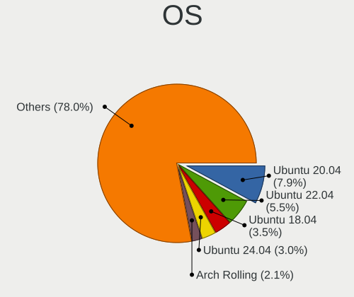

| Name                         | Notebooks | Percent |
|------------------------------|-----------|---------|
| Ubuntu 20.04                 | 1458      | 7.89%   |
| Ubuntu 22.04                 | 1020      | 5.52%   |
| Ubuntu 18.04                 | 650       | 3.52%   |
| Ubuntu 24.04                 | 546       | 2.95%   |
| Arch Rolling                 | 394       | 2.13%   |
| Debian 12                    | 362       | 1.96%   |
| Linux Mint 20.3              | 336       | 1.82%   |
| Linux Mint 22.1              | 313       | 1.69%   |
| Debian 11                    | 313       | 1.69%   |
| Linux Mint 20.2              | 308       | 1.67%   |
| Linux Mint 21.1              | 281       | 1.52%   |
| OpenMandriva 4.2             | 267       | 1.44%   |
| Manjaro                      | 267       | 1.44%   |
| Zorin 17                     | 266       | 1.44%   |
| Pop!_OS 22.04                | 249       | 1.35%   |
| OpenMandriva 4.3             | 249       | 1.35%   |
| Zorin 16                     | 247       | 1.34%   |
| Linux Mint 21.2              | 241       | 1.3%    |
| Linux Mint 22.2              | 239       | 1.29%   |
| Linux Mint 21.3              | 208       | 1.13%   |
| Linux Mint 20.1              | 204       | 1.1%    |
| openSUSE Tumbleweed-XXXXXXXX | 203       | 1.1%    |
| Linux Mint 20                | 178       | 0.96%   |
| Ubuntu 21.10                 | 164       | 0.89%   |
| Linux Mint 22                | 164       | 0.89%   |
| Fedora 40                    | 164       | 0.89%   |
| Ubuntu 20.10                 | 162       | 0.88%   |
| Linux Mint 19.3              | 162       | 0.88%   |
| Fedora 39                    | 157       | 0.85%   |
| Arch                         | 146       | 0.79%   |
| Fedora 41                    | 143       | 0.77%   |
| Xubuntu 20.04                | 142       | 0.77%   |
| ArcoLinux Rolling            | 139       | 0.75%   |
| Fedora 38                    | 137       | 0.74%   |
| Linux Mint 21                | 130       | 0.7%    |
| EndeavourOS Rolling          | 124       | 0.67%   |
| OpenMandriva 23.08           | 122       | 0.66%   |
| Ubuntu 22.10                 | 121       | 0.65%   |
| OpenMandriva 24.12           | 121       | 0.65%   |
| Fedora 42                    | 121       | 0.65%   |

OS Family
---------

OS without a version

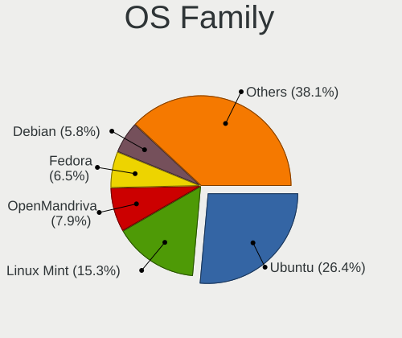

| Name          | Notebooks | Percent |
|---------------|-----------|---------|
| Ubuntu        | 4536      | 26.43%  |
| Linux Mint    | 2622      | 15.28%  |
| OpenMandriva  | 1363      | 7.94%   |
| Fedora        | 1121      | 6.53%   |
| Debian        | 987       | 5.75%   |
| Zorin         | 653       | 3.8%    |
| Manjaro       | 578       | 3.37%   |
| Arch          | 534       | 3.11%   |
| Pop!_OS       | 466       | 2.72%   |
| Kubuntu       | 409       | 2.38%   |
| openSUSE      | 375       | 2.19%   |
| Xubuntu       | 373       | 2.17%   |
| KDE neon      | 222       | 1.29%   |
| ROSA          | 209       | 1.22%   |
| Elementary    | 204       | 1.19%   |
| SteamOS       | 200       | 1.17%   |
| LMDE          | 160       | 0.93%   |
| ArcoLinux     | 148       | 0.86%   |
| Kali          | 135       | 0.79%   |
| EndeavourOS   | 130       | 0.76%   |
| Ubuntu MATE   | 128       | 0.75%   |
| TUXEDO OS     | 127       | 0.74%   |
| MX            | 113       | 0.66%   |
| Gentoo        | 110       | 0.64%   |
| Endless       | 110       | 0.64%   |
| BlackPanther  | 98        | 0.57%   |
| Lubuntu       | 95        | 0.55%   |
| Ubuntu Budgie | 74        | 0.43%   |
| NixOS         | 72        | 0.42%   |
| Bazzite       | 67        | 0.39%   |
| CachyOS       | 62        | 0.36%   |
| Ubuntu Unity  | 57        | 0.33%   |
| Nobara        | 52        | 0.3%    |
| Garuda Linux  | 47        | 0.27%   |
| Parrot        | 31        | 0.18%   |
| Clear Linux   | 26        | 0.15%   |
| Xero          | 25        | 0.15%   |
| Void Linux    | 21        | 0.12%   |
| CentOS        | 20        | 0.12%   |
| Siduction     | 18        | 0.1%    |

Kernel
------

Version of the Linux kernel

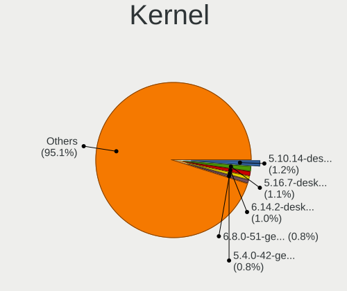

| Version                  | Notebooks | Percent |
|--------------------------|-----------|---------|
| 5.10.14-desktop-1omv4002 | 257       | 1.24%   |
| 5.16.7-desktop-1omv4003  | 229       | 1.11%   |
| 6.14.2-desktop-3omv2590  | 202       | 0.98%   |
| 6.8.0-51-generic         | 161       | 0.78%   |
| 5.4.0-42-generic         | 157       | 0.76%   |
| 5.15.0-56-generic        | 156       | 0.75%   |
| 5.4.0-58-generic         | 120       | 0.58%   |
| 6.8.0-45-generic         | 115       | 0.56%   |
| 5.15.0-58-generic        | 114       | 0.55%   |
| 6.4.11-desktop-1omv2390  | 112       | 0.54%   |
| 5.4.0-91-generic         | 106       | 0.51%   |
| 6.12.1-desktop-1omv2490  | 105       | 0.51%   |
| 6.2.6-desktop-1omv2390   | 95        | 0.46%   |
| 5.4.0-48-generic         | 93        | 0.45%   |
| 5.15.0-91-generic        | 91        | 0.44%   |
| 6.8.0-52-generic         | 90        | 0.43%   |
| 5.4.0-52-generic         | 90        | 0.43%   |
| 6.1.1-desktop-1omv2290   | 87        | 0.42%   |
| 6.8.0-40-generic         | 86        | 0.42%   |
| 6.6.2-desktop-1omv2390   | 85        | 0.41%   |
| 6.14.0-37-generic        | 80        | 0.39%   |
| 5.15.0-46-generic        | 80        | 0.39%   |
| 5.15.0-52-generic        | 79        | 0.38%   |
| 6.14.0-33-generic        | 78        | 0.38%   |
| 6.8.0-60-generic         | 75        | 0.36%   |
| 6.5.0-14-generic         | 75        | 0.36%   |
| 5.15.0-60-generic        | 73        | 0.35%   |
| 6.2.0-39-generic         | 72        | 0.35%   |
| 6.8.0-48-generic         | 71        | 0.34%   |
| 6.8.0-49-generic         | 68        | 0.33%   |
| 6.14.0-29-generic        | 68        | 0.33%   |
| 5.8.0-43-generic         | 68        | 0.33%   |
| 5.4.0-26-generic         | 65        | 0.31%   |
| 5.15.0-76-generic        | 65        | 0.31%   |
| 5.19.0-35-generic        | 64        | 0.31%   |
| 5.15.0-48-generic        | 64        | 0.31%   |
| 6.2.0-26-generic         | 63        | 0.3%    |
| 4.18.16-desktop-1bP      | 62        | 0.3%    |
| 5.13.0-39-generic        | 61        | 0.29%   |
| 5.11.0-38-generic        | 61        | 0.29%   |

Kernel Family
-------------

Linux kernel without a distro release

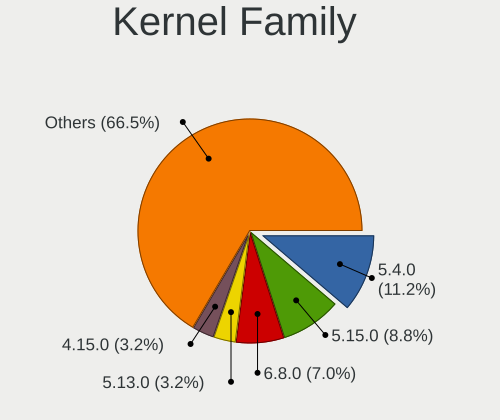

| Version | Notebooks | Percent |
|---------|-----------|---------|
| 5.4.0   | 2149      | 11.23%  |
| 5.15.0  | 1690      | 8.84%   |
| 6.8.0   | 1334      | 6.97%   |
| 5.13.0  | 618       | 3.23%   |
| 4.15.0  | 611       | 3.19%   |
| 6.5.0   | 604       | 3.16%   |
| 5.8.0   | 602       | 3.15%   |
| 5.11.0  | 590       | 3.08%   |
| 6.1.0   | 508       | 2.66%   |
| 6.14.0  | 501       | 2.62%   |
| 6.2.0   | 469       | 2.45%   |
| 5.19.0  | 445       | 2.33%   |
| 5.10.0  | 412       | 2.15%   |
| 5.3.0   | 388       | 2.03%   |
| 6.11.0  | 309       | 1.62%   |
| 5.10.14 | 259       | 1.35%   |
| 5.0.0   | 250       | 1.31%   |
| 5.16.7  | 232       | 1.21%   |
| 6.14.2  | 215       | 1.12%   |
| 4.18.0  | 211       | 1.1%    |
| 6.4.11  | 129       | 0.67%   |
| 6.2.6   | 129       | 0.67%   |
| 6.12.1  | 124       | 0.65%   |
| 6.6.2   | 100       | 0.52%   |
| 4.19.0  | 99        | 0.52%   |
| 6.1.1   | 98        | 0.51%   |
| 5.14.21 | 69        | 0.36%   |
| 6.9.3   | 66        | 0.35%   |
| 4.18.16 | 66        | 0.35%   |
| 6.4.0   | 59        | 0.31%   |
| 6.1.52  | 59        | 0.31%   |
| 5.14.0  | 58        | 0.3%    |
| 6.0.0   | 56        | 0.29%   |
| 6.12.10 | 46        | 0.24%   |
| 6.10.0  | 46        | 0.24%   |
| 6.17.7  | 45        | 0.24%   |
| 6.5.6   | 41        | 0.21%   |
| 6.12.9  | 38        | 0.2%    |
| 6.12.57 | 38        | 0.2%    |
| 4.9.20  | 36        | 0.19%   |

Kernel Major Ver.
-----------------

Linux kernel major version

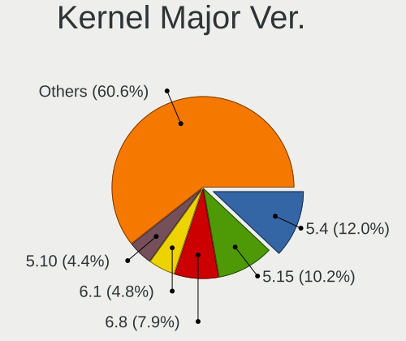

| Version | Notebooks | Percent |
|---------|-----------|---------|
| 5.4     | 2264      | 12.02%  |
| 5.15    | 1922      | 10.2%   |
| 6.8     | 1484      | 7.88%   |
| 6.1     | 911       | 4.84%   |
| 5.10    | 836       | 4.44%   |
| 6.14    | 786       | 4.17%   |
| 6.5     | 762       | 4.04%   |
| 5.8     | 718       | 3.81%   |
| 6.2     | 712       | 3.78%   |
| 5.13    | 696       | 3.69%   |
| 5.11    | 674       | 3.58%   |
| 4.15    | 615       | 3.26%   |
| 6.12    | 555       | 2.95%   |
| 5.19    | 537       | 2.85%   |
| 6.11    | 474       | 2.52%   |
| 5.3     | 458       | 2.43%   |
| 6.6     | 409       | 2.17%   |
| 5.16    | 357       | 1.9%    |
| 6.4     | 318       | 1.69%   |
| 4.18    | 286       | 1.52%   |
| 5.0     | 258       | 1.37%   |
| 6.9     | 218       | 1.16%   |
| 6.17    | 205       | 1.09%   |
| 6.10    | 200       | 1.06%   |
| 6.0     | 200       | 1.06%   |
| 5.14    | 182       | 0.97%   |
| 6.3     | 142       | 0.75%   |
| 6.15    | 136       | 0.72%   |
| 5.9     | 133       | 0.71%   |
| 6.7     | 129       | 0.68%   |
| 6.13    | 129       | 0.68%   |
| 4.9     | 129       | 0.68%   |
| 5.6     | 124       | 0.66%   |
| 4.19    | 123       | 0.65%   |
| 5.17    | 119       | 0.63%   |
| 6.16    | 118       | 0.63%   |
| 5.18    | 113       | 0.6%    |
| 5.12    | 78        | 0.41%   |
| 5.7     | 71        | 0.38%   |
| 5.5     | 52        | 0.28%   |

Arch
----

OS architecture (x86_64, i586, etc.)

| Name    | Notebooks | Percent |
|---------|-----------|---------|
| x86_64  | 16121     | 97.66%  |
| i686    | 365       | 2.21%   |
| aarch64 | 15        | 0.09%   |
| ppc     | 3         | 0.02%   |
| armv7l  | 3         | 0.02%   |
| riscv64 | 1         | 0.01%   |

DE
--

Desktop Environment

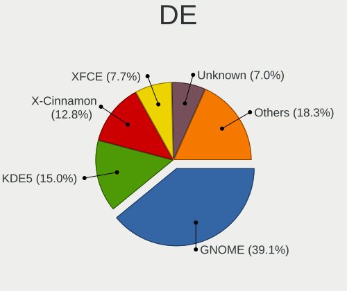

| Name             | Notebooks | Percent |
|------------------|-----------|---------|
| GNOME            | 6769      | 39.07%  |
| KDE5             | 2605      | 15.04%  |
| X-Cinnamon       | 2218      | 12.8%   |
| XFCE             | 1338      | 7.72%   |
| Unknown          | 1221      | 7.05%   |
| KDE6             | 979       | 5.65%   |
| MATE             | 501       | 2.89%   |
| KDE              | 303       | 1.75%   |
| Cinnamon         | 217       | 1.25%   |
| Pantheon         | 202       | 1.17%   |
| LXQt             | 199       | 1.15%   |
| KDE4             | 125       | 0.72%   |
| Budgie           | 98        | 0.57%   |
| i3               | 91        | 0.53%   |
| LXDE             | 68        | 0.39%   |
| Unity            | 62        | 0.36%   |
| Hyprland         | 50        | 0.29%   |
| sway             | 37        | 0.21%   |
| GNOME Flashback  | 27        | 0.16%   |
| Deepin           | 23        | 0.13%   |
| COSMIC           | 22        | 0.13%   |
| GNOME Classic    | 21        | 0.12%   |
| lightdm-xsession | 18        | 0.1%    |
| awesome          | 18        | 0.1%    |
| icewm            | 10        | 0.06%   |
| Enlightenment    | 8         | 0.05%   |
| Trinity          | 7         | 0.04%   |
| Openbox          | 7         | 0.04%   |
| Endless:GNOME    | 7         | 0.04%   |
| bspwm            | 7         | 0.04%   |
| xmonad           | 6         | 0.03%   |
| qtile            | 5         | 0.03%   |
| niri             | 5         | 0.03%   |
| herbstluftwm     | 5         | 0.03%   |
| fluxbox          | 5         | 0.03%   |
| dwm              | 5         | 0.03%   |
| leftwm           | 4         | 0.02%   |
| default          | 3         | 0.02%   |
| chadwm           | 3         | 0.02%   |
| BunsenLabs       | 3         | 0.02%   |

Display Server
--------------

X11 or Wayland

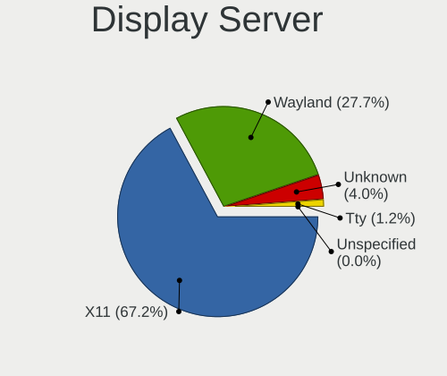

| Name        | Notebooks | Percent |
|-------------|-----------|---------|
| X11         | 11505     | 67.17%  |
| Wayland     | 4738      | 27.66%  |
| Unknown     | 679       | 3.96%   |
| Tty         | 206       | 1.2%    |
| Unspecified | 1         | 0.01%   |

Display Manager
---------------

SDDM, LightDM, etc.

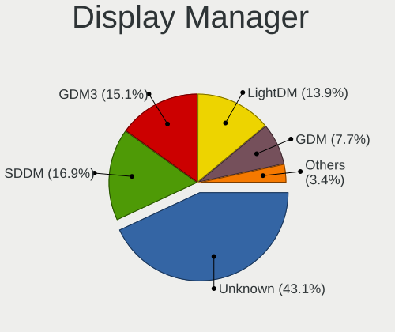

| Name               | Notebooks | Percent |
|--------------------|-----------|---------|
| Unknown            | 7414      | 43.05%  |
| SDDM               | 2907      | 16.88%  |
| GDM3               | 2597      | 15.08%  |
| LightDM            | 2399      | 13.93%  |
| GDM                | 1322      | 7.68%   |
| TDM                | 368       | 2.14%   |
| KDM                | 110       | 0.64%   |
| XDM                | 21        | 0.12%   |
| SLiM               | 21        | 0.12%   |
| GREETD             | 17        | 0.1%    |
| LXDM               | 12        | 0.07%   |
| SLIMSKI            | 7         | 0.04%   |
| COSMIC-GREETER     | 7         | 0.04%   |
| NODM               | 6         | 0.03%   |
| LY-DM              | 6         | 0.03%   |
| Ly                 | 3         | 0.02%   |
| MDM                | 2         | 0.01%   |
| TINYDM-RUN-SESSION | 1         | 0.01%   |

OS Lang
-------

Language

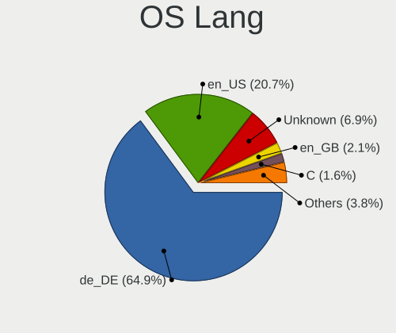

| Lang        | Notebooks | Percent |
|-------------|-----------|---------|
| de_DE       | 10938     | 64.86%  |
| en_US       | 3492      | 20.71%  |
| Unknown     | 1167      | 6.92%   |
| en_GB       | 349       | 2.07%   |
| C           | 275       | 1.63%   |
| ru_RU       | 110       | 0.65%   |
| pl_PL       | 64        | 0.38%   |
| POSIX       | 41        | 0.24%   |
| en_DE       | 38        | 0.23%   |
| it_IT       | 37        | 0.22%   |
| fr_FR       | 31        | 0.18%   |
| hu_HU       | 22        | 0.13%   |
| es_ES       | 22        | 0.13%   |
| de_AT       | 21        | 0.12%   |
| en_DK       | 15        | 0.09%   |
| ro_RO       | 14        | 0.08%   |
| C.UTF8      | 14        | 0.08%   |
| uk_UA       | 13        | 0.08%   |
| en_IE       | 13        | 0.08%   |
| ru_UA       | 11        | 0.07%   |
| nl_NL       | 11        | 0.07%   |
| en_CA       | 11        | 0.07%   |
| tr_TR       | 10        | 0.06%   |
| de_CH       | 10        | 0.06%   |
| en_IN       | 9         | 0.05%   |
| en_AG       | 8         | 0.05%   |
| pt_BR       | 7         | 0.04%   |
| en_AU       | 7         | 0.04%   |
| sk_SK       | 6         | 0.04%   |
| de_IT       | 6         | 0.04%   |
| bg_BG       | 6         | 0.04%   |
| de_DE.UTF8  | 5         | 0.03%   |
| zh_CN       | 4         | 0.02%   |
| pt_PT       | 4         | 0.02%   |
| de_BE       | 4         | 0.02%   |
| nds_DE      | 3         | 0.02%   |
| ja_JP       | 3         | 0.02%   |
| hr_HR       | 3         | 0.02%   |
| de_DE.utf-8 | 3         | 0.02%   |
| de          | 3         | 0.02%   |

Boot Mode
---------

EFI or BIOS

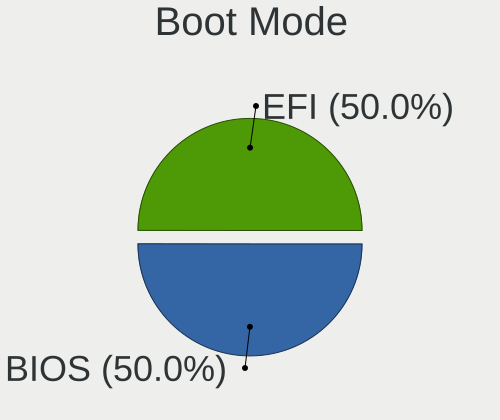

| Mode | Notebooks | Percent |
|------|-----------|---------|
| BIOS | 8472      | 50.02%  |
| EFI  | 8464      | 49.98%  |

Filesystem
----------

Type of filesystem

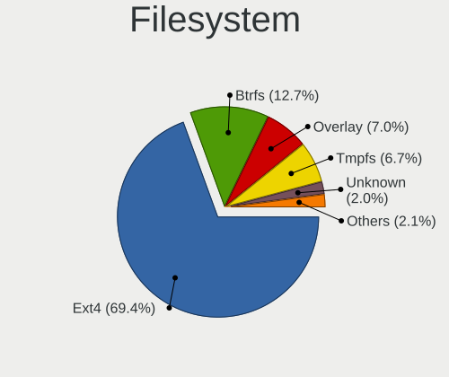

| Type     | Notebooks | Percent |
|----------|-----------|---------|
| Ext4     | 11843     | 69.44%  |
| Btrfs    | 2168      | 12.71%  |
| Overlay  | 1199      | 7.03%   |
| Tmpfs    | 1139      | 6.68%   |
| Unknown  | 345       | 2.02%   |
| Xfs      | 157       | 0.92%   |
| Zfs      | 113       | 0.66%   |
| Ext2     | 26        | 0.15%   |
| F2fs     | 25        | 0.15%   |
| Ext3     | 19        | 0.11%   |
| Rootfs   | 8         | 0.05%   |
| Aufs     | 3         | 0.02%   |
| Reiserfs | 2         | 0.01%   |
| Bcachefs | 2         | 0.01%   |
| XXXXXXX  | 1         | 0.01%   |
| XXXfs    | 1         | 0.01%   |
| XXX4     | 1         | 0.01%   |
| OveXlay  | 1         | 0.01%   |
| Jfs      | 1         | 0.01%   |

Part. scheme
------------

Scheme of partitioning

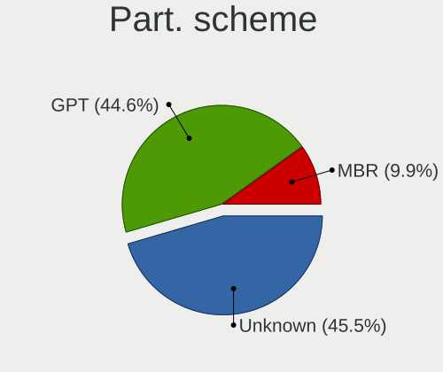

| Type    | Notebooks | Percent |
|---------|-----------|---------|
| Unknown | 7738      | 45.46%  |
| GPT     | 7598      | 44.64%  |
| MBR     | 1684      | 9.89%   |

Dual Boot with Linux/BSD
------------------------

Hosting more than one Linux/BSD

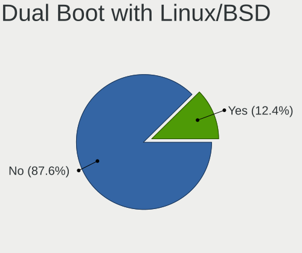

| Dual boot | Notebooks | Percent |
|-----------|-----------|---------|
| No        | 14727     | 87.61%  |
| Yes       | 2082      | 12.39%  |

Dual Boot (Win)
---------------

Hosting Linux and Windows

| Dual boot | Notebooks | Percent |
|-----------|-----------|---------|
| No        | 12874     | 76.73%  |
| Yes       | 3905      | 23.27%  |

Board
-----

Vendor
------

Motherboard manufacturer

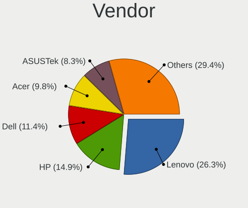

| Name                | Notebooks | Percent |
|---------------------|-----------|---------|
| Lenovo              | 4336      | 26.28%  |
| Hewlett-Packard     | 2459      | 14.9%   |
| Dell                | 1875      | 11.36%  |
| Acer                | 1619      | 9.81%   |
| ASUSTek Computer    | 1366      | 8.28%   |
| Apple               | 512       | 3.1%    |
| Medion              | 482       | 2.92%   |
| Fujitsu             | 426       | 2.58%   |
| Toshiba             | 384       | 2.33%   |
| TUXEDO              | 361       | 2.19%   |
| Samsung Electronics | 276       | 1.67%   |
| MSI                 | 259       | 1.57%   |
| Sony                | 229       | 1.39%   |
| Valve               | 202       | 1.22%   |
| HUAWEI              | 201       | 1.22%   |
| Notebook            | 148       | 0.9%    |
| Schenker            | 125       | 0.76%   |
| Fujitsu Siemens     | 113       | 0.68%   |
| Packard Bell        | 108       | 0.65%   |
| Unknown             | 96        | 0.58%   |
| Framework           | 83        | 0.5%    |
| Wortmann AG         | 72        | 0.44%   |
| Google              | 55        | 0.33%   |
| Gigabyte Technology | 48        | 0.29%   |
| Razer               | 36        | 0.22%   |
| Clevo               | 31        | 0.19%   |
| Alienware           | 31        | 0.19%   |
| LG Electronics      | 30        | 0.18%   |
| TrekStor            | 28        | 0.17%   |
| Chuwi               | 27        | 0.16%   |
| Timi                | 24        | 0.15%   |
| Panasonic           | 23        | 0.14%   |
| AXDIA International | 21        | 0.13%   |
| IBM                 | 20        | 0.12%   |
| eMachines           | 18        | 0.11%   |
| VALE                | 17        | 0.1%    |
| GPD                 | 13        | 0.08%   |
| System76            | 12        | 0.07%   |
| AMI                 | 12        | 0.07%   |
| LincPlus            | 11        | 0.07%   |

Model
-----

Motherboard model

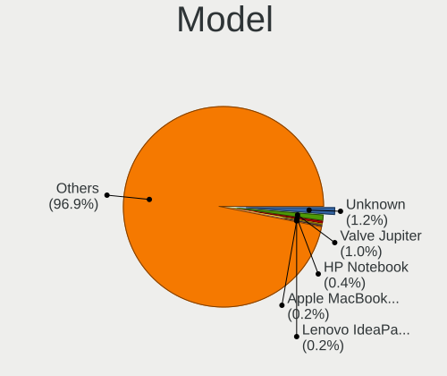

| Name                                       | Notebooks | Percent |
|--------------------------------------------|-----------|---------|
| Unknown                                    | 203       | 1.23%   |
| Valve Jupiter                              | 168       | 1.02%   |
| HP Notebook                                | 71        | 0.43%   |
| Apple MacBookAir7,2                        | 39        | 0.24%   |
| Lenovo IdeaPad 5 15ARE05 81YQ              | 38        | 0.23%   |
| HP Laptop 15s-eq2xxx                       | 38        | 0.23%   |
| HP Pavilion 17                             | 35        | 0.21%   |
| HP 255 G7 Notebook PC                      | 35        | 0.21%   |
| Apple MacBookPro9,2                        | 35        | 0.21%   |
| Apple MacBookPro12,1                       | 35        | 0.21%   |
| Valve Galileo                              | 34        | 0.21%   |
| Dell Latitude E6430                        | 32        | 0.19%   |
| Dell Latitude E6420                        | 32        | 0.19%   |
| HP Pavilion Notebook                       | 31        | 0.19%   |
| Dell Latitude E6540                        | 31        | 0.19%   |
| Acer Aspire V3-771                         | 31        | 0.19%   |
| Acer Aspire 7750G                          | 31        | 0.19%   |
| HP EliteBook 840 G5                        | 30        | 0.18%   |
| Dell XPS 15 7590                           | 30        | 0.18%   |
| ASUS P50IJ                                 | 30        | 0.18%   |
| HP 250 G7 Notebook PC                      | 29        | 0.18%   |
| Dell Latitude E6410                        | 29        | 0.18%   |
| HP EliteBook 8460p                         | 28        | 0.17%   |
| HP Laptop 17-cp0xxx                        | 27        | 0.16%   |
| Framework Laptop 13 (AMD Ryzen 7040Series) | 27        | 0.16%   |
| Dell XPS 13 9370                           | 27        | 0.16%   |
| Apple MacBookPro8,1                        | 27        | 0.16%   |
| HP Pavilion g7                             | 26        | 0.16%   |
| HP EliteBook 840 G3                        | 26        | 0.16%   |
| Dell XPS 15 9570                           | 26        | 0.16%   |
| Dell Latitude E6520                        | 26        | 0.16%   |
| TUXEDO Pulse 15 Gen1                       | 25        | 0.15%   |
| Lenovo G700 20251                          | 25        | 0.15%   |
| HUAWEI HVY-WXX9                            | 25        | 0.15%   |
| Apple MacBookPro11,1                       | 25        | 0.15%   |
| Acer Swift SF114-34                        | 25        | 0.15%   |
| HP EliteBook 8470p                         | 24        | 0.15%   |
| Dell Latitude E7470                        | 24        | 0.15%   |
| HUAWEI NBLK-WAX9X                          | 23        | 0.14%   |
| HP ProBook 650 G1                          | 23        | 0.14%   |

Model Family
------------

Motherboard model prefix

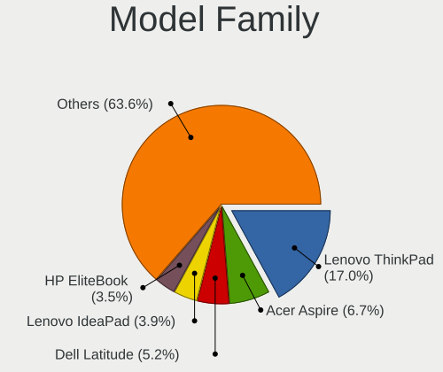

| Name                  | Notebooks | Percent |
|-----------------------|-----------|---------|
| Lenovo ThinkPad       | 2812      | 17.04%  |
| Acer Aspire           | 1106      | 6.7%    |
| Dell Latitude         | 864       | 5.24%   |
| Lenovo IdeaPad        | 647       | 3.92%   |
| HP EliteBook          | 574       | 3.48%   |
| HP Laptop             | 424       | 2.57%   |
| Fujitsu LIFEBOOK      | 400       | 2.42%   |
| HP Pavilion           | 343       | 2.08%   |
| Toshiba Satellite     | 317       | 1.92%   |
| HP ProBook            | 306       | 1.85%   |
| Dell XPS              | 303       | 1.84%   |
| Dell Inspiron         | 249       | 1.51%   |
| Dell Precision        | 246       | 1.49%   |
| ASUS VivoBook         | 211       | 1.28%   |
| Unknown               | 203       | 1.23%   |
| Valve Jupiter         | 168       | 1.02%   |
| Acer Swift            | 153       | 0.93%   |
| Acer TravelMate       | 121       | 0.73%   |
| HP Compaq             | 119       | 0.72%   |
| HP 255                | 116       | 0.7%    |
| HP ZBook              | 108       | 0.65%   |
| Lenovo Legion         | 104       | 0.63%   |
| Lenovo Yoga           | 103       | 0.62%   |
| TUXEDO InfinityBook   | 100       | 0.61%   |
| Packard Bell EasyNote | 98        | 0.59%   |
| Medion Akoya          | 95        | 0.58%   |
| ASUS ROG              | 93        | 0.56%   |
| HP 250                | 92        | 0.56%   |
| ASUS ZenBook          | 92        | 0.56%   |
| ASUS ASUS             | 92        | 0.56%   |
| Lenovo ThinkBook      | 85        | 0.52%   |
| Framework Laptop      | 83        | 0.5%    |
| Dell Vostro           | 81        | 0.49%   |
| Apple MacBookPro11    | 80        | 0.48%   |
| Acer Nitro            | 73        | 0.44%   |
| Schenker XMG          | 72        | 0.44%   |
| HP Notebook           | 71        | 0.43%   |
| Acer Extensa          | 62        | 0.38%   |
| HP ENVY               | 55        | 0.33%   |
| TUXEDO Pulse          | 50        | 0.3%    |

MFG Year
--------

Motherboard manufacture year

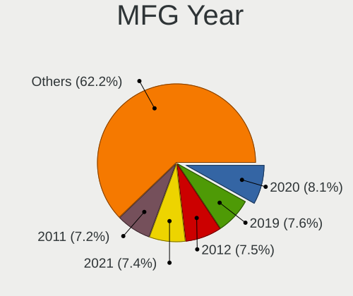

| Year    | Notebooks | Percent |
|---------|-----------|---------|
| 2020    | 1341      | 8.13%   |
| 2019    | 1246      | 7.55%   |
| 2012    | 1237      | 7.5%    |
| 2021    | 1228      | 7.44%   |
| 2011    | 1190      | 7.21%   |
| 2018    | 1179      | 7.15%   |
| 2013    | 1118      | 6.78%   |
| 2014    | 915       | 5.55%   |
| 2017    | 912       | 5.53%   |
| 2010    | 837       | 5.07%   |
| 2016    | 825       | 5%      |
| 2015    | 771       | 4.67%   |
| 2022    | 759       | 4.6%    |
| 2008    | 677       | 4.1%    |
| 2023    | 610       | 3.7%    |
| 2009    | 582       | 3.53%   |
| 2024    | 378       | 2.29%   |
| 2007    | 308       | 1.87%   |
| 2006    | 175       | 1.06%   |
| 2025    | 111       | 0.67%   |
| 2005    | 47        | 0.28%   |
| Unknown | 35        | 0.21%   |
| 2004    | 12        | 0.07%   |
| 2003    | 4         | 0.02%   |
| 2002    | 2         | 0.01%   |
| 2000    | 1         | 0.01%   |
| 1999    | 1         | 0.01%   |

Form Factor
-----------

Physical design of the computer

| Name     | Notebooks | Percent |
|----------|-----------|---------|
| Notebook | 16501     | 100%    |

Secure Boot
-----------

Enabled or disabled

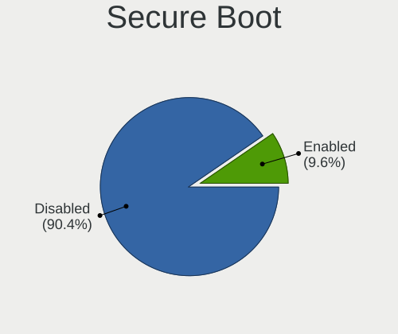

| State    | Notebooks | Percent |
|----------|-----------|---------|
| Disabled | 15074     | 90.42%  |
| Enabled  | 1597      | 9.58%   |

Coreboot
--------

Have coreboot on board

| Used | Notebooks | Percent |
|------|-----------|---------|
| No   | 16407     | 99.43%  |
| Yes  | 94        | 0.57%   |

RAM Size
--------

Total RAM memory

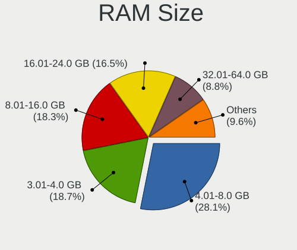

| Size in GB  | Notebooks | Percent |
|-------------|-----------|---------|
| 4.01-8.0    | 4720      | 28.14%  |
| 3.01-4.0    | 3139      | 18.72%  |
| 8.01-16.0   | 3063      | 18.26%  |
| 16.01-24.0  | 2766      | 16.49%  |
| 32.01-64.0  | 1468      | 8.75%   |
| 1.01-2.0    | 516       | 3.08%   |
| 24.01-32.0  | 386       | 2.3%    |
| 64.01-256.0 | 347       | 2.07%   |
| 2.01-3.0    | 258       | 1.54%   |
| 0.51-1.0    | 97        | 0.58%   |
| 0.01-0.5    | 9         | 0.05%   |
| Unknown     | 2         | 0.01%   |

RAM Used
--------

Used RAM memory

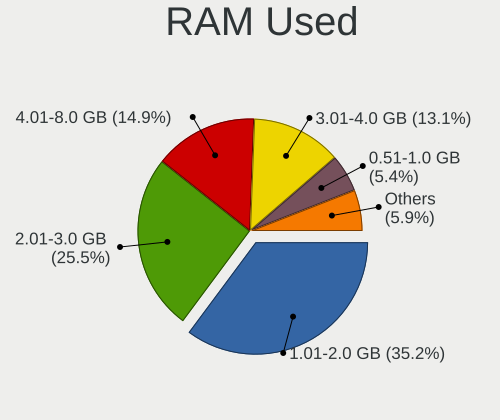

| Used GB    | Notebooks | Percent |
|------------|-----------|---------|
| 1.01-2.0   | 6496      | 35.17%  |
| 2.01-3.0   | 4709      | 25.49%  |
| 4.01-8.0   | 2758      | 14.93%  |
| 3.01-4.0   | 2414      | 13.07%  |
| 0.51-1.0   | 999       | 5.41%   |
| 8.01-16.0  | 776       | 4.2%    |
| 0.01-0.5   | 157       | 0.85%   |
| 16.01-24.0 | 108       | 0.58%   |
| 24.01-32.0 | 38        | 0.21%   |
| 32.01-64.0 | 13        | 0.07%   |
| Unknown    | 3         | 0.02%   |
| 0          | 1         | 0.01%   |

Total Drives
------------

Number of drives on board

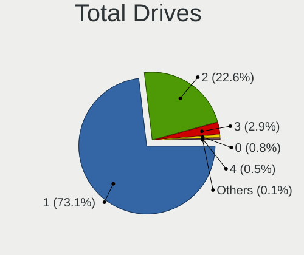

| Drives | Notebooks | Percent |
|--------|-----------|---------|
| 1      | 12396     | 73.13%  |
| 2      | 3827      | 22.58%  |
| 3      | 490       | 2.89%   |
| 0      | 133       | 0.78%   |
| 4      | 82        | 0.48%   |
| 5      | 9         | 0.05%   |
| 6      | 6         | 0.04%   |
| 7      | 3         | 0.02%   |
| 14     | 1         | 0.01%   |
| 13     | 1         | 0.01%   |
| 9      | 1         | 0.01%   |
| 8      | 1         | 0.01%   |

Has CD-ROM
----------

Has CD-ROM on board

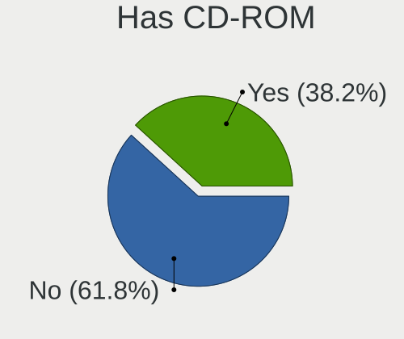

| Presented | Notebooks | Percent |
|-----------|-----------|---------|
| No        | 10266     | 61.79%  |
| Yes       | 6348      | 38.21%  |

Has Ethernet
------------

Has Ethernet on board

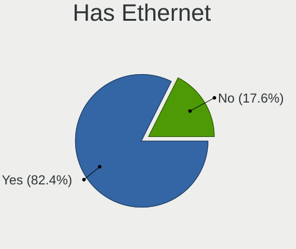

| Presented | Notebooks | Percent |
|-----------|-----------|---------|
| Yes       | 13684     | 82.43%  |
| No        | 2917      | 17.57%  |

Has WiFi
--------

Has WiFi module

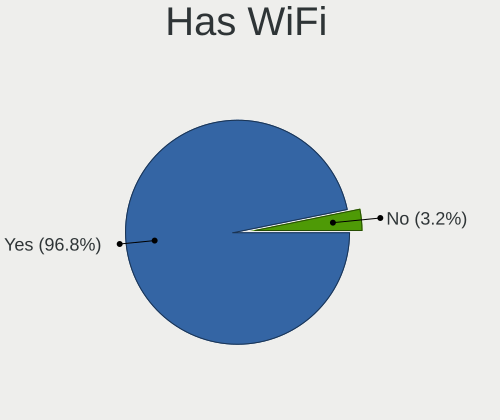

| Presented | Notebooks | Percent |
|-----------|-----------|---------|
| Yes       | 15996     | 96.81%  |
| No        | 527       | 3.19%   |

Has Bluetooth
-------------

Has Bluetooth module

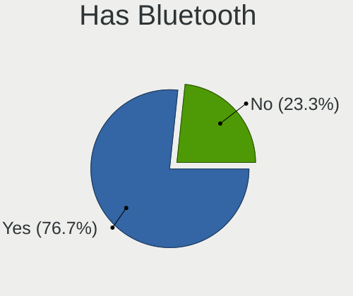

| Presented | Notebooks | Percent |
|-----------|-----------|---------|
| Yes       | 12870     | 76.67%  |
| No        | 3917      | 23.33%  |

Location
--------

Country
-------

Geographic location (country)

| Country | Notebooks | Percent |
|---------|-----------|---------|
| Germany | 16501     | 100%    |

City
----

Geographic location (city)

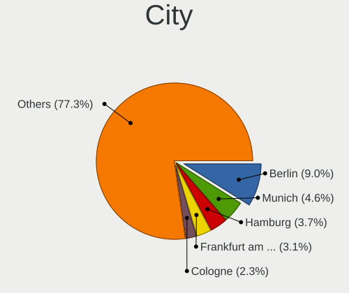

| City                 | Notebooks | Percent |
|----------------------|-----------|---------|
| Berlin               | 1614      | 8.96%   |
| Munich               | 836       | 4.64%   |
| Hamburg              | 664       | 3.68%   |
| Frankfurt am Main    | 566       | 3.14%   |
| Cologne              | 417       | 2.31%   |
| Stuttgart            | 356       | 1.98%   |
| Leipzig              | 291       | 1.61%   |
| Nuremberg            | 233       | 1.29%   |
| Dresden              | 231       | 1.28%   |
| Düsseldorf          | 227       | 1.26%   |
| Essen                | 205       | 1.14%   |
| Mannheim             | 177       | 0.98%   |
| Hanover              | 165       | 0.92%   |
| Karlsruhe            | 155       | 0.86%   |
| Dortmund             | 149       | 0.83%   |
| Bremen               | 135       | 0.75%   |
| Bonn                 | 128       | 0.71%   |
| Duisburg             | 117       | 0.65%   |
| Bochum               | 111       | 0.62%   |
| Augsburg             | 107       | 0.59%   |
| Darmstadt            | 105       | 0.58%   |
| Wuppertal            | 102       | 0.57%   |
| Braunschweig         | 98        | 0.54%   |
| Bielefeld            | 97        | 0.54%   |
| Münster             | 83        | 0.46%   |
| Mainz                | 80        | 0.44%   |
| Aachen               | 78        | 0.43%   |
| Wiesbaden            | 76        | 0.42%   |
| Kiel                 | 67        | 0.37%   |
| Regensburg           | 65        | 0.36%   |
| Chemnitz             | 65        | 0.36%   |
| Reutlingen           | 61        | 0.34%   |
| Halle                | 58        | 0.32%   |
| Freiburg im Breisgau | 58        | 0.32%   |
| Lübeck              | 57        | 0.32%   |
| Erfurt               | 57        | 0.32%   |
| Krefeld              | 56        | 0.31%   |
| Koblenz              | 53        | 0.29%   |
| Mönchengladbach     | 51        | 0.28%   |
| Saarbrücken         | 50        | 0.28%   |

Drives
------

Drive Vendor
------------

Hard drive vendors

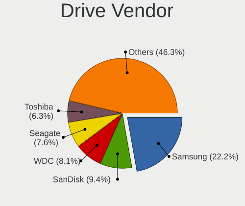

| Vendor                      | Notebooks | Drives | Percent |
|-----------------------------|-----------|--------|---------|
| Samsung Electronics         | 4526      | 6354   | 22.2%   |
| SanDisk                     | 1926      | 2653   | 9.45%   |
| WDC                         | 1657      | 2192   | 8.13%   |
| Seagate                     | 1548      | 1981   | 7.59%   |
| Toshiba                     | 1281      | 1672   | 6.28%   |
| Unknown                     | 1084      | 1482   | 5.32%   |
| SK hynix                    | 894       | 1119   | 4.39%   |
| Crucial                     | 784       | 1042   | 3.85%   |
| Micron Technology           | 669       | 841    | 3.28%   |
| Intenso                     | 607       | 805    | 2.98%   |
| Intel                       | 568       | 762    | 2.79%   |
| Kingston                    | 566       | 751    | 2.78%   |
| Hitachi                     | 504       | 629    | 2.47%   |
| HGST                        | 353       | 478    | 1.73%   |
| Apple                       | 275       | 385    | 1.35%   |
| KIOXIA                      | 261       | 333    | 1.28%   |
| Phison Electronics          | 152       | 199    | 0.75%   |
| Micron/Crucial Technology   | 148       | 205    | 0.73%   |
| Transcend                   | 127       | 156    | 0.62%   |
| Fujitsu                     | 123       | 161    | 0.6%    |
| Unknown                     | 120       | 135    | 0.59%   |
| Phison                      | 112       | 153    | 0.55%   |
| LITEON                      | 112       | 123    | 0.55%   |
| Kingston Technology Company | 105       | 138    | 0.52%   |
| A-DATA Technology           | 97        | 119    | 0.48%   |
| China                       | 89        | 104    | 0.44%   |
| Silicon Motion              | 70        | 89     | 0.34%   |
| LITEONIT                    | 65        | 88     | 0.32%   |
| SPCC                        | 61        | 67     | 0.3%    |
| JMicron Technology          | 59        | 63     | 0.29%   |
| ASMT                        | 52        | 59     | 0.26%   |
| Verbatim                    | 51        | 62     | 0.25%   |
| Patriot                     | 48        | 71     | 0.24%   |
| MAXIO Technology (Hangzhou) | 47        | 54     | 0.23%   |
| OCZ                         | 46        | 61     | 0.23%   |
| Netac                       | 45        | 72     | 0.22%   |
| UMIS                        | 41        | 63     | 0.2%    |
| Lenovo                      | 34        | 39     | 0.17%   |
| Leven                       | 32        | 46     | 0.16%   |
| Lexar                       | 31        | 35     | 0.15%   |

Drive Model
-----------

Hard drive models

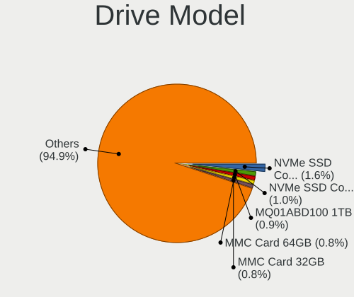

| Model                                                | Notebooks | Percent |
|------------------------------------------------------|-----------|---------|
| Samsung NVMe SSD Controller SM981/PM981/PM983 1TB    | 347       | 1.62%   |
| Samsung NVMe SSD Controller PM9A1/PM9A3/980PRO 1TB   | 206       | 0.96%   |
| Toshiba MQ01ABD100 1TB                               | 186       | 0.87%   |
| Unknown MMC Card  64GB                               | 180       | 0.84%   |
| Unknown MMC Card  32GB                               | 166       | 0.78%   |
| Samsung SSD 850 EVO 500GB                            | 163       | 0.76%   |
| Seagate ST1000LM024 HN-M101MBB 1TB                   | 162       | 0.76%   |
| Samsung SSD 850 EVO 250GB                            | 160       | 0.75%   |
| Samsung SSD 860 EVO 500GB                            | 158       | 0.74%   |
| Seagate ST1000LM035-1RK172 1TB                       | 148       | 0.69%   |
| Crucial CT500MX500SSD1 500GB                         | 131       | 0.61%   |
| SanDisk NVMe SSD Drive 512GB                         | 129       | 0.6%    |
| Unknown                                              | 120       | 0.56%   |
| Seagate ST9500325AS 500GB                            | 111       | 0.52%   |
| Crucial CT1000MX500SSD1 1TB                          | 104       | 0.49%   |
| SanDisk SSD PLUS 240GB                               | 103       | 0.48%   |
| Unknown MMC Card  128GB                              | 99        | 0.46%   |
| Samsung NVMe SSD Drive 512GB                         | 99        | 0.46%   |
| WDC WD10JPVX-22JC3T0 1TB                             | 98        | 0.46%   |
| Samsung SSD 860 EVO 1TB                              | 95        | 0.44%   |
| SanDisk NVMe SSD Drive 1TB                           | 92        | 0.43%   |
| SanDisk SSD PLUS 1000GB                              | 91        | 0.43%   |
| Samsung SSD 860 EVO 250GB                            | 89        | 0.42%   |
| Toshiba MQ01ABF050 500GB                             | 88        | 0.41%   |
| Seagate ST500LT012-1DG142 500GB                      | 87        | 0.41%   |
| Toshiba MQ04ABF100 1TB                               | 84        | 0.39%   |
| Sandisk WD Black SN750 / PC SN730 NVMe SSD 500GB     | 84        | 0.39%   |
| Samsung SSD 980 1TB                                  | 81        | 0.38%   |
| Sandisk WD Blue SN550 NVMe SSD 1024GB                | 75        | 0.35%   |
| Crucial CT240BX500SSD1 240GB                         | 75        | 0.35%   |
| Micron/Crucial P2 NVMe PCIe SSD 2TB                  | 73        | 0.34%   |
| HGST HTS721010A9E630 1TB                             | 73        | 0.34%   |
| HGST HTS541010A9E680 1TB                             | 70        | 0.33%   |
| SanDisk SSD PLUS 480GB                               | 69        | 0.32%   |
| Samsung SSD 840 EVO 250GB                            | 69        | 0.32%   |
| Samsung NVMe SSD Controller SM961/PM961/SM963 1024GB | 69        | 0.32%   |
| Intenso SSD SATAIII 512GB                            | 68        | 0.32%   |
| Samsung SSD 970 EVO Plus 1TB                         | 64        | 0.3%    |
| HGST HTS725050A7E630 500GB                           | 64        | 0.3%    |
| SK hynix NVMe SSD Drive 512GB                        | 63        | 0.29%   |

HDD Vendor
----------

Hard disk drive vendors

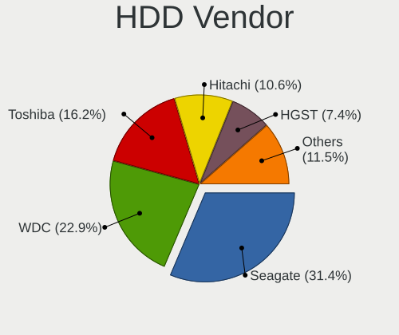

| Vendor              | Notebooks | Drives | Percent |
|---------------------|-----------|--------|---------|
| Seagate             | 1491      | 1909   | 31.38%  |
| WDC                 | 1086      | 1447   | 22.86%  |
| Toshiba             | 771       | 997    | 16.23%  |
| Hitachi             | 504       | 629    | 10.61%  |
| HGST                | 353       | 478    | 7.43%   |
| Samsung Electronics | 140       | 182    | 2.95%   |
| Fujitsu             | 123       | 161    | 2.59%   |
| Unknown             | 60        | 104    | 1.26%   |
| Intenso             | 53        | 65     | 1.12%   |
| JMicron Technology  | 36        | 38     | 0.76%   |
| ASMT                | 18        | 19     | 0.38%   |
| Apple               | 18        | 19     | 0.38%   |
| USB3.0              | 12        | 15     | 0.25%   |
| ASMedia             | 12        | 15     | 0.25%   |
| JetFlash            | 10        | 18     | 0.21%   |
| IBM/Hitachi         | 9         | 10     | 0.19%   |
| USB                 | 7         | 8      | 0.15%   |
| TO Exter            | 6         | 8      | 0.13%   |
| IB-AC703            | 4         | 5      | 0.08%   |
| External            | 4         | 4      | 0.08%   |
| SABRENT             | 3         | 4      | 0.06%   |
| HGST HTS            | 3         | 3      | 0.06%   |
| SSK                 | 2         | 2      | 0.04%   |
| SILICONMOTION       | 2         | 3      | 0.04%   |
| Maxone              | 2         | 2      | 0.04%   |
| LIO-ORG             | 2         | 12     | 0.04%   |
| Inateck             | 2         | 2      | 0.04%   |
| ASUSTOR             | 2         | 4      | 0.04%   |
| Unknown             | 2         | 2      | 0.04%   |
| WD_BLACK            | 1         | 1      | 0.02%   |
| WD MediaMax         | 1         | 1      | 0.02%   |
| StoreJet            | 1         | 1      | 0.02%   |
| STEC                | 1         | 1      | 0.02%   |
| SAGE                | 1         | 1      | 0.02%   |
| Maxtor              | 1         | 1      | 0.02%   |
| LaCie               | 1         | 1      | 0.02%   |
| KIOXIA              | 1         | 1      | 0.02%   |
| KESU                | 1         | 1      | 0.02%   |
| IBM                 | 1         | 1      | 0.02%   |
| IB-377U3            | 1         | 1      | 0.02%   |

SSD Vendor
----------

Solid state drive vendors

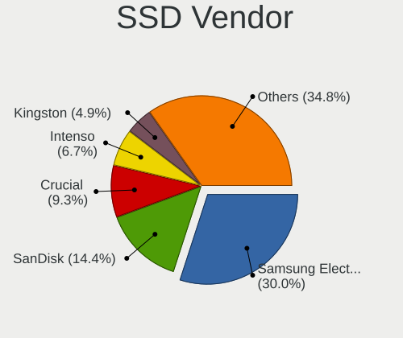

| Vendor              | Notebooks | Drives | Percent |
|---------------------|-----------|--------|---------|
| Samsung Electronics | 2225      | 3027   | 29.98%  |
| SanDisk             | 1068      | 1528   | 14.39%  |
| Crucial             | 693       | 942    | 9.34%   |
| Intenso             | 495       | 647    | 6.67%   |
| Kingston            | 361       | 486    | 4.86%   |
| WDC                 | 255       | 324    | 3.44%   |
| Micron Technology   | 210       | 255    | 2.83%   |
| Intel               | 200       | 253    | 2.69%   |
| Apple               | 194       | 221    | 2.61%   |
| Toshiba             | 187       | 237    | 2.52%   |
| SK hynix            | 178       | 216    | 2.4%    |
| Transcend           | 123       | 152    | 1.66%   |
| LITEON              | 106       | 116    | 1.43%   |
| China               | 89        | 104    | 1.2%    |
| A-DATA Technology   | 79        | 96     | 1.06%   |
| LITEONIT            | 65        | 88     | 0.88%   |
| SPCC                | 56        | 61     | 0.75%   |
| Verbatim            | 48        | 59     | 0.65%   |
| Patriot             | 47        | 69     | 0.63%   |
| OCZ                 | 46        | 61     | 0.62%   |
| Netac               | 38        | 61     | 0.51%   |
| Phison              | 37        | 50     | 0.5%    |
| Leven               | 32        | 46     | 0.43%   |
| Unknown             | 29        | 31     | 0.39%   |
| INNOVATION IT       | 28        | 35     | 0.38%   |
| Emtec               | 28        | 30     | 0.38%   |
| ASMT                | 28        | 34     | 0.38%   |
| Hewlett-Packard     | 22        | 27     | 0.3%    |
| SABRENT             | 21        | 24     | 0.28%   |
| PNY                 | 21        | 25     | 0.28%   |
| KingSpec            | 21        | 29     | 0.28%   |
| Lexar               | 17        | 20     | 0.23%   |
| Dogfish             | 17        | 28     | 0.23%   |
| SD                  | 16        | 18     | 0.22%   |
| Fanxiang            | 16        | 18     | 0.22%   |
| Apacer              | 16        | 21     | 0.22%   |
| Unknown             | 14        | 15     | 0.19%   |
| Seagate             | 13        | 16     | 0.18%   |
| KingDian            | 13        | 14     | 0.18%   |
| Corsair             | 12        | 13     | 0.16%   |

Drive Kind
----------

HDD or SSD

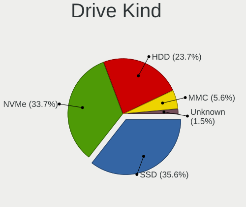

| Kind    | Notebooks | Drives | Percent |
|---------|-----------|--------|---------|
| SSD     | 6850      | 9833   | 35.59%  |
| NVMe    | 6481      | 9319   | 33.67%  |
| HDD     | 4564      | 6180   | 23.71%  |
| MMC     | 1071      | 1436   | 5.56%   |
| Unknown | 280       | 352    | 1.45%   |

Drive Connector
---------------

SATA, SAS, NVMe, etc.

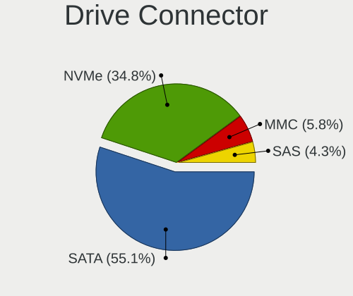

| Type | Notebooks | Drives | Percent |
|------|-----------|--------|---------|
| SATA | 10224     | 15320  | 55.08%  |
| NVMe | 6465      | 9230   | 34.83%  |
| MMC  | 1071      | 1436   | 5.77%   |
| SAS  | 802       | 1134   | 4.32%   |

Drive Size
----------

Size of hard drive

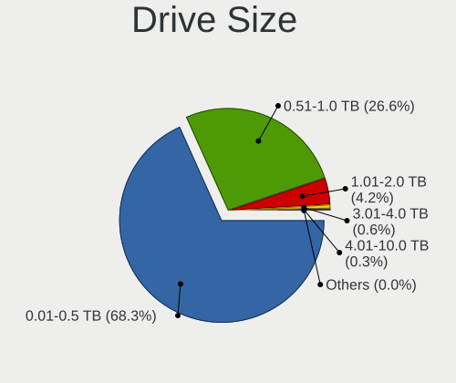

| Size in TB | Notebooks | Drives | Percent |
|------------|-----------|--------|---------|
| 0.01-0.5   | 7769      | 11007  | 68.29%  |
| 0.51-1.0   | 3022      | 4185   | 26.56%  |
| 1.01-2.0   | 476       | 651    | 4.18%   |
| 3.01-4.0   | 73        | 111    | 0.64%   |
| 4.01-10.0  | 33        | 55     | 0.29%   |
| 2.01-3.0   | 3         | 3      | 0.03%   |
| 20.01-50.0 | 1         | 1      | 0.01%   |

Space Total
-----------

Amount of disk space available on the file system

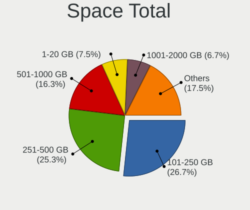

| Size in GB     | Notebooks | Percent |
|----------------|-----------|---------|
| 101-250        | 4712      | 26.68%  |
| 251-500        | 4460      | 25.25%  |
| 501-1000       | 2873      | 16.27%  |
| 1-20           | 1328      | 7.52%   |
| 1001-2000      | 1191      | 6.74%   |
| 51-100         | 1016      | 5.75%   |
| Unknown        | 632       | 3.58%   |
| More than 3000 | 558       | 3.16%   |
| 21-50          | 556       | 3.15%   |
| 2001-3000      | 337       | 1.91%   |

Space Used
----------

Amount of used disk space

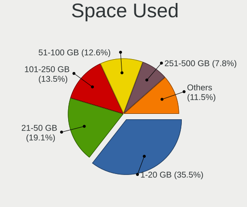

| Used GB        | Notebooks | Percent |
|----------------|-----------|---------|
| 1-20           | 6578      | 35.53%  |
| 21-50          | 3542      | 19.13%  |
| 101-250        | 2493      | 13.46%  |
| 51-100         | 2328      | 12.57%  |
| 251-500        | 1443      | 7.79%   |
| 501-1000       | 838       | 4.53%   |
| Unknown        | 632       | 3.41%   |
| 1001-2000      | 402       | 2.17%   |
| More than 3000 | 132       | 0.71%   |
| 2001-3000      | 97        | 0.52%   |
| 0              | 31        | 0.17%   |

Malfunc. Drives
---------------

Drive models with a malfunction

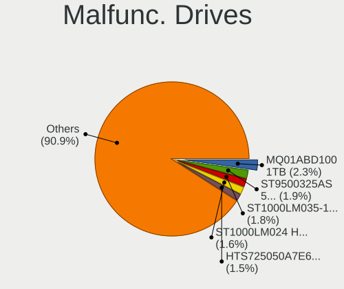

| Model                                                          | Notebooks | Drives | Percent |
|----------------------------------------------------------------|-----------|--------|---------|
| Toshiba MQ01ABD100 1TB                                         | 18        | 22     | 2.27%   |
| Seagate ST9500325AS 500GB                                      | 15        | 19     | 1.89%   |
| Seagate ST1000LM035-1RK172 1TB                                 | 14        | 14     | 1.76%   |
| Seagate ST1000LM024 HN-M101MBB 1TB                             | 13        | 18     | 1.64%   |
| HGST HTS725050A7E630 500GB                                     | 12        | 13     | 1.51%   |
| Seagate ST9320325AS 320GB                                      | 10        | 11     | 1.26%   |
| Seagate ST500LT012-1DG142 500GB                                | 10        | 10     | 1.26%   |
| HGST HTS541010A9E680 1TB                                       | 10        | 12     | 1.26%   |
| Seagate ST500LM000-1EJ162 500GB                                | 9         | 12     | 1.13%   |
| HGST HTS545050A7E680 500GB                                     | 9         | 15     | 1.13%   |
| SK hynix BC711 HFM512GD3JX013N 512GB                           | 8         | 8      | 1.01%   |
| Seagate ST500LT012-9WS142 500GB                                | 8         | 9      | 1.01%   |
| Seagate ST9320423AS 320GB                                      | 7         | 7      | 0.88%   |
| Seagate ST500LM000-SSHD-8GB                                    | 7         | 7      | 0.88%   |
| SanDisk SSD PLUS 480GB                                         | 7         | 8      | 0.88%   |
| Samsung Electronics NVMe SSD Controller SM981/PM981/PM983 1TB  | 7         | 8      | 0.88%   |
| Hitachi HTS547575A9E384 752GB                                  | 7         | 7      | 0.88%   |
| HGST HTS545050A7E380 500GB                                     | 7         | 10     | 0.88%   |
| SanDisk SSD PLUS 1000GB                                        | 6         | 8      | 0.76%   |
| Hitachi HTS545050A7E380 500GB                                  | 6         | 6      | 0.76%   |
| Hitachi HTS545032B9A300 320GB                                  | 6         | 6      | 0.76%   |
| HGST HTS721010A9E630 1TB                                       | 6         | 7      | 0.76%   |
| Seagate ST9500420AS 500GB                                      | 5         | 5      | 0.63%   |
| Seagate ST9250315AS 250GB                                      | 5         | 6      | 0.63%   |
| Samsung Electronics NVMe SSD Controller PM9A1/PM9A3/980PRO 1TB | 5         | 5      | 0.63%   |
| Micron Technology MTFDDAV256TDL-1AW1ZABHA 256GB SSD            | 5         | 5      | 0.63%   |
| Hitachi HTS547564A9E384 640GB                                  | 5         | 5      | 0.63%   |
| Crucial M4-CT256M4SSD3 256GB                                   | 5         | 5      | 0.63%   |
| WDC WDS240G2G0A-00JH30 240GB SSD                               | 4         | 4      | 0.5%    |
| Toshiba MQ01ABD075 752GB                                       | 4         | 5      | 0.5%    |
| SK hynix HFS256G39TND-N210A 256GB SSD                          | 4         | 5      | 0.5%    |
| Seagate ST9320320AS 320GB                                      | 4         | 5      | 0.5%    |
| Seagate ST320LT020-9YG142 320GB                                | 4         | 4      | 0.5%    |
| Seagate ST320LT007-9ZV142 320GB                                | 4         | 4      | 0.5%    |
| Micron Technology 1100_MTFDDAV512TBN 512GB SSD                 | 4         | 4      | 0.5%    |
| Hitachi HTS723232A7A364 320GB                                  | 4         | 4      | 0.5%    |
| Hitachi HTS543232L9A300 320GB                                  | 4         | 4      | 0.5%    |
| Hitachi HTS543232A7A384 320GB                                  | 4         | 4      | 0.5%    |
| Hitachi HTS541616J9SA00 160GB                                  | 4         | 5      | 0.5%    |
| Fujitsu MHZ2320BH G2 320GB                                     | 4         | 5      | 0.5%    |

Malfunc. Drive Vendor
---------------------

Vendors of faulty drives

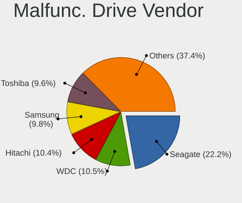

| Vendor              | Notebooks | Drives | Percent |
|---------------------|-----------|--------|---------|
| Seagate             | 175       | 199    | 22.21%  |
| WDC                 | 83        | 96     | 10.53%  |
| Hitachi             | 82        | 89     | 10.41%  |
| Samsung Electronics | 77        | 91     | 9.77%   |
| Toshiba             | 76        | 84     | 9.64%   |
| HGST                | 47        | 60     | 5.96%   |
| SK hynix            | 45        | 50     | 5.71%   |
| SanDisk             | 39        | 47     | 4.95%   |
| Intel               | 26        | 27     | 3.3%    |
| Micron Technology   | 25        | 28     | 3.17%   |
| Crucial             | 24        | 27     | 3.05%   |
| Fujitsu             | 18        | 20     | 2.28%   |
| Kingston            | 13        | 13     | 1.65%   |
| Intenso             | 8         | 9      | 1.02%   |
| Transcend           | 7         | 7      | 0.89%   |
| A-DATA Technology   | 5         | 7      | 0.63%   |
| LITEONIT            | 4         | 12     | 0.51%   |
| Apple               | 4         | 4      | 0.51%   |
| OCZ                 | 3         | 3      | 0.38%   |
| China               | 3         | 3      | 0.38%   |
| Unknown             | 3         | 3      | 0.38%   |
| PNY                 | 2         | 3      | 0.25%   |
| Phison              | 2         | 2      | 0.25%   |
| LITEON              | 2         | 2      | 0.25%   |
| Lenovo              | 2         | 2      | 0.25%   |
| YANSEN              | 1         | 1      | 0.13%   |
| ValueTech           | 1         | 1      | 0.13%   |
| SPCC                | 1         | 1      | 0.13%   |
| RDM-II              | 1         | 1      | 0.13%   |
| NGFF                | 1         | 1      | 0.13%   |
| KIOXIA              | 1         | 1      | 0.13%   |
| KingSpec            | 1         | 1      | 0.13%   |
| IBM/Hitachi         | 1         | 1      | 0.13%   |
| Corsair             | 1         | 1      | 0.13%   |
| BIWIN               | 1         | 1      | 0.13%   |
| BAITITON            | 1         | 1      | 0.13%   |
| ASMT                | 1         | 1      | 0.13%   |
| ASMedia             | 1         | 1      | 0.13%   |

Malfunc. HDD Vendor
-------------------

Vendors of faulty HDD drives

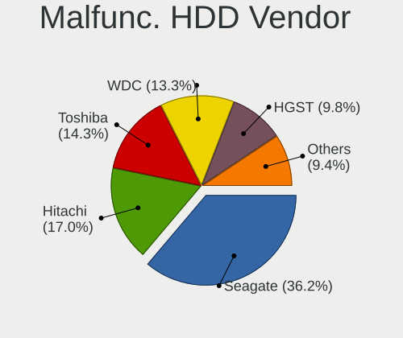

| Vendor              | Notebooks | Drives | Percent |
|---------------------|-----------|--------|---------|
| Seagate             | 174       | 198    | 36.17%  |
| Hitachi             | 82        | 89     | 17.05%  |
| Toshiba             | 69        | 75     | 14.35%  |
| WDC                 | 64        | 77     | 13.31%  |
| HGST                | 47        | 60     | 9.77%   |
| Samsung Electronics | 23        | 27     | 4.78%   |
| Fujitsu             | 18        | 20     | 3.74%   |
| IBM/Hitachi         | 1         | 1      | 0.21%   |
| ASMT                | 1         | 1      | 0.21%   |
| ASMedia             | 1         | 1      | 0.21%   |
| Unknown             | 1         | 1      | 0.21%   |

Malfunc. Drive Kind
-------------------

Kinds of faulty drives

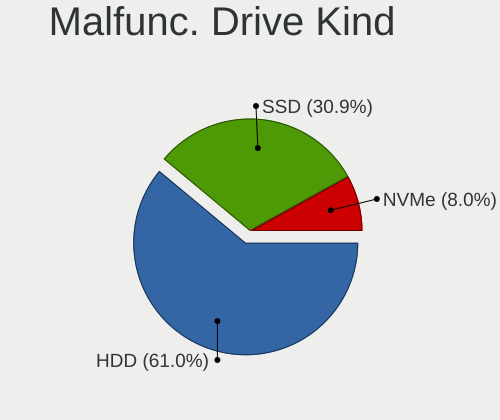

| Kind | Notebooks | Drives | Percent |
|------|-----------|--------|---------|
| HDD  | 478       | 550    | 61.05%  |
| SSD  | 242       | 277    | 30.91%  |
| NVMe | 63        | 74     | 8.05%   |

Failed Drives
-------------

Failed drive models

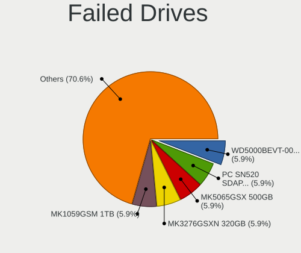

| Model                                          | Notebooks | Drives | Percent |
|------------------------------------------------|-----------|--------|---------|
| WDC WD5000BEVT-00A0RT0 500GB                   | 1         | 1      | 5.88%   |
| WDC PC SN520 SDAPMUW-512G-1001 512GB           | 1         | 1      | 5.88%   |
| Toshiba MK5065GSX 500GB                        | 1         | 1      | 5.88%   |
| Toshiba MK3276GSXN 320GB                       | 1         | 1      | 5.88%   |
| Toshiba MK1059GSM 1TB                          | 1         | 1      | 5.88%   |
| SK hynix BC501 HFM512GDJTNG-8310A 512GB        | 1         | 1      | 5.88%   |
| Seagate ST9500325AS 500GB                      | 1         | 1      | 5.88%   |
| Seagate ST9320325AS 320GB                      | 1         | 1      | 5.88%   |
| Samsung Electronics SSD 980 1TB                | 1         | 1      | 5.88%   |
| Micron Technology 1100_MTFDDAV256TBN 256GB SSD | 1         | 1      | 5.88%   |
| JMicron Technology Tech 250GB                  | 1         | 1      | 5.88%   |
| Intel SSDSCKGF256A5 SATA 256GB                 | 1         | 1      | 5.88%   |
| Intel SSDSA2BW160G3 160GB                      | 1         | 1      | 5.88%   |
| Intel SSDPEKKF256G7L 256GB                     | 1         | 1      | 5.88%   |
| Hitachi HTS543225L9SA02 250GB                  | 1         | 1      | 5.88%   |
| Hitachi HTS541010G9SA00 100GB                  | 1         | 1      | 5.88%   |
| HGST HTS721010A9E630 1TB                       | 1         | 1      | 5.88%   |

Failed Drive Vendor
-------------------

Failed drive vendors

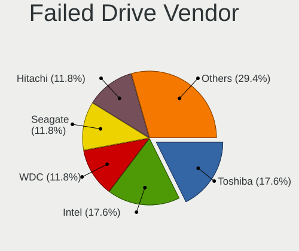

| Vendor              | Notebooks | Drives | Percent |
|---------------------|-----------|--------|---------|
| Toshiba             | 3         | 3      | 17.65%  |
| Intel               | 3         | 3      | 17.65%  |
| WDC                 | 2         | 2      | 11.76%  |
| Seagate             | 2         | 2      | 11.76%  |
| Hitachi             | 2         | 2      | 11.76%  |
| SK hynix            | 1         | 1      | 5.88%   |
| Samsung Electronics | 1         | 1      | 5.88%   |
| Micron Technology   | 1         | 1      | 5.88%   |
| JMicron Technology  | 1         | 1      | 5.88%   |
| HGST                | 1         | 1      | 5.88%   |

Drive Status
------------

Number of failed and malfunc. drives

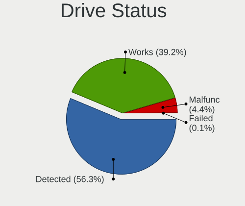

| Status   | Notebooks | Drives | Percent |
|----------|-----------|--------|---------|
| Detected | 9839      | 16622  | 56.28%  |
| Works    | 6851      | 9580   | 39.19%  |
| Malfunc  | 776       | 901    | 4.44%   |
| Failed   | 17        | 17     | 0.1%    |

Storage controller
------------------

Storage Vendor
--------------

Storage controller vendors

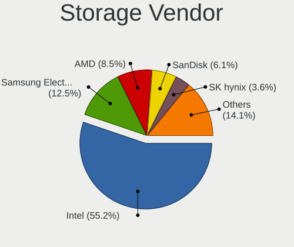

| Vendor                                  | Notebooks | Percent |
|-----------------------------------------|-----------|---------|
| Intel                                   | 10612     | 55.21%  |
| Samsung Electronics                     | 2401      | 12.49%  |
| AMD                                     | 1638      | 8.52%   |
| SanDisk                                 | 1176      | 6.12%   |
| SK hynix                                | 693       | 3.61%   |
| Micron Technology                       | 466       | 2.42%   |
| Toshiba America Info Systems            | 338       | 1.76%   |
| Kingston Technology Company             | 305       | 1.59%   |
| KIOXIA                                  | 265       | 1.38%   |
| Phison Electronics                      | 243       | 1.26%   |
| Micron/Crucial Technology               | 230       | 1.2%    |
| Nvidia                                  | 161       | 0.84%   |
| Silicon Motion                          | 80        | 0.42%   |
| Union Memory (Shenzhen)                 | 74        | 0.38%   |
| MAXIO Technology (Hangzhou)             | 53        | 0.28%   |
| Apple                                   | 50        | 0.26%   |
| Solid State Storage Technology          | 44        | 0.23%   |
| Shenzhen Longsys Electronics            | 41        | 0.21%   |
| Silicon Integrated Systems [SiS]        | 35        | 0.18%   |
| Lenovo                                  | 34        | 0.18%   |
| ADATA Technology                        | 33        | 0.17%   |
| Marvell Technology Group                | 32        | 0.17%   |
| Seagate Technology                      | 23        | 0.12%   |
| Realtek Semiconductor                   | 22        | 0.11%   |
| O2 Micro                                | 21        | 0.11%   |
| Silicon Image                           | 19        | 0.1%    |
| Lite-On Technology                      | 19        | 0.1%    |
| VIA Technologies                        | 18        | 0.09%   |
| Solidigm                                | 14        | 0.07%   |
| JMicron Technology                      | 14        | 0.07%   |
| Yangtze Memory Technologies             | 10        | 0.05%   |
| ASMedia Technology                      | 10        | 0.05%   |
| Unknown                                 | 10        | 0.05%   |
| Shenzhen Unionmemory Information System | 7         | 0.04%   |
| Netac Technology                        | 6         | 0.03%   |
| INNOGRIT                                | 5         | 0.03%   |
| Biwin Storage Technology                | 5         | 0.03%   |
| ULi Electronics                         | 4         | 0.02%   |
| Transcend                               | 3         | 0.02%   |
| YEESTOR Microelectronics                | 1         | 0.01%   |

Storage Model
-------------

Storage controller models

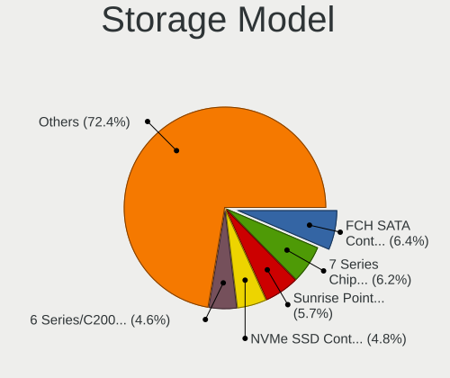

| Model                                                                            | Notebooks | Percent |
|----------------------------------------------------------------------------------|-----------|---------|
| AMD FCH SATA Controller [AHCI mode]                                              | 1317      | 6.41%   |
| Intel 7 Series Chipset Family 6-port SATA Controller [AHCI mode]                 | 1278      | 6.22%   |
| Intel Sunrise Point-LP SATA Controller [AHCI mode]                               | 1162      | 5.65%   |
| Samsung NVMe SSD Controller SM981/PM981/PM983                                    | 988       | 4.81%   |
| Intel 6 Series/C200 Series Chipset Family 6 port Mobile SATA AHCI Controller     | 936       | 4.55%   |
| Intel 82801 Mobile SATA Controller [RAID mode]                                   | 681       | 3.31%   |
| Intel 82801IBM/IEM (ICH9M/ICH9M-E) 4 port SATA Controller [AHCI mode]            | 630       | 3.07%   |
| Intel 8 Series SATA Controller 1 [AHCI mode]                                     | 558       | 2.71%   |
| Intel 8 Series/C220 Series Chipset Family 6-port SATA Controller 1 [AHCI mode]   | 532       | 2.59%   |
| Samsung NVMe SSD Controller 980 (DRAM-less)                                      | 491       | 2.39%   |
| Intel 5 Series/3400 Series Chipset 4 port SATA AHCI Controller                   | 466       | 2.27%   |
| Intel Wildcat Point-LP SATA Controller [AHCI Mode]                               | 426       | 2.07%   |
| Intel Volume Management Device NVMe RAID Controller                              | 411       | 2%      |
| Samsung NVMe SSD Controller PM9A1/PM9A3/980PRO                                   | 374       | 1.82%   |
| Intel Cannon Lake Mobile PCH SATA AHCI Controller                                | 312       | 1.52%   |
| Intel 82801HM/HEM (ICH8M/ICH8M-E) IDE Controller                                 | 283       | 1.38%   |
| Intel 5 Series/3400 Series Chipset 6 port SATA AHCI Controller                   | 269       | 1.31%   |
| SanDisk Extreme Pro / WD Black SN750 / PC SN730 / Red SN700 NVMe SSD             | 256       | 1.25%   |
| Intel 82801HM/HEM (ICH8M/ICH8M-E) SATA Controller [AHCI mode]                    | 248       | 1.21%   |
| Intel HM170/QM170 Chipset SATA Controller [AHCI Mode]                            | 243       | 1.18%   |
| Intel Celeron/Pentium Silver Processor SATA Controller                           | 224       | 1.09%   |
| SK hynix Gold P31/BC711/PC711 NVMe Solid State Drive                             | 216       | 1.05%   |
| Intel Atom Processor E3800 Series SATA AHCI Controller                           | 206       | 1%      |
| AMD SB7x0/SB8x0/SB9x0 SATA Controller [AHCI mode]                                | 199       | 0.97%   |
| Samsung NVMe SSD Controller SM961/PM961/SM963                                    | 180       | 0.88%   |
| Intel Tiger Lake-LP SATA Controller                                              | 166       | 0.81%   |
| SanDisk Ultra 3D / WD PC SN530, IX SN530, Blue SN550 NVMe SSD (DRAM-less)        | 165       | 0.8%    |
| Intel Q170/Q150/B150/H170/H110/Z170/CM236 Chipset SATA Controller [AHCI Mode]    | 164       | 0.8%    |
| Intel Comet Lake SATA AHCI Controller                                            | 164       | 0.8%    |
| SanDisk WD SN560/SN740/SN770/SN5000 NVMe SSD                                     | 159       | 0.77%   |
| Intel SSD 660P Series                                                            | 153       | 0.74%   |
| Intel Atom/Celeron/Pentium Processor x5-E8000/J3xxx/N3xxx Series SATA Controller | 146       | 0.71%   |
| Intel Celeron N3350/Pentium N4200/Atom E3900 Series SATA AHCI Controller         | 136       | 0.66%   |
| Intel Cannon Point-LP SATA Controller [AHCI Mode]                                | 135       | 0.66%   |
| Intel Alder Lake-P SATA AHCI Controller                                          | 134       | 0.65%   |
| KIOXIA NVMe SSD Controller BG4 (DRAM-less)                                       | 133       | 0.65%   |
| Micron/Crucial P2 [Nick P2] / P3 / P3 Plus NVMe PCIe SSD (DRAM-less)             | 126       | 0.61%   |
| Toshiba America Info Systems XG6 NVMe SSD Controller                             | 120       | 0.58%   |
| SK hynix BC501 NVMe Solid State Drive                                            | 119       | 0.58%   |
| Micron 2450 NVMe SSD [HendrixV] (DRAM-less)                                      | 114       | 0.55%   |

Storage Kind
------------

Kind of storage controller (IDE, SATA, NVMe, SAS, ...)

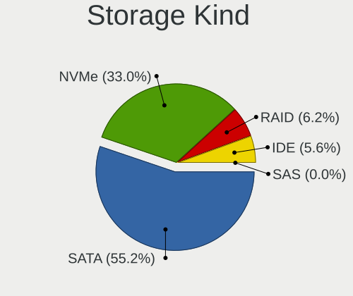

| Kind | Notebooks | Percent |
|------|-----------|---------|
| SATA | 10859     | 55.21%  |
| NVMe | 6490      | 32.99%  |
| RAID | 1227      | 6.24%   |
| IDE  | 1093      | 5.56%   |
| SAS  | 1         | 0.01%   |

Processor
---------

CPU Vendor
----------

Processor vendors

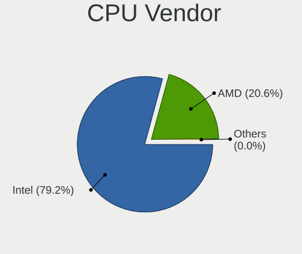

| Vendor        | Notebooks | Percent |
|---------------|-----------|---------|
| Intel         | 13076     | 79.24%  |
| AMD           | 3401      | 20.61%  |
| Unknown       | 11        | 0.07%   |
| ARM           | 7         | 0.04%   |
| sifive,u74-mc | 1         | 0.01%   |
| QUALCOMM      | 1         | 0.01%   |
| PowerBook5,6  | 1         | 0.01%   |
| PowerBook5,4  | 1         | 0.01%   |
| PowerBook3,4  | 1         | 0.01%   |
| CentaurHauls  | 1         | 0.01%   |

CPU Model
---------

Processor models

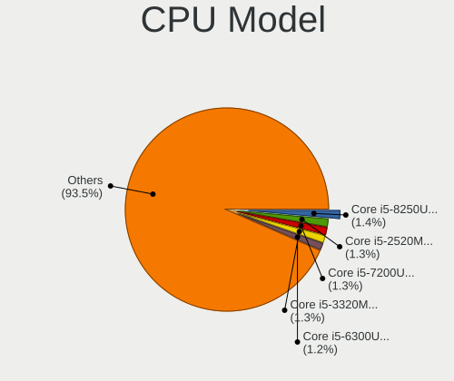

| Model                                         | Notebooks | Percent |
|-----------------------------------------------|-----------|---------|
| Intel Core i5-8250U CPU @ 1.60GHz             | 234       | 1.42%   |
| Intel Core i5-2520M CPU @ 2.50GHz             | 223       | 1.35%   |
| Intel Core i5-7200U CPU @ 2.50GHz             | 214       | 1.3%    |
| Intel Core i5-3320M CPU @ 2.60GHz             | 211       | 1.28%   |
| Intel Core i5-6300U CPU @ 2.40GHz             | 199       | 1.2%    |
| Intel 11th Gen Core i5-1135G7 @ 2.40GHz       | 192       | 1.16%   |
| Intel Core i7-8550U CPU @ 1.80GHz             | 189       | 1.14%   |
| Intel Core i5-6200U CPU @ 2.30GHz             | 186       | 1.13%   |
| AMD Ryzen 5 3500U with Radeon Vega Mobile Gfx | 181       | 1.1%    |
| Intel 11th Gen Core i7-1165G7 @ 2.80GHz       | 175       | 1.06%   |
| AMD Custom APU 0405                           | 173       | 1.05%   |
| AMD Ryzen 5 5500U with Radeon Graphics        | 169       | 1.02%   |
| Intel Core i7-8565U CPU @ 1.80GHz             | 158       | 0.96%   |
| Intel Core i5-8265U CPU @ 1.60GHz             | 158       | 0.96%   |
| Intel Core i5-3210M CPU @ 2.50GHz             | 157       | 0.95%   |
| Intel Core i7-10510U CPU @ 1.80GHz            | 147       | 0.89%   |
| Intel Core i7-9750H CPU @ 2.60GHz             | 146       | 0.88%   |
| Intel Core i7-8750H CPU @ 2.20GHz             | 130       | 0.79%   |
| Intel Core i5-5200U CPU @ 2.20GHz             | 128       | 0.77%   |
| Intel Core i5-10210U CPU @ 1.60GHz            | 123       | 0.74%   |
| Intel Core i7-7700HQ CPU @ 2.80GHz            | 121       | 0.73%   |
| Intel Core i5-8350U CPU @ 1.70GHz             | 119       | 0.72%   |
| Intel Core i5-3230M CPU @ 2.60GHz             | 110       | 0.67%   |
| Intel Core i5-5300U CPU @ 2.30GHz             | 109       | 0.66%   |
| Intel Core i5 CPU M 520 @ 2.40GHz             | 108       | 0.65%   |
| AMD Ryzen 7 5700U with Radeon Graphics        | 105       | 0.64%   |
| Intel Core i7-6700HQ CPU @ 2.60GHz            | 100       | 0.61%   |
| Intel Core i5-4210U CPU @ 1.70GHz             | 100       | 0.61%   |
| Intel Core i7-7500U CPU @ 2.70GHz             | 97        | 0.59%   |
| AMD Ryzen 7 4800H with Radeon Graphics        | 96        | 0.58%   |
| Intel Core i5-4200U CPU @ 1.60GHz             | 92        | 0.56%   |
| Intel Core 2 Duo CPU P8600 @ 2.40GHz          | 92        | 0.56%   |
| AMD Ryzen 7 5800H with Radeon Graphics        | 92        | 0.56%   |
| AMD Ryzen 7 PRO 4750U with Radeon Graphics    | 91        | 0.55%   |
| Intel 12th Gen Core i7-12700H                 | 89        | 0.54%   |
| Intel Core i7-2670QM CPU @ 2.20GHz            | 87        | 0.53%   |
| Intel Core i5-4300U CPU @ 1.90GHz             | 86        | 0.52%   |
| AMD Ryzen 7 4700U with Radeon Graphics        | 85        | 0.51%   |
| Intel Core i7-10750H CPU @ 2.60GHz            | 84        | 0.51%   |
| Intel Core i5-2410M CPU @ 2.30GHz             | 83        | 0.5%    |

CPU Model Family
----------------

Processor model prefix

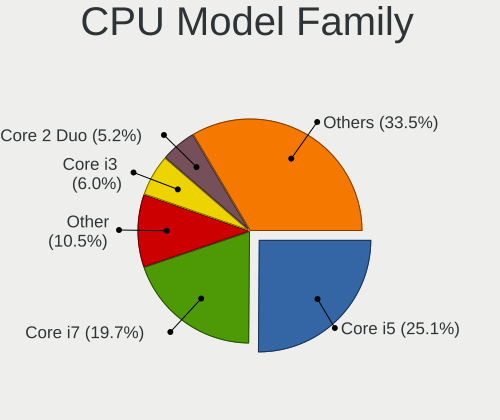

| Model                   | Notebooks | Percent |
|-------------------------|-----------|---------|
| Intel Core i5           | 4148      | 25.12%  |
| Intel Core i7           | 3247      | 19.67%  |
| Other                   | 1736      | 10.51%  |
| Intel Core i3           | 996       | 6.03%   |
| Intel Core 2 Duo        | 851       | 5.15%   |
| AMD Ryzen 7             | 828       | 5.01%   |
| AMD Ryzen 5             | 785       | 4.75%   |
| Intel Celeron           | 655       | 3.97%   |
| Intel Pentium           | 528       | 3.2%    |
| Intel Atom              | 298       | 1.8%    |
| AMD Ryzen 7 PRO         | 237       | 1.44%   |
| Intel Core              | 161       | 0.98%   |
| Intel Pentium Dual-Core | 150       | 0.91%   |
| AMD Ryzen 3             | 140       | 0.85%   |
| AMD Ryzen 9             | 130       | 0.79%   |
| AMD A6                  | 130       | 0.79%   |
| Intel Pentium Silver    | 104       | 0.63%   |
| AMD A4                  | 101       | 0.61%   |
| AMD E                   | 99        | 0.6%    |
| AMD A8                  | 93        | 0.56%   |
| Intel Pentium Dual      | 85        | 0.51%   |
| Intel Core 2            | 80        | 0.48%   |
| Intel Genuine           | 78        | 0.47%   |
| Intel Core i9           | 77        | 0.47%   |
| AMD Ryzen 5 PRO         | 74        | 0.45%   |
| AMD E2                  | 67        | 0.41%   |
| AMD Turion 64 X2 Mobile | 52        | 0.31%   |
| Intel Pentium M         | 51        | 0.31%   |
| AMD A10                 | 49        | 0.3%    |
| AMD E1                  | 37        | 0.22%   |
| AMD Athlon              | 36        | 0.22%   |
| Intel Core M            | 31        | 0.19%   |
| Intel Xeon              | 29        | 0.18%   |
| AMD Athlon II           | 27        | 0.16%   |
| Intel Celeron M         | 25        | 0.15%   |
| AMD Athlon X2           | 24        | 0.15%   |
| Intel Core m5           | 18        | 0.11%   |
| Intel Pentium Gold      | 17        | 0.1%    |
| Intel Core m3           | 17        | 0.1%    |
| AMD Athlon II Dual-Core | 16        | 0.1%    |

CPU Cores
---------

Number of processor cores

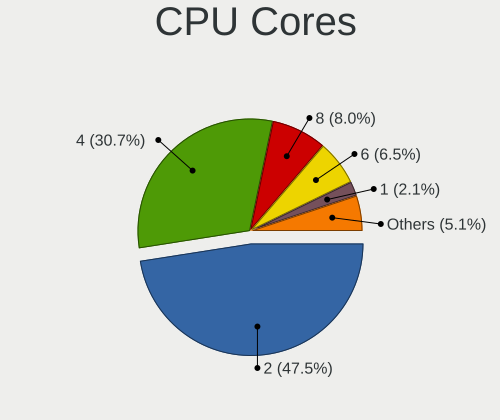

| Number  | Notebooks | Percent |
|---------|-----------|---------|
| 2       | 7851      | 47.53%  |
| 4       | 5079      | 30.75%  |
| 8       | 1320      | 7.99%   |
| 6       | 1078      | 6.53%   |
| 1       | 345       | 2.09%   |
| 10      | 224       | 1.36%   |
| 14      | 211       | 1.28%   |
| 12      | 208       | 1.26%   |
| 16      | 120       | 0.73%   |
| 24      | 45        | 0.27%   |
| Unknown | 15        | 0.09%   |
| 5       | 12        | 0.07%   |
| 20      | 5         | 0.03%   |
| 3       | 4         | 0.02%   |
| 11      | 1         | 0.01%   |

CPU Sockets
-----------

Number of sockets

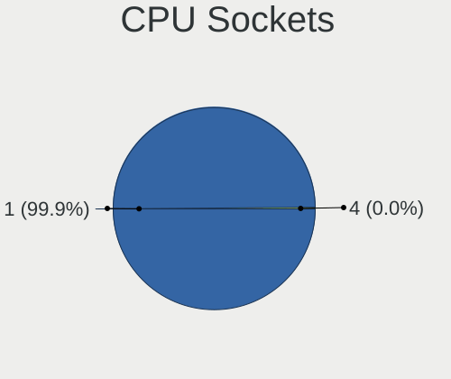

| Number  | Notebooks | Percent |
|---------|-----------|---------|
| 1       | 16483     | 99.88%  |
| 2       | 16        | 0.1%    |
| Unknown | 2         | 0.01%   |
| 8       | 1         | 0.01%   |
| 4       | 1         | 0.01%   |

CPU Threads
-----------

Threads per core (Hyper-Threading)

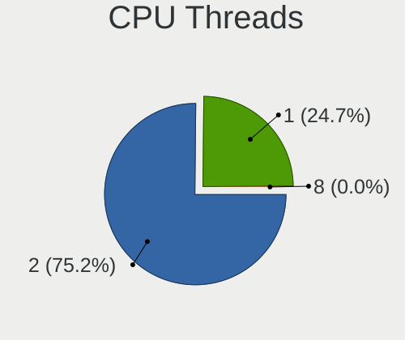

| Number  | Notebooks | Percent |
|---------|-----------|---------|
| 2       | 12421     | 75.16%  |
| 1       | 4086      | 24.72%  |
| Unknown | 15        | 0.09%   |
| 4       | 3         | 0.02%   |
| 8       | 2         | 0.01%   |

CPU Op-Modes
------------

CPU Operation Modes (32-bit, 64-bit)

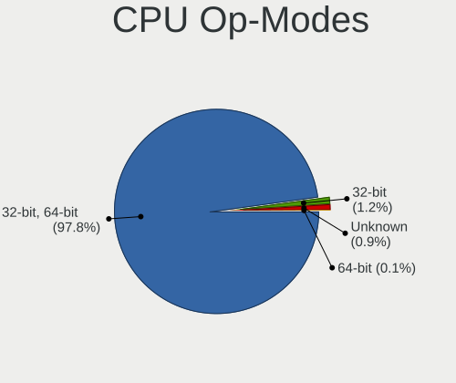

| Op mode        | Notebooks | Percent |
|----------------|-----------|---------|
| 32-bit, 64-bit | 16161     | 97.83%  |
| 32-bit         | 191       | 1.16%   |
| Unknown        | 155       | 0.94%   |
| 64-bit         | 13        | 0.08%   |

CPU Microcode
-------------

Microcode number

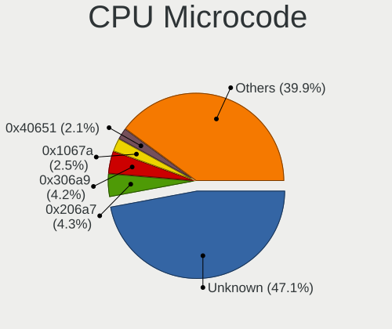

| Number     | Notebooks | Percent |
|------------|-----------|---------|
| Unknown    | 8103      | 47.07%  |
| 0x206a7    | 737       | 4.28%   |
| 0x306a9    | 716       | 4.16%   |
| 0x1067a    | 425       | 2.47%   |
| 0x40651    | 366       | 2.13%   |
| 0x406e3    | 354       | 2.06%   |
| 0x806ea    | 342       | 1.99%   |
| 0x306c3    | 333       | 1.93%   |
| 0x20655    | 331       | 1.92%   |
| 0x806ec    | 317       | 1.84%   |
| 0x806c1    | 293       | 1.7%    |
| 0x306d4    | 282       | 1.64%   |
| 0x806e9    | 262       | 1.52%   |
| 0x906ea    | 212       | 1.23%   |
| 0x10676    | 183       | 1.06%   |
| 0x0a50000c | 175       | 1.02%   |
| 0x6fd      | 169       | 0.98%   |
| 0x08608103 | 159       | 0.92%   |
| 0x30678    | 154       | 0.89%   |
| 0x08600106 | 148       | 0.86%   |
| 0x08108102 | 148       | 0.86%   |
| 0x20652    | 141       | 0.82%   |
| 0x08108109 | 136       | 0.79%   |
| 0x806eb    | 114       | 0.66%   |
| 0x406c4    | 111       | 0.64%   |
| 0xa0652    | 109       | 0.63%   |
| 0x506e3    | 109       | 0.63%   |
| 0x906e9    | 106       | 0.62%   |
| 0x706e5    | 92        | 0.53%   |
| 0x906a3    | 91        | 0.53%   |
| 0x08600103 | 88        | 0.51%   |
| 0x06006705 | 80        | 0.46%   |
| 0x506c9    | 77        | 0.45%   |
| 0x05000119 | 73        | 0.42%   |
| 0x706a1    | 69        | 0.4%    |
| 0x706a8    | 66        | 0.38%   |
| 0x106ca    | 62        | 0.36%   |
| 0x07030105 | 59        | 0.34%   |
| 0x406c3    | 58        | 0.34%   |
| 0x806d1    | 56        | 0.33%   |

CPU Microarch
-------------

Microarchitecture

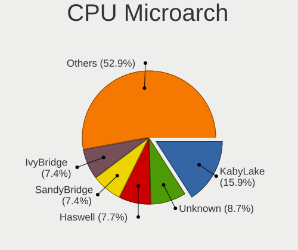

| Name               | Notebooks | Percent |
|--------------------|-----------|---------|
| KabyLake           | 2632      | 15.92%  |
| Unknown            | 1436      | 8.68%   |
| Haswell            | 1277      | 7.72%   |
| SandyBridge        | 1222      | 7.39%   |
| IvyBridge          | 1221      | 7.38%   |
| Skylake            | 906       | 5.48%   |
| Penryn             | 853       | 5.16%   |
| Westmere           | 740       | 4.48%   |
| TigerLake          | 571       | 3.45%   |
| Broadwell          | 532       | 3.22%   |
| Silvermont         | 527       | 3.19%   |
| Zen 2              | 485       | 2.93%   |
| Alderlake Hybrid   | 469       | 2.84%   |
| Zen 3              | 460       | 2.78%   |
| Core               | 421       | 2.55%   |
| Zen+               | 420       | 2.54%   |
| IceLake            | 250       | 1.51%   |
| Goldmont plus      | 239       | 1.45%   |
| CometLake          | 213       | 1.29%   |
| Excavator          | 180       | 1.09%   |
| Goldmont           | 144       | 0.87%   |
| Bonnell            | 144       | 0.87%   |
| Bobcat             | 143       | 0.86%   |
| Puma               | 141       | 0.85%   |
| Zen                | 125       | 0.76%   |
| P6                 | 121       | 0.73%   |
| K8 Hammer          | 103       | 0.62%   |
| Meteorlake Hybrid  | 80        | 0.48%   |
| Jaguar             | 77        | 0.47%   |
| K10                | 68        | 0.41%   |
| Nehalem            | 60        | 0.36%   |
| Piledriver         | 59        | 0.36%   |
| K8 & K10 hybrid    | 52        | 0.31%   |
| K10 Llano          | 48        | 0.29%   |
| Tremont            | 46        | 0.28%   |
| Steamroller        | 22        | 0.13%   |
| Gracemont          | 17        | 0.1%    |
| Lunarlake Hybrid   | 16        | 0.1%    |
| ArrowLake-H Hybrid | 7         | 0.04%   |
| NetBurst           | 6         | 0.04%   |

Graphics
--------

GPU Vendor
----------

Vendors of graphics cards

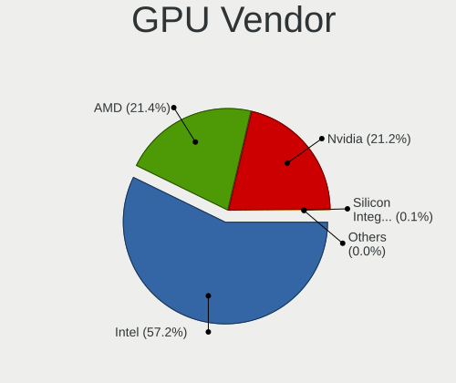

| Vendor                           | Notebooks | Percent |
|----------------------------------|-----------|---------|
| Intel                            | 11631     | 57.22%  |
| AMD                              | 4358      | 21.44%  |
| Nvidia                           | 4301      | 21.16%  |
| Silicon Integrated Systems [SiS] | 18        | 0.09%   |
| VIA Technologies                 | 12        | 0.06%   |
| S3 Graphics                      | 4         | 0.02%   |
| Silicon Motion                   | 1         | 0.005%  |
| Neomagic                         | 1         | 0.005%  |

GPU Model
---------

Graphics card models

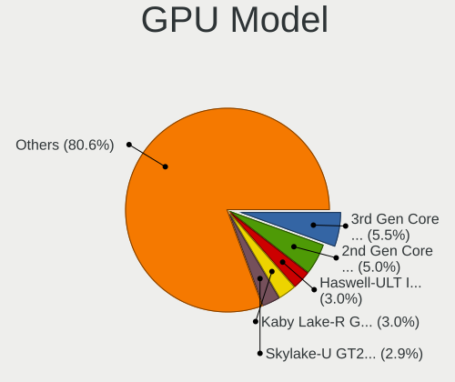

| Model                                                                                    | Notebooks | Percent |
|------------------------------------------------------------------------------------------|-----------|---------|
| Intel 3rd Gen Core processor Graphics Controller                                         | 1153      | 5.51%   |
| Intel 2nd Generation Core Processor Family Integrated Graphics Controller                | 1050      | 5.02%   |
| Intel Haswell-ULT Integrated Graphics Controller                                         | 632       | 3.02%   |
| Intel Kaby Lake-R GT2 [UHD Graphics 620]                                                 | 618       | 2.96%   |
| Intel Skylake-U GT2 [HD Graphics 520]                                                    | 601       | 2.87%   |
| Intel 4th Gen Core Processor Integrated Graphics Controller                              | 532       | 2.54%   |
| Intel TigerLake-LP GT2 [Iris Xe Graphics]                                                | 503       | 2.41%   |
| Intel Core Processor Integrated Graphics Controller                                      | 483       | 2.31%   |
| AMD Renoir [Radeon Vega Series / Radeon Vega Mobile Series]                              | 477       | 2.28%   |
| Intel Mobile 4 Series Chipset Integrated Graphics Controller                             | 473       | 2.26%   |
| Intel Kaby Lake-U GT2 [HD Graphics 620]                                                  | 445       | 2.13%   |
| AMD Picasso/Raven 2 [Radeon Vega Series / Radeon Vega Mobile Series]                     | 436       | 2.08%   |
| Intel WhiskeyLake-U GT2 [UHD Graphics 620]                                               | 418       | 2%      |
| Intel Broadwell-U GT2 [HD Graphics 5500]                                                 | 396       | 1.89%   |
| Intel CoffeeLake-H GT2 [UHD Graphics 630]                                                | 378       | 1.81%   |
| Intel CometLake-U GT2 [UHD Graphics]                                                     | 336       | 1.61%   |
| AMD Lucienne                                                                             | 315       | 1.51%   |
| Intel Atom Processor Z36xxx/Z37xxx Series Graphics & Display                             | 276       | 1.32%   |
| AMD Cezanne [Radeon Vega Series / Radeon Vega Mobile Series]                             | 274       | 1.31%   |
| Intel Atom/Celeron/Pentium Processor x5-E8000/J3xxx/N3xxx Integrated Graphics Controller | 251       | 1.2%    |
| Intel Alder Lake-P GT2 [Iris Xe Graphics]                                                | 222       | 1.06%   |
| Intel Kaby Lake-H GT2 [HD Graphics 630]                                                  | 185       | 0.88%   |
| Intel Skylake-H GT2 [HD Graphics 530]                                                    | 184       | 0.88%   |
| Intel CometLake-H GT2 [UHD Graphics]                                                     | 180       | 0.86%   |
| Intel GeminiLake [UHD Graphics 600]                                                      | 176       | 0.84%   |
| Intel Mobile GM965/GL960 Integrated Graphics Controller (secondary)                      | 172       | 0.82%   |
| Intel Mobile GM965/GL960 Integrated Graphics Controller (primary)                        | 172       | 0.82%   |
| AMD VanGogh [AMD Custom GPU 0405]                                                        | 168       | 0.8%    |
| AMD Barcelo                                                                              | 168       | 0.8%    |
| Nvidia TU117M [GeForce GTX 1650 Mobile / Max-Q]                                          | 154       | 0.74%   |
| AMD Phoenix1                                                                             | 151       | 0.72%   |
| Intel Raptor Lake-P [Iris Xe Graphics]                                                   | 144       | 0.69%   |
| AMD Stoney [Radeon R2/R3/R4/R5 Graphics]                                                 | 139       | 0.66%   |
| AMD Rembrandt [Radeon 680M]                                                              | 139       | 0.66%   |
| Nvidia GA106M [GeForce RTX 3060 Mobile / Max-Q]                                          | 133       | 0.64%   |
| AMD Seymour [Radeon HD 6400M/7400M Series]                                               | 127       | 0.61%   |
| Intel Mobile 945GM/GMS/GME, 943/940GML Express Integrated Graphics Controller            | 126       | 0.6%    |
| Nvidia GF117M [GeForce 610M/710M/810M/820M / GT 620M/625M/630M/720M]                     | 125       | 0.6%    |
| Intel TigerLake-H GT1 [UHD Graphics]                                                     | 125       | 0.6%    |
| AMD Mullins [Radeon R4/R5 Graphics]                                                      | 107       | 0.51%   |

GPU Combo
---------

Combinations of graphics cards

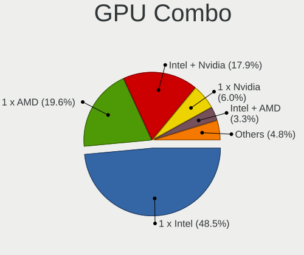

| Name               | Notebooks | Percent |
|--------------------|-----------|---------|
| 1 x Intel          | 8032      | 48.53%  |
| 1 x AMD            | 3245      | 19.6%   |
| Intel + Nvidia     | 2955      | 17.85%  |
| 1 x Nvidia         | 989       | 5.98%   |
| Intel + AMD        | 543       | 3.28%   |
| AMD + Nvidia       | 337       | 2.04%   |
| 2 x AMD            | 244       | 1.47%   |
| 2 x Intel          | 108       | 0.65%   |
| 2 x Nvidia         | 33        | 0.2%    |
| Other              | 29        | 0.18%   |
| 1 x SiS            | 18        | 0.11%   |
| 1 x VIA            | 12        | 0.07%   |
| 1 x S3 Graphics    | 4         | 0.02%   |
| 1 x Silicon Motion | 1         | 0.01%   |
| 1 x Neomagic       | 1         | 0.01%   |
| Intel + 2 x Nvidia | 1         | 0.01%   |

GPU Driver
----------

Free vs proprietary

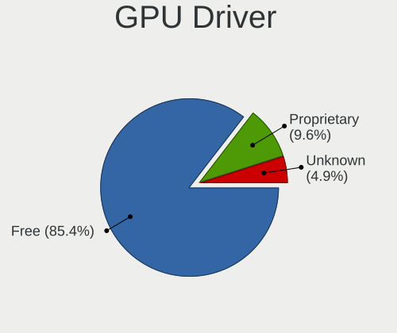

| Driver      | Notebooks | Percent |
|-------------|-----------|---------|
| Free        | 14335     | 85.44%  |
| Proprietary | 1616      | 9.63%   |
| Unknown     | 826       | 4.92%   |

GPU Memory
----------

Total video memory

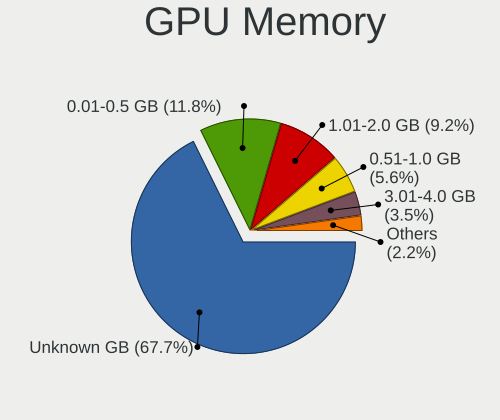

| Size in GB     | Notebooks | Percent |
|----------------|-----------|---------|
| Unknown        | 11498     | 67.69%  |
| 0.01-0.5       | 2002      | 11.79%  |
| 1.01-2.0       | 1566      | 9.22%   |
| 0.51-1.0       | 947       | 5.58%   |
| 3.01-4.0       | 595       | 3.5%    |
| 5.01-6.0       | 168       | 0.99%   |
| 7.01-8.0       | 154       | 0.91%   |
| 8.01-16.0      | 34        | 0.2%    |
| 2.01-3.0       | 18        | 0.11%   |
| More than 64.0 | 2         | 0.01%   |
| 16.01-24.0     | 2         | 0.01%   |

Monitor
-------

Monitor Vendor
--------------

Monitor vendors

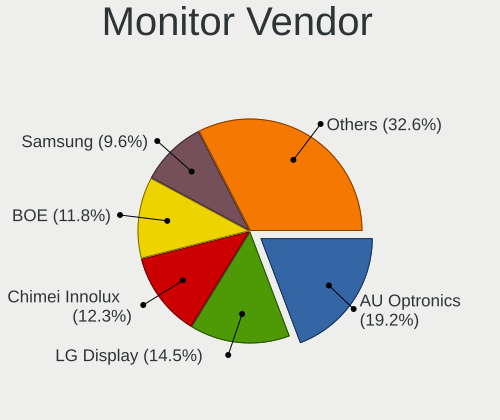

| Vendor                  | Notebooks | Percent |
|-------------------------|-----------|---------|
| AU Optronics            | 3592      | 19.24%  |
| LG Display              | 2713      | 14.53%  |
| Chimei Innolux          | 2288      | 12.26%  |
| BOE                     | 2206      | 11.82%  |
| Samsung Electronics     | 1791      | 9.59%   |
| Lenovo                  | 657       | 3.52%   |
| Dell                    | 505       | 2.71%   |
| Apple                   | 501       | 2.68%   |
| Sharp                   | 432       | 2.31%   |
| Chi Mei Optoelectronics | 417       | 2.23%   |
| Goldstar                | 308       | 1.65%   |
| BenQ                    | 200       | 1.07%   |
| PANDA                   | 196       | 1.05%   |
| Acer                    | 182       | 0.97%   |
| Hewlett-Packard         | 179       | 0.96%   |
| InfoVision              | 176       | 0.94%   |
| LG Philips              | 166       | 0.89%   |
| Valve                   | 161       | 0.86%   |
| CSO                     | 150       | 0.8%    |
| Philips                 | 126       | 0.67%   |
| Ancor Communications    | 125       | 0.67%   |
| AOC                     | 119       | 0.64%   |
| Iiyama                  | 113       | 0.61%   |
| Fujitsu Siemens         | 89        | 0.48%   |
| Sony                    | 78        | 0.42%   |
| Eizo                    | 75        | 0.4%    |
| CPT                     | 68        | 0.36%   |
| Panasonic               | 62        | 0.33%   |
| HannStar                | 58        | 0.31%   |
| ASUSTek Computer        | 56        | 0.3%    |
| CSOT                    | 37        | 0.2%    |
| ViewSonic               | 33        | 0.18%   |
| Seiko/Epson             | 33        | 0.18%   |
| LGD                     | 33        | 0.18%   |
| MSI                     | 32        | 0.17%   |
| Toshiba                 | 31        | 0.17%   |
| TMX                     | 31        | 0.17%   |
| Vestel Elektronik       | 29        | 0.16%   |
| Medion                  | 29        | 0.16%   |
| CSW                     | 29        | 0.16%   |

Monitor Model
-------------

Monitor models

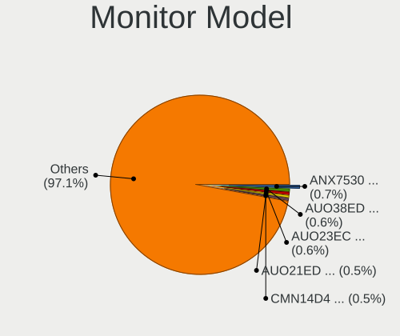

| Model                                                                     | Notebooks | Percent |
|---------------------------------------------------------------------------|-----------|---------|
| Valve ANX7530 U VLV3001 800x1280 100x150mm 7.1-inch                       | 127       | 0.67%   |
| AU Optronics LCD Monitor AUO38ED 1920x1080 344x193mm 15.5-inch            | 113       | 0.6%    |
| AU Optronics LCD Monitor AUO23EC 1366x768 344x193mm 15.5-inch             | 109       | 0.57%   |
| AU Optronics LCD Monitor AUO21ED 1920x1080 344x193mm 15.5-inch            | 99        | 0.52%   |
| Chimei Innolux LCD Monitor CMN14D4 1920x1080 309x173mm 13.9-inch          | 97        | 0.51%   |
| Samsung Electronics LCD Monitor SEC5441 1280x800 331x207mm 15.4-inch      | 90        | 0.47%   |
| LG Display LCD Monitor LGD046F 1920x1080 344x194mm 15.5-inch              | 87        | 0.46%   |
| LG Display LCD Monitor LGD02DC 1366x768 344x194mm 15.5-inch               | 80        | 0.42%   |
| Lenovo LCD Monitor LEN40B1 1600x900 345x194mm 15.6-inch                   | 80        | 0.42%   |
| Chimei Innolux LCD Monitor CMN1735 1920x1080 381x214mm 17.2-inch          | 77        | 0.41%   |
| Chimei Innolux LCD Monitor CMN15DB 1366x768 344x193mm 15.5-inch           | 75        | 0.39%   |
| Chimei Innolux LCD Monitor CMN15E7 1920x1080 344x193mm 15.5-inch          | 74        | 0.39%   |
| Chimei Innolux LCD Monitor CMN14C9 1920x1080 309x173mm 13.9-inch          | 73        | 0.38%   |
| AU Optronics LCD Monitor AUO22EC 1366x768 344x193mm 15.5-inch             | 73        | 0.38%   |
| BOE LCD Monitor BOE0687 1920x1080 344x193mm 15.5-inch                     | 70        | 0.37%   |
| AU Optronics LCD Monitor AUO403D 1920x1080 309x174mm 14.0-inch            | 69        | 0.36%   |
| BOE LCD Monitor BOE084E 1920x1080 382x215mm 17.3-inch                     | 66        | 0.35%   |
| Chimei Innolux LCD Monitor CMN15F5 1920x1080 344x193mm 15.5-inch          | 65        | 0.34%   |
| Chi Mei Optoelectronics LCD Monitor CMO1720 1920x1080 382x215mm 17.3-inch | 65        | 0.34%   |
| Chimei Innolux LCD Monitor CMN1728 1600x900 382x215mm 17.3-inch           | 64        | 0.34%   |
| LG Display LCD Monitor LGD02E3 1366x768 344x194mm 15.5-inch               | 61        | 0.32%   |
| Lenovo LCD Monitor LEN40BA 1920x1080 344x194mm 15.5-inch                  | 60        | 0.32%   |
| AU Optronics LCD Monitor AUO573D 1920x1080 309x174mm 14.0-inch            | 60        | 0.32%   |
| LG Display LCD Monitor LGD02D8 1366x768 277x156mm 12.5-inch               | 58        | 0.31%   |
| AU Optronics LCD Monitor AUO139E 1600x900 382x214mm 17.2-inch             | 58        | 0.31%   |
| Chimei Innolux LCD Monitor CMN15E8 1920x1080 344x193mm 15.5-inch          | 55        | 0.29%   |
| AU Optronics LCD Monitor AUO213E 1600x900 309x174mm 14.0-inch             | 55        | 0.29%   |
| AU Optronics LCD Monitor AUO119E 1600x900 382x214mm 17.2-inch             | 55        | 0.29%   |
| AU Optronics LCD Monitor AUO109D 1920x1080 381x214mm 17.2-inch            | 55        | 0.29%   |
| AU Optronics LCD Monitor AUO106C 1366x768 276x155mm 12.5-inch             | 55        | 0.29%   |
| LG Display LCD Monitor LGD033A 1366x768 344x194mm 15.5-inch               | 54        | 0.28%   |
| LG Display LCD Monitor LGD046D 1920x1080 309x174mm 14.0-inch              | 53        | 0.28%   |
| BOE LCD Monitor BOE0660 1600x900 382x215mm 17.3-inch                      | 52        | 0.27%   |
| AU Optronics LCD Monitor AUO243D 1920x1080 309x173mm 13.9-inch            | 52        | 0.27%   |
| Samsung Electronics LCD Monitor SEC3245 1366x768 340x190mm 15.3-inch      | 51        | 0.27%   |
| LG Display LCD Monitor LGD04A7 1920x1080 344x194mm 15.5-inch              | 51        | 0.27%   |
| Chimei Innolux LCD Monitor CMN1738 1920x1080 381x214mm 17.2-inch          | 51        | 0.27%   |
| Chimei Innolux LCD Monitor CMN151E 1920x1080 344x193mm 15.5-inch          | 51        | 0.27%   |
| Chimei Innolux LCD Monitor CMN1734 1600x900 382x214mm 17.2-inch           | 50        | 0.26%   |
| LG Display LCD Monitor LGD056D 1920x1080 382x215mm 17.3-inch              | 49        | 0.26%   |

Monitor Resolution
------------------

Monitor screen resolution

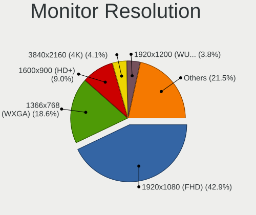

| Resolution         | Notebooks | Percent |
|--------------------|-----------|---------|
| 1920x1080 (FHD)    | 7598      | 42.91%  |
| 1366x768 (WXGA)    | 3295      | 18.61%  |
| 1600x900 (HD+)     | 1602      | 9.05%   |
| 3840x2160 (4K)     | 720       | 4.07%   |
| 1920x1200 (WUXGA)  | 677       | 3.82%   |
| 1280x800 (WXGA)    | 666       | 3.76%   |
| 2560x1440 (QHD)    | 652       | 3.68%   |
| 1440x900 (WXGA+)   | 379       | 2.14%   |
| 2560x1600          | 329       | 1.86%   |
| 2880x1800          | 256       | 1.45%   |
| 1680x1050 (WSXGA+) | 206       | 1.16%   |
| 800x1280           | 178       | 1.01%   |
| 3440x1440          | 141       | 0.8%    |
| 1024x600           | 101       | 0.57%   |
| 1280x1024 (SXGA)   | 83        | 0.47%   |
| 3840x2400          | 76        | 0.43%   |
| 2256x1504          | 63        | 0.36%   |
| 3200x1800 (QHD+)   | 58        | 0.33%   |
| 2160x1440          | 58        | 0.33%   |
| Unknown            | 58        | 0.33%   |
| 2560x1080          | 49        | 0.28%   |
| 1024x768 (XGA)     | 38        | 0.21%   |
| 3840x1080          | 31        | 0.18%   |
| 1680x945           | 30        | 0.17%   |
| 1920x1280          | 26        | 0.15%   |
| 3840x1600          | 23        | 0.13%   |
| 2880x1920          | 23        | 0.13%   |
| 1920x540           | 22        | 0.12%   |
| 3072x1920          | 21        | 0.12%   |
| 2520x1680          | 19        | 0.11%   |
| 3200x2000          | 18        | 0.1%    |
| 3000x2000          | 18        | 0.1%    |
| 1400x1050          | 18        | 0.1%    |
| 1360x768           | 16        | 0.09%   |
| 2288x1287          | 15        | 0.08%   |
| 1600x1200          | 13        | 0.07%   |
| 1280x720 (HD)      | 13        | 0.07%   |
| 3456x2160          | 12        | 0.07%   |
| 2240x1400          | 11        | 0.06%   |
| 2880x1620          | 10        | 0.06%   |

Monitor Diagonal
----------------

Diagonal size in inches

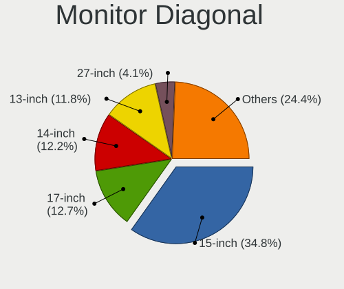

| Inches  | Notebooks | Percent |
|---------|-----------|---------|
| 15      | 6499      | 34.85%  |
| 17      | 2364      | 12.68%  |
| 14      | 2278      | 12.22%  |
| 13      | 2193      | 11.76%  |
| 27      | 771       | 4.13%   |
| 24      | 738       | 3.96%   |
| 12      | 572       | 3.07%   |
| 16      | 475       | 2.55%   |
| 23      | 389       | 2.09%   |
| 21      | 272       | 1.46%   |
| Unknown | 254       | 1.36%   |
| 11      | 250       | 1.34%   |
| 31      | 218       | 1.17%   |
| 34      | 168       | 0.9%    |
| 7       | 162       | 0.87%   |
| 18      | 148       | 0.79%   |
| 10      | 136       | 0.73%   |
| 22      | 93        | 0.5%    |
| 19      | 82        | 0.44%   |
| 84      | 74        | 0.4%    |
| 40      | 54        | 0.29%   |
| 25      | 44        | 0.24%   |
| 72      | 39        | 0.21%   |
| 32      | 39        | 0.21%   |
| 54      | 31        | 0.17%   |
| 20      | 29        | 0.16%   |
| 28      | 27        | 0.14%   |
| 37      | 23        | 0.12%   |
| 26      | 23        | 0.12%   |
| 3       | 23        | 0.12%   |
| 48      | 17        | 0.09%   |
| 8       | 17        | 0.09%   |
| 142     | 15        | 0.08%   |
| 65      | 13        | 0.07%   |
| 49      | 12        | 0.06%   |
| 33      | 12        | 0.06%   |
| 52      | 10        | 0.05%   |
| 39      | 9         | 0.05%   |
| 42      | 7         | 0.04%   |
| 35      | 7         | 0.04%   |

Monitor Width
-------------

Physical width

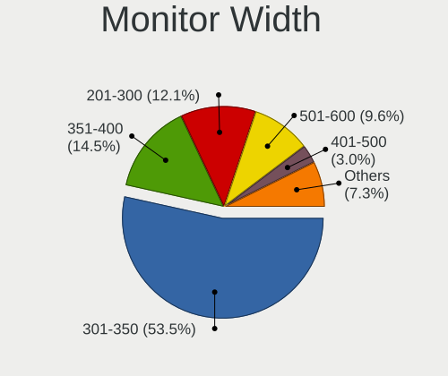

| Width in mm    | Notebooks | Percent |
|----------------|-----------|---------|
| 301-350        | 9879      | 53.45%  |
| 351-400        | 2689      | 14.55%  |
| 201-300        | 2238      | 12.11%  |
| 501-600        | 1773      | 9.59%   |
| 401-500        | 547       | 2.96%   |
| 601-700        | 322       | 1.74%   |
| Unknown        | 254       | 1.37%   |
| 701-800        | 226       | 1.22%   |
| 1-100          | 178       | 0.96%   |
| 1001-1500      | 117       | 0.63%   |
| 1501-2000      | 115       | 0.62%   |
| 801-900        | 91        | 0.49%   |
| 101-200        | 19        | 0.1%    |
| 901-1000       | 19        | 0.1%    |
| More than 2000 | 15        | 0.08%   |

Aspect Ratio
------------

Proportional relationship between the width and the height

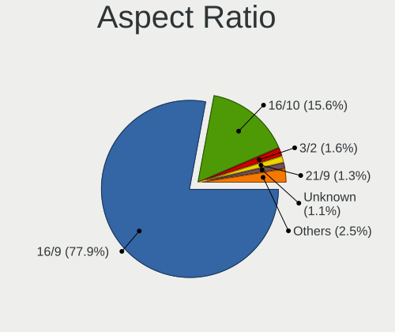

| Ratio   | Notebooks | Percent |
|---------|-----------|---------|
| 16/9    | 13012     | 77.93%  |
| 16/10   | 2611      | 15.64%  |
| 3/2     | 261       | 1.56%   |
| 21/9    | 209       | 1.25%   |
| Unknown | 183       | 1.1%    |
| 0.67    | 127       | 0.76%   |
| 5/4     | 77        | 0.46%   |
| 4/3     | 73        | 0.44%   |
| 0.62    | 40        | 0.24%   |
| 32/9    | 33        | 0.2%    |
| 6/5     | 32        | 0.19%   |
| 1.00    | 15        | 0.09%   |
| 0.56    | 7         | 0.04%   |
| 3.73    | 5         | 0.03%   |
| 0.63    | 4         | 0.02%   |
| 3.40    | 3         | 0.02%   |
| 0.89    | 3         | 0.02%   |
| 3.20    | 1         | 0.01%   |
| 2.64    | 1         | 0.01%   |
| 0.65    | 1         | 0.01%   |

Monitor Area
------------

Area in inch²

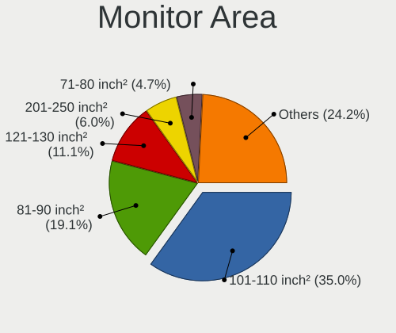

| Area in inch² | Notebooks | Percent |
|----------------|-----------|---------|
| 101-110        | 6504      | 34.97%  |
| 81-90          | 3551      | 19.09%  |
| 121-130        | 2057      | 11.06%  |
| 201-250        | 1110      | 5.97%   |
| 71-80          | 878       | 4.72%   |
| 301-350        | 788       | 4.24%   |
| 61-70          | 562       | 3.02%   |
| 351-500        | 464       | 2.49%   |
| 111-120        | 419       | 2.25%   |
| 251-300        | 333       | 1.79%   |
| 131-140        | 308       | 1.66%   |
| 51-60          | 256       | 1.38%   |
| Unknown        | 254       | 1.37%   |
| More than 1000 | 216       | 1.16%   |
| 1-40           | 197       | 1.06%   |
| 151-200        | 179       | 0.96%   |
| 141-150        | 160       | 0.86%   |
| 501-1000       | 139       | 0.75%   |
| 41-50          | 133       | 0.72%   |
| 91-100         | 91        | 0.49%   |

Pixel Density
-------------

Pixels per inch

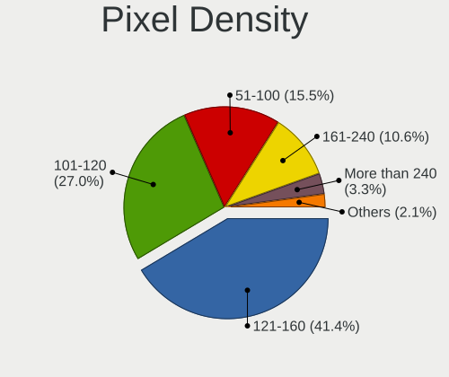

| Density       | Notebooks | Percent |
|---------------|-----------|---------|
| 121-160       | 7571      | 41.41%  |
| 101-120       | 4945      | 27.05%  |
| 51-100        | 2835      | 15.51%  |
| 161-240       | 1930      | 10.56%  |
| More than 240 | 610       | 3.34%   |
| Unknown       | 254       | 1.39%   |
| 1-50          | 136       | 0.74%   |

Multiple Monitors
-----------------

Total monitors connected

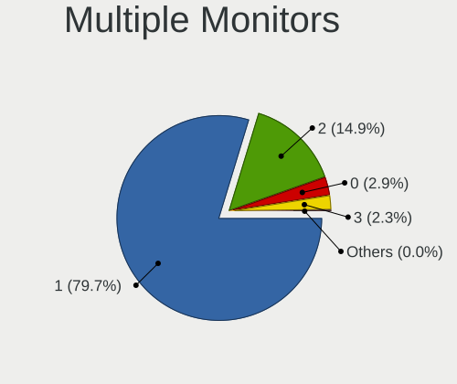

| Total | Notebooks | Percent |
|-------|-----------|---------|
| 1     | 13566     | 79.7%   |
| 2     | 2535      | 14.89%  |
| 0     | 493       | 2.9%    |
| 3     | 388       | 2.28%   |
| 4     | 38        | 0.22%   |
| 5     | 1         | 0.01%   |

Network
-------

Net Controller Vendor
---------------------

Controller vendors

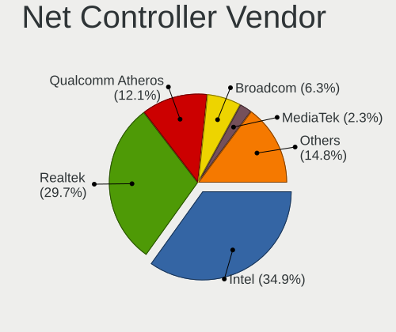

| Vendor                                 | Notebooks | Percent |
|----------------------------------------|-----------|---------|
| Intel                                  | 9282      | 34.88%  |
| Realtek Semiconductor                  | 7904      | 29.7%   |
| Qualcomm Atheros                       | 3216      | 12.08%  |
| Broadcom                               | 1665      | 6.26%   |
| MediaTek                               | 601       | 2.26%   |
| Broadcom Limited                       | 417       | 1.57%   |
| Sierra Wireless                        | 351       | 1.32%   |
| Marvell Technology Group               | 296       | 1.11%   |
| ASIX Electronics                       | 288       | 1.08%   |
| Dell                                   | 253       | 0.95%   |
| Ericsson Business Mobile Networks      | 252       | 0.95%   |
| Lenovo                                 | 195       | 0.73%   |
| Ralink                                 | 165       | 0.62%   |
| Qualcomm                               | 142       | 0.53%   |
| Hewlett-Packard                        | 123       | 0.46%   |
| TP-Link                                | 121       | 0.45%   |
| Shenzhen Goodix Technology             | 116       | 0.44%   |
| Nvidia                                 | 113       | 0.42%   |
| DisplayLink                            | 110       | 0.41%   |
| Ralink Technology                      | 89        | 0.33%   |
| Fibocom                                | 88        | 0.33%   |
| Huawei Technologies                    | 75        | 0.28%   |
| Samsung Electronics                    | 67        | 0.25%   |
| JMicron Technology                     | 50        | 0.19%   |
| Xiaomi                                 | 38        | 0.14%   |
| AVM                                    | 37        | 0.14%   |
| Edimax Technology                      | 34        | 0.13%   |
| Suzhou Motorcomm Electronic Technology | 33        | 0.12%   |
| Silicon Integrated Systems [SiS]       | 32        | 0.12%   |
| ASUSTek Computer                       | 31        | 0.12%   |
| Qualcomm Atheros Communications        | 24        | 0.09%   |
| D-Link                                 | 24        | 0.09%   |
| NetGear                                | 23        | 0.09%   |
| Apple                                  | 22        | 0.08%   |
| Google                                 | 18        | 0.07%   |
| VIA Technologies                       | 16        | 0.06%   |
| D-Link System                          | 16        | 0.06%   |
| Microchip Technology                   | 15        | 0.06%   |
| U-Blox                                 | 14        | 0.05%   |
| Microsoft                              | 14        | 0.05%   |

Net Controller Model
--------------------

Controller models

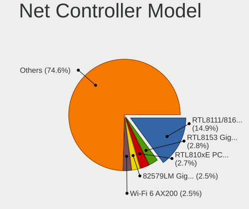

| Model                                                                  | Notebooks | Percent |
|------------------------------------------------------------------------|-----------|---------|
| Realtek RTL8111/8168/8211/8411 PCI Express Gigabit Ethernet Controller | 4898      | 14.92%  |
| Realtek RTL8153 Gigabit Ethernet Adapter                               | 911       | 2.78%   |
| Realtek RTL810xE PCI Express Fast Ethernet controller                  | 899       | 2.74%   |
| Intel 82579LM Gigabit Network Connection (Lewisville)                  | 823       | 2.51%   |
| Intel Wi-Fi 6 AX200                                                    | 808       | 2.46%   |
| Intel Wireless 8265 / 8275                                             | 796       | 2.43%   |
| Intel Wireless 7260                                                    | 584       | 1.78%   |
| Intel Centrino Advanced-N 6205 [Taylor Peak]                           | 583       | 1.78%   |
| Realtek RTL8821CE 802.11ac PCIe Wireless Network Adapter               | 580       | 1.77%   |
| Intel Wireless 8260                                                    | 561       | 1.71%   |
| Qualcomm Atheros AR9285 Wireless Network Adapter (PCI-Express)         | 547       | 1.67%   |
| Realtek RTL8822CE 802.11ac PCIe Wireless Network Adapter               | 461       | 1.4%    |
| Intel Wireless 7265                                                    | 448       | 1.37%   |
| Qualcomm Atheros QCA9377 802.11ac Wireless Network Adapter             | 442       | 1.35%   |
| Intel Wi-Fi 6 AX201                                                    | 409       | 1.25%   |
| Qualcomm Atheros AR9485 Wireless Network Adapter                       | 373       | 1.14%   |
| Intel Alder Lake-P PCH CNVi WiFi                                       | 321       | 0.98%   |
| Qualcomm Atheros QCA9565 / AR9565 Wireless Network Adapter             | 319       | 0.97%   |
| Qualcomm Atheros QCA6174 802.11ac Wireless Network Adapter             | 314       | 0.96%   |
| Intel Ethernet Connection (4) I219-LM                                  | 299       | 0.91%   |
| Realtek RTL8723BE PCIe Wireless Network Adapter                        | 276       | 0.84%   |
| Intel Ethernet Connection I219-LM                                      | 265       | 0.81%   |
| MediaTek MT7921 802.11ax PCIe Wireless Network Adapter [Filogic 330]   | 262       | 0.8%    |
| Intel Centrino Ultimate-N 6300                                         | 256       | 0.78%   |
| ASIX AX88179 Gigabit Ethernet                                          | 254       | 0.77%   |
| Intel Cannon Point-LP CNVi [Wireless-AC]                               | 247       | 0.75%   |
| Intel Comet Lake PCH-LP CNVi WiFi                                      | 245       | 0.75%   |
| Broadcom BCM43142 802.11b/g/n                                          | 243       | 0.74%   |
| Intel 82577LM Gigabit Network Connection                               | 241       | 0.73%   |
| Qualcomm Atheros AR8151 v2.0 Gigabit Ethernet                          | 236       | 0.72%   |
| Intel Wireless 3160                                                    | 229       | 0.7%    |
| Intel Wireless 3165                                                    | 225       | 0.69%   |
| Broadcom BCM4313 802.11bgn Wireless Network Adapter                    | 225       | 0.69%   |
| Intel Ethernet Connection I217-LM                                      | 214       | 0.65%   |
| Intel Wi-Fi 6E(802.11ax) AX210/AX1675* 2x2 [Typhoon Peak]              | 207       | 0.63%   |
| Intel Wi-Fi 5(802.11ac) Wireless-AC 9x6x [Thunder Peak]                | 204       | 0.62%   |
| Intel Ethernet Connection I218-LM                                      | 197       | 0.6%    |
| Intel Ethernet Connection (4) I219-V                                   | 194       | 0.59%   |
| MediaTek MT7922 802.11ax PCI Express Wireless Network Adapter          | 192       | 0.59%   |
| Intel WiFi Link 5100                                                   | 186       | 0.57%   |

Wireless Vendor
---------------

Wireless vendors

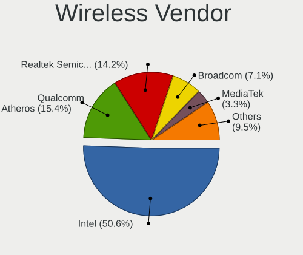

| Vendor                            | Notebooks | Percent |
|-----------------------------------|-----------|---------|
| Intel                             | 8694      | 50.56%  |
| Qualcomm Atheros                  | 2645      | 15.38%  |
| Realtek Semiconductor             | 2441      | 14.2%   |
| Broadcom                          | 1220      | 7.1%    |
| MediaTek                          | 569       | 3.31%   |
| Sierra Wireless                   | 351       | 2.04%   |
| Broadcom Limited                  | 249       | 1.45%   |
| Ralink                            | 165       | 0.96%   |
| Dell                              | 148       | 0.86%   |
| Qualcomm                          | 130       | 0.76%   |
| TP-Link                           | 103       | 0.6%    |
| Ralink Technology                 | 89        | 0.52%   |
| Fibocom                           | 88        | 0.51%   |
| AVM                               | 37        | 0.22%   |
| Hewlett-Packard                   | 35        | 0.2%    |
| Edimax Technology                 | 34        | 0.2%    |
| ASUSTek Computer                  | 30        | 0.17%   |
| Qualcomm Atheros Communications   | 24        | 0.14%   |
| D-Link                            | 23        | 0.13%   |
| NetGear                           | 21        | 0.12%   |
| D-Link System                     | 16        | 0.09%   |
| Microsoft                         | 12        | 0.07%   |
| Qualcomm Technologies             | 8         | 0.05%   |
| Belkin Components                 | 7         | 0.04%   |
| ZyDAS                             | 6         | 0.03%   |
| Quectel Wireless Solutions        | 5         | 0.03%   |
| ZyXEL Communications              | 4         | 0.02%   |
| Winbond Electronics               | 4         | 0.02%   |
| Fujitsu Siemens Computers         | 4         | 0.02%   |
| Wacom                             | 3         | 0.02%   |
| Sitecom Europe                    | 3         | 0.02%   |
| Linksys                           | 3         | 0.02%   |
| Texas Instruments                 | 2         | 0.01%   |
| Samsung Electronics               | 2         | 0.01%   |
| Realtek                           | 2         | 0.01%   |
| Micro Star International          | 2         | 0.01%   |
| Ericsson Business Mobile Networks | 2         | 0.01%   |
| Wisair                            | 1         | 0.01%   |
| Tenda                             | 1         | 0.01%   |
| Qcom                              | 1         | 0.01%   |

Wireless Model
--------------

Wireless models

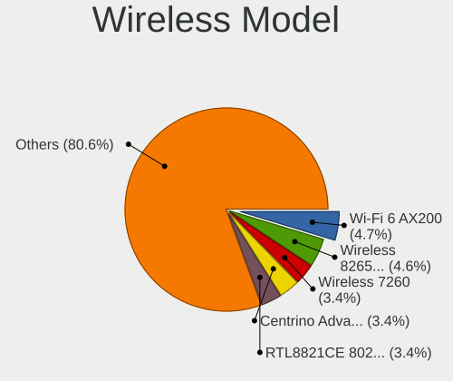

| Model                                                                   | Notebooks | Percent |
|-------------------------------------------------------------------------|-----------|---------|
| Intel Wi-Fi 6 AX200                                                     | 808       | 4.67%   |
| Intel Wireless 8265 / 8275                                              | 796       | 4.61%   |
| Intel Wireless 7260                                                     | 584       | 3.38%   |
| Intel Centrino Advanced-N 6205 [Taylor Peak]                            | 583       | 3.37%   |
| Realtek RTL8821CE 802.11ac PCIe Wireless Network Adapter                | 580       | 3.36%   |
| Intel Wireless 8260                                                     | 561       | 3.25%   |
| Qualcomm Atheros AR9285 Wireless Network Adapter (PCI-Express)          | 547       | 3.16%   |
| Realtek RTL8822CE 802.11ac PCIe Wireless Network Adapter                | 461       | 2.67%   |
| Intel Wireless 7265                                                     | 448       | 2.59%   |
| Qualcomm Atheros QCA9377 802.11ac Wireless Network Adapter              | 442       | 2.56%   |
| Intel Wi-Fi 6 AX201                                                     | 409       | 2.37%   |
| Qualcomm Atheros AR9485 Wireless Network Adapter                        | 373       | 2.16%   |
| Qualcomm Atheros QCA9565 / AR9565 Wireless Network Adapter              | 319       | 1.85%   |
| Qualcomm Atheros QCA6174 802.11ac Wireless Network Adapter              | 314       | 1.82%   |
| Realtek RTL8723BE PCIe Wireless Network Adapter                         | 276       | 1.6%    |
| MediaTek MT7921 802.11ax PCIe Wireless Network Adapter [Filogic 330]    | 262       | 1.52%   |
| Intel Centrino Ultimate-N 6300                                          | 256       | 1.48%   |
| Intel Cannon Point-LP CNVi [Wireless-AC]                                | 247       | 1.43%   |
| Intel Comet Lake PCH-LP CNVi WiFi                                       | 245       | 1.42%   |
| Broadcom BCM43142 802.11b/g/n                                           | 243       | 1.41%   |
| Intel Wireless 3160                                                     | 229       | 1.32%   |
| Intel Wireless 3165                                                     | 225       | 1.3%    |
| Broadcom BCM4313 802.11bgn Wireless Network Adapter                     | 225       | 1.3%    |
| Intel Wi-Fi 6E(802.11ax) AX210/AX1675* 2x2 [Typhoon Peak]               | 207       | 1.2%    |
| Intel Wi-Fi 5(802.11ac) Wireless-AC 9x6x [Thunder Peak]                 | 204       | 1.18%   |
| Intel WiFi Link 5100                                                    | 186       | 1.08%   |
| Intel Cannon Lake PCH CNVi WiFi                                         | 182       | 1.05%   |
| MediaTek MT7922 802.11ax PCI Express Wireless Network Adapter           | 179       | 1.04%   |
| Qualcomm Atheros AR242x / AR542x Wireless Network Adapter (PCI-Express) | 176       | 1.02%   |
| Intel Centrino Wireless-N 2230                                          | 176       | 1.02%   |
| Intel Comet Lake PCH CNVi WiFi                                          | 174       | 1.01%   |
| Intel Centrino Advanced-N 6200                                          | 173       | 1%      |
| Qualcomm Atheros AR9462 Wireless Network Adapter                        | 167       | 0.97%   |
| Intel PRO/Wireless 3945ABG [Golan] Network Connection                   | 166       | 0.96%   |
| Intel Alder Lake-P PCH CNVi WiFi                                        | 162       | 0.94%   |
| Intel Raptor Lake PCH CNVi WiFi                                         | 148       | 0.86%   |
| Intel Centrino Advanced-N 6235                                          | 134       | 0.78%   |
| Qualcomm Atheros AR9287 Wireless Network Adapter (PCI-Express)          | 131       | 0.76%   |
| Intel Dual Band Wireless-AC 3165 Plus Bluetooth                         | 129       | 0.75%   |
| Realtek RTL8188CE 802.11b/g/n WiFi Adapter                              | 126       | 0.73%   |

Ethernet Vendor
---------------

Ethernet vendors

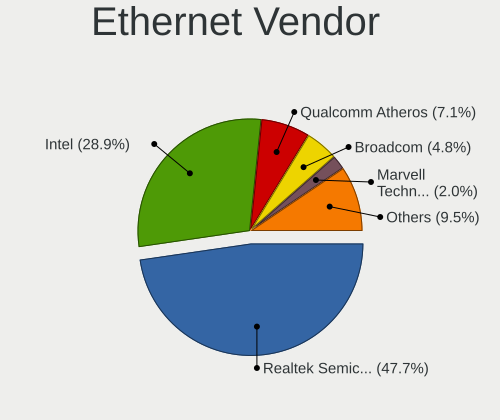

| Vendor                                 | Notebooks | Percent |
|----------------------------------------|-----------|---------|
| Realtek Semiconductor                  | 6909      | 47.7%   |
| Intel                                  | 4190      | 28.93%  |
| Qualcomm Atheros                       | 1025      | 7.08%   |
| Broadcom                               | 694       | 4.79%   |
| Marvell Technology Group               | 295       | 2.04%   |
| ASIX Electronics                       | 288       | 1.99%   |
| Lenovo                                 | 190       | 1.31%   |
| Broadcom Limited                       | 178       | 1.23%   |
| Nvidia                                 | 113       | 0.78%   |
| DisplayLink                            | 110       | 0.76%   |
| Samsung Electronics                    | 51        | 0.35%   |
| JMicron Technology                     | 50        | 0.35%   |
| Xiaomi                                 | 38        | 0.26%   |
| Suzhou Motorcomm Electronic Technology | 33        | 0.23%   |
| MediaTek                               | 32        | 0.22%   |
| Silicon Integrated Systems [SiS]       | 30        | 0.21%   |
| Hewlett-Packard                        | 30        | 0.21%   |
| Huawei Technologies                    | 28        | 0.19%   |
| Apple                                  | 22        | 0.15%   |
| TP-Link                                | 18        | 0.12%   |
| Google                                 | 18        | 0.12%   |
| VIA Technologies                       | 16        | 0.11%   |
| Microchip Technology                   | 15        | 0.1%    |
| Attansic Technology                    | 12        | 0.08%   |
| Qualcomm                               | 11        | 0.08%   |
| Motorcomm Microelectronics.            | 8         | 0.06%   |
| OPPO Electronics                       | 6         | 0.04%   |
| OnePlus Technology (Shenzhen)          | 6         | 0.04%   |
| ICS Advent                             | 5         | 0.03%   |
| HMD Global                             | 5         | 0.03%   |
| ULi Electronics                        | 4         | 0.03%   |
| QinHeng Electronics                    | 4         | 0.03%   |
| ZTE WCDMA Technologies MSM             | 3         | 0.02%   |
| T & A Mobile Phones                    | 3         | 0.02%   |
| Qualcomm Technologies                  | 3         | 0.02%   |
| MosChip Semiconductor                  | 3         | 0.02%   |
| Davicom Semiconductor                  | 3         | 0.02%   |
| Aquantia                               | 3         | 0.02%   |
| Sony Ericsson Mobile Communications AB | 2         | 0.01%   |
| Realtek                                | 2         | 0.01%   |

Ethernet Model
--------------

Ethernet models

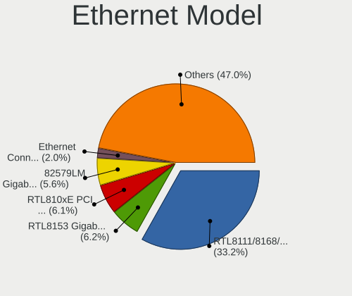

| Model                                                                  | Notebooks | Percent |
|------------------------------------------------------------------------|-----------|---------|
| Realtek RTL8111/8168/8211/8411 PCI Express Gigabit Ethernet Controller | 4898      | 33.15%  |
| Realtek RTL8153 Gigabit Ethernet Adapter                               | 911       | 6.17%   |
| Realtek RTL810xE PCI Express Fast Ethernet controller                  | 899       | 6.09%   |
| Intel 82579LM Gigabit Network Connection (Lewisville)                  | 823       | 5.57%   |
| Intel Ethernet Connection (4) I219-LM                                  | 299       | 2.02%   |
| Intel Ethernet Connection I219-LM                                      | 265       | 1.79%   |
| ASIX AX88179 Gigabit Ethernet                                          | 254       | 1.72%   |
| Intel 82577LM Gigabit Network Connection                               | 241       | 1.63%   |
| Qualcomm Atheros AR8151 v2.0 Gigabit Ethernet                          | 236       | 1.6%    |
| Intel Ethernet Connection I217-LM                                      | 214       | 1.45%   |
| Intel Ethernet Connection I218-LM                                      | 197       | 1.33%   |
| Intel Ethernet Connection (4) I219-V                                   | 194       | 1.31%   |
| Intel Ethernet Connection (3) I218-LM                                  | 179       | 1.21%   |
| Intel 82567LM Gigabit Network Connection                               | 179       | 1.21%   |
| Intel Alder Lake-P PCH CNVi WiFi                                       | 159       | 1.08%   |
| Qualcomm Atheros AR8131 Gigabit Ethernet                               | 145       | 0.98%   |
| Intel Ethernet Connection I219-V                                       | 125       | 0.85%   |
| Realtek RTL8125 2.5GbE Controller                                      | 123       | 0.83%   |
| Intel Ethernet Connection (6) I219-V                                   | 105       | 0.71%   |
| Broadcom NetLink BCM57785 Gigabit Ethernet PCIe                        | 103       | 0.7%    |
| Broadcom NetLink BCM57780 Gigabit Ethernet PCIe                        | 101       | 0.68%   |
| Qualcomm Atheros AR8161 Gigabit Ethernet                               | 94        | 0.64%   |
| Intel 82579V Gigabit Network Connection                                | 94        | 0.64%   |
| Intel Ethernet Connection (2) I219-LM                                  | 93        | 0.63%   |
| Broadcom NetXtreme BCM57765 Gigabit Ethernet PCIe                      | 93        | 0.63%   |
| Qualcomm Atheros AR8121/AR8113/AR8114 Gigabit or Fast Ethernet         | 89        | 0.6%    |
| Intel Ethernet Connection (6) I219-LM                                  | 86        | 0.58%   |
| Broadcom NetXtreme BCM5764M Gigabit Ethernet PCIe                      | 80        | 0.54%   |
| Intel Ethernet Connection (7) I219-LM                                  | 78        | 0.53%   |
| Nvidia MCP79 Ethernet                                                  | 75        | 0.51%   |
| Qualcomm Atheros QCA8172 Fast Ethernet                                 | 74        | 0.5%    |
| Marvell Group 88E8040 PCI-E Fast Ethernet Controller                   | 71        | 0.48%   |
| Broadcom Limited NetLink BCM57780 Gigabit Ethernet PCIe                | 65        | 0.44%   |
| Realtek RTL-8100/8101L/8139 PCI Fast Ethernet Adapter                  | 63        | 0.43%   |
| Intel Ethernet Connection (10) I219-V                                  | 62        | 0.42%   |
| Qualcomm Atheros Killer E220x Gigabit Ethernet Controller              | 61        | 0.41%   |
| Intel Ethernet Connection (16) I219-V                                  | 61        | 0.41%   |
| Marvell Group 88E8055 PCI-E Gigabit Ethernet Controller                | 60        | 0.41%   |
| Qualcomm Atheros AR8132 Fast Ethernet                                  | 57        | 0.39%   |
| Lenovo USB-C Dock Ethernet                                             | 57        | 0.39%   |

Net Controller Kind
-------------------

Ethernet, WiFi or modem

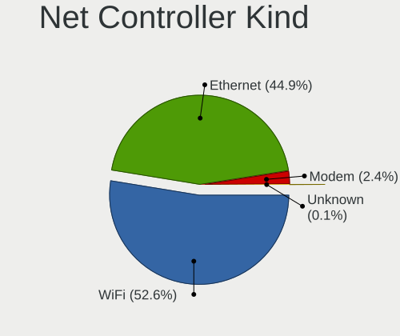

| Kind     | Notebooks | Percent |
|----------|-----------|---------|
| WiFi     | 15980     | 52.57%  |
| Ethernet | 13659     | 44.94%  |
| Modem    | 727       | 2.39%   |
| Unknown  | 31        | 0.1%    |

Used Controller
---------------

Currently used network controller

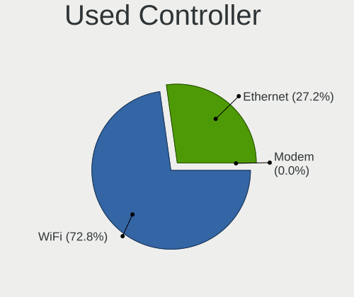

| Kind     | Notebooks | Percent |
|----------|-----------|---------|
| WiFi     | 12923     | 72.79%  |
| Ethernet | 4831      | 27.21%  |
| Modem    | 1         | 0.01%   |

NICs
----

Total network controllers on board

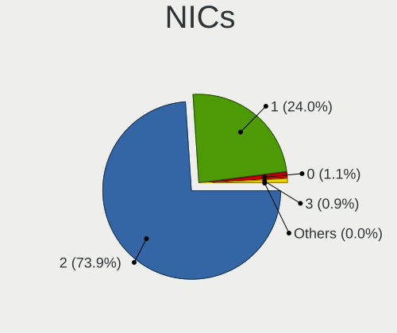

| Total | Notebooks | Percent |
|-------|-----------|---------|
| 2     | 12221     | 73.94%  |
| 1     | 3968      | 24.01%  |
| 0     | 189       | 1.14%   |
| 3     | 145       | 0.88%   |
| 4     | 3         | 0.02%   |
| 5     | 2         | 0.01%   |

IPv6
----

IPv6 vs IPv4

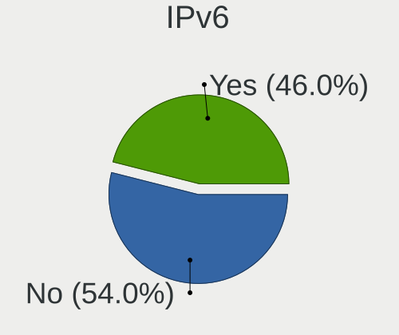

| Used | Notebooks | Percent |
|------|-----------|---------|
| No   | 9241      | 53.96%  |
| Yes  | 7886      | 46.04%  |

Bluetooth
---------

Bluetooth Vendor
----------------

Controller vendors

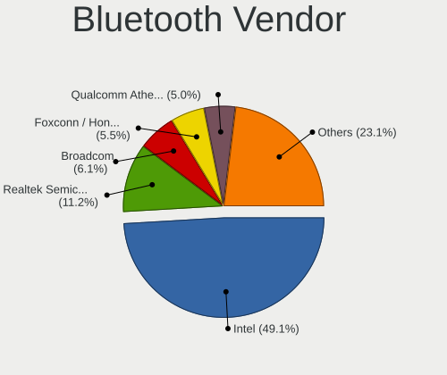

| Vendor                          | Notebooks | Percent |
|---------------------------------|-----------|---------|
| Intel                           | 6384      | 49.08%  |
| Realtek Semiconductor           | 1456      | 11.19%  |
| Broadcom                        | 792       | 6.09%   |
| Foxconn / Hon Hai               | 718       | 5.52%   |
| Qualcomm Atheros Communications | 656       | 5.04%   |
| IMC Networks                    | 626       | 4.81%   |
| Lite-On Technology              | 542       | 4.17%   |
| Apple                           | 450       | 3.46%   |
| Dell                            | 257       | 1.98%   |
| Cambridge Silicon Radio         | 215       | 1.65%   |
| Hewlett-Packard                 | 148       | 1.14%   |
| Toshiba                         | 117       | 0.9%    |
| MediaTek                        | 115       | 0.88%   |
| Realtek                         | 91        | 0.7%    |
| Foxconn International           | 75        | 0.58%   |
| USI                             | 65        | 0.5%    |
| ASUSTek Computer                | 56        | 0.43%   |
| Askey Computer                  | 50        | 0.38%   |
| Alps Electric                   | 40        | 0.31%   |
| Ralink                          | 35        | 0.27%   |
| Taiyo Yuden                     | 23        | 0.18%   |
| Chicony Electronics             | 20        | 0.15%   |
| TP-Link                         | 12        | 0.09%   |
| Ralink Technology               | 11        | 0.08%   |
| Fujitsu                         | 10        | 0.08%   |
| Belkin Components               | 10        | 0.08%   |
| Qcom                            | 7         | 0.05%   |
| Edimax Technology               | 5         | 0.04%   |
| Unknown                         | 5         | 0.04%   |
| Integrated System Solution      | 4         | 0.03%   |
| Opticis                         | 2         | 0.02%   |
| Actions                         | 2         | 0.02%   |
| Syntek                          | 1         | 0.01%   |
| Sitecom Europe                  | 1         | 0.01%   |
| SINO WEALTH                     | 1         | 0.01%   |
| Roper                           | 1         | 0.01%   |
| Micro Star International        | 1         | 0.01%   |
| Logitech                        | 1         | 0.01%   |
| Fujitsu Siemens Computers       | 1         | 0.01%   |
| Corsair                         | 1         | 0.01%   |

Bluetooth Model
---------------

Controller models

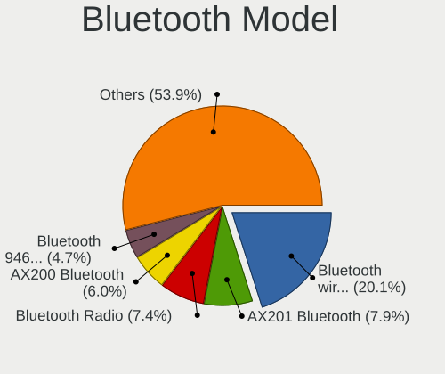

| Model                                               | Notebooks | Percent |
|-----------------------------------------------------|-----------|---------|
| Intel Bluetooth wireless interface                  | 2615      | 20.09%  |
| Intel AX201 Bluetooth                               | 1032      | 7.93%   |
| Realtek Bluetooth Radio                             | 957       | 7.35%   |
| Intel AX200 Bluetooth                               | 777       | 5.97%   |
| Intel Bluetooth 9460/9560 Jefferson Peak (JfP)      | 616       | 4.73%   |
| Intel Bluetooth Device                              | 489       | 3.76%   |
| Realtek  Bluetooth 4.2 Adapter                      | 339       | 2.6%    |
| IMC Networks Bluetooth Radio                        | 315       | 2.42%   |
| Intel Centrino Bluetooth Wireless Transceiver       | 281       | 2.16%   |
| Apple Bluetooth Host Controller                     | 263       | 2.02%   |
| Qualcomm Atheros  Bluetooth Device                  | 244       | 1.87%   |
| Cambridge Silicon Radio Bluetooth Dongle (HCI mode) | 215       | 1.65%   |
| Broadcom BCM2045B (BDC-2.1)                         | 208       | 1.6%    |
| Intel AX210 Bluetooth                               | 192       | 1.47%   |
| Intel Wireless-AC 9260 Bluetooth Adapter            | 188       | 1.44%   |
| Foxconn / Hon Hai Bluetooth Device                  | 186       | 1.43%   |
| Lite-On Qualcomm Atheros QCA9377 Bluetooth          | 167       | 1.28%   |
| Lite-On Bluetooth Device                            | 160       | 1.23%   |
| Broadcom BCM20702 Bluetooth 4.0 [ThinkPad]          | 156       | 1.2%    |
| Foxconn / Hon Hai Wireless_Device                   | 135       | 1.04%   |
| IMC Networks Wireless_Device                        | 130       | 1%      |
| Qualcomm Atheros QCA61x4 Bluetooth 4.0              | 128       | 0.98%   |
| Apple Bluetooth USB Host Controller                 | 127       | 0.98%   |
| Qualcomm Atheros AR3011 Bluetooth                   | 126       | 0.97%   |
| Qualcomm Atheros AR3012 Bluetooth 4.0               | 125       | 0.96%   |
| Foxconn / Hon Hai MediaTek Bluetooth Adapter        | 124       | 0.95%   |
| MediaTek Wireless_Device                            | 111       | 0.85%   |
| Intel Wireless-AC 3168 Bluetooth                    | 103       | 0.79%   |
| Dell DW375 Bluetooth Module                         | 102       | 0.78%   |
| IMC Networks Bluetooth Device                       | 97        | 0.75%   |
| HP Broadcom 2070 Bluetooth Combo                    | 94        | 0.72%   |
| Lite-On Atheros AR3012 Bluetooth                    | 92        | 0.71%   |
| Realtek Bluetooth Radio                             | 91        | 0.7%    |
| Intel Centrino Advanced-N 6230 Bluetooth adapter    | 85        | 0.65%   |
| Foxconn / Hon Hai BCM20702A0                        | 80        | 0.61%   |
| Foxconn International BCM43142A0 Bluetooth module   | 75        | 0.58%   |
| Dell BCM20702A0 Bluetooth Module                    | 67        | 0.51%   |
| Lite-On Wireless_Device                             | 66        | 0.51%   |
| USI Bluetooth Device                                | 64        | 0.49%   |
| Realtek RTL8723B Bluetooth                          | 62        | 0.48%   |

Sound
-----

Sound Vendor
------------

Sound card vendors

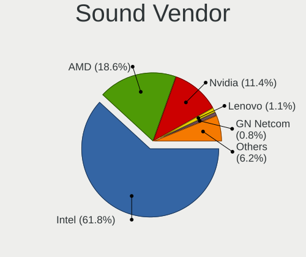

| Vendor                           | Notebooks | Percent |
|----------------------------------|-----------|---------|
| Intel                            | 12731     | 61.84%  |
| AMD                              | 3831      | 18.61%  |
| Nvidia                           | 2353      | 11.43%  |
| Lenovo                           | 236       | 1.15%   |
| GN Netcom                        | 169       | 0.82%   |
| C-Media Electronics              | 157       | 0.76%   |
| Realtek Semiconductor            | 118       | 0.57%   |
| Logitech                         | 93        | 0.45%   |
| Hewlett-Packard                  | 67        | 0.33%   |
| Plantronics                      | 66        | 0.32%   |
| Texas Instruments                | 48        | 0.23%   |
| DSEA A/S                         | 45        | 0.22%   |
| Silicon Integrated Systems [SiS] | 35        | 0.17%   |
| JMTek                            | 34        | 0.17%   |
| Focusrite-Novation               | 34        | 0.17%   |
| Generalplus Technology           | 31        | 0.15%   |
| Apple                            | 27        | 0.13%   |
| Conexant Systems                 | 26        | 0.13%   |
| Razer USA                        | 25        | 0.12%   |
| Kingston Technology              | 25        | 0.12%   |
| Sony                             | 23        | 0.11%   |
| Creative Technology              | 22        | 0.11%   |
| SteelSeries ApS                  | 18        | 0.09%   |
| VIA Technologies                 | 16        | 0.08%   |
| RODE Microphones                 | 16        | 0.08%   |
| Dell                             | 14        | 0.07%   |
| Corsair                          | 14        | 0.07%   |
| Fujitsu                          | 13        | 0.06%   |
| BEHRINGER International          | 11        | 0.05%   |
| Jieli Technology                 | 10        | 0.05%   |
| TerraTec Electronic              | 9         | 0.04%   |
| Native Instruments               | 9         | 0.04%   |
| Yamaha                           | 8         | 0.04%   |
| M-Audio                          | 8         | 0.04%   |
| Huawei Technologies              | 8         | 0.04%   |
| Samsung Electronics              | 7         | 0.03%   |
| ASUSTek Computer                 | 7         | 0.03%   |
| Walmart                          | 6         | 0.03%   |
| Trust                            | 6         | 0.03%   |
| No brand                         | 6         | 0.03%   |

Sound Model
-----------

Sound card models

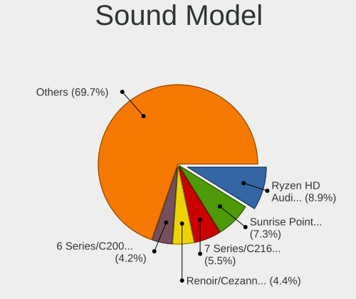

| Model                                                                                             | Notebooks | Percent |
|---------------------------------------------------------------------------------------------------|-----------|---------|
| AMD Ryzen HD Audio Controller                                                                     | 2227      | 8.86%   |
| Intel Sunrise Point-LP HD Audio                                                                   | 1834      | 7.29%   |
| Intel 7 Series/C216 Chipset Family High Definition Audio Controller                               | 1395      | 5.55%   |
| AMD Renoir/Cezanne HDMI/DP Audio Controller                                                       | 1115      | 4.43%   |
| Intel 6 Series/C200 Series Chipset Family High Definition Audio Controller                        | 1046      | 4.16%   |
| Intel 5 Series/3400 Series Chipset High Definition Audio                                          | 800       | 3.18%   |
| Intel 82801I (ICH9 Family) HD Audio Controller                                                    | 730       | 2.9%    |
| AMD Radeon High Definition Audio Controller                                                       | 651       | 2.59%   |
| Intel Haswell-ULT HD Audio Controller                                                             | 641       | 2.55%   |
| Intel 8 Series HD Audio Controller                                                                | 639       | 2.54%   |
| Intel 8 Series/C220 Series Chipset High Definition Audio Controller                               | 635       | 2.53%   |
| Intel Tiger Lake-LP Smart Sound Technology Audio Controller                                       | 570       | 2.27%   |
| Intel Broadwell-U Audio Controller                                                                | 532       | 2.12%   |
| Intel Wildcat Point-LP High Definition Audio Controller                                           | 522       | 2.08%   |
| Intel Xeon E3-1200 v3/4th Gen Core Processor HD Audio Controller                                  | 518       | 2.06%   |
| AMD Raven/Raven2/Fenghuang HDMI/DP Audio Controller                                               | 518       | 2.06%   |
| Intel Cannon Point-LP High Definition Audio Controller                                            | 442       | 1.76%   |
| Intel Cannon Lake PCH cAVS                                                                        | 433       | 1.72%   |
| Intel Alder Lake PCH-P High Definition Audio Controller                                           | 419       | 1.67%   |
| AMD FCH Azalia Controller                                                                         | 387       | 1.54%   |
| Intel Comet Lake PCH-LP cAVS                                                                      | 354       | 1.41%   |
| Intel 82801H (ICH8 Family) HD Audio Controller                                                    | 305       | 1.21%   |
| Nvidia GF108 High Definition Audio Controller                                                     | 272       | 1.08%   |
| Intel NM10/ICH7 Family High Definition Audio Controller                                           | 259       | 1.03%   |
| AMD SBx00 Azalia (Intel HDA)                                                                      | 259       | 1.03%   |
| AMD Kabini HDMI/DP Audio                                                                          | 258       | 1.03%   |
| Intel Celeron/Pentium Silver Processor High Definition Audio                                      | 238       | 0.95%   |
| Intel 100 Series/C230 Series Chipset Family HD Audio Controller                                   | 229       | 0.91%   |
| Intel CM238 HD Audio Controller                                                                   | 227       | 0.9%    |
| Intel Atom Processor Z36xxx/Z37xxx Series High Definition Audio Controller                        | 224       | 0.89%   |
| Intel Comet Lake PCH cAVS                                                                         | 201       | 0.8%    |
| Intel Raptor Lake-P/U/H cAVS                                                                      | 191       | 0.76%   |
| AMD Family 15h (Models 60h-6fh) Audio Controller                                                  | 179       | 0.71%   |
| Intel Ice Lake-LP Smart Sound Technology Audio Controller                                         | 159       | 0.63%   |
| Nvidia TU107 GeForce GTX 1650 High Definition Audio Controller                                    | 158       | 0.63%   |
| Intel Atom/Celeron/Pentium Processor x5-E8000/J3xxx/N3xxx Series High Definition Audio Controller | 157       | 0.62%   |
| Intel Celeron N3350/Pentium N4200/Atom E3900 Series Audio Cluster                                 | 143       | 0.57%   |
| Intel Tiger Lake-H HD Audio Controller                                                            | 141       | 0.56%   |
| AMD High Definition Audio Controller                                                              | 139       | 0.55%   |
| Nvidia High Definition Audio Controller                                                           | 131       | 0.52%   |

Memory
------

Memory Vendor
-------------

Memory module vendors

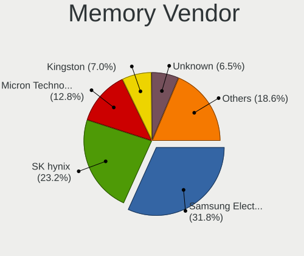

| Vendor              | Notebooks | Percent |
|---------------------|-----------|---------|
| Samsung Electronics | 3250      | 31.78%  |
| SK hynix            | 2373      | 23.2%   |
| Micron Technology   | 1314      | 12.85%  |
| Kingston            | 720       | 7.04%   |
| Unknown             | 667       | 6.52%   |
| Crucial             | 479       | 4.68%   |
| Ramaxel Technology  | 269       | 2.63%   |
| Elpida              | 191       | 1.87%   |
| Corsair             | 138       | 1.35%   |
| A-DATA Technology   | 134       | 1.31%   |
| Nanya Technology    | 123       | 1.2%    |
| Unknown             | 104       | 1.02%   |
| Unknown (ABCD)      | 95        | 0.93%   |
| G.Skill             | 74        | 0.72%   |
| Transcend           | 29        | 0.28%   |
| ASint Technology    | 24        | 0.23%   |
| Team                | 15        | 0.15%   |
| Avant               | 15        | 0.15%   |
| 48spaces            | 15        | 0.15%   |
| Timetec             | 14        | 0.14%   |
| GOODRAM             | 11        | 0.11%   |
| CSX                 | 10        | 0.1%    |
| SHARETRONIC         | 8         | 0.08%   |
| Qimonda             | 8         | 0.08%   |
| Patriot             | 8         | 0.08%   |
| Toshiba             | 7         | 0.07%   |
| ChangXin Memory     | 7         | 0.07%   |
| Apacer              | 7         | 0.07%   |
| Neo Forza           | 6         | 0.06%   |
| Goldkey             | 5         | 0.05%   |
| fef5                | 5         | 0.05%   |
| 4ea5                | 5         | 0.05%   |
| Wilk                | 4         | 0.04%   |
| PNY                 | 4         | 0.04%   |
| ff                  | 4         | 0.04%   |
| Unknown (F785)      | 3         | 0.03%   |
| Unknown (268C)      | 3         | 0.03%   |
| Unknown (0x0E9D)    | 3         | 0.03%   |
| Unifosa             | 3         | 0.03%   |
| Micron/Elpida       | 3         | 0.03%   |

Memory Model
------------

Memory module models

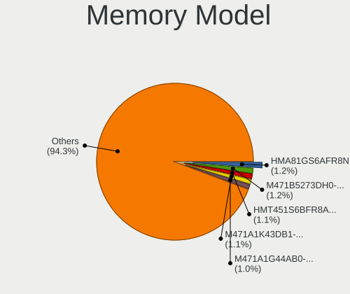

| Model                                                            | Notebooks | Percent |
|------------------------------------------------------------------|-----------|---------|
| SK hynix RAM HMA81GS6AFR8N-UH 8GB SODIMM DDR4 2667MT/s           | 136       | 1.25%   |
| Samsung RAM M471B5273DH0-CH9 4GB SODIMM DDR3 1600MT/s            | 134       | 1.23%   |
| SK hynix RAM HMT451S6BFR8A-PB 4GB SODIMM DDR3 1600MT/s           | 122       | 1.12%   |
| Samsung RAM M471A1K43DB1-CWE 8GB SODIMM DDR4 3200MT/s            | 115       | 1.06%   |
| Samsung RAM M471A1G44AB0-CWE 8GiB SODIMM DDR4 3200MT/s           | 114       | 1.05%   |
| Unknown                                                          | 104       | 0.95%   |
| SK hynix RAM HMAA1GS6CJR6N-XN 8GB SODIMM DDR4 3200MT/s           | 100       | 0.92%   |
| Samsung RAM M471B5173QH0-YK0 4GB SODIMM DDR3 1600MT/s            | 99        | 0.91%   |
| Samsung RAM M471B5173DB0-YK0 4GB SODIMM DDR3 1600MT/s            | 99        | 0.91%   |
| Samsung RAM M471A1K43CB1-CRC 8GB SODIMM DDR4 8400MT/s            | 98        | 0.9%    |
| Samsung RAM M471B5273CH0-CH9 4GB SODIMM DDR3 1334MT/s            | 94        | 0.86%   |
| Samsung RAM M471A5244CB0-CTD 4GB SODIMM DDR4 3266MT/s            | 89        | 0.82%   |
| Unknown (ABCD) RAM 123456789012345678 2GB SODIMM LPDDR4 2400MT/s | 85        | 0.78%   |
| Samsung RAM M471B1G73QH0-YK0 8GB SODIMM DDR3 1600MT/s            | 85        | 0.78%   |
| SK hynix RAM HMT41GS6BFR8A-PB 8GB SODIMM DDR3 2667MT/s           | 83        | 0.76%   |
| Samsung RAM M471A1G44BB0-CWE 8GB SODIMM DDR4 3200MT/s            | 83        | 0.76%   |
| Samsung RAM M471A1K43EB1-CWE 8GB SODIMM DDR4 3200MT/s            | 78        | 0.72%   |
| Samsung RAM M471B1G73EB0-YK0 8192MB SODIMM DDR3 1600MT/s         | 77        | 0.71%   |
| Samsung RAM M471A2K43DB1-CWE 16GB SODIMM DDR4 3200MT/s           | 76        | 0.7%    |
| Samsung RAM M471B1G73DB0-YK0 8GB SODIMM DDR3 1600MT/s            | 75        | 0.69%   |
| Samsung RAM M471A1K43CB1-CTD 8GB SODIMM DDR4 3200MT/s            | 70        | 0.64%   |
| Samsung RAM M471B5173EB0-YK0 4GB SODIMM DDR3 1600MT/s            | 69        | 0.63%   |
| SK hynix RAM HMA81GS6DJR8N-XN 8GB SODIMM DDR4 3200MT/s           | 66        | 0.61%   |
| SK hynix RAM HMT351S6CFR8C-PB 4GB SODIMM DDR3 1600MT/s           | 63        | 0.58%   |
| Samsung RAM M471A5244CB0-CWE 4GB SODIMM DDR4 3200MT/s            | 58        | 0.53%   |
| Samsung RAM M471A1K43DB1-CTD 8GB SODIMM DDR4 2667MT/s            | 58        | 0.53%   |
| Samsung RAM M471A2K43CB1-CRC 16GB SODIMM DDR4 2667MT/s           | 57        | 0.52%   |
| Samsung RAM M471A1K43BB1-CRC 8GB SODIMM DDR4 2667MT/s            | 56        | 0.51%   |
| SK hynix RAM HMA81GS6CJR8N-VK 8GB SODIMM DDR4 2667MT/s           | 55        | 0.5%    |
| Samsung RAM M471A5244CB0-CRC 4GB SODIMM DDR4 2667MT/s            | 55        | 0.5%    |
| Micron RAM 4ATF1G64HZ-3G2E1 8GB Row Of Chips DDR4 3200MT/s       | 55        | 0.5%    |
| Samsung RAM M471A2G44AM0-CWE 16GB SODIMM DDR4 3200MT/s           | 54        | 0.5%    |
| Micron RAM 4ATF1G64HZ-3G2E1 8GB SODIMM DDR4 3200MT/s             | 53        | 0.49%   |
| SK hynix RAM HMA851S6CJR6N-VK 4GB SODIMM DDR4 2667MT/s           | 52        | 0.48%   |
| SK hynix RAM HMA81GS6JJR8N-VK 8GB SODIMM DDR4 2667MT/s           | 50        | 0.46%   |
| Samsung RAM M471A2K43CB1-CTD 16GB SODIMM DDR4 8400MT/s           | 50        | 0.46%   |
| Samsung RAM M471B5273DH0-CK0 4GB SODIMM DDR3 2400MT/s            | 49        | 0.45%   |
| Samsung RAM M471A4G43MB1-CTD 32GB SODIMM DDR4 2667MT/s           | 49        | 0.45%   |
| Samsung RAM M471A4G43AB1-CWE 32GB SODIMM DDR4 3200MT/s           | 49        | 0.45%   |
| Micron RAM 8ATF1G64HZ-2G6E1 8GB SODIMM DDR4 2667MT/s             | 48        | 0.44%   |

Memory Kind
-----------

Memory module kinds

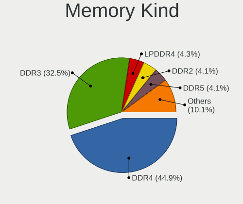

| Kind    | Notebooks | Percent |
|---------|-----------|---------|
| DDR4    | 3973      | 44.92%  |
| DDR3    | 2873      | 32.48%  |
| LPDDR4  | 383       | 4.33%   |
| DDR2    | 367       | 4.15%   |
| DDR5    | 359       | 4.06%   |
| LPDDR5  | 348       | 3.93%   |
| LPDDR3  | 244       | 2.76%   |
| SDRAM   | 175       | 1.98%   |
| Unknown | 54        | 0.61%   |
| DDR     | 42        | 0.47%   |
| DRAM    | 26        | 0.29%   |
| RAM     | 1         | 0.01%   |

Memory Form Factor
------------------

Physical design of the memory module

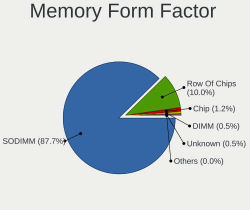

| Name            | Notebooks | Percent |
|-----------------|-----------|---------|
| SODIMM          | 7783      | 87.68%  |
| Row Of Chips    | 892       | 10.05%  |
| Chip            | 105       | 1.18%   |
| DIMM            | 48        | 0.54%   |
| Unknown         | 48        | 0.54%   |
| Proprietary Car | 1         | 0.01%   |

Memory Size
-----------

Memory module size

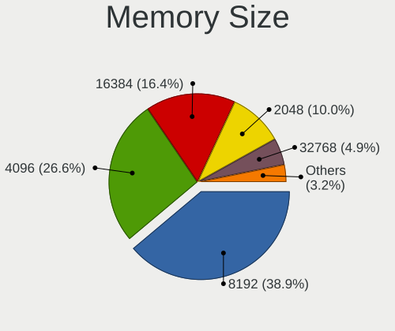

| Size  | Notebooks | Percent |
|-------|-----------|---------|
| 8192  | 3733      | 38.87%  |
| 4096  | 2559      | 26.64%  |
| 16384 | 1574      | 16.39%  |
| 2048  | 963       | 10.03%  |
| 32768 | 471       | 4.9%    |
| 1024  | 243       | 2.53%   |
| 512   | 31        | 0.32%   |
| 49152 | 14        | 0.15%   |
| 65536 | 4         | 0.04%   |
| 256   | 4         | 0.04%   |
| 128   | 4         | 0.04%   |
| 3072  | 2         | 0.02%   |
| 384   | 2         | 0.02%   |
| 1536  | 1         | 0.01%   |

Memory Speed
------------

Memory module speed

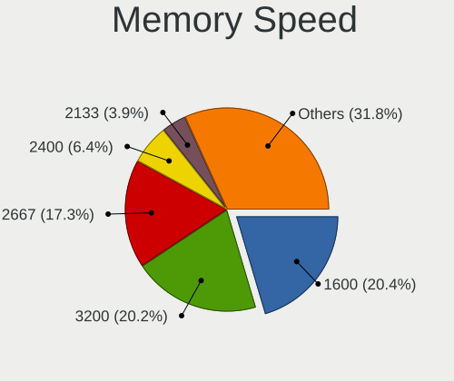

| Speed   | Notebooks | Percent |
|---------|-----------|---------|
| 1600    | 1936      | 20.42%  |
| 3200    | 1920      | 20.25%  |
| 2667    | 1637      | 17.26%  |
| 2400    | 604       | 6.37%   |
| 2133    | 371       | 3.91%   |
| 1334    | 340       | 3.59%   |
| 1333    | 321       | 3.39%   |
| 5600    | 240       | 2.53%   |
| Unknown | 201       | 2.12%   |
| 667     | 192       | 2.02%   |
| 1067    | 187       | 1.97%   |
| 6400    | 157       | 1.66%   |
| 8400    | 147       | 1.55%   |
| 1867    | 147       | 1.55%   |
| 4267    | 145       | 1.53%   |
| 4800    | 118       | 1.24%   |
| 800     | 109       | 1.15%   |
| 4199    | 95        | 1%      |
| 7500    | 92        | 0.97%   |
| 3266    | 89        | 0.94%   |
| 1066    | 59        | 0.62%   |
| 4266    | 53        | 0.56%   |
| 2048    | 49        | 0.52%   |
| 8533    | 41        | 0.43%   |
| 975     | 40        | 0.42%   |
| 533     | 37        | 0.39%   |
| 3733    | 25        | 0.26%   |
| 7467    | 20        | 0.21%   |
| 5500    | 19        | 0.2%    |
| 1866    | 17        | 0.18%   |
| 333     | 11        | 0.12%   |
| 2933    | 10        | 0.11%   |
| 8000    | 8         | 0.08%   |
| 1639    | 7         | 0.07%   |
| 6000    | 4         | 0.04%   |
| 3000    | 4         | 0.04%   |
| 2267    | 4         | 0.04%   |
| 12800   | 3         | 0.03%   |
| 400     | 3         | 0.03%   |
| 166     | 3         | 0.03%   |

Printers & scanners
-------------------

Printer Vendor
--------------

Printer device vendors

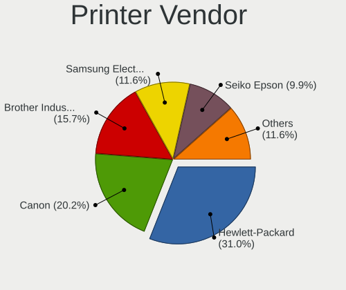

| Vendor                | Notebooks | Percent |
|-----------------------|-----------|---------|
| Hewlett-Packard       | 75        | 30.99%  |
| Canon                 | 49        | 20.25%  |
| Brother Industries    | 38        | 15.7%   |
| Samsung Electronics   | 28        | 11.57%  |
| Seiko Epson           | 24        | 9.92%   |
| Prolific Technology   | 8         | 3.31%   |
| Kyocera               | 7         | 2.89%   |
| Dymo-CoStar           | 3         | 1.24%   |
| STMicroelectronics    | 2         | 0.83%   |
| QinHeng Electronics   | 2         | 0.83%   |
| Lexmark International | 2         | 0.83%   |
| Oki Data              | 1         | 0.41%   |
| Minolta               | 1         | 0.41%   |
| MIIIW                 | 1         | 0.41%   |
| Dell                  | 1         | 0.41%   |

Printer Model
-------------

Printer device models

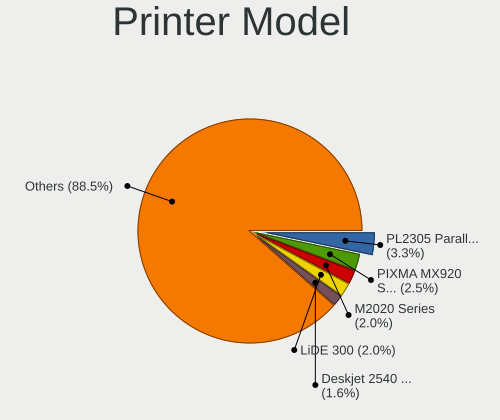

| Model                                                     | Notebooks | Percent |
|-----------------------------------------------------------|-----------|---------|
| Prolific PL2305 Parallel Port                             | 8         | 3.28%   |
| Canon PIXMA MX920 Series                                  | 6         | 2.46%   |
| Samsung M2020 Series                                      | 5         | 2.05%   |
| Canon LiDE 300                                            | 5         | 2.05%   |
| HP DeskJet 4100 series                                    | 4         | 1.64%   |
| HP Deskjet 2540 series                                    | 4         | 1.64%   |
| HP Deskjet 2050 J510                                      | 4         | 1.64%   |
| Brother DCP-7055W                                         | 4         | 1.64%   |
| Seiko Epson XP-4100 Series                                | 3         | 1.23%   |
| Kyocera Mita FS-820                                       | 3         | 1.23%   |
| HP ENVY 4520 series                                       | 3         | 1.23%   |
| HP DeskJet 2700 series                                    | 3         | 1.23%   |
| HP Deskjet 1050 J410                                      | 3         | 1.23%   |
| Canon PIXMA MG3600 Series                                 | 3         | 1.23%   |
| Canon LiDE 400                                            | 3         | 1.23%   |
| Brother MFC-L3750CDW                                      | 3         | 1.23%   |
| Brother DCP-9022CDW                                       | 3         | 1.23%   |
| STMicroelectronics LED badge -- mini LED display -- 11x44 | 2         | 0.82%   |
| Seiko Epson L3050 Series                                  | 2         | 0.82%   |
| Seiko Epson ET-2720 Series                                | 2         | 0.82%   |
| Seiko Epson ET-2710 Series                                | 2         | 0.82%   |
| Seiko Epson EPSON WF-2510 Series                          | 2         | 0.82%   |
| Samsung ML-2950 Series                                    | 2         | 0.82%   |
| Samsung M288x Series                                      | 2         | 0.82%   |
| Samsung M267x 287x Series                                 | 2         | 0.82%   |
| Samsung CLX-3300 Series                                   | 2         | 0.82%   |
| Samsung C48x Series                                       | 2         | 0.82%   |
| QinHeng CH340S                                            | 2         | 0.82%   |
| Lexmark International E360d                               | 2         | 0.82%   |
| Kyocera FS-1030D printer                                  | 2         | 0.82%   |
| HP OfficeJet 4650 series                                  | 2         | 0.82%   |
| HP Officejet 4620 series                                  | 2         | 0.82%   |
| HP LaserJet 200 colorMFP M275nw                           | 2         | 0.82%   |
| HP HP Laser 107w                                          | 2         | 0.82%   |
| HP EWS UPD                                                | 2         | 0.82%   |
| HP ENVY 6000 series                                       | 2         | 0.82%   |
| HP ENVY 4500 series                                       | 2         | 0.82%   |
| HP DeskJet 3630 series                                    | 2         | 0.82%   |
| HP DeskJet 2600 series                                    | 2         | 0.82%   |
| HP Deskjet 1000 J110 series                               | 2         | 0.82%   |

Scanner Vendor
--------------

Scanner device vendors

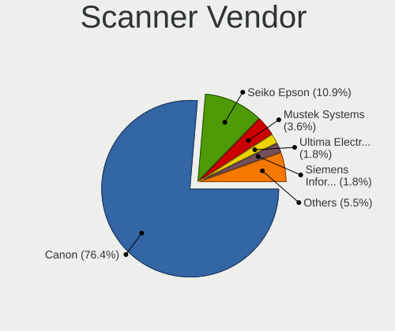

| Vendor                                         | Notebooks | Percent |
|------------------------------------------------|-----------|---------|
| Canon                                          | 42        | 76.36%  |
| Seiko Epson                                    | 6         | 10.91%  |
| Mustek Systems                                 | 2         | 3.64%   |
| Ultima Electronics                             | 1         | 1.82%   |
| Siemens Information and Communication Products | 1         | 1.82%   |
| Plustek                                        | 1         | 1.82%   |
| Hewlett-Packard                                | 1         | 1.82%   |
| AGFA-Gevaert NV                                | 1         | 1.82%   |

Scanner Model
-------------

Scanner device models

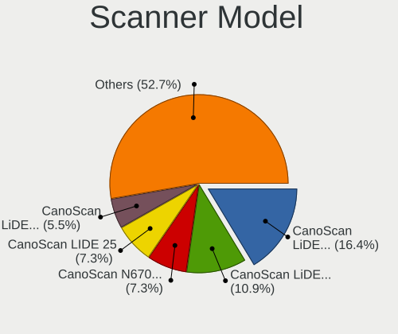

| Model                                                                                 | Notebooks | Percent |
|---------------------------------------------------------------------------------------|-----------|---------|
| Canon CanoScan LiDE 220                                                               | 9         | 16.36%  |
| Canon CanoScan LiDE 110                                                               | 6         | 10.91%  |
| Canon CanoScan N670U/N676U/LiDE 20                                                    | 4         | 7.27%   |
| Canon CanoScan LIDE 25                                                                | 4         | 7.27%   |
| Canon CanoScan LiDE 210                                                               | 3         | 5.45%   |
| Canon CanoScan LiDE 120                                                               | 3         | 5.45%   |
| Canon CanoScan LiDE 90                                                                | 2         | 3.64%   |
| Canon CanoScan LiDE 500F                                                              | 2         | 3.64%   |
| Canon CanoScan LiDE 200                                                               | 2         | 3.64%   |
| Canon CanoScan LiDE 100                                                               | 2         | 3.64%   |
| Ultima Artec Ultima 2000 (GT6801 based)/Lifetec LT9385/ScanMagic 1200 UB Plus Scanner | 1         | 1.82%   |
| Siemens Information and Communication Products ID-Mouse with Fingerprint Reader       | 1         | 1.82%   |
| Seiko Epson GT-X770 [Perfection V500]                                                 | 1         | 1.82%   |
| Seiko Epson GT-F730 [GT-S630/Perfection V33/V330 Photo]                               | 1         | 1.82%   |
| Seiko Epson GT-F720 [GT-S620/Perfection V30/V300 Photo]                               | 1         | 1.82%   |
| Seiko Epson GT-F500/GT-F550 [Perfection 2480/2580 PHOTO]                              | 1         | 1.82%   |
| Seiko Epson GT-8400UF [Perfection 1670/1670 PHOTO]                                    | 1         | 1.82%   |
| Seiko Epson GT-7200U [Perfection 1250/1250 PHOTO]                                     | 1         | 1.82%   |
| Plustek OpticPro UT12/16/24 Scanner                                                   | 1         | 1.82%   |
| Mustek Systems SNAPSCAN e22                                                           | 1         | 1.82%   |
| Mustek Systems ScanExpress 600 CU                                                     | 1         | 1.82%   |
| HP HP4470C                                                                            | 1         | 1.82%   |
| Canon CanoScan LiDE 600F                                                              | 1         | 1.82%   |
| Canon CanoScan LiDE 60                                                                | 1         | 1.82%   |
| Canon CanoScan LiDE 50/LiDE 35/LiDE 40                                                | 1         | 1.82%   |
| Canon CanoScan 4400F                                                                  | 1         | 1.82%   |
| Canon CanoScan 3200F                                                                  | 1         | 1.82%   |
| AGFA-Gevaert NV SnapScan 1212U (?)                                                    | 1         | 1.82%   |

Camera
------

Camera Vendor
-------------

Camera device vendors

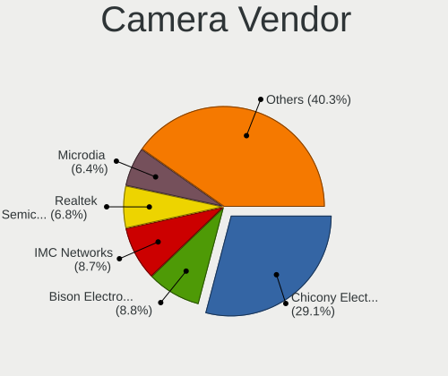

| Vendor                                 | Notebooks | Percent |
|----------------------------------------|-----------|---------|
| Chicony Electronics                    | 4157      | 29.08%  |
| Bison Electronics                      | 1252      | 8.76%   |
| IMC Networks                           | 1247      | 8.72%   |
| Realtek Semiconductor                  | 975       | 6.82%   |
| Microdia                               | 909       | 6.36%   |
| Quanta                                 | 711       | 4.97%   |
| Sunplus Innovation Technology          | 653       | 4.57%   |
| Cheng Uei Precision Industry (Foxlink) | 551       | 3.85%   |
| Suyin                                  | 477       | 3.34%   |
| Syntek                                 | 389       | 2.72%   |
| Lite-On Technology                     | 377       | 2.64%   |
| Luxvisions Innotech Limited            | 345       | 2.41%   |
| Apple                                  | 320       | 2.24%   |
| Logitech                               | 282       | 1.97%   |
| Alcor Micro                            | 164       | 1.15%   |
| Silicon Motion                         | 156       | 1.09%   |
| Ricoh                                  | 148       | 1.04%   |
| Lenovo                                 | 134       | 0.94%   |
| Acer                                   | 79        | 0.55%   |
| Sonix Technology                       | 74        | 0.52%   |
| ALi                                    | 68        | 0.48%   |
| Z-Star Microelectronics                | 64        | 0.45%   |
| Samsung Electronics                    | 54        | 0.38%   |
| SunplusIT                              | 53        | 0.37%   |
| ShineTech                              | 48        | 0.34%   |
| Primax Electronics                     | 44        | 0.31%   |
| DigiTech                               | 44        | 0.31%   |
| kingcome                               | 41        | 0.29%   |
| Importek                               | 40        | 0.28%   |
| Microsoft                              | 35        | 0.24%   |
| Sunplus Technology                     | 22        | 0.15%   |
| icSpring                               | 22        | 0.15%   |
| Genesys Logic                          | 19        | 0.13%   |
| Generalplus Technology                 | 19        | 0.13%   |
| Framework                              | 14        | 0.1%    |
| Y Media                                | 13        | 0.09%   |
| eMPIA Technology                       | 13        | 0.09%   |
| BKX-210918                             | 13        | 0.09%   |
| OmniVision Technologies                | 12        | 0.08%   |
| Intel                                  | 10        | 0.07%   |

Camera Model
------------

Camera device models

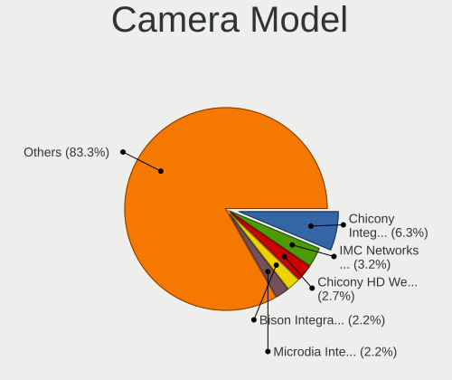

| Model                                            | Notebooks | Percent |
|--------------------------------------------------|-----------|---------|
| Chicony Integrated Camera                        | 907       | 6.31%   |
| IMC Networks Integrated Camera                   | 460       | 3.2%    |
| Chicony HD Webcam                                | 393       | 2.73%   |
| Bison Integrated Camera                          | 323       | 2.25%   |
| Microdia Integrated_Webcam_HD                    | 322       | 2.24%   |
| IMC Networks USB2.0 HD UVC WebCam                | 261       | 1.82%   |
| Realtek Integrated_Webcam_HD                     | 251       | 1.75%   |
| Syntek Integrated Camera                         | 242       | 1.68%   |
| Chicony FJ Camera                                | 239       | 1.66%   |
| Lite-On Integrated Camera                        | 172       | 1.2%    |
| Chicony HP HD Camera                             | 138       | 0.96%   |
| Chicony Chicony USB2.0 Camera                    | 136       | 0.95%   |
| Sunplus HD WebCam                                | 133       | 0.93%   |
| Chicony USB2.0 HD UVC WebCam                     | 129       | 0.9%    |
| Quanta HD User Facing                            | 126       | 0.88%   |
| Microdia Integrated Webcam                       | 122       | 0.85%   |
| Bison Lenovo EasyCamera                          | 122       | 0.85%   |
| Chicony Integrated Camera (1280x720@30)          | 119       | 0.83%   |
| Sunplus Integrated_Webcam_HD                     | 118       | 0.82%   |
| Bison SunplusIT Integrated Camera                | 115       | 0.8%    |
| Quanta HP HD Camera                              | 109       | 0.76%   |
| Chicony Integrated IR Camera                     | 106       | 0.74%   |
| Bison BisonCam,NB Pro                            | 106       | 0.74%   |
| Apple Built-in iSight                            | 105       | 0.73%   |
| Chicony HD User Facing                           | 104       | 0.72%   |
| Chicony TOSHIBA Web Camera - HD                  | 99        | 0.69%   |
| Chicony HP TrueVision HD Camera                  | 96        | 0.67%   |
| Quanta HD Webcam                                 | 91        | 0.63%   |
| Apple FaceTime HD Camera                         | 91        | 0.63%   |
| Realtek USB Camera                               | 90        | 0.63%   |
| Cheng Uei Precision Industry (Foxlink) HP Webcam | 90        | 0.63%   |
| Quanta HP Webcam                                 | 88        | 0.61%   |
| IMC Networks USB2.0 VGA UVC WebCam               | 87        | 0.61%   |
| Chicony USB 2.0 Camera                           | 87        | 0.61%   |
| Bison Lenovo Integrated Webcam                   | 84        | 0.58%   |
| Bison Integrated RGB Camera                      | 84        | 0.58%   |
| Syntek Lenovo EasyCamera                         | 82        | 0.57%   |
| Chicony Lenovo EasyCamera                        | 82        | 0.57%   |
| Chicony HP Webcam                                | 82        | 0.57%   |
| Luxvisions Innotech Limited Integrated Camera    | 81        | 0.56%   |

Security
--------

Fingerprint Vendor
------------------

Fingerprint sensor vendors

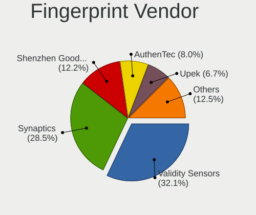

| Vendor                             | Notebooks | Percent |
|------------------------------------|-----------|---------|
| Validity Sensors                   | 1056      | 32.06%  |
| Synaptics                          | 938       | 28.48%  |
| Shenzhen Goodix Technology         | 402       | 12.2%   |
| AuthenTec                          | 265       | 8.04%   |
| Upek                               | 221       | 6.71%   |
| LighTuning Technology              | 192       | 5.83%   |
| Elan Microelectronics              | 133       | 4.04%   |
| STMicroelectronics                 | 43        | 1.31%   |
| HOLTEK                             | 21        | 0.64%   |
| Realtek USB2.0 Finger Print Bridge | 10        | 0.3%    |
| Next Biometrics                    | 5         | 0.15%   |
| Focal-systems.Corp                 | 5         | 0.15%   |
| Samsung Electronics                | 3         | 0.09%   |

Fingerprint Model
-----------------

Fingerprint sensor models

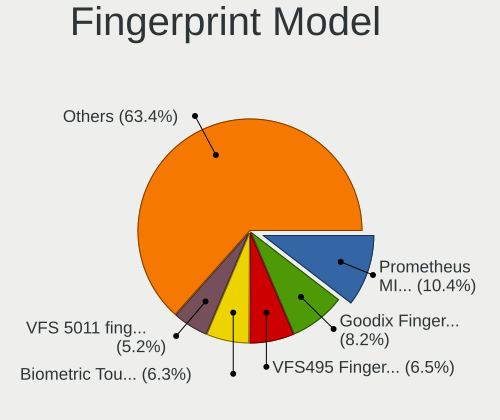

| Model                                                                      | Notebooks | Percent |
|----------------------------------------------------------------------------|-----------|---------|
| Synaptics Prometheus MIS Touch Fingerprint Reader                          | 344       | 10.44%  |
| Shenzhen Goodix  FingerPrint Device                                        | 269       | 8.16%   |
| Validity Sensors VFS495 Fingerprint Reader                                 | 214       | 6.49%   |
| Upek Biometric Touchchip/Touchstrip Fingerprint Sensor                     | 206       | 6.25%   |
| Validity Sensors VFS 5011 fingerprint sensor                               | 172       | 5.22%   |
| Synaptics Metallica MIS Touch Fingerprint Reader                           | 159       | 4.83%   |
| Validity Sensors Synaptics WBDI                                            | 136       | 4.13%   |
| Validity Sensors VFS5011 Fingerprint Reader                                | 99        | 3%      |
| AuthenTec AES2810                                                          | 94        | 2.85%   |
| Shenzhen Goodix Fingerprint Reader                                         | 81        | 2.46%   |
| Validity Sensors VFS7500 Touch Fingerprint Sensor                          | 75        | 2.28%   |
| LighTuning ES603 Swipe Fingerprint Sensor                                  | 74        | 2.25%   |
| Elan ELAN:Fingerprint                                                      | 72        | 2.19%   |
| LighTuning EgisTec Touch Fingerprint Sensor                                | 70        | 2.12%   |
| Synaptics UWP WBDI Device                                                  | 68        | 2.06%   |
| Validity Sensors Swipe Fingerprint Sensor                                  | 66        | 2%      |
| Synaptics FS7604 Touch Fingerprint Sensor with PurePrint                   | 62        | 1.88%   |
| Validity Sensors VFS471 Fingerprint Reader                                 | 61        | 1.85%   |
| Elan ELAN:ARM-M4                                                           | 59        | 1.79%   |
| AuthenTec AES2501 Fingerprint Sensor                                       | 57        | 1.73%   |
| Validity Sensors Synaptics VFS7552 Touch Fingerprint Sensor with PurePrint | 56        | 1.7%    |
| Synaptics Metallica MOH Touch Fingerprint Reader                           | 54        | 1.64%   |
| Validity Sensors VFS491                                                    | 52        | 1.58%   |
| Shenzhen Goodix FingerPrint                                                | 52        | 1.58%   |
| Synaptics Fingerprint reader [HP G6]                                       | 46        | 1.4%    |
| LighTuning Fingerprint Reader                                              | 45        | 1.37%   |
| Synaptics  FS7604 Touch Fingerprint Sensor with PurePrint                  | 44        | 1.34%   |
| AuthenTec Fingerprint Sensor                                               | 44        | 1.34%   |
| STMicroelectronics Fingerprint Reader                                      | 43        | 1.31%   |
| Validity Sensors VFS451 Fingerprint Reader                                 | 42        | 1.27%   |
| AuthenTec AES1600                                                          | 38        | 1.15%   |
| Synaptics Prometheus Fingerprint Reader                                    | 31        | 0.94%   |
| Unknown                                                                    | 30        | 0.91%   |
| Synaptics TouchPad                                                         | 28        | 0.85%   |
| Validity Sensors VFS101 Fingerprint Reader                                 | 27        | 0.82%   |
| Validity Sensors Fingerprint scanner                                       | 25        | 0.76%   |
| Synaptics WBDI                                                             | 21        | 0.64%   |
| HOLTEK FocalTech Fingerprint Device                                        | 21        | 0.64%   |
| Synaptics WBDI Device                                                      | 18        | 0.55%   |
| Synaptics  WBDI                                                            | 18        | 0.55%   |

Chipcard Vendor
---------------

Chipcard module vendors

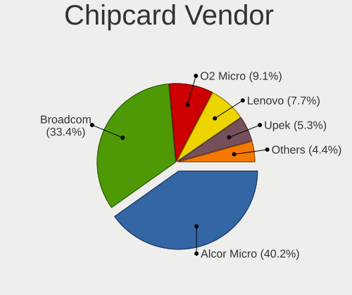

| Vendor                            | Notebooks | Percent |
|-----------------------------------|-----------|---------|
| Alcor Micro                       | 809       | 40.17%  |
| Broadcom                          | 673       | 33.42%  |
| O2 Micro                          | 183       | 9.09%   |
| Lenovo                            | 155       | 7.7%    |
| Upek                              | 106       | 5.26%   |
| Gemalto (was Gemplus)             | 20        | 0.99%   |
| Yubico.com                        | 19        | 0.94%   |
| Reiner SCT Kartensysteme          | 8         | 0.4%    |
| SCM Microsystems                  | 7         | 0.35%   |
| OmniKey                           | 7         | 0.35%   |
| Cherry                            | 7         | 0.35%   |
| Clay Logic                        | 6         | 0.3%    |
| Fujitsu Siemens Computers         | 3         | 0.15%   |
| Purism, SPC                       | 2         | 0.1%    |
| NXP Semiconductors                | 2         | 0.1%    |
| Kobil Systems                     | 2         | 0.1%    |
| Realtek Semiconductor             | 1         | 0.05%   |
| Microchip Technology              | 1         | 0.05%   |
| In Focus Systems                  | 1         | 0.05%   |
| Free Software Initiative of Japan | 1         | 0.05%   |
| Chicony Electronics               | 1         | 0.05%   |

Chipcard Model
--------------

Chipcard module models

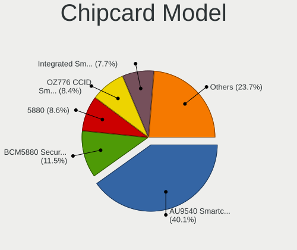

| Model                                                                        | Notebooks | Percent |
|------------------------------------------------------------------------------|-----------|---------|
| Alcor Micro AU9540 Smartcard Reader                                          | 809       | 40.15%  |
| Broadcom BCM5880 Secure Applications Processor                               | 231       | 11.46%  |
| Broadcom 5880                                                                | 173       | 8.59%   |
| O2 Micro OZ776 CCID Smartcard Reader                                         | 170       | 8.44%   |
| Lenovo Integrated Smart Card Reader                                          | 155       | 7.69%   |
| Broadcom BCM5880 Secure Applications Processor with fingerprint swipe sensor | 110       | 5.46%   |
| Upek TouchChip Fingerprint Coprocessor (WBF advanced mode)                   | 106       | 5.26%   |
| Broadcom BCM58200 ControlVault 3 (FingerPrint sensor + Contacted SmartCard)  | 81        | 4.02%   |
| Broadcom 58200                                                               | 68        | 3.37%   |
| O2 Micro Oz776 SmartCard Reader                                              | 13        | 0.65%   |
| Gemalto (was Gemplus) GemPC Twin SmartCard Reader                            | 11        | 0.55%   |
| Broadcom BCM5880 Secure Applications Processor with fingerprint touch sensor | 11        | 0.55%   |
| Yubico.com Yubikey 4/5 U2F+CCID                                              | 10        | 0.5%    |
| Yubico.com Yubikey NEO(-N) OTP+CCID                                          | 9         | 0.45%   |
| Gemalto (was Gemplus) Compact Smart Card Reader Writer                       | 9         | 0.45%   |
| Reiner SCT Kartensysteme cyberJack RFID basis contactless smartcard reader   | 7         | 0.35%   |
| Clay Logic Nitrokey Pro                                                      | 6         | 0.3%    |
| Cherry SmartCard Reader Keyboard KC 1000 SC                                  | 5         | 0.25%   |
| SCM Microsystems SCR35xx Smart Card Reader                                   | 3         | 0.15%   |
| SCM Microsystems SCR3340 - ExpressCard54 Smart Card Reader                   | 3         | 0.15%   |
| OmniKey CardMan 4321                                                         | 3         | 0.15%   |
| Purism, SPC Librem Key                                                       | 2         | 0.1%    |
| OmniKey CardMan 3021 / 3121                                                  | 2         | 0.1%    |
| NXP Semiconductors PR533                                                     | 2         | 0.1%    |
| Kobil Systems Smart Token                                                    | 2         | 0.1%    |
| Fujitsu Siemens Computers Keyboard KB100 SCR eSIG                            | 2         | 0.1%    |
| Cherry SmartTerminal ST-2xxx                                                 | 2         | 0.1%    |
| SCM Microsystems SCR3500 A Contact Reader                                    | 1         | 0.05%   |
| Reiner SCT Kartensysteme tanJack USB                                         | 1         | 0.05%   |
| Realtek Semiconductor Smart Card Reader Interface                            | 1         | 0.05%   |
| OmniKey CardMan 3121 (HID Technologies)                                      | 1         | 0.05%   |
| OmniKey 3x21 Smart Card Reader                                               | 1         | 0.05%   |
| Microchip Technology SMSC USX101x Reader                                     | 1         | 0.05%   |
| In Focus Systems EMV Smartcard Reader                                        | 1         | 0.05%   |
| Fujitsu Siemens Computers Keyboard KB SCR                                    | 1         | 0.05%   |
| Free Software Initiative of Japan Gnuk Token                                 | 1         | 0.05%   |
| Chicony Electronics HP Skylab USB Smartcard Keyboard                         | 1         | 0.05%   |

Unsupported
-----------

Unsupported Devices
-------------------

Total unsupported devices on board

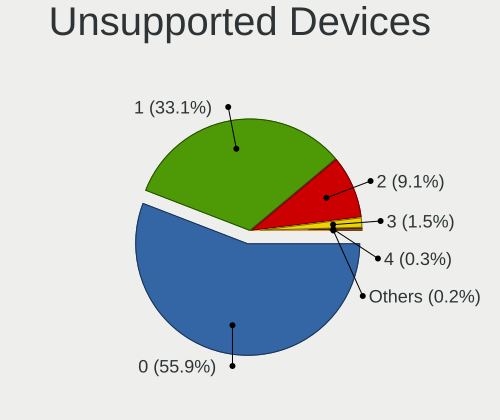

| Total | Notebooks | Percent |
|-------|-----------|---------|
| 0     | 9519      | 55.86%  |
| 1     | 5634      | 33.06%  |
| 2     | 1555      | 9.12%   |
| 3     | 254       | 1.49%   |
| 4     | 46        | 0.27%   |
| 5     | 24        | 0.14%   |
| 6     | 6         | 0.04%   |
| 7     | 3         | 0.02%   |
| 9     | 1         | 0.01%   |

Unsupported Device Types
------------------------

Types of unsupported devices

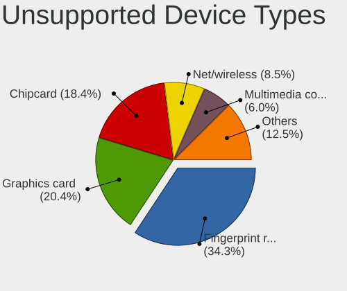

| Type                     | Notebooks | Percent |
|--------------------------|-----------|---------|
| Fingerprint reader       | 3256      | 34.28%  |
| Graphics card            | 1937      | 20.39%  |
| Chipcard                 | 1748      | 18.4%   |
| Net/wireless             | 803       | 8.45%   |
| Multimedia controller    | 569       | 5.99%   |
| Camera                   | 218       | 2.3%    |
| Storage                  | 199       | 2.1%    |
| Card reader              | 178       | 1.87%   |
| Communication controller | 168       | 1.77%   |
| Bluetooth                | 150       | 1.58%   |
| Net/ethernet             | 70        | 0.74%   |
| Sound                    | 63        | 0.66%   |
| Modem                    | 55        | 0.58%   |
| Network                  | 27        | 0.28%   |
| Flash memory             | 16        | 0.17%   |
| Firewire controller      | 10        | 0.11%   |
| Storage/ide              | 8         | 0.08%   |
| Unassigned class         | 7         | 0.07%   |
| Dvb card                 | 6         | 0.06%   |
| Storage/raid             | 5         | 0.05%   |
| Storage/nvme             | 2         | 0.02%   |
| Storage/ata              | 2         | 0.02%   |
| Tv card                  | 1         | 0.01%   |

