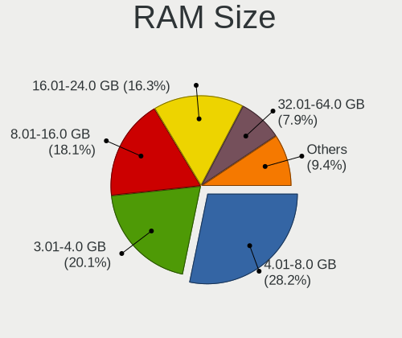
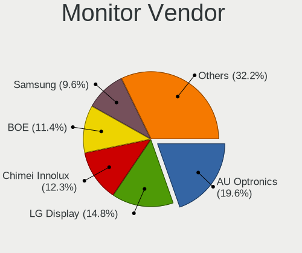
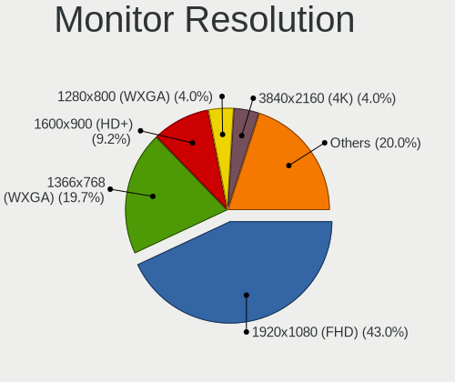
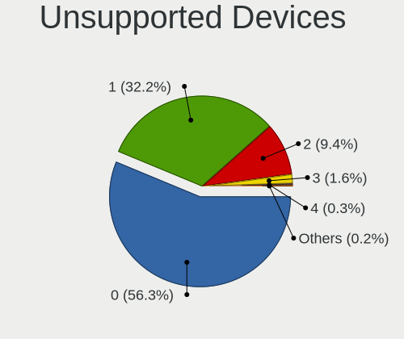

Linux in Germany - Tested Hardware & Statistics (Notebooks)
-----------------------------------------------------------

A project to collect tested hardware configurations for Linux in Germany.

Anyone can contribute to this report by the [hw-probe](https://github.com/linuxhw/hw-probe) tool:

    sudo -E hw-probe -all -upload

Please contribute! Especially if your hardware is rare.

Contents
--------

* [ Test Cases ](#test-cases)

* [ System ](#system)
  - [ OS                       ](#os)
  - [ OS Family                ](#os-family)
  - [ Kernel                   ](#kernel)
  - [ Kernel Family            ](#kernel-family)
  - [ Kernel Major Ver.        ](#kernel-major-ver)
  - [ Arch                     ](#arch)
  - [ DE                       ](#de)
  - [ Display Server           ](#display-server)
  - [ Display Manager          ](#display-manager)
  - [ OS Lang                  ](#os-lang)
  - [ Boot Mode                ](#boot-mode)
  - [ Filesystem               ](#filesystem)
  - [ Part. scheme             ](#part-scheme)
  - [ Dual Boot with Linux/BSD ](#dual-boot-with-linuxbsd)
  - [ Dual Boot (Win)          ](#dual-boot-win)

* [ Board ](#board)
  - [ Vendor                   ](#vendor)
  - [ Model                    ](#model)
  - [ Model Family             ](#model-family)
  - [ MFG Year                 ](#mfg-year)
  - [ Form Factor              ](#form-factor)
  - [ Secure Boot              ](#secure-boot)
  - [ Coreboot                 ](#coreboot)
  - [ RAM Size                 ](#ram-size)
  - [ RAM Used                 ](#ram-used)
  - [ Total Drives             ](#total-drives)
  - [ Has CD-ROM               ](#has-cd-rom)
  - [ Has Ethernet             ](#has-ethernet)
  - [ Has WiFi                 ](#has-wifi)
  - [ Has Bluetooth            ](#has-bluetooth)

* [ Location ](#location)
  - [ Country                  ](#country)
  - [ City                     ](#city)

* [ Drives ](#drives)
  - [ Drive Vendor             ](#drive-vendor)
  - [ Drive Model              ](#drive-model)
  - [ HDD Vendor               ](#hdd-vendor)
  - [ SSD Vendor               ](#ssd-vendor)
  - [ Drive Kind               ](#drive-kind)
  - [ Drive Connector          ](#drive-connector)
  - [ Drive Size               ](#drive-size)
  - [ Space Total              ](#space-total)
  - [ Space Used               ](#space-used)
  - [ Malfunc. Drives          ](#malfunc-drives)
  - [ Malfunc. Drive Vendor    ](#malfunc-drive-vendor)
  - [ Malfunc. HDD Vendor      ](#malfunc-hdd-vendor)
  - [ Malfunc. Drive Kind      ](#malfunc-drive-kind)
  - [ Failed Drives            ](#failed-drives)
  - [ Failed Drive Vendor      ](#failed-drive-vendor)
  - [ Drive Status             ](#drive-status)

* [ Storage controller ](#storage-controller)
  - [ Storage Vendor           ](#storage-vendor)
  - [ Storage Model            ](#storage-model)
  - [ Storage Kind             ](#storage-kind)

* [ Processor ](#processor)
  - [ CPU Vendor               ](#cpu-vendor)
  - [ CPU Model                ](#cpu-model)
  - [ CPU Model Family         ](#cpu-model-family)
  - [ CPU Cores                ](#cpu-cores)
  - [ CPU Sockets              ](#cpu-sockets)
  - [ CPU Threads              ](#cpu-threads)
  - [ CPU Op-Modes             ](#cpu-op-modes)
  - [ CPU Microcode            ](#cpu-microcode)
  - [ CPU Microarch            ](#cpu-microarch)

* [ Graphics ](#graphics)
  - [ GPU Vendor               ](#gpu-vendor)
  - [ GPU Model                ](#gpu-model)
  - [ GPU Combo                ](#gpu-combo)
  - [ GPU Driver               ](#gpu-driver)
  - [ GPU Memory               ](#gpu-memory)

* [ Monitor ](#monitor)
  - [ Monitor Vendor           ](#monitor-vendor)
  - [ Monitor Model            ](#monitor-model)
  - [ Monitor Resolution       ](#monitor-resolution)
  - [ Monitor Diagonal         ](#monitor-diagonal)
  - [ Monitor Width            ](#monitor-width)
  - [ Aspect Ratio             ](#aspect-ratio)
  - [ Monitor Area             ](#monitor-area)
  - [ Pixel Density            ](#pixel-density)
  - [ Multiple Monitors        ](#multiple-monitors)

* [ Network ](#network)
  - [ Net Controller Vendor    ](#net-controller-vendor)
  - [ Net Controller Model     ](#net-controller-model)
  - [ Wireless Vendor          ](#wireless-vendor)
  - [ Wireless Model           ](#wireless-model)
  - [ Ethernet Vendor          ](#ethernet-vendor)
  - [ Ethernet Model           ](#ethernet-model)
  - [ Net Controller Kind      ](#net-controller-kind)
  - [ Used Controller          ](#used-controller)
  - [ NICs                     ](#nics)
  - [ IPv6                     ](#ipv6)

* [ Bluetooth ](#bluetooth)
  - [ Bluetooth Vendor         ](#bluetooth-vendor)
  - [ Bluetooth Model          ](#bluetooth-model)

* [ Sound ](#sound)
  - [ Sound Vendor             ](#sound-vendor)
  - [ Sound Model              ](#sound-model)

* [ Memory ](#memory)
  - [ Memory Vendor            ](#memory-vendor)
  - [ Memory Model             ](#memory-model)
  - [ Memory Kind              ](#memory-kind)
  - [ Memory Form Factor       ](#memory-form-factor)
  - [ Memory Size              ](#memory-size)
  - [ Memory Speed             ](#memory-speed)

* [ Printers & scanners ](#printers--scanners)
  - [ Printer Vendor           ](#printer-vendor)
  - [ Printer Model            ](#printer-model)
  - [ Scanner Vendor           ](#scanner-vendor)
  - [ Scanner Model            ](#scanner-model)

* [ Camera ](#camera)
  - [ Camera Vendor            ](#camera-vendor)
  - [ Camera Model             ](#camera-model)

* [ Security ](#security)
  - [ Fingerprint Vendor       ](#fingerprint-vendor)
  - [ Fingerprint Model        ](#fingerprint-model)
  - [ Chipcard Vendor          ](#chipcard-vendor)
  - [ Chipcard Model           ](#chipcard-model)

* [ Unsupported ](#unsupported)
  - [ Unsupported Devices      ](#unsupported-devices)
  - [ Unsupported Device Types ](#unsupported-device-types)

Test Cases
----------

Total: 13500

| Vendor        | Model                       | Probe                                                      | Date         |
|---------------|-----------------------------|------------------------------------------------------------|--------------|
| Medion        | Erazer X7851 MD60583        | [9ddd4f88b4](https://linux-hardware.org/?probe=9ddd4f88b4) | Feb 28, 2023 |
| Lenovo        | IdeaPad 3 15ALC6 82KU       | [8ec75c8681](https://linux-hardware.org/?probe=8ec75c8681) | Feb 28, 2023 |
| Acer          | Aspire E5-571G              | [fc0bc59c04](https://linux-hardware.org/?probe=fc0bc59c04) | Feb 28, 2023 |
| Lenovo        | ThinkPad T460 20FMS0700A    | [89a11e0826](https://linux-hardware.org/?probe=89a11e0826) | Feb 28, 2023 |
| Lenovo        | ThinkPad T430 2349KDG       | [ea95af537c](https://linux-hardware.org/?probe=ea95af537c) | Feb 28, 2023 |
| Dell          | Inspiron N5010              | [a1a44c0054](https://linux-hardware.org/?probe=a1a44c0054) | Feb 28, 2023 |
| Lenovo        | ThinkPad T460 20FMS0700A    | [c45e0040f7](https://linux-hardware.org/?probe=c45e0040f7) | Feb 28, 2023 |
| Acer          | Aspire V3-772               | [5a0c297e10](https://linux-hardware.org/?probe=5a0c297e10) | Feb 28, 2023 |
| Lenovo        | ThinkPad T460 20FMS78014    | [6fb2d54abe](https://linux-hardware.org/?probe=6fb2d54abe) | Feb 28, 2023 |
| Lenovo        | ThinkBook 14 G3 ACL 21A2    | [470d9f4591](https://linux-hardware.org/?probe=470d9f4591) | Feb 28, 2023 |
| ASUSTek       | ASUS TUF Gaming F15 FX50... | [41439f6b61](https://linux-hardware.org/?probe=41439f6b61) | Feb 28, 2023 |
| HP            | EliteBook 830 G5            | [b82fdfbe47](https://linux-hardware.org/?probe=b82fdfbe47) | Feb 28, 2023 |
| TUXEDO        | Aura 15 Gen2                | [26a7db2ed8](https://linux-hardware.org/?probe=26a7db2ed8) | Feb 28, 2023 |
| ASUSTek       | K52Je                       | [03857fde28](https://linux-hardware.org/?probe=03857fde28) | Feb 28, 2023 |
| Packard Be... | EasyNote TJ66               | [bd15540982](https://linux-hardware.org/?probe=bd15540982) | Feb 27, 2023 |
| HP            | Pavilion dv6                | [a19aa34db7](https://linux-hardware.org/?probe=a19aa34db7) | Feb 27, 2023 |
| HUAWEI        | MACHR-WX9                   | [b1ef7c7ea1](https://linux-hardware.org/?probe=b1ef7c7ea1) | Feb 27, 2023 |
| Apple         | MacBookAir6,1               | [1c1dc86eb1](https://linux-hardware.org/?probe=1c1dc86eb1) | Feb 27, 2023 |
| Acer          | Aspire 8930                 | [837e36aa25](https://linux-hardware.org/?probe=837e36aa25) | Feb 27, 2023 |
| Acer          | TM8573T                     | [3eaaedf476](https://linux-hardware.org/?probe=3eaaedf476) | Feb 27, 2023 |
| Valve         | Jupiter                     | [8bfec9ba8d](https://linux-hardware.org/?probe=8bfec9ba8d) | Feb 27, 2023 |
| Apple         | MacBookPro15,1              | [e1ce7bab5a](https://linux-hardware.org/?probe=e1ce7bab5a) | Feb 27, 2023 |
| ASUSTek       | X75VC                       | [8d629c0ed3](https://linux-hardware.org/?probe=8d629c0ed3) | Feb 27, 2023 |
| Lenovo        | ThinkPad X1 Carbon 7th 2... | [357c1abb1d](https://linux-hardware.org/?probe=357c1abb1d) | Feb 27, 2023 |
| Lenovo        | G700 20251                  | [8dc4179bbd](https://linux-hardware.org/?probe=8dc4179bbd) | Feb 27, 2023 |
| Lenovo        | IdeaPad 530S-14ARR 81H1     | [42acb38635](https://linux-hardware.org/?probe=42acb38635) | Feb 27, 2023 |
| Lenovo        | IdeaPad 530S-14ARR 81H1     | [e8c76a33fe](https://linux-hardware.org/?probe=e8c76a33fe) | Feb 27, 2023 |
| Acer          | Aspire E5-575G              | [b2fa34d832](https://linux-hardware.org/?probe=b2fa34d832) | Feb 27, 2023 |
| Dell          | Latitude E6430              | [b75c4a18b3](https://linux-hardware.org/?probe=b75c4a18b3) | Feb 27, 2023 |
| Apple         | MacBookPro15,1              | [caf6dc6f16](https://linux-hardware.org/?probe=caf6dc6f16) | Feb 27, 2023 |
| Apple         | MacBookAir6,1               | [058ecdce01](https://linux-hardware.org/?probe=058ecdce01) | Feb 27, 2023 |
| ASUSTek       | X751LK                      | [ba7e4e84ff](https://linux-hardware.org/?probe=ba7e4e84ff) | Feb 27, 2023 |
| ASUSTek       | TUF Gaming FX705DT_FX705... | [a5f5bdc903](https://linux-hardware.org/?probe=a5f5bdc903) | Feb 26, 2023 |
| Lenovo        | IdeaPad 5 Pro 16ACH6 82L... | [2abc3ba7d8](https://linux-hardware.org/?probe=2abc3ba7d8) | Feb 26, 2023 |
| Acer          | Predator PT515-51           | [b5da2905fb](https://linux-hardware.org/?probe=b5da2905fb) | Feb 26, 2023 |
| Lenovo        | IdeaPad 5 Pro 16ACH6 82L... | [1a49a04eb7](https://linux-hardware.org/?probe=1a49a04eb7) | Feb 26, 2023 |
| Acer          | Aspire V3-371               | [0855d319b4](https://linux-hardware.org/?probe=0855d319b4) | Feb 26, 2023 |
| Lenovo        | 3000 N200 0769EAG           | [28056b6929](https://linux-hardware.org/?probe=28056b6929) | Feb 26, 2023 |
| Valve         | Jupiter                     | [13b7bbbaa7](https://linux-hardware.org/?probe=13b7bbbaa7) | Feb 26, 2023 |
| HP            | ProBook 430 G4              | [05a6a84b50](https://linux-hardware.org/?probe=05a6a84b50) | Feb 26, 2023 |
| Samsung       | N150P                       | [436f0b863b](https://linux-hardware.org/?probe=436f0b863b) | Feb 26, 2023 |
| Valve         | Jupiter                     | [1f41a1d44d](https://linux-hardware.org/?probe=1f41a1d44d) | Feb 26, 2023 |
| AXDIA Inte... | WINDESK9 3G v2              | [49282044d3](https://linux-hardware.org/?probe=49282044d3) | Feb 26, 2023 |
| HP            | ENVY Laptop 13-ah0xxx       | [c3156c3f23](https://linux-hardware.org/?probe=c3156c3f23) | Feb 26, 2023 |
| Toshiba       | Satellite C855-2J5          | [6a55b5a6b3](https://linux-hardware.org/?probe=6a55b5a6b3) | Feb 26, 2023 |
| Packard Be... | EasyNote TE11HC             | [fb3c4afbaa](https://linux-hardware.org/?probe=fb3c4afbaa) | Feb 26, 2023 |
| Lenovo        | ThinkPad E14 Gen 2 20T7S... | [054cce6e78](https://linux-hardware.org/?probe=054cce6e78) | Feb 26, 2023 |
| Lenovo        | ThinkPad L470 20J4003WGE    | [42f6425b2d](https://linux-hardware.org/?probe=42f6425b2d) | Feb 26, 2023 |
| Sony          | SVE1712C1EW                 | [20bd9411d9](https://linux-hardware.org/?probe=20bd9411d9) | Feb 26, 2023 |
| Acer          | Aspire E5-771               | [73c974942f](https://linux-hardware.org/?probe=73c974942f) | Feb 26, 2023 |
| Toshiba       | Satellite C660D             | [d5e4af2957](https://linux-hardware.org/?probe=d5e4af2957) | Feb 26, 2023 |
| Fujitsu       | LIFEBOOK AH530              | [fd743448ae](https://linux-hardware.org/?probe=fd743448ae) | Feb 25, 2023 |
| Apple         | MacBookPro7,1               | [7505d49d88](https://linux-hardware.org/?probe=7505d49d88) | Feb 25, 2023 |
| Dell          | Latitude E6420              | [7ae4fe9340](https://linux-hardware.org/?probe=7ae4fe9340) | Feb 25, 2023 |
| Medion        | Akoya E6412T                | [9859dd29a7](https://linux-hardware.org/?probe=9859dd29a7) | Feb 25, 2023 |
| Lenovo        | V130-15IKB 81HN             | [9ac60693d9](https://linux-hardware.org/?probe=9ac60693d9) | Feb 25, 2023 |
| HP            | ProBook 430 G4              | [0a2c7cca00](https://linux-hardware.org/?probe=0a2c7cca00) | Feb 25, 2023 |
| Lenovo        | ThinkPad T400 6475KF3       | [92f3e0b9dd](https://linux-hardware.org/?probe=92f3e0b9dd) | Feb 25, 2023 |
| Lenovo        | ThinkPad X220 4290EC5       | [d72d87e4ae](https://linux-hardware.org/?probe=d72d87e4ae) | Feb 25, 2023 |
| Valve         | Jupiter                     | [c498b6050f](https://linux-hardware.org/?probe=c498b6050f) | Feb 25, 2023 |
| Acer          | Aspire V3-772G              | [f137fa0797](https://linux-hardware.org/?probe=f137fa0797) | Feb 25, 2023 |
| Valve         | Jupiter                     | [6e877dffe8](https://linux-hardware.org/?probe=6e877dffe8) | Feb 25, 2023 |
| Packard Be... | EasyNote TS11HR             | [0a63352761](https://linux-hardware.org/?probe=0a63352761) | Feb 25, 2023 |
| Acer          | Aspire E1-572G              | [438df492a0](https://linux-hardware.org/?probe=438df492a0) | Feb 25, 2023 |
| ASUSTek       | GL702ZC                     | [a40afcb1d9](https://linux-hardware.org/?probe=a40afcb1d9) | Feb 25, 2023 |
| Lenovo        | ThinkPad X270 W10DG 20K5... | [c2c5da60c3](https://linux-hardware.org/?probe=c2c5da60c3) | Feb 25, 2023 |
| Lenovo        | ThinkPad T460 20FMS78014    | [4eb96e5571](https://linux-hardware.org/?probe=4eb96e5571) | Feb 25, 2023 |
| Apple         | MacBookPro5,5               | [faf8e8fcc4](https://linux-hardware.org/?probe=faf8e8fcc4) | Feb 24, 2023 |
| Dell          | Latitude E6440              | [003611b4c7](https://linux-hardware.org/?probe=003611b4c7) | Feb 24, 2023 |
| ASUSTek       | K53U                        | [5b343010e7](https://linux-hardware.org/?probe=5b343010e7) | Feb 24, 2023 |
| Dell          | Vostro 3550                 | [1e1da6a575](https://linux-hardware.org/?probe=1e1da6a575) | Feb 24, 2023 |
| Dell          | Inspiron 3793               | [8e85683aae](https://linux-hardware.org/?probe=8e85683aae) | Feb 24, 2023 |
| Lenovo        | ThinkPad T440s 20AQ009DG... | [27e2d41750](https://linux-hardware.org/?probe=27e2d41750) | Feb 24, 2023 |
| HP            | Compaq 6715s (KE061ET#AB... | [ba0a8c88a7](https://linux-hardware.org/?probe=ba0a8c88a7) | Feb 24, 2023 |
| HP            | ProBook 430 G4              | [b815c24c07](https://linux-hardware.org/?probe=b815c24c07) | Feb 24, 2023 |
| HP            | ProBook 430 G4              | [e578b951f9](https://linux-hardware.org/?probe=e578b951f9) | Feb 24, 2023 |
| Acer          | Aspire E1-572G              | [39bfe03a28](https://linux-hardware.org/?probe=39bfe03a28) | Feb 24, 2023 |
| HP            | ProBook 430 G4              | [0dc5add67b](https://linux-hardware.org/?probe=0dc5add67b) | Feb 24, 2023 |
| HP            | ZBook 17 G2                 | [408bb96959](https://linux-hardware.org/?probe=408bb96959) | Feb 24, 2023 |
| Acer          | Aspire A517-51G             | [12040fcd10](https://linux-hardware.org/?probe=12040fcd10) | Feb 24, 2023 |
| Lenovo        | ThinkPad T460 20FMS78014    | [1a7328ecb9](https://linux-hardware.org/?probe=1a7328ecb9) | Feb 24, 2023 |
| Lenovo        | ThinkPad T520 4243F53       | [2e904cc4d7](https://linux-hardware.org/?probe=2e904cc4d7) | Feb 23, 2023 |
| Dell          | Latitude E7470              | [5e445bd00a](https://linux-hardware.org/?probe=5e445bd00a) | Feb 23, 2023 |
| Fujitsu       | LIFEBOOK E754               | [b2ae4d0b42](https://linux-hardware.org/?probe=b2ae4d0b42) | Feb 23, 2023 |
| HP            | ZBook Firefly 16 inch G9... | [885478dd47](https://linux-hardware.org/?probe=885478dd47) | Feb 23, 2023 |
| HP            | ZBook Firefly 16 inch G9... | [53eb80a44b](https://linux-hardware.org/?probe=53eb80a44b) | Feb 23, 2023 |
| Lenovo        | ThinkPad T540p 20BFS26E0... | [24219efe34](https://linux-hardware.org/?probe=24219efe34) | Feb 23, 2023 |
| Lenovo        | ThinkPad T460 20FMS78014    | [5d98aa89cd](https://linux-hardware.org/?probe=5d98aa89cd) | Feb 23, 2023 |
| Medion        | E6214                       | [601f9c64cf](https://linux-hardware.org/?probe=601f9c64cf) | Feb 23, 2023 |
| Medion        | Akoya E6412T                | [2915d1c409](https://linux-hardware.org/?probe=2915d1c409) | Feb 23, 2023 |
| Acer          | Aspire E5-521               | [7ffff246ca](https://linux-hardware.org/?probe=7ffff246ca) | Feb 23, 2023 |
| Samsung       | 700Z3A/700Z4A/700Z5A/700... | [fe07c5db6d](https://linux-hardware.org/?probe=fe07c5db6d) | Feb 23, 2023 |
| Lenovo        | IdeaPad S340-15API 81NC     | [d03f3a8806](https://linux-hardware.org/?probe=d03f3a8806) | Feb 23, 2023 |
| Lenovo        | IdeaPad S340-15API 81NC     | [ca79eee760](https://linux-hardware.org/?probe=ca79eee760) | Feb 23, 2023 |
| HP            | Laptop 15-da0xxx            | [78c0de43af](https://linux-hardware.org/?probe=78c0de43af) | Feb 23, 2023 |
| Lenovo        | ThinkPad T14 Gen 1 20UES... | [296b314a4a](https://linux-hardware.org/?probe=296b314a4a) | Feb 23, 2023 |
| Lenovo        | V14 G2 ITL 82KA             | [0a3d750f36](https://linux-hardware.org/?probe=0a3d750f36) | Feb 23, 2023 |
| Dell          | Vostro 3550                 | [497a8d66e5](https://linux-hardware.org/?probe=497a8d66e5) | Feb 22, 2023 |
| Dell          | Precision M4800             | [57c57bb353](https://linux-hardware.org/?probe=57c57bb353) | Feb 22, 2023 |
| Dell          | XPS 9320                    | [896a21551e](https://linux-hardware.org/?probe=896a21551e) | Feb 22, 2023 |
| Lenovo        | ThinkPad L14 Gen 1 20U50... | [8227fec538](https://linux-hardware.org/?probe=8227fec538) | Feb 22, 2023 |
| Sony          | SVE1713A6EW                 | [55d2085f4b](https://linux-hardware.org/?probe=55d2085f4b) | Feb 22, 2023 |
| Lenovo        | ThinkPad E14 Gen 4 21EB0... | [1bc13bfa0c](https://linux-hardware.org/?probe=1bc13bfa0c) | Feb 22, 2023 |
| Sony          | VGN-NW11S_T                 | [ee3de294d6](https://linux-hardware.org/?probe=ee3de294d6) | Feb 22, 2023 |
| Schenker      | VISION 15 (SVS15E21)        | [8be573974d](https://linux-hardware.org/?probe=8be573974d) | Feb 22, 2023 |
| Fujitsu Si... | AMILO Li3910                | [28890c5346](https://linux-hardware.org/?probe=28890c5346) | Feb 21, 2023 |
| Lenovo        | ThinkPad T520 4243RP3       | [06f3b4eece](https://linux-hardware.org/?probe=06f3b4eece) | Feb 21, 2023 |
| Lenovo        | ThinkPad T470s W10DG 20J... | [7ead9488ae](https://linux-hardware.org/?probe=7ead9488ae) | Feb 21, 2023 |
| HP            | Laptop 17-cp0xxx            | [11c3e6a360](https://linux-hardware.org/?probe=11c3e6a360) | Feb 21, 2023 |
| HP            | EliteBook Folio 1040 G2     | [265018acd3](https://linux-hardware.org/?probe=265018acd3) | Feb 21, 2023 |
| Apple         | MacBookAir6,1               | [b9117f0c6f](https://linux-hardware.org/?probe=b9117f0c6f) | Feb 21, 2023 |
| TUXEDO        | Polaris Intel Gen3 (TGL)    | [c0733771d5](https://linux-hardware.org/?probe=c0733771d5) | Feb 21, 2023 |
| TUXEDO        | Polaris Intel Gen3 (TGL)    | [039bb422e0](https://linux-hardware.org/?probe=039bb422e0) | Feb 21, 2023 |
| Lenovo        | ThinkPad T440p 20AWS3E20... | [012b54b31c](https://linux-hardware.org/?probe=012b54b31c) | Feb 21, 2023 |
| Lenovo        | ThinkPad T470p 20J6CTO1W... | [0117dde1bf](https://linux-hardware.org/?probe=0117dde1bf) | Feb 21, 2023 |
| Toshiba       | Satellite C855-2J5          | [91dd183dae](https://linux-hardware.org/?probe=91dd183dae) | Feb 21, 2023 |
| Tactus        | GeoBook 140                 | [e6ab3a56ec](https://linux-hardware.org/?probe=e6ab3a56ec) | Feb 21, 2023 |
| Toshiba       | Satellite C855-2J5          | [b78b4b8d5d](https://linux-hardware.org/?probe=b78b4b8d5d) | Feb 21, 2023 |
| Valve         | Jupiter                     | [e16dedb7b1](https://linux-hardware.org/?probe=e16dedb7b1) | Feb 21, 2023 |
| HP            | Pavilion 15                 | [c33178dcdc](https://linux-hardware.org/?probe=c33178dcdc) | Feb 21, 2023 |
| Dell          | XPS 13 9360                 | [f36328511d](https://linux-hardware.org/?probe=f36328511d) | Feb 21, 2023 |
| Dell          | XPS 13 7390                 | [2b329d108f](https://linux-hardware.org/?probe=2b329d108f) | Feb 21, 2023 |
| Acer          | Swift SF114-34              | [e9f5a9d293](https://linux-hardware.org/?probe=e9f5a9d293) | Feb 21, 2023 |
| Lenovo        | IdeaPad 5 15ARE05 81YQ      | [53737369e8](https://linux-hardware.org/?probe=53737369e8) | Feb 21, 2023 |
| Lenovo        | ThinkPad E15 Gen 4 21EES... | [b8c4b41baf](https://linux-hardware.org/?probe=b8c4b41baf) | Feb 21, 2023 |
| Insyde        | CherryTrail                 | [819fd0183b](https://linux-hardware.org/?probe=819fd0183b) | Feb 21, 2023 |
| Dell          | XPS 15 7590                 | [f613ecb9b2](https://linux-hardware.org/?probe=f613ecb9b2) | Feb 20, 2023 |
| HP            | Unknown                     | [06f5e98fdd](https://linux-hardware.org/?probe=06f5e98fdd) | Feb 20, 2023 |
| Lenovo        | IdeaPad Y900-17ISK 80Q1     | [d852e3306a](https://linux-hardware.org/?probe=d852e3306a) | Feb 20, 2023 |
| Fujitsu       | LIFEBOOK P702               | [4f446d8fed](https://linux-hardware.org/?probe=4f446d8fed) | Feb 20, 2023 |
| Valve         | Jupiter                     | [9c3004823f](https://linux-hardware.org/?probe=9c3004823f) | Feb 20, 2023 |
| Acer          | Aspire E5-771G              | [6ae684b9fd](https://linux-hardware.org/?probe=6ae684b9fd) | Feb 20, 2023 |
| Acer          | Aspire 5740                 | [2b9a742da7](https://linux-hardware.org/?probe=2b9a742da7) | Feb 20, 2023 |
| Apple         | MacBookAir7,2               | [97b147476a](https://linux-hardware.org/?probe=97b147476a) | Feb 20, 2023 |
| HP            | Laptop 17-by0xxx            | [b712a17c72](https://linux-hardware.org/?probe=b712a17c72) | Feb 20, 2023 |
| Lenovo        | ThinkPad E550 20DF004TGE    | [f6cf4e902d](https://linux-hardware.org/?probe=f6cf4e902d) | Feb 20, 2023 |
| Samsung       | 535U3C                      | [ec173f014b](https://linux-hardware.org/?probe=ec173f014b) | Feb 20, 2023 |
| Lenovo        | ThinkPad E495 20NEA001GE    | [87857c46e9](https://linux-hardware.org/?probe=87857c46e9) | Feb 20, 2023 |
| TUXEDO        | Unknown                     | [0f60fd3519](https://linux-hardware.org/?probe=0f60fd3519) | Feb 20, 2023 |
| TUXEDO        | Unknown                     | [5faa7cf993](https://linux-hardware.org/?probe=5faa7cf993) | Feb 20, 2023 |
| Lenovo        | V14 G2 ITL 82KA             | [7ee9e59831](https://linux-hardware.org/?probe=7ee9e59831) | Feb 20, 2023 |
| Lenovo        | IdeaPad L340-15IRH Gamin... | [6c02ec2d87](https://linux-hardware.org/?probe=6c02ec2d87) | Feb 19, 2023 |
| Medion        | Akoya E4214 MD99570         | [3cd9667646](https://linux-hardware.org/?probe=3cd9667646) | Feb 19, 2023 |
| Dell          | Inspiron 3793               | [760270eadc](https://linux-hardware.org/?probe=760270eadc) | Feb 19, 2023 |
| HP            | ENVY 15                     | [7d53c3db41](https://linux-hardware.org/?probe=7d53c3db41) | Feb 19, 2023 |
| ASUSTek       | G771JW                      | [e5b5f4792c](https://linux-hardware.org/?probe=e5b5f4792c) | Feb 19, 2023 |
| ASUSTek       | G771JW                      | [c73a9b9ee2](https://linux-hardware.org/?probe=c73a9b9ee2) | Feb 19, 2023 |
| HUAWEI        | BOD-WXX9                    | [f8e02626c5](https://linux-hardware.org/?probe=f8e02626c5) | Feb 19, 2023 |
| Toshiba       | Satellite L50-B             | [3c53a60245](https://linux-hardware.org/?probe=3c53a60245) | Feb 19, 2023 |
| ASUSTek       | X55U                        | [15322abeb5](https://linux-hardware.org/?probe=15322abeb5) | Feb 19, 2023 |
| ASUSTek       | X705UAR                     | [4489c297e3](https://linux-hardware.org/?probe=4489c297e3) | Feb 19, 2023 |
| Dell          | Precision 7730              | [b39937f461](https://linux-hardware.org/?probe=b39937f461) | Feb 19, 2023 |
| Lenovo        | B560 43308VG                | [c30b594458](https://linux-hardware.org/?probe=c30b594458) | Feb 19, 2023 |
| HP            | EliteBook 840 G1            | [b916da5116](https://linux-hardware.org/?probe=b916da5116) | Feb 19, 2023 |
| Dell          | Precision M4800             | [d19947e42e](https://linux-hardware.org/?probe=d19947e42e) | Feb 19, 2023 |
| Lenovo        | IdeaPad 5 Pro 16ARH7 82S... | [19bdc55bfd](https://linux-hardware.org/?probe=19bdc55bfd) | Feb 19, 2023 |
| MSI           | Katana GF66 11UC            | [ef6f60f0a8](https://linux-hardware.org/?probe=ef6f60f0a8) | Feb 19, 2023 |
| Medion        | Akoya E6412T                | [41a31b6bd1](https://linux-hardware.org/?probe=41a31b6bd1) | Feb 18, 2023 |
| Valve         | Jupiter                     | [87ab38d6c8](https://linux-hardware.org/?probe=87ab38d6c8) | Feb 18, 2023 |
| HP            | Pavilion Gaming Laptop 1... | [6aae20aa14](https://linux-hardware.org/?probe=6aae20aa14) | Feb 18, 2023 |
| Medion        | X6816                       | [3f05d06600](https://linux-hardware.org/?probe=3f05d06600) | Feb 18, 2023 |
| ASUSTek       | X756UB                      | [713121e0fc](https://linux-hardware.org/?probe=713121e0fc) | Feb 18, 2023 |
| Medion        | Akoya S4220 MD99820         | [31e6881e43](https://linux-hardware.org/?probe=31e6881e43) | Feb 18, 2023 |
| Schenker      | XMG CORE 17(M20, GTX 165... | [abf7c4c33c](https://linux-hardware.org/?probe=abf7c4c33c) | Feb 18, 2023 |
| Acer          | Aspire E1-572G              | [b98e23ae68](https://linux-hardware.org/?probe=b98e23ae68) | Feb 18, 2023 |
| Lenovo        | ThinkPad E14 Gen 3 20Y70... | [ce2d0361d1](https://linux-hardware.org/?probe=ce2d0361d1) | Feb 18, 2023 |
| Sony          | VPCEA3S1E                   | [45d0b9a823](https://linux-hardware.org/?probe=45d0b9a823) | Feb 18, 2023 |
| Acer          | Aspire 5920G                | [5132814eb1](https://linux-hardware.org/?probe=5132814eb1) | Feb 18, 2023 |
| ASUSTek       | X705UAR                     | [f8c852da52](https://linux-hardware.org/?probe=f8c852da52) | Feb 18, 2023 |
| ASUSTek       | ASUSPRO P5440FA_P5440FA     | [5fb2330e71](https://linux-hardware.org/?probe=5fb2330e71) | Feb 18, 2023 |
| Lenovo        | ThinkPad X240 20AMS0RR00    | [d159971f77](https://linux-hardware.org/?probe=d159971f77) | Feb 18, 2023 |
| Lenovo        | ThinkPad T14 Gen 1 20S00... | [4baabf8013](https://linux-hardware.org/?probe=4baabf8013) | Feb 18, 2023 |
| TUXEDO        | Stellaris/Polaris AMD Ge... | [87be6c6120](https://linux-hardware.org/?probe=87be6c6120) | Feb 18, 2023 |
| CSL-Comput... | YOGABOOK                    | [89abf11ce7](https://linux-hardware.org/?probe=89abf11ce7) | Feb 18, 2023 |
| Insyde        | CherryTrail                 | [5a9384c22b](https://linux-hardware.org/?probe=5a9384c22b) | Feb 17, 2023 |
| Lenovo        | ThinkPad X201 3680A27       | [b84fe99b8a](https://linux-hardware.org/?probe=b84fe99b8a) | Feb 17, 2023 |
| HP            | ENVY 15                     | [e59ac2cec0](https://linux-hardware.org/?probe=e59ac2cec0) | Feb 17, 2023 |
| HP            | Laptop 17-bs0xx             | [cc805e31b0](https://linux-hardware.org/?probe=cc805e31b0) | Feb 17, 2023 |
| ASUSTek       | ASUSPRO P5440FA_P5440FA     | [9497d288f6](https://linux-hardware.org/?probe=9497d288f6) | Feb 17, 2023 |
| Sony          | VPCEB2Z1E                   | [5c172121ab](https://linux-hardware.org/?probe=5c172121ab) | Feb 17, 2023 |
| Fujitsu       | LIFEBOOK E736               | [60cf64693e](https://linux-hardware.org/?probe=60cf64693e) | Feb 17, 2023 |
| Dell          | Precision 7540              | [2a511e3e78](https://linux-hardware.org/?probe=2a511e3e78) | Feb 17, 2023 |
| TUXEDO        | Stellaris Intel Gen4        | [5e35f0aecc](https://linux-hardware.org/?probe=5e35f0aecc) | Feb 17, 2023 |
| TUXEDO        | Unknown                     | [d770ba8b7b](https://linux-hardware.org/?probe=d770ba8b7b) | Feb 17, 2023 |
| Medion        | X6816                       | [fe99854800](https://linux-hardware.org/?probe=fe99854800) | Feb 17, 2023 |
| Acer          | Aspire 7750G                | [e4b193c332](https://linux-hardware.org/?probe=e4b193c332) | Feb 17, 2023 |
| ASUSTek       | X555LJ                      | [a524479b7a](https://linux-hardware.org/?probe=a524479b7a) | Feb 17, 2023 |
| Toshiba       | Satellite C50D-A-10E        | [85f5db38b7](https://linux-hardware.org/?probe=85f5db38b7) | Feb 16, 2023 |
| Lenovo        | ThinkPad E15 Gen 3 20YG0... | [392442adfb](https://linux-hardware.org/?probe=392442adfb) | Feb 16, 2023 |
| Acer          | Aspire A515-51G             | [065827a397](https://linux-hardware.org/?probe=065827a397) | Feb 16, 2023 |
| ASUSTek       | ROG Strix G713RM_G713RM     | [5ad2fae7bc](https://linux-hardware.org/?probe=5ad2fae7bc) | Feb 16, 2023 |
| MSI           | GF75 Thin 10UEK             | [a1b9683bcc](https://linux-hardware.org/?probe=a1b9683bcc) | Feb 16, 2023 |
| HP            | EliteBook 840 G8 Noteboo... | [03498d5815](https://linux-hardware.org/?probe=03498d5815) | Feb 16, 2023 |
| Lenovo        | ThinkPad T14 Gen 3 21AH0... | [3f21ded506](https://linux-hardware.org/?probe=3f21ded506) | Feb 16, 2023 |
| Acer          | Aspire A717-71G             | [488a80bcda](https://linux-hardware.org/?probe=488a80bcda) | Feb 16, 2023 |
| Lenovo        | ThinkPad L15 Gen 2 20X30... | [a16c82308f](https://linux-hardware.org/?probe=a16c82308f) | Feb 16, 2023 |
| Lenovo        | V15-IGL 82C3                | [76f2f157a5](https://linux-hardware.org/?probe=76f2f157a5) | Feb 16, 2023 |
| Lenovo        | ThinkPad P15s Gen 2i 20W... | [c08ad0f295](https://linux-hardware.org/?probe=c08ad0f295) | Feb 16, 2023 |
| Lenovo        | Legion Y530-15ICH 81FV      | [66218c2375](https://linux-hardware.org/?probe=66218c2375) | Feb 16, 2023 |
| HP            | ENVY TS Sleekbook 4         | [1189701feb](https://linux-hardware.org/?probe=1189701feb) | Feb 15, 2023 |
| Lenovo        | IdeaPad 3 15ALC6 82KU       | [62c4a2d52d](https://linux-hardware.org/?probe=62c4a2d52d) | Feb 15, 2023 |
| Acer          | Extensa 215-21              | [917c8f4ccb](https://linux-hardware.org/?probe=917c8f4ccb) | Feb 15, 2023 |
| HP            | 550                         | [81b67f211d](https://linux-hardware.org/?probe=81b67f211d) | Feb 15, 2023 |
| Dell          | XPS 13 9360                 | [8c73abe0ee](https://linux-hardware.org/?probe=8c73abe0ee) | Feb 15, 2023 |
| ASUSTek       | ZenBook UX431DA_UM431DA     | [d177dc7b4d](https://linux-hardware.org/?probe=d177dc7b4d) | Feb 15, 2023 |
| Samsung       | SP55S                       | [0b125a359a](https://linux-hardware.org/?probe=0b125a359a) | Feb 15, 2023 |
| ASUSTek       | K52N                        | [f87ece85e9](https://linux-hardware.org/?probe=f87ece85e9) | Feb 15, 2023 |
| Valve         | Jupiter                     | [4963dad787](https://linux-hardware.org/?probe=4963dad787) | Feb 15, 2023 |
| MSI           | GE60 2OC\2OD\2OE            | [1a8f01fabe](https://linux-hardware.org/?probe=1a8f01fabe) | Feb 15, 2023 |
| HP            | 250 G6 Notebook PC          | [a1c5081488](https://linux-hardware.org/?probe=a1c5081488) | Feb 14, 2023 |
| Dell          | Latitude 5480               | [03123ee601](https://linux-hardware.org/?probe=03123ee601) | Feb 14, 2023 |
| Lenovo        | IdeaPad 520S-14IKB 81BL     | [008d06fbf8](https://linux-hardware.org/?probe=008d06fbf8) | Feb 14, 2023 |
| Medion        | E7220                       | [a1b4318b54](https://linux-hardware.org/?probe=a1b4318b54) | Feb 14, 2023 |
| Dell          | Latitude E7240              | [6c131e6c56](https://linux-hardware.org/?probe=6c131e6c56) | Feb 14, 2023 |
| Lenovo        | ThinkPad T460 20FMS1GX0C    | [22ee871680](https://linux-hardware.org/?probe=22ee871680) | Feb 14, 2023 |
| Lenovo        | ThinkPad T430 2349KDG       | [a471eab123](https://linux-hardware.org/?probe=a471eab123) | Feb 14, 2023 |
| Lenovo        | ThinkPad T490 20N3S3UL00    | [dc352cd9dc](https://linux-hardware.org/?probe=dc352cd9dc) | Feb 14, 2023 |
| Lenovo        | G780 2182                   | [d63c64e709](https://linux-hardware.org/?probe=d63c64e709) | Feb 14, 2023 |
| Acer          | Aspire E1-572G              | [6f1041afa1](https://linux-hardware.org/?probe=6f1041afa1) | Feb 14, 2023 |
| Lenovo        | ThinkPad E14 Gen 4 21EB0... | [6c07807921](https://linux-hardware.org/?probe=6c07807921) | Feb 14, 2023 |
| Lenovo        | ThinkPad X1 Carbon Gen 9... | [85ad798500](https://linux-hardware.org/?probe=85ad798500) | Feb 14, 2023 |
| Dell          | Latitude E6420              | [bf4ea90e58](https://linux-hardware.org/?probe=bf4ea90e58) | Feb 14, 2023 |
| Acer          | Aspire V5-123               | [30a24a1bb6](https://linux-hardware.org/?probe=30a24a1bb6) | Feb 14, 2023 |
| Dell          | Latitude E6330              | [8fe849a8ff](https://linux-hardware.org/?probe=8fe849a8ff) | Feb 14, 2023 |
| MSI           | GP73 Leopard 8RE            | [1d754a5fa3](https://linux-hardware.org/?probe=1d754a5fa3) | Feb 14, 2023 |
| Fujitsu       | LIFEBOOK E754               | [469896ac73](https://linux-hardware.org/?probe=469896ac73) | Feb 14, 2023 |
| IBM           | ThinkPad T40p 2373CG6       | [a7aa67f64e](https://linux-hardware.org/?probe=a7aa67f64e) | Feb 14, 2023 |
| IBM           | ThinkPad T40p 2373CG6       | [eda645cefe](https://linux-hardware.org/?probe=eda645cefe) | Feb 14, 2023 |
| Lenovo        | ThinkPad T470 20HES13701    | [9c839fa75b](https://linux-hardware.org/?probe=9c839fa75b) | Feb 14, 2023 |
| HP            | EliteBook 840 G5            | [2f78b0c253](https://linux-hardware.org/?probe=2f78b0c253) | Feb 14, 2023 |
| Lenovo        | ThinkPad T14 Gen 1 20UD0... | [f6bcdb7c6b](https://linux-hardware.org/?probe=f6bcdb7c6b) | Feb 14, 2023 |
| Lenovo        | ThinkPad T14 Gen 1 20UD0... | [345021f7f6](https://linux-hardware.org/?probe=345021f7f6) | Feb 14, 2023 |
| SLIMBOOK      | PROX15                      | [7dc8f07dcb](https://linux-hardware.org/?probe=7dc8f07dcb) | Feb 14, 2023 |
| Acer          | Aspire V3-771               | [f22c83d683](https://linux-hardware.org/?probe=f22c83d683) | Feb 14, 2023 |
| Lenovo        | ThinkPad P51 20HJS0AR16     | [ad0f22fe34](https://linux-hardware.org/?probe=ad0f22fe34) | Feb 14, 2023 |
| Samsung       | R530/R730/P530              | [c3bef1932e](https://linux-hardware.org/?probe=c3bef1932e) | Feb 13, 2023 |
| Lenovo        | Legion 5 15ACH6A 82NW       | [1f0e965483](https://linux-hardware.org/?probe=1f0e965483) | Feb 13, 2023 |
| Acer          | Swift SF314-512             | [08a9c049a1](https://linux-hardware.org/?probe=08a9c049a1) | Feb 13, 2023 |
| Apple         | MacBookPro9,2               | [ca1a34e5a2](https://linux-hardware.org/?probe=ca1a34e5a2) | Feb 13, 2023 |
| Acer          | TravelMate 8572G            | [7049ab32d4](https://linux-hardware.org/?probe=7049ab32d4) | Feb 13, 2023 |
| Sony          | VPCF13M1E                   | [4700e4a0c6](https://linux-hardware.org/?probe=4700e4a0c6) | Feb 13, 2023 |
| ASUSTek       | T100HAN                     | [dc44ec25dc](https://linux-hardware.org/?probe=dc44ec25dc) | Feb 13, 2023 |
| Lenovo        | G780 2182                   | [02a8db28cf](https://linux-hardware.org/?probe=02a8db28cf) | Feb 13, 2023 |
| Lenovo        | Legion 5 15ACH6A 82NW       | [3b7765dfcc](https://linux-hardware.org/?probe=3b7765dfcc) | Feb 13, 2023 |
| Lenovo        | ThinkPad X1 Carbon Gen 9... | [6add161dbe](https://linux-hardware.org/?probe=6add161dbe) | Feb 13, 2023 |
| HP            | ZBook Firefly 15 inch G8... | [5091f3fec7](https://linux-hardware.org/?probe=5091f3fec7) | Feb 13, 2023 |
| Dell          | Inspiron 5490               | [f840248d22](https://linux-hardware.org/?probe=f840248d22) | Feb 13, 2023 |
| HP            | G62                         | [e32c4fdd93](https://linux-hardware.org/?probe=e32c4fdd93) | Feb 13, 2023 |
| Lenovo        | ThinkPad X260 20F5S8JT00    | [856bc9371a](https://linux-hardware.org/?probe=856bc9371a) | Feb 12, 2023 |
| Acer          | Swift SF514-51              | [16e29cd411](https://linux-hardware.org/?probe=16e29cd411) | Feb 12, 2023 |
| Acer          | Swift SF514-51              | [4f13a044da](https://linux-hardware.org/?probe=4f13a044da) | Feb 12, 2023 |
| Insyde        | CherryTrail                 | [86103b5293](https://linux-hardware.org/?probe=86103b5293) | Feb 12, 2023 |
| Fujitsu       | LIFEBOOK S760               | [e60b719e85](https://linux-hardware.org/?probe=e60b719e85) | Feb 12, 2023 |
| Lenovo        | IdeaPad L340-15API 81LW     | [617c2c847a](https://linux-hardware.org/?probe=617c2c847a) | Feb 12, 2023 |
| HP            | EliteBook 850 G1            | [54e092f58f](https://linux-hardware.org/?probe=54e092f58f) | Feb 12, 2023 |
| Lenovo        | ThinkPad X1 Carbon Gen 9... | [efd9f878d2](https://linux-hardware.org/?probe=efd9f878d2) | Feb 12, 2023 |
| Lenovo        | ThinkPad T430s 2356BQ5      | [fb8b46669e](https://linux-hardware.org/?probe=fb8b46669e) | Feb 12, 2023 |
| HP            | Compaq 6730b (NB034ET#UU... | [baa5f72e80](https://linux-hardware.org/?probe=baa5f72e80) | Feb 12, 2023 |
| HP            | EliteBook 840 G5            | [b569293b7b](https://linux-hardware.org/?probe=b569293b7b) | Feb 12, 2023 |
| TUXEDO        | Pulse 14 Gen1               | [f9865dfb5b](https://linux-hardware.org/?probe=f9865dfb5b) | Feb 12, 2023 |
| HP            | Notebook                    | [729f2b5250](https://linux-hardware.org/?probe=729f2b5250) | Feb 12, 2023 |
| HP            | Notebook                    | [155c8fa16e](https://linux-hardware.org/?probe=155c8fa16e) | Feb 12, 2023 |
| Apple         | MacBookPro13,3              | [29ad514920](https://linux-hardware.org/?probe=29ad514920) | Feb 11, 2023 |
| Dell          | Precision M4700             | [1a44cb5ef9](https://linux-hardware.org/?probe=1a44cb5ef9) | Feb 11, 2023 |
| Notebook      | MAM2120                     | [300a622d96](https://linux-hardware.org/?probe=300a622d96) | Feb 11, 2023 |
| HP            | Notebook                    | [b0f08012f1](https://linux-hardware.org/?probe=b0f08012f1) | Feb 11, 2023 |
| Lenovo        | Z710 20250                  | [94ee6da4d3](https://linux-hardware.org/?probe=94ee6da4d3) | Feb 11, 2023 |
| Lenovo        | ThinkPad T440p 20AW007QM... | [7a74052d7c](https://linux-hardware.org/?probe=7a74052d7c) | Feb 11, 2023 |
| Google        | Boten                       | [5562b4af15](https://linux-hardware.org/?probe=5562b4af15) | Feb 11, 2023 |
| Google        | Boten                       | [d07e5295bb](https://linux-hardware.org/?probe=d07e5295bb) | Feb 11, 2023 |
| Lenovo        | ThinkPad T470s 20HFCT01W... | [322a9d340e](https://linux-hardware.org/?probe=322a9d340e) | Feb 11, 2023 |
| Medion        | P6634                       | [ec0002869f](https://linux-hardware.org/?probe=ec0002869f) | Feb 11, 2023 |
| HP            | Laptop 14s-fq1xxx           | [afe2d79c09](https://linux-hardware.org/?probe=afe2d79c09) | Feb 11, 2023 |
| Medion        | P6634                       | [15c3260ecf](https://linux-hardware.org/?probe=15c3260ecf) | Feb 11, 2023 |
| Acer          | Aspire E1-572G              | [0498a9f264](https://linux-hardware.org/?probe=0498a9f264) | Feb 11, 2023 |
| Acer          | Aspire E1-572G              | [b844af0fa2](https://linux-hardware.org/?probe=b844af0fa2) | Feb 11, 2023 |
| Lenovo        | ThinkPad T560 20FHA03TGE    | [31ae950d04](https://linux-hardware.org/?probe=31ae950d04) | Feb 11, 2023 |
| Lenovo        | IdeaPad 3 15ALC6 82KU       | [1aba056aa4](https://linux-hardware.org/?probe=1aba056aa4) | Feb 11, 2023 |
| Valve         | Jupiter                     | [a25b3850e1](https://linux-hardware.org/?probe=a25b3850e1) | Feb 11, 2023 |
| HONOR         | HLYL-WXX9                   | [9d916e8e03](https://linux-hardware.org/?probe=9d916e8e03) | Feb 10, 2023 |
| Acer          | Aspire E5-771G              | [44d18b7733](https://linux-hardware.org/?probe=44d18b7733) | Feb 10, 2023 |
| Toshiba       | Satellite Pro S300L         | [fb13ee6731](https://linux-hardware.org/?probe=fb13ee6731) | Feb 10, 2023 |
| Lenovo        | IdeaPad 320-17IKB 80XM      | [a830b15868](https://linux-hardware.org/?probe=a830b15868) | Feb 10, 2023 |
| ASUSTek       | 1015PE                      | [81f71f26fc](https://linux-hardware.org/?probe=81f71f26fc) | Feb 10, 2023 |
| ASUSTek       | VivoBook_ASUSLaptop X513... | [59271934a3](https://linux-hardware.org/?probe=59271934a3) | Feb 10, 2023 |
| HP            | 250 G4                      | [1c2413a114](https://linux-hardware.org/?probe=1c2413a114) | Feb 10, 2023 |
| Sony          | SVE1713A6EW                 | [69f94c30bf](https://linux-hardware.org/?probe=69f94c30bf) | Feb 10, 2023 |
| Dell          | Latitude 7430               | [3807975438](https://linux-hardware.org/?probe=3807975438) | Feb 10, 2023 |
| Fujitsu Si... | LIFEBOOK S6410              | [427ae6ff82](https://linux-hardware.org/?probe=427ae6ff82) | Feb 10, 2023 |
| Valve         | Jupiter                     | [65226bc442](https://linux-hardware.org/?probe=65226bc442) | Feb 10, 2023 |
| Lenovo        | ThinkPad X1 Carbon Gen 9... | [501effae28](https://linux-hardware.org/?probe=501effae28) | Feb 10, 2023 |
| Acer          | Aspire V5-551               | [cb3ab0bbf5](https://linux-hardware.org/?probe=cb3ab0bbf5) | Feb 10, 2023 |
| Sony          | SVE1713A6EW                 | [61bffa9573](https://linux-hardware.org/?probe=61bffa9573) | Feb 10, 2023 |
| Lenovo        | ThinkPad SL510 28477MG      | [8f22e1beaa](https://linux-hardware.org/?probe=8f22e1beaa) | Feb 10, 2023 |
| Star Labs     | StarBook                    | [08e31c8ad5](https://linux-hardware.org/?probe=08e31c8ad5) | Feb 10, 2023 |
| Schenker      | XMG CORE (REN/E21)          | [d5ae0e820f](https://linux-hardware.org/?probe=d5ae0e820f) | Feb 10, 2023 |
| Valve         | Jupiter                     | [0d098c87bc](https://linux-hardware.org/?probe=0d098c87bc) | Feb 10, 2023 |
| Samsung       | 535U3C                      | [66946352ce](https://linux-hardware.org/?probe=66946352ce) | Feb 10, 2023 |
| HP            | Laptop 17-bs0xx             | [84eb5f0ad8](https://linux-hardware.org/?probe=84eb5f0ad8) | Feb 09, 2023 |
| Lenovo        | ThinkPad E15 Gen 4 21EES... | [22012a9e81](https://linux-hardware.org/?probe=22012a9e81) | Feb 09, 2023 |
| HP            | 635                         | [c29c6a3347](https://linux-hardware.org/?probe=c29c6a3347) | Feb 09, 2023 |
| HP            | ENVY 17                     | [0cbb03092e](https://linux-hardware.org/?probe=0cbb03092e) | Feb 09, 2023 |
| Acer          | Aspire V5-551               | [132d55b2ed](https://linux-hardware.org/?probe=132d55b2ed) | Feb 09, 2023 |
| HP            | ENVY 17                     | [358fa805f7](https://linux-hardware.org/?probe=358fa805f7) | Feb 09, 2023 |
| HP            | Compaq Presario A900        | [d3c4a9e1e6](https://linux-hardware.org/?probe=d3c4a9e1e6) | Feb 09, 2023 |
| Dell          | Latitude E6510              | [1588e685b9](https://linux-hardware.org/?probe=1588e685b9) | Feb 09, 2023 |
| Toshiba       | Satellite L70-B             | [f47ccc62c7](https://linux-hardware.org/?probe=f47ccc62c7) | Feb 09, 2023 |
| Lenovo        | ThinkPad T430s 23562Z3      | [7338d8375a](https://linux-hardware.org/?probe=7338d8375a) | Feb 09, 2023 |
| Toshiba       | Satellite L70-B             | [68ba5288c0](https://linux-hardware.org/?probe=68ba5288c0) | Feb 09, 2023 |
| Lenovo        | ThinkPad T590 20N5S4R800    | [6a55f84594](https://linux-hardware.org/?probe=6a55f84594) | Feb 09, 2023 |
| Lenovo        | ThinkPad E15 Gen 4 21ED0... | [02adcb8587](https://linux-hardware.org/?probe=02adcb8587) | Feb 09, 2023 |
| ASUSTek       | ZenBook UX425JA_UX425JA     | [a087803ded](https://linux-hardware.org/?probe=a087803ded) | Feb 09, 2023 |
| Lenovo        | ThinkPad T460 20FMS78014    | [c5d2f396c3](https://linux-hardware.org/?probe=c5d2f396c3) | Feb 09, 2023 |
| Acer          | Aspire E1-571               | [fe1dac78bb](https://linux-hardware.org/?probe=fe1dac78bb) | Feb 09, 2023 |
| Dell          | Latitude 5421               | [e7c6fbfeb8](https://linux-hardware.org/?probe=e7c6fbfeb8) | Feb 09, 2023 |
| Lenovo        | ThinkPad T480 20L50005GE    | [8a259d8e20](https://linux-hardware.org/?probe=8a259d8e20) | Feb 09, 2023 |
| TUXEDO        | Polaris AMD Gen3 (CZN)      | [93afe9ddeb](https://linux-hardware.org/?probe=93afe9ddeb) | Feb 09, 2023 |
| Lenovo        | G50-70 20351                | [af3d5cd04c](https://linux-hardware.org/?probe=af3d5cd04c) | Feb 09, 2023 |
| Lenovo        | ThinkPad T470 20HES13701    | [fef1f72c3a](https://linux-hardware.org/?probe=fef1f72c3a) | Feb 09, 2023 |
| Lenovo        | ThinkPad T440 20B7S06N00    | [689f67186c](https://linux-hardware.org/?probe=689f67186c) | Feb 09, 2023 |
| AMI           | Cherry Trail CR             | [e7eab93323](https://linux-hardware.org/?probe=e7eab93323) | Feb 09, 2023 |
| Schenker      | VIA 15                      | [8096682644](https://linux-hardware.org/?probe=8096682644) | Feb 09, 2023 |
| Insyde        | CherryTrail                 | [6983e79372](https://linux-hardware.org/?probe=6983e79372) | Feb 09, 2023 |
| Lenovo        | ThinkPad E15 Gen 4 21EES... | [5a4721b1bd](https://linux-hardware.org/?probe=5a4721b1bd) | Feb 08, 2023 |
| Toshiba       | Satellite C55-A             | [481fb97852](https://linux-hardware.org/?probe=481fb97852) | Feb 08, 2023 |
| Dell          | Latitude 7390               | [9f8f6c68cc](https://linux-hardware.org/?probe=9f8f6c68cc) | Feb 08, 2023 |
| Acer          | Aspire A317-33              | [9c91956bd3](https://linux-hardware.org/?probe=9c91956bd3) | Feb 08, 2023 |
| Lenovo        | ThinkPad X121e 305166G      | [04993e2b06](https://linux-hardware.org/?probe=04993e2b06) | Feb 08, 2023 |
| Insyde        | CherryTrail                 | [db3d49fa06](https://linux-hardware.org/?probe=db3d49fa06) | Feb 08, 2023 |
| Lenovo        | ThinkPad E495 20NEA001GE    | [2fcd1f1a24](https://linux-hardware.org/?probe=2fcd1f1a24) | Feb 08, 2023 |
| Acer          | Aspire 5755G                | [0d0c6fe86c](https://linux-hardware.org/?probe=0d0c6fe86c) | Feb 08, 2023 |
| Lenovo        | IdeaPad 300-15ISK 80Q7      | [534e91923b](https://linux-hardware.org/?probe=534e91923b) | Feb 08, 2023 |
| HP            | ProBook 445 G8 Notebook ... | [5c86b33fdd](https://linux-hardware.org/?probe=5c86b33fdd) | Feb 08, 2023 |
| Alienware     | M14xR2                      | [601b0373af](https://linux-hardware.org/?probe=601b0373af) | Feb 08, 2023 |
| Lenovo        | ThinkPad T440s 20ARS2V90... | [a2e7b3b9b7](https://linux-hardware.org/?probe=a2e7b3b9b7) | Feb 08, 2023 |
| Lenovo        | IdeaPad 5 Pro 16ACH6 82L... | [5bacc02d41](https://linux-hardware.org/?probe=5bacc02d41) | Feb 08, 2023 |
| Dell          | Latitude E5470              | [e0634fdc6e](https://linux-hardware.org/?probe=e0634fdc6e) | Feb 08, 2023 |
| Toshiba       | Satellite Pro S300L         | [a3929d7109](https://linux-hardware.org/?probe=a3929d7109) | Feb 08, 2023 |
| ASUSTek       | VivoBook_ASUSLaptop X521... | [d47dacfb72](https://linux-hardware.org/?probe=d47dacfb72) | Feb 07, 2023 |
| Medion        | E6234                       | [3599c03a1c](https://linux-hardware.org/?probe=3599c03a1c) | Feb 07, 2023 |
| MSI           | CX600                       | [7478d44927](https://linux-hardware.org/?probe=7478d44927) | Feb 07, 2023 |
| Acer          | Swift SF314-512             | [556b064487](https://linux-hardware.org/?probe=556b064487) | Feb 07, 2023 |
| ASUSTek       | ASUS TUF Dash F15 FX516P... | [7bc16e17ef](https://linux-hardware.org/?probe=7bc16e17ef) | Feb 07, 2023 |
| TUXEDO        | Pulse 15 Gen2               | [203b42b148](https://linux-hardware.org/?probe=203b42b148) | Feb 07, 2023 |
| Dell          | Latitude 7390               | [698cdea248](https://linux-hardware.org/?probe=698cdea248) | Feb 07, 2023 |
| Toshiba       | Satellite Pro S300L         | [974e141513](https://linux-hardware.org/?probe=974e141513) | Feb 07, 2023 |
| TUXEDO        | N8xxEZ                      | [680bdf5ada](https://linux-hardware.org/?probe=680bdf5ada) | Feb 07, 2023 |
| HP            | ZBook Fury 15 G7 Mobile ... | [940552c46d](https://linux-hardware.org/?probe=940552c46d) | Feb 07, 2023 |
| Toshiba       | Satellite Pro S300L         | [f26d6fdb4d](https://linux-hardware.org/?probe=f26d6fdb4d) | Feb 07, 2023 |
| Tactus        | GeoBook 140                 | [cffb78b471](https://linux-hardware.org/?probe=cffb78b471) | Feb 07, 2023 |
| HP            | 250 G5 Notebook PC          | [91b05d223a](https://linux-hardware.org/?probe=91b05d223a) | Feb 07, 2023 |
| Lenovo        | ThinkPad X240 20AL00FMGE    | [0ac2678512](https://linux-hardware.org/?probe=0ac2678512) | Feb 06, 2023 |
| Wortmann      | TERRA_MOBILE_1512/1712      | [d929f6ba34](https://linux-hardware.org/?probe=d929f6ba34) | Feb 06, 2023 |
| HUAWEI        | BOM-WXX9                    | [ad723064e1](https://linux-hardware.org/?probe=ad723064e1) | Feb 06, 2023 |
| ASUSTek       | X550VXK                     | [e7a0aa4ff9](https://linux-hardware.org/?probe=e7a0aa4ff9) | Feb 06, 2023 |
| Lenovo        | ThinkPad T460 20FMS0VG25    | [9a537c89c7](https://linux-hardware.org/?probe=9a537c89c7) | Feb 06, 2023 |
| Acer          | Aspire A515-44              | [62c2c59f82](https://linux-hardware.org/?probe=62c2c59f82) | Feb 06, 2023 |
| Lenovo        | IdeaPad L340-15API 81LW     | [ae915854ff](https://linux-hardware.org/?probe=ae915854ff) | Feb 06, 2023 |
| TUXEDO        | InfinityBook S 15/17 Gen... | [9b92561723](https://linux-hardware.org/?probe=9b92561723) | Feb 06, 2023 |
| Medion        | Erazer P6679 MD60262        | [b5e5bee093](https://linux-hardware.org/?probe=b5e5bee093) | Feb 06, 2023 |
| Lenovo        | IdeaPad L340-15API 81LW     | [afc6bca158](https://linux-hardware.org/?probe=afc6bca158) | Feb 06, 2023 |
| Lenovo        | ThinkPad L15 Gen 1 20U7S... | [84411df81a](https://linux-hardware.org/?probe=84411df81a) | Feb 06, 2023 |
| Fujitsu Si... | AMILO Pa 1538               | [a2876a567b](https://linux-hardware.org/?probe=a2876a567b) | Feb 06, 2023 |
| Lenovo        | IdeaPad 5 Pro 16ARH7 82S... | [e0a869c67b](https://linux-hardware.org/?probe=e0a869c67b) | Feb 06, 2023 |
| Notebook      | W35xSTQ_370ST               | [0a4e03a5e7](https://linux-hardware.org/?probe=0a4e03a5e7) | Feb 06, 2023 |
| Notebook      | W35xSTQ_370ST               | [8f088caae3](https://linux-hardware.org/?probe=8f088caae3) | Feb 06, 2023 |
| ASUSTek       | ASUS TUF Gaming F15 FX50... | [149a2716a8](https://linux-hardware.org/?probe=149a2716a8) | Feb 06, 2023 |
| Lenovo        | ThinkPad T410 2537AT1       | [8b3c0ec4e9](https://linux-hardware.org/?probe=8b3c0ec4e9) | Feb 06, 2023 |
| Acer          | Swift SF114-34              | [28aad1fae5](https://linux-hardware.org/?probe=28aad1fae5) | Feb 06, 2023 |
| Toshiba       | Satellite L50-B             | [fe59cbe322](https://linux-hardware.org/?probe=fe59cbe322) | Feb 06, 2023 |
| Lenovo        | ThinkPad SL510 2847A72      | [dbde7285e5](https://linux-hardware.org/?probe=dbde7285e5) | Feb 06, 2023 |
| Lenovo        | ThinkPad X1 Carbon Gen 1... | [da270fa237](https://linux-hardware.org/?probe=da270fa237) | Feb 05, 2023 |
| Dell          | Inspiron 1520               | [74adfc8d41](https://linux-hardware.org/?probe=74adfc8d41) | Feb 05, 2023 |
| Insyde        | CherryTrail                 | [cb02cfc77c](https://linux-hardware.org/?probe=cb02cfc77c) | Feb 05, 2023 |
| Acer          | Swift SF114-34              | [ea8a0e0617](https://linux-hardware.org/?probe=ea8a0e0617) | Feb 05, 2023 |
| Dell          | Latitude E6400              | [61e0a7ffe7](https://linux-hardware.org/?probe=61e0a7ffe7) | Feb 05, 2023 |
| Acer          | Aspire A515-52G             | [3152274587](https://linux-hardware.org/?probe=3152274587) | Feb 05, 2023 |
| HP            | ProBook 430 G3              | [f23e88d6a1](https://linux-hardware.org/?probe=f23e88d6a1) | Feb 05, 2023 |
| Insyde        | CherryTrail                 | [b3ad379bdc](https://linux-hardware.org/?probe=b3ad379bdc) | Feb 05, 2023 |
| Acer          | Aspire 8935G                | [10f8560601](https://linux-hardware.org/?probe=10f8560601) | Feb 05, 2023 |
| Google        | Ampton                      | [74d5b6aa4d](https://linux-hardware.org/?probe=74d5b6aa4d) | Feb 05, 2023 |
| Fujitsu       | LIFEBOOK T902               | [9c92a1772d](https://linux-hardware.org/?probe=9c92a1772d) | Feb 05, 2023 |
| Dell          | Latitude E7470              | [88a8b69cc3](https://linux-hardware.org/?probe=88a8b69cc3) | Feb 05, 2023 |
| Acer          | Aspire 8935G                | [be37cc70f5](https://linux-hardware.org/?probe=be37cc70f5) | Feb 05, 2023 |
| ASUSTek       | X751MA                      | [1dad1d740d](https://linux-hardware.org/?probe=1dad1d740d) | Feb 05, 2023 |
| Samsung       | Q330                        | [feddb64b95](https://linux-hardware.org/?probe=feddb64b95) | Feb 05, 2023 |
| Acer          | Aspire E1-572G              | [c22ab7647c](https://linux-hardware.org/?probe=c22ab7647c) | Feb 05, 2023 |
| Google        | Ampton                      | [2785bde3f9](https://linux-hardware.org/?probe=2785bde3f9) | Feb 05, 2023 |
| Sony          | VPCEH1J8E                   | [073520ab38](https://linux-hardware.org/?probe=073520ab38) | Feb 05, 2023 |
| Apple         | MacBookPro6,2               | [4d2653610f](https://linux-hardware.org/?probe=4d2653610f) | Feb 05, 2023 |
| HP            | 255 G8 Notebook PC          | [c373d892e3](https://linux-hardware.org/?probe=c373d892e3) | Feb 05, 2023 |
| Lenovo        | ThinkPad T580 20L90024GE    | [56ca260fb1](https://linux-hardware.org/?probe=56ca260fb1) | Feb 05, 2023 |
| Valve         | Jupiter                     | [47a9f4fb0d](https://linux-hardware.org/?probe=47a9f4fb0d) | Feb 05, 2023 |
| Dell          | Inspiron 3593               | [2e87d3f607](https://linux-hardware.org/?probe=2e87d3f607) | Feb 04, 2023 |
| Acidanther... | MacBookPro11,3              | [8bdb86b164](https://linux-hardware.org/?probe=8bdb86b164) | Feb 04, 2023 |
| ASUSTek       | F5SL                        | [1e5bb7661e](https://linux-hardware.org/?probe=1e5bb7661e) | Feb 04, 2023 |
| HP            | Unknown                     | [b1dacc0d29](https://linux-hardware.org/?probe=b1dacc0d29) | Feb 04, 2023 |
| Acer          | Aspire E5-774G              | [5e147e4fe1](https://linux-hardware.org/?probe=5e147e4fe1) | Feb 04, 2023 |
| HP            | OMEN by Laptop 17-cb0xxx    | [a865465884](https://linux-hardware.org/?probe=a865465884) | Feb 04, 2023 |
| Lenovo        | ThinkPad T460 20FMS07000    | [a41f5126d3](https://linux-hardware.org/?probe=a41f5126d3) | Feb 04, 2023 |
| Lenovo        | ThinkPad P72 20MB0005GE     | [6322972a9c](https://linux-hardware.org/?probe=6322972a9c) | Feb 04, 2023 |
| Lenovo        | G780 2182                   | [217d487f92](https://linux-hardware.org/?probe=217d487f92) | Feb 04, 2023 |
| Lenovo        | IdeaPad 120S-11IAP 81A4     | [d6d63e0add](https://linux-hardware.org/?probe=d6d63e0add) | Feb 04, 2023 |
| Toshiba       | Satellite P775              | [df8aa8c06a](https://linux-hardware.org/?probe=df8aa8c06a) | Feb 04, 2023 |
| HP            | Laptop 17-bs0xx             | [78ca889e8d](https://linux-hardware.org/?probe=78ca889e8d) | Feb 04, 2023 |
| HP            | 250 G7 Notebook PC          | [9c9aa5e0e0](https://linux-hardware.org/?probe=9c9aa5e0e0) | Feb 03, 2023 |
| Toshiba       | Satellite L550              | [4fe84fc9ec](https://linux-hardware.org/?probe=4fe84fc9ec) | Feb 03, 2023 |
| Lenovo        | ThinkPad T570 W10DG 20JX... | [37d0cc301b](https://linux-hardware.org/?probe=37d0cc301b) | Feb 03, 2023 |
| HP            | 250 G7 Notebook PC          | [ccf7f4d126](https://linux-hardware.org/?probe=ccf7f4d126) | Feb 03, 2023 |
| Dell          | Vostro 3460                 | [8aa57f1d6d](https://linux-hardware.org/?probe=8aa57f1d6d) | Feb 03, 2023 |
| Lenovo        | ThinkPad T570 W10DG 20JX... | [a08ee9b387](https://linux-hardware.org/?probe=a08ee9b387) | Feb 03, 2023 |
| Dell          | Latitude 5530               | [dd0a933124](https://linux-hardware.org/?probe=dd0a933124) | Feb 03, 2023 |
| HP            | Laptop 15-db0xxx            | [6ff5d8109e](https://linux-hardware.org/?probe=6ff5d8109e) | Feb 03, 2023 |
| Dell          | Vostro 3460                 | [78919f6127](https://linux-hardware.org/?probe=78919f6127) | Feb 03, 2023 |
| HP            | 250 G7 Notebook PC          | [fafb999b1a](https://linux-hardware.org/?probe=fafb999b1a) | Feb 03, 2023 |
| HP            | 250 G7 Notebook PC          | [50076364b8](https://linux-hardware.org/?probe=50076364b8) | Feb 03, 2023 |
| Lenovo        | Legion 5 15ACH6A 82NW       | [a1073e64f7](https://linux-hardware.org/?probe=a1073e64f7) | Feb 03, 2023 |
| Acer          | Aspire V3-571G              | [b7b8a9927a](https://linux-hardware.org/?probe=b7b8a9927a) | Feb 03, 2023 |
| HP            | 250 G6 Notebook PC          | [2be7a67960](https://linux-hardware.org/?probe=2be7a67960) | Feb 03, 2023 |
| Lenovo        | IdeaPad 5 Pro 16ARH7 82S... | [8d6a42cd26](https://linux-hardware.org/?probe=8d6a42cd26) | Feb 03, 2023 |
| Lenovo        | ThinkPad T460 20FMS07000    | [62d193dd49](https://linux-hardware.org/?probe=62d193dd49) | Feb 03, 2023 |
| Lenovo        | ThinkPad T460 20FMS07000    | [181cdf6a58](https://linux-hardware.org/?probe=181cdf6a58) | Feb 03, 2023 |
| Apple         | MacBookPro8,1               | [c441c159c1](https://linux-hardware.org/?probe=c441c159c1) | Feb 03, 2023 |
| Lenovo        | ThinkPad X220 4291W3B       | [7f21116bf5](https://linux-hardware.org/?probe=7f21116bf5) | Feb 03, 2023 |
| Medion        | S17405                      | [85cdfa1290](https://linux-hardware.org/?probe=85cdfa1290) | Feb 03, 2023 |
| Insyde        | CherryTrail                 | [052464225a](https://linux-hardware.org/?probe=052464225a) | Feb 03, 2023 |
| Insyde        | CherryTrail                 | [1705ff48be](https://linux-hardware.org/?probe=1705ff48be) | Feb 02, 2023 |
| Google        | Babymega                    | [2a8b81c6f4](https://linux-hardware.org/?probe=2a8b81c6f4) | Feb 02, 2023 |
| Acer          | Aspire V3-771               | [f4d2245f7c](https://linux-hardware.org/?probe=f4d2245f7c) | Feb 02, 2023 |
| Lenovo        | ThinkPad X1 Carbon Gen 9... | [3c2d4cf289](https://linux-hardware.org/?probe=3c2d4cf289) | Feb 02, 2023 |
| Acer          | Aspire V5-552G              | [2750863407](https://linux-hardware.org/?probe=2750863407) | Feb 02, 2023 |
| Lenovo        | ThinkPad X1C 5th W10DG 2... | [992dfcbbe6](https://linux-hardware.org/?probe=992dfcbbe6) | Feb 02, 2023 |
| Sony          | SVF1521O4E                  | [e2d47879d4](https://linux-hardware.org/?probe=e2d47879d4) | Feb 02, 2023 |
| Lenovo        | ThinkPad L13 Yoga Gen 2a... | [8db619716a](https://linux-hardware.org/?probe=8db619716a) | Feb 02, 2023 |
| Lenovo        | ThinkPad L13 Yoga Gen 2a... | [7019bd88e0](https://linux-hardware.org/?probe=7019bd88e0) | Feb 01, 2023 |
| Lenovo        | ThinkPad L580 20LW0010GE    | [ed7b51b8bc](https://linux-hardware.org/?probe=ed7b51b8bc) | Feb 01, 2023 |
| Samsung       | 600B4B/600B5B               | [d3cf4446d5](https://linux-hardware.org/?probe=d3cf4446d5) | Feb 01, 2023 |
| Toshiba       | Satellite P775              | [c03f7668ac](https://linux-hardware.org/?probe=c03f7668ac) | Feb 01, 2023 |
| HP            | Compaq nx9420 (ES444ET#A... | [ac78478b3b](https://linux-hardware.org/?probe=ac78478b3b) | Feb 01, 2023 |
| MSI           | GP60 2PE                    | [a1bb8934a0](https://linux-hardware.org/?probe=a1bb8934a0) | Feb 01, 2023 |
| Lenovo        | ThinkPad X1 Carbon Gen 9... | [0de8121880](https://linux-hardware.org/?probe=0de8121880) | Feb 01, 2023 |
| Lenovo        | ThinkPad A485 20MVS0U500    | [b398a8e8e6](https://linux-hardware.org/?probe=b398a8e8e6) | Feb 01, 2023 |
| Lenovo        | ThinkPad T490s 20NYS4HL0... | [d792c0057e](https://linux-hardware.org/?probe=d792c0057e) | Feb 01, 2023 |
| Lenovo        | ThinkPad X1 Carbon Gen 9... | [f39ab69b74](https://linux-hardware.org/?probe=f39ab69b74) | Feb 01, 2023 |
| Lenovo        | ThinkPad T520 4243WRK       | [924a321452](https://linux-hardware.org/?probe=924a321452) | Feb 01, 2023 |
| MSI           | Raider GE66 12UHS           | [75e83dae8b](https://linux-hardware.org/?probe=75e83dae8b) | Feb 01, 2023 |
| Acer          | Aspire A315-53              | [d221bc6b8d](https://linux-hardware.org/?probe=d221bc6b8d) | Feb 01, 2023 |
| Dell          | Precision M6700             | [743cb766c2](https://linux-hardware.org/?probe=743cb766c2) | Feb 01, 2023 |
| Lenovo        | ThinkPad T14s Gen 3 21CQ... | [6b9dc508e1](https://linux-hardware.org/?probe=6b9dc508e1) | Feb 01, 2023 |
| ASUSTek       | VivoBook_ASUSLaptop E510... | [08e071efa2](https://linux-hardware.org/?probe=08e071efa2) | Feb 01, 2023 |
| Schenker      | VISION 16 Pro (L22)         | [0979a6ca2a](https://linux-hardware.org/?probe=0979a6ca2a) | Jan 31, 2023 |
| Lenovo        | ThinkPad T560 20FJS44L0B    | [06bf3870a5](https://linux-hardware.org/?probe=06bf3870a5) | Jan 31, 2023 |
| Lenovo        | ThinkPad T530 2394A11       | [e7946fa600](https://linux-hardware.org/?probe=e7946fa600) | Jan 31, 2023 |
| HUAWEI        | HLYL-WXX9                   | [6e8d45f76b](https://linux-hardware.org/?probe=6e8d45f76b) | Jan 31, 2023 |
| HP            | Laptop 14s-dq3xxx           | [12ebaf0896](https://linux-hardware.org/?probe=12ebaf0896) | Jan 31, 2023 |
| Dell          | Latitude E6540              | [156a047a82](https://linux-hardware.org/?probe=156a047a82) | Jan 31, 2023 |
| Medion        | E15410                      | [24135c324e](https://linux-hardware.org/?probe=24135c324e) | Jan 31, 2023 |
| Notebook      | W35xSTQ_370ST               | [b52cc29e08](https://linux-hardware.org/?probe=b52cc29e08) | Jan 31, 2023 |
| Dell          | XPS 13 7390                 | [5479d8c85b](https://linux-hardware.org/?probe=5479d8c85b) | Jan 31, 2023 |
| Dell          | XPS 13 9370                 | [cd12cbdc16](https://linux-hardware.org/?probe=cd12cbdc16) | Jan 31, 2023 |
| HUAWEI        | KLVL-WXXW                   | [4c8bff0f95](https://linux-hardware.org/?probe=4c8bff0f95) | Jan 31, 2023 |
| Lenovo        | ThinkPad E15 Gen 2 20T9S... | [51d249d102](https://linux-hardware.org/?probe=51d249d102) | Jan 31, 2023 |
| ASUSTek       | VivoBook_ASUSLaptop M340... | [cd9b7d5796](https://linux-hardware.org/?probe=cd9b7d5796) | Jan 31, 2023 |
| Dell          | XPS 15 9570                 | [896d7f2fbd](https://linux-hardware.org/?probe=896d7f2fbd) | Jan 31, 2023 |
| Notebook      | W35xSTQ_370ST               | [b33ec828fc](https://linux-hardware.org/?probe=b33ec828fc) | Jan 31, 2023 |
| HP            | EliteBook 840 G2            | [bf4741c8ad](https://linux-hardware.org/?probe=bf4741c8ad) | Jan 31, 2023 |
| Lenovo        | ThinkPad P15 Gen 2i 20YQ... | [ea48b6870c](https://linux-hardware.org/?probe=ea48b6870c) | Jan 31, 2023 |
| ASUSTek       | ZenBook UX425UA_UM425UA     | [4febaa325b](https://linux-hardware.org/?probe=4febaa325b) | Jan 31, 2023 |
| Lenovo        | ThinkPad T440 20B7S2GS0W    | [46008b3d38](https://linux-hardware.org/?probe=46008b3d38) | Jan 31, 2023 |
| TUXEDO        | Stellaris Intel Gen4        | [2df9f60f2e](https://linux-hardware.org/?probe=2df9f60f2e) | Jan 31, 2023 |
| Fujitsu       | LIFEBOOK S751               | [35948f3b5e](https://linux-hardware.org/?probe=35948f3b5e) | Jan 31, 2023 |
| Lenovo        | ThinkPad E14 Gen 4 21E30... | [87904d9d06](https://linux-hardware.org/?probe=87904d9d06) | Jan 31, 2023 |
| Acer          | Predator PH315-52           | [457b7cf5f0](https://linux-hardware.org/?probe=457b7cf5f0) | Jan 30, 2023 |
| Acer          | Aspire V3-772G              | [fce1ba6f6b](https://linux-hardware.org/?probe=fce1ba6f6b) | Jan 30, 2023 |
| Lenovo        | IdeaPad 530S-15IKB 81EV     | [58739a5bef](https://linux-hardware.org/?probe=58739a5bef) | Jan 30, 2023 |
| HP            | Laptop 17-bs0xx             | [ed57a59e39](https://linux-hardware.org/?probe=ed57a59e39) | Jan 30, 2023 |
| Acer          | Aspire E5-771               | [389651889c](https://linux-hardware.org/?probe=389651889c) | Jan 30, 2023 |
| HP            | Compaq Presario CQ70        | [07e9e57b88](https://linux-hardware.org/?probe=07e9e57b88) | Jan 30, 2023 |
| HP            | Laptop 17-ak0xx             | [6e6f32430a](https://linux-hardware.org/?probe=6e6f32430a) | Jan 30, 2023 |
| Acer          | Aspire E1-572G              | [6064a923c6](https://linux-hardware.org/?probe=6064a923c6) | Jan 30, 2023 |
| Acer          | Aspire 5755G                | [03c2f11b67](https://linux-hardware.org/?probe=03c2f11b67) | Jan 30, 2023 |
| TUXEDO        | Unknown                     | [81566e6fc9](https://linux-hardware.org/?probe=81566e6fc9) | Jan 30, 2023 |
| Lenovo        | ThinkPad P15 Gen 2i 20YR... | [3c0723977c](https://linux-hardware.org/?probe=3c0723977c) | Jan 30, 2023 |
| ASUSTek       | F5VL                        | [07e0539a43](https://linux-hardware.org/?probe=07e0539a43) | Jan 30, 2023 |
| Fujitsu Si... | STYLISTIC ST5112            | [c343cec0c8](https://linux-hardware.org/?probe=c343cec0c8) | Jan 30, 2023 |
| Acer          | Swift SF514-52T             | [6f95748149](https://linux-hardware.org/?probe=6f95748149) | Jan 30, 2023 |
| Lenovo        | 3000 N200 0769BAG           | [f8f410eb2a](https://linux-hardware.org/?probe=f8f410eb2a) | Jan 29, 2023 |
| Lenovo        | IdeaPad 720S-14IKB 81BD     | [50eb066d41](https://linux-hardware.org/?probe=50eb066d41) | Jan 29, 2023 |
| Apple         | MacBookPro5,5               | [678b6fa5f6](https://linux-hardware.org/?probe=678b6fa5f6) | Jan 29, 2023 |
| Lenovo        | IdeaPad 100-15IBD 80QQ      | [84c2710911](https://linux-hardware.org/?probe=84c2710911) | Jan 29, 2023 |
| Acer          | Nitro AN517-41              | [ecb7c49d2e](https://linux-hardware.org/?probe=ecb7c49d2e) | Jan 29, 2023 |
| ASUSTek       | ASUS TUF Gaming F15 FX50... | [608c0b8c88](https://linux-hardware.org/?probe=608c0b8c88) | Jan 29, 2023 |
| Lenovo        | Yoga Slim 7 Carbon 13ITL... | [d3936466af](https://linux-hardware.org/?probe=d3936466af) | Jan 29, 2023 |
| AXDIA Inte... | WINPAD V10                  | [c5f4838490](https://linux-hardware.org/?probe=c5f4838490) | Jan 29, 2023 |
| TUXEDO        | N14xWU                      | [5681ab6b5d](https://linux-hardware.org/?probe=5681ab6b5d) | Jan 28, 2023 |
| HUAWEI        | MACH-WX9                    | [5b00f79b72](https://linux-hardware.org/?probe=5b00f79b72) | Jan 28, 2023 |
| HP            | OMEN Laptop 15-en0xxx       | [e163d98802](https://linux-hardware.org/?probe=e163d98802) | Jan 28, 2023 |
| Lenovo        | ThinkPad L15 Gen 1 20U4S... | [a8e2d5b5f0](https://linux-hardware.org/?probe=a8e2d5b5f0) | Jan 28, 2023 |
| Acer          | Aspire ES1-711              | [3aa8f67a82](https://linux-hardware.org/?probe=3aa8f67a82) | Jan 28, 2023 |
| Lenovo        | ThinkPad X270 W10DG 20K6... | [ee4a3f359b](https://linux-hardware.org/?probe=ee4a3f359b) | Jan 27, 2023 |
| HP            | Laptop 15-bs0xx             | [9b10308469](https://linux-hardware.org/?probe=9b10308469) | Jan 27, 2023 |
| Toshiba       | Satellite L755              | [b15899ef80](https://linux-hardware.org/?probe=b15899ef80) | Jan 27, 2023 |
| Toshiba       | Satellite L755              | [357a0cd22d](https://linux-hardware.org/?probe=357a0cd22d) | Jan 27, 2023 |
| Acer          | Aspire 7741                 | [79d4beeb12](https://linux-hardware.org/?probe=79d4beeb12) | Jan 27, 2023 |
| Lenovo        | IdeaPad S130-11IGM 81J1     | [ee351959a0](https://linux-hardware.org/?probe=ee351959a0) | Jan 27, 2023 |
| Sony          | SVE1512H1EB                 | [9f9b853849](https://linux-hardware.org/?probe=9f9b853849) | Jan 27, 2023 |
| Sony          | SVE1512H1EB                 | [a1f75687bc](https://linux-hardware.org/?probe=a1f75687bc) | Jan 27, 2023 |
| Lenovo        | IdeaPad 330-17AST 81D7      | [f409b1df0b](https://linux-hardware.org/?probe=f409b1df0b) | Jan 27, 2023 |
| Acer          | Aspire E1-522               | [b1e1e4bb29](https://linux-hardware.org/?probe=b1e1e4bb29) | Jan 27, 2023 |
| TUXEDO        | InfinityBook S 15 Gen6      | [ee44dc2539](https://linux-hardware.org/?probe=ee44dc2539) | Jan 27, 2023 |
| HUAWEI        | HVY-WXX9                    | [dddf41f4e3](https://linux-hardware.org/?probe=dddf41f4e3) | Jan 27, 2023 |
| Acer          | Aspire ES1-571              | [c35f2771dc](https://linux-hardware.org/?probe=c35f2771dc) | Jan 27, 2023 |
| Schenker      | XMG FOCUS (M22)             | [b04fdbb6da](https://linux-hardware.org/?probe=b04fdbb6da) | Jan 27, 2023 |
| HUAWEI        | BOHB-WAX9                   | [00e21c8359](https://linux-hardware.org/?probe=00e21c8359) | Jan 27, 2023 |
| MSI           | CX600                       | [643c7effe7](https://linux-hardware.org/?probe=643c7effe7) | Jan 27, 2023 |
| Samsung       | 750XDA                      | [747e2b49d4](https://linux-hardware.org/?probe=747e2b49d4) | Jan 27, 2023 |
| Samsung       | 750XDA                      | [18fe906041](https://linux-hardware.org/?probe=18fe906041) | Jan 27, 2023 |
| Lenovo        | V15-ADA 82C7                | [5e42d7b8a7](https://linux-hardware.org/?probe=5e42d7b8a7) | Jan 27, 2023 |
| Fujitsu       | LIFEBOOK A556               | [550ced1932](https://linux-hardware.org/?probe=550ced1932) | Jan 27, 2023 |
| AXDIA Inte... | WINPAD V10                  | [ba8bdae82f](https://linux-hardware.org/?probe=ba8bdae82f) | Jan 27, 2023 |
| Notebook      | P15SM-A/SM1-A               | [7f70263934](https://linux-hardware.org/?probe=7f70263934) | Jan 26, 2023 |
| Lenovo        | Yoga Slim 7 Pro 16ACH6 8... | [9dfc820ceb](https://linux-hardware.org/?probe=9dfc820ceb) | Jan 26, 2023 |
| Lenovo        | Yoga Slim 7 Pro 16ACH6 8... | [0168a5cae2](https://linux-hardware.org/?probe=0168a5cae2) | Jan 26, 2023 |
| HP            | 255 G8 Notebook PC          | [fdcee64754](https://linux-hardware.org/?probe=fdcee64754) | Jan 26, 2023 |
| HP            | 255 G8 Notebook PC          | [814fe54dc5](https://linux-hardware.org/?probe=814fe54dc5) | Jan 26, 2023 |
| Dell          | Precision 7720              | [f5e8281d01](https://linux-hardware.org/?probe=f5e8281d01) | Jan 26, 2023 |
| Lenovo        | Legion 5 15IMH05 82AU       | [3d7c3e004b](https://linux-hardware.org/?probe=3d7c3e004b) | Jan 26, 2023 |
| Gigabyte      | Sabre 15                    | [3ad57e9198](https://linux-hardware.org/?probe=3ad57e9198) | Jan 26, 2023 |
| Acer          | Nitro AN517-51              | [8c568dd8e5](https://linux-hardware.org/?probe=8c568dd8e5) | Jan 26, 2023 |
| Fujitsu       | LIFEBOOK E752               | [2fc97553ae](https://linux-hardware.org/?probe=2fc97553ae) | Jan 26, 2023 |
| Lenovo        | ThinkPad T495 20NKS01Y00    | [a1dfc58700](https://linux-hardware.org/?probe=a1dfc58700) | Jan 26, 2023 |
| Lenovo        | ThinkPad T490 20N20048GE    | [54915be6bc](https://linux-hardware.org/?probe=54915be6bc) | Jan 26, 2023 |
| Valve         | Jupiter                     | [44f513f83b](https://linux-hardware.org/?probe=44f513f83b) | Jan 26, 2023 |
| Medion        | E15410                      | [5ba9ffd6a8](https://linux-hardware.org/?probe=5ba9ffd6a8) | Jan 26, 2023 |
| HP            | 355 G2                      | [66f901e77a](https://linux-hardware.org/?probe=66f901e77a) | Jan 26, 2023 |
| Sony          | SVJ2022M1EWI                | [c4c9254e6d](https://linux-hardware.org/?probe=c4c9254e6d) | Jan 25, 2023 |
| Lenovo        | G50-30 80G0                 | [850fc5b742](https://linux-hardware.org/?probe=850fc5b742) | Jan 25, 2023 |
| Lenovo        | V14-ADA 82C6                | [4d5aa34028](https://linux-hardware.org/?probe=4d5aa34028) | Jan 25, 2023 |
| Acer          | Aspire E1-571G              | [ed297cfa3b](https://linux-hardware.org/?probe=ed297cfa3b) | Jan 25, 2023 |
| Lenovo        | ThinkPad T14s Gen 3 21CQ... | [a780c8d844](https://linux-hardware.org/?probe=a780c8d844) | Jan 25, 2023 |
| Lenovo        | ThinkPad T14s Gen 3 21CQ... | [e6a1506275](https://linux-hardware.org/?probe=e6a1506275) | Jan 25, 2023 |
| Dell          | Inspiron 5748               | [924749ac13](https://linux-hardware.org/?probe=924749ac13) | Jan 25, 2023 |
| Valve         | Jupiter                     | [e6a43dd88c](https://linux-hardware.org/?probe=e6a43dd88c) | Jan 25, 2023 |
| Lenovo        | ThinkPad X220 4291IR6       | [cc41fa5174](https://linux-hardware.org/?probe=cc41fa5174) | Jan 25, 2023 |
| AXDIA Inte... | WINPAD V10                  | [be66e9073f](https://linux-hardware.org/?probe=be66e9073f) | Jan 25, 2023 |
| AXDIA Inte... | WINPAD V10                  | [3a8aced1b7](https://linux-hardware.org/?probe=3a8aced1b7) | Jan 25, 2023 |
| Valve         | Jupiter                     | [9cdb614599](https://linux-hardware.org/?probe=9cdb614599) | Jan 25, 2023 |
| TUXEDO        | Unknown                     | [ebdbb886bc](https://linux-hardware.org/?probe=ebdbb886bc) | Jan 25, 2023 |
| ASUSTek       | X555LD                      | [939802e4fa](https://linux-hardware.org/?probe=939802e4fa) | Jan 24, 2023 |
| Fujitsu       | LIFEBOOK U7511              | [7b9b00eccb](https://linux-hardware.org/?probe=7b9b00eccb) | Jan 24, 2023 |
| LG Electro... | 17Z90Q-G.AA79G              | [275f0a83ab](https://linux-hardware.org/?probe=275f0a83ab) | Jan 24, 2023 |
| Dell          | Latitude E7470              | [5258f49771](https://linux-hardware.org/?probe=5258f49771) | Jan 24, 2023 |
| Packard Be... | EasyNote MH36               | [07ba548a55](https://linux-hardware.org/?probe=07ba548a55) | Jan 24, 2023 |
| Schenker      | VISION 15 (SVS15E21)        | [bf22d53528](https://linux-hardware.org/?probe=bf22d53528) | Jan 24, 2023 |
| Dell          | Latitude 5491               | [37746d7f71](https://linux-hardware.org/?probe=37746d7f71) | Jan 24, 2023 |
| Dell          | Latitude E7470              | [647c279ad4](https://linux-hardware.org/?probe=647c279ad4) | Jan 24, 2023 |
| AXDIA Inte... | WINPAD V10                  | [dc93e9d9f0](https://linux-hardware.org/?probe=dc93e9d9f0) | Jan 24, 2023 |
| Lenovo        | ThinkPad T470p 20J60018G... | [b45a52bc35](https://linux-hardware.org/?probe=b45a52bc35) | Jan 24, 2023 |
| HUAWEI        | NBLK-WAX9X                  | [a227de29c5](https://linux-hardware.org/?probe=a227de29c5) | Jan 24, 2023 |
| Lenovo        | G700 20251                  | [0745c6189f](https://linux-hardware.org/?probe=0745c6189f) | Jan 23, 2023 |
| ASUSTek       | M51Tr                       | [03ed788f55](https://linux-hardware.org/?probe=03ed788f55) | Jan 23, 2023 |
| ASUSTek       | M51Tr                       | [d1f821e376](https://linux-hardware.org/?probe=d1f821e376) | Jan 23, 2023 |
| Dell          | Inspiron N5040              | [d3d4b5a577](https://linux-hardware.org/?probe=d3d4b5a577) | Jan 23, 2023 |
| Notebook      | W65_67SZ                    | [74d788dccb](https://linux-hardware.org/?probe=74d788dccb) | Jan 23, 2023 |
| Medion        | E15410                      | [f7e27f2ba9](https://linux-hardware.org/?probe=f7e27f2ba9) | Jan 23, 2023 |
| MicroByte     | ezbook                      | [ee3c30939d](https://linux-hardware.org/?probe=ee3c30939d) | Jan 23, 2023 |
| Lenovo        | ThinkPad T430 2344BZU       | [5e8acadc64](https://linux-hardware.org/?probe=5e8acadc64) | Jan 23, 2023 |
| Apple         | MacBook4,1                  | [8d876754f3](https://linux-hardware.org/?probe=8d876754f3) | Jan 23, 2023 |
| Apple         | MacBook4,1                  | [f1f61785e5](https://linux-hardware.org/?probe=f1f61785e5) | Jan 23, 2023 |
| Lenovo        | ThinkPad E15 Gen 3 20YHS... | [091effd2ac](https://linux-hardware.org/?probe=091effd2ac) | Jan 23, 2023 |
| Valve         | Jupiter                     | [509a842501](https://linux-hardware.org/?probe=509a842501) | Jan 23, 2023 |
| Apple         | MacBook5,1                  | [094f86e39f](https://linux-hardware.org/?probe=094f86e39f) | Jan 23, 2023 |
| Lenovo        | ThinkPad L13 Yoga Gen 2a... | [f6e09cc9fb](https://linux-hardware.org/?probe=f6e09cc9fb) | Jan 23, 2023 |
| Lenovo        | ThinkPad P50 20EQS12Q3M     | [e46b5a8b46](https://linux-hardware.org/?probe=e46b5a8b46) | Jan 23, 2023 |
| Lenovo        | ThinkPad L13 Yoga Gen 2a... | [306e6ae925](https://linux-hardware.org/?probe=306e6ae925) | Jan 23, 2023 |
| Dell          | XPS 13 9343                 | [f371c1c8b6](https://linux-hardware.org/?probe=f371c1c8b6) | Jan 23, 2023 |
| Acer          | Swift SFX16-52G             | [62e1cc77f9](https://linux-hardware.org/?probe=62e1cc77f9) | Jan 23, 2023 |
| Dell          | Latitude 3340               | [cfb81c9c4b](https://linux-hardware.org/?probe=cfb81c9c4b) | Jan 23, 2023 |
| Acer          | Extensa 215-21              | [9bc19f3d42](https://linux-hardware.org/?probe=9bc19f3d42) | Jan 22, 2023 |
| Fujitsu       | LIFEBOOK S751               | [ff727a3560](https://linux-hardware.org/?probe=ff727a3560) | Jan 22, 2023 |
| Fujitsu       | LIFEBOOK S751               | [df0676ac87](https://linux-hardware.org/?probe=df0676ac87) | Jan 22, 2023 |
| HP            | 625                         | [33f03142db](https://linux-hardware.org/?probe=33f03142db) | Jan 22, 2023 |
| Lenovo        | ThinkPad W530 244723G       | [d0e5903d6c](https://linux-hardware.org/?probe=d0e5903d6c) | Jan 22, 2023 |
| Lenovo        | ThinkPad X220 4291CZ6       | [44370bfe99](https://linux-hardware.org/?probe=44370bfe99) | Jan 22, 2023 |
| Lenovo        | ThinkPad T530 2394A11       | [7cc89d144b](https://linux-hardware.org/?probe=7cc89d144b) | Jan 22, 2023 |
| Lenovo        | ThinkPad X1C 5th W10DG 2... | [f3e565ffa6](https://linux-hardware.org/?probe=f3e565ffa6) | Jan 22, 2023 |
| Apple         | MacBookPro9,2               | [ffa1f65eeb](https://linux-hardware.org/?probe=ffa1f65eeb) | Jan 22, 2023 |
| HP            | EliteBook 820 G3            | [3edd4ab0dc](https://linux-hardware.org/?probe=3edd4ab0dc) | Jan 22, 2023 |
| Lenovo        | V110-15IAP 80TG             | [1707a21fed](https://linux-hardware.org/?probe=1707a21fed) | Jan 22, 2023 |
| Medion        | GUARDIAN X10                | [4807ed03d5](https://linux-hardware.org/?probe=4807ed03d5) | Jan 22, 2023 |
| Lenovo        | ThinkPad T530 2394A11       | [1e88d6e7ca](https://linux-hardware.org/?probe=1e88d6e7ca) | Jan 21, 2023 |
| Lenovo        | IdeaPad 720S-13ARR 81BR     | [992ecbe8dc](https://linux-hardware.org/?probe=992ecbe8dc) | Jan 21, 2023 |
| TUXEDO        | InfinityBook S 15 Gen6      | [7bf2d60c0b](https://linux-hardware.org/?probe=7bf2d60c0b) | Jan 21, 2023 |
| HP            | Victus by Gaming Laptop ... | [0aa98390a7](https://linux-hardware.org/?probe=0aa98390a7) | Jan 21, 2023 |
| Acer          | TravelMate B118-M           | [029850a46e](https://linux-hardware.org/?probe=029850a46e) | Jan 21, 2023 |
| Wortmann      | 1220583_1470086             | [10016e75a1](https://linux-hardware.org/?probe=10016e75a1) | Jan 21, 2023 |
| Lenovo        | Yoga Slim 7 ProX 14ARH7 ... | [15dde971f3](https://linux-hardware.org/?probe=15dde971f3) | Jan 21, 2023 |
| Lenovo        | IdeaPad 5 14ALC05 82LM      | [bccb4a4afe](https://linux-hardware.org/?probe=bccb4a4afe) | Jan 21, 2023 |
| ASUSTek       | N53SN                       | [bc8c82ca9a](https://linux-hardware.org/?probe=bc8c82ca9a) | Jan 21, 2023 |
| HP            | ENVY Laptop 13-ba0xxx       | [cb34b6dd34](https://linux-hardware.org/?probe=cb34b6dd34) | Jan 21, 2023 |
| Lenovo        | IdeaPad 5 Pro 14ARH7 82S... | [fb9f62bcc7](https://linux-hardware.org/?probe=fb9f62bcc7) | Jan 20, 2023 |
| HP            | Laptop 17-by0xxx            | [88958e2846](https://linux-hardware.org/?probe=88958e2846) | Jan 20, 2023 |
| Acer          | Extensa 215-21              | [e39e842e0d](https://linux-hardware.org/?probe=e39e842e0d) | Jan 20, 2023 |
| Lenovo        | ThinkPad T510 43494JG       | [0d71ec1156](https://linux-hardware.org/?probe=0d71ec1156) | Jan 20, 2023 |
| Dell          | Latitude 5501               | [d31f972a20](https://linux-hardware.org/?probe=d31f972a20) | Jan 20, 2023 |
| Apple         | MacBookAir7,2               | [cdaf37c421](https://linux-hardware.org/?probe=cdaf37c421) | Jan 20, 2023 |
| Fujitsu       | M2010                       | [dec6151200](https://linux-hardware.org/?probe=dec6151200) | Jan 20, 2023 |
| Google        | Pantheon                    | [adc7bcf716](https://linux-hardware.org/?probe=adc7bcf716) | Jan 20, 2023 |
| Lenovo        | IdeaPad 5 14ALC05 82LM      | [32962bb00f](https://linux-hardware.org/?probe=32962bb00f) | Jan 20, 2023 |
| HP            | Pavilion dv7                | [e6f0a4a3a2](https://linux-hardware.org/?probe=e6f0a4a3a2) | Jan 20, 2023 |
| Acer          | Aspire E1-531               | [614c392e0f](https://linux-hardware.org/?probe=614c392e0f) | Jan 20, 2023 |
| Dell          | Inspiron 16 Plus 7620       | [9326386ab1](https://linux-hardware.org/?probe=9326386ab1) | Jan 19, 2023 |
| SLIMBOOK      | TITAN                       | [15c0522754](https://linux-hardware.org/?probe=15c0522754) | Jan 19, 2023 |
| Dell          | Inspiron 16 Plus 7620       | [0a3c8bbba5](https://linux-hardware.org/?probe=0a3c8bbba5) | Jan 19, 2023 |
| SLIMBOOK      | TITAN                       | [e81652a68c](https://linux-hardware.org/?probe=e81652a68c) | Jan 19, 2023 |
| Schenker      | XMG PRO (Early 2021)        | [5b7b3243b0](https://linux-hardware.org/?probe=5b7b3243b0) | Jan 19, 2023 |
| Valve         | Jupiter                     | [808500518b](https://linux-hardware.org/?probe=808500518b) | Jan 19, 2023 |
| HP            | ZBook Power 15.6 inch G9... | [b318baed4f](https://linux-hardware.org/?probe=b318baed4f) | Jan 19, 2023 |
| Dell          | G3 3779                     | [c4c13ca86b](https://linux-hardware.org/?probe=c4c13ca86b) | Jan 19, 2023 |
| TUXEDO        | Pulse 15 Gen1               | [1f56f8cb21](https://linux-hardware.org/?probe=1f56f8cb21) | Jan 19, 2023 |
| Medion        | X781X                       | [d574c9c53c](https://linux-hardware.org/?probe=d574c9c53c) | Jan 19, 2023 |
| Lenovo        | ThinkPad T480s 20L8S02D0... | [8bcbca2ea9](https://linux-hardware.org/?probe=8bcbca2ea9) | Jan 19, 2023 |
| Lenovo        | ThinkPad T480s 20L8S02D0... | [3572cb486b](https://linux-hardware.org/?probe=3572cb486b) | Jan 19, 2023 |
| Acer          | Aspire E5-774G              | [f3ab78c392](https://linux-hardware.org/?probe=f3ab78c392) | Jan 19, 2023 |
| Schenker      | XMG PRO (E22)               | [475e812e56](https://linux-hardware.org/?probe=475e812e56) | Jan 19, 2023 |
| Lenovo        | IdeaPad 5 15ARE05 81YQ      | [3fa537973f](https://linux-hardware.org/?probe=3fa537973f) | Jan 18, 2023 |
| Apple         | MacBookPro8,2               | [dcad06d796](https://linux-hardware.org/?probe=dcad06d796) | Jan 18, 2023 |
| HP            | Compaq 6910p                | [61d820a040](https://linux-hardware.org/?probe=61d820a040) | Jan 18, 2023 |
| HP            | ENVY Laptop 17-ce0xxx       | [1a0f3869dd](https://linux-hardware.org/?probe=1a0f3869dd) | Jan 18, 2023 |
| Dell          | Latitude E6330              | [0436245c6b](https://linux-hardware.org/?probe=0436245c6b) | Jan 18, 2023 |
| Lenovo        | IdeaPad 5 15ARE05 81YQ      | [377dd4141e](https://linux-hardware.org/?probe=377dd4141e) | Jan 18, 2023 |
| Lenovo        | ThinkPad P14s Gen 2a 21A... | [8c57e1afda](https://linux-hardware.org/?probe=8c57e1afda) | Jan 18, 2023 |
| Lenovo        | ThinkPad P14s Gen 2a 21A... | [c0055f8de2](https://linux-hardware.org/?probe=c0055f8de2) | Jan 18, 2023 |
| Lenovo        | V110-15IAP 80TG             | [cfe9a9d924](https://linux-hardware.org/?probe=cfe9a9d924) | Jan 18, 2023 |
| ASUSTek       | K50IJ                       | [7bc215b8a6](https://linux-hardware.org/?probe=7bc215b8a6) | Jan 18, 2023 |
| HP            | Pavilion Notebook           | [9a0b1c62f5](https://linux-hardware.org/?probe=9a0b1c62f5) | Jan 18, 2023 |
| Dell          | Precision 7670              | [5c70243651](https://linux-hardware.org/?probe=5c70243651) | Jan 18, 2023 |
| ASUSTek       | ASUS EXPERTBOOK L1400CDA... | [7969ad351d](https://linux-hardware.org/?probe=7969ad351d) | Jan 18, 2023 |
| Dell          | G5 5590                     | [c2a3296ba7](https://linux-hardware.org/?probe=c2a3296ba7) | Jan 18, 2023 |
| Quanta        | TW9/SW9                     | [4a196739f5](https://linux-hardware.org/?probe=4a196739f5) | Jan 18, 2023 |
| HP            | 255 G8 Notebook PC          | [e96d7dfab6](https://linux-hardware.org/?probe=e96d7dfab6) | Jan 17, 2023 |
| ASUSTek       | ASUS TUF Gaming F15 FX50... | [987dcf118c](https://linux-hardware.org/?probe=987dcf118c) | Jan 17, 2023 |
| Samsung       | RV415/RV515/E3415           | [8612e64617](https://linux-hardware.org/?probe=8612e64617) | Jan 17, 2023 |
| HUAWEI        | KLVL-WXX9                   | [bf8a560f29](https://linux-hardware.org/?probe=bf8a560f29) | Jan 17, 2023 |
| ASUSTek       | ZenBook UX431DA_UM431DA     | [a20814cabc](https://linux-hardware.org/?probe=a20814cabc) | Jan 17, 2023 |
| Acer          | Swift SFX14-51G             | [f0137b1f08](https://linux-hardware.org/?probe=f0137b1f08) | Jan 17, 2023 |
| Lenovo        | V330-14IKB 81B0             | [140f1537e2](https://linux-hardware.org/?probe=140f1537e2) | Jan 17, 2023 |
| Dell          | Latitude 5521               | [cfe9e36a5e](https://linux-hardware.org/?probe=cfe9e36a5e) | Jan 17, 2023 |
| Lenovo        | ThinkPad X61 Tablet 7767... | [99e10e5d0f](https://linux-hardware.org/?probe=99e10e5d0f) | Jan 17, 2023 |
| Lenovo        | ThinkPad X61 Tablet 7767... | [624f47d1e3](https://linux-hardware.org/?probe=624f47d1e3) | Jan 17, 2023 |
| Lenovo        | ThinkPad E15 Gen 2 20T9S... | [d7e87dd461](https://linux-hardware.org/?probe=d7e87dd461) | Jan 17, 2023 |
| Dell          | Latitude E6230              | [92a496c87d](https://linux-hardware.org/?probe=92a496c87d) | Jan 16, 2023 |
| Dell          | Latitude E6230              | [0750c24bd9](https://linux-hardware.org/?probe=0750c24bd9) | Jan 16, 2023 |
| Acer          | Aspire A515-52              | [fdc8429b4f](https://linux-hardware.org/?probe=fdc8429b4f) | Jan 16, 2023 |
| HP            | 255 G2                      | [e3f8ff1bdc](https://linux-hardware.org/?probe=e3f8ff1bdc) | Jan 16, 2023 |
| Dell          | XPS 17 9720                 | [edb39e6e0f](https://linux-hardware.org/?probe=edb39e6e0f) | Jan 16, 2023 |
| Dell          | Latitude E7240              | [38d3c2b0e7](https://linux-hardware.org/?probe=38d3c2b0e7) | Jan 16, 2023 |
| Dell          | Latitude E7240              | [768ef76206](https://linux-hardware.org/?probe=768ef76206) | Jan 16, 2023 |
| Wortmann      | Mobile 1524                 | [17fc7e2f75](https://linux-hardware.org/?probe=17fc7e2f75) | Jan 16, 2023 |
| Schenker      | XMG CORE 15 (M22)           | [6c2b631f12](https://linux-hardware.org/?probe=6c2b631f12) | Jan 16, 2023 |
| HP            | ProBook 430 G3              | [a320b048f1](https://linux-hardware.org/?probe=a320b048f1) | Jan 16, 2023 |
| HP            | ProBook 430 G3              | [68edfcd96a](https://linux-hardware.org/?probe=68edfcd96a) | Jan 16, 2023 |
| Valve         | Jupiter                     | [e4f87dd361](https://linux-hardware.org/?probe=e4f87dd361) | Jan 16, 2023 |
| HUAWEI        | HVY-WXX9                    | [0663975741](https://linux-hardware.org/?probe=0663975741) | Jan 16, 2023 |
| Medion        | E6226                       | [207705740c](https://linux-hardware.org/?probe=207705740c) | Jan 16, 2023 |
| Medion        | E6214                       | [b30ab20f02](https://linux-hardware.org/?probe=b30ab20f02) | Jan 16, 2023 |
| Acer          | Aspire V3-571G              | [c43319f7fe](https://linux-hardware.org/?probe=c43319f7fe) | Jan 16, 2023 |
| HP            | Laptop 17-ca1xxx            | [ec0dcfaac5](https://linux-hardware.org/?probe=ec0dcfaac5) | Jan 15, 2023 |
| HP            | Laptop 17-ak0xx             | [f68cfc34ab](https://linux-hardware.org/?probe=f68cfc34ab) | Jan 15, 2023 |
| HP            | Laptop 15s-eq2xxx           | [32e5de4912](https://linux-hardware.org/?probe=32e5de4912) | Jan 15, 2023 |
| Lenovo        | IdeaPad 5 14ALC05 82LM      | [b30f0e2202](https://linux-hardware.org/?probe=b30f0e2202) | Jan 15, 2023 |
| HP            | ProBook 455R G6             | [6ca9f4f6c0](https://linux-hardware.org/?probe=6ca9f4f6c0) | Jan 15, 2023 |
| Apple         | MacBookAir5,1               | [f316bddcf2](https://linux-hardware.org/?probe=f316bddcf2) | Jan 15, 2023 |
| HP            | ProBook 6560b               | [ac20c40cf5](https://linux-hardware.org/?probe=ac20c40cf5) | Jan 15, 2023 |
| HP            | ProBook 6560b               | [076db0a934](https://linux-hardware.org/?probe=076db0a934) | Jan 15, 2023 |
| HP            | Laptop 17-bs0xx             | [9836c3d7c3](https://linux-hardware.org/?probe=9836c3d7c3) | Jan 15, 2023 |
| Acer          | Aspire V3-571G              | [08124c16a2](https://linux-hardware.org/?probe=08124c16a2) | Jan 15, 2023 |
| ASUSTek       | ASUS TUF Gaming F17 FX70... | [0ec206a07d](https://linux-hardware.org/?probe=0ec206a07d) | Jan 15, 2023 |
| Acer          | Aspire A315-21              | [b035fd60cd](https://linux-hardware.org/?probe=b035fd60cd) | Jan 15, 2023 |
| Acer          | Aspire E1-572G              | [55fe8f2e99](https://linux-hardware.org/?probe=55fe8f2e99) | Jan 15, 2023 |
| ASUSTek       | VivoBook_ASUSLaptop M340... | [bb339afa44](https://linux-hardware.org/?probe=bb339afa44) | Jan 15, 2023 |
| Acer          | Aspire E1-572G              | [8e8dfb80cb](https://linux-hardware.org/?probe=8e8dfb80cb) | Jan 15, 2023 |
| Dynabook      | Satellite Pro C50-J         | [ba8e771128](https://linux-hardware.org/?probe=ba8e771128) | Jan 15, 2023 |
| ASUSTek       | X751LK                      | [3129c43327](https://linux-hardware.org/?probe=3129c43327) | Jan 15, 2023 |
| Framework     | Laptop                      | [d7dd081a85](https://linux-hardware.org/?probe=d7dd081a85) | Jan 15, 2023 |
| HP            | ProBook 6570b               | [919b330a89](https://linux-hardware.org/?probe=919b330a89) | Jan 15, 2023 |
| ASUSTek       | ZenBook UX431DA_UM431DA     | [80ab61d971](https://linux-hardware.org/?probe=80ab61d971) | Jan 15, 2023 |
| Apple         | MacBookPro9,2               | [003c03a597](https://linux-hardware.org/?probe=003c03a597) | Jan 15, 2023 |
| Lenovo        | ThinkPad L14 Gen 2a 20X5... | [251a926c19](https://linux-hardware.org/?probe=251a926c19) | Jan 14, 2023 |
| Lenovo        | ThinkPad T540p 20BFS2G00... | [6c7af52ee2](https://linux-hardware.org/?probe=6c7af52ee2) | Jan 14, 2023 |
| Lenovo        | IdeaPadFlex 15D 20334       | [331b5e3efa](https://linux-hardware.org/?probe=331b5e3efa) | Jan 14, 2023 |
| Lenovo        | IdeaPadFlex 15D 20334       | [19531b68b1](https://linux-hardware.org/?probe=19531b68b1) | Jan 14, 2023 |
| HP            | EliteBook 745 G5            | [941c62872e](https://linux-hardware.org/?probe=941c62872e) | Jan 14, 2023 |
| Medion        | E6214                       | [4ee7aa5359](https://linux-hardware.org/?probe=4ee7aa5359) | Jan 14, 2023 |
| HP            | 255 15.6 inch G9 Noteboo... | [0b51dca7c2](https://linux-hardware.org/?probe=0b51dca7c2) | Jan 14, 2023 |
| Lenovo        | ThinkPad T15 Gen 1 20S6S... | [b4629bd83f](https://linux-hardware.org/?probe=b4629bd83f) | Jan 14, 2023 |
| HP            | Pavilion g7                 | [38bfacf170](https://linux-hardware.org/?probe=38bfacf170) | Jan 14, 2023 |
| Lenovo        | ThinkPad E15 Gen 3 20YG0... | [88a24616cc](https://linux-hardware.org/?probe=88a24616cc) | Jan 14, 2023 |
| Dell          | Latitude E7440              | [9c4aac8b46](https://linux-hardware.org/?probe=9c4aac8b46) | Jan 14, 2023 |
| Fujitsu       | LIFEBOOK A531               | [7157b47b73](https://linux-hardware.org/?probe=7157b47b73) | Jan 14, 2023 |
| Fujitsu       | LIFEBOOK A530               | [64e3a1d972](https://linux-hardware.org/?probe=64e3a1d972) | Jan 14, 2023 |
| HP            | Falco                       | [a52a8f8f4e](https://linux-hardware.org/?probe=a52a8f8f4e) | Jan 14, 2023 |
| Lenovo        | Z50-70 20354                | [426bac7c70](https://linux-hardware.org/?probe=426bac7c70) | Jan 14, 2023 |
| ASUSTek       | ZenBook UX325SA_UM325SA     | [ddf679df3a](https://linux-hardware.org/?probe=ddf679df3a) | Jan 14, 2023 |
| ASUSTek       | X751SA                      | [658c4a4cbd](https://linux-hardware.org/?probe=658c4a4cbd) | Jan 14, 2023 |
| Dell          | Precision M4800             | [c5deb205c7](https://linux-hardware.org/?probe=c5deb205c7) | Jan 14, 2023 |
| ASUSTek       | X580VD                      | [4a8060c1cc](https://linux-hardware.org/?probe=4a8060c1cc) | Jan 13, 2023 |
| Lenovo        | ThinkPad T14 Gen 1 20S1S... | [828d390087](https://linux-hardware.org/?probe=828d390087) | Jan 13, 2023 |
| Packard Be... | EasyNote TK85               | [363a602a73](https://linux-hardware.org/?probe=363a602a73) | Jan 13, 2023 |
| ASUSTek       | N71Jv                       | [084f05b7dc](https://linux-hardware.org/?probe=084f05b7dc) | Jan 13, 2023 |
| Dell          | Latitude 5414               | [bc4fdb0971](https://linux-hardware.org/?probe=bc4fdb0971) | Jan 13, 2023 |
| MSI           | CX61 0NC/CX61 0ND/CX61 0... | [fafc15930a](https://linux-hardware.org/?probe=fafc15930a) | Jan 13, 2023 |
| Acer          | Aspire 8735                 | [67d31c7012](https://linux-hardware.org/?probe=67d31c7012) | Jan 13, 2023 |
| Lenovo        | IdeaPad 5 15ARE05 81YQ      | [968604ceb2](https://linux-hardware.org/?probe=968604ceb2) | Jan 13, 2023 |
| Lenovo        | ThinkPad T480s 20L7001VG... | [b9ba7cc580](https://linux-hardware.org/?probe=b9ba7cc580) | Jan 13, 2023 |
| Lenovo        | ThinkPad T14s Gen 1 20UJ... | [73533cda86](https://linux-hardware.org/?probe=73533cda86) | Jan 13, 2023 |
| ASUSTek       | X555LAB                     | [3485a44094](https://linux-hardware.org/?probe=3485a44094) | Jan 13, 2023 |
| ASUSTek       | K93SV                       | [250b4a09a0](https://linux-hardware.org/?probe=250b4a09a0) | Jan 13, 2023 |
| ASUSTek       | X555LAB                     | [bf37413b50](https://linux-hardware.org/?probe=bf37413b50) | Jan 13, 2023 |
| Lenovo        | ThinkPad T495s 20QKS2R40... | [28d821da5f](https://linux-hardware.org/?probe=28d821da5f) | Jan 13, 2023 |
| Dell          | Latitude 3320               | [f10d2a0741](https://linux-hardware.org/?probe=f10d2a0741) | Jan 13, 2023 |
| Dell          | Latitude 3320               | [613d7d50eb](https://linux-hardware.org/?probe=613d7d50eb) | Jan 13, 2023 |
| Lenovo        | G700                        | [85eb225e8f](https://linux-hardware.org/?probe=85eb225e8f) | Jan 13, 2023 |
| Lenovo        | ThinkPad T495s 20QKS2R40... | [e78a057172](https://linux-hardware.org/?probe=e78a057172) | Jan 13, 2023 |
| Acer          | Swift SF514-54GT            | [748c1e00d7](https://linux-hardware.org/?probe=748c1e00d7) | Jan 12, 2023 |
| Lenovo        | Legion Y540-15IRH-PG0 81... | [b9ca7fb340](https://linux-hardware.org/?probe=b9ca7fb340) | Jan 12, 2023 |
| Acer          | Aspire ES1-711              | [87c00cc849](https://linux-hardware.org/?probe=87c00cc849) | Jan 12, 2023 |
| HP            | Compaq 6735b                | [01878ee027](https://linux-hardware.org/?probe=01878ee027) | Jan 12, 2023 |
| Lenovo        | ThinkPad T14 Gen 1 20S1S... | [50dfb4259a](https://linux-hardware.org/?probe=50dfb4259a) | Jan 12, 2023 |
| Lenovo        | ThinkPad X230 23245J8       | [c20b87316b](https://linux-hardware.org/?probe=c20b87316b) | Jan 12, 2023 |
| Dell          | XPS 15 7590                 | [503d37b2e2](https://linux-hardware.org/?probe=503d37b2e2) | Jan 12, 2023 |
| Lenovo        | ThinkPad T14s Gen 2a 20X... | [998a408a04](https://linux-hardware.org/?probe=998a408a04) | Jan 12, 2023 |
| MSI           | Raider GE66 12UHS           | [dc6fc59dfa](https://linux-hardware.org/?probe=dc6fc59dfa) | Jan 12, 2023 |
| HP            | 250 G8 Notebook PC          | [b1c15f0198](https://linux-hardware.org/?probe=b1c15f0198) | Jan 12, 2023 |
| Acer          | Aspire ES1-331              | [970c4e185f](https://linux-hardware.org/?probe=970c4e185f) | Jan 12, 2023 |
| Lenovo        | ThinkPad T470p 20J7S1JT0... | [856d91c1ca](https://linux-hardware.org/?probe=856d91c1ca) | Jan 12, 2023 |
| HP            | ProBook 6560b               | [9f06213ef6](https://linux-hardware.org/?probe=9f06213ef6) | Jan 12, 2023 |
| HP            | ProBook 6560b               | [5b71b83435](https://linux-hardware.org/?probe=5b71b83435) | Jan 12, 2023 |
| Acer          | Nitro AN517-42              | [c8440739f9](https://linux-hardware.org/?probe=c8440739f9) | Jan 12, 2023 |
| Acer          | Aspire E1-572G              | [a75a92fb92](https://linux-hardware.org/?probe=a75a92fb92) | Jan 11, 2023 |
| Dell          | Latitude E6530              | [b73c66e6a3](https://linux-hardware.org/?probe=b73c66e6a3) | Jan 11, 2023 |
| Lenovo        | IdeaPad 5 14ALC05 82LM      | [3168aeca84](https://linux-hardware.org/?probe=3168aeca84) | Jan 11, 2023 |
| Samsung       | R520/R522/R620              | [78eb96d148](https://linux-hardware.org/?probe=78eb96d148) | Jan 11, 2023 |
| ASUSTek       | ZenBook UX425UA_UM425UA     | [0eb269d3a7](https://linux-hardware.org/?probe=0eb269d3a7) | Jan 11, 2023 |
| TrekStor      | Primebook_P15               | [bed85f0f24](https://linux-hardware.org/?probe=bed85f0f24) | Jan 11, 2023 |
| Lenovo        | ThinkPad X13 Gen 1 20T20... | [178042c9e5](https://linux-hardware.org/?probe=178042c9e5) | Jan 11, 2023 |
| TrekStor      | Primebook_P15               | [969e8f8e1a](https://linux-hardware.org/?probe=969e8f8e1a) | Jan 11, 2023 |
| Acer          | Aspire E1-572G              | [2e6257a227](https://linux-hardware.org/?probe=2e6257a227) | Jan 11, 2023 |
| HP            | Laptop 17-cp0xxx            | [cf9f6f5785](https://linux-hardware.org/?probe=cf9f6f5785) | Jan 11, 2023 |
| Fujitsu       | LIFEBOOK A512               | [4bb2de67c9](https://linux-hardware.org/?probe=4bb2de67c9) | Jan 11, 2023 |
| Samsung       | R520/R522/R620              | [9dfcb68d9a](https://linux-hardware.org/?probe=9dfcb68d9a) | Jan 11, 2023 |
| Lenovo        | ThinkPad X240 20AM001RGE    | [f4aafcf7a9](https://linux-hardware.org/?probe=f4aafcf7a9) | Jan 11, 2023 |
| Lenovo        | ThinkPad X13 Gen 1 20T20... | [07cbd05482](https://linux-hardware.org/?probe=07cbd05482) | Jan 11, 2023 |
| Medion        | GUARDIAN X10                | [ef011d0700](https://linux-hardware.org/?probe=ef011d0700) | Jan 10, 2023 |
| Lenovo        | G580 26896LG                | [7490bc0027](https://linux-hardware.org/?probe=7490bc0027) | Jan 10, 2023 |
| Lenovo        | IdeaPad 5 14ALC05 82LM      | [da042ea505](https://linux-hardware.org/?probe=da042ea505) | Jan 10, 2023 |
| Valve         | Jupiter                     | [23f9746034](https://linux-hardware.org/?probe=23f9746034) | Jan 10, 2023 |
| Fujitsu       | LIFEBOOK U7511              | [a170a45756](https://linux-hardware.org/?probe=a170a45756) | Jan 10, 2023 |
| HP            | EliteBook 8440p             | [5dfdb45036](https://linux-hardware.org/?probe=5dfdb45036) | Jan 10, 2023 |
| Lenovo        | ThinkPad L14 Gen 1 20U2S... | [63adbe137a](https://linux-hardware.org/?probe=63adbe137a) | Jan 10, 2023 |
| Lenovo        | ThinkPad T440 20B7000LGE    | [e094c1d3f4](https://linux-hardware.org/?probe=e094c1d3f4) | Jan 10, 2023 |
| Lenovo        | B50-70 80EU                 | [e11621e300](https://linux-hardware.org/?probe=e11621e300) | Jan 10, 2023 |
| Acer          | Aspire F5-573               | [56819b1d05](https://linux-hardware.org/?probe=56819b1d05) | Jan 10, 2023 |
| Lenovo        | ThinkPad T590 20N5S4R800    | [51d6d75e64](https://linux-hardware.org/?probe=51d6d75e64) | Jan 10, 2023 |
| ASUSTek       | UX31A                       | [c618ab31a8](https://linux-hardware.org/?probe=c618ab31a8) | Jan 10, 2023 |
| MPMAN         | CONVERTER 102               | [cc1eb56fbc](https://linux-hardware.org/?probe=cc1eb56fbc) | Jan 10, 2023 |
| Unknown       | Unknown                     | [cd585b620d](https://linux-hardware.org/?probe=cd585b620d) | Jan 10, 2023 |
| Unknown       | Unknown                     | [f28b2b0803](https://linux-hardware.org/?probe=f28b2b0803) | Jan 10, 2023 |
| Toshiba       | Satellite S50D-B            | [507bf77aa7](https://linux-hardware.org/?probe=507bf77aa7) | Jan 09, 2023 |
| HP            | Compaq nx9420 (ES444ET#A... | [8d0b4a504d](https://linux-hardware.org/?probe=8d0b4a504d) | Jan 09, 2023 |
| ASUSTek       | K50IJ                       | [2f4bf7dfec](https://linux-hardware.org/?probe=2f4bf7dfec) | Jan 09, 2023 |
| ASUSTek       | X75A1                       | [02ad2b36f1](https://linux-hardware.org/?probe=02ad2b36f1) | Jan 09, 2023 |
| Acer          | Aspire E5-771               | [dc397ff7f7](https://linux-hardware.org/?probe=dc397ff7f7) | Jan 09, 2023 |
| Lenovo        | ThinkPad P14s Gen 2a 21A... | [4dcb7f82f6](https://linux-hardware.org/?probe=4dcb7f82f6) | Jan 09, 2023 |
| ASUSTek       | UX31A                       | [2eaea530ea](https://linux-hardware.org/?probe=2eaea530ea) | Jan 09, 2023 |
| Lenovo        | ThinkPad T14s Gen 2a 20X... | [606c8dfd43](https://linux-hardware.org/?probe=606c8dfd43) | Jan 09, 2023 |
| Tactus        | GeoBook 140                 | [19395bff11](https://linux-hardware.org/?probe=19395bff11) | Jan 09, 2023 |
| TUXEDO        | InfinityBook Pro Gen7 (M... | [c8572f304a](https://linux-hardware.org/?probe=c8572f304a) | Jan 09, 2023 |
| Schenker      | WORK15 17 SWO15 17L19       | [2294afc503](https://linux-hardware.org/?probe=2294afc503) | Jan 09, 2023 |
| Apple         | MacBookPro11,1              | [92a4be502c](https://linux-hardware.org/?probe=92a4be502c) | Jan 09, 2023 |
| Lenovo        | IdeaPad 720-15IKB 81AG      | [8c76c72880](https://linux-hardware.org/?probe=8c76c72880) | Jan 08, 2023 |
| MSI           | Katana GF76 11UD            | [2ab31d8124](https://linux-hardware.org/?probe=2ab31d8124) | Jan 08, 2023 |
| Lenovo        | B50-30 80ES                 | [ad63e7abaf](https://linux-hardware.org/?probe=ad63e7abaf) | Jan 08, 2023 |
| Acer          | Aspire A315-53              | [a8f14a8a8e](https://linux-hardware.org/?probe=a8f14a8a8e) | Jan 08, 2023 |
| HP            | Laptop 15s-eq2xxx           | [2cb8833274](https://linux-hardware.org/?probe=2cb8833274) | Jan 08, 2023 |
| HP            | ProBook 6570b               | [71e645c6db](https://linux-hardware.org/?probe=71e645c6db) | Jan 08, 2023 |
| ASUSTek       | VivoBook_ASUSLaptop X712... | [5bd32eb6f6](https://linux-hardware.org/?probe=5bd32eb6f6) | Jan 08, 2023 |
| Sony          | VPCEH3J1E                   | [29df662ed2](https://linux-hardware.org/?probe=29df662ed2) | Jan 08, 2023 |
| Fujitsu       | LIFEBOOK E736               | [96cf85d764](https://linux-hardware.org/?probe=96cf85d764) | Jan 08, 2023 |
| Medion        | WIM 2070                    | [892fd03e9f](https://linux-hardware.org/?probe=892fd03e9f) | Jan 08, 2023 |
| Lenovo        | ThinkPad Z16 Gen 1 21D4C... | [d2e10cee5b](https://linux-hardware.org/?probe=d2e10cee5b) | Jan 08, 2023 |
| Toshiba       | Satellite L775-18J          | [556a819738](https://linux-hardware.org/?probe=556a819738) | Jan 08, 2023 |
| ASUSTek       | UX31A                       | [5feb203761](https://linux-hardware.org/?probe=5feb203761) | Jan 08, 2023 |
| ASUSTek       | UX31A                       | [da175172b3](https://linux-hardware.org/?probe=da175172b3) | Jan 08, 2023 |
| Acer          | Swift SF314-51              | [c5c6adea56](https://linux-hardware.org/?probe=c5c6adea56) | Jan 07, 2023 |
| ASUSTek       | F5VL                        | [14d0f34cf0](https://linux-hardware.org/?probe=14d0f34cf0) | Jan 07, 2023 |
| Medion        | Defender E15                | [fe5335c438](https://linux-hardware.org/?probe=fe5335c438) | Jan 07, 2023 |
| Lenovo        | ThinkPad T440s 20ARS1EQ0... | [45fa41817e](https://linux-hardware.org/?probe=45fa41817e) | Jan 07, 2023 |
| HP            | 250 G7 Notebook PC          | [96625b7aa9](https://linux-hardware.org/?probe=96625b7aa9) | Jan 07, 2023 |
| Panasonic     | CF-53AAGZXDX                | [c15c808abc](https://linux-hardware.org/?probe=c15c808abc) | Jan 07, 2023 |
| Panasonic     | CF-53AAGZXDX                | [84fcdc69ce](https://linux-hardware.org/?probe=84fcdc69ce) | Jan 07, 2023 |
| Acer          | Aspire V5-573G              | [a6aea9e1f9](https://linux-hardware.org/?probe=a6aea9e1f9) | Jan 07, 2023 |
| Medion        | WIM 2070                    | [6535d6abc1](https://linux-hardware.org/?probe=6535d6abc1) | Jan 07, 2023 |
| Dell          | Latitude 7480               | [ecdf167ccc](https://linux-hardware.org/?probe=ecdf167ccc) | Jan 07, 2023 |
| ASUSTek       | F5VL                        | [d160920830](https://linux-hardware.org/?probe=d160920830) | Jan 07, 2023 |
| ASUSTek       | F5VL                        | [b1d2d42252](https://linux-hardware.org/?probe=b1d2d42252) | Jan 07, 2023 |
| Acer          | Aspire 7745G                | [9119962d1f](https://linux-hardware.org/?probe=9119962d1f) | Jan 07, 2023 |
| Lenovo        | ThinkPad X270 20HMS1TJ3A    | [b8293b6fb2](https://linux-hardware.org/?probe=b8293b6fb2) | Jan 07, 2023 |
| ASUSTek       | UX31A                       | [70c0faff38](https://linux-hardware.org/?probe=70c0faff38) | Jan 07, 2023 |
| Lenovo        | ThinkPad X270 20HMS1TJ3A    | [1a2c09c2c2](https://linux-hardware.org/?probe=1a2c09c2c2) | Jan 07, 2023 |
| HP            | EliteBook 840 G3            | [dc4a4424a4](https://linux-hardware.org/?probe=dc4a4424a4) | Jan 07, 2023 |
| HP            | EliteBook 840 G3            | [25481638d5](https://linux-hardware.org/?probe=25481638d5) | Jan 07, 2023 |
| Acer          | Aspire A315-58              | [ac9e3aa480](https://linux-hardware.org/?probe=ac9e3aa480) | Jan 07, 2023 |
| Acer          | Aspire 7741                 | [d0e4567b4a](https://linux-hardware.org/?probe=d0e4567b4a) | Jan 07, 2023 |
| HP            | 255 G4                      | [9c0a1f78a9](https://linux-hardware.org/?probe=9c0a1f78a9) | Jan 07, 2023 |
| ASUSTek       | VivoBook_ASUSLaptop X515... | [b235be23a9](https://linux-hardware.org/?probe=b235be23a9) | Jan 07, 2023 |
| Lenovo        | G500 20236                  | [62646e885a](https://linux-hardware.org/?probe=62646e885a) | Jan 07, 2023 |
| Lenovo        | V15-IGL 82C3                | [3bc9e3b318](https://linux-hardware.org/?probe=3bc9e3b318) | Jan 07, 2023 |
| HP            | Laptop 17-cp0xxx            | [467b323e3a](https://linux-hardware.org/?probe=467b323e3a) | Jan 07, 2023 |
| HP            | ProBook 6570b               | [6db7bfdd12](https://linux-hardware.org/?probe=6db7bfdd12) | Jan 07, 2023 |
| TUXEDO        | Aura 15 Gen1                | [fa91397209](https://linux-hardware.org/?probe=fa91397209) | Jan 07, 2023 |
| Acer          | Aspire A517-52G             | [26c56a55c9](https://linux-hardware.org/?probe=26c56a55c9) | Jan 06, 2023 |
| Acer          | Aspire A517-52G             | [a79502b9b6](https://linux-hardware.org/?probe=a79502b9b6) | Jan 06, 2023 |
| Dell          | XPS 15 9510                 | [1893fb2388](https://linux-hardware.org/?probe=1893fb2388) | Jan 06, 2023 |
| Dell          | XPS 15 9510                 | [c3fbbaf7de](https://linux-hardware.org/?probe=c3fbbaf7de) | Jan 06, 2023 |
| Acer          | Aspire E5-772G              | [4827c2c08d](https://linux-hardware.org/?probe=4827c2c08d) | Jan 06, 2023 |
| Lenovo        | ThinkPad P14s Gen 3 21AK... | [d1248a46c5](https://linux-hardware.org/?probe=d1248a46c5) | Jan 06, 2023 |
| HP            | ZBook Fury 15 G7 Mobile ... | [6aeb20f09e](https://linux-hardware.org/?probe=6aeb20f09e) | Jan 06, 2023 |
| Lenovo        | ThinkPad P14s Gen 3 21AK... | [fb190bab3a](https://linux-hardware.org/?probe=fb190bab3a) | Jan 06, 2023 |
| Apple         | MacBookPro8,1               | [a62f62fe0f](https://linux-hardware.org/?probe=a62f62fe0f) | Jan 06, 2023 |
| Dell          | Inspiron 15 3511            | [f4349052b8](https://linux-hardware.org/?probe=f4349052b8) | Jan 06, 2023 |
| &#er &&       | Aspire 5100                 | [26da9e8ee1](https://linux-hardware.org/?probe=26da9e8ee1) | Jan 06, 2023 |
| Lenovo        | ThinkPad T14 Gen 1 20S1S... | [da78ec1731](https://linux-hardware.org/?probe=da78ec1731) | Jan 06, 2023 |
| HP            | ProBook 6570b               | [32d96991fd](https://linux-hardware.org/?probe=32d96991fd) | Jan 06, 2023 |
| Lenovo        | ThinkPad T540p 20BE00B5G... | [ca159c3be1](https://linux-hardware.org/?probe=ca159c3be1) | Jan 06, 2023 |
| Dell          | Inspiron N5040              | [f5444a2d93](https://linux-hardware.org/?probe=f5444a2d93) | Jan 05, 2023 |
| Toshiba       | Satellite M70               | [616dbdfa63](https://linux-hardware.org/?probe=616dbdfa63) | Jan 05, 2023 |
| HP            | TouchSmart tm2              | [225a456244](https://linux-hardware.org/?probe=225a456244) | Jan 05, 2023 |
| Dell          | Precision 5570              | [24a58920b7](https://linux-hardware.org/?probe=24a58920b7) | Jan 05, 2023 |
| Acer          | Aspire 7745G                | [4f54cd1f61](https://linux-hardware.org/?probe=4f54cd1f61) | Jan 05, 2023 |
| Acer          | Swift SF314-71              | [21ebb26df9](https://linux-hardware.org/?probe=21ebb26df9) | Jan 05, 2023 |
| Dell          | Inspiron 7577               | [3a2d386a30](https://linux-hardware.org/?probe=3a2d386a30) | Jan 05, 2023 |
| Acer          | Aspire 7745G                | [0393900e99](https://linux-hardware.org/?probe=0393900e99) | Jan 05, 2023 |
| ASUSTek       | K54HR                       | [a0ec3679d5](https://linux-hardware.org/?probe=a0ec3679d5) | Jan 05, 2023 |
| Toshiba       | Satellite C870-19R          | [53cb3dfc80](https://linux-hardware.org/?probe=53cb3dfc80) | Jan 04, 2023 |
| Valve         | Jupiter                     | [fbc100d971](https://linux-hardware.org/?probe=fbc100d971) | Jan 04, 2023 |
| Dell          | Latitude E5420              | [1e9b1cd8b7](https://linux-hardware.org/?probe=1e9b1cd8b7) | Jan 04, 2023 |
| Notebook      | W35xSTQ_370ST               | [81d0c15927](https://linux-hardware.org/?probe=81d0c15927) | Jan 04, 2023 |
| Acer          | Aspire 5530                 | [8c12909b0a](https://linux-hardware.org/?probe=8c12909b0a) | Jan 04, 2023 |
| Lenovo        | ThinkPad T15 Gen 1 20S7S... | [813e8fcfb4](https://linux-hardware.org/?probe=813e8fcfb4) | Jan 04, 2023 |
| Lenovo        | ThinkPad T15 Gen 1 20S7S... | [27b151088f](https://linux-hardware.org/?probe=27b151088f) | Jan 04, 2023 |
| HP            | Compaq 15                   | [c282ede7c5](https://linux-hardware.org/?probe=c282ede7c5) | Jan 04, 2023 |
| Notebook      | W35xSTQ_370ST               | [79baa63c26](https://linux-hardware.org/?probe=79baa63c26) | Jan 04, 2023 |
| HP            | Notebook                    | [679c0bfbe8](https://linux-hardware.org/?probe=679c0bfbe8) | Jan 04, 2023 |
| Valve         | Jupiter                     | [e7e5475978](https://linux-hardware.org/?probe=e7e5475978) | Jan 04, 2023 |
| Dell          | Precision 7720              | [81ca42c5dc](https://linux-hardware.org/?probe=81ca42c5dc) | Jan 04, 2023 |
| Dell          | G5 5590                     | [c0bba3f9fd](https://linux-hardware.org/?probe=c0bba3f9fd) | Jan 04, 2023 |
| Dell          | G5 5590                     | [cb89cf0f00](https://linux-hardware.org/?probe=cb89cf0f00) | Jan 04, 2023 |
| Lenovo        | ThinkPad T430s 2356BQ5      | [fdf6545b20](https://linux-hardware.org/?probe=fdf6545b20) | Jan 04, 2023 |
| Acer          | Aspire 8943G                | [adb6f678b7](https://linux-hardware.org/?probe=adb6f678b7) | Jan 04, 2023 |
| ASUSTek       | K501UW                      | [22218917b9](https://linux-hardware.org/?probe=22218917b9) | Jan 04, 2023 |
| HP            | Laptop 17-ca1xxx            | [8832b1bbf2](https://linux-hardware.org/?probe=8832b1bbf2) | Jan 04, 2023 |
| HP            | Laptop 17-ca1xxx            | [fa12a88d9d](https://linux-hardware.org/?probe=fa12a88d9d) | Jan 03, 2023 |
| Dell          | Inspiron N5040              | [12ac0f9187](https://linux-hardware.org/?probe=12ac0f9187) | Jan 03, 2023 |
| Lenovo        | ThinkPad T500 2089W3A       | [77d8aae87c](https://linux-hardware.org/?probe=77d8aae87c) | Jan 03, 2023 |
| Valve         | Jupiter                     | [695155af69](https://linux-hardware.org/?probe=695155af69) | Jan 03, 2023 |
| ASUSTek       | UX31A                       | [c8d9352d43](https://linux-hardware.org/?probe=c8d9352d43) | Jan 03, 2023 |
| ASUSTek       | UX31A                       | [ddadb5f34d](https://linux-hardware.org/?probe=ddadb5f34d) | Jan 03, 2023 |
| Lenovo        | IdeaPad 5 Pro 16ACH6 82L... | [5cfd5fa391](https://linux-hardware.org/?probe=5cfd5fa391) | Jan 03, 2023 |
| Fujitsu       | LIFEBOOK E752               | [1c368b283c](https://linux-hardware.org/?probe=1c368b283c) | Jan 03, 2023 |
| Lenovo        | ThinkPad X1 Carbon 5th 2... | [059e72c9a0](https://linux-hardware.org/?probe=059e72c9a0) | Jan 03, 2023 |
| Notebook      | NK50S5_SZ                   | [16bb085a83](https://linux-hardware.org/?probe=16bb085a83) | Jan 03, 2023 |
| Notebook      | NK50S5_SZ                   | [046de21bc2](https://linux-hardware.org/?probe=046de21bc2) | Jan 03, 2023 |
| Packard Be... | EasyNote TE69CX             | [baa9a2163d](https://linux-hardware.org/?probe=baa9a2163d) | Jan 03, 2023 |
| Acer          | Aspire M5-481T              | [2e2e7afb8a](https://linux-hardware.org/?probe=2e2e7afb8a) | Jan 03, 2023 |
| Acer          | Aspire M5-481T              | [54bd1d5aae](https://linux-hardware.org/?probe=54bd1d5aae) | Jan 03, 2023 |
| Lenovo        | Legion 5 Pro 16ACH6H 82J... | [bc57a904f7](https://linux-hardware.org/?probe=bc57a904f7) | Jan 03, 2023 |
| MSI           | Alpha 17 B5EEK              | [a5881c627c](https://linux-hardware.org/?probe=a5881c627c) | Jan 03, 2023 |
| ASUSTek       | F5SL                        | [67882c0f69](https://linux-hardware.org/?probe=67882c0f69) | Jan 02, 2023 |
| Gigabyte      | GB-BSi5A-6200               | [73ee0ecfd6](https://linux-hardware.org/?probe=73ee0ecfd6) | Jan 02, 2023 |
| ASUSTek       | F5SL                        | [42ef1fbf40](https://linux-hardware.org/?probe=42ef1fbf40) | Jan 02, 2023 |
| Acer          | Aspire ES1-711              | [735e062168](https://linux-hardware.org/?probe=735e062168) | Jan 02, 2023 |
| Lenovo        | ThinkPad X1 Carbon 3rd 2... | [7d9173e643](https://linux-hardware.org/?probe=7d9173e643) | Jan 02, 2023 |
| HP            | Notebook                    | [530e6cfeb9](https://linux-hardware.org/?probe=530e6cfeb9) | Jan 02, 2023 |
| MSI           | GE75 Raider 8SG             | [b6fa9be350](https://linux-hardware.org/?probe=b6fa9be350) | Jan 02, 2023 |
| Toshiba       | Satellite C660              | [03693cd355](https://linux-hardware.org/?probe=03693cd355) | Jan 02, 2023 |
| HP            | EliteBook 2570p             | [fcf5d132a5](https://linux-hardware.org/?probe=fcf5d132a5) | Jan 02, 2023 |
| ASUSTek       | X756UXK                     | [f0bc632c50](https://linux-hardware.org/?probe=f0bc632c50) | Jan 02, 2023 |
| Lenovo        | ThinkPad T480 20L5000BGE    | [acdb8c643e](https://linux-hardware.org/?probe=acdb8c643e) | Jan 02, 2023 |
| Valve         | Jupiter                     | [45c18f6aa3](https://linux-hardware.org/?probe=45c18f6aa3) | Jan 02, 2023 |
| Valve         | Jupiter                     | [5789dd07b3](https://linux-hardware.org/?probe=5789dd07b3) | Jan 02, 2023 |
| Dell          | Latitude E6520              | [e9bb487169](https://linux-hardware.org/?probe=e9bb487169) | Jan 02, 2023 |
| HP            | Laptop 17-bs0xx             | [f1494f113b](https://linux-hardware.org/?probe=f1494f113b) | Jan 01, 2023 |
| Dell          | Latitude E5540              | [dc77fda19f](https://linux-hardware.org/?probe=dc77fda19f) | Jan 01, 2023 |
| HP            | 255 15.6 inch G9 Noteboo... | [20d1d26e61](https://linux-hardware.org/?probe=20d1d26e61) | Jan 01, 2023 |
| Dell          | Latitude E5570              | [fa17c3ab5d](https://linux-hardware.org/?probe=fa17c3ab5d) | Jan 01, 2023 |
| HP            | EliteBook 2560p             | [c7f81ea5f8](https://linux-hardware.org/?probe=c7f81ea5f8) | Jan 01, 2023 |
| Medion        | E14412                      | [0e49564d0e](https://linux-hardware.org/?probe=0e49564d0e) | Jan 01, 2023 |
| Dell          | Latitude E7240              | [ca82922df4](https://linux-hardware.org/?probe=ca82922df4) | Jan 01, 2023 |
| Acer          | Aspire E1-572G              | [7adb01df02](https://linux-hardware.org/?probe=7adb01df02) | Jan 01, 2023 |
| Acer          | Aspire V3-571G              | [0e029457e7](https://linux-hardware.org/?probe=0e029457e7) | Jan 01, 2023 |
| Acer          | Nitro AN515-43              | [0e2f3fbb7c](https://linux-hardware.org/?probe=0e2f3fbb7c) | Jan 01, 2023 |
| Lenovo        | IdeaPad 3 15ITL6 82H8       | [fb967bb48d](https://linux-hardware.org/?probe=fb967bb48d) | Jan 01, 2023 |
| Valve         | Jupiter                     | [b06ca7641d](https://linux-hardware.org/?probe=b06ca7641d) | Jan 01, 2023 |
| Acer          | Nitro AN515-43              | [71665a07cf](https://linux-hardware.org/?probe=71665a07cf) | Jan 01, 2023 |
| Dell          | XPS 13 9360                 | [68ae2ea90f](https://linux-hardware.org/?probe=68ae2ea90f) | Jan 01, 2023 |
| HUAWEI        | NBLK-WAX9X                  | [2391058f73](https://linux-hardware.org/?probe=2391058f73) | Jan 01, 2023 |
| Lenovo        | ThinkPad T410 2537DH6       | [23c0cbbe94](https://linux-hardware.org/?probe=23c0cbbe94) | Dec 31, 2022 |
| Lenovo        | G500 20236                  | [75f2e6fae1](https://linux-hardware.org/?probe=75f2e6fae1) | Dec 31, 2022 |
| Lenovo        | G500 20236                  | [0d3ed20685](https://linux-hardware.org/?probe=0d3ed20685) | Dec 31, 2022 |
| ASUSTek       | UX31E                       | [58391b15a5](https://linux-hardware.org/?probe=58391b15a5) | Dec 31, 2022 |
| HP            | Laptop 15-db0xxx            | [375dccca30](https://linux-hardware.org/?probe=375dccca30) | Dec 31, 2022 |
| Fujitsu       | LIFEBOOK U772               | [3ecdad230a](https://linux-hardware.org/?probe=3ecdad230a) | Dec 31, 2022 |
| HP            | Pavilion 17                 | [ce5baca257](https://linux-hardware.org/?probe=ce5baca257) | Dec 31, 2022 |
| ASUSTek       | X550VXK                     | [b8cd38522a](https://linux-hardware.org/?probe=b8cd38522a) | Dec 31, 2022 |
| Valve         | Jupiter                     | [1922673e86](https://linux-hardware.org/?probe=1922673e86) | Dec 31, 2022 |
| Valve         | Jupiter                     | [b5b95e62a1](https://linux-hardware.org/?probe=b5b95e62a1) | Dec 31, 2022 |
| Lenovo        | IdeaPad Y560                | [c9d3a1d0a3](https://linux-hardware.org/?probe=c9d3a1d0a3) | Dec 31, 2022 |
| HUAWEI        | BOHK-WAX9X                  | [62b14864e1](https://linux-hardware.org/?probe=62b14864e1) | Dec 30, 2022 |
| Acer          | Aspire 8943G                | [dd6e590470](https://linux-hardware.org/?probe=dd6e590470) | Dec 30, 2022 |
| Acer          | TravelMate B117-M           | [23985812a9](https://linux-hardware.org/?probe=23985812a9) | Dec 30, 2022 |
| HP            | EliteBook 2570p             | [b8eccb0fbe](https://linux-hardware.org/?probe=b8eccb0fbe) | Dec 30, 2022 |
| HP            | ProBook 455R G6             | [71c9651ee2](https://linux-hardware.org/?probe=71c9651ee2) | Dec 30, 2022 |
| HP            | EliteBook 830 G5            | [bdd6f3912d](https://linux-hardware.org/?probe=bdd6f3912d) | Dec 30, 2022 |
| ASUSTek       | UX31E                       | [5e6dc18098](https://linux-hardware.org/?probe=5e6dc18098) | Dec 30, 2022 |
| Lenovo        | G575 4383                   | [7c203c43cc](https://linux-hardware.org/?probe=7c203c43cc) | Dec 30, 2022 |
| Lenovo        | G575 4383                   | [c9656285fc](https://linux-hardware.org/?probe=c9656285fc) | Dec 30, 2022 |
| HP            | Laptop 17-by0xxx            | [0da7f8e1d5](https://linux-hardware.org/?probe=0da7f8e1d5) | Dec 30, 2022 |
| Acer          | Aspire A517-51              | [7ec5b8bb3f](https://linux-hardware.org/?probe=7ec5b8bb3f) | Dec 29, 2022 |
| Medion        | Akoya E6416                 | [ddd9ba1ffc](https://linux-hardware.org/?probe=ddd9ba1ffc) | Dec 29, 2022 |
| Dell          | Latitude E6430              | [8ecaae98d3](https://linux-hardware.org/?probe=8ecaae98d3) | Dec 29, 2022 |
| Samsung       | 935XDB                      | [650bd43eae](https://linux-hardware.org/?probe=650bd43eae) | Dec 29, 2022 |
| Lenovo        | ThinkPad T470p 20J7S1JT0... | [4b7bbb186f](https://linux-hardware.org/?probe=4b7bbb186f) | Dec 29, 2022 |
| Acer          | Aspire A517-51              | [d6e1d87869](https://linux-hardware.org/?probe=d6e1d87869) | Dec 29, 2022 |
| TUXEDO        | Polaris (CML/Gen2)          | [a14e00ab97](https://linux-hardware.org/?probe=a14e00ab97) | Dec 29, 2022 |
| TUXEDO        | Polaris (CML/Gen2)          | [00e25b3232](https://linux-hardware.org/?probe=00e25b3232) | Dec 29, 2022 |
| Lenovo        | ThinkPad T500 2089W3A       | [401f529e18](https://linux-hardware.org/?probe=401f529e18) | Dec 29, 2022 |
| Lenovo        | V17 G2 ITL 82NX             | [5e094b34a5](https://linux-hardware.org/?probe=5e094b34a5) | Dec 29, 2022 |
| Lenovo        | G50-45 80E3                 | [05070bdc72](https://linux-hardware.org/?probe=05070bdc72) | Dec 29, 2022 |
| TrekStor      | Primebook P14               | [c22676280e](https://linux-hardware.org/?probe=c22676280e) | Dec 29, 2022 |
| HP            | ZBook 15 G6                 | [af1655497e](https://linux-hardware.org/?probe=af1655497e) | Dec 29, 2022 |
| Lenovo        | Yoga Slim 7 Pro 16ACH6 8... | [1c46a3fdd3](https://linux-hardware.org/?probe=1c46a3fdd3) | Dec 29, 2022 |
| HP            | ZBook 17 G4                 | [86eec5f93c](https://linux-hardware.org/?probe=86eec5f93c) | Dec 29, 2022 |
| Apple         | MacBookAir6,2               | [af9ab4ba4d](https://linux-hardware.org/?probe=af9ab4ba4d) | Dec 29, 2022 |
| HP            | EliteBook 2560p             | [e0c82de440](https://linux-hardware.org/?probe=e0c82de440) | Dec 29, 2022 |
| Schenker      | VISION 16 Pro (L22)         | [bbd6e1daf5](https://linux-hardware.org/?probe=bbd6e1daf5) | Dec 29, 2022 |
| Lenovo        | V14-IIL 82C4                | [9b77a1e3f3](https://linux-hardware.org/?probe=9b77a1e3f3) | Dec 29, 2022 |
| HP            | OMEN Laptop 15-en0xxx       | [23fe358945](https://linux-hardware.org/?probe=23fe358945) | Dec 29, 2022 |
| Schenker      | VISION 16 Pro (L22)         | [2412713729](https://linux-hardware.org/?probe=2412713729) | Dec 29, 2022 |
| Notebook      | W65_67SZ                    | [cbebefb520](https://linux-hardware.org/?probe=cbebefb520) | Dec 29, 2022 |
| Acer          | Aspire A315-41              | [09c901fe98](https://linux-hardware.org/?probe=09c901fe98) | Dec 29, 2022 |
| Fujitsu       | LIFEBOOK P702               | [4734f4370b](https://linux-hardware.org/?probe=4734f4370b) | Dec 28, 2022 |
| Toshiba       | Satellite C870-1C2          | [cc1dd99957](https://linux-hardware.org/?probe=cc1dd99957) | Dec 28, 2022 |
| Acer          | Aspire ES1-531              | [c29088a63f](https://linux-hardware.org/?probe=c29088a63f) | Dec 28, 2022 |
| HP            | EliteBook 820 G2            | [bd56ec4f01](https://linux-hardware.org/?probe=bd56ec4f01) | Dec 28, 2022 |
| Lenovo        | V14-IIL 82C4                | [58825656f9](https://linux-hardware.org/?probe=58825656f9) | Dec 28, 2022 |
| Lenovo        | IdeaPad 5 15ARE05 81YQ      | [b8099c7a94](https://linux-hardware.org/?probe=b8099c7a94) | Dec 28, 2022 |
| Valve         | Jupiter                     | [a89e87f342](https://linux-hardware.org/?probe=a89e87f342) | Dec 28, 2022 |
| Lenovo        | ThinkBook 13s G3 ACN 20Y... | [f5c5147826](https://linux-hardware.org/?probe=f5c5147826) | Dec 28, 2022 |
| Lenovo        | ThinkBook 13s G3 ACN 20Y... | [8dfcf5860f](https://linux-hardware.org/?probe=8dfcf5860f) | Dec 28, 2022 |
| HP            | ProBook 6470b               | [055705b3f2](https://linux-hardware.org/?probe=055705b3f2) | Dec 28, 2022 |
| HP            | EliteBook 850 G6            | [b30d6f1b58](https://linux-hardware.org/?probe=b30d6f1b58) | Dec 28, 2022 |
| Samsung       | 305E4A/305E5A/305E7A        | [75fe6d9325](https://linux-hardware.org/?probe=75fe6d9325) | Dec 28, 2022 |
| HUAWEI        | BOM-WXX9                    | [826a683b58](https://linux-hardware.org/?probe=826a683b58) | Dec 28, 2022 |
| HP            | EliteBook 820 G3            | [3c494dd1eb](https://linux-hardware.org/?probe=3c494dd1eb) | Dec 28, 2022 |
| Lenovo        | ThinkPad P50 20EQS3BT1R     | [a86fddc0b9](https://linux-hardware.org/?probe=a86fddc0b9) | Dec 28, 2022 |
| Valve         | Jupiter                     | [42288a62eb](https://linux-hardware.org/?probe=42288a62eb) | Dec 27, 2022 |
| Lenovo        | G555 0873                   | [f705d0146a](https://linux-hardware.org/?probe=f705d0146a) | Dec 27, 2022 |
| Valve         | Jupiter                     | [bcdce3240d](https://linux-hardware.org/?probe=bcdce3240d) | Dec 27, 2022 |
| HP            | ZBook 17 G5                 | [870deddfbe](https://linux-hardware.org/?probe=870deddfbe) | Dec 27, 2022 |
| HP            | EliteBook 8440p             | [6674099744](https://linux-hardware.org/?probe=6674099744) | Dec 27, 2022 |
| ASUSTek       | VivoBook_ASUSLaptop X712... | [2c2b5135eb](https://linux-hardware.org/?probe=2c2b5135eb) | Dec 27, 2022 |
| Schenker      | VISION 15 (SVS15E21)        | [9409e9bfce](https://linux-hardware.org/?probe=9409e9bfce) | Dec 27, 2022 |
| HP            | 255 15.6 inch G9 Noteboo... | [dc9d334f95](https://linux-hardware.org/?probe=dc9d334f95) | Dec 27, 2022 |
| Dell          | Venue 11 Pro 5130           | [c68cba64e9](https://linux-hardware.org/?probe=c68cba64e9) | Dec 27, 2022 |
| Lenovo        | ThinkPad X1 Carbon 6th 2... | [a7b2bad562](https://linux-hardware.org/?probe=a7b2bad562) | Dec 27, 2022 |
| Valve         | Jupiter                     | [d244a4aa10](https://linux-hardware.org/?probe=d244a4aa10) | Dec 27, 2022 |
| Samsung       | SP55S                       | [ce8b6d3fdb](https://linux-hardware.org/?probe=ce8b6d3fdb) | Dec 27, 2022 |
| Lenovo        | ThinkPad T430 2347DE9       | [7b4305ce5a](https://linux-hardware.org/?probe=7b4305ce5a) | Dec 27, 2022 |
| Samsung       | SP55S                       | [f0d13bbd0d](https://linux-hardware.org/?probe=f0d13bbd0d) | Dec 27, 2022 |
| Medion        | P6640                       | [0787385a0f](https://linux-hardware.org/?probe=0787385a0f) | Dec 26, 2022 |
| Lenovo        | ThinkPad E15 Gen 2 20TD0... | [29a54c4976](https://linux-hardware.org/?probe=29a54c4976) | Dec 26, 2022 |
| Lenovo        | IdeaPad 320-15IKB 81BG      | [442fcdba27](https://linux-hardware.org/?probe=442fcdba27) | Dec 26, 2022 |
| Lenovo        | IdeaPad 320-15IKB 81BG      | [4ad973e635](https://linux-hardware.org/?probe=4ad973e635) | Dec 26, 2022 |
| ASUSTek       | X751MA                      | [f63581c721](https://linux-hardware.org/?probe=f63581c721) | Dec 26, 2022 |
| Schenker      | VISION 15 (SVS15E21)        | [e5463f6249](https://linux-hardware.org/?probe=e5463f6249) | Dec 26, 2022 |
| Schenker      | VISION 15 (SVS15E21)        | [4cf226b65c](https://linux-hardware.org/?probe=4cf226b65c) | Dec 26, 2022 |
| Acer          | Aspire A515-51              | [e763dd5dfe](https://linux-hardware.org/?probe=e763dd5dfe) | Dec 26, 2022 |
| Schenker      | VISION 15 (SVS15E21)        | [8da465a60c](https://linux-hardware.org/?probe=8da465a60c) | Dec 26, 2022 |
| Lenovo        | IdeaPad 3 17ABA7 82RQ       | [047823ffbc](https://linux-hardware.org/?probe=047823ffbc) | Dec 26, 2022 |
| Lenovo        | IdeaPad 5 15ARE05 81YQ      | [06027a53fb](https://linux-hardware.org/?probe=06027a53fb) | Dec 26, 2022 |
| Toshiba       | Satellite L500              | [08b4f83030](https://linux-hardware.org/?probe=08b4f83030) | Dec 26, 2022 |
| Lenovo        | ThinkPad T440p 20AW007QM... | [6e3d39b4ae](https://linux-hardware.org/?probe=6e3d39b4ae) | Dec 25, 2022 |
| Acer          | Swift SF314-51              | [bfdd69d192](https://linux-hardware.org/?probe=bfdd69d192) | Dec 25, 2022 |
| Dell          | XPS 13 7390                 | [9131496b00](https://linux-hardware.org/?probe=9131496b00) | Dec 25, 2022 |
| Toshiba       | Satellite C850-1C8          | [eab4ef74de](https://linux-hardware.org/?probe=eab4ef74de) | Dec 25, 2022 |
| Toshiba       | Satellite C850-1C8          | [1e47b54431](https://linux-hardware.org/?probe=1e47b54431) | Dec 25, 2022 |
| Acer          | Aspire A515-57G             | [2e82fb3f66](https://linux-hardware.org/?probe=2e82fb3f66) | Dec 25, 2022 |
| Valve         | Jupiter                     | [8194c72bb9](https://linux-hardware.org/?probe=8194c72bb9) | Dec 25, 2022 |
| Acer          | Aspire 5739G                | [0d3bd3f3ec](https://linux-hardware.org/?probe=0d3bd3f3ec) | Dec 25, 2022 |
| TUXEDO        | Pulse 14 Gen1               | [8d2d8be057](https://linux-hardware.org/?probe=8d2d8be057) | Dec 25, 2022 |

...

See full list of test cases in the file [Test_Cases.md](</Location/Germany/Notebook/Test_Cases.md>).

System
------

OS
--

Installed operating systems

| Name                         | Notebooks | Percent |
|------------------------------|-----------|---------|
| Ubuntu 20.04                 | 1386      | 14.44%  |
| Ubuntu 18.04                 | 644       | 6.71%   |
| Ubuntu 22.04                 | 399       | 4.16%   |
| Linux Mint 20.2              | 302       | 3.15%   |
| Linux Mint 20.3              | 286       | 2.98%   |
| OpenMandriva 4.2             | 253       | 2.64%   |
| OpenMandriva 4.3             | 234       | 2.44%   |
| Debian 11                    | 225       | 2.34%   |
| Linux Mint 20.1              | 200       | 2.08%   |
| Linux Mint 20                | 173       | 1.8%    |
| Ubuntu 21.10                 | 160       | 1.67%   |
| Ubuntu 20.10                 | 160       | 1.67%   |
| Manjaro                      | 158       | 1.65%   |
| Linux Mint 19.3              | 158       | 1.65%   |
| Zorin 16                     | 146       | 1.52%   |
| Arch                         | 146       | 1.52%   |
| Xubuntu 20.04                | 137       | 1.43%   |
| Arch Rolling                 | 120       | 1.25%   |
| KDE neon 20.04               | 118       | 1.23%   |
| Ubuntu 19.10                 | 112       | 1.17%   |
| Ubuntu 19.04                 | 102       | 1.06%   |
| Linux Mint 21                | 101       | 1.05%   |
| Ubuntu 21.04                 | 99        | 1.03%   |
| Linux Mint 21.1              | 88        | 0.92%   |
| Fedora 36                    | 85        | 0.89%   |
| BlackPanther 18.1            | 84        | 0.88%   |
| Ubuntu 22.10                 | 78        | 0.81%   |
| Debian 10                    | 78        | 0.81%   |
| openSUSE Tumbleweed-XXXXXXXX | 77        | 0.8%    |
| OpenMandriva 23.01           | 76        | 0.79%   |
| Pop!_OS 22.04                | 75        | 0.78%   |
| Fedora 33                    | 71        | 0.74%   |
| Pop!_OS 20.10                | 67        | 0.7%    |
| Kubuntu 20.04                | 66        | 0.69%   |
| Fedora 37                    | 66        | 0.69%   |
| Zorin 15                     | 65        | 0.68%   |
| Xubuntu 18.04                | 65        | 0.68%   |
| Fedora 32                    | 63        | 0.66%   |
| ArcoLinux Rolling            | 60        | 0.63%   |
| Pop!_OS 20.04                | 59        | 0.61%   |

OS Family
---------

OS without a version

| Name          | Notebooks | Percent |
|---------------|-----------|---------|
| Ubuntu        | 3043      | 33.67%  |
| Linux Mint    | 1333      | 14.75%  |
| OpenMandriva  | 613       | 6.78%   |
| Debian        | 404       | 4.47%   |
| Fedora        | 391       | 4.33%   |
| Manjaro       | 366       | 4.05%   |
| Pop!_OS       | 278       | 3.08%   |
| Xubuntu       | 273       | 3.02%   |
| Arch          | 262       | 2.9%    |
| Zorin         | 223       | 2.47%   |
| Kubuntu       | 196       | 2.17%   |
| ROSA          | 182       | 2.01%   |
| KDE neon      | 151       | 1.67%   |
| openSUSE      | 143       | 1.58%   |
| Endless       | 105       | 1.16%   |
| BlackPanther  | 93        | 1.03%   |
| Elementary    | 89        | 0.98%   |
| Gentoo        | 83        | 0.92%   |
| Ubuntu MATE   | 78        | 0.86%   |
| ArcoLinux     | 68        | 0.75%   |
| SteamOS       | 67        | 0.74%   |
| Ubuntu Budgie | 58        | 0.64%   |
| LMDE          | 55        | 0.61%   |
| Kali          | 54        | 0.6%    |
| Ubuntu Unity  | 50        | 0.55%   |
| Lubuntu       | 48        | 0.53%   |
| MX            | 32        | 0.35%   |
| EndeavourOS   | 27        | 0.3%    |
| Clear Linux   | 23        | 0.25%   |
| Garuda Linux  | 21        | 0.23%   |
| Peppermint    | 17        | 0.19%   |
| CentOS        | 16        | 0.18%   |
| Parrot        | 15        | 0.17%   |
| LinuxFX       | 11        | 0.12%   |
| TUXEDO OS     | 9         | 0.1%    |
| Deepin        | 9         | 0.1%    |
| Void Linux    | 8         | 0.09%   |
| RHEL          | 7         | 0.08%   |
| Nobara        | 7         | 0.08%   |
| Devuan        | 7         | 0.08%   |

Kernel
------

Version of the Linux kernel

| Version                  | Notebooks | Percent |
|--------------------------|-----------|---------|
| 5.10.14-desktop-1omv4002 | 243       | 2.27%   |
| 5.16.7-desktop-1omv4003  | 223       | 2.09%   |
| 5.4.0-42-generic         | 157       | 1.47%   |
| 5.15.0-56-generic        | 140       | 1.31%   |
| 5.4.0-58-generic         | 120       | 1.12%   |
| 5.15.0-58-generic        | 107       | 1%      |
| 5.4.0-91-generic         | 104       | 0.97%   |
| 5.4.0-48-generic         | 93        | 0.87%   |
| 5.4.0-52-generic         | 90        | 0.84%   |
| 5.15.0-52-generic        | 78        | 0.73%   |
| 5.15.0-46-generic        | 77        | 0.72%   |
| 6.1.1-desktop-1omv2290   | 69        | 0.65%   |
| 5.8.0-43-generic         | 67        | 0.63%   |
| 5.15.0-60-generic        | 63        | 0.59%   |
| 5.15.0-48-generic        | 63        | 0.59%   |
| 5.4.0-26-generic         | 62        | 0.58%   |
| 5.13.0-39-generic        | 61        | 0.57%   |
| 5.13.0-28-generic        | 60        | 0.56%   |
| 5.11.0-38-generic        | 60        | 0.56%   |
| 5.4.0-56-generic         | 59        | 0.55%   |
| 5.4.0-72-generic         | 58        | 0.54%   |
| 5.4.0-65-generic         | 58        | 0.54%   |
| 5.4.0-74-generic         | 57        | 0.53%   |
| 5.15.0-53-generic        | 57        | 0.53%   |
| 5.11.0-37-generic        | 57        | 0.53%   |
| 5.11.0-27-generic        | 57        | 0.53%   |
| 5.4.0-54-generic         | 56        | 0.52%   |
| 5.11.0-40-generic        | 56        | 0.52%   |
| 4.18.16-desktop-1bP      | 56        | 0.52%   |
| 5.4.0-33-generic         | 55        | 0.51%   |
| 5.4.0-29-generic         | 55        | 0.51%   |
| 5.15.0-47-generic        | 54        | 0.51%   |
| 5.4.0-40-generic         | 53        | 0.5%    |
| 5.3.0-40-generic         | 52        | 0.49%   |
| 5.4.0-47-generic         | 51        | 0.48%   |
| 5.3.0-28-generic         | 51        | 0.48%   |
| 5.4.0-90-generic         | 50        | 0.47%   |
| 5.4.0-81-generic         | 50        | 0.47%   |
| 5.8.0-59-generic         | 47        | 0.44%   |
| 5.4.0-77-generic         | 47        | 0.44%   |

Kernel Family
-------------

Linux kernel without a distro release

| Version | Notebooks | Percent |
|---------|-----------|---------|
| 5.4.0   | 2070      | 21%     |
| 5.15.0  | 866       | 8.79%   |
| 4.15.0  | 601       | 6.1%    |
| 5.8.0   | 598       | 6.07%   |
| 5.11.0  | 583       | 5.91%   |
| 5.13.0  | 574       | 5.82%   |
| 5.3.0   | 388       | 3.94%   |
| 5.10.0  | 303       | 3.07%   |
| 5.0.0   | 250       | 2.54%   |
| 5.10.14 | 245       | 2.49%   |
| 5.16.7  | 226       | 2.29%   |
| 4.18.0  | 207       | 2.1%    |
| 5.19.0  | 147       | 1.49%   |
| 4.19.0  | 94        | 0.95%   |
| 6.1.1   | 80        | 0.81%   |
| 4.18.16 | 60        | 0.61%   |
| 5.14.0  | 43        | 0.44%   |
| 6.0.0   | 38        | 0.39%   |
| 4.9.20  | 36        | 0.37%   |
| 5.3.18  | 33        | 0.33%   |
| 5.18.0  | 33        | 0.33%   |
| 4.9.60  | 31        | 0.31%   |
| 5.17.5  | 30        | 0.3%    |
| 4.4.0   | 28        | 0.28%   |
| 5.9.16  | 27        | 0.27%   |
| 5.6.14  | 27        | 0.27%   |
| 5.6.0   | 27        | 0.27%   |
| 5.16.0  | 26        | 0.26%   |
| 5.8.16  | 24        | 0.24%   |
| 5.17.0  | 21        | 0.21%   |
| 6.0.12  | 20        | 0.2%    |
| 5.17.1  | 20        | 0.2%    |
| 5.18.10 | 19        | 0.19%   |
| 5.9.11  | 18        | 0.18%   |
| 5.7.0   | 18        | 0.18%   |
| 4.13.0  | 18        | 0.18%   |
| 6.0.2   | 17        | 0.17%   |
| 5.9.0   | 17        | 0.17%   |
| 5.19.5  | 17        | 0.17%   |
| 4.9.0   | 17        | 0.17%   |

Kernel Major Ver.
-----------------

Linux kernel major version

| Version | Notebooks | Percent |
|---------|-----------|---------|
| 5.4     | 2182      | 22.4%   |
| 5.15    | 1068      | 10.97%  |
| 5.8     | 714       | 7.33%   |
| 5.10    | 704       | 7.23%   |
| 5.11    | 667       | 6.85%   |
| 5.13    | 650       | 6.67%   |
| 4.15    | 605       | 6.21%   |
| 5.3     | 458       | 4.7%    |
| 5.16    | 343       | 3.52%   |
| 4.18    | 276       | 2.83%   |
| 5.0     | 258       | 2.65%   |
| 5.19    | 238       | 2.44%   |
| 6.1     | 195       | 2%      |
| 6.0     | 172       | 1.77%   |
| 5.9     | 133       | 1.37%   |
| 4.9     | 128       | 1.31%   |
| 5.6     | 122       | 1.25%   |
| 4.19    | 118       | 1.21%   |
| 5.17    | 115       | 1.18%   |
| 5.18    | 108       | 1.11%   |
| 5.14    | 108       | 1.11%   |
| 5.12    | 80        | 0.82%   |
| 5.7     | 71        | 0.73%   |
| 5.5     | 51        | 0.52%   |
| 4.4     | 31        | 0.32%   |
| 5.1     | 25        | 0.26%   |
| 4.1     | 22        | 0.23%   |
| 4.13    | 19        | 0.2%    |
| 5.2     | 18        | 0.18%   |
| 4.12    | 16        | 0.16%   |
| 4.14    | 10        | 0.1%    |
| 4.20    | 7         | 0.07%   |
| 4.8     | 4         | 0.04%   |
| 4.17    | 4         | 0.04%   |
| 3.10    | 4         | 0.04%   |
| 6.2     | 3         | 0.03%   |
| 4.11    | 3         | 0.03%   |
| 4.10    | 2         | 0.02%   |
| 5.4.104 | 1         | 0.01%   |
| 5       | 1         | 0.01%   |

Arch
----

OS architecture (x86_64, i586, etc.)

| Name    | Notebooks | Percent |
|---------|-----------|---------|
| x86_64  | 8459      | 96.21%  |
| i686    | 324       | 3.69%   |
| aarch64 | 4         | 0.05%   |
| ppc     | 3         | 0.03%   |
| armv7l  | 2         | 0.02%   |

DE
--

Desktop Environment

| Name                         | Notebooks | Percent |
|------------------------------|-----------|---------|
| GNOME                        | 3683      | 40.27%  |
| KDE5                         | 1455      | 15.91%  |
| X-Cinnamon                   | 1009      | 11.03%  |
| Unknown                      | 974       | 10.65%  |
| XFCE                         | 745       | 8.15%   |
| MATE                         | 292       | 3.19%   |
| KDE                          | 222       | 2.43%   |
| Cinnamon                     | 155       | 1.69%   |
| KDE4                         | 106       | 1.16%   |
| Pantheon                     | 84        | 0.92%   |
| Budgie                       | 69        | 0.75%   |
| LXQt                         | 66        | 0.72%   |
| Unity                        | 54        | 0.59%   |
| i3                           | 54        | 0.59%   |
| LXDE                         | 38        | 0.42%   |
| GNOME Flashback              | 23        | 0.25%   |
| Deepin                       | 19        | 0.21%   |
| sway                         | 14        | 0.15%   |
| lightdm-xsession             | 13        | 0.14%   |
| awesome                      | 11        | 0.12%   |
| GNOME Classic                | 9         | 0.1%    |
| openbox                      | 5         | 0.05%   |
| Herbstluftwm                 | 5         | 0.05%   |
| bspwm                        | 5         | 0.05%   |
| xmonad                       | 4         | 0.04%   |
| Trinity                      | 4         | 0.04%   |
| Enlightenment                | 4         | 0.04%   |
| qtile                        | 3         | 0.03%   |
| DWM                          | 3         | 0.03%   |
| x-session-manager            | 2         | 0.02%   |
| leftwm                       | 2         | 0.02%   |
| Hyprland                     | 2         | 0.02%   |
| default                      | 2         | 0.02%   |
| chadwm                       | 2         | 0.02%   |
| xubuntu                      | 1         | 0.01%   |
| nxde                         | 1         | 0.01%   |
| KDE:old                      | 1         | 0.01%   |
| icewm                        | 1         | 0.01%   |
| GNOME-Subgraph-Classic:GNOME | 1         | 0.01%   |
| GNOME-Classic                | 1         | 0.01%   |

Display Server
--------------

X11 or Wayland

| Name        | Notebooks | Percent |
|-------------|-----------|---------|
| X11         | 7196      | 79.84%  |
| Wayland     | 1206      | 13.38%  |
| Unknown     | 527       | 5.85%   |
| Tty         | 83        | 0.92%   |
| Unspecified | 1         | 0.01%   |

Display Manager
---------------

SDDM, LightDM, etc.

| Name    | Notebooks | Percent |
|---------|-----------|---------|
| Unknown | 4480      | 49.06%  |
| SDDM    | 1270      | 13.91%  |
| LightDM | 1026      | 11.24%  |
| GDM3    | 967       | 10.59%  |
| GDM     | 867       | 9.5%    |
| TDM     | 366       | 4.01%   |
| KDM     | 107       | 1.17%   |
| SLiM    | 15        | 0.16%   |
| XDM     | 14        | 0.15%   |
| LXDM    | 6         | 0.07%   |
| NODM    | 5         | 0.05%   |
| GREETD  | 4         | 0.04%   |
| MDM     | 2         | 0.02%   |
| Ly      | 2         | 0.02%   |

OS Lang
-------

Language

| Lang        | Notebooks | Percent |
|-------------|-----------|---------|
| de_DE       | 5676      | 63.28%  |
| en_US       | 1641      | 18.29%  |
| Unknown     | 1083      | 12.07%  |
| en_GB       | 144       | 1.61%   |
| C           | 104       | 1.16%   |
| ru_RU       | 51        | 0.57%   |
| pl_PL       | 32        | 0.36%   |
| en_DE       | 29        | 0.32%   |
| it_IT       | 19        | 0.21%   |
| POSIX       | 16        | 0.18%   |
| fr_FR       | 15        | 0.17%   |
| es_ES       | 14        | 0.16%   |
| de_AT       | 11        | 0.12%   |
| hu_HU       | 10        | 0.11%   |
| C.UTF8      | 9         | 0.1%    |
| ro_RO       | 8         | 0.09%   |
| en_CA       | 7         | 0.08%   |
| de_CH       | 7         | 0.08%   |
| ru_UA       | 6         | 0.07%   |
| pt_BR       | 5         | 0.06%   |
| nl_NL       | 5         | 0.06%   |
| en_IN       | 5         | 0.06%   |
| en_IE       | 5         | 0.06%   |
| en_DK       | 5         | 0.06%   |
| en_AU       | 5         | 0.06%   |
| en_AG       | 5         | 0.06%   |
| tr_TR       | 4         | 0.04%   |
| bg_BG       | 4         | 0.04%   |
| sk_SK       | 3         | 0.03%   |
| nds_DE      | 3         | 0.03%   |
| uk_UA       | 2         | 0.02%   |
| ja_JP       | 2         | 0.02%   |
| en_SG       | 2         | 0.02%   |
| el_GR       | 2         | 0.02%   |
| de_LI       | 2         | 0.02%   |
| de_IT       | 2         | 0.02%   |
| de_DE.utf-8 | 2         | 0.02%   |
| de_BE       | 2         | 0.02%   |
| Default     | 2         | 0.02%   |
| cs_CZ       | 2         | 0.02%   |

Boot Mode
---------

EFI or BIOS

| Mode | Notebooks | Percent |
|------|-----------|---------|
| BIOS | 4627      | 51.62%  |
| EFI  | 4336      | 48.38%  |

Filesystem
----------

Type of filesystem

| Type     | Notebooks | Percent |
|----------|-----------|---------|
| Ext4     | 7096      | 79.44%  |
| Overlay  | 685       | 7.67%   |
| Btrfs    | 627       | 7.02%   |
| Unknown  | 342       | 3.83%   |
| Xfs      | 78        | 0.87%   |
| Zfs      | 41        | 0.46%   |
| Ext2     | 23        | 0.26%   |
| F2fs     | 14        | 0.16%   |
| Ext3     | 12        | 0.13%   |
| Tmpfs    | 6         | 0.07%   |
| Reiserfs | 2         | 0.02%   |
| Aufs     | 2         | 0.02%   |
| XXXXXXX  | 1         | 0.01%   |
| XXXfs    | 1         | 0.01%   |
| Rootfs   | 1         | 0.01%   |
| OveXlay  | 1         | 0.01%   |

Part. scheme
------------

Scheme of partitioning

| Type    | Notebooks | Percent |
|---------|-----------|---------|
| Unknown | 4984      | 55.54%  |
| GPT     | 2975      | 33.15%  |
| MBR     | 1015      | 11.31%  |

Dual Boot with Linux/BSD
------------------------

Hosting more than one Linux/BSD

| Dual boot | Notebooks | Percent |
|-----------|-----------|---------|
| No        | 7788      | 87.46%  |
| Yes       | 1117      | 12.54%  |

Dual Boot (Win)
---------------

Hosting Linux and Windows

| Dual boot | Notebooks | Percent |
|-----------|-----------|---------|
| No        | 6633      | 74.41%  |
| Yes       | 2281      | 25.59%  |

Board
-----

Vendor
------

Motherboard manufacturer

| Name                | Notebooks | Percent |
|---------------------|-----------|---------|
| Lenovo              | 2274      | 25.89%  |
| Hewlett-Packard     | 1292      | 14.71%  |
| Dell                | 1035      | 11.78%  |
| Acer                | 964       | 10.97%  |
| ASUSTek Computer    | 739       | 8.41%   |
| Medion              | 280       | 3.19%   |
| Toshiba             | 240       | 2.73%   |
| Fujitsu             | 205       | 2.33%   |
| Samsung Electronics | 192       | 2.19%   |
| Apple               | 187       | 2.13%   |
| TUXEDO              | 161       | 1.83%   |
| Sony                | 153       | 1.74%   |
| MSI                 | 134       | 1.53%   |
| HUAWEI              | 97        | 1.1%    |
| Notebook            | 88        | 1%      |
| Fujitsu Siemens     | 83        | 0.94%   |
| Packard Bell        | 74        | 0.84%   |
| Valve               | 68        | 0.77%   |
| Schenker            | 64        | 0.73%   |
| Wortmann AG         | 41        | 0.47%   |
| Unknown             | 38        | 0.43%   |
| TrekStor            | 22        | 0.25%   |
| Google              | 19        | 0.22%   |
| IBM                 | 17        | 0.19%   |
| Alienware           | 16        | 0.18%   |
| AXDIA International | 15        | 0.17%   |
| Timi                | 14        | 0.16%   |
| Gigabyte Technology | 14        | 0.16%   |
| eMachines           | 14        | 0.16%   |
| Clevo               | 14        | 0.16%   |
| Razer               | 13        | 0.15%   |
| Panasonic           | 13        | 0.15%   |
| LG Electronics      | 12        | 0.14%   |
| Framework           | 12        | 0.14%   |
| Chuwi               | 11        | 0.13%   |
| Tactus              | 9         | 0.1%    |
| LincPlus            | 8         | 0.09%   |
| AMI                 | 8         | 0.09%   |
| CSL-Computer        | 6         | 0.07%   |
| Quanta              | 5         | 0.06%   |

Model
-----

Motherboard model

| Name                          | Notebooks | Percent |
|-------------------------------|-----------|---------|
| Unknown                       | 105       | 1.2%    |
| Valve Jupiter                 | 68        | 0.77%   |
| HP Notebook                   | 46        | 0.52%   |
| ASUS P50IJ                    | 29        | 0.33%   |
| Lenovo IdeaPad 5 15ARE05 81YQ | 28        | 0.32%   |
| Dell Latitude E6420           | 24        | 0.27%   |
| HP 255 G7 Notebook PC         | 23        | 0.26%   |
| Dell XPS 15 9570              | 20        | 0.23%   |
| Dell Latitude E6430           | 20        | 0.23%   |
| Dell Latitude E6410           | 20        | 0.23%   |
| Acer Swift SF114-34           | 20        | 0.23%   |
| HP Laptop 17-ca1xxx           | 18        | 0.2%    |
| HP 250 G7 Notebook PC         | 18        | 0.2%    |
| Dell XPS 13 9370              | 18        | 0.2%    |
| HP Laptop 17-ca0xxx           | 17        | 0.19%   |
| HP Laptop 15s-eq2xxx          | 17        | 0.19%   |
| HP EliteBook 8470p            | 17        | 0.19%   |
| HP EliteBook 8460p            | 17        | 0.19%   |
| Dell Latitude E7470           | 17        | 0.19%   |
| HP Pavilion Notebook          | 16        | 0.18%   |
| HP Pavilion dv7               | 16        | 0.18%   |
| HP Pavilion 17                | 16        | 0.18%   |
| Dell XPS 15 7590              | 16        | 0.18%   |
| Dell Latitude E6540           | 16        | 0.18%   |
| HP Pavilion g7                | 15        | 0.17%   |
| Dell XPS 15 9500              | 15        | 0.17%   |
| Dell Latitude E6520           | 15        | 0.17%   |
| Acer Aspire 7750G             | 15        | 0.17%   |
| Lenovo G50-70 20351           | 14        | 0.16%   |
| HUAWEI NBLK-WAX9X             | 14        | 0.16%   |
| HP ProBook 650 G1             | 14        | 0.16%   |
| HP Pavilion dv6               | 14        | 0.16%   |
| HP Laptop 15-db1xxx           | 14        | 0.16%   |
| HP EliteBook 8440p            | 14        | 0.16%   |
| HP EliteBook 840 G5           | 14        | 0.16%   |
| Dell XPS 13 7390              | 14        | 0.16%   |
| Apple MacBookPro9,2           | 14        | 0.16%   |
| Acer Aspire ES1-711           | 14        | 0.16%   |
| Lenovo G710 20252             | 13        | 0.15%   |
| HP Pavilion g6                | 13        | 0.15%   |

Model Family
------------

Motherboard model prefix

| Name                     | Notebooks | Percent |
|--------------------------|-----------|---------|
| Lenovo ThinkPad          | 1503      | 17.11%  |
| Acer Aspire              | 663       | 7.55%   |
| Dell Latitude            | 473       | 5.38%   |
| Lenovo IdeaPad           | 359       | 4.09%   |
| HP EliteBook             | 278       | 3.16%   |
| HP Laptop                | 211       | 2.4%    |
| Toshiba Satellite        | 196       | 2.23%   |
| Fujitsu LIFEBOOK         | 194       | 2.21%   |
| HP Pavilion              | 186       | 2.12%   |
| HP ProBook               | 169       | 1.92%   |
| Dell XPS                 | 168       | 1.91%   |
| Dell Inspiron            | 151       | 1.72%   |
| Dell Precision           | 119       | 1.35%   |
| Unknown                  | 105       | 1.2%    |
| Acer Swift               | 95        | 1.08%   |
| HP Compaq                | 87        | 0.99%   |
| ASUS VivoBook            | 83        | 0.94%   |
| Acer TravelMate          | 72        | 0.82%   |
| Valve Jupiter            | 68        | 0.77%   |
| Packard Bell EasyNote    | 65        | 0.74%   |
| Medion Akoya             | 57        | 0.65%   |
| Dell Vostro              | 55        | 0.63%   |
| HP ZBook                 | 52        | 0.59%   |
| HP 255                   | 52        | 0.59%   |
| HP 250                   | 52        | 0.59%   |
| ASUS ZenBook             | 51        | 0.58%   |
| HP Notebook              | 46        | 0.52%   |
| Lenovo Yoga              | 45        | 0.51%   |
| Acer Extensa             | 37        | 0.42%   |
| Fujitsu Siemens AMILO    | 34        | 0.39%   |
| Schenker XMG             | 32        | 0.36%   |
| Lenovo Legion            | 32        | 0.36%   |
| HP ENVY                  | 31        | 0.35%   |
| Acer Nitro               | 31        | 0.35%   |
| Lenovo ThinkBook         | 30        | 0.34%   |
| ASUS P50IJ               | 29        | 0.33%   |
| Fujitsu Siemens LIFEBOOK | 28        | 0.32%   |
| TUXEDO InfinityBook      | 27        | 0.31%   |
| Apple MacBookPro8        | 24        | 0.27%   |
| ASUS ROG                 | 23        | 0.26%   |

MFG Year
--------

Motherboard manufacture year

| Year    | Notebooks | Percent |
|---------|-----------|---------|
| 2020    | 764       | 8.7%    |
| 2012    | 751       | 8.55%   |
| 2019    | 737       | 8.39%   |
| 2011    | 722       | 8.22%   |
| 2018    | 700       | 7.97%   |
| 2013    | 592       | 6.74%   |
| 2021    | 565       | 6.43%   |
| 2010    | 552       | 6.28%   |
| 2017    | 508       | 5.78%   |
| 2014    | 501       | 5.7%    |
| 2016    | 467       | 5.32%   |
| 2015    | 466       | 5.3%    |
| 2008    | 447       | 5.09%   |
| 2009    | 388       | 4.42%   |
| 2007    | 225       | 2.56%   |
| 2022    | 215       | 2.45%   |
| 2006    | 105       | 1.2%    |
| 2005    | 41        | 0.47%   |
| Unknown | 21        | 0.24%   |
| 2004    | 10        | 0.11%   |
| 2003    | 3         | 0.03%   |
| 2002    | 2         | 0.02%   |
| 2023    | 1         | 0.01%   |
| 2000    | 1         | 0.01%   |
| 1999    | 1         | 0.01%   |

Form Factor
-----------

Physical design of the computer

| Name     | Notebooks | Percent |
|----------|-----------|---------|
| Notebook | 8785      | 100%    |

Secure Boot
-----------

Enabled or disabled

| State    | Notebooks | Percent |
|----------|-----------|---------|
| Disabled | 7984      | 90.17%  |
| Enabled  | 870       | 9.83%   |

Coreboot
--------

Have coreboot on board

| Used | Notebooks | Percent |
|------|-----------|---------|
| No   | 8748      | 99.58%  |
| Yes  | 37        | 0.42%   |

RAM Size
--------

Total RAM memory

| Size in GB  | Notebooks | Percent |
|-------------|-----------|---------|
| 4.01-8.0    | 2455      | 27.6%   |
| 3.01-4.0    | 2116      | 23.79%  |
| 8.01-16.0   | 1609      | 18.09%  |
| 16.01-24.0  | 1323      | 14.88%  |
| 32.01-64.0  | 519       | 5.84%   |
| 1.01-2.0    | 408       | 4.59%   |
| 2.01-3.0    | 176       | 1.98%   |
| 64.01-256.0 | 103       | 1.16%   |
| 24.01-32.0  | 95        | 1.07%   |
| 0.51-1.0    | 81        | 0.91%   |
| 0.01-0.5    | 7         | 0.08%   |
| Unknown     | 2         | 0.02%   |

RAM Used
--------

Used RAM memory

| Used GB    | Notebooks | Percent |
|------------|-----------|---------|
| 1.01-2.0   | 4122      | 42.51%  |
| 2.01-3.0   | 2349      | 24.22%  |
| 3.01-4.0   | 1017      | 10.49%  |
| 4.01-8.0   | 1001      | 10.32%  |
| 0.51-1.0   | 751       | 7.74%   |
| 8.01-16.0  | 293       | 3.02%   |
| 0.01-0.5   | 115       | 1.19%   |
| 16.01-24.0 | 32        | 0.33%   |
| 24.01-32.0 | 10        | 0.1%    |
| 32.01-64.0 | 3         | 0.03%   |
| Unknown    | 3         | 0.03%   |
| 0          | 1         | 0.01%   |

Total Drives
------------

Number of drives on board

| Drives | Notebooks | Percent |
|--------|-----------|---------|
| 1      | 6600      | 73.41%  |
| 2      | 2010      | 22.36%  |
| 3      | 245       | 2.73%   |
| 0      | 83        | 0.92%   |
| 4      | 41        | 0.46%   |
| 6      | 5         | 0.06%   |
| 5      | 4         | 0.04%   |
| 9      | 1         | 0.01%   |
| 7      | 1         | 0.01%   |

Has CD-ROM
----------

Has CD-ROM on board

| Presented | Notebooks | Percent |
|-----------|-----------|---------|
| No        | 4881      | 55.25%  |
| Yes       | 3954      | 44.75%  |

Has Ethernet
------------

Has Ethernet on board

| Presented | Notebooks | Percent |
|-----------|-----------|---------|
| Yes       | 7500      | 85.08%  |
| No        | 1315      | 14.92%  |

Has WiFi
--------

Has WiFi module

| Presented | Notebooks | Percent |
|-----------|-----------|---------|
| Yes       | 8595      | 97.74%  |
| No        | 199       | 2.26%   |

Has Bluetooth
-------------

Has Bluetooth module

| Presented | Notebooks | Percent |
|-----------|-----------|---------|
| Yes       | 6437      | 72.04%  |
| No        | 2498      | 27.96%  |

Location
--------

Country
-------

Geographic location (country)

| Country | Notebooks | Percent |
|---------|-----------|---------|
| Germany | 8785      | 100%    |

City
----

Geographic location (city)

| City                 | Notebooks | Percent |
|----------------------|-----------|---------|
| Berlin               | 837       | 8.8%    |
| Munich               | 461       | 4.85%   |
| Hamburg              | 347       | 3.65%   |
| Frankfurt am Main    | 280       | 2.94%   |
| Cologne              | 224       | 2.36%   |
| Stuttgart            | 194       | 2.04%   |
| Leipzig              | 150       | 1.58%   |
| Dresden              | 114       | 1.2%    |
| Nuremberg            | 109       | 1.15%   |
| Essen                | 100       | 1.05%   |
| Dsseldorf          | 99        | 1.04%   |
| Mannheim             | 91        | 0.96%   |
| Karlsruhe            | 81        | 0.85%   |
| Dortmund             | 81        | 0.85%   |
| Duisburg             | 73        | 0.77%   |
| Bremen               | 67        | 0.7%    |
| Hanover              | 61        | 0.64%   |
| Bielefeld            | 58        | 0.61%   |
| Darmstadt            | 57        | 0.6%    |
| Wuppertal            | 54        | 0.57%   |
| Bonn                 | 54        | 0.57%   |
| Braunschweig         | 53        | 0.56%   |
| Mnster             | 51        | 0.54%   |
| Wiesbaden            | 50        | 0.53%   |
| Augsburg             | 48        | 0.5%    |
| Mainz                | 47        | 0.49%   |
| Regensburg           | 43        | 0.45%   |
| Bochum               | 43        | 0.45%   |
| Halle                | 41        | 0.43%   |
| Aachen               | 40        | 0.42%   |
| Freiburg im Breisgau | 39        | 0.41%   |
| Kiel                 | 37        | 0.39%   |
| Chemnitz             | 37        | 0.39%   |
| Bamberg              | 35        | 0.37%   |
| Garbsen              | 32        | 0.34%   |
| Erfurt               | 30        | 0.32%   |
| Rsselsheim am Main | 29        | 0.3%    |
| Kassel               | 29        | 0.3%    |
| Heilbronn            | 29        | 0.3%    |
| Potsdam              | 27        | 0.28%   |

Drives
------

Drive Vendor
------------

Hard drive vendors

| Vendor                      | Notebooks | Drives | Percent |
|-----------------------------|-----------|--------|---------|
| Samsung Electronics         | 2330      | 3102   | 21.72%  |
| WDC                         | 1107      | 1399   | 10.32%  |
| Seagate                     | 1019      | 1309   | 9.5%    |
| SanDisk                     | 910       | 1224   | 8.48%   |
| Toshiba                     | 843       | 1068   | 7.86%   |
| Unknown                     | 613       | 834    | 5.71%   |
| SK hynix                    | 438       | 548    | 4.08%   |
| Crucial                     | 398       | 522    | 3.71%   |
| Hitachi                     | 360       | 434    | 3.36%   |
| Kingston                    | 331       | 401    | 3.09%   |
| Intel                       | 299       | 394    | 2.79%   |
| Micron Technology           | 267       | 335    | 2.49%   |
| Intenso                     | 262       | 331    | 2.44%   |
| HGST                        | 213       | 272    | 1.99%   |
| Fujitsu                     | 102       | 131    | 0.95%   |
| KIOXIA                      | 76        | 93     | 0.71%   |
| Apple                       | 76        | 89     | 0.71%   |
| Transcend                   | 72        | 89     | 0.67%   |
| LITEON                      | 65        | 67     | 0.61%   |
| Phison                      | 63        | 85     | 0.59%   |
| A-DATA Technology           | 57        | 65     | 0.53%   |
| LITEONIT                    | 43        | 54     | 0.4%    |
| Unknown                     | 36        | 39     | 0.34%   |
| OCZ                         | 34        | 45     | 0.32%   |
| China                       | 32        | 37     | 0.3%    |
| Micron/Crucial Technology   | 27        | 29     | 0.25%   |
| SPCC                        | 25        | 29     | 0.23%   |
| Patriot                     | 24        | 28     | 0.22%   |
| JMicron Technology          | 24        | 24     | 0.22%   |
| Phison Electronics          | 23        | 25     | 0.21%   |
| Kingston Technology Company | 22        | 25     | 0.21%   |
| Silicon Motion              | 20        | 22     | 0.19%   |
| Netac                       | 20        | 25     | 0.19%   |
| Leven                       | 20        | 30     | 0.19%   |
| Lenovo                      | 20        | 24     | 0.19%   |
| UMIS                        | 19        | 33     | 0.18%   |
| INNOVATION IT               | 19        | 24     | 0.18%   |
| SABRENT                     | 15        | 17     | 0.14%   |
| PNY                         | 15        | 19     | 0.14%   |
| Hewlett-Packard             | 15        | 21     | 0.14%   |

Drive Model
-----------

Hard drive models

| Model                                               | Notebooks | Percent |
|-----------------------------------------------------|-----------|---------|
| Toshiba MQ01ABD100 1TB                              | 122       | 1.09%   |
| Unknown MMC Card  32GB                              | 115       | 1.03%   |
| Samsung SSD 850 EVO 500GB                           | 106       | 0.95%   |
| Seagate ST1000LM024 HN-M101MBB 1TB                  | 105       | 0.94%   |
| Samsung NVMe SSD Drive 512GB                        | 99        | 0.88%   |
| Samsung SSD 860 EVO 500GB                           | 98        | 0.87%   |
| SanDisk NVMe SSD Drive 512GB                        | 96        | 0.86%   |
| Seagate ST9500325AS 500GB                           | 90        | 0.8%    |
| Unknown MMC Card  64GB                              | 89        | 0.79%   |
| Samsung SSD 850 EVO 250GB                           | 89        | 0.79%   |
| Seagate ST1000LM035-1RK172 1TB                      | 81        | 0.72%   |
| Toshiba MQ01ABF050 500GB                            | 67        | 0.6%    |
| SanDisk SSD PLUS 240GB                              | 65        | 0.58%   |
| Crucial CT500MX500SSD1 500GB                        | 64        | 0.57%   |
| WDC WD10JPVX-22JC3T0 1TB                            | 63        | 0.56%   |
| SK hynix NVMe SSD Drive 512GB                       | 63        | 0.56%   |
| Samsung SSD 860 EVO 1TB                             | 60        | 0.54%   |
| Unknown MMC Card  128GB                             | 56        | 0.5%    |
| Samsung SSD 860 EVO 250GB                           | 56        | 0.5%    |
| Samsung NVMe SSD Drive 1024GB                       | 56        | 0.5%    |
| Samsung SM963 2.5" NVMe PCIe SSD 256GB              | 54        | 0.48%   |
| Samsung NVMe SSD Controller SM981/PM981/PM983 250GB | 54        | 0.48%   |
| Seagate ST500LT012-1DG142 500GB                     | 53        | 0.47%   |
| Toshiba MQ04ABF100 1TB                              | 51        | 0.46%   |
| SanDisk SSD PLUS 1000GB                             | 51        | 0.46%   |
| Intel NVMe SSD Drive 512GB                          | 49        | 0.44%   |
| Crucial CT1000MX500SSD1 1TB                         | 48        | 0.43%   |
| Samsung NVMe SSD Drive 500GB                        | 44        | 0.39%   |
| HGST HTS721010A9E630 1TB                            | 44        | 0.39%   |
| Crucial CT240BX500SSD1 240GB                        | 44        | 0.39%   |
| Samsung NVMe SSD Drive 1TB                          | 43        | 0.38%   |
| Toshiba NVMe SSD Drive 512GB                        | 42        | 0.37%   |
| HGST HTS725050A7E630 500GB                          | 42        | 0.37%   |
| Samsung SSD 840 EVO 500GB                           | 41        | 0.37%   |
| Samsung SSD 840 EVO 250GB                           | 41        | 0.37%   |
| WDC WDS500G2B0A-00SM50 500GB SSD                    | 39        | 0.35%   |
| Samsung SSD 970 EVO Plus 1TB                        | 39        | 0.35%   |
| WDC WD3200BEVT-22ZCT0 320GB                         | 38        | 0.34%   |
| Intenso SSD SATAIII 256GB                           | 38        | 0.34%   |
| HGST HTS541010A9E680 1TB                            | 37        | 0.33%   |

HDD Vendor
----------

Hard disk drive vendors

| Vendor              | Notebooks | Drives | Percent |
|---------------------|-----------|--------|---------|
| Seagate             | 992       | 1272   | 31.13%  |
| WDC                 | 754       | 958    | 23.66%  |
| Toshiba             | 523       | 653    | 16.41%  |
| Hitachi             | 360       | 434    | 11.3%   |
| HGST                | 213       | 272    | 6.68%   |
| Samsung Electronics | 113       | 143    | 3.55%   |
| Fujitsu             | 102       | 131    | 3.2%    |
| Unknown             | 31        | 69     | 0.97%   |
| Intenso             | 22        | 29     | 0.69%   |
| JMicron Technology  | 16        | 17     | 0.5%    |
| SABRENT             | 11        | 12     | 0.35%   |
| IBM/Hitachi         | 8         | 8      | 0.25%   |
| Apple               | 8         | 8      | 0.25%   |
| USB3.0              | 7         | 8      | 0.22%   |
| ASMT                | 5         | 6      | 0.16%   |
| ASMedia             | 5         | 6      | 0.16%   |
| USB                 | 3         | 3      | 0.09%   |
| SILICONMOTION       | 2         | 3      | 0.06%   |
| LIO-ORG             | 2         | 8      | 0.06%   |
| HGST HTS            | 2         | 2      | 0.06%   |
| WD MediaMax         | 1         | 1      | 0.03%   |
| StoreJet            | 1         | 1      | 0.03%   |
| LaCie               | 1         | 1      | 0.03%   |
| IBM                 | 1         | 1      | 0.03%   |
| IB-AC703            | 1         | 1      | 0.03%   |
| Dell                | 1         | 1      | 0.03%   |
| ASUSTOR             | 1         | 2      | 0.03%   |
| Unknown             | 1         | 1      | 0.03%   |

SSD Vendor
----------

Solid state drive vendors

| Vendor              | Notebooks | Drives | Percent |
|---------------------|-----------|--------|---------|
| Samsung Electronics | 1316      | 1721   | 32.61%  |
| SanDisk             | 638       | 898    | 15.81%  |
| Crucial             | 373       | 495    | 9.24%   |
| Kingston            | 221       | 277    | 5.48%   |
| Intenso             | 200       | 244    | 4.96%   |
| WDC                 | 137       | 169    | 3.4%    |
| Micron Technology   | 128       | 153    | 3.17%   |
| Toshiba             | 117       | 141    | 2.9%    |
| SK hynix            | 106       | 127    | 2.63%   |
| Intel               | 96        | 122    | 2.38%   |
| Transcend           | 70        | 87     | 1.73%   |
| LITEON              | 62        | 64     | 1.54%   |
| Apple               | 52        | 59     | 1.29%   |
| A-DATA Technology   | 47        | 53     | 1.16%   |
| LITEONIT            | 43        | 54     | 1.07%   |
| OCZ                 | 34        | 45     | 0.84%   |
| China               | 32        | 37     | 0.79%   |
| Patriot             | 24        | 28     | 0.59%   |
| SPCC                | 22        | 25     | 0.55%   |
| Netac               | 20        | 25     | 0.5%    |
| Leven               | 19        | 29     | 0.47%   |
| INNOVATION IT       | 19        | 24     | 0.47%   |
| Hewlett-Packard     | 13        | 14     | 0.32%   |
| PNY                 | 12        | 16     | 0.3%    |
| Phison              | 12        | 14     | 0.3%    |
| Unknown             | 11        | 11     | 0.27%   |
| Apacer              | 11        | 15     | 0.27%   |
| Dogfish             | 10        | 18     | 0.25%   |
| Unknown             | 10        | 10     | 0.25%   |
| KingSpec            | 9         | 12     | 0.22%   |
| ASMT                | 9         | 11     | 0.22%   |
| Emtec               | 8         | 9      | 0.2%    |
| Corsair             | 8         | 9      | 0.2%    |
| Seagate             | 7         | 9      | 0.17%   |
| KingDian            | 7         | 8      | 0.17%   |
| TrekStor            | 6         | 8      | 0.15%   |
| Lexar               | 6         | 8      | 0.15%   |
| BIWIN               | 6         | 6      | 0.15%   |
| Verbatim            | 5         | 10     | 0.12%   |
| Plextor             | 5         | 6      | 0.12%   |

Drive Kind
----------

HDD or SSD

| Kind    | Notebooks | Drives | Percent |
|---------|-----------|--------|---------|
| SSD     | 3770      | 5201   | 36.67%  |
| HDD     | 3080      | 4051   | 29.96%  |
| NVMe    | 2673      | 3592   | 26%     |
| MMC     | 612       | 798    | 5.95%   |
| Unknown | 145       | 183    | 1.41%   |

Drive Connector
---------------

SATA, SAS, NVMe, etc.

| Type | Notebooks | Drives | Percent |
|------|-----------|--------|---------|
| SATA | 6181      | 8928   | 62.94%  |
| NVMe | 2670      | 3583   | 27.19%  |
| MMC  | 612       | 798    | 6.23%   |
| SAS  | 357       | 516    | 3.64%   |

Drive Size
----------

Size of hard drive

| Size in TB      | Notebooks | Drives | Percent |
|-----------------|-----------|--------|---------|
| 0.01-0.5        | 4869      | 6673   | 71.7%   |
| 0.51-1.0        | 1685      | 2243   | 24.81%  |
| 1.01-2.0        | 178       | 240    | 2.62%   |
| 3.01-4.0        | 32        | 55     | 0.47%   |
| 4.01-10.0       | 23        | 36     | 0.34%   |
| 2.01-3.0        | 3         | 4      | 0.04%   |
| More than 100.0 | 1         | 1      | 0.01%   |

Space Total
-----------

Amount of disk space available on the file system

| Size in GB     | Notebooks | Percent |
|----------------|-----------|---------|
| 101-250        | 2810      | 30.31%  |
| 251-500        | 2408      | 25.98%  |
| 501-1000       | 1320      | 14.24%  |
| 1-20           | 667       | 7.2%    |
| 51-100         | 644       | 6.95%   |
| 1001-2000      | 481       | 5.19%   |
| 21-50          | 387       | 4.17%   |
| Unknown        | 271       | 2.92%   |
| More than 3000 | 165       | 1.78%   |
| 2001-3000      | 117       | 1.26%   |

Space Used
----------

Amount of used disk space

| Used GB        | Notebooks | Percent |
|----------------|-----------|---------|
| 1-20           | 3911      | 40.24%  |
| 21-50          | 1840      | 18.93%  |
| 101-250        | 1226      | 12.62%  |
| 51-100         | 1199      | 12.34%  |
| 251-500        | 688       | 7.08%   |
| 501-1000       | 355       | 3.65%   |
| Unknown        | 271       | 2.79%   |
| 1001-2000      | 156       | 1.61%   |
| More than 3000 | 45        | 0.46%   |
| 2001-3000      | 24        | 0.25%   |
| 0              | 3         | 0.03%   |

Malfunc. Drives
---------------

Drive models with a malfunction

| Model                                               | Notebooks | Drives | Percent |
|-----------------------------------------------------|-----------|--------|---------|
| Seagate ST9500325AS 500GB                           | 10        | 14     | 2.27%   |
| Toshiba MQ01ABD100 1TB                              | 9         | 11     | 2.05%   |
| Seagate ST9320325AS 320GB                           | 8         | 9      | 1.82%   |
| Seagate ST1000LM024 HN-M101MBB 1TB                  | 8         | 11     | 1.82%   |
| Seagate ST500LT012-9WS142 500GB                     | 7         | 8      | 1.59%   |
| Seagate ST500LT012-1DG142 500GB                     | 7         | 7      | 1.59%   |
| Seagate ST500LM000-SSHD-8GB                         | 7         | 7      | 1.59%   |
| Seagate ST500LM000-1EJ162 500GB                     | 6         | 8      | 1.36%   |
| Seagate ST1000LM035-1RK172 1TB                      | 6         | 6      | 1.36%   |
| HGST HTS725050A7E630 500GB                          | 6         | 6      | 1.36%   |
| HGST HTS545050A7E680 500GB                          | 6         | 10     | 1.36%   |
| Crucial M4-CT256M4SSD3 256GB                        | 5         | 5      | 1.14%   |
| Seagate ST9500420AS 500GB                           | 4         | 4      | 0.91%   |
| Seagate ST9250315AS 250GB                           | 4         | 5      | 0.91%   |
| SanDisk SSD PLUS 1000GB                             | 4         | 5      | 0.91%   |
| Micron Technology MTFDDAV256TDL-1AW1ZABHA 256GB SSD | 4         | 4      | 0.91%   |
| Hitachi HTS547575A9E384 752GB                       | 4         | 4      | 0.91%   |
| Hitachi HTS545050A7E380 500GB                       | 4         | 4      | 0.91%   |
| Hitachi HTS541616J9SA00 160GB                       | 4         | 5      | 0.91%   |
| HGST HTS545050A7E380 500GB                          | 4         | 7      | 0.91%   |
| Fujitsu MHZ2320BH G2 320GB                          | 4         | 5      | 0.91%   |
| WDC WDS240G2G0B-00EPW0 240GB SSD                    | 3         | 3      | 0.68%   |
| Toshiba MQ01ACF050 500GB                            | 3         | 3      | 0.68%   |
| Toshiba MQ01ABD075 752GB                            | 3         | 4      | 0.68%   |
| Toshiba KSG60ZMV256G M.2 2280 256GB SSD             | 3         | 3      | 0.68%   |
| Seagate ST9750423AS 752GB                           | 3         | 4      | 0.68%   |
| Seagate ST2000LM007-1R8174 2TB                      | 3         | 3      | 0.68%   |
| Hitachi HTS723232A7A364 320GB                       | 3         | 3      | 0.68%   |
| Hitachi HTS547564A9E384 640GB                       | 3         | 3      | 0.68%   |
| HGST HTS541010A9E680 1TB                            | 3         | 3      | 0.68%   |
| WDC WD7500BPVX-22JC3T0 752GB                        | 2         | 2      | 0.45%   |
| WDC WD5000BPVT-22HXZT1 500GB                        | 2         | 2      | 0.45%   |
| WDC WD2500BEVT-22A23T0 250GB                        | 2         | 2      | 0.45%   |
| WDC WD10JPVX-22JC3T0 1TB                            | 2         | 3      | 0.45%   |
| WDC WD10JPCX-24UE4T0 1TB                            | 2         | 2      | 0.45%   |
| WDC PC SA530 SDASN8Y-256G-1006 256GB                | 2         | 2      | 0.45%   |
| Toshiba MK5059GSXP 500GB                            | 2         | 2      | 0.45%   |
| Toshiba MK3259GSXP 320GB                            | 2         | 2      | 0.45%   |
| SK hynix SH920 mSATA 256GB SSD                      | 2         | 2      | 0.45%   |
| SK hynix HFS256G39TND-N210A 256GB SSD               | 2         | 2      | 0.45%   |

Malfunc. Drive Vendor
---------------------

Vendors of faulty drives

| Vendor              | Notebooks | Drives | Percent |
|---------------------|-----------|--------|---------|
| Seagate             | 110       | 130    | 25.17%  |
| Hitachi             | 54        | 60     | 12.36%  |
| WDC                 | 50        | 54     | 11.44%  |
| Toshiba             | 42        | 48     | 9.61%   |
| Samsung Electronics | 36        | 42     | 8.24%   |
| SanDisk             | 25        | 30     | 5.72%   |
| HGST                | 22        | 29     | 5.03%   |
| SK hynix            | 17        | 19     | 3.89%   |
| Micron Technology   | 16        | 18     | 3.66%   |
| Crucial             | 16        | 16     | 3.66%   |
| Fujitsu             | 15        | 17     | 3.43%   |
| Intel               | 10        | 10     | 2.29%   |
| Transcend           | 4         | 4      | 0.92%   |
| Kingston            | 4         | 4      | 0.92%   |
| LITEONIT            | 2         | 5      | 0.46%   |
| Intenso             | 2         | 2      | 0.46%   |
| China               | 2         | 2      | 0.46%   |
| Apple               | 2         | 2      | 0.46%   |
| A-DATA Technology   | 2         | 3      | 0.46%   |
| PNY                 | 1         | 1      | 0.23%   |
| Phison              | 1         | 1      | 0.23%   |
| LITEON              | 1         | 1      | 0.23%   |
| IBM/Hitachi         | 1         | 1      | 0.23%   |
| ASMedia             | 1         | 1      | 0.23%   |
| Unknown             | 1         | 1      | 0.23%   |

Malfunc. HDD Vendor
-------------------

Vendors of faulty HDD drives

| Vendor              | Notebooks | Drives | Percent |
|---------------------|-----------|--------|---------|
| Seagate             | 110       | 130    | 37.04%  |
| Hitachi             | 54        | 60     | 18.18%  |
| WDC                 | 43        | 47     | 14.48%  |
| Toshiba             | 36        | 40     | 12.12%  |
| HGST                | 22        | 29     | 7.41%   |
| Samsung Electronics | 15        | 18     | 5.05%   |
| Fujitsu             | 15        | 17     | 5.05%   |
| IBM/Hitachi         | 1         | 1      | 0.34%   |
| ASMedia             | 1         | 1      | 0.34%   |

Malfunc. Drive Kind
-------------------

Kinds of faulty drives

| Kind | Notebooks | Drives | Percent |
|------|-----------|--------|---------|
| HDD  | 295       | 343    | 67.97%  |
| SSD  | 120       | 134    | 27.65%  |
| NVMe | 19        | 24     | 4.38%   |

Failed Drives
-------------

Failed drive models

| Model                                          | Notebooks | Drives | Percent |
|------------------------------------------------|-----------|--------|---------|
| WDC WD5000BEVT-00A0RT0 500GB                   | 1         | 1      | 9.09%   |
| WDC PC SN520 SDAPMUW-512G-1001 512GB           | 1         | 1      | 9.09%   |
| Toshiba MK5065GSX 500GB                        | 1         | 1      | 9.09%   |
| Toshiba MK1059GSM 1TB                          | 1         | 1      | 9.09%   |
| Seagate ST9500325AS 500GB                      | 1         | 1      | 9.09%   |
| Seagate ST9320325AS 320GB                      | 1         | 1      | 9.09%   |
| Micron Technology 1100_MTFDDAV256TBN 256GB SSD | 1         | 1      | 9.09%   |
| Intel SSDSCKGF256A5 SATA 256GB                 | 1         | 1      | 9.09%   |
| Intel SSDSA2BW160G3 160GB                      | 1         | 1      | 9.09%   |
| Hitachi HTS541010G9SA00 100GB                  | 1         | 1      | 9.09%   |
| HGST HTS721010A9E630 1TB                       | 1         | 1      | 9.09%   |

Failed Drive Vendor
-------------------

Failed drive vendors

| Vendor            | Notebooks | Drives | Percent |
|-------------------|-----------|--------|---------|
| WDC               | 2         | 2      | 18.18%  |
| Toshiba           | 2         | 2      | 18.18%  |
| Seagate           | 2         | 2      | 18.18%  |
| Intel             | 2         | 2      | 18.18%  |
| Micron Technology | 1         | 1      | 9.09%   |
| Hitachi           | 1         | 1      | 9.09%   |
| HGST              | 1         | 1      | 9.09%   |

Drive Status
------------

Number of failed and malfunc. drives

| Status   | Notebooks | Drives | Percent |
|----------|-----------|--------|---------|
| Detected | 5554      | 8954   | 60.1%   |
| Works    | 3245      | 4359   | 35.11%  |
| Malfunc  | 432       | 501    | 4.67%   |
| Failed   | 11        | 11     | 0.12%   |

Storage controller
------------------

Storage Vendor
--------------

Storage controller vendors

| Vendor                           | Notebooks | Percent |
|----------------------------------|-----------|---------|
| Intel                            | 6182      | 61.96%  |
| Samsung Electronics              | 1008      | 10.1%   |
| AMD                              | 974       | 9.76%   |
| SanDisk                          | 469       | 4.7%    |
| SK hynix                         | 316       | 3.17%   |
| Toshiba America Info Systems     | 204       | 2.04%   |
| Micron Technology                | 140       | 1.4%    |
| Kingston Technology Company      | 130       | 1.3%    |
| Nvidia                           | 94        | 0.94%   |
| KIOXIA                           | 83        | 0.83%   |
| Phison Electronics               | 79        | 0.79%   |
| Micron/Crucial Technology        | 51        | 0.51%   |
| Union Memory (Shenzhen)          | 35        | 0.35%   |
| Silicon Integrated Systems [SiS] | 25        | 0.25%   |
| Silicon Motion                   | 23        | 0.23%   |
| Lenovo                           | 20        | 0.2%    |
| ADATA Technology                 | 19        | 0.19%   |
| VIA Technologies                 | 14        | 0.14%   |
| Apple                            | 13        | 0.13%   |
| Solid State Storage Technology   | 12        | 0.12%   |
| Silicon Image                    | 12        | 0.12%   |
| Lite-On Technology               | 12        | 0.12%   |
| Marvell Technology Group         | 10        | 0.1%    |
| Seagate Technology               | 9         | 0.09%   |
| JMicron Technology               | 9         | 0.09%   |
| O2 Micro                         | 7         | 0.07%   |
| Shenzhen Longsys Electronics     | 5         | 0.05%   |
| Realtek Semiconductor            | 5         | 0.05%   |
| ASMedia Technology               | 4         | 0.04%   |
| Yangtze Memory Technologies      | 3         | 0.03%   |
| ULi Electronics                  | 3         | 0.03%   |
| MAXIO Technology (Hangzhou)      | 3         | 0.03%   |
| Transcend                        | 1         | 0.01%   |
| OCZ Technology Group             | 1         | 0.01%   |
| INNOGRIT                         | 1         | 0.01%   |
| Unknown                          | 1         | 0.01%   |

Storage Model
-------------

Storage controller models

| Model                                                                            | Notebooks | Percent |
|----------------------------------------------------------------------------------|-----------|---------|
| AMD FCH SATA Controller [AHCI mode]                                              | 760       | 7.08%   |
| Intel 7 Series Chipset Family 6-port SATA Controller [AHCI mode]                 | 757       | 7.05%   |
| Intel Sunrise Point-LP SATA Controller [AHCI mode]                               | 653       | 6.08%   |
| Intel 6 Series/C200 Series Chipset Family 6 port Mobile SATA AHCI Controller     | 572       | 5.33%   |
| Samsung NVMe SSD Controller SM981/PM981/PM983                                    | 557       | 5.19%   |
| Intel 82801IBM/IEM (ICH9M/ICH9M-E) 4 port SATA Controller [AHCI mode]            | 460       | 4.28%   |
| Intel 82801 Mobile SATA Controller [RAID mode]                                   | 394       | 3.67%   |
| Intel 8 Series SATA Controller 1 [AHCI mode]                                     | 334       | 3.11%   |
| Intel 8 Series/C220 Series Chipset Family 6-port SATA Controller 1 [AHCI mode]   | 296       | 2.76%   |
| Intel 5 Series/3400 Series Chipset 4 port SATA AHCI Controller                   | 294       | 2.74%   |
| Intel Wildcat Point-LP SATA Controller [AHCI Mode]                               | 242       | 2.25%   |
| Samsung NVMe SSD Controller 980                                                  | 213       | 1.98%   |
| Intel 82801HM/HEM (ICH8M/ICH8M-E) IDE Controller                                 | 207       | 1.93%   |
| Intel Cannon Lake Mobile PCH SATA AHCI Controller                                | 185       | 1.72%   |
| Intel 82801HM/HEM (ICH8M/ICH8M-E) SATA Controller [AHCI mode]                    | 175       | 1.63%   |
| Intel 5 Series/3400 Series Chipset 6 port SATA AHCI Controller                   | 159       | 1.48%   |
| SanDisk WD Black SN750 / PC SN730 NVMe SSD                                       | 158       | 1.47%   |
| Intel Volume Management Device NVMe RAID Controller                              | 147       | 1.37%   |
| Micron Non-Volatile memory controller                                            | 140       | 1.3%    |
| Intel HM170/QM170 Chipset SATA Controller [AHCI Mode]                            | 133       | 1.24%   |
| AMD SB7x0/SB8x0/SB9x0 SATA Controller [AHCI mode]                                | 131       | 1.22%   |
| Intel Atom Processor E3800 Series SATA AHCI Controller                           | 127       | 1.18%   |
| Intel Celeron/Pentium Silver Processor SATA Controller                           | 122       | 1.14%   |
| Samsung NVMe SSD Controller SM961/PM961/SM963                                    | 102       | 0.95%   |
| Intel SSD 660P Series                                                            | 99        | 0.92%   |
| Samsung NVMe SSD Controller PM9A1/PM9A3/980PRO                                   | 98        | 0.91%   |
| SK hynix Gold P31/PC711 NVMe Solid State Drive                                   | 95        | 0.88%   |
| Intel Comet Lake SATA AHCI Controller                                            | 89        | 0.83%   |
| Intel Atom/Celeron/Pentium Processor x5-E8000/J3xxx/N3xxx Series SATA Controller | 88        | 0.82%   |
| Intel Cannon Point-LP SATA Controller [AHCI Mode]                                | 84        | 0.78%   |
| Intel 82801GBM/GHM (ICH7-M Family) SATA Controller [IDE mode]                    | 83        | 0.77%   |
| SanDisk WD Blue SN550 NVMe SSD                                                   | 82        | 0.76%   |
| Intel Q170/Q150/B150/H170/H110/Z170/CM236 Chipset SATA Controller [AHCI Mode]    | 82        | 0.76%   |
| Intel Celeron N3350/Pentium N4200/Atom E3900 Series SATA AHCI Controller         | 82        | 0.76%   |
| SK hynix BC501 NVMe Solid State Drive                                            | 80        | 0.74%   |
| Toshiba America Info Systems XG6 NVMe SSD Controller                             | 69        | 0.64%   |
| KIOXIA NVMe SSD Controller BG4                                                   | 69        | 0.64%   |
| Intel Tiger Lake-LP SATA Controller                                              | 67        | 0.62%   |
| SanDisk WD Blue SN500 / PC SN520 NVMe SSD                                        | 65        | 0.61%   |
| SanDisk Non-Volatile memory controller                                           | 65        | 0.61%   |

Storage Kind
------------

Kind of storage controller (IDE, SATA, NVMe, SAS, ...)

| Kind | Notebooks | Percent |
|------|-----------|---------|
| SATA | 6305      | 60.84%  |
| NVMe | 2694      | 26%     |
| IDE  | 802       | 7.74%   |
| RAID | 562       | 5.42%   |

Processor
---------

CPU Vendor
----------

Processor vendors

| Vendor       | Notebooks | Percent |
|--------------|-----------|---------|
| Intel        | 7176      | 81.68%  |
| AMD          | 1598      | 18.19%  |
| ARM          | 4         | 0.05%   |
| Unknown      | 2         | 0.02%   |
| QUALCOMM     | 1         | 0.01%   |
| PowerBook5,6 | 1         | 0.01%   |
| PowerBook5,4 | 1         | 0.01%   |
| PowerBook3,4 | 1         | 0.01%   |
| CentaurHauls | 1         | 0.01%   |

CPU Model
---------

Processor models

| Model                                         | Notebooks | Percent |
|-----------------------------------------------|-----------|---------|
| Intel Core i5-8250U CPU @ 1.60GHz             | 146       | 1.66%   |
| Intel Core i5-3320M CPU @ 2.60GHz             | 140       | 1.59%   |
| Intel Core i5-2520M CPU @ 2.50GHz             | 136       | 1.55%   |
| Intel Core i7-8550U CPU @ 1.80GHz             | 123       | 1.4%    |
| Intel Core i5-7200U CPU @ 2.50GHz             | 120       | 1.36%   |
| AMD Ryzen 5 3500U with Radeon Vega Mobile Gfx | 118       | 1.34%   |
| Intel Core i7-8565U CPU @ 1.80GHz             | 110       | 1.25%   |
| Intel Core i5-6200U CPU @ 2.30GHz             | 105       | 1.19%   |
| Intel 11th Gen Core i7-1165G7 @ 2.80GHz       | 103       | 1.17%   |
| Intel Core i7-10510U CPU @ 1.80GHz            | 98        | 1.11%   |
| Intel Core i5-8265U CPU @ 1.60GHz             | 95        | 1.08%   |
| Intel Core i5-6300U CPU @ 2.40GHz             | 91        | 1.03%   |
| Intel 11th Gen Core i5-1135G7 @ 2.40GHz       | 89        | 1.01%   |
| Intel Core i7-9750H CPU @ 2.60GHz             | 88        | 1%      |
| Intel Core i7-8750H CPU @ 2.20GHz             | 86        | 0.98%   |
| Intel Core i5-3210M CPU @ 2.50GHz             | 79        | 0.9%    |
| AMD Ryzen 5 5500U with Radeon Graphics        | 79        | 0.9%    |
| Intel Core i5-5200U CPU @ 2.20GHz             | 73        | 0.83%   |
| Intel Core i5 CPU M 520 @ 2.40GHz             | 71        | 0.81%   |
| Intel Core i7-7700HQ CPU @ 2.80GHz            | 68        | 0.77%   |
| AMD Custom APU 0405                           | 68        | 0.77%   |
| AMD Ryzen 7 PRO 4750U with Radeon Graphics    | 67        | 0.76%   |
| AMD Ryzen 7 4700U with Radeon Graphics        | 63        | 0.72%   |
| Intel Core i5-10210U CPU @ 1.60GHz            | 62        | 0.7%    |
| Intel Core i7-7500U CPU @ 2.70GHz             | 61        | 0.69%   |
| Intel Core i7-6700HQ CPU @ 2.60GHz            | 58        | 0.66%   |
| Intel Core i7-2670QM CPU @ 2.20GHz            | 58        | 0.66%   |
| Intel Core i5-3230M CPU @ 2.60GHz             | 57        | 0.65%   |
| Intel Core 2 Duo CPU P8600 @ 2.40GHz          | 56        | 0.64%   |
| Intel Core i5-5300U CPU @ 2.30GHz             | 55        | 0.63%   |
| Intel Core i5-4200U CPU @ 1.60GHz             | 55        | 0.63%   |
| AMD Ryzen 5 4500U with Radeon Graphics        | 55        | 0.63%   |
| Intel Core i7-10750H CPU @ 2.60GHz            | 54        | 0.61%   |
| Intel Core i5-4210U CPU @ 1.70GHz             | 54        | 0.61%   |
| Intel Core 2 Duo CPU P8400 @ 2.26GHz          | 52        | 0.59%   |
| AMD Ryzen 7 4800H with Radeon Graphics        | 52        | 0.59%   |
| Intel Core i5-4300U CPU @ 1.90GHz             | 51        | 0.58%   |
| Intel Core 2 Duo CPU P8700 @ 2.53GHz          | 50        | 0.57%   |
| AMD Ryzen 7 3700U with Radeon Vega Mobile Gfx | 49        | 0.56%   |
| Intel Core i5-2430M CPU @ 2.40GHz             | 48        | 0.55%   |

CPU Model Family
----------------

Processor model prefix

| Model                   | Notebooks | Percent |
|-------------------------|-----------|---------|
| Intel Core i5           | 2266      | 25.78%  |
| Intel Core i7           | 1879      | 21.38%  |
| Intel Core 2 Duo        | 615       | 7%      |
| Intel Core i3           | 588       | 6.69%   |
| Other                   | 505       | 5.75%   |
| AMD Ryzen 5             | 377       | 4.29%   |
| Intel Celeron           | 373       | 4.24%   |
| AMD Ryzen 7             | 326       | 3.71%   |
| Intel Pentium           | 317       | 3.61%   |
| Intel Atom              | 225       | 2.56%   |
| AMD Ryzen 7 PRO         | 105       | 1.19%   |
| Intel Pentium Dual-Core | 100       | 1.14%   |
| AMD A6                  | 84        | 0.96%   |
| AMD E                   | 70        | 0.8%    |
| AMD A4                  | 67        | 0.76%   |
| Intel Pentium Silver    | 65        | 0.74%   |
| AMD Ryzen 3             | 64        | 0.73%   |
| Intel Core 2            | 61        | 0.69%   |
| Intel Genuine           | 57        | 0.65%   |
| Intel Pentium Dual      | 56        | 0.64%   |
| AMD A8                  | 56        | 0.64%   |
| Intel Pentium M         | 43        | 0.49%   |
| AMD Turion 64 X2 Mobile | 42        | 0.48%   |
| AMD E2                  | 41        | 0.47%   |
| AMD Ryzen 9             | 33        | 0.38%   |
| AMD Ryzen 5 PRO         | 27        | 0.31%   |
| Intel Core i9           | 25        | 0.28%   |
| AMD E1                  | 25        | 0.28%   |
| AMD A10                 | 25        | 0.28%   |
| Intel Celeron M         | 24        | 0.27%   |
| AMD Athlon              | 22        | 0.25%   |
| AMD Athlon X2           | 19        | 0.22%   |
| AMD Athlon II           | 17        | 0.19%   |
| Intel Core M            | 16        | 0.18%   |
| Intel Xeon              | 14        | 0.16%   |
| AMD Athlon 64 X2        | 13        | 0.15%   |
| AMD Turion 64 Mobile    | 12        | 0.14%   |
| Intel Core m3           | 11        | 0.13%   |
| Intel Core m5           | 9         | 0.1%    |
| AMD Mobile Sempron      | 9         | 0.1%    |

CPU Cores
---------

Number of processor cores

| Number  | Notebooks | Percent |
|---------|-----------|---------|
| 2       | 4690      | 53.34%  |
| 4       | 2749      | 31.26%  |
| 6       | 513       | 5.83%   |
| 8       | 469       | 5.33%   |
| 1       | 283       | 3.22%   |
| 14      | 30        | 0.34%   |
| 12      | 25        | 0.28%   |
| Unknown | 15        | 0.17%   |
| 10      | 14        | 0.16%   |
| 16      | 2         | 0.02%   |
| 5       | 2         | 0.02%   |
| 3       | 1         | 0.01%   |

CPU Sockets
-----------

Number of sockets

| Number  | Notebooks | Percent |
|---------|-----------|---------|
| 1       | 8780      | 99.94%  |
| 2       | 2         | 0.02%   |
| Unknown | 2         | 0.02%   |
| 4       | 1         | 0.01%   |

CPU Threads
-----------

Threads per core (Hyper-Threading)

| Number  | Notebooks | Percent |
|---------|-----------|---------|
| 2       | 6192      | 70.4%   |
| 1       | 2584      | 29.38%  |
| Unknown | 15        | 0.17%   |
| 4       | 3         | 0.03%   |
| 8       | 2         | 0.02%   |

CPU Op-Modes
------------

CPU Operation Modes (32-bit, 64-bit)

| Op mode        | Notebooks | Percent |
|----------------|-----------|---------|
| 32-bit, 64-bit | 8484      | 96.37%  |
| 32-bit         | 168       | 1.91%   |
| Unknown        | 149       | 1.69%   |
| 64-bit         | 3         | 0.03%   |

CPU Microcode
-------------

Microcode number

| Number     | Notebooks | Percent |
|------------|-----------|---------|
| Unknown    | 1817      | 20.02%  |
| 0x206a7    | 625       | 6.89%   |
| 0x306a9    | 597       | 6.58%   |
| 0x1067a    | 369       | 4.07%   |
| 0x40651    | 300       | 3.31%   |
| 0x806ea    | 290       | 3.2%    |
| 0x406e3    | 285       | 3.14%   |
| 0x306c3    | 276       | 3.04%   |
| 0x806ec    | 262       | 2.89%   |
| 0x20655    | 261       | 2.88%   |
| 0x806c1    | 226       | 2.49%   |
| 0x306d4    | 222       | 2.45%   |
| 0x806e9    | 214       | 2.36%   |
| 0x906ea    | 187       | 2.06%   |
| 0x6fd      | 157       | 1.73%   |
| 0x10676    | 154       | 1.7%    |
| 0x30678    | 132       | 1.45%   |
| 0x08108102 | 127       | 1.4%    |
| 0x20652    | 118       | 1.3%    |
| 0x08600106 | 114       | 1.26%   |
| 0x0a50000c | 106       | 1.17%   |
| 0x806eb    | 102       | 1.12%   |
| 0x08108109 | 100       | 1.1%    |
| 0x08608103 | 97        | 1.07%   |
| 0x406c4    | 94        | 1.04%   |
| 0xa0652    | 93        | 1.02%   |
| 0x906e9    | 92        | 1.01%   |
| 0x506e3    | 91        | 1%      |
| 0x706e5    | 80        | 0.88%   |
| 0x08600103 | 71        | 0.78%   |
| 0x506c9    | 70        | 0.77%   |
| 0x06006705 | 69        | 0.76%   |
| 0x706a1    | 62        | 0.68%   |
| 0x05000119 | 62        | 0.68%   |
| 0x106ca    | 55        | 0.61%   |
| 0x07030105 | 51        | 0.56%   |
| 0x406c3    | 50        | 0.55%   |
| 0x106c2    | 49        | 0.54%   |
| 0x906a3    | 48        | 0.53%   |
| 0x6f6      | 43        | 0.47%   |

CPU Microarch
-------------

Microarchitecture

| Name             | Notebooks | Percent |
|------------------|-----------|---------|
| KabyLake         | 1448      | 16.47%  |
| SandyBridge      | 746       | 8.49%   |
| IvyBridge        | 720       | 8.19%   |
| Haswell          | 698       | 7.94%   |
| Penryn           | 594       | 6.76%   |
| Skylake          | 473       | 5.38%   |
| Westmere         | 456       | 5.19%   |
| Silvermont       | 330       | 3.75%   |
| Core             | 317       | 3.61%   |
| Zen 2            | 301       | 3.42%   |
| Unknown          | 292       | 3.32%   |
| Broadwell        | 273       | 3.11%   |
| TigerLake        | 267       | 3.04%   |
| Zen+             | 260       | 2.96%   |
| Zen 3            | 153       | 1.74%   |
| IceLake          | 134       | 1.52%   |
| Goldmont plus    | 124       | 1.41%   |
| CometLake        | 122       | 1.39%   |
| Bonnell          | 119       | 1.35%   |
| Excavator        | 105       | 1.19%   |
| P6               | 104       | 1.18%   |
| Bobcat           | 102       | 1.16%   |
| Puma             | 86        | 0.98%   |
| Goldmont         | 85        | 0.97%   |
| K8 Hammer        | 82        | 0.93%   |
| Zen              | 74        | 0.84%   |
| Alderlake Hybrid | 54        | 0.61%   |
| Jaguar           | 44        | 0.5%    |
| K10              | 42        | 0.48%   |
| Piledriver       | 37        | 0.42%   |
| Nehalem          | 36        | 0.41%   |
| K8 & K10 hybrid  | 34        | 0.39%   |
| K10 Llano        | 34        | 0.39%   |
| Tremont          | 26        | 0.3%    |
| Steamroller      | 11        | 0.13%   |
| NetBurst         | 6         | 0.07%   |
| K6               | 2         | 0.02%   |

Graphics
--------

GPU Vendor
----------

Vendors of graphics cards

| Vendor                           | Notebooks | Percent |
|----------------------------------|-----------|---------|
| Intel                            | 6260      | 58.09%  |
| Nvidia                           | 2268      | 21.05%  |
| AMD                              | 2221      | 20.61%  |
| Silicon Integrated Systems [SiS] | 13        | 0.12%   |
| VIA Technologies                 | 9         | 0.08%   |
| S3 Graphics                      | 4         | 0.04%   |
| Neomagic                         | 1         | 0.01%   |

GPU Model
---------

Graphics card models

| Model                                                                                    | Notebooks | Percent |
|------------------------------------------------------------------------------------------|-----------|---------|
| Intel 3rd Gen Core processor Graphics Controller                                         | 685       | 6.14%   |
| Intel 2nd Generation Core Processor Family Integrated Graphics Controller                | 642       | 5.76%   |
| Intel Haswell-ULT Integrated Graphics Controller                                         | 355       | 3.18%   |
| Intel Mobile 4 Series Chipset Integrated Graphics Controller                             | 341       | 3.06%   |
| Intel UHD Graphics 620                                                                   | 329       | 2.95%   |
| Intel Skylake GT2 [HD Graphics 520]                                                      | 314       | 2.81%   |
| AMD Renoir                                                                               | 298       | 2.67%   |
| Intel 4th Gen Core Processor Integrated Graphics Controller                              | 296       | 2.65%   |
| Intel Core Processor Integrated Graphics Controller                                      | 285       | 2.55%   |
| AMD Picasso/Raven 2 [Radeon Vega Series / Radeon Vega Mobile Series]                     | 264       | 2.37%   |
| Intel TigerLake-LP GT2 [Iris Xe Graphics]                                                | 244       | 2.19%   |
| Intel WhiskeyLake-U GT2 [UHD Graphics 620]                                               | 243       | 2.18%   |
| Intel HD Graphics 620                                                                    | 239       | 2.14%   |
| Intel CoffeeLake-H GT2 [UHD Graphics 630]                                                | 226       | 2.03%   |
| Intel HD Graphics 5500                                                                   | 222       | 1.99%   |
| Intel CometLake-U GT2 [UHD Graphics]                                                     | 178       | 1.6%    |
| Intel Atom Processor Z36xxx/Z37xxx Series Graphics & Display                             | 169       | 1.52%   |
| Intel Atom/Celeron/Pentium Processor x5-E8000/J3xxx/N3xxx Integrated Graphics Controller | 161       | 1.44%   |
| AMD Lucienne                                                                             | 139       | 1.25%   |
| Intel Mobile GM965/GL960 Integrated Graphics Controller (secondary)                      | 125       | 1.12%   |
| Intel Mobile GM965/GL960 Integrated Graphics Controller (primary)                        | 125       | 1.12%   |
| AMD Cezanne [Radeon Vega Series / Radeon Vega Mobile Series]                             | 124       | 1.11%   |
| Intel Mobile 945GM/GMS/GME, 943/940GML Express Integrated Graphics Controller            | 107       | 0.96%   |
| Intel HD Graphics 630                                                                    | 105       | 0.94%   |
| Intel HD Graphics 530                                                                    | 105       | 0.94%   |
| Intel CometLake-H GT2 [UHD Graphics]                                                     | 105       | 0.94%   |
| Intel GeminiLake [UHD Graphics 600]                                                      | 88        | 0.79%   |
| AMD Stoney [Radeon R2/R3/R4/R5 Graphics]                                                 | 87        | 0.78%   |
| AMD Seymour [Radeon HD 6400M/7400M Series]                                               | 87        | 0.78%   |
| Nvidia GP108M [GeForce MX150]                                                            | 68        | 0.61%   |
| AMD VanGogh [AMD Custom GPU 0405]                                                        | 68        | 0.61%   |
| AMD Park [Mobility Radeon HD 5430/5450/5470]                                             | 68        | 0.61%   |
| Nvidia GF117M [GeForce 610M/710M/810M/820M / GT 620M/625M/630M/720M]                     | 67        | 0.6%    |
| AMD Raven Ridge [Radeon Vega Series / Radeon Vega Mobile Series]                         | 67        | 0.6%    |
| Nvidia TU117M [GeForce GTX 1650 Mobile / Max-Q]                                          | 64        | 0.57%   |
| Intel Iris Plus Graphics G1 (Ice Lake)                                                   | 64        | 0.57%   |
| AMD Mullins [Radeon R4/R5 Graphics]                                                      | 64        | 0.57%   |
| Intel Mobile 945GM/GMS, 943/940GML Express Integrated Graphics Controller                | 63        | 0.56%   |
| Intel HD Graphics 500                                                                    | 58        | 0.52%   |
| Intel Atom Processor D4xx/D5xx/N4xx/N5xx Integrated Graphics Controller                  | 58        | 0.52%   |

GPU Combo
---------

Combinations of graphics cards

| Name               | Notebooks | Percent |
|--------------------|-----------|---------|
| 1 x Intel          | 4367      | 49.59%  |
| 1 x AMD            | 1661      | 18.86%  |
| Intel + Nvidia     | 1563      | 17.75%  |
| 1 x Nvidia         | 589       | 6.69%   |
| Intel + AMD        | 322       | 3.66%   |
| 2 x AMD            | 131       | 1.49%   |
| AMD + Nvidia       | 110       | 1.25%   |
| 2 x Nvidia         | 13        | 0.15%   |
| 1 x SiS            | 13        | 0.15%   |
| Other              | 12        | 0.14%   |
| 2 x Intel          | 11        | 0.12%   |
| 1 x VIA            | 9         | 0.1%    |
| 1 x S3 Graphics    | 4         | 0.05%   |
| 1 x Neomagic       | 1         | 0.01%   |
| Intel + 2 x Nvidia | 1         | 0.01%   |

GPU Driver
----------

Free vs proprietary

| Driver      | Notebooks | Percent |
|-------------|-----------|---------|
| Free        | 7642      | 85.78%  |
| Proprietary | 977       | 10.97%  |
| Unknown     | 290       | 3.26%   |

GPU Memory
----------

Total video memory

| Size in GB     | Notebooks | Percent |
|----------------|-----------|---------|
| Unknown        | 5487      | 60.7%   |
| 0.01-0.5       | 1244      | 13.76%  |
| 1.01-2.0       | 1102      | 12.19%  |
| 0.51-1.0       | 611       | 6.76%   |
| 3.01-4.0       | 405       | 4.48%   |
| 5.01-6.0       | 102       | 1.13%   |
| 7.01-8.0       | 65        | 0.72%   |
| 2.01-3.0       | 14        | 0.15%   |
| 8.01-16.0      | 8         | 0.09%   |
| More than 64.0 | 1         | 0.01%   |

Monitor
-------

Monitor Vendor
--------------

Monitor vendors

| Vendor                  | Notebooks | Percent |
|-------------------------|-----------|---------|
| AU Optronics            | 2002      | 20.59%  |
| LG Display              | 1533      | 15.76%  |
| Chimei Innolux          | 1186      | 12.2%   |
| Samsung Electronics     | 973       | 10.01%  |
| BOE                     | 973       | 10.01%  |
| Lenovo                  | 345       | 3.55%   |
| Chi Mei Optoelectronics | 264       | 2.71%   |
| Dell                    | 236       | 2.43%   |
| Sharp                   | 233       | 2.4%    |
| Apple                   | 192       | 1.97%   |
| Goldstar                | 155       | 1.59%   |
| BenQ                    | 124       | 1.28%   |
| LG Philips              | 123       | 1.26%   |
| PANDA                   | 108       | 1.11%   |
| Hewlett-Packard         | 97        | 1%      |
| Acer                    | 85        | 0.87%   |
| Ancor Communications    | 77        | 0.79%   |
| InfoVision              | 73        | 0.75%   |
| Philips                 | 60        | 0.62%   |
| CPT                     | 56        | 0.58%   |
| AOC                     | 54        | 0.56%   |
| CSO                     | 53        | 0.54%   |
| Eizo                    | 51        | 0.52%   |
| Iiyama                  | 50        | 0.51%   |
| Sony                    | 45        | 0.46%   |
| HannStar                | 43        | 0.44%   |
| Fujitsu Siemens         | 39        | 0.4%    |
| Seiko/Epson             | 30        | 0.31%   |
| Panasonic               | 30        | 0.31%   |
| Valve                   | 27        | 0.28%   |
| LGD                     | 27        | 0.28%   |
| Analogix                | 23        | 0.24%   |
| ANX                     | 21        | 0.22%   |
| Toshiba                 | 20        | 0.21%   |
| Medion                  | 20        | 0.21%   |
| Vestel Elektronik       | 19        | 0.2%    |
| Quanta Display          | 17        | 0.17%   |
| Unknown                 | 16        | 0.16%   |
| ASUSTek Computer        | 16        | 0.16%   |
| IBM                     | 15        | 0.15%   |

Monitor Model
-------------

Monitor models

| Model                                                                     | Notebooks | Percent |
|---------------------------------------------------------------------------|-----------|---------|
| AU Optronics LCD Monitor AUO23EC 1366x768 344x193mm 15.5-inch             | 73        | 0.74%   |
| Chimei Innolux LCD Monitor CMN14D4 1920x1080 309x173mm 13.9-inch          | 66        | 0.67%   |
| AU Optronics LCD Monitor AUO38ED 1920x1080 344x193mm 15.5-inch            | 64        | 0.65%   |
| AU Optronics LCD Monitor AUO21ED 1920x1080 344x193mm 15.5-inch            | 59        | 0.6%    |
| Samsung Electronics LCD Monitor SEC5441 1366x768 293x165mm 13.2-inch      | 58        | 0.59%   |
| LG Display LCD Monitor LGD02DC 1366x768 344x194mm 15.5-inch               | 51        | 0.52%   |
| LG Display LCD Monitor LGD046F 1920x1080 344x194mm 15.5-inch              | 50        | 0.51%   |
| Lenovo LCD Monitor LEN40B1 1600x900 344x194mm 15.5-inch                   | 49        | 0.5%    |
| BOE LCD Monitor BOE0687 1920x1080 344x193mm 15.5-inch                     | 49        | 0.5%    |
| Chimei Innolux LCD Monitor CMN15DB 1366x768 344x193mm 15.5-inch           | 47        | 0.48%   |
| Chimei Innolux LCD Monitor CMN14C9 1920x1080 309x173mm 13.9-inch          | 45        | 0.46%   |
| AU Optronics LCD Monitor AUO573D 1920x1080 309x174mm 14.0-inch            | 44        | 0.45%   |
| AU Optronics LCD Monitor AUO22EC 1366x768 344x193mm 15.5-inch             | 44        | 0.45%   |
| AU Optronics LCD Monitor AUO61ED 1920x1080 344x193mm 15.5-inch            | 43        | 0.44%   |
| Chimei Innolux LCD Monitor CMN1735 1920x1080 382x215mm 17.3-inch          | 41        | 0.42%   |
| LG Display LCD Monitor LGD02D8 1366x768 277x156mm 12.5-inch               | 40        | 0.41%   |
| LG Display LCD Monitor LGD02E3 1366x768 344x194mm 15.5-inch               | 38        | 0.38%   |
| Chimei Innolux LCD Monitor CMN15E8 1920x1080 344x193mm 15.5-inch          | 38        | 0.38%   |
| Chimei Innolux LCD Monitor CMN1728 1600x900 382x215mm 17.3-inch           | 37        | 0.37%   |
| AU Optronics LCD Monitor AUO403D 1920x1080 309x173mm 13.9-inch            | 37        | 0.37%   |
| AU Optronics LCD Monitor AUO213E 1600x900 309x174mm 14.0-inch             | 37        | 0.37%   |
| BOE LCD Monitor BOE0660 1600x900 382x215mm 17.3-inch                      | 36        | 0.36%   |
| AU Optronics LCD Monitor AUO139E 1600x900 382x214mm 17.2-inch             | 36        | 0.36%   |
| Samsung Electronics LCD Monitor SEC3245 1366x768 344x194mm 15.5-inch      | 34        | 0.34%   |
| AU Optronics LCD Monitor AUO109D 1920x1080 381x214mm 17.2-inch            | 34        | 0.34%   |
| LG Display LCD Monitor LGD056D 1920x1080 382x215mm 17.3-inch              | 33        | 0.33%   |
| BOE LCD Monitor BOE06A5 1366x768 344x194mm 15.5-inch                      | 33        | 0.33%   |
| LG Display LCD Monitor LGD033A 1366x768 344x194mm 15.5-inch               | 31        | 0.31%   |
| Lenovo LCD Monitor LEN40B2 1920x1080 344x193mm 15.5-inch                  | 31        | 0.31%   |
| Chimei Innolux LCD Monitor CMN15E7 1920x1080 344x193mm 15.5-inch          | 31        | 0.31%   |
| Chi Mei Optoelectronics LCD Monitor CMO1720 1920x1080 382x215mm 17.3-inch | 31        | 0.31%   |
| AU Optronics LCD Monitor AUO219E 1600x900 382x214mm 17.2-inch             | 31        | 0.31%   |
| Lenovo LCD Monitor LEN40BA 1920x1080 344x194mm 15.5-inch                  | 30        | 0.3%    |
| Chi Mei Optoelectronics LCD Monitor CMO15A7 1366x768 344x193mm 15.5-inch  | 30        | 0.3%    |
| Lenovo LCD Monitor LEN40B0 1366x768 345x194mm 15.6-inch                   | 29        | 0.29%   |
| AU Optronics LCD Monitor AUO106C 1366x768 277x156mm 12.5-inch             | 29        | 0.29%   |
| AU Optronics LCD Monitor AUO243D 1920x1080 309x173mm 13.9-inch            | 28        | 0.28%   |
| AU Optronics LCD Monitor AUO119E 1600x900 382x214mm 17.2-inch             | 28        | 0.28%   |
| Valve ANX7530 U VLV3001 800x1280 100x150mm 7.1-inch                       | 27        | 0.27%   |
| Samsung Electronics LCD Monitor SEC544B 1600x900 382x214mm 17.2-inch      | 27        | 0.27%   |

Monitor Resolution
------------------

Monitor screen resolution

| Resolution         | Notebooks | Percent |
|--------------------|-----------|---------|
| 1920x1080 (FHD)    | 3870      | 41.91%  |
| 1366x768 (WXGA)    | 2059      | 22.3%   |
| 1600x900 (HD+)     | 943       | 10.21%  |
| 1280x800 (WXGA)    | 466       | 5.05%   |
| 3840x2160 (4K)     | 327       | 3.54%   |
| 2560x1440 (QHD)    | 289       | 3.13%   |
| 1440x900 (WXGA+)   | 227       | 2.46%   |
| 1920x1200 (WUXGA)  | 188       | 2.04%   |
| 1680x1050 (WSXGA+) | 135       | 1.46%   |
| 1024x600           | 81        | 0.88%   |
| 800x1280           | 67        | 0.73%   |
| 2560x1600          | 61        | 0.66%   |
| 1280x1024 (SXGA)   | 58        | 0.63%   |
| 3440x1440          | 49        | 0.53%   |
| 2880x1800          | 45        | 0.49%   |
| 3840x2400          | 36        | 0.39%   |
| 2160x1440          | 30        | 0.32%   |
| 3200x1800 (QHD+)   | 29        | 0.31%   |
| 1024x768 (XGA)     | 24        | 0.26%   |
| Unknown            | 24        | 0.26%   |
| 2560x1080          | 23        | 0.25%   |
| 2256x1504          | 20        | 0.22%   |
| 1680x945           | 20        | 0.22%   |
| 3840x1080          | 18        | 0.19%   |
| 1920x540           | 16        | 0.17%   |
| 1360x768           | 15        | 0.16%   |
| 3000x2000          | 11        | 0.12%   |
| 1920x1280          | 10        | 0.11%   |
| 1400x1050          | 10        | 0.11%   |
| 1600x1200          | 9         | 0.1%    |
| 3072x1920          | 6         | 0.06%   |
| 2520x1680          | 5         | 0.05%   |
| 2288x1287          | 5         | 0.05%   |
| 1280x768           | 5         | 0.05%   |
| 3840x1600          | 4         | 0.04%   |
| 2304x1440          | 4         | 0.04%   |
| 1280x720 (HD)      | 4         | 0.04%   |
| 3840x1200          | 3         | 0.03%   |
| 1280x854           | 3         | 0.03%   |
| 1024x576           | 3         | 0.03%   |

Monitor Diagonal
----------------

Diagonal size in inches

| Inches  | Notebooks | Percent |
|---------|-----------|---------|
| 15      | 3665      | 37.7%   |
| 17      | 1269      | 13.05%  |
| 13      | 1145      | 11.78%  |
| 14      | 1122      | 11.54%  |
| 24      | 379       | 3.9%    |
| 27      | 346       | 3.56%   |
| 12      | 335       | 3.45%   |
| Unknown | 215       | 2.21%   |
| 23      | 205       | 2.11%   |
| 11      | 154       | 1.58%   |
| 21      | 109       | 1.12%   |
| 10      | 101       | 1.04%   |
| 18      | 86        | 0.88%   |
| 16      | 83        | 0.85%   |
| 34      | 62        | 0.64%   |
| 22      | 58        | 0.6%    |
| 31      | 56        | 0.58%   |
| 19      | 56        | 0.58%   |
| 84      | 34        | 0.35%   |
| 7       | 28        | 0.29%   |
| 25      | 23        | 0.24%   |
| 72      | 21        | 0.22%   |
| 40      | 21        | 0.22%   |
| 20      | 20        | 0.21%   |
| 54      | 19        | 0.2%    |
| 32      | 18        | 0.19%   |
| 28      | 12        | 0.12%   |
| 48      | 10        | 0.1%    |
| 26      | 10        | 0.1%    |
| 8       | 8         | 0.08%   |
| 52      | 6         | 0.06%   |
| 37      | 6         | 0.06%   |
| 142     | 5         | 0.05%   |
| 65      | 5         | 0.05%   |
| 49      | 5         | 0.05%   |
| 33      | 5         | 0.05%   |
| 35      | 4         | 0.04%   |
| 55      | 2         | 0.02%   |
| 47      | 2         | 0.02%   |
| 41      | 2         | 0.02%   |

Monitor Width
-------------

Physical width

| Width in mm    | Notebooks | Percent |
|----------------|-----------|---------|
| 301-350        | 5257      | 54.49%  |
| 351-400        | 1447      | 15%     |
| 201-300        | 1197      | 12.41%  |
| 501-600        | 868       | 9%      |
| 401-500        | 285       | 2.95%   |
| Unknown        | 215       | 2.23%   |
| 601-700        | 110       | 1.14%   |
| 701-800        | 86        | 0.89%   |
| 1501-2000      | 53        | 0.55%   |
| 1001-1500      | 51        | 0.53%   |
| 801-900        | 33        | 0.34%   |
| 1-100          | 27        | 0.28%   |
| 101-200        | 9         | 0.09%   |
| More than 2000 | 5         | 0.05%   |
| 901-1000       | 4         | 0.04%   |

Aspect Ratio
------------

Proportional relationship between the width and the height

| Ratio   | Notebooks | Percent |
|---------|-----------|---------|
| 16/9    | 7049      | 80.93%  |
| 16/10   | 1148      | 13.18%  |
| Unknown | 131       | 1.5%    |
| 3/2     | 105       | 1.21%   |
| 21/9    | 74        | 0.85%   |
| 5/4     | 54        | 0.62%   |
| 0.62    | 45        | 0.52%   |
| 4/3     | 44        | 0.51%   |
| 0.67    | 27        | 0.31%   |
| 32/9    | 18        | 0.21%   |
| 6/5     | 5         | 0.06%   |
| 1.00    | 5         | 0.06%   |
| 3.73    | 2         | 0.02%   |
| 0.89    | 1         | 0.01%   |
| 0.65    | 1         | 0.01%   |
| 0.56    | 1         | 0.01%   |

Monitor Area
------------

Area in inch

| Area in inch | Notebooks | Percent |
|----------------|-----------|---------|
| 101-110        | 3671      | 37.81%  |
| 81-90          | 1783      | 18.36%  |
| 121-130        | 1073      | 11.05%  |
| 201-250        | 568       | 5.85%   |
| 71-80          | 475       | 4.89%   |
| 301-350        | 353       | 3.64%   |
| 61-70          | 330       | 3.4%    |
| Unknown        | 215       | 2.21%   |
| 131-140        | 183       | 1.88%   |
| 251-300        | 175       | 1.8%    |
| 51-60          | 156       | 1.61%   |
| 351-500        | 155       | 1.6%    |
| 151-200        | 110       | 1.13%   |
| 41-50          | 99        | 1.02%   |
| More than 1000 | 95        | 0.98%   |
| 141-150        | 95        | 0.98%   |
| 111-120        | 57        | 0.59%   |
| 501-1000       | 47        | 0.48%   |
| 1-40           | 36        | 0.37%   |
| 91-100         | 34        | 0.35%   |

Pixel Density
-------------

Pixels per inch

| Density       | Notebooks | Percent |
|---------------|-----------|---------|
| 121-160       | 3910      | 40.97%  |
| 101-120       | 2845      | 29.81%  |
| 51-100        | 1599      | 16.76%  |
| 161-240       | 658       | 6.9%    |
| More than 240 | 249       | 2.61%   |
| Unknown       | 215       | 2.25%   |
| 1-50          | 67        | 0.7%    |

Multiple Monitors
-----------------

Total monitors connected

| Total | Notebooks | Percent |
|-------|-----------|---------|
| 1     | 7288      | 80.84%  |
| 2     | 1250      | 13.87%  |
| 0     | 290       | 3.22%   |
| 3     | 176       | 1.95%   |
| 4     | 11        | 0.12%   |

Network
-------

Net Controller Vendor
---------------------

Controller vendors

| Vendor                            | Notebooks | Percent |
|-----------------------------------|-----------|---------|
| Intel                             | 5006      | 35.12%  |
| Realtek Semiconductor             | 4189      | 29.39%  |
| Qualcomm Atheros                  | 1998      | 14.02%  |
| Broadcom                          | 970       | 6.81%   |
| Marvell Technology Group          | 219       | 1.54%   |
| Broadcom Limited                  | 215       | 1.51%   |
| Ericsson Business Mobile Networks | 168       | 1.18%   |
| Sierra Wireless                   | 166       | 1.16%   |
| Dell                              | 148       | 1.04%   |
| MediaTek                          | 117       | 0.82%   |
| Ralink                            | 108       | 0.76%   |
| Lenovo                            | 95        | 0.67%   |
| ASIX Electronics                  | 93        | 0.65%   |
| Hewlett-Packard                   | 67        | 0.47%   |
| Nvidia                            | 66        | 0.46%   |
| DisplayLink                       | 54        | 0.38%   |
| TP-Link                           | 51        | 0.36%   |
| Huawei Technologies               | 51        | 0.36%   |
| Ralink Technology                 | 48        | 0.34%   |
| Fibocom                           | 40        | 0.28%   |
| Samsung Electronics               | 36        | 0.25%   |
| JMicron Technology                | 28        | 0.2%    |
| Silicon Integrated Systems [SiS]  | 22        | 0.15%   |
| ASUSTek Computer                  | 22        | 0.15%   |
| Qualcomm                          | 20        | 0.14%   |
| Edimax Technology                 | 19        | 0.13%   |
| AVM                               | 17        | 0.12%   |
| Xiaomi                            | 14        | 0.1%    |
| NetGear                           | 13        | 0.09%   |
| Qualcomm Atheros Communications   | 12        | 0.08%   |
| VIA Technologies                  | 11        | 0.08%   |
| D-Link System                     | 11        | 0.08%   |
| Attansic Technology               | 11        | 0.08%   |
| D-Link                            | 10        | 0.07%   |
| Apple                             | 10        | 0.07%   |
| U-Blox                            | 8         | 0.06%   |
| Microsoft                         | 7         | 0.05%   |
| Google                            | 7         | 0.05%   |
| AMD                               | 7         | 0.05%   |
| Toshiba                           | 6         | 0.04%   |

Net Controller Model
--------------------

Controller models

| Model                                                                   | Notebooks | Percent |
|-------------------------------------------------------------------------|-----------|---------|
| Realtek RTL8111/8168/8411 PCI Express Gigabit Ethernet Controller       | 2734      | 15.56%  |
| Realtek RTL810xE PCI Express Fast Ethernet controller                   | 560       | 3.19%   |
| Intel 82579LM Gigabit Network Connection (Lewisville)                   | 522       | 2.97%   |
| Intel Wi-Fi 6 AX200                                                     | 461       | 2.62%   |
| Intel Wireless 8265 / 8275                                              | 402       | 2.29%   |
| Qualcomm Atheros AR9285 Wireless Network Adapter (PCI-Express)          | 380       | 2.16%   |
| Intel Centrino Advanced-N 6205 [Taylor Peak]                            | 368       | 2.09%   |
| Intel Wireless 7260                                                     | 364       | 2.07%   |
| Realtek RTL8153 Gigabit Ethernet Adapter                                | 348       | 1.98%   |
| Realtek RTL8821CE 802.11ac PCIe Wireless Network Adapter                | 299       | 1.7%    |
| Intel Wireless 8260                                                     | 274       | 1.56%   |
| Qualcomm Atheros QCA9377 802.11ac Wireless Network Adapter              | 271       | 1.54%   |
| Intel Wireless 7265                                                     | 242       | 1.38%   |
| Qualcomm Atheros AR9485 Wireless Network Adapter                        | 209       | 1.19%   |
| Realtek RTL8822CE 802.11ac PCIe Wireless Network Adapter                | 204       | 1.16%   |
| Qualcomm Atheros QCA6174 802.11ac Wireless Network Adapter              | 191       | 1.09%   |
| Qualcomm Atheros QCA9565 / AR9565 Wireless Network Adapter              | 185       | 1.05%   |
| Intel Wi-Fi 6 AX201                                                     | 182       | 1.04%   |
| Realtek RTL8723BE PCIe Wireless Network Adapter                         | 173       | 0.98%   |
| Intel Centrino Ultimate-N 6300                                          | 156       | 0.89%   |
| Intel 82577LM Gigabit Network Connection                                | 148       | 0.84%   |
| Broadcom BCM4313 802.11bgn Wireless Network Adapter                     | 143       | 0.81%   |
| Qualcomm Atheros AR242x / AR542x Wireless Network Adapter (PCI-Express) | 141       | 0.8%    |
| Intel Wireless 3160                                                     | 139       | 0.79%   |
| Intel Wireless-AC 9260                                                  | 138       | 0.79%   |
| Intel WiFi Link 5100                                                    | 137       | 0.78%   |
| Broadcom BCM43142 802.11b/g/n                                           | 137       | 0.78%   |
| Qualcomm Atheros AR8151 v2.0 Gigabit Ethernet                           | 136       | 0.77%   |
| Intel Wireless 3165                                                     | 135       | 0.77%   |
| Intel Cannon Point-LP CNVi [Wireless-AC]                                | 134       | 0.76%   |
| Intel PRO/Wireless 3945ABG [Golan] Network Connection                   | 131       | 0.75%   |
| Intel Ethernet Connection I219-LM                                       | 129       | 0.73%   |
| Intel 82567LM Gigabit Network Connection                                | 127       | 0.72%   |
| Intel Comet Lake PCH-LP CNVi WiFi                                       | 125       | 0.71%   |
| Intel Ethernet Connection I217-LM                                       | 124       | 0.71%   |
| Intel Ethernet Connection I218-LM                                       | 123       | 0.7%    |
| Intel Centrino Advanced-N 6200                                          | 114       | 0.65%   |
| Intel Ethernet Connection (4) I219-V                                    | 110       | 0.63%   |
| Intel Centrino Wireless-N 2230                                          | 107       | 0.61%   |
| Intel Cannon Lake PCH CNVi WiFi                                         | 102       | 0.58%   |

Wireless Vendor
---------------

Wireless vendors

| Vendor                            | Notebooks | Percent |
|-----------------------------------|-----------|---------|
| Intel                             | 4752      | 51.6%   |
| Qualcomm Atheros                  | 1665      | 18.08%  |
| Realtek Semiconductor             | 1266      | 13.75%  |
| Broadcom                          | 669       | 7.26%   |
| Sierra Wireless                   | 166       | 1.8%    |
| Broadcom Limited                  | 112       | 1.22%   |
| Ralink                            | 108       | 1.17%   |
| Dell                              | 74        | 0.8%    |
| MediaTek                          | 72        | 0.78%   |
| Ralink Technology                 | 48        | 0.52%   |
| TP-Link                           | 43        | 0.47%   |
| Fibocom                           | 39        | 0.42%   |
| Ericsson Business Mobile Networks | 24        | 0.26%   |
| ASUSTek Computer                  | 22        | 0.24%   |
| Edimax Technology                 | 19        | 0.21%   |
| AVM                               | 17        | 0.18%   |
| Hewlett-Packard                   | 16        | 0.17%   |
| Qualcomm                          | 15        | 0.16%   |
| NetGear                           | 13        | 0.14%   |
| Qualcomm Atheros Communications   | 12        | 0.13%   |
| D-Link System                     | 11        | 0.12%   |
| D-Link                            | 9         | 0.1%    |
| Microsoft                         | 6         | 0.07%   |
| ZyDAS                             | 4         | 0.04%   |
| Belkin Components                 | 4         | 0.04%   |
| Winbond Electronics               | 3         | 0.03%   |
| Wacom                             | 2         | 0.02%   |
| Texas Instruments                 | 2         | 0.02%   |
| Sitecom Europe                    | 2         | 0.02%   |
| Samsung Electronics               | 2         | 0.02%   |
| Quectel Wireless Solutions        | 2         | 0.02%   |
| Micro Star International          | 2         | 0.02%   |
| Linksys                           | 2         | 0.02%   |
| Fujitsu Siemens Computers         | 2         | 0.02%   |
| ZyXEL Communications              | 1         | 0.01%   |
| Qcom                              | 1         | 0.01%   |
| Marvell Technology Group          | 1         | 0.01%   |
| BUFFALO                           | 1         | 0.01%   |
| Acer NeWeb                        | 1         | 0.01%   |

Wireless Model
--------------

Wireless models

| Model                                                                   | Notebooks | Percent |
|-------------------------------------------------------------------------|-----------|---------|
| Intel Wi-Fi 6 AX200                                                     | 461       | 4.98%   |
| Intel Wireless 8265 / 8275                                              | 402       | 4.34%   |
| Qualcomm Atheros AR9285 Wireless Network Adapter (PCI-Express)          | 380       | 4.1%    |
| Intel Centrino Advanced-N 6205 [Taylor Peak]                            | 368       | 3.97%   |
| Intel Wireless 7260                                                     | 364       | 3.93%   |
| Realtek RTL8821CE 802.11ac PCIe Wireless Network Adapter                | 299       | 3.23%   |
| Intel Wireless 8260                                                     | 274       | 2.96%   |
| Qualcomm Atheros QCA9377 802.11ac Wireless Network Adapter              | 271       | 2.93%   |
| Intel Wireless 7265                                                     | 242       | 2.61%   |
| Qualcomm Atheros AR9485 Wireless Network Adapter                        | 209       | 2.26%   |
| Realtek RTL8822CE 802.11ac PCIe Wireless Network Adapter                | 204       | 2.2%    |
| Qualcomm Atheros QCA6174 802.11ac Wireless Network Adapter              | 191       | 2.06%   |
| Qualcomm Atheros QCA9565 / AR9565 Wireless Network Adapter              | 185       | 2%      |
| Intel Wi-Fi 6 AX201                                                     | 182       | 1.97%   |
| Realtek RTL8723BE PCIe Wireless Network Adapter                         | 173       | 1.87%   |
| Intel Centrino Ultimate-N 6300                                          | 156       | 1.68%   |
| Broadcom BCM4313 802.11bgn Wireless Network Adapter                     | 143       | 1.54%   |
| Qualcomm Atheros AR242x / AR542x Wireless Network Adapter (PCI-Express) | 141       | 1.52%   |
| Intel Wireless 3160                                                     | 139       | 1.5%    |
| Intel Wireless-AC 9260                                                  | 138       | 1.49%   |
| Intel WiFi Link 5100                                                    | 137       | 1.48%   |
| Broadcom BCM43142 802.11b/g/n                                           | 137       | 1.48%   |
| Intel Wireless 3165                                                     | 135       | 1.46%   |
| Intel Cannon Point-LP CNVi [Wireless-AC]                                | 134       | 1.45%   |
| Intel PRO/Wireless 3945ABG [Golan] Network Connection                   | 131       | 1.41%   |
| Intel Comet Lake PCH-LP CNVi WiFi                                       | 125       | 1.35%   |
| Intel Centrino Advanced-N 6200                                          | 114       | 1.23%   |
| Intel Centrino Wireless-N 2230                                          | 107       | 1.16%   |
| Intel Cannon Lake PCH CNVi WiFi                                         | 102       | 1.1%    |
| Intel Comet Lake PCH CNVi WiFi                                          | 100       | 1.08%   |
| Qualcomm Atheros AR9462 Wireless Network Adapter                        | 91        | 0.98%   |
| Intel Dual Band Wireless-AC 3165 Plus Bluetooth                         | 86        | 0.93%   |
| Realtek RTL8188CE 802.11b/g/n WiFi Adapter                              | 83        | 0.9%    |
| Intel PRO/Wireless 4965 AG or AGN [Kedron] Network Connection           | 83        | 0.9%    |
| Qualcomm Atheros AR9287 Wireless Network Adapter (PCI-Express)          | 81        | 0.87%   |
| Qualcomm Atheros AR928X Wireless Network Adapter (PCI-Express)          | 79        | 0.85%   |
| Intel Centrino Advanced-N 6235                                          | 76        | 0.82%   |
| Intel PRO/Wireless 5100 AGN [Shiloh] Network Connection                 | 69        | 0.75%   |
| Intel Ultimate N WiFi Link 5300                                         | 68        | 0.73%   |
| Realtek RTL8822BE 802.11a/b/g/n/ac WiFi adapter                         | 67        | 0.72%   |

Ethernet Vendor
---------------

Ethernet vendors

| Vendor                                 | Notebooks | Percent |
|----------------------------------------|-----------|---------|
| Realtek Semiconductor                  | 3719      | 47.39%  |
| Intel                                  | 2184      | 27.83%  |
| Qualcomm Atheros                       | 612       | 7.8%    |
| Broadcom                               | 435       | 5.54%   |
| Marvell Technology Group               | 218       | 2.78%   |
| Broadcom Limited                       | 109       | 1.39%   |
| Lenovo                                 | 95        | 1.21%   |
| ASIX Electronics                       | 93        | 1.19%   |
| Nvidia                                 | 66        | 0.84%   |
| DisplayLink                            | 54        | 0.69%   |
| MediaTek                               | 44        | 0.56%   |
| Samsung Electronics                    | 30        | 0.38%   |
| JMicron Technology                     | 28        | 0.36%   |
| Silicon Integrated Systems [SiS]       | 20        | 0.25%   |
| Huawei Technologies                    | 19        | 0.24%   |
| Hewlett-Packard                        | 15        | 0.19%   |
| Xiaomi                                 | 14        | 0.18%   |
| VIA Technologies                       | 11        | 0.14%   |
| Attansic Technology                    | 11        | 0.14%   |
| Apple                                  | 10        | 0.13%   |
| TP-Link                                | 8         | 0.1%    |
| Google                                 | 7         | 0.09%   |
| Qualcomm                               | 5         | 0.06%   |
| Microchip Technology                   | 5         | 0.06%   |
| OnePlus Technology (Shenzhen)          | 4         | 0.05%   |
| HMD Global                             | 4         | 0.05%   |
| ULi Electronics                        | 3         | 0.04%   |
| T & A Mobile Phones                    | 3         | 0.04%   |
| MosChip Semiconductor                  | 3         | 0.04%   |
| OPPO                                   | 2         | 0.03%   |
| ICS Advent                             | 2         | 0.03%   |
| Davicom Semiconductor                  | 2         | 0.03%   |
| ZTE WCDMA Technologies MSM             | 1         | 0.01%   |
| Sony Ericsson Mobile Communications AB | 1         | 0.01%   |
| Research In Motion                     | 1         | 0.01%   |
| Promise Technology                     | 1         | 0.01%   |
| National Semiconductor                 | 1         | 0.01%   |
| Microsoft                              | 1         | 0.01%   |
| LG Electronics                         | 1         | 0.01%   |
| Intersil                               | 1         | 0.01%   |

Ethernet Model
--------------

Ethernet models

| Model                                                                          | Notebooks | Percent |
|--------------------------------------------------------------------------------|-----------|---------|
| Realtek RTL8111/8168/8411 PCI Express Gigabit Ethernet Controller              | 2734      | 34.5%   |
| Realtek RTL810xE PCI Express Fast Ethernet controller                          | 560       | 7.07%   |
| Intel 82579LM Gigabit Network Connection (Lewisville)                          | 522       | 6.59%   |
| Realtek RTL8153 Gigabit Ethernet Adapter                                       | 348       | 4.39%   |
| Intel 82577LM Gigabit Network Connection                                       | 148       | 1.87%   |
| Qualcomm Atheros AR8151 v2.0 Gigabit Ethernet                                  | 136       | 1.72%   |
| Intel Ethernet Connection I219-LM                                              | 129       | 1.63%   |
| Intel 82567LM Gigabit Network Connection                                       | 127       | 1.6%    |
| Intel Ethernet Connection I217-LM                                              | 124       | 1.56%   |
| Intel Ethernet Connection I218-LM                                              | 123       | 1.55%   |
| Intel Ethernet Connection (4) I219-V                                           | 110       | 1.39%   |
| Qualcomm Atheros AR8131 Gigabit Ethernet                                       | 97        | 1.22%   |
| Intel Ethernet Connection (4) I219-LM                                          | 96        | 1.21%   |
| Intel Ethernet Connection (3) I218-LM                                          | 94        | 1.19%   |
| ASIX AX88179 Gigabit Ethernet                                                  | 75        | 0.95%   |
| Broadcom NetLink BCM57785 Gigabit Ethernet PCIe                                | 67        | 0.85%   |
| Qualcomm Atheros AR8121/AR8113/AR8114 Gigabit or Fast Ethernet                 | 66        | 0.83%   |
| Broadcom NetLink BCM57780 Gigabit Ethernet PCIe                                | 64        | 0.81%   |
| Intel Ethernet Connection I219-V                                               | 61        | 0.77%   |
| Intel 82579V Gigabit Network Connection                                        | 58        | 0.73%   |
| Intel Ethernet Connection (6) I219-V                                           | 54        | 0.68%   |
| Realtek RTL-8100/8101L/8139 PCI Fast Ethernet Adapter                          | 52        | 0.66%   |
| Marvell Group 88E8040 PCI-E Fast Ethernet Controller                           | 52        | 0.66%   |
| Broadcom NetXtreme BCM5764M Gigabit Ethernet PCIe                              | 47        | 0.59%   |
| Qualcomm Atheros AR8161 Gigabit Ethernet                                       | 44        | 0.56%   |
| Qualcomm Atheros AR8132 Fast Ethernet                                          | 44        | 0.56%   |
| Intel Ethernet Connection (2) I219-LM                                          | 44        | 0.56%   |
| Intel 82566MM Gigabit Network Connection                                       | 44        | 0.56%   |
| MediaTek MT7921 802.11ax PCI Express Wireless Network Adapter                  | 42        | 0.53%   |
| Marvell Group 88E8055 PCI-E Gigabit Ethernet Controller                        | 42        | 0.53%   |
| Qualcomm Atheros QCA8172 Fast Ethernet                                         | 40        | 0.5%    |
| Intel Ethernet Connection (7) I219-LM                                          | 40        | 0.5%    |
| Broadcom NetXtreme BCM57765 Gigabit Ethernet PCIe                              | 39        | 0.49%   |
| Broadcom NetLink BCM5787M Gigabit Ethernet PCI Express                         | 39        | 0.49%   |
| Nvidia MCP79 Ethernet                                                          | 38        | 0.48%   |
| Intel Ethernet Connection (10) I219-V                                          | 38        | 0.48%   |
| Marvell Group Yukon Optima 88E8059 [PCIe Gigabit Ethernet Controller with AVB] | 35        | 0.44%   |
| Realtek RTL8125 2.5GbE Controller                                              | 33        | 0.42%   |
| Qualcomm Atheros Killer E220x Gigabit Ethernet Controller                      | 33        | 0.42%   |
| Intel Ethernet Connection I217-V                                               | 32        | 0.4%    |

Net Controller Kind
-------------------

Ethernet, WiFi or modem

| Kind     | Notebooks | Percent |
|----------|-----------|---------|
| WiFi     | 8594      | 52.17%  |
| Ethernet | 7491      | 45.47%  |
| Modem    | 376       | 2.28%   |
| Unknown  | 12        | 0.07%   |

Used Controller
---------------

Currently used network controller

| Kind     | Notebooks | Percent |
|----------|-----------|---------|
| WiFi     | 6887      | 73.01%  |
| Ethernet | 2546      | 26.99%  |

NICs
----

Total network controllers on board

| Total | Notebooks | Percent |
|-------|-----------|---------|
| 2     | 6908      | 78.54%  |
| 1     | 1699      | 19.32%  |
| 0     | 107       | 1.22%   |
| 3     | 78        | 0.89%   |
| 4     | 2         | 0.02%   |
| 5     | 1         | 0.01%   |

IPv6
----

IPv6 vs IPv4

| Used | Notebooks | Percent |
|------|-----------|---------|
| No   | 6187      | 68.33%  |
| Yes  | 2868      | 31.67%  |

Bluetooth
---------

Bluetooth Vendor
----------------

Controller vendors

| Vendor                          | Notebooks | Percent |
|---------------------------------|-----------|---------|
| Intel                           | 3119      | 47.99%  |
| Realtek Semiconductor           | 721       | 11.09%  |
| Broadcom                        | 489       | 7.52%   |
| Qualcomm Atheros Communications | 373       | 5.74%   |
| Lite-On Technology              | 328       | 5.05%   |
| Foxconn / Hon Hai               | 295       | 4.54%   |
| IMC Networks                    | 267       | 4.11%   |
| Apple                           | 172       | 2.65%   |
| Dell                            | 171       | 2.63%   |
| Cambridge Silicon Radio         | 134       | 2.06%   |
| Hewlett-Packard                 | 89        | 1.37%   |
| Toshiba                         | 66        | 1.02%   |
| Realtek                         | 48        | 0.74%   |
| Foxconn International           | 42        | 0.65%   |
| ASUSTek Computer                | 34        | 0.52%   |
| Alps Electric                   | 29        | 0.45%   |
| Askey Computer                  | 26        | 0.4%    |
| Ralink                          | 23        | 0.35%   |
| Taiyo Yuden                     | 17        | 0.26%   |
| Chicony Electronics             | 11        | 0.17%   |
| Ralink Technology               | 9         | 0.14%   |
| Qcom                            | 6         | 0.09%   |
| USI                             | 5         | 0.08%   |
| MediaTek                        | 5         | 0.08%   |
| Belkin Components               | 5         | 0.08%   |
| Edimax Technology               | 4         | 0.06%   |
| Fujitsu                         | 3         | 0.05%   |
| TP-Link                         | 1         | 0.02%   |
| Syntek                          | 1         | 0.02%   |
| Sitecom Europe                  | 1         | 0.02%   |
| SINO WEALTH                     | 1         | 0.02%   |
| Micro Star International        | 1         | 0.02%   |
| Logitech                        | 1         | 0.02%   |
| Integrated System Solution      | 1         | 0.02%   |
| Fujitsu Siemens Computers       | 1         | 0.02%   |

Bluetooth Model
---------------

Controller models

| Model                                               | Notebooks | Percent |
|-----------------------------------------------------|-----------|---------|
| Intel Bluetooth wireless interface                  | 1421      | 21.85%  |
| Intel AX201 Bluetooth                               | 439       | 6.75%   |
| Intel AX200 Bluetooth                               | 435       | 6.69%   |
| Realtek Bluetooth Radio                             | 430       | 6.61%   |
| Intel Bluetooth 9460/9560 Jefferson Peak (JfP)      | 320       | 4.92%   |
| Realtek  Bluetooth 4.2 Adapter                      | 200       | 3.08%   |
| Intel Centrino Bluetooth Wireless Transceiver       | 163       | 2.51%   |
| Qualcomm Atheros  Bluetooth Device                  | 146       | 2.25%   |
| Cambridge Silicon Radio Bluetooth Dongle (HCI mode) | 134       | 2.06%   |
| IMC Networks Bluetooth Radio                        | 133       | 2.05%   |
| Intel Wireless-AC 9260 Bluetooth Adapter            | 127       | 1.95%   |
| Broadcom BCM2045B (BDC-2.1)                         | 120       | 1.85%   |
| Lite-On Qualcomm Atheros QCA9377 Bluetooth          | 107       | 1.65%   |
| Lite-On Bluetooth Device                            | 103       | 1.58%   |
| Apple Bluetooth Host Controller                     | 98        | 1.51%   |
| Foxconn / Hon Hai Bluetooth Device                  | 93        | 1.43%   |
| Broadcom BCM20702 Bluetooth 4.0 [ThinkPad]          | 93        | 1.43%   |
| Qualcomm Atheros AR3011 Bluetooth                   | 71        | 1.09%   |
| Qualcomm Atheros AR3012 Bluetooth 4.0               | 69        | 1.06%   |
| Dell DW375 Bluetooth Module                         | 68        | 1.05%   |
| Qualcomm Atheros QCA61x4 Bluetooth 4.0              | 67        | 1.03%   |
| Intel Wireless-AC 3168 Bluetooth                    | 62        | 0.95%   |
| Lite-On Atheros AR3012 Bluetooth                    | 59        | 0.91%   |
| Intel Centrino Advanced-N 6230 Bluetooth adapter    | 59        | 0.91%   |
| IMC Networks Bluetooth Device                       | 55        | 0.85%   |
| HP Broadcom 2070 Bluetooth Combo                    | 54        | 0.83%   |
| Intel AX210 Bluetooth                               | 50        | 0.77%   |
| Broadcom BCM2045B (BDC-2.1) [Bluetooth Controller]  | 48        | 0.74%   |
| Foxconn / Hon Hai Wireless_Device                   | 47        | 0.72%   |
| Realtek 802.11ac WLAN Adapter                       | 46        | 0.71%   |
| Foxconn / Hon Hai BCM20702A0                        | 46        | 0.71%   |
| Intel Bluetooth Device                              | 44        | 0.68%   |
| Realtek RTL8723B Bluetooth                          | 42        | 0.65%   |
| Foxconn International BCM43142A0 Bluetooth module   | 42        | 0.65%   |
| Dell BCM20702A0 Bluetooth Module                    | 41        | 0.63%   |
| Broadcom BCM2045 Bluetooth                          | 40        | 0.62%   |
| HP Bluetooth 2.0 Interface [Broadcom BCM2045]       | 35        | 0.54%   |
| Apple Bluetooth USB Host Controller                 | 34        | 0.52%   |
| Broadcom HP Portable SoftSailing                    | 31        | 0.48%   |
| Realtek RTL8822BE Bluetooth 4.2 Adapter             | 30        | 0.46%   |

Sound
-----

Sound Vendor
------------

Sound card vendors

| Vendor                           | Notebooks | Percent |
|----------------------------------|-----------|---------|
| Intel                            | 6961      | 65.14%  |
| AMD                              | 1873      | 17.53%  |
| Nvidia                           | 1106      | 10.35%  |
| Lenovo                           | 103       | 0.96%   |
| C-Media Electronics              | 92        | 0.86%   |
| GN Netcom                        | 81        | 0.76%   |
| Realtek Semiconductor            | 64        | 0.6%    |
| Logitech                         | 48        | 0.45%   |
| Plantronics                      | 32        | 0.3%    |
| Silicon Integrated Systems [SiS] | 25        | 0.23%   |
| Texas Instruments                | 19        | 0.18%   |
| Hewlett-Packard                  | 18        | 0.17%   |
| Focusrite-Novation               | 16        | 0.15%   |
| JMTek                            | 13        | 0.12%   |
| Creative Technology              | 13        | 0.12%   |
| Conexant Systems                 | 13        | 0.12%   |
| DSEA A/S                         | 12        | 0.11%   |
| VIA Technologies                 | 11        | 0.1%    |
| Kingston Technology              | 11        | 0.1%    |
| Generalplus Technology           | 11        | 0.1%    |
| RODE Microphones                 | 10        | 0.09%   |
| Apple                            | 8         | 0.07%   |
| SteelSeries ApS                  | 7         | 0.07%   |
| Dell                             | 7         | 0.07%   |
| TerraTec Electronic              | 6         | 0.06%   |
| Sennheiser Communications        | 6         | 0.06%   |
| Razer USA                        | 6         | 0.06%   |
| M-Audio                          | 5         | 0.05%   |
| Blue Microphones                 | 5         | 0.05%   |
| No brand                         | 4         | 0.04%   |
| Native Instruments               | 4         | 0.04%   |
| GYROCOM C&C                      | 4         | 0.04%   |
| Corsair                          | 4         | 0.04%   |
| Yamaha                           | 3         | 0.03%   |
| ULi Electronics                  | 3         | 0.03%   |
| SAVITECH                         | 3         | 0.03%   |
| Samson Technologies              | 3         | 0.03%   |
| Cambridge Silicon Radio          | 3         | 0.03%   |
| BEHRINGER International          | 3         | 0.03%   |
| AKAI Professional M.I.           | 3         | 0.03%   |

Sound Model
-----------

Sound card models

| Model                                                                                             | Notebooks | Percent |
|---------------------------------------------------------------------------------------------------|-----------|---------|
| Intel Sunrise Point-LP HD Audio                                                                   | 968       | 7.47%   |
| AMD Family 17h/19h HD Audio Controller                                                            | 924       | 7.13%   |
| Intel 7 Series/C216 Chipset Family High Definition Audio Controller                               | 825       | 6.37%   |
| Intel 6 Series/C200 Series Chipset Family High Definition Audio Controller                        | 640       | 4.94%   |
| Intel 82801I (ICH9 Family) HD Audio Controller                                                    | 532       | 4.11%   |
| AMD Renoir Radeon High Definition Audio Controller                                                | 527       | 4.07%   |
| Intel 5 Series/3400 Series Chipset High Definition Audio                                          | 492       | 3.8%    |
| Intel Haswell-ULT HD Audio Controller                                                             | 359       | 2.77%   |
| Intel 8 Series HD Audio Controller                                                                | 357       | 2.76%   |
| Intel 8 Series/C220 Series Chipset High Definition Audio Controller                               | 338       | 2.61%   |
| AMD Raven/Raven2/Fenghuang HDMI/DP Audio Controller                                               | 321       | 2.48%   |
| Intel Xeon E3-1200 v3/4th Gen Core Processor HD Audio Controller                                  | 291       | 2.25%   |
| Intel Broadwell-U Audio Controller                                                                | 273       | 2.11%   |
| Intel Wildcat Point-LP High Definition Audio Controller                                           | 269       | 2.08%   |
| Intel Tiger Lake-LP Smart Sound Technology Audio Controller                                       | 267       | 2.06%   |
| Intel Cannon Lake PCH cAVS                                                                        | 258       | 1.99%   |
| Intel Cannon Point-LP High Definition Audio Controller                                            | 255       | 1.97%   |
| AMD FCH Azalia Controller                                                                         | 241       | 1.86%   |
| Intel 82801H (ICH8 Family) HD Audio Controller                                                    | 222       | 1.71%   |
| Intel NM10/ICH7 Family High Definition Audio Controller                                           | 212       | 1.64%   |
| Intel Comet Lake PCH-LP cAVS                                                                      | 186       | 1.44%   |
| AMD SBx00 Azalia (Intel HDA)                                                                      | 185       | 1.43%   |
| Nvidia GF108 High Definition Audio Controller                                                     | 157       | 1.21%   |
| AMD Kabini HDMI/DP Audio                                                                          | 147       | 1.13%   |
| Intel Atom Processor Z36xxx/Z37xxx Series High Definition Audio Controller                        | 138       | 1.07%   |
| Intel CM238 HD Audio Controller                                                                   | 124       | 0.96%   |
| Intel Celeron/Pentium Silver Processor High Definition Audio                                      | 124       | 0.96%   |
| Intel 100 Series/C230 Series Chipset Family HD Audio Controller                                   | 122       | 0.94%   |
| Intel Comet Lake PCH cAVS                                                                         | 115       | 0.89%   |
| AMD Family 15h (Models 60h-6fh) Audio Controller                                                  | 104       | 0.8%    |
| Intel Ice Lake-LP Smart Sound Technology Audio Controller                                         | 94        | 0.73%   |
| Intel Atom/Celeron/Pentium Processor x5-E8000/J3xxx/N3xxx Series High Definition Audio Controller | 94        | 0.73%   |
| AMD Rembrandt Radeon High Definition Audio Controller                                             | 87        | 0.67%   |
| AMD High Definition Audio Controller                                                              | 87        | 0.67%   |
| Nvidia High Definition Audio Controller                                                           | 85        | 0.66%   |
| Intel Celeron N3350/Pentium N4200/Atom E3900 Series Audio Cluster                                 | 84        | 0.65%   |
| Nvidia TU107 GeForce GTX 1650 High Definition Audio Controller                                    | 83        | 0.64%   |
| AMD Cedar HDMI Audio [Radeon HD 5400/6300/7300 Series]                                            | 72        | 0.56%   |
| Nvidia TU106 High Definition Audio Controller                                                     | 71        | 0.55%   |
| AMD RV710/730 HDMI Audio [Radeon HD 4000 series]                                                  | 71        | 0.55%   |

Memory
------

Memory Vendor
-------------

Memory module vendors

| Vendor                                           | Notebooks | Percent |
|--------------------------------------------------|-----------|---------|
| Samsung Electronics                              | 1652      | 32.17%  |
| SK hynix                                         | 1163      | 22.65%  |
| Micron Technology                                | 601       | 11.7%   |
| Unknown                                          | 422       | 8.22%   |
| Kingston                                         | 378       | 7.36%   |
| Crucial                                          | 222       | 4.32%   |
| Ramaxel Technology                               | 139       | 2.71%   |
| Elpida                                           | 119       | 2.32%   |
| A-DATA Technology                                | 74        | 1.44%   |
| Corsair                                          | 68        | 1.32%   |
| Nanya Technology                                 | 66        | 1.29%   |
| Unknown (ABCD)                                   | 50        | 0.97%   |
| G.Skill                                          | 27        | 0.53%   |
| Unknown                                          | 22        | 0.43%   |
| Transcend                                        | 19        | 0.37%   |
| ASint Technology                                 | 17        | 0.33%   |
| 48spaces                                         | 11        | 0.21%   |
| Avant                                            | 8         | 0.16%   |
| Toshiba                                          | 6         | 0.12%   |
| SHARETRONIC                                      | 6         | 0.12%   |
| Goodram                                          | 6         | 0.12%   |
| Team                                             | 5         | 0.1%    |
| Qimonda                                          | 5         | 0.1%    |
| Patriot                                          | 5         | 0.1%    |
| CSX                                              | 5         | 0.1%    |
| PNY                                              | 3         | 0.06%   |
| Lexar                                            | 3         | 0.06%   |
| Apacer                                           | 3         | 0.06%   |
| Unknown (8ECE)                                   | 2         | 0.04%   |
| Neo Forza                                        | 2         | 0.04%   |
| GeIL                                             | 2         | 0.04%   |
| fef5                                             | 2         | 0.04%   |
| Aeneon                                           | 2         | 0.04%   |
| ZIFEI                                            | 1         | 0.02%   |
| Unknown (AB)                                     | 1         | 0.02%   |
| Unknown (7F7F7F7F7F7F7F25)                       | 1         | 0.02%   |
| Unknown (0x5D00000000000000)                     | 1         | 0.02%   |
| Unknown (0x4D342037305435363633515A332D43463720) | 1         | 0.02%   |
| Unknown (0x36345431323830323045444C322E35433220) | 1         | 0.02%   |
| Unknown (09C7)                                   | 1         | 0.02%   |

Memory Model
------------

Memory module models

| Model                                                            | Notebooks | Percent |
|------------------------------------------------------------------|-----------|---------|
| Samsung RAM M471B5273DH0-CH9 4GB SODIMM DDR3 1334MT/s            | 83        | 1.52%   |
| SK hynix RAM HMA81GS6AFR8N-UH 8GB SODIMM DDR4 2667MT/s           | 72        | 1.32%   |
| Samsung RAM M471A1G44AB0-CWE 8GB SODIMM DDR4 3200MT/s            | 68        | 1.24%   |
| SK hynix RAM HMT451S6BFR8A-PB 4GB SODIMM DDR3 1600MT/s           | 67        | 1.23%   |
| Samsung RAM M471B5173QH0-YK0 4GB SODIMM DDR3 1600MT/s            | 63        | 1.15%   |
| Samsung RAM M471A5244CB0-CTD 4GB SODIMM DDR4 3266MT/s            | 59        | 1.08%   |
| Samsung RAM M471B5173DB0-YK0 4GB SODIMM DDR3 1600MT/s            | 58        | 1.06%   |
| SK hynix RAM HMT41GS6BFR8A-PB 8GB SODIMM DDR3 1600MT/s           | 55        | 1.01%   |
| Samsung RAM M471A1K43DB1-CWE 8GB SODIMM DDR4 3200MT/s            | 55        | 1.01%   |
| Samsung RAM M471B1G73QH0-YK0 8GB SODIMM DDR3 1867MT/s            | 50        | 0.91%   |
| Samsung RAM M471A2K43DB1-CWE 16GB SODIMM DDR4 3200MT/s           | 50        | 0.91%   |
| Samsung RAM M471B5273CH0-CH9 4GB SODIMM DDR3 1334MT/s            | 49        | 0.9%    |
| Samsung RAM M471A1K43CB1-CRC 8GB SODIMM DDR4 2667MT/s            | 49        | 0.9%    |
| Unknown (ABCD) RAM 123456789012345678 2GB SODIMM LPDDR4 2400MT/s | 45        | 0.82%   |
| Samsung RAM M471B1G73DB0-YK0 8192MB SODIMM DDR3 1600MT/s         | 44        | 0.8%    |
| SK hynix RAM HMT351S6CFR8C-PB 4GB SODIMM DDR3 1600MT/s           | 43        | 0.79%   |
| Samsung RAM M471B1G73EB0-YK0 8192MB SODIMM DDR3 1600MT/s         | 42        | 0.77%   |
| Samsung RAM M471A1K43BB1-CRC 8GB SODIMM DDR4 2667MT/s            | 41        | 0.75%   |
| Samsung RAM M471A1K43CB1-CTD 8GB SODIMM DDR4 2667MT/s            | 40        | 0.73%   |
| Samsung RAM M471B5173EB0-YK0 4GB SODIMM DDR3 1600MT/s            | 37        | 0.68%   |
| Samsung RAM M471A4G43MB1-CTD 32GB SODIMM DDR4 2667MT/s           | 35        | 0.64%   |
| Micron RAM 4ATF1G64HZ-3G2E1 8GB SODIMM DDR4 3200MT/s             | 35        | 0.64%   |
| SK hynix RAM HMA81GS6CJR8N-VK 8GB SODIMM DDR4 2667MT/s           | 34        | 0.62%   |
| Samsung RAM M471A2G44AM0-CWE 16GB SODIMM DDR4 3200MT/s           | 34        | 0.62%   |
| Samsung RAM M471A1K43DB1-CTD 8GB SODIMM DDR4 2667MT/s            | 34        | 0.62%   |
| Micron RAM 8ATF1G64HZ-2G6E1 8GB SODIMM DDR4 2667MT/s             | 32        | 0.59%   |
| SK hynix RAM HMA81GS6DJR8N-XN 8GB SODIMM DDR4 3200MT/s           | 31        | 0.57%   |
| Samsung RAM M471B5273DH0-CK0 4GB SODIMM DDR3 1600MT/s            | 31        | 0.57%   |
| Samsung RAM M471A2K43CB1-CTD 16GB SODIMM DDR4 8400MT/s           | 30        | 0.55%   |
| SK hynix RAM HMAA1GS6CJR6N-XN 8GB SODIMM DDR4 3200MT/s           | 29        | 0.53%   |
| SK hynix RAM HMA851S6CJR6N-VK 4GB SODIMM DDR4 2667MT/s           | 29        | 0.53%   |
| Samsung RAM M471A2K43CB1-CRC 16GB SODIMM DDR4 2667MT/s           | 28        | 0.51%   |
| Micron RAM 4ATF1G64HZ-3G2E1 8GB Row Of Chips DDR4 3200MT/s       | 28        | 0.51%   |
| Samsung RAM M471A5244CB0-CRC 4GB SODIMM DDR4 2667MT/s            | 27        | 0.49%   |
| Samsung RAM M471A4G43AB1-CWE 32GB SODIMM DDR4 3200MT/s           | 27        | 0.49%   |
| Samsung RAM M471A2K43DB1-CTD 16GB SODIMM DDR4 2667MT/s           | 27        | 0.49%   |
| Samsung RAM M471A1G44BB0-CWE 8GB SODIMM DDR4 3200MT/s            | 27        | 0.49%   |
| Unknown RAM Module 2GB SODIMM DDR2 667MT/s                       | 26        | 0.48%   |
| SK hynix RAM HMA41GS6AFR8N-TF 8GB SODIMM DDR4 2667MT/s           | 26        | 0.48%   |
| SK hynix RAM HMT451S6AFR8A-PB 4GB SODIMM DDR3 1600MT/s           | 24        | 0.44%   |

Memory Kind
-----------

Memory module kinds

| Kind    | Notebooks | Percent |
|---------|-----------|---------|
| DDR4    | 1967      | 44.5%   |
| DDR3    | 1640      | 37.1%   |
| DDR2    | 243       | 5.5%    |
| LPDDR4  | 206       | 4.66%   |
| LPDDR3  | 132       | 2.99%   |
| SDRAM   | 100       | 2.26%   |
| LPDDR5  | 33        | 0.75%   |
| DDR     | 32        | 0.72%   |
| Unknown | 30        | 0.68%   |
| DDR5    | 21        | 0.48%   |
| DRAM    | 16        | 0.36%   |

Memory Form Factor
------------------

Physical design of the memory module

| Name         | Notebooks | Percent |
|--------------|-----------|---------|
| SODIMM       | 3988      | 89.88%  |
| Row Of Chips | 361       | 8.14%   |
| Chip         | 54        | 1.22%   |
| DIMM         | 26        | 0.59%   |
| Unknown      | 8         | 0.18%   |

Memory Size
-----------

Memory module size

| Size  | Notebooks | Percent |
|-------|-----------|---------|
| 8192  | 1715      | 36.06%  |
| 4096  | 1487      | 31.27%  |
| 16384 | 631       | 13.27%  |
| 2048  | 606       | 12.74%  |
| 1024  | 160       | 3.36%   |
| 32768 | 128       | 2.69%   |
| 512   | 20        | 0.42%   |
| 256   | 4         | 0.08%   |
| 128   | 4         | 0.08%   |
| 384   | 1         | 0.02%   |

Memory Speed
------------

Memory module speed

| Speed   | Notebooks | Percent |
|---------|-----------|---------|
| 1600    | 1064      | 22.37%  |
| 2667    | 940       | 19.76%  |
| 3200    | 763       | 16.04%  |
| 2400    | 325       | 6.83%   |
| 1334    | 289       | 6.08%   |
| 2133    | 202       | 4.25%   |
| 1333    | 195       | 4.1%    |
| Unknown | 133       | 2.8%    |
| 667     | 129       | 2.71%   |
| 1067    | 117       | 2.46%   |
| 4267    | 79        | 1.66%   |
| 1867    | 69        | 1.45%   |
| 3266    | 59        | 1.24%   |
| 800     | 56        | 1.18%   |
| 4199    | 55        | 1.16%   |
| 1066    | 38        | 0.8%    |
| 4266    | 32        | 0.67%   |
| 8400    | 30        | 0.63%   |
| 6400    | 30        | 0.63%   |
| 2048    | 27        | 0.57%   |
| 975     | 25        | 0.53%   |
| 4800    | 23        | 0.48%   |
| 533     | 21        | 0.44%   |
| 1866    | 12        | 0.25%   |
| 3733    | 10        | 0.21%   |
| 333     | 10        | 0.21%   |
| 2933    | 4         | 0.08%   |
| 3000    | 3         | 0.06%   |
| 2267    | 3         | 0.06%   |
| 400     | 3         | 0.06%   |
| 1639    | 2         | 0.04%   |
| 266     | 2         | 0.04%   |
| 166     | 2         | 0.04%   |
| 2800    | 1         | 0.02%   |
| 933     | 1         | 0.02%   |
| 666     | 1         | 0.02%   |
| 200     | 1         | 0.02%   |
| 100     | 1         | 0.02%   |

Printers & scanners
-------------------

Printer Vendor
--------------

Printer device vendors

| Vendor                | Notebooks | Percent |
|-----------------------|-----------|---------|
| Hewlett-Packard       | 51        | 33.12%  |
| Canon                 | 28        | 18.18%  |
| Brother Industries    | 24        | 15.58%  |
| Samsung Electronics   | 19        | 12.34%  |
| Seiko Epson           | 12        | 7.79%   |
| Kyocera               | 7         | 4.55%   |
| Prolific Technology   | 5         | 3.25%   |
| QinHeng Electronics   | 2         | 1.3%    |
| Lexmark International | 2         | 1.3%    |
| STMicroelectronics    | 1         | 0.65%   |
| Oki Data              | 1         | 0.65%   |
| MIIIW                 | 1         | 0.65%   |
| Dymo-CoStar           | 1         | 0.65%   |

Printer Model
-------------

Printer device models

| Model                                                     | Notebooks | Percent |
|-----------------------------------------------------------|-----------|---------|
| Samsung M2020 Series                                      | 5         | 3.25%   |
| Prolific PL2305 Parallel Port                             | 5         | 3.25%   |
| Canon PIXMA MX920 Series                                  | 5         | 3.25%   |
| HP Deskjet 2540 series                                    | 4         | 2.6%    |
| Brother DCP-7055W                                         | 4         | 2.6%    |
| Kyocera Mita FS-820                                       | 3         | 1.95%   |
| HP ENVY 4520 series                                       | 3         | 1.95%   |
| HP Deskjet 1050 J410                                      | 3         | 1.95%   |
| Seiko Epson XP-4100 Series                                | 2         | 1.3%    |
| Seiko Epson WF-2510 Series                                | 2         | 1.3%    |
| Samsung CLX-3300 Series                                   | 2         | 1.3%    |
| QinHeng CH340S                                            | 2         | 1.3%    |
| Lexmark International E360d                               | 2         | 1.3%    |
| Kyocera FS-1030D printer                                  | 2         | 1.3%    |
| HP Officejet 4620 series                                  | 2         | 1.3%    |
| HP LaserJet 200 colorMFP M275nw                           | 2         | 1.3%    |
| HP EWS UPD                                                | 2         | 1.3%    |
| HP DeskJet 3630 series                                    | 2         | 1.3%    |
| HP DeskJet 2700 series                                    | 2         | 1.3%    |
| HP DeskJet 2620 All-in-One Printer                        | 2         | 1.3%    |
| HP Deskjet 2050 J510                                      | 2         | 1.3%    |
| HP Deskjet 1000 J110 series                               | 2         | 1.3%    |
| Canon TS700 series                                        | 2         | 1.3%    |
| Canon TR8500 series                                       | 2         | 1.3%    |
| Canon PIXMA MG3600 Series                                 | 2         | 1.3%    |
| Brother MFC-L3750CDW                                      | 2         | 1.3%    |
| Brother MFC-L2710DW series                                | 2         | 1.3%    |
| STMicroelectronics LED badge -- mini LED display -- 11x44 | 1         | 0.65%   |
| Seiko Epson XP-3100 Series                                | 1         | 0.65%   |
| Seiko Epson XP-2100 Series                                | 1         | 0.65%   |
| Seiko Epson WF-2530 Series                                | 1         | 0.65%   |
| Seiko Epson WF-2010 Series                                | 1         | 0.65%   |
| Seiko Epson Printer                                       | 1         | 0.65%   |
| Seiko Epson ET-2850 Series                                | 1         | 0.65%   |
| Seiko Epson ET-2720 Series                                | 1         | 0.65%   |
| Seiko Epson ET-2710 Series                                | 1         | 0.65%   |
| Samsung SCX-4200 series                                   | 1         | 0.65%   |
| Samsung SCX-3200 Series                                   | 1         | 0.65%   |
| Samsung ML-331x Series Laser Printer                      | 1         | 0.65%   |
| Samsung ML-2950 Series                                    | 1         | 0.65%   |

Scanner Vendor
--------------

Scanner device vendors

| Vendor                                         | Notebooks | Percent |
|------------------------------------------------|-----------|---------|
| Canon                                          | 27        | 72.97%  |
| Seiko Epson                                    | 5         | 13.51%  |
| Siemens Information and Communication Products | 1         | 2.7%    |
| Plustek                                        | 1         | 2.7%    |
| Mustek Systems                                 | 1         | 2.7%    |
| Hewlett-Packard                                | 1         | 2.7%    |
| AGFA-Gevaert NV                                | 1         | 2.7%    |

Scanner Model
-------------

Scanner device models

| Model                                                                           | Notebooks | Percent |
|---------------------------------------------------------------------------------|-----------|---------|
| Canon CanoScan N670U/N676U/LiDE 20                                              | 4         | 10.81%  |
| Canon CanoScan LiDE 220                                                         | 4         | 10.81%  |
| Canon CanoScan LiDE 110                                                         | 4         | 10.81%  |
| Canon CanoScan LIDE 25                                                          | 3         | 8.11%   |
| Canon CanoScan LiDE 500F                                                        | 2         | 5.41%   |
| Canon CanoScan LiDE 210                                                         | 2         | 5.41%   |
| Siemens Information and Communication Products ID-Mouse with Fingerprint Reader | 1         | 2.7%    |
| Seiko Epson GT-F730 [GT-S630/Perfection V33/V330 Photo]                         | 1         | 2.7%    |
| Seiko Epson GT-F720 [GT-S620/Perfection V30/V300 Photo]                         | 1         | 2.7%    |
| Seiko Epson GT-F500/GT-F550 [Perfection 2480/2580 PHOTO]                        | 1         | 2.7%    |
| Seiko Epson GT-8400UF [Perfection 1670/1670 PHOTO]                              | 1         | 2.7%    |
| Seiko Epson GT-7200U [Perfection 1250/1250 PHOTO]                               | 1         | 2.7%    |
| Plustek OpticPro UT12/16/24 Scanner                                             | 1         | 2.7%    |
| Mustek Systems SNAPSCAN e22                                                     | 1         | 2.7%    |
| HP HP4470C                                                                      | 1         | 2.7%    |
| Canon CanoScan LiDE 90                                                          | 1         | 2.7%    |
| Canon CanoScan LiDE 600F                                                        | 1         | 2.7%    |
| Canon CanoScan LiDE 60                                                          | 1         | 2.7%    |
| Canon CanoScan LiDE 50/LiDE 35/LiDE 40                                          | 1         | 2.7%    |
| Canon CanoScan LiDE 200                                                         | 1         | 2.7%    |
| Canon CanoScan LiDE 120                                                         | 1         | 2.7%    |
| Canon CanoScan LiDE 100                                                         | 1         | 2.7%    |
| Canon CanoScan 3200F                                                            | 1         | 2.7%    |
| AGFA-Gevaert NV SnapScan 1212U (?)                                              | 1         | 2.7%    |

Camera
------

Camera Vendor
-------------

Camera device vendors

| Vendor                                 | Notebooks | Percent |
|----------------------------------------|-----------|---------|
| Chicony Electronics                    | 2278      | 30.35%  |
| IMC Networks                           | 688       | 9.16%   |
| Acer                                   | 665       | 8.86%   |
| Realtek Semiconductor                  | 516       | 6.87%   |
| Microdia                               | 514       | 6.85%   |
| Quanta                                 | 358       | 4.77%   |
| Sunplus Innovation Technology          | 328       | 4.37%   |
| Suyin                                  | 306       | 4.08%   |
| Cheng Uei Precision Industry (Foxlink) | 299       | 3.98%   |
| Lite-On Technology                     | 200       | 2.66%   |
| Syntek                                 | 170       | 2.26%   |
| Apple                                  | 145       | 1.93%   |
| Logitech                               | 127       | 1.69%   |
| Silicon Motion                         | 106       | 1.41%   |
| Ricoh                                  | 100       | 1.33%   |
| Alcor Micro                            | 98        | 1.31%   |
| Lenovo                                 | 86        | 1.15%   |
| Luxvisions Innotech Limited            | 66        | 0.88%   |
| Z-Star Microelectronics                | 54        | 0.72%   |
| ALi                                    | 46        | 0.61%   |
| Primax Electronics                     | 34        | 0.45%   |
| Samsung Electronics                    | 29        | 0.39%   |
| DigiTech                               | 27        | 0.36%   |
| Importek                               | 24        | 0.32%   |
| SunplusIT                              | 16        | 0.21%   |
| Microsoft                              | 16        | 0.21%   |
| Sunplus Technology                     | 13        | 0.17%   |
| Sonix Technology                       | 13        | 0.17%   |
| Generalplus Technology                 | 13        | 0.17%   |
| Bison Electronics                      | 11        | 0.15%   |
| Genesys Logic                          | 10        | 0.13%   |
| DLEQNA19IFK6G2                         | 10        | 0.13%   |
| OmniVision Technologies                | 8         | 0.11%   |
| Intel                                  | 8         | 0.11%   |
| eMPIA Technology                       | 8         | 0.11%   |
| icSpring                               | 7         | 0.09%   |
| Creative Technology                    | 7         | 0.09%   |
| Y Media                                | 6         | 0.08%   |
| ARC International                      | 6         | 0.08%   |
| KYE Systems (Mouse Systems)            | 5         | 0.07%   |

Camera Model
------------

Camera device models

| Model                                            | Notebooks | Percent |
|--------------------------------------------------|-----------|---------|
| Chicony Integrated Camera                        | 479       | 6.36%   |
| Chicony HD WebCam                                | 284       | 3.77%   |
| IMC Networks Integrated Camera                   | 247       | 3.28%   |
| Microdia Integrated_Webcam_HD                    | 174       | 2.31%   |
| Acer Integrated Camera                           | 172       | 2.28%   |
| Realtek Integrated_Webcam_HD                     | 131       | 1.74%   |
| IMC Networks USB2.0 HD UVC WebCam                | 126       | 1.67%   |
| Chicony USB2.0 Camera                            | 117       | 1.55%   |
| Chicony FJ Camera                                | 101       | 1.34%   |
| Syntek Integrated Camera                         | 91        | 1.21%   |
| Lite-On Integrated Camera                        | 88        | 1.17%   |
| Chicony USB 2.0 Camera                           | 87        | 1.15%   |
| Acer Lenovo EasyCamera                           | 78        | 1.03%   |
| Microdia Integrated Webcam                       | 76        | 1.01%   |
| Chicony HD User Facing                           | 69        | 0.92%   |
| Sunplus HD WebCam                                | 68        | 0.9%    |
| Chicony USB2.0 HD UVC WebCam                     | 68        | 0.9%    |
| Quanta HD User Facing                            | 67        | 0.89%   |
| Acer BisonCam, NB Pro                            | 66        | 0.88%   |
| Sunplus Integrated_Webcam_HD                     | 63        | 0.84%   |
| Cheng Uei Precision Industry (Foxlink) HP Webcam | 62        | 0.82%   |
| Chicony Integrated Camera (1280x720@30)          | 61        | 0.81%   |
| Acer SunplusIT Integrated Camera                 | 61        | 0.81%   |
| Chicony HP HD Camera                             | 58        | 0.77%   |
| IMC Networks USB2.0 VGA UVC WebCam               | 57        | 0.76%   |
| Quanta HP Webcam                                 | 53        | 0.7%    |
| Chicony HP Webcam                                | 53        | 0.7%    |
| Chicony TOSHIBA Web Camera - HD                  | 51        | 0.68%   |
| Acer Lenovo Integrated Webcam                    | 51        | 0.68%   |
| Quanta HP HD Camera                              | 50        | 0.66%   |
| Apple Built-in iSight                            | 49        | 0.65%   |
| Suyin Acer/HP Integrated Webcam [CN0314]         | 48        | 0.64%   |
| Chicony Lenovo Integrated Camera (0.3MP)         | 47        | 0.62%   |
| Realtek USB Camera                               | 45        | 0.6%    |
| Chicony VGA Webcam                               | 45        | 0.6%    |
| Chicony EasyCamera                               | 44        | 0.58%   |
| Realtek Lenovo EasyCamera                        | 43        | 0.57%   |
| Quanta HD Webcam                                 | 43        | 0.57%   |
| Chicony HP TrueVision HD Camera                  | 42        | 0.56%   |
| Chicony Lenovo EasyCamera                        | 41        | 0.54%   |

Security
--------

Fingerprint Vendor
------------------

Fingerprint sensor vendors

| Vendor                     | Notebooks | Percent |
|----------------------------|-----------|---------|
| Validity Sensors           | 600       | 32.28%  |
| Synaptics                  | 469       | 25.23%  |
| Shenzhen Goodix Technology | 228       | 12.26%  |
| AuthenTec                  | 179       | 9.63%   |
| Upek                       | 142       | 7.64%   |
| LighTuning Technology      | 124       | 6.67%   |
| Elan Microelectronics      | 73        | 3.93%   |
| STMicroelectronics         | 35        | 1.88%   |
| HOLTEK                     | 6         | 0.32%   |
| Samsung Electronics        | 1         | 0.05%   |
| Next Biometrics            | 1         | 0.05%   |
| Focal-systems.Corp         | 1         | 0.05%   |

Fingerprint Model
-----------------

Fingerprint sensor models

| Model                                                                      | Notebooks | Percent |
|----------------------------------------------------------------------------|-----------|---------|
| Synaptics Prometheus MIS Touch Fingerprint Reader                          | 203       | 10.92%  |
| Shenzhen Goodix  FingerPrint Device                                        | 138       | 7.42%   |
| Upek Biometric Touchchip/Touchstrip Fingerprint Sensor                     | 134       | 7.21%   |
| Validity Sensors VFS495 Fingerprint Reader                                 | 115       | 6.19%   |
| Validity Sensors VFS 5011 fingerprint sensor                               | 103       | 5.54%   |
| Unknown                                                                    | 79        | 4.25%   |
| Validity Sensors Synaptics WBDI                                            | 68        | 3.66%   |
| Synaptics Metallica MIS Touch Fingerprint Reader                           | 66        | 3.55%   |
| AuthenTec AES2810                                                          | 66        | 3.55%   |
| Validity Sensors VFS5011 Fingerprint Reader                                | 61        | 3.28%   |
| LighTuning EgisTec Touch Fingerprint Sensor                                | 54        | 2.9%    |
| Shenzhen Goodix Fingerprint Reader                                         | 53        | 2.85%   |
| Elan ELAN:Fingerprint                                                      | 49        | 2.64%   |
| Validity Sensors VFS471 Fingerprint Reader                                 | 44        | 2.37%   |
| LighTuning ES603 Swipe Fingerprint Sensor                                  | 42        | 2.26%   |
| Validity Sensors VFS7500 Touch Fingerprint Sensor                          | 40        | 2.15%   |
| AuthenTec AES2501 Fingerprint Sensor                                       | 40        | 2.15%   |
| Validity Sensors Swipe Fingerprint Sensor                                  | 38        | 2.04%   |
| Synaptics Metallica MOH Touch Fingerprint Reader                           | 38        | 2.04%   |
| Shenzhen Goodix FingerPrint                                                | 37        | 1.99%   |
| STMicroelectronics Fingerprint Reader                                      | 35        | 1.88%   |
| Synaptics  FS7604 Touch Fingerprint Sensor with PurePrint                  | 30        | 1.61%   |
| AuthenTec AES1600                                                          | 30        | 1.61%   |
| Validity Sensors VFS491                                                    | 29        | 1.56%   |
| Validity Sensors VFS451 Fingerprint Reader                                 | 28        | 1.51%   |
| LighTuning Fingerprint Reader                                              | 27        | 1.45%   |
| Synaptics  VFS7552 Touch Fingerprint Sensor with PurePrint                 | 26        | 1.4%    |
| AuthenTec Fingerprint Sensor                                               | 25        | 1.34%   |
| Validity Sensors Synaptics VFS7552 Touch Fingerprint Sensor with PurePrint | 24        | 1.29%   |
| Elan ELAN:ARM-M4                                                           | 22        | 1.18%   |
| Validity Sensors VFS101 Fingerprint Reader                                 | 16        | 0.86%   |
| Validity Sensors Fingerprint scanner                                       | 16        | 0.86%   |
| Synaptics  WBDI                                                            | 13        | 0.7%    |
| Synaptics WBDI Device                                                      | 12        | 0.65%   |
| AuthenTec AES2550 Fingerprint Sensor                                       | 9         | 0.48%   |
| Upek TCS5B Fingerprint sensor                                              | 8         | 0.43%   |
| AuthenTec AES1660 Fingerprint Sensor                                       | 8         | 0.43%   |
| Validity Sensors VFS Fingerprint sensor                                    | 7         | 0.38%   |
| HOLTEK FocalTech Fingerprint Device                                        | 6         | 0.32%   |
| Validity Sensors VFS300 Fingerprint Reader                                 | 5         | 0.27%   |

Chipcard Vendor
---------------

Chipcard module vendors

| Vendor                    | Notebooks | Percent |
|---------------------------|-----------|---------|
| Alcor Micro               | 450       | 40.72%  |
| Broadcom                  | 342       | 30.95%  |
| Lenovo                    | 99        | 8.96%   |
| O2 Micro                  | 97        | 8.78%   |
| Upek                      | 68        | 6.15%   |
| Gemalto (was Gemplus)     | 12        | 1.09%   |
| Yubico.com                | 11        | 1%      |
| OmniKey                   | 5         | 0.45%   |
| Clay Logic                | 5         | 0.45%   |
| SCM Microsystems          | 4         | 0.36%   |
| Reiner SCT Kartensysteme  | 3         | 0.27%   |
| NXP Semiconductors        | 2         | 0.18%   |
| Realtek Semiconductor     | 1         | 0.09%   |
| Purism, SPC               | 1         | 0.09%   |
| Microchip Technology      | 1         | 0.09%   |
| Kobil Systems             | 1         | 0.09%   |
| In Focus Systems          | 1         | 0.09%   |
| Fujitsu Siemens Computers | 1         | 0.09%   |
| Cherry                    | 1         | 0.09%   |

Chipcard Model
--------------

Chipcard module models

| Model                                                                        | Notebooks | Percent |
|------------------------------------------------------------------------------|-----------|---------|
| Alcor Micro AU9540 Smartcard Reader                                          | 450       | 40.72%  |
| Broadcom BCM5880 Secure Applications Processor                               | 141       | 12.76%  |
| Lenovo Integrated Smart Card Reader                                          | 99        | 8.96%   |
| O2 Micro OZ776 CCID Smartcard Reader                                         | 86        | 7.78%   |
| Broadcom 5880                                                                | 74        | 6.7%    |
| Broadcom BCM5880 Secure Applications Processor with fingerprint swipe sensor | 73        | 6.61%   |
| Upek TouchChip Fingerprint Coprocessor (WBF advanced mode)                   | 68        | 6.15%   |
| Broadcom 58200                                                               | 48        | 4.34%   |
| O2 Micro Oz776 SmartCard Reader                                              | 11        | 1%      |
| Yubico.com Yubikey NEO(-N) OTP+CCID                                          | 8         | 0.72%   |
| Gemalto (was Gemplus) GemPC Twin SmartCard Reader                            | 6         | 0.54%   |
| Gemalto (was Gemplus) Compact Smart Card Reader Writer                       | 6         | 0.54%   |
| Broadcom BCM5880 Secure Applications Processor with fingerprint touch sensor | 6         | 0.54%   |
| Clay Logic Nitrokey Pro                                                      | 5         | 0.45%   |
| Yubico.com Yubikey 4 U2F+CCID                                                | 3         | 0.27%   |
| OmniKey CardMan 4321                                                         | 3         | 0.27%   |
| SCM Microsystems SCR3340 - ExpressCard54 Smart Card Reader                   | 2         | 0.18%   |
| Reiner SCT Kartensysteme cyberJack RFID basis contactless smartcard reader   | 2         | 0.18%   |
| NXP Semiconductors PR533                                                     | 2         | 0.18%   |
| SCM Microsystems SCR35xx Smart Card Reader                                   | 1         | 0.09%   |
| SCM Microsystems SCR3500 A Contact Reader                                    | 1         | 0.09%   |
| Reiner SCT Kartensysteme tanJack USB                                         | 1         | 0.09%   |
| Realtek Semiconductor Smart Card Reader Interface                            | 1         | 0.09%   |
| Purism, SPC Librem Key                                                       | 1         | 0.09%   |
| OmniKey CardMan 3021 / 3121                                                  | 1         | 0.09%   |
| OmniKey 3x21 Smart Card Reader                                               | 1         | 0.09%   |
| Microchip Technology SMSC USX101x Reader                                     | 1         | 0.09%   |
| Kobil Systems Smart Token                                                    | 1         | 0.09%   |
| In Focus Systems EMV Smartcard Reader                                        | 1         | 0.09%   |
| Fujitsu Siemens Computers Keyboard KB SCR                                    | 1         | 0.09%   |
| Cherry SmartCard Reader Keyboard KC 1000 SC                                  | 1         | 0.09%   |

Unsupported
-----------

Unsupported Devices
-------------------

Total unsupported devices on board

| Total | Notebooks | Percent |
|-------|-----------|---------|
| 0     | 5164      | 57.23%  |
| 1     | 2827      | 31.33%  |
| 2     | 821       | 9.1%    |
| 3     | 155       | 1.72%   |
| 4     | 31        | 0.34%   |
| 5     | 17        | 0.19%   |
| 6     | 4         | 0.04%   |
| 7     | 3         | 0.03%   |
| 9     | 1         | 0.01%   |

Unsupported Device Types
------------------------

Types of unsupported devices

| Type                     | Notebooks | Percent |
|--------------------------|-----------|---------|
| Fingerprint reader       | 1834      | 36.64%  |
| Chipcard                 | 995       | 19.88%  |
| Graphics card            | 805       | 16.08%  |
| Net/wireless             | 479       | 9.57%   |
| Multimedia controller    | 223       | 4.45%   |
| Storage                  | 134       | 2.68%   |
| Camera                   | 117       | 2.34%   |
| Communication controller | 104       | 2.08%   |
| Bluetooth                | 80        | 1.6%    |
| Card reader              | 79        | 1.58%   |
| Sound                    | 42        | 0.84%   |
| Modem                    | 42        | 0.84%   |
| Net/ethernet             | 27        | 0.54%   |
| Network                  | 15        | 0.3%    |
| Flash memory             | 10        | 0.2%    |
| Unassigned class         | 5         | 0.1%    |
| Storage/ide              | 5         | 0.1%    |
| Firewire controller      | 4         | 0.08%   |
| Storage/raid             | 2         | 0.04%   |
| Tv card                  | 1         | 0.02%   |
| Storage/nvme             | 1         | 0.02%   |
| Storage/ata              | 1         | 0.02%   |
| Dvb card                 | 1         | 0.02%   |

