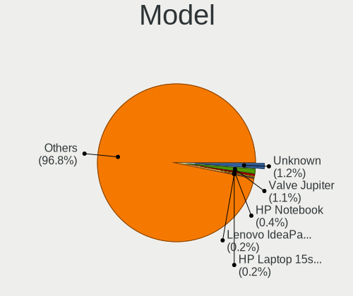
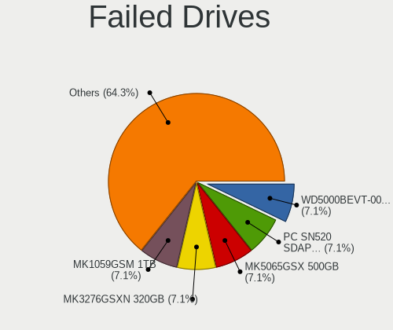
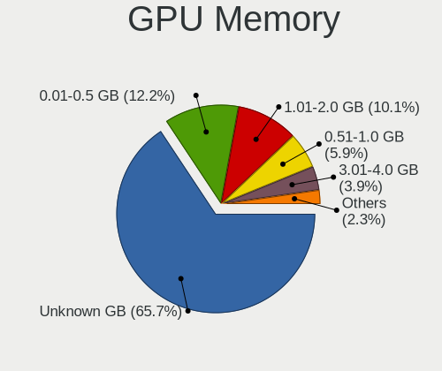
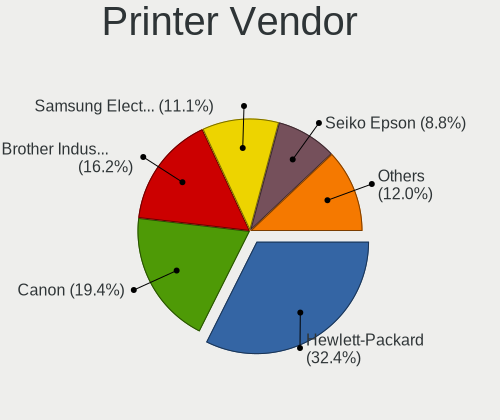

Linux in Germany - Tested Hardware & Statistics (Notebooks)
-----------------------------------------------------------

A project to collect tested hardware configurations for Linux in Germany.

Anyone can contribute to this report by the [hw-probe](https://github.com/linuxhw/hw-probe) tool:

    sudo -E hw-probe -all -upload

Please contribute! Especially if your hardware is rare.

Contents
--------

* [ Test Cases ](#test-cases)

* [ System ](#system)
  - [ OS                       ](#os)
  - [ OS Family                ](#os-family)
  - [ Kernel                   ](#kernel)
  - [ Kernel Family            ](#kernel-family)
  - [ Kernel Major Ver.        ](#kernel-major-ver)
  - [ Arch                     ](#arch)
  - [ DE                       ](#de)
  - [ Display Server           ](#display-server)
  - [ Display Manager          ](#display-manager)
  - [ OS Lang                  ](#os-lang)
  - [ Boot Mode                ](#boot-mode)
  - [ Filesystem               ](#filesystem)
  - [ Part. scheme             ](#part-scheme)
  - [ Dual Boot with Linux/BSD ](#dual-boot-with-linuxbsd)
  - [ Dual Boot (Win)          ](#dual-boot-win)

* [ Board ](#board)
  - [ Vendor                   ](#vendor)
  - [ Model                    ](#model)
  - [ Model Family             ](#model-family)
  - [ MFG Year                 ](#mfg-year)
  - [ Form Factor              ](#form-factor)
  - [ Secure Boot              ](#secure-boot)
  - [ Coreboot                 ](#coreboot)
  - [ RAM Size                 ](#ram-size)
  - [ RAM Used                 ](#ram-used)
  - [ Total Drives             ](#total-drives)
  - [ Has CD-ROM               ](#has-cd-rom)
  - [ Has Ethernet             ](#has-ethernet)
  - [ Has WiFi                 ](#has-wifi)
  - [ Has Bluetooth            ](#has-bluetooth)

* [ Location ](#location)
  - [ Country                  ](#country)
  - [ City                     ](#city)

* [ Drives ](#drives)
  - [ Drive Vendor             ](#drive-vendor)
  - [ Drive Model              ](#drive-model)
  - [ HDD Vendor               ](#hdd-vendor)
  - [ SSD Vendor               ](#ssd-vendor)
  - [ Drive Kind               ](#drive-kind)
  - [ Drive Connector          ](#drive-connector)
  - [ Drive Size               ](#drive-size)
  - [ Space Total              ](#space-total)
  - [ Space Used               ](#space-used)
  - [ Malfunc. Drives          ](#malfunc-drives)
  - [ Malfunc. Drive Vendor    ](#malfunc-drive-vendor)
  - [ Malfunc. HDD Vendor      ](#malfunc-hdd-vendor)
  - [ Malfunc. Drive Kind      ](#malfunc-drive-kind)
  - [ Failed Drives            ](#failed-drives)
  - [ Failed Drive Vendor      ](#failed-drive-vendor)
  - [ Drive Status             ](#drive-status)

* [ Storage controller ](#storage-controller)
  - [ Storage Vendor           ](#storage-vendor)
  - [ Storage Model            ](#storage-model)
  - [ Storage Kind             ](#storage-kind)

* [ Processor ](#processor)
  - [ CPU Vendor               ](#cpu-vendor)
  - [ CPU Model                ](#cpu-model)
  - [ CPU Model Family         ](#cpu-model-family)
  - [ CPU Cores                ](#cpu-cores)
  - [ CPU Sockets              ](#cpu-sockets)
  - [ CPU Threads              ](#cpu-threads)
  - [ CPU Op-Modes             ](#cpu-op-modes)
  - [ CPU Microcode            ](#cpu-microcode)
  - [ CPU Microarch            ](#cpu-microarch)

* [ Graphics ](#graphics)
  - [ GPU Vendor               ](#gpu-vendor)
  - [ GPU Model                ](#gpu-model)
  - [ GPU Combo                ](#gpu-combo)
  - [ GPU Driver               ](#gpu-driver)
  - [ GPU Memory               ](#gpu-memory)

* [ Monitor ](#monitor)
  - [ Monitor Vendor           ](#monitor-vendor)
  - [ Monitor Model            ](#monitor-model)
  - [ Monitor Resolution       ](#monitor-resolution)
  - [ Monitor Diagonal         ](#monitor-diagonal)
  - [ Monitor Width            ](#monitor-width)
  - [ Aspect Ratio             ](#aspect-ratio)
  - [ Monitor Area             ](#monitor-area)
  - [ Pixel Density            ](#pixel-density)
  - [ Multiple Monitors        ](#multiple-monitors)

* [ Network ](#network)
  - [ Net Controller Vendor    ](#net-controller-vendor)
  - [ Net Controller Model     ](#net-controller-model)
  - [ Wireless Vendor          ](#wireless-vendor)
  - [ Wireless Model           ](#wireless-model)
  - [ Ethernet Vendor          ](#ethernet-vendor)
  - [ Ethernet Model           ](#ethernet-model)
  - [ Net Controller Kind      ](#net-controller-kind)
  - [ Used Controller          ](#used-controller)
  - [ NICs                     ](#nics)
  - [ IPv6                     ](#ipv6)

* [ Bluetooth ](#bluetooth)
  - [ Bluetooth Vendor         ](#bluetooth-vendor)
  - [ Bluetooth Model          ](#bluetooth-model)

* [ Sound ](#sound)
  - [ Sound Vendor             ](#sound-vendor)
  - [ Sound Model              ](#sound-model)

* [ Memory ](#memory)
  - [ Memory Vendor            ](#memory-vendor)
  - [ Memory Model             ](#memory-model)
  - [ Memory Kind              ](#memory-kind)
  - [ Memory Form Factor       ](#memory-form-factor)
  - [ Memory Size              ](#memory-size)
  - [ Memory Speed             ](#memory-speed)

* [ Printers & scanners ](#printers--scanners)
  - [ Printer Vendor           ](#printer-vendor)
  - [ Printer Model            ](#printer-model)
  - [ Scanner Vendor           ](#scanner-vendor)
  - [ Scanner Model            ](#scanner-model)

* [ Camera ](#camera)
  - [ Camera Vendor            ](#camera-vendor)
  - [ Camera Model             ](#camera-model)

* [ Security ](#security)
  - [ Fingerprint Vendor       ](#fingerprint-vendor)
  - [ Fingerprint Model        ](#fingerprint-model)
  - [ Chipcard Vendor          ](#chipcard-vendor)
  - [ Chipcard Model           ](#chipcard-model)

* [ Unsupported ](#unsupported)
  - [ Unsupported Devices      ](#unsupported-devices)
  - [ Unsupported Device Types ](#unsupported-device-types)

Test Cases
----------

Total: 16607

| Vendor        | Model                       | Probe                                                      | Date         |
|---------------|-----------------------------|------------------------------------------------------------|--------------|
| Dell          | Latitude E6420              | [9fd076e986](https://linux-hardware.org/?probe=9fd076e986) | Nov 06, 2023 |
| HP            | EliteBook 840 G5            | [279ac4ed92](https://linux-hardware.org/?probe=279ac4ed92) | Nov 06, 2023 |
| MSI           | Bravo 17 C7VF               | [5982277b4b](https://linux-hardware.org/?probe=5982277b4b) | Nov 06, 2023 |
| ASUSTek       | VivoBook_ASUSLaptop X712... | [254a87d641](https://linux-hardware.org/?probe=254a87d641) | Nov 05, 2023 |
| TUXEDO        | Pulse 15 Gen1               | [4a5e89566c](https://linux-hardware.org/?probe=4a5e89566c) | Nov 05, 2023 |
| Inter Sale... | NID-11125DE                 | [aca3d534de](https://linux-hardware.org/?probe=aca3d534de) | Nov 05, 2023 |
| Acer          | Predator PT516-52s          | [30b7a47643](https://linux-hardware.org/?probe=30b7a47643) | Nov 05, 2023 |
| Acer          | Aspire A515-51              | [a0450fee29](https://linux-hardware.org/?probe=a0450fee29) | Nov 05, 2023 |
| HP            | Pavilion 17                 | [50a9cf65b3](https://linux-hardware.org/?probe=50a9cf65b3) | Nov 05, 2023 |
| Lenovo        | ThinkPad T580 20LAS62M07    | [56d9dc4a36](https://linux-hardware.org/?probe=56d9dc4a36) | Nov 05, 2023 |
| Notebook      | N85_N87,HJ,HJ1,HK1          | [53f5c381aa](https://linux-hardware.org/?probe=53f5c381aa) | Nov 05, 2023 |
| HP            | ProBook 4740s               | [2efc1092dd](https://linux-hardware.org/?probe=2efc1092dd) | Nov 05, 2023 |
| HP            | ProBook 4740s               | [0351f35099](https://linux-hardware.org/?probe=0351f35099) | Nov 05, 2023 |
| Lenovo        | Legion 5 17ITH6H 82JM       | [7bde99341f](https://linux-hardware.org/?probe=7bde99341f) | Nov 05, 2023 |
| Acer          | Aspire ES1-311              | [d06185f74c](https://linux-hardware.org/?probe=d06185f74c) | Nov 05, 2023 |
| Dell          | Inspiron 7559               | [da97d12548](https://linux-hardware.org/?probe=da97d12548) | Nov 05, 2023 |
| AMI           | Unknown                     | [2512404fd7](https://linux-hardware.org/?probe=2512404fd7) | Nov 05, 2023 |
| Medion        | E6417 MD99252               | [8660ae1c16](https://linux-hardware.org/?probe=8660ae1c16) | Nov 05, 2023 |
| HP            | Mini 210-3000               | [8b55a876a9](https://linux-hardware.org/?probe=8b55a876a9) | Nov 05, 2023 |
| Framework     | Laptop 13 (AMD Ryzen 704... | [3f295082ce](https://linux-hardware.org/?probe=3f295082ce) | Nov 05, 2023 |
| Fujitsu       | LIFEBOOK E736               | [a2b93486a9](https://linux-hardware.org/?probe=a2b93486a9) | Nov 05, 2023 |
| Notebook      | NL5xRU                      | [6dd04cca75](https://linux-hardware.org/?probe=6dd04cca75) | Nov 05, 2023 |
| Acer          | Aspire A515-57              | [532db79d07](https://linux-hardware.org/?probe=532db79d07) | Nov 05, 2023 |
| Google        | Akemi                       | [350f53d84a](https://linux-hardware.org/?probe=350f53d84a) | Nov 05, 2023 |
| Acer          | Aspire A517-51G             | [11f85eb258](https://linux-hardware.org/?probe=11f85eb258) | Nov 04, 2023 |
| Acer          | Aspire 7750G                | [ddf88ff37c](https://linux-hardware.org/?probe=ddf88ff37c) | Nov 04, 2023 |
| Medion        | E6214                       | [776be82bf6](https://linux-hardware.org/?probe=776be82bf6) | Nov 04, 2023 |
| Lenovo        | ThinkPad X1 Carbon Gen 9... | [e95c10c89d](https://linux-hardware.org/?probe=e95c10c89d) | Nov 04, 2023 |
| Apple         | MacBookAir6,2               | [f8507f333d](https://linux-hardware.org/?probe=f8507f333d) | Nov 04, 2023 |
| Lenovo        | ThinkPad T550 20CJS07P01    | [52157a4ee8](https://linux-hardware.org/?probe=52157a4ee8) | Nov 04, 2023 |
| Lenovo        | ThinkPad T460s 20FAS1NF0... | [8528f9946b](https://linux-hardware.org/?probe=8528f9946b) | Nov 04, 2023 |
| HP            | EliteBook 850 G5            | [a7f0f43604](https://linux-hardware.org/?probe=a7f0f43604) | Nov 04, 2023 |
| Sony          | VPCEH3J1E                   | [e0ae745034](https://linux-hardware.org/?probe=e0ae745034) | Nov 04, 2023 |
| Toshiba       | Satellite L70-A             | [bf7be11ced](https://linux-hardware.org/?probe=bf7be11ced) | Nov 04, 2023 |
| Lenovo        | IdeaPad 3 17ABA7 82RQ       | [12b6cd2d09](https://linux-hardware.org/?probe=12b6cd2d09) | Nov 04, 2023 |
| TrekStor      | Surfbook W2                 | [cfee0c0363](https://linux-hardware.org/?probe=cfee0c0363) | Nov 04, 2023 |
| Medion        | E6214                       | [65976063e7](https://linux-hardware.org/?probe=65976063e7) | Nov 04, 2023 |
| Dell          | Latitude E6420              | [6bd73f2b0e](https://linux-hardware.org/?probe=6bd73f2b0e) | Nov 04, 2023 |
| Lenovo        | ThinkPad P43s 20RH0021MX    | [082adbf921](https://linux-hardware.org/?probe=082adbf921) | Nov 04, 2023 |
| Acer          | Aspire E5-551G              | [f8e737dbde](https://linux-hardware.org/?probe=f8e737dbde) | Nov 03, 2023 |
| HP            | 255 G6 Notebook PC          | [b73e7cf536](https://linux-hardware.org/?probe=b73e7cf536) | Nov 03, 2023 |
| VALE          | Notebook Classic C140       | [fd52185cf0](https://linux-hardware.org/?probe=fd52185cf0) | Nov 03, 2023 |
| Dell          | Latitude E5570              | [a4617a2ea3](https://linux-hardware.org/?probe=a4617a2ea3) | Nov 03, 2023 |
| Dell          | Latitude E5570              | [82d66aaaf1](https://linux-hardware.org/?probe=82d66aaaf1) | Nov 03, 2023 |
| HP            | EliteBook 845 14 inch G9... | [5ff77430fa](https://linux-hardware.org/?probe=5ff77430fa) | Nov 03, 2023 |
| Lenovo        | IdeaPad Pro 5 14APH8 83A... | [0845a0ec43](https://linux-hardware.org/?probe=0845a0ec43) | Nov 03, 2023 |
| Acer          | Aspire V5-571P              | [36d10f86c0](https://linux-hardware.org/?probe=36d10f86c0) | Nov 03, 2023 |
| Schenker      | XMG CORE (REN/E21)          | [9edac2c8ee](https://linux-hardware.org/?probe=9edac2c8ee) | Nov 03, 2023 |
| ASUSTek       | VivoBook_ASUSLaptop N740... | [7fd71a723a](https://linux-hardware.org/?probe=7fd71a723a) | Nov 03, 2023 |
| Lenovo        | ThinkPad T480s 20L8S35G0... | [14074a05b9](https://linux-hardware.org/?probe=14074a05b9) | Nov 02, 2023 |
| Toshiba       | Satellite Pro L770-12Q      | [bd3567b828](https://linux-hardware.org/?probe=bd3567b828) | Nov 02, 2023 |
| Lenovo        | Unknown                     | [3b5aa652dc](https://linux-hardware.org/?probe=3b5aa652dc) | Nov 02, 2023 |
| Lenovo        | Unknown                     | [da6aff8db2](https://linux-hardware.org/?probe=da6aff8db2) | Nov 02, 2023 |
| HP            | ProBook 6450b               | [a63f28d2be](https://linux-hardware.org/?probe=a63f28d2be) | Nov 02, 2023 |
| Google        | Akemi                       | [20ec65943c](https://linux-hardware.org/?probe=20ec65943c) | Nov 02, 2023 |
| HP            | ProBook 450 G5              | [b012e30cb6](https://linux-hardware.org/?probe=b012e30cb6) | Nov 02, 2023 |
| Wortmann      | 1220777_1400328             | [778b1abc73](https://linux-hardware.org/?probe=778b1abc73) | Nov 02, 2023 |
| HP            | 250 G6 Notebook PC          | [7184f1aadf](https://linux-hardware.org/?probe=7184f1aadf) | Nov 02, 2023 |
| Lenovo        | ThinkPad T430 23493V2       | [6fc33e3528](https://linux-hardware.org/?probe=6fc33e3528) | Nov 02, 2023 |
| HP            | Laptop 17-cp0xxx            | [c7760958c8](https://linux-hardware.org/?probe=c7760958c8) | Nov 02, 2023 |
| HP            | Laptop 15-gw0xxx            | [35f5c2edc0](https://linux-hardware.org/?probe=35f5c2edc0) | Nov 02, 2023 |
| Dell          | XPS 15 9570                 | [2efa290a39](https://linux-hardware.org/?probe=2efa290a39) | Nov 02, 2023 |
| Gigabyte      | AORUS 17G KD                | [ac471f8580](https://linux-hardware.org/?probe=ac471f8580) | Nov 02, 2023 |
| HP            | ProBook 650 G1              | [60c6e3a5d2](https://linux-hardware.org/?probe=60c6e3a5d2) | Nov 01, 2023 |
| MSI           | GT73VR 6RF                  | [3930a59e72](https://linux-hardware.org/?probe=3930a59e72) | Nov 01, 2023 |
| Lenovo        | ThinkPad T480 20L6S68T00    | [dba91e5612](https://linux-hardware.org/?probe=dba91e5612) | Nov 01, 2023 |
| HP            | Pavilion Gaming Laptop 1... | [f72ba9e16b](https://linux-hardware.org/?probe=f72ba9e16b) | Nov 01, 2023 |
| Lenovo        | B71-80 80RJ                 | [93507b3ead](https://linux-hardware.org/?probe=93507b3ead) | Nov 01, 2023 |
| HP            | Laptop 17-ca0xxx            | [888ed977bc](https://linux-hardware.org/?probe=888ed977bc) | Nov 01, 2023 |
| Lenovo        | ThinkPad X260 20F5A28AUK    | [c1e44a55c8](https://linux-hardware.org/?probe=c1e44a55c8) | Nov 01, 2023 |
| Lenovo        | ThinkPad X260 20F5A28AUK    | [84ca0a285d](https://linux-hardware.org/?probe=84ca0a285d) | Nov 01, 2023 |
| VALE          | Notebook Classic C140       | [5be309c18b](https://linux-hardware.org/?probe=5be309c18b) | Nov 01, 2023 |
| Apple         | MacBookPro3,1               | [73a395f017](https://linux-hardware.org/?probe=73a395f017) | Nov 01, 2023 |
| Notebook      | P65_P67SA                   | [a8bf179e25](https://linux-hardware.org/?probe=a8bf179e25) | Nov 01, 2023 |
| Lenovo        | ThinkPad T14s Gen 4 21F8... | [865e6764f2](https://linux-hardware.org/?probe=865e6764f2) | Nov 01, 2023 |
| Lenovo        | ThinkPad T14s Gen 4 21F8... | [bf87ba6b55](https://linux-hardware.org/?probe=bf87ba6b55) | Nov 01, 2023 |
| Lenovo        | ThinkPad T420 42369U7       | [8de4ad6ae1](https://linux-hardware.org/?probe=8de4ad6ae1) | Nov 01, 2023 |
| Lenovo        | ThinkPad T430 23493V2       | [0d5b87b380](https://linux-hardware.org/?probe=0d5b87b380) | Nov 01, 2023 |
| Medion        | E6417 MD99252               | [56fcf238a1](https://linux-hardware.org/?probe=56fcf238a1) | Nov 01, 2023 |
| TUXEDO        | Aura 15 Gen2                | [ca743b4e40](https://linux-hardware.org/?probe=ca743b4e40) | Nov 01, 2023 |
| Google        | Akemi                       | [a5cea3a369](https://linux-hardware.org/?probe=a5cea3a369) | Oct 31, 2023 |
| Lenovo        | Unknown                     | [70268d88a4](https://linux-hardware.org/?probe=70268d88a4) | Oct 31, 2023 |
| Lenovo        | ThinkPad X1 Carbon 6th 2... | [ded975e57f](https://linux-hardware.org/?probe=ded975e57f) | Oct 31, 2023 |
| Lenovo        | ThinkPad X1 Carbon 6th 2... | [c90a14fcf5](https://linux-hardware.org/?probe=c90a14fcf5) | Oct 31, 2023 |
| Fujitsu       | LIFEBOOK U7510              | [e25f9a6add](https://linux-hardware.org/?probe=e25f9a6add) | Oct 31, 2023 |
| Fujitsu       | LIFEBOOK E5511              | [c4dbce515a](https://linux-hardware.org/?probe=c4dbce515a) | Oct 31, 2023 |
| Lenovo        | V145-15AST 81MT             | [6bd7131347](https://linux-hardware.org/?probe=6bd7131347) | Oct 31, 2023 |
| Lenovo        | G50-80 80E5                 | [ee528fce07](https://linux-hardware.org/?probe=ee528fce07) | Oct 31, 2023 |
| Lenovo        | ThinkPad P50 20EQS4QL11     | [9fd9ad0312](https://linux-hardware.org/?probe=9fd9ad0312) | Oct 31, 2023 |
| Lenovo        | G50-80 80E5                 | [4e0042e20c](https://linux-hardware.org/?probe=4e0042e20c) | Oct 31, 2023 |
| MSI           | Thin GF63 12VE              | [1776ca1088](https://linux-hardware.org/?probe=1776ca1088) | Oct 30, 2023 |
| Lenovo        | ThinkPad T560 20FJS44L0B    | [12c0c78dc8](https://linux-hardware.org/?probe=12c0c78dc8) | Oct 30, 2023 |
| Medion        | E16402                      | [4a79a1b81a](https://linux-hardware.org/?probe=4a79a1b81a) | Oct 30, 2023 |
| Wortmann      | 1220766_1470449             | [a8eecd22f4](https://linux-hardware.org/?probe=a8eecd22f4) | Oct 30, 2023 |
| HP            | Laptop 15s-eq1xxx           | [755128955b](https://linux-hardware.org/?probe=755128955b) | Oct 30, 2023 |
| Inter Sale... | NID-11125DE                 | [2ba3404987](https://linux-hardware.org/?probe=2ba3404987) | Oct 30, 2023 |
| ASUSTek       | VivoBook 15_ASUS Laptop ... | [ed3aee0fd5](https://linux-hardware.org/?probe=ed3aee0fd5) | Oct 30, 2023 |
| HP            | EliteBook 840 G6            | [52786d6efa](https://linux-hardware.org/?probe=52786d6efa) | Oct 30, 2023 |
| Valve         | Jupiter                     | [ede97625bd](https://linux-hardware.org/?probe=ede97625bd) | Oct 30, 2023 |
| HP            | ProBook 6570b               | [5b574791fa](https://linux-hardware.org/?probe=5b574791fa) | Oct 30, 2023 |
| Samsung       | RC410/RC510/RC710           | [3cc0feaa4e](https://linux-hardware.org/?probe=3cc0feaa4e) | Oct 29, 2023 |
| Dell          | Precision 7760              | [eaba0c73b0](https://linux-hardware.org/?probe=eaba0c73b0) | Oct 29, 2023 |
| Lenovo        | ThinkPad 25 20K70000GE      | [ce13c83c47](https://linux-hardware.org/?probe=ce13c83c47) | Oct 29, 2023 |
| Lenovo        | ThinkPad 25 20K70000GE      | [597958381f](https://linux-hardware.org/?probe=597958381f) | Oct 29, 2023 |
| Apple         | MacBookPro5,5               | [2815a5477f](https://linux-hardware.org/?probe=2815a5477f) | Oct 29, 2023 |
| Lenovo        | ThinkPad T460 20FMS5E018    | [98c446abbd](https://linux-hardware.org/?probe=98c446abbd) | Oct 29, 2023 |
| Lenovo        | ThinkPad E14 Gen 4 21ECS... | [c1d00eb91f](https://linux-hardware.org/?probe=c1d00eb91f) | Oct 29, 2023 |
| Lenovo        | ThinkPad T590 20N5S56P00    | [c410852108](https://linux-hardware.org/?probe=c410852108) | Oct 29, 2023 |
| ASUSTek       | X75VC                       | [9b8051fb79](https://linux-hardware.org/?probe=9b8051fb79) | Oct 29, 2023 |
| Lenovo        | G50-70 20351                | [5d83a07987](https://linux-hardware.org/?probe=5d83a07987) | Oct 29, 2023 |
| ASUSTek       | Zenbook 15 UM3504DA_UM35... | [e34ea8701a](https://linux-hardware.org/?probe=e34ea8701a) | Oct 28, 2023 |
| Lenovo        | ThinkPad T440s 20ARS32P0... | [58234989c1](https://linux-hardware.org/?probe=58234989c1) | Oct 28, 2023 |
| Lenovo        | ThinkPad E520 1143A22       | [cd1af5dc70](https://linux-hardware.org/?probe=cd1af5dc70) | Oct 28, 2023 |
| Lenovo        | ThinkPad T480 20L6S68T00    | [57e3abc23d](https://linux-hardware.org/?probe=57e3abc23d) | Oct 28, 2023 |
| Acer          | Extensa 215-55              | [d1d57049ab](https://linux-hardware.org/?probe=d1d57049ab) | Oct 28, 2023 |
| Acer          | TravelMate P214-41          | [53659e599e](https://linux-hardware.org/?probe=53659e599e) | Oct 28, 2023 |
| Lenovo        | IdeaPad Yoga 13 2191        | [219a94f546](https://linux-hardware.org/?probe=219a94f546) | Oct 28, 2023 |
| Dell          | Latitude E6440              | [8d106c22bf](https://linux-hardware.org/?probe=8d106c22bf) | Oct 28, 2023 |
| HP            | Laptop 17-cp0xxx            | [9b3c09e73a](https://linux-hardware.org/?probe=9b3c09e73a) | Oct 27, 2023 |
| HP            | EliteBook 840 G7 Noteboo... | [5591930fc0](https://linux-hardware.org/?probe=5591930fc0) | Oct 27, 2023 |
| Lenovo        | ThinkPad E14 Gen 4 21ECS... | [6fe7d8e13b](https://linux-hardware.org/?probe=6fe7d8e13b) | Oct 27, 2023 |
| HP            | Laptop 15s-fq3xxx           | [b718818efa](https://linux-hardware.org/?probe=b718818efa) | Oct 27, 2023 |
| HP            | Laptop 15s-eq3xxx           | [e340ddc535](https://linux-hardware.org/?probe=e340ddc535) | Oct 27, 2023 |
| Acer          | Predator PH317-51           | [941e333a3b](https://linux-hardware.org/?probe=941e333a3b) | Oct 27, 2023 |
| Lenovo        | ThinkPad T410 2537JC6       | [c84f5cb370](https://linux-hardware.org/?probe=c84f5cb370) | Oct 27, 2023 |
| Dell          | Precision M6800             | [e8fd7cce51](https://linux-hardware.org/?probe=e8fd7cce51) | Oct 27, 2023 |
| Lenovo        | IdeaPad 3 17ITL6 82H9       | [20d212f3d4](https://linux-hardware.org/?probe=20d212f3d4) | Oct 27, 2023 |
| ASUSTek       | Zenbook 15 UM3504DA_UM35... | [5e0942e6b0](https://linux-hardware.org/?probe=5e0942e6b0) | Oct 27, 2023 |
| Lenovo        | ThinkPad T410 2537JC6       | [51b394c8c9](https://linux-hardware.org/?probe=51b394c8c9) | Oct 27, 2023 |
| HP            | Laptop 14-ma0xxx            | [8482e4e6c2](https://linux-hardware.org/?probe=8482e4e6c2) | Oct 27, 2023 |
| HP            | Laptop 15-ef2xxx            | [01f4f7926d](https://linux-hardware.org/?probe=01f4f7926d) | Oct 27, 2023 |
| EXTRA Comp... | MS-1758                     | [eced546e79](https://linux-hardware.org/?probe=eced546e79) | Oct 26, 2023 |
| Acer          | Aspire 5750G                | [afe742ceca](https://linux-hardware.org/?probe=afe742ceca) | Oct 26, 2023 |
| MSI           | MS-1736                     | [929f0d008e](https://linux-hardware.org/?probe=929f0d008e) | Oct 26, 2023 |
| Medion        | Unknown                     | [ffcdfb3003](https://linux-hardware.org/?probe=ffcdfb3003) | Oct 26, 2023 |
| Lenovo        | ThinkPad E14 Gen 4 21ECS... | [b6925d5638](https://linux-hardware.org/?probe=b6925d5638) | Oct 26, 2023 |
| Acer          | Extensa 215-55              | [410da8fbb8](https://linux-hardware.org/?probe=410da8fbb8) | Oct 26, 2023 |
| Dell          | Latitude E6440              | [b72f1e313e](https://linux-hardware.org/?probe=b72f1e313e) | Oct 26, 2023 |
| Dell          | Latitude E6530              | [ec57b86fe6](https://linux-hardware.org/?probe=ec57b86fe6) | Oct 26, 2023 |
| Acer          | Swift SFG14-71              | [bba9f221f9](https://linux-hardware.org/?probe=bba9f221f9) | Oct 26, 2023 |
| Lenovo        | IdeaPadFlex 15D 20334       | [ef8b5632b4](https://linux-hardware.org/?probe=ef8b5632b4) | Oct 26, 2023 |
| Schenker      | VISION (M23)                | [64cead24ba](https://linux-hardware.org/?probe=64cead24ba) | Oct 26, 2023 |
| Dell          | XPS 13 9370                 | [0c1002fb74](https://linux-hardware.org/?probe=0c1002fb74) | Oct 26, 2023 |
| HP            | ZBook 15 G3                 | [21bcc65553](https://linux-hardware.org/?probe=21bcc65553) | Oct 26, 2023 |
| ASUSTek       | VivoBook_ASUSLaptop X512... | [bd6ab7e486](https://linux-hardware.org/?probe=bd6ab7e486) | Oct 26, 2023 |
| ASUSTek       | VivoBook_ASUSLaptop X512... | [bfe12f37dc](https://linux-hardware.org/?probe=bfe12f37dc) | Oct 25, 2023 |
| Lenovo        | ThinkPad T460 20FMS3YG01    | [b23f4c86cb](https://linux-hardware.org/?probe=b23f4c86cb) | Oct 25, 2023 |
| Lenovo        | Yoga Slim 7 ProX 14ARH7 ... | [2473987add](https://linux-hardware.org/?probe=2473987add) | Oct 25, 2023 |
| Acer          | Aspire 5750G                | [b726b22da1](https://linux-hardware.org/?probe=b726b22da1) | Oct 25, 2023 |
| Lenovo        | G780 2182                   | [5c9917344a](https://linux-hardware.org/?probe=5c9917344a) | Oct 25, 2023 |
| Dell          | Precision 5480              | [0d66f24fe1](https://linux-hardware.org/?probe=0d66f24fe1) | Oct 25, 2023 |
| HP            | 255 15.6 inch G10 Notebo... | [6b46392321](https://linux-hardware.org/?probe=6b46392321) | Oct 25, 2023 |
| Toshiba       | Satellite C670D-126         | [b117860daf](https://linux-hardware.org/?probe=b117860daf) | Oct 25, 2023 |
| Acer          | Aspire ES1-521              | [2df6fb3e2a](https://linux-hardware.org/?probe=2df6fb3e2a) | Oct 25, 2023 |
| Dell          | Precision M4700             | [0b95109eba](https://linux-hardware.org/?probe=0b95109eba) | Oct 25, 2023 |
| Valve         | Jupiter                     | [0b8471e81a](https://linux-hardware.org/?probe=0b8471e81a) | Oct 25, 2023 |
| Lenovo        | ThinkPad P1 20MES05502      | [699bed0bd4](https://linux-hardware.org/?probe=699bed0bd4) | Oct 25, 2023 |
| Toshiba       | Satellite C660D             | [011e4e4756](https://linux-hardware.org/?probe=011e4e4756) | Oct 25, 2023 |
| Lenovo        | IdeaPadFlex 15D 20334       | [861e2b3154](https://linux-hardware.org/?probe=861e2b3154) | Oct 25, 2023 |
| Acer          | Aspire A515-57G             | [d61428d56d](https://linux-hardware.org/?probe=d61428d56d) | Oct 25, 2023 |
| Dell          | Latitude E6540              | [dfb08d307b](https://linux-hardware.org/?probe=dfb08d307b) | Oct 25, 2023 |
| MSI           | CX61 0OC/CX61 0OD/CX61 0... | [99c1b311f1](https://linux-hardware.org/?probe=99c1b311f1) | Oct 25, 2023 |
| HP            | Dragonfly Folio 13.5 inc... | [ffb075a639](https://linux-hardware.org/?probe=ffb075a639) | Oct 24, 2023 |
| HP            | 250 G7 Notebook PC          | [64d7d103a5](https://linux-hardware.org/?probe=64d7d103a5) | Oct 24, 2023 |
| Medion        | Akoya E6240T                | [67dbd98f9b](https://linux-hardware.org/?probe=67dbd98f9b) | Oct 24, 2023 |
| Acer          | Nitro AN515-44              | [20f40f9f55](https://linux-hardware.org/?probe=20f40f9f55) | Oct 24, 2023 |
| ASUSTek       | X551CAP                     | [bff9909d9b](https://linux-hardware.org/?probe=bff9909d9b) | Oct 24, 2023 |
| Medion        | Unknown                     | [fa168b5e75](https://linux-hardware.org/?probe=fa168b5e75) | Oct 24, 2023 |
| Dell          | Latitude E6420              | [6f26cdd42a](https://linux-hardware.org/?probe=6f26cdd42a) | Oct 24, 2023 |
| Toshiba       | Satellite Pro L770-12Q      | [3ca47e347a](https://linux-hardware.org/?probe=3ca47e347a) | Oct 24, 2023 |
| Samsung       | R530/R730                   | [27caa8fdbe](https://linux-hardware.org/?probe=27caa8fdbe) | Oct 24, 2023 |
| HP            | 255 15.6 inch G10 Notebo... | [bde83ce236](https://linux-hardware.org/?probe=bde83ce236) | Oct 24, 2023 |
| HP            | 255 G5                      | [30164a995c](https://linux-hardware.org/?probe=30164a995c) | Oct 24, 2023 |
| HUAWEI        | NBLB-WAX9N                  | [7d30ed4803](https://linux-hardware.org/?probe=7d30ed4803) | Oct 24, 2023 |
| HP            | ProBook 450 G6              | [17c7c26cd0](https://linux-hardware.org/?probe=17c7c26cd0) | Oct 24, 2023 |
| Acer          | Aspire 7750G                | [91006bdfa7](https://linux-hardware.org/?probe=91006bdfa7) | Oct 24, 2023 |
| Samsung       | N150P                       | [83f77d7896](https://linux-hardware.org/?probe=83f77d7896) | Oct 23, 2023 |
| Lenovo        | ThinkPad T14s Gen 4 21F8... | [e2e4b18ec2](https://linux-hardware.org/?probe=e2e4b18ec2) | Oct 23, 2023 |
| Lenovo        | ThinkPad X1 Carbon 4th 2... | [66d2dedb14](https://linux-hardware.org/?probe=66d2dedb14) | Oct 23, 2023 |
| HP            | Pavilion 17                 | [7e822923ca](https://linux-hardware.org/?probe=7e822923ca) | Oct 23, 2023 |
| Lenovo        | ThinkPad X1 Carbon 6th 2... | [e34ccf8825](https://linux-hardware.org/?probe=e34ccf8825) | Oct 23, 2023 |
| Lenovo        | ThinkPad X1 Carbon 4th 2... | [ca685c37ad](https://linux-hardware.org/?probe=ca685c37ad) | Oct 23, 2023 |
| AWOW          | AL34                        | [d349e3c132](https://linux-hardware.org/?probe=d349e3c132) | Oct 23, 2023 |
| Lenovo        | IdeaPad 3 14ARE05 81W3      | [55c5bbce9f](https://linux-hardware.org/?probe=55c5bbce9f) | Oct 23, 2023 |
| Lenovo        | IdeaPad 3 14ARE05 81W3      | [bd89e392d1](https://linux-hardware.org/?probe=bd89e392d1) | Oct 23, 2023 |
| Schenker      | XMG NEO (TGL/M21)           | [6d63f6c5ba](https://linux-hardware.org/?probe=6d63f6c5ba) | Oct 23, 2023 |
| HP            | EliteBook 850 G3            | [e3df7c7494](https://linux-hardware.org/?probe=e3df7c7494) | Oct 23, 2023 |
| HP            | EliteBook 850 G3            | [0b37842809](https://linux-hardware.org/?probe=0b37842809) | Oct 23, 2023 |
| Lenovo        | Legion Pro 7 16IRX8 82WR    | [205d62042e](https://linux-hardware.org/?probe=205d62042e) | Oct 22, 2023 |
| Lenovo        | IdeaPad Pro 5 14APH8 83A... | [081a9eb0fe](https://linux-hardware.org/?probe=081a9eb0fe) | Oct 22, 2023 |
| Google        | Reef                        | [819e00dd76](https://linux-hardware.org/?probe=819e00dd76) | Oct 22, 2023 |
| Lenovo        | ThinkPad L14 Gen 1 20U10... | [816fae3275](https://linux-hardware.org/?probe=816fae3275) | Oct 22, 2023 |
| Dell          | Latitude E6520              | [5d73c1d444](https://linux-hardware.org/?probe=5d73c1d444) | Oct 22, 2023 |
| Lenovo        | Legion Pro 7 16IRX8 82WR    | [329228b5c7](https://linux-hardware.org/?probe=329228b5c7) | Oct 22, 2023 |
| Dell          | XPS 15 9560                 | [c2c4d81d07](https://linux-hardware.org/?probe=c2c4d81d07) | Oct 22, 2023 |
| Valve         | Jupiter                     | [8e04b76eb0](https://linux-hardware.org/?probe=8e04b76eb0) | Oct 22, 2023 |
| Lenovo        | IdeaPad 1 15AMN7 82VG       | [9dae3fabcb](https://linux-hardware.org/?probe=9dae3fabcb) | Oct 22, 2023 |
| Lenovo        | ThinkPad T460s 20F90060G... | [b44ed99aff](https://linux-hardware.org/?probe=b44ed99aff) | Oct 22, 2023 |
| ASUSTek       | ROG Strix G713RM_G713RM     | [fa46708f8f](https://linux-hardware.org/?probe=fa46708f8f) | Oct 22, 2023 |
| Acer          | Aspire 7750G                | [5962f780e9](https://linux-hardware.org/?probe=5962f780e9) | Oct 22, 2023 |
| Lenovo        | IdeaPad 1 15AMN7 82VG       | [38fcbd8bc7](https://linux-hardware.org/?probe=38fcbd8bc7) | Oct 21, 2023 |
| HUAWEI        | KLVL-WXXW                   | [b615345fa6](https://linux-hardware.org/?probe=b615345fa6) | Oct 21, 2023 |
| Lenovo        | ThinkPad L15 Gen 1 20U8S... | [63924140af](https://linux-hardware.org/?probe=63924140af) | Oct 21, 2023 |
| VALE          | Notebook Classic C140       | [885bd9c1cf](https://linux-hardware.org/?probe=885bd9c1cf) | Oct 21, 2023 |
| HP            | 250 G6 Notebook PC          | [0ddb261c8c](https://linux-hardware.org/?probe=0ddb261c8c) | Oct 21, 2023 |
| HP            | ProBook 650 G2              | [33216a8361](https://linux-hardware.org/?probe=33216a8361) | Oct 21, 2023 |
| Acer          | Aspire 7750G                | [9990a91f59](https://linux-hardware.org/?probe=9990a91f59) | Oct 21, 2023 |
| TrekStor      | Surfbook W2                 | [001d67067b](https://linux-hardware.org/?probe=001d67067b) | Oct 21, 2023 |
| Lenovo        | ThinkPad E15 Gen 4 21EES... | [f1b2f555ef](https://linux-hardware.org/?probe=f1b2f555ef) | Oct 21, 2023 |
| Lenovo        | V130-15IGM 81HL             | [fc8d54a39c](https://linux-hardware.org/?probe=fc8d54a39c) | Oct 21, 2023 |
| Notebook      | NJx0PU                      | [8c7eb17819](https://linux-hardware.org/?probe=8c7eb17819) | Oct 21, 2023 |
| Schenker      | XMG NEO (TGL/M21)           | [3afdd1b0da](https://linux-hardware.org/?probe=3afdd1b0da) | Oct 21, 2023 |
| Sony          | SVF1521K6EW                 | [f179781ca4](https://linux-hardware.org/?probe=f179781ca4) | Oct 21, 2023 |
| Lenovo        | ThinkPad T14 Gen 3 21AH0... | [7fd3955384](https://linux-hardware.org/?probe=7fd3955384) | Oct 21, 2023 |
| HP            | ProBook 450 15.6 inch G1... | [97607b5959](https://linux-hardware.org/?probe=97607b5959) | Oct 20, 2023 |
| HP            | Pavilion dv6                | [83e83b7e1c](https://linux-hardware.org/?probe=83e83b7e1c) | Oct 20, 2023 |
| Lenovo        | Y50-70 20378                | [e51b067a88](https://linux-hardware.org/?probe=e51b067a88) | Oct 20, 2023 |
| Lenovo        | ThinkPad T470s W10DG 20J... | [2db6199949](https://linux-hardware.org/?probe=2db6199949) | Oct 20, 2023 |
| Fujitsu       | LIFEBOOK A555               | [73592fa9fb](https://linux-hardware.org/?probe=73592fa9fb) | Oct 20, 2023 |
| ASUSTek       | X551MA                      | [6ee41b351a](https://linux-hardware.org/?probe=6ee41b351a) | Oct 20, 2023 |
| Inter Sale... | NID-11125DE                 | [166e30e45b](https://linux-hardware.org/?probe=166e30e45b) | Oct 20, 2023 |
| Samsung       | 530U3C/530U4C               | [8d85a5bd07](https://linux-hardware.org/?probe=8d85a5bd07) | Oct 20, 2023 |
| Lenovo        | Y50-70 20378                | [2593407253](https://linux-hardware.org/?probe=2593407253) | Oct 20, 2023 |
| TUXEDO        | XMG FUSION 15 (XFU15L19)    | [af44d01ae9](https://linux-hardware.org/?probe=af44d01ae9) | Oct 19, 2023 |
| HUAWEI        | KLVL-WXX9                   | [ca05cc8c35](https://linux-hardware.org/?probe=ca05cc8c35) | Oct 19, 2023 |
| Apple         | MacBookPro8,3               | [4df4c395df](https://linux-hardware.org/?probe=4df4c395df) | Oct 19, 2023 |
| Dell          | Latitude 5490               | [cdf021cc62](https://linux-hardware.org/?probe=cdf021cc62) | Oct 19, 2023 |
| Dell          | XPS 13 9380                 | [a108313537](https://linux-hardware.org/?probe=a108313537) | Oct 19, 2023 |
| Lenovo        | G505s 20255                 | [0e81bd9537](https://linux-hardware.org/?probe=0e81bd9537) | Oct 19, 2023 |
| ASUSTek       | X751SA                      | [21a2a5b900](https://linux-hardware.org/?probe=21a2a5b900) | Oct 18, 2023 |
| HP            | EliteBook 2570p             | [6493441541](https://linux-hardware.org/?probe=6493441541) | Oct 18, 2023 |
| HP            | EliteBook 840 G5            | [728b29b59d](https://linux-hardware.org/?probe=728b29b59d) | Oct 18, 2023 |
| Lenovo        | ThinkPad X1 Carbon 6th 2... | [6b616c60de](https://linux-hardware.org/?probe=6b616c60de) | Oct 18, 2023 |
| Lenovo        | Legion 5 82B5               | [fecce40ebb](https://linux-hardware.org/?probe=fecce40ebb) | Oct 18, 2023 |
| Lenovo        | IdeaPad 1 15AMN7 82VG       | [417e10e47c](https://linux-hardware.org/?probe=417e10e47c) | Oct 18, 2023 |
| Dell          | Precision 7520              | [bd78f68578](https://linux-hardware.org/?probe=bd78f68578) | Oct 18, 2023 |
| Lenovo        | ThinkPad P16s Gen 2 21K9... | [8762d7b263](https://linux-hardware.org/?probe=8762d7b263) | Oct 18, 2023 |
| Lenovo        | IdeaPad 330-15ARR 81D2      | [d8ab8a8fc8](https://linux-hardware.org/?probe=d8ab8a8fc8) | Oct 18, 2023 |
| Valve         | Jupiter                     | [4c916d65a8](https://linux-hardware.org/?probe=4c916d65a8) | Oct 18, 2023 |
| HP            | 15                          | [7767b3e03c](https://linux-hardware.org/?probe=7767b3e03c) | Oct 18, 2023 |
| HP            | 350 G2                      | [e89e096104](https://linux-hardware.org/?probe=e89e096104) | Oct 18, 2023 |
| Apple         | MacBookPro12,1              | [00940af7d1](https://linux-hardware.org/?probe=00940af7d1) | Oct 17, 2023 |
| Sony          | VGN-FZ31Z                   | [9a6fd46a7d](https://linux-hardware.org/?probe=9a6fd46a7d) | Oct 17, 2023 |
| Samsung       | 530U3BI/530U4BI/530U4BH     | [fcb27574dc](https://linux-hardware.org/?probe=fcb27574dc) | Oct 17, 2023 |
| Samsung       | 530U3BI/530U4BI/530U4BH     | [3ef7b0b3c7](https://linux-hardware.org/?probe=3ef7b0b3c7) | Oct 17, 2023 |
| Lenovo        | Yoga 7 14ARP8 82YM          | [7e446027c0](https://linux-hardware.org/?probe=7e446027c0) | Oct 17, 2023 |
| ASUSTek       | Zenbook UX5401ZAS_UX5401... | [1430f19105](https://linux-hardware.org/?probe=1430f19105) | Oct 17, 2023 |
| HUAWEI        | MACH-WX9                    | [8cb8d0943c](https://linux-hardware.org/?probe=8cb8d0943c) | Oct 17, 2023 |
| Medion        | E16402                      | [270f180ff8](https://linux-hardware.org/?probe=270f180ff8) | Oct 17, 2023 |
| Lenovo        | ThinkPad P15 Gen 2i 20YQ... | [f9a0ba2cba](https://linux-hardware.org/?probe=f9a0ba2cba) | Oct 17, 2023 |
| Lenovo        | ThinkPad E14 20RA0016GE     | [b71d628059](https://linux-hardware.org/?probe=b71d628059) | Oct 17, 2023 |
| Lenovo        | ThinkPad P15 Gen 2i 20YQ... | [902d95cec2](https://linux-hardware.org/?probe=902d95cec2) | Oct 17, 2023 |
| HP            | EliteBook 820 G2            | [14f5dbdc5a](https://linux-hardware.org/?probe=14f5dbdc5a) | Oct 17, 2023 |
| Acer          | Aspire V3-771               | [e56b3d3602](https://linux-hardware.org/?probe=e56b3d3602) | Oct 17, 2023 |
| Acer          | Aspire 7750G                | [6c7f890049](https://linux-hardware.org/?probe=6c7f890049) | Oct 17, 2023 |
| Lenovo        | ThinkPad T590 20N5S56P00    | [913c616ff6](https://linux-hardware.org/?probe=913c616ff6) | Oct 17, 2023 |
| VALE          | Notebook Classic C140       | [5f573ef544](https://linux-hardware.org/?probe=5f573ef544) | Oct 17, 2023 |
| Sony          | SVF1421L1EW                 | [60cbc4c236](https://linux-hardware.org/?probe=60cbc4c236) | Oct 17, 2023 |
| HP            | Pavilion dv7                | [81b0ac96b9](https://linux-hardware.org/?probe=81b0ac96b9) | Oct 17, 2023 |
| Lenovo        | ThinkPad T470 W10DG 20JN... | [20c026b8a7](https://linux-hardware.org/?probe=20c026b8a7) | Oct 16, 2023 |
| HP            | 255 G7 Notebook PC          | [39eb0f056a](https://linux-hardware.org/?probe=39eb0f056a) | Oct 16, 2023 |
| HP            | 255 G7 Notebook PC          | [2f1a744273](https://linux-hardware.org/?probe=2f1a744273) | Oct 16, 2023 |
| Acer          | Aspire 7750G                | [2a2d5e2425](https://linux-hardware.org/?probe=2a2d5e2425) | Oct 16, 2023 |
| Apple         | MacBookPro5,3               | [60e2d65ac4](https://linux-hardware.org/?probe=60e2d65ac4) | Oct 16, 2023 |
| Lenovo        | IdeaPad 3 15ITL6 82H8       | [a0f3ae3d1a](https://linux-hardware.org/?probe=a0f3ae3d1a) | Oct 16, 2023 |
| Lenovo        | ThinkPad P14s Gen 4 21K5... | [d5ac310d84](https://linux-hardware.org/?probe=d5ac310d84) | Oct 16, 2023 |
| ASUSTek       | 1015PN                      | [b6cbd56a75](https://linux-hardware.org/?probe=b6cbd56a75) | Oct 16, 2023 |
| HP            | Pavilion Laptop 15-eh2xx... | [cb93196af0](https://linux-hardware.org/?probe=cb93196af0) | Oct 16, 2023 |
| HP            | Laptop 17-ca0xxx            | [37564ba566](https://linux-hardware.org/?probe=37564ba566) | Oct 16, 2023 |
| HP            | Laptop 17-ca0xxx            | [189f8ff7d0](https://linux-hardware.org/?probe=189f8ff7d0) | Oct 16, 2023 |
| Dell          | Precision 7670              | [6993d3fcea](https://linux-hardware.org/?probe=6993d3fcea) | Oct 16, 2023 |
| Sony          | VPCEF2S1E                   | [e4be1dd0e0](https://linux-hardware.org/?probe=e4be1dd0e0) | Oct 16, 2023 |
| HUAWEI        | MACH-WX9                    | [19ec3283fc](https://linux-hardware.org/?probe=19ec3283fc) | Oct 15, 2023 |
| Razer         | Book 13 - RZ09-0357         | [0a1c9e7aae](https://linux-hardware.org/?probe=0a1c9e7aae) | Oct 15, 2023 |
| Toshiba       | Satellite C670-169          | [b30404cbb6](https://linux-hardware.org/?probe=b30404cbb6) | Oct 15, 2023 |
| HP            | Pavilion Gaming Laptop 1... | [248c1c4918](https://linux-hardware.org/?probe=248c1c4918) | Oct 15, 2023 |
| HP            | Laptop 17-cp0xxx            | [7841cb689e](https://linux-hardware.org/?probe=7841cb689e) | Oct 15, 2023 |
| Toshiba       | Satellite C670-169          | [2b13bdaf52](https://linux-hardware.org/?probe=2b13bdaf52) | Oct 15, 2023 |
| HP            | Pavilion dv7                | [dc34e61e94](https://linux-hardware.org/?probe=dc34e61e94) | Oct 15, 2023 |
| Toshiba       | Satellite Pro C70-A         | [dfa5ff2f64](https://linux-hardware.org/?probe=dfa5ff2f64) | Oct 15, 2023 |
| MSI           | GT70 0NC/GT70 0NC           | [24e93d9411](https://linux-hardware.org/?probe=24e93d9411) | Oct 15, 2023 |
| Toshiba       | PORTEGE Z10T-A              | [e505fdce19](https://linux-hardware.org/?probe=e505fdce19) | Oct 15, 2023 |
| Lenovo        | ThinkPad T14s Gen 3 21BR... | [d8cc0d7855](https://linux-hardware.org/?probe=d8cc0d7855) | Oct 15, 2023 |
| Toshiba       | PORTEGE Z10T-A              | [e715a98daa](https://linux-hardware.org/?probe=e715a98daa) | Oct 15, 2023 |
| Lenovo        | G50-80 80E5                 | [3120810bcd](https://linux-hardware.org/?probe=3120810bcd) | Oct 15, 2023 |
| Lenovo        | ThinkPad T14 Gen 4 21K4S... | [a3153a725f](https://linux-hardware.org/?probe=a3153a725f) | Oct 15, 2023 |
| Toshiba       | Satellite L850              | [5bd7b67574](https://linux-hardware.org/?probe=5bd7b67574) | Oct 15, 2023 |
| Valve         | Jupiter                     | [674d290b37](https://linux-hardware.org/?probe=674d290b37) | Oct 15, 2023 |
| Lenovo        | ThinkPad T14s Gen 3 21BR... | [5586f17a5a](https://linux-hardware.org/?probe=5586f17a5a) | Oct 15, 2023 |
| Samsung       | RC530/RC730                 | [97d4006d31](https://linux-hardware.org/?probe=97d4006d31) | Oct 15, 2023 |
| Lenovo        | G50-80 80E5                 | [7f8afc8d0c](https://linux-hardware.org/?probe=7f8afc8d0c) | Oct 15, 2023 |
| Chuwi         | GemiBook Pro                | [7bdbfccdd2](https://linux-hardware.org/?probe=7bdbfccdd2) | Oct 15, 2023 |
| Acer          | Aspire A317-32              | [e4bcb7e688](https://linux-hardware.org/?probe=e4bcb7e688) | Oct 15, 2023 |
| Lenovo        | ThinkPad P16v Gen 1 21FC... | [33ce923fc9](https://linux-hardware.org/?probe=33ce923fc9) | Oct 15, 2023 |
| HP            | Pavilion Gaming Laptop 1... | [2dcb32d334](https://linux-hardware.org/?probe=2dcb32d334) | Oct 15, 2023 |
| HP            | Victus by Laptop 16-e0xx... | [585c33a966](https://linux-hardware.org/?probe=585c33a966) | Oct 15, 2023 |
| Lenovo        | ThinkPad T460s 20FAS2G90... | [36282033c6](https://linux-hardware.org/?probe=36282033c6) | Oct 15, 2023 |
| Acer          | Aspire 5749                 | [0a04dad507](https://linux-hardware.org/?probe=0a04dad507) | Oct 14, 2023 |
| HP            | Unknown                     | [cae9b0ba31](https://linux-hardware.org/?probe=cae9b0ba31) | Oct 14, 2023 |
| HP            | Compaq Presario CQ60        | [c6321b8063](https://linux-hardware.org/?probe=c6321b8063) | Oct 14, 2023 |
| Lenovo        | IdeaPad 3 15ABA7 82RN       | [6d1cb1c712](https://linux-hardware.org/?probe=6d1cb1c712) | Oct 14, 2023 |
| Lenovo        | IdeaPad Gaming 3 16ARH7 ... | [e9d04fdd59](https://linux-hardware.org/?probe=e9d04fdd59) | Oct 14, 2023 |
| HP            | Victus by Laptop 16-e0xx... | [36327d381a](https://linux-hardware.org/?probe=36327d381a) | Oct 14, 2023 |
| TUXEDO        | Polaris Intel Gen3 (TGL)    | [62688a7965](https://linux-hardware.org/?probe=62688a7965) | Oct 14, 2023 |
| Apple         | MacBookPro3,1               | [0db9d6a5cf](https://linux-hardware.org/?probe=0db9d6a5cf) | Oct 14, 2023 |
| HP            | Victus by Laptop 16-d1xx... | [50ebc1407b](https://linux-hardware.org/?probe=50ebc1407b) | Oct 14, 2023 |
| Acer          | Aspire A315-21              | [270a6baf5e](https://linux-hardware.org/?probe=270a6baf5e) | Oct 14, 2023 |
| Fujitsu       | LIFEBOOK S752               | [4015286a79](https://linux-hardware.org/?probe=4015286a79) | Oct 14, 2023 |
| Alienware     | 14                          | [4371dcc422](https://linux-hardware.org/?probe=4371dcc422) | Oct 13, 2023 |
| HP            | OMEN by Gaming Laptop 16... | [c2cbb1c407](https://linux-hardware.org/?probe=c2cbb1c407) | Oct 13, 2023 |
| Inter Sale... | NID-11125DE                 | [1e44f2ed5f](https://linux-hardware.org/?probe=1e44f2ed5f) | Oct 13, 2023 |
| Dell          | XPS 13 9305                 | [ffadf2894f](https://linux-hardware.org/?probe=ffadf2894f) | Oct 13, 2023 |
| Valve         | Jupiter                     | [bc127c6288](https://linux-hardware.org/?probe=bc127c6288) | Oct 13, 2023 |
| Lenovo        | ThinkPad E15 Gen 2 20TD0... | [f18ac93db8](https://linux-hardware.org/?probe=f18ac93db8) | Oct 13, 2023 |
| Lenovo        | ThinkPad P53 20QN20VZZC     | [4485ad6d0b](https://linux-hardware.org/?probe=4485ad6d0b) | Oct 13, 2023 |
| Unknown       | Apple MacBook Pro (16-in... | [bacec3031a](https://linux-hardware.org/?probe=bacec3031a) | Oct 13, 2023 |
| TUXEDO        | XP1610                      | [31be190f30](https://linux-hardware.org/?probe=31be190f30) | Oct 13, 2023 |
| Dell          | Latitude 7430               | [fb8c320433](https://linux-hardware.org/?probe=fb8c320433) | Oct 13, 2023 |
| Dell          | Latitude E6510              | [e1909cd6fb](https://linux-hardware.org/?probe=e1909cd6fb) | Oct 12, 2023 |
| Dell          | Vostro 2520                 | [aa4d9c935e](https://linux-hardware.org/?probe=aa4d9c935e) | Oct 12, 2023 |
| HP            | ZBook 15 G3                 | [cd9071e2ad](https://linux-hardware.org/?probe=cd9071e2ad) | Oct 12, 2023 |
| Lenovo        | V110-15IAP 80TG             | [314d81343b](https://linux-hardware.org/?probe=314d81343b) | Oct 12, 2023 |
| Schenker      | XMG CORE (REN/M20)          | [48ee28954d](https://linux-hardware.org/?probe=48ee28954d) | Oct 12, 2023 |
| Medion        | P15645 MD61606              | [bcdde16348](https://linux-hardware.org/?probe=bcdde16348) | Oct 12, 2023 |
| Lenovo        | ThinkBook 16 G4+ IAP 21C... | [87e16d607b](https://linux-hardware.org/?probe=87e16d607b) | Oct 12, 2023 |
| Lenovo        | ThinkPad L14 Gen 1 20U10... | [c91d331bf0](https://linux-hardware.org/?probe=c91d331bf0) | Oct 12, 2023 |
| Lenovo        | ThinkPad P14s Gen 1 20Y1... | [9de2f282f8](https://linux-hardware.org/?probe=9de2f282f8) | Oct 11, 2023 |
| Lenovo        | ThinkPad L14 Gen 1 20U10... | [dbc6f4ecc9](https://linux-hardware.org/?probe=dbc6f4ecc9) | Oct 11, 2023 |
| Lenovo        | ThinkPad P53 20QN20VZZC     | [2659f02d19](https://linux-hardware.org/?probe=2659f02d19) | Oct 11, 2023 |
| Lenovo        | Legion 5 Pro 16IAH7H 82R... | [cf3225396c](https://linux-hardware.org/?probe=cf3225396c) | Oct 11, 2023 |
| Lenovo        | B570 1068FRG                | [e912de748b](https://linux-hardware.org/?probe=e912de748b) | Oct 11, 2023 |
| VALE          | Notebook Classic C140       | [b31403a384](https://linux-hardware.org/?probe=b31403a384) | Oct 11, 2023 |
| Clevo         | W150HRM                     | [d579315a81](https://linux-hardware.org/?probe=d579315a81) | Oct 10, 2023 |
| Acer          | Aspire 5750                 | [44a7bac1b9](https://linux-hardware.org/?probe=44a7bac1b9) | Oct 10, 2023 |
| HP            | 250 G7 Notebook PC          | [91d0aa5397](https://linux-hardware.org/?probe=91d0aa5397) | Oct 10, 2023 |
| HP            | 250 G7 Notebook PC          | [c2123c4f21](https://linux-hardware.org/?probe=c2123c4f21) | Oct 10, 2023 |
| Lenovo        | ThinkPad P1 20MES05502      | [869264ad64](https://linux-hardware.org/?probe=869264ad64) | Oct 10, 2023 |
| Lenovo        | ThinkPad T490 20N3S7DP00    | [eb9d7ec72c](https://linux-hardware.org/?probe=eb9d7ec72c) | Oct 10, 2023 |
| Lenovo        | ThinkPad T400 6474WPU       | [8c4f0dda0f](https://linux-hardware.org/?probe=8c4f0dda0f) | Oct 10, 2023 |
| Valve         | Jupiter                     | [79652d4b80](https://linux-hardware.org/?probe=79652d4b80) | Oct 10, 2023 |
| Samsung       | RC530/RC730                 | [6126a55552](https://linux-hardware.org/?probe=6126a55552) | Oct 09, 2023 |
| Dell          | XPS 15 9570                 | [a40dbac784](https://linux-hardware.org/?probe=a40dbac784) | Oct 09, 2023 |
| Dell          | XPS 15 9570                 | [d6aaf4c55d](https://linux-hardware.org/?probe=d6aaf4c55d) | Oct 09, 2023 |
| HUAWEI        | BOM-WXX9                    | [e6ebe1a37b](https://linux-hardware.org/?probe=e6ebe1a37b) | Oct 09, 2023 |
| Acer          | Aspire one                  | [302dc95903](https://linux-hardware.org/?probe=302dc95903) | Oct 09, 2023 |
| Lenovo        | Yoga 2 Pro 20266            | [3ba4207fd0](https://linux-hardware.org/?probe=3ba4207fd0) | Oct 09, 2023 |
| Medion        | E11201                      | [25afe8c1be](https://linux-hardware.org/?probe=25afe8c1be) | Oct 09, 2023 |
| HP            | Elite x2 1012 G1            | [f35db27578](https://linux-hardware.org/?probe=f35db27578) | Oct 09, 2023 |
| Lenovo        | Legion 5 Pro 16IAH7H 82R... | [825a1ee4bb](https://linux-hardware.org/?probe=825a1ee4bb) | Oct 09, 2023 |
| HP            | EliteBook 2570p             | [c41bac6f71](https://linux-hardware.org/?probe=c41bac6f71) | Oct 09, 2023 |
| Lenovo        | ThinkBook 16p Gen 2 20YM    | [1e4919234b](https://linux-hardware.org/?probe=1e4919234b) | Oct 09, 2023 |
| HP            | Laptop 15s-eq2xxx           | [341fc3d0f1](https://linux-hardware.org/?probe=341fc3d0f1) | Oct 09, 2023 |
| ASUSTek       | ROG Strix G713RW_G713RW     | [a5d3c4e894](https://linux-hardware.org/?probe=a5d3c4e894) | Oct 09, 2023 |
| Dell          | XPS 15 9500                 | [864da49dd8](https://linux-hardware.org/?probe=864da49dd8) | Oct 08, 2023 |
| Lenovo        | IdeaPad Pro 5 16ARP8 83A... | [6ffdf4867b](https://linux-hardware.org/?probe=6ffdf4867b) | Oct 08, 2023 |
| Alienware     | P53IN1                      | [49c6f1cb7c](https://linux-hardware.org/?probe=49c6f1cb7c) | Oct 08, 2023 |
| TUXEDO        | InfinityBook S 14 v5        | [7ad7f14fea](https://linux-hardware.org/?probe=7ad7f14fea) | Oct 08, 2023 |
| ASUSTek       | UX32A                       | [81ea4b540a](https://linux-hardware.org/?probe=81ea4b540a) | Oct 08, 2023 |
| HP            | EliteBook 2570p             | [4cfaadf9c9](https://linux-hardware.org/?probe=4cfaadf9c9) | Oct 08, 2023 |
| Apple         | MacBookPro11,5              | [61890a8e2e](https://linux-hardware.org/?probe=61890a8e2e) | Oct 08, 2023 |
| Toshiba       | Satellite L50-C             | [35c575a788](https://linux-hardware.org/?probe=35c575a788) | Oct 08, 2023 |
| Apple         | MacBookPro12,1              | [1a179deb84](https://linux-hardware.org/?probe=1a179deb84) | Oct 08, 2023 |
| HP            | Laptop 15-bw0xx             | [d2a193b638](https://linux-hardware.org/?probe=d2a193b638) | Oct 08, 2023 |
| AXDIA Inte... | MYBOOK PRO 14 SE            | [344ed10ccd](https://linux-hardware.org/?probe=344ed10ccd) | Oct 07, 2023 |
| Dell          | XPS 13 9305                 | [0a86e682e1](https://linux-hardware.org/?probe=0a86e682e1) | Oct 07, 2023 |
| Lenovo        | Legion Y920-17IKB Laptop... | [881454bd02](https://linux-hardware.org/?probe=881454bd02) | Oct 07, 2023 |
| Notebook      | P7xxTM1                     | [2f5a95356e](https://linux-hardware.org/?probe=2f5a95356e) | Oct 07, 2023 |
| Dell          | Precision 7710              | [6dcd757659](https://linux-hardware.org/?probe=6dcd757659) | Oct 07, 2023 |
| HP            | ProBook 455 15.6 inch G9... | [3c93fdc206](https://linux-hardware.org/?probe=3c93fdc206) | Oct 07, 2023 |
| Framework     | Laptop                      | [92ced4e3c6](https://linux-hardware.org/?probe=92ced4e3c6) | Oct 07, 2023 |
| Medion        | E15408                      | [5104fa354e](https://linux-hardware.org/?probe=5104fa354e) | Oct 07, 2023 |
| Lenovo        | ThinkPad T460s 20FAS08W0... | [24dee8bc07](https://linux-hardware.org/?probe=24dee8bc07) | Oct 07, 2023 |
| Medion        | E15302                      | [d26c76cedf](https://linux-hardware.org/?probe=d26c76cedf) | Oct 07, 2023 |
| TUXEDO        | Book XP15 / XP17 Gen12      | [5ff0e17804](https://linux-hardware.org/?probe=5ff0e17804) | Oct 07, 2023 |
| Lenovo        | ThinkPad A275 20KCS09T1G    | [1e797cb20f](https://linux-hardware.org/?probe=1e797cb20f) | Oct 07, 2023 |
| HP            | Laptop 17-bs1xx             | [032d9dddac](https://linux-hardware.org/?probe=032d9dddac) | Oct 07, 2023 |
| ASUSTek       | ROG Strix G513QY            | [084087e7bb](https://linux-hardware.org/?probe=084087e7bb) | Oct 07, 2023 |
| Acer          | Aspire E1-571G              | [205a84adc9](https://linux-hardware.org/?probe=205a84adc9) | Oct 07, 2023 |
| ASUSTek       | GL752VW                     | [5527f067d8](https://linux-hardware.org/?probe=5527f067d8) | Oct 06, 2023 |
| Lenovo        | ThinkPad T560 20FJS44L0B    | [97e3298feb](https://linux-hardware.org/?probe=97e3298feb) | Oct 06, 2023 |
| Thomson       | GEN360-4C128BK              | [ec04ddb0ba](https://linux-hardware.org/?probe=ec04ddb0ba) | Oct 06, 2023 |
| Lenovo        | G700 20251                  | [7988ecce03](https://linux-hardware.org/?probe=7988ecce03) | Oct 06, 2023 |
| Sony          | SVS1312G3EW                 | [c83adf32ea](https://linux-hardware.org/?probe=c83adf32ea) | Oct 06, 2023 |
| Dell          | Latitude E6410              | [d6db17e35f](https://linux-hardware.org/?probe=d6db17e35f) | Oct 06, 2023 |
| Lenovo        | ThinkPad E585 20KV000DGE    | [2413fa05d5](https://linux-hardware.org/?probe=2413fa05d5) | Oct 06, 2023 |
| HP            | Laptop 15s-fq3xxx           | [3cbdc1eb94](https://linux-hardware.org/?probe=3cbdc1eb94) | Oct 06, 2023 |
| ASUSTek       | GL752VW                     | [b4be17035e](https://linux-hardware.org/?probe=b4be17035e) | Oct 06, 2023 |
| Lenovo        | ThinkPad T460 20FN003HUK    | [fd35988069](https://linux-hardware.org/?probe=fd35988069) | Oct 06, 2023 |
| HP            | Laptop 17-bs1xx             | [5a280f7c85](https://linux-hardware.org/?probe=5a280f7c85) | Oct 06, 2023 |
| Lenovo        | ThinkPad E14 Gen 4 21E30... | [8313e4fb72](https://linux-hardware.org/?probe=8313e4fb72) | Oct 05, 2023 |
| HP            | ZBook 14 G2                 | [e1b3f48f3c](https://linux-hardware.org/?probe=e1b3f48f3c) | Oct 05, 2023 |
| Dell          | Latitude E5530 non-vPro     | [eb92998eac](https://linux-hardware.org/?probe=eb92998eac) | Oct 05, 2023 |
| Lenovo        | ThinkPad P1 Gen 4i 20Y4S... | [e23d98e73b](https://linux-hardware.org/?probe=e23d98e73b) | Oct 05, 2023 |
| HP            | Laptop 17-cp0xxx            | [00712632f0](https://linux-hardware.org/?probe=00712632f0) | Oct 05, 2023 |
| Dell          | Precision M6500             | [18605f38d4](https://linux-hardware.org/?probe=18605f38d4) | Oct 05, 2023 |
| HP            | Laptop 17-cp0xxx            | [7ac8335e38](https://linux-hardware.org/?probe=7ac8335e38) | Oct 05, 2023 |
| Acer          | Extensa 215-55              | [6a8c204e97](https://linux-hardware.org/?probe=6a8c204e97) | Oct 04, 2023 |
| Lenovo        | ThinkPad X1 Carbon 7th 2... | [234f939987](https://linux-hardware.org/?probe=234f939987) | Oct 04, 2023 |
| Dell          | Latitude 7340               | [713640e574](https://linux-hardware.org/?probe=713640e574) | Oct 04, 2023 |
| Packard Be... | EasyNote TK85               | [319d1c9284](https://linux-hardware.org/?probe=319d1c9284) | Oct 04, 2023 |
| Lenovo        | ThinkPad X240 20AMS0J003    | [7119b5c3da](https://linux-hardware.org/?probe=7119b5c3da) | Oct 04, 2023 |
| Medion        | S6219 MD60808               | [cb30ae0c64](https://linux-hardware.org/?probe=cb30ae0c64) | Oct 04, 2023 |
| Dell          | G3 3579                     | [7730315a91](https://linux-hardware.org/?probe=7730315a91) | Oct 04, 2023 |
| Acer          | Aspire ES1-732              | [9f011f4756](https://linux-hardware.org/?probe=9f011f4756) | Oct 04, 2023 |
| Sony          | VPCEH2N1E                   | [b983141e0f](https://linux-hardware.org/?probe=b983141e0f) | Oct 03, 2023 |
| Acer          | TravelMate 5730             | [5b95d4de2f](https://linux-hardware.org/?probe=5b95d4de2f) | Oct 03, 2023 |
| HP            | Laptop 14-ck0xxx            | [c41cd8be8e](https://linux-hardware.org/?probe=c41cd8be8e) | Oct 03, 2023 |
| Acer          | Aspire ES1-521              | [1e6ec4d559](https://linux-hardware.org/?probe=1e6ec4d559) | Oct 03, 2023 |
| Acer          | Aspire 7750G                | [49b9b6fc3a](https://linux-hardware.org/?probe=49b9b6fc3a) | Oct 03, 2023 |
| HP            | ElitePad 1000 G2            | [0cf716956e](https://linux-hardware.org/?probe=0cf716956e) | Oct 03, 2023 |
| HUAWEI        | KLVL-WXXW                   | [a55f97899c](https://linux-hardware.org/?probe=a55f97899c) | Oct 03, 2023 |
| ASUSTek       | X555LJ                      | [251b560f75](https://linux-hardware.org/?probe=251b560f75) | Oct 03, 2023 |
| Lenovo        | ThinkPad T420 4236BR4       | [002422b029](https://linux-hardware.org/?probe=002422b029) | Oct 03, 2023 |
| Lenovo        | ThinkPad P50 20EQS3BT2E     | [b9ff47bdcb](https://linux-hardware.org/?probe=b9ff47bdcb) | Oct 03, 2023 |
| HP            | EliteBook 830 G6            | [e684c274a6](https://linux-hardware.org/?probe=e684c274a6) | Oct 03, 2023 |
| Valve         | Jupiter                     | [1fc3301438](https://linux-hardware.org/?probe=1fc3301438) | Oct 03, 2023 |
| Valve         | Jupiter                     | [71e7e7bd84](https://linux-hardware.org/?probe=71e7e7bd84) | Oct 03, 2023 |
| Lenovo        | ThinkBook 14 G2 ARE 20VF    | [886b5140ec](https://linux-hardware.org/?probe=886b5140ec) | Oct 03, 2023 |
| HP            | ProBook 650 G8 Notebook ... | [3ebf2aab50](https://linux-hardware.org/?probe=3ebf2aab50) | Oct 03, 2023 |
| Valve         | Jupiter                     | [a37cbce440](https://linux-hardware.org/?probe=a37cbce440) | Oct 02, 2023 |
| Lenovo        | G700 20251                  | [7e2ef4889a](https://linux-hardware.org/?probe=7e2ef4889a) | Oct 02, 2023 |
| Lenovo        | G700 20251                  | [245f8e4c16](https://linux-hardware.org/?probe=245f8e4c16) | Oct 02, 2023 |
| MSI           | VR630                       | [a9ce96c1ff](https://linux-hardware.org/?probe=a9ce96c1ff) | Oct 02, 2023 |
| Notebook      | NL5xNU                      | [d5e4f28683](https://linux-hardware.org/?probe=d5e4f28683) | Oct 02, 2023 |
| Acer          | Aspire A517-53              | [c0cf81c598](https://linux-hardware.org/?probe=c0cf81c598) | Oct 02, 2023 |
| Acer          | Aspire 7745G                | [e261210eb7](https://linux-hardware.org/?probe=e261210eb7) | Oct 02, 2023 |
| Dell          | XPS 13 9370                 | [cb2da7439c](https://linux-hardware.org/?probe=cb2da7439c) | Oct 02, 2023 |
| Lenovo        | ThinkPad T420s 4176W23      | [0d27b7532c](https://linux-hardware.org/?probe=0d27b7532c) | Oct 02, 2023 |
| ASUSTek       | ROG Strix G713RW_G713RW     | [3bb0e0c792](https://linux-hardware.org/?probe=3bb0e0c792) | Oct 01, 2023 |
| Lenovo        | G500 20236                  | [fcef55efdf](https://linux-hardware.org/?probe=fcef55efdf) | Oct 01, 2023 |
| Acer          | Aspire 7745G                | [4e0f7a8051](https://linux-hardware.org/?probe=4e0f7a8051) | Oct 01, 2023 |
| Teclast       | F15Plus 2                   | [3779ac7003](https://linux-hardware.org/?probe=3779ac7003) | Oct 01, 2023 |
| Acer          | Aspire E1-572G              | [271131f10a](https://linux-hardware.org/?probe=271131f10a) | Oct 01, 2023 |
| Dell          | Precision M4700             | [f3248146f8](https://linux-hardware.org/?probe=f3248146f8) | Oct 01, 2023 |
| Lenovo        | Yoga 500-14IBD 80N4         | [79df472fc6](https://linux-hardware.org/?probe=79df472fc6) | Oct 01, 2023 |
| Acer          | Aspire E1-572G              | [438271a68c](https://linux-hardware.org/?probe=438271a68c) | Oct 01, 2023 |
| Apple         | MacBookPro12,1              | [4a50045f1c](https://linux-hardware.org/?probe=4a50045f1c) | Oct 01, 2023 |
| Acer          | Aspire A515-56              | [1736db5a40](https://linux-hardware.org/?probe=1736db5a40) | Oct 01, 2023 |
| Lenovo        | ThinkPad T14s Gen 3 21CQ... | [6801ddb23b](https://linux-hardware.org/?probe=6801ddb23b) | Oct 01, 2023 |
| Lenovo        | IdeaPad 510-15IKB 80SV      | [0d2ad9eb61](https://linux-hardware.org/?probe=0d2ad9eb61) | Oct 01, 2023 |
| Lenovo        | IdeaPad L340-15API 81LW     | [a8e9d8dd9c](https://linux-hardware.org/?probe=a8e9d8dd9c) | Oct 01, 2023 |
| Dell          | Precision M4800             | [e03e592ad9](https://linux-hardware.org/?probe=e03e592ad9) | Oct 01, 2023 |
| Schenker      | VIA 15 Pro (M22)            | [1919690674](https://linux-hardware.org/?probe=1919690674) | Oct 01, 2023 |
| HP            | Pavilion Notebook           | [17558a0a3c](https://linux-hardware.org/?probe=17558a0a3c) | Oct 01, 2023 |
| HP            | Elite x2 1012 G1            | [5911146609](https://linux-hardware.org/?probe=5911146609) | Oct 01, 2023 |
| Lenovo        | Flex 2-15D 20377            | [8f9e71f454](https://linux-hardware.org/?probe=8f9e71f454) | Oct 01, 2023 |
| HP            | Laptop 17-cn0xxx            | [aa4b869750](https://linux-hardware.org/?probe=aa4b869750) | Oct 01, 2023 |
| Lenovo        | IdeaPad 330-15ARR 81D2      | [5d6364a866](https://linux-hardware.org/?probe=5d6364a866) | Oct 01, 2023 |
| HP            | ProBook 650 G8 Notebook ... | [b02492c1dd](https://linux-hardware.org/?probe=b02492c1dd) | Oct 01, 2023 |
| Toshiba       | Satellite C870-1C2          | [d9750c9040](https://linux-hardware.org/?probe=d9750c9040) | Sep 30, 2023 |
| Lenovo        | ThinkPad T480s 20L7CTO1W... | [1135ddac8e](https://linux-hardware.org/?probe=1135ddac8e) | Sep 30, 2023 |
| Fujitsu Si... | AMILO A1650G                | [ec61a60044](https://linux-hardware.org/?probe=ec61a60044) | Sep 30, 2023 |
| HP            | EliteBook 830 G6            | [154150aa88](https://linux-hardware.org/?probe=154150aa88) | Sep 30, 2023 |
| HP            | ProBook 650 G1              | [c9aca83f04](https://linux-hardware.org/?probe=c9aca83f04) | Sep 30, 2023 |
| Fujitsu Si... | AMILO Pa 2548               | [ee2d5e25d3](https://linux-hardware.org/?probe=ee2d5e25d3) | Sep 30, 2023 |
| Acer          | Aspire E1-572G              | [f7375967ee](https://linux-hardware.org/?probe=f7375967ee) | Sep 30, 2023 |
| Dell          | Latitude 7280               | [dbe9d3e4be](https://linux-hardware.org/?probe=dbe9d3e4be) | Sep 30, 2023 |
| HUAWEI        | HLYL-WXX9                   | [d39169bf21](https://linux-hardware.org/?probe=d39169bf21) | Sep 30, 2023 |
| Fujitsu Si... | AMILO Pa 2548               | [a291afc6c3](https://linux-hardware.org/?probe=a291afc6c3) | Sep 30, 2023 |
| Valve         | Jupiter                     | [85eac5b7ce](https://linux-hardware.org/?probe=85eac5b7ce) | Sep 30, 2023 |
| HP            | Laptop 15s-eq1xxx           | [2a293067f5](https://linux-hardware.org/?probe=2a293067f5) | Sep 30, 2023 |
| Toshiba       | QOSMIO X770                 | [c747b27390](https://linux-hardware.org/?probe=c747b27390) | Sep 30, 2023 |
| Apple         | MacBookPro12,1              | [b3617a1e58](https://linux-hardware.org/?probe=b3617a1e58) | Sep 30, 2023 |
| Valve         | Jupiter                     | [1ed8509a3d](https://linux-hardware.org/?probe=1ed8509a3d) | Sep 30, 2023 |
| Dell          | Inspiron 5521               | [a704dd3c01](https://linux-hardware.org/?probe=a704dd3c01) | Sep 30, 2023 |
| VALE          | Notebook Classic C140       | [5be7208021](https://linux-hardware.org/?probe=5be7208021) | Sep 30, 2023 |
| Lenovo        | G770 1037                   | [576bbd3839](https://linux-hardware.org/?probe=576bbd3839) | Sep 29, 2023 |
| ASUSTek       | X551MA                      | [8ba160ee59](https://linux-hardware.org/?probe=8ba160ee59) | Sep 29, 2023 |
| Acer          | Aspire E1-572G              | [9fe3adb466](https://linux-hardware.org/?probe=9fe3adb466) | Sep 29, 2023 |
| Lenovo        | ThinkPad L15 Gen 1 20U70... | [e51fd2a8e9](https://linux-hardware.org/?probe=e51fd2a8e9) | Sep 29, 2023 |
| Lenovo        | IdeaPad Pro 5 16APH8 83A... | [ee6e1996b9](https://linux-hardware.org/?probe=ee6e1996b9) | Sep 29, 2023 |
| Acer          | Aspire A517-53              | [6023cecfb1](https://linux-hardware.org/?probe=6023cecfb1) | Sep 29, 2023 |
| Acer          | Aspire 7745G                | [55ea55a771](https://linux-hardware.org/?probe=55ea55a771) | Sep 29, 2023 |
| Acer          | Nitro AN517-54              | [3e1448c388](https://linux-hardware.org/?probe=3e1448c388) | Sep 29, 2023 |
| Acer          | Aspire A517-53              | [05ff23a1a1](https://linux-hardware.org/?probe=05ff23a1a1) | Sep 29, 2023 |
| Valve         | Jupiter                     | [d065544135](https://linux-hardware.org/?probe=d065544135) | Sep 29, 2023 |
| System76      | Darter Pro                  | [d8b78103d5](https://linux-hardware.org/?probe=d8b78103d5) | Sep 29, 2023 |
| Lenovo        | ThinkPad T500 22439AG       | [e5a2cd9816](https://linux-hardware.org/?probe=e5a2cd9816) | Sep 29, 2023 |
| Lenovo        | ThinkPad T420s 4174PEG      | [cf650bb4af](https://linux-hardware.org/?probe=cf650bb4af) | Sep 29, 2023 |
| Acer          | Aspire 7745G                | [6def421696](https://linux-hardware.org/?probe=6def421696) | Sep 28, 2023 |
| Lenovo        | ThinkPad R60 9461DXG        | [4f74530d68](https://linux-hardware.org/?probe=4f74530d68) | Sep 28, 2023 |
| Lenovo        | ThinkPad R60 9461DXG        | [5fb1e549ea](https://linux-hardware.org/?probe=5fb1e549ea) | Sep 28, 2023 |
| Lenovo        | ThinkPad T14 Gen 3 21AJS... | [38e71e4fe9](https://linux-hardware.org/?probe=38e71e4fe9) | Sep 28, 2023 |
| Lenovo        | ThinkPad T14 Gen 2i 20W0... | [c8dfaf68d0](https://linux-hardware.org/?probe=c8dfaf68d0) | Sep 28, 2023 |
| Acer          | Aspire ES1-732              | [f30d62d67b](https://linux-hardware.org/?probe=f30d62d67b) | Sep 28, 2023 |
| Apple         | MacBookPro9,1               | [555dfa4f2e](https://linux-hardware.org/?probe=555dfa4f2e) | Sep 28, 2023 |
| HP            | Compaq Presario CQ70        | [8913bbd459](https://linux-hardware.org/?probe=8913bbd459) | Sep 28, 2023 |
| Valve         | Jupiter                     | [8de9bb39df](https://linux-hardware.org/?probe=8de9bb39df) | Sep 28, 2023 |
| Toshiba       | Satellite P775              | [7269165fd9](https://linux-hardware.org/?probe=7269165fd9) | Sep 28, 2023 |
| Packard Be... | EasyNote MH36               | [91fcf40898](https://linux-hardware.org/?probe=91fcf40898) | Sep 28, 2023 |
| Dell          | Latitude E5570              | [150f9e624b](https://linux-hardware.org/?probe=150f9e624b) | Sep 28, 2023 |
| Lenovo        | ThinkPad T495 20NJ000XGE    | [737b3910bb](https://linux-hardware.org/?probe=737b3910bb) | Sep 28, 2023 |
| Lenovo        | ThinkPad T495 20NJ000XGE    | [b064b5b9ca](https://linux-hardware.org/?probe=b064b5b9ca) | Sep 28, 2023 |
| HP            | Laptop 17-bs0xx             | [85548f2790](https://linux-hardware.org/?probe=85548f2790) | Sep 28, 2023 |
| Acer          | Aspire VN7-791G             | [0cfe515d00](https://linux-hardware.org/?probe=0cfe515d00) | Sep 27, 2023 |
| HP            | ElitePad 1000 G2            | [a53de5d0bd](https://linux-hardware.org/?probe=a53de5d0bd) | Sep 27, 2023 |
| HP            | ElitePad 1000 G2            | [9c4b30a15c](https://linux-hardware.org/?probe=9c4b30a15c) | Sep 27, 2023 |
| HP            | ElitePad 1000 G2            | [2668770971](https://linux-hardware.org/?probe=2668770971) | Sep 27, 2023 |
| Fujitsu       | LIFEBOOK E4512              | [08b39b38bd](https://linux-hardware.org/?probe=08b39b38bd) | Sep 27, 2023 |
| Acer          | Nitro AN515-42              | [dd4a3f701c](https://linux-hardware.org/?probe=dd4a3f701c) | Sep 27, 2023 |
| TUXEDO        | Stellaris Intel Gen4        | [0dcef3e6c3](https://linux-hardware.org/?probe=0dcef3e6c3) | Sep 27, 2023 |
| HP            | Laptop 17-by0xxx            | [6eefb5fdd2](https://linux-hardware.org/?probe=6eefb5fdd2) | Sep 27, 2023 |
| Lenovo        | ThinkPad X1 Carbon Gen 8... | [b5dee453a3](https://linux-hardware.org/?probe=b5dee453a3) | Sep 27, 2023 |
| Lenovo        | ThinkPad T460s 20FAS2G90... | [50c8df3b79](https://linux-hardware.org/?probe=50c8df3b79) | Sep 27, 2023 |
| Lenovo        | ThinkPad T460s 20FAS2G90... | [6cfd6e2b34](https://linux-hardware.org/?probe=6cfd6e2b34) | Sep 27, 2023 |
| Acer          | Aspire 5951G                | [cae145acab](https://linux-hardware.org/?probe=cae145acab) | Sep 26, 2023 |
| HP            | ElitePad 1000 G2            | [ee4b3f2b76](https://linux-hardware.org/?probe=ee4b3f2b76) | Sep 26, 2023 |
| HP            | Pavilion dv6                | [5eaa895f6e](https://linux-hardware.org/?probe=5eaa895f6e) | Sep 26, 2023 |
| HP            | Pavilion dv6                | [f785da65ca](https://linux-hardware.org/?probe=f785da65ca) | Sep 26, 2023 |
| Valve         | Jupiter                     | [3c758abd49](https://linux-hardware.org/?probe=3c758abd49) | Sep 26, 2023 |
| Lenovo        | ThinkPad L540 20AUS00N00    | [a8aee3f386](https://linux-hardware.org/?probe=a8aee3f386) | Sep 26, 2023 |
| Lenovo        | ThinkPad T14 Gen 1 20S1S... | [b62d121676](https://linux-hardware.org/?probe=b62d121676) | Sep 26, 2023 |
| HP            | Laptop 15s-fq2xxx           | [22294a7a32](https://linux-hardware.org/?probe=22294a7a32) | Sep 26, 2023 |
| Acer          | Aspire E1-570               | [98ed9bca40](https://linux-hardware.org/?probe=98ed9bca40) | Sep 26, 2023 |
| Dell          | XPS 15 9560                 | [a524453c71](https://linux-hardware.org/?probe=a524453c71) | Sep 25, 2023 |
| HP            | Laptop 15s-fq2xxx           | [0aa73d620b](https://linux-hardware.org/?probe=0aa73d620b) | Sep 25, 2023 |
| HUAWEI        | NbDE-WXX9                   | [b3990570ee](https://linux-hardware.org/?probe=b3990570ee) | Sep 25, 2023 |
| Dell          | Inspiron 14 5410            | [863dfa9b96](https://linux-hardware.org/?probe=863dfa9b96) | Sep 25, 2023 |
| HP            | Laptop 17-ca0xxx            | [b094bb2ed3](https://linux-hardware.org/?probe=b094bb2ed3) | Sep 25, 2023 |
| System76      | Pangolin                    | [3c56c50463](https://linux-hardware.org/?probe=3c56c50463) | Sep 25, 2023 |
| HP            | EliteBook 840 G7 Noteboo... | [381be3d212](https://linux-hardware.org/?probe=381be3d212) | Sep 25, 2023 |
| Acer          | Aspire 5951G                | [4c50b8e9b0](https://linux-hardware.org/?probe=4c50b8e9b0) | Sep 25, 2023 |
| HP            | Laptop 17-cn0xxx            | [10ec627bad](https://linux-hardware.org/?probe=10ec627bad) | Sep 25, 2023 |
| HP            | ElitePad 1000 G2            | [5e1dcb7163](https://linux-hardware.org/?probe=5e1dcb7163) | Sep 24, 2023 |
| Lenovo        | ThinkPad X1 Carbon 3rd 2... | [7d18eb441e](https://linux-hardware.org/?probe=7d18eb441e) | Sep 24, 2023 |
| HP            | ElitePad 1000 G2            | [5cfbe2e7e0](https://linux-hardware.org/?probe=5cfbe2e7e0) | Sep 24, 2023 |
| Fujitsu       | LIFEBOOK A557               | [e66c8c9ca7](https://linux-hardware.org/?probe=e66c8c9ca7) | Sep 24, 2023 |
| Toshiba       | Satellite C50D-A-10E        | [46f0ec000d](https://linux-hardware.org/?probe=46f0ec000d) | Sep 24, 2023 |
| Dell          | Latitude E6520              | [9fd6a2a84f](https://linux-hardware.org/?probe=9fd6a2a84f) | Sep 24, 2023 |
| Lenovo        | ThinkPad X1 Extreme 2nd ... | [8a581a8a85](https://linux-hardware.org/?probe=8a581a8a85) | Sep 24, 2023 |
| Lenovo        | Yoga 2 Pro 20266            | [fcb38d5424](https://linux-hardware.org/?probe=fcb38d5424) | Sep 24, 2023 |
| HP            | Laptop 15s-fq2xxx           | [98ad01dfc0](https://linux-hardware.org/?probe=98ad01dfc0) | Sep 24, 2023 |
| Dell          | System XPS L502X            | [22d93fe76c](https://linux-hardware.org/?probe=22d93fe76c) | Sep 24, 2023 |
| Lenovo        | ThinkPad E14 Gen 4 21EB0... | [e87fa96814](https://linux-hardware.org/?probe=e87fa96814) | Sep 24, 2023 |
| Lenovo        | ThinkPad E14 Gen 4 21EB0... | [29399bf284](https://linux-hardware.org/?probe=29399bf284) | Sep 24, 2023 |
| Lenovo        | IdeaPad N581 7505           | [ed2e5eed86](https://linux-hardware.org/?probe=ed2e5eed86) | Sep 24, 2023 |
| Acer          | Aspire A515-56              | [3d1de53032](https://linux-hardware.org/?probe=3d1de53032) | Sep 24, 2023 |
| Dell          | XPS 15 9500                 | [fcff405070](https://linux-hardware.org/?probe=fcff405070) | Sep 24, 2023 |
| TrekStor      | Primebook P14               | [6664054d96](https://linux-hardware.org/?probe=6664054d96) | Sep 24, 2023 |
| Dell          | XPS 15 9500                 | [5bedca0fe9](https://linux-hardware.org/?probe=5bedca0fe9) | Sep 24, 2023 |
| HP            | 250 15.6 inch G9 Noteboo... | [508cf38973](https://linux-hardware.org/?probe=508cf38973) | Sep 24, 2023 |
| Dell          | System XPS L502X            | [a1d4f683c1](https://linux-hardware.org/?probe=a1d4f683c1) | Sep 24, 2023 |
| HP            | Laptop 15s-fq2xxx           | [747f5bd882](https://linux-hardware.org/?probe=747f5bd882) | Sep 24, 2023 |
| Acer          | Aspire A317-51G             | [16870a488b](https://linux-hardware.org/?probe=16870a488b) | Sep 24, 2023 |
| Apple         | MacBookPro9,2               | [2691aa5f87](https://linux-hardware.org/?probe=2691aa5f87) | Sep 24, 2023 |
| Acer          | Aspire V3-771               | [8d87ce31c5](https://linux-hardware.org/?probe=8d87ce31c5) | Sep 24, 2023 |
| Dell          | Latitude 7430               | [eb37e129e6](https://linux-hardware.org/?probe=eb37e129e6) | Sep 24, 2023 |
| Acer          | Aspire V3-771               | [10dfbbd349](https://linux-hardware.org/?probe=10dfbbd349) | Sep 24, 2023 |
| UMAX          | VisionBook 14Wr             | [5e8b69ec67](https://linux-hardware.org/?probe=5e8b69ec67) | Sep 23, 2023 |
| HP            | 255 15.6 inch G10           | [9f02426c5d](https://linux-hardware.org/?probe=9f02426c5d) | Sep 23, 2023 |
| Lenovo        | ThinkPad X1 Carbon Gen 8... | [b5584b2b96](https://linux-hardware.org/?probe=b5584b2b96) | Sep 23, 2023 |
| HP            | 250 G4                      | [c9dac1b4d5](https://linux-hardware.org/?probe=c9dac1b4d5) | Sep 23, 2023 |
| Dell          | Latitude 7280               | [1d032535e1](https://linux-hardware.org/?probe=1d032535e1) | Sep 23, 2023 |
| Wortmann      | TERRA_MOBILE_1512/1712      | [226db4b62b](https://linux-hardware.org/?probe=226db4b62b) | Sep 23, 2023 |
| Dell          | XPS 13 9360                 | [6897fc6f5a](https://linux-hardware.org/?probe=6897fc6f5a) | Sep 23, 2023 |
| Acer          | Aspire E5-574G              | [7ca9ce046e](https://linux-hardware.org/?probe=7ca9ce046e) | Sep 23, 2023 |
| Lenovo        | ThinkBook 14 G2 ARE 20VF    | [147b087f20](https://linux-hardware.org/?probe=147b087f20) | Sep 23, 2023 |
| Lenovo        | ThinkPad X220 Tablet 429... | [9323b69b4b](https://linux-hardware.org/?probe=9323b69b4b) | Sep 22, 2023 |
| Fujitsu       | LIFEBOOK A357               | [d18e2d8811](https://linux-hardware.org/?probe=d18e2d8811) | Sep 22, 2023 |
| Lenovo        | ThinkPad L13 Gen 3 21B90... | [e273beb83a](https://linux-hardware.org/?probe=e273beb83a) | Sep 22, 2023 |
| Acer          | Aspire A517-51              | [fdeb61b7c3](https://linux-hardware.org/?probe=fdeb61b7c3) | Sep 22, 2023 |
| Lenovo        | ThinkPad T470s W10DG 20J... | [ad1b8126d2](https://linux-hardware.org/?probe=ad1b8126d2) | Sep 22, 2023 |
| Lenovo        | ThinkPad L13 Gen 3 21B90... | [0d786ffd74](https://linux-hardware.org/?probe=0d786ffd74) | Sep 22, 2023 |
| Dell          | Latitude 3320               | [cf413808cb](https://linux-hardware.org/?probe=cf413808cb) | Sep 22, 2023 |
| Dell          | Latitude 3320               | [bd39ee30ac](https://linux-hardware.org/?probe=bd39ee30ac) | Sep 22, 2023 |
| Apple         | MacBookPro12,1              | [b8b562cc39](https://linux-hardware.org/?probe=b8b562cc39) | Sep 22, 2023 |
| Lenovo        | ThinkPad X1 Extreme 2nd ... | [7732f1eb9b](https://linux-hardware.org/?probe=7732f1eb9b) | Sep 22, 2023 |
| HUAWEI        | BOD-WXX9                    | [909efbf81b](https://linux-hardware.org/?probe=909efbf81b) | Sep 22, 2023 |
| Lenovo        | ThinkPad X220 4290EC5       | [3cb76d839a](https://linux-hardware.org/?probe=3cb76d839a) | Sep 22, 2023 |
| ASUSTek       | X540LA                      | [adf0d97721](https://linux-hardware.org/?probe=adf0d97721) | Sep 22, 2023 |
| HP            | ENVY 17                     | [4f6463148f](https://linux-hardware.org/?probe=4f6463148f) | Sep 22, 2023 |
| HP            | Pavilion g6                 | [c5833405a5](https://linux-hardware.org/?probe=c5833405a5) | Sep 22, 2023 |
| Medion        | E6224                       | [a6087c2bdf](https://linux-hardware.org/?probe=a6087c2bdf) | Sep 22, 2023 |
| Acer          | Aspire 5742G                | [ee84a8d240](https://linux-hardware.org/?probe=ee84a8d240) | Sep 21, 2023 |
| Fujitsu       | LIFEBOOK E752               | [c2d2a28c33](https://linux-hardware.org/?probe=c2d2a28c33) | Sep 21, 2023 |
| Apple         | MacBookPro12,1              | [bb796b1e6e](https://linux-hardware.org/?probe=bb796b1e6e) | Sep 21, 2023 |
| Dell          | Inspiron 3542               | [3e66379f73](https://linux-hardware.org/?probe=3e66379f73) | Sep 21, 2023 |
| Dell          | Precision 7520              | [2fd68ca236](https://linux-hardware.org/?probe=2fd68ca236) | Sep 21, 2023 |
| Samsung       | R530/R730/R540              | [658ca13022](https://linux-hardware.org/?probe=658ca13022) | Sep 21, 2023 |
| Valve         | Jupiter                     | [2c967e82b6](https://linux-hardware.org/?probe=2c967e82b6) | Sep 21, 2023 |
| Dell          | Precision 5550              | [c5183a7443](https://linux-hardware.org/?probe=c5183a7443) | Sep 21, 2023 |
| Dell          | Precision 5550              | [3d927d3dee](https://linux-hardware.org/?probe=3d927d3dee) | Sep 21, 2023 |
| Lenovo        | ThinkPad T570 20HAS1PC00    | [218325e9e3](https://linux-hardware.org/?probe=218325e9e3) | Sep 21, 2023 |
| HP            | Elite x2 1012 G1            | [dbe6ba540f](https://linux-hardware.org/?probe=dbe6ba540f) | Sep 20, 2023 |
| HP            | Pavilion 17                 | [f95a376481](https://linux-hardware.org/?probe=f95a376481) | Sep 20, 2023 |
| Lenovo        | ThinkPad T560 20FJS2BX00    | [85a0203a02](https://linux-hardware.org/?probe=85a0203a02) | Sep 20, 2023 |
| Lenovo        | ThinkPad T560 20FJS2BX00    | [c96d3bf498](https://linux-hardware.org/?probe=c96d3bf498) | Sep 20, 2023 |
| Lenovo        | ThinkPad L390 20NRCTO1WW    | [228d31bf59](https://linux-hardware.org/?probe=228d31bf59) | Sep 20, 2023 |
| TUXEDO        | P65_P67RGRERA               | [97bae35595](https://linux-hardware.org/?probe=97bae35595) | Sep 20, 2023 |
| Acer          | Aspire 7750G                | [942c136417](https://linux-hardware.org/?probe=942c136417) | Sep 20, 2023 |
| Dell          | Precision 3510              | [2a10a66b9c](https://linux-hardware.org/?probe=2a10a66b9c) | Sep 20, 2023 |
| Medion        | E6417 MD99252               | [749d8cd6a6](https://linux-hardware.org/?probe=749d8cd6a6) | Sep 20, 2023 |
| TUXEDO        | P65_P67RGRERA               | [0aefa5e3c6](https://linux-hardware.org/?probe=0aefa5e3c6) | Sep 20, 2023 |
| Apple         | MacBookPro12,1              | [49ed4b61ff](https://linux-hardware.org/?probe=49ed4b61ff) | Sep 20, 2023 |
| Wortmann      | TERRA_MOBILE_1749           | [869708c900](https://linux-hardware.org/?probe=869708c900) | Sep 20, 2023 |
| Toshiba       | Satellite Pro C70-B         | [a24c6808ba](https://linux-hardware.org/?probe=a24c6808ba) | Sep 20, 2023 |
| Lenovo        | ThinkPad T14 Gen 3 21AH0... | [a6fd72ec9a](https://linux-hardware.org/?probe=a6fd72ec9a) | Sep 20, 2023 |
| Acer          | Aspire A517-52              | [93b7c8d721](https://linux-hardware.org/?probe=93b7c8d721) | Sep 20, 2023 |
| ASUSTek       | ZenBook UX425UAZ_UM425UA... | [91c2eeef2f](https://linux-hardware.org/?probe=91c2eeef2f) | Sep 20, 2023 |
| Acer          | Aspire A517-52              | [b88d2679f2](https://linux-hardware.org/?probe=b88d2679f2) | Sep 19, 2023 |
| Acer          | Aspire ES1-571              | [561ce1b44d](https://linux-hardware.org/?probe=561ce1b44d) | Sep 19, 2023 |
| Lenovo        | IdeaPad S540-14IWL 81ND     | [d48dce11ee](https://linux-hardware.org/?probe=d48dce11ee) | Sep 19, 2023 |
| Acer          | Aspire 5750                 | [9fb8b99e70](https://linux-hardware.org/?probe=9fb8b99e70) | Sep 19, 2023 |
| ASUSTek       | ZenBook UX431DA_UM431DA     | [ca70cb035f](https://linux-hardware.org/?probe=ca70cb035f) | Sep 19, 2023 |
| HP            | ProBook 450 G5              | [e1b56bb588](https://linux-hardware.org/?probe=e1b56bb588) | Sep 19, 2023 |
| Acer          | Nitro AN517-52              | [32f2e74fe3](https://linux-hardware.org/?probe=32f2e74fe3) | Sep 19, 2023 |
| Notebook      | P7xxDM3(-G)                 | [b302c7b008](https://linux-hardware.org/?probe=b302c7b008) | Sep 19, 2023 |
| Notebook      | P7xxDM3(-G)                 | [ec386099b2](https://linux-hardware.org/?probe=ec386099b2) | Sep 19, 2023 |
| HP            | 250 G8 Notebook PC          | [f31f049c9c](https://linux-hardware.org/?probe=f31f049c9c) | Sep 19, 2023 |
| HP            | Laptop 17-cp0xxx            | [05e3350e1f](https://linux-hardware.org/?probe=05e3350e1f) | Sep 19, 2023 |
| HP            | EliteBook 840 G6            | [31c7a91b87](https://linux-hardware.org/?probe=31c7a91b87) | Sep 18, 2023 |
| Dell          | Precision 3570              | [fd3441ff1d](https://linux-hardware.org/?probe=fd3441ff1d) | Sep 18, 2023 |
| HP            | EliteBook 745 G5            | [d03b8c1860](https://linux-hardware.org/?probe=d03b8c1860) | Sep 18, 2023 |
| HP            | EliteBook 830 G6            | [8dcd49002d](https://linux-hardware.org/?probe=8dcd49002d) | Sep 18, 2023 |
| Acer          | Aspire E5-774G              | [19e013b8e8](https://linux-hardware.org/?probe=19e013b8e8) | Sep 18, 2023 |
| Acer          | Aspire 7741                 | [c1324275ec](https://linux-hardware.org/?probe=c1324275ec) | Sep 18, 2023 |
| TUXEDO        | InfinityBook Pro Gen7 (M... | [a4f7b61af6](https://linux-hardware.org/?probe=a4f7b61af6) | Sep 18, 2023 |
| Dell          | Latitude 5501               | [66b2685ca5](https://linux-hardware.org/?probe=66b2685ca5) | Sep 18, 2023 |
| Lenovo        | ThinkPad T410 2522AC1       | [693d503481](https://linux-hardware.org/?probe=693d503481) | Sep 17, 2023 |
| HP            | 250 G7 Notebook PC          | [428177914f](https://linux-hardware.org/?probe=428177914f) | Sep 17, 2023 |
| Fujitsu       | LIFEBOOK E752               | [ba8890a377](https://linux-hardware.org/?probe=ba8890a377) | Sep 17, 2023 |
| Acer          | TravelMate P446-MG          | [08d9d6868b](https://linux-hardware.org/?probe=08d9d6868b) | Sep 17, 2023 |
| HP            | Compaq Mini 311-1100        | [eefc7ef22f](https://linux-hardware.org/?probe=eefc7ef22f) | Sep 17, 2023 |
| ASUSTek       | P52F                        | [6be70b4b24](https://linux-hardware.org/?probe=6be70b4b24) | Sep 17, 2023 |
| MSI           | GF75 Thin 10SCSR            | [455a5e05f2](https://linux-hardware.org/?probe=455a5e05f2) | Sep 17, 2023 |
| ASUSTek       | VivoBook 17_ASUS Laptop ... | [757c12636e](https://linux-hardware.org/?probe=757c12636e) | Sep 17, 2023 |
| Fujitsu       | Unknown                     | [1d942c9607](https://linux-hardware.org/?probe=1d942c9607) | Sep 17, 2023 |
| HP            | Compaq Mini 311-1100        | [8bdfb6307c](https://linux-hardware.org/?probe=8bdfb6307c) | Sep 17, 2023 |
| Valve         | Jupiter                     | [ffa55f4f83](https://linux-hardware.org/?probe=ffa55f4f83) | Sep 17, 2023 |
| Acer          | Nitro AN515-51              | [09a7651061](https://linux-hardware.org/?probe=09a7651061) | Sep 17, 2023 |
| ASUSTek       | ZenBook UX425UAZ_UM425UA... | [959cef0f9e](https://linux-hardware.org/?probe=959cef0f9e) | Sep 17, 2023 |
| Acer          | Aspire 8950G                | [b73ee31092](https://linux-hardware.org/?probe=b73ee31092) | Sep 17, 2023 |
| Acer          | Aspire 5750                 | [e639402c30](https://linux-hardware.org/?probe=e639402c30) | Sep 17, 2023 |
| HP            | Laptop 15-db1xxx            | [804223592d](https://linux-hardware.org/?probe=804223592d) | Sep 17, 2023 |
| Apple         | MacBook4,1                  | [3774dfea8e](https://linux-hardware.org/?probe=3774dfea8e) | Sep 16, 2023 |
| Acer          | Aspire 5742G                | [fa6cd2ffd8](https://linux-hardware.org/?probe=fa6cd2ffd8) | Sep 16, 2023 |
| HP            | ProBook 450 15.6 inch G1... | [88caa6c959](https://linux-hardware.org/?probe=88caa6c959) | Sep 16, 2023 |
| HP            | ProBook 450 15.6 inch G1... | [5e0eae9363](https://linux-hardware.org/?probe=5e0eae9363) | Sep 16, 2023 |
| Acer          | Aspire 5755G                | [16c14700d3](https://linux-hardware.org/?probe=16c14700d3) | Sep 16, 2023 |
| ASUSTek       | TUF Gaming B550-PLUS        | [a5c073ca7a](https://linux-hardware.org/?probe=a5c073ca7a) | Sep 16, 2023 |
| Lenovo        | ThinkPad X201 3680W81       | [d241a0b977](https://linux-hardware.org/?probe=d241a0b977) | Sep 16, 2023 |
| ASUSTek       | K55VJ                       | [82cae5303a](https://linux-hardware.org/?probe=82cae5303a) | Sep 16, 2023 |
| ASUSTek       | K55VJ                       | [db874f0737](https://linux-hardware.org/?probe=db874f0737) | Sep 16, 2023 |
| Lenovo        | G50-70 20351                | [036e59efa0](https://linux-hardware.org/?probe=036e59efa0) | Sep 16, 2023 |
| Apple         | MacBookPro3,1               | [f6be487f38](https://linux-hardware.org/?probe=f6be487f38) | Sep 16, 2023 |
| HP            | Pavilion Gaming Laptop 1... | [76ca0d67e1](https://linux-hardware.org/?probe=76ca0d67e1) | Sep 16, 2023 |
| Sony          | VGN-AR71J                   | [adcb1c52d0](https://linux-hardware.org/?probe=adcb1c52d0) | Sep 15, 2023 |
| HP            | Laptop 17-cn0xxx            | [6495df6735](https://linux-hardware.org/?probe=6495df6735) | Sep 15, 2023 |
| HP            | Pavilion Gaming Laptop 1... | [aea37f693f](https://linux-hardware.org/?probe=aea37f693f) | Sep 15, 2023 |
| Acer          | Aspire A515-57              | [a73abd96f1](https://linux-hardware.org/?probe=a73abd96f1) | Sep 15, 2023 |
| Chuwi         | GemiBook Pro                | [1fcac33942](https://linux-hardware.org/?probe=1fcac33942) | Sep 15, 2023 |
| Lenovo        | ThinkPad A475 20KMS08300    | [eaaac22962](https://linux-hardware.org/?probe=eaaac22962) | Sep 15, 2023 |
| Lenovo        | ThinkPad X13 Gen 2a 20XH... | [5150bae6bd](https://linux-hardware.org/?probe=5150bae6bd) | Sep 15, 2023 |
| ASUSTek       | ZenBook UX425UA_UM425UA     | [ef5ba3650e](https://linux-hardware.org/?probe=ef5ba3650e) | Sep 15, 2023 |
| Acer          | Aspire VN7-571G             | [4acb50cbaf](https://linux-hardware.org/?probe=4acb50cbaf) | Sep 15, 2023 |
| Lenovo        | ThinkPad T430 2349CV8       | [80e76d50db](https://linux-hardware.org/?probe=80e76d50db) | Sep 15, 2023 |
| HP            | Unknown                     | [2ee662b613](https://linux-hardware.org/?probe=2ee662b613) | Sep 15, 2023 |
| Lenovo        | G700 20251                  | [8e5d1fefba](https://linux-hardware.org/?probe=8e5d1fefba) | Sep 15, 2023 |
| HP            | Compaq 615                  | [f2f7659e5b](https://linux-hardware.org/?probe=f2f7659e5b) | Sep 15, 2023 |
| Acer          | Nitro AN515-57              | [8e044378bd](https://linux-hardware.org/?probe=8e044378bd) | Sep 15, 2023 |
| ASUSTek       | X751LN                      | [77ecc965aa](https://linux-hardware.org/?probe=77ecc965aa) | Sep 14, 2023 |
| Dell          | Inspiron 5770               | [ca5dd06f20](https://linux-hardware.org/?probe=ca5dd06f20) | Sep 14, 2023 |
| Dell          | Inspiron 5593               | [ea3d5cffdb](https://linux-hardware.org/?probe=ea3d5cffdb) | Sep 14, 2023 |
| Acer          | Aspire 7740                 | [4b5f0872ea](https://linux-hardware.org/?probe=4b5f0872ea) | Sep 14, 2023 |
| HP            | 255 15.6 inch G9 Noteboo... | [6d61c93aef](https://linux-hardware.org/?probe=6d61c93aef) | Sep 14, 2023 |
| Medion        | Akoya E1318T                | [1572639d04](https://linux-hardware.org/?probe=1572639d04) | Sep 14, 2023 |
| HP            | ProBook 450 G5              | [077f5b81b8](https://linux-hardware.org/?probe=077f5b81b8) | Sep 14, 2023 |
| Dell          | Inspiron 5770               | [7056e15dc2](https://linux-hardware.org/?probe=7056e15dc2) | Sep 14, 2023 |
| Fujitsu       | LIFEBOOK AH530              | [a3b023f0e4](https://linux-hardware.org/?probe=a3b023f0e4) | Sep 13, 2023 |
| Notebook      | P65_P67SA                   | [4d11ae0ff7](https://linux-hardware.org/?probe=4d11ae0ff7) | Sep 13, 2023 |
| ASUSTek       | GL753VD                     | [7bf98a1052](https://linux-hardware.org/?probe=7bf98a1052) | Sep 13, 2023 |
| Apple         | MacBookPro11,2              | [e9128ceb2a](https://linux-hardware.org/?probe=e9128ceb2a) | Sep 13, 2023 |
| Lenovo        | ThinkPad T61 7659VKF        | [1f07dfc17a](https://linux-hardware.org/?probe=1f07dfc17a) | Sep 12, 2023 |
| Lenovo        | ThinkPad T470s 20HGS0180... | [2f123cee8b](https://linux-hardware.org/?probe=2f123cee8b) | Sep 12, 2023 |
| Lenovo        | ThinkPad E15 Gen 4 21EES... | [b11bc1c28f](https://linux-hardware.org/?probe=b11bc1c28f) | Sep 12, 2023 |
| Fujitsu Si... | AMILO Pa 1510               | [c75c8ce9d3](https://linux-hardware.org/?probe=c75c8ce9d3) | Sep 12, 2023 |
| ASUSTek       | GL753VD                     | [c122d5178e](https://linux-hardware.org/?probe=c122d5178e) | Sep 12, 2023 |
| ASUSTek       | ROG Strix G733ZW_G733ZW     | [78ddadfb89](https://linux-hardware.org/?probe=78ddadfb89) | Sep 12, 2023 |
| ASUSTek       | ROG Strix G733ZW_G733ZW     | [3145861387](https://linux-hardware.org/?probe=3145861387) | Sep 12, 2023 |
| Dell          | Inspiron 3583               | [a8dfa14f71](https://linux-hardware.org/?probe=a8dfa14f71) | Sep 12, 2023 |
| Lenovo        | ThinkPad P50 20EQS37F00     | [0eaf502e28](https://linux-hardware.org/?probe=0eaf502e28) | Sep 12, 2023 |
| Alienware     | x14                         | [4fc435cc67](https://linux-hardware.org/?probe=4fc435cc67) | Sep 12, 2023 |
| Medion        | Akoya P2213T                | [7d201de7d6](https://linux-hardware.org/?probe=7d201de7d6) | Sep 11, 2023 |
| Lenovo        | 3000 N200 0769EGG           | [69189d0f7a](https://linux-hardware.org/?probe=69189d0f7a) | Sep 11, 2023 |
| Lenovo        | 3000 N200 0769EGG           | [029772ad9a](https://linux-hardware.org/?probe=029772ad9a) | Sep 11, 2023 |
| Lenovo        | ThinkPad L380 20M50013GE    | [e7778dd80d](https://linux-hardware.org/?probe=e7778dd80d) | Sep 11, 2023 |
| HP            | 250 G7 Notebook PC          | [6a7ee91a3f](https://linux-hardware.org/?probe=6a7ee91a3f) | Sep 11, 2023 |
| TUXEDO        | Stellaris Intel Gen5        | [a28ff634a0](https://linux-hardware.org/?probe=a28ff634a0) | Sep 11, 2023 |
| TUXEDO        | Stellaris Intel Gen5        | [28283f9fcf](https://linux-hardware.org/?probe=28283f9fcf) | Sep 11, 2023 |
| Schenker      | XMG NEO (TGL/M21)           | [8f9ada75e9](https://linux-hardware.org/?probe=8f9ada75e9) | Sep 11, 2023 |
| HP            | Elite x2 1012 G1            | [f7546a9d25](https://linux-hardware.org/?probe=f7546a9d25) | Sep 11, 2023 |
| HP            | EliteBook 845 G8 Noteboo... | [667560b69c](https://linux-hardware.org/?probe=667560b69c) | Sep 11, 2023 |
| Valve         | Jupiter                     | [e4939089f7](https://linux-hardware.org/?probe=e4939089f7) | Sep 11, 2023 |
| MSI           | Katana GF66 11UG            | [817ece541a](https://linux-hardware.org/?probe=817ece541a) | Sep 10, 2023 |
| ASUSTek       | VivoBook_ASUSLaptop X705... | [ff1ee4d114](https://linux-hardware.org/?probe=ff1ee4d114) | Sep 10, 2023 |
| ASUSTek       | VivoBook_ASUSLaptop X415... | [1ff3e228da](https://linux-hardware.org/?probe=1ff3e228da) | Sep 10, 2023 |
| Acer          | Aspire E1-572G              | [d508e799c4](https://linux-hardware.org/?probe=d508e799c4) | Sep 10, 2023 |
| ASUSTek       | ZenBook UX433FA_UX433FA     | [1b2d76894b](https://linux-hardware.org/?probe=1b2d76894b) | Sep 10, 2023 |
| Lenovo        | ThinkPad X220 4290EC5       | [bf89d48687](https://linux-hardware.org/?probe=bf89d48687) | Sep 10, 2023 |
| Acer          | Aspire E1-572G              | [7b302f492e](https://linux-hardware.org/?probe=7b302f492e) | Sep 10, 2023 |
| Medion        | X781X                       | [1ce6a0aa38](https://linux-hardware.org/?probe=1ce6a0aa38) | Sep 10, 2023 |
| Acer          | Extensa 5220                | [c4ea757260](https://linux-hardware.org/?probe=c4ea757260) | Sep 10, 2023 |
| Lenovo        | ThinkPad T520 4241A39       | [f069bafbe1](https://linux-hardware.org/?probe=f069bafbe1) | Sep 10, 2023 |
| Valve         | Jupiter                     | [9c09efc5b0](https://linux-hardware.org/?probe=9c09efc5b0) | Sep 09, 2023 |
| Dell          | Precision 7540              | [ced1086a24](https://linux-hardware.org/?probe=ced1086a24) | Sep 09, 2023 |
| ASUSTek       | X541UVK                     | [1a943fda98](https://linux-hardware.org/?probe=1a943fda98) | Sep 09, 2023 |
| ASUSTek       | X75A1                       | [c87f518c3f](https://linux-hardware.org/?probe=c87f518c3f) | Sep 09, 2023 |
| HP            | 250 G6 Notebook PC          | [ceed789791](https://linux-hardware.org/?probe=ceed789791) | Sep 09, 2023 |
| HP            | ZBook 14u G5                | [9ff135c2a6](https://linux-hardware.org/?probe=9ff135c2a6) | Sep 09, 2023 |
| Apple         | MacBookPro9,2               | [abb6dcaeb2](https://linux-hardware.org/?probe=abb6dcaeb2) | Sep 09, 2023 |
| Apple         | MacBookPro9,2               | [1e6219cb6e](https://linux-hardware.org/?probe=1e6219cb6e) | Sep 09, 2023 |
| Lenovo        | ThinkPad X250 20CLA1YJUK    | [a068fec56f](https://linux-hardware.org/?probe=a068fec56f) | Sep 09, 2023 |
| Lenovo        | ThinkPad T520 4241A39       | [5ff8d38a75](https://linux-hardware.org/?probe=5ff8d38a75) | Sep 09, 2023 |
| HP            | Pavilion Notebook           | [1eef155af0](https://linux-hardware.org/?probe=1eef155af0) | Sep 09, 2023 |
| Valve         | Jupiter                     | [6a818c55ff](https://linux-hardware.org/?probe=6a818c55ff) | Sep 09, 2023 |
| ASUSTek       | X200MA                      | [77bd4e57e6](https://linux-hardware.org/?probe=77bd4e57e6) | Sep 08, 2023 |
| Dell          | Precision M4700             | [919035c3c7](https://linux-hardware.org/?probe=919035c3c7) | Sep 08, 2023 |
| ASUSTek       | X540LA                      | [b4ef54e230](https://linux-hardware.org/?probe=b4ef54e230) | Sep 08, 2023 |
| Teclast       | F15Plus 2                   | [d095cd667b](https://linux-hardware.org/?probe=d095cd667b) | Sep 08, 2023 |
| Lenovo        | ThinkPad T430 2349H2G       | [1d9d7c7f78](https://linux-hardware.org/?probe=1d9d7c7f78) | Sep 08, 2023 |
| Dell          | Latitude 5530               | [ae835c8d8b](https://linux-hardware.org/?probe=ae835c8d8b) | Sep 08, 2023 |
| Lenovo        | IdeaPad 5 14ALC05 82LM      | [6651287f02](https://linux-hardware.org/?probe=6651287f02) | Sep 08, 2023 |
| ASUSTek       | ZenBook UX325SA_UM325SA     | [5b0ce3438c](https://linux-hardware.org/?probe=5b0ce3438c) | Sep 08, 2023 |
| Medion        | E16402                      | [307e679438](https://linux-hardware.org/?probe=307e679438) | Sep 07, 2023 |
| Dell          | Precision M4700             | [2c666d6616](https://linux-hardware.org/?probe=2c666d6616) | Sep 07, 2023 |
| Lenovo        | ThinkPad T14 Gen 1 20S1S... | [1591677e7f](https://linux-hardware.org/?probe=1591677e7f) | Sep 07, 2023 |
| Valve         | Jupiter                     | [1b3337e0ad](https://linux-hardware.org/?probe=1b3337e0ad) | Sep 07, 2023 |
| Valve         | Jupiter                     | [ec724ade59](https://linux-hardware.org/?probe=ec724ade59) | Sep 07, 2023 |
| Lenovo        | ThinkPad P15v Gen 2i 21A... | [69fc5aab82](https://linux-hardware.org/?probe=69fc5aab82) | Sep 07, 2023 |
| Lenovo        | ThinkPad P15v Gen 2i 21A... | [384d2074ad](https://linux-hardware.org/?probe=384d2074ad) | Sep 07, 2023 |
| Lenovo        | IdeaPad Y580 2099           | [d0db961274](https://linux-hardware.org/?probe=d0db961274) | Sep 07, 2023 |
| Sony          | SVF1521V6EB                 | [1d08716b2c](https://linux-hardware.org/?probe=1d08716b2c) | Sep 07, 2023 |
| Lenovo        | ThinkPad P16s Gen 1 21BT... | [79ddc77f63](https://linux-hardware.org/?probe=79ddc77f63) | Sep 07, 2023 |
| Dell          | Latitude E5450              | [1478760d8c](https://linux-hardware.org/?probe=1478760d8c) | Sep 06, 2023 |
| Medion        | Akoya P2213T                | [2464869ce2](https://linux-hardware.org/?probe=2464869ce2) | Sep 06, 2023 |
| HP            | Pavilion Notebook           | [50777cde40](https://linux-hardware.org/?probe=50777cde40) | Sep 06, 2023 |
| Dell          | Precision M4700             | [3e354770b6](https://linux-hardware.org/?probe=3e354770b6) | Sep 06, 2023 |
| Lenovo        | ThinkPad T580 20LAS01H00    | [129e989480](https://linux-hardware.org/?probe=129e989480) | Sep 06, 2023 |
| TUXEDO        | InfinityBook S 15 Gen6      | [bf3fa40a81](https://linux-hardware.org/?probe=bf3fa40a81) | Sep 06, 2023 |
| ASUSTek       | K70IO                       | [bb32d5e30c](https://linux-hardware.org/?probe=bb32d5e30c) | Sep 06, 2023 |
| Pine Micro... | Pine64 Pinebook Pro         | [80e1d849fd](https://linux-hardware.org/?probe=80e1d849fd) | Sep 06, 2023 |
| Dell          | Latitude 3190               | [60f82737fa](https://linux-hardware.org/?probe=60f82737fa) | Sep 06, 2023 |
| HUAWEI        | BOM-WXX9                    | [8e0ee8ad83](https://linux-hardware.org/?probe=8e0ee8ad83) | Sep 06, 2023 |
| Lenovo        | ThinkPad P1 Gen 4i 20Y30... | [b6b2af8418](https://linux-hardware.org/?probe=b6b2af8418) | Sep 06, 2023 |
| Dell          | Latitude E7270              | [b8dcc3bac9](https://linux-hardware.org/?probe=b8dcc3bac9) | Sep 06, 2023 |
| Lenovo        | ThinkPad P1 Gen 4i 20Y30... | [89767db9e4](https://linux-hardware.org/?probe=89767db9e4) | Sep 06, 2023 |
| VALE          | Notebook Classic C140       | [c2e792fccf](https://linux-hardware.org/?probe=c2e792fccf) | Sep 06, 2023 |
| VALE          | Notebook Classic C140       | [fb00b74b14](https://linux-hardware.org/?probe=fb00b74b14) | Sep 06, 2023 |
| VALE          | Notebook Classic C140       | [675a9e9b79](https://linux-hardware.org/?probe=675a9e9b79) | Sep 06, 2023 |
| ASUSTek       | K70IO                       | [e4f165224f](https://linux-hardware.org/?probe=e4f165224f) | Sep 06, 2023 |
| Framework     | Laptop (12th Gen Intel C... | [8d550b32d9](https://linux-hardware.org/?probe=8d550b32d9) | Sep 06, 2023 |
| Toshiba       | Satellite A210              | [54f5fb9c03](https://linux-hardware.org/?probe=54f5fb9c03) | Sep 06, 2023 |
| Dell          | Latitude E7270              | [5a2067c4c2](https://linux-hardware.org/?probe=5a2067c4c2) | Sep 05, 2023 |
| Dell          | Inspiron 3480               | [3d639d27ba](https://linux-hardware.org/?probe=3d639d27ba) | Sep 05, 2023 |
| HP            | Laptop 15s-eq2xxx           | [344c861540](https://linux-hardware.org/?probe=344c861540) | Sep 05, 2023 |
| Samsung       | 750XDA                      | [efe919fb13](https://linux-hardware.org/?probe=efe919fb13) | Sep 05, 2023 |
| TUXEDO        | Unknown                     | [c6b62e2a29](https://linux-hardware.org/?probe=c6b62e2a29) | Sep 04, 2023 |
| TUXEDO        | Pulse 15 Gen2               | [3dd77a8c87](https://linux-hardware.org/?probe=3dd77a8c87) | Sep 04, 2023 |
| Lenovo        | 3000 N200 0769EGG           | [44fd3c6e60](https://linux-hardware.org/?probe=44fd3c6e60) | Sep 04, 2023 |
| HP            | Laptop 17-by0xxx            | [7c149b5f95](https://linux-hardware.org/?probe=7c149b5f95) | Sep 04, 2023 |
| Acer          | Aspire 8930                 | [9901032e2b](https://linux-hardware.org/?probe=9901032e2b) | Sep 04, 2023 |
| HP            | EliteBook 8440p             | [37e16bb39c](https://linux-hardware.org/?probe=37e16bb39c) | Sep 04, 2023 |
| Lenovo        | V130-15IKB 81HN             | [760698ac8a](https://linux-hardware.org/?probe=760698ac8a) | Sep 04, 2023 |
| ASUSTek       | X75A1                       | [d8be6d6952](https://linux-hardware.org/?probe=d8be6d6952) | Sep 04, 2023 |
| HP            | 250 15.6 inch G9 Noteboo... | [5128231fd7](https://linux-hardware.org/?probe=5128231fd7) | Sep 04, 2023 |
| ASUSTek       | ZenBook UX425UA_UM425UA     | [49d36f6acc](https://linux-hardware.org/?probe=49d36f6acc) | Sep 04, 2023 |
| ASUSTek       | X55A                        | [da721dec12](https://linux-hardware.org/?probe=da721dec12) | Sep 03, 2023 |
| Lenovo        | Flex 2-15D 20377            | [88c1e6be3b](https://linux-hardware.org/?probe=88c1e6be3b) | Sep 03, 2023 |
| HP            | EliteBook 2740p             | [c6d9dc5a3b](https://linux-hardware.org/?probe=c6d9dc5a3b) | Sep 03, 2023 |
| Medion        | Akoya E4214 MD99570         | [1454b9c6a8](https://linux-hardware.org/?probe=1454b9c6a8) | Sep 03, 2023 |
| HP            | EliteBook 850 G3            | [0778936f6b](https://linux-hardware.org/?probe=0778936f6b) | Sep 03, 2023 |
| Lenovo        | Flex 2-15D 20377            | [7b0445b6d8](https://linux-hardware.org/?probe=7b0445b6d8) | Sep 03, 2023 |
| Lenovo        | Legion Slim 5 16APH8 82Y... | [cdf37a1590](https://linux-hardware.org/?probe=cdf37a1590) | Sep 03, 2023 |
| Lenovo        | Legion S7 16IAH7 82TF       | [f4c15b0551](https://linux-hardware.org/?probe=f4c15b0551) | Sep 03, 2023 |
| Valve         | Jupiter                     | [25261ec140](https://linux-hardware.org/?probe=25261ec140) | Sep 03, 2023 |
| Acer          | Aspire A515-55              | [71305b0cca](https://linux-hardware.org/?probe=71305b0cca) | Sep 03, 2023 |
| Acer          | Aspire 5741G                | [b49fa94760](https://linux-hardware.org/?probe=b49fa94760) | Sep 03, 2023 |
| Apple         | MacBookPro14,1              | [8e63bb873b](https://linux-hardware.org/?probe=8e63bb873b) | Sep 03, 2023 |
| Lenovo        | ThinkPad L15 Gen 2 20X30... | [439817c540](https://linux-hardware.org/?probe=439817c540) | Sep 03, 2023 |
| Dell          | Inspiron 5770               | [1bed4ada1e](https://linux-hardware.org/?probe=1bed4ada1e) | Sep 03, 2023 |
| VALE          | Notebook Classic C140       | [05b3dfb69a](https://linux-hardware.org/?probe=05b3dfb69a) | Sep 03, 2023 |
| ASUSTek       | X55A                        | [1ba0e59208](https://linux-hardware.org/?probe=1ba0e59208) | Sep 03, 2023 |
| Medion        | S15449                      | [7e8cd1a434](https://linux-hardware.org/?probe=7e8cd1a434) | Sep 02, 2023 |
| Chuwi         | GemiBook XPro               | [a76e69489c](https://linux-hardware.org/?probe=a76e69489c) | Sep 02, 2023 |
| Lenovo        | ThinkPad X1 Carbon 7th 2... | [5a331fce10](https://linux-hardware.org/?probe=5a331fce10) | Sep 02, 2023 |
| Lenovo        | IdeaPad 110-15ISK 80UD      | [fdb735b431](https://linux-hardware.org/?probe=fdb735b431) | Sep 02, 2023 |
| Fujitsu Si... | LIFEBOOK E8410              | [31618d06c6](https://linux-hardware.org/?probe=31618d06c6) | Sep 02, 2023 |
| Lenovo        | ThinkPad T540p 20BFCTO      | [6c4bd340bc](https://linux-hardware.org/?probe=6c4bd340bc) | Sep 02, 2023 |
| Dell          | Latitude 5500               | [77e18d6323](https://linux-hardware.org/?probe=77e18d6323) | Sep 02, 2023 |
| Lenovo        | ThinkPad T520 42435JG       | [aad827567e](https://linux-hardware.org/?probe=aad827567e) | Sep 02, 2023 |
| MSI           | MS-1688                     | [30cd2d6e9a](https://linux-hardware.org/?probe=30cd2d6e9a) | Sep 02, 2023 |
| Lenovo        | ThinkPad T14s Gen 4 21F6... | [2fc5b41456](https://linux-hardware.org/?probe=2fc5b41456) | Sep 02, 2023 |
| Lenovo        | V130-15IGM 81HL             | [aa1ec8baed](https://linux-hardware.org/?probe=aa1ec8baed) | Sep 02, 2023 |
| Lenovo        | V130-15IGM 81HL             | [38371fb896](https://linux-hardware.org/?probe=38371fb896) | Sep 02, 2023 |
| Dell          | Latitude 3590               | [9406fe5cf7](https://linux-hardware.org/?probe=9406fe5cf7) | Sep 02, 2023 |
| Lenovo        | ThinkPad E14 Gen 2 20TA0... | [318dc8ce55](https://linux-hardware.org/?probe=318dc8ce55) | Sep 01, 2023 |
| Acer          | Aspire 7740                 | [1ab9e5eddb](https://linux-hardware.org/?probe=1ab9e5eddb) | Sep 01, 2023 |
| HP            | Laptop 17-bs0xx             | [c4727ff179](https://linux-hardware.org/?probe=c4727ff179) | Sep 01, 2023 |
| Acer          | Aspire A317-32              | [0a46c781fc](https://linux-hardware.org/?probe=0a46c781fc) | Sep 01, 2023 |
| Medion        | A17                         | [31b4226638](https://linux-hardware.org/?probe=31b4226638) | Sep 01, 2023 |
| Lenovo        | ThinkPad X250 20CL001DGE    | [f6bc603569](https://linux-hardware.org/?probe=f6bc603569) | Sep 01, 2023 |
| Lenovo        | ThinkPad P1 Gen 4i 20Y4S... | [6736962dbe](https://linux-hardware.org/?probe=6736962dbe) | Sep 01, 2023 |
| Apple         | MacBookAir5,2               | [bda3b1837c](https://linux-hardware.org/?probe=bda3b1837c) | Sep 01, 2023 |
| Acer          | Aspire V3-771               | [67082ec830](https://linux-hardware.org/?probe=67082ec830) | Sep 01, 2023 |
| Razer         | Blade                       | [8daaeab270](https://linux-hardware.org/?probe=8daaeab270) | Sep 01, 2023 |
| Lenovo        | V15-IGL 82C3                | [4ab20a426a](https://linux-hardware.org/?probe=4ab20a426a) | Sep 01, 2023 |
| Dell          | Inspiron 5579               | [14fa68270f](https://linux-hardware.org/?probe=14fa68270f) | Sep 01, 2023 |
| HP            | Laptop 15s-eq2xxx           | [0dbf80863b](https://linux-hardware.org/?probe=0dbf80863b) | Sep 01, 2023 |
| HP            | ZBook 15                    | [8a20670725](https://linux-hardware.org/?probe=8a20670725) | Sep 01, 2023 |
| MSI           | N6105                       | [8ee14b4635](https://linux-hardware.org/?probe=8ee14b4635) | Sep 01, 2023 |
| MSI           | N6105                       | [7f41073c40](https://linux-hardware.org/?probe=7f41073c40) | Sep 01, 2023 |
| Dell          | Latitude 5290 2-in-1        | [3a4c0e0930](https://linux-hardware.org/?probe=3a4c0e0930) | Aug 31, 2023 |
| TUXEDO        | Pulse 15 Gen1               | [40c7e7f27b](https://linux-hardware.org/?probe=40c7e7f27b) | Aug 31, 2023 |
| Dell          | Latitude 5290 2-in-1        | [5b632410e7](https://linux-hardware.org/?probe=5b632410e7) | Aug 31, 2023 |
| Lenovo        | ThinkPad L470 20J40010GE    | [53adc42d66](https://linux-hardware.org/?probe=53adc42d66) | Aug 31, 2023 |
| HP            | EliteBook 820 G3            | [5ef4c889a4](https://linux-hardware.org/?probe=5ef4c889a4) | Aug 31, 2023 |
| Acer          | Swift SF114-34              | [987f4bab43](https://linux-hardware.org/?probe=987f4bab43) | Aug 31, 2023 |
| Lenovo        | ThinkPad T420 42364A1       | [968cd5e999](https://linux-hardware.org/?probe=968cd5e999) | Aug 31, 2023 |
| Lenovo        | ThinkPad X270 W10DG 20K5... | [5720a360fb](https://linux-hardware.org/?probe=5720a360fb) | Aug 31, 2023 |
| Acer          | Aspire A317-33              | [8e27446a62](https://linux-hardware.org/?probe=8e27446a62) | Aug 31, 2023 |
| Acer          | Aspire A315-58              | [ee8a1b4fb5](https://linux-hardware.org/?probe=ee8a1b4fb5) | Aug 31, 2023 |
| Lenovo        | ThinkPad X220 4290EC5       | [d75bd4dfbd](https://linux-hardware.org/?probe=d75bd4dfbd) | Aug 31, 2023 |
| Medion        | Akoya E6239                 | [ec5460d846](https://linux-hardware.org/?probe=ec5460d846) | Aug 31, 2023 |
| Dell          | Latitude 5590               | [59d99ec581](https://linux-hardware.org/?probe=59d99ec581) | Aug 31, 2023 |
| Lenovo        | ThinkPad T14s Gen 4 21F6... | [3384884acc](https://linux-hardware.org/?probe=3384884acc) | Aug 31, 2023 |
| Acer          | Aspire E5-774G              | [0e6c0b300b](https://linux-hardware.org/?probe=0e6c0b300b) | Aug 31, 2023 |
| Lenovo        | IdeaPad Pro 5 16APH8 83A... | [3c434cdeda](https://linux-hardware.org/?probe=3c434cdeda) | Aug 31, 2023 |
| MSI           | GS70 2OD                    | [1bc4bba326](https://linux-hardware.org/?probe=1bc4bba326) | Aug 31, 2023 |
| Medion        | P7818                       | [b2e6745157](https://linux-hardware.org/?probe=b2e6745157) | Aug 30, 2023 |
| HP            | ZBook 14u G5                | [5d458370a6](https://linux-hardware.org/?probe=5d458370a6) | Aug 30, 2023 |
| Lenovo        | ThinkPad T14 Gen 3 21AH0... | [9faf6d1836](https://linux-hardware.org/?probe=9faf6d1836) | Aug 30, 2023 |
| Lenovo        | ThinkPad X1 Carbon 7th 2... | [a452d9eadf](https://linux-hardware.org/?probe=a452d9eadf) | Aug 30, 2023 |
| Lenovo        | V15-IGL 82C3                | [3a0999b4a7](https://linux-hardware.org/?probe=3a0999b4a7) | Aug 30, 2023 |
| Valve         | Jupiter                     | [acd834caed](https://linux-hardware.org/?probe=acd834caed) | Aug 30, 2023 |
| Valve         | Jupiter                     | [1e494aa7bf](https://linux-hardware.org/?probe=1e494aa7bf) | Aug 30, 2023 |
| Lenovo        | V17 G4 IRU 83A2             | [a5fd9c62e8](https://linux-hardware.org/?probe=a5fd9c62e8) | Aug 30, 2023 |
| Dell          | Latitude E6510              | [ccc08ed4ed](https://linux-hardware.org/?probe=ccc08ed4ed) | Aug 30, 2023 |
| Dell          | Latitude E6510              | [dcf1be6cbe](https://linux-hardware.org/?probe=dcf1be6cbe) | Aug 30, 2023 |
| Lenovo        | ThinkPad T420 4236MBG       | [dc28b42a00](https://linux-hardware.org/?probe=dc28b42a00) | Aug 30, 2023 |
| Apple         | MacBookPro9,2               | [76805c8b77](https://linux-hardware.org/?probe=76805c8b77) | Aug 30, 2023 |
| Apple         | MacBookPro9,2               | [cc6b5178f0](https://linux-hardware.org/?probe=cc6b5178f0) | Aug 30, 2023 |
| Lenovo        | ThinkPad W541 20EGS0N00H    | [ed94f8b9b9](https://linux-hardware.org/?probe=ed94f8b9b9) | Aug 29, 2023 |
| HP            | Stream Laptop 11-ak0xxx     | [64686e9027](https://linux-hardware.org/?probe=64686e9027) | Aug 29, 2023 |
| Notebook      | W230ST                      | [0061b93424](https://linux-hardware.org/?probe=0061b93424) | Aug 29, 2023 |
| HP            | Pavilion g6                 | [b1836fb080](https://linux-hardware.org/?probe=b1836fb080) | Aug 29, 2023 |
| Fujitsu       | LIFEBOOK S792               | [7547ab7e8e](https://linux-hardware.org/?probe=7547ab7e8e) | Aug 29, 2023 |
| ASUSTek       | ROG Strix G634JZ_G634JZ     | [481b37b0fc](https://linux-hardware.org/?probe=481b37b0fc) | Aug 29, 2023 |
| HP            | Pavilion Gaming Laptop      | [c9fa671277](https://linux-hardware.org/?probe=c9fa671277) | Aug 29, 2023 |
| ASUSTek       | K93SV                       | [01701d7ab0](https://linux-hardware.org/?probe=01701d7ab0) | Aug 29, 2023 |
| ASUSTek       | K93SV                       | [6da5e2d119](https://linux-hardware.org/?probe=6da5e2d119) | Aug 29, 2023 |
| Clevo         | W150HRM                     | [142e1026a1](https://linux-hardware.org/?probe=142e1026a1) | Aug 29, 2023 |
| HP            | EliteBook 845 14 inch G9... | [41ce572b6d](https://linux-hardware.org/?probe=41ce572b6d) | Aug 29, 2023 |
| Packard Be... | EasyNote ENTF71BM           | [e5923577ad](https://linux-hardware.org/?probe=e5923577ad) | Aug 28, 2023 |
| HP            | Split 13 x2 PC              | [ab71a69e7e](https://linux-hardware.org/?probe=ab71a69e7e) | Aug 28, 2023 |
| Sony          | VPCEH2N1E                   | [a3e59b2f83](https://linux-hardware.org/?probe=a3e59b2f83) | Aug 28, 2023 |
| Lenovo        | ThinkPad T430s 2356H83      | [d623d73283](https://linux-hardware.org/?probe=d623d73283) | Aug 28, 2023 |
| HP            | EliteBook 830 G8 Noteboo... | [7abf0d31d8](https://linux-hardware.org/?probe=7abf0d31d8) | Aug 28, 2023 |
| Lenovo        | ThinkPad E470 20H2S00700    | [cea73826dc](https://linux-hardware.org/?probe=cea73826dc) | Aug 28, 2023 |
| HP            | Split 13 x2 PC              | [3df006557e](https://linux-hardware.org/?probe=3df006557e) | Aug 28, 2023 |
| Bluechip C... | TRAVELline TL14W4           | [7959987246](https://linux-hardware.org/?probe=7959987246) | Aug 28, 2023 |
| Dell          | XPS 15 9510                 | [63305912c4](https://linux-hardware.org/?probe=63305912c4) | Aug 28, 2023 |
| Lenovo        | ThinkPad L512 259766G       | [4b92af4aba](https://linux-hardware.org/?probe=4b92af4aba) | Aug 28, 2023 |
| Dell          | Latitude 7480               | [12f61ffe4a](https://linux-hardware.org/?probe=12f61ffe4a) | Aug 28, 2023 |
| ASUSTek       | X550VXK                     | [897e4f89ec](https://linux-hardware.org/?probe=897e4f89ec) | Aug 27, 2023 |
| Acer          | Aspire E5-774G              | [6e40336ff6](https://linux-hardware.org/?probe=6e40336ff6) | Aug 27, 2023 |
| Dell          | Latitude E6410              | [451d5477e5](https://linux-hardware.org/?probe=451d5477e5) | Aug 27, 2023 |
| TERRA         | TERRAPC                     | [2031fd343b](https://linux-hardware.org/?probe=2031fd343b) | Aug 27, 2023 |
| HP            | 250 G7 Notebook PC          | [f2b0e180d4](https://linux-hardware.org/?probe=f2b0e180d4) | Aug 27, 2023 |
| HP            | Pavilion Laptop 14-ec0xx... | [be9aaf7726](https://linux-hardware.org/?probe=be9aaf7726) | Aug 27, 2023 |
| Notebook      | NHx0EH_EJ_EK                | [a37b52dfbe](https://linux-hardware.org/?probe=a37b52dfbe) | Aug 27, 2023 |
| Lenovo        | ThinkPad L590 20Q70019GE    | [7df198a7b4](https://linux-hardware.org/?probe=7df198a7b4) | Aug 27, 2023 |
| HP            | ZBook 14u G5                | [d012bb60bf](https://linux-hardware.org/?probe=d012bb60bf) | Aug 27, 2023 |
| ASUSTek       | ASUS EXPERTBOOK B1400CEA... | [08ec98196f](https://linux-hardware.org/?probe=08ec98196f) | Aug 27, 2023 |
| Lenovo        | IdeaPad L340-15IRH Gamin... | [4112e03a31](https://linux-hardware.org/?probe=4112e03a31) | Aug 27, 2023 |
| Dell          | Latitude E5430 non-vPro     | [8586d608af](https://linux-hardware.org/?probe=8586d608af) | Aug 26, 2023 |
| Apple         | MacBookPro8,2               | [9e0b5b0b7e](https://linux-hardware.org/?probe=9e0b5b0b7e) | Aug 26, 2023 |
| Dell          | Precision 7720              | [2281163932](https://linux-hardware.org/?probe=2281163932) | Aug 26, 2023 |
| Dell          | Latitude 7380               | [396738805e](https://linux-hardware.org/?probe=396738805e) | Aug 26, 2023 |
| Dell          | Latitude 7380               | [4a0db5ad8a](https://linux-hardware.org/?probe=4a0db5ad8a) | Aug 26, 2023 |
| TUXEDO        | InfinityBook S 15 Gen6      | [c53e992822](https://linux-hardware.org/?probe=c53e992822) | Aug 26, 2023 |
| Lenovo        | Z51-70 80K6                 | [d8bb515dfb](https://linux-hardware.org/?probe=d8bb515dfb) | Aug 26, 2023 |
| Dell          | Precision M4800             | [89b88a1d3a](https://linux-hardware.org/?probe=89b88a1d3a) | Aug 26, 2023 |
| VALE          | Notebook Classic C140       | [c5cae456b6](https://linux-hardware.org/?probe=c5cae456b6) | Aug 26, 2023 |
| Acer          | Aspire E1-570               | [6c8db1b4dd](https://linux-hardware.org/?probe=6c8db1b4dd) | Aug 26, 2023 |
| HUAWEI        | CREF-XX                     | [c5b6554c6b](https://linux-hardware.org/?probe=c5b6554c6b) | Aug 26, 2023 |
| Wortmann      | TERRA_MOBILE_1749           | [d58f29d427](https://linux-hardware.org/?probe=d58f29d427) | Aug 26, 2023 |
| Lenovo        | Legion 5 82B5               | [c154878ecd](https://linux-hardware.org/?probe=c154878ecd) | Aug 26, 2023 |
| Acer          | Aspire A315-56              | [e212f5bc28](https://linux-hardware.org/?probe=e212f5bc28) | Aug 25, 2023 |
| Valve         | Jupiter                     | [437c3eee58](https://linux-hardware.org/?probe=437c3eee58) | Aug 25, 2023 |
| HP            | ProBook 440 G3              | [0f16274ad6](https://linux-hardware.org/?probe=0f16274ad6) | Aug 25, 2023 |
| HP            | EliteBook 850 G5            | [2d3a15b432](https://linux-hardware.org/?probe=2d3a15b432) | Aug 25, 2023 |
| HUAWEI        | RLEF-XX                     | [b5c86f44b7](https://linux-hardware.org/?probe=b5c86f44b7) | Aug 25, 2023 |
| Dell          | Precision 5480              | [c4f1e9b39b](https://linux-hardware.org/?probe=c4f1e9b39b) | Aug 25, 2023 |
| HP            | Laptop 17-by3xxx            | [081372c3c4](https://linux-hardware.org/?probe=081372c3c4) | Aug 25, 2023 |
| Fujitsu       | LIFEBOOK A530               | [01c6935221](https://linux-hardware.org/?probe=01c6935221) | Aug 25, 2023 |
| Acer          | Aspire VN7-793G             | [5d748b1e22](https://linux-hardware.org/?probe=5d748b1e22) | Aug 25, 2023 |
| TUXEDO        | Unknown                     | [13bb5e57f4](https://linux-hardware.org/?probe=13bb5e57f4) | Aug 25, 2023 |
| Lenovo        | ThinkPad W530 2447GW3       | [3438523e90](https://linux-hardware.org/?probe=3438523e90) | Aug 25, 2023 |
| Lenovo        | ThinkPad W530 2447GW3       | [72d1d1be0b](https://linux-hardware.org/?probe=72d1d1be0b) | Aug 24, 2023 |
| TERRA         | TERRAPC                     | [b33c6ce6e8](https://linux-hardware.org/?probe=b33c6ce6e8) | Aug 24, 2023 |
| Lenovo        | ThinkPad L15 Gen 1 20U30... | [24c8bedd43](https://linux-hardware.org/?probe=24c8bedd43) | Aug 24, 2023 |
| HP            | ZBook Fury 15 G7 Mobile ... | [a2b21f0903](https://linux-hardware.org/?probe=a2b21f0903) | Aug 24, 2023 |
| Dell          | Inspiron 5759               | [bf7413fc5f](https://linux-hardware.org/?probe=bf7413fc5f) | Aug 24, 2023 |
| Acer          | Aspire VN7-571G             | [c35939bf03](https://linux-hardware.org/?probe=c35939bf03) | Aug 24, 2023 |
| Lenovo        | ThinkPad T560 20FJS18V00    | [5f18850003](https://linux-hardware.org/?probe=5f18850003) | Aug 24, 2023 |
| Lenovo        | ThinkPad T560 20FJS18V00    | [de37c3c7eb](https://linux-hardware.org/?probe=de37c3c7eb) | Aug 24, 2023 |
| Acer          | Aspire VN7-571G             | [de43925ba1](https://linux-hardware.org/?probe=de43925ba1) | Aug 24, 2023 |
| Lenovo        | ThinkPad E14 Gen 3 20Y70... | [ce5f964a0c](https://linux-hardware.org/?probe=ce5f964a0c) | Aug 24, 2023 |
| Dell          | Precision M4500             | [98b37ce3a4](https://linux-hardware.org/?probe=98b37ce3a4) | Aug 24, 2023 |
| Gigabyte      | G5 GE                       | [357d34e951](https://linux-hardware.org/?probe=357d34e951) | Aug 23, 2023 |
| Thomson       | GENEO14C-4WH128             | [b145cbea54](https://linux-hardware.org/?probe=b145cbea54) | Aug 23, 2023 |
| Apple         | MacBookPro8,3               | [3fa6f3e446](https://linux-hardware.org/?probe=3fa6f3e446) | Aug 23, 2023 |
| TUXEDO        | Pulse 15 Gen2               | [da78ac9e8e](https://linux-hardware.org/?probe=da78ac9e8e) | Aug 23, 2023 |
| HP            | Laptop 17-cp2xxx            | [e2a5a3b1d0](https://linux-hardware.org/?probe=e2a5a3b1d0) | Aug 23, 2023 |
| Lenovo        | IdeaPad 5 15ALC05 82LN      | [2f4fd95449](https://linux-hardware.org/?probe=2f4fd95449) | Aug 23, 2023 |
| Panasonic     | CFMX4-1                     | [fd352acae8](https://linux-hardware.org/?probe=fd352acae8) | Aug 23, 2023 |
| HP            | Victus by Laptop 16-e1xx... | [d31df9053b](https://linux-hardware.org/?probe=d31df9053b) | Aug 23, 2023 |
| Dell          | Precision 7780              | [a0627634fc](https://linux-hardware.org/?probe=a0627634fc) | Aug 23, 2023 |
| Fujitsu       | LIFEBOOK E736               | [e5e47ca15c](https://linux-hardware.org/?probe=e5e47ca15c) | Aug 23, 2023 |
| Lenovo        | ThinkBook 15 G3 ACL 21A4    | [6fa7d1e35d](https://linux-hardware.org/?probe=6fa7d1e35d) | Aug 23, 2023 |
| Lenovo        | ThinkPad P51s 20HCS0660Y    | [e5c40536c3](https://linux-hardware.org/?probe=e5c40536c3) | Aug 23, 2023 |
| Lenovo        | V145-15AST 81MT             | [36e12540f3](https://linux-hardware.org/?probe=36e12540f3) | Aug 23, 2023 |
| HP            | EliteBook 2540p             | [62f32fc664](https://linux-hardware.org/?probe=62f32fc664) | Aug 22, 2023 |
| Medion        | E6417 MD99252               | [029d764eeb](https://linux-hardware.org/?probe=029d764eeb) | Aug 22, 2023 |
| HP            | Laptop 17-cp3xxx            | [d5c63b82fb](https://linux-hardware.org/?probe=d5c63b82fb) | Aug 22, 2023 |
| Dell          | Precision M4500             | [71b77267fd](https://linux-hardware.org/?probe=71b77267fd) | Aug 22, 2023 |
| Dell          | XPS 15 9560                 | [3a3b362bd0](https://linux-hardware.org/?probe=3a3b362bd0) | Aug 22, 2023 |
| Acer          | Aspire V3-771               | [0a5af3a07b](https://linux-hardware.org/?probe=0a5af3a07b) | Aug 22, 2023 |
| Apple         | MacBookAir6,2               | [ec3c1320fd](https://linux-hardware.org/?probe=ec3c1320fd) | Aug 22, 2023 |
| HP            | Pavilion 11 x360 PC         | [bf401f98a7](https://linux-hardware.org/?probe=bf401f98a7) | Aug 22, 2023 |
| Lenovo        | ThinkPad T14 Gen 2a 20XL... | [b460d0aa2d](https://linux-hardware.org/?probe=b460d0aa2d) | Aug 22, 2023 |
| HP            | 255 G5                      | [d7087d2b8f](https://linux-hardware.org/?probe=d7087d2b8f) | Aug 22, 2023 |
| HP            | 255 G5                      | [b16f43457c](https://linux-hardware.org/?probe=b16f43457c) | Aug 22, 2023 |
| Lenovo        | ThinkPad P51s 20HCS0660Y    | [0f2259e2b8](https://linux-hardware.org/?probe=0f2259e2b8) | Aug 22, 2023 |
| Lenovo        | ThinkPad T470s 20HGS09L2... | [55974065ac](https://linux-hardware.org/?probe=55974065ac) | Aug 22, 2023 |
| Medion        | Akoya P7818                 | [770447675e](https://linux-hardware.org/?probe=770447675e) | Aug 21, 2023 |
| HP            | EliteBook 845 14 inch G9... | [75776f43bf](https://linux-hardware.org/?probe=75776f43bf) | Aug 21, 2023 |
| Apple         | MacBookPro12,1              | [fa1f2a4b75](https://linux-hardware.org/?probe=fa1f2a4b75) | Aug 21, 2023 |
| Dell          | Latitude E6330              | [cd36022d48](https://linux-hardware.org/?probe=cd36022d48) | Aug 21, 2023 |
| MSI           | GE63 Raider RGB 8RF         | [dd12e382c8](https://linux-hardware.org/?probe=dd12e382c8) | Aug 21, 2023 |
| Dell          | Inspiron 16 Plus 7620       | [b15b51b481](https://linux-hardware.org/?probe=b15b51b481) | Aug 21, 2023 |
| HP            | Pavilion Gaming Laptop 1... | [2e4f8c0f7c](https://linux-hardware.org/?probe=2e4f8c0f7c) | Aug 21, 2023 |
| Medion        | WIM2210                     | [5ef8675128](https://linux-hardware.org/?probe=5ef8675128) | Aug 21, 2023 |
| Lenovo        | IdeaPad 3 15IAU7 82RK       | [e6dceda4bc](https://linux-hardware.org/?probe=e6dceda4bc) | Aug 21, 2023 |
| Medion        | DEFENDER E10                | [8434727e07](https://linux-hardware.org/?probe=8434727e07) | Aug 20, 2023 |
| Lenovo        | G50-70 20351                | [a8a0c22567](https://linux-hardware.org/?probe=a8a0c22567) | Aug 20, 2023 |
| Acer          | Aspire V3-771               | [ccbacb7123](https://linux-hardware.org/?probe=ccbacb7123) | Aug 20, 2023 |
| HP            | Laptop 17-ca1xxx            | [7463f81c62](https://linux-hardware.org/?probe=7463f81c62) | Aug 20, 2023 |
| Schenker      | XMG PRO (E23)               | [9b1639077c](https://linux-hardware.org/?probe=9b1639077c) | Aug 20, 2023 |
| Lenovo        | G50-70 20351                | [aed7eacff0](https://linux-hardware.org/?probe=aed7eacff0) | Aug 20, 2023 |
| Lenovo        | ThinkPad P16s Gen 1 21CK... | [a11383f5b3](https://linux-hardware.org/?probe=a11383f5b3) | Aug 19, 2023 |
| HP            | 255 G8 Notebook PC          | [79af5911ee](https://linux-hardware.org/?probe=79af5911ee) | Aug 19, 2023 |
| Apple         | MacBookAir6,2               | [d172fc10d8](https://linux-hardware.org/?probe=d172fc10d8) | Aug 19, 2023 |
| HP            | Laptop 17-ca0xxx            | [60545dcc97](https://linux-hardware.org/?probe=60545dcc97) | Aug 19, 2023 |
| Notebook      | NL5xNU                      | [768e7b97fc](https://linux-hardware.org/?probe=768e7b97fc) | Aug 19, 2023 |
| Dell          | XPS 15 7590                 | [b7347b4f7c](https://linux-hardware.org/?probe=b7347b4f7c) | Aug 19, 2023 |
| Toshiba       | Satellite C870-19R          | [f351a7a707](https://linux-hardware.org/?probe=f351a7a707) | Aug 19, 2023 |
| Lenovo        | ThinkPad X270 20HMS12K00    | [a58174338d](https://linux-hardware.org/?probe=a58174338d) | Aug 18, 2023 |
| Acer          | Extensa 5235                | [1dc9843f33](https://linux-hardware.org/?probe=1dc9843f33) | Aug 18, 2023 |
| Acer          | Aspire VN7-793G             | [b88e1a5605](https://linux-hardware.org/?probe=b88e1a5605) | Aug 18, 2023 |
| Lenovo        | V15-ADA 82C7                | [bb62633b47](https://linux-hardware.org/?probe=bb62633b47) | Aug 18, 2023 |
| Lenovo        | IdeaPad Pro 5 14APH8 83A... | [f7d0bbc3d9](https://linux-hardware.org/?probe=f7d0bbc3d9) | Aug 18, 2023 |
| ASUSTek       | X550ZA                      | [7f23195701](https://linux-hardware.org/?probe=7f23195701) | Aug 18, 2023 |
| Lenovo        | ThinkPad T420 418063G       | [f8e7a666cc](https://linux-hardware.org/?probe=f8e7a666cc) | Aug 18, 2023 |
| HP            | Laptop 17-cp0xxx            | [3c8853c045](https://linux-hardware.org/?probe=3c8853c045) | Aug 18, 2023 |
| Lenovo        | ThinkPad L14 Gen 2a 20X5... | [8bc31c82d1](https://linux-hardware.org/?probe=8bc31c82d1) | Aug 18, 2023 |
| HP            | Laptop 17-cp0xxx            | [beddeba8b6](https://linux-hardware.org/?probe=beddeba8b6) | Aug 18, 2023 |
| System76      | Pangolin                    | [5191e3a345](https://linux-hardware.org/?probe=5191e3a345) | Aug 18, 2023 |
| Schenker      | MEDIA (M22)                 | [463903cc03](https://linux-hardware.org/?probe=463903cc03) | Aug 18, 2023 |
| HUAWEI        | NBLK-WAX9X                  | [e66c463188](https://linux-hardware.org/?probe=e66c463188) | Aug 18, 2023 |
| Apple         | MacBookAir7,2               | [e37325dbc2](https://linux-hardware.org/?probe=e37325dbc2) | Aug 18, 2023 |
| Toshiba       | Satellite C870-19R          | [f906e0ccdb](https://linux-hardware.org/?probe=f906e0ccdb) | Aug 18, 2023 |
| HP            | 255 G7 Notebook PC          | [79d5cb1a00](https://linux-hardware.org/?probe=79d5cb1a00) | Aug 18, 2023 |
| Alienware     | 17 R4                       | [c16cb58f29](https://linux-hardware.org/?probe=c16cb58f29) | Aug 18, 2023 |
| Dell          | Latitude E5470              | [42398338fe](https://linux-hardware.org/?probe=42398338fe) | Aug 18, 2023 |
| Lenovo        | ThinkPad X270 W10DG 20K5... | [7092a32ce5](https://linux-hardware.org/?probe=7092a32ce5) | Aug 17, 2023 |
| Lenovo        | IdeaPad Pro 5 14APH8 83A... | [df194863d1](https://linux-hardware.org/?probe=df194863d1) | Aug 17, 2023 |
| Lenovo        | ThinkPad L14 Gen 2a 20X5... | [e2e5abcbbd](https://linux-hardware.org/?probe=e2e5abcbbd) | Aug 17, 2023 |
| Lenovo        | IdeaPad Pro 5 14APH8 83A... | [87a6bd39ae](https://linux-hardware.org/?probe=87a6bd39ae) | Aug 17, 2023 |
| HP            | EliteBook 8540p             | [ab0d47228c](https://linux-hardware.org/?probe=ab0d47228c) | Aug 17, 2023 |
| ASUSTek       | ROG Zephyrus M16 GU603HM... | [d3eadf71c1](https://linux-hardware.org/?probe=d3eadf71c1) | Aug 17, 2023 |
| Acer          | Nitro AN517-41              | [a925a31ef1](https://linux-hardware.org/?probe=a925a31ef1) | Aug 17, 2023 |
| Acer          | Aspire E1-571G              | [6aec4cb61e](https://linux-hardware.org/?probe=6aec4cb61e) | Aug 17, 2023 |
| Schenker      | XMG CORE 15(M20, RTX 206... | [81dcd4b2dd](https://linux-hardware.org/?probe=81dcd4b2dd) | Aug 17, 2023 |
| Intel         | SandyBridge Platform        | [0e1961a9b3](https://linux-hardware.org/?probe=0e1961a9b3) | Aug 17, 2023 |
| Lenovo        | ThinkPad T480s 20L7001VG... | [b0b2f8a7e1](https://linux-hardware.org/?probe=b0b2f8a7e1) | Aug 16, 2023 |
| Lenovo        | ThinkPad T480s 20L7001VG... | [07b5827382](https://linux-hardware.org/?probe=07b5827382) | Aug 16, 2023 |
| HP            | Pavilion g7                 | [403fee3152](https://linux-hardware.org/?probe=403fee3152) | Aug 16, 2023 |
| ASUSTek       | X55A                        | [03099661ec](https://linux-hardware.org/?probe=03099661ec) | Aug 16, 2023 |
| Packard Be... | EasyNote ENTG81BA           | [086cffe9b9](https://linux-hardware.org/?probe=086cffe9b9) | Aug 16, 2023 |
| Dell          | XPS 9320                    | [f9d12ed2ff](https://linux-hardware.org/?probe=f9d12ed2ff) | Aug 16, 2023 |
| HP            | Notebook                    | [bc495ab997](https://linux-hardware.org/?probe=bc495ab997) | Aug 16, 2023 |
| Dell          | Latitude E6430              | [87849c0e6c](https://linux-hardware.org/?probe=87849c0e6c) | Aug 16, 2023 |
| Lenovo        | Yoga 300-11IBY 80M0         | [6026ba6c8a](https://linux-hardware.org/?probe=6026ba6c8a) | Aug 16, 2023 |
| HP            | EliteBook 830 G5            | [9dee158ae4](https://linux-hardware.org/?probe=9dee158ae4) | Aug 16, 2023 |
| Lenovo        | ThinkPad X240 20AMS0J003    | [c60cb88cbc](https://linux-hardware.org/?probe=c60cb88cbc) | Aug 16, 2023 |
| Dell          | Latitude E5400              | [7d861c3812](https://linux-hardware.org/?probe=7d861c3812) | Aug 16, 2023 |
| Dell          | Latitude 5420               | [12d46be852](https://linux-hardware.org/?probe=12d46be852) | Aug 16, 2023 |
| Acer          | Aspire S5-371               | [210e2bbe4d](https://linux-hardware.org/?probe=210e2bbe4d) | Aug 16, 2023 |
| Lenovo        | ThinkPad L580 20LW000WGE    | [69e443b8a8](https://linux-hardware.org/?probe=69e443b8a8) | Aug 16, 2023 |
| Acer          | Aspire S5-371               | [c5b4372bbf](https://linux-hardware.org/?probe=c5b4372bbf) | Aug 16, 2023 |

...

See full list of test cases in the file [Test_Cases.md](</Location/Germany/Notebook/Test_Cases.md>).

System
------

OS
--

Installed operating systems

| Name                         | Notebooks | Percent |
|------------------------------|-----------|---------|
| Ubuntu 20.04                 | 1418      | 12.04%  |
| Ubuntu 22.04                 | 692       | 5.87%   |
| Ubuntu 18.04                 | 645       | 5.47%   |
| Linux Mint 20.3              | 311       | 2.64%   |
| Linux Mint 20.2              | 304       | 2.58%   |
| Debian 11                    | 293       | 2.49%   |
| Linux Mint 21.1              | 260       | 2.21%   |
| OpenMandriva 4.2             | 257       | 2.18%   |
| OpenMandriva 4.3             | 245       | 2.08%   |
| Zorin 16                     | 206       | 1.75%   |
| Linux Mint 20.1              | 202       | 1.71%   |
| Arch Rolling                 | 192       | 1.63%   |
| Manjaro                      | 191       | 1.62%   |
| Linux Mint 20                | 178       | 1.51%   |
| Ubuntu 21.10                 | 162       | 1.37%   |
| Ubuntu 20.10                 | 160       | 1.36%   |
| Linux Mint 19.3              | 158       | 1.34%   |
| Arch                         | 146       | 1.24%   |
| Xubuntu 20.04                | 139       | 1.18%   |
| Pop!_OS 22.04                | 127       | 1.08%   |
| Fedora 38                    | 127       | 1.08%   |
| Linux Mint 21.2              | 121       | 1.03%   |
| KDE neon 20.04               | 118       | 1%      |
| Ubuntu 22.10                 | 116       | 0.98%   |
| Linux Mint 21                | 114       | 0.97%   |
| Ubuntu 19.10                 | 112       | 0.95%   |
| openSUSE Tumbleweed-XXXXXXXX | 111       | 0.94%   |
| Ubuntu 19.04                 | 102       | 0.87%   |
| Ubuntu 21.04                 | 99        | 0.84%   |
| Ubuntu 23.04                 | 96        | 0.81%   |
| OpenMandriva 23.03           | 94        | 0.8%    |
| Fedora 37                    | 93        | 0.79%   |
| Debian 12                    | 90        | 0.76%   |
| OpenMandriva 23.01           | 88        | 0.75%   |
| ArcoLinux Rolling            | 88        | 0.75%   |
| Fedora 36                    | 86        | 0.73%   |
| BlackPanther 18.1            | 85        | 0.72%   |
| Debian 10                    | 79        | 0.67%   |
| Kubuntu 22.04                | 74        | 0.63%   |
| Fedora 33                    | 72        | 0.61%   |

OS Family
---------

OS without a version

| Name          | Notebooks | Percent |
|---------------|-----------|---------|
| Ubuntu        | 3474      | 31.48%  |
| Linux Mint    | 1640      | 14.86%  |
| OpenMandriva  | 779       | 7.06%   |
| Debian        | 563       | 5.1%    |
| Fedora        | 531       | 4.81%   |
| Manjaro       | 436       | 3.95%   |
| Arch          | 333       | 3.02%   |
| Pop!_OS       | 330       | 2.99%   |
| Xubuntu       | 296       | 2.68%   |
| Zorin         | 283       | 2.56%   |
| Kubuntu       | 262       | 2.37%   |
| openSUSE      | 206       | 1.87%   |
| ROSA          | 187       | 1.69%   |
| KDE neon      | 167       | 1.51%   |
| Elementary    | 109       | 0.99%   |
| SteamOS       | 107       | 0.97%   |
| Endless       | 105       | 0.95%   |
| ArcoLinux     | 97        | 0.88%   |
| BlackPanther  | 94        | 0.85%   |
| Ubuntu MATE   | 89        | 0.81%   |
| Gentoo        | 89        | 0.81%   |
| Kali          | 80        | 0.72%   |
| LMDE          | 77        | 0.7%    |
| Ubuntu Budgie | 67        | 0.61%   |
| Lubuntu       | 60        | 0.54%   |
| EndeavourOS   | 54        | 0.49%   |
| Ubuntu Unity  | 52        | 0.47%   |
| MX            | 51        | 0.46%   |
| TUXEDO OS     | 44        | 0.4%    |
| Garuda Linux  | 30        | 0.27%   |
| Clear Linux   | 26        | 0.24%   |
| Xero          | 21        | 0.19%   |
| Parrot        | 21        | 0.19%   |
| Peppermint    | 18        | 0.16%   |
| CentOS        | 18        | 0.16%   |
| Nobara        | 16        | 0.14%   |
| LinuxFX       | 12        | 0.11%   |
| Devuan        | 12        | 0.11%   |
| Void Linux    | 11        | 0.1%    |
| Deepin        | 11        | 0.1%    |

Kernel
------

Version of the Linux kernel

| Version                  | Notebooks | Percent |
|--------------------------|-----------|---------|
| 5.10.14-desktop-1omv4002 | 247       | 1.88%   |
| 5.16.7-desktop-1omv4003  | 226       | 1.72%   |
| 5.4.0-42-generic         | 157       | 1.19%   |
| 5.15.0-56-generic        | 152       | 1.16%   |
| 5.4.0-58-generic         | 120       | 0.91%   |
| 5.15.0-58-generic        | 110       | 0.84%   |
| 5.4.0-91-generic         | 105       | 0.8%    |
| 5.4.0-48-generic         | 93        | 0.71%   |
| 6.2.6-desktop-1omv2390   | 91        | 0.69%   |
| 5.4.0-52-generic         | 90        | 0.68%   |
| 6.1.1-desktop-1omv2290   | 82        | 0.62%   |
| 5.15.0-46-generic        | 80        | 0.61%   |
| 5.15.0-52-generic        | 79        | 0.6%    |
| 5.15.0-60-generic        | 73        | 0.56%   |
| 5.8.0-43-generic         | 67        | 0.51%   |
| 5.4.0-26-generic         | 64        | 0.49%   |
| 5.19.0-35-generic        | 64        | 0.49%   |
| 5.15.0-48-generic        | 64        | 0.49%   |
| 5.13.0-39-generic        | 61        | 0.46%   |
| 5.13.0-28-generic        | 60        | 0.46%   |
| 5.11.0-38-generic        | 60        | 0.46%   |
| 5.4.0-56-generic         | 59        | 0.45%   |
| 5.4.0-74-generic         | 58        | 0.44%   |
| 5.4.0-72-generic         | 58        | 0.44%   |
| 5.4.0-65-generic         | 58        | 0.44%   |
| 5.11.0-27-generic        | 58        | 0.44%   |
| 5.15.0-53-generic        | 57        | 0.43%   |
| 5.11.0-37-generic        | 57        | 0.43%   |
| 4.18.16-desktop-1bP      | 57        | 0.43%   |
| 5.4.0-54-generic         | 56        | 0.43%   |
| 5.15.0-67-generic        | 56        | 0.43%   |
| 5.15.0-47-generic        | 56        | 0.43%   |
| 5.11.0-40-generic        | 56        | 0.43%   |
| 5.4.0-33-generic         | 55        | 0.42%   |
| 5.4.0-29-generic         | 55        | 0.42%   |
| 5.4.0-40-generic         | 53        | 0.4%    |
| 5.15.0-76-generic        | 53        | 0.4%    |
| 5.3.0-40-generic         | 52        | 0.4%    |
| 5.13.0-valve36-1-neptune | 52        | 0.4%    |
| 5.4.0-47-generic         | 51        | 0.39%   |

Kernel Family
-------------

Linux kernel without a distro release

| Version | Notebooks | Percent |
|---------|-----------|---------|
| 5.4.0   | 2110      | 17.38%  |
| 5.15.0  | 1285      | 10.59%  |
| 5.13.0  | 614       | 5.06%   |
| 4.15.0  | 603       | 4.97%   |
| 5.8.0   | 598       | 4.93%   |
| 5.11.0  | 584       | 4.81%   |
| 5.19.0  | 438       | 3.61%   |
| 5.3.0   | 388       | 3.2%    |
| 5.10.0  | 385       | 3.17%   |
| 6.2.0   | 304       | 2.5%    |
| 5.0.0   | 250       | 2.06%   |
| 5.10.14 | 249       | 2.05%   |
| 5.16.7  | 229       | 1.89%   |
| 4.18.0  | 209       | 1.72%   |
| 6.1.0   | 154       | 1.27%   |
| 6.2.6   | 123       | 1.01%   |
| 4.19.0  | 95        | 0.78%   |
| 6.1.1   | 94        | 0.77%   |
| 4.18.16 | 61        | 0.5%    |
| 6.4.11  | 59        | 0.49%   |
| 6.0.0   | 53        | 0.44%   |
| 5.14.0  | 47        | 0.39%   |
| 6.5.0   | 42        | 0.35%   |
| 5.14.21 | 36        | 0.3%    |
| 4.9.20  | 36        | 0.3%    |
| 5.3.18  | 33        | 0.27%   |
| 5.18.0  | 33        | 0.27%   |
| 4.9.60  | 31        | 0.26%   |
| 5.17.5  | 30        | 0.25%   |
| 5.6.14  | 29        | 0.24%   |
| 5.6.0   | 28        | 0.23%   |
| 4.4.0   | 28        | 0.23%   |
| 5.9.16  | 27        | 0.22%   |
| 5.16.0  | 27        | 0.22%   |
| 6.4.6   | 25        | 0.21%   |
| 5.8.16  | 24        | 0.2%    |
| 5.17.0  | 24        | 0.2%    |
| 6.0.12  | 23        | 0.19%   |
| 6.3.8   | 22        | 0.18%   |
| 6.5.5   | 21        | 0.17%   |

Kernel Major Ver.
-----------------

Linux kernel major version

| Version | Notebooks | Percent |
|---------|-----------|---------|
| 5.4     | 2222      | 18.54%  |
| 5.15    | 1508      | 12.58%  |
| 5.10    | 795       | 6.63%   |
| 5.8     | 714       | 5.96%   |
| 5.13    | 690       | 5.76%   |
| 5.11    | 668       | 5.57%   |
| 4.15    | 607       | 5.06%   |
| 6.2     | 536       | 4.47%   |
| 5.19    | 530       | 4.42%   |
| 5.3     | 458       | 3.82%   |
| 6.1     | 456       | 3.8%    |
| 5.16    | 356       | 2.97%   |
| 4.18    | 279       | 2.33%   |
| 5.0     | 258       | 2.15%   |
| 6.4     | 199       | 1.66%   |
| 6.0     | 194       | 1.62%   |
| 5.14    | 138       | 1.15%   |
| 6.3     | 135       | 1.13%   |
| 5.9     | 133       | 1.11%   |
| 6.5     | 132       | 1.1%    |
| 4.9     | 128       | 1.07%   |
| 5.6     | 125       | 1.04%   |
| 4.19    | 119       | 0.99%   |
| 5.17    | 118       | 0.98%   |
| 5.18    | 111       | 0.93%   |
| 5.12    | 80        | 0.67%   |
| 5.7     | 71        | 0.59%   |
| 5.5     | 52        | 0.43%   |
| 4.4     | 31        | 0.26%   |
| 5.1     | 25        | 0.21%   |
| 4.1     | 22        | 0.18%   |
| 4.13    | 19        | 0.16%   |
| 5.2     | 18        | 0.15%   |
| 4.12    | 16        | 0.13%   |
| 4.14    | 10        | 0.08%   |
| 4.20    | 7         | 0.06%   |
| 4.8     | 4         | 0.03%   |
| 4.17    | 4         | 0.03%   |
| 3.10    | 4         | 0.03%   |
| 4.11    | 3         | 0.03%   |

Arch
----

OS architecture (x86_64, i586, etc.)

| Name    | Notebooks | Percent |
|---------|-----------|---------|
| x86_64  | 10357     | 96.79%  |
| i686    | 332       | 3.1%    |
| aarch64 | 6         | 0.06%   |
| ppc     | 3         | 0.03%   |
| armv7l  | 2         | 0.02%   |

DE
--

Desktop Environment

| Name              | Notebooks | Percent |
|-------------------|-----------|---------|
| GNOME             | 4459      | 40.03%  |
| KDE5              | 1965      | 17.64%  |
| X-Cinnamon        | 1294      | 11.62%  |
| Unknown           | 1020      | 9.16%   |
| XFCE              | 915       | 8.21%   |
| MATE              | 340       | 3.05%   |
| KDE               | 230       | 2.06%   |
| Cinnamon          | 181       | 1.62%   |
| KDE4              | 106       | 0.95%   |
| Pantheon          | 105       | 0.94%   |
| LXQt              | 97        | 0.87%   |
| Budgie            | 81        | 0.73%   |
| i3                | 72        | 0.65%   |
| Unity             | 56        | 0.5%    |
| LXDE              | 48        | 0.43%   |
| GNOME Flashback   | 24        | 0.22%   |
| Deepin            | 22        | 0.2%    |
| sway              | 16        | 0.14%   |
| lightdm-xsession  | 15        | 0.13%   |
| awesome           | 15        | 0.13%   |
| GNOME Classic     | 12        | 0.11%   |
| openbox           | 6         | 0.05%   |
| Hyprland          | 6         | 0.05%   |
| bspwm             | 6         | 0.05%   |
| xmonad            | 5         | 0.04%   |
| herbstluftwm      | 5         | 0.04%   |
| Trinity           | 4         | 0.04%   |
| Enlightenment     | 4         | 0.04%   |
| qtile             | 3         | 0.03%   |
| LeftWM            | 3         | 0.03%   |
| ICEWM             | 3         | 0.03%   |
| DWM               | 3         | 0.03%   |
| chadwm            | 3         | 0.03%   |
| x-session-manager | 2         | 0.02%   |
| fluxbox           | 2         | 0.02%   |
| default           | 2         | 0.02%   |
| xubuntu           | 1         | 0.01%   |
| river             | 1         | 0.01%   |
| nxde              | 1         | 0.01%   |
| KDE:old           | 1         | 0.01%   |

Display Server
--------------

X11 or Wayland

| Name        | Notebooks | Percent |
|-------------|-----------|---------|
| X11         | 8474      | 76.94%  |
| Wayland     | 1873      | 17.01%  |
| Unknown     | 554       | 5.03%   |
| Tty         | 112       | 1.02%   |
| Unspecified | 1         | 0.01%   |

Display Manager
---------------

SDDM, LightDM, etc.

| Name    | Notebooks | Percent |
|---------|-----------|---------|
| Unknown | 5123      | 46.03%  |
| SDDM    | 1656      | 14.88%  |
| GDM3    | 1413      | 12.7%   |
| LightDM | 1406      | 12.63%  |
| GDM     | 996       | 8.95%   |
| TDM     | 366       | 3.29%   |
| KDM     | 108       | 0.97%   |
| XDM     | 18        | 0.16%   |
| SLiM    | 16        | 0.14%   |
| LXDM    | 11        | 0.1%    |
| NODM    | 5         | 0.04%   |
| GREETD  | 5         | 0.04%   |
| Ly      | 3         | 0.03%   |
| MDM     | 2         | 0.02%   |
| LY-DM   | 1         | 0.01%   |

OS Lang
-------

Language

| Lang       | Notebooks | Percent |
|------------|-----------|---------|
| de_DE      | 6980      | 63.89%  |
| en_US      | 2113      | 19.34%  |
| Unknown    | 1102      | 10.09%  |
| en_GB      | 193       | 1.77%   |
| C          | 135       | 1.24%   |
| ru_RU      | 66        | 0.6%    |
| pl_PL      | 35        | 0.32%   |
| en_DE      | 35        | 0.32%   |
| it_IT      | 25        | 0.23%   |
| POSIX      | 21        | 0.19%   |
| fr_FR      | 18        | 0.16%   |
| es_ES      | 14        | 0.13%   |
| hu_HU      | 12        | 0.11%   |
| de_AT      | 12        | 0.11%   |
| C.UTF8     | 10        | 0.09%   |
| ru_UA      | 8         | 0.07%   |
| ro_RO      | 8         | 0.07%   |
| nl_NL      | 8         | 0.07%   |
| en_CA      | 8         | 0.07%   |
| de_CH      | 8         | 0.07%   |
| en_IN      | 7         | 0.06%   |
| en_IE      | 7         | 0.06%   |
| en_DK      | 7         | 0.06%   |
| uk_UA      | 6         | 0.05%   |
| tr_TR      | 6         | 0.05%   |
| pt_BR      | 6         | 0.05%   |
| en_AG      | 6         | 0.05%   |
| en_AU      | 5         | 0.05%   |
| sk_SK      | 4         | 0.04%   |
| de_BE      | 4         | 0.04%   |
| bg_BG      | 4         | 0.04%   |
| nds_DE     | 3         | 0.03%   |
| de_DE.UTF8 | 3         | 0.03%   |
| zh_TW      | 2         | 0.02%   |
| sl_SI      | 2         | 0.02%   |
| pt_PT      | 2         | 0.02%   |
| ja_JP      | 2         | 0.02%   |
| eo         | 2         | 0.02%   |
| en_US-UTF8 | 2         | 0.02%   |
| en_SG      | 2         | 0.02%   |

Boot Mode
---------

EFI or BIOS

| Mode | Notebooks | Percent |
|------|-----------|---------|
| BIOS | 5500      | 50.28%  |
| EFI  | 5439      | 49.72%  |

Filesystem
----------

Type of filesystem

| Type     | Notebooks | Percent |
|----------|-----------|---------|
| Ext4     | 8349      | 76.16%  |
| Btrfs    | 969       | 8.84%   |
| Overlay  | 803       | 7.33%   |
| Unknown  | 344       | 3.14%   |
| Tmpfs    | 271       | 2.47%   |
| Xfs      | 101       | 0.92%   |
| Zfs      | 61        | 0.56%   |
| Ext2     | 23        | 0.21%   |
| F2fs     | 18        | 0.16%   |
| Ext3     | 12        | 0.11%   |
| Rootfs   | 2         | 0.02%   |
| Reiserfs | 2         | 0.02%   |
| Aufs     | 2         | 0.02%   |
| XXXXXXX  | 1         | 0.01%   |
| XXXfs    | 1         | 0.01%   |
| XXX4     | 1         | 0.01%   |
| OveXlay  | 1         | 0.01%   |
| Jfs      | 1         | 0.01%   |

Part. scheme
------------

Scheme of partitioning

| Type    | Notebooks | Percent |
|---------|-----------|---------|
| Unknown | 5587      | 50.87%  |
| GPT     | 4178      | 38.04%  |
| MBR     | 1218      | 11.09%  |

Dual Boot with Linux/BSD
------------------------

Hosting more than one Linux/BSD

| Dual boot | Notebooks | Percent |
|-----------|-----------|---------|
| No        | 9506      | 87.51%  |
| Yes       | 1357      | 12.49%  |

Dual Boot (Win)
---------------

Hosting Linux and Windows

| Dual boot | Notebooks | Percent |
|-----------|-----------|---------|
| No        | 8128      | 74.86%  |
| Yes       | 2730      | 25.14%  |

Board
-----

Vendor
------

Motherboard manufacturer

| Name                | Notebooks | Percent |
|---------------------|-----------|---------|
| Lenovo              | 2785      | 26.05%  |
| Hewlett-Packard     | 1586      | 14.83%  |
| Dell                | 1240      | 11.6%   |
| Acer                | 1148      | 10.74%  |
| ASUSTek Computer    | 885       | 8.28%   |
| Medion              | 324       | 3.03%   |
| Toshiba             | 275       | 2.57%   |
| Fujitsu             | 262       | 2.45%   |
| Apple               | 257       | 2.4%    |
| TUXEDO              | 218       | 2.04%   |
| Samsung Electronics | 218       | 2.04%   |
| Sony                | 174       | 1.63%   |
| MSI                 | 168       | 1.57%   |
| HUAWEI              | 131       | 1.23%   |
| Valve               | 109       | 1.02%   |
| Notebook            | 102       | 0.95%   |
| Fujitsu Siemens     | 92        | 0.86%   |
| Packard Bell        | 85        | 0.79%   |
| Schenker            | 80        | 0.75%   |
| Unknown             | 46        | 0.43%   |
| Wortmann AG         | 45        | 0.42%   |
| Google              | 26        | 0.24%   |
| Gigabyte Technology | 25        | 0.23%   |
| TrekStor            | 23        | 0.22%   |
| Alienware           | 20        | 0.19%   |
| Clevo               | 18        | 0.17%   |
| IBM                 | 17        | 0.16%   |
| AXDIA International | 17        | 0.16%   |
| Timi                | 16        | 0.15%   |
| Razer               | 16        | 0.15%   |
| Framework           | 15        | 0.14%   |
| eMachines           | 15        | 0.14%   |
| Panasonic           | 14        | 0.13%   |
| LG Electronics      | 13        | 0.12%   |
| Chuwi               | 13        | 0.12%   |
| AMI                 | 10        | 0.09%   |
| VALE                | 9         | 0.08%   |
| Tactus              | 9         | 0.08%   |
| LincPlus            | 9         | 0.08%   |
| System76            | 6         | 0.06%   |

Model
-----

Motherboard model

| Name                          | Notebooks | Percent |
|-------------------------------|-----------|---------|
| Unknown                       | 121       | 1.13%   |
| Valve Jupiter                 | 109       | 1.02%   |
| HP Notebook                   | 52        | 0.49%   |
| Lenovo IdeaPad 5 15ARE05 81YQ | 30        | 0.28%   |
| ASUS P50IJ                    | 29        | 0.27%   |
| HP 255 G7 Notebook PC         | 27        | 0.25%   |
| Dell Latitude E6420           | 26        | 0.24%   |
| HP Laptop 15s-eq2xxx          | 23        | 0.22%   |
| Dell XPS 15 9570              | 23        | 0.22%   |
| Dell Latitude E6430           | 23        | 0.22%   |
| Dell Latitude E6410           | 23        | 0.22%   |
| Acer Swift SF114-34           | 22        | 0.21%   |
| Acer Aspire 7750G             | 22        | 0.21%   |
| Apple MacBookPro9,2           | 21        | 0.2%    |
| HP 250 G7 Notebook PC         | 20        | 0.19%   |
| Dell XPS 15 7590              | 20        | 0.19%   |
| HP Pavilion Notebook          | 19        | 0.18%   |
| HP Pavilion g6                | 19        | 0.18%   |
| HP Pavilion dv7               | 19        | 0.18%   |
| HP Pavilion 17                | 19        | 0.18%   |
| HP Laptop 17-ca1xxx           | 19        | 0.18%   |
| HP Laptop 17-ca0xxx           | 19        | 0.18%   |
| HP EliteBook 8470p            | 19        | 0.18%   |
| Dell XPS 15 9500              | 19        | 0.18%   |
| Dell XPS 13 9370              | 19        | 0.18%   |
| TUXEDO Pulse 15 Gen1          | 18        | 0.17%   |
| HP EliteBook 840 G3           | 18        | 0.17%   |
| Dell XPS 13 7390              | 18        | 0.17%   |
| Dell Latitude E7470           | 18        | 0.17%   |
| Dell Latitude E6540           | 18        | 0.17%   |
| Dell Latitude E6520           | 18        | 0.17%   |
| Lenovo G50-70 20351           | 17        | 0.16%   |
| HUAWEI NBLK-WAX9X             | 17        | 0.16%   |
| HP ProBook 650 G1             | 17        | 0.16%   |
| HP Pavilion dv6               | 17        | 0.16%   |
| HP Laptop 17-bs0xx            | 17        | 0.16%   |
| HP EliteBook 8460p            | 17        | 0.16%   |
| HP EliteBook 8440p            | 17        | 0.16%   |
| HP EliteBook 840 G5           | 17        | 0.16%   |
| Apple MacBookPro8,1           | 17        | 0.16%   |

Model Family
------------

Motherboard model prefix

| Name                     | Notebooks | Percent |
|--------------------------|-----------|---------|
| Lenovo ThinkPad          | 1842      | 17.23%  |
| Acer Aspire              | 788       | 7.37%   |
| Dell Latitude            | 565       | 5.28%   |
| Lenovo IdeaPad           | 428       | 4%      |
| HP EliteBook             | 343       | 3.21%   |
| HP Laptop                | 270       | 2.53%   |
| Fujitsu LIFEBOOK         | 249       | 2.33%   |
| HP Pavilion              | 232       | 2.17%   |
| Toshiba Satellite        | 224       | 2.09%   |
| Dell XPS                 | 207       | 1.94%   |
| HP ProBook               | 197       | 1.84%   |
| Dell Inspiron            | 173       | 1.62%   |
| Dell Precision           | 157       | 1.47%   |
| Unknown                  | 121       | 1.13%   |
| ASUS VivoBook            | 111       | 1.04%   |
| Acer Swift               | 111       | 1.04%   |
| Valve Jupiter            | 109       | 1.02%   |
| HP Compaq                | 95        | 0.89%   |
| Acer TravelMate          | 87        | 0.81%   |
| Packard Bell EasyNote    | 76        | 0.71%   |
| HP 255                   | 70        | 0.65%   |
| Medion Akoya             | 67        | 0.63%   |
| ASUS Zenbook             | 67        | 0.63%   |
| HP ZBook                 | 65        | 0.61%   |
| HP 250                   | 62        | 0.58%   |
| Lenovo Yoga              | 60        | 0.56%   |
| Dell Vostro              | 60        | 0.56%   |
| HP Notebook              | 52        | 0.49%   |
| Lenovo Legion            | 49        | 0.46%   |
| TUXEDO InfinityBook      | 48        | 0.45%   |
| Acer Extensa             | 44        | 0.41%   |
| Acer Nitro               | 42        | 0.39%   |
| Schenker XMG             | 41        | 0.38%   |
| Lenovo ThinkBook         | 40        | 0.37%   |
| Fujitsu Siemens AMILO    | 39        | 0.36%   |
| ASUS ROG                 | 38        | 0.36%   |
| HP ENVY                  | 35        | 0.33%   |
| Apple MacBookPro11       | 35        | 0.33%   |
| Apple MacBookPro8        | 31        | 0.29%   |
| Fujitsu Siemens LIFEBOOK | 29        | 0.27%   |

MFG Year
--------

Motherboard manufacture year

| Year    | Notebooks | Percent |
|---------|-----------|---------|
| 2020    | 934       | 8.73%   |
| 2012    | 891       | 8.33%   |
| 2019    | 874       | 8.17%   |
| 2011    | 841       | 7.86%   |
| 2018    | 825       | 7.72%   |
| 2021    | 777       | 7.27%   |
| 2013    | 713       | 6.67%   |
| 2010    | 643       | 6.01%   |
| 2014    | 627       | 5.86%   |
| 2017    | 599       | 5.6%    |
| 2016    | 556       | 5.2%    |
| 2015    | 551       | 5.15%   |
| 2008    | 481       | 4.5%    |
| 2022    | 432       | 4.04%   |
| 2009    | 431       | 4.03%   |
| 2007    | 246       | 2.3%    |
| 2006    | 112       | 1.05%   |
| 2023    | 76        | 0.71%   |
| 2005    | 43        | 0.4%    |
| Unknown | 24        | 0.22%   |
| 2004    | 10        | 0.09%   |
| 2003    | 3         | 0.03%   |
| 2002    | 2         | 0.02%   |
| 2000    | 1         | 0.01%   |
| 1999    | 1         | 0.01%   |

Form Factor
-----------

Physical design of the computer

| Name     | Notebooks | Percent |
|----------|-----------|---------|
| Notebook | 10693     | 100%    |

Secure Boot
-----------

Enabled or disabled

| State    | Notebooks | Percent |
|----------|-----------|---------|
| Disabled | 9737      | 90.26%  |
| Enabled  | 1051      | 9.74%   |

Coreboot
--------

Have coreboot on board

| Used | Notebooks | Percent |
|------|-----------|---------|
| No   | 10644     | 99.54%  |
| Yes  | 49        | 0.46%   |

RAM Size
--------

Total RAM memory

| Size in GB  | Notebooks | Percent |
|-------------|-----------|---------|
| 4.01-8.0    | 3058      | 28.24%  |
| 3.01-4.0    | 2409      | 22.24%  |
| 8.01-16.0   | 1948      | 17.99%  |
| 16.01-24.0  | 1673      | 15.45%  |
| 32.01-64.0  | 734       | 6.78%   |
| 1.01-2.0    | 440       | 4.06%   |
| 2.01-3.0    | 193       | 1.78%   |
| 64.01-256.0 | 144       | 1.33%   |
| 24.01-32.0  | 137       | 1.27%   |
| 0.51-1.0    | 84        | 0.78%   |
| 0.01-0.5    | 8         | 0.07%   |
| Unknown     | 2         | 0.02%   |

RAM Used
--------

Used RAM memory

| Used GB    | Notebooks | Percent |
|------------|-----------|---------|
| 1.01-2.0   | 4766      | 40.16%  |
| 2.01-3.0   | 2908      | 24.5%   |
| 4.01-8.0   | 1409      | 11.87%  |
| 3.01-4.0   | 1378      | 11.61%  |
| 0.51-1.0   | 811       | 6.83%   |
| 8.01-16.0  | 398       | 3.35%   |
| 0.01-0.5   | 124       | 1.04%   |
| 16.01-24.0 | 48        | 0.4%    |
| 24.01-32.0 | 17        | 0.14%   |
| 32.01-64.0 | 4         | 0.03%   |
| Unknown    | 3         | 0.03%   |
| 0          | 1         | 0.01%   |

Total Drives
------------

Number of drives on board

| Drives | Notebooks | Percent |
|--------|-----------|---------|
| 1      | 8049      | 73.47%  |
| 2      | 2446      | 22.33%  |
| 3      | 308       | 2.81%   |
| 0      | 93        | 0.85%   |
| 4      | 47        | 0.43%   |
| 6      | 5         | 0.05%   |
| 5      | 5         | 0.05%   |
| 7      | 2         | 0.02%   |
| 9      | 1         | 0.01%   |

Has CD-ROM
----------

Has CD-ROM on board

| Presented | Notebooks | Percent |
|-----------|-----------|---------|
| No        | 6201      | 57.64%  |
| Yes       | 4557      | 42.36%  |

Has Ethernet
------------

Has Ethernet on board

| Presented | Notebooks | Percent |
|-----------|-----------|---------|
| Yes       | 9012      | 83.94%  |
| No        | 1724      | 16.06%  |

Has WiFi
--------

Has WiFi module

| Presented | Notebooks | Percent |
|-----------|-----------|---------|
| Yes       | 10508     | 98.17%  |
| No        | 196       | 1.83%   |

Has Bluetooth
-------------

Has Bluetooth module

| Presented | Notebooks | Percent |
|-----------|-----------|---------|
| Yes       | 8033      | 73.83%  |
| No        | 2848      | 26.17%  |

Location
--------

Country
-------

Geographic location (country)

| Country | Notebooks | Percent |
|---------|-----------|---------|
| Germany | 10693     | 100%    |

City
----

Geographic location (city)

| City                 | Notebooks | Percent |
|----------------------|-----------|---------|
| Berlin               | 1031      | 8.86%   |
| Munich               | 545       | 4.68%   |
| Hamburg              | 434       | 3.73%   |
| Frankfurt am Main    | 345       | 2.96%   |
| Cologne              | 273       | 2.35%   |
| Stuttgart            | 230       | 1.98%   |
| Leipzig              | 186       | 1.6%    |
| Dresden              | 143       | 1.23%   |
| Nuremberg            | 136       | 1.17%   |
| Dsseldorf          | 131       | 1.13%   |
| Essen                | 125       | 1.07%   |
| Mannheim             | 115       | 0.99%   |
| Karlsruhe            | 108       | 0.93%   |
| Dortmund             | 95        | 0.82%   |
| Bonn                 | 84        | 0.72%   |
| Duisburg             | 80        | 0.69%   |
| Bremen               | 80        | 0.69%   |
| Hanover              | 76        | 0.65%   |
| Wuppertal            | 73        | 0.63%   |
| Bielefeld            | 71        | 0.61%   |
| Darmstadt            | 65        | 0.56%   |
| Braunschweig         | 64        | 0.55%   |
| Augsburg             | 62        | 0.53%   |
| Mnster             | 60        | 0.52%   |
| Bochum               | 58        | 0.5%    |
| Wiesbaden            | 55        | 0.47%   |
| Mainz                | 54        | 0.46%   |
| Regensburg           | 50        | 0.43%   |
| Chemnitz             | 50        | 0.43%   |
| Aachen               | 50        | 0.43%   |
| Kiel                 | 47        | 0.4%    |
| Halle                | 45        | 0.39%   |
| Freiburg im Breisgau | 43        | 0.37%   |
| Bamberg              | 40        | 0.34%   |
| Erfurt               | 37        | 0.32%   |
| Reutlingen           | 36        | 0.31%   |
| Ulm                  | 35        | 0.3%    |
| Mnchengladbach     | 35        | 0.3%    |
| Krefeld              | 34        | 0.29%   |
| Kassel               | 34        | 0.29%   |

Drives
------

Drive Vendor
------------

Hard drive vendors

| Vendor                      | Notebooks | Drives | Percent |
|-----------------------------|-----------|--------|---------|
| Samsung Electronics         | 2892      | 3906   | 22.08%  |
| WDC                         | 1276      | 1648   | 9.74%   |
| Seagate                     | 1154      | 1489   | 8.81%   |
| SanDisk                     | 1101      | 1506   | 8.41%   |
| Toshiba                     | 962       | 1233   | 7.34%   |
| Unknown                     | 731       | 1008   | 5.58%   |
| SK hynix                    | 549       | 680    | 4.19%   |
| Crucial                     | 504       | 658    | 3.85%   |
| Hitachi                     | 400       | 492    | 3.05%   |
| Kingston                    | 390       | 489    | 2.98%   |
| Intel                       | 376       | 493    | 2.87%   |
| Micron Technology           | 367       | 461    | 2.8%    |
| Intenso                     | 335       | 425    | 2.56%   |
| HGST                        | 252       | 325    | 1.92%   |
| KIOXIA                      | 118       | 147    | 0.9%    |
| Fujitsu                     | 111       | 143    | 0.85%   |
| Apple                       | 110       | 140    | 0.84%   |
| Transcend                   | 83        | 102    | 0.63%   |
| Phison                      | 83        | 112    | 0.63%   |
| LITEON                      | 77        | 81     | 0.59%   |
| A-DATA Technology           | 68        | 77     | 0.52%   |
| Unknown                     | 68        | 76     | 0.52%   |
| Phison Electronics          | 52        | 60     | 0.4%    |
| Micron/Crucial Technology   | 49        | 55     | 0.37%   |
| LITEONIT                    | 47        | 58     | 0.36%   |
| Kingston Technology Company | 46        | 56     | 0.35%   |
| China                       | 46        | 55     | 0.35%   |
| SPCC                        | 36        | 40     | 0.27%   |
| OCZ                         | 36        | 49     | 0.27%   |
| Silicon Motion              | 34        | 43     | 0.26%   |
| Patriot                     | 32        | 37     | 0.24%   |
| JMicron Technology          | 32        | 32     | 0.24%   |
| UMIS                        | 27        | 42     | 0.21%   |
| Lenovo                      | 25        | 29     | 0.19%   |
| INNOVATION IT               | 24        | 31     | 0.18%   |
| ASMT                        | 24        | 29     | 0.18%   |
| Netac                       | 23        | 35     | 0.18%   |
| Leven                       | 21        | 33     | 0.16%   |
| Union Memory (Shenzhen)     | 19        | 32     | 0.15%   |
| PNY                         | 17        | 22     | 0.13%   |

Drive Model
-----------

Hard drive models

| Model                                              | Notebooks | Percent |
|----------------------------------------------------|-----------|---------|
| Samsung NVMe SSD Controller SM981/PM981/PM983 1TB  | 142       | 1.04%   |
| Toshiba MQ01ABD100 1TB                             | 141       | 1.03%   |
| Unknown MMC Card  32GB                             | 127       | 0.93%   |
| Seagate ST1000LM024 HN-M101MBB 1TB                 | 120       | 0.88%   |
| Samsung SSD 850 EVO 500GB                          | 119       | 0.87%   |
| Samsung SSD 860 EVO 500GB                          | 113       | 0.83%   |
| Samsung SSD 850 EVO 250GB                          | 113       | 0.83%   |
| Unknown MMC Card  64GB                             | 111       | 0.81%   |
| SanDisk NVMe SSD Drive 512GB                       | 101       | 0.74%   |
| Samsung NVMe SSD Drive 512GB                       | 99        | 0.72%   |
| Seagate ST1000LM035-1RK172 1TB                     | 98        | 0.72%   |
| Seagate ST9500325AS 500GB                          | 93        | 0.68%   |
| Crucial CT500MX500SSD1 500GB                       | 85        | 0.62%   |
| Toshiba MQ01ABF050 500GB                           | 76        | 0.55%   |
| Samsung NVMe SSD Controller PM9A1/PM9A3/980PRO 1TB | 76        | 0.55%   |
| SanDisk SSD PLUS 240GB                             | 75        | 0.55%   |
| WDC WD10JPVX-22JC3T0 1TB                           | 71        | 0.52%   |
| Samsung SSD 860 EVO 1TB                            | 69        | 0.5%    |
| Unknown                                            | 68        | 0.5%    |
| Unknown MMC Card  128GB                            | 67        | 0.49%   |
| Seagate ST500LT012-1DG142 500GB                    | 64        | 0.47%   |
| Samsung SSD 860 EVO 250GB                          | 64        | 0.47%   |
| Crucial CT1000MX500SSD1 1TB                        | 64        | 0.47%   |
| SK hynix NVMe SSD Drive 512GB                      | 63        | 0.46%   |
| Toshiba MQ04ABF100 1TB                             | 61        | 0.45%   |
| SanDisk SSD PLUS 1000GB                            | 59        | 0.43%   |
| Samsung NVMe SSD Drive 1024GB                      | 56        | 0.41%   |
| Samsung PM963 2.5" NVMe PCIe SSD 256GB             | 54        | 0.39%   |
| Samsung SSD 970 EVO Plus 1TB                       | 53        | 0.39%   |
| HGST HTS721010A9E630 1TB                           | 52        | 0.38%   |
| HGST HTS725050A7E630 500GB                         | 50        | 0.37%   |
| Crucial CT240BX500SSD1 240GB                       | 50        | 0.37%   |
| Intel NVMe SSD Drive 512GB                         | 49        | 0.36%   |
| Samsung SSD 840 EVO 250GB                          | 48        | 0.35%   |
| WDC WDS500G2B0A-00SM50 500GB SSD                   | 47        | 0.34%   |
| Intenso SSD SATAIII 512GB                          | 45        | 0.33%   |
| HGST HTS541010A9E680 1TB                           | 45        | 0.33%   |
| Samsung NVMe SSD Drive 500GB                       | 44        | 0.32%   |
| Samsung SSD 840 EVO 500GB                          | 43        | 0.31%   |
| Samsung NVMe SSD Drive 1TB                         | 43        | 0.31%   |

HDD Vendor
----------

Hard disk drive vendors

| Vendor              | Notebooks | Drives | Percent |
|---------------------|-----------|--------|---------|
| Seagate             | 1120      | 1445   | 31.37%  |
| WDC                 | 848       | 1108   | 23.75%  |
| Toshiba             | 595       | 754    | 16.67%  |
| Hitachi             | 400       | 492    | 11.2%   |
| HGST                | 252       | 325    | 7.06%   |
| Samsung Electronics | 120       | 153    | 3.36%   |
| Fujitsu             | 111       | 143    | 3.11%   |
| Unknown             | 39        | 78     | 1.09%   |
| Intenso             | 24        | 31     | 0.67%   |
| Apple               | 10        | 11     | 0.28%   |
| USB3.0              | 8         | 9      | 0.22%   |
| IBM/Hitachi         | 8         | 8      | 0.22%   |
| ASMT                | 7         | 8      | 0.2%    |
| USB                 | 4         | 4      | 0.11%   |
| HGST HTS            | 3         | 3      | 0.08%   |
| External            | 3         | 3      | 0.08%   |
| SILICONMOTION       | 2         | 3      | 0.06%   |
| LIO-ORG             | 2         | 8      | 0.06%   |
| WD_BLACK            | 1         | 1      | 0.03%   |
| WD MediaMax         | 1         | 1      | 0.03%   |
| StoreJet            | 1         | 1      | 0.03%   |
| SSK                 | 1         | 1      | 0.03%   |
| SAGE                | 1         | 1      | 0.03%   |
| SABRENT             | 1         | 1      | 0.03%   |
| Maxone              | 1         | 1      | 0.03%   |
| LaCie               | 1         | 1      | 0.03%   |
| IBM                 | 1         | 1      | 0.03%   |
| IB-AC703            | 1         | 1      | 0.03%   |
| Dell                | 1         | 1      | 0.03%   |
| ASUSTOR             | 1         | 2      | 0.03%   |
| ASMedia             | 1         | 1      | 0.03%   |
| Unknown             | 1         | 1      | 0.03%   |

SSD Vendor
----------

Solid state drive vendors

| Vendor              | Notebooks | Drives | Percent |
|---------------------|-----------|--------|---------|
| Samsung Electronics | 1564      | 2059   | 31.99%  |
| SanDisk             | 738       | 1052   | 15.1%   |
| Crucial             | 467       | 617    | 9.55%   |
| Intenso             | 258       | 323    | 5.28%   |
| Kingston            | 252       | 326    | 5.15%   |
| WDC                 | 171       | 211    | 3.5%    |
| Micron Technology   | 151       | 181    | 3.09%   |
| Toshiba             | 135       | 164    | 2.76%   |
| Intel               | 123       | 157    | 2.52%   |
| SK hynix            | 120       | 144    | 2.45%   |
| Transcend           | 81        | 100    | 1.66%   |
| Apple               | 78        | 91     | 1.6%    |
| LITEON              | 72        | 76     | 1.47%   |
| A-DATA Technology   | 55        | 62     | 1.12%   |
| LITEONIT            | 47        | 58     | 0.96%   |
| China               | 46        | 55     | 0.94%   |
| OCZ                 | 36        | 49     | 0.74%   |
| SPCC                | 32        | 35     | 0.65%   |
| Patriot             | 31        | 35     | 0.63%   |
| INNOVATION IT       | 24        | 31     | 0.49%   |
| Netac               | 23        | 35     | 0.47%   |
| Phison              | 22        | 27     | 0.45%   |
| Leven               | 20        | 32     | 0.41%   |
| Unknown             | 19        | 21     | 0.39%   |
| ASMT                | 15        | 19     | 0.31%   |
| SABRENT             | 14        | 17     | 0.29%   |
| Apacer              | 14        | 18     | 0.29%   |
| Unknown             | 13        | 13     | 0.27%   |
| PNY                 | 13        | 17     | 0.27%   |
| Hewlett-Packard     | 13        | 14     | 0.27%   |
| Emtec               | 12        | 13     | 0.25%   |
| Verbatim            | 11        | 19     | 0.22%   |
| KingSpec            | 11        | 14     | 0.22%   |
| Seagate             | 10        | 12     | 0.2%    |
| Dogfish             | 10        | 18     | 0.2%    |
| Lexar               | 8         | 10     | 0.16%   |
| GLOWAY              | 8         | 12     | 0.16%   |
| Corsair             | 8         | 9      | 0.16%   |
| KingDian            | 7         | 8      | 0.14%   |
| ASMedia             | 7         | 8      | 0.14%   |

Drive Kind
----------

HDD or SSD

| Kind    | Notebooks | Drives | Percent |
|---------|-----------|--------|---------|
| SSD     | 4544      | 6346   | 36.34%  |
| NVMe    | 3596      | 4902   | 28.76%  |
| HDD     | 3453      | 4601   | 27.61%  |
| MMC     | 737       | 986    | 5.89%   |
| Unknown | 175       | 222    | 1.4%    |

Drive Connector
---------------

SATA, SAS, NVMe, etc.

| Type | Notebooks | Drives | Percent |
|------|-----------|--------|---------|
| SATA | 7225      | 10569  | 60.24%  |
| NVMe | 3578      | 4868   | 29.83%  |
| MMC  | 737       | 986    | 6.14%   |
| SAS  | 454       | 634    | 3.79%   |

Drive Size
----------

Size of hard drive

| Size in TB | Notebooks | Drives | Percent |
|------------|-----------|--------|---------|
| 0.01-0.5   | 5571      | 7707   | 69.96%  |
| 0.51-1.0   | 2079      | 2815   | 26.11%  |
| 1.01-2.0   | 234       | 305    | 2.94%   |
| 2.01-3.0   | 33        | 42     | 0.41%   |
| 3.01-4.0   | 22        | 42     | 0.28%   |
| 4.01-10.0  | 22        | 34     | 0.28%   |
| 10.01-20.0 | 2         | 2      | 0.03%   |

Space Total
-----------

Amount of disk space available on the file system

| Size in GB     | Notebooks | Percent |
|----------------|-----------|---------|
| 101-250        | 3318      | 29.2%   |
| 251-500        | 2931      | 25.8%   |
| 501-1000       | 1703      | 14.99%  |
| 1-20           | 827       | 7.28%   |
| 51-100         | 745       | 6.56%   |
| 1001-2000      | 638       | 5.62%   |
| 21-50          | 433       | 3.81%   |
| Unknown        | 355       | 3.12%   |
| More than 3000 | 248       | 2.18%   |
| 2001-3000      | 164       | 1.44%   |

Space Used
----------

Amount of used disk space

| Used GB        | Notebooks | Percent |
|----------------|-----------|---------|
| 1-20           | 4562      | 38.29%  |
| 21-50          | 2270      | 19.05%  |
| 101-250        | 1560      | 13.09%  |
| 51-100         | 1486      | 12.47%  |
| 251-500        | 902       | 7.57%   |
| 501-1000       | 461       | 3.87%   |
| Unknown        | 355       | 2.98%   |
| 1001-2000      | 214       | 1.8%    |
| More than 3000 | 59        | 0.5%    |
| 2001-3000      | 42        | 0.35%   |
| 0              | 3         | 0.03%   |

Malfunc. Drives
---------------

Drive models with a malfunction

| Model                                                         | Notebooks | Drives | Percent |
|---------------------------------------------------------------|-----------|--------|---------|
| Toshiba MQ01ABD100 1TB                                        | 13        | 16     | 2.42%   |
| Seagate ST9500325AS 500GB                                     | 10        | 14     | 1.86%   |
| Seagate ST9320325AS 320GB                                     | 9         | 10     | 1.67%   |
| Seagate ST500LT012-1DG142 500GB                               | 9         | 9      | 1.67%   |
| Seagate ST1000LM035-1RK172 1TB                                | 9         | 9      | 1.67%   |
| Seagate ST1000LM024 HN-M101MBB 1TB                            | 9         | 13     | 1.67%   |
| HGST HTS725050A7E630 500GB                                    | 8         | 8      | 1.49%   |
| Seagate ST500LT012-9WS142 500GB                               | 7         | 8      | 1.3%    |
| Seagate ST500LM000-SSHD-8GB                                   | 7         | 7      | 1.3%    |
| Seagate ST500LM000-1EJ162 500GB                               | 7         | 10     | 1.3%    |
| HGST HTS545050A7E680 500GB                                    | 7         | 11     | 1.3%    |
| HGST HTS541010A9E680 1TB                                      | 7         | 7      | 1.3%    |
| SK hynix BC711 HFM512GD3JX013N 512GB                          | 5         | 5      | 0.93%   |
| Hitachi HTS547575A9E384 752GB                                 | 5         | 5      | 0.93%   |
| Hitachi HTS545050A7E380 500GB                                 | 5         | 5      | 0.93%   |
| Crucial M4-CT256M4SSD3 256GB                                  | 5         | 5      | 0.93%   |
| Seagate ST9500420AS 500GB                                     | 4         | 4      | 0.74%   |
| Seagate ST9250315AS 250GB                                     | 4         | 5      | 0.74%   |
| SanDisk SSD PLUS 1000GB                                       | 4         | 5      | 0.74%   |
| Micron Technology MTFDDAV256TDL-1AW1ZABHA 256GB SSD           | 4         | 4      | 0.74%   |
| Hitachi HTS547564A9E384 640GB                                 | 4         | 4      | 0.74%   |
| Hitachi HTS545032B9A300 320GB                                 | 4         | 4      | 0.74%   |
| Hitachi HTS541616J9SA00 160GB                                 | 4         | 5      | 0.74%   |
| HGST HTS721010A9E630 1TB                                      | 4         | 5      | 0.74%   |
| HGST HTS545050A7E380 500GB                                    | 4         | 7      | 0.74%   |
| Fujitsu MHZ2320BH G2 320GB                                    | 4         | 5      | 0.74%   |
| WDC WDS240G2G0B-00EPW0 240GB SSD                              | 3         | 3      | 0.56%   |
| WDC WD5000BPVT-22HXZT1 500GB                                  | 3         | 3      | 0.56%   |
| WDC WD10JPVX-22JC3T0 1TB                                      | 3         | 4      | 0.56%   |
| Toshiba MQ01ACF050 500GB                                      | 3         | 3      | 0.56%   |
| Toshiba MQ01ABD075 752GB                                      | 3         | 4      | 0.56%   |
| Toshiba KSG60ZMV256G M.2 2280 256GB SSD                       | 3         | 3      | 0.56%   |
| Seagate ST9750423AS 752GB                                     | 3         | 4      | 0.56%   |
| Seagate ST2000LM007-1R8174 2TB                                | 3         | 3      | 0.56%   |
| Samsung Electronics NVMe SSD Controller SM981/PM981/PM983 1TB | 3         | 3      | 0.56%   |
| Samsung Electronics HM160HI 160GB                             | 3         | 7      | 0.56%   |
| Hitachi HTS723232A7A364 320GB                                 | 3         | 3      | 0.56%   |
| Hitachi HTS545025B9A300 250GB                                 | 3         | 3      | 0.56%   |
| Hitachi HTS543232A7A384 320GB                                 | 3         | 3      | 0.56%   |
| WDC WDS240G2G0A-00JH30 240GB SSD                              | 2         | 2      | 0.37%   |

Malfunc. Drive Vendor
---------------------

Vendors of faulty drives

| Vendor              | Notebooks | Drives | Percent |
|---------------------|-----------|--------|---------|
| Seagate             | 124       | 146    | 23.18%  |
| WDC                 | 66        | 75     | 12.34%  |
| Hitachi             | 63        | 69     | 11.78%  |
| Toshiba             | 56        | 63     | 10.47%  |
| Samsung Electronics | 44        | 51     | 8.22%   |
| HGST                | 32        | 40     | 5.98%   |
| SanDisk             | 27        | 32     | 5.05%   |
| SK hynix            | 23        | 26     | 4.3%    |
| Fujitsu             | 17        | 19     | 3.18%   |
| Crucial             | 17        | 18     | 3.18%   |
| Micron Technology   | 16        | 19     | 2.99%   |
| Intel               | 13        | 13     | 2.43%   |
| Kingston            | 8         | 8      | 1.5%    |
| Transcend           | 5         | 5      | 0.93%   |
| Intenso             | 3         | 3      | 0.56%   |
| China               | 3         | 3      | 0.56%   |
| A-DATA Technology   | 3         | 4      | 0.56%   |
| PNY                 | 2         | 3      | 0.37%   |
| LITEONIT            | 2         | 5      | 0.37%   |
| LITEON              | 2         | 2      | 0.37%   |
| Apple               | 2         | 2      | 0.37%   |
| RDM-II              | 1         | 1      | 0.19%   |
| Phison              | 1         | 1      | 0.19%   |
| OCZ                 | 1         | 1      | 0.19%   |
| Lenovo              | 1         | 1      | 0.19%   |
| IBM/Hitachi         | 1         | 1      | 0.19%   |
| ASMedia             | 1         | 1      | 0.19%   |
| Unknown             | 1         | 1      | 0.19%   |

Malfunc. HDD Vendor
-------------------

Vendors of faulty HDD drives

| Vendor              | Notebooks | Drives | Percent |
|---------------------|-----------|--------|---------|
| Seagate             | 123       | 145    | 34.36%  |
| Hitachi             | 63        | 69     | 17.6%   |
| WDC                 | 55        | 64     | 15.36%  |
| Toshiba             | 50        | 55     | 13.97%  |
| HGST                | 32        | 40     | 8.94%   |
| Samsung Electronics | 17        | 21     | 4.75%   |
| Fujitsu             | 17        | 19     | 4.75%   |
| IBM/Hitachi         | 1         | 1      | 0.28%   |

Malfunc. Drive Kind
-------------------

Kinds of faulty drives

| Kind | Notebooks | Drives | Percent |
|------|-----------|--------|---------|
| HDD  | 356       | 414    | 67.04%  |
| SSD  | 146       | 163    | 27.5%   |
| NVMe | 29        | 36     | 5.46%   |

Failed Drives
-------------

Failed drive models

| Model                                          | Notebooks | Drives | Percent |
|------------------------------------------------|-----------|--------|---------|
| WDC WD5000BEVT-00A0RT0 500GB                   | 1         | 1      | 8.33%   |
| WDC PC SN520 SDAPMUW-512G-1001 512GB           | 1         | 1      | 8.33%   |
| Toshiba MK5065GSX 500GB                        | 1         | 1      | 8.33%   |
| Toshiba MK1059GSM 1TB                          | 1         | 1      | 8.33%   |
| Seagate ST9500325AS 500GB                      | 1         | 1      | 8.33%   |
| Seagate ST9320325AS 320GB                      | 1         | 1      | 8.33%   |
| Samsung Electronics SSD 980 1TB                | 1         | 1      | 8.33%   |
| Micron Technology 1100_MTFDDAV256TBN 256GB SSD | 1         | 1      | 8.33%   |
| Intel SSDSCKGF256A5 SATA 256GB                 | 1         | 1      | 8.33%   |
| Intel SSDSA2BW160G3 160GB                      | 1         | 1      | 8.33%   |
| Hitachi HTS541010G9SA00 100GB                  | 1         | 1      | 8.33%   |
| HGST HTS721010A9E630 1TB                       | 1         | 1      | 8.33%   |

Failed Drive Vendor
-------------------

Failed drive vendors

| Vendor              | Notebooks | Drives | Percent |
|---------------------|-----------|--------|---------|
| WDC                 | 2         | 2      | 16.67%  |
| Toshiba             | 2         | 2      | 16.67%  |
| Seagate             | 2         | 2      | 16.67%  |
| Intel               | 2         | 2      | 16.67%  |
| Samsung Electronics | 1         | 1      | 8.33%   |
| Micron Technology   | 1         | 1      | 8.33%   |
| Hitachi             | 1         | 1      | 8.33%   |
| HGST                | 1         | 1      | 8.33%   |

Drive Status
------------

Number of failed and malfunc. drives

| Status   | Notebooks | Drives | Percent |
|----------|-----------|--------|---------|
| Detected | 6536      | 10735  | 57.92%  |
| Works    | 4209      | 5697   | 37.3%   |
| Malfunc  | 528       | 613    | 4.68%   |
| Failed   | 12        | 12     | 0.11%   |

Storage controller
------------------

Storage Vendor
--------------

Storage controller vendors

| Vendor                                  | Notebooks | Percent |
|-----------------------------------------|-----------|---------|
| Intel                                   | 7345      | 59.77%  |
| Samsung Electronics                     | 1352      | 11%     |
| AMD                                     | 1156      | 9.41%   |
| SanDisk                                 | 609       | 4.96%   |
| SK hynix                                | 410       | 3.34%   |
| Toshiba America Info Systems            | 236       | 1.92%   |
| Micron Technology                       | 217       | 1.77%   |
| Kingston Technology Company             | 180       | 1.46%   |
| KIOXIA                                  | 125       | 1.02%   |
| Phison Electronics                      | 120       | 0.98%   |
| Nvidia                                  | 111       | 0.9%    |
| Micron/Crucial Technology               | 84        | 0.68%   |
| Union Memory (Shenzhen)                 | 54        | 0.44%   |
| Silicon Motion                          | 41        | 0.33%   |
| Silicon Integrated Systems [SiS]        | 28        | 0.23%   |
| Solid State Storage Technology          | 26        | 0.21%   |
| Lenovo                                  | 25        | 0.2%    |
| ADATA Technology                        | 21        | 0.17%   |
| Apple                                   | 17        | 0.14%   |
| VIA Technologies                        | 16        | 0.13%   |
| Silicon Image                           | 14        | 0.11%   |
| Lite-On Technology                      | 14        | 0.11%   |
| Marvell Technology Group                | 13        | 0.11%   |
| Seagate Technology                      | 12        | 0.1%    |
| O2 Micro                                | 12        | 0.1%    |
| JMicron Technology                      | 10        | 0.08%   |
| Shenzhen Longsys Electronics            | 9         | 0.07%   |
| Realtek Semiconductor                   | 8         | 0.07%   |
| MAXIO Technology (Hangzhou)             | 8         | 0.07%   |
| ASMedia Technology                      | 4         | 0.03%   |
| Yangtze Memory Technologies             | 3         | 0.02%   |
| ULi Electronics                         | 3         | 0.02%   |
| Transcend                               | 1         | 0.01%   |
| Shenzhen Unionmemory Information System | 1         | 0.01%   |
| OCZ Technology Group                    | 1         | 0.01%   |
| INNOGRIT                                | 1         | 0.01%   |
| Biwin Storage Technology                | 1         | 0.01%   |
| Unknown                                 | 1         | 0.01%   |

Storage Model
-------------

Storage controller models

| Model                                                                            | Notebooks | Percent |
|----------------------------------------------------------------------------------|-----------|---------|
| AMD FCH SATA Controller [AHCI mode]                                              | 920       | 6.97%   |
| Intel 7 Series Chipset Family 6-port SATA Controller [AHCI mode]                 | 903       | 6.84%   |
| Intel Sunrise Point-LP SATA Controller [AHCI mode]                               | 789       | 5.98%   |
| Samsung NVMe SSD Controller SM981/PM981/PM983                                    | 699       | 5.29%   |
| Intel 6 Series/C200 Series Chipset Family 6 port Mobile SATA AHCI Controller     | 662       | 5.01%   |
| Intel 82801IBM/IEM (ICH9M/ICH9M-E) 4 port SATA Controller [AHCI mode]            | 500       | 3.79%   |
| Intel 82801 Mobile SATA Controller [RAID mode]                                   | 466       | 3.53%   |
| Intel 8 Series SATA Controller 1 [AHCI mode]                                     | 384       | 2.91%   |
| Intel 8 Series/C220 Series Chipset Family 6-port SATA Controller 1 [AHCI mode]   | 341       | 2.58%   |
| Intel 5 Series/3400 Series Chipset 4 port SATA AHCI Controller                   | 340       | 2.57%   |
| Intel Wildcat Point-LP SATA Controller [AHCI Mode]                               | 295       | 2.23%   |
| Samsung NVMe SSD Controller 980 (DRAM-less)                                      | 287       | 2.17%   |
| Intel Volume Management Device NVMe RAID Controller                              | 231       | 1.75%   |
| Intel 82801HM/HEM (ICH8M/ICH8M-E) IDE Controller                                 | 226       | 1.71%   |
| Intel Cannon Lake Mobile PCH SATA AHCI Controller                                | 222       | 1.68%   |
| Intel 82801HM/HEM (ICH8M/ICH8M-E) SATA Controller [AHCI mode]                    | 193       | 1.46%   |
| Intel 5 Series/3400 Series Chipset 6 port SATA AHCI Controller                   | 193       | 1.46%   |
| SanDisk Extreme Pro / WD Black SN750 / PC SN730 / Red SN700 NVMe SSD             | 191       | 1.45%   |
| Samsung NVMe SSD Controller PM9A1/PM9A3/980PRO                                   | 182       | 1.38%   |
| Intel Celeron/Pentium Silver Processor SATA Controller                           | 162       | 1.23%   |
| Intel HM170/QM170 Chipset SATA Controller [AHCI Mode]                            | 161       | 1.22%   |
| Intel Atom Processor E3800 Series SATA AHCI Controller                           | 150       | 1.14%   |
| AMD SB7x0/SB8x0/SB9x0 SATA Controller [AHCI mode]                                | 146       | 1.11%   |
| SK hynix Gold P31/BC711/PC711 NVMe Solid State Drive                             | 131       | 0.99%   |
| Samsung NVMe SSD Controller SM961/PM961/SM963                                    | 118       | 0.89%   |
| Intel SSD 660P Series                                                            | 118       | 0.89%   |
| Intel Q170/Q150/B150/H170/H110/Z170/CM236 Chipset SATA Controller [AHCI Mode]    | 108       | 0.82%   |
| Intel Comet Lake SATA AHCI Controller                                            | 108       | 0.82%   |
| SanDisk Ultra 3D / WD Blue SN550 NVMe SSD                                        | 106       | 0.8%    |
| Intel Atom/Celeron/Pentium Processor x5-E8000/J3xxx/N3xxx Series SATA Controller | 99        | 0.75%   |
| Intel Tiger Lake-LP SATA Controller                                              | 98        | 0.74%   |
| Intel Cannon Point-LP SATA Controller [AHCI Mode]                                | 96        | 0.73%   |
| SK hynix BC501 NVMe Solid State Drive                                            | 93        | 0.7%    |
| KIOXIA NVMe SSD Controller BG4 (DRAM-less)                                       | 92        | 0.7%    |
| Intel Celeron N3350/Pentium N4200/Atom E3900 Series SATA AHCI Controller         | 89        | 0.67%   |
| Intel 82801GBM/GHM (ICH7-M Family) SATA Controller [IDE mode]                    | 86        | 0.65%   |
| Toshiba America Info Systems XG6 NVMe SSD Controller                             | 81        | 0.61%   |
| SanDisk WD Blue SN500 / PC SN520 x2 M.2 2280 NVMe SSD                            | 71        | 0.54%   |
| Intel 82801G (ICH7 Family) IDE Controller                                        | 70        | 0.53%   |
| Micron 2210 NVMe SSD [Cobain]                                                    | 65        | 0.49%   |

Storage Kind
------------

Kind of storage controller (IDE, SATA, NVMe, SAS, ...)

| Kind | Notebooks | Percent |
|------|-----------|---------|
| SATA | 7502      | 58.99%  |
| NVMe | 3603      | 28.33%  |
| IDE  | 885       | 6.96%   |
| RAID | 727       | 5.72%   |

Processor
---------

CPU Vendor
----------

Processor vendors

| Vendor       | Notebooks | Percent |
|--------------|-----------|---------|
| Intel        | 8664      | 81.02%  |
| AMD          | 2016      | 18.85%  |
| ARM          | 5         | 0.05%   |
| Unknown      | 3         | 0.03%   |
| QUALCOMM     | 1         | 0.01%   |
| PowerBook5,6 | 1         | 0.01%   |
| PowerBook5,4 | 1         | 0.01%   |
| PowerBook3,4 | 1         | 0.01%   |
| CentaurHauls | 1         | 0.01%   |

CPU Model
---------

Processor models

| Model                                         | Notebooks | Percent |
|-----------------------------------------------|-----------|---------|
| Intel Core i5-8250U CPU @ 1.60GHz             | 169       | 1.58%   |
| Intel Core i5-3320M CPU @ 2.60GHz             | 164       | 1.53%   |
| Intel Core i5-2520M CPU @ 2.50GHz             | 159       | 1.49%   |
| Intel Core i5-7200U CPU @ 2.50GHz             | 142       | 1.33%   |
| Intel Core i7-8550U CPU @ 1.80GHz             | 139       | 1.3%    |
| AMD Ryzen 5 3500U with Radeon Vega Mobile Gfx | 138       | 1.29%   |
| Intel Core i7-8565U CPU @ 1.80GHz             | 126       | 1.18%   |
| Intel Core i5-6300U CPU @ 2.40GHz             | 126       | 1.18%   |
| Intel 11th Gen Core i7-1165G7 @ 2.80GHz       | 124       | 1.16%   |
| Intel Core i5-6200U CPU @ 2.30GHz             | 123       | 1.15%   |
| Intel 11th Gen Core i5-1135G7 @ 2.40GHz       | 121       | 1.13%   |
| Intel Core i7-10510U CPU @ 1.80GHz            | 118       | 1.1%    |
| Intel Core i5-8265U CPU @ 1.60GHz             | 115       | 1.07%   |
| AMD Custom APU 0405                           | 109       | 1.02%   |
| Intel Core i7-9750H CPU @ 2.60GHz             | 106       | 0.99%   |
| AMD Ryzen 5 5500U with Radeon Graphics        | 105       | 0.98%   |
| Intel Core i7-8750H CPU @ 2.20GHz             | 102       | 0.95%   |
| Intel Core i5-3210M CPU @ 2.50GHz             | 101       | 0.94%   |
| Intel Core i5 CPU M 520 @ 2.40GHz             | 82        | 0.77%   |
| Intel Core i7-7700HQ CPU @ 2.80GHz            | 80        | 0.75%   |
| Intel Core i5-5200U CPU @ 2.20GHz             | 80        | 0.75%   |
| Intel Core i5-5300U CPU @ 2.30GHz             | 75        | 0.7%    |
| Intel Core i5-3230M CPU @ 2.60GHz             | 74        | 0.69%   |
| Intel Core i7-6700HQ CPU @ 2.60GHz            | 73        | 0.68%   |
| Intel Core i5-10210U CPU @ 1.60GHz            | 73        | 0.68%   |
| AMD Ryzen 7 PRO 4750U with Radeon Graphics    | 71        | 0.66%   |
| Intel Core i7-7500U CPU @ 2.70GHz             | 70        | 0.65%   |
| AMD Ryzen 7 4800H with Radeon Graphics        | 70        | 0.65%   |
| AMD Ryzen 7 4700U with Radeon Graphics        | 69        | 0.64%   |
| Intel Core i7-2670QM CPU @ 2.20GHz            | 68        | 0.64%   |
| Intel Core i5-4210U CPU @ 1.70GHz             | 68        | 0.64%   |
| AMD Ryzen 7 5700U with Radeon Graphics        | 67        | 0.63%   |
| Intel Core i7-10750H CPU @ 2.60GHz            | 66        | 0.62%   |
| Intel Core i5-4200U CPU @ 1.60GHz             | 64        | 0.6%    |
| Intel Core 2 Duo CPU P8600 @ 2.40GHz          | 62        | 0.58%   |
| Intel Core 2 Duo CPU P8400 @ 2.26GHz          | 59        | 0.55%   |
| AMD Ryzen 5 4500U with Radeon Graphics        | 59        | 0.55%   |
| Intel Core i5-4300U CPU @ 1.90GHz             | 56        | 0.52%   |
| Intel Core i5-2430M CPU @ 2.40GHz             | 56        | 0.52%   |
| AMD Ryzen 7 3700U with Radeon Vega Mobile Gfx | 56        | 0.52%   |

CPU Model Family
----------------

Processor model prefix

| Model                          | Notebooks | Percent |
|--------------------------------|-----------|---------|
| Intel Core i5                  | 2741      | 25.62%  |
| Intel Core i7                  | 2245      | 20.99%  |
| Other                          | 814       | 7.61%   |
| Intel Core i3                  | 699       | 6.53%   |
| Intel Core 2 Duo               | 665       | 6.22%   |
| AMD Ryzen 5                    | 477       | 4.46%   |
| Intel Celeron                  | 453       | 4.23%   |
| AMD Ryzen 7                    | 438       | 4.09%   |
| Intel Pentium                  | 368       | 3.44%   |
| Intel Atom                     | 248       | 2.32%   |
| AMD Ryzen 7 PRO                | 131       | 1.22%   |
| Intel Pentium Dual-Core        | 114       | 1.07%   |
| AMD A6                         | 94        | 0.88%   |
| AMD Ryzen 3                    | 85        | 0.79%   |
| Intel Pentium Silver           | 82        | 0.77%   |
| AMD E                          | 76        | 0.71%   |
| AMD A4                         | 73        | 0.68%   |
| AMD A8                         | 68        | 0.64%   |
| Intel Core 2                   | 66        | 0.62%   |
| Intel Pentium Dual             | 64        | 0.6%    |
| Intel Genuine                  | 63        | 0.59%   |
| AMD Ryzen 9                    | 55        | 0.51%   |
| AMD E2                         | 48        | 0.45%   |
| Intel Pentium M                | 44        | 0.41%   |
| AMD Turion 64 X2 Mobile        | 44        | 0.41%   |
| AMD Ryzen 5 PRO                | 34        | 0.32%   |
| AMD A10                        | 33        | 0.31%   |
| Intel Core i9                  | 30        | 0.28%   |
| AMD Athlon                     | 29        | 0.27%   |
| AMD E1                         | 27        | 0.25%   |
| Intel Celeron M                | 24        | 0.22%   |
| AMD Athlon II                  | 22        | 0.21%   |
| AMD Athlon X2                  | 21        | 0.2%    |
| Intel Core M                   | 19        | 0.18%   |
| Intel Xeon                     | 17        | 0.16%   |
| AMD Athlon 64 X2               | 15        | 0.14%   |
| AMD Turion 64 Mobile           | 13        | 0.12%   |
| Intel Core m5                  | 12        | 0.11%   |
| Intel Core m3                  | 12        | 0.11%   |
| AMD Turion X2 Dual-Core Mobile | 10        | 0.09%   |

CPU Cores
---------

Number of processor cores

| Number  | Notebooks | Percent |
|---------|-----------|---------|
| 2       | 5522      | 51.59%  |
| 4       | 3344      | 31.24%  |
| 6       | 656       | 6.13%   |
| 8       | 651       | 6.08%   |
| 1       | 299       | 2.79%   |
| 14      | 79        | 0.74%   |
| 12      | 64        | 0.6%    |
| 10      | 54        | 0.5%    |
| Unknown | 15        | 0.14%   |
| 24      | 7         | 0.07%   |
| 16      | 5         | 0.05%   |
| 5       | 5         | 0.05%   |
| 3       | 2         | 0.02%   |

CPU Sockets
-----------

Number of sockets

| Number  | Notebooks | Percent |
|---------|-----------|---------|
| 1       | 10688     | 99.95%  |
| 2       | 2         | 0.02%   |
| Unknown | 2         | 0.02%   |
| 4       | 1         | 0.01%   |

CPU Threads
-----------

Threads per core (Hyper-Threading)

| Number  | Notebooks | Percent |
|---------|-----------|---------|
| 2       | 7742      | 72.3%   |
| 1       | 2946      | 27.51%  |
| Unknown | 15        | 0.14%   |
| 4       | 3         | 0.03%   |
| 8       | 2         | 0.02%   |

CPU Op-Modes
------------

CPU Operation Modes (32-bit, 64-bit)

| Op mode        | Notebooks | Percent |
|----------------|-----------|---------|
| 32-bit, 64-bit | 10384     | 96.94%  |
| 32-bit         | 173       | 1.62%   |
| Unknown        | 150       | 1.4%    |
| 64-bit         | 5         | 0.05%   |

CPU Microcode
-------------

Microcode number

| Number     | Notebooks | Percent |
|------------|-----------|---------|
| Unknown    | 2912      | 26.2%   |
| 0x206a7    | 675       | 6.07%   |
| 0x306a9    | 670       | 6.03%   |
| 0x1067a    | 393       | 3.54%   |
| 0x40651    | 332       | 2.99%   |
| 0x406e3    | 327       | 2.94%   |
| 0x806ea    | 316       | 2.84%   |
| 0x806ec    | 299       | 2.69%   |
| 0x306c3    | 297       | 2.67%   |
| 0x20655    | 294       | 2.65%   |
| 0x806c1    | 272       | 2.45%   |
| 0x306d4    | 250       | 2.25%   |
| 0x806e9    | 239       | 2.15%   |
| 0x906ea    | 202       | 1.82%   |
| 0x10676    | 166       | 1.49%   |
| 0x6fd      | 164       | 1.48%   |
| 0x0a50000c | 150       | 1.35%   |
| 0x08108102 | 140       | 1.26%   |
| 0x30678    | 137       | 1.23%   |
| 0x08608103 | 135       | 1.21%   |
| 0x08600106 | 134       | 1.21%   |
| 0x20652    | 127       | 1.14%   |
| 0x08108109 | 120       | 1.08%   |
| 0x806eb    | 109       | 0.98%   |
| 0xa0652    | 103       | 0.93%   |
| 0x506e3    | 102       | 0.92%   |
| 0x406c4    | 102       | 0.92%   |
| 0x906e9    | 97        | 0.87%   |
| 0x706e5    | 87        | 0.78%   |
| 0x08600103 | 81        | 0.73%   |
| 0x906a3    | 73        | 0.66%   |
| 0x06006705 | 73        | 0.66%   |
| 0x506c9    | 72        | 0.65%   |
| 0x05000119 | 67        | 0.6%    |
| 0x706a1    | 66        | 0.59%   |
| 0x106ca    | 58        | 0.52%   |
| 0x07030105 | 57        | 0.51%   |
| 0x706a8    | 54        | 0.49%   |
| 0x406c3    | 53        | 0.48%   |
| 0x106c2    | 51        | 0.46%   |

CPU Microarch
-------------

Microarchitecture

| Name             | Notebooks | Percent |
|------------------|-----------|---------|
| KabyLake         | 1735      | 16.21%  |
| IvyBridge        | 872       | 8.15%   |
| SandyBridge      | 867       | 8.1%    |
| Haswell          | 818       | 7.64%   |
| Penryn           | 653       | 6.1%    |
| Skylake          | 601       | 5.62%   |
| Westmere         | 543       | 5.07%   |
| Unknown          | 511       | 4.77%   |
| Silvermont       | 382       | 3.57%   |
| TigerLake        | 358       | 3.34%   |
| Zen 2            | 356       | 3.33%   |
| Core             | 343       | 3.2%    |
| Broadwell        | 340       | 3.18%   |
| Zen+             | 304       | 2.84%   |
| Zen 3            | 236       | 2.2%    |
| Icelake          | 176       | 1.64%   |
| Goldmont plus    | 168       | 1.57%   |
| CometLake        | 150       | 1.4%    |
| Alderlake Hybrid | 149       | 1.39%   |
| Bonnell          | 126       | 1.18%   |
| Excavator        | 122       | 1.14%   |
| Bobcat           | 110       | 1.03%   |
| P6               | 107       | 1%      |
| Puma             | 102       | 0.95%   |
| Goldmont         | 93        | 0.87%   |
| K8 Hammer        | 88        | 0.82%   |
| Zen              | 83        | 0.78%   |
| Jaguar           | 50        | 0.47%   |
| K10              | 48        | 0.45%   |
| Piledriver       | 44        | 0.41%   |
| K8 & K10 hybrid  | 39        | 0.36%   |
| Nehalem          | 38        | 0.36%   |
| K10 Llano        | 36        | 0.34%   |
| Tremont          | 30        | 0.28%   |
| Steamroller      | 16        | 0.15%   |
| NetBurst         | 6         | 0.06%   |
| K6               | 2         | 0.02%   |
| Gracemont        | 1         | 0.01%   |

Graphics
--------

GPU Vendor
----------

Vendors of graphics cards

| Vendor                           | Notebooks | Percent |
|----------------------------------|-----------|---------|
| Intel                            | 7615      | 57.94%  |
| Nvidia                           | 2775      | 21.11%  |
| AMD                              | 2723      | 20.72%  |
| Silicon Integrated Systems [SiS] | 14        | 0.11%   |
| VIA Technologies                 | 10        | 0.08%   |
| S3 Graphics                      | 4         | 0.03%   |
| Silicon Motion                   | 1         | 0.01%   |
| Neomagic                         | 1         | 0.01%   |

GPU Model
---------

Graphics card models

| Model                                                                                    | Notebooks | Percent |
|------------------------------------------------------------------------------------------|-----------|---------|
| Intel 3rd Gen Core processor Graphics Controller                                         | 828       | 6.1%    |
| Intel 2nd Generation Core Processor Family Integrated Graphics Controller                | 743       | 5.48%   |
| Intel Haswell-ULT Integrated Graphics Controller                                         | 413       | 3.04%   |
| Intel Skylake GT2 [HD Graphics 520]                                                      | 398       | 2.93%   |
| Intel UHD Graphics 620                                                                   | 390       | 2.87%   |
| Intel Mobile 4 Series Chipset Integrated Graphics Controller                             | 371       | 2.73%   |
| AMD Renoir [Radeon RX Vega 6 (Ryzen 4000/5000 Mobile Series)]                            | 351       | 2.59%   |
| Intel Core Processor Integrated Graphics Controller                                      | 349       | 2.57%   |
| Intel 4th Gen Core Processor Integrated Graphics Controller                              | 342       | 2.52%   |
| Intel TigerLake-LP GT2 [Iris Xe Graphics]                                                | 319       | 2.35%   |
| AMD Picasso/Raven 2 [Radeon Vega Series / Radeon Vega Mobile Series]                     | 308       | 2.27%   |
| Intel HD Graphics 620                                                                    | 291       | 2.14%   |
| Intel WhiskeyLake-U GT2 [UHD Graphics 620]                                               | 289       | 2.13%   |
| Intel HD Graphics 5500                                                                   | 270       | 1.99%   |
| Intel CoffeeLake-H GT2 [UHD Graphics 630]                                                | 269       | 1.98%   |
| Intel CometLake-U GT2 [UHD Graphics]                                                     | 220       | 1.62%   |
| Intel Atom Processor Z36xxx/Z37xxx Series Graphics & Display                             | 203       | 1.5%    |
| AMD Lucienne                                                                             | 196       | 1.44%   |
| Intel Atom/Celeron/Pentium Processor x5-E8000/J3xxx/N3xxx Integrated Graphics Controller | 179       | 1.32%   |
| AMD Cezanne [Radeon Vega Series / Radeon Vega Mobile Series]                             | 167       | 1.23%   |
| Intel Mobile GM965/GL960 Integrated Graphics Controller (secondary)                      | 138       | 1.02%   |
| Intel Mobile GM965/GL960 Integrated Graphics Controller (primary)                        | 138       | 1.02%   |
| Intel HD Graphics 530                                                                    | 134       | 0.99%   |
| Intel CometLake-H GT2 [UHD Graphics]                                                     | 129       | 0.95%   |
| Intel Alder Lake-P GT2 [Iris Xe Graphics]                                                | 123       | 0.91%   |
| Intel HD Graphics 630                                                                    | 122       | 0.9%    |
| Intel GeminiLake [UHD Graphics 600]                                                      | 122       | 0.9%    |
| Intel Mobile 945GM/GMS/GME, 943/940GML Express Integrated Graphics Controller            | 110       | 0.81%   |
| AMD VanGogh [AMD Custom GPU 0405]                                                        | 109       | 0.8%    |
| Nvidia TU117M [GeForce GTX 1650 Mobile / Max-Q]                                          | 99        | 0.73%   |
| AMD Stoney [Radeon R2/R3/R4/R5 Graphics]                                                 | 96        | 0.71%   |
| AMD Seymour [Radeon HD 6400M/7400M Series]                                               | 95        | 0.7%    |
| Nvidia GF117M [GeForce 610M/710M/810M/820M / GT 620M/625M/630M/720M]                     | 82        | 0.6%    |
| Nvidia GP108M [GeForce MX150]                                                            | 80        | 0.59%   |
| Nvidia GA106M [GeForce RTX 3060 Mobile / Max-Q]                                          | 78        | 0.57%   |
| AMD Park [Mobility Radeon HD 5430/5450/5470]                                             | 78        | 0.57%   |
| Intel Iris Plus Graphics G1 (Ice Lake)                                                   | 77        | 0.57%   |
| Intel TigerLake-H GT1 [UHD Graphics]                                                     | 76        | 0.56%   |
| AMD Raven Ridge [Radeon Vega Series / Radeon Vega Mobile Series]                         | 75        | 0.55%   |
| AMD Mullins [Radeon R4/R5 Graphics]                                                      | 75        | 0.55%   |

GPU Combo
---------

Combinations of graphics cards

| Name               | Notebooks | Percent |
|--------------------|-----------|---------|
| 1 x Intel          | 5295      | 49.38%  |
| 1 x AMD            | 2034      | 18.97%  |
| Intel + Nvidia     | 1916      | 17.87%  |
| 1 x Nvidia         | 690       | 6.44%   |
| Intel + AMD        | 381       | 3.55%   |
| AMD + Nvidia       | 158       | 1.47%   |
| 2 x AMD            | 155       | 1.45%   |
| 2 x Intel          | 28        | 0.26%   |
| 2 x Nvidia         | 18        | 0.17%   |
| Other              | 16        | 0.15%   |
| 1 x SiS            | 14        | 0.13%   |
| 1 x VIA            | 10        | 0.09%   |
| 1 x S3 Graphics    | 4         | 0.04%   |
| 1 x Silicon Motion | 1         | 0.01%   |
| 1 x Neomagic       | 1         | 0.01%   |
| Intel + 2 x Nvidia | 1         | 0.01%   |

GPU Driver
----------

Free vs proprietary

| Driver      | Notebooks | Percent |
|-------------|-----------|---------|
| Free        | 9292      | 85.69%  |
| Proprietary | 1217      | 11.22%  |
| Unknown     | 335       | 3.09%   |

GPU Memory
----------

Total video memory

| Size in GB     | Notebooks | Percent |
|----------------|-----------|---------|
| Unknown        | 6891      | 62.66%  |
| 0.01-0.5       | 1436      | 13.06%  |
| 1.01-2.0       | 1253      | 11.39%  |
| 0.51-1.0       | 713       | 6.48%   |
| 3.01-4.0       | 462       | 4.2%    |
| 5.01-6.0       | 128       | 1.16%   |
| 7.01-8.0       | 86        | 0.78%   |
| 2.01-3.0       | 15        | 0.14%   |
| 8.01-16.0      | 13        | 0.12%   |
| More than 64.0 | 1         | 0.01%   |

Monitor
-------

Monitor Vendor
--------------

Monitor vendors

| Vendor                  | Notebooks | Percent |
|-------------------------|-----------|---------|
| AU Optronics            | 2366      | 19.91%  |
| LG Display              | 1850      | 15.57%  |
| Chimei Innolux          | 1459      | 12.28%  |
| BOE                     | 1264      | 10.64%  |
| Samsung Electronics     | 1166      | 9.81%   |
| Lenovo                  | 403       | 3.39%   |
| Dell                    | 305       | 2.57%   |
| Chi Mei Optoelectronics | 304       | 2.56%   |
| Sharp                   | 294       | 2.47%   |
| Apple                   | 262       | 2.2%    |
| Goldstar                | 191       | 1.61%   |
| BenQ                    | 150       | 1.26%   |
| PANDA                   | 142       | 1.19%   |
| LG Philips              | 134       | 1.13%   |
| Hewlett-Packard         | 116       | 0.98%   |
| Acer                    | 111       | 0.93%   |
| InfoVision              | 93        | 0.78%   |
| Ancor Communications    | 92        | 0.77%   |
| CSO                     | 87        | 0.73%   |
| Valve                   | 71        | 0.6%    |
| AOC                     | 70        | 0.59%   |
| Philips                 | 66        | 0.56%   |
| Iiyama                  | 65        | 0.55%   |
| CPT                     | 58        | 0.49%   |
| Sony                    | 56        | 0.47%   |
| Eizo                    | 56        | 0.47%   |
| Fujitsu Siemens         | 48        | 0.4%    |
| HannStar                | 46        | 0.39%   |
| Panasonic               | 37        | 0.31%   |
| LGD                     | 33        | 0.28%   |
| Seiko/Epson             | 31        | 0.26%   |
| ASUSTek Computer        | 24        | 0.2%    |
| Medion                  | 23        | 0.19%   |
| Analogix                | 23        | 0.19%   |
| Toshiba                 | 22        | 0.19%   |
| Vestel Elektronik       | 21        | 0.18%   |
| Unknown                 | 19        | 0.16%   |
| Quanta Display          | 19        | 0.16%   |
| ViewSonic               | 18        | 0.15%   |
| NEC Computers           | 17        | 0.14%   |

Monitor Model
-------------

Monitor models

| Model                                                                     | Notebooks | Percent |
|---------------------------------------------------------------------------|-----------|---------|
| AU Optronics LCD Monitor AUO23EC 1366x768 344x193mm 15.5-inch             | 84        | 0.7%    |
| AU Optronics LCD Monitor AUO38ED 1920x1080 344x193mm 15.5-inch            | 80        | 0.66%   |
| Valve ANX7530 U VLV3001 800x1280 100x150mm 7.1-inch                       | 71        | 0.59%   |
| Chimei Innolux LCD Monitor CMN14D4 1920x1080 309x173mm 13.9-inch          | 71        | 0.59%   |
| AU Optronics LCD Monitor AUO21ED 1920x1080 344x194mm 15.5-inch            | 68        | 0.56%   |
| Samsung Electronics LCD Monitor SEC5441 1366x768 309x174mm 14.0-inch      | 63        | 0.52%   |
| LG Display LCD Monitor LGD02DC 1366x768 344x194mm 15.5-inch               | 62        | 0.51%   |
| LG Display LCD Monitor LGD046F 1920x1080 345x194mm 15.6-inch              | 59        | 0.49%   |
| Lenovo LCD Monitor LEN40B1 1600x900 344x194mm 15.5-inch                   | 58        | 0.48%   |
| BOE LCD Monitor BOE0687 1920x1080 344x193mm 15.5-inch                     | 56        | 0.46%   |
| AU Optronics LCD Monitor AUO22EC 1366x768 344x193mm 15.5-inch             | 54        | 0.45%   |
| Chimei Innolux LCD Monitor CMN15DB 1366x768 344x193mm 15.5-inch           | 52        | 0.43%   |
| LG Display LCD Monitor LGD02D8 1366x768 277x156mm 12.5-inch               | 50        | 0.41%   |
| Chimei Innolux LCD Monitor CMN1735 1920x1080 381x214mm 17.2-inch          | 49        | 0.41%   |
| Chimei Innolux LCD Monitor CMN14C9 1920x1080 309x173mm 13.9-inch          | 48        | 0.4%    |
| AU Optronics LCD Monitor AUO403D 1920x1080 309x173mm 13.9-inch            | 48        | 0.4%    |
| LG Display LCD Monitor LGD02E3 1366x768 344x194mm 15.5-inch               | 45        | 0.37%   |
| Chimei Innolux LCD Monitor CMN1728 1600x900 382x215mm 17.3-inch           | 45        | 0.37%   |
| AU Optronics LCD Monitor AUO573D 1920x1080 309x174mm 14.0-inch            | 45        | 0.37%   |
| Chi Mei Optoelectronics LCD Monitor CMO1720 1920x1080 382x215mm 17.3-inch | 44        | 0.36%   |
| Chimei Innolux LCD Monitor CMN15E7 1920x1080 344x193mm 15.5-inch          | 43        | 0.36%   |
| BOE LCD Monitor BOE0660 1600x900 382x215mm 17.3-inch                      | 43        | 0.36%   |
| AU Optronics LCD Monitor AUO213E 1600x900 309x174mm 14.0-inch             | 42        | 0.35%   |
| AU Optronics LCD Monitor AUO139E 1600x900 382x214mm 17.2-inch             | 42        | 0.35%   |
| AU Optronics LCD Monitor AUO109D 1920x1080 381x214mm 17.2-inch            | 42        | 0.35%   |
| Chimei Innolux LCD Monitor CMN15F5 1920x1080 344x193mm 15.5-inch          | 41        | 0.34%   |
| Chimei Innolux LCD Monitor CMN15E8 1920x1080 344x193mm 15.5-inch          | 41        | 0.34%   |
| Samsung Electronics LCD Monitor SEC3245 1366x768 344x194mm 15.5-inch      | 38        | 0.31%   |
| LG Display LCD Monitor LGD056D 1920x1080 382x215mm 17.3-inch              | 38        | 0.31%   |
| Lenovo LCD Monitor LEN40BA 1920x1080 344x194mm 15.5-inch                  | 38        | 0.31%   |
| AU Optronics LCD Monitor AUO219E 1600x900 382x214mm 17.2-inch             | 38        | 0.31%   |
| AU Optronics LCD Monitor AUO106C 1366x768 276x155mm 12.5-inch             | 38        | 0.31%   |
| AU Optronics LCD Monitor AUO243D 1920x1080 309x173mm 13.9-inch            | 37        | 0.31%   |
| Lenovo LCD Monitor LEN40B2 1920x1080 344x193mm 15.5-inch                  | 36        | 0.3%    |
| BOE LCD Monitor BOE06A5 1366x768 344x194mm 15.5-inch                      | 36        | 0.3%    |
| LG Display LCD Monitor LGD033A 1366x768 344x194mm 15.5-inch               | 35        | 0.29%   |
| LG Display LCD Monitor LGD04A7 1920x1080 344x194mm 15.5-inch              | 34        | 0.28%   |
| Chi Mei Optoelectronics LCD Monitor CMO15A7 1366x768 344x193mm 15.5-inch  | 34        | 0.28%   |
| AU Optronics LCD Monitor AUO119E 1600x900 382x214mm 17.2-inch             | 34        | 0.28%   |
| Samsung Electronics LCD Monitor SEC544B 1600x900 382x214mm 17.2-inch      | 33        | 0.27%   |

Monitor Resolution
------------------

Monitor screen resolution

| Resolution         | Notebooks | Percent |
|--------------------|-----------|---------|
| 1920x1080 (FHD)    | 4787      | 42.49%  |
| 1366x768 (WXGA)    | 2415      | 21.43%  |
| 1600x900 (HD+)     | 1107      | 9.83%   |
| 1280x800 (WXGA)    | 516       | 4.58%   |
| 3840x2160 (4K)     | 420       | 3.73%   |
| 2560x1440 (QHD)    | 370       | 3.28%   |
| 1920x1200 (WUXGA)  | 265       | 2.35%   |
| 1440x900 (WXGA+)   | 260       | 2.31%   |
| 1680x1050 (WSXGA+) | 156       | 1.38%   |
| 2560x1600          | 110       | 0.98%   |
| 800x1280           | 90        | 0.8%    |
| 2880x1800          | 88        | 0.78%   |
| 1024x600           | 84        | 0.75%   |
| 3440x1440          | 69        | 0.61%   |
| 1280x1024 (SXGA)   | 66        | 0.59%   |
| 3840x2400          | 52        | 0.46%   |
| 2160x1440          | 37        | 0.33%   |
| 3200x1800 (QHD+)   | 34        | 0.3%    |
| Unknown            | 30        | 0.27%   |
| 2560x1080          | 28        | 0.25%   |
| 1024x768 (XGA)     | 26        | 0.23%   |
| 2256x1504          | 25        | 0.22%   |
| 3840x1080          | 22        | 0.2%    |
| 1680x945           | 21        | 0.19%   |
| 1920x540           | 17        | 0.15%   |
| 1360x768           | 16        | 0.14%   |
| 1920x1280          | 13        | 0.12%   |
| 3000x2000          | 12        | 0.11%   |
| 1600x1200          | 11        | 0.1%    |
| 1400x1050          | 11        | 0.1%    |
| 3840x1600          | 10        | 0.09%   |
| 3072x1920          | 9         | 0.08%   |
| 2520x1680          | 9         | 0.08%   |
| 1280x720 (HD)      | 8         | 0.07%   |
| 2288x1287          | 7         | 0.06%   |
| 3840x1200          | 5         | 0.04%   |
| 2304x1440          | 5         | 0.04%   |
| 1280x768           | 5         | 0.04%   |
| 3456x2160          | 4         | 0.04%   |
| 2240x1400          | 4         | 0.04%   |

Monitor Diagonal
----------------

Diagonal size in inches

| Inches  | Notebooks | Percent |
|---------|-----------|---------|
| 15      | 4411      | 37.12%  |
| 17      | 1543      | 12.98%  |
| 13      | 1387      | 11.67%  |
| 14      | 1382      | 11.63%  |
| 24      | 469       | 3.95%   |
| 27      | 442       | 3.72%   |
| 12      | 408       | 3.43%   |
| 23      | 249       | 2.1%    |
| Unknown | 199       | 1.67%   |
| 11      | 176       | 1.48%   |
| 16      | 154       | 1.3%    |
| 21      | 146       | 1.23%   |
| 10      | 112       | 0.94%   |
| 18      | 93        | 0.78%   |
| 34      | 80        | 0.67%   |
| 31      | 80        | 0.67%   |
| 7       | 72        | 0.61%   |
| 22      | 67        | 0.56%   |
| 19      | 66        | 0.56%   |
| 84      | 43        | 0.36%   |
| 40      | 28        | 0.24%   |
| 25      | 27        | 0.23%   |
| 72      | 25        | 0.21%   |
| 54      | 23        | 0.19%   |
| 20      | 23        | 0.19%   |
| 3       | 23        | 0.19%   |
| 32      | 21        | 0.18%   |
| 28      | 16        | 0.13%   |
| 48      | 12        | 0.1%    |
| 37      | 11        | 0.09%   |
| 26      | 11        | 0.09%   |
| 8       | 9         | 0.08%   |
| 52      | 8         | 0.07%   |
| 142     | 7         | 0.06%   |
| 49      | 7         | 0.06%   |
| 33      | 7         | 0.06%   |
| 65      | 6         | 0.05%   |
| 35      | 6         | 0.05%   |
| 55      | 5         | 0.04%   |
| 36      | 5         | 0.04%   |

Monitor Width
-------------

Physical width

| Width in mm    | Notebooks | Percent |
|----------------|-----------|---------|
| 301-350        | 6410      | 54.37%  |
| 351-400        | 1752      | 14.86%  |
| 201-300        | 1444      | 12.25%  |
| 501-600        | 1083      | 9.19%   |
| 401-500        | 345       | 2.93%   |
| Unknown        | 199       | 1.69%   |
| 601-700        | 144       | 1.22%   |
| 701-800        | 114       | 0.97%   |
| 1-100          | 90        | 0.76%   |
| 1001-1500      | 70        | 0.59%   |
| 1501-2000      | 67        | 0.57%   |
| 801-900        | 47        | 0.4%    |
| 101-200        | 10        | 0.08%   |
| 901-1000       | 8         | 0.07%   |
| More than 2000 | 7         | 0.06%   |

Aspect Ratio
------------

Proportional relationship between the width and the height

| Ratio   | Notebooks | Percent |
|---------|-----------|---------|
| 16/9    | 8552      | 80.41%  |
| 16/10   | 1445      | 13.59%  |
| Unknown | 146       | 1.37%   |
| 3/2     | 134       | 1.26%   |
| 21/9    | 101       | 0.95%   |
| 0.67    | 71        | 0.67%   |
| 5/4     | 63        | 0.59%   |
| 4/3     | 49        | 0.46%   |
| 6/5     | 29        | 0.27%   |
| 32/9    | 22        | 0.21%   |
| 1.00    | 7         | 0.07%   |
| 3.73    | 4         | 0.04%   |
| 0.56    | 4         | 0.04%   |
| 0.62    | 3         | 0.03%   |
| 3.40    | 1         | 0.01%   |
| 3.20    | 1         | 0.01%   |
| 0.89    | 1         | 0.01%   |
| 0.65    | 1         | 0.01%   |
| 0.63    | 1         | 0.01%   |

Monitor Area
------------

Area in inch

| Area in inch | Notebooks | Percent |
|----------------|-----------|---------|
| 101-110        | 4411      | 37.19%  |
| 81-90          | 2186      | 18.43%  |
| 121-130        | 1319      | 11.12%  |
| 201-250        | 696       | 5.87%   |
| 71-80          | 566       | 4.77%   |
| 301-350        | 450       | 3.79%   |
| 61-70          | 402       | 3.39%   |
| 131-140        | 220       | 1.85%   |
| 351-500        | 208       | 1.75%   |
| 251-300        | 204       | 1.72%   |
| Unknown        | 199       | 1.68%   |
| 51-60          | 179       | 1.51%   |
| 151-200        | 141       | 1.19%   |
| More than 1000 | 125       | 1.05%   |
| 111-120        | 122       | 1.03%   |
| 41-50          | 110       | 0.93%   |
| 141-150        | 105       | 0.89%   |
| 1-40           | 100       | 0.84%   |
| 501-1000       | 73        | 0.62%   |
| 91-100         | 46        | 0.39%   |

Pixel Density
-------------

Pixels per inch

| Density       | Notebooks | Percent |
|---------------|-----------|---------|
| 121-160       | 4801      | 41.18%  |
| 101-120       | 3383      | 29.02%  |
| 51-100        | 1888      | 16.19%  |
| 161-240       | 936       | 8.03%   |
| More than 240 | 367       | 3.15%   |
| Unknown       | 199       | 1.71%   |
| 1-50          | 84        | 0.72%   |

Multiple Monitors
-----------------

Total monitors connected

| Total | Notebooks | Percent |
|-------|-----------|---------|
| 1     | 8826      | 80.33%  |
| 2     | 1583      | 14.41%  |
| 0     | 334       | 3.04%   |
| 3     | 226       | 2.06%   |
| 4     | 17        | 0.15%   |
| 5     | 1         | 0.01%   |

Network
-------

Net Controller Vendor
---------------------

Controller vendors

| Vendor                            | Notebooks | Percent |
|-----------------------------------|-----------|---------|
| Intel                             | 6065      | 35.16%  |
| Realtek Semiconductor             | 5131      | 29.74%  |
| Qualcomm Atheros                  | 2304      | 13.35%  |
| Broadcom                          | 1155      | 6.69%   |
| Broadcom Limited                  | 257       | 1.49%   |
| Marvell Technology Group          | 237       | 1.37%   |
| Sierra Wireless                   | 214       | 1.24%   |
| MediaTek                          | 213       | 1.23%   |
| Ericsson Business Mobile Networks | 187       | 1.08%   |
| Dell                              | 171       | 0.99%   |
| ASIX Electronics                  | 133       | 0.77%   |
| Ralink                            | 124       | 0.72%   |
| Lenovo                            | 116       | 0.67%   |
| Hewlett-Packard                   | 79        | 0.46%   |
| Nvidia                            | 78        | 0.45%   |
| TP-Link                           | 69        | 0.4%    |
| DisplayLink                       | 68        | 0.39%   |
| Ralink Technology                 | 63        | 0.37%   |
| Huawei Technologies               | 63        | 0.37%   |
| Fibocom                           | 51        | 0.3%    |
| Samsung Electronics               | 42        | 0.24%   |
| Qualcomm                          | 35        | 0.2%    |
| JMicron Technology                | 32        | 0.19%   |
| Silicon Integrated Systems [SiS]  | 25        | 0.14%   |
| Edimax Technology                 | 24        | 0.14%   |
| ASUSTek Computer                  | 24        | 0.14%   |
| AVM                               | 22        | 0.13%   |
| Xiaomi                            | 17        | 0.1%    |
| NetGear                           | 16        | 0.09%   |
| VIA Technologies                  | 13        | 0.08%   |
| Qualcomm Atheros Communications   | 13        | 0.08%   |
| D-Link                            | 12        | 0.07%   |
| Microchip Technology              | 11        | 0.06%   |
| Google                            | 11        | 0.06%   |
| D-Link System                     | 11        | 0.06%   |
| Attansic Technology               | 11        | 0.06%   |
| Apple                             | 11        | 0.06%   |
| U-Blox                            | 10        | 0.06%   |
| Arduino SA                        | 9         | 0.05%   |
| AMD                               | 8         | 0.05%   |

Net Controller Model
--------------------

Controller models

| Model                                                                   | Notebooks | Percent |
|-------------------------------------------------------------------------|-----------|---------|
| Realtek RTL8111/8168/8411 PCI Express Gigabit Ethernet Controller       | 3281      | 15.4%   |
| Realtek RTL810xE PCI Express Fast Ethernet controller                   | 649       | 3.05%   |
| Intel 82579LM Gigabit Network Connection (Lewisville)                   | 606       | 2.84%   |
| Intel Wi-Fi 6 AX200                                                     | 565       | 2.65%   |
| Intel Wireless 8265 / 8275                                              | 499       | 2.34%   |
| Realtek RTL8153 Gigabit Ethernet Adapter                                | 480       | 2.25%   |
| Intel Centrino Advanced-N 6205 [Taylor Peak]                            | 435       | 2.04%   |
| Qualcomm Atheros AR9285 Wireless Network Adapter (PCI-Express)          | 413       | 1.94%   |
| Intel Wireless 7260                                                     | 412       | 1.93%   |
| Realtek RTL8821CE 802.11ac PCIe Wireless Network Adapter                | 370       | 1.74%   |
| Intel Wireless 8260                                                     | 356       | 1.67%   |
| Qualcomm Atheros QCA9377 802.11ac Wireless Network Adapter              | 317       | 1.49%   |
| Realtek RTL8822CE 802.11ac PCIe Wireless Network Adapter                | 298       | 1.4%    |
| Intel Wireless 7265                                                     | 292       | 1.37%   |
| Qualcomm Atheros AR9485 Wireless Network Adapter                        | 252       | 1.18%   |
| Intel Wi-Fi 6 AX201                                                     | 247       | 1.16%   |
| Qualcomm Atheros QCA9565 / AR9565 Wireless Network Adapter              | 222       | 1.04%   |
| Qualcomm Atheros QCA6174 802.11ac Wireless Network Adapter              | 216       | 1.01%   |
| Realtek RTL8723BE PCIe Wireless Network Adapter                         | 194       | 0.91%   |
| Intel Centrino Ultimate-N 6300                                          | 185       | 0.87%   |
| Intel 82577LM Gigabit Network Connection                                | 181       | 0.85%   |
| Intel Ethernet Connection I219-LM                                       | 173       | 0.81%   |
| Broadcom BCM4313 802.11bgn Wireless Network Adapter                     | 167       | 0.78%   |
| Broadcom BCM43142 802.11b/g/n                                           | 165       | 0.77%   |
| Qualcomm Atheros AR8151 v2.0 Gigabit Ethernet                           | 164       | 0.77%   |
| Intel Wireless 3160                                                     | 163       | 0.76%   |
| Intel Wireless 3165                                                     | 162       | 0.76%   |
| Intel Cannon Point-LP CNVi [Wireless-AC]                                | 160       | 0.75%   |
| Intel Comet Lake PCH-LP CNVi WiFi                                       | 156       | 0.73%   |
| Intel Wireless-AC 9260                                                  | 152       | 0.71%   |
| Qualcomm Atheros AR242x / AR542x Wireless Network Adapter (PCI-Express) | 151       | 0.71%   |
| Intel WiFi Link 5100                                                    | 151       | 0.71%   |
| MediaTek MT7921 802.11ax PCI Express Wireless Network Adapter           | 149       | 0.7%    |
| Intel Alder Lake-P PCH CNVi WiFi                                        | 149       | 0.7%    |
| Intel Ethernet Connection I217-LM                                       | 143       | 0.67%   |
| Intel PRO/Wireless 3945ABG [Golan] Network Connection                   | 139       | 0.65%   |
| Intel Ethernet Connection (4) I219-LM                                   | 138       | 0.65%   |
| Intel Centrino Advanced-N 6200                                          | 137       | 0.64%   |
| Intel 82567LM Gigabit Network Connection                                | 135       | 0.63%   |
| Intel Ethernet Connection (4) I219-V                                    | 133       | 0.62%   |

Wireless Vendor
---------------

Wireless vendors

| Vendor                            | Notebooks | Percent |
|-----------------------------------|-----------|---------|
| Intel                             | 5780      | 51.25%  |
| Qualcomm Atheros                  | 1911      | 16.94%  |
| Realtek Semiconductor             | 1592      | 14.11%  |
| Broadcom                          | 819       | 7.26%   |
| Sierra Wireless                   | 214       | 1.9%    |
| MediaTek                          | 209       | 1.85%   |
| Broadcom Limited                  | 133       | 1.18%   |
| Ralink                            | 124       | 1.1%    |
| Dell                              | 87        | 0.77%   |
| Ralink Technology                 | 63        | 0.56%   |
| TP-Link                           | 60        | 0.53%   |
| Fibocom                           | 51        | 0.45%   |
| Qualcomm                          | 29        | 0.26%   |
| Ericsson Business Mobile Networks | 26        | 0.23%   |
| Edimax Technology                 | 24        | 0.21%   |
| ASUSTek Computer                  | 23        | 0.2%    |
| AVM                               | 22        | 0.2%    |
| Hewlett-Packard                   | 18        | 0.16%   |
| NetGear                           | 15        | 0.13%   |
| Qualcomm Atheros Communications   | 13        | 0.12%   |
| D-Link System                     | 11        | 0.1%    |
| D-Link                            | 11        | 0.1%    |
| Microsoft                         | 6         | 0.05%   |
| ZyDAS                             | 5         | 0.04%   |
| Belkin Components                 | 4         | 0.04%   |
| Winbond Electronics               | 3         | 0.03%   |
| Wacom                             | 3         | 0.03%   |
| Fujitsu Siemens Computers         | 3         | 0.03%   |
| ZyXEL Communications              | 2         | 0.02%   |
| Texas Instruments                 | 2         | 0.02%   |
| Sitecom Europe                    | 2         | 0.02%   |
| Samsung Electronics               | 2         | 0.02%   |
| Quectel Wireless Solutions        | 2         | 0.02%   |
| Micro Star International          | 2         | 0.02%   |
| Linksys                           | 2         | 0.02%   |
| Qcom                              | 1         | 0.01%   |
| Marvell Technology Group          | 1         | 0.01%   |
| BUFFALO                           | 1         | 0.01%   |
| Arduino SA                        | 1         | 0.01%   |
| Acer NeWeb                        | 1         | 0.01%   |

Wireless Model
--------------

Wireless models

| Model                                                                   | Notebooks | Percent |
|-------------------------------------------------------------------------|-----------|---------|
| Intel Wi-Fi 6 AX200                                                     | 565       | 4.98%   |
| Intel Wireless 8265 / 8275                                              | 499       | 4.4%    |
| Intel Centrino Advanced-N 6205 [Taylor Peak]                            | 435       | 3.84%   |
| Qualcomm Atheros AR9285 Wireless Network Adapter (PCI-Express)          | 413       | 3.64%   |
| Intel Wireless 7260                                                     | 412       | 3.63%   |
| Realtek RTL8821CE 802.11ac PCIe Wireless Network Adapter                | 370       | 3.26%   |
| Intel Wireless 8260                                                     | 356       | 3.14%   |
| Qualcomm Atheros QCA9377 802.11ac Wireless Network Adapter              | 317       | 2.79%   |
| Realtek RTL8822CE 802.11ac PCIe Wireless Network Adapter                | 298       | 2.63%   |
| Intel Wireless 7265                                                     | 292       | 2.57%   |
| Qualcomm Atheros AR9485 Wireless Network Adapter                        | 252       | 2.22%   |
| Intel Wi-Fi 6 AX201                                                     | 247       | 2.18%   |
| Qualcomm Atheros QCA9565 / AR9565 Wireless Network Adapter              | 222       | 1.96%   |
| Qualcomm Atheros QCA6174 802.11ac Wireless Network Adapter              | 216       | 1.9%    |
| Realtek RTL8723BE PCIe Wireless Network Adapter                         | 194       | 1.71%   |
| Intel Centrino Ultimate-N 6300                                          | 185       | 1.63%   |
| Broadcom BCM4313 802.11bgn Wireless Network Adapter                     | 167       | 1.47%   |
| Broadcom BCM43142 802.11b/g/n                                           | 165       | 1.45%   |
| Intel Wireless 3160                                                     | 163       | 1.44%   |
| Intel Wireless 3165                                                     | 162       | 1.43%   |
| Intel Cannon Point-LP CNVi [Wireless-AC]                                | 160       | 1.41%   |
| Intel Comet Lake PCH-LP CNVi WiFi                                       | 156       | 1.38%   |
| Intel Wireless-AC 9260                                                  | 152       | 1.34%   |
| Qualcomm Atheros AR242x / AR542x Wireless Network Adapter (PCI-Express) | 151       | 1.33%   |
| Intel WiFi Link 5100                                                    | 151       | 1.33%   |
| MediaTek MT7921 802.11ax PCI Express Wireless Network Adapter           | 149       | 1.31%   |
| Intel Alder Lake-P PCH CNVi WiFi                                        | 148       | 1.3%    |
| Intel PRO/Wireless 3945ABG [Golan] Network Connection                   | 139       | 1.23%   |
| Intel Centrino Advanced-N 6200                                          | 137       | 1.21%   |
| Intel Cannon Lake PCH CNVi WiFi                                         | 125       | 1.1%    |
| Intel Comet Lake PCH CNVi WiFi                                          | 121       | 1.07%   |
| Intel Centrino Wireless-N 2230                                          | 121       | 1.07%   |
| Qualcomm Atheros AR9462 Wireless Network Adapter                        | 117       | 1.03%   |
| Qualcomm Atheros AR9287 Wireless Network Adapter (PCI-Express)          | 96        | 0.85%   |
| Intel Dual Band Wireless-AC 3165 Plus Bluetooth                         | 95        | 0.84%   |
| Realtek RTL8188CE 802.11b/g/n WiFi Adapter                              | 93        | 0.82%   |
| Intel Centrino Advanced-N 6235                                          | 91        | 0.8%    |
| Intel PRO/Wireless 4965 AG or AGN [Kedron] Network Connection           | 89        | 0.78%   |
| Qualcomm Atheros AR928X Wireless Network Adapter (PCI-Express)          | 85        | 0.75%   |
| Realtek RTL8852AE 802.11ax PCIe Wireless Network Adapter                | 83        | 0.73%   |

Ethernet Vendor
---------------

Ethernet vendors

| Vendor                                 | Notebooks | Percent |
|----------------------------------------|-----------|---------|
| Realtek Semiconductor                  | 4507      | 47.88%  |
| Intel                                  | 2656      | 28.22%  |
| Qualcomm Atheros                       | 720       | 7.65%   |
| Broadcom                               | 501       | 5.32%   |
| Marvell Technology Group               | 236       | 2.51%   |
| ASIX Electronics                       | 133       | 1.41%   |
| Broadcom Limited                       | 131       | 1.39%   |
| Lenovo                                 | 115       | 1.22%   |
| Nvidia                                 | 78        | 0.83%   |
| DisplayLink                            | 68        | 0.72%   |
| Samsung Electronics                    | 36        | 0.38%   |
| JMicron Technology                     | 32        | 0.34%   |
| Silicon Integrated Systems [SiS]       | 23        | 0.24%   |
| Huawei Technologies                    | 23        | 0.24%   |
| Hewlett-Packard                        | 20        | 0.21%   |
| Xiaomi                                 | 17        | 0.18%   |
| VIA Technologies                       | 13        | 0.14%   |
| Microchip Technology                   | 11        | 0.12%   |
| Google                                 | 11        | 0.12%   |
| Attansic Technology                    | 11        | 0.12%   |
| Apple                                  | 11        | 0.12%   |
| TP-Link                                | 9         | 0.1%    |
| Qualcomm                               | 6         | 0.06%   |
| OnePlus Technology (Shenzhen)          | 4         | 0.04%   |
| HMD Global                             | 4         | 0.04%   |
| ULi Electronics                        | 3         | 0.03%   |
| T & A Mobile Phones                    | 3         | 0.03%   |
| OPPO Electronics                       | 3         | 0.03%   |
| MosChip Semiconductor                  | 3         | 0.03%   |
| MediaTek                               | 3         | 0.03%   |
| ICS Advent                             | 3         | 0.03%   |
| ZTE WCDMA Technologies MSM             | 2         | 0.02%   |
| Davicom Semiconductor                  | 2         | 0.02%   |
| Sony Ericsson Mobile Communications AB | 1         | 0.01%   |
| Research In Motion                     | 1         | 0.01%   |
| Promise Technology                     | 1         | 0.01%   |
| NetGear                                | 1         | 0.01%   |
| National Semiconductor                 | 1         | 0.01%   |
| Motorola PCS                           | 1         | 0.01%   |
| Microsoft                              | 1         | 0.01%   |

Ethernet Model
--------------

Ethernet models

| Model                                                                          | Notebooks | Percent |
|--------------------------------------------------------------------------------|-----------|---------|
| Realtek RTL8111/8168/8411 PCI Express Gigabit Ethernet Controller              | 3281      | 34.47%  |
| Realtek RTL810xE PCI Express Fast Ethernet controller                          | 649       | 6.82%   |
| Intel 82579LM Gigabit Network Connection (Lewisville)                          | 606       | 6.37%   |
| Realtek RTL8153 Gigabit Ethernet Adapter                                       | 480       | 5.04%   |
| Intel 82577LM Gigabit Network Connection                                       | 181       | 1.9%    |
| Intel Ethernet Connection I219-LM                                              | 173       | 1.82%   |
| Qualcomm Atheros AR8151 v2.0 Gigabit Ethernet                                  | 164       | 1.72%   |
| Intel Ethernet Connection I217-LM                                              | 143       | 1.5%    |
| Intel Ethernet Connection (4) I219-LM                                          | 138       | 1.45%   |
| Intel 82567LM Gigabit Network Connection                                       | 135       | 1.42%   |
| Intel Ethernet Connection (4) I219-V                                           | 133       | 1.4%    |
| Intel Ethernet Connection I218-LM                                              | 132       | 1.39%   |
| Intel Ethernet Connection (3) I218-LM                                          | 121       | 1.27%   |
| ASIX AX88179 Gigabit Ethernet                                                  | 113       | 1.19%   |
| Qualcomm Atheros AR8131 Gigabit Ethernet                                       | 105       | 1.1%    |
| Intel Ethernet Connection I219-V                                               | 77        | 0.81%   |
| Broadcom NetLink BCM57785 Gigabit Ethernet PCIe                                | 77        | 0.81%   |
| Qualcomm Atheros AR8121/AR8113/AR8114 Gigabit or Fast Ethernet                 | 75        | 0.79%   |
| Broadcom NetLink BCM57780 Gigabit Ethernet PCIe                                | 73        | 0.77%   |
| Intel Ethernet Connection (6) I219-V                                           | 69        | 0.72%   |
| Intel 82579V Gigabit Network Connection                                        | 68        | 0.71%   |
| Qualcomm Atheros AR8161 Gigabit Ethernet                                       | 62        | 0.65%   |
| Marvell Group 88E8040 PCI-E Fast Ethernet Controller                           | 57        | 0.6%    |
| Intel Ethernet Connection (2) I219-LM                                          | 56        | 0.59%   |
| Broadcom NetXtreme BCM57765 Gigabit Ethernet PCIe                              | 56        | 0.59%   |
| Realtek RTL8125 2.5GbE Controller                                              | 55        | 0.58%   |
| Realtek RTL-8100/8101L/8139 PCI Fast Ethernet Adapter                          | 55        | 0.58%   |
| Broadcom NetXtreme BCM5764M Gigabit Ethernet PCIe                              | 55        | 0.58%   |
| Qualcomm Atheros AR8132 Fast Ethernet                                          | 48        | 0.5%    |
| Nvidia MCP79 Ethernet                                                          | 48        | 0.5%    |
| Intel Ethernet Connection (7) I219-LM                                          | 47        | 0.49%   |
| Intel 82566MM Gigabit Network Connection                                       | 47        | 0.49%   |
| Qualcomm Atheros QCA8172 Fast Ethernet                                         | 45        | 0.47%   |
| Marvell Group 88E8055 PCI-E Gigabit Ethernet Controller                        | 45        | 0.47%   |
| Intel Ethernet Connection (10) I219-V                                          | 44        | 0.46%   |
| Broadcom Limited NetLink BCM57780 Gigabit Ethernet PCIe                        | 43        | 0.45%   |
| Broadcom NetLink BCM5787M Gigabit Ethernet PCI Express                         | 42        | 0.44%   |
| Qualcomm Atheros Killer E220x Gigabit Ethernet Controller                      | 41        | 0.43%   |
| Marvell Group Yukon Optima 88E8059 [PCIe Gigabit Ethernet Controller with AVB] | 39        | 0.41%   |
| Qualcomm Atheros AR8162 Fast Ethernet                                          | 37        | 0.39%   |

Net Controller Kind
-------------------

Ethernet, WiFi or modem

| Kind     | Notebooks | Percent |
|----------|-----------|---------|
| WiFi     | 10507     | 52.65%  |
| Ethernet | 9003      | 45.11%  |
| Modem    | 430       | 2.15%   |
| Unknown  | 16        | 0.08%   |

Used Controller
---------------

Currently used network controller

| Kind     | Notebooks | Percent |
|----------|-----------|---------|
| WiFi     | 8438      | 73.22%  |
| Ethernet | 3085      | 26.77%  |
| Modem    | 1         | 0.01%   |

NICs
----

Total network controllers on board

| Total | Notebooks | Percent |
|-------|-----------|---------|
| 2     | 8255      | 77.11%  |
| 1     | 2220      | 20.74%  |
| 0     | 136       | 1.27%   |
| 3     | 91        | 0.85%   |
| 4     | 2         | 0.02%   |
| 5     | 1         | 0.01%   |

IPv6
----

IPv6 vs IPv4

| Used | Notebooks | Percent |
|------|-----------|---------|
| No   | 6997      | 63.33%  |
| Yes  | 4051      | 36.67%  |

Bluetooth
---------

Bluetooth Vendor
----------------

Controller vendors

| Vendor                          | Notebooks | Percent |
|---------------------------------|-----------|---------|
| Intel                           | 3927      | 48.4%   |
| Realtek Semiconductor           | 908       | 11.19%  |
| Broadcom                        | 568       | 7%      |
| Qualcomm Atheros Communications | 443       | 5.46%   |
| Foxconn / Hon Hai               | 406       | 5%      |
| Lite-On Technology              | 389       | 4.79%   |
| IMC Networks                    | 358       | 4.41%   |
| Apple                           | 235       | 2.9%    |
| Dell                            | 198       | 2.44%   |
| Cambridge Silicon Radio         | 161       | 1.98%   |
| Hewlett-Packard                 | 100       | 1.23%   |
| Toshiba                         | 78        | 0.96%   |
| Realtek                         | 67        | 0.83%   |
| Foxconn International           | 47        | 0.58%   |
| ASUSTek Computer                | 35        | 0.43%   |
| Alps Electric                   | 33        | 0.41%   |
| Askey Computer                  | 32        | 0.39%   |
| Ralink                          | 25        | 0.31%   |
| Taiyo Yuden                     | 18        | 0.22%   |
| USI                             | 15        | 0.18%   |
| Chicony Electronics             | 13        | 0.16%   |
| MediaTek                        | 10        | 0.12%   |
| Ralink Technology               | 9         | 0.11%   |
| Qcom                            | 7         | 0.09%   |
| Fujitsu                         | 7         | 0.09%   |
| Belkin Components               | 6         | 0.07%   |
| Edimax Technology               | 5         | 0.06%   |
| TP-Link                         | 4         | 0.05%   |
| Integrated System Solution      | 2         | 0.02%   |
| Syntek                          | 1         | 0.01%   |
| Sitecom Europe                  | 1         | 0.01%   |
| SINO WEALTH                     | 1         | 0.01%   |
| Roper                           | 1         | 0.01%   |
| Micro Star International        | 1         | 0.01%   |
| Logitech                        | 1         | 0.01%   |
| Fujitsu Siemens Computers       | 1         | 0.01%   |
| Unknown                         | 1         | 0.01%   |

Bluetooth Model
---------------

Controller models

| Model                                               | Notebooks | Percent |
|-----------------------------------------------------|-----------|---------|
| Intel Bluetooth wireless interface                  | 1728      | 21.29%  |
| Intel AX201 Bluetooth                               | 592       | 7.29%   |
| Realtek Bluetooth Radio                             | 563       | 6.94%   |
| Intel AX200 Bluetooth                               | 538       | 6.63%   |
| Intel Bluetooth 9460/9560 Jefferson Peak (JfP)      | 408       | 5.03%   |
| Realtek  Bluetooth 4.2 Adapter                      | 235       | 2.89%   |
| Intel Centrino Bluetooth Wireless Transceiver       | 193       | 2.38%   |
| Intel Bluetooth Device                              | 188       | 2.32%   |
| IMC Networks Bluetooth Radio                        | 187       | 2.3%    |
| Qualcomm Atheros  Bluetooth Device                  | 173       | 2.13%   |
| Cambridge Silicon Radio Bluetooth Dongle (HCI mode) | 161       | 1.98%   |
| Broadcom BCM2045B (BDC-2.1)                         | 145       | 1.79%   |
| Intel Wireless-AC 9260 Bluetooth Adapter            | 140       | 1.72%   |
| Apple Bluetooth Host Controller                     | 136       | 1.68%   |
| Lite-On Qualcomm Atheros QCA9377 Bluetooth          | 123       | 1.52%   |
| Foxconn / Hon Hai Bluetooth Device                  | 116       | 1.43%   |
| Lite-On Bluetooth Device                            | 114       | 1.4%    |
| Broadcom BCM20702 Bluetooth 4.0 [ThinkPad]          | 110       | 1.36%   |
| Foxconn / Hon Hai Wireless_Device                   | 95        | 1.17%   |
| Qualcomm Atheros AR3012 Bluetooth 4.0               | 85        | 1.05%   |
| Qualcomm Atheros AR3011 Bluetooth                   | 83        | 1.02%   |
| Dell DW375 Bluetooth Module                         | 81        | 1%      |
| Qualcomm Atheros QCA61x4 Bluetooth 4.0              | 79        | 0.97%   |
| Intel Wireless-AC 3168 Bluetooth                    | 76        | 0.94%   |
| Lite-On Atheros AR3012 Bluetooth                    | 70        | 0.86%   |
| Realtek Bluetooth Radio                             | 67        | 0.83%   |
| Intel AX210 Bluetooth                               | 66        | 0.81%   |
| IMC Networks Bluetooth Device                       | 64        | 0.79%   |
| HP Broadcom 2070 Bluetooth Combo                    | 61        | 0.75%   |
| Apple Bluetooth USB Host Controller                 | 54        | 0.67%   |
| Foxconn / Hon Hai BCM20702A0                        | 52        | 0.64%   |
| Dell BCM20702A0 Bluetooth Module                    | 50        | 0.62%   |
| Broadcom BCM2045B (BDC-2.1) [Bluetooth Controller]  | 50        | 0.62%   |
| Foxconn International BCM43142A0 Bluetooth module   | 47        | 0.58%   |
| Realtek RTL8723B Bluetooth                          | 46        | 0.57%   |
| IMC Networks Wireless_Device                        | 46        | 0.57%   |
| Broadcom BCM2045 Bluetooth                          | 45        | 0.55%   |
| Lite-On Wireless_Device                             | 43        | 0.53%   |
| Realtek RTL8822BE Bluetooth 4.2 Adapter             | 39        | 0.48%   |
| HP Bluetooth 2.0 Interface [Broadcom BCM2045]       | 39        | 0.48%   |

Sound
-----

Sound Vendor
------------

Sound card vendors

| Vendor                           | Notebooks | Percent |
|----------------------------------|-----------|---------|
| Intel                            | 8411      | 64.21%  |
| AMD                              | 2331      | 17.79%  |
| Nvidia                           | 1393      | 10.63%  |
| Lenovo                           | 136       | 1.04%   |
| C-Media Electronics              | 108       | 0.82%   |
| GN Netcom                        | 101       | 0.77%   |
| Realtek Semiconductor            | 83        | 0.63%   |
| Logitech                         | 64        | 0.49%   |
| Plantronics                      | 38        | 0.29%   |
| Silicon Integrated Systems [SiS] | 28        | 0.21%   |
| Texas Instruments                | 27        | 0.21%   |
| Hewlett-Packard                  | 25        | 0.19%   |
| JMTek                            | 22        | 0.17%   |
| Generalplus Technology           | 22        | 0.17%   |
| Focusrite-Novation               | 22        | 0.17%   |
| Kingston Technology              | 15        | 0.11%   |
| Conexant Systems                 | 15        | 0.11%   |
| VIA Technologies                 | 14        | 0.11%   |
| Sennheiser Communications        | 14        | 0.11%   |
| Razer USA                        | 13        | 0.1%    |
| Creative Technology              | 13        | 0.1%    |
| RODE Microphones                 | 11        | 0.08%   |
| DSEA A/S                         | 11        | 0.08%   |
| Apple                            | 9         | 0.07%   |
| SteelSeries ApS                  | 8         | 0.06%   |
| Dell                             | 8         | 0.06%   |
| Corsair                          | 7         | 0.05%   |
| TerraTec Electronic              | 6         | 0.05%   |
| M-Audio                          | 6         | 0.05%   |
| Blue Microphones                 | 6         | 0.05%   |
| Yamaha                           | 5         | 0.04%   |
| Sony                             | 5         | 0.04%   |
| No brand                         | 5         | 0.04%   |
| Native Instruments               | 5         | 0.04%   |
| Fujitsu                          | 5         | 0.04%   |
| BEHRINGER International          | 5         | 0.04%   |
| SAVITECH                         | 4         | 0.03%   |
| GYROCOM C&C                      | 4         | 0.03%   |
| Cambridge Silicon Radio          | 4         | 0.03%   |
| ULi Electronics                  | 3         | 0.02%   |

Sound Model
-----------

Sound card models

| Model                                                                                             | Notebooks | Percent |
|---------------------------------------------------------------------------------------------------|-----------|---------|
| AMD Family 17h/19h HD Audio Controller                                                            | 1208      | 7.61%   |
| Intel Sunrise Point-LP HD Audio                                                                   | 1183      | 7.45%   |
| Intel 7 Series/C216 Chipset Family High Definition Audio Controller                               | 989       | 6.23%   |
| Intel 6 Series/C200 Series Chipset Family High Definition Audio Controller                        | 748       | 4.71%   |
| AMD Renoir Radeon High Definition Audio Controller                                                | 700       | 4.41%   |
| Intel 5 Series/3400 Series Chipset High Definition Audio                                          | 581       | 3.66%   |
| Intel 82801I (ICH9 Family) HD Audio Controller                                                    | 578       | 3.64%   |
| Intel Haswell-ULT HD Audio Controller                                                             | 419       | 2.64%   |
| Intel 8 Series HD Audio Controller                                                                | 417       | 2.63%   |
| Intel 8 Series/C220 Series Chipset High Definition Audio Controller                               | 398       | 2.51%   |
| AMD Raven/Raven2/Fenghuang HDMI/DP Audio Controller                                               | 371       | 2.34%   |
| Intel Tiger Lake-LP Smart Sound Technology Audio Controller                                       | 357       | 2.25%   |
| Intel Broadwell-U Audio Controller                                                                | 340       | 2.14%   |
| Intel Wildcat Point-LP High Definition Audio Controller                                           | 335       | 2.11%   |
| Intel Xeon E3-1200 v3/4th Gen Core Processor HD Audio Controller                                  | 331       | 2.09%   |
| Intel Cannon Lake PCH cAVS                                                                        | 308       | 1.94%   |
| Intel Cannon Point-LP High Definition Audio Controller                                            | 303       | 1.91%   |
| AMD FCH Azalia Controller                                                                         | 279       | 1.76%   |
| Intel 82801H (ICH8 Family) HD Audio Controller                                                    | 241       | 1.52%   |
| Intel Comet Lake PCH-LP cAVS                                                                      | 230       | 1.45%   |
| Intel NM10/ICH7 Family High Definition Audio Controller                                           | 224       | 1.41%   |
| AMD SBx00 Azalia (Intel HDA)                                                                      | 201       | 1.27%   |
| Intel Alder Lake PCH-P High Definition Audio Controller                                           | 187       | 1.18%   |
| Nvidia GF108 High Definition Audio Controller                                                     | 183       | 1.15%   |
| AMD Kabini HDMI/DP Audio                                                                          | 177       | 1.12%   |
| AMD Rembrandt Radeon High Definition Audio Controller                                             | 173       | 1.09%   |
| Intel Celeron/Pentium Silver Processor High Definition Audio                                      | 168       | 1.06%   |
| Intel Atom Processor Z36xxx/Z37xxx Series High Definition Audio Controller                        | 162       | 1.02%   |
| Intel 100 Series/C230 Series Chipset Family HD Audio Controller                                   | 155       | 0.98%   |
| Intel CM238 HD Audio Controller                                                                   | 147       | 0.93%   |
| Intel Comet Lake PCH cAVS                                                                         | 142       | 0.89%   |
| AMD Family 15h (Models 60h-6fh) Audio Controller                                                  | 121       | 0.76%   |
| Intel Ice Lake-LP Smart Sound Technology Audio Controller                                         | 116       | 0.73%   |
| Intel Atom/Celeron/Pentium Processor x5-E8000/J3xxx/N3xxx Series High Definition Audio Controller | 105       | 0.66%   |
| Nvidia TU107 GeForce GTX 1650 High Definition Audio Controller                                    | 103       | 0.65%   |
| AMD High Definition Audio Controller                                                              | 96        | 0.6%    |
| Nvidia High Definition Audio Controller                                                           | 95        | 0.6%    |
| Intel Celeron N3350/Pentium N4200/Atom E3900 Series Audio Cluster                                 | 92        | 0.58%   |
| Nvidia TU106 High Definition Audio Controller                                                     | 84        | 0.53%   |
| Intel Tiger Lake-H HD Audio Controller                                                            | 83        | 0.52%   |

Memory
------

Memory Vendor
-------------

Memory module vendors

| Vendor              | Notebooks | Percent |
|---------------------|-----------|---------|
| Samsung Electronics | 2087      | 32.11%  |
| SK hynix            | 1501      | 23.1%   |
| Micron Technology   | 776       | 11.94%  |
| Unknown             | 487       | 7.49%   |
| Kingston            | 470       | 7.23%   |
| Crucial             | 289       | 4.45%   |
| Ramaxel Technology  | 178       | 2.74%   |
| Elpida              | 145       | 2.23%   |
| A-DATA Technology   | 89        | 1.37%   |
| Corsair             | 87        | 1.34%   |
| Nanya Technology    | 78        | 1.2%    |
| Unknown (ABCD)      | 67        | 1.03%   |
| G.Skill             | 42        | 0.65%   |
| Unknown             | 30        | 0.46%   |
| Transcend           | 22        | 0.34%   |
| ASint Technology    | 18        | 0.28%   |
| 48spaces            | 12        | 0.18%   |
| Avant               | 9         | 0.14%   |
| GOODRAM             | 8         | 0.12%   |
| Team                | 7         | 0.11%   |
| SHARETRONIC         | 7         | 0.11%   |
| CSX                 | 7         | 0.11%   |
| Toshiba             | 6         | 0.09%   |
| Qimonda             | 6         | 0.09%   |
| Patriot             | 5         | 0.08%   |
| Timetec             | 3         | 0.05%   |
| PNY                 | 3         | 0.05%   |
| Neo Forza           | 3         | 0.05%   |
| Lexar               | 3         | 0.05%   |
| Goldkey             | 3         | 0.05%   |
| Apacer              | 3         | 0.05%   |
| Unknown (8ECE)      | 2         | 0.03%   |
| Innodisk            | 2         | 0.03%   |
| GSkill              | 2         | 0.03%   |
| GeIL                | 2         | 0.03%   |
| ff                  | 2         | 0.03%   |
| fef5                | 2         | 0.03%   |
| ChangXin Memory     | 2         | 0.03%   |
| Aeneon              | 2         | 0.03%   |
| 4ea5                | 2         | 0.03%   |

Memory Model
------------

Memory module models

| Model                                                            | Notebooks | Percent |
|------------------------------------------------------------------|-----------|---------|
| Samsung RAM M471B5273DH0-CH9 4GB SODIMM DDR3 1334MT/s            | 97        | 1.4%    |
| SK hynix RAM HMA81GS6AFR8N-UH 8GB SODIMM DDR4 2667MT/s           | 88        | 1.27%   |
| SK hynix RAM HMT451S6BFR8A-PB 4GB SODIMM DDR3 1600MT/s           | 81        | 1.17%   |
| Samsung RAM M471A1G44AB0-CWE 8GB SODIMM DDR4 3200MT/s            | 78        | 1.13%   |
| Samsung RAM M471B5173QH0-YK0 4GB SODIMM DDR3 1600MT/s            | 76        | 1.1%    |
| Samsung RAM M471A1K43DB1-CWE 8GB SODIMM DDR4 3200MT/s            | 74        | 1.07%   |
| Samsung RAM M471B5173DB0-YK0 4GB SODIMM DDR3 1600MT/s            | 71        | 1.02%   |
| Samsung RAM M471A5244CB0-CTD 4GB SODIMM DDR4 3266MT/s            | 66        | 0.95%   |
| Unknown (ABCD) RAM 123456789012345678 2GB SODIMM LPDDR4 2400MT/s | 61        | 0.88%   |
| SK hynix RAM HMAA1GS6CJR6N-XN 8GB SODIMM DDR4 3200MT/s           | 61        | 0.88%   |
| Samsung RAM M471B5273CH0-CH9 4GB SODIMM DDR3 1334MT/s            | 61        | 0.88%   |
| Samsung RAM M471A2K43DB1-CWE 16GB SODIMM DDR4 3200MT/s           | 60        | 0.87%   |
| Samsung RAM M471B1G73QH0-YK0 8GB SODIMM DDR3 1867MT/s            | 59        | 0.85%   |
| Samsung RAM M471A1K43CB1-CRC 8GB SODIMM DDR4 2667MT/s            | 57        | 0.82%   |
| SK hynix RAM HMT41GS6BFR8A-PB 8192MB SODIMM DDR3 1600MT/s        | 55        | 0.79%   |
| Samsung RAM M471A1K43CB1-CTD 8GB SODIMM DDR4 2667MT/s            | 53        | 0.77%   |
| Samsung RAM M471A1G44BB0-CWE 8GB SODIMM DDR4 3200MT/s            | 53        | 0.77%   |
| SK hynix RAM HMT351S6CFR8C-PB 4GB SODIMM DDR3 1600MT/s           | 52        | 0.75%   |
| Samsung RAM M471B1G73EB0-YK0 8GB SODIMM DDR3 1600MT/s            | 50        | 0.72%   |
| Samsung RAM M471B1G73DB0-YK0 8GB SODIMM DDR3 1600MT/s            | 48        | 0.69%   |
| Samsung RAM M471B5173EB0-YK0 4GB SODIMM DDR3 1600MT/s            | 47        | 0.68%   |
| SK hynix RAM HMA81GS6DJR8N-XN 8GB SODIMM DDR4 3200MT/s           | 46        | 0.66%   |
| Samsung RAM M471A1K43BB1-CRC 8GB SODIMM DDR4 2667MT/s            | 46        | 0.66%   |
| Samsung RAM M471A2G44AM0-CWE 16384MB SODIMM DDR4 3200MT/s        | 43        | 0.62%   |
| Samsung RAM M471A1K43DB1-CTD 8GB SODIMM DDR4 2667MT/s            | 42        | 0.61%   |
| SK hynix RAM HMA851S6CJR6N-VK 4GB SODIMM DDR4 2667MT/s           | 41        | 0.59%   |
| SK hynix RAM HMA81GS6CJR8N-VK 8GB SODIMM DDR4 2667MT/s           | 39        | 0.56%   |
| Samsung RAM M471A5244CB0-CRC 4GB SODIMM DDR4 2667MT/s            | 38        | 0.55%   |
| Samsung RAM M471A4G43MB1-CTD 32GB SODIMM DDR4 2667MT/s           | 38        | 0.55%   |
| Samsung RAM M471A5244CB0-CWE 4GB SODIMM DDR4 3200MT/s            | 37        | 0.53%   |
| Samsung RAM M471A4G43AB1-CWE 32GB SODIMM DDR4 3200MT/s           | 37        | 0.53%   |
| Samsung RAM M471A2K43DB1-CTD 16GB SODIMM DDR4 2667MT/s           | 37        | 0.53%   |
| Micron RAM 4ATF1G64HZ-3G2E1 8GB SODIMM DDR4 3200MT/s             | 37        | 0.53%   |
| Micron RAM 4ATF1G64HZ-3G2E1 8GB Row Of Chips DDR4 3200MT/s       | 37        | 0.53%   |
| Samsung RAM M471B5273DH0-CK0 4GB SODIMM DDR3 1600MT/s            | 36        | 0.52%   |
| Samsung RAM M471A2K43CB1-CTD 16GB SODIMM DDR4 8400MT/s           | 35        | 0.51%   |
| Samsung RAM M471A2K43CB1-CRC 16GB SODIMM DDR4 2667MT/s           | 35        | 0.51%   |
| Samsung RAM M471A1K43EB1-CWE 8GB SODIMM DDR4 3200MT/s            | 35        | 0.51%   |
| Micron RAM 8ATF1G64HZ-2G6E1 8GB SODIMM DDR4 2667MT/s             | 34        | 0.49%   |
| Unknown RAM Module 2GB SODIMM DDR2 667MT/s                       | 32        | 0.46%   |

Memory Kind
-----------

Memory module kinds

| Kind    | Notebooks | Percent |
|---------|-----------|---------|
| DDR4    | 2534      | 45.49%  |
| DDR3    | 1998      | 35.87%  |
| DDR2    | 272       | 4.88%   |
| LPDDR4  | 269       | 4.83%   |
| LPDDR3  | 161       | 2.89%   |
| SDRAM   | 110       | 1.97%   |
| LPDDR5  | 80        | 1.44%   |
| DDR5    | 54        | 0.97%   |
| Unknown | 40        | 0.72%   |
| DDR     | 32        | 0.57%   |
| DRAM    | 20        | 0.36%   |

Memory Form Factor
------------------

Physical design of the memory module

| Name            | Notebooks | Percent |
|-----------------|-----------|---------|
| SODIMM          | 4994      | 89.08%  |
| Row Of Chips    | 494       | 8.81%   |
| Chip            | 70        | 1.25%   |
| DIMM            | 32        | 0.57%   |
| Unknown         | 15        | 0.27%   |
| Proprietary Car | 1         | 0.02%   |

Memory Size
-----------

Memory module size

| Size  | Notebooks | Percent |
|-------|-----------|---------|
| 8192  | 2319      | 38.32%  |
| 4096  | 1742      | 28.79%  |
| 16384 | 867       | 14.33%  |
| 2048  | 713       | 11.78%  |
| 32768 | 200       | 3.31%   |
| 1024  | 178       | 2.94%   |
| 512   | 22        | 0.36%   |
| 256   | 4         | 0.07%   |
| 128   | 4         | 0.07%   |
| 65536 | 1         | 0.02%   |
| 384   | 1         | 0.02%   |

Memory Speed
------------

Memory module speed

| Speed   | Notebooks | Percent |
|---------|-----------|---------|
| 1600    | 1296      | 21.65%  |
| 2667    | 1154      | 19.28%  |
| 3200    | 1076      | 17.97%  |
| 2400    | 392       | 6.55%   |
| 1334    | 344       | 5.75%   |
| 2133    | 258       | 4.31%   |
| 1333    | 233       | 3.89%   |
| Unknown | 154       | 2.57%   |
| 667     | 142       | 2.37%   |
| 1067    | 138       | 2.3%    |
| 4267    | 106       | 1.77%   |
| 1867    | 91        | 1.52%   |
| 6400    | 72        | 1.2%    |
| 800     | 71        | 1.19%   |
| 3266    | 66        | 1.1%    |
| 4199    | 61        | 1.02%   |
| 4800    | 51        | 0.85%   |
| 1066    | 50        | 0.84%   |
| 4266    | 37        | 0.62%   |
| 8400    | 35        | 0.58%   |
| 975     | 30        | 0.5%    |
| 2048    | 29        | 0.48%   |
| 533     | 25        | 0.42%   |
| 3733    | 13        | 0.22%   |
| 1866    | 13        | 0.22%   |
| 333     | 10        | 0.17%   |
| 5600    | 6         | 0.1%    |
| 2933    | 6         | 0.1%    |
| 3000    | 4         | 0.07%   |
| 7500    | 3         | 0.05%   |
| 2267    | 3         | 0.05%   |
| 400     | 3         | 0.05%   |
| 5500    | 2         | 0.03%   |
| 1639    | 2         | 0.03%   |
| 666     | 2         | 0.03%   |
| 266     | 2         | 0.03%   |
| 166     | 2         | 0.03%   |
| 3600    | 1         | 0.02%   |
| 2800    | 1         | 0.02%   |
| 933     | 1         | 0.02%   |

Printers & scanners
-------------------

Printer Vendor
--------------

Printer device vendors

| Vendor                | Notebooks | Percent |
|-----------------------|-----------|---------|
| Hewlett-Packard       | 61        | 32.97%  |
| Canon                 | 34        | 18.38%  |
| Brother Industries    | 32        | 17.3%   |
| Samsung Electronics   | 20        | 10.81%  |
| Seiko Epson           | 16        | 8.65%   |
| Kyocera               | 7         | 3.78%   |
| Prolific Technology   | 5         | 2.7%    |
| QinHeng Electronics   | 2         | 1.08%   |
| Lexmark International | 2         | 1.08%   |
| Dymo-CoStar           | 2         | 1.08%   |
| STMicroelectronics    | 1         | 0.54%   |
| Oki Data              | 1         | 0.54%   |
| MIIIW                 | 1         | 0.54%   |
| Dell                  | 1         | 0.54%   |

Printer Model
-------------

Printer device models

| Model                                                     | Notebooks | Percent |
|-----------------------------------------------------------|-----------|---------|
| Canon PIXMA MX920 Series                                  | 6         | 3.24%   |
| Samsung M2020 Series                                      | 5         | 2.7%    |
| Prolific PL2305 Parallel Port                             | 5         | 2.7%    |
| HP Deskjet 2540 series                                    | 4         | 2.16%   |
| HP Deskjet 2050 J510                                      | 4         | 2.16%   |
| Brother DCP-7055W                                         | 4         | 2.16%   |
| Kyocera Mita FS-820                                       | 3         | 1.62%   |
| HP ENVY 4520 series                                       | 3         | 1.62%   |
| HP Deskjet 1050 J410                                      | 3         | 1.62%   |
| Brother MFC-L3750CDW                                      | 3         | 1.62%   |
| Seiko Epson XP-4100 Series                                | 2         | 1.08%   |
| Seiko Epson WF-2510 Series                                | 2         | 1.08%   |
| Samsung CLX-3300 Series                                   | 2         | 1.08%   |
| QinHeng CH340S                                            | 2         | 1.08%   |
| Lexmark International E360d                               | 2         | 1.08%   |
| Kyocera FS-1030D printer                                  | 2         | 1.08%   |
| HP Officejet 4620 series                                  | 2         | 1.08%   |
| HP LaserJet 200 colorMFP M275nw                           | 2         | 1.08%   |
| HP EWS UPD                                                | 2         | 1.08%   |
| HP ENVY 6000 series                                       | 2         | 1.08%   |
| HP ENVY 4500 series                                       | 2         | 1.08%   |
| HP DeskJet 4100 series                                    | 2         | 1.08%   |
| HP DeskJet 3630 series                                    | 2         | 1.08%   |
| HP DeskJet 2700 series                                    | 2         | 1.08%   |
| HP DeskJet 2600 series                                    | 2         | 1.08%   |
| HP Deskjet 1000 J110 series                               | 2         | 1.08%   |
| Canon TS700 series                                        | 2         | 1.08%   |
| Canon TR8500 series                                       | 2         | 1.08%   |
| Canon PIXMA MG3600 Series                                 | 2         | 1.08%   |
| Canon Pixma iP4500 Printer                                | 2         | 1.08%   |
| Brother MFC-L2710DW series                                | 2         | 1.08%   |
| STMicroelectronics LED badge -- mini LED display -- 11x44 | 1         | 0.54%   |
| Seiko Epson XP-3100 Series                                | 1         | 0.54%   |
| Seiko Epson XP-2100 Series                                | 1         | 0.54%   |
| Seiko Epson WF-2530 Series                                | 1         | 0.54%   |
| Seiko Epson WF-2010 Series                                | 1         | 0.54%   |
| Seiko Epson Stylus NX230/SX235W Series                    | 1         | 0.54%   |
| Seiko Epson Printer                                       | 1         | 0.54%   |
| Seiko Epson ET-2850 Series                                | 1         | 0.54%   |
| Seiko Epson ET-2720 Series                                | 1         | 0.54%   |

Scanner Vendor
--------------

Scanner device vendors

| Vendor                                         | Notebooks | Percent |
|------------------------------------------------|-----------|---------|
| Canon                                          | 32        | 74.42%  |
| Seiko Epson                                    | 5         | 11.63%  |
| Ultima Electronics                             | 1         | 2.33%   |
| Siemens Information and Communication Products | 1         | 2.33%   |
| Plustek                                        | 1         | 2.33%   |
| Mustek Systems                                 | 1         | 2.33%   |
| Hewlett-Packard                                | 1         | 2.33%   |
| AGFA-Gevaert NV                                | 1         | 2.33%   |

Scanner Model
-------------

Scanner device models

| Model                                                                                 | Notebooks | Percent |
|---------------------------------------------------------------------------------------|-----------|---------|
| Canon CanoScan LiDE 220                                                               | 5         | 11.63%  |
| Canon CanoScan N670U/N676U/LiDE 20                                                    | 4         | 9.3%    |
| Canon CanoScan LiDE 110                                                               | 4         | 9.3%    |
| Canon CanoScan LIDE 25                                                                | 3         | 6.98%   |
| Canon CanoScan LiDE 90                                                                | 2         | 4.65%   |
| Canon CanoScan LiDE 500F                                                              | 2         | 4.65%   |
| Canon CanoScan LiDE 210                                                               | 2         | 4.65%   |
| Canon CanoScan LiDE 120                                                               | 2         | 4.65%   |
| Canon CanoScan LiDE 100                                                               | 2         | 4.65%   |
| Ultima Artec Ultima 2000 (GT6801 based)/Lifetec LT9385/ScanMagic 1200 UB Plus Scanner | 1         | 2.33%   |
| Siemens Information and Communication Products ID-Mouse with Fingerprint Reader       | 1         | 2.33%   |
| Seiko Epson GT-F730 [GT-S630/Perfection V33/V330 Photo]                               | 1         | 2.33%   |
| Seiko Epson GT-F720 [GT-S620/Perfection V30/V300 Photo]                               | 1         | 2.33%   |
| Seiko Epson GT-F500/GT-F550 [Perfection 2480/2580 PHOTO]                              | 1         | 2.33%   |
| Seiko Epson GT-8400UF [Perfection 1670/1670 PHOTO]                                    | 1         | 2.33%   |
| Seiko Epson GT-7200U [Perfection 1250/1250 PHOTO]                                     | 1         | 2.33%   |
| Plustek OpticPro UT12/16/24 Scanner                                                   | 1         | 2.33%   |
| Mustek Systems SNAPSCAN e22                                                           | 1         | 2.33%   |
| HP HP4470C                                                                            | 1         | 2.33%   |
| Canon CanoScan LiDE 600F                                                              | 1         | 2.33%   |
| Canon CanoScan LiDE 60                                                                | 1         | 2.33%   |
| Canon CanoScan LiDE 50/LiDE 35/LiDE 40                                                | 1         | 2.33%   |
| Canon CanoScan LiDE 200                                                               | 1         | 2.33%   |
| Canon CanoScan 4400F                                                                  | 1         | 2.33%   |
| Canon CanoScan 3200F                                                                  | 1         | 2.33%   |
| AGFA-Gevaert NV SnapScan 1212U (?)                                                    | 1         | 2.33%   |

Camera
------

Camera Vendor
-------------

Camera device vendors

| Vendor                                 | Notebooks | Percent |
|----------------------------------------|-----------|---------|
| Chicony Electronics                    | 2761      | 30.08%  |
| IMC Networks                           | 847       | 9.23%   |
| Bison Electronics                      | 638       | 6.95%   |
| Realtek Semiconductor                  | 619       | 6.74%   |
| Microdia                               | 613       | 6.68%   |
| Quanta                                 | 459       | 5%      |
| Sunplus Innovation Technology          | 410       | 4.47%   |
| Cheng Uei Precision Industry (Foxlink) | 358       | 3.9%    |
| Suyin                                  | 349       | 3.8%    |
| Lite-On Technology                     | 241       | 2.63%   |
| Syntek                                 | 221       | 2.41%   |
| Acer                                   | 195       | 2.12%   |
| Apple                                  | 184       | 2%      |
| Logitech                               | 165       | 1.8%    |
| Silicon Motion                         | 120       | 1.31%   |
| Alcor Micro                            | 116       | 1.26%   |
| Ricoh                                  | 115       | 1.25%   |
| Luxvisions Innotech Limited            | 110       | 1.2%    |
| Lenovo                                 | 101       | 1.1%    |
| Z-Star Microelectronics                | 58        | 0.63%   |
| ALi                                    | 58        | 0.63%   |
| Samsung Electronics                    | 37        | 0.4%    |
| Primax Electronics                     | 36        | 0.39%   |
| DigiTech                               | 33        | 0.36%   |
| Importek                               | 28        | 0.31%   |
| Sonix Technology                       | 26        | 0.28%   |
| SunplusIT                              | 22        | 0.24%   |
| Microsoft                              | 21        | 0.23%   |
| Sunplus Technology                     | 16        | 0.17%   |
| Generalplus Technology                 | 14        | 0.15%   |
| icSpring                               | 13        | 0.14%   |
| Genesys Logic                          | 11        | 0.12%   |
| Y Media                                | 10        | 0.11%   |
| OmniVision Technologies                | 9         | 0.1%    |
| eMPIA Technology                       | 9         | 0.1%    |
| Intel                                  | 8         | 0.09%   |
| BKX-210918                             | 8         | 0.09%   |
| 8SSC21D67422V1SR28902JL                | 8         | 0.09%   |
| Creative Technology                    | 7         | 0.08%   |
| Alpha Imaging Technology               | 7         | 0.08%   |

Camera Model
------------

Camera device models

| Model                                            | Notebooks | Percent |
|--------------------------------------------------|-----------|---------|
| Chicony Integrated Camera                        | 593       | 6.43%   |
| Chicony HD WebCam                                | 316       | 3.43%   |
| IMC Networks Integrated Camera                   | 306       | 3.32%   |
| Microdia Integrated_Webcam_HD                    | 218       | 2.36%   |
| IMC Networks USB2.0 HD UVC WebCam                | 165       | 1.79%   |
| Realtek Integrated_Webcam_HD                     | 160       | 1.74%   |
| Bison Integrated Camera                          | 144       | 1.56%   |
| Chicony USB2.0 Camera                            | 142       | 1.54%   |
| Chicony FJ Camera                                | 137       | 1.49%   |
| Syntek Integrated Camera                         | 126       | 1.37%   |
| Lite-On Integrated Camera                        | 109       | 1.18%   |
| Sunplus HD WebCam                                | 95        | 1.03%   |
| Microdia Integrated Webcam                       | 90        | 0.98%   |
| Quanta HD User Facing                            | 86        | 0.93%   |
| Sunplus Integrated_Webcam_HD                     | 85        | 0.92%   |
| Chicony HP HD Camera                             | 82        | 0.89%   |
| Chicony USB2.0 HD UVC WebCam                     | 80        | 0.87%   |
| Chicony HD User Facing                           | 79        | 0.86%   |
| Acer Integrated Camera                           | 77        | 0.84%   |
| Bison SunplusIT Integrated Camera                | 74        | 0.8%    |
| Bison Lenovo EasyCamera                          | 74        | 0.8%    |
| Chicony USB 2.0 Camera                           | 73        | 0.79%   |
| Chicony Integrated Camera (1280x720@30)          | 72        | 0.78%   |
| Quanta HP Webcam                                 | 66        | 0.72%   |
| Cheng Uei Precision Industry (Foxlink) HP Webcam | 66        | 0.72%   |
| Chicony TOSHIBA Web Camera - HD                  | 65        | 0.7%    |
| IMC Networks USB2.0 VGA UVC WebCam               | 63        | 0.68%   |
| Chicony HP Webcam                                | 63        | 0.68%   |
| Quanta HP HD Camera                              | 62        | 0.67%   |
| Apple Built-in iSight                            | 62        | 0.67%   |
| Realtek USB Camera                               | 58        | 0.63%   |
| Chicony HP TrueVision HD Camera                  | 58        | 0.63%   |
| Chicony Lenovo Integrated Camera (0.3MP)         | 57        | 0.62%   |
| Suyin Acer/HP Integrated Webcam [CN0314]         | 55        | 0.6%    |
| Bison Lenovo Integrated Webcam                   | 55        | 0.6%    |
| Apple FaceTime HD Camera                         | 55        | 0.6%    |
| Realtek Lenovo EasyCamera                        | 53        | 0.57%   |
| Chicony VGA WebCam                               | 53        | 0.57%   |
| Bison BisonCam,NB Pro                            | 50        | 0.54%   |
| Syntek Lenovo EasyCamera                         | 49        | 0.53%   |

Security
--------

Fingerprint Vendor
------------------

Fingerprint sensor vendors

| Vendor                             | Notebooks | Percent |
|------------------------------------|-----------|---------|
| Validity Sensors                   | 715       | 31.83%  |
| Synaptics                          | 585       | 26.05%  |
| Shenzhen Goodix Technology         | 286       | 12.73%  |
| AuthenTec                          | 202       | 8.99%   |
| Upek                               | 166       | 7.39%   |
| LighTuning Technology              | 140       | 6.23%   |
| Elan Microelectronics              | 91        | 4.05%   |
| STMicroelectronics                 | 38        | 1.69%   |
| HOLTEK                             | 11        | 0.49%   |
| Realtek USB2.0 Finger Print Bridge | 8         | 0.36%   |
| Focal-systems.Corp                 | 2         | 0.09%   |
| Samsung Electronics                | 1         | 0.04%   |
| Next Biometrics                    | 1         | 0.04%   |

Fingerprint Model
-----------------

Fingerprint sensor models

| Model                                                                      | Notebooks | Percent |
|----------------------------------------------------------------------------|-----------|---------|
| Synaptics Prometheus MIS Touch Fingerprint Reader                          | 246       | 10.95%  |
| Shenzhen Goodix  FingerPrint Device                                        | 176       | 7.84%   |
| Upek Biometric Touchchip/Touchstrip Fingerprint Sensor                     | 155       | 6.9%    |
| Validity Sensors VFS495 Fingerprint Reader                                 | 140       | 6.23%   |
| Validity Sensors VFS 5011 fingerprint sensor                               | 120       | 5.34%   |
| Synaptics Metallica MIS Touch Fingerprint Reader                           | 89        | 3.96%   |
| Validity Sensors Synaptics WBDI                                            | 88        | 3.92%   |
| AuthenTec AES2810                                                          | 74        | 3.29%   |
| Validity Sensors VFS5011 Fingerprint Reader                                | 69        | 3.07%   |
| Shenzhen Goodix Fingerprint Reader                                         | 65        | 2.89%   |
| LighTuning EgisTec Touch Fingerprint Sensor                                | 59        | 2.63%   |
| Elan ELAN:Fingerprint                                                      | 54        | 2.4%    |
| LighTuning ES603 Swipe Fingerprint Sensor                                  | 50        | 2.23%   |
| Validity Sensors VFS7500 Touch Fingerprint Sensor                          | 49        | 2.18%   |
| Validity Sensors VFS471 Fingerprint Reader                                 | 45        | 2%      |
| Shenzhen Goodix FingerPrint                                                | 45        | 2%      |
| Synaptics Metallica MOH Touch Fingerprint Reader                           | 44        | 1.96%   |
| AuthenTec AES2501 Fingerprint Sensor                                       | 44        | 1.96%   |
| Validity Sensors Swipe Fingerprint Sensor                                  | 41        | 1.83%   |
| STMicroelectronics Fingerprint Reader                                      | 38        | 1.69%   |
| Validity Sensors VFS491                                                    | 35        | 1.56%   |
| Elan ELAN:ARM-M4                                                           | 35        | 1.56%   |
| Validity Sensors VFS451 Fingerprint Reader                                 | 32        | 1.42%   |
| Validity Sensors Synaptics VFS7552 Touch Fingerprint Sensor with PurePrint | 32        | 1.42%   |
| Synaptics Fingerprint reader [HP G6]                                       | 32        | 1.42%   |
| Synaptics  FS7604 Touch Fingerprint Sensor with PurePrint                  | 31        | 1.38%   |
| LighTuning Fingerprint Reader                                              | 30        | 1.34%   |
| AuthenTec Fingerprint Sensor                                               | 30        | 1.34%   |
| AuthenTec AES1600                                                          | 30        | 1.34%   |
| Synaptics UWP WBDI Device                                                  | 24        | 1.07%   |
| Unknown                                                                    | 22        | 0.98%   |
| Validity Sensors VFS101 Fingerprint Reader                                 | 21        | 0.93%   |
| Validity Sensors Fingerprint scanner                                       | 20        | 0.89%   |
| Synaptics TouchPad                                                         | 20        | 0.89%   |
| Synaptics FS7604 Touch Fingerprint Sensor with PurePrint                   | 19        | 0.85%   |
| Synaptics WBDI Device                                                      | 15        | 0.67%   |
| Synaptics WBDI                                                             | 15        | 0.67%   |
| Synaptics  WBDI                                                            | 14        | 0.62%   |
| AuthenTec AES2550 Fingerprint Sensor                                       | 12        | 0.53%   |
| Upek TCS5B Fingerprint sensor                                              | 11        | 0.49%   |

Chipcard Vendor
---------------

Chipcard module vendors

| Vendor                    | Notebooks | Percent |
|---------------------------|-----------|---------|
| Alcor Micro               | 545       | 40.79%  |
| Broadcom                  | 418       | 31.29%  |
| O2 Micro                  | 120       | 8.98%   |
| Lenovo                    | 112       | 8.38%   |
| Upek                      | 80        | 5.99%   |
| Gemalto (was Gemplus)     | 16        | 1.2%    |
| Yubico.com                | 13        | 0.97%   |
| OmniKey                   | 7         | 0.52%   |
| Clay Logic                | 6         | 0.45%   |
| SCM Microsystems          | 4         | 0.3%    |
| Reiner SCT Kartensysteme  | 4         | 0.3%    |
| Cherry                    | 3         | 0.22%   |
| NXP Semiconductors        | 2         | 0.15%   |
| Realtek Semiconductor     | 1         | 0.07%   |
| Purism, SPC               | 1         | 0.07%   |
| Microchip Technology      | 1         | 0.07%   |
| Kobil Systems             | 1         | 0.07%   |
| In Focus Systems          | 1         | 0.07%   |
| Fujitsu Siemens Computers | 1         | 0.07%   |

Chipcard Model
--------------

Chipcard module models

| Model                                                                        | Notebooks | Percent |
|------------------------------------------------------------------------------|-----------|---------|
| Alcor Micro AU9540 Smartcard Reader                                          | 545       | 40.79%  |
| Broadcom BCM5880 Secure Applications Processor                               | 165       | 12.35%  |
| Lenovo Integrated Smart Card Reader                                          | 112       | 8.38%   |
| O2 Micro OZ776 CCID Smartcard Reader                                         | 108       | 8.08%   |
| Broadcom 5880                                                                | 92        | 6.89%   |
| Broadcom BCM5880 Secure Applications Processor with fingerprint swipe sensor | 83        | 6.21%   |
| Upek TouchChip Fingerprint Coprocessor (WBF advanced mode)                   | 80        | 5.99%   |
| Broadcom 58200                                                               | 69        | 5.16%   |
| O2 Micro Oz776 SmartCard Reader                                              | 12        | 0.9%    |
| Yubico.com Yubikey NEO(-N) OTP+CCID                                          | 9         | 0.67%   |
| Gemalto (was Gemplus) Compact Smart Card Reader Writer                       | 9         | 0.67%   |
| Broadcom BCM5880 Secure Applications Processor with fingerprint touch sensor | 9         | 0.67%   |
| Gemalto (was Gemplus) GemPC Twin SmartCard Reader                            | 7         | 0.52%   |
| Clay Logic Nitrokey Pro                                                      | 6         | 0.45%   |
| Yubico.com Yubikey 4/5 U2F+CCID                                              | 4         | 0.3%    |
| Reiner SCT Kartensysteme cyberJack RFID basis contactless smartcard reader   | 3         | 0.22%   |
| OmniKey CardMan 4321                                                         | 3         | 0.22%   |
| Cherry SmartCard Reader Keyboard KC 1000 SC                                  | 3         | 0.22%   |
| SCM Microsystems SCR3340 - ExpressCard54 Smart Card Reader                   | 2         | 0.15%   |
| OmniKey CardMan 3021 / 3121                                                  | 2         | 0.15%   |
| NXP Semiconductors PR533                                                     | 2         | 0.15%   |
| SCM Microsystems SCR35xx Smart Card Reader                                   | 1         | 0.07%   |
| SCM Microsystems SCR3500 A Contact Reader                                    | 1         | 0.07%   |
| Reiner SCT Kartensysteme tanJack USB                                         | 1         | 0.07%   |
| Realtek Semiconductor Smart Card Reader Interface                            | 1         | 0.07%   |
| Purism, SPC Librem Key                                                       | 1         | 0.07%   |
| OmniKey CardMan 3121 (HID Technologies)                                      | 1         | 0.07%   |
| OmniKey 3x21 Smart Card Reader                                               | 1         | 0.07%   |
| Microchip Technology SMSC USX101x Reader                                     | 1         | 0.07%   |
| Kobil Systems Smart Token                                                    | 1         | 0.07%   |
| In Focus Systems EMV Smartcard Reader                                        | 1         | 0.07%   |
| Fujitsu Siemens Computers Keyboard KB SCR                                    | 1         | 0.07%   |

Unsupported
-----------

Unsupported Devices
-------------------

Total unsupported devices on board

| Total | Notebooks | Percent |
|-------|-----------|---------|
| 0     | 6256      | 56.85%  |
| 1     | 3532      | 32.1%   |
| 2     | 967       | 8.79%   |
| 3     | 186       | 1.69%   |
| 4     | 38        | 0.35%   |
| 5     | 17        | 0.15%   |
| 6     | 4         | 0.04%   |
| 7     | 3         | 0.03%   |
| 9     | 1         | 0.01%   |

Unsupported Device Types
------------------------

Types of unsupported devices

| Type                     | Notebooks | Percent |
|--------------------------|-----------|---------|
| Fingerprint reader       | 2217      | 36.44%  |
| Chipcard                 | 1190      | 19.56%  |
| Graphics card            | 1016      | 16.7%   |
| Net/wireless             | 565       | 9.29%   |
| Multimedia controller    | 295       | 4.85%   |
| Camera                   | 156       | 2.56%   |
| Storage                  | 149       | 2.45%   |
| Communication controller | 123       | 2.02%   |
| Bluetooth                | 99        | 1.63%   |
| Card reader              | 97        | 1.59%   |
| Sound                    | 47        | 0.77%   |
| Modem                    | 46        | 0.76%   |
| Net/ethernet             | 31        | 0.51%   |
| Network                  | 18        | 0.3%    |
| Flash memory             | 11        | 0.18%   |
| Unassigned class         | 5         | 0.08%   |
| Storage/ide              | 5         | 0.08%   |
| Firewire controller      | 5         | 0.08%   |
| Dvb card                 | 4         | 0.07%   |
| Storage/raid             | 2         | 0.03%   |
| Tv card                  | 1         | 0.02%   |
| Storage/nvme             | 1         | 0.02%   |
| Storage/ata              | 1         | 0.02%   |

