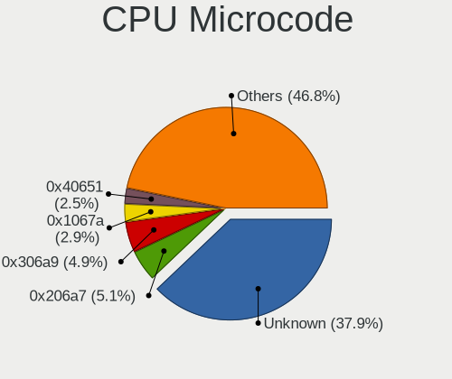
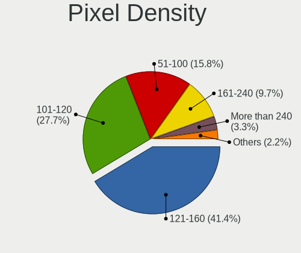
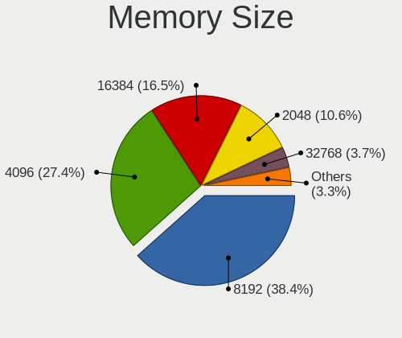

Linux in Germany - Tested Hardware & Statistics (Notebooks)
-----------------------------------------------------------

A project to collect tested hardware configurations for Linux in Germany.

Anyone can contribute to this report by the [hw-probe](https://github.com/linuxhw/hw-probe) tool:

    sudo -E hw-probe -all -upload

Please contribute! Especially if your hardware is rare.

Contents
--------

* [ Test Cases ](#test-cases)

* [ System ](#system)
  - [ OS                       ](#os)
  - [ OS Family                ](#os-family)
  - [ Kernel                   ](#kernel)
  - [ Kernel Family            ](#kernel-family)
  - [ Kernel Major Ver.        ](#kernel-major-ver)
  - [ Arch                     ](#arch)
  - [ DE                       ](#de)
  - [ Display Server           ](#display-server)
  - [ Display Manager          ](#display-manager)
  - [ OS Lang                  ](#os-lang)
  - [ Boot Mode                ](#boot-mode)
  - [ Filesystem               ](#filesystem)
  - [ Part. scheme             ](#part-scheme)
  - [ Dual Boot with Linux/BSD ](#dual-boot-with-linuxbsd)
  - [ Dual Boot (Win)          ](#dual-boot-win)

* [ Board ](#board)
  - [ Vendor                   ](#vendor)
  - [ Model                    ](#model)
  - [ Model Family             ](#model-family)
  - [ MFG Year                 ](#mfg-year)
  - [ Form Factor              ](#form-factor)
  - [ Secure Boot              ](#secure-boot)
  - [ Coreboot                 ](#coreboot)
  - [ RAM Size                 ](#ram-size)
  - [ RAM Used                 ](#ram-used)
  - [ Total Drives             ](#total-drives)
  - [ Has CD-ROM               ](#has-cd-rom)
  - [ Has Ethernet             ](#has-ethernet)
  - [ Has WiFi                 ](#has-wifi)
  - [ Has Bluetooth            ](#has-bluetooth)

* [ Location ](#location)
  - [ Country                  ](#country)
  - [ City                     ](#city)

* [ Drives ](#drives)
  - [ Drive Vendor             ](#drive-vendor)
  - [ Drive Model              ](#drive-model)
  - [ HDD Vendor               ](#hdd-vendor)
  - [ SSD Vendor               ](#ssd-vendor)
  - [ Drive Kind               ](#drive-kind)
  - [ Drive Connector          ](#drive-connector)
  - [ Drive Size               ](#drive-size)
  - [ Space Total              ](#space-total)
  - [ Space Used               ](#space-used)
  - [ Malfunc. Drives          ](#malfunc-drives)
  - [ Malfunc. Drive Vendor    ](#malfunc-drive-vendor)
  - [ Malfunc. HDD Vendor      ](#malfunc-hdd-vendor)
  - [ Malfunc. Drive Kind      ](#malfunc-drive-kind)
  - [ Failed Drives            ](#failed-drives)
  - [ Failed Drive Vendor      ](#failed-drive-vendor)
  - [ Drive Status             ](#drive-status)

* [ Storage controller ](#storage-controller)
  - [ Storage Vendor           ](#storage-vendor)
  - [ Storage Model            ](#storage-model)
  - [ Storage Kind             ](#storage-kind)

* [ Processor ](#processor)
  - [ CPU Vendor               ](#cpu-vendor)
  - [ CPU Model                ](#cpu-model)
  - [ CPU Model Family         ](#cpu-model-family)
  - [ CPU Cores                ](#cpu-cores)
  - [ CPU Sockets              ](#cpu-sockets)
  - [ CPU Threads              ](#cpu-threads)
  - [ CPU Op-Modes             ](#cpu-op-modes)
  - [ CPU Microcode            ](#cpu-microcode)
  - [ CPU Microarch            ](#cpu-microarch)

* [ Graphics ](#graphics)
  - [ GPU Vendor               ](#gpu-vendor)
  - [ GPU Model                ](#gpu-model)
  - [ GPU Combo                ](#gpu-combo)
  - [ GPU Driver               ](#gpu-driver)
  - [ GPU Memory               ](#gpu-memory)

* [ Monitor ](#monitor)
  - [ Monitor Vendor           ](#monitor-vendor)
  - [ Monitor Model            ](#monitor-model)
  - [ Monitor Resolution       ](#monitor-resolution)
  - [ Monitor Diagonal         ](#monitor-diagonal)
  - [ Monitor Width            ](#monitor-width)
  - [ Aspect Ratio             ](#aspect-ratio)
  - [ Monitor Area             ](#monitor-area)
  - [ Pixel Density            ](#pixel-density)
  - [ Multiple Monitors        ](#multiple-monitors)

* [ Network ](#network)
  - [ Net Controller Vendor    ](#net-controller-vendor)
  - [ Net Controller Model     ](#net-controller-model)
  - [ Wireless Vendor          ](#wireless-vendor)
  - [ Wireless Model           ](#wireless-model)
  - [ Ethernet Vendor          ](#ethernet-vendor)
  - [ Ethernet Model           ](#ethernet-model)
  - [ Net Controller Kind      ](#net-controller-kind)
  - [ Used Controller          ](#used-controller)
  - [ NICs                     ](#nics)
  - [ IPv6                     ](#ipv6)

* [ Bluetooth ](#bluetooth)
  - [ Bluetooth Vendor         ](#bluetooth-vendor)
  - [ Bluetooth Model          ](#bluetooth-model)

* [ Sound ](#sound)
  - [ Sound Vendor             ](#sound-vendor)
  - [ Sound Model              ](#sound-model)

* [ Memory ](#memory)
  - [ Memory Vendor            ](#memory-vendor)
  - [ Memory Model             ](#memory-model)
  - [ Memory Kind              ](#memory-kind)
  - [ Memory Form Factor       ](#memory-form-factor)
  - [ Memory Size              ](#memory-size)
  - [ Memory Speed             ](#memory-speed)

* [ Printers & scanners ](#printers--scanners)
  - [ Printer Vendor           ](#printer-vendor)
  - [ Printer Model            ](#printer-model)
  - [ Scanner Vendor           ](#scanner-vendor)
  - [ Scanner Model            ](#scanner-model)

* [ Camera ](#camera)
  - [ Camera Vendor            ](#camera-vendor)
  - [ Camera Model             ](#camera-model)

* [ Security ](#security)
  - [ Fingerprint Vendor       ](#fingerprint-vendor)
  - [ Fingerprint Model        ](#fingerprint-model)
  - [ Chipcard Vendor          ](#chipcard-vendor)
  - [ Chipcard Model           ](#chipcard-model)

* [ Unsupported ](#unsupported)
  - [ Unsupported Devices      ](#unsupported-devices)
  - [ Unsupported Device Types ](#unsupported-device-types)

Test Cases
----------

Total: 16162

| Vendor        | Model                       | Probe                                                      | Date         |
|---------------|-----------------------------|------------------------------------------------------------|--------------|
| Lenovo        | Flex 2-15D 20377            | [8f9e71f454](https://linux-hardware.org/?probe=8f9e71f454) | Oct 01, 2023 |
| HP            | Laptop 17-cn0xxx            | [aa4b869750](https://linux-hardware.org/?probe=aa4b869750) | Oct 01, 2023 |
| Lenovo        | IdeaPad 330-15ARR 81D2      | [5d6364a866](https://linux-hardware.org/?probe=5d6364a866) | Oct 01, 2023 |
| HP            | ProBook 650 G8 Notebook ... | [b02492c1dd](https://linux-hardware.org/?probe=b02492c1dd) | Oct 01, 2023 |
| Toshiba       | Satellite C870-1C2          | [d9750c9040](https://linux-hardware.org/?probe=d9750c9040) | Sep 30, 2023 |
| Lenovo        | ThinkPad T480s 20L7CTO1W... | [1135ddac8e](https://linux-hardware.org/?probe=1135ddac8e) | Sep 30, 2023 |
| Fujitsu Si... | AMILO A1650G                | [ec61a60044](https://linux-hardware.org/?probe=ec61a60044) | Sep 30, 2023 |
| HP            | EliteBook 830 G6            | [154150aa88](https://linux-hardware.org/?probe=154150aa88) | Sep 30, 2023 |
| HP            | ProBook 650 G1              | [c9aca83f04](https://linux-hardware.org/?probe=c9aca83f04) | Sep 30, 2023 |
| Fujitsu Si... | AMILO Pa 2548               | [ee2d5e25d3](https://linux-hardware.org/?probe=ee2d5e25d3) | Sep 30, 2023 |
| Acer          | Aspire E1-572G              | [f7375967ee](https://linux-hardware.org/?probe=f7375967ee) | Sep 30, 2023 |
| Dell          | Latitude 7280               | [dbe9d3e4be](https://linux-hardware.org/?probe=dbe9d3e4be) | Sep 30, 2023 |
| HUAWEI        | HLYL-WXX9                   | [d39169bf21](https://linux-hardware.org/?probe=d39169bf21) | Sep 30, 2023 |
| Fujitsu Si... | AMILO Pa 2548               | [a291afc6c3](https://linux-hardware.org/?probe=a291afc6c3) | Sep 30, 2023 |
| Valve         | Jupiter                     | [85eac5b7ce](https://linux-hardware.org/?probe=85eac5b7ce) | Sep 30, 2023 |
| HP            | Laptop 15s-eq1xxx           | [2a293067f5](https://linux-hardware.org/?probe=2a293067f5) | Sep 30, 2023 |
| Toshiba       | QOSMIO X770                 | [c747b27390](https://linux-hardware.org/?probe=c747b27390) | Sep 30, 2023 |
| Apple         | MacBookPro12,1              | [b3617a1e58](https://linux-hardware.org/?probe=b3617a1e58) | Sep 30, 2023 |
| Valve         | Jupiter                     | [1ed8509a3d](https://linux-hardware.org/?probe=1ed8509a3d) | Sep 30, 2023 |
| Dell          | Inspiron 5521               | [a704dd3c01](https://linux-hardware.org/?probe=a704dd3c01) | Sep 30, 2023 |
| VALE          | Notebook Classic C140       | [5be7208021](https://linux-hardware.org/?probe=5be7208021) | Sep 30, 2023 |
| Lenovo        | G770 1037                   | [576bbd3839](https://linux-hardware.org/?probe=576bbd3839) | Sep 29, 2023 |
| ASUSTek       | X551MA                      | [8ba160ee59](https://linux-hardware.org/?probe=8ba160ee59) | Sep 29, 2023 |
| Acer          | Aspire E1-572G              | [9fe3adb466](https://linux-hardware.org/?probe=9fe3adb466) | Sep 29, 2023 |
| Lenovo        | ThinkPad L15 Gen 1 20U70... | [e51fd2a8e9](https://linux-hardware.org/?probe=e51fd2a8e9) | Sep 29, 2023 |
| Lenovo        | IdeaPad Pro 5 16APH8 83A... | [ee6e1996b9](https://linux-hardware.org/?probe=ee6e1996b9) | Sep 29, 2023 |
| Acer          | Aspire A517-53              | [6023cecfb1](https://linux-hardware.org/?probe=6023cecfb1) | Sep 29, 2023 |
| Acer          | Aspire 7745G                | [55ea55a771](https://linux-hardware.org/?probe=55ea55a771) | Sep 29, 2023 |
| Acer          | Nitro AN517-54              | [3e1448c388](https://linux-hardware.org/?probe=3e1448c388) | Sep 29, 2023 |
| Acer          | Aspire A517-53              | [05ff23a1a1](https://linux-hardware.org/?probe=05ff23a1a1) | Sep 29, 2023 |
| Valve         | Jupiter                     | [d065544135](https://linux-hardware.org/?probe=d065544135) | Sep 29, 2023 |
| System76      | Darter Pro                  | [d8b78103d5](https://linux-hardware.org/?probe=d8b78103d5) | Sep 29, 2023 |
| Lenovo        | ThinkPad T500 22439AG       | [e5a2cd9816](https://linux-hardware.org/?probe=e5a2cd9816) | Sep 29, 2023 |
| Lenovo        | ThinkPad T420s 4174PEG      | [cf650bb4af](https://linux-hardware.org/?probe=cf650bb4af) | Sep 29, 2023 |
| Acer          | Aspire 7745G                | [6def421696](https://linux-hardware.org/?probe=6def421696) | Sep 28, 2023 |
| Lenovo        | ThinkPad R60 9461DXG        | [4f74530d68](https://linux-hardware.org/?probe=4f74530d68) | Sep 28, 2023 |
| Lenovo        | ThinkPad R60 9461DXG        | [5fb1e549ea](https://linux-hardware.org/?probe=5fb1e549ea) | Sep 28, 2023 |
| Lenovo        | ThinkPad T14 Gen 3 21AJS... | [38e71e4fe9](https://linux-hardware.org/?probe=38e71e4fe9) | Sep 28, 2023 |
| Lenovo        | ThinkPad T14 Gen 2i 20W0... | [c8dfaf68d0](https://linux-hardware.org/?probe=c8dfaf68d0) | Sep 28, 2023 |
| Acer          | Aspire ES1-732              | [f30d62d67b](https://linux-hardware.org/?probe=f30d62d67b) | Sep 28, 2023 |
| Apple         | MacBookPro9,1               | [555dfa4f2e](https://linux-hardware.org/?probe=555dfa4f2e) | Sep 28, 2023 |
| HP            | Compaq Presario CQ70        | [8913bbd459](https://linux-hardware.org/?probe=8913bbd459) | Sep 28, 2023 |
| Valve         | Jupiter                     | [8de9bb39df](https://linux-hardware.org/?probe=8de9bb39df) | Sep 28, 2023 |
| Toshiba       | Satellite P775              | [7269165fd9](https://linux-hardware.org/?probe=7269165fd9) | Sep 28, 2023 |
| Packard Be... | EasyNote MH36               | [91fcf40898](https://linux-hardware.org/?probe=91fcf40898) | Sep 28, 2023 |
| Dell          | Latitude E5570              | [150f9e624b](https://linux-hardware.org/?probe=150f9e624b) | Sep 28, 2023 |
| Lenovo        | ThinkPad T495 20NJ000XGE    | [737b3910bb](https://linux-hardware.org/?probe=737b3910bb) | Sep 28, 2023 |
| Lenovo        | ThinkPad T495 20NJ000XGE    | [b064b5b9ca](https://linux-hardware.org/?probe=b064b5b9ca) | Sep 28, 2023 |
| HP            | Laptop 17-bs0xx             | [85548f2790](https://linux-hardware.org/?probe=85548f2790) | Sep 28, 2023 |
| Acer          | Aspire VN7-791G             | [0cfe515d00](https://linux-hardware.org/?probe=0cfe515d00) | Sep 27, 2023 |
| HP            | ElitePad 1000 G2            | [a53de5d0bd](https://linux-hardware.org/?probe=a53de5d0bd) | Sep 27, 2023 |
| HP            | ElitePad 1000 G2            | [9c4b30a15c](https://linux-hardware.org/?probe=9c4b30a15c) | Sep 27, 2023 |
| HP            | ElitePad 1000 G2            | [2668770971](https://linux-hardware.org/?probe=2668770971) | Sep 27, 2023 |
| Fujitsu       | LIFEBOOK E4512              | [08b39b38bd](https://linux-hardware.org/?probe=08b39b38bd) | Sep 27, 2023 |
| Acer          | Nitro AN515-42              | [dd4a3f701c](https://linux-hardware.org/?probe=dd4a3f701c) | Sep 27, 2023 |
| TUXEDO        | Stellaris Intel Gen4        | [0dcef3e6c3](https://linux-hardware.org/?probe=0dcef3e6c3) | Sep 27, 2023 |
| HP            | Laptop 17-by0xxx            | [6eefb5fdd2](https://linux-hardware.org/?probe=6eefb5fdd2) | Sep 27, 2023 |
| Lenovo        | ThinkPad X1 Carbon Gen 8... | [b5dee453a3](https://linux-hardware.org/?probe=b5dee453a3) | Sep 27, 2023 |
| Lenovo        | ThinkPad T460s 20FAS2G90... | [50c8df3b79](https://linux-hardware.org/?probe=50c8df3b79) | Sep 27, 2023 |
| Lenovo        | ThinkPad T460s 20FAS2G90... | [6cfd6e2b34](https://linux-hardware.org/?probe=6cfd6e2b34) | Sep 27, 2023 |
| Acer          | Aspire 5951G                | [cae145acab](https://linux-hardware.org/?probe=cae145acab) | Sep 26, 2023 |
| HP            | ElitePad 1000 G2            | [ee4b3f2b76](https://linux-hardware.org/?probe=ee4b3f2b76) | Sep 26, 2023 |
| HP            | Pavilion dv6                | [5eaa895f6e](https://linux-hardware.org/?probe=5eaa895f6e) | Sep 26, 2023 |
| HP            | Pavilion dv6                | [f785da65ca](https://linux-hardware.org/?probe=f785da65ca) | Sep 26, 2023 |
| Valve         | Jupiter                     | [3c758abd49](https://linux-hardware.org/?probe=3c758abd49) | Sep 26, 2023 |
| Lenovo        | ThinkPad L540 20AUS00N00    | [a8aee3f386](https://linux-hardware.org/?probe=a8aee3f386) | Sep 26, 2023 |
| Lenovo        | ThinkPad T14 Gen 1 20S1S... | [b62d121676](https://linux-hardware.org/?probe=b62d121676) | Sep 26, 2023 |
| HP            | Laptop 15s-fq2xxx           | [22294a7a32](https://linux-hardware.org/?probe=22294a7a32) | Sep 26, 2023 |
| Acer          | Aspire E1-570               | [98ed9bca40](https://linux-hardware.org/?probe=98ed9bca40) | Sep 26, 2023 |
| Dell          | XPS 15 9560                 | [a524453c71](https://linux-hardware.org/?probe=a524453c71) | Sep 25, 2023 |
| HP            | Laptop 15s-fq2xxx           | [0aa73d620b](https://linux-hardware.org/?probe=0aa73d620b) | Sep 25, 2023 |
| HUAWEI        | NbDE-WXX9                   | [b3990570ee](https://linux-hardware.org/?probe=b3990570ee) | Sep 25, 2023 |
| Dell          | Inspiron 14 5410            | [863dfa9b96](https://linux-hardware.org/?probe=863dfa9b96) | Sep 25, 2023 |
| HP            | Laptop 17-ca0xxx            | [b094bb2ed3](https://linux-hardware.org/?probe=b094bb2ed3) | Sep 25, 2023 |
| System76      | Pangolin                    | [3c56c50463](https://linux-hardware.org/?probe=3c56c50463) | Sep 25, 2023 |
| HP            | EliteBook 840 G7 Noteboo... | [381be3d212](https://linux-hardware.org/?probe=381be3d212) | Sep 25, 2023 |
| Acer          | Aspire 5951G                | [4c50b8e9b0](https://linux-hardware.org/?probe=4c50b8e9b0) | Sep 25, 2023 |
| HP            | Laptop 17-cn0xxx            | [10ec627bad](https://linux-hardware.org/?probe=10ec627bad) | Sep 25, 2023 |
| HP            | ElitePad 1000 G2            | [5e1dcb7163](https://linux-hardware.org/?probe=5e1dcb7163) | Sep 24, 2023 |
| Lenovo        | ThinkPad X1 Carbon 3rd 2... | [7d18eb441e](https://linux-hardware.org/?probe=7d18eb441e) | Sep 24, 2023 |
| HP            | ElitePad 1000 G2            | [5cfbe2e7e0](https://linux-hardware.org/?probe=5cfbe2e7e0) | Sep 24, 2023 |
| Fujitsu       | LIFEBOOK A557               | [e66c8c9ca7](https://linux-hardware.org/?probe=e66c8c9ca7) | Sep 24, 2023 |
| Toshiba       | Satellite C50D-A-10E        | [46f0ec000d](https://linux-hardware.org/?probe=46f0ec000d) | Sep 24, 2023 |
| Dell          | Latitude E6520              | [9fd6a2a84f](https://linux-hardware.org/?probe=9fd6a2a84f) | Sep 24, 2023 |
| Lenovo        | ThinkPad X1 Extreme 2nd ... | [8a581a8a85](https://linux-hardware.org/?probe=8a581a8a85) | Sep 24, 2023 |
| Lenovo        | Yoga 2 Pro 20266            | [fcb38d5424](https://linux-hardware.org/?probe=fcb38d5424) | Sep 24, 2023 |
| HP            | Laptop 15s-fq2xxx           | [98ad01dfc0](https://linux-hardware.org/?probe=98ad01dfc0) | Sep 24, 2023 |
| Dell          | System XPS L502X            | [22d93fe76c](https://linux-hardware.org/?probe=22d93fe76c) | Sep 24, 2023 |
| Lenovo        | ThinkPad E14 Gen 4 21EB0... | [e87fa96814](https://linux-hardware.org/?probe=e87fa96814) | Sep 24, 2023 |
| Lenovo        | ThinkPad E14 Gen 4 21EB0... | [29399bf284](https://linux-hardware.org/?probe=29399bf284) | Sep 24, 2023 |
| Lenovo        | IdeaPad N581 7505           | [ed2e5eed86](https://linux-hardware.org/?probe=ed2e5eed86) | Sep 24, 2023 |
| Acer          | Aspire A515-56              | [3d1de53032](https://linux-hardware.org/?probe=3d1de53032) | Sep 24, 2023 |
| Dell          | XPS 15 9500                 | [fcff405070](https://linux-hardware.org/?probe=fcff405070) | Sep 24, 2023 |
| TrekStor      | Primebook P14               | [6664054d96](https://linux-hardware.org/?probe=6664054d96) | Sep 24, 2023 |
| Dell          | XPS 15 9500                 | [5bedca0fe9](https://linux-hardware.org/?probe=5bedca0fe9) | Sep 24, 2023 |
| HP            | 250 15.6 inch G9 Noteboo... | [508cf38973](https://linux-hardware.org/?probe=508cf38973) | Sep 24, 2023 |
| Dell          | System XPS L502X            | [a1d4f683c1](https://linux-hardware.org/?probe=a1d4f683c1) | Sep 24, 2023 |
| HP            | Laptop 15s-fq2xxx           | [747f5bd882](https://linux-hardware.org/?probe=747f5bd882) | Sep 24, 2023 |
| Acer          | Aspire A317-51G             | [16870a488b](https://linux-hardware.org/?probe=16870a488b) | Sep 24, 2023 |
| Apple         | MacBookPro9,2               | [2691aa5f87](https://linux-hardware.org/?probe=2691aa5f87) | Sep 24, 2023 |
| Acer          | Aspire V3-771               | [8d87ce31c5](https://linux-hardware.org/?probe=8d87ce31c5) | Sep 24, 2023 |
| Dell          | Latitude 7430               | [eb37e129e6](https://linux-hardware.org/?probe=eb37e129e6) | Sep 24, 2023 |
| Acer          | Aspire V3-771               | [10dfbbd349](https://linux-hardware.org/?probe=10dfbbd349) | Sep 24, 2023 |
| UMAX          | VisionBook 14Wr             | [5e8b69ec67](https://linux-hardware.org/?probe=5e8b69ec67) | Sep 23, 2023 |
| HP            | 255 15.6 inch G10           | [9f02426c5d](https://linux-hardware.org/?probe=9f02426c5d) | Sep 23, 2023 |
| Lenovo        | ThinkPad X1 Carbon Gen 8... | [b5584b2b96](https://linux-hardware.org/?probe=b5584b2b96) | Sep 23, 2023 |
| HP            | 250 G4                      | [c9dac1b4d5](https://linux-hardware.org/?probe=c9dac1b4d5) | Sep 23, 2023 |
| Dell          | Latitude 7280               | [1d032535e1](https://linux-hardware.org/?probe=1d032535e1) | Sep 23, 2023 |
| Wortmann      | TERRA_MOBILE_1512/1712      | [226db4b62b](https://linux-hardware.org/?probe=226db4b62b) | Sep 23, 2023 |
| Dell          | XPS 13 9360                 | [6897fc6f5a](https://linux-hardware.org/?probe=6897fc6f5a) | Sep 23, 2023 |
| Acer          | Aspire E5-574G              | [7ca9ce046e](https://linux-hardware.org/?probe=7ca9ce046e) | Sep 23, 2023 |
| Lenovo        | ThinkBook 14 G2 ARE 20VF    | [147b087f20](https://linux-hardware.org/?probe=147b087f20) | Sep 23, 2023 |
| Lenovo        | ThinkPad X220 Tablet 429... | [9323b69b4b](https://linux-hardware.org/?probe=9323b69b4b) | Sep 22, 2023 |
| Fujitsu       | LIFEBOOK A357               | [d18e2d8811](https://linux-hardware.org/?probe=d18e2d8811) | Sep 22, 2023 |
| Lenovo        | ThinkPad L13 Gen 3 21B90... | [e273beb83a](https://linux-hardware.org/?probe=e273beb83a) | Sep 22, 2023 |
| Acer          | Aspire A517-51              | [fdeb61b7c3](https://linux-hardware.org/?probe=fdeb61b7c3) | Sep 22, 2023 |
| Lenovo        | ThinkPad T470s W10DG 20J... | [ad1b8126d2](https://linux-hardware.org/?probe=ad1b8126d2) | Sep 22, 2023 |
| Lenovo        | ThinkPad L13 Gen 3 21B90... | [0d786ffd74](https://linux-hardware.org/?probe=0d786ffd74) | Sep 22, 2023 |
| Dell          | Latitude 3320               | [cf413808cb](https://linux-hardware.org/?probe=cf413808cb) | Sep 22, 2023 |
| Dell          | Latitude 3320               | [bd39ee30ac](https://linux-hardware.org/?probe=bd39ee30ac) | Sep 22, 2023 |
| Apple         | MacBookPro12,1              | [b8b562cc39](https://linux-hardware.org/?probe=b8b562cc39) | Sep 22, 2023 |
| Lenovo        | ThinkPad X1 Extreme 2nd ... | [7732f1eb9b](https://linux-hardware.org/?probe=7732f1eb9b) | Sep 22, 2023 |
| HUAWEI        | BOD-WXX9                    | [909efbf81b](https://linux-hardware.org/?probe=909efbf81b) | Sep 22, 2023 |
| Lenovo        | ThinkPad X220 4290EC5       | [3cb76d839a](https://linux-hardware.org/?probe=3cb76d839a) | Sep 22, 2023 |
| ASUSTek       | X540LA                      | [adf0d97721](https://linux-hardware.org/?probe=adf0d97721) | Sep 22, 2023 |
| HP            | ENVY 17                     | [4f6463148f](https://linux-hardware.org/?probe=4f6463148f) | Sep 22, 2023 |
| HP            | Pavilion g6                 | [c5833405a5](https://linux-hardware.org/?probe=c5833405a5) | Sep 22, 2023 |
| Medion        | E6224                       | [a6087c2bdf](https://linux-hardware.org/?probe=a6087c2bdf) | Sep 22, 2023 |
| Acer          | Aspire 5742G                | [ee84a8d240](https://linux-hardware.org/?probe=ee84a8d240) | Sep 21, 2023 |
| Fujitsu       | LIFEBOOK E752               | [c2d2a28c33](https://linux-hardware.org/?probe=c2d2a28c33) | Sep 21, 2023 |
| Apple         | MacBookPro12,1              | [bb796b1e6e](https://linux-hardware.org/?probe=bb796b1e6e) | Sep 21, 2023 |
| Dell          | Inspiron 3542               | [3e66379f73](https://linux-hardware.org/?probe=3e66379f73) | Sep 21, 2023 |
| Dell          | Precision 7520              | [2fd68ca236](https://linux-hardware.org/?probe=2fd68ca236) | Sep 21, 2023 |
| Samsung       | R530/R730/R540              | [658ca13022](https://linux-hardware.org/?probe=658ca13022) | Sep 21, 2023 |
| Valve         | Jupiter                     | [2c967e82b6](https://linux-hardware.org/?probe=2c967e82b6) | Sep 21, 2023 |
| Dell          | Precision 5550              | [c5183a7443](https://linux-hardware.org/?probe=c5183a7443) | Sep 21, 2023 |
| Dell          | Precision 5550              | [3d927d3dee](https://linux-hardware.org/?probe=3d927d3dee) | Sep 21, 2023 |
| Lenovo        | ThinkPad T570 20HAS1PC00    | [218325e9e3](https://linux-hardware.org/?probe=218325e9e3) | Sep 21, 2023 |
| HP            | Elite x2 1012 G1            | [dbe6ba540f](https://linux-hardware.org/?probe=dbe6ba540f) | Sep 20, 2023 |
| HP            | Pavilion 17                 | [f95a376481](https://linux-hardware.org/?probe=f95a376481) | Sep 20, 2023 |
| Lenovo        | ThinkPad T560 20FJS2BX00    | [85a0203a02](https://linux-hardware.org/?probe=85a0203a02) | Sep 20, 2023 |
| Lenovo        | ThinkPad T560 20FJS2BX00    | [c96d3bf498](https://linux-hardware.org/?probe=c96d3bf498) | Sep 20, 2023 |
| Lenovo        | ThinkPad L390 20NRCTO1WW    | [228d31bf59](https://linux-hardware.org/?probe=228d31bf59) | Sep 20, 2023 |
| TUXEDO        | P65_P67RGRERA               | [97bae35595](https://linux-hardware.org/?probe=97bae35595) | Sep 20, 2023 |
| Acer          | Aspire 7750G                | [942c136417](https://linux-hardware.org/?probe=942c136417) | Sep 20, 2023 |
| Dell          | Precision 3510              | [2a10a66b9c](https://linux-hardware.org/?probe=2a10a66b9c) | Sep 20, 2023 |
| Medion        | E6417 MD99252               | [749d8cd6a6](https://linux-hardware.org/?probe=749d8cd6a6) | Sep 20, 2023 |
| TUXEDO        | P65_P67RGRERA               | [0aefa5e3c6](https://linux-hardware.org/?probe=0aefa5e3c6) | Sep 20, 2023 |
| Apple         | MacBookPro12,1              | [49ed4b61ff](https://linux-hardware.org/?probe=49ed4b61ff) | Sep 20, 2023 |
| Wortmann      | TERRA_MOBILE_1749           | [869708c900](https://linux-hardware.org/?probe=869708c900) | Sep 20, 2023 |
| Toshiba       | Satellite Pro C70-B         | [a24c6808ba](https://linux-hardware.org/?probe=a24c6808ba) | Sep 20, 2023 |
| Lenovo        | ThinkPad T14 Gen 3 21AH0... | [a6fd72ec9a](https://linux-hardware.org/?probe=a6fd72ec9a) | Sep 20, 2023 |
| Acer          | Aspire A517-52              | [93b7c8d721](https://linux-hardware.org/?probe=93b7c8d721) | Sep 20, 2023 |
| ASUSTek       | ZenBook UX425UAZ_UM425UA... | [91c2eeef2f](https://linux-hardware.org/?probe=91c2eeef2f) | Sep 20, 2023 |
| Acer          | Aspire A517-52              | [b88d2679f2](https://linux-hardware.org/?probe=b88d2679f2) | Sep 19, 2023 |
| Acer          | Aspire ES1-571              | [561ce1b44d](https://linux-hardware.org/?probe=561ce1b44d) | Sep 19, 2023 |
| Lenovo        | IdeaPad S540-14IWL 81ND     | [d48dce11ee](https://linux-hardware.org/?probe=d48dce11ee) | Sep 19, 2023 |
| Acer          | Aspire 5750                 | [9fb8b99e70](https://linux-hardware.org/?probe=9fb8b99e70) | Sep 19, 2023 |
| ASUSTek       | ZenBook UX431DA_UM431DA     | [ca70cb035f](https://linux-hardware.org/?probe=ca70cb035f) | Sep 19, 2023 |
| HP            | ProBook 450 G5              | [e1b56bb588](https://linux-hardware.org/?probe=e1b56bb588) | Sep 19, 2023 |
| Acer          | Nitro AN517-52              | [32f2e74fe3](https://linux-hardware.org/?probe=32f2e74fe3) | Sep 19, 2023 |
| Notebook      | P7xxDM3(-G)                 | [b302c7b008](https://linux-hardware.org/?probe=b302c7b008) | Sep 19, 2023 |
| Notebook      | P7xxDM3(-G)                 | [ec386099b2](https://linux-hardware.org/?probe=ec386099b2) | Sep 19, 2023 |
| HP            | 250 G8 Notebook PC          | [f31f049c9c](https://linux-hardware.org/?probe=f31f049c9c) | Sep 19, 2023 |
| HP            | Laptop 17-cp0xxx            | [05e3350e1f](https://linux-hardware.org/?probe=05e3350e1f) | Sep 19, 2023 |
| HP            | EliteBook 840 G6            | [31c7a91b87](https://linux-hardware.org/?probe=31c7a91b87) | Sep 18, 2023 |
| Dell          | Precision 3570              | [fd3441ff1d](https://linux-hardware.org/?probe=fd3441ff1d) | Sep 18, 2023 |
| HP            | EliteBook 745 G5            | [d03b8c1860](https://linux-hardware.org/?probe=d03b8c1860) | Sep 18, 2023 |
| HP            | EliteBook 830 G6            | [8dcd49002d](https://linux-hardware.org/?probe=8dcd49002d) | Sep 18, 2023 |
| Acer          | Aspire E5-774G              | [19e013b8e8](https://linux-hardware.org/?probe=19e013b8e8) | Sep 18, 2023 |
| Acer          | Aspire 7741                 | [c1324275ec](https://linux-hardware.org/?probe=c1324275ec) | Sep 18, 2023 |
| TUXEDO        | InfinityBook Pro Gen7 (M... | [a4f7b61af6](https://linux-hardware.org/?probe=a4f7b61af6) | Sep 18, 2023 |
| Dell          | Latitude 5501               | [66b2685ca5](https://linux-hardware.org/?probe=66b2685ca5) | Sep 18, 2023 |
| Lenovo        | ThinkPad T410 2522AC1       | [693d503481](https://linux-hardware.org/?probe=693d503481) | Sep 17, 2023 |
| HP            | 250 G7 Notebook PC          | [428177914f](https://linux-hardware.org/?probe=428177914f) | Sep 17, 2023 |
| Fujitsu       | LIFEBOOK E752               | [ba8890a377](https://linux-hardware.org/?probe=ba8890a377) | Sep 17, 2023 |
| Acer          | TravelMate P446-MG          | [08d9d6868b](https://linux-hardware.org/?probe=08d9d6868b) | Sep 17, 2023 |
| HP            | Compaq Mini 311-1100        | [eefc7ef22f](https://linux-hardware.org/?probe=eefc7ef22f) | Sep 17, 2023 |
| ASUSTek       | P52F                        | [6be70b4b24](https://linux-hardware.org/?probe=6be70b4b24) | Sep 17, 2023 |
| MSI           | GF75 Thin 10SCSR            | [455a5e05f2](https://linux-hardware.org/?probe=455a5e05f2) | Sep 17, 2023 |
| ASUSTek       | VivoBook 17_ASUS Laptop ... | [757c12636e](https://linux-hardware.org/?probe=757c12636e) | Sep 17, 2023 |
| Fujitsu       | Unknown                     | [1d942c9607](https://linux-hardware.org/?probe=1d942c9607) | Sep 17, 2023 |
| HP            | Compaq Mini 311-1100        | [8bdfb6307c](https://linux-hardware.org/?probe=8bdfb6307c) | Sep 17, 2023 |
| Valve         | Jupiter                     | [ffa55f4f83](https://linux-hardware.org/?probe=ffa55f4f83) | Sep 17, 2023 |
| Acer          | Nitro AN515-51              | [09a7651061](https://linux-hardware.org/?probe=09a7651061) | Sep 17, 2023 |
| ASUSTek       | ZenBook UX425UAZ_UM425UA... | [959cef0f9e](https://linux-hardware.org/?probe=959cef0f9e) | Sep 17, 2023 |
| Acer          | Aspire 8950G                | [b73ee31092](https://linux-hardware.org/?probe=b73ee31092) | Sep 17, 2023 |
| Acer          | Aspire 5750                 | [e639402c30](https://linux-hardware.org/?probe=e639402c30) | Sep 17, 2023 |
| HP            | Laptop 15-db1xxx            | [804223592d](https://linux-hardware.org/?probe=804223592d) | Sep 17, 2023 |
| Apple         | MacBook4,1                  | [3774dfea8e](https://linux-hardware.org/?probe=3774dfea8e) | Sep 16, 2023 |
| Acer          | Aspire 5742G                | [fa6cd2ffd8](https://linux-hardware.org/?probe=fa6cd2ffd8) | Sep 16, 2023 |
| HP            | ProBook 450 15.6 inch G1... | [88caa6c959](https://linux-hardware.org/?probe=88caa6c959) | Sep 16, 2023 |
| HP            | ProBook 450 15.6 inch G1... | [5e0eae9363](https://linux-hardware.org/?probe=5e0eae9363) | Sep 16, 2023 |
| Acer          | Aspire 5755G                | [16c14700d3](https://linux-hardware.org/?probe=16c14700d3) | Sep 16, 2023 |
| ASUSTek       | TUF Gaming B550-PLUS        | [a5c073ca7a](https://linux-hardware.org/?probe=a5c073ca7a) | Sep 16, 2023 |
| Lenovo        | ThinkPad X201 3680W81       | [d241a0b977](https://linux-hardware.org/?probe=d241a0b977) | Sep 16, 2023 |
| ASUSTek       | K55VJ                       | [82cae5303a](https://linux-hardware.org/?probe=82cae5303a) | Sep 16, 2023 |
| ASUSTek       | K55VJ                       | [db874f0737](https://linux-hardware.org/?probe=db874f0737) | Sep 16, 2023 |
| Lenovo        | G50-70 20351                | [036e59efa0](https://linux-hardware.org/?probe=036e59efa0) | Sep 16, 2023 |
| Apple         | MacBookPro3,1               | [f6be487f38](https://linux-hardware.org/?probe=f6be487f38) | Sep 16, 2023 |
| HP            | Pavilion Gaming Laptop 1... | [76ca0d67e1](https://linux-hardware.org/?probe=76ca0d67e1) | Sep 16, 2023 |
| Sony          | VGN-AR71J                   | [adcb1c52d0](https://linux-hardware.org/?probe=adcb1c52d0) | Sep 15, 2023 |
| HP            | Laptop 17-cn0xxx            | [6495df6735](https://linux-hardware.org/?probe=6495df6735) | Sep 15, 2023 |
| HP            | Pavilion Gaming Laptop 1... | [aea37f693f](https://linux-hardware.org/?probe=aea37f693f) | Sep 15, 2023 |
| Acer          | Aspire A515-57              | [a73abd96f1](https://linux-hardware.org/?probe=a73abd96f1) | Sep 15, 2023 |
| Chuwi         | GemiBook Pro                | [1fcac33942](https://linux-hardware.org/?probe=1fcac33942) | Sep 15, 2023 |
| Lenovo        | ThinkPad A475 20KMS08300    | [eaaac22962](https://linux-hardware.org/?probe=eaaac22962) | Sep 15, 2023 |
| Lenovo        | ThinkPad X13 Gen 2a 20XH... | [5150bae6bd](https://linux-hardware.org/?probe=5150bae6bd) | Sep 15, 2023 |
| ASUSTek       | ZenBook UX425UA_UM425UA     | [ef5ba3650e](https://linux-hardware.org/?probe=ef5ba3650e) | Sep 15, 2023 |
| Acer          | Aspire VN7-571G             | [4acb50cbaf](https://linux-hardware.org/?probe=4acb50cbaf) | Sep 15, 2023 |
| Lenovo        | ThinkPad T430 2349CV8       | [80e76d50db](https://linux-hardware.org/?probe=80e76d50db) | Sep 15, 2023 |
| HP            | Unknown                     | [2ee662b613](https://linux-hardware.org/?probe=2ee662b613) | Sep 15, 2023 |
| Lenovo        | G700 20251                  | [8e5d1fefba](https://linux-hardware.org/?probe=8e5d1fefba) | Sep 15, 2023 |
| HP            | Compaq 615                  | [f2f7659e5b](https://linux-hardware.org/?probe=f2f7659e5b) | Sep 15, 2023 |
| Acer          | Nitro AN515-57              | [8e044378bd](https://linux-hardware.org/?probe=8e044378bd) | Sep 15, 2023 |
| ASUSTek       | X751LN                      | [77ecc965aa](https://linux-hardware.org/?probe=77ecc965aa) | Sep 14, 2023 |
| Dell          | Inspiron 5770               | [ca5dd06f20](https://linux-hardware.org/?probe=ca5dd06f20) | Sep 14, 2023 |
| Dell          | Inspiron 5593               | [ea3d5cffdb](https://linux-hardware.org/?probe=ea3d5cffdb) | Sep 14, 2023 |
| Acer          | Aspire 7740                 | [4b5f0872ea](https://linux-hardware.org/?probe=4b5f0872ea) | Sep 14, 2023 |
| HP            | 255 15.6 inch G9 Noteboo... | [6d61c93aef](https://linux-hardware.org/?probe=6d61c93aef) | Sep 14, 2023 |
| Medion        | Akoya E1318T                | [1572639d04](https://linux-hardware.org/?probe=1572639d04) | Sep 14, 2023 |
| HP            | ProBook 450 G5              | [077f5b81b8](https://linux-hardware.org/?probe=077f5b81b8) | Sep 14, 2023 |
| Dell          | Inspiron 5770               | [7056e15dc2](https://linux-hardware.org/?probe=7056e15dc2) | Sep 14, 2023 |
| Fujitsu       | LIFEBOOK AH530              | [a3b023f0e4](https://linux-hardware.org/?probe=a3b023f0e4) | Sep 13, 2023 |
| Notebook      | P65_P67SA                   | [4d11ae0ff7](https://linux-hardware.org/?probe=4d11ae0ff7) | Sep 13, 2023 |
| ASUSTek       | GL753VD                     | [7bf98a1052](https://linux-hardware.org/?probe=7bf98a1052) | Sep 13, 2023 |
| Apple         | MacBookPro11,2              | [e9128ceb2a](https://linux-hardware.org/?probe=e9128ceb2a) | Sep 13, 2023 |
| Lenovo        | ThinkPad T61 7659VKF        | [1f07dfc17a](https://linux-hardware.org/?probe=1f07dfc17a) | Sep 12, 2023 |
| Lenovo        | ThinkPad T470s 20HGS0180... | [2f123cee8b](https://linux-hardware.org/?probe=2f123cee8b) | Sep 12, 2023 |
| Lenovo        | ThinkPad E15 Gen 4 21EES... | [b11bc1c28f](https://linux-hardware.org/?probe=b11bc1c28f) | Sep 12, 2023 |
| Fujitsu Si... | AMILO Pa 1510               | [c75c8ce9d3](https://linux-hardware.org/?probe=c75c8ce9d3) | Sep 12, 2023 |
| ASUSTek       | GL753VD                     | [c122d5178e](https://linux-hardware.org/?probe=c122d5178e) | Sep 12, 2023 |
| ASUSTek       | ROG Strix G733ZW_G733ZW     | [78ddadfb89](https://linux-hardware.org/?probe=78ddadfb89) | Sep 12, 2023 |
| ASUSTek       | ROG Strix G733ZW_G733ZW     | [3145861387](https://linux-hardware.org/?probe=3145861387) | Sep 12, 2023 |
| Dell          | Inspiron 3583               | [a8dfa14f71](https://linux-hardware.org/?probe=a8dfa14f71) | Sep 12, 2023 |
| Lenovo        | ThinkPad P50 20EQS37F00     | [0eaf502e28](https://linux-hardware.org/?probe=0eaf502e28) | Sep 12, 2023 |
| Alienware     | x14                         | [4fc435cc67](https://linux-hardware.org/?probe=4fc435cc67) | Sep 12, 2023 |
| Medion        | Akoya P2213T                | [7d201de7d6](https://linux-hardware.org/?probe=7d201de7d6) | Sep 11, 2023 |
| Lenovo        | 3000 N200 0769EGG           | [69189d0f7a](https://linux-hardware.org/?probe=69189d0f7a) | Sep 11, 2023 |
| Lenovo        | 3000 N200 0769EGG           | [029772ad9a](https://linux-hardware.org/?probe=029772ad9a) | Sep 11, 2023 |
| Lenovo        | ThinkPad L380 20M50013GE    | [e7778dd80d](https://linux-hardware.org/?probe=e7778dd80d) | Sep 11, 2023 |
| HP            | 250 G7 Notebook PC          | [6a7ee91a3f](https://linux-hardware.org/?probe=6a7ee91a3f) | Sep 11, 2023 |
| TUXEDO        | Stellaris Intel Gen5        | [a28ff634a0](https://linux-hardware.org/?probe=a28ff634a0) | Sep 11, 2023 |
| TUXEDO        | Stellaris Intel Gen5        | [28283f9fcf](https://linux-hardware.org/?probe=28283f9fcf) | Sep 11, 2023 |
| Schenker      | XMG NEO (TGL/M21)           | [8f9ada75e9](https://linux-hardware.org/?probe=8f9ada75e9) | Sep 11, 2023 |
| HP            | Elite x2 1012 G1            | [f7546a9d25](https://linux-hardware.org/?probe=f7546a9d25) | Sep 11, 2023 |
| HP            | EliteBook 845 G8 Noteboo... | [667560b69c](https://linux-hardware.org/?probe=667560b69c) | Sep 11, 2023 |
| Valve         | Jupiter                     | [e4939089f7](https://linux-hardware.org/?probe=e4939089f7) | Sep 11, 2023 |
| MSI           | Katana GF66 11UG            | [817ece541a](https://linux-hardware.org/?probe=817ece541a) | Sep 10, 2023 |
| ASUSTek       | VivoBook_ASUSLaptop X705... | [ff1ee4d114](https://linux-hardware.org/?probe=ff1ee4d114) | Sep 10, 2023 |
| ASUSTek       | VivoBook_ASUSLaptop X415... | [1ff3e228da](https://linux-hardware.org/?probe=1ff3e228da) | Sep 10, 2023 |
| Acer          | Aspire E1-572G              | [d508e799c4](https://linux-hardware.org/?probe=d508e799c4) | Sep 10, 2023 |
| ASUSTek       | ZenBook UX433FA_UX433FA     | [1b2d76894b](https://linux-hardware.org/?probe=1b2d76894b) | Sep 10, 2023 |
| Lenovo        | ThinkPad X220 4290EC5       | [bf89d48687](https://linux-hardware.org/?probe=bf89d48687) | Sep 10, 2023 |
| Acer          | Aspire E1-572G              | [7b302f492e](https://linux-hardware.org/?probe=7b302f492e) | Sep 10, 2023 |
| Medion        | X781X                       | [1ce6a0aa38](https://linux-hardware.org/?probe=1ce6a0aa38) | Sep 10, 2023 |
| Acer          | Extensa 5220                | [c4ea757260](https://linux-hardware.org/?probe=c4ea757260) | Sep 10, 2023 |
| Lenovo        | ThinkPad T520 4241A39       | [f069bafbe1](https://linux-hardware.org/?probe=f069bafbe1) | Sep 10, 2023 |
| Valve         | Jupiter                     | [9c09efc5b0](https://linux-hardware.org/?probe=9c09efc5b0) | Sep 09, 2023 |
| Dell          | Precision 7540              | [ced1086a24](https://linux-hardware.org/?probe=ced1086a24) | Sep 09, 2023 |
| ASUSTek       | X541UVK                     | [1a943fda98](https://linux-hardware.org/?probe=1a943fda98) | Sep 09, 2023 |
| ASUSTek       | X75A1                       | [c87f518c3f](https://linux-hardware.org/?probe=c87f518c3f) | Sep 09, 2023 |
| HP            | 250 G6 Notebook PC          | [ceed789791](https://linux-hardware.org/?probe=ceed789791) | Sep 09, 2023 |
| HP            | ZBook 14u G5                | [9ff135c2a6](https://linux-hardware.org/?probe=9ff135c2a6) | Sep 09, 2023 |
| Apple         | MacBookPro9,2               | [abb6dcaeb2](https://linux-hardware.org/?probe=abb6dcaeb2) | Sep 09, 2023 |
| Apple         | MacBookPro9,2               | [1e6219cb6e](https://linux-hardware.org/?probe=1e6219cb6e) | Sep 09, 2023 |
| Lenovo        | ThinkPad X250 20CLA1YJUK    | [a068fec56f](https://linux-hardware.org/?probe=a068fec56f) | Sep 09, 2023 |
| Lenovo        | ThinkPad T520 4241A39       | [5ff8d38a75](https://linux-hardware.org/?probe=5ff8d38a75) | Sep 09, 2023 |
| HP            | Pavilion Notebook           | [1eef155af0](https://linux-hardware.org/?probe=1eef155af0) | Sep 09, 2023 |
| Valve         | Jupiter                     | [6a818c55ff](https://linux-hardware.org/?probe=6a818c55ff) | Sep 09, 2023 |
| ASUSTek       | X200MA                      | [77bd4e57e6](https://linux-hardware.org/?probe=77bd4e57e6) | Sep 08, 2023 |
| Dell          | Precision M4700             | [919035c3c7](https://linux-hardware.org/?probe=919035c3c7) | Sep 08, 2023 |
| ASUSTek       | X540LA                      | [b4ef54e230](https://linux-hardware.org/?probe=b4ef54e230) | Sep 08, 2023 |
| Teclast       | F15Plus 2                   | [d095cd667b](https://linux-hardware.org/?probe=d095cd667b) | Sep 08, 2023 |
| Lenovo        | ThinkPad T430 2349H2G       | [1d9d7c7f78](https://linux-hardware.org/?probe=1d9d7c7f78) | Sep 08, 2023 |
| Dell          | Latitude 5530               | [ae835c8d8b](https://linux-hardware.org/?probe=ae835c8d8b) | Sep 08, 2023 |
| Lenovo        | IdeaPad 5 14ALC05 82LM      | [6651287f02](https://linux-hardware.org/?probe=6651287f02) | Sep 08, 2023 |
| ASUSTek       | ZenBook UX325SA_UM325SA     | [5b0ce3438c](https://linux-hardware.org/?probe=5b0ce3438c) | Sep 08, 2023 |
| Medion        | E16402                      | [307e679438](https://linux-hardware.org/?probe=307e679438) | Sep 07, 2023 |
| Dell          | Precision M4700             | [2c666d6616](https://linux-hardware.org/?probe=2c666d6616) | Sep 07, 2023 |
| Lenovo        | ThinkPad T14 Gen 1 20S1S... | [1591677e7f](https://linux-hardware.org/?probe=1591677e7f) | Sep 07, 2023 |
| Valve         | Jupiter                     | [1b3337e0ad](https://linux-hardware.org/?probe=1b3337e0ad) | Sep 07, 2023 |
| Valve         | Jupiter                     | [ec724ade59](https://linux-hardware.org/?probe=ec724ade59) | Sep 07, 2023 |
| Lenovo        | ThinkPad P15v Gen 2i 21A... | [69fc5aab82](https://linux-hardware.org/?probe=69fc5aab82) | Sep 07, 2023 |
| Lenovo        | ThinkPad P15v Gen 2i 21A... | [384d2074ad](https://linux-hardware.org/?probe=384d2074ad) | Sep 07, 2023 |
| Lenovo        | IdeaPad Y580 2099           | [d0db961274](https://linux-hardware.org/?probe=d0db961274) | Sep 07, 2023 |
| Sony          | SVF1521V6EB                 | [1d08716b2c](https://linux-hardware.org/?probe=1d08716b2c) | Sep 07, 2023 |
| Lenovo        | ThinkPad P16s Gen 1 21BT... | [79ddc77f63](https://linux-hardware.org/?probe=79ddc77f63) | Sep 07, 2023 |
| Dell          | Latitude E5450              | [1478760d8c](https://linux-hardware.org/?probe=1478760d8c) | Sep 06, 2023 |
| Medion        | Akoya P2213T                | [2464869ce2](https://linux-hardware.org/?probe=2464869ce2) | Sep 06, 2023 |
| HP            | Pavilion Notebook           | [50777cde40](https://linux-hardware.org/?probe=50777cde40) | Sep 06, 2023 |
| Dell          | Precision M4700             | [3e354770b6](https://linux-hardware.org/?probe=3e354770b6) | Sep 06, 2023 |
| Lenovo        | ThinkPad T580 20LAS01H00    | [129e989480](https://linux-hardware.org/?probe=129e989480) | Sep 06, 2023 |
| TUXEDO        | InfinityBook S 15 Gen6      | [bf3fa40a81](https://linux-hardware.org/?probe=bf3fa40a81) | Sep 06, 2023 |
| ASUSTek       | K70IO                       | [bb32d5e30c](https://linux-hardware.org/?probe=bb32d5e30c) | Sep 06, 2023 |
| Pine Micro... | Pine64 Pinebook Pro         | [80e1d849fd](https://linux-hardware.org/?probe=80e1d849fd) | Sep 06, 2023 |
| Dell          | Latitude 3190               | [60f82737fa](https://linux-hardware.org/?probe=60f82737fa) | Sep 06, 2023 |
| HUAWEI        | BOM-WXX9                    | [8e0ee8ad83](https://linux-hardware.org/?probe=8e0ee8ad83) | Sep 06, 2023 |
| Lenovo        | ThinkPad P1 Gen 4i 20Y30... | [b6b2af8418](https://linux-hardware.org/?probe=b6b2af8418) | Sep 06, 2023 |
| Dell          | Latitude E7270              | [b8dcc3bac9](https://linux-hardware.org/?probe=b8dcc3bac9) | Sep 06, 2023 |
| Lenovo        | ThinkPad P1 Gen 4i 20Y30... | [89767db9e4](https://linux-hardware.org/?probe=89767db9e4) | Sep 06, 2023 |
| VALE          | Notebook Classic C140       | [c2e792fccf](https://linux-hardware.org/?probe=c2e792fccf) | Sep 06, 2023 |
| VALE          | Notebook Classic C140       | [fb00b74b14](https://linux-hardware.org/?probe=fb00b74b14) | Sep 06, 2023 |
| VALE          | Notebook Classic C140       | [675a9e9b79](https://linux-hardware.org/?probe=675a9e9b79) | Sep 06, 2023 |
| ASUSTek       | K70IO                       | [e4f165224f](https://linux-hardware.org/?probe=e4f165224f) | Sep 06, 2023 |
| Framework     | Laptop (12th Gen Intel C... | [8d550b32d9](https://linux-hardware.org/?probe=8d550b32d9) | Sep 06, 2023 |
| Toshiba       | Satellite A210              | [54f5fb9c03](https://linux-hardware.org/?probe=54f5fb9c03) | Sep 06, 2023 |
| Dell          | Latitude E7270              | [5a2067c4c2](https://linux-hardware.org/?probe=5a2067c4c2) | Sep 05, 2023 |
| Dell          | Inspiron 3480               | [3d639d27ba](https://linux-hardware.org/?probe=3d639d27ba) | Sep 05, 2023 |
| HP            | Laptop 15s-eq2xxx           | [344c861540](https://linux-hardware.org/?probe=344c861540) | Sep 05, 2023 |
| Samsung       | 750XDA                      | [efe919fb13](https://linux-hardware.org/?probe=efe919fb13) | Sep 05, 2023 |
| TUXEDO        | Unknown                     | [c6b62e2a29](https://linux-hardware.org/?probe=c6b62e2a29) | Sep 04, 2023 |
| TUXEDO        | Pulse 15 Gen2               | [3dd77a8c87](https://linux-hardware.org/?probe=3dd77a8c87) | Sep 04, 2023 |
| Lenovo        | 3000 N200 0769EGG           | [44fd3c6e60](https://linux-hardware.org/?probe=44fd3c6e60) | Sep 04, 2023 |
| HP            | Laptop 17-by0xxx            | [7c149b5f95](https://linux-hardware.org/?probe=7c149b5f95) | Sep 04, 2023 |
| Acer          | Aspire 8930                 | [9901032e2b](https://linux-hardware.org/?probe=9901032e2b) | Sep 04, 2023 |
| HP            | EliteBook 8440p             | [37e16bb39c](https://linux-hardware.org/?probe=37e16bb39c) | Sep 04, 2023 |
| Lenovo        | V130-15IKB 81HN             | [760698ac8a](https://linux-hardware.org/?probe=760698ac8a) | Sep 04, 2023 |
| ASUSTek       | X75A1                       | [d8be6d6952](https://linux-hardware.org/?probe=d8be6d6952) | Sep 04, 2023 |
| HP            | 250 15.6 inch G9 Noteboo... | [5128231fd7](https://linux-hardware.org/?probe=5128231fd7) | Sep 04, 2023 |
| ASUSTek       | ZenBook UX425UA_UM425UA     | [49d36f6acc](https://linux-hardware.org/?probe=49d36f6acc) | Sep 04, 2023 |
| ASUSTek       | X55A                        | [da721dec12](https://linux-hardware.org/?probe=da721dec12) | Sep 03, 2023 |
| Lenovo        | Flex 2-15D 20377            | [88c1e6be3b](https://linux-hardware.org/?probe=88c1e6be3b) | Sep 03, 2023 |
| HP            | EliteBook 2740p             | [c6d9dc5a3b](https://linux-hardware.org/?probe=c6d9dc5a3b) | Sep 03, 2023 |
| Medion        | Akoya E4214 MD99570         | [1454b9c6a8](https://linux-hardware.org/?probe=1454b9c6a8) | Sep 03, 2023 |
| HP            | EliteBook 850 G3            | [0778936f6b](https://linux-hardware.org/?probe=0778936f6b) | Sep 03, 2023 |
| Lenovo        | Flex 2-15D 20377            | [7b0445b6d8](https://linux-hardware.org/?probe=7b0445b6d8) | Sep 03, 2023 |
| Lenovo        | Legion Slim 5 16APH8 82Y... | [cdf37a1590](https://linux-hardware.org/?probe=cdf37a1590) | Sep 03, 2023 |
| Lenovo        | Legion S7 16IAH7 82TF       | [f4c15b0551](https://linux-hardware.org/?probe=f4c15b0551) | Sep 03, 2023 |
| Valve         | Jupiter                     | [25261ec140](https://linux-hardware.org/?probe=25261ec140) | Sep 03, 2023 |
| Acer          | Aspire A515-55              | [71305b0cca](https://linux-hardware.org/?probe=71305b0cca) | Sep 03, 2023 |
| Acer          | Aspire 5741G                | [b49fa94760](https://linux-hardware.org/?probe=b49fa94760) | Sep 03, 2023 |
| Apple         | MacBookPro14,1              | [8e63bb873b](https://linux-hardware.org/?probe=8e63bb873b) | Sep 03, 2023 |
| Lenovo        | ThinkPad L15 Gen 2 20X30... | [439817c540](https://linux-hardware.org/?probe=439817c540) | Sep 03, 2023 |
| Dell          | Inspiron 5770               | [1bed4ada1e](https://linux-hardware.org/?probe=1bed4ada1e) | Sep 03, 2023 |
| VALE          | Notebook Classic C140       | [05b3dfb69a](https://linux-hardware.org/?probe=05b3dfb69a) | Sep 03, 2023 |
| ASUSTek       | X55A                        | [1ba0e59208](https://linux-hardware.org/?probe=1ba0e59208) | Sep 03, 2023 |
| Medion        | S15449                      | [7e8cd1a434](https://linux-hardware.org/?probe=7e8cd1a434) | Sep 02, 2023 |
| Chuwi         | GemiBook XPro               | [a76e69489c](https://linux-hardware.org/?probe=a76e69489c) | Sep 02, 2023 |
| Lenovo        | ThinkPad X1 Carbon 7th 2... | [5a331fce10](https://linux-hardware.org/?probe=5a331fce10) | Sep 02, 2023 |
| Lenovo        | IdeaPad 110-15ISK 80UD      | [fdb735b431](https://linux-hardware.org/?probe=fdb735b431) | Sep 02, 2023 |
| Fujitsu Si... | LIFEBOOK E8410              | [31618d06c6](https://linux-hardware.org/?probe=31618d06c6) | Sep 02, 2023 |
| Lenovo        | ThinkPad T540p 20BFCTO      | [6c4bd340bc](https://linux-hardware.org/?probe=6c4bd340bc) | Sep 02, 2023 |
| Dell          | Latitude 5500               | [77e18d6323](https://linux-hardware.org/?probe=77e18d6323) | Sep 02, 2023 |
| Lenovo        | ThinkPad T520 42435JG       | [aad827567e](https://linux-hardware.org/?probe=aad827567e) | Sep 02, 2023 |
| MSI           | MS-1688                     | [30cd2d6e9a](https://linux-hardware.org/?probe=30cd2d6e9a) | Sep 02, 2023 |
| Lenovo        | ThinkPad T14s Gen 4 21F6... | [2fc5b41456](https://linux-hardware.org/?probe=2fc5b41456) | Sep 02, 2023 |
| Lenovo        | V130-15IGM 81HL             | [aa1ec8baed](https://linux-hardware.org/?probe=aa1ec8baed) | Sep 02, 2023 |
| Lenovo        | V130-15IGM 81HL             | [38371fb896](https://linux-hardware.org/?probe=38371fb896) | Sep 02, 2023 |
| Dell          | Latitude 3590               | [9406fe5cf7](https://linux-hardware.org/?probe=9406fe5cf7) | Sep 02, 2023 |
| Lenovo        | ThinkPad E14 Gen 2 20TA0... | [318dc8ce55](https://linux-hardware.org/?probe=318dc8ce55) | Sep 01, 2023 |
| Acer          | Aspire 7740                 | [1ab9e5eddb](https://linux-hardware.org/?probe=1ab9e5eddb) | Sep 01, 2023 |
| HP            | Laptop 17-bs0xx             | [c4727ff179](https://linux-hardware.org/?probe=c4727ff179) | Sep 01, 2023 |
| Acer          | Aspire A317-32              | [0a46c781fc](https://linux-hardware.org/?probe=0a46c781fc) | Sep 01, 2023 |
| Medion        | A17                         | [31b4226638](https://linux-hardware.org/?probe=31b4226638) | Sep 01, 2023 |
| Lenovo        | ThinkPad X250 20CL001DGE    | [f6bc603569](https://linux-hardware.org/?probe=f6bc603569) | Sep 01, 2023 |
| Lenovo        | ThinkPad P1 Gen 4i 20Y4S... | [6736962dbe](https://linux-hardware.org/?probe=6736962dbe) | Sep 01, 2023 |
| Apple         | MacBookAir5,2               | [bda3b1837c](https://linux-hardware.org/?probe=bda3b1837c) | Sep 01, 2023 |
| Acer          | Aspire V3-771               | [67082ec830](https://linux-hardware.org/?probe=67082ec830) | Sep 01, 2023 |
| Razer         | Blade                       | [8daaeab270](https://linux-hardware.org/?probe=8daaeab270) | Sep 01, 2023 |
| Lenovo        | V15-IGL 82C3                | [4ab20a426a](https://linux-hardware.org/?probe=4ab20a426a) | Sep 01, 2023 |
| Dell          | Inspiron 5579               | [14fa68270f](https://linux-hardware.org/?probe=14fa68270f) | Sep 01, 2023 |
| HP            | Laptop 15s-eq2xxx           | [0dbf80863b](https://linux-hardware.org/?probe=0dbf80863b) | Sep 01, 2023 |
| HP            | ZBook 15                    | [8a20670725](https://linux-hardware.org/?probe=8a20670725) | Sep 01, 2023 |
| MSI           | N6105                       | [8ee14b4635](https://linux-hardware.org/?probe=8ee14b4635) | Sep 01, 2023 |
| MSI           | N6105                       | [7f41073c40](https://linux-hardware.org/?probe=7f41073c40) | Sep 01, 2023 |
| Dell          | Latitude 5290 2-in-1        | [3a4c0e0930](https://linux-hardware.org/?probe=3a4c0e0930) | Aug 31, 2023 |
| TUXEDO        | Pulse 15 Gen1               | [40c7e7f27b](https://linux-hardware.org/?probe=40c7e7f27b) | Aug 31, 2023 |
| Dell          | Latitude 5290 2-in-1        | [5b632410e7](https://linux-hardware.org/?probe=5b632410e7) | Aug 31, 2023 |
| Lenovo        | ThinkPad L470 20J40010GE    | [53adc42d66](https://linux-hardware.org/?probe=53adc42d66) | Aug 31, 2023 |
| HP            | EliteBook 820 G3            | [5ef4c889a4](https://linux-hardware.org/?probe=5ef4c889a4) | Aug 31, 2023 |
| Acer          | Swift SF114-34              | [987f4bab43](https://linux-hardware.org/?probe=987f4bab43) | Aug 31, 2023 |
| Lenovo        | ThinkPad T420 42364A1       | [968cd5e999](https://linux-hardware.org/?probe=968cd5e999) | Aug 31, 2023 |
| Lenovo        | ThinkPad X270 W10DG 20K5... | [5720a360fb](https://linux-hardware.org/?probe=5720a360fb) | Aug 31, 2023 |
| Acer          | Aspire A317-33              | [8e27446a62](https://linux-hardware.org/?probe=8e27446a62) | Aug 31, 2023 |
| Acer          | Aspire A315-58              | [ee8a1b4fb5](https://linux-hardware.org/?probe=ee8a1b4fb5) | Aug 31, 2023 |
| Lenovo        | ThinkPad X220 4290EC5       | [d75bd4dfbd](https://linux-hardware.org/?probe=d75bd4dfbd) | Aug 31, 2023 |
| Medion        | Akoya E6239                 | [ec5460d846](https://linux-hardware.org/?probe=ec5460d846) | Aug 31, 2023 |
| Dell          | Latitude 5590               | [59d99ec581](https://linux-hardware.org/?probe=59d99ec581) | Aug 31, 2023 |
| Lenovo        | ThinkPad T14s Gen 4 21F6... | [3384884acc](https://linux-hardware.org/?probe=3384884acc) | Aug 31, 2023 |
| Acer          | Aspire E5-774G              | [0e6c0b300b](https://linux-hardware.org/?probe=0e6c0b300b) | Aug 31, 2023 |
| Lenovo        | IdeaPad Pro 5 16APH8 83A... | [3c434cdeda](https://linux-hardware.org/?probe=3c434cdeda) | Aug 31, 2023 |
| MSI           | GS70 2OD                    | [1bc4bba326](https://linux-hardware.org/?probe=1bc4bba326) | Aug 31, 2023 |
| Medion        | P7818                       | [b2e6745157](https://linux-hardware.org/?probe=b2e6745157) | Aug 30, 2023 |
| HP            | ZBook 14u G5                | [5d458370a6](https://linux-hardware.org/?probe=5d458370a6) | Aug 30, 2023 |
| Lenovo        | ThinkPad T14 Gen 3 21AH0... | [9faf6d1836](https://linux-hardware.org/?probe=9faf6d1836) | Aug 30, 2023 |
| Lenovo        | ThinkPad X1 Carbon 7th 2... | [a452d9eadf](https://linux-hardware.org/?probe=a452d9eadf) | Aug 30, 2023 |
| Lenovo        | V15-IGL 82C3                | [3a0999b4a7](https://linux-hardware.org/?probe=3a0999b4a7) | Aug 30, 2023 |
| Valve         | Jupiter                     | [acd834caed](https://linux-hardware.org/?probe=acd834caed) | Aug 30, 2023 |
| Valve         | Jupiter                     | [1e494aa7bf](https://linux-hardware.org/?probe=1e494aa7bf) | Aug 30, 2023 |
| Lenovo        | V17 G4 IRU 83A2             | [a5fd9c62e8](https://linux-hardware.org/?probe=a5fd9c62e8) | Aug 30, 2023 |
| Dell          | Latitude E6510              | [ccc08ed4ed](https://linux-hardware.org/?probe=ccc08ed4ed) | Aug 30, 2023 |
| Dell          | Latitude E6510              | [dcf1be6cbe](https://linux-hardware.org/?probe=dcf1be6cbe) | Aug 30, 2023 |
| Lenovo        | ThinkPad T420 4236MBG       | [dc28b42a00](https://linux-hardware.org/?probe=dc28b42a00) | Aug 30, 2023 |
| Apple         | MacBookPro9,2               | [76805c8b77](https://linux-hardware.org/?probe=76805c8b77) | Aug 30, 2023 |
| Apple         | MacBookPro9,2               | [cc6b5178f0](https://linux-hardware.org/?probe=cc6b5178f0) | Aug 30, 2023 |
| Lenovo        | ThinkPad W541 20EGS0N00H    | [ed94f8b9b9](https://linux-hardware.org/?probe=ed94f8b9b9) | Aug 29, 2023 |
| HP            | Stream Laptop 11-ak0xxx     | [64686e9027](https://linux-hardware.org/?probe=64686e9027) | Aug 29, 2023 |
| Notebook      | W230ST                      | [0061b93424](https://linux-hardware.org/?probe=0061b93424) | Aug 29, 2023 |
| HP            | Pavilion g6                 | [b1836fb080](https://linux-hardware.org/?probe=b1836fb080) | Aug 29, 2023 |
| Fujitsu       | LIFEBOOK S792               | [7547ab7e8e](https://linux-hardware.org/?probe=7547ab7e8e) | Aug 29, 2023 |
| ASUSTek       | ROG Strix G634JZ_G634JZ     | [481b37b0fc](https://linux-hardware.org/?probe=481b37b0fc) | Aug 29, 2023 |
| HP            | Pavilion Gaming Laptop      | [c9fa671277](https://linux-hardware.org/?probe=c9fa671277) | Aug 29, 2023 |
| ASUSTek       | K93SV                       | [01701d7ab0](https://linux-hardware.org/?probe=01701d7ab0) | Aug 29, 2023 |
| ASUSTek       | K93SV                       | [6da5e2d119](https://linux-hardware.org/?probe=6da5e2d119) | Aug 29, 2023 |
| Clevo         | W150HRM                     | [142e1026a1](https://linux-hardware.org/?probe=142e1026a1) | Aug 29, 2023 |
| HP            | EliteBook 845 14 inch G9... | [41ce572b6d](https://linux-hardware.org/?probe=41ce572b6d) | Aug 29, 2023 |
| Packard Be... | EasyNote ENTF71BM           | [e5923577ad](https://linux-hardware.org/?probe=e5923577ad) | Aug 28, 2023 |
| HP            | Split 13 x2 PC              | [ab71a69e7e](https://linux-hardware.org/?probe=ab71a69e7e) | Aug 28, 2023 |
| Sony          | VPCEH2N1E                   | [a3e59b2f83](https://linux-hardware.org/?probe=a3e59b2f83) | Aug 28, 2023 |
| Lenovo        | ThinkPad T430s 2356H83      | [d623d73283](https://linux-hardware.org/?probe=d623d73283) | Aug 28, 2023 |
| HP            | EliteBook 830 G8 Noteboo... | [7abf0d31d8](https://linux-hardware.org/?probe=7abf0d31d8) | Aug 28, 2023 |
| Lenovo        | ThinkPad E470 20H2S00700    | [cea73826dc](https://linux-hardware.org/?probe=cea73826dc) | Aug 28, 2023 |
| HP            | Split 13 x2 PC              | [3df006557e](https://linux-hardware.org/?probe=3df006557e) | Aug 28, 2023 |
| Bluechip C... | TRAVELline TL14W4           | [7959987246](https://linux-hardware.org/?probe=7959987246) | Aug 28, 2023 |
| Dell          | XPS 15 9510                 | [63305912c4](https://linux-hardware.org/?probe=63305912c4) | Aug 28, 2023 |
| Lenovo        | ThinkPad L512 259766G       | [4b92af4aba](https://linux-hardware.org/?probe=4b92af4aba) | Aug 28, 2023 |
| Dell          | Latitude 7480               | [12f61ffe4a](https://linux-hardware.org/?probe=12f61ffe4a) | Aug 28, 2023 |
| ASUSTek       | X550VXK                     | [897e4f89ec](https://linux-hardware.org/?probe=897e4f89ec) | Aug 27, 2023 |
| Acer          | Aspire E5-774G              | [6e40336ff6](https://linux-hardware.org/?probe=6e40336ff6) | Aug 27, 2023 |
| Dell          | Latitude E6410              | [451d5477e5](https://linux-hardware.org/?probe=451d5477e5) | Aug 27, 2023 |
| TERRA         | TERRAPC                     | [2031fd343b](https://linux-hardware.org/?probe=2031fd343b) | Aug 27, 2023 |
| HP            | 250 G7 Notebook PC          | [f2b0e180d4](https://linux-hardware.org/?probe=f2b0e180d4) | Aug 27, 2023 |
| HP            | Pavilion Laptop 14-ec0xx... | [be9aaf7726](https://linux-hardware.org/?probe=be9aaf7726) | Aug 27, 2023 |
| Notebook      | NHx0EH_EJ_EK                | [a37b52dfbe](https://linux-hardware.org/?probe=a37b52dfbe) | Aug 27, 2023 |
| Lenovo        | ThinkPad L590 20Q70019GE    | [7df198a7b4](https://linux-hardware.org/?probe=7df198a7b4) | Aug 27, 2023 |
| HP            | ZBook 14u G5                | [d012bb60bf](https://linux-hardware.org/?probe=d012bb60bf) | Aug 27, 2023 |
| ASUSTek       | ASUS EXPERTBOOK B1400CEA... | [08ec98196f](https://linux-hardware.org/?probe=08ec98196f) | Aug 27, 2023 |
| Lenovo        | IdeaPad L340-15IRH Gamin... | [4112e03a31](https://linux-hardware.org/?probe=4112e03a31) | Aug 27, 2023 |
| Dell          | Latitude E5430 non-vPro     | [8586d608af](https://linux-hardware.org/?probe=8586d608af) | Aug 26, 2023 |
| Apple         | MacBookPro8,2               | [9e0b5b0b7e](https://linux-hardware.org/?probe=9e0b5b0b7e) | Aug 26, 2023 |
| Dell          | Precision 7720              | [2281163932](https://linux-hardware.org/?probe=2281163932) | Aug 26, 2023 |
| Dell          | Latitude 7380               | [396738805e](https://linux-hardware.org/?probe=396738805e) | Aug 26, 2023 |
| Dell          | Latitude 7380               | [4a0db5ad8a](https://linux-hardware.org/?probe=4a0db5ad8a) | Aug 26, 2023 |
| TUXEDO        | InfinityBook S 15 Gen6      | [c53e992822](https://linux-hardware.org/?probe=c53e992822) | Aug 26, 2023 |
| Lenovo        | Z51-70 80K6                 | [d8bb515dfb](https://linux-hardware.org/?probe=d8bb515dfb) | Aug 26, 2023 |
| Dell          | Precision M4800             | [89b88a1d3a](https://linux-hardware.org/?probe=89b88a1d3a) | Aug 26, 2023 |
| VALE          | Notebook Classic C140       | [c5cae456b6](https://linux-hardware.org/?probe=c5cae456b6) | Aug 26, 2023 |
| Acer          | Aspire E1-570               | [6c8db1b4dd](https://linux-hardware.org/?probe=6c8db1b4dd) | Aug 26, 2023 |
| HUAWEI        | CREF-XX                     | [c5b6554c6b](https://linux-hardware.org/?probe=c5b6554c6b) | Aug 26, 2023 |
| Wortmann      | TERRA_MOBILE_1749           | [d58f29d427](https://linux-hardware.org/?probe=d58f29d427) | Aug 26, 2023 |
| Lenovo        | Legion 5 82B5               | [c154878ecd](https://linux-hardware.org/?probe=c154878ecd) | Aug 26, 2023 |
| Acer          | Aspire A315-56              | [e212f5bc28](https://linux-hardware.org/?probe=e212f5bc28) | Aug 25, 2023 |
| Valve         | Jupiter                     | [437c3eee58](https://linux-hardware.org/?probe=437c3eee58) | Aug 25, 2023 |
| HP            | ProBook 440 G3              | [0f16274ad6](https://linux-hardware.org/?probe=0f16274ad6) | Aug 25, 2023 |
| HP            | EliteBook 850 G5            | [2d3a15b432](https://linux-hardware.org/?probe=2d3a15b432) | Aug 25, 2023 |
| HUAWEI        | RLEF-XX                     | [b5c86f44b7](https://linux-hardware.org/?probe=b5c86f44b7) | Aug 25, 2023 |
| Dell          | Precision 5480              | [c4f1e9b39b](https://linux-hardware.org/?probe=c4f1e9b39b) | Aug 25, 2023 |
| HP            | Laptop 17-by3xxx            | [081372c3c4](https://linux-hardware.org/?probe=081372c3c4) | Aug 25, 2023 |
| Fujitsu       | LIFEBOOK A530               | [01c6935221](https://linux-hardware.org/?probe=01c6935221) | Aug 25, 2023 |
| Acer          | Aspire VN7-793G             | [5d748b1e22](https://linux-hardware.org/?probe=5d748b1e22) | Aug 25, 2023 |
| TUXEDO        | Unknown                     | [13bb5e57f4](https://linux-hardware.org/?probe=13bb5e57f4) | Aug 25, 2023 |
| Lenovo        | ThinkPad W530 2447GW3       | [3438523e90](https://linux-hardware.org/?probe=3438523e90) | Aug 25, 2023 |
| Lenovo        | ThinkPad W530 2447GW3       | [72d1d1be0b](https://linux-hardware.org/?probe=72d1d1be0b) | Aug 24, 2023 |
| TERRA         | TERRAPC                     | [b33c6ce6e8](https://linux-hardware.org/?probe=b33c6ce6e8) | Aug 24, 2023 |
| Lenovo        | ThinkPad L15 Gen 1 20U30... | [24c8bedd43](https://linux-hardware.org/?probe=24c8bedd43) | Aug 24, 2023 |
| HP            | ZBook Fury 15 G7 Mobile ... | [a2b21f0903](https://linux-hardware.org/?probe=a2b21f0903) | Aug 24, 2023 |
| Dell          | Inspiron 5759               | [bf7413fc5f](https://linux-hardware.org/?probe=bf7413fc5f) | Aug 24, 2023 |
| Acer          | Aspire VN7-571G             | [c35939bf03](https://linux-hardware.org/?probe=c35939bf03) | Aug 24, 2023 |
| Lenovo        | ThinkPad T560 20FJS18V00    | [5f18850003](https://linux-hardware.org/?probe=5f18850003) | Aug 24, 2023 |
| Lenovo        | ThinkPad T560 20FJS18V00    | [de37c3c7eb](https://linux-hardware.org/?probe=de37c3c7eb) | Aug 24, 2023 |
| Acer          | Aspire VN7-571G             | [de43925ba1](https://linux-hardware.org/?probe=de43925ba1) | Aug 24, 2023 |
| Lenovo        | ThinkPad E14 Gen 3 20Y70... | [ce5f964a0c](https://linux-hardware.org/?probe=ce5f964a0c) | Aug 24, 2023 |
| Dell          | Precision M4500             | [98b37ce3a4](https://linux-hardware.org/?probe=98b37ce3a4) | Aug 24, 2023 |
| Gigabyte      | G5 GE                       | [357d34e951](https://linux-hardware.org/?probe=357d34e951) | Aug 23, 2023 |
| Thomson       | GENEO14C-4WH128             | [b145cbea54](https://linux-hardware.org/?probe=b145cbea54) | Aug 23, 2023 |
| Apple         | MacBookPro8,3               | [3fa6f3e446](https://linux-hardware.org/?probe=3fa6f3e446) | Aug 23, 2023 |
| TUXEDO        | Pulse 15 Gen2               | [da78ac9e8e](https://linux-hardware.org/?probe=da78ac9e8e) | Aug 23, 2023 |
| HP            | Laptop 17-cp2xxx            | [e2a5a3b1d0](https://linux-hardware.org/?probe=e2a5a3b1d0) | Aug 23, 2023 |
| Lenovo        | IdeaPad 5 15ALC05 82LN      | [2f4fd95449](https://linux-hardware.org/?probe=2f4fd95449) | Aug 23, 2023 |
| Panasonic     | CFMX4-1                     | [fd352acae8](https://linux-hardware.org/?probe=fd352acae8) | Aug 23, 2023 |
| HP            | Victus by Laptop 16-e1xx... | [d31df9053b](https://linux-hardware.org/?probe=d31df9053b) | Aug 23, 2023 |
| Dell          | Precision 7780              | [a0627634fc](https://linux-hardware.org/?probe=a0627634fc) | Aug 23, 2023 |
| Fujitsu       | LIFEBOOK E736               | [e5e47ca15c](https://linux-hardware.org/?probe=e5e47ca15c) | Aug 23, 2023 |
| Lenovo        | ThinkBook 15 G3 ACL 21A4    | [6fa7d1e35d](https://linux-hardware.org/?probe=6fa7d1e35d) | Aug 23, 2023 |
| Lenovo        | ThinkPad P51s 20HCS0660Y    | [e5c40536c3](https://linux-hardware.org/?probe=e5c40536c3) | Aug 23, 2023 |
| Lenovo        | V145-15AST 81MT             | [36e12540f3](https://linux-hardware.org/?probe=36e12540f3) | Aug 23, 2023 |
| HP            | EliteBook 2540p             | [62f32fc664](https://linux-hardware.org/?probe=62f32fc664) | Aug 22, 2023 |
| Medion        | E6417 MD99252               | [029d764eeb](https://linux-hardware.org/?probe=029d764eeb) | Aug 22, 2023 |
| HP            | Laptop 17-cp3xxx            | [d5c63b82fb](https://linux-hardware.org/?probe=d5c63b82fb) | Aug 22, 2023 |
| Dell          | Precision M4500             | [71b77267fd](https://linux-hardware.org/?probe=71b77267fd) | Aug 22, 2023 |
| Dell          | XPS 15 9560                 | [3a3b362bd0](https://linux-hardware.org/?probe=3a3b362bd0) | Aug 22, 2023 |
| Acer          | Aspire V3-771               | [0a5af3a07b](https://linux-hardware.org/?probe=0a5af3a07b) | Aug 22, 2023 |
| Apple         | MacBookAir6,2               | [ec3c1320fd](https://linux-hardware.org/?probe=ec3c1320fd) | Aug 22, 2023 |
| HP            | Pavilion 11 x360 PC         | [bf401f98a7](https://linux-hardware.org/?probe=bf401f98a7) | Aug 22, 2023 |
| Lenovo        | ThinkPad T14 Gen 2a 20XL... | [b460d0aa2d](https://linux-hardware.org/?probe=b460d0aa2d) | Aug 22, 2023 |
| HP            | 255 G5                      | [d7087d2b8f](https://linux-hardware.org/?probe=d7087d2b8f) | Aug 22, 2023 |
| HP            | 255 G5                      | [b16f43457c](https://linux-hardware.org/?probe=b16f43457c) | Aug 22, 2023 |
| Lenovo        | ThinkPad P51s 20HCS0660Y    | [0f2259e2b8](https://linux-hardware.org/?probe=0f2259e2b8) | Aug 22, 2023 |
| Lenovo        | ThinkPad T470s 20HGS09L2... | [55974065ac](https://linux-hardware.org/?probe=55974065ac) | Aug 22, 2023 |
| Medion        | Akoya P7818                 | [770447675e](https://linux-hardware.org/?probe=770447675e) | Aug 21, 2023 |
| HP            | EliteBook 845 14 inch G9... | [75776f43bf](https://linux-hardware.org/?probe=75776f43bf) | Aug 21, 2023 |
| Apple         | MacBookPro12,1              | [fa1f2a4b75](https://linux-hardware.org/?probe=fa1f2a4b75) | Aug 21, 2023 |
| Dell          | Latitude E6330              | [cd36022d48](https://linux-hardware.org/?probe=cd36022d48) | Aug 21, 2023 |
| MSI           | GE63 Raider RGB 8RF         | [dd12e382c8](https://linux-hardware.org/?probe=dd12e382c8) | Aug 21, 2023 |
| Dell          | Inspiron 16 Plus 7620       | [b15b51b481](https://linux-hardware.org/?probe=b15b51b481) | Aug 21, 2023 |
| HP            | Pavilion Gaming Laptop 1... | [2e4f8c0f7c](https://linux-hardware.org/?probe=2e4f8c0f7c) | Aug 21, 2023 |
| Medion        | WIM2210                     | [5ef8675128](https://linux-hardware.org/?probe=5ef8675128) | Aug 21, 2023 |
| Lenovo        | IdeaPad 3 15IAU7 82RK       | [e6dceda4bc](https://linux-hardware.org/?probe=e6dceda4bc) | Aug 21, 2023 |
| Medion        | DEFENDER E10                | [8434727e07](https://linux-hardware.org/?probe=8434727e07) | Aug 20, 2023 |
| Lenovo        | G50-70 20351                | [a8a0c22567](https://linux-hardware.org/?probe=a8a0c22567) | Aug 20, 2023 |
| Acer          | Aspire V3-771               | [ccbacb7123](https://linux-hardware.org/?probe=ccbacb7123) | Aug 20, 2023 |
| HP            | Laptop 17-ca1xxx            | [7463f81c62](https://linux-hardware.org/?probe=7463f81c62) | Aug 20, 2023 |
| Schenker      | XMG PRO (E23)               | [9b1639077c](https://linux-hardware.org/?probe=9b1639077c) | Aug 20, 2023 |
| Lenovo        | G50-70 20351                | [aed7eacff0](https://linux-hardware.org/?probe=aed7eacff0) | Aug 20, 2023 |
| Lenovo        | ThinkPad P16s Gen 1 21CK... | [a11383f5b3](https://linux-hardware.org/?probe=a11383f5b3) | Aug 19, 2023 |
| HP            | 255 G8 Notebook PC          | [79af5911ee](https://linux-hardware.org/?probe=79af5911ee) | Aug 19, 2023 |
| Apple         | MacBookAir6,2               | [d172fc10d8](https://linux-hardware.org/?probe=d172fc10d8) | Aug 19, 2023 |
| HP            | Laptop 17-ca0xxx            | [60545dcc97](https://linux-hardware.org/?probe=60545dcc97) | Aug 19, 2023 |
| Notebook      | NL5xNU                      | [768e7b97fc](https://linux-hardware.org/?probe=768e7b97fc) | Aug 19, 2023 |
| Dell          | XPS 15 7590                 | [b7347b4f7c](https://linux-hardware.org/?probe=b7347b4f7c) | Aug 19, 2023 |
| Toshiba       | Satellite C870-19R          | [f351a7a707](https://linux-hardware.org/?probe=f351a7a707) | Aug 19, 2023 |
| Lenovo        | ThinkPad X270 20HMS12K00    | [a58174338d](https://linux-hardware.org/?probe=a58174338d) | Aug 18, 2023 |
| Acer          | Extensa 5235                | [1dc9843f33](https://linux-hardware.org/?probe=1dc9843f33) | Aug 18, 2023 |
| Acer          | Aspire VN7-793G             | [b88e1a5605](https://linux-hardware.org/?probe=b88e1a5605) | Aug 18, 2023 |
| Lenovo        | V15-ADA 82C7                | [bb62633b47](https://linux-hardware.org/?probe=bb62633b47) | Aug 18, 2023 |
| Lenovo        | IdeaPad Pro 5 14APH8 83A... | [f7d0bbc3d9](https://linux-hardware.org/?probe=f7d0bbc3d9) | Aug 18, 2023 |
| ASUSTek       | X550ZA                      | [7f23195701](https://linux-hardware.org/?probe=7f23195701) | Aug 18, 2023 |
| Lenovo        | ThinkPad T420 418063G       | [f8e7a666cc](https://linux-hardware.org/?probe=f8e7a666cc) | Aug 18, 2023 |
| HP            | Laptop 17-cp0xxx            | [3c8853c045](https://linux-hardware.org/?probe=3c8853c045) | Aug 18, 2023 |
| Lenovo        | ThinkPad L14 Gen 2a 20X5... | [8bc31c82d1](https://linux-hardware.org/?probe=8bc31c82d1) | Aug 18, 2023 |
| HP            | Laptop 17-cp0xxx            | [beddeba8b6](https://linux-hardware.org/?probe=beddeba8b6) | Aug 18, 2023 |
| System76      | Pangolin                    | [5191e3a345](https://linux-hardware.org/?probe=5191e3a345) | Aug 18, 2023 |
| Schenker      | MEDIA (M22)                 | [463903cc03](https://linux-hardware.org/?probe=463903cc03) | Aug 18, 2023 |
| HUAWEI        | NBLK-WAX9X                  | [e66c463188](https://linux-hardware.org/?probe=e66c463188) | Aug 18, 2023 |
| Apple         | MacBookAir7,2               | [e37325dbc2](https://linux-hardware.org/?probe=e37325dbc2) | Aug 18, 2023 |
| Toshiba       | Satellite C870-19R          | [f906e0ccdb](https://linux-hardware.org/?probe=f906e0ccdb) | Aug 18, 2023 |
| HP            | 255 G7 Notebook PC          | [79d5cb1a00](https://linux-hardware.org/?probe=79d5cb1a00) | Aug 18, 2023 |
| Alienware     | 17 R4                       | [c16cb58f29](https://linux-hardware.org/?probe=c16cb58f29) | Aug 18, 2023 |
| Dell          | Latitude E5470              | [42398338fe](https://linux-hardware.org/?probe=42398338fe) | Aug 18, 2023 |
| Lenovo        | ThinkPad X270 W10DG 20K5... | [7092a32ce5](https://linux-hardware.org/?probe=7092a32ce5) | Aug 17, 2023 |
| Lenovo        | IdeaPad Pro 5 14APH8 83A... | [df194863d1](https://linux-hardware.org/?probe=df194863d1) | Aug 17, 2023 |
| Lenovo        | ThinkPad L14 Gen 2a 20X5... | [e2e5abcbbd](https://linux-hardware.org/?probe=e2e5abcbbd) | Aug 17, 2023 |
| Lenovo        | IdeaPad Pro 5 14APH8 83A... | [87a6bd39ae](https://linux-hardware.org/?probe=87a6bd39ae) | Aug 17, 2023 |
| HP            | EliteBook 8540p             | [ab0d47228c](https://linux-hardware.org/?probe=ab0d47228c) | Aug 17, 2023 |
| ASUSTek       | ROG Zephyrus M16 GU603HM... | [d3eadf71c1](https://linux-hardware.org/?probe=d3eadf71c1) | Aug 17, 2023 |
| Acer          | Nitro AN517-41              | [a925a31ef1](https://linux-hardware.org/?probe=a925a31ef1) | Aug 17, 2023 |
| Acer          | Aspire E1-571G              | [6aec4cb61e](https://linux-hardware.org/?probe=6aec4cb61e) | Aug 17, 2023 |
| Schenker      | XMG CORE 15(M20, RTX 206... | [81dcd4b2dd](https://linux-hardware.org/?probe=81dcd4b2dd) | Aug 17, 2023 |
| Intel         | SandyBridge Platform        | [0e1961a9b3](https://linux-hardware.org/?probe=0e1961a9b3) | Aug 17, 2023 |
| Lenovo        | ThinkPad T480s 20L7001VG... | [b0b2f8a7e1](https://linux-hardware.org/?probe=b0b2f8a7e1) | Aug 16, 2023 |
| Lenovo        | ThinkPad T480s 20L7001VG... | [07b5827382](https://linux-hardware.org/?probe=07b5827382) | Aug 16, 2023 |
| HP            | Pavilion g7                 | [403fee3152](https://linux-hardware.org/?probe=403fee3152) | Aug 16, 2023 |
| ASUSTek       | X55A                        | [03099661ec](https://linux-hardware.org/?probe=03099661ec) | Aug 16, 2023 |
| Packard Be... | EasyNote ENTG81BA           | [086cffe9b9](https://linux-hardware.org/?probe=086cffe9b9) | Aug 16, 2023 |
| Dell          | XPS 9320                    | [f9d12ed2ff](https://linux-hardware.org/?probe=f9d12ed2ff) | Aug 16, 2023 |
| HP            | Notebook                    | [bc495ab997](https://linux-hardware.org/?probe=bc495ab997) | Aug 16, 2023 |
| Dell          | Latitude E6430              | [87849c0e6c](https://linux-hardware.org/?probe=87849c0e6c) | Aug 16, 2023 |
| Lenovo        | Yoga 300-11IBY 80M0         | [6026ba6c8a](https://linux-hardware.org/?probe=6026ba6c8a) | Aug 16, 2023 |
| HP            | EliteBook 830 G5            | [9dee158ae4](https://linux-hardware.org/?probe=9dee158ae4) | Aug 16, 2023 |
| Lenovo        | ThinkPad X240 20AMS0J003    | [c60cb88cbc](https://linux-hardware.org/?probe=c60cb88cbc) | Aug 16, 2023 |
| Dell          | Latitude E5400              | [7d861c3812](https://linux-hardware.org/?probe=7d861c3812) | Aug 16, 2023 |
| Dell          | Latitude 5420               | [12d46be852](https://linux-hardware.org/?probe=12d46be852) | Aug 16, 2023 |
| Acer          | Aspire S5-371               | [210e2bbe4d](https://linux-hardware.org/?probe=210e2bbe4d) | Aug 16, 2023 |
| Lenovo        | ThinkPad L580 20LW000WGE    | [69e443b8a8](https://linux-hardware.org/?probe=69e443b8a8) | Aug 16, 2023 |
| Acer          | Aspire S5-371               | [c5b4372bbf](https://linux-hardware.org/?probe=c5b4372bbf) | Aug 16, 2023 |
| Schenker      | XMG CORE 15(M20, RTX 206... | [ca4998e0fe](https://linux-hardware.org/?probe=ca4998e0fe) | Aug 16, 2023 |
| HP            | OMEN by Laptop              | [b31bf50c6e](https://linux-hardware.org/?probe=b31bf50c6e) | Aug 16, 2023 |
| HP            | Compaq Presario CQ60        | [fc9b14b9cb](https://linux-hardware.org/?probe=fc9b14b9cb) | Aug 15, 2023 |
| Notebook      | W230ST                      | [2f56cbf689](https://linux-hardware.org/?probe=2f56cbf689) | Aug 15, 2023 |
| HP            | Elite x2 1012 G1            | [07f71a9888](https://linux-hardware.org/?probe=07f71a9888) | Aug 15, 2023 |
| Dell          | Latitude E5470              | [f09173281d](https://linux-hardware.org/?probe=f09173281d) | Aug 15, 2023 |
| Acer          | Aspire V5-573G              | [f53da0a40d](https://linux-hardware.org/?probe=f53da0a40d) | Aug 15, 2023 |
| Lenovo        | ThinkPad T490 20N2004EGE    | [11552492c0](https://linux-hardware.org/?probe=11552492c0) | Aug 15, 2023 |
| Lenovo        | ThinkPad L14 Gen 1 20U50... | [4c24f10db4](https://linux-hardware.org/?probe=4c24f10db4) | Aug 15, 2023 |
| Valve         | Jupiter                     | [590dbcbd7b](https://linux-hardware.org/?probe=590dbcbd7b) | Aug 15, 2023 |
| Toshiba       | Satellite Pro C70-A         | [dbb00fe95b](https://linux-hardware.org/?probe=dbb00fe95b) | Aug 15, 2023 |
| ASUSTek       | N76VZ                       | [639ec473a1](https://linux-hardware.org/?probe=639ec473a1) | Aug 15, 2023 |
| Apple         | MacBookAir6,2               | [18060bdbd7](https://linux-hardware.org/?probe=18060bdbd7) | Aug 14, 2023 |
| Valve         | Jupiter                     | [acf70a31a9](https://linux-hardware.org/?probe=acf70a31a9) | Aug 14, 2023 |
| MSI           | U90/U100                    | [e8ae0fbcfb](https://linux-hardware.org/?probe=e8ae0fbcfb) | Aug 14, 2023 |
| Medion        | E6417 MD99252               | [893816496c](https://linux-hardware.org/?probe=893816496c) | Aug 14, 2023 |
| Acer          | Aspire A517-53G             | [ceebf749ba](https://linux-hardware.org/?probe=ceebf749ba) | Aug 14, 2023 |
| Lenovo        | ThinkPad P1 Gen 4i 20Y4S... | [bbe00bbe48](https://linux-hardware.org/?probe=bbe00bbe48) | Aug 14, 2023 |
| Acer          | Aspire E5-571G              | [f523831970](https://linux-hardware.org/?probe=f523831970) | Aug 14, 2023 |
| Lenovo        | ThinkPad P14s Gen 2a 21A... | [10f2a6448d](https://linux-hardware.org/?probe=10f2a6448d) | Aug 14, 2023 |
| HUAWEI        | KLVL-WXXW                   | [29aa72820d](https://linux-hardware.org/?probe=29aa72820d) | Aug 14, 2023 |
| ASUSTek       | ASUS TUF Dash F15 FX516P... | [e2fadc37f2](https://linux-hardware.org/?probe=e2fadc37f2) | Aug 14, 2023 |
| Lenovo        | ThinkPad X220 4290EC5       | [a3982248d3](https://linux-hardware.org/?probe=a3982248d3) | Aug 13, 2023 |
| Lenovo        | ThinkPad E595 20NF0006GE    | [c9c068e82b](https://linux-hardware.org/?probe=c9c068e82b) | Aug 13, 2023 |
| HP            | EliteBook 840 G3            | [66bcc74be2](https://linux-hardware.org/?probe=66bcc74be2) | Aug 13, 2023 |
| TUXEDO        | Polaris AMD Gen3 (CZN)      | [b6e2112ccb](https://linux-hardware.org/?probe=b6e2112ccb) | Aug 13, 2023 |
| HP            | ZBook 17 G3                 | [d1cd4f43fc](https://linux-hardware.org/?probe=d1cd4f43fc) | Aug 13, 2023 |
| Acer          | Aspire A317-33              | [e069c1f3d5](https://linux-hardware.org/?probe=e069c1f3d5) | Aug 13, 2023 |
| Lenovo        | ThinkPad W530 24477V0       | [2e09955f2f](https://linux-hardware.org/?probe=2e09955f2f) | Aug 13, 2023 |
| Acer          | Aspire A315-51              | [c94361f09d](https://linux-hardware.org/?probe=c94361f09d) | Aug 13, 2023 |
| Acer          | Extensa 5220                | [fb3e613b5c](https://linux-hardware.org/?probe=fb3e613b5c) | Aug 13, 2023 |
| Acer          | Aspire E5-721               | [9a7018c6cb](https://linux-hardware.org/?probe=9a7018c6cb) | Aug 13, 2023 |
| Lenovo        | IdeaPad L340-15IRH Gamin... | [06316c3471](https://linux-hardware.org/?probe=06316c3471) | Aug 13, 2023 |
| HP            | OMEN by Laptop              | [e0e2f927ae](https://linux-hardware.org/?probe=e0e2f927ae) | Aug 13, 2023 |
| Lenovo        | ThinkPad E15 Gen 4 21ED0... | [b0524c4203](https://linux-hardware.org/?probe=b0524c4203) | Aug 13, 2023 |
| Acer          | Aspire 7520                 | [7e84fe60a8](https://linux-hardware.org/?probe=7e84fe60a8) | Aug 13, 2023 |
| Dell          | XPS 13 9300                 | [ed549bc47c](https://linux-hardware.org/?probe=ed549bc47c) | Aug 12, 2023 |
| Lenovo        | IdeaPad S540-14API 81NH     | [4d954b8546](https://linux-hardware.org/?probe=4d954b8546) | Aug 12, 2023 |
| Toshiba       | Satellite C50D-B            | [61f00a0418](https://linux-hardware.org/?probe=61f00a0418) | Aug 12, 2023 |
| Lenovo        | Legion 5 15ARH05 82B5       | [71f554fd2c](https://linux-hardware.org/?probe=71f554fd2c) | Aug 12, 2023 |
| Acer          | Aspire E5-573G              | [f1aa84a40b](https://linux-hardware.org/?probe=f1aa84a40b) | Aug 12, 2023 |
| Lenovo        | Legion 5 15ARH05 82B5       | [edd42a9a6d](https://linux-hardware.org/?probe=edd42a9a6d) | Aug 12, 2023 |
| Dell          | Vostro 15-3568              | [b422d7c8cc](https://linux-hardware.org/?probe=b422d7c8cc) | Aug 12, 2023 |
| Dell          | XPS 15 9560                 | [756901f27f](https://linux-hardware.org/?probe=756901f27f) | Aug 12, 2023 |
| Valve         | Jupiter                     | [61e105aa9d](https://linux-hardware.org/?probe=61e105aa9d) | Aug 12, 2023 |
| Dell          | Latitude E7270              | [63fd1b0d6b](https://linux-hardware.org/?probe=63fd1b0d6b) | Aug 12, 2023 |
| Acer          | Extensa 215-55              | [aea9ada5e8](https://linux-hardware.org/?probe=aea9ada5e8) | Aug 11, 2023 |
| Toshiba       | Satellite T110              | [ecb4e047b3](https://linux-hardware.org/?probe=ecb4e047b3) | Aug 11, 2023 |
| Acer          | Aspire E5-721               | [f4abfc94d4](https://linux-hardware.org/?probe=f4abfc94d4) | Aug 11, 2023 |
| Acer          | Extensa 215-55              | [036866525c](https://linux-hardware.org/?probe=036866525c) | Aug 11, 2023 |
| Toshiba       | Satellite T110              | [8180105119](https://linux-hardware.org/?probe=8180105119) | Aug 11, 2023 |
| Medion        | P651x series                | [46505da47d](https://linux-hardware.org/?probe=46505da47d) | Aug 11, 2023 |
| HP            | Laptop 17-cp1xxx            | [ac523f4e3b](https://linux-hardware.org/?probe=ac523f4e3b) | Aug 11, 2023 |
| HP            | EliteBook 8470p             | [320138e7f5](https://linux-hardware.org/?probe=320138e7f5) | Aug 11, 2023 |
| Fujitsu       | LIFEBOOK S762               | [1ced8ae4d0](https://linux-hardware.org/?probe=1ced8ae4d0) | Aug 11, 2023 |
| Fujitsu       | LIFEBOOK S762               | [cb0b5cbd5d](https://linux-hardware.org/?probe=cb0b5cbd5d) | Aug 11, 2023 |
| ASUSTek       | ROG Strix G513QY            | [eacd0cc54d](https://linux-hardware.org/?probe=eacd0cc54d) | Aug 11, 2023 |
| Acer          | Aspire E1-731               | [b75a766ee9](https://linux-hardware.org/?probe=b75a766ee9) | Aug 10, 2023 |
| Lenovo        | Yoga 3 Pro-1370 80HE        | [eee160a070](https://linux-hardware.org/?probe=eee160a070) | Aug 10, 2023 |
| HP            | ProBook 430 G2              | [426901227d](https://linux-hardware.org/?probe=426901227d) | Aug 10, 2023 |
| Lenovo        | ThinkPad T420 4236W1W       | [0b8fc947af](https://linux-hardware.org/?probe=0b8fc947af) | Aug 10, 2023 |
| Fujitsu       | LIFEBOOK A530               | [05e64e3a0a](https://linux-hardware.org/?probe=05e64e3a0a) | Aug 10, 2023 |
| Lenovo        | ThinkPad P51 20HH0015IX     | [77c11473b2](https://linux-hardware.org/?probe=77c11473b2) | Aug 10, 2023 |
| Acer          | Aspire E5-721               | [6743c7ca9d](https://linux-hardware.org/?probe=6743c7ca9d) | Aug 10, 2023 |
| ASUSTek       | ROG Strix G513QY_G513QY     | [083e25221d](https://linux-hardware.org/?probe=083e25221d) | Aug 10, 2023 |
| Dell          | Inspiron 5415               | [69123aa283](https://linux-hardware.org/?probe=69123aa283) | Aug 10, 2023 |
| Dell          | Inspiron 5415               | [9c28979b9d](https://linux-hardware.org/?probe=9c28979b9d) | Aug 10, 2023 |
| HUAWEI        | BOM-WXX9                    | [d255d00dc8](https://linux-hardware.org/?probe=d255d00dc8) | Aug 09, 2023 |
| Wortmann      | TERRA_MOBILE_1749           | [3986ff4298](https://linux-hardware.org/?probe=3986ff4298) | Aug 09, 2023 |
| HP            | EliteBook 830 G8 Noteboo... | [2f7f77225a](https://linux-hardware.org/?probe=2f7f77225a) | Aug 09, 2023 |
| HP            | EliteBook 840 G2            | [90291816a0](https://linux-hardware.org/?probe=90291816a0) | Aug 09, 2023 |
| HP            | OMEN by Laptop              | [fdbe025351](https://linux-hardware.org/?probe=fdbe025351) | Aug 09, 2023 |
| ASUSTek       | ROG Strix G713IH_G713IH     | [352fd5fea3](https://linux-hardware.org/?probe=352fd5fea3) | Aug 09, 2023 |
| Lenovo        | V15 G2 ITL 82KB             | [dfcebaef82](https://linux-hardware.org/?probe=dfcebaef82) | Aug 09, 2023 |
| ASUSTek       | ROG Strix G713IH_G713IH     | [76bbb6695d](https://linux-hardware.org/?probe=76bbb6695d) | Aug 09, 2023 |
| Acer          | Aspire A317-33              | [6dd8126a05](https://linux-hardware.org/?probe=6dd8126a05) | Aug 09, 2023 |
| HP            | Laptop 15s-eq3xxx           | [284cfb0f6d](https://linux-hardware.org/?probe=284cfb0f6d) | Aug 08, 2023 |
| Lenovo        | ThinkPad T440 20B7S4NV07    | [af7992a11e](https://linux-hardware.org/?probe=af7992a11e) | Aug 08, 2023 |
| HP            | OMEN by Laptop              | [b15a5e767a](https://linux-hardware.org/?probe=b15a5e767a) | Aug 08, 2023 |
| Acer          | Aspire E5-721               | [82a8a2346a](https://linux-hardware.org/?probe=82a8a2346a) | Aug 08, 2023 |
| Lenovo        | ThinkPad E595 20NFCTO1WW    | [4f4c3a2b96](https://linux-hardware.org/?probe=4f4c3a2b96) | Aug 08, 2023 |
| Acer          | Aspire 8930                 | [1a39769fb2](https://linux-hardware.org/?probe=1a39769fb2) | Aug 08, 2023 |
| HP            | 255 G5                      | [b38a912e23](https://linux-hardware.org/?probe=b38a912e23) | Aug 08, 2023 |
| Lenovo        | ThinkPad X1 Carbon Gen 8... | [5aa44fc15a](https://linux-hardware.org/?probe=5aa44fc15a) | Aug 08, 2023 |
| Acer          | Aspire 4820TG               | [49a63e5cc4](https://linux-hardware.org/?probe=49a63e5cc4) | Aug 08, 2023 |
| Lenovo        | ThinkBook 15 G2 ITL 20VE    | [c90663d505](https://linux-hardware.org/?probe=c90663d505) | Aug 08, 2023 |
| Apple         | MacBookPro11,3              | [c415fd317b](https://linux-hardware.org/?probe=c415fd317b) | Aug 08, 2023 |
| Toshiba       | Satellite C50-A510          | [335af4e25a](https://linux-hardware.org/?probe=335af4e25a) | Aug 08, 2023 |
| HP            | Pavilion 17                 | [4833cfdbd8](https://linux-hardware.org/?probe=4833cfdbd8) | Aug 08, 2023 |
| Acer          | Nitro AN515-55              | [1d117f6031](https://linux-hardware.org/?probe=1d117f6031) | Aug 07, 2023 |
| Dell          | Inspiron 3505               | [e07624ae41](https://linux-hardware.org/?probe=e07624ae41) | Aug 07, 2023 |
| Lenovo        | ThinkPad T530 2394EN6       | [d348a65379](https://linux-hardware.org/?probe=d348a65379) | Aug 07, 2023 |
| Insyde        | BayTrail                    | [df18553ec6](https://linux-hardware.org/?probe=df18553ec6) | Aug 07, 2023 |
| HP            | Elite x2 1012 G1            | [fea0f58ed5](https://linux-hardware.org/?probe=fea0f58ed5) | Aug 07, 2023 |
| Wortmann      | TERRA_MOBILE_1749           | [22624fbda5](https://linux-hardware.org/?probe=22624fbda5) | Aug 07, 2023 |
| Acer          | Aspire V3-771               | [ebdbffb7da](https://linux-hardware.org/?probe=ebdbffb7da) | Aug 07, 2023 |
| HP            | EliteBook 8470p             | [62d3a8d08d](https://linux-hardware.org/?probe=62d3a8d08d) | Aug 07, 2023 |
| ASUSTek       | X540SA                      | [db952b584b](https://linux-hardware.org/?probe=db952b584b) | Aug 07, 2023 |
| ASUSTek       | N552VX                      | [1c616233ca](https://linux-hardware.org/?probe=1c616233ca) | Aug 07, 2023 |
| ASUSTek       | N76VM                       | [083980d0fb](https://linux-hardware.org/?probe=083980d0fb) | Aug 07, 2023 |
| HP            | Laptop 17-ak0xx             | [67749cdc51](https://linux-hardware.org/?probe=67749cdc51) | Aug 07, 2023 |
| Fujitsu       | LIFEBOOK A359               | [60a09f6ca3](https://linux-hardware.org/?probe=60a09f6ca3) | Aug 07, 2023 |
| Packard Be... | EasyNote LS11HR             | [df59aff876](https://linux-hardware.org/?probe=df59aff876) | Aug 07, 2023 |
| Lenovo        | ThinkPad T480 20L6S29E02    | [a3e3489451](https://linux-hardware.org/?probe=a3e3489451) | Aug 07, 2023 |
| Timi          | TM1607                      | [c545853106](https://linux-hardware.org/?probe=c545853106) | Aug 07, 2023 |
| Clevo         | W150HRM                     | [1ddcfcbecc](https://linux-hardware.org/?probe=1ddcfcbecc) | Aug 06, 2023 |
| HP            | EliteBook 8570p             | [99635bf61d](https://linux-hardware.org/?probe=99635bf61d) | Aug 06, 2023 |
| HP            | EliteBook 8540p             | [4709894444](https://linux-hardware.org/?probe=4709894444) | Aug 06, 2023 |
| Dell          | XPS 15 7590                 | [6a53759849](https://linux-hardware.org/?probe=6a53759849) | Aug 06, 2023 |
| Packard Be... | EasyNote LS11HR             | [8c8e1cef1c](https://linux-hardware.org/?probe=8c8e1cef1c) | Aug 06, 2023 |
| Dell          | Latitude E5520              | [132e7834f7](https://linux-hardware.org/?probe=132e7834f7) | Aug 06, 2023 |
| ASUSTek       | N76VM                       | [80d45ff242](https://linux-hardware.org/?probe=80d45ff242) | Aug 06, 2023 |
| Lenovo        | ThinkPad T560 20FJS18V00    | [27d1d39b58](https://linux-hardware.org/?probe=27d1d39b58) | Aug 06, 2023 |
| ASUSTek       | K54L                        | [3ce0c0b7b2](https://linux-hardware.org/?probe=3ce0c0b7b2) | Aug 06, 2023 |
| ASUSTek       | K54L                        | [b28f27325f](https://linux-hardware.org/?probe=b28f27325f) | Aug 06, 2023 |
| HP            | Laptop 15-db0xxx            | [51442067d5](https://linux-hardware.org/?probe=51442067d5) | Aug 06, 2023 |
| Dell          | Latitude E5570              | [cbcea81a37](https://linux-hardware.org/?probe=cbcea81a37) | Aug 06, 2023 |
| Chuwi         | GemiBook Pro                | [2726702c6a](https://linux-hardware.org/?probe=2726702c6a) | Aug 06, 2023 |
| HP            | ENVY Laptop 17-ch1xxx       | [89119ae1fc](https://linux-hardware.org/?probe=89119ae1fc) | Aug 06, 2023 |
| Dell          | Inspiron MM061              | [3e037493db](https://linux-hardware.org/?probe=3e037493db) | Aug 06, 2023 |
| TUXEDO        | N7x0WU                      | [1c2cb06178](https://linux-hardware.org/?probe=1c2cb06178) | Aug 06, 2023 |
| Lenovo        | ThinkPad X201 Tablet 298... | [7132bbeb85](https://linux-hardware.org/?probe=7132bbeb85) | Aug 06, 2023 |
| Valve         | Jupiter                     | [efbeafcf8f](https://linux-hardware.org/?probe=efbeafcf8f) | Aug 05, 2023 |
| Valve         | Jupiter                     | [eadfa77bef](https://linux-hardware.org/?probe=eadfa77bef) | Aug 05, 2023 |
| ASUSTek       | K73SV                       | [c908f2bfdd](https://linux-hardware.org/?probe=c908f2bfdd) | Aug 05, 2023 |
| ASUSTek       | S301LA                      | [cc5477fc6b](https://linux-hardware.org/?probe=cc5477fc6b) | Aug 05, 2023 |
| Dell          | Venue 11 Pro 7140           | [7188a418fc](https://linux-hardware.org/?probe=7188a418fc) | Aug 05, 2023 |
| Dell          | Latitude 7490               | [73efa45f4f](https://linux-hardware.org/?probe=73efa45f4f) | Aug 05, 2023 |
| Dell          | Latitude 7490               | [ce0e015b6e](https://linux-hardware.org/?probe=ce0e015b6e) | Aug 05, 2023 |
| Shuttle       | DS47D                       | [7d1ceb9b3a](https://linux-hardware.org/?probe=7d1ceb9b3a) | Aug 05, 2023 |
| Lenovo        | ThinkPad X13 Gen 2a 20XH... | [7d17fc9ff6](https://linux-hardware.org/?probe=7d17fc9ff6) | Aug 05, 2023 |
| Apple         | MacBookPro5,5               | [ccbf514dc7](https://linux-hardware.org/?probe=ccbf514dc7) | Aug 04, 2023 |
| HP            | Laptop 15s-eq1xxx           | [e6e6cc7b2e](https://linux-hardware.org/?probe=e6e6cc7b2e) | Aug 04, 2023 |
| Acer          | Swift SF514-52T             | [6b6773eeef](https://linux-hardware.org/?probe=6b6773eeef) | Aug 04, 2023 |
| Dell          | Latitude E6330              | [c4b0f9dfd2](https://linux-hardware.org/?probe=c4b0f9dfd2) | Aug 04, 2023 |
| HUAWEI        | BOHB-WAX9                   | [7bc7a7e01c](https://linux-hardware.org/?probe=7bc7a7e01c) | Aug 04, 2023 |
| Dell          | Latitude E6330              | [3c74e4818b](https://linux-hardware.org/?probe=3c74e4818b) | Aug 04, 2023 |
| Lenovo        | ThinkPad T420 4236MBG       | [aaaa17358f](https://linux-hardware.org/?probe=aaaa17358f) | Aug 04, 2023 |
| Lenovo        | IdeaPad 320-17IKB 80XM      | [5e28b5b07a](https://linux-hardware.org/?probe=5e28b5b07a) | Aug 04, 2023 |
| HUAWEI        | BOHB-WAX9                   | [b8fa3962ed](https://linux-hardware.org/?probe=b8fa3962ed) | Aug 04, 2023 |
| ASUSTek       | ASUS TUF Gaming A17 FA70... | [5799f1a89c](https://linux-hardware.org/?probe=5799f1a89c) | Aug 04, 2023 |
| ASUSTek       | ASUS TUF Gaming A17 FA70... | [058011da0f](https://linux-hardware.org/?probe=058011da0f) | Aug 04, 2023 |
| Acer          | Swift SF114-34              | [2af2b0aecb](https://linux-hardware.org/?probe=2af2b0aecb) | Aug 04, 2023 |
| ASUSTek       | N501JW                      | [e7d254dbe5](https://linux-hardware.org/?probe=e7d254dbe5) | Aug 04, 2023 |
| ASUSTek       | ROG Strix G713PV_G713PV     | [848ed7bc51](https://linux-hardware.org/?probe=848ed7bc51) | Aug 04, 2023 |
| Acer          | Extensa 5630                | [8b3c2a89a1](https://linux-hardware.org/?probe=8b3c2a89a1) | Aug 04, 2023 |
| Acer          | Extensa 5630                | [ba6669a5e7](https://linux-hardware.org/?probe=ba6669a5e7) | Aug 04, 2023 |
| HP            | ProBook 640 G2              | [7cacb46425](https://linux-hardware.org/?probe=7cacb46425) | Aug 04, 2023 |
| Medion        | Erazer X7841 MD99556        | [c9f4247fc1](https://linux-hardware.org/?probe=c9f4247fc1) | Aug 04, 2023 |
| Lenovo        | ThinkPad T450 20BUS3ES0A    | [1038e99486](https://linux-hardware.org/?probe=1038e99486) | Aug 04, 2023 |
| TUXEDO        | Aura 15 Gen2                | [07d668ee3d](https://linux-hardware.org/?probe=07d668ee3d) | Aug 03, 2023 |
| Acer          | Aspire V5-572P              | [1d27d25f8d](https://linux-hardware.org/?probe=1d27d25f8d) | Aug 03, 2023 |
| HP            | Notebook                    | [499fc30d3a](https://linux-hardware.org/?probe=499fc30d3a) | Aug 03, 2023 |
| ASUSTek       | ROG Strix G713PV_G713PV     | [620397fdc9](https://linux-hardware.org/?probe=620397fdc9) | Aug 03, 2023 |
| Gigabyte      | B550M AORUS ELITE           | [882d963e19](https://linux-hardware.org/?probe=882d963e19) | Aug 03, 2023 |
| Lenovo        | G500 20236                  | [88a569c8ee](https://linux-hardware.org/?probe=88a569c8ee) | Aug 03, 2023 |
| Gigabyte      | B550M AORUS ELITE           | [38d0bcf5d1](https://linux-hardware.org/?probe=38d0bcf5d1) | Aug 03, 2023 |
| Acer          | Aspire VN7-793G             | [c7e996a3c2](https://linux-hardware.org/?probe=c7e996a3c2) | Aug 03, 2023 |
| Samsung       | 900X3C/900X3D/900X3E/900... | [a3401e5a4b](https://linux-hardware.org/?probe=a3401e5a4b) | Aug 03, 2023 |
| Lenovo        | ThinkPad P51s 20HCS0660Y    | [6e8234ed89](https://linux-hardware.org/?probe=6e8234ed89) | Aug 03, 2023 |
| Dell          | Latitude 5420               | [491cea9604](https://linux-hardware.org/?probe=491cea9604) | Aug 03, 2023 |
| Packard Be... | EasyNote LS11HR             | [6e79cf1bf0](https://linux-hardware.org/?probe=6e79cf1bf0) | Aug 03, 2023 |
| Dell          | Latitude E6320              | [9b42be4945](https://linux-hardware.org/?probe=9b42be4945) | Aug 02, 2023 |
| Lenovo        | Legion 5 15ARH05 82B5       | [433a85501a](https://linux-hardware.org/?probe=433a85501a) | Aug 02, 2023 |
| HP            | Pavilion Laptop 15-eg0xx... | [101e2e7e7e](https://linux-hardware.org/?probe=101e2e7e7e) | Aug 02, 2023 |
| HP            | Pavilion Laptop 15-eg0xx... | [16cafd9d32](https://linux-hardware.org/?probe=16cafd9d32) | Aug 02, 2023 |
| Lenovo        | ThinkPad X1 Carbon Gen 9... | [cf7cad0e02](https://linux-hardware.org/?probe=cf7cad0e02) | Aug 02, 2023 |
| Lenovo        | ThinkPad X270 W10DG 20K5... | [37fe1d55f8](https://linux-hardware.org/?probe=37fe1d55f8) | Aug 02, 2023 |
| Lenovo        | ThinkPad X220 4290EC5       | [6ffb3ac7e7](https://linux-hardware.org/?probe=6ffb3ac7e7) | Aug 02, 2023 |
| Medion        | X681X                       | [8209a37737](https://linux-hardware.org/?probe=8209a37737) | Aug 02, 2023 |
| Schenker      | VISION 15 (SVS15E21)        | [0f5b976e39](https://linux-hardware.org/?probe=0f5b976e39) | Aug 02, 2023 |
| HP            | Pavilion dv7                | [bd9bc8e7a6](https://linux-hardware.org/?probe=bd9bc8e7a6) | Aug 02, 2023 |
| HP            | EliteBook 840 G3            | [0ae0b35097](https://linux-hardware.org/?probe=0ae0b35097) | Aug 02, 2023 |
| Dell          | Precision M4500             | [b425204301](https://linux-hardware.org/?probe=b425204301) | Aug 02, 2023 |
| Lenovo        | IdeaPad 3 15ALC6 82KU       | [502969280a](https://linux-hardware.org/?probe=502969280a) | Aug 02, 2023 |
| ASUSTek       | VivoBook_ASUSLaptop X415... | [57bac048da](https://linux-hardware.org/?probe=57bac048da) | Aug 02, 2023 |
| Dell          | Inspiron 13-5368            | [479ca68bae](https://linux-hardware.org/?probe=479ca68bae) | Aug 02, 2023 |
| HP            | ProBook 455 15.6 inch G9... | [8fb651def8](https://linux-hardware.org/?probe=8fb651def8) | Aug 02, 2023 |
| TUXEDO        | InfinityBook Pro Gen7 (M... | [c6078d0836](https://linux-hardware.org/?probe=c6078d0836) | Aug 02, 2023 |
| Apple         | MacBookPro7,1               | [0a3c5e5c4d](https://linux-hardware.org/?probe=0a3c5e5c4d) | Aug 02, 2023 |
| Apple         | MacBookPro7,1               | [9f852ea211](https://linux-hardware.org/?probe=9f852ea211) | Aug 02, 2023 |
| Acer          | Aspire ES1-521              | [127d7abd32](https://linux-hardware.org/?probe=127d7abd32) | Aug 01, 2023 |
| Acer          | Aspire A517-52              | [aa9fd10def](https://linux-hardware.org/?probe=aa9fd10def) | Aug 01, 2023 |
| Dell          | Precision 7550              | [ab0d21bb4e](https://linux-hardware.org/?probe=ab0d21bb4e) | Aug 01, 2023 |
| Lenovo        | ThinkPad X250 20CM001PGE    | [9c5503cd84](https://linux-hardware.org/?probe=9c5503cd84) | Aug 01, 2023 |
| Acer          | Aspire ES1-311              | [6f59479d87](https://linux-hardware.org/?probe=6f59479d87) | Aug 01, 2023 |
| Lenovo        | ThinkPad X220 4290EC5       | [e6d6527380](https://linux-hardware.org/?probe=e6d6527380) | Aug 01, 2023 |
| Lenovo        | ThinkPad X270 20HMS12K00    | [bc84705e8f](https://linux-hardware.org/?probe=bc84705e8f) | Aug 01, 2023 |
| Medion        | E5214                       | [98cb0db418](https://linux-hardware.org/?probe=98cb0db418) | Aug 01, 2023 |
| HP            | EliteBook 840 G3            | [b53d4c2fad](https://linux-hardware.org/?probe=b53d4c2fad) | Aug 01, 2023 |
| Dell          | Latitude E6220              | [5b4b97df21](https://linux-hardware.org/?probe=5b4b97df21) | Aug 01, 2023 |
| Dell          | Latitude 7640               | [ddb87f6cdb](https://linux-hardware.org/?probe=ddb87f6cdb) | Jul 31, 2023 |
| HP            | OMEN Laptop 15-en0xxx       | [5d12cf34ca](https://linux-hardware.org/?probe=5d12cf34ca) | Jul 31, 2023 |
| TUXEDO        | N7x0WU                      | [05c525a9a7](https://linux-hardware.org/?probe=05c525a9a7) | Jul 31, 2023 |
| HP            | 255 G8 Notebook PC          | [b42946849e](https://linux-hardware.org/?probe=b42946849e) | Jul 31, 2023 |
| HP            | Laptop 17-bs0xx             | [49dac3f2d9](https://linux-hardware.org/?probe=49dac3f2d9) | Jul 31, 2023 |
| Dell          | Precision 3571              | [83a85ddae5](https://linux-hardware.org/?probe=83a85ddae5) | Jul 31, 2023 |
| HP            | Pavilion 17                 | [38fe3ae501](https://linux-hardware.org/?probe=38fe3ae501) | Jul 31, 2023 |
| HP            | Laptop 17-bs0xx             | [aca7e14a0e](https://linux-hardware.org/?probe=aca7e14a0e) | Jul 31, 2023 |
| HP            | ProBook 4720s               | [f1e4220c67](https://linux-hardware.org/?probe=f1e4220c67) | Jul 31, 2023 |
| HP            | ProBook 640 G2              | [9e297e7c8e](https://linux-hardware.org/?probe=9e297e7c8e) | Jul 31, 2023 |
| Medion        | Erazer X7841 MD99556        | [7b9d9dfa25](https://linux-hardware.org/?probe=7b9d9dfa25) | Jul 31, 2023 |
| Apple         | MacBookAir3,1               | [1859204a6f](https://linux-hardware.org/?probe=1859204a6f) | Jul 31, 2023 |
| HP            | Laptop 17-cp0xxx            | [e8b1218a57](https://linux-hardware.org/?probe=e8b1218a57) | Jul 31, 2023 |
| Lenovo        | ThinkPad P50 20EQS20D00     | [4ef8aa09c6](https://linux-hardware.org/?probe=4ef8aa09c6) | Jul 31, 2023 |
| Acer          | Aspire 5741G                | [3c56ffebcb](https://linux-hardware.org/?probe=3c56ffebcb) | Jul 30, 2023 |
| Apple         | MacBookPro5,5               | [f201460a34](https://linux-hardware.org/?probe=f201460a34) | Jul 30, 2023 |
| Lenovo        | IdeaPad 320-17IKB 80XM      | [1fe8eab1c6](https://linux-hardware.org/?probe=1fe8eab1c6) | Jul 30, 2023 |
| Dell          | Latitude 5421               | [3872b1f799](https://linux-hardware.org/?probe=3872b1f799) | Jul 30, 2023 |
| HP            | Pavilion 15                 | [7dcc58cdf2](https://linux-hardware.org/?probe=7dcc58cdf2) | Jul 30, 2023 |
| Medion        | E5214                       | [d1c634ee07](https://linux-hardware.org/?probe=d1c634ee07) | Jul 30, 2023 |
| Dell          | Latitude E6510              | [f8ebba29c6](https://linux-hardware.org/?probe=f8ebba29c6) | Jul 30, 2023 |
| Lenovo        | ThinkPad T440p 20AN009FG... | [f2cc6379cc](https://linux-hardware.org/?probe=f2cc6379cc) | Jul 30, 2023 |
| Apple         | MacBookPro9,1               | [3b030b25ac](https://linux-hardware.org/?probe=3b030b25ac) | Jul 30, 2023 |
| Lenovo        | ThinkPad X220 42914XG       | [053a30cc87](https://linux-hardware.org/?probe=053a30cc87) | Jul 30, 2023 |
| Dell          | Latitude E5520              | [09aa4e35c4](https://linux-hardware.org/?probe=09aa4e35c4) | Jul 30, 2023 |
| Acer          | Aspire A315-42              | [3d1aebd069](https://linux-hardware.org/?probe=3d1aebd069) | Jul 30, 2023 |
| ASUSTek       | Zephyrus S GX701GX_GX701... | [69da742061](https://linux-hardware.org/?probe=69da742061) | Jul 30, 2023 |
| Lenovo        | ThinkPad X201 3680BF5       | [dd11ccaaad](https://linux-hardware.org/?probe=dd11ccaaad) | Jul 29, 2023 |
| Dell          | Inspiron 16 7610            | [e7befe5a64](https://linux-hardware.org/?probe=e7befe5a64) | Jul 29, 2023 |
| Acer          | Aspire A517-52              | [1df8f3a3ed](https://linux-hardware.org/?probe=1df8f3a3ed) | Jul 29, 2023 |
| ASUSTek       | K53U                        | [c1b84117db](https://linux-hardware.org/?probe=c1b84117db) | Jul 29, 2023 |
| Dell          | Latitude 7380               | [ec068abcb3](https://linux-hardware.org/?probe=ec068abcb3) | Jul 29, 2023 |
| Panasonic     | CF-20-1                     | [0b59968d03](https://linux-hardware.org/?probe=0b59968d03) | Jul 29, 2023 |
| Dell          | Latitude 7380               | [a5ea12f136](https://linux-hardware.org/?probe=a5ea12f136) | Jul 29, 2023 |
| Dell          | Latitude E6230              | [462496c6db](https://linux-hardware.org/?probe=462496c6db) | Jul 29, 2023 |
| Medion        | Akoya P2213T                | [740da3bf14](https://linux-hardware.org/?probe=740da3bf14) | Jul 29, 2023 |
| HP            | 255 15.6 inch G9 Noteboo... | [32ad81bc5d](https://linux-hardware.org/?probe=32ad81bc5d) | Jul 29, 2023 |
| Wortmann      | 1220624_1470150             | [b68bd8a80c](https://linux-hardware.org/?probe=b68bd8a80c) | Jul 29, 2023 |
| Acer          | Aspire A315-42              | [02d2d041f8](https://linux-hardware.org/?probe=02d2d041f8) | Jul 29, 2023 |
| HP            | EliteBook 2540p             | [cb13e61bae](https://linux-hardware.org/?probe=cb13e61bae) | Jul 28, 2023 |
| HP            | EliteBook 820 G2            | [39b9a37ad6](https://linux-hardware.org/?probe=39b9a37ad6) | Jul 28, 2023 |
| Acer          | Aspire A515-52G             | [2ba77ece3b](https://linux-hardware.org/?probe=2ba77ece3b) | Jul 28, 2023 |
| Lenovo        | ThinkPad E15 Gen 4 21ED0... | [b9b1a625ee](https://linux-hardware.org/?probe=b9b1a625ee) | Jul 28, 2023 |
| HP            | EliteBook 2540p             | [cedff6ca6f](https://linux-hardware.org/?probe=cedff6ca6f) | Jul 28, 2023 |
| HP            | Laptop 15s-eq2xxx           | [8fee6296fe](https://linux-hardware.org/?probe=8fee6296fe) | Jul 28, 2023 |
| Lenovo        | ThinkPad T470s 20HGS0180... | [cde4989301](https://linux-hardware.org/?probe=cde4989301) | Jul 28, 2023 |
| HUAWEI        | HVY-WXX9                    | [1c3edafdf4](https://linux-hardware.org/?probe=1c3edafdf4) | Jul 28, 2023 |
| Lenovo        | ThinkPad Z16 Gen 1 21D4C... | [4439f26a90](https://linux-hardware.org/?probe=4439f26a90) | Jul 28, 2023 |
| ASUSTek       | VivoBook_ASUSLaptop X712... | [a467ce5440](https://linux-hardware.org/?probe=a467ce5440) | Jul 28, 2023 |
| Acer          | Aspire V3-771               | [4abc91d2fb](https://linux-hardware.org/?probe=4abc91d2fb) | Jul 28, 2023 |
| Lenovo        | ThinkPad L570 20JRS06XGE    | [cae3db2f8d](https://linux-hardware.org/?probe=cae3db2f8d) | Jul 28, 2023 |
| Apple         | MacBookAir7,2               | [3e7b8ae52e](https://linux-hardware.org/?probe=3e7b8ae52e) | Jul 28, 2023 |
| Lenovo        | IdeaPad 3 17IML05 81WC      | [79acef5aba](https://linux-hardware.org/?probe=79acef5aba) | Jul 28, 2023 |
| TUXEDO        | Unknown                     | [9c46ee9f93](https://linux-hardware.org/?probe=9c46ee9f93) | Jul 28, 2023 |
| HP            | Laptop 17-cp1xxx            | [29a0a48515](https://linux-hardware.org/?probe=29a0a48515) | Jul 28, 2023 |
| Acer          | Aspire E5-573G              | [f07b71e1d6](https://linux-hardware.org/?probe=f07b71e1d6) | Jul 28, 2023 |
| HP            | Pavilion 17                 | [eb4d13c329](https://linux-hardware.org/?probe=eb4d13c329) | Jul 28, 2023 |
| Fujitsu       | LIFEBOOK A3510              | [49b28d270b](https://linux-hardware.org/?probe=49b28d270b) | Jul 27, 2023 |
| Apple         | MacBookPro5,2               | [2c6617e2f9](https://linux-hardware.org/?probe=2c6617e2f9) | Jul 27, 2023 |
| Lenovo        | IdeaPad 330S-14IKB 81F4     | [8424587178](https://linux-hardware.org/?probe=8424587178) | Jul 27, 2023 |
| Apple         | MacBookAir5,1               | [da2904da80](https://linux-hardware.org/?probe=da2904da80) | Jul 27, 2023 |
| Dell          | XPS 15 9570                 | [af7b522b57](https://linux-hardware.org/?probe=af7b522b57) | Jul 27, 2023 |
| ASUSTek       | VivoBook_ASUSLaptop X712... | [dc632de3b5](https://linux-hardware.org/?probe=dc632de3b5) | Jul 27, 2023 |
| Lenovo        | ThinkPad E15 Gen 4 21ED0... | [9970afb7db](https://linux-hardware.org/?probe=9970afb7db) | Jul 27, 2023 |
| TUXEDO        | Pulse 15 Gen1               | [e97688a8c1](https://linux-hardware.org/?probe=e97688a8c1) | Jul 27, 2023 |
| Fujitsu       | LIFEBOOK U748               | [23d71a87d0](https://linux-hardware.org/?probe=23d71a87d0) | Jul 26, 2023 |
| HP            | Laptop 17-cp0xxx            | [79ea58e0d1](https://linux-hardware.org/?probe=79ea58e0d1) | Jul 26, 2023 |
| Chuwi         | GemiBook Pro                | [d626a17105](https://linux-hardware.org/?probe=d626a17105) | Jul 26, 2023 |
| Chuwi         | GemiBook Pro                | [01f9930ae2](https://linux-hardware.org/?probe=01f9930ae2) | Jul 26, 2023 |
| Dell          | Latitude E5430 non-vPro     | [b5b201f80a](https://linux-hardware.org/?probe=b5b201f80a) | Jul 26, 2023 |
| Lenovo        | IdeaPad 320-17IKB 80XM      | [784b86f367](https://linux-hardware.org/?probe=784b86f367) | Jul 25, 2023 |
| HP            | ProBook 640 G2              | [ae244aab21](https://linux-hardware.org/?probe=ae244aab21) | Jul 25, 2023 |
| Apple         | MacBookPro5,5               | [9cf2abf318](https://linux-hardware.org/?probe=9cf2abf318) | Jul 25, 2023 |
| Acer          | Aspire A515-45              | [914560761d](https://linux-hardware.org/?probe=914560761d) | Jul 25, 2023 |
| MSI           | GL75 Leopard 10SFR          | [8b976f0d08](https://linux-hardware.org/?probe=8b976f0d08) | Jul 25, 2023 |
| Acer          | Aspire E5-774G              | [1568ba2843](https://linux-hardware.org/?probe=1568ba2843) | Jul 25, 2023 |
| ECT           | ONE GAMING Laptop Carry ... | [335aad489c](https://linux-hardware.org/?probe=335aad489c) | Jul 25, 2023 |
| Lenovo        | IdeaPad 320-17IKB 80XM      | [9acc2dda36](https://linux-hardware.org/?probe=9acc2dda36) | Jul 25, 2023 |
| Fujitsu       | LIFEBOOK A3510              | [1cf27b8466](https://linux-hardware.org/?probe=1cf27b8466) | Jul 25, 2023 |
| Dell          | XPS 15 9520                 | [54377b2911](https://linux-hardware.org/?probe=54377b2911) | Jul 25, 2023 |
| Lenovo        | B590 62743QG                | [d8bd2493ec](https://linux-hardware.org/?probe=d8bd2493ec) | Jul 25, 2023 |
| MSI           | WF66 11UJ                   | [305e24e26d](https://linux-hardware.org/?probe=305e24e26d) | Jul 25, 2023 |
| ASUSTek       | X751SA                      | [27185d9ec1](https://linux-hardware.org/?probe=27185d9ec1) | Jul 25, 2023 |
| Apple         | MacBookPro5,1               | [b5771a9e3f](https://linux-hardware.org/?probe=b5771a9e3f) | Jul 25, 2023 |
| ASUSTek       | ZenBook UX325EA_UX325EA     | [7910b0c067](https://linux-hardware.org/?probe=7910b0c067) | Jul 25, 2023 |
| HUAWEI        | HLYL-WXX9                   | [7da659326d](https://linux-hardware.org/?probe=7da659326d) | Jul 24, 2023 |
| Acer          | Aspire E1-571               | [24b5ed47e3](https://linux-hardware.org/?probe=24b5ed47e3) | Jul 24, 2023 |
| Dell          | Latitude E6230              | [6f832e0bb3](https://linux-hardware.org/?probe=6f832e0bb3) | Jul 24, 2023 |
| Lenovo        | ThinkPad X200 7458C23       | [3f09abaa12](https://linux-hardware.org/?probe=3f09abaa12) | Jul 24, 2023 |
| Medion        | E14303                      | [c6ef5b69b3](https://linux-hardware.org/?probe=c6ef5b69b3) | Jul 24, 2023 |
| HP            | EliteBook 840 G2            | [598e9ca129](https://linux-hardware.org/?probe=598e9ca129) | Jul 24, 2023 |
| Fujitsu       | CELSIUS H700                | [8a23e1d76a](https://linux-hardware.org/?probe=8a23e1d76a) | Jul 24, 2023 |
| Acer          | Aspire V5-572P              | [2033b22202](https://linux-hardware.org/?probe=2033b22202) | Jul 24, 2023 |
| Acer          | Aspire V5-572P              | [47b219049e](https://linux-hardware.org/?probe=47b219049e) | Jul 24, 2023 |
| Fujitsu       | LIFEBOOK A530               | [8c0fa80a0e](https://linux-hardware.org/?probe=8c0fa80a0e) | Jul 24, 2023 |
| Lenovo        | ThinkPad E15 20RD0011GE     | [8ca6d932b3](https://linux-hardware.org/?probe=8ca6d932b3) | Jul 24, 2023 |
| Lenovo        | ThinkPad T480 20L5000BGE    | [f9bd193456](https://linux-hardware.org/?probe=f9bd193456) | Jul 23, 2023 |
| ASUSTek       | ASUS TUF Gaming A17 FA70... | [3bd5c9d59c](https://linux-hardware.org/?probe=3bd5c9d59c) | Jul 23, 2023 |
| ASUSTek       | H170M-PLUS                  | [f17fd3bbe1](https://linux-hardware.org/?probe=f17fd3bbe1) | Jul 23, 2023 |
| Lenovo        | ThinkPad T470p 20J7S0XV0... | [4a5ded3dcc](https://linux-hardware.org/?probe=4a5ded3dcc) | Jul 23, 2023 |
| Fujitsu       | LIFEBOOK A3510              | [4824895fac](https://linux-hardware.org/?probe=4824895fac) | Jul 23, 2023 |
| ASUSTek       | X555LAB                     | [0e40daefd2](https://linux-hardware.org/?probe=0e40daefd2) | Jul 23, 2023 |
| Dell          | Latitude E7270              | [9d14027d6c](https://linux-hardware.org/?probe=9d14027d6c) | Jul 23, 2023 |
| Acer          | Aspire V3-772               | [06eca9873d](https://linux-hardware.org/?probe=06eca9873d) | Jul 23, 2023 |
| HP            | G62                         | [003a68db8b](https://linux-hardware.org/?probe=003a68db8b) | Jul 23, 2023 |
| Lenovo        | ThinkPad L15 Gen 1 20U8S... | [c741f10f18](https://linux-hardware.org/?probe=c741f10f18) | Jul 23, 2023 |
| Acer          | Aspire A517-52              | [25fd4c6993](https://linux-hardware.org/?probe=25fd4c6993) | Jul 22, 2023 |
| Acer          | Aspire A517-52              | [e07c3205da](https://linux-hardware.org/?probe=e07c3205da) | Jul 22, 2023 |
| ASUSTek       | A3AC                        | [1bf0a25c8e](https://linux-hardware.org/?probe=1bf0a25c8e) | Jul 22, 2023 |
| ASUSTek       | A3AC                        | [f7fb9875de](https://linux-hardware.org/?probe=f7fb9875de) | Jul 22, 2023 |
| HP            | Laptop 17-by3xxx            | [b5fe1f6fca](https://linux-hardware.org/?probe=b5fe1f6fca) | Jul 22, 2023 |
| Acer          | Aspire V3-372               | [7223651dee](https://linux-hardware.org/?probe=7223651dee) | Jul 22, 2023 |
| Lenovo        | IdeaPad 330-15ARR 81D2      | [c95c0b0730](https://linux-hardware.org/?probe=c95c0b0730) | Jul 22, 2023 |
| Acer          | Aspire VN7-571G             | [9cb2aaa7da](https://linux-hardware.org/?probe=9cb2aaa7da) | Jul 22, 2023 |
| Medion        | E6224                       | [c33b8a1fb1](https://linux-hardware.org/?probe=c33b8a1fb1) | Jul 22, 2023 |
| Acer          | Aspire VN7-571G             | [d517bf7f3b](https://linux-hardware.org/?probe=d517bf7f3b) | Jul 21, 2023 |
| HP            | ProBook 470 G2              | [b7fc9c0c1a](https://linux-hardware.org/?probe=b7fc9c0c1a) | Jul 21, 2023 |
| Acer          | Aspire V5-551               | [8a13138f82](https://linux-hardware.org/?probe=8a13138f82) | Jul 21, 2023 |
| Lenovo        | IdeaPad 100-15IBY 80MJ      | [2af4d18efd](https://linux-hardware.org/?probe=2af4d18efd) | Jul 21, 2023 |
| HP            | ZBook 15 G2                 | [1c164d4bc9](https://linux-hardware.org/?probe=1c164d4bc9) | Jul 21, 2023 |
| ASUSTek       | ASUS TUF Gaming A15 FA50... | [49b784f5e2](https://linux-hardware.org/?probe=49b784f5e2) | Jul 21, 2023 |
| Lenovo        | IdeaPadFlex 14D 20333       | [65dfd39fb4](https://linux-hardware.org/?probe=65dfd39fb4) | Jul 21, 2023 |
| Lenovo        | IdeaPadFlex 14D 20333       | [f7fcf9f782](https://linux-hardware.org/?probe=f7fcf9f782) | Jul 21, 2023 |
| Toshiba       | TECRA A50-A                 | [e96ff00334](https://linux-hardware.org/?probe=e96ff00334) | Jul 21, 2023 |
| Apple         | MacBookPro11,4              | [cce59a7f72](https://linux-hardware.org/?probe=cce59a7f72) | Jul 21, 2023 |
| ASUSTek       | ASUS EXPERTBOOK L1400CDA... | [61837fa4da](https://linux-hardware.org/?probe=61837fa4da) | Jul 21, 2023 |
| Acer          | ConceptD CN715-71           | [ae4de8c5b2](https://linux-hardware.org/?probe=ae4de8c5b2) | Jul 21, 2023 |
| Lenovo        | G50-80 80E5                 | [0f212dfabe](https://linux-hardware.org/?probe=0f212dfabe) | Jul 21, 2023 |
| Fujitsu       | LIFEBOOK E556               | [d02422eb33](https://linux-hardware.org/?probe=d02422eb33) | Jul 20, 2023 |
| Acer          | Aspire E5-573G              | [b9e9f5f7fa](https://linux-hardware.org/?probe=b9e9f5f7fa) | Jul 20, 2023 |
| ASUSTek       | GL702VM                     | [f2a5e69f00](https://linux-hardware.org/?probe=f2a5e69f00) | Jul 20, 2023 |
| Lenovo        | ThinkPad T520 42435UG       | [820630ba9e](https://linux-hardware.org/?probe=820630ba9e) | Jul 20, 2023 |
| Lenovo        | ThinkBook 16 G4+ IAP 21C... | [6bc352838a](https://linux-hardware.org/?probe=6bc352838a) | Jul 20, 2023 |
| HP            | Laptop 15s-eq2xxx           | [9a2d353d76](https://linux-hardware.org/?probe=9a2d353d76) | Jul 20, 2023 |
| HP            | Elite x2 1012 G1            | [78f66f7c03](https://linux-hardware.org/?probe=78f66f7c03) | Jul 20, 2023 |
| Lenovo        | IdeaPad Gaming 3 15IMH05... | [58882ecdfe](https://linux-hardware.org/?probe=58882ecdfe) | Jul 20, 2023 |
| ASUSTek       | N501VW                      | [08cd5a81b2](https://linux-hardware.org/?probe=08cd5a81b2) | Jul 19, 2023 |
| HUAWEI        | BOM-WXX9                    | [fc26baabc9](https://linux-hardware.org/?probe=fc26baabc9) | Jul 19, 2023 |
| Lenovo        | ThinkPad X1 Carbon 5th 2... | [524d69b498](https://linux-hardware.org/?probe=524d69b498) | Jul 19, 2023 |
| Lenovo        | ThinkPad L14 Gen 2a 20X5... | [7733ed8a40](https://linux-hardware.org/?probe=7733ed8a40) | Jul 19, 2023 |
| Lenovo        | ThinkPad L14 Gen 2a 20X5... | [4bba49b11c](https://linux-hardware.org/?probe=4bba49b11c) | Jul 19, 2023 |
| Fujitsu       | LIFEBOOK A512               | [adc2f71c13](https://linux-hardware.org/?probe=adc2f71c13) | Jul 19, 2023 |
| HP            | Compaq 6510b (KE135ET#AB... | [5f123a3842](https://linux-hardware.org/?probe=5f123a3842) | Jul 19, 2023 |
| Schenker      | XMG NEO (CML/E20)           | [9f99e57705](https://linux-hardware.org/?probe=9f99e57705) | Jul 19, 2023 |
| HP            | 255 G2                      | [eaf9befa3a](https://linux-hardware.org/?probe=eaf9befa3a) | Jul 19, 2023 |
| Lenovo        | ThinkPad X390 20Q1S0HE00    | [9f95f31702](https://linux-hardware.org/?probe=9f95f31702) | Jul 19, 2023 |
| Fujitsu       | LIFEBOOK A544               | [5643f29431](https://linux-hardware.org/?probe=5643f29431) | Jul 19, 2023 |
| Dell          | Latitude 5511               | [9dcb3c30b2](https://linux-hardware.org/?probe=9dcb3c30b2) | Jul 19, 2023 |
| Dell          | Latitude 7440               | [508d0e46e7](https://linux-hardware.org/?probe=508d0e46e7) | Jul 19, 2023 |
| Lenovo        | ThinkPad T410 2537AT1       | [7d94a6effc](https://linux-hardware.org/?probe=7d94a6effc) | Jul 19, 2023 |
| Valve         | Jupiter                     | [6ddba888cf](https://linux-hardware.org/?probe=6ddba888cf) | Jul 19, 2023 |
| Lenovo        | ThinkPad E14 Gen 3 20Y70... | [360ee7202f](https://linux-hardware.org/?probe=360ee7202f) | Jul 18, 2023 |
| Lenovo        | ThinkPad T520 42435UG       | [f789cd31fa](https://linux-hardware.org/?probe=f789cd31fa) | Jul 18, 2023 |
| Fujitsu       | LIFEBOOK A557               | [96f08b7598](https://linux-hardware.org/?probe=96f08b7598) | Jul 18, 2023 |
| ASUSTek       | ROG Zephyrus G14 GA402RK... | [96585144ab](https://linux-hardware.org/?probe=96585144ab) | Jul 18, 2023 |
| Lenovo        | ThinkPad L580 20LW000WGE    | [1b210ca778](https://linux-hardware.org/?probe=1b210ca778) | Jul 18, 2023 |
| Lenovo        | ThinkPad T420 4236C92       | [a7b56f640a](https://linux-hardware.org/?probe=a7b56f640a) | Jul 18, 2023 |
| Lenovo        | V15 G4 AMN 82YU             | [b5e1bfb09d](https://linux-hardware.org/?probe=b5e1bfb09d) | Jul 17, 2023 |
| Lenovo        | V15 G4 AMN 82YU             | [bc8992d98a](https://linux-hardware.org/?probe=bc8992d98a) | Jul 17, 2023 |
| Apple         | MacBookPro11,2              | [6bebb2e751](https://linux-hardware.org/?probe=6bebb2e751) | Jul 17, 2023 |
| Apple         | MacBookPro8,1               | [7dd13cea49](https://linux-hardware.org/?probe=7dd13cea49) | Jul 17, 2023 |
| TUXEDO        | Aura 15 Gen1                | [b53aa427b9](https://linux-hardware.org/?probe=b53aa427b9) | Jul 17, 2023 |
| Lenovo        | ThinkPad L13 Yoga Gen 2a... | [0bbd5c68bb](https://linux-hardware.org/?probe=0bbd5c68bb) | Jul 17, 2023 |
| Dell          | Inspiron 7400               | [793ffb4349](https://linux-hardware.org/?probe=793ffb4349) | Jul 17, 2023 |
| Dell          | Inspiron 7400               | [5bfc86eb6b](https://linux-hardware.org/?probe=5bfc86eb6b) | Jul 17, 2023 |
| Toshiba       | Satellite L755              | [5bb24e4fff](https://linux-hardware.org/?probe=5bb24e4fff) | Jul 17, 2023 |
| Dell          | XPS 15 9500                 | [5be1306636](https://linux-hardware.org/?probe=5be1306636) | Jul 17, 2023 |
| Dell          | XPS 15 9500                 | [2b81f8a707](https://linux-hardware.org/?probe=2b81f8a707) | Jul 17, 2023 |
| Lenovo        | IdeaPad 5 15ARE05 81YQ      | [afb16ac821](https://linux-hardware.org/?probe=afb16ac821) | Jul 17, 2023 |
| HP            | Pavilion 15                 | [86870a7a20](https://linux-hardware.org/?probe=86870a7a20) | Jul 17, 2023 |
| ASUSTek       | ZenBook UX482EA_UX482EA     | [52d550e878](https://linux-hardware.org/?probe=52d550e878) | Jul 17, 2023 |
| Medion        | E6224                       | [4ffae87044](https://linux-hardware.org/?probe=4ffae87044) | Jul 17, 2023 |
| ASUSTek       | X555LAB                     | [85fcb1e2f0](https://linux-hardware.org/?probe=85fcb1e2f0) | Jul 16, 2023 |
| ASUSTek       | X75A1                       | [745ef2a79f](https://linux-hardware.org/?probe=745ef2a79f) | Jul 16, 2023 |
| HP            | EliteBook 8440p             | [bf92089000](https://linux-hardware.org/?probe=bf92089000) | Jul 16, 2023 |
| ASUSTek       | N76VM                       | [b00f20954a](https://linux-hardware.org/?probe=b00f20954a) | Jul 16, 2023 |
| Lenovo        | ThinkPad X1 Carbon 5th 2... | [1625385cef](https://linux-hardware.org/?probe=1625385cef) | Jul 16, 2023 |
| MSI           | GX60 3CC                    | [99566dd038](https://linux-hardware.org/?probe=99566dd038) | Jul 16, 2023 |
| Acer          | Aspire V3-771               | [75d9ed2095](https://linux-hardware.org/?probe=75d9ed2095) | Jul 15, 2023 |
| Dell          | Latitude 7290               | [4675215b5f](https://linux-hardware.org/?probe=4675215b5f) | Jul 15, 2023 |
| Lenovo        | IdeaPad 520-15IKB 81BF      | [cabc9a2940](https://linux-hardware.org/?probe=cabc9a2940) | Jul 15, 2023 |
| Lenovo        | Legion Slim 7 16IRH8 82Y... | [437209972c](https://linux-hardware.org/?probe=437209972c) | Jul 15, 2023 |
| Acer          | Aspire A315-51              | [938e7cd384](https://linux-hardware.org/?probe=938e7cd384) | Jul 15, 2023 |
| HUAWEI        | KLVL-WXXW                   | [c76e3df311](https://linux-hardware.org/?probe=c76e3df311) | Jul 14, 2023 |
| Apple         | MacBookPro6,2               | [990cd83468](https://linux-hardware.org/?probe=990cd83468) | Jul 14, 2023 |
| Lenovo        | G50-70 20351                | [d18c64af74](https://linux-hardware.org/?probe=d18c64af74) | Jul 14, 2023 |
| HP            | ProBook 640 G2              | [e5efd1b971](https://linux-hardware.org/?probe=e5efd1b971) | Jul 14, 2023 |
| Dell          | Latitude E6230              | [1577fae8ee](https://linux-hardware.org/?probe=1577fae8ee) | Jul 14, 2023 |
| TUXEDO        | InfinityBook S 15/17 Gen... | [26fda3b894](https://linux-hardware.org/?probe=26fda3b894) | Jul 14, 2023 |
| HP            | Pavilion HDX9000            | [34940122a6](https://linux-hardware.org/?probe=34940122a6) | Jul 14, 2023 |
| Medion        | Akoya E6418 MD99620         | [7416e91f77](https://linux-hardware.org/?probe=7416e91f77) | Jul 14, 2023 |
| Lenovo        | ThinkPad T490s 20NYS4HL0... | [2213337296](https://linux-hardware.org/?probe=2213337296) | Jul 14, 2023 |
| HP            | Laptop 17-bs1xx             | [26a95caa91](https://linux-hardware.org/?probe=26a95caa91) | Jul 14, 2023 |
| Packard Be... | EasyNote LM85               | [3efd87a0d8](https://linux-hardware.org/?probe=3efd87a0d8) | Jul 14, 2023 |
| Lenovo        | ThinkPad T460s 20F90057M... | [698c4a8958](https://linux-hardware.org/?probe=698c4a8958) | Jul 14, 2023 |
| Acer          | Swift SF314-71              | [95a7d172c2](https://linux-hardware.org/?probe=95a7d172c2) | Jul 13, 2023 |
| Apple         | MacBookPro8,1               | [d2d9d84e27](https://linux-hardware.org/?probe=d2d9d84e27) | Jul 13, 2023 |
| Acer          | Swift SF314-71              | [876eb35009](https://linux-hardware.org/?probe=876eb35009) | Jul 13, 2023 |
| Acer          | Aspire E5-774G              | [7f06f99146](https://linux-hardware.org/?probe=7f06f99146) | Jul 13, 2023 |
| Aava Mobil... | INARI10-WLAN-1              | [46d98ecf9a](https://linux-hardware.org/?probe=46d98ecf9a) | Jul 13, 2023 |
| HP            | Laptop 15-db0xxx            | [301dbaa508](https://linux-hardware.org/?probe=301dbaa508) | Jul 13, 2023 |
| Acer          | Aspire 4820TG               | [a93793ae9c](https://linux-hardware.org/?probe=a93793ae9c) | Jul 13, 2023 |
| Fujitsu       | LIFEBOOK A530               | [da70565d12](https://linux-hardware.org/?probe=da70565d12) | Jul 13, 2023 |
| Aava Mobil... | INARI10-WLAN-1              | [d605371dc3](https://linux-hardware.org/?probe=d605371dc3) | Jul 13, 2023 |
| Acer          | Nitro AN515-45              | [2e11b53615](https://linux-hardware.org/?probe=2e11b53615) | Jul 13, 2023 |
| HP            | Laptop 15s-fq2xxx           | [5aacfb69aa](https://linux-hardware.org/?probe=5aacfb69aa) | Jul 12, 2023 |
| TUXEDO        | InfinityBook S 15/17 Gen... | [2015dd83cb](https://linux-hardware.org/?probe=2015dd83cb) | Jul 12, 2023 |
| HP            | EliteBook 745 G2            | [8f732d599e](https://linux-hardware.org/?probe=8f732d599e) | Jul 12, 2023 |
| Lenovo        | G550 2958                   | [3be8a7bcff](https://linux-hardware.org/?probe=3be8a7bcff) | Jul 12, 2023 |
| HP            | Elite x2 1012 G1            | [09f6949e95](https://linux-hardware.org/?probe=09f6949e95) | Jul 12, 2023 |
| ASUSTek       | VivoBook_ASUSLaptop K340... | [e594307388](https://linux-hardware.org/?probe=e594307388) | Jul 12, 2023 |
| Lenovo        | ThinkPad T560 20FHA03TGE    | [1dbf924d0e](https://linux-hardware.org/?probe=1dbf924d0e) | Jul 12, 2023 |
| MSI           | SUMMIT E13FlipEvo A12MT     | [90faae34f3](https://linux-hardware.org/?probe=90faae34f3) | Jul 12, 2023 |
| TUXEDO        | Pulse 15 Gen1               | [e2792f841d](https://linux-hardware.org/?probe=e2792f841d) | Jul 12, 2023 |
| Lenovo        | G550 2958                   | [be3dc3329e](https://linux-hardware.org/?probe=be3dc3329e) | Jul 12, 2023 |
| ASUSTek       | P53E                        | [e8081090a3](https://linux-hardware.org/?probe=e8081090a3) | Jul 12, 2023 |
| VALE          | Notebook Classic C140       | [90f5732595](https://linux-hardware.org/?probe=90f5732595) | Jul 11, 2023 |
| Dell          | Inspiron 13-5368            | [3048699131](https://linux-hardware.org/?probe=3048699131) | Jul 11, 2023 |
| Lenovo        | IdeaPad 330-15ARR 81D2      | [6e7ff15b27](https://linux-hardware.org/?probe=6e7ff15b27) | Jul 11, 2023 |
| HP            | G62                         | [c202be1723](https://linux-hardware.org/?probe=c202be1723) | Jul 11, 2023 |
| Fujitsu       | LIFEBOOK E780               | [ab432dcb0e](https://linux-hardware.org/?probe=ab432dcb0e) | Jul 11, 2023 |
| Thomson       | GEN15C8SL256                | [5820f59f33](https://linux-hardware.org/?probe=5820f59f33) | Jul 11, 2023 |
| Acer          | Aspire V3-771               | [057560f5ad](https://linux-hardware.org/?probe=057560f5ad) | Jul 11, 2023 |
| Lenovo        | ThinkPad T430 23501B3       | [8f1d64206e](https://linux-hardware.org/?probe=8f1d64206e) | Jul 11, 2023 |
| Lenovo        | ThinkPad T14s Gen 3 21BR... | [11eed5426e](https://linux-hardware.org/?probe=11eed5426e) | Jul 11, 2023 |
| Lenovo        | IdeaPad Slim 3 14AMN8 82... | [f09d4ec214](https://linux-hardware.org/?probe=f09d4ec214) | Jul 11, 2023 |
| Lenovo        | IdeaPad Slim 3 14AMN8 82... | [47c4706927](https://linux-hardware.org/?probe=47c4706927) | Jul 10, 2023 |
| Thomson       | GEN15C8SL256                | [e6959db4b4](https://linux-hardware.org/?probe=e6959db4b4) | Jul 10, 2023 |
| Lenovo        | IdeaPad 3 17ABA7 82RQ       | [f273c7ffee](https://linux-hardware.org/?probe=f273c7ffee) | Jul 10, 2023 |
| HP            | OMEN Laptop 15-en0xxx       | [a5d9143c99](https://linux-hardware.org/?probe=a5d9143c99) | Jul 10, 2023 |
| Lenovo        | ThinkPad T14s Gen 3 21BR... | [33c3fbd9ff](https://linux-hardware.org/?probe=33c3fbd9ff) | Jul 10, 2023 |
| Toshiba       | Satellite C850-1MN          | [dc54b6905e](https://linux-hardware.org/?probe=dc54b6905e) | Jul 10, 2023 |
| Medion        | Akoya P2214T                | [341fc04e6c](https://linux-hardware.org/?probe=341fc04e6c) | Jul 10, 2023 |
| Lenovo        | B560 43308UG                | [20ea6219d4](https://linux-hardware.org/?probe=20ea6219d4) | Jul 09, 2023 |
| Lenovo        | ThinkPad T520 42435JG       | [1e41ad8e38](https://linux-hardware.org/?probe=1e41ad8e38) | Jul 09, 2023 |
| HUAWEI        | KLVL-WXX9                   | [e853f79dd4](https://linux-hardware.org/?probe=e853f79dd4) | Jul 09, 2023 |
| Dell          | Latitude E6230              | [dd453671f3](https://linux-hardware.org/?probe=dd453671f3) | Jul 09, 2023 |
| Fujitsu Si... | AMILO Pa 1510               | [b51a760728](https://linux-hardware.org/?probe=b51a760728) | Jul 09, 2023 |
| HP            | Pavilion g7                 | [5e2cf6a804](https://linux-hardware.org/?probe=5e2cf6a804) | Jul 09, 2023 |
| Samsung       | R780                        | [20ca919523](https://linux-hardware.org/?probe=20ca919523) | Jul 09, 2023 |
| Samsung       | R780                        | [c5fb0ee6aa](https://linux-hardware.org/?probe=c5fb0ee6aa) | Jul 09, 2023 |
| Fujitsu       | LIFEBOOK S752               | [a2bd9b682d](https://linux-hardware.org/?probe=a2bd9b682d) | Jul 08, 2023 |
| Lenovo        | ThinkPad X240 20AMS3S919    | [63e13bb1f2](https://linux-hardware.org/?probe=63e13bb1f2) | Jul 08, 2023 |
| Apple         | MacBookPro11,1              | [eb31d015ff](https://linux-hardware.org/?probe=eb31d015ff) | Jul 08, 2023 |
| Lenovo        | ThinkPad A275 20KCS08C0K    | [9857dab3ab](https://linux-hardware.org/?probe=9857dab3ab) | Jul 08, 2023 |
| Acer          | Swift SF515-51T             | [9a9c9af000](https://linux-hardware.org/?probe=9a9c9af000) | Jul 08, 2023 |
| Fujitsu       | LIFEBOOK S938               | [8d2f776940](https://linux-hardware.org/?probe=8d2f776940) | Jul 08, 2023 |
| Lenovo        | ThinkPad T460s 20F90057M... | [cd45163d47](https://linux-hardware.org/?probe=cd45163d47) | Jul 08, 2023 |
| Dell          | Vostro 15 3535              | [8b67e5b282](https://linux-hardware.org/?probe=8b67e5b282) | Jul 08, 2023 |
| Acer          | AS VN7-571G                 | [7e0ceb9818](https://linux-hardware.org/?probe=7e0ceb9818) | Jul 07, 2023 |
| Fujitsu       | LIFEBOOK E5512A             | [96d1578908](https://linux-hardware.org/?probe=96d1578908) | Jul 07, 2023 |
| Schenker      | VIA 15 Pro                  | [bec6fac79a](https://linux-hardware.org/?probe=bec6fac79a) | Jul 07, 2023 |
| Apple         | MacBookPro11,4              | [4ea2a95674](https://linux-hardware.org/?probe=4ea2a95674) | Jul 07, 2023 |
| Lenovo        | ThinkPad P52 20MAS17228     | [cb869cfeab](https://linux-hardware.org/?probe=cb869cfeab) | Jul 07, 2023 |

...

See full list of test cases in the file [Test_Cases.md](</Location/Germany/Notebook/Test_Cases.md>).

System
------

OS
--

Installed operating systems

| Name                         | Notebooks | Percent |
|------------------------------|-----------|---------|
| Ubuntu 20.04                 | 1416      | 12.35%  |
| Ubuntu 18.04                 | 645       | 5.62%   |
| Ubuntu 22.04                 | 637       | 5.55%   |
| Linux Mint 20.3              | 310       | 2.7%    |
| Linux Mint 20.2              | 303       | 2.64%   |
| Debian 11                    | 291       | 2.54%   |
| OpenMandriva 4.2             | 257       | 2.24%   |
| Linux Mint 21.1              | 255       | 2.22%   |
| OpenMandriva 4.3             | 245       | 2.14%   |
| Linux Mint 20.1              | 201       | 1.75%   |
| Zorin 16                     | 193       | 1.68%   |
| Manjaro                      | 190       | 1.66%   |
| Arch Rolling                 | 185       | 1.61%   |
| Linux Mint 20                | 177       | 1.54%   |
| Ubuntu 21.10                 | 162       | 1.41%   |
| Ubuntu 20.10                 | 160       | 1.39%   |
| Linux Mint 19.3              | 158       | 1.38%   |
| Arch                         | 146       | 1.27%   |
| Xubuntu 20.04                | 139       | 1.21%   |
| Pop!_OS 22.04                | 119       | 1.04%   |
| KDE neon 20.04               | 118       | 1.03%   |
| Ubuntu 22.10                 | 115       | 1%      |
| Linux Mint 21                | 114       | 0.99%   |
| Ubuntu 19.10                 | 112       | 0.98%   |
| Fedora 38                    | 111       | 0.97%   |
| openSUSE Tumbleweed-XXXXXXXX | 104       | 0.91%   |
| Ubuntu 19.04                 | 102       | 0.89%   |
| Ubuntu 21.04                 | 99        | 0.86%   |
| OpenMandriva 23.03           | 92        | 0.8%    |
| Fedora 37                    | 92        | 0.8%    |
| OpenMandriva 23.01           | 88        | 0.77%   |
| ArcoLinux Rolling            | 88        | 0.77%   |
| Ubuntu 23.04                 | 86        | 0.75%   |
| Fedora 36                    | 86        | 0.75%   |
| BlackPanther 18.1            | 85        | 0.74%   |
| Debian 10                    | 79        | 0.69%   |
| Linux Mint 21.2              | 76        | 0.66%   |
| Fedora 33                    | 72        | 0.63%   |
| Debian 12                    | 72        | 0.63%   |
| Pop!_OS 20.10                | 67        | 0.58%   |

OS Family
---------

OS without a version

| Name          | Notebooks | Percent |
|---------------|-----------|---------|
| Ubuntu        | 3399      | 31.62%  |
| Linux Mint    | 1590      | 14.79%  |
| OpenMandriva  | 766       | 7.13%   |
| Debian        | 539       | 5.01%   |
| Fedora        | 513       | 4.77%   |
| Manjaro       | 431       | 4.01%   |
| Arch          | 326       | 3.03%   |
| Pop!_OS       | 322       | 3%      |
| Xubuntu       | 296       | 2.75%   |
| Zorin         | 270       | 2.51%   |
| Kubuntu       | 247       | 2.3%    |
| openSUSE      | 197       | 1.83%   |
| ROSA          | 187       | 1.74%   |
| KDE neon      | 166       | 1.54%   |
| Endless       | 105       | 0.98%   |
| Elementary    | 105       | 0.98%   |
| SteamOS       | 102       | 0.95%   |
| ArcoLinux     | 97        | 0.9%    |
| BlackPanther  | 94        | 0.87%   |
| Gentoo        | 89        | 0.83%   |
| Ubuntu MATE   | 87        | 0.81%   |
| Kali          | 77        | 0.72%   |
| LMDE          | 72        | 0.67%   |
| Ubuntu Budgie | 66        | 0.61%   |
| Lubuntu       | 60        | 0.56%   |
| Ubuntu Unity  | 52        | 0.48%   |
| EndeavourOS   | 51        | 0.47%   |
| MX            | 46        | 0.43%   |
| TUXEDO OS     | 40        | 0.37%   |
| Garuda Linux  | 28        | 0.26%   |
| Clear Linux   | 26        | 0.24%   |
| Parrot        | 20        | 0.19%   |
| Peppermint    | 18        | 0.17%   |
| CentOS        | 18        | 0.17%   |
| Xero          | 16        | 0.15%   |
| Nobara        | 15        | 0.14%   |
| LinuxFX       | 12        | 0.11%   |
| Void Linux    | 11        | 0.1%    |
| Deepin        | 11        | 0.1%    |
| Linux Lite    | 10        | 0.09%   |

Kernel
------

Version of the Linux kernel

| Version                  | Notebooks | Percent |
|--------------------------|-----------|---------|
| 5.10.14-desktop-1omv4002 | 247       | 1.93%   |
| 5.16.7-desktop-1omv4003  | 226       | 1.77%   |
| 5.4.0-42-generic         | 157       | 1.23%   |
| 5.15.0-56-generic        | 152       | 1.19%   |
| 5.4.0-58-generic         | 120       | 0.94%   |
| 5.15.0-58-generic        | 110       | 0.86%   |
| 5.4.0-91-generic         | 105       | 0.82%   |
| 5.4.0-48-generic         | 93        | 0.73%   |
| 5.4.0-52-generic         | 90        | 0.7%    |
| 6.2.6-desktop-1omv2390   | 89        | 0.7%    |
| 6.1.1-desktop-1omv2290   | 82        | 0.64%   |
| 5.15.0-46-generic        | 80        | 0.63%   |
| 5.15.0-52-generic        | 79        | 0.62%   |
| 5.15.0-60-generic        | 73        | 0.57%   |
| 5.8.0-43-generic         | 67        | 0.52%   |
| 5.4.0-26-generic         | 64        | 0.5%    |
| 5.19.0-35-generic        | 64        | 0.5%    |
| 5.15.0-48-generic        | 64        | 0.5%    |
| 5.13.0-39-generic        | 61        | 0.48%   |
| 5.13.0-28-generic        | 60        | 0.47%   |
| 5.11.0-38-generic        | 60        | 0.47%   |
| 5.4.0-56-generic         | 59        | 0.46%   |
| 5.4.0-74-generic         | 58        | 0.45%   |
| 5.4.0-72-generic         | 58        | 0.45%   |
| 5.4.0-65-generic         | 58        | 0.45%   |
| 5.11.0-27-generic        | 58        | 0.45%   |
| 5.15.0-53-generic        | 57        | 0.45%   |
| 5.11.0-37-generic        | 57        | 0.45%   |
| 4.18.16-desktop-1bP      | 57        | 0.45%   |
| 5.4.0-54-generic         | 56        | 0.44%   |
| 5.15.0-47-generic        | 56        | 0.44%   |
| 5.11.0-40-generic        | 56        | 0.44%   |
| 5.4.0-33-generic         | 55        | 0.43%   |
| 5.4.0-29-generic         | 55        | 0.43%   |
| 5.15.0-67-generic        | 55        | 0.43%   |
| 5.4.0-40-generic         | 53        | 0.41%   |
| 5.3.0-40-generic         | 52        | 0.41%   |
| 5.13.0-valve36-1-neptune | 52        | 0.41%   |
| 5.4.0-47-generic         | 51        | 0.4%    |
| 5.3.0-28-generic         | 51        | 0.4%    |

Kernel Family
-------------

Linux kernel without a distro release

| Version | Notebooks | Percent |
|---------|-----------|---------|
| 5.4.0   | 2105      | 17.83%  |
| 5.15.0  | 1222      | 10.35%  |
| 5.13.0  | 610       | 5.17%   |
| 4.15.0  | 603       | 5.11%   |
| 5.8.0   | 598       | 5.06%   |
| 5.11.0  | 584       | 4.95%   |
| 5.19.0  | 436       | 3.69%   |
| 5.3.0   | 388       | 3.29%   |
| 5.10.0  | 381       | 3.23%   |
| 5.0.0   | 250       | 2.12%   |
| 5.10.14 | 249       | 2.11%   |
| 5.16.7  | 229       | 1.94%   |
| 6.2.0   | 223       | 1.89%   |
| 4.18.0  | 209       | 1.77%   |
| 6.1.0   | 123       | 1.04%   |
| 6.2.6   | 121       | 1.02%   |
| 4.19.0  | 95        | 0.8%    |
| 6.1.1   | 94        | 0.8%    |
| 4.18.16 | 61        | 0.52%   |
| 6.0.0   | 53        | 0.45%   |
| 6.4.11  | 49        | 0.42%   |
| 5.14.0  | 47        | 0.4%    |
| 4.9.20  | 36        | 0.3%    |
| 5.14.21 | 34        | 0.29%   |
| 5.3.18  | 33        | 0.28%   |
| 5.18.0  | 33        | 0.28%   |
| 4.9.60  | 31        | 0.26%   |
| 5.17.5  | 30        | 0.25%   |
| 5.6.14  | 29        | 0.25%   |
| 5.6.0   | 28        | 0.24%   |
| 4.4.0   | 28        | 0.24%   |
| 5.9.16  | 27        | 0.23%   |
| 5.16.0  | 27        | 0.23%   |
| 6.4.6   | 24        | 0.2%    |
| 5.8.16  | 24        | 0.2%    |
| 6.0.12  | 23        | 0.19%   |
| 5.17.0  | 23        | 0.19%   |
| 6.3.8   | 22        | 0.19%   |
| 6.3.1   | 21        | 0.18%   |
| 6.2.11  | 21        | 0.18%   |

Kernel Major Ver.
-----------------

Linux kernel major version

| Version | Notebooks | Percent |
|---------|-----------|---------|
| 5.4     | 2217      | 19.02%  |
| 5.15    | 1445      | 12.39%  |
| 5.10    | 791       | 6.79%   |
| 5.8     | 714       | 6.12%   |
| 5.13    | 686       | 5.88%   |
| 5.11    | 668       | 5.73%   |
| 4.15    | 607       | 5.21%   |
| 5.19    | 528       | 4.53%   |
| 5.3     | 458       | 3.93%   |
| 6.2     | 451       | 3.87%   |
| 6.1     | 415       | 3.56%   |
| 5.16    | 356       | 3.05%   |
| 4.18    | 279       | 2.39%   |
| 5.0     | 258       | 2.21%   |
| 6.0     | 194       | 1.66%   |
| 6.4     | 181       | 1.55%   |
| 5.14    | 136       | 1.17%   |
| 6.3     | 133       | 1.14%   |
| 5.9     | 133       | 1.14%   |
| 4.9     | 128       | 1.1%    |
| 5.6     | 125       | 1.07%   |
| 4.19    | 119       | 1.02%   |
| 5.17    | 117       | 1%      |
| 5.18    | 111       | 0.95%   |
| 5.12    | 80        | 0.69%   |
| 5.7     | 71        | 0.61%   |
| 5.5     | 52        | 0.45%   |
| 6.5     | 33        | 0.28%   |
| 4.4     | 31        | 0.27%   |
| 5.1     | 25        | 0.21%   |
| 4.1     | 22        | 0.19%   |
| 4.13    | 19        | 0.16%   |
| 5.2     | 18        | 0.15%   |
| 4.12    | 16        | 0.14%   |
| 4.14    | 10        | 0.09%   |
| 4.20    | 7         | 0.06%   |
| 4.8     | 4         | 0.03%   |
| 4.17    | 4         | 0.03%   |
| 3.10    | 4         | 0.03%   |
| 4.11    | 3         | 0.03%   |

Arch
----

OS architecture (x86_64, i586, etc.)

| Name    | Notebooks | Percent |
|---------|-----------|---------|
| x86_64  | 10083     | 96.73%  |
| i686    | 331       | 3.18%   |
| aarch64 | 5         | 0.05%   |
| ppc     | 3         | 0.03%   |
| armv7l  | 2         | 0.02%   |

DE
--

Desktop Environment

| Name              | Notebooks | Percent |
|-------------------|-----------|---------|
| GNOME             | 4340      | 39.99%  |
| KDE5              | 1894      | 17.45%  |
| X-Cinnamon        | 1242      | 11.44%  |
| Unknown           | 1015      | 9.35%   |
| XFCE              | 894       | 8.24%   |
| MATE              | 335       | 3.09%   |
| KDE               | 229       | 2.11%   |
| Cinnamon          | 179       | 1.65%   |
| KDE4              | 106       | 0.98%   |
| Pantheon          | 101       | 0.93%   |
| LXQt              | 95        | 0.88%   |
| Budgie            | 80        | 0.74%   |
| i3                | 70        | 0.64%   |
| Unity             | 56        | 0.52%   |
| LXDE              | 47        | 0.43%   |
| GNOME Flashback   | 24        | 0.22%   |
| Deepin            | 22        | 0.2%    |
| sway              | 16        | 0.15%   |
| lightdm-xsession  | 15        | 0.14%   |
| awesome           | 14        | 0.13%   |
| GNOME Classic     | 12        | 0.11%   |
| openbox           | 6         | 0.06%   |
| Hyprland          | 6         | 0.06%   |
| bspwm             | 6         | 0.06%   |
| xmonad            | 5         | 0.05%   |
| herbstluftwm      | 5         | 0.05%   |
| Trinity           | 4         | 0.04%   |
| Enlightenment     | 4         | 0.04%   |
| qtile             | 3         | 0.03%   |
| leftwm            | 3         | 0.03%   |
| ICEWM             | 3         | 0.03%   |
| DWM               | 3         | 0.03%   |
| chadwm            | 3         | 0.03%   |
| x-session-manager | 2         | 0.02%   |
| fluxbox           | 2         | 0.02%   |
| default           | 2         | 0.02%   |
| xubuntu           | 1         | 0.01%   |
| river             | 1         | 0.01%   |
| nxde              | 1         | 0.01%   |
| KDE:old           | 1         | 0.01%   |

Display Server
--------------

X11 or Wayland

| Name        | Notebooks | Percent |
|-------------|-----------|---------|
| X11         | 8302      | 77.42%  |
| Wayland     | 1762      | 16.43%  |
| Unknown     | 549       | 5.12%   |
| Tty         | 110       | 1.03%   |
| Unspecified | 1         | 0.01%   |

Display Manager
---------------

SDDM, LightDM, etc.

| Name    | Notebooks | Percent |
|---------|-----------|---------|
| Unknown | 5015      | 46.26%  |
| SDDM    | 1611      | 14.86%  |
| LightDM | 1362      | 12.56%  |
| GDM3    | 1337      | 12.33%  |
| GDM     | 983       | 9.07%   |
| TDM     | 366       | 3.38%   |
| KDM     | 108       | 1%      |
| XDM     | 17        | 0.16%   |
| SLiM    | 16        | 0.15%   |
| LXDM    | 9         | 0.08%   |
| NODM    | 5         | 0.05%   |
| GREETD  | 5         | 0.05%   |
| Ly      | 3         | 0.03%   |
| MDM     | 2         | 0.02%   |
| LY-DM   | 1         | 0.01%   |

OS Lang
-------

Language

| Lang       | Notebooks | Percent |
|------------|-----------|---------|
| de_DE      | 6788      | 63.78%  |
| en_US      | 2045      | 19.21%  |
| Unknown    | 1100      | 10.34%  |
| en_GB      | 190       | 1.79%   |
| C          | 128       | 1.2%    |
| ru_RU      | 64        | 0.6%    |
| en_DE      | 35        | 0.33%   |
| pl_PL      | 34        | 0.32%   |
| it_IT      | 25        | 0.23%   |
| POSIX      | 19        | 0.18%   |
| fr_FR      | 18        | 0.17%   |
| es_ES      | 14        | 0.13%   |
| hu_HU      | 12        | 0.11%   |
| de_AT      | 11        | 0.1%    |
| C.UTF8     | 10        | 0.09%   |
| ru_UA      | 8         | 0.08%   |
| ro_RO      | 8         | 0.08%   |
| nl_NL      | 8         | 0.08%   |
| en_CA      | 8         | 0.08%   |
| en_IN      | 7         | 0.07%   |
| en_IE      | 7         | 0.07%   |
| de_CH      | 7         | 0.07%   |
| tr_TR      | 6         | 0.06%   |
| pt_BR      | 6         | 0.06%   |
| en_DK      | 6         | 0.06%   |
| en_AG      | 6         | 0.06%   |
| uk_UA      | 5         | 0.05%   |
| en_AU      | 5         | 0.05%   |
| sk_SK      | 4         | 0.04%   |
| de_BE      | 4         | 0.04%   |
| bg_BG      | 4         | 0.04%   |
| nds_DE     | 3         | 0.03%   |
| zh_TW      | 2         | 0.02%   |
| sl_SI      | 2         | 0.02%   |
| pt_PT      | 2         | 0.02%   |
| ja_JP      | 2         | 0.02%   |
| eo         | 2         | 0.02%   |
| en_US-UTF8 | 2         | 0.02%   |
| en_SG      | 2         | 0.02%   |
| el_GR      | 2         | 0.02%   |

Boot Mode
---------

EFI or BIOS

| Mode | Notebooks | Percent |
|------|-----------|---------|
| BIOS | 5372      | 50.44%  |
| EFI  | 5278      | 49.56%  |

Filesystem
----------

Type of filesystem

| Type     | Notebooks | Percent |
|----------|-----------|---------|
| Ext4     | 8167      | 76.57%  |
| Btrfs    | 923       | 8.65%   |
| Overlay  | 793       | 7.43%   |
| Unknown  | 344       | 3.23%   |
| Tmpfs    | 216       | 2.03%   |
| Xfs      | 100       | 0.94%   |
| Zfs      | 60        | 0.56%   |
| Ext2     | 23        | 0.22%   |
| F2fs     | 18        | 0.17%   |
| Ext3     | 12        | 0.11%   |
| Rootfs   | 2         | 0.02%   |
| Reiserfs | 2         | 0.02%   |
| Aufs     | 2         | 0.02%   |
| XXXXXXX  | 1         | 0.01%   |
| XXXfs    | 1         | 0.01%   |
| XXX4     | 1         | 0.01%   |
| OveXlay  | 1         | 0.01%   |

Part. scheme
------------

Scheme of partitioning

| Type    | Notebooks | Percent |
|---------|-----------|---------|
| Unknown | 5484      | 51.3%   |
| GPT     | 4013      | 37.54%  |
| MBR     | 1193      | 11.16%  |

Dual Boot with Linux/BSD
------------------------

Hosting more than one Linux/BSD

| Dual boot | Notebooks | Percent |
|-----------|-----------|---------|
| No        | 9247      | 87.41%  |
| Yes       | 1332      | 12.59%  |

Dual Boot (Win)
---------------

Hosting Linux and Windows

| Dual boot | Notebooks | Percent |
|-----------|-----------|---------|
| No        | 7920      | 74.86%  |
| Yes       | 2660      | 25.14%  |

Board
-----

Vendor
------

Motherboard manufacturer

| Name                | Notebooks | Percent |
|---------------------|-----------|---------|
| Lenovo              | 2705      | 25.97%  |
| Hewlett-Packard     | 1538      | 14.76%  |
| Dell                | 1212      | 11.63%  |
| Acer                | 1123      | 10.78%  |
| ASUSTek Computer    | 871       | 8.36%   |
| Medion              | 319       | 3.06%   |
| Toshiba             | 268       | 2.57%   |
| Fujitsu             | 259       | 2.49%   |
| Apple               | 251       | 2.41%   |
| TUXEDO              | 212       | 2.04%   |
| Samsung Electronics | 212       | 2.04%   |
| Sony                | 171       | 1.64%   |
| MSI                 | 163       | 1.56%   |
| HUAWEI              | 125       | 1.2%    |
| Valve               | 104       | 1%      |
| Notebook            | 98        | 0.94%   |
| Fujitsu Siemens     | 92        | 0.88%   |
| Packard Bell        | 84        | 0.81%   |
| Schenker            | 76        | 0.73%   |
| Unknown             | 45        | 0.43%   |
| Wortmann AG         | 43        | 0.41%   |
| Google              | 25        | 0.24%   |
| Gigabyte Technology | 24        | 0.23%   |
| TrekStor            | 22        | 0.21%   |
| Clevo               | 18        | 0.17%   |
| Alienware           | 18        | 0.17%   |
| IBM                 | 17        | 0.16%   |
| Timi                | 16        | 0.15%   |
| AXDIA International | 16        | 0.15%   |
| Razer               | 15        | 0.14%   |
| eMachines           | 15        | 0.14%   |
| Panasonic           | 14        | 0.13%   |
| LG Electronics      | 13        | 0.12%   |
| Framework           | 13        | 0.12%   |
| Chuwi               | 13        | 0.12%   |
| Tactus              | 9         | 0.09%   |
| LincPlus            | 9         | 0.09%   |
| AMI                 | 9         | 0.09%   |
| VALE                | 7         | 0.07%   |
| System76            | 6         | 0.06%   |

Model
-----

Motherboard model

| Name                          | Notebooks | Percent |
|-------------------------------|-----------|---------|
| Unknown                       | 115       | 1.1%    |
| Valve Jupiter                 | 104       | 1%      |
| HP Notebook                   | 52        | 0.5%    |
| Lenovo IdeaPad 5 15ARE05 81YQ | 30        | 0.29%   |
| ASUS P50IJ                    | 29        | 0.28%   |
| HP 255 G7 Notebook PC         | 27        | 0.26%   |
| Dell Latitude E6420           | 24        | 0.23%   |
| HP Laptop 15s-eq2xxx          | 23        | 0.22%   |
| Dell Latitude E6430           | 23        | 0.22%   |
| Dell Latitude E6410           | 22        | 0.21%   |
| Acer Swift SF114-34           | 22        | 0.21%   |
| Dell XPS 15 9570              | 21        | 0.2%    |
| Apple MacBookPro9,2           | 21        | 0.2%    |
| HP 250 G7 Notebook PC         | 20        | 0.19%   |
| Dell XPS 15 7590              | 20        | 0.19%   |
| HP Pavilion Notebook          | 19        | 0.18%   |
| HP Pavilion g6                | 19        | 0.18%   |
| HP Laptop 17-ca1xxx           | 19        | 0.18%   |
| HP EliteBook 8470p            | 19        | 0.18%   |
| Dell XPS 13 9370              | 19        | 0.18%   |
| TUXEDO Pulse 15 Gen1          | 18        | 0.17%   |
| HP Pavilion dv7               | 18        | 0.17%   |
| HP Pavilion 17                | 18        | 0.17%   |
| HP Laptop 17-ca0xxx           | 18        | 0.17%   |
| HP EliteBook 840 G3           | 18        | 0.17%   |
| Dell XPS 15 9500              | 18        | 0.17%   |
| Dell XPS 13 7390              | 18        | 0.17%   |
| Dell Latitude E7470           | 18        | 0.17%   |
| Acer Aspire 7750G             | 18        | 0.17%   |
| Lenovo G50-70 20351           | 17        | 0.16%   |
| HUAWEI NBLK-WAX9X             | 17        | 0.16%   |
| HP Pavilion dv6               | 17        | 0.16%   |
| HP Laptop 17-bs0xx            | 17        | 0.16%   |
| HP EliteBook 8460p            | 17        | 0.16%   |
| HP EliteBook 8440p            | 17        | 0.16%   |
| Dell Latitude E6540           | 17        | 0.16%   |
| Dell Latitude E6520           | 17        | 0.16%   |
| Apple MacBookPro8,1           | 17        | 0.16%   |
| HP ProBook 650 G1             | 16        | 0.15%   |
| HP Pavilion g7                | 16        | 0.15%   |

Model Family
------------

Motherboard model prefix

| Name                     | Notebooks | Percent |
|--------------------------|-----------|---------|
| Lenovo ThinkPad          | 1795      | 17.23%  |
| Acer Aspire              | 770       | 7.39%   |
| Dell Latitude            | 553       | 5.31%   |
| Lenovo IdeaPad           | 416       | 3.99%   |
| HP EliteBook             | 335       | 3.22%   |
| HP Laptop                | 258       | 2.48%   |
| Fujitsu LIFEBOOK         | 246       | 2.36%   |
| HP Pavilion              | 228       | 2.19%   |
| Toshiba Satellite        | 218       | 2.09%   |
| Dell XPS                 | 202       | 1.94%   |
| HP ProBook               | 188       | 1.8%    |
| Dell Inspiron            | 172       | 1.65%   |
| Dell Precision           | 149       | 1.43%   |
| Unknown                  | 115       | 1.1%    |
| Acer Swift               | 110       | 1.06%   |
| ASUS VivoBook            | 107       | 1.03%   |
| Valve Jupiter            | 104       | 1%      |
| HP Compaq                | 94        | 0.9%    |
| Acer TravelMate          | 85        | 0.82%   |
| Packard Bell EasyNote    | 75        | 0.72%   |
| HP 255                   | 67        | 0.64%   |
| Medion Akoya             | 66        | 0.63%   |
| ASUS ZenBook             | 65        | 0.62%   |
| HP ZBook                 | 62        | 0.6%    |
| HP 250                   | 62        | 0.6%    |
| Dell Vostro              | 59        | 0.57%   |
| Lenovo Yoga              | 56        | 0.54%   |
| HP Notebook              | 52        | 0.5%    |
| TUXEDO InfinityBook      | 47        | 0.45%   |
| Lenovo Legion            | 45        | 0.43%   |
| Acer Extensa             | 43        | 0.41%   |
| Acer Nitro               | 41        | 0.39%   |
| Schenker XMG             | 39        | 0.37%   |
| Lenovo ThinkBook         | 39        | 0.37%   |
| Fujitsu Siemens AMILO    | 39        | 0.37%   |
| ASUS ROG                 | 37        | 0.36%   |
| HP ENVY                  | 35        | 0.34%   |
| Apple MacBookPro11       | 34        | 0.33%   |
| Apple MacBookPro8        | 31        | 0.3%    |
| Fujitsu Siemens LIFEBOOK | 29        | 0.28%   |

MFG Year
--------

Motherboard manufacture year

| Year    | Notebooks | Percent |
|---------|-----------|---------|
| 2020    | 909       | 8.73%   |
| 2012    | 874       | 8.39%   |
| 2019    | 859       | 8.25%   |
| 2011    | 822       | 7.89%   |
| 2018    | 806       | 7.74%   |
| 2021    | 744       | 7.14%   |
| 2013    | 689       | 6.61%   |
| 2010    | 634       | 6.09%   |
| 2014    | 621       | 5.96%   |
| 2017    | 582       | 5.59%   |
| 2016    | 540       | 5.18%   |
| 2015    | 537       | 5.16%   |
| 2008    | 477       | 4.58%   |
| 2009    | 427       | 4.1%    |
| 2022    | 408       | 3.92%   |
| 2007    | 244       | 2.34%   |
| 2006    | 112       | 1.08%   |
| 2023    | 49        | 0.47%   |
| 2005    | 43        | 0.41%   |
| Unknown | 23        | 0.22%   |
| 2004    | 10        | 0.1%    |
| 2003    | 3         | 0.03%   |
| 2002    | 2         | 0.02%   |
| 2000    | 1         | 0.01%   |
| 1999    | 1         | 0.01%   |

Form Factor
-----------

Physical design of the computer

| Name     | Notebooks | Percent |
|----------|-----------|---------|
| Notebook | 10417     | 100%    |

Secure Boot
-----------

Enabled or disabled

| State    | Notebooks | Percent |
|----------|-----------|---------|
| Disabled | 9485      | 90.25%  |
| Enabled  | 1025      | 9.75%   |

Coreboot
--------

Have coreboot on board

| Used | Notebooks | Percent |
|------|-----------|---------|
| No   | 10369     | 99.54%  |
| Yes  | 48        | 0.46%   |

RAM Size
--------

Total RAM memory

| Size in GB  | Notebooks | Percent |
|-------------|-----------|---------|
| 4.01-8.0    | 2986      | 28.31%  |
| 3.01-4.0    | 2366      | 22.43%  |
| 8.01-16.0   | 1892      | 17.94%  |
| 16.01-24.0  | 1617      | 15.33%  |
| 32.01-64.0  | 703       | 6.67%   |
| 1.01-2.0    | 434       | 4.11%   |
| 2.01-3.0    | 189       | 1.79%   |
| 64.01-256.0 | 137       | 1.3%    |
| 24.01-32.0  | 129       | 1.22%   |
| 0.51-1.0    | 84        | 0.8%    |
| 0.01-0.5    | 8         | 0.08%   |
| Unknown     | 2         | 0.02%   |

RAM Used
--------

Used RAM memory

| Used GB    | Notebooks | Percent |
|------------|-----------|---------|
| 1.01-2.0   | 4676      | 40.5%   |
| 2.01-3.0   | 2828      | 24.49%  |
| 4.01-8.0   | 1345      | 11.65%  |
| 3.01-4.0   | 1318      | 11.41%  |
| 0.51-1.0   | 806       | 6.98%   |
| 8.01-16.0  | 381       | 3.3%    |
| 0.01-0.5   | 122       | 1.06%   |
| 16.01-24.0 | 47        | 0.41%   |
| 24.01-32.0 | 17        | 0.15%   |
| 32.01-64.0 | 3         | 0.03%   |
| Unknown    | 3         | 0.03%   |
| 0          | 1         | 0.01%   |

Total Drives
------------

Number of drives on board

| Drives | Notebooks | Percent |
|--------|-----------|---------|
| 1      | 7840      | 73.48%  |
| 2      | 2386      | 22.36%  |
| 3      | 295       | 2.77%   |
| 0      | 90        | 0.84%   |
| 4      | 45        | 0.42%   |
| 6      | 5         | 0.05%   |
| 5      | 5         | 0.05%   |
| 7      | 2         | 0.02%   |
| 9      | 1         | 0.01%   |

Has CD-ROM
----------

Has CD-ROM on board

| Presented | Notebooks | Percent |
|-----------|-----------|---------|
| No        | 6001      | 57.23%  |
| Yes       | 4484      | 42.77%  |

Has Ethernet
------------

Has Ethernet on board

| Presented | Notebooks | Percent |
|-----------|-----------|---------|
| Yes       | 8796      | 84.11%  |
| No        | 1662      | 15.89%  |

Has WiFi
--------

Has WiFi module

| Presented | Notebooks | Percent |
|-----------|-----------|---------|
| Yes       | 10234     | 98.16%  |
| No        | 192       | 1.84%   |

Has Bluetooth
-------------

Has Bluetooth module

| Presented | Notebooks | Percent |
|-----------|-----------|---------|
| Yes       | 7807      | 73.67%  |
| No        | 2790      | 26.33%  |

Location
--------

Country
-------

Geographic location (country)

| Country | Notebooks | Percent |
|---------|-----------|---------|
| Germany | 10417     | 100%    |

City
----

Geographic location (city)

| City                 | Notebooks | Percent |
|----------------------|-----------|---------|
| Berlin               | 1000      | 8.82%   |
| Munich               | 536       | 4.73%   |
| Hamburg              | 421       | 3.71%   |
| Frankfurt am Main    | 339       | 2.99%   |
| Cologne              | 265       | 2.34%   |
| Stuttgart            | 223       | 1.97%   |
| Leipzig              | 179       | 1.58%   |
| Dresden              | 139       | 1.23%   |
| Nuremberg            | 130       | 1.15%   |
| Dsseldorf          | 127       | 1.12%   |
| Essen                | 122       | 1.08%   |
| Mannheim             | 110       | 0.97%   |
| Karlsruhe            | 104       | 0.92%   |
| Dortmund             | 95        | 0.84%   |
| Bonn                 | 81        | 0.71%   |
| Duisburg             | 80        | 0.71%   |
| Bremen               | 80        | 0.71%   |
| Hanover              | 72        | 0.64%   |
| Bielefeld            | 71        | 0.63%   |
| Wuppertal            | 70        | 0.62%   |
| Darmstadt            | 63        | 0.56%   |
| Braunschweig         | 61        | 0.54%   |
| Augsburg             | 60        | 0.53%   |
| Mnster             | 59        | 0.52%   |
| Bochum               | 57        | 0.5%    |
| Wiesbaden            | 55        | 0.49%   |
| Regensburg           | 50        | 0.44%   |
| Mainz                | 50        | 0.44%   |
| Chemnitz             | 50        | 0.44%   |
| Kiel                 | 47        | 0.41%   |
| Aachen               | 47        | 0.41%   |
| Halle                | 42        | 0.37%   |
| Freiburg im Breisgau | 42        | 0.37%   |
| Bamberg              | 40        | 0.35%   |
| Reutlingen           | 36        | 0.32%   |
| Erfurt               | 36        | 0.32%   |
| Ulm                  | 35        | 0.31%   |
| Mnchengladbach     | 34        | 0.3%    |
| Garbsen              | 34        | 0.3%    |
| Lbeck              | 33        | 0.29%   |

Drives
------

Drive Vendor
------------

Hard drive vendors

| Vendor                      | Notebooks | Drives | Percent |
|-----------------------------|-----------|--------|---------|
| Samsung Electronics         | 2801      | 3780   | 21.95%  |
| WDC                         | 1259      | 1627   | 9.87%   |
| Seagate                     | 1130      | 1461   | 8.86%   |
| SanDisk                     | 1073      | 1455   | 8.41%   |
| Toshiba                     | 947       | 1213   | 7.42%   |
| Unknown                     | 707       | 975    | 5.54%   |
| SK hynix                    | 527       | 658    | 4.13%   |
| Crucial                     | 493       | 643    | 3.86%   |
| Hitachi                     | 393       | 484    | 3.08%   |
| Kingston                    | 389       | 485    | 3.05%   |
| Intel                       | 366       | 479    | 2.87%   |
| Micron Technology           | 351       | 442    | 2.75%   |
| Intenso                     | 324       | 408    | 2.54%   |
| HGST                        | 245       | 315    | 1.92%   |
| KIOXIA                      | 112       | 139    | 0.88%   |
| Fujitsu                     | 111       | 143    | 0.87%   |
| Apple                       | 106       | 132    | 0.83%   |
| Transcend                   | 82        | 101    | 0.64%   |
| Phison                      | 80        | 106    | 0.63%   |
| LITEON                      | 76        | 80     | 0.6%    |
| A-DATA Technology           | 67        | 76     | 0.53%   |
| Unknown                     | 64        | 70     | 0.5%    |
| Phison Electronics          | 48        | 54     | 0.38%   |
| LITEONIT                    | 47        | 58     | 0.37%   |
| Micron/Crucial Technology   | 45        | 51     | 0.35%   |
| Kingston Technology Company | 44        | 51     | 0.34%   |
| China                       | 44        | 52     | 0.34%   |
| SPCC                        | 36        | 40     | 0.28%   |
| OCZ                         | 36        | 48     | 0.28%   |
| Silicon Motion              | 33        | 40     | 0.26%   |
| JMicron Technology          | 32        | 32     | 0.25%   |
| Patriot                     | 31        | 35     | 0.24%   |
| UMIS                        | 26        | 41     | 0.2%    |
| ASMT                        | 24        | 29     | 0.19%   |
| Netac                       | 23        | 34     | 0.18%   |
| Lenovo                      | 23        | 27     | 0.18%   |
| INNOVATION IT               | 23        | 30     | 0.18%   |
| Leven                       | 21        | 33     | 0.16%   |
| Union Memory (Shenzhen)     | 18        | 30     | 0.14%   |
| SABRENT                     | 16        | 19     | 0.13%   |

Drive Model
-----------

Hard drive models

| Model                                               | Notebooks | Percent |
|-----------------------------------------------------|-----------|---------|
| Toshiba MQ01ABD100 1TB                              | 138       | 1.03%   |
| Samsung NVMe SSD Controller SM981/PM981/PM983 256GB | 129       | 0.97%   |
| Unknown MMC Card  32GB                              | 124       | 0.93%   |
| Seagate ST1000LM024 HN-M101MBB 1TB                  | 119       | 0.89%   |
| Samsung SSD 850 EVO 500GB                           | 117       | 0.88%   |
| Samsung SSD 860 EVO 500GB                           | 112       | 0.84%   |
| Samsung SSD 850 EVO 250GB                           | 107       | 0.8%    |
| Unknown MMC Card  64GB                              | 106       | 0.79%   |
| SanDisk NVMe SSD Drive 512GB                        | 99        | 0.74%   |
| Samsung NVMe SSD Drive 512GB                        | 99        | 0.74%   |
| Seagate ST1000LM035-1RK172 1TB                      | 95        | 0.71%   |
| Seagate ST9500325AS 500GB                           | 92        | 0.69%   |
| Crucial CT500MX500SSD1 500GB                        | 83        | 0.62%   |
| Toshiba MQ01ABF050 500GB                            | 75        | 0.56%   |
| SanDisk SSD PLUS 240GB                              | 74        | 0.55%   |
| WDC WD10JPVX-22JC3T0 1TB                            | 70        | 0.52%   |
| Unknown MMC Card  128GB                             | 67        | 0.5%    |
| Samsung NVMe SSD Controller PM9A1/PM9A3/980PRO 1TB  | 67        | 0.5%    |
| Samsung SSD 860 EVO 1TB                             | 66        | 0.49%   |
| Unknown                                             | 64        | 0.48%   |
| SK hynix NVMe SSD Drive 512GB                       | 63        | 0.47%   |
| Samsung SSD 860 EVO 250GB                           | 63        | 0.47%   |
| Seagate ST500LT012-1DG142 500GB                     | 61        | 0.46%   |
| Toshiba MQ04ABF100 1TB                              | 60        | 0.45%   |
| Crucial CT1000MX500SSD1 1TB                         | 60        | 0.45%   |
| SanDisk SSD PLUS 1000GB                             | 58        | 0.43%   |
| Samsung NVMe SSD Drive 1024GB                       | 56        | 0.42%   |
| Samsung PM963 2.5" NVMe PCIe SSD 256GB              | 54        | 0.4%    |
| Samsung SSD 970 EVO Plus 1TB                        | 53        | 0.4%    |
| HGST HTS721010A9E630 1TB                            | 52        | 0.39%   |
| Crucial CT240BX500SSD1 240GB                        | 50        | 0.37%   |
| Intel NVMe SSD Drive 512GB                          | 49        | 0.37%   |
| HGST HTS725050A7E630 500GB                          | 49        | 0.37%   |
| WDC WDS500G2B0A-00SM50 500GB SSD                    | 47        | 0.35%   |
| Samsung SSD 840 EVO 250GB                           | 47        | 0.35%   |
| Samsung NVMe SSD Drive 500GB                        | 44        | 0.33%   |
| Samsung SSD 840 EVO 500GB                           | 43        | 0.32%   |
| Samsung NVMe SSD Drive 1TB                          | 43        | 0.32%   |
| Intenso SSD SATAIII 240GB                           | 43        | 0.32%   |
| HGST HTS541010A9E680 1TB                            | 43        | 0.32%   |

HDD Vendor
----------

Hard disk drive vendors

| Vendor              | Notebooks | Drives | Percent |
|---------------------|-----------|--------|---------|
| Seagate             | 1096      | 1417   | 31.19%  |
| WDC                 | 836       | 1093   | 23.79%  |
| Toshiba             | 583       | 739    | 16.59%  |
| Hitachi             | 393       | 484    | 11.18%  |
| HGST                | 245       | 315    | 6.97%   |
| Samsung Electronics | 117       | 150    | 3.33%   |
| Fujitsu             | 111       | 143    | 3.16%   |
| Unknown             | 36        | 75     | 1.02%   |
| Intenso             | 24        | 31     | 0.68%   |
| SABRENT             | 12        | 14     | 0.34%   |
| Apple               | 10        | 10     | 0.28%   |
| USB3.0              | 8         | 9      | 0.23%   |
| IBM/Hitachi         | 8         | 8      | 0.23%   |
| ASMT                | 7         | 8      | 0.2%    |
| USB                 | 4         | 4      | 0.11%   |
| External            | 3         | 3      | 0.09%   |
| ASMedia             | 3         | 4      | 0.09%   |
| SILICONMOTION       | 2         | 3      | 0.06%   |
| LIO-ORG             | 2         | 8      | 0.06%   |
| HGST HTS            | 2         | 2      | 0.06%   |
| WD_BLACK            | 1         | 1      | 0.03%   |
| WD MediaMax         | 1         | 1      | 0.03%   |
| StoreJet            | 1         | 1      | 0.03%   |
| SSK                 | 1         | 1      | 0.03%   |
| SAGE                | 1         | 1      | 0.03%   |
| Maxone              | 1         | 1      | 0.03%   |
| LaCie               | 1         | 1      | 0.03%   |
| IBM                 | 1         | 1      | 0.03%   |
| IB-AC703            | 1         | 1      | 0.03%   |
| Dell                | 1         | 1      | 0.03%   |
| ASUSTOR             | 1         | 2      | 0.03%   |
| Unknown             | 1         | 1      | 0.03%   |

SSD Vendor
----------

Solid state drive vendors

| Vendor              | Notebooks | Drives | Percent |
|---------------------|-----------|--------|---------|
| Samsung Electronics | 1525      | 2012   | 31.78%  |
| SanDisk             | 728       | 1024   | 15.17%  |
| Crucial             | 458       | 604    | 9.55%   |
| Kingston            | 252       | 325    | 5.25%   |
| Intenso             | 249       | 308    | 5.19%   |
| WDC                 | 170       | 210    | 3.54%   |
| Micron Technology   | 149       | 178    | 3.11%   |
| Toshiba             | 135       | 164    | 2.81%   |
| Intel               | 119       | 152    | 2.48%   |
| SK hynix            | 118       | 142    | 2.46%   |
| Transcend           | 80        | 99     | 1.67%   |
| Apple               | 75        | 87     | 1.56%   |
| LITEON              | 71        | 75     | 1.48%   |
| A-DATA Technology   | 54        | 61     | 1.13%   |
| LITEONIT            | 47        | 58     | 0.98%   |
| China               | 44        | 52     | 0.92%   |
| OCZ                 | 36        | 48     | 0.75%   |
| SPCC                | 32        | 35     | 0.67%   |
| Patriot             | 30        | 34     | 0.63%   |
| Netac               | 23        | 34     | 0.48%   |
| INNOVATION IT       | 23        | 30     | 0.48%   |
| JMicron Technology  | 22        | 23     | 0.46%   |
| Phison              | 21        | 25     | 0.44%   |
| Leven               | 20        | 32     | 0.42%   |
| Unknown             | 19        | 21     | 0.4%    |
| ASMT                | 15        | 19     | 0.31%   |
| Apacer              | 14        | 18     | 0.29%   |
| Hewlett-Packard     | 13        | 14     | 0.27%   |
| Unknown             | 12        | 12     | 0.25%   |
| PNY                 | 12        | 16     | 0.25%   |
| Verbatim            | 11        | 19     | 0.23%   |
| Emtec               | 11        | 12     | 0.23%   |
| Seagate             | 10        | 12     | 0.21%   |
| KingSpec            | 10        | 13     | 0.21%   |
| Dogfish             | 10        | 18     | 0.21%   |
| Corsair             | 8         | 9      | 0.17%   |
| Lexar               | 7         | 9      | 0.15%   |
| KingDian            | 7         | 8      | 0.15%   |
| TrekStor            | 6         | 9      | 0.13%   |
| GOODRAM             | 6         | 6      | 0.13%   |

Drive Kind
----------

HDD or SSD

| Kind    | Notebooks | Drives | Percent |
|---------|-----------|--------|---------|
| SSD     | 4457      | 6206   | 36.58%  |
| NVMe    | 3444      | 4677   | 28.27%  |
| HDD     | 3397      | 4533   | 27.88%  |
| MMC     | 714       | 952    | 5.86%   |
| Unknown | 172       | 218    | 1.41%   |

Drive Connector
---------------

SATA, SAS, NVMe, etc.

| Type | Notebooks | Drives | Percent |
|------|-----------|--------|---------|
| SATA | 7083      | 10346  | 60.65%  |
| NVMe | 3442      | 4669   | 29.47%  |
| MMC  | 714       | 952    | 6.11%   |
| SAS  | 440       | 619    | 3.77%   |

Drive Size
----------

Size of hard drive

| Size in TB | Notebooks | Drives | Percent |
|------------|-----------|--------|---------|
| 0.01-0.5   | 5503      | 7626   | 70.52%  |
| 0.51-1.0   | 2012      | 2710   | 25.78%  |
| 1.01-2.0   | 220       | 295    | 2.82%   |
| 2.01-3.0   | 24        | 32     | 0.31%   |
| 4.01-10.0  | 23        | 36     | 0.29%   |
| 3.01-4.0   | 21        | 39     | 0.27%   |
| 10.01-20.0 | 1         | 1      | 0.01%   |

Space Total
-----------

Amount of disk space available on the file system

| Size in GB     | Notebooks | Percent |
|----------------|-----------|---------|
| 101-250        | 3248      | 29.35%  |
| 251-500        | 2859      | 25.84%  |
| 501-1000       | 1646      | 14.88%  |
| 1-20           | 810       | 7.32%   |
| 51-100         | 730       | 6.6%    |
| 1001-2000      | 609       | 5.5%    |
| 21-50          | 425       | 3.84%   |
| Unknown        | 345       | 3.12%   |
| More than 3000 | 237       | 2.14%   |
| 2001-3000      | 156       | 1.41%   |

Space Used
----------

Amount of used disk space

| Used GB        | Notebooks | Percent |
|----------------|-----------|---------|
| 1-20           | 4468      | 38.56%  |
| 21-50          | 2204      | 19.02%  |
| 101-250        | 1510      | 13.03%  |
| 51-100         | 1441      | 12.44%  |
| 251-500        | 873       | 7.53%   |
| 501-1000       | 445       | 3.84%   |
| Unknown        | 345       | 2.98%   |
| 1001-2000      | 203       | 1.75%   |
| More than 3000 | 57        | 0.49%   |
| 2001-3000      | 39        | 0.34%   |
| 0              | 3         | 0.03%   |

Malfunc. Drives
---------------

Drive models with a malfunction

| Model                                                           | Notebooks | Drives | Percent |
|-----------------------------------------------------------------|-----------|--------|---------|
| Toshiba MQ01ABD100 1TB                                          | 13        | 16     | 2.46%   |
| Seagate ST9500325AS 500GB                                       | 10        | 14     | 1.89%   |
| Seagate ST9320325AS 320GB                                       | 9         | 10     | 1.7%    |
| Seagate ST1000LM035-1RK172 1TB                                  | 9         | 9      | 1.7%    |
| Seagate ST1000LM024 HN-M101MBB 1TB                              | 9         | 13     | 1.7%    |
| Seagate ST500LT012-1DG142 500GB                                 | 8         | 8      | 1.51%   |
| HGST HTS725050A7E630 500GB                                      | 8         | 8      | 1.51%   |
| Seagate ST500LT012-9WS142 500GB                                 | 7         | 8      | 1.32%   |
| Seagate ST500LM000-SSHD-8GB                                     | 7         | 7      | 1.32%   |
| Seagate ST500LM000-1EJ162 500GB                                 | 7         | 10     | 1.32%   |
| HGST HTS545050A7E680 500GB                                      | 7         | 11     | 1.32%   |
| HGST HTS541010A9E680 1TB                                        | 6         | 6      | 1.13%   |
| SK hynix BC711 HFM512GD3JX013N 512GB                            | 5         | 5      | 0.95%   |
| Hitachi HTS547575A9E384 752GB                                   | 5         | 5      | 0.95%   |
| Hitachi HTS545050A7E380 500GB                                   | 5         | 5      | 0.95%   |
| Crucial M4-CT256M4SSD3 256GB                                    | 5         | 5      | 0.95%   |
| Seagate ST9500420AS 500GB                                       | 4         | 4      | 0.76%   |
| Seagate ST9250315AS 250GB                                       | 4         | 5      | 0.76%   |
| SanDisk SSD PLUS 1000GB                                         | 4         | 5      | 0.76%   |
| Micron Technology MTFDDAV256TDL-1AW1ZABHA 256GB SSD             | 4         | 4      | 0.76%   |
| Hitachi HTS547564A9E384 640GB                                   | 4         | 4      | 0.76%   |
| Hitachi HTS541616J9SA00 160GB                                   | 4         | 5      | 0.76%   |
| HGST HTS721010A9E630 1TB                                        | 4         | 5      | 0.76%   |
| HGST HTS545050A7E380 500GB                                      | 4         | 7      | 0.76%   |
| Fujitsu MHZ2320BH G2 320GB                                      | 4         | 5      | 0.76%   |
| WDC WDS240G2G0B-00EPW0 240GB SSD                                | 3         | 3      | 0.57%   |
| WDC WD5000BPVT-22HXZT1 500GB                                    | 3         | 3      | 0.57%   |
| WDC WD10JPVX-22JC3T0 1TB                                        | 3         | 4      | 0.57%   |
| Toshiba MQ01ACF050 500GB                                        | 3         | 3      | 0.57%   |
| Toshiba MQ01ABD075 752GB                                        | 3         | 4      | 0.57%   |
| Toshiba KSG60ZMV256G M.2 2280 256GB SSD                         | 3         | 3      | 0.57%   |
| Seagate ST9750423AS 752GB                                       | 3         | 4      | 0.57%   |
| Seagate ST2000LM007-1R8174 2TB                                  | 3         | 3      | 0.57%   |
| Samsung Electronics NVMe SSD Controller SM981/PM981/PM983 256GB | 3         | 3      | 0.57%   |
| Samsung Electronics HM160HI 160GB                               | 3         | 7      | 0.57%   |
| Hitachi HTS723232A7A364 320GB                                   | 3         | 3      | 0.57%   |
| Hitachi HTS545032B9A300 320GB                                   | 3         | 3      | 0.57%   |
| Hitachi HTS545025B9A300 250GB                                   | 3         | 3      | 0.57%   |
| Hitachi HTS543232A7A384 320GB                                   | 3         | 3      | 0.57%   |
| WDC WDS240G2G0A-00JH30 240GB SSD                                | 2         | 2      | 0.38%   |

Malfunc. Drive Vendor
---------------------

Vendors of faulty drives

| Vendor              | Notebooks | Drives | Percent |
|---------------------|-----------|--------|---------|
| Seagate             | 123       | 145    | 23.38%  |
| WDC                 | 65        | 74     | 12.36%  |
| Hitachi             | 61        | 67     | 11.6%   |
| Toshiba             | 54        | 61     | 10.27%  |
| Samsung Electronics | 43        | 50     | 8.17%   |
| HGST                | 31        | 39     | 5.89%   |
| SanDisk             | 27        | 32     | 5.13%   |
| SK hynix            | 23        | 26     | 4.37%   |
| Fujitsu             | 17        | 19     | 3.23%   |
| Crucial             | 17        | 18     | 3.23%   |
| Micron Technology   | 16        | 19     | 3.04%   |
| Intel               | 13        | 13     | 2.47%   |
| Kingston            | 8         | 8      | 1.52%   |
| Transcend           | 5         | 5      | 0.95%   |
| Intenso             | 3         | 3      | 0.57%   |
| China               | 3         | 3      | 0.57%   |
| A-DATA Technology   | 3         | 4      | 0.57%   |
| PNY                 | 2         | 3      | 0.38%   |
| LITEONIT            | 2         | 5      | 0.38%   |
| LITEON              | 2         | 2      | 0.38%   |
| Apple               | 2         | 2      | 0.38%   |
| RDM-II              | 1         | 1      | 0.19%   |
| Phison              | 1         | 1      | 0.19%   |
| OCZ                 | 1         | 1      | 0.19%   |
| IBM/Hitachi         | 1         | 1      | 0.19%   |
| ASMedia             | 1         | 1      | 0.19%   |
| Unknown             | 1         | 1      | 0.19%   |

Malfunc. HDD Vendor
-------------------

Vendors of faulty HDD drives

| Vendor              | Notebooks | Drives | Percent |
|---------------------|-----------|--------|---------|
| Seagate             | 122       | 144    | 34.76%  |
| Hitachi             | 61        | 67     | 17.38%  |
| WDC                 | 54        | 63     | 15.38%  |
| Toshiba             | 48        | 53     | 13.68%  |
| HGST                | 31        | 39     | 8.83%   |
| Samsung Electronics | 17        | 21     | 4.84%   |
| Fujitsu             | 17        | 19     | 4.84%   |
| IBM/Hitachi         | 1         | 1      | 0.28%   |

Malfunc. Drive Kind
-------------------

Kinds of faulty drives

| Kind | Notebooks | Drives | Percent |
|------|-----------|--------|---------|
| HDD  | 349       | 407    | 66.86%  |
| SSD  | 145       | 162    | 27.78%  |
| NVMe | 28        | 35     | 5.36%   |

Failed Drives
-------------

Failed drive models

| Model                                          | Notebooks | Drives | Percent |
|------------------------------------------------|-----------|--------|---------|
| WDC WD5000BEVT-00A0RT0 500GB                   | 1         | 1      | 8.33%   |
| WDC PC SN520 SDAPMUW-512G-1001 512GB           | 1         | 1      | 8.33%   |
| Toshiba MK5065GSX 500GB                        | 1         | 1      | 8.33%   |
| Toshiba MK1059GSM 1TB                          | 1         | 1      | 8.33%   |
| Seagate ST9500325AS 500GB                      | 1         | 1      | 8.33%   |
| Seagate ST9320325AS 320GB                      | 1         | 1      | 8.33%   |
| Samsung Electronics SSD 980 1TB                | 1         | 1      | 8.33%   |
| Micron Technology 1100_MTFDDAV256TBN 256GB SSD | 1         | 1      | 8.33%   |
| Intel SSDSCKGF256A5 SATA 256GB                 | 1         | 1      | 8.33%   |
| Intel SSDSA2BW160G3 160GB                      | 1         | 1      | 8.33%   |
| Hitachi HTS541010G9SA00 100GB                  | 1         | 1      | 8.33%   |
| HGST HTS721010A9E630 1TB                       | 1         | 1      | 8.33%   |

Failed Drive Vendor
-------------------

Failed drive vendors

| Vendor              | Notebooks | Drives | Percent |
|---------------------|-----------|--------|---------|
| WDC                 | 2         | 2      | 16.67%  |
| Toshiba             | 2         | 2      | 16.67%  |
| Seagate             | 2         | 2      | 16.67%  |
| Intel               | 2         | 2      | 16.67%  |
| Samsung Electronics | 1         | 1      | 8.33%   |
| Micron Technology   | 1         | 1      | 8.33%   |
| Hitachi             | 1         | 1      | 8.33%   |
| HGST                | 1         | 1      | 8.33%   |

Drive Status
------------

Number of failed and malfunc. drives

| Status   | Notebooks | Drives | Percent |
|----------|-----------|--------|---------|
| Detected | 6378      | 10454  | 58%     |
| Works    | 4087      | 5516   | 37.17%  |
| Malfunc  | 519       | 604    | 4.72%   |
| Failed   | 12        | 12     | 0.11%   |

Storage controller
------------------

Storage Vendor
--------------

Storage controller vendors

| Vendor                                  | Notebooks | Percent |
|-----------------------------------------|-----------|---------|
| Intel                                   | 7194      | 60.13%  |
| Samsung Electronics                     | 1299      | 10.86%  |
| AMD                                     | 1130      | 9.45%   |
| SanDisk                                 | 586       | 4.9%    |
| SK hynix                                | 390       | 3.26%   |
| Toshiba America Info Systems            | 233       | 1.95%   |
| Micron Technology                       | 203       | 1.7%    |
| Kingston Technology Company             | 177       | 1.48%   |
| KIOXIA                                  | 118       | 0.99%   |
| Phison Electronics                      | 115       | 0.96%   |
| Nvidia                                  | 108       | 0.9%    |
| Micron/Crucial Technology               | 78        | 0.65%   |
| Union Memory (Shenzhen)                 | 50        | 0.42%   |
| Silicon Motion                          | 39        | 0.33%   |
| Silicon Integrated Systems [SiS]        | 28        | 0.23%   |
| Solid State Storage Technology          | 25        | 0.21%   |
| Lenovo                                  | 23        | 0.19%   |
| ADATA Technology                        | 21        | 0.18%   |
| Apple                                   | 17        | 0.14%   |
| VIA Technologies                        | 16        | 0.13%   |
| Silicon Image                           | 14        | 0.12%   |
| Lite-On Technology                      | 14        | 0.12%   |
| Seagate Technology                      | 12        | 0.1%    |
| O2 Micro                                | 12        | 0.1%    |
| Marvell Technology Group                | 12        | 0.1%    |
| Shenzhen Longsys Electronics            | 9         | 0.08%   |
| JMicron Technology                      | 9         | 0.08%   |
| Realtek Semiconductor                   | 8         | 0.07%   |
| MAXIO Technology (Hangzhou)             | 8         | 0.07%   |
| ASMedia Technology                      | 4         | 0.03%   |
| Yangtze Memory Technologies             | 3         | 0.03%   |
| ULi Electronics                         | 3         | 0.03%   |
| Transcend                               | 1         | 0.01%   |
| Shenzhen Unionmemory Information System | 1         | 0.01%   |
| OCZ Technology Group                    | 1         | 0.01%   |
| INNOGRIT                                | 1         | 0.01%   |
| Biwin Storage Technology                | 1         | 0.01%   |
| Unknown                                 | 1         | 0.01%   |

Storage Model
-------------

Storage controller models

| Model                                                                            | Notebooks | Percent |
|----------------------------------------------------------------------------------|-----------|---------|
| AMD FCH SATA Controller [AHCI mode]                                              | 898       | 6.99%   |
| Intel 7 Series Chipset Family 6-port SATA Controller [AHCI mode]                 | 882       | 6.86%   |
| Intel Sunrise Point-LP SATA Controller [AHCI mode]                               | 776       | 6.04%   |
| Samsung NVMe SSD Controller SM981/PM981/PM983                                    | 677       | 5.27%   |
| Intel 6 Series/C200 Series Chipset Family 6 port Mobile SATA AHCI Controller     | 653       | 5.08%   |
| Intel 82801IBM/IEM (ICH9M/ICH9M-E) 4 port SATA Controller [AHCI mode]            | 497       | 3.87%   |
| Intel 82801 Mobile SATA Controller [RAID mode]                                   | 455       | 3.54%   |
| Intel 8 Series SATA Controller 1 [AHCI mode]                                     | 383       | 2.98%   |
| Intel 5 Series/3400 Series Chipset 4 port SATA AHCI Controller                   | 337       | 2.62%   |
| Intel 8 Series/C220 Series Chipset Family 6-port SATA Controller 1 [AHCI mode]   | 335       | 2.61%   |
| Intel Wildcat Point-LP SATA Controller [AHCI Mode]                               | 287       | 2.23%   |
| Samsung NVMe SSD Controller 980                                                  | 278       | 2.16%   |
| Intel 82801HM/HEM (ICH8M/ICH8M-E) IDE Controller                                 | 225       | 1.75%   |
| Intel Volume Management Device NVMe RAID Controller                              | 223       | 1.73%   |
| Intel Cannon Lake Mobile PCH SATA AHCI Controller                                | 218       | 1.7%    |
| Intel 82801HM/HEM (ICH8M/ICH8M-E) SATA Controller [AHCI mode]                    | 192       | 1.49%   |
| Intel 5 Series/3400 Series Chipset 6 port SATA AHCI Controller                   | 190       | 1.48%   |
| SanDisk WD Black SN750 / PC SN730 NVMe SSD                                       | 186       | 1.45%   |
| Samsung NVMe SSD Controller PM9A1/PM9A3/980PRO                                   | 165       | 1.28%   |
| Intel HM170/QM170 Chipset SATA Controller [AHCI Mode]                            | 157       | 1.22%   |
| Intel Celeron/Pentium Silver Processor SATA Controller                           | 155       | 1.21%   |
| Intel Atom Processor E3800 Series SATA AHCI Controller                           | 147       | 1.14%   |
| AMD SB7x0/SB8x0/SB9x0 SATA Controller [AHCI mode]                                | 143       | 1.11%   |
| SK hynix Gold P31/BC711/PC711 NVMe Solid State Drive                             | 125       | 0.97%   |
| Samsung NVMe SSD Controller SM961/PM961/SM963                                    | 117       | 0.91%   |
| Intel SSD 660P Series                                                            | 117       | 0.91%   |
| Intel Comet Lake SATA AHCI Controller                                            | 105       | 0.82%   |
| SanDisk WD Blue SN550 NVMe SSD                                                   | 102       | 0.79%   |
| Intel Q170/Q150/B150/H170/H110/Z170/CM236 Chipset SATA Controller [AHCI Mode]    | 101       | 0.79%   |
| Intel Atom/Celeron/Pentium Processor x5-E8000/J3xxx/N3xxx Series SATA Controller | 97        | 0.75%   |
| Intel Tiger Lake-LP SATA Controller                                              | 94        | 0.73%   |
| Intel Cannon Point-LP SATA Controller [AHCI Mode]                                | 94        | 0.73%   |
| SK hynix BC501 NVMe Solid State Drive                                            | 91        | 0.71%   |
| KIOXIA NVMe SSD Controller BG4 (DRAM-less)                                       | 89        | 0.69%   |
| Intel Celeron N3350/Pentium N4200/Atom E3900 Series SATA AHCI Controller         | 87        | 0.68%   |
| Intel 82801GBM/GHM (ICH7-M Family) SATA Controller [IDE mode]                    | 85        | 0.66%   |
| Toshiba America Info Systems XG6 NVMe SSD Controller                             | 81        | 0.63%   |
| SanDisk WD Blue SN500 / PC SN520 NVMe SSD                                        | 71        | 0.55%   |
| Intel 82801G (ICH7 Family) IDE Controller                                        | 69        | 0.54%   |
| Micron 2210 NVMe SSD [Cobain]                                                    | 63        | 0.49%   |

Storage Kind
------------

Kind of storage controller (IDE, SATA, NVMe, SAS, ...)

| Kind | Notebooks | Percent |
|------|-----------|---------|
| SATA | 7349      | 59.3%   |
| NVMe | 3467      | 27.98%  |
| IDE  | 870       | 7.02%   |
| RAID | 707       | 5.7%    |

Processor
---------

CPU Vendor
----------

Processor vendors

| Vendor       | Notebooks | Percent |
|--------------|-----------|---------|
| Intel        | 8458      | 81.19%  |
| AMD          | 1947      | 18.69%  |
| ARM          | 5         | 0.05%   |
| Unknown      | 2         | 0.02%   |
| QUALCOMM     | 1         | 0.01%   |
| PowerBook5,6 | 1         | 0.01%   |
| PowerBook5,4 | 1         | 0.01%   |
| PowerBook3,4 | 1         | 0.01%   |
| CentaurHauls | 1         | 0.01%   |

CPU Model
---------

Processor models

| Model                                         | Notebooks | Percent |
|-----------------------------------------------|-----------|---------|
| Intel Core i5-8250U CPU @ 1.60GHz             | 164       | 1.57%   |
| Intel Core i5-3320M CPU @ 2.60GHz             | 163       | 1.56%   |
| Intel Core i5-2520M CPU @ 2.50GHz             | 155       | 1.49%   |
| Intel Core i5-7200U CPU @ 2.50GHz             | 139       | 1.33%   |
| Intel Core i7-8550U CPU @ 1.80GHz             | 137       | 1.31%   |
| AMD Ryzen 5 3500U with Radeon Vega Mobile Gfx | 137       | 1.31%   |
| Intel Core i7-8565U CPU @ 1.80GHz             | 123       | 1.18%   |
| Intel Core i5-6300U CPU @ 2.40GHz             | 122       | 1.17%   |
| Intel Core i5-6200U CPU @ 2.30GHz             | 121       | 1.16%   |
| Intel 11th Gen Core i7-1165G7 @ 2.80GHz       | 120       | 1.15%   |
| Intel 11th Gen Core i5-1135G7 @ 2.40GHz       | 119       | 1.14%   |
| Intel Core i5-8265U CPU @ 1.60GHz             | 115       | 1.1%    |
| Intel Core i7-10510U CPU @ 1.80GHz            | 113       | 1.08%   |
| AMD Custom APU 0405                           | 104       | 1%      |
| Intel Core i7-9750H CPU @ 2.60GHz             | 103       | 0.99%   |
| Intel Core i7-8750H CPU @ 2.20GHz             | 101       | 0.97%   |
| AMD Ryzen 5 5500U with Radeon Graphics        | 101       | 0.97%   |
| Intel Core i5-3210M CPU @ 2.50GHz             | 97        | 0.93%   |
| Intel Core i5 CPU M 520 @ 2.40GHz             | 81        | 0.78%   |
| Intel Core i5-5200U CPU @ 2.20GHz             | 79        | 0.76%   |
| Intel Core i7-7700HQ CPU @ 2.80GHz            | 78        | 0.75%   |
| Intel Core i5-5300U CPU @ 2.30GHz             | 74        | 0.71%   |
| Intel Core i5-3230M CPU @ 2.60GHz             | 72        | 0.69%   |
| Intel Core i5-10210U CPU @ 1.60GHz            | 71        | 0.68%   |
| Intel Core i7-6700HQ CPU @ 2.60GHz            | 70        | 0.67%   |
| AMD Ryzen 7 PRO 4750U with Radeon Graphics    | 70        | 0.67%   |
| AMD Ryzen 7 4800H with Radeon Graphics        | 69        | 0.66%   |
| Intel Core i7-7500U CPU @ 2.70GHz             | 68        | 0.65%   |
| AMD Ryzen 7 4700U with Radeon Graphics        | 68        | 0.65%   |
| Intel Core i5-4210U CPU @ 1.70GHz             | 67        | 0.64%   |
| Intel Core i7-2670QM CPU @ 2.20GHz            | 66        | 0.63%   |
| Intel Core i7-10750H CPU @ 2.60GHz            | 65        | 0.62%   |
| AMD Ryzen 7 5700U with Radeon Graphics        | 65        | 0.62%   |
| Intel Core i5-4200U CPU @ 1.60GHz             | 64        | 0.61%   |
| Intel Core 2 Duo CPU P8600 @ 2.40GHz          | 62        | 0.59%   |
| Intel Core 2 Duo CPU P8400 @ 2.26GHz          | 59        | 0.57%   |
| AMD Ryzen 5 4500U with Radeon Graphics        | 58        | 0.56%   |
| Intel Core i5-4300U CPU @ 1.90GHz             | 56        | 0.54%   |
| AMD Ryzen 7 3700U with Radeon Vega Mobile Gfx | 55        | 0.53%   |
| Intel Core i5-2430M CPU @ 2.40GHz             | 54        | 0.52%   |

CPU Model Family
----------------

Processor model prefix

| Model                          | Notebooks | Percent |
|--------------------------------|-----------|---------|
| Intel Core i5                  | 2686      | 25.77%  |
| Intel Core i7                  | 2183      | 20.95%  |
| Other                          | 768       | 7.37%   |
| Intel Core i3                  | 689       | 6.61%   |
| Intel Core 2 Duo               | 661       | 6.34%   |
| AMD Ryzen 5                    | 459       | 4.4%    |
| Intel Celeron                  | 439       | 4.21%   |
| AMD Ryzen 7                    | 424       | 4.07%   |
| Intel Pentium                  | 361       | 3.46%   |
| Intel Atom                     | 241       | 2.31%   |
| AMD Ryzen 7 PRO                | 124       | 1.19%   |
| Intel Pentium Dual-Core        | 113       | 1.08%   |
| AMD A6                         | 91        | 0.87%   |
| AMD Ryzen 3                    | 83        | 0.8%    |
| Intel Pentium Silver           | 79        | 0.76%   |
| AMD E                          | 75        | 0.72%   |
| AMD A4                         | 73        | 0.7%    |
| AMD A8                         | 66        | 0.63%   |
| Intel Core 2                   | 65        | 0.62%   |
| Intel Pentium Dual             | 63        | 0.6%    |
| Intel Genuine                  | 63        | 0.6%    |
| AMD Ryzen 9                    | 52        | 0.5%    |
| Intel Pentium M                | 44        | 0.42%   |
| AMD Turion 64 X2 Mobile        | 44        | 0.42%   |
| AMD E2                         | 44        | 0.42%   |
| AMD Ryzen 5 PRO                | 34        | 0.33%   |
| AMD A10                        | 32        | 0.31%   |
| Intel Core i9                  | 28        | 0.27%   |
| AMD E1                         | 27        | 0.26%   |
| AMD Athlon                     | 26        | 0.25%   |
| Intel Celeron M                | 24        | 0.23%   |
| AMD Athlon II                  | 22        | 0.21%   |
| Intel Core M                   | 19        | 0.18%   |
| AMD Athlon X2                  | 19        | 0.18%   |
| Intel Xeon                     | 17        | 0.16%   |
| AMD Athlon 64 X2               | 15        | 0.14%   |
| AMD Turion 64 Mobile           | 13        | 0.12%   |
| Intel Core m5                  | 12        | 0.12%   |
| Intel Core m3                  | 12        | 0.12%   |
| AMD Turion X2 Dual-Core Mobile | 10        | 0.1%    |

CPU Cores
---------

Number of processor cores

| Number  | Notebooks | Percent |
|---------|-----------|---------|
| 2       | 5417      | 51.96%  |
| 4       | 3254      | 31.21%  |
| 6       | 632       | 6.06%   |
| 8       | 620       | 5.95%   |
| 1       | 296       | 2.84%   |
| 14      | 71        | 0.68%   |
| 12      | 59        | 0.57%   |
| 10      | 47        | 0.45%   |
| Unknown | 15        | 0.14%   |
| 24      | 6         | 0.06%   |
| 5       | 5         | 0.05%   |
| 16      | 3         | 0.03%   |
| 3       | 1         | 0.01%   |

CPU Sockets
-----------

Number of sockets

| Number  | Notebooks | Percent |
|---------|-----------|---------|
| 1       | 10412     | 99.95%  |
| 2       | 2         | 0.02%   |
| Unknown | 2         | 0.02%   |
| 4       | 1         | 0.01%   |

CPU Threads
-----------

Threads per core (Hyper-Threading)

| Number  | Notebooks | Percent |
|---------|-----------|---------|
| 2       | 7527      | 72.15%  |
| 1       | 2885      | 27.66%  |
| Unknown | 15        | 0.14%   |
| 4       | 3         | 0.03%   |
| 8       | 2         | 0.02%   |

CPU Op-Modes
------------

CPU Operation Modes (32-bit, 64-bit)

| Op mode        | Notebooks | Percent |
|----------------|-----------|---------|
| 32-bit, 64-bit | 10110     | 96.88%  |
| 32-bit         | 172       | 1.65%   |
| Unknown        | 150       | 1.44%   |
| 64-bit         | 4         | 0.04%   |

CPU Microcode
-------------

Microcode number

| Number     | Notebooks | Percent |
|------------|-----------|---------|
| Unknown    | 2741      | 25.34%  |
| 0x206a7    | 668       | 6.17%   |
| 0x306a9    | 660       | 6.1%    |
| 0x1067a    | 393       | 3.63%   |
| 0x40651    | 331       | 3.06%   |
| 0x406e3    | 322       | 2.98%   |
| 0x806ea    | 311       | 2.87%   |
| 0x806ec    | 296       | 2.74%   |
| 0x306c3    | 294       | 2.72%   |
| 0x20655    | 291       | 2.69%   |
| 0x806c1    | 268       | 2.48%   |
| 0x306d4    | 249       | 2.3%    |
| 0x806e9    | 238       | 2.2%    |
| 0x906ea    | 200       | 1.85%   |
| 0x10676    | 165       | 1.53%   |
| 0x6fd      | 163       | 1.51%   |
| 0x0a50000c | 146       | 1.35%   |
| 0x08108102 | 140       | 1.29%   |
| 0x30678    | 137       | 1.27%   |
| 0x08608103 | 134       | 1.24%   |
| 0x08600106 | 131       | 1.21%   |
| 0x20652    | 127       | 1.17%   |
| 0x08108109 | 117       | 1.08%   |
| 0x806eb    | 108       | 1%      |
| 0xa0652    | 103       | 0.95%   |
| 0x506e3    | 100       | 0.92%   |
| 0x406c4    | 98        | 0.91%   |
| 0x906e9    | 95        | 0.88%   |
| 0x706e5    | 87        | 0.8%    |
| 0x08600103 | 79        | 0.73%   |
| 0x906a3    | 73        | 0.67%   |
| 0x06006705 | 72        | 0.67%   |
| 0x506c9    | 70        | 0.65%   |
| 0x706a1    | 66        | 0.61%   |
| 0x05000119 | 66        | 0.61%   |
| 0x106ca    | 56        | 0.52%   |
| 0x07030105 | 54        | 0.5%    |
| 0x406c3    | 53        | 0.49%   |
| 0x706a8    | 52        | 0.48%   |
| 0x106c2    | 51        | 0.47%   |

CPU Microarch
-------------

Microarchitecture

| Name             | Notebooks | Percent |
|------------------|-----------|---------|
| KabyLake         | 1692      | 16.23%  |
| SandyBridge      | 849       | 8.14%   |
| IvyBridge        | 849       | 8.14%   |
| Haswell          | 805       | 7.72%   |
| Penryn           | 648       | 6.22%   |
| Skylake          | 583       | 5.59%   |
| Westmere         | 537       | 5.15%   |
| Unknown          | 472       | 4.53%   |
| Silvermont       | 374       | 3.59%   |
| Zen 2            | 348       | 3.34%   |
| TigerLake        | 348       | 3.34%   |
| Core             | 341       | 3.27%   |
| Broadwell        | 330       | 3.17%   |
| Zen+             | 298       | 2.86%   |
| Zen 3            | 226       | 2.17%   |
| IceLake          | 170       | 1.63%   |
| Goldmont plus    | 161       | 1.54%   |
| CometLake        | 148       | 1.42%   |
| Alderlake Hybrid | 132       | 1.27%   |
| Bonnell          | 122       | 1.17%   |
| Excavator        | 117       | 1.12%   |
| Bobcat           | 109       | 1.05%   |
| P6               | 107       | 1.03%   |
| Puma             | 98        | 0.94%   |
| Goldmont         | 90        | 0.86%   |
| K8 Hammer        | 88        | 0.84%   |
| Zen              | 82        | 0.79%   |
| Jaguar           | 49        | 0.47%   |
| K10              | 47        | 0.45%   |
| Piledriver       | 43        | 0.41%   |
| Nehalem          | 37        | 0.35%   |
| K8 & K10 hybrid  | 37        | 0.35%   |
| K10 Llano        | 36        | 0.35%   |
| Tremont          | 29        | 0.28%   |
| Steamroller      | 15        | 0.14%   |
| NetBurst         | 6         | 0.06%   |
| K6               | 2         | 0.02%   |
| Gracemont        | 1         | 0.01%   |

Graphics
--------

GPU Vendor
----------

Vendors of graphics cards

| Vendor                           | Notebooks | Percent |
|----------------------------------|-----------|---------|
| Intel                            | 7432      | 58.09%  |
| Nvidia                           | 2690      | 21.03%  |
| AMD                              | 2642      | 20.65%  |
| Silicon Integrated Systems [SiS] | 14        | 0.11%   |
| VIA Technologies                 | 10        | 0.08%   |
| S3 Graphics                      | 4         | 0.03%   |
| Silicon Motion                   | 1         | 0.01%   |
| Neomagic                         | 1         | 0.01%   |

GPU Model
---------

Graphics card models

| Model                                                                                    | Notebooks | Percent |
|------------------------------------------------------------------------------------------|-----------|---------|
| Intel 3rd Gen Core processor Graphics Controller                                         | 808       | 6.11%   |
| Intel 2nd Generation Core Processor Family Integrated Graphics Controller                | 732       | 5.54%   |
| Intel Haswell-ULT Integrated Graphics Controller                                         | 411       | 3.11%   |
| Intel Skylake GT2 [HD Graphics 520]                                                      | 387       | 2.93%   |
| Intel UHD Graphics 620                                                                   | 378       | 2.86%   |
| Intel Mobile 4 Series Chipset Integrated Graphics Controller                             | 368       | 2.78%   |
| Intel Core Processor Integrated Graphics Controller                                      | 343       | 2.6%    |
| AMD Renoir                                                                               | 343       | 2.6%    |
| Intel 4th Gen Core Processor Integrated Graphics Controller                              | 333       | 2.52%   |
| Intel TigerLake-LP GT2 [Iris Xe Graphics]                                                | 313       | 2.37%   |
| AMD Picasso/Raven 2 [Radeon Vega Series / Radeon Vega Mobile Series]                     | 302       | 2.29%   |
| Intel HD Graphics 620                                                                    | 286       | 2.16%   |
| Intel WhiskeyLake-U GT2 [UHD Graphics 620]                                               | 283       | 2.14%   |
| Intel HD Graphics 5500                                                                   | 262       | 1.98%   |
| Intel CoffeeLake-H GT2 [UHD Graphics 630]                                                | 262       | 1.98%   |
| Intel CometLake-U GT2 [UHD Graphics]                                                     | 212       | 1.6%    |
| Intel Atom Processor Z36xxx/Z37xxx Series Graphics & Display                             | 199       | 1.51%   |
| AMD Lucienne                                                                             | 190       | 1.44%   |
| Intel Atom/Celeron/Pentium Processor x5-E8000/J3xxx/N3xxx Integrated Graphics Controller | 175       | 1.32%   |
| AMD Cezanne [Radeon Vega Series / Radeon Vega Mobile Series]                             | 165       | 1.25%   |
| Intel Mobile GM965/GL960 Integrated Graphics Controller (secondary)                      | 138       | 1.04%   |
| Intel Mobile GM965/GL960 Integrated Graphics Controller (primary)                        | 138       | 1.04%   |
| Intel HD Graphics 530                                                                    | 129       | 0.98%   |
| Intel CometLake-H GT2 [UHD Graphics]                                                     | 127       | 0.96%   |
| Intel Alder Lake-P Integrated Graphics Controller                                        | 123       | 0.93%   |
| Intel HD Graphics 630                                                                    | 119       | 0.9%    |
| Intel GeminiLake [UHD Graphics 600]                                                      | 117       | 0.89%   |
| Intel Mobile 945GM/GMS/GME, 943/940GML Express Integrated Graphics Controller            | 109       | 0.82%   |
| AMD VanGogh [AMD Custom GPU 0405]                                                        | 104       | 0.79%   |
| AMD Seymour [Radeon HD 6400M/7400M Series]                                               | 95        | 0.72%   |
| AMD Stoney [Radeon R2/R3/R4/R5 Graphics]                                                 | 92        | 0.7%    |
| Nvidia GF117M [GeForce 610M/710M/810M/820M / GT 620M/625M/630M/720M]                     | 79        | 0.6%    |
| Nvidia GP108M [GeForce MX150]                                                            | 78        | 0.59%   |
| AMD Park [Mobility Radeon HD 5430/5450/5470]                                             | 78        | 0.59%   |
| Intel Iris Plus Graphics G1 (Ice Lake)                                                   | 77        | 0.58%   |
| AMD Raven Ridge [Radeon Vega Series / Radeon Vega Mobile Series]                         | 74        | 0.56%   |
| Nvidia TU117M [GeForce GTX 1650 Mobile / Max-Q]                                          | 73        | 0.55%   |
| Nvidia GA106M [GeForce RTX 3060 Mobile / Max-Q]                                          | 72        | 0.54%   |
| Intel TigerLake-H GT1 [UHD Graphics]                                                     | 72        | 0.54%   |
| AMD Mullins [Radeon R4/R5 Graphics]                                                      | 71        | 0.54%   |

GPU Combo
---------

Combinations of graphics cards

| Name               | Notebooks | Percent |
|--------------------|-----------|---------|
| 1 x Intel          | 5178      | 49.58%  |
| 1 x AMD            | 1970      | 18.86%  |
| Intel + Nvidia     | 1857      | 17.78%  |
| 1 x Nvidia         | 673       | 6.44%   |
| Intel + AMD        | 374       | 3.58%   |
| 2 x AMD            | 153       | 1.46%   |
| AMD + Nvidia       | 150       | 1.44%   |
| 2 x Intel          | 26        | 0.25%   |
| 2 x Nvidia         | 17        | 0.16%   |
| Other              | 15        | 0.14%   |
| 1 x SiS            | 14        | 0.13%   |
| 1 x VIA            | 10        | 0.1%    |
| 1 x S3 Graphics    | 4         | 0.04%   |
| 1 x Silicon Motion | 1         | 0.01%   |
| 1 x Neomagic       | 1         | 0.01%   |
| Intel + 2 x Nvidia | 1         | 0.01%   |

GPU Driver
----------

Free vs proprietary

| Driver      | Notebooks | Percent |
|-------------|-----------|---------|
| Free        | 9061      | 85.78%  |
| Proprietary | 1175      | 11.12%  |
| Unknown     | 327       | 3.1%    |

GPU Memory
----------

Total video memory

| Size in GB     | Notebooks | Percent |
|----------------|-----------|---------|
| Unknown        | 6695      | 62.47%  |
| 0.01-0.5       | 1401      | 13.07%  |
| 1.01-2.0       | 1233      | 11.51%  |
| 0.51-1.0       | 696       | 6.49%   |
| 3.01-4.0       | 456       | 4.25%   |
| 5.01-6.0       | 125       | 1.17%   |
| 7.01-8.0       | 82        | 0.77%   |
| 2.01-3.0       | 15        | 0.14%   |
| 8.01-16.0      | 13        | 0.12%   |
| More than 64.0 | 1         | 0.01%   |

Monitor
-------

Monitor Vendor
--------------

Monitor vendors

| Vendor                  | Notebooks | Percent |
|-------------------------|-----------|---------|
| AU Optronics            | 2303      | 19.91%  |
| LG Display              | 1809      | 15.64%  |
| Chimei Innolux          | 1411      | 12.2%   |
| BOE                     | 1222      | 10.56%  |
| Samsung Electronics     | 1133      | 9.79%   |
| Lenovo                  | 397       | 3.43%   |
| Chi Mei Optoelectronics | 298       | 2.58%   |
| Dell                    | 294       | 2.54%   |
| Sharp                   | 289       | 2.5%    |
| Apple                   | 256       | 2.21%   |
| Goldstar                | 189       | 1.63%   |
| BenQ                    | 144       | 1.24%   |
| PANDA                   | 136       | 1.18%   |
| LG Philips              | 133       | 1.15%   |
| Hewlett-Packard         | 114       | 0.99%   |
| Acer                    | 108       | 0.93%   |
| InfoVision              | 91        | 0.79%   |
| Ancor Communications    | 91        | 0.79%   |
| CSO                     | 76        | 0.66%   |
| AOC                     | 69        | 0.6%    |
| Valve                   | 66        | 0.57%   |
| Iiyama                  | 65        | 0.56%   |
| Philips                 | 64        | 0.55%   |
| CPT                     | 58        | 0.5%    |
| Sony                    | 56        | 0.48%   |
| Eizo                    | 55        | 0.48%   |
| Fujitsu Siemens         | 46        | 0.4%    |
| HannStar                | 45        | 0.39%   |
| Panasonic               | 36        | 0.31%   |
| LGD                     | 32        | 0.28%   |
| Seiko/Epson             | 31        | 0.27%   |
| ASUSTek Computer        | 24        | 0.21%   |
| Medion                  | 23        | 0.2%    |
| Analogix                | 23        | 0.2%    |
| Toshiba                 | 22        | 0.19%   |
| Vestel Elektronik       | 21        | 0.18%   |
| Quanta Display          | 19        | 0.16%   |
| Unknown                 | 18        | 0.16%   |
| ViewSonic               | 17        | 0.15%   |
| NEC Computers           | 17        | 0.15%   |

Monitor Model
-------------

Monitor models

| Model                                                                     | Notebooks | Percent |
|---------------------------------------------------------------------------|-----------|---------|
| AU Optronics LCD Monitor AUO23EC 1366x768 344x193mm 15.5-inch             | 84        | 0.72%   |
| AU Optronics LCD Monitor AUO38ED 1920x1080 344x193mm 15.5-inch            | 76        | 0.65%   |
| Chimei Innolux LCD Monitor CMN14D4 1920x1080 309x173mm 13.9-inch          | 71        | 0.6%    |
| AU Optronics LCD Monitor AUO21ED 1920x1080 344x194mm 15.5-inch            | 67        | 0.57%   |
| Valve ANX7530 U VLV3001 800x1280 100x150mm 7.1-inch                       | 66        | 0.56%   |
| Samsung Electronics LCD Monitor SEC5441 1366x768 344x194mm 15.5-inch      | 62        | 0.53%   |
| LG Display LCD Monitor LGD02DC 1366x768 344x194mm 15.5-inch               | 60        | 0.51%   |
| LG Display LCD Monitor LGD046F 1920x1080 345x194mm 15.6-inch              | 58        | 0.49%   |
| Lenovo LCD Monitor LEN40B1 1600x900 345x194mm 15.6-inch                   | 58        | 0.49%   |
| BOE LCD Monitor BOE0687 1920x1080 344x193mm 15.5-inch                     | 56        | 0.48%   |
| AU Optronics LCD Monitor AUO22EC 1366x768 344x193mm 15.5-inch             | 54        | 0.46%   |
| Chimei Innolux LCD Monitor CMN15DB 1366x768 344x193mm 15.5-inch           | 51        | 0.43%   |
| LG Display LCD Monitor LGD02D8 1366x768 277x156mm 12.5-inch               | 50        | 0.43%   |
| Chimei Innolux LCD Monitor CMN14C9 1920x1080 309x173mm 13.9-inch          | 47        | 0.4%    |
| Chimei Innolux LCD Monitor CMN1735 1920x1080 381x214mm 17.2-inch          | 46        | 0.39%   |
| AU Optronics LCD Monitor AUO403D 1920x1080 309x173mm 13.9-inch            | 46        | 0.39%   |
| AU Optronics LCD Monitor AUO573D 1920x1080 309x174mm 14.0-inch            | 45        | 0.38%   |
| LG Display LCD Monitor LGD02E3 1366x768 344x194mm 15.5-inch               | 44        | 0.37%   |
| Chimei Innolux LCD Monitor CMN1728 1600x900 382x215mm 17.3-inch           | 43        | 0.37%   |
| BOE LCD Monitor BOE0660 1600x900 382x215mm 17.3-inch                      | 43        | 0.37%   |
| Chi Mei Optoelectronics LCD Monitor CMO1720 1920x1080 380x210mm 17.1-inch | 42        | 0.36%   |
| Chimei Innolux LCD Monitor CMN15E8 1920x1080 344x193mm 15.5-inch          | 41        | 0.35%   |
| AU Optronics LCD Monitor AUO139E 1600x900 382x214mm 17.2-inch             | 41        | 0.35%   |
| AU Optronics LCD Monitor AUO109D 1920x1080 381x214mm 17.2-inch            | 41        | 0.35%   |
| Chimei Innolux LCD Monitor CMN15E7 1920x1080 344x193mm 15.5-inch          | 40        | 0.34%   |
| AU Optronics LCD Monitor AUO213E 1600x900 309x174mm 14.0-inch             | 40        | 0.34%   |
| Chimei Innolux LCD Monitor CMN15F5 1920x1080 344x193mm 15.5-inch          | 39        | 0.33%   |
| AU Optronics LCD Monitor AUO219E 1600x900 382x214mm 17.2-inch             | 38        | 0.32%   |
| Lenovo LCD Monitor LEN40BA 1920x1080 344x194mm 15.5-inch                  | 37        | 0.31%   |
| AU Optronics LCD Monitor AUO106C 1366x768 277x156mm 12.5-inch             | 37        | 0.31%   |
| LG Display LCD Monitor LGD056D 1920x1080 382x215mm 17.3-inch              | 36        | 0.31%   |
| Lenovo LCD Monitor LEN40B2 1920x1080 344x193mm 15.5-inch                  | 36        | 0.31%   |
| Samsung Electronics LCD Monitor SEC3245 1280x800 331x207mm 15.4-inch      | 35        | 0.3%    |
| LG Display LCD Monitor LGD033A 1366x768 344x194mm 15.5-inch               | 35        | 0.3%    |
| BOE LCD Monitor BOE06A5 1366x768 344x194mm 15.5-inch                      | 35        | 0.3%    |
| LG Display LCD Monitor LGD04A7 1920x1080 344x194mm 15.5-inch              | 34        | 0.29%   |
| Chi Mei Optoelectronics LCD Monitor CMO15A7 1366x768 344x193mm 15.5-inch  | 33        | 0.28%   |
| AU Optronics LCD Monitor AUO119E 1600x900 382x214mm 17.2-inch             | 33        | 0.28%   |
| Chimei Innolux LCD Monitor CMN1738 1920x1080 381x214mm 17.2-inch          | 32        | 0.27%   |
| Chimei Innolux LCD Monitor CMN151E 1920x1080 344x193mm 15.5-inch          | 32        | 0.27%   |

Monitor Resolution
------------------

Monitor screen resolution

| Resolution         | Notebooks | Percent |
|--------------------|-----------|---------|
| 1920x1080 (FHD)    | 4655      | 42.45%  |
| 1366x768 (WXGA)    | 2372      | 21.63%  |
| 1600x900 (HD+)     | 1075      | 9.8%    |
| 1280x800 (WXGA)    | 514       | 4.69%   |
| 3840x2160 (4K)     | 410       | 3.74%   |
| 2560x1440 (QHD)    | 353       | 3.22%   |
| 1440x900 (WXGA+)   | 257       | 2.34%   |
| 1920x1200 (WUXGA)  | 250       | 2.28%   |
| 1680x1050 (WSXGA+) | 155       | 1.41%   |
| 2560x1600          | 100       | 0.91%   |
| 800x1280           | 85        | 0.78%   |
| 2880x1800          | 81        | 0.74%   |
| 1024x600           | 81        | 0.74%   |
| 3440x1440          | 66        | 0.6%    |
| 1280x1024 (SXGA)   | 64        | 0.58%   |
| 3840x2400          | 49        | 0.45%   |
| 2160x1440          | 34        | 0.31%   |
| 3200x1800 (QHD+)   | 33        | 0.3%    |
| Unknown            | 30        | 0.27%   |
| 2560x1080          | 28        | 0.26%   |
| 1024x768 (XGA)     | 26        | 0.24%   |
| 2256x1504          | 23        | 0.21%   |
| 3840x1080          | 21        | 0.19%   |
| 1680x945           | 21        | 0.19%   |
| 1920x540           | 17        | 0.16%   |
| 1360x768           | 16        | 0.15%   |
| 1920x1280          | 12        | 0.11%   |
| 3000x2000          | 11        | 0.1%    |
| 1600x1200          | 11        | 0.1%    |
| 1400x1050          | 11        | 0.1%    |
| 3840x1600          | 10        | 0.09%   |
| 2520x1680          | 9         | 0.08%   |
| 3072x1920          | 8         | 0.07%   |
| 1280x720 (HD)      | 7         | 0.06%   |
| 2288x1287          | 6         | 0.05%   |
| 3840x1200          | 5         | 0.05%   |
| 2304x1440          | 5         | 0.05%   |
| 1280x768           | 5         | 0.05%   |
| 3456x2160          | 4         | 0.04%   |
| 2240x1400          | 4         | 0.04%   |

Monitor Diagonal
----------------

Diagonal size in inches

| Inches  | Notebooks | Percent |
|---------|-----------|---------|
| 15      | 4312      | 37.28%  |
| 17      | 1502      | 12.99%  |
| 13      | 1355      | 11.72%  |
| 14      | 1329      | 11.49%  |
| 24      | 456       | 3.94%   |
| 27      | 429       | 3.71%   |
| 12      | 404       | 3.49%   |
| 23      | 247       | 2.14%   |
| Unknown | 196       | 1.69%   |
| 11      | 173       | 1.5%    |
| 21      | 144       | 1.25%   |
| 16      | 130       | 1.12%   |
| 10      | 108       | 0.93%   |
| 18      | 93        | 0.8%    |
| 34      | 78        | 0.67%   |
| 31      | 76        | 0.66%   |
| 7       | 67        | 0.58%   |
| 22      | 65        | 0.56%   |
| 19      | 65        | 0.56%   |
| 84      | 42        | 0.36%   |
| 25      | 26        | 0.22%   |
| 72      | 25        | 0.22%   |
| 40      | 25        | 0.22%   |
| 54      | 23        | 0.2%    |
| 20      | 23        | 0.2%    |
| 3       | 23        | 0.2%    |
| 32      | 21        | 0.18%   |
| 28      | 15        | 0.13%   |
| 48      | 11        | 0.1%    |
| 37      | 11        | 0.1%    |
| 26      | 11        | 0.1%    |
| 8       | 9         | 0.08%   |
| 52      | 8         | 0.07%   |
| 49      | 7         | 0.06%   |
| 33      | 7         | 0.06%   |
| 142     | 6         | 0.05%   |
| 35      | 6         | 0.05%   |
| 55      | 5         | 0.04%   |
| 36      | 5         | 0.04%   |
| 65      | 4         | 0.03%   |

Monitor Width
-------------

Physical width

| Width in mm    | Notebooks | Percent |
|----------------|-----------|---------|
| 301-350        | 6228      | 54.27%  |
| 351-400        | 1704      | 14.85%  |
| 201-300        | 1414      | 12.32%  |
| 501-600        | 1059      | 9.23%   |
| 401-500        | 341       | 2.97%   |
| Unknown        | 196       | 1.71%   |
| 601-700        | 135       | 1.18%   |
| 701-800        | 112       | 0.98%   |
| 1-100          | 85        | 0.74%   |
| 1001-1500      | 67        | 0.58%   |
| 1501-2000      | 66        | 0.58%   |
| 801-900        | 44        | 0.38%   |
| 101-200        | 10        | 0.09%   |
| 901-1000       | 8         | 0.07%   |
| More than 2000 | 6         | 0.05%   |

Aspect Ratio
------------

Proportional relationship between the width and the height

| Ratio   | Notebooks | Percent |
|---------|-----------|---------|
| 16/9    | 8329      | 80.47%  |
| 16/10   | 1402      | 13.55%  |
| Unknown | 145       | 1.4%    |
| 3/2     | 127       | 1.23%   |
| 21/9    | 99        | 0.96%   |
| 0.67    | 66        | 0.64%   |
| 5/4     | 61        | 0.59%   |
| 4/3     | 49        | 0.47%   |
| 6/5     | 29        | 0.28%   |
| 32/9    | 21        | 0.2%    |
| 1.00    | 6         | 0.06%   |
| 3.73    | 4         | 0.04%   |
| 0.56    | 4         | 0.04%   |
| 0.62    | 3         | 0.03%   |
| 3.40    | 1         | 0.01%   |
| 3.20    | 1         | 0.01%   |
| 0.89    | 1         | 0.01%   |
| 0.65    | 1         | 0.01%   |
| 0.63    | 1         | 0.01%   |

Monitor Area
------------

Area in inch

| Area in inch | Notebooks | Percent |
|----------------|-----------|---------|
| 101-110        | 4309      | 37.33%  |
| 81-90          | 2111      | 18.29%  |
| 121-130        | 1273      | 11.03%  |
| 201-250        | 682       | 5.91%   |
| 71-80          | 558       | 4.83%   |
| 301-350        | 437       | 3.79%   |
| 61-70          | 398       | 3.45%   |
| 131-140        | 215       | 1.86%   |
| 251-300        | 200       | 1.73%   |
| 351-500        | 199       | 1.72%   |
| Unknown        | 196       | 1.7%    |
| 51-60          | 176       | 1.52%   |
| 151-200        | 139       | 1.2%    |
| More than 1000 | 121       | 1.05%   |
| 111-120        | 112       | 0.97%   |
| 41-50          | 106       | 0.92%   |
| 141-150        | 104       | 0.9%    |
| 1-40           | 95        | 0.82%   |
| 501-1000       | 69        | 0.6%    |
| 91-100         | 44        | 0.38%   |

Pixel Density
-------------

Pixels per inch

| Density       | Notebooks | Percent |
|---------------|-----------|---------|
| 121-160       | 4666      | 41.13%  |
| 101-120       | 3303      | 29.11%  |
| 51-100        | 1853      | 16.33%  |
| 161-240       | 893       | 7.87%   |
| More than 240 | 353       | 3.11%   |
| Unknown       | 196       | 1.73%   |
| 1-50          | 81        | 0.71%   |

Multiple Monitors
-----------------

Total monitors connected

| Total | Notebooks | Percent |
|-------|-----------|---------|
| 1     | 8594      | 80.33%  |
| 2     | 1542      | 14.41%  |
| 0     | 325       | 3.04%   |
| 3     | 221       | 2.07%   |
| 4     | 15        | 0.14%   |
| 5     | 1         | 0.01%   |

Network
-------

Net Controller Vendor
---------------------

Controller vendors

| Vendor                            | Notebooks | Percent |
|-----------------------------------|-----------|---------|
| Intel                             | 5921      | 35.2%   |
| Realtek Semiconductor             | 4991      | 29.67%  |
| Qualcomm Atheros                  | 2256      | 13.41%  |
| Broadcom                          | 1126      | 6.69%   |
| Broadcom Limited                  | 255       | 1.52%   |
| Marvell Technology Group          | 234       | 1.39%   |
| Sierra Wireless                   | 207       | 1.23%   |
| MediaTek                          | 196       | 1.17%   |
| Ericsson Business Mobile Networks | 187       | 1.11%   |
| Dell                              | 168       | 1%      |
| ASIX Electronics                  | 128       | 0.76%   |
| Ralink                            | 124       | 0.74%   |
| Lenovo                            | 115       | 0.68%   |
| Nvidia                            | 76        | 0.45%   |
| Hewlett-Packard                   | 76        | 0.45%   |
| TP-Link                           | 67        | 0.4%    |
| DisplayLink                       | 66        | 0.39%   |
| Huawei Technologies               | 61        | 0.36%   |
| Ralink Technology                 | 58        | 0.34%   |
| Fibocom                           | 49        | 0.29%   |
| Samsung Electronics               | 42        | 0.25%   |
| JMicron Technology                | 32        | 0.19%   |
| Qualcomm                          | 29        | 0.17%   |
| Silicon Integrated Systems [SiS]  | 25        | 0.15%   |
| Edimax Technology                 | 24        | 0.14%   |
| ASUSTek Computer                  | 23        | 0.14%   |
| AVM                               | 20        | 0.12%   |
| Xiaomi                            | 17        | 0.1%    |
| NetGear                           | 16        | 0.1%    |
| VIA Technologies                  | 13        | 0.08%   |
| Qualcomm Atheros Communications   | 13        | 0.08%   |
| D-Link                            | 12        | 0.07%   |
| Google                            | 11        | 0.07%   |
| D-Link System                     | 11        | 0.07%   |
| Attansic Technology               | 11        | 0.07%   |
| Apple                             | 11        | 0.07%   |
| U-Blox                            | 10        | 0.06%   |
| Microchip Technology              | 10        | 0.06%   |
| AMD                               | 8         | 0.05%   |
| Microsoft                         | 7         | 0.04%   |

Net Controller Model
--------------------

Controller models

| Model                                                                   | Notebooks | Percent |
|-------------------------------------------------------------------------|-----------|---------|
| Realtek RTL8111/8168/8411 PCI Express Gigabit Ethernet Controller       | 3198      | 15.39%  |
| Realtek RTL810xE PCI Express Fast Ethernet controller                   | 638       | 3.07%   |
| Intel 82579LM Gigabit Network Connection (Lewisville)                   | 595       | 2.86%   |
| Intel Wi-Fi 6 AX200                                                     | 548       | 2.64%   |
| Intel Wireless 8265 / 8275                                              | 486       | 2.34%   |
| Realtek RTL8153 Gigabit Ethernet Adapter                                | 465       | 2.24%   |
| Intel Centrino Advanced-N 6205 [Taylor Peak]                            | 430       | 2.07%   |
| Intel Wireless 7260                                                     | 408       | 1.96%   |
| Qualcomm Atheros AR9285 Wireless Network Adapter (PCI-Express)          | 406       | 1.95%   |
| Realtek RTL8821CE 802.11ac PCIe Wireless Network Adapter                | 361       | 1.74%   |
| Intel Wireless 8260                                                     | 342       | 1.65%   |
| Qualcomm Atheros QCA9377 802.11ac Wireless Network Adapter              | 310       | 1.49%   |
| Realtek RTL8822CE 802.11ac PCIe Wireless Network Adapter                | 288       | 1.39%   |
| Intel Wireless 7265                                                     | 286       | 1.38%   |
| Qualcomm Atheros AR9485 Wireless Network Adapter                        | 245       | 1.18%   |
| Intel Wi-Fi 6 AX201                                                     | 240       | 1.16%   |
| Qualcomm Atheros QCA9565 / AR9565 Wireless Network Adapter              | 217       | 1.04%   |
| Qualcomm Atheros QCA6174 802.11ac Wireless Network Adapter              | 209       | 1.01%   |
| Realtek RTL8723BE PCIe Wireless Network Adapter                         | 191       | 0.92%   |
| Intel Centrino Ultimate-N 6300                                          | 179       | 0.86%   |
| Intel 82577LM Gigabit Network Connection                                | 179       | 0.86%   |
| Intel Ethernet Connection I219-LM                                       | 166       | 0.8%    |
| Broadcom BCM4313 802.11bgn Wireless Network Adapter                     | 163       | 0.78%   |
| Intel Wireless 3160                                                     | 160       | 0.77%   |
| Qualcomm Atheros AR8151 v2.0 Gigabit Ethernet                           | 159       | 0.77%   |
| Broadcom BCM43142 802.11b/g/n                                           | 159       | 0.77%   |
| Intel Wireless 3165                                                     | 157       | 0.76%   |
| Intel Cannon Point-LP CNVi [Wireless-AC]                                | 157       | 0.76%   |
| Intel Comet Lake PCH-LP CNVi WiFi                                       | 151       | 0.73%   |
| Intel Wireless-AC 9260                                                  | 150       | 0.72%   |
| Intel WiFi Link 5100                                                    | 150       | 0.72%   |
| Qualcomm Atheros AR242x / AR542x Wireless Network Adapter (PCI-Express) | 148       | 0.71%   |
| MediaTek MT7921 802.11ax PCI Express Wireless Network Adapter           | 141       | 0.68%   |
| Intel PRO/Wireless 3945ABG [Golan] Network Connection                   | 139       | 0.67%   |
| Intel Ethernet Connection I217-LM                                       | 139       | 0.67%   |
| Intel Centrino Advanced-N 6200                                          | 137       | 0.66%   |
| Intel Alder Lake-P PCH CNVi WiFi                                        | 136       | 0.65%   |
| Intel 82567LM Gigabit Network Connection                                | 135       | 0.65%   |
| Intel Ethernet Connection I218-LM                                       | 132       | 0.64%   |
| Intel Ethernet Connection (4) I219-LM                                   | 132       | 0.64%   |

Wireless Vendor
---------------

Wireless vendors

| Vendor                          | Notebooks | Percent |
|---------------------------------|-----------|---------|
| Intel                           | 5642      | 51.51%  |
| Qualcomm Atheros                | 1870      | 17.07%  |
| Realtek Semiconductor           | 1543      | 14.09%  |
| Broadcom                        | 794       | 7.25%   |
| Sierra Wireless                 | 207       | 1.89%   |
| MediaTek                        | 192       | 1.75%   |
| Broadcom Limited                | 131       | 1.2%    |
| Ralink                          | 124       | 1.13%   |
| Dell                            | 84        | 0.77%   |
| TP-Link                         | 59        | 0.54%   |
| Ralink Technology               | 58        | 0.53%   |
| Fibocom                         | 49        | 0.45%   |
| Edimax Technology               | 24        | 0.22%   |
| Qualcomm                        | 23        | 0.21%   |
| ASUSTek Computer                | 23        | 0.21%   |
| AVM                             | 20        | 0.18%   |
| Hewlett-Packard                 | 17        | 0.16%   |
| NetGear                         | 15        | 0.14%   |
| Qualcomm Atheros Communications | 13        | 0.12%   |
| D-Link System                   | 11        | 0.1%    |
| D-Link                          | 11        | 0.1%    |
| Microsoft                       | 6         | 0.05%   |
| ZyDAS                           | 5         | 0.05%   |
| Belkin Components               | 4         | 0.04%   |
| Winbond Electronics             | 3         | 0.03%   |
| Wacom                           | 3         | 0.03%   |
| Fujitsu Siemens Computers       | 3         | 0.03%   |
| ZyXEL Communications            | 2         | 0.02%   |
| Texas Instruments               | 2         | 0.02%   |
| Sitecom Europe                  | 2         | 0.02%   |
| Samsung Electronics             | 2         | 0.02%   |
| Quectel Wireless Solutions      | 2         | 0.02%   |
| Micro Star International        | 2         | 0.02%   |
| Linksys                         | 2         | 0.02%   |
| Qcom                            | 1         | 0.01%   |
| Marvell Technology Group        | 1         | 0.01%   |
| BUFFALO                         | 1         | 0.01%   |
| Acer NeWeb                      | 1         | 0.01%   |
| AboCom Systems                  | 1         | 0.01%   |

Wireless Model
--------------

Wireless models

| Model                                                                   | Notebooks | Percent |
|-------------------------------------------------------------------------|-----------|---------|
| Intel Wi-Fi 6 AX200                                                     | 548       | 4.98%   |
| Intel Wireless 8265 / 8275                                              | 486       | 4.41%   |
| Intel Centrino Advanced-N 6205 [Taylor Peak]                            | 430       | 3.9%    |
| Intel Wireless 7260                                                     | 408       | 3.7%    |
| Qualcomm Atheros AR9285 Wireless Network Adapter (PCI-Express)          | 406       | 3.69%   |
| Realtek RTL8821CE 802.11ac PCIe Wireless Network Adapter                | 361       | 3.28%   |
| Intel Wireless 8260                                                     | 342       | 3.1%    |
| Qualcomm Atheros QCA9377 802.11ac Wireless Network Adapter              | 310       | 2.81%   |
| Realtek RTL8822CE 802.11ac PCIe Wireless Network Adapter                | 288       | 2.61%   |
| Intel Wireless 7265                                                     | 286       | 2.6%    |
| Qualcomm Atheros AR9485 Wireless Network Adapter                        | 245       | 2.22%   |
| Intel Wi-Fi 6 AX201                                                     | 240       | 2.18%   |
| Qualcomm Atheros QCA9565 / AR9565 Wireless Network Adapter              | 217       | 1.97%   |
| Qualcomm Atheros QCA6174 802.11ac Wireless Network Adapter              | 209       | 1.9%    |
| Realtek RTL8723BE PCIe Wireless Network Adapter                         | 191       | 1.73%   |
| Intel Centrino Ultimate-N 6300                                          | 179       | 1.63%   |
| Broadcom BCM4313 802.11bgn Wireless Network Adapter                     | 163       | 1.48%   |
| Intel Wireless 3160                                                     | 160       | 1.45%   |
| Broadcom BCM43142 802.11b/g/n                                           | 159       | 1.44%   |
| Intel Wireless 3165                                                     | 157       | 1.43%   |
| Intel Cannon Point-LP CNVi [Wireless-AC]                                | 157       | 1.43%   |
| Intel Comet Lake PCH-LP CNVi WiFi                                       | 151       | 1.37%   |
| Intel Wireless-AC 9260                                                  | 150       | 1.36%   |
| Intel WiFi Link 5100                                                    | 150       | 1.36%   |
| Qualcomm Atheros AR242x / AR542x Wireless Network Adapter (PCI-Express) | 148       | 1.34%   |
| MediaTek MT7921 802.11ax PCI Express Wireless Network Adapter           | 141       | 1.28%   |
| Intel PRO/Wireless 3945ABG [Golan] Network Connection                   | 139       | 1.26%   |
| Intel Centrino Advanced-N 6200                                          | 137       | 1.24%   |
| Intel Alder Lake-P PCH CNVi WiFi                                        | 135       | 1.23%   |
| Intel Cannon Lake PCH CNVi WiFi                                         | 123       | 1.12%   |
| Intel Centrino Wireless-N 2230                                          | 121       | 1.1%    |
| Intel Comet Lake PCH CNVi WiFi                                          | 120       | 1.09%   |
| Qualcomm Atheros AR9462 Wireless Network Adapter                        | 116       | 1.05%   |
| Intel Dual Band Wireless-AC 3165 Plus Bluetooth                         | 94        | 0.85%   |
| Qualcomm Atheros AR9287 Wireless Network Adapter (PCI-Express)          | 92        | 0.84%   |
| Realtek RTL8188CE 802.11b/g/n WiFi Adapter                              | 91        | 0.83%   |
| Intel PRO/Wireless 4965 AG or AGN [Kedron] Network Connection           | 88        | 0.8%    |
| Qualcomm Atheros AR928X Wireless Network Adapter (PCI-Express)          | 85        | 0.77%   |
| Intel Centrino Advanced-N 6235                                          | 85        | 0.77%   |
| Realtek RTL8852AE 802.11ax PCIe Wireless Network Adapter                | 82        | 0.74%   |

Ethernet Vendor
---------------

Ethernet vendors

| Vendor                                 | Notebooks | Percent |
|----------------------------------------|-----------|---------|
| Realtek Semiconductor                  | 4392      | 47.79%  |
| Intel                                  | 2592      | 28.2%   |
| Qualcomm Atheros                       | 700       | 7.62%   |
| Broadcom                               | 494       | 5.38%   |
| Marvell Technology Group               | 233       | 2.54%   |
| Broadcom Limited                       | 131       | 1.43%   |
| ASIX Electronics                       | 128       | 1.39%   |
| Lenovo                                 | 114       | 1.24%   |
| Nvidia                                 | 76        | 0.83%   |
| DisplayLink                            | 66        | 0.72%   |
| Samsung Electronics                    | 36        | 0.39%   |
| JMicron Technology                     | 32        | 0.35%   |
| Silicon Integrated Systems [SiS]       | 23        | 0.25%   |
| Huawei Technologies                    | 22        | 0.24%   |
| Hewlett-Packard                        | 20        | 0.22%   |
| Xiaomi                                 | 17        | 0.18%   |
| VIA Technologies                       | 13        | 0.14%   |
| Google                                 | 11        | 0.12%   |
| Attansic Technology                    | 11        | 0.12%   |
| Apple                                  | 11        | 0.12%   |
| Microchip Technology                   | 10        | 0.11%   |
| TP-Link                                | 8         | 0.09%   |
| Qualcomm                               | 6         | 0.07%   |
| OnePlus Technology (Shenzhen)          | 4         | 0.04%   |
| HMD Global                             | 4         | 0.04%   |
| ULi Electronics                        | 3         | 0.03%   |
| T & A Mobile Phones                    | 3         | 0.03%   |
| OPPO Electronics                       | 3         | 0.03%   |
| MosChip Semiconductor                  | 3         | 0.03%   |
| MediaTek                               | 3         | 0.03%   |
| ICS Advent                             | 3         | 0.03%   |
| ZTE WCDMA Technologies MSM             | 2         | 0.02%   |
| Davicom Semiconductor                  | 2         | 0.02%   |
| Sony Ericsson Mobile Communications AB | 1         | 0.01%   |
| Research In Motion                     | 1         | 0.01%   |
| Promise Technology                     | 1         | 0.01%   |
| NetGear                                | 1         | 0.01%   |
| National Semiconductor                 | 1         | 0.01%   |
| Motorola PCS                           | 1         | 0.01%   |
| Microsoft                              | 1         | 0.01%   |

Ethernet Model
--------------

Ethernet models

| Model                                                                          | Notebooks | Percent |
|--------------------------------------------------------------------------------|-----------|---------|
| Realtek RTL8111/8168/8411 PCI Express Gigabit Ethernet Controller              | 3198      | 34.41%  |
| Realtek RTL810xE PCI Express Fast Ethernet controller                          | 638       | 6.87%   |
| Intel 82579LM Gigabit Network Connection (Lewisville)                          | 595       | 6.4%    |
| Realtek RTL8153 Gigabit Ethernet Adapter                                       | 465       | 5%      |
| Intel 82577LM Gigabit Network Connection                                       | 179       | 1.93%   |
| Intel Ethernet Connection I219-LM                                              | 166       | 1.79%   |
| Qualcomm Atheros AR8151 v2.0 Gigabit Ethernet                                  | 159       | 1.71%   |
| Intel Ethernet Connection I217-LM                                              | 139       | 1.5%    |
| Intel 82567LM Gigabit Network Connection                                       | 135       | 1.45%   |
| Intel Ethernet Connection I218-LM                                              | 132       | 1.42%   |
| Intel Ethernet Connection (4) I219-LM                                          | 132       | 1.42%   |
| Intel Ethernet Connection (4) I219-V                                           | 129       | 1.39%   |
| Intel Ethernet Connection (3) I218-LM                                          | 118       | 1.27%   |
| ASIX AX88179 Gigabit Ethernet                                                  | 109       | 1.17%   |
| Qualcomm Atheros AR8131 Gigabit Ethernet                                       | 105       | 1.13%   |
| Qualcomm Atheros AR8121/AR8113/AR8114 Gigabit or Fast Ethernet                 | 75        | 0.81%   |
| Intel Ethernet Connection I219-V                                               | 75        | 0.81%   |
| Broadcom NetLink BCM57785 Gigabit Ethernet PCIe                                | 75        | 0.81%   |
| Broadcom NetLink BCM57780 Gigabit Ethernet PCIe                                | 72        | 0.77%   |
| Intel Ethernet Connection (6) I219-V                                           | 68        | 0.73%   |
| Intel 82579V Gigabit Network Connection                                        | 67        | 0.72%   |
| Qualcomm Atheros AR8161 Gigabit Ethernet                                       | 59        | 0.63%   |
| Broadcom NetXtreme BCM57765 Gigabit Ethernet PCIe                              | 56        | 0.6%    |
| Realtek RTL-8100/8101L/8139 PCI Fast Ethernet Adapter                          | 55        | 0.59%   |
| Marvell Group 88E8040 PCI-E Fast Ethernet Controller                           | 55        | 0.59%   |
| Broadcom NetXtreme BCM5764M Gigabit Ethernet PCIe                              | 54        | 0.58%   |
| Intel Ethernet Connection (2) I219-LM                                          | 52        | 0.56%   |
| Realtek RTL8125 2.5GbE Controller                                              | 51        | 0.55%   |
| Intel 82566MM Gigabit Network Connection                                       | 47        | 0.51%   |
| Qualcomm Atheros AR8132 Fast Ethernet                                          | 46        | 0.49%   |
| Nvidia MCP79 Ethernet                                                          | 46        | 0.49%   |
| Intel Ethernet Connection (7) I219-LM                                          | 46        | 0.49%   |
| Marvell Group 88E8055 PCI-E Gigabit Ethernet Controller                        | 45        | 0.48%   |
| Qualcomm Atheros QCA8172 Fast Ethernet                                         | 43        | 0.46%   |
| Broadcom Limited NetLink BCM57780 Gigabit Ethernet PCIe                        | 43        | 0.46%   |
| Intel Ethernet Connection (10) I219-V                                          | 42        | 0.45%   |
| Broadcom NetLink BCM5787M Gigabit Ethernet PCI Express                         | 42        | 0.45%   |
| Qualcomm Atheros Killer E220x Gigabit Ethernet Controller                      | 40        | 0.43%   |
| Marvell Group Yukon Optima 88E8059 [PCIe Gigabit Ethernet Controller with AVB] | 39        | 0.42%   |
| Intel Ethernet Connection (5) I219-LM                                          | 36        | 0.39%   |

Net Controller Kind
-------------------

Ethernet, WiFi or modem

| Kind     | Notebooks | Percent |
|----------|-----------|---------|
| WiFi     | 10233     | 52.51%  |
| Ethernet | 8787      | 45.09%  |
| Modem    | 450       | 2.31%   |
| Unknown  | 17        | 0.09%   |

Used Controller
---------------

Currently used network controller

| Kind     | Notebooks | Percent |
|----------|-----------|---------|
| WiFi     | 8211      | 73.16%  |
| Ethernet | 3011      | 26.83%  |
| Modem    | 1         | 0.01%   |

NICs
----

Total network controllers on board

| Total | Notebooks | Percent |
|-------|-----------|---------|
| 2     | 8059      | 77.27%  |
| 1     | 2148      | 20.6%   |
| 0     | 129       | 1.24%   |
| 3     | 90        | 0.86%   |
| 4     | 2         | 0.02%   |
| 5     | 1         | 0.01%   |

IPv6
----

IPv6 vs IPv4

| Used | Notebooks | Percent |
|------|-----------|---------|
| No   | 6884      | 63.98%  |
| Yes  | 3876      | 36.02%  |

Bluetooth
---------

Bluetooth Vendor
----------------

Controller vendors

| Vendor                          | Notebooks | Percent |
|---------------------------------|-----------|---------|
| Intel                           | 3814      | 48.36%  |
| Realtek Semiconductor           | 882       | 11.18%  |
| Broadcom                        | 562       | 7.13%   |
| Qualcomm Atheros Communications | 428       | 5.43%   |
| Foxconn / Hon Hai               | 388       | 4.92%   |
| Lite-On Technology              | 381       | 4.83%   |
| IMC Networks                    | 343       | 4.35%   |
| Apple                           | 229       | 2.9%    |
| Dell                            | 193       | 2.45%   |
| Cambridge Silicon Radio         | 161       | 2.04%   |
| Hewlett-Packard                 | 100       | 1.27%   |
| Toshiba                         | 76        | 0.96%   |
| Realtek                         | 63        | 0.8%    |
| Foxconn International           | 46        | 0.58%   |
| ASUSTek Computer                | 35        | 0.44%   |
| Askey Computer                  | 32        | 0.41%   |
| Alps Electric                   | 32        | 0.41%   |
| Ralink                          | 25        | 0.32%   |
| Taiyo Yuden                     | 18        | 0.23%   |
| Chicony Electronics             | 13        | 0.16%   |
| USI                             | 10        | 0.13%   |
| Ralink Technology               | 9         | 0.11%   |
| MediaTek                        | 8         | 0.1%    |
| Qcom                            | 7         | 0.09%   |
| Fujitsu                         | 7         | 0.09%   |
| Belkin Components               | 6         | 0.08%   |
| Edimax Technology               | 5         | 0.06%   |
| TP-Link                         | 4         | 0.05%   |
| Integrated System Solution      | 2         | 0.03%   |
| Syntek                          | 1         | 0.01%   |
| Sitecom Europe                  | 1         | 0.01%   |
| SINO WEALTH                     | 1         | 0.01%   |
| Roper                           | 1         | 0.01%   |
| Micro Star International        | 1         | 0.01%   |
| Logitech                        | 1         | 0.01%   |
| Fujitsu Siemens Computers       | 1         | 0.01%   |
| Unknown                         | 1         | 0.01%   |

Bluetooth Model
---------------

Controller models

| Model                                               | Notebooks | Percent |
|-----------------------------------------------------|-----------|---------|
| Intel Bluetooth wireless interface                  | 1687      | 21.38%  |
| Intel AX201 Bluetooth                               | 575       | 7.29%   |
| Realtek Bluetooth Radio                             | 544       | 6.89%   |
| Intel AX200 Bluetooth                               | 521       | 6.6%    |
| Intel Bluetooth 9460/9560 Jefferson Peak (JfP)      | 397       | 5.03%   |
| Realtek  Bluetooth 4.2 Adapter                      | 230       | 2.91%   |
| Intel Centrino Bluetooth Wireless Transceiver       | 187       | 2.37%   |
| IMC Networks Bluetooth Radio                        | 181       | 2.29%   |
| Qualcomm Atheros  Bluetooth Device                  | 169       | 2.14%   |
| Cambridge Silicon Radio Bluetooth Dongle (HCI mode) | 161       | 2.04%   |
| Broadcom BCM2045B (BDC-2.1)                         | 144       | 1.82%   |
| Intel Wireless-AC 9260 Bluetooth Adapter            | 138       | 1.75%   |
| Apple Bluetooth Host Controller                     | 131       | 1.66%   |
| Lite-On Qualcomm Atheros QCA9377 Bluetooth          | 120       | 1.52%   |
| Foxconn / Hon Hai Bluetooth Device                  | 114       | 1.44%   |
| Lite-On Bluetooth Device                            | 112       | 1.42%   |
| Intel Bluetooth Device                              | 110       | 1.39%   |
| Broadcom BCM20702 Bluetooth 4.0 [ThinkPad]          | 110       | 1.39%   |
| Qualcomm Atheros AR3012 Bluetooth 4.0               | 81        | 1.03%   |
| Qualcomm Atheros AR3011 Bluetooth                   | 81        | 1.03%   |
| Dell DW375 Bluetooth Module                         | 80        | 1.01%   |
| Qualcomm Atheros QCA61x4 Bluetooth 4.0              | 75        | 0.95%   |
| Intel Wireless-AC 3168 Bluetooth                    | 74        | 0.94%   |
| Lite-On Atheros AR3012 Bluetooth                    | 70        | 0.89%   |
| Intel AX210 Bluetooth                               | 64        | 0.81%   |
| Realtek Bluetooth Radio                             | 63        | 0.8%    |
| Intel Centrino Advanced-N 6230 Bluetooth adapter    | 63        | 0.8%    |
| Foxconn / Hon Hai MediaTek Bluetooth Adapter        | 63        | 0.8%    |
| IMC Networks Bluetooth Device                       | 62        | 0.79%   |
| HP Broadcom 2070 Bluetooth Combo                    | 61        | 0.77%   |
| Apple Bluetooth USB Host Controller                 | 53        | 0.67%   |
| Foxconn / Hon Hai BCM20702A0                        | 51        | 0.65%   |
| Broadcom BCM2045B (BDC-2.1) [Bluetooth Controller]  | 50        | 0.63%   |
| Dell BCM20702A0 Bluetooth Module                    | 48        | 0.61%   |
| Realtek RTL8723B Bluetooth                          | 46        | 0.58%   |
| Foxconn International BCM43142A0 Bluetooth module   | 46        | 0.58%   |
| Broadcom BCM2045 Bluetooth                          | 45        | 0.57%   |
| IMC Networks Wireless_Device                        | 42        | 0.53%   |
| Lite-On Wireless_Device                             | 41        | 0.52%   |
| HP Bluetooth 2.0 Interface [Broadcom BCM2045]       | 39        | 0.49%   |

Sound
-----

Sound Vendor
------------

Sound card vendors

| Vendor                           | Notebooks | Percent |
|----------------------------------|-----------|---------|
| Intel                            | 8210      | 64.42%  |
| AMD                              | 2257      | 17.71%  |
| Nvidia                           | 1338      | 10.5%   |
| Lenovo                           | 133       | 1.04%   |
| C-Media Electronics              | 104       | 0.82%   |
| GN Netcom                        | 98        | 0.77%   |
| Realtek Semiconductor            | 82        | 0.64%   |
| Logitech                         | 62        | 0.49%   |
| Plantronics                      | 38        | 0.3%    |
| Silicon Integrated Systems [SiS] | 28        | 0.22%   |
| Texas Instruments                | 27        | 0.21%   |
| Hewlett-Packard                  | 24        | 0.19%   |
| Focusrite-Novation               | 22        | 0.17%   |
| Generalplus Technology           | 20        | 0.16%   |
| JMTek                            | 19        | 0.15%   |
| Kingston Technology              | 15        | 0.12%   |
| Conexant Systems                 | 15        | 0.12%   |
| VIA Technologies                 | 14        | 0.11%   |
| Sennheiser Communications        | 14        | 0.11%   |
| Razer USA                        | 13        | 0.1%    |
| Creative Technology              | 13        | 0.1%    |
| RODE Microphones                 | 11        | 0.09%   |
| DSEA A/S                         | 9         | 0.07%   |
| Apple                            | 9         | 0.07%   |
| Dell                             | 8         | 0.06%   |
| SteelSeries ApS                  | 7         | 0.05%   |
| TerraTec Electronic              | 6         | 0.05%   |
| Corsair                          | 6         | 0.05%   |
| Blue Microphones                 | 6         | 0.05%   |
| Yamaha                           | 5         | 0.04%   |
| No brand                         | 5         | 0.04%   |
| Native Instruments               | 5         | 0.04%   |
| M-Audio                          | 5         | 0.04%   |
| Fujitsu                          | 5         | 0.04%   |
| BEHRINGER International          | 5         | 0.04%   |
| Sony                             | 4         | 0.03%   |
| SAVITECH                         | 4         | 0.03%   |
| GYROCOM C&C                      | 4         | 0.03%   |
| Cambridge Silicon Radio          | 4         | 0.03%   |
| ULi Electronics                  | 3         | 0.02%   |

Sound Model
-----------

Sound card models

| Model                                                                                             | Notebooks | Percent |
|---------------------------------------------------------------------------------------------------|-----------|---------|
| AMD Family 17h/19h HD Audio Controller                                                            | 1163      | 7.53%   |
| Intel Sunrise Point-LP HD Audio                                                                   | 1155      | 7.48%   |
| Intel 7 Series/C216 Chipset Family High Definition Audio Controller                               | 964       | 6.24%   |
| Intel 6 Series/C200 Series Chipset Family High Definition Audio Controller                        | 732       | 4.74%   |
| AMD Renoir Radeon High Definition Audio Controller                                                | 680       | 4.4%    |
| Intel 82801I (ICH9 Family) HD Audio Controller                                                    | 575       | 3.72%   |
| Intel 5 Series/3400 Series Chipset High Definition Audio                                          | 574       | 3.72%   |
| Intel Haswell-ULT HD Audio Controller                                                             | 417       | 2.7%    |
| Intel 8 Series HD Audio Controller                                                                | 415       | 2.69%   |
| Intel 8 Series/C220 Series Chipset High Definition Audio Controller                               | 387       | 2.51%   |
| AMD Raven/Raven2/Fenghuang HDMI/DP Audio Controller                                               | 364       | 2.36%   |
| Intel Tiger Lake-LP Smart Sound Technology Audio Controller                                       | 347       | 2.25%   |
| Intel Broadwell-U Audio Controller                                                                | 330       | 2.14%   |
| Intel Wildcat Point-LP High Definition Audio Controller                                           | 325       | 2.1%    |
| Intel Xeon E3-1200 v3/4th Gen Core Processor HD Audio Controller                                  | 322       | 2.09%   |
| Intel Cannon Lake PCH cAVS                                                                        | 301       | 1.95%   |
| Intel Cannon Point-LP High Definition Audio Controller                                            | 297       | 1.92%   |
| AMD FCH Azalia Controller                                                                         | 272       | 1.76%   |
| Intel 82801H (ICH8 Family) HD Audio Controller                                                    | 240       | 1.55%   |
| Intel Comet Lake PCH-LP cAVS                                                                      | 222       | 1.44%   |
| Intel NM10/ICH7 Family High Definition Audio Controller                                           | 219       | 1.42%   |
| AMD SBx00 Azalia (Intel HDA)                                                                      | 198       | 1.28%   |
| Nvidia GF108 High Definition Audio Controller                                                     | 177       | 1.15%   |
| Intel Alder Lake PCH-P High Definition Audio Controller                                           | 171       | 1.11%   |
| AMD Kabini HDMI/DP Audio                                                                          | 171       | 1.11%   |
| Intel Celeron/Pentium Silver Processor High Definition Audio                                      | 161       | 1.04%   |
| Intel Atom Processor Z36xxx/Z37xxx Series High Definition Audio Controller                        | 159       | 1.03%   |
| AMD Rembrandt Radeon High Definition Audio Controller                                             | 152       | 0.98%   |
| Intel 100 Series/C230 Series Chipset Family HD Audio Controller                                   | 148       | 0.96%   |
| Intel CM238 HD Audio Controller                                                                   | 143       | 0.93%   |
| Intel Comet Lake PCH cAVS                                                                         | 140       | 0.91%   |
| AMD Family 15h (Models 60h-6fh) Audio Controller                                                  | 116       | 0.75%   |
| Intel Ice Lake-LP Smart Sound Technology Audio Controller                                         | 115       | 0.74%   |
| Intel Atom/Celeron/Pentium Processor x5-E8000/J3xxx/N3xxx Series High Definition Audio Controller | 103       | 0.67%   |
| Nvidia TU107 GeForce GTX 1650 High Definition Audio Controller                                    | 100       | 0.65%   |
| Nvidia High Definition Audio Controller                                                           | 92        | 0.6%    |
| AMD High Definition Audio Controller                                                              | 92        | 0.6%    |
| Intel Celeron N3350/Pentium N4200/Atom E3900 Series Audio Cluster                                 | 89        | 0.58%   |
| Nvidia TU106 High Definition Audio Controller                                                     | 83        | 0.54%   |
| AMD Cedar HDMI Audio [Radeon HD 5400/6300/7300 Series]                                            | 83        | 0.54%   |

Memory
------

Memory Vendor
-------------

Memory module vendors

| Vendor              | Notebooks | Percent |
|---------------------|-----------|---------|
| Samsung Electronics | 2031      | 32.12%  |
| SK hynix            | 1464      | 23.15%  |
| Micron Technology   | 752       | 11.89%  |
| Unknown             | 479       | 7.58%   |
| Kingston            | 458       | 7.24%   |
| Crucial             | 278       | 4.4%    |
| Ramaxel Technology  | 174       | 2.75%   |
| Elpida              | 140       | 2.21%   |
| A-DATA Technology   | 87        | 1.38%   |
| Corsair             | 84        | 1.33%   |
| Nanya Technology    | 72        | 1.14%   |
| Unknown (ABCD)      | 64        | 1.01%   |
| G.Skill             | 42        | 0.66%   |
| Unknown             | 29        | 0.46%   |
| Transcend           | 22        | 0.35%   |
| ASint Technology    | 18        | 0.28%   |
| 48spaces            | 11        | 0.17%   |
| Avant               | 9         | 0.14%   |
| GOODRAM             | 8         | 0.13%   |
| Team                | 7         | 0.11%   |
| CSX                 | 7         | 0.11%   |
| Toshiba             | 6         | 0.09%   |
| SHARETRONIC         | 6         | 0.09%   |
| Qimonda             | 5         | 0.08%   |
| Patriot             | 5         | 0.08%   |
| Timetec             | 3         | 0.05%   |
| PNY                 | 3         | 0.05%   |
| Neo Forza           | 3         | 0.05%   |
| Lexar               | 3         | 0.05%   |
| Goldkey             | 3         | 0.05%   |
| Apacer              | 3         | 0.05%   |
| Unknown (8ECE)      | 2         | 0.03%   |
| Innodisk            | 2         | 0.03%   |
| GSkill              | 2         | 0.03%   |
| GeIL                | 2         | 0.03%   |
| ff                  | 2         | 0.03%   |
| fef5                | 2         | 0.03%   |
| ChangXin Memory     | 2         | 0.03%   |
| Aeneon              | 2         | 0.03%   |
| 4ea5                | 2         | 0.03%   |

Memory Model
------------

Memory module models

| Model                                                            | Notebooks | Percent |
|------------------------------------------------------------------|-----------|---------|
| Samsung RAM M471B5273DH0-CH9 4GB SODIMM DDR3 1334MT/s            | 97        | 1.44%   |
| SK hynix RAM HMA81GS6AFR8N-UH 8GB SODIMM DDR4 2667MT/s           | 86        | 1.27%   |
| SK hynix RAM HMT451S6BFR8A-PB 4GB SODIMM DDR3 1600MT/s           | 80        | 1.19%   |
| Samsung RAM M471A1G44AB0-CWE 8GB SODIMM DDR4 3200MT/s            | 78        | 1.16%   |
| Samsung RAM M471B5173QH0-YK0 4GB SODIMM DDR3 1600MT/s            | 76        | 1.13%   |
| Samsung RAM M471B5173DB0-YK0 4GB SODIMM DDR3 1600MT/s            | 71        | 1.05%   |
| Samsung RAM M471A1K43DB1-CWE 8GB SODIMM DDR4 3200MT/s            | 71        | 1.05%   |
| SK hynix RAM HMT41GS6BFR8A-PB 8GB SODIMM DDR3 1600MT/s           | 67        | 0.99%   |
| Samsung RAM M471A5244CB0-CTD 4GB SODIMM DDR4 3266MT/s            | 64        | 0.95%   |
| Samsung RAM M471B5273CH0-CH9 4GB SODIMM DDR3 1334MT/s            | 60        | 0.89%   |
| Unknown (ABCD) RAM 123456789012345678 1GB SODIMM LPDDR4 2400MT/s | 59        | 0.87%   |
| Samsung RAM M471A2K43DB1-CWE 16384MB SODIMM DDR4 3200MT/s        | 59        | 0.87%   |
| SK hynix RAM HMAA1GS6CJR6N-XN 8GB SODIMM DDR4 3200MT/s           | 57        | 0.84%   |
| Samsung RAM M471B1G73QH0-YK0 8GB SODIMM DDR3 1867MT/s            | 57        | 0.84%   |
| Samsung RAM M471A1K43CB1-CRC 8GB SODIMM DDR4 2667MT/s            | 55        | 0.82%   |
| Samsung RAM M471A1K43CB1-CTD 8GB SODIMM DDR4 2667MT/s            | 51        | 0.76%   |
| SK hynix RAM HMT351S6CFR8C-PB 4GB SODIMM DDR3 1600MT/s           | 50        | 0.74%   |
| Samsung RAM M471A1G44BB0-CWE 8GB SODIMM DDR4 3200MT/s            | 48        | 0.71%   |
| Samsung RAM M471B5173EB0-YK0 4GB SODIMM DDR3 1600MT/s            | 47        | 0.7%    |
| Samsung RAM M471B1G73EB0-YK0 8GB SODIMM DDR3 1600MT/s            | 47        | 0.7%    |
| Samsung RAM M471B1G73DB0-YK0 8GB SODIMM DDR3 1600MT/s            | 47        | 0.7%    |
| Samsung RAM M471A1K43BB1-CRC 8GB SODIMM DDR4 2667MT/s            | 46        | 0.68%   |
| Samsung RAM M471A2G44AM0-CWE 16GB SODIMM DDR4 3200MT/s           | 42        | 0.62%   |
| Samsung RAM M471A1K43DB1-CTD 8GB SODIMM DDR4 2667MT/s            | 42        | 0.62%   |
| SK hynix RAM HMA81GS6CJR8N-VK 8GB SODIMM DDR4 2667MT/s           | 39        | 0.58%   |
| Samsung RAM M471A4G43MB1-CTD 32GB SODIMM DDR4 2667MT/s           | 38        | 0.56%   |
| Micron RAM 4ATF1G64HZ-3G2E1 8GB SODIMM DDR4 3200MT/s             | 37        | 0.55%   |
| Micron RAM 4ATF1G64HZ-3G2E1 8GB Row Of Chips DDR4 3200MT/s       | 37        | 0.55%   |
| Samsung RAM M471A2K43DB1-CTD 16GB SODIMM DDR4 2667MT/s           | 36        | 0.53%   |
| Samsung RAM M471B5273DH0-CK0 4GB SODIMM DDR3 1600MT/s            | 35        | 0.52%   |
| Samsung RAM M471A5244CB0-CWE 4GB SODIMM DDR4 3200MT/s            | 35        | 0.52%   |
| Samsung RAM M471A5244CB0-CRC 4GB SODIMM DDR4 2667MT/s            | 35        | 0.52%   |
| Samsung RAM M471A4G43AB1-CWE 32GB SODIMM DDR4 3200MT/s           | 35        | 0.52%   |
| Samsung RAM M471A2K43CB1-CTD 16GB SODIMM DDR4 8400MT/s           | 35        | 0.52%   |
| Samsung RAM M471A2K43CB1-CRC 16GB SODIMM DDR4 2667MT/s           | 35        | 0.52%   |
| Samsung RAM M471A1K43EB1-CWE 8GB SODIMM DDR4 3200MT/s            | 34        | 0.5%    |
| Micron RAM 8ATF1G64HZ-2G6E1 8GB SODIMM DDR4 2667MT/s             | 34        | 0.5%    |
| Unknown RAM Module 2GB SODIMM DDR2 667MT/s                       | 31        | 0.46%   |
| SK hynix RAM HMA41GS6AFR8N-TF 8GB SODIMM DDR4 2667MT/s           | 29        | 0.43%   |
| Unknown                                                          | 29        | 0.43%   |

Memory Kind
-----------

Memory module kinds

| Kind    | Notebooks | Percent |
|---------|-----------|---------|
| DDR4    | 2466      | 45.51%  |
| DDR3    | 1953      | 36.04%  |
| DDR2    | 269       | 4.96%   |
| LPDDR4  | 259       | 4.78%   |
| LPDDR3  | 158       | 2.92%   |
| SDRAM   | 110       | 2.03%   |
| LPDDR5  | 68        | 1.25%   |
| DDR5    | 46        | 0.85%   |
| Unknown | 38        | 0.7%    |
| DDR     | 32        | 0.59%   |
| DRAM    | 20        | 0.37%   |

Memory Form Factor
------------------

Physical design of the memory module

| Name         | Notebooks | Percent |
|--------------|-----------|---------|
| SODIMM       | 4867      | 89.24%  |
| Row Of Chips | 475       | 8.71%   |
| Chip         | 68        | 1.25%   |
| DIMM         | 30        | 0.55%   |
| Unknown      | 14        | 0.26%   |

Memory Size
-----------

Memory module size

| Size  | Notebooks | Percent |
|-------|-----------|---------|
| 8192  | 2259      | 38.34%  |
| 4096  | 1700      | 28.85%  |
| 16384 | 836       | 14.19%  |
| 2048  | 697       | 11.83%  |
| 32768 | 193       | 3.28%   |
| 1024  | 176       | 2.99%   |
| 512   | 22        | 0.37%   |
| 256   | 4         | 0.07%   |
| 128   | 4         | 0.07%   |
| 384   | 1         | 0.02%   |

Memory Speed
------------

Memory module speed

| Speed   | Notebooks | Percent |
|---------|-----------|---------|
| 1600    | 1269      | 21.79%  |
| 2667    | 1129      | 19.38%  |
| 3200    | 1038      | 17.82%  |
| 2400    | 376       | 6.45%   |
| 1334    | 335       | 5.75%   |
| 2133    | 251       | 4.31%   |
| 1333    | 232       | 3.98%   |
| Unknown | 152       | 2.61%   |
| 667     | 140       | 2.4%    |
| 1067    | 137       | 2.35%   |
| 4267    | 103       | 1.77%   |
| 1867    | 89        | 1.53%   |
| 800     | 69        | 1.18%   |
| 3266    | 64        | 1.1%    |
| 6400    | 62        | 1.06%   |
| 4199    | 61        | 1.05%   |
| 1066    | 48        | 0.82%   |
| 4800    | 45        | 0.77%   |
| 4266    | 37        | 0.64%   |
| 8400    | 35        | 0.6%    |
| 2048    | 29        | 0.5%    |
| 975     | 29        | 0.5%    |
| 533     | 24        | 0.41%   |
| 3733    | 13        | 0.22%   |
| 1866    | 13        | 0.22%   |
| 333     | 10        | 0.17%   |
| 2933    | 6         | 0.1%    |
| 3000    | 4         | 0.07%   |
| 5600    | 3         | 0.05%   |
| 2267    | 3         | 0.05%   |
| 400     | 3         | 0.05%   |
| 5500    | 2         | 0.03%   |
| 1639    | 2         | 0.03%   |
| 666     | 2         | 0.03%   |
| 266     | 2         | 0.03%   |
| 166     | 2         | 0.03%   |
| 7500    | 1         | 0.02%   |
| 3600    | 1         | 0.02%   |
| 2800    | 1         | 0.02%   |
| 933     | 1         | 0.02%   |

Printers & scanners
-------------------

Printer Vendor
--------------

Printer device vendors

| Vendor                | Notebooks | Percent |
|-----------------------|-----------|---------|
| Hewlett-Packard       | 60        | 32.97%  |
| Canon                 | 34        | 18.68%  |
| Brother Industries    | 31        | 17.03%  |
| Samsung Electronics   | 20        | 10.99%  |
| Seiko Epson           | 15        | 8.24%   |
| Kyocera               | 7         | 3.85%   |
| Prolific Technology   | 5         | 2.75%   |
| QinHeng Electronics   | 2         | 1.1%    |
| Lexmark International | 2         | 1.1%    |
| Dymo-CoStar           | 2         | 1.1%    |
| STMicroelectronics    | 1         | 0.55%   |
| Oki Data              | 1         | 0.55%   |
| MIIIW                 | 1         | 0.55%   |
| Dell                  | 1         | 0.55%   |

Printer Model
-------------

Printer device models

| Model                                                     | Notebooks | Percent |
|-----------------------------------------------------------|-----------|---------|
| Canon PIXMA MX920 Series                                  | 6         | 3.3%    |
| Samsung M2020 Series                                      | 5         | 2.75%   |
| Prolific PL2305 Parallel Port                             | 5         | 2.75%   |
| HP Deskjet 2540 series                                    | 4         | 2.2%    |
| HP Deskjet 2050 J510                                      | 4         | 2.2%    |
| Brother DCP-7055W                                         | 4         | 2.2%    |
| Kyocera Mita FS-820                                       | 3         | 1.65%   |
| HP ENVY 4520 series                                       | 3         | 1.65%   |
| HP Deskjet 1050 J410                                      | 3         | 1.65%   |
| Brother MFC-L3750CDW                                      | 3         | 1.65%   |
| Seiko Epson XP-4100 Series                                | 2         | 1.1%    |
| Seiko Epson WF-2510 Series                                | 2         | 1.1%    |
| Samsung CLX-3300 Series                                   | 2         | 1.1%    |
| QinHeng CH340S                                            | 2         | 1.1%    |
| Lexmark International E360d                               | 2         | 1.1%    |
| Kyocera FS-1030D printer                                  | 2         | 1.1%    |
| HP Officejet 4620 series                                  | 2         | 1.1%    |
| HP LaserJet 200 colorMFP M275nw                           | 2         | 1.1%    |
| HP EWS UPD                                                | 2         | 1.1%    |
| HP ENVY 6000 series                                       | 2         | 1.1%    |
| HP ENVY 4500 series                                       | 2         | 1.1%    |
| HP DeskJet 3630 series                                    | 2         | 1.1%    |
| HP DeskJet 2700 series                                    | 2         | 1.1%    |
| HP DeskJet 2600 series                                    | 2         | 1.1%    |
| HP Deskjet 1000 J110 series                               | 2         | 1.1%    |
| Canon TS700 series                                        | 2         | 1.1%    |
| Canon TR8500 series                                       | 2         | 1.1%    |
| Canon PIXMA MG3600 Series                                 | 2         | 1.1%    |
| Canon Pixma iP4500 Printer                                | 2         | 1.1%    |
| Brother MFC-L2710DW series                                | 2         | 1.1%    |
| STMicroelectronics LED badge -- mini LED display -- 11x44 | 1         | 0.55%   |
| Seiko Epson XP-3100 Series                                | 1         | 0.55%   |
| Seiko Epson XP-2100 Series                                | 1         | 0.55%   |
| Seiko Epson WF-2530 Series                                | 1         | 0.55%   |
| Seiko Epson WF-2010 Series                                | 1         | 0.55%   |
| Seiko Epson Stylus NX230/SX235W Series                    | 1         | 0.55%   |
| Seiko Epson Printer                                       | 1         | 0.55%   |
| Seiko Epson ET-2850 Series                                | 1         | 0.55%   |
| Seiko Epson ET-2720 Series                                | 1         | 0.55%   |
| Seiko Epson ET-2710 Series                                | 1         | 0.55%   |

Scanner Vendor
--------------

Scanner device vendors

| Vendor                                         | Notebooks | Percent |
|------------------------------------------------|-----------|---------|
| Canon                                          | 31        | 73.81%  |
| Seiko Epson                                    | 5         | 11.9%   |
| Ultima Electronics                             | 1         | 2.38%   |
| Siemens Information and Communication Products | 1         | 2.38%   |
| Plustek                                        | 1         | 2.38%   |
| Mustek Systems                                 | 1         | 2.38%   |
| Hewlett-Packard                                | 1         | 2.38%   |
| AGFA-Gevaert NV                                | 1         | 2.38%   |

Scanner Model
-------------

Scanner device models

| Model                                                                                 | Notebooks | Percent |
|---------------------------------------------------------------------------------------|-----------|---------|
| Canon CanoScan LiDE 220                                                               | 5         | 11.9%   |
| Canon CanoScan N670U/N676U/LiDE 20                                                    | 4         | 9.52%   |
| Canon CanoScan LiDE 110                                                               | 4         | 9.52%   |
| Canon CanoScan LIDE 25                                                                | 3         | 7.14%   |
| Canon CanoScan LiDE 90                                                                | 2         | 4.76%   |
| Canon CanoScan LiDE 500F                                                              | 2         | 4.76%   |
| Canon CanoScan LiDE 210                                                               | 2         | 4.76%   |
| Canon CanoScan LiDE 120                                                               | 2         | 4.76%   |
| Canon CanoScan LiDE 100                                                               | 2         | 4.76%   |
| Ultima Artec Ultima 2000 (GT6801 based)/Lifetec LT9385/ScanMagic 1200 UB Plus Scanner | 1         | 2.38%   |
| Siemens Information and Communication Products ID-Mouse with Fingerprint Reader       | 1         | 2.38%   |
| Seiko Epson GT-F730 [GT-S630/Perfection V33/V330 Photo]                               | 1         | 2.38%   |
| Seiko Epson GT-F720 [GT-S620/Perfection V30/V300 Photo]                               | 1         | 2.38%   |
| Seiko Epson GT-F500/GT-F550 [Perfection 2480/2580 PHOTO]                              | 1         | 2.38%   |
| Seiko Epson GT-8400UF [Perfection 1670/1670 PHOTO]                                    | 1         | 2.38%   |
| Seiko Epson GT-7200U [Perfection 1250/1250 PHOTO]                                     | 1         | 2.38%   |
| Plustek OpticPro UT12/16/24 Scanner                                                   | 1         | 2.38%   |
| Mustek Systems SNAPSCAN e22                                                           | 1         | 2.38%   |
| HP HP4470C                                                                            | 1         | 2.38%   |
| Canon CanoScan LiDE 600F                                                              | 1         | 2.38%   |
| Canon CanoScan LiDE 60                                                                | 1         | 2.38%   |
| Canon CanoScan LiDE 50/LiDE 35/LiDE 40                                                | 1         | 2.38%   |
| Canon CanoScan LiDE 200                                                               | 1         | 2.38%   |
| Canon CanoScan 3200F                                                                  | 1         | 2.38%   |
| AGFA-Gevaert NV SnapScan 1212U (?)                                                    | 1         | 2.38%   |

Camera
------

Camera Vendor
-------------

Camera device vendors

| Vendor                                 | Notebooks | Percent |
|----------------------------------------|-----------|---------|
| Chicony Electronics                    | 2699      | 30.2%   |
| IMC Networks                           | 824       | 9.22%   |
| Realtek Semiconductor                  | 606       | 6.78%   |
| Microdia                               | 601       | 6.73%   |
| Bison Electronics                      | 530       | 5.93%   |
| Quanta                                 | 443       | 4.96%   |
| Sunplus Innovation Technology          | 402       | 4.5%    |
| Cheng Uei Precision Industry (Foxlink) | 349       | 3.91%   |
| Suyin                                  | 345       | 3.86%   |
| Acer                                   | 278       | 3.11%   |
| Lite-On Technology                     | 232       | 2.6%    |
| Syntek                                 | 207       | 2.32%   |
| Apple                                  | 182       | 2.04%   |
| Logitech                               | 160       | 1.79%   |
| Silicon Motion                         | 117       | 1.31%   |
| Ricoh                                  | 113       | 1.26%   |
| Alcor Micro                            | 113       | 1.26%   |
| Luxvisions Innotech Limited            | 102       | 1.14%   |
| Lenovo                                 | 100       | 1.12%   |
| ALi                                    | 58        | 0.65%   |
| Z-Star Microelectronics                | 57        | 0.64%   |
| Samsung Electronics                    | 37        | 0.41%   |
| Primax Electronics                     | 32        | 0.36%   |
| DigiTech                               | 30        | 0.34%   |
| Importek                               | 28        | 0.31%   |
| Sonix Technology                       | 25        | 0.28%   |
| SunplusIT                              | 21        | 0.24%   |
| Microsoft                              | 19        | 0.21%   |
| Sunplus Technology                     | 15        | 0.17%   |
| Generalplus Technology                 | 14        | 0.16%   |
| icSpring                               | 11        | 0.12%   |
| Genesys Logic                          | 11        | 0.12%   |
| OmniVision Technologies                | 9         | 0.1%    |
| eMPIA Technology                       | 9         | 0.1%    |
| Y Media                                | 8         | 0.09%   |
| Intel                                  | 8         | 0.09%   |
| Creative Technology                    | 7         | 0.08%   |
| Alpha Imaging Technology               | 7         | 0.08%   |
| KYE Systems (Mouse Systems)            | 6         | 0.07%   |
| BKX-210918                             | 6         | 0.07%   |

Camera Model
------------

Camera device models

| Model                                            | Notebooks | Percent |
|--------------------------------------------------|-----------|---------|
| Chicony integrated camera                        | 580       | 6.46%   |
| IMC Networks Integrated Camera                   | 296       | 3.3%    |
| Chicony HD WebCam                                | 261       | 2.91%   |
| Microdia Integrated_Webcam_HD                    | 215       | 2.4%    |
| IMC Networks USB2.0 HD UVC WebCam                | 160       | 1.78%   |
| Realtek Integrated_Webcam_HD                     | 158       | 1.76%   |
| Chicony USB2.0 Camera                            | 139       | 1.55%   |
| Chicony FJ Camera                                | 134       | 1.49%   |
| Bison Integrated Camera                          | 132       | 1.47%   |
| Syntek Integrated Camera                         | 115       | 1.28%   |
| Lite-On Integrated Camera                        | 105       | 1.17%   |
| Sunplus Integrated_Webcam_HD                     | 101       | 1.13%   |
| Sunplus HD WebCam                                | 94        | 1.05%   |
| Chicony USB 2.0 Camera                           | 89        | 0.99%   |
| Microdia Integrated Webcam                       | 87        | 0.97%   |
| Quanta HD User Facing                            | 84        | 0.94%   |
| Chicony HP HD Camera                             | 82        | 0.91%   |
| Acer Integrated Camera                           | 82        | 0.91%   |
| Chicony USB2.0 HD UVC WebCam                     | 78        | 0.87%   |
| Chicony HD User Facing                           | 78        | 0.87%   |
| Bison SunplusIT Integrated Camera                | 74        | 0.82%   |
| Chicony Integrated Camera (1280x720@30)          | 70        | 0.78%   |
| Quanta HP Webcam                                 | 65        | 0.72%   |
| Cheng Uei Precision Industry (Foxlink) HP Webcam | 65        | 0.72%   |
| IMC Networks USB2.0 VGA UVC WebCam               | 62        | 0.69%   |
| Chicony HP Webcam                                | 62        | 0.69%   |
| Chicony Integrated IR Camera                     | 61        | 0.68%   |
| Quanta HP HD Camera                              | 60        | 0.67%   |
| Apple Built-in iSight                            | 60        | 0.67%   |
| Realtek USB Camera                               | 57        | 0.64%   |
| Chicony Lenovo Integrated Camera (0.3MP)         | 57        | 0.64%   |
| Suyin Acer/HP Integrated Webcam [CN0314]         | 55        | 0.61%   |
| Bison Lenovo EasyCamera                          | 55        | 0.61%   |
| Apple FaceTime HD Camera                         | 55        | 0.61%   |
| Chicony HP TrueVision HD Camera                  | 53        | 0.59%   |
| Chicony VGA WebCam                               | 51        | 0.57%   |
| Bison Lenovo Integrated Webcam                   | 51        | 0.57%   |
| Acer BisonCam,NB Pro                             | 50        | 0.56%   |
| Microdia USB 2.0 Camera                          | 49        | 0.55%   |
| ALi Gateway Webcam                               | 49        | 0.55%   |

Security
--------

Fingerprint Vendor
------------------

Fingerprint sensor vendors

| Vendor                             | Notebooks | Percent |
|------------------------------------|-----------|---------|
| Validity Sensors                   | 699       | 31.86%  |
| Synaptics                          | 569       | 25.93%  |
| Shenzhen Goodix Technology         | 275       | 12.53%  |
| AuthenTec                          | 201       | 9.16%   |
| Upek                               | 163       | 7.43%   |
| LighTuning Technology              | 138       | 6.29%   |
| Elan Microelectronics              | 89        | 4.06%   |
| STMicroelectronics                 | 38        | 1.73%   |
| HOLTEK                             | 11        | 0.5%    |
| Realtek USB2.0 Finger Print Bridge | 7         | 0.32%   |
| Focal-systems.Corp                 | 2         | 0.09%   |
| Samsung Electronics                | 1         | 0.05%   |
| Next Biometrics                    | 1         | 0.05%   |

Fingerprint Model
-----------------

Fingerprint sensor models

| Model                                                                      | Notebooks | Percent |
|----------------------------------------------------------------------------|-----------|---------|
| Synaptics Prometheus MIS Touch Fingerprint Reader                          | 242       | 11.03%  |
| Shenzhen Goodix  Fingerprint Device                                        | 168       | 7.66%   |
| Upek Biometric Touchchip/Touchstrip Fingerprint Sensor                     | 152       | 6.93%   |
| Validity Sensors VFS495 Fingerprint Reader                                 | 137       | 6.24%   |
| Validity Sensors VFS 5011 fingerprint sensor                               | 118       | 5.38%   |
| Validity Sensors Synaptics WBDI                                            | 86        | 3.92%   |
| Synaptics Metallica MIS Touch Fingerprint Reader                           | 85        | 3.87%   |
| AuthenTec AES2810                                                          | 73        | 3.33%   |
| Validity Sensors VFS5011 Fingerprint Reader                                | 68        | 3.1%    |
| Shenzhen Goodix Fingerprint Reader                                         | 63        | 2.87%   |
| LighTuning EgisTec Touch Fingerprint Sensor                                | 59        | 2.69%   |
| LighTuning ES603 Swipe Fingerprint Sensor                                  | 48        | 2.19%   |
| Validity Sensors VFS7500 Touch Fingerprint Sensor                          | 46        | 2.1%    |
| Validity Sensors VFS471 Fingerprint Reader                                 | 45        | 2.05%   |
| Synaptics Metallica MOH Touch Fingerprint Reader                           | 44        | 2.01%   |
| Shenzhen Goodix FingerPrint                                                | 44        | 2.01%   |
| AuthenTec AES2501 Fingerprint Sensor                                       | 44        | 2.01%   |
| Validity Sensors Swipe Fingerprint Sensor                                  | 40        | 1.82%   |
| STMicroelectronics Fingerprint Reader                                      | 38        | 1.73%   |
| Validity Sensors VFS491                                                    | 33        | 1.5%    |
| Elan ELAN:ARM-M4                                                           | 33        | 1.5%    |
| Validity Sensors VFS451 Fingerprint Reader                                 | 32        | 1.46%   |
| Synaptics  FS7604 Touch Fingerprint Sensor with PurePrint                  | 31        | 1.41%   |
| Synaptics Fingerprint reader [HP G6]                                       | 31        | 1.41%   |
| Elan ELAN:Fingerprint                                                      | 31        | 1.41%   |
| Validity Sensors Synaptics VFS7552 Touch Fingerprint Sensor with PurePrint | 30        | 1.37%   |
| LighTuning Fingerprint Reader                                              | 30        | 1.37%   |
| AuthenTec Fingerprint Sensor                                               | 30        | 1.37%   |
| AuthenTec AES1600                                                          | 30        | 1.37%   |
| Synaptics UWP WBDI                                                         | 24        | 1.09%   |
| Elan WBF Fingerprint Sensor                                                | 23        | 1.05%   |
| Synaptics UWP WBDI Device                                                  | 22        | 1%      |
| Unknown                                                                    | 22        | 1%      |
| Validity Sensors VFS101 Fingerprint Reader                                 | 21        | 0.96%   |
| Validity Sensors Fingerprint scanner                                       | 20        | 0.91%   |
| Synaptics FS7604 Touch Fingerprint Sensor with PurePrint                   | 18        | 0.82%   |
| Synaptics WBDI Device                                                      | 14        | 0.64%   |
| Synaptics WBDI                                                             | 14        | 0.64%   |
| Synaptics  WBDI                                                            | 14        | 0.64%   |
| AuthenTec AES2550 Fingerprint Sensor                                       | 12        | 0.55%   |

Chipcard Vendor
---------------

Chipcard module vendors

| Vendor                    | Notebooks | Percent |
|---------------------------|-----------|---------|
| Alcor Micro               | 533       | 40.78%  |
| Broadcom                  | 403       | 30.83%  |
| O2 Micro                  | 120       | 9.18%   |
| Lenovo                    | 111       | 8.49%   |
| Upek                      | 80        | 6.12%   |
| Gemalto (was Gemplus)     | 16        | 1.22%   |
| Yubico.com                | 12        | 0.92%   |
| OmniKey                   | 7         | 0.54%   |
| Clay Logic                | 6         | 0.46%   |
| SCM Microsystems          | 4         | 0.31%   |
| Reiner SCT Kartensysteme  | 4         | 0.31%   |
| Cherry                    | 3         | 0.23%   |
| NXP Semiconductors        | 2         | 0.15%   |
| Realtek Semiconductor     | 1         | 0.08%   |
| Purism, SPC               | 1         | 0.08%   |
| Microchip Technology      | 1         | 0.08%   |
| Kobil Systems             | 1         | 0.08%   |
| In Focus Systems          | 1         | 0.08%   |
| Fujitsu Siemens Computers | 1         | 0.08%   |

Chipcard Model
--------------

Chipcard module models

| Model                                                                        | Notebooks | Percent |
|------------------------------------------------------------------------------|-----------|---------|
| Alcor Micro AU9540 Smartcard Reader                                          | 533       | 40.78%  |
| Broadcom BCM5880 Secure Applications Processor                               | 161       | 12.32%  |
| Lenovo Integrated Smart Card Reader                                          | 111       | 8.49%   |
| O2 Micro OZ776 CCID Smartcard Reader                                         | 108       | 8.26%   |
| Broadcom 5880                                                                | 90        | 6.89%   |
| Upek TouchChip Fingerprint Coprocessor (WBF advanced mode)                   | 80        | 6.12%   |
| Broadcom BCM5880 Secure Applications Processor with fingerprint swipe sensor | 79        | 6.04%   |
| Broadcom 58200                                                               | 67        | 5.13%   |
| O2 Micro Oz776 SmartCard Reader                                              | 12        | 0.92%   |
| Yubico.com Yubikey NEO(-N) OTP+CCID                                          | 9         | 0.69%   |
| Gemalto (was Gemplus) Compact Smart Card Reader Writer                       | 9         | 0.69%   |
| Gemalto (was Gemplus) GemPC Twin SmartCard Reader                            | 7         | 0.54%   |
| Clay Logic Nitrokey Pro                                                      | 6         | 0.46%   |
| Broadcom BCM5880 Secure Applications Processor with fingerprint touch sensor | 6         | 0.46%   |
| Yubico.com Yubikey 4/5 U2F+CCID                                              | 3         | 0.23%   |
| Reiner SCT Kartensysteme cyberJack RFID basis contactless smartcard reader   | 3         | 0.23%   |
| OmniKey CardMan 4321                                                         | 3         | 0.23%   |
| Cherry SmartCard Reader Keyboard KC 1000 SC                                  | 3         | 0.23%   |
| SCM Microsystems SCR3340 - ExpressCard54 Smart Card Reader                   | 2         | 0.15%   |
| OmniKey CardMan 3021 / 3121                                                  | 2         | 0.15%   |
| NXP Semiconductors PR533                                                     | 2         | 0.15%   |
| SCM Microsystems SCR35xx Smart Card Reader                                   | 1         | 0.08%   |
| SCM Microsystems SCR3500 A Contact Reader                                    | 1         | 0.08%   |
| Reiner SCT Kartensysteme tanJack USB                                         | 1         | 0.08%   |
| Realtek Semiconductor Smart Card Reader Interface                            | 1         | 0.08%   |
| Purism, SPC Librem Key                                                       | 1         | 0.08%   |
| OmniKey CardMan 3121 (HID Technologies)                                      | 1         | 0.08%   |
| OmniKey 3x21 Smart Card Reader                                               | 1         | 0.08%   |
| Microchip Technology SMSC USX101x Reader                                     | 1         | 0.08%   |
| Kobil Systems Smart Token                                                    | 1         | 0.08%   |
| In Focus Systems EMV Smartcard Reader                                        | 1         | 0.08%   |
| Fujitsu Siemens Computers Keyboard KB SCR                                    | 1         | 0.08%   |

Unsupported
-----------

Unsupported Devices
-------------------

Total unsupported devices on board

| Total | Notebooks | Percent |
|-------|-----------|---------|
| 0     | 6066      | 56.61%  |
| 1     | 3403      | 31.76%  |
| 2     | 994       | 9.28%   |
| 3     | 189       | 1.76%   |
| 4     | 38        | 0.35%   |
| 5     | 17        | 0.16%   |
| 6     | 4         | 0.04%   |
| 7     | 3         | 0.03%   |
| 9     | 1         | 0.01%   |

Unsupported Device Types
------------------------

Types of unsupported devices

| Type                     | Notebooks | Percent |
|--------------------------|-----------|---------|
| Fingerprint reader       | 2166      | 35.99%  |
| Chipcard                 | 1164      | 19.34%  |
| Graphics card            | 1076      | 17.88%  |
| Net/wireless             | 550       | 9.14%   |
| Multimedia controller    | 282       | 4.69%   |
| Camera                   | 150       | 2.49%   |
| Storage                  | 145       | 2.41%   |
| Communication controller | 119       | 1.98%   |
| Bluetooth                | 99        | 1.64%   |
| Card reader              | 94        | 1.56%   |
| Sound                    | 47        | 0.78%   |
| Modem                    | 44        | 0.73%   |
| Net/ethernet             | 31        | 0.52%   |
| Network                  | 17        | 0.28%   |
| Flash memory             | 11        | 0.18%   |
| Unassigned class         | 5         | 0.08%   |
| Storage/ide              | 5         | 0.08%   |
| Firewire controller      | 5         | 0.08%   |
| Dvb card                 | 4         | 0.07%   |
| Storage/raid             | 2         | 0.03%   |
| Tv card                  | 1         | 0.02%   |
| Storage/nvme             | 1         | 0.02%   |
| Storage/ata              | 1         | 0.02%   |

