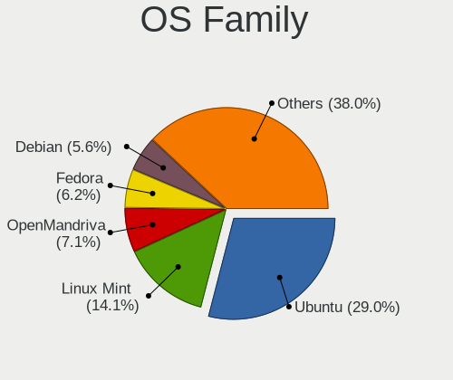
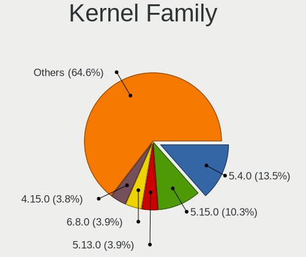
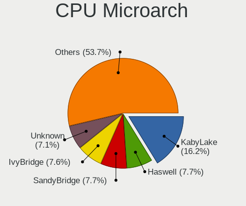
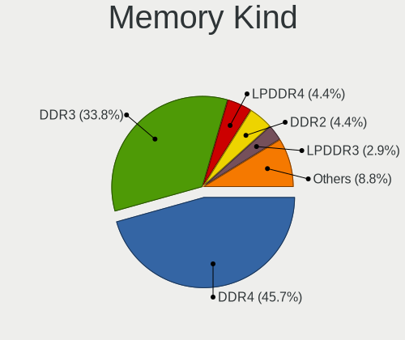

Linux in Germany - Tested Hardware & Statistics (Notebooks)
-----------------------------------------------------------

A project to collect tested hardware configurations for Linux in Germany.

Anyone can contribute to this report by the [hw-probe](https://github.com/linuxhw/hw-probe) tool:

    sudo -E hw-probe -all -upload

Please contribute! Especially if your hardware is rare.

Contents
--------

* [ Test Cases ](#test-cases)

* [ System ](#system)
  - [ OS                       ](#os)
  - [ OS Family                ](#os-family)
  - [ Kernel                   ](#kernel)
  - [ Kernel Family            ](#kernel-family)
  - [ Kernel Major Ver.        ](#kernel-major-ver)
  - [ Arch                     ](#arch)
  - [ DE                       ](#de)
  - [ Display Server           ](#display-server)
  - [ Display Manager          ](#display-manager)
  - [ OS Lang                  ](#os-lang)
  - [ Boot Mode                ](#boot-mode)
  - [ Filesystem               ](#filesystem)
  - [ Part. scheme             ](#part-scheme)
  - [ Dual Boot with Linux/BSD ](#dual-boot-with-linuxbsd)
  - [ Dual Boot (Win)          ](#dual-boot-win)

* [ Board ](#board)
  - [ Vendor                   ](#vendor)
  - [ Model                    ](#model)
  - [ Model Family             ](#model-family)
  - [ MFG Year                 ](#mfg-year)
  - [ Form Factor              ](#form-factor)
  - [ Secure Boot              ](#secure-boot)
  - [ Coreboot                 ](#coreboot)
  - [ RAM Size                 ](#ram-size)
  - [ RAM Used                 ](#ram-used)
  - [ Total Drives             ](#total-drives)
  - [ Has CD-ROM               ](#has-cd-rom)
  - [ Has Ethernet             ](#has-ethernet)
  - [ Has WiFi                 ](#has-wifi)
  - [ Has Bluetooth            ](#has-bluetooth)

* [ Location ](#location)
  - [ Country                  ](#country)
  - [ City                     ](#city)

* [ Drives ](#drives)
  - [ Drive Vendor             ](#drive-vendor)
  - [ Drive Model              ](#drive-model)
  - [ HDD Vendor               ](#hdd-vendor)
  - [ SSD Vendor               ](#ssd-vendor)
  - [ Drive Kind               ](#drive-kind)
  - [ Drive Connector          ](#drive-connector)
  - [ Drive Size               ](#drive-size)
  - [ Space Total              ](#space-total)
  - [ Space Used               ](#space-used)
  - [ Malfunc. Drives          ](#malfunc-drives)
  - [ Malfunc. Drive Vendor    ](#malfunc-drive-vendor)
  - [ Malfunc. HDD Vendor      ](#malfunc-hdd-vendor)
  - [ Malfunc. Drive Kind      ](#malfunc-drive-kind)
  - [ Failed Drives            ](#failed-drives)
  - [ Failed Drive Vendor      ](#failed-drive-vendor)
  - [ Drive Status             ](#drive-status)

* [ Storage controller ](#storage-controller)
  - [ Storage Vendor           ](#storage-vendor)
  - [ Storage Model            ](#storage-model)
  - [ Storage Kind             ](#storage-kind)

* [ Processor ](#processor)
  - [ CPU Vendor               ](#cpu-vendor)
  - [ CPU Model                ](#cpu-model)
  - [ CPU Model Family         ](#cpu-model-family)
  - [ CPU Cores                ](#cpu-cores)
  - [ CPU Sockets              ](#cpu-sockets)
  - [ CPU Threads              ](#cpu-threads)
  - [ CPU Op-Modes             ](#cpu-op-modes)
  - [ CPU Microcode            ](#cpu-microcode)
  - [ CPU Microarch            ](#cpu-microarch)

* [ Graphics ](#graphics)
  - [ GPU Vendor               ](#gpu-vendor)
  - [ GPU Model                ](#gpu-model)
  - [ GPU Combo                ](#gpu-combo)
  - [ GPU Driver               ](#gpu-driver)
  - [ GPU Memory               ](#gpu-memory)

* [ Monitor ](#monitor)
  - [ Monitor Vendor           ](#monitor-vendor)
  - [ Monitor Model            ](#monitor-model)
  - [ Monitor Resolution       ](#monitor-resolution)
  - [ Monitor Diagonal         ](#monitor-diagonal)
  - [ Monitor Width            ](#monitor-width)
  - [ Aspect Ratio             ](#aspect-ratio)
  - [ Monitor Area             ](#monitor-area)
  - [ Pixel Density            ](#pixel-density)
  - [ Multiple Monitors        ](#multiple-monitors)

* [ Network ](#network)
  - [ Net Controller Vendor    ](#net-controller-vendor)
  - [ Net Controller Model     ](#net-controller-model)
  - [ Wireless Vendor          ](#wireless-vendor)
  - [ Wireless Model           ](#wireless-model)
  - [ Ethernet Vendor          ](#ethernet-vendor)
  - [ Ethernet Model           ](#ethernet-model)
  - [ Net Controller Kind      ](#net-controller-kind)
  - [ Used Controller          ](#used-controller)
  - [ NICs                     ](#nics)
  - [ IPv6                     ](#ipv6)

* [ Bluetooth ](#bluetooth)
  - [ Bluetooth Vendor         ](#bluetooth-vendor)
  - [ Bluetooth Model          ](#bluetooth-model)

* [ Sound ](#sound)
  - [ Sound Vendor             ](#sound-vendor)
  - [ Sound Model              ](#sound-model)

* [ Memory ](#memory)
  - [ Memory Vendor            ](#memory-vendor)
  - [ Memory Model             ](#memory-model)
  - [ Memory Kind              ](#memory-kind)
  - [ Memory Form Factor       ](#memory-form-factor)
  - [ Memory Size              ](#memory-size)
  - [ Memory Speed             ](#memory-speed)

* [ Printers & scanners ](#printers--scanners)
  - [ Printer Vendor           ](#printer-vendor)
  - [ Printer Model            ](#printer-model)
  - [ Scanner Vendor           ](#scanner-vendor)
  - [ Scanner Model            ](#scanner-model)

* [ Camera ](#camera)
  - [ Camera Vendor            ](#camera-vendor)
  - [ Camera Model             ](#camera-model)

* [ Security ](#security)
  - [ Fingerprint Vendor       ](#fingerprint-vendor)
  - [ Fingerprint Model        ](#fingerprint-model)
  - [ Chipcard Vendor          ](#chipcard-vendor)
  - [ Chipcard Model           ](#chipcard-model)

* [ Unsupported ](#unsupported)
  - [ Unsupported Devices      ](#unsupported-devices)
  - [ Unsupported Device Types ](#unsupported-device-types)

Test Cases
----------

Total: 17926

| Vendor        | Model                       | Probe                                                      | Date         |
|---------------|-----------------------------|------------------------------------------------------------|--------------|
| Acer          | Aspire V5-573G              | [869a029714](https://linux-hardware.org/?probe=869a029714) | Feb 02, 2024 |
| Samsung       | 550P5C/550P7C               | [4d9464ae33](https://linux-hardware.org/?probe=4d9464ae33) | Feb 02, 2024 |
| Medion        | E7214                       | [cb37ec8f5d](https://linux-hardware.org/?probe=cb37ec8f5d) | Feb 02, 2024 |
| Acer          | Aspire A517-51G             | [2788a21644](https://linux-hardware.org/?probe=2788a21644) | Feb 02, 2024 |
| Dell          | XPS 15 7590                 | [214b9d35cb](https://linux-hardware.org/?probe=214b9d35cb) | Feb 02, 2024 |
| Acer          | Aspire 5741G                | [935470b35c](https://linux-hardware.org/?probe=935470b35c) | Feb 02, 2024 |
| Lenovo        | ThinkPad X270 W10DG 20K5... | [e7400919cd](https://linux-hardware.org/?probe=e7400919cd) | Feb 02, 2024 |
| Acer          | Aspire V3-772               | [4a32c0297c](https://linux-hardware.org/?probe=4a32c0297c) | Feb 02, 2024 |
| Dell          | Precision 7550              | [c210fa0d97](https://linux-hardware.org/?probe=c210fa0d97) | Feb 02, 2024 |
| Acer          | Aspire 5741G                | [d598afdbe9](https://linux-hardware.org/?probe=d598afdbe9) | Feb 02, 2024 |
| Toshiba       | Satellite L50D-B            | [49e28cce05](https://linux-hardware.org/?probe=49e28cce05) | Feb 02, 2024 |
| Notebook      | V15x_V17xRNx                | [901e71289e](https://linux-hardware.org/?probe=901e71289e) | Feb 02, 2024 |
| Schenker      | XMG PRO (Late 2021)         | [502d4a5570](https://linux-hardware.org/?probe=502d4a5570) | Feb 02, 2024 |
| Dell          | Latitude 5511               | [e7d3018c34](https://linux-hardware.org/?probe=e7d3018c34) | Feb 02, 2024 |
| Apple         | MacBookPro11,3              | [5bc93c37fa](https://linux-hardware.org/?probe=5bc93c37fa) | Feb 02, 2024 |
| HP            | EliteBook 2570p             | [59778f5513](https://linux-hardware.org/?probe=59778f5513) | Feb 02, 2024 |
| Lenovo        | ThinkPad T410 2537AF8       | [88794835fb](https://linux-hardware.org/?probe=88794835fb) | Feb 02, 2024 |
| Acer          | Aspire A315-54              | [3621142f4d](https://linux-hardware.org/?probe=3621142f4d) | Feb 02, 2024 |
| Schenker      | XMG PRO (Late 2021)         | [0bd25ae10e](https://linux-hardware.org/?probe=0bd25ae10e) | Feb 02, 2024 |
| HP            | EliteBook Revolve 810 G2    | [788fb13f23](https://linux-hardware.org/?probe=788fb13f23) | Feb 02, 2024 |
| Dell          | Latitude 7280               | [c94b45b8f4](https://linux-hardware.org/?probe=c94b45b8f4) | Feb 02, 2024 |
| HP            | EliteBook 840 G6            | [6cac3b71e0](https://linux-hardware.org/?probe=6cac3b71e0) | Feb 01, 2024 |
| HP            | 255 15.6 inch G10           | [86bdc742bd](https://linux-hardware.org/?probe=86bdc742bd) | Feb 01, 2024 |
| Acer          | Aspire ES1-523              | [4344e68c86](https://linux-hardware.org/?probe=4344e68c86) | Feb 01, 2024 |
| Acer          | TravelMate 7740G            | [78bfa1b270](https://linux-hardware.org/?probe=78bfa1b270) | Feb 01, 2024 |
| Dell          | Latitude 5511               | [910488f306](https://linux-hardware.org/?probe=910488f306) | Feb 01, 2024 |
| Lenovo        | ThinkPad T495 20NKS1XW08    | [62286dc8d9](https://linux-hardware.org/?probe=62286dc8d9) | Feb 01, 2024 |
| Lenovo        | ThinkPad E15 Gen 4 21E60... | [fb180a9a54](https://linux-hardware.org/?probe=fb180a9a54) | Feb 01, 2024 |
| Lenovo        | ThinkPad X280 20KES4TD0T    | [4af2fc13f4](https://linux-hardware.org/?probe=4af2fc13f4) | Feb 01, 2024 |
| Lenovo        | V17 G4 IRU 83A2             | [f33e772962](https://linux-hardware.org/?probe=f33e772962) | Feb 01, 2024 |
| Acer          | Aspire A315-53              | [a3fde61a8b](https://linux-hardware.org/?probe=a3fde61a8b) | Feb 01, 2024 |
| HP            | EliteBook 1050 G1           | [8799a2e9ae](https://linux-hardware.org/?probe=8799a2e9ae) | Feb 01, 2024 |
| HP            | EliteBook 1050 G1           | [c95847728d](https://linux-hardware.org/?probe=c95847728d) | Feb 01, 2024 |
| Apple         | MacBookAir6,2               | [ae8af70d31](https://linux-hardware.org/?probe=ae8af70d31) | Feb 01, 2024 |
| Apple         | MacBookAir6,2               | [b42c35c70b](https://linux-hardware.org/?probe=b42c35c70b) | Feb 01, 2024 |
| Apple         | MacBookPro11,2              | [92dd523802](https://linux-hardware.org/?probe=92dd523802) | Feb 01, 2024 |
| Fujitsu       | LIFEBOOK E752               | [5bd3d39655](https://linux-hardware.org/?probe=5bd3d39655) | Feb 01, 2024 |
| Sony          | SVE14A1V1EW                 | [0323c38fe4](https://linux-hardware.org/?probe=0323c38fe4) | Jan 31, 2024 |
| HP            | EliteBook 8560w             | [6d3b73b144](https://linux-hardware.org/?probe=6d3b73b144) | Jan 31, 2024 |
| ASUSTek       | X555LD                      | [bc95890dcd](https://linux-hardware.org/?probe=bc95890dcd) | Jan 31, 2024 |
| Lenovo        | ThinkPad X1 Carbon Gen 1... | [a84c65f63e](https://linux-hardware.org/?probe=a84c65f63e) | Jan 31, 2024 |
| HP            | EliteBook 2570p             | [7d98ca3c90](https://linux-hardware.org/?probe=7d98ca3c90) | Jan 31, 2024 |
| ASUSTek       | Zenbook UX5401ZAS_UX5401... | [36be131f18](https://linux-hardware.org/?probe=36be131f18) | Jan 31, 2024 |
| Lenovo        | IdeaPad 330-17IKB 81DM      | [3bba660f51](https://linux-hardware.org/?probe=3bba660f51) | Jan 31, 2024 |
| ASUSTek       | PRIME X670E-PRO WIFI        | [4af4b18a2c](https://linux-hardware.org/?probe=4af4b18a2c) | Jan 31, 2024 |
| ASUSTek       | VivoBook_ASUSLaptop M160... | [69eca6c154](https://linux-hardware.org/?probe=69eca6c154) | Jan 31, 2024 |
| Lenovo        | ThinkPad X1 Carbon 7th 2... | [afbbc9ebf0](https://linux-hardware.org/?probe=afbbc9ebf0) | Jan 31, 2024 |
| ASUSTek       | N55SF                       | [03c3d9aa25](https://linux-hardware.org/?probe=03c3d9aa25) | Jan 31, 2024 |
| Acer          | Aspire ES1-523              | [aece88cd9b](https://linux-hardware.org/?probe=aece88cd9b) | Jan 31, 2024 |
| Google        | Cyan                        | [15ee2dfc2f](https://linux-hardware.org/?probe=15ee2dfc2f) | Jan 30, 2024 |
| Acer          | Swift SFE16-43              | [efdafdd6fc](https://linux-hardware.org/?probe=efdafdd6fc) | Jan 30, 2024 |
| Acer          | Aspire E1-572G              | [78a08c286e](https://linux-hardware.org/?probe=78a08c286e) | Jan 30, 2024 |
| Acer          | Aspire E1-572G              | [a23343d32d](https://linux-hardware.org/?probe=a23343d32d) | Jan 30, 2024 |
| Apple         | MacBook8,1                  | [9580d3149f](https://linux-hardware.org/?probe=9580d3149f) | Jan 30, 2024 |
| Lenovo        | ThinkPad X1 Carbon Gen 8... | [1669d54762](https://linux-hardware.org/?probe=1669d54762) | Jan 30, 2024 |
| Medion        | X781X                       | [3665eaa65c](https://linux-hardware.org/?probe=3665eaa65c) | Jan 30, 2024 |
| Fujitsu       | LIFEBOOK E5512A             | [e4d7a0ca3a](https://linux-hardware.org/?probe=e4d7a0ca3a) | Jan 30, 2024 |
| ASUSTek       | VivoBook_ASUSLaptop K370... | [e935a209d7](https://linux-hardware.org/?probe=e935a209d7) | Jan 30, 2024 |
| Lenovo        | ThinkPad X1 Carbon Gen 1... | [69f602b6c5](https://linux-hardware.org/?probe=69f602b6c5) | Jan 30, 2024 |
| ASUSTek       | VivoBook_ASUSLaptop K370... | [4a1a726464](https://linux-hardware.org/?probe=4a1a726464) | Jan 30, 2024 |
| Lenovo        | ThinkPad X1 Carbon Gen 1... | [89f648ad66](https://linux-hardware.org/?probe=89f648ad66) | Jan 30, 2024 |
| Dell          | XPS 13 9360                 | [fb5ea12034](https://linux-hardware.org/?probe=fb5ea12034) | Jan 30, 2024 |
| Lenovo        | ThinkPad T495 20NKS1XW08    | [a046c5e912](https://linux-hardware.org/?probe=a046c5e912) | Jan 30, 2024 |
| Lenovo        | ThinkPad T495 20NKS1XW08    | [b15caee983](https://linux-hardware.org/?probe=b15caee983) | Jan 30, 2024 |
| Lenovo        | ThinkPad T410 2537AT1       | [54b5a51811](https://linux-hardware.org/?probe=54b5a51811) | Jan 30, 2024 |
| Lenovo        | IdeaPad 3 15ADA05 81W1      | [dafe3d53e0](https://linux-hardware.org/?probe=dafe3d53e0) | Jan 29, 2024 |
| MSI           | Modern 14 C12M              | [39450e20cc](https://linux-hardware.org/?probe=39450e20cc) | Jan 29, 2024 |
| Dell          | XPS 15 7590                 | [0db74aab7e](https://linux-hardware.org/?probe=0db74aab7e) | Jan 29, 2024 |
| Medion        | P7612                       | [875d083de0](https://linux-hardware.org/?probe=875d083de0) | Jan 29, 2024 |
| HP            | Compaq 615                  | [907b046dda](https://linux-hardware.org/?probe=907b046dda) | Jan 29, 2024 |
| Fujitsu       | LIFEBOOK E744               | [0bdbea7dcb](https://linux-hardware.org/?probe=0bdbea7dcb) | Jan 29, 2024 |
| Fujitsu       | LIFEBOOK E744               | [3e03ee6e0f](https://linux-hardware.org/?probe=3e03ee6e0f) | Jan 29, 2024 |
| Lenovo        | ThinkPad T490 20N3001EGE    | [5681d42b6e](https://linux-hardware.org/?probe=5681d42b6e) | Jan 29, 2024 |
| Lenovo        | ThinkPad T490 20N3001EGE    | [d8866aae44](https://linux-hardware.org/?probe=d8866aae44) | Jan 29, 2024 |
| HUAWEI        | HKD-WXX                     | [7c98d9521b](https://linux-hardware.org/?probe=7c98d9521b) | Jan 29, 2024 |
| Lenovo        | ThinkPad T450s 20BWS3ET0... | [e9f16865c3](https://linux-hardware.org/?probe=e9f16865c3) | Jan 29, 2024 |
| Lenovo        | ThinkPad X230 2325SU3       | [664fffd47e](https://linux-hardware.org/?probe=664fffd47e) | Jan 29, 2024 |
| Lenovo        | ThinkPad X230 2325SU3       | [cc42f2d5e4](https://linux-hardware.org/?probe=cc42f2d5e4) | Jan 29, 2024 |
| Acer          | Aspire 5741G                | [9c171324e3](https://linux-hardware.org/?probe=9c171324e3) | Jan 29, 2024 |
| Medion        | P15648                      | [d906da0d95](https://linux-hardware.org/?probe=d906da0d95) | Jan 29, 2024 |
| HP            | ProBook 4530s               | [6135fed286](https://linux-hardware.org/?probe=6135fed286) | Jan 28, 2024 |
| Apple         | MacBookPro14,1              | [9137138717](https://linux-hardware.org/?probe=9137138717) | Jan 28, 2024 |
| Lenovo        | IdeaPad 3 15ADA05 81W1      | [cab252fea3](https://linux-hardware.org/?probe=cab252fea3) | Jan 28, 2024 |
| Medion        | P651x series                | [078e2924c4](https://linux-hardware.org/?probe=078e2924c4) | Jan 28, 2024 |
| Dell          | Latitude 7530               | [ff36f2cfcc](https://linux-hardware.org/?probe=ff36f2cfcc) | Jan 28, 2024 |
| HP            | ENVY Laptop 15-ep0xxx       | [c2d0dabb5e](https://linux-hardware.org/?probe=c2d0dabb5e) | Jan 28, 2024 |
| Lenovo        | Flex 2-15D 20377            | [4f358fd188](https://linux-hardware.org/?probe=4f358fd188) | Jan 28, 2024 |
| Dell          | Latitude 7380               | [d11324e996](https://linux-hardware.org/?probe=d11324e996) | Jan 28, 2024 |
| Dell          | Latitude 7380               | [c383a1c7dc](https://linux-hardware.org/?probe=c383a1c7dc) | Jan 28, 2024 |
| Lenovo        | G575 4383                   | [47bcf0e076](https://linux-hardware.org/?probe=47bcf0e076) | Jan 28, 2024 |
| Dell          | Inspiron 5415               | [c7bd6068fa](https://linux-hardware.org/?probe=c7bd6068fa) | Jan 28, 2024 |
| ASUSTek       | X205TA                      | [83899dcb83](https://linux-hardware.org/?probe=83899dcb83) | Jan 27, 2024 |
| Framework     | Laptop 13 (AMD Ryzen 704... | [93970413c7](https://linux-hardware.org/?probe=93970413c7) | Jan 27, 2024 |
| HP            | ProBook 6555b               | [53f9430f98](https://linux-hardware.org/?probe=53f9430f98) | Jan 27, 2024 |
| HP            | 350 G2                      | [ad55cbfa8a](https://linux-hardware.org/?probe=ad55cbfa8a) | Jan 27, 2024 |
| Lenovo        | ThinkPad T490s 20NYS1AM0... | [eb0027485d](https://linux-hardware.org/?probe=eb0027485d) | Jan 27, 2024 |
| Lenovo        | ThinkPad X230 2325BA3       | [700fc5c431](https://linux-hardware.org/?probe=700fc5c431) | Jan 27, 2024 |
| Dell          | Latitude 5310               | [334e579e92](https://linux-hardware.org/?probe=334e579e92) | Jan 27, 2024 |
| Lenovo        | ThinkPad T480s 20L7001SG... | [bb998df843](https://linux-hardware.org/?probe=bb998df843) | Jan 27, 2024 |
| Lenovo        | ThinkPad T480s 20L7001SG... | [5810c5dc2b](https://linux-hardware.org/?probe=5810c5dc2b) | Jan 27, 2024 |
| Acer          | Aspire A317-32              | [9baf9646df](https://linux-hardware.org/?probe=9baf9646df) | Jan 27, 2024 |
| Lenovo        | ThinkPad T400 6474AW6       | [0ddfcaf599](https://linux-hardware.org/?probe=0ddfcaf599) | Jan 27, 2024 |
| Lenovo        | IdeaPad Z360                | [4aa5d9bed9](https://linux-hardware.org/?probe=4aa5d9bed9) | Jan 27, 2024 |
| Lenovo        | ThinkPad T490s 20NYS1AM0... | [48a5f801fc](https://linux-hardware.org/?probe=48a5f801fc) | Jan 27, 2024 |
| Valve         | Jupiter                     | [8ae43fed66](https://linux-hardware.org/?probe=8ae43fed66) | Jan 27, 2024 |
| Dell          | Latitude E5250              | [29a9f5d01c](https://linux-hardware.org/?probe=29a9f5d01c) | Jan 26, 2024 |
| Lenovo        | ThinkPad T530 2394EN6       | [4110faba77](https://linux-hardware.org/?probe=4110faba77) | Jan 26, 2024 |
| Acer          | Aspire VN7-793G             | [ad72ab37d3](https://linux-hardware.org/?probe=ad72ab37d3) | Jan 26, 2024 |
| Fujitsu       | LIFEBOOK E548               | [515098ce8f](https://linux-hardware.org/?probe=515098ce8f) | Jan 26, 2024 |
| Lenovo        | IdeaPad C340-14API 81N6     | [ad13a93817](https://linux-hardware.org/?probe=ad13a93817) | Jan 26, 2024 |
| Apple         | MacBookPro8,1               | [fa96de4635](https://linux-hardware.org/?probe=fa96de4635) | Jan 26, 2024 |
| Apple         | MacBookPro8,1               | [90c57cfb01](https://linux-hardware.org/?probe=90c57cfb01) | Jan 26, 2024 |
| Dell          | Latitude 7530               | [e1cd3d26e8](https://linux-hardware.org/?probe=e1cd3d26e8) | Jan 26, 2024 |
| HP            | Falco                       | [9a82a5b9e8](https://linux-hardware.org/?probe=9a82a5b9e8) | Jan 26, 2024 |
| Notebook      | W35xSTQ_370ST               | [1f9e3c577b](https://linux-hardware.org/?probe=1f9e3c577b) | Jan 26, 2024 |
| TUXEDO        | Aura 15 Gen1                | [27fa584690](https://linux-hardware.org/?probe=27fa584690) | Jan 26, 2024 |
| Lenovo        | IdeaPad Z360                | [4a2c8d2c92](https://linux-hardware.org/?probe=4a2c8d2c92) | Jan 26, 2024 |
| HP            | Victus by Gaming Laptop ... | [510b7f5cc7](https://linux-hardware.org/?probe=510b7f5cc7) | Jan 26, 2024 |
| Lenovo        | IdeaPad 3 15ADA05 81W1      | [87d6398f5b](https://linux-hardware.org/?probe=87d6398f5b) | Jan 26, 2024 |
| HUAWEI        | MACHC-WAX9                  | [4cfadd11cf](https://linux-hardware.org/?probe=4cfadd11cf) | Jan 26, 2024 |
| HP            | 650                         | [d440902ea2](https://linux-hardware.org/?probe=d440902ea2) | Jan 26, 2024 |
| HP            | EliteBook 845 14 inch G1... | [c890800eff](https://linux-hardware.org/?probe=c890800eff) | Jan 26, 2024 |
| ASUSTek       | X550VXK                     | [4f8a5aa2c2](https://linux-hardware.org/?probe=4f8a5aa2c2) | Jan 26, 2024 |
| Toshiba       | Satellite C670D-12Q         | [a9a2651adc](https://linux-hardware.org/?probe=a9a2651adc) | Jan 26, 2024 |
| ASUSTek       | GR8                         | [f43a22b48b](https://linux-hardware.org/?probe=f43a22b48b) | Jan 26, 2024 |
| Dell          | Latitude 5520               | [474446918a](https://linux-hardware.org/?probe=474446918a) | Jan 26, 2024 |
| Apple         | MacBookPro11,5              | [d7308911e4](https://linux-hardware.org/?probe=d7308911e4) | Jan 26, 2024 |
| HP            | Spectre Notebook            | [e98f815ca2](https://linux-hardware.org/?probe=e98f815ca2) | Jan 26, 2024 |
| Dell          | Latitude E6420              | [f4dcc8c239](https://linux-hardware.org/?probe=f4dcc8c239) | Jan 26, 2024 |
| Dell          | XPS 15 9570                 | [4b9ba374ee](https://linux-hardware.org/?probe=4b9ba374ee) | Jan 25, 2024 |
| Lenovo        | ThinkPad X230 2325BA3       | [279854db8e](https://linux-hardware.org/?probe=279854db8e) | Jan 25, 2024 |
| HP            | ProBook 450 G1              | [97c68df9c0](https://linux-hardware.org/?probe=97c68df9c0) | Jan 25, 2024 |
| Apple         | MacBookAir7,2               | [8f3ed76279](https://linux-hardware.org/?probe=8f3ed76279) | Jan 25, 2024 |
| Lenovo        | ThinkPad Twist 334729G      | [0a17051b66](https://linux-hardware.org/?probe=0a17051b66) | Jan 25, 2024 |
| Acer          | Aspire ES1-731              | [588518fe62](https://linux-hardware.org/?probe=588518fe62) | Jan 25, 2024 |
| Medion        | S14409                      | [8e8339905a](https://linux-hardware.org/?probe=8e8339905a) | Jan 25, 2024 |
| Google        | Bobba360                    | [a4c97c836d](https://linux-hardware.org/?probe=a4c97c836d) | Jan 25, 2024 |
| Dell          | Latitude E5470              | [25f5da470b](https://linux-hardware.org/?probe=25f5da470b) | Jan 24, 2024 |
| Toshiba       | Satellite R630              | [c888a8f4d5](https://linux-hardware.org/?probe=c888a8f4d5) | Jan 24, 2024 |
| Google        | Bobba360                    | [0b03c9a8f7](https://linux-hardware.org/?probe=0b03c9a8f7) | Jan 24, 2024 |
| Lenovo        | ThinkPad T540p 20BFS2100... | [1bf8988f36](https://linux-hardware.org/?probe=1bf8988f36) | Jan 24, 2024 |
| Lenovo        | ThinkPad T540p 20BFS2100... | [08b929fe37](https://linux-hardware.org/?probe=08b929fe37) | Jan 24, 2024 |
| HP            | Laptop 15s-eq1xxx           | [667112adce](https://linux-hardware.org/?probe=667112adce) | Jan 24, 2024 |
| HP            | EliteBook 2570p             | [34093d035a](https://linux-hardware.org/?probe=34093d035a) | Jan 24, 2024 |
| HP            | ZBook Firefly 14 inch G1... | [0bbf1a1e3d](https://linux-hardware.org/?probe=0bbf1a1e3d) | Jan 24, 2024 |
| Fujitsu       | LIFEBOOK E736               | [7f0a2dd840](https://linux-hardware.org/?probe=7f0a2dd840) | Jan 24, 2024 |
| Apple         | MacBookPro11,4              | [c63b13e441](https://linux-hardware.org/?probe=c63b13e441) | Jan 24, 2024 |
| Apple         | MacBookPro11,4              | [f48a5f9d3c](https://linux-hardware.org/?probe=f48a5f9d3c) | Jan 24, 2024 |
| Lenovo        | U41-70 80JV                 | [48ea1ff4a5](https://linux-hardware.org/?probe=48ea1ff4a5) | Jan 24, 2024 |
| Acer          | Aspire E5-573G              | [14eec10d5e](https://linux-hardware.org/?probe=14eec10d5e) | Jan 24, 2024 |
| Fujitsu       | LIFEBOOK E780               | [d26e825efc](https://linux-hardware.org/?probe=d26e825efc) | Jan 23, 2024 |
| Toshiba       | Satellite C660              | [b1d19ad191](https://linux-hardware.org/?probe=b1d19ad191) | Jan 23, 2024 |
| Lenovo        | ThinkPad T420s 4174HR1      | [ab4b7bc31f](https://linux-hardware.org/?probe=ab4b7bc31f) | Jan 23, 2024 |
| Lenovo        | ThinkPad W541 20EGS3630P    | [1cca38d87f](https://linux-hardware.org/?probe=1cca38d87f) | Jan 23, 2024 |
| Lenovo        | ThinkPad X220 4290W4H       | [067daab9fb](https://linux-hardware.org/?probe=067daab9fb) | Jan 23, 2024 |
| Lenovo        | V17 G2 ITL 82NX             | [40f906871e](https://linux-hardware.org/?probe=40f906871e) | Jan 22, 2024 |
| Dell          | Latitude D610               | [b1f24babef](https://linux-hardware.org/?probe=b1f24babef) | Jan 22, 2024 |
| Acer          | Aspire 7736                 | [47521c1811](https://linux-hardware.org/?probe=47521c1811) | Jan 22, 2024 |
| Lenovo        | ThinkPad T460 20FMS0HB00    | [67c8620ffa](https://linux-hardware.org/?probe=67c8620ffa) | Jan 22, 2024 |
| Fujitsu       | LIFEBOOK U7412              | [e5a97a5300](https://linux-hardware.org/?probe=e5a97a5300) | Jan 22, 2024 |
| Acer          | Aspire E1-570               | [bbe5568412](https://linux-hardware.org/?probe=bbe5568412) | Jan 22, 2024 |
| ASUSTek       | G2S                         | [534f9d0459](https://linux-hardware.org/?probe=534f9d0459) | Jan 22, 2024 |
| ASUSTek       | X751SA                      | [2da0669a42](https://linux-hardware.org/?probe=2da0669a42) | Jan 22, 2024 |
| HP            | Compaq CQ58                 | [e15554b4ae](https://linux-hardware.org/?probe=e15554b4ae) | Jan 22, 2024 |
| Fujitsu       | LIFEBOOK U748               | [59122c1f76](https://linux-hardware.org/?probe=59122c1f76) | Jan 22, 2024 |
| ASUSTek       | UX410UAK                    | [1155ca8c5c](https://linux-hardware.org/?probe=1155ca8c5c) | Jan 22, 2024 |
| HP            | ProBook 430 G4              | [046036e7e3](https://linux-hardware.org/?probe=046036e7e3) | Jan 22, 2024 |
| Apple         | MacBookPro14,1              | [99f10901cf](https://linux-hardware.org/?probe=99f10901cf) | Jan 22, 2024 |
| HP            | ProBook 430 G4              | [262a8552de](https://linux-hardware.org/?probe=262a8552de) | Jan 22, 2024 |
| Acer          | Swift SF314-511             | [69ce4e086f](https://linux-hardware.org/?probe=69ce4e086f) | Jan 22, 2024 |
| Apple         | MacBookPro16,1              | [62447a80b3](https://linux-hardware.org/?probe=62447a80b3) | Jan 22, 2024 |
| Apple         | MacBookPro16,1              | [f9faae4b87](https://linux-hardware.org/?probe=f9faae4b87) | Jan 22, 2024 |
| Lenovo        | ThinkPad T470 W10DG 20JN... | [df52747427](https://linux-hardware.org/?probe=df52747427) | Jan 22, 2024 |
| Lenovo        | ThinkPad T420 4238AC6       | [8c171e6ffa](https://linux-hardware.org/?probe=8c171e6ffa) | Jan 22, 2024 |
| Valve         | Jupiter                     | [03734c93e6](https://linux-hardware.org/?probe=03734c93e6) | Jan 21, 2024 |
| HP            | Notebook                    | [efbf2736f3](https://linux-hardware.org/?probe=efbf2736f3) | Jan 21, 2024 |
| Acer          | Aspire V5-573G              | [3863fd85b0](https://linux-hardware.org/?probe=3863fd85b0) | Jan 21, 2024 |
| HP            | ProBook 4740s               | [681810a3c1](https://linux-hardware.org/?probe=681810a3c1) | Jan 21, 2024 |
| Fujitsu       | LIFEBOOK A555/G             | [f87640231d](https://linux-hardware.org/?probe=f87640231d) | Jan 21, 2024 |
| TUXEDO        | InfinityBook Pro Gen8 (M... | [379e6473d5](https://linux-hardware.org/?probe=379e6473d5) | Jan 21, 2024 |
| Samsung       | 700T                        | [7268026aa6](https://linux-hardware.org/?probe=7268026aa6) | Jan 21, 2024 |
| Fujitsu       | LIFEBOOK U7412              | [0e896e4c18](https://linux-hardware.org/?probe=0e896e4c18) | Jan 21, 2024 |
| Medion        | P15648                      | [1c94d72e42](https://linux-hardware.org/?probe=1c94d72e42) | Jan 21, 2024 |
| Medion        | P15648                      | [17cd0e622d](https://linux-hardware.org/?probe=17cd0e622d) | Jan 21, 2024 |
| HP            | Laptop 17-by0xxx            | [2e29855bb5](https://linux-hardware.org/?probe=2e29855bb5) | Jan 21, 2024 |
| ASUSTek       | T100HAN                     | [02f115dc2a](https://linux-hardware.org/?probe=02f115dc2a) | Jan 21, 2024 |
| ASUSTek       | ROG Zephyrus G14 GA401QM... | [5728acca29](https://linux-hardware.org/?probe=5728acca29) | Jan 20, 2024 |
| Sony          | SVF1421E2EW                 | [b28682a58b](https://linux-hardware.org/?probe=b28682a58b) | Jan 20, 2024 |
| Toshiba       | NB550D                      | [1f743ab40e](https://linux-hardware.org/?probe=1f743ab40e) | Jan 20, 2024 |
| Acer          | Aspire 1810T                | [068454b849](https://linux-hardware.org/?probe=068454b849) | Jan 20, 2024 |
| Acer          | AOD255E                     | [379ad2d74c](https://linux-hardware.org/?probe=379ad2d74c) | Jan 20, 2024 |
| Lenovo        | ThinkPad W550s 20E2CTO1W... | [b3466550df](https://linux-hardware.org/?probe=b3466550df) | Jan 20, 2024 |
| Toshiba       | Satellite L670D             | [4b7547d3d1](https://linux-hardware.org/?probe=4b7547d3d1) | Jan 20, 2024 |
| HP            | EliteBook 840 G8 Noteboo... | [a6f32a12ea](https://linux-hardware.org/?probe=a6f32a12ea) | Jan 20, 2024 |
| ASUSTek       | VivoBook_ASUSLaptop M160... | [56d9c9b9a1](https://linux-hardware.org/?probe=56d9c9b9a1) | Jan 20, 2024 |
| HP            | Laptop 17-by0xxx            | [bad5091b84](https://linux-hardware.org/?probe=bad5091b84) | Jan 20, 2024 |
| Dell          | Inspiron N5040              | [80702016eb](https://linux-hardware.org/?probe=80702016eb) | Jan 20, 2024 |
| HP            | EliteBook 840 G1            | [becbec6f26](https://linux-hardware.org/?probe=becbec6f26) | Jan 20, 2024 |
| Apple         | MacBookPro3,1               | [057f8b6477](https://linux-hardware.org/?probe=057f8b6477) | Jan 20, 2024 |
| Dell          | XPS 17 9700                 | [61c6fd00e2](https://linux-hardware.org/?probe=61c6fd00e2) | Jan 19, 2024 |
| Lenovo        | Legion 7 16ARHA7 82UH       | [f586c54d2c](https://linux-hardware.org/?probe=f586c54d2c) | Jan 19, 2024 |
| Acer          | Aspire V3-772G              | [3a9c2b29e1](https://linux-hardware.org/?probe=3a9c2b29e1) | Jan 19, 2024 |
| Dell          | Latitude E7470              | [ea12dbebde](https://linux-hardware.org/?probe=ea12dbebde) | Jan 19, 2024 |
| Dell          | XPS 15 7590                 | [f3a79354a8](https://linux-hardware.org/?probe=f3a79354a8) | Jan 19, 2024 |
| Unknown       | Unknown                     | [8be7dd2df4](https://linux-hardware.org/?probe=8be7dd2df4) | Jan 19, 2024 |
| Dell          | Precision 5680              | [0a88245ac9](https://linux-hardware.org/?probe=0a88245ac9) | Jan 19, 2024 |
| Medion        | S4216                       | [74fd2044d5](https://linux-hardware.org/?probe=74fd2044d5) | Jan 19, 2024 |
| Fujitsu       | LIFEBOOK E780               | [e98f42d33f](https://linux-hardware.org/?probe=e98f42d33f) | Jan 19, 2024 |
| ASUSTek       | ROG Zephyrus G14 GA401QM... | [35c8f1855d](https://linux-hardware.org/?probe=35c8f1855d) | Jan 19, 2024 |
| ASUSTek       | ROG Zephyrus G14 GA401QM... | [e555a2c32c](https://linux-hardware.org/?probe=e555a2c32c) | Jan 19, 2024 |
| Lenovo        | IdeaPad 320-15IAP 80XR      | [feffbde1cd](https://linux-hardware.org/?probe=feffbde1cd) | Jan 19, 2024 |
| Lenovo        | IdeaPad 320-15IAP 80XR      | [68cbc15eec](https://linux-hardware.org/?probe=68cbc15eec) | Jan 19, 2024 |
| GTZS          | Unknown                     | [6b926d1595](https://linux-hardware.org/?probe=6b926d1595) | Jan 19, 2024 |
| Valve         | Jupiter                     | [a64bc13a23](https://linux-hardware.org/?probe=a64bc13a23) | Jan 19, 2024 |
| HP            | Pavilion dv3500             | [907b397e09](https://linux-hardware.org/?probe=907b397e09) | Jan 18, 2024 |
| Dell          | Inspiron 1525               | [8c923deb75](https://linux-hardware.org/?probe=8c923deb75) | Jan 18, 2024 |
| HP            | Pavilion 17                 | [eaa179919d](https://linux-hardware.org/?probe=eaa179919d) | Jan 18, 2024 |
| Lenovo        | ThinkPad X1 Carbon 3rd 2... | [d40c2f48dd](https://linux-hardware.org/?probe=d40c2f48dd) | Jan 18, 2024 |
| Schenker      | N13xWU                      | [8aaa9891ee](https://linux-hardware.org/?probe=8aaa9891ee) | Jan 18, 2024 |
| Lenovo        | ThinkPad P1 Gen 4i 20Y4S... | [3b679561c7](https://linux-hardware.org/?probe=3b679561c7) | Jan 18, 2024 |
| Schenker      | N13xWU                      | [358f331708](https://linux-hardware.org/?probe=358f331708) | Jan 18, 2024 |
| Packard Be... | EasyNote TE69BM             | [351b144553](https://linux-hardware.org/?probe=351b144553) | Jan 18, 2024 |
| MSI           | GE72 6QD                    | [17fb69aaa6](https://linux-hardware.org/?probe=17fb69aaa6) | Jan 18, 2024 |
| HP            | Pavilion Laptop 15-cs2xx... | [5455618460](https://linux-hardware.org/?probe=5455618460) | Jan 18, 2024 |
| Acer          | Aspire 5750G                | [5cac95825f](https://linux-hardware.org/?probe=5cac95825f) | Jan 18, 2024 |
| Lenovo        | ThinkPad E580 20KS001JGE    | [079ef185ed](https://linux-hardware.org/?probe=079ef185ed) | Jan 18, 2024 |
| Valve         | Jupiter                     | [3fac9b5786](https://linux-hardware.org/?probe=3fac9b5786) | Jan 18, 2024 |
| Lenovo        | ThinkPad T460 20FMS08L00    | [4533bec49f](https://linux-hardware.org/?probe=4533bec49f) | Jan 18, 2024 |
| TUXEDO        | InfinityBook S 15 Gen6      | [c80a1f64fc](https://linux-hardware.org/?probe=c80a1f64fc) | Jan 18, 2024 |
| Dell          | Latitude E5550              | [2887bb49af](https://linux-hardware.org/?probe=2887bb49af) | Jan 17, 2024 |
| Fujitsu Si... | LIFEBOOK T5010              | [dbe2ea8160](https://linux-hardware.org/?probe=dbe2ea8160) | Jan 17, 2024 |
| HP            | Pavilion 15                 | [d2e6250a2b](https://linux-hardware.org/?probe=d2e6250a2b) | Jan 17, 2024 |
| MSI           | Alpha 17 C7VG               | [262343435e](https://linux-hardware.org/?probe=262343435e) | Jan 17, 2024 |
| Dell          | Latitude E6540              | [5f657f15c8](https://linux-hardware.org/?probe=5f657f15c8) | Jan 17, 2024 |
| HUAWEI        | MRGFG-XX                    | [826b284720](https://linux-hardware.org/?probe=826b284720) | Jan 17, 2024 |
| Lenovo        | V110-15IAP 80TG             | [682b5589eb](https://linux-hardware.org/?probe=682b5589eb) | Jan 17, 2024 |
| HP            | 255 15.6 inch G10           | [b852473447](https://linux-hardware.org/?probe=b852473447) | Jan 17, 2024 |
| Lenovo        | ThinkBook 14 G6 IRL 21KG    | [b624f93da2](https://linux-hardware.org/?probe=b624f93da2) | Jan 17, 2024 |
| Lenovo        | ThinkPad T450 20BUS1JD0B    | [90ef42b503](https://linux-hardware.org/?probe=90ef42b503) | Jan 17, 2024 |
| Lenovo        | ThinkPad T450 20BUS1JD0B    | [a3217b640d](https://linux-hardware.org/?probe=a3217b640d) | Jan 17, 2024 |
| HP            | ProBook 450 G6              | [6d71f55994](https://linux-hardware.org/?probe=6d71f55994) | Jan 17, 2024 |
| Lenovo        | ThinkPad X13 Gen 1 20T3S... | [0e05a50329](https://linux-hardware.org/?probe=0e05a50329) | Jan 16, 2024 |
| Dell          | Latitude E5550              | [0755281d4f](https://linux-hardware.org/?probe=0755281d4f) | Jan 16, 2024 |
| Dell          | Vostro 16 5635              | [41feffb377](https://linux-hardware.org/?probe=41feffb377) | Jan 16, 2024 |
| Dell          | Vostro 16 5635              | [087ee82354](https://linux-hardware.org/?probe=087ee82354) | Jan 16, 2024 |
| Acer          | Aspire V5-573G              | [bc839ed2af](https://linux-hardware.org/?probe=bc839ed2af) | Jan 16, 2024 |
| TUXEDO        | Aura 15 Gen2                | [28a227c7d1](https://linux-hardware.org/?probe=28a227c7d1) | Jan 16, 2024 |
| TUXEDO        | Pulse 15 Gen2               | [1ec6103b31](https://linux-hardware.org/?probe=1ec6103b31) | Jan 16, 2024 |
| TUXEDO        | Aura 15 Gen2                | [96e3e7f937](https://linux-hardware.org/?probe=96e3e7f937) | Jan 16, 2024 |
| Lenovo        | ThinkPad T580 20LAS5GE00    | [07609f8bbb](https://linux-hardware.org/?probe=07609f8bbb) | Jan 16, 2024 |
| Lenovo        | ThinkPad L412 0585A38       | [d3c2d88045](https://linux-hardware.org/?probe=d3c2d88045) | Jan 16, 2024 |
| ASUSTek       | ASUS TUF Gaming F15 FX50... | [ea249f8333](https://linux-hardware.org/?probe=ea249f8333) | Jan 16, 2024 |
| Lenovo        | ThinkPad SL 2746F2G         | [47b2e38ff4](https://linux-hardware.org/?probe=47b2e38ff4) | Jan 16, 2024 |
| Lenovo        | ThinkPad P14s Gen 3 21AK... | [6274216b05](https://linux-hardware.org/?probe=6274216b05) | Jan 16, 2024 |
| LG Electro... | P300-U.ABRAG                | [1336576fec](https://linux-hardware.org/?probe=1336576fec) | Jan 16, 2024 |
| Apple         | MacBookAir7,2               | [240262c43c](https://linux-hardware.org/?probe=240262c43c) | Jan 16, 2024 |
| Apple         | MacBookAir7,2               | [43f1d0cbe1](https://linux-hardware.org/?probe=43f1d0cbe1) | Jan 16, 2024 |
| Dell          | Latitude 3320               | [3846698872](https://linux-hardware.org/?probe=3846698872) | Jan 16, 2024 |
| Dell          | Latitude 3320               | [8fbe313e34](https://linux-hardware.org/?probe=8fbe313e34) | Jan 16, 2024 |
| Dell          | XPS 13 9360                 | [846113dc1c](https://linux-hardware.org/?probe=846113dc1c) | Jan 16, 2024 |
| Medion        | E6417 MD99252               | [02157451d7](https://linux-hardware.org/?probe=02157451d7) | Jan 15, 2024 |
| Lenovo        | ThinkBook 15 G3 ACL 21A4    | [17a792c82f](https://linux-hardware.org/?probe=17a792c82f) | Jan 15, 2024 |
| Lenovo        | G770 1037                   | [8cd3704440](https://linux-hardware.org/?probe=8cd3704440) | Jan 15, 2024 |
| Lenovo        | Legion 5 15ACH6A 82NW       | [c2a719d955](https://linux-hardware.org/?probe=c2a719d955) | Jan 15, 2024 |
| Lenovo        | ThinkPad Edge E530c 3366... | [45399ef111](https://linux-hardware.org/?probe=45399ef111) | Jan 15, 2024 |
| ASUSTek       | ASUS TUF Gaming F15 FX50... | [5712b0783d](https://linux-hardware.org/?probe=5712b0783d) | Jan 15, 2024 |
| HP            | 250 G7 Notebook PC          | [3b58774e8d](https://linux-hardware.org/?probe=3b58774e8d) | Jan 15, 2024 |
| Lenovo        | ThinkPad X270 20HMS12K00    | [246848e065](https://linux-hardware.org/?probe=246848e065) | Jan 15, 2024 |
| Lenovo        | ThinkPad X1 Carbon 7th 2... | [ac6ab2abea](https://linux-hardware.org/?probe=ac6ab2abea) | Jan 15, 2024 |
| TUXEDO        | Pulse 14 Gen3               | [f5bcb23ecb](https://linux-hardware.org/?probe=f5bcb23ecb) | Jan 15, 2024 |
| Apple         | MacBookAir6,2               | [9bf589844a](https://linux-hardware.org/?probe=9bf589844a) | Jan 14, 2024 |
| Acer          | Swift SF114-32              | [d57f586cff](https://linux-hardware.org/?probe=d57f586cff) | Jan 14, 2024 |
| Lenovo        | ThinkPad T440 20B7A07NGE    | [0038076556](https://linux-hardware.org/?probe=0038076556) | Jan 14, 2024 |
| ASUSTek       | G750JS                      | [ce24ff4784](https://linux-hardware.org/?probe=ce24ff4784) | Jan 14, 2024 |
| Dell          | Inspiron 13-5368            | [a6778c5783](https://linux-hardware.org/?probe=a6778c5783) | Jan 14, 2024 |
| Matsushita... | CF-30CTQAZBG                | [18a587bfa8](https://linux-hardware.org/?probe=18a587bfa8) | Jan 14, 2024 |
| Samsung       | 750XDA                      | [95d390939e](https://linux-hardware.org/?probe=95d390939e) | Jan 14, 2024 |
| Fujitsu       | LIFEBOOK S762               | [857a0ea926](https://linux-hardware.org/?probe=857a0ea926) | Jan 14, 2024 |
| Samsung       | R780                        | [68eae1df45](https://linux-hardware.org/?probe=68eae1df45) | Jan 14, 2024 |
| Lenovo        | ThinkPad X280 20KESAC100    | [888ed5a8d8](https://linux-hardware.org/?probe=888ed5a8d8) | Jan 14, 2024 |
| VALE          | Notebook Slim S132          | [32021c35d3](https://linux-hardware.org/?probe=32021c35d3) | Jan 14, 2024 |
| VALE          | Notebook Slim S132          | [0d2db2e184](https://linux-hardware.org/?probe=0d2db2e184) | Jan 14, 2024 |
| ASUSTek       | GR8                         | [e78c544c31](https://linux-hardware.org/?probe=e78c544c31) | Jan 14, 2024 |
| Samsung       | 700Z5A                      | [847f1c355d](https://linux-hardware.org/?probe=847f1c355d) | Jan 14, 2024 |
| Dell          | Latitude E7250              | [bd9ddc2751](https://linux-hardware.org/?probe=bd9ddc2751) | Jan 14, 2024 |
| Apple         | MacBookAir7,2               | [c5d8eebdd5](https://linux-hardware.org/?probe=c5d8eebdd5) | Jan 14, 2024 |
| Lenovo        | G50-45 80E3                 | [c6bd6c56d6](https://linux-hardware.org/?probe=c6bd6c56d6) | Jan 14, 2024 |
| HP            | Laptop 17-cp0xxx            | [31a7b00f76](https://linux-hardware.org/?probe=31a7b00f76) | Jan 14, 2024 |
| HP            | EliteBook 840 G2            | [33b3e5d03d](https://linux-hardware.org/?probe=33b3e5d03d) | Jan 14, 2024 |
| AXDIA Inte... | MYBOOK 14 PRO               | [9fcc01c1e0](https://linux-hardware.org/?probe=9fcc01c1e0) | Jan 14, 2024 |
| HP            | Laptop 17-cp0xxx            | [21c6fac67f](https://linux-hardware.org/?probe=21c6fac67f) | Jan 13, 2024 |
| ASUSTek       | X556UQK                     | [151b6ad9fb](https://linux-hardware.org/?probe=151b6ad9fb) | Jan 13, 2024 |
| Dell          | Inspiron 15-3552            | [2a9bde666e](https://linux-hardware.org/?probe=2a9bde666e) | Jan 13, 2024 |
| Dell          | Inspiron 15-3552            | [87e8f38d79](https://linux-hardware.org/?probe=87e8f38d79) | Jan 13, 2024 |
| HP            | EliteBook 830 G6            | [dc433d32e3](https://linux-hardware.org/?probe=dc433d32e3) | Jan 13, 2024 |
| Lenovo        | IdeaPad 100-15IBY 80MJ      | [6b6751dc04](https://linux-hardware.org/?probe=6b6751dc04) | Jan 13, 2024 |
| Samsung       | RV420/RV520/RV720/E3530/... | [8322720a7b](https://linux-hardware.org/?probe=8322720a7b) | Jan 13, 2024 |
| Lenovo        | Yoga Slim 7 Pro 14ARH7 8... | [be204b17d2](https://linux-hardware.org/?probe=be204b17d2) | Jan 13, 2024 |
| Lenovo        | ThinkPad E14 Gen 4 21ECS... | [587226a745](https://linux-hardware.org/?probe=587226a745) | Jan 13, 2024 |
| Toshiba       | Satellite R630              | [0e83a06873](https://linux-hardware.org/?probe=0e83a06873) | Jan 13, 2024 |
| MSI           | Katana 17 B13VGK            | [b886bf650f](https://linux-hardware.org/?probe=b886bf650f) | Jan 13, 2024 |
| ASUSTek       | X756UXK                     | [16c3f8c205](https://linux-hardware.org/?probe=16c3f8c205) | Jan 13, 2024 |
| Lenovo        | IdeaPad 530S-14ARR 81H1     | [4990997e50](https://linux-hardware.org/?probe=4990997e50) | Jan 13, 2024 |
| Acer          | Aspire A517-51G             | [5a9f65787f](https://linux-hardware.org/?probe=5a9f65787f) | Jan 13, 2024 |
| Dell          | Precision 7720              | [adec0c91d9](https://linux-hardware.org/?probe=adec0c91d9) | Jan 13, 2024 |
| ASUSTek       | G750JS                      | [a8eb3fc6f4](https://linux-hardware.org/?probe=a8eb3fc6f4) | Jan 13, 2024 |
| Lenovo        | ThinkPad X220 4291QQ1       | [ad00b0ae02](https://linux-hardware.org/?probe=ad00b0ae02) | Jan 13, 2024 |
| Dell          | Inspiron 15 3520            | [cec67d41f8](https://linux-hardware.org/?probe=cec67d41f8) | Jan 13, 2024 |
| Acer          | Aspire V3-771               | [a9176efd80](https://linux-hardware.org/?probe=a9176efd80) | Jan 12, 2024 |
| TUXEDO        | Pulse 14 Gen3               | [5e82c88e53](https://linux-hardware.org/?probe=5e82c88e53) | Jan 12, 2024 |
| Acer          | Aspire V5-573G              | [09ddfeab43](https://linux-hardware.org/?probe=09ddfeab43) | Jan 12, 2024 |
| Lenovo        | ThinkPad T410 25184QG       | [8e0a17e735](https://linux-hardware.org/?probe=8e0a17e735) | Jan 12, 2024 |
| Acer          | Aspire V5-571               | [703119fa5b](https://linux-hardware.org/?probe=703119fa5b) | Jan 12, 2024 |
| HP            | Notebook                    | [9742d3ad6f](https://linux-hardware.org/?probe=9742d3ad6f) | Jan 12, 2024 |
| Acer          | Aspire V5-571               | [b18cd90d9c](https://linux-hardware.org/?probe=b18cd90d9c) | Jan 12, 2024 |
| HP            | Pavilion Gaming Laptop 1... | [9bed62afaf](https://linux-hardware.org/?probe=9bed62afaf) | Jan 12, 2024 |
| Apple         | MacBookAir7,2               | [34e2dd985d](https://linux-hardware.org/?probe=34e2dd985d) | Jan 12, 2024 |
| MSI           | Katana 17 B13VFK            | [f5b006ea89](https://linux-hardware.org/?probe=f5b006ea89) | Jan 12, 2024 |
| MSI           | Alpha 17 C7VG               | [586cfee5f8](https://linux-hardware.org/?probe=586cfee5f8) | Jan 12, 2024 |
| HP            | Pavilion Aero Laptop 13-... | [27a04d94e5](https://linux-hardware.org/?probe=27a04d94e5) | Jan 12, 2024 |
| Lenovo        | ThinkPad T470s W10DG 20J... | [f782b74751](https://linux-hardware.org/?probe=f782b74751) | Jan 12, 2024 |
| HP            | Pavilion dv3500             | [bb0b003d81](https://linux-hardware.org/?probe=bb0b003d81) | Jan 12, 2024 |
| Acer          | TravelMate 5735Z            | [6d759892ab](https://linux-hardware.org/?probe=6d759892ab) | Jan 12, 2024 |
| Apple         | MacBookPro11,3              | [9297ef72df](https://linux-hardware.org/?probe=9297ef72df) | Jan 12, 2024 |
| Apple         | MacBookPro11,3              | [17fa0ca044](https://linux-hardware.org/?probe=17fa0ca044) | Jan 12, 2024 |
| Acer          | TravelMate 5735Z            | [2ad65584c2](https://linux-hardware.org/?probe=2ad65584c2) | Jan 11, 2024 |
| Lenovo        | ThinkPad T470 W10DG 20JN... | [70593d8eb2](https://linux-hardware.org/?probe=70593d8eb2) | Jan 11, 2024 |
| Unknown       | Unknown                     | [0f2d55f419](https://linux-hardware.org/?probe=0f2d55f419) | Jan 11, 2024 |
| Lenovo        | ThinkPad T470 W10DG 20JN... | [7378080744](https://linux-hardware.org/?probe=7378080744) | Jan 11, 2024 |
| HP            | ZBook Firefly 15 inch G8... | [1601348335](https://linux-hardware.org/?probe=1601348335) | Jan 11, 2024 |
| Lenovo        | ThinkPad T470 W10DG 20JN... | [d17724d57c](https://linux-hardware.org/?probe=d17724d57c) | Jan 11, 2024 |
| Unknown       | Unknown                     | [f5d4b22b3c](https://linux-hardware.org/?probe=f5d4b22b3c) | Jan 11, 2024 |
| HP            | Falco                       | [f6a8ee9181](https://linux-hardware.org/?probe=f6a8ee9181) | Jan 11, 2024 |
| Acer          | Aspire 5750G                | [856385e7a2](https://linux-hardware.org/?probe=856385e7a2) | Jan 11, 2024 |
| Medion        | S17403                      | [a1baabce52](https://linux-hardware.org/?probe=a1baabce52) | Jan 11, 2024 |
| Dell          | Latitude 7310               | [6f259b88a5](https://linux-hardware.org/?probe=6f259b88a5) | Jan 11, 2024 |
| Packard Be... | EasyNote LV44HC             | [54a820a7f0](https://linux-hardware.org/?probe=54a820a7f0) | Jan 11, 2024 |
| Packard Be... | EasyNote LV44HC             | [35faa306c7](https://linux-hardware.org/?probe=35faa306c7) | Jan 11, 2024 |
| Medion        | Akoya P2213T                | [156c59a514](https://linux-hardware.org/?probe=156c59a514) | Jan 11, 2024 |
| ASUSTek       | ASUS TUF Gaming A17 FA70... | [6462a9e611](https://linux-hardware.org/?probe=6462a9e611) | Jan 10, 2024 |
| Apple         | MacBookPro14,1              | [8762757dc7](https://linux-hardware.org/?probe=8762757dc7) | Jan 10, 2024 |
| ASUSTek       | ASUS TUF Gaming A17 FA70... | [145f213442](https://linux-hardware.org/?probe=145f213442) | Jan 10, 2024 |
| Lenovo        | IdeaPad Pro 5 14APH8 83A... | [47ca371fcb](https://linux-hardware.org/?probe=47ca371fcb) | Jan 10, 2024 |
| Wortmann      | TERRA_MOBILE_1513A          | [5f7f3c9d50](https://linux-hardware.org/?probe=5f7f3c9d50) | Jan 10, 2024 |
| Lenovo        | G70-70 80HW                 | [b3b5cddaa9](https://linux-hardware.org/?probe=b3b5cddaa9) | Jan 10, 2024 |
| VALE          | Notebook Classic C140       | [30c1b7fc87](https://linux-hardware.org/?probe=30c1b7fc87) | Jan 10, 2024 |
| Lenovo        | ThinkPad T430 2349RN6       | [787844bb19](https://linux-hardware.org/?probe=787844bb19) | Jan 10, 2024 |
| Dell          | Latitude E5570              | [8fcbbeb0f4](https://linux-hardware.org/?probe=8fcbbeb0f4) | Jan 10, 2024 |
| Acer          | Aspire 5733                 | [21d89e2212](https://linux-hardware.org/?probe=21d89e2212) | Jan 10, 2024 |
| Framework     | Laptop 13 (AMD Ryzen 704... | [d3f6265673](https://linux-hardware.org/?probe=d3f6265673) | Jan 10, 2024 |
| Fujitsu       | LIFEBOOK U748               | [2f0cf866d6](https://linux-hardware.org/?probe=2f0cf866d6) | Jan 10, 2024 |
| ASUSTek       | UX303LAB                    | [80e348eac3](https://linux-hardware.org/?probe=80e348eac3) | Jan 10, 2024 |
| ASUSTek       | UX303LAB                    | [b58e5ea5db](https://linux-hardware.org/?probe=b58e5ea5db) | Jan 10, 2024 |
| Acer          | Swift SF314-43              | [60423ae46b](https://linux-hardware.org/?probe=60423ae46b) | Jan 10, 2024 |
| TUXEDO        | InfinityBook Pro 14 Gen6    | [0e2b01b85c](https://linux-hardware.org/?probe=0e2b01b85c) | Jan 10, 2024 |
| Dell          | Latitude XT2                | [70d16bb0e5](https://linux-hardware.org/?probe=70d16bb0e5) | Jan 09, 2024 |
| Lenovo        | ThinkPad S5-S540 20B3002... | [374798f039](https://linux-hardware.org/?probe=374798f039) | Jan 09, 2024 |
| Lenovo        | G780                        | [a8edba4c75](https://linux-hardware.org/?probe=a8edba4c75) | Jan 09, 2024 |
| VALE          | Notebook Classic C140       | [6b7925c720](https://linux-hardware.org/?probe=6b7925c720) | Jan 09, 2024 |
| Lenovo        | Legion 7 16ARHA7 82UH       | [66f693d85c](https://linux-hardware.org/?probe=66f693d85c) | Jan 09, 2024 |
| ASUSTek       | VivoBook_ASUSLaptop M650... | [6921991670](https://linux-hardware.org/?probe=6921991670) | Jan 09, 2024 |
| Unknown       | Apple MacBook Pro (16-in... | [bd715bd820](https://linux-hardware.org/?probe=bd715bd820) | Jan 09, 2024 |
| Micro Comp... | Venus series                | [7680fc8cfc](https://linux-hardware.org/?probe=7680fc8cfc) | Jan 09, 2024 |
| Micro Comp... | Venus series                | [4413b07a3b](https://linux-hardware.org/?probe=4413b07a3b) | Jan 09, 2024 |
| Lenovo        | ThinkPad E470 20H2S00700    | [38cefcdff9](https://linux-hardware.org/?probe=38cefcdff9) | Jan 09, 2024 |
| Dell          | Precision 5480              | [17ef519eb9](https://linux-hardware.org/?probe=17ef519eb9) | Jan 09, 2024 |
| Acer          | Aspire A515-54G             | [39f576ef78](https://linux-hardware.org/?probe=39f576ef78) | Jan 09, 2024 |
| Razer         | Book 13 - RZ09-0357         | [91bd06ba56](https://linux-hardware.org/?probe=91bd06ba56) | Jan 09, 2024 |
| HP            | Laptop 15s-eq2xxx           | [36dc56b0ed](https://linux-hardware.org/?probe=36dc56b0ed) | Jan 09, 2024 |
| Sony          | VPCEH2J1E                   | [39cd4a0364](https://linux-hardware.org/?probe=39cd4a0364) | Jan 08, 2024 |
| Lenovo        | IdeaPad U160 08946JG        | [7ce389d44b](https://linux-hardware.org/?probe=7ce389d44b) | Jan 08, 2024 |
| Apple         | MacBookAir6,2               | [45ab810378](https://linux-hardware.org/?probe=45ab810378) | Jan 08, 2024 |
| Apple         | MacBookPro11,4              | [a0e28b82f1](https://linux-hardware.org/?probe=a0e28b82f1) | Jan 08, 2024 |
| Lenovo        | ThinkPad S5-S540 20B3007... | [9b864365c9](https://linux-hardware.org/?probe=9b864365c9) | Jan 08, 2024 |
| Notebook      | W35xSTQ_370ST               | [a2f670a8f0](https://linux-hardware.org/?probe=a2f670a8f0) | Jan 08, 2024 |
| ASUSTek       | X756UV                      | [8e9a0ad7c4](https://linux-hardware.org/?probe=8e9a0ad7c4) | Jan 08, 2024 |
| Fujitsu       | LIFEBOOK U7412              | [e7b60f15e8](https://linux-hardware.org/?probe=e7b60f15e8) | Jan 08, 2024 |
| ASUSTek       | UL50VT                      | [428d20a1eb](https://linux-hardware.org/?probe=428d20a1eb) | Jan 07, 2024 |
| HP            | ZBook 15 G2                 | [1db012c1ff](https://linux-hardware.org/?probe=1db012c1ff) | Jan 07, 2024 |
| Lenovo        | IdeaPad 3 14IIL05 81WD      | [9d534bf283](https://linux-hardware.org/?probe=9d534bf283) | Jan 07, 2024 |
| Acer          | TravelMate 5735Z            | [07415a9534](https://linux-hardware.org/?probe=07415a9534) | Jan 07, 2024 |
| Lenovo        | G500 20236                  | [6498b0c34f](https://linux-hardware.org/?probe=6498b0c34f) | Jan 07, 2024 |
| Dell          | Latitude E6410              | [fafcf50723](https://linux-hardware.org/?probe=fafcf50723) | Jan 07, 2024 |
| Dell          | Latitude E6410              | [8bff8e0dbf](https://linux-hardware.org/?probe=8bff8e0dbf) | Jan 07, 2024 |
| Acer          | TravelMate 5742Z            | [2fa4b837b1](https://linux-hardware.org/?probe=2fa4b837b1) | Jan 07, 2024 |
| Dell          | Inspiron 15 3520            | [c540776adb](https://linux-hardware.org/?probe=c540776adb) | Jan 07, 2024 |
| Lenovo        | ThinkPad T60 1951YCQ        | [b449df298d](https://linux-hardware.org/?probe=b449df298d) | Jan 07, 2024 |
| Acer          | Aspire A315-24P             | [f69689a7b8](https://linux-hardware.org/?probe=f69689a7b8) | Jan 07, 2024 |
| Lenovo        | ThinkPad T480 20L50063GE    | [25757e0471](https://linux-hardware.org/?probe=25757e0471) | Jan 07, 2024 |
| Acer          | Aspire 7530G                | [412d583cbd](https://linux-hardware.org/?probe=412d583cbd) | Jan 06, 2024 |
| Apple         | MacBookPro11,1              | [fcf858ac50](https://linux-hardware.org/?probe=fcf858ac50) | Jan 06, 2024 |
| Apple         | MacBookPro7,1               | [75fc0fa74a](https://linux-hardware.org/?probe=75fc0fa74a) | Jan 06, 2024 |
| Apple         | MacBookPro11,1              | [a10fc58132](https://linux-hardware.org/?probe=a10fc58132) | Jan 06, 2024 |
| HP            | Pavilion 17                 | [6bbdc3680e](https://linux-hardware.org/?probe=6bbdc3680e) | Jan 06, 2024 |
| Acer          | Aspire 5830TG               | [9af8a1dfdb](https://linux-hardware.org/?probe=9af8a1dfdb) | Jan 06, 2024 |
| Lenovo        | ThinkPad T520 4243F53       | [900bfdd9a8](https://linux-hardware.org/?probe=900bfdd9a8) | Jan 06, 2024 |
| Lenovo        | ThinkPad L412 0585A38       | [527b75e8b3](https://linux-hardware.org/?probe=527b75e8b3) | Jan 06, 2024 |
| Apple         | MacBookAir4,2               | [0f70d0e831](https://linux-hardware.org/?probe=0f70d0e831) | Jan 06, 2024 |
| HP            | Pavilion 17                 | [681a177721](https://linux-hardware.org/?probe=681a177721) | Jan 06, 2024 |
| ASUSTek       | UX330UAK                    | [8d793240be](https://linux-hardware.org/?probe=8d793240be) | Jan 06, 2024 |
| Fujitsu       | LIFEBOOK U747               | [4e93444c15](https://linux-hardware.org/?probe=4e93444c15) | Jan 06, 2024 |
| Fujitsu       | LIFEBOOK U747               | [7bee789f15](https://linux-hardware.org/?probe=7bee789f15) | Jan 06, 2024 |
| Medion        | P7618                       | [fbc720e494](https://linux-hardware.org/?probe=fbc720e494) | Jan 06, 2024 |
| Acer          | Aspire 5755G                | [8642334cbc](https://linux-hardware.org/?probe=8642334cbc) | Jan 06, 2024 |
| ASUSTek       | ASUS TUF Gaming A15 FA50... | [1ecec883dd](https://linux-hardware.org/?probe=1ecec883dd) | Jan 06, 2024 |
| HP            | EliteBook 8570w             | [a2f91183fc](https://linux-hardware.org/?probe=a2f91183fc) | Jan 06, 2024 |
| TUXEDO        | Aura 14 Gen3                | [eade03882d](https://linux-hardware.org/?probe=eade03882d) | Jan 06, 2024 |
| HP            | Victus by Laptop 16-e0xx... | [94b30c5116](https://linux-hardware.org/?probe=94b30c5116) | Jan 06, 2024 |
| HP            | Elite x2 1012 G1            | [f7f2644543](https://linux-hardware.org/?probe=f7f2644543) | Jan 06, 2024 |
| Acer          | Aspire A315-53              | [5828fad4a5](https://linux-hardware.org/?probe=5828fad4a5) | Jan 06, 2024 |
| Wortmann      | M660SE                      | [225361b7c3](https://linux-hardware.org/?probe=225361b7c3) | Jan 06, 2024 |
| Framework     | Laptop 13 (AMD Ryzen 704... | [8d63c2ea2b](https://linux-hardware.org/?probe=8d63c2ea2b) | Jan 06, 2024 |
| Toshiba       | Satellite C850-1MF          | [d8a8886c9e](https://linux-hardware.org/?probe=d8a8886c9e) | Jan 06, 2024 |
| Lenovo        | ThinkPad P14s Gen 1 20Y1... | [f6c39e3e76](https://linux-hardware.org/?probe=f6c39e3e76) | Jan 05, 2024 |
| ASUSTek       | UX330UAK                    | [947a71aaeb](https://linux-hardware.org/?probe=947a71aaeb) | Jan 05, 2024 |
| Acer          | Aspire 5749                 | [6d2d40e6d7](https://linux-hardware.org/?probe=6d2d40e6d7) | Jan 05, 2024 |
| Fujitsu       | LIFEBOOK U745               | [982fb005f2](https://linux-hardware.org/?probe=982fb005f2) | Jan 05, 2024 |
| Acer          | Aspire A317-32              | [806a8b59fb](https://linux-hardware.org/?probe=806a8b59fb) | Jan 05, 2024 |
| HP            | 655                         | [312f2b3926](https://linux-hardware.org/?probe=312f2b3926) | Jan 05, 2024 |
| Toshiba       | Satellite C855-2J5          | [3a219077df](https://linux-hardware.org/?probe=3a219077df) | Jan 05, 2024 |
| Dell          | Latitude 5440               | [f7bada0b7b](https://linux-hardware.org/?probe=f7bada0b7b) | Jan 05, 2024 |
| Acer          | Aspire A517-52              | [610817c6c9](https://linux-hardware.org/?probe=610817c6c9) | Jan 05, 2024 |
| Lenovo        | ThinkPad T480s 20L8S35G0... | [80be39268b](https://linux-hardware.org/?probe=80be39268b) | Jan 05, 2024 |
| Acer          | Nitro AN517-51              | [f34d450f22](https://linux-hardware.org/?probe=f34d450f22) | Jan 05, 2024 |
| Lenovo        | ThinkPad T440s 20AQS0050... | [fa299aaeeb](https://linux-hardware.org/?probe=fa299aaeeb) | Jan 05, 2024 |
| Medion        | Akoya E7222                 | [5b09c75ce1](https://linux-hardware.org/?probe=5b09c75ce1) | Jan 05, 2024 |
| Lenovo        | ThinkBook 14 G4+ IAP 21C... | [f41e200b1c](https://linux-hardware.org/?probe=f41e200b1c) | Jan 05, 2024 |
| Dell          | XPS 13 9360                 | [6971ec53cd](https://linux-hardware.org/?probe=6971ec53cd) | Jan 05, 2024 |
| Lenovo        | ThinkPad T470 20HES3JR02    | [97d7161e3c](https://linux-hardware.org/?probe=97d7161e3c) | Jan 04, 2024 |
| Dell          | Latitude 7390               | [1e8c287eaa](https://linux-hardware.org/?probe=1e8c287eaa) | Jan 04, 2024 |
| Lenovo        | ThinkPad T420s 4174HR1      | [11fc92a512](https://linux-hardware.org/?probe=11fc92a512) | Jan 04, 2024 |
| HP            | ProBook 430 G2              | [2e71050736](https://linux-hardware.org/?probe=2e71050736) | Jan 04, 2024 |
| Acer          | Aspire 5755G                | [4c39ad8d76](https://linux-hardware.org/?probe=4c39ad8d76) | Jan 04, 2024 |
| Toshiba       | Satellite C855-2J5          | [1e44b5beda](https://linux-hardware.org/?probe=1e44b5beda) | Jan 04, 2024 |
| Acer          | Extensa 215-54              | [10583893b0](https://linux-hardware.org/?probe=10583893b0) | Jan 04, 2024 |
| HP            | 255 G4                      | [ad9ff6e782](https://linux-hardware.org/?probe=ad9ff6e782) | Jan 04, 2024 |
| Fujitsu       | STYLISTIC Q702              | [27863be159](https://linux-hardware.org/?probe=27863be159) | Jan 04, 2024 |
| Dell          | Latitude E6500              | [8e718bd125](https://linux-hardware.org/?probe=8e718bd125) | Jan 04, 2024 |
| Lenovo        | ThinkPad X1 Carbon Gen 1... | [1973735eec](https://linux-hardware.org/?probe=1973735eec) | Jan 04, 2024 |
| Lenovo        | Flex 2-15D 20377            | [69b6518a5c](https://linux-hardware.org/?probe=69b6518a5c) | Jan 04, 2024 |
| HP            | 255 G4                      | [8afdfb35cc](https://linux-hardware.org/?probe=8afdfb35cc) | Jan 04, 2024 |
| Dell          | Inspiron 5749               | [de1b1d1851](https://linux-hardware.org/?probe=de1b1d1851) | Jan 04, 2024 |
| MSI           | GT60                        | [387a256e4a](https://linux-hardware.org/?probe=387a256e4a) | Jan 04, 2024 |
| Alienware     | m16 R1 AMD                  | [134a43f7ee](https://linux-hardware.org/?probe=134a43f7ee) | Jan 04, 2024 |
| Acer          | Aspire A315-54              | [50c718d2c6](https://linux-hardware.org/?probe=50c718d2c6) | Jan 04, 2024 |
| Dell          | Precision M6800             | [5049c54004](https://linux-hardware.org/?probe=5049c54004) | Jan 04, 2024 |
| Lenovo        | ThinkPad E15 Gen 4 21E60... | [cf1f935e69](https://linux-hardware.org/?probe=cf1f935e69) | Jan 03, 2024 |
| Medion        | E6417 MD99252               | [6bf9ec7bff](https://linux-hardware.org/?probe=6bf9ec7bff) | Jan 03, 2024 |
| HP            | OMEN by Laptop 15-dh0xxx    | [cd96de915f](https://linux-hardware.org/?probe=cd96de915f) | Jan 03, 2024 |
| Dell          | Latitude E6410              | [88d0787a66](https://linux-hardware.org/?probe=88d0787a66) | Jan 03, 2024 |
| ASUSTek       | ROG Zephyrus G15 GA502IV... | [03cff2a666](https://linux-hardware.org/?probe=03cff2a666) | Jan 03, 2024 |
| HP            | Compaq nx6325 (EY343EA#A... | [6ac6fed2e0](https://linux-hardware.org/?probe=6ac6fed2e0) | Jan 03, 2024 |
| Sony          | VPCF13E8E                   | [85fd6c4a57](https://linux-hardware.org/?probe=85fd6c4a57) | Jan 03, 2024 |
| Lenovo        | ThinkPad P14s Gen 4 21HF... | [1504d9c050](https://linux-hardware.org/?probe=1504d9c050) | Jan 03, 2024 |
| Lenovo        | Yoga 3 Pro-1370 80HE        | [95995dd66f](https://linux-hardware.org/?probe=95995dd66f) | Jan 03, 2024 |
| Fujitsu       | LIFEBOOK A557               | [5a96c8667a](https://linux-hardware.org/?probe=5a96c8667a) | Jan 03, 2024 |
| Fujitsu       | LIFEBOOK A557               | [e6fe224fb3](https://linux-hardware.org/?probe=e6fe224fb3) | Jan 03, 2024 |
| Lenovo        | V560 434299G                | [36878847e0](https://linux-hardware.org/?probe=36878847e0) | Jan 03, 2024 |
| Lenovo        | V560 434299G                | [915ad9a54a](https://linux-hardware.org/?probe=915ad9a54a) | Jan 02, 2024 |
| Teclast       | F15Plus 2                   | [2f9e8b631e](https://linux-hardware.org/?probe=2f9e8b631e) | Jan 02, 2024 |
| Dell          | Precision 7710              | [a2b5f2de51](https://linux-hardware.org/?probe=a2b5f2de51) | Jan 02, 2024 |
| Lenovo        | IdeaPad 3 17ITL6 82H9       | [f099726157](https://linux-hardware.org/?probe=f099726157) | Jan 02, 2024 |
| Lenovo        | ThinkPad T430 23493V2       | [8cbff5c75a](https://linux-hardware.org/?probe=8cbff5c75a) | Jan 02, 2024 |
| IBM           | ThinkPad X41 2525WB1        | [fe73b9a704](https://linux-hardware.org/?probe=fe73b9a704) | Jan 02, 2024 |
| Lenovo        | ThinkPad T460s 20FAS05P0... | [f46bbf8ef3](https://linux-hardware.org/?probe=f46bbf8ef3) | Jan 02, 2024 |
| Lenovo        | ThinkPad L540 20AUS2J000    | [a39424a752](https://linux-hardware.org/?probe=a39424a752) | Jan 02, 2024 |
| Lenovo        | ThinkPad X201 3626GWG       | [8a03c0729c](https://linux-hardware.org/?probe=8a03c0729c) | Jan 02, 2024 |
| Lenovo        | ThinkPad L460 20FU001LGE    | [37f558fd5b](https://linux-hardware.org/?probe=37f558fd5b) | Jan 02, 2024 |
| Lenovo        | ThinkPad X201 3626GWG       | [4cabfd49d6](https://linux-hardware.org/?probe=4cabfd49d6) | Jan 02, 2024 |
| HP            | Pavilion 15                 | [398d430275](https://linux-hardware.org/?probe=398d430275) | Jan 02, 2024 |
| MSI           | GF75 Thin 10UEK             | [046221633c](https://linux-hardware.org/?probe=046221633c) | Jan 02, 2024 |
| ASUSTek       | VivoBook_ASUSLaptop X515... | [700ae279ed](https://linux-hardware.org/?probe=700ae279ed) | Jan 02, 2024 |
| Lenovo        | ThinkPad P16s Gen 1 21BT... | [e15430e53e](https://linux-hardware.org/?probe=e15430e53e) | Jan 02, 2024 |
| Lenovo        | Legion 5 15ARH05H 82B1      | [502ebc99c3](https://linux-hardware.org/?probe=502ebc99c3) | Jan 02, 2024 |
| Fujitsu       | LIFEBOOK E780               | [6606e3d150](https://linux-hardware.org/?probe=6606e3d150) | Jan 01, 2024 |
| TUXEDO        | N8xxEZ                      | [4eb785f281](https://linux-hardware.org/?probe=4eb785f281) | Jan 01, 2024 |
| MSI           | N6105                       | [0b934bf922](https://linux-hardware.org/?probe=0b934bf922) | Jan 01, 2024 |
| Packard Be... | EasyNote TE11HC             | [8dab3905db](https://linux-hardware.org/?probe=8dab3905db) | Jan 01, 2024 |
| Lenovo        | ThinkBook 16 G6 ABP 21KK    | [8a14ad7cc9](https://linux-hardware.org/?probe=8a14ad7cc9) | Jan 01, 2024 |
| Lenovo        | ThinkBook 16 G6 ABP 21KK    | [a2acc5bb5f](https://linux-hardware.org/?probe=a2acc5bb5f) | Jan 01, 2024 |
| Lenovo        | ThinkPad T460 20FMS2291P    | [1a86f2a3d4](https://linux-hardware.org/?probe=1a86f2a3d4) | Jan 01, 2024 |
| MSI           | N6105                       | [24f1343e04](https://linux-hardware.org/?probe=24f1343e04) | Jan 01, 2024 |
| TUXEDO        | Polaris AMD Gen5            | [aa5447c317](https://linux-hardware.org/?probe=aa5447c317) | Jan 01, 2024 |
| Packard Be... | EasyNote LJ65               | [52bbda495f](https://linux-hardware.org/?probe=52bbda495f) | Jan 01, 2024 |
| Lenovo        | IdeaPad 3 17ITL6 82H9       | [a70caacf5a](https://linux-hardware.org/?probe=a70caacf5a) | Jan 01, 2024 |
| Sony          | VPCSB1V9E                   | [31cb181036](https://linux-hardware.org/?probe=31cb181036) | Jan 01, 2024 |
| Valve         | Jupiter                     | [e714aab1f3](https://linux-hardware.org/?probe=e714aab1f3) | Jan 01, 2024 |
| HP            | Pavilion Gaming Notebook    | [8fdfce9fb8](https://linux-hardware.org/?probe=8fdfce9fb8) | Dec 31, 2023 |
| Dell          | Latitude E6220              | [11568cda87](https://linux-hardware.org/?probe=11568cda87) | Dec 31, 2023 |
| HP            | Laptop 17-cn0xxx            | [b3568ff9cb](https://linux-hardware.org/?probe=b3568ff9cb) | Dec 31, 2023 |
| Fujitsu Si... | LIFEBOOK E8410              | [eeba7c76f2](https://linux-hardware.org/?probe=eeba7c76f2) | Dec 31, 2023 |
| Valve         | Jupiter                     | [ca7a54408f](https://linux-hardware.org/?probe=ca7a54408f) | Dec 31, 2023 |
| Lenovo        | ThinkPad T480s 20L8S35G0... | [f2357e961c](https://linux-hardware.org/?probe=f2357e961c) | Dec 31, 2023 |
| Lenovo        | ThinkPad T430 2349SVA       | [1a897f9fbd](https://linux-hardware.org/?probe=1a897f9fbd) | Dec 31, 2023 |
| Valve         | Jupiter                     | [c459051f01](https://linux-hardware.org/?probe=c459051f01) | Dec 31, 2023 |
| Lenovo        | IdeaPad S540-14API 81NH     | [eb25c26beb](https://linux-hardware.org/?probe=eb25c26beb) | Dec 30, 2023 |
| Dell          | Inspiron 3505               | [bbcd14000a](https://linux-hardware.org/?probe=bbcd14000a) | Dec 30, 2023 |
| Dell          | Latitude 5540               | [604aab0481](https://linux-hardware.org/?probe=604aab0481) | Dec 30, 2023 |
| Lenovo        | Legion 5 Pro 16IAH7H 82R... | [0b8c1c9e17](https://linux-hardware.org/?probe=0b8c1c9e17) | Dec 30, 2023 |
| Lenovo        | Legion 5 Pro 16IAH7H 82R... | [ca0a0fe5cf](https://linux-hardware.org/?probe=ca0a0fe5cf) | Dec 30, 2023 |
| Medion        | Akoya E6240T                | [f23e5a29d5](https://linux-hardware.org/?probe=f23e5a29d5) | Dec 30, 2023 |
| HP            | EliteBook 840 G3            | [d3bb35f033](https://linux-hardware.org/?probe=d3bb35f033) | Dec 30, 2023 |
| Lenovo        | IdeaPad Gaming 3 15IMH05... | [b94c50cb10](https://linux-hardware.org/?probe=b94c50cb10) | Dec 30, 2023 |
| HP            | EliteBook 840 G3            | [52ed3f7e82](https://linux-hardware.org/?probe=52ed3f7e82) | Dec 30, 2023 |
| Medion        | DEFENDER E10                | [811e5b34cd](https://linux-hardware.org/?probe=811e5b34cd) | Dec 30, 2023 |
| Medion        | DEFENDER E10                | [2e99d46be8](https://linux-hardware.org/?probe=2e99d46be8) | Dec 30, 2023 |
| Lenovo        | ThinkPad E16 Gen 1 21JNC... | [6410cef098](https://linux-hardware.org/?probe=6410cef098) | Dec 30, 2023 |
| Lenovo        | V15-ADA 82C7                | [80604ec459](https://linux-hardware.org/?probe=80604ec459) | Dec 30, 2023 |
| LG Electro... | P420-N.AE21G                | [3fdf04ae52](https://linux-hardware.org/?probe=3fdf04ae52) | Dec 29, 2023 |
| Apple         | MacBookPro5,2               | [b6269d662d](https://linux-hardware.org/?probe=b6269d662d) | Dec 29, 2023 |
| Apple         | MacBookPro14,3              | [83399f5e60](https://linux-hardware.org/?probe=83399f5e60) | Dec 29, 2023 |
| ASUSTek       | K53SV                       | [c285275ef1](https://linux-hardware.org/?probe=c285275ef1) | Dec 29, 2023 |
| Lenovo        | ThinkPad T450 20BUS2VK00    | [15de64acfb](https://linux-hardware.org/?probe=15de64acfb) | Dec 29, 2023 |
| MSI           | MS-168B                     | [cd9dc4eadd](https://linux-hardware.org/?probe=cd9dc4eadd) | Dec 29, 2023 |
| HP            | Compaq Presario A900        | [e22eed28b4](https://linux-hardware.org/?probe=e22eed28b4) | Dec 29, 2023 |
| Monster       | TULPAR T5 V23.2             | [9592c22858](https://linux-hardware.org/?probe=9592c22858) | Dec 29, 2023 |
| HUAWEI        | NBLB-WAX9N                  | [6de199d009](https://linux-hardware.org/?probe=6de199d009) | Dec 29, 2023 |
| Lenovo        | Unknown                     | [71b939033d](https://linux-hardware.org/?probe=71b939033d) | Dec 28, 2023 |
| HUAWEI        | NBLK-WAX9X                  | [990d141701](https://linux-hardware.org/?probe=990d141701) | Dec 28, 2023 |
| Lenovo        | G700 20251                  | [3426bbc85d](https://linux-hardware.org/?probe=3426bbc85d) | Dec 28, 2023 |
| TUXEDO        | Polaris AMD Gen5            | [46ad5a6b29](https://linux-hardware.org/?probe=46ad5a6b29) | Dec 28, 2023 |
| Lenovo        | G700 20251                  | [78b29bb9e8](https://linux-hardware.org/?probe=78b29bb9e8) | Dec 28, 2023 |
| Dell          | Latitude E7450              | [50b3989c19](https://linux-hardware.org/?probe=50b3989c19) | Dec 28, 2023 |
| Lenovo        | G500 20236                  | [62aa46f354](https://linux-hardware.org/?probe=62aa46f354) | Dec 28, 2023 |
| Lenovo        | ThinkPad T420 4180ED3       | [0c9cecfac4](https://linux-hardware.org/?probe=0c9cecfac4) | Dec 28, 2023 |
| HP            | Pavilion Power Laptop 15... | [5bd82e2331](https://linux-hardware.org/?probe=5bd82e2331) | Dec 28, 2023 |
| HP            | EliteBook 8560p             | [16a5247446](https://linux-hardware.org/?probe=16a5247446) | Dec 28, 2023 |
| Framework     | Laptop 13 (AMD Ryzen 704... | [5d86cb3268](https://linux-hardware.org/?probe=5d86cb3268) | Dec 28, 2023 |
| LG Electro... | S510-X.CBCKG                | [41f03f323d](https://linux-hardware.org/?probe=41f03f323d) | Dec 28, 2023 |
| LG Electro... | S510-X.CBCKG                | [1348f972c2](https://linux-hardware.org/?probe=1348f972c2) | Dec 28, 2023 |
| Lenovo        | ThinkPad P16s Gen 2 21K9... | [08fc99186e](https://linux-hardware.org/?probe=08fc99186e) | Dec 28, 2023 |
| HP            | EliteBook 8560p             | [82f94ea967](https://linux-hardware.org/?probe=82f94ea967) | Dec 28, 2023 |
| Lenovo        | ThinkPad T440s 20ARS0J60... | [0f46c7112d](https://linux-hardware.org/?probe=0f46c7112d) | Dec 28, 2023 |
| HP            | Laptop 17-cp0xxx            | [4118aee355](https://linux-hardware.org/?probe=4118aee355) | Dec 28, 2023 |
| HUAWEI        | HVY-WXX9                    | [313a669de8](https://linux-hardware.org/?probe=313a669de8) | Dec 27, 2023 |
| Panasonic     | FZ-M1CCA17E3                | [c55632d60a](https://linux-hardware.org/?probe=c55632d60a) | Dec 27, 2023 |
| Apple         | MacBookPro9,2               | [99dfa98b06](https://linux-hardware.org/?probe=99dfa98b06) | Dec 27, 2023 |
| Lenovo        | Legion Y540-17IRH-PG0 81... | [8ec110334b](https://linux-hardware.org/?probe=8ec110334b) | Dec 27, 2023 |
| Valve         | Jupiter                     | [73a4d3fcfd](https://linux-hardware.org/?probe=73a4d3fcfd) | Dec 27, 2023 |
| Lenovo        | ThinkPad X1 Carbon 6th 2... | [3fd67d4da9](https://linux-hardware.org/?probe=3fd67d4da9) | Dec 27, 2023 |
| HP            | Laptop 17-cp0xxx            | [7b5e390f00](https://linux-hardware.org/?probe=7b5e390f00) | Dec 27, 2023 |
| TUXEDO        | Pulse 14 Gen3               | [7873276f27](https://linux-hardware.org/?probe=7873276f27) | Dec 27, 2023 |
| Inter Sale... | NID-11125DE                 | [b3e9e05ed1](https://linux-hardware.org/?probe=b3e9e05ed1) | Dec 27, 2023 |
| Acer          | Nitro AN517-41              | [ab7e890030](https://linux-hardware.org/?probe=ab7e890030) | Dec 27, 2023 |
| HP            | Laptop 17-bs0xx             | [07f0d2eb99](https://linux-hardware.org/?probe=07f0d2eb99) | Dec 27, 2023 |
| Lenovo        | ThinkPad X1 Carbon Gen 1... | [10918ac964](https://linux-hardware.org/?probe=10918ac964) | Dec 27, 2023 |
| ShangMai      | H                           | [aab28ab3ea](https://linux-hardware.org/?probe=aab28ab3ea) | Dec 27, 2023 |
| Alienware     | 15 R4                       | [b0bc2ccb53](https://linux-hardware.org/?probe=b0bc2ccb53) | Dec 27, 2023 |
| Lenovo        | ThinkPad T14 Gen 1 20UDC... | [38b1c283b4](https://linux-hardware.org/?probe=38b1c283b4) | Dec 26, 2023 |
| ASUSTek       | ASUS TUF Gaming A15 FA50... | [d1cd9acaf0](https://linux-hardware.org/?probe=d1cd9acaf0) | Dec 26, 2023 |
| Lenovo        | ThinkPad T14 Gen 3 21AHC... | [3673afc1cd](https://linux-hardware.org/?probe=3673afc1cd) | Dec 26, 2023 |
| GPD           | G1619-04                    | [f77175c08b](https://linux-hardware.org/?probe=f77175c08b) | Dec 26, 2023 |
| Lenovo        | ThinkPad T14 Gen 3 21AHC... | [9b570f14f6](https://linux-hardware.org/?probe=9b570f14f6) | Dec 26, 2023 |
| Acer          | Predator G9-793             | [cd39cff277](https://linux-hardware.org/?probe=cd39cff277) | Dec 26, 2023 |
| Samsung       | RF511/RF411/RF711           | [743bed087b](https://linux-hardware.org/?probe=743bed087b) | Dec 26, 2023 |
| TUXEDO        | N24_25JU                    | [3c7a5feb48](https://linux-hardware.org/?probe=3c7a5feb48) | Dec 26, 2023 |
| Lenovo        | ThinkPad T520 4243ED3       | [6fd4832f12](https://linux-hardware.org/?probe=6fd4832f12) | Dec 26, 2023 |
| HUAWEI        | MRGFG-XX                    | [8ac7316911](https://linux-hardware.org/?probe=8ac7316911) | Dec 26, 2023 |
| HP            | Pavilion Gaming Laptop 1... | [4a481ca830](https://linux-hardware.org/?probe=4a481ca830) | Dec 26, 2023 |
| Lenovo        | IdeaPad Slim 5 14IAH8 83... | [e514863c67](https://linux-hardware.org/?probe=e514863c67) | Dec 26, 2023 |
| Dell          | Inspiron 5391               | [a97f2efb6f](https://linux-hardware.org/?probe=a97f2efb6f) | Dec 26, 2023 |
| Dell          | XPS 13 9370                 | [17304074a6](https://linux-hardware.org/?probe=17304074a6) | Dec 26, 2023 |
| Schenker      | N13xWU                      | [c94ab912c7](https://linux-hardware.org/?probe=c94ab912c7) | Dec 26, 2023 |
| Schenker      | N13xWU                      | [b2ff4375a0](https://linux-hardware.org/?probe=b2ff4375a0) | Dec 26, 2023 |
| Dell          | Precision 7520              | [e4390e22b6](https://linux-hardware.org/?probe=e4390e22b6) | Dec 26, 2023 |
| Lenovo        | ThinkPad T61 7663DL1        | [b01632df81](https://linux-hardware.org/?probe=b01632df81) | Dec 26, 2023 |
| Medion        | E6228                       | [827fcc5d4b](https://linux-hardware.org/?probe=827fcc5d4b) | Dec 26, 2023 |
| Fujitsu       | LIFEBOOK U7412              | [a2797ec36b](https://linux-hardware.org/?probe=a2797ec36b) | Dec 26, 2023 |
| Medion        | S6445 MD61281               | [b7db1404b6](https://linux-hardware.org/?probe=b7db1404b6) | Dec 26, 2023 |
| Lenovo        | ThinkPad P51 20HH0016GE     | [27f368f0df](https://linux-hardware.org/?probe=27f368f0df) | Dec 26, 2023 |
| Acer          | Aspire V5-123               | [1a5a81980b](https://linux-hardware.org/?probe=1a5a81980b) | Dec 26, 2023 |
| Acer          | Predator PH18-71            | [d1434eb282](https://linux-hardware.org/?probe=d1434eb282) | Dec 25, 2023 |
| Valve         | Jupiter                     | [509364a4ac](https://linux-hardware.org/?probe=509364a4ac) | Dec 25, 2023 |
| HP            | Laptop 15s-eq2xxx           | [41f592a596](https://linux-hardware.org/?probe=41f592a596) | Dec 25, 2023 |
| MSI           | GP60 2OD                    | [496ea3ab9c](https://linux-hardware.org/?probe=496ea3ab9c) | Dec 25, 2023 |
| Lenovo        | IdeaPad L340-15API 81LW     | [6233bad3b5](https://linux-hardware.org/?probe=6233bad3b5) | Dec 25, 2023 |
| Acer          | Extensa 2540                | [353ebde365](https://linux-hardware.org/?probe=353ebde365) | Dec 25, 2023 |
| Lenovo        | IdeaPad 3 17ITL6 82H9       | [a82bef9300](https://linux-hardware.org/?probe=a82bef9300) | Dec 25, 2023 |
| ASUSTek       | X201EP                      | [944a54b7f4](https://linux-hardware.org/?probe=944a54b7f4) | Dec 25, 2023 |
| Dell          | XPS 15 7590                 | [7f06a26b50](https://linux-hardware.org/?probe=7f06a26b50) | Dec 25, 2023 |
| Toshiba       | Satellite L70-A             | [e5ed4a0805](https://linux-hardware.org/?probe=e5ed4a0805) | Dec 25, 2023 |
| Toshiba       | Satellite L70-A             | [7f05fe91ae](https://linux-hardware.org/?probe=7f05fe91ae) | Dec 25, 2023 |
| TUXEDO        | N24_25JU                    | [26beeaeefa](https://linux-hardware.org/?probe=26beeaeefa) | Dec 25, 2023 |
| Razer         | Blade Pro 17 (2019)         | [25b1af1536](https://linux-hardware.org/?probe=25b1af1536) | Dec 25, 2023 |
| ASUSTek       | K50AF                       | [88415099d0](https://linux-hardware.org/?probe=88415099d0) | Dec 25, 2023 |
| ASUSTek       | ROG Strix G713RW_G713RW     | [7a7f4ca17a](https://linux-hardware.org/?probe=7a7f4ca17a) | Dec 25, 2023 |
| HP            | 625                         | [c826402085](https://linux-hardware.org/?probe=c826402085) | Dec 24, 2023 |
| HP            | 625                         | [3d8a288af1](https://linux-hardware.org/?probe=3d8a288af1) | Dec 24, 2023 |
| Acer          | Aspire 5749                 | [e70e0eae25](https://linux-hardware.org/?probe=e70e0eae25) | Dec 24, 2023 |
| HP            | 255 G7 Notebook PC          | [d37994124a](https://linux-hardware.org/?probe=d37994124a) | Dec 24, 2023 |
| Acer          | Aspire 1810TZ               | [0b4e0e5e2b](https://linux-hardware.org/?probe=0b4e0e5e2b) | Dec 24, 2023 |
| Acer          | Aspire 1810TZ               | [3ba98d8db9](https://linux-hardware.org/?probe=3ba98d8db9) | Dec 24, 2023 |
| Valve         | Jupiter                     | [c0b15b216d](https://linux-hardware.org/?probe=c0b15b216d) | Dec 24, 2023 |
| Lenovo        | ThinkPad X280 20KES4TD0T    | [978819464c](https://linux-hardware.org/?probe=978819464c) | Dec 24, 2023 |
| TUXEDO        | Polaris AMD Gen5            | [f63c59d851](https://linux-hardware.org/?probe=f63c59d851) | Dec 24, 2023 |
| Lenovo        | ThinkPad T520 4242CW5       | [0bd929d735](https://linux-hardware.org/?probe=0bd929d735) | Dec 24, 2023 |
| Acer          | Aspire 5750G                | [a12f3e5ce6](https://linux-hardware.org/?probe=a12f3e5ce6) | Dec 24, 2023 |
| Acer          | Aspire 5750G                | [1a31482d70](https://linux-hardware.org/?probe=1a31482d70) | Dec 24, 2023 |
| Notebook      | NL5xNU                      | [1cb09f63f9](https://linux-hardware.org/?probe=1cb09f63f9) | Dec 24, 2023 |
| Lenovo        | ThinkPad X1 Carbon Gen 1... | [1297c97e04](https://linux-hardware.org/?probe=1297c97e04) | Dec 24, 2023 |
| HP            | Presario CQ61               | [249a217a7c](https://linux-hardware.org/?probe=249a217a7c) | Dec 24, 2023 |
| Teclast       | F6 Plus                     | [a8fee53f37](https://linux-hardware.org/?probe=a8fee53f37) | Dec 24, 2023 |
| Acer          | Aspire 7750G                | [0b0beeca3a](https://linux-hardware.org/?probe=0b0beeca3a) | Dec 23, 2023 |
| System76      | Gazelle                     | [2b9bce59e7](https://linux-hardware.org/?probe=2b9bce59e7) | Dec 23, 2023 |
| TUXEDO        | N24_25JU                    | [8a1a153723](https://linux-hardware.org/?probe=8a1a153723) | Dec 23, 2023 |
| Lenovo        | IdeaPad Y500 9541           | [a85ec375f5](https://linux-hardware.org/?probe=a85ec375f5) | Dec 23, 2023 |
| HP            | EliteBook 8570w             | [4b6025ed6e](https://linux-hardware.org/?probe=4b6025ed6e) | Dec 23, 2023 |
| Lenovo        | ThinkPad T480 20L5000BGE    | [8753b04999](https://linux-hardware.org/?probe=8753b04999) | Dec 23, 2023 |
| Lenovo        | ThinkBook 15 G4 ABA 21DL    | [5aae7c7b5c](https://linux-hardware.org/?probe=5aae7c7b5c) | Dec 23, 2023 |
| Lenovo        | ThinkBook 16 G6 IRL 21KH    | [c197684b37](https://linux-hardware.org/?probe=c197684b37) | Dec 23, 2023 |
| HP            | EliteBook 845 G8 Noteboo... | [d3dabca767](https://linux-hardware.org/?probe=d3dabca767) | Dec 23, 2023 |
| Toshiba       | Satellite Pro R50-C         | [b4d280ac6a](https://linux-hardware.org/?probe=b4d280ac6a) | Dec 23, 2023 |
| HP            | EliteBook 845 G8 Noteboo... | [26673c372e](https://linux-hardware.org/?probe=26673c372e) | Dec 23, 2023 |
| Toshiba       | Satellite Pro R50-C         | [421d62894b](https://linux-hardware.org/?probe=421d62894b) | Dec 23, 2023 |
| HP            | Laptop 17-bs1xx             | [984a979a7b](https://linux-hardware.org/?probe=984a979a7b) | Dec 23, 2023 |
| Apple         | MacBookPro7,1               | [0f291ca562](https://linux-hardware.org/?probe=0f291ca562) | Dec 23, 2023 |
| Dell          | Latitude E6540              | [9e3371b6b2](https://linux-hardware.org/?probe=9e3371b6b2) | Dec 23, 2023 |
| ASUSTek       | ASUS TUF Gaming A15 FA50... | [87b9f04878](https://linux-hardware.org/?probe=87b9f04878) | Dec 23, 2023 |
| Lenovo        | ThinkPad T480 20L6S69B00    | [16b6aaa173](https://linux-hardware.org/?probe=16b6aaa173) | Dec 23, 2023 |
| HP            | EliteBook 840 G5            | [5b7a85e9fc](https://linux-hardware.org/?probe=5b7a85e9fc) | Dec 23, 2023 |
| Lenovo        | ThinkBook 16 G6 ABP 21KK    | [569ce717aa](https://linux-hardware.org/?probe=569ce717aa) | Dec 23, 2023 |
| Lenovo        | Legion 7 16ARHA7 82UH       | [8dad235090](https://linux-hardware.org/?probe=8dad235090) | Dec 23, 2023 |
| Lenovo        | Legion 5 15IAH7H 82RB       | [2ca58f3eb8](https://linux-hardware.org/?probe=2ca58f3eb8) | Dec 23, 2023 |
| ASUSTek       | ASUS TUF Gaming A17 FA70... | [8a36394313](https://linux-hardware.org/?probe=8a36394313) | Dec 23, 2023 |
| ASUSTek       | ASUS TUF Gaming A17 FA70... | [eb035a95fa](https://linux-hardware.org/?probe=eb035a95fa) | Dec 22, 2023 |
| Lenovo        | ThinkPad P14s Gen 4 21K6... | [d53640436b](https://linux-hardware.org/?probe=d53640436b) | Dec 22, 2023 |
| HP            | Pavilion Notebook           | [42c72b303d](https://linux-hardware.org/?probe=42c72b303d) | Dec 22, 2023 |
| Dell          | Precision M4800             | [ce7a9239f4](https://linux-hardware.org/?probe=ce7a9239f4) | Dec 22, 2023 |
| HP            | Pavilion Notebook           | [7afecc25eb](https://linux-hardware.org/?probe=7afecc25eb) | Dec 22, 2023 |
| Medion        | X682X                       | [c0deb0e748](https://linux-hardware.org/?probe=c0deb0e748) | Dec 22, 2023 |
| Apple         | MacBookPro13,1              | [89ef1fa23c](https://linux-hardware.org/?probe=89ef1fa23c) | Dec 22, 2023 |
| ASUSTek       | X555LD                      | [c81a75e686](https://linux-hardware.org/?probe=c81a75e686) | Dec 22, 2023 |
| ASUSTek       | VivoBook_ASUSLaptop X530... | [3f903fafe6](https://linux-hardware.org/?probe=3f903fafe6) | Dec 22, 2023 |
| ASUSTek       | K50AF                       | [367c28d17a](https://linux-hardware.org/?probe=367c28d17a) | Dec 22, 2023 |
| Samsung       | 300E4C/300E5C/300E7C        | [a11f0a948c](https://linux-hardware.org/?probe=a11f0a948c) | Dec 22, 2023 |
| Lenovo        | ThinkPad T440p 20AWS0280... | [239bc0b85a](https://linux-hardware.org/?probe=239bc0b85a) | Dec 22, 2023 |
| HUAWEI        | KLVL-WXXW                   | [75c61bce6d](https://linux-hardware.org/?probe=75c61bce6d) | Dec 22, 2023 |
| Acer          | Aspire E5-576               | [e40f16f86b](https://linux-hardware.org/?probe=e40f16f86b) | Dec 22, 2023 |
| ASUSTek       | X555LD                      | [30e988edc9](https://linux-hardware.org/?probe=30e988edc9) | Dec 22, 2023 |
| Medion        | S17403                      | [167acdd156](https://linux-hardware.org/?probe=167acdd156) | Dec 22, 2023 |
| Toshiba       | Satellite Pro L850-1L2      | [c3bfd150bc](https://linux-hardware.org/?probe=c3bfd150bc) | Dec 22, 2023 |
| Lenovo        | Flex 2-15D 20377            | [a22602448b](https://linux-hardware.org/?probe=a22602448b) | Dec 22, 2023 |
| Acer          | Aspire A515-44              | [874744ee1f](https://linux-hardware.org/?probe=874744ee1f) | Dec 22, 2023 |
| Dell          | Precision 5480              | [382626cfb5](https://linux-hardware.org/?probe=382626cfb5) | Dec 21, 2023 |
| Alienware     | 14                          | [ee2678a24f](https://linux-hardware.org/?probe=ee2678a24f) | Dec 21, 2023 |
| HP            | ProBook 445 14 inch G10 ... | [0e95b32d0b](https://linux-hardware.org/?probe=0e95b32d0b) | Dec 21, 2023 |
| Fujitsu       | LIFEBOOK U749               | [75a3ef28b0](https://linux-hardware.org/?probe=75a3ef28b0) | Dec 21, 2023 |
| HUAWEI        | BOD-WXX9                    | [f95bb7d27c](https://linux-hardware.org/?probe=f95bb7d27c) | Dec 21, 2023 |
| Lenovo        | ThinkPad X1 Nano Gen 1 2... | [d178358ee1](https://linux-hardware.org/?probe=d178358ee1) | Dec 21, 2023 |
| TUXEDO        | InfinityBook Pro Gen7 (M... | [030e411799](https://linux-hardware.org/?probe=030e411799) | Dec 21, 2023 |
| HUAWEI        | MRGFG-XX                    | [747de8fa3c](https://linux-hardware.org/?probe=747de8fa3c) | Dec 21, 2023 |
| Inter Sale... | NID-11125DE                 | [d65538541d](https://linux-hardware.org/?probe=d65538541d) | Dec 21, 2023 |
| ASUSTek       | X550LD                      | [bc65f1d620](https://linux-hardware.org/?probe=bc65f1d620) | Dec 21, 2023 |
| Lenovo        | ThinkPad L580 20LW0010GE    | [4bd3fc58a8](https://linux-hardware.org/?probe=4bd3fc58a8) | Dec 21, 2023 |
| Apple         | MacBookPro14,1              | [e221a6befb](https://linux-hardware.org/?probe=e221a6befb) | Dec 21, 2023 |
| In-S          | C116A                       | [ba252bb452](https://linux-hardware.org/?probe=ba252bb452) | Dec 20, 2023 |
| Fujitsu       | LIFEBOOK AH530              | [fb91eaef3b](https://linux-hardware.org/?probe=fb91eaef3b) | Dec 20, 2023 |
| Lenovo        | ThinkPad T480 20L6S01W00    | [c38a7a8ad4](https://linux-hardware.org/?probe=c38a7a8ad4) | Dec 20, 2023 |
| Lenovo        | ThinkPad W520 42844DG       | [52cd813233](https://linux-hardware.org/?probe=52cd813233) | Dec 20, 2023 |
| Wortmann      | TERRA_MOBILE_1529H          | [49f1bedb5a](https://linux-hardware.org/?probe=49f1bedb5a) | Dec 20, 2023 |
| Dell          | XPS 15 7590                 | [74136911a0](https://linux-hardware.org/?probe=74136911a0) | Dec 20, 2023 |
| Dell          | Latitude 7480               | [f080cc67aa](https://linux-hardware.org/?probe=f080cc67aa) | Dec 20, 2023 |
| Lenovo        | IdeaPad 1 15ALC7 82R4       | [2dcde776ad](https://linux-hardware.org/?probe=2dcde776ad) | Dec 20, 2023 |
| Lenovo        | IdeaPad 320-17IKB 80XM      | [393c13e870](https://linux-hardware.org/?probe=393c13e870) | Dec 20, 2023 |
| Lenovo        | IdeaPad 320-17IKB 80XM      | [09af8afa56](https://linux-hardware.org/?probe=09af8afa56) | Dec 20, 2023 |
| Dell          | Latitude 7490               | [058142d276](https://linux-hardware.org/?probe=058142d276) | Dec 20, 2023 |
| HP            | EliteBook 8560p             | [b9e00df8b5](https://linux-hardware.org/?probe=b9e00df8b5) | Dec 20, 2023 |
| HP            | EliteBook 8560p             | [334bc9d94f](https://linux-hardware.org/?probe=334bc9d94f) | Dec 20, 2023 |
| ASUSTek       | VivoBook_ASUSLaptop E510... | [2e42798435](https://linux-hardware.org/?probe=2e42798435) | Dec 20, 2023 |
| Micro Comp... | Venus series                | [e01ac2dc02](https://linux-hardware.org/?probe=e01ac2dc02) | Dec 20, 2023 |
| Inter Sale... | NID-11125DE                 | [17af2fca66](https://linux-hardware.org/?probe=17af2fca66) | Dec 20, 2023 |
| ASUSTek       | ASUS TUF Gaming A15 FA50... | [b14bdf4602](https://linux-hardware.org/?probe=b14bdf4602) | Dec 20, 2023 |
| Valve         | Jupiter                     | [1265867fcf](https://linux-hardware.org/?probe=1265867fcf) | Dec 19, 2023 |
| HUAWEI        | MRGFG-XX                    | [6a10eb945c](https://linux-hardware.org/?probe=6a10eb945c) | Dec 19, 2023 |
| Lenovo        | ThinkPad X1 Carbon 4th 2... | [da74c3a382](https://linux-hardware.org/?probe=da74c3a382) | Dec 19, 2023 |
| TUXEDO        | Aura 14 Gen3                | [bdc38bf0fd](https://linux-hardware.org/?probe=bdc38bf0fd) | Dec 19, 2023 |
| Lenovo        | IdeaPad 330-15ARR 81D2      | [2b7ff14fc2](https://linux-hardware.org/?probe=2b7ff14fc2) | Dec 19, 2023 |
| Wortmann      | TERRA_MOBILE_1542           | [f09218ee8f](https://linux-hardware.org/?probe=f09218ee8f) | Dec 19, 2023 |
| HP            | ElitePad 1000 G2            | [533ccb0c41](https://linux-hardware.org/?probe=533ccb0c41) | Dec 19, 2023 |
| Lenovo        | IdeaPadFlex 15 20309        | [81dbec4f1a](https://linux-hardware.org/?probe=81dbec4f1a) | Dec 19, 2023 |
| TUXEDO        | Pulse 14 Gen1               | [031f8b45bd](https://linux-hardware.org/?probe=031f8b45bd) | Dec 19, 2023 |
| Sony          | SVE1511A1EW                 | [2f0fde3487](https://linux-hardware.org/?probe=2f0fde3487) | Dec 19, 2023 |
| HP            | 655                         | [c0bd13830f](https://linux-hardware.org/?probe=c0bd13830f) | Dec 19, 2023 |
| Sony          | SVE1511A1EW                 | [e5531ecc00](https://linux-hardware.org/?probe=e5531ecc00) | Dec 19, 2023 |
| Acer          | Swift SF315-52G             | [26f06e876d](https://linux-hardware.org/?probe=26f06e876d) | Dec 18, 2023 |
| Dell          | XPS 15 7590                 | [229df442f5](https://linux-hardware.org/?probe=229df442f5) | Dec 18, 2023 |
| Acer          | Aspire E1-731               | [e5312bdd49](https://linux-hardware.org/?probe=e5312bdd49) | Dec 18, 2023 |
| HP            | ProBook 430 G4              | [c2b96a9e0f](https://linux-hardware.org/?probe=c2b96a9e0f) | Dec 18, 2023 |
| Medion        | E6246 MD63200               | [eda979df79](https://linux-hardware.org/?probe=eda979df79) | Dec 18, 2023 |
| HUAWEI        | NBLB-WAX9N                  | [1f03d33b22](https://linux-hardware.org/?probe=1f03d33b22) | Dec 18, 2023 |
| Packard Be... | EasyNote TE69BM             | [6a4bc96f4b](https://linux-hardware.org/?probe=6a4bc96f4b) | Dec 18, 2023 |
| ASUSTek       | Zenbook UM5302LA_UM5302L... | [29ee1d8ad5](https://linux-hardware.org/?probe=29ee1d8ad5) | Dec 18, 2023 |
| Lenovo        | IdeaPad 1 11ADA05 82GV      | [980280224f](https://linux-hardware.org/?probe=980280224f) | Dec 18, 2023 |
| Lenovo        | IdeaPad 1 11ADA05 82GV      | [41f03f0699](https://linux-hardware.org/?probe=41f03f0699) | Dec 18, 2023 |
| Wortmann      | TERRA_MOBILE_1542           | [054ed4fad9](https://linux-hardware.org/?probe=054ed4fad9) | Dec 18, 2023 |
| Panasonic     | FZ-M1CCA17E3                | [87024c17b5](https://linux-hardware.org/?probe=87024c17b5) | Dec 17, 2023 |
| Panasonic     | FZ-M1CCA17E3                | [8f2a76eb09](https://linux-hardware.org/?probe=8f2a76eb09) | Dec 17, 2023 |
| Medion        | BEAST X30                   | [cec06735ba](https://linux-hardware.org/?probe=cec06735ba) | Dec 17, 2023 |
| Acer          | Swift SF315-41              | [300b426183](https://linux-hardware.org/?probe=300b426183) | Dec 17, 2023 |
| Acer          | Aspire 4820TG               | [a9bc29a915](https://linux-hardware.org/?probe=a9bc29a915) | Dec 17, 2023 |
| HP            | ENVY Laptop 17-ch0xxx       | [43602a664e](https://linux-hardware.org/?probe=43602a664e) | Dec 17, 2023 |
| Lenovo        | ThinkPad W550s 20E2CTO1W... | [17b157ef44](https://linux-hardware.org/?probe=17b157ef44) | Dec 17, 2023 |
| ASUSTek       | ZenBook UX425QA_UM425QA     | [73693b1a91](https://linux-hardware.org/?probe=73693b1a91) | Dec 17, 2023 |
| HUAWEI        | NBLB-WAX9N                  | [16ebb489d4](https://linux-hardware.org/?probe=16ebb489d4) | Dec 17, 2023 |
| HP            | ProBook 4535s               | [80aa5bd12b](https://linux-hardware.org/?probe=80aa5bd12b) | Dec 17, 2023 |
| Medion        | E6214                       | [1bc5839854](https://linux-hardware.org/?probe=1bc5839854) | Dec 17, 2023 |
| Medion        | E6214                       | [5269b6e576](https://linux-hardware.org/?probe=5269b6e576) | Dec 17, 2023 |
| Lenovo        | IdeaPad 320-15IKB 80XL      | [02fb9a3f3b](https://linux-hardware.org/?probe=02fb9a3f3b) | Dec 17, 2023 |
| Acer          | Aspire V3-772               | [d3e1291358](https://linux-hardware.org/?probe=d3e1291358) | Dec 17, 2023 |
| HP            | ZBook Fury 16 G9 Mobile ... | [ce0e0e1bc1](https://linux-hardware.org/?probe=ce0e0e1bc1) | Dec 17, 2023 |
| Lenovo        | ThinkPad W530 24491D1       | [bab70d44b1](https://linux-hardware.org/?probe=bab70d44b1) | Dec 17, 2023 |
| HP            | ProBook 430 G4              | [253da93459](https://linux-hardware.org/?probe=253da93459) | Dec 17, 2023 |
| Fujitsu       | LIFEBOOK U749               | [4ede8e182e](https://linux-hardware.org/?probe=4ede8e182e) | Dec 17, 2023 |
| ASUSTek       | X550LD                      | [f46b47b272](https://linux-hardware.org/?probe=f46b47b272) | Dec 16, 2023 |
| Lenovo        | ThinkPad X230 2325BA3       | [1c573f00c0](https://linux-hardware.org/?probe=1c573f00c0) | Dec 16, 2023 |
| Lenovo        | V110-15IAP 80TG             | [8bb410ae42](https://linux-hardware.org/?probe=8bb410ae42) | Dec 16, 2023 |
| Acer          | Aspire V5-573G              | [723eb61284](https://linux-hardware.org/?probe=723eb61284) | Dec 16, 2023 |
| HP            | ProBook 455 15.6 inch G1... | [56e1b0ed26](https://linux-hardware.org/?probe=56e1b0ed26) | Dec 16, 2023 |
| Lenovo        | ThinkPad T14 Gen 4 21K3C... | [66a8c2ad4c](https://linux-hardware.org/?probe=66a8c2ad4c) | Dec 16, 2023 |
| Medion        | E6214                       | [806be57bd5](https://linux-hardware.org/?probe=806be57bd5) | Dec 16, 2023 |
| HP            | ProBook 430 G4              | [30f8fe050c](https://linux-hardware.org/?probe=30f8fe050c) | Dec 16, 2023 |
| AWOW          | Unknown                     | [7061726896](https://linux-hardware.org/?probe=7061726896) | Dec 16, 2023 |
| Acer          | Aspire 6920                 | [716c31a854](https://linux-hardware.org/?probe=716c31a854) | Dec 16, 2023 |
| Sony          | VGN-FW51MF_H                | [5cb2ea3418](https://linux-hardware.org/?probe=5cb2ea3418) | Dec 16, 2023 |
| Dell          | XPS 13 9360                 | [0aa5382212](https://linux-hardware.org/?probe=0aa5382212) | Dec 16, 2023 |
| ASUSTek       | X555LD                      | [109311067f](https://linux-hardware.org/?probe=109311067f) | Dec 16, 2023 |
| Dell          | Inspiron 7520               | [5614a9077e](https://linux-hardware.org/?probe=5614a9077e) | Dec 16, 2023 |
| Lenovo        | V17 G3 IAP 82U1             | [2598a81fd9](https://linux-hardware.org/?probe=2598a81fd9) | Dec 16, 2023 |
| Apple         | MacBookPro10,2              | [01713ad0b4](https://linux-hardware.org/?probe=01713ad0b4) | Dec 16, 2023 |
| ASUSTek       | K50AF                       | [2d4a3c6859](https://linux-hardware.org/?probe=2d4a3c6859) | Dec 16, 2023 |
| Acer          | Aspire 7750G                | [32af19e996](https://linux-hardware.org/?probe=32af19e996) | Dec 16, 2023 |
| Medion        | E6417 MD99252               | [26e9c2ba0c](https://linux-hardware.org/?probe=26e9c2ba0c) | Dec 15, 2023 |
| Lenovo        | IdeaPad 320-17IKB 81BJ      | [2d3b97c04a](https://linux-hardware.org/?probe=2d3b97c04a) | Dec 15, 2023 |
| Lenovo        | ThinkPad P1 20MDS02BGE      | [65eb962233](https://linux-hardware.org/?probe=65eb962233) | Dec 15, 2023 |
| ASUSTek       | X705UAR                     | [0ab56df890](https://linux-hardware.org/?probe=0ab56df890) | Dec 15, 2023 |
| ASUSTek       | X705UAR                     | [9f0e2069b1](https://linux-hardware.org/?probe=9f0e2069b1) | Dec 15, 2023 |
| HP            | Pavilion g6                 | [7863fae702](https://linux-hardware.org/?probe=7863fae702) | Dec 15, 2023 |
| Toshiba       | Satellite C70D-A            | [88b5dab876](https://linux-hardware.org/?probe=88b5dab876) | Dec 15, 2023 |
| Lenovo        | Legion Y530-15ICH 81FV      | [618978da16](https://linux-hardware.org/?probe=618978da16) | Dec 15, 2023 |
| TUXEDO        | Pulse 15 Gen2               | [93fea0297b](https://linux-hardware.org/?probe=93fea0297b) | Dec 15, 2023 |
| Valve         | Galileo                     | [cd8b629d23](https://linux-hardware.org/?probe=cd8b629d23) | Dec 15, 2023 |
| HP            | Laptop 17-bs1xx             | [ef29718fd5](https://linux-hardware.org/?probe=ef29718fd5) | Dec 15, 2023 |
| Razer         | Blade 17 (2022) - RZ09-0... | [88ffce598c](https://linux-hardware.org/?probe=88ffce598c) | Dec 15, 2023 |
| Medion        | Akoya E7226                 | [a8677e8420](https://linux-hardware.org/?probe=a8677e8420) | Dec 15, 2023 |
| Medion        | Akoya E7226                 | [059918d809](https://linux-hardware.org/?probe=059918d809) | Dec 15, 2023 |
| Acer          | Aspire 5741G                | [2c456f017e](https://linux-hardware.org/?probe=2c456f017e) | Dec 15, 2023 |
| Acer          | Aspire 5741G                | [6aed980ba9](https://linux-hardware.org/?probe=6aed980ba9) | Dec 15, 2023 |
| Lenovo        | ThinkPad L15 Gen 1 20U30... | [9fa07d2004](https://linux-hardware.org/?probe=9fa07d2004) | Dec 14, 2023 |
| Dell          | Precision M6800             | [c3ff8fa4c5](https://linux-hardware.org/?probe=c3ff8fa4c5) | Dec 14, 2023 |
| Dell          | Inspiron 3793               | [90804693a6](https://linux-hardware.org/?probe=90804693a6) | Dec 14, 2023 |
| ASUSTek       | Zenbook 15 UM3504DA_UM35... | [cf35bfbdf4](https://linux-hardware.org/?probe=cf35bfbdf4) | Dec 14, 2023 |
| Lenovo        | ThinkPad SL510 28477MG      | [7a1dc9b889](https://linux-hardware.org/?probe=7a1dc9b889) | Dec 14, 2023 |
| Dell          | XPS 15 7590                 | [69e37f3d93](https://linux-hardware.org/?probe=69e37f3d93) | Dec 14, 2023 |
| ASUSTek       | ROG Strix G713QE_G713QE     | [de24d459c5](https://linux-hardware.org/?probe=de24d459c5) | Dec 14, 2023 |
| Lenovo        | Yoga Slim 7 Pro 14ACH5 O... | [0b08ee22d8](https://linux-hardware.org/?probe=0b08ee22d8) | Dec 14, 2023 |
| Lenovo        | ThinkPad T440s 20ARS0HC0... | [3aa9eb82fb](https://linux-hardware.org/?probe=3aa9eb82fb) | Dec 14, 2023 |
| ASUSTek       | X555LD                      | [9609ed5138](https://linux-hardware.org/?probe=9609ed5138) | Dec 14, 2023 |
| Fujitsu       | LIFEBOOK A357               | [b537ee14db](https://linux-hardware.org/?probe=b537ee14db) | Dec 14, 2023 |
| HP            | 255 15.6 inch G9 Noteboo... | [0d0165957f](https://linux-hardware.org/?probe=0d0165957f) | Dec 14, 2023 |
| Acer          | TMP645-M                    | [bd22eef09b](https://linux-hardware.org/?probe=bd22eef09b) | Dec 13, 2023 |
| Apple         | MacBookAir6,2               | [9c3e8b880d](https://linux-hardware.org/?probe=9c3e8b880d) | Dec 13, 2023 |
| ASUSTek       | X55C                        | [13f3dbcb5f](https://linux-hardware.org/?probe=13f3dbcb5f) | Dec 13, 2023 |
| Fujitsu       | LIFEBOOK S762               | [9d192a95d8](https://linux-hardware.org/?probe=9d192a95d8) | Dec 13, 2023 |
| Fujitsu       | LIFEBOOK S762               | [19e6b5a871](https://linux-hardware.org/?probe=19e6b5a871) | Dec 13, 2023 |
| ASUSTek       | K50AF                       | [00e0b6dc86](https://linux-hardware.org/?probe=00e0b6dc86) | Dec 13, 2023 |
| LG Electro... | 16Z90R-G.AA76G              | [1e83ee89e2](https://linux-hardware.org/?probe=1e83ee89e2) | Dec 13, 2023 |
| Lenovo        | ThinkPad X1 Carbon Gen 8... | [4a5e5bbe29](https://linux-hardware.org/?probe=4a5e5bbe29) | Dec 13, 2023 |
| ASUSTek       | ASUS TUF Gaming F17 FX70... | [f9933769ef](https://linux-hardware.org/?probe=f9933769ef) | Dec 13, 2023 |
| Apple         | MacBookAir6,2               | [963ff854d9](https://linux-hardware.org/?probe=963ff854d9) | Dec 13, 2023 |
| Fujitsu       | LIFEBOOK S792               | [811be0cce0](https://linux-hardware.org/?probe=811be0cce0) | Dec 13, 2023 |
| ASUSTek       | X556UQK                     | [1ac3287ee1](https://linux-hardware.org/?probe=1ac3287ee1) | Dec 13, 2023 |
| HP            | Laptop 15s-eq2xxx           | [8151ecbeef](https://linux-hardware.org/?probe=8151ecbeef) | Dec 12, 2023 |
| Lenovo        | ThinkPad P1 20MD0001GE      | [e4c9202751](https://linux-hardware.org/?probe=e4c9202751) | Dec 12, 2023 |
| Lenovo        | ThinkPad P1 20MD0001GE      | [5662ef46db](https://linux-hardware.org/?probe=5662ef46db) | Dec 12, 2023 |
| ASUSTek       | ASUS TUF Gaming F17 FX70... | [27b99be924](https://linux-hardware.org/?probe=27b99be924) | Dec 12, 2023 |
| Dell          | XPS 15 7590                 | [97ca767d40](https://linux-hardware.org/?probe=97ca767d40) | Dec 12, 2023 |
| Fujitsu       | LIFEBOOK T902               | [da78a4dd31](https://linux-hardware.org/?probe=da78a4dd31) | Dec 12, 2023 |
| Sony          | SVE1713A1EW                 | [64b473222e](https://linux-hardware.org/?probe=64b473222e) | Dec 12, 2023 |
| Lenovo        | ThinkPad X250 20CM001PGE    | [920f198d61](https://linux-hardware.org/?probe=920f198d61) | Dec 12, 2023 |
| Acer          | Extensa 215-55              | [40eaa33887](https://linux-hardware.org/?probe=40eaa33887) | Dec 12, 2023 |
| Fujitsu       | LIFEBOOK T902               | [dff662b36c](https://linux-hardware.org/?probe=dff662b36c) | Dec 12, 2023 |
| Inter Sale... | NID-11125DE                 | [373498e89a](https://linux-hardware.org/?probe=373498e89a) | Dec 12, 2023 |
| HP            | ProBook 650 G2              | [9936eed724](https://linux-hardware.org/?probe=9936eed724) | Dec 12, 2023 |
| Fujitsu       | LIFEBOOK E548               | [235ca8a477](https://linux-hardware.org/?probe=235ca8a477) | Dec 12, 2023 |
| Lenovo        | ThinkPad T480s 20L8S5LK0... | [e8ebbc8111](https://linux-hardware.org/?probe=e8ebbc8111) | Dec 12, 2023 |
| TUXEDO        | InfinityBook Pro Gen7 (M... | [627ee4cb32](https://linux-hardware.org/?probe=627ee4cb32) | Dec 11, 2023 |
| Lenovo        | IdeaPad S145-15AST 81N3     | [c832a59f37](https://linux-hardware.org/?probe=c832a59f37) | Dec 11, 2023 |
| Acer          | Aspire A515-52G             | [c6ac91a53c](https://linux-hardware.org/?probe=c6ac91a53c) | Dec 11, 2023 |
| ASUSTek       | ZenBook UX482EG_UX482EG     | [a644fcc63e](https://linux-hardware.org/?probe=a644fcc63e) | Dec 11, 2023 |
| Lenovo        | ThinkPad X201 3626GWG       | [023f7dd390](https://linux-hardware.org/?probe=023f7dd390) | Dec 11, 2023 |
| Acer          | Aspire 7520                 | [70405c9fa1](https://linux-hardware.org/?probe=70405c9fa1) | Dec 10, 2023 |
| Framework     | Laptop 13 (AMD Ryzen 704... | [ee7a9f7ba7](https://linux-hardware.org/?probe=ee7a9f7ba7) | Dec 10, 2023 |
| ASUSTek       | VivoBook_ASUSLaptop X571... | [4c6cd4453d](https://linux-hardware.org/?probe=4c6cd4453d) | Dec 10, 2023 |
| Dell          | Latitude E6410              | [0b8db8ccee](https://linux-hardware.org/?probe=0b8db8ccee) | Dec 10, 2023 |
| Sony          | VGN-AR51M                   | [d1c67ac651](https://linux-hardware.org/?probe=d1c67ac651) | Dec 10, 2023 |
| Lenovo        | ThinkPad T530 2429W1E       | [02a4811e8d](https://linux-hardware.org/?probe=02a4811e8d) | Dec 10, 2023 |
| HP            | Laptop 14-bs0xx             | [f096c75cf9](https://linux-hardware.org/?probe=f096c75cf9) | Dec 10, 2023 |
| HP            | Laptop 17-cn3xxx            | [7a93c4b54c](https://linux-hardware.org/?probe=7a93c4b54c) | Dec 10, 2023 |
| Acer          | Nitro AN517-41              | [6e5abc0ea5](https://linux-hardware.org/?probe=6e5abc0ea5) | Dec 10, 2023 |
| Lenovo        | Legion 7 16ARHA7 82UH       | [2ba6a00229](https://linux-hardware.org/?probe=2ba6a00229) | Dec 10, 2023 |
| Lenovo        | ThinkPad T440p 20ANCTO1W... | [070ba5c3c1](https://linux-hardware.org/?probe=070ba5c3c1) | Dec 10, 2023 |
| HP            | EliteBook 8460p             | [1e96233f59](https://linux-hardware.org/?probe=1e96233f59) | Dec 10, 2023 |
| Dell          | Latitude E6400              | [c23aa9b02a](https://linux-hardware.org/?probe=c23aa9b02a) | Dec 10, 2023 |
| HP            | EliteBook 845 G7 Noteboo... | [3cfc2b72b4](https://linux-hardware.org/?probe=3cfc2b72b4) | Dec 10, 2023 |
| Lenovo        | Legion 7 16ARHA7 82UH       | [d906394ed7](https://linux-hardware.org/?probe=d906394ed7) | Dec 10, 2023 |
| Dell          | Inspiron 7559               | [3f4af9bbdd](https://linux-hardware.org/?probe=3f4af9bbdd) | Dec 10, 2023 |
| Lenovo        | ThinkPad T480 20L6S4G700    | [a1ebdec411](https://linux-hardware.org/?probe=a1ebdec411) | Dec 10, 2023 |
| Samsung       | 950XCJ/951XCJ/950XCR        | [2bc305a065](https://linux-hardware.org/?probe=2bc305a065) | Dec 09, 2023 |
| MSI           | Katana GF66 11UE            | [451c5731ae](https://linux-hardware.org/?probe=451c5731ae) | Dec 09, 2023 |
| Lenovo        | IdeaPad 5 15ARE05 81YQ      | [296e90c442](https://linux-hardware.org/?probe=296e90c442) | Dec 09, 2023 |
| Lenovo        | IdeaPad 5 15ARE05 81YQ      | [cea0431bcb](https://linux-hardware.org/?probe=cea0431bcb) | Dec 09, 2023 |
| HUAWEI        | NBLB-WAX9N                  | [be35efa2be](https://linux-hardware.org/?probe=be35efa2be) | Dec 09, 2023 |
| Razer         | Blade                       | [bf9ad5f7df](https://linux-hardware.org/?probe=bf9ad5f7df) | Dec 09, 2023 |
| Lenovo        | ThinkPad L15 Gen 1 20U8S... | [140789380e](https://linux-hardware.org/?probe=140789380e) | Dec 09, 2023 |
| Gigabyte      | G5 GE                       | [e63d83327b](https://linux-hardware.org/?probe=e63d83327b) | Dec 09, 2023 |
| Medion        | P8614                       | [a7689ec115](https://linux-hardware.org/?probe=a7689ec115) | Dec 09, 2023 |
| Samsung       | 90X3A                       | [45697431c1](https://linux-hardware.org/?probe=45697431c1) | Dec 09, 2023 |
| HP            | Pavilion 15                 | [8041cb2da6](https://linux-hardware.org/?probe=8041cb2da6) | Dec 09, 2023 |
| Fujitsu Si... | LIFEBOOK T5010              | [7a66cc4016](https://linux-hardware.org/?probe=7a66cc4016) | Dec 09, 2023 |
| MSI           | Katana 17 B13VGK            | [e91a23fa88](https://linux-hardware.org/?probe=e91a23fa88) | Dec 08, 2023 |
| TUXEDO        | U931                        | [a73533a163](https://linux-hardware.org/?probe=a73533a163) | Dec 08, 2023 |
| Acer          | Aspire A517-53G             | [11208976d5](https://linux-hardware.org/?probe=11208976d5) | Dec 08, 2023 |
| Sony          | SVE1713Q1EB                 | [482c83143b](https://linux-hardware.org/?probe=482c83143b) | Dec 08, 2023 |
| Apple         | MacBookAir7,2               | [e3b462d63d](https://linux-hardware.org/?probe=e3b462d63d) | Dec 08, 2023 |
| Dell          | Inspiron MM061              | [213b775f8b](https://linux-hardware.org/?probe=213b775f8b) | Dec 08, 2023 |
| Dell          | Inspiron MM061              | [d4c43fe4f4](https://linux-hardware.org/?probe=d4c43fe4f4) | Dec 08, 2023 |
| HP            | Compaq 6730b (NB034ET#UU... | [88c39cda86](https://linux-hardware.org/?probe=88c39cda86) | Dec 08, 2023 |
| HP            | ZBook 15v G5                | [96133249d0](https://linux-hardware.org/?probe=96133249d0) | Dec 08, 2023 |
| Apple         | MacBook4,1                  | [dfd1f871b8](https://linux-hardware.org/?probe=dfd1f871b8) | Dec 08, 2023 |
| HP            | 250 G8 Notebook PC          | [4efdc6d768](https://linux-hardware.org/?probe=4efdc6d768) | Dec 07, 2023 |
| ASUSTek       | VivoBook_ASUSLaptop S540... | [2eb0717bf1](https://linux-hardware.org/?probe=2eb0717bf1) | Dec 07, 2023 |
| HP            | Pavilion Gaming Laptop 1... | [e0f14fb199](https://linux-hardware.org/?probe=e0f14fb199) | Dec 07, 2023 |
| Dell          | Latitude E5540              | [208d70d734](https://linux-hardware.org/?probe=208d70d734) | Dec 07, 2023 |
| Acer          | Aspire 7730G                | [c98f96bcc1](https://linux-hardware.org/?probe=c98f96bcc1) | Dec 07, 2023 |
| Lenovo        | ThinkPad T460s 20FAS30D0... | [87477ed836](https://linux-hardware.org/?probe=87477ed836) | Dec 07, 2023 |
| HP            | 255 15.6 inch G9 Noteboo... | [f85ac7ef66](https://linux-hardware.org/?probe=f85ac7ef66) | Dec 07, 2023 |
| Lenovo        | ThinkPad T480s 20L7001LM... | [37c62fe0ba](https://linux-hardware.org/?probe=37c62fe0ba) | Dec 07, 2023 |
| HONOR         | HGF-WX6                     | [0ba74f97d0](https://linux-hardware.org/?probe=0ba74f97d0) | Dec 07, 2023 |
| Lenovo        | ThinkPad T540p 20BFS2600... | [b6ec0a5c30](https://linux-hardware.org/?probe=b6ec0a5c30) | Dec 07, 2023 |
| ASUSTek       | ASUS TUF Dash F15 FX516P... | [13080ba71b](https://linux-hardware.org/?probe=13080ba71b) | Dec 07, 2023 |
| Acer          | Aspire V3-772               | [3939d82727](https://linux-hardware.org/?probe=3939d82727) | Dec 07, 2023 |
| HP            | ZBook Power 15.6 inch G1... | [c58925365b](https://linux-hardware.org/?probe=c58925365b) | Dec 07, 2023 |
| Valve         | Jupiter                     | [1a0ea506dc](https://linux-hardware.org/?probe=1a0ea506dc) | Dec 07, 2023 |
| Medion        | Unknown                     | [58a27e1f8f](https://linux-hardware.org/?probe=58a27e1f8f) | Dec 07, 2023 |
| Lenovo        | IdeaPad 3 15ITL05 81X8      | [6623cb7bdc](https://linux-hardware.org/?probe=6623cb7bdc) | Dec 06, 2023 |
| ASUSTek       | UX510UWK                    | [30a7e501ad](https://linux-hardware.org/?probe=30a7e501ad) | Dec 06, 2023 |
| HP            | Pavilion Gaming Laptop 1... | [21c49766ca](https://linux-hardware.org/?probe=21c49766ca) | Dec 06, 2023 |
| Acer          | Aspire E1-731               | [c9e518b7b9](https://linux-hardware.org/?probe=c9e518b7b9) | Dec 06, 2023 |
| Packard Be... | DOT S                       | [131c38200b](https://linux-hardware.org/?probe=131c38200b) | Dec 06, 2023 |
| Lenovo        | Yoga Pro 7 14ARP8 83AU      | [280a9a93e6](https://linux-hardware.org/?probe=280a9a93e6) | Dec 06, 2023 |
| Lenovo        | IdeaPad 330-15ARR 81D2      | [20c7a1d11b](https://linux-hardware.org/?probe=20c7a1d11b) | Dec 06, 2023 |
| Acer          | Aspire A517-51G             | [68f538dbc9](https://linux-hardware.org/?probe=68f538dbc9) | Dec 06, 2023 |
| Lenovo        | IdeaPad 330-15ARR 81D2      | [b62b670195](https://linux-hardware.org/?probe=b62b670195) | Dec 06, 2023 |
| Lenovo        | Legion Y540-17IRH 81Q4      | [3c1c6e89b6](https://linux-hardware.org/?probe=3c1c6e89b6) | Dec 06, 2023 |
| Lenovo        | ThinkPad E595 20NFCTO1WW    | [1f68b6b7c7](https://linux-hardware.org/?probe=1f68b6b7c7) | Dec 06, 2023 |
| ASUSTek       | K52Je                       | [3d8e6840bf](https://linux-hardware.org/?probe=3d8e6840bf) | Dec 05, 2023 |
| LG Electro... | 16Z90R-G.AA76G              | [5ac1d1605a](https://linux-hardware.org/?probe=5ac1d1605a) | Dec 05, 2023 |
| HP            | Laptop 17-cp0xxx            | [9d4a4790f4](https://linux-hardware.org/?probe=9d4a4790f4) | Dec 05, 2023 |
| Apple         | MacBookPro11,3              | [b886333167](https://linux-hardware.org/?probe=b886333167) | Dec 05, 2023 |
| Schenker      | XMG NEO 15(E20, RTX 20xx... | [e238c1edb9](https://linux-hardware.org/?probe=e238c1edb9) | Dec 05, 2023 |
| Micro Comp... | Venus series                | [fab7ae9a17](https://linux-hardware.org/?probe=fab7ae9a17) | Dec 05, 2023 |
| SDZ           | X133                        | [6e7c008a6a](https://linux-hardware.org/?probe=6e7c008a6a) | Dec 05, 2023 |
| Alienware     | 17                          | [77103bfec3](https://linux-hardware.org/?probe=77103bfec3) | Dec 05, 2023 |
| Dell          | XPS 13 9343                 | [d5ee40d605](https://linux-hardware.org/?probe=d5ee40d605) | Dec 05, 2023 |
| ASUSTek       | ROG Strix G814JV_G814JV     | [6cd3d66979](https://linux-hardware.org/?probe=6cd3d66979) | Dec 05, 2023 |
| Lenovo        | ThinkPad T580 20LAS1GG00    | [c592d82494](https://linux-hardware.org/?probe=c592d82494) | Dec 05, 2023 |
| Fujitsu       | LIFEBOOK A357               | [8725242a43](https://linux-hardware.org/?probe=8725242a43) | Dec 04, 2023 |
| Apple         | MacBookPro5,5               | [82dedf4be4](https://linux-hardware.org/?probe=82dedf4be4) | Dec 04, 2023 |
| Dell          | Inspiron 16 Plus 7620       | [969efab4b8](https://linux-hardware.org/?probe=969efab4b8) | Dec 04, 2023 |
| HP            | Laptop 15-bs0xx             | [efedef5a13](https://linux-hardware.org/?probe=efedef5a13) | Dec 04, 2023 |
| Wortmann      | 1220657_1470295             | [74bac21281](https://linux-hardware.org/?probe=74bac21281) | Dec 04, 2023 |
| Valve         | Jupiter                     | [ea1ae6a495](https://linux-hardware.org/?probe=ea1ae6a495) | Dec 04, 2023 |
| Dell          | XPS 13 9343                 | [aca11b8b22](https://linux-hardware.org/?probe=aca11b8b22) | Dec 04, 2023 |
| Lenovo        | ThinkPad L460 20FVS07C00    | [fd5a4dbeb9](https://linux-hardware.org/?probe=fd5a4dbeb9) | Dec 04, 2023 |
| Lenovo        | ThinkPad L590 20Q7001CGE    | [03b128fbc9](https://linux-hardware.org/?probe=03b128fbc9) | Dec 04, 2023 |
| Lenovo        | ThinkPad X1 Carbon Gen 1... | [dcb521e9aa](https://linux-hardware.org/?probe=dcb521e9aa) | Dec 04, 2023 |
| HP            | Laptop 14-ma0xxx            | [7581ae1b5c](https://linux-hardware.org/?probe=7581ae1b5c) | Dec 04, 2023 |
| HP            | Laptop 14-ma0xxx            | [f42d1b765a](https://linux-hardware.org/?probe=f42d1b765a) | Dec 04, 2023 |
| Dell          | Latitude E6230              | [c1e6d37718](https://linux-hardware.org/?probe=c1e6d37718) | Dec 04, 2023 |
| HP            | 255 G6 Notebook PC          | [626135b546](https://linux-hardware.org/?probe=626135b546) | Dec 04, 2023 |
| Lenovo        | Yoga Pro 9 14IRP8 83BU      | [ff7bf1a3cc](https://linux-hardware.org/?probe=ff7bf1a3cc) | Dec 04, 2023 |
| Lenovo        | Yoga Pro 9 14IRP8 83BU      | [1e1ea2cc1d](https://linux-hardware.org/?probe=1e1ea2cc1d) | Dec 04, 2023 |
| Acer          | Aspire V3-771               | [81184ba727](https://linux-hardware.org/?probe=81184ba727) | Dec 04, 2023 |
| HP            | 625                         | [b2a08fa60e](https://linux-hardware.org/?probe=b2a08fa60e) | Dec 04, 2023 |
| ASUSTek       | K50IJ                       | [c093780dc5](https://linux-hardware.org/?probe=c093780dc5) | Dec 03, 2023 |
| HP            | Laptop 15s-eq2xxx           | [b052f32ef5](https://linux-hardware.org/?probe=b052f32ef5) | Dec 03, 2023 |
| HP            | EliteBook 840 G2            | [0ae6e0f882](https://linux-hardware.org/?probe=0ae6e0f882) | Dec 03, 2023 |
| HP            | ENVY Laptop 17-ch1xxx       | [595fc0137d](https://linux-hardware.org/?probe=595fc0137d) | Dec 03, 2023 |
| ASUSTek       | VivoBook_ASUSLaptop M350... | [e9e31f8aaa](https://linux-hardware.org/?probe=e9e31f8aaa) | Dec 03, 2023 |
| Packard Be... | EasyNote LS11HR             | [c3d34dfe3a](https://linux-hardware.org/?probe=c3d34dfe3a) | Dec 03, 2023 |
| Dell          | Precision M4800             | [ff01ff15f9](https://linux-hardware.org/?probe=ff01ff15f9) | Dec 03, 2023 |
| ASUSTek       | X555LJ                      | [e8ed47af34](https://linux-hardware.org/?probe=e8ed47af34) | Dec 03, 2023 |
| HP            | Laptop 17-by0xxx            | [d27ace68bb](https://linux-hardware.org/?probe=d27ace68bb) | Dec 03, 2023 |
| HUAWEI        | NBLK-WAX9X                  | [29d9e5aa67](https://linux-hardware.org/?probe=29d9e5aa67) | Dec 03, 2023 |
| Razer         | Blade 17 (2022) - RZ09-0... | [f4c7fc7890](https://linux-hardware.org/?probe=f4c7fc7890) | Dec 03, 2023 |
| Medion        | Unknown                     | [8fce2ae281](https://linux-hardware.org/?probe=8fce2ae281) | Dec 03, 2023 |
| Medion        | Unknown                     | [c99fd8f0b0](https://linux-hardware.org/?probe=c99fd8f0b0) | Dec 03, 2023 |
| Fujitsu       | LIFEBOOK S751               | [a86f7ce9cc](https://linux-hardware.org/?probe=a86f7ce9cc) | Dec 03, 2023 |
| Lenovo        | IdeaPad Slim 5 16ABR8 82... | [5f96e00c00](https://linux-hardware.org/?probe=5f96e00c00) | Dec 03, 2023 |
| Dell          | Latitude 7370               | [30fc1de681](https://linux-hardware.org/?probe=30fc1de681) | Dec 03, 2023 |
| Acer          | Aspire V3-771               | [28345ccbfb](https://linux-hardware.org/?probe=28345ccbfb) | Dec 02, 2023 |
| ASUSTek       | K56CB                       | [97e892b8ef](https://linux-hardware.org/?probe=97e892b8ef) | Dec 02, 2023 |
| Apple         | MacBookPro13,1              | [165571d0a3](https://linux-hardware.org/?probe=165571d0a3) | Dec 02, 2023 |
| Dell          | Latitude E6430              | [fedc3b8a8d](https://linux-hardware.org/?probe=fedc3b8a8d) | Dec 02, 2023 |
| HP            | EliteBook 840 G5            | [05b5607e47](https://linux-hardware.org/?probe=05b5607e47) | Dec 02, 2023 |
| ASUSTek       | K54C                        | [e9694ebc98](https://linux-hardware.org/?probe=e9694ebc98) | Dec 02, 2023 |
| Dell          | XPS 13 9360                 | [f2a9f68180](https://linux-hardware.org/?probe=f2a9f68180) | Dec 02, 2023 |
| Dell          | XPS 13 9360                 | [e6d3755007](https://linux-hardware.org/?probe=e6d3755007) | Dec 02, 2023 |
| Toshiba       | Satellite C650D             | [704507bfd5](https://linux-hardware.org/?probe=704507bfd5) | Dec 02, 2023 |
| MSI           | GE72 6QD                    | [2e250b81a4](https://linux-hardware.org/?probe=2e250b81a4) | Dec 02, 2023 |
| Dell          | Latitude E6430              | [980a0b89b5](https://linux-hardware.org/?probe=980a0b89b5) | Dec 02, 2023 |
| ASUSTek       | VivoBook_ASUSLaptop E510... | [7ddcba051c](https://linux-hardware.org/?probe=7ddcba051c) | Dec 02, 2023 |
| Sony          | VPCEB1S1E                   | [d240ac5f41](https://linux-hardware.org/?probe=d240ac5f41) | Dec 02, 2023 |
| Lenovo        | IdeaPad 1 15ALC7 82R4       | [5d98fa1470](https://linux-hardware.org/?probe=5d98fa1470) | Dec 02, 2023 |
| Apple         | MacBookPro14,1              | [9dea837056](https://linux-hardware.org/?probe=9dea837056) | Dec 02, 2023 |
| Lenovo        | IdeaPad S20-30              | [ae69cb9115](https://linux-hardware.org/?probe=ae69cb9115) | Dec 01, 2023 |
| Fujitsu       | LIFEBOOK E780               | [f1e82db736](https://linux-hardware.org/?probe=f1e82db736) | Dec 01, 2023 |
| TUXEDO        | InfinityBook Pro 14 Gen6    | [997f545600](https://linux-hardware.org/?probe=997f545600) | Dec 01, 2023 |
| VALE          | Notebook Classic C140       | [3c14d641ec](https://linux-hardware.org/?probe=3c14d641ec) | Dec 01, 2023 |
| Valve         | Galileo                     | [3239203d03](https://linux-hardware.org/?probe=3239203d03) | Dec 01, 2023 |
| Lenovo        | ThinkPad W550s 20E2CTO1W... | [1645df2234](https://linux-hardware.org/?probe=1645df2234) | Dec 01, 2023 |
| Lenovo        | ThinkPad W550s 20E2CTO1W... | [570da1b5b2](https://linux-hardware.org/?probe=570da1b5b2) | Dec 01, 2023 |
| Packard Be... | EasyNote LJ75               | [0f21e6cb39](https://linux-hardware.org/?probe=0f21e6cb39) | Dec 01, 2023 |
| Acer          | Aspire A114-31              | [1eb938404f](https://linux-hardware.org/?probe=1eb938404f) | Dec 01, 2023 |
| Acer          | Aspire E5-773G              | [9ca60df165](https://linux-hardware.org/?probe=9ca60df165) | Dec 01, 2023 |
| Fujitsu       | LIFEBOOK A555/G             | [5b088fb31f](https://linux-hardware.org/?probe=5b088fb31f) | Dec 01, 2023 |
| Fujitsu       | LIFEBOOK A555/G             | [c0f107065e](https://linux-hardware.org/?probe=c0f107065e) | Dec 01, 2023 |
| Samsung       | R530/R730                   | [d307e11a95](https://linux-hardware.org/?probe=d307e11a95) | Dec 01, 2023 |
| Dell          | Precision 7520              | [3651203e23](https://linux-hardware.org/?probe=3651203e23) | Dec 01, 2023 |
| Acer          | Aspire A517-52G             | [72702ceb3f](https://linux-hardware.org/?probe=72702ceb3f) | Dec 01, 2023 |
| Dell          | Latitude E6530              | [a9b4f4fa6c](https://linux-hardware.org/?probe=a9b4f4fa6c) | Dec 01, 2023 |
| Dell          | Inspiron 5559               | [a29e779e6e](https://linux-hardware.org/?probe=a29e779e6e) | Dec 01, 2023 |
| Dell          | Inspiron 5559               | [06f49be71d](https://linux-hardware.org/?probe=06f49be71d) | Dec 01, 2023 |
| Medion        | E6226                       | [8422a61bf7](https://linux-hardware.org/?probe=8422a61bf7) | Dec 01, 2023 |
| Lenovo        | ThinkPad T490s 20NYS02A0... | [a23499d148](https://linux-hardware.org/?probe=a23499d148) | Nov 30, 2023 |
| Lenovo        | ThinkPad L14 Gen 3 21C5C... | [6a029b4d87](https://linux-hardware.org/?probe=6a029b4d87) | Nov 30, 2023 |
| HP            | 15                          | [df51360bdd](https://linux-hardware.org/?probe=df51360bdd) | Nov 30, 2023 |
| Acer          | Aspire A315-35              | [dad806dd8b](https://linux-hardware.org/?probe=dad806dd8b) | Nov 30, 2023 |
| Acer          | Aspire A517-52G             | [33126bb441](https://linux-hardware.org/?probe=33126bb441) | Nov 30, 2023 |
| HP            | Laptop 17-ca1xxx            | [f38c73783f](https://linux-hardware.org/?probe=f38c73783f) | Nov 30, 2023 |
| Dell          | Latitude E5530 non-vPro     | [a8532d8b7b](https://linux-hardware.org/?probe=a8532d8b7b) | Nov 30, 2023 |
| Lenovo        | Z51-70 80K6                 | [e7fab4df3b](https://linux-hardware.org/?probe=e7fab4df3b) | Nov 30, 2023 |
| HP            | Compaq CQ58                 | [d50dd381c3](https://linux-hardware.org/?probe=d50dd381c3) | Nov 30, 2023 |
| Lenovo        | ThinkPad E14 Gen 2 20TA0... | [499e463561](https://linux-hardware.org/?probe=499e463561) | Nov 30, 2023 |
| HP            | Pavilion g6                 | [f36afef418](https://linux-hardware.org/?probe=f36afef418) | Nov 30, 2023 |
| Lenovo        | ThinkPad X1 Carbon 6th 2... | [1999f34fd0](https://linux-hardware.org/?probe=1999f34fd0) | Nov 30, 2023 |
| Dell          | Latitude 7370               | [356b2e9e31](https://linux-hardware.org/?probe=356b2e9e31) | Nov 30, 2023 |
| HP            | EliteBook 840 G3            | [fa8d37e46b](https://linux-hardware.org/?probe=fa8d37e46b) | Nov 30, 2023 |
| Toshiba       | Satellite C850-19D          | [cd9dbac72b](https://linux-hardware.org/?probe=cd9dbac72b) | Nov 30, 2023 |
| HP            | Laptop 17-ca0xxx            | [0ab91a2ff5](https://linux-hardware.org/?probe=0ab91a2ff5) | Nov 30, 2023 |
| Lenovo        | ThinkPad T590 20N5S56P00    | [352fffb7a9](https://linux-hardware.org/?probe=352fffb7a9) | Nov 30, 2023 |
| Valve         | Jupiter                     | [da673c17c8](https://linux-hardware.org/?probe=da673c17c8) | Nov 29, 2023 |
| Lenovo        | ThinkPad X13 Gen 3 21BNC... | [6596326097](https://linux-hardware.org/?probe=6596326097) | Nov 29, 2023 |
| Acer          | Aspire A317-32              | [02b205724a](https://linux-hardware.org/?probe=02b205724a) | Nov 29, 2023 |
| Acer          | Aspire one                  | [5bf09e9b79](https://linux-hardware.org/?probe=5bf09e9b79) | Nov 29, 2023 |
| Acer          | Aspire 7741                 | [21dd4594fd](https://linux-hardware.org/?probe=21dd4594fd) | Nov 29, 2023 |
| Dell          | Latitude 5420               | [56ad64e87a](https://linux-hardware.org/?probe=56ad64e87a) | Nov 29, 2023 |
| Lenovo        | IdeaPad 3 17ALC6 82KV       | [1b7f8a15dd](https://linux-hardware.org/?probe=1b7f8a15dd) | Nov 29, 2023 |
| Lenovo        | ThinkPad W530 24412S6       | [35077333e3](https://linux-hardware.org/?probe=35077333e3) | Nov 29, 2023 |
| Lenovo        | Yoga Slim 7 ProX 14ARH7 ... | [4fb92d7fe0](https://linux-hardware.org/?probe=4fb92d7fe0) | Nov 29, 2023 |
| Acer          | AOD260                      | [20594f9a03](https://linux-hardware.org/?probe=20594f9a03) | Nov 29, 2023 |
| Acer          | AOD260                      | [de50f2993e](https://linux-hardware.org/?probe=de50f2993e) | Nov 29, 2023 |
| Samsung       | RF511/RF411/RF711           | [4446f12e33](https://linux-hardware.org/?probe=4446f12e33) | Nov 29, 2023 |
| Lenovo        | ThinkPad W530 244723G       | [30e3d22482](https://linux-hardware.org/?probe=30e3d22482) | Nov 29, 2023 |
| Unknown       | Unknown                     | [b6ebeab524](https://linux-hardware.org/?probe=b6ebeab524) | Nov 29, 2023 |
| ASUSTek       | VivoBook_ASUSLaptop M350... | [d385ea9309](https://linux-hardware.org/?probe=d385ea9309) | Nov 29, 2023 |
| Lenovo        | IdeaPad L340-15API 81LW     | [066daf7cac](https://linux-hardware.org/?probe=066daf7cac) | Nov 29, 2023 |
| Lenovo        | ThinkPad T490 20N3SFKX00    | [9d5bc38102](https://linux-hardware.org/?probe=9d5bc38102) | Nov 29, 2023 |
| Lenovo        | ThinkPad T520 4243VU3       | [6cbaf1893d](https://linux-hardware.org/?probe=6cbaf1893d) | Nov 29, 2023 |
| Lenovo        | ThinkPad T14 Gen 2a 20XL... | [66847c493b](https://linux-hardware.org/?probe=66847c493b) | Nov 29, 2023 |
| ASUSTek       | VivoBook_ASUSLaptop X571... | [2b2bb98701](https://linux-hardware.org/?probe=2b2bb98701) | Nov 29, 2023 |
| Fujitsu       | LIFEBOOK S762               | [a7b0f7fe30](https://linux-hardware.org/?probe=a7b0f7fe30) | Nov 28, 2023 |
| ASUSTek       | VivoBook_ASUSLaptop M160... | [577a8fa908](https://linux-hardware.org/?probe=577a8fa908) | Nov 28, 2023 |
| Google        | Lindar                      | [6dcdf626fc](https://linux-hardware.org/?probe=6dcdf626fc) | Nov 28, 2023 |
| ASUSTek       | X200CA                      | [d0ea54e4fa](https://linux-hardware.org/?probe=d0ea54e4fa) | Nov 28, 2023 |
| ASUSTek       | K93SV                       | [f85fb01be1](https://linux-hardware.org/?probe=f85fb01be1) | Nov 28, 2023 |
| Lenovo        | ThinkPad X13 Gen 3 21BNC... | [97719198b9](https://linux-hardware.org/?probe=97719198b9) | Nov 28, 2023 |
| Apple         | MacBookPro12,1              | [0bf3c142b3](https://linux-hardware.org/?probe=0bf3c142b3) | Nov 28, 2023 |
| HP            | ZBook Fury 15.6 inch G8 ... | [4fbfde63e3](https://linux-hardware.org/?probe=4fbfde63e3) | Nov 28, 2023 |
| Samsung       | 530U3C/530U4C/532U3C        | [6b10244910](https://linux-hardware.org/?probe=6b10244910) | Nov 28, 2023 |
| Apple         | MacBookPro12,1              | [f9512696d3](https://linux-hardware.org/?probe=f9512696d3) | Nov 28, 2023 |
| HP            | ZBook Fury 15.6 inch G8 ... | [ff997b6ca3](https://linux-hardware.org/?probe=ff997b6ca3) | Nov 28, 2023 |
| MSI           | GE60 0NC\0ND                | [f1285ee8a7](https://linux-hardware.org/?probe=f1285ee8a7) | Nov 28, 2023 |
| Lenovo        | ThinkBook 15 G3 ACL 21A4    | [0c4dcfe90c](https://linux-hardware.org/?probe=0c4dcfe90c) | Nov 28, 2023 |
| Unknown       | Unknown                     | [d7d0f11ab2](https://linux-hardware.org/?probe=d7d0f11ab2) | Nov 28, 2023 |
| ASUSTek       | K55VD                       | [711f565945](https://linux-hardware.org/?probe=711f565945) | Nov 28, 2023 |
| Dell          | Latitude E6540              | [0346e7ea11](https://linux-hardware.org/?probe=0346e7ea11) | Nov 28, 2023 |
| TUXEDO        | Pulse 15 Gen1               | [aca3298198](https://linux-hardware.org/?probe=aca3298198) | Nov 28, 2023 |
| HP            | 355 G2                      | [bb79df3643](https://linux-hardware.org/?probe=bb79df3643) | Nov 28, 2023 |
| Valve         | Jupiter                     | [ebc4731c68](https://linux-hardware.org/?probe=ebc4731c68) | Nov 28, 2023 |
| HP            | Pavilion g7                 | [10f5b71d45](https://linux-hardware.org/?probe=10f5b71d45) | Nov 27, 2023 |
| Packard Be... | EasyNote TK85               | [3beded6cde](https://linux-hardware.org/?probe=3beded6cde) | Nov 27, 2023 |
| ASUSTek       | P53E                        | [4ae691e974](https://linux-hardware.org/?probe=4ae691e974) | Nov 27, 2023 |
| Lenovo        | Y520-15IKBN 80WK            | [b46ec04a69](https://linux-hardware.org/?probe=b46ec04a69) | Nov 27, 2023 |
| Dell          | Precision M4700             | [e63ddd94ec](https://linux-hardware.org/?probe=e63ddd94ec) | Nov 27, 2023 |
| Lenovo        | Y520-15IKBN 80WK            | [d3122d678f](https://linux-hardware.org/?probe=d3122d678f) | Nov 27, 2023 |
| Dell          | Precision M4600             | [487510b166](https://linux-hardware.org/?probe=487510b166) | Nov 27, 2023 |
| Lenovo        | ThinkPad P14s Gen 2a 21A... | [4c071e2ab0](https://linux-hardware.org/?probe=4c071e2ab0) | Nov 27, 2023 |
| LETSUNG       | Unknown                     | [bfbf7dfeaa](https://linux-hardware.org/?probe=bfbf7dfeaa) | Nov 27, 2023 |
| HP            | Pavilion dv6                | [5887d4ee16](https://linux-hardware.org/?probe=5887d4ee16) | Nov 27, 2023 |
| Valve         | Jupiter                     | [855c477023](https://linux-hardware.org/?probe=855c477023) | Nov 27, 2023 |

...

See full list of test cases in the file [Test_Cases.md](</Location/Germany/Notebook/Test_Cases.md>).

System
------

OS
--

Installed operating systems

| Name                         | Notebooks | Percent |
|------------------------------|-----------|---------|
| Ubuntu 20.04                 | 1428      | 11.24%  |
| Ubuntu 22.04                 | 825       | 6.49%   |
| Ubuntu 18.04                 | 645       | 5.08%   |
| Linux Mint 20.3              | 320       | 2.52%   |
| Linux Mint 20.2              | 305       | 2.4%    |
| Debian 11                    | 303       | 2.38%   |
| Linux Mint 21.1              | 271       | 2.13%   |
| OpenMandriva 4.2             | 259       | 2.04%   |
| OpenMandriva 4.3             | 248       | 1.95%   |
| Zorin 16                     | 232       | 1.83%   |
| Arch Rolling                 | 217       | 1.71%   |
| Linux Mint 21.2              | 209       | 1.65%   |
| Manjaro                      | 204       | 1.61%   |
| Linux Mint 20.1              | 202       | 1.59%   |
| Linux Mint 20                | 178       | 1.4%    |
| Ubuntu 21.10                 | 163       | 1.28%   |
| Ubuntu 20.10                 | 161       | 1.27%   |
| Linux Mint 19.3              | 158       | 1.24%   |
| Pop!_OS 22.04                | 146       | 1.15%   |
| Arch                         | 146       | 1.15%   |
| Xubuntu 20.04                | 140       | 1.1%    |
| Fedora 38                    | 135       | 1.06%   |
| openSUSE Tumbleweed-XXXXXXXX | 132       | 1.04%   |
| Debian 12                    | 129       | 1.02%   |
| Linux Mint 21                | 120       | 0.94%   |
| KDE neon 20.04               | 119       | 0.94%   |
| Ubuntu 22.10                 | 116       | 0.91%   |
| Ubuntu 19.10                 | 112       | 0.88%   |
| Ubuntu 23.04                 | 106       | 0.83%   |
| ArcoLinux Rolling            | 103       | 0.81%   |
| Ubuntu 19.04                 | 102       | 0.8%    |
| Ubuntu 21.04                 | 99        | 0.78%   |
| OpenMandriva 23.03           | 96        | 0.76%   |
| Fedora 37                    | 94        | 0.74%   |
| OpenMandriva 23.01           | 91        | 0.72%   |
| Fedora 36                    | 86        | 0.68%   |
| BlackPanther 18.1            | 86        | 0.68%   |
| OpenMandriva 23.08           | 85        | 0.67%   |
| Kubuntu 22.04                | 85        | 0.67%   |
| Debian 10                    | 80        | 0.63%   |

OS Family
---------

OS without a version

| Name          | Notebooks | Percent |
|---------------|-----------|---------|
| Ubuntu        | 3654      | 30.74%  |
| Linux Mint    | 1761      | 14.82%  |
| OpenMandriva  | 846       | 7.12%   |
| Debian        | 627       | 5.28%   |
| Fedora        | 604       | 5.08%   |
| Manjaro       | 456       | 3.84%   |
| Arch          | 358       | 3.01%   |
| Pop!_OS       | 349       | 2.94%   |
| Zorin         | 332       | 2.79%   |
| Xubuntu       | 307       | 2.58%   |
| Kubuntu       | 282       | 2.37%   |
| openSUSE      | 240       | 2.02%   |
| ROSA          | 191       | 1.61%   |
| KDE neon      | 173       | 1.46%   |
| SteamOS       | 125       | 1.05%   |
| Elementary    | 115       | 0.97%   |
| ArcoLinux     | 112       | 0.94%   |
| Endless       | 106       | 0.89%   |
| Gentoo        | 98        | 0.82%   |
| Ubuntu MATE   | 95        | 0.8%    |
| BlackPanther  | 95        | 0.8%    |
| Kali          | 94        | 0.79%   |
| LMDE          | 91        | 0.77%   |
| Ubuntu Budgie | 67        | 0.56%   |
| EndeavourOS   | 65        | 0.55%   |
| Lubuntu       | 64        | 0.54%   |
| MX            | 56        | 0.47%   |
| Ubuntu Unity  | 54        | 0.45%   |
| TUXEDO OS     | 49        | 0.41%   |
| Garuda Linux  | 32        | 0.27%   |
| Clear Linux   | 26        | 0.22%   |
| Nobara        | 25        | 0.21%   |
| Xero          | 24        | 0.2%    |
| Parrot        | 23        | 0.19%   |
| Peppermint    | 18        | 0.15%   |
| CentOS        | 18        | 0.15%   |
| Devuan        | 13        | 0.11%   |
| LinuxFX       | 12        | 0.1%    |
| Void Linux    | 11        | 0.09%   |
| Siduction     | 11        | 0.09%   |

Kernel
------

Version of the Linux kernel

| Version                  | Notebooks | Percent |
|--------------------------|-----------|---------|
| 5.10.14-desktop-1omv4002 | 249       | 1.76%   |
| 5.16.7-desktop-1omv4003  | 228       | 1.61%   |
| 5.4.0-42-generic         | 157       | 1.11%   |
| 5.15.0-56-generic        | 155       | 1.09%   |
| 5.4.0-58-generic         | 120       | 0.85%   |
| 5.15.0-58-generic        | 110       | 0.78%   |
| 5.4.0-91-generic         | 105       | 0.74%   |
| 6.2.6-desktop-1omv2390   | 93        | 0.66%   |
| 5.4.0-48-generic         | 93        | 0.66%   |
| 5.4.0-52-generic         | 90        | 0.63%   |
| 6.1.1-desktop-1omv2290   | 85        | 0.6%    |
| 5.15.0-91-generic        | 84        | 0.59%   |
| 5.15.0-46-generic        | 80        | 0.56%   |
| 5.15.0-52-generic        | 79        | 0.56%   |
| 6.4.11-desktop-1omv2390  | 75        | 0.53%   |
| 5.15.0-60-generic        | 73        | 0.51%   |
| 6.5.0-14-generic         | 70        | 0.49%   |
| 5.8.0-43-generic         | 67        | 0.47%   |
| 6.2.0-39-generic         | 64        | 0.45%   |
| 5.4.0-26-generic         | 64        | 0.45%   |
| 5.19.0-35-generic        | 64        | 0.45%   |
| 5.15.0-48-generic        | 64        | 0.45%   |
| 5.15.0-76-generic        | 61        | 0.43%   |
| 5.13.0-39-generic        | 61        | 0.43%   |
| 5.13.0-28-generic        | 60        | 0.42%   |
| 5.11.0-38-generic        | 60        | 0.42%   |
| 5.4.0-74-generic         | 59        | 0.42%   |
| 5.4.0-56-generic         | 59        | 0.42%   |
| 5.4.0-72-generic         | 58        | 0.41%   |
| 5.4.0-65-generic         | 58        | 0.41%   |
| 5.11.0-27-generic        | 58        | 0.41%   |
| 4.18.16-desktop-1bP      | 58        | 0.41%   |
| 6.2.0-26-generic         | 57        | 0.4%    |
| 5.15.0-53-generic        | 57        | 0.4%    |
| 5.11.0-37-generic        | 57        | 0.4%    |
| 5.4.0-54-generic         | 56        | 0.4%    |
| 5.15.0-67-generic        | 56        | 0.4%    |
| 5.15.0-47-generic        | 56        | 0.4%    |
| 5.11.0-40-generic        | 56        | 0.4%    |
| 5.4.0-33-generic         | 55        | 0.39%   |

Kernel Family
-------------

Linux kernel without a distro release

| Version | Notebooks | Percent |
|---------|-----------|---------|
| 5.4.0   | 2120      | 16.19%  |
| 5.15.0  | 1442      | 11.01%  |
| 5.13.0  | 615       | 4.7%    |
| 4.15.0  | 605       | 4.62%   |
| 5.8.0   | 600       | 4.58%   |
| 5.11.0  | 587       | 4.48%   |
| 6.2.0   | 440       | 3.36%   |
| 5.19.0  | 438       | 3.34%   |
| 5.10.0  | 396       | 3.02%   |
| 5.3.0   | 388       | 2.96%   |
| 5.10.14 | 251       | 1.92%   |
| 5.0.0   | 250       | 1.91%   |
| 5.16.7  | 231       | 1.76%   |
| 6.1.0   | 212       | 1.62%   |
| 4.18.0  | 209       | 1.6%    |
| 6.5.0   | 206       | 1.57%   |
| 6.2.6   | 125       | 0.95%   |
| 6.1.1   | 97        | 0.74%   |
| 4.19.0  | 97        | 0.74%   |
| 6.4.11  | 91        | 0.69%   |
| 4.18.16 | 62        | 0.47%   |
| 6.0.0   | 54        | 0.41%   |
| 5.14.0  | 50        | 0.38%   |
| 6.6.2   | 49        | 0.37%   |
| 5.14.21 | 44        | 0.34%   |
| 4.9.20  | 36        | 0.27%   |
| 5.3.18  | 33        | 0.25%   |
| 5.18.0  | 33        | 0.25%   |
| 6.5.6   | 32        | 0.24%   |
| 4.9.60  | 31        | 0.24%   |
| 5.17.5  | 30        | 0.23%   |
| 5.6.14  | 29        | 0.22%   |
| 5.6.0   | 28        | 0.21%   |
| 4.4.0   | 28        | 0.21%   |
| 6.6.8   | 27        | 0.21%   |
| 5.9.16  | 27        | 0.21%   |
| 5.16.0  | 27        | 0.21%   |
| 6.5.9   | 26        | 0.2%    |
| 6.4.6   | 26        | 0.2%    |
| 6.5.5   | 25        | 0.19%   |

Kernel Major Ver.
-----------------

Linux kernel major version

| Version | Notebooks | Percent |
|---------|-----------|---------|
| 5.4     | 2234      | 17.28%  |
| 5.15    | 1668      | 12.9%   |
| 5.10    | 808       | 6.25%   |
| 5.8     | 716       | 5.54%   |
| 5.13    | 691       | 5.35%   |
| 6.2     | 675       | 5.22%   |
| 5.11    | 671       | 5.19%   |
| 4.15    | 609       | 4.71%   |
| 6.1     | 561       | 4.34%   |
| 5.19    | 530       | 4.1%    |
| 5.3     | 458       | 3.54%   |
| 5.16    | 359       | 2.78%   |
| 6.5     | 353       | 2.73%   |
| 4.18    | 280       | 2.17%   |
| 5.0     | 258       | 2%      |
| 6.4     | 241       | 1.86%   |
| 6.6     | 205       | 1.59%   |
| 6.0     | 196       | 1.52%   |
| 5.14    | 149       | 1.15%   |
| 6.3     | 141       | 1.09%   |
| 5.9     | 133       | 1.03%   |
| 4.9     | 128       | 0.99%   |
| 5.6     | 125       | 0.97%   |
| 4.19    | 121       | 0.94%   |
| 5.17    | 118       | 0.91%   |
| 5.18    | 111       | 0.86%   |
| 5.12    | 80        | 0.62%   |
| 5.7     | 71        | 0.55%   |
| 5.5     | 52        | 0.4%    |
| 4.4     | 31        | 0.24%   |
| 5.1     | 25        | 0.19%   |
| 4.1     | 22        | 0.17%   |
| 4.13    | 19        | 0.15%   |
| 5.2     | 18        | 0.14%   |
| 4.12    | 16        | 0.12%   |
| 6.7     | 11        | 0.09%   |
| 4.14    | 10        | 0.08%   |
| 4.20    | 7         | 0.05%   |
| 4.8     | 4         | 0.03%   |
| 4.17    | 4         | 0.03%   |

Arch
----

OS architecture (x86_64, i586, etc.)

| Name    | Notebooks | Percent |
|---------|-----------|---------|
| x86_64  | 11152     | 96.91%  |
| i686    | 344       | 2.99%   |
| aarch64 | 7         | 0.06%   |
| ppc     | 3         | 0.03%   |
| armv7l  | 2         | 0.02%   |

DE
--

Desktop Environment

| Name              | Notebooks | Percent |
|-------------------|-----------|---------|
| GNOME             | 4831      | 40.3%   |
| KDE5              | 2152      | 17.95%  |
| X-Cinnamon        | 1407      | 11.74%  |
| Unknown           | 1042      | 8.69%   |
| XFCE              | 978       | 8.16%   |
| MATE              | 361       | 3.01%   |
| KDE               | 235       | 1.96%   |
| Cinnamon          | 191       | 1.59%   |
| Pantheon          | 111       | 0.93%   |
| LXQt              | 110       | 0.92%   |
| KDE4              | 107       | 0.89%   |
| Budgie            | 82        | 0.68%   |
| i3                | 77        | 0.64%   |
| Unity             | 59        | 0.49%   |
| LXDE              | 53        | 0.44%   |
| GNOME Flashback   | 24        | 0.2%    |
| Deepin            | 23        | 0.19%   |
| sway              | 18        | 0.15%   |
| lightdm-xsession  | 16        | 0.13%   |
| awesome           | 15        | 0.13%   |
| GNOME Classic     | 13        | 0.11%   |
| Hyprland          | 12        | 0.1%    |
| xmonad            | 6         | 0.05%   |
| openbox           | 6         | 0.05%   |
| bspwm             | 6         | 0.05%   |
| Trinity           | 5         | 0.04%   |
| Herbstluftwm      | 5         | 0.04%   |
| Enlightenment     | 5         | 0.04%   |
| qtile             | 3         | 0.03%   |
| LeftWM            | 3         | 0.03%   |
| ICEWM             | 3         | 0.03%   |
| fluxbox           | 3         | 0.03%   |
| DWM               | 3         | 0.03%   |
| chadwm            | 3         | 0.03%   |
| x-session-manager | 2         | 0.02%   |
| KDE6              | 2         | 0.02%   |
| GNOME-Classic     | 2         | 0.02%   |
| default           | 2         | 0.02%   |
| BunsenLabs        | 2         | 0.02%   |
| xubuntu           | 1         | 0.01%   |

Display Server
--------------

X11 or Wayland

| Name        | Notebooks | Percent |
|-------------|-----------|---------|
| X11         | 8924      | 75.19%  |
| Wayland     | 2243      | 18.9%   |
| Unknown     | 573       | 4.83%   |
| Tty         | 127       | 1.07%   |
| Unspecified | 1         | 0.01%   |

Display Manager
---------------

SDDM, LightDM, etc.

| Name    | Notebooks | Percent |
|---------|-----------|---------|
| Unknown | 5419      | 45.25%  |
| SDDM    | 1805      | 15.07%  |
| GDM3    | 1610      | 13.44%  |
| LightDM | 1556      | 12.99%  |
| GDM     | 1047      | 8.74%   |
| TDM     | 366       | 3.06%   |
| KDM     | 109       | 0.91%   |
| XDM     | 20        | 0.17%   |
| SLiM    | 16        | 0.13%   |
| LXDM    | 11        | 0.09%   |
| NODM    | 5         | 0.04%   |
| GREETD  | 5         | 0.04%   |
| Ly      | 3         | 0.03%   |
| MDM     | 2         | 0.02%   |
| LY-DM   | 1         | 0.01%   |

OS Lang
-------

Language

| Lang       | Notebooks | Percent |
|------------|-----------|---------|
| de_DE      | 7517      | 63.95%  |
| en_US      | 2322      | 19.75%  |
| Unknown    | 1115      | 9.49%   |
| en_GB      | 214       | 1.82%   |
| C          | 154       | 1.31%   |
| ru_RU      | 71        | 0.6%    |
| pl_PL      | 39        | 0.33%   |
| en_DE      | 35        | 0.3%    |
| it_IT      | 27        | 0.23%   |
| POSIX      | 23        | 0.2%    |
| fr_FR      | 19        | 0.16%   |
| es_ES      | 15        | 0.13%   |
| de_AT      | 14        | 0.12%   |
| hu_HU      | 13        | 0.11%   |
| C.UTF8     | 11        | 0.09%   |
| en_DK      | 10        | 0.09%   |
| ru_UA      | 9         | 0.08%   |
| ro_RO      | 9         | 0.08%   |
| de_CH      | 9         | 0.08%   |
| nl_NL      | 8         | 0.07%   |
| en_CA      | 8         | 0.07%   |
| en_IN      | 7         | 0.06%   |
| en_IE      | 7         | 0.06%   |
| uk_UA      | 6         | 0.05%   |
| tr_TR      | 6         | 0.05%   |
| pt_BR      | 6         | 0.05%   |
| en_AG      | 6         | 0.05%   |
| sk_SK      | 5         | 0.04%   |
| en_AU      | 5         | 0.04%   |
| de_BE      | 4         | 0.03%   |
| bg_BG      | 4         | 0.03%   |
| nds_DE     | 3         | 0.03%   |
| de_IT      | 3         | 0.03%   |
| de_DE.UTF8 | 3         | 0.03%   |
| zh_TW      | 2         | 0.02%   |
| sl_SI      | 2         | 0.02%   |
| pt_PT      | 2         | 0.02%   |
| ja_JP      | 2         | 0.02%   |
| hr_HR      | 2         | 0.02%   |
| eo         | 2         | 0.02%   |

Boot Mode
---------

EFI or BIOS

| Mode | Notebooks | Percent |
|------|-----------|---------|
| BIOS | 5898      | 50.1%   |
| EFI  | 5874      | 49.9%   |

Filesystem
----------

Type of filesystem

| Type     | Notebooks | Percent |
|----------|-----------|---------|
| Ext4     | 8812      | 74.58%  |
| Btrfs    | 1119      | 9.47%   |
| Overlay  | 860       | 7.28%   |
| Tmpfs    | 431       | 3.65%   |
| Unknown  | 344       | 2.91%   |
| Xfs      | 111       | 0.94%   |
| Zfs      | 69        | 0.58%   |
| Ext2     | 23        | 0.19%   |
| F2fs     | 19        | 0.16%   |
| Ext3     | 16        | 0.14%   |
| Rootfs   | 2         | 0.02%   |
| Reiserfs | 2         | 0.02%   |
| Aufs     | 2         | 0.02%   |
| XXXXXXX  | 1         | 0.01%   |
| XXXfs    | 1         | 0.01%   |
| XXX4     | 1         | 0.01%   |
| OveXlay  | 1         | 0.01%   |
| Jfs      | 1         | 0.01%   |

Part. scheme
------------

Scheme of partitioning

| Type    | Notebooks | Percent |
|---------|-----------|---------|
| Unknown | 5859      | 49.56%  |
| GPT     | 4643      | 39.28%  |
| MBR     | 1319      | 11.16%  |

Dual Boot with Linux/BSD
------------------------

Hosting more than one Linux/BSD

| Dual boot | Notebooks | Percent |
|-----------|-----------|---------|
| No        | 10223     | 87.44%  |
| Yes       | 1468      | 12.56%  |

Dual Boot (Win)
---------------

Hosting Linux and Windows

| Dual boot | Notebooks | Percent |
|-----------|-----------|---------|
| No        | 8775      | 75.11%  |
| Yes       | 2908      | 24.89%  |

Board
-----

Vendor
------

Motherboard manufacturer

| Name                | Notebooks | Percent |
|---------------------|-----------|---------|
| Lenovo              | 3002      | 26.1%   |
| Hewlett-Packard     | 1704      | 14.82%  |
| Dell                | 1316      | 11.44%  |
| Acer                | 1214      | 10.56%  |
| ASUSTek Computer    | 951       | 8.27%   |
| Medion              | 350       | 3.04%   |
| Apple               | 295       | 2.56%   |
| Fujitsu             | 290       | 2.52%   |
| Toshiba             | 289       | 2.51%   |
| TUXEDO              | 243       | 2.11%   |
| Samsung Electronics | 230       | 2%      |
| MSI                 | 184       | 1.6%    |
| Sony                | 182       | 1.58%   |
| HUAWEI              | 139       | 1.21%   |
| Valve               | 127       | 1.1%    |
| Notebook            | 104       | 0.9%    |
| Packard Bell        | 93        | 0.81%   |
| Fujitsu Siemens     | 93        | 0.81%   |
| Schenker            | 84        | 0.73%   |
| Unknown             | 51        | 0.44%   |
| Wortmann AG         | 50        | 0.43%   |
| Google              | 29        | 0.25%   |
| Gigabyte Technology | 26        | 0.23%   |
| TrekStor            | 23        | 0.2%    |
| Alienware           | 23        | 0.2%    |
| Razer               | 20        | 0.17%   |
| IBM                 | 20        | 0.17%   |
| Framework           | 20        | 0.17%   |
| Timi                | 18        | 0.16%   |
| Clevo               | 18        | 0.16%   |
| LG Electronics      | 17        | 0.15%   |
| AXDIA International | 17        | 0.15%   |
| Panasonic           | 16        | 0.14%   |
| eMachines           | 15        | 0.13%   |
| Chuwi               | 14        | 0.12%   |
| VALE                | 13        | 0.11%   |
| AMI                 | 10        | 0.09%   |
| Tactus              | 9         | 0.08%   |
| LincPlus            | 9         | 0.08%   |
| Teclast             | 7         | 0.06%   |

Model
-----

Motherboard model

| Name                          | Notebooks | Percent |
|-------------------------------|-----------|---------|
| Unknown                       | 132       | 1.15%   |
| Valve Jupiter                 | 125       | 1.09%   |
| HP Notebook                   | 55        | 0.48%   |
| Lenovo IdeaPad 5 15ARE05 81YQ | 32        | 0.28%   |
| ASUS P50IJ                    | 29        | 0.25%   |
| HP 255 G7 Notebook PC         | 27        | 0.23%   |
| Dell Latitude E6420           | 27        | 0.23%   |
| HP Laptop 15s-eq2xxx          | 26        | 0.23%   |
| Dell Latitude E6410           | 26        | 0.23%   |
| Acer Aspire 7750G             | 25        | 0.22%   |
| Dell XPS 15 9570              | 24        | 0.21%   |
| Dell Latitude E6430           | 24        | 0.21%   |
| Dell XPS 15 7590              | 23        | 0.2%    |
| Apple MacBookPro9,2           | 22        | 0.19%   |
| Acer Swift SF114-34           | 22        | 0.19%   |
| HP Pavilion 17                | 21        | 0.18%   |
| Dell Latitude E6540           | 21        | 0.18%   |
| HP Pavilion Notebook          | 20        | 0.17%   |
| HP Pavilion g6                | 20        | 0.17%   |
| HP Laptop 17-ca1xxx           | 20        | 0.17%   |
| HP 250 G7 Notebook PC         | 20        | 0.17%   |
| Dell XPS 13 9370              | 20        | 0.17%   |
| TUXEDO Pulse 15 Gen1          | 19        | 0.17%   |
| HP Pavilion dv7               | 19        | 0.17%   |
| HP Laptop 17-ca0xxx           | 19        | 0.17%   |
| HP EliteBook 8470p            | 19        | 0.17%   |
| HP EliteBook 8460p            | 19        | 0.17%   |
| HP EliteBook 840 G3           | 19        | 0.17%   |
| Dell XPS 15 9500              | 19        | 0.17%   |
| Dell Latitude E7470           | 19        | 0.17%   |
| Apple MacBookPro8,1           | 19        | 0.17%   |
| Apple MacBookPro12,1          | 19        | 0.17%   |
| Acer Aspire V3-771            | 19        | 0.17%   |
| HUAWEI NBLK-WAX9X             | 18        | 0.16%   |
| HP Pavilion dv6               | 18        | 0.16%   |
| HP EliteBook 840 G5           | 18        | 0.16%   |
| Dell XPS 13 7390              | 18        | 0.16%   |
| Dell Latitude E6520           | 18        | 0.16%   |
| Lenovo G50-70 20351           | 17        | 0.15%   |
| HP ProBook 650 G1             | 17        | 0.15%   |

Model Family
------------

Motherboard model prefix

| Name                  | Notebooks | Percent |
|-----------------------|-----------|---------|
| Lenovo ThinkPad       | 1984      | 17.25%  |
| Acer Aspire           | 834       | 7.25%   |
| Dell Latitude         | 605       | 5.26%   |
| Lenovo IdeaPad        | 458       | 3.98%   |
| HP EliteBook          | 366       | 3.18%   |
| HP Laptop             | 286       | 2.49%   |
| Fujitsu LIFEBOOK      | 275       | 2.39%   |
| HP Pavilion           | 250       | 2.17%   |
| Toshiba Satellite     | 237       | 2.06%   |
| HP ProBook            | 216       | 1.88%   |
| Dell XPS              | 216       | 1.88%   |
| Dell Inspiron         | 185       | 1.61%   |
| Dell Precision        | 170       | 1.48%   |
| Unknown               | 132       | 1.15%   |
| Valve Jupiter         | 125       | 1.09%   |
| ASUS VivoBook         | 124       | 1.08%   |
| Acer Swift            | 116       | 1.01%   |
| HP Compaq             | 101       | 0.88%   |
| Acer TravelMate       | 90        | 0.78%   |
| Packard Bell EasyNote | 84        | 0.73%   |
| HP 255                | 77        | 0.67%   |
| HP ZBook              | 72        | 0.63%   |
| Medion Akoya          | 71        | 0.62%   |
| ASUS ZenBook          | 71        | 0.62%   |
| Lenovo Yoga           | 65        | 0.57%   |
| HP 250                | 64        | 0.56%   |
| Lenovo Legion         | 63        | 0.55%   |
| Dell Vostro           | 61        | 0.53%   |
| HP Notebook           | 55        | 0.48%   |
| TUXEDO InfinityBook   | 53        | 0.46%   |
| Lenovo ThinkBook      | 49        | 0.43%   |
| Acer Extensa          | 47        | 0.41%   |
| ASUS ROG              | 46        | 0.4%    |
| Acer Nitro            | 46        | 0.4%    |
| Schenker XMG          | 43        | 0.37%   |
| Apple MacBookPro11    | 42        | 0.37%   |
| Fujitsu Siemens AMILO | 39        | 0.34%   |
| HP ENVY               | 38        | 0.33%   |
| ASUS ASUS             | 35        | 0.3%    |
| TUXEDO Pulse          | 33        | 0.29%   |

MFG Year
--------

Motherboard manufacture year

| Year    | Notebooks | Percent |
|---------|-----------|---------|
| 2020    | 986       | 8.57%   |
| 2019    | 907       | 7.89%   |
| 2012    | 904       | 7.86%   |
| 2011    | 897       | 7.8%    |
| 2018    | 867       | 7.54%   |
| 2021    | 840       | 7.3%    |
| 2013    | 783       | 6.81%   |
| 2010    | 686       | 5.96%   |
| 2014    | 654       | 5.69%   |
| 2017    | 652       | 5.67%   |
| 2016    | 595       | 5.17%   |
| 2015    | 571       | 4.96%   |
| 2008    | 556       | 4.83%   |
| 2022    | 495       | 4.3%    |
| 2009    | 454       | 3.95%   |
| 2007    | 272       | 2.37%   |
| 2023    | 177       | 1.54%   |
| 2006    | 115       | 1%      |
| 2005    | 45        | 0.39%   |
| Unknown | 25        | 0.22%   |
| 2004    | 11        | 0.1%    |
| 2003    | 4         | 0.03%   |
| 2002    | 2         | 0.02%   |
| 2024    | 1         | 0.01%   |
| 2000    | 1         | 0.01%   |
| 1999    | 1         | 0.01%   |

Form Factor
-----------

Physical design of the computer

| Name     | Notebooks | Percent |
|----------|-----------|---------|
| Notebook | 11501     | 100%    |

Secure Boot
-----------

Enabled or disabled

| State    | Notebooks | Percent |
|----------|-----------|---------|
| Disabled | 10484     | 90.34%  |
| Enabled  | 1121      | 9.66%   |

Coreboot
--------

Have coreboot on board

| Used | Notebooks | Percent |
|------|-----------|---------|
| No   | 11448     | 99.54%  |
| Yes  | 53        | 0.46%   |

RAM Size
--------

Total RAM memory

| Size in GB  | Notebooks | Percent |
|-------------|-----------|---------|
| 4.01-8.0    | 3309      | 28.38%  |
| 3.01-4.0    | 2520      | 21.62%  |
| 8.01-16.0   | 2086      | 17.89%  |
| 16.01-24.0  | 1830      | 15.7%   |
| 32.01-64.0  | 815       | 6.99%   |
| 1.01-2.0    | 457       | 3.92%   |
| 2.01-3.0    | 208       | 1.78%   |
| 24.01-32.0  | 172       | 1.48%   |
| 64.01-256.0 | 163       | 1.4%    |
| 0.51-1.0    | 88        | 0.75%   |
| 0.01-0.5    | 8         | 0.07%   |
| Unknown     | 2         | 0.02%   |

RAM Used
--------

Used RAM memory

| Used GB    | Notebooks | Percent |
|------------|-----------|---------|
| 1.01-2.0   | 5020      | 39.29%  |
| 2.01-3.0   | 3177      | 24.87%  |
| 4.01-8.0   | 1573      | 12.31%  |
| 3.01-4.0   | 1510      | 11.82%  |
| 0.51-1.0   | 840       | 6.57%   |
| 8.01-16.0  | 443       | 3.47%   |
| 0.01-0.5   | 132       | 1.03%   |
| 16.01-24.0 | 55        | 0.43%   |
| 24.01-32.0 | 17        | 0.13%   |
| 32.01-64.0 | 5         | 0.04%   |
| Unknown    | 3         | 0.02%   |
| 0          | 1         | 0.01%   |

Total Drives
------------

Number of drives on board

| Drives | Notebooks | Percent |
|--------|-----------|---------|
| 1      | 8656      | 73.44%  |
| 2      | 2634      | 22.35%  |
| 3      | 331       | 2.81%   |
| 0      | 98        | 0.83%   |
| 4      | 53        | 0.45%   |
| 6      | 6         | 0.05%   |
| 5      | 5         | 0.04%   |
| 7      | 2         | 0.02%   |
| 13     | 1         | 0.01%   |
| 9      | 1         | 0.01%   |

Has CD-ROM
----------

Has CD-ROM on board

| Presented | Notebooks | Percent |
|-----------|-----------|---------|
| No        | 6748      | 58.26%  |
| Yes       | 4835      | 41.74%  |

Has Ethernet
------------

Has Ethernet on board

| Presented | Notebooks | Percent |
|-----------|-----------|---------|
| Yes       | 9658      | 83.6%   |
| No        | 1894      | 16.4%   |

Has WiFi
--------

Has WiFi module

| Presented | Notebooks | Percent |
|-----------|-----------|---------|
| Yes       | 11305     | 98.19%  |
| No        | 208       | 1.81%   |

Has Bluetooth
-------------

Has Bluetooth module

| Presented | Notebooks | Percent |
|-----------|-----------|---------|
| Yes       | 8688      | 74.22%  |
| No        | 3017      | 25.78%  |

Location
--------

Country
-------

Geographic location (country)

| Country | Notebooks | Percent |
|---------|-----------|---------|
| Germany | 11501     | 100%    |

City
----

Geographic location (city)

| City                 | Notebooks | Percent |
|----------------------|-----------|---------|
| Berlin               | 1110      | 8.86%   |
| Munich               | 592       | 4.73%   |
| Hamburg              | 471       | 3.76%   |
| Frankfurt am Main    | 373       | 2.98%   |
| Cologne              | 292       | 2.33%   |
| Stuttgart            | 255       | 2.04%   |
| Leipzig              | 211       | 1.68%   |
| Dresden              | 161       | 1.29%   |
| Nuremberg            | 149       | 1.19%   |
| Dsseldorf          | 141       | 1.13%   |
| Essen                | 133       | 1.06%   |
| Mannheim             | 127       | 1.01%   |
| Karlsruhe            | 112       | 0.89%   |
| Dortmund             | 100       | 0.8%    |
| Bremen               | 92        | 0.73%   |
| Bonn                 | 90        | 0.72%   |
| Duisburg             | 86        | 0.69%   |
| Hanover              | 83        | 0.66%   |
| Wuppertal            | 76        | 0.61%   |
| Bielefeld            | 76        | 0.61%   |
| Darmstadt            | 70        | 0.56%   |
| Augsburg             | 69        | 0.55%   |
| Braunschweig         | 67        | 0.53%   |
| Mnster             | 65        | 0.52%   |
| Bochum               | 65        | 0.52%   |
| Wiesbaden            | 61        | 0.49%   |
| Mainz                | 59        | 0.47%   |
| Chemnitz             | 54        | 0.43%   |
| Kiel                 | 51        | 0.41%   |
| Aachen               | 51        | 0.41%   |
| Regensburg           | 50        | 0.4%    |
| Halle                | 46        | 0.37%   |
| Freiburg im Breisgau | 45        | 0.36%   |
| Bamberg              | 40        | 0.32%   |
| Reutlingen           | 39        | 0.31%   |
| Mnchengladbach     | 39        | 0.31%   |
| Erfurt               | 39        | 0.31%   |
| Ulm                  | 37        | 0.3%    |
| Saarbrcken         | 36        | 0.29%   |
| Koblenz              | 36        | 0.29%   |

Drives
------

Drive Vendor
------------

Hard drive vendors

| Vendor                      | Notebooks | Drives | Percent |
|-----------------------------|-----------|--------|---------|
| Samsung Electronics         | 3118      | 4232   | 22.1%   |
| WDC                         | 1339      | 1735   | 9.49%   |
| Sandisk                     | 1203      | 1650   | 8.53%   |
| Seagate                     | 1197      | 1547   | 8.49%   |
| Toshiba                     | 1015      | 1303   | 7.2%    |
| Unknown                     | 769       | 1061   | 5.45%   |
| SK hynix                    | 597       | 742    | 4.23%   |
| Crucial                     | 548       | 712    | 3.88%   |
| Hitachi                     | 416       | 518    | 2.95%   |
| Kingston                    | 414       | 529    | 2.93%   |
| Intel                       | 406       | 535    | 2.88%   |
| Micron Technology           | 402       | 506    | 2.85%   |
| Intenso                     | 374       | 479    | 2.65%   |
| HGST                        | 273       | 357    | 1.94%   |
| KIOXIA                      | 136       | 170    | 0.96%   |
| Apple                       | 134       | 176    | 0.95%   |
| Fujitsu                     | 114       | 146    | 0.81%   |
| Transcend                   | 91        | 112    | 0.65%   |
| Phison                      | 90        | 122    | 0.64%   |
| LITEON                      | 81        | 86     | 0.57%   |
| Unknown                     | 73        | 83     | 0.52%   |
| Phison Electronics          | 71        | 82     | 0.5%    |
| A-DATA Technology           | 71        | 81     | 0.5%    |
| Micron/Crucial Technology   | 61        | 71     | 0.43%   |
| Kingston Technology Company | 55        | 70     | 0.39%   |
| LITEONIT                    | 51        | 64     | 0.36%   |
| China                       | 51        | 60     | 0.36%   |
| OCZ                         | 39        | 52     | 0.28%   |
| SPCC                        | 38        | 43     | 0.27%   |
| Silicon Motion              | 38        | 50     | 0.27%   |
| JMicron Technology          | 38        | 39     | 0.27%   |
| Patriot                     | 32        | 39     | 0.23%   |
| ASMT                        | 30        | 36     | 0.21%   |
| UMIS                        | 28        | 47     | 0.2%    |
| Lenovo                      | 27        | 31     | 0.19%   |
| Netac                       | 24        | 36     | 0.17%   |
| INNOVATION IT               | 24        | 31     | 0.17%   |
| Leven                       | 22        | 34     | 0.16%   |
| Union Memory (Shenzhen)     | 20        | 33     | 0.14%   |
| SABRENT                     | 19        | 22     | 0.13%   |

Drive Model
-----------

Hard drive models

| Model                                              | Notebooks | Percent |
|----------------------------------------------------|-----------|---------|
| Samsung NVMe SSD Controller SM981/PM981/PM983 1TB  | 166       | 1.13%   |
| Toshiba MQ01ABD100 1TB                             | 151       | 1.02%   |
| Unknown MMC Card  32GB                             | 132       | 0.89%   |
| Seagate ST1000LM024 HN-M101MBB 1TB                 | 123       | 0.83%   |
| Samsung SSD 850 EVO 500GB                          | 122       | 0.83%   |
| Samsung SSD 860 EVO 500GB                          | 120       | 0.81%   |
| Samsung SSD 850 EVO 250GB                          | 118       | 0.8%    |
| Unknown MMC Card  64GB                             | 117       | 0.79%   |
| SanDisk NVMe SSD Drive 512GB                       | 109       | 0.74%   |
| Seagate ST1000LM035-1RK172 1TB                     | 103       | 0.7%    |
| Samsung NVMe SSD Drive 512GB                       | 99        | 0.67%   |
| Samsung NVMe SSD Controller PM9A1/PM9A3/980PRO 2TB | 97        | 0.66%   |
| Seagate ST9500325AS 500GB                          | 95        | 0.64%   |
| Crucial CT500MX500SSD1 500GB                       | 92        | 0.62%   |
| SanDisk SSD PLUS 240GB                             | 78        | 0.53%   |
| Toshiba MQ01ABF050 500GB                           | 76        | 0.52%   |
| Samsung SSD 860 EVO 1TB                            | 75        | 0.51%   |
| Unknown MMC Card  128GB                            | 73        | 0.49%   |
| Unknown                                            | 73        | 0.49%   |
| WDC WD10JPVX-22JC3T0 1TB                           | 72        | 0.49%   |
| Samsung SSD 860 EVO 250GB                          | 70        | 0.47%   |
| Crucial CT1000MX500SSD1 1TB                        | 70        | 0.47%   |
| Seagate ST500LT012-1DG142 500GB                    | 67        | 0.45%   |
| Toshiba MQ04ABF100 1TB                             | 63        | 0.43%   |
| SK hynix NVMe SSD Drive 512GB                      | 63        | 0.43%   |
| SanDisk SSD PLUS 1000GB                            | 62        | 0.42%   |
| Samsung SSD 970 EVO Plus 1TB                       | 56        | 0.38%   |
| Samsung NVMe SSD Drive 1024GB                      | 56        | 0.38%   |
| Crucial CT240BX500SSD1 240GB                       | 56        | 0.38%   |
| HGST HTS721010A9E630 1TB                           | 55        | 0.37%   |
| Samsung PM963 2.5" NVMe PCIe SSD 256GB             | 54        | 0.37%   |
| HGST HTS725050A7E630 500GB                         | 54        | 0.37%   |
| Samsung SSD 840 EVO 250GB                          | 51        | 0.35%   |
| HGST HTS541010A9E680 1TB                           | 50        | 0.34%   |
| Intel NVMe SSD Drive 512GB                         | 49        | 0.33%   |
| WDC WDS500G2B0A-00SM50 500GB SSD                   | 48        | 0.33%   |
| Intenso SSD SATAIII 1024GB                         | 46        | 0.31%   |
| Samsung SSD 870 QVO 1TB                            | 45        | 0.3%    |
| HGST HTS545050A7E680 500GB                         | 45        | 0.3%    |
| Samsung SSD 840 EVO 500GB                          | 44        | 0.3%    |

HDD Vendor
----------

Hard disk drive vendors

| Vendor              | Notebooks | Drives | Percent |
|---------------------|-----------|--------|---------|
| Seagate             | 1163      | 1502   | 30.95%  |
| WDC                 | 886       | 1163   | 23.58%  |
| Toshiba             | 629       | 795    | 16.74%  |
| Hitachi             | 416       | 518    | 11.07%  |
| HGST                | 273       | 357    | 7.26%   |
| Samsung Electronics | 123       | 159    | 3.27%   |
| Fujitsu             | 114       | 146    | 3.03%   |
| Unknown             | 40        | 80     | 1.06%   |
| JMicron Technology  | 26        | 27     | 0.69%   |
| Intenso             | 25        | 33     | 0.67%   |
| Apple               | 10        | 11     | 0.27%   |
| IBM/Hitachi         | 8         | 8      | 0.21%   |
| ASMT                | 7         | 8      | 0.19%   |
| TO Exter            | 5         | 6      | 0.13%   |
| USB3.0              | 4         | 4      | 0.11%   |
| USB                 | 3         | 3      | 0.08%   |
| HGST HTS            | 3         | 3      | 0.08%   |
| External            | 3         | 3      | 0.08%   |
| SILICONMOTION       | 2         | 3      | 0.05%   |
| SABRENT             | 2         | 2      | 0.05%   |
| LIO-ORG             | 2         | 12     | 0.05%   |
| WD_BLACK            | 1         | 1      | 0.03%   |
| WD MediaMax         | 1         | 1      | 0.03%   |
| StoreJet            | 1         | 1      | 0.03%   |
| SSK                 | 1         | 1      | 0.03%   |
| SAGE                | 1         | 1      | 0.03%   |
| Maxone              | 1         | 1      | 0.03%   |
| LaCie               | 1         | 1      | 0.03%   |
| Inateck             | 1         | 1      | 0.03%   |
| IBM                 | 1         | 1      | 0.03%   |
| IB-AC703            | 1         | 1      | 0.03%   |
| Dell                | 1         | 1      | 0.03%   |
| ASUSTOR             | 1         | 2      | 0.03%   |
| ASMedia             | 1         | 1      | 0.03%   |
| Unknown             | 1         | 1      | 0.03%   |

SSD Vendor
----------

Solid state drive vendors

| Vendor              | Notebooks | Drives | Percent |
|---------------------|-----------|--------|---------|
| Samsung Electronics | 1669      | 2199   | 31.67%  |
| SanDisk             | 785       | 1121   | 14.9%   |
| Crucial             | 507       | 667    | 9.62%   |
| Intenso             | 289       | 366    | 5.48%   |
| Kingston            | 264       | 346    | 5.01%   |
| WDC                 | 183       | 226    | 3.47%   |
| Micron Technology   | 157       | 191    | 2.98%   |
| Toshiba             | 144       | 174    | 2.73%   |
| Intel               | 133       | 169    | 2.52%   |
| SK hynix            | 129       | 153    | 2.45%   |
| Apple               | 93        | 109    | 1.76%   |
| Transcend           | 88        | 109    | 1.67%   |
| LITEON              | 75        | 80     | 1.42%   |
| A-DATA Technology   | 58        | 65     | 1.1%    |
| LITEONIT            | 51        | 64     | 0.97%   |
| China               | 51        | 60     | 0.97%   |
| OCZ                 | 39        | 52     | 0.74%   |
| SPCC                | 34        | 38     | 0.65%   |
| Patriot             | 31        | 37     | 0.59%   |
| Phison              | 27        | 35     | 0.51%   |
| Netac               | 24        | 36     | 0.46%   |
| INNOVATION IT       | 24        | 31     | 0.46%   |
| Leven               | 21        | 33     | 0.4%    |
| ASMT                | 21        | 26     | 0.4%    |
| Unknown             | 20        | 22     | 0.38%   |
| SABRENT             | 16        | 19     | 0.3%    |
| Emtec               | 16        | 17     | 0.3%    |
| PNY                 | 15        | 19     | 0.28%   |
| Apacer              | 14        | 18     | 0.27%   |
| Verbatim            | 13        | 21     | 0.25%   |
| Unknown             | 13        | 14     | 0.25%   |
| Hewlett-Packard     | 13        | 14     | 0.25%   |
| Dogfish             | 13        | 24     | 0.25%   |
| KingSpec            | 12        | 15     | 0.23%   |
| Seagate             | 10        | 12     | 0.19%   |
| GLOWAY              | 10        | 15     | 0.19%   |
| ASMedia             | 10        | 11     | 0.19%   |
| Lexar               | 8         | 10     | 0.15%   |
| KingDian            | 8         | 9      | 0.15%   |
| Fanxiang            | 8         | 10     | 0.15%   |

Drive Kind
----------

HDD or SSD

| Kind    | Notebooks | Drives | Percent |
|---------|-----------|--------|---------|
| SSD     | 4876      | 6851   | 36.31%  |
| NVMe    | 3954      | 5451   | 29.45%  |
| HDD     | 3629      | 4858   | 27.03%  |
| MMC     | 775       | 1039   | 5.77%   |
| Unknown | 194       | 250    | 1.44%   |

Drive Connector
---------------

SATA, SAS, NVMe, etc.

| Type | Notebooks | Drives | Percent |
|------|-----------|--------|---------|
| SATA | 7675      | 11267  | 59.49%  |
| NVMe | 3950      | 5426   | 30.62%  |
| MMC  | 775       | 1039   | 6.01%   |
| SAS  | 501       | 717    | 3.88%   |

Drive Size
----------

Size of hard drive

| Size in TB | Notebooks | Drives | Percent |
|------------|-----------|--------|---------|
| 0.01-0.5   | 5909      | 8210   | 69.67%  |
| 0.51-1.0   | 2185      | 2967   | 25.76%  |
| 1.01-2.0   | 312       | 416    | 3.68%   |
| 4.01-10.0  | 25        | 37     | 0.29%   |
| 2.01-3.0   | 24        | 32     | 0.28%   |
| 3.01-4.0   | 23        | 44     | 0.27%   |
| 10.01-20.0 | 3         | 3      | 0.04%   |

Space Total
-----------

Amount of disk space available on the file system

| Size in GB     | Notebooks | Percent |
|----------------|-----------|---------|
| 101-250        | 3519      | 28.78%  |
| 251-500        | 3142      | 25.7%   |
| 501-1000       | 1860      | 15.21%  |
| 1-20           | 906       | 7.41%   |
| 51-100         | 786       | 6.43%   |
| 1001-2000      | 705       | 5.77%   |
| 21-50          | 453       | 3.7%    |
| Unknown        | 391       | 3.2%    |
| More than 3000 | 282       | 2.31%   |
| 2001-3000      | 184       | 1.5%    |

Space Used
----------

Amount of used disk space

| Used GB        | Notebooks | Percent |
|----------------|-----------|---------|
| 1-20           | 4853      | 37.88%  |
| 21-50          | 2442      | 19.06%  |
| 101-250        | 1697      | 13.24%  |
| 51-100         | 1605      | 12.53%  |
| 251-500        | 973       | 7.59%   |
| 501-1000       | 503       | 3.93%   |
| Unknown        | 391       | 3.05%   |
| 1001-2000      | 231       | 1.8%    |
| More than 3000 | 65        | 0.51%   |
| 2001-3000      | 49        | 0.38%   |
| 0              | 4         | 0.03%   |

Malfunc. Drives
---------------

Drive models with a malfunction

| Model                                               | Notebooks | Drives | Percent |
|-----------------------------------------------------|-----------|--------|---------|
| Toshiba MQ01ABD100 1TB                              | 15        | 18     | 2.56%   |
| Seagate ST9500325AS 500GB                           | 11        | 15     | 1.87%   |
| Seagate ST500LT012-1DG142 500GB                     | 10        | 10     | 1.7%    |
| HGST HTS725050A7E630 500GB                          | 10        | 10     | 1.7%    |
| Seagate ST9320325AS 320GB                           | 9         | 10     | 1.53%   |
| Seagate ST1000LM035-1RK172 1TB                      | 9         | 9      | 1.53%   |
| Seagate ST1000LM024 HN-M101MBB 1TB                  | 9         | 13     | 1.53%   |
| SK hynix BC711 HFM512GD3JX013N 512GB                | 7         | 7      | 1.19%   |
| Seagate ST500LT012-9WS142 500GB                     | 7         | 8      | 1.19%   |
| Seagate ST500LM000-SSHD-8GB                         | 7         | 7      | 1.19%   |
| Seagate ST500LM000-1EJ162 500GB                     | 7         | 10     | 1.19%   |
| HGST HTS545050A7E680 500GB                          | 7         | 12     | 1.19%   |
| HGST HTS541010A9E680 1TB                            | 7         | 7      | 1.19%   |
| HGST HTS545050A7E380 500GB                          | 6         | 9      | 1.02%   |
| Seagate ST9250315AS 250GB                           | 5         | 6      | 0.85%   |
| SanDisk SSD PLUS 1000GB                             | 5         | 6      | 0.85%   |
| Hitachi HTS547575A9E384 752GB                       | 5         | 5      | 0.85%   |
| Hitachi HTS545050A7E380 500GB                       | 5         | 5      | 0.85%   |
| Crucial M4-CT256M4SSD3 256GB                        | 5         | 5      | 0.85%   |
| Toshiba MQ01ABD075 752GB                            | 4         | 5      | 0.68%   |
| Seagate ST9500420AS 500GB                           | 4         | 4      | 0.68%   |
| Seagate ST9320423AS 320GB                           | 4         | 4      | 0.68%   |
| Micron Technology MTFDDAV256TDL-1AW1ZABHA 256GB SSD | 4         | 4      | 0.68%   |
| Hitachi HTS547564A9E384 640GB                       | 4         | 4      | 0.68%   |
| Hitachi HTS545032B9A300 320GB                       | 4         | 4      | 0.68%   |
| Hitachi HTS541616J9SA00 160GB                       | 4         | 5      | 0.68%   |
| HGST HTS721010A9E630 1TB                            | 4         | 5      | 0.68%   |
| Fujitsu MHZ2320BH G2 320GB                          | 4         | 5      | 0.68%   |
| WDC WDS240G2G0B-00EPW0 240GB SSD                    | 3         | 3      | 0.51%   |
| WDC WD5000BPVT-22HXZT1 500GB                        | 3         | 3      | 0.51%   |
| WDC WD10JPVX-22JC3T0 1TB                            | 3         | 4      | 0.51%   |
| Toshiba MQ01ACF050 500GB                            | 3         | 3      | 0.51%   |
| Toshiba MK3259GSXP 320GB                            | 3         | 3      | 0.51%   |
| Toshiba KSG60ZMV256G M.2 2280 256GB SSD             | 3         | 3      | 0.51%   |
| Seagate ST9750423AS 752GB                           | 3         | 4      | 0.51%   |
| Seagate ST320LT020-9YG142 320GB                     | 3         | 3      | 0.51%   |
| Seagate ST320LT007-9ZV142 320GB                     | 3         | 3      | 0.51%   |
| Seagate ST2000LM007-1R8174 2TB                      | 3         | 3      | 0.51%   |
| SanDisk SSD PLUS 480GB                              | 3         | 4      | 0.51%   |
| SanDisk SSD PLUS 120GB                              | 3         | 3      | 0.51%   |

Malfunc. Drive Vendor
---------------------

Vendors of faulty drives

| Vendor              | Notebooks | Drives | Percent |
|---------------------|-----------|--------|---------|
| Seagate             | 133       | 155    | 22.81%  |
| WDC                 | 72        | 83     | 12.35%  |
| Hitachi             | 65        | 71     | 11.15%  |
| Toshiba             | 61        | 68     | 10.46%  |
| Samsung Electronics | 45        | 52     | 7.72%   |
| HGST                | 36        | 45     | 6.17%   |
| SK hynix            | 31        | 34     | 5.32%   |
| SanDisk             | 31        | 37     | 5.32%   |
| Fujitsu             | 17        | 19     | 2.92%   |
| Crucial             | 17        | 18     | 2.92%   |
| Micron Technology   | 16        | 19     | 2.74%   |
| Intel               | 14        | 15     | 2.4%    |
| Kingston            | 11        | 11     | 1.89%   |
| Transcend           | 5         | 5      | 0.86%   |
| LITEONIT            | 4         | 8      | 0.69%   |
| Intenso             | 3         | 3      | 0.51%   |
| China               | 3         | 3      | 0.51%   |
| A-DATA Technology   | 3         | 4      | 0.51%   |
| PNY                 | 2         | 3      | 0.34%   |
| OCZ                 | 2         | 2      | 0.34%   |
| LITEON              | 2         | 2      | 0.34%   |
| Lenovo              | 2         | 2      | 0.34%   |
| Apple               | 2         | 2      | 0.34%   |
| RDM-II              | 1         | 1      | 0.17%   |
| Phison              | 1         | 1      | 0.17%   |
| KingSpec            | 1         | 1      | 0.17%   |
| IBM/Hitachi         | 1         | 1      | 0.17%   |
| ASMedia             | 1         | 1      | 0.17%   |
| Unknown             | 1         | 1      | 0.17%   |

Malfunc. HDD Vendor
-------------------

Vendors of faulty HDD drives

| Vendor              | Notebooks | Drives | Percent |
|---------------------|-----------|--------|---------|
| Seagate             | 132       | 154    | 34.55%  |
| Hitachi             | 65        | 71     | 17.02%  |
| WDC                 | 59        | 70     | 15.45%  |
| Toshiba             | 54        | 59     | 14.14%  |
| HGST                | 36        | 45     | 9.42%   |
| Samsung Electronics | 18        | 22     | 4.71%   |
| Fujitsu             | 17        | 19     | 4.45%   |
| IBM/Hitachi         | 1         | 1      | 0.26%   |

Malfunc. Drive Kind
-------------------

Kinds of faulty drives

| Kind | Notebooks | Drives | Percent |
|------|-----------|--------|---------|
| HDD  | 380       | 441    | 65.63%  |
| SSD  | 163       | 183    | 28.15%  |
| NVMe | 36        | 43     | 6.22%   |

Failed Drives
-------------

Failed drive models

| Model                                          | Notebooks | Drives | Percent |
|------------------------------------------------|-----------|--------|---------|
| WDC WD5000BEVT-00A0RT0 500GB                   | 1         | 1      | 7.69%   |
| WDC PC SN520 SDAPMUW-512G-1001 512GB           | 1         | 1      | 7.69%   |
| Toshiba MK5065GSX 500GB                        | 1         | 1      | 7.69%   |
| Toshiba MK1059GSM 1TB                          | 1         | 1      | 7.69%   |
| Seagate ST9500325AS 500GB                      | 1         | 1      | 7.69%   |
| Seagate ST9320325AS 320GB                      | 1         | 1      | 7.69%   |
| Samsung Electronics SSD 980 1TB                | 1         | 1      | 7.69%   |
| Micron Technology 1100_MTFDDAV256TBN 256GB SSD | 1         | 1      | 7.69%   |
| JMicron Technology Tech 250GB                  | 1         | 1      | 7.69%   |
| Intel SSDSCKGF256A5 SATA 256GB                 | 1         | 1      | 7.69%   |
| Intel SSDSA2BW160G3 160GB                      | 1         | 1      | 7.69%   |
| Hitachi HTS541010G9SA00 100GB                  | 1         | 1      | 7.69%   |
| HGST HTS721010A9E630 1TB                       | 1         | 1      | 7.69%   |

Failed Drive Vendor
-------------------

Failed drive vendors

| Vendor              | Notebooks | Drives | Percent |
|---------------------|-----------|--------|---------|
| WDC                 | 2         | 2      | 15.38%  |
| Toshiba             | 2         | 2      | 15.38%  |
| Seagate             | 2         | 2      | 15.38%  |
| Intel               | 2         | 2      | 15.38%  |
| Samsung Electronics | 1         | 1      | 7.69%   |
| Micron Technology   | 1         | 1      | 7.69%   |
| JMicron Technology  | 1         | 1      | 7.69%   |
| Hitachi             | 1         | 1      | 7.69%   |
| HGST                | 1         | 1      | 7.69%   |

Drive Status
------------

Number of failed and malfunc. drives

| Status   | Notebooks | Drives | Percent |
|----------|-----------|--------|---------|
| Detected | 6978      | 11532  | 57.48%  |
| Works    | 4573      | 6237   | 37.67%  |
| Malfunc  | 575       | 667    | 4.74%   |
| Failed   | 13        | 13     | 0.11%   |

Storage controller
------------------

Storage Vendor
--------------

Storage controller vendors

| Vendor                                  | Notebooks | Percent |
|-----------------------------------------|-----------|---------|
| Intel                                   | 7828      | 59.07%  |
| Samsung Electronics                     | 1487      | 11.22%  |
| AMD                                     | 1230      | 9.28%   |
| SanDisk                                 | 675       | 5.09%   |
| SK hynix                                | 448       | 3.38%   |
| Toshiba America Info Systems            | 250       | 1.89%   |
| Micron Technology                       | 246       | 1.86%   |
| Kingston Technology Company             | 201       | 1.52%   |
| Phison Electronics                      | 144       | 1.09%   |
| KIOXIA                                  | 141       | 1.06%   |
| Nvidia                                  | 120       | 0.91%   |
| Micron/Crucial Technology               | 99        | 0.75%   |
| Union Memory (Shenzhen)                 | 56        | 0.42%   |
| Silicon Motion                          | 45        | 0.34%   |
| Silicon Integrated Systems [SiS]        | 28        | 0.21%   |
| Solid State Storage Technology          | 27        | 0.2%    |
| Lenovo                                  | 27        | 0.2%    |
| Apple                                   | 24        | 0.18%   |
| ADATA Technology                        | 21        | 0.16%   |
| Marvell Technology Group                | 18        | 0.14%   |
| VIA Technologies                        | 17        | 0.13%   |
| Lite-On Technology                      | 15        | 0.11%   |
| Silicon Image                           | 14        | 0.11%   |
| O2 Micro                                | 14        | 0.11%   |
| Shenzhen Longsys Electronics            | 13        | 0.1%    |
| MAXIO Technology (Hangzhou)             | 13        | 0.1%    |
| Seagate Technology                      | 12        | 0.09%   |
| JMicron Technology                      | 11        | 0.08%   |
| Realtek Semiconductor                   | 9         | 0.07%   |
| ASMedia Technology                      | 5         | 0.04%   |
| Yangtze Memory Technologies             | 3         | 0.02%   |
| ULi Electronics                         | 3         | 0.02%   |
| Transcend                               | 2         | 0.02%   |
| INNOGRIT                                | 2         | 0.02%   |
| Unknown                                 | 2         | 0.02%   |
| Shenzhen Unionmemory Information System | 1         | 0.01%   |
| OCZ Technology Group                    | 1         | 0.01%   |
| Biwin Storage Technology                | 1         | 0.01%   |

Storage Model
-------------

Storage controller models

| Model                                                                            | Notebooks | Percent |
|----------------------------------------------------------------------------------|-----------|---------|
| AMD FCH SATA Controller [AHCI mode]                                              | 974       | 6.85%   |
| Intel 7 Series Chipset Family 6-port SATA Controller [AHCI mode]                 | 958       | 6.73%   |
| Intel Sunrise Point-LP SATA Controller [AHCI mode]                               | 845       | 5.94%   |
| Samsung NVMe SSD Controller SM981/PM981/PM983                                    | 741       | 5.21%   |
| Intel 6 Series/C200 Series Chipset Family 6 port Mobile SATA AHCI Controller     | 710       | 4.99%   |
| Intel 82801IBM/IEM (ICH9M/ICH9M-E) 4 port SATA Controller [AHCI mode]            | 516       | 3.63%   |
| Intel 82801 Mobile SATA Controller [RAID mode]                                   | 505       | 3.55%   |
| Intel 8 Series SATA Controller 1 [AHCI mode]                                     | 407       | 2.86%   |
| Intel 8 Series/C220 Series Chipset Family 6-port SATA Controller 1 [AHCI mode]   | 364       | 2.56%   |
| Intel 5 Series/3400 Series Chipset 4 port SATA AHCI Controller                   | 357       | 2.51%   |
| Samsung NVMe SSD Controller 980 (DRAM-less)                                      | 317       | 2.23%   |
| Intel Wildcat Point-LP SATA Controller [AHCI Mode]                               | 313       | 2.2%    |
| Intel Volume Management Device NVMe RAID Controller                              | 258       | 1.81%   |
| Intel Cannon Lake Mobile PCH SATA AHCI Controller                                | 236       | 1.66%   |
| Intel 82801HM/HEM (ICH8M/ICH8M-E) IDE Controller                                 | 236       | 1.66%   |
| Samsung NVMe SSD Controller PM9A1/PM9A3/980PRO                                   | 212       | 1.49%   |
| Intel 5 Series/3400 Series Chipset 6 port SATA AHCI Controller                   | 208       | 1.46%   |
| Intel 82801HM/HEM (ICH8M/ICH8M-E) SATA Controller [AHCI mode]                    | 204       | 1.43%   |
| SanDisk Extreme Pro / WD Black SN750 / PC SN730 / Red SN700 NVMe SSD             | 200       | 1.41%   |
| Intel Celeron/Pentium Silver Processor SATA Controller                           | 175       | 1.23%   |
| Intel HM170/QM170 Chipset SATA Controller [AHCI Mode]                            | 168       | 1.18%   |
| AMD SB7x0/SB8x0/SB9x0 SATA Controller [AHCI mode]                                | 162       | 1.14%   |
| Intel Atom Processor E3800 Series SATA AHCI Controller                           | 156       | 1.1%    |
| SK hynix Gold P31/BC711/PC711 NVMe Solid State Drive                             | 145       | 1.02%   |
| Samsung NVMe SSD Controller SM961/PM961/SM963                                    | 124       | 0.87%   |
| Intel SSD 660P Series                                                            | 123       | 0.86%   |
| SanDisk Ultra 3D / WD Blue SN550 NVMe SSD                                        | 119       | 0.84%   |
| Intel Q170/Q150/B150/H170/H110/Z170/CM236 Chipset SATA Controller [AHCI Mode]    | 113       | 0.79%   |
| Intel Comet Lake SATA AHCI Controller                                            | 113       | 0.79%   |
| Intel Tiger Lake-LP SATA Controller                                              | 109       | 0.77%   |
| Intel Atom/Celeron/Pentium Processor x5-E8000/J3xxx/N3xxx Series SATA Controller | 107       | 0.75%   |
| Intel Cannon Point-LP SATA Controller [AHCI Mode]                                | 100       | 0.7%    |
| KIOXIA NVMe SSD Controller BG4 (DRAM-less)                                       | 97        | 0.68%   |
| Intel Celeron N3350/Pentium N4200/Atom E3900 Series SATA AHCI Controller         | 95        | 0.67%   |
| SK hynix BC501 NVMe Solid State Drive                                            | 94        | 0.66%   |
| Intel 82801GBM/GHM (ICH7-M Family) SATA Controller [IDE mode]                    | 88        | 0.62%   |
| Toshiba America Info Systems XG6 NVMe SSD Controller                             | 85        | 0.6%    |
| SanDisk WD Blue SN500 / PC SN520 x2 M.2 2280 NVMe SSD                            | 74        | 0.52%   |
| Intel 82801G (ICH7 Family) IDE Controller                                        | 71        | 0.5%    |
| Micron 2210 NVMe SSD [Cobain]                                                    | 68        | 0.48%   |

Storage Kind
------------

Kind of storage controller (IDE, SATA, NVMe, SAS, ...)

| Kind | Notebooks | Percent |
|------|-----------|---------|
| SATA | 7991      | 58.35%  |
| NVMe | 3974      | 29.02%  |
| IDE  | 926       | 6.76%   |
| RAID | 803       | 5.86%   |

Processor
---------

CPU Vendor
----------

Processor vendors

| Vendor       | Notebooks | Percent |
|--------------|-----------|---------|
| Intel        | 9290      | 80.78%  |
| AMD          | 2197      | 19.1%   |
| ARM          | 5         | 0.04%   |
| Unknown      | 4         | 0.03%   |
| QUALCOMM     | 1         | 0.01%   |
| PowerBook5,6 | 1         | 0.01%   |
| PowerBook5,4 | 1         | 0.01%   |
| PowerBook3,4 | 1         | 0.01%   |
| CentaurHauls | 1         | 0.01%   |

CPU Model
---------

Processor models

| Model                                         | Notebooks | Percent |
|-----------------------------------------------|-----------|---------|
| Intel Core i5-8250U CPU @ 1.60GHz             | 182       | 1.58%   |
| Intel Core i5-3320M CPU @ 2.60GHz             | 173       | 1.5%    |
| Intel Core i5-2520M CPU @ 2.50GHz             | 170       | 1.48%   |
| Intel Core i5-7200U CPU @ 2.50GHz             | 157       | 1.36%   |
| Intel Core i7-8550U CPU @ 1.80GHz             | 150       | 1.3%    |
| AMD Ryzen 5 3500U with Radeon Vega Mobile Gfx | 142       | 1.23%   |
| Intel Core i5-6300U CPU @ 2.40GHz             | 137       | 1.19%   |
| Intel Core i7-8565U CPU @ 1.80GHz             | 131       | 1.14%   |
| Intel 11th Gen Core i7-1165G7 @ 2.80GHz       | 130       | 1.13%   |
| Intel 11th Gen Core i5-1135G7 @ 2.40GHz       | 128       | 1.11%   |
| Intel Core i5-6200U CPU @ 2.30GHz             | 127       | 1.1%    |
| AMD Custom APU 0405                           | 127       | 1.1%    |
| Intel Core i5-8265U CPU @ 1.60GHz             | 121       | 1.05%   |
| Intel Core i7-10510U CPU @ 1.80GHz            | 118       | 1.02%   |
| AMD Ryzen 5 5500U with Radeon Graphics        | 116       | 1.01%   |
| Intel Core i7-9750H CPU @ 2.60GHz             | 112       | 0.97%   |
| Intel Core i5-3210M CPU @ 2.50GHz             | 111       | 0.96%   |
| Intel Core i7-8750H CPU @ 2.20GHz             | 110       | 0.96%   |
| Intel Core i5-10210U CPU @ 1.60GHz            | 86        | 0.75%   |
| Intel Core i5-5200U CPU @ 2.20GHz             | 85        | 0.74%   |
| Intel Core i5 CPU M 520 @ 2.40GHz             | 85        | 0.74%   |
| Intel Core i7-7700HQ CPU @ 2.80GHz            | 84        | 0.73%   |
| Intel Core i5-5300U CPU @ 2.30GHz             | 83        | 0.72%   |
| Intel Core i5-3230M CPU @ 2.60GHz             | 79        | 0.69%   |
| Intel Core i7-7500U CPU @ 2.70GHz             | 77        | 0.67%   |
| Intel Core i7-6700HQ CPU @ 2.60GHz            | 77        | 0.67%   |
| AMD Ryzen 7 PRO 4750U with Radeon Graphics    | 74        | 0.64%   |
| AMD Ryzen 7 4800H with Radeon Graphics        | 74        | 0.64%   |
| Intel Core i7-10750H CPU @ 2.60GHz            | 72        | 0.63%   |
| Intel Core i5-4210U CPU @ 1.70GHz             | 72        | 0.63%   |
| AMD Ryzen 7 4700U with Radeon Graphics        | 72        | 0.63%   |
| Intel Core i7-2670QM CPU @ 2.20GHz            | 71        | 0.62%   |
| AMD Ryzen 7 5700U with Radeon Graphics        | 71        | 0.62%   |
| Intel Core i5-4200U CPU @ 1.60GHz             | 69        | 0.6%    |
| Intel Core 2 Duo CPU P8600 @ 2.40GHz          | 65        | 0.56%   |
| Intel Core i5-2410M CPU @ 2.30GHz             | 62        | 0.54%   |
| Intel Core 2 Duo CPU P8400 @ 2.26GHz          | 62        | 0.54%   |
| Intel Core i5-4300U CPU @ 1.90GHz             | 61        | 0.53%   |
| AMD Ryzen 5 4500U with Radeon Graphics        | 61        | 0.53%   |
| AMD Ryzen 7 5800H with Radeon Graphics        | 60        | 0.52%   |

CPU Model Family
----------------

Processor model prefix

| Model                   | Notebooks | Percent |
|-------------------------|-----------|---------|
| Intel Core i5           | 2962      | 25.74%  |
| Intel Core i7           | 2382      | 20.7%   |
| Other                   | 945       | 8.21%   |
| Intel Core i3           | 734       | 6.38%   |
| Intel Core 2 Duo        | 696       | 6.05%   |
| AMD Ryzen 5             | 509       | 4.42%   |
| AMD Ryzen 7             | 494       | 4.29%   |
| Intel Celeron           | 478       | 4.15%   |
| Intel Pentium           | 393       | 3.42%   |
| Intel Atom              | 257       | 2.23%   |
| AMD Ryzen 7 PRO         | 143       | 1.24%   |
| Intel Pentium Dual-Core | 117       | 1.02%   |
| AMD A6                  | 100       | 0.87%   |
| AMD Ryzen 3             | 93        | 0.81%   |
| Intel Pentium Silver    | 86        | 0.75%   |
| AMD E                   | 79        | 0.69%   |
| AMD A4                  | 75        | 0.65%   |
| AMD A8                  | 72        | 0.63%   |
| Intel Core 2            | 68        | 0.59%   |
| Intel Genuine           | 66        | 0.57%   |
| Intel Pentium Dual      | 65        | 0.56%   |
| AMD Ryzen 9             | 63        | 0.55%   |
| Intel Pentium M         | 48        | 0.42%   |
| AMD E2                  | 48        | 0.42%   |
| AMD Turion 64 X2 Mobile | 46        | 0.4%    |
| AMD Ryzen 5 PRO         | 39        | 0.34%   |
| AMD A10                 | 36        | 0.31%   |
| Intel Core i9           | 31        | 0.27%   |
| AMD E1                  | 30        | 0.26%   |
| AMD Athlon              | 30        | 0.26%   |
| AMD Athlon II           | 26        | 0.23%   |
| Intel Celeron M         | 25        | 0.22%   |
| AMD Athlon X2           | 21        | 0.18%   |
| Intel Xeon              | 20        | 0.17%   |
| Intel Core M            | 20        | 0.17%   |
| AMD Athlon 64 X2        | 15        | 0.13%   |
| AMD Athlon II Dual-Core | 14        | 0.12%   |
| Intel Core m5           | 13        | 0.11%   |
| AMD Turion 64 Mobile    | 13        | 0.11%   |
| Intel Core m3           | 12        | 0.1%    |

CPU Cores
---------

Number of processor cores

| Number  | Notebooks | Percent |
|---------|-----------|---------|
| 2       | 5871      | 51%     |
| 4       | 3564      | 30.96%  |
| 8       | 735       | 6.39%   |
| 6       | 715       | 6.21%   |
| 1       | 318       | 2.76%   |
| 14      | 105       | 0.91%   |
| 10      | 82        | 0.71%   |
| 12      | 79        | 0.69%   |
| Unknown | 15        | 0.13%   |
| 24      | 9         | 0.08%   |
| 16      | 9         | 0.08%   |
| 5       | 6         | 0.05%   |
| 3       | 3         | 0.03%   |

CPU Sockets
-----------

Number of sockets

| Number  | Notebooks | Percent |
|---------|-----------|---------|
| 1       | 11496     | 99.96%  |
| 2       | 2         | 0.02%   |
| Unknown | 2         | 0.02%   |
| 4       | 1         | 0.01%   |

CPU Threads
-----------

Threads per core (Hyper-Threading)

| Number  | Notebooks | Percent |
|---------|-----------|---------|
| 2       | 8387      | 72.81%  |
| 1       | 3112      | 27.02%  |
| Unknown | 15        | 0.13%   |
| 4       | 3         | 0.03%   |
| 8       | 2         | 0.02%   |

CPU Op-Modes
------------

CPU Operation Modes (32-bit, 64-bit)

| Op mode        | Notebooks | Percent |
|----------------|-----------|---------|
| 32-bit, 64-bit | 11182     | 97.07%  |
| 32-bit         | 180       | 1.56%   |
| Unknown        | 152       | 1.32%   |
| 64-bit         | 6         | 0.05%   |

CPU Microcode
-------------

Microcode number

| Number     | Notebooks | Percent |
|------------|-----------|---------|
| Unknown    | 3465      | 28.94%  |
| 0x206a7    | 696       | 5.81%   |
| 0x306a9    | 686       | 5.73%   |
| 0x1067a    | 401       | 3.35%   |
| 0x40651    | 343       | 2.87%   |
| 0x406e3    | 334       | 2.79%   |
| 0x806ea    | 325       | 2.71%   |
| 0x306c3    | 310       | 2.59%   |
| 0x20655    | 307       | 2.56%   |
| 0x806ec    | 302       | 2.52%   |
| 0x806c1    | 278       | 2.32%   |
| 0x306d4    | 259       | 2.16%   |
| 0x806e9    | 246       | 2.05%   |
| 0x906ea    | 205       | 1.71%   |
| 0x10676    | 170       | 1.42%   |
| 0x6fd      | 166       | 1.39%   |
| 0x0a50000c | 163       | 1.36%   |
| 0x08608103 | 144       | 1.2%    |
| 0x08600106 | 141       | 1.18%   |
| 0x08108102 | 141       | 1.18%   |
| 0x30678    | 140       | 1.17%   |
| 0x20652    | 132       | 1.1%    |
| 0x08108109 | 125       | 1.04%   |
| 0x806eb    | 111       | 0.93%   |
| 0xa0652    | 106       | 0.89%   |
| 0x406c4    | 104       | 0.87%   |
| 0x506e3    | 103       | 0.86%   |
| 0x906e9    | 99        | 0.83%   |
| 0x706e5    | 87        | 0.73%   |
| 0x08600103 | 84        | 0.7%    |
| 0x906a3    | 78        | 0.65%   |
| 0x506c9    | 75        | 0.63%   |
| 0x06006705 | 74        | 0.62%   |
| 0x706a1    | 67        | 0.56%   |
| 0x05000119 | 67        | 0.56%   |
| 0x106ca    | 61        | 0.51%   |
| 0x706a8    | 59        | 0.49%   |
| 0x07030105 | 57        | 0.48%   |
| 0x806d1    | 54        | 0.45%   |
| 0x406c3    | 54        | 0.45%   |

CPU Microarch
-------------

Microarchitecture

| Name             | Notebooks | Percent |
|------------------|-----------|---------|
| KabyLake         | 1866      | 16.21%  |
| SandyBridge      | 930       | 8.08%   |
| IvyBridge        | 919       | 7.98%   |
| Haswell          | 882       | 7.66%   |
| Penryn           | 686       | 5.96%   |
| Skylake          | 639       | 5.55%   |
| Unknown          | 611       | 5.31%   |
| Westmere         | 578       | 5.02%   |
| Silvermont       | 402       | 3.49%   |
| TigerLake        | 385       | 3.34%   |
| Zen 2            | 374       | 3.25%   |
| Broadwell        | 366       | 3.18%   |
| Core             | 352       | 3.06%   |
| Zen+             | 314       | 2.73%   |
| Zen 3            | 272       | 2.36%   |
| Alderlake Hybrid | 206       | 1.79%   |
| IceLake          | 185       | 1.61%   |
| Goldmont plus    | 182       | 1.58%   |
| CometLake        | 161       | 1.4%    |
| Bonnell          | 131       | 1.14%   |
| Excavator        | 126       | 1.09%   |
| Bobcat           | 115       | 1%      |
| P6               | 113       | 0.98%   |
| Puma             | 105       | 0.91%   |
| Goldmont         | 99        | 0.86%   |
| K8 Hammer        | 91        | 0.79%   |
| Zen              | 85        | 0.74%   |
| K10              | 60        | 0.52%   |
| Jaguar           | 56        | 0.49%   |
| Piledriver       | 48        | 0.42%   |
| K8 & K10 hybrid  | 41        | 0.36%   |
| Nehalem          | 38        | 0.33%   |
| K10 Llano        | 37        | 0.32%   |
| Tremont          | 31        | 0.27%   |
| Steamroller      | 17        | 0.15%   |
| NetBurst         | 6         | 0.05%   |
| K6               | 2         | 0.02%   |
| Gracemont        | 2         | 0.02%   |

Graphics
--------

GPU Vendor
----------

Vendors of graphics cards

| Vendor                           | Notebooks | Percent |
|----------------------------------|-----------|---------|
| Intel                            | 8174      | 57.81%  |
| Nvidia                           | 2994      | 21.17%  |
| AMD                              | 2941      | 20.8%   |
| Silicon Integrated Systems [SiS] | 14        | 0.1%    |
| VIA Technologies                 | 11        | 0.08%   |
| S3 Graphics                      | 4         | 0.03%   |
| Silicon Motion                   | 1         | 0.01%   |
| Neomagic                         | 1         | 0.01%   |

GPU Model
---------

Graphics card models

| Model                                                                                    | Notebooks | Percent |
|------------------------------------------------------------------------------------------|-----------|---------|
| Intel 3rd Gen Core processor Graphics Controller                                         | 870       | 5.96%   |
| Intel 2nd Generation Core Processor Family Integrated Graphics Controller                | 798       | 5.47%   |
| Intel Haswell-ULT Integrated Graphics Controller                                         | 442       | 3.03%   |
| Intel UHD Graphics 620                                                                   | 424       | 2.91%   |
| Intel Skylake GT2 [HD Graphics 520]                                                      | 424       | 2.91%   |
| Intel Mobile 4 Series Chipset Integrated Graphics Controller                             | 385       | 2.64%   |
| Intel Core Processor Integrated Graphics Controller                                      | 372       | 2.55%   |
| AMD Renoir [Radeon RX Vega 6 (Ryzen 4000/5000 Mobile Series)]                            | 369       | 2.53%   |
| Intel 4th Gen Core Processor Integrated Graphics Controller                              | 368       | 2.52%   |
| Intel TigerLake-LP GT2 [Iris Xe Graphics]                                                | 339       | 2.32%   |
| Intel HD Graphics 620                                                                    | 322       | 2.21%   |
| AMD Picasso/Raven 2 [Radeon Vega Series / Radeon Vega Mobile Series]                     | 319       | 2.19%   |
| Intel WhiskeyLake-U GT2 [UHD Graphics 620]                                               | 306       | 2.1%    |
| Intel HD Graphics 5500                                                                   | 289       | 1.98%   |
| Intel CoffeeLake-H GT2 [UHD Graphics 630]                                                | 281       | 1.93%   |
| Intel CometLake-U GT2 [UHD Graphics]                                                     | 237       | 1.62%   |
| AMD Lucienne                                                                             | 214       | 1.47%   |
| Intel Atom Processor Z36xxx/Z37xxx Series Graphics & Display                             | 212       | 1.45%   |
| Intel Atom/Celeron/Pentium Processor x5-E8000/J3xxx/N3xxx Integrated Graphics Controller | 190       | 1.3%    |
| AMD Cezanne [Radeon Vega Series / Radeon Vega Mobile Series]                             | 187       | 1.28%   |
| Intel Mobile GM965/GL960 Integrated Graphics Controller (secondary)                      | 143       | 0.98%   |
| Intel Mobile GM965/GL960 Integrated Graphics Controller (primary)                        | 143       | 0.98%   |
| Intel Alder Lake-P GT2 [Iris Xe Graphics]                                                | 143       | 0.98%   |
| Intel HD Graphics 530                                                                    | 142       | 0.97%   |
| Intel CometLake-H GT2 [UHD Graphics]                                                     | 138       | 0.95%   |
| Intel GeminiLake [UHD Graphics 600]                                                      | 132       | 0.9%    |
| Intel HD Graphics 630                                                                    | 126       | 0.86%   |
| AMD VanGogh [AMD Custom GPU 0405]                                                        | 125       | 0.86%   |
| Intel Mobile 945GM/GMS/GME, 943/940GML Express Integrated Graphics Controller            | 114       | 0.78%   |
| Nvidia TU117M [GeForce GTX 1650 Mobile / Max-Q]                                          | 104       | 0.71%   |
| AMD Stoney [Radeon R2/R3/R4/R5 Graphics]                                                 | 98        | 0.67%   |
| AMD Seymour [Radeon HD 6400M/7400M Series]                                               | 98        | 0.67%   |
| Nvidia GA106M [GeForce RTX 3060 Mobile / Max-Q]                                          | 88        | 0.6%    |
| Nvidia GF117M [GeForce 610M/710M/810M/820M / GT 620M/625M/630M/720M]                     | 87        | 0.6%    |
| Nvidia GP108M [GeForce MX150]                                                            | 84        | 0.58%   |
| Intel TigerLake-H GT1 [UHD Graphics]                                                     | 83        | 0.57%   |
| AMD Park [Mobility Radeon HD 5430/5450/5470]                                             | 80        | 0.55%   |
| Intel Iris Plus Graphics G1 (Ice Lake)                                                   | 79        | 0.54%   |
| AMD Mullins [Radeon R4/R5 Graphics]                                                      | 78        | 0.53%   |
| AMD Barcelo                                                                              | 78        | 0.53%   |

GPU Combo
---------

Combinations of graphics cards

| Name               | Notebooks | Percent |
|--------------------|-----------|---------|
| 1 x Intel          | 5680      | 49.25%  |
| 1 x AMD            | 2195      | 19.03%  |
| Intel + Nvidia     | 2059      | 17.85%  |
| 1 x Nvidia         | 740       | 6.42%   |
| Intel + AMD        | 402       | 3.49%   |
| AMD + Nvidia       | 183       | 1.59%   |
| 2 x AMD            | 167       | 1.45%   |
| 2 x Intel          | 38        | 0.33%   |
| 2 x Nvidia         | 20        | 0.17%   |
| Other              | 17        | 0.15%   |
| 1 x SiS            | 14        | 0.12%   |
| 1 x VIA            | 11        | 0.1%    |
| 1 x S3 Graphics    | 4         | 0.03%   |
| 1 x Silicon Motion | 1         | 0.01%   |
| 1 x Neomagic       | 1         | 0.01%   |
| Intel + 2 x Nvidia | 1         | 0.01%   |

GPU Driver
----------

Free vs proprietary

| Driver      | Notebooks | Percent |
|-------------|-----------|---------|
| Free        | 9983      | 85.59%  |
| Proprietary | 1325      | 11.36%  |
| Unknown     | 356       | 3.05%   |

GPU Memory
----------

Total video memory

| Size in GB     | Notebooks | Percent |
|----------------|-----------|---------|
| Unknown        | 7483      | 63.28%  |
| 0.01-0.5       | 1530      | 12.94%  |
| 1.01-2.0       | 1314      | 11.11%  |
| 0.51-1.0       | 743       | 6.28%   |
| 3.01-4.0       | 484       | 4.09%   |
| 5.01-6.0       | 140       | 1.18%   |
| 7.01-8.0       | 97        | 0.82%   |
| 8.01-16.0      | 17        | 0.14%   |
| 2.01-3.0       | 16        | 0.14%   |
| More than 64.0 | 1         | 0.01%   |
| 16.01-24.0     | 1         | 0.01%   |

Monitor
-------

Monitor Vendor
--------------

Monitor vendors

| Vendor                  | Notebooks | Percent |
|-------------------------|-----------|---------|
| AU Optronics            | 2553      | 19.91%  |
| LG Display              | 1968      | 15.35%  |
| Chimei Innolux          | 1582      | 12.34%  |
| BOE                     | 1371      | 10.69%  |
| Samsung Electronics     | 1255      | 9.79%   |
| Lenovo                  | 439       | 3.42%   |
| Dell                    | 326       | 2.54%   |
| Chi Mei Optoelectronics | 318       | 2.48%   |
| Sharp                   | 312       | 2.43%   |
| Apple                   | 297       | 2.32%   |
| Goldstar                | 197       | 1.54%   |
| BenQ                    | 157       | 1.22%   |
| PANDA                   | 154       | 1.2%    |
| LG Philips              | 136       | 1.06%   |
| Hewlett-Packard         | 127       | 0.99%   |
| Acer                    | 121       | 0.94%   |
| InfoVision              | 107       | 0.83%   |
| CSO                     | 101       | 0.79%   |
| Ancor Communications    | 101       | 0.79%   |
| Valve                   | 90        | 0.7%    |
| AOC                     | 77        | 0.6%    |
| Iiyama                  | 75        | 0.58%   |
| Philips                 | 70        | 0.55%   |
| Sony                    | 60        | 0.47%   |
| CPT                     | 60        | 0.47%   |
| Eizo                    | 57        | 0.44%   |
| Fujitsu Siemens         | 51        | 0.4%    |
| HannStar                | 48        | 0.37%   |
| Panasonic               | 39        | 0.3%    |
| Seiko/Epson             | 33        | 0.26%   |
| LGD                     | 33        | 0.26%   |
| ASUSTek Computer        | 30        | 0.23%   |
| Toshiba                 | 23        | 0.18%   |
| Medion                  | 23        | 0.18%   |
| Analogix                | 23        | 0.18%   |
| Vestel Elektronik       | 22        | 0.17%   |
| Quanta Display          | 21        | 0.16%   |
| ViewSonic               | 20        | 0.16%   |
| Unknown                 | 20        | 0.16%   |
| NEC Computers           | 19        | 0.15%   |

Monitor Model
-------------

Monitor models

| Model                                                                     | Notebooks | Percent |
|---------------------------------------------------------------------------|-----------|---------|
| Valve ANX7530 U VLV3001 800x1280 100x150mm 7.1-inch                       | 88        | 0.68%   |
| AU Optronics LCD Monitor AUO23EC 1366x768 344x193mm 15.5-inch             | 87        | 0.67%   |
| AU Optronics LCD Monitor AUO38ED 1920x1080 344x193mm 15.5-inch            | 83        | 0.64%   |
| Chimei Innolux LCD Monitor CMN14D4 1920x1080 309x173mm 13.9-inch          | 76        | 0.58%   |
| AU Optronics LCD Monitor AUO21ED 1920x1080 344x193mm 15.5-inch            | 74        | 0.57%   |
| Samsung Electronics LCD Monitor SEC5441 1366x768 344x194mm 15.5-inch      | 70        | 0.54%   |
| LG Display LCD Monitor LGD02DC 1366x768 344x194mm 15.5-inch               | 64        | 0.49%   |
| Lenovo LCD Monitor LEN40B1 1600x900 344x193mm 15.5-inch                   | 61        | 0.47%   |
| LG Display LCD Monitor LGD046F 1920x1080 345x194mm 15.6-inch              | 60        | 0.46%   |
| Chimei Innolux LCD Monitor CMN15DB 1366x768 344x193mm 15.5-inch           | 57        | 0.44%   |
| BOE LCD Monitor BOE0687 1920x1080 344x193mm 15.5-inch                     | 57        | 0.44%   |
| AU Optronics LCD Monitor AUO22EC 1366x768 344x193mm 15.5-inch             | 56        | 0.43%   |
| Chimei Innolux LCD Monitor CMN1735 1920x1080 382x215mm 17.3-inch          | 54        | 0.41%   |
| Chimei Innolux LCD Monitor CMN14C9 1920x1080 309x173mm 13.9-inch          | 54        | 0.41%   |
| LG Display LCD Monitor LGD02D8 1366x768 277x156mm 12.5-inch               | 51        | 0.39%   |
| AU Optronics LCD Monitor AUO403D 1920x1080 309x174mm 14.0-inch            | 49        | 0.38%   |
| AU Optronics LCD Monitor AUO573D 1920x1080 309x174mm 14.0-inch            | 48        | 0.37%   |
| LG Display LCD Monitor LGD02E3 1366x768 344x194mm 15.5-inch               | 47        | 0.36%   |
| Chimei Innolux LCD Monitor CMN15F5 1920x1080 344x193mm 15.5-inch          | 47        | 0.36%   |
| Chimei Innolux LCD Monitor CMN1728 1600x900 382x215mm 17.3-inch           | 46        | 0.35%   |
| Chimei Innolux LCD Monitor CMN15E7 1920x1080 344x193mm 15.5-inch          | 46        | 0.35%   |
| AU Optronics LCD Monitor AUO213E 1600x900 309x174mm 14.0-inch             | 45        | 0.35%   |
| Chi Mei Optoelectronics LCD Monitor CMO1720 1920x1080 382x215mm 17.3-inch | 44        | 0.34%   |
| BOE LCD Monitor BOE0660 1600x900 382x215mm 17.3-inch                      | 44        | 0.34%   |
| AU Optronics LCD Monitor AUO139E 1600x900 382x214mm 17.2-inch             | 44        | 0.34%   |
| Lenovo LCD Monitor LEN40BA 1920x1080 344x194mm 15.5-inch                  | 43        | 0.33%   |
| Chimei Innolux LCD Monitor CMN15E8 1920x1080 344x193mm 15.5-inch          | 43        | 0.33%   |
| AU Optronics LCD Monitor AUO109D 1920x1080 381x214mm 17.2-inch            | 43        | 0.33%   |
| AU Optronics LCD Monitor AUO219E 1600x900 382x214mm 17.2-inch             | 40        | 0.31%   |
| LG Display LCD Monitor LGD056D 1920x1080 382x215mm 17.3-inch              | 39        | 0.3%    |
| AU Optronics LCD Monitor AUO106C 1366x768 276x155mm 12.5-inch             | 39        | 0.3%    |
| Samsung Electronics LCD Monitor SEC3245 1366x768 344x194mm 15.5-inch      | 38        | 0.29%   |
| Lenovo LCD Monitor LEN40B2 1920x1080 344x193mm 15.5-inch                  | 38        | 0.29%   |
| BOE LCD Monitor BOE06A5 1366x768 344x194mm 15.5-inch                      | 37        | 0.28%   |
| AU Optronics LCD Monitor AUO243D 1920x1080 309x173mm 13.9-inch            | 37        | 0.28%   |
| LG Display LCD Monitor LGD033A 1366x768 344x194mm 15.5-inch               | 36        | 0.28%   |
| Chimei Innolux LCD Monitor CMN1738 1920x1080 381x214mm 17.2-inch          | 36        | 0.28%   |
| AU Optronics LCD Monitor AUO119E 1600x900 382x214mm 17.2-inch             | 36        | 0.28%   |
| LG Display LCD Monitor LGD04A7 1920x1080 344x194mm 15.5-inch              | 35        | 0.27%   |
| LG Display LCD Monitor LGD046D 1920x1080 309x174mm 14.0-inch              | 35        | 0.27%   |

Monitor Resolution
------------------

Monitor screen resolution

| Resolution         | Notebooks | Percent |
|--------------------|-----------|---------|
| 1920x1080 (FHD)    | 5170      | 42.58%  |
| 1366x768 (WXGA)    | 2563      | 21.11%  |
| 1600x900 (HD+)     | 1176      | 9.68%   |
| 1280x800 (WXGA)    | 537       | 4.42%   |
| 3840x2160 (4K)     | 462       | 3.8%    |
| 2560x1440 (QHD)    | 408       | 3.36%   |
| 1920x1200 (WUXGA)  | 297       | 2.45%   |
| 1440x900 (WXGA+)   | 280       | 2.31%   |
| 1680x1050 (WSXGA+) | 160       | 1.32%   |
| 2560x1600          | 133       | 1.1%    |
| 2880x1800          | 112       | 0.92%   |
| 800x1280           | 108       | 0.89%   |
| 1024x600           | 90        | 0.74%   |
| 3440x1440          | 74        | 0.61%   |
| 1280x1024 (SXGA)   | 70        | 0.58%   |
| 3840x2400          | 57        | 0.47%   |
| 3200x1800 (QHD+)   | 38        | 0.31%   |
| 2160x1440          | 37        | 0.3%    |
| 2256x1504          | 30        | 0.25%   |
| 1024x768 (XGA)     | 30        | 0.25%   |
| Unknown            | 30        | 0.25%   |
| 2560x1080          | 28        | 0.23%   |
| 3840x1080          | 23        | 0.19%   |
| 1680x945           | 23        | 0.19%   |
| 1920x540           | 19        | 0.16%   |
| 1360x768           | 16        | 0.13%   |
| 1920x1280          | 14        | 0.12%   |
| 3000x2000          | 13        | 0.11%   |
| 3840x1600          | 12        | 0.1%    |
| 1600x1200          | 12        | 0.1%    |
| 3072x1920          | 11        | 0.09%   |
| 2520x1680          | 11        | 0.09%   |
| 1400x1050          | 11        | 0.09%   |
| 2288x1287          | 8         | 0.07%   |
| 1280x720 (HD)      | 8         | 0.07%   |
| 2304x1440          | 6         | 0.05%   |
| 3840x1200          | 5         | 0.04%   |
| 1280x768           | 5         | 0.04%   |
| 3456x2160          | 4         | 0.03%   |
| 2240x1400          | 4         | 0.03%   |

Monitor Diagonal
----------------

Diagonal size in inches

| Inches  | Notebooks | Percent |
|---------|-----------|---------|
| 15      | 4711      | 36.76%  |
| 17      | 1656      | 12.92%  |
| 13      | 1520      | 11.86%  |
| 14      | 1508      | 11.77%  |
| 24      | 505       | 3.94%   |
| 27      | 477       | 3.72%   |
| 12      | 426       | 3.32%   |
| 23      | 268       | 2.09%   |
| Unknown | 208       | 1.62%   |
| 11      | 188       | 1.47%   |
| 16      | 186       | 1.45%   |
| 21      | 155       | 1.21%   |
| 10      | 118       | 0.92%   |
| 18      | 100       | 0.78%   |
| 31      | 95        | 0.74%   |
| 7       | 91        | 0.71%   |
| 34      | 84        | 0.66%   |
| 19      | 71        | 0.55%   |
| 22      | 69        | 0.54%   |
| 84      | 48        | 0.37%   |
| 40      | 32        | 0.25%   |
| 25      | 30        | 0.23%   |
| 72      | 28        | 0.22%   |
| 54      | 25        | 0.2%    |
| 32      | 23        | 0.18%   |
| 20      | 23        | 0.18%   |
| 3       | 23        | 0.18%   |
| 28      | 18        | 0.14%   |
| 48      | 12        | 0.09%   |
| 37      | 12        | 0.09%   |
| 26      | 12        | 0.09%   |
| 8       | 10        | 0.08%   |
| 142     | 8         | 0.06%   |
| 52      | 8         | 0.06%   |
| 49      | 8         | 0.06%   |
| 65      | 7         | 0.05%   |
| 35      | 7         | 0.05%   |
| 33      | 7         | 0.05%   |
| 55      | 5         | 0.04%   |
| 43      | 5         | 0.04%   |

Monitor Width
-------------

Physical width

| Width in mm    | Notebooks | Percent |
|----------------|-----------|---------|
| 301-350        | 6902      | 54.29%  |
| 351-400        | 1885      | 14.83%  |
| 201-300        | 1562      | 12.29%  |
| 501-600        | 1171      | 9.21%   |
| 401-500        | 360       | 2.83%   |
| Unknown        | 208       | 1.64%   |
| 601-700        | 166       | 1.31%   |
| 701-800        | 120       | 0.94%   |
| 1-100          | 108       | 0.85%   |
| 1501-2000      | 76        | 0.6%    |
| 1001-1500      | 74        | 0.58%   |
| 801-900        | 53        | 0.42%   |
| 101-200        | 11        | 0.09%   |
| 901-1000       | 9         | 0.07%   |
| More than 2000 | 8         | 0.06%   |

Aspect Ratio
------------

Proportional relationship between the width and the height

| Ratio   | Notebooks | Percent |
|---------|-----------|---------|
| 16/9    | 9196      | 80.19%  |
| 16/10   | 1577      | 13.75%  |
| Unknown | 150       | 1.31%   |
| 3/2     | 148       | 1.29%   |
| 21/9    | 107       | 0.93%   |
| 0.67    | 88        | 0.77%   |
| 5/4     | 67        | 0.58%   |
| 4/3     | 55        | 0.48%   |
| 6/5     | 30        | 0.26%   |
| 32/9    | 24        | 0.21%   |
| 1.00    | 8         | 0.07%   |
| 0.62    | 5         | 0.04%   |
| 3.73    | 4         | 0.03%   |
| 0.56    | 4         | 0.03%   |
| 3.40    | 1         | 0.01%   |
| 3.20    | 1         | 0.01%   |
| 0.89    | 1         | 0.01%   |
| 0.65    | 1         | 0.01%   |
| 0.63    | 1         | 0.01%   |

Monitor Area
------------

Area in inch

| Area in inch | Notebooks | Percent |
|----------------|-----------|---------|
| 101-110        | 4712      | 36.84%  |
| 81-90          | 2386      | 18.65%  |
| 121-130        | 1427      | 11.16%  |
| 201-250        | 755       | 5.9%    |
| 71-80          | 617       | 4.82%   |
| 301-350        | 486       | 3.8%    |
| 61-70          | 420       | 3.28%   |
| 351-500        | 233       | 1.82%   |
| 131-140        | 228       | 1.78%   |
| 251-300        | 214       | 1.67%   |
| Unknown        | 208       | 1.63%   |
| 51-60          | 191       | 1.49%   |
| 111-120        | 149       | 1.16%   |
| 151-200        | 145       | 1.13%   |
| More than 1000 | 138       | 1.08%   |
| 1-40           | 119       | 0.93%   |
| 41-50          | 116       | 0.91%   |
| 141-150        | 112       | 0.88%   |
| 501-1000       | 80        | 0.63%   |
| 91-100         | 55        | 0.43%   |

Pixel Density
-------------

Pixels per inch

| Density       | Notebooks | Percent |
|---------------|-----------|---------|
| 121-160       | 5182      | 41.22%  |
| 101-120       | 3602      | 28.65%  |
| 51-100        | 2014      | 16.02%  |
| 161-240       | 1066      | 8.48%   |
| More than 240 | 409       | 3.25%   |
| Unknown       | 208       | 1.65%   |
| 1-50          | 90        | 0.72%   |

Multiple Monitors
-----------------

Total monitors connected

| Total | Notebooks | Percent |
|-------|-----------|---------|
| 1     | 9489      | 80.27%  |
| 2     | 1714      | 14.5%   |
| 0     | 358       | 3.03%   |
| 3     | 243       | 2.06%   |
| 4     | 17        | 0.14%   |
| 5     | 1         | 0.01%   |

Network
-------

Net Controller Vendor
---------------------

Controller vendors

| Vendor                            | Notebooks | Percent |
|-----------------------------------|-----------|---------|
| Intel                             | 6519      | 35.14%  |
| Realtek Semiconductor             | 5497      | 29.63%  |
| Qualcomm Atheros                  | 2456      | 13.24%  |
| Broadcom                          | 1229      | 6.62%   |
| Broadcom Limited                  | 282       | 1.52%   |
| MediaTek                          | 266       | 1.43%   |
| Marvell Technology Group          | 248       | 1.34%   |
| Sierra Wireless                   | 230       | 1.24%   |
| Ericsson Business Mobile Networks | 197       | 1.06%   |
| Dell                              | 182       | 0.98%   |
| ASIX Electronics                  | 158       | 0.85%   |
| Lenovo                            | 131       | 0.71%   |
| Ralink                            | 130       | 0.7%    |
| Hewlett-Packard                   | 86        | 0.46%   |
| Nvidia                            | 84        | 0.45%   |
| DisplayLink                       | 76        | 0.41%   |
| TP-Link                           | 75        | 0.4%    |
| Ralink Technology                 | 67        | 0.36%   |
| Huawei Technologies               | 65        | 0.35%   |
| Fibocom                           | 61        | 0.33%   |
| Samsung Electronics               | 48        | 0.26%   |
| Qualcomm                          | 42        | 0.23%   |
| JMicron Technology                | 33        | 0.18%   |
| Silicon Integrated Systems [SiS]  | 25        | 0.13%   |
| Edimax Technology                 | 25        | 0.13%   |
| ASUSTek Computer                  | 25        | 0.13%   |
| AVM                               | 22        | 0.12%   |
| Xiaomi                            | 20        | 0.11%   |
| NetGear                           | 16        | 0.09%   |
| VIA Technologies                  | 14        | 0.08%   |
| D-Link System                     | 14        | 0.08%   |
| Qualcomm Atheros Communications   | 13        | 0.07%   |
| D-Link                            | 13        | 0.07%   |
| Google                            | 12        | 0.06%   |
| Microchip Technology              | 11        | 0.06%   |
| Attansic Technology               | 11        | 0.06%   |
| Apple                             | 11        | 0.06%   |
| U-Blox                            | 10        | 0.05%   |
| Arduino SA                        | 10        | 0.05%   |
| AMD                               | 9         | 0.05%   |

Net Controller Model
--------------------

Controller models

| Model                                                                   | Notebooks | Percent |
|-------------------------------------------------------------------------|-----------|---------|
| Realtek RTL8111/8168/8211/8411 PCI Express Gigabit Ethernet Controller  | 3495      | 15.26%  |
| Realtek RTL810xE PCI Express Fast Ethernet controller                   | 681       | 2.97%   |
| Intel 82579LM Gigabit Network Connection (Lewisville)                   | 641       | 2.8%    |
| Intel Wi-Fi 6 AX200                                                     | 595       | 2.6%    |
| Intel Wireless 8265 / 8275                                              | 541       | 2.36%   |
| Realtek RTL8153 Gigabit Ethernet Adapter                                | 535       | 2.34%   |
| Intel Centrino Advanced-N 6205 [Taylor Peak]                            | 460       | 2.01%   |
| Qualcomm Atheros AR9285 Wireless Network Adapter (PCI-Express)          | 438       | 1.91%   |
| Intel Wireless 7260                                                     | 438       | 1.91%   |
| Realtek RTL8821CE 802.11ac PCIe Wireless Network Adapter                | 387       | 1.69%   |
| Intel Wireless 8260                                                     | 384       | 1.68%   |
| Qualcomm Atheros QCA9377 802.11ac Wireless Network Adapter              | 338       | 1.48%   |
| Realtek RTL8822CE 802.11ac PCIe Wireless Network Adapter                | 327       | 1.43%   |
| Intel Wireless 7265                                                     | 314       | 1.37%   |
| Qualcomm Atheros AR9485 Wireless Network Adapter                        | 269       | 1.17%   |
| Intel Wi-Fi 6 AX201                                                     | 268       | 1.17%   |
| Qualcomm Atheros QCA9565 / AR9565 Wireless Network Adapter              | 240       | 1.05%   |
| Qualcomm Atheros QCA6174 802.11ac Wireless Network Adapter              | 225       | 0.98%   |
| Intel Centrino Ultimate-N 6300                                          | 201       | 0.88%   |
| Realtek RTL8723BE PCIe Wireless Network Adapter                         | 199       | 0.87%   |
| Intel 82577LM Gigabit Network Connection                                | 193       | 0.84%   |
| Intel Alder Lake-P PCH CNVi WiFi                                        | 186       | 0.81%   |
| Intel Ethernet Connection I219-LM                                       | 185       | 0.81%   |
| Broadcom BCM4313 802.11bgn Wireless Network Adapter                     | 180       | 0.79%   |
| Qualcomm Atheros AR8151 v2.0 Gigabit Ethernet                           | 179       | 0.78%   |
| Intel Wireless 3165                                                     | 175       | 0.76%   |
| Intel Cannon Point-LP CNVi [Wireless-AC]                                | 173       | 0.76%   |
| Broadcom BCM43142 802.11b/g/n                                           | 172       | 0.75%   |
| MediaTek MT7921 802.11ax PCI Express Wireless Network Adapter           | 170       | 0.74%   |
| Intel Wireless 3160                                                     | 170       | 0.74%   |
| Intel Comet Lake PCH-LP CNVi WiFi                                       | 167       | 0.73%   |
| Intel Ethernet Connection I217-LM                                       | 159       | 0.69%   |
| Intel WiFi Link 5100                                                    | 157       | 0.69%   |
| Qualcomm Atheros AR242x / AR542x Wireless Network Adapter (PCI-Express) | 156       | 0.68%   |
| Intel Wi-Fi 5(802.11ac) Wireless-AC 9x6x [Thunder Peak]                 | 156       | 0.68%   |
| Intel Ethernet Connection (4) I219-LM                                   | 156       | 0.68%   |
| Intel Ethernet Connection (4) I219-V                                    | 146       | 0.64%   |
| Intel Centrino Advanced-N 6200                                          | 142       | 0.62%   |
| Intel PRO/Wireless 3945ABG [Golan] Network Connection                   | 141       | 0.62%   |
| Intel 82567LM Gigabit Network Connection                                | 140       | 0.61%   |

Wireless Vendor
---------------

Wireless vendors

| Vendor                                | Notebooks | Percent |
|---------------------------------------|-----------|---------|
| Intel                                 | 6212      | 51.19%  |
| Qualcomm Atheros                      | 2031      | 16.74%  |
| Realtek Semiconductor                 | 1700      | 14.01%  |
| Broadcom                              | 882       | 7.27%   |
| MediaTek                              | 259       | 2.13%   |
| Sierra Wireless                       | 230       | 1.9%    |
| Broadcom Limited                      | 149       | 1.23%   |
| Ralink                                | 130       | 1.07%   |
| Dell                                  | 93        | 0.77%   |
| Ralink Technology                     | 67        | 0.55%   |
| TP-Link                               | 65        | 0.54%   |
| Fibocom                               | 61        | 0.5%    |
| Qualcomm                              | 35        | 0.29%   |
| Ericsson Business Mobile Networks     | 27        | 0.22%   |
| Edimax Technology                     | 25        | 0.21%   |
| ASUSTek Computer                      | 24        | 0.2%    |
| AVM                                   | 22        | 0.18%   |
| Hewlett-Packard                       | 20        | 0.16%   |
| NetGear                               | 15        | 0.12%   |
| D-Link System                         | 14        | 0.12%   |
| Qualcomm Atheros Communications       | 13        | 0.11%   |
| D-Link                                | 12        | 0.1%    |
| Microsoft                             | 7         | 0.06%   |
| ZyDAS                                 | 5         | 0.04%   |
| Belkin Components                     | 4         | 0.03%   |
| ZyXEL Communications                  | 3         | 0.02%   |
| Winbond Electronics                   | 3         | 0.02%   |
| Wacom                                 | 3         | 0.02%   |
| Fujitsu Siemens Computers             | 3         | 0.02%   |
| Texas Instruments                     | 2         | 0.02%   |
| Sitecom Europe                        | 2         | 0.02%   |
| Samsung Electronics                   | 2         | 0.02%   |
| Quectel Wireless Solutions            | 2         | 0.02%   |
| Micro Star International              | 2         | 0.02%   |
| Linksys                               | 2         | 0.02%   |
| Qualcomm Technologies                 | 1         | 0.01%   |
| Qcom                                  | 1         | 0.01%   |
| Marvell Technology Group              | 1         | 0.01%   |
| GlobeSpan                             | 1         | 0.01%   |
| Cisco Aironet Wireless Communications | 1         | 0.01%   |

Wireless Model
--------------

Wireless models

| Model                                                                   | Notebooks | Percent |
|-------------------------------------------------------------------------|-----------|---------|
| Intel Wi-Fi 6 AX200                                                     | 595       | 4.88%   |
| Intel Wireless 8265 / 8275                                              | 541       | 4.43%   |
| Intel Centrino Advanced-N 6205 [Taylor Peak]                            | 460       | 3.77%   |
| Qualcomm Atheros AR9285 Wireless Network Adapter (PCI-Express)          | 438       | 3.59%   |
| Intel Wireless 7260                                                     | 438       | 3.59%   |
| Realtek RTL8821CE 802.11ac PCIe Wireless Network Adapter                | 387       | 3.17%   |
| Intel Wireless 8260                                                     | 384       | 3.15%   |
| Qualcomm Atheros QCA9377 802.11ac Wireless Network Adapter              | 338       | 2.77%   |
| Realtek RTL8822CE 802.11ac PCIe Wireless Network Adapter                | 327       | 2.68%   |
| Intel Wireless 7265                                                     | 314       | 2.57%   |
| Qualcomm Atheros AR9485 Wireless Network Adapter                        | 269       | 2.2%    |
| Intel Wi-Fi 6 AX201                                                     | 268       | 2.2%    |
| Qualcomm Atheros QCA9565 / AR9565 Wireless Network Adapter              | 240       | 1.97%   |
| Qualcomm Atheros QCA6174 802.11ac Wireless Network Adapter              | 225       | 1.84%   |
| Intel Centrino Ultimate-N 6300                                          | 201       | 1.65%   |
| Realtek RTL8723BE PCIe Wireless Network Adapter                         | 199       | 1.63%   |
| Intel Alder Lake-P PCH CNVi WiFi                                        | 186       | 1.52%   |
| Broadcom BCM4313 802.11bgn Wireless Network Adapter                     | 180       | 1.47%   |
| Intel Wireless 3165                                                     | 175       | 1.43%   |
| Intel Cannon Point-LP CNVi [Wireless-AC]                                | 173       | 1.42%   |
| Broadcom BCM43142 802.11b/g/n                                           | 172       | 1.41%   |
| MediaTek MT7921 802.11ax PCI Express Wireless Network Adapter           | 170       | 1.39%   |
| Intel Wireless 3160                                                     | 170       | 1.39%   |
| Intel Comet Lake PCH-LP CNVi WiFi                                       | 167       | 1.37%   |
| Intel WiFi Link 5100                                                    | 157       | 1.29%   |
| Qualcomm Atheros AR242x / AR542x Wireless Network Adapter (PCI-Express) | 156       | 1.28%   |
| Intel Wi-Fi 5(802.11ac) Wireless-AC 9x6x [Thunder Peak]                 | 156       | 1.28%   |
| Intel Centrino Advanced-N 6200                                          | 142       | 1.16%   |
| Intel PRO/Wireless 3945ABG [Golan] Network Connection                   | 141       | 1.16%   |
| Intel Comet Lake PCH CNVi WiFi                                          | 132       | 1.08%   |
| Intel Centrino Wireless-N 2230                                          | 132       | 1.08%   |
| Intel Cannon Lake PCH CNVi WiFi                                         | 132       | 1.08%   |
| Qualcomm Atheros AR9462 Wireless Network Adapter                        | 127       | 1.04%   |
| Qualcomm Atheros AR9287 Wireless Network Adapter (PCI-Express)          | 105       | 0.86%   |
| Intel Dual Band Wireless-AC 3165 Plus Bluetooth                         | 102       | 0.84%   |
| Realtek RTL8188CE 802.11b/g/n WiFi Adapter                              | 100       | 0.82%   |
| Intel PRO/Wireless 4965 AG or AGN [Kedron] Network Connection           | 96        | 0.79%   |
| Intel Centrino Advanced-N 6235                                          | 96        | 0.79%   |
| Realtek RTL8852AE 802.11ax PCIe Wireless Network Adapter                | 89        | 0.73%   |
| Qualcomm Atheros AR928X Wireless Network Adapter (PCI-Express)          | 88        | 0.72%   |

Ethernet Vendor
---------------

Ethernet vendors

| Vendor                                 | Notebooks | Percent |
|----------------------------------------|-----------|---------|
| Realtek Semiconductor                  | 4824      | 47.71%  |
| Intel                                  | 2865      | 28.34%  |
| Qualcomm Atheros                       | 778       | 7.69%   |
| Broadcom                               | 521       | 5.15%   |
| Marvell Technology Group               | 247       | 2.44%   |
| ASIX Electronics                       | 158       | 1.56%   |
| Broadcom Limited                       | 140       | 1.38%   |
| Lenovo                                 | 128       | 1.27%   |
| Nvidia                                 | 84        | 0.83%   |
| DisplayLink                            | 76        | 0.75%   |
| Samsung Electronics                    | 42        | 0.42%   |
| JMicron Technology                     | 33        | 0.33%   |
| Huawei Technologies                    | 24        | 0.24%   |
| Silicon Integrated Systems [SiS]       | 23        | 0.23%   |
| Hewlett-Packard                        | 22        | 0.22%   |
| Xiaomi                                 | 20        | 0.2%    |
| VIA Technologies                       | 14        | 0.14%   |
| Google                                 | 12        | 0.12%   |
| Microchip Technology                   | 11        | 0.11%   |
| Attansic Technology                    | 11        | 0.11%   |
| Apple                                  | 11        | 0.11%   |
| TP-Link                                | 10        | 0.1%    |
| Qualcomm                               | 7         | 0.07%   |
| MediaTek                               | 6         | 0.06%   |
| OnePlus Technology (Shenzhen)          | 5         | 0.05%   |
| ICS Advent                             | 4         | 0.04%   |
| HMD Global                             | 4         | 0.04%   |
| ULi Electronics                        | 3         | 0.03%   |
| T & A Mobile Phones                    | 3         | 0.03%   |
| OPPO Electronics                       | 3         | 0.03%   |
| MosChip Semiconductor                  | 3         | 0.03%   |
| ZTE WCDMA Technologies MSM             | 2         | 0.02%   |
| Davicom Semiconductor                  | 2         | 0.02%   |
| Sony Ericsson Mobile Communications AB | 1         | 0.01%   |
| Research In Motion                     | 1         | 0.01%   |
| Promise Technology                     | 1         | 0.01%   |
| NetGear                                | 1         | 0.01%   |
| National Semiconductor                 | 1         | 0.01%   |
| Motorola PCS                           | 1         | 0.01%   |
| Microsoft                              | 1         | 0.01%   |

Ethernet Model
--------------

Ethernet models

| Model                                                                          | Notebooks | Percent |
|--------------------------------------------------------------------------------|-----------|---------|
| Realtek RTL8111/8168/8211/8411 PCI Express Gigabit Ethernet Controller         | 3495      | 34.17%  |
| Realtek RTL810xE PCI Express Fast Ethernet controller                          | 681       | 6.66%   |
| Intel 82579LM Gigabit Network Connection (Lewisville)                          | 641       | 6.27%   |
| Realtek RTL8153 Gigabit Ethernet Adapter                                       | 535       | 5.23%   |
| Intel 82577LM Gigabit Network Connection                                       | 193       | 1.89%   |
| Intel Ethernet Connection I219-LM                                              | 185       | 1.81%   |
| Qualcomm Atheros AR8151 v2.0 Gigabit Ethernet                                  | 179       | 1.75%   |
| Intel Ethernet Connection I217-LM                                              | 159       | 1.55%   |
| Intel Ethernet Connection (4) I219-LM                                          | 156       | 1.53%   |
| Intel Ethernet Connection (4) I219-V                                           | 146       | 1.43%   |
| Intel 82567LM Gigabit Network Connection                                       | 140       | 1.37%   |
| Intel Ethernet Connection I218-LM                                              | 139       | 1.36%   |
| ASIX AX88179 Gigabit Ethernet                                                  | 136       | 1.33%   |
| Intel Ethernet Connection (3) I218-LM                                          | 131       | 1.28%   |
| Qualcomm Atheros AR8131 Gigabit Ethernet                                       | 113       | 1.1%    |
| Intel Ethernet Connection I219-V                                               | 84        | 0.82%   |
| Broadcom NetLink BCM57785 Gigabit Ethernet PCIe                                | 81        | 0.79%   |
| Qualcomm Atheros AR8121/AR8113/AR8114 Gigabit or Fast Ethernet                 | 78        | 0.76%   |
| Broadcom NetLink BCM57780 Gigabit Ethernet PCIe                                | 76        | 0.74%   |
| Intel Ethernet Connection (6) I219-V                                           | 75        | 0.73%   |
| Intel 82579V Gigabit Network Connection                                        | 74        | 0.72%   |
| Realtek RTL8125 2.5GbE Controller                                              | 67        | 0.66%   |
| Qualcomm Atheros AR8161 Gigabit Ethernet                                       | 66        | 0.65%   |
| Broadcom NetXtreme BCM57765 Gigabit Ethernet PCIe                              | 59        | 0.58%   |
| Broadcom NetXtreme BCM5764M Gigabit Ethernet PCIe                              | 59        | 0.58%   |
| Marvell Group 88E8040 PCI-E Fast Ethernet Controller                           | 58        | 0.57%   |
| Intel Ethernet Connection (2) I219-LM                                          | 58        | 0.57%   |
| Realtek RTL-8100/8101L/8139 PCI Fast Ethernet Adapter                          | 57        | 0.56%   |
| Nvidia MCP79 Ethernet                                                          | 52        | 0.51%   |
| Qualcomm Atheros AR8132 Fast Ethernet                                          | 51        | 0.5%    |
| Broadcom Limited NetLink BCM57780 Gigabit Ethernet PCIe                        | 50        | 0.49%   |
| Intel Ethernet Connection (7) I219-LM                                          | 49        | 0.48%   |
| Intel 82566MM Gigabit Network Connection                                       | 49        | 0.48%   |
| Qualcomm Atheros QCA8172 Fast Ethernet                                         | 47        | 0.46%   |
| Marvell Group 88E8055 PCI-E Gigabit Ethernet Controller                        | 46        | 0.45%   |
| Intel Ethernet Connection (10) I219-V                                          | 46        | 0.45%   |
| Qualcomm Atheros Killer E220x Gigabit Ethernet Controller                      | 45        | 0.44%   |
| Marvell Group Yukon Optima 88E8059 [PCIe Gigabit Ethernet Controller with AVB] | 42        | 0.41%   |
| Intel Ethernet Connection (6) I219-LM                                          | 42        | 0.41%   |
| Broadcom NetLink BCM5787M Gigabit Ethernet PCI Express                         | 42        | 0.41%   |

Net Controller Kind
-------------------

Ethernet, WiFi or modem

| Kind     | Notebooks | Percent |
|----------|-----------|---------|
| WiFi     | 11304     | 52.76%  |
| Ethernet | 9649      | 45.03%  |
| Modem    | 456       | 2.13%   |
| Unknown  | 18        | 0.08%   |

Used Controller
---------------

Currently used network controller

| Kind     | Notebooks | Percent |
|----------|-----------|---------|
| WiFi     | 9079      | 73.34%  |
| Ethernet | 3300      | 26.66%  |
| Modem    | 1         | 0.01%   |

NICs
----

Total network controllers on board

| Total | Notebooks | Percent |
|-------|-----------|---------|
| 2     | 8816      | 76.56%  |
| 1     | 2455      | 21.32%  |
| 0     | 143       | 1.24%   |
| 3     | 98        | 0.85%   |
| 4     | 2         | 0.02%   |
| 5     | 1         | 0.01%   |

IPv6
----

IPv6 vs IPv4

| Used | Notebooks | Percent |
|------|-----------|---------|
| No   | 7332      | 61.62%  |
| Yes  | 4566      | 38.38%  |

Bluetooth
---------

Bluetooth Vendor
----------------

Controller vendors

| Vendor                          | Notebooks | Percent |
|---------------------------------|-----------|---------|
| Intel                           | 4247      | 48.38%  |
| Realtek Semiconductor           | 968       | 11.03%  |
| Broadcom                        | 610       | 6.95%   |
| Qualcomm Atheros Communications | 472       | 5.38%   |
| Foxconn / Hon Hai               | 454       | 5.17%   |
| Lite-On Technology              | 412       | 4.69%   |
| IMC Networks                    | 401       | 4.57%   |
| Apple                           | 265       | 3.02%   |
| Dell                            | 208       | 2.37%   |
| Cambridge Silicon Radio         | 174       | 1.98%   |
| Hewlett-Packard                 | 108       | 1.23%   |
| Toshiba                         | 83        | 0.95%   |
| Realtek                         | 68        | 0.77%   |
| Foxconn International           | 48        | 0.55%   |
| ASUSTek Computer                | 39        | 0.44%   |
| Askey Computer                  | 36        | 0.41%   |
| Alps Electric                   | 35        | 0.4%    |
| Ralink                          | 27        | 0.31%   |
| MediaTek                        | 21        | 0.24%   |
| USI                             | 19        | 0.22%   |
| Taiyo Yuden                     | 19        | 0.22%   |
| Chicony Electronics             | 13        | 0.15%   |
| Ralink Technology               | 9         | 0.1%    |
| Fujitsu                         | 8         | 0.09%   |
| Qcom                            | 7         | 0.08%   |
| TP-Link                         | 6         | 0.07%   |
| Belkin Components               | 6         | 0.07%   |
| Edimax Technology               | 5         | 0.06%   |
| Integrated System Solution      | 2         | 0.02%   |
| Syntek                          | 1         | 0.01%   |
| Sitecom Europe                  | 1         | 0.01%   |
| SINO WEALTH                     | 1         | 0.01%   |
| Roper                           | 1         | 0.01%   |
| Opticis                         | 1         | 0.01%   |
| Micro Star International        | 1         | 0.01%   |
| Logitech                        | 1         | 0.01%   |
| Fujitsu Siemens Computers       | 1         | 0.01%   |
| Unknown                         | 1         | 0.01%   |

Bluetooth Model
---------------

Controller models

| Model                                               | Notebooks | Percent |
|-----------------------------------------------------|-----------|---------|
| Intel Bluetooth wireless interface                  | 1853      | 21.1%   |
| Intel AX201 Bluetooth                               | 653       | 7.43%   |
| Realtek Bluetooth Radio                             | 636       | 7.24%   |
| Intel AX200 Bluetooth                               | 567       | 6.46%   |
| Intel Bluetooth 9460/9560 Jefferson Peak (JfP)      | 443       | 5.04%   |
| Realtek  Bluetooth 4.2 Adapter                      | 243       | 2.77%   |
| Intel Bluetooth Device                              | 232       | 2.64%   |
| IMC Networks Bluetooth Radio                        | 208       | 2.37%   |
| Intel Centrino Bluetooth Wireless Transceiver       | 207       | 2.36%   |
| Qualcomm Atheros  Bluetooth Device                  | 184       | 2.09%   |
| Cambridge Silicon Radio Bluetooth Dongle (HCI mode) | 174       | 1.98%   |
| Broadcom BCM2045B (BDC-2.1)                         | 158       | 1.8%    |
| Apple Bluetooth Host Controller                     | 152       | 1.73%   |
| Intel Wireless-AC 9260 Bluetooth Adapter            | 144       | 1.64%   |
| Lite-On Qualcomm Atheros QCA9377 Bluetooth          | 131       | 1.49%   |
| Foxconn / Hon Hai Bluetooth Device                  | 126       | 1.43%   |
| Lite-On Bluetooth Device                            | 120       | 1.37%   |
| Foxconn / Hon Hai Wireless_Device                   | 116       | 1.32%   |
| Broadcom BCM20702 Bluetooth 4.0 [ThinkPad]          | 116       | 1.32%   |
| Qualcomm Atheros AR3012 Bluetooth 4.0               | 90        | 1.02%   |
| Qualcomm Atheros AR3011 Bluetooth                   | 88        | 1%      |
| Dell DW375 Bluetooth Module                         | 86        | 0.98%   |
| Qualcomm Atheros QCA61x4 Bluetooth 4.0              | 84        | 0.96%   |
| Intel Wireless-AC 3168 Bluetooth                    | 79        | 0.9%    |
| Lite-On Atheros AR3012 Bluetooth                    | 72        | 0.82%   |
| Intel AX210 Bluetooth                               | 71        | 0.81%   |
| IMC Networks Bluetooth Device                       | 70        | 0.8%    |
| Realtek Bluetooth Radio                             | 68        | 0.77%   |
| Foxconn / Hon Hai BCM20702A0                        | 68        | 0.77%   |
| HP Broadcom 2070 Bluetooth Combo                    | 67        | 0.76%   |
| Apple Bluetooth USB Host Controller                 | 65        | 0.74%   |
| IMC Networks Wireless_Device                        | 58        | 0.66%   |
| Broadcom BCM2045B (BDC-2.1) [Bluetooth Controller]  | 52        | 0.59%   |
| Dell BCM20702A0 Bluetooth Module                    | 51        | 0.58%   |
| Lite-On Wireless_Device                             | 48        | 0.55%   |
| Foxconn International BCM43142A0 Bluetooth module   | 48        | 0.55%   |
| Broadcom BCM2045 Bluetooth                          | 47        | 0.54%   |
| Realtek RTL8723B Bluetooth                          | 46        | 0.52%   |
| Realtek RTL8822BE Bluetooth 4.2 Adapter             | 41        | 0.47%   |
| HP Bluetooth 2.0 Interface [Broadcom BCM2045]       | 41        | 0.47%   |

Sound
-----

Sound Vendor
------------

Sound card vendors

| Vendor                           | Notebooks | Percent |
|----------------------------------|-----------|---------|
| Intel                            | 9024      | 63.81%  |
| AMD                              | 2529      | 17.88%  |
| Nvidia                           | 1532      | 10.83%  |
| Lenovo                           | 151       | 1.07%   |
| C-Media Electronics              | 120       | 0.85%   |
| GN Netcom                        | 107       | 0.76%   |
| Realtek Semiconductor            | 89        | 0.63%   |
| Logitech                         | 67        | 0.47%   |
| Plantronics                      | 43        | 0.3%    |
| Texas Instruments                | 28        | 0.2%    |
| Silicon Integrated Systems [SiS] | 28        | 0.2%    |
| Hewlett-Packard                  | 28        | 0.2%    |
| Generalplus Technology           | 24        | 0.17%   |
| Focusrite-Novation               | 24        | 0.17%   |
| JMTek                            | 23        | 0.16%   |
| Kingston Technology              | 17        | 0.12%   |
| Sennheiser Communications        | 16        | 0.11%   |
| Conexant Systems                 | 16        | 0.11%   |
| VIA Technologies                 | 15        | 0.11%   |
| Creative Technology              | 15        | 0.11%   |
| Razer USA                        | 14        | 0.1%    |
| DSEA A/S                         | 12        | 0.08%   |
| RODE Microphones                 | 11        | 0.08%   |
| Dell                             | 11        | 0.08%   |
| Apple                            | 10        | 0.07%   |
| SteelSeries ApS                  | 8         | 0.06%   |
| TerraTec Electronic              | 7         | 0.05%   |
| Sony                             | 7         | 0.05%   |
| Corsair                          | 7         | 0.05%   |
| M-Audio                          | 6         | 0.04%   |
| Blue Microphones                 | 6         | 0.04%   |
| BEHRINGER International          | 6         | 0.04%   |
| Yamaha                           | 5         | 0.04%   |
| No brand                         | 5         | 0.04%   |
| Native Instruments               | 5         | 0.04%   |
| Fujitsu                          | 5         | 0.04%   |
| SAVITECH                         | 4         | 0.03%   |
| Samsung Electronics              | 4         | 0.03%   |
| Huawei Technologies              | 4         | 0.03%   |
| GYROCOM C&C                      | 4         | 0.03%   |

Sound Model
-----------

Sound card models

| Model                                                                                             | Notebooks | Percent |
|---------------------------------------------------------------------------------------------------|-----------|---------|
| AMD Family 17h/19h HD Audio Controller                                                            | 1329      | 7.75%   |
| Intel Sunrise Point-LP HD Audio                                                                   | 1282      | 7.48%   |
| Intel 7 Series/C216 Chipset Family High Definition Audio Controller                               | 1049      | 6.12%   |
| Intel 6 Series/C200 Series Chipset Family High Definition Audio Controller                        | 798       | 4.66%   |
| AMD Renoir Radeon High Definition Audio Controller                                                | 764       | 4.46%   |
| Intel 5 Series/3400 Series Chipset High Definition Audio                                          | 616       | 3.59%   |
| Intel 82801I (ICH9 Family) HD Audio Controller                                                    | 599       | 3.49%   |
| Intel Haswell-ULT HD Audio Controller                                                             | 449       | 2.62%   |
| Intel 8 Series HD Audio Controller                                                                | 447       | 2.61%   |
| Intel 8 Series/C220 Series Chipset High Definition Audio Controller                               | 432       | 2.52%   |
| Intel Tiger Lake-LP Smart Sound Technology Audio Controller                                       | 384       | 2.24%   |
| AMD Raven/Raven2/Fenghuang HDMI/DP Audio Controller                                               | 383       | 2.23%   |
| Intel Broadwell-U Audio Controller                                                                | 366       | 2.14%   |
| Intel Wildcat Point-LP High Definition Audio Controller                                           | 360       | 2.1%    |
| Intel Xeon E3-1200 v3/4th Gen Core Processor HD Audio Controller                                  | 356       | 2.08%   |
| Intel Cannon Lake PCH cAVS                                                                        | 326       | 1.9%    |
| Intel Cannon Point-LP High Definition Audio Controller                                            | 320       | 1.87%   |
| AMD FCH Azalia Controller                                                                         | 295       | 1.72%   |
| Intel 82801H (ICH8 Family) HD Audio Controller                                                    | 254       | 1.48%   |
| Intel Comet Lake PCH-LP cAVS                                                                      | 248       | 1.45%   |
| Intel NM10/ICH7 Family High Definition Audio Controller                                           | 231       | 1.35%   |
| Intel Alder Lake PCH-P High Definition Audio Controller                                           | 230       | 1.34%   |
| AMD Rembrandt Radeon High Definition Audio Controller                                             | 226       | 1.32%   |
| AMD SBx00 Azalia (Intel HDA)                                                                      | 218       | 1.27%   |
| Nvidia GF108 High Definition Audio Controller                                                     | 195       | 1.14%   |
| AMD Kabini HDMI/DP Audio                                                                          | 188       | 1.1%    |
| Intel Celeron/Pentium Silver Processor High Definition Audio                                      | 182       | 1.06%   |
| Intel Atom Processor Z36xxx/Z37xxx Series High Definition Audio Controller                        | 169       | 0.99%   |
| Intel 100 Series/C230 Series Chipset Family HD Audio Controller                                   | 164       | 0.96%   |
| Intel CM238 HD Audio Controller                                                                   | 154       | 0.9%    |
| Intel Comet Lake PCH cAVS                                                                         | 153       | 0.89%   |
| AMD Family 15h (Models 60h-6fh) Audio Controller                                                  | 125       | 0.73%   |
| Intel Ice Lake-LP Smart Sound Technology Audio Controller                                         | 118       | 0.69%   |
| Intel Atom/Celeron/Pentium Processor x5-E8000/J3xxx/N3xxx Series High Definition Audio Controller | 114       | 0.67%   |
| Nvidia TU107 GeForce GTX 1650 High Definition Audio Controller                                    | 107       | 0.62%   |
| Nvidia High Definition Audio Controller                                                           | 103       | 0.6%    |
| Intel Celeron N3350/Pentium N4200/Atom E3900 Series Audio Cluster                                 | 98        | 0.57%   |
| AMD High Definition Audio Controller                                                              | 98        | 0.57%   |
| Nvidia TU106 High Definition Audio Controller                                                     | 96        | 0.56%   |
| Intel Tiger Lake-H HD Audio Controller                                                            | 91        | 0.53%   |

Memory
------

Memory Vendor
-------------

Memory module vendors

| Vendor              | Notebooks | Percent |
|---------------------|-----------|---------|
| Samsung Electronics | 2243      | 31.92%  |
| SK hynix            | 1632      | 23.23%  |
| Micron Technology   | 844       | 12.01%  |
| Unknown             | 521       | 7.42%   |
| Kingston            | 513       | 7.3%    |
| Crucial             | 313       | 4.45%   |
| Ramaxel Technology  | 189       | 2.69%   |
| Elpida              | 152       | 2.16%   |
| Corsair             | 94        | 1.34%   |
| A-DATA Technology   | 94        | 1.34%   |
| Nanya Technology    | 86        | 1.22%   |
| Unknown (ABCD)      | 73        | 1.04%   |
| G.Skill             | 45        | 0.64%   |
| Unknown             | 37        | 0.53%   |
| Transcend           | 22        | 0.31%   |
| ASint Technology    | 19        | 0.27%   |
| 48spaces            | 12        | 0.17%   |
| GOODRAM             | 9         | 0.13%   |
| Avant               | 9         | 0.13%   |
| SHARETRONIC         | 8         | 0.11%   |
| CSX                 | 8         | 0.11%   |
| Team                | 7         | 0.1%    |
| Toshiba             | 6         | 0.09%   |
| Qimonda             | 6         | 0.09%   |
| Patriot             | 5         | 0.07%   |
| Neo Forza           | 5         | 0.07%   |
| Goldkey             | 4         | 0.06%   |
| Apacer              | 4         | 0.06%   |
| Timetec             | 3         | 0.04%   |
| PNY                 | 3         | 0.04%   |
| Lexar               | 3         | 0.04%   |
| ff                  | 3         | 0.04%   |
| ChangXin Memory     | 3         | 0.04%   |
| 4ea5                | 3         | 0.04%   |
| Unknown (8ECE)      | 2         | 0.03%   |
| Smart               | 2         | 0.03%   |
| MCI Computer        | 2         | 0.03%   |
| Innodisk            | 2         | 0.03%   |
| GSkill              | 2         | 0.03%   |
| GeIL                | 2         | 0.03%   |

Memory Model
------------

Memory module models

| Model                                                               | Notebooks | Percent |
|---------------------------------------------------------------------|-----------|---------|
| Samsung RAM M471B5273DH0-CH9 4GB SODIMM DDR3 1334MT/s               | 105       | 1.4%    |
| SK hynix RAM HMA81GS6AFR8N-UH 8GB SODIMM DDR4 2667MT/s              | 96        | 1.28%   |
| SK hynix RAM HMT451S6BFR8A-PB 4GB SODIMM DDR3 1600MT/s              | 93        | 1.24%   |
| Samsung RAM M471A1K43DB1-CWE 8GB SODIMM DDR4 3200MT/s               | 83        | 1.11%   |
| Samsung RAM M471A1G44AB0-CWE 8GB SODIMM DDR4 3200MT/s               | 82        | 1.09%   |
| Samsung RAM M471B5173QH0-YK0 4096MB SODIMM DDR3 1600MT/s            | 79        | 1.05%   |
| SK hynix RAM HMT41GS6BFR8A-PB 8GB SODIMM DDR3 1600MT/s              | 75        | 1%      |
| Samsung RAM M471B5173DB0-YK0 4GB SODIMM DDR3 1600MT/s               | 73        | 0.97%   |
| Samsung RAM M471A5244CB0-CTD 4096MB SODIMM DDR4 3266MT/s            | 70        | 0.93%   |
| Samsung RAM M471B5273CH0-CH9 4GB SODIMM DDR3 1334MT/s               | 67        | 0.89%   |
| Unknown (ABCD) RAM 123456789012345678 2048MB SODIMM LPDDR4 2400MT/s | 66        | 0.88%   |
| SK hynix RAM HMAA1GS6CJR6N-XN 8GB SODIMM DDR4 3200MT/s              | 66        | 0.88%   |
| Samsung RAM M471B1G73QH0-YK0 8GB SODIMM DDR3 1600MT/s               | 66        | 0.88%   |
| Samsung RAM M471A1K43CB1-CRC 8GB SODIMM DDR4 2667MT/s               | 63        | 0.84%   |
| Samsung RAM M471A2K43DB1-CWE 16GB SODIMM DDR4 3200MT/s              | 62        | 0.83%   |
| Samsung RAM M471A1G44BB0-CWE 8GB SODIMM DDR4 3200MT/s               | 56        | 0.75%   |
| SK hynix RAM HMT351S6CFR8C-PB 4GB SODIMM DDR3 1600MT/s              | 55        | 0.73%   |
| Samsung RAM M471B1G73EB0-YK0 8GB SODIMM DDR3 1600MT/s               | 54        | 0.72%   |
| Samsung RAM M471A1K43CB1-CTD 8GB SODIMM DDR4 2667MT/s               | 54        | 0.72%   |
| Samsung RAM M471B1G73DB0-YK0 8GB SODIMM DDR3 1600MT/s               | 53        | 0.71%   |
| Samsung RAM M471B5173EB0-YK0 4GB SODIMM DDR3 1600MT/s               | 49        | 0.65%   |
| SK hynix RAM HMA81GS6DJR8N-XN 8GB SODIMM DDR4 3200MT/s              | 47        | 0.63%   |
| Samsung RAM M471A1K43BB1-CRC 8GB SODIMM DDR4 2667MT/s               | 47        | 0.63%   |
| Samsung RAM M471A1K43DB1-CTD 8GB SODIMM DDR4 2667MT/s               | 46        | 0.61%   |
| SK hynix RAM HMA81GS6CJR8N-VK 8GB SODIMM DDR4 2667MT/s              | 44        | 0.59%   |
| Samsung RAM M471A2G44AM0-CWE 16GB SODIMM DDR4 3200MT/s              | 44        | 0.59%   |
| Samsung RAM M471A1K43EB1-CWE 8GB SODIMM DDR4 3200MT/s               | 44        | 0.59%   |
| SK hynix RAM HMA851S6CJR6N-VK 4GB SODIMM DDR4 2667MT/s              | 43        | 0.57%   |
| Samsung RAM M471A5244CB0-CWE 4GB SODIMM DDR4 3200MT/s               | 43        | 0.57%   |
| Samsung RAM M471A2K43CB1-CRC 16GB SODIMM DDR4 2667MT/s              | 40        | 0.53%   |
| Samsung RAM M471A5244CB0-CRC 4GB SODIMM DDR4 2667MT/s               | 39        | 0.52%   |
| Micron RAM 4ATF1G64HZ-3G2E1 8GB Row Of Chips DDR4 3200MT/s          | 39        | 0.52%   |
| Samsung RAM M471A4G43MB1-CTD 32GB SODIMM DDR4 2667MT/s              | 38        | 0.51%   |
| Samsung RAM M471A4G43AB1-CWE 32GB SODIMM DDR4 3200MT/s              | 38        | 0.51%   |
| Samsung RAM M471A2K43CB1-CTD 16GB SODIMM DDR4 8400MT/s              | 38        | 0.51%   |
| Micron RAM 4ATF1G64HZ-3G2E1 8GB SODIMM DDR4 3200MT/s                | 38        | 0.51%   |
| Samsung RAM M471B5273DH0-CK0 4GB SODIMM DDR3 1600MT/s               | 37        | 0.49%   |
| Samsung RAM M471A2K43DB1-CTD 16GB SODIMM DDR4 2667MT/s              | 37        | 0.49%   |
| Unknown                                                             | 37        | 0.49%   |
| Unknown RAM Module 2GB SODIMM DDR2 667MT/s                          | 35        | 0.47%   |

Memory Kind
-----------

Memory module kinds

| Kind    | Notebooks | Percent |
|---------|-----------|---------|
| DDR4    | 2731      | 45.25%  |
| DDR3    | 2146      | 35.56%  |
| DDR2    | 294       | 4.87%   |
| LPDDR4  | 287       | 4.76%   |
| LPDDR3  | 172       | 2.85%   |
| SDRAM   | 120       | 1.99%   |
| LPDDR5  | 104       | 1.72%   |
| DDR5    | 81        | 1.34%   |
| Unknown | 41        | 0.68%   |
| DDR     | 37        | 0.61%   |
| DRAM    | 22        | 0.36%   |

Memory Form Factor
------------------

Physical design of the memory module

| Name            | Notebooks | Percent |
|-----------------|-----------|---------|
| SODIMM          | 5403      | 89.06%  |
| Row Of Chips    | 538       | 8.87%   |
| Chip            | 74        | 1.22%   |
| DIMM            | 34        | 0.56%   |
| Unknown         | 17        | 0.28%   |
| Proprietary Car | 1         | 0.02%   |

Memory Size
-----------

Memory module size

| Size  | Notebooks | Percent |
|-------|-----------|---------|
| 8192  | 2527      | 38.46%  |
| 4096  | 1860      | 28.31%  |
| 16384 | 972       | 14.79%  |
| 2048  | 766       | 11.66%  |
| 32768 | 210       | 3.2%    |
| 1024  | 197       | 3%      |
| 512   | 27        | 0.41%   |
| 256   | 4         | 0.06%   |
| 128   | 4         | 0.06%   |
| 65536 | 1         | 0.02%   |
| 49152 | 1         | 0.02%   |
| 384   | 1         | 0.02%   |

Memory Speed
------------

Memory module speed

| Speed   | Notebooks | Percent |
|---------|-----------|---------|
| 1600    | 1389      | 21.41%  |
| 2667    | 1221      | 18.82%  |
| 3200    | 1194      | 18.4%   |
| 2400    | 422       | 6.5%    |
| 1334    | 368       | 5.67%   |
| 2133    | 275       | 4.24%   |
| 1333    | 255       | 3.93%   |
| Unknown | 163       | 2.51%   |
| 667     | 159       | 2.45%   |
| 1067    | 142       | 2.19%   |
| 4267    | 109       | 1.68%   |
| 1867    | 98        | 1.51%   |
| 6400    | 89        | 1.37%   |
| 800     | 79        | 1.22%   |
| 3266    | 70        | 1.08%   |
| 4199    | 66        | 1.02%   |
| 4800    | 60        | 0.92%   |
| 1066    | 51        | 0.79%   |
| 4266    | 41        | 0.63%   |
| 8400    | 38        | 0.59%   |
| 2048    | 33        | 0.51%   |
| 975     | 31        | 0.48%   |
| 533     | 28        | 0.43%   |
| 5600    | 23        | 0.35%   |
| 3733    | 15        | 0.23%   |
| 1866    | 14        | 0.22%   |
| 333     | 11        | 0.17%   |
| 7500    | 7         | 0.11%   |
| 2933    | 7         | 0.11%   |
| 3000    | 4         | 0.06%   |
| 2267    | 3         | 0.05%   |
| 1639    | 3         | 0.05%   |
| 400     | 3         | 0.05%   |
| 7467    | 2         | 0.03%   |
| 5500    | 2         | 0.03%   |
| 666     | 2         | 0.03%   |
| 266     | 2         | 0.03%   |
| 166     | 2         | 0.03%   |
| 4000    | 1         | 0.02%   |
| 3600    | 1         | 0.02%   |

Printers & scanners
-------------------

Printer Vendor
--------------

Printer device vendors

| Vendor                | Notebooks | Percent |
|-----------------------|-----------|---------|
| Hewlett-Packard       | 65        | 32.83%  |
| Canon                 | 35        | 17.68%  |
| Brother Industries    | 34        | 17.17%  |
| Samsung Electronics   | 23        | 11.62%  |
| Seiko Epson           | 17        | 8.59%   |
| Kyocera               | 7         | 3.54%   |
| Prolific Technology   | 5         | 2.53%   |
| Dymo-CoStar           | 3         | 1.52%   |
| QinHeng Electronics   | 2         | 1.01%   |
| Lexmark International | 2         | 1.01%   |
| STMicroelectronics    | 1         | 0.51%   |
| Oki Data              | 1         | 0.51%   |
| Minolta               | 1         | 0.51%   |
| MIIIW                 | 1         | 0.51%   |
| Dell                  | 1         | 0.51%   |

Printer Model
-------------

Printer device models

| Model                                                     | Notebooks | Percent |
|-----------------------------------------------------------|-----------|---------|
| Canon PIXMA MX920 Series                                  | 6         | 3.03%   |
| Samsung M2020 Series                                      | 5         | 2.53%   |
| Prolific PL2305 Parallel Port                             | 5         | 2.53%   |
| HP Deskjet 2540 series                                    | 4         | 2.02%   |
| HP Deskjet 2050 J510                                      | 4         | 2.02%   |
| Brother DCP-7055W                                         | 4         | 2.02%   |
| Kyocera Mita FS-820                                       | 3         | 1.52%   |
| HP ENVY 4520 series                                       | 3         | 1.52%   |
| HP DeskJet 2700 series                                    | 3         | 1.52%   |
| HP Deskjet 1050 J410                                      | 3         | 1.52%   |
| Brother MFC-L3750CDW                                      | 3         | 1.52%   |
| Seiko Epson XP-4100 Series                                | 2         | 1.01%   |
| Seiko Epson WF-2510 Series                                | 2         | 1.01%   |
| Samsung M267x 287x Series                                 | 2         | 1.01%   |
| Samsung CLX-3300 Series                                   | 2         | 1.01%   |
| Samsung C48x Series                                       | 2         | 1.01%   |
| QinHeng CH340S                                            | 2         | 1.01%   |
| Lexmark International E360d                               | 2         | 1.01%   |
| Kyocera FS-1030D printer                                  | 2         | 1.01%   |
| HP OfficeJet 4650 series                                  | 2         | 1.01%   |
| HP Officejet 4620 series                                  | 2         | 1.01%   |
| HP LaserJet 200 colorMFP M275nw                           | 2         | 1.01%   |
| HP EWS UPD                                                | 2         | 1.01%   |
| HP ENVY 6000 series                                       | 2         | 1.01%   |
| HP ENVY 4500 series                                       | 2         | 1.01%   |
| HP DeskJet 4100 series                                    | 2         | 1.01%   |
| HP DeskJet 3630 series                                    | 2         | 1.01%   |
| HP DeskJet 2600 series                                    | 2         | 1.01%   |
| HP Deskjet 1000 J110 series                               | 2         | 1.01%   |
| HP Color LaserJet CP1215                                  | 2         | 1.01%   |
| Canon TS700 series                                        | 2         | 1.01%   |
| Canon TR8500 series                                       | 2         | 1.01%   |
| Canon PIXMA MG3600 Series                                 | 2         | 1.01%   |
| Canon Pixma iP4500 Printer                                | 2         | 1.01%   |
| Brother MFC-L2710DW series                                | 2         | 1.01%   |
| Brother DCP-7010                                          | 2         | 1.01%   |
| STMicroelectronics LED badge -- mini LED display -- 11x44 | 1         | 0.51%   |
| Seiko Epson XP-3100 Series                                | 1         | 0.51%   |
| Seiko Epson XP-215 217 Series                             | 1         | 0.51%   |
| Seiko Epson XP-2100 Series                                | 1         | 0.51%   |

Scanner Vendor
--------------

Scanner device vendors

| Vendor                                         | Notebooks | Percent |
|------------------------------------------------|-----------|---------|
| Canon                                          | 34        | 75.56%  |
| Seiko Epson                                    | 5         | 11.11%  |
| Ultima Electronics                             | 1         | 2.22%   |
| Siemens Information and Communication Products | 1         | 2.22%   |
| Plustek                                        | 1         | 2.22%   |
| Mustek Systems                                 | 1         | 2.22%   |
| Hewlett-Packard                                | 1         | 2.22%   |
| AGFA-Gevaert NV                                | 1         | 2.22%   |

Scanner Model
-------------

Scanner device models

| Model                                                                                 | Notebooks | Percent |
|---------------------------------------------------------------------------------------|-----------|---------|
| Canon CanoScan LiDE 220                                                               | 6         | 13.33%  |
| Canon CanoScan N670U/N676U/LiDE 20                                                    | 4         | 8.89%   |
| Canon CanoScan LiDE 110                                                               | 4         | 8.89%   |
| Canon CanoScan LIDE 25                                                                | 3         | 6.67%   |
| Canon CanoScan LiDE 210                                                               | 3         | 6.67%   |
| Canon CanoScan LiDE 90                                                                | 2         | 4.44%   |
| Canon CanoScan LiDE 500F                                                              | 2         | 4.44%   |
| Canon CanoScan LiDE 120                                                               | 2         | 4.44%   |
| Canon CanoScan LiDE 100                                                               | 2         | 4.44%   |
| Ultima Artec Ultima 2000 (GT6801 based)/Lifetec LT9385/ScanMagic 1200 UB Plus Scanner | 1         | 2.22%   |
| Siemens Information and Communication Products ID-Mouse with Fingerprint Reader       | 1         | 2.22%   |
| Seiko Epson GT-F730 [GT-S630/Perfection V33/V330 Photo]                               | 1         | 2.22%   |
| Seiko Epson GT-F720 [GT-S620/Perfection V30/V300 Photo]                               | 1         | 2.22%   |
| Seiko Epson GT-F500/GT-F550 [Perfection 2480/2580 PHOTO]                              | 1         | 2.22%   |
| Seiko Epson GT-8400UF [Perfection 1670/1670 PHOTO]                                    | 1         | 2.22%   |
| Seiko Epson GT-7200U [Perfection 1250/1250 PHOTO]                                     | 1         | 2.22%   |
| Plustek OpticPro UT12/16/24 Scanner                                                   | 1         | 2.22%   |
| Mustek Systems SNAPSCAN e22                                                           | 1         | 2.22%   |
| HP HP4470C                                                                            | 1         | 2.22%   |
| Canon CanoScan LiDE 600F                                                              | 1         | 2.22%   |
| Canon CanoScan LiDE 60                                                                | 1         | 2.22%   |
| Canon CanoScan LiDE 50/LiDE 35/LiDE 40                                                | 1         | 2.22%   |
| Canon CanoScan LiDE 200                                                               | 1         | 2.22%   |
| Canon CanoScan 4400F                                                                  | 1         | 2.22%   |
| Canon CanoScan 3200F                                                                  | 1         | 2.22%   |
| AGFA-Gevaert NV SnapScan 1212U (?)                                                    | 1         | 2.22%   |

Camera
------

Camera Vendor
-------------

Camera device vendors

| Vendor                                 | Notebooks | Percent |
|----------------------------------------|-----------|---------|
| Chicony Electronics                    | 2972      | 30.05%  |
| IMC Networks                           | 892       | 9.02%   |
| Microdia                               | 662       | 6.69%   |
| Realtek Semiconductor                  | 660       | 6.67%   |
| Bison Electronics                      | 582       | 5.89%   |
| Quanta                                 | 485       | 4.9%    |
| Sunplus Innovation Technology          | 443       | 4.48%   |
| Cheng Uei Precision Industry (Foxlink) | 381       | 3.85%   |
| Suyin                                  | 377       | 3.81%   |
| Acer                                   | 338       | 3.42%   |
| Lite-On Technology                     | 256       | 2.59%   |
| Syntek                                 | 237       | 2.4%    |
| Apple                                  | 198       | 2%      |
| Logitech                               | 175       | 1.77%   |
| Luxvisions Innotech Limited            | 132       | 1.33%   |
| Silicon Motion                         | 131       | 1.32%   |
| Alcor Micro                            | 123       | 1.24%   |
| Ricoh                                  | 121       | 1.22%   |
| Lenovo                                 | 108       | 1.09%   |
| ALi                                    | 62        | 0.63%   |
| Z-Star Microelectronics                | 61        | 0.62%   |
| Primax Electronics                     | 40        | 0.4%    |
| Samsung Electronics                    | 37        | 0.37%   |
| DigiTech                               | 34        | 0.34%   |
| Sonix Technology                       | 33        | 0.33%   |
| Importek                               | 30        | 0.3%    |
| SunplusIT                              | 26        | 0.26%   |
| Microsoft                              | 25        | 0.25%   |
| Sunplus Technology                     | 17        | 0.17%   |
| USB Camera                             | 16        | 0.16%   |
| Generalplus Technology                 | 16        | 0.16%   |
| Genesys Logic                          | 12        | 0.12%   |
| BKX-210918                             | 11        | 0.11%   |
| Y Media                                | 10        | 0.1%    |
| OmniVision Technologies                | 10        | 0.1%    |
| eMPIA Technology                       | 9         | 0.09%   |
| 8SSC21D67422V1SR3AV5KW1                | 9         | 0.09%   |
| Intel                                  | 8         | 0.08%   |
| ShineTech                              | 7         | 0.07%   |
| Google                                 | 7         | 0.07%   |

Camera Model
------------

Camera device models

| Model                                            | Notebooks | Percent |
|--------------------------------------------------|-----------|---------|
| Chicony Integrated Camera                        | 645       | 6.5%    |
| Chicony HD WebCam                                | 357       | 3.6%    |
| IMC Networks Integrated Camera                   | 320       | 3.22%   |
| Microdia Integrated_Webcam_HD                    | 230       | 2.32%   |
| Realtek Integrated_Webcam_HD                     | 185       | 1.86%   |
| IMC Networks USB2.0 HD UVC WebCam                | 175       | 1.76%   |
| Chicony FJ Camera                                | 158       | 1.59%   |
| Bison Integrated Camera                          | 151       | 1.52%   |
| Syntek Integrated Camera                         | 142       | 1.43%   |
| Chicony USB2.0 Camera                            | 140       | 1.41%   |
| Lite-On Integrated Camera                        | 117       | 1.18%   |
| Sunplus HD WebCam                                | 98        | 0.99%   |
| Microdia Integrated Webcam                       | 98        | 0.99%   |
| Chicony USB 2.0 Camera                           | 94        | 0.95%   |
| Quanta HD User Facing                            | 92        | 0.93%   |
| Chicony USB2.0 HD UVC WebCam                     | 90        | 0.91%   |
| Chicony HP HD Camera                             | 90        | 0.91%   |
| Sunplus Integrated_Webcam_HD                     | 89        | 0.9%    |
| Acer Integrated Camera                           | 89        | 0.9%    |
| Acer SunplusIT Integrated Camera                 | 84        | 0.85%   |
| Chicony HD User Facing                           | 81        | 0.82%   |
| Chicony Integrated Camera (1280x720@30)          | 78        | 0.79%   |
| Realtek USB Camera                               | 76        | 0.77%   |
| Bison Lenovo EasyCamera                          | 74        | 0.75%   |
| Quanta HP Webcam                                 | 70        | 0.7%    |
| Chicony TOSHIBA Web Camera - HD                  | 70        | 0.7%    |
| Cheng Uei Precision Industry (Foxlink) HP Webcam | 69        | 0.69%   |
| Apple Built-in iSight                            | 69        | 0.69%   |
| Chicony HP Webcam                                | 66        | 0.66%   |
| Quanta HP HD Camera                              | 65        | 0.65%   |
| IMC Networks USB2.0 VGA UVC WebCam               | 65        | 0.65%   |
| Suyin Acer/HP Integrated Webcam [CN0314]         | 62        | 0.62%   |
| Chicony Lenovo Integrated Camera (0.3MP)         | 62        | 0.62%   |
| Chicony HP TrueVision HD Camera                  | 61        | 0.61%   |
| Bison BisonCam,NB Pro                            | 59        | 0.59%   |
| Apple FaceTime HD Camera                         | 58        | 0.58%   |
| Chicony VGA WebCam                               | 56        | 0.56%   |
| Microdia USB 2.0 Camera                          | 55        | 0.55%   |
| Chicony Lenovo EasyCamera                        | 54        | 0.54%   |
| Realtek Lenovo EasyCamera                        | 53        | 0.53%   |

Security
--------

Fingerprint Vendor
------------------

Fingerprint sensor vendors

| Vendor                             | Notebooks | Percent |
|------------------------------------|-----------|---------|
| Validity Sensors                   | 760       | 32.05%  |
| Synaptics                          | 627       | 26.44%  |
| Shenzhen Goodix Technology         | 300       | 12.65%  |
| AuthenTec                          | 210       | 8.86%   |
| Upek                               | 174       | 7.34%   |
| LighTuning Technology              | 142       | 5.99%   |
| Elan Microelectronics              | 95        | 4.01%   |
| STMicroelectronics                 | 38        | 1.6%    |
| HOLTEK                             | 11        | 0.46%   |
| Realtek USB2.0 Finger Print Bridge | 9         | 0.38%   |
| Samsung Electronics                | 2         | 0.08%   |
| Focal-systems.Corp                 | 2         | 0.08%   |
| Next Biometrics                    | 1         | 0.04%   |

Fingerprint Model
-----------------

Fingerprint sensor models

| Model                                                                      | Notebooks | Percent |
|----------------------------------------------------------------------------|-----------|---------|
| Synaptics Prometheus MIS Touch Fingerprint Reader                          | 255       | 10.75%  |
| Shenzhen Goodix  Fingerprint Device                                        | 187       | 7.88%   |
| Upek Biometric Touchchip/Touchstrip Fingerprint Sensor                     | 163       | 6.87%   |
| Validity Sensors VFS495 Fingerprint Reader                                 | 149       | 6.28%   |
| Validity Sensors VFS 5011 fingerprint sensor                               | 124       | 5.23%   |
| Synaptics Metallica MIS Touch Fingerprint Reader                           | 103       | 4.34%   |
| Validity Sensors Synaptics WBDI                                            | 93        | 3.92%   |
| AuthenTec AES2810                                                          | 74        | 3.12%   |
| Validity Sensors VFS5011 Fingerprint Reader                                | 73        | 3.08%   |
| Shenzhen Goodix Fingerprint Reader                                         | 67        | 2.82%   |
| LighTuning EgisTec Touch Fingerprint Sensor                                | 60        | 2.53%   |
| Elan ELAN:Fingerprint                                                      | 56        | 2.36%   |
| Validity Sensors VFS7500 Touch Fingerprint Sensor                          | 52        | 2.19%   |
| Validity Sensors VFS471 Fingerprint Reader                                 | 50        | 2.11%   |
| LighTuning ES603 Swipe Fingerprint Sensor                                  | 50        | 2.11%   |
| Synaptics Metallica MOH Touch Fingerprint Reader                           | 47        | 1.98%   |
| AuthenTec AES2501 Fingerprint Sensor                                       | 47        | 1.98%   |
| Shenzhen Goodix FingerPrint                                                | 46        | 1.94%   |
| Validity Sensors Swipe Fingerprint Sensor                                  | 44        | 1.85%   |
| Validity Sensors VFS491                                                    | 39        | 1.64%   |
| STMicroelectronics Fingerprint Reader                                      | 38        | 1.6%    |
| Elan ELAN:ARM-M4                                                           | 37        | 1.56%   |
| Validity Sensors Synaptics VFS7552 Touch Fingerprint Sensor with PurePrint | 35        | 1.48%   |
| Validity Sensors VFS451 Fingerprint Reader                                 | 34        | 1.43%   |
| Synaptics  FS7604 Touch Fingerprint Sensor with PurePrint                  | 34        | 1.43%   |
| Synaptics Fingerprint reader [HP G6]                                       | 32        | 1.35%   |
| AuthenTec Fingerprint Sensor                                               | 32        | 1.35%   |
| LighTuning Fingerprint Reader                                              | 31        | 1.31%   |
| AuthenTec AES1600                                                          | 31        | 1.31%   |
| Synaptics UWP WBDI Device                                                  | 28        | 1.18%   |
| Synaptics FS7604 Touch Fingerprint Sensor with PurePrint                   | 25        | 1.05%   |
| Validity Sensors VFS101 Fingerprint Reader                                 | 24        | 1.01%   |
| Unknown                                                                    | 23        | 0.97%   |
| Validity Sensors Fingerprint scanner                                       | 20        | 0.84%   |
| Synaptics TouchPad                                                         | 20        | 0.84%   |
| Synaptics WBDI                                                             | 16        | 0.67%   |
| Synaptics WBDI Device                                                      | 15        | 0.63%   |
| Synaptics  WBDI                                                            | 15        | 0.63%   |
| AuthenTec AES2550 Fingerprint Sensor                                       | 14        | 0.59%   |
| Upek TCS5B Fingerprint sensor                                              | 11        | 0.46%   |

Chipcard Vendor
---------------

Chipcard module vendors

| Vendor                    | Notebooks | Percent |
|---------------------------|-----------|---------|
| Alcor Micro               | 590       | 40.77%  |
| Broadcom                  | 457       | 31.58%  |
| O2 Micro                  | 129       | 8.91%   |
| Lenovo                    | 125       | 8.64%   |
| Upek                      | 81        | 5.6%    |
| Gemalto (was Gemplus)     | 16        | 1.11%   |
| Yubico.com                | 14        | 0.97%   |
| OmniKey                   | 7         | 0.48%   |
| Clay Logic                | 6         | 0.41%   |
| Reiner SCT Kartensysteme  | 5         | 0.35%   |
| SCM Microsystems          | 4         | 0.28%   |
| Cherry                    | 4         | 0.28%   |
| NXP Semiconductors        | 2         | 0.14%   |
| Fujitsu Siemens Computers | 2         | 0.14%   |
| Realtek Semiconductor     | 1         | 0.07%   |
| Purism, SPC               | 1         | 0.07%   |
| Microchip Technology      | 1         | 0.07%   |
| Kobil Systems             | 1         | 0.07%   |
| In Focus Systems          | 1         | 0.07%   |

Chipcard Model
--------------

Chipcard module models

| Model                                                                        | Notebooks | Percent |
|------------------------------------------------------------------------------|-----------|---------|
| Alcor Micro AU9540 Smartcard Reader                                          | 590       | 40.77%  |
| Broadcom BCM5880 Secure Applications Processor                               | 176       | 12.16%  |
| Lenovo Integrated Smart Card Reader                                          | 125       | 8.64%   |
| O2 Micro OZ776 CCID Smartcard Reader                                         | 116       | 8.02%   |
| Broadcom 5880                                                                | 101       | 6.98%   |
| Broadcom BCM5880 Secure Applications Processor with fingerprint swipe sensor | 88        | 6.08%   |
| Broadcom 58200                                                               | 82        | 5.67%   |
| Upek TouchChip Fingerprint Coprocessor (WBF advanced mode)                   | 81        | 5.6%    |
| O2 Micro Oz776 SmartCard Reader                                              | 13        | 0.9%    |
| Broadcom BCM5880 Secure Applications Processor with fingerprint touch sensor | 10        | 0.69%   |
| Yubico.com Yubikey NEO(-N) OTP+CCID                                          | 9         | 0.62%   |
| Gemalto (was Gemplus) Compact Smart Card Reader Writer                       | 9         | 0.62%   |
| Gemalto (was Gemplus) GemPC Twin SmartCard Reader                            | 7         | 0.48%   |
| Clay Logic Nitrokey Pro                                                      | 6         | 0.41%   |
| Yubico.com Yubikey 4/5 U2F+CCID                                              | 5         | 0.35%   |
| Reiner SCT Kartensysteme cyberJack RFID basis contactless smartcard reader   | 4         | 0.28%   |
| Cherry SmartCard Reader Keyboard KC 1000 SC                                  | 4         | 0.28%   |
| OmniKey CardMan 4321                                                         | 3         | 0.21%   |
| SCM Microsystems SCR3340 - ExpressCard54 Smart Card Reader                   | 2         | 0.14%   |
| OmniKey CardMan 3021 / 3121                                                  | 2         | 0.14%   |
| NXP Semiconductors PR533                                                     | 2         | 0.14%   |
| SCM Microsystems SCR35xx Smart Card Reader                                   | 1         | 0.07%   |
| SCM Microsystems SCR3500 A Contact Reader                                    | 1         | 0.07%   |
| Reiner SCT Kartensysteme tanJack USB                                         | 1         | 0.07%   |
| Realtek Semiconductor Smart Card Reader Interface                            | 1         | 0.07%   |
| Purism, SPC Librem Key                                                       | 1         | 0.07%   |
| OmniKey CardMan 3121 (HID Technologies)                                      | 1         | 0.07%   |
| OmniKey 3x21 Smart Card Reader                                               | 1         | 0.07%   |
| Microchip Technology SMSC USX101x Reader                                     | 1         | 0.07%   |
| Kobil Systems Smart Token                                                    | 1         | 0.07%   |
| In Focus Systems EMV Smartcard Reader                                        | 1         | 0.07%   |
| Fujitsu Siemens Computers Keyboard KB100 SCR eSIG                            | 1         | 0.07%   |
| Fujitsu Siemens Computers Keyboard KB SCR                                    | 1         | 0.07%   |

Unsupported
-----------

Unsupported Devices
-------------------

Total unsupported devices on board

| Total | Notebooks | Percent |
|-------|-----------|---------|
| 0     | 6756      | 57.06%  |
| 1     | 3794      | 32.04%  |
| 2     | 1026      | 8.67%   |
| 3     | 195       | 1.65%   |
| 4     | 41        | 0.35%   |
| 5     | 19        | 0.16%   |
| 6     | 5         | 0.04%   |
| 7     | 3         | 0.03%   |
| 9     | 1         | 0.01%   |

Unsupported Device Types
------------------------

Types of unsupported devices

| Type                     | Notebooks | Percent |
|--------------------------|-----------|---------|
| Fingerprint reader       | 2342      | 36.03%  |
| Chipcard                 | 1276      | 19.63%  |
| Graphics card            | 1087      | 16.72%  |
| Net/wireless             | 598       | 9.2%    |
| Multimedia controller    | 336       | 5.17%   |
| Camera                   | 171       | 2.63%   |
| Storage                  | 158       | 2.43%   |
| Communication controller | 128       | 1.97%   |
| Bluetooth                | 110       | 1.69%   |
| Card reader              | 106       | 1.63%   |
| Sound                    | 49        | 0.75%   |
| Modem                    | 46        | 0.71%   |
| Net/ethernet             | 36        | 0.55%   |
| Network                  | 20        | 0.31%   |
| Flash memory             | 12        | 0.18%   |
| Firewire controller      | 6         | 0.09%   |
| Unassigned class         | 5         | 0.08%   |
| Storage/ide              | 5         | 0.08%   |
| Dvb card                 | 4         | 0.06%   |
| Storage/raid             | 2         | 0.03%   |
| Tv card                  | 1         | 0.02%   |
| Storage/nvme             | 1         | 0.02%   |
| Storage/ata              | 1         | 0.02%   |

