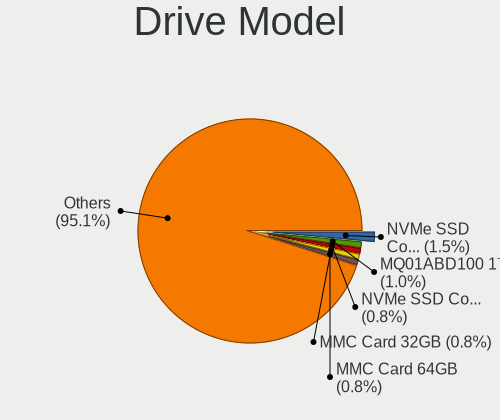
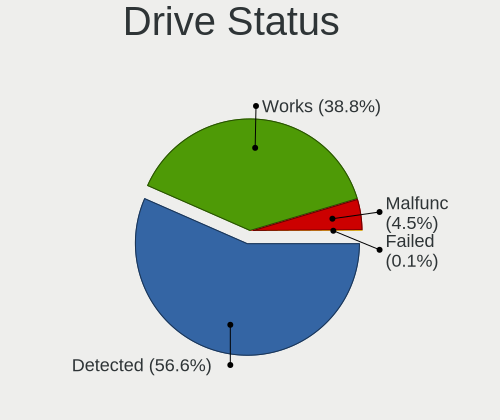
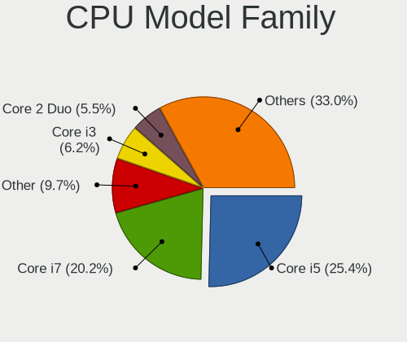

Linux in Germany - Tested Hardware & Statistics (Notebooks)
-----------------------------------------------------------

A project to collect tested hardware configurations for Linux in Germany.

Anyone can contribute to this report by the [hw-probe](https://github.com/linuxhw/hw-probe) tool:

    sudo -E hw-probe -all -upload

Please contribute! Especially if your hardware is rare.

Contents
--------

* [ Test Cases ](#test-cases)

* [ System ](#system)
  - [ OS                       ](#os)
  - [ OS Family                ](#os-family)
  - [ Kernel                   ](#kernel)
  - [ Kernel Family            ](#kernel-family)
  - [ Kernel Major Ver.        ](#kernel-major-ver)
  - [ Arch                     ](#arch)
  - [ DE                       ](#de)
  - [ Display Server           ](#display-server)
  - [ Display Manager          ](#display-manager)
  - [ OS Lang                  ](#os-lang)
  - [ Boot Mode                ](#boot-mode)
  - [ Filesystem               ](#filesystem)
  - [ Part. scheme             ](#part-scheme)
  - [ Dual Boot with Linux/BSD ](#dual-boot-with-linuxbsd)
  - [ Dual Boot (Win)          ](#dual-boot-win)

* [ Board ](#board)
  - [ Vendor                   ](#vendor)
  - [ Model                    ](#model)
  - [ Model Family             ](#model-family)
  - [ MFG Year                 ](#mfg-year)
  - [ Form Factor              ](#form-factor)
  - [ Secure Boot              ](#secure-boot)
  - [ Coreboot                 ](#coreboot)
  - [ RAM Size                 ](#ram-size)
  - [ RAM Used                 ](#ram-used)
  - [ Total Drives             ](#total-drives)
  - [ Has CD-ROM               ](#has-cd-rom)
  - [ Has Ethernet             ](#has-ethernet)
  - [ Has WiFi                 ](#has-wifi)
  - [ Has Bluetooth            ](#has-bluetooth)

* [ Location ](#location)
  - [ Country                  ](#country)
  - [ City                     ](#city)

* [ Drives ](#drives)
  - [ Drive Vendor             ](#drive-vendor)
  - [ Drive Model              ](#drive-model)
  - [ HDD Vendor               ](#hdd-vendor)
  - [ SSD Vendor               ](#ssd-vendor)
  - [ Drive Kind               ](#drive-kind)
  - [ Drive Connector          ](#drive-connector)
  - [ Drive Size               ](#drive-size)
  - [ Space Total              ](#space-total)
  - [ Space Used               ](#space-used)
  - [ Malfunc. Drives          ](#malfunc-drives)
  - [ Malfunc. Drive Vendor    ](#malfunc-drive-vendor)
  - [ Malfunc. HDD Vendor      ](#malfunc-hdd-vendor)
  - [ Malfunc. Drive Kind      ](#malfunc-drive-kind)
  - [ Failed Drives            ](#failed-drives)
  - [ Failed Drive Vendor      ](#failed-drive-vendor)
  - [ Drive Status             ](#drive-status)

* [ Storage controller ](#storage-controller)
  - [ Storage Vendor           ](#storage-vendor)
  - [ Storage Model            ](#storage-model)
  - [ Storage Kind             ](#storage-kind)

* [ Processor ](#processor)
  - [ CPU Vendor               ](#cpu-vendor)
  - [ CPU Model                ](#cpu-model)
  - [ CPU Model Family         ](#cpu-model-family)
  - [ CPU Cores                ](#cpu-cores)
  - [ CPU Sockets              ](#cpu-sockets)
  - [ CPU Threads              ](#cpu-threads)
  - [ CPU Op-Modes             ](#cpu-op-modes)
  - [ CPU Microcode            ](#cpu-microcode)
  - [ CPU Microarch            ](#cpu-microarch)

* [ Graphics ](#graphics)
  - [ GPU Vendor               ](#gpu-vendor)
  - [ GPU Model                ](#gpu-model)
  - [ GPU Combo                ](#gpu-combo)
  - [ GPU Driver               ](#gpu-driver)
  - [ GPU Memory               ](#gpu-memory)

* [ Monitor ](#monitor)
  - [ Monitor Vendor           ](#monitor-vendor)
  - [ Monitor Model            ](#monitor-model)
  - [ Monitor Resolution       ](#monitor-resolution)
  - [ Monitor Diagonal         ](#monitor-diagonal)
  - [ Monitor Width            ](#monitor-width)
  - [ Aspect Ratio             ](#aspect-ratio)
  - [ Monitor Area             ](#monitor-area)
  - [ Pixel Density            ](#pixel-density)
  - [ Multiple Monitors        ](#multiple-monitors)

* [ Network ](#network)
  - [ Net Controller Vendor    ](#net-controller-vendor)
  - [ Net Controller Model     ](#net-controller-model)
  - [ Wireless Vendor          ](#wireless-vendor)
  - [ Wireless Model           ](#wireless-model)
  - [ Ethernet Vendor          ](#ethernet-vendor)
  - [ Ethernet Model           ](#ethernet-model)
  - [ Net Controller Kind      ](#net-controller-kind)
  - [ Used Controller          ](#used-controller)
  - [ NICs                     ](#nics)
  - [ IPv6                     ](#ipv6)

* [ Bluetooth ](#bluetooth)
  - [ Bluetooth Vendor         ](#bluetooth-vendor)
  - [ Bluetooth Model          ](#bluetooth-model)

* [ Sound ](#sound)
  - [ Sound Vendor             ](#sound-vendor)
  - [ Sound Model              ](#sound-model)

* [ Memory ](#memory)
  - [ Memory Vendor            ](#memory-vendor)
  - [ Memory Model             ](#memory-model)
  - [ Memory Kind              ](#memory-kind)
  - [ Memory Form Factor       ](#memory-form-factor)
  - [ Memory Size              ](#memory-size)
  - [ Memory Speed             ](#memory-speed)

* [ Printers & scanners ](#printers--scanners)
  - [ Printer Vendor           ](#printer-vendor)
  - [ Printer Model            ](#printer-model)
  - [ Scanner Vendor           ](#scanner-vendor)
  - [ Scanner Model            ](#scanner-model)

* [ Camera ](#camera)
  - [ Camera Vendor            ](#camera-vendor)
  - [ Camera Model             ](#camera-model)

* [ Security ](#security)
  - [ Fingerprint Vendor       ](#fingerprint-vendor)
  - [ Fingerprint Model        ](#fingerprint-model)
  - [ Chipcard Vendor          ](#chipcard-vendor)
  - [ Chipcard Model           ](#chipcard-model)

* [ Unsupported ](#unsupported)
  - [ Unsupported Devices      ](#unsupported-devices)
  - [ Unsupported Device Types ](#unsupported-device-types)

Test Cases
----------

Total: 14856

| Vendor        | Model                       | Probe                                                      | Date         |
|---------------|-----------------------------|------------------------------------------------------------|--------------|
| Lenovo        | ThinkPad 13 2nd Gen 20J2... | [fd388e00c3](https://linux-hardware.org/?probe=fd388e00c3) | Jun 10, 2023 |
| HP            | EliteBook 1040 G4           | [98aa06475b](https://linux-hardware.org/?probe=98aa06475b) | Jun 10, 2023 |
| Apple         | MacBookPro11,3              | [b7dfbae839](https://linux-hardware.org/?probe=b7dfbae839) | Jun 10, 2023 |
| Dell          | Latitude E6510              | [e7c1e59ac7](https://linux-hardware.org/?probe=e7c1e59ac7) | Jun 10, 2023 |
| HP            | Laptop 17-by3xxx            | [421ff52b0b](https://linux-hardware.org/?probe=421ff52b0b) | Jun 10, 2023 |
| Lenovo        | ThinkPad X1 Carbon Gen 9... | [f7a2bd2ca8](https://linux-hardware.org/?probe=f7a2bd2ca8) | Jun 10, 2023 |
| Lenovo        | ThinkPad P1 Gen 3 20TH00... | [65a47406b0](https://linux-hardware.org/?probe=65a47406b0) | Jun 10, 2023 |
| Lenovo        | ThinkPad T470p 20J7S0XV0... | [b2f7d876c7](https://linux-hardware.org/?probe=b2f7d876c7) | Jun 10, 2023 |
| Lenovo        | ThinkPad E15 Gen 4 21EDC... | [fa84ae9906](https://linux-hardware.org/?probe=fa84ae9906) | Jun 10, 2023 |
| HP            | ZBook 15 G2                 | [68c941fe5d](https://linux-hardware.org/?probe=68c941fe5d) | Jun 10, 2023 |
| HP            | EliteBook 840 G2            | [770045a9fc](https://linux-hardware.org/?probe=770045a9fc) | Jun 10, 2023 |
| HP            | ZBook 15 G2                 | [2851b41659](https://linux-hardware.org/?probe=2851b41659) | Jun 09, 2023 |
| HP            | Laptop 17-bs0xx             | [c93d52343c](https://linux-hardware.org/?probe=c93d52343c) | Jun 09, 2023 |
| Google        | Akali 360                   | [1f7d5f8bc5](https://linux-hardware.org/?probe=1f7d5f8bc5) | Jun 09, 2023 |
| Lenovo        | ThinkPad X201 3249CTO       | [849dbace60](https://linux-hardware.org/?probe=849dbace60) | Jun 09, 2023 |
| Dell          | Latitude E7470              | [c5457da74f](https://linux-hardware.org/?probe=c5457da74f) | Jun 09, 2023 |
| Dell          | Precision M4600             | [a79a783515](https://linux-hardware.org/?probe=a79a783515) | Jun 09, 2023 |
| Acer          | TravelMate P215-53          | [9536bf547a](https://linux-hardware.org/?probe=9536bf547a) | Jun 09, 2023 |
| Fujitsu       | LIFEBOOK E754               | [4d09f42447](https://linux-hardware.org/?probe=4d09f42447) | Jun 09, 2023 |
| Fujitsu       | LIFEBOOK U7411              | [ab35c95b72](https://linux-hardware.org/?probe=ab35c95b72) | Jun 09, 2023 |
| ASUSTek       | G771JW                      | [6d989f49b6](https://linux-hardware.org/?probe=6d989f49b6) | Jun 09, 2023 |
| Lenovo        | ThinkPad X1 Carbon Gen 8... | [531e3f124d](https://linux-hardware.org/?probe=531e3f124d) | Jun 09, 2023 |
| HP            | EliteBook Folio 9470m       | [5739bbf07f](https://linux-hardware.org/?probe=5739bbf07f) | Jun 08, 2023 |
| HP            | EliteBook Folio 9470m       | [74dd8ef72a](https://linux-hardware.org/?probe=74dd8ef72a) | Jun 08, 2023 |
| Lenovo        | ThinkPad E14 20RA0016GE     | [4c8d8758b7](https://linux-hardware.org/?probe=4c8d8758b7) | Jun 08, 2023 |
| Lenovo        | ThinkPad X280 20KES5SE22    | [c25a510191](https://linux-hardware.org/?probe=c25a510191) | Jun 08, 2023 |
| TUXEDO        | Stellaris Intel Gen4        | [e6cb646bd4](https://linux-hardware.org/?probe=e6cb646bd4) | Jun 08, 2023 |
| Lenovo        | Legion 5 15ACH6A 82NW       | [0aea375d78](https://linux-hardware.org/?probe=0aea375d78) | Jun 08, 2023 |
| Lenovo        | IdeaPad 510-15IKB 80SV      | [3f04b950e8](https://linux-hardware.org/?probe=3f04b950e8) | Jun 08, 2023 |
| Lenovo        | ThinkPad P14s Gen 2a 21A... | [7543a0bbc1](https://linux-hardware.org/?probe=7543a0bbc1) | Jun 08, 2023 |
| Lenovo        | ThinkPad X1 Carbon 3444C... | [4e5e1d4052](https://linux-hardware.org/?probe=4e5e1d4052) | Jun 08, 2023 |
| HP            | Pavilion dv7                | [896e71aaaf](https://linux-hardware.org/?probe=896e71aaaf) | Jun 08, 2023 |
| Dell          | XPS 17 9730                 | [5be9db17d1](https://linux-hardware.org/?probe=5be9db17d1) | Jun 08, 2023 |
| Lenovo        | ThinkPad E15 Gen 4 21EES... | [06608c68d7](https://linux-hardware.org/?probe=06608c68d7) | Jun 07, 2023 |
| Apple         | MacBookPro11,1              | [6c62565787](https://linux-hardware.org/?probe=6c62565787) | Jun 07, 2023 |
| Packard Be... | EasyNote ENTF71BM           | [490ae0bc1c](https://linux-hardware.org/?probe=490ae0bc1c) | Jun 07, 2023 |
| ASUSTek       | X200MA                      | [7c0552ad30](https://linux-hardware.org/?probe=7c0552ad30) | Jun 06, 2023 |
| Dell          | Precision 5510              | [9888f3aedd](https://linux-hardware.org/?probe=9888f3aedd) | Jun 06, 2023 |
| Acer          | Aspire V5-572P              | [cdb5005799](https://linux-hardware.org/?probe=cdb5005799) | Jun 06, 2023 |
| Acer          | Aspire V5-572P              | [49745927a0](https://linux-hardware.org/?probe=49745927a0) | Jun 06, 2023 |
| Gigabyte      | G5 GE                       | [1b78246ef7](https://linux-hardware.org/?probe=1b78246ef7) | Jun 06, 2023 |
| HP            | ProBook 650 G1              | [776a9fb064](https://linux-hardware.org/?probe=776a9fb064) | Jun 05, 2023 |
| Acer          | Aspire A517-53              | [a039ca0054](https://linux-hardware.org/?probe=a039ca0054) | Jun 05, 2023 |
| TUXEDO        | N8xEJEK                     | [28ca72e1e1](https://linux-hardware.org/?probe=28ca72e1e1) | Jun 05, 2023 |
| Apple         | MacBook5,1                  | [804abce033](https://linux-hardware.org/?probe=804abce033) | Jun 05, 2023 |
| Lenovo        | ThinkPad X250 20CLS02K00    | [fc306205a7](https://linux-hardware.org/?probe=fc306205a7) | Jun 05, 2023 |
| Lenovo        | ThinkPad X270 20HMS12K00    | [55abece90c](https://linux-hardware.org/?probe=55abece90c) | Jun 05, 2023 |
| Acer          | Aspire ES1-571              | [ed19db3614](https://linux-hardware.org/?probe=ed19db3614) | Jun 05, 2023 |
| HP            | Notebook                    | [1605419ae0](https://linux-hardware.org/?probe=1605419ae0) | Jun 05, 2023 |
| HP            | Laptop 17-cp0xxx            | [b142b6de06](https://linux-hardware.org/?probe=b142b6de06) | Jun 05, 2023 |
| Dell          | Latitude E6510              | [49743c8db7](https://linux-hardware.org/?probe=49743c8db7) | Jun 04, 2023 |
| HP            | OMEN by Laptop              | [e3b8e1a109](https://linux-hardware.org/?probe=e3b8e1a109) | Jun 04, 2023 |
| Dell          | Latitude E5540              | [d2bde0e098](https://linux-hardware.org/?probe=d2bde0e098) | Jun 04, 2023 |
| Dell          | Latitude E5540              | [f9483c219e](https://linux-hardware.org/?probe=f9483c219e) | Jun 04, 2023 |
| Dell          | Latitude E6510              | [51c45b0aa7](https://linux-hardware.org/?probe=51c45b0aa7) | Jun 04, 2023 |
| Acer          | Aspire 3820                 | [edbf91844a](https://linux-hardware.org/?probe=edbf91844a) | Jun 04, 2023 |
| Sony          | VPCEH2H4E                   | [793e883d0c](https://linux-hardware.org/?probe=793e883d0c) | Jun 04, 2023 |
| HP            | EliteBook 840 G3            | [7c35e9a268](https://linux-hardware.org/?probe=7c35e9a268) | Jun 04, 2023 |
| Lenovo        | ThinkPad T480 20L6S29E1S    | [4d9e4fb129](https://linux-hardware.org/?probe=4d9e4fb129) | Jun 04, 2023 |
| Dell          | Latitude E5440              | [02b3462a2c](https://linux-hardware.org/?probe=02b3462a2c) | Jun 04, 2023 |
| ASUSTek       | ROG Zephyrus G14 GA401QC... | [13f3f67373](https://linux-hardware.org/?probe=13f3f67373) | Jun 04, 2023 |
| Acer          | Swift SF316-51              | [4ba1405836](https://linux-hardware.org/?probe=4ba1405836) | Jun 04, 2023 |
| HP            | OMEN Laptop 15-en0xxx       | [2eeb67613f](https://linux-hardware.org/?probe=2eeb67613f) | Jun 04, 2023 |
| Clevo         | M670SRU                     | [0935f74d34](https://linux-hardware.org/?probe=0935f74d34) | Jun 04, 2023 |
| Clevo         | M670SRU                     | [e163d57d56](https://linux-hardware.org/?probe=e163d57d56) | Jun 04, 2023 |
| MSI           | U200                        | [01900b8117](https://linux-hardware.org/?probe=01900b8117) | Jun 04, 2023 |
| HP            | EliteBook 850 G8 Noteboo... | [7179829c20](https://linux-hardware.org/?probe=7179829c20) | Jun 04, 2023 |
| HP            | Pavilion Gaming Laptop 1... | [038871f5be](https://linux-hardware.org/?probe=038871f5be) | Jun 04, 2023 |
| Dell          | Venue 11 Pro 7130 vPro      | [c16266c1c9](https://linux-hardware.org/?probe=c16266c1c9) | Jun 04, 2023 |
| Dell          | XPS 13 9370                 | [c359b173f6](https://linux-hardware.org/?probe=c359b173f6) | Jun 04, 2023 |
| Dell          | XPS 13 9370                 | [a0efed7ee2](https://linux-hardware.org/?probe=a0efed7ee2) | Jun 04, 2023 |
| Acer          | Aspire 5738                 | [138d22e03e](https://linux-hardware.org/?probe=138d22e03e) | Jun 04, 2023 |
| Toshiba       | TECRA Z40-C                 | [1ebf23281e](https://linux-hardware.org/?probe=1ebf23281e) | Jun 04, 2023 |
| Pegatron      | Spring Peak                 | [a10a42a44d](https://linux-hardware.org/?probe=a10a42a44d) | Jun 04, 2023 |
| Pegatron      | Spring Peak                 | [e58b2a1237](https://linux-hardware.org/?probe=e58b2a1237) | Jun 04, 2023 |
| Pegatron      | Spring Peak                 | [ce54d0192d](https://linux-hardware.org/?probe=ce54d0192d) | Jun 04, 2023 |
| ASUSTek       | K52Je                       | [0190eef08c](https://linux-hardware.org/?probe=0190eef08c) | Jun 03, 2023 |
| Gigabyte      | G5 GE                       | [8ef447b2f3](https://linux-hardware.org/?probe=8ef447b2f3) | Jun 03, 2023 |
| ASUSTek       | X540SA                      | [e9e8995d2e](https://linux-hardware.org/?probe=e9e8995d2e) | Jun 03, 2023 |
| Fujitsu       | LIFEBOOK A357               | [a8baa03316](https://linux-hardware.org/?probe=a8baa03316) | Jun 03, 2023 |
| Chuwi         | GemiBook Pro                | [772d1f8765](https://linux-hardware.org/?probe=772d1f8765) | Jun 03, 2023 |
| Acer          | Aspire V3-372               | [1200863830](https://linux-hardware.org/?probe=1200863830) | Jun 03, 2023 |
| ASUSTek       | K52Je                       | [c6f78ba2aa](https://linux-hardware.org/?probe=c6f78ba2aa) | Jun 03, 2023 |
| Acer          | Aspire AV15-51              | [41e5c1790c](https://linux-hardware.org/?probe=41e5c1790c) | Jun 03, 2023 |
| Acer          | Aspire AV15-51              | [d583c74274](https://linux-hardware.org/?probe=d583c74274) | Jun 03, 2023 |
| Acer          | Aspire AV15-51              | [7ed9ba7165](https://linux-hardware.org/?probe=7ed9ba7165) | Jun 03, 2023 |
| Toshiba       | Satellite L50-C             | [7b1b547b11](https://linux-hardware.org/?probe=7b1b547b11) | Jun 03, 2023 |
| Acer          | Aspire 7745G                | [135ce50995](https://linux-hardware.org/?probe=135ce50995) | Jun 03, 2023 |
| Dell          | G15 5520                    | [b77b760dfe](https://linux-hardware.org/?probe=b77b760dfe) | Jun 03, 2023 |
| TUXEDO        | InfinityBook Pro 15 v5      | [1b01df33d2](https://linux-hardware.org/?probe=1b01df33d2) | Jun 03, 2023 |
| HP            | Notebook                    | [9b12c54cf2](https://linux-hardware.org/?probe=9b12c54cf2) | Jun 02, 2023 |
| Acer          | Aspire 7750G                | [160d4525c6](https://linux-hardware.org/?probe=160d4525c6) | Jun 02, 2023 |
| Lenovo        | ThinkPad T470 W10DG 20JN... | [2a67b74a26](https://linux-hardware.org/?probe=2a67b74a26) | Jun 02, 2023 |
| Apple         | MacBookPro5,5               | [9bf36ef4a5](https://linux-hardware.org/?probe=9bf36ef4a5) | Jun 02, 2023 |
| MSI           | U200                        | [2fe4d70ea1](https://linux-hardware.org/?probe=2fe4d70ea1) | Jun 02, 2023 |
| Lenovo        | ThinkPad T460 20FMS0WN00    | [f576f54ff2](https://linux-hardware.org/?probe=f576f54ff2) | Jun 02, 2023 |
| Lenovo        | ThinkPad X1 Carbon 3rd 2... | [359d31bb8c](https://linux-hardware.org/?probe=359d31bb8c) | Jun 02, 2023 |
| Acer          | Aspire 7750G                | [e94cab5008](https://linux-hardware.org/?probe=e94cab5008) | Jun 02, 2023 |
| ASUSTek       | VivoBook_ASUSLaptop M350... | [1aea71b6c0](https://linux-hardware.org/?probe=1aea71b6c0) | Jun 02, 2023 |
| ASUSTek       | VivoBook_ASUSLaptop M350... | [1bdb74a8ba](https://linux-hardware.org/?probe=1bdb74a8ba) | Jun 02, 2023 |
| HP            | G62                         | [f2600c2f4b](https://linux-hardware.org/?probe=f2600c2f4b) | Jun 01, 2023 |
| Dell          | Latitude 5540               | [98ec8ec8bf](https://linux-hardware.org/?probe=98ec8ec8bf) | Jun 01, 2023 |
| Acer          | Predator PH517-51           | [1de529b11c](https://linux-hardware.org/?probe=1de529b11c) | Jun 01, 2023 |
| Lenovo        | IdeaPad 5 14ALC05 82LM      | [97b54068b7](https://linux-hardware.org/?probe=97b54068b7) | Jun 01, 2023 |
| Lenovo        | ThinkPad T460 20FMS08H00    | [71208c2344](https://linux-hardware.org/?probe=71208c2344) | Jun 01, 2023 |
| Lenovo        | IdeaPad 3 17ITL6 82H9       | [a7af6cac2c](https://linux-hardware.org/?probe=a7af6cac2c) | Jun 01, 2023 |
| Dell          | Vostro 7590                 | [d9bfa42b63](https://linux-hardware.org/?probe=d9bfa42b63) | Jun 01, 2023 |
| Packard Be... | EasyNote TK11BZ             | [b1cbe3b6a6](https://linux-hardware.org/?probe=b1cbe3b6a6) | Jun 01, 2023 |
| HP            | ProBook 6450b               | [d3d4e45f9d](https://linux-hardware.org/?probe=d3d4e45f9d) | Jun 01, 2023 |
| ASUSTek       | K53SK                       | [9b376cdd45](https://linux-hardware.org/?probe=9b376cdd45) | Jun 01, 2023 |
| Apple         | MacBook4,1                  | [996b318420](https://linux-hardware.org/?probe=996b318420) | Jun 01, 2023 |
| Lenovo        | ThinkPad X230 Tablet 343... | [efe855c429](https://linux-hardware.org/?probe=efe855c429) | May 31, 2023 |
| Lenovo        | ThinkPad X230 Tablet 343... | [c56e8318db](https://linux-hardware.org/?probe=c56e8318db) | May 31, 2023 |
| ASUSTek       | K53SK                       | [39c63c5bd1](https://linux-hardware.org/?probe=39c63c5bd1) | May 31, 2023 |
| Lenovo        | V17 G3 IAP 82U1             | [1be071e25d](https://linux-hardware.org/?probe=1be071e25d) | May 31, 2023 |
| HP            | Pavilion Laptop 15-cs2xx... | [2bb50cdcc7](https://linux-hardware.org/?probe=2bb50cdcc7) | May 31, 2023 |
| HP            | Pavilion dv6500             | [0198d67a15](https://linux-hardware.org/?probe=0198d67a15) | May 31, 2023 |
| Fujitsu       | LIFEBOOK E780               | [8459f7cfee](https://linux-hardware.org/?probe=8459f7cfee) | May 31, 2023 |
| Lenovo        | ThinkBook 13s G3 ACN 20Y... | [827e0203ac](https://linux-hardware.org/?probe=827e0203ac) | May 31, 2023 |
| Dell          | Precision 3550              | [bddf57400b](https://linux-hardware.org/?probe=bddf57400b) | May 31, 2023 |
| Dell          | System Vostro 3750          | [f77ea94512](https://linux-hardware.org/?probe=f77ea94512) | May 31, 2023 |
| Lenovo        | ThinkPad T14s Gen 3 21BR... | [0ead50ad49](https://linux-hardware.org/?probe=0ead50ad49) | May 31, 2023 |
| ASUSTek       | K53SK                       | [bfd926c8da](https://linux-hardware.org/?probe=bfd926c8da) | May 30, 2023 |
| VALE          | Notebook Classic C140       | [cdc6168586](https://linux-hardware.org/?probe=cdc6168586) | May 30, 2023 |
| Acer          | Aspire 5749                 | [3bca2af88d](https://linux-hardware.org/?probe=3bca2af88d) | May 30, 2023 |
| Acer          | Predator PH517-51           | [cc24e32ab1](https://linux-hardware.org/?probe=cc24e32ab1) | May 30, 2023 |
| MSI           | Titan GT77HX 13VH           | [7c3b8ed81d](https://linux-hardware.org/?probe=7c3b8ed81d) | May 29, 2023 |
| ASUSTek       | ZenBook UX431DA_UM431DA     | [048a3a0f30](https://linux-hardware.org/?probe=048a3a0f30) | May 29, 2023 |
| Fujitsu       | LIFEBOOK E780               | [aac95cf765](https://linux-hardware.org/?probe=aac95cf765) | May 29, 2023 |
| ASUSTek       | VivoBook_ASUSLaptop X415... | [9fce8d1e40](https://linux-hardware.org/?probe=9fce8d1e40) | May 29, 2023 |
| Acer          | Aspire A315-51              | [d6f1c2bdbd](https://linux-hardware.org/?probe=d6f1c2bdbd) | May 29, 2023 |
| Acer          | Aspire ES1-571              | [6f75ba50c1](https://linux-hardware.org/?probe=6f75ba50c1) | May 29, 2023 |
| Apple         | MacBookPro14,1              | [a5785cf3c3](https://linux-hardware.org/?probe=a5785cf3c3) | May 29, 2023 |
| Samsung       | 600B4B/600B5B               | [feba5017b3](https://linux-hardware.org/?probe=feba5017b3) | May 29, 2023 |
| Dell          | XPS 13 9310                 | [d12d9a4fc2](https://linux-hardware.org/?probe=d12d9a4fc2) | May 29, 2023 |
| HP            | EliteBook 735 G6            | [18b33e6fc7](https://linux-hardware.org/?probe=18b33e6fc7) | May 29, 2023 |
| Lenovo        | ThinkPad X230 2325UYW       | [c2165f9183](https://linux-hardware.org/?probe=c2165f9183) | May 29, 2023 |
| Fujitsu       | CELSIUS H720                | [d7d19435c2](https://linux-hardware.org/?probe=d7d19435c2) | May 29, 2023 |
| Acer          | Nitro AN515-52              | [b90162f812](https://linux-hardware.org/?probe=b90162f812) | May 29, 2023 |
| HP            | Laptop 17-cp0xxx            | [5ac36928a5](https://linux-hardware.org/?probe=5ac36928a5) | May 28, 2023 |
| ALLDOCUBE     | i1405C                      | [7e4475ef13](https://linux-hardware.org/?probe=7e4475ef13) | May 28, 2023 |
| Acer          | Swift SF114-34              | [ec48f7a207](https://linux-hardware.org/?probe=ec48f7a207) | May 28, 2023 |
| Dell          | Inspiron 7559               | [af1bb009ca](https://linux-hardware.org/?probe=af1bb009ca) | May 28, 2023 |
| ASUSTek       | U43Jc                       | [db28d8f731](https://linux-hardware.org/?probe=db28d8f731) | May 28, 2023 |
| Lenovo        | IdeaPad 5 Pro 16ACH6 82L... | [d5a3141562](https://linux-hardware.org/?probe=d5a3141562) | May 28, 2023 |
| Lenovo        | V130-15IKB 81HN             | [e50700f8be](https://linux-hardware.org/?probe=e50700f8be) | May 28, 2023 |
| ASUSTek       | U43Jc                       | [36bd3a5288](https://linux-hardware.org/?probe=36bd3a5288) | May 28, 2023 |
| Acer          | Aspire ES1-571              | [a3da42e0e9](https://linux-hardware.org/?probe=a3da42e0e9) | May 28, 2023 |
| TUXEDO        | Unknown                     | [21be23e012](https://linux-hardware.org/?probe=21be23e012) | May 28, 2023 |
| Apple         | MacBookAir7,2               | [f75fb35204](https://linux-hardware.org/?probe=f75fb35204) | May 28, 2023 |
| Lenovo        | ThinkPad T460 20FMS1JA00    | [618a907425](https://linux-hardware.org/?probe=618a907425) | May 27, 2023 |
| ASUSTek       | ROG Strix G713RW_G713RW     | [ef1ea73723](https://linux-hardware.org/?probe=ef1ea73723) | May 27, 2023 |
| Acer          | TravelMate 5735Z            | [9eea76e3ee](https://linux-hardware.org/?probe=9eea76e3ee) | May 27, 2023 |
| Lenovo        | G50-70 20351                | [ee0a9f666c](https://linux-hardware.org/?probe=ee0a9f666c) | May 27, 2023 |
| Lenovo        | B50-70 80EU                 | [8c51cdf4ef](https://linux-hardware.org/?probe=8c51cdf4ef) | May 27, 2023 |
| HP            | EliteBook 840 G2            | [519e04a228](https://linux-hardware.org/?probe=519e04a228) | May 27, 2023 |
| Acer          | Aspire ES1-571              | [029ea88e3b](https://linux-hardware.org/?probe=029ea88e3b) | May 27, 2023 |
| Samsung       | 355V4C/356V4C/3445VC/354... | [9984b363d1](https://linux-hardware.org/?probe=9984b363d1) | May 27, 2023 |
| Lenovo        | ThinkPad X1 Carbon 5th 2... | [737d3fe7fb](https://linux-hardware.org/?probe=737d3fe7fb) | May 27, 2023 |
| HP            | Laptop 15s-eq2xxx           | [d5d9543a5a](https://linux-hardware.org/?probe=d5d9543a5a) | May 26, 2023 |
| Lenovo        | ThinkPad P14s Gen 2a 21A... | [16ee98f9cc](https://linux-hardware.org/?probe=16ee98f9cc) | May 26, 2023 |
| Lenovo        | ThinkPad P14s Gen 2a 21A... | [39cf075935](https://linux-hardware.org/?probe=39cf075935) | May 26, 2023 |
| Lenovo        | ThinkPad T460s 20F90058G... | [71a2e90192](https://linux-hardware.org/?probe=71a2e90192) | May 26, 2023 |
| ASUSTek       | K53SV                       | [357c1fd091](https://linux-hardware.org/?probe=357c1fd091) | May 26, 2023 |
| Lenovo        | ThinkPad T14 Gen 2i 20W1... | [852932c13b](https://linux-hardware.org/?probe=852932c13b) | May 26, 2023 |
| ASUSTek       | K52Je                       | [3b40aeae90](https://linux-hardware.org/?probe=3b40aeae90) | May 26, 2023 |
| Dell          | Latitude E6330              | [e7477af1a5](https://linux-hardware.org/?probe=e7477af1a5) | May 26, 2023 |
| Dell          | Precision 5530              | [702b4d7914](https://linux-hardware.org/?probe=702b4d7914) | May 26, 2023 |
| Dell          | Latitude E6510              | [9edaeb2ffa](https://linux-hardware.org/?probe=9edaeb2ffa) | May 25, 2023 |
| HP            | 250 G7 Notebook PC          | [2f0f83bda2](https://linux-hardware.org/?probe=2f0f83bda2) | May 25, 2023 |
| ASUSTek       | X705UVR                     | [bedbf77e16](https://linux-hardware.org/?probe=bedbf77e16) | May 25, 2023 |
| Sony          | SVF1521B4E                  | [d6eaf68ef4](https://linux-hardware.org/?probe=d6eaf68ef4) | May 25, 2023 |
| Sony          | SVF1521B4E                  | [03c5deb4cc](https://linux-hardware.org/?probe=03c5deb4cc) | May 25, 2023 |
| Acer          | Aspire V3-371               | [f9200e891b](https://linux-hardware.org/?probe=f9200e891b) | May 25, 2023 |
| Lenovo        | ThinkPad T580 20LAS62M07    | [48ad025649](https://linux-hardware.org/?probe=48ad025649) | May 25, 2023 |
| Google        | Akali 360                   | [2a4bbc5d81](https://linux-hardware.org/?probe=2a4bbc5d81) | May 25, 2023 |
| TUXEDO        | InfinityBook Pro 14 v4      | [51c520b6e6](https://linux-hardware.org/?probe=51c520b6e6) | May 25, 2023 |
| Dell          | Latitude E6430              | [37dab72e8c](https://linux-hardware.org/?probe=37dab72e8c) | May 25, 2023 |
| Lenovo        | ThinkPad T440p 20AW0045M... | [355e03f684](https://linux-hardware.org/?probe=355e03f684) | May 25, 2023 |
| Fujitsu       | LIFEBOOK E752               | [0c7493d8d3](https://linux-hardware.org/?probe=0c7493d8d3) | May 24, 2023 |
| Lenovo        | IdeaPad Y560                | [a8b595f03c](https://linux-hardware.org/?probe=a8b595f03c) | May 24, 2023 |
| HP            | 255 G7 Notebook PC          | [45c21cb512](https://linux-hardware.org/?probe=45c21cb512) | May 24, 2023 |
| Lenovo        | G50-70 20351                | [19dc1505b5](https://linux-hardware.org/?probe=19dc1505b5) | May 24, 2023 |
| Apple         | MacBookPro6,2               | [6858db4f73](https://linux-hardware.org/?probe=6858db4f73) | May 24, 2023 |
| Dell          | Precision 5570              | [f014c35d45](https://linux-hardware.org/?probe=f014c35d45) | May 24, 2023 |
| Lenovo        | ThinkPad T410 2537AT1       | [babbb757c6](https://linux-hardware.org/?probe=babbb757c6) | May 24, 2023 |
| Lenovo        | ThinkPad T530 24297XG       | [520e3d90a6](https://linux-hardware.org/?probe=520e3d90a6) | May 24, 2023 |
| ASUSTek       | K73BR                       | [2b59c4c84c](https://linux-hardware.org/?probe=2b59c4c84c) | May 24, 2023 |
| Lenovo        | ThinkPad T480 20L50005GE    | [306ecade71](https://linux-hardware.org/?probe=306ecade71) | May 24, 2023 |
| Valve         | Jupiter                     | [fd4190f3d7](https://linux-hardware.org/?probe=fd4190f3d7) | May 24, 2023 |
| PC Special... | NH5x_7xDPx                  | [4d4ce3a2bc](https://linux-hardware.org/?probe=4d4ce3a2bc) | May 23, 2023 |
| Dell          | Inspiron 3593               | [715800f05d](https://linux-hardware.org/?probe=715800f05d) | May 23, 2023 |
| Toshiba       | Satellite C660D             | [cd798092df](https://linux-hardware.org/?probe=cd798092df) | May 23, 2023 |
| Dell          | Latitude E6510              | [731befae67](https://linux-hardware.org/?probe=731befae67) | May 23, 2023 |
| Lenovo        | ThinkPad E460 20ETCTO1WW    | [cd2c3fbd45](https://linux-hardware.org/?probe=cd2c3fbd45) | May 23, 2023 |
| ASUSTek       | X751MA                      | [674b64f381](https://linux-hardware.org/?probe=674b64f381) | May 23, 2023 |
| Lenovo        | ThinkPad L520 5017A62       | [a8d01c9adb](https://linux-hardware.org/?probe=a8d01c9adb) | May 23, 2023 |
| ASUSTek       | VivoBook_ASUSLaptop X412... | [6e1c91c725](https://linux-hardware.org/?probe=6e1c91c725) | May 23, 2023 |
| Matsushita... | CF-W7BWAYZL3                | [a00f38be95](https://linux-hardware.org/?probe=a00f38be95) | May 23, 2023 |
| Lenovo        | ThinkPad W500 40626NG       | [9466f83af8](https://linux-hardware.org/?probe=9466f83af8) | May 22, 2023 |
| ASUSTek       | ASUS TUF Gaming F15 FX50... | [76db4a03a1](https://linux-hardware.org/?probe=76db4a03a1) | May 22, 2023 |
| Dell          | Latitude 7490               | [f689b559e8](https://linux-hardware.org/?probe=f689b559e8) | May 22, 2023 |
| Acer          | Aspire V3-371               | [c6276aaa0c](https://linux-hardware.org/?probe=c6276aaa0c) | May 22, 2023 |
| ASUSTek       | Zenbook UM6702RA_RM6702R... | [03e6dd8808](https://linux-hardware.org/?probe=03e6dd8808) | May 22, 2023 |
| ASUSTek       | ASUS TUF Gaming A15 FA50... | [f25279745a](https://linux-hardware.org/?probe=f25279745a) | May 22, 2023 |
| Apple         | MacBookPro8,1               | [5b78800649](https://linux-hardware.org/?probe=5b78800649) | May 22, 2023 |
| Acer          | Aspire A315-43              | [926421c6be](https://linux-hardware.org/?probe=926421c6be) | May 22, 2023 |
| Apple         | MacBookPro8,1               | [a78ee7457a](https://linux-hardware.org/?probe=a78ee7457a) | May 22, 2023 |
| Lenovo        | ThinkPad P72 20MBCTO1WW     | [7cba5b3595](https://linux-hardware.org/?probe=7cba5b3595) | May 22, 2023 |
| HP            | EliteBook Folio G1          | [81477cd76f](https://linux-hardware.org/?probe=81477cd76f) | May 22, 2023 |
| HP            | EliteBook Folio G1          | [73d4310fa2](https://linux-hardware.org/?probe=73d4310fa2) | May 22, 2023 |
| Framework     | Laptop                      | [7715f5f056](https://linux-hardware.org/?probe=7715f5f056) | May 22, 2023 |
| Lenovo        | ThinkPad X230 2325AC2       | [bc1633cf27](https://linux-hardware.org/?probe=bc1633cf27) | May 22, 2023 |
| HP            | Laptop 17-cp0xxx            | [0148c19bc7](https://linux-hardware.org/?probe=0148c19bc7) | May 22, 2023 |
| Acer          | TM8573T                     | [64df92ebbe](https://linux-hardware.org/?probe=64df92ebbe) | May 22, 2023 |
| HP            | Laptop 15s-eq2xxx           | [cccb529fd3](https://linux-hardware.org/?probe=cccb529fd3) | May 21, 2023 |
| Acer          | TM8573T                     | [2ea1f44eb8](https://linux-hardware.org/?probe=2ea1f44eb8) | May 21, 2023 |
| Apple         | MacBookPro14,2              | [d29f7a36f9](https://linux-hardware.org/?probe=d29f7a36f9) | May 21, 2023 |
| Acer          | Aspire A515-52G             | [a80648e2a4](https://linux-hardware.org/?probe=a80648e2a4) | May 21, 2023 |
| Wortmann      | TERRA_MOBILE_1528P/1748P    | [03afaf2468](https://linux-hardware.org/?probe=03afaf2468) | May 21, 2023 |
| Lenovo        | ThinkPad T460s 20FAS0W90... | [0b3265b088](https://linux-hardware.org/?probe=0b3265b088) | May 21, 2023 |
| Fujitsu       | LIFEBOOK S752               | [906ba8b65c](https://linux-hardware.org/?probe=906ba8b65c) | May 21, 2023 |
| Acer          | Aspire V5-572P              | [99f4730d26](https://linux-hardware.org/?probe=99f4730d26) | May 21, 2023 |
| Sony          | SVF1521B4E                  | [89c04d3b34](https://linux-hardware.org/?probe=89c04d3b34) | May 21, 2023 |
| Fujitsu       | LIFEBOOK U748               | [a8d8e219a2](https://linux-hardware.org/?probe=a8d8e219a2) | May 21, 2023 |
| Dell          | G3 3500                     | [cbe9c2f010](https://linux-hardware.org/?probe=cbe9c2f010) | May 21, 2023 |
| Lenovo        | Y50-70 20378                | [2aff70d7c9](https://linux-hardware.org/?probe=2aff70d7c9) | May 21, 2023 |
| Acer          | E1-510                      | [709c32e016](https://linux-hardware.org/?probe=709c32e016) | May 21, 2023 |
| Acer          | E1-510                      | [c18f4ac56b](https://linux-hardware.org/?probe=c18f4ac56b) | May 21, 2023 |
| Acer          | Aspire V5-572P              | [456d6c8887](https://linux-hardware.org/?probe=456d6c8887) | May 21, 2023 |
| MICROBYTE     | ezbook                      | [aacd79e1c7](https://linux-hardware.org/?probe=aacd79e1c7) | May 20, 2023 |
| HP            | 255 G8 Notebook PC          | [157b535164](https://linux-hardware.org/?probe=157b535164) | May 20, 2023 |
| Acer          | Aspire S3                   | [b6841c9aeb](https://linux-hardware.org/?probe=b6841c9aeb) | May 20, 2023 |
| Acer          | Aspire 5739G                | [23a84a79ed](https://linux-hardware.org/?probe=23a84a79ed) | May 20, 2023 |
| Acer          | Aspire S3                   | [3fafb0df5d](https://linux-hardware.org/?probe=3fafb0df5d) | May 20, 2023 |
| Dell          | Latitude 5285               | [0db3cfd34e](https://linux-hardware.org/?probe=0db3cfd34e) | May 20, 2023 |
| Lenovo        | ThinkPad E15 Gen 4 21EES... | [71ac41efb8](https://linux-hardware.org/?probe=71ac41efb8) | May 20, 2023 |
| Dell          | Latitude E6510              | [342b8d094e](https://linux-hardware.org/?probe=342b8d094e) | May 20, 2023 |
| HP            | Pavilion dv6                | [17ac43247a](https://linux-hardware.org/?probe=17ac43247a) | May 20, 2023 |
| Acer          | Aspire 5739G                | [2ae6c83437](https://linux-hardware.org/?probe=2ae6c83437) | May 20, 2023 |
| Dell          | Latitude E6510              | [4d606396f8](https://linux-hardware.org/?probe=4d606396f8) | May 20, 2023 |
| Packard Be... | EasyNote MH36               | [a77cfa4947](https://linux-hardware.org/?probe=a77cfa4947) | May 20, 2023 |
| Lenovo        | ThinkPad T420 4236W1W       | [87e70e9606](https://linux-hardware.org/?probe=87e70e9606) | May 19, 2023 |
| HP            | Notebook                    | [3664846c35](https://linux-hardware.org/?probe=3664846c35) | May 19, 2023 |
| Lenovo        | ThinkPad T61 6463B45        | [a2445821f3](https://linux-hardware.org/?probe=a2445821f3) | May 19, 2023 |
| TUXEDO        | Pulse 15 Gen2               | [c0e3ea54c0](https://linux-hardware.org/?probe=c0e3ea54c0) | May 19, 2023 |
| Dell          | Latitude E5430 non-vPro     | [6d6cdfc735](https://linux-hardware.org/?probe=6d6cdfc735) | May 19, 2023 |
| Apple         | MacBookPro11,3              | [3de00073ba](https://linux-hardware.org/?probe=3de00073ba) | May 19, 2023 |
| Dell          | Latitude 5411               | [8929285bca](https://linux-hardware.org/?probe=8929285bca) | May 19, 2023 |
| TUXEDO        | InfinityBook Pro 14 v4      | [741d6fe6d2](https://linux-hardware.org/?probe=741d6fe6d2) | May 19, 2023 |
| Lenovo        | ThinkPad E590 20NB0029GE    | [749d31d44a](https://linux-hardware.org/?probe=749d31d44a) | May 19, 2023 |
| Lenovo        | ThinkPad E590 20NB0029GE    | [85da505294](https://linux-hardware.org/?probe=85da505294) | May 19, 2023 |
| HP            | 15                          | [a22d3981e2](https://linux-hardware.org/?probe=a22d3981e2) | May 19, 2023 |
| Lenovo        | ThinkPad L560 20F2S1JP03    | [d0dd999b33](https://linux-hardware.org/?probe=d0dd999b33) | May 18, 2023 |
| HP            | Pavilion dv6                | [4fb1281981](https://linux-hardware.org/?probe=4fb1281981) | May 18, 2023 |
| Lenovo        | ThinkPad X200s 7470WUB      | [e5ad235f60](https://linux-hardware.org/?probe=e5ad235f60) | May 18, 2023 |
| Lenovo        | ThinkPad T470s W10DG 20J... | [0608bc6ac3](https://linux-hardware.org/?probe=0608bc6ac3) | May 18, 2023 |
| Dell          | Latitude E6500              | [27213adbe8](https://linux-hardware.org/?probe=27213adbe8) | May 18, 2023 |
| Lenovo        | IdeaPad 700-17ISK 80RV      | [61b0585530](https://linux-hardware.org/?probe=61b0585530) | May 18, 2023 |
| HP            | Laptop 15-db0xxx            | [6141537b7b](https://linux-hardware.org/?probe=6141537b7b) | May 18, 2023 |
| HP            | Laptop 14s-dq0xxx           | [6173aa2164](https://linux-hardware.org/?probe=6173aa2164) | May 18, 2023 |
| HP            | EliteBook 850 G8 Noteboo... | [25e9a17dd0](https://linux-hardware.org/?probe=25e9a17dd0) | May 18, 2023 |
| Dell          | XPS 13 9305                 | [3eb1bee421](https://linux-hardware.org/?probe=3eb1bee421) | May 18, 2023 |
| HUAWEI        | HVY-WXX9                    | [eb15dc415d](https://linux-hardware.org/?probe=eb15dc415d) | May 18, 2023 |
| HUAWEI        | HVY-WXX9                    | [b30078ae71](https://linux-hardware.org/?probe=b30078ae71) | May 18, 2023 |
| HP            | 630                         | [bd7bdf5942](https://linux-hardware.org/?probe=bd7bdf5942) | May 18, 2023 |
| Sony          | VPCEB4Z1E                   | [d1cca131ad](https://linux-hardware.org/?probe=d1cca131ad) | May 18, 2023 |
| Lenovo        | IdeaPad S145-15IWL 81MV     | [d3bfab996e](https://linux-hardware.org/?probe=d3bfab996e) | May 18, 2023 |
| Dell          | Latitude E7240              | [208261238e](https://linux-hardware.org/?probe=208261238e) | May 18, 2023 |
| Dell          | Latitude E7240              | [faf148036f](https://linux-hardware.org/?probe=faf148036f) | May 18, 2023 |
| Medion        | E6232                       | [a447a0aba0](https://linux-hardware.org/?probe=a447a0aba0) | May 18, 2023 |
| HP            | Laptop 15s-eq2xxx           | [a23a2d1c6c](https://linux-hardware.org/?probe=a23a2d1c6c) | May 18, 2023 |
| Lenovo        | IdeaPad S340-15API 81NC     | [aa625a94a0](https://linux-hardware.org/?probe=aa625a94a0) | May 18, 2023 |
| Valve         | Jupiter                     | [c16624e321](https://linux-hardware.org/?probe=c16624e321) | May 17, 2023 |
| ASUSTek       | Zenbook UM6702RA_RM6702R... | [66f184855c](https://linux-hardware.org/?probe=66f184855c) | May 17, 2023 |
| Apple         | MacBookPro12,1              | [4aadc89f41](https://linux-hardware.org/?probe=4aadc89f41) | May 17, 2023 |
| HP            | Laptop 14s-dq0xxx           | [0a08d453f7](https://linux-hardware.org/?probe=0a08d453f7) | May 17, 2023 |
| HP            | Laptop 15s-fq2xxx           | [ad17e04f3b](https://linux-hardware.org/?probe=ad17e04f3b) | May 17, 2023 |
| Dell          | Latitude E7270              | [c3b39e55f4](https://linux-hardware.org/?probe=c3b39e55f4) | May 17, 2023 |
| Apple         | MacBookPro12,1              | [8aef05613d](https://linux-hardware.org/?probe=8aef05613d) | May 17, 2023 |
| Dell          | Latitude 7430               | [eb576d7c2a](https://linux-hardware.org/?probe=eb576d7c2a) | May 17, 2023 |
| HP            | Pavilion Aero Laptop 13-... | [f31be9149e](https://linux-hardware.org/?probe=f31be9149e) | May 17, 2023 |
| Dell          | XPS 13 7390                 | [51ff9a820a](https://linux-hardware.org/?probe=51ff9a820a) | May 16, 2023 |
| Dell          | XPS 13 7390                 | [e98b404c17](https://linux-hardware.org/?probe=e98b404c17) | May 16, 2023 |
| Dell          | Latitude E5530 non-vPro     | [1d5a340968](https://linux-hardware.org/?probe=1d5a340968) | May 16, 2023 |
| Dell          | Latitude 7430               | [d137c2d73b](https://linux-hardware.org/?probe=d137c2d73b) | May 16, 2023 |
| Lenovo        | ThinkBook 15 G4 IAP 21DJ    | [8cb1f28963](https://linux-hardware.org/?probe=8cb1f28963) | May 16, 2023 |
| ASUSTek       | VivoBook_ASUSLaptop X515... | [c62b63f5bf](https://linux-hardware.org/?probe=c62b63f5bf) | May 16, 2023 |
| Lenovo        | ThinkPad L15 Gen 2 20X30... | [24cb48f7d7](https://linux-hardware.org/?probe=24cb48f7d7) | May 16, 2023 |
| Acer          | Swift SFA16-41              | [8b1e6a5baf](https://linux-hardware.org/?probe=8b1e6a5baf) | May 16, 2023 |
| Lenovo        | ThinkPad T480 20L50005GE    | [58b895e713](https://linux-hardware.org/?probe=58b895e713) | May 16, 2023 |
| Dell          | Latitude E5530 non-vPro     | [040fb99c20](https://linux-hardware.org/?probe=040fb99c20) | May 15, 2023 |
| Lenovo        | ThinkPad T15p Gen 3 21DA... | [19feb08b89](https://linux-hardware.org/?probe=19feb08b89) | May 15, 2023 |
| ASUSTek       | ROG Zephyrus G14 GA401QM... | [0770462dab](https://linux-hardware.org/?probe=0770462dab) | May 15, 2023 |
| Lenovo        | ThinkPad X1 Carbon Gen 9... | [61499d189f](https://linux-hardware.org/?probe=61499d189f) | May 15, 2023 |
| ASUSTek       | ROG Strix G713PV_G713PV     | [dc5dd8c32a](https://linux-hardware.org/?probe=dc5dd8c32a) | May 15, 2023 |
| Sony          | SVF1521B4E                  | [ec03e769b8](https://linux-hardware.org/?probe=ec03e769b8) | May 15, 2023 |
| ASUSTek       | VivoBook_ASUSLaptop N740... | [1573285475](https://linux-hardware.org/?probe=1573285475) | May 15, 2023 |
| Toshiba       | Satellite Pro R50-B         | [dda235ab03](https://linux-hardware.org/?probe=dda235ab03) | May 15, 2023 |
| Toshiba       | Satellite Pro R50-B         | [f9535b38b0](https://linux-hardware.org/?probe=f9535b38b0) | May 15, 2023 |
| HP            | Laptop 15-db0xxx            | [61665ffc1a](https://linux-hardware.org/?probe=61665ffc1a) | May 15, 2023 |
| Lenovo        | ThinkPad E15 Gen 4 21EES... | [84526e9b64](https://linux-hardware.org/?probe=84526e9b64) | May 15, 2023 |
| Toshiba       | TECRA Z40-A                 | [55210b06ca](https://linux-hardware.org/?probe=55210b06ca) | May 15, 2023 |
| Acer          | Aspire 7745G                | [c1bcc07617](https://linux-hardware.org/?probe=c1bcc07617) | May 15, 2023 |
| Acer          | Aspire 7745G                | [7b0f6f3dc2](https://linux-hardware.org/?probe=7b0f6f3dc2) | May 15, 2023 |
| Apple         | MacBookPro10,1              | [d27a3510ed](https://linux-hardware.org/?probe=d27a3510ed) | May 14, 2023 |
| VALE          | Notebook Classic C140       | [656e811dfb](https://linux-hardware.org/?probe=656e811dfb) | May 14, 2023 |
| Acer          | Swift SF114-34              | [360db31139](https://linux-hardware.org/?probe=360db31139) | May 14, 2023 |
| Lenovo        | V15 G2 ALC 82KD             | [f67b1d428b](https://linux-hardware.org/?probe=f67b1d428b) | May 14, 2023 |
| Acer          | Swift SF114-34              | [c3bbc544d3](https://linux-hardware.org/?probe=c3bbc544d3) | May 14, 2023 |
| Lenovo        | ThinkBook Plus G2 ITG 20... | [2881ffcb77](https://linux-hardware.org/?probe=2881ffcb77) | May 14, 2023 |
| Lenovo        | ThinkPad T570 20H90002GE    | [e6ff63678e](https://linux-hardware.org/?probe=e6ff63678e) | May 14, 2023 |
| ASUSTek       | VivoBook_ASUSLaptop N740... | [0ea14cadea](https://linux-hardware.org/?probe=0ea14cadea) | May 14, 2023 |
| Dell          | XPS 15 7590                 | [e81d6a8a69](https://linux-hardware.org/?probe=e81d6a8a69) | May 14, 2023 |
| ASUSTek       | VivoBook_ASUSLaptop X712... | [8747e49a83](https://linux-hardware.org/?probe=8747e49a83) | May 14, 2023 |
| HP            | ENVY 15                     | [0d1450cd2d](https://linux-hardware.org/?probe=0d1450cd2d) | May 14, 2023 |
| Lenovo        | G50-45 80E3                 | [9298a8529a](https://linux-hardware.org/?probe=9298a8529a) | May 14, 2023 |
| Valve         | Jupiter                     | [6d8b04de33](https://linux-hardware.org/?probe=6d8b04de33) | May 13, 2023 |
| Lenovo        | Legion Y530-15ICH 81FV      | [1e5caac049](https://linux-hardware.org/?probe=1e5caac049) | May 13, 2023 |
| Fujitsu       | LIFEBOOK E5410              | [c62a002948](https://linux-hardware.org/?probe=c62a002948) | May 13, 2023 |
| Fujitsu Si... | LIFEBOOK T5010              | [374128840e](https://linux-hardware.org/?probe=374128840e) | May 13, 2023 |
| Valve         | Jupiter                     | [abf57f2578](https://linux-hardware.org/?probe=abf57f2578) | May 13, 2023 |
| Valve         | Jupiter                     | [49d110c5d2](https://linux-hardware.org/?probe=49d110c5d2) | May 13, 2023 |
| ASUSTek       | Zenbook UM6702RA_RM6702R... | [a25f9e8d93](https://linux-hardware.org/?probe=a25f9e8d93) | May 13, 2023 |
| ASUSTek       | K53SV                       | [60d7b5acf8](https://linux-hardware.org/?probe=60d7b5acf8) | May 13, 2023 |
| HP            | Notebook                    | [ee7a6bde04](https://linux-hardware.org/?probe=ee7a6bde04) | May 13, 2023 |
| ASUSTek       | Zenbook UM6702RA_RM6702R... | [d2ba323017](https://linux-hardware.org/?probe=d2ba323017) | May 13, 2023 |
| TUXEDO        | Polaris Intel Gen3 (TGL)    | [4b296f5c40](https://linux-hardware.org/?probe=4b296f5c40) | May 12, 2023 |
| Lenovo        | ThinkPad T480 20L6S29E02    | [d90b0e6626](https://linux-hardware.org/?probe=d90b0e6626) | May 12, 2023 |
| HP            | ENVY 17                     | [9f71f0b3e1](https://linux-hardware.org/?probe=9f71f0b3e1) | May 12, 2023 |
| ASUSTek       | Zenbook UM6702RA_RM6702R... | [ba177fa007](https://linux-hardware.org/?probe=ba177fa007) | May 12, 2023 |
| ASUSTek       | X555LJ                      | [f39ba53533](https://linux-hardware.org/?probe=f39ba53533) | May 12, 2023 |
| Lenovo        | ThinkPad T590 20N4002WGE    | [6caedd8a7b](https://linux-hardware.org/?probe=6caedd8a7b) | May 12, 2023 |
| Lenovo        | ThinkPad E14 Gen 4 21EB0... | [b054e28875](https://linux-hardware.org/?probe=b054e28875) | May 12, 2023 |
| TUXEDO        | Pulse 15 Gen2               | [703faeb982](https://linux-hardware.org/?probe=703faeb982) | May 12, 2023 |
| HP            | OMEN by Laptop              | [5a1484127d](https://linux-hardware.org/?probe=5a1484127d) | May 12, 2023 |
| Dell          | Latitude D830               | [79c9ffb643](https://linux-hardware.org/?probe=79c9ffb643) | May 12, 2023 |
| Lenovo        | ThinkPad E15 Gen 2 20T9S... | [870c85a9ac](https://linux-hardware.org/?probe=870c85a9ac) | May 12, 2023 |
| Lenovo        | ThinkPad X13 Gen 2a 20XH... | [b01a016489](https://linux-hardware.org/?probe=b01a016489) | May 12, 2023 |
| HP            | Pavilion g6                 | [83693568b6](https://linux-hardware.org/?probe=83693568b6) | May 12, 2023 |
| Dell          | Vostro 15 3510              | [fc82fe9907](https://linux-hardware.org/?probe=fc82fe9907) | May 11, 2023 |
| Lenovo        | ThinkPad L15 Gen 1 20U8S... | [5d67743d33](https://linux-hardware.org/?probe=5d67743d33) | May 11, 2023 |
| Lenovo        | IdeaPad Slim 1-14AST-05 ... | [bfb11f92b1](https://linux-hardware.org/?probe=bfb11f92b1) | May 11, 2023 |
| Lenovo        | ThinkPad X13 Gen 2a 20XH... | [637d09143c](https://linux-hardware.org/?probe=637d09143c) | May 11, 2023 |
| HP            | OMEN by Laptop              | [2c8128a196](https://linux-hardware.org/?probe=2c8128a196) | May 11, 2023 |
| MSI           | GT70 2PC                    | [c98c889dbf](https://linux-hardware.org/?probe=c98c889dbf) | May 11, 2023 |
| Dell          | Vostro 3501                 | [c6cb7f265a](https://linux-hardware.org/?probe=c6cb7f265a) | May 11, 2023 |
| Dell          | Precision 7520              | [184802dbab](https://linux-hardware.org/?probe=184802dbab) | May 11, 2023 |
| Lenovo        | IdeaPad 3 15IAU7 82RK       | [f46fe8b9ee](https://linux-hardware.org/?probe=f46fe8b9ee) | May 11, 2023 |
| TUXEDO        | Book_XA1510                 | [9aed9e823a](https://linux-hardware.org/?probe=9aed9e823a) | May 11, 2023 |
| HP            | Laptop 17-by0xxx            | [10b9d3a925](https://linux-hardware.org/?probe=10b9d3a925) | May 11, 2023 |
| HP            | Pavilion g6                 | [2eaacf14f6](https://linux-hardware.org/?probe=2eaacf14f6) | May 10, 2023 |
| ASUSTek       | X75VC                       | [cb14c4b8e0](https://linux-hardware.org/?probe=cb14c4b8e0) | May 10, 2023 |
| Lenovo        | ThinkPad W541 20EF001UGE    | [29c8170a0e](https://linux-hardware.org/?probe=29c8170a0e) | May 10, 2023 |
| Dell          | Latitude E5530 non-vPro     | [07bcb8d332](https://linux-hardware.org/?probe=07bcb8d332) | May 10, 2023 |
| HP            | Pavilion Gaming Laptop 1... | [b192a6461f](https://linux-hardware.org/?probe=b192a6461f) | May 10, 2023 |
| Toshiba       | Satellite Pro R50-C         | [66fe960f10](https://linux-hardware.org/?probe=66fe960f10) | May 10, 2023 |
| Lenovo        | IdeaPad 5 15ARE05 81YQ      | [57a74239f8](https://linux-hardware.org/?probe=57a74239f8) | May 10, 2023 |
| HP            | Pavilion Gaming Laptop 1... | [3ea1fd6554](https://linux-hardware.org/?probe=3ea1fd6554) | May 10, 2023 |
| ASUSTek       | X555LAB                     | [2710a15a04](https://linux-hardware.org/?probe=2710a15a04) | May 10, 2023 |
| Fujitsu Si... | AMILO Pa 2548               | [d5d7d8308f](https://linux-hardware.org/?probe=d5d7d8308f) | May 10, 2023 |
| Medion        | E6232                       | [46e240ed2c](https://linux-hardware.org/?probe=46e240ed2c) | May 10, 2023 |
| Lenovo        | IdeaPad 5 15ARE05 81YQ      | [962ca6e507](https://linux-hardware.org/?probe=962ca6e507) | May 10, 2023 |
| HP            | Laptop 17-cp0xxx            | [b32a7122fc](https://linux-hardware.org/?probe=b32a7122fc) | May 10, 2023 |
| HP            | OMEN Laptop 15-en0xxx       | [39dd8fc09a](https://linux-hardware.org/?probe=39dd8fc09a) | May 10, 2023 |
| Apple         | MacBook8,1                  | [89d87ca773](https://linux-hardware.org/?probe=89d87ca773) | May 09, 2023 |
| Lenovo        | ThinkPad T570 20HAS0UU00    | [c0ad43f440](https://linux-hardware.org/?probe=c0ad43f440) | May 09, 2023 |
| Dell          | XPS 15 9560                 | [b904defc14](https://linux-hardware.org/?probe=b904defc14) | May 09, 2023 |
| Lenovo        | ThinkPad T570 20HAS0UU00    | [f3572c500c](https://linux-hardware.org/?probe=f3572c500c) | May 09, 2023 |
| Acer          | Swift SF114-34              | [deab607d5b](https://linux-hardware.org/?probe=deab607d5b) | May 09, 2023 |
| Toshiba       | Satellite P500              | [16472912d5](https://linux-hardware.org/?probe=16472912d5) | May 09, 2023 |
| Dell          | Latitude 7400               | [dd232bb43b](https://linux-hardware.org/?probe=dd232bb43b) | May 09, 2023 |
| Lenovo        | IdeaPad 110-17ISK 80VL      | [61056ebf79](https://linux-hardware.org/?probe=61056ebf79) | May 09, 2023 |
| Gigabyte      | A7 K1                       | [1c37df2d10](https://linux-hardware.org/?probe=1c37df2d10) | May 09, 2023 |
| Bluechip C... | TRAVELline B15W33           | [53091b3af6](https://linux-hardware.org/?probe=53091b3af6) | May 09, 2023 |
| Packard Be... | EasyNote TK36               | [18f7e68fb1](https://linux-hardware.org/?probe=18f7e68fb1) | May 09, 2023 |
| Lenovo        | ThinkPad P14s Gen 2a 21A... | [fba089b3d4](https://linux-hardware.org/?probe=fba089b3d4) | May 09, 2023 |
| Lenovo        | ThinkPad P14s Gen 2a 21A... | [f3abd29ef8](https://linux-hardware.org/?probe=f3abd29ef8) | May 09, 2023 |
| HUAWEI        | KLVL-WXXW                   | [a08e2235cd](https://linux-hardware.org/?probe=a08e2235cd) | May 09, 2023 |
| Lenovo        | ThinkPad X13 Gen 2a 20XH... | [28e1a5c2e9](https://linux-hardware.org/?probe=28e1a5c2e9) | May 09, 2023 |
| Lenovo        | ThinkPad X13 Gen 2a 20XH... | [fed7278850](https://linux-hardware.org/?probe=fed7278850) | May 09, 2023 |
| Valve         | Jupiter                     | [08aba8925e](https://linux-hardware.org/?probe=08aba8925e) | May 08, 2023 |
| Medion        | E6234                       | [6c3bd7d77f](https://linux-hardware.org/?probe=6c3bd7d77f) | May 08, 2023 |
| ASUSTek       | ROG Strix G513QY_G513QY     | [3211c828a2](https://linux-hardware.org/?probe=3211c828a2) | May 08, 2023 |
| HP            | 625                         | [956346de67](https://linux-hardware.org/?probe=956346de67) | May 08, 2023 |
| Lenovo        | ThinkPad T460 20FMS1JA00    | [db609197b4](https://linux-hardware.org/?probe=db609197b4) | May 08, 2023 |
| HUAWEI        | NBLB-WAX9N                  | [0ebb311510](https://linux-hardware.org/?probe=0ebb311510) | May 08, 2023 |
| Fujitsu       | LIFEBOOK E751               | [8a3bd16269](https://linux-hardware.org/?probe=8a3bd16269) | May 08, 2023 |
| Acer          | Aspire A315-22              | [8849d7a1c9](https://linux-hardware.org/?probe=8849d7a1c9) | May 08, 2023 |
| Lenovo        | G560 0679                   | [a916fc6080](https://linux-hardware.org/?probe=a916fc6080) | May 08, 2023 |
| Lenovo        | ThinkPad T14 Gen 3 21AHC... | [36334e327a](https://linux-hardware.org/?probe=36334e327a) | May 08, 2023 |
| TUXEDO        | N24_25BU                    | [9cd4e499ae](https://linux-hardware.org/?probe=9cd4e499ae) | May 07, 2023 |
| Dell          | XPS 13 9305                 | [8b7b41fde9](https://linux-hardware.org/?probe=8b7b41fde9) | May 07, 2023 |
| Dell          | XPS 13 9305                 | [f830561f82](https://linux-hardware.org/?probe=f830561f82) | May 07, 2023 |
| Unknown       | Unknown                     | [cacf6a8831](https://linux-hardware.org/?probe=cacf6a8831) | May 07, 2023 |
| Medion        | E6234                       | [5afe99ed93](https://linux-hardware.org/?probe=5afe99ed93) | May 07, 2023 |
| Toshiba       | Satellite L655              | [9eef570443](https://linux-hardware.org/?probe=9eef570443) | May 07, 2023 |
| Acer          | Aspire 8930                 | [1ec5df3fc1](https://linux-hardware.org/?probe=1ec5df3fc1) | May 07, 2023 |
| ASUSTek       | X555LJ                      | [febe8d60fc](https://linux-hardware.org/?probe=febe8d60fc) | May 07, 2023 |
| ASUSTek       | X555LJ                      | [2e25cad4b3](https://linux-hardware.org/?probe=2e25cad4b3) | May 07, 2023 |
| Lenovo        | ThinkPad L530 24812TG       | [d95ccbf97d](https://linux-hardware.org/?probe=d95ccbf97d) | May 07, 2023 |
| ASUSTek       | Zenbook UM3402YAR_UM3402... | [020041a666](https://linux-hardware.org/?probe=020041a666) | May 07, 2023 |
| MSI           | GL75 9SD                    | [522594401b](https://linux-hardware.org/?probe=522594401b) | May 07, 2023 |
| Medion        | E6417 MD99252               | [6c46322374](https://linux-hardware.org/?probe=6c46322374) | May 07, 2023 |
| Valve         | Jupiter                     | [17b055eca4](https://linux-hardware.org/?probe=17b055eca4) | May 07, 2023 |
| Fujitsu Si... | AMILO PRO V3515             | [a6da9a31d7](https://linux-hardware.org/?probe=a6da9a31d7) | May 06, 2023 |
| Dell          | Precision 7720              | [9e0a1bd8ef](https://linux-hardware.org/?probe=9e0a1bd8ef) | May 06, 2023 |
| Valve         | Jupiter                     | [55acf244c5](https://linux-hardware.org/?probe=55acf244c5) | May 06, 2023 |
| HP            | Laptop 15s-eq2xxx           | [b3bf20b454](https://linux-hardware.org/?probe=b3bf20b454) | May 06, 2023 |
| HP            | Laptop 17-ca0xxx            | [96099a3217](https://linux-hardware.org/?probe=96099a3217) | May 06, 2023 |
| Dell          | Latitude E6410              | [535fd92f64](https://linux-hardware.org/?probe=535fd92f64) | May 06, 2023 |
| Gigabyte      | G5 MD                       | [7ad914a8a9](https://linux-hardware.org/?probe=7ad914a8a9) | May 06, 2023 |
| Acer          | Aspire ES1-711              | [9c88de8a31](https://linux-hardware.org/?probe=9c88de8a31) | May 06, 2023 |
| Acer          | Aspire ES1-711              | [a106dc51b2](https://linux-hardware.org/?probe=a106dc51b2) | May 06, 2023 |
| Notebook      | P15SM                       | [dcea4ec037](https://linux-hardware.org/?probe=dcea4ec037) | May 06, 2023 |
| Dell          | Latitude E5430 non-vPro     | [59cdec7fce](https://linux-hardware.org/?probe=59cdec7fce) | May 06, 2023 |
| Sony          | SVF1521M6E                  | [82f869d683](https://linux-hardware.org/?probe=82f869d683) | May 06, 2023 |
| Medion        | E6214                       | [869c63244c](https://linux-hardware.org/?probe=869c63244c) | May 06, 2023 |
| Medion        | E6214                       | [64eeb6e165](https://linux-hardware.org/?probe=64eeb6e165) | May 06, 2023 |
| Lenovo        | ThinkPad T410 2537CC5       | [10de9f17e1](https://linux-hardware.org/?probe=10de9f17e1) | May 06, 2023 |
| Lenovo        | V17 G2 ITL 82NX             | [79c33e919f](https://linux-hardware.org/?probe=79c33e919f) | May 06, 2023 |
| Acer          | TravelMate P215-53          | [f7c7c572e4](https://linux-hardware.org/?probe=f7c7c572e4) | May 05, 2023 |
| Fujitsu Si... | AMILO Pa 2548               | [449779fbe4](https://linux-hardware.org/?probe=449779fbe4) | May 05, 2023 |
| TUXEDO        | Pulse 15 Gen1               | [ec3e2f4be9](https://linux-hardware.org/?probe=ec3e2f4be9) | May 05, 2023 |
| Fujitsu Si... | AMILO Pa 2548               | [ffce6dd6d5](https://linux-hardware.org/?probe=ffce6dd6d5) | May 05, 2023 |
| Acer          | Aspire SW3-016              | [19f043f522](https://linux-hardware.org/?probe=19f043f522) | May 05, 2023 |
| Acer          | Aspire SW3-016              | [7996b7f419](https://linux-hardware.org/?probe=7996b7f419) | May 05, 2023 |
| Medion        | P8614                       | [831518705e](https://linux-hardware.org/?probe=831518705e) | May 05, 2023 |
| Lenovo        | ThinkPad T15p Gen 2i 21A... | [064df1260c](https://linux-hardware.org/?probe=064df1260c) | May 05, 2023 |
| Samsung       | 530U3C/530U4C/532U3C        | [d016282342](https://linux-hardware.org/?probe=d016282342) | May 05, 2023 |
| Razer         | Blade Pro 17 (2019)         | [4b2265c354](https://linux-hardware.org/?probe=4b2265c354) | May 05, 2023 |
| Lenovo        | Legion 7 16ACHg6 82N6       | [d8582f94de](https://linux-hardware.org/?probe=d8582f94de) | May 05, 2023 |
| Dell          | Latitude E5430 non-vPro     | [e9cfd8b8c4](https://linux-hardware.org/?probe=e9cfd8b8c4) | May 05, 2023 |
| Acer          | Aspire A315-42              | [d8f78a98f2](https://linux-hardware.org/?probe=d8f78a98f2) | May 05, 2023 |
| HP            | EliteBook 850 G8 Noteboo... | [907a94ae07](https://linux-hardware.org/?probe=907a94ae07) | May 05, 2023 |
| TUXEDO        | Polaris 15 AMD Gen1         | [d02d56f013](https://linux-hardware.org/?probe=d02d56f013) | May 05, 2023 |
| HP            | EliteBook 8440p             | [1ba4a283b1](https://linux-hardware.org/?probe=1ba4a283b1) | May 05, 2023 |
| Lenovo        | ThinkPad E14 Gen 2 20TA0... | [f9a56b49f3](https://linux-hardware.org/?probe=f9a56b49f3) | May 05, 2023 |
| Medion        | E11201                      | [f0bfd835f8](https://linux-hardware.org/?probe=f0bfd835f8) | May 04, 2023 |
| HUAWEI        | BOHK-WAX9X                  | [2d8b053492](https://linux-hardware.org/?probe=2d8b053492) | May 04, 2023 |
| HUAWEI        | MRGF-XX                     | [ca2c7ad92c](https://linux-hardware.org/?probe=ca2c7ad92c) | May 04, 2023 |
| Apple         | MacBookPro14,2              | [4124bb2dde](https://linux-hardware.org/?probe=4124bb2dde) | May 04, 2023 |
| Lenovo        | ThinkPad W530 24473F2       | [937dddbff0](https://linux-hardware.org/?probe=937dddbff0) | May 04, 2023 |
| HP            | Pavilion Laptop 15-eh1xx... | [cc11b2dcde](https://linux-hardware.org/?probe=cc11b2dcde) | May 04, 2023 |
| Acer          | Aspire 7530G                | [5c19c9f6e4](https://linux-hardware.org/?probe=5c19c9f6e4) | May 04, 2023 |
| Lenovo        | ThinkPad E14 Gen 4 21ECS... | [1f2d88bfae](https://linux-hardware.org/?probe=1f2d88bfae) | May 04, 2023 |
| HP            | Laptop 17-ak0xx             | [579c16cd5c](https://linux-hardware.org/?probe=579c16cd5c) | May 04, 2023 |
| Lenovo        | ThinkPad T15 Gen 2i 20W4... | [c83ed0c49b](https://linux-hardware.org/?probe=c83ed0c49b) | May 04, 2023 |
| Lenovo        | ThinkPad T580 20L9CTO1WW    | [b8a363f717](https://linux-hardware.org/?probe=b8a363f717) | May 04, 2023 |
| Lenovo        | ThinkPad T14 Gen 3 21AHC... | [8a80fd7103](https://linux-hardware.org/?probe=8a80fd7103) | May 04, 2023 |
| Lenovo        | ThinkPad T14 Gen 3 21AHC... | [3198c997b2](https://linux-hardware.org/?probe=3198c997b2) | May 04, 2023 |
| Dell          | Latitude E5570              | [6b532c004d](https://linux-hardware.org/?probe=6b532c004d) | May 04, 2023 |
| HUAWEI        | BOHK-WAX9X                  | [fbc24a91e6](https://linux-hardware.org/?probe=fbc24a91e6) | May 04, 2023 |
| HP            | ProBook 450 G6              | [c5927045a3](https://linux-hardware.org/?probe=c5927045a3) | May 04, 2023 |
| HP            | EliteBook 8440p             | [16028c4863](https://linux-hardware.org/?probe=16028c4863) | May 04, 2023 |
| HP            | ProBook 650 G1              | [0cbc314c84](https://linux-hardware.org/?probe=0cbc314c84) | May 04, 2023 |
| Lenovo        | IdeaPad N581 7505           | [5d340c1aa2](https://linux-hardware.org/?probe=5d340c1aa2) | May 04, 2023 |
| HP            | EliteBook 855 G7 Noteboo... | [b68f20e323](https://linux-hardware.org/?probe=b68f20e323) | May 04, 2023 |
| Acer          | Swift SF314-56G             | [460a286d9a](https://linux-hardware.org/?probe=460a286d9a) | May 04, 2023 |
| Lenovo        | ThinkPad T480 20L6S2S800    | [7ffc12366e](https://linux-hardware.org/?probe=7ffc12366e) | May 03, 2023 |
| HP            | Pavilion dv6                | [be01072653](https://linux-hardware.org/?probe=be01072653) | May 03, 2023 |
| TUXEDO        | Stellaris/Polaris AMD Ge... | [756500f10b](https://linux-hardware.org/?probe=756500f10b) | May 03, 2023 |
| HP            | Pavilion dv6                | [87f0c054fa](https://linux-hardware.org/?probe=87f0c054fa) | May 03, 2023 |
| ASUSTek       | X200MA                      | [31e08853ae](https://linux-hardware.org/?probe=31e08853ae) | May 03, 2023 |
| Dell          | Latitude 5414               | [6922f7db46](https://linux-hardware.org/?probe=6922f7db46) | May 03, 2023 |
| Apple         | MacBookPro12,1              | [ff5236b993](https://linux-hardware.org/?probe=ff5236b993) | May 03, 2023 |
| Lenovo        | ThinkPad E15 Gen 3 20YG0... | [1e70580006](https://linux-hardware.org/?probe=1e70580006) | May 02, 2023 |
| Acer          | Aspire V5-531               | [d8c61ad691](https://linux-hardware.org/?probe=d8c61ad691) | May 02, 2023 |
| Acer          | Aspire V5-572P              | [a2e6cae633](https://linux-hardware.org/?probe=a2e6cae633) | May 02, 2023 |
| Acer          | Aspire V5-572P              | [00d2e57fb9](https://linux-hardware.org/?probe=00d2e57fb9) | May 02, 2023 |
| Acer          | Aspire E1-571               | [46ecc78df6](https://linux-hardware.org/?probe=46ecc78df6) | May 02, 2023 |
| HP            | EliteBook 2540p             | [a0b1299baa](https://linux-hardware.org/?probe=a0b1299baa) | May 02, 2023 |
| Dell          | Studio 1747                 | [6f140484a6](https://linux-hardware.org/?probe=6f140484a6) | May 02, 2023 |
| Unknown       | Unknown                     | [5434cb77bf](https://linux-hardware.org/?probe=5434cb77bf) | May 02, 2023 |
| Lenovo        | V15-IGL 82C3                | [583642a695](https://linux-hardware.org/?probe=583642a695) | May 02, 2023 |
| Dell          | Latitude 5520               | [394f247286](https://linux-hardware.org/?probe=394f247286) | May 02, 2023 |
| AXDIA Inte... | MYBOOK 14 PRO               | [3174c98e9c](https://linux-hardware.org/?probe=3174c98e9c) | May 01, 2023 |
| Dell          | Latitude E6540              | [e6f334c91c](https://linux-hardware.org/?probe=e6f334c91c) | May 01, 2023 |
| Acer          | Aspire E1-571               | [7b4e78233a](https://linux-hardware.org/?probe=7b4e78233a) | May 01, 2023 |
| HUAWEI        | BOHK-WAX9X                  | [c604e4ce30](https://linux-hardware.org/?probe=c604e4ce30) | May 01, 2023 |
| HUAWEI        | HVY-WXX9                    | [c5c9bbda3d](https://linux-hardware.org/?probe=c5c9bbda3d) | May 01, 2023 |
| HP            | Pavilion Gaming Laptop 1... | [e9bd630708](https://linux-hardware.org/?probe=e9bd630708) | May 01, 2023 |
| Dell          | Studio 1555                 | [4f9f0dc9bf](https://linux-hardware.org/?probe=4f9f0dc9bf) | May 01, 2023 |
| TUXEDO        | InfinityBook Pro Gen7 (M... | [15c04364fa](https://linux-hardware.org/?probe=15c04364fa) | May 01, 2023 |
| ASUSTek       | K53U                        | [0745a61353](https://linux-hardware.org/?probe=0745a61353) | May 01, 2023 |
| Dell          | Inspiron 1090               | [690e8bfe3a](https://linux-hardware.org/?probe=690e8bfe3a) | May 01, 2023 |
| HUAWEI        | HVY-WXX9                    | [3c82fea068](https://linux-hardware.org/?probe=3c82fea068) | May 01, 2023 |
| ASUSTek       | VivoBook_ASUSLaptop E410... | [44bea19730](https://linux-hardware.org/?probe=44bea19730) | May 01, 2023 |
| ASUSTek       | VivoBook_ASUSLaptop E410... | [3de4215710](https://linux-hardware.org/?probe=3de4215710) | May 01, 2023 |
| HP            | EliteBook 830 G5            | [6b61472a4a](https://linux-hardware.org/?probe=6b61472a4a) | May 01, 2023 |
| Sony          | SVF1521C6EW                 | [57e1c14061](https://linux-hardware.org/?probe=57e1c14061) | Apr 30, 2023 |
| Acer          | Aspire A315-33              | [fdba59c054](https://linux-hardware.org/?probe=fdba59c054) | Apr 30, 2023 |
| Lenovo        | V15 G2 IJL 82QY             | [1714bffa0e](https://linux-hardware.org/?probe=1714bffa0e) | Apr 30, 2023 |
| ASUSTek       | X751SA                      | [5192130c0e](https://linux-hardware.org/?probe=5192130c0e) | Apr 30, 2023 |
| Lenovo        | ThinkPad L15 Gen 1 20U8S... | [32b3bf20de](https://linux-hardware.org/?probe=32b3bf20de) | Apr 30, 2023 |
| Lenovo        | ThinkPad T490s 20NX002SG... | [874f19f26e](https://linux-hardware.org/?probe=874f19f26e) | Apr 30, 2023 |
| HP            | Pavilion Gaming Laptop 1... | [9876205c45](https://linux-hardware.org/?probe=9876205c45) | Apr 30, 2023 |
| Medion        | E6214                       | [7bb9f39d76](https://linux-hardware.org/?probe=7bb9f39d76) | Apr 30, 2023 |
| Medion        | E6214                       | [39747632e6](https://linux-hardware.org/?probe=39747632e6) | Apr 30, 2023 |
| Fujitsu       | LIFEBOOK E734               | [f99ecceaeb](https://linux-hardware.org/?probe=f99ecceaeb) | Apr 30, 2023 |
| Fujitsu       | LIFEBOOK E734               | [31fa8aa587](https://linux-hardware.org/?probe=31fa8aa587) | Apr 30, 2023 |
| HP            | Pavilion Aero Laptop 13-... | [df9cc0160a](https://linux-hardware.org/?probe=df9cc0160a) | Apr 30, 2023 |
| HP            | 255 G6 Notebook PC          | [d99135522b](https://linux-hardware.org/?probe=d99135522b) | Apr 30, 2023 |
| Dell          | XPS 13 7390                 | [c5000ec967](https://linux-hardware.org/?probe=c5000ec967) | Apr 30, 2023 |
| Acer          | Aspire M5-481T              | [d215d36b64](https://linux-hardware.org/?probe=d215d36b64) | Apr 30, 2023 |
| Lenovo        | ThinkPad T14 Gen 1 20S0S... | [2bc3c5303f](https://linux-hardware.org/?probe=2bc3c5303f) | Apr 30, 2023 |
| ASUSTek       | X751MA                      | [c952010dbb](https://linux-hardware.org/?probe=c952010dbb) | Apr 29, 2023 |
| Medion        | X681X                       | [f65ca1e461](https://linux-hardware.org/?probe=f65ca1e461) | Apr 29, 2023 |
| Acer          | Aspire 8950G                | [348a7d728c](https://linux-hardware.org/?probe=348a7d728c) | Apr 29, 2023 |
| Dell          | Inspiron 7773               | [19741ac2ea](https://linux-hardware.org/?probe=19741ac2ea) | Apr 29, 2023 |
| Lenovo        | G50-70 20351                | [5792e8cfa2](https://linux-hardware.org/?probe=5792e8cfa2) | Apr 29, 2023 |
| Medion        | X6816                       | [2c1807dad7](https://linux-hardware.org/?probe=2c1807dad7) | Apr 29, 2023 |
| Dell          | Latitude E5450              | [85fb3ec2fd](https://linux-hardware.org/?probe=85fb3ec2fd) | Apr 28, 2023 |
| Acer          | Aspire ES1-731              | [140e5eb8fc](https://linux-hardware.org/?probe=140e5eb8fc) | Apr 28, 2023 |
| Notebook      | W35xSTQ_370ST               | [a68f02482d](https://linux-hardware.org/?probe=a68f02482d) | Apr 28, 2023 |
| Lenovo        | Yoga Slim 7 Pro 14ARH7 8... | [39644ab1d4](https://linux-hardware.org/?probe=39644ab1d4) | Apr 28, 2023 |
| Lenovo        | ThinkPad T470p 20J60018M... | [a8deb2307c](https://linux-hardware.org/?probe=a8deb2307c) | Apr 28, 2023 |
| Lenovo        | IdeaPad Y470                | [58c809428e](https://linux-hardware.org/?probe=58c809428e) | Apr 28, 2023 |
| Acer          | Swift SF314-59              | [a84de33c38](https://linux-hardware.org/?probe=a84de33c38) | Apr 28, 2023 |
| Acer          | Aspire V3-772               | [a1584c31ec](https://linux-hardware.org/?probe=a1584c31ec) | Apr 28, 2023 |
| Acer          | Aspire V3-772               | [5f191f449f](https://linux-hardware.org/?probe=5f191f449f) | Apr 28, 2023 |
| Acer          | Aspire V5-572P              | [4fa79fb180](https://linux-hardware.org/?probe=4fa79fb180) | Apr 28, 2023 |
| Acer          | Aspire V5-572P              | [fdc85a159b](https://linux-hardware.org/?probe=fdc85a159b) | Apr 28, 2023 |
| ASUSTek       | K54C                        | [7223b97463](https://linux-hardware.org/?probe=7223b97463) | Apr 27, 2023 |
| Dell          | XPS 13 9350                 | [aea99797db](https://linux-hardware.org/?probe=aea99797db) | Apr 27, 2023 |
| ASUSTek       | X751MA                      | [eb9967626a](https://linux-hardware.org/?probe=eb9967626a) | Apr 27, 2023 |
| HUAWEI        | HVY-WXX9                    | [dd5391c20d](https://linux-hardware.org/?probe=dd5391c20d) | Apr 27, 2023 |
| Dell          | Inspiron 16 5630            | [7bfe5bb892](https://linux-hardware.org/?probe=7bfe5bb892) | Apr 27, 2023 |
| Lenovo        | ThinkPad R61 8943DJG        | [afc3fc578e](https://linux-hardware.org/?probe=afc3fc578e) | Apr 27, 2023 |
| MSI           | PE60 6QE                    | [1a5ae975ee](https://linux-hardware.org/?probe=1a5ae975ee) | Apr 27, 2023 |
| Lenovo        | ThinkPad T470 W10DG 20JN... | [fe959d51ab](https://linux-hardware.org/?probe=fe959d51ab) | Apr 27, 2023 |
| HP            | Compaq 6910p                | [049253c0c8](https://linux-hardware.org/?probe=049253c0c8) | Apr 27, 2023 |
| Lenovo        | ThinkPad E14 Gen 4 21ECS... | [442a827555](https://linux-hardware.org/?probe=442a827555) | Apr 27, 2023 |
| Lenovo        | IdeaPad 5 14ALC05 82LM      | [e1b7846c92](https://linux-hardware.org/?probe=e1b7846c92) | Apr 27, 2023 |
| Apple         | MacBookAir6,1               | [c0f967c0bc](https://linux-hardware.org/?probe=c0f967c0bc) | Apr 27, 2023 |
| Acer          | Aspire E1-571               | [c95605ef8e](https://linux-hardware.org/?probe=c95605ef8e) | Apr 27, 2023 |
| HUAWEI        | BOHK-WAX9X                  | [21577119ad](https://linux-hardware.org/?probe=21577119ad) | Apr 27, 2023 |
| Lenovo        | ThinkPad T480 20L6S2S800    | [8ab4a35e8c](https://linux-hardware.org/?probe=8ab4a35e8c) | Apr 26, 2023 |
| Sony          | SVD1322X2EW                 | [2574ef07fb](https://linux-hardware.org/?probe=2574ef07fb) | Apr 26, 2023 |
| ASUSTek       | ZenBook UX434FAC_UX434FA    | [4a6eed684e](https://linux-hardware.org/?probe=4a6eed684e) | Apr 26, 2023 |
| ASUSTek       | VivoBook_ASUSLaptop X160... | [d470349226](https://linux-hardware.org/?probe=d470349226) | Apr 26, 2023 |
| Apple         | MacBookPro14,2              | [4e1caf5a7a](https://linux-hardware.org/?probe=4e1caf5a7a) | Apr 26, 2023 |
| TUXEDO        | InfinityBook Pro Gen7 (M... | [7274cefe89](https://linux-hardware.org/?probe=7274cefe89) | Apr 26, 2023 |
| Dell          | Latitude E6440              | [f5cdf825fa](https://linux-hardware.org/?probe=f5cdf825fa) | Apr 26, 2023 |
| Lenovo        | V15 G2 IJL 82QY             | [7ca1ebbe7f](https://linux-hardware.org/?probe=7ca1ebbe7f) | Apr 26, 2023 |
| Wortmann      | TERRA_MOBILE_1749           | [2d40a711f9](https://linux-hardware.org/?probe=2d40a711f9) | Apr 26, 2023 |
| Lenovo        | ThinkPad P15s Gen 1 20T4... | [67a77ff775](https://linux-hardware.org/?probe=67a77ff775) | Apr 26, 2023 |
| ASUSTek       | X550LB                      | [053e93702b](https://linux-hardware.org/?probe=053e93702b) | Apr 26, 2023 |
| Google        | Bobba                       | [5eb10d8965](https://linux-hardware.org/?probe=5eb10d8965) | Apr 26, 2023 |
| Lenovo        | ThinkPad P1 Gen 2 20QT00... | [4285b1a3d9](https://linux-hardware.org/?probe=4285b1a3d9) | Apr 25, 2023 |
| Acer          | Aspire R7-571G              | [d4220bc210](https://linux-hardware.org/?probe=d4220bc210) | Apr 25, 2023 |
| Lenovo        | IdeaPad 5 15ITL05 82FG      | [20bf63821f](https://linux-hardware.org/?probe=20bf63821f) | Apr 25, 2023 |
| Dell          | XPS 13 9305                 | [4db8688749](https://linux-hardware.org/?probe=4db8688749) | Apr 25, 2023 |
| Sony          | VPCS13V9E                   | [3c1551d7be](https://linux-hardware.org/?probe=3c1551d7be) | Apr 25, 2023 |
| ASUSTek       | K52JK                       | [dd0ced2f54](https://linux-hardware.org/?probe=dd0ced2f54) | Apr 25, 2023 |
| HP            | 255 G5 Notebook PC          | [c542c2df7e](https://linux-hardware.org/?probe=c542c2df7e) | Apr 25, 2023 |
| HUAWEI        | BOHK-WAX9X                  | [c0d8e6e6b5](https://linux-hardware.org/?probe=c0d8e6e6b5) | Apr 25, 2023 |
| Lenovo        | ThinkPad Edge E545 20B20... | [fd66f3852a](https://linux-hardware.org/?probe=fd66f3852a) | Apr 25, 2023 |
| Lenovo        | ThinkPad L14 Gen 3 21C6S... | [554f32b909](https://linux-hardware.org/?probe=554f32b909) | Apr 25, 2023 |
| Lenovo        | V15 G2 IJL 82QY             | [2732f4b096](https://linux-hardware.org/?probe=2732f4b096) | Apr 25, 2023 |
| Fujitsu       | LIFEBOOK S935               | [418c2c626e](https://linux-hardware.org/?probe=418c2c626e) | Apr 25, 2023 |
| ASUSTek       | X510UQR                     | [4a2e357ace](https://linux-hardware.org/?probe=4a2e357ace) | Apr 24, 2023 |
| HUAWEI        | HN-WX9X                     | [d07874c829](https://linux-hardware.org/?probe=d07874c829) | Apr 24, 2023 |
| Fujitsu       | LIFEBOOK S751               | [e01b26f35f](https://linux-hardware.org/?probe=e01b26f35f) | Apr 24, 2023 |
| Dell          | Latitude E6540              | [ba8579b1a5](https://linux-hardware.org/?probe=ba8579b1a5) | Apr 24, 2023 |
| Fujitsu       | LIFEBOOK S751               | [07e4819355](https://linux-hardware.org/?probe=07e4819355) | Apr 24, 2023 |
| Acer          | Aspire A515-47              | [35a591e26a](https://linux-hardware.org/?probe=35a591e26a) | Apr 24, 2023 |
| Lenovo        | ThinkPad T480 20L50003GE    | [1259bb0006](https://linux-hardware.org/?probe=1259bb0006) | Apr 24, 2023 |
| Hampoo        | Cherry Trail CR V200        | [f3d90b0d4a](https://linux-hardware.org/?probe=f3d90b0d4a) | Apr 23, 2023 |
| HP            | 350 G2                      | [ffa4ab3dc0](https://linux-hardware.org/?probe=ffa4ab3dc0) | Apr 23, 2023 |
| Valve         | Jupiter                     | [7501c5e0e4](https://linux-hardware.org/?probe=7501c5e0e4) | Apr 23, 2023 |
| Lenovo        | ThinkPad X220 4290EC5       | [f6fe80f275](https://linux-hardware.org/?probe=f6fe80f275) | Apr 23, 2023 |
| Lenovo        | ThinkPad T440s 20ARS1BH0... | [b76462c15b](https://linux-hardware.org/?probe=b76462c15b) | Apr 23, 2023 |
| Sony          | SVD1322X2EW                 | [1652ce4c8f](https://linux-hardware.org/?probe=1652ce4c8f) | Apr 23, 2023 |
| Apple         | MacBookPro11,3              | [db4dd7bc7a](https://linux-hardware.org/?probe=db4dd7bc7a) | Apr 23, 2023 |
| eMachines     | E725                        | [7f35646c99](https://linux-hardware.org/?probe=7f35646c99) | Apr 23, 2023 |
| HP            | 255 15.6 inch G9 Noteboo... | [af2d38aec0](https://linux-hardware.org/?probe=af2d38aec0) | Apr 23, 2023 |
| Lenovo        | ThinkPad Edge E540 20C6C... | [fc22fb4921](https://linux-hardware.org/?probe=fc22fb4921) | Apr 23, 2023 |
| Dell          | Latitude 5290               | [54f92464ba](https://linux-hardware.org/?probe=54f92464ba) | Apr 23, 2023 |
| Dell          | Latitude E7240              | [1b5828d441](https://linux-hardware.org/?probe=1b5828d441) | Apr 23, 2023 |
| Lenovo        | ThinkPad T410 2537AT1       | [8e7059747e](https://linux-hardware.org/?probe=8e7059747e) | Apr 23, 2023 |
| ASUSTek       | X551MA                      | [44ca7e29c0](https://linux-hardware.org/?probe=44ca7e29c0) | Apr 23, 2023 |
| Lenovo        | V17 G2 ITL 82NX             | [241411df47](https://linux-hardware.org/?probe=241411df47) | Apr 23, 2023 |
| Toshiba       | Satellite C70D-A            | [adee59c351](https://linux-hardware.org/?probe=adee59c351) | Apr 23, 2023 |
| Toshiba       | Satellite C70D-A            | [c5c43186bc](https://linux-hardware.org/?probe=c5c43186bc) | Apr 23, 2023 |
| Sony          | VPCF13M1E                   | [023cbeeac3](https://linux-hardware.org/?probe=023cbeeac3) | Apr 23, 2023 |
| Lenovo        | ThinkPad X220 4291WSH       | [5a626f5754](https://linux-hardware.org/?probe=5a626f5754) | Apr 23, 2023 |
| Valve         | Jupiter                     | [1ec068394a](https://linux-hardware.org/?probe=1ec068394a) | Apr 23, 2023 |
| ASUSTek       | K52JU                       | [74fdb1fa53](https://linux-hardware.org/?probe=74fdb1fa53) | Apr 23, 2023 |
| Valve         | Jupiter                     | [b34ccafbdf](https://linux-hardware.org/?probe=b34ccafbdf) | Apr 23, 2023 |
| Dell          | Latitude E6420              | [ef822feab1](https://linux-hardware.org/?probe=ef822feab1) | Apr 22, 2023 |
| Dell          | Latitude E6420              | [475a16531a](https://linux-hardware.org/?probe=475a16531a) | Apr 22, 2023 |
| Lenovo        | ThinkPad L14 Gen 3 21C50... | [77cfc9d5b2](https://linux-hardware.org/?probe=77cfc9d5b2) | Apr 22, 2023 |
| Dell          | Latitude E6500              | [5de8825606](https://linux-hardware.org/?probe=5de8825606) | Apr 22, 2023 |
| Medion        | Akoya E7416T                | [da5ea2c44b](https://linux-hardware.org/?probe=da5ea2c44b) | Apr 22, 2023 |
| Acer          | Aspire E5-772               | [edfa9fcbef](https://linux-hardware.org/?probe=edfa9fcbef) | Apr 22, 2023 |
| Lenovo        | Z50-70 20354                | [76f54ae42f](https://linux-hardware.org/?probe=76f54ae42f) | Apr 22, 2023 |
| Dell          | XPS 15 9550                 | [2defeff264](https://linux-hardware.org/?probe=2defeff264) | Apr 22, 2023 |
| Acer          | Aspire 7750G                | [afdab44276](https://linux-hardware.org/?probe=afdab44276) | Apr 22, 2023 |
| Acer          | Aspire 7750G                | [1f6e58080a](https://linux-hardware.org/?probe=1f6e58080a) | Apr 22, 2023 |
| Lenovo        | B590 62743NG                | [ca0be4b423](https://linux-hardware.org/?probe=ca0be4b423) | Apr 22, 2023 |
| Lenovo        | B590 62743NG                | [74e38a8db9](https://linux-hardware.org/?probe=74e38a8db9) | Apr 22, 2023 |
| Notebook      | W65_W67RB                   | [f34e442b8b](https://linux-hardware.org/?probe=f34e442b8b) | Apr 22, 2023 |
| Dell          | Latitude E6330              | [da6f0379c1](https://linux-hardware.org/?probe=da6f0379c1) | Apr 22, 2023 |
| Lenovo        | ThinkPad X230T 343824G      | [2df9760e40](https://linux-hardware.org/?probe=2df9760e40) | Apr 22, 2023 |
| Acer          | Extensa 5635Z               | [015e857f63](https://linux-hardware.org/?probe=015e857f63) | Apr 22, 2023 |
| Lenovo        | V14 G2 ITL 82KA             | [763953fb60](https://linux-hardware.org/?probe=763953fb60) | Apr 22, 2023 |
| Dell          | XPS 13 9350                 | [63cafebe06](https://linux-hardware.org/?probe=63cafebe06) | Apr 21, 2023 |
| HP            | Pavilion Gaming Laptop 1... | [2a507e00bf](https://linux-hardware.org/?probe=2a507e00bf) | Apr 21, 2023 |
| Gigabyte      | AERO 16 KE5                 | [9e4fe316b8](https://linux-hardware.org/?probe=9e4fe316b8) | Apr 21, 2023 |
| Lenovo        | IdeaPad 110-15ISK 80UD      | [52cfdbde2d](https://linux-hardware.org/?probe=52cfdbde2d) | Apr 21, 2023 |
| ASUSTek       | N53SN                       | [7c0a7d4494](https://linux-hardware.org/?probe=7c0a7d4494) | Apr 21, 2023 |
| Medion        | S15449                      | [c63e98624a](https://linux-hardware.org/?probe=c63e98624a) | Apr 21, 2023 |
| Medion        | S15449                      | [914511ca07](https://linux-hardware.org/?probe=914511ca07) | Apr 21, 2023 |
| Dell          | Latitude E6500              | [363b443628](https://linux-hardware.org/?probe=363b443628) | Apr 21, 2023 |
| Lenovo        | ThinkPad E15 Gen 3 20YG0... | [6dcb6d41ef](https://linux-hardware.org/?probe=6dcb6d41ef) | Apr 21, 2023 |
| HP            | ZBook Power 15.6 inch G9... | [036616c992](https://linux-hardware.org/?probe=036616c992) | Apr 21, 2023 |
| Lenovo        | ThinkPad P14s Gen 1 20Y1... | [c46312dc86](https://linux-hardware.org/?probe=c46312dc86) | Apr 21, 2023 |
| HP            | ZBook Power 15.6 inch G9... | [8c8d2eb3b5](https://linux-hardware.org/?probe=8c8d2eb3b5) | Apr 21, 2023 |
| HP            | ZBook Power 15.6 inch G8... | [cb40e046d8](https://linux-hardware.org/?probe=cb40e046d8) | Apr 21, 2023 |
| Dell          | Precision 3550              | [7434822402](https://linux-hardware.org/?probe=7434822402) | Apr 21, 2023 |
| Packard Be... | EasyNote TSX62HR            | [7e7dbc9acd](https://linux-hardware.org/?probe=7e7dbc9acd) | Apr 21, 2023 |
| Dell          | Latitude E6420              | [5e3466ce98](https://linux-hardware.org/?probe=5e3466ce98) | Apr 21, 2023 |
| HP            | Pavilion dv7                | [def294f74c](https://linux-hardware.org/?probe=def294f74c) | Apr 20, 2023 |
| ASUSTek       | N53SN                       | [ad32ff5e4a](https://linux-hardware.org/?probe=ad32ff5e4a) | Apr 20, 2023 |
| Google        | Akali 360                   | [2d18714bb2](https://linux-hardware.org/?probe=2d18714bb2) | Apr 20, 2023 |
| MSI           | GF63 Thin 9SC               | [fbed7350fc](https://linux-hardware.org/?probe=fbed7350fc) | Apr 20, 2023 |
| Lenovo        | Legion 7 16ACHg6 82N6       | [8e02f43636](https://linux-hardware.org/?probe=8e02f43636) | Apr 20, 2023 |
| HP            | Laptop 17-ca0xxx            | [50f90c0b1f](https://linux-hardware.org/?probe=50f90c0b1f) | Apr 20, 2023 |
| Fujitsu       | LIFEBOOK A557               | [712657fa81](https://linux-hardware.org/?probe=712657fa81) | Apr 20, 2023 |
| Lenovo        | ThinkPad X220 4291WF5       | [4c78af0e05](https://linux-hardware.org/?probe=4c78af0e05) | Apr 20, 2023 |
| Acer          | Aspire E1-571G              | [e062ca363c](https://linux-hardware.org/?probe=e062ca363c) | Apr 20, 2023 |
| HP            | 250 G8 Notebook PC          | [e57b4bd7fa](https://linux-hardware.org/?probe=e57b4bd7fa) | Apr 20, 2023 |
| Samsung       | 355V4C/356V4C/3445VC/354... | [65a009e9dd](https://linux-hardware.org/?probe=65a009e9dd) | Apr 20, 2023 |
| Acer          | Extensa 2540                | [c47272dcf1](https://linux-hardware.org/?probe=c47272dcf1) | Apr 19, 2023 |
| ASUSTek       | N501VW                      | [a31036cae1](https://linux-hardware.org/?probe=a31036cae1) | Apr 19, 2023 |
| TUXEDO        | Book XUX7 Gen11             | [c92f90cd3b](https://linux-hardware.org/?probe=c92f90cd3b) | Apr 19, 2023 |
| Lenovo        | G50-30 80G0                 | [42cb984b27](https://linux-hardware.org/?probe=42cb984b27) | Apr 19, 2023 |
| Dell          | Latitude 7490               | [90177fdac8](https://linux-hardware.org/?probe=90177fdac8) | Apr 19, 2023 |
| Dell          | Latitude 7490               | [182c7ea2b4](https://linux-hardware.org/?probe=182c7ea2b4) | Apr 19, 2023 |
| Valve         | Jupiter                     | [b7ba4129b2](https://linux-hardware.org/?probe=b7ba4129b2) | Apr 19, 2023 |
| Lenovo        | ThinkPad T16 Gen 1 21BVC... | [69b2b1c95f](https://linux-hardware.org/?probe=69b2b1c95f) | Apr 19, 2023 |
| Acer          | Aspire A315-24P             | [f48f292cd5](https://linux-hardware.org/?probe=f48f292cd5) | Apr 19, 2023 |
| Dell          | Precision 3550              | [2f1a7d66f4](https://linux-hardware.org/?probe=2f1a7d66f4) | Apr 19, 2023 |
| Lenovo        | ThinkPad X1 Carbon Gen 1... | [be217cbc1e](https://linux-hardware.org/?probe=be217cbc1e) | Apr 19, 2023 |
| Lenovo        | ThinkPad X1 Carbon Gen 1... | [d5e90c4b14](https://linux-hardware.org/?probe=d5e90c4b14) | Apr 19, 2023 |
| ASUSTek       | VivoBook_ASUSLaptop X515... | [5c100e01f6](https://linux-hardware.org/?probe=5c100e01f6) | Apr 19, 2023 |
| ASUSTek       | VivoBook_ASUSLaptop X515... | [67030bc167](https://linux-hardware.org/?probe=67030bc167) | Apr 19, 2023 |
| HP            | Pavilion g6                 | [7a96ad05f1](https://linux-hardware.org/?probe=7a96ad05f1) | Apr 19, 2023 |
| Dell          | XPS 13 7390                 | [357c45c81c](https://linux-hardware.org/?probe=357c45c81c) | Apr 19, 2023 |
| Apple         | MacBookAir6,1               | [5a600ce01b](https://linux-hardware.org/?probe=5a600ce01b) | Apr 19, 2023 |
| Lenovo        | ThinkPad X1 Extreme Gen ... | [4185aada87](https://linux-hardware.org/?probe=4185aada87) | Apr 19, 2023 |
| Dell          | Latitude 5520               | [afe27daf93](https://linux-hardware.org/?probe=afe27daf93) | Apr 19, 2023 |
| Lenovo        | ThinkPad X13 Gen 2i 20WL... | [315be40dae](https://linux-hardware.org/?probe=315be40dae) | Apr 18, 2023 |
| Lenovo        | Yoga Pro 7 14ARP8 83AU      | [3b3f4afdd8](https://linux-hardware.org/?probe=3b3f4afdd8) | Apr 18, 2023 |
| Acer          | TravelMate 7750             | [16afdc422d](https://linux-hardware.org/?probe=16afdc422d) | Apr 18, 2023 |
| Tactus        | GeoBook 140                 | [704da241f5](https://linux-hardware.org/?probe=704da241f5) | Apr 18, 2023 |
| Valve         | Jupiter                     | [80792055d4](https://linux-hardware.org/?probe=80792055d4) | Apr 18, 2023 |
| HP            | Laptop 17-cn0xxx            | [843dd1e105](https://linux-hardware.org/?probe=843dd1e105) | Apr 18, 2023 |
| ASUSTek       | VivoBook_ASUSLaptop E510... | [3d2366f479](https://linux-hardware.org/?probe=3d2366f479) | Apr 18, 2023 |
| HUAWEI        | BOHK-WAX9X                  | [67a6474ece](https://linux-hardware.org/?probe=67a6474ece) | Apr 18, 2023 |
| HP            | 250 15.6 inch G9 Noteboo... | [3166a23ce1](https://linux-hardware.org/?probe=3166a23ce1) | Apr 18, 2023 |
| Fujitsu       | LIFEBOOK U7510              | [21605e555f](https://linux-hardware.org/?probe=21605e555f) | Apr 18, 2023 |
| Lenovo        | ThinkPad T480 20L50003GE    | [e779a9606f](https://linux-hardware.org/?probe=e779a9606f) | Apr 18, 2023 |
| Apple         | MacBookPro14,2              | [26a430e092](https://linux-hardware.org/?probe=26a430e092) | Apr 18, 2023 |
| Lenovo        | G50-70 20351                | [f06fd87a32](https://linux-hardware.org/?probe=f06fd87a32) | Apr 18, 2023 |
| Samsung       | 750XDA                      | [89f13174bc](https://linux-hardware.org/?probe=89f13174bc) | Apr 18, 2023 |
| Lenovo        | Yoga Slim 7 Pro 14IHU5 8... | [0dde7d44fb](https://linux-hardware.org/?probe=0dde7d44fb) | Apr 18, 2023 |
| Lenovo        | Legion 5 15IMH05H 81Y6      | [146c678131](https://linux-hardware.org/?probe=146c678131) | Apr 18, 2023 |
| HP            | Pavilion g6                 | [4c6934e946](https://linux-hardware.org/?probe=4c6934e946) | Apr 17, 2023 |
| HP            | Pavilion g6                 | [5fc4a56d59](https://linux-hardware.org/?probe=5fc4a56d59) | Apr 17, 2023 |
| Medion        | P6634                       | [bb900074b5](https://linux-hardware.org/?probe=bb900074b5) | Apr 17, 2023 |
| Dell          | XPS 15 9510                 | [94bf014457](https://linux-hardware.org/?probe=94bf014457) | Apr 17, 2023 |
| Dell          | XPS 15 9510                 | [2ebc6a2f61](https://linux-hardware.org/?probe=2ebc6a2f61) | Apr 17, 2023 |
| Acer          | Aspire 3820                 | [2be4b1b525](https://linux-hardware.org/?probe=2be4b1b525) | Apr 16, 2023 |
| HP            | ENVY Laptop 17-cg1xxx       | [e4fda598c3](https://linux-hardware.org/?probe=e4fda598c3) | Apr 16, 2023 |
| Lenovo        | IdeaPad 110-17ACL 80UM      | [66104cc9cf](https://linux-hardware.org/?probe=66104cc9cf) | Apr 16, 2023 |
| Acer          | Aspire 7736                 | [0f53f9450f](https://linux-hardware.org/?probe=0f53f9450f) | Apr 16, 2023 |
| ASUSTek       | K52F                        | [a6b8e3a78c](https://linux-hardware.org/?probe=a6b8e3a78c) | Apr 16, 2023 |
| Acer          | Aspire V3-772               | [a44b73c5e5](https://linux-hardware.org/?probe=a44b73c5e5) | Apr 16, 2023 |
| Acer          | Aspire V3-772               | [5dec93d2ba](https://linux-hardware.org/?probe=5dec93d2ba) | Apr 16, 2023 |
| Medion        | E6214                       | [ff06e74c6d](https://linux-hardware.org/?probe=ff06e74c6d) | Apr 16, 2023 |
| Dell          | XPS 13 9305                 | [838519057f](https://linux-hardware.org/?probe=838519057f) | Apr 16, 2023 |
| HP            | Laptop 15s-eq2xxx           | [325fbee473](https://linux-hardware.org/?probe=325fbee473) | Apr 16, 2023 |
| Medion        | E6214                       | [ab33cd63b8](https://linux-hardware.org/?probe=ab33cd63b8) | Apr 16, 2023 |
| ASUSTek       | VivoBook_ASUSLaptop X712... | [5f4a346d92](https://linux-hardware.org/?probe=5f4a346d92) | Apr 16, 2023 |
| Medion        | S14409                      | [d031a8b813](https://linux-hardware.org/?probe=d031a8b813) | Apr 16, 2023 |
| ASUSTek       | ASUS TUF Gaming A15 FA50... | [411186569d](https://linux-hardware.org/?probe=411186569d) | Apr 16, 2023 |
| ASUSTek       | ASUS TUF Gaming A15 FA50... | [d86218a8d1](https://linux-hardware.org/?probe=d86218a8d1) | Apr 16, 2023 |
| HP            | Laptop 15s-eq2xxx           | [b1b447dbbf](https://linux-hardware.org/?probe=b1b447dbbf) | Apr 16, 2023 |
| Dell          | Latitude E6520              | [4cce894e16](https://linux-hardware.org/?probe=4cce894e16) | Apr 16, 2023 |
| LG Electro... | X120-G.C7VPG                | [2ba90d32b2](https://linux-hardware.org/?probe=2ba90d32b2) | Apr 16, 2023 |
| Sony          | VPCCA1S1E                   | [05ab5df066](https://linux-hardware.org/?probe=05ab5df066) | Apr 16, 2023 |
| Dell          | Precision M4500             | [52f0958abf](https://linux-hardware.org/?probe=52f0958abf) | Apr 15, 2023 |
| Dell          | Precision M4500             | [0d948fdd8a](https://linux-hardware.org/?probe=0d948fdd8a) | Apr 15, 2023 |
| Acer          | Aspire V3-772               | [2b6f0394d7](https://linux-hardware.org/?probe=2b6f0394d7) | Apr 15, 2023 |
| Fujitsu Si... | ESPRIMO Mobile X9515        | [82ffd0e4bd](https://linux-hardware.org/?probe=82ffd0e4bd) | Apr 15, 2023 |
| Sony          | VPCCA1S1E                   | [30625007d9](https://linux-hardware.org/?probe=30625007d9) | Apr 15, 2023 |
| HP            | Laptop 15s-eq2xxx           | [861920db51](https://linux-hardware.org/?probe=861920db51) | Apr 15, 2023 |
| Sony          | VPCSB1V9E                   | [2764fa4b5d](https://linux-hardware.org/?probe=2764fa4b5d) | Apr 15, 2023 |
| Apple         | MacBookAir6,1               | [c649f1b898](https://linux-hardware.org/?probe=c649f1b898) | Apr 15, 2023 |
| Acer          | Aspire ES1-731              | [774333b753](https://linux-hardware.org/?probe=774333b753) | Apr 15, 2023 |
| GPD           | G1619-01                    | [2edac2c38e](https://linux-hardware.org/?probe=2edac2c38e) | Apr 15, 2023 |
| Toshiba       | TECRA R950                  | [8639e17658](https://linux-hardware.org/?probe=8639e17658) | Apr 14, 2023 |
| Acer          | Swift SF314-511             | [f960c27052](https://linux-hardware.org/?probe=f960c27052) | Apr 14, 2023 |
| Acer          | Aspire V3-772               | [da455f59df](https://linux-hardware.org/?probe=da455f59df) | Apr 14, 2023 |
| Lenovo        | ThinkPad X240 20AMS0RR00    | [db0d2a4c4e](https://linux-hardware.org/?probe=db0d2a4c4e) | Apr 14, 2023 |
| Lenovo        | ThinkPad X250 20CLS0YR00    | [59dd927928](https://linux-hardware.org/?probe=59dd927928) | Apr 14, 2023 |
| HP            | Laptop 17-cp0xxx            | [6b11fc87a5](https://linux-hardware.org/?probe=6b11fc87a5) | Apr 14, 2023 |
| HP            | Elite x2 1012 G1            | [3d58a731c0](https://linux-hardware.org/?probe=3d58a731c0) | Apr 14, 2023 |
| Lenovo        | ThinkPad T480s 20L8S1QX0... | [67ef588216](https://linux-hardware.org/?probe=67ef588216) | Apr 14, 2023 |
| Samsung       | 750XDA                      | [e447451a7a](https://linux-hardware.org/?probe=e447451a7a) | Apr 14, 2023 |
| Dell          | Inspiron 5415               | [83ec457b1d](https://linux-hardware.org/?probe=83ec457b1d) | Apr 14, 2023 |
| Dell          | Inspiron 5415               | [ccf77bf033](https://linux-hardware.org/?probe=ccf77bf033) | Apr 14, 2023 |
| HP            | 255 G8 Notebook PC          | [58ec498e8f](https://linux-hardware.org/?probe=58ec498e8f) | Apr 14, 2023 |
| HP            | Laptop 17-cp2xxx            | [b901ff7e98](https://linux-hardware.org/?probe=b901ff7e98) | Apr 14, 2023 |
| HUAWEI        | NBLK-WAX9X                  | [5ef7e46837](https://linux-hardware.org/?probe=5ef7e46837) | Apr 14, 2023 |
| HP            | EliteBook 830 G6            | [5221d5c433](https://linux-hardware.org/?probe=5221d5c433) | Apr 14, 2023 |
| Dell          | Latitude E6330              | [71eafecde4](https://linux-hardware.org/?probe=71eafecde4) | Apr 14, 2023 |
| Sony          | VGN-NR11Z_T                 | [d7d5674aa5](https://linux-hardware.org/?probe=d7d5674aa5) | Apr 14, 2023 |
| ASUSTek       | X551MA                      | [871fd53afd](https://linux-hardware.org/?probe=871fd53afd) | Apr 14, 2023 |
| Lenovo        | ThinkPad T460 20FMS0E22C    | [ee911053e5](https://linux-hardware.org/?probe=ee911053e5) | Apr 13, 2023 |
| HP            | Laptop 15s-fq2xxx           | [7f4ed3cfde](https://linux-hardware.org/?probe=7f4ed3cfde) | Apr 13, 2023 |
| Fujitsu       | LIFEBOOK U747               | [489760398d](https://linux-hardware.org/?probe=489760398d) | Apr 13, 2023 |
| HUAWEI        | HLYL-WXX9                   | [8eaac4a62d](https://linux-hardware.org/?probe=8eaac4a62d) | Apr 13, 2023 |
| Acer          | Aspire A315-56              | [8c2cc310b2](https://linux-hardware.org/?probe=8c2cc310b2) | Apr 13, 2023 |
| Dell          | Latitude 5520               | [d3422967cd](https://linux-hardware.org/?probe=d3422967cd) | Apr 13, 2023 |
| Samsung       | 300E4C/300E5C/300E7C        | [f983dadfeb](https://linux-hardware.org/?probe=f983dadfeb) | Apr 13, 2023 |
| Lenovo        | V17 G3 IAP 82U1             | [3d53b9ee9e](https://linux-hardware.org/?probe=3d53b9ee9e) | Apr 12, 2023 |
| HP            | Pavilion Laptop 15-eg0xx... | [d809f15d99](https://linux-hardware.org/?probe=d809f15d99) | Apr 12, 2023 |
| Acer          | Aspire 5733Z                | [b42b19277c](https://linux-hardware.org/?probe=b42b19277c) | Apr 12, 2023 |
| HP            | 255 15.6 inch G9 Noteboo... | [b98cc92cd1](https://linux-hardware.org/?probe=b98cc92cd1) | Apr 12, 2023 |
| Apple         | MacBookPro7,1               | [7c28a5666c](https://linux-hardware.org/?probe=7c28a5666c) | Apr 12, 2023 |
| Apple         | MacBookPro7,1               | [d1ecfaf06b](https://linux-hardware.org/?probe=d1ecfaf06b) | Apr 12, 2023 |
| ASUSTek       | VivoBook_ASUSLaptop X340... | [468d9ef4bf](https://linux-hardware.org/?probe=468d9ef4bf) | Apr 12, 2023 |
| Acer          | Aspire ES1-731              | [3ea34efd72](https://linux-hardware.org/?probe=3ea34efd72) | Apr 12, 2023 |
| Acer          | TravelMate P253             | [e07f3af414](https://linux-hardware.org/?probe=e07f3af414) | Apr 12, 2023 |
| Acer          | Aspire A315-56              | [b504683b39](https://linux-hardware.org/?probe=b504683b39) | Apr 12, 2023 |
| Acer          | Aspire A315-56              | [8b8d053221](https://linux-hardware.org/?probe=8b8d053221) | Apr 12, 2023 |
| HP            | Compaq CQ58                 | [77ae8df47c](https://linux-hardware.org/?probe=77ae8df47c) | Apr 11, 2023 |
| Lenovo        | ThinkPad E470 20H2S00700    | [ea2aa5245d](https://linux-hardware.org/?probe=ea2aa5245d) | Apr 11, 2023 |
| HP            | Compaq CQ58                 | [31975ede32](https://linux-hardware.org/?probe=31975ede32) | Apr 11, 2023 |
| Valve         | Jupiter                     | [c9f69e03d8](https://linux-hardware.org/?probe=c9f69e03d8) | Apr 11, 2023 |
| Dell          | XPS 13 7390                 | [da86532b55](https://linux-hardware.org/?probe=da86532b55) | Apr 11, 2023 |
| Acer          | Aspire 5738                 | [c039220e20](https://linux-hardware.org/?probe=c039220e20) | Apr 11, 2023 |
| Packard Be... | EasyNote LS11HR             | [56f4b51911](https://linux-hardware.org/?probe=56f4b51911) | Apr 10, 2023 |
| Dell          | Latitude 3320               | [b7c2bb88b3](https://linux-hardware.org/?probe=b7c2bb88b3) | Apr 10, 2023 |
| Dell          | Latitude 3320               | [436e7b8903](https://linux-hardware.org/?probe=436e7b8903) | Apr 10, 2023 |
| HP            | EliteBook 2170p             | [34f1e1686e](https://linux-hardware.org/?probe=34f1e1686e) | Apr 10, 2023 |
| TUXEDO        | Book XP1511                 | [5f5ee54a58](https://linux-hardware.org/?probe=5f5ee54a58) | Apr 10, 2023 |
| Lenovo        | ThinkPad L470 20J4000LGE    | [fec574fe0d](https://linux-hardware.org/?probe=fec574fe0d) | Apr 10, 2023 |
| Lenovo        | ThinkPad L470 20J4000LGE    | [f97c4e6d47](https://linux-hardware.org/?probe=f97c4e6d47) | Apr 10, 2023 |
| HP            | Pavilion 15                 | [cd77493427](https://linux-hardware.org/?probe=cd77493427) | Apr 09, 2023 |
| Apple         | MacBookPro5,3               | [7cc7bacd89](https://linux-hardware.org/?probe=7cc7bacd89) | Apr 09, 2023 |
| Apple         | MacBookPro11,4              | [85a39124f3](https://linux-hardware.org/?probe=85a39124f3) | Apr 09, 2023 |
| HUAWEI        | NBLK-WAX9X                  | [85dce7d0b2](https://linux-hardware.org/?probe=85dce7d0b2) | Apr 09, 2023 |
| Dell          | XPS 13 9343                 | [f847287142](https://linux-hardware.org/?probe=f847287142) | Apr 09, 2023 |
| HP            | Victus by Laptop 16-e0xx... | [d261eb3697](https://linux-hardware.org/?probe=d261eb3697) | Apr 09, 2023 |
| HP            | ENVY 15                     | [5ecc7b36c8](https://linux-hardware.org/?probe=5ecc7b36c8) | Apr 09, 2023 |
| ASUSTek       | G751JT                      | [91ad3a3599](https://linux-hardware.org/?probe=91ad3a3599) | Apr 08, 2023 |
| HP            | Pavilion Gaming Laptop 1... | [1ab81a719b](https://linux-hardware.org/?probe=1ab81a719b) | Apr 08, 2023 |
| Lenovo        | ThinkPad X230 2325BA3       | [37849126d4](https://linux-hardware.org/?probe=37849126d4) | Apr 08, 2023 |
| Acer          | Aspire E5-573               | [368e4f8489](https://linux-hardware.org/?probe=368e4f8489) | Apr 08, 2023 |
| ASUSTek       | VivoBook_ASUSLaptop X712... | [99305e0876](https://linux-hardware.org/?probe=99305e0876) | Apr 07, 2023 |
| Apple         | MacBook5,1                  | [cc4ff224bb](https://linux-hardware.org/?probe=cc4ff224bb) | Apr 07, 2023 |
| Notebook      | NJ50_70CU                   | [0ad152ba3c](https://linux-hardware.org/?probe=0ad152ba3c) | Apr 07, 2023 |
| Lenovo        | ThinkPad T450 20BUA05900    | [e771177cca](https://linux-hardware.org/?probe=e771177cca) | Apr 07, 2023 |
| Acer          | TravelMate 5735Z            | [6d50e55675](https://linux-hardware.org/?probe=6d50e55675) | Apr 07, 2023 |
| Acer          | Swift SF314-55G             | [e15eaec4c0](https://linux-hardware.org/?probe=e15eaec4c0) | Apr 07, 2023 |
| Notebook      | NL5xNU                      | [3d65b6c046](https://linux-hardware.org/?probe=3d65b6c046) | Apr 07, 2023 |
| HP            | ProBook 650 G4              | [0e9b21ff7e](https://linux-hardware.org/?probe=0e9b21ff7e) | Apr 07, 2023 |
| Fujitsu       | LIFEBOOK S935               | [e7ba943509](https://linux-hardware.org/?probe=e7ba943509) | Apr 07, 2023 |
| HP            | EliteBook 820 G4            | [9a07514bba](https://linux-hardware.org/?probe=9a07514bba) | Apr 07, 2023 |
| Acer          | TravelMate 5735Z            | [a74c66fc15](https://linux-hardware.org/?probe=a74c66fc15) | Apr 07, 2023 |
| Dell          | Latitude E5570              | [81eaf54f19](https://linux-hardware.org/?probe=81eaf54f19) | Apr 07, 2023 |
| Acer          | TravelMate 5735Z            | [46990342e8](https://linux-hardware.org/?probe=46990342e8) | Apr 06, 2023 |
| Acer          | TravelMate 5735Z            | [6d0065dea2](https://linux-hardware.org/?probe=6d0065dea2) | Apr 06, 2023 |
| Fujitsu       | LIFEBOOK E746               | [11cc5eca09](https://linux-hardware.org/?probe=11cc5eca09) | Apr 06, 2023 |
| Dell          | Latitude 5531               | [8d3458bff6](https://linux-hardware.org/?probe=8d3458bff6) | Apr 06, 2023 |
| Unknown       | Unknown                     | [0bf91f3219](https://linux-hardware.org/?probe=0bf91f3219) | Apr 06, 2023 |
| Lenovo        | ThinkPad T440s 20ARS2QF0... | [806fc59e4f](https://linux-hardware.org/?probe=806fc59e4f) | Apr 06, 2023 |
| Unknown       | Unknown                     | [ec673ad1c1](https://linux-hardware.org/?probe=ec673ad1c1) | Apr 06, 2023 |
| Dell          | Latitude E6530              | [05d2e25f08](https://linux-hardware.org/?probe=05d2e25f08) | Apr 06, 2023 |
| Samsung       | R540/R580/R780/SA41/E452... | [5c446bcf49](https://linux-hardware.org/?probe=5c446bcf49) | Apr 06, 2023 |
| HP            | Laptop 14-dk0xxx            | [fb1a3cbdb9](https://linux-hardware.org/?probe=fb1a3cbdb9) | Apr 06, 2023 |
| Lenovo        | ThinkPad P14s Gen 3 21AK... | [04c16989b3](https://linux-hardware.org/?probe=04c16989b3) | Apr 06, 2023 |
| HP            | Unknown                     | [0af30fd642](https://linux-hardware.org/?probe=0af30fd642) | Apr 06, 2023 |
| HP            | Compaq Presario CQ71        | [82c50e39ad](https://linux-hardware.org/?probe=82c50e39ad) | Apr 06, 2023 |
| Toshiba       | Satellite Pro L350          | [a75b4d94aa](https://linux-hardware.org/?probe=a75b4d94aa) | Apr 06, 2023 |
| HP            | 250 G6 Notebook PC          | [2537675a96](https://linux-hardware.org/?probe=2537675a96) | Apr 06, 2023 |
| HUAWEI        | BOM-WXX9                    | [d4dd77439e](https://linux-hardware.org/?probe=d4dd77439e) | Apr 06, 2023 |
| Lenovo        | ThinkPad E15 Gen 4 21E60... | [e4f64facb0](https://linux-hardware.org/?probe=e4f64facb0) | Apr 05, 2023 |
| Acer          | E1-510                      | [44b40ae5ac](https://linux-hardware.org/?probe=44b40ae5ac) | Apr 05, 2023 |
| HUAWEI        | NBLK-WAX9X                  | [770d8a9253](https://linux-hardware.org/?probe=770d8a9253) | Apr 05, 2023 |
| Lenovo        | ThinkPad P14s Gen 3 21AK... | [8c29713fe9](https://linux-hardware.org/?probe=8c29713fe9) | Apr 05, 2023 |
| HP            | 250 G6 Notebook PC          | [f3d81b9880](https://linux-hardware.org/?probe=f3d81b9880) | Apr 05, 2023 |
| Medion        | P17615                      | [61ab0b70f3](https://linux-hardware.org/?probe=61ab0b70f3) | Apr 05, 2023 |
| Lenovo        | ThinkPad T14 Gen 3 21AH0... | [2ac5f02bb5](https://linux-hardware.org/?probe=2ac5f02bb5) | Apr 05, 2023 |
| ASUSTek       | N76VZ                       | [d87006e429](https://linux-hardware.org/?probe=d87006e429) | Apr 05, 2023 |
| Lenovo        | V15-ADA 82C7                | [62dd2f5f34](https://linux-hardware.org/?probe=62dd2f5f34) | Apr 05, 2023 |
| Acer          | Aspire A315-56              | [6099c7909b](https://linux-hardware.org/?probe=6099c7909b) | Apr 04, 2023 |
| ASUSTek       | N501VW                      | [1db257af9f](https://linux-hardware.org/?probe=1db257af9f) | Apr 04, 2023 |
| Dell          | Latitude E6400              | [5aa68e620c](https://linux-hardware.org/?probe=5aa68e620c) | Apr 04, 2023 |
| Acer          | TravelMate P215-53          | [0808bd0d17](https://linux-hardware.org/?probe=0808bd0d17) | Apr 04, 2023 |
| Lenovo        | G700                        | [898ca706bb](https://linux-hardware.org/?probe=898ca706bb) | Apr 04, 2023 |
| Lenovo        | ThinkPad X1 Carbon Gen 1... | [c2240b20c2](https://linux-hardware.org/?probe=c2240b20c2) | Apr 04, 2023 |
| Google        | Akemi                       | [14e5c7b93b](https://linux-hardware.org/?probe=14e5c7b93b) | Apr 04, 2023 |
| Dell          | Vostro 3550                 | [3b77631ed6](https://linux-hardware.org/?probe=3b77631ed6) | Apr 04, 2023 |
| ASUSTek       | X200MA                      | [8cfe6c0f97](https://linux-hardware.org/?probe=8cfe6c0f97) | Apr 04, 2023 |
| Samsung       | 90X3A                       | [e377691a42](https://linux-hardware.org/?probe=e377691a42) | Apr 04, 2023 |
| Lenovo        | ThinkPad Edge E531 68856... | [497b2fa595](https://linux-hardware.org/?probe=497b2fa595) | Apr 04, 2023 |
| Lenovo        | ThinkPad T530 242962G       | [58d0ea734d](https://linux-hardware.org/?probe=58d0ea734d) | Apr 03, 2023 |
| Lenovo        | ThinkPad T14 Gen 3 21CFS... | [0cff652e48](https://linux-hardware.org/?probe=0cff652e48) | Apr 03, 2023 |
| ASUSTek       | ASUS TUF Gaming A15 FA50... | [9880810adc](https://linux-hardware.org/?probe=9880810adc) | Apr 03, 2023 |
| Toshiba       | Satellite Pro C850-1K0      | [893534249a](https://linux-hardware.org/?probe=893534249a) | Apr 03, 2023 |
| Fujitsu       | LIFEBOOK E752               | [4c5c75cfcb](https://linux-hardware.org/?probe=4c5c75cfcb) | Apr 03, 2023 |
| Apple         | MacBookPro11,5              | [80b6ae92c9](https://linux-hardware.org/?probe=80b6ae92c9) | Apr 03, 2023 |
| Dell          | Latitude 5521               | [35be2ed98c](https://linux-hardware.org/?probe=35be2ed98c) | Apr 03, 2023 |
| HP            | OMEN Laptop 15-en0xxx       | [770caf96be](https://linux-hardware.org/?probe=770caf96be) | Apr 03, 2023 |
| Fujitsu       | LIFEBOOK U747               | [868448ea4b](https://linux-hardware.org/?probe=868448ea4b) | Apr 03, 2023 |
| Lenovo        | ThinkPad X201s 5413A25      | [45e0212156](https://linux-hardware.org/?probe=45e0212156) | Apr 03, 2023 |
| Lenovo        | ThinkPad X260 20F5S1H800    | [752a80fb19](https://linux-hardware.org/?probe=752a80fb19) | Apr 03, 2023 |
| TUXEDO        | InfinityBook Pro Gen7 (M... | [ae895f5757](https://linux-hardware.org/?probe=ae895f5757) | Apr 03, 2023 |
| HP            | EliteBook Folio G1          | [ad873ac967](https://linux-hardware.org/?probe=ad873ac967) | Apr 03, 2023 |
| Lenovo        | IdeaPad 530S-14ARR 81H1     | [299733170c](https://linux-hardware.org/?probe=299733170c) | Apr 03, 2023 |
| Apple         | MacBookAir6,2               | [d64af320d7](https://linux-hardware.org/?probe=d64af320d7) | Apr 02, 2023 |
| Apple         | MacBookAir6,2               | [3400bd9412](https://linux-hardware.org/?probe=3400bd9412) | Apr 02, 2023 |
| Fujitsu       | LIFEBOOK T935               | [1cc4178b9a](https://linux-hardware.org/?probe=1cc4178b9a) | Apr 02, 2023 |
| Dell          | Latitude E5430 non-vPro     | [2381932095](https://linux-hardware.org/?probe=2381932095) | Apr 02, 2023 |
| Sony          | SVE1713Q1EB                 | [0ffe86aecd](https://linux-hardware.org/?probe=0ffe86aecd) | Apr 02, 2023 |
| Google        | Casta                       | [66e675a6b1](https://linux-hardware.org/?probe=66e675a6b1) | Apr 02, 2023 |
| Samsung       | 355V4C/356V4C/3445VC/354... | [45086032e1](https://linux-hardware.org/?probe=45086032e1) | Apr 02, 2023 |
| Lenovo        | ThinkPad T530 24291Z5       | [d585ff50e6](https://linux-hardware.org/?probe=d585ff50e6) | Apr 02, 2023 |
| Lenovo        | ThinkPad Edge E545 20B20... | [fddacb7078](https://linux-hardware.org/?probe=fddacb7078) | Apr 02, 2023 |
| Lenovo        | ThinkPad T460 20FMS5E018    | [c846f54290](https://linux-hardware.org/?probe=c846f54290) | Apr 02, 2023 |
| AMI           | Intel                       | [fd8a39b865](https://linux-hardware.org/?probe=fd8a39b865) | Apr 02, 2023 |
| AMI           | Intel                       | [fc770f5eea](https://linux-hardware.org/?probe=fc770f5eea) | Apr 02, 2023 |
| HP            | Laptop 14-cm0xxx            | [984d71ee3d](https://linux-hardware.org/?probe=984d71ee3d) | Apr 02, 2023 |
| Acer          | TravelMate 5744             | [d0712ae83c](https://linux-hardware.org/?probe=d0712ae83c) | Apr 02, 2023 |
| Unknown       | Unknown                     | [22c0e4cdec](https://linux-hardware.org/?probe=22c0e4cdec) | Apr 02, 2023 |
| Acer          | TravelMate P215-53          | [bd1d2b4102](https://linux-hardware.org/?probe=bd1d2b4102) | Apr 02, 2023 |
| Dell          | Precision 5540              | [f25b25b590](https://linux-hardware.org/?probe=f25b25b590) | Apr 02, 2023 |
| Lenovo        | ThinkPad T495s 20QKS2R40... | [edb6e927bd](https://linux-hardware.org/?probe=edb6e927bd) | Apr 02, 2023 |
| Timi          | TM1604                      | [48e0f0529d](https://linux-hardware.org/?probe=48e0f0529d) | Apr 02, 2023 |
| Timi          | TM1604                      | [d621eb4471](https://linux-hardware.org/?probe=d621eb4471) | Apr 02, 2023 |
| ASUSTek       | G750JW                      | [b7c8d9cc5f](https://linux-hardware.org/?probe=b7c8d9cc5f) | Apr 01, 2023 |
| Schenker      | XMG CORE (REN/M20)          | [50e9dee7b1](https://linux-hardware.org/?probe=50e9dee7b1) | Apr 01, 2023 |
| Lenovo        | ThinkPad T520 4243F38       | [3e2c564b43](https://linux-hardware.org/?probe=3e2c564b43) | Apr 01, 2023 |
| Dell          | Latitude E5450              | [89701abaa1](https://linux-hardware.org/?probe=89701abaa1) | Apr 01, 2023 |
| Medion        | E6214                       | [79f326e572](https://linux-hardware.org/?probe=79f326e572) | Apr 01, 2023 |
| Schenker      | S405                        | [6d89f7e662](https://linux-hardware.org/?probe=6d89f7e662) | Apr 01, 2023 |
| Tactus        | GeoBook 140                 | [0ceb5a3b7c](https://linux-hardware.org/?probe=0ceb5a3b7c) | Apr 01, 2023 |
| Acer          | Aspire A315-35              | [659a4cfd5a](https://linux-hardware.org/?probe=659a4cfd5a) | Apr 01, 2023 |
| Lenovo        | V15 G2 IJL 82QY             | [8582f4e86e](https://linux-hardware.org/?probe=8582f4e86e) | Apr 01, 2023 |
| Lenovo        | V15 G2 IJL 82QY             | [e94e2e397e](https://linux-hardware.org/?probe=e94e2e397e) | Apr 01, 2023 |
| Medion        | E6214                       | [5766389c97](https://linux-hardware.org/?probe=5766389c97) | Apr 01, 2023 |
| Lenovo        | IdeaPad U310                | [6add75e18c](https://linux-hardware.org/?probe=6add75e18c) | Apr 01, 2023 |
| Acer          | Aspire A515-57              | [4a1b8f3f21](https://linux-hardware.org/?probe=4a1b8f3f21) | Apr 01, 2023 |
| HP            | 255 G7 Notebook PC          | [e06d57c27a](https://linux-hardware.org/?probe=e06d57c27a) | Apr 01, 2023 |
| Fujitsu       | LIFEBOOK S935               | [11b63a22b5](https://linux-hardware.org/?probe=11b63a22b5) | Apr 01, 2023 |
| Lenovo        | V15-IGL 82C3                | [4773b9449c](https://linux-hardware.org/?probe=4773b9449c) | Apr 01, 2023 |
| Lenovo        | ThinkPad T431s 20AA0016G... | [13e8d4f50b](https://linux-hardware.org/?probe=13e8d4f50b) | Mar 31, 2023 |
| HP            | Pavilion g7                 | [3b0b792078](https://linux-hardware.org/?probe=3b0b792078) | Mar 31, 2023 |
| Dell          | XPS 13 9380                 | [47557561a9](https://linux-hardware.org/?probe=47557561a9) | Mar 31, 2023 |
| Lenovo        | ThinkPad P14s Gen 2a 21A... | [36fab57ba7](https://linux-hardware.org/?probe=36fab57ba7) | Mar 31, 2023 |
| Gigabyte      | A7 K1                       | [e5e7751054](https://linux-hardware.org/?probe=e5e7751054) | Mar 31, 2023 |
| HP            | 250 G5 Notebook PC          | [d271318192](https://linux-hardware.org/?probe=d271318192) | Mar 31, 2023 |
| HP            | Laptop 15-db0xxx            | [c51f53a733](https://linux-hardware.org/?probe=c51f53a733) | Mar 31, 2023 |
| Medion        | E6214                       | [298e2f9c69](https://linux-hardware.org/?probe=298e2f9c69) | Mar 31, 2023 |
| Valve         | Jupiter                     | [888da0cc87](https://linux-hardware.org/?probe=888da0cc87) | Mar 31, 2023 |
| Lenovo        | ThinkPad P15s Gen 2i 20W... | [d35ddee3e1](https://linux-hardware.org/?probe=d35ddee3e1) | Mar 31, 2023 |
| Lenovo        | ThinkPad Edge E545 20B20... | [c2061eeeb8](https://linux-hardware.org/?probe=c2061eeeb8) | Mar 31, 2023 |
| Fujitsu Si... | AMILO A Series              | [e551dfea34](https://linux-hardware.org/?probe=e551dfea34) | Mar 31, 2023 |
| Lenovo        | ThinkPad Edge E545 20B20... | [9a866f03fd](https://linux-hardware.org/?probe=9a866f03fd) | Mar 31, 2023 |
| Unknown       | Unknown                     | [c30740a3eb](https://linux-hardware.org/?probe=c30740a3eb) | Mar 31, 2023 |
| Fujitsu Si... | ESPRIMO Mobile V5535        | [d6c537b33b](https://linux-hardware.org/?probe=d6c537b33b) | Mar 31, 2023 |
| ASUSTek       | X751SA                      | [5d8ad91642](https://linux-hardware.org/?probe=5d8ad91642) | Mar 31, 2023 |
| Medion        | E15407                      | [b863362865](https://linux-hardware.org/?probe=b863362865) | Mar 30, 2023 |
| Medion        | E15407                      | [641091a85d](https://linux-hardware.org/?probe=641091a85d) | Mar 30, 2023 |
| Lenovo        | ThinkPad E595 20NF0000GE    | [95a77f6dcc](https://linux-hardware.org/?probe=95a77f6dcc) | Mar 30, 2023 |
| ASUSTek       | X555LAB                     | [f1b87ecc62](https://linux-hardware.org/?probe=f1b87ecc62) | Mar 30, 2023 |
| Dell          | Inspiron 15 5510            | [162132b606](https://linux-hardware.org/?probe=162132b606) | Mar 30, 2023 |
| Lenovo        | IdeaPad 3 15ITL6 82H8       | [afd41155ee](https://linux-hardware.org/?probe=afd41155ee) | Mar 30, 2023 |
| Acer          | Swift SF114-32              | [d15bbe8855](https://linux-hardware.org/?probe=d15bbe8855) | Mar 30, 2023 |
| Dell          | XPS 13 7390                 | [990f324256](https://linux-hardware.org/?probe=990f324256) | Mar 30, 2023 |
| Acer          | Aspire A515-52G             | [8f357ff3e8](https://linux-hardware.org/?probe=8f357ff3e8) | Mar 30, 2023 |
| Dell          | XPS 13 7390                 | [b6226ae481](https://linux-hardware.org/?probe=b6226ae481) | Mar 30, 2023 |
| Medion        | S321X                       | [4c02136dda](https://linux-hardware.org/?probe=4c02136dda) | Mar 30, 2023 |
| Lenovo        | ThinkPad X220 Tablet 429... | [a2e324fd92](https://linux-hardware.org/?probe=a2e324fd92) | Mar 30, 2023 |
| Fujitsu       | LIFEBOOK E781               | [581f3f6547](https://linux-hardware.org/?probe=581f3f6547) | Mar 30, 2023 |
| Fujitsu       | LIFEBOOK S752               | [bf3d484605](https://linux-hardware.org/?probe=bf3d484605) | Mar 30, 2023 |
| Fujitsu       | LIFEBOOK S752               | [3e4d9fac89](https://linux-hardware.org/?probe=3e4d9fac89) | Mar 30, 2023 |
| Dell          | Latitude E5470              | [1c26acfb63](https://linux-hardware.org/?probe=1c26acfb63) | Mar 30, 2023 |
| Dell          | Precision M6400             | [293957e2c0](https://linux-hardware.org/?probe=293957e2c0) | Mar 30, 2023 |
| Lenovo        | ThinkPad Edge E530 3259M... | [9aaa97a931](https://linux-hardware.org/?probe=9aaa97a931) | Mar 30, 2023 |
| Acer          | NC-M3-581T-33216G52MAKK     | [3f394d8b43](https://linux-hardware.org/?probe=3f394d8b43) | Mar 30, 2023 |
| Lenovo        | Unknown                     | [04d5f7141a](https://linux-hardware.org/?probe=04d5f7141a) | Mar 30, 2023 |
| Acer          | Aspire 8943G                | [e1d172011e](https://linux-hardware.org/?probe=e1d172011e) | Mar 30, 2023 |
| Dell          | Precision M4800             | [ebd0442adc](https://linux-hardware.org/?probe=ebd0442adc) | Mar 30, 2023 |
| Dell          | XPS 13 7390                 | [2eb96be1ee](https://linux-hardware.org/?probe=2eb96be1ee) | Mar 29, 2023 |
| ASUSTek       | ZenBook UX431FAC_UX431FA    | [60e9294662](https://linux-hardware.org/?probe=60e9294662) | Mar 29, 2023 |
| Notebook      | N8xxEP6                     | [bb4ab60dc1](https://linux-hardware.org/?probe=bb4ab60dc1) | Mar 29, 2023 |
| Acer          | Aspire A515-57              | [06a3c07a40](https://linux-hardware.org/?probe=06a3c07a40) | Mar 29, 2023 |
| Acer          | Aspire 8930                 | [248dbe002e](https://linux-hardware.org/?probe=248dbe002e) | Mar 29, 2023 |
| Unknown       | Unknown                     | [7d3374d52b](https://linux-hardware.org/?probe=7d3374d52b) | Mar 29, 2023 |
| Acer          | Aspire E5-576               | [37fc62a287](https://linux-hardware.org/?probe=37fc62a287) | Mar 29, 2023 |
| Medion        | P7641 MD99856               | [7347a28d53](https://linux-hardware.org/?probe=7347a28d53) | Mar 28, 2023 |
| HP            | Pavilion g6                 | [c5b99ffdb0](https://linux-hardware.org/?probe=c5b99ffdb0) | Mar 28, 2023 |
| Acer          | Aspire V3-571G              | [ecde786683](https://linux-hardware.org/?probe=ecde786683) | Mar 28, 2023 |
| HP            | Pavilion dv5000 (EW771EA... | [db28f35ce0](https://linux-hardware.org/?probe=db28f35ce0) | Mar 28, 2023 |
| Acer          | Aspire E1-570               | [71b25255fa](https://linux-hardware.org/?probe=71b25255fa) | Mar 28, 2023 |
| Fujitsu       | LIFEBOOK E556               | [bbd878e897](https://linux-hardware.org/?probe=bbd878e897) | Mar 28, 2023 |
| Acer          | Aspire V3-571G              | [289bd8c2fd](https://linux-hardware.org/?probe=289bd8c2fd) | Mar 28, 2023 |
| Fujitsu       | LIFEBOOK E556               | [3842c12714](https://linux-hardware.org/?probe=3842c12714) | Mar 28, 2023 |
| HP            | Pavilion Notebook           | [783330690d](https://linux-hardware.org/?probe=783330690d) | Mar 28, 2023 |
| Dell          | Latitude E5500              | [6fea10bf98](https://linux-hardware.org/?probe=6fea10bf98) | Mar 28, 2023 |
| ASUSTek       | TX201LA                     | [27c77d0b6c](https://linux-hardware.org/?probe=27c77d0b6c) | Mar 28, 2023 |
| Lenovo        | ThinkPad T495 20NJ000XGE    | [70715024f2](https://linux-hardware.org/?probe=70715024f2) | Mar 28, 2023 |
| ASUSTek       | X555DG                      | [6a464d8e68](https://linux-hardware.org/?probe=6a464d8e68) | Mar 27, 2023 |
| Lenovo        | ThinkPad T490 20N3SBU219    | [b8e8125150](https://linux-hardware.org/?probe=b8e8125150) | Mar 27, 2023 |
| Valve         | Jupiter                     | [50abca1d7d](https://linux-hardware.org/?probe=50abca1d7d) | Mar 27, 2023 |
| Lenovo        | ThinkPad X220 42915P1       | [40d0cf6e14](https://linux-hardware.org/?probe=40d0cf6e14) | Mar 27, 2023 |
| Acer          | Aspire 7745G                | [9303cda87a](https://linux-hardware.org/?probe=9303cda87a) | Mar 27, 2023 |
| ASUSTek       | X540SA                      | [b2586a8e30](https://linux-hardware.org/?probe=b2586a8e30) | Mar 27, 2023 |
| Dell          | Latitude E6430              | [61ec1b65ed](https://linux-hardware.org/?probe=61ec1b65ed) | Mar 27, 2023 |
| GPD           | P3 MAX                      | [b3627909f1](https://linux-hardware.org/?probe=b3627909f1) | Mar 27, 2023 |
| Sony          | VPCSA2C5E                   | [60e85a64b0](https://linux-hardware.org/?probe=60e85a64b0) | Mar 27, 2023 |
| ASUSTek       | X540SA                      | [b165f6aa7a](https://linux-hardware.org/?probe=b165f6aa7a) | Mar 27, 2023 |
| Dell          | Precision 7530              | [d5687ef764](https://linux-hardware.org/?probe=d5687ef764) | Mar 27, 2023 |
| Lenovo        | ThinkPad L450 20DS0001GE    | [17f869b10d](https://linux-hardware.org/?probe=17f869b10d) | Mar 27, 2023 |
| Lenovo        | ThinkPad X230 23255NG       | [b606e5e418](https://linux-hardware.org/?probe=b606e5e418) | Mar 27, 2023 |
| Lenovo        | ThinkPad X230 23255NG       | [3effccad22](https://linux-hardware.org/?probe=3effccad22) | Mar 27, 2023 |
| Samsung       | 300E4A/300E5A/300E7A/343... | [1ed601999d](https://linux-hardware.org/?probe=1ed601999d) | Mar 27, 2023 |
| Lenovo        | ThinkPad T450s 20BWS3WY0... | [d1e9fcddfc](https://linux-hardware.org/?probe=d1e9fcddfc) | Mar 27, 2023 |
| TUXEDO        | Pulse 14 Gen1               | [7facc52f0e](https://linux-hardware.org/?probe=7facc52f0e) | Mar 27, 2023 |
| ASUSTek       | ASUS TUF Gaming A17 FA70... | [1c517ff300](https://linux-hardware.org/?probe=1c517ff300) | Mar 27, 2023 |
| MSI           | Modern 15 A5M               | [84092aca44](https://linux-hardware.org/?probe=84092aca44) | Mar 27, 2023 |
| Acer          | Aspire A315-56              | [db607e02ea](https://linux-hardware.org/?probe=db607e02ea) | Mar 27, 2023 |
| TUXEDO        | InfinityBook Pro Gen7 (M... | [84d2bfb9cc](https://linux-hardware.org/?probe=84d2bfb9cc) | Mar 27, 2023 |
| Acer          | Swift SF314-51              | [5a73818024](https://linux-hardware.org/?probe=5a73818024) | Mar 27, 2023 |
| Toshiba       | Satellite C50-A510          | [69eb2dad8f](https://linux-hardware.org/?probe=69eb2dad8f) | Mar 26, 2023 |
| MSI           | Modern 15 B12M              | [b4143381ac](https://linux-hardware.org/?probe=b4143381ac) | Mar 26, 2023 |
| Lenovo        | ThinkPad X230 2325BA3       | [9022b333bd](https://linux-hardware.org/?probe=9022b333bd) | Mar 26, 2023 |
| Dell          | XPS 13 7390                 | [7c10ad8eb9](https://linux-hardware.org/?probe=7c10ad8eb9) | Mar 26, 2023 |
| Fujitsu Si... | AMILO A Series              | [58391da932](https://linux-hardware.org/?probe=58391da932) | Mar 26, 2023 |
| Lenovo        | ThinkPad T440s 20AQ009DG... | [6f3481adc0](https://linux-hardware.org/?probe=6f3481adc0) | Mar 26, 2023 |
| Gigabyte      | A7 K1                       | [0eca943d2e](https://linux-hardware.org/?probe=0eca943d2e) | Mar 26, 2023 |
| ASUSTek       | K72Jr                       | [f80aed3ccc](https://linux-hardware.org/?probe=f80aed3ccc) | Mar 26, 2023 |
| Lenovo        | ThinkPad P14s Gen 3 21AK... | [13e0523db8](https://linux-hardware.org/?probe=13e0523db8) | Mar 26, 2023 |
| ASUSTek       | K50IJ                       | [ef0a85f5ad](https://linux-hardware.org/?probe=ef0a85f5ad) | Mar 26, 2023 |
| Medion        | E6214                       | [8ff346be04](https://linux-hardware.org/?probe=8ff346be04) | Mar 26, 2023 |
| Medion        | Akoya E6416                 | [bb2e759014](https://linux-hardware.org/?probe=bb2e759014) | Mar 26, 2023 |
| Apple         | MacBook1,1                  | [002929e495](https://linux-hardware.org/?probe=002929e495) | Mar 26, 2023 |
| Acer          | Aspire 7741                 | [176930d8ed](https://linux-hardware.org/?probe=176930d8ed) | Mar 26, 2023 |
| HP            | 620                         | [550c23f9a3](https://linux-hardware.org/?probe=550c23f9a3) | Mar 26, 2023 |
| Acer          | Aspire 7741                 | [d41b865ed2](https://linux-hardware.org/?probe=d41b865ed2) | Mar 26, 2023 |
| Lenovo        | V510-15IKB 80WQ             | [8df3d7641e](https://linux-hardware.org/?probe=8df3d7641e) | Mar 26, 2023 |
| Acer          | Nitro AN515-52              | [d2f95decbe](https://linux-hardware.org/?probe=d2f95decbe) | Mar 26, 2023 |
| ASUSTek       | X550ZA                      | [cc243873e2](https://linux-hardware.org/?probe=cc243873e2) | Mar 26, 2023 |
| ASUSTek       | X550ZA                      | [2e55d2163a](https://linux-hardware.org/?probe=2e55d2163a) | Mar 26, 2023 |
| Acer          | Nitro AN515-52              | [1377a2ea15](https://linux-hardware.org/?probe=1377a2ea15) | Mar 26, 2023 |
| ASUSTek       | X55U                        | [764682127e](https://linux-hardware.org/?probe=764682127e) | Mar 26, 2023 |
| Lenovo        | ThinkPad E14 Gen 3 20Y70... | [3ce456f3c8](https://linux-hardware.org/?probe=3ce456f3c8) | Mar 25, 2023 |
| Fujitsu       | LIFEBOOK A531               | [c9973bac8f](https://linux-hardware.org/?probe=c9973bac8f) | Mar 25, 2023 |
| Acer          | Aspire ES1-731              | [927cc86995](https://linux-hardware.org/?probe=927cc86995) | Mar 25, 2023 |
| Dell          | Vostro 15-3568              | [bc2447e1e5](https://linux-hardware.org/?probe=bc2447e1e5) | Mar 25, 2023 |
| Acer          | Aspire E1-731               | [667456015e](https://linux-hardware.org/?probe=667456015e) | Mar 25, 2023 |
| Toshiba       | PORTEGE Z30-A               | [114888d7f5](https://linux-hardware.org/?probe=114888d7f5) | Mar 25, 2023 |
| Lenovo        | ThinkPad X201 3680W81       | [02821ba817](https://linux-hardware.org/?probe=02821ba817) | Mar 25, 2023 |
| Medion        | E14412                      | [897c73454e](https://linux-hardware.org/?probe=897c73454e) | Mar 25, 2023 |
| Apple         | MacBookPro9,1               | [61948072a5](https://linux-hardware.org/?probe=61948072a5) | Mar 25, 2023 |
| Toshiba       | TECRA M10                   | [41e2f08c6b](https://linux-hardware.org/?probe=41e2f08c6b) | Mar 25, 2023 |
| Acer          | Aspire A315-56              | [143eed380e](https://linux-hardware.org/?probe=143eed380e) | Mar 25, 2023 |
| Apple         | MacBookPro11,3              | [f027c9ca09](https://linux-hardware.org/?probe=f027c9ca09) | Mar 25, 2023 |
| Medion        | E6214                       | [0dd02b9353](https://linux-hardware.org/?probe=0dd02b9353) | Mar 25, 2023 |
| Dell          | Vostro 15-3568              | [e6ee9fc566](https://linux-hardware.org/?probe=e6ee9fc566) | Mar 25, 2023 |
| ASUSTek       | TUF Gaming FX505DU_FX505... | [51d034c8d1](https://linux-hardware.org/?probe=51d034c8d1) | Mar 25, 2023 |
| Acer          | Aspire E1-572G              | [ce4febfe16](https://linux-hardware.org/?probe=ce4febfe16) | Mar 25, 2023 |
| Toshiba       | Satellite L50D-B            | [d2ce6bb555](https://linux-hardware.org/?probe=d2ce6bb555) | Mar 25, 2023 |
| Acer          | Aspire E1-572G              | [cef20904d7](https://linux-hardware.org/?probe=cef20904d7) | Mar 25, 2023 |
| Acer          | Aspire 7736                 | [af392f60cc](https://linux-hardware.org/?probe=af392f60cc) | Mar 25, 2023 |
| Acer          | Aspire 7736                 | [bbe13d4e0b](https://linux-hardware.org/?probe=bbe13d4e0b) | Mar 25, 2023 |
| TUXEDO        | InfinityBook Pro 14 v4      | [74c22c45c4](https://linux-hardware.org/?probe=74c22c45c4) | Mar 25, 2023 |
| AXDIA Inte... | myBook PRO14 SE V2          | [0e604dc9d0](https://linux-hardware.org/?probe=0e604dc9d0) | Mar 24, 2023 |
| Dell          | Latitude E5510              | [8a9a1eec2c](https://linux-hardware.org/?probe=8a9a1eec2c) | Mar 24, 2023 |
| HP            | EliteBook 840 G5            | [4e8606a29d](https://linux-hardware.org/?probe=4e8606a29d) | Mar 24, 2023 |
| Dell          | XPS 15 9550                 | [b6bb271247](https://linux-hardware.org/?probe=b6bb271247) | Mar 24, 2023 |
| ASUSTek       | VivoBook_ASUSLaptop S540... | [18cd806803](https://linux-hardware.org/?probe=18cd806803) | Mar 24, 2023 |
| Toshiba       | Satellite C50-B             | [4b563f19dd](https://linux-hardware.org/?probe=4b563f19dd) | Mar 24, 2023 |
| Lenovo        | ThinkPad T14s Gen 2i 20W... | [7dfb215d39](https://linux-hardware.org/?probe=7dfb215d39) | Mar 24, 2023 |
| Dell          | Latitude E6420              | [b1516dde2f](https://linux-hardware.org/?probe=b1516dde2f) | Mar 24, 2023 |
| Lenovo        | ThinkPad E15 Gen 4 21E6C... | [3042a430c0](https://linux-hardware.org/?probe=3042a430c0) | Mar 24, 2023 |
| ASUSTek       | VivoBook_ASUSLaptop M560... | [16b93bfe5d](https://linux-hardware.org/?probe=16b93bfe5d) | Mar 24, 2023 |
| Toshiba       | TECRA Z40-C                 | [39995c1c00](https://linux-hardware.org/?probe=39995c1c00) | Mar 24, 2023 |
| HP            | 255 G5                      | [99e2d83974](https://linux-hardware.org/?probe=99e2d83974) | Mar 24, 2023 |
| ASUSTek       | X75A1                       | [a4b87d85da](https://linux-hardware.org/?probe=a4b87d85da) | Mar 23, 2023 |
| ASUSTek       | X75A1                       | [654683dd2b](https://linux-hardware.org/?probe=654683dd2b) | Mar 23, 2023 |
| Lenovo        | ThinkPad T450s 20BWS05G0... | [38b0e00744](https://linux-hardware.org/?probe=38b0e00744) | Mar 23, 2023 |
| Lenovo        | ThinkPad T450s 20BWS05G0... | [ad1134944b](https://linux-hardware.org/?probe=ad1134944b) | Mar 23, 2023 |
| Valve         | Jupiter                     | [a26ed66cf4](https://linux-hardware.org/?probe=a26ed66cf4) | Mar 23, 2023 |
| Lenovo        | V130-15IGM 81HL             | [177fa734fc](https://linux-hardware.org/?probe=177fa734fc) | Mar 23, 2023 |

...

See full list of test cases in the file [Test_Cases.md](</Location/Germany/Notebook/Test_Cases.md>).

System
------

OS
--

Installed operating systems

| Name                         | Notebooks | Percent |
|------------------------------|-----------|---------|
| Ubuntu 20.04                 | 1405      | 13.3%   |
| Ubuntu 18.04                 | 645       | 6.11%   |
| Ubuntu 22.04                 | 527       | 4.99%   |
| Linux Mint 20.2              | 303       | 2.87%   |
| Linux Mint 20.3              | 298       | 2.82%   |
| Debian 11                    | 276       | 2.61%   |
| OpenMandriva 4.2             | 254       | 2.4%    |
| OpenMandriva 4.3             | 241       | 2.28%   |
| Linux Mint 21.1              | 207       | 1.96%   |
| Linux Mint 20.1              | 201       | 1.9%    |
| Linux Mint 20                | 175       | 1.66%   |
| Zorin 16                     | 170       | 1.61%   |
| Manjaro                      | 170       | 1.61%   |
| Ubuntu 21.10                 | 162       | 1.53%   |
| Ubuntu 20.10                 | 160       | 1.51%   |
| Linux Mint 19.3              | 158       | 1.5%    |
| Arch Rolling                 | 151       | 1.43%   |
| Arch                         | 146       | 1.38%   |
| Xubuntu 20.04                | 137       | 1.3%    |
| KDE neon 20.04               | 118       | 1.12%   |
| Ubuntu 22.10                 | 112       | 1.06%   |
| Ubuntu 19.10                 | 112       | 1.06%   |
| Linux Mint 21                | 110       | 1.04%   |
| Ubuntu 19.04                 | 102       | 0.97%   |
| Pop!_OS 22.04                | 101       | 0.96%   |
| Ubuntu 21.04                 | 99        | 0.94%   |
| openSUSE Tumbleweed-XXXXXXXX | 89        | 0.84%   |
| Fedora 37                    | 89        | 0.84%   |
| OpenMandriva 23.01           | 86        | 0.81%   |
| Fedora 36                    | 86        | 0.81%   |
| BlackPanther 18.1            | 84        | 0.8%    |
| OpenMandriva 23.03           | 79        | 0.75%   |
| Debian 10                    | 78        | 0.74%   |
| ArcoLinux Rolling            | 75        | 0.71%   |
| Fedora 33                    | 72        | 0.68%   |
| Pop!_OS 20.10                | 67        | 0.63%   |
| Kubuntu 20.04                | 66        | 0.62%   |
| Zorin 15                     | 65        | 0.62%   |
| Xubuntu 18.04                | 65        | 0.62%   |
| Fedora 32                    | 63        | 0.6%    |

OS Family
---------

OS without a version

| Name          | Notebooks | Percent |
|---------------|-----------|---------|
| Ubuntu        | 3240      | 32.63%  |
| Linux Mint    | 1468      | 14.79%  |
| OpenMandriva  | 701       | 7.06%   |
| Debian        | 477       | 4.8%    |
| Fedora        | 452       | 4.55%   |
| Manjaro       | 397       | 4%      |
| Pop!_OS       | 304       | 3.06%   |
| Arch          | 293       | 2.95%   |
| Xubuntu       | 288       | 2.9%    |
| Zorin         | 247       | 2.49%   |
| Kubuntu       | 216       | 2.18%   |
| ROSA          | 185       | 1.86%   |
| openSUSE      | 161       | 1.62%   |
| KDE neon      | 159       | 1.6%    |
| Endless       | 105       | 1.06%   |
| Elementary    | 100       | 1.01%   |
| BlackPanther  | 93        | 0.94%   |
| Gentoo        | 85        | 0.86%   |
| SteamOS       | 83        | 0.84%   |
| ArcoLinux     | 83        | 0.84%   |
| Ubuntu MATE   | 82        | 0.83%   |
| Kali          | 67        | 0.67%   |
| LMDE          | 62        | 0.62%   |
| Ubuntu Budgie | 61        | 0.61%   |
| Lubuntu       | 55        | 0.55%   |
| Ubuntu Unity  | 52        | 0.52%   |
| EndeavourOS   | 41        | 0.41%   |
| MX            | 39        | 0.39%   |
| Garuda Linux  | 25        | 0.25%   |
| Clear Linux   | 24        | 0.24%   |
| TUXEDO OS     | 22        | 0.22%   |
| Peppermint    | 18        | 0.18%   |
| Parrot        | 18        | 0.18%   |
| CentOS        | 17        | 0.17%   |
| LinuxFX       | 12        | 0.12%   |
| Void Linux    | 11        | 0.11%   |
| Nobara        | 11        | 0.11%   |
| Deepin        | 10        | 0.1%    |
| Siduction     | 9         | 0.09%   |
| Devuan        | 9         | 0.09%   |

Kernel
------

Version of the Linux kernel

| Version                  | Notebooks | Percent |
|--------------------------|-----------|---------|
| 5.10.14-desktop-1omv4002 | 244       | 2.08%   |
| 5.16.7-desktop-1omv4003  | 225       | 1.91%   |
| 5.4.0-42-generic         | 157       | 1.34%   |
| 5.15.0-56-generic        | 150       | 1.28%   |
| 5.4.0-58-generic         | 120       | 1.02%   |
| 5.15.0-58-generic        | 110       | 0.94%   |
| 5.4.0-91-generic         | 105       | 0.89%   |
| 5.4.0-48-generic         | 93        | 0.79%   |
| 5.4.0-52-generic         | 90        | 0.77%   |
| 6.1.1-desktop-1omv2290   | 80        | 0.68%   |
| 5.15.0-46-generic        | 79        | 0.67%   |
| 5.15.0-52-generic        | 78        | 0.66%   |
| 6.2.6-desktop-1omv2390   | 76        | 0.65%   |
| 5.15.0-60-generic        | 73        | 0.62%   |
| 5.8.0-43-generic         | 67        | 0.57%   |
| 5.4.0-26-generic         | 64        | 0.54%   |
| 5.19.0-35-generic        | 64        | 0.54%   |
| 5.15.0-48-generic        | 64        | 0.54%   |
| 5.13.0-39-generic        | 61        | 0.52%   |
| 5.13.0-28-generic        | 60        | 0.51%   |
| 5.11.0-38-generic        | 60        | 0.51%   |
| 5.4.0-56-generic         | 59        | 0.5%    |
| 5.4.0-74-generic         | 58        | 0.49%   |
| 5.4.0-72-generic         | 58        | 0.49%   |
| 5.4.0-65-generic         | 58        | 0.49%   |
| 5.11.0-27-generic        | 58        | 0.49%   |
| 5.15.0-53-generic        | 57        | 0.48%   |
| 5.11.0-37-generic        | 57        | 0.48%   |
| 4.18.16-desktop-1bP      | 57        | 0.48%   |
| 5.4.0-54-generic         | 56        | 0.48%   |
| 5.11.0-40-generic        | 56        | 0.48%   |
| 5.4.0-33-generic         | 55        | 0.47%   |
| 5.4.0-29-generic         | 55        | 0.47%   |
| 5.15.0-67-generic        | 54        | 0.46%   |
| 5.15.0-47-generic        | 54        | 0.46%   |
| 5.4.0-40-generic         | 53        | 0.45%   |
| 5.3.0-40-generic         | 52        | 0.44%   |
| 5.4.0-47-generic         | 51        | 0.43%   |
| 5.3.0-28-generic         | 51        | 0.43%   |
| 5.4.0-90-generic         | 50        | 0.43%   |

Kernel Family
-------------

Linux kernel without a distro release

| Version | Notebooks | Percent |
|---------|-----------|---------|
| 5.4.0   | 2092      | 19.27%  |
| 5.15.0  | 1047      | 9.64%   |
| 4.15.0  | 602       | 5.54%   |
| 5.8.0   | 598       | 5.51%   |
| 5.13.0  | 592       | 5.45%   |
| 5.11.0  | 584       | 5.38%   |
| 5.3.0   | 388       | 3.57%   |
| 5.10.0  | 359       | 3.31%   |
| 5.19.0  | 352       | 3.24%   |
| 5.0.0   | 250       | 2.3%    |
| 5.10.14 | 246       | 2.27%   |
| 5.16.7  | 228       | 2.1%    |
| 4.18.0  | 209       | 1.92%   |
| 6.2.6   | 101       | 0.93%   |
| 4.19.0  | 94        | 0.87%   |
| 6.1.1   | 91        | 0.84%   |
| 6.1.0   | 70        | 0.64%   |
| 4.18.16 | 61        | 0.56%   |
| 6.2.0   | 60        | 0.55%   |
| 6.0.0   | 51        | 0.47%   |
| 5.14.0  | 44        | 0.41%   |
| 4.9.20  | 36        | 0.33%   |
| 5.3.18  | 33        | 0.3%    |
| 5.18.0  | 33        | 0.3%    |
| 4.9.60  | 31        | 0.29%   |
| 5.17.5  | 30        | 0.28%   |
| 5.6.0   | 28        | 0.26%   |
| 4.4.0   | 28        | 0.26%   |
| 5.9.16  | 27        | 0.25%   |
| 5.6.14  | 27        | 0.25%   |
| 5.16.0  | 26        | 0.24%   |
| 5.8.16  | 24        | 0.22%   |
| 6.0.12  | 23        | 0.21%   |
| 5.17.0  | 23        | 0.21%   |
| 6.2.11  | 21        | 0.19%   |
| 6.1.12  | 21        | 0.19%   |
| 6.3.1   | 20        | 0.18%   |
| 5.17.1  | 20        | 0.18%   |
| 5.18.10 | 19        | 0.17%   |
| 5.9.11  | 18        | 0.17%   |

Kernel Major Ver.
-----------------

Linux kernel major version

| Version | Notebooks | Percent |
|---------|-----------|---------|
| 5.4     | 2204      | 20.55%  |
| 5.15    | 1264      | 11.78%  |
| 5.10    | 765       | 7.13%   |
| 5.8     | 714       | 6.66%   |
| 5.13    | 668       | 6.23%   |
| 5.11    | 668       | 6.23%   |
| 4.15    | 606       | 5.65%   |
| 5.3     | 458       | 4.27%   |
| 5.19    | 444       | 4.14%   |
| 5.16    | 351       | 3.27%   |
| 6.1     | 323       | 3.01%   |
| 4.18    | 279       | 2.6%    |
| 6.2     | 261       | 2.43%   |
| 5.0     | 258       | 2.41%   |
| 6.0     | 192       | 1.79%   |
| 5.9     | 133       | 1.24%   |
| 4.9     | 128       | 1.19%   |
| 5.6     | 123       | 1.15%   |
| 4.19    | 118       | 1.1%    |
| 5.17    | 117       | 1.09%   |
| 5.14    | 115       | 1.07%   |
| 5.18    | 110       | 1.03%   |
| 5.12    | 80        | 0.75%   |
| 5.7     | 71        | 0.66%   |
| 6.3     | 52        | 0.48%   |
| 5.5     | 52        | 0.48%   |
| 4.4     | 31        | 0.29%   |
| 5.1     | 25        | 0.23%   |
| 4.1     | 22        | 0.21%   |
| 4.13    | 19        | 0.18%   |
| 5.2     | 18        | 0.17%   |
| 4.12    | 16        | 0.15%   |
| 4.14    | 10        | 0.09%   |
| 4.20    | 7         | 0.07%   |
| 4.8     | 4         | 0.04%   |
| 4.17    | 4         | 0.04%   |
| 3.10    | 4         | 0.04%   |
| 4.11    | 3         | 0.03%   |
| 4.10    | 2         | 0.02%   |
| 5.4.104 | 1         | 0.01%   |

Arch
----

OS architecture (x86_64, i586, etc.)

| Name    | Notebooks | Percent |
|---------|-----------|---------|
| x86_64  | 9312      | 96.52%  |
| i686    | 327       | 3.39%   |
| aarch64 | 4         | 0.04%   |
| ppc     | 3         | 0.03%   |
| armv7l  | 2         | 0.02%   |

DE
--

Desktop Environment

| Name                         | Notebooks | Percent |
|------------------------------|-----------|---------|
| GNOME                        | 4046      | 40.32%  |
| KDE5                         | 1659      | 16.53%  |
| X-Cinnamon                   | 1130      | 11.26%  |
| Unknown                      | 993       | 9.9%    |
| XFCE                         | 826       | 8.23%   |
| MATE                         | 311       | 3.1%    |
| KDE                          | 226       | 2.25%   |
| Cinnamon                     | 168       | 1.67%   |
| KDE4                         | 106       | 1.06%   |
| Pantheon                     | 95        | 0.95%   |
| LXQt                         | 82        | 0.82%   |
| Budgie                       | 75        | 0.75%   |
| i3                           | 63        | 0.63%   |
| Unity                        | 56        | 0.56%   |
| LXDE                         | 44        | 0.44%   |
| GNOME Flashback              | 24        | 0.24%   |
| Deepin                       | 22        | 0.22%   |
| sway                         | 14        | 0.14%   |
| lightdm-xsession             | 14        | 0.14%   |
| awesome                      | 13        | 0.13%   |
| GNOME Classic                | 9         | 0.09%   |
| openbox                      | 6         | 0.06%   |
| bspwm                        | 6         | 0.06%   |
| xmonad                       | 5         | 0.05%   |
| Herbstluftwm                 | 5         | 0.05%   |
| Trinity                      | 4         | 0.04%   |
| Enlightenment                | 4         | 0.04%   |
| qtile                        | 3         | 0.03%   |
| Hyprland                     | 3         | 0.03%   |
| DWM                          | 3         | 0.03%   |
| chadwm                       | 3         | 0.03%   |
| x-session-manager            | 2         | 0.02%   |
| leftwm                       | 2         | 0.02%   |
| ICEWM                        | 2         | 0.02%   |
| fluxbox                      | 2         | 0.02%   |
| default                      | 2         | 0.02%   |
| xubuntu                      | 1         | 0.01%   |
| nxde                         | 1         | 0.01%   |
| KDE:old                      | 1         | 0.01%   |
| GNOME-Subgraph-Classic:GNOME | 1         | 0.01%   |

Display Server
--------------

X11 or Wayland

| Name        | Notebooks | Percent |
|-------------|-----------|---------|
| X11         | 7787      | 78.66%  |
| Wayland     | 1474      | 14.89%  |
| Unknown     | 539       | 5.44%   |
| Tty         | 98        | 0.99%   |
| Unspecified | 1         | 0.01%   |

Display Manager
---------------

SDDM, LightDM, etc.

| Name    | Notebooks | Percent |
|---------|-----------|---------|
| Unknown | 4727      | 47.16%  |
| SDDM    | 1441      | 14.38%  |
| LightDM | 1222      | 12.19%  |
| GDM3    | 1163      | 11.6%   |
| GDM     | 944       | 9.42%   |
| TDM     | 366       | 3.65%   |
| KDM     | 108       | 1.08%   |
| XDM     | 16        | 0.16%   |
| SLiM    | 15        | 0.15%   |
| LXDM    | 7         | 0.07%   |
| NODM    | 5         | 0.05%   |
| GREETD  | 5         | 0.05%   |
| MDM     | 2         | 0.02%   |
| Ly      | 2         | 0.02%   |

OS Lang
-------

Language

| Lang       | Notebooks | Percent |
|------------|-----------|---------|
| de_DE      | 6258      | 63.56%  |
| en_US      | 1859      | 18.88%  |
| Unknown    | 1093      | 11.1%   |
| en_GB      | 163       | 1.66%   |
| C          | 116       | 1.18%   |
| ru_RU      | 58        | 0.59%   |
| pl_PL      | 33        | 0.34%   |
| en_DE      | 31        | 0.31%   |
| it_IT      | 21        | 0.21%   |
| POSIX      | 17        | 0.17%   |
| fr_FR      | 17        | 0.17%   |
| es_ES      | 14        | 0.14%   |
| de_AT      | 11        | 0.11%   |
| hu_HU      | 10        | 0.1%    |
| C.UTF8     | 9         | 0.09%   |
| ro_RO      | 8         | 0.08%   |
| en_CA      | 8         | 0.08%   |
| ru_UA      | 7         | 0.07%   |
| nl_NL      | 7         | 0.07%   |
| en_IN      | 7         | 0.07%   |
| en_IE      | 7         | 0.07%   |
| de_CH      | 7         | 0.07%   |
| tr_TR      | 6         | 0.06%   |
| pt_BR      | 6         | 0.06%   |
| en_AG      | 6         | 0.06%   |
| en_DK      | 5         | 0.05%   |
| en_AU      | 5         | 0.05%   |
| sk_SK      | 4         | 0.04%   |
| bg_BG      | 4         | 0.04%   |
| uk_UA      | 3         | 0.03%   |
| nds_DE     | 3         | 0.03%   |
| de_BE      | 3         | 0.03%   |
| sl_SI      | 2         | 0.02%   |
| pt_PT      | 2         | 0.02%   |
| ja_JP      | 2         | 0.02%   |
| en_US-UTF8 | 2         | 0.02%   |
| en_SG      | 2         | 0.02%   |
| el_GR      | 2         | 0.02%   |
| de_LI      | 2         | 0.02%   |
| de_IT      | 2         | 0.02%   |

Boot Mode
---------

EFI or BIOS

| Mode | Notebooks | Percent |
|------|-----------|---------|
| BIOS | 5000      | 50.78%  |
| EFI  | 4846      | 49.22%  |

Filesystem
----------

Type of filesystem

| Type     | Notebooks | Percent |
|----------|-----------|---------|
| Ext4     | 7691      | 78.28%  |
| Btrfs    | 777       | 7.91%   |
| Overlay  | 741       | 7.54%   |
| Unknown  | 343       | 3.49%   |
| Xfs      | 88        | 0.9%    |
| Tmpfs    | 72        | 0.73%   |
| Zfs      | 53        | 0.54%   |
| Ext2     | 23        | 0.23%   |
| F2fs     | 16        | 0.16%   |
| Ext3     | 12        | 0.12%   |
| Rootfs   | 2         | 0.02%   |
| Reiserfs | 2         | 0.02%   |
| Aufs     | 2         | 0.02%   |
| XXXXXXX  | 1         | 0.01%   |
| XXXfs    | 1         | 0.01%   |
| OveXlay  | 1         | 0.01%   |

Part. scheme
------------

Scheme of partitioning

| Type    | Notebooks | Percent |
|---------|-----------|---------|
| Unknown | 5213      | 52.83%  |
| GPT     | 3547      | 35.95%  |
| MBR     | 1107      | 11.22%  |

Dual Boot with Linux/BSD
------------------------

Hosting more than one Linux/BSD

| Dual boot | Notebooks | Percent |
|-----------|-----------|---------|
| No        | 8543      | 87.34%  |
| Yes       | 1238      | 12.66%  |

Dual Boot (Win)
---------------

Hosting Linux and Windows

| Dual boot | Notebooks | Percent |
|-----------|-----------|---------|
| No        | 7307      | 74.68%  |
| Yes       | 2477      | 25.32%  |

Board
-----

Vendor
------

Motherboard manufacturer

| Name                | Notebooks | Percent |
|---------------------|-----------|---------|
| Lenovo              | 2520      | 26.14%  |
| Hewlett-Packard     | 1400      | 14.52%  |
| Dell                | 1130      | 11.72%  |
| Acer                | 1047      | 10.86%  |
| ASUSTek Computer    | 806       | 8.36%   |
| Medion              | 298       | 3.09%   |
| Toshiba             | 256       | 2.66%   |
| Fujitsu             | 233       | 2.42%   |
| Apple               | 217       | 2.25%   |
| Samsung Electronics | 207       | 2.15%   |
| TUXEDO              | 188       | 1.95%   |
| Sony                | 167       | 1.73%   |
| MSI                 | 147       | 1.52%   |
| HUAWEI              | 112       | 1.16%   |
| Notebook            | 94        | 0.98%   |
| Fujitsu Siemens     | 88        | 0.91%   |
| Valve               | 84        | 0.87%   |
| Packard Bell        | 79        | 0.82%   |
| Schenker            | 70        | 0.73%   |
| Unknown             | 43        | 0.45%   |
| Wortmann AG         | 42        | 0.44%   |
| Google              | 25        | 0.26%   |
| TrekStor            | 22        | 0.23%   |
| Gigabyte Technology | 21        | 0.22%   |
| IBM                 | 17        | 0.18%   |
| Clevo               | 16        | 0.17%   |
| AXDIA International | 16        | 0.17%   |
| Alienware           | 16        | 0.17%   |
| Timi                | 15        | 0.16%   |
| eMachines           | 15        | 0.16%   |
| Razer               | 14        | 0.15%   |
| Panasonic           | 13        | 0.13%   |
| LG Electronics      | 13        | 0.13%   |
| Framework           | 12        | 0.12%   |
| Chuwi               | 12        | 0.12%   |
| Tactus              | 9         | 0.09%   |
| AMI                 | 9         | 0.09%   |
| LincPlus            | 8         | 0.08%   |
| CSL-Computer        | 6         | 0.06%   |
| VALE                | 5         | 0.05%   |

Model
-----

Motherboard model

| Name                          | Notebooks | Percent |
|-------------------------------|-----------|---------|
| Unknown                       | 112       | 1.16%   |
| Valve Jupiter                 | 84        | 0.87%   |
| HP Notebook                   | 50        | 0.52%   |
| Lenovo IdeaPad 5 15ARE05 81YQ | 30        | 0.31%   |
| ASUS P50IJ                    | 29        | 0.3%    |
| HP 255 G7 Notebook PC         | 25        | 0.26%   |
| Dell Latitude E6420           | 24        | 0.25%   |
| HP Laptop 15s-eq2xxx          | 22        | 0.23%   |
| Dell Latitude E6430           | 22        | 0.23%   |
| Dell Latitude E6410           | 21        | 0.22%   |
| Acer Swift SF114-34           | 21        | 0.22%   |
| Dell XPS 15 9570              | 20        | 0.21%   |
| Dell XPS 13 9370              | 19        | 0.2%    |
| HP Laptop 17-ca1xxx           | 18        | 0.19%   |
| HP Laptop 17-ca0xxx           | 18        | 0.19%   |
| HP 250 G7 Notebook PC         | 18        | 0.19%   |
| Dell XPS 15 7590              | 18        | 0.19%   |
| Dell XPS 13 7390              | 18        | 0.19%   |
| Dell Latitude E7470           | 18        | 0.19%   |
| Apple MacBookPro9,2           | 18        | 0.19%   |
| HP Pavilion Notebook          | 17        | 0.18%   |
| HP Pavilion g6                | 17        | 0.18%   |
| HP Pavilion dv7               | 17        | 0.18%   |
| HP EliteBook 8470p            | 17        | 0.18%   |
| HP EliteBook 8460p            | 17        | 0.18%   |
| Dell Latitude E6540           | 17        | 0.18%   |
| Acer Aspire 7750G             | 17        | 0.18%   |
| HUAWEI NBLK-WAX9X             | 16        | 0.17%   |
| HP ProBook 650 G1             | 16        | 0.17%   |
| HP Pavilion g7                | 16        | 0.17%   |
| HP Pavilion dv6               | 16        | 0.17%   |
| HP Pavilion 17                | 16        | 0.17%   |
| Dell XPS 15 9500              | 16        | 0.17%   |
| Dell Latitude E6520           | 16        | 0.17%   |
| Lenovo G50-70 20351           | 15        | 0.16%   |
| HP EliteBook 8440p            | 15        | 0.16%   |
| Apple MacBookPro8,1           | 15        | 0.16%   |
| HP Laptop 17-bs0xx            | 14        | 0.15%   |
| HP Laptop 15-db1xxx           | 14        | 0.15%   |
| HP EliteBook 840 G5           | 14        | 0.15%   |

Model Family
------------

Motherboard model prefix

| Name                     | Notebooks | Percent |
|--------------------------|-----------|---------|
| Lenovo ThinkPad          | 1680      | 17.43%  |
| Acer Aspire              | 715       | 7.42%   |
| Dell Latitude            | 514       | 5.33%   |
| Lenovo IdeaPad           | 386       | 4%      |
| HP EliteBook             | 294       | 3.05%   |
| HP Laptop                | 232       | 2.41%   |
| Fujitsu LIFEBOOK         | 221       | 2.29%   |
| Toshiba Satellite        | 208       | 2.16%   |
| HP Pavilion              | 208       | 2.16%   |
| Dell XPS                 | 188       | 1.95%   |
| HP ProBook               | 180       | 1.87%   |
| Dell Inspiron            | 160       | 1.66%   |
| Dell Precision           | 135       | 1.4%    |
| Unknown                  | 112       | 1.16%   |
| Acer Swift               | 104       | 1.08%   |
| ASUS VivoBook            | 99        | 1.03%   |
| HP Compaq                | 90        | 0.93%   |
| Valve Jupiter            | 84        | 0.87%   |
| Acer TravelMate          | 83        | 0.86%   |
| Packard Bell EasyNote    | 70        | 0.73%   |
| Medion Akoya             | 59        | 0.61%   |
| HP ZBook                 | 58        | 0.6%    |
| Dell Vostro              | 58        | 0.6%    |
| HP 255                   | 57        | 0.59%   |
| ASUS ZenBook             | 57        | 0.59%   |
| HP 250                   | 56        | 0.58%   |
| Lenovo Yoga              | 51        | 0.53%   |
| HP Notebook              | 50        | 0.52%   |
| Lenovo Legion            | 40        | 0.41%   |
| TUXEDO InfinityBook      | 39        | 0.4%    |
| Acer Extensa             | 39        | 0.4%    |
| Fujitsu Siemens AMILO    | 37        | 0.38%   |
| Schenker XMG             | 35        | 0.36%   |
| Lenovo ThinkBook         | 35        | 0.36%   |
| HP ENVY                  | 34        | 0.35%   |
| Acer Nitro               | 34        | 0.35%   |
| ASUS P50IJ               | 29        | 0.3%    |
| Fujitsu Siemens LIFEBOOK | 28        | 0.29%   |
| ASUS ROG                 | 28        | 0.29%   |
| Apple MacBookPro11       | 28        | 0.29%   |

MFG Year
--------

Motherboard manufacture year

| Year    | Notebooks | Percent |
|---------|-----------|---------|
| 2020    | 839       | 8.7%    |
| 2012    | 817       | 8.47%   |
| 2019    | 805       | 8.35%   |
| 2011    | 777       | 8.06%   |
| 2018    | 759       | 7.87%   |
| 2021    | 669       | 6.94%   |
| 2013    | 641       | 6.65%   |
| 2010    | 592       | 6.14%   |
| 2014    | 546       | 5.66%   |
| 2017    | 542       | 5.62%   |
| 2015    | 514       | 5.33%   |
| 2016    | 509       | 5.28%   |
| 2008    | 461       | 4.78%   |
| 2009    | 415       | 4.3%    |
| 2022    | 315       | 3.27%   |
| 2007    | 236       | 2.45%   |
| 2006    | 107       | 1.11%   |
| 2005    | 42        | 0.44%   |
| Unknown | 21        | 0.22%   |
| 2023    | 17        | 0.18%   |
| 2004    | 10        | 0.1%    |
| 2003    | 3         | 0.03%   |
| 2002    | 2         | 0.02%   |
| 2000    | 1         | 0.01%   |
| 1999    | 1         | 0.01%   |

Form Factor
-----------

Physical design of the computer

| Name     | Notebooks | Percent |
|----------|-----------|---------|
| Notebook | 9641      | 100%    |

Secure Boot
-----------

Enabled or disabled

| State    | Notebooks | Percent |
|----------|-----------|---------|
| Disabled | 8772      | 90.25%  |
| Enabled  | 948       | 9.75%   |

Coreboot
--------

Have coreboot on board

| Used | Notebooks | Percent |
|------|-----------|---------|
| No   | 9595      | 99.52%  |
| Yes  | 46        | 0.48%   |

RAM Size
--------

Total RAM memory

| Size in GB  | Notebooks | Percent |
|-------------|-----------|---------|
| 4.01-8.0    | 2736      | 28.04%  |
| 3.01-4.0    | 2250      | 23.06%  |
| 8.01-16.0   | 1766      | 18.1%   |
| 16.01-24.0  | 1482      | 15.19%  |
| 32.01-64.0  | 599       | 6.14%   |
| 1.01-2.0    | 420       | 4.31%   |
| 2.01-3.0    | 183       | 1.88%   |
| 64.01-256.0 | 117       | 1.2%    |
| 24.01-32.0  | 112       | 1.15%   |
| 0.51-1.0    | 82        | 0.84%   |
| 0.01-0.5    | 7         | 0.07%   |
| Unknown     | 2         | 0.02%   |

RAM Used
--------

Used RAM memory

| Used GB    | Notebooks | Percent |
|------------|-----------|---------|
| 1.01-2.0   | 4405      | 41.33%  |
| 2.01-3.0   | 2619      | 24.58%  |
| 4.01-8.0   | 1176      | 11.04%  |
| 3.01-4.0   | 1168      | 10.96%  |
| 0.51-1.0   | 781       | 7.33%   |
| 8.01-16.0  | 330       | 3.1%    |
| 0.01-0.5   | 117       | 1.1%    |
| 16.01-24.0 | 39        | 0.37%   |
| 24.01-32.0 | 15        | 0.14%   |
| 32.01-64.0 | 3         | 0.03%   |
| Unknown    | 3         | 0.03%   |
| 0          | 1         | 0.01%   |

Total Drives
------------

Number of drives on board

| Drives | Notebooks | Percent |
|--------|-----------|---------|
| 1      | 7254      | 73.5%   |
| 2      | 2210      | 22.39%  |
| 3      | 267       | 2.71%   |
| 0      | 85        | 0.86%   |
| 4      | 42        | 0.43%   |
| 6      | 5         | 0.05%   |
| 5      | 4         | 0.04%   |
| 7      | 2         | 0.02%   |
| 9      | 1         | 0.01%   |

Has CD-ROM
----------

Has CD-ROM on board

| Presented | Notebooks | Percent |
|-----------|-----------|---------|
| No        | 5462      | 56.32%  |
| Yes       | 4236      | 43.68%  |

Has Ethernet
------------

Has Ethernet on board

| Presented | Notebooks | Percent |
|-----------|-----------|---------|
| Yes       | 8171      | 84.45%  |
| No        | 1505      | 15.55%  |

Has WiFi
--------

Has WiFi module

| Presented | Notebooks | Percent |
|-----------|-----------|---------|
| Yes       | 9475      | 98.2%   |
| No        | 174       | 1.8%    |

Has Bluetooth
-------------

Has Bluetooth module

| Presented | Notebooks | Percent |
|-----------|-----------|---------|
| Yes       | 7151      | 72.92%  |
| No        | 2655      | 27.08%  |

Location
--------

Country
-------

Geographic location (country)

| Country | Notebooks | Percent |
|---------|-----------|---------|
| Germany | 9641      | 100%    |

City
----

Geographic location (city)

| City                 | Notebooks | Percent |
|----------------------|-----------|---------|
| Berlin               | 920       | 8.79%   |
| Munich               | 506       | 4.84%   |
| Hamburg              | 384       | 3.67%   |
| Frankfurt am Main    | 320       | 3.06%   |
| Cologne              | 245       | 2.34%   |
| Stuttgart            | 212       | 2.03%   |
| Leipzig              | 166       | 1.59%   |
| Dresden              | 129       | 1.23%   |
| Nuremberg            | 115       | 1.1%    |
| Dsseldorf          | 115       | 1.1%    |
| Essen                | 110       | 1.05%   |
| Mannheim             | 105       | 1%      |
| Karlsruhe            | 92        | 0.88%   |
| Dortmund             | 91        | 0.87%   |
| Duisburg             | 78        | 0.75%   |
| Bremen               | 71        | 0.68%   |
| Hanover              | 64        | 0.61%   |
| Bonn                 | 64        | 0.61%   |
| Bielefeld            | 63        | 0.6%    |
| Wuppertal            | 62        | 0.59%   |
| Darmstadt            | 61        | 0.58%   |
| Mnster             | 56        | 0.54%   |
| Augsburg             | 56        | 0.54%   |
| Braunschweig         | 55        | 0.53%   |
| Wiesbaden            | 51        | 0.49%   |
| Bochum               | 49        | 0.47%   |
| Regensburg           | 47        | 0.45%   |
| Mainz                | 47        | 0.45%   |
| Chemnitz             | 46        | 0.44%   |
| Aachen               | 45        | 0.43%   |
| Halle                | 42        | 0.4%    |
| Kiel                 | 41        | 0.39%   |
| Freiburg im Breisgau | 41        | 0.39%   |
| Bamberg              | 37        | 0.35%   |
| Garbsen              | 34        | 0.33%   |
| Erfurt               | 34        | 0.33%   |
| Kassel               | 31        | 0.3%    |
| Heilbronn            | 31        | 0.3%    |
| Rsselsheim am Main | 30        | 0.29%   |
| Saarbrcken         | 29        | 0.28%   |

Drives
------

Drive Vendor
------------

Hard drive vendors

| Vendor                      | Notebooks | Drives | Percent |
|-----------------------------|-----------|--------|---------|
| Samsung Electronics         | 2563      | 3428   | 21.74%  |
| WDC                         | 1194      | 1519   | 10.13%  |
| Seagate                     | 1085      | 1395   | 9.2%    |
| SanDisk                     | 982       | 1327   | 8.33%   |
| Toshiba                     | 898       | 1145   | 7.62%   |
| Unknown                     | 664       | 906    | 5.63%   |
| SK hynix                    | 483       | 604    | 4.1%    |
| Crucial                     | 451       | 587    | 3.83%   |
| Hitachi                     | 378       | 458    | 3.21%   |
| Kingston                    | 360       | 444    | 3.05%   |
| Intel                       | 334       | 433    | 2.83%   |
| Micron Technology           | 309       | 388    | 2.62%   |
| Intenso                     | 292       | 372    | 2.48%   |
| HGST                        | 230       | 293    | 1.95%   |
| Fujitsu                     | 108       | 137    | 0.92%   |
| KIOXIA                      | 94        | 116    | 0.8%    |
| Apple                       | 91        | 116    | 0.77%   |
| Transcend                   | 77        | 95     | 0.65%   |
| Phison                      | 75        | 97     | 0.64%   |
| LITEON                      | 70        | 72     | 0.59%   |
| A-DATA Technology           | 60        | 68     | 0.51%   |
| Unknown                     | 55        | 60     | 0.47%   |
| LITEONIT                    | 47        | 58     | 0.4%    |
| China                       | 39        | 45     | 0.33%   |
| OCZ                         | 35        | 47     | 0.3%    |
| Micron/Crucial Technology   | 35        | 39     | 0.3%    |
| Phison Electronics          | 33        | 36     | 0.28%   |
| SPCC                        | 30        | 34     | 0.25%   |
| Kingston Technology Company | 30        | 37     | 0.25%   |
| JMicron Technology          | 30        | 30     | 0.25%   |
| Silicon Motion              | 28        | 33     | 0.24%   |
| Patriot                     | 25        | 29     | 0.21%   |
| UMIS                        | 24        | 39     | 0.2%    |
| Netac                       | 23        | 31     | 0.2%    |
| INNOVATION IT               | 22        | 28     | 0.19%   |
| Leven                       | 21        | 31     | 0.18%   |
| Lenovo                      | 21        | 25     | 0.18%   |
| ASMT                        | 21        | 25     | 0.18%   |
| Union Memory (Shenzhen)     | 15        | 25     | 0.13%   |
| SABRENT                     | 15        | 18     | 0.13%   |

Drive Model
-----------

Hard drive models

| Model                                               | Notebooks | Percent |
|-----------------------------------------------------|-----------|---------|
| Toshiba MQ01ABD100 1TB                              | 128       | 1.04%   |
| Unknown MMC Card  32GB                              | 120       | 0.97%   |
| Seagate ST1000LM024 HN-M101MBB 1TB                  | 114       | 0.93%   |
| Samsung SSD 850 EVO 500GB                           | 111       | 0.9%    |
| Samsung SSD 860 EVO 500GB                           | 108       | 0.88%   |
| Samsung SSD 850 EVO 250GB                           | 99        | 0.8%    |
| Samsung NVMe SSD Drive 512GB                        | 99        | 0.8%    |
| Unknown MMC Card  64GB                              | 97        | 0.79%   |
| SanDisk NVMe SSD Drive 512GB                        | 97        | 0.79%   |
| Seagate ST9500325AS 500GB                           | 91        | 0.74%   |
| Samsung NVMe SSD Controller SM981/PM981/PM983 256GB | 90        | 0.73%   |
| Seagate ST1000LM035-1RK172 1TB                      | 87        | 0.71%   |
| Crucial CT500MX500SSD1 500GB                        | 73        | 0.59%   |
| Toshiba MQ01ABF050 500GB                            | 71        | 0.58%   |
| SanDisk SSD PLUS 240GB                              | 69        | 0.56%   |
| WDC WD10JPVX-22JC3T0 1TB                            | 66        | 0.54%   |
| Unknown MMC Card  128GB                             | 64        | 0.52%   |
| Samsung SSD 860 EVO 1TB                             | 64        | 0.52%   |
| SK hynix NVMe SSD Drive 512GB                       | 63        | 0.51%   |
| Samsung SSD 860 EVO 250GB                           | 58        | 0.47%   |
| Seagate ST500LT012-1DG142 500GB                     | 57        | 0.46%   |
| Toshiba MQ04ABF100 1TB                              | 56        | 0.45%   |
| Samsung NVMe SSD Drive 1024GB                       | 56        | 0.45%   |
| SanDisk SSD PLUS 1000GB                             | 55        | 0.45%   |
| Unknown                                             | 55        | 0.45%   |
| Samsung NVMe SSD Drive 256GB                        | 54        | 0.44%   |
| Crucial CT1000MX500SSD1 1TB                         | 54        | 0.44%   |
| HGST HTS721010A9E630 1TB                            | 50        | 0.41%   |
| Intel NVMe SSD Drive 512GB                          | 49        | 0.4%    |
| Crucial CT240BX500SSD1 240GB                        | 49        | 0.4%    |
| Samsung SSD 970 EVO Plus 1TB                        | 48        | 0.39%   |
| Samsung NVMe SSD Controller PM9A1/PM9A3/980PRO 1TB  | 45        | 0.37%   |
| Samsung NVMe SSD Drive 500GB                        | 44        | 0.36%   |
| HGST HTS725050A7E630 500GB                          | 44        | 0.36%   |
| WDC WDS500G2B0A-00SM50 500GB SSD                    | 43        | 0.35%   |
| Samsung SSD 840 EVO 250GB                           | 43        | 0.35%   |
| Samsung NVMe SSD Drive 1TB                          | 43        | 0.35%   |
| Toshiba NVMe SSD Drive 512GB                        | 42        | 0.34%   |
| Samsung SSD 840 EVO 500GB                           | 41        | 0.33%   |
| Intenso SSD SATAIII 120GB                           | 41        | 0.33%   |

HDD Vendor
----------

Hard disk drive vendors

| Vendor              | Notebooks | Drives | Percent |
|---------------------|-----------|--------|---------|
| Seagate             | 1053      | 1353   | 31.42%  |
| WDC                 | 796       | 1022   | 23.75%  |
| Toshiba             | 554       | 699    | 16.53%  |
| Hitachi             | 378       | 458    | 11.28%  |
| HGST                | 230       | 293    | 6.86%   |
| Samsung Electronics | 114       | 145    | 3.4%    |
| Fujitsu             | 108       | 137    | 3.22%   |
| Unknown             | 32        | 71     | 0.95%   |
| Intenso             | 24        | 31     | 0.72%   |
| Apple               | 9         | 9      | 0.27%   |
| USB3.0              | 8         | 9      | 0.24%   |
| IBM/Hitachi         | 8         | 8      | 0.24%   |
| ASMedia             | 8         | 9      | 0.24%   |
| ASMT                | 7         | 8      | 0.21%   |
| USB                 | 3         | 3      | 0.09%   |
| External            | 3         | 3      | 0.09%   |
| SILICONMOTION       | 2         | 3      | 0.06%   |
| LIO-ORG             | 2         | 8      | 0.06%   |
| HGST HTS            | 2         | 2      | 0.06%   |
| WD MediaMax         | 1         | 1      | 0.03%   |
| StoreJet            | 1         | 1      | 0.03%   |
| SSK                 | 1         | 1      | 0.03%   |
| LaCie               | 1         | 1      | 0.03%   |
| Inateck             | 1         | 1      | 0.03%   |
| IBM                 | 1         | 1      | 0.03%   |
| IB-AC703            | 1         | 1      | 0.03%   |
| Dell                | 1         | 1      | 0.03%   |
| ASUSTOR             | 1         | 2      | 0.03%   |
| Unknown             | 1         | 1      | 0.03%   |

SSD Vendor
----------

Solid state drive vendors

| Vendor              | Notebooks | Drives | Percent |
|---------------------|-----------|--------|---------|
| Samsung Electronics | 1416      | 1854   | 31.89%  |
| SanDisk             | 683       | 959    | 15.38%  |
| Crucial             | 420       | 554    | 9.46%   |
| Kingston            | 235       | 302    | 5.29%   |
| Intenso             | 223       | 278    | 5.02%   |
| WDC                 | 158       | 195    | 3.56%   |
| Micron Technology   | 136       | 162    | 3.06%   |
| Toshiba             | 128       | 155    | 2.88%   |
| SK hynix            | 112       | 134    | 2.52%   |
| Intel               | 107       | 135    | 2.41%   |
| Transcend           | 75        | 93     | 1.69%   |
| LITEON              | 65        | 67     | 1.46%   |
| Apple               | 62        | 73     | 1.4%    |
| A-DATA Technology   | 49        | 55     | 1.1%    |
| LITEONIT            | 47        | 58     | 1.06%   |
| China               | 39        | 45     | 0.88%   |
| OCZ                 | 35        | 47     | 0.79%   |
| SPCC                | 26        | 29     | 0.59%   |
| Patriot             | 25        | 29     | 0.56%   |
| Netac               | 23        | 31     | 0.52%   |
| INNOVATION IT       | 22        | 28     | 0.5%    |
| Leven               | 20        | 30     | 0.45%   |
| JMicron Technology  | 20        | 21     | 0.45%   |
| Phison              | 16        | 18     | 0.36%   |
| Unknown             | 16        | 17     | 0.36%   |
| Hewlett-Packard     | 13        | 14     | 0.29%   |
| Apacer              | 13        | 17     | 0.29%   |
| SABRENT             | 12        | 15     | 0.27%   |
| PNY                 | 12        | 16     | 0.27%   |
| ASMT                | 12        | 15     | 0.27%   |
| Unknown             | 11        | 11     | 0.25%   |
| Verbatim            | 10        | 15     | 0.23%   |
| Seagate             | 10        | 12     | 0.23%   |
| KingSpec            | 10        | 13     | 0.23%   |
| Emtec               | 10        | 11     | 0.23%   |
| Dogfish             | 10        | 18     | 0.23%   |
| Corsair             | 8         | 9      | 0.18%   |
| Lexar               | 7         | 9      | 0.16%   |
| KingDian            | 7         | 8      | 0.16%   |
| TrekStor            | 6         | 8      | 0.14%   |

Drive Kind
----------

HDD or SSD

| Kind    | Notebooks | Drives | Percent |
|---------|-----------|--------|---------|
| SSD     | 4129      | 5720   | 36.63%  |
| HDD     | 3242      | 4282   | 28.76%  |
| NVMe    | 3073      | 4143   | 27.26%  |
| MMC     | 671       | 881    | 5.95%   |
| Unknown | 158       | 201    | 1.4%    |

Drive Connector
---------------

SATA, SAS, NVMe, etc.

| Type | Notebooks | Drives | Percent |
|------|-----------|--------|---------|
| SATA | 6660      | 9635   | 61.64%  |
| NVMe | 3071      | 4136   | 28.42%  |
| MMC  | 671       | 881    | 6.21%   |
| SAS  | 402       | 575    | 3.72%   |

Drive Size
----------

Size of hard drive

| Size in TB | Notebooks | Drives | Percent |
|------------|-----------|--------|---------|
| 0.01-0.5   | 5194      | 7140   | 70.95%  |
| 0.51-1.0   | 1878      | 2514   | 25.65%  |
| 1.01-2.0   | 196       | 262    | 2.68%   |
| 3.01-4.0   | 21        | 38     | 0.29%   |
| 4.01-10.0  | 20        | 33     | 0.27%   |
| 10.01-20.0 | 11        | 13     | 0.15%   |
| 2.01-3.0   | 1         | 2      | 0.01%   |

Space Total
-----------

Amount of disk space available on the file system

| Size in GB     | Notebooks | Percent |
|----------------|-----------|---------|
| 101-250        | 3046      | 29.88%  |
| 251-500        | 2651      | 26%     |
| 501-1000       | 1478      | 14.5%   |
| 1-20           | 744       | 7.3%    |
| 51-100         | 684       | 6.71%   |
| 1001-2000      | 535       | 5.25%   |
| 21-50          | 409       | 4.01%   |
| Unknown        | 312       | 3.06%   |
| More than 3000 | 205       | 2.01%   |
| 2001-3000      | 131       | 1.28%   |

Space Used
----------

Amount of used disk space

| Used GB        | Notebooks | Percent |
|----------------|-----------|---------|
| 1-20           | 4218      | 39.51%  |
| 21-50          | 2019      | 18.91%  |
| 101-250        | 1369      | 12.82%  |
| 51-100         | 1317      | 12.33%  |
| 251-500        | 772       | 7.23%   |
| 501-1000       | 399       | 3.74%   |
| Unknown        | 312       | 2.92%   |
| 1001-2000      | 185       | 1.73%   |
| More than 3000 | 50        | 0.47%   |
| 2001-3000      | 33        | 0.31%   |
| 0              | 3         | 0.03%   |

Malfunc. Drives
---------------

Drive models with a malfunction

| Model                                                           | Notebooks | Drives | Percent |
|-----------------------------------------------------------------|-----------|--------|---------|
| Toshiba MQ01ABD100 1TB                                          | 10        | 12     | 2.05%   |
| Seagate ST9500325AS 500GB                                       | 10        | 14     | 2.05%   |
| Seagate ST1000LM024 HN-M101MBB 1TB                              | 10        | 13     | 2.05%   |
| Seagate ST9320325AS 320GB                                       | 9         | 10     | 1.84%   |
| Seagate ST1000LM035-1RK172 1TB                                  | 9         | 9      | 1.84%   |
| Seagate ST500LT012-1DG142 500GB                                 | 8         | 8      | 1.64%   |
| Seagate ST500LT012-9WS142 500GB                                 | 7         | 8      | 1.43%   |
| Seagate ST500LM000-SSHD-8GB                                     | 7         | 7      | 1.43%   |
| HGST HTS545050A7E680 500GB                                      | 7         | 11     | 1.43%   |
| Seagate ST500LM000-1EJ162 500GB                                 | 6         | 9      | 1.23%   |
| HGST HTS725050A7E630 500GB                                      | 6         | 6      | 1.23%   |
| Hitachi HTS547575A9E384 752GB                                   | 5         | 5      | 1.02%   |
| HGST HTS541010A9E680 1TB                                        | 5         | 5      | 1.02%   |
| Crucial M4-CT256M4SSD3 256GB                                    | 5         | 5      | 1.02%   |
| Seagate ST9500420AS 500GB                                       | 4         | 4      | 0.82%   |
| Seagate ST9250315AS 250GB                                       | 4         | 5      | 0.82%   |
| SanDisk SSD PLUS 1000GB                                         | 4         | 5      | 0.82%   |
| Micron Technology MTFDDAV256TDL-1AW1ZABHA 256GB SSD             | 4         | 4      | 0.82%   |
| Hitachi HTS547564A9E384 640GB                                   | 4         | 4      | 0.82%   |
| Hitachi HTS545050A7E380 500GB                                   | 4         | 4      | 0.82%   |
| Hitachi HTS541616J9SA00 160GB                                   | 4         | 5      | 0.82%   |
| HGST HTS545050A7E380 500GB                                      | 4         | 7      | 0.82%   |
| Fujitsu MHZ2320BH G2 320GB                                      | 4         | 5      | 0.82%   |
| WDC WDS240G2G0B-00EPW0 240GB SSD                                | 3         | 3      | 0.61%   |
| Toshiba MQ01ACF050 500GB                                        | 3         | 3      | 0.61%   |
| Toshiba MQ01ABD075 752GB                                        | 3         | 4      | 0.61%   |
| Toshiba KSG60ZMV256G M.2 2280 256GB SSD                         | 3         | 3      | 0.61%   |
| SK hynix BC711 HFM512GD3JX013N 512GB                            | 3         | 3      | 0.61%   |
| Seagate ST9750423AS 752GB                                       | 3         | 4      | 0.61%   |
| Seagate ST2000LM007-1R8174 2TB                                  | 3         | 3      | 0.61%   |
| Samsung Electronics NVMe SSD Controller SM981/PM981/PM983 256GB | 3         | 3      | 0.61%   |
| Hitachi HTS723232A7A364 320GB                                   | 3         | 3      | 0.61%   |
| Hitachi HTS545032B9A300 320GB                                   | 3         | 3      | 0.61%   |
| Hitachi HTS545025B9A300 250GB                                   | 3         | 3      | 0.61%   |
| WDC WDS240G2G0A-00JH30 240GB SSD                                | 2         | 2      | 0.41%   |
| WDC WD7500BPVX-22JC3T0 752GB                                    | 2         | 2      | 0.41%   |
| WDC WD5000LPCX-24C6HT0 500GB                                    | 2         | 2      | 0.41%   |
| WDC WD5000BPVT-22HXZT1 500GB                                    | 2         | 2      | 0.41%   |
| WDC WD5000BEVT-00A0RT0 500GB                                    | 2         | 2      | 0.41%   |
| WDC WD2500BEVT-22A23T0 250GB                                    | 2         | 2      | 0.41%   |

Malfunc. Drive Vendor
---------------------

Vendors of faulty drives

| Vendor              | Notebooks | Drives | Percent |
|---------------------|-----------|--------|---------|
| Seagate             | 122       | 143    | 25.15%  |
| Hitachi             | 59        | 65     | 12.16%  |
| WDC                 | 58        | 65     | 11.96%  |
| Toshiba             | 46        | 52     | 9.48%   |
| Samsung Electronics | 39        | 46     | 8.04%   |
| HGST                | 26        | 33     | 5.36%   |
| SanDisk             | 25        | 30     | 5.15%   |
| SK hynix            | 19        | 22     | 3.92%   |
| Micron Technology   | 16        | 19     | 3.3%    |
| Fujitsu             | 16        | 18     | 3.3%    |
| Crucial             | 16        | 16     | 3.3%    |
| Intel               | 11        | 11     | 2.27%   |
| Kingston            | 7         | 7      | 1.44%   |
| Transcend           | 4         | 4      | 0.82%   |
| Intenso             | 3         | 3      | 0.62%   |
| China               | 3         | 3      | 0.62%   |
| A-DATA Technology   | 3         | 4      | 0.62%   |
| LITEONIT            | 2         | 5      | 0.41%   |
| LITEON              | 2         | 2      | 0.41%   |
| Apple               | 2         | 2      | 0.41%   |
| PNY                 | 1         | 1      | 0.21%   |
| Phison              | 1         | 1      | 0.21%   |
| OCZ                 | 1         | 1      | 0.21%   |
| IBM/Hitachi         | 1         | 1      | 0.21%   |
| ASMedia             | 1         | 1      | 0.21%   |
| Unknown             | 1         | 1      | 0.21%   |

Malfunc. HDD Vendor
-------------------

Vendors of faulty HDD drives

| Vendor              | Notebooks | Drives | Percent |
|---------------------|-----------|--------|---------|
| Seagate             | 121       | 142    | 37.12%  |
| Hitachi             | 59        | 65     | 18.1%   |
| WDC                 | 47        | 54     | 14.42%  |
| Toshiba             | 40        | 44     | 12.27%  |
| HGST                | 26        | 33     | 7.98%   |
| Fujitsu             | 16        | 18     | 4.91%   |
| Samsung Electronics | 15        | 19     | 4.6%    |
| IBM/Hitachi         | 1         | 1      | 0.31%   |
| ASMedia             | 1         | 1      | 0.31%   |

Malfunc. Drive Kind
-------------------

Kinds of faulty drives

| Kind | Notebooks | Drives | Percent |
|------|-----------|--------|---------|
| HDD  | 324       | 377    | 67.22%  |
| SSD  | 132       | 147    | 27.39%  |
| NVMe | 26        | 32     | 5.39%   |

Failed Drives
-------------

Failed drive models

| Model                                          | Notebooks | Drives | Percent |
|------------------------------------------------|-----------|--------|---------|
| WDC WD5000BEVT-00A0RT0 500GB                   | 1         | 1      | 8.33%   |
| WDC PC SN520 SDAPMUW-512G-1001 512GB           | 1         | 1      | 8.33%   |
| Toshiba MK5065GSX 500GB                        | 1         | 1      | 8.33%   |
| Toshiba MK1059GSM 1TB                          | 1         | 1      | 8.33%   |
| Seagate ST9500325AS 500GB                      | 1         | 1      | 8.33%   |
| Seagate ST9320325AS 320GB                      | 1         | 1      | 8.33%   |
| Samsung Electronics SSD 980 1TB                | 1         | 1      | 8.33%   |
| Micron Technology 1100_MTFDDAV256TBN 256GB SSD | 1         | 1      | 8.33%   |
| Intel SSDSCKGF256A5 SATA 256GB                 | 1         | 1      | 8.33%   |
| Intel SSDSA2BW160G3 160GB                      | 1         | 1      | 8.33%   |
| Hitachi HTS541010G9SA00 100GB                  | 1         | 1      | 8.33%   |
| HGST HTS721010A9E630 1TB                       | 1         | 1      | 8.33%   |

Failed Drive Vendor
-------------------

Failed drive vendors

| Vendor              | Notebooks | Drives | Percent |
|---------------------|-----------|--------|---------|
| WDC                 | 2         | 2      | 16.67%  |
| Toshiba             | 2         | 2      | 16.67%  |
| Seagate             | 2         | 2      | 16.67%  |
| Intel               | 2         | 2      | 16.67%  |
| Samsung Electronics | 1         | 1      | 8.33%   |
| Micron Technology   | 1         | 1      | 8.33%   |
| Hitachi             | 1         | 1      | 8.33%   |
| HGST                | 1         | 1      | 8.33%   |

Drive Status
------------

Number of failed and malfunc. drives

| Status   | Notebooks | Drives | Percent |
|----------|-----------|--------|---------|
| Detected | 5957      | 9666   | 58.6%   |
| Works    | 3716      | 4993   | 36.56%  |
| Malfunc  | 480       | 556    | 4.72%   |
| Failed   | 12        | 12     | 0.12%   |

Storage controller
------------------

Storage Vendor
--------------

Storage controller vendors

| Vendor                           | Notebooks | Percent |
|----------------------------------|-----------|---------|
| Intel                            | 6720      | 61%     |
| Samsung Electronics              | 1154      | 10.47%  |
| AMD                              | 1056      | 9.59%   |
| SanDisk                          | 523       | 4.75%   |
| SK hynix                         | 355       | 3.22%   |
| Toshiba America Info Systems     | 220       | 2%      |
| Micron Technology                | 174       | 1.58%   |
| Kingston Technology Company      | 152       | 1.38%   |
| Nvidia                           | 100       | 0.91%   |
| KIOXIA                           | 100       | 0.91%   |
| Phison Electronics               | 98        | 0.89%   |
| Micron/Crucial Technology        | 65        | 0.59%   |
| Union Memory (Shenzhen)          | 43        | 0.39%   |
| Silicon Motion                   | 33        | 0.3%    |
| Silicon Integrated Systems [SiS] | 27        | 0.25%   |
| Solid State Storage Technology   | 21        | 0.19%   |
| Lenovo                           | 21        | 0.19%   |
| ADATA Technology                 | 21        | 0.19%   |
| Apple                            | 17        | 0.15%   |
| VIA Technologies                 | 16        | 0.15%   |
| Lite-On Technology               | 14        | 0.13%   |
| Silicon Image                    | 12        | 0.11%   |
| Marvell Technology Group         | 11        | 0.1%    |
| Seagate Technology               | 10        | 0.09%   |
| O2 Micro                         | 10        | 0.09%   |
| JMicron Technology               | 9         | 0.08%   |
| Shenzhen Longsys Electronics     | 7         | 0.06%   |
| Realtek Semiconductor            | 7         | 0.06%   |
| MAXIO Technology (Hangzhou)      | 6         | 0.05%   |
| ASMedia Technology               | 4         | 0.04%   |
| Yangtze Memory Technologies      | 3         | 0.03%   |
| ULi Electronics                  | 3         | 0.03%   |
| Transcend                        | 1         | 0.01%   |
| OCZ Technology Group             | 1         | 0.01%   |
| INNOGRIT                         | 1         | 0.01%   |
| Biwin Storage Technology         | 1         | 0.01%   |
| Unknown                          | 1         | 0.01%   |

Storage Model
-------------

Storage controller models

| Model                                                                            | Notebooks | Percent |
|----------------------------------------------------------------------------------|-----------|---------|
| AMD FCH SATA Controller [AHCI mode]                                              | 833       | 7.03%   |
| Intel 7 Series Chipset Family 6-port SATA Controller [AHCI mode]                 | 825       | 6.97%   |
| Intel Sunrise Point-LP SATA Controller [AHCI mode]                               | 716       | 6.05%   |
| Samsung NVMe SSD Controller SM981/PM981/PM983                                    | 617       | 5.21%   |
| Intel 6 Series/C200 Series Chipset Family 6 port Mobile SATA AHCI Controller     | 615       | 5.19%   |
| Intel 82801IBM/IEM (ICH9M/ICH9M-E) 4 port SATA Controller [AHCI mode]            | 483       | 4.08%   |
| Intel 82801 Mobile SATA Controller [RAID mode]                                   | 425       | 3.59%   |
| Intel 8 Series SATA Controller 1 [AHCI mode]                                     | 359       | 3.03%   |
| Intel 8 Series/C220 Series Chipset Family 6-port SATA Controller 1 [AHCI mode]   | 320       | 2.7%    |
| Intel 5 Series/3400 Series Chipset 4 port SATA AHCI Controller                   | 317       | 2.68%   |
| Intel Wildcat Point-LP SATA Controller [AHCI Mode]                               | 268       | 2.26%   |
| Samsung NVMe SSD Controller 980                                                  | 248       | 2.09%   |
| Intel 82801HM/HEM (ICH8M/ICH8M-E) IDE Controller                                 | 215       | 1.82%   |
| Intel Cannon Lake Mobile PCH SATA AHCI Controller                                | 208       | 1.76%   |
| Intel 82801HM/HEM (ICH8M/ICH8M-E) SATA Controller [AHCI mode]                    | 182       | 1.54%   |
| Intel Volume Management Device NVMe RAID Controller                              | 179       | 1.51%   |
| SanDisk WD Black SN750 / PC SN730 NVMe SSD                                       | 176       | 1.49%   |
| Intel 5 Series/3400 Series Chipset 6 port SATA AHCI Controller                   | 175       | 1.48%   |
| Micron NVMe Storage Controller                                                   | 171       | 1.44%   |
| Intel HM170/QM170 Chipset SATA Controller [AHCI Mode]                            | 144       | 1.22%   |
| AMD SB7x0/SB8x0/SB9x0 SATA Controller [AHCI mode]                                | 139       | 1.17%   |
| Intel Celeron/Pentium Silver Processor SATA Controller                           | 138       | 1.17%   |
| Intel Atom Processor E3800 Series SATA AHCI Controller                           | 137       | 1.16%   |
| Samsung NVMe SSD Controller PM9A1/PM9A3/980PRO                                   | 134       | 1.13%   |
| SK hynix Gold P31/PC711 NVMe Solid State Drive                                   | 110       | 0.93%   |
| Samsung NVMe SSD Controller SM961/PM961/SM963                                    | 110       | 0.93%   |
| Intel SSD 660P Series                                                            | 108       | 0.91%   |
| Intel Comet Lake SATA AHCI Controller                                            | 99        | 0.84%   |
| Intel Atom/Celeron/Pentium Processor x5-E8000/J3xxx/N3xxx Series SATA Controller | 92        | 0.78%   |
| Intel Q170/Q150/B150/H170/H110/Z170/CM236 Chipset SATA Controller [AHCI Mode]    | 91        | 0.77%   |
| Intel Cannon Point-LP SATA Controller [AHCI Mode]                                | 90        | 0.76%   |
| SanDisk WD Blue SN550 NVMe SSD                                                   | 88        | 0.74%   |
| SK hynix BC501 NVMe Solid State Drive                                            | 86        | 0.73%   |
| Intel Celeron N3350/Pentium N4200/Atom E3900 Series SATA AHCI Controller         | 86        | 0.73%   |
| Intel 82801GBM/GHM (ICH7-M Family) SATA Controller [IDE mode]                    | 83        | 0.7%    |
| KIOXIA NVMe SSD Controller BG4                                                   | 82        | 0.69%   |
| Intel Tiger Lake-LP SATA Controller                                              | 82        | 0.69%   |
| Toshiba America Info Systems XG6 NVMe SSD Controller                             | 77        | 0.65%   |
| SanDisk WD Blue SN500 / PC SN520 NVMe SSD                                        | 69        | 0.58%   |
| Intel 82801G (ICH7 Family) IDE Controller                                        | 67        | 0.57%   |

Storage Kind
------------

Kind of storage controller (IDE, SATA, NVMe, SAS, ...)

| Kind | Notebooks | Percent |
|------|-----------|---------|
| SATA | 6866      | 60.1%   |
| NVMe | 3095      | 27.09%  |
| IDE  | 835       | 7.31%   |
| RAID | 629       | 5.51%   |

Processor
---------

CPU Vendor
----------

Processor vendors

| Vendor       | Notebooks | Percent |
|--------------|-----------|---------|
| Intel        | 7847      | 81.39%  |
| AMD          | 1783      | 18.49%  |
| ARM          | 4         | 0.04%   |
| Unknown      | 2         | 0.02%   |
| QUALCOMM     | 1         | 0.01%   |
| PowerBook5,6 | 1         | 0.01%   |
| PowerBook5,4 | 1         | 0.01%   |
| PowerBook3,4 | 1         | 0.01%   |
| CentaurHauls | 1         | 0.01%   |

CPU Model
---------

Processor models

| Model                                         | Notebooks | Percent |
|-----------------------------------------------|-----------|---------|
| Intel Core i5-8250U CPU @ 1.60GHz             | 156       | 1.62%   |
| Intel Core i5-3320M CPU @ 2.60GHz             | 154       | 1.6%    |
| Intel Core i5-2520M CPU @ 2.50GHz             | 147       | 1.52%   |
| Intel Core i7-8550U CPU @ 1.80GHz             | 130       | 1.35%   |
| AMD Ryzen 5 3500U with Radeon Vega Mobile Gfx | 130       | 1.35%   |
| Intel Core i5-7200U CPU @ 2.50GHz             | 128       | 1.33%   |
| Intel Core i7-8565U CPU @ 1.80GHz             | 116       | 1.2%    |
| Intel Core i5-6200U CPU @ 2.30GHz             | 112       | 1.16%   |
| Intel 11th Gen Core i7-1165G7 @ 2.80GHz       | 112       | 1.16%   |
| Intel Core i7-10510U CPU @ 1.80GHz            | 110       | 1.14%   |
| Intel Core i5-6300U CPU @ 2.40GHz             | 106       | 1.1%    |
| Intel 11th Gen Core i5-1135G7 @ 2.40GHz       | 106       | 1.1%    |
| Intel Core i5-8265U CPU @ 1.60GHz             | 105       | 1.09%   |
| Intel Core i7-9750H CPU @ 2.60GHz             | 97        | 1%      |
| Intel Core i7-8750H CPU @ 2.20GHz             | 92        | 0.95%   |
| AMD Ryzen 5 5500U with Radeon Graphics        | 91        | 0.94%   |
| Intel Core i5-3210M CPU @ 2.50GHz             | 86        | 0.89%   |
| AMD Custom APU 0405                           | 84        | 0.87%   |
| Intel Core i5-5200U CPU @ 2.20GHz             | 77        | 0.8%    |
| Intel Core i5 CPU M 520 @ 2.40GHz             | 75        | 0.78%   |
| Intel Core i7-7700HQ CPU @ 2.80GHz            | 70        | 0.73%   |
| AMD Ryzen 7 PRO 4750U with Radeon Graphics    | 69        | 0.71%   |
| Intel Core i5-10210U CPU @ 1.60GHz            | 68        | 0.7%    |
| Intel Core i5-3230M CPU @ 2.60GHz             | 67        | 0.69%   |
| Intel Core i5-5300U CPU @ 2.30GHz             | 66        | 0.68%   |
| AMD Ryzen 7 4700U with Radeon Graphics        | 65        | 0.67%   |
| Intel Core i7-7500U CPU @ 2.70GHz             | 64        | 0.66%   |
| Intel Core i7-6700HQ CPU @ 2.60GHz            | 64        | 0.66%   |
| Intel Core i7-2670QM CPU @ 2.20GHz            | 63        | 0.65%   |
| Intel Core i5-4200U CPU @ 1.60GHz             | 62        | 0.64%   |
| Intel Core i5-4210U CPU @ 1.70GHz             | 60        | 0.62%   |
| Intel Core 2 Duo CPU P8600 @ 2.40GHz          | 59        | 0.61%   |
| Intel Core i7-10750H CPU @ 2.60GHz            | 58        | 0.6%    |
| AMD Ryzen 7 5700U with Radeon Graphics        | 57        | 0.59%   |
| AMD Ryzen 7 4800H with Radeon Graphics        | 57        | 0.59%   |
| AMD Ryzen 5 4500U with Radeon Graphics        | 57        | 0.59%   |
| Intel Core 2 Duo CPU P8400 @ 2.26GHz          | 55        | 0.57%   |
| Intel Core i5-4300U CPU @ 1.90GHz             | 54        | 0.56%   |
| Intel Core 2 Duo CPU P8700 @ 2.53GHz          | 52        | 0.54%   |
| AMD Ryzen 7 3700U with Radeon Vega Mobile Gfx | 52        | 0.54%   |

CPU Model Family
----------------

Processor model prefix

| Model                          | Notebooks | Percent |
|--------------------------------|-----------|---------|
| Intel Core i5                  | 2497      | 25.89%  |
| Intel Core i7                  | 2033      | 21.08%  |
| Intel Core i3                  | 641       | 6.65%   |
| Intel Core 2 Duo               | 641       | 6.65%   |
| Other                          | 628       | 6.51%   |
| AMD Ryzen 5                    | 423       | 4.39%   |
| Intel Celeron                  | 408       | 4.23%   |
| AMD Ryzen 7                    | 375       | 3.89%   |
| Intel Pentium                  | 341       | 3.54%   |
| Intel Atom                     | 232       | 2.41%   |
| AMD Ryzen 7 PRO                | 118       | 1.22%   |
| Intel Pentium Dual-Core        | 111       | 1.15%   |
| AMD A6                         | 86        | 0.89%   |
| AMD Ryzen 3                    | 75        | 0.78%   |
| AMD E                          | 75        | 0.78%   |
| Intel Pentium Silver           | 71        | 0.74%   |
| AMD A4                         | 69        | 0.72%   |
| Intel Core 2                   | 63        | 0.65%   |
| AMD A8                         | 62        | 0.64%   |
| Intel Genuine                  | 60        | 0.62%   |
| Intel Pentium Dual             | 58        | 0.6%    |
| AMD Ryzen 9                    | 45        | 0.47%   |
| Intel Pentium M                | 43        | 0.45%   |
| AMD Turion 64 X2 Mobile        | 43        | 0.45%   |
| AMD E2                         | 42        | 0.44%   |
| AMD Ryzen 5 PRO                | 30        | 0.31%   |
| Intel Core i9                  | 28        | 0.29%   |
| AMD A10                        | 27        | 0.28%   |
| AMD E1                         | 25        | 0.26%   |
| Intel Celeron M                | 24        | 0.25%   |
| AMD Athlon                     | 23        | 0.24%   |
| AMD Athlon X2                  | 19        | 0.2%    |
| AMD Athlon II                  | 19        | 0.2%    |
| Intel Core M                   | 18        | 0.19%   |
| Intel Xeon                     | 15        | 0.16%   |
| AMD Athlon 64 X2               | 13        | 0.13%   |
| Intel Core m5                  | 12        | 0.12%   |
| AMD Turion 64 Mobile           | 12        | 0.12%   |
| Intel Core m3                  | 11        | 0.11%   |
| AMD Turion X2 Dual-Core Mobile | 9         | 0.09%   |

CPU Cores
---------

Number of processor cores

| Number  | Notebooks | Percent |
|---------|-----------|---------|
| 2       | 5081      | 52.65%  |
| 4       | 3015      | 31.24%  |
| 6       | 574       | 5.95%   |
| 8       | 546       | 5.66%   |
| 1       | 289       | 2.99%   |
| 14      | 50        | 0.52%   |
| 12      | 39        | 0.4%    |
| 10      | 32        | 0.33%   |
| Unknown | 15        | 0.16%   |
| 5       | 4         | 0.04%   |
| 16      | 3         | 0.03%   |
| 24      | 1         | 0.01%   |
| 3       | 1         | 0.01%   |

CPU Sockets
-----------

Number of sockets

| Number  | Notebooks | Percent |
|---------|-----------|---------|
| 1       | 9636      | 99.95%  |
| 2       | 2         | 0.02%   |
| Unknown | 2         | 0.02%   |
| 4       | 1         | 0.01%   |

CPU Threads
-----------

Threads per core (Hyper-Threading)

| Number  | Notebooks | Percent |
|---------|-----------|---------|
| 2       | 6888      | 71.36%  |
| 1       | 2744      | 28.43%  |
| Unknown | 15        | 0.16%   |
| 4       | 3         | 0.03%   |
| 8       | 2         | 0.02%   |

CPU Op-Modes
------------

CPU Operation Modes (32-bit, 64-bit)

| Op mode        | Notebooks | Percent |
|----------------|-----------|---------|
| 32-bit, 64-bit | 9338      | 96.67%  |
| 32-bit         | 170       | 1.76%   |
| Unknown        | 149       | 1.54%   |
| 64-bit         | 3         | 0.03%   |

CPU Microcode
-------------

Microcode number

| Number     | Notebooks | Percent |
|------------|-----------|---------|
| Unknown    | 2240      | 22.44%  |
| 0x206a7    | 649       | 6.5%    |
| 0x306a9    | 637       | 6.38%   |
| 0x1067a    | 382       | 3.83%   |
| 0x40651    | 317       | 3.18%   |
| 0x406e3    | 311       | 3.12%   |
| 0x806ea    | 304       | 3.05%   |
| 0x806ec    | 287       | 2.88%   |
| 0x306c3    | 287       | 2.88%   |
| 0x20655    | 279       | 2.8%    |
| 0x806c1    | 253       | 2.54%   |
| 0x306d4    | 237       | 2.37%   |
| 0x806e9    | 225       | 2.25%   |
| 0x906ea    | 196       | 1.96%   |
| 0x6fd      | 160       | 1.6%    |
| 0x10676    | 159       | 1.59%   |
| 0x08108102 | 135       | 1.35%   |
| 0x30678    | 134       | 1.34%   |
| 0x0a50000c | 134       | 1.34%   |
| 0x08600106 | 125       | 1.25%   |
| 0x20652    | 122       | 1.22%   |
| 0x08608103 | 118       | 1.18%   |
| 0x08108109 | 110       | 1.1%    |
| 0x806eb    | 106       | 1.06%   |
| 0xa0652    | 98        | 0.98%   |
| 0x506e3    | 98        | 0.98%   |
| 0x406c4    | 96        | 0.96%   |
| 0x906e9    | 92        | 0.92%   |
| 0x706e5    | 85        | 0.85%   |
| 0x08600103 | 76        | 0.76%   |
| 0x06006705 | 71        | 0.71%   |
| 0x506c9    | 70        | 0.7%    |
| 0x706a1    | 66        | 0.66%   |
| 0x05000119 | 66        | 0.66%   |
| 0x906a3    | 63        | 0.63%   |
| 0x106ca    | 56        | 0.56%   |
| 0x406c3    | 51        | 0.51%   |
| 0x07030105 | 51        | 0.51%   |
| 0x106c2    | 50        | 0.5%    |
| 0x706a8    | 45        | 0.45%   |

CPU Microarch
-------------

Microarchitecture

| Name             | Notebooks | Percent |
|------------------|-----------|---------|
| KabyLake         | 1573      | 16.3%   |
| SandyBridge      | 801       | 8.3%    |
| IvyBridge        | 790       | 8.19%   |
| Haswell          | 756       | 7.84%   |
| Penryn           | 628       | 6.51%   |
| Skylake          | 534       | 5.53%   |
| Westmere         | 497       | 5.15%   |
| Unknown          | 378       | 3.92%   |
| Silvermont       | 350       | 3.63%   |
| Core             | 328       | 3.4%    |
| Zen 2            | 326       | 3.38%   |
| TigerLake        | 311       | 3.22%   |
| Broadwell        | 305       | 3.16%   |
| Zen+             | 282       | 2.92%   |
| Zen 3            | 196       | 2.03%   |
| IceLake          | 150       | 1.55%   |
| Goldmont plus    | 143       | 1.48%   |
| CometLake        | 135       | 1.4%    |
| Bonnell          | 121       | 1.25%   |
| Excavator        | 111       | 1.15%   |
| Bobcat           | 109       | 1.13%   |
| P6               | 105       | 1.09%   |
| Puma             | 92        | 0.95%   |
| Alderlake Hybrid | 92        | 0.95%   |
| Goldmont         | 89        | 0.92%   |
| K8 Hammer        | 84        | 0.87%   |
| Zen              | 78        | 0.81%   |
| Jaguar           | 45        | 0.47%   |
| K10              | 44        | 0.46%   |
| Piledriver       | 40        | 0.41%   |
| Nehalem          | 37        | 0.38%   |
| K8 & K10 hybrid  | 36        | 0.37%   |
| K10 Llano        | 34        | 0.35%   |
| Tremont          | 28        | 0.29%   |
| Steamroller      | 13        | 0.13%   |
| NetBurst         | 6         | 0.06%   |
| K6               | 2         | 0.02%   |

Graphics
--------

GPU Vendor
----------

Vendors of graphics cards

| Vendor                           | Notebooks | Percent |
|----------------------------------|-----------|---------|
| Intel                            | 6874      | 58.1%   |
| Nvidia                           | 2482      | 20.98%  |
| AMD                              | 2446      | 20.67%  |
| Silicon Integrated Systems [SiS] | 14        | 0.12%   |
| VIA Technologies                 | 10        | 0.08%   |
| S3 Graphics                      | 4         | 0.03%   |
| Neomagic                         | 1         | 0.01%   |

GPU Model
---------

Graphics card models

| Model                                                                                    | Notebooks | Percent |
|------------------------------------------------------------------------------------------|-----------|---------|
| Intel 3rd Gen Core processor Graphics Controller                                         | 752       | 6.15%   |
| Intel 2nd Generation Core Processor Family Integrated Graphics Controller                | 690       | 5.64%   |
| Intel Haswell-ULT Integrated Graphics Controller                                         | 384       | 3.14%   |
| Intel Mobile 4 Series Chipset Integrated Graphics Controller                             | 360       | 2.94%   |
| Intel UHD Graphics 620                                                                   | 354       | 2.89%   |
| Intel Skylake GT2 [HD Graphics 520]                                                      | 349       | 2.85%   |
| AMD Renoir                                                                               | 322       | 2.63%   |
| Intel 4th Gen Core Processor Integrated Graphics Controller                              | 317       | 2.59%   |
| Intel Core Processor Integrated Graphics Controller                                      | 315       | 2.58%   |
| AMD Picasso/Raven 2 [Radeon Vega Series / Radeon Vega Mobile Series]                     | 286       | 2.34%   |
| Intel TigerLake-LP GT2 [Iris Xe Graphics]                                                | 282       | 2.31%   |
| Intel WhiskeyLake-U GT2 [UHD Graphics 620]                                               | 262       | 2.14%   |
| Intel HD Graphics 620                                                                    | 262       | 2.14%   |
| Intel HD Graphics 5500                                                                   | 246       | 2.01%   |
| Intel CoffeeLake-H GT2 [UHD Graphics 630]                                                | 246       | 2.01%   |
| Intel CometLake-U GT2 [UHD Graphics]                                                     | 203       | 1.66%   |
| Intel Atom Processor Z36xxx/Z37xxx Series Graphics & Display                             | 181       | 1.48%   |
| Intel Atom/Celeron/Pentium Processor x5-E8000/J3xxx/N3xxx Integrated Graphics Controller | 169       | 1.38%   |
| AMD Lucienne                                                                             | 169       | 1.38%   |
| AMD Cezanne [Radeon Vega Series / Radeon Vega Mobile Series]                             | 151       | 1.23%   |
| Intel Mobile GM965/GL960 Integrated Graphics Controller (secondary)                      | 131       | 1.07%   |
| Intel Mobile GM965/GL960 Integrated Graphics Controller (primary)                        | 131       | 1.07%   |
| Intel HD Graphics 530                                                                    | 121       | 0.99%   |
| Intel CometLake-H GT2 [UHD Graphics]                                                     | 115       | 0.94%   |
| Intel Mobile 945GM/GMS/GME, 943/940GML Express Integrated Graphics Controller            | 108       | 0.88%   |
| Intel HD Graphics 630                                                                    | 108       | 0.88%   |
| Intel GeminiLake [UHD Graphics 600]                                                      | 104       | 0.85%   |
| AMD Seymour [Radeon HD 6400M/7400M Series]                                               | 94        | 0.77%   |
| AMD Stoney [Radeon R2/R3/R4/R5 Graphics]                                                 | 90        | 0.74%   |
| Intel Alder Lake-P Integrated Graphics Controller                                        | 86        | 0.7%    |
| AMD VanGogh [AMD Custom GPU 0405]                                                        | 84        | 0.69%   |
| Nvidia GF117M [GeForce 610M/710M/810M/820M / GT 620M/625M/630M/720M]                     | 77        | 0.63%   |
| Nvidia GP108M [GeForce MX150]                                                            | 75        | 0.61%   |
| AMD Park [Mobility Radeon HD 5430/5450/5470]                                             | 73        | 0.6%    |
| Intel Iris Plus Graphics G1 (Ice Lake)                                                   | 71        | 0.58%   |
| AMD Raven Ridge [Radeon Vega Series / Radeon Vega Mobile Series]                         | 71        | 0.58%   |
| Nvidia TU117M [GeForce GTX 1650 Mobile / Max-Q]                                          | 68        | 0.56%   |
| AMD Mullins [Radeon R4/R5 Graphics]                                                      | 68        | 0.56%   |
| Nvidia GA106M [GeForce RTX 3060 Mobile / Max-Q]                                          | 66        | 0.54%   |
| Intel Mobile 945GM/GMS, 943/940GML Express Integrated Graphics Controller                | 63        | 0.52%   |

GPU Combo
---------

Combinations of graphics cards

| Name               | Notebooks | Percent |
|--------------------|-----------|---------|
| 1 x Intel          | 4795      | 49.62%  |
| 1 x AMD            | 1825      | 18.88%  |
| Intel + Nvidia     | 1709      | 17.68%  |
| 1 x Nvidia         | 630       | 6.52%   |
| Intel + AMD        | 350       | 3.62%   |
| 2 x AMD            | 140       | 1.45%   |
| AMD + Nvidia       | 135       | 1.4%    |
| 2 x Intel          | 21        | 0.22%   |
| 2 x Nvidia         | 15        | 0.16%   |
| Other              | 14        | 0.14%   |
| 1 x SiS            | 14        | 0.14%   |
| 1 x VIA            | 10        | 0.1%    |
| 1 x S3 Graphics    | 4         | 0.04%   |
| 1 x Neomagic       | 1         | 0.01%   |
| Intel + 2 x Nvidia | 1         | 0.01%   |

GPU Driver
----------

Free vs proprietary

| Driver      | Notebooks | Percent |
|-------------|-----------|---------|
| Free        | 8394      | 85.87%  |
| Proprietary | 1069      | 10.94%  |
| Unknown     | 312       | 3.19%   |

GPU Memory
----------

Total video memory

| Size in GB     | Notebooks | Percent |
|----------------|-----------|---------|
| Unknown        | 6119      | 61.73%  |
| 0.01-0.5       | 1330      | 13.42%  |
| 1.01-2.0       | 1172      | 11.82%  |
| 0.51-1.0       | 659       | 6.65%   |
| 3.01-4.0       | 427       | 4.31%   |
| 5.01-6.0       | 112       | 1.13%   |
| 7.01-8.0       | 67        | 0.68%   |
| 2.01-3.0       | 15        | 0.15%   |
| 8.01-16.0      | 10        | 0.1%    |
| More than 64.0 | 1         | 0.01%   |

Monitor
-------

Monitor Vendor
--------------

Monitor vendors

| Vendor                  | Notebooks | Percent |
|-------------------------|-----------|---------|
| AU Optronics            | 2132      | 20.06%  |
| LG Display              | 1680      | 15.81%  |
| Chimei Innolux          | 1305      | 12.28%  |
| BOE                     | 1096      | 10.31%  |
| Samsung Electronics     | 1053      | 9.91%   |
| Lenovo                  | 375       | 3.53%   |
| Chi Mei Optoelectronics | 279       | 2.63%   |
| Sharp                   | 266       | 2.5%    |
| Dell                    | 264       | 2.48%   |
| Apple                   | 221       | 2.08%   |
| Goldstar                | 164       | 1.54%   |
| BenQ                    | 133       | 1.25%   |
| LG Philips              | 126       | 1.19%   |
| PANDA                   | 125       | 1.18%   |
| Hewlett-Packard         | 105       | 0.99%   |
| Acer                    | 98        | 0.92%   |
| Ancor Communications    | 82        | 0.77%   |
| InfoVision              | 79        | 0.74%   |
| CSO                     | 66        | 0.62%   |
| AOC                     | 62        | 0.58%   |
| Philips                 | 60        | 0.56%   |
| CPT                     | 57        | 0.54%   |
| Iiyama                  | 56        | 0.53%   |
| Eizo                    | 53        | 0.5%    |
| Sony                    | 51        | 0.48%   |
| Valve                   | 45        | 0.42%   |
| HannStar                | 45        | 0.42%   |
| Fujitsu Siemens         | 43        | 0.4%    |
| Panasonic               | 35        | 0.33%   |
| Seiko/Epson             | 31        | 0.29%   |
| LGD                     | 29        | 0.27%   |
| Analogix                | 23        | 0.22%   |
| Toshiba                 | 22        | 0.21%   |
| Medion                  | 22        | 0.21%   |
| ASUSTek Computer        | 21        | 0.2%    |
| Vestel Elektronik       | 19        | 0.18%   |
| Quanta Display          | 18        | 0.17%   |
| Unknown                 | 17        | 0.16%   |
| IBM                     | 17        | 0.16%   |
| ViewSonic               | 16        | 0.15%   |

Monitor Model
-------------

Monitor models

| Model                                                                     | Notebooks | Percent |
|---------------------------------------------------------------------------|-----------|---------|
| AU Optronics LCD Monitor AUO23EC 1366x768 344x193mm 15.5-inch             | 82        | 0.76%   |
| Chimei Innolux LCD Monitor CMN14D4 1920x1080 309x173mm 13.9-inch          | 70        | 0.65%   |
| AU Optronics LCD Monitor AUO38ED 1920x1080 344x193mm 15.5-inch            | 69        | 0.64%   |
| AU Optronics LCD Monitor AUO21ED 1920x1080 344x194mm 15.5-inch            | 65        | 0.6%    |
| Samsung Electronics LCD Monitor SEC5441 1280x800 331x207mm 15.4-inch      | 59        | 0.55%   |
| LG Display LCD Monitor LGD02DC 1366x768 344x194mm 15.5-inch               | 58        | 0.54%   |
| Lenovo LCD Monitor LEN40B1 1600x900 345x194mm 15.6-inch                   | 54        | 0.5%    |
| LG Display LCD Monitor LGD046F 1920x1080 345x194mm 15.6-inch              | 52        | 0.48%   |
| BOE LCD Monitor BOE0687 1920x1080 344x193mm 15.5-inch                     | 51        | 0.47%   |
| Chimei Innolux LCD Monitor CMN15DB 1366x768 344x193mm 15.5-inch           | 50        | 0.46%   |
| LG Display LCD Monitor LGD02D8 1366x768 277x156mm 12.5-inch               | 49        | 0.45%   |
| Chimei Innolux LCD Monitor CMN14C9 1920x1080 309x173mm 13.9-inch          | 47        | 0.44%   |
| AU Optronics LCD Monitor AUO22EC 1366x768 344x193mm 15.5-inch             | 46        | 0.43%   |
| Valve ANX7530 U VLV3001 800x1280 100x150mm 7.1-inch                       | 45        | 0.42%   |
| AU Optronics LCD Monitor AUO573D 1920x1080 309x174mm 14.0-inch            | 45        | 0.42%   |
| Chimei Innolux LCD Monitor CMN1735 1920x1080 382x215mm 17.3-inch          | 44        | 0.41%   |
| AU Optronics LCD Monitor AUO403D 1920x1080 309x173mm 13.9-inch            | 43        | 0.4%    |
| BOE LCD Monitor BOE0660 1600x900 382x215mm 17.3-inch                      | 41        | 0.38%   |
| LG Display LCD Monitor LGD02E3 1366x768 344x194mm 15.5-inch               | 40        | 0.37%   |
| AU Optronics LCD Monitor AUO139E 1600x900 382x214mm 17.2-inch             | 40        | 0.37%   |
| Chimei Innolux LCD Monitor CMN15E8 1920x1080 344x193mm 15.5-inch          | 39        | 0.36%   |
| Chimei Innolux LCD Monitor CMN1728 1600x900 382x215mm 17.3-inch           | 38        | 0.35%   |
| AU Optronics LCD Monitor AUO109D 1920x1080 381x214mm 17.2-inch            | 38        | 0.35%   |
| Chimei Innolux LCD Monitor CMN15E7 1920x1080 344x193mm 15.5-inch          | 37        | 0.34%   |
| AU Optronics LCD Monitor AUO213E 1600x900 309x174mm 14.0-inch             | 37        | 0.34%   |
| LG Display LCD Monitor LGD033A 1366x768 344x194mm 15.5-inch               | 35        | 0.32%   |
| BOE LCD Monitor BOE06A5 1366x768 344x194mm 15.5-inch                      | 35        | 0.32%   |
| Samsung Electronics LCD Monitor SEC3245 1366x768 344x194mm 15.5-inch      | 34        | 0.31%   |
| Lenovo LCD Monitor LEN40BA 1920x1080 344x194mm 15.5-inch                  | 34        | 0.31%   |
| Lenovo LCD Monitor LEN40B2 1920x1080 344x193mm 15.5-inch                  | 34        | 0.31%   |
| Chi Mei Optoelectronics LCD Monitor CMO1720 1920x1080 382x215mm 17.3-inch | 34        | 0.31%   |
| AU Optronics LCD Monitor AUO219E 1600x900 382x214mm 17.2-inch             | 34        | 0.31%   |
| LG Display LCD Monitor LGD056D 1920x1080 382x215mm 17.3-inch              | 33        | 0.31%   |
| Chimei Innolux LCD Monitor CMN15F5 1920x1080 344x193mm 15.5-inch          | 33        | 0.31%   |
| AU Optronics LCD Monitor AUO243D 1920x1080 309x173mm 13.9-inch            | 32        | 0.3%    |
| AU Optronics LCD Monitor AUO106C 1366x768 276x155mm 12.5-inch             | 32        | 0.3%    |
| Chi Mei Optoelectronics LCD Monitor CMO15A7 1366x768 344x193mm 15.5-inch  | 31        | 0.29%   |
| LG Display LCD Monitor LGD04A7 1920x1080 344x194mm 15.5-inch              | 30        | 0.28%   |
| Lenovo LCD Monitor LEN40B0 1366x768 345x194mm 15.6-inch                   | 30        | 0.28%   |
| Chimei Innolux LCD Monitor CMN1738 1920x1080 381x214mm 17.2-inch          | 30        | 0.28%   |

Monitor Resolution
------------------

Monitor screen resolution

| Resolution         | Notebooks | Percent |
|--------------------|-----------|---------|
| 1920x1080 (FHD)    | 4271      | 42.33%  |
| 1366x768 (WXGA)    | 2235      | 22.15%  |
| 1600x900 (HD+)     | 1003      | 9.94%   |
| 1280x800 (WXGA)    | 484       | 4.8%    |
| 3840x2160 (4K)     | 362       | 3.59%   |
| 2560x1440 (QHD)    | 322       | 3.19%   |
| 1440x900 (WXGA+)   | 242       | 2.4%    |
| 1920x1200 (WUXGA)  | 213       | 2.11%   |
| 1680x1050 (WSXGA+) | 145       | 1.44%   |
| 1024x600           | 81        | 0.8%    |
| 2560x1600          | 77        | 0.76%   |
| 2880x1800          | 67        | 0.66%   |
| 800x1280           | 65        | 0.64%   |
| 1280x1024 (SXGA)   | 62        | 0.61%   |
| 3440x1440          | 57        | 0.56%   |
| 3840x2400          | 44        | 0.44%   |
| 2160x1440          | 32        | 0.32%   |
| 3200x1800 (QHD+)   | 31        | 0.31%   |
| Unknown            | 28        | 0.28%   |
| 1024x768 (XGA)     | 25        | 0.25%   |
| 2560x1080          | 23        | 0.23%   |
| 2256x1504          | 22        | 0.22%   |
| 1680x945           | 21        | 0.21%   |
| 3840x1080          | 18        | 0.18%   |
| 1920x540           | 16        | 0.16%   |
| 1360x768           | 15        | 0.15%   |
| 1920x1280          | 12        | 0.12%   |
| 3000x2000          | 11        | 0.11%   |
| 1600x1200          | 10        | 0.1%    |
| 1400x1050          | 10        | 0.1%    |
| 1280x720 (HD)      | 7         | 0.07%   |
| 3840x1600          | 6         | 0.06%   |
| 3072x1920          | 6         | 0.06%   |
| 2520x1680          | 6         | 0.06%   |
| 2304x1440          | 5         | 0.05%   |
| 2288x1287          | 5         | 0.05%   |
| 1280x768           | 5         | 0.05%   |
| 3840x1200          | 3         | 0.03%   |
| 1280x854           | 3         | 0.03%   |
| 1024x576           | 3         | 0.03%   |

Monitor Diagonal
----------------

Diagonal size in inches

| Inches  | Notebooks | Percent |
|---------|-----------|---------|
| 15      | 3985      | 37.5%   |
| 17      | 1378      | 12.97%  |
| 13      | 1262      | 11.88%  |
| 14      | 1228      | 11.56%  |
| 24      | 421       | 3.96%   |
| 27      | 378       | 3.56%   |
| 12      | 373       | 3.51%   |
| 23      | 226       | 2.13%   |
| Unknown | 184       | 1.73%   |
| 11      | 162       | 1.52%   |
| 21      | 134       | 1.26%   |
| 16      | 103       | 0.97%   |
| 10      | 102       | 0.96%   |
| 18      | 91        | 0.86%   |
| 34      | 68        | 0.64%   |
| 31      | 64        | 0.6%    |
| 19      | 61        | 0.57%   |
| 22      | 60        | 0.56%   |
| 7       | 46        | 0.43%   |
| 84      | 37        | 0.35%   |
| 25      | 25        | 0.24%   |
| 40      | 24        | 0.23%   |
| 72      | 23        | 0.22%   |
| 3       | 23        | 0.22%   |
| 20      | 21        | 0.2%    |
| 54      | 20        | 0.19%   |
| 32      | 18        | 0.17%   |
| 26      | 13        | 0.12%   |
| 28      | 12        | 0.11%   |
| 48      | 10        | 0.09%   |
| 8       | 9         | 0.08%   |
| 37      | 7         | 0.07%   |
| 52      | 6         | 0.06%   |
| 35      | 6         | 0.06%   |
| 33      | 6         | 0.06%   |
| 142     | 5         | 0.05%   |
| 65      | 5         | 0.05%   |
| 49      | 5         | 0.05%   |
| 36      | 5         | 0.05%   |
| 55      | 3         | 0.03%   |

Monitor Width
-------------

Physical width

| Width in mm    | Notebooks | Percent |
|----------------|-----------|---------|
| 301-350        | 5746      | 54.47%  |
| 351-400        | 1569      | 14.87%  |
| 201-300        | 1309      | 12.41%  |
| 501-600        | 966       | 9.16%   |
| 401-500        | 321       | 3.04%   |
| Unknown        | 184       | 1.74%   |
| 601-700        | 117       | 1.11%   |
| 701-800        | 98        | 0.93%   |
| 1-100          | 65        | 0.62%   |
| 1501-2000      | 58        | 0.55%   |
| 1001-1500      | 55        | 0.52%   |
| 801-900        | 39        | 0.37%   |
| 101-200        | 10        | 0.09%   |
| 901-1000       | 6         | 0.06%   |
| More than 2000 | 5         | 0.05%   |

Aspect Ratio
------------

Proportional relationship between the width and the height

| Ratio   | Notebooks | Percent |
|---------|-----------|---------|
| 16/9    | 7718      | 80.99%  |
| 16/10   | 1261      | 13.23%  |
| Unknown | 138       | 1.45%   |
| 3/2     | 118       | 1.24%   |
| 21/9    | 83        | 0.87%   |
| 5/4     | 57        | 0.6%    |
| 4/3     | 49        | 0.51%   |
| 0.67    | 45        | 0.47%   |
| 6/5     | 28        | 0.29%   |
| 32/9    | 18        | 0.19%   |
| 1.00    | 5         | 0.05%   |
| 0.62    | 3         | 0.03%   |
| 3.73    | 2         | 0.02%   |
| 0.89    | 1         | 0.01%   |
| 0.65    | 1         | 0.01%   |
| 0.63    | 1         | 0.01%   |
| 0.56    | 1         | 0.01%   |

Monitor Area
------------

Area in inch

| Area in inch | Notebooks | Percent |
|----------------|-----------|---------|
| 101-110        | 3979      | 37.49%  |
| 81-90          | 1958      | 18.45%  |
| 121-130        | 1166      | 10.99%  |
| 201-250        | 635       | 5.98%   |
| 71-80          | 520       | 4.9%    |
| 301-350        | 388       | 3.66%   |
| 61-70          | 368       | 3.47%   |
| 131-140        | 199       | 1.88%   |
| Unknown        | 184       | 1.73%   |
| 251-300        | 183       | 1.72%   |
| 351-500        | 172       | 1.62%   |
| 51-60          | 164       | 1.55%   |
| 151-200        | 130       | 1.22%   |
| More than 1000 | 102       | 0.96%   |
| 141-150        | 101       | 0.95%   |
| 41-50          | 100       | 0.94%   |
| 111-120        | 88        | 0.83%   |
| 1-40           | 75        | 0.71%   |
| 501-1000       | 60        | 0.57%   |
| 91-100         | 41        | 0.39%   |

Pixel Density
-------------

Pixels per inch

| Density       | Notebooks | Percent |
|---------------|-----------|---------|
| 121-160       | 4276      | 40.99%  |
| 101-120       | 3088      | 29.6%   |
| 51-100        | 1732      | 16.6%   |
| 161-240       | 763       | 7.31%   |
| More than 240 | 321       | 3.08%   |
| Unknown       | 184       | 1.76%   |
| 1-50          | 69        | 0.66%   |

Multiple Monitors
-----------------

Total monitors connected

| Total | Notebooks | Percent |
|-------|-----------|---------|
| 1     | 7971      | 80.56%  |
| 2     | 1398      | 14.13%  |
| 0     | 311       | 3.14%   |
| 3     | 201       | 2.03%   |
| 4     | 12        | 0.12%   |
| 5     | 1         | 0.01%   |

Network
-------

Net Controller Vendor
---------------------

Controller vendors

| Vendor                            | Notebooks | Percent |
|-----------------------------------|-----------|---------|
| Intel                             | 5500      | 35.2%   |
| Realtek Semiconductor             | 4607      | 29.49%  |
| Qualcomm Atheros                  | 2130      | 13.63%  |
| Broadcom                          | 1053      | 6.74%   |
| Broadcom Limited                  | 242       | 1.55%   |
| Marvell Technology Group          | 228       | 1.46%   |
| Sierra Wireless                   | 191       | 1.22%   |
| Ericsson Business Mobile Networks | 181       | 1.16%   |
| Dell                              | 161       | 1.03%   |
| MediaTek                          | 160       | 1.02%   |
| Ralink                            | 114       | 0.73%   |
| ASIX Electronics                  | 109       | 0.7%    |
| Lenovo                            | 105       | 0.67%   |
| Hewlett-Packard                   | 71        | 0.45%   |
| Nvidia                            | 70        | 0.45%   |
| TP-Link                           | 60        | 0.38%   |
| DisplayLink                       | 60        | 0.38%   |
| Huawei Technologies               | 58        | 0.37%   |
| Ralink Technology                 | 52        | 0.33%   |
| Fibocom                           | 44        | 0.28%   |
| Samsung Electronics               | 40        | 0.26%   |
| JMicron Technology                | 30        | 0.19%   |
| Qualcomm                          | 25        | 0.16%   |
| Silicon Integrated Systems [SiS]  | 24        | 0.15%   |
| Edimax Technology                 | 22        | 0.14%   |
| ASUSTek Computer                  | 22        | 0.14%   |
| AVM                               | 18        | 0.12%   |
| Xiaomi                            | 16        | 0.1%    |
| NetGear                           | 15        | 0.1%    |
| VIA Technologies                  | 13        | 0.08%   |
| Qualcomm Atheros Communications   | 13        | 0.08%   |
| D-Link                            | 12        | 0.08%   |
| D-Link System                     | 11        | 0.07%   |
| Attansic Technology               | 11        | 0.07%   |
| Apple                             | 11        | 0.07%   |
| U-Blox                            | 9         | 0.06%   |
| Google                            | 8         | 0.05%   |
| Microsoft                         | 7         | 0.04%   |
| Arduino SA                        | 7         | 0.04%   |
| AMD                               | 7         | 0.04%   |

Net Controller Model
--------------------

Controller models

| Model                                                                   | Notebooks | Percent |
|-------------------------------------------------------------------------|-----------|---------|
| Realtek RTL8111/8168/8411 PCI Express Gigabit Ethernet Controller       | 2978      | 15.45%  |
| Realtek RTL810xE PCI Express Fast Ethernet controller                   | 596       | 3.09%   |
| Intel 82579LM Gigabit Network Connection (Lewisville)                   | 561       | 2.91%   |
| Intel Wi-Fi 6 AX200                                                     | 511       | 2.65%   |
| Intel Wireless 8265 / 8275                                              | 446       | 2.31%   |
| Realtek RTL8153 Gigabit Ethernet Adapter                                | 419       | 2.17%   |
| Intel Centrino Advanced-N 6205 [Taylor Peak]                            | 401       | 2.08%   |
| Qualcomm Atheros AR9285 Wireless Network Adapter (PCI-Express)          | 397       | 2.06%   |
| Intel Wireless 7260                                                     | 390       | 2.02%   |
| Realtek RTL8821CE 802.11ac PCIe Wireless Network Adapter                | 328       | 1.7%    |
| Intel Wireless 8260                                                     | 308       | 1.6%    |
| Qualcomm Atheros QCA9377 802.11ac Wireless Network Adapter              | 288       | 1.49%   |
| Intel Wireless 7265                                                     | 268       | 1.39%   |
| Realtek RTL8822CE 802.11ac PCIe Wireless Network Adapter                | 246       | 1.28%   |
| Qualcomm Atheros AR9485 Wireless Network Adapter                        | 231       | 1.2%    |
| Intel Wi-Fi 6 AX201                                                     | 214       | 1.11%   |
| Qualcomm Atheros QCA9565 / AR9565 Wireless Network Adapter              | 202       | 1.05%   |
| Qualcomm Atheros QCA6174 802.11ac Wireless Network Adapter              | 200       | 1.04%   |
| Realtek RTL8723BE PCIe Wireless Network Adapter                         | 181       | 0.94%   |
| Intel Centrino Ultimate-N 6300                                          | 167       | 0.87%   |
| Intel 82577LM Gigabit Network Connection                                | 161       | 0.84%   |
| Broadcom BCM4313 802.11bgn Wireless Network Adapter                     | 153       | 0.79%   |
| Intel Wireless 3160                                                     | 149       | 0.77%   |
| Intel WiFi Link 5100                                                    | 148       | 0.77%   |
| Intel Ethernet Connection I219-LM                                       | 148       | 0.77%   |
| Broadcom BCM43142 802.11b/g/n                                           | 147       | 0.76%   |
| Intel Wireless 3165                                                     | 146       | 0.76%   |
| Intel Cannon Point-LP CNVi [Wireless-AC]                                | 146       | 0.76%   |
| Qualcomm Atheros AR8151 v2.0 Gigabit Ethernet                           | 145       | 0.75%   |
| Intel Wireless-AC 9260                                                  | 145       | 0.75%   |
| Intel Comet Lake PCH-LP CNVi WiFi                                       | 144       | 0.75%   |
| Qualcomm Atheros AR242x / AR542x Wireless Network Adapter (PCI-Express) | 143       | 0.74%   |
| Intel PRO/Wireless 3945ABG [Golan] Network Connection                   | 134       | 0.7%    |
| Intel Ethernet Connection I217-LM                                       | 132       | 0.69%   |
| Intel 82567LM Gigabit Network Connection                                | 131       | 0.68%   |
| Intel Ethernet Connection I218-LM                                       | 129       | 0.67%   |
| Intel Centrino Advanced-N 6200                                          | 123       | 0.64%   |
| MediaTek MT7921 802.11ax PCI Express Wireless Network Adapter           | 121       | 0.63%   |
| Intel Ethernet Connection (4) I219-V                                    | 119       | 0.62%   |
| Intel Ethernet Connection (4) I219-LM                                   | 114       | 0.59%   |

Wireless Vendor
---------------

Wireless vendors

| Vendor                          | Notebooks | Percent |
|---------------------------------|-----------|---------|
| Intel                           | 5231      | 51.58%  |
| Qualcomm Atheros                | 1771      | 17.46%  |
| Realtek Semiconductor           | 1405      | 13.85%  |
| Broadcom                        | 733       | 7.23%   |
| Sierra Wireless                 | 191       | 1.88%   |
| MediaTek                        | 156       | 1.54%   |
| Broadcom Limited                | 122       | 1.2%    |
| Ralink                          | 114       | 1.12%   |
| Dell                            | 82        | 0.81%   |
| Ralink Technology               | 52        | 0.51%   |
| TP-Link                         | 50        | 0.49%   |
| Fibocom                         | 44        | 0.43%   |
| Edimax Technology               | 22        | 0.22%   |
| ASUSTek Computer                | 22        | 0.22%   |
| Qualcomm                        | 20        | 0.2%    |
| AVM                             | 18        | 0.18%   |
| Hewlett-Packard                 | 17        | 0.17%   |
| NetGear                         | 14        | 0.14%   |
| Qualcomm Atheros Communications | 13        | 0.13%   |
| D-Link System                   | 11        | 0.11%   |
| D-Link                          | 11        | 0.11%   |
| Microsoft                       | 6         | 0.06%   |
| ZyDAS                           | 5         | 0.05%   |
| Belkin Components               | 4         | 0.04%   |
| Winbond Electronics             | 3         | 0.03%   |
| Fujitsu Siemens Computers       | 3         | 0.03%   |
| ZyXEL Communications            | 2         | 0.02%   |
| Wacom                           | 2         | 0.02%   |
| Texas Instruments               | 2         | 0.02%   |
| Sitecom Europe                  | 2         | 0.02%   |
| Samsung Electronics             | 2         | 0.02%   |
| Quectel Wireless Solutions      | 2         | 0.02%   |
| Micro Star International        | 2         | 0.02%   |
| Linksys                         | 2         | 0.02%   |
| Qcom                            | 1         | 0.01%   |
| Marvell Technology Group        | 1         | 0.01%   |
| BUFFALO                         | 1         | 0.01%   |
| Acer NeWeb                      | 1         | 0.01%   |
| AboCom Systems                  | 1         | 0.01%   |

Wireless Model
--------------

Wireless models

| Model                                                                   | Notebooks | Percent |
|-------------------------------------------------------------------------|-----------|---------|
| Intel Wi-Fi 6 AX200                                                     | 511       | 5.01%   |
| Intel Wireless 8265 / 8275                                              | 446       | 4.37%   |
| Intel Centrino Advanced-N 6205 [Taylor Peak]                            | 401       | 3.93%   |
| Qualcomm Atheros AR9285 Wireless Network Adapter (PCI-Express)          | 397       | 3.89%   |
| Intel Wireless 7260                                                     | 390       | 3.82%   |
| Realtek RTL8821CE 802.11ac PCIe Wireless Network Adapter                | 328       | 3.22%   |
| Intel Wireless 8260                                                     | 308       | 3.02%   |
| Qualcomm Atheros QCA9377 802.11ac Wireless Network Adapter              | 288       | 2.82%   |
| Intel Wireless 7265                                                     | 268       | 2.63%   |
| Realtek RTL8822CE 802.11ac PCIe Wireless Network Adapter                | 246       | 2.41%   |
| Qualcomm Atheros AR9485 Wireless Network Adapter                        | 231       | 2.26%   |
| Intel Wi-Fi 6 AX201                                                     | 214       | 2.1%    |
| Qualcomm Atheros QCA9565 / AR9565 Wireless Network Adapter              | 202       | 1.98%   |
| Qualcomm Atheros QCA6174 802.11ac Wireless Network Adapter              | 200       | 1.96%   |
| Realtek RTL8723BE PCIe Wireless Network Adapter                         | 181       | 1.77%   |
| Intel Centrino Ultimate-N 6300                                          | 167       | 1.64%   |
| Broadcom BCM4313 802.11bgn Wireless Network Adapter                     | 153       | 1.5%    |
| Intel Wireless 3160                                                     | 149       | 1.46%   |
| Intel WiFi Link 5100                                                    | 148       | 1.45%   |
| Broadcom BCM43142 802.11b/g/n                                           | 147       | 1.44%   |
| Intel Wireless 3165                                                     | 146       | 1.43%   |
| Intel Cannon Point-LP CNVi [Wireless-AC]                                | 146       | 1.43%   |
| Intel Wireless-AC 9260                                                  | 145       | 1.42%   |
| Intel Comet Lake PCH-LP CNVi WiFi                                       | 144       | 1.41%   |
| Qualcomm Atheros AR242x / AR542x Wireless Network Adapter (PCI-Express) | 143       | 1.4%    |
| Intel PRO/Wireless 3945ABG [Golan] Network Connection                   | 134       | 1.31%   |
| Intel Centrino Advanced-N 6200                                          | 123       | 1.21%   |
| MediaTek MT7921 802.11ax PCI Express Wireless Network Adapter           | 121       | 1.19%   |
| Intel Cannon Lake PCH CNVi WiFi                                         | 114       | 1.12%   |
| Intel Centrino Wireless-N 2230                                          | 113       | 1.11%   |
| Intel Comet Lake PCH CNVi WiFi                                          | 108       | 1.06%   |
| Qualcomm Atheros AR9462 Wireless Network Adapter                        | 101       | 0.99%   |
| Intel Alder Lake-P PCH CNVi WiFi                                        | 98        | 0.96%   |
| Intel Dual Band Wireless-AC 3165 Plus Bluetooth                         | 92        | 0.9%    |
| Qualcomm Atheros AR9287 Wireless Network Adapter (PCI-Express)          | 89        | 0.87%   |
| Realtek RTL8188CE 802.11b/g/n WiFi Adapter                              | 87        | 0.85%   |
| Intel PRO/Wireless 4965 AG or AGN [Kedron] Network Connection           | 86        | 0.84%   |
| Intel Centrino Advanced-N 6235                                          | 84        | 0.82%   |
| Qualcomm Atheros AR928X Wireless Network Adapter (PCI-Express)          | 82        | 0.8%    |
| Realtek RTL8852AE 802.11ax PCIe Wireless Network Adapter                | 77        | 0.75%   |

Ethernet Vendor
---------------

Ethernet vendors

| Vendor                                 | Notebooks | Percent |
|----------------------------------------|-----------|---------|
| Realtek Semiconductor                  | 4070      | 47.75%  |
| Intel                                  | 2401      | 28.17%  |
| Qualcomm Atheros                       | 655       | 7.68%   |
| Broadcom                               | 464       | 5.44%   |
| Marvell Technology Group               | 227       | 2.66%   |
| Broadcom Limited                       | 127       | 1.49%   |
| ASIX Electronics                       | 109       | 1.28%   |
| Lenovo                                 | 105       | 1.23%   |
| Nvidia                                 | 70        | 0.82%   |
| DisplayLink                            | 60        | 0.7%    |
| JMicron Technology                     | 30        | 0.35%   |
| Samsung Electronics                    | 25        | 0.29%   |
| Silicon Integrated Systems [SiS]       | 22        | 0.26%   |
| Huawei Technologies                    | 22        | 0.26%   |
| Xiaomi                                 | 16        | 0.19%   |
| Hewlett-Packard                        | 16        | 0.19%   |
| VIA Technologies                       | 13        | 0.15%   |
| Attansic Technology                    | 11        | 0.13%   |
| Apple                                  | 11        | 0.13%   |
| TP-Link                                | 10        | 0.12%   |
| Google                                 | 8         | 0.09%   |
| Qualcomm                               | 5         | 0.06%   |
| Microchip Technology                   | 5         | 0.06%   |
| OnePlus Technology (Shenzhen)          | 4         | 0.05%   |
| HMD Global                             | 4         | 0.05%   |
| ULi Electronics                        | 3         | 0.04%   |
| T & A Mobile Phones                    | 3         | 0.04%   |
| OPPO Electronics                       | 3         | 0.04%   |
| MosChip Semiconductor                  | 3         | 0.04%   |
| MediaTek                               | 3         | 0.04%   |
| ICS Advent                             | 2         | 0.02%   |
| Davicom Semiconductor                  | 2         | 0.02%   |
| ZTE WCDMA Technologies MSM             | 1         | 0.01%   |
| Sony Ericsson Mobile Communications AB | 1         | 0.01%   |
| Research In Motion                     | 1         | 0.01%   |
| Promise Technology                     | 1         | 0.01%   |
| NetGear                                | 1         | 0.01%   |
| National Semiconductor                 | 1         | 0.01%   |
| Motorola PCS                           | 1         | 0.01%   |
| Microsoft                              | 1         | 0.01%   |

Ethernet Model
--------------

Ethernet models

| Model                                                                          | Notebooks | Percent |
|--------------------------------------------------------------------------------|-----------|---------|
| Realtek RTL8111/8168/8411 PCI Express Gigabit Ethernet Controller              | 2978      | 34.56%  |
| Realtek RTL810xE PCI Express Fast Ethernet controller                          | 596       | 6.92%   |
| Intel 82579LM Gigabit Network Connection (Lewisville)                          | 561       | 6.51%   |
| Realtek RTL8153 Gigabit Ethernet Adapter                                       | 419       | 4.86%   |
| Intel 82577LM Gigabit Network Connection                                       | 161       | 1.87%   |
| Intel Ethernet Connection I219-LM                                              | 148       | 1.72%   |
| Qualcomm Atheros AR8151 v2.0 Gigabit Ethernet                                  | 145       | 1.68%   |
| Intel Ethernet Connection I217-LM                                              | 132       | 1.53%   |
| Intel 82567LM Gigabit Network Connection                                       | 131       | 1.52%   |
| Intel Ethernet Connection I218-LM                                              | 129       | 1.5%    |
| Intel Ethernet Connection (4) I219-V                                           | 119       | 1.38%   |
| Intel Ethernet Connection (4) I219-LM                                          | 114       | 1.32%   |
| Intel Ethernet Connection (3) I218-LM                                          | 110       | 1.28%   |
| Qualcomm Atheros AR8131 Gigabit Ethernet                                       | 102       | 1.18%   |
| ASIX AX88179 Gigabit Ethernet                                                  | 91        | 1.06%   |
| Qualcomm Atheros AR8121/AR8113/AR8114 Gigabit or Fast Ethernet                 | 72        | 0.84%   |
| Broadcom NetLink BCM57785 Gigabit Ethernet PCIe                                | 72        | 0.84%   |
| Intel Ethernet Connection I219-V                                               | 67        | 0.78%   |
| Broadcom NetLink BCM57780 Gigabit Ethernet PCIe                                | 66        | 0.77%   |
| Intel 82579V Gigabit Network Connection                                        | 63        | 0.73%   |
| Intel Ethernet Connection (6) I219-V                                           | 59        | 0.68%   |
| Marvell Group 88E8040 PCI-E Fast Ethernet Controller                           | 54        | 0.63%   |
| Broadcom NetXtreme BCM5764M Gigabit Ethernet PCIe                              | 53        | 0.62%   |
| Realtek RTL-8100/8101L/8139 PCI Fast Ethernet Adapter                          | 52        | 0.6%    |
| Qualcomm Atheros AR8161 Gigabit Ethernet                                       | 51        | 0.59%   |
| Intel Ethernet Connection (2) I219-LM                                          | 48        | 0.56%   |
| Intel 82566MM Gigabit Network Connection                                       | 46        | 0.53%   |
| Broadcom NetXtreme BCM57765 Gigabit Ethernet PCIe                              | 46        | 0.53%   |
| Qualcomm Atheros AR8132 Fast Ethernet                                          | 45        | 0.52%   |
| Marvell Group 88E8055 PCI-E Gigabit Ethernet Controller                        | 44        | 0.51%   |
| Intel Ethernet Connection (7) I219-LM                                          | 43        | 0.5%    |
| Broadcom Limited NetLink BCM57780 Gigabit Ethernet PCIe                        | 42        | 0.49%   |
| Realtek RTL8125 2.5GbE Controller                                              | 41        | 0.48%   |
| Qualcomm Atheros QCA8172 Fast Ethernet                                         | 41        | 0.48%   |
| Nvidia MCP79 Ethernet                                                          | 41        | 0.48%   |
| Intel Ethernet Connection (10) I219-V                                          | 41        | 0.48%   |
| Broadcom NetLink BCM5787M Gigabit Ethernet PCI Express                         | 40        | 0.46%   |
| Marvell Group Yukon Optima 88E8059 [PCIe Gigabit Ethernet Controller with AVB] | 37        | 0.43%   |
| Qualcomm Atheros Killer E220x Gigabit Ethernet Controller                      | 36        | 0.42%   |
| Intel Ethernet Connection (5) I219-LM                                          | 35        | 0.41%   |

Net Controller Kind
-------------------

Ethernet, WiFi or modem

| Kind     | Notebooks | Percent |
|----------|-----------|---------|
| WiFi     | 9474      | 52.37%  |
| Ethernet | 8162      | 45.12%  |
| Modem    | 439       | 2.43%   |
| Unknown  | 14        | 0.08%   |

Used Controller
---------------

Currently used network controller

| Kind     | Notebooks | Percent |
|----------|-----------|---------|
| WiFi     | 7589      | 73.22%  |
| Ethernet | 2774      | 26.77%  |
| Modem    | 1         | 0.01%   |

NICs
----

Total network controllers on board

| Total | Notebooks | Percent |
|-------|-----------|---------|
| 2     | 7500      | 77.7%   |
| 1     | 1945      | 20.15%  |
| 0     | 116       | 1.2%    |
| 3     | 88        | 0.91%   |
| 4     | 2         | 0.02%   |
| 5     | 1         | 0.01%   |

IPv6
----

IPv6 vs IPv4

| Used | Notebooks | Percent |
|------|-----------|---------|
| No   | 6574      | 66.13%  |
| Yes  | 3367      | 33.87%  |

Bluetooth
---------

Bluetooth Vendor
----------------

Controller vendors

| Vendor                          | Notebooks | Percent |
|---------------------------------|-----------|---------|
| Intel                           | 3496      | 48.4%   |
| Realtek Semiconductor           | 804       | 11.13%  |
| Broadcom                        | 527       | 7.3%    |
| Qualcomm Atheros Communications | 400       | 5.54%   |
| Lite-On Technology              | 353       | 4.89%   |
| Foxconn / Hon Hai               | 345       | 4.78%   |
| IMC Networks                    | 302       | 4.18%   |
| Apple                           | 196       | 2.71%   |
| Dell                            | 183       | 2.53%   |
| Cambridge Silicon Radio         | 148       | 2.05%   |
| Hewlett-Packard                 | 95        | 1.32%   |
| Toshiba                         | 72        | 1%      |
| Realtek                         | 57        | 0.79%   |
| Foxconn International           | 44        | 0.61%   |
| ASUSTek Computer                | 35        | 0.48%   |
| Alps Electric                   | 31        | 0.43%   |
| Askey Computer                  | 28        | 0.39%   |
| Ralink                          | 23        | 0.32%   |
| Taiyo Yuden                     | 17        | 0.24%   |
| Chicony Electronics             | 11        | 0.15%   |
| USI                             | 9         | 0.12%   |
| Ralink Technology               | 9         | 0.12%   |
| Qcom                            | 7         | 0.1%    |
| MediaTek                        | 6         | 0.08%   |
| Belkin Components               | 6         | 0.08%   |
| Fujitsu                         | 5         | 0.07%   |
| Edimax Technology               | 4         | 0.06%   |
| TP-Link                         | 2         | 0.03%   |
| Syntek                          | 1         | 0.01%   |
| Sitecom Europe                  | 1         | 0.01%   |
| SINO WEALTH                     | 1         | 0.01%   |
| Roper                           | 1         | 0.01%   |
| Micro Star International        | 1         | 0.01%   |
| Logitech                        | 1         | 0.01%   |
| Integrated System Solution      | 1         | 0.01%   |
| Fujitsu Siemens Computers       | 1         | 0.01%   |

Bluetooth Model
---------------

Controller models

| Model                                               | Notebooks | Percent |
|-----------------------------------------------------|-----------|---------|
| Intel Bluetooth wireless interface                  | 1566      | 21.67%  |
| Intel AX201 Bluetooth                               | 518       | 7.17%   |
| Realtek Bluetooth Radio                             | 489       | 6.77%   |
| Intel AX200 Bluetooth                               | 485       | 6.71%   |
| Intel Bluetooth 9460/9560 Jefferson Peak (JfP)      | 364       | 5.04%   |
| Realtek  Bluetooth 4.2 Adapter                      | 214       | 2.96%   |
| Intel Centrino Bluetooth Wireless Transceiver       | 177       | 2.45%   |
| Qualcomm Atheros  Bluetooth Device                  | 158       | 2.19%   |
| IMC Networks Bluetooth Radio                        | 155       | 2.14%   |
| Cambridge Silicon Radio Bluetooth Dongle (HCI mode) | 148       | 2.05%   |
| Intel Wireless-AC 9260 Bluetooth Adapter            | 132       | 1.83%   |
| Broadcom BCM2045B (BDC-2.1)                         | 132       | 1.83%   |
| Intel Bluetooth Device                              | 131       | 1.81%   |
| Apple Bluetooth Host Controller                     | 113       | 1.56%   |
| Lite-On Qualcomm Atheros QCA9377 Bluetooth          | 112       | 1.55%   |
| Lite-On Bluetooth Device                            | 106       | 1.47%   |
| Broadcom BCM20702 Bluetooth 4.0 [ThinkPad]          | 103       | 1.43%   |
| Foxconn / Hon Hai Bluetooth Device                  | 101       | 1.4%    |
| Qualcomm Atheros AR3011 Bluetooth                   | 77        | 1.07%   |
| Qualcomm Atheros AR3012 Bluetooth 4.0               | 75        | 1.04%   |
| Dell DW375 Bluetooth Module                         | 73        | 1.01%   |
| Qualcomm Atheros QCA61x4 Bluetooth 4.0              | 69        | 0.95%   |
| Intel Wireless-AC 3168 Bluetooth                    | 68        | 0.94%   |
| Lite-On Atheros AR3012 Bluetooth                    | 66        | 0.91%   |
| HP Broadcom 2070 Bluetooth Combo                    | 59        | 0.82%   |
| Realtek Bluetooth Radio                             | 57        | 0.79%   |
| Intel AX210 Bluetooth                               | 57        | 0.79%   |
| Foxconn / Hon Hai MediaTek Bluetooth Adapter        | 57        | 0.79%   |
| IMC Networks Bluetooth Device                       | 56        | 0.77%   |
| Broadcom BCM2045B (BDC-2.1) [Bluetooth Controller]  | 49        | 0.68%   |
| Dell BCM20702A0 Bluetooth Module                    | 46        | 0.64%   |
| Realtek RTL8723B Bluetooth                          | 45        | 0.62%   |
| Foxconn / Hon Hai BCM20702A0                        | 45        | 0.62%   |
| Foxconn International BCM43142A0 Bluetooth module   | 44        | 0.61%   |
| Broadcom BCM2045 Bluetooth                          | 43        | 0.59%   |
| Apple Bluetooth USB Host Controller                 | 42        | 0.58%   |
| HP Bluetooth 2.0 Interface [Broadcom BCM2045]       | 36        | 0.5%    |
| IMC Networks Wireless_Device                        | 35        | 0.48%   |
| Realtek RTL8822BE Bluetooth 4.2 Adapter             | 33        | 0.46%   |
| Lite-On Wireless_Device                             | 32        | 0.44%   |

Sound
-----

Sound Vendor
------------

Sound card vendors

| Vendor                           | Notebooks | Percent |
|----------------------------------|-----------|---------|
| Intel                            | 7619      | 64.73%  |
| AMD                              | 2078      | 17.65%  |
| Nvidia                           | 1219      | 10.36%  |
| Lenovo                           | 116       | 0.99%   |
| C-Media Electronics              | 97        | 0.82%   |
| GN Netcom                        | 89        | 0.76%   |
| Realtek Semiconductor            | 76        | 0.65%   |
| Logitech                         | 56        | 0.48%   |
| Plantronics                      | 36        | 0.31%   |
| Silicon Integrated Systems [SiS] | 27        | 0.23%   |
| Texas Instruments                | 25        | 0.21%   |
| Hewlett-Packard                  | 20        | 0.17%   |
| Focusrite-Novation               | 18        | 0.15%   |
| Generalplus Technology           | 17        | 0.14%   |
| JMTek                            | 16        | 0.14%   |
| DSEA A/S                         | 16        | 0.14%   |
| Conexant Systems                 | 15        | 0.13%   |
| VIA Technologies                 | 13        | 0.11%   |
| Creative Technology              | 13        | 0.11%   |
| Kingston Technology              | 12        | 0.1%    |
| Razer USA                        | 11        | 0.09%   |
| RODE Microphones                 | 10        | 0.08%   |
| Apple                            | 9         | 0.08%   |
| Dell                             | 8         | 0.07%   |
| SteelSeries ApS                  | 7         | 0.06%   |
| Sennheiser Communications        | 7         | 0.06%   |
| TerraTec Electronic              | 6         | 0.05%   |
| Yamaha                           | 5         | 0.04%   |
| M-Audio                          | 5         | 0.04%   |
| Fujitsu                          | 5         | 0.04%   |
| Corsair                          | 5         | 0.04%   |
| Blue Microphones                 | 5         | 0.04%   |
| BEHRINGER International          | 5         | 0.04%   |
| SAVITECH                         | 4         | 0.03%   |
| No brand                         | 4         | 0.03%   |
| Native Instruments               | 4         | 0.03%   |
| GYROCOM C&C                      | 4         | 0.03%   |
| Cambridge Silicon Radio          | 4         | 0.03%   |
| ULi Electronics                  | 3         | 0.03%   |
| Sony                             | 3         | 0.03%   |

Sound Model
-----------

Sound card models

| Model                                                                                             | Notebooks | Percent |
|---------------------------------------------------------------------------------------------------|-----------|---------|
| Intel Sunrise Point-LP HD Audio                                                                   | 1063      | 7.45%   |
| AMD Family 17h/19h HD Audio Controller                                                            | 1056      | 7.4%    |
| Intel 7 Series/C216 Chipset Family High Definition Audio Controller                               | 901       | 6.32%   |
| Intel 6 Series/C200 Series Chipset Family High Definition Audio Controller                        | 689       | 4.83%   |
| AMD Renoir Radeon High Definition Audio Controller                                                | 616       | 4.32%   |
| Intel 82801I (ICH9 Family) HD Audio Controller                                                    | 561       | 3.93%   |
| Intel 5 Series/3400 Series Chipset High Definition Audio                                          | 534       | 3.74%   |
| Intel Haswell-ULT HD Audio Controller                                                             | 389       | 2.73%   |
| Intel 8 Series HD Audio Controller                                                                | 387       | 2.71%   |
| Intel 8 Series/C220 Series Chipset High Definition Audio Controller                               | 366       | 2.57%   |
| AMD Raven/Raven2/Fenghuang HDMI/DP Audio Controller                                               | 345       | 2.42%   |
| Intel Tiger Lake-LP Smart Sound Technology Audio Controller                                       | 311       | 2.18%   |
| Intel Xeon E3-1200 v3/4th Gen Core Processor HD Audio Controller                                  | 309       | 2.17%   |
| Intel Broadwell-U Audio Controller                                                                | 305       | 2.14%   |
| Intel Wildcat Point-LP High Definition Audio Controller                                           | 301       | 2.11%   |
| Intel Cannon Lake PCH cAVS                                                                        | 282       | 1.98%   |
| Intel Cannon Point-LP High Definition Audio Controller                                            | 275       | 1.93%   |
| AMD FCH Azalia Controller                                                                         | 255       | 1.79%   |
| Intel 82801H (ICH8 Family) HD Audio Controller                                                    | 230       | 1.61%   |
| Intel NM10/ICH7 Family High Definition Audio Controller                                           | 216       | 1.51%   |
| Intel Comet Lake PCH-LP cAVS                                                                      | 212       | 1.49%   |
| AMD SBx00 Azalia (Intel HDA)                                                                      | 193       | 1.35%   |
| Nvidia GF108 High Definition Audio Controller                                                     | 166       | 1.16%   |
| AMD Kabini HDMI/DP Audio                                                                          | 157       | 1.1%    |
| Intel Atom Processor Z36xxx/Z37xxx Series High Definition Audio Controller                        | 149       | 1.04%   |
| Intel Celeron/Pentium Silver Processor High Definition Audio                                      | 143       | 1%      |
| Intel 100 Series/C230 Series Chipset Family HD Audio Controller                                   | 136       | 0.95%   |
| Intel CM238 HD Audio Controller                                                                   | 131       | 0.92%   |
| Intel Comet Lake PCH cAVS                                                                         | 127       | 0.89%   |
| Intel Alder Lake PCH-P High Definition Audio Controller                                           | 121       | 0.85%   |
| AMD Rembrandt Radeon High Definition Audio Controller                                             | 113       | 0.79%   |
| AMD Family 15h (Models 60h-6fh) Audio Controller                                                  | 110       | 0.77%   |
| Intel Ice Lake-LP Smart Sound Technology Audio Controller                                         | 105       | 0.74%   |
| Intel Atom/Celeron/Pentium Processor x5-E8000/J3xxx/N3xxx Series High Definition Audio Controller | 98        | 0.69%   |
| Nvidia High Definition Audio Controller                                                           | 91        | 0.64%   |
| AMD High Definition Audio Controller                                                              | 90        | 0.63%   |
| Nvidia TU107 GeForce GTX 1650 High Definition Audio Controller                                    | 89        | 0.62%   |
| Intel Celeron N3350/Pentium N4200/Atom E3900 Series Audio Cluster                                 | 88        | 0.62%   |
| AMD Cedar HDMI Audio [Radeon HD 5400/6300/7300 Series]                                            | 79        | 0.55%   |
| Nvidia TU106 High Definition Audio Controller                                                     | 78        | 0.55%   |

Memory
------

Memory Vendor
-------------

Memory module vendors

| Vendor              | Notebooks | Percent |
|---------------------|-----------|---------|
| Samsung Electronics | 1873      | 32.21%  |
| SK hynix            | 1322      | 22.73%  |
| Micron Technology   | 684       | 11.76%  |
| Unknown             | 462       | 7.94%   |
| Kingston            | 431       | 7.41%   |
| Crucial             | 253       | 4.35%   |
| Ramaxel Technology  | 161       | 2.77%   |
| Elpida              | 131       | 2.25%   |
| A-DATA Technology   | 84        | 1.44%   |
| Corsair             | 78        | 1.34%   |
| Nanya Technology    | 70        | 1.2%    |
| Unknown (ABCD)      | 59        | 1.01%   |
| G.Skill             | 32        | 0.55%   |
| Transcend           | 22        | 0.38%   |
| Unknown             | 21        | 0.36%   |
| ASint Technology    | 17        | 0.29%   |
| 48spaces            | 11        | 0.19%   |
| GOODRAM             | 8         | 0.14%   |
| Avant               | 8         | 0.14%   |
| Team                | 7         | 0.12%   |
| Toshiba             | 6         | 0.1%    |
| SHARETRONIC         | 6         | 0.1%    |
| CSX                 | 6         | 0.1%    |
| Qimonda             | 5         | 0.09%   |
| Patriot             | 5         | 0.09%   |
| PNY                 | 3         | 0.05%   |
| Neo Forza           | 3         | 0.05%   |
| Lexar               | 3         | 0.05%   |
| Apacer              | 3         | 0.05%   |
| Unknown (8ECE)      | 2         | 0.03%   |
| GSkill              | 2         | 0.03%   |
| Goldkey             | 2         | 0.03%   |
| GeIL                | 2         | 0.03%   |
| ff                  | 2         | 0.03%   |
| fef5                | 2         | 0.03%   |
| Aeneon              | 2         | 0.03%   |
| 4ea5                | 2         | 0.03%   |
| ZIFEI               | 1         | 0.02%   |
| Wilk                | 1         | 0.02%   |
| Unknown (AB)        | 1         | 0.02%   |

Memory Model
------------

Memory module models

| Model                                                            | Notebooks | Percent |
|------------------------------------------------------------------|-----------|---------|
| Samsung RAM M471B5273DH0-CH9 4GB SODIMM DDR3 1334MT/s            | 92        | 1.48%   |
| SK hynix RAM HMT451S6BFR8A-PB 4GB SODIMM DDR3 1600MT/s           | 80        | 1.29%   |
| SK hynix RAM HMA81GS6AFR8N-UH 8GB SODIMM DDR4 2667MT/s           | 78        | 1.26%   |
| Samsung RAM M471A1G44AB0-CWE 8GB SODIMM DDR4 3200MT/s            | 73        | 1.18%   |
| Samsung RAM M471B5173QH0-YK0 4GB SODIMM DDR3 1600MT/s            | 70        | 1.13%   |
| Samsung RAM M471B5173DB0-YK0 4GB SODIMM DDR3 1600MT/s            | 66        | 1.06%   |
| Samsung RAM M471A1K43DB1-CWE 8GB SODIMM DDR4 3200MT/s            | 64        | 1.03%   |
| Samsung RAM M471A5244CB0-CTD 4GB SODIMM DDR4 3266MT/s            | 63        | 1.02%   |
| SK hynix RAM HMT41GS6BFR8A-PB 8GB SODIMM DDR3 1600MT/s           | 62        | 1%      |
| Samsung RAM M471B5273CH0-CH9 4GB SODIMM DDR3 1334MT/s            | 58        | 0.94%   |
| Samsung RAM M471A2K43DB1-CWE 16GB SODIMM DDR4 3200MT/s           | 58        | 0.94%   |
| Unknown (ABCD) RAM 123456789012345678 2GB SODIMM LPDDR4 2400MT/s | 54        | 0.87%   |
| Samsung RAM M471B1G73QH0-YK0 8GB SODIMM DDR3 1867MT/s            | 53        | 0.85%   |
| Samsung RAM M471A1K43CB1-CRC 8GB SODIMM DDR4 2667MT/s            | 50        | 0.81%   |
| Samsung RAM M471A1K43CB1-CTD 8GB SODIMM DDR4 2667MT/s            | 48        | 0.77%   |
| SK hynix RAM HMT351S6CFR8C-PB 4GB SODIMM DDR3 1600MT/s           | 47        | 0.76%   |
| Samsung RAM M471B1G73DB0-YK0 8GB SODIMM DDR3 1600MT/s            | 47        | 0.76%   |
| Samsung RAM M471B1G73EB0-YK0 8GB SODIMM DDR3 1600MT/s            | 43        | 0.69%   |
| Samsung RAM M471A1K43BB1-CRC 8GB SODIMM DDR4 2667MT/s            | 43        | 0.69%   |
| Samsung RAM M471B5173EB0-YK0 4GB SODIMM DDR3 1600MT/s            | 42        | 0.68%   |
| Samsung RAM M471A1G44BB0-CWE 8GB SODIMM DDR4 3200MT/s            | 42        | 0.68%   |
| Samsung RAM M471A2G44AM0-CWE 16GB SODIMM DDR4 3200MT/s           | 41        | 0.66%   |
| SK hynix RAM HMA81GS6DJR8N-XN 8GB SODIMM DDR4 3200MT/s           | 40        | 0.65%   |
| Samsung RAM M471A1K43DB1-CTD 8GB SODIMM DDR4 2667MT/s            | 39        | 0.63%   |
| SK hynix RAM HMAA1GS6CJR6N-XN 8GB SODIMM DDR4 3200MT/s           | 38        | 0.61%   |
| SK hynix RAM HMA81GS6CJR8N-VK 8GB SODIMM DDR4 2667MT/s           | 37        | 0.6%    |
| Samsung RAM M471A4G43MB1-CTD 32GB SODIMM DDR4 2667MT/s           | 37        | 0.6%    |
| Micron RAM 4ATF1G64HZ-3G2E1 8GB SODIMM DDR4 3200MT/s             | 36        | 0.58%   |
| Samsung RAM M471B5273DH0-CK0 4GB SODIMM DDR3 1600MT/s            | 34        | 0.55%   |
| SK hynix RAM HMA851S6CJR6N-VK 4GB SODIMM DDR4 2667MT/s           | 33        | 0.53%   |
| Samsung RAM M471A2K43CB1-CTD 16GB SODIMM DDR4 8400MT/s           | 32        | 0.52%   |
| Samsung RAM M471A2K43CB1-CRC 16GB SODIMM DDR4 2667MT/s           | 32        | 0.52%   |
| Micron RAM 8ATF1G64HZ-2G6E1 8GB SODIMM DDR4 2667MT/s             | 32        | 0.52%   |
| Samsung RAM M471A2K43DB1-CTD 16GB SODIMM DDR4 2667MT/s           | 31        | 0.5%    |
| Samsung RAM M471A1K43EB1-CWE 8GB SODIMM DDR4 3200MT/s            | 31        | 0.5%    |
| Micron RAM 4ATF1G64HZ-3G2E1 8GB Row Of Chips DDR4 3200MT/s       | 31        | 0.5%    |
| Unknown RAM Module 2GB SODIMM DDR2 667MT/s                       | 29        | 0.47%   |
| Samsung RAM M471A5244CB0-CWE 4GB SODIMM DDR4 3200MT/s            | 29        | 0.47%   |
| Samsung RAM M471A5244CB0-CRC 4GB SODIMM DDR4 2667MT/s            | 29        | 0.47%   |
| Samsung RAM M471A4G43AB1-CWE 32GB SODIMM DDR4 3200MT/s           | 29        | 0.47%   |

Memory Kind
-----------

Memory module kinds

| Kind    | Notebooks | Percent |
|---------|-----------|---------|
| DDR4    | 2248      | 45.11%  |
| DDR3    | 1814      | 36.4%   |
| DDR2    | 262       | 5.26%   |
| LPDDR4  | 241       | 4.84%   |
| LPDDR3  | 151       | 3.03%   |
| SDRAM   | 104       | 2.09%   |
| LPDDR5  | 44        | 0.88%   |
| Unknown | 37        | 0.74%   |
| DDR5    | 32        | 0.64%   |
| DDR     | 32        | 0.64%   |
| DRAM    | 18        | 0.36%   |

Memory Form Factor
------------------

Physical design of the memory module

| Name         | Notebooks | Percent |
|--------------|-----------|---------|
| SODIMM       | 4488      | 89.53%  |
| Row Of Chips | 422       | 8.42%   |
| Chip         | 63        | 1.26%   |
| DIMM         | 27        | 0.54%   |
| Unknown      | 13        | 0.26%   |

Memory Size
-----------

Memory module size

| Size  | Notebooks | Percent |
|-------|-----------|---------|
| 8192  | 1966      | 36.56%  |
| 4096  | 1663      | 30.93%  |
| 16384 | 747       | 13.89%  |
| 2048  | 651       | 12.11%  |
| 1024  | 170       | 3.16%   |
| 32768 | 150       | 2.79%   |
| 512   | 21        | 0.39%   |
| 256   | 4         | 0.07%   |
| 128   | 4         | 0.07%   |
| 384   | 1         | 0.02%   |

Memory Speed
------------

Memory module speed

| Speed   | Notebooks | Percent |
|---------|-----------|---------|
| 1600    | 1181      | 22.05%  |
| 2667    | 1046      | 19.53%  |
| 3200    | 914       | 17.07%  |
| 2400    | 356       | 6.65%   |
| 1334    | 317       | 5.92%   |
| 2133    | 228       | 4.26%   |
| 1333    | 212       | 3.96%   |
| Unknown | 148       | 2.76%   |
| 667     | 136       | 2.54%   |
| 1067    | 129       | 2.41%   |
| 4267    | 95        | 1.77%   |
| 1867    | 82        | 1.53%   |
| 800     | 68        | 1.27%   |
| 3266    | 63        | 1.18%   |
| 4199    | 58        | 1.08%   |
| 6400    | 41        | 0.77%   |
| 1066    | 41        | 0.77%   |
| 4266    | 35        | 0.65%   |
| 4800    | 34        | 0.63%   |
| 8400    | 32        | 0.6%    |
| 975     | 28        | 0.52%   |
| 2048    | 27        | 0.5%    |
| 533     | 22        | 0.41%   |
| 1866    | 13        | 0.24%   |
| 3733    | 11        | 0.21%   |
| 333     | 10        | 0.19%   |
| 2933    | 5         | 0.09%   |
| 3000    | 4         | 0.07%   |
| 2267    | 3         | 0.06%   |
| 400     | 3         | 0.06%   |
| 1639    | 2         | 0.04%   |
| 666     | 2         | 0.04%   |
| 266     | 2         | 0.04%   |
| 166     | 2         | 0.04%   |
| 5500    | 1         | 0.02%   |
| 2800    | 1         | 0.02%   |
| 933     | 1         | 0.02%   |
| 200     | 1         | 0.02%   |
| 100     | 1         | 0.02%   |

Printers & scanners
-------------------

Printer Vendor
--------------

Printer device vendors

| Vendor                | Notebooks | Percent |
|-----------------------|-----------|---------|
| Hewlett-Packard       | 56        | 33.53%  |
| Canon                 | 31        | 18.56%  |
| Brother Industries    | 26        | 15.57%  |
| Samsung Electronics   | 19        | 11.38%  |
| Seiko Epson           | 15        | 8.98%   |
| Kyocera               | 7         | 4.19%   |
| Prolific Technology   | 5         | 2.99%   |
| QinHeng Electronics   | 2         | 1.2%    |
| Lexmark International | 2         | 1.2%    |
| STMicroelectronics    | 1         | 0.6%    |
| Oki Data              | 1         | 0.6%    |
| MIIIW                 | 1         | 0.6%    |
| Dymo-CoStar           | 1         | 0.6%    |

Printer Model
-------------

Printer device models

| Model                                                     | Notebooks | Percent |
|-----------------------------------------------------------|-----------|---------|
| Samsung M2020 Series                                      | 5         | 2.99%   |
| Prolific PL2305 Parallel Port                             | 5         | 2.99%   |
| Canon PIXMA MX920 Series                                  | 5         | 2.99%   |
| HP Deskjet 2540 series                                    | 4         | 2.4%    |
| Brother DCP-7055W                                         | 4         | 2.4%    |
| Kyocera Mita FS-820                                       | 3         | 1.8%    |
| HP ENVY 4520 series                                       | 3         | 1.8%    |
| HP Deskjet 2050 J510                                      | 3         | 1.8%    |
| HP Deskjet 1050 J410                                      | 3         | 1.8%    |
| Seiko Epson XP-4100 Series                                | 2         | 1.2%    |
| Seiko Epson WF-2510 Series                                | 2         | 1.2%    |
| Samsung CLX-3300 Series                                   | 2         | 1.2%    |
| QinHeng CH340S                                            | 2         | 1.2%    |
| Lexmark International E360d                               | 2         | 1.2%    |
| Kyocera FS-1030D printer                                  | 2         | 1.2%    |
| HP Officejet 4620 series                                  | 2         | 1.2%    |
| HP LaserJet 200 colorMFP M275nw                           | 2         | 1.2%    |
| HP EWS UPD                                                | 2         | 1.2%    |
| HP ENVY 4500 series                                       | 2         | 1.2%    |
| HP DeskJet 3630 series                                    | 2         | 1.2%    |
| HP DeskJet 2700 series                                    | 2         | 1.2%    |
| HP DeskJet 2600 series                                    | 2         | 1.2%    |
| HP Deskjet 1000 J110 series                               | 2         | 1.2%    |
| Canon TS700 series                                        | 2         | 1.2%    |
| Canon TR8500 series                                       | 2         | 1.2%    |
| Canon PIXMA MG3600 Series                                 | 2         | 1.2%    |
| Brother MFC-L3750CDW                                      | 2         | 1.2%    |
| Brother MFC-L2710DW series                                | 2         | 1.2%    |
| STMicroelectronics LED badge -- mini LED display -- 11x44 | 1         | 0.6%    |
| Seiko Epson XP-3100 Series                                | 1         | 0.6%    |
| Seiko Epson XP-2100 Series                                | 1         | 0.6%    |
| Seiko Epson WF-2530 Series                                | 1         | 0.6%    |
| Seiko Epson WF-2010 Series                                | 1         | 0.6%    |
| Seiko Epson Stylus NX230/SX235W Series                    | 1         | 0.6%    |
| Seiko Epson Printer                                       | 1         | 0.6%    |
| Seiko Epson L4260 Series                                  | 1         | 0.6%    |
| Seiko Epson ET-2720 Series                                | 1         | 0.6%    |
| Seiko Epson ET-2710 Series                                | 1         | 0.6%    |
| Seiko Epson Epson Stylus Photo 1500                       | 1         | 0.6%    |
| Seiko Epson AcuLaser C1700                                | 1         | 0.6%    |

Scanner Vendor
--------------

Scanner device vendors

| Vendor                                         | Notebooks | Percent |
|------------------------------------------------|-----------|---------|
| Canon                                          | 28        | 73.68%  |
| Seiko Epson                                    | 5         | 13.16%  |
| Siemens Information and Communication Products | 1         | 2.63%   |
| Plustek                                        | 1         | 2.63%   |
| Mustek Systems                                 | 1         | 2.63%   |
| Hewlett-Packard                                | 1         | 2.63%   |
| AGFA-Gevaert NV                                | 1         | 2.63%   |

Scanner Model
-------------

Scanner device models

| Model                                                                           | Notebooks | Percent |
|---------------------------------------------------------------------------------|-----------|---------|
| Canon CanoScan N670U/N676U/LiDE 20                                              | 4         | 10.53%  |
| Canon CanoScan LiDE 220                                                         | 4         | 10.53%  |
| Canon CanoScan LiDE 110                                                         | 4         | 10.53%  |
| Canon CanoScan LIDE 25                                                          | 3         | 7.89%   |
| Canon CanoScan LiDE 500F                                                        | 2         | 5.26%   |
| Canon CanoScan LiDE 210                                                         | 2         | 5.26%   |
| Canon CanoScan LiDE 100                                                         | 2         | 5.26%   |
| Siemens Information and Communication Products ID-Mouse with Fingerprint Reader | 1         | 2.63%   |
| Seiko Epson GT-F730 [GT-S630/Perfection V33/V330 Photo]                         | 1         | 2.63%   |
| Seiko Epson GT-F720 [GT-S620/Perfection V30/V300 Photo]                         | 1         | 2.63%   |
| Seiko Epson GT-F500/GT-F550 [Perfection 2480/2580 PHOTO]                        | 1         | 2.63%   |
| Seiko Epson GT-8400UF [Perfection 1670/1670 PHOTO]                              | 1         | 2.63%   |
| Seiko Epson GT-7200U [Perfection 1250/1250 PHOTO]                               | 1         | 2.63%   |
| Plustek OpticPro UT12/16/24 Scanner                                             | 1         | 2.63%   |
| Mustek Systems SNAPSCAN e22                                                     | 1         | 2.63%   |
| HP HP4470C                                                                      | 1         | 2.63%   |
| Canon CanoScan LiDE 90                                                          | 1         | 2.63%   |
| Canon CanoScan LiDE 600F                                                        | 1         | 2.63%   |
| Canon CanoScan LiDE 60                                                          | 1         | 2.63%   |
| Canon CanoScan LiDE 50/LiDE 35/LiDE 40                                          | 1         | 2.63%   |
| Canon CanoScan LiDE 200                                                         | 1         | 2.63%   |
| Canon CanoScan LiDE 120                                                         | 1         | 2.63%   |
| Canon CanoScan 3200F                                                            | 1         | 2.63%   |
| AGFA-Gevaert NV SnapScan 1212U (?)                                              | 1         | 2.63%   |

Camera
------

Camera Vendor
-------------

Camera device vendors

| Vendor                                 | Notebooks | Percent |
|----------------------------------------|-----------|---------|
| Chicony Electronics                    | 2496      | 30.17%  |
| IMC Networks                           | 768       | 9.28%   |
| Realtek Semiconductor                  | 563       | 6.81%   |
| Microdia                               | 560       | 6.77%   |
| Bison Electronics                      | 450       | 5.44%   |
| Quanta                                 | 395       | 4.77%   |
| Sunplus Innovation Technology          | 365       | 4.41%   |
| Suyin                                  | 330       | 3.99%   |
| Cheng Uei Precision Industry (Foxlink) | 323       | 3.9%    |
| Acer                                   | 313       | 3.78%   |
| Lite-On Technology                     | 215       | 2.6%    |
| Syntek                                 | 190       | 2.3%    |
| Apple                                  | 162       | 1.96%   |
| Logitech                               | 147       | 1.78%   |
| Silicon Motion                         | 114       | 1.38%   |
| Ricoh                                  | 108       | 1.31%   |
| Alcor Micro                            | 107       | 1.29%   |
| Luxvisions Innotech Limited            | 93        | 1.12%   |
| Lenovo                                 | 93        | 1.12%   |
| Z-Star Microelectronics                | 56        | 0.68%   |
| ALi                                    | 52        | 0.63%   |
| Samsung Electronics                    | 34        | 0.41%   |
| Primax Electronics                     | 34        | 0.41%   |
| DigiTech                               | 29        | 0.35%   |
| Importek                               | 25        | 0.3%    |
| SunplusIT                              | 19        | 0.23%   |
| Sonix Technology                       | 19        | 0.23%   |
| Microsoft                              | 17        | 0.21%   |
| Sunplus Technology                     | 15        | 0.18%   |
| Generalplus Technology                 | 13        | 0.16%   |
| Genesys Logic                          | 11        | 0.13%   |
| icSpring                               | 9         | 0.11%   |
| eMPIA Technology                       | 9         | 0.11%   |
| OmniVision Technologies                | 8         | 0.1%    |
| Intel                                  | 8         | 0.1%    |
| Y Media                                | 7         | 0.08%   |
| Creative Technology                    | 7         | 0.08%   |
| ARC International                      | 6         | 0.07%   |
| Alpha Imaging Technology               | 6         | 0.07%   |
| KYE Systems (Mouse Systems)            | 5         | 0.06%   |

Camera Model
------------

Camera device models

| Model                                            | Notebooks | Percent |
|--------------------------------------------------|-----------|---------|
| Chicony Integrated Camera                        | 533       | 6.42%   |
| IMC Networks Integrated Camera                   | 281       | 3.38%   |
| Chicony HD WebCam                                | 268       | 3.23%   |
| Microdia Integrated_Webcam_HD                    | 196       | 2.36%   |
| Realtek Integrated_Webcam_HD                     | 143       | 1.72%   |
| IMC Networks USB2.0 HD UVC WebCam                | 143       | 1.72%   |
| Chicony USB2.0 Camera                            | 132       | 1.59%   |
| Chicony FJ Camera                                | 121       | 1.46%   |
| Bison Integrated Camera                          | 114       | 1.37%   |
| Syntek Integrated Camera                         | 105       | 1.26%   |
| Lite-On Integrated Camera                        | 97        | 1.17%   |
| Chicony USB 2.0 Camera                           | 87        | 1.05%   |
| Acer Integrated Camera                           | 85        | 1.02%   |
| Microdia Integrated Webcam                       | 84        | 1.01%   |
| Sunplus HD WebCam                                | 76        | 0.92%   |
| Quanta HD User Facing                            | 75        | 0.9%    |
| Chicony HD User Facing                           | 74        | 0.89%   |
| Sunplus Integrated_Webcam_HD                     | 72        | 0.87%   |
| Chicony USB2.0 HD UVC WebCam                     | 72        | 0.87%   |
| Chicony HP HD Camera                             | 70        | 0.84%   |
| Bison SunplusIT Integrated Camera                | 70        | 0.84%   |
| Chicony Integrated Camera (1280x720@30)          | 65        | 0.78%   |
| Cheng Uei Precision Industry (Foxlink) HP Webcam | 63        | 0.76%   |
| Quanta HP Webcam                                 | 59        | 0.71%   |
| Chicony HP Webcam                                | 59        | 0.71%   |
| Realtek USB Camera                               | 58        | 0.7%    |
| Bison Lenovo EasyCamera                          | 58        | 0.7%    |
| IMC Networks USB2.0 VGA UVC WebCam               | 57        | 0.69%   |
| Chicony TOSHIBA Web Camera - HD                  | 57        | 0.69%   |
| Apple Built-in iSight                            | 55        | 0.66%   |
| Quanta HP HD Camera                              | 54        | 0.65%   |
| Suyin Acer/HP Integrated Webcam [CN0314]         | 53        | 0.64%   |
| Chicony Lenovo Integrated Camera (0.3MP)         | 53        | 0.64%   |
| Chicony Integrated IR Camera                     | 53        | 0.64%   |
| Chicony VGA Webcam                               | 48        | 0.58%   |
| Realtek Lenovo EasyCamera                        | 46        | 0.55%   |
| Chicony EasyCamera                               | 45        | 0.54%   |
| Apple FaceTime HD Camera                         | 45        | 0.54%   |
| Quanta HD Webcam                                 | 44        | 0.53%   |
| Chicony HP TrueVision HD Camera                  | 44        | 0.53%   |

Security
--------

Fingerprint Vendor
------------------

Fingerprint sensor vendors

| Vendor                             | Notebooks | Percent |
|------------------------------------|-----------|---------|
| Validity Sensors                   | 658       | 32.1%   |
| Synaptics                          | 524       | 25.56%  |
| Shenzhen Goodix Technology         | 255       | 12.44%  |
| AuthenTec                          | 190       | 9.27%   |
| Upek                               | 157       | 7.66%   |
| LighTuning Technology              | 131       | 6.39%   |
| Elan Microelectronics              | 81        | 3.95%   |
| STMicroelectronics                 | 37        | 1.8%    |
| HOLTEK                             | 9         | 0.44%   |
| Realtek USB2.0 Finger Print Bridge | 5         | 0.24%   |
| Samsung Electronics                | 1         | 0.05%   |
| Next Biometrics                    | 1         | 0.05%   |
| Focal-systems.Corp                 | 1         | 0.05%   |

Fingerprint Model
-----------------

Fingerprint sensor models

| Model                                                                      | Notebooks | Percent |
|----------------------------------------------------------------------------|-----------|---------|
| Synaptics Prometheus MIS Touch Fingerprint Reader                          | 228       | 11.12%  |
| Shenzhen Goodix  FingerPrint Device                                        | 157       | 7.66%   |
| Upek Biometric Touchchip/Touchstrip Fingerprint Sensor                     | 148       | 7.22%   |
| Validity Sensors VFS495 Fingerprint Reader                                 | 123       | 6%      |
| Validity Sensors VFS 5011 fingerprint sensor                               | 113       | 5.51%   |
| Validity Sensors Synaptics WBDI                                            | 79        | 3.85%   |
| Synaptics Metallica MIS Touch Fingerprint Reader                           | 77        | 3.76%   |
| AuthenTec AES2810                                                          | 68        | 3.32%   |
| Validity Sensors VFS5011 Fingerprint Reader                                | 67        | 3.27%   |
| Shenzhen Goodix Fingerprint Reader                                         | 58        | 2.83%   |
| LighTuning EgisTec Touch Fingerprint Sensor                                | 58        | 2.83%   |
| Elan ELAN:Fingerprint                                                      | 51        | 2.49%   |
| Validity Sensors VFS7500 Touch Fingerprint Sensor                          | 45        | 2.2%    |
| Validity Sensors VFS471 Fingerprint Reader                                 | 45        | 2.2%    |
| LighTuning ES603 Swipe Fingerprint Sensor                                  | 44        | 2.15%   |
| AuthenTec AES2501 Fingerprint Sensor                                       | 41        | 2%      |
| Validity Sensors Swipe Fingerprint Sensor                                  | 40        | 1.95%   |
| Synaptics Metallica MOH Touch Fingerprint Reader                           | 40        | 1.95%   |
| Shenzhen Goodix FingerPrint                                                | 40        | 1.95%   |
| STMicroelectronics Fingerprint Reader                                      | 37        | 1.8%    |
| Validity Sensors VFS491                                                    | 31        | 1.51%   |
| Validity Sensors VFS451 Fingerprint Reader                                 | 30        | 1.46%   |
| Synaptics  FS7604 Touch Fingerprint Sensor with PurePrint                  | 30        | 1.46%   |
| AuthenTec AES1600                                                          | 30        | 1.46%   |
| Synaptics  VFS7552 Touch Fingerprint Sensor with PurePrint                 | 29        | 1.41%   |
| LighTuning Fingerprint Reader                                              | 28        | 1.37%   |
| Elan ELAN:ARM-M4                                                           | 28        | 1.37%   |
| AuthenTec Fingerprint Sensor                                               | 28        | 1.37%   |
| Validity Sensors Synaptics VFS7552 Touch Fingerprint Sensor with PurePrint | 25        | 1.22%   |
| Synaptics UWP WBDI                                                         | 24        | 1.17%   |
| Unknown                                                                    | 21        | 1.02%   |
| Validity Sensors VFS101 Fingerprint Reader                                 | 19        | 0.93%   |
| Validity Sensors Fingerprint scanner                                       | 19        | 0.93%   |
| Synaptics UWP WBDI Device                                                  | 15        | 0.73%   |
| Synaptics FS7604 Touch Fingerprint Sensor with PurePrint                   | 15        | 0.73%   |
| Synaptics  WBDI                                                            | 13        | 0.63%   |
| Synaptics WBDI Device                                                      | 12        | 0.59%   |
| Synaptics WBDI                                                             | 12        | 0.59%   |
| AuthenTec AES2550 Fingerprint Sensor                                       | 11        | 0.54%   |
| AuthenTec AES1660 Fingerprint Sensor                                       | 11        | 0.54%   |

Chipcard Vendor
---------------

Chipcard module vendors

| Vendor                    | Notebooks | Percent |
|---------------------------|-----------|---------|
| Alcor Micro               | 497       | 40.54%  |
| Broadcom                  | 373       | 30.42%  |
| O2 Micro                  | 115       | 9.38%   |
| Lenovo                    | 106       | 8.65%   |
| Upek                      | 78        | 6.36%   |
| Gemalto (was Gemplus)     | 15        | 1.22%   |
| Yubico.com                | 11        | 0.9%    |
| OmniKey                   | 7         | 0.57%   |
| Clay Logic                | 6         | 0.49%   |
| SCM Microsystems          | 4         | 0.33%   |
| Reiner SCT Kartensysteme  | 4         | 0.33%   |
| NXP Semiconductors        | 2         | 0.16%   |
| Cherry                    | 2         | 0.16%   |
| Realtek Semiconductor     | 1         | 0.08%   |
| Purism, SPC               | 1         | 0.08%   |
| Microchip Technology      | 1         | 0.08%   |
| Kobil Systems             | 1         | 0.08%   |
| In Focus Systems          | 1         | 0.08%   |
| Fujitsu Siemens Computers | 1         | 0.08%   |

Chipcard Model
--------------

Chipcard module models

| Model                                                                        | Notebooks | Percent |
|------------------------------------------------------------------------------|-----------|---------|
| Alcor Micro AU9540 Smartcard Reader                                          | 497       | 40.54%  |
| Broadcom BCM5880 Secure Applications Processor                               | 152       | 12.4%   |
| Lenovo Integrated Smart Card Reader                                          | 106       | 8.65%   |
| O2 Micro OZ776 CCID Smartcard Reader                                         | 104       | 8.48%   |
| Broadcom 5880                                                                | 84        | 6.85%   |
| Upek TouchChip Fingerprint Coprocessor (WBF advanced mode)                   | 78        | 6.36%   |
| Broadcom BCM5880 Secure Applications Processor with fingerprint swipe sensor | 76        | 6.2%    |
| Broadcom 58200                                                               | 55        | 4.49%   |
| O2 Micro Oz776 SmartCard Reader                                              | 11        | 0.9%    |
| Yubico.com Yubikey NEO(-N) OTP+CCID                                          | 8         | 0.65%   |
| Gemalto (was Gemplus) Compact Smart Card Reader Writer                       | 8         | 0.65%   |
| Gemalto (was Gemplus) GemPC Twin SmartCard Reader                            | 7         | 0.57%   |
| Clay Logic Nitrokey Pro                                                      | 6         | 0.49%   |
| Broadcom BCM5880 Secure Applications Processor with fingerprint touch sensor | 6         | 0.49%   |
| Yubico.com Yubikey 4/5 U2F+CCID                                              | 3         | 0.24%   |
| Reiner SCT Kartensysteme cyberJack RFID basis contactless smartcard reader   | 3         | 0.24%   |
| OmniKey CardMan 4321                                                         | 3         | 0.24%   |
| SCM Microsystems SCR3340 - ExpressCard54 Smart Card Reader                   | 2         | 0.16%   |
| OmniKey CardMan 3021 / 3121                                                  | 2         | 0.16%   |
| NXP Semiconductors PR533                                                     | 2         | 0.16%   |
| Cherry SmartCard Reader Keyboard KC 1000 SC                                  | 2         | 0.16%   |
| SCM Microsystems SCR35xx Smart Card Reader                                   | 1         | 0.08%   |
| SCM Microsystems SCR3500 A Contact Reader                                    | 1         | 0.08%   |
| Reiner SCT Kartensysteme tanJack USB                                         | 1         | 0.08%   |
| Realtek Semiconductor Smart Card Reader Interface                            | 1         | 0.08%   |
| Purism, SPC Librem Key                                                       | 1         | 0.08%   |
| OmniKey CardMan 3121 (HID Technologies)                                      | 1         | 0.08%   |
| OmniKey 3x21 Smart Card Reader                                               | 1         | 0.08%   |
| Microchip Technology SMSC USX101x Reader                                     | 1         | 0.08%   |
| Kobil Systems Smart Token                                                    | 1         | 0.08%   |
| In Focus Systems EMV Smartcard Reader                                        | 1         | 0.08%   |
| Fujitsu Siemens Computers Keyboard KB SCR                                    | 1         | 0.08%   |

Unsupported
-----------

Unsupported Devices
-------------------

Total unsupported devices on board

| Total | Notebooks | Percent |
|-------|-----------|---------|
| 0     | 5635      | 56.9%   |
| 1     | 3144      | 31.74%  |
| 2     | 892       | 9.01%   |
| 3     | 173       | 1.75%   |
| 4     | 35        | 0.35%   |
| 5     | 17        | 0.17%   |
| 6     | 4         | 0.04%   |
| 7     | 3         | 0.03%   |
| 9     | 1         | 0.01%   |

Unsupported Device Types
------------------------

Types of unsupported devices

| Type                     | Notebooks | Percent |
|--------------------------|-----------|---------|
| Fingerprint reader       | 2023      | 36.66%  |
| Chipcard                 | 1096      | 19.86%  |
| Graphics card            | 898       | 16.27%  |
| Net/wireless             | 524       | 9.5%    |
| Multimedia controller    | 248       | 4.49%   |
| Storage                  | 138       | 2.5%    |
| Camera                   | 138       | 2.5%    |
| Communication controller | 113       | 2.05%   |
| Card reader              | 88        | 1.59%   |
| Bluetooth                | 85        | 1.54%   |
| Sound                    | 45        | 0.82%   |
| Modem                    | 44        | 0.8%    |
| Net/ethernet             | 29        | 0.53%   |
| Network                  | 16        | 0.29%   |
| Flash memory             | 11        | 0.2%    |
| Unassigned class         | 5         | 0.09%   |
| Storage/ide              | 5         | 0.09%   |
| Firewire controller      | 4         | 0.07%   |
| Dvb card                 | 3         | 0.05%   |
| Storage/raid             | 2         | 0.04%   |
| Tv card                  | 1         | 0.02%   |
| Storage/nvme             | 1         | 0.02%   |
| Storage/ata              | 1         | 0.02%   |

