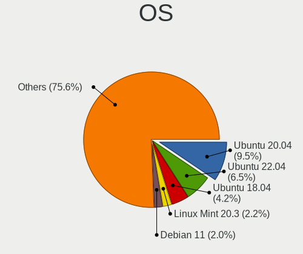
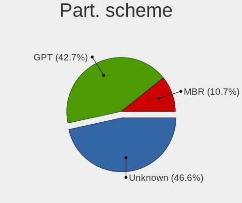
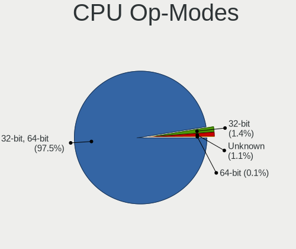
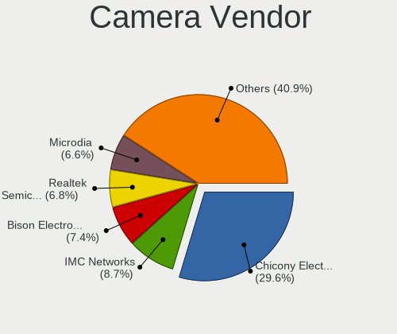

Linux in Germany - Tested Hardware & Statistics (Notebooks)
-----------------------------------------------------------

A project to collect tested hardware configurations for Linux in Germany.

Anyone can contribute to this report by the [hw-probe](https://github.com/linuxhw/hw-probe) tool:

    sudo -E hw-probe -all -upload

Please contribute! Especially if your hardware is rare.

Contents
--------

* [ Test Cases ](#test-cases)

* [ System ](#system)
  - [ OS                       ](#os)
  - [ OS Family                ](#os-family)
  - [ Kernel                   ](#kernel)
  - [ Kernel Family            ](#kernel-family)
  - [ Kernel Major Ver.        ](#kernel-major-ver)
  - [ Arch                     ](#arch)
  - [ DE                       ](#de)
  - [ Display Server           ](#display-server)
  - [ Display Manager          ](#display-manager)
  - [ OS Lang                  ](#os-lang)
  - [ Boot Mode                ](#boot-mode)
  - [ Filesystem               ](#filesystem)
  - [ Part. scheme             ](#part-scheme)
  - [ Dual Boot with Linux/BSD ](#dual-boot-with-linuxbsd)
  - [ Dual Boot (Win)          ](#dual-boot-win)

* [ Board ](#board)
  - [ Vendor                   ](#vendor)
  - [ Model                    ](#model)
  - [ Model Family             ](#model-family)
  - [ MFG Year                 ](#mfg-year)
  - [ Form Factor              ](#form-factor)
  - [ Secure Boot              ](#secure-boot)
  - [ Coreboot                 ](#coreboot)
  - [ RAM Size                 ](#ram-size)
  - [ RAM Used                 ](#ram-used)
  - [ Total Drives             ](#total-drives)
  - [ Has CD-ROM               ](#has-cd-rom)
  - [ Has Ethernet             ](#has-ethernet)
  - [ Has WiFi                 ](#has-wifi)
  - [ Has Bluetooth            ](#has-bluetooth)

* [ Location ](#location)
  - [ Country                  ](#country)
  - [ City                     ](#city)

* [ Drives ](#drives)
  - [ Drive Vendor             ](#drive-vendor)
  - [ Drive Model              ](#drive-model)
  - [ HDD Vendor               ](#hdd-vendor)
  - [ SSD Vendor               ](#ssd-vendor)
  - [ Drive Kind               ](#drive-kind)
  - [ Drive Connector          ](#drive-connector)
  - [ Drive Size               ](#drive-size)
  - [ Space Total              ](#space-total)
  - [ Space Used               ](#space-used)
  - [ Malfunc. Drives          ](#malfunc-drives)
  - [ Malfunc. Drive Vendor    ](#malfunc-drive-vendor)
  - [ Malfunc. HDD Vendor      ](#malfunc-hdd-vendor)
  - [ Malfunc. Drive Kind      ](#malfunc-drive-kind)
  - [ Failed Drives            ](#failed-drives)
  - [ Failed Drive Vendor      ](#failed-drive-vendor)
  - [ Drive Status             ](#drive-status)

* [ Storage controller ](#storage-controller)
  - [ Storage Vendor           ](#storage-vendor)
  - [ Storage Model            ](#storage-model)
  - [ Storage Kind             ](#storage-kind)

* [ Processor ](#processor)
  - [ CPU Vendor               ](#cpu-vendor)
  - [ CPU Model                ](#cpu-model)
  - [ CPU Model Family         ](#cpu-model-family)
  - [ CPU Cores                ](#cpu-cores)
  - [ CPU Sockets              ](#cpu-sockets)
  - [ CPU Threads              ](#cpu-threads)
  - [ CPU Op-Modes             ](#cpu-op-modes)
  - [ CPU Microcode            ](#cpu-microcode)
  - [ CPU Microarch            ](#cpu-microarch)

* [ Graphics ](#graphics)
  - [ GPU Vendor               ](#gpu-vendor)
  - [ GPU Model                ](#gpu-model)
  - [ GPU Combo                ](#gpu-combo)
  - [ GPU Driver               ](#gpu-driver)
  - [ GPU Memory               ](#gpu-memory)

* [ Monitor ](#monitor)
  - [ Monitor Vendor           ](#monitor-vendor)
  - [ Monitor Model            ](#monitor-model)
  - [ Monitor Resolution       ](#monitor-resolution)
  - [ Monitor Diagonal         ](#monitor-diagonal)
  - [ Monitor Width            ](#monitor-width)
  - [ Aspect Ratio             ](#aspect-ratio)
  - [ Monitor Area             ](#monitor-area)
  - [ Pixel Density            ](#pixel-density)
  - [ Multiple Monitors        ](#multiple-monitors)

* [ Network ](#network)
  - [ Net Controller Vendor    ](#net-controller-vendor)
  - [ Net Controller Model     ](#net-controller-model)
  - [ Wireless Vendor          ](#wireless-vendor)
  - [ Wireless Model           ](#wireless-model)
  - [ Ethernet Vendor          ](#ethernet-vendor)
  - [ Ethernet Model           ](#ethernet-model)
  - [ Net Controller Kind      ](#net-controller-kind)
  - [ Used Controller          ](#used-controller)
  - [ NICs                     ](#nics)
  - [ IPv6                     ](#ipv6)

* [ Bluetooth ](#bluetooth)
  - [ Bluetooth Vendor         ](#bluetooth-vendor)
  - [ Bluetooth Model          ](#bluetooth-model)

* [ Sound ](#sound)
  - [ Sound Vendor             ](#sound-vendor)
  - [ Sound Model              ](#sound-model)

* [ Memory ](#memory)
  - [ Memory Vendor            ](#memory-vendor)
  - [ Memory Model             ](#memory-model)
  - [ Memory Kind              ](#memory-kind)
  - [ Memory Form Factor       ](#memory-form-factor)
  - [ Memory Size              ](#memory-size)
  - [ Memory Speed             ](#memory-speed)

* [ Printers & scanners ](#printers--scanners)
  - [ Printer Vendor           ](#printer-vendor)
  - [ Printer Model            ](#printer-model)
  - [ Scanner Vendor           ](#scanner-vendor)
  - [ Scanner Model            ](#scanner-model)

* [ Camera ](#camera)
  - [ Camera Vendor            ](#camera-vendor)
  - [ Camera Model             ](#camera-model)

* [ Security ](#security)
  - [ Fingerprint Vendor       ](#fingerprint-vendor)
  - [ Fingerprint Model        ](#fingerprint-model)
  - [ Chipcard Vendor          ](#chipcard-vendor)
  - [ Chipcard Model           ](#chipcard-model)

* [ Unsupported ](#unsupported)
  - [ Unsupported Devices      ](#unsupported-devices)
  - [ Unsupported Device Types ](#unsupported-device-types)

Test Cases
----------

Total: 21533

| Vendor        | Model                       | Probe                                                      | Date         |
|---------------|-----------------------------|------------------------------------------------------------|--------------|
| HUAWEI        | MACHD-WXX9                  | [f10a2b06fd](https://linux-hardware.org/?probe=f10a2b06fd) | Jan 06, 2025 |
| Lenovo        | ThinkPad P14s Gen 3 21J5... | [f5e1468f62](https://linux-hardware.org/?probe=f5e1468f62) | Jan 06, 2025 |
| Medion        | Akoya E6240T                | [bb72b25bf7](https://linux-hardware.org/?probe=bb72b25bf7) | Jan 06, 2025 |
| Lenovo        | ThinkPad P51 20HJS0D201     | [f43357e57a](https://linux-hardware.org/?probe=f43357e57a) | Jan 06, 2025 |
| Dell          | Latitude E6230              | [255f27d863](https://linux-hardware.org/?probe=255f27d863) | Jan 06, 2025 |
| Lenovo        | V15 G4 IAH 83FS             | [54ea7cdde8](https://linux-hardware.org/?probe=54ea7cdde8) | Jan 06, 2025 |
| Lenovo        | ThinkPad T490s 20NYS60C0... | [795bfc1246](https://linux-hardware.org/?probe=795bfc1246) | Jan 05, 2025 |
| Acer          | Aspire 7520                 | [8633b8ad2a](https://linux-hardware.org/?probe=8633b8ad2a) | Jan 05, 2025 |
| Apple         | MacBookAir4,1               | [705713446f](https://linux-hardware.org/?probe=705713446f) | Jan 05, 2025 |
| Medion        | S6445 MD61489               | [7b72635681](https://linux-hardware.org/?probe=7b72635681) | Jan 05, 2025 |
| Dell          | Latitude 7390               | [48814ed45f](https://linux-hardware.org/?probe=48814ed45f) | Jan 05, 2025 |
| Chuwi         | GemiBook Pro                | [cb3ae7cb2a](https://linux-hardware.org/?probe=cb3ae7cb2a) | Jan 05, 2025 |
| Medion        | E6214                       | [e72344f20c](https://linux-hardware.org/?probe=e72344f20c) | Jan 05, 2025 |
| Chuwi         | GemiBook Pro                | [9518969af8](https://linux-hardware.org/?probe=9518969af8) | Jan 05, 2025 |
| HP            | Notebook                    | [077f55a6c7](https://linux-hardware.org/?probe=077f55a6c7) | Jan 05, 2025 |
| ASUSTek       | K93SV                       | [01d0efaf46](https://linux-hardware.org/?probe=01d0efaf46) | Jan 05, 2025 |
| Medion        | E6214                       | [1abed4b52d](https://linux-hardware.org/?probe=1abed4b52d) | Jan 05, 2025 |
| Dell          | XPS L412Z                   | [d8b969a9e6](https://linux-hardware.org/?probe=d8b969a9e6) | Jan 05, 2025 |
| Acer          | TravelMate 5210             | [379e44855f](https://linux-hardware.org/?probe=379e44855f) | Jan 05, 2025 |
| Dell          | XPS L412Z                   | [f4cfef6dcc](https://linux-hardware.org/?probe=f4cfef6dcc) | Jan 05, 2025 |
| Acer          | Aspire ES1-731              | [721fdec99d](https://linux-hardware.org/?probe=721fdec99d) | Jan 05, 2025 |
| Lenovo        | ThinkBook 14 G2 ITL 20VD    | [6a8e47f57b](https://linux-hardware.org/?probe=6a8e47f57b) | Jan 05, 2025 |
| Dell          | Precision M4400             | [6d8da5ac74](https://linux-hardware.org/?probe=6d8da5ac74) | Jan 05, 2025 |
| Medion        | P15648                      | [e4b0850870](https://linux-hardware.org/?probe=e4b0850870) | Jan 05, 2025 |
| Lenovo        | ThinkPad T14 Gen 5 21MCC... | [6e4f05f56f](https://linux-hardware.org/?probe=6e4f05f56f) | Jan 05, 2025 |
| HP            | ZBook Firefly 14 inch G8... | [a322d502b8](https://linux-hardware.org/?probe=a322d502b8) | Jan 05, 2025 |
| Lenovo        | IdeaPad Slim 5 14AHP9 83... | [370ebbc151](https://linux-hardware.org/?probe=370ebbc151) | Jan 04, 2025 |
| HP            | ProBook 430 G7              | [f1b89f85cf](https://linux-hardware.org/?probe=f1b89f85cf) | Jan 04, 2025 |
| Dell          | Latitude E6230              | [90371159c4](https://linux-hardware.org/?probe=90371159c4) | Jan 04, 2025 |
| Lenovo        | IdeaPad U450p 3389          | [c01ce6e337](https://linux-hardware.org/?probe=c01ce6e337) | Jan 04, 2025 |
| Lenovo        | ThinkPad E15 Gen 4 21E60... | [efef40bae6](https://linux-hardware.org/?probe=efef40bae6) | Jan 04, 2025 |
| Apple         | MacBookAir6,2               | [2a0e5e8dee](https://linux-hardware.org/?probe=2a0e5e8dee) | Jan 04, 2025 |
| TUXEDO        | Book XP15 / XP17 Gen12      | [be06c286bb](https://linux-hardware.org/?probe=be06c286bb) | Jan 04, 2025 |
| Lenovo        | ThinkPad T530 2394A11       | [87cb15684c](https://linux-hardware.org/?probe=87cb15684c) | Jan 04, 2025 |
| TCL Commun... | 8085                        | [92e147d4fa](https://linux-hardware.org/?probe=92e147d4fa) | Jan 04, 2025 |
| Sony          | VPCSB1V9E                   | [b96a412efa](https://linux-hardware.org/?probe=b96a412efa) | Jan 03, 2025 |
| Apple         | MacBookAir6,2               | [ba9cefc697](https://linux-hardware.org/?probe=ba9cefc697) | Jan 03, 2025 |
| MSI           | MS-16Y1                     | [7125d07ec2](https://linux-hardware.org/?probe=7125d07ec2) | Jan 03, 2025 |
| ASUSTek       | ASUS TUF Gaming A16 FA60... | [c649f47fe2](https://linux-hardware.org/?probe=c649f47fe2) | Jan 03, 2025 |
| HP            | 250 G7 Notebook PC          | [6bf480c75a](https://linux-hardware.org/?probe=6bf480c75a) | Jan 03, 2025 |
| Dell          | Latitude 5290 2-in-1        | [0b277582ac](https://linux-hardware.org/?probe=0b277582ac) | Jan 03, 2025 |
| Lenovo        | ThinkPad T440s 20ARS1EQ0... | [84f58ef48f](https://linux-hardware.org/?probe=84f58ef48f) | Jan 03, 2025 |
| Framework     | Laptop 13 (AMD Ryzen 704... | [041f977a25](https://linux-hardware.org/?probe=041f977a25) | Jan 03, 2025 |
| Lenovo        | Legion 5 Pro 16IAH7H 82R... | [5bf46c517c](https://linux-hardware.org/?probe=5bf46c517c) | Jan 03, 2025 |
| Lenovo        | Legion 5 Pro 16IAH7H 82R... | [763d34b165](https://linux-hardware.org/?probe=763d34b165) | Jan 03, 2025 |
| Acer          | Extensa 215-55              | [fc29d8c8b1](https://linux-hardware.org/?probe=fc29d8c8b1) | Jan 03, 2025 |
| Acer          | Aspire V5-591G              | [fba09b3376](https://linux-hardware.org/?probe=fba09b3376) | Jan 03, 2025 |
| HP            | EliteBook 850 G8 Noteboo... | [514cd1a8a0](https://linux-hardware.org/?probe=514cd1a8a0) | Jan 03, 2025 |
| TUXEDO        | Stellaris Slim 15 Intel ... | [ed65b54407](https://linux-hardware.org/?probe=ed65b54407) | Jan 03, 2025 |
| Lenovo        | IdeaPad 3 15ITL6 82H8       | [58e41b0f0f](https://linux-hardware.org/?probe=58e41b0f0f) | Jan 03, 2025 |
| ASUSTek       | UL50Vg                      | [6305475a87](https://linux-hardware.org/?probe=6305475a87) | Jan 03, 2025 |
| Lenovo        | ThinkPad T430 2349H2G       | [afcca700da](https://linux-hardware.org/?probe=afcca700da) | Jan 03, 2025 |
| HP            | 15                          | [6f317ce763](https://linux-hardware.org/?probe=6f317ce763) | Jan 03, 2025 |
| HP            | ProBook 445 G7              | [8e56333050](https://linux-hardware.org/?probe=8e56333050) | Jan 03, 2025 |
| HP            | 250 G8 Notebook PC          | [d5b66faf28](https://linux-hardware.org/?probe=d5b66faf28) | Jan 02, 2025 |
| HP            | OMEN by Laptop 15-dh1xxx    | [c1c82e2ff7](https://linux-hardware.org/?probe=c1c82e2ff7) | Jan 02, 2025 |
| Fujitsu       | LIFEBOOK UH572              | [5625a23ef5](https://linux-hardware.org/?probe=5625a23ef5) | Jan 02, 2025 |
| Acer          | Aspire E5-575G              | [bea4bbd29a](https://linux-hardware.org/?probe=bea4bbd29a) | Jan 02, 2025 |
| Lenovo        | IdeaPad 320-15IKB 80XL      | [b90f085315](https://linux-hardware.org/?probe=b90f085315) | Jan 02, 2025 |
| Sony          | VPCSB1V9E                   | [4a49ef6e88](https://linux-hardware.org/?probe=4a49ef6e88) | Jan 02, 2025 |
| Lenovo        | ThinkPad T450s 20BX0011G... | [6e3771b5de](https://linux-hardware.org/?probe=6e3771b5de) | Jan 02, 2025 |
| Lenovo        | ThinkPad T14 Gen 3 21AH0... | [8be01ca5c2](https://linux-hardware.org/?probe=8be01ca5c2) | Jan 02, 2025 |
| Medion        | Akoya E6240T                | [dc4b306a46](https://linux-hardware.org/?probe=dc4b306a46) | Jan 02, 2025 |
| ASUSTek       | Vivobook Go E1504FA_E150... | [e2dc314209](https://linux-hardware.org/?probe=e2dc314209) | Jan 02, 2025 |
| Google        | Ekko                        | [865ffecf0e](https://linux-hardware.org/?probe=865ffecf0e) | Jan 02, 2025 |
| Google        | Ekko                        | [54fbbe0cfb](https://linux-hardware.org/?probe=54fbbe0cfb) | Jan 01, 2025 |
| ASUSTek       | ASUS TUF Gaming A16 FA60... | [bfe08359ed](https://linux-hardware.org/?probe=bfe08359ed) | Jan 01, 2025 |
| Acer          | Aspire E5-575G              | [131ac42ca5](https://linux-hardware.org/?probe=131ac42ca5) | Jan 01, 2025 |
| Acer          | Aspire 8951G                | [238300d1c0](https://linux-hardware.org/?probe=238300d1c0) | Jan 01, 2025 |
| Dell          | XPS 13 9310                 | [f07db9b11e](https://linux-hardware.org/?probe=f07db9b11e) | Jan 01, 2025 |
| ASUSTek       | K93SM                       | [de80ff2a02](https://linux-hardware.org/?probe=de80ff2a02) | Jan 01, 2025 |
| Acer          | Aspire 5750G                | [4c99e58ae4](https://linux-hardware.org/?probe=4c99e58ae4) | Jan 01, 2025 |
| ASUSTek       | VivoBook_ASUSLaptop M160... | [473fe2119f](https://linux-hardware.org/?probe=473fe2119f) | Jan 01, 2025 |
| HUAWEI        | MACHD-WXX9                  | [f7cc7cc8d1](https://linux-hardware.org/?probe=f7cc7cc8d1) | Jan 01, 2025 |
| Lenovo        | ThinkPad T430 2349SVA       | [654dbcabab](https://linux-hardware.org/?probe=654dbcabab) | Jan 01, 2025 |
| Lenovo        | ThinkPad T560 20FJS44L0B    | [56b90e34ae](https://linux-hardware.org/?probe=56b90e34ae) | Dec 31, 2024 |
| HP            | Pavilion g7                 | [5692787b6f](https://linux-hardware.org/?probe=5692787b6f) | Dec 31, 2024 |
| HP            | 250 15.6 inch G10           | [94fdf69690](https://linux-hardware.org/?probe=94fdf69690) | Dec 31, 2024 |
| TUXEDO        | Stellaris Slim 15 Intel ... | [939d33fa22](https://linux-hardware.org/?probe=939d33fa22) | Dec 31, 2024 |
| HP            | EliteBook 840 G3            | [f1bc5970f8](https://linux-hardware.org/?probe=f1bc5970f8) | Dec 31, 2024 |
| Lenovo        | ThinkPad T560 20FJS1WT00    | [f78acad9fd](https://linux-hardware.org/?probe=f78acad9fd) | Dec 31, 2024 |
| Lenovo        | B560 43308LG                | [e4f739103a](https://linux-hardware.org/?probe=e4f739103a) | Dec 31, 2024 |
| TUXEDO        | Stellaris Slim 15 Intel ... | [b8198ebf58](https://linux-hardware.org/?probe=b8198ebf58) | Dec 31, 2024 |
| Lenovo        | ThinkPad E15 Gen 4 21ED0... | [1a707fd487](https://linux-hardware.org/?probe=1a707fd487) | Dec 31, 2024 |
| Lenovo        | IdeaPad S540-14IWL 81ND     | [a1dfd54db3](https://linux-hardware.org/?probe=a1dfd54db3) | Dec 31, 2024 |
| Packard Be... | EasyNote LS11HR             | [2ac39a88cd](https://linux-hardware.org/?probe=2ac39a88cd) | Dec 30, 2024 |
| ASUSTek       | K53BR                       | [077a4205f3](https://linux-hardware.org/?probe=077a4205f3) | Dec 30, 2024 |
| HP            | Laptop 15-fd0xxx            | [f48e15c91b](https://linux-hardware.org/?probe=f48e15c91b) | Dec 30, 2024 |
| Lenovo        | IdeaPad 1 15ALC7 82R4       | [4eccb193ff](https://linux-hardware.org/?probe=4eccb193ff) | Dec 30, 2024 |
| Lenovo        | ThinkPad E570 20H5S0CF00    | [1b1018c49e](https://linux-hardware.org/?probe=1b1018c49e) | Dec 30, 2024 |
| HP            | Notebook                    | [2df48c8eb2](https://linux-hardware.org/?probe=2df48c8eb2) | Dec 30, 2024 |
| Lenovo        | ThinkPad X220 4290EC5       | [0a01dc8cd8](https://linux-hardware.org/?probe=0a01dc8cd8) | Dec 30, 2024 |
| Lenovo        | ThinkPad P50 20EQS12Q06     | [794c492899](https://linux-hardware.org/?probe=794c492899) | Dec 30, 2024 |
| ASUSTek       | X751SA                      | [11d8d9b891](https://linux-hardware.org/?probe=11d8d9b891) | Dec 30, 2024 |
| HP            | EliteBook 660 16 inch G1... | [97a21cd2b9](https://linux-hardware.org/?probe=97a21cd2b9) | Dec 30, 2024 |
| Dell          | Latitude E6320              | [0d3a82be0d](https://linux-hardware.org/?probe=0d3a82be0d) | Dec 30, 2024 |
| Google        | Akemi                       | [ed96f41d09](https://linux-hardware.org/?probe=ed96f41d09) | Dec 29, 2024 |
| Lenovo        | ThinkBook 14 G2 ITL 20VD    | [64c5deb6a7](https://linux-hardware.org/?probe=64c5deb6a7) | Dec 29, 2024 |
| HP            | Laptop 17-cp0xxx            | [d87a6139f6](https://linux-hardware.org/?probe=d87a6139f6) | Dec 29, 2024 |
| HP            | EliteBook 8730w             | [26e363efb2](https://linux-hardware.org/?probe=26e363efb2) | Dec 29, 2024 |
| HP            | Laptop 17-cp0xxx            | [0f9af93612](https://linux-hardware.org/?probe=0f9af93612) | Dec 29, 2024 |
| HP            | EliteBook 840 G5            | [85caa6254a](https://linux-hardware.org/?probe=85caa6254a) | Dec 29, 2024 |
| Lenovo        | ThinkPad T450s 20BWS5F40... | [8bb1dde48e](https://linux-hardware.org/?probe=8bb1dde48e) | Dec 29, 2024 |
| HP            | EliteBook 865 16 inch G1... | [7770de23f8](https://linux-hardware.org/?probe=7770de23f8) | Dec 29, 2024 |
| MSI           | GL73 8SC                    | [77d8c60ea1](https://linux-hardware.org/?probe=77d8c60ea1) | Dec 29, 2024 |
| MSI           | GL73 8SC                    | [57691f4432](https://linux-hardware.org/?probe=57691f4432) | Dec 29, 2024 |
| HP            | EliteBook 8470p             | [7eb67d9141](https://linux-hardware.org/?probe=7eb67d9141) | Dec 29, 2024 |
| Dell          | Inspiron 15 3511            | [bd840e0eeb](https://linux-hardware.org/?probe=bd840e0eeb) | Dec 28, 2024 |
| Lenovo        | IdeaPad L340-15API 81LW     | [fe8d690d1d](https://linux-hardware.org/?probe=fe8d690d1d) | Dec 28, 2024 |
| Lenovo        | IdeaPad L340-15API 81LW     | [40921a0302](https://linux-hardware.org/?probe=40921a0302) | Dec 28, 2024 |
| Valve         | Jupiter                     | [7ae5afa5ea](https://linux-hardware.org/?probe=7ae5afa5ea) | Dec 28, 2024 |
| ASUSTek       | X751SA                      | [2f216406f5](https://linux-hardware.org/?probe=2f216406f5) | Dec 28, 2024 |
| MSI           | Thin GF63 12UC              | [80bc381a84](https://linux-hardware.org/?probe=80bc381a84) | Dec 28, 2024 |
| HUAWEI        | FLMH-XX                     | [741c280fca](https://linux-hardware.org/?probe=741c280fca) | Dec 28, 2024 |
| HUAWEI        | FLMH-XX                     | [9f52e1834c](https://linux-hardware.org/?probe=9f52e1834c) | Dec 28, 2024 |
| Lenovo        | IdeaPad 3 15ALC6 82KU       | [e428436322](https://linux-hardware.org/?probe=e428436322) | Dec 27, 2024 |
| Lenovo        | ThinkPad E15 Gen 3 20YG0... | [232b0fc3b1](https://linux-hardware.org/?probe=232b0fc3b1) | Dec 27, 2024 |
| Dell          | Venue 11 Pro 7140           | [a91398af2a](https://linux-hardware.org/?probe=a91398af2a) | Dec 27, 2024 |
| Dell          | XPS L701X                   | [6cd016a478](https://linux-hardware.org/?probe=6cd016a478) | Dec 27, 2024 |
| Valve         | Jupiter                     | [f13430f9ec](https://linux-hardware.org/?probe=f13430f9ec) | Dec 27, 2024 |
| Fujitsu Si... | LIFEBOOK S7220              | [7aa92e6daf](https://linux-hardware.org/?probe=7aa92e6daf) | Dec 27, 2024 |
| Fujitsu Si... | LIFEBOOK S7220              | [2f65653f5c](https://linux-hardware.org/?probe=2f65653f5c) | Dec 27, 2024 |
| Dell          | Precision 7520              | [ad770a5b2a](https://linux-hardware.org/?probe=ad770a5b2a) | Dec 27, 2024 |
| Packard Be... | EasyNote TJ75               | [7a5bc8251a](https://linux-hardware.org/?probe=7a5bc8251a) | Dec 27, 2024 |
| Packard Be... | EasyNote TJ75               | [b46109e7f3](https://linux-hardware.org/?probe=b46109e7f3) | Dec 27, 2024 |
| Toshiba       | Satellite Pro L70-A         | [ea36b0013b](https://linux-hardware.org/?probe=ea36b0013b) | Dec 27, 2024 |
| MSI           | MS-16Y1                     | [4083d820ac](https://linux-hardware.org/?probe=4083d820ac) | Dec 27, 2024 |
| MicroByte     | ezbook                      | [0e74630fca](https://linux-hardware.org/?probe=0e74630fca) | Dec 26, 2024 |
| MicroByte     | ezbook                      | [89e57e9b60](https://linux-hardware.org/?probe=89e57e9b60) | Dec 26, 2024 |
| Acer          | Aspire 7750G                | [18a8d13fe9](https://linux-hardware.org/?probe=18a8d13fe9) | Dec 26, 2024 |
| Dell          | XPS 13 9305                 | [3bdc4d61ed](https://linux-hardware.org/?probe=3bdc4d61ed) | Dec 26, 2024 |
| Unknown       | Unknown                     | [dae997fee3](https://linux-hardware.org/?probe=dae997fee3) | Dec 26, 2024 |
| Lenovo        | ThinkPad T14s Gen 6 21M1... | [1111c1a9ac](https://linux-hardware.org/?probe=1111c1a9ac) | Dec 26, 2024 |
| Apple         | MacBookPro11,3              | [f82f2bf488](https://linux-hardware.org/?probe=f82f2bf488) | Dec 25, 2024 |
| Lenovo        | V15 G4 AMN 82YU             | [8fa9064e33](https://linux-hardware.org/?probe=8fa9064e33) | Dec 25, 2024 |
| ASUSTek       | ROG Zephyrus G14 GA401II... | [f561382ccd](https://linux-hardware.org/?probe=f561382ccd) | Dec 25, 2024 |
| Acer          | Extensa 215-55              | [b6002937c1](https://linux-hardware.org/?probe=b6002937c1) | Dec 25, 2024 |
| HP            | Laptop 15-db1xxx            | [7215777564](https://linux-hardware.org/?probe=7215777564) | Dec 25, 2024 |
| Lenovo        | IdeaPad 1 15ALC7 82R4       | [c499200c01](https://linux-hardware.org/?probe=c499200c01) | Dec 25, 2024 |
| Lenovo        | ThinkPad T14s Gen 6 21M1... | [96c145445a](https://linux-hardware.org/?probe=96c145445a) | Dec 25, 2024 |
| Lenovo        | ThinkPad T470 W10DG 20JN... | [7e06f1b7f3](https://linux-hardware.org/?probe=7e06f1b7f3) | Dec 25, 2024 |
| Lenovo        | V15-IGL 82C3                | [2d1b592d60](https://linux-hardware.org/?probe=2d1b592d60) | Dec 25, 2024 |
| Acer          | Aspire V5-573G              | [45f86a09ae](https://linux-hardware.org/?probe=45f86a09ae) | Dec 25, 2024 |
| ASUSTek       | VivoBook_ASUSLaptop X515... | [c317540642](https://linux-hardware.org/?probe=c317540642) | Dec 24, 2024 |
| HP            | ProBook 470 G5              | [30f50d84d3](https://linux-hardware.org/?probe=30f50d84d3) | Dec 24, 2024 |
| Fujitsu       | LIFEBOOK A357               | [695f75c7e1](https://linux-hardware.org/?probe=695f75c7e1) | Dec 24, 2024 |
| Acer          | Aspire E5-571               | [30ee5ab8eb](https://linux-hardware.org/?probe=30ee5ab8eb) | Dec 24, 2024 |
| ASUSTek       | ASUS TUF Gaming A17 FA70... | [1c4acdd4ee](https://linux-hardware.org/?probe=1c4acdd4ee) | Dec 24, 2024 |
| HP            | Laptop 15-db1xxx            | [f570b2eb57](https://linux-hardware.org/?probe=f570b2eb57) | Dec 24, 2024 |
| Acer          | Aspire A517-52G             | [57e5324151](https://linux-hardware.org/?probe=57e5324151) | Dec 24, 2024 |
| Lenovo        | ThinkPad T450s 20BX000WG... | [f435edfb1d](https://linux-hardware.org/?probe=f435edfb1d) | Dec 24, 2024 |
| Schenker      | XMG Mobile A507 VE          | [883657a313](https://linux-hardware.org/?probe=883657a313) | Dec 24, 2024 |
| Lenovo        | ThinkBook 15 G3 ACL 21A4    | [678bac446f](https://linux-hardware.org/?probe=678bac446f) | Dec 24, 2024 |
| Lenovo        | ThinkPad T460s 20F90042G... | [d007cb01ec](https://linux-hardware.org/?probe=d007cb01ec) | Dec 24, 2024 |
| Lenovo        | G585 2181                   | [0004a20215](https://linux-hardware.org/?probe=0004a20215) | Dec 24, 2024 |
| Fujitsu       | LIFEBOOK AH532              | [aa2e5f57ac](https://linux-hardware.org/?probe=aa2e5f57ac) | Dec 24, 2024 |
| Teclast       | F6 Plus                     | [143094aa18](https://linux-hardware.org/?probe=143094aa18) | Dec 23, 2024 |
| Notebook      | W35xSTQ_370ST               | [ec6c6385d5](https://linux-hardware.org/?probe=ec6c6385d5) | Dec 23, 2024 |
| Acer          | Aspire A315-58              | [b49f4674e2](https://linux-hardware.org/?probe=b49f4674e2) | Dec 23, 2024 |
| Dell          | Venue 11 Pro 5130           | [f973f4c831](https://linux-hardware.org/?probe=f973f4c831) | Dec 23, 2024 |
| Samsung       | R530/R730/P530              | [2c69e47fef](https://linux-hardware.org/?probe=2c69e47fef) | Dec 23, 2024 |
| Samsung       | R530/R730/P530              | [86fbdd5542](https://linux-hardware.org/?probe=86fbdd5542) | Dec 23, 2024 |
| Dell          | XPS 13 9370                 | [eb470bad41](https://linux-hardware.org/?probe=eb470bad41) | Dec 23, 2024 |
| Lenovo        | V15 G4 IRU 83A1             | [4053c77698](https://linux-hardware.org/?probe=4053c77698) | Dec 23, 2024 |
| ECT           | Unknown                     | [1bcbfee6c4](https://linux-hardware.org/?probe=1bcbfee6c4) | Dec 23, 2024 |
| Lenovo        | V15 G4 IRU 83A1             | [252f3e5bb8](https://linux-hardware.org/?probe=252f3e5bb8) | Dec 23, 2024 |
| Lenovo        | ThinkPad X1 Carbon 6th 2... | [07df89f610](https://linux-hardware.org/?probe=07df89f610) | Dec 23, 2024 |
| Acer          | Aspire V5-431P              | [c0f17443e2](https://linux-hardware.org/?probe=c0f17443e2) | Dec 23, 2024 |
| Lenovo        | ThinkPad X220 4291SJ4       | [02c33be47f](https://linux-hardware.org/?probe=02c33be47f) | Dec 23, 2024 |
| Apple         | MacBookPro11,3              | [b6aa51489b](https://linux-hardware.org/?probe=b6aa51489b) | Dec 22, 2024 |
| Apple         | MacBookPro16,1              | [29e232bc14](https://linux-hardware.org/?probe=29e232bc14) | Dec 22, 2024 |
| TUXEDO        | N650DU                      | [00621c75d7](https://linux-hardware.org/?probe=00621c75d7) | Dec 22, 2024 |
| Clevo         | P170HMx                     | [c0ec7e3011](https://linux-hardware.org/?probe=c0ec7e3011) | Dec 22, 2024 |
| ASUSTek       | ASUS TUF Gaming A15 FA50... | [3c5d68845b](https://linux-hardware.org/?probe=3c5d68845b) | Dec 22, 2024 |
| Dell          | Studio 1537                 | [fcd0982e88](https://linux-hardware.org/?probe=fcd0982e88) | Dec 22, 2024 |
| HP            | EliteBook 855 G7 Noteboo... | [b10a15562d](https://linux-hardware.org/?probe=b10a15562d) | Dec 22, 2024 |
| Dell          | Latitude E6230              | [dbbf8b8c46](https://linux-hardware.org/?probe=dbbf8b8c46) | Dec 22, 2024 |
| Acer          | Aspire A515-51G             | [6d732c3b4d](https://linux-hardware.org/?probe=6d732c3b4d) | Dec 22, 2024 |
| Apple         | MacBookAir7,2               | [762ab31569](https://linux-hardware.org/?probe=762ab31569) | Dec 22, 2024 |
| Toshiba       | Satellite Pro S500          | [4e2a69384d](https://linux-hardware.org/?probe=4e2a69384d) | Dec 22, 2024 |
| Lenovo        | IdeaPad 3 15ITL6 82H8       | [60574fca06](https://linux-hardware.org/?probe=60574fca06) | Dec 22, 2024 |
| Lenovo        | ThinkPad X220 4290W4H       | [90831fdec2](https://linux-hardware.org/?probe=90831fdec2) | Dec 22, 2024 |
| Lenovo        | ThinkPad X220 4290W4H       | [c3d75237a3](https://linux-hardware.org/?probe=c3d75237a3) | Dec 22, 2024 |
| Lenovo        | ThinkPad T14 Gen 1 20UES... | [5d3fd9ff71](https://linux-hardware.org/?probe=5d3fd9ff71) | Dec 22, 2024 |
| Lenovo        | ThinkPad T14s 20UJS1RG00    | [71a8fc50f2](https://linux-hardware.org/?probe=71a8fc50f2) | Dec 22, 2024 |
| Acer          | Swift SF315-51G             | [52ed0ca55e](https://linux-hardware.org/?probe=52ed0ca55e) | Dec 22, 2024 |
| Acer          | Swift SF315-51G             | [69b8980a29](https://linux-hardware.org/?probe=69b8980a29) | Dec 22, 2024 |
| Dell          | Precision 3591              | [e1c2dd2dce](https://linux-hardware.org/?probe=e1c2dd2dce) | Dec 21, 2024 |
| Dell          | Precision 7540              | [8ec149c474](https://linux-hardware.org/?probe=8ec149c474) | Dec 21, 2024 |
| Lenovo        | LOQ 15AHP9 83DX             | [ced0769044](https://linux-hardware.org/?probe=ced0769044) | Dec 21, 2024 |
| TUXEDO        | InfinityBook Pro Gen8 (M... | [c094245674](https://linux-hardware.org/?probe=c094245674) | Dec 21, 2024 |
| Chuwi         | GemiBook XPro               | [cf7ccb0604](https://linux-hardware.org/?probe=cf7ccb0604) | Dec 21, 2024 |
| Acer          | Swift SFG14-63              | [fcebbc10bd](https://linux-hardware.org/?probe=fcebbc10bd) | Dec 21, 2024 |
| HP            | ENVY 15                     | [2bdd1f696d](https://linux-hardware.org/?probe=2bdd1f696d) | Dec 21, 2024 |
| Dell          | Latitude E7440              | [f9518bb970](https://linux-hardware.org/?probe=f9518bb970) | Dec 21, 2024 |
| ASUSTek       | VivoBook_ASUSLaptop M160... | [c846ce8e60](https://linux-hardware.org/?probe=c846ce8e60) | Dec 21, 2024 |
| Unknown       | Unknown                     | [1359327212](https://linux-hardware.org/?probe=1359327212) | Dec 21, 2024 |
| HP            | 255 G7 Notebook PC          | [441e9a9166](https://linux-hardware.org/?probe=441e9a9166) | Dec 21, 2024 |
| HP            | EliteBook 8460p             | [e6b69d0a95](https://linux-hardware.org/?probe=e6b69d0a95) | Dec 21, 2024 |
| Samsung       | 300E4A/300E5A/300E7A/343... | [6461bf27f1](https://linux-hardware.org/?probe=6461bf27f1) | Dec 20, 2024 |
| HP            | OMEN by Laptop 16-c0xxx     | [95118d357e](https://linux-hardware.org/?probe=95118d357e) | Dec 20, 2024 |
| HP            | EliteBook 2570p             | [3c71e277f8](https://linux-hardware.org/?probe=3c71e277f8) | Dec 20, 2024 |
| Fujitsu       | LIFEBOOK U758               | [2c6a5d22c1](https://linux-hardware.org/?probe=2c6a5d22c1) | Dec 20, 2024 |
| Apple         | MacBookPro11,1              | [e46b293cc4](https://linux-hardware.org/?probe=e46b293cc4) | Dec 20, 2024 |
| HP            | EliteBook 850 G7 Noteboo... | [626607be57](https://linux-hardware.org/?probe=626607be57) | Dec 20, 2024 |
| HUAWEI        | HN-WX9X                     | [2b2541ddf3](https://linux-hardware.org/?probe=2b2541ddf3) | Dec 20, 2024 |
| HUAWEI        | HN-WX9X                     | [7749a94f08](https://linux-hardware.org/?probe=7749a94f08) | Dec 20, 2024 |
| Fujitsu       | LIFEBOOK U727               | [b08ef8f5a1](https://linux-hardware.org/?probe=b08ef8f5a1) | Dec 20, 2024 |
| TUXEDO        | InfinityBook Pro AMD Gen... | [1b7b6fe18c](https://linux-hardware.org/?probe=1b7b6fe18c) | Dec 20, 2024 |
| HP            | Laptop 17-ak0xx             | [e6bf8e1152](https://linux-hardware.org/?probe=e6bf8e1152) | Dec 20, 2024 |
| ASUSTek       | ASUS Zenbook S 14 UX5406... | [2ac89c432d](https://linux-hardware.org/?probe=2ac89c432d) | Dec 19, 2024 |
| HP            | Laptop 17-cp0xxx            | [fb6b122d69](https://linux-hardware.org/?probe=fb6b122d69) | Dec 19, 2024 |
| TUXEDO        | W65_W67RC                   | [7b484dafab](https://linux-hardware.org/?probe=7b484dafab) | Dec 19, 2024 |
| Lenovo        | ThinkPad T430 23498F0       | [4b2306ff9f](https://linux-hardware.org/?probe=4b2306ff9f) | Dec 19, 2024 |
| Apple         | MacBookPro8,1               | [4d69e2afb5](https://linux-hardware.org/?probe=4d69e2afb5) | Dec 19, 2024 |
| Acer          | Aspire A515-51G             | [283f579ff7](https://linux-hardware.org/?probe=283f579ff7) | Dec 19, 2024 |
| Acer          | Swift SF314-54G             | [3f7732cb40](https://linux-hardware.org/?probe=3f7732cb40) | Dec 19, 2024 |
| Acer          | Swift SF314-54G             | [c2b2b94ff9](https://linux-hardware.org/?probe=c2b2b94ff9) | Dec 19, 2024 |
| Acer          | TravelMate B117-M           | [3c94b53aed](https://linux-hardware.org/?probe=3c94b53aed) | Dec 19, 2024 |
| ASUSTek       | ASUS TUF Gaming A15 FA50... | [b7eb2f1d4a](https://linux-hardware.org/?probe=b7eb2f1d4a) | Dec 19, 2024 |
| Dell          | XPS 13 9360                 | [ec5391814e](https://linux-hardware.org/?probe=ec5391814e) | Dec 19, 2024 |
| Fujitsu       | LIFEBOOK S751               | [54be502c46](https://linux-hardware.org/?probe=54be502c46) | Dec 19, 2024 |
| Valve         | Galileo                     | [45a67a7577](https://linux-hardware.org/?probe=45a67a7577) | Dec 19, 2024 |
| Lenovo        | ThinkPad P15 Gen 2i 20YQ... | [2653ad16d9](https://linux-hardware.org/?probe=2653ad16d9) | Dec 18, 2024 |
| Medion        | S6445 MD61489               | [678fefd644](https://linux-hardware.org/?probe=678fefd644) | Dec 18, 2024 |
| Medion        | S6445 MD61489               | [ddd924a519](https://linux-hardware.org/?probe=ddd924a519) | Dec 18, 2024 |
| Gigabyte      | G5 KF                       | [0de16a6384](https://linux-hardware.org/?probe=0de16a6384) | Dec 18, 2024 |
| Notebook      | V5xTNC_TND_TNE              | [fdd2309e0b](https://linux-hardware.org/?probe=fdd2309e0b) | Dec 18, 2024 |
| Panasonic     | CF-31WFL52CM                | [566d39243d](https://linux-hardware.org/?probe=566d39243d) | Dec 18, 2024 |
| HP            | Victus by Gaming Laptop ... | [d0585de2f5](https://linux-hardware.org/?probe=d0585de2f5) | Dec 18, 2024 |
| Dell          | Latitude E6420              | [61b47c3fd3](https://linux-hardware.org/?probe=61b47c3fd3) | Dec 18, 2024 |
| HP            | Victus by Gaming Laptop ... | [49259c4221](https://linux-hardware.org/?probe=49259c4221) | Dec 18, 2024 |
| AWOW          | Unknown                     | [f73fb0b0a2](https://linux-hardware.org/?probe=f73fb0b0a2) | Dec 18, 2024 |
| ASUSTek       | ASUS TUF Gaming A15 FA50... | [e823717ef8](https://linux-hardware.org/?probe=e823717ef8) | Dec 18, 2024 |
| Framework     | Laptop 16 (AMD Ryzen 704... | [f332a63f55](https://linux-hardware.org/?probe=f332a63f55) | Dec 18, 2024 |
| Dell          | Precision 5530              | [3292cf1103](https://linux-hardware.org/?probe=3292cf1103) | Dec 18, 2024 |
| ASUSTek       | VivoBook_ASUSLaptop X412... | [2748e82ed7](https://linux-hardware.org/?probe=2748e82ed7) | Dec 18, 2024 |
| Lenovo        | ThinkPad T495 20NKS2JD00    | [31a4026530](https://linux-hardware.org/?probe=31a4026530) | Dec 17, 2024 |
| Acer          | Aspire 1810TZ               | [1dd425b482](https://linux-hardware.org/?probe=1dd425b482) | Dec 17, 2024 |
| Lenovo        | ThinkPad Z13 Gen 2 21JVC... | [9499feb64f](https://linux-hardware.org/?probe=9499feb64f) | Dec 17, 2024 |
| Lenovo        | ThinkPad X220 4290EC5       | [2226f6a8b2](https://linux-hardware.org/?probe=2226f6a8b2) | Dec 17, 2024 |
| ASUSTek       | X751MA                      | [016d948a0c](https://linux-hardware.org/?probe=016d948a0c) | Dec 17, 2024 |
| Acer          | Aspire A114-31              | [e0c8e5e63e](https://linux-hardware.org/?probe=e0c8e5e63e) | Dec 17, 2024 |
| Lenovo        | ThinkPad X280 20KES2EW08    | [bbd058898c](https://linux-hardware.org/?probe=bbd058898c) | Dec 17, 2024 |
| Lenovo        | ThinkPad T440p 20AWS2LW0... | [3464a40343](https://linux-hardware.org/?probe=3464a40343) | Dec 16, 2024 |
| Acer          | Nitro AN517-41              | [f38612e788](https://linux-hardware.org/?probe=f38612e788) | Dec 16, 2024 |
| Lenovo        | ThinkPad T570 20H90002RI    | [a1ff05a59d](https://linux-hardware.org/?probe=a1ff05a59d) | Dec 16, 2024 |
| HP            | EliteBook 860 16 inch G1... | [792e2c0b50](https://linux-hardware.org/?probe=792e2c0b50) | Dec 16, 2024 |
| ASUSTek       | ROG Zephyrus G14 GA403UI... | [47735961f4](https://linux-hardware.org/?probe=47735961f4) | Dec 16, 2024 |
| Lenovo        | ThinkPad T430 2344BZU       | [ac4fded955](https://linux-hardware.org/?probe=ac4fded955) | Dec 16, 2024 |
| Sony          | VPCM12M1E                   | [eca3984533](https://linux-hardware.org/?probe=eca3984533) | Dec 16, 2024 |
| Toshiba       | Satellite S70-B             | [384c0e568a](https://linux-hardware.org/?probe=384c0e568a) | Dec 16, 2024 |
| Razer         | Blade 15 Base Model (Ear... | [b0bd3f61fd](https://linux-hardware.org/?probe=b0bd3f61fd) | Dec 15, 2024 |
| Lenovo        | ThinkPad T520 42435JG       | [0069219ace](https://linux-hardware.org/?probe=0069219ace) | Dec 15, 2024 |
| Lenovo        | IdeaPad 110-17IKB 80VK      | [49514aa9cc](https://linux-hardware.org/?probe=49514aa9cc) | Dec 15, 2024 |
| Dell          | XPS 13 9370                 | [e6d3cb85c1](https://linux-hardware.org/?probe=e6d3cb85c1) | Dec 15, 2024 |
| Lenovo        | V145-15AST 81MT             | [65a80c8ae1](https://linux-hardware.org/?probe=65a80c8ae1) | Dec 15, 2024 |
| Valve         | Jupiter                     | [120418f0e3](https://linux-hardware.org/?probe=120418f0e3) | Dec 15, 2024 |
| Medion        | E15410                      | [f980cd1638](https://linux-hardware.org/?probe=f980cd1638) | Dec 15, 2024 |
| ASUSTek       | X750LA                      | [5ba1e9f88d](https://linux-hardware.org/?probe=5ba1e9f88d) | Dec 15, 2024 |
| Toshiba       | Satellite U400              | [c38b4b8f12](https://linux-hardware.org/?probe=c38b4b8f12) | Dec 15, 2024 |
| Toshiba       | Satellite U400              | [0df632ce9a](https://linux-hardware.org/?probe=0df632ce9a) | Dec 15, 2024 |
| Lenovo        | ThinkPad T16 Gen 2 21K8S... | [a684b650ea](https://linux-hardware.org/?probe=a684b650ea) | Dec 15, 2024 |
| Fujitsu       | LIFEBOOK A557               | [037d784a2b](https://linux-hardware.org/?probe=037d784a2b) | Dec 14, 2024 |
| Dell          | Latitude 5401               | [f763f61857](https://linux-hardware.org/?probe=f763f61857) | Dec 14, 2024 |
| Clevo         | W25xHPx                     | [d99db89bfa](https://linux-hardware.org/?probe=d99db89bfa) | Dec 14, 2024 |
| TUXEDO        | InfinityBook Pro Intel G... | [a950475b3c](https://linux-hardware.org/?probe=a950475b3c) | Dec 14, 2024 |
| Motion Com... | F5te                        | [d02f8aafaa](https://linux-hardware.org/?probe=d02f8aafaa) | Dec 14, 2024 |
| Lenovo        | Legion 5 Pro 16ARH7H 82R... | [083f4404b5](https://linux-hardware.org/?probe=083f4404b5) | Dec 14, 2024 |
| Dell          | Latitude 7400               | [79148dd5e2](https://linux-hardware.org/?probe=79148dd5e2) | Dec 14, 2024 |
| Shuttle       | NC03U                       | [2c08bd1c21](https://linux-hardware.org/?probe=2c08bd1c21) | Dec 14, 2024 |
| ASUSTek       | VivoBook_ASUSLaptop M650... | [c8a07ec7a8](https://linux-hardware.org/?probe=c8a07ec7a8) | Dec 14, 2024 |
| ASUSTek       | VivoBook_ASUSLaptop M650... | [ec437ee8c1](https://linux-hardware.org/?probe=ec437ee8c1) | Dec 14, 2024 |
| Acer          | Extensa 215-55              | [7d41f440e2](https://linux-hardware.org/?probe=7d41f440e2) | Dec 14, 2024 |
| Dell          | Latitude E6320              | [80e3099e15](https://linux-hardware.org/?probe=80e3099e15) | Dec 14, 2024 |
| Acer          | Swift SF713-51              | [3b97a2a00e](https://linux-hardware.org/?probe=3b97a2a00e) | Dec 14, 2024 |
| Samsung       | R530/R730                   | [995d2abd36](https://linux-hardware.org/?probe=995d2abd36) | Dec 14, 2024 |
| Apple         | MacBookPro11,5              | [76bab8abed](https://linux-hardware.org/?probe=76bab8abed) | Dec 14, 2024 |
| Acer          | Aspire A317-53              | [7f47fbace4](https://linux-hardware.org/?probe=7f47fbace4) | Dec 13, 2024 |
| Lenovo        | V15 G2 ALC 82KD             | [6a496d56c9](https://linux-hardware.org/?probe=6a496d56c9) | Dec 13, 2024 |
| Medion        | P7818                       | [f79549344d](https://linux-hardware.org/?probe=f79549344d) | Dec 13, 2024 |
| Fujitsu       | CELSIUS H970                | [998d6eca38](https://linux-hardware.org/?probe=998d6eca38) | Dec 13, 2024 |
| Lenovo        | IdeaPadFlex 15 20309        | [833506e3ba](https://linux-hardware.org/?probe=833506e3ba) | Dec 13, 2024 |
| Dell          | Latitude 5490               | [d182902293](https://linux-hardware.org/?probe=d182902293) | Dec 12, 2024 |
| HP            | 255 15.6 inch G10           | [e23abcfd28](https://linux-hardware.org/?probe=e23abcfd28) | Dec 12, 2024 |
| Lenovo        | G770 1037                   | [833ac8abfb](https://linux-hardware.org/?probe=833ac8abfb) | Dec 12, 2024 |
| Acer          | E1-510                      | [00cf06bdf1](https://linux-hardware.org/?probe=00cf06bdf1) | Dec 12, 2024 |
| Lenovo        | ThinkPad T14 Gen 2i 20W1... | [0cd56b6866](https://linux-hardware.org/?probe=0cd56b6866) | Dec 12, 2024 |
| Acer          | TravelMate B117-M           | [dcf8d8e6d6](https://linux-hardware.org/?probe=dcf8d8e6d6) | Dec 12, 2024 |
| Dell          | Latitude 7280               | [71afb40829](https://linux-hardware.org/?probe=71afb40829) | Dec 12, 2024 |
| Dell          | Latitude 7280               | [811c5c9b51](https://linux-hardware.org/?probe=811c5c9b51) | Dec 12, 2024 |
| Apple         | MacBookPro11,1              | [9c84e8da0d](https://linux-hardware.org/?probe=9c84e8da0d) | Dec 12, 2024 |
| Lenovo        | ThinkPad L470 20J40010GE    | [f3330394f3](https://linux-hardware.org/?probe=f3330394f3) | Dec 12, 2024 |
| youyeetoo     | X1 SBC                      | [1abafad3a5](https://linux-hardware.org/?probe=1abafad3a5) | Dec 12, 2024 |
| Lenovo        | V15 G4 AMN 82YU             | [445c6e4b69](https://linux-hardware.org/?probe=445c6e4b69) | Dec 11, 2024 |
| HP            | Laptop 15-fc0xxx            | [4e952e7955](https://linux-hardware.org/?probe=4e952e7955) | Dec 11, 2024 |
| HP            | EliteBook 840 G6            | [23b390bd89](https://linux-hardware.org/?probe=23b390bd89) | Dec 11, 2024 |
| HUAWEI        | FLMH-XX                     | [240c1e7372](https://linux-hardware.org/?probe=240c1e7372) | Dec 11, 2024 |
| HP            | Laptop 17-cp0xxx            | [f1344c53ac](https://linux-hardware.org/?probe=f1344c53ac) | Dec 11, 2024 |
| HP            | Laptop 17-cp0xxx            | [8a8e971015](https://linux-hardware.org/?probe=8a8e971015) | Dec 11, 2024 |
| ASUSTek       | UX305FA                     | [393415239f](https://linux-hardware.org/?probe=393415239f) | Dec 11, 2024 |
| HUAWEI        | VGHH-XX                     | [b6dcf78af5](https://linux-hardware.org/?probe=b6dcf78af5) | Dec 11, 2024 |
| Lenovo        | ThinkPad T590 20N5S56P00    | [3112d3b106](https://linux-hardware.org/?probe=3112d3b106) | Dec 11, 2024 |
| HP            | Laptop 15-fc0xxx            | [496d906ed4](https://linux-hardware.org/?probe=496d906ed4) | Dec 11, 2024 |
| Lenovo        | ThinkPad T410 2537P94       | [ef3410fac6](https://linux-hardware.org/?probe=ef3410fac6) | Dec 11, 2024 |
| HP            | Laptop 17-cp0xxx            | [3730405110](https://linux-hardware.org/?probe=3730405110) | Dec 11, 2024 |
| HUAWEI        | VGHH-XX                     | [5748f7a3f8](https://linux-hardware.org/?probe=5748f7a3f8) | Dec 11, 2024 |
| ASUSTek       | X550CL                      | [e471757e1c](https://linux-hardware.org/?probe=e471757e1c) | Dec 11, 2024 |
| Lenovo        | ThinkBook 14 G2 ITL 20VD    | [e74d77dcbe](https://linux-hardware.org/?probe=e74d77dcbe) | Dec 11, 2024 |
| HUAWEI        | HVY-WXX9                    | [7dec2ab649](https://linux-hardware.org/?probe=7dec2ab649) | Dec 11, 2024 |
| Lenovo        | Yoga 3 14 80JH              | [c74f5d3654](https://linux-hardware.org/?probe=c74f5d3654) | Dec 10, 2024 |
| Acer          | TravelMate 7740G            | [6a53c529c4](https://linux-hardware.org/?probe=6a53c529c4) | Dec 10, 2024 |
| Samsung       | 300E4A/300E5A/300E7A/343... | [a8cdd032a9](https://linux-hardware.org/?probe=a8cdd032a9) | Dec 10, 2024 |
| Lenovo        | ThinkPad T420 4180ED3       | [d095b2a3c6](https://linux-hardware.org/?probe=d095b2a3c6) | Dec 10, 2024 |
| HP            | EliteBook 855 G8 Noteboo... | [598e26cb7c](https://linux-hardware.org/?probe=598e26cb7c) | Dec 10, 2024 |
| Dell          | XPS 13 9370                 | [2dfffcb44a](https://linux-hardware.org/?probe=2dfffcb44a) | Dec 10, 2024 |
| Lenovo        | ThinkPad T480 20L6SC5502    | [832aa4a194](https://linux-hardware.org/?probe=832aa4a194) | Dec 10, 2024 |
| HP            | 250 G7 Notebook PC          | [ecad464cdd](https://linux-hardware.org/?probe=ecad464cdd) | Dec 09, 2024 |
| ASUSTek       | VivoBook_ASUSLaptop M160... | [522008f269](https://linux-hardware.org/?probe=522008f269) | Dec 09, 2024 |
| Lenovo        | ThinkPad Z13 Gen 1 21D20... | [80b7eef13a](https://linux-hardware.org/?probe=80b7eef13a) | Dec 09, 2024 |
| Apple         | MacBookPro11,1              | [f210133353](https://linux-hardware.org/?probe=f210133353) | Dec 09, 2024 |
| Lenovo        | ThinkPad E14 Gen 3 20YDS... | [8733335c47](https://linux-hardware.org/?probe=8733335c47) | Dec 09, 2024 |
| Lenovo        | ThinkPad E525 12003NG       | [ae0a08738a](https://linux-hardware.org/?probe=ae0a08738a) | Dec 09, 2024 |
| Dell          | Latitude 7400               | [77befeb4ea](https://linux-hardware.org/?probe=77befeb4ea) | Dec 09, 2024 |
| Dell          | Inspiron 5567               | [d2f763a866](https://linux-hardware.org/?probe=d2f763a866) | Dec 09, 2024 |
| Dell          | Inspiron 5579               | [5fc44cfb4a](https://linux-hardware.org/?probe=5fc44cfb4a) | Dec 09, 2024 |
| Acer          | Aspire E5-573G              | [d463b256b9](https://linux-hardware.org/?probe=d463b256b9) | Dec 08, 2024 |
| HP            | ZBook 14u G6                | [bca0253524](https://linux-hardware.org/?probe=bca0253524) | Dec 08, 2024 |
| Sony          | VPCM12M1E                   | [e7896a9326](https://linux-hardware.org/?probe=e7896a9326) | Dec 08, 2024 |
| ASUSTek       | UX305FA                     | [294aae36e4](https://linux-hardware.org/?probe=294aae36e4) | Dec 08, 2024 |
| HP            | EliteBook 865 16 inch G1... | [a59dbe7ef0](https://linux-hardware.org/?probe=a59dbe7ef0) | Dec 08, 2024 |
| Lenovo        | ThinkPad L380 20M6S11800    | [fc797d558c](https://linux-hardware.org/?probe=fc797d558c) | Dec 08, 2024 |
| Medion        | E6228                       | [3d18a067ce](https://linux-hardware.org/?probe=3d18a067ce) | Dec 08, 2024 |
| Medion        | E6228                       | [9a195f327a](https://linux-hardware.org/?probe=9a195f327a) | Dec 08, 2024 |
| Medion        | E15410                      | [cf490cd2d6](https://linux-hardware.org/?probe=cf490cd2d6) | Dec 07, 2024 |
| Wortmann      | 1220622_1470142             | [73c08fe7e7](https://linux-hardware.org/?probe=73c08fe7e7) | Dec 07, 2024 |
| ASUSTek       | ASUS TUF Gaming A14 FA40... | [6ba761b666](https://linux-hardware.org/?probe=6ba761b666) | Dec 07, 2024 |
| Lenovo        | ThinkPad X240 20AL00EUGE    | [8212419b13](https://linux-hardware.org/?probe=8212419b13) | Dec 07, 2024 |
| Acer          | Nitro AN515-43              | [18c949e03e](https://linux-hardware.org/?probe=18c949e03e) | Dec 07, 2024 |
| Dell          | XPS 15 7590                 | [fbc857c378](https://linux-hardware.org/?probe=fbc857c378) | Dec 07, 2024 |
| Dell          | XPS 15 7590                 | [19ee3907ad](https://linux-hardware.org/?probe=19ee3907ad) | Dec 07, 2024 |
| HP            | ZBook 14u G6                | [99a4cf3fda](https://linux-hardware.org/?probe=99a4cf3fda) | Dec 07, 2024 |
| Dell          | Precision 7520              | [3a1f5573bd](https://linux-hardware.org/?probe=3a1f5573bd) | Dec 07, 2024 |
| Acer          | Aspire VN7-572G             | [9a6eeaf235](https://linux-hardware.org/?probe=9a6eeaf235) | Dec 07, 2024 |
| Acer          | Nitro ANV15-41              | [5da1501a91](https://linux-hardware.org/?probe=5da1501a91) | Dec 07, 2024 |
| Lenovo        | IdeaPad Pro 5 16AHP9 83D... | [e6ba3df934](https://linux-hardware.org/?probe=e6ba3df934) | Dec 06, 2024 |
| Lenovo        | Yoga Pro 7 14AHP9 83E3      | [8ff09eea32](https://linux-hardware.org/?probe=8ff09eea32) | Dec 06, 2024 |
| ASUSTek       | ASUS TUF Gaming A14 FA40... | [a9c5cf0de0](https://linux-hardware.org/?probe=a9c5cf0de0) | Dec 06, 2024 |
| Dell          | Latitude E6540              | [718496c009](https://linux-hardware.org/?probe=718496c009) | Dec 06, 2024 |
| Dell          | Latitude 7410               | [08d8affa67](https://linux-hardware.org/?probe=08d8affa67) | Dec 06, 2024 |
| Dell          | Inspiron 5748               | [e5b0755ec1](https://linux-hardware.org/?probe=e5b0755ec1) | Dec 06, 2024 |
| Lenovo        | ThinkPad E16 Gen 1 21JT0... | [662c1cc2bb](https://linux-hardware.org/?probe=662c1cc2bb) | Dec 06, 2024 |
| HUAWEI        | FLMH-XX                     | [458a5ab98f](https://linux-hardware.org/?probe=458a5ab98f) | Dec 06, 2024 |
| Framework     | Laptop 16 (AMD Ryzen 704... | [040113880f](https://linux-hardware.org/?probe=040113880f) | Dec 06, 2024 |
| HP            | EliteBook 845 G8 Noteboo... | [14c1cdd699](https://linux-hardware.org/?probe=14c1cdd699) | Dec 06, 2024 |
| HUAWEI        | KPL-W0X                     | [4ae5f14084](https://linux-hardware.org/?probe=4ae5f14084) | Dec 06, 2024 |
| Acer          | Aspire 7750G                | [2cc45674a3](https://linux-hardware.org/?probe=2cc45674a3) | Dec 06, 2024 |
| Acer          | Aspire 7750G                | [aa8102d5b9](https://linux-hardware.org/?probe=aa8102d5b9) | Dec 06, 2024 |
| Acer          | Swift SF113-31              | [2e080ea3c1](https://linux-hardware.org/?probe=2e080ea3c1) | Dec 06, 2024 |
| Apple         | MacBookPro8,1               | [13635a905e](https://linux-hardware.org/?probe=13635a905e) | Dec 06, 2024 |
| Apple         | MacBookPro8,1               | [645f715c2f](https://linux-hardware.org/?probe=645f715c2f) | Dec 06, 2024 |
| Dell          | Inspiron 7773               | [b2bf3b5b8a](https://linux-hardware.org/?probe=b2bf3b5b8a) | Dec 06, 2024 |
| Packard Be... | EasyNote LS11HR             | [37f71f1c45](https://linux-hardware.org/?probe=37f71f1c45) | Dec 05, 2024 |
| Dell          | Latitude 9420               | [00fecb4861](https://linux-hardware.org/?probe=00fecb4861) | Dec 05, 2024 |
| Lenovo        | Yoga 3 14 80JH              | [b3d252047c](https://linux-hardware.org/?probe=b3d252047c) | Dec 05, 2024 |
| Dell          | Inspiron 16 7640 2-in-1     | [3af8e24702](https://linux-hardware.org/?probe=3af8e24702) | Dec 05, 2024 |
| Lenovo        | ThinkPad P51 20HJS0AQ2S     | [2a7842f21f](https://linux-hardware.org/?probe=2a7842f21f) | Dec 05, 2024 |
| Lenovo        | IdeaPad S205 1038D8G        | [78b460173f](https://linux-hardware.org/?probe=78b460173f) | Dec 05, 2024 |
| Acer          | Aspire E1-572G              | [4d6e972194](https://linux-hardware.org/?probe=4d6e972194) | Dec 05, 2024 |
| TUXEDO        | Stellaris Slim 15 Intel ... | [a5eace7109](https://linux-hardware.org/?probe=a5eace7109) | Dec 05, 2024 |
| Fujitsu Si... | ESPRIMO Mobile D9510        | [4c23833013](https://linux-hardware.org/?probe=4c23833013) | Dec 05, 2024 |
| Medion        | Akoya P2214T                | [0c9f9d15b7](https://linux-hardware.org/?probe=0c9f9d15b7) | Dec 04, 2024 |
| Dell          | Latitude E6230              | [e78b1b92fc](https://linux-hardware.org/?probe=e78b1b92fc) | Dec 04, 2024 |
| Dell          | Latitude E6330              | [1ce6512fc8](https://linux-hardware.org/?probe=1ce6512fc8) | Dec 04, 2024 |
| Acer          | Aspire 5730                 | [3dcb19f95a](https://linux-hardware.org/?probe=3dcb19f95a) | Dec 04, 2024 |
| Apple         | MacBookPro12,1              | [efe73932c5](https://linux-hardware.org/?probe=efe73932c5) | Dec 04, 2024 |
| Lenovo        | IdeaPad Slim 5 16AHP9 83... | [a7fb4f1bc4](https://linux-hardware.org/?probe=a7fb4f1bc4) | Dec 04, 2024 |
| Acer          | Aspire One 522              | [6890064fd0](https://linux-hardware.org/?probe=6890064fd0) | Dec 04, 2024 |
| Acer          | Aspire E1-572G              | [5fd88a9482](https://linux-hardware.org/?probe=5fd88a9482) | Dec 04, 2024 |
| Apple         | MacBookPro13,2              | [2e9baf39a4](https://linux-hardware.org/?probe=2e9baf39a4) | Dec 04, 2024 |
| Lenovo        | B560 43308VG                | [dc77ba16df](https://linux-hardware.org/?probe=dc77ba16df) | Dec 04, 2024 |
| Lenovo        | ThinkPad L470 20J40010GE    | [34628845b7](https://linux-hardware.org/?probe=34628845b7) | Dec 04, 2024 |
| Acer          | Aspire One 522              | [0fddde7f57](https://linux-hardware.org/?probe=0fddde7f57) | Dec 03, 2024 |
| HP            | ProBook 650 G1              | [b09432c24e](https://linux-hardware.org/?probe=b09432c24e) | Dec 03, 2024 |
| HP            | ProBook 650 G1              | [95feb133ba](https://linux-hardware.org/?probe=95feb133ba) | Dec 03, 2024 |
| HP            | EliteBook 720 G1            | [4f5cb056d0](https://linux-hardware.org/?probe=4f5cb056d0) | Dec 03, 2024 |
| Dell          | Vostro 1500                 | [2b6441b829](https://linux-hardware.org/?probe=2b6441b829) | Dec 03, 2024 |
| Dell          | Latitude 7480               | [9cca2919ac](https://linux-hardware.org/?probe=9cca2919ac) | Dec 03, 2024 |
| Lenovo        | ThinkPad T590 20N40033GE    | [4c47ccfa06](https://linux-hardware.org/?probe=4c47ccfa06) | Dec 02, 2024 |
| Lenovo        | ThinkPad T590 20N40033GE    | [618f8af0fb](https://linux-hardware.org/?probe=618f8af0fb) | Dec 02, 2024 |
| Dell          | Inspiron 5379               | [af4a4fb389](https://linux-hardware.org/?probe=af4a4fb389) | Dec 02, 2024 |
| Apple         | MacBookAir7,2               | [cb4b4d37ef](https://linux-hardware.org/?probe=cb4b4d37ef) | Dec 02, 2024 |
| Dell          | Latitude 3320               | [30a781125e](https://linux-hardware.org/?probe=30a781125e) | Dec 02, 2024 |
| Dell          | Latitude 3320               | [3319f8b2dc](https://linux-hardware.org/?probe=3319f8b2dc) | Dec 02, 2024 |
| HP            | ENVY Sleekbook 6 PC         | [1eac6be9e8](https://linux-hardware.org/?probe=1eac6be9e8) | Dec 02, 2024 |
| Acer          | Aspire E5-771G              | [46262b8198](https://linux-hardware.org/?probe=46262b8198) | Dec 02, 2024 |
| Lenovo        | ThinkPad T14s Gen 4 21F8... | [86b9eec1f0](https://linux-hardware.org/?probe=86b9eec1f0) | Dec 02, 2024 |
| Samsung       | RC410/RC510/RC710           | [62b0bcca48](https://linux-hardware.org/?probe=62b0bcca48) | Dec 02, 2024 |
| Dell          | Latitude E7250              | [a02e607413](https://linux-hardware.org/?probe=a02e607413) | Dec 02, 2024 |
| Dell          | Precision 5690              | [e52f8d92d4](https://linux-hardware.org/?probe=e52f8d92d4) | Dec 02, 2024 |
| Lenovo        | Legion 5 Pro 16IAH7H 82R... | [81278bd985](https://linux-hardware.org/?probe=81278bd985) | Dec 02, 2024 |
| Dell          | Inspiron 3421               | [e5ed2eb5d8](https://linux-hardware.org/?probe=e5ed2eb5d8) | Dec 02, 2024 |
| TUXEDO        | InfinityBook Pro Gen7 (M... | [0e4d48294c](https://linux-hardware.org/?probe=0e4d48294c) | Dec 02, 2024 |
| HP            | ENVY dv6                    | [4540e135f3](https://linux-hardware.org/?probe=4540e135f3) | Dec 02, 2024 |
| Insyde        | BayTrail                    | [101b76beeb](https://linux-hardware.org/?probe=101b76beeb) | Dec 02, 2024 |
| HP            | Laptop 15s-eq2xxx           | [82f639c84a](https://linux-hardware.org/?probe=82f639c84a) | Dec 02, 2024 |
| Lenovo        | IdeaPad 3 15ALC6 82KU       | [bbc5353eab](https://linux-hardware.org/?probe=bbc5353eab) | Dec 01, 2024 |
| Apple         | MacBookPro9,1               | [b618babdf5](https://linux-hardware.org/?probe=b618babdf5) | Dec 01, 2024 |
| Lenovo        | ThinkPad X240 20AL00EUGE    | [26e474f55c](https://linux-hardware.org/?probe=26e474f55c) | Dec 01, 2024 |
| Notebook      | MIM2280                     | [0d748efe8e](https://linux-hardware.org/?probe=0d748efe8e) | Dec 01, 2024 |
| Fujitsu       | LIFEBOOK E753               | [e36fbc49ec](https://linux-hardware.org/?probe=e36fbc49ec) | Dec 01, 2024 |
| Lenovo        | Legion 5 82B5               | [db7e4e989a](https://linux-hardware.org/?probe=db7e4e989a) | Dec 01, 2024 |
| Schenker      | XMG Mobile A507 VE          | [77becf1ea3](https://linux-hardware.org/?probe=77becf1ea3) | Dec 01, 2024 |
| Lenovo        | ThinkPad T570 20H90002RI    | [9235c47547](https://linux-hardware.org/?probe=9235c47547) | Dec 01, 2024 |
| LG Electro... | 17Z90R-G.AA77G              | [63b72a5f86](https://linux-hardware.org/?probe=63b72a5f86) | Nov 30, 2024 |
| Lenovo        | ThinkPad T460s 20F90042G... | [4b13d3f5ba](https://linux-hardware.org/?probe=4b13d3f5ba) | Nov 30, 2024 |
| Gigabyte      | G5 GD                       | [919fb3ff16](https://linux-hardware.org/?probe=919fb3ff16) | Nov 30, 2024 |
| TUXEDO        | Pulse 15 Gen1               | [464f624f9c](https://linux-hardware.org/?probe=464f624f9c) | Nov 30, 2024 |
| Lenovo        | Legion 5 82B5               | [3e5cfb2a18](https://linux-hardware.org/?probe=3e5cfb2a18) | Nov 30, 2024 |
| MSI           | Thin GF63 12UC              | [28a26dc03b](https://linux-hardware.org/?probe=28a26dc03b) | Nov 29, 2024 |
| TUXEDO        | Aura 15 Gen2                | [c10c58db56](https://linux-hardware.org/?probe=c10c58db56) | Nov 29, 2024 |
| Lenovo        | G70-80 80FF                 | [b3126b68cd](https://linux-hardware.org/?probe=b3126b68cd) | Nov 29, 2024 |
| Dell          | Precision M4800             | [adfb2cc705](https://linux-hardware.org/?probe=adfb2cc705) | Nov 29, 2024 |
| Lenovo        | ThinkPad T560 20FJS1WT00    | [8dd1e6b2c0](https://linux-hardware.org/?probe=8dd1e6b2c0) | Nov 29, 2024 |
| Apple         | MacBookPro7,1               | [533533a4a2](https://linux-hardware.org/?probe=533533a4a2) | Nov 29, 2024 |
| Razer         | Blade Stealth               | [09410e6f1e](https://linux-hardware.org/?probe=09410e6f1e) | Nov 29, 2024 |
| Apple         | MacBookPro7,1               | [2deddae67e](https://linux-hardware.org/?probe=2deddae67e) | Nov 29, 2024 |
| Fujitsu       | LIFEBOOK U7410              | [44fe7ab3c3](https://linux-hardware.org/?probe=44fe7ab3c3) | Nov 29, 2024 |
| Valve         | Galileo                     | [d08c4aac64](https://linux-hardware.org/?probe=d08c4aac64) | Nov 29, 2024 |
| Unknown       | Unknown                     | [9da1eaa97b](https://linux-hardware.org/?probe=9da1eaa97b) | Nov 29, 2024 |
| Lenovo        | ThinkPad E595 20NF0000GE    | [44bc0008b2](https://linux-hardware.org/?probe=44bc0008b2) | Nov 28, 2024 |
| Medion        | P6624                       | [e2a4657505](https://linux-hardware.org/?probe=e2a4657505) | Nov 28, 2024 |
| Medion        | P6624                       | [6ef254e780](https://linux-hardware.org/?probe=6ef254e780) | Nov 28, 2024 |
| Acer          | Aspire A515-57              | [1efaac112f](https://linux-hardware.org/?probe=1efaac112f) | Nov 28, 2024 |
| Lenovo        | ThinkPad T450s 20BWS3TM0... | [c32b3f2dd0](https://linux-hardware.org/?probe=c32b3f2dd0) | Nov 28, 2024 |
| Lenovo        | IdeaPad S540-15IWL 81NE     | [df0fa44b5d](https://linux-hardware.org/?probe=df0fa44b5d) | Nov 28, 2024 |
| Valve         | Jupiter                     | [82f1b41d19](https://linux-hardware.org/?probe=82f1b41d19) | Nov 27, 2024 |
| Valve         | Jupiter                     | [41901475f6](https://linux-hardware.org/?probe=41901475f6) | Nov 27, 2024 |
| Dell          | Latitude E5440              | [61cfdd936e](https://linux-hardware.org/?probe=61cfdd936e) | Nov 27, 2024 |
| Dell          | Latitude E5440              | [77269b5130](https://linux-hardware.org/?probe=77269b5130) | Nov 27, 2024 |
| Medion        | P7812                       | [19f035bca6](https://linux-hardware.org/?probe=19f035bca6) | Nov 27, 2024 |
| Lenovo        | ThinkPad T540p 20BE00B1G... | [48dc32bd2f](https://linux-hardware.org/?probe=48dc32bd2f) | Nov 27, 2024 |
| HP            | Pavilion Notebook           | [9e655c4859](https://linux-hardware.org/?probe=9e655c4859) | Nov 27, 2024 |
| Lenovo        | ThinkPad X13 Gen 4 21J3C... | [ef4b687e2a](https://linux-hardware.org/?probe=ef4b687e2a) | Nov 26, 2024 |
| Apple         | MacBookAir5,2               | [42abdaa358](https://linux-hardware.org/?probe=42abdaa358) | Nov 26, 2024 |
| Apple         | MacBookAir5,2               | [9877a9ef9d](https://linux-hardware.org/?probe=9877a9ef9d) | Nov 26, 2024 |
| Notebook      | NJ50_70CU                   | [2dd8e2f64c](https://linux-hardware.org/?probe=2dd8e2f64c) | Nov 26, 2024 |
| Dell          | XPS 13 9360                 | [e5a87738a7](https://linux-hardware.org/?probe=e5a87738a7) | Nov 26, 2024 |
| HP            | ZBook 17 G2                 | [b070660f33](https://linux-hardware.org/?probe=b070660f33) | Nov 26, 2024 |
| HP            | ZBook Fury 15 G7 Mobile ... | [526766dcd4](https://linux-hardware.org/?probe=526766dcd4) | Nov 26, 2024 |
| Lenovo        | ThinkPad X1 Carbon Gen 1... | [24a75e17ae](https://linux-hardware.org/?probe=24a75e17ae) | Nov 26, 2024 |
| Acer          | Aspire 5739G                | [3e6fa419ef](https://linux-hardware.org/?probe=3e6fa419ef) | Nov 25, 2024 |
| Lenovo        | IdeaPad 5 15ARE05 81YQ      | [0fcbbf148b](https://linux-hardware.org/?probe=0fcbbf148b) | Nov 25, 2024 |
| Apple         | MacBookPro10,1              | [f7e30f0833](https://linux-hardware.org/?probe=f7e30f0833) | Nov 25, 2024 |
| Dell          | Precision 5530              | [f03de6018a](https://linux-hardware.org/?probe=f03de6018a) | Nov 25, 2024 |
| Apple         | MacBookPro12,1              | [57ae9d7c2c](https://linux-hardware.org/?probe=57ae9d7c2c) | Nov 25, 2024 |
| Apple         | MacBookPro12,1              | [1ad2abc16d](https://linux-hardware.org/?probe=1ad2abc16d) | Nov 24, 2024 |
| HP            | Laptop 15-da1xxx            | [1e42ebb662](https://linux-hardware.org/?probe=1e42ebb662) | Nov 24, 2024 |
| Sony          | SVF1521C6EW                 | [d418b4706d](https://linux-hardware.org/?probe=d418b4706d) | Nov 24, 2024 |
| HP            | 350 G1                      | [cd83f0bc1a](https://linux-hardware.org/?probe=cd83f0bc1a) | Nov 24, 2024 |
| Lenovo        | ThinkPad S5-S540 20B3002... | [5aabcad625](https://linux-hardware.org/?probe=5aabcad625) | Nov 24, 2024 |
| Lenovo        | Legion 5 Pro 16IAH7H 82R... | [c235d800ea](https://linux-hardware.org/?probe=c235d800ea) | Nov 24, 2024 |
| Lenovo        | ThinkPad X301 2776LFG       | [5f56e20d73](https://linux-hardware.org/?probe=5f56e20d73) | Nov 24, 2024 |
| Lenovo        | ThinkPad T570 20H90002RI    | [d163c30bb6](https://linux-hardware.org/?probe=d163c30bb6) | Nov 24, 2024 |
| Acer          | Aspire VN7-593G             | [ad4e2f6625](https://linux-hardware.org/?probe=ad4e2f6625) | Nov 24, 2024 |
| Toshiba       | TECRA A11                   | [374cd7a534](https://linux-hardware.org/?probe=374cd7a534) | Nov 24, 2024 |
| Lenovo        | ThinkPad L380 20M6S11800    | [fdca0fd463](https://linux-hardware.org/?probe=fdca0fd463) | Nov 24, 2024 |
| Schenker      | XMG NEO (TGL/M21)           | [f8ba79bd9c](https://linux-hardware.org/?probe=f8ba79bd9c) | Nov 23, 2024 |
| HP            | ZBook 17 G4                 | [06e6871d8c](https://linux-hardware.org/?probe=06e6871d8c) | Nov 23, 2024 |
| Dell          | Latitude E6230              | [a32ccab459](https://linux-hardware.org/?probe=a32ccab459) | Nov 23, 2024 |
| Acer          | Aspire VN7-593G             | [bec6c0b737](https://linux-hardware.org/?probe=bec6c0b737) | Nov 23, 2024 |
| Lenovo        | ThinkBook 13x G4 IMH 21K... | [e237cb84ed](https://linux-hardware.org/?probe=e237cb84ed) | Nov 23, 2024 |
| Dell          | Latitude 3540               | [a29c279d23](https://linux-hardware.org/?probe=a29c279d23) | Nov 23, 2024 |
| Dell          | XPS 13 9360                 | [e4e708ffe9](https://linux-hardware.org/?probe=e4e708ffe9) | Nov 23, 2024 |
| ASUSTek       | UX310UQK                    | [e3564fdb23](https://linux-hardware.org/?probe=e3564fdb23) | Nov 23, 2024 |
| HP            | ZBook 15                    | [9cc46c9e48](https://linux-hardware.org/?probe=9cc46c9e48) | Nov 23, 2024 |
| Lenovo        | ThinkPad P15v Gen 1 20TQ... | [2803626af8](https://linux-hardware.org/?probe=2803626af8) | Nov 23, 2024 |
| Acer          | Aspire ES1-523              | [a0b86901ed](https://linux-hardware.org/?probe=a0b86901ed) | Nov 22, 2024 |
| ASUSTek       | X751MA                      | [1b27d931c8](https://linux-hardware.org/?probe=1b27d931c8) | Nov 22, 2024 |
| Framework     | Laptop 13 (Intel Core Ul... | [99ae7a1286](https://linux-hardware.org/?probe=99ae7a1286) | Nov 22, 2024 |
| ASUSTek       | X51L                        | [69d6dda7a9](https://linux-hardware.org/?probe=69d6dda7a9) | Nov 22, 2024 |
| HUAWEI        | KLVL-WXXW                   | [efdc073a5e](https://linux-hardware.org/?probe=efdc073a5e) | Nov 22, 2024 |
| Unknown       | Unknown                     | [8b21315b42](https://linux-hardware.org/?probe=8b21315b42) | Nov 22, 2024 |
| HUAWEI        | BOD-WXX9                    | [28a641e4dd](https://linux-hardware.org/?probe=28a641e4dd) | Nov 22, 2024 |
| Lenovo        | ThinkPad L380 20M6S11800    | [d7914ef50d](https://linux-hardware.org/?probe=d7914ef50d) | Nov 22, 2024 |
| Toshiba       | Satellite P70-B             | [7eb6f441c8](https://linux-hardware.org/?probe=7eb6f441c8) | Nov 22, 2024 |
| MSI           | GS70 2OD                    | [2a6a2e14ed](https://linux-hardware.org/?probe=2a6a2e14ed) | Nov 22, 2024 |
| Chuwi         | CoreBook X                  | [78090333b2](https://linux-hardware.org/?probe=78090333b2) | Nov 22, 2024 |
| Chuwi         | CoreBook X                  | [1cb80b3cf1](https://linux-hardware.org/?probe=1cb80b3cf1) | Nov 22, 2024 |
| Medion        | E7220                       | [108ce3e7b5](https://linux-hardware.org/?probe=108ce3e7b5) | Nov 22, 2024 |
| Dell          | Latitude 7490               | [47d677a13e](https://linux-hardware.org/?probe=47d677a13e) | Nov 22, 2024 |
| Acer          | Aspire A315-56              | [d52da57ed4](https://linux-hardware.org/?probe=d52da57ed4) | Nov 22, 2024 |
| Lenovo        | ThinkPad E15 20RD001FGE     | [5f9ff35459](https://linux-hardware.org/?probe=5f9ff35459) | Nov 22, 2024 |
| Acer          | Aspire A315-56              | [8bcaa93bb4](https://linux-hardware.org/?probe=8bcaa93bb4) | Nov 22, 2024 |
| HP            | Laptop 15-db0xxx            | [b32dd763f8](https://linux-hardware.org/?probe=b32dd763f8) | Nov 21, 2024 |
| HP            | Laptop 15-db0xxx            | [10a67e0a3b](https://linux-hardware.org/?probe=10a67e0a3b) | Nov 21, 2024 |
| Medion        | E7220                       | [d6f741bd3d](https://linux-hardware.org/?probe=d6f741bd3d) | Nov 21, 2024 |
| Lenovo        | ThinkPad Z13 Gen 2 21JVC... | [f0502de57e](https://linux-hardware.org/?probe=f0502de57e) | Nov 21, 2024 |
| Laptopgale... | yaya one                    | [d1b73bcb10](https://linux-hardware.org/?probe=d1b73bcb10) | Nov 21, 2024 |
| Unknown       | Apple MacBook Air (M1, 2... | [a3dab07d59](https://linux-hardware.org/?probe=a3dab07d59) | Nov 21, 2024 |
| Lenovo        | Yoga Slim 7 14IMH9 83CV     | [3f8c0e6cad](https://linux-hardware.org/?probe=3f8c0e6cad) | Nov 21, 2024 |
| HP            | Notebook                    | [2f354c5b3c](https://linux-hardware.org/?probe=2f354c5b3c) | Nov 21, 2024 |
| HP            | Notebook                    | [8b6e11de37](https://linux-hardware.org/?probe=8b6e11de37) | Nov 21, 2024 |
| TUXEDO        | InfinityBook S Gen8         | [ac4e85e111](https://linux-hardware.org/?probe=ac4e85e111) | Nov 21, 2024 |
| Lenovo        | ThinkPad T450s 20BWS3TM0... | [0e39a0bdbe](https://linux-hardware.org/?probe=0e39a0bdbe) | Nov 21, 2024 |
| HP            | EliteBook 845 14 inch G9... | [15aebf35f5](https://linux-hardware.org/?probe=15aebf35f5) | Nov 21, 2024 |
| Apple         | MacBookAir7,2               | [d2e169141a](https://linux-hardware.org/?probe=d2e169141a) | Nov 20, 2024 |
| Acer          | Aspire A317-54              | [63b1cd668f](https://linux-hardware.org/?probe=63b1cd668f) | Nov 20, 2024 |
| Acer          | Aspire A317-54              | [31ed3fd69e](https://linux-hardware.org/?probe=31ed3fd69e) | Nov 20, 2024 |
| Schenker      | XMG EVO (M24)               | [d99db0c7f1](https://linux-hardware.org/?probe=d99db0c7f1) | Nov 20, 2024 |
| Schenker      | XMG EVO (M24)               | [6a2af97f00](https://linux-hardware.org/?probe=6a2af97f00) | Nov 20, 2024 |
| Schenker      | XMG EVO (M24)               | [4ad58fcdc5](https://linux-hardware.org/?probe=4ad58fcdc5) | Nov 20, 2024 |
| Notebook      | V5xTNC_TND_TNE              | [77e75bc98b](https://linux-hardware.org/?probe=77e75bc98b) | Nov 20, 2024 |
| Lenovo        | IdeaPad Slim 3 16ABR8 82... | [7134e424f3](https://linux-hardware.org/?probe=7134e424f3) | Nov 20, 2024 |
| Schenker      | XMG EVO (M24)               | [513a3453cc](https://linux-hardware.org/?probe=513a3453cc) | Nov 20, 2024 |
| ASUSTek       | VivoBook_ASUSLaptop M160... | [3d82ed94f2](https://linux-hardware.org/?probe=3d82ed94f2) | Nov 20, 2024 |
| Apple         | MacBookPro12,1              | [12f0f16eb4](https://linux-hardware.org/?probe=12f0f16eb4) | Nov 20, 2024 |
| Unknown       | Unknown                     | [e54677c7eb](https://linux-hardware.org/?probe=e54677c7eb) | Nov 20, 2024 |
| Lenovo        | ThinkPad P51 W10DG 20MNS... | [03998f5148](https://linux-hardware.org/?probe=03998f5148) | Nov 19, 2024 |
| Dell          | Inspiron 15 7000 Gaming     | [e208cd8e71](https://linux-hardware.org/?probe=e208cd8e71) | Nov 19, 2024 |
| Valve         | Jupiter                     | [76f910e120](https://linux-hardware.org/?probe=76f910e120) | Nov 19, 2024 |
| HP            | EliteBook 820 G3            | [6202fdea3a](https://linux-hardware.org/?probe=6202fdea3a) | Nov 19, 2024 |
| Dell          | 0WMJ54 A01                  | [2a65e3fda2](https://linux-hardware.org/?probe=2a65e3fda2) | Nov 19, 2024 |
| Dell          | Precision M6800             | [c41715e12d](https://linux-hardware.org/?probe=c41715e12d) | Nov 19, 2024 |
| Lenovo        | IdeaPad 100S-11IBY 80R2     | [4b5de9a37a](https://linux-hardware.org/?probe=4b5de9a37a) | Nov 19, 2024 |
| Framework     | Laptop 16 (AMD Ryzen 704... | [24d0062e37](https://linux-hardware.org/?probe=24d0062e37) | Nov 19, 2024 |
| Acer          | Aspire VN7-571G             | [093e1602db](https://linux-hardware.org/?probe=093e1602db) | Nov 19, 2024 |
| Lenovo        | ThinkPad T560 20FJS1WT00    | [7fdf94b06e](https://linux-hardware.org/?probe=7fdf94b06e) | Nov 19, 2024 |
| Lenovo        | G510 20238                  | [4c0d88606d](https://linux-hardware.org/?probe=4c0d88606d) | Nov 19, 2024 |
| Medion        | E122X                       | [e7c29c8ff7](https://linux-hardware.org/?probe=e7c29c8ff7) | Nov 19, 2024 |
| Lenovo        | ThinkPad T14s Gen 4 21F8... | [033e6e4a44](https://linux-hardware.org/?probe=033e6e4a44) | Nov 19, 2024 |
| Schenker      | WORK (M23)                  | [723ace2ce7](https://linux-hardware.org/?probe=723ace2ce7) | Nov 18, 2024 |
| Apple         | MacBookPro8,2               | [dc8ce6dbd4](https://linux-hardware.org/?probe=dc8ce6dbd4) | Nov 18, 2024 |
| Fujitsu       | LIFEBOOK A3511              | [24fd2be895](https://linux-hardware.org/?probe=24fd2be895) | Nov 18, 2024 |
| Lenovo        | IdeaPad 3 17IAU7 82RL       | [dfef517ff6](https://linux-hardware.org/?probe=dfef517ff6) | Nov 18, 2024 |
| Lenovo        | ThinkPad X1 Extreme 2nd ... | [e3b8e66172](https://linux-hardware.org/?probe=e3b8e66172) | Nov 18, 2024 |
| Lenovo        | ThinkPad T14 Gen 1 20UES... | [7207b526ab](https://linux-hardware.org/?probe=7207b526ab) | Nov 18, 2024 |
| Lenovo        | ThinkPad T480 20L6S2LK2K    | [d3539cd387](https://linux-hardware.org/?probe=d3539cd387) | Nov 18, 2024 |
| Lenovo        | IdeaPad 110-17ACL 80UM      | [1a183ef048](https://linux-hardware.org/?probe=1a183ef048) | Nov 18, 2024 |
| ASUSTek       | ASUS TUF Gaming A15 FA50... | [cd51b4ca43](https://linux-hardware.org/?probe=cd51b4ca43) | Nov 18, 2024 |
| Dell          | XPS 13 9310                 | [7fcc13f0a5](https://linux-hardware.org/?probe=7fcc13f0a5) | Nov 17, 2024 |
| Acer          | Aspire E1-772G              | [eb9efabc46](https://linux-hardware.org/?probe=eb9efabc46) | Nov 17, 2024 |
| MSI           | GL73 8SD                    | [870ff8ef2f](https://linux-hardware.org/?probe=870ff8ef2f) | Nov 17, 2024 |
| Lenovo        | V110-15IAP 80TG             | [a3506f3769](https://linux-hardware.org/?probe=a3506f3769) | Nov 17, 2024 |
| Packard Be... | EasyNote TK11BZ             | [3879b045c8](https://linux-hardware.org/?probe=3879b045c8) | Nov 17, 2024 |
| Packard Be... | EasyNote TK11BZ             | [f3769d3a2e](https://linux-hardware.org/?probe=f3769d3a2e) | Nov 17, 2024 |
| MSI           | GT83 Titan 8RF              | [ec6a819838](https://linux-hardware.org/?probe=ec6a819838) | Nov 17, 2024 |
| Apple         | MacBook5,1                  | [973b44f478](https://linux-hardware.org/?probe=973b44f478) | Nov 17, 2024 |
| Lenovo        | ThinkPad L470 W10DG 20JU... | [8715440da3](https://linux-hardware.org/?probe=8715440da3) | Nov 17, 2024 |
| Acer          | Aspire A515-54G             | [3b287d26d3](https://linux-hardware.org/?probe=3b287d26d3) | Nov 17, 2024 |
| HP            | ProBook 6560b               | [92e074cd1b](https://linux-hardware.org/?probe=92e074cd1b) | Nov 17, 2024 |
| ASUSTek       | ZenBook UX325EA_UX325EA     | [e1173e004c](https://linux-hardware.org/?probe=e1173e004c) | Nov 17, 2024 |
| Dell          | Latitude 3420               | [9db39167d7](https://linux-hardware.org/?probe=9db39167d7) | Nov 17, 2024 |
| MSI           | GP60 2PE                    | [3d4814126b](https://linux-hardware.org/?probe=3d4814126b) | Nov 16, 2024 |
| Lenovo        | ThinkPad T400 6474AW6       | [eff842aac2](https://linux-hardware.org/?probe=eff842aac2) | Nov 16, 2024 |
| Unknown       | Unknown                     | [5488955ab5](https://linux-hardware.org/?probe=5488955ab5) | Nov 16, 2024 |
| TUXEDO        | InfinityBook Pro AMD Gen... | [f1540c9c61](https://linux-hardware.org/?probe=f1540c9c61) | Nov 16, 2024 |
| Acer          | Aspire A315-59              | [2618a7a41d](https://linux-hardware.org/?probe=2618a7a41d) | Nov 16, 2024 |
| Lenovo        | ThinkPad L14 Gen 5 21L1C... | [4c48ff54de](https://linux-hardware.org/?probe=4c48ff54de) | Nov 16, 2024 |
| Dell          | Latitude E7470              | [e5f1634bde](https://linux-hardware.org/?probe=e5f1634bde) | Nov 16, 2024 |
| Lenovo        | ThinkPad X270 20HMS0LG00    | [ef11eb1aca](https://linux-hardware.org/?probe=ef11eb1aca) | Nov 16, 2024 |
| HP            | Pavilion dv6                | [3e5c98d0a7](https://linux-hardware.org/?probe=3e5c98d0a7) | Nov 16, 2024 |
| HUAWEI        | BOHK-WAX9X                  | [b617d5b76c](https://linux-hardware.org/?probe=b617d5b76c) | Nov 16, 2024 |
| HP            | 255 15.6 inch G10           | [9c4d00b6d7](https://linux-hardware.org/?probe=9c4d00b6d7) | Nov 16, 2024 |
| Toshiba       | Satellite C670-12E          | [937c86a907](https://linux-hardware.org/?probe=937c86a907) | Nov 15, 2024 |
| Apple         | MacBookPro9,1               | [e839fa544a](https://linux-hardware.org/?probe=e839fa544a) | Nov 15, 2024 |
| Apple         | MacBookPro9,1               | [ff147ff990](https://linux-hardware.org/?probe=ff147ff990) | Nov 15, 2024 |
| ASUSTek       | ASUS Zenbook S 16 UM5606... | [965c9c218c](https://linux-hardware.org/?probe=965c9c218c) | Nov 15, 2024 |
| Toshiba       | Satellite M100              | [655a407dd2](https://linux-hardware.org/?probe=655a407dd2) | Nov 15, 2024 |
| Acer          | Aspire V5-531               | [4dc3d5b3f0](https://linux-hardware.org/?probe=4dc3d5b3f0) | Nov 15, 2024 |
| Nitrokey      | NitroPad-NV41               | [4fe0c84b73](https://linux-hardware.org/?probe=4fe0c84b73) | Nov 15, 2024 |
| HP            | EliteBook 840 G5            | [7beeeb1653](https://linux-hardware.org/?probe=7beeeb1653) | Nov 15, 2024 |
| HP            | ProBook 650 G1              | [c8d61e7a7f](https://linux-hardware.org/?probe=c8d61e7a7f) | Nov 15, 2024 |
| HP            | ProBook 650 G1              | [66b1624efd](https://linux-hardware.org/?probe=66b1624efd) | Nov 15, 2024 |
| Unknown       | Unknown                     | [33403ddda1](https://linux-hardware.org/?probe=33403ddda1) | Nov 15, 2024 |
| Lenovo        | ThinkPad P15 Gen 2i 20YR... | [2e78d797ba](https://linux-hardware.org/?probe=2e78d797ba) | Nov 15, 2024 |
| Medion        | E15412                      | [dc1edf1ec3](https://linux-hardware.org/?probe=dc1edf1ec3) | Nov 15, 2024 |
| Lenovo        | IdeaPadFlex 14D 20333       | [31832a497f](https://linux-hardware.org/?probe=31832a497f) | Nov 15, 2024 |
| Medion        | E15433                      | [d8fa665bcd](https://linux-hardware.org/?probe=d8fa665bcd) | Nov 15, 2024 |
| Lenovo        | G780 2182                   | [75de83b7e9](https://linux-hardware.org/?probe=75de83b7e9) | Nov 15, 2024 |
| HP            | EliteBook 840 G5            | [70cca43b11](https://linux-hardware.org/?probe=70cca43b11) | Nov 14, 2024 |
| Acer          | Aspire A15-41M              | [66ce96d1eb](https://linux-hardware.org/?probe=66ce96d1eb) | Nov 14, 2024 |
| PC Special... | GM5IX0A                     | [855955df34](https://linux-hardware.org/?probe=855955df34) | Nov 14, 2024 |
| Acer          | Swift SF315-41G             | [555d85888a](https://linux-hardware.org/?probe=555d85888a) | Nov 14, 2024 |
| ASUSTek       | VivoBook 15_ASUS Laptop ... | [7d26604e29](https://linux-hardware.org/?probe=7d26604e29) | Nov 14, 2024 |
| Valve         | Galileo                     | [fd4e0a6266](https://linux-hardware.org/?probe=fd4e0a6266) | Nov 14, 2024 |
| HP            | ProBook 445 G8 Notebook ... | [84a175b429](https://linux-hardware.org/?probe=84a175b429) | Nov 14, 2024 |
| Framework     | Laptop 16 (AMD Ryzen 704... | [68df2e0f71](https://linux-hardware.org/?probe=68df2e0f71) | Nov 14, 2024 |
| Acer          | Aspire V3-772G              | [72d434eb03](https://linux-hardware.org/?probe=72d434eb03) | Nov 14, 2024 |
| VALE          | Notebook V15N               | [e67eac725e](https://linux-hardware.org/?probe=e67eac725e) | Nov 14, 2024 |
| Acer          | Aspire E5-573               | [898f0996ec](https://linux-hardware.org/?probe=898f0996ec) | Nov 14, 2024 |
| Medion        | E6436 MD61150               | [72eaa489a4](https://linux-hardware.org/?probe=72eaa489a4) | Nov 14, 2024 |
| Lenovo        | ThinkPad T450s 20BWS03E0... | [6e74d0da32](https://linux-hardware.org/?probe=6e74d0da32) | Nov 13, 2024 |
| Acer          | Aspire 4830TG               | [aae294ef04](https://linux-hardware.org/?probe=aae294ef04) | Nov 13, 2024 |
| Schenker      | WORK (M23)                  | [e020544efb](https://linux-hardware.org/?probe=e020544efb) | Nov 13, 2024 |
| Lenovo        | ThinkPad X1 Carbon Gen 1... | [665265a239](https://linux-hardware.org/?probe=665265a239) | Nov 13, 2024 |
| Acer          | Aspire E5-573               | [a38cf11ac1](https://linux-hardware.org/?probe=a38cf11ac1) | Nov 13, 2024 |
| Fujitsu Si... | AMILO Xa 2528               | [6391255449](https://linux-hardware.org/?probe=6391255449) | Nov 13, 2024 |
| HP            | EliteBook 8560p             | [3444aec985](https://linux-hardware.org/?probe=3444aec985) | Nov 13, 2024 |
| HP            | EliteBook 850 G5            | [3c3ef88749](https://linux-hardware.org/?probe=3c3ef88749) | Nov 13, 2024 |
| Lenovo        | ThinkPad W530 244759G       | [6c04928748](https://linux-hardware.org/?probe=6c04928748) | Nov 12, 2024 |
| ASUSTek       | ASUS TUF Gaming A15 FA50... | [6af60a9a17](https://linux-hardware.org/?probe=6af60a9a17) | Nov 12, 2024 |
| Lenovo        | V17 G4 IRU 83A2             | [22aeb27e01](https://linux-hardware.org/?probe=22aeb27e01) | Nov 12, 2024 |
| ASUSTek       | ASUS TUF Gaming F15 FX50... | [d78f2cd0d5](https://linux-hardware.org/?probe=d78f2cd0d5) | Nov 12, 2024 |
| ASUSTek       | VivoBook_ASUSLaptop X415... | [16f0766161](https://linux-hardware.org/?probe=16f0766161) | Nov 12, 2024 |
| Acer          | Swift SFG14-63              | [a78bb7be5a](https://linux-hardware.org/?probe=a78bb7be5a) | Nov 12, 2024 |
| HP            | 255 G7 Notebook PC          | [7f01470f48](https://linux-hardware.org/?probe=7f01470f48) | Nov 12, 2024 |
| Lenovo        | IdeaPad 5 Pro 16ACH6 82L... | [4e89ce41d8](https://linux-hardware.org/?probe=4e89ce41d8) | Nov 12, 2024 |
| Toshiba       | Satellite L500              | [2ca4dd21b6](https://linux-hardware.org/?probe=2ca4dd21b6) | Nov 12, 2024 |
| Acer          | Aspire A517-53              | [8200990734](https://linux-hardware.org/?probe=8200990734) | Nov 11, 2024 |
| Dell          | XPS 15 9520                 | [82a84ec580](https://linux-hardware.org/?probe=82a84ec580) | Nov 11, 2024 |
| Medion        | E15433                      | [05ec29cd01](https://linux-hardware.org/?probe=05ec29cd01) | Nov 11, 2024 |
| Apple         | MacBookPro11,1              | [85954d117b](https://linux-hardware.org/?probe=85954d117b) | Nov 11, 2024 |
| Lenovo        | ThinkPad T460 20FMA09CGE    | [59f383a676](https://linux-hardware.org/?probe=59f383a676) | Nov 11, 2024 |
| Medion        | E11202                      | [6479673246](https://linux-hardware.org/?probe=6479673246) | Nov 11, 2024 |
| Dell          | Latitude 3320               | [6c4f16362a](https://linux-hardware.org/?probe=6c4f16362a) | Nov 11, 2024 |
| Dell          | Latitude 3320               | [e324978b3a](https://linux-hardware.org/?probe=e324978b3a) | Nov 11, 2024 |
| Dell          | Precision 5490              | [600d254cf5](https://linux-hardware.org/?probe=600d254cf5) | Nov 11, 2024 |
| Dell          | Latitude E7240              | [667f914bd1](https://linux-hardware.org/?probe=667f914bd1) | Nov 11, 2024 |
| Sony          | SVE1713S1EW                 | [c88f369732](https://linux-hardware.org/?probe=c88f369732) | Nov 11, 2024 |
| Toshiba       | Satellite M100              | [5e91fe5751](https://linux-hardware.org/?probe=5e91fe5751) | Nov 11, 2024 |
| HP            | Laptop 17-bs0xx             | [ccf5f021fa](https://linux-hardware.org/?probe=ccf5f021fa) | Nov 11, 2024 |
| Sony          | SVE1713S1EW                 | [08cbff8480](https://linux-hardware.org/?probe=08cbff8480) | Nov 11, 2024 |
| Lenovo        | ThinkBook 16 G7 IML 21MS    | [684c8f6fb1](https://linux-hardware.org/?probe=684c8f6fb1) | Nov 10, 2024 |
| Lenovo        | ThinkPad E490 20N8005UGE    | [8e3ec37ecb](https://linux-hardware.org/?probe=8e3ec37ecb) | Nov 10, 2024 |
| TUXEDO        | InfinityBook Pro Intel G... | [365259d6e3](https://linux-hardware.org/?probe=365259d6e3) | Nov 10, 2024 |
| Pegatron      | Spring Peak                 | [a3687da9ac](https://linux-hardware.org/?probe=a3687da9ac) | Nov 10, 2024 |
| Dell          | Inspiron 1525               | [96262de2eb](https://linux-hardware.org/?probe=96262de2eb) | Nov 10, 2024 |
| Lenovo        | ThinkPad P16v Gen 1 21FE... | [0812646064](https://linux-hardware.org/?probe=0812646064) | Nov 10, 2024 |
| Lenovo        | ThinkPad P1 20MD000DGE      | [043e4439d5](https://linux-hardware.org/?probe=043e4439d5) | Nov 10, 2024 |
| Apple         | MacBookPro12,1              | [9933f3420a](https://linux-hardware.org/?probe=9933f3420a) | Nov 10, 2024 |
| Unknown       | Unknown                     | [cd1bdc1144](https://linux-hardware.org/?probe=cd1bdc1144) | Nov 10, 2024 |
| Lenovo        | ThinkPad Edge E320 1298A... | [0af8d792c0](https://linux-hardware.org/?probe=0af8d792c0) | Nov 10, 2024 |
| Notebook      | N9x0TC                      | [7fa3ba4a7a](https://linux-hardware.org/?probe=7fa3ba4a7a) | Nov 10, 2024 |
| HP            | ZBook 15                    | [7de81b42b8](https://linux-hardware.org/?probe=7de81b42b8) | Nov 10, 2024 |
| Medion        | E6436 MD61150               | [3ee6214c84](https://linux-hardware.org/?probe=3ee6214c84) | Nov 10, 2024 |
| Lenovo        | ThinkPad E16 Gen 2 21MAC... | [00ed16cf7e](https://linux-hardware.org/?probe=00ed16cf7e) | Nov 10, 2024 |
| Dell          | Latitude 5501               | [795cc9b2a2](https://linux-hardware.org/?probe=795cc9b2a2) | Nov 09, 2024 |
| Lenovo        | ThinkPad T490 20N3000KGE    | [8f487ff101](https://linux-hardware.org/?probe=8f487ff101) | Nov 09, 2024 |
| Packard Be... | EasyNote TE69BM             | [c2296e4817](https://linux-hardware.org/?probe=c2296e4817) | Nov 09, 2024 |
| HP            | EliteBook 820 G1            | [c4b2bda42d](https://linux-hardware.org/?probe=c4b2bda42d) | Nov 09, 2024 |
| Lenovo        | ThinkPad T460s 20FAS03K0... | [e94531763d](https://linux-hardware.org/?probe=e94531763d) | Nov 09, 2024 |
| Lenovo        | ThinkPad S5-S540 20B3007... | [bc77c359af](https://linux-hardware.org/?probe=bc77c359af) | Nov 09, 2024 |
| HP            | EliteBook 8440p             | [5ed52c1fdc](https://linux-hardware.org/?probe=5ed52c1fdc) | Nov 09, 2024 |
| HP            | EliteBook 8440p             | [1ff0179575](https://linux-hardware.org/?probe=1ff0179575) | Nov 09, 2024 |
| Acer          | Aspire A315-59              | [857695bcf3](https://linux-hardware.org/?probe=857695bcf3) | Nov 09, 2024 |
| Dell          | Latitude 5591               | [904a4e8836](https://linux-hardware.org/?probe=904a4e8836) | Nov 09, 2024 |
| Dell          | Latitude E6320              | [6e9a5d67b0](https://linux-hardware.org/?probe=6e9a5d67b0) | Nov 08, 2024 |
| Lenovo        | ThinkPad T490 20N3000KGE    | [97d3495f24](https://linux-hardware.org/?probe=97d3495f24) | Nov 08, 2024 |
| Apple         | MacBookPro5,2               | [a0db5bcf03](https://linux-hardware.org/?probe=a0db5bcf03) | Nov 08, 2024 |
| HP            | Falco                       | [f270f62d2c](https://linux-hardware.org/?probe=f270f62d2c) | Nov 08, 2024 |
| TUXEDO        | InfinityBook Pro Intel G... | [ca6d2c4960](https://linux-hardware.org/?probe=ca6d2c4960) | Nov 08, 2024 |
| Fujitsu       | LIFEBOOK E744               | [85353fdf36](https://linux-hardware.org/?probe=85353fdf36) | Nov 08, 2024 |
| Fujitsu       | LIFEBOOK E744               | [6a398962b0](https://linux-hardware.org/?probe=6a398962b0) | Nov 08, 2024 |
| Acer          | Aspire E5-771               | [9b889ed10a](https://linux-hardware.org/?probe=9b889ed10a) | Nov 08, 2024 |
| Lenovo        | ThinkPad T14s 20UJS1RG00    | [ad76579cfe](https://linux-hardware.org/?probe=ad76579cfe) | Nov 08, 2024 |
| HP            | ZBook Power 15.6 inch G8... | [b31a365b52](https://linux-hardware.org/?probe=b31a365b52) | Nov 08, 2024 |
| LG Electro... | 16Z90P-G.AA76G              | [b694091573](https://linux-hardware.org/?probe=b694091573) | Nov 08, 2024 |
| Acer          | Aspire A317-54              | [8416c77efd](https://linux-hardware.org/?probe=8416c77efd) | Nov 07, 2024 |
| Acer          | Swift SF314-43              | [c55af0c24c](https://linux-hardware.org/?probe=c55af0c24c) | Nov 07, 2024 |
| Lenovo        | G710 20252                  | [21fcbba836](https://linux-hardware.org/?probe=21fcbba836) | Nov 07, 2024 |
| Gigabyte      | G5 KC                       | [7b3851c610](https://linux-hardware.org/?probe=7b3851c610) | Nov 07, 2024 |
| Gigabyte      | G5 KC                       | [ec7e56ec6b](https://linux-hardware.org/?probe=ec7e56ec6b) | Nov 07, 2024 |
| Apple         | MacBookPro11,1              | [d2730b9dc3](https://linux-hardware.org/?probe=d2730b9dc3) | Nov 07, 2024 |
| HP            | ZBook 17 G2                 | [05a7d2f65e](https://linux-hardware.org/?probe=05a7d2f65e) | Nov 07, 2024 |
| Lenovo        | ThinkPad E15 Gen 3 20YHS... | [d808945b67](https://linux-hardware.org/?probe=d808945b67) | Nov 07, 2024 |
| Medion        | P7812                       | [e1d13cf7b2](https://linux-hardware.org/?probe=e1d13cf7b2) | Nov 07, 2024 |
| TUXEDO        | N14xWU                      | [fc4508d0e9](https://linux-hardware.org/?probe=fc4508d0e9) | Nov 07, 2024 |
| TUXEDO        | N14xWU                      | [b79ea1d518](https://linux-hardware.org/?probe=b79ea1d518) | Nov 07, 2024 |
| Dell          | XPS 13 9350                 | [990fb18551](https://linux-hardware.org/?probe=990fb18551) | Nov 07, 2024 |
| Lenovo        | ThinkPad T560 20FJS1WT00    | [ab509efa05](https://linux-hardware.org/?probe=ab509efa05) | Nov 07, 2024 |
| MSI           | Modern 15 B7M               | [50c6507ed8](https://linux-hardware.org/?probe=50c6507ed8) | Nov 07, 2024 |
| Framework     | Laptop 16 (AMD Ryzen 704... | [52347faca7](https://linux-hardware.org/?probe=52347faca7) | Nov 07, 2024 |
| TUXEDO        | InfinityBook Pro Intel G... | [6dab5c3afe](https://linux-hardware.org/?probe=6dab5c3afe) | Nov 06, 2024 |
| Lenovo        | G710 20252                  | [b9f017cc72](https://linux-hardware.org/?probe=b9f017cc72) | Nov 06, 2024 |
| Lenovo        | ThinkPad L560 20F2S2GW00    | [3c7901a5c1](https://linux-hardware.org/?probe=3c7901a5c1) | Nov 06, 2024 |
| Lenovo        | ThinkPad L560 20F2S2GW00    | [811c3c90ef](https://linux-hardware.org/?probe=811c3c90ef) | Nov 06, 2024 |
| Lenovo        | ThinkPad X13 Gen 4 21J3C... | [53ee3f9101](https://linux-hardware.org/?probe=53ee3f9101) | Nov 06, 2024 |
| Fujitsu Si... | LIFEBOOK S7110              | [39db395d37](https://linux-hardware.org/?probe=39db395d37) | Nov 06, 2024 |
| Medion        | P6816                       | [e2adfb86c4](https://linux-hardware.org/?probe=e2adfb86c4) | Nov 05, 2024 |
| Lenovo        | V145-15AST 81MT             | [7f51e7a50a](https://linux-hardware.org/?probe=7f51e7a50a) | Nov 05, 2024 |
| Acer          | Aspire E1-570               | [e61bee9aaf](https://linux-hardware.org/?probe=e61bee9aaf) | Nov 05, 2024 |
| HP            | ZBook 17 G2                 | [0c1fdabbde](https://linux-hardware.org/?probe=0c1fdabbde) | Nov 05, 2024 |
| TUXEDO        | Pulse 14 Gen4               | [c4373283ff](https://linux-hardware.org/?probe=c4373283ff) | Nov 05, 2024 |
| ASUSTek       | G750JS                      | [159b6661f3](https://linux-hardware.org/?probe=159b6661f3) | Nov 05, 2024 |
| Framework     | Laptop 13 (AMD Ryzen 704... | [a2f5b28b34](https://linux-hardware.org/?probe=a2f5b28b34) | Nov 05, 2024 |
| Lenovo        | ThinkPad S5-S540 20B3007... | [b14be9a239](https://linux-hardware.org/?probe=b14be9a239) | Nov 04, 2024 |
| HP            | OMEN Gaming Laptop 17-db... | [efd5e75ed1](https://linux-hardware.org/?probe=efd5e75ed1) | Nov 04, 2024 |
| Lenovo        | ThinkPad T450s 20BX0049G... | [a95c95efaf](https://linux-hardware.org/?probe=a95c95efaf) | Nov 04, 2024 |
| Dell          | Latitude E5450              | [23833c27eb](https://linux-hardware.org/?probe=23833c27eb) | Nov 04, 2024 |
| Lenovo        | ThinkPad T420 4180CC4       | [f3899bf09d](https://linux-hardware.org/?probe=f3899bf09d) | Nov 04, 2024 |
| ASUSTek       | ROG STRIX X670E-E GAMING... | [4b2783cfd3](https://linux-hardware.org/?probe=4b2783cfd3) | Nov 04, 2024 |
| Dell          | System XPS L502X            | [0780a4c2b1](https://linux-hardware.org/?probe=0780a4c2b1) | Nov 04, 2024 |
| Apple         | MacBookPro12,1              | [8d8ff8e8b5](https://linux-hardware.org/?probe=8d8ff8e8b5) | Nov 04, 2024 |
| Wortmann      | 1220583_1470086             | [500ad7b65b](https://linux-hardware.org/?probe=500ad7b65b) | Nov 04, 2024 |
| Razer         | Blade 15 Advanced Model ... | [2d70625c33](https://linux-hardware.org/?probe=2d70625c33) | Nov 04, 2024 |
| Lenovo        | ThinkPad P1 Gen 5 21DC00... | [dca1f58a35](https://linux-hardware.org/?probe=dca1f58a35) | Nov 04, 2024 |
| HONOR         | BRN-HXX                     | [85da97c100](https://linux-hardware.org/?probe=85da97c100) | Nov 04, 2024 |
| Schenker      | SLIM14_SSL14L19             | [f7c0d965b7](https://linux-hardware.org/?probe=f7c0d965b7) | Nov 03, 2024 |
| Dell          | Inspiron 5748               | [6100eaf80b](https://linux-hardware.org/?probe=6100eaf80b) | Nov 03, 2024 |
| HUAWEI        | HN-WX9X                     | [3a26d6537f](https://linux-hardware.org/?probe=3a26d6537f) | Nov 03, 2024 |
| TUXEDO        | InfinityBook Pro Gen7 (M... | [142462821d](https://linux-hardware.org/?probe=142462821d) | Nov 03, 2024 |
| Notebook      | W35xSTQ_370ST               | [952a8dfa82](https://linux-hardware.org/?probe=952a8dfa82) | Nov 03, 2024 |
| HP            | ProBook 4740s               | [c70841e454](https://linux-hardware.org/?probe=c70841e454) | Nov 03, 2024 |
| HP            | ProBook 4740s               | [83b863b76d](https://linux-hardware.org/?probe=83b863b76d) | Nov 03, 2024 |
| Lenovo        | ThinkPad P51 20HH0016GE     | [c23460e039](https://linux-hardware.org/?probe=c23460e039) | Nov 03, 2024 |
| Unknown       | Unknown                     | [cd8e9600b4](https://linux-hardware.org/?probe=cd8e9600b4) | Nov 03, 2024 |
| Dell          | Latitude 7420               | [2454ee0dbb](https://linux-hardware.org/?probe=2454ee0dbb) | Nov 03, 2024 |
| Lenovo        | ThinkPad X240 20AMS5AD00    | [71ce3b2e9f](https://linux-hardware.org/?probe=71ce3b2e9f) | Nov 03, 2024 |
| ASUSTek       | ASUS TUF Gaming A14 FA40... | [69a7ee9ab5](https://linux-hardware.org/?probe=69a7ee9ab5) | Nov 02, 2024 |
| Samsung       | 750XDA                      | [408ac00f73](https://linux-hardware.org/?probe=408ac00f73) | Nov 02, 2024 |
| Fujitsu       | LIFEBOOK S710               | [c989615c93](https://linux-hardware.org/?probe=c989615c93) | Nov 02, 2024 |
| Toshiba       | Satellite L500              | [ff5b901b0f](https://linux-hardware.org/?probe=ff5b901b0f) | Nov 02, 2024 |
| Lenovo        | ThinkPad X270 W10DG 20K5... | [3af0763887](https://linux-hardware.org/?probe=3af0763887) | Nov 02, 2024 |
| Unknown       | Unknown                     | [d2e232a403](https://linux-hardware.org/?probe=d2e232a403) | Nov 02, 2024 |
| Dell          | Latitude E6430              | [2f8a7198e0](https://linux-hardware.org/?probe=2f8a7198e0) | Nov 02, 2024 |
| Medion        | E14308                      | [036256cee2](https://linux-hardware.org/?probe=036256cee2) | Nov 02, 2024 |
| Sony          | VPCEC3A4E                   | [6a6d904b6a](https://linux-hardware.org/?probe=6a6d904b6a) | Nov 01, 2024 |
| HP            | Laptop 17-ak0xx             | [eae4c42672](https://linux-hardware.org/?probe=eae4c42672) | Nov 01, 2024 |
| Intel         | Milstead Platform           | [fe0d78d041](https://linux-hardware.org/?probe=fe0d78d041) | Nov 01, 2024 |
| Intel         | Milstead Platform           | [94d678f3f5](https://linux-hardware.org/?probe=94d678f3f5) | Nov 01, 2024 |
| Clevo         | W270HU                      | [8c3474c96d](https://linux-hardware.org/?probe=8c3474c96d) | Nov 01, 2024 |
| Acer          | Aspire 7736                 | [9426ed7aff](https://linux-hardware.org/?probe=9426ed7aff) | Nov 01, 2024 |
| HP            | ProBook 4535s               | [c347a426f0](https://linux-hardware.org/?probe=c347a426f0) | Nov 01, 2024 |
| HP            | ProBook 4535s               | [41c54d774c](https://linux-hardware.org/?probe=41c54d774c) | Nov 01, 2024 |
| TUXEDO        | N650DU                      | [68f8f8e091](https://linux-hardware.org/?probe=68f8f8e091) | Nov 01, 2024 |
| Unknown       | Unknown                     | [2cf6c1fe0a](https://linux-hardware.org/?probe=2cf6c1fe0a) | Nov 01, 2024 |
| Apple         | MacBookAir7,2               | [7f1acb1712](https://linux-hardware.org/?probe=7f1acb1712) | Nov 01, 2024 |
| Unknown       | Unknown                     | [a46871afd4](https://linux-hardware.org/?probe=a46871afd4) | Nov 01, 2024 |
| Acer          | Aspire E1-570               | [b378ece4e6](https://linux-hardware.org/?probe=b378ece4e6) | Oct 31, 2024 |
| Sony          | SVF1521G6EW                 | [5b4ce22a73](https://linux-hardware.org/?probe=5b4ce22a73) | Oct 31, 2024 |
| ASUSTek       | K52F                        | [dd3d46e1f9](https://linux-hardware.org/?probe=dd3d46e1f9) | Oct 31, 2024 |
| HP            | EliteBook 830 G6            | [313302a1c1](https://linux-hardware.org/?probe=313302a1c1) | Oct 31, 2024 |
| ASUSTek       | K52F                        | [74d8af6252](https://linux-hardware.org/?probe=74d8af6252) | Oct 31, 2024 |
| Lenovo        | ThinkPad X121e 30456UG      | [87cada983e](https://linux-hardware.org/?probe=87cada983e) | Oct 31, 2024 |
| Framework     | Laptop 13 (AMD Ryzen 704... | [59d0a18d21](https://linux-hardware.org/?probe=59d0a18d21) | Oct 31, 2024 |
| Lenovo        | ThinkPad X121e 30456UG      | [e48ad4eb81](https://linux-hardware.org/?probe=e48ad4eb81) | Oct 31, 2024 |
| Dell          | Inspiron 16 7640 2-in-1     | [f0a61a6b62](https://linux-hardware.org/?probe=f0a61a6b62) | Oct 31, 2024 |
| Razer         | Blade 18 - RZ09-0509        | [46be4bc579](https://linux-hardware.org/?probe=46be4bc579) | Oct 31, 2024 |
| Medion        | P7624                       | [9e7fdd9c57](https://linux-hardware.org/?probe=9e7fdd9c57) | Oct 31, 2024 |
| HP            | ProBook 4535s               | [f66c124f3a](https://linux-hardware.org/?probe=f66c124f3a) | Oct 31, 2024 |
| Lenovo        | ThinkPad T480 20L50005GE    | [a1ab780955](https://linux-hardware.org/?probe=a1ab780955) | Oct 31, 2024 |
| Acer          | Aspire A315-59              | [9945723546](https://linux-hardware.org/?probe=9945723546) | Oct 31, 2024 |
| Lenovo        | IdeaPad Slim 3 15IAH8 83... | [dcd26cf495](https://linux-hardware.org/?probe=dcd26cf495) | Oct 31, 2024 |
| HP            | Laptop 17-ak0xx             | [8c97ff6143](https://linux-hardware.org/?probe=8c97ff6143) | Oct 31, 2024 |
| Schenker      | SLIM14_SSL14L19             | [fcf7985ef8](https://linux-hardware.org/?probe=fcf7985ef8) | Oct 31, 2024 |
| HP            | ENVY 14                     | [27e74d0815](https://linux-hardware.org/?probe=27e74d0815) | Oct 30, 2024 |
| Acer          | Aspire A515-57              | [4ba224dc99](https://linux-hardware.org/?probe=4ba224dc99) | Oct 30, 2024 |
| Lenovo        | IdeaPad Slim 3 15IAH8 83... | [3b59592ecd](https://linux-hardware.org/?probe=3b59592ecd) | Oct 30, 2024 |
| Lenovo        | G70-70 80HW                 | [a205f6d355](https://linux-hardware.org/?probe=a205f6d355) | Oct 30, 2024 |
| Dell          | Vostro 3525                 | [d786c33fb3](https://linux-hardware.org/?probe=d786c33fb3) | Oct 30, 2024 |
| Lenovo        | ThinkPad P16 Gen 1 21D6C... | [a7f734337f](https://linux-hardware.org/?probe=a7f734337f) | Oct 30, 2024 |
| Apple         | MacBookPro9,2               | [91eb0db216](https://linux-hardware.org/?probe=91eb0db216) | Oct 30, 2024 |
| Acer          | TravelMate P253             | [6b55d7ebe4](https://linux-hardware.org/?probe=6b55d7ebe4) | Oct 30, 2024 |
| HP            | ProBook 440 G8 Notebook ... | [413eff7f78](https://linux-hardware.org/?probe=413eff7f78) | Oct 30, 2024 |
| Lenovo        | ThinkPad T460p 20FW003MG... | [29d1aca877](https://linux-hardware.org/?probe=29d1aca877) | Oct 30, 2024 |
| Acer          | Aspire 7745G                | [2afff2fb94](https://linux-hardware.org/?probe=2afff2fb94) | Oct 30, 2024 |
| Dell          | Precision 7750              | [ae5182a092](https://linux-hardware.org/?probe=ae5182a092) | Oct 30, 2024 |
| Lenovo        | ThinkPad T550 20CJS1X200    | [b147253bdf](https://linux-hardware.org/?probe=b147253bdf) | Oct 30, 2024 |
| HP            | EliteBook 755 G5            | [ba9b087206](https://linux-hardware.org/?probe=ba9b087206) | Oct 29, 2024 |
| Acer          | Aspire A515-57              | [cc4fbd864e](https://linux-hardware.org/?probe=cc4fbd864e) | Oct 29, 2024 |
| Acer          | Aspire A515-57              | [de10bed53c](https://linux-hardware.org/?probe=de10bed53c) | Oct 29, 2024 |
| Lenovo        | G70-35 80Q5                 | [83f8e03f32](https://linux-hardware.org/?probe=83f8e03f32) | Oct 29, 2024 |
| Apple         | MacBookAir7,2               | [2e4980216d](https://linux-hardware.org/?probe=2e4980216d) | Oct 29, 2024 |
| ASUSTek       | ASUS TUF Gaming F15 FX50... | [f4becfc085](https://linux-hardware.org/?probe=f4becfc085) | Oct 29, 2024 |
| Lenovo        | ThinkPad X1 Carbon Gen 1... | [28050417e4](https://linux-hardware.org/?probe=28050417e4) | Oct 29, 2024 |
| Lenovo        | ThinkPad L14 Gen 1 20U50... | [a2143e92d7](https://linux-hardware.org/?probe=a2143e92d7) | Oct 29, 2024 |
| ASUSTek       | BU401LA                     | [544471cf95](https://linux-hardware.org/?probe=544471cf95) | Oct 29, 2024 |
| Valve         | Jupiter                     | [225bf78915](https://linux-hardware.org/?probe=225bf78915) | Oct 28, 2024 |
| AMI           | Intel                       | [87b4824155](https://linux-hardware.org/?probe=87b4824155) | Oct 28, 2024 |
| Lenovo        | ThinkPad T460 20FMS6BP00    | [9fef2798c7](https://linux-hardware.org/?probe=9fef2798c7) | Oct 28, 2024 |
| Acer          | Nitro AN517-51              | [a9829e9080](https://linux-hardware.org/?probe=a9829e9080) | Oct 28, 2024 |
| Acer          | Nitro AN517-51              | [41976f5ccb](https://linux-hardware.org/?probe=41976f5ccb) | Oct 28, 2024 |
| Acer          | Extensa 2540                | [0fd4ccdcd0](https://linux-hardware.org/?probe=0fd4ccdcd0) | Oct 28, 2024 |
| ASUSTek       | X751SA                      | [ba225badc6](https://linux-hardware.org/?probe=ba225badc6) | Oct 28, 2024 |
| TUXEDO        | InfinityBook Pro Intel G... | [d2fddb4ed8](https://linux-hardware.org/?probe=d2fddb4ed8) | Oct 28, 2024 |
| Dell          | Inspiron 510m               | [5be797c401](https://linux-hardware.org/?probe=5be797c401) | Oct 28, 2024 |
| Dell          | Inspiron 510m               | [64a3a63aa6](https://linux-hardware.org/?probe=64a3a63aa6) | Oct 28, 2024 |
| Dell          | Vostro 5590                 | [0d894e3104](https://linux-hardware.org/?probe=0d894e3104) | Oct 28, 2024 |
| Lenovo        | ThinkPad T460 20FMS0VG25    | [d1899e0a54](https://linux-hardware.org/?probe=d1899e0a54) | Oct 28, 2024 |
| Dell          | XPS 13 9360                 | [4ba9fced76](https://linux-hardware.org/?probe=4ba9fced76) | Oct 28, 2024 |
| ASUSTek       | ROG Strix G713PV_G713PV     | [efde307b1b](https://linux-hardware.org/?probe=efde307b1b) | Oct 27, 2024 |
| Lenovo        | ThinkPad X1 Carbon 5th 2... | [9e1a54505c](https://linux-hardware.org/?probe=9e1a54505c) | Oct 27, 2024 |
| Lenovo        | IdeaPad 720S-13ARR 81BR     | [2a1d98e302](https://linux-hardware.org/?probe=2a1d98e302) | Oct 27, 2024 |
| Acer          | Aspire F5-573               | [127885eb15](https://linux-hardware.org/?probe=127885eb15) | Oct 27, 2024 |
| Lenovo        | IdeaPad 720S-13ARR 81BR     | [729eac7b69](https://linux-hardware.org/?probe=729eac7b69) | Oct 27, 2024 |
| HP            | EliteBook 835 G8 Noteboo... | [ef44303a0a](https://linux-hardware.org/?probe=ef44303a0a) | Oct 27, 2024 |
| MicroByte     | ezbook                      | [713f7bf453](https://linux-hardware.org/?probe=713f7bf453) | Oct 27, 2024 |
| MicroByte     | ezbook                      | [ebf7a7f4a7](https://linux-hardware.org/?probe=ebf7a7f4a7) | Oct 27, 2024 |
| Framework     | Laptop                      | [072ab62076](https://linux-hardware.org/?probe=072ab62076) | Oct 27, 2024 |
| CSL-Comput... | R Evolve C14i               | [5514e11c44](https://linux-hardware.org/?probe=5514e11c44) | Oct 27, 2024 |
| System76      | Oryx Pro                    | [2d9db3e5ee](https://linux-hardware.org/?probe=2d9db3e5ee) | Oct 27, 2024 |
| HP            | EliteBook 840 G3            | [0274e38b5f](https://linux-hardware.org/?probe=0274e38b5f) | Oct 26, 2024 |
| HP            | Notebook                    | [14ae1d2eda](https://linux-hardware.org/?probe=14ae1d2eda) | Oct 26, 2024 |
| Medion        | Unknown                     | [edbbb5e94d](https://linux-hardware.org/?probe=edbbb5e94d) | Oct 26, 2024 |
| HP            | Notebook                    | [f50f582dd0](https://linux-hardware.org/?probe=f50f582dd0) | Oct 26, 2024 |
| Lenovo        | ThinkPad E15 Gen 3 20YG0... | [867ec138ac](https://linux-hardware.org/?probe=867ec138ac) | Oct 26, 2024 |
| Lenovo        | ThinkPad E15 Gen 3 20YG0... | [99a8dede03](https://linux-hardware.org/?probe=99a8dede03) | Oct 26, 2024 |
| HP            | EliteBook 835 G8 Noteboo... | [063b01b970](https://linux-hardware.org/?probe=063b01b970) | Oct 26, 2024 |
| Samsung       | 700Z3A/700Z4A/700Z5A/700... | [5cb40b6f68](https://linux-hardware.org/?probe=5cb40b6f68) | Oct 26, 2024 |
| Google        | Lillipup                    | [bde8c2e9fc](https://linux-hardware.org/?probe=bde8c2e9fc) | Oct 25, 2024 |
| Lenovo        | ThinkPad T420s 4174HR1      | [b0c424764e](https://linux-hardware.org/?probe=b0c424764e) | Oct 25, 2024 |
| HP            | EliteBook 830 G8 Noteboo... | [01fa28d19a](https://linux-hardware.org/?probe=01fa28d19a) | Oct 25, 2024 |
| Acer          | Aspire E5-771G              | [bc9ea310da](https://linux-hardware.org/?probe=bc9ea310da) | Oct 25, 2024 |
| Acer          | Aspire E5-771G              | [54b3dc0aff](https://linux-hardware.org/?probe=54b3dc0aff) | Oct 25, 2024 |
| MSI           | GP60 2PE                    | [2be1a37bbf](https://linux-hardware.org/?probe=2be1a37bbf) | Oct 25, 2024 |
| ASUSTek       | ASUS TUF Gaming A14 FA40... | [100c697e15](https://linux-hardware.org/?probe=100c697e15) | Oct 25, 2024 |
| ASUSTek       | ASUS TUF Gaming A14 FA40... | [e8bafa71e4](https://linux-hardware.org/?probe=e8bafa71e4) | Oct 25, 2024 |
| Lenovo        | IdeaPad Pro 5 14APH8 83A... | [3d80b9eead](https://linux-hardware.org/?probe=3d80b9eead) | Oct 25, 2024 |
| Dell          | XPS 13 9310                 | [56d5b77e54](https://linux-hardware.org/?probe=56d5b77e54) | Oct 25, 2024 |
| Apple         | MacBookPro9,2               | [59f6758081](https://linux-hardware.org/?probe=59f6758081) | Oct 25, 2024 |
| Apple         | MacBookAir7,2               | [73fb34d315](https://linux-hardware.org/?probe=73fb34d315) | Oct 25, 2024 |
| Lenovo        | ThinkPad T420 4180W1A       | [be3dad4c6d](https://linux-hardware.org/?probe=be3dad4c6d) | Oct 25, 2024 |
| Apple         | MacBookPro9,2               | [59ceec2fcf](https://linux-hardware.org/?probe=59ceec2fcf) | Oct 25, 2024 |
| Dell          | Inspiron 5770               | [96406bae25](https://linux-hardware.org/?probe=96406bae25) | Oct 25, 2024 |
| HP            | EliteBook 830 G8 Noteboo... | [7c3872493b](https://linux-hardware.org/?probe=7c3872493b) | Oct 24, 2024 |
| HP            | EliteBook Folio 9470m       | [1b1ee0dcb8](https://linux-hardware.org/?probe=1b1ee0dcb8) | Oct 24, 2024 |
| Lenovo        | ThinkPad X13 Gen 4 21J3C... | [c97e5de360](https://linux-hardware.org/?probe=c97e5de360) | Oct 24, 2024 |
| Toshiba       | Satellite C660              | [11806f6477](https://linux-hardware.org/?probe=11806f6477) | Oct 24, 2024 |
| Lenovo        | ThinkPad E16 Gen 2 21MA0... | [9e6cf7eb75](https://linux-hardware.org/?probe=9e6cf7eb75) | Oct 24, 2024 |
| ASUSTek       | ASUS Zenbook 14 UM3406HA... | [10624adf44](https://linux-hardware.org/?probe=10624adf44) | Oct 24, 2024 |
| Lenovo        | ThinkPad Edge E145 20BC0... | [8c3064b4e4](https://linux-hardware.org/?probe=8c3064b4e4) | Oct 24, 2024 |
| HP            | 250 15.6 inch G9 Noteboo... | [82fef43a6e](https://linux-hardware.org/?probe=82fef43a6e) | Oct 24, 2024 |
| Lenovo        | ThinkPad Edge E145 20BC0... | [0fcc4e030c](https://linux-hardware.org/?probe=0fcc4e030c) | Oct 24, 2024 |
| Lenovo        | ThinkPad X220 42918F6       | [73dfa63259](https://linux-hardware.org/?probe=73dfa63259) | Oct 23, 2024 |
| Dell          | Latitude E5450              | [0465141d52](https://linux-hardware.org/?probe=0465141d52) | Oct 23, 2024 |
| Acer          | Nitro AN515-58              | [226888a869](https://linux-hardware.org/?probe=226888a869) | Oct 23, 2024 |
| Lenovo        | ThinkPad X1 Extreme 2nd ... | [d52c99f09c](https://linux-hardware.org/?probe=d52c99f09c) | Oct 23, 2024 |
| HP            | ProBook 6475b               | [afad291037](https://linux-hardware.org/?probe=afad291037) | Oct 23, 2024 |
| HP            | Pavilion 15                 | [d49ac4fbd0](https://linux-hardware.org/?probe=d49ac4fbd0) | Oct 23, 2024 |
| Medion        | Akoya E6416                 | [6133307265](https://linux-hardware.org/?probe=6133307265) | Oct 23, 2024 |
| HP            | EliteBook 840 G3            | [a1c6d79081](https://linux-hardware.org/?probe=a1c6d79081) | Oct 23, 2024 |
| Sony          | VPCCB3C5E                   | [32c8a0fd43](https://linux-hardware.org/?probe=32c8a0fd43) | Oct 23, 2024 |
| Lenovo        | ThinkPad E590 20NB001AGE    | [2d5d7478f8](https://linux-hardware.org/?probe=2d5d7478f8) | Oct 23, 2024 |
| Lenovo        | G50-45 80E3                 | [739251e483](https://linux-hardware.org/?probe=739251e483) | Oct 23, 2024 |
| ASUSTek       | ASUS TUF Gaming F15 FX50... | [ca565cb20f](https://linux-hardware.org/?probe=ca565cb20f) | Oct 22, 2024 |
| HP            | ProBook 450 15.6 inch G9... | [1b10590afd](https://linux-hardware.org/?probe=1b10590afd) | Oct 22, 2024 |
| ASUSTek       | ASUS TUF Gaming F15 FX50... | [1daf7cf6c0](https://linux-hardware.org/?probe=1daf7cf6c0) | Oct 22, 2024 |
| Sony          | VPCEJ1Z1E                   | [d1da65abb4](https://linux-hardware.org/?probe=d1da65abb4) | Oct 22, 2024 |
| Lenovo        | ThinkPad T400s 28153VG      | [312c0a0fb9](https://linux-hardware.org/?probe=312c0a0fb9) | Oct 22, 2024 |
| Lenovo        | ThinkPad T580 20L9001YGE    | [9710a2a195](https://linux-hardware.org/?probe=9710a2a195) | Oct 22, 2024 |
| Dell          | Vostro V130                 | [5881fefc58](https://linux-hardware.org/?probe=5881fefc58) | Oct 22, 2024 |
| HP            | 250 15.6 inch G9 Noteboo... | [7392fa27f6](https://linux-hardware.org/?probe=7392fa27f6) | Oct 22, 2024 |
| Notebook      | W35xSTQ_370ST               | [31f25f9676](https://linux-hardware.org/?probe=31f25f9676) | Oct 21, 2024 |
| Lenovo        | ThinkPad T460 20FMS03600    | [b73c211fdf](https://linux-hardware.org/?probe=b73c211fdf) | Oct 21, 2024 |
| ASUSTek       | ROG STRIX X670E-E GAMING... | [d422e778c0](https://linux-hardware.org/?probe=d422e778c0) | Oct 21, 2024 |
| ASUSTek       | UX303LAB                    | [4981812a5a](https://linux-hardware.org/?probe=4981812a5a) | Oct 21, 2024 |
| HUAWEI        | MRGFG-XX                    | [90f6e64abd](https://linux-hardware.org/?probe=90f6e64abd) | Oct 21, 2024 |
| ASUSTek       | K52JV                       | [3079996867](https://linux-hardware.org/?probe=3079996867) | Oct 21, 2024 |
| Valve         | Jupiter                     | [d445573740](https://linux-hardware.org/?probe=d445573740) | Oct 21, 2024 |
| Valve         | Jupiter                     | [63401adb43](https://linux-hardware.org/?probe=63401adb43) | Oct 21, 2024 |
| Acer          | TravelMate P253             | [7f98e8de6d](https://linux-hardware.org/?probe=7f98e8de6d) | Oct 21, 2024 |
| ASUSTek       | VivoBook_ASUSLaptop X760... | [3cc1dacd98](https://linux-hardware.org/?probe=3cc1dacd98) | Oct 21, 2024 |
| HP            | EliteBook 840 G3            | [e18ba99e27](https://linux-hardware.org/?probe=e18ba99e27) | Oct 21, 2024 |
| Acer          | Nitro AN515-54              | [761319f117](https://linux-hardware.org/?probe=761319f117) | Oct 20, 2024 |
| HP            | 250 G7 Notebook PC          | [e369fdf5bd](https://linux-hardware.org/?probe=e369fdf5bd) | Oct 20, 2024 |
| Lenovo        | ThinkPad X270 20HN0016GE    | [6d342bda35](https://linux-hardware.org/?probe=6d342bda35) | Oct 20, 2024 |
| Apple         | MacBook5,1                  | [1f032ae465](https://linux-hardware.org/?probe=1f032ae465) | Oct 20, 2024 |
| Lenovo        | ThinkPad T430 2349F72       | [4d17a343b8](https://linux-hardware.org/?probe=4d17a343b8) | Oct 20, 2024 |
| Apple         | MacBookPro6,2               | [9f30927210](https://linux-hardware.org/?probe=9f30927210) | Oct 20, 2024 |
| HP            | Laptop 17-ak0xx             | [1e72059925](https://linux-hardware.org/?probe=1e72059925) | Oct 20, 2024 |
| Sony          | VPCEL3S1E                   | [befb361f1e](https://linux-hardware.org/?probe=befb361f1e) | Oct 20, 2024 |
| Apple         | MacBookPro13,3              | [3ba6427a7d](https://linux-hardware.org/?probe=3ba6427a7d) | Oct 20, 2024 |
| Acer          | Aspire 7745G                | [48cc1c84fc](https://linux-hardware.org/?probe=48cc1c84fc) | Oct 20, 2024 |
| Lenovo        | IdeaPad 320-17IKB 80XM      | [097be855e6](https://linux-hardware.org/?probe=097be855e6) | Oct 20, 2024 |
| Wortmann      | 1220717_1470362             | [079ab5b33d](https://linux-hardware.org/?probe=079ab5b33d) | Oct 20, 2024 |
| HP            | 255 15.6 inch G10           | [c7ebf1f8fa](https://linux-hardware.org/?probe=c7ebf1f8fa) | Oct 19, 2024 |
| ASUSTek       | ASUS TUF Dash F15 FX516P... | [b6f1b28d75](https://linux-hardware.org/?probe=b6f1b28d75) | Oct 19, 2024 |
| ASUSTek       | K75VJ                       | [2734067321](https://linux-hardware.org/?probe=2734067321) | Oct 19, 2024 |
| Acer          | Aspire A315-59              | [7ae3aa5864](https://linux-hardware.org/?probe=7ae3aa5864) | Oct 19, 2024 |
| ASUSTek       | ASUS TUF Dash F15 FX516P... | [199c2dfc7d](https://linux-hardware.org/?probe=199c2dfc7d) | Oct 19, 2024 |
| Dell          | Latitude E5450              | [2ec7e21290](https://linux-hardware.org/?probe=2ec7e21290) | Oct 19, 2024 |
| HP            | Spectre 13 Ultrabook        | [e3b33f0ba6](https://linux-hardware.org/?probe=e3b33f0ba6) | Oct 19, 2024 |
| HP            | Laptop 15s-eq2xxx           | [8b9eedec8c](https://linux-hardware.org/?probe=8b9eedec8c) | Oct 19, 2024 |
| LG Electro... | 17Z90R-G.AA77G              | [abb641366d](https://linux-hardware.org/?probe=abb641366d) | Oct 19, 2024 |
| Lenovo        | ThinkPad X201 3323RJG       | [2d413629d3](https://linux-hardware.org/?probe=2d413629d3) | Oct 19, 2024 |
| Lenovo        | V15 G4 IRU 83A1             | [6dd9704afa](https://linux-hardware.org/?probe=6dd9704afa) | Oct 19, 2024 |
| Acer          | TravelMate B117-M           | [fd26d508ff](https://linux-hardware.org/?probe=fd26d508ff) | Oct 19, 2024 |
| Sony          | VPCEL3S1E                   | [7dd43d769b](https://linux-hardware.org/?probe=7dd43d769b) | Oct 19, 2024 |
| HP            | Notebook                    | [c21819275a](https://linux-hardware.org/?probe=c21819275a) | Oct 19, 2024 |
| Dell          | Studio 1555                 | [709087cbff](https://linux-hardware.org/?probe=709087cbff) | Oct 19, 2024 |
| Fujitsu       | LIFEBOOK A530               | [afb324991b](https://linux-hardware.org/?probe=afb324991b) | Oct 18, 2024 |
| Acer          | Swift SFG14-71              | [c797a3a841](https://linux-hardware.org/?probe=c797a3a841) | Oct 18, 2024 |
| HUAWEI        | CREM-WXX9                   | [a9071f6e6a](https://linux-hardware.org/?probe=a9071f6e6a) | Oct 18, 2024 |
| Lenovo        | ThinkPad T460 20FMS0VG25    | [c48d06d323](https://linux-hardware.org/?probe=c48d06d323) | Oct 18, 2024 |
| HUAWEI        | VGHH-XX                     | [0dd8518523](https://linux-hardware.org/?probe=0dd8518523) | Oct 18, 2024 |
| Fujitsu       | LIFEBOOK A530               | [3337802835](https://linux-hardware.org/?probe=3337802835) | Oct 18, 2024 |
| HUAWEI        | BOD-WXX9                    | [c8ea9da7d2](https://linux-hardware.org/?probe=c8ea9da7d2) | Oct 18, 2024 |
| Lenovo        | IdeaPad 5 14ITL05 82FE      | [7ec1a67395](https://linux-hardware.org/?probe=7ec1a67395) | Oct 18, 2024 |
| Lenovo        | ThinkPad W540 20BHS09Y07    | [7d9781e63e](https://linux-hardware.org/?probe=7d9781e63e) | Oct 18, 2024 |
| Dell          | Venue 8 Pro 5855            | [305bc7f736](https://linux-hardware.org/?probe=305bc7f736) | Oct 17, 2024 |
| Acer          | Aspire A515-44              | [6a2f0efb2e](https://linux-hardware.org/?probe=6a2f0efb2e) | Oct 17, 2024 |
| Lenovo        | Legion 5 Pro 16IAH7H 82R... | [b9a1fce690](https://linux-hardware.org/?probe=b9a1fce690) | Oct 17, 2024 |
| HP            | ProBook 650 G2              | [8b6dc142e9](https://linux-hardware.org/?probe=8b6dc142e9) | Oct 17, 2024 |
| ASUSTek       | VivoBook_ASUSLaptop M160... | [d08cb08cb1](https://linux-hardware.org/?probe=d08cb08cb1) | Oct 17, 2024 |
| Lenovo        | ThinkPad P52 20MAS4EJ00     | [a53fb7702b](https://linux-hardware.org/?probe=a53fb7702b) | Oct 17, 2024 |
| ASUSTek       | UX303LAB                    | [f7c473a0af](https://linux-hardware.org/?probe=f7c473a0af) | Oct 17, 2024 |
| ASUSTek       | ASUS TUF Gaming F17 FX70... | [d98e601a12](https://linux-hardware.org/?probe=d98e601a12) | Oct 17, 2024 |
| ASUSTek       | ASUS TUF Gaming F17 FX70... | [cba7eb028d](https://linux-hardware.org/?probe=cba7eb028d) | Oct 17, 2024 |
| Lenovo        | ThinkPad P1 Gen 7 21KV00... | [3af3fb7243](https://linux-hardware.org/?probe=3af3fb7243) | Oct 16, 2024 |
| Sony          | SVE1711V1EB                 | [f57853bbf9](https://linux-hardware.org/?probe=f57853bbf9) | Oct 16, 2024 |
| Sony          | SVE1711V1EB                 | [8cfbbedec2](https://linux-hardware.org/?probe=8cfbbedec2) | Oct 16, 2024 |
| HP            | ProBook 450 G5              | [9d602e9f72](https://linux-hardware.org/?probe=9d602e9f72) | Oct 16, 2024 |
| Lenovo        | ThinkPad T450s 20BWS11H0... | [379d1eca88](https://linux-hardware.org/?probe=379d1eca88) | Oct 16, 2024 |
| Dell          | XPS 15 9510                 | [b341a1b83b](https://linux-hardware.org/?probe=b341a1b83b) | Oct 16, 2024 |
| Fujitsu       | LIFEBOOK U749               | [e6d0fb466b](https://linux-hardware.org/?probe=e6d0fb466b) | Oct 16, 2024 |
| Acer          | Aspire A515-45              | [23f0f1620b](https://linux-hardware.org/?probe=23f0f1620b) | Oct 16, 2024 |
| Lenovo        | ThinkPad T16 Gen 2 21HH0... | [8adcd5ebfb](https://linux-hardware.org/?probe=8adcd5ebfb) | Oct 16, 2024 |
| HP            | EliteBook 840 G5            | [b5ab5cf218](https://linux-hardware.org/?probe=b5ab5cf218) | Oct 16, 2024 |
| Lenovo        | ThinkPad T520 42435GG       | [e1ebb88182](https://linux-hardware.org/?probe=e1ebb88182) | Oct 16, 2024 |
| Lenovo        | ThinkPad P51 20HJS2JJ07     | [59a9e25c82](https://linux-hardware.org/?probe=59a9e25c82) | Oct 16, 2024 |
| Lenovo        | Yoga Pro 7 14APH8 82Y8      | [e33213cb2f](https://linux-hardware.org/?probe=e33213cb2f) | Oct 15, 2024 |
| Acer          | Aspire V3-571G              | [ce40034c8d](https://linux-hardware.org/?probe=ce40034c8d) | Oct 15, 2024 |
| HP            | EliteBook 845 14 inch G9... | [8d0969ee93](https://linux-hardware.org/?probe=8d0969ee93) | Oct 15, 2024 |
| Acer          | Aspire 7736                 | [be7f2e237f](https://linux-hardware.org/?probe=be7f2e237f) | Oct 15, 2024 |
| Lenovo        | ThinkPad X1 Extreme 2nd ... | [a156cbf522](https://linux-hardware.org/?probe=a156cbf522) | Oct 15, 2024 |
| Acer          | AO756                       | [a4411d830b](https://linux-hardware.org/?probe=a4411d830b) | Oct 15, 2024 |
| Lenovo        | IdeaPad 320-15AST 80XV      | [77c3dd7351](https://linux-hardware.org/?probe=77c3dd7351) | Oct 14, 2024 |
| HP            | Laptop 15-dw1xxx            | [222e538c71](https://linux-hardware.org/?probe=222e538c71) | Oct 14, 2024 |
| HP            | Laptop 15-dw1xxx            | [cf416256a4](https://linux-hardware.org/?probe=cf416256a4) | Oct 14, 2024 |
| HP            | 655                         | [44bcea3de2](https://linux-hardware.org/?probe=44bcea3de2) | Oct 14, 2024 |
| HP            | EliteBook 6930p             | [1b21be189a](https://linux-hardware.org/?probe=1b21be189a) | Oct 14, 2024 |
| HP            | ProBook 640 G2              | [dd2732b25b](https://linux-hardware.org/?probe=dd2732b25b) | Oct 14, 2024 |
| Lenovo        | Legion Y540-15IRH 81SX      | [4b04c405ca](https://linux-hardware.org/?probe=4b04c405ca) | Oct 14, 2024 |
| Lenovo        | ThinkPad T470 W10DG 20JM... | [148dfbf9ee](https://linux-hardware.org/?probe=148dfbf9ee) | Oct 14, 2024 |
| Lenovo        | ThinkPad T450 20BUS1CJ1C    | [af88bcc31f](https://linux-hardware.org/?probe=af88bcc31f) | Oct 14, 2024 |
| Dell          | Latitude E6230              | [3f841532de](https://linux-hardware.org/?probe=3f841532de) | Oct 14, 2024 |
| Lenovo        | ThinkPad T480 20L6S63U0U    | [e3e28f31f3](https://linux-hardware.org/?probe=e3e28f31f3) | Oct 14, 2024 |
| Schenker      | XMG NEO (E24)               | [44953bcd95](https://linux-hardware.org/?probe=44953bcd95) | Oct 14, 2024 |
| Lenovo        | Yoga Pro 7 14APH8 82Y8      | [544aea53d8](https://linux-hardware.org/?probe=544aea53d8) | Oct 14, 2024 |
| Lenovo        | ThinkPad T470 20HES18R2G    | [f1a9251053](https://linux-hardware.org/?probe=f1a9251053) | Oct 14, 2024 |
| Lenovo        | ThinkPad P16s Gen 1 21BU... | [b9707fb8cd](https://linux-hardware.org/?probe=b9707fb8cd) | Oct 14, 2024 |
| Acer          | Aspire 7736                 | [96c83e0281](https://linux-hardware.org/?probe=96c83e0281) | Oct 14, 2024 |
| Apple         | MacBookPro12,1              | [21665e8dad](https://linux-hardware.org/?probe=21665e8dad) | Oct 14, 2024 |
| Acer          | Aspire A514-54              | [8277b194ec](https://linux-hardware.org/?probe=8277b194ec) | Oct 14, 2024 |
| Lenovo        | IdeaPad 110-17ACL 80UM      | [34b33e69cc](https://linux-hardware.org/?probe=34b33e69cc) | Oct 14, 2024 |
| Acer          | Aspire A517-53              | [79c5fb7bd9](https://linux-hardware.org/?probe=79c5fb7bd9) | Oct 14, 2024 |
| Lenovo        | G700 20251                  | [ceee98f1cb](https://linux-hardware.org/?probe=ceee98f1cb) | Oct 14, 2024 |
| Lenovo        | IdeaPadFlex 15 20309        | [64e5571acf](https://linux-hardware.org/?probe=64e5571acf) | Oct 13, 2024 |
| HP            | 250 G8 Notebook PC          | [12e66fbbf2](https://linux-hardware.org/?probe=12e66fbbf2) | Oct 13, 2024 |
| Lenovo        | ThinkPad P16v Gen 1 21FC... | [7e183d610e](https://linux-hardware.org/?probe=7e183d610e) | Oct 13, 2024 |
| Lenovo        | ThinkPad T440p 20AWS1HM0... | [3018939080](https://linux-hardware.org/?probe=3018939080) | Oct 13, 2024 |
| TUXEDO        | Polaris AMD Gen5            | [89d384617f](https://linux-hardware.org/?probe=89d384617f) | Oct 13, 2024 |
| Dell          | Latitude 7480               | [4686c4e7c6](https://linux-hardware.org/?probe=4686c4e7c6) | Oct 13, 2024 |
| Lenovo        | ThinkPad X1 Carbon 4th 2... | [661649b768](https://linux-hardware.org/?probe=661649b768) | Oct 13, 2024 |
| ASUSTek       | VivoBook_ASUSLaptop X760... | [e75eae02db](https://linux-hardware.org/?probe=e75eae02db) | Oct 13, 2024 |
| Lenovo        | ThinkPad T420 4180DY4       | [5afcda3ff3](https://linux-hardware.org/?probe=5afcda3ff3) | Oct 13, 2024 |
| Lenovo        | IdeaPad Gaming 3 15ARH05... | [815d4b68b4](https://linux-hardware.org/?probe=815d4b68b4) | Oct 13, 2024 |
| Acer          | Aspire A315-59              | [439f03c0db](https://linux-hardware.org/?probe=439f03c0db) | Oct 13, 2024 |
| HP            | EliteBook 830 G6            | [61ea3349af](https://linux-hardware.org/?probe=61ea3349af) | Oct 13, 2024 |
| Lenovo        | IdeaPad Gaming 3 15ARH05... | [2095ce893f](https://linux-hardware.org/?probe=2095ce893f) | Oct 13, 2024 |
| Lenovo        | ThinkPad L380 20M6S11800    | [cee555c4f8](https://linux-hardware.org/?probe=cee555c4f8) | Oct 13, 2024 |
| Dell          | XPS 13 9310                 | [d05f6762f8](https://linux-hardware.org/?probe=d05f6762f8) | Oct 13, 2024 |
| Dell          | Latitude E7250              | [97cd1b65b3](https://linux-hardware.org/?probe=97cd1b65b3) | Oct 13, 2024 |
| Dell          | Latitude E7250              | [88e0ec70b1](https://linux-hardware.org/?probe=88e0ec70b1) | Oct 13, 2024 |
| Lenovo        | G770 1037                   | [16a7935f61](https://linux-hardware.org/?probe=16a7935f61) | Oct 13, 2024 |
| Lenovo        | ThinkPad P14s Gen 3 21J5... | [c2b7075752](https://linux-hardware.org/?probe=c2b7075752) | Oct 12, 2024 |
| ASUSTek       | TUF Gaming FX705GM_PX705... | [a66833f881](https://linux-hardware.org/?probe=a66833f881) | Oct 12, 2024 |
| Toshiba       | Satellite L50D-B            | [a2287ef876](https://linux-hardware.org/?probe=a2287ef876) | Oct 12, 2024 |
| Lenovo        | Yoga 500-14IBD 80N4         | [634a88ef95](https://linux-hardware.org/?probe=634a88ef95) | Oct 12, 2024 |
| Google        | Cyan                        | [11cd450d50](https://linux-hardware.org/?probe=11cd450d50) | Oct 12, 2024 |
| Notebook      | NP5x_NP6x_NP7xPNP           | [d60c92d4fc](https://linux-hardware.org/?probe=d60c92d4fc) | Oct 12, 2024 |
| Sony          | VPCEJ1Z1E                   | [627da18a5d](https://linux-hardware.org/?probe=627da18a5d) | Oct 12, 2024 |
| Apple         | MacBookPro6,2               | [967ef3aa22](https://linux-hardware.org/?probe=967ef3aa22) | Oct 12, 2024 |
| HP            | Pavilion Laptop 15-eg0xx... | [3913cbf7ae](https://linux-hardware.org/?probe=3913cbf7ae) | Oct 12, 2024 |
| Notebook      | NP5x_NP6x_NP7xPNP           | [75f40c3c5e](https://linux-hardware.org/?probe=75f40c3c5e) | Oct 12, 2024 |
| Motion Com... | F5te                        | [2bd545052a](https://linux-hardware.org/?probe=2bd545052a) | Oct 12, 2024 |
| Lenovo        | IdeaPad 5 15ARE05 81YQ      | [d8c217d807](https://linux-hardware.org/?probe=d8c217d807) | Oct 12, 2024 |
| Lenovo        | B570 1068GRG                | [f5cdd902d7](https://linux-hardware.org/?probe=f5cdd902d7) | Oct 12, 2024 |
| Google        | Lindar                      | [248279b8b2](https://linux-hardware.org/?probe=248279b8b2) | Oct 12, 2024 |
| ASUSTek       | K52Jc                       | [0caacbb235](https://linux-hardware.org/?probe=0caacbb235) | Oct 12, 2024 |
| Sony          | SVE1712C5E                  | [0651450fd6](https://linux-hardware.org/?probe=0651450fd6) | Oct 12, 2024 |
| ASUSTek       | P55VA                       | [853f4e5291](https://linux-hardware.org/?probe=853f4e5291) | Oct 12, 2024 |
| ASUSTek       | ASUS TUF Gaming A17 FA70... | [3d4be5bcb3](https://linux-hardware.org/?probe=3d4be5bcb3) | Oct 12, 2024 |
| Lenovo        | ThinkPad T440p 20AWS4N90... | [367e64b3ed](https://linux-hardware.org/?probe=367e64b3ed) | Oct 12, 2024 |
| HP            | Compaq 6530b (GW688AV)      | [2db6bf65e8](https://linux-hardware.org/?probe=2db6bf65e8) | Oct 12, 2024 |
| HP            | Compaq 6530b (GW688AV)      | [a9cb352415](https://linux-hardware.org/?probe=a9cb352415) | Oct 12, 2024 |
| Dell          | Latitude E6540              | [ea8afd6f6b](https://linux-hardware.org/?probe=ea8afd6f6b) | Oct 12, 2024 |
| Dell          | Inspiron 5580               | [6e246c56fb](https://linux-hardware.org/?probe=6e246c56fb) | Oct 12, 2024 |
| Lenovo        | ThinkPad L590 20Q7001HGE    | [ec2225a1f3](https://linux-hardware.org/?probe=ec2225a1f3) | Oct 12, 2024 |
| Dell          | XPS 13 7390                 | [60234b39a9](https://linux-hardware.org/?probe=60234b39a9) | Oct 11, 2024 |
| HP            | EliteBook 845 14 inch G1... | [54873dd543](https://linux-hardware.org/?probe=54873dd543) | Oct 11, 2024 |
| Framework     | Laptop                      | [ba5a1a5bfc](https://linux-hardware.org/?probe=ba5a1a5bfc) | Oct 11, 2024 |
| Toshiba       | Satellite C660              | [d5e307e3b9](https://linux-hardware.org/?probe=d5e307e3b9) | Oct 11, 2024 |
| Lenovo        | ThinkPad T510 4384GEG       | [eac630d431](https://linux-hardware.org/?probe=eac630d431) | Oct 11, 2024 |
| Samsung       | R540/SA41/E452              | [87586f59e5](https://linux-hardware.org/?probe=87586f59e5) | Oct 11, 2024 |
| Lenovo        | ThinkPad T560 20FHCTO1WW    | [41bb4f025e](https://linux-hardware.org/?probe=41bb4f025e) | Oct 11, 2024 |
| ASUSTek       | VivoBook_ASUSLaptop X160... | [01c61894b0](https://linux-hardware.org/?probe=01c61894b0) | Oct 11, 2024 |
| Acer          | Aspire A317-54              | [26a6932a24](https://linux-hardware.org/?probe=26a6932a24) | Oct 11, 2024 |
| ASUSTek       | Zenbook UM5302TA_UM5302T... | [8b93ce175c](https://linux-hardware.org/?probe=8b93ce175c) | Oct 11, 2024 |
| Lenovo        | ThinkPad T570 20HAS0C603    | [685184e34f](https://linux-hardware.org/?probe=685184e34f) | Oct 11, 2024 |
| Dell          | XPS 13 9350                 | [d4ae2f6f73](https://linux-hardware.org/?probe=d4ae2f6f73) | Oct 11, 2024 |
| Acer          | Aspire A517-51              | [5111cb29f6](https://linux-hardware.org/?probe=5111cb29f6) | Oct 11, 2024 |
| Fujitsu       | LIFEBOOK E744               | [c7c8031f64](https://linux-hardware.org/?probe=c7c8031f64) | Oct 11, 2024 |
| Dell          | Inspiron 13-5378            | [5bfbf2e01e](https://linux-hardware.org/?probe=5bfbf2e01e) | Oct 11, 2024 |
| Motion Com... | F5te                        | [aec34068f7](https://linux-hardware.org/?probe=aec34068f7) | Oct 11, 2024 |
| Toshiba       | Satellite Pro C660          | [75bd1c3543](https://linux-hardware.org/?probe=75bd1c3543) | Oct 11, 2024 |
| Acer          | Aspire A317-54              | [9832e363ac](https://linux-hardware.org/?probe=9832e363ac) | Oct 11, 2024 |
| Lenovo        | ThinkPad T470s 20HGS09L1... | [fe2f58f57e](https://linux-hardware.org/?probe=fe2f58f57e) | Oct 11, 2024 |
| Acer          | Aspire A515-56              | [a61df1d187](https://linux-hardware.org/?probe=a61df1d187) | Oct 11, 2024 |
| Lenovo        | ThinkBook 16 G6 ABP 21KK    | [f6d8e2dbf5](https://linux-hardware.org/?probe=f6d8e2dbf5) | Oct 11, 2024 |

...

See full list of test cases in the file [Test_Cases.md](</Location/Germany/Notebook/Test_Cases.md>).

System
------

OS
--

Installed operating systems

| Name                         | Notebooks | Percent |
|------------------------------|-----------|---------|
| Ubuntu 20.04                 | 1452      | 9.47%   |
| Ubuntu 22.04                 | 992       | 6.47%   |
| Ubuntu 18.04                 | 648       | 4.23%   |
| Linux Mint 20.3              | 331       | 2.16%   |
| Debian 11                    | 313       | 2.04%   |
| Arch Rolling                 | 313       | 2.04%   |
| Linux Mint 20.2              | 306       | 2%      |
| Linux Mint 21.1              | 278       | 1.81%   |
| Ubuntu 24.04                 | 263       | 1.72%   |
| OpenMandriva 4.2             | 263       | 1.72%   |
| Debian 12                    | 259       | 1.69%   |
| OpenMandriva 4.3             | 249       | 1.62%   |
| Zorin 16                     | 243       | 1.59%   |
| Manjaro                      | 243       | 1.59%   |
| Linux Mint 21.2              | 233       | 1.52%   |
| Pop!_OS 22.04                | 207       | 1.35%   |
| Linux Mint 20.1              | 204       | 1.33%   |
| Linux Mint 20                | 178       | 1.16%   |
| openSUSE Tumbleweed-XXXXXXXX | 175       | 1.14%   |
| Linux Mint 21.3              | 168       | 1.1%    |
| Ubuntu 21.10                 | 164       | 1.07%   |
| Ubuntu 20.10                 | 161       | 1.05%   |
| Linux Mint 19.3              | 161       | 1.05%   |
| Fedora 40                    | 159       | 1.04%   |
| Fedora 39                    | 157       | 1.02%   |
| Zorin 17                     | 149       | 0.97%   |
| Arch                         | 146       | 0.95%   |
| Xubuntu 20.04                | 141       | 0.92%   |
| Fedora 38                    | 137       | 0.89%   |
| ArcoLinux Rolling            | 130       | 0.85%   |
| Linux Mint 21                | 126       | 0.82%   |
| Ubuntu 22.10                 | 121       | 0.79%   |
| KDE neon 20.04               | 119       | 0.78%   |
| OpenMandriva 23.08           | 115       | 0.75%   |
| Ubuntu 19.10                 | 112       | 0.73%   |
| Ubuntu 23.04                 | 110       | 0.72%   |
| Ubuntu 23.10                 | 104       | 0.68%   |
| Ubuntu 19.04                 | 102       | 0.67%   |
| Ubuntu 21.04                 | 100       | 0.65%   |
| Kubuntu 22.04                | 99        | 0.65%   |

OS Family
---------

OS without a version

| Name          | Notebooks | Percent |
|---------------|-----------|---------|
| Ubuntu        | 4139      | 29.01%  |
| Linux Mint    | 2012      | 14.1%   |
| OpenMandriva  | 1010      | 7.08%   |
| Fedora        | 886       | 6.21%   |
| Debian        | 796       | 5.58%   |
| Manjaro       | 530       | 3.71%   |
| Zorin         | 461       | 3.23%   |
| Arch          | 454       | 3.18%   |
| Pop!_OS       | 411       | 2.88%   |
| Xubuntu       | 345       | 2.42%   |
| Kubuntu       | 341       | 2.39%   |
| openSUSE      | 329       | 2.31%   |
| ROSA          | 199       | 1.39%   |
| KDE neon      | 197       | 1.38%   |
| SteamOS       | 165       | 1.16%   |
| Elementary    | 163       | 1.14%   |
| ArcoLinux     | 139       | 0.97%   |
| LMDE          | 118       | 0.83%   |
| Kali          | 118       | 0.83%   |
| Ubuntu MATE   | 117       | 0.82%   |
| Endless       | 107       | 0.75%   |
| Gentoo        | 105       | 0.74%   |
| EndeavourOS   | 100       | 0.7%    |
| BlackPanther  | 97        | 0.68%   |
| TUXEDO OS     | 89        | 0.62%   |
| Lubuntu       | 82        | 0.57%   |
| MX            | 75        | 0.53%   |
| Ubuntu Budgie | 70        | 0.49%   |
| Ubuntu Unity  | 55        | 0.39%   |
| NixOS         | 50        | 0.35%   |
| Garuda Linux  | 41        | 0.29%   |
| Nobara        | 37        | 0.26%   |
| Clear Linux   | 26        | 0.18%   |
| Xero          | 24        | 0.17%   |
| Parrot        | 24        | 0.17%   |
| CentOS        | 19        | 0.13%   |
| Peppermint    | 18        | 0.13%   |
| Void Linux    | 15        | 0.11%   |
| Devuan        | 14        | 0.1%    |
| Siduction     | 13        | 0.09%   |

Kernel
------

Version of the Linux kernel

| Version                  | Notebooks | Percent |
|--------------------------|-----------|---------|
| 5.10.14-desktop-1omv4002 | 253       | 1.47%   |
| 5.16.7-desktop-1omv4003  | 229       | 1.33%   |
| 5.4.0-42-generic         | 157       | 0.91%   |
| 5.15.0-56-generic        | 155       | 0.9%    |
| 5.4.0-58-generic         | 120       | 0.7%    |
| 6.8.0-45-generic         | 114       | 0.66%   |
| 5.15.0-58-generic        | 113       | 0.66%   |
| 5.4.0-91-generic         | 106       | 0.62%   |
| 6.4.11-desktop-1omv2390  | 105       | 0.61%   |
| 6.2.6-desktop-1omv2390   | 94        | 0.55%   |
| 5.4.0-48-generic         | 93        | 0.54%   |
| 5.4.0-52-generic         | 90        | 0.52%   |
| 5.15.0-91-generic        | 90        | 0.52%   |
| 6.1.1-desktop-1omv2290   | 85        | 0.5%    |
| 6.8.0-40-generic         | 81        | 0.47%   |
| 5.15.0-46-generic        | 80        | 0.47%   |
| 5.15.0-52-generic        | 79        | 0.46%   |
| 5.15.0-60-generic        | 73        | 0.43%   |
| 6.6.2-desktop-1omv2390   | 72        | 0.42%   |
| 6.5.0-14-generic         | 71        | 0.41%   |
| 6.2.0-39-generic         | 71        | 0.41%   |
| 6.8.0-48-generic         | 70        | 0.41%   |
| 5.8.0-43-generic         | 67        | 0.39%   |
| 5.4.0-26-generic         | 65        | 0.38%   |
| 5.19.0-35-generic        | 64        | 0.37%   |
| 5.15.0-48-generic        | 64        | 0.37%   |
| 5.15.0-76-generic        | 63        | 0.37%   |
| 6.2.0-26-generic         | 62        | 0.36%   |
| 6.8.0-49-generic         | 61        | 0.36%   |
| 5.13.0-39-generic        | 61        | 0.36%   |
| 5.11.0-38-generic        | 61        | 0.36%   |
| 4.18.16-desktop-1bP      | 61        | 0.36%   |
| 5.13.0-28-generic        | 60        | 0.35%   |
| 5.4.0-72-generic         | 59        | 0.34%   |
| 5.4.0-56-generic         | 59        | 0.34%   |
| 5.11.0-27-generic        | 59        | 0.34%   |
| 5.4.0-74-generic         | 58        | 0.34%   |
| 5.15.0-67-generic        | 58        | 0.34%   |
| 5.11.0-37-generic        | 58        | 0.34%   |
| 5.4.0-65-generic         | 57        | 0.33%   |

Kernel Family
-------------

Linux kernel without a distro release

| Version | Notebooks | Percent |
|---------|-----------|---------|
| 5.4.0   | 2141      | 13.5%   |
| 5.15.0  | 1634      | 10.31%  |
| 5.13.0  | 618       | 3.9%    |
| 6.8.0   | 613       | 3.87%   |
| 4.15.0  | 608       | 3.83%   |
| 5.8.0   | 600       | 3.78%   |
| 5.11.0  | 590       | 3.72%   |
| 6.5.0   | 578       | 3.65%   |
| 6.2.0   | 467       | 2.95%   |
| 5.19.0  | 445       | 2.81%   |
| 5.10.0  | 407       | 2.57%   |
| 5.3.0   | 388       | 2.45%   |
| 6.1.0   | 366       | 2.31%   |
| 5.10.14 | 255       | 1.61%   |
| 5.0.0   | 250       | 1.58%   |
| 5.16.7  | 232       | 1.46%   |
| 4.18.0  | 211       | 1.33%   |
| 6.2.6   | 128       | 0.81%   |
| 6.4.11  | 122       | 0.77%   |
| 4.19.0  | 97        | 0.61%   |
| 6.1.1   | 96        | 0.61%   |
| 6.6.2   | 87        | 0.55%   |
| 6.11.0  | 75        | 0.47%   |
| 5.14.21 | 67        | 0.42%   |
| 4.18.16 | 65        | 0.41%   |
| 6.1.52  | 58        | 0.37%   |
| 6.0.0   | 56        | 0.35%   |
| 5.14.0  | 56        | 0.35%   |
| 6.12.1  | 51        | 0.32%   |
| 6.9.3   | 50        | 0.32%   |
| 6.10.0  | 43        | 0.27%   |
| 6.5.6   | 41        | 0.26%   |
| 6.4.0   | 41        | 0.26%   |
| 4.9.20  | 36        | 0.23%   |
| 5.18.0  | 34        | 0.21%   |
| 5.3.18  | 33        | 0.21%   |
| 6.9.7   | 32        | 0.2%    |
| 5.17.5  | 30        | 0.19%   |
| 4.9.60  | 30        | 0.19%   |
| 6.6.10  | 29        | 0.18%   |

Kernel Major Ver.
-----------------

Linux kernel major version

| Version | Notebooks | Percent |
|---------|-----------|---------|
| 5.4     | 2256      | 14.43%  |
| 5.15    | 1862      | 11.91%  |
| 5.10    | 824       | 5.27%   |
| 6.1     | 765       | 4.89%   |
| 6.8     | 759       | 4.86%   |
| 6.5     | 736       | 4.71%   |
| 5.8     | 716       | 4.58%   |
| 6.2     | 707       | 4.52%   |
| 5.13    | 696       | 4.45%   |
| 5.11    | 674       | 4.31%   |
| 4.15    | 612       | 3.92%   |
| 5.19    | 537       | 3.44%   |
| 5.3     | 458       | 2.93%   |
| 6.6     | 379       | 2.42%   |
| 5.16    | 357       | 2.28%   |
| 6.4     | 293       | 1.87%   |
| 4.18    | 285       | 1.82%   |
| 5.0     | 258       | 1.65%   |
| 6.11    | 201       | 1.29%   |
| 6.0     | 200       | 1.28%   |
| 6.9     | 197       | 1.26%   |
| 6.10    | 196       | 1.25%   |
| 5.14    | 178       | 1.14%   |
| 6.3     | 142       | 0.91%   |
| 5.9     | 133       | 0.85%   |
| 4.9     | 128       | 0.82%   |
| 6.7     | 127       | 0.81%   |
| 5.6     | 124       | 0.79%   |
| 4.19    | 121       | 0.77%   |
| 5.17    | 119       | 0.76%   |
| 5.18    | 113       | 0.72%   |
| 6.12    | 99        | 0.63%   |
| 5.12    | 78        | 0.5%    |
| 5.7     | 71        | 0.45%   |
| 5.5     | 52        | 0.33%   |
| 4.4     | 32        | 0.2%    |
| 5.1     | 25        | 0.16%   |
| 4.1     | 22        | 0.14%   |
| 4.13    | 19        | 0.12%   |
| 5.2     | 18        | 0.12%   |

Arch
----

OS architecture (x86_64, i586, etc.)

| Name    | Notebooks | Percent |
|---------|-----------|---------|
| x86_64  | 13376     | 97.29%  |
| i686    | 356       | 2.59%   |
| aarch64 | 12        | 0.09%   |
| ppc     | 3         | 0.02%   |
| armv7l  | 2         | 0.01%   |

DE
--

Desktop Environment

| Name              | Notebooks | Percent |
|-------------------|-----------|---------|
| GNOME             | 5847      | 40.66%  |
| KDE5              | 2464      | 17.13%  |
| X-Cinnamon        | 1660      | 11.54%  |
| Unknown           | 1192      | 8.29%   |
| XFCE              | 1132      | 7.87%   |
| MATE              | 420       | 2.92%   |
| KDE               | 264       | 1.84%   |
| KDE6              | 220       | 1.53%   |
| Cinnamon          | 205       | 1.43%   |
| Pantheon          | 161       | 1.12%   |
| LXQt              | 155       | 1.08%   |
| KDE4              | 113       | 0.79%   |
| Budgie            | 91        | 0.63%   |
| i3                | 87        | 0.6%    |
| Unity             | 60        | 0.42%   |
| LXDE              | 60        | 0.42%   |
| Hyprland          | 30        | 0.21%   |
| sway              | 28        | 0.19%   |
| GNOME Flashback   | 25        | 0.17%   |
| Deepin            | 23        | 0.16%   |
| GNOME Classic     | 18        | 0.13%   |
| lightdm-xsession  | 17        | 0.12%   |
| awesome           | 17        | 0.12%   |
| openbox           | 7         | 0.05%   |
| Enlightenment     | 7         | 0.05%   |
| bspwm             | 7         | 0.05%   |
| xmonad            | 6         | 0.04%   |
| trinity           | 6         | 0.04%   |
| COSMIC            | 6         | 0.04%   |
| ICEWM             | 5         | 0.03%   |
| herbstluftwm      | 5         | 0.03%   |
| leftwm            | 4         | 0.03%   |
| Endless:GNOME     | 4         | 0.03%   |
| DWM               | 4         | 0.03%   |
| qtile             | 3         | 0.02%   |
| fluxbox           | 3         | 0.02%   |
| chadwm            | 3         | 0.02%   |
| x-session-manager | 2         | 0.01%   |
| river             | 2         | 0.01%   |
| GNOME-Classic     | 2         | 0.01%   |

Display Server
--------------

X11 or Wayland

| Name        | Notebooks | Percent |
|-------------|-----------|---------|
| X11         | 10036     | 70.41%  |
| Wayland     | 3429      | 24.06%  |
| Unknown     | 629       | 4.41%   |
| Tty         | 159       | 1.12%   |
| Unspecified | 1         | 0.01%   |

Display Manager
---------------

SDDM, LightDM, etc.

| Name           | Notebooks | Percent |
|----------------|-----------|---------|
| Unknown        | 6213      | 43.33%  |
| SDDM           | 2264      | 15.79%  |
| GDM3           | 2151      | 15%     |
| LightDM        | 1960      | 13.67%  |
| GDM            | 1192      | 8.31%   |
| TDM            | 367       | 2.56%   |
| KDM            | 110       | 0.77%   |
| XDM            | 20        | 0.14%   |
| SLiM           | 20        | 0.14%   |
| LXDM           | 12        | 0.08%   |
| GREETD         | 10        | 0.07%   |
| NODM           | 5         | 0.03%   |
| LY-DM          | 5         | 0.03%   |
| Ly             | 3         | 0.02%   |
| SLIMSKI        | 2         | 0.01%   |
| MDM            | 2         | 0.01%   |
| COSMIC-GREETER | 2         | 0.01%   |

OS Lang
-------

Language

| Lang        | Notebooks | Percent |
|-------------|-----------|---------|
| de_DE       | 9011      | 64.13%  |
| en_US       | 2881      | 20.5%   |
| Unknown     | 1145      | 8.15%   |
| en_GB       | 275       | 1.96%   |
| C           | 204       | 1.45%   |
| ru_RU       | 90        | 0.64%   |
| pl_PL       | 53        | 0.38%   |
| en_DE       | 37        | 0.26%   |
| POSIX       | 34        | 0.24%   |
| it_IT       | 30        | 0.21%   |
| fr_FR       | 25        | 0.18%   |
| es_ES       | 18        | 0.13%   |
| hu_HU       | 15        | 0.11%   |
| de_AT       | 15        | 0.11%   |
| en_DK       | 13        | 0.09%   |
| C.UTF8      | 13        | 0.09%   |
| ro_RO       | 12        | 0.09%   |
| ru_UA       | 11        | 0.08%   |
| nl_NL       | 10        | 0.07%   |
| en_IE       | 10        | 0.07%   |
| en_IN       | 9         | 0.06%   |
| en_CA       | 9         | 0.06%   |
| de_CH       | 9         | 0.06%   |
| uk_UA       | 8         | 0.06%   |
| tr_TR       | 8         | 0.06%   |
| en_AG       | 8         | 0.06%   |
| en_AU       | 7         | 0.05%   |
| pt_BR       | 6         | 0.04%   |
| sk_SK       | 5         | 0.04%   |
| de_IT       | 5         | 0.04%   |
| zh_CN       | 4         | 0.03%   |
| pt_PT       | 4         | 0.03%   |
| de_DE.UTF8  | 4         | 0.03%   |
| de_BE       | 4         | 0.03%   |
| bg_BG       | 4         | 0.03%   |
| nds_DE      | 3         | 0.02%   |
| hr_HR       | 3         | 0.02%   |
| de_DE.utf-8 | 3         | 0.02%   |
| cs_CZ       | 3         | 0.02%   |
| zh_TW       | 2         | 0.01%   |

Boot Mode
---------

EFI or BIOS

| Mode | Notebooks | Percent |
|------|-----------|---------|
| BIOS | 7097      | 50.33%  |
| EFI  | 7005      | 49.67%  |

Filesystem
----------

Type of filesystem

| Type     | Notebooks | Percent |
|----------|-----------|---------|
| Ext4     | 10085     | 71.13%  |
| Btrfs    | 1622      | 11.44%  |
| Overlay  | 997       | 7.03%   |
| Tmpfs    | 818       | 5.77%   |
| Unknown  | 343       | 2.42%   |
| Xfs      | 134       | 0.95%   |
| Zfs      | 101       | 0.71%   |
| Ext2     | 25        | 0.18%   |
| F2fs     | 22        | 0.16%   |
| Ext3     | 18        | 0.13%   |
| Rootfs   | 3         | 0.02%   |
| Reiserfs | 2         | 0.01%   |
| Aufs     | 2         | 0.01%   |
| XXXXXXX  | 1         | 0.01%   |
| XXXfs    | 1         | 0.01%   |
| XXX4     | 1         | 0.01%   |
| OveXlay  | 1         | 0.01%   |
| Jfs      | 1         | 0.01%   |
| Bcachefs | 1         | 0.01%   |

Part. scheme
------------

Scheme of partitioning

| Type    | Notebooks | Percent |
|---------|-----------|---------|
| Unknown | 6592      | 46.55%  |
| GPT     | 6047      | 42.7%   |
| MBR     | 1522      | 10.75%  |

Dual Boot with Linux/BSD
------------------------

Hosting more than one Linux/BSD

| Dual boot | Notebooks | Percent |
|-----------|-----------|---------|
| No        | 12242     | 87.49%  |
| Yes       | 1750      | 12.51%  |

Dual Boot (Win)
---------------

Hosting Linux and Windows

| Dual boot | Notebooks | Percent |
|-----------|-----------|---------|
| No        | 10575     | 75.7%   |
| Yes       | 3395      | 24.3%   |

Board
-----

Vendor
------

Motherboard manufacturer

| Name                | Notebooks | Percent |
|---------------------|-----------|---------|
| Lenovo              | 3578      | 26.04%  |
| Hewlett-Packard     | 2052      | 14.93%  |
| Dell                | 1579      | 11.49%  |
| Acer                | 1398      | 10.17%  |
| ASUSTek Computer    | 1122      | 8.16%   |
| Apple               | 403       | 2.93%   |
| Medion              | 395       | 2.87%   |
| Fujitsu             | 352       | 2.56%   |
| Toshiba             | 332       | 2.42%   |
| TUXEDO              | 307       | 2.23%   |
| Samsung Electronics | 254       | 1.85%   |
| MSI                 | 216       | 1.57%   |
| Sony                | 203       | 1.48%   |
| Valve               | 170       | 1.24%   |
| HUAWEI              | 166       | 1.21%   |
| Notebook            | 122       | 0.89%   |
| Schenker            | 107       | 0.78%   |
| Packard Bell        | 100       | 0.73%   |
| Fujitsu Siemens     | 100       | 0.73%   |
| Unknown             | 67        | 0.49%   |
| Wortmann AG         | 55        | 0.4%    |
| Framework           | 52        | 0.38%   |
| Google              | 39        | 0.28%   |
| Gigabyte Technology | 35        | 0.25%   |
| Razer               | 31        | 0.23%   |
| Clevo               | 26        | 0.19%   |
| TrekStor            | 24        | 0.17%   |
| Alienware           | 23        | 0.17%   |
| Timi                | 22        | 0.16%   |
| Chuwi               | 22        | 0.16%   |
| LG Electronics      | 21        | 0.15%   |
| IBM                 | 20        | 0.15%   |
| Panasonic           | 19        | 0.14%   |
| AXDIA International | 18        | 0.13%   |
| eMachines           | 16        | 0.12%   |
| VALE                | 15        | 0.11%   |
| AMI                 | 12        | 0.09%   |
| System76            | 10        | 0.07%   |
| LincPlus            | 10        | 0.07%   |
| Tactus              | 9         | 0.07%   |

Model
-----

Motherboard model

| Name                                       | Notebooks | Percent |
|--------------------------------------------|-----------|---------|
| Unknown                                    | 162       | 1.18%   |
| Valve Jupiter                              | 152       | 1.11%   |
| HP Notebook                                | 61        | 0.44%   |
| Lenovo IdeaPad 5 15ARE05 81YQ              | 34        | 0.25%   |
| HP Laptop 15s-eq2xxx                       | 31        | 0.23%   |
| HP 255 G7 Notebook PC                      | 31        | 0.23%   |
| ASUS P50IJ                                 | 29        | 0.21%   |
| Dell Latitude E6420                        | 28        | 0.2%    |
| Apple MacBookPro9,2                        | 28        | 0.2%    |
| Dell XPS 13 9370                           | 27        | 0.2%    |
| Dell Latitude E6430                        | 27        | 0.2%    |
| Dell Latitude E6410                        | 27        | 0.2%    |
| Apple MacBookPro12,1                       | 27        | 0.2%    |
| Acer Aspire 7750G                          | 27        | 0.2%    |
| HP Pavilion 17                             | 26        | 0.19%   |
| HP EliteBook 840 G5                        | 26        | 0.19%   |
| HP 250 G7 Notebook PC                      | 26        | 0.19%   |
| Dell Latitude E6540                        | 26        | 0.19%   |
| HP Pavilion Notebook                       | 25        | 0.18%   |
| HP Laptop 17-cp0xxx                        | 25        | 0.18%   |
| Dell XPS 15 7590                           | 25        | 0.18%   |
| TUXEDO Pulse 15 Gen1                       | 24        | 0.17%   |
| HP EliteBook 840 G3                        | 24        | 0.17%   |
| Dell XPS 15 9570                           | 24        | 0.17%   |
| Apple MacBookPro8,1                        | 24        | 0.17%   |
| Apple MacBookAir7,2                        | 24        | 0.17%   |
| Acer Swift SF114-34                        | 23        | 0.17%   |
| HP Pavilion g7                             | 22        | 0.16%   |
| HP EliteBook 8460p                         | 22        | 0.16%   |
| Dell Latitude E6520                        | 22        | 0.16%   |
| HP Laptop 17-ca1xxx                        | 21        | 0.15%   |
| HP Laptop 17-ca0xxx                        | 21        | 0.15%   |
| HP EliteBook 8470p                         | 21        | 0.15%   |
| Framework Laptop 13 (AMD Ryzen 7040Series) | 21        | 0.15%   |
| Dell Latitude E7470                        | 21        | 0.15%   |
| Acer Aspire V3-771                         | 21        | 0.15%   |
| HP Pavilion g6                             | 20        | 0.15%   |
| HP Pavilion dv6                            | 20        | 0.15%   |
| HP EliteBook 8440p                         | 20        | 0.15%   |
| Dell Precision M4800                       | 20        | 0.15%   |

Model Family
------------

Motherboard model prefix

| Name                  | Notebooks | Percent |
|-----------------------|-----------|---------|
| Lenovo ThinkPad       | 2350      | 17.1%   |
| Acer Aspire           | 960       | 6.99%   |
| Dell Latitude         | 729       | 5.3%    |
| Lenovo IdeaPad        | 537       | 3.91%   |
| HP EliteBook          | 464       | 3.38%   |
| HP Laptop             | 349       | 2.54%   |
| Fujitsu LIFEBOOK      | 332       | 2.42%   |
| HP Pavilion           | 289       | 2.1%    |
| Toshiba Satellite     | 275       | 2%      |
| HP ProBook            | 261       | 1.9%    |
| Dell XPS              | 257       | 1.87%   |
| Dell Inspiron         | 217       | 1.58%   |
| Dell Precision        | 207       | 1.51%   |
| Unknown               | 162       | 1.18%   |
| ASUS VivoBook         | 161       | 1.17%   |
| Valve Jupiter         | 152       | 1.11%   |
| Acer Swift            | 133       | 0.97%   |
| HP Compaq             | 107       | 0.78%   |
| Acer TravelMate       | 102       | 0.74%   |
| HP ZBook              | 92        | 0.67%   |
| Packard Bell EasyNote | 91        | 0.66%   |
| HP 255                | 91        | 0.66%   |
| Lenovo Legion         | 85        | 0.62%   |
| HP 250                | 82        | 0.6%    |
| ASUS ZenBook          | 82        | 0.6%    |
| Lenovo Yoga           | 80        | 0.58%   |
| TUXEDO InfinityBook   | 78        | 0.57%   |
| Medion Akoya          | 78        | 0.57%   |
| Dell Vostro           | 71        | 0.52%   |
| ASUS ROG              | 65        | 0.47%   |
| Lenovo ThinkBook      | 63        | 0.46%   |
| Apple MacBookPro11    | 62        | 0.45%   |
| HP Notebook           | 61        | 0.44%   |
| Acer Nitro            | 59        | 0.43%   |
| Schenker XMG          | 57        | 0.41%   |
| ASUS ASUS             | 57        | 0.41%   |
| Framework Laptop      | 52        | 0.38%   |
| Acer Extensa          | 52        | 0.38%   |
| HP ENVY               | 47        | 0.34%   |
| TUXEDO Pulse          | 43        | 0.31%   |

MFG Year
--------

Motherboard manufacture year

| Year    | Notebooks | Percent |
|---------|-----------|---------|
| 2020    | 1141      | 8.3%    |
| 2012    | 1065      | 7.75%   |
| 2019    | 1060      | 7.71%   |
| 2021    | 1035      | 7.53%   |
| 2011    | 1022      | 7.44%   |
| 2018    | 1013      | 7.37%   |
| 2013    | 926       | 6.74%   |
| 2017    | 775       | 5.64%   |
| 2014    | 775       | 5.64%   |
| 2010    | 767       | 5.58%   |
| 2016    | 696       | 5.06%   |
| 2022    | 647       | 4.71%   |
| 2015    | 645       | 4.69%   |
| 2008    | 594       | 4.32%   |
| 2009    | 498       | 3.62%   |
| 2023    | 419       | 3.05%   |
| 2007    | 303       | 2.2%    |
| 2024    | 141       | 1.03%   |
| 2006    | 124       | 0.9%    |
| 2005    | 45        | 0.33%   |
| Unknown | 31        | 0.23%   |
| 2004    | 12        | 0.09%   |
| 2003    | 4         | 0.03%   |
| 2002    | 2         | 0.01%   |
| 2000    | 1         | 0.01%   |
| 1999    | 1         | 0.01%   |

Form Factor
-----------

Physical design of the computer

| Name     | Notebooks | Percent |
|----------|-----------|---------|
| Notebook | 13742     | 100%    |

Secure Boot
-----------

Enabled or disabled

| State    | Notebooks | Percent |
|----------|-----------|---------|
| Disabled | 12550     | 90.38%  |
| Enabled  | 1336      | 9.62%   |

Coreboot
--------

Have coreboot on board

| Used | Notebooks | Percent |
|------|-----------|---------|
| No   | 13672     | 99.49%  |
| Yes  | 70        | 0.51%   |

RAM Size
--------

Total RAM memory

| Size in GB  | Notebooks | Percent |
|-------------|-----------|---------|
| 4.01-8.0    | 3939      | 28.22%  |
| 3.01-4.0    | 2801      | 20.07%  |
| 8.01-16.0   | 2525      | 18.09%  |
| 16.01-24.0  | 2276      | 16.31%  |
| 32.01-64.0  | 1109      | 7.95%   |
| 1.01-2.0    | 484       | 3.47%   |
| 24.01-32.0  | 258       | 1.85%   |
| 64.01-256.0 | 234       | 1.68%   |
| 2.01-3.0    | 227       | 1.63%   |
| 0.51-1.0    | 93        | 0.67%   |
| 0.01-0.5    | 8         | 0.06%   |
| Unknown     | 2         | 0.01%   |

RAM Used
--------

Used RAM memory

| Used GB    | Notebooks | Percent |
|------------|-----------|---------|
| 1.01-2.0   | 5635      | 36.7%   |
| 2.01-3.0   | 3894      | 25.36%  |
| 4.01-8.0   | 2107      | 13.72%  |
| 3.01-4.0   | 1952      | 12.71%  |
| 0.51-1.0   | 914       | 5.95%   |
| 8.01-16.0  | 591       | 3.85%   |
| 0.01-0.5   | 145       | 0.94%   |
| 16.01-24.0 | 78        | 0.51%   |
| 24.01-32.0 | 24        | 0.16%   |
| 32.01-64.0 | 9         | 0.06%   |
| Unknown    | 3         | 0.02%   |
| 0          | 1         | 0.01%   |

Total Drives
------------

Number of drives on board

| Drives | Notebooks | Percent |
|--------|-----------|---------|
| 1      | 10316     | 73.15%  |
| 2      | 3187      | 22.6%   |
| 3      | 404       | 2.86%   |
| 0      | 112       | 0.79%   |
| 4      | 66        | 0.47%   |
| 5      | 7         | 0.05%   |
| 6      | 6         | 0.04%   |
| 7      | 3         | 0.02%   |
| 13     | 1         | 0.01%   |
| 9      | 1         | 0.01%   |

Has CD-ROM
----------

Has CD-ROM on board

| Presented | Notebooks | Percent |
|-----------|-----------|---------|
| No        | 8381      | 60.58%  |
| Yes       | 5454      | 39.42%  |

Has Ethernet
------------

Has Ethernet on board

| Presented | Notebooks | Percent |
|-----------|-----------|---------|
| Yes       | 11469     | 83.02%  |
| No        | 2345      | 16.98%  |

Has WiFi
--------

Has WiFi module

| Presented | Notebooks | Percent |
|-----------|-----------|---------|
| Yes       | 13416     | 97.51%  |
| No        | 343       | 2.49%   |

Has Bluetooth
-------------

Has Bluetooth module

| Presented | Notebooks | Percent |
|-----------|-----------|---------|
| Yes       | 10590     | 75.71%  |
| No        | 3397      | 24.29%  |

Location
--------

Country
-------

Geographic location (country)

| Country | Notebooks | Percent |
|---------|-----------|---------|
| Germany | 13742     | 100%    |

City
----

Geographic location (city)

| City                 | Notebooks | Percent |
|----------------------|-----------|---------|
| Berlin               | 1339      | 8.92%   |
| Munich               | 713       | 4.75%   |
| Hamburg              | 560       | 3.73%   |
| Frankfurt am Main    | 453       | 3.02%   |
| Cologne              | 353       | 2.35%   |
| Stuttgart            | 304       | 2.03%   |
| Leipzig              | 242       | 1.61%   |
| Dresden              | 196       | 1.31%   |
| Dsseldorf          | 185       | 1.23%   |
| Nuremberg            | 183       | 1.22%   |
| Essen                | 163       | 1.09%   |
| Mannheim             | 149       | 0.99%   |
| Karlsruhe            | 130       | 0.87%   |
| Dortmund             | 116       | 0.77%   |
| Hanover              | 113       | 0.75%   |
| Bonn                 | 109       | 0.73%   |
| Bremen               | 107       | 0.71%   |
| Duisburg             | 97        | 0.65%   |
| Darmstadt            | 90        | 0.6%    |
| Wuppertal            | 88        | 0.59%   |
| Bochum               | 87        | 0.58%   |
| Braunschweig         | 83        | 0.55%   |
| Bielefeld            | 83        | 0.55%   |
| Augsburg             | 83        | 0.55%   |
| Mnster             | 74        | 0.49%   |
| Wiesbaden            | 67        | 0.45%   |
| Mainz                | 67        | 0.45%   |
| Aachen               | 67        | 0.45%   |
| Kiel                 | 59        | 0.39%   |
| Chemnitz             | 57        | 0.38%   |
| Regensburg           | 55        | 0.37%   |
| Freiburg im Breisgau | 54        | 0.36%   |
| Halle                | 52        | 0.35%   |
| Reutlingen           | 49        | 0.33%   |
| Erfurt               | 46        | 0.31%   |
| Lbeck              | 44        | 0.29%   |
| Krefeld              | 44        | 0.29%   |
| Ulm                  | 43        | 0.29%   |
| Mnchengladbach     | 43        | 0.29%   |
| Koblenz              | 43        | 0.29%   |

Drives
------

Drive Vendor
------------

Hard drive vendors

| Vendor                      | Notebooks | Drives | Percent |
|-----------------------------|-----------|--------|---------|
| Samsung Electronics         | 3809      | 5269   | 22.47%  |
| SanDisk                     | 1529      | 2098   | 9.02%   |
| WDC                         | 1467      | 1943   | 8.65%   |
| Seagate                     | 1358      | 1748   | 8.01%   |
| Toshiba                     | 1125      | 1462   | 6.64%   |
| Unknown                     | 918       | 1248   | 5.42%   |
| SK hynix                    | 726       | 918    | 4.28%   |
| Crucial                     | 656       | 878    | 3.87%   |
| Micron Technology           | 514       | 653    | 3.03%   |
| Kingston                    | 492       | 642    | 2.9%    |
| Intel                       | 481       | 649    | 2.84%   |
| Intenso                     | 477       | 618    | 2.81%   |
| Hitachi                     | 458       | 571    | 2.7%    |
| HGST                        | 302       | 416    | 1.78%   |
| Apple                       | 209       | 282    | 1.23%   |
| KIOXIA                      | 186       | 238    | 1.1%    |
| Fujitsu                     | 120       | 153    | 0.71%   |
| Transcend                   | 109       | 134    | 0.64%   |
| Phison Electronics          | 103       | 133    | 0.61%   |
| Phison                      | 100       | 138    | 0.59%   |
| Micron/Crucial Technology   | 98        | 125    | 0.58%   |
| Unknown                     | 96        | 110    | 0.57%   |
| LITEON                      | 93        | 100    | 0.55%   |
| A-DATA Technology           | 85        | 99     | 0.5%    |
| Kingston Technology Company | 77        | 99     | 0.45%   |
| China                       | 69        | 79     | 0.41%   |
| LITEONIT                    | 58        | 76     | 0.34%   |
| Silicon Motion              | 52        | 69     | 0.31%   |
| JMicron Technology          | 50        | 52     | 0.29%   |
| SPCC                        | 48        | 54     | 0.28%   |
| OCZ                         | 42        | 57     | 0.25%   |
| Patriot                     | 41        | 53     | 0.24%   |
| ASMT                        | 41        | 47     | 0.24%   |
| UMIS                        | 36        | 56     | 0.21%   |
| Verbatim                    | 33        | 41     | 0.19%   |
| Netac                       | 31        | 49     | 0.18%   |
| Lenovo                      | 30        | 34     | 0.18%   |
| Leven                       | 26        | 38     | 0.15%   |
| INNOVATION IT               | 26        | 33     | 0.15%   |
| Union Memory (Shenzhen)     | 23        | 36     | 0.14%   |

Drive Model
-----------

Hard drive models

| Model                                                | Notebooks | Percent |
|------------------------------------------------------|-----------|---------|
| Samsung NVMe SSD Controller SM981/PM981/PM983 512GB  | 264       | 1.49%   |
| Toshiba MQ01ABD100 1TB                               | 170       | 0.96%   |
| Samsung NVMe SSD Controller PM9A1/PM9A3/980PRO 512GB | 150       | 0.84%   |
| Unknown MMC Card  32GB                               | 147       | 0.83%   |
| Unknown MMC Card  64GB                               | 143       | 0.81%   |
| Samsung SSD 860 EVO 500GB                            | 137       | 0.77%   |
| Seagate ST1000LM024 HN-M101MBB 1TB                   | 134       | 0.75%   |
| Samsung SSD 850 EVO 500GB                            | 133       | 0.75%   |
| Samsung SSD 850 EVO 250GB                            | 132       | 0.74%   |
| Seagate ST1000LM035-1RK172 1TB                       | 127       | 0.72%   |
| SanDisk NVMe SSD Drive 512GB                         | 119       | 0.67%   |
| Crucial CT500MX500SSD1 500GB                         | 109       | 0.61%   |
| Seagate ST9500325AS 500GB                            | 104       | 0.59%   |
| Samsung NVMe SSD Drive 512GB                         | 99        | 0.56%   |
| Unknown                                              | 96        | 0.54%   |
| Unknown MMC Card  128GB                              | 88        | 0.5%    |
| SanDisk SSD PLUS 240GB                               | 87        | 0.49%   |
| Samsung SSD 860 EVO 1TB                              | 86        | 0.48%   |
| Crucial CT1000MX500SSD1 1TB                          | 85        | 0.48%   |
| WDC WD10JPVX-22JC3T0 1TB                             | 82        | 0.46%   |
| Toshiba MQ01ABF050 500GB                             | 80        | 0.45%   |
| Samsung SSD 860 EVO 250GB                            | 77        | 0.43%   |
| Toshiba MQ04ABF100 1TB                               | 75        | 0.42%   |
| Seagate ST500LT012-1DG142 500GB                      | 73        | 0.41%   |
| SanDisk SSD PLUS 1000GB                              | 73        | 0.41%   |
| Samsung SSD 980 1TB                                  | 69        | 0.39%   |
| Crucial CT240BX500SSD1 240GB                         | 67        | 0.38%   |
| Sandisk WD Black SN750 / PC SN730 NVMe SSD 512GB     | 65        | 0.37%   |
| SanDisk NVMe SSD Drive 1TB                           | 64        | 0.36%   |
| SK hynix NVMe SSD Drive 512GB                        | 63        | 0.35%   |
| HGST HTS721010A9E630 1TB                             | 62        | 0.35%   |
| Samsung SSD 970 EVO Plus 1TB                         | 61        | 0.34%   |
| Samsung SSD 840 EVO 250GB                            | 59        | 0.33%   |
| HGST HTS725050A7E630 500GB                           | 59        | 0.33%   |
| Intenso SSD SATAIII 512GB                            | 58        | 0.33%   |
| Samsung NVMe SSD Drive 1024GB                        | 57        | 0.32%   |
| HGST HTS541010A9E680 1TB                             | 57        | 0.32%   |
| Sandisk WD Blue SN550 NVMe SSD 256GB                 | 55        | 0.31%   |
| Kingston SA400S37240G 240GB SSD                      | 55        | 0.31%   |
| Samsung SSD 870 QVO 1TB                              | 54        | 0.3%    |

HDD Vendor
----------

Hard disk drive vendors

| Vendor              | Notebooks | Drives | Percent |
|---------------------|-----------|--------|---------|
| Seagate             | 1313      | 1691   | 31.15%  |
| WDC                 | 967       | 1296   | 22.94%  |
| Toshiba             | 689       | 888    | 16.35%  |
| Hitachi             | 458       | 571    | 10.87%  |
| HGST                | 302       | 416    | 7.16%   |
| Samsung Electronics | 126       | 165    | 2.99%   |
| Fujitsu             | 120       | 153    | 2.85%   |
| Unknown             | 49        | 92     | 1.16%   |
| JMicron Technology  | 32        | 34     | 0.76%   |
| Intenso             | 29        | 37     | 0.69%   |
| ASMT                | 27        | 32     | 0.64%   |
| SABRENT             | 19        | 22     | 0.45%   |
| Apple               | 17        | 18     | 0.4%    |
| ASMedia             | 12        | 15     | 0.28%   |
| IBM/Hitachi         | 9         | 10     | 0.21%   |
| USB                 | 7         | 8      | 0.17%   |
| TO Exter            | 6         | 8      | 0.14%   |
| USB3.0              | 5         | 7      | 0.12%   |
| HGST HTS            | 3         | 3      | 0.07%   |
| External            | 3         | 3      | 0.07%   |
| SILICONMOTION       | 2         | 3      | 0.05%   |
| LIO-ORG             | 2         | 12     | 0.05%   |
| IB-AC703            | 2         | 2      | 0.05%   |
| ASUSTOR             | 2         | 4      | 0.05%   |
| Unknown             | 2         | 2      | 0.05%   |
| WD_BLACK            | 1         | 1      | 0.02%   |
| WD MediaMax         | 1         | 1      | 0.02%   |
| StoreJet            | 1         | 1      | 0.02%   |
| STEC                | 1         | 1      | 0.02%   |
| SAGE                | 1         | 1      | 0.02%   |
| Maxone              | 1         | 1      | 0.02%   |
| LaCie               | 1         | 1      | 0.02%   |
| KESU                | 1         | 1      | 0.02%   |
| Inateck             | 1         | 1      | 0.02%   |
| IBM                 | 1         | 1      | 0.02%   |
| FC-1307             | 1         | 1      | 0.02%   |
| Dell                | 1         | 1      | 0.02%   |

SSD Vendor
----------

Solid state drive vendors

| Vendor              | Notebooks | Drives | Percent |
|---------------------|-----------|--------|---------|
| Samsung Electronics | 1927      | 2592   | 31.03%  |
| SanDisk             | 917       | 1313   | 14.76%  |
| Crucial             | 588       | 802    | 9.47%   |
| Intenso             | 382       | 486    | 6.15%   |
| Kingston            | 315       | 423    | 5.07%   |
| WDC                 | 211       | 264    | 3.4%    |
| Micron Technology   | 188       | 229    | 3.03%   |
| Toshiba             | 161       | 199    | 2.59%   |
| Intel               | 161       | 209    | 2.59%   |
| SK hynix            | 150       | 182    | 2.42%   |
| Apple               | 147       | 167    | 2.37%   |
| Transcend           | 105       | 130    | 1.69%   |
| LITEON              | 87        | 93     | 1.4%    |
| China               | 69        | 79     | 1.11%   |
| A-DATA Technology   | 68        | 79     | 1.09%   |
| LITEONIT            | 58        | 76     | 0.93%   |
| SPCC                | 44        | 49     | 0.71%   |
| OCZ                 | 42        | 57     | 0.68%   |
| Patriot             | 40        | 51     | 0.64%   |
| Verbatim            | 31        | 39     | 0.5%    |
| Phison              | 30        | 43     | 0.48%   |
| Netac               | 28        | 46     | 0.45%   |
| INNOVATION IT       | 26        | 33     | 0.42%   |
| Unknown             | 26        | 28     | 0.42%   |
| Leven               | 25        | 37     | 0.4%    |
| Emtec               | 20        | 21     | 0.32%   |
| PNY                 | 18        | 22     | 0.29%   |
| Apacer              | 15        | 20     | 0.24%   |
| KingSpec            | 14        | 21     | 0.23%   |
| Hewlett-Packard     | 14        | 15     | 0.23%   |
| Dogfish             | 14        | 25     | 0.23%   |
| Unknown             | 13        | 14     | 0.21%   |
| Lexar               | 13        | 16     | 0.21%   |
| Seagate             | 12        | 14     | 0.19%   |
| ASMT                | 11        | 12     | 0.18%   |
| KingDian            | 10        | 11     | 0.16%   |
| GLOWAY              | 10        | 17     | 0.16%   |
| Fanxiang            | 10        | 12     | 0.16%   |
| Corsair             | 10        | 11     | 0.16%   |
| Teclast             | 8         | 10     | 0.13%   |

Drive Kind
----------

HDD or SSD

| Kind    | Notebooks | Drives | Percent |
|---------|-----------|--------|---------|
| SSD     | 5755      | 8198   | 35.79%  |
| NVMe    | 5111      | 7218   | 31.78%  |
| HDD     | 4053      | 5504   | 25.2%   |
| MMC     | 920       | 1224   | 5.72%   |
| Unknown | 242       | 305    | 1.5%    |

Drive Connector
---------------

SATA, SAS, NVMe, etc.

| Type | Notebooks | Drives | Percent |
|------|-----------|--------|---------|
| SATA | 8813      | 13148  | 56.94%  |
| NVMe | 5098      | 7167   | 32.94%  |
| MMC  | 920       | 1224   | 5.94%   |
| SAS  | 646       | 910    | 4.17%   |

Drive Size
----------

Size of hard drive

| Size in TB | Notebooks | Drives | Percent |
|------------|-----------|--------|---------|
| 0.01-0.5   | 6698      | 9452   | 68.64%  |
| 0.51-1.0   | 2609      | 3622   | 26.74%  |
| 1.01-2.0   | 377       | 509    | 3.86%   |
| 3.01-4.0   | 41        | 73     | 0.42%   |
| 4.01-10.0  | 27        | 40     | 0.28%   |
| 2.01-3.0   | 3         | 3      | 0.03%   |
| 10.01-20.0 | 3         | 3      | 0.03%   |

Space Total
-----------

Amount of disk space available on the file system

| Size in GB     | Notebooks | Percent |
|----------------|-----------|---------|
| 101-250        | 4054      | 27.61%  |
| 251-500        | 3721      | 25.34%  |
| 501-1000       | 2339      | 15.93%  |
| 1-20           | 1124      | 7.65%   |
| 1001-2000      | 925       | 6.3%    |
| 51-100         | 886       | 6.03%   |
| 21-50          | 499       | 3.4%    |
| Unknown        | 487       | 3.32%   |
| More than 3000 | 405       | 2.76%   |
| 2001-3000      | 245       | 1.67%   |

Space Used
----------

Amount of used disk space

| Used GB        | Notebooks | Percent |
|----------------|-----------|---------|
| 1-20           | 5668      | 36.81%  |
| 21-50          | 2919      | 18.95%  |
| 101-250        | 2061      | 13.38%  |
| 51-100         | 1928      | 12.52%  |
| 251-500        | 1194      | 7.75%   |
| 501-1000       | 663       | 4.31%   |
| Unknown        | 487       | 3.16%   |
| 1001-2000      | 307       | 1.99%   |
| More than 3000 | 91        | 0.59%   |
| 2001-3000      | 68        | 0.44%   |
| 0              | 14        | 0.09%   |

Malfunc. Drives
---------------

Drive models with a malfunction

| Model                                                           | Notebooks | Drives | Percent |
|-----------------------------------------------------------------|-----------|--------|---------|
| Toshiba MQ01ABD100 1TB                                          | 16        | 19     | 2.37%   |
| Seagate ST9500325AS 500GB                                       | 13        | 17     | 1.93%   |
| Seagate ST1000LM035-1RK172 1TB                                  | 12        | 12     | 1.78%   |
| Seagate ST500LT012-1DG142 500GB                                 | 10        | 10     | 1.48%   |
| HGST HTS725050A7E630 500GB                                      | 10        | 11     | 1.48%   |
| Seagate ST9320325AS 320GB                                       | 9         | 10     | 1.34%   |
| Seagate ST1000LM024 HN-M101MBB 1TB                              | 9         | 13     | 1.34%   |
| HGST HTS541010A9E680 1TB                                        | 8         | 9      | 1.19%   |
| SK hynix BC711 HFM512GD3JX013N 512GB                            | 7         | 7      | 1.04%   |
| Seagate ST500LT012-9WS142 500GB                                 | 7         | 8      | 1.04%   |
| Seagate ST500LM000-SSHD-8GB                                     | 7         | 7      | 1.04%   |
| Seagate ST500LM000-1EJ162 500GB                                 | 7         | 10     | 1.04%   |
| HGST HTS545050A7E680 500GB                                      | 7         | 13     | 1.04%   |
| Hitachi HTS547575A9E384 752GB                                   | 6         | 6      | 0.89%   |
| HGST HTS721010A9E630 1TB                                        | 6         | 7      | 0.89%   |
| HGST HTS545050A7E380 500GB                                      | 6         | 9      | 0.89%   |
| Seagate ST9320423AS 320GB                                       | 5         | 5      | 0.74%   |
| Seagate ST9250315AS 250GB                                       | 5         | 6      | 0.74%   |
| SanDisk SSD PLUS 480GB                                          | 5         | 6      | 0.74%   |
| SanDisk SSD PLUS 1000GB                                         | 5         | 6      | 0.74%   |
| Samsung Electronics NVMe SSD Controller SM981/PM981/PM983 512GB | 5         | 5      | 0.74%   |
| Hitachi HTS547564A9E384 640GB                                   | 5         | 5      | 0.74%   |
| Hitachi HTS545050A7E380 500GB                                   | 5         | 5      | 0.74%   |
| Hitachi HTS545032B9A300 320GB                                   | 5         | 5      | 0.74%   |
| Crucial M4-CT256M4SSD3 256GB                                    | 5         | 5      | 0.74%   |
| Toshiba MQ01ABD075 752GB                                        | 4         | 5      | 0.59%   |
| SK hynix HFS256G39TND-N210A 256GB SSD                           | 4         | 4      | 0.59%   |
| Seagate ST9500420AS 500GB                                       | 4         | 4      | 0.59%   |
| Micron Technology MTFDDAV256TDL-1AW1ZABHA 256GB SSD             | 4         | 4      | 0.59%   |
| Hitachi HTS723232A7A364 320GB                                   | 4         | 4      | 0.59%   |
| Hitachi HTS543232L9A300 320GB                                   | 4         | 4      | 0.59%   |
| Hitachi HTS543232A7A384 320GB                                   | 4         | 4      | 0.59%   |
| Hitachi HTS541616J9SA00 160GB                                   | 4         | 5      | 0.59%   |
| Fujitsu MHZ2320BH G2 320GB                                      | 4         | 5      | 0.59%   |
| WDC WDS240G2G0B-00EPW0 240GB SSD                                | 3         | 3      | 0.45%   |
| WDC WD5000BPVT-22HXZT1 500GB                                    | 3         | 3      | 0.45%   |
| WDC WD10JPVX-22JC3T0 1TB                                        | 3         | 4      | 0.45%   |
| WDC PC SA530 SDASN8Y-256G-1006 256GB SSD                        | 3         | 3      | 0.45%   |
| Toshiba MQ01ACF050 500GB                                        | 3         | 3      | 0.45%   |
| Toshiba MK3259GSXP 320GB                                        | 3         | 3      | 0.45%   |

Malfunc. Drive Vendor
---------------------

Vendors of faulty drives

| Vendor              | Notebooks | Drives | Percent |
|---------------------|-----------|--------|---------|
| Seagate             | 147       | 170    | 21.97%  |
| WDC                 | 76        | 87     | 11.36%  |
| Hitachi             | 75        | 82     | 11.21%  |
| Toshiba             | 65        | 72     | 9.72%   |
| Samsung Electronics | 58        | 69     | 8.67%   |
| SK hynix            | 39        | 43     | 5.83%   |
| HGST                | 39        | 51     | 5.83%   |
| SanDisk             | 34        | 40     | 5.08%   |
| Intel               | 22        | 23     | 3.29%   |
| Crucial             | 22        | 25     | 3.29%   |
| Micron Technology   | 20        | 23     | 2.99%   |
| Fujitsu             | 17        | 19     | 2.54%   |
| Kingston            | 12        | 12     | 1.79%   |
| Transcend           | 6         | 6      | 0.9%    |
| LITEONIT            | 4         | 10     | 0.6%    |
| Intenso             | 4         | 4      | 0.6%    |
| A-DATA Technology   | 4         | 6      | 0.6%    |
| OCZ                 | 3         | 3      | 0.45%   |
| China               | 3         | 3      | 0.45%   |
| Apple               | 3         | 3      | 0.45%   |
| Unknown             | 3         | 3      | 0.45%   |
| PNY                 | 2         | 3      | 0.3%    |
| LITEON              | 2         | 2      | 0.3%    |
| Lenovo              | 2         | 2      | 0.3%    |
| RDM-II              | 1         | 1      | 0.15%   |
| Phison              | 1         | 1      | 0.15%   |
| KingSpec            | 1         | 1      | 0.15%   |
| IBM/Hitachi         | 1         | 1      | 0.15%   |
| BIWIN               | 1         | 1      | 0.15%   |
| ASMT                | 1         | 1      | 0.15%   |
| ASMedia             | 1         | 1      | 0.15%   |

Malfunc. HDD Vendor
-------------------

Vendors of faulty HDD drives

| Vendor              | Notebooks | Drives | Percent |
|---------------------|-----------|--------|---------|
| Seagate             | 146       | 169    | 34.93%  |
| Hitachi             | 75        | 82     | 17.94%  |
| WDC                 | 61        | 72     | 14.59%  |
| Toshiba             | 58        | 63     | 13.88%  |
| HGST                | 39        | 51     | 9.33%   |
| Samsung Electronics | 19        | 23     | 4.55%   |
| Fujitsu             | 17        | 19     | 4.07%   |
| IBM/Hitachi         | 1         | 1      | 0.24%   |
| ASMedia             | 1         | 1      | 0.24%   |
| Unknown             | 1         | 1      | 0.24%   |

Malfunc. Drive Kind
-------------------

Kinds of faulty drives

| Kind | Notebooks | Drives | Percent |
|------|-----------|--------|---------|
| HDD  | 415       | 482    | 62.5%   |
| SSD  | 206       | 234    | 31.02%  |
| NVMe | 43        | 52     | 6.48%   |

Failed Drives
-------------

Failed drive models

| Model                                          | Notebooks | Drives | Percent |
|------------------------------------------------|-----------|--------|---------|
| WDC WD5000BEVT-00A0RT0 500GB                   | 1         | 1      | 7.14%   |
| WDC PC SN520 SDAPMUW-512G-1001 512GB           | 1         | 1      | 7.14%   |
| Toshiba MK5065GSX 500GB                        | 1         | 1      | 7.14%   |
| Toshiba MK3276GSXN 320GB                       | 1         | 1      | 7.14%   |
| Toshiba MK1059GSM 1TB                          | 1         | 1      | 7.14%   |
| Seagate ST9500325AS 500GB                      | 1         | 1      | 7.14%   |
| Seagate ST9320325AS 320GB                      | 1         | 1      | 7.14%   |
| Samsung Electronics SSD 980 1TB                | 1         | 1      | 7.14%   |
| Micron Technology 1100_MTFDDAV256TBN 256GB SSD | 1         | 1      | 7.14%   |
| JMicron Technology Tech 250GB                  | 1         | 1      | 7.14%   |
| Intel SSDSCKGF256A5 SATA 256GB                 | 1         | 1      | 7.14%   |
| Intel SSDSA2BW160G3 160GB                      | 1         | 1      | 7.14%   |
| Hitachi HTS541010G9SA00 100GB                  | 1         | 1      | 7.14%   |
| HGST HTS721010A9E630 1TB                       | 1         | 1      | 7.14%   |

Failed Drive Vendor
-------------------

Failed drive vendors

| Vendor              | Notebooks | Drives | Percent |
|---------------------|-----------|--------|---------|
| Toshiba             | 3         | 3      | 21.43%  |
| WDC                 | 2         | 2      | 14.29%  |
| Seagate             | 2         | 2      | 14.29%  |
| Intel               | 2         | 2      | 14.29%  |
| Samsung Electronics | 1         | 1      | 7.14%   |
| Micron Technology   | 1         | 1      | 7.14%   |
| JMicron Technology  | 1         | 1      | 7.14%   |
| Hitachi             | 1         | 1      | 7.14%   |
| HGST                | 1         | 1      | 7.14%   |

Drive Status
------------

Number of failed and malfunc. drives

| Status   | Notebooks | Drives | Percent |
|----------|-----------|--------|---------|
| Detected | 8231      | 13820  | 56.59%  |
| Works    | 5644      | 7847   | 38.8%   |
| Malfunc  | 657       | 768    | 4.52%   |
| Failed   | 14        | 14     | 0.1%    |

Storage controller
------------------

Storage Vendor
--------------

Storage controller vendors

| Vendor                                  | Notebooks | Percent |
|-----------------------------------------|-----------|---------|
| Intel                                   | 9089      | 56.95%  |
| Samsung Electronics                     | 1958      | 12.27%  |
| AMD                                     | 1405      | 8.8%    |
| SanDisk                                 | 898       | 5.63%   |
| SK hynix                                | 553       | 3.47%   |
| Micron Technology                       | 332       | 2.08%   |
| Toshiba America Info Systems            | 290       | 1.82%   |
| Kingston Technology Company             | 250       | 1.57%   |
| KIOXIA                                  | 190       | 1.19%   |
| Phison Electronics                      | 185       | 1.16%   |
| Micron/Crucial Technology               | 160       | 1%      |
| Nvidia                                  | 139       | 0.87%   |
| Union Memory (Shenzhen)                 | 64        | 0.4%    |
| Silicon Motion                          | 59        | 0.37%   |
| Solid State Storage Technology          | 36        | 0.23%   |
| Silicon Integrated Systems [SiS]        | 33        | 0.21%   |
| Apple                                   | 33        | 0.21%   |
| Lenovo                                  | 30        | 0.19%   |
| Shenzhen Longsys Electronics            | 28        | 0.18%   |
| Marvell Technology Group                | 27        | 0.17%   |
| ADATA Technology                        | 27        | 0.17%   |
| MAXIO Technology (Hangzhou)             | 22        | 0.14%   |
| VIA Technologies                        | 18        | 0.11%   |
| Seagate Technology                      | 18        | 0.11%   |
| O2 Micro                                | 18        | 0.11%   |
| Lite-On Technology                      | 16        | 0.1%    |
| Silicon Image                           | 14        | 0.09%   |
| Realtek Semiconductor                   | 14        | 0.09%   |
| JMicron Technology                      | 13        | 0.08%   |
| ASMedia Technology                      | 7         | 0.04%   |
| Solidigm                                | 6         | 0.04%   |
| Yangtze Memory Technologies             | 5         | 0.03%   |
| Shenzhen Unionmemory Information System | 4         | 0.03%   |
| Unknown                                 | 4         | 0.03%   |
| ULi Electronics                         | 3         | 0.02%   |
| Transcend                               | 3         | 0.02%   |
| Netac Technology                        | 2         | 0.01%   |
| INNOGRIT                                | 2         | 0.01%   |
| Biwin Storage Technology                | 2         | 0.01%   |
| OCZ Technology Group                    | 1         | 0.01%   |

Storage Model
-------------

Storage controller models

| Model                                                                            | Notebooks | Percent |
|----------------------------------------------------------------------------------|-----------|---------|
| AMD FCH SATA Controller [AHCI mode]                                              | 1127      | 6.59%   |
| Intel 7 Series Chipset Family 6-port SATA Controller [AHCI mode]                 | 1091      | 6.38%   |
| Intel Sunrise Point-LP SATA Controller [AHCI mode]                               | 998       | 5.84%   |
| Samsung NVMe SSD Controller SM981/PM981/PM983                                    | 878       | 5.13%   |
| Intel 6 Series/C200 Series Chipset Family 6 port Mobile SATA AHCI Controller     | 811       | 4.74%   |
| Intel 82801 Mobile SATA Controller [RAID mode]                                   | 583       | 3.41%   |
| Intel 82801IBM/IEM (ICH9M/ICH9M-E) 4 port SATA Controller [AHCI mode]            | 563       | 3.29%   |
| Intel 8 Series SATA Controller 1 [AHCI mode]                                     | 476       | 2.78%   |
| Intel 8 Series/C220 Series Chipset Family 6-port SATA Controller 1 [AHCI mode]   | 429       | 2.51%   |
| Intel 5 Series/3400 Series Chipset 4 port SATA AHCI Controller                   | 417       | 2.44%   |
| Samsung NVMe SSD Controller 980 (DRAM-less)                                      | 416       | 2.43%   |
| Intel Wildcat Point-LP SATA Controller [AHCI Mode]                               | 367       | 2.15%   |
| Intel Volume Management Device NVMe RAID Controller                              | 343       | 2.01%   |
| Samsung NVMe SSD Controller PM9A1/PM9A3/980PRO                                   | 297       | 1.74%   |
| Intel Cannon Lake Mobile PCH SATA AHCI Controller                                | 273       | 1.6%    |
| Intel 82801HM/HEM (ICH8M/ICH8M-E) IDE Controller                                 | 252       | 1.47%   |
| SanDisk Extreme Pro / WD Black SN750 / PC SN730 / Red SN700 NVMe SSD             | 228       | 1.33%   |
| Intel 5 Series/3400 Series Chipset 6 port SATA AHCI Controller                   | 227       | 1.33%   |
| Intel 82801HM/HEM (ICH8M/ICH8M-E) SATA Controller [AHCI mode]                    | 219       | 1.28%   |
| Intel HM170/QM170 Chipset SATA Controller [AHCI Mode]                            | 198       | 1.16%   |
| Intel Celeron/Pentium Silver Processor SATA Controller                           | 196       | 1.15%   |
| Intel Atom Processor E3800 Series SATA AHCI Controller                           | 179       | 1.05%   |
| SK hynix Gold P31/BC711/PC711 NVMe Solid State Drive                             | 176       | 1.03%   |
| AMD SB7x0/SB8x0/SB9x0 SATA Controller [AHCI mode]                                | 174       | 1.02%   |
| Samsung NVMe SSD Controller SM961/PM961/SM963                                    | 161       | 0.94%   |
| Intel Q170/Q150/B150/H170/H110/Z170/CM236 Chipset SATA Controller [AHCI Mode]    | 143       | 0.84%   |
| Intel SSD 660P Series                                                            | 141       | 0.82%   |
| SanDisk Ultra 3D / WD PC SN530, IX SN530, Blue SN550 NVMe SSD (DRAM-less)        | 140       | 0.82%   |
| Intel Tiger Lake-LP SATA Controller                                              | 140       | 0.82%   |
| Intel Comet Lake SATA AHCI Controller                                            | 137       | 0.8%    |
| Intel Atom/Celeron/Pentium Processor x5-E8000/J3xxx/N3xxx Series SATA Controller | 119       | 0.7%    |
| Intel Cannon Point-LP SATA Controller [AHCI Mode]                                | 118       | 0.69%   |
| Intel Celeron N3350/Pentium N4200/Atom E3900 Series SATA AHCI Controller         | 113       | 0.66%   |
| KIOXIA NVMe SSD Controller BG4 (DRAM-less)                                       | 111       | 0.65%   |
| SK hynix BC501 NVMe Solid State Drive                                            | 107       | 0.63%   |
| Toshiba America Info Systems XG6 NVMe SSD Controller                             | 101       | 0.59%   |
| Micron/Crucial P2 [Nick P2] / P3 / P3 Plus NVMe PCIe SSD (DRAM-less)             | 98        | 0.57%   |
| SanDisk WD Black SN770 / PC SN740 256GB / PC SN560 (DRAM-less) NVMe SSD          | 97        | 0.57%   |
| Intel Alder Lake-P SATA AHCI Controller                                          | 95        | 0.56%   |
| Intel 82801GBM/GHM (ICH7-M Family) SATA Controller [IDE mode]                    | 91        | 0.53%   |

Storage Kind
------------

Kind of storage controller (IDE, SATA, NVMe, SAS, ...)

| Kind | Notebooks | Percent |
|------|-----------|---------|
| SATA | 9270      | 56.51%  |
| NVMe | 5119      | 31.21%  |
| RAID | 1016      | 6.19%   |
| IDE  | 998       | 6.08%   |

Processor
---------

CPU Vendor
----------

Processor vendors

| Vendor       | Notebooks | Percent |
|--------------|-----------|---------|
| Intel        | 11007     | 80.1%   |
| AMD          | 2716      | 19.76%  |
| Unknown      | 9         | 0.07%   |
| ARM          | 5         | 0.04%   |
| QUALCOMM     | 1         | 0.01%   |
| PowerBook5,6 | 1         | 0.01%   |
| PowerBook5,4 | 1         | 0.01%   |
| PowerBook3,4 | 1         | 0.01%   |
| CentaurHauls | 1         | 0.01%   |

CPU Model
---------

Processor models

| Model                                         | Notebooks | Percent |
|-----------------------------------------------|-----------|---------|
| Intel Core i5-8250U CPU @ 1.60GHz             | 203       | 1.48%   |
| Intel Core i5-7200U CPU @ 2.50GHz             | 191       | 1.39%   |
| Intel Core i5-2520M CPU @ 2.50GHz             | 187       | 1.36%   |
| Intel Core i5-3320M CPU @ 2.60GHz             | 186       | 1.35%   |
| Intel Core i7-8550U CPU @ 1.80GHz             | 169       | 1.23%   |
| Intel Core i5-6300U CPU @ 2.40GHz             | 165       | 1.2%    |
| Intel 11th Gen Core i5-1135G7 @ 2.40GHz       | 161       | 1.17%   |
| AMD Ryzen 5 3500U with Radeon Vega Mobile Gfx | 160       | 1.16%   |
| AMD Custom APU 0405                           | 157       | 1.14%   |
| Intel Core i5-6200U CPU @ 2.30GHz             | 153       | 1.11%   |
| Intel 11th Gen Core i7-1165G7 @ 2.80GHz       | 148       | 1.08%   |
| Intel Core i7-8565U CPU @ 1.80GHz             | 140       | 1.02%   |
| Intel Core i5-8265U CPU @ 1.60GHz             | 140       | 1.02%   |
| AMD Ryzen 5 5500U with Radeon Graphics        | 139       | 1.01%   |
| Intel Core i7-10510U CPU @ 1.80GHz            | 134       | 0.97%   |
| Intel Core i5-3210M CPU @ 2.50GHz             | 128       | 0.93%   |
| Intel Core i7-9750H CPU @ 2.60GHz             | 125       | 0.91%   |
| Intel Core i7-8750H CPU @ 2.20GHz             | 121       | 0.88%   |
| Intel Core i5-5200U CPU @ 2.20GHz             | 106       | 0.77%   |
| Intel Core i7-7700HQ CPU @ 2.80GHz            | 103       | 0.75%   |
| Intel Core i5-10210U CPU @ 1.60GHz            | 101       | 0.73%   |
| Intel Core i5-5300U CPU @ 2.30GHz             | 94        | 0.68%   |
| Intel Core i5 CPU M 520 @ 2.40GHz             | 94        | 0.68%   |
| Intel Core i5-8350U CPU @ 1.70GHz             | 89        | 0.65%   |
| Intel Core i5-3230M CPU @ 2.60GHz             | 89        | 0.65%   |
| AMD Ryzen 7 4800H with Radeon Graphics        | 87        | 0.63%   |
| Intel Core i7-7500U CPU @ 2.70GHz             | 86        | 0.63%   |
| Intel Core i7-6700HQ CPU @ 2.60GHz            | 86        | 0.63%   |
| Intel Core i5-4210U CPU @ 1.70GHz             | 86        | 0.63%   |
| AMD Ryzen 7 5700U with Radeon Graphics        | 86        | 0.63%   |
| AMD Ryzen 7 5800H with Radeon Graphics        | 81        | 0.59%   |
| AMD Ryzen 7 PRO 4750U with Radeon Graphics    | 80        | 0.58%   |
| Intel Core i7-10750H CPU @ 2.60GHz            | 78        | 0.57%   |
| Intel Core i5-4200U CPU @ 1.60GHz             | 78        | 0.57%   |
| Intel 12th Gen Core i7-12700H                 | 78        | 0.57%   |
| Intel Core i7-2670QM CPU @ 2.20GHz            | 77        | 0.56%   |
| Intel Core 2 Duo CPU P8600 @ 2.40GHz          | 74        | 0.54%   |
| AMD Ryzen 7 4700U with Radeon Graphics        | 74        | 0.54%   |
| Intel Core i5-4300U CPU @ 1.90GHz             | 72        | 0.52%   |
| Intel Core i5-2410M CPU @ 2.30GHz             | 72        | 0.52%   |

CPU Model Family
----------------

Processor model prefix

| Model                   | Notebooks | Percent |
|-------------------------|-----------|---------|
| Intel Core i5           | 3490      | 25.39%  |
| Intel Core i7           | 2781      | 20.23%  |
| Other                   | 1330      | 9.67%   |
| Intel Core i3           | 851       | 6.19%   |
| Intel Core 2 Duo        | 761       | 5.54%   |
| AMD Ryzen 7             | 643       | 4.68%   |
| AMD Ryzen 5             | 626       | 4.55%   |
| Intel Celeron           | 561       | 4.08%   |
| Intel Pentium           | 453       | 3.3%    |
| Intel Atom              | 276       | 2.01%   |
| AMD Ryzen 7 PRO         | 185       | 1.35%   |
| Intel Pentium Dual-Core | 132       | 0.96%   |
| AMD A6                  | 118       | 0.86%   |
| AMD Ryzen 3             | 110       | 0.8%    |
| Intel Pentium Silver    | 93        | 0.68%   |
| AMD Ryzen 9             | 93        | 0.68%   |
| AMD E                   | 88        | 0.64%   |
| AMD A4                  | 85        | 0.62%   |
| AMD A8                  | 81        | 0.59%   |
| Intel Genuine           | 72        | 0.52%   |
| Intel Core 2            | 72        | 0.52%   |
| Intel Pentium Dual      | 69        | 0.5%    |
| AMD Ryzen 5 PRO         | 60        | 0.44%   |
| AMD E2                  | 58        | 0.42%   |
| Intel Core              | 52        | 0.38%   |
| Intel Core i9           | 51        | 0.37%   |
| AMD Turion 64 X2 Mobile | 51        | 0.37%   |
| Intel Pentium M         | 49        | 0.36%   |
| AMD A10                 | 38        | 0.28%   |
| AMD E1                  | 32        | 0.23%   |
| AMD Athlon              | 32        | 0.23%   |
| Intel Xeon              | 27        | 0.2%    |
| AMD Athlon II           | 26        | 0.19%   |
| Intel Celeron M         | 25        | 0.18%   |
| Intel Core M            | 24        | 0.17%   |
| AMD Athlon X2           | 21        | 0.15%   |
| AMD Athlon 64 X2        | 16        | 0.12%   |
| Intel Core m5           | 15        | 0.11%   |
| Intel Pentium Gold      | 14        | 0.1%    |
| Intel Core m3           | 14        | 0.1%    |

CPU Cores
---------

Number of processor cores

| Number  | Notebooks | Percent |
|---------|-----------|---------|
| 2       | 6761      | 49.15%  |
| 4       | 4246      | 30.87%  |
| 8       | 995       | 7.23%   |
| 6       | 874       | 6.35%   |
| 1       | 332       | 2.41%   |
| 14      | 166       | 1.21%   |
| 10      | 154       | 1.12%   |
| 12      | 124       | 0.9%    |
| 16      | 53        | 0.39%   |
| 24      | 23        | 0.17%   |
| Unknown | 15        | 0.11%   |
| 5       | 8         | 0.06%   |
| 3       | 3         | 0.02%   |
| 20      | 1         | 0.01%   |
| 11      | 1         | 0.01%   |

CPU Sockets
-----------

Number of sockets

| Number  | Notebooks | Percent |
|---------|-----------|---------|
| 1       | 13734     | 99.93%  |
| 2       | 6         | 0.04%   |
| Unknown | 2         | 0.01%   |
| 4       | 1         | 0.01%   |

CPU Threads
-----------

Threads per core (Hyper-Threading)

| Number  | Notebooks | Percent |
|---------|-----------|---------|
| 2       | 10225     | 74.28%  |
| 1       | 3521      | 25.58%  |
| Unknown | 15        | 0.11%   |
| 4       | 3         | 0.02%   |
| 8       | 2         | 0.01%   |

CPU Op-Modes
------------

CPU Operation Modes (32-bit, 64-bit)

| Op mode        | Notebooks | Percent |
|----------------|-----------|---------|
| 32-bit, 64-bit | 13411     | 97.46%  |
| 32-bit         | 187       | 1.36%   |
| Unknown        | 152       | 1.1%    |
| 64-bit         | 11        | 0.08%   |

CPU Microcode
-------------

Microcode number

| Number     | Notebooks | Percent |
|------------|-----------|---------|
| Unknown    | 5439      | 37.89%  |
| 0x206a7    | 725       | 5.05%   |
| 0x306a9    | 705       | 4.91%   |
| 0x1067a    | 414       | 2.88%   |
| 0x40651    | 360       | 2.51%   |
| 0x406e3    | 344       | 2.4%    |
| 0x806ea    | 338       | 2.35%   |
| 0x20655    | 325       | 2.26%   |
| 0x306c3    | 323       | 2.25%   |
| 0x806ec    | 308       | 2.15%   |
| 0x806c1    | 289       | 2.01%   |
| 0x306d4    | 273       | 1.9%    |
| 0x806e9    | 259       | 1.8%    |
| 0x906ea    | 210       | 1.46%   |
| 0x10676    | 179       | 1.25%   |
| 0x0a50000c | 173       | 1.21%   |
| 0x6fd      | 166       | 1.16%   |
| 0x08608103 | 154       | 1.07%   |
| 0x30678    | 149       | 1.04%   |
| 0x08108102 | 147       | 1.02%   |
| 0x08600106 | 146       | 1.02%   |
| 0x20652    | 138       | 0.96%   |
| 0x08108109 | 132       | 0.92%   |
| 0x806eb    | 113       | 0.79%   |
| 0x406c4    | 109       | 0.76%   |
| 0x506e3    | 108       | 0.75%   |
| 0xa0652    | 107       | 0.75%   |
| 0x906e9    | 104       | 0.72%   |
| 0x706e5    | 90        | 0.63%   |
| 0x906a3    | 89        | 0.62%   |
| 0x08600103 | 88        | 0.61%   |
| 0x06006705 | 80        | 0.56%   |
| 0x506c9    | 77        | 0.54%   |
| 0x05000119 | 72        | 0.5%    |
| 0x706a1    | 68        | 0.47%   |
| 0x706a8    | 63        | 0.44%   |
| 0x106ca    | 62        | 0.43%   |
| 0x07030105 | 59        | 0.41%   |
| 0x806d1    | 55        | 0.38%   |
| 0x406c3    | 55        | 0.38%   |

CPU Microarch
-------------

Microarchitecture

| Name              | Notebooks | Percent |
|-------------------|-----------|---------|
| KabyLake          | 2235      | 16.24%  |
| Haswell           | 1057      | 7.68%   |
| SandyBridge       | 1056      | 7.67%   |
| IvyBridge         | 1050      | 7.63%   |
| Unknown           | 972       | 7.06%   |
| Penryn            | 757       | 5.5%    |
| Skylake           | 756       | 5.49%   |
| Westmere          | 659       | 4.79%   |
| TigerLake         | 473       | 3.44%   |
| Silvermont        | 455       | 3.31%   |
| Broadwell         | 441       | 3.2%    |
| Zen 2             | 417       | 3.03%   |
| Core              | 375       | 2.72%   |
| Zen+              | 359       | 2.61%   |
| Zen 3             | 358       | 2.6%    |
| Alderlake Hybrid  | 340       | 2.47%   |
| IceLake           | 224       | 1.63%   |
| Goldmont plus     | 205       | 1.49%   |
| CometLake         | 187       | 1.36%   |
| Excavator         | 152       | 1.1%    |
| Bonnell           | 138       | 1%      |
| Bobcat            | 129       | 0.94%   |
| Puma              | 121       | 0.88%   |
| P6                | 118       | 0.86%   |
| Goldmont          | 117       | 0.85%   |
| Zen               | 104       | 0.76%   |
| K8 Hammer         | 99        | 0.72%   |
| Jaguar            | 63        | 0.46%   |
| K10               | 61        | 0.44%   |
| Piledriver        | 53        | 0.39%   |
| K8 & K10 hybrid   | 43        | 0.31%   |
| K10 Llano         | 43        | 0.31%   |
| Nehalem           | 41        | 0.3%    |
| Tremont           | 39        | 0.28%   |
| Meteorlake Hybrid | 32        | 0.23%   |
| Steamroller       | 17        | 0.12%   |
| Gracemont         | 8         | 0.06%   |
| NetBurst          | 6         | 0.04%   |
| K6                | 2         | 0.01%   |

Graphics
--------

GPU Vendor
----------

Vendors of graphics cards

| Vendor                           | Notebooks | Percent |
|----------------------------------|-----------|---------|
| Intel                            | 9751      | 57.59%  |
| Nvidia                           | 3583      | 21.16%  |
| AMD                              | 3565      | 21.05%  |
| Silicon Integrated Systems [SiS] | 16        | 0.09%   |
| VIA Technologies                 | 12        | 0.07%   |
| S3 Graphics                      | 4         | 0.02%   |
| Silicon Motion                   | 1         | 0.01%   |
| Neomagic                         | 1         | 0.01%   |

GPU Model
---------

Graphics card models

| Model                                                                                    | Notebooks | Percent |
|------------------------------------------------------------------------------------------|-----------|---------|
| Intel 3rd Gen Core processor Graphics Controller                                         | 989       | 5.67%   |
| Intel 2nd Generation Core Processor Family Integrated Graphics Controller                | 913       | 5.24%   |
| Intel Haswell-ULT Integrated Graphics Controller                                         | 532       | 3.05%   |
| Intel UHD Graphics 620                                                                   | 518       | 2.97%   |
| Intel Skylake GT2 [HD Graphics 520]                                                      | 499       | 2.86%   |
| Intel 4th Gen Core Processor Integrated Graphics Controller                              | 434       | 2.49%   |
| Intel Core Processor Integrated Graphics Controller                                      | 429       | 2.46%   |
| Intel Mobile 4 Series Chipset Integrated Graphics Controller                             | 422       | 2.42%   |
| Intel TigerLake-LP GT2 [Iris Xe Graphics]                                                | 415       | 2.38%   |
| AMD Renoir [Radeon Vega Series / Radeon Vega Mobile Series]                              | 411       | 2.36%   |
| Intel HD Graphics 620                                                                    | 393       | 2.25%   |
| AMD Picasso/Raven 2 [Radeon Vega Series / Radeon Vega Mobile Series]                     | 369       | 2.12%   |
| Intel WhiskeyLake-U GT2 [UHD Graphics 620]                                               | 356       | 2.04%   |
| Intel HD Graphics 5500                                                                   | 339       | 1.94%   |
| Intel CoffeeLake-H GT2 [UHD Graphics 630]                                                | 324       | 1.86%   |
| Intel CometLake-U GT2 [UHD Graphics]                                                     | 281       | 1.61%   |
| AMD Lucienne                                                                             | 259       | 1.49%   |
| Intel Atom Processor Z36xxx/Z37xxx Series Graphics & Display                             | 245       | 1.41%   |
| AMD Cezanne [Radeon Vega Series / Radeon Vega Mobile Series]                             | 231       | 1.32%   |
| Intel Atom/Celeron/Pentium Processor x5-E8000/J3xxx/N3xxx Integrated Graphics Controller | 210       | 1.2%    |
| Intel Alder Lake-P GT2 [Iris Xe Graphics]                                                | 185       | 1.06%   |
| Intel HD Graphics 530                                                                    | 162       | 0.93%   |
| Intel CometLake-H GT2 [UHD Graphics]                                                     | 162       | 0.93%   |
| Intel HD Graphics 630                                                                    | 160       | 0.92%   |
| AMD VanGogh [AMD Custom GPU 0405]                                                        | 152       | 0.87%   |
| Intel Mobile GM965/GL960 Integrated Graphics Controller (secondary)                      | 151       | 0.87%   |
| Intel Mobile GM965/GL960 Integrated Graphics Controller (primary)                        | 151       | 0.87%   |
| Intel GeminiLake [UHD Graphics 600]                                                      | 149       | 0.85%   |
| Nvidia TU117M [GeForce GTX 1650 Mobile / Max-Q]                                          | 128       | 0.73%   |
| AMD Stoney [Radeon R2/R3/R4/R5 Graphics]                                                 | 122       | 0.7%    |
| Intel Mobile 945GM/GMS/GME, 943/940GML Express Integrated Graphics Controller            | 121       | 0.69%   |
| AMD Barcelo                                                                              | 116       | 0.67%   |
| AMD Seymour [Radeon HD 6400M/7400M Series]                                               | 112       | 0.64%   |
| Nvidia GA106M [GeForce RTX 3060 Mobile / Max-Q]                                          | 111       | 0.64%   |
| Intel TigerLake-H GT1 [UHD Graphics]                                                     | 108       | 0.62%   |
| AMD Phoenix1                                                                             | 103       | 0.59%   |
| Nvidia GP108M [GeForce MX150]                                                            | 95        | 0.54%   |
| Nvidia GF117M [GeForce 610M/710M/810M/820M / GT 620M/625M/630M/720M]                     | 95        | 0.54%   |
| Intel Raptor Lake-P [Iris Xe Graphics]                                                   | 95        | 0.54%   |
| AMD Rembrandt [Radeon 680M]                                                              | 93        | 0.53%   |

GPU Combo
---------

Combinations of graphics cards

| Name               | Notebooks | Percent |
|--------------------|-----------|---------|
| 1 x Intel          | 6756      | 49.02%  |
| 1 x AMD            | 2656      | 19.27%  |
| Intel + Nvidia     | 2477      | 17.97%  |
| 1 x Nvidia         | 830       | 6.02%   |
| Intel + AMD        | 464       | 3.37%   |
| AMD + Nvidia       | 259       | 1.88%   |
| 2 x AMD            | 196       | 1.42%   |
| 2 x Intel          | 62        | 0.45%   |
| 2 x Nvidia         | 26        | 0.19%   |
| Other              | 22        | 0.16%   |
| 1 x SiS            | 16        | 0.12%   |
| 1 x VIA            | 12        | 0.09%   |
| 1 x S3 Graphics    | 4         | 0.03%   |
| 1 x Silicon Motion | 1         | 0.01%   |
| 1 x Neomagic       | 1         | 0.01%   |
| Intel + 2 x Nvidia | 1         | 0.01%   |

GPU Driver
----------

Free vs proprietary

| Driver      | Notebooks | Percent |
|-------------|-----------|---------|
| Free        | 11820     | 84.73%  |
| Proprietary | 1595      | 11.43%  |
| Unknown     | 535       | 3.84%   |

GPU Memory
----------

Total video memory

| Size in GB     | Notebooks | Percent |
|----------------|-----------|---------|
| Unknown        | 9295      | 65.68%  |
| 0.01-0.5       | 1724      | 12.18%  |
| 1.01-2.0       | 1424      | 10.06%  |
| 0.51-1.0       | 835       | 5.9%    |
| 3.01-4.0       | 549       | 3.88%   |
| 5.01-6.0       | 157       | 1.11%   |
| 7.01-8.0       | 124       | 0.88%   |
| 8.01-16.0      | 24        | 0.17%   |
| 2.01-3.0       | 16        | 0.11%   |
| 16.01-24.0     | 2         | 0.01%   |
| More than 64.0 | 1         | 0.01%   |

Monitor
-------

Monitor Vendor
--------------

Monitor vendors

| Vendor                  | Notebooks | Percent |
|-------------------------|-----------|---------|
| AU Optronics            | 3032      | 19.63%  |
| LG Display              | 2290      | 14.83%  |
| Chimei Innolux          | 1896      | 12.28%  |
| BOE                     | 1764      | 11.42%  |
| Samsung Electronics     | 1490      | 9.65%   |
| Lenovo                  | 503       | 3.26%   |
| Dell                    | 406       | 2.63%   |
| Apple                   | 400       | 2.59%   |
| Sharp                   | 372       | 2.41%   |
| Chi Mei Optoelectronics | 352       | 2.28%   |
| Goldstar                | 250       | 1.62%   |
| BenQ                    | 179       | 1.16%   |
| PANDA                   | 171       | 1.11%   |
| Hewlett-Packard         | 156       | 1.01%   |
| CSO                     | 150       | 0.97%   |
| Acer                    | 148       | 0.96%   |
| LG Philips              | 147       | 0.95%   |
| InfoVision              | 145       | 0.94%   |
| Valve                   | 131       | 0.85%   |
| Ancor Communications    | 111       | 0.72%   |
| Philips                 | 95        | 0.62%   |
| Iiyama                  | 95        | 0.62%   |
| AOC                     | 95        | 0.62%   |
| Sony                    | 70        | 0.45%   |
| Fujitsu Siemens         | 65        | 0.42%   |
| Eizo                    | 65        | 0.42%   |
| CPT                     | 65        | 0.42%   |
| HannStar                | 54        | 0.35%   |
| Panasonic               | 50        | 0.32%   |
| ASUSTek Computer        | 40        | 0.26%   |
| Seiko/Epson             | 33        | 0.21%   |
| LGD                     | 33        | 0.21%   |
| Toshiba                 | 29        | 0.19%   |
| Medion                  | 27        | 0.17%   |
| Vestel Elektronik       | 26        | 0.17%   |
| ViewSonic               | 24        | 0.16%   |
| Quanta Display          | 24        | 0.16%   |
| Unknown                 | 23        | 0.15%   |
| Analogix                | 23        | 0.15%   |
| TMX                     | 22        | 0.14%   |

Monitor Model
-------------

Monitor models

| Model                                                                     | Notebooks | Percent |
|---------------------------------------------------------------------------|-----------|---------|
| Valve ANX7530 U VLV3001 800x1280 100x150mm 7.1-inch                       | 113       | 0.72%   |
| AU Optronics LCD Monitor AUO38ED 1920x1080 344x193mm 15.5-inch            | 99        | 0.63%   |
| AU Optronics LCD Monitor AUO23EC 1366x768 344x193mm 15.5-inch             | 96        | 0.61%   |
| Chimei Innolux LCD Monitor CMN14D4 1920x1080 309x173mm 13.9-inch          | 89        | 0.57%   |
| Samsung Electronics LCD Monitor SEC5441 1280x800 286x179mm 13.3-inch      | 82        | 0.52%   |
| AU Optronics LCD Monitor AUO21ED 1920x1080 344x193mm 15.5-inch            | 79        | 0.5%    |
| LG Display LCD Monitor LGD046F 1920x1080 344x194mm 15.5-inch              | 73        | 0.46%   |
| LG Display LCD Monitor LGD02DC 1366x768 344x194mm 15.5-inch               | 71        | 0.45%   |
| Chimei Innolux LCD Monitor CMN1735 1920x1080 382x215mm 17.3-inch          | 67        | 0.43%   |
| Lenovo LCD Monitor LEN40B1 1600x900 344x193mm 15.5-inch                   | 66        | 0.42%   |
| BOE LCD Monitor BOE0687 1920x1080 344x193mm 15.5-inch                     | 65        | 0.41%   |
| Chimei Innolux LCD Monitor CMN15DB 1366x768 344x193mm 15.5-inch           | 64        | 0.41%   |
| AU Optronics LCD Monitor AUO22EC 1366x768 344x193mm 15.5-inch             | 64        | 0.41%   |
| Chimei Innolux LCD Monitor CMN15E7 1920x1080 344x193mm 15.5-inch          | 60        | 0.38%   |
| AU Optronics LCD Monitor AUO403D 1920x1080 309x174mm 14.0-inch            | 60        | 0.38%   |
| Chimei Innolux LCD Monitor CMN14C9 1920x1080 309x173mm 13.9-inch          | 59        | 0.38%   |
| Chimei Innolux LCD Monitor CMN1728 1600x900 382x215mm 17.3-inch           | 56        | 0.36%   |
| LG Display LCD Monitor LGD02E3 1366x768 344x194mm 15.5-inch               | 54        | 0.34%   |
| Chimei Innolux LCD Monitor CMN15E8 1920x1080 344x193mm 15.5-inch          | 54        | 0.34%   |
| AU Optronics LCD Monitor AUO573D 1920x1080 309x174mm 14.0-inch            | 53        | 0.34%   |
| LG Display LCD Monitor LGD02D8 1366x768 277x156mm 12.5-inch               | 52        | 0.33%   |
| Chimei Innolux LCD Monitor CMN15F5 1920x1080 344x193mm 15.5-inch          | 52        | 0.33%   |
| Lenovo LCD Monitor LEN40BA 1920x1080 344x194mm 15.5-inch                  | 51        | 0.32%   |
| Chi Mei Optoelectronics LCD Monitor CMO1720 1920x1080 382x215mm 17.3-inch | 50        | 0.32%   |
| Samsung Electronics LCD Monitor SEC3245 1366x768 344x194mm 15.5-inch      | 48        | 0.31%   |
| AU Optronics LCD Monitor AUO213E 1600x900 309x174mm 14.0-inch             | 48        | 0.31%   |
| AU Optronics LCD Monitor AUO139E 1600x900 382x214mm 17.2-inch             | 48        | 0.31%   |
| AU Optronics LCD Monitor AUO109D 1920x1080 381x214mm 17.2-inch            | 48        | 0.31%   |
| BOE LCD Monitor BOE0660 1600x900 382x215mm 17.3-inch                      | 47        | 0.3%    |
| AU Optronics LCD Monitor AUO106C 1366x768 277x156mm 12.5-inch             | 47        | 0.3%    |
| BOE LCD Monitor BOE084E 1920x1080 382x215mm 17.3-inch                     | 46        | 0.29%   |
| AU Optronics LCD Monitor AUO243D 1920x1080 309x173mm 13.9-inch            | 46        | 0.29%   |
| LG Display LCD Monitor LGD056D 1920x1080 382x215mm 17.3-inch              | 44        | 0.28%   |
| LG Display LCD Monitor LGD046D 1920x1080 309x174mm 14.0-inch              | 44        | 0.28%   |
| LG Display LCD Monitor LGD033A 1366x768 340x190mm 15.3-inch               | 43        | 0.27%   |
| Chimei Innolux LCD Monitor CMN1738 1920x1080 381x214mm 17.2-inch          | 43        | 0.27%   |
| Chimei Innolux LCD Monitor CMN1734 1600x900 382x214mm 17.2-inch           | 42        | 0.27%   |
| AU Optronics LCD Monitor AUO219E 1600x900 382x214mm 17.2-inch             | 42        | 0.27%   |
| AU Optronics LCD Monitor AUO119E 1600x900 382x214mm 17.2-inch             | 42        | 0.27%   |
| LG Display LCD Monitor LGD04A7 1920x1080 344x194mm 15.5-inch              | 41        | 0.26%   |

Monitor Resolution
------------------

Monitor screen resolution

| Resolution         | Notebooks | Percent |
|--------------------|-----------|---------|
| 1920x1080 (FHD)    | 6301      | 43.05%  |
| 1366x768 (WXGA)    | 2883      | 19.7%   |
| 1600x900 (HD+)     | 1348      | 9.21%   |
| 1280x800 (WXGA)    | 592       | 4.04%   |
| 3840x2160 (4K)     | 589       | 4.02%   |
| 2560x1440 (QHD)    | 512       | 3.5%    |
| 1920x1200 (WUXGA)  | 441       | 3.01%   |
| 1440x900 (WXGA+)   | 320       | 2.19%   |
| 2560x1600          | 226       | 1.54%   |
| 1680x1050 (WSXGA+) | 188       | 1.28%   |
| 2880x1800          | 184       | 1.26%   |
| 800x1280           | 148       | 1.01%   |
| 3440x1440          | 99        | 0.68%   |
| 1024x600           | 96        | 0.66%   |
| 1280x1024 (SXGA)   | 77        | 0.53%   |
| 3840x2400          | 69        | 0.47%   |
| 2256x1504          | 50        | 0.34%   |
| 2160x1440          | 45        | 0.31%   |
| 3200x1800 (QHD+)   | 44        | 0.3%    |
| 2560x1080          | 39        | 0.27%   |
| Unknown            | 35        | 0.24%   |
| 1024x768 (XGA)     | 33        | 0.23%   |
| 3840x1080          | 25        | 0.17%   |
| 1920x1280          | 23        | 0.16%   |
| 1680x945           | 23        | 0.16%   |
| 1920x540           | 20        | 0.14%   |
| 3072x1920          | 19        | 0.13%   |
| 1360x768           | 16        | 0.11%   |
| 3000x2000          | 15        | 0.1%    |
| 3840x1600          | 14        | 0.1%    |
| 2520x1680          | 14        | 0.1%    |
| 1400x1050          | 13        | 0.09%   |
| 1600x1200          | 12        | 0.08%   |
| 2288x1287          | 11        | 0.08%   |
| 1280x720 (HD)      | 11        | 0.08%   |
| 3456x2160          | 9         | 0.06%   |
| 3200x2000          | 9         | 0.06%   |
| 2880x1920          | 9         | 0.06%   |
| 2304x1440          | 6         | 0.04%   |
| 2240x1400          | 6         | 0.04%   |

Monitor Diagonal
----------------

Diagonal size in inches

| Inches  | Notebooks | Percent |
|---------|-----------|---------|
| 15      | 5523      | 35.76%  |
| 17      | 1945      | 12.59%  |
| 13      | 1848      | 11.97%  |
| 14      | 1825      | 11.82%  |
| 24      | 616       | 3.99%   |
| 27      | 608       | 3.94%   |
| 12      | 493       | 3.19%   |
| 23      | 326       | 2.11%   |
| 16      | 315       | 2.04%   |
| Unknown | 224       | 1.45%   |
| 11      | 216       | 1.4%    |
| 21      | 213       | 1.38%   |
| 31      | 169       | 1.09%   |
| 7       | 132       | 0.85%   |
| 10      | 126       | 0.82%   |
| 34      | 119       | 0.77%   |
| 18      | 119       | 0.77%   |
| 22      | 82        | 0.53%   |
| 19      | 77        | 0.5%    |
| 84      | 60        | 0.39%   |
| 40      | 41        | 0.27%   |
| 25      | 38        | 0.25%   |
| 72      | 33        | 0.21%   |
| 32      | 31        | 0.2%    |
| 54      | 28        | 0.18%   |
| 20      | 26        | 0.17%   |
| 3       | 23        | 0.15%   |
| 28      | 21        | 0.14%   |
| 26      | 17        | 0.11%   |
| 48      | 14        | 0.09%   |
| 37      | 14        | 0.09%   |
| 142     | 11        | 0.07%   |
| 65      | 11        | 0.07%   |
| 8       | 11        | 0.07%   |
| 49      | 9         | 0.06%   |
| 35      | 9         | 0.06%   |
| 52      | 8         | 0.05%   |
| 33      | 8         | 0.05%   |
| 39      | 7         | 0.05%   |
| 36      | 6         | 0.04%   |

Monitor Width
-------------

Physical width

| Width in mm    | Notebooks | Percent |
|----------------|-----------|---------|
| 301-350        | 8231      | 53.78%  |
| 351-400        | 2215      | 14.47%  |
| 201-300        | 1882      | 12.3%   |
| 501-600        | 1448      | 9.46%   |
| 401-500        | 453       | 2.96%   |
| 601-700        | 250       | 1.63%   |
| Unknown        | 224       | 1.46%   |
| 701-800        | 166       | 1.08%   |
| 1-100          | 148       | 0.97%   |
| 1501-2000      | 93        | 0.61%   |
| 1001-1500      | 90        | 0.59%   |
| 801-900        | 68        | 0.44%   |
| 901-1000       | 14        | 0.09%   |
| 101-200        | 12        | 0.08%   |
| More than 2000 | 11        | 0.07%   |

Aspect Ratio
------------

Proportional relationship between the width and the height

| Ratio   | Notebooks | Percent |
|---------|-----------|---------|
| 16/9    | 10905     | 79%     |
| 16/10   | 2033      | 14.73%  |
| 3/2     | 206       | 1.49%   |
| Unknown | 158       | 1.14%   |
| 21/9    | 149       | 1.08%   |
| 0.67    | 113       | 0.82%   |
| 5/4     | 73        | 0.53%   |
| 4/3     | 59        | 0.43%   |
| 6/5     | 31        | 0.22%   |
| 32/9    | 25        | 0.18%   |
| 0.62    | 21        | 0.15%   |
| 1.00    | 11        | 0.08%   |
| 0.56    | 6         | 0.04%   |
| 3.73    | 4         | 0.03%   |
| 0.89    | 3         | 0.02%   |
| 3.40    | 2         | 0.01%   |
| 3.20    | 1         | 0.01%   |
| 2.64    | 1         | 0.01%   |
| 0.65    | 1         | 0.01%   |
| 0.63    | 1         | 0.01%   |

Monitor Area
------------

Area in inch

| Area in inch | Notebooks | Percent |
|----------------|-----------|---------|
| 101-110        | 5523      | 35.86%  |
| 81-90          | 2899      | 18.82%  |
| 121-130        | 1678      | 10.9%   |
| 201-250        | 923       | 5.99%   |
| 71-80          | 744       | 4.83%   |
| 301-350        | 620       | 4.03%   |
| 61-70          | 485       | 3.15%   |
| 351-500        | 354       | 2.3%    |
| 251-300        | 272       | 1.77%   |
| 111-120        | 269       | 1.75%   |
| 131-140        | 267       | 1.73%   |
| Unknown        | 224       | 1.45%   |
| 51-60          | 221       | 1.44%   |
| More than 1000 | 171       | 1.11%   |
| 151-200        | 163       | 1.06%   |
| 1-40           | 160       | 1.04%   |
| 141-150        | 130       | 0.84%   |
| 41-50          | 123       | 0.8%    |
| 501-1000       | 102       | 0.66%   |
| 91-100         | 72        | 0.47%   |

Pixel Density
-------------

Pixels per inch

| Density       | Notebooks | Percent |
|---------------|-----------|---------|
| 121-160       | 6265      | 41.39%  |
| 101-120       | 4189      | 27.68%  |
| 51-100        | 2391      | 15.8%   |
| 161-240       | 1461      | 9.65%   |
| More than 240 | 493       | 3.26%   |
| Unknown       | 224       | 1.48%   |
| 1-50          | 113       | 0.75%   |

Multiple Monitors
-----------------

Total monitors connected

| Total | Notebooks | Percent |
|-------|-----------|---------|
| 1     | 11302     | 79.84%  |
| 2     | 2079      | 14.69%  |
| 0     | 430       | 3.04%   |
| 3     | 314       | 2.22%   |
| 4     | 29        | 0.2%    |
| 5     | 1         | 0.01%   |

Network
-------

Net Controller Vendor
---------------------

Controller vendors

| Vendor                                 | Notebooks | Percent |
|----------------------------------------|-----------|---------|
| Intel                                  | 7769      | 35.13%  |
| Realtek Semiconductor                  | 6575      | 29.73%  |
| Qualcomm Atheros                       | 2791      | 12.62%  |
| Broadcom                               | 1423      | 6.43%   |
| MediaTek                               | 405       | 1.83%   |
| Broadcom Limited                       | 344       | 1.56%   |
| Sierra Wireless                        | 288       | 1.3%    |
| Marvell Technology Group               | 268       | 1.21%   |
| Dell                                   | 221       | 1%      |
| Ericsson Business Mobile Networks      | 218       | 0.99%   |
| ASIX Electronics                       | 216       | 0.98%   |
| Lenovo                                 | 155       | 0.7%    |
| Ralink                                 | 147       | 0.66%   |
| Hewlett-Packard                        | 105       | 0.47%   |
| Nvidia                                 | 99        | 0.45%   |
| TP-Link                                | 92        | 0.42%   |
| Qualcomm                               | 92        | 0.42%   |
| DisplayLink                            | 92        | 0.42%   |
| Ralink Technology                      | 80        | 0.36%   |
| Fibocom                                | 72        | 0.33%   |
| Huawei Technologies                    | 67        | 0.3%    |
| Samsung Electronics                    | 55        | 0.25%   |
| JMicron Technology                     | 46        | 0.21%   |
| Xiaomi                                 | 31        | 0.14%   |
| Silicon Integrated Systems [SiS]       | 30        | 0.14%   |
| Edimax Technology                      | 30        | 0.14%   |
| AVM                                    | 29        | 0.13%   |
| ASUSTek Computer                       | 27        | 0.12%   |
| NetGear                                | 19        | 0.09%   |
| Suzhou Motorcomm Electronic Technology | 18        | 0.08%   |
| Qualcomm Atheros Communications        | 17        | 0.08%   |
| VIA Technologies                       | 16        | 0.07%   |
| Google                                 | 16        | 0.07%   |
| D-Link System                          | 16        | 0.07%   |
| D-Link                                 | 16        | 0.07%   |
| Apple                                  | 15        | 0.07%   |
| Microsoft                              | 12        | 0.05%   |
| Microchip Technology                   | 12        | 0.05%   |
| U-Blox                                 | 11        | 0.05%   |
| Attansic Technology                    | 11        | 0.05%   |

Net Controller Model
--------------------

Controller models

| Model                                                                   | Notebooks | Percent |
|-------------------------------------------------------------------------|-----------|---------|
| Realtek RTL8111/8168/8211/8411 PCI Express Gigabit Ethernet Controller  | 4122      | 15.11%  |
| Realtek RTL810xE PCI Express Fast Ethernet controller                   | 775       | 2.84%   |
| Intel 82579LM Gigabit Network Connection (Lewisville)                   | 714       | 2.62%   |
| Realtek RTL8153 Gigabit Ethernet Adapter                                | 713       | 2.61%   |
| Intel Wi-Fi 6 AX200                                                     | 688       | 2.52%   |
| Intel Wireless 8265 / 8275                                              | 670       | 2.46%   |
| Intel Centrino Advanced-N 6205 [Taylor Peak]                            | 514       | 1.88%   |
| Intel Wireless 7260                                                     | 503       | 1.84%   |
| Qualcomm Atheros AR9285 Wireless Network Adapter (PCI-Express)          | 490       | 1.8%    |
| Realtek RTL8821CE 802.11ac PCIe Wireless Network Adapter                | 479       | 1.76%   |
| Intel Wireless 8260                                                     | 470       | 1.72%   |
| Realtek RTL8822CE 802.11ac PCIe Wireless Network Adapter                | 392       | 1.44%   |
| Qualcomm Atheros QCA9377 802.11ac Wireless Network Adapter              | 390       | 1.43%   |
| Intel Wireless 7265                                                     | 380       | 1.39%   |
| Intel Wi-Fi 6 AX201                                                     | 331       | 1.21%   |
| Qualcomm Atheros AR9485 Wireless Network Adapter                        | 317       | 1.16%   |
| Qualcomm Atheros QCA9565 / AR9565 Wireless Network Adapter              | 268       | 0.98%   |
| Qualcomm Atheros QCA6174 802.11ac Wireless Network Adapter              | 264       | 0.97%   |
| Intel Alder Lake-P PCH CNVi WiFi                                        | 261       | 0.96%   |
| Realtek RTL8723BE PCIe Wireless Network Adapter                         | 228       | 0.84%   |
| Intel Ethernet Connection (4) I219-LM                                   | 226       | 0.83%   |
| Intel Centrino Ultimate-N 6300                                          | 226       | 0.83%   |
| Intel Ethernet Connection I219-LM                                       | 222       | 0.81%   |
| MediaTek MT7921 802.11ax PCI Express Wireless Network Adapter           | 217       | 0.8%    |
| Intel Cannon Point-LP CNVi [Wireless-AC]                                | 209       | 0.77%   |
| Intel 82577LM Gigabit Network Connection                                | 208       | 0.76%   |
| Qualcomm Atheros AR8151 v2.0 Gigabit Ethernet                           | 203       | 0.74%   |
| Broadcom BCM4313 802.11bgn Wireless Network Adapter                     | 199       | 0.73%   |
| Intel Comet Lake PCH-LP CNVi WiFi                                       | 197       | 0.72%   |
| Intel Wireless 3160                                                     | 196       | 0.72%   |
| Intel Wireless 3165                                                     | 195       | 0.71%   |
| Broadcom BCM43142 802.11b/g/n                                           | 195       | 0.71%   |
| ASIX AX88179 Gigabit Ethernet                                           | 191       | 0.7%    |
| Intel Ethernet Connection I217-LM                                       | 184       | 0.67%   |
| Intel Wi-Fi 5(802.11ac) Wireless-AC 9x6x [Thunder Peak]                 | 179       | 0.66%   |
| Intel Ethernet Connection (4) I219-V                                    | 169       | 0.62%   |
| Intel WiFi Link 5100                                                    | 166       | 0.61%   |
| Intel Ethernet Connection I218-LM                                       | 164       | 0.6%    |
| Qualcomm Atheros AR242x / AR542x Wireless Network Adapter (PCI-Express) | 162       | 0.59%   |
| Intel Cannon Lake PCH CNVi WiFi                                         | 158       | 0.58%   |

Wireless Vendor
---------------

Wireless vendors

| Vendor                                | Notebooks | Percent |
|---------------------------------------|-----------|---------|
| Intel                                 | 7404      | 51.42%  |
| Qualcomm Atheros                      | 2304      | 16%     |
| Realtek Semiconductor                 | 2001      | 13.9%   |
| Broadcom                              | 1029      | 7.15%   |
| MediaTek                              | 341       | 2.37%   |
| Sierra Wireless                       | 288       | 2%      |
| Broadcom Limited                      | 200       | 1.39%   |
| Ralink                                | 147       | 1.02%   |
| Dell                                  | 127       | 0.88%   |
| Qualcomm                              | 85        | 0.59%   |
| Ralink Technology                     | 80        | 0.56%   |
| TP-Link                               | 79        | 0.55%   |
| Fibocom                               | 72        | 0.5%    |
| Edimax Technology                     | 30        | 0.21%   |
| AVM                                   | 29        | 0.2%    |
| Hewlett-Packard                       | 28        | 0.19%   |
| ASUSTek Computer                      | 26        | 0.18%   |
| NetGear                               | 18        | 0.13%   |
| Qualcomm Atheros Communications       | 17        | 0.12%   |
| D-Link System                         | 16        | 0.11%   |
| D-Link                                | 15        | 0.1%    |
| Microsoft                             | 10        | 0.07%   |
| ZyDAS                                 | 5         | 0.03%   |
| Qualcomm Technologies                 | 5         | 0.03%   |
| Belkin Components                     | 5         | 0.03%   |
| Fujitsu Siemens Computers             | 4         | 0.03%   |
| ZyXEL Communications                  | 3         | 0.02%   |
| Winbond Electronics                   | 3         | 0.02%   |
| Wacom                                 | 3         | 0.02%   |
| Sitecom Europe                        | 3         | 0.02%   |
| Linksys                               | 3         | 0.02%   |
| Texas Instruments                     | 2         | 0.01%   |
| Samsung Electronics                   | 2         | 0.01%   |
| Micro Star International              | 2         | 0.01%   |
| Tenda                                 | 1         | 0.01%   |
| Qcom                                  | 1         | 0.01%   |
| Mercucys                              | 1         | 0.01%   |
| Marvell Technology Group              | 1         | 0.01%   |
| GlobeSpan                             | 1         | 0.01%   |
| Cisco Aironet Wireless Communications | 1         | 0.01%   |

Wireless Model
--------------

Wireless models

| Model                                                                   | Notebooks | Percent |
|-------------------------------------------------------------------------|-----------|---------|
| Intel Wi-Fi 6 AX200                                                     | 688       | 4.75%   |
| Intel Wireless 8265 / 8275                                              | 670       | 4.63%   |
| Intel Centrino Advanced-N 6205 [Taylor Peak]                            | 514       | 3.55%   |
| Intel Wireless 7260                                                     | 503       | 3.48%   |
| Qualcomm Atheros AR9285 Wireless Network Adapter (PCI-Express)          | 490       | 3.39%   |
| Realtek RTL8821CE 802.11ac PCIe Wireless Network Adapter                | 479       | 3.31%   |
| Intel Wireless 8260                                                     | 470       | 3.25%   |
| Realtek RTL8822CE 802.11ac PCIe Wireless Network Adapter                | 392       | 2.71%   |
| Qualcomm Atheros QCA9377 802.11ac Wireless Network Adapter              | 390       | 2.69%   |
| Intel Wireless 7265                                                     | 380       | 2.63%   |
| Intel Wi-Fi 6 AX201                                                     | 331       | 2.29%   |
| Qualcomm Atheros AR9485 Wireless Network Adapter                        | 317       | 2.19%   |
| Qualcomm Atheros QCA9565 / AR9565 Wireless Network Adapter              | 268       | 1.85%   |
| Qualcomm Atheros QCA6174 802.11ac Wireless Network Adapter              | 264       | 1.82%   |
| Intel Alder Lake-P PCH CNVi WiFi                                        | 258       | 1.78%   |
| Realtek RTL8723BE PCIe Wireless Network Adapter                         | 228       | 1.58%   |
| Intel Centrino Ultimate-N 6300                                          | 226       | 1.56%   |
| MediaTek MT7921 802.11ax PCI Express Wireless Network Adapter           | 217       | 1.5%    |
| Intel Cannon Point-LP CNVi [Wireless-AC]                                | 209       | 1.44%   |
| Broadcom BCM4313 802.11bgn Wireless Network Adapter                     | 199       | 1.37%   |
| Intel Comet Lake PCH-LP CNVi WiFi                                       | 197       | 1.36%   |
| Intel Wireless 3160                                                     | 196       | 1.35%   |
| Intel Wireless 3165                                                     | 195       | 1.35%   |
| Broadcom BCM43142 802.11b/g/n                                           | 195       | 1.35%   |
| Intel Wi-Fi 5(802.11ac) Wireless-AC 9x6x [Thunder Peak]                 | 179       | 1.24%   |
| Intel WiFi Link 5100                                                    | 166       | 1.15%   |
| Qualcomm Atheros AR242x / AR542x Wireless Network Adapter (PCI-Express) | 162       | 1.12%   |
| Intel Cannon Lake PCH CNVi WiFi                                         | 158       | 1.09%   |
| Intel Comet Lake PCH CNVi WiFi                                          | 154       | 1.06%   |
| Intel PRO/Wireless 3945ABG [Golan] Network Connection                   | 151       | 1.04%   |
| Intel Centrino Advanced-N 6200                                          | 150       | 1.04%   |
| Intel Centrino Wireless-N 2230                                          | 148       | 1.02%   |
| Qualcomm Atheros AR9462 Wireless Network Adapter                        | 145       | 1%      |
| Intel Wi-Fi 6E(802.11ax) AX210/AX1675* 2x2 [Typhoon Peak]               | 139       | 0.96%   |
| Qualcomm Atheros AR9287 Wireless Network Adapter (PCI-Express)          | 116       | 0.8%    |
| Intel Centrino Advanced-N 6235                                          | 116       | 0.8%    |
| Intel Dual Band Wireless-AC 3165 Plus Bluetooth                         | 113       | 0.78%   |
| Realtek RTL8188CE 802.11b/g/n WiFi Adapter                              | 108       | 0.75%   |
| Intel PRO/Wireless 4965 AG or AGN [Kedron] Network Connection           | 106       | 0.73%   |
| Sierra Wireless EM7455                                                  | 104       | 0.72%   |

Ethernet Vendor
---------------

Ethernet vendors

| Vendor                                 | Notebooks | Percent |
|----------------------------------------|-----------|---------|
| Realtek Semiconductor                  | 5774      | 47.88%  |
| Intel                                  | 3423      | 28.39%  |
| Qualcomm Atheros                       | 871       | 7.22%   |
| Broadcom                               | 603       | 5%      |
| Marvell Technology Group               | 267       | 2.21%   |
| ASIX Electronics                       | 216       | 1.79%   |
| Broadcom Limited                       | 153       | 1.27%   |
| Lenovo                                 | 152       | 1.26%   |
| Nvidia                                 | 99        | 0.82%   |
| DisplayLink                            | 92        | 0.76%   |
| MediaTek                               | 63        | 0.52%   |
| JMicron Technology                     | 46        | 0.38%   |
| Xiaomi                                 | 31        | 0.26%   |
| Silicon Integrated Systems [SiS]       | 28        | 0.23%   |
| Hewlett-Packard                        | 28        | 0.23%   |
| Samsung Electronics                    | 26        | 0.22%   |
| Huawei Technologies                    | 24        | 0.2%    |
| Suzhou Motorcomm Electronic Technology | 18        | 0.15%   |
| VIA Technologies                       | 16        | 0.13%   |
| Google                                 | 15        | 0.12%   |
| Apple                                  | 15        | 0.12%   |
| TP-Link                                | 13        | 0.11%   |
| Microchip Technology                   | 12        | 0.1%    |
| Attansic Technology                    | 11        | 0.09%   |
| Qualcomm                               | 7         | 0.06%   |
| OnePlus Technology (Shenzhen)          | 6         | 0.05%   |
| ICS Advent                             | 5         | 0.04%   |
| HMD Global                             | 4         | 0.03%   |
| ULi Electronics                        | 3         | 0.02%   |
| T & A Mobile Phones                    | 3         | 0.02%   |
| OPPO Electronics                       | 3         | 0.02%   |
| MosChip Semiconductor                  | 3         | 0.02%   |
| ZTE WCDMA Technologies MSM             | 2         | 0.02%   |
| Motorola PCS                           | 2         | 0.02%   |
| Microsoft                              | 2         | 0.02%   |
| LG Electronics                         | 2         | 0.02%   |
| Davicom Semiconductor                  | 2         | 0.02%   |
| TP-Link Corporation Limited.           | 1         | 0.01%   |
| TOMTOM                                 | 1         | 0.01%   |
| Sony Ericsson Mobile Communications AB | 1         | 0.01%   |

Ethernet Model
--------------

Ethernet models

| Model                                                                  | Notebooks | Percent |
|------------------------------------------------------------------------|-----------|---------|
| Realtek RTL8111/8168/8211/8411 PCI Express Gigabit Ethernet Controller | 4122      | 33.72%  |
| Realtek RTL810xE PCI Express Fast Ethernet controller                  | 775       | 6.34%   |
| Intel 82579LM Gigabit Network Connection (Lewisville)                  | 714       | 5.84%   |
| Realtek RTL8153 Gigabit Ethernet Adapter                               | 713       | 5.83%   |
| Intel Ethernet Connection (4) I219-LM                                  | 226       | 1.85%   |
| Intel Ethernet Connection I219-LM                                      | 222       | 1.82%   |
| Intel 82577LM Gigabit Network Connection                               | 208       | 1.7%    |
| Qualcomm Atheros AR8151 v2.0 Gigabit Ethernet                          | 203       | 1.66%   |
| ASIX AX88179 Gigabit Ethernet                                          | 191       | 1.56%   |
| Intel Ethernet Connection I217-LM                                      | 184       | 1.51%   |
| Intel Ethernet Connection (4) I219-V                                   | 169       | 1.38%   |
| Intel Ethernet Connection I218-LM                                      | 164       | 1.34%   |
| Intel 82567LM Gigabit Network Connection                               | 158       | 1.29%   |
| Intel Ethernet Connection (3) I218-LM                                  | 155       | 1.27%   |
| Qualcomm Atheros AR8131 Gigabit Ethernet                               | 129       | 1.06%   |
| Intel Ethernet Connection I219-V                                       | 101       | 0.83%   |
| Broadcom NetLink BCM57785 Gigabit Ethernet PCIe                        | 89        | 0.73%   |
| Broadcom NetLink BCM57780 Gigabit Ethernet PCIe                        | 88        | 0.72%   |
| Realtek RTL8125 2.5GbE Controller                                      | 86        | 0.7%    |
| Intel Ethernet Connection (6) I219-V                                   | 85        | 0.7%    |
| Intel 82579V Gigabit Network Connection                                | 83        | 0.68%   |
| Qualcomm Atheros AR8121/AR8113/AR8114 Gigabit or Fast Ethernet         | 82        | 0.67%   |
| Intel Ethernet Connection (2) I219-LM                                  | 78        | 0.64%   |
| Broadcom NetXtreme BCM57765 Gigabit Ethernet PCIe                      | 78        | 0.64%   |
| Qualcomm Atheros AR8161 Gigabit Ethernet                               | 75        | 0.61%   |
| Broadcom NetXtreme BCM5764M Gigabit Ethernet PCIe                      | 69        | 0.56%   |
| Intel Ethernet Connection (7) I219-LM                                  | 66        | 0.54%   |
| Marvell Group 88E8040 PCI-E Fast Ethernet Controller                   | 64        | 0.52%   |
| Nvidia MCP79 Ethernet                                                  | 63        | 0.52%   |
| Intel Ethernet Connection (6) I219-LM                                  | 62        | 0.51%   |
| Realtek RTL-8100/8101L/8139 PCI Fast Ethernet Adapter                  | 61        | 0.5%    |
| MediaTek MT7922 802.11ax PCI Express Wireless Network Adapter          | 56        | 0.46%   |
| Broadcom Limited NetLink BCM57780 Gigabit Ethernet PCIe                | 55        | 0.45%   |
| Intel Ethernet Connection (10) I219-V                                  | 54        | 0.44%   |
| Qualcomm Atheros QCA8172 Fast Ethernet                                 | 52        | 0.43%   |
| Qualcomm Atheros Killer E220x Gigabit Ethernet Controller              | 52        | 0.43%   |
| Qualcomm Atheros AR8132 Fast Ethernet                                  | 52        | 0.43%   |
| Intel 82566MM Gigabit Network Connection                               | 51        | 0.42%   |
| Intel Ethernet Connection (5) I219-LM                                  | 50        | 0.41%   |
| Marvell Group 88E8055 PCI-E Gigabit Ethernet Controller                | 49        | 0.4%    |

Net Controller Kind
-------------------

Ethernet, WiFi or modem

| Kind     | Notebooks | Percent |
|----------|-----------|---------|
| WiFi     | 13408     | 52.71%  |
| Ethernet | 11454     | 45.03%  |
| Modem    | 555       | 2.18%   |
| Unknown  | 20        | 0.08%   |

Used Controller
---------------

Currently used network controller

| Kind     | Notebooks | Percent |
|----------|-----------|---------|
| WiFi     | 10829     | 73.08%  |
| Ethernet | 3986      | 26.9%   |
| Modem    | 2         | 0.01%   |

NICs
----

Total network controllers on board

| Total | Notebooks | Percent |
|-------|-----------|---------|
| 2     | 10330     | 75.06%  |
| 1     | 3153      | 22.91%  |
| 0     | 158       | 1.15%   |
| 3     | 117       | 0.85%   |
| 5     | 2         | 0.01%   |
| 4     | 2         | 0.01%   |

IPv6
----

IPv6 vs IPv4

| Used | Notebooks | Percent |
|------|-----------|---------|
| No   | 8251      | 57.89%  |
| Yes  | 6001      | 42.11%  |

Bluetooth
---------

Bluetooth Vendor
----------------

Controller vendors

| Vendor                          | Notebooks | Percent |
|---------------------------------|-----------|---------|
| Intel                           | 5240      | 48.98%  |
| Realtek Semiconductor           | 1175      | 10.98%  |
| Broadcom                        | 691       | 6.46%   |
| Foxconn / Hon Hai               | 578       | 5.4%    |
| Qualcomm Atheros Communications | 545       | 5.09%   |
| IMC Networks                    | 505       | 4.72%   |
| Lite-On Technology              | 472       | 4.41%   |
| Apple                           | 361       | 3.37%   |
| Dell                            | 230       | 2.15%   |
| Cambridge Silicon Radio         | 197       | 1.84%   |
| Hewlett-Packard                 | 125       | 1.17%   |
| Toshiba                         | 101       | 0.94%   |
| Realtek                         | 78        | 0.73%   |
| Foxconn International           | 52        | 0.49%   |
| MediaTek                        | 49        | 0.46%   |
| Askey Computer                  | 44        | 0.41%   |
| USI                             | 43        | 0.4%    |
| ASUSTek Computer                | 43        | 0.4%    |
| Alps Electric                   | 36        | 0.34%   |
| Ralink                          | 30        | 0.28%   |
| Taiyo Yuden                     | 21        | 0.2%    |
| Chicony Electronics             | 18        | 0.17%   |
| Ralink Technology               | 10        | 0.09%   |
| Belkin Components               | 10        | 0.09%   |
| Fujitsu                         | 9         | 0.08%   |
| TP-Link                         | 8         | 0.07%   |
| Qcom                            | 7         | 0.07%   |
| Edimax Technology               | 5         | 0.05%   |
| Integrated System Solution      | 3         | 0.03%   |
| Unknown                         | 3         | 0.03%   |
| Syntek                          | 1         | 0.01%   |
| Sitecom Europe                  | 1         | 0.01%   |
| SINO WEALTH                     | 1         | 0.01%   |
| Roper                           | 1         | 0.01%   |
| Opticis                         | 1         | 0.01%   |
| Micro Star International        | 1         | 0.01%   |
| Logitech                        | 1         | 0.01%   |
| Fujitsu Siemens Computers       | 1         | 0.01%   |
| Corsair                         | 1         | 0.01%   |
| Actiontec Electronics           | 1         | 0.01%   |

Bluetooth Model
---------------

Controller models

| Model                                               | Notebooks | Percent |
|-----------------------------------------------------|-----------|---------|
| Intel Bluetooth wireless interface                  | 2219      | 20.73%  |
| Intel AX201 Bluetooth                               | 841       | 7.86%   |
| Realtek Bluetooth Radio                             | 706       | 6.59%   |
| Intel AX200 Bluetooth                               | 658       | 6.15%   |
| Intel Bluetooth 9460/9560 Jefferson Peak (JfP)      | 522       | 4.88%   |
| Intel AX211 Bluetooth                               | 295       | 2.76%   |
| Realtek  Bluetooth 4.2 Adapter                      | 286       | 2.67%   |
| IMC Networks Bluetooth Radio                        | 259       | 2.42%   |
| Intel Centrino Bluetooth Wireless Transceiver       | 239       | 2.23%   |
| Qualcomm Atheros  Bluetooth Device                  | 216       | 2.02%   |
| Apple Bluetooth Host Controller                     | 213       | 1.99%   |
| Cambridge Silicon Radio Bluetooth Dongle (HCI mode) | 197       | 1.84%   |
| Broadcom BCM2045B (BDC-2.1)                         | 177       | 1.65%   |
| Intel Wireless-AC 9260 Bluetooth Adapter            | 165       | 1.54%   |
| Foxconn / Hon Hai Bluetooth Device                  | 155       | 1.45%   |
| Lite-On Qualcomm Atheros QCA9377 Bluetooth          | 151       | 1.41%   |
| Lite-On Bluetooth Device                            | 136       | 1.27%   |
| Broadcom BCM20702 Bluetooth 4.0 [ThinkPad]          | 135       | 1.26%   |
| Intel AX210 Bluetooth                               | 127       | 1.19%   |
| Qualcomm Atheros AR3011 Bluetooth                   | 102       | 0.95%   |
| Foxconn / Hon Hai MediaTek Bluetooth Adapter        | 102       | 0.95%   |
| Qualcomm Atheros AR3012 Bluetooth 4.0               | 100       | 0.93%   |
| Qualcomm Atheros QCA61x4 Bluetooth 4.0              | 99        | 0.92%   |
| IMC Networks Wireless_Device                        | 94        | 0.88%   |
| Apple Bluetooth USB Host Controller                 | 93        | 0.87%   |
| Dell DW375 Bluetooth Module                         | 92        | 0.86%   |
| Intel Wireless-AC 3168 Bluetooth                    | 89        | 0.83%   |
| Lite-On Atheros AR3012 Bluetooth                    | 81        | 0.76%   |
| Realtek Bluetooth Radio                             | 78        | 0.73%   |
| Intel Centrino Advanced-N 6230 Bluetooth adapter    | 78        | 0.73%   |
| IMC Networks Bluetooth Device                       | 77        | 0.72%   |
| HP Broadcom 2070 Bluetooth Combo                    | 77        | 0.72%   |
| Foxconn / Hon Hai Wireless_Device                   | 77        | 0.72%   |
| Foxconn / Hon Hai BCM20702A0                        | 69        | 0.64%   |
| Dell BCM20702A0 Bluetooth Module                    | 61        | 0.57%   |
| Broadcom BCM2045B (BDC-2.1) [Bluetooth Controller]  | 57        | 0.53%   |
| Realtek 802.11ac WLAN Adapter                       | 56        | 0.52%   |
| Lite-On Wireless_Device                             | 54        | 0.5%    |
| Foxconn International BCM43142A0 Bluetooth module   | 52        | 0.49%   |
| Realtek RTL8723B Bluetooth                          | 51        | 0.48%   |

Sound
-----

Sound Vendor
------------

Sound card vendors

| Vendor                           | Notebooks | Percent |
|----------------------------------|-----------|---------|
| Intel                            | 10701     | 62.81%  |
| AMD                              | 3102      | 18.21%  |
| Nvidia                           | 1911      | 11.22%  |
| Lenovo                           | 187       | 1.1%    |
| GN Netcom                        | 136       | 0.8%    |
| C-Media Electronics              | 131       | 0.77%   |
| Realtek Semiconductor            | 103       | 0.6%    |
| Logitech                         | 82        | 0.48%   |
| Plantronics                      | 56        | 0.33%   |
| Hewlett-Packard                  | 46        | 0.27%   |
| Texas Instruments                | 40        | 0.23%   |
| DSEA A/S                         | 34        | 0.2%    |
| Silicon Integrated Systems [SiS] | 33        | 0.19%   |
| Generalplus Technology           | 29        | 0.17%   |
| Focusrite-Novation               | 29        | 0.17%   |
| JMTek                            | 27        | 0.16%   |
| Kingston Technology              | 23        | 0.14%   |
| Conexant Systems                 | 19        | 0.11%   |
| Razer USA                        | 17        | 0.1%    |
| Apple                            | 17        | 0.1%    |
| VIA Technologies                 | 16        | 0.09%   |
| Creative Technology              | 15        | 0.09%   |
| RODE Microphones                 | 13        | 0.08%   |
| Dell                             | 13        | 0.08%   |
| Sony                             | 11        | 0.06%   |
| SteelSeries ApS                  | 10        | 0.06%   |
| Corsair                          | 9         | 0.05%   |
| Yamaha                           | 8         | 0.05%   |
| TerraTec Electronic              | 8         | 0.05%   |
| Fujitsu                          | 8         | 0.05%   |
| BEHRINGER International          | 8         | 0.05%   |
| M-Audio                          | 7         | 0.04%   |
| No brand                         | 6         | 0.04%   |
| Jieli Technology                 | 6         | 0.04%   |
| Huawei Technologies              | 6         | 0.04%   |
| Blue Microphones                 | 6         | 0.04%   |
| Sennheiser Communications        | 5         | 0.03%   |
| Samsung Electronics              | 5         | 0.03%   |
| Native Instruments               | 5         | 0.03%   |
| GYROCOM C&C                      | 5         | 0.03%   |

Sound Model
-----------

Sound card models

| Model                                                                                             | Notebooks | Percent |
|---------------------------------------------------------------------------------------------------|-----------|---------|
| AMD Family 17h/19h/1ah HD Audio Controller                                                        | 1708      | 8.25%   |
| Intel Sunrise Point-LP HD Audio                                                                   | 1549      | 7.48%   |
| Intel 7 Series/C216 Chipset Family High Definition Audio Controller                               | 1195      | 5.77%   |
| AMD Renoir Radeon High Definition Audio Controller                                                | 915       | 4.42%   |
| Intel 6 Series/C200 Series Chipset Family High Definition Audio Controller                        | 909       | 4.39%   |
| Intel 5 Series/3400 Series Chipset High Definition Audio                                          | 700       | 3.38%   |
| Intel 82801I (ICH9 Family) HD Audio Controller                                                    | 651       | 3.14%   |
| Intel Haswell-ULT HD Audio Controller                                                             | 541       | 2.61%   |
| Intel 8 Series HD Audio Controller                                                                | 539       | 2.6%    |
| Intel 8 Series/C220 Series Chipset High Definition Audio Controller                               | 514       | 2.48%   |
| Intel Tiger Lake-LP Smart Sound Technology Audio Controller                                       | 472       | 2.28%   |
| Intel Broadwell-U Audio Controller                                                                | 441       | 2.13%   |
| AMD Raven/Raven2/Fenghuang HDMI/DP Audio Controller                                               | 441       | 2.13%   |
| Intel Wildcat Point-LP High Definition Audio Controller                                           | 434       | 2.1%    |
| Intel Xeon E3-1200 v3/4th Gen Core Processor HD Audio Controller                                  | 422       | 2.04%   |
| AMD Rembrandt Radeon High Definition Audio Controller                                             | 409       | 1.98%   |
| Intel Cannon Lake PCH cAVS                                                                        | 375       | 1.81%   |
| Intel Cannon Point-LP High Definition Audio Controller                                            | 373       | 1.8%    |
| Intel Alder Lake PCH-P High Definition Audio Controller                                           | 335       | 1.62%   |
| AMD FCH Azalia Controller                                                                         | 334       | 1.61%   |
| Intel Comet Lake PCH-LP cAVS                                                                      | 293       | 1.42%   |
| Intel 82801H (ICH8 Family) HD Audio Controller                                                    | 272       | 1.31%   |
| Intel NM10/ICH7 Family High Definition Audio Controller                                           | 244       | 1.18%   |
| AMD SBx00 Azalia (Intel HDA)                                                                      | 232       | 1.12%   |
| Nvidia GF108 High Definition Audio Controller                                                     | 227       | 1.1%    |
| AMD Kabini HDMI/DP Audio                                                                          | 213       | 1.03%   |
| Intel Celeron/Pentium Silver Processor High Definition Audio                                      | 204       | 0.99%   |
| Intel Atom Processor Z36xxx/Z37xxx Series High Definition Audio Controller                        | 196       | 0.95%   |
| Intel CM238 HD Audio Controller                                                                   | 193       | 0.93%   |
| Intel 100 Series/C230 Series Chipset Family HD Audio Controller                                   | 193       | 0.93%   |
| Intel Comet Lake PCH cAVS                                                                         | 179       | 0.86%   |
| AMD Family 15h (Models 60h-6fh) Audio Controller                                                  | 151       | 0.73%   |
| Intel Ice Lake-LP Smart Sound Technology Audio Controller                                         | 138       | 0.67%   |
| Nvidia TU107 GeForce GTX 1650 High Definition Audio Controller                                    | 131       | 0.63%   |
| Intel Atom/Celeron/Pentium Processor x5-E8000/J3xxx/N3xxx Series High Definition Audio Controller | 128       | 0.62%   |
| Intel Tiger Lake-H HD Audio Controller                                                            | 122       | 0.59%   |
| AMD High Definition Audio Controller                                                              | 122       | 0.59%   |
| Intel Raptor Lake-P/U/H cAVS                                                                      | 118       | 0.57%   |
| Intel Celeron N3350/Pentium N4200/Atom E3900 Series Audio Cluster                                 | 116       | 0.56%   |
| Nvidia High Definition Audio Controller                                                           | 115       | 0.56%   |

Memory
------

Memory Vendor
-------------

Memory module vendors

| Vendor              | Notebooks | Percent |
|---------------------|-----------|---------|
| Samsung Electronics | 2706      | 31.81%  |
| SK hynix            | 1990      | 23.39%  |
| Micron Technology   | 1055      | 12.4%   |
| Kingston            | 609       | 7.16%   |
| Unknown             | 589       | 6.92%   |
| Crucial             | 402       | 4.72%   |
| Ramaxel Technology  | 220       | 2.59%   |
| Elpida              | 170       | 2%      |
| Corsair             | 113       | 1.33%   |
| A-DATA Technology   | 109       | 1.28%   |
| Nanya Technology    | 101       | 1.19%   |
| Unknown (ABCD)      | 84        | 0.99%   |
| Unknown             | 66        | 0.78%   |
| G.Skill             | 56        | 0.66%   |
| Transcend           | 27        | 0.32%   |
| ASint Technology    | 22        | 0.26%   |
| Avant               | 14        | 0.16%   |
| 48spaces            | 13        | 0.15%   |
| Team                | 11        | 0.13%   |
| GOODRAM             | 9         | 0.11%   |
| CSX                 | 9         | 0.11%   |
| SHARETRONIC         | 8         | 0.09%   |
| Toshiba             | 7         | 0.08%   |
| Qimonda             | 7         | 0.08%   |
| Apacer              | 7         | 0.08%   |
| Timetec             | 6         | 0.07%   |
| Patriot             | 6         | 0.07%   |
| Neo Forza           | 5         | 0.06%   |
| Goldkey             | 4         | 0.05%   |
| ChangXin Memory     | 4         | 0.05%   |
| Unknown (F785)      | 3         | 0.04%   |
| PNY                 | 3         | 0.04%   |
| Lexar               | 3         | 0.04%   |
| ff                  | 3         | 0.04%   |
| 4ea5                | 3         | 0.04%   |
| Wilk                | 2         | 0.02%   |
| Unknown (8ECE)      | 2         | 0.02%   |
| Unknown (268C)      | 2         | 0.02%   |
| Unknown (0x0E9D)    | 2         | 0.02%   |
| Unifosa             | 2         | 0.02%   |

Memory Model
------------

Memory module models

| Model                                                            | Notebooks | Percent |
|------------------------------------------------------------------|-----------|---------|
| Samsung RAM M471B5273DH0-CH9 4GB SODIMM DDR3 1334MT/s            | 119       | 1.31%   |
| SK hynix RAM HMA81GS6AFR8N-UH 8GB SODIMM DDR4 2667MT/s           | 113       | 1.25%   |
| Samsung RAM M471A1G44AB0-CWE 8GB SODIMM DDR4 3200MT/s            | 101       | 1.11%   |
| Samsung RAM M471A1K43DB1-CWE 8GB SODIMM DDR4 3200MT/s            | 95        | 1.05%   |
| SK hynix RAM HMT41GS6BFR8A-PB 8GB SODIMM DDR3 1600MT/s           | 93        | 1.03%   |
| Samsung RAM M471B5173QH0-YK0 4GB SODIMM DDR3 1600MT/s            | 90        | 0.99%   |
| Samsung RAM M471B5173DB0-YK0 4GB SODIMM DDR3 1600MT/s            | 84        | 0.93%   |
| Samsung RAM M471A1K43CB1-CRC 8GB SODIMM DDR4 2667MT/s            | 83        | 0.92%   |
| SK hynix RAM HMAA1GS6CJR6N-XN 8GB SODIMM DDR4 3200MT/s           | 82        | 0.9%    |
| Samsung RAM M471A5244CB0-CTD 4GB SODIMM DDR4 3266MT/s            | 79        | 0.87%   |
| Unknown (ABCD) RAM 123456789012345678 2GB SODIMM LPDDR3 2400MT/s | 76        | 0.84%   |
| Samsung RAM M471B5273CH0-CH9 4GB SODIMM DDR3 1334MT/s            | 76        | 0.84%   |
| Samsung RAM M471B1G73QH0-YK0 8GB SODIMM DDR3 1600MT/s            | 72        | 0.79%   |
| SK hynix RAM HMT451S6BFR8A-PB 4096MB SODIMM DDR3 1600MT/s        | 71        | 0.78%   |
| Samsung RAM M471A1G44BB0-CWE 8GB SODIMM DDR4 3200MT/s            | 71        | 0.78%   |
| Samsung RAM M471A2K43DB1-CWE 16GB SODIMM DDR4 3200MT/s           | 69        | 0.76%   |
| Unknown                                                          | 66        | 0.73%   |
| Samsung RAM M471B1G73EB0-YK0 8GB SODIMM DDR3 1600MT/s            | 65        | 0.72%   |
| Samsung RAM M471A1K43CB1-CTD 8GB SODIMM DDR4 2667MT/s            | 63        | 0.69%   |
| SK hynix RAM HMT351S6CFR8C-PB 4GB SODIMM DDR3 1600MT/s           | 62        | 0.68%   |
| Samsung RAM M471B5173EB0-YK0 4GB SODIMM DDR3 1600MT/s            | 62        | 0.68%   |
| Samsung RAM M471A1K43EB1-CWE 8GB SODIMM DDR4 3200MT/s            | 61        | 0.67%   |
| Samsung RAM M471B1G73DB0-YK0 8GB SODIMM DDR3 1600MT/s            | 59        | 0.65%   |
| SK hynix RAM HMA81GS6DJR8N-XN 8GB SODIMM DDR4 3200MT/s           | 57        | 0.63%   |
| Samsung RAM M471A1K43DB1-CTD 8GB SODIMM DDR4 2667MT/s            | 51        | 0.56%   |
| Samsung RAM M471A1K43BB1-CRC 8GB SODIMM DDR4 2667MT/s            | 50        | 0.55%   |
| SK hynix RAM HMA81GS6CJR8N-VK 8GB SODIMM DDR4 2667MT/s           | 48        | 0.53%   |
| SK hynix RAM HMA851S6CJR6N-VK 4GB SODIMM DDR4 2667MT/s           | 47        | 0.52%   |
| Samsung RAM M471A5244CB0-CWE 4096MB SODIMM DDR4 3200MT/s         | 47        | 0.52%   |
| Samsung RAM M471A5244CB0-CRC 4GB SODIMM DDR4 2667MT/s            | 47        | 0.52%   |
| Samsung RAM M471A2K43CB1-CRC 16GB SODIMM DDR4 2667MT/s           | 47        | 0.52%   |
| Micron RAM 4ATF1G64HZ-3G2E1 8GB SODIMM DDR4 3200MT/s             | 47        | 0.52%   |
| Micron RAM 4ATF1G64HZ-3G2E1 8GB Row Of Chips DDR4 3200MT/s       | 47        | 0.52%   |
| Samsung RAM M471A2G44AM0-CWE 16GB SODIMM DDR4 3200MT/s           | 46        | 0.51%   |
| Samsung RAM M471A4G43MB1-CTD 32GB SODIMM DDR4 2667MT/s           | 45        | 0.5%    |
| Samsung RAM M471A2K43CB1-CTD 16GB SODIMM DDR4 8400MT/s           | 45        | 0.5%    |
| Samsung RAM M471B5273DH0-CK0 4GB SODIMM DDR3 2400MT/s            | 44        | 0.49%   |
| Samsung RAM M471A4G43AB1-CWE 32GB SODIMM DDR4 3200MT/s           | 44        | 0.49%   |
| Samsung RAM M471A2K43DB1-CTD 16GB SODIMM DDR4 2667MT/s           | 41        | 0.45%   |
| Micron RAM 8ATF1G64HZ-2G6E1 8GB SODIMM DDR4 2667MT/s             | 39        | 0.43%   |

Memory Kind
-----------

Memory module kinds

| Kind    | Notebooks | Percent |
|---------|-----------|---------|
| DDR4    | 3358      | 45.66%  |
| DDR3    | 2488      | 33.83%  |
| LPDDR4  | 326       | 4.43%   |
| DDR2    | 323       | 4.39%   |
| LPDDR3  | 213       | 2.9%    |
| LPDDR5  | 209       | 2.84%   |
| DDR5    | 189       | 2.57%   |
| SDRAM   | 139       | 1.89%   |
| Unknown | 45        | 0.61%   |
| DDR     | 38        | 0.52%   |
| DRAM    | 25        | 0.34%   |
| RAM     | 1         | 0.01%   |

Memory Form Factor
------------------

Physical design of the memory module

| Name            | Notebooks | Percent |
|-----------------|-----------|---------|
| SODIMM          | 6528      | 88.56%  |
| Row Of Chips    | 688       | 9.33%   |
| Chip            | 87        | 1.18%   |
| DIMM            | 38        | 0.52%   |
| Unknown         | 29        | 0.39%   |
| Proprietary Car | 1         | 0.01%   |

Memory Size
-----------

Memory module size

| Size  | Notebooks | Percent |
|-------|-----------|---------|
| 8192  | 3073      | 38.41%  |
| 4096  | 2193      | 27.41%  |
| 16384 | 1323      | 16.54%  |
| 2048  | 849       | 10.61%  |
| 32768 | 296       | 3.7%    |
| 1024  | 220       | 2.75%   |
| 512   | 29        | 0.36%   |
| 49152 | 7         | 0.09%   |
| 256   | 4         | 0.05%   |
| 128   | 4         | 0.05%   |
| 65536 | 1         | 0.01%   |
| 3072  | 1         | 0.01%   |
| 384   | 1         | 0.01%   |

Memory Speed
------------

Memory module speed

| Speed   | Notebooks | Percent |
|---------|-----------|---------|
| 1600    | 1600      | 20.33%  |
| 3200    | 1516      | 19.26%  |
| 2667    | 1445      | 18.36%  |
| 2400    | 543       | 6.9%    |
| 1334    | 418       | 5.31%   |
| 2133    | 319       | 4.05%   |
| 1333    | 289       | 3.67%   |
| Unknown | 182       | 2.31%   |
| 667     | 173       | 2.2%    |
| 1067    | 168       | 2.13%   |
| 1867    | 127       | 1.61%   |
| 4267    | 120       | 1.52%   |
| 6400    | 116       | 1.47%   |
| 4800    | 97        | 1.23%   |
| 5600    | 93        | 1.18%   |
| 800     | 90        | 1.14%   |
| 3266    | 79        | 1%      |
| 4199    | 75        | 0.95%   |
| 1066    | 57        | 0.72%   |
| 7500    | 52        | 0.66%   |
| 4266    | 46        | 0.58%   |
| 8400    | 45        | 0.57%   |
| 2048    | 38        | 0.48%   |
| 975     | 34        | 0.43%   |
| 533     | 32        | 0.41%   |
| 3733    | 18        | 0.23%   |
| 1866    | 16        | 0.2%    |
| 7467    | 14        | 0.18%   |
| 5500    | 12        | 0.15%   |
| 333     | 11        | 0.14%   |
| 8533    | 9         | 0.11%   |
| 2933    | 9         | 0.11%   |
| 3000    | 4         | 0.05%   |
| 1639    | 4         | 0.05%   |
| 2267    | 3         | 0.04%   |
| 400     | 3         | 0.04%   |
| 666     | 2         | 0.03%   |
| 266     | 2         | 0.03%   |
| 166     | 2         | 0.03%   |
| 5200    | 1         | 0.01%   |

Printers & scanners
-------------------

Printer Vendor
--------------

Printer device vendors

| Vendor                | Notebooks | Percent |
|-----------------------|-----------|---------|
| Hewlett-Packard       | 70        | 32.41%  |
| Canon                 | 42        | 19.44%  |
| Brother Industries    | 35        | 16.2%   |
| Samsung Electronics   | 24        | 11.11%  |
| Seiko Epson           | 19        | 8.8%    |
| Prolific Technology   | 7         | 3.24%   |
| Kyocera               | 7         | 3.24%   |
| Dymo-CoStar           | 3         | 1.39%   |
| QinHeng Electronics   | 2         | 0.93%   |
| Lexmark International | 2         | 0.93%   |
| STMicroelectronics    | 1         | 0.46%   |
| Oki Data              | 1         | 0.46%   |
| Minolta               | 1         | 0.46%   |
| MIIIW                 | 1         | 0.46%   |
| Dell                  | 1         | 0.46%   |

Printer Model
-------------

Printer device models

| Model                                                 | Notebooks | Percent |
|-------------------------------------------------------|-----------|---------|
| Prolific PL2305 Parallel Port                         | 7         | 3.23%   |
| Canon PIXMA MX920 Series                              | 6         | 2.76%   |
| Samsung M2020 Series                                  | 5         | 2.3%    |
| HP Deskjet 2540 series                                | 4         | 1.84%   |
| HP Deskjet 2050 J510                                  | 4         | 1.84%   |
| Canon CanoScan LiDE 300                               | 4         | 1.84%   |
| Brother DCP-7055W                                     | 4         | 1.84%   |
| Kyocera Mita FS-820                                   | 3         | 1.38%   |
| HP ENVY 4520 series                                   | 3         | 1.38%   |
| HP DeskJet 2700 series                                | 3         | 1.38%   |
| HP Deskjet 1050 J410                                  | 3         | 1.38%   |
| Canon PIXMA MG3600 Series                             | 3         | 1.38%   |
| Brother MFC-L3750CDW                                  | 3         | 1.38%   |
| Seiko Epson XP-4100 Series                            | 2         | 0.92%   |
| Seiko Epson L3150 Series                              | 2         | 0.92%   |
| Seiko Epson ET-2600 Series                            | 2         | 0.92%   |
| Seiko Epson EPSON WF-2510 Series                      | 2         | 0.92%   |
| Samsung ML-2950 Series                                | 2         | 0.92%   |
| Samsung M267x 287x Series                             | 2         | 0.92%   |
| Samsung CLX-3300 Series                               | 2         | 0.92%   |
| Samsung C48x Series Color Laser Multifunction Printer | 2         | 0.92%   |
| QinHeng CH340S                                        | 2         | 0.92%   |
| Lexmark International E360d                           | 2         | 0.92%   |
| Kyocera FS-1030D printer                              | 2         | 0.92%   |
| HP OfficeJet 4650 series                              | 2         | 0.92%   |
| HP Officejet 4620 series                              | 2         | 0.92%   |
| HP LaserJet 200 colorMFP M275nw                       | 2         | 0.92%   |
| HP EWS UPD                                            | 2         | 0.92%   |
| HP ENVY 6000 series                                   | 2         | 0.92%   |
| HP ENVY 4500 series                                   | 2         | 0.92%   |
| HP DeskJet 4100 series                                | 2         | 0.92%   |
| HP DeskJet 3630 series                                | 2         | 0.92%   |
| HP DeskJet 2620 All-in-One Printer                    | 2         | 0.92%   |
| HP Deskjet 1000 J110 series                           | 2         | 0.92%   |
| HP Color LaserJet CP1215                              | 2         | 0.92%   |
| Canon TS700 series                                    | 2         | 0.92%   |
| Canon TR8500 series                                   | 2         | 0.92%   |
| Canon Pixma iP4500 Printer                            | 2         | 0.92%   |
| Canon MB5100 series                                   | 2         | 0.92%   |
| Brother MFC-L2710DW series                            | 2         | 0.92%   |

Scanner Vendor
--------------

Scanner device vendors

| Vendor                                         | Notebooks | Percent |
|------------------------------------------------|-----------|---------|
| Canon                                          | 37        | 74%     |
| Seiko Epson                                    | 6         | 12%     |
| Mustek Systems                                 | 2         | 4%      |
| Ultima Electronics                             | 1         | 2%      |
| Siemens Information and Communication Products | 1         | 2%      |
| Plustek                                        | 1         | 2%      |
| Hewlett-Packard                                | 1         | 2%      |
| AGFA-Gevaert NV                                | 1         | 2%      |

Scanner Model
-------------

Scanner device models

| Model                                                                                 | Notebooks | Percent |
|---------------------------------------------------------------------------------------|-----------|---------|
| Canon CanoScan LiDE 220                                                               | 7         | 14%     |
| Canon CanoScan LiDE 110                                                               | 5         | 10%     |
| Canon CanoScan N670U/N676U/LiDE 20                                                    | 4         | 8%      |
| Canon CanoScan LIDE 25                                                                | 3         | 6%      |
| Canon CanoScan LiDE 210                                                               | 3         | 6%      |
| Canon CanoScan LiDE 90                                                                | 2         | 4%      |
| Canon CanoScan LiDE 500F                                                              | 2         | 4%      |
| Canon CanoScan LiDE 200                                                               | 2         | 4%      |
| Canon CanoScan LiDE 120                                                               | 2         | 4%      |
| Canon CanoScan LiDE 100                                                               | 2         | 4%      |
| Ultima Artec Ultima 2000 (GT6801 based)/Lifetec LT9385/ScanMagic 1200 UB Plus Scanner | 1         | 2%      |
| Siemens Information and Communication Products ID-Mouse with Fingerprint Reader       | 1         | 2%      |
| Seiko Epson GT-X770 [Perfection V500]                                                 | 1         | 2%      |
| Seiko Epson GT-F730 [GT-S630/Perfection V33/V330 Photo]                               | 1         | 2%      |
| Seiko Epson GT-F720 [GT-S620/Perfection V30/V300 Photo]                               | 1         | 2%      |
| Seiko Epson GT-F500/GT-F550 [Perfection 2480/2580 PHOTO]                              | 1         | 2%      |
| Seiko Epson GT-8400UF [Perfection 1670/1670 PHOTO]                                    | 1         | 2%      |
| Seiko Epson GT-7200U [Perfection 1250/1250 PHOTO]                                     | 1         | 2%      |
| Plustek OpticPro UT12/16/24 Scanner                                                   | 1         | 2%      |
| Mustek Systems SNAPSCAN e22                                                           | 1         | 2%      |
| Mustek Systems ScanExpress 600 CU                                                     | 1         | 2%      |
| HP HP4470C                                                                            | 1         | 2%      |
| Canon CanoScan LiDE 600F                                                              | 1         | 2%      |
| Canon CanoScan LiDE 60                                                                | 1         | 2%      |
| Canon CanoScan LiDE 50/LiDE 35/LiDE 40                                                | 1         | 2%      |
| Canon CanoScan 4400F                                                                  | 1         | 2%      |
| Canon CanoScan 3200F                                                                  | 1         | 2%      |
| AGFA-Gevaert NV SnapScan 1212U (?)                                                    | 1         | 2%      |

Camera
------

Camera Vendor
-------------

Camera device vendors

| Vendor                                 | Notebooks | Percent |
|----------------------------------------|-----------|---------|
| Chicony Electronics                    | 3518      | 29.63%  |
| IMC Networks                           | 1038      | 8.74%   |
| Bison Electronics                      | 874       | 7.36%   |
| Realtek Semiconductor                  | 811       | 6.83%   |
| Microdia                               | 778       | 6.55%   |
| Quanta                                 | 586       | 4.94%   |
| Sunplus Innovation Technology          | 526       | 4.43%   |
| Cheng Uei Precision Industry (Foxlink) | 466       | 3.93%   |
| Suyin                                  | 428       | 3.61%   |
| Lite-On Technology                     | 312       | 2.63%   |
| Syntek                                 | 303       | 2.55%   |
| Apple                                  | 259       | 2.18%   |
| Logitech                               | 229       | 1.93%   |
| Acer                                   | 229       | 1.93%   |
| Luxvisions Innotech Limited            | 223       | 1.88%   |
| Silicon Motion                         | 145       | 1.22%   |
| Alcor Micro                            | 139       | 1.17%   |
| Ricoh                                  | 130       | 1.1%    |
| Lenovo                                 | 116       | 0.98%   |
| ALi                                    | 67        | 0.56%   |
| Z-Star Microelectronics                | 61        | 0.51%   |
| Sonix Technology                       | 51        | 0.43%   |
| Samsung Electronics                    | 45        | 0.38%   |
| Primax Electronics                     | 42        | 0.35%   |
| DigiTech                               | 41        | 0.35%   |
| SunplusIT                              | 36        | 0.3%    |
| Importek                               | 36        | 0.3%    |
| Microsoft                              | 31        | 0.26%   |
| Shinetech                              | 25        | 0.21%   |
| icSpring                               | 20        | 0.17%   |
| Generalplus Technology                 | 19        | 0.16%   |
| Sunplus Technology                     | 18        | 0.15%   |
| kingcome                               | 18        | 0.15%   |
| Genesys Logic                          | 15        | 0.13%   |
| Y Media                                | 13        | 0.11%   |
| BKX-210918                             | 12        | 0.1%    |
| OmniVision Technologies                | 11        | 0.09%   |
| eMPIA Technology                       | 11        | 0.09%   |
| Intel                                  | 9         | 0.08%   |
| ARC International                      | 9         | 0.08%   |

Camera Model
------------

Camera device models

| Model                                            | Notebooks | Percent |
|--------------------------------------------------|-----------|---------|
| Chicony Integrated Camera                        | 770       | 6.46%   |
| IMC Networks Integrated Camera                   | 383       | 3.21%   |
| Chicony HD WebCam                                | 304       | 2.55%   |
| Microdia Integrated_Webcam_HD                    | 281       | 2.36%   |
| Bison Integrated Camera                          | 269       | 2.26%   |
| Realtek Integrated_Webcam_HD                     | 221       | 1.85%   |
| IMC Networks USB2.0 HD UVC WebCam                | 210       | 1.76%   |
| Chicony FJ Camera                                | 194       | 1.63%   |
| Syntek Integrated Camera                         | 188       | 1.58%   |
| Chicony USB2.0 Camera                            | 152       | 1.27%   |
| Lite-On Integrated Camera                        | 144       | 1.21%   |
| Chicony HP HD Camera                             | 123       | 1.03%   |
| Sunplus HD WebCam                                | 116       | 0.97%   |
| Quanta HD User Facing                            | 112       | 0.94%   |
| Microdia Integrated Webcam                       | 112       | 0.94%   |
| Chicony USB 2.0 Camera                           | 111       | 0.93%   |
| Chicony USB2.0 HD UVC WebCam                     | 102       | 0.86%   |
| Sunplus Integrated_Webcam_HD                     | 101       | 0.85%   |
| Chicony Integrated Camera (1280x720@30)          | 97        | 0.81%   |
| Chicony Integrated IR Camera                     | 95        | 0.8%    |
| Bison SunplusIT Integrated Camera                | 94        | 0.79%   |
| Chicony HD User Facing                           | 92        | 0.77%   |
| Apple Built-in iSight                            | 87        | 0.73%   |
| Chicony TOSHIBA Web Camera - HD                  | 83        | 0.7%    |
| Quanta HP HD Camera                              | 82        | 0.69%   |
| Cheng Uei Precision Industry (Foxlink) HP Webcam | 80        | 0.67%   |
| Chicony HP TrueVision HD Camera                  | 78        | 0.65%   |
| Bison Lenovo EasyCamera                          | 77        | 0.65%   |
| Apple FaceTime HD Camera                         | 77        | 0.65%   |
| Acer BisonCam,NB Pro                             | 77        | 0.65%   |
| Quanta HP Webcam                                 | 75        | 0.63%   |
| IMC Networks HD Camera                           | 75        | 0.63%   |
| Realtek USB Camera                               | 73        | 0.61%   |
| IMC Networks USB2.0 VGA UVC WebCam               | 73        | 0.61%   |
| Bison BisonCam, NB Pro                           | 72        | 0.6%    |
| Chicony Lenovo Integrated Camera (0.3MP)         | 71        | 0.6%    |
| Chicony HP Webcam                                | 71        | 0.6%    |
| Chicony Lenovo EasyCamera                        | 70        | 0.59%   |
| Suyin Acer/HP Integrated Webcam [CN0314]         | 65        | 0.54%   |
| Bison Lenovo Integrated Webcam                   | 64        | 0.54%   |

Security
--------

Fingerprint Vendor
------------------

Fingerprint sensor vendors

| Vendor                             | Notebooks | Percent |
|------------------------------------|-----------|---------|
| Validity Sensors                   | 912       | 32.54%  |
| Synaptics                          | 773       | 27.58%  |
| Shenzhen Goodix Technology         | 344       | 12.27%  |
| AuthenTec                          | 227       | 8.1%    |
| Upek                               | 195       | 6.96%   |
| LighTuning Technology              | 162       | 5.78%   |
| Elan Microelectronics              | 116       | 4.14%   |
| STMicroelectronics                 | 40        | 1.43%   |
| HOLTEK                             | 13        | 0.46%   |
| Realtek USB2.0 Finger Print Bridge | 10        | 0.36%   |
| Next Biometrics                    | 4         | 0.14%   |
| Focal-systems.Corp                 | 4         | 0.14%   |
| Samsung Electronics                | 3         | 0.11%   |

Fingerprint Model
-----------------

Fingerprint sensor models

| Model                                                                      | Notebooks | Percent |
|----------------------------------------------------------------------------|-----------|---------|
| Synaptics Prometheus MIS Touch Fingerprint Reader                          | 296       | 10.56%  |
| Shenzhen Goodix  Fingerprint Device                                        | 220       | 7.85%   |
| Validity Sensors VFS495 Fingerprint Reader                                 | 184       | 6.56%   |
| Upek Biometric Touchchip/Touchstrip Fingerprint Sensor                     | 182       | 6.49%   |
| Validity Sensors VFS 5011 fingerprint sensor                               | 152       | 5.42%   |
| Synaptics Metallica MIS Touch Fingerprint Reader                           | 130       | 4.64%   |
| Validity Sensors Synaptics WBDI                                            | 118       | 4.21%   |
| Validity Sensors VFS5011 Fingerprint Reader                                | 83        | 2.96%   |
| AuthenTec AES2810                                                          | 82        | 2.92%   |
| Shenzhen Goodix Fingerprint Reader                                         | 74        | 2.64%   |
| LighTuning EgisTec Touch Fingerprint Sensor                                | 65        | 2.32%   |
| Validity Sensors VFS7500 Touch Fingerprint Sensor                          | 63        | 2.25%   |
| LighTuning ES603 Swipe Fingerprint Sensor                                  | 60        | 2.14%   |
| Validity Sensors Swipe Fingerprint Sensor                                  | 54        | 1.93%   |
| Validity Sensors VFS471 Fingerprint Reader                                 | 52        | 1.85%   |
| Synaptics Metallica MOH Touch Fingerprint Reader                           | 51        | 1.82%   |
| Shenzhen Goodix FingerPrint                                                | 50        | 1.78%   |
| Elan ELAN:ARM-M4                                                           | 49        | 1.75%   |
| AuthenTec AES2501 Fingerprint Sensor                                       | 49        | 1.75%   |
| Validity Sensors Synaptics VFS7552 Touch Fingerprint Sensor with PurePrint | 48        | 1.71%   |
| Validity Sensors VFS491                                                    | 47        | 1.68%   |
| Synaptics UWP WBDI Device                                                  | 43        | 1.53%   |
| Synaptics FS7604 Touch Fingerprint Sensor with PurePrint                   | 43        | 1.53%   |
| STMicroelectronics Fingerprint Reader                                      | 40        | 1.43%   |
| Validity Sensors VFS451 Fingerprint Reader                                 | 38        | 1.36%   |
| Synaptics  FS7604 Touch Fingerprint Sensor with PurePrint                  | 37        | 1.32%   |
| LighTuning Fingerprint Reader                                              | 36        | 1.28%   |
| Synaptics Fingerprint reader [HP G6]                                       | 35        | 1.25%   |
| AuthenTec Fingerprint Sensor                                               | 35        | 1.25%   |
| Elan ELAN:Fingerprint                                                      | 34        | 1.21%   |
| AuthenTec AES1600                                                          | 33        | 1.18%   |
| Elan WBF Fingerprint Sensor                                                | 31        | 1.11%   |
| Synaptics TouchPad                                                         | 27        | 0.96%   |
| Validity Sensors VFS101 Fingerprint Reader                                 | 25        | 0.89%   |
| Unknown                                                                    | 25        | 0.89%   |
| Validity Sensors Fingerprint scanner                                       | 23        | 0.82%   |
| Synaptics Prometheus Fingerprint Reader                                    | 22        | 0.78%   |
| Synaptics WBDI                                                             | 18        | 0.64%   |
| Synaptics  WBDI                                                            | 17        | 0.61%   |
| Synaptics WBDI Device                                                      | 15        | 0.53%   |

Chipcard Vendor
---------------

Chipcard module vendors

| Vendor                    | Notebooks | Percent |
|---------------------------|-----------|---------|
| Alcor Micro               | 698       | 40.94%  |
| Broadcom                  | 553       | 32.43%  |
| O2 Micro                  | 148       | 8.68%   |
| Lenovo                    | 139       | 8.15%   |
| Upek                      | 91        | 5.34%   |
| Gemalto (was Gemplus)     | 18        | 1.06%   |
| Yubico.com                | 16        | 0.94%   |
| SCM Microsystems          | 7         | 0.41%   |
| Reiner SCT Kartensysteme  | 7         | 0.41%   |
| OmniKey                   | 7         | 0.41%   |
| Clay Logic                | 6         | 0.35%   |
| CHERRY                    | 5         | 0.29%   |
| Purism, SPC               | 2         | 0.12%   |
| NXP Semiconductors        | 2         | 0.12%   |
| Fujitsu Siemens Computers | 2         | 0.12%   |
| Realtek Semiconductor     | 1         | 0.06%   |
| Microchip Technology      | 1         | 0.06%   |
| Kobil Systems             | 1         | 0.06%   |
| In Focus Systems          | 1         | 0.06%   |

Chipcard Model
--------------

Chipcard module models

| Model                                                                        | Notebooks | Percent |
|------------------------------------------------------------------------------|-----------|---------|
| Alcor Micro AU9540 Smartcard Reader                                          | 698       | 40.94%  |
| Broadcom BCM5880 Secure Applications Processor                               | 197       | 11.55%  |
| Lenovo Integrated Smart Card Reader                                          | 139       | 8.15%   |
| O2 Micro OZ776 CCID Smartcard Reader                                         | 135       | 7.92%   |
| Broadcom 5880                                                                | 131       | 7.68%   |
| Broadcom 58200                                                               | 114       | 6.69%   |
| Broadcom BCM5880 Secure Applications Processor with fingerprint swipe sensor | 101       | 5.92%   |
| Upek TouchChip Fingerprint Coprocessor (WBF advanced mode)                   | 91        | 5.34%   |
| O2 Micro Oz776 SmartCard Reader                                              | 13        | 0.76%   |
| Broadcom BCM5880 Secure Applications Processor with fingerprint touch sensor | 10        | 0.59%   |
| Yubico.com Yubikey NEO(-N) OTP+CCID                                          | 9         | 0.53%   |
| Gemalto (was Gemplus) GemPC Twin SmartCard Reader                            | 9         | 0.53%   |
| Gemalto (was Gemplus) Compact Smart Card Reader Writer                       | 9         | 0.53%   |
| Yubico.com Yubikey 4/5 U2F+CCID                                              | 7         | 0.41%   |
| Reiner SCT Kartensysteme cyberJack RFID basis contactless smartcard reader   | 6         | 0.35%   |
| Clay Logic Nitrokey Pro                                                      | 6         | 0.35%   |
| CHERRY SmartCard Reader Keyboard KC 1000 SC                                  | 5         | 0.29%   |
| SCM Microsystems SCR35xx Smart Card Reader                                   | 3         | 0.18%   |
| SCM Microsystems SCR3340 - ExpressCard54 Smart Card Reader                   | 3         | 0.18%   |
| OmniKey CardMan 4321                                                         | 3         | 0.18%   |
| Purism, SPC Librem Key                                                       | 2         | 0.12%   |
| OmniKey CardMan 3021 / 3121                                                  | 2         | 0.12%   |
| NXP Semiconductors PR533                                                     | 2         | 0.12%   |
| SCM Microsystems SCR3500 A Contact Reader                                    | 1         | 0.06%   |
| Reiner SCT Kartensysteme tanJack USB                                         | 1         | 0.06%   |
| Realtek Semiconductor Smart Card Reader Interface                            | 1         | 0.06%   |
| OmniKey CardMan 3121 (HID Technologies)                                      | 1         | 0.06%   |
| OmniKey 3x21 Smart Card Reader                                               | 1         | 0.06%   |
| Microchip Technology SMSC USX101x Reader                                     | 1         | 0.06%   |
| Kobil Systems Smart Token                                                    | 1         | 0.06%   |
| In Focus Systems EMV Smartcard Reader                                        | 1         | 0.06%   |
| Fujitsu Siemens Computers Keyboard KB100 SCR eSIG                            | 1         | 0.06%   |
| Fujitsu Siemens Computers Keyboard KB SCR                                    | 1         | 0.06%   |

Unsupported
-----------

Unsupported Devices
-------------------

Total unsupported devices on board

| Total | Notebooks | Percent |
|-------|-----------|---------|
| 0     | 7978      | 56.26%  |
| 1     | 4564      | 32.18%  |
| 2     | 1331      | 9.39%   |
| 3     | 232       | 1.64%   |
| 4     | 46        | 0.32%   |
| 5     | 21        | 0.15%   |
| 6     | 5         | 0.04%   |
| 7     | 3         | 0.02%   |
| 9     | 1         | 0.01%   |

Unsupported Device Types
------------------------

Types of unsupported devices

| Type                     | Notebooks | Percent |
|--------------------------|-----------|---------|
| Fingerprint reader       | 2768      | 34.84%  |
| Graphics card            | 1573      | 19.8%   |
| Chipcard                 | 1484      | 18.68%  |
| Net/wireless             | 692       | 8.71%   |
| Multimedia controller    | 441       | 5.55%   |
| Camera                   | 197       | 2.48%   |
| Storage                  | 173       | 2.18%   |
| Communication controller | 138       | 1.74%   |
| Card reader              | 134       | 1.69%   |
| Bluetooth                | 125       | 1.57%   |
| Sound                    | 54        | 0.68%   |
| Net/ethernet             | 54        | 0.68%   |
| Modem                    | 46        | 0.58%   |
| Network                  | 20        | 0.25%   |
| Flash memory             | 15        | 0.19%   |
| Firewire controller      | 8         | 0.1%    |
| Unassigned class         | 6         | 0.08%   |
| Storage/ide              | 5         | 0.06%   |
| Storage/raid             | 4         | 0.05%   |
| Dvb card                 | 4         | 0.05%   |
| Storage/ata              | 2         | 0.03%   |
| Tv card                  | 1         | 0.01%   |
| Storage/nvme             | 1         | 0.01%   |

