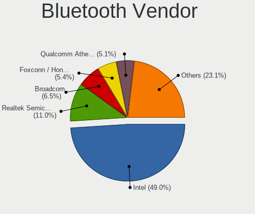

Linux in Germany - Tested Hardware & Statistics (Notebooks)
-----------------------------------------------------------

A project to collect tested hardware configurations for Linux in Germany.

Anyone can contribute to this report by the [hw-probe](https://github.com/linuxhw/hw-probe) tool:

    sudo -E hw-probe -all -upload

Please contribute! Especially if your hardware is rare.

Contents
--------

* [ Test Cases ](#test-cases)

* [ System ](#system)
  - [ OS                       ](#os)
  - [ OS Family                ](#os-family)
  - [ Kernel                   ](#kernel)
  - [ Kernel Family            ](#kernel-family)
  - [ Kernel Major Ver.        ](#kernel-major-ver)
  - [ Arch                     ](#arch)
  - [ DE                       ](#de)
  - [ Display Server           ](#display-server)
  - [ Display Manager          ](#display-manager)
  - [ OS Lang                  ](#os-lang)
  - [ Boot Mode                ](#boot-mode)
  - [ Filesystem               ](#filesystem)
  - [ Part. scheme             ](#part-scheme)
  - [ Dual Boot with Linux/BSD ](#dual-boot-with-linuxbsd)
  - [ Dual Boot (Win)          ](#dual-boot-win)

* [ Board ](#board)
  - [ Vendor                   ](#vendor)
  - [ Model                    ](#model)
  - [ Model Family             ](#model-family)
  - [ MFG Year                 ](#mfg-year)
  - [ Form Factor              ](#form-factor)
  - [ Secure Boot              ](#secure-boot)
  - [ Coreboot                 ](#coreboot)
  - [ RAM Size                 ](#ram-size)
  - [ RAM Used                 ](#ram-used)
  - [ Total Drives             ](#total-drives)
  - [ Has CD-ROM               ](#has-cd-rom)
  - [ Has Ethernet             ](#has-ethernet)
  - [ Has WiFi                 ](#has-wifi)
  - [ Has Bluetooth            ](#has-bluetooth)

* [ Location ](#location)
  - [ Country                  ](#country)
  - [ City                     ](#city)

* [ Drives ](#drives)
  - [ Drive Vendor             ](#drive-vendor)
  - [ Drive Model              ](#drive-model)
  - [ HDD Vendor               ](#hdd-vendor)
  - [ SSD Vendor               ](#ssd-vendor)
  - [ Drive Kind               ](#drive-kind)
  - [ Drive Connector          ](#drive-connector)
  - [ Drive Size               ](#drive-size)
  - [ Space Total              ](#space-total)
  - [ Space Used               ](#space-used)
  - [ Malfunc. Drives          ](#malfunc-drives)
  - [ Malfunc. Drive Vendor    ](#malfunc-drive-vendor)
  - [ Malfunc. HDD Vendor      ](#malfunc-hdd-vendor)
  - [ Malfunc. Drive Kind      ](#malfunc-drive-kind)
  - [ Failed Drives            ](#failed-drives)
  - [ Failed Drive Vendor      ](#failed-drive-vendor)
  - [ Drive Status             ](#drive-status)

* [ Storage controller ](#storage-controller)
  - [ Storage Vendor           ](#storage-vendor)
  - [ Storage Model            ](#storage-model)
  - [ Storage Kind             ](#storage-kind)

* [ Processor ](#processor)
  - [ CPU Vendor               ](#cpu-vendor)
  - [ CPU Model                ](#cpu-model)
  - [ CPU Model Family         ](#cpu-model-family)
  - [ CPU Cores                ](#cpu-cores)
  - [ CPU Sockets              ](#cpu-sockets)
  - [ CPU Threads              ](#cpu-threads)
  - [ CPU Op-Modes             ](#cpu-op-modes)
  - [ CPU Microcode            ](#cpu-microcode)
  - [ CPU Microarch            ](#cpu-microarch)

* [ Graphics ](#graphics)
  - [ GPU Vendor               ](#gpu-vendor)
  - [ GPU Model                ](#gpu-model)
  - [ GPU Combo                ](#gpu-combo)
  - [ GPU Driver               ](#gpu-driver)
  - [ GPU Memory               ](#gpu-memory)

* [ Monitor ](#monitor)
  - [ Monitor Vendor           ](#monitor-vendor)
  - [ Monitor Model            ](#monitor-model)
  - [ Monitor Resolution       ](#monitor-resolution)
  - [ Monitor Diagonal         ](#monitor-diagonal)
  - [ Monitor Width            ](#monitor-width)
  - [ Aspect Ratio             ](#aspect-ratio)
  - [ Monitor Area             ](#monitor-area)
  - [ Pixel Density            ](#pixel-density)
  - [ Multiple Monitors        ](#multiple-monitors)

* [ Network ](#network)
  - [ Net Controller Vendor    ](#net-controller-vendor)
  - [ Net Controller Model     ](#net-controller-model)
  - [ Wireless Vendor          ](#wireless-vendor)
  - [ Wireless Model           ](#wireless-model)
  - [ Ethernet Vendor          ](#ethernet-vendor)
  - [ Ethernet Model           ](#ethernet-model)
  - [ Net Controller Kind      ](#net-controller-kind)
  - [ Used Controller          ](#used-controller)
  - [ NICs                     ](#nics)
  - [ IPv6                     ](#ipv6)

* [ Bluetooth ](#bluetooth)
  - [ Bluetooth Vendor         ](#bluetooth-vendor)
  - [ Bluetooth Model          ](#bluetooth-model)

* [ Sound ](#sound)
  - [ Sound Vendor             ](#sound-vendor)
  - [ Sound Model              ](#sound-model)

* [ Memory ](#memory)
  - [ Memory Vendor            ](#memory-vendor)
  - [ Memory Model             ](#memory-model)
  - [ Memory Kind              ](#memory-kind)
  - [ Memory Form Factor       ](#memory-form-factor)
  - [ Memory Size              ](#memory-size)
  - [ Memory Speed             ](#memory-speed)

* [ Printers & scanners ](#printers--scanners)
  - [ Printer Vendor           ](#printer-vendor)
  - [ Printer Model            ](#printer-model)
  - [ Scanner Vendor           ](#scanner-vendor)
  - [ Scanner Model            ](#scanner-model)

* [ Camera ](#camera)
  - [ Camera Vendor            ](#camera-vendor)
  - [ Camera Model             ](#camera-model)

* [ Security ](#security)
  - [ Fingerprint Vendor       ](#fingerprint-vendor)
  - [ Fingerprint Model        ](#fingerprint-model)
  - [ Chipcard Vendor          ](#chipcard-vendor)
  - [ Chipcard Model           ](#chipcard-model)

* [ Unsupported ](#unsupported)
  - [ Unsupported Devices      ](#unsupported-devices)
  - [ Unsupported Device Types ](#unsupported-device-types)

Test Cases
----------

Total: 11578

| Vendor        | Model                       | Probe                                                      | Date         |
|---------------|-----------------------------|------------------------------------------------------------|--------------|
| Acer          | Aspire 5920G                | [9bd67cf4f9](https://linux-hardware.org/?probe=9bd67cf4f9) | Oct 01, 2022 |
| HUAWEI        | HLYL-WXX9                   | [318010d949](https://linux-hardware.org/?probe=318010d949) | Oct 01, 2022 |
| Lenovo        | IdeaPad 530S-14ARR 81H1     | [68b0c0ca1a](https://linux-hardware.org/?probe=68b0c0ca1a) | Oct 01, 2022 |
| HP            | ProBook 430 G7              | [bf25686a1f](https://linux-hardware.org/?probe=bf25686a1f) | Oct 01, 2022 |
| Lenovo        | ThinkPad X270 W10DG 20K5... | [012add7349](https://linux-hardware.org/?probe=012add7349) | Oct 01, 2022 |
| HP            | ZBook 17 G4                 | [1476da42c3](https://linux-hardware.org/?probe=1476da42c3) | Sep 30, 2022 |
| OEM           | Unknown                     | [af7df2aea6](https://linux-hardware.org/?probe=af7df2aea6) | Sep 30, 2022 |
| OEM           | Unknown                     | [1d851fe024](https://linux-hardware.org/?probe=1d851fe024) | Sep 30, 2022 |
| OEM           | Unknown                     | [4fd2ca7d03](https://linux-hardware.org/?probe=4fd2ca7d03) | Sep 30, 2022 |
| Dell          | Precision 3551              | [d0341acb53](https://linux-hardware.org/?probe=d0341acb53) | Sep 30, 2022 |
| HP            | Compaq CQ58                 | [28048a6d3e](https://linux-hardware.org/?probe=28048a6d3e) | Sep 30, 2022 |
| Sony          | SVE1512C6EB                 | [c47a3a5bd7](https://linux-hardware.org/?probe=c47a3a5bd7) | Sep 30, 2022 |
| Acer          | Aspire E1-531               | [fbe026b995](https://linux-hardware.org/?probe=fbe026b995) | Sep 30, 2022 |
| Valve         | Jupiter                     | [5e7ec518d4](https://linux-hardware.org/?probe=5e7ec518d4) | Sep 30, 2022 |
| Acer          | Aspire A315-56              | [1ee3922873](https://linux-hardware.org/?probe=1ee3922873) | Sep 30, 2022 |
| Lenovo        | ThinkPad T470s 20HGS09L0... | [7c384e5578](https://linux-hardware.org/?probe=7c384e5578) | Sep 30, 2022 |
| SIEMENS       | SIMATIC ITP1000             | [adbd7dbca6](https://linux-hardware.org/?probe=adbd7dbca6) | Sep 30, 2022 |
| Dell          | Inspiron 3505               | [097825430f](https://linux-hardware.org/?probe=097825430f) | Sep 30, 2022 |
| Timi          | Xiaomi Book Pro 16 2022     | [d2a3575975](https://linux-hardware.org/?probe=d2a3575975) | Sep 30, 2022 |
| Valve         | Jupiter                     | [a031955ffb](https://linux-hardware.org/?probe=a031955ffb) | Sep 30, 2022 |
| Toshiba       | TECRA M10                   | [64ad67c8e9](https://linux-hardware.org/?probe=64ad67c8e9) | Sep 29, 2022 |
| ASUSTek       | Zenbook UM3402YA_UM3402Y... | [36ad3c69ee](https://linux-hardware.org/?probe=36ad3c69ee) | Sep 29, 2022 |
| Acer          | Aspire ES1-311              | [0f40a045a9](https://linux-hardware.org/?probe=0f40a045a9) | Sep 29, 2022 |
| HP            | Compaq nx6325 (EY344EA#A... | [8808f98c62](https://linux-hardware.org/?probe=8808f98c62) | Sep 29, 2022 |
| ASUSTek       | N56VZ                       | [2b78a7c7f1](https://linux-hardware.org/?probe=2b78a7c7f1) | Sep 29, 2022 |
| Apple         | MacBookPro3,1               | [00f2a6e705](https://linux-hardware.org/?probe=00f2a6e705) | Sep 29, 2022 |
| Dell          | Latitude E7250              | [bed2e025b0](https://linux-hardware.org/?probe=bed2e025b0) | Sep 29, 2022 |
| HP            | ProBook 6560b               | [902ef8ef79](https://linux-hardware.org/?probe=902ef8ef79) | Sep 29, 2022 |
| HUAWEI        | KLVL-WXXW                   | [fd8b95bb3b](https://linux-hardware.org/?probe=fd8b95bb3b) | Sep 29, 2022 |
| Lenovo        | IdeaPad 720-15IKB 81AG      | [9ac63cdce6](https://linux-hardware.org/?probe=9ac63cdce6) | Sep 29, 2022 |
| Medion        | Akoya E6422 MD99680         | [52c1708200](https://linux-hardware.org/?probe=52c1708200) | Sep 28, 2022 |
| Notebook      | PB50_70RF,RD,RC             | [d56e485c88](https://linux-hardware.org/?probe=d56e485c88) | Sep 28, 2022 |
| Lenovo        | ThinkPad L15 Gen 1 20U70... | [d137298cb5](https://linux-hardware.org/?probe=d137298cb5) | Sep 28, 2022 |
| Dell          | System Vostro 3750          | [4e08b9be50](https://linux-hardware.org/?probe=4e08b9be50) | Sep 28, 2022 |
| ASUSTek       | VivoBook_ASUSLaptop E410... | [224549bcb6](https://linux-hardware.org/?probe=224549bcb6) | Sep 28, 2022 |
| ASUSTek       | VivoBook 17_ASUS Laptop ... | [a3fc8eb1bc](https://linux-hardware.org/?probe=a3fc8eb1bc) | Sep 28, 2022 |
| HP            | Laptop 15s-eq2xxx           | [6d9c960574](https://linux-hardware.org/?probe=6d9c960574) | Sep 28, 2022 |
| Dell          | Latitude E7250              | [4bf6378dde](https://linux-hardware.org/?probe=4bf6378dde) | Sep 28, 2022 |
| Dell          | Latitude E5430 non-vPro     | [12e886f006](https://linux-hardware.org/?probe=12e886f006) | Sep 28, 2022 |
| Medion        | E6234                       | [19f1d7841e](https://linux-hardware.org/?probe=19f1d7841e) | Sep 28, 2022 |
| Lenovo        | ThinkBook 14 G3 ACL 21A2    | [9271d6a014](https://linux-hardware.org/?probe=9271d6a014) | Sep 28, 2022 |
| Medion        | Unknown                     | [821c3c8fed](https://linux-hardware.org/?probe=821c3c8fed) | Sep 28, 2022 |
| Samsung       | RV420/RV520/RV720/E3530/... | [9a1e3a98ab](https://linux-hardware.org/?probe=9a1e3a98ab) | Sep 28, 2022 |
| Dell          | Latitude E6330              | [47b2074732](https://linux-hardware.org/?probe=47b2074732) | Sep 27, 2022 |
| ASUSTek       | VivoBook_ASUSLaptop E410... | [ebfbdd37b8](https://linux-hardware.org/?probe=ebfbdd37b8) | Sep 27, 2022 |
| Acer          | Aspire 5750G                | [f73c1084d0](https://linux-hardware.org/?probe=f73c1084d0) | Sep 27, 2022 |
| Acer          | Aspire A317-52              | [6cc6160f7c](https://linux-hardware.org/?probe=6cc6160f7c) | Sep 27, 2022 |
| Dell          | Latitude E7470              | [5bdc528b5a](https://linux-hardware.org/?probe=5bdc528b5a) | Sep 27, 2022 |
| Lenovo        | G780                        | [057a86bcdc](https://linux-hardware.org/?probe=057a86bcdc) | Sep 27, 2022 |
| Lenovo        | ThinkPad T14s Gen 2i 20W... | [5b7d4c6b7a](https://linux-hardware.org/?probe=5b7d4c6b7a) | Sep 27, 2022 |
| HP            | 635                         | [0509987782](https://linux-hardware.org/?probe=0509987782) | Sep 27, 2022 |
| Toshiba       | Satellite C50-B             | [3cea1ede58](https://linux-hardware.org/?probe=3cea1ede58) | Sep 27, 2022 |
| Lenovo        | ThinkPad X270 W10DG 20K5... | [ae7c83bb37](https://linux-hardware.org/?probe=ae7c83bb37) | Sep 27, 2022 |
| Dell          | Latitude 5290 2-in-1        | [19d835ace8](https://linux-hardware.org/?probe=19d835ace8) | Sep 27, 2022 |
| Samsung       | R425/R525                   | [a5b0ee0a18](https://linux-hardware.org/?probe=a5b0ee0a18) | Sep 27, 2022 |
| Fujitsu Si... | ESPRIMO Mobile V5535        | [6f4452adc5](https://linux-hardware.org/?probe=6f4452adc5) | Sep 27, 2022 |
| Lenovo        | ThinkPad E15 Gen 3 20YGC... | [9616464154](https://linux-hardware.org/?probe=9616464154) | Sep 26, 2022 |
| Fujitsu       | LIFEBOOK E752               | [f4e2b14498](https://linux-hardware.org/?probe=f4e2b14498) | Sep 26, 2022 |
| Dell          | System Inspiron N7110       | [90fffc8800](https://linux-hardware.org/?probe=90fffc8800) | Sep 26, 2022 |
| Medion        | C15MU-N                     | [e4a1e96ebd](https://linux-hardware.org/?probe=e4a1e96ebd) | Sep 26, 2022 |
| Dell          | Precision 7520              | [a7b1df0888](https://linux-hardware.org/?probe=a7b1df0888) | Sep 26, 2022 |
| Dell          | Latitude E7470              | [1dba765507](https://linux-hardware.org/?probe=1dba765507) | Sep 26, 2022 |
| HUAWEI        | NBLB-WAX9N                  | [f1d78ca455](https://linux-hardware.org/?probe=f1d78ca455) | Sep 26, 2022 |
| HP            | ZBook 17 G2                 | [d6d9af3173](https://linux-hardware.org/?probe=d6d9af3173) | Sep 26, 2022 |
| HP            | ZBook 17 G2                 | [ff70118578](https://linux-hardware.org/?probe=ff70118578) | Sep 26, 2022 |
| Lenovo        | ThinkPad T460p 20FW000EG... | [60138ee2f9](https://linux-hardware.org/?probe=60138ee2f9) | Sep 26, 2022 |
| ASUSTek       | K93SV                       | [541a21ceb8](https://linux-hardware.org/?probe=541a21ceb8) | Sep 26, 2022 |
| HUAWEI        | BOHB-WAX9                   | [64fd780b2f](https://linux-hardware.org/?probe=64fd780b2f) | Sep 26, 2022 |
| HUAWEI        | BOHB-WAX9                   | [d557cdbe1c](https://linux-hardware.org/?probe=d557cdbe1c) | Sep 26, 2022 |
| ASUSTek       | X201EP                      | [4e6c202d5d](https://linux-hardware.org/?probe=4e6c202d5d) | Sep 26, 2022 |
| Valve         | Jupiter                     | [315719a312](https://linux-hardware.org/?probe=315719a312) | Sep 25, 2022 |
| Lenovo        | ThinkPad X250 20CL001DMS    | [7662278b86](https://linux-hardware.org/?probe=7662278b86) | Sep 25, 2022 |
| HUAWEI        | KLVL-WXXW                   | [6828f26ab2](https://linux-hardware.org/?probe=6828f26ab2) | Sep 25, 2022 |
| Lenovo        | ThinkPad T14 Gen 3 21AHC... | [0e69d41fef](https://linux-hardware.org/?probe=0e69d41fef) | Sep 25, 2022 |
| Lenovo        | ThinkPad E15 Gen 4 21EES... | [fb7029173f](https://linux-hardware.org/?probe=fb7029173f) | Sep 25, 2022 |
| HP            | EliteBook 830 G6            | [cdbc7c7949](https://linux-hardware.org/?probe=cdbc7c7949) | Sep 25, 2022 |
| HP            | EliteBook 830 G6            | [907383d255](https://linux-hardware.org/?probe=907383d255) | Sep 25, 2022 |
| Dell          | XPS 13 9380                 | [332540a4c8](https://linux-hardware.org/?probe=332540a4c8) | Sep 24, 2022 |
| ASUSTek       | N750JV                      | [04cc8b4e36](https://linux-hardware.org/?probe=04cc8b4e36) | Sep 24, 2022 |
| Lenovo        | ThinkPad T61 765912G        | [bd04e564a0](https://linux-hardware.org/?probe=bd04e564a0) | Sep 24, 2022 |
| Acer          | Extensa 5635ZG              | [ade183eadc](https://linux-hardware.org/?probe=ade183eadc) | Sep 24, 2022 |
| Lenovo        | ThinkPad L14 Gen 1 20U50... | [dc165f65b5](https://linux-hardware.org/?probe=dc165f65b5) | Sep 24, 2022 |
| Dell          | Precision 7560              | [8124a7a3eb](https://linux-hardware.org/?probe=8124a7a3eb) | Sep 24, 2022 |
| Dell          | Latitude 3320               | [3296a12784](https://linux-hardware.org/?probe=3296a12784) | Sep 24, 2022 |
| HP            | 250 G8 Notebook PC          | [fab0eac5a6](https://linux-hardware.org/?probe=fab0eac5a6) | Sep 24, 2022 |
| Pegatron      | A15                         | [a865984ad5](https://linux-hardware.org/?probe=a865984ad5) | Sep 23, 2022 |
| Pegatron      | A15                         | [ea527d6d5a](https://linux-hardware.org/?probe=ea527d6d5a) | Sep 23, 2022 |
| Dell          | XPS 15 9520                 | [1a7e610c32](https://linux-hardware.org/?probe=1a7e610c32) | Sep 23, 2022 |
| Tactus        | GeoBook 140                 | [7d8700d0e1](https://linux-hardware.org/?probe=7d8700d0e1) | Sep 23, 2022 |
| Lenovo        | ThinkPad X220 Tablet 429... | [845256127e](https://linux-hardware.org/?probe=845256127e) | Sep 23, 2022 |
| Lenovo        | Yoga Slim 7 Carbon 13ITL... | [c916654073](https://linux-hardware.org/?probe=c916654073) | Sep 22, 2022 |
| VALE          | Notebook Classic C140       | [5a8e431c98](https://linux-hardware.org/?probe=5a8e431c98) | Sep 22, 2022 |
| HP            | EliteBook 840 G3            | [c3a88ed62d](https://linux-hardware.org/?probe=c3a88ed62d) | Sep 22, 2022 |
| TUXEDO        | Pulse 15 Gen1               | [57ee917c21](https://linux-hardware.org/?probe=57ee917c21) | Sep 22, 2022 |
| TUXEDO        | Book BA1510                 | [76a485fe7e](https://linux-hardware.org/?probe=76a485fe7e) | Sep 22, 2022 |
| Lenovo        | ThinkPad X200s 7470WWD      | [268aa65de3](https://linux-hardware.org/?probe=268aa65de3) | Sep 22, 2022 |
| Acer          | Aspire ES1-512              | [00e679e86c](https://linux-hardware.org/?probe=00e679e86c) | Sep 22, 2022 |
| Acer          | Aspire ES1-512              | [318436c7ab](https://linux-hardware.org/?probe=318436c7ab) | Sep 22, 2022 |
| Dell          | Precision 7760              | [f6600a1244](https://linux-hardware.org/?probe=f6600a1244) | Sep 22, 2022 |
| ASUSTek       | ROG Zephyrus G14 GA401QE... | [ba5fdd39e6](https://linux-hardware.org/?probe=ba5fdd39e6) | Sep 21, 2022 |
| Lenovo        | G500 20236                  | [ede942e5a1](https://linux-hardware.org/?probe=ede942e5a1) | Sep 21, 2022 |
| Framework     | Laptop (12th Gen Intel C... | [69d5dcb9b7](https://linux-hardware.org/?probe=69d5dcb9b7) | Sep 21, 2022 |
| Lenovo        | ThinkPad X230 23255Z6       | [25cc23e2ad](https://linux-hardware.org/?probe=25cc23e2ad) | Sep 21, 2022 |
| Lenovo        | ThinkPad L580 20LWCTO1WW    | [a80367f777](https://linux-hardware.org/?probe=a80367f777) | Sep 21, 2022 |
| Lenovo        | ThinkPad T61 6468AE1        | [8719597c22](https://linux-hardware.org/?probe=8719597c22) | Sep 21, 2022 |
| Acer          | Aspire ES1-111M             | [04f08de672](https://linux-hardware.org/?probe=04f08de672) | Sep 21, 2022 |
| Lenovo        | Yoga 3 Pro-1370 80HE        | [65d258e56a](https://linux-hardware.org/?probe=65d258e56a) | Sep 21, 2022 |
| HUAWEI        | KLVL-WXXW                   | [8e46e07b3a](https://linux-hardware.org/?probe=8e46e07b3a) | Sep 21, 2022 |
| Dell          | G5 5505                     | [82017aa2ae](https://linux-hardware.org/?probe=82017aa2ae) | Sep 21, 2022 |
| Lenovo        | ThinkPad W500 4061BC8       | [f2280ae816](https://linux-hardware.org/?probe=f2280ae816) | Sep 21, 2022 |
| Medion        | E6220                       | [59b39f54d8](https://linux-hardware.org/?probe=59b39f54d8) | Sep 21, 2022 |
| Valve         | Jupiter                     | [7bc45b1077](https://linux-hardware.org/?probe=7bc45b1077) | Sep 21, 2022 |
| AXDIA Inte... | MYBOOK 14 PRO               | [0ada4a5b83](https://linux-hardware.org/?probe=0ada4a5b83) | Sep 20, 2022 |
| HP            | Pavilion Aero Laptop 13-... | [c321ff96af](https://linux-hardware.org/?probe=c321ff96af) | Sep 20, 2022 |
| Dell          | Inspiron 5515               | [a7f0e24464](https://linux-hardware.org/?probe=a7f0e24464) | Sep 20, 2022 |
| Lenovo        | ThinkPad X260 20F5003EMB    | [302eacc4ff](https://linux-hardware.org/?probe=302eacc4ff) | Sep 20, 2022 |
| Lenovo        | ThinkPad T61 6468AE1        | [028ead1680](https://linux-hardware.org/?probe=028ead1680) | Sep 20, 2022 |
| HP            | ProBook 455 G7              | [80d61eb345](https://linux-hardware.org/?probe=80d61eb345) | Sep 20, 2022 |
| Medion        | P15648                      | [e3d7873a30](https://linux-hardware.org/?probe=e3d7873a30) | Sep 19, 2022 |
| HP            | EliteBook 850 G3            | [7cfeb3607a](https://linux-hardware.org/?probe=7cfeb3607a) | Sep 19, 2022 |
| HP            | EliteBook 850 G3            | [1b461187db](https://linux-hardware.org/?probe=1b461187db) | Sep 19, 2022 |
| Lenovo        | ThinkPad T14s Gen 2a 20X... | [474f619a29](https://linux-hardware.org/?probe=474f619a29) | Sep 19, 2022 |
| Lenovo        | ThinkPad E14 Gen 3 20Y70... | [75cc4fa084](https://linux-hardware.org/?probe=75cc4fa084) | Sep 19, 2022 |
| Lenovo        | ThinkPad T14s Gen 1 20UJ... | [167d69530f](https://linux-hardware.org/?probe=167d69530f) | Sep 19, 2022 |
| Lenovo        | ThinkPad T14s Gen 1 20UJ... | [d3b972d870](https://linux-hardware.org/?probe=d3b972d870) | Sep 19, 2022 |
| Lenovo        | ThinkPad T14 Gen 3 21CF0... | [8bf0000c61](https://linux-hardware.org/?probe=8bf0000c61) | Sep 19, 2022 |
| Dell          | Precision 5560              | [5e70cfd82f](https://linux-hardware.org/?probe=5e70cfd82f) | Sep 19, 2022 |
| Dell          | Latitude E6420              | [44dd859fbb](https://linux-hardware.org/?probe=44dd859fbb) | Sep 19, 2022 |
| Lenovo        | ThinkPad P14s Gen 1 20Y1... | [61cbfb879a](https://linux-hardware.org/?probe=61cbfb879a) | Sep 19, 2022 |
| Lenovo        | ThinkPad P14s Gen 1 20Y1... | [d2e3e6c9bb](https://linux-hardware.org/?probe=d2e3e6c9bb) | Sep 19, 2022 |
| Lenovo        | ThinkPad P14s Gen 1 20Y1... | [e404df9b2f](https://linux-hardware.org/?probe=e404df9b2f) | Sep 19, 2022 |
| Schenker      | VISION 15 (SVS15E21)        | [515032e1c3](https://linux-hardware.org/?probe=515032e1c3) | Sep 19, 2022 |
| Schenker      | VISION 15 (SVS15E21)        | [c98bc3dacb](https://linux-hardware.org/?probe=c98bc3dacb) | Sep 19, 2022 |
| Lenovo        | ThinkPad X220 42918F6       | [69dda668fc](https://linux-hardware.org/?probe=69dda668fc) | Sep 18, 2022 |
| Lenovo        | ThinkPad T400 6474WPU       | [892c3fb361](https://linux-hardware.org/?probe=892c3fb361) | Sep 18, 2022 |
| Lenovo        | G780                        | [eb3df9a17e](https://linux-hardware.org/?probe=eb3df9a17e) | Sep 18, 2022 |
| Lenovo        | IdeaPad 720s-13ARR 81BR     | [fa45602fc5](https://linux-hardware.org/?probe=fa45602fc5) | Sep 18, 2022 |
| Valve         | Jupiter                     | [de74f87be5](https://linux-hardware.org/?probe=de74f87be5) | Sep 18, 2022 |
| ASUSTek       | X553MA                      | [28839dfd9e](https://linux-hardware.org/?probe=28839dfd9e) | Sep 18, 2022 |
| Valve         | Jupiter                     | [8273135785](https://linux-hardware.org/?probe=8273135785) | Sep 18, 2022 |
| Lenovo        | ThinkPad E480 20KQS00000    | [c3c44800e7](https://linux-hardware.org/?probe=c3c44800e7) | Sep 18, 2022 |
| Valve         | Jupiter                     | [b667f00856](https://linux-hardware.org/?probe=b667f00856) | Sep 17, 2022 |
| Lenovo        | ThinkPad T14 Gen 1 20UD0... | [a779591dc1](https://linux-hardware.org/?probe=a779591dc1) | Sep 17, 2022 |
| Dell          | Latitude E7440              | [5194c92c15](https://linux-hardware.org/?probe=5194c92c15) | Sep 17, 2022 |
| Lenovo        | IdeaPad 5 14ALC05 82LM      | [8e5e19a8bd](https://linux-hardware.org/?probe=8e5e19a8bd) | Sep 17, 2022 |
| Medion        | Akoya S6213T                | [6fb8ca6c1b](https://linux-hardware.org/?probe=6fb8ca6c1b) | Sep 17, 2022 |
| Lenovo        | IdeaPad 5 Pro 14ARH7 82S... | [3615e82cb6](https://linux-hardware.org/?probe=3615e82cb6) | Sep 17, 2022 |
| Lenovo        | ThinkPad T450s 20BWS21K0... | [1fa176a244](https://linux-hardware.org/?probe=1fa176a244) | Sep 17, 2022 |
| Acer          | TravelMate 5735Z            | [b920fce554](https://linux-hardware.org/?probe=b920fce554) | Sep 17, 2022 |
| HP            | Falco                       | [5fa86b77d6](https://linux-hardware.org/?probe=5fa86b77d6) | Sep 17, 2022 |
| Acer          | Aspire 5820TG               | [df263f4d0b](https://linux-hardware.org/?probe=df263f4d0b) | Sep 17, 2022 |
| Dell          | Latitude 5290 2-in-1        | [21620af2bb](https://linux-hardware.org/?probe=21620af2bb) | Sep 16, 2022 |
| Valve         | Jupiter                     | [d5464b13f9](https://linux-hardware.org/?probe=d5464b13f9) | Sep 16, 2022 |
| Lenovo        | IdeaPadFlex 15D 20334       | [5620510083](https://linux-hardware.org/?probe=5620510083) | Sep 16, 2022 |
| Lenovo        | Z50-70 20354                | [fafabb8c1f](https://linux-hardware.org/?probe=fafabb8c1f) | Sep 16, 2022 |
| Lenovo        | ThinkPad T14s Gen 1 20UJ... | [a1f16914f7](https://linux-hardware.org/?probe=a1f16914f7) | Sep 16, 2022 |
| Apple         | MacBookPro5,4               | [9cc24963d4](https://linux-hardware.org/?probe=9cc24963d4) | Sep 16, 2022 |
| Apple         | MacBookPro5,4               | [6d28bb81ce](https://linux-hardware.org/?probe=6d28bb81ce) | Sep 16, 2022 |
| GPD           | MicroPC                     | [dadac68a23](https://linux-hardware.org/?probe=dadac68a23) | Sep 15, 2022 |
| Dell          | Latitude E6520              | [df5bdafb78](https://linux-hardware.org/?probe=df5bdafb78) | Sep 15, 2022 |
| HP            | Laptop 15s-fq1xxx           | [be467d8dfe](https://linux-hardware.org/?probe=be467d8dfe) | Sep 15, 2022 |
| ASUSTek       | VivoBook_ASUSLaptop S540... | [cbfa465b68](https://linux-hardware.org/?probe=cbfa465b68) | Sep 15, 2022 |
| Dell          | Latitude 7430               | [4fdf1a303c](https://linux-hardware.org/?probe=4fdf1a303c) | Sep 15, 2022 |
| Lenovo        | ThinkPad X270 W10DG 20K5... | [31c810e744](https://linux-hardware.org/?probe=31c810e744) | Sep 15, 2022 |
| Panasonic     | CF-53JWX1CFG                | [f4e1cd21d9](https://linux-hardware.org/?probe=f4e1cd21d9) | Sep 15, 2022 |
| Lenovo        | IdeaPadFlex 15D 20334       | [437d152a42](https://linux-hardware.org/?probe=437d152a42) | Sep 15, 2022 |
| Medion        | E6234                       | [2ea41cb7ed](https://linux-hardware.org/?probe=2ea41cb7ed) | Sep 15, 2022 |
| HP            | EliteBook 850 G3            | [f1e4aef2f2](https://linux-hardware.org/?probe=f1e4aef2f2) | Sep 15, 2022 |
| HP            | EliteBook 850 G3            | [de3a2e822c](https://linux-hardware.org/?probe=de3a2e822c) | Sep 14, 2022 |
| ASUSTek       | X200CA                      | [6e71dffc7b](https://linux-hardware.org/?probe=6e71dffc7b) | Sep 14, 2022 |
| ASUSTek       | X55CR                       | [43b77d436c](https://linux-hardware.org/?probe=43b77d436c) | Sep 14, 2022 |
| Acer          | V5-131                      | [7a218d1ae7](https://linux-hardware.org/?probe=7a218d1ae7) | Sep 14, 2022 |
| HP            | Laptop 15-db0xxx            | [3e082463a9](https://linux-hardware.org/?probe=3e082463a9) | Sep 14, 2022 |
| ASUSTek       | VivoBook 15_ASUS Laptop ... | [e2c85682b5](https://linux-hardware.org/?probe=e2c85682b5) | Sep 13, 2022 |
| ASUSTek       | VivoBook_ASUSLaptop X515... | [fa652e45e1](https://linux-hardware.org/?probe=fa652e45e1) | Sep 13, 2022 |
| ASUSTek       | X550VXK                     | [df5d5b4f0d](https://linux-hardware.org/?probe=df5d5b4f0d) | Sep 13, 2022 |
| Dell          | Inspiron N5050              | [c0f9d7bf4a](https://linux-hardware.org/?probe=c0f9d7bf4a) | Sep 13, 2022 |
| Dell          | Latitude 5480               | [59bcf57d5b](https://linux-hardware.org/?probe=59bcf57d5b) | Sep 13, 2022 |
| HP            | Laptop 15-db0xxx            | [5240fca99f](https://linux-hardware.org/?probe=5240fca99f) | Sep 13, 2022 |
| Acer          | Aspire ES1-311              | [ee2f9a766c](https://linux-hardware.org/?probe=ee2f9a766c) | Sep 13, 2022 |
| Schenker      | VISION 15 (SVS15E21)        | [dee9d6b81f](https://linux-hardware.org/?probe=dee9d6b81f) | Sep 13, 2022 |
| Dell          | Precision 5560              | [78809c82c2](https://linux-hardware.org/?probe=78809c82c2) | Sep 13, 2022 |
| HUAWEI        | HBB-WX9                     | [30b6cc18c5](https://linux-hardware.org/?probe=30b6cc18c5) | Sep 13, 2022 |
| HUAWEI        | KLVL-WXXW                   | [de37b9cf96](https://linux-hardware.org/?probe=de37b9cf96) | Sep 13, 2022 |
| Acer          | Aspire 7741                 | [a1375d3bb4](https://linux-hardware.org/?probe=a1375d3bb4) | Sep 13, 2022 |
| Dell          | Latitude E6540              | [e23aacd364](https://linux-hardware.org/?probe=e23aacd364) | Sep 12, 2022 |
| Samsung       | 600B4B/600B5B               | [25c2b764a6](https://linux-hardware.org/?probe=25c2b764a6) | Sep 12, 2022 |
| Samsung       | R530/R730/R540              | [9149fde5c5](https://linux-hardware.org/?probe=9149fde5c5) | Sep 12, 2022 |
| System76      | Darter Pro                  | [d93179bdb4](https://linux-hardware.org/?probe=d93179bdb4) | Sep 12, 2022 |
| Lenovo        | ThinkPad T14 Gen 3 21CF0... | [5bbf96fe23](https://linux-hardware.org/?probe=5bbf96fe23) | Sep 12, 2022 |
| Gigabyte      | AERO 15-X9                  | [d6d8f577e0](https://linux-hardware.org/?probe=d6d8f577e0) | Sep 12, 2022 |
| Lenovo        | ThinkPad X240 20AL00ETGE    | [95a3df06c9](https://linux-hardware.org/?probe=95a3df06c9) | Sep 12, 2022 |
| AXDIA Inte... | MYBOOK 14 PRO               | [3a6e62d846](https://linux-hardware.org/?probe=3a6e62d846) | Sep 12, 2022 |
| Lenovo        | ThinkPad T440 20B7S1C600    | [88d8697b4f](https://linux-hardware.org/?probe=88d8697b4f) | Sep 11, 2022 |
| MSI           | Alpha 15 B5EEK              | [c59ebfd9e8](https://linux-hardware.org/?probe=c59ebfd9e8) | Sep 11, 2022 |
| Lenovo        | ThinkPad L15 Gen 2 20X30... | [c1c2e05a86](https://linux-hardware.org/?probe=c1c2e05a86) | Sep 11, 2022 |
| Acer          | Aspire V3-771               | [044ee57b31](https://linux-hardware.org/?probe=044ee57b31) | Sep 11, 2022 |
| MSI           | GF75 Thin 10SC              | [be99178497](https://linux-hardware.org/?probe=be99178497) | Sep 10, 2022 |
| HP            | OMEN Notebook PC 15         | [3ba69d2a5b](https://linux-hardware.org/?probe=3ba69d2a5b) | Sep 10, 2022 |
| Acer          | Aspire 7745G                | [a41158c2cc](https://linux-hardware.org/?probe=a41158c2cc) | Sep 10, 2022 |
| Samsung       | SX60P                       | [1e0ea8e787](https://linux-hardware.org/?probe=1e0ea8e787) | Sep 09, 2022 |
| Toshiba       | Satellite C70D-A            | [41e71a8271](https://linux-hardware.org/?probe=41e71a8271) | Sep 09, 2022 |
| Lenovo        | ThinkPad S1 Yoga 20CDCTO... | [0a7b65b735](https://linux-hardware.org/?probe=0a7b65b735) | Sep 09, 2022 |
| Dell          | Latitude 7430               | [b1cdbef6b2](https://linux-hardware.org/?probe=b1cdbef6b2) | Sep 09, 2022 |
| Valve         | Jupiter                     | [c63b3ff391](https://linux-hardware.org/?probe=c63b3ff391) | Sep 09, 2022 |
| Dell          | XPS 15 9570                 | [a54dae9e4b](https://linux-hardware.org/?probe=a54dae9e4b) | Sep 09, 2022 |
| Dell          | Precision 5570              | [e12db7f794](https://linux-hardware.org/?probe=e12db7f794) | Sep 08, 2022 |
| HP            | Laptop 15-bw0xx             | [2154b21ff3](https://linux-hardware.org/?probe=2154b21ff3) | Sep 08, 2022 |
| Medion        | S4216                       | [1f1e6b24bf](https://linux-hardware.org/?probe=1f1e6b24bf) | Sep 08, 2022 |
| Lenovo        | ThinkPad T460 20FN003LGE    | [6108c677a2](https://linux-hardware.org/?probe=6108c677a2) | Sep 08, 2022 |
| Dell          | Precision M6500             | [0600261684](https://linux-hardware.org/?probe=0600261684) | Sep 08, 2022 |
| Lenovo        | ThinkPad T460 20FN003LGE    | [0f8da1f0c8](https://linux-hardware.org/?probe=0f8da1f0c8) | Sep 08, 2022 |
| Acer          | Aspire 5920G                | [7dd567a644](https://linux-hardware.org/?probe=7dd567a644) | Sep 08, 2022 |
| ASUSTek       | N750JV                      | [7bbdd18024](https://linux-hardware.org/?probe=7bbdd18024) | Sep 08, 2022 |
| Notebook      | N350DW                      | [673f2961a0](https://linux-hardware.org/?probe=673f2961a0) | Sep 08, 2022 |
| Dell          | Latitude E5420              | [b80d26540d](https://linux-hardware.org/?probe=b80d26540d) | Sep 08, 2022 |
| Lenovo        | ThinkBook 14-IML 20RV       | [e3976254ee](https://linux-hardware.org/?probe=e3976254ee) | Sep 08, 2022 |
| Dell          | Vostro 3700                 | [40e150eb3b](https://linux-hardware.org/?probe=40e150eb3b) | Sep 08, 2022 |
| Acer          | Aspire 5738                 | [141712c674](https://linux-hardware.org/?probe=141712c674) | Sep 07, 2022 |
| ASUSTek       | N750JV                      | [8f80278357](https://linux-hardware.org/?probe=8f80278357) | Sep 07, 2022 |
| Acer          | Aspire 5920G                | [713102f9c1](https://linux-hardware.org/?probe=713102f9c1) | Sep 07, 2022 |
| HP            | 255 G8 Notebook PC          | [fd2f08b8dd](https://linux-hardware.org/?probe=fd2f08b8dd) | Sep 07, 2022 |
| Lenovo        | G580                        | [922ede2a50](https://linux-hardware.org/?probe=922ede2a50) | Sep 07, 2022 |
| HP            | Laptop 17-ca0xxx            | [c65eb0b5c8](https://linux-hardware.org/?probe=c65eb0b5c8) | Sep 07, 2022 |
| Dell          | Studio 1747                 | [42ae5d9dbe](https://linux-hardware.org/?probe=42ae5d9dbe) | Sep 07, 2022 |
| HP            | Pavilion Notebook           | [062f15a645](https://linux-hardware.org/?probe=062f15a645) | Sep 07, 2022 |
| HP            | ProBook 6560b               | [5654698cb9](https://linux-hardware.org/?probe=5654698cb9) | Sep 07, 2022 |
| Lenovo        | ThinkPad Edge E531 68856... | [498682ac13](https://linux-hardware.org/?probe=498682ac13) | Sep 06, 2022 |
| Sony          | VPCSB3X9E                   | [03bd901e4f](https://linux-hardware.org/?probe=03bd901e4f) | Sep 06, 2022 |
| Samsung       | RV420/RV520/RV720/E3530/... | [bbc86fb274](https://linux-hardware.org/?probe=bbc86fb274) | Sep 06, 2022 |
| ASUSTek       | VivoBook_ASUSLaptop M340... | [aa4d4912e2](https://linux-hardware.org/?probe=aa4d4912e2) | Sep 06, 2022 |
| Samsung       | 755XDA                      | [58091d8a85](https://linux-hardware.org/?probe=58091d8a85) | Sep 06, 2022 |
| Acer          | Extensa 5230                | [a5546cc97c](https://linux-hardware.org/?probe=a5546cc97c) | Sep 06, 2022 |
| Lenovo        | ThinkPad T480 20L50004GE    | [fefa3f4935](https://linux-hardware.org/?probe=fefa3f4935) | Sep 06, 2022 |
| Samsung       | 755XDA                      | [a2013be10e](https://linux-hardware.org/?probe=a2013be10e) | Sep 06, 2022 |
| Lenovo        | Yoga 2 11 20332             | [9b6635c1db](https://linux-hardware.org/?probe=9b6635c1db) | Sep 06, 2022 |
| Dell          | XPS 15 9500                 | [0d66bc1b42](https://linux-hardware.org/?probe=0d66bc1b42) | Sep 06, 2022 |
| Lenovo        | IdeaPad 700-15ISK 80RU      | [5263a99ed8](https://linux-hardware.org/?probe=5263a99ed8) | Sep 05, 2022 |
| Dell          | Latitude E6530              | [9e0c4566c5](https://linux-hardware.org/?probe=9e0c4566c5) | Sep 05, 2022 |
| Samsung       | RV420/RV520/RV720/E3530/... | [70081c6ec8](https://linux-hardware.org/?probe=70081c6ec8) | Sep 05, 2022 |
| Notebook      | NJ5x_NJ7xLU                 | [1cadc455a1](https://linux-hardware.org/?probe=1cadc455a1) | Sep 05, 2022 |
| Lenovo        | ThinkPad T480 20L50004MZ    | [7702adff5d](https://linux-hardware.org/?probe=7702adff5d) | Sep 05, 2022 |
| Apple         | MacBook5,1                  | [88c4e0664a](https://linux-hardware.org/?probe=88c4e0664a) | Sep 05, 2022 |
| ASUSTek       | VivoBook_ASUSLaptop X515... | [3aa5926982](https://linux-hardware.org/?probe=3aa5926982) | Sep 05, 2022 |
| HP            | 255 G7 Notebook PC          | [99be9d8928](https://linux-hardware.org/?probe=99be9d8928) | Sep 05, 2022 |
| Dell          | Precision 7760              | [e920197599](https://linux-hardware.org/?probe=e920197599) | Sep 05, 2022 |
| ASUSTek       | UX51VZA                     | [46aa1dbafa](https://linux-hardware.org/?probe=46aa1dbafa) | Sep 04, 2022 |
| Dell          | Inspiron 15-3573            | [47b54fb058](https://linux-hardware.org/?probe=47b54fb058) | Sep 04, 2022 |
| HP            | Pavilion dv6500             | [eec792ef79](https://linux-hardware.org/?probe=eec792ef79) | Sep 04, 2022 |
| Lenovo        | E31-80 80MX                 | [0eecb590e6](https://linux-hardware.org/?probe=0eecb590e6) | Sep 04, 2022 |
| Lenovo        | ThinkPad E560 20EV000RGE    | [5b69ce9986](https://linux-hardware.org/?probe=5b69ce9986) | Sep 04, 2022 |
| Acer          | AS VN7-571G                 | [1c14fbaf96](https://linux-hardware.org/?probe=1c14fbaf96) | Sep 04, 2022 |
| ASUSTek       | VivoBook_ASUSLaptop X415... | [35e98b0a2a](https://linux-hardware.org/?probe=35e98b0a2a) | Sep 04, 2022 |
| ASUSTek       | VivoBook_ASUSLaptop X415... | [985872733c](https://linux-hardware.org/?probe=985872733c) | Sep 04, 2022 |
| HP            | Pavilion dv6500             | [0751d35153](https://linux-hardware.org/?probe=0751d35153) | Sep 04, 2022 |
| Packard Be... | EasyNote LJ65               | [cd0ee92e1c](https://linux-hardware.org/?probe=cd0ee92e1c) | Sep 04, 2022 |
| Valve         | Jupiter                     | [93771f5a6b](https://linux-hardware.org/?probe=93771f5a6b) | Sep 04, 2022 |
| Apple         | MacBookPro8,2               | [b37d844ab3](https://linux-hardware.org/?probe=b37d844ab3) | Sep 04, 2022 |
| Valve         | Jupiter                     | [08728d3dc1](https://linux-hardware.org/?probe=08728d3dc1) | Sep 04, 2022 |
| Lenovo        | 3000 N200 0769BAG           | [33fcb3e2b3](https://linux-hardware.org/?probe=33fcb3e2b3) | Sep 04, 2022 |
| MSI           | MS-168B                     | [a0a6645eef](https://linux-hardware.org/?probe=a0a6645eef) | Sep 04, 2022 |
| Lenovo        | ThinkPad X230 232438J       | [dca0e2fa77](https://linux-hardware.org/?probe=dca0e2fa77) | Sep 04, 2022 |
| Dell          | XPS 15 9520                 | [9736522a27](https://linux-hardware.org/?probe=9736522a27) | Sep 03, 2022 |
| TUXEDO        | Pulse 15 Gen1               | [dc3fd2d992](https://linux-hardware.org/?probe=dc3fd2d992) | Sep 03, 2022 |
| Toshiba       | Satellite C70D-A            | [32fa823faa](https://linux-hardware.org/?probe=32fa823faa) | Sep 03, 2022 |
| HUAWEI        | KPL-W0X                     | [cfb4e75518](https://linux-hardware.org/?probe=cfb4e75518) | Sep 03, 2022 |
| Valve         | Jupiter                     | [a8038907ed](https://linux-hardware.org/?probe=a8038907ed) | Sep 03, 2022 |
| HP            | Compaq 6910p                | [0165c7d3c6](https://linux-hardware.org/?probe=0165c7d3c6) | Sep 03, 2022 |
| Acer          | Aspire 5750G                | [a881cc280a](https://linux-hardware.org/?probe=a881cc280a) | Sep 03, 2022 |
| TUXEDO        | N8xEJEK                     | [e1042ef0ff](https://linux-hardware.org/?probe=e1042ef0ff) | Sep 03, 2022 |
| HP            | Laptop 15s-eq0xxx           | [85e96b2d25](https://linux-hardware.org/?probe=85e96b2d25) | Sep 03, 2022 |
| ASUSTek       | N501VW                      | [e7e5ddf474](https://linux-hardware.org/?probe=e7e5ddf474) | Sep 03, 2022 |
| HP            | EliteBook 8470p             | [33ae7d4c4b](https://linux-hardware.org/?probe=33ae7d4c4b) | Sep 03, 2022 |
| Lenovo        | ThinkBook 15 G2 ITL 20VE    | [4c07e27fb2](https://linux-hardware.org/?probe=4c07e27fb2) | Sep 03, 2022 |
| HUAWEI        | KPL-W0X                     | [2e3f16bc80](https://linux-hardware.org/?probe=2e3f16bc80) | Sep 02, 2022 |
| Apple         | MacBookPro8,2               | [c74752a0d2](https://linux-hardware.org/?probe=c74752a0d2) | Sep 02, 2022 |
| Acer          | Aspire V3-772               | [bc1bcb3b13](https://linux-hardware.org/?probe=bc1bcb3b13) | Sep 02, 2022 |
| Dell          | XPS 15 9520                 | [f1cfdb5e32](https://linux-hardware.org/?probe=f1cfdb5e32) | Sep 02, 2022 |
| ASUSTek       | X201EP                      | [1bfbfd28f4](https://linux-hardware.org/?probe=1bfbfd28f4) | Sep 02, 2022 |
| ASUSTek       | UX51VZA                     | [e93c1732ec](https://linux-hardware.org/?probe=e93c1732ec) | Sep 02, 2022 |
| Valve         | Jupiter                     | [c0094f39c5](https://linux-hardware.org/?probe=c0094f39c5) | Sep 02, 2022 |
| Lenovo        | ThinkPad T14 Gen 1 20S1S... | [e5ae0e72ca](https://linux-hardware.org/?probe=e5ae0e72ca) | Sep 02, 2022 |
| ASUSTek       | X75VC                       | [3cd89c5ac3](https://linux-hardware.org/?probe=3cd89c5ac3) | Sep 02, 2022 |
| Schenker      | XMG FUSION 15 (XFU15M22)    | [3a8cfc8781](https://linux-hardware.org/?probe=3a8cfc8781) | Sep 01, 2022 |
| Lenovo        | IdeaPad Slim 1-14AST-05 ... | [c83430605e](https://linux-hardware.org/?probe=c83430605e) | Sep 01, 2022 |
| ASUSTek       | VivoBook_ASUS Laptop X50... | [9da6412308](https://linux-hardware.org/?probe=9da6412308) | Sep 01, 2022 |
| ASUSTek       | K50IJ                       | [10dd5d1e15](https://linux-hardware.org/?probe=10dd5d1e15) | Sep 01, 2022 |
| Toshiba       | PORTEGE M800                | [547ef88897](https://linux-hardware.org/?probe=547ef88897) | Aug 31, 2022 |
| Toshiba       | PORTEGE M800                | [355cc5a1ec](https://linux-hardware.org/?probe=355cc5a1ec) | Aug 31, 2022 |
| Valve         | Jupiter                     | [0b928ad313](https://linux-hardware.org/?probe=0b928ad313) | Aug 31, 2022 |
| Dell          | Latitude 7280               | [e71e9350b4](https://linux-hardware.org/?probe=e71e9350b4) | Aug 31, 2022 |
| Lenovo        | IdeaPad Slim 1-14AST-05 ... | [ad6c7ea5ab](https://linux-hardware.org/?probe=ad6c7ea5ab) | Aug 31, 2022 |
| Lenovo        | ThinkPad L540 20AUA06000    | [e2fd79b86e](https://linux-hardware.org/?probe=e2fd79b86e) | Aug 30, 2022 |
| Medion        | P7649 MD60817               | [3a703e2be0](https://linux-hardware.org/?probe=3a703e2be0) | Aug 30, 2022 |
| Lenovo        | IdeaPad S340-14API 81NB     | [aa35aacc70](https://linux-hardware.org/?probe=aa35aacc70) | Aug 30, 2022 |
| HP            | ProBook 6470b               | [2cbe458c94](https://linux-hardware.org/?probe=2cbe458c94) | Aug 30, 2022 |
| Lenovo        | ThinkPad Edge E535 3260E... | [05141be4a5](https://linux-hardware.org/?probe=05141be4a5) | Aug 30, 2022 |
| Apple         | MacBook5,1                  | [436d2b29aa](https://linux-hardware.org/?probe=436d2b29aa) | Aug 30, 2022 |
| ASUSTek       | GL552JX                     | [d477c2cd47](https://linux-hardware.org/?probe=d477c2cd47) | Aug 30, 2022 |
| Lenovo        | ThinkPad E15 Gen 3 20YG0... | [6393abc859](https://linux-hardware.org/?probe=6393abc859) | Aug 30, 2022 |
| Lenovo        | IdeaPad S340-14API 81NB     | [4d2ce353d4](https://linux-hardware.org/?probe=4d2ce353d4) | Aug 30, 2022 |
| Dell          | Latitude 5520               | [26434099b3](https://linux-hardware.org/?probe=26434099b3) | Aug 30, 2022 |
| Acer          | Aspire E5-771G              | [76803c2532](https://linux-hardware.org/?probe=76803c2532) | Aug 30, 2022 |
| Dell          | Inspiron 15 5510            | [346eda373e](https://linux-hardware.org/?probe=346eda373e) | Aug 29, 2022 |
| Dell          | Inspiron 15 5510            | [ecdb2875da](https://linux-hardware.org/?probe=ecdb2875da) | Aug 29, 2022 |
| Dell          | Latitude E6330              | [eb89774723](https://linux-hardware.org/?probe=eb89774723) | Aug 29, 2022 |
| HP            | EliteBook 8570w             | [907d5f36e6](https://linux-hardware.org/?probe=907d5f36e6) | Aug 29, 2022 |
| Acer          | Aspire E5-771G              | [52cc79c6d9](https://linux-hardware.org/?probe=52cc79c6d9) | Aug 29, 2022 |
| Apple         | MacBookPro5,2               | [7f66ca2cc7](https://linux-hardware.org/?probe=7f66ca2cc7) | Aug 29, 2022 |
| Lenovo        | IdeaPad Gaming 3 15ACH6 ... | [844a0c00e2](https://linux-hardware.org/?probe=844a0c00e2) | Aug 29, 2022 |
| Lenovo        | ThinkPad X1 Carbon 6th 2... | [636a7f710c](https://linux-hardware.org/?probe=636a7f710c) | Aug 29, 2022 |
| TUXEDO        | Polaris AMD Gen2 (REN)      | [df1e70349c](https://linux-hardware.org/?probe=df1e70349c) | Aug 29, 2022 |
| ASUSTek       | M70Vn                       | [236d8cb74e](https://linux-hardware.org/?probe=236d8cb74e) | Aug 29, 2022 |
| Lenovo        | ThinkPad P14s Gen 2a 21A... | [b3c97eb801](https://linux-hardware.org/?probe=b3c97eb801) | Aug 29, 2022 |
| Lenovo        | ThinkPad P14s Gen 2a 21A... | [748d6f1523](https://linux-hardware.org/?probe=748d6f1523) | Aug 29, 2022 |
| Lenovo        | G70-80 80FF                 | [8ac571d297](https://linux-hardware.org/?probe=8ac571d297) | Aug 28, 2022 |
| Lenovo        | G70-80 80FF                 | [3f2eb2720b](https://linux-hardware.org/?probe=3f2eb2720b) | Aug 28, 2022 |
| TUXEDO        | InfinityBook Pro 14 v4      | [cc583599ef](https://linux-hardware.org/?probe=cc583599ef) | Aug 28, 2022 |
| Lenovo        | IdeaPad C340-14API 81N6     | [c8c04ce5db](https://linux-hardware.org/?probe=c8c04ce5db) | Aug 28, 2022 |
| ASUSTek       | VivoBook_ASUSLaptop X509... | [be59676867](https://linux-hardware.org/?probe=be59676867) | Aug 28, 2022 |
| Lenovo        | G700 20251                  | [25e0f764b5](https://linux-hardware.org/?probe=25e0f764b5) | Aug 28, 2022 |
| Dell          | Inspiron 3505               | [32f22bef7f](https://linux-hardware.org/?probe=32f22bef7f) | Aug 28, 2022 |
| Dell          | Inspiron 1501               | [8ec322c539](https://linux-hardware.org/?probe=8ec322c539) | Aug 27, 2022 |
| Lenovo        | ThinkPad T14s Gen 1 20UJ... | [e86eacb6b4](https://linux-hardware.org/?probe=e86eacb6b4) | Aug 27, 2022 |
| ASUSTek       | X200MA                      | [dcadb94c69](https://linux-hardware.org/?probe=dcadb94c69) | Aug 27, 2022 |
| ASUSTek       | X200MA                      | [5d22a1baa9](https://linux-hardware.org/?probe=5d22a1baa9) | Aug 27, 2022 |
| Lenovo        | ThinkPad S1 Yoga 20CDCTO... | [f4dd9de519](https://linux-hardware.org/?probe=f4dd9de519) | Aug 27, 2022 |
| HP            | Compaq 6910p                | [894b5297c8](https://linux-hardware.org/?probe=894b5297c8) | Aug 27, 2022 |
| Lenovo        | V340-17IWL 81RG             | [f725a87544](https://linux-hardware.org/?probe=f725a87544) | Aug 27, 2022 |
| Fujitsu       | LIFEBOOK A530               | [5534f20f99](https://linux-hardware.org/?probe=5534f20f99) | Aug 27, 2022 |
| Fujitsu       | LIFEBOOK A530               | [df9aa3eab2](https://linux-hardware.org/?probe=df9aa3eab2) | Aug 27, 2022 |
| TrekStor      | Primebook P14               | [d3237a664d](https://linux-hardware.org/?probe=d3237a664d) | Aug 27, 2022 |
| Acer          | Aspire 8920                 | [b93b80fdbd](https://linux-hardware.org/?probe=b93b80fdbd) | Aug 27, 2022 |
| Lenovo        | V340-17IWL 81RG             | [8a689fc0fd](https://linux-hardware.org/?probe=8a689fc0fd) | Aug 27, 2022 |
| Medion        | Akoya P2213T                | [c8d10c3b3f](https://linux-hardware.org/?probe=c8d10c3b3f) | Aug 27, 2022 |
| Acer          | Aspire A515-45              | [88467a99ae](https://linux-hardware.org/?probe=88467a99ae) | Aug 26, 2022 |
| ASUSTek       | M70Vn                       | [2e84d460f5](https://linux-hardware.org/?probe=2e84d460f5) | Aug 26, 2022 |
| Apple         | MacBook5,1                  | [7c9f388153](https://linux-hardware.org/?probe=7c9f388153) | Aug 26, 2022 |
| Lenovo        | ThinkPad T440p 20AW007QM... | [b24bbedfc1](https://linux-hardware.org/?probe=b24bbedfc1) | Aug 26, 2022 |
| Schenker      | VISION 15 (SVS15E21)        | [010f9d02e1](https://linux-hardware.org/?probe=010f9d02e1) | Aug 26, 2022 |
| Dell          | Inspiron 3593               | [c3ae4b86ac](https://linux-hardware.org/?probe=c3ae4b86ac) | Aug 26, 2022 |
| Sony          | VGN-NR11Z_T                 | [54c1e7c198](https://linux-hardware.org/?probe=54c1e7c198) | Aug 26, 2022 |
| Acer          | Aspire 5755G                | [f6f9f0e85d](https://linux-hardware.org/?probe=f6f9f0e85d) | Aug 26, 2022 |
| Lenovo        | ThinkPad T500 2241VL9       | [35c8369d91](https://linux-hardware.org/?probe=35c8369d91) | Aug 25, 2022 |
| Valve         | Jupiter                     | [447edaff49](https://linux-hardware.org/?probe=447edaff49) | Aug 25, 2022 |
| Gigabyte      | AORUS 17 YE5                | [130df57914](https://linux-hardware.org/?probe=130df57914) | Aug 25, 2022 |
| Panasonic     | CF-53AAGZXDX                | [e4bc97855b](https://linux-hardware.org/?probe=e4bc97855b) | Aug 25, 2022 |
| HUAWEI        | KPL-W0X                     | [b502ab922f](https://linux-hardware.org/?probe=b502ab922f) | Aug 25, 2022 |
| Dell          | Latitude E5510              | [c237161d31](https://linux-hardware.org/?probe=c237161d31) | Aug 24, 2022 |
| Lenovo        | IdeaPad S205 10382EG        | [f87311cbd3](https://linux-hardware.org/?probe=f87311cbd3) | Aug 24, 2022 |
| Dell          | Inspiron 5505               | [4ea2e79611](https://linux-hardware.org/?probe=4ea2e79611) | Aug 24, 2022 |
| HP            | Pavilion Notebook           | [70ca4aae12](https://linux-hardware.org/?probe=70ca4aae12) | Aug 24, 2022 |
| ASUSTek       | X200MA                      | [8d375ef1fd](https://linux-hardware.org/?probe=8d375ef1fd) | Aug 24, 2022 |
| ASUSTek       | X200MA                      | [69af3fb82a](https://linux-hardware.org/?probe=69af3fb82a) | Aug 24, 2022 |
| Lenovo        | ThinkPad E15 Gen 3 20YGC... | [d642f87765](https://linux-hardware.org/?probe=d642f87765) | Aug 24, 2022 |
| Packard Be... | EasyNote LJ65               | [dcd6540e36](https://linux-hardware.org/?probe=dcd6540e36) | Aug 24, 2022 |
| Lenovo        | ThinkPad P53 20QNCTO1WW     | [27d62fafaf](https://linux-hardware.org/?probe=27d62fafaf) | Aug 23, 2022 |
| Lenovo        | ThinkPad X61 Tablet 7767... | [e5d3453caa](https://linux-hardware.org/?probe=e5d3453caa) | Aug 23, 2022 |
| Packard Be... | EasyNote LJ65               | [6493743ace](https://linux-hardware.org/?probe=6493743ace) | Aug 23, 2022 |
| Lenovo        | ThinkPad E14 Gen 4 21ECS... | [6cb194ca87](https://linux-hardware.org/?probe=6cb194ca87) | Aug 23, 2022 |
| LincPlus      | LINNCPLUS P1                | [516427e0e9](https://linux-hardware.org/?probe=516427e0e9) | Aug 23, 2022 |
| Lenovo        | ThinkPad T440s 20ARS1UTA... | [8faf9cc68b](https://linux-hardware.org/?probe=8faf9cc68b) | Aug 23, 2022 |
| Acer          | Aspire 7250G                | [7035af5c32](https://linux-hardware.org/?probe=7035af5c32) | Aug 23, 2022 |
| Acer          | Aspire V3-772G              | [92b070c9be](https://linux-hardware.org/?probe=92b070c9be) | Aug 23, 2022 |
| Lenovo        | G500 20236                  | [da93b01660](https://linux-hardware.org/?probe=da93b01660) | Aug 22, 2022 |
| HP            | Compaq nc6400 (EH522AV)     | [1c583ce5d2](https://linux-hardware.org/?probe=1c583ce5d2) | Aug 22, 2022 |
| Medion        | Akoya E7227                 | [dcb782c39c](https://linux-hardware.org/?probe=dcb782c39c) | Aug 22, 2022 |
| Lenovo        | ThinkPad X230 23252UG       | [149419b2df](https://linux-hardware.org/?probe=149419b2df) | Aug 22, 2022 |
| Lenovo        | ThinkPad X230 23252UG       | [09505ab893](https://linux-hardware.org/?probe=09505ab893) | Aug 22, 2022 |
| Medion        | P6620                       | [e5db2a930b](https://linux-hardware.org/?probe=e5db2a930b) | Aug 22, 2022 |
| Acer          | Aspire 5741G                | [dfa9c7ced0](https://linux-hardware.org/?probe=dfa9c7ced0) | Aug 22, 2022 |
| HP            | ENVY Laptop 17-ce1xxx       | [4c201d43d0](https://linux-hardware.org/?probe=4c201d43d0) | Aug 22, 2022 |
| Medion        | Akoya E7227                 | [ba32335766](https://linux-hardware.org/?probe=ba32335766) | Aug 22, 2022 |
| Apple         | MacBookPro12,1              | [222fd7ac34](https://linux-hardware.org/?probe=222fd7ac34) | Aug 22, 2022 |
| ASUSTek       | X555UB                      | [a1db92c63c](https://linux-hardware.org/?probe=a1db92c63c) | Aug 22, 2022 |
| HP            | Laptop 17-bs0xx             | [3dda19880c](https://linux-hardware.org/?probe=3dda19880c) | Aug 21, 2022 |
| Lenovo        | ThinkPad X220 4291V1C       | [8ab56e33c4](https://linux-hardware.org/?probe=8ab56e33c4) | Aug 21, 2022 |
| Medion        | P7816                       | [086f9ac20c](https://linux-hardware.org/?probe=086f9ac20c) | Aug 20, 2022 |
| ASUSTek       | K53SJ                       | [63c2bb76a0](https://linux-hardware.org/?probe=63c2bb76a0) | Aug 20, 2022 |
| Lenovo        | ThinkPad T480 20L5000BGE    | [dd53f23249](https://linux-hardware.org/?probe=dd53f23249) | Aug 20, 2022 |
| Dell          | Latitude E5530 non-vPro     | [d0737ad7f1](https://linux-hardware.org/?probe=d0737ad7f1) | Aug 20, 2022 |
| Samsung       | R59P/R60P/R61P              | [552d907afc](https://linux-hardware.org/?probe=552d907afc) | Aug 20, 2022 |
| Dell          | Vostro 15 3515              | [3f12b83029](https://linux-hardware.org/?probe=3f12b83029) | Aug 20, 2022 |
| Lenovo        | ThinkPad E590 20NB0029GE    | [ee75702cd5](https://linux-hardware.org/?probe=ee75702cd5) | Aug 20, 2022 |
| Hampoo        | Cherry Trail CR V200        | [a4e514075c](https://linux-hardware.org/?probe=a4e514075c) | Aug 20, 2022 |
| Lenovo        | ThinkPad L540 20AUA06000    | [7783d3ca34](https://linux-hardware.org/?probe=7783d3ca34) | Aug 20, 2022 |
| Acer          | Nitro AN515-43              | [0313f9d79b](https://linux-hardware.org/?probe=0313f9d79b) | Aug 20, 2022 |
| Samsung       | 700Z3A/700Z4A/700Z5A/700... | [71b36edb04](https://linux-hardware.org/?probe=71b36edb04) | Aug 19, 2022 |
| TUXEDO        | W65_W67RZ1                  | [cdecb1ca2f](https://linux-hardware.org/?probe=cdecb1ca2f) | Aug 18, 2022 |
| ASUSTek       | X75A1                       | [870fcf0f3c](https://linux-hardware.org/?probe=870fcf0f3c) | Aug 18, 2022 |
| Acer          | Aspire 7750G                | [6110ab7d79](https://linux-hardware.org/?probe=6110ab7d79) | Aug 18, 2022 |
| Acer          | TravelMate 5620             | [5b1df1054c](https://linux-hardware.org/?probe=5b1df1054c) | Aug 18, 2022 |
| Dell          | Latitude E5510              | [c7defb71d5](https://linux-hardware.org/?probe=c7defb71d5) | Aug 18, 2022 |
| Medion        | Akoya E6418 MD99620         | [6817b38103](https://linux-hardware.org/?probe=6817b38103) | Aug 18, 2022 |
| ASUSTek       | ZenBook UX434FAC_UX433FA... | [a3da16034e](https://linux-hardware.org/?probe=a3da16034e) | Aug 18, 2022 |
| IBM           | 2722BDG                     | [e0fe2162a3](https://linux-hardware.org/?probe=e0fe2162a3) | Aug 18, 2022 |
| Lenovo        | ThinkPad X230 2306CTO       | [1bde57f974](https://linux-hardware.org/?probe=1bde57f974) | Aug 18, 2022 |
| Acer          | Nitro AN517-41              | [73649d898c](https://linux-hardware.org/?probe=73649d898c) | Aug 18, 2022 |
| Dell          | XPS MXC062                  | [d6c0b9b085](https://linux-hardware.org/?probe=d6c0b9b085) | Aug 18, 2022 |
| Acer          | TravelMate 5620             | [cdb6e6d5d6](https://linux-hardware.org/?probe=cdb6e6d5d6) | Aug 17, 2022 |
| HP            | EliteBook 8470p             | [8f5ed294e7](https://linux-hardware.org/?probe=8f5ed294e7) | Aug 17, 2022 |
| Lenovo        | IdeaPad 330-17ICH 81FL      | [af45935f74](https://linux-hardware.org/?probe=af45935f74) | Aug 17, 2022 |
| Gigabyte      | AORUS 17 YE5                | [0d78cd8f9a](https://linux-hardware.org/?probe=0d78cd8f9a) | Aug 17, 2022 |
| Gigabyte      | AORUS 17 YE5                | [95b5329e08](https://linux-hardware.org/?probe=95b5329e08) | Aug 17, 2022 |
| Lenovo        | Yoga Slim 7 ProX 14ARH7 ... | [0793e37f62](https://linux-hardware.org/?probe=0793e37f62) | Aug 17, 2022 |
| HP            | Compaq 6720s                | [bf767707b2](https://linux-hardware.org/?probe=bf767707b2) | Aug 17, 2022 |
| Fujitsu       | LIFEBOOK AH531              | [a880d764be](https://linux-hardware.org/?probe=a880d764be) | Aug 16, 2022 |
| HP            | EliteBook 745 G5            | [7e8d33a07f](https://linux-hardware.org/?probe=7e8d33a07f) | Aug 16, 2022 |
| HP            | ProBook 455 G8 Notebook ... | [96c0510005](https://linux-hardware.org/?probe=96c0510005) | Aug 16, 2022 |
| Lenovo        | ThinkPad L412 0585A84       | [637fa23dca](https://linux-hardware.org/?probe=637fa23dca) | Aug 16, 2022 |
| Lenovo        | ThinkPad T450s 20BWS21K0... | [74e8d1be5b](https://linux-hardware.org/?probe=74e8d1be5b) | Aug 16, 2022 |
| Lenovo        | ThinkPad T450s 20BWS21K0... | [d04d18b241](https://linux-hardware.org/?probe=d04d18b241) | Aug 16, 2022 |
| Notebook      | NS5x_NS7xPU                 | [9c61455acb](https://linux-hardware.org/?probe=9c61455acb) | Aug 16, 2022 |
| Samsung       | SP55S                       | [da13a56b12](https://linux-hardware.org/?probe=da13a56b12) | Aug 16, 2022 |
| HP            | 255 G7 Notebook PC          | [035f9c4b4a](https://linux-hardware.org/?probe=035f9c4b4a) | Aug 16, 2022 |
| Notebook      | NS5x_NS7xPU                 | [9f6a6e3775](https://linux-hardware.org/?probe=9f6a6e3775) | Aug 16, 2022 |
| HP            | Pavilion Notebook           | [a05b95b836](https://linux-hardware.org/?probe=a05b95b836) | Aug 15, 2022 |
| TUXEDO        | Book BA1510                 | [6d8040e80b](https://linux-hardware.org/?probe=6d8040e80b) | Aug 15, 2022 |
| HP            | Pavilion Notebook           | [aea2bfde6a](https://linux-hardware.org/?probe=aea2bfde6a) | Aug 15, 2022 |
| HP            | Pavilion TS 15              | [22194522c7](https://linux-hardware.org/?probe=22194522c7) | Aug 15, 2022 |
| Lenovo        | ThinkPad L440 20ASS25V00    | [97bae0f572](https://linux-hardware.org/?probe=97bae0f572) | Aug 15, 2022 |
| ASUSTek       | B43E                        | [dccc24ad88](https://linux-hardware.org/?probe=dccc24ad88) | Aug 15, 2022 |
| Dell          | Precision 3571              | [ba2a6f6d10](https://linux-hardware.org/?probe=ba2a6f6d10) | Aug 15, 2022 |
| Samsung       | 700Z3A/700Z4A/700Z5A/700... | [82c1a32493](https://linux-hardware.org/?probe=82c1a32493) | Aug 15, 2022 |
| Dell          | Latitude 5531               | [4697382760](https://linux-hardware.org/?probe=4697382760) | Aug 15, 2022 |
| Dell          | Precision 3571              | [0aefc564d4](https://linux-hardware.org/?probe=0aefc564d4) | Aug 15, 2022 |
| Dell          | Precision 3571              | [48c3133a7f](https://linux-hardware.org/?probe=48c3133a7f) | Aug 15, 2022 |
| Acer          | AO725                       | [3ee4520923](https://linux-hardware.org/?probe=3ee4520923) | Aug 15, 2022 |
| Notebook      | NS5x_NS7xPU                 | [b85f9a8cfd](https://linux-hardware.org/?probe=b85f9a8cfd) | Aug 15, 2022 |
| HP            | EliteBook 8540p             | [e2799ec7f9](https://linux-hardware.org/?probe=e2799ec7f9) | Aug 15, 2022 |
| Acer          | Swift SF114-34              | [b70232aabe](https://linux-hardware.org/?probe=b70232aabe) | Aug 14, 2022 |
| Lenovo        | IdeaPad S130-11IGM 81J1     | [cacd0ad0a8](https://linux-hardware.org/?probe=cacd0ad0a8) | Aug 14, 2022 |
| Pine Micro... | Pine64 Pinebook Pro         | [5f5c134bd6](https://linux-hardware.org/?probe=5f5c134bd6) | Aug 14, 2022 |
| AXDIA Inte... | WINPAD V10                  | [a44a9b065b](https://linux-hardware.org/?probe=a44a9b065b) | Aug 14, 2022 |
| Dell          | Latitude 5531               | [aaac45c3dd](https://linux-hardware.org/?probe=aaac45c3dd) | Aug 14, 2022 |
| HP            | Compaq 6910p                | [97e8467d4d](https://linux-hardware.org/?probe=97e8467d4d) | Aug 13, 2022 |
| HUAWEI        | NBLK-WAX9X                  | [4dec80cf41](https://linux-hardware.org/?probe=4dec80cf41) | Aug 13, 2022 |
| HP            | EliteBook 6930p             | [7267931d03](https://linux-hardware.org/?probe=7267931d03) | Aug 13, 2022 |
| Apple         | MacBookPro16,1              | [720b74b4f8](https://linux-hardware.org/?probe=720b74b4f8) | Aug 13, 2022 |
| Lenovo        | IdeaPad 5 15ITL05 82FG      | [6b83355dfa](https://linux-hardware.org/?probe=6b83355dfa) | Aug 13, 2022 |
| Notebook      | N9x0TC                      | [a809b1cf7b](https://linux-hardware.org/?probe=a809b1cf7b) | Aug 13, 2022 |
| Lenovo        | IdeaPad S540-15IWL GTX 8... | [b391d570ba](https://linux-hardware.org/?probe=b391d570ba) | Aug 12, 2022 |
| HP            | 255 G6 Notebook PC          | [d53db96c14](https://linux-hardware.org/?probe=d53db96c14) | Aug 12, 2022 |
| HP            | 255 G6 Notebook PC          | [1eaceda85f](https://linux-hardware.org/?probe=1eaceda85f) | Aug 12, 2022 |
| ASUSTek       | K73BR                       | [67f5d3f176](https://linux-hardware.org/?probe=67f5d3f176) | Aug 12, 2022 |
| HP            | Laptop 15-db0xxx            | [c27b579cb2](https://linux-hardware.org/?probe=c27b579cb2) | Aug 12, 2022 |
| Acer          | Extensa 5630                | [9ea053d8e8](https://linux-hardware.org/?probe=9ea053d8e8) | Aug 12, 2022 |
| Lenovo        | ThinkPad T540p 20BFA0MN0... | [396a40a489](https://linux-hardware.org/?probe=396a40a489) | Aug 12, 2022 |
| ASUSTek       | VivoBook_ASUSLaptop X509... | [0c3e294d06](https://linux-hardware.org/?probe=0c3e294d06) | Aug 12, 2022 |
| Notebook      | NS5x_NS7xPU                 | [ee9c6679ca](https://linux-hardware.org/?probe=ee9c6679ca) | Aug 12, 2022 |
| HP            | EliteBook 840 G5            | [a16106e5b2](https://linux-hardware.org/?probe=a16106e5b2) | Aug 11, 2022 |
| Packard Be... | EasyNote LE69KB             | [8e79ac1a3e](https://linux-hardware.org/?probe=8e79ac1a3e) | Aug 11, 2022 |
| HP            | ZBook Fury 15 G7 Mobile ... | [ec75cc090b](https://linux-hardware.org/?probe=ec75cc090b) | Aug 11, 2022 |
| Lenovo        | ThinkPad T450s 20BWS1RT0... | [b2f479d0b0](https://linux-hardware.org/?probe=b2f479d0b0) | Aug 11, 2022 |
| Lenovo        | ThinkPad T560 20FJS0EP00    | [dda2c8f199](https://linux-hardware.org/?probe=dda2c8f199) | Aug 11, 2022 |
| HP            | ZBook Fury 15.6 inch G8 ... | [23b946fc6d](https://linux-hardware.org/?probe=23b946fc6d) | Aug 11, 2022 |
| Dell          | XPS 13 7390                 | [149d92cd3e](https://linux-hardware.org/?probe=149d92cd3e) | Aug 10, 2022 |
| Dell          | Precision 5530              | [08137fb7ea](https://linux-hardware.org/?probe=08137fb7ea) | Aug 10, 2022 |
| Samsung       | 600B4B/600B5B               | [889eb9531f](https://linux-hardware.org/?probe=889eb9531f) | Aug 10, 2022 |
| HP            | EliteBook 840r G4           | [d8dded5468](https://linux-hardware.org/?probe=d8dded5468) | Aug 10, 2022 |
| HP            | EliteBook 840r G4           | [cbe6c79fc8](https://linux-hardware.org/?probe=cbe6c79fc8) | Aug 10, 2022 |
| Acer          | Aspire 5755G                | [b9fe45b202](https://linux-hardware.org/?probe=b9fe45b202) | Aug 10, 2022 |
| ASUSTek       | ASUS TUF Gaming F17 FX70... | [9b228ae787](https://linux-hardware.org/?probe=9b228ae787) | Aug 10, 2022 |
| ASUSTek       | ASUS TUF Gaming F17 FX70... | [9f2e51f185](https://linux-hardware.org/?probe=9f2e51f185) | Aug 10, 2022 |
| Lenovo        | ThinkPad W530 2447D87       | [f987585f09](https://linux-hardware.org/?probe=f987585f09) | Aug 10, 2022 |
| HP            | OMEN by Laptop 15-dh1xxx    | [1bc504293c](https://linux-hardware.org/?probe=1bc504293c) | Aug 10, 2022 |
| HUAWEI        | MACH-WX9                    | [18f9226bc0](https://linux-hardware.org/?probe=18f9226bc0) | Aug 09, 2022 |
| ASUSTek       | X555UJ                      | [782ac491fb](https://linux-hardware.org/?probe=782ac491fb) | Aug 09, 2022 |
| Lenovo        | G500 20236                  | [5846b57c77](https://linux-hardware.org/?probe=5846b57c77) | Aug 09, 2022 |
| HUAWEI        | NBD-WXX9                    | [6f0c6f7474](https://linux-hardware.org/?probe=6f0c6f7474) | Aug 09, 2022 |
| Lenovo        | G585 2181                   | [6955ec5d32](https://linux-hardware.org/?probe=6955ec5d32) | Aug 09, 2022 |
| Acer          | Aspire A515-56              | [21fdf57c32](https://linux-hardware.org/?probe=21fdf57c32) | Aug 09, 2022 |
| HP            | EliteBook 725 G3            | [7e36a68724](https://linux-hardware.org/?probe=7e36a68724) | Aug 09, 2022 |
| Lenovo        | G500 20236                  | [08df57d0e3](https://linux-hardware.org/?probe=08df57d0e3) | Aug 09, 2022 |
| Alienware     | m15 R6                      | [675208eaec](https://linux-hardware.org/?probe=675208eaec) | Aug 09, 2022 |
| Fujitsu       | LIFEBOOK E5412              | [daa7780efb](https://linux-hardware.org/?probe=daa7780efb) | Aug 08, 2022 |
| Alienware     | m15 R4                      | [d134cf97e4](https://linux-hardware.org/?probe=d134cf97e4) | Aug 08, 2022 |
| Lenovo        | IdeaPadFlex 15D 20334       | [69430d4693](https://linux-hardware.org/?probe=69430d4693) | Aug 08, 2022 |
| HP            | EliteBook 725 G3            | [e48eff307c](https://linux-hardware.org/?probe=e48eff307c) | Aug 08, 2022 |
| Dell          | XPS 13 7390                 | [15c1c667af](https://linux-hardware.org/?probe=15c1c667af) | Aug 08, 2022 |
| Lenovo        | ThinkPad Z16 Gen 1 21D40... | [78f846e0e5](https://linux-hardware.org/?probe=78f846e0e5) | Aug 08, 2022 |
| Acer          | Aspire 5738                 | [31d08ab231](https://linux-hardware.org/?probe=31d08ab231) | Aug 07, 2022 |
| Valve         | Jupiter                     | [a50e78265a](https://linux-hardware.org/?probe=a50e78265a) | Aug 07, 2022 |
| MSI           | CR70 2M/CX70 2OC/CX70 2O... | [023d68a796](https://linux-hardware.org/?probe=023d68a796) | Aug 07, 2022 |
| HP            | Victus by Laptop 16-e0xx... | [98a74dfffd](https://linux-hardware.org/?probe=98a74dfffd) | Aug 07, 2022 |
| Lenovo        | ThinkPad X270 20HMS2R900    | [30a447f95c](https://linux-hardware.org/?probe=30a447f95c) | Aug 07, 2022 |
| ASUSTek       | VivoBook_ASUSLaptop X509... | [b85ec0e551](https://linux-hardware.org/?probe=b85ec0e551) | Aug 07, 2022 |
| Wortmann      | TERRA_MOBILE_1713A          | [09f3eadbcf](https://linux-hardware.org/?probe=09f3eadbcf) | Aug 07, 2022 |
| Samsung       | R59P/R60P/R61P              | [0ebff09d2b](https://linux-hardware.org/?probe=0ebff09d2b) | Aug 07, 2022 |
| Lenovo        | ThinkPad Twist 33477RG      | [9b826e7361](https://linux-hardware.org/?probe=9b826e7361) | Aug 07, 2022 |
| HP            | 255 G6 Notebook PC          | [de1dd136e8](https://linux-hardware.org/?probe=de1dd136e8) | Aug 06, 2022 |
| HUAWEI        | NBLK-WAX9X                  | [2826163ef7](https://linux-hardware.org/?probe=2826163ef7) | Aug 06, 2022 |
| Fujitsu       | LIFEBOOK P702               | [fdbe6c32cd](https://linux-hardware.org/?probe=fdbe6c32cd) | Aug 06, 2022 |
| ASUSTek       | VivoBook 17_ASUS Laptop ... | [12dd099419](https://linux-hardware.org/?probe=12dd099419) | Aug 06, 2022 |
| Medion        | Akoya E6422 MD99680         | [86cd2f6a0a](https://linux-hardware.org/?probe=86cd2f6a0a) | Aug 05, 2022 |
| Dell          | Latitude E5440              | [7d828eb093](https://linux-hardware.org/?probe=7d828eb093) | Aug 05, 2022 |
| Medion        | P6612                       | [ecf722df7c](https://linux-hardware.org/?probe=ecf722df7c) | Aug 05, 2022 |
| Lenovo        | IdeaPad S130-14IGM 81J2     | [cec068adea](https://linux-hardware.org/?probe=cec068adea) | Aug 05, 2022 |
| HP            | EliteBook 845 G7 Noteboo... | [83c6e58e51](https://linux-hardware.org/?probe=83c6e58e51) | Aug 05, 2022 |
| Lenovo        | ThinkPad E14 Gen 3 20YDS... | [4c2c7e2d33](https://linux-hardware.org/?probe=4c2c7e2d33) | Aug 05, 2022 |
| Lenovo        | ThinkPad T460s 20FAS16J0... | [f3d3d0eb8f](https://linux-hardware.org/?probe=f3d3d0eb8f) | Aug 05, 2022 |
| Lenovo        | ThinkPad E15 Gen 4 21E6C... | [ea83ab47fe](https://linux-hardware.org/?probe=ea83ab47fe) | Aug 04, 2022 |
| Dell          | Latitude 3190               | [7a0956e5f8](https://linux-hardware.org/?probe=7a0956e5f8) | Aug 04, 2022 |
| Lenovo        | ThinkPad X1 Carbon 34604... | [ec2efe1636](https://linux-hardware.org/?probe=ec2efe1636) | Aug 04, 2022 |
| Acer          | Aspire 5820TG               | [c07c231f70](https://linux-hardware.org/?probe=c07c231f70) | Aug 04, 2022 |
| Lenovo        | ThinkPad L590 20Q7001HGE    | [3549ef85b6](https://linux-hardware.org/?probe=3549ef85b6) | Aug 03, 2022 |
| Lenovo        | ThinkPad T14s Gen 2i 20W... | [a864e2aa46](https://linux-hardware.org/?probe=a864e2aa46) | Aug 03, 2022 |
| Fujitsu       | LIFEBOOK U758               | [fa1566785a](https://linux-hardware.org/?probe=fa1566785a) | Aug 03, 2022 |
| Lenovo        | ThinkPad T530 2429W4Z       | [2d95f7cc7e](https://linux-hardware.org/?probe=2d95f7cc7e) | Aug 03, 2022 |
| Fujitsu       | LIFEBOOK U758               | [3a73f1ffdd](https://linux-hardware.org/?probe=3a73f1ffdd) | Aug 03, 2022 |
| Lenovo        | ThinkPad T430 23501K1       | [fdd30ffa23](https://linux-hardware.org/?probe=fdd30ffa23) | Aug 03, 2022 |
| ASUSTek       | TUF Gaming FX505DY_TUF50... | [8754f8caa3](https://linux-hardware.org/?probe=8754f8caa3) | Aug 03, 2022 |
| Razer         | Blade 14 - RZ09-0370        | [0bf365f767](https://linux-hardware.org/?probe=0bf365f767) | Aug 02, 2022 |
| Acer          | Aspire E5-771G              | [b9ae819b8a](https://linux-hardware.org/?probe=b9ae819b8a) | Aug 02, 2022 |
| HUAWEI        | CREM-WXX9                   | [9e48213e39](https://linux-hardware.org/?probe=9e48213e39) | Aug 02, 2022 |
| HUAWEI        | CREM-WXX9                   | [2efb41280c](https://linux-hardware.org/?probe=2efb41280c) | Aug 02, 2022 |
| Lenovo        | ThinkPad T420 4236VTQ       | [1ea6046182](https://linux-hardware.org/?probe=1ea6046182) | Aug 02, 2022 |
| Dell          | XPS 13 7390                 | [2aedd7bad4](https://linux-hardware.org/?probe=2aedd7bad4) | Aug 02, 2022 |
| HP            | Elite x2 1012 G1            | [52002fd1e6](https://linux-hardware.org/?probe=52002fd1e6) | Aug 01, 2022 |
| Toshiba       | Satellite L500              | [21d4b0ac95](https://linux-hardware.org/?probe=21d4b0ac95) | Aug 01, 2022 |
| Lenovo        | IdeaPad 330S-15IKB 81F5     | [e512f0884d](https://linux-hardware.org/?probe=e512f0884d) | Aug 01, 2022 |
| Notebook      | V15x_V17xPNKPNJPNH          | [ae2fa8b811](https://linux-hardware.org/?probe=ae2fa8b811) | Aug 01, 2022 |
| Samsung       | R59P/R60P/R61P              | [93794bf0b1](https://linux-hardware.org/?probe=93794bf0b1) | Aug 01, 2022 |
| HP            | Pavilion 17                 | [b2c0846cf5](https://linux-hardware.org/?probe=b2c0846cf5) | Jul 31, 2022 |
| Dell          | Latitude 5290 2-in-1        | [838be3a87a](https://linux-hardware.org/?probe=838be3a87a) | Jul 31, 2022 |
| Lenovo        | ThinkPad E14 Gen 3 20YDS... | [b2385a694b](https://linux-hardware.org/?probe=b2385a694b) | Jul 31, 2022 |
| Acer          | Swift SF314-51              | [f9a61fd8ad](https://linux-hardware.org/?probe=f9a61fd8ad) | Jul 31, 2022 |
| Acer          | Aspire A315-54K             | [d090bce067](https://linux-hardware.org/?probe=d090bce067) | Jul 30, 2022 |
| Fujitsu       | LIFEBOOK U727               | [7aa483a43c](https://linux-hardware.org/?probe=7aa483a43c) | Jul 30, 2022 |
| Acer          | Swift SF314-43              | [36659d2410](https://linux-hardware.org/?probe=36659d2410) | Jul 30, 2022 |
| Dell          | Latitude E6320              | [34270898c6](https://linux-hardware.org/?probe=34270898c6) | Jul 30, 2022 |
| Samsung       | R59P/R60P/R61P              | [b0b9ddad28](https://linux-hardware.org/?probe=b0b9ddad28) | Jul 30, 2022 |
| Lenovo        | IdeaPad S145-15API 81UT     | [34958fdaac](https://linux-hardware.org/?probe=34958fdaac) | Jul 30, 2022 |
| Dell          | Vostro 15 3515              | [74b9e88d97](https://linux-hardware.org/?probe=74b9e88d97) | Jul 30, 2022 |
| Lenovo        | ThinkPad X270 20HMS12K00    | [b3d3ab37ef](https://linux-hardware.org/?probe=b3d3ab37ef) | Jul 30, 2022 |
| Dell          | Latitude E5540              | [67063fe669](https://linux-hardware.org/?probe=67063fe669) | Jul 30, 2022 |
| Intel Clie... | LAPKC71F                    | [0783ac445f](https://linux-hardware.org/?probe=0783ac445f) | Jul 30, 2022 |
| Lenovo        | IdeaPad Gaming 3 15ACH6 ... | [0dce3ee4a5](https://linux-hardware.org/?probe=0dce3ee4a5) | Jul 30, 2022 |
| Lenovo        | IdeaPad Gaming 3 15ACH6 ... | [90fec04191](https://linux-hardware.org/?probe=90fec04191) | Jul 30, 2022 |
| Razer         | Blade 15 Studio Edition ... | [359f708604](https://linux-hardware.org/?probe=359f708604) | Jul 30, 2022 |
| Acer          | Aspire A317-33              | [ab07e43574](https://linux-hardware.org/?probe=ab07e43574) | Jul 29, 2022 |
| Acer          | AO756                       | [8203ac54d7](https://linux-hardware.org/?probe=8203ac54d7) | Jul 29, 2022 |
| ASUSTek       | GL553VE                     | [0bbcd152c5](https://linux-hardware.org/?probe=0bbcd152c5) | Jul 29, 2022 |
| Samsung       | R505                        | [4f92cf3c93](https://linux-hardware.org/?probe=4f92cf3c93) | Jul 29, 2022 |
| Schenker      | VISION 15 (SVS15E21)        | [aa446a0409](https://linux-hardware.org/?probe=aa446a0409) | Jul 29, 2022 |
| Lenovo        | ThinkPad E14 Gen 4 21E30... | [0121efa569](https://linux-hardware.org/?probe=0121efa569) | Jul 29, 2022 |
| Dell          | Latitude 5290 2-in-1        | [8d93753bc7](https://linux-hardware.org/?probe=8d93753bc7) | Jul 29, 2022 |
| Dell          | Latitude 5290 2-in-1        | [910241c92e](https://linux-hardware.org/?probe=910241c92e) | Jul 29, 2022 |
| Acer          | Aspire 7520                 | [934f648cb3](https://linux-hardware.org/?probe=934f648cb3) | Jul 28, 2022 |
| HP            | Pavilion 13 x360 PC         | [a5220ea2c0](https://linux-hardware.org/?probe=a5220ea2c0) | Jul 28, 2022 |
| Samsung       | R59P/R60P/R61P              | [d435057109](https://linux-hardware.org/?probe=d435057109) | Jul 28, 2022 |
| HP            | Laptop 15s-eq2xxx           | [0b664049a0](https://linux-hardware.org/?probe=0b664049a0) | Jul 28, 2022 |
| Dell          | Inspiron 13-7359            | [24fa962b0b](https://linux-hardware.org/?probe=24fa962b0b) | Jul 28, 2022 |
| Timi          | TM1703                      | [b3c578658f](https://linux-hardware.org/?probe=b3c578658f) | Jul 28, 2022 |
| Lenovo        | ThinkPad T15g Gen 2i 20Y... | [387255a978](https://linux-hardware.org/?probe=387255a978) | Jul 28, 2022 |
| Lenovo        | ThinkPad P50 20EQS2J900     | [87bc2728b0](https://linux-hardware.org/?probe=87bc2728b0) | Jul 28, 2022 |
| Dell          | Latitude E6320              | [a5b77aa0e9](https://linux-hardware.org/?probe=a5b77aa0e9) | Jul 28, 2022 |
| HP            | ZBook Fury 15.6 inch G8 ... | [ce7d32f9d0](https://linux-hardware.org/?probe=ce7d32f9d0) | Jul 28, 2022 |
| Schenker      | WORK (Early 2021)           | [8666cc396a](https://linux-hardware.org/?probe=8666cc396a) | Jul 28, 2022 |
| Dell          | Latitude 3190               | [36027c80d2](https://linux-hardware.org/?probe=36027c80d2) | Jul 28, 2022 |
| Lenovo        | IdeaPad U430 Touch 20270    | [d73469794d](https://linux-hardware.org/?probe=d73469794d) | Jul 28, 2022 |
| Wortmann      | TERRA_MOBILE_1528P/1748P    | [7bcdc30be3](https://linux-hardware.org/?probe=7bcdc30be3) | Jul 28, 2022 |
| HP            | Pavilion g7                 | [02040b1ca1](https://linux-hardware.org/?probe=02040b1ca1) | Jul 27, 2022 |
| Lenovo        | ThinkPad P50 20EQS4QL11     | [bc3633b5a0](https://linux-hardware.org/?probe=bc3633b5a0) | Jul 27, 2022 |
| Lenovo        | ThinkPad T440 20B7S3UD00    | [a24d38402a](https://linux-hardware.org/?probe=a24d38402a) | Jul 27, 2022 |
| Lenovo        | IdeaPad 110-17ACL 80UM      | [5660ecabaa](https://linux-hardware.org/?probe=5660ecabaa) | Jul 27, 2022 |
| HP            | Compaq 6720s                | [d8546f791c](https://linux-hardware.org/?probe=d8546f791c) | Jul 27, 2022 |
| HP            | 250 G6 Notebook PC          | [ae677e8869](https://linux-hardware.org/?probe=ae677e8869) | Jul 27, 2022 |
| Lenovo        | B560 43308UG                | [72c6b28a01](https://linux-hardware.org/?probe=72c6b28a01) | Jul 27, 2022 |
| Acer          | Aspire VN7-792G             | [4d80f84b58](https://linux-hardware.org/?probe=4d80f84b58) | Jul 27, 2022 |
| Notebook      | V15x_V17xPNKPNJPNH          | [8aa5207a61](https://linux-hardware.org/?probe=8aa5207a61) | Jul 26, 2022 |
| Lenovo        | ThinkPad SL510 28477MG      | [23c5c0f139](https://linux-hardware.org/?probe=23c5c0f139) | Jul 26, 2022 |
| Notebook      | V15x_V17xPNKPNJPNH          | [fc5bf3cb22](https://linux-hardware.org/?probe=fc5bf3cb22) | Jul 26, 2022 |
| Lenovo        | B560 43308UG                | [4f9d97753e](https://linux-hardware.org/?probe=4f9d97753e) | Jul 26, 2022 |
| Notebook      | V15x_V17xPNKPNJPNH          | [c0b3aa1bea](https://linux-hardware.org/?probe=c0b3aa1bea) | Jul 26, 2022 |
| Lenovo        | ThinkPad T14 Gen 2a 20XL... | [c80bf22d79](https://linux-hardware.org/?probe=c80bf22d79) | Jul 26, 2022 |
| HP            | EliteBook 845 G7 Noteboo... | [b15fb90c18](https://linux-hardware.org/?probe=b15fb90c18) | Jul 26, 2022 |
| Lenovo        | Legion 5 15IMH05H 81Y6      | [04ae47501b](https://linux-hardware.org/?probe=04ae47501b) | Jul 26, 2022 |
| Lenovo        | ThinkPad P14s Gen 2a 21A... | [52d58f31bb](https://linux-hardware.org/?probe=52d58f31bb) | Jul 25, 2022 |
| Apple         | MacBookAir6,2               | [608ea688bb](https://linux-hardware.org/?probe=608ea688bb) | Jul 25, 2022 |
| TUXEDO        | Pulse 15 Gen1               | [2a95697c62](https://linux-hardware.org/?probe=2a95697c62) | Jul 25, 2022 |
| TUXEDO        | Pulse 15 Gen1               | [56c2008bb6](https://linux-hardware.org/?probe=56c2008bb6) | Jul 25, 2022 |
| Acer          | Aspire 5741G                | [a4f8482423](https://linux-hardware.org/?probe=a4f8482423) | Jul 25, 2022 |
| ASUSTek       | K53SJ                       | [65ab921933](https://linux-hardware.org/?probe=65ab921933) | Jul 25, 2022 |
| Apple         | MacBookPro12,1              | [4db419918b](https://linux-hardware.org/?probe=4db419918b) | Jul 25, 2022 |
| Chuwi         | GemiBook Pro                | [fbc796621e](https://linux-hardware.org/?probe=fbc796621e) | Jul 25, 2022 |
| Dell          | Inspiron 15-5578            | [7621729bff](https://linux-hardware.org/?probe=7621729bff) | Jul 25, 2022 |
| ASUSTek       | X550JX                      | [52fba9d147](https://linux-hardware.org/?probe=52fba9d147) | Jul 24, 2022 |
| Lenovo        | IdeaPad 5 15ALC05 82LN      | [2c515ee09a](https://linux-hardware.org/?probe=2c515ee09a) | Jul 24, 2022 |
| Lenovo        | IdeaPad 5 15ALC05 82LN      | [e24e72037a](https://linux-hardware.org/?probe=e24e72037a) | Jul 24, 2022 |
| Lenovo        | ThinkBook 15 G2 ARE 20VG    | [04737cec4e](https://linux-hardware.org/?probe=04737cec4e) | Jul 24, 2022 |
| Lenovo        | ThinkPad P50 20EN0008GE     | [93ec0d85ab](https://linux-hardware.org/?probe=93ec0d85ab) | Jul 24, 2022 |
| Packard Be... | EasyNote_MX52-B-122GE       | [4072fa2654](https://linux-hardware.org/?probe=4072fa2654) | Jul 24, 2022 |
| HP            | Laptop 17-cn0xxx            | [55d8e5a779](https://linux-hardware.org/?probe=55d8e5a779) | Jul 24, 2022 |
| Dell          | Latitude E4300              | [47cbd9b7d7](https://linux-hardware.org/?probe=47cbd9b7d7) | Jul 24, 2022 |
| HP            | Pavilion Aero Laptop 13-... | [e1850b16b9](https://linux-hardware.org/?probe=e1850b16b9) | Jul 24, 2022 |
| Lenovo        | ThinkPad T590 20N5S4R800    | [60dd75eca9](https://linux-hardware.org/?probe=60dd75eca9) | Jul 24, 2022 |
| HP            | 255 G7 Notebook PC          | [8dba689d5c](https://linux-hardware.org/?probe=8dba689d5c) | Jul 24, 2022 |
| Dell          | Latitude E6430              | [8bc3b0f962](https://linux-hardware.org/?probe=8bc3b0f962) | Jul 23, 2022 |
| HP            | ProBook 450 G3              | [288db20204](https://linux-hardware.org/?probe=288db20204) | Jul 23, 2022 |
| HP            | EliteBook 8470p             | [886e4c6e35](https://linux-hardware.org/?probe=886e4c6e35) | Jul 23, 2022 |
| Lenovo        | ThinkPad T480s 20L8S02D0... | [ce6a0d666e](https://linux-hardware.org/?probe=ce6a0d666e) | Jul 23, 2022 |
| Lenovo        | ThinkPad T480s 20L8S02D0... | [6a1cb48f15](https://linux-hardware.org/?probe=6a1cb48f15) | Jul 23, 2022 |
| Lenovo        | G710 20252                  | [87b375d9cf](https://linux-hardware.org/?probe=87b375d9cf) | Jul 22, 2022 |
| Dell          | XPS 15 9500                 | [51963194e9](https://linux-hardware.org/?probe=51963194e9) | Jul 22, 2022 |
| Valve         | Jupiter                     | [44dca72cbb](https://linux-hardware.org/?probe=44dca72cbb) | Jul 22, 2022 |
| ASUSTek       | K53SJ                       | [59f427d2dd](https://linux-hardware.org/?probe=59f427d2dd) | Jul 22, 2022 |
| Lenovo        | ThinkPad W541 20EGS1TB00    | [899b18b07f](https://linux-hardware.org/?probe=899b18b07f) | Jul 22, 2022 |
| Lenovo        | B50-30 80ES                 | [086b4a93eb](https://linux-hardware.org/?probe=086b4a93eb) | Jul 22, 2022 |
| ASUSTek       | K93SM                       | [add292129b](https://linux-hardware.org/?probe=add292129b) | Jul 22, 2022 |
| ASUSTek       | K50IJ                       | [3b0f675b34](https://linux-hardware.org/?probe=3b0f675b34) | Jul 22, 2022 |
| Lenovo        | ThinkPad T61 6458W4B        | [3d51bdb900](https://linux-hardware.org/?probe=3d51bdb900) | Jul 22, 2022 |
| Lenovo        | IdeaPad 120S-11IAP 81A4     | [85475685f1](https://linux-hardware.org/?probe=85475685f1) | Jul 22, 2022 |
| Lenovo        | ThinkPad T480s 20L8S02D0... | [55f1eaa96c](https://linux-hardware.org/?probe=55f1eaa96c) | Jul 22, 2022 |
| Lenovo        | ThinkPad T480s 20L8S02D0... | [090cc78b83](https://linux-hardware.org/?probe=090cc78b83) | Jul 22, 2022 |
| Lenovo        | ThinkPad E14 Gen 4 21ECS... | [da25f9d9b4](https://linux-hardware.org/?probe=da25f9d9b4) | Jul 22, 2022 |
| HUAWEI        | NBLK-WAX9X                  | [83a8a7c32d](https://linux-hardware.org/?probe=83a8a7c32d) | Jul 21, 2022 |
| Toshiba       | Satellite U920T             | [6915cd343b](https://linux-hardware.org/?probe=6915cd343b) | Jul 21, 2022 |
| Dell          | Latitude E6510              | [83c4ec7108](https://linux-hardware.org/?probe=83c4ec7108) | Jul 21, 2022 |
| Dell          | Latitude 7490               | [9b66106776](https://linux-hardware.org/?probe=9b66106776) | Jul 21, 2022 |
| Schenker      | XMG CORE 17(M20, GTX 165... | [c63392708b](https://linux-hardware.org/?probe=c63392708b) | Jul 21, 2022 |
| Acer          | Aspire V5-572P              | [b86d775234](https://linux-hardware.org/?probe=b86d775234) | Jul 20, 2022 |
| Lenovo        | G50-80 80E5                 | [08eac34b26](https://linux-hardware.org/?probe=08eac34b26) | Jul 20, 2022 |
| MSI           | U-100 Ver.001               | [b5b7407958](https://linux-hardware.org/?probe=b5b7407958) | Jul 20, 2022 |
| ASUSTek       | ASUS TUF Gaming F17 FX70... | [891e670c98](https://linux-hardware.org/?probe=891e670c98) | Jul 20, 2022 |
| MSI           | U-100 Ver.001               | [819488216f](https://linux-hardware.org/?probe=819488216f) | Jul 20, 2022 |
| Dell          | Latitude E5430 non-vPro     | [cb0d99b389](https://linux-hardware.org/?probe=cb0d99b389) | Jul 20, 2022 |
| Lenovo        | ThinkPad T15p Gen 2i 21A... | [cf2da4e2da](https://linux-hardware.org/?probe=cf2da4e2da) | Jul 20, 2022 |
| ASUSTek       | ASUS TUF Gaming F17 FX70... | [8c6669501d](https://linux-hardware.org/?probe=8c6669501d) | Jul 20, 2022 |
| Lenovo        | V130-15IKB 81HN             | [fe2f5a993c](https://linux-hardware.org/?probe=fe2f5a993c) | Jul 20, 2022 |
| Dell          | Latitude 7390               | [805bb4b206](https://linux-hardware.org/?probe=805bb4b206) | Jul 20, 2022 |
| Lenovo        | V145-15AST 81MT             | [1fe9c66d6d](https://linux-hardware.org/?probe=1fe9c66d6d) | Jul 20, 2022 |
| Lenovo        | G550 2958                   | [caeec900b9](https://linux-hardware.org/?probe=caeec900b9) | Jul 19, 2022 |
| Apple         | MacBookAir7,2               | [5ac0670954](https://linux-hardware.org/?probe=5ac0670954) | Jul 19, 2022 |
| HP            | Laptop 15-db0xxx            | [500de0ae26](https://linux-hardware.org/?probe=500de0ae26) | Jul 19, 2022 |
| Lenovo        | G550 2958                   | [ee73634801](https://linux-hardware.org/?probe=ee73634801) | Jul 19, 2022 |
| Lenovo        | B580 4377A5G                | [09d503e36e](https://linux-hardware.org/?probe=09d503e36e) | Jul 19, 2022 |
| Lenovo        | IdeaPad U430 Touch 20270    | [2c43b01e55](https://linux-hardware.org/?probe=2c43b01e55) | Jul 18, 2022 |
| Lenovo        | ThinkPad E14 Gen 3 20YDS... | [9d756ec471](https://linux-hardware.org/?probe=9d756ec471) | Jul 18, 2022 |
| Apple         | MacBookPro12,1              | [4a5f294565](https://linux-hardware.org/?probe=4a5f294565) | Jul 18, 2022 |
| HP            | Compaq 6910p                | [e6a5ffa902](https://linux-hardware.org/?probe=e6a5ffa902) | Jul 18, 2022 |
| Acer          | Swift SF314-42              | [b4d21f89ed](https://linux-hardware.org/?probe=b4d21f89ed) | Jul 18, 2022 |
| Lenovo        | ThinkPad T460p 20FXS0550... | [1a394fdf59](https://linux-hardware.org/?probe=1a394fdf59) | Jul 18, 2022 |
| Notebook      | V15x_V17xPNKPNJPNH          | [92136ca850](https://linux-hardware.org/?probe=92136ca850) | Jul 18, 2022 |
| Notebook      | V15x_V17xPNKPNJPNH          | [56fbc3bbaa](https://linux-hardware.org/?probe=56fbc3bbaa) | Jul 18, 2022 |
| Lenovo        | ThinkPad T60 200749G        | [d5918ccb22](https://linux-hardware.org/?probe=d5918ccb22) | Jul 18, 2022 |
| Lenovo        | G700                        | [8a01327fb1](https://linux-hardware.org/?probe=8a01327fb1) | Jul 18, 2022 |
| Acer          | NC-A315-41G-R88F            | [8ffe1077fd](https://linux-hardware.org/?probe=8ffe1077fd) | Jul 17, 2022 |
| Samsung       | N130                        | [4874e0173d](https://linux-hardware.org/?probe=4874e0173d) | Jul 17, 2022 |
| Lenovo        | ThinkPad L13 Gen 2 20VH0... | [d0fd783bca](https://linux-hardware.org/?probe=d0fd783bca) | Jul 17, 2022 |
| HUAWEI        | HVY-WXX9                    | [b4006730ce](https://linux-hardware.org/?probe=b4006730ce) | Jul 17, 2022 |
| Lenovo        | ThinkPad E595 20NF001HGE    | [9d3a54dbcf](https://linux-hardware.org/?probe=9d3a54dbcf) | Jul 17, 2022 |
| ASUSTek       | K53SJ                       | [515f269efc](https://linux-hardware.org/?probe=515f269efc) | Jul 17, 2022 |
| ASUSTek       | N552VW                      | [b29b2f27df](https://linux-hardware.org/?probe=b29b2f27df) | Jul 16, 2022 |
| Dell          | Studio 1737                 | [b31591dce2](https://linux-hardware.org/?probe=b31591dce2) | Jul 16, 2022 |
| Dell          | Studio 1737                 | [963aa6b87f](https://linux-hardware.org/?probe=963aa6b87f) | Jul 16, 2022 |
| ASUSTek       | ASUS EXPERTBOOK B9450FA_... | [aa025d852d](https://linux-hardware.org/?probe=aa025d852d) | Jul 16, 2022 |
| Lenovo        | G50-30 80G0                 | [27a46d46dd](https://linux-hardware.org/?probe=27a46d46dd) | Jul 16, 2022 |
| Dell          | XPS 13 7390                 | [eff723b9f2](https://linux-hardware.org/?probe=eff723b9f2) | Jul 16, 2022 |
| Lenovo        | ThinkPad X220 4291W3B       | [050bd3b17d](https://linux-hardware.org/?probe=050bd3b17d) | Jul 15, 2022 |
| Toshiba       | TECRA S11                   | [26ed071525](https://linux-hardware.org/?probe=26ed071525) | Jul 15, 2022 |
| Samsung       | R59P/R60P/R61P              | [4773de66cf](https://linux-hardware.org/?probe=4773de66cf) | Jul 15, 2022 |
| Dell          | Latitude E6320              | [e4104ce925](https://linux-hardware.org/?probe=e4104ce925) | Jul 15, 2022 |
| Dell          | Latitude E6320              | [8b0774a179](https://linux-hardware.org/?probe=8b0774a179) | Jul 15, 2022 |
| Lenovo        | G50-45 80E3                 | [1de9a0ab3b](https://linux-hardware.org/?probe=1de9a0ab3b) | Jul 15, 2022 |
| Lenovo        | G50-45 80E3                 | [3a190331d7](https://linux-hardware.org/?probe=3a190331d7) | Jul 15, 2022 |
| Toshiba       | Satellite C50-A             | [1e9ec46863](https://linux-hardware.org/?probe=1e9ec46863) | Jul 15, 2022 |
| Fujitsu       | LIFEBOOK A512               | [7e9ba006f3](https://linux-hardware.org/?probe=7e9ba006f3) | Jul 15, 2022 |
| TUXEDO        | InfinityBook_Pro13_14_v4    | [f1dcf09169](https://linux-hardware.org/?probe=f1dcf09169) | Jul 14, 2022 |
| HP            | Laptop 17-cn0xxx            | [02a5205d57](https://linux-hardware.org/?probe=02a5205d57) | Jul 14, 2022 |
| Lenovo        | ThinkPad X230 2325YHU       | [4720a42a7f](https://linux-hardware.org/?probe=4720a42a7f) | Jul 14, 2022 |
| ASUSTek       | P50IJ                       | [889eae47c2](https://linux-hardware.org/?probe=889eae47c2) | Jul 14, 2022 |
| Lenovo        | IdeaPad 5 14ALC05 82LM      | [367adf8f50](https://linux-hardware.org/?probe=367adf8f50) | Jul 14, 2022 |
| HP            | Laptop 15-dw3xxx            | [09e66aef7e](https://linux-hardware.org/?probe=09e66aef7e) | Jul 13, 2022 |
| HP            | ProBook 650 G1              | [a9ad150187](https://linux-hardware.org/?probe=a9ad150187) | Jul 13, 2022 |
| HP            | ProBook 650 G1              | [780f5c575e](https://linux-hardware.org/?probe=780f5c575e) | Jul 13, 2022 |
| ASUSTek       | VivoBook_ASUSLaptop X515... | [1843672503](https://linux-hardware.org/?probe=1843672503) | Jul 13, 2022 |
| HP            | EliteBook 840 G2            | [c4e14fe01a](https://linux-hardware.org/?probe=c4e14fe01a) | Jul 13, 2022 |
| Lenovo        | G700                        | [570674bf0a](https://linux-hardware.org/?probe=570674bf0a) | Jul 13, 2022 |
| Acer          | Predator G9-792             | [d0d99a1c25](https://linux-hardware.org/?probe=d0d99a1c25) | Jul 13, 2022 |
| Dell          | XPS 15 9510                 | [3207d8f9e9](https://linux-hardware.org/?probe=3207d8f9e9) | Jul 12, 2022 |
| Dell          | XPS 15 9510                 | [0f3d24f508](https://linux-hardware.org/?probe=0f3d24f508) | Jul 12, 2022 |
| Lenovo        | ThinkPad X1 Carbon Gen 8... | [3a612ba2bd](https://linux-hardware.org/?probe=3a612ba2bd) | Jul 12, 2022 |
| Lenovo        | ThinkPad T490s 20NYS0LY0... | [882680a962](https://linux-hardware.org/?probe=882680a962) | Jul 12, 2022 |
| ASUSTek       | VivoBook_ASUSLaptop X515... | [6f4f758127](https://linux-hardware.org/?probe=6f4f758127) | Jul 12, 2022 |
| Lenovo        | IdeaPad Slim 1-14AST-05 ... | [b0b89af62e](https://linux-hardware.org/?probe=b0b89af62e) | Jul 12, 2022 |
| Sony          | VPCEB1S1E                   | [d35015a369](https://linux-hardware.org/?probe=d35015a369) | Jul 12, 2022 |
| Lenovo        | IdeaPad Slim 1-14AST-05 ... | [bbb311969a](https://linux-hardware.org/?probe=bbb311969a) | Jul 12, 2022 |
| Dell          | Latitude E7470              | [c649e1a469](https://linux-hardware.org/?probe=c649e1a469) | Jul 12, 2022 |
| Dell          | Inspiron N5040              | [1d5f083ba9](https://linux-hardware.org/?probe=1d5f083ba9) | Jul 12, 2022 |
| ASUSTek       | K53SJ                       | [f3ead95b28](https://linux-hardware.org/?probe=f3ead95b28) | Jul 12, 2022 |
| HP            | Laptop 15-dw3xxx            | [e974774285](https://linux-hardware.org/?probe=e974774285) | Jul 12, 2022 |
| Lenovo        | ThinkPad X1 Carbon 4th 2... | [ea08980c33](https://linux-hardware.org/?probe=ea08980c33) | Jul 11, 2022 |
| VALE          | Notebook Classic C140       | [d6cc520dbe](https://linux-hardware.org/?probe=d6cc520dbe) | Jul 11, 2022 |
| Dell          | Latitude E5520              | [e04cdad7b7](https://linux-hardware.org/?probe=e04cdad7b7) | Jul 11, 2022 |
| Nokia         | Booklet 3G                  | [08b1b304ae](https://linux-hardware.org/?probe=08b1b304ae) | Jul 11, 2022 |
| Lenovo        | ThinkPad P15s Gen 1 20T4... | [718dc2177b](https://linux-hardware.org/?probe=718dc2177b) | Jul 11, 2022 |
| Lenovo        | ThinkPad T490 20N3SEYA00    | [3370fd5142](https://linux-hardware.org/?probe=3370fd5142) | Jul 11, 2022 |
| Framework     | Laptop                      | [a13ef2beee](https://linux-hardware.org/?probe=a13ef2beee) | Jul 11, 2022 |
| ASUSTek       | K53SJ                       | [1a9d6df3b5](https://linux-hardware.org/?probe=1a9d6df3b5) | Jul 11, 2022 |
| Acer          | Swift SF314-59              | [56424874b7](https://linux-hardware.org/?probe=56424874b7) | Jul 11, 2022 |
| ASUSTek       | VivoBook_ASUSLaptop X571... | [98d0043f0e](https://linux-hardware.org/?probe=98d0043f0e) | Jul 10, 2022 |
| HUAWEI        | NBLK-WAX9X                  | [3699c0b282](https://linux-hardware.org/?probe=3699c0b282) | Jul 10, 2022 |
| MSI           | Katana GF76 11UG            | [8f152d3669](https://linux-hardware.org/?probe=8f152d3669) | Jul 10, 2022 |
| ASUSTek       | VivoBook_ASUSLaptop X521... | [66d25fd585](https://linux-hardware.org/?probe=66d25fd585) | Jul 10, 2022 |
| Valve         | Jupiter                     | [f7d66c8d35](https://linux-hardware.org/?probe=f7d66c8d35) | Jul 10, 2022 |
| Apple         | MacBookAir3,2               | [e3f89d4d16](https://linux-hardware.org/?probe=e3f89d4d16) | Jul 10, 2022 |
| Lenovo        | V340-17IWL 81RG             | [c2a9e04e5e](https://linux-hardware.org/?probe=c2a9e04e5e) | Jul 10, 2022 |
| Dell          | Latitude XT                 | [9d9deeace5](https://linux-hardware.org/?probe=9d9deeace5) | Jul 10, 2022 |
| Dell          | Latitude XT                 | [b0a096fb7d](https://linux-hardware.org/?probe=b0a096fb7d) | Jul 10, 2022 |
| Dell          | Latitude E7470              | [091218a766](https://linux-hardware.org/?probe=091218a766) | Jul 10, 2022 |
| Lenovo        | ThinkPad W540 20BG001KGE    | [434091ba07](https://linux-hardware.org/?probe=434091ba07) | Jul 10, 2022 |
| HP            | Laptop 15s-eq0xxx           | [c57f2f9a8b](https://linux-hardware.org/?probe=c57f2f9a8b) | Jul 10, 2022 |
| HP            | 250 G5 Notebook PC          | [fff2d717b1](https://linux-hardware.org/?probe=fff2d717b1) | Jul 09, 2022 |
| eMachines     | E720 V1.06                  | [ec23637bd5](https://linux-hardware.org/?probe=ec23637bd5) | Jul 09, 2022 |
| HP            | Laptop 15s-eq0xxx           | [21a1d522e9](https://linux-hardware.org/?probe=21a1d522e9) | Jul 09, 2022 |
| Acer          | Aspire AV15-51              | [1a880a89af](https://linux-hardware.org/?probe=1a880a89af) | Jul 09, 2022 |
| Lenovo        | G50-45 80E3                 | [004ef496a0](https://linux-hardware.org/?probe=004ef496a0) | Jul 09, 2022 |
| Dell          | Vostro 15 3515              | [38e90a5b4d](https://linux-hardware.org/?probe=38e90a5b4d) | Jul 08, 2022 |
| AXDIA Inte... | MYBOOK 14 PRO               | [6f45ac99b1](https://linux-hardware.org/?probe=6f45ac99b1) | Jul 08, 2022 |
| Fujitsu Si... | AMILO L Series              | [410cd1aeec](https://linux-hardware.org/?probe=410cd1aeec) | Jul 08, 2022 |
| Lenovo        | V14-ADA 82C6                | [e72ccdd0c6](https://linux-hardware.org/?probe=e72ccdd0c6) | Jul 08, 2022 |
| Acer          | Aspire 5755G                | [37aff6bb24](https://linux-hardware.org/?probe=37aff6bb24) | Jul 08, 2022 |
| Dell          | Latitude E7240              | [045554b70c](https://linux-hardware.org/?probe=045554b70c) | Jul 08, 2022 |
| Samsung       | R59P/R60P/R61P              | [c09a3e0c24](https://linux-hardware.org/?probe=c09a3e0c24) | Jul 08, 2022 |
| HP            | ENVY 17                     | [2d97952e56](https://linux-hardware.org/?probe=2d97952e56) | Jul 08, 2022 |
| Lenovo        | ThinkPad X230 2325TXB       | [1bf8e19c53](https://linux-hardware.org/?probe=1bf8e19c53) | Jul 08, 2022 |
| ASUSTek       | K53SJ                       | [f9d5ea94ec](https://linux-hardware.org/?probe=f9d5ea94ec) | Jul 08, 2022 |
| Lenovo        | ThinkPad T14s Gen 2a 20X... | [b28cec57f9](https://linux-hardware.org/?probe=b28cec57f9) | Jul 07, 2022 |
| Lenovo        | ThinkPad P14s Gen 2a 21A... | [b2d4e91300](https://linux-hardware.org/?probe=b2d4e91300) | Jul 07, 2022 |
| Lenovo        | G50-70 20351                | [68efa303fa](https://linux-hardware.org/?probe=68efa303fa) | Jul 07, 2022 |
| HP            | Victus by Laptop 16-e0xx... | [842c5317f7](https://linux-hardware.org/?probe=842c5317f7) | Jul 07, 2022 |
| Acer          | V5-131                      | [620f2657d4](https://linux-hardware.org/?probe=620f2657d4) | Jul 07, 2022 |
| HP            | 250 G5 Notebook PC          | [8bc3b9d194](https://linux-hardware.org/?probe=8bc3b9d194) | Jul 07, 2022 |
| Apple         | MacBookPro11,1              | [9be78f4466](https://linux-hardware.org/?probe=9be78f4466) | Jul 07, 2022 |
| Lenovo        | ThinkPad L14 Gen 1 20U50... | [f4a2814329](https://linux-hardware.org/?probe=f4a2814329) | Jul 07, 2022 |
| Dell          | Latitude 7420               | [e58ad8c0e6](https://linux-hardware.org/?probe=e58ad8c0e6) | Jul 07, 2022 |
| HP            | EliteBook 840 G1            | [acf48e8ab1](https://linux-hardware.org/?probe=acf48e8ab1) | Jul 07, 2022 |
| Valve         | Jupiter                     | [3ede093138](https://linux-hardware.org/?probe=3ede093138) | Jul 07, 2022 |
| Dell          | XPS 17 9710                 | [81b2d3fa4f](https://linux-hardware.org/?probe=81b2d3fa4f) | Jul 06, 2022 |
| Acer          | Aspire 5755G                | [0dcb64ed5f](https://linux-hardware.org/?probe=0dcb64ed5f) | Jul 06, 2022 |
| Acer          | Aspire A515-56G             | [e7ff5c2e3a](https://linux-hardware.org/?probe=e7ff5c2e3a) | Jul 06, 2022 |
| HP            | EliteBook 840 G1            | [55239d353e](https://linux-hardware.org/?probe=55239d353e) | Jul 06, 2022 |
| Lenovo        | Yoga 3 Pro-1370 80HE        | [3509bb39ac](https://linux-hardware.org/?probe=3509bb39ac) | Jul 06, 2022 |
| ASUSTek       | VivoBook_ASUSLaptop M350... | [167fe0c2d1](https://linux-hardware.org/?probe=167fe0c2d1) | Jul 06, 2022 |
| HP            | EliteBook 840 G5            | [6eca49476a](https://linux-hardware.org/?probe=6eca49476a) | Jul 06, 2022 |
| Samsung       | 300E4A/300E5A/300E7A/343... | [a78014db07](https://linux-hardware.org/?probe=a78014db07) | Jul 06, 2022 |
| Lenovo        | ThinkPad T470s 20HGS0KE0... | [2d63b4ba76](https://linux-hardware.org/?probe=2d63b4ba76) | Jul 06, 2022 |
| ASUSTek       | K50ID                       | [a194cebb73](https://linux-hardware.org/?probe=a194cebb73) | Jul 06, 2022 |
| ASUSTek       | K50ID                       | [90ccec43bf](https://linux-hardware.org/?probe=90ccec43bf) | Jul 06, 2022 |
| Valve         | Jupiter                     | [663562cc6b](https://linux-hardware.org/?probe=663562cc6b) | Jul 06, 2022 |
| Lenovo        | ThinkPad T460p 20FXS0550... | [a3c85d395b](https://linux-hardware.org/?probe=a3c85d395b) | Jul 05, 2022 |
| Lenovo        | V14-ADA 82C6                | [b8e2b7b6bd](https://linux-hardware.org/?probe=b8e2b7b6bd) | Jul 05, 2022 |
| Unknown       | Unknown                     | [e4a8ad0984](https://linux-hardware.org/?probe=e4a8ad0984) | Jul 05, 2022 |
| HP            | 250 G8 Notebook PC          | [ad7894af25](https://linux-hardware.org/?probe=ad7894af25) | Jul 05, 2022 |
| Dell          | Inspiron 5593               | [542470182e](https://linux-hardware.org/?probe=542470182e) | Jul 05, 2022 |
| Toshiba       | Satellite L350              | [0991e50be1](https://linux-hardware.org/?probe=0991e50be1) | Jul 05, 2022 |
| Lenovo        | IdeaPad 5 14ALC05 82LM      | [876553ad6c](https://linux-hardware.org/?probe=876553ad6c) | Jul 05, 2022 |
| BenQ          | Joybook P51                 | [488deb3d40](https://linux-hardware.org/?probe=488deb3d40) | Jul 05, 2022 |
| ASUSTek       | ROG Zephyrus G14 GA401QE... | [4826df34b3](https://linux-hardware.org/?probe=4826df34b3) | Jul 05, 2022 |
| HUAWEI        | CREM-WXX9                   | [e7e175955d](https://linux-hardware.org/?probe=e7e175955d) | Jul 05, 2022 |
| HP            | Laptop 15-da0xxx            | [5c39c57896](https://linux-hardware.org/?probe=5c39c57896) | Jul 04, 2022 |
| HUAWEI        | NBLB-WAX9N                  | [b06bcf591e](https://linux-hardware.org/?probe=b06bcf591e) | Jul 04, 2022 |
| Lenovo        | Z40-70 80E6                 | [39acb88627](https://linux-hardware.org/?probe=39acb88627) | Jul 04, 2022 |
| Lenovo        | Z40-70 80E6                 | [9dd807f08d](https://linux-hardware.org/?probe=9dd807f08d) | Jul 04, 2022 |
| HP            | 250 G6 Notebook PC          | [fed0993c92](https://linux-hardware.org/?probe=fed0993c92) | Jul 03, 2022 |
| Lenovo        | G550 2958                   | [028f85bee3](https://linux-hardware.org/?probe=028f85bee3) | Jul 03, 2022 |
| Toshiba       | Satellite L350              | [3e85cc6a46](https://linux-hardware.org/?probe=3e85cc6a46) | Jul 03, 2022 |
| Dell          | Latitude E5530 non-vPro     | [81344973a1](https://linux-hardware.org/?probe=81344973a1) | Jul 03, 2022 |
| ASUSTek       | VivoBook_ASUSLaptop X412... | [d9d59c6f19](https://linux-hardware.org/?probe=d9d59c6f19) | Jul 03, 2022 |
| Dell          | Latitude D630               | [df3001a64d](https://linux-hardware.org/?probe=df3001a64d) | Jul 02, 2022 |
| Notebook      | MIM 2200                    | [85748618b6](https://linux-hardware.org/?probe=85748618b6) | Jul 02, 2022 |
| Dell          | Latitude E6530              | [80c63376ae](https://linux-hardware.org/?probe=80c63376ae) | Jul 02, 2022 |
| Lenovo        | ThinkPad T450 20BUS0VH06    | [c6cff6b5b5](https://linux-hardware.org/?probe=c6cff6b5b5) | Jul 02, 2022 |
| TrekStor      | Primebook P14               | [b98e31f342](https://linux-hardware.org/?probe=b98e31f342) | Jul 02, 2022 |
| TrekStor      | Primebook P14               | [1097411bc8](https://linux-hardware.org/?probe=1097411bc8) | Jul 02, 2022 |
| Dell          | Precision M6800             | [ba446bde45](https://linux-hardware.org/?probe=ba446bde45) | Jul 02, 2022 |
| Lenovo        | ThinkPad T480 20L6S2EQ00    | [576f59ec1b](https://linux-hardware.org/?probe=576f59ec1b) | Jul 02, 2022 |
| HP            | 620                         | [cc970fdd77](https://linux-hardware.org/?probe=cc970fdd77) | Jul 02, 2022 |
| HP            | ProBook 440 G4              | [ffaa37530b](https://linux-hardware.org/?probe=ffaa37530b) | Jul 02, 2022 |
| Lenovo        | ThinkPad T480 20L6S2EQ00    | [4d9cb098c8](https://linux-hardware.org/?probe=4d9cb098c8) | Jul 01, 2022 |
| HP            | ProBook 440 G5              | [f2efd3673e](https://linux-hardware.org/?probe=f2efd3673e) | Jul 01, 2022 |
| Lenovo        | ThinkPad T480 20L6S2EQ00    | [1b45ef7d10](https://linux-hardware.org/?probe=1b45ef7d10) | Jul 01, 2022 |
| TUXEDO        | Pulse 15 Gen1               | [9de0586493](https://linux-hardware.org/?probe=9de0586493) | Jul 01, 2022 |
| Toshiba       | Satellite L350              | [06df7a6c59](https://linux-hardware.org/?probe=06df7a6c59) | Jul 01, 2022 |
| HP            | Laptop 15s-fq1xxx           | [bd9caa15d5](https://linux-hardware.org/?probe=bd9caa15d5) | Jul 01, 2022 |
| TUXEDO        | Pulse 15 Gen1               | [8c7b7c1b45](https://linux-hardware.org/?probe=8c7b7c1b45) | Jul 01, 2022 |
| Valve         | Jupiter                     | [c591d23b4d](https://linux-hardware.org/?probe=c591d23b4d) | Jul 01, 2022 |
| Toshiba       | Satellite L350              | [49c8c1b96a](https://linux-hardware.org/?probe=49c8c1b96a) | Jul 01, 2022 |
| Lenovo        | G700                        | [b0c0b2b8ef](https://linux-hardware.org/?probe=b0c0b2b8ef) | Jul 01, 2022 |
| Lenovo        | IdeaPad 5 Pro 14ACN6 82L... | [54f7fcc588](https://linux-hardware.org/?probe=54f7fcc588) | Jun 30, 2022 |
| Lenovo        | IdeaPad Slim 1-14AST-05 ... | [75b3bd3b8c](https://linux-hardware.org/?probe=75b3bd3b8c) | Jun 30, 2022 |
| HP            | EliteBook 840 G3            | [9ce5b9c45c](https://linux-hardware.org/?probe=9ce5b9c45c) | Jun 30, 2022 |
| ASUSTek       | ZenBook UX392FN_UX392FN     | [b4699ba106](https://linux-hardware.org/?probe=b4699ba106) | Jun 30, 2022 |
| HP            | ProBook 455 G8 Notebook ... | [bec2a7697f](https://linux-hardware.org/?probe=bec2a7697f) | Jun 30, 2022 |
| Apple         | MacBookAir7,2               | [ab31abf1d5](https://linux-hardware.org/?probe=ab31abf1d5) | Jun 30, 2022 |
| AXDIA Inte... | MYBOOK 14 PRO               | [980925115f](https://linux-hardware.org/?probe=980925115f) | Jun 30, 2022 |
| Dell          | Precision M6800             | [1eccdbb04e](https://linux-hardware.org/?probe=1eccdbb04e) | Jun 30, 2022 |
| Lenovo        | G500 20236                  | [32916f6607](https://linux-hardware.org/?probe=32916f6607) | Jun 30, 2022 |
| Dell          | Precision M6800             | [5b30cb4b9a](https://linux-hardware.org/?probe=5b30cb4b9a) | Jun 29, 2022 |
| Lenovo        | ThinkPad T470 20HES2141Z    | [53010a4be8](https://linux-hardware.org/?probe=53010a4be8) | Jun 29, 2022 |
| Lenovo        | ThinkPad T470 20HES2141Z    | [8e9c8e62b1](https://linux-hardware.org/?probe=8e9c8e62b1) | Jun 29, 2022 |
| HP            | ProBook 455 G8 Notebook ... | [e08493100f](https://linux-hardware.org/?probe=e08493100f) | Jun 29, 2022 |
| Lenovo        | IdeaPad 330-17IKB 81DK      | [2fa204d33e](https://linux-hardware.org/?probe=2fa204d33e) | Jun 29, 2022 |
| Lenovo        | ThinkPad T14s Gen 1 20UH... | [bd4018ed46](https://linux-hardware.org/?probe=bd4018ed46) | Jun 29, 2022 |
| Dell          | Latitude E6410              | [f0fd0d2bd0](https://linux-hardware.org/?probe=f0fd0d2bd0) | Jun 29, 2022 |
| Lenovo        | ThinkPad X230 2325AEG       | [eaa3a2096e](https://linux-hardware.org/?probe=eaa3a2096e) | Jun 29, 2022 |
| Toshiba       | Satellite C50t-B            | [2fd1180edb](https://linux-hardware.org/?probe=2fd1180edb) | Jun 29, 2022 |
| Toshiba       | Satellite C50t-B            | [e767357cdf](https://linux-hardware.org/?probe=e767357cdf) | Jun 29, 2022 |
| Dell          | Precision M6800             | [49b1b7edec](https://linux-hardware.org/?probe=49b1b7edec) | Jun 28, 2022 |
| Lenovo        | Legion 5 15ACH6H 82JU       | [c14a32dd6b](https://linux-hardware.org/?probe=c14a32dd6b) | Jun 28, 2022 |
| Razer         | Blade 15 Base Model (Ear... | [93c43f6ee7](https://linux-hardware.org/?probe=93c43f6ee7) | Jun 28, 2022 |
| Lenovo        | IdeaPad 330-17IKB 81DK      | [2304f26a21](https://linux-hardware.org/?probe=2304f26a21) | Jun 27, 2022 |
| HP            | EliteBook 840 G1            | [a1bfc8261f](https://linux-hardware.org/?probe=a1bfc8261f) | Jun 27, 2022 |
| Lenovo        | ThinkPad P15 Gen 2i 20YQ... | [6df70abc9a](https://linux-hardware.org/?probe=6df70abc9a) | Jun 27, 2022 |
| Gigabyte      | RC14UD                      | [d2b55252d8](https://linux-hardware.org/?probe=d2b55252d8) | Jun 27, 2022 |
| Gigabyte      | RC14UD                      | [1f3a4dad7a](https://linux-hardware.org/?probe=1f3a4dad7a) | Jun 27, 2022 |
| Toshiba       | Satellite Pro S300          | [09f9ef25cd](https://linux-hardware.org/?probe=09f9ef25cd) | Jun 27, 2022 |
| Lenovo        | IdeaPad 330-17IKB 81DK      | [850cc358f4](https://linux-hardware.org/?probe=850cc358f4) | Jun 27, 2022 |
| Lenovo        | ThinkPad E15 Gen 4 21EES... | [2595b295a9](https://linux-hardware.org/?probe=2595b295a9) | Jun 27, 2022 |
| Dell          | Latitude E5430 non-vPro     | [f5c50bf737](https://linux-hardware.org/?probe=f5c50bf737) | Jun 27, 2022 |
| Unknown       | Unknown                     | [7c08b4e995](https://linux-hardware.org/?probe=7c08b4e995) | Jun 26, 2022 |
| Dell          | Latitude E5550              | [efea5d8fab](https://linux-hardware.org/?probe=efea5d8fab) | Jun 26, 2022 |
| Fujitsu       | LIFEBOOK E752               | [8ddfe8d07b](https://linux-hardware.org/?probe=8ddfe8d07b) | Jun 26, 2022 |
| Acer          | AOD255E                     | [1737f8b906](https://linux-hardware.org/?probe=1737f8b906) | Jun 26, 2022 |
| Apple         | MacBookPro1,1               | [feddac03b9](https://linux-hardware.org/?probe=feddac03b9) | Jun 26, 2022 |
| HP            | Pavilion Gaming Laptop 1... | [0beecf61e4](https://linux-hardware.org/?probe=0beecf61e4) | Jun 26, 2022 |
| ASUSTek       | ASUS EXPERTBOOK B9450FA_... | [88681cbb38](https://linux-hardware.org/?probe=88681cbb38) | Jun 26, 2022 |
| Medion        | E16402                      | [1e16a44daa](https://linux-hardware.org/?probe=1e16a44daa) | Jun 25, 2022 |
| Samsung       | RV420/RV520/RV720/E3530/... | [8645b52b02](https://linux-hardware.org/?probe=8645b52b02) | Jun 25, 2022 |
| Lenovo        | ThinkPad T61 7659CA1        | [adce1c6762](https://linux-hardware.org/?probe=adce1c6762) | Jun 25, 2022 |
| AXDIA Inte... | MYBOOK 14 PRO               | [ba9c4d7141](https://linux-hardware.org/?probe=ba9c4d7141) | Jun 25, 2022 |
| ASUSTek       | S550CM                      | [c7262ada04](https://linux-hardware.org/?probe=c7262ada04) | Jun 25, 2022 |
| Lenovo        | ThinkPad E14 Gen 2 20TBS... | [0adc011c8b](https://linux-hardware.org/?probe=0adc011c8b) | Jun 24, 2022 |
| HUAWEI        | NBLK-WAX9X                  | [93ba65d03c](https://linux-hardware.org/?probe=93ba65d03c) | Jun 24, 2022 |
| ASUSTek       | X751LK                      | [e864b5e674](https://linux-hardware.org/?probe=e864b5e674) | Jun 24, 2022 |
| ASUSTek       | UX303LAB                    | [ae3becae01](https://linux-hardware.org/?probe=ae3becae01) | Jun 24, 2022 |
| Dell          | Vostro 15 3515              | [93427bd0bf](https://linux-hardware.org/?probe=93427bd0bf) | Jun 24, 2022 |
| Lenovo        | Legion 5 82B5               | [f0b00bb55e](https://linux-hardware.org/?probe=f0b00bb55e) | Jun 24, 2022 |
| Dell          | Latitude XT3                | [87377f03e2](https://linux-hardware.org/?probe=87377f03e2) | Jun 24, 2022 |
| Medion        | E6416 MD99553               | [565cf137ea](https://linux-hardware.org/?probe=565cf137ea) | Jun 24, 2022 |
| Lenovo        | IdeaPad Slim 1-14AST-05 ... | [d742e624c6](https://linux-hardware.org/?probe=d742e624c6) | Jun 23, 2022 |
| Lenovo        | IdeaPad Slim 1-14AST-05 ... | [8df3dc4de2](https://linux-hardware.org/?probe=8df3dc4de2) | Jun 23, 2022 |
| Lenovo        | IdeaPad 5 15ARE05 81YQ      | [97222f18a0](https://linux-hardware.org/?probe=97222f18a0) | Jun 23, 2022 |
| HP            | ProBook 470 G5              | [eb69e60578](https://linux-hardware.org/?probe=eb69e60578) | Jun 23, 2022 |
| Dell          | XPS 13 9360                 | [cfe7123071](https://linux-hardware.org/?probe=cfe7123071) | Jun 23, 2022 |
| Shuttle       | DS47D                       | [685a228ad8](https://linux-hardware.org/?probe=685a228ad8) | Jun 23, 2022 |
| Acer          | Aspire A515-56G             | [2afcb99af2](https://linux-hardware.org/?probe=2afcb99af2) | Jun 23, 2022 |
| ASUSTek       | ZenBook 13 UX331UAL         | [2a6cf3648a](https://linux-hardware.org/?probe=2a6cf3648a) | Jun 23, 2022 |
| ASUSTek       | ZenBook 13 UX331UAL         | [8f59d4ab27](https://linux-hardware.org/?probe=8f59d4ab27) | Jun 23, 2022 |
| Lenovo        | ThinkPad W510 431963G       | [672749ef0e](https://linux-hardware.org/?probe=672749ef0e) | Jun 22, 2022 |
| Clevo         | C5500Q/C4505                | [3e8926ebed](https://linux-hardware.org/?probe=3e8926ebed) | Jun 22, 2022 |
| Clevo         | C5500Q/C4505                | [86f38f22bc](https://linux-hardware.org/?probe=86f38f22bc) | Jun 22, 2022 |
| Acer          | NC-V3-771G-736B8G75BDWAI    | [5f0a81582c](https://linux-hardware.org/?probe=5f0a81582c) | Jun 22, 2022 |
| Lenovo        | V130-15IGM 81HL             | [62f47da7d2](https://linux-hardware.org/?probe=62f47da7d2) | Jun 22, 2022 |
| Acer          | Aspire 5750G                | [958b381973](https://linux-hardware.org/?probe=958b381973) | Jun 22, 2022 |
| HP            | Laptop 15s-fq3xxx           | [7c68febb1e](https://linux-hardware.org/?probe=7c68febb1e) | Jun 22, 2022 |
| Acer          | NC-E5-774G-75TJ             | [55fce68116](https://linux-hardware.org/?probe=55fce68116) | Jun 22, 2022 |
| Dell          | Latitude E6440              | [ea3bfb384f](https://linux-hardware.org/?probe=ea3bfb384f) | Jun 22, 2022 |
| Gigabyte      | AORUS 5 MB                  | [24db3c10b5](https://linux-hardware.org/?probe=24db3c10b5) | Jun 22, 2022 |
| Valve         | Jupiter                     | [262a7f0cd4](https://linux-hardware.org/?probe=262a7f0cd4) | Jun 22, 2022 |
| Gigabyte      | AORUS 5 MB                  | [8ea74fbdaf](https://linux-hardware.org/?probe=8ea74fbdaf) | Jun 21, 2022 |
| Lenovo        | ThinkPad T14s Gen 1 20T0... | [887fcf4e6d](https://linux-hardware.org/?probe=887fcf4e6d) | Jun 21, 2022 |
| Lenovo        | ThinkPad T14s Gen 1 20T0... | [9715c826f4](https://linux-hardware.org/?probe=9715c826f4) | Jun 21, 2022 |
| Lenovo        | ThinkPad W510 431963G       | [f395d01890](https://linux-hardware.org/?probe=f395d01890) | Jun 21, 2022 |
| eMachines     | eMG420                      | [bcbb4fab5b](https://linux-hardware.org/?probe=bcbb4fab5b) | Jun 21, 2022 |
| Lenovo        | ThinkPad P50 20EQS28400     | [3bd256be91](https://linux-hardware.org/?probe=3bd256be91) | Jun 21, 2022 |
| Dell          | Latitude E5530 non-vPro     | [2229f26fdc](https://linux-hardware.org/?probe=2229f26fdc) | Jun 21, 2022 |
| Acer          | TravelMate B113             | [5033415091](https://linux-hardware.org/?probe=5033415091) | Jun 21, 2022 |
| Lenovo        | ThinkPad T14s Gen 1 20UH... | [0fab4a4228](https://linux-hardware.org/?probe=0fab4a4228) | Jun 21, 2022 |
| Toshiba       | Satellite C870-1C2          | [421b2e1975](https://linux-hardware.org/?probe=421b2e1975) | Jun 20, 2022 |
| ASUSTek       | GR8                         | [90afe7bdd7](https://linux-hardware.org/?probe=90afe7bdd7) | Jun 20, 2022 |
| Dell          | Vostro 1720                 | [8ef7de0a23](https://linux-hardware.org/?probe=8ef7de0a23) | Jun 20, 2022 |
| Lenovo        | G500 20236                  | [0b0fd88a41](https://linux-hardware.org/?probe=0b0fd88a41) | Jun 20, 2022 |
| Lenovo        | ThinkPad T420 4180DY4       | [bf292ae80a](https://linux-hardware.org/?probe=bf292ae80a) | Jun 20, 2022 |
| Lenovo        | ThinkPad X1 Carbon 4th 2... | [1cf9eae6e5](https://linux-hardware.org/?probe=1cf9eae6e5) | Jun 20, 2022 |
| HP            | EliteBook 8730w             | [14135356d6](https://linux-hardware.org/?probe=14135356d6) | Jun 20, 2022 |
| Lenovo        | ThinkPad T495s 20QJ0012G... | [92638f1b46](https://linux-hardware.org/?probe=92638f1b46) | Jun 20, 2022 |
| Dell          | Vostro 1720                 | [d8e7c4c263](https://linux-hardware.org/?probe=d8e7c4c263) | Jun 20, 2022 |
| HP            | Pavilion Laptop 13-an0xx... | [b845bd6003](https://linux-hardware.org/?probe=b845bd6003) | Jun 20, 2022 |
| Dell          | Latitude E5530 non-vPro     | [428485f49f](https://linux-hardware.org/?probe=428485f49f) | Jun 20, 2022 |
| Dell          | XPS 13 9310                 | [e07e56a136](https://linux-hardware.org/?probe=e07e56a136) | Jun 20, 2022 |
| Timi          | TM1604                      | [2f45cc25b4](https://linux-hardware.org/?probe=2f45cc25b4) | Jun 20, 2022 |
| Samsung       | 530U3BI/530U4BI/530U4BH     | [eb34e8db14](https://linux-hardware.org/?probe=eb34e8db14) | Jun 20, 2022 |
| HP            | EliteBook 8460p             | [a0a6c37152](https://linux-hardware.org/?probe=a0a6c37152) | Jun 19, 2022 |
| Global Dis... | W11651                      | [a28b308f7f](https://linux-hardware.org/?probe=a28b308f7f) | Jun 19, 2022 |
| Acer          | Aspire V3-772               | [8ad1bd0a32](https://linux-hardware.org/?probe=8ad1bd0a32) | Jun 19, 2022 |
| ASUSTek       | T100HAN                     | [9e58d9ae77](https://linux-hardware.org/?probe=9e58d9ae77) | Jun 19, 2022 |
| MSI           | GT75VR 7RF                  | [a7f5bea429](https://linux-hardware.org/?probe=a7f5bea429) | Jun 18, 2022 |
| Lenovo        | ThinkPad L13 Gen 2 20VH0... | [215c48dcc4](https://linux-hardware.org/?probe=215c48dcc4) | Jun 18, 2022 |
| Acer          | Aspire 5930                 | [348ec06fd0](https://linux-hardware.org/?probe=348ec06fd0) | Jun 18, 2022 |
| Toshiba       | Satellite C670D-11G         | [758d3e3f2c](https://linux-hardware.org/?probe=758d3e3f2c) | Jun 18, 2022 |
| Samsung       | R530/R730                   | [c745adb212](https://linux-hardware.org/?probe=c745adb212) | Jun 17, 2022 |
| HP            | Laptop 17-cp0xxx            | [001634b95b](https://linux-hardware.org/?probe=001634b95b) | Jun 17, 2022 |
| Schenker      | VIA 15 Pro                  | [1d1727713f](https://linux-hardware.org/?probe=1d1727713f) | Jun 17, 2022 |
| HP            | 255 G7 Notebook PC          | [b64463b913](https://linux-hardware.org/?probe=b64463b913) | Jun 17, 2022 |
| Dell          | Latitude XT                 | [c07eac8a84](https://linux-hardware.org/?probe=c07eac8a84) | Jun 17, 2022 |
| Dell          | XPS 13 7390                 | [9cbdc324b7](https://linux-hardware.org/?probe=9cbdc324b7) | Jun 17, 2022 |
| HP            | EliteBook 8560p             | [8f60c0fb25](https://linux-hardware.org/?probe=8f60c0fb25) | Jun 17, 2022 |
| Samsung       | 700Z3A/700Z4A/700Z5A/700... | [615f9fac37](https://linux-hardware.org/?probe=615f9fac37) | Jun 17, 2022 |
| Apple         | MacBookPro8,2               | [15eb6c4eb1](https://linux-hardware.org/?probe=15eb6c4eb1) | Jun 16, 2022 |
| Lenovo        | ThinkPad E15 Gen 2 20T80... | [4e53a55031](https://linux-hardware.org/?probe=4e53a55031) | Jun 16, 2022 |
| Dell          | XPS 13 7390                 | [7dbb9f4adf](https://linux-hardware.org/?probe=7dbb9f4adf) | Jun 16, 2022 |
| Dell          | Precision 5540              | [860282ced4](https://linux-hardware.org/?probe=860282ced4) | Jun 16, 2022 |
| Acer          | Swift SF314-511             | [c414ab98c5](https://linux-hardware.org/?probe=c414ab98c5) | Jun 16, 2022 |
| HP            | ProBook 455 G8 Notebook ... | [52276b3971](https://linux-hardware.org/?probe=52276b3971) | Jun 16, 2022 |
| Valve         | Jupiter                     | [ff0ce08944](https://linux-hardware.org/?probe=ff0ce08944) | Jun 16, 2022 |
| HP            | ProBook 455R G6             | [31b94c71c7](https://linux-hardware.org/?probe=31b94c71c7) | Jun 16, 2022 |
| HP            | ProBook 455R G6             | [39d04d1188](https://linux-hardware.org/?probe=39d04d1188) | Jun 16, 2022 |
| Tactus        | GeoBook 140                 | [f90bf7ff86](https://linux-hardware.org/?probe=f90bf7ff86) | Jun 16, 2022 |
| Lenovo        | ThinkPad L13 Gen 2 20VH0... | [50686b72cf](https://linux-hardware.org/?probe=50686b72cf) | Jun 15, 2022 |
| HP            | EliteBook 840 G5            | [33f68db1fa](https://linux-hardware.org/?probe=33f68db1fa) | Jun 15, 2022 |
| Lenovo        | ThinkPad X1 Carbon Gen 9... | [ce37872e58](https://linux-hardware.org/?probe=ce37872e58) | Jun 15, 2022 |
| HP            | Laptop 15s-eq0xxx           | [74770880f9](https://linux-hardware.org/?probe=74770880f9) | Jun 15, 2022 |
| Lenovo        | IdeaPad Gaming 3 15ACH6 ... | [324a862c58](https://linux-hardware.org/?probe=324a862c58) | Jun 14, 2022 |
| Dell          | Precision 7730              | [25e4063967](https://linux-hardware.org/?probe=25e4063967) | Jun 14, 2022 |
| Samsung       | R530/R730                   | [b9bac08d9a](https://linux-hardware.org/?probe=b9bac08d9a) | Jun 14, 2022 |
| ASUSTek       | K50AB                       | [7cb494bd03](https://linux-hardware.org/?probe=7cb494bd03) | Jun 14, 2022 |
| HP            | Pavilion Gaming Laptop 1... | [b6f26fecef](https://linux-hardware.org/?probe=b6f26fecef) | Jun 14, 2022 |
| Dell          | Latitude XT                 | [6ca0e5ca92](https://linux-hardware.org/?probe=6ca0e5ca92) | Jun 14, 2022 |
| Acer          | Aspire 5742G                | [54117a5f91](https://linux-hardware.org/?probe=54117a5f91) | Jun 14, 2022 |
| Lenovo        | ThinkPad T480 20L5000BGE    | [8f42361336](https://linux-hardware.org/?probe=8f42361336) | Jun 14, 2022 |
| Lenovo        | ThinkPad P15 Gen 1 20ST0... | [c87c87881e](https://linux-hardware.org/?probe=c87c87881e) | Jun 14, 2022 |
| Lenovo        | ThinkPad T480 20L5000BGE    | [e06841340d](https://linux-hardware.org/?probe=e06841340d) | Jun 14, 2022 |
| Lenovo        | ThinkPad X220 4291W3B       | [d93e3607c6](https://linux-hardware.org/?probe=d93e3607c6) | Jun 14, 2022 |
| Acer          | Aspire A715-71G             | [3eee5b9cf4](https://linux-hardware.org/?probe=3eee5b9cf4) | Jun 14, 2022 |
| HP            | EliteBook 850 G8 Noteboo... | [6b697edde2](https://linux-hardware.org/?probe=6b697edde2) | Jun 14, 2022 |
| Lenovo        | ThinkPad L13 Yoga Gen 2a... | [f4ef35b902](https://linux-hardware.org/?probe=f4ef35b902) | Jun 14, 2022 |
| Lenovo        | ThinkPad X201 4492BT6       | [d9b6635c28](https://linux-hardware.org/?probe=d9b6635c28) | Jun 13, 2022 |
| HP            | 255 G6 Notebook PC          | [81cc363d30](https://linux-hardware.org/?probe=81cc363d30) | Jun 13, 2022 |
| Lenovo        | ThinkPad X201 4492BT6       | [f2a221c48b](https://linux-hardware.org/?probe=f2a221c48b) | Jun 13, 2022 |
| Acer          | Aspire VN7-792G             | [bfef414773](https://linux-hardware.org/?probe=bfef414773) | Jun 13, 2022 |
| Fujitsu       | LIFEBOOK E734               | [58d2209eba](https://linux-hardware.org/?probe=58d2209eba) | Jun 13, 2022 |
| Fujitsu       | LIFEBOOK E734               | [c4a3df9d50](https://linux-hardware.org/?probe=c4a3df9d50) | Jun 13, 2022 |
| HP            | 620                         | [fe1a420f17](https://linux-hardware.org/?probe=fe1a420f17) | Jun 13, 2022 |
| ASUSTek       | K70IJ                       | [2eb24f0195](https://linux-hardware.org/?probe=2eb24f0195) | Jun 13, 2022 |
| ASUSTek       | K70IJ                       | [110ff08266](https://linux-hardware.org/?probe=110ff08266) | Jun 13, 2022 |
| Gigabyte      | P65                         | [5cc975e1a1](https://linux-hardware.org/?probe=5cc975e1a1) | Jun 13, 2022 |
| TUXEDO        | Unknown                     | [c351e553d3](https://linux-hardware.org/?probe=c351e553d3) | Jun 13, 2022 |
| Lenovo        | V17-IIL 82GX                | [a639f862ec](https://linux-hardware.org/?probe=a639f862ec) | Jun 13, 2022 |
| Apple         | MacBookPro8,2               | [9773f14f9b](https://linux-hardware.org/?probe=9773f14f9b) | Jun 12, 2022 |
| Apple         | MacBookPro8,2               | [99d8f8ebb4](https://linux-hardware.org/?probe=99d8f8ebb4) | Jun 12, 2022 |
| Lenovo        | ThinkPad E14 Gen 4 21ECS... | [b35f8d011f](https://linux-hardware.org/?probe=b35f8d011f) | Jun 12, 2022 |
| HUAWEI        | NBLK-WAX9X                  | [390f872011](https://linux-hardware.org/?probe=390f872011) | Jun 12, 2022 |
| Inter Sale... | NID-11125DE                 | [6dee31bf20](https://linux-hardware.org/?probe=6dee31bf20) | Jun 12, 2022 |
| Valve         | Jupiter                     | [68a581ae0b](https://linux-hardware.org/?probe=68a581ae0b) | Jun 12, 2022 |
| Acer          | Aspire E5-573G              | [967ef390e0](https://linux-hardware.org/?probe=967ef390e0) | Jun 12, 2022 |
| HUAWEI        | NBLK-WAX9X                  | [d711509916](https://linux-hardware.org/?probe=d711509916) | Jun 12, 2022 |
| Fujitsu Si... | AMILO Li3910                | [4abeebc707](https://linux-hardware.org/?probe=4abeebc707) | Jun 12, 2022 |
| ASUSTek       | UX430UQ                     | [9754c7394d](https://linux-hardware.org/?probe=9754c7394d) | Jun 12, 2022 |
| HUAWEI        | HBB-WX9                     | [879560b5fd](https://linux-hardware.org/?probe=879560b5fd) | Jun 12, 2022 |
| Acer          | Aspire A314-32              | [f2ef4e24e0](https://linux-hardware.org/?probe=f2ef4e24e0) | Jun 11, 2022 |
| Acer          | Aspire A314-32              | [afcc8a467d](https://linux-hardware.org/?probe=afcc8a467d) | Jun 11, 2022 |
| Dell          | Vostro 1720                 | [c2d78fc426](https://linux-hardware.org/?probe=c2d78fc426) | Jun 11, 2022 |
| Acer          | Aspire E1-572G              | [18543989e5](https://linux-hardware.org/?probe=18543989e5) | Jun 11, 2022 |
| Toshiba       | Satellite Pro S300L         | [1d2ccb561b](https://linux-hardware.org/?probe=1d2ccb561b) | Jun 11, 2022 |
| Lenovo        | ThinkPad X270 W10DG 20K5... | [c8f8c1a8e3](https://linux-hardware.org/?probe=c8f8c1a8e3) | Jun 10, 2022 |
| Fujitsu       | LIFEBOOK E754               | [b63ca266ac](https://linux-hardware.org/?probe=b63ca266ac) | Jun 10, 2022 |
| Acer          | Aspire A514-54              | [cae48f5ba1](https://linux-hardware.org/?probe=cae48f5ba1) | Jun 10, 2022 |
| HUAWEI        | CREM-WXX9                   | [91580d9a20](https://linux-hardware.org/?probe=91580d9a20) | Jun 10, 2022 |
| Sony          | VPCEA3S1E                   | [8d74b7bb55](https://linux-hardware.org/?probe=8d74b7bb55) | Jun 10, 2022 |
| Acer          | TravelMate P278-M           | [b26b0dd7fd](https://linux-hardware.org/?probe=b26b0dd7fd) | Jun 10, 2022 |
| Fujitsu       | LIFEBOOK E556               | [1dd2b6a645](https://linux-hardware.org/?probe=1dd2b6a645) | Jun 10, 2022 |
| Lenovo        | G50-70 20351                | [828f110a40](https://linux-hardware.org/?probe=828f110a40) | Jun 10, 2022 |
| HP            | Laptop 15s-fq3xxx           | [d3a75d599a](https://linux-hardware.org/?probe=d3a75d599a) | Jun 10, 2022 |
| Google        | Ekko                        | [9ef19da0ca](https://linux-hardware.org/?probe=9ef19da0ca) | Jun 09, 2022 |
| Google        | Ekko                        | [92af4a5d59](https://linux-hardware.org/?probe=92af4a5d59) | Jun 09, 2022 |
| ASUSTek       | X541UAK                     | [111ebf5004](https://linux-hardware.org/?probe=111ebf5004) | Jun 09, 2022 |
| Lenovo        | ThinkPad X250 20CLS06L00    | [11202fb63f](https://linux-hardware.org/?probe=11202fb63f) | Jun 09, 2022 |
| HP            | Pavilion 17                 | [f4afc30981](https://linux-hardware.org/?probe=f4afc30981) | Jun 09, 2022 |
| HUAWEI        | BOM-WXX9                    | [ed3f107ae1](https://linux-hardware.org/?probe=ed3f107ae1) | Jun 09, 2022 |
| Acer          | Aspire R5-471T              | [d621ad4f4a](https://linux-hardware.org/?probe=d621ad4f4a) | Jun 09, 2022 |
| Lenovo        | ThinkPad T480 20L60016TX    | [5fd8ac7ab6](https://linux-hardware.org/?probe=5fd8ac7ab6) | Jun 09, 2022 |
| Fujitsu       | LIFEBOOK E752               | [6047335005](https://linux-hardware.org/?probe=6047335005) | Jun 09, 2022 |
| ASUSTek       | X550VXK                     | [5820774a86](https://linux-hardware.org/?probe=5820774a86) | Jun 08, 2022 |
| Samsung       | 600B4B/600B5B               | [431ccbf84a](https://linux-hardware.org/?probe=431ccbf84a) | Jun 08, 2022 |
| Lenovo        | ThinkPad P15s Gen 1 20T4... | [54a2c4fa94](https://linux-hardware.org/?probe=54a2c4fa94) | Jun 08, 2022 |
| ASUSTek       | X541UAK                     | [6903499468](https://linux-hardware.org/?probe=6903499468) | Jun 08, 2022 |
| ASUSTek       | VivoBook_ASUSLaptop X760... | [674cab9d61](https://linux-hardware.org/?probe=674cab9d61) | Jun 08, 2022 |
| Acer          | Predator PH317-52           | [fe23e710a3](https://linux-hardware.org/?probe=fe23e710a3) | Jun 08, 2022 |
| Gigabyte      | RC14UD                      | [0abbc978f1](https://linux-hardware.org/?probe=0abbc978f1) | Jun 08, 2022 |
| Lenovo        | ThinkPad X240 20AMS4XT01    | [3be7b8370b](https://linux-hardware.org/?probe=3be7b8370b) | Jun 08, 2022 |
| Lenovo        | ThinkPad T510 4384FF3       | [376ff5e01b](https://linux-hardware.org/?probe=376ff5e01b) | Jun 08, 2022 |
| Lenovo        | ThinkPad L540 20AUA06000    | [b92aaddad5](https://linux-hardware.org/?probe=b92aaddad5) | Jun 07, 2022 |
| HP            | Laptop 15s-fq3xxx           | [2646216b05](https://linux-hardware.org/?probe=2646216b05) | Jun 07, 2022 |
| ASUSTek       | UL50Vg                      | [04b9e14817](https://linux-hardware.org/?probe=04b9e14817) | Jun 07, 2022 |
| Lenovo        | IdeaPadFlex 3 11IGL05 82... | [5ffb0e31a2](https://linux-hardware.org/?probe=5ffb0e31a2) | Jun 07, 2022 |
| HP            | 620                         | [1adcb99573](https://linux-hardware.org/?probe=1adcb99573) | Jun 07, 2022 |
| Lenovo        | ThinkPad T440s 20AQ009DG... | [c4250d2ee2](https://linux-hardware.org/?probe=c4250d2ee2) | Jun 07, 2022 |
| Fujitsu       | LIFEBOOK U772               | [8dcf195f94](https://linux-hardware.org/?probe=8dcf195f94) | Jun 07, 2022 |
| Alienware     | 14                          | [7dabcbc673](https://linux-hardware.org/?probe=7dabcbc673) | Jun 07, 2022 |
| Acer          | Aspire A515-51              | [e19276f596](https://linux-hardware.org/?probe=e19276f596) | Jun 07, 2022 |
| Lenovo        | ThinkPad T540p 20BF0038G... | [e7d830048d](https://linux-hardware.org/?probe=e7d830048d) | Jun 06, 2022 |
| Acer          | Aspire A515-43              | [343315ec17](https://linux-hardware.org/?probe=343315ec17) | Jun 06, 2022 |
| HP            | ProBook 6460b               | [af9529c9ce](https://linux-hardware.org/?probe=af9529c9ce) | Jun 06, 2022 |
| HP            | ProBook 6460b               | [9c541ffc6f](https://linux-hardware.org/?probe=9c541ffc6f) | Jun 06, 2022 |
| ASUSTek       | UX410UAK                    | [7ce061a516](https://linux-hardware.org/?probe=7ce061a516) | Jun 06, 2022 |
| HP            | Laptop 15s-fq3xxx           | [fca50a2737](https://linux-hardware.org/?probe=fca50a2737) | Jun 06, 2022 |
| HP            | Pavilion Gaming Laptop 1... | [0ee8c9ed95](https://linux-hardware.org/?probe=0ee8c9ed95) | Jun 06, 2022 |
| Lenovo        | V14-ADA 82C6                | [94d4930070](https://linux-hardware.org/?probe=94d4930070) | Jun 06, 2022 |
| TUXEDO        | Unknown                     | [ef40511693](https://linux-hardware.org/?probe=ef40511693) | Jun 05, 2022 |

...

See full list of test cases in the file [Test_Cases.md](</Location/Germany/Notebook/Test_Cases.md>).

System
------

OS
--

Installed operating systems

| Name                         | Notebooks | Percent |
|------------------------------|-----------|---------|
| Ubuntu 20.04                 | 1342      | 16.35%  |
| Ubuntu 18.04                 | 636       | 7.75%   |
| Linux Mint 20.2              | 297       | 3.62%   |
| OpenMandriva 4.2             | 252       | 3.07%   |
| Linux Mint 20.3              | 237       | 2.89%   |
| OpenMandriva 4.3             | 203       | 2.47%   |
| Linux Mint 20.1              | 200       | 2.44%   |
| Ubuntu 22.04                 | 171       | 2.08%   |
| Linux Mint 20                | 171       | 2.08%   |
| Ubuntu 20.10                 | 160       | 1.95%   |
| Ubuntu 21.10                 | 159       | 1.94%   |
| Linux Mint 19.3              | 157       | 1.91%   |
| Debian 11                    | 157       | 1.91%   |
| Arch                         | 146       | 1.78%   |
| Manjaro                      | 142       | 1.73%   |
| Xubuntu 20.04                | 127       | 1.55%   |
| Ubuntu 19.10                 | 111       | 1.35%   |
| KDE neon 20.04               | 111       | 1.35%   |
| Zorin 16                     | 106       | 1.29%   |
| Ubuntu 19.04                 | 102       | 1.24%   |
| Ubuntu 21.04                 | 99        | 1.21%   |
| BlackPanther 18.1            | 83        | 1.01%   |
| Arch Rolling                 | 82        | 1%      |
| Debian 10                    | 77        | 0.94%   |
| Fedora 33                    | 71        | 0.86%   |
| Pop!_OS 20.10                | 67        | 0.82%   |
| Zorin 15                     | 63        | 0.77%   |
| Xubuntu 18.04                | 63        | 0.77%   |
| Fedora 36                    | 63        | 0.77%   |
| Fedora 32                    | 63        | 0.77%   |
| Kubuntu 20.04                | 62        | 0.76%   |
| Pop!_OS 20.04                | 59        | 0.72%   |
| Ubuntu 18.10                 | 57        | 0.69%   |
| Fedora 34                    | 57        | 0.69%   |
| openSUSE Tumbleweed-XXXXXXXX | 56        | 0.68%   |
| Linux Mint 19.2              | 54        | 0.66%   |
| Linux Mint 19.1              | 54        | 0.66%   |
| Fedora 35                    | 53        | 0.65%   |
| Debian Testing               | 53        | 0.65%   |
| Pop!_OS 21.04                | 51        | 0.62%   |

OS Family
---------

OS without a version

| Name          | Notebooks | Percent |
|---------------|-----------|---------|
| Ubuntu        | 2715      | 34.96%  |
| Linux Mint    | 1153      | 14.85%  |
| OpenMandriva  | 490       | 6.31%   |
| Manjaro       | 331       | 4.26%   |
| Fedora        | 319       | 4.11%   |
| Debian        | 319       | 4.11%   |
| Pop!_OS       | 247       | 3.18%   |
| Xubuntu       | 241       | 3.1%    |
| Arch          | 224       | 2.88%   |
| Zorin         | 180       | 2.32%   |
| ROSA          | 177       | 2.28%   |
| Kubuntu       | 157       | 2.02%   |
| KDE neon      | 126       | 1.62%   |
| openSUSE      | 116       | 1.49%   |
| Endless       | 96        | 1.24%   |
| BlackPanther  | 92        | 1.18%   |
| Gentoo        | 75        | 0.97%   |
| Elementary    | 68        | 0.88%   |
| Ubuntu MATE   | 65        | 0.84%   |
| ArcoLinux     | 57        | 0.73%   |
| Ubuntu Budgie | 54        | 0.7%    |
| Ubuntu Unity  | 49        | 0.63%   |
| Kali          | 40        | 0.52%   |
| Lubuntu       | 39        | 0.5%    |
| LMDE          | 39        | 0.5%    |
| SteamOS       | 26        | 0.33%   |
| MX            | 26        | 0.33%   |
| Clear Linux   | 23        | 0.3%    |
| EndeavourOS   | 19        | 0.24%   |
| Peppermint    | 16        | 0.21%   |
| CentOS        | 15        | 0.19%   |
| Parrot        | 14        | 0.18%   |
| Garuda Linux  | 14        | 0.18%   |
| LinuxFX       | 11        | 0.14%   |
| Deepin        | 9         | 0.12%   |
| Void Linux    | 6         | 0.08%   |
| Ubuntu Studio | 6         | 0.08%   |
| Siduction     | 6         | 0.08%   |
| RHEL          | 6         | 0.08%   |
| Devuan        | 6         | 0.08%   |

Kernel
------

Version of the Linux kernel

| Version                  | Notebooks | Percent |
|--------------------------|-----------|---------|
| 5.10.14-desktop-1omv4002 | 242       | 2.64%   |
| 5.16.7-desktop-1omv4003  | 193       | 2.1%    |
| 5.4.0-42-generic         | 157       | 1.71%   |
| 5.4.0-58-generic         | 118       | 1.29%   |
| 5.4.0-91-generic         | 104       | 1.13%   |
| 5.4.0-48-generic         | 93        | 1.01%   |
| 5.4.0-52-generic         | 90        | 0.98%   |
| 5.15.0-46-generic        | 75        | 0.82%   |
| 5.8.0-43-generic         | 66        | 0.72%   |
| 5.4.0-26-generic         | 62        | 0.68%   |
| 5.13.0-39-generic        | 60        | 0.65%   |
| 5.13.0-28-generic        | 60        | 0.65%   |
| 5.11.0-38-generic        | 60        | 0.65%   |
| 5.4.0-56-generic         | 59        | 0.64%   |
| 5.4.0-65-generic         | 58        | 0.63%   |
| 5.11.0-37-generic        | 57        | 0.62%   |
| 5.11.0-27-generic        | 57        | 0.62%   |
| 5.4.0-74-generic         | 56        | 0.61%   |
| 5.4.0-72-generic         | 56        | 0.61%   |
| 5.4.0-54-generic         | 56        | 0.61%   |
| 5.11.0-40-generic        | 56        | 0.61%   |
| 4.18.16-desktop-1bP      | 56        | 0.61%   |
| 5.4.0-33-generic         | 55        | 0.6%    |
| 5.4.0-29-generic         | 55        | 0.6%    |
| 5.4.0-40-generic         | 53        | 0.58%   |
| 5.3.0-40-generic         | 52        | 0.57%   |
| 5.4.0-47-generic         | 51        | 0.56%   |
| 5.3.0-28-generic         | 51        | 0.56%   |
| 5.4.0-90-generic         | 50        | 0.55%   |
| 5.4.0-81-generic         | 50        | 0.55%   |
| 5.15.0-47-generic        | 48        | 0.52%   |
| 5.8.0-59-generic         | 47        | 0.51%   |
| 5.4.0-77-generic         | 47        | 0.51%   |
| 5.4.0-80-generic         | 46        | 0.5%    |
| 5.4.0-73-generic         | 46        | 0.5%    |
| 5.13.0-30-generic        | 46        | 0.5%    |
| 5.11.0-43-generic        | 46        | 0.5%    |
| 5.0.0-37-generic         | 46        | 0.5%    |
| 5.3.0-46-generic         | 45        | 0.49%   |
| 5.3.0-42-generic         | 45        | 0.49%   |

Kernel Family
-------------

Linux kernel without a distro release

| Version | Notebooks | Percent |
|---------|-----------|---------|
| 5.4.0   | 2004      | 23.74%  |
| 5.8.0   | 596       | 7.06%   |
| 4.15.0  | 594       | 7.04%   |
| 5.11.0  | 574       | 6.8%    |
| 5.13.0  | 524       | 6.21%   |
| 5.3.0   | 386       | 4.57%   |
| 5.15.0  | 338       | 4%      |
| 5.0.0   | 250       | 2.96%   |
| 5.10.14 | 244       | 2.89%   |
| 5.10.0  | 217       | 2.57%   |
| 4.18.0  | 206       | 2.44%   |
| 5.16.7  | 196       | 2.32%   |
| 4.19.0  | 93        | 1.1%    |
| 4.18.16 | 60        | 0.71%   |
| 4.9.20  | 36        | 0.43%   |
| 5.3.18  | 33        | 0.39%   |
| 5.14.0  | 32        | 0.38%   |
| 4.9.60  | 31        | 0.37%   |
| 5.18.0  | 29        | 0.34%   |
| 5.17.5  | 28        | 0.33%   |
| 5.9.16  | 27        | 0.32%   |
| 5.6.0   | 27        | 0.32%   |
| 4.4.0   | 27        | 0.32%   |
| 5.6.14  | 26        | 0.31%   |
| 5.16.0  | 25        | 0.3%    |
| 5.8.16  | 24        | 0.28%   |
| 5.17.1  | 20        | 0.24%   |
| 5.9.11  | 19        | 0.23%   |
| 5.7.0   | 18        | 0.21%   |
| 5.18.10 | 18        | 0.21%   |
| 5.17.0  | 18        | 0.21%   |
| 4.13.0  | 18        | 0.21%   |
| 5.9.0   | 17        | 0.2%    |
| 5.9.8   | 16        | 0.19%   |
| 5.12.4  | 16        | 0.19%   |
| 4.9.0   | 16        | 0.19%   |
| 5.15.12 | 15        | 0.18%   |
| 5.15.11 | 15        | 0.18%   |
| 5.13.19 | 15        | 0.18%   |
| 5.11.12 | 15        | 0.18%   |

Kernel Major Ver.
-----------------

Linux kernel major version

| Version | Notebooks | Percent |
|---------|-----------|---------|
| 5.4     | 2115      | 25.32%  |
| 5.8     | 712       | 8.52%   |
| 5.11    | 658       | 7.88%   |
| 5.10    | 616       | 7.38%   |
| 5.13    | 600       | 7.18%   |
| 4.15    | 598       | 7.16%   |
| 5.15    | 515       | 6.17%   |
| 5.3     | 456       | 5.46%   |
| 5.16    | 311       | 3.72%   |
| 4.18    | 275       | 3.29%   |
| 5.0     | 258       | 3.09%   |
| 5.9     | 134       | 1.6%    |
| 4.9     | 127       | 1.52%   |
| 5.6     | 121       | 1.45%   |
| 4.19    | 117       | 1.4%    |
| 5.17    | 110       | 1.32%   |
| 5.18    | 102       | 1.22%   |
| 5.14    | 94        | 1.13%   |
| 5.12    | 80        | 0.96%   |
| 5.7     | 71        | 0.85%   |
| 5.19    | 62        | 0.74%   |
| 5.5     | 51        | 0.61%   |
| 4.4     | 30        | 0.36%   |
| 5.1     | 25        | 0.3%    |
| 4.1     | 22        | 0.26%   |
| 4.13    | 19        | 0.23%   |
| 5.2     | 18        | 0.22%   |
| 4.12    | 15        | 0.18%   |
| 4.14    | 9         | 0.11%   |
| 4.20    | 7         | 0.08%   |
| 4.8     | 4         | 0.05%   |
| 4.17    | 4         | 0.05%   |
| 3.10    | 4         | 0.05%   |
| 4.11    | 3         | 0.04%   |
| 4.10    | 2         | 0.02%   |
| 5.4.104 | 1         | 0.01%   |
| 5       | 1         | 0.01%   |
| 4.6     | 1         | 0.01%   |
| 4.3     | 1         | 0.01%   |
| 4.16    | 1         | 0.01%   |

Arch
----

OS architecture (x86_64, i586, etc.)

| Name    | Notebooks | Percent |
|---------|-----------|---------|
| x86_64  | 7242      | 95.77%  |
| i686    | 310       | 4.1%    |
| aarch64 | 5         | 0.07%   |
| ppc     | 3         | 0.04%   |
| armv7l  | 2         | 0.03%   |

DE
--

Desktop Environment

| Name                         | Notebooks | Percent |
|------------------------------|-----------|---------|
| GNOME                        | 3144      | 39.95%  |
| KDE5                         | 1151      | 14.63%  |
| Unknown                      | 946       | 12.02%  |
| X-Cinnamon                   | 847       | 10.76%  |
| XFCE                         | 642       | 8.16%   |
| MATE                         | 260       | 3.3%    |
| KDE                          | 218       | 2.77%   |
| Cinnamon                     | 139       | 1.77%   |
| KDE4                         | 106       | 1.35%   |
| Pantheon                     | 64        | 0.81%   |
| Budgie                       | 64        | 0.81%   |
| Unity                        | 53        | 0.67%   |
| LXQt                         | 50        | 0.64%   |
| i3                           | 44        | 0.56%   |
| LXDE                         | 35        | 0.44%   |
| GNOME Flashback              | 18        | 0.23%   |
| Deepin                       | 18        | 0.23%   |
| lightdm-xsession             | 12        | 0.15%   |
| GNOME Classic                | 8         | 0.1%    |
| awesome                      | 8         | 0.1%    |
| Sway                         | 7         | 0.09%   |
| herbstluftwm                 | 5         | 0.06%   |
| xmonad                       | 4         | 0.05%   |
| Trinity                      | 4         | 0.05%   |
| openbox                      | 4         | 0.05%   |
| DWM                          | 3         | 0.04%   |
| bspwm                        | 3         | 0.04%   |
| qtile                        | 2         | 0.03%   |
| leftwm                       | 2         | 0.03%   |
| default                      | 2         | 0.03%   |
| xubuntu                      | 1         | 0.01%   |
| nxde                         | 1         | 0.01%   |
| KDE:old                      | 1         | 0.01%   |
| icewm                        | 1         | 0.01%   |
| GNOME-Subgraph-Classic:GNOME | 1         | 0.01%   |
| Enlightenment                | 1         | 0.01%   |
| cwm                          | 1         | 0.01%   |

Display Server
--------------

X11 or Wayland

| Name        | Notebooks | Percent |
|-------------|-----------|---------|
| X11         | 6318      | 81.64%  |
| Wayland     | 845       | 10.92%  |
| Unknown     | 509       | 6.58%   |
| Tty         | 66        | 0.85%   |
| Unspecified | 1         | 0.01%   |

Display Manager
---------------

SDDM, LightDM, etc.

| Name    | Notebooks | Percent |
|---------|-----------|---------|
| Unknown | 4101      | 52.3%   |
| SDDM    | 1050      | 13.39%  |
| GDM     | 774       | 9.87%   |
| LightDM | 773       | 9.86%   |
| GDM3    | 631       | 8.05%   |
| TDM     | 366       | 4.67%   |
| KDM     | 107       | 1.36%   |
| SLiM    | 14        | 0.18%   |
| XDM     | 12        | 0.15%   |
| NODM    | 5         | 0.06%   |
| GREETD  | 3         | 0.04%   |
| MDM     | 2         | 0.03%   |
| LXDM    | 2         | 0.03%   |
| Ly      | 1         | 0.01%   |

OS Lang
-------

Language

| Lang        | Notebooks | Percent |
|-------------|-----------|---------|
| de_DE       | 4865      | 63.06%  |
| en_US       | 1312      | 17.01%  |
| Unknown     | 1075      | 13.93%  |
| en_GB       | 122       | 1.58%   |
| C           | 90        | 1.17%   |
| ru_RU       | 40        | 0.52%   |
| pl_PL       | 28        | 0.36%   |
| en_DE       | 18        | 0.23%   |
| it_IT       | 14        | 0.18%   |
| fr_FR       | 13        | 0.17%   |
| es_ES       | 11        | 0.14%   |
| POSIX       | 9         | 0.12%   |
| de_AT       | 8         | 0.1%    |
| ro_RO       | 7         | 0.09%   |
| hu_HU       | 7         | 0.09%   |
| en_CA       | 6         | 0.08%   |
| de_CH       | 6         | 0.08%   |
| C.UTF8      | 6         | 0.08%   |
| pt_BR       | 5         | 0.06%   |
| en_IN       | 5         | 0.06%   |
| en_IE       | 5         | 0.06%   |
| ru_UA       | 4         | 0.05%   |
| nl_NL       | 4         | 0.05%   |
| en_DK       | 4         | 0.05%   |
| en_AU       | 4         | 0.05%   |
| bg_BG       | 4         | 0.05%   |
| tr_TR       | 3         | 0.04%   |
| sk_SK       | 3         | 0.04%   |
| nds_DE      | 3         | 0.04%   |
| en_AG       | 3         | 0.04%   |
| ja_JP       | 2         | 0.03%   |
| de_LI       | 2         | 0.03%   |
| de_IT       | 2         | 0.03%   |
| de_DE.utf-8 | 2         | 0.03%   |
| de_BE       | 2         | 0.03%   |
| cs_CZ       | 2         | 0.03%   |
| zh_TW       | 1         | 0.01%   |
| sv_SE       | 1         | 0.01%   |
| sl_SI       | 1         | 0.01%   |
| pt_PT       | 1         | 0.01%   |

Boot Mode
---------

EFI or BIOS

| Mode | Notebooks | Percent |
|------|-----------|---------|
| BIOS | 4018      | 52.2%   |
| EFI  | 3679      | 47.8%   |

Filesystem
----------

Type of filesystem

| Type     | Notebooks | Percent |
|----------|-----------|---------|
| Ext4     | 6162      | 80.26%  |
| Overlay  | 567       | 7.38%   |
| Btrfs    | 445       | 5.8%    |
| Unknown  | 342       | 4.45%   |
| Xfs      | 67        | 0.87%   |
| Zfs      | 37        | 0.48%   |
| Ext2     | 22        | 0.29%   |
| F2fs     | 13        | 0.17%   |
| Ext3     | 11        | 0.14%   |
| Tmpfs    | 5         | 0.07%   |
| Reiserfs | 2         | 0.03%   |
| Aufs     | 2         | 0.03%   |
| XXXXXXX  | 1         | 0.01%   |
| Rootfs   | 1         | 0.01%   |
| OveXlay  | 1         | 0.01%   |

Part. scheme
------------

Scheme of partitioning

| Type    | Notebooks | Percent |
|---------|-----------|---------|
| Unknown | 4630      | 60.48%  |
| GPT     | 2201      | 28.75%  |
| MBR     | 825       | 10.78%  |

Dual Boot with Linux/BSD
------------------------

Hosting more than one Linux/BSD

| Dual boot | Notebooks | Percent |
|-----------|-----------|---------|
| No        | 6720      | 87.82%  |
| Yes       | 932       | 12.18%  |

Dual Boot (Win)
---------------

Hosting Linux and Windows

| Dual boot | Notebooks | Percent |
|-----------|-----------|---------|
| No        | 5697      | 74.31%  |
| Yes       | 1970      | 25.69%  |

Board
-----

Vendor
------

Motherboard manufacturer

| Name                | Notebooks | Percent |
|---------------------|-----------|---------|
| Lenovo              | 1938      | 25.65%  |
| Hewlett-Packard     | 1121      | 14.84%  |
| Dell                | 899       | 11.9%   |
| Acer                | 841       | 11.13%  |
| ASUSTek Computer    | 650       | 8.6%    |
| Medion              | 251       | 3.32%   |
| Toshiba             | 214       | 2.83%   |
| Fujitsu             | 180       | 2.38%   |
| Samsung Electronics | 175       | 2.32%   |
| Apple               | 155       | 2.05%   |
| TUXEDO              | 135       | 1.79%   |
| Sony                | 133       | 1.76%   |
| MSI                 | 108       | 1.43%   |
| Fujitsu Siemens     | 79        | 1.05%   |
| Notebook            | 78        | 1.03%   |
| HUAWEI              | 76        | 1.01%   |
| Packard Bell        | 64        | 0.85%   |
| Schenker            | 50        | 0.66%   |
| Wortmann AG         | 35        | 0.46%   |
| Unknown             | 33        | 0.44%   |
| Valve               | 26        | 0.34%   |
| TrekStor            | 21        | 0.28%   |
| IBM                 | 16        | 0.21%   |
| eMachines           | 14        | 0.19%   |
| Clevo               | 14        | 0.19%   |
| Razer               | 13        | 0.17%   |
| AXDIA International | 13        | 0.17%   |
| Alienware           | 13        | 0.17%   |
| Timi                | 12        | 0.16%   |
| Panasonic           | 12        | 0.16%   |
| LG Electronics      | 11        | 0.15%   |
| Google              | 11        | 0.15%   |
| Gigabyte Technology | 10        | 0.13%   |
| Framework           | 9         | 0.12%   |
| Chuwi               | 8         | 0.11%   |
| LincPlus            | 7         | 0.09%   |
| AMI                 | 7         | 0.09%   |
| SIEMENS             | 4         | 0.05%   |
| Jumper              | 4         | 0.05%   |
| CSL-Computer        | 4         | 0.05%   |

Model
-----

Motherboard model

| Name                          | Notebooks | Percent |
|-------------------------------|-----------|---------|
| Unknown                       | 92        | 1.22%   |
| HP Notebook                   | 42        | 0.56%   |
| ASUS P50IJ                    | 29        | 0.38%   |
| Valve Jupiter                 | 26        | 0.34%   |
| Lenovo IdeaPad 5 15ARE05 81YQ | 24        | 0.32%   |
| HP 255 G7 Notebook PC         | 21        | 0.28%   |
| Dell Latitude E6420           | 21        | 0.28%   |
| Dell Latitude E6410           | 20        | 0.26%   |
| Dell XPS 15 9570              | 19        | 0.25%   |
| Acer Swift SF114-34           | 18        | 0.24%   |
| HP Laptop 17-ca1xxx           | 17        | 0.23%   |
| HP Laptop 17-ca0xxx           | 17        | 0.23%   |
| HP EliteBook 8470p            | 17        | 0.23%   |
| Dell XPS 13 9370              | 17        | 0.23%   |
| Dell Latitude E6430           | 17        | 0.23%   |
| HP EliteBook 8460p            | 16        | 0.21%   |
| HP Pavilion dv7               | 15        | 0.2%    |
| HP Pavilion 17                | 15        | 0.2%    |
| HP 250 G7 Notebook PC         | 15        | 0.2%    |
| Acer Aspire 7750G             | 15        | 0.2%    |
| HP Laptop 15s-eq2xxx          | 14        | 0.19%   |
| HP Laptop 15-db1xxx           | 14        | 0.19%   |
| Dell XPS 15 7590              | 14        | 0.19%   |
| Dell Latitude E7470           | 14        | 0.19%   |
| Dell Latitude E6540           | 14        | 0.19%   |
| Dell Latitude E6520           | 14        | 0.19%   |
| HP ProBook 650 G1             | 13        | 0.17%   |
| HP Pavilion Notebook          | 13        | 0.17%   |
| HP Pavilion dv6               | 13        | 0.17%   |
| HP EliteBook 8440p            | 13        | 0.17%   |
| Dell XPS 15 9500              | 13        | 0.17%   |
| Dell Latitude D630            | 13        | 0.17%   |
| Packard Bell EasyNote LS11HR  | 12        | 0.16%   |
| Lenovo G50-70 20351           | 12        | 0.16%   |
| Lenovo G50-45 80E3            | 12        | 0.16%   |
| HUAWEI NBLK-WAX9X             | 12        | 0.16%   |
| HP Pavilion g7                | 12        | 0.16%   |
| HP Pavilion g6                | 12        | 0.16%   |
| HP EliteBook 840 G5           | 12        | 0.16%   |
| Dell XPS 13 9380              | 12        | 0.16%   |

Model Family
------------

Motherboard model prefix

| Name                     | Notebooks | Percent |
|--------------------------|-----------|---------|
| Lenovo ThinkPad          | 1286      | 17.02%  |
| Acer Aspire              | 578       | 7.65%   |
| Dell Latitude            | 421       | 5.57%   |
| Lenovo IdeaPad           | 306       | 4.05%   |
| HP EliteBook             | 239       | 3.16%   |
| HP Laptop                | 185       | 2.45%   |
| Toshiba Satellite        | 170       | 2.25%   |
| HP Pavilion              | 170       | 2.25%   |
| Fujitsu LIFEBOOK         | 170       | 2.25%   |
| HP ProBook               | 149       | 1.97%   |
| Dell XPS                 | 143       | 1.89%   |
| Dell Inspiron            | 131       | 1.73%   |
| Dell Precision           | 101       | 1.34%   |
| Unknown                  | 92        | 1.22%   |
| Acer Swift               | 79        | 1.05%   |
| HP Compaq                | 78        | 1.03%   |
| ASUS VivoBook            | 70        | 0.93%   |
| Acer TravelMate          | 64        | 0.85%   |
| Packard Bell EasyNote    | 55        | 0.73%   |
| Medion Akoya             | 52        | 0.69%   |
| Dell Vostro              | 47        | 0.62%   |
| HP 255                   | 44        | 0.58%   |
| HP Notebook              | 42        | 0.56%   |
| HP 250                   | 42        | 0.56%   |
| ASUS ZenBook             | 42        | 0.56%   |
| Lenovo Yoga              | 36        | 0.48%   |
| HP ZBook                 | 35        | 0.46%   |
| Fujitsu Siemens AMILO    | 34        | 0.45%   |
| Acer Extensa             | 34        | 0.45%   |
| ASUS P50IJ               | 29        | 0.38%   |
| Valve Jupiter            | 26        | 0.34%   |
| Schenker XMG             | 26        | 0.34%   |
| Fujitsu Siemens LIFEBOOK | 26        | 0.34%   |
| Lenovo ThinkBook         | 25        | 0.33%   |
| Acer Nitro               | 25        | 0.33%   |
| TUXEDO InfinityBook      | 24        | 0.32%   |
| HP ENVY                  | 24        | 0.32%   |
| Lenovo Legion            | 21        | 0.28%   |
| Dell System              | 21        | 0.28%   |
| Wortmann AG TERRA        | 20        | 0.26%   |

MFG Year
--------

Motherboard manufacture year

| Year    | Notebooks | Percent |
|---------|-----------|---------|
| 2012    | 668       | 8.84%   |
| 2011    | 653       | 8.64%   |
| 2020    | 652       | 8.63%   |
| 2019    | 647       | 8.56%   |
| 2018    | 630       | 8.34%   |
| 2013    | 524       | 6.94%   |
| 2010    | 494       | 6.54%   |
| 2014    | 443       | 5.86%   |
| 2017    | 434       | 5.74%   |
| 2016    | 410       | 5.43%   |
| 2008    | 407       | 5.39%   |
| 2021    | 399       | 5.28%   |
| 2015    | 390       | 5.16%   |
| 2009    | 351       | 4.65%   |
| 2007    | 209       | 2.77%   |
| 2006    | 99        | 1.31%   |
| 2022    | 68        | 0.9%    |
| 2005    | 38        | 0.5%    |
| Unknown | 22        | 0.29%   |
| 2004    | 10        | 0.13%   |
| 2003    | 3         | 0.04%   |
| 2002    | 2         | 0.03%   |
| 2000    | 1         | 0.01%   |
| 1999    | 1         | 0.01%   |

Form Factor
-----------

Physical design of the computer

| Name     | Notebooks | Percent |
|----------|-----------|---------|
| Notebook | 7555      | 100%    |

Secure Boot
-----------

Enabled or disabled

| State    | Notebooks | Percent |
|----------|-----------|---------|
| Disabled | 6871      | 90.32%  |
| Enabled  | 736       | 9.68%   |

Coreboot
--------

Have coreboot on board

| Used | Notebooks | Percent |
|------|-----------|---------|
| No   | 7530      | 99.67%  |
| Yes  | 25        | 0.33%   |

RAM Size
--------

Total RAM memory

| Size in GB  | Notebooks | Percent |
|-------------|-----------|---------|
| 4.01-8.0    | 2140      | 27.96%  |
| 3.01-4.0    | 1886      | 24.64%  |
| 8.01-16.0   | 1361      | 17.78%  |
| 16.01-24.0  | 1105      | 14.44%  |
| 32.01-64.0  | 412       | 5.38%   |
| 1.01-2.0    | 370       | 4.83%   |
| 2.01-3.0    | 159       | 2.08%   |
| 0.51-1.0    | 72        | 0.94%   |
| 64.01-256.0 | 71        | 0.93%   |
| 24.01-32.0  | 70        | 0.91%   |
| 0.01-0.5    | 7         | 0.09%   |
| Unknown     | 2         | 0.03%   |

RAM Used
--------

Used RAM memory

| Used GB    | Notebooks | Percent |
|------------|-----------|---------|
| 1.01-2.0   | 3647      | 43.78%  |
| 2.01-3.0   | 1960      | 23.53%  |
| 3.01-4.0   | 843       | 10.12%  |
| 4.01-8.0   | 815       | 9.78%   |
| 0.51-1.0   | 693       | 8.32%   |
| 8.01-16.0  | 228       | 2.74%   |
| 0.01-0.5   | 108       | 1.3%    |
| 16.01-24.0 | 22        | 0.26%   |
| 24.01-32.0 | 8         | 0.1%    |
| Unknown    | 3         | 0.04%   |
| 32.01-64.0 | 2         | 0.02%   |
| 0          | 1         | 0.01%   |

Total Drives
------------

Number of drives on board

| Drives | Notebooks | Percent |
|--------|-----------|---------|
| 1      | 5674      | 73.41%  |
| 2      | 1719      | 22.24%  |
| 3      | 210       | 2.72%   |
| 0      | 77        | 1%      |
| 4      | 38        | 0.49%   |
| 6      | 5         | 0.06%   |
| 5      | 4         | 0.05%   |
| 9      | 1         | 0.01%   |
| 7      | 1         | 0.01%   |

Has CD-ROM
----------

Has CD-ROM on board

| Presented | Notebooks | Percent |
|-----------|-----------|---------|
| No        | 4093      | 53.83%  |
| Yes       | 3510      | 46.17%  |

Has Ethernet
------------

Has Ethernet on board

| Presented | Notebooks | Percent |
|-----------|-----------|---------|
| Yes       | 6497      | 85.71%  |
| No        | 1083      | 14.29%  |

Has WiFi
--------

Has WiFi module

| Presented | Notebooks | Percent |
|-----------|-----------|---------|
| Yes       | 7420      | 98.14%  |
| No        | 141       | 1.86%   |

Has Bluetooth
-------------

Has Bluetooth module

| Presented | Notebooks | Percent |
|-----------|-----------|---------|
| Yes       | 5445      | 70.81%  |
| No        | 2245      | 29.19%  |

Location
--------

Country
-------

Geographic location (country)

| Country | Notebooks | Percent |
|---------|-----------|---------|
| Germany | 7555      | 100%    |

City
----

Geographic location (city)

| City                 | Notebooks | Percent |
|----------------------|-----------|---------|
| Berlin               | 717       | 8.79%   |
| Munich               | 395       | 4.84%   |
| Hamburg              | 299       | 3.67%   |
| Frankfurt am Main    | 231       | 2.83%   |
| Cologne              | 184       | 2.26%   |
| Stuttgart            | 166       | 2.04%   |
| Leipzig              | 132       | 1.62%   |
| Dresden              | 102       | 1.25%   |
| Essen                | 88        | 1.08%   |
| Dsseldorf          | 88        | 1.08%   |
| Nuremberg            | 86        | 1.05%   |
| Mannheim             | 77        | 0.94%   |
| Dortmund             | 72        | 0.88%   |
| Karlsruhe            | 68        | 0.83%   |
| Duisburg             | 61        | 0.75%   |
| Bremen               | 57        | 0.7%    |
| Darmstadt            | 54        | 0.66%   |
| Bonn                 | 51        | 0.63%   |
| Bielefeld            | 51        | 0.63%   |
| Mnster             | 48        | 0.59%   |
| Hanover              | 46        | 0.56%   |
| Braunschweig         | 45        | 0.55%   |
| Wuppertal            | 43        | 0.53%   |
| Wiesbaden            | 41        | 0.5%    |
| Regensburg           | 41        | 0.5%    |
| Augsburg             | 41        | 0.5%    |
| Halle                | 38        | 0.47%   |
| Bochum               | 38        | 0.47%   |
| Mainz                | 37        | 0.45%   |
| Chemnitz             | 35        | 0.43%   |
| Bamberg              | 35        | 0.43%   |
| Freiburg im Breisgau | 33        | 0.4%    |
| Kiel                 | 31        | 0.38%   |
| Aachen               | 30        | 0.37%   |
| Garbsen              | 29        | 0.36%   |
| Potsdam              | 27        | 0.33%   |
| Hemmingen            | 27        | 0.33%   |
| Rsselsheim am Main | 26        | 0.32%   |
| Kassel               | 26        | 0.32%   |
| Giessen              | 26        | 0.32%   |

Drives
------

Drive Vendor
------------

Hard drive vendors

| Vendor                    | Notebooks | Drives | Percent |
|---------------------------|-----------|--------|---------|
| Samsung Electronics       | 1981      | 2640   | 21.59%  |
| WDC                       | 968       | 1230   | 10.55%  |
| Seagate                   | 937       | 1202   | 10.21%  |
| SanDisk                   | 756       | 1012   | 8.24%   |
| Toshiba                   | 751       | 956    | 8.18%   |
| Unknown                   | 521       | 708    | 5.68%   |
| SK hynix                  | 364       | 453    | 3.97%   |
| Crucial                   | 344       | 449    | 3.75%   |
| Hitachi                   | 326       | 395    | 3.55%   |
| Kingston                  | 281       | 335    | 3.06%   |
| Intel                     | 252       | 331    | 2.75%   |
| Intenso                   | 221       | 273    | 2.41%   |
| Micron Technology         | 216       | 276    | 2.35%   |
| HGST                      | 198       | 253    | 2.16%   |
| Fujitsu                   | 96        | 122    | 1.05%   |
| Transcend                 | 62        | 78     | 0.68%   |
| Apple                     | 59        | 71     | 0.64%   |
| Phison                    | 58        | 79     | 0.63%   |
| LITEON                    | 56        | 58     | 0.61%   |
| KIOXIA                    | 49        | 62     | 0.53%   |
| A-DATA Technology         | 47        | 55     | 0.51%   |
| LITEONIT                  | 39        | 48     | 0.43%   |
| OCZ                       | 34        | 43     | 0.37%   |
| China                     | 24        | 28     | 0.26%   |
| Patriot                   | 22        | 26     | 0.24%   |
| Unknown                   | 21        | 23     | 0.23%   |
| JMicron Technology        | 20        | 20     | 0.22%   |
| Leven                     | 19        | 28     | 0.21%   |
| Lenovo                    | 19        | 23     | 0.21%   |
| INNOVATION IT             | 19        | 23     | 0.21%   |
| SPCC                      | 18        | 22     | 0.2%    |
| Micron/Crucial Technology | 17        | 19     | 0.19%   |
| SABRENT                   | 13        | 14     | 0.14%   |
| PNY                       | 13        | 17     | 0.14%   |
| Hewlett-Packard           | 13        | 19     | 0.14%   |
| UMIS                      | 11        | 19     | 0.12%   |
| Silicon Motion            | 11        | 12     | 0.12%   |
| Netac                     | 11        | 14     | 0.12%   |
| Corsair                   | 10        | 11     | 0.11%   |
| ASMT                      | 10        | 11     | 0.11%   |

Drive Model
-----------

Hard drive models

| Model                              | Notebooks | Percent |
|------------------------------------|-----------|---------|
| Toshiba MQ01ABD100 1TB             | 110       | 1.15%   |
| Samsung NVMe SSD Drive 512GB       | 99        | 1.04%   |
| Seagate ST1000LM024 HN-M101MBB 1TB | 96        | 1%      |
| Samsung SSD 850 EVO 500GB          | 96        | 1%      |
| SanDisk NVMe SSD Drive 512GB       | 95        | 0.99%   |
| Unknown MMC Card  32GB             | 94        | 0.98%   |
| Samsung SSD 860 EVO 500GB          | 86        | 0.9%    |
| Seagate ST9500325AS 500GB          | 80        | 0.84%   |
| Samsung SSD 850 EVO 250GB          | 80        | 0.84%   |
| Unknown MMC Card  64GB             | 76        | 0.8%    |
| Seagate ST1000LM035-1RK172 1TB     | 74        | 0.77%   |
| SK hynix NVMe SSD Drive 512GB      | 63        | 0.66%   |
| SanDisk SSD PLUS 240GB             | 60        | 0.63%   |
| Toshiba MQ01ABF050 500GB           | 57        | 0.6%    |
| Samsung NVMe SSD Drive 1024GB      | 56        | 0.59%   |
| Samsung NVMe SSD Drive 256GB       | 54        | 0.56%   |
| WDC WD10JPVX-22JC3T0 1TB           | 53        | 0.55%   |
| Samsung SSD 860 EVO 1TB            | 53        | 0.55%   |
| Samsung SSD 860 EVO 250GB          | 51        | 0.53%   |
| Crucial CT500MX500SSD1 500GB       | 50        | 0.52%   |
| Seagate ST500LT012-1DG142 500GB    | 49        | 0.51%   |
| Intel NVMe SSD Drive 512GB         | 49        | 0.51%   |
| Toshiba MQ04ABF100 1TB             | 47        | 0.49%   |
| Samsung NVMe SSD Drive 500GB       | 44        | 0.46%   |
| Unknown MMC Card  128GB            | 43        | 0.45%   |
| Samsung NVMe SSD Drive 1TB         | 43        | 0.45%   |
| Toshiba NVMe SSD Drive 512GB       | 42        | 0.44%   |
| Crucial CT1000MX500SSD1 1TB        | 42        | 0.44%   |
| Samsung SSD 840 EVO 500GB          | 41        | 0.43%   |
| SanDisk SSD PLUS 1000GB            | 40        | 0.42%   |
| HGST HTS721010A9E630 1TB           | 40        | 0.42%   |
| Crucial CT240BX500SSD1 240GB       | 39        | 0.41%   |
| HGST HTS725050A7E630 500GB         | 36        | 0.38%   |
| HGST HTS541010A9E680 1TB           | 36        | 0.38%   |
| WDC WD3200BEVT-22ZCT0 320GB        | 35        | 0.37%   |
| Toshiba NVMe SSD Drive 256GB       | 35        | 0.37%   |
| Seagate ST500LM000-1EJ162 500GB    | 35        | 0.37%   |
| Samsung SSD 840 EVO 250GB          | 35        | 0.37%   |
| HGST HTS545050A7E680 500GB         | 35        | 0.37%   |
| SK hynix NVMe SSD Drive 256GB      | 34        | 0.36%   |

HDD Vendor
----------

Hard disk drive vendors

| Vendor              | Notebooks | Drives | Percent |
|---------------------|-----------|--------|---------|
| Seagate             | 914       | 1171   | 31.76%  |
| WDC                 | 674       | 859    | 23.42%  |
| Toshiba             | 476       | 595    | 16.54%  |
| Hitachi             | 326       | 395    | 11.33%  |
| HGST                | 198       | 253    | 6.88%   |
| Samsung Electronics | 103       | 129    | 3.58%   |
| Fujitsu             | 96        | 122    | 3.34%   |
| Unknown             | 27        | 61     | 0.94%   |
| Intenso             | 21        | 27     | 0.73%   |
| IBM/Hitachi         | 8         | 8      | 0.28%   |
| Apple               | 7         | 7      | 0.24%   |
| USB3.0              | 6         | 7      | 0.21%   |
| ASMT                | 4         | 5      | 0.14%   |
| USB                 | 3         | 3      | 0.1%    |
| ASMedia             | 3         | 4      | 0.1%    |
| SILICONMOTION       | 2         | 3      | 0.07%   |
| LIO-ORG             | 2         | 8      | 0.07%   |
| HGST HTS            | 2         | 2      | 0.07%   |
| WD MediaMax         | 1         | 1      | 0.03%   |
| Inateck             | 1         | 1      | 0.03%   |
| IBM                 | 1         | 1      | 0.03%   |
| IB-AC703            | 1         | 1      | 0.03%   |
| Dell                | 1         | 1      | 0.03%   |
| ASUSTOR             | 1         | 2      | 0.03%   |

SSD Vendor
----------

Solid state drive vendors

| Vendor              | Notebooks | Drives | Percent |
|---------------------|-----------|--------|---------|
| Samsung Electronics | 1172      | 1534   | 33.39%  |
| SanDisk             | 553       | 772    | 15.75%  |
| Crucial             | 322       | 425    | 9.17%   |
| Kingston            | 191       | 235    | 5.44%   |
| Intenso             | 170       | 206    | 4.84%   |
| WDC                 | 114       | 140    | 3.25%   |
| Micron Technology   | 110       | 132    | 3.13%   |
| Toshiba             | 105       | 126    | 2.99%   |
| SK hynix            | 97        | 116    | 2.76%   |
| Intel               | 82        | 105    | 2.34%   |
| Transcend           | 60        | 76     | 1.71%   |
| LITEON              | 53        | 55     | 1.51%   |
| LITEONIT            | 39        | 48     | 1.11%   |
| Apple               | 39        | 45     | 1.11%   |
| A-DATA Technology   | 39        | 45     | 1.11%   |
| OCZ                 | 34        | 43     | 0.97%   |
| China               | 24        | 28     | 0.68%   |
| Patriot             | 22        | 26     | 0.63%   |
| INNOVATION IT       | 19        | 23     | 0.54%   |
| Leven               | 17        | 23     | 0.48%   |
| SPCC                | 16        | 19     | 0.46%   |
| PNY                 | 11        | 15     | 0.31%   |
| Phison              | 11        | 13     | 0.31%   |
| Netac               | 11        | 14     | 0.31%   |
| Hewlett-Packard     | 11        | 12     | 0.31%   |
| Apacer              | 10        | 11     | 0.28%   |
| Dogfish             | 9         | 16     | 0.26%   |
| Unknown             | 8         | 8      | 0.23%   |
| KingSpec            | 8         | 11     | 0.23%   |
| Corsair             | 8         | 9      | 0.23%   |
| KingDian            | 7         | 8      | 0.2%    |
| Emtec               | 7         | 8      | 0.2%    |
| Unknown             | 7         | 7      | 0.2%    |
| TrekStor            | 6         | 7      | 0.17%   |
| Seagate             | 6         | 8      | 0.17%   |
| Plextor             | 5         | 6      | 0.14%   |
| Lexar               | 5         | 7      | 0.14%   |
| ASMT                | 5         | 5      | 0.14%   |
| Verbatim            | 4         | 8      | 0.11%   |
| Mushkin             | 4         | 4      | 0.11%   |

Drive Kind
----------

HDD or SSD

| Kind    | Notebooks | Drives | Percent |
|---------|-----------|--------|---------|
| SSD     | 3278      | 4511   | 37.21%  |
| HDD     | 2786      | 3666   | 31.63%  |
| NVMe    | 2123      | 2852   | 24.1%   |
| MMC     | 508       | 661    | 5.77%   |
| Unknown | 114       | 149    | 1.29%   |

Drive Connector
---------------

SATA, SAS, NVMe, etc.

| Type | Notebooks | Drives | Percent |
|------|-----------|--------|---------|
| SATA | 5489      | 7930   | 65.35%  |
| NVMe | 2108      | 2817   | 25.1%   |
| MMC  | 508       | 661    | 6.05%   |
| SAS  | 294       | 431    | 3.5%    |

Drive Size
----------

Size of hard drive

| Size in TB | Notebooks | Drives | Percent |
|------------|-----------|--------|---------|
| 0.01-0.5   | 4355      | 5931   | 72.28%  |
| 0.51-1.0   | 1465      | 1951   | 24.32%  |
| 1.01-2.0   | 174       | 238    | 2.89%   |
| 3.01-4.0   | 14        | 28     | 0.23%   |
| 4.01-10.0  | 14        | 26     | 0.23%   |
| 2.01-3.0   | 3         | 3      | 0.05%   |

Space Total
-----------

Amount of disk space available on the file system

| Size in GB     | Notebooks | Percent |
|----------------|-----------|---------|
| 101-250        | 2445      | 30.72%  |
| 251-500        | 2081      | 26.14%  |
| 501-1000       | 1103      | 13.86%  |
| 51-100         | 567       | 7.12%   |
| 1-20           | 559       | 7.02%   |
| 1001-2000      | 407       | 5.11%   |
| 21-50          | 347       | 4.36%   |
| Unknown        | 236       | 2.96%   |
| More than 3000 | 122       | 1.53%   |
| 2001-3000      | 93        | 1.17%   |

Space Used
----------

Amount of used disk space

| Used GB        | Notebooks | Percent |
|----------------|-----------|---------|
| 1-20           | 3440      | 41.2%   |
| 21-50          | 1560      | 18.68%  |
| 101-250        | 1046      | 12.53%  |
| 51-100         | 1020      | 12.22%  |
| 251-500        | 563       | 6.74%   |
| 501-1000       | 296       | 3.54%   |
| Unknown        | 236       | 2.83%   |
| 1001-2000      | 133       | 1.59%   |
| More than 3000 | 35        | 0.42%   |
| 2001-3000      | 18        | 0.22%   |
| 0              | 3         | 0.04%   |

Malfunc. Drives
---------------

Drive models with a malfunction

| Model                                               | Notebooks | Drives | Percent |
|-----------------------------------------------------|-----------|--------|---------|
| Toshiba MQ01ABD100 1TB                              | 9         | 11     | 2.31%   |
| Seagate ST9500325AS 500GB                           | 9         | 13     | 2.31%   |
| Seagate ST500LT012-9WS142 500GB                     | 7         | 8      | 1.8%    |
| Seagate ST500LM000-SSHD-8GB                         | 7         | 7      | 1.8%    |
| Seagate ST1000LM024 HN-M101MBB 1TB                  | 7         | 10     | 1.8%    |
| Seagate ST9320325AS 320GB                           | 6         | 7      | 1.54%   |
| Seagate ST500LT012-1DG142 500GB                     | 6         | 6      | 1.54%   |
| Seagate ST500LM000-1EJ162 500GB                     | 6         | 8      | 1.54%   |
| Seagate ST1000LM035-1RK172 1TB                      | 6         | 6      | 1.54%   |
| HGST HTS725050A7E630 500GB                          | 6         | 6      | 1.54%   |
| HGST HTS545050A7E680 500GB                          | 6         | 10     | 1.54%   |
| Crucial M4-CT256M4SSD3 256GB                        | 5         | 5      | 1.29%   |
| Seagate ST9500420AS 500GB                           | 4         | 4      | 1.03%   |
| Seagate ST9250315AS 250GB                           | 4         | 5      | 1.03%   |
| Micron Technology MTFDDAV256TDL-1AW1ZABHA 256GB SSD | 4         | 4      | 1.03%   |
| Hitachi HTS547575A9E384 752GB                       | 4         | 4      | 1.03%   |
| Hitachi HTS545050A7E380 500GB                       | 4         | 4      | 1.03%   |
| Hitachi HTS541616J9SA00 160GB                       | 4         | 5      | 1.03%   |
| HGST HTS545050A7E380 500GB                          | 4         | 7      | 1.03%   |
| Fujitsu MHZ2320BH G2 320GB                          | 4         | 5      | 1.03%   |
| WDC WDS240G2G0B-00EPW0 240GB SSD                    | 3         | 3      | 0.77%   |
| Toshiba MQ01ACF050 500GB                            | 3         | 3      | 0.77%   |
| Toshiba MQ01ABD075 752GB                            | 3         | 3      | 0.77%   |
| Toshiba KSG60ZMV256G M.2 2280 256GB SSD             | 3         | 3      | 0.77%   |
| Seagate ST9750423AS 752GB                           | 3         | 4      | 0.77%   |
| Seagate ST2000LM007-1R8174 2TB                      | 3         | 3      | 0.77%   |
| Hitachi HTS723232A7A364 320GB                       | 3         | 3      | 0.77%   |
| Hitachi HTS547564A9E384 640GB                       | 3         | 3      | 0.77%   |
| HGST HTS541010A9E680 1TB                            | 3         | 3      | 0.77%   |
| WDC WD7500BPVX-22JC3T0 752GB                        | 2         | 2      | 0.51%   |
| WDC WD5000BPVT-22HXZT1 500GB                        | 2         | 2      | 0.51%   |
| WDC WD2500BEVT-22A23T0 250GB                        | 2         | 2      | 0.51%   |
| WDC WD10JPCX-24UE4T0 1TB                            | 2         | 2      | 0.51%   |
| Toshiba MK5059GSXP 500GB                            | 2         | 2      | 0.51%   |
| Toshiba MK3259GSXP 320GB                            | 2         | 2      | 0.51%   |
| SK hynix HFS256G39TND-N210A 256GB SSD               | 2         | 2      | 0.51%   |
| SK hynix HFS256G39MND-2300A 256GB SSD               | 2         | 2      | 0.51%   |
| SK hynix BC501 HFM256GDJTNG-8310A 256GB             | 2         | 4      | 0.51%   |
| Seagate ST9750420AS 752GB                           | 2         | 2      | 0.51%   |
| Seagate ST9320423AS 320GB                           | 2         | 2      | 0.51%   |

Malfunc. Drive Vendor
---------------------

Vendors of faulty drives

| Vendor              | Notebooks | Drives | Percent |
|---------------------|-----------|--------|---------|
| Seagate             | 101       | 118    | 26.1%   |
| Hitachi             | 50        | 56     | 12.92%  |
| WDC                 | 44        | 48     | 11.37%  |
| Toshiba             | 39        | 42     | 10.08%  |
| Samsung Electronics | 30        | 35     | 7.75%   |
| HGST                | 22        | 29     | 5.68%   |
| SanDisk             | 19        | 22     | 4.91%   |
| SK hynix            | 15        | 17     | 3.88%   |
| Fujitsu             | 15        | 17     | 3.88%   |
| Crucial             | 15        | 15     | 3.88%   |
| Micron Technology   | 10        | 12     | 2.58%   |
| Intel               | 5         | 5      | 1.29%   |
| Transcend           | 4         | 4      | 1.03%   |
| Kingston            | 4         | 4      | 1.03%   |
| LITEONIT            | 2         | 3      | 0.52%   |
| Intenso             | 2         | 2      | 0.52%   |
| Apple               | 2         | 2      | 0.52%   |
| A-DATA Technology   | 2         | 3      | 0.52%   |
| PNY                 | 1         | 1      | 0.26%   |
| Phison              | 1         | 1      | 0.26%   |
| LITEON              | 1         | 1      | 0.26%   |
| IBM/Hitachi         | 1         | 1      | 0.26%   |
| ASMedia             | 1         | 1      | 0.26%   |
| Unknown             | 1         | 1      | 0.26%   |

Malfunc. HDD Vendor
-------------------

Vendors of faulty HDD drives

| Vendor              | Notebooks | Drives | Percent |
|---------------------|-----------|--------|---------|
| Seagate             | 101       | 118    | 36.86%  |
| Hitachi             | 50        | 56     | 18.25%  |
| WDC                 | 38        | 42     | 13.87%  |
| Toshiba             | 33        | 35     | 12.04%  |
| HGST                | 22        | 29     | 8.03%   |
| Fujitsu             | 15        | 17     | 5.47%   |
| Samsung Electronics | 13        | 16     | 4.74%   |
| IBM/Hitachi         | 1         | 1      | 0.36%   |
| ASMedia             | 1         | 1      | 0.36%   |

Malfunc. Drive Kind
-------------------

Kinds of faulty drives

| Kind | Notebooks | Drives | Percent |
|------|-----------|--------|---------|
| HDD  | 273       | 315    | 70.91%  |
| SSD  | 98        | 107    | 25.45%  |
| NVMe | 14        | 18     | 3.64%   |

Failed Drives
-------------

Failed drive models

| Model                                          | Notebooks | Drives | Percent |
|------------------------------------------------|-----------|--------|---------|
| WDC WD5000BEVT-00A0RT0 500GB                   | 1         | 1      | 9.09%   |
| WDC PC SN520 SDAPMUW-512G-1001 512GB           | 1         | 1      | 9.09%   |
| Toshiba MK5065GSX 500GB                        | 1         | 1      | 9.09%   |
| Toshiba MK1059GSM 1TB                          | 1         | 1      | 9.09%   |
| Seagate ST9500325AS 500GB                      | 1         | 1      | 9.09%   |
| Seagate ST9320325AS 320GB                      | 1         | 1      | 9.09%   |
| Micron Technology 1100_MTFDDAV256TBN 256GB SSD | 1         | 1      | 9.09%   |
| Intel SSDSCKGF256A5 SATA 256GB                 | 1         | 1      | 9.09%   |
| Intel SSDSA2BW160G3 160GB                      | 1         | 1      | 9.09%   |
| Hitachi HTS541010G9SA00 100GB                  | 1         | 1      | 9.09%   |
| HGST HTS721010A9E630 1TB                       | 1         | 1      | 9.09%   |

Failed Drive Vendor
-------------------

Failed drive vendors

| Vendor            | Notebooks | Drives | Percent |
|-------------------|-----------|--------|---------|
| WDC               | 2         | 2      | 18.18%  |
| Toshiba           | 2         | 2      | 18.18%  |
| Seagate           | 2         | 2      | 18.18%  |
| Intel             | 2         | 2      | 18.18%  |
| Micron Technology | 1         | 1      | 9.09%   |
| Hitachi           | 1         | 1      | 9.09%   |
| HGST              | 1         | 1      | 9.09%   |

Drive Status
------------

Number of failed and malfunc. drives

| Status   | Notebooks | Drives | Percent |
|----------|-----------|--------|---------|
| Detected | 4858      | 7801   | 61.36%  |
| Works    | 2665      | 3587   | 33.66%  |
| Malfunc  | 383       | 440    | 4.84%   |
| Failed   | 11        | 11     | 0.14%   |

Storage controller
------------------

Storage Vendor
--------------

Storage controller vendors

| Vendor                           | Notebooks | Percent |
|----------------------------------|-----------|---------|
| Intel                            | 5434      | 63.97%  |
| AMD                              | 842       | 9.91%   |
| Samsung Electronics              | 799       | 9.41%   |
| SanDisk                          | 369       | 4.34%   |
| SK hynix                         | 255       | 3%      |
| Toshiba America Info Systems     | 170       | 2%      |
| Micron Technology                | 107       | 1.26%   |
| Kingston Technology Company      | 92        | 1.08%   |
| Nvidia                           | 86        | 1.01%   |
| KIOXIA                           | 57        | 0.67%   |
| Phison Electronics               | 53        | 0.62%   |
| Micron/Crucial Technology        | 38        | 0.45%   |
| Union Memory (Shenzhen)          | 23        | 0.27%   |
| Silicon Integrated Systems [SiS] | 20        | 0.24%   |
| Lenovo                           | 19        | 0.22%   |
| ADATA Technology                 | 15        | 0.18%   |
| VIA Technologies                 | 14        | 0.16%   |
| Silicon Motion                   | 14        | 0.16%   |
| Silicon Image                    | 12        | 0.14%   |
| Lite-On Technology               | 12        | 0.14%   |
| Apple                            | 11        | 0.13%   |
| Solid State Storage Technology   | 9         | 0.11%   |
| JMicron Technology               | 8         | 0.09%   |
| Seagate Technology               | 7         | 0.08%   |
| Marvell Technology Group         | 7         | 0.08%   |
| Shenzhen Longsys Electronics     | 5         | 0.06%   |
| ASMedia Technology               | 4         | 0.05%   |
| Realtek Semiconductor            | 3         | 0.04%   |
| Yangtze Memory Technologies      | 2         | 0.02%   |
| ULi Electronics                  | 2         | 0.02%   |
| Unknown                          | 1         | 0.01%   |
| Transcend                        | 1         | 0.01%   |
| OCZ Technology Group             | 1         | 0.01%   |
| O2 Micro                         | 1         | 0.01%   |
| MAXIO Technology (Hangzhou)      | 1         | 0.01%   |
| Unknown                          | 1         | 0.01%   |

Storage Model
-------------

Storage controller models

| Model                                                                            | Notebooks | Percent |
|----------------------------------------------------------------------------------|-----------|---------|
| Intel 7 Series Chipset Family 6-port SATA Controller [AHCI mode]                 | 685       | 7.48%   |
| AMD FCH SATA Controller [AHCI mode]                                              | 652       | 7.12%   |
| Intel Sunrise Point-LP SATA Controller [AHCI mode]                               | 573       | 6.26%   |
| Intel 6 Series/C200 Series Chipset Family 6 port Mobile SATA AHCI Controller     | 517       | 5.65%   |
| Samsung NVMe SSD Controller SM981/PM981/PM983                                    | 476       | 5.2%    |
| Intel 82801IBM/IEM (ICH9M/ICH9M-E) 4 port SATA Controller [AHCI mode]            | 420       | 4.59%   |
| Intel 82801 Mobile SATA Controller [RAID mode]                                   | 339       | 3.7%    |
| Intel 8 Series SATA Controller 1 [AHCI mode]                                     | 286       | 3.12%   |
| Intel 8 Series/C220 Series Chipset Family 6-port SATA Controller 1 [AHCI mode]   | 258       | 2.82%   |
| Intel 5 Series/3400 Series Chipset 4 port SATA AHCI Controller                   | 257       | 2.81%   |
| Intel Wildcat Point-LP SATA Controller [AHCI Mode]                               | 213       | 2.33%   |
| Intel 82801HM/HEM (ICH8M/ICH8M-E) IDE Controller                                 | 191       | 2.09%   |
| Samsung NVMe SSD Controller 980                                                  | 160       | 1.75%   |
| Intel 82801HM/HEM (ICH8M/ICH8M-E) SATA Controller [AHCI mode]                    | 160       | 1.75%   |
| Intel Cannon Lake Mobile PCH SATA AHCI Controller                                | 157       | 1.72%   |
| Intel 5 Series/3400 Series Chipset 6 port SATA AHCI Controller                   | 147       | 1.61%   |
| SanDisk WD Black SN750 / PC SN730 NVMe SSD                                       | 135       | 1.47%   |
| Intel HM170/QM170 Chipset SATA Controller [AHCI Mode]                            | 117       | 1.28%   |
| AMD SB7x0/SB8x0/SB9x0 SATA Controller [AHCI mode]                                | 115       | 1.26%   |
| Intel Atom Processor E3800 Series SATA AHCI Controller                           | 112       | 1.22%   |
| Micron Non-Volatile memory controller                                            | 107       | 1.17%   |
| Intel Volume Management Device NVMe RAID Controller                              | 98        | 1.07%   |
| Intel Celeron/Pentium Silver Processor SATA Controller                           | 93        | 1.02%   |
| Intel SSD 660P Series                                                            | 87        | 0.95%   |
| Intel Comet Lake SATA AHCI Controller                                            | 79        | 0.86%   |
| Samsung NVMe SSD Controller SM961/PM961/SM963                                    | 78        | 0.85%   |
| Intel Atom/Celeron/Pentium Processor x5-E8000/J3xxx/N3xxx Series SATA Controller | 77        | 0.84%   |
| Intel 82801GBM/GHM (ICH7-M Family) SATA Controller [IDE mode]                    | 77        | 0.84%   |
| Intel Cannon Point-LP SATA Controller [AHCI Mode]                                | 76        | 0.83%   |
| Intel Celeron N3350/Pentium N4200/Atom E3900 Series SATA AHCI Controller         | 72        | 0.79%   |
| SK hynix Gold P31 SSD                                                            | 71        | 0.78%   |
| SK hynix BC501 NVMe Solid State Drive                                            | 68        | 0.74%   |
| Intel Q170/Q150/B150/H170/H110/Z170/CM236 Chipset SATA Controller [AHCI Mode]    | 67        | 0.73%   |
| SanDisk WD Blue SN550 NVMe SSD                                                   | 64        | 0.7%    |
| Intel 82801G (ICH7 Family) IDE Controller                                        | 59        | 0.64%   |
| SanDisk WD Blue SN500 / PC SN520 NVMe SSD                                        | 58        | 0.63%   |
| Intel NM10/ICH7 Family SATA Controller [AHCI mode]                               | 56        | 0.61%   |
| Samsung NVMe SSD Controller PM9A1/PM9A3/980PRO                                   | 54        | 0.59%   |
| SK hynix Non-Volatile memory controller                                          | 53        | 0.58%   |
| KIOXIA NVMe SSD Controller BG4                                                   | 53        | 0.58%   |

Storage Kind
------------

Kind of storage controller (IDE, SATA, NVMe, SAS, ...)

| Kind | Notebooks | Percent |
|------|-----------|---------|
| SATA | 5538      | 62.55%  |
| NVMe | 2131      | 24.07%  |
| IDE  | 728       | 8.22%   |
| RAID | 457       | 5.16%   |

Processor
---------

CPU Vendor
----------

Processor vendors

| Vendor       | Notebooks | Percent |
|--------------|-----------|---------|
| Intel        | 6237      | 82.55%  |
| AMD          | 1306      | 17.29%  |
| ARM          | 5         | 0.07%   |
| Unknown      | 2         | 0.03%   |
| QUALCOMM     | 1         | 0.01%   |
| PowerBook5,6 | 1         | 0.01%   |
| PowerBook5,4 | 1         | 0.01%   |
| PowerBook3,4 | 1         | 0.01%   |
| CentaurHauls | 1         | 0.01%   |

CPU Model
---------

Processor models

| Model                                         | Notebooks | Percent |
|-----------------------------------------------|-----------|---------|
| Intel Core i5-8250U CPU @ 1.60GHz             | 136       | 1.8%    |
| Intel Core i5-3320M CPU @ 2.60GHz             | 127       | 1.68%   |
| Intel Core i5-2520M CPU @ 2.50GHz             | 125       | 1.65%   |
| Intel Core i7-8550U CPU @ 1.80GHz             | 108       | 1.43%   |
| AMD Ryzen 5 3500U with Radeon Vega Mobile Gfx | 104       | 1.37%   |
| Intel Core i5-7200U CPU @ 2.50GHz             | 103       | 1.36%   |
| Intel Core i7-8565U CPU @ 1.80GHz             | 100       | 1.32%   |
| Intel Core i7-10510U CPU @ 1.80GHz            | 88        | 1.16%   |
| Intel Core i5-6200U CPU @ 2.30GHz             | 88        | 1.16%   |
| Intel Core i5-8265U CPU @ 1.60GHz             | 86        | 1.14%   |
| Intel 11th Gen Core i7-1165G7 @ 2.80GHz       | 83        | 1.1%    |
| Intel Core i7-8750H CPU @ 2.20GHz             | 77        | 1.02%   |
| Intel Core i7-9750H CPU @ 2.60GHz             | 75        | 0.99%   |
| Intel Core i5-3210M CPU @ 2.50GHz             | 70        | 0.93%   |
| Intel Core i5-6300U CPU @ 2.40GHz             | 67        | 0.89%   |
| Intel 11th Gen Core i5-1135G7 @ 2.40GHz       | 66        | 0.87%   |
| Intel Core i5-5200U CPU @ 2.20GHz             | 62        | 0.82%   |
| Intel Core i5 CPU M 520 @ 2.40GHz             | 62        | 0.82%   |
| AMD Ryzen 7 PRO 4750U with Radeon Graphics    | 60        | 0.79%   |
| Intel Core i7-7700HQ CPU @ 2.80GHz            | 59        | 0.78%   |
| AMD Ryzen 5 5500U with Radeon Graphics        | 59        | 0.78%   |
| Intel Core i7-2670QM CPU @ 2.20GHz            | 53        | 0.7%    |
| Intel Core i7-7500U CPU @ 2.70GHz             | 52        | 0.69%   |
| Intel Core i7-6700HQ CPU @ 2.60GHz            | 52        | 0.69%   |
| Intel Core 2 Duo CPU P8600 @ 2.40GHz          | 52        | 0.69%   |
| Intel Core i5-10210U CPU @ 1.60GHz            | 51        | 0.67%   |
| AMD Ryzen 7 4700U with Radeon Graphics        | 51        | 0.67%   |
| Intel Core i5-4200U CPU @ 1.60GHz             | 50        | 0.66%   |
| AMD Ryzen 5 4500U with Radeon Graphics        | 50        | 0.66%   |
| Intel Core 2 Duo CPU P8400 @ 2.26GHz          | 49        | 0.65%   |
| Intel Core i5-5300U CPU @ 2.30GHz             | 48        | 0.63%   |
| Intel Core i7-10750H CPU @ 2.60GHz            | 47        | 0.62%   |
| Intel Core i5-3230M CPU @ 2.60GHz             | 47        | 0.62%   |
| AMD Ryzen 7 4800H with Radeon Graphics        | 46        | 0.61%   |
| Intel Core i7-3520M CPU @ 2.90GHz             | 45        | 0.59%   |
| Intel Core i5-2410M CPU @ 2.30GHz             | 44        | 0.58%   |
| Intel Core 2 Duo CPU P8700 @ 2.53GHz          | 44        | 0.58%   |
| Intel Core i5-4300U CPU @ 1.90GHz             | 43        | 0.57%   |
| Intel Core i5-2540M CPU @ 2.60GHz             | 43        | 0.57%   |
| Intel Core i5-2430M CPU @ 2.40GHz             | 43        | 0.57%   |

CPU Model Family
----------------

Processor model prefix

| Model                   | Notebooks | Percent |
|-------------------------|-----------|---------|
| Intel Core i5           | 1967      | 26.02%  |
| Intel Core i7           | 1655      | 21.89%  |
| Intel Core 2 Duo        | 566       | 7.49%   |
| Intel Core i3           | 524       | 6.93%   |
| Other                   | 330       | 4.37%   |
| Intel Celeron           | 317       | 4.19%   |
| AMD Ryzen 5             | 309       | 4.09%   |
| Intel Pentium           | 282       | 3.73%   |
| AMD Ryzen 7             | 250       | 3.31%   |
| Intel Atom              | 203       | 2.69%   |
| Intel Pentium Dual-Core | 87        | 1.15%   |
| AMD Ryzen 7 PRO         | 87        | 1.15%   |
| AMD A6                  | 75        | 0.99%   |
| AMD A4                  | 62        | 0.82%   |
| AMD E                   | 61        | 0.81%   |
| Intel Core 2            | 58        | 0.77%   |
| Intel Genuine           | 52        | 0.69%   |
| AMD A8                  | 52        | 0.69%   |
| Intel Pentium Silver    | 51        | 0.67%   |
| Intel Pentium Dual      | 47        | 0.62%   |
| AMD Ryzen 3             | 45        | 0.6%    |
| AMD E2                  | 40        | 0.53%   |
| Intel Pentium M         | 39        | 0.52%   |
| AMD Turion 64 X2 Mobile | 38        | 0.5%    |
| Intel Celeron M         | 24        | 0.32%   |
| AMD Ryzen 9             | 24        | 0.32%   |
| AMD A10                 | 24        | 0.32%   |
| AMD E1                  | 23        | 0.3%    |
| AMD Ryzen 5 PRO         | 21        | 0.28%   |
| Intel Core i9           | 20        | 0.26%   |
| AMD Athlon              | 20        | 0.26%   |
| AMD Athlon X2           | 17        | 0.22%   |
| Intel Core M            | 16        | 0.21%   |
| AMD Athlon II           | 14        | 0.19%   |
| AMD Athlon 64 X2        | 12        | 0.16%   |
| Intel Xeon              | 11        | 0.15%   |
| Intel Core m3           | 11        | 0.15%   |
| AMD Turion 64 Mobile    | 11        | 0.15%   |
| Intel Core m5           | 9         | 0.12%   |
| AMD Mobile Sempron      | 9         | 0.12%   |

CPU Cores
---------

Number of processor cores

| Number  | Notebooks | Percent |
|---------|-----------|---------|
| 2       | 4149      | 54.87%  |
| 4       | 2333      | 30.86%  |
| 6       | 417       | 5.52%   |
| 8       | 359       | 4.75%   |
| 1       | 262       | 3.47%   |
| Unknown | 15        | 0.2%    |
| 14      | 12        | 0.16%   |
| 12      | 6         | 0.08%   |
| 10      | 4         | 0.05%   |
| 5       | 2         | 0.03%   |
| 16      | 1         | 0.01%   |
| 3       | 1         | 0.01%   |

CPU Sockets
-----------

Number of sockets

| Number  | Notebooks | Percent |
|---------|-----------|---------|
| 1       | 7550      | 99.93%  |
| 2       | 2         | 0.03%   |
| Unknown | 2         | 0.03%   |
| 4       | 1         | 0.01%   |

CPU Threads
-----------

Threads per core (Hyper-Threading)

| Number  | Notebooks | Percent |
|---------|-----------|---------|
| 2       | 5241      | 69.33%  |
| 1       | 2301      | 30.44%  |
| Unknown | 15        | 0.2%    |
| 8       | 2         | 0.03%   |
| 4       | 1         | 0.01%   |

CPU Op-Modes
------------

CPU Operation Modes (32-bit, 64-bit)

| Op mode        | Notebooks | Percent |
|----------------|-----------|---------|
| 32-bit, 64-bit | 7264      | 95.91%  |
| 32-bit         | 157       | 2.07%   |
| Unknown        | 149       | 1.97%   |
| 64-bit         | 4         | 0.05%   |

CPU Microcode
-------------

Microcode number

| Number     | Notebooks | Percent |
|------------|-----------|---------|
| Unknown    | 1399      | 17.97%  |
| 0x206a7    | 583       | 7.49%   |
| 0x306a9    | 548       | 7.04%   |
| 0x1067a    | 341       | 4.38%   |
| 0x40651    | 261       | 3.35%   |
| 0x806ea    | 258       | 3.31%   |
| 0x306c3    | 250       | 3.21%   |
| 0x406e3    | 247       | 3.17%   |
| 0x20655    | 241       | 3.1%    |
| 0x806ec    | 233       | 2.99%   |
| 0x306d4    | 200       | 2.57%   |
| 0x806e9    | 190       | 2.44%   |
| 0x806c1    | 179       | 2.3%    |
| 0x906ea    | 166       | 2.13%   |
| 0x6fd      | 147       | 1.89%   |
| 0x10676    | 145       | 1.86%   |
| 0x30678    | 115       | 1.48%   |
| 0x08108102 | 114       | 1.46%   |
| 0x20652    | 107       | 1.37%   |
| 0x806eb    | 94        | 1.21%   |
| 0x08600106 | 91        | 1.17%   |
| 0x406c4    | 84        | 1.08%   |
| 0xa0652    | 82        | 1.05%   |
| 0x08108109 | 81        | 1.04%   |
| 0x906e9    | 78        | 1%      |
| 0x506e3    | 78        | 1%      |
| 0x0a50000c | 74        | 0.95%   |
| 0x08608103 | 68        | 0.87%   |
| 0x706e5    | 67        | 0.86%   |
| 0x08600103 | 65        | 0.84%   |
| 0x06006705 | 65        | 0.84%   |
| 0x506c9    | 60        | 0.77%   |
| 0x05000119 | 59        | 0.76%   |
| 0x106ca    | 52        | 0.67%   |
| 0x706a1    | 50        | 0.64%   |
| 0x07030105 | 48        | 0.62%   |
| 0x106c2    | 46        | 0.59%   |
| 0x406c3    | 43        | 0.55%   |
| 0x6f6      | 42        | 0.54%   |
| 0x6fb      | 39        | 0.5%    |

CPU Microarch
-------------

Microarchitecture

| Name             | Notebooks | Percent |
|------------------|-----------|---------|
| KabyLake         | 1264      | 16.72%  |
| SandyBridge      | 677       | 8.96%   |
| IvyBridge        | 648       | 8.57%   |
| Haswell          | 598       | 7.91%   |
| Penryn           | 539       | 7.13%   |
| Westmere         | 408       | 5.4%    |
| Skylake          | 402       | 5.32%   |
| Core             | 293       | 3.88%   |
| Silvermont       | 284       | 3.76%   |
| Zen 2            | 261       | 3.45%   |
| Broadwell        | 239       | 3.16%   |
| Zen+             | 222       | 2.94%   |
| TigerLake        | 202       | 2.67%   |
| Unknown          | 173       | 2.29%   |
| Bonnell          | 112       | 1.48%   |
| CometLake        | 106       | 1.4%    |
| Icelake          | 103       | 1.36%   |
| Zen 3            | 98        | 1.3%    |
| P6               | 96        | 1.27%   |
| Excavator        | 96        | 1.27%   |
| Goldmont plus    | 94        | 1.24%   |
| Bobcat           | 91        | 1.2%    |
| Puma             | 79        | 1.05%   |
| K8 Hammer        | 76        | 1.01%   |
| Goldmont         | 74        | 0.98%   |
| Zen              | 67        | 0.89%   |
| Jaguar           | 41        | 0.54%   |
| K10              | 36        | 0.48%   |
| Piledriver       | 34        | 0.45%   |
| Nehalem          | 33        | 0.44%   |
| K8 & K10 hybrid  | 31        | 0.41%   |
| K10 Llano        | 31        | 0.41%   |
| Tremont          | 18        | 0.24%   |
| Alderlake Hybrid | 15        | 0.2%    |
| Steamroller      | 10        | 0.13%   |
| NetBurst         | 6         | 0.08%   |
| K6               | 2         | 0.03%   |

Graphics
--------

GPU Vendor
----------

Vendors of graphics cards

| Vendor                           | Notebooks | Percent |
|----------------------------------|-----------|---------|
| Intel                            | 5409      | 58.44%  |
| Nvidia                           | 1960      | 21.18%  |
| AMD                              | 1860      | 20.1%   |
| Silicon Integrated Systems [SiS] | 12        | 0.13%   |
| VIA Technologies                 | 9         | 0.1%    |
| S3 Graphics                      | 4         | 0.04%   |
| Neomagic                         | 1         | 0.01%   |

GPU Model
---------

Graphics card models

| Model                                                                                    | Notebooks | Percent |
|------------------------------------------------------------------------------------------|-----------|---------|
| Intel 3rd Gen Core processor Graphics Controller                                         | 618       | 6.44%   |
| Intel 2nd Generation Core Processor Family Integrated Graphics Controller                | 582       | 6.06%   |
| Intel Mobile 4 Series Chipset Integrated Graphics Controller                             | 313       | 3.26%   |
| Intel Haswell-ULT Integrated Graphics Controller                                         | 302       | 3.15%   |
| Intel UHD Graphics 620                                                                   | 290       | 3.02%   |
| Intel Skylake GT2 [HD Graphics 520]                                                      | 260       | 2.71%   |
| AMD Renoir                                                                               | 258       | 2.69%   |
| Intel 4th Gen Core Processor Integrated Graphics Controller                              | 255       | 2.66%   |
| Intel Core Processor Integrated Graphics Controller                                      | 253       | 2.64%   |
| AMD Picasso/Raven 2 [Radeon Vega Series / Radeon Vega Mobile Series]                     | 226       | 2.35%   |
| Intel WhiskeyLake-U GT2 [UHD Graphics 620]                                               | 220       | 2.29%   |
| Intel HD Graphics 620                                                                    | 202       | 2.1%    |
| Intel CoffeeLake-H GT2 [UHD Graphics 630]                                                | 195       | 2.03%   |
| Intel HD Graphics 5500                                                                   | 194       | 2.02%   |
| Intel TigerLake-LP GT2 [Iris Xe Graphics]                                                | 188       | 1.96%   |
| Intel CometLake-U GT2 [UHD Graphics]                                                     | 152       | 1.58%   |
| Intel Atom Processor Z36xxx/Z37xxx Series Graphics & Display                             | 145       | 1.51%   |
| Intel Atom/Celeron/Pentium Processor x5-E8000/J3xxx/N3xxx Integrated Graphics Controller | 139       | 1.45%   |
| Intel Mobile GM965/GL960 Integrated Graphics Controller (secondary)                      | 114       | 1.19%   |
| Intel Mobile GM965/GL960 Integrated Graphics Controller (primary)                        | 114       | 1.19%   |
| Intel Mobile 945GM/GMS/GME, 943/940GML Express Integrated Graphics Controller            | 101       | 1.05%   |
| AMD Lucienne                                                                             | 99        | 1.03%   |
| Intel HD Graphics 530                                                                    | 96        | 1%      |
| Intel CometLake-H GT2 [UHD Graphics]                                                     | 90        | 0.94%   |
| AMD Cezanne                                                                              | 90        | 0.94%   |
| Intel HD Graphics 630                                                                    | 88        | 0.92%   |
| AMD Seymour [Radeon HD 6400M/7400M Series]                                               | 80        | 0.83%   |
| AMD Stoney [Radeon R2/R3/R4/R5 Graphics]                                                 | 79        | 0.82%   |
| Intel GeminiLake [UHD Graphics 600]                                                      | 67        | 0.7%    |
| AMD Park [Mobility Radeon HD 5430/5450/5470]                                             | 64        | 0.67%   |
| Intel Mobile 945GM/GMS, 943/940GML Express Integrated Graphics Controller                | 61        | 0.64%   |
| AMD Raven Ridge [Radeon Vega Series / Radeon Vega Mobile Series]                         | 60        | 0.63%   |
| Nvidia GP108M [GeForce MX150]                                                            | 59        | 0.61%   |
| Nvidia GF117M [GeForce 610M/710M/810M/820M / GT 620M/625M/630M/720M]                     | 57        | 0.59%   |
| AMD Mullins [Radeon R4/R5 Graphics]                                                      | 57        | 0.59%   |
| Intel Atom Processor D4xx/D5xx/N4xx/N5xx Integrated Graphics Controller                  | 54        | 0.56%   |
| Nvidia TU117M [GeForce GTX 1650 Mobile / Max-Q]                                          | 52        | 0.54%   |
| Intel Iris Plus Graphics G1 (Ice Lake)                                                   | 52        | 0.54%   |
| AMD Topaz XT [Radeon R7 M260/M265 / M340/M360 / M440/M445 / 530/535 / 620/625 Mobile]    | 52        | 0.54%   |
| Nvidia GP107M [GeForce GTX 1050 Ti Mobile]                                               | 51        | 0.53%   |

GPU Combo
---------

Combinations of graphics cards

| Name            | Notebooks | Percent |
|-----------------|-----------|---------|
| 1 x Intel       | 3786      | 50%     |
| 1 x AMD         | 1376      | 18.17%  |
| Intel + Nvidia  | 1336      | 17.64%  |
| 1 x Nvidia      | 535       | 7.07%   |
| Intel + AMD     | 288       | 3.8%    |
| 2 x AMD         | 117       | 1.55%   |
| AMD + Nvidia    | 82        | 1.08%   |
| Other           | 12        | 0.16%   |
| 2 x Nvidia      | 12        | 0.16%   |
| 1 x SiS         | 12        | 0.16%   |
| 1 x VIA         | 9         | 0.12%   |
| 1 x S3 Graphics | 4         | 0.05%   |
| 2 x Intel       | 2         | 0.03%   |
| 1 x Neomagic    | 1         | 0.01%   |

GPU Driver
----------

Free vs proprietary

| Driver      | Notebooks | Percent |
|-------------|-----------|---------|
| Free        | 6560      | 85.61%  |
| Proprietary | 842       | 10.99%  |
| Unknown     | 261       | 3.41%   |

GPU Memory
----------

Total video memory

| Size in GB | Notebooks | Percent |
|------------|-----------|---------|
| Unknown    | 4594      | 59.14%  |
| 0.01-0.5   | 1118      | 14.39%  |
| 1.01-2.0   | 1004      | 12.92%  |
| 0.51-1.0   | 530       | 6.82%   |
| 3.01-4.0   | 361       | 4.65%   |
| 5.01-6.0   | 87        | 1.12%   |
| 7.01-8.0   | 54        | 0.7%    |
| 2.01-3.0   | 14        | 0.18%   |
| 8.01-16.0  | 6         | 0.08%   |

Monitor
-------

Monitor Vendor
--------------

Monitor vendors

| Vendor                  | Notebooks | Percent |
|-------------------------|-----------|---------|
| AU Optronics            | 1720      | 20.77%  |
| LG Display              | 1354      | 16.35%  |
| Chimei Innolux          | 984       | 11.88%  |
| Samsung Electronics     | 847       | 10.23%  |
| BOE                     | 780       | 9.42%   |
| Lenovo                  | 311       | 3.76%   |
| Chi Mei Optoelectronics | 233       | 2.81%   |
| Sharp                   | 206       | 2.49%   |
| Dell                    | 200       | 2.42%   |
| Apple                   | 159       | 1.92%   |
| Goldstar                | 129       | 1.56%   |
| LG Philips              | 109       | 1.32%   |
| BenQ                    | 108       | 1.3%    |
| PANDA                   | 93        | 1.12%   |
| Hewlett-Packard         | 79        | 0.95%   |
| Acer                    | 68        | 0.82%   |
| Ancor Communications    | 66        | 0.8%    |
| InfoVision              | 63        | 0.76%   |
| Philips                 | 53        | 0.64%   |
| CPT                     | 49        | 0.59%   |
| Eizo                    | 45        | 0.54%   |
| AOC                     | 45        | 0.54%   |
| Iiyama                  | 42        | 0.51%   |
| Sony                    | 40        | 0.48%   |
| HannStar                | 40        | 0.48%   |
| CSO                     | 34        | 0.41%   |
| Fujitsu Siemens         | 31        | 0.37%   |
| Seiko/Epson             | 30        | 0.36%   |
| Panasonic               | 28        | 0.34%   |
| LGD                     | 26        | 0.31%   |
| ANX                     | 21        | 0.25%   |
| Toshiba                 | 18        | 0.22%   |
| Medion                  | 18        | 0.22%   |
| Quanta Display          | 16        | 0.19%   |
| Vestel Elektronik       | 15        | 0.18%   |
| Unknown                 | 14        | 0.17%   |
| InnoLux Display         | 13        | 0.16%   |
| IBM                     | 12        | 0.14%   |
| NEC Computers           | 11        | 0.13%   |
| ASUSTek Computer        | 10        | 0.12%   |

Monitor Model
-------------

Monitor models

| Model                                                                     | Notebooks | Percent |
|---------------------------------------------------------------------------|-----------|---------|
| AU Optronics LCD Monitor AUO23EC 1366x768 344x193mm 15.5-inch             | 67        | 0.8%    |
| Chimei Innolux LCD Monitor CMN14D4 1920x1080 309x173mm 13.9-inch          | 58        | 0.69%   |
| AU Optronics LCD Monitor AUO38ED 1920x1080 344x193mm 15.5-inch            | 57        | 0.68%   |
| Samsung Electronics LCD Monitor SEC5441 1366x768 353x198mm 15.9-inch      | 53        | 0.63%   |
| AU Optronics LCD Monitor AUO21ED 1920x1080 344x193mm 15.5-inch            | 49        | 0.58%   |
| LG Display LCD Monitor LGD046F 1920x1080 345x194mm 15.6-inch              | 48        | 0.57%   |
| Lenovo LCD Monitor LEN40B1 1600x900 345x194mm 15.6-inch                   | 45        | 0.54%   |
| BOE LCD Monitor BOE0687 1920x1080 344x193mm 15.5-inch                     | 43        | 0.51%   |
| LG Display LCD Monitor LGD02DC 1366x768 344x194mm 15.5-inch               | 42        | 0.5%    |
| Chimei Innolux LCD Monitor CMN15DB 1366x768 344x193mm 15.5-inch           | 40        | 0.48%   |
| AU Optronics LCD Monitor AUO22EC 1366x768 344x193mm 15.5-inch             | 39        | 0.46%   |
| AU Optronics LCD Monitor AUO573D 1920x1080 309x174mm 14.0-inch            | 37        | 0.44%   |
| LG Display LCD Monitor LGD02D8 1366x768 277x156mm 12.5-inch               | 36        | 0.43%   |
| AU Optronics LCD Monitor AUO213E 1600x900 309x174mm 14.0-inch             | 36        | 0.43%   |
| AU Optronics LCD Monitor AUO61ED 1920x1080 344x194mm 15.5-inch            | 35        | 0.42%   |
| AU Optronics LCD Monitor AUO403D 1920x1080 309x174mm 14.0-inch            | 35        | 0.42%   |
| Chimei Innolux LCD Monitor CMN14C9 1920x1080 309x173mm 13.9-inch          | 34        | 0.4%    |
| BOE LCD Monitor BOE0660 1600x900 382x215mm 17.3-inch                      | 34        | 0.4%    |
| LG Display LCD Monitor LGD02E3 1366x768 344x194mm 15.5-inch               | 33        | 0.39%   |
| Chimei Innolux LCD Monitor CMN1735 1920x1080 382x215mm 17.3-inch          | 33        | 0.39%   |
| Samsung Electronics LCD Monitor SEC3245 1366x768 344x194mm 15.5-inch      | 32        | 0.38%   |
| AU Optronics LCD Monitor AUO139E 1600x900 382x214mm 17.2-inch             | 32        | 0.38%   |
| Chimei Innolux LCD Monitor CMN15E8 1920x1080 344x193mm 15.5-inch          | 31        | 0.37%   |
| BOE LCD Monitor BOE06A5 1366x768 344x194mm 15.5-inch                      | 31        | 0.37%   |
| LG Display LCD Monitor LGD056D 1920x1080 382x215mm 17.3-inch              | 30        | 0.36%   |
| AU Optronics LCD Monitor AUO109D 1920x1080 381x214mm 17.2-inch            | 30        | 0.36%   |
| LG Display LCD Monitor LGD033A 1366x768 344x194mm 15.5-inch               | 29        | 0.34%   |
| Chimei Innolux LCD Monitor CMN1728 1600x900 382x215mm 17.3-inch           | 29        | 0.34%   |
| Chi Mei Optoelectronics LCD Monitor CMO1720 1920x1080 382x215mm 17.3-inch | 29        | 0.34%   |
| AU Optronics LCD Monitor AUO106C 1366x768 277x156mm 12.5-inch             | 29        | 0.34%   |
| Chi Mei Optoelectronics LCD Monitor CMO15A7 1366x768 344x193mm 15.5-inch  | 28        | 0.33%   |
| Lenovo LCD Monitor LEN40B2 1920x1080 344x193mm 15.5-inch                  | 27        | 0.32%   |
| Lenovo LCD Monitor LEN40B0 1366x768 344x194mm 15.5-inch                   | 27        | 0.32%   |
| Lenovo LCD Monitor LEN40BA 1920x1080 344x194mm 15.5-inch                  | 26        | 0.31%   |
| AU Optronics LCD Monitor AUO219E 1600x900 382x214mm 17.2-inch             | 26        | 0.31%   |
| AU Optronics LCD Monitor AUO129E 1600x900 382x214mm 17.2-inch             | 26        | 0.31%   |
| AU Optronics LCD Monitor AUO119E 1600x900 382x214mm 17.2-inch             | 26        | 0.31%   |
| Samsung Electronics LCD Monitor SEC544B 1600x900 382x215mm 17.3-inch      | 24        | 0.29%   |
| AU Optronics LCD Monitor AUO313C 1366x768 309x173mm 13.9-inch             | 24        | 0.29%   |
| LG Display LCD Monitor LGD04A7 1920x1080 344x194mm 15.5-inch              | 23        | 0.27%   |

Monitor Resolution
------------------

Monitor screen resolution

| Resolution         | Notebooks | Percent |
|--------------------|-----------|---------|
| 1920x1080 (FHD)    | 3248      | 41.23%  |
| 1366x768 (WXGA)    | 1818      | 23.08%  |
| 1600x900 (HD+)     | 835       | 10.6%   |
| 1280x800 (WXGA)    | 420       | 5.33%   |
| 3840x2160 (4K)     | 274       | 3.48%   |
| 2560x1440 (QHD)    | 227       | 2.88%   |
| 1440x900 (WXGA+)   | 206       | 2.61%   |
| 1920x1200 (WUXGA)  | 156       | 1.98%   |
| 1680x1050 (WSXGA+) | 118       | 1.5%    |
| 1024x600           | 75        | 0.95%   |
| 1280x1024 (SXGA)   | 55        | 0.7%    |
| 2560x1600          | 38        | 0.48%   |
| 3440x1440          | 35        | 0.44%   |
| 2880x1800          | 33        | 0.42%   |
| 3840x2400          | 28        | 0.36%   |
| 2160x1440          | 27        | 0.34%   |
| 3200x1800 (QHD+)   | 26        | 0.33%   |
| 800x1280           | 25        | 0.32%   |
| 1024x768 (XGA)     | 23        | 0.29%   |
| Unknown            | 22        | 0.28%   |
| 2560x1080          | 19        | 0.24%   |
| 1680x945           | 18        | 0.23%   |
| 2256x1504          | 15        | 0.19%   |
| 1920x540           | 14        | 0.18%   |
| 1360x768           | 14        | 0.18%   |
| 3840x1080          | 12        | 0.15%   |
| 1920x1280          | 10        | 0.13%   |
| 3000x2000          | 9         | 0.11%   |
| 1600x1200          | 9         | 0.11%   |
| 1400x1050          | 9         | 0.11%   |
| 1280x768           | 5         | 0.06%   |
| 2304x1440          | 4         | 0.05%   |
| 2288x1287          | 4         | 0.05%   |
| 1280x720 (HD)      | 4         | 0.05%   |
| 3840x1200          | 3         | 0.04%   |
| 3072x1920          | 3         | 0.04%   |
| 2520x1680          | 3         | 0.04%   |
| 1280x854           | 3         | 0.04%   |
| 1024x576           | 3         | 0.04%   |
| 6400x2160          | 2         | 0.03%   |

Monitor Diagonal
----------------

Diagonal size in inches

| Inches  | Notebooks | Percent |
|---------|-----------|---------|
| 15      | 3160      | 38.18%  |
| 17      | 1091      | 13.18%  |
| 13      | 968       | 11.7%   |
| 14      | 953       | 11.52%  |
| 24      | 321       | 3.88%   |
| 12      | 300       | 3.62%   |
| 27      | 281       | 3.4%    |
| Unknown | 181       | 2.19%   |
| 23      | 165       | 1.99%   |
| 11      | 134       | 1.62%   |
| 21      | 98        | 1.18%   |
| 10      | 94        | 1.14%   |
| 18      | 78        | 0.94%   |
| 16      | 54        | 0.65%   |
| 22      | 52        | 0.63%   |
| 19      | 52        | 0.63%   |
| 34      | 49        | 0.59%   |
| 31      | 39        | 0.47%   |
| 84      | 25        | 0.3%    |
| 25      | 22        | 0.27%   |
| 72      | 19        | 0.23%   |
| 20      | 19        | 0.23%   |
| 54      | 17        | 0.21%   |
| 32      | 15        | 0.18%   |
| 40      | 12        | 0.14%   |
| 28      | 10        | 0.12%   |
| 26      | 8         | 0.1%    |
| 8       | 8         | 0.1%    |
| 52      | 6         | 0.07%   |
| 65      | 5         | 0.06%   |
| 48      | 5         | 0.06%   |
| 33      | 5         | 0.06%   |
| 142     | 4         | 0.05%   |
| 49      | 4         | 0.05%   |
| 37      | 4         | 0.05%   |
| 7       | 3         | 0.04%   |
| 55      | 2         | 0.02%   |
| 47      | 2         | 0.02%   |
| 46      | 2         | 0.02%   |
| 41      | 2         | 0.02%   |

Monitor Width
-------------

Physical width

| Width in mm    | Notebooks | Percent |
|----------------|-----------|---------|
| 301-350        | 4489      | 54.63%  |
| 351-400        | 1251      | 15.22%  |
| 201-300        | 1040      | 12.66%  |
| 501-600        | 724       | 8.81%   |
| 401-500        | 259       | 3.15%   |
| Unknown        | 181       | 2.2%    |
| 601-700        | 79        | 0.96%   |
| 701-800        | 69        | 0.84%   |
| 1001-1500      | 44        | 0.54%   |
| 1501-2000      | 43        | 0.52%   |
| 801-900        | 19        | 0.23%   |
| 101-200        | 9         | 0.11%   |
| More than 2000 | 4         | 0.05%   |
| 901-1000       | 4         | 0.05%   |
| 1-100          | 2         | 0.02%   |

Aspect Ratio
------------

Proportional relationship between the width and the height

| Ratio   | Notebooks | Percent |
|---------|-----------|---------|
| 16/9    | 6046      | 81.26%  |
| 16/10   | 982       | 13.2%   |
| Unknown | 122       | 1.64%   |
| 3/2     | 91        | 1.22%   |
| 21/9    | 56        | 0.75%   |
| 5/4     | 51        | 0.69%   |
| 4/3     | 41        | 0.55%   |
| 0.62    | 26        | 0.35%   |
| 32/9    | 11        | 0.15%   |
| 6/5     | 5         | 0.07%   |
| 1.00    | 4         | 0.05%   |
| 0.67    | 2         | 0.03%   |
| 3.73    | 1         | 0.01%   |
| 0.89    | 1         | 0.01%   |
| 0.65    | 1         | 0.01%   |

Monitor Area
------------

Area in inch

| Area in inch | Notebooks | Percent |
|----------------|-----------|---------|
| 101-110        | 3165      | 38.27%  |
| 81-90          | 1505      | 18.2%   |
| 121-130        | 920       | 11.12%  |
| 201-250        | 478       | 5.78%   |
| 71-80          | 409       | 4.95%   |
| 61-70          | 296       | 3.58%   |
| 301-350        | 286       | 3.46%   |
| Unknown        | 181       | 2.19%   |
| 131-140        | 159       | 1.92%   |
| 251-300        | 155       | 1.87%   |
| 51-60          | 136       | 1.64%   |
| 351-500        | 118       | 1.43%   |
| 151-200        | 101       | 1.22%   |
| 41-50          | 92        | 1.11%   |
| 141-150        | 86        | 1.04%   |
| More than 1000 | 80        | 0.97%   |
| 111-120        | 34        | 0.41%   |
| 501-1000       | 32        | 0.39%   |
| 91-100         | 26        | 0.31%   |
| 1-40           | 11        | 0.13%   |

Pixel Density
-------------

Pixels per inch

| Density       | Notebooks | Percent |
|---------------|-----------|---------|
| 121-160       | 3297      | 40.53%  |
| 101-120       | 2483      | 30.53%  |
| 51-100        | 1391      | 17.1%   |
| 161-240       | 507       | 6.23%   |
| More than 240 | 215       | 2.64%   |
| Unknown       | 181       | 2.23%   |
| 1-50          | 60        | 0.74%   |

Multiple Monitors
-----------------

Total monitors connected

| Total | Notebooks | Percent |
|-------|-----------|---------|
| 1     | 6287      | 81.14%  |
| 2     | 1044      | 13.47%  |
| 0     | 264       | 3.41%   |
| 3     | 144       | 1.86%   |
| 4     | 9         | 0.12%   |

Network
-------

Net Controller Vendor
---------------------

Controller vendors

| Vendor                            | Notebooks | Percent |
|-----------------------------------|-----------|---------|
| Intel                             | 4317      | 35.16%  |
| Realtek Semiconductor             | 3565      | 29.03%  |
| Qualcomm Atheros                  | 1767      | 14.39%  |
| Broadcom                          | 864       | 7.04%   |
| Marvell Technology Group          | 198       | 1.61%   |
| Broadcom Limited                  | 180       | 1.47%   |
| Ericsson Business Mobile Networks | 149       | 1.21%   |
| Sierra Wireless                   | 147       | 1.2%    |
| Dell                              | 129       | 1.05%   |
| Ralink                            | 100       | 0.81%   |
| Lenovo                            | 80        | 0.65%   |
| MediaTek                          | 73        | 0.59%   |
| ASIX Electronics                  | 63        | 0.51%   |
| Hewlett-Packard                   | 62        | 0.5%    |
| Nvidia                            | 61        | 0.5%    |
| Ralink Technology                 | 42        | 0.34%   |
| Huawei Technologies               | 42        | 0.34%   |
| TP-Link                           | 41        | 0.33%   |
| DisplayLink                       | 40        | 0.33%   |
| Fibocom                           | 32        | 0.26%   |
| Samsung Electronics               | 28        | 0.23%   |
| JMicron Technology                | 26        | 0.21%   |
| Edimax Technology                 | 19        | 0.15%   |
| ASUSTek Computer                  | 19        | 0.15%   |
| Silicon Integrated Systems [SiS]  | 18        | 0.15%   |
| Qualcomm                          | 13        | 0.11%   |
| AVM                               | 13        | 0.11%   |
| Xiaomi                            | 12        | 0.1%    |
| VIA Technologies                  | 11        | 0.09%   |
| Qualcomm Atheros Communications   | 11        | 0.09%   |
| NetGear                           | 11        | 0.09%   |
| D-Link System                     | 11        | 0.09%   |
| Attansic Technology               | 11        | 0.09%   |
| Apple                             | 9         | 0.07%   |
| U-Blox                            | 7         | 0.06%   |
| D-Link                            | 7         | 0.06%   |
| AMD                               | 7         | 0.06%   |
| Toshiba                           | 6         | 0.05%   |
| Microsoft                         | 6         | 0.05%   |
| Microchip Technology              | 5         | 0.04%   |

Net Controller Model
--------------------

Controller models

| Model                                                                   | Notebooks | Percent |
|-------------------------------------------------------------------------|-----------|---------|
| Realtek RTL8111/8168/8411 PCI Express Gigabit Ethernet Controller       | 2370      | 15.62%  |
| Realtek RTL810xE PCI Express Fast Ethernet controller                   | 500       | 3.29%   |
| Intel 82579LM Gigabit Network Connection (Lewisville)                   | 476       | 3.14%   |
| Intel Wi-Fi 6 AX200                                                     | 389       | 2.56%   |
| Qualcomm Atheros AR9285 Wireless Network Adapter (PCI-Express)          | 347       | 2.29%   |
| Intel Wireless 8265 / 8275                                              | 337       | 2.22%   |
| Intel Centrino Advanced-N 6205 [Taylor Peak]                            | 333       | 2.19%   |
| Intel Wireless 7260                                                     | 321       | 2.12%   |
| Realtek RTL8153 Gigabit Ethernet Adapter                                | 282       | 1.86%   |
| Realtek RTL8821CE 802.11ac PCIe Wireless Network Adapter                | 250       | 1.65%   |
| Qualcomm Atheros QCA9377 802.11ac Wireless Network Adapter              | 233       | 1.54%   |
| Intel Wireless 8260                                                     | 228       | 1.5%    |
| Intel Wireless 7265                                                     | 214       | 1.41%   |
| Qualcomm Atheros AR9485 Wireless Network Adapter                        | 182       | 1.2%    |
| Qualcomm Atheros QCA6174 802.11ac Wireless Network Adapter              | 171       | 1.13%   |
| Qualcomm Atheros QCA9565 / AR9565 Wireless Network Adapter              | 161       | 1.06%   |
| Realtek RTL8723BE PCIe Wireless Network Adapter                         | 155       | 1.02%   |
| Intel Centrino Ultimate-N 6300                                          | 142       | 0.94%   |
| Realtek RTL8822CE 802.11ac PCIe Wireless Network Adapter                | 140       | 0.92%   |
| Intel 82577LM Gigabit Network Connection                                | 139       | 0.92%   |
| Intel Wi-Fi 6 AX201                                                     | 136       | 0.9%    |
| Broadcom BCM4313 802.11bgn Wireless Network Adapter                     | 131       | 0.86%   |
| Qualcomm Atheros AR242x / AR542x Wireless Network Adapter (PCI-Express) | 124       | 0.82%   |
| Intel Wireless 3160                                                     | 124       | 0.82%   |
| Intel WiFi Link 5100                                                    | 124       | 0.82%   |
| Qualcomm Atheros AR8151 v2.0 Gigabit Ethernet                           | 123       | 0.81%   |
| Intel PRO/Wireless 3945ABG [Golan] Network Connection                   | 123       | 0.81%   |
| Intel Wireless-AC 9260                                                  | 122       | 0.8%    |
| Intel Wireless 3165                                                     | 121       | 0.8%    |
| Intel Cannon Point-LP CNVi [Wireless-AC]                                | 120       | 0.79%   |
| Intel 82567LM Gigabit Network Connection                                | 117       | 0.77%   |
| Broadcom BCM43142 802.11b/g/n                                           | 116       | 0.76%   |
| Intel Ethernet Connection I217-LM                                       | 105       | 0.69%   |
| Intel Comet Lake PCH-LP CNVi WiFi                                       | 105       | 0.69%   |
| Intel Centrino Advanced-N 6200                                          | 104       | 0.69%   |
| Intel Ethernet Connection I218-LM                                       | 103       | 0.68%   |
| Intel Ethernet Connection I219-LM                                       | 101       | 0.67%   |
| Intel Centrino Wireless-N 2230                                          | 100       | 0.66%   |
| Intel Ethernet Connection (4) I219-V                                    | 97        | 0.64%   |
| Intel Cannon Lake PCH CNVi WiFi                                         | 87        | 0.57%   |

Wireless Vendor
---------------

Wireless vendors

| Vendor                            | Notebooks | Percent |
|-----------------------------------|-----------|---------|
| Intel                             | 4092      | 51.47%  |
| Qualcomm Atheros                  | 1472      | 18.51%  |
| Realtek Semiconductor             | 1043      | 13.12%  |
| Broadcom                          | 597       | 7.51%   |
| Sierra Wireless                   | 147       | 1.85%   |
| Ralink                            | 100       | 1.26%   |
| Broadcom Limited                  | 98        | 1.23%   |
| MediaTek                          | 70        | 0.88%   |
| Dell                              | 58        | 0.73%   |
| Ralink Technology                 | 42        | 0.53%   |
| TP-Link                           | 35        | 0.44%   |
| FIBOCOM                           | 31        | 0.39%   |
| Ericsson Business Mobile Networks | 21        | 0.26%   |
| Edimax Technology                 | 19        | 0.24%   |
| ASUSTek Computer                  | 19        | 0.24%   |
| Hewlett-Packard                   | 13        | 0.16%   |
| AVM                               | 13        | 0.16%   |
| Qualcomm Atheros Communications   | 11        | 0.14%   |
| NetGear                           | 11        | 0.14%   |
| D-Link System                     | 11        | 0.14%   |
| Qualcomm                          | 10        | 0.13%   |
| D-Link                            | 7         | 0.09%   |
| Microsoft                         | 5         | 0.06%   |
| ZyDAS                             | 4         | 0.05%   |
| Belkin Components                 | 3         | 0.04%   |
| Winbond Electronics               | 2         | 0.03%   |
| Sitecom Europe                    | 2         | 0.03%   |
| Samsung Electronics               | 2         | 0.03%   |
| Micro Star International          | 2         | 0.03%   |
| Linksys                           | 2         | 0.03%   |
| Fujitsu Siemens Computers         | 2         | 0.03%   |
| ZyXEL Communications              | 1         | 0.01%   |
| Wacom                             | 1         | 0.01%   |
| Texas Instruments                 | 1         | 0.01%   |
| Qcom                              | 1         | 0.01%   |
| Marvell Technology Group          | 1         | 0.01%   |
| BUFFALO                           | 1         | 0.01%   |
| Acer NeWeb                        | 1         | 0.01%   |

Wireless Model
--------------

Wireless models

| Model                                                                   | Notebooks | Percent |
|-------------------------------------------------------------------------|-----------|---------|
| Intel Wi-Fi 6 AX200                                                     | 389       | 4.86%   |
| Qualcomm Atheros AR9285 Wireless Network Adapter (PCI-Express)          | 347       | 4.34%   |
| Intel Wireless 8265 / 8275                                              | 337       | 4.21%   |
| Intel Centrino Advanced-N 6205 [Taylor Peak]                            | 333       | 4.16%   |
| Intel Wireless 7260                                                     | 321       | 4.01%   |
| Realtek RTL8821CE 802.11ac PCIe Wireless Network Adapter                | 250       | 3.13%   |
| Qualcomm Atheros QCA9377 802.11ac Wireless Network Adapter              | 233       | 2.91%   |
| Intel Wireless 8260                                                     | 228       | 2.85%   |
| Intel Wireless 7265                                                     | 214       | 2.68%   |
| Qualcomm Atheros AR9485 Wireless Network Adapter                        | 182       | 2.28%   |
| Qualcomm Atheros QCA6174 802.11ac Wireless Network Adapter              | 171       | 2.14%   |
| Qualcomm Atheros QCA9565 / AR9565 Wireless Network Adapter              | 161       | 2.01%   |
| Realtek RTL8723BE PCIe Wireless Network Adapter                         | 155       | 1.94%   |
| Intel Centrino Ultimate-N 6300                                          | 142       | 1.78%   |
| Realtek RTL8822CE 802.11ac PCIe Wireless Network Adapter                | 140       | 1.75%   |
| Intel Wi-Fi 6 AX201                                                     | 136       | 1.7%    |
| Broadcom BCM4313 802.11bgn Wireless Network Adapter                     | 131       | 1.64%   |
| Qualcomm Atheros AR242x / AR542x Wireless Network Adapter (PCI-Express) | 124       | 1.55%   |
| Intel Wireless 3160                                                     | 124       | 1.55%   |
| Intel WiFi Link 5100                                                    | 124       | 1.55%   |
| Intel PRO/Wireless 3945ABG [Golan] Network Connection                   | 123       | 1.54%   |
| Intel Wireless-AC 9260                                                  | 122       | 1.53%   |
| Intel Wireless 3165                                                     | 121       | 1.51%   |
| Intel Cannon Point-LP CNVi [Wireless-AC]                                | 120       | 1.5%    |
| Broadcom BCM43142 802.11b/g/n                                           | 116       | 1.45%   |
| Intel Comet Lake PCH-LP CNVi WiFi                                       | 105       | 1.31%   |
| Intel Centrino Advanced-N 6200                                          | 104       | 1.3%    |
| Intel Centrino Wireless-N 2230                                          | 100       | 1.25%   |
| Intel Cannon Lake PCH CNVi WiFi                                         | 87        | 1.09%   |
| Intel Comet Lake PCH CNVi WiFi                                          | 85        | 1.06%   |
| Intel PRO/Wireless 4965 AG or AGN [Kedron] Network Connection           | 79        | 0.99%   |
| Qualcomm Atheros AR9462 Wireless Network Adapter                        | 78        | 0.98%   |
| Intel Dual Band Wireless-AC 3165 Plus Bluetooth                         | 76        | 0.95%   |
| Qualcomm Atheros AR9287 Wireless Network Adapter (PCI-Express)          | 75        | 0.94%   |
| Realtek RTL8188CE 802.11b/g/n WiFi Adapter                              | 72        | 0.9%    |
| Qualcomm Atheros AR928X Wireless Network Adapter (PCI-Express)          | 69        | 0.86%   |
| Intel Centrino Advanced-N 6235                                          | 69        | 0.86%   |
| Intel PRO/Wireless 5100 AGN [Shiloh] Network Connection                 | 64        | 0.8%    |
| Realtek RTL8822BE 802.11a/b/g/n/ac WiFi adapter                         | 61        | 0.76%   |
| Realtek RTL8191SEvB Wireless LAN Controller                             | 60        | 0.75%   |

Ethernet Vendor
---------------

Ethernet vendors

| Vendor                           | Notebooks | Percent |
|----------------------------------|-----------|---------|
| Realtek Semiconductor            | 3203      | 47.42%  |
| Intel                            | 1897      | 28.08%  |
| Qualcomm Atheros                 | 554       | 8.2%    |
| Broadcom                         | 385       | 5.7%    |
| Marvell Technology Group         | 197       | 2.92%   |
| Broadcom Limited                 | 88        | 1.3%    |
| Lenovo                           | 80        | 1.18%   |
| ASIX Electronics                 | 63        | 0.93%   |
| Nvidia                           | 61        | 0.9%    |
| DisplayLink                      | 40        | 0.59%   |
| JMicron Technology               | 26        | 0.38%   |
| Samsung Electronics              | 23        | 0.34%   |
| Huawei Technologies              | 18        | 0.27%   |
| Silicon Integrated Systems [SiS] | 16        | 0.24%   |
| Hewlett-Packard                  | 14        | 0.21%   |
| Xiaomi                           | 12        | 0.18%   |
| VIA Technologies                 | 11        | 0.16%   |
| Attansic Technology              | 11        | 0.16%   |
| Apple                            | 9         | 0.13%   |
| TP-Link                          | 6         | 0.09%   |
| Microchip Technology             | 5         | 0.07%   |
| Google                           | 5         | 0.07%   |
| T & A Mobile Phones              | 3         | 0.04%   |
| Qualcomm                         | 3         | 0.04%   |
| HMD Global                       | 3         | 0.04%   |
| ULi Electronics                  | 2         | 0.03%   |
| OnePlus Technology (Shenzhen)    | 2         | 0.03%   |
| MediaTek                         | 2         | 0.03%   |
| ICS Advent                       | 2         | 0.03%   |
| Davicom Semiconductor            | 2         | 0.03%   |
| ZTE WCDMA Technologies MSM       | 1         | 0.01%   |
| Research In Motion               | 1         | 0.01%   |
| Promise Technology               | 1         | 0.01%   |
| OPPO Electronics                 | 1         | 0.01%   |
| National Semiconductor           | 1         | 0.01%   |
| Microsoft                        | 1         | 0.01%   |
| LG Electronics                   | 1         | 0.01%   |
| Intersil                         | 1         | 0.01%   |
| Foxconn / Hon Hai                | 1         | 0.01%   |
| Compal Electronics               | 1         | 0.01%   |

Ethernet Model
--------------

Ethernet models

| Model                                                                          | Notebooks | Percent |
|--------------------------------------------------------------------------------|-----------|---------|
| Realtek RTL8111/8168/8411 PCI Express Gigabit Ethernet Controller              | 2370      | 34.74%  |
| Realtek RTL810xE PCI Express Fast Ethernet controller                          | 500       | 7.33%   |
| Intel 82579LM Gigabit Network Connection (Lewisville)                          | 476       | 6.98%   |
| Realtek RTL8153 Gigabit Ethernet Adapter                                       | 282       | 4.13%   |
| Intel 82577LM Gigabit Network Connection                                       | 139       | 2.04%   |
| Qualcomm Atheros AR8151 v2.0 Gigabit Ethernet                                  | 123       | 1.8%    |
| Intel 82567LM Gigabit Network Connection                                       | 117       | 1.72%   |
| Intel Ethernet Connection I217-LM                                              | 105       | 1.54%   |
| Intel Ethernet Connection I218-LM                                              | 103       | 1.51%   |
| Intel Ethernet Connection I219-LM                                              | 101       | 1.48%   |
| Intel Ethernet Connection (4) I219-V                                           | 97        | 1.42%   |
| Qualcomm Atheros AR8131 Gigabit Ethernet                                       | 86        | 1.26%   |
| Intel Ethernet Connection (3) I218-LM                                          | 83        | 1.22%   |
| Intel Ethernet Connection (4) I219-LM                                          | 75        | 1.1%    |
| Qualcomm Atheros AR8121/AR8113/AR8114 Gigabit or Fast Ethernet                 | 63        | 0.92%   |
| Broadcom NetLink BCM57780 Gigabit Ethernet PCIe                                | 57        | 0.84%   |
| Broadcom NetLink BCM57785 Gigabit Ethernet PCIe                                | 55        | 0.81%   |
| Intel 82579V Gigabit Network Connection                                        | 52        | 0.76%   |
| Intel Ethernet Connection I219-V                                               | 51        | 0.75%   |
| Realtek RTL-8100/8101L/8139 PCI Fast Ethernet Adapter                          | 48        | 0.7%    |
| Marvell Group 88E8040 PCI-E Fast Ethernet Controller                           | 48        | 0.7%    |
| Intel Ethernet Connection (6) I219-V                                           | 48        | 0.7%    |
| ASIX AX88179 Gigabit Ethernet                                                  | 47        | 0.69%   |
| Qualcomm Atheros AR8132 Fast Ethernet                                          | 42        | 0.62%   |
| Intel 82566MM Gigabit Network Connection                                       | 42        | 0.62%   |
| Broadcom NetXtreme BCM5764M Gigabit Ethernet PCIe                              | 41        | 0.6%    |
| Qualcomm Atheros AR8161 Gigabit Ethernet                                       | 40        | 0.59%   |
| Marvell Group 88E8055 PCI-E Gigabit Ethernet Controller                        | 40        | 0.59%   |
| Intel Ethernet Connection (2) I219-LM                                          | 39        | 0.57%   |
| Broadcom NetLink BCM5787M Gigabit Ethernet PCI Express                         | 36        | 0.53%   |
| Qualcomm Atheros QCA8172 Fast Ethernet                                         | 35        | 0.51%   |
| Nvidia MCP79 Ethernet                                                          | 35        | 0.51%   |
| Intel Ethernet Connection (7) I219-LM                                          | 33        | 0.48%   |
| Intel Ethernet Connection (10) I219-V                                          | 32        | 0.47%   |
| Broadcom NetXtreme BCM57765 Gigabit Ethernet PCIe                              | 32        | 0.47%   |
| Marvell Group Yukon Optima 88E8059 [PCIe Gigabit Ethernet Controller with AVB] | 31        | 0.45%   |
| Intel Ethernet Connection I217-V                                               | 29        | 0.43%   |
| Qualcomm Atheros AR8162 Fast Ethernet                                          | 28        | 0.41%   |
| Broadcom NetLink BCM5784M Gigabit Ethernet PCIe                                | 28        | 0.41%   |
| Qualcomm Atheros Killer E220x Gigabit Ethernet Controller                      | 27        | 0.4%    |

Net Controller Kind
-------------------

Ethernet, WiFi or modem

| Kind     | Notebooks | Percent |
|----------|-----------|---------|
| WiFi     | 7419      | 52.02%  |
| Ethernet | 6490      | 45.51%  |
| Modem    | 340       | 2.38%   |
| Unknown  | 12        | 0.08%   |

Used Controller
---------------

Currently used network controller

| Kind     | Notebooks | Percent |
|----------|-----------|---------|
| WiFi     | 5928      | 73.04%  |
| Ethernet | 2188      | 26.96%  |

NICs
----

Total network controllers on board

| Total | Notebooks | Percent |
|-------|-----------|---------|
| 2     | 6034      | 79.78%  |
| 1     | 1371      | 18.13%  |
| 0     | 92        | 1.22%   |
| 3     | 64        | 0.85%   |
| 5     | 1         | 0.01%   |
| 4     | 1         | 0.01%   |

IPv6
----

IPv6 vs IPv4

| Used | Notebooks | Percent |
|------|-----------|---------|
| No   | 5569      | 71.55%  |
| Yes  | 2214      | 28.45%  |

Bluetooth
---------

Bluetooth Vendor
----------------

Controller vendors

| Vendor                          | Notebooks | Percent |
|---------------------------------|-----------|---------|
| Intel                           | 2619      | 47.67%  |
| Realtek Semiconductor           | 598       | 10.88%  |
| Broadcom                        | 436       | 7.94%   |
| Qualcomm Atheros Communications | 332       | 6.04%   |
| Lite-On Technology              | 284       | 5.17%   |
| Foxconn / Hon Hai               | 240       | 4.37%   |
| IMC Networks                    | 193       | 3.51%   |
| Dell                            | 155       | 2.82%   |
| Apple                           | 142       | 2.58%   |
| Cambridge Silicon Radio         | 116       | 2.11%   |
| Hewlett-Packard                 | 79        | 1.44%   |
| Toshiba                         | 61        | 1.11%   |
| Realtek                         | 38        | 0.69%   |
| Foxconn International           | 38        | 0.69%   |
| Alps Electric                   | 28        | 0.51%   |
| ASUSTek Computer                | 26        | 0.47%   |
| Askey Computer                  | 24        | 0.44%   |
| Ralink                          | 23        | 0.42%   |
| Taiyo Yuden                     | 15        | 0.27%   |
| Chicony Electronics             | 10        | 0.18%   |
| Ralink Technology               | 9         | 0.16%   |
| Belkin Components               | 5         | 0.09%   |
| Qcom                            | 4         | 0.07%   |
| Edimax Technology               | 4         | 0.07%   |
| MediaTek                        | 3         | 0.05%   |
| Fujitsu                         | 3         | 0.05%   |
| USI                             | 2         | 0.04%   |
| TP-Link                         | 1         | 0.02%   |
| Syntek                          | 1         | 0.02%   |
| Sitecom Europe                  | 1         | 0.02%   |
| SINO WEALTH                     | 1         | 0.02%   |
| Micro Star International        | 1         | 0.02%   |
| Logitech                        | 1         | 0.02%   |
| Integrated System Solution      | 1         | 0.02%   |

Bluetooth Model
---------------

Controller models

| Model                                               | Notebooks | Percent |
|-----------------------------------------------------|-----------|---------|
| Intel Bluetooth wireless interface                  | 1226      | 22.3%   |
| Intel AX200 Bluetooth                               | 367       | 6.68%   |
| Realtek Bluetooth Radio                             | 350       | 6.37%   |
| Intel AX201 Bluetooth                               | 340       | 6.19%   |
| Intel Bluetooth 9460/9560 Jefferson Peak (JfP)      | 273       | 4.97%   |
| Realtek  Bluetooth 4.2 Adapter                      | 182       | 3.31%   |
| Intel Centrino Bluetooth Wireless Transceiver       | 149       | 2.71%   |
| Qualcomm Atheros  Bluetooth Device                  | 128       | 2.33%   |
| Cambridge Silicon Radio Bluetooth Dongle (HCI mode) | 116       | 2.11%   |
| Intel Wireless-AC 9260 Bluetooth Adapter            | 112       | 2.04%   |
| Broadcom BCM2045B (BDC-2.1)                         | 109       | 1.98%   |
| Lite-On Qualcomm Atheros QCA9377 Bluetooth          | 93        | 1.69%   |
| Lite-On Bluetooth Device                            | 93        | 1.69%   |
| Apple Bluetooth Host Controller                     | 82        | 1.49%   |
| Foxconn / Hon Hai Bluetooth Device                  | 81        | 1.47%   |
| Broadcom BCM20702 Bluetooth 4.0 [ThinkPad]          | 80        | 1.46%   |
| Qualcomm Atheros AR3011 Bluetooth                   | 67        | 1.22%   |
| Dell DW375 Bluetooth Module                         | 64        | 1.16%   |
| Qualcomm Atheros QCA61x4 Bluetooth 4.0              | 61        | 1.11%   |
| Qualcomm Atheros AR3012 Bluetooth 4.0               | 58        | 1.06%   |
| IMC Networks Bluetooth Radio                        | 57        | 1.04%   |
| Intel Wireless-AC 3168 Bluetooth                    | 53        | 0.96%   |
| Intel Centrino Advanced-N 6230 Bluetooth adapter    | 52        | 0.95%   |
| Lite-On Atheros AR3012 Bluetooth                    | 51        | 0.93%   |
| HP Broadcom 2070 Bluetooth Combo                    | 46        | 0.84%   |
| IMC Networks Bluetooth Device                       | 45        | 0.82%   |
| Broadcom BCM2045B (BDC-2.1) [Bluetooth Controller]  | 43        | 0.78%   |
| Foxconn / Hon Hai BCM20702A0                        | 40        | 0.73%   |
| Realtek RTL8723B Bluetooth                          | 38        | 0.69%   |
| Realtek Bluetooth Radio                             | 38        | 0.69%   |
| Foxconn International BCM43142A0 Bluetooth module   | 38        | 0.69%   |
| Dell BCM20702A0 Bluetooth Module                    | 38        | 0.69%   |
| Broadcom BCM2045 Bluetooth                          | 37        | 0.67%   |
| Intel AX210 Bluetooth                               | 33        | 0.6%    |
| HP Bluetooth 2.0 Interface [Broadcom BCM2045]       | 33        | 0.6%    |
| Broadcom HP Portable SoftSailing                    | 29        | 0.53%   |
| Realtek RTL8822BE Bluetooth 4.2 Adapter             | 28        | 0.51%   |
| IMC Networks 802.11ac WLAN Adapter                  | 26        | 0.47%   |
| Apple Bluetooth USB Host Controller                 | 26        | 0.47%   |
| Foxconn / Hon Hai Wireless_Device                   | 25        | 0.45%   |

Sound
-----

Sound Vendor
------------

Sound card vendors

| Vendor                               | Notebooks | Percent |
|--------------------------------------|-----------|---------|
| Intel                                | 6052      | 66.14%  |
| AMD                                  | 1543      | 16.86%  |
| Nvidia                               | 933       | 10.2%   |
| Lenovo                               | 84        | 0.92%   |
| C-Media Electronics                  | 79        | 0.86%   |
| GN Netcom                            | 65        | 0.71%   |
| Realtek Semiconductor                | 62        | 0.68%   |
| Logitech                             | 41        | 0.45%   |
| Plantronics                          | 29        | 0.32%   |
| Silicon Integrated Systems [SiS]     | 20        | 0.22%   |
| Texas Instruments                    | 14        | 0.15%   |
| Hewlett-Packard                      | 14        | 0.15%   |
| VIA Technologies                     | 11        | 0.12%   |
| Generalplus Technology               | 11        | 0.12%   |
| Creative Technology                  | 11        | 0.12%   |
| JMTek                                | 10        | 0.11%   |
| Focusrite-Novation                   | 10        | 0.11%   |
| Conexant Systems                     | 10        | 0.11%   |
| Sennheiser Communications            | 8         | 0.09%   |
| Kingston Technology                  | 8         | 0.09%   |
| RODE Microphones                     | 7         | 0.08%   |
| TerraTec Electronic                  | 6         | 0.07%   |
| Razer USA                            | 6         | 0.07%   |
| DSEA A/S                             | 6         | 0.07%   |
| Dell                                 | 6         | 0.07%   |
| Apple                                | 6         | 0.07%   |
| SteelSeries ApS                      | 5         | 0.05%   |
| M-Audio                              | 5         | 0.05%   |
| No brand                             | 4         | 0.04%   |
| Native Instruments                   | 4         | 0.04%   |
| GYROCOM C&C                          | 3         | 0.03%   |
| Corsair                              | 3         | 0.03%   |
| Cambridge Silicon Radio              | 3         | 0.03%   |
| Blue Microphones                     | 3         | 0.03%   |
| AKAI Professional M.I.               | 3         | 0.03%   |
| Yamaha                               | 2         | 0.02%   |
| ULi Electronics                      | 2         | 0.02%   |
| Thesycon Systemsoftware & Consulting | 2         | 0.02%   |
| Tdlasunnic                           | 2         | 0.02%   |
| Samson Technologies                  | 2         | 0.02%   |

Sound Model
-----------

Sound card models

| Model                                                                                             | Notebooks | Percent |
|---------------------------------------------------------------------------------------------------|-----------|---------|
| Intel Sunrise Point-LP HD Audio                                                                   | 830       | 7.5%    |
| Intel 7 Series/C216 Chipset Family High Definition Audio Controller                               | 743       | 6.71%   |
| AMD Family 17h/19h HD Audio Controller                                                            | 736       | 6.65%   |
| Intel 6 Series/C200 Series Chipset Family High Definition Audio Controller                        | 581       | 5.25%   |
| Intel 82801I (ICH9 Family) HD Audio Controller                                                    | 485       | 4.38%   |
| Intel 5 Series/3400 Series Chipset High Definition Audio                                          | 441       | 3.98%   |
| AMD Renoir Radeon High Definition Audio Controller                                                | 404       | 3.65%   |
| Intel Haswell-ULT HD Audio Controller                                                             | 305       | 2.75%   |
| Intel 8 Series HD Audio Controller                                                                | 303       | 2.74%   |
| Intel 8 Series/C220 Series Chipset High Definition Audio Controller                               | 292       | 2.64%   |
| AMD Raven/Raven2/Fenghuang HDMI/DP Audio Controller                                               | 277       | 2.5%    |
| Intel Xeon E3-1200 v3/4th Gen Core Processor HD Audio Controller                                  | 253       | 2.29%   |
| Intel Broadwell-U Audio Controller                                                                | 239       | 2.16%   |
| Intel Wildcat Point-LP High Definition Audio Controller                                           | 235       | 2.12%   |
| Intel Cannon Point-LP High Definition Audio Controller                                            | 232       | 2.1%    |
| Intel Cannon Lake PCH cAVS                                                                        | 226       | 2.04%   |
| AMD FCH Azalia Controller                                                                         | 222       | 2.01%   |
| Intel 82801H (ICH8 Family) HD Audio Controller                                                    | 206       | 1.86%   |
| Intel Tiger Lake-LP Smart Sound Technology Audio Controller                                       | 202       | 1.82%   |
| Intel NM10/ICH7 Family High Definition Audio Controller                                           | 198       | 1.79%   |
| AMD SBx00 Azalia (Intel HDA)                                                                      | 163       | 1.47%   |
| Intel Comet Lake PCH-LP cAVS                                                                      | 160       | 1.45%   |
| AMD Kabini HDMI/DP Audio                                                                          | 136       | 1.23%   |
| Nvidia GF108 High Definition Audio Controller                                                     | 133       | 1.2%    |
| Intel Atom Processor Z36xxx/Z37xxx Series High Definition Audio Controller                        | 120       | 1.08%   |
| Intel 100 Series/C230 Series Chipset Family HD Audio Controller                                   | 110       | 0.99%   |
| Intel CM238 HD Audio Controller                                                                   | 103       | 0.93%   |
| Intel Comet Lake PCH cAVS                                                                         | 100       | 0.9%    |
| AMD Family 15h (Models 60h-6fh) Audio Controller                                                  | 95        | 0.86%   |
| Intel Celeron/Pentium Silver Processor High Definition Audio                                      | 94        | 0.85%   |
| Intel Atom/Celeron/Pentium Processor x5-E8000/J3xxx/N3xxx Series High Definition Audio Controller | 81        | 0.73%   |
| AMD High Definition Audio Controller                                                              | 79        | 0.71%   |
| Nvidia High Definition Audio Controller                                                           | 76        | 0.69%   |
| Intel Ice Lake-LP Smart Sound Technology Audio Controller                                         | 75        | 0.68%   |
| Nvidia TU107 GeForce GTX 1650 High Definition Audio Controller                                    | 73        | 0.66%   |
| Intel Celeron N3350/Pentium N4200/Atom E3900 Series Audio Cluster                                 | 73        | 0.66%   |
| AMD Cedar HDMI Audio [Radeon HD 5400/6300/7300 Series]                                            | 68        | 0.61%   |
| Nvidia TU106 High Definition Audio Controller                                                     | 62        | 0.56%   |
| Realtek Semiconductor USB Audio                                                                   | 59        | 0.53%   |
| AMD RV710/730 HDMI Audio [Radeon HD 4000 series]                                                  | 59        | 0.53%   |

Memory
------

Memory Vendor
-------------

Memory module vendors

| Vendor                                           | Notebooks | Percent |
|--------------------------------------------------|-----------|---------|
| Samsung Electronics                              | 1391      | 32.37%  |
| SK hynix                                         | 977       | 22.74%  |
| Micron Technology                                | 483       | 11.24%  |
| Unknown                                          | 364       | 8.47%   |
| Kingston                                         | 328       | 7.63%   |
| Crucial                                          | 184       | 4.28%   |
| Ramaxel Technology                               | 117       | 2.72%   |
| Elpida                                           | 105       | 2.44%   |
| Nanya Technology                                 | 63        | 1.47%   |
| A-DATA Technology                                | 60        | 1.4%    |
| Corsair                                          | 56        | 1.3%    |
| Unknown (ABCD)                                   | 36        | 0.84%   |
| G.Skill                                          | 22        | 0.51%   |
| ASint Technology                                 | 15        | 0.35%   |
| Unknown                                          | 13        | 0.3%    |
| Transcend                                        | 12        | 0.28%   |
| 48spaces                                         | 9         | 0.21%   |
| Avant                                            | 6         | 0.14%   |
| Team                                             | 5         | 0.12%   |
| Patriot                                          | 5         | 0.12%   |
| SHARETRONIC                                      | 4         | 0.09%   |
| CSX                                              | 4         | 0.09%   |
| Toshiba                                          | 3         | 0.07%   |
| Qimonda                                          | 3         | 0.07%   |
| PNY                                              | 3         | 0.07%   |
| Lexar                                            | 3         | 0.07%   |
| Goodram                                          | 3         | 0.07%   |
| Apacer                                           | 3         | 0.07%   |
| GeIL                                             | 2         | 0.05%   |
| Aeneon                                           | 2         | 0.05%   |
| ZIFEI                                            | 1         | 0.02%   |
| Unknown (AB)                                     | 1         | 0.02%   |
| Unknown (0x5D00000000000000)                     | 1         | 0.02%   |
| Unknown (0x4D342037305435363633515A332D43463720) | 1         | 0.02%   |
| Unknown (0x36345431323830323045444C322E35433220) | 1         | 0.02%   |
| Unknown (09C7)                                   | 1         | 0.02%   |
| Unifosa                                          | 1         | 0.02%   |
| Smart                                            | 1         | 0.02%   |
| ProMos/Mosel Vitelic                             | 1         | 0.02%   |
| Netlist                                          | 1         | 0.02%   |

Memory Model
------------

Memory module models

| Model                                                            | Notebooks | Percent |
|------------------------------------------------------------------|-----------|---------|
| Samsung RAM M471B5273DH0-CH9 4GB SODIMM DDR3 1334MT/s            | 71        | 1.55%   |
| SK hynix RAM HMA81GS6AFR8N-UH 8192MB SODIMM DDR4 2667MT/s        | 63        | 1.37%   |
| Samsung RAM M471A1G44AB0-CWE 8GB SODIMM DDR4 3200MT/s            | 56        | 1.22%   |
| Samsung RAM M471B5173QH0-YK0 4GB SODIMM DDR3 1600MT/s            | 55        | 1.2%    |
| Samsung RAM M471A5244CB0-CTD 4GB SODIMM DDR4 3266MT/s            | 53        | 1.16%   |
| Samsung RAM M471B5173DB0-YK0 4GB SODIMM DDR3 1600MT/s            | 49        | 1.07%   |
| Samsung RAM M471A1K43DB1-CWE 8192MB SODIMM DDR4 3200MT/s         | 46        | 1%      |
| Samsung RAM M471B5273CH0-CH9 4GB SODIMM DDR3 1334MT/s            | 44        | 0.96%   |
| Samsung RAM M471A2K43DB1-CWE 16GB SODIMM DDR4 3200MT/s           | 44        | 0.96%   |
| Samsung RAM M471A1K43CB1-CRC 8GB SODIMM DDR4 2667MT/s            | 44        | 0.96%   |
| Samsung RAM M471B1G73QH0-YK0 8192MB SODIMM DDR3 1600MT/s         | 40        | 0.87%   |
| SK hynix RAM HMT351S6CFR8C-PB 4GB SODIMM DDR3 1600MT/s           | 38        | 0.83%   |
| Samsung RAM M471B1G73EB0-YK0 8GB SODIMM DDR3 1600MT/s            | 38        | 0.83%   |
| SK hynix RAM HMT41GS6BFR8A-PB 8GB SODIMM DDR3 1600MT/s           | 37        | 0.81%   |
| Samsung RAM M471B1G73DB0-YK0 8GB SODIMM DDR3 1600MT/s            | 37        | 0.81%   |
| SK hynix RAM HMT451S6BFR8A-PB 4096MB SODIMM DDR3 1600MT/s        | 36        | 0.79%   |
| Samsung RAM M471A1K43CB1-CTD 8GB SODIMM DDR4 2667MT/s            | 34        | 0.74%   |
| Samsung RAM M471A1K43BB1-CRC 8GB SODIMM DDR4 2667MT/s            | 34        | 0.74%   |
| Unknown (ABCD) RAM 123456789012345678 1GB SODIMM LPDDR4 2400MT/s | 31        | 0.68%   |
| Samsung RAM M471B5173EB0-YK0 4GB SODIMM DDR3 1600MT/s            | 31        | 0.68%   |
| Samsung RAM M471A4G43MB1-CTD 32GB SODIMM DDR4 2667MT/s           | 30        | 0.65%   |
| Samsung RAM M471A1K43DB1-CTD 8GB SODIMM DDR4 2667MT/s            | 30        | 0.65%   |
| Micron RAM 8ATF1G64HZ-2G6E1 8GB SODIMM DDR4 2667MT/s             | 29        | 0.63%   |
| Micron RAM 4ATF1G64HZ-3G2E1 8192MB SODIMM DDR4 3200MT/s          | 28        | 0.61%   |
| Unknown RAM Module 2GB SODIMM DDR2 667MT/s                       | 25        | 0.55%   |
| SK hynix RAM HMA851S6CJR6N-VK 4GB SODIMM DDR4 2667MT/s           | 25        | 0.55%   |
| Samsung RAM M471B5273DH0-CK0 4096MB SODIMM DDR3 1600MT/s         | 25        | 0.55%   |
| Samsung RAM M471A2K43DB1-CTD 16GB SODIMM DDR4 2667MT/s           | 25        | 0.55%   |
| Samsung RAM M471A2K43CB1-CTD 16384MB SODIMM DDR4 8400MT/s        | 25        | 0.55%   |
| Samsung RAM M471A2G44AM0-CWE 16GB SODIMM DDR4 3200MT/s           | 25        | 0.55%   |
| Samsung RAM M471A5244CB0-CRC 4GB SODIMM DDR4 2667MT/s            | 24        | 0.52%   |
| SK hynix RAM HMT451S6BFR8A-PB 4GB SODIMM DDR3 1600MT/s           | 23        | 0.5%    |
| SK hynix RAM HMA81GS6DJR8N-XN 8GB SODIMM DDR4 3200MT/s           | 23        | 0.5%    |
| SK hynix RAM HMA81GS6CJR8N-VK 8192MB SODIMM DDR4 2667MT/s        | 23        | 0.5%    |
| Samsung RAM M471A2K43CB1-CRC 16GB SODIMM DDR4 2667MT/s           | 23        | 0.5%    |
| Micron RAM 4ATF1G64HZ-3G2E1 8GB Row Of Chips DDR4 3200MT/s       | 23        | 0.5%    |
| Unknown RAM Module 2048MB SODIMM DDR2 667MT/s                    | 22        | 0.48%   |
| SK hynix RAM HMT351S6EFR8A-PB 4GB SODIMM DDR3 1600MT/s           | 22        | 0.48%   |
| SK hynix RAM HMA41GS6AFR8N-TF 8GB SODIMM DDR4 2667MT/s           | 22        | 0.48%   |
| Samsung RAM M471A4G43AB1-CWE 32GB SODIMM DDR4 3200MT/s           | 22        | 0.48%   |

Memory Kind
-----------

Memory module kinds

| Kind    | Notebooks | Percent |
|---------|-----------|---------|
| DDR4    | 1610      | 43.44%  |
| DDR3    | 1432      | 38.64%  |
| DDR2    | 214       | 5.77%   |
| LPDDR4  | 154       | 4.16%   |
| LPDDR3  | 121       | 3.26%   |
| SDRAM   | 88        | 2.37%   |
| DDR     | 29        | 0.78%   |
| Unknown | 26        | 0.7%    |
| DRAM    | 15        | 0.4%    |
| DDR5    | 9         | 0.24%   |
| LPDDR5  | 8         | 0.22%   |

Memory Form Factor
------------------

Physical design of the memory module

| Name         | Notebooks | Percent |
|--------------|-----------|---------|
| SODIMM       | 3360      | 90.49%  |
| Row Of Chips | 281       | 7.57%   |
| Chip         | 45        | 1.21%   |
| DIMM         | 22        | 0.59%   |
| Unknown      | 5         | 0.13%   |

Memory Size
-----------

Memory module size

| Size  | Notebooks | Percent |
|-------|-----------|---------|
| 8192  | 1374      | 34.38%  |
| 4096  | 1318      | 32.98%  |
| 2048  | 537       | 13.44%  |
| 16384 | 508       | 12.71%  |
| 1024  | 140       | 3.5%    |
| 32768 | 95        | 2.38%   |
| 512   | 16        | 0.4%    |
| 256   | 4         | 0.1%    |
| 128   | 4         | 0.1%    |

Memory Speed
------------

Memory module speed

| Speed   | Notebooks | Percent |
|---------|-----------|---------|
| 1600    | 926       | 23.12%  |
| 2667    | 803       | 20.05%  |
| 3200    | 569       | 14.21%  |
| 2400    | 274       | 6.84%   |
| 1334    | 262       | 6.54%   |
| 1333    | 182       | 4.54%   |
| 2133    | 176       | 4.39%   |
| Unknown | 115       | 2.87%   |
| 667     | 113       | 2.82%   |
| 1067    | 101       | 2.52%   |
| 4267    | 61        | 1.52%   |
| 1867    | 58        | 1.45%   |
| 3266    | 53        | 1.32%   |
| 800     | 51        | 1.27%   |
| 4199    | 48        | 1.2%    |
| 1066    | 35        | 0.87%   |
| 8400    | 25        | 0.62%   |
| 2048    | 24        | 0.6%    |
| 975     | 23        | 0.57%   |
| 4266    | 22        | 0.55%   |
| 533     | 18        | 0.45%   |
| 1866    | 12        | 0.3%    |
| 4800    | 11        | 0.27%   |
| 3733    | 8         | 0.2%    |
| 333     | 8         | 0.2%    |
| 6400    | 7         | 0.17%   |
| 3000    | 3         | 0.07%   |
| 2267    | 3         | 0.07%   |
| 400     | 3         | 0.07%   |
| 2933    | 2         | 0.05%   |
| 1639    | 2         | 0.05%   |
| 1777    | 1         | 0.02%   |
| 933     | 1         | 0.02%   |
| 666     | 1         | 0.02%   |
| 266     | 1         | 0.02%   |
| 200     | 1         | 0.02%   |
| 166     | 1         | 0.02%   |
| 100     | 1         | 0.02%   |

Printers & scanners
-------------------

Printer Vendor
--------------

Printer device vendors

| Vendor                | Notebooks | Percent |
|-----------------------|-----------|---------|
| Hewlett-Packard       | 48        | 34.53%  |
| Canon                 | 24        | 17.27%  |
| Brother Industries    | 22        | 15.83%  |
| Samsung Electronics   | 15        | 10.79%  |
| Seiko Epson           | 10        | 7.19%   |
| Kyocera               | 7         | 5.04%   |
| Prolific Technology   | 5         | 3.6%    |
| QinHeng Electronics   | 2         | 1.44%   |
| Lexmark International | 2         | 1.44%   |
| STMicroelectronics    | 1         | 0.72%   |
| Oki Data              | 1         | 0.72%   |
| MIIIW                 | 1         | 0.72%   |
| Dymo-CoStar           | 1         | 0.72%   |

Printer Model
-------------

Printer device models

| Model                                                     | Notebooks | Percent |
|-----------------------------------------------------------|-----------|---------|
| Prolific PL2305 Parallel Port                             | 5         | 3.6%    |
| Samsung M2020 Series                                      | 4         | 2.88%   |
| HP Deskjet 2540 series                                    | 4         | 2.88%   |
| Canon PIXMA MX920 Series                                  | 4         | 2.88%   |
| Brother DCP-7055W                                         | 4         | 2.88%   |
| Kyocera Mita FS-820                                       | 3         | 2.16%   |
| HP ENVY 4520 series                                       | 3         | 2.16%   |
| HP Deskjet 1050 J410                                      | 3         | 2.16%   |
| Seiko Epson XP-4100 Series                                | 2         | 1.44%   |
| Samsung CLX-3300 Series                                   | 2         | 1.44%   |
| QinHeng CH340S                                            | 2         | 1.44%   |
| Lexmark International E360d                               | 2         | 1.44%   |
| Kyocera FS-1030D printer                                  | 2         | 1.44%   |
| HP Officejet 4620 series                                  | 2         | 1.44%   |
| HP LaserJet 200 colorMFP M275nw                           | 2         | 1.44%   |
| HP DeskJet 3630 series                                    | 2         | 1.44%   |
| HP DeskJet 2700 series                                    | 2         | 1.44%   |
| HP DeskJet 2620 All-in-One Printer                        | 2         | 1.44%   |
| HP Deskjet 2050 J510                                      | 2         | 1.44%   |
| HP Deskjet 1000 J110 series                               | 2         | 1.44%   |
| Canon TS700 series                                        | 2         | 1.44%   |
| Canon PIXMA MG3600 Series                                 | 2         | 1.44%   |
| Brother MFC-L3750CDW                                      | 2         | 1.44%   |
| Brother MFC-L2710DW series                                | 2         | 1.44%   |
| STMicroelectronics LED badge -- mini LED display -- 11x44 | 1         | 0.72%   |
| Seiko Epson XP-3100 Series                                | 1         | 0.72%   |
| Seiko Epson XP-2100 Series                                | 1         | 0.72%   |
| Seiko Epson WF-2530 Series                                | 1         | 0.72%   |
| Seiko Epson WF-2510 Series                                | 1         | 0.72%   |
| Seiko Epson WF-2010 Series                                | 1         | 0.72%   |
| Seiko Epson Printer                                       | 1         | 0.72%   |
| Seiko Epson L3160 Series                                  | 1         | 0.72%   |
| Seiko Epson ET-2710 Series                                | 1         | 0.72%   |
| Samsung SCX-4200 series                                   | 1         | 0.72%   |
| Samsung SCX-3200 Series                                   | 1         | 0.72%   |
| Samsung ML-331x Series Laser Printer                      | 1         | 0.72%   |
| Samsung ML-216x Series Laser Printer                      | 1         | 0.72%   |
| Samsung ML-1610 Mono Laser Printer                        | 1         | 0.72%   |
| Samsung M267x 287x Series                                 | 1         | 0.72%   |
| Samsung Color Laser Printer                               | 1         | 0.72%   |

Scanner Vendor
--------------

Scanner device vendors

| Vendor          | Notebooks | Percent |
|-----------------|-----------|---------|
| Canon           | 24        | 72.73%  |
| Seiko Epson     | 5         | 15.15%  |
| Plustek         | 1         | 3.03%   |
| Mustek Systems  | 1         | 3.03%   |
| Hewlett-Packard | 1         | 3.03%   |
| AGFA-Gevaert NV | 1         | 3.03%   |

Scanner Model
-------------

Scanner device models

| Model                                                    | Notebooks | Percent |
|----------------------------------------------------------|-----------|---------|
| Canon CanoScan LiDE 220                                  | 4         | 12.12%  |
| Canon CanoScan N670U/N676U/LiDE 20                       | 3         | 9.09%   |
| Canon CanoScan LIDE 25                                   | 3         | 9.09%   |
| Canon CanoScan LiDE 110                                  | 3         | 9.09%   |
| Canon CanoScan LiDE 500F                                 | 2         | 6.06%   |
| Canon CanoScan LiDE 210                                  | 2         | 6.06%   |
| Seiko Epson GT-F730 [GT-S630/Perfection V33/V330 Photo]  | 1         | 3.03%   |
| Seiko Epson GT-F720 [GT-S620/Perfection V30/V300 Photo]  | 1         | 3.03%   |
| Seiko Epson GT-F500/GT-F550 [Perfection 2480/2580 PHOTO] | 1         | 3.03%   |
| Seiko Epson GT-8400UF [Perfection 1670/1670 PHOTO]       | 1         | 3.03%   |
| Seiko Epson GT-7200U [Perfection 1250/1250 PHOTO]        | 1         | 3.03%   |
| Plustek OpticPro UT12/16/24 Scanner                      | 1         | 3.03%   |
| Mustek Systems SNAPSCAN e22                              | 1         | 3.03%   |
| HP HP4470C                                               | 1         | 3.03%   |
| Canon CanoScan LiDE 90                                   | 1         | 3.03%   |
| Canon CanoScan LiDE 600F                                 | 1         | 3.03%   |
| Canon CanoScan LiDE 60                                   | 1         | 3.03%   |
| Canon CanoScan LiDE 50/LiDE 35/LiDE 40                   | 1         | 3.03%   |
| Canon CanoScan LiDE 120                                  | 1         | 3.03%   |
| Canon CanoScan LiDE 100                                  | 1         | 3.03%   |
| Canon CanoScan 3200F                                     | 1         | 3.03%   |
| AGFA-Gevaert NV SnapScan 1212U (?)                       | 1         | 3.03%   |

Camera
------

Camera Vendor
-------------

Camera device vendors

| Vendor                                 | Notebooks | Percent |
|----------------------------------------|-----------|---------|
| Chicony Electronics                    | 1983      | 30.77%  |
| IMC Networks                           | 600       | 9.31%   |
| Acer                                   | 561       | 8.7%    |
| Realtek Semiconductor                  | 464       | 7.2%    |
| Microdia                               | 428       | 6.64%   |
| Sunplus Innovation Technology          | 294       | 4.56%   |
| Quanta                                 | 284       | 4.41%   |
| Suyin                                  | 266       | 4.13%   |
| Cheng Uei Precision Industry (Foxlink) | 252       | 3.91%   |
| Lite-On Technology                     | 179       | 2.78%   |
| Syntek                                 | 142       | 2.2%    |
| Apple                                  | 121       | 1.88%   |
| Logitech                               | 104       | 1.61%   |
| Silicon Motion                         | 97        | 1.51%   |
| Ricoh                                  | 90        | 1.4%    |
| Alcor Micro                            | 85        | 1.32%   |
| Lenovo                                 | 73        | 1.13%   |
| Luxvisions Innotech Limited            | 54        | 0.84%   |
| Z-Star Microelectronics                | 47        | 0.73%   |
| ALi                                    | 44        | 0.68%   |
| Primax Electronics                     | 28        | 0.43%   |
| Samsung Electronics                    | 26        | 0.4%    |
| DigiTech                               | 25        | 0.39%   |
| Importek                               | 22        | 0.34%   |
| Microsoft                              | 13        | 0.2%    |
| Sunplus Technology                     | 11        | 0.17%   |
| Generalplus Technology                 | 11        | 0.17%   |
| Genesys Logic                          | 9         | 0.14%   |
| Sonix Technology                       | 8         | 0.12%   |
| Intel                                  | 8         | 0.12%   |
| OmniVision Technologies                | 7         | 0.11%   |
| eMPIA Technology                       | 7         | 0.11%   |
| Creative Technology                    | 7         | 0.11%   |
| SunplusIT                              | 6         | 0.09%   |
| Y Media                                | 5         | 0.08%   |
| ARC International                      | 5         | 0.08%   |
| KYE Systems (Mouse Systems)            | 4         | 0.06%   |
| icSpring                               | 4         | 0.06%   |
| Google                                 | 4         | 0.06%   |
| Foxconn / Hon Hai                      | 4         | 0.06%   |

Camera Model
------------

Camera device models

| Model                                            | Notebooks | Percent |
|--------------------------------------------------|-----------|---------|
| Chicony Integrated Camera                        | 395       | 6.11%   |
| Chicony HD WebCam                                | 236       | 3.65%   |
| IMC Networks Integrated Camera                   | 207       | 3.2%    |
| Microdia Integrated_Webcam_HD                    | 146       | 2.26%   |
| Acer Integrated Camera                           | 145       | 2.24%   |
| Realtek Integrated_Webcam_HD                     | 120       | 1.86%   |
| IMC Networks USB2.0 HD UVC WebCam                | 105       | 1.62%   |
| Chicony USB2.0 Camera                            | 102       | 1.58%   |
| Chicony FJ Camera                                | 93        | 1.44%   |
| Chicony USB 2.0 Camera                           | 84        | 1.3%    |
| Lite-On Integrated Camera                        | 77        | 1.19%   |
| Acer Lenovo EasyCamera                           | 71        | 1.1%    |
| Syntek Integrated Camera                         | 67        | 1.04%   |
| Chicony USB2.0 HD UVC WebCam                     | 60        | 0.93%   |
| Microdia Integrated Webcam                       | 59        | 0.91%   |
| Chicony HD User Facing                           | 59        | 0.91%   |
| Acer BisonCam, NB Pro                            | 59        | 0.91%   |
| Chicony Integrated Camera (1280x720@30)          | 58        | 0.9%    |
| Sunplus HD WebCam                                | 57        | 0.88%   |
| Quanta HD User Facing                            | 56        | 0.87%   |
| Quanta HP Webcam                                 | 52        | 0.8%    |
| IMC Networks USB2.0 VGA UVC WebCam               | 52        | 0.8%    |
| Sunplus Integrated_Webcam_HD                     | 51        | 0.79%   |
| Acer SunplusIT Integrated Camera                 | 51        | 0.79%   |
| Chicony HP Webcam                                | 49        | 0.76%   |
| Cheng Uei Precision Industry (Foxlink) HP Webcam | 49        | 0.76%   |
| Chicony HP HD Camera                             | 48        | 0.74%   |
| Chicony TOSHIBA Web Camera - HD                  | 47        | 0.73%   |
| Realtek USB Camera                               | 46        | 0.71%   |
| Suyin Acer/HP Integrated Webcam [CN0314]         | 43        | 0.66%   |
| Apple Built-in iSight                            | 43        | 0.66%   |
| Chicony VGA WebCam                               | 42        | 0.65%   |
| Chicony Lenovo Integrated Camera (0.3MP)         | 42        | 0.65%   |
| Acer Lenovo Integrated Webcam                    | 41        | 0.63%   |
| Chicony Lenovo EasyCamera                        | 40        | 0.62%   |
| Realtek Lenovo EasyCamera                        | 39        | 0.6%    |
| Chicony EasyCamera                               | 38        | 0.59%   |
| Quanta HP HD Camera                              | 37        | 0.57%   |
| Chicony HP TrueVision HD Camera                  | 37        | 0.57%   |
| ALi Gateway Webcam                               | 36        | 0.56%   |

Security
--------

Fingerprint Vendor
------------------

Fingerprint sensor vendors

| Vendor                     | Notebooks | Percent |
|----------------------------|-----------|---------|
| Validity Sensors           | 519       | 32.24%  |
| Synaptics                  | 394       | 24.47%  |
| Shenzhen Goodix Technology | 184       | 11.43%  |
| AuthenTec                  | 168       | 10.43%  |
| Upek                       | 130       | 8.07%   |
| LighTuning Technology      | 111       | 6.89%   |
| Elan Microelectronics      | 63        | 3.91%   |
| STMicroelectronics         | 34        | 2.11%   |
| HOLTEK                     | 5         | 0.31%   |
| Samsung Electronics        | 1         | 0.06%   |
| Focal-systems.Corp         | 1         | 0.06%   |

Fingerprint Model
-----------------

Fingerprint sensor models

| Model                                                                      | Notebooks | Percent |
|----------------------------------------------------------------------------|-----------|---------|
| Synaptics Prometheus MIS Touch Fingerprint Reader                          | 174       | 10.81%  |
| Upek Biometric Touchchip/Touchstrip Fingerprint Sensor                     | 124       | 7.7%    |
| Shenzhen Goodix  Fingerprint Device                                        | 107       | 6.65%   |
| Validity Sensors VFS495 Fingerprint Reader                                 | 93        | 5.78%   |
| Validity Sensors VFS 5011 fingerprint sensor                               | 89        | 5.53%   |
| AuthenTec AES2810                                                          | 61        | 3.79%   |
| Validity Sensors Synaptics WBDI                                            | 55        | 3.42%   |
| Synaptics Metallica MIS Touch Fingerprint Reader                           | 55        | 3.42%   |
| Unknown                                                                    | 55        | 3.42%   |
| Validity Sensors VFS5011 Fingerprint Reader                                | 53        | 3.29%   |
| LighTuning EgisTec Touch Fingerprint Sensor                                | 48        | 2.98%   |
| Shenzhen Goodix Fingerprint Reader                                         | 45        | 2.8%    |
| Elan ELAN:Fingerprint                                                      | 42        | 2.61%   |
| Validity Sensors VFS471 Fingerprint Reader                                 | 38        | 2.36%   |
| Synaptics Metallica MOH Touch Fingerprint Reader                           | 38        | 2.36%   |
| Validity Sensors VFS7500 Touch Fingerprint Sensor                          | 37        | 2.3%    |
| LighTuning ES603 Swipe Fingerprint Sensor                                  | 37        | 2.3%    |
| AuthenTec AES2501 Fingerprint Sensor                                       | 37        | 2.3%    |
| Validity Sensors Swipe Fingerprint Sensor                                  | 34        | 2.11%   |
| STMicroelectronics Fingerprint Reader                                      | 34        | 2.11%   |
| Shenzhen Goodix FingerPrint                                                | 32        | 1.99%   |
| AuthenTec AES1600                                                          | 29        | 1.8%    |
| Validity Sensors VFS491                                                    | 28        | 1.74%   |
| Validity Sensors VFS451 Fingerprint Reader                                 | 28        | 1.74%   |
| Synaptics  FS7604 Touch Fingerprint Sensor with PurePrint                  | 27        | 1.68%   |
| LighTuning Fingerprint Reader                                              | 25        | 1.55%   |
| Synaptics  VFS7552 Touch Fingerprint Sensor with PurePrint                 | 23        | 1.43%   |
| AuthenTec Fingerprint Sensor                                               | 23        | 1.43%   |
| Validity Sensors Synaptics VFS7552 Touch Fingerprint Sensor with PurePrint | 20        | 1.24%   |
| Elan ELAN:ARM-M4                                                           | 19        | 1.18%   |
| Validity Sensors VFS101 Fingerprint Reader                                 | 15        | 0.93%   |
| Validity Sensors Fingerprint scanner                                       | 15        | 0.93%   |
| Synaptics WBDI Device                                                      | 12        | 0.75%   |
| AuthenTec AES2550 Fingerprint Sensor                                       | 9         | 0.56%   |
| Synaptics  WBDI                                                            | 8         | 0.5%    |
| AuthenTec AES1660 Fingerprint Sensor                                       | 8         | 0.5%    |
| Upek TCS5B Fingerprint sensor                                              | 6         | 0.37%   |
| Validity Sensors VFS Fingerprint sensor                                    | 5         | 0.31%   |
| HOLTEK FocalTech Fingerprint Device                                        | 5         | 0.31%   |
| Validity Sensors VFS300 Fingerprint Reader                                 | 4         | 0.25%   |

Chipcard Vendor
---------------

Chipcard module vendors

| Vendor                    | Notebooks | Percent |
|---------------------------|-----------|---------|
| Alcor Micro               | 372       | 38.91%  |
| Broadcom                  | 299       | 31.28%  |
| O2 Micro                  | 90        | 9.41%   |
| Lenovo                    | 90        | 9.41%   |
| Upek                      | 63        | 6.59%   |
| Gemalto (was Gemplus)     | 10        | 1.05%   |
| Yubico.com                | 9         | 0.94%   |
| OmniKey                   | 5         | 0.52%   |
| SCM Microsystems          | 4         | 0.42%   |
| Clay Logic                | 3         | 0.31%   |
| Reiner SCT Kartensysteme  | 2         | 0.21%   |
| NXP Semiconductors        | 2         | 0.21%   |
| Realtek Semiconductor     | 1         | 0.1%    |
| Purism, SPC               | 1         | 0.1%    |
| Microchip Technology      | 1         | 0.1%    |
| Kobil Systems             | 1         | 0.1%    |
| In Focus Systems          | 1         | 0.1%    |
| Fujitsu Siemens Computers | 1         | 0.1%    |
| Cherry                    | 1         | 0.1%    |

Chipcard Model
--------------

Chipcard module models

| Model                                                                        | Notebooks | Percent |
|------------------------------------------------------------------------------|-----------|---------|
| Alcor Micro AU9540 Smartcard Reader                                          | 372       | 38.91%  |
| Broadcom BCM5880 Secure Applications Processor                               | 128       | 13.39%  |
| Lenovo Integrated Smart Card Reader                                          | 90        | 9.41%   |
| O2 Micro OZ776 CCID Smartcard Reader                                         | 79        | 8.26%   |
| Broadcom BCM5880 Secure Applications Processor with fingerprint swipe sensor | 66        | 6.9%    |
| Upek TouchChip Fingerprint Coprocessor (WBF advanced mode)                   | 63        | 6.59%   |
| Broadcom 5880                                                                | 60        | 6.28%   |
| Broadcom 58200                                                               | 40        | 4.18%   |
| O2 Micro Oz776 SmartCard Reader                                              | 11        | 1.15%   |
| Yubico.com Yubikey NEO(-N) OTP+CCID                                          | 7         | 0.73%   |
| Gemalto (was Gemplus) Compact Smart Card Reader Writer                       | 6         | 0.63%   |
| Broadcom BCM5880 Secure Applications Processor with fingerprint touch sensor | 5         | 0.52%   |
| Gemalto (was Gemplus) GemPC Twin SmartCard Reader                            | 4         | 0.42%   |
| OmniKey CardMan 4321                                                         | 3         | 0.31%   |
| Clay Logic Nitrokey Pro                                                      | 3         | 0.31%   |
| Yubico.com Yubikey 4/5 U2F+CCID                                              | 2         | 0.21%   |
| SCM Microsystems SCR3340 - ExpressCard54 Smart Card Reader                   | 2         | 0.21%   |
| NXP Semiconductors PR533                                                     | 2         | 0.21%   |
| SCM Microsystems SCR35xx Smart Card Reader                                   | 1         | 0.1%    |
| SCM Microsystems SCR3500 A Contact Reader                                    | 1         | 0.1%    |
| Reiner SCT Kartensysteme tanJack USB                                         | 1         | 0.1%    |
| Reiner SCT Kartensysteme cyberJack RFID basis contactless smartcard reader   | 1         | 0.1%    |
| Realtek Semiconductor Smart Card Reader Interface                            | 1         | 0.1%    |
| Purism, SPC Librem Key                                                       | 1         | 0.1%    |
| OmniKey CardMan 3021 / 3121                                                  | 1         | 0.1%    |
| OmniKey 3x21 Smart Card Reader                                               | 1         | 0.1%    |
| Microchip Technology SMSC USX101x Reader                                     | 1         | 0.1%    |
| Kobil Systems Smart Token                                                    | 1         | 0.1%    |
| In Focus Systems EMV Smartcard Reader                                        | 1         | 0.1%    |
| Fujitsu Siemens Computers Keyboard KB SCR                                    | 1         | 0.1%    |
| Cherry SmartCard Reader Keyboard KC 1000 SC                                  | 1         | 0.1%    |

Unsupported
-----------

Unsupported Devices
-------------------

Total unsupported devices on board

| Total | Notebooks | Percent |
|-------|-----------|---------|
| 0     | 4448      | 57.36%  |
| 1     | 2447      | 31.56%  |
| 2     | 684       | 8.82%   |
| 3     | 124       | 1.6%    |
| 4     | 29        | 0.37%   |
| 5     | 14        | 0.18%   |
| 6     | 4         | 0.05%   |
| 7     | 3         | 0.04%   |
| 9     | 1         | 0.01%   |

Unsupported Device Types
------------------------

Types of unsupported devices

| Type                     | Notebooks | Percent |
|--------------------------|-----------|---------|
| Fingerprint reader       | 1590      | 37.35%  |
| Chipcard                 | 862       | 20.25%  |
| Graphics card            | 643       | 15.1%   |
| Net/wireless             | 409       | 9.61%   |
| Multimedia controller    | 177       | 4.16%   |
| Storage                  | 124       | 2.91%   |
| Communication controller | 89        | 2.09%   |
| Camera                   | 88        | 2.07%   |
| Card reader              | 71        | 1.67%   |
| Bluetooth                | 71        | 1.67%   |
| Modem                    | 37        | 0.87%   |
| Sound                    | 34        | 0.8%    |
| Net/ethernet             | 23        | 0.54%   |
| Network                  | 12        | 0.28%   |
| Flash memory             | 9         | 0.21%   |
| Unassigned class         | 5         | 0.12%   |
| Storage/ide              | 5         | 0.12%   |
| Firewire controller      | 3         | 0.07%   |
| Storage/raid             | 2         | 0.05%   |
| Tv card                  | 1         | 0.02%   |
| Storage/ata              | 1         | 0.02%   |
| Dvb card                 | 1         | 0.02%   |

