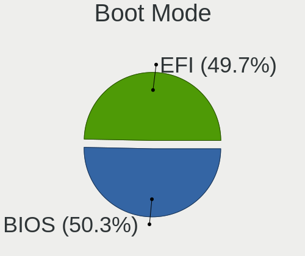
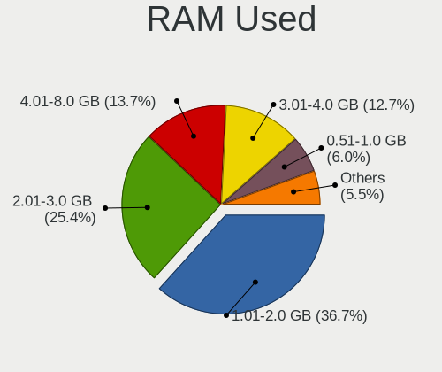
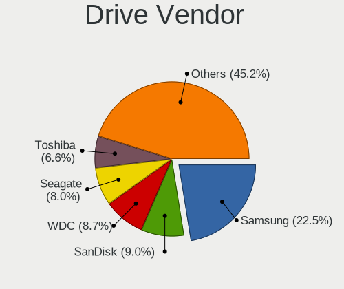

Linux in Germany - Tested Hardware & Statistics (Notebooks)
-----------------------------------------------------------

A project to collect tested hardware configurations for Linux in Germany.

Anyone can contribute to this report by the [hw-probe](https://github.com/linuxhw/hw-probe) tool:

    sudo -E hw-probe -all -upload

Please contribute! Especially if your hardware is rare.

Contents
--------

* [ Test Cases ](#test-cases)

* [ System ](#system)
  - [ OS                       ](#os)
  - [ OS Family                ](#os-family)
  - [ Kernel                   ](#kernel)
  - [ Kernel Family            ](#kernel-family)
  - [ Kernel Major Ver.        ](#kernel-major-ver)
  - [ Arch                     ](#arch)
  - [ DE                       ](#de)
  - [ Display Server           ](#display-server)
  - [ Display Manager          ](#display-manager)
  - [ OS Lang                  ](#os-lang)
  - [ Boot Mode                ](#boot-mode)
  - [ Filesystem               ](#filesystem)
  - [ Part. scheme             ](#part-scheme)
  - [ Dual Boot with Linux/BSD ](#dual-boot-with-linuxbsd)
  - [ Dual Boot (Win)          ](#dual-boot-win)

* [ Board ](#board)
  - [ Vendor                   ](#vendor)
  - [ Model                    ](#model)
  - [ Model Family             ](#model-family)
  - [ MFG Year                 ](#mfg-year)
  - [ Form Factor              ](#form-factor)
  - [ Secure Boot              ](#secure-boot)
  - [ Coreboot                 ](#coreboot)
  - [ RAM Size                 ](#ram-size)
  - [ RAM Used                 ](#ram-used)
  - [ Total Drives             ](#total-drives)
  - [ Has CD-ROM               ](#has-cd-rom)
  - [ Has Ethernet             ](#has-ethernet)
  - [ Has WiFi                 ](#has-wifi)
  - [ Has Bluetooth            ](#has-bluetooth)

* [ Location ](#location)
  - [ Country                  ](#country)
  - [ City                     ](#city)

* [ Drives ](#drives)
  - [ Drive Vendor             ](#drive-vendor)
  - [ Drive Model              ](#drive-model)
  - [ HDD Vendor               ](#hdd-vendor)
  - [ SSD Vendor               ](#ssd-vendor)
  - [ Drive Kind               ](#drive-kind)
  - [ Drive Connector          ](#drive-connector)
  - [ Drive Size               ](#drive-size)
  - [ Space Total              ](#space-total)
  - [ Space Used               ](#space-used)
  - [ Malfunc. Drives          ](#malfunc-drives)
  - [ Malfunc. Drive Vendor    ](#malfunc-drive-vendor)
  - [ Malfunc. HDD Vendor      ](#malfunc-hdd-vendor)
  - [ Malfunc. Drive Kind      ](#malfunc-drive-kind)
  - [ Failed Drives            ](#failed-drives)
  - [ Failed Drive Vendor      ](#failed-drive-vendor)
  - [ Drive Status             ](#drive-status)

* [ Storage controller ](#storage-controller)
  - [ Storage Vendor           ](#storage-vendor)
  - [ Storage Model            ](#storage-model)
  - [ Storage Kind             ](#storage-kind)

* [ Processor ](#processor)
  - [ CPU Vendor               ](#cpu-vendor)
  - [ CPU Model                ](#cpu-model)
  - [ CPU Model Family         ](#cpu-model-family)
  - [ CPU Cores                ](#cpu-cores)
  - [ CPU Sockets              ](#cpu-sockets)
  - [ CPU Threads              ](#cpu-threads)
  - [ CPU Op-Modes             ](#cpu-op-modes)
  - [ CPU Microcode            ](#cpu-microcode)
  - [ CPU Microarch            ](#cpu-microarch)

* [ Graphics ](#graphics)
  - [ GPU Vendor               ](#gpu-vendor)
  - [ GPU Model                ](#gpu-model)
  - [ GPU Combo                ](#gpu-combo)
  - [ GPU Driver               ](#gpu-driver)
  - [ GPU Memory               ](#gpu-memory)

* [ Monitor ](#monitor)
  - [ Monitor Vendor           ](#monitor-vendor)
  - [ Monitor Model            ](#monitor-model)
  - [ Monitor Resolution       ](#monitor-resolution)
  - [ Monitor Diagonal         ](#monitor-diagonal)
  - [ Monitor Width            ](#monitor-width)
  - [ Aspect Ratio             ](#aspect-ratio)
  - [ Monitor Area             ](#monitor-area)
  - [ Pixel Density            ](#pixel-density)
  - [ Multiple Monitors        ](#multiple-monitors)

* [ Network ](#network)
  - [ Net Controller Vendor    ](#net-controller-vendor)
  - [ Net Controller Model     ](#net-controller-model)
  - [ Wireless Vendor          ](#wireless-vendor)
  - [ Wireless Model           ](#wireless-model)
  - [ Ethernet Vendor          ](#ethernet-vendor)
  - [ Ethernet Model           ](#ethernet-model)
  - [ Net Controller Kind      ](#net-controller-kind)
  - [ Used Controller          ](#used-controller)
  - [ NICs                     ](#nics)
  - [ IPv6                     ](#ipv6)

* [ Bluetooth ](#bluetooth)
  - [ Bluetooth Vendor         ](#bluetooth-vendor)
  - [ Bluetooth Model          ](#bluetooth-model)

* [ Sound ](#sound)
  - [ Sound Vendor             ](#sound-vendor)
  - [ Sound Model              ](#sound-model)

* [ Memory ](#memory)
  - [ Memory Vendor            ](#memory-vendor)
  - [ Memory Model             ](#memory-model)
  - [ Memory Kind              ](#memory-kind)
  - [ Memory Form Factor       ](#memory-form-factor)
  - [ Memory Size              ](#memory-size)
  - [ Memory Speed             ](#memory-speed)

* [ Printers & scanners ](#printers--scanners)
  - [ Printer Vendor           ](#printer-vendor)
  - [ Printer Model            ](#printer-model)
  - [ Scanner Vendor           ](#scanner-vendor)
  - [ Scanner Model            ](#scanner-model)

* [ Camera ](#camera)
  - [ Camera Vendor            ](#camera-vendor)
  - [ Camera Model             ](#camera-model)

* [ Security ](#security)
  - [ Fingerprint Vendor       ](#fingerprint-vendor)
  - [ Fingerprint Model        ](#fingerprint-model)
  - [ Chipcard Vendor          ](#chipcard-vendor)
  - [ Chipcard Model           ](#chipcard-model)

* [ Unsupported ](#unsupported)
  - [ Unsupported Devices      ](#unsupported-devices)
  - [ Unsupported Device Types ](#unsupported-device-types)

Test Cases
----------

Total: 13064

| Vendor        | Model                       | Probe                                                      | Date         |
|---------------|-----------------------------|------------------------------------------------------------|--------------|
| Toshiba       | Satellite P775              | [c03f7668ac](https://linux-hardware.org/?probe=c03f7668ac) | Feb 01, 2023 |
| HP            | Compaq nx9420 (ES444ET#A... | [ac78478b3b](https://linux-hardware.org/?probe=ac78478b3b) | Feb 01, 2023 |
| MSI           | GP60 2PE                    | [a1bb8934a0](https://linux-hardware.org/?probe=a1bb8934a0) | Feb 01, 2023 |
| Lenovo        | ThinkPad X1 Carbon Gen 9... | [0de8121880](https://linux-hardware.org/?probe=0de8121880) | Feb 01, 2023 |
| Lenovo        | ThinkPad A485 20MVS0U500    | [b398a8e8e6](https://linux-hardware.org/?probe=b398a8e8e6) | Feb 01, 2023 |
| Lenovo        | ThinkPad T490s 20NYS4HL0... | [d792c0057e](https://linux-hardware.org/?probe=d792c0057e) | Feb 01, 2023 |
| Lenovo        | ThinkPad X1 Carbon Gen 9... | [f39ab69b74](https://linux-hardware.org/?probe=f39ab69b74) | Feb 01, 2023 |
| Lenovo        | ThinkPad T520 4243WRK       | [924a321452](https://linux-hardware.org/?probe=924a321452) | Feb 01, 2023 |
| MSI           | Raider GE66 12UHS           | [75e83dae8b](https://linux-hardware.org/?probe=75e83dae8b) | Feb 01, 2023 |
| Acer          | Aspire A315-53              | [d221bc6b8d](https://linux-hardware.org/?probe=d221bc6b8d) | Feb 01, 2023 |
| Dell          | Precision M6700             | [743cb766c2](https://linux-hardware.org/?probe=743cb766c2) | Feb 01, 2023 |
| Lenovo        | ThinkPad T14s Gen 3 21CQ... | [6b9dc508e1](https://linux-hardware.org/?probe=6b9dc508e1) | Feb 01, 2023 |
| ASUSTek       | VivoBook_ASUSLaptop E510... | [08e071efa2](https://linux-hardware.org/?probe=08e071efa2) | Feb 01, 2023 |
| Schenker      | VISION 16 Pro (L22)         | [0979a6ca2a](https://linux-hardware.org/?probe=0979a6ca2a) | Jan 31, 2023 |
| Lenovo        | ThinkPad T560 20FJS44L0B    | [06bf3870a5](https://linux-hardware.org/?probe=06bf3870a5) | Jan 31, 2023 |
| Lenovo        | ThinkPad T530 2394A11       | [e7946fa600](https://linux-hardware.org/?probe=e7946fa600) | Jan 31, 2023 |
| HUAWEI        | HLYL-WXX9                   | [6e8d45f76b](https://linux-hardware.org/?probe=6e8d45f76b) | Jan 31, 2023 |
| HP            | Laptop 14s-dq3xxx           | [12ebaf0896](https://linux-hardware.org/?probe=12ebaf0896) | Jan 31, 2023 |
| Dell          | Latitude E6540              | [156a047a82](https://linux-hardware.org/?probe=156a047a82) | Jan 31, 2023 |
| Medion        | E15410                      | [24135c324e](https://linux-hardware.org/?probe=24135c324e) | Jan 31, 2023 |
| Notebook      | W35xSTQ_370ST               | [b52cc29e08](https://linux-hardware.org/?probe=b52cc29e08) | Jan 31, 2023 |
| Dell          | XPS 13 7390                 | [5479d8c85b](https://linux-hardware.org/?probe=5479d8c85b) | Jan 31, 2023 |
| Dell          | XPS 13 9370                 | [cd12cbdc16](https://linux-hardware.org/?probe=cd12cbdc16) | Jan 31, 2023 |
| HUAWEI        | KLVL-WXXW                   | [4c8bff0f95](https://linux-hardware.org/?probe=4c8bff0f95) | Jan 31, 2023 |
| Lenovo        | ThinkPad E15 Gen 2 20T9S... | [51d249d102](https://linux-hardware.org/?probe=51d249d102) | Jan 31, 2023 |
| ASUSTek       | VivoBook_ASUSLaptop M340... | [cd9b7d5796](https://linux-hardware.org/?probe=cd9b7d5796) | Jan 31, 2023 |
| Dell          | XPS 15 9570                 | [896d7f2fbd](https://linux-hardware.org/?probe=896d7f2fbd) | Jan 31, 2023 |
| Notebook      | W35xSTQ_370ST               | [b33ec828fc](https://linux-hardware.org/?probe=b33ec828fc) | Jan 31, 2023 |
| HP            | EliteBook 840 G2            | [bf4741c8ad](https://linux-hardware.org/?probe=bf4741c8ad) | Jan 31, 2023 |
| Lenovo        | ThinkPad P15 Gen 2i 20YQ... | [ea48b6870c](https://linux-hardware.org/?probe=ea48b6870c) | Jan 31, 2023 |
| ASUSTek       | ZenBook UX425UA_UM425UA     | [4febaa325b](https://linux-hardware.org/?probe=4febaa325b) | Jan 31, 2023 |
| Lenovo        | ThinkPad T440 20B7S2GS0W    | [46008b3d38](https://linux-hardware.org/?probe=46008b3d38) | Jan 31, 2023 |
| TUXEDO        | Stellaris Intel Gen4        | [2df9f60f2e](https://linux-hardware.org/?probe=2df9f60f2e) | Jan 31, 2023 |
| Fujitsu       | LIFEBOOK S751               | [35948f3b5e](https://linux-hardware.org/?probe=35948f3b5e) | Jan 31, 2023 |
| Lenovo        | ThinkPad E14 Gen 4 21E30... | [87904d9d06](https://linux-hardware.org/?probe=87904d9d06) | Jan 31, 2023 |
| Acer          | Predator PH315-52           | [457b7cf5f0](https://linux-hardware.org/?probe=457b7cf5f0) | Jan 30, 2023 |
| Acer          | Aspire V3-772G              | [fce1ba6f6b](https://linux-hardware.org/?probe=fce1ba6f6b) | Jan 30, 2023 |
| Lenovo        | IdeaPad 530S-15IKB 81EV     | [58739a5bef](https://linux-hardware.org/?probe=58739a5bef) | Jan 30, 2023 |
| HP            | Laptop 17-bs0xx             | [ed57a59e39](https://linux-hardware.org/?probe=ed57a59e39) | Jan 30, 2023 |
| Acer          | Aspire E5-771               | [389651889c](https://linux-hardware.org/?probe=389651889c) | Jan 30, 2023 |
| HP            | Compaq Presario CQ70        | [07e9e57b88](https://linux-hardware.org/?probe=07e9e57b88) | Jan 30, 2023 |
| HP            | Laptop 17-ak0xx             | [6e6f32430a](https://linux-hardware.org/?probe=6e6f32430a) | Jan 30, 2023 |
| Acer          | Aspire E1-572G              | [6064a923c6](https://linux-hardware.org/?probe=6064a923c6) | Jan 30, 2023 |
| Acer          | Aspire 5755G                | [03c2f11b67](https://linux-hardware.org/?probe=03c2f11b67) | Jan 30, 2023 |
| TUXEDO        | Unknown                     | [81566e6fc9](https://linux-hardware.org/?probe=81566e6fc9) | Jan 30, 2023 |
| Lenovo        | ThinkPad P15 Gen 2i 20YR... | [3c0723977c](https://linux-hardware.org/?probe=3c0723977c) | Jan 30, 2023 |
| ASUSTek       | F5VL                        | [07e0539a43](https://linux-hardware.org/?probe=07e0539a43) | Jan 30, 2023 |
| Fujitsu Si... | STYLISTIC ST5112            | [c343cec0c8](https://linux-hardware.org/?probe=c343cec0c8) | Jan 30, 2023 |
| Acer          | Swift SF514-52T             | [6f95748149](https://linux-hardware.org/?probe=6f95748149) | Jan 30, 2023 |
| Lenovo        | 3000 N200 0769BAG           | [f8f410eb2a](https://linux-hardware.org/?probe=f8f410eb2a) | Jan 29, 2023 |
| Lenovo        | IdeaPad 720S-14IKB 81BD     | [50eb066d41](https://linux-hardware.org/?probe=50eb066d41) | Jan 29, 2023 |
| Apple         | MacBookPro5,5               | [678b6fa5f6](https://linux-hardware.org/?probe=678b6fa5f6) | Jan 29, 2023 |
| Lenovo        | IdeaPad 100-15IBD 80QQ      | [84c2710911](https://linux-hardware.org/?probe=84c2710911) | Jan 29, 2023 |
| Acer          | Nitro AN517-41              | [ecb7c49d2e](https://linux-hardware.org/?probe=ecb7c49d2e) | Jan 29, 2023 |
| ASUSTek       | ASUS TUF Gaming F15 FX50... | [608c0b8c88](https://linux-hardware.org/?probe=608c0b8c88) | Jan 29, 2023 |
| Lenovo        | Yoga Slim 7 Carbon 13ITL... | [d3936466af](https://linux-hardware.org/?probe=d3936466af) | Jan 29, 2023 |
| AXDIA Inte... | WINPAD V10                  | [c5f4838490](https://linux-hardware.org/?probe=c5f4838490) | Jan 29, 2023 |
| TUXEDO        | N14xWU                      | [5681ab6b5d](https://linux-hardware.org/?probe=5681ab6b5d) | Jan 28, 2023 |
| HUAWEI        | MACH-WX9                    | [5b00f79b72](https://linux-hardware.org/?probe=5b00f79b72) | Jan 28, 2023 |
| HP            | OMEN Laptop 15-en0xxx       | [e163d98802](https://linux-hardware.org/?probe=e163d98802) | Jan 28, 2023 |
| Lenovo        | ThinkPad L15 Gen 1 20U4S... | [a8e2d5b5f0](https://linux-hardware.org/?probe=a8e2d5b5f0) | Jan 28, 2023 |
| Acer          | Aspire ES1-711              | [3aa8f67a82](https://linux-hardware.org/?probe=3aa8f67a82) | Jan 28, 2023 |
| Lenovo        | ThinkPad X270 W10DG 20K6... | [ee4a3f359b](https://linux-hardware.org/?probe=ee4a3f359b) | Jan 27, 2023 |
| HP            | Laptop 15-bs0xx             | [9b10308469](https://linux-hardware.org/?probe=9b10308469) | Jan 27, 2023 |
| Toshiba       | Satellite L755              | [b15899ef80](https://linux-hardware.org/?probe=b15899ef80) | Jan 27, 2023 |
| Toshiba       | Satellite L755              | [357a0cd22d](https://linux-hardware.org/?probe=357a0cd22d) | Jan 27, 2023 |
| Acer          | Aspire 7741                 | [79d4beeb12](https://linux-hardware.org/?probe=79d4beeb12) | Jan 27, 2023 |
| Lenovo        | IdeaPad S130-11IGM 81J1     | [ee351959a0](https://linux-hardware.org/?probe=ee351959a0) | Jan 27, 2023 |
| Sony          | SVE1512H1EB                 | [9f9b853849](https://linux-hardware.org/?probe=9f9b853849) | Jan 27, 2023 |
| Sony          | SVE1512H1EB                 | [a1f75687bc](https://linux-hardware.org/?probe=a1f75687bc) | Jan 27, 2023 |
| Lenovo        | IdeaPad 330-17AST 81D7      | [f409b1df0b](https://linux-hardware.org/?probe=f409b1df0b) | Jan 27, 2023 |
| Acer          | Aspire E1-522               | [b1e1e4bb29](https://linux-hardware.org/?probe=b1e1e4bb29) | Jan 27, 2023 |
| TUXEDO        | InfinityBook S 15 Gen6      | [ee44dc2539](https://linux-hardware.org/?probe=ee44dc2539) | Jan 27, 2023 |
| HUAWEI        | HVY-WXX9                    | [dddf41f4e3](https://linux-hardware.org/?probe=dddf41f4e3) | Jan 27, 2023 |
| Acer          | Aspire ES1-571              | [c35f2771dc](https://linux-hardware.org/?probe=c35f2771dc) | Jan 27, 2023 |
| Schenker      | XMG FOCUS (M22)             | [b04fdbb6da](https://linux-hardware.org/?probe=b04fdbb6da) | Jan 27, 2023 |
| HUAWEI        | BOHB-WAX9                   | [00e21c8359](https://linux-hardware.org/?probe=00e21c8359) | Jan 27, 2023 |
| MSI           | CX600                       | [643c7effe7](https://linux-hardware.org/?probe=643c7effe7) | Jan 27, 2023 |
| Samsung       | 750XDA                      | [747e2b49d4](https://linux-hardware.org/?probe=747e2b49d4) | Jan 27, 2023 |
| Samsung       | 750XDA                      | [18fe906041](https://linux-hardware.org/?probe=18fe906041) | Jan 27, 2023 |
| Lenovo        | V15-ADA 82C7                | [5e42d7b8a7](https://linux-hardware.org/?probe=5e42d7b8a7) | Jan 27, 2023 |
| Fujitsu       | LIFEBOOK A556               | [550ced1932](https://linux-hardware.org/?probe=550ced1932) | Jan 27, 2023 |
| AXDIA Inte... | WINPAD V10                  | [ba8bdae82f](https://linux-hardware.org/?probe=ba8bdae82f) | Jan 27, 2023 |
| Notebook      | P15SM-A/SM1-A               | [7f70263934](https://linux-hardware.org/?probe=7f70263934) | Jan 26, 2023 |
| Lenovo        | Yoga Slim 7 Pro 16ACH6 8... | [9dfc820ceb](https://linux-hardware.org/?probe=9dfc820ceb) | Jan 26, 2023 |
| Lenovo        | Yoga Slim 7 Pro 16ACH6 8... | [0168a5cae2](https://linux-hardware.org/?probe=0168a5cae2) | Jan 26, 2023 |
| HP            | 255 G8 Notebook PC          | [fdcee64754](https://linux-hardware.org/?probe=fdcee64754) | Jan 26, 2023 |
| HP            | 255 G8 Notebook PC          | [814fe54dc5](https://linux-hardware.org/?probe=814fe54dc5) | Jan 26, 2023 |
| Dell          | Precision 7720              | [f5e8281d01](https://linux-hardware.org/?probe=f5e8281d01) | Jan 26, 2023 |
| Lenovo        | Legion 5 15IMH05 82AU       | [3d7c3e004b](https://linux-hardware.org/?probe=3d7c3e004b) | Jan 26, 2023 |
| Gigabyte      | Sabre 15                    | [3ad57e9198](https://linux-hardware.org/?probe=3ad57e9198) | Jan 26, 2023 |
| Acer          | Nitro AN517-51              | [8c568dd8e5](https://linux-hardware.org/?probe=8c568dd8e5) | Jan 26, 2023 |
| Fujitsu       | LIFEBOOK E752               | [2fc97553ae](https://linux-hardware.org/?probe=2fc97553ae) | Jan 26, 2023 |
| Lenovo        | ThinkPad T495 20NKS01Y00    | [a1dfc58700](https://linux-hardware.org/?probe=a1dfc58700) | Jan 26, 2023 |
| Lenovo        | ThinkPad T490 20N20048GE    | [54915be6bc](https://linux-hardware.org/?probe=54915be6bc) | Jan 26, 2023 |
| Valve         | Jupiter                     | [44f513f83b](https://linux-hardware.org/?probe=44f513f83b) | Jan 26, 2023 |
| Medion        | E15410                      | [5ba9ffd6a8](https://linux-hardware.org/?probe=5ba9ffd6a8) | Jan 26, 2023 |
| HP            | 355 G2                      | [66f901e77a](https://linux-hardware.org/?probe=66f901e77a) | Jan 26, 2023 |
| Sony          | SVJ2022M1EWI                | [c4c9254e6d](https://linux-hardware.org/?probe=c4c9254e6d) | Jan 25, 2023 |
| Lenovo        | G50-30 80G0                 | [850fc5b742](https://linux-hardware.org/?probe=850fc5b742) | Jan 25, 2023 |
| Lenovo        | V14-ADA 82C6                | [4d5aa34028](https://linux-hardware.org/?probe=4d5aa34028) | Jan 25, 2023 |
| Acer          | Aspire E1-571G              | [ed297cfa3b](https://linux-hardware.org/?probe=ed297cfa3b) | Jan 25, 2023 |
| Lenovo        | ThinkPad T14s Gen 3 21CQ... | [a780c8d844](https://linux-hardware.org/?probe=a780c8d844) | Jan 25, 2023 |
| Lenovo        | ThinkPad T14s Gen 3 21CQ... | [e6a1506275](https://linux-hardware.org/?probe=e6a1506275) | Jan 25, 2023 |
| Dell          | Inspiron 5748               | [924749ac13](https://linux-hardware.org/?probe=924749ac13) | Jan 25, 2023 |
| Valve         | Jupiter                     | [e6a43dd88c](https://linux-hardware.org/?probe=e6a43dd88c) | Jan 25, 2023 |
| Lenovo        | ThinkPad X220 4291IR6       | [cc41fa5174](https://linux-hardware.org/?probe=cc41fa5174) | Jan 25, 2023 |
| AXDIA Inte... | WINPAD V10                  | [be66e9073f](https://linux-hardware.org/?probe=be66e9073f) | Jan 25, 2023 |
| AXDIA Inte... | WINPAD V10                  | [3a8aced1b7](https://linux-hardware.org/?probe=3a8aced1b7) | Jan 25, 2023 |
| Valve         | Jupiter                     | [9cdb614599](https://linux-hardware.org/?probe=9cdb614599) | Jan 25, 2023 |
| TUXEDO        | Unknown                     | [ebdbb886bc](https://linux-hardware.org/?probe=ebdbb886bc) | Jan 25, 2023 |
| ASUSTek       | X555LD                      | [939802e4fa](https://linux-hardware.org/?probe=939802e4fa) | Jan 24, 2023 |
| Fujitsu       | LIFEBOOK U7511              | [7b9b00eccb](https://linux-hardware.org/?probe=7b9b00eccb) | Jan 24, 2023 |
| LG Electro... | 17Z90Q-G.AA79G              | [275f0a83ab](https://linux-hardware.org/?probe=275f0a83ab) | Jan 24, 2023 |
| Dell          | Latitude E7470              | [5258f49771](https://linux-hardware.org/?probe=5258f49771) | Jan 24, 2023 |
| Packard Be... | EasyNote MH36               | [07ba548a55](https://linux-hardware.org/?probe=07ba548a55) | Jan 24, 2023 |
| Schenker      | VISION 15 (SVS15E21)        | [bf22d53528](https://linux-hardware.org/?probe=bf22d53528) | Jan 24, 2023 |
| Dell          | Latitude 5491               | [37746d7f71](https://linux-hardware.org/?probe=37746d7f71) | Jan 24, 2023 |
| Dell          | Latitude E7470              | [647c279ad4](https://linux-hardware.org/?probe=647c279ad4) | Jan 24, 2023 |
| AXDIA Inte... | WINPAD V10                  | [dc93e9d9f0](https://linux-hardware.org/?probe=dc93e9d9f0) | Jan 24, 2023 |
| Lenovo        | ThinkPad T470p 20J60018G... | [b45a52bc35](https://linux-hardware.org/?probe=b45a52bc35) | Jan 24, 2023 |
| HUAWEI        | NBLK-WAX9X                  | [a227de29c5](https://linux-hardware.org/?probe=a227de29c5) | Jan 24, 2023 |
| Lenovo        | G700 20251                  | [0745c6189f](https://linux-hardware.org/?probe=0745c6189f) | Jan 23, 2023 |
| ASUSTek       | M51Tr                       | [03ed788f55](https://linux-hardware.org/?probe=03ed788f55) | Jan 23, 2023 |
| ASUSTek       | M51Tr                       | [d1f821e376](https://linux-hardware.org/?probe=d1f821e376) | Jan 23, 2023 |
| Dell          | Inspiron N5040              | [d3d4b5a577](https://linux-hardware.org/?probe=d3d4b5a577) | Jan 23, 2023 |
| Notebook      | W65_67SZ                    | [74d788dccb](https://linux-hardware.org/?probe=74d788dccb) | Jan 23, 2023 |
| Medion        | E15410                      | [f7e27f2ba9](https://linux-hardware.org/?probe=f7e27f2ba9) | Jan 23, 2023 |
| MicroByte     | ezbook                      | [ee3c30939d](https://linux-hardware.org/?probe=ee3c30939d) | Jan 23, 2023 |
| Lenovo        | ThinkPad T430 2344BZU       | [5e8acadc64](https://linux-hardware.org/?probe=5e8acadc64) | Jan 23, 2023 |
| Apple         | MacBook4,1                  | [8d876754f3](https://linux-hardware.org/?probe=8d876754f3) | Jan 23, 2023 |
| Apple         | MacBook4,1                  | [f1f61785e5](https://linux-hardware.org/?probe=f1f61785e5) | Jan 23, 2023 |
| Lenovo        | ThinkPad E15 Gen 3 20YHS... | [091effd2ac](https://linux-hardware.org/?probe=091effd2ac) | Jan 23, 2023 |
| Valve         | Jupiter                     | [509a842501](https://linux-hardware.org/?probe=509a842501) | Jan 23, 2023 |
| Apple         | MacBook5,1                  | [094f86e39f](https://linux-hardware.org/?probe=094f86e39f) | Jan 23, 2023 |
| Lenovo        | ThinkPad L13 Yoga Gen 2a... | [f6e09cc9fb](https://linux-hardware.org/?probe=f6e09cc9fb) | Jan 23, 2023 |
| Lenovo        | ThinkPad P50 20EQS12Q3M     | [e46b5a8b46](https://linux-hardware.org/?probe=e46b5a8b46) | Jan 23, 2023 |
| Lenovo        | ThinkPad L13 Yoga Gen 2a... | [306e6ae925](https://linux-hardware.org/?probe=306e6ae925) | Jan 23, 2023 |
| Dell          | XPS 13 9343                 | [f371c1c8b6](https://linux-hardware.org/?probe=f371c1c8b6) | Jan 23, 2023 |
| Acer          | Swift SFX16-52G             | [62e1cc77f9](https://linux-hardware.org/?probe=62e1cc77f9) | Jan 23, 2023 |
| Dell          | Latitude 3340               | [cfb81c9c4b](https://linux-hardware.org/?probe=cfb81c9c4b) | Jan 23, 2023 |
| Acer          | Extensa 215-21              | [9bc19f3d42](https://linux-hardware.org/?probe=9bc19f3d42) | Jan 22, 2023 |
| Fujitsu       | LIFEBOOK S751               | [ff727a3560](https://linux-hardware.org/?probe=ff727a3560) | Jan 22, 2023 |
| Fujitsu       | LIFEBOOK S751               | [df0676ac87](https://linux-hardware.org/?probe=df0676ac87) | Jan 22, 2023 |
| HP            | 625                         | [33f03142db](https://linux-hardware.org/?probe=33f03142db) | Jan 22, 2023 |
| Lenovo        | ThinkPad W530 244723G       | [d0e5903d6c](https://linux-hardware.org/?probe=d0e5903d6c) | Jan 22, 2023 |
| Lenovo        | ThinkPad X220 4291CZ6       | [44370bfe99](https://linux-hardware.org/?probe=44370bfe99) | Jan 22, 2023 |
| Lenovo        | ThinkPad T530 2394A11       | [7cc89d144b](https://linux-hardware.org/?probe=7cc89d144b) | Jan 22, 2023 |
| Lenovo        | ThinkPad X1C 5th W10DG 2... | [f3e565ffa6](https://linux-hardware.org/?probe=f3e565ffa6) | Jan 22, 2023 |
| Apple         | MacBookPro9,2               | [ffa1f65eeb](https://linux-hardware.org/?probe=ffa1f65eeb) | Jan 22, 2023 |
| HP            | EliteBook 820 G3            | [3edd4ab0dc](https://linux-hardware.org/?probe=3edd4ab0dc) | Jan 22, 2023 |
| Lenovo        | V110-15IAP 80TG             | [1707a21fed](https://linux-hardware.org/?probe=1707a21fed) | Jan 22, 2023 |
| Medion        | GUARDIAN X10                | [4807ed03d5](https://linux-hardware.org/?probe=4807ed03d5) | Jan 22, 2023 |
| Lenovo        | ThinkPad T530 2394A11       | [1e88d6e7ca](https://linux-hardware.org/?probe=1e88d6e7ca) | Jan 21, 2023 |
| Lenovo        | IdeaPad 720S-13ARR 81BR     | [992ecbe8dc](https://linux-hardware.org/?probe=992ecbe8dc) | Jan 21, 2023 |
| TUXEDO        | InfinityBook S 15 Gen6      | [7bf2d60c0b](https://linux-hardware.org/?probe=7bf2d60c0b) | Jan 21, 2023 |
| HP            | Victus by Gaming Laptop ... | [0aa98390a7](https://linux-hardware.org/?probe=0aa98390a7) | Jan 21, 2023 |
| Acer          | TravelMate B118-M           | [029850a46e](https://linux-hardware.org/?probe=029850a46e) | Jan 21, 2023 |
| Wortmann      | 1220583_1470086             | [10016e75a1](https://linux-hardware.org/?probe=10016e75a1) | Jan 21, 2023 |
| Lenovo        | Yoga Slim 7 ProX 14ARH7 ... | [15dde971f3](https://linux-hardware.org/?probe=15dde971f3) | Jan 21, 2023 |
| Lenovo        | IdeaPad 5 14ALC05 82LM      | [bccb4a4afe](https://linux-hardware.org/?probe=bccb4a4afe) | Jan 21, 2023 |
| ASUSTek       | N53SN                       | [bc8c82ca9a](https://linux-hardware.org/?probe=bc8c82ca9a) | Jan 21, 2023 |
| HP            | ENVY Laptop 13-ba0xxx       | [cb34b6dd34](https://linux-hardware.org/?probe=cb34b6dd34) | Jan 21, 2023 |
| Lenovo        | IdeaPad 5 Pro 14ARH7 82S... | [fb9f62bcc7](https://linux-hardware.org/?probe=fb9f62bcc7) | Jan 20, 2023 |
| HP            | Laptop 17-by0xxx            | [88958e2846](https://linux-hardware.org/?probe=88958e2846) | Jan 20, 2023 |
| Acer          | Extensa 215-21              | [e39e842e0d](https://linux-hardware.org/?probe=e39e842e0d) | Jan 20, 2023 |
| Lenovo        | ThinkPad T510 43494JG       | [0d71ec1156](https://linux-hardware.org/?probe=0d71ec1156) | Jan 20, 2023 |
| Dell          | Latitude 5501               | [d31f972a20](https://linux-hardware.org/?probe=d31f972a20) | Jan 20, 2023 |
| Apple         | MacBookAir7,2               | [cdaf37c421](https://linux-hardware.org/?probe=cdaf37c421) | Jan 20, 2023 |
| Fujitsu       | M2010                       | [dec6151200](https://linux-hardware.org/?probe=dec6151200) | Jan 20, 2023 |
| Google        | Pantheon                    | [adc7bcf716](https://linux-hardware.org/?probe=adc7bcf716) | Jan 20, 2023 |
| Lenovo        | IdeaPad 5 14ALC05 82LM      | [32962bb00f](https://linux-hardware.org/?probe=32962bb00f) | Jan 20, 2023 |
| HP            | Pavilion dv7                | [e6f0a4a3a2](https://linux-hardware.org/?probe=e6f0a4a3a2) | Jan 20, 2023 |
| Acer          | Aspire E1-531               | [614c392e0f](https://linux-hardware.org/?probe=614c392e0f) | Jan 20, 2023 |
| Dell          | Inspiron 16 Plus 7620       | [9326386ab1](https://linux-hardware.org/?probe=9326386ab1) | Jan 19, 2023 |
| SLIMBOOK      | TITAN                       | [15c0522754](https://linux-hardware.org/?probe=15c0522754) | Jan 19, 2023 |
| Dell          | Inspiron 16 Plus 7620       | [0a3c8bbba5](https://linux-hardware.org/?probe=0a3c8bbba5) | Jan 19, 2023 |
| SLIMBOOK      | TITAN                       | [e81652a68c](https://linux-hardware.org/?probe=e81652a68c) | Jan 19, 2023 |
| Schenker      | XMG PRO (Early 2021)        | [5b7b3243b0](https://linux-hardware.org/?probe=5b7b3243b0) | Jan 19, 2023 |
| Valve         | Jupiter                     | [808500518b](https://linux-hardware.org/?probe=808500518b) | Jan 19, 2023 |
| HP            | ZBook Power 15.6 inch G9... | [b318baed4f](https://linux-hardware.org/?probe=b318baed4f) | Jan 19, 2023 |
| Dell          | G3 3779                     | [c4c13ca86b](https://linux-hardware.org/?probe=c4c13ca86b) | Jan 19, 2023 |
| TUXEDO        | Pulse 15 Gen1               | [1f56f8cb21](https://linux-hardware.org/?probe=1f56f8cb21) | Jan 19, 2023 |
| Medion        | X781X                       | [d574c9c53c](https://linux-hardware.org/?probe=d574c9c53c) | Jan 19, 2023 |
| Lenovo        | ThinkPad T480s 20L8S02D0... | [8bcbca2ea9](https://linux-hardware.org/?probe=8bcbca2ea9) | Jan 19, 2023 |
| Lenovo        | ThinkPad T480s 20L8S02D0... | [3572cb486b](https://linux-hardware.org/?probe=3572cb486b) | Jan 19, 2023 |
| Acer          | Aspire E5-774G              | [f3ab78c392](https://linux-hardware.org/?probe=f3ab78c392) | Jan 19, 2023 |
| Schenker      | XMG PRO (E22)               | [475e812e56](https://linux-hardware.org/?probe=475e812e56) | Jan 19, 2023 |
| Lenovo        | IdeaPad 5 15ARE05 81YQ      | [3fa537973f](https://linux-hardware.org/?probe=3fa537973f) | Jan 18, 2023 |
| Apple         | MacBookPro8,2               | [dcad06d796](https://linux-hardware.org/?probe=dcad06d796) | Jan 18, 2023 |
| HP            | Compaq 6910p                | [61d820a040](https://linux-hardware.org/?probe=61d820a040) | Jan 18, 2023 |
| HP            | ENVY Laptop 17-ce0xxx       | [1a0f3869dd](https://linux-hardware.org/?probe=1a0f3869dd) | Jan 18, 2023 |
| Dell          | Latitude E6330              | [0436245c6b](https://linux-hardware.org/?probe=0436245c6b) | Jan 18, 2023 |
| Lenovo        | IdeaPad 5 15ARE05 81YQ      | [377dd4141e](https://linux-hardware.org/?probe=377dd4141e) | Jan 18, 2023 |
| Lenovo        | ThinkPad P14s Gen 2a 21A... | [8c57e1afda](https://linux-hardware.org/?probe=8c57e1afda) | Jan 18, 2023 |
| Lenovo        | ThinkPad P14s Gen 2a 21A... | [c0055f8de2](https://linux-hardware.org/?probe=c0055f8de2) | Jan 18, 2023 |
| Lenovo        | V110-15IAP 80TG             | [cfe9a9d924](https://linux-hardware.org/?probe=cfe9a9d924) | Jan 18, 2023 |
| ASUSTek       | K50IJ                       | [7bc215b8a6](https://linux-hardware.org/?probe=7bc215b8a6) | Jan 18, 2023 |
| HP            | Pavilion Notebook           | [9a0b1c62f5](https://linux-hardware.org/?probe=9a0b1c62f5) | Jan 18, 2023 |
| Dell          | Precision 7670              | [5c70243651](https://linux-hardware.org/?probe=5c70243651) | Jan 18, 2023 |
| ASUSTek       | ASUS EXPERTBOOK L1400CDA... | [7969ad351d](https://linux-hardware.org/?probe=7969ad351d) | Jan 18, 2023 |
| Dell          | G5 5590                     | [c2a3296ba7](https://linux-hardware.org/?probe=c2a3296ba7) | Jan 18, 2023 |
| Quanta        | TW9/SW9                     | [4a196739f5](https://linux-hardware.org/?probe=4a196739f5) | Jan 18, 2023 |
| HP            | 255 G8 Notebook PC          | [e96d7dfab6](https://linux-hardware.org/?probe=e96d7dfab6) | Jan 17, 2023 |
| ASUSTek       | ASUS TUF Gaming F15 FX50... | [987dcf118c](https://linux-hardware.org/?probe=987dcf118c) | Jan 17, 2023 |
| Samsung       | RV415/RV515/E3415           | [8612e64617](https://linux-hardware.org/?probe=8612e64617) | Jan 17, 2023 |
| HUAWEI        | KLVL-WXX9                   | [bf8a560f29](https://linux-hardware.org/?probe=bf8a560f29) | Jan 17, 2023 |
| ASUSTek       | ZenBook UX431DA_UM431DA     | [a20814cabc](https://linux-hardware.org/?probe=a20814cabc) | Jan 17, 2023 |
| Acer          | Swift SFX14-51G             | [f0137b1f08](https://linux-hardware.org/?probe=f0137b1f08) | Jan 17, 2023 |
| Lenovo        | V330-14IKB 81B0             | [140f1537e2](https://linux-hardware.org/?probe=140f1537e2) | Jan 17, 2023 |
| Dell          | Latitude 5521               | [cfe9e36a5e](https://linux-hardware.org/?probe=cfe9e36a5e) | Jan 17, 2023 |
| Lenovo        | ThinkPad X61 Tablet 7767... | [99e10e5d0f](https://linux-hardware.org/?probe=99e10e5d0f) | Jan 17, 2023 |
| Lenovo        | ThinkPad X61 Tablet 7767... | [624f47d1e3](https://linux-hardware.org/?probe=624f47d1e3) | Jan 17, 2023 |
| Unknown       | Unknown                     | [c7fc2227fd](https://linux-hardware.org/?probe=c7fc2227fd) | Jan 17, 2023 |
| Lenovo        | ThinkPad E15 Gen 2 20T9S... | [d7e87dd461](https://linux-hardware.org/?probe=d7e87dd461) | Jan 17, 2023 |
| Dell          | Latitude E6230              | [92a496c87d](https://linux-hardware.org/?probe=92a496c87d) | Jan 16, 2023 |
| Dell          | Latitude E6230              | [0750c24bd9](https://linux-hardware.org/?probe=0750c24bd9) | Jan 16, 2023 |
| Acer          | Aspire A515-52              | [fdc8429b4f](https://linux-hardware.org/?probe=fdc8429b4f) | Jan 16, 2023 |
| HP            | 255 G2                      | [e3f8ff1bdc](https://linux-hardware.org/?probe=e3f8ff1bdc) | Jan 16, 2023 |
| Dell          | XPS 17 9720                 | [edb39e6e0f](https://linux-hardware.org/?probe=edb39e6e0f) | Jan 16, 2023 |
| Dell          | Latitude E7240              | [38d3c2b0e7](https://linux-hardware.org/?probe=38d3c2b0e7) | Jan 16, 2023 |
| Dell          | Latitude E7240              | [768ef76206](https://linux-hardware.org/?probe=768ef76206) | Jan 16, 2023 |
| Wortmann      | Mobile 1524                 | [17fc7e2f75](https://linux-hardware.org/?probe=17fc7e2f75) | Jan 16, 2023 |
| Schenker      | XMG CORE 15 (M22)           | [6c2b631f12](https://linux-hardware.org/?probe=6c2b631f12) | Jan 16, 2023 |
| HP            | ProBook 430 G3              | [a320b048f1](https://linux-hardware.org/?probe=a320b048f1) | Jan 16, 2023 |
| HP            | ProBook 430 G3              | [68edfcd96a](https://linux-hardware.org/?probe=68edfcd96a) | Jan 16, 2023 |
| Valve         | Jupiter                     | [e4f87dd361](https://linux-hardware.org/?probe=e4f87dd361) | Jan 16, 2023 |
| HUAWEI        | HVY-WXX9                    | [0663975741](https://linux-hardware.org/?probe=0663975741) | Jan 16, 2023 |
| Medion        | E6226                       | [207705740c](https://linux-hardware.org/?probe=207705740c) | Jan 16, 2023 |
| Medion        | E6214                       | [b30ab20f02](https://linux-hardware.org/?probe=b30ab20f02) | Jan 16, 2023 |
| Acer          | Aspire V3-571G              | [c43319f7fe](https://linux-hardware.org/?probe=c43319f7fe) | Jan 16, 2023 |
| HP            | Laptop 17-ca1xxx            | [ec0dcfaac5](https://linux-hardware.org/?probe=ec0dcfaac5) | Jan 15, 2023 |
| HP            | Laptop 17-ak0xx             | [f68cfc34ab](https://linux-hardware.org/?probe=f68cfc34ab) | Jan 15, 2023 |
| HP            | Laptop 15s-eq2xxx           | [32e5de4912](https://linux-hardware.org/?probe=32e5de4912) | Jan 15, 2023 |
| Lenovo        | IdeaPad 5 14ALC05 82LM      | [b30f0e2202](https://linux-hardware.org/?probe=b30f0e2202) | Jan 15, 2023 |
| HP            | ProBook 455R G6             | [6ca9f4f6c0](https://linux-hardware.org/?probe=6ca9f4f6c0) | Jan 15, 2023 |
| Apple         | MacBookAir5,1               | [f316bddcf2](https://linux-hardware.org/?probe=f316bddcf2) | Jan 15, 2023 |
| HP            | ProBook 6560b               | [ac20c40cf5](https://linux-hardware.org/?probe=ac20c40cf5) | Jan 15, 2023 |
| HP            | ProBook 6560b               | [076db0a934](https://linux-hardware.org/?probe=076db0a934) | Jan 15, 2023 |
| HP            | Laptop 17-bs0xx             | [9836c3d7c3](https://linux-hardware.org/?probe=9836c3d7c3) | Jan 15, 2023 |
| Acer          | Aspire V3-571G              | [08124c16a2](https://linux-hardware.org/?probe=08124c16a2) | Jan 15, 2023 |
| ASUSTek       | ASUS TUF Gaming F17 FX70... | [0ec206a07d](https://linux-hardware.org/?probe=0ec206a07d) | Jan 15, 2023 |
| Acer          | Aspire A315-21              | [b035fd60cd](https://linux-hardware.org/?probe=b035fd60cd) | Jan 15, 2023 |
| Acer          | Aspire E1-572G              | [55fe8f2e99](https://linux-hardware.org/?probe=55fe8f2e99) | Jan 15, 2023 |
| ASUSTek       | VivoBook_ASUSLaptop M340... | [bb339afa44](https://linux-hardware.org/?probe=bb339afa44) | Jan 15, 2023 |
| Acer          | Aspire E1-572G              | [8e8dfb80cb](https://linux-hardware.org/?probe=8e8dfb80cb) | Jan 15, 2023 |
| Dynabook      | Satellite Pro C50-J         | [ba8e771128](https://linux-hardware.org/?probe=ba8e771128) | Jan 15, 2023 |
| ASUSTek       | X751LK                      | [3129c43327](https://linux-hardware.org/?probe=3129c43327) | Jan 15, 2023 |
| Framework     | Laptop                      | [d7dd081a85](https://linux-hardware.org/?probe=d7dd081a85) | Jan 15, 2023 |
| HP            | ProBook 6570b               | [919b330a89](https://linux-hardware.org/?probe=919b330a89) | Jan 15, 2023 |
| ASUSTek       | ZenBook UX431DA_UM431DA     | [80ab61d971](https://linux-hardware.org/?probe=80ab61d971) | Jan 15, 2023 |
| Apple         | MacBookPro9,2               | [003c03a597](https://linux-hardware.org/?probe=003c03a597) | Jan 15, 2023 |
| Lenovo        | ThinkPad L14 Gen 2a 20X5... | [251a926c19](https://linux-hardware.org/?probe=251a926c19) | Jan 14, 2023 |
| Lenovo        | ThinkPad T540p 20BFS2G00... | [6c7af52ee2](https://linux-hardware.org/?probe=6c7af52ee2) | Jan 14, 2023 |
| Lenovo        | IdeaPadFlex 15D 20334       | [331b5e3efa](https://linux-hardware.org/?probe=331b5e3efa) | Jan 14, 2023 |
| Lenovo        | IdeaPadFlex 15D 20334       | [19531b68b1](https://linux-hardware.org/?probe=19531b68b1) | Jan 14, 2023 |
| HP            | EliteBook 745 G5            | [941c62872e](https://linux-hardware.org/?probe=941c62872e) | Jan 14, 2023 |
| Medion        | E6214                       | [4ee7aa5359](https://linux-hardware.org/?probe=4ee7aa5359) | Jan 14, 2023 |
| HP            | 255 15.6 inch G9 Noteboo... | [0b51dca7c2](https://linux-hardware.org/?probe=0b51dca7c2) | Jan 14, 2023 |
| Lenovo        | ThinkPad T15 Gen 1 20S6S... | [b4629bd83f](https://linux-hardware.org/?probe=b4629bd83f) | Jan 14, 2023 |
| HP            | Pavilion g7                 | [38bfacf170](https://linux-hardware.org/?probe=38bfacf170) | Jan 14, 2023 |
| Lenovo        | ThinkPad E15 Gen 3 20YG0... | [88a24616cc](https://linux-hardware.org/?probe=88a24616cc) | Jan 14, 2023 |
| Dell          | Latitude E7440              | [9c4aac8b46](https://linux-hardware.org/?probe=9c4aac8b46) | Jan 14, 2023 |
| Fujitsu       | LIFEBOOK A531               | [7157b47b73](https://linux-hardware.org/?probe=7157b47b73) | Jan 14, 2023 |
| Fujitsu       | LIFEBOOK A530               | [64e3a1d972](https://linux-hardware.org/?probe=64e3a1d972) | Jan 14, 2023 |
| HP            | Falco                       | [a52a8f8f4e](https://linux-hardware.org/?probe=a52a8f8f4e) | Jan 14, 2023 |
| Lenovo        | Z50-70 20354                | [426bac7c70](https://linux-hardware.org/?probe=426bac7c70) | Jan 14, 2023 |
| ASUSTek       | ZenBook UX325SA_UM325SA     | [ddf679df3a](https://linux-hardware.org/?probe=ddf679df3a) | Jan 14, 2023 |
| ASUSTek       | X751SA                      | [658c4a4cbd](https://linux-hardware.org/?probe=658c4a4cbd) | Jan 14, 2023 |
| Dell          | Precision M4800             | [c5deb205c7](https://linux-hardware.org/?probe=c5deb205c7) | Jan 14, 2023 |
| ASUSTek       | X580VD                      | [4a8060c1cc](https://linux-hardware.org/?probe=4a8060c1cc) | Jan 13, 2023 |
| Lenovo        | ThinkPad T14 Gen 1 20S1S... | [828d390087](https://linux-hardware.org/?probe=828d390087) | Jan 13, 2023 |
| Packard Be... | EasyNote TK85               | [363a602a73](https://linux-hardware.org/?probe=363a602a73) | Jan 13, 2023 |
| ASUSTek       | N71Jv                       | [084f05b7dc](https://linux-hardware.org/?probe=084f05b7dc) | Jan 13, 2023 |
| Dell          | Latitude 5414               | [bc4fdb0971](https://linux-hardware.org/?probe=bc4fdb0971) | Jan 13, 2023 |
| MSI           | CX61 0NC/CX61 0ND/CX61 0... | [fafc15930a](https://linux-hardware.org/?probe=fafc15930a) | Jan 13, 2023 |
| Acer          | Aspire 8735                 | [67d31c7012](https://linux-hardware.org/?probe=67d31c7012) | Jan 13, 2023 |
| Lenovo        | IdeaPad 5 15ARE05 81YQ      | [968604ceb2](https://linux-hardware.org/?probe=968604ceb2) | Jan 13, 2023 |
| Lenovo        | ThinkPad T480s 20L7001VG... | [b9ba7cc580](https://linux-hardware.org/?probe=b9ba7cc580) | Jan 13, 2023 |
| Lenovo        | ThinkPad T14s Gen 1 20UJ... | [73533cda86](https://linux-hardware.org/?probe=73533cda86) | Jan 13, 2023 |
| ASUSTek       | X555LAB                     | [3485a44094](https://linux-hardware.org/?probe=3485a44094) | Jan 13, 2023 |
| ASUSTek       | K93SV                       | [250b4a09a0](https://linux-hardware.org/?probe=250b4a09a0) | Jan 13, 2023 |
| ASUSTek       | X555LAB                     | [bf37413b50](https://linux-hardware.org/?probe=bf37413b50) | Jan 13, 2023 |
| Lenovo        | ThinkPad T495s 20QKS2R40... | [28d821da5f](https://linux-hardware.org/?probe=28d821da5f) | Jan 13, 2023 |
| Dell          | Latitude 3320               | [f10d2a0741](https://linux-hardware.org/?probe=f10d2a0741) | Jan 13, 2023 |
| Dell          | Latitude 3320               | [613d7d50eb](https://linux-hardware.org/?probe=613d7d50eb) | Jan 13, 2023 |
| Lenovo        | G700                        | [85eb225e8f](https://linux-hardware.org/?probe=85eb225e8f) | Jan 13, 2023 |
| Lenovo        | ThinkPad T495s 20QKS2R40... | [e78a057172](https://linux-hardware.org/?probe=e78a057172) | Jan 13, 2023 |
| Acer          | Swift SF514-54GT            | [748c1e00d7](https://linux-hardware.org/?probe=748c1e00d7) | Jan 12, 2023 |
| Lenovo        | Legion Y540-15IRH-PG0 81... | [b9ca7fb340](https://linux-hardware.org/?probe=b9ca7fb340) | Jan 12, 2023 |
| Acer          | Aspire ES1-711              | [87c00cc849](https://linux-hardware.org/?probe=87c00cc849) | Jan 12, 2023 |
| HP            | Compaq 6735b                | [01878ee027](https://linux-hardware.org/?probe=01878ee027) | Jan 12, 2023 |
| Lenovo        | ThinkPad T14 Gen 1 20S1S... | [50dfb4259a](https://linux-hardware.org/?probe=50dfb4259a) | Jan 12, 2023 |
| Lenovo        | ThinkPad X230 23245J8       | [c20b87316b](https://linux-hardware.org/?probe=c20b87316b) | Jan 12, 2023 |
| Dell          | XPS 15 7590                 | [503d37b2e2](https://linux-hardware.org/?probe=503d37b2e2) | Jan 12, 2023 |
| Lenovo        | ThinkPad T14s Gen 2a 20X... | [998a408a04](https://linux-hardware.org/?probe=998a408a04) | Jan 12, 2023 |
| MSI           | Raider GE66 12UHS           | [dc6fc59dfa](https://linux-hardware.org/?probe=dc6fc59dfa) | Jan 12, 2023 |
| HP            | 250 G8 Notebook PC          | [b1c15f0198](https://linux-hardware.org/?probe=b1c15f0198) | Jan 12, 2023 |
| Acer          | Aspire ES1-331              | [970c4e185f](https://linux-hardware.org/?probe=970c4e185f) | Jan 12, 2023 |
| Lenovo        | ThinkPad T470p 20J7S1JT0... | [856d91c1ca](https://linux-hardware.org/?probe=856d91c1ca) | Jan 12, 2023 |
| HP            | ProBook 6560b               | [9f06213ef6](https://linux-hardware.org/?probe=9f06213ef6) | Jan 12, 2023 |
| HP            | ProBook 6560b               | [5b71b83435](https://linux-hardware.org/?probe=5b71b83435) | Jan 12, 2023 |
| Acer          | Nitro AN517-42              | [c8440739f9](https://linux-hardware.org/?probe=c8440739f9) | Jan 12, 2023 |
| Acer          | Aspire E1-572G              | [a75a92fb92](https://linux-hardware.org/?probe=a75a92fb92) | Jan 11, 2023 |
| Dell          | Latitude E6530              | [b73c66e6a3](https://linux-hardware.org/?probe=b73c66e6a3) | Jan 11, 2023 |
| Lenovo        | IdeaPad 5 14ALC05 82LM      | [3168aeca84](https://linux-hardware.org/?probe=3168aeca84) | Jan 11, 2023 |
| Samsung       | R520/R522/R620              | [78eb96d148](https://linux-hardware.org/?probe=78eb96d148) | Jan 11, 2023 |
| ASUSTek       | ZenBook UX425UA_UM425UA     | [0eb269d3a7](https://linux-hardware.org/?probe=0eb269d3a7) | Jan 11, 2023 |
| TrekStor      | Primebook_P15               | [bed85f0f24](https://linux-hardware.org/?probe=bed85f0f24) | Jan 11, 2023 |
| Lenovo        | ThinkPad X13 Gen 1 20T20... | [178042c9e5](https://linux-hardware.org/?probe=178042c9e5) | Jan 11, 2023 |
| TrekStor      | Primebook_P15               | [969e8f8e1a](https://linux-hardware.org/?probe=969e8f8e1a) | Jan 11, 2023 |
| Acer          | Aspire E1-572G              | [2e6257a227](https://linux-hardware.org/?probe=2e6257a227) | Jan 11, 2023 |
| HP            | Laptop 17-cp0xxx            | [cf9f6f5785](https://linux-hardware.org/?probe=cf9f6f5785) | Jan 11, 2023 |
| Fujitsu       | LIFEBOOK A512               | [4bb2de67c9](https://linux-hardware.org/?probe=4bb2de67c9) | Jan 11, 2023 |
| Samsung       | R520/R522/R620              | [9dfcb68d9a](https://linux-hardware.org/?probe=9dfcb68d9a) | Jan 11, 2023 |
| Lenovo        | ThinkPad X240 20AM001RGE    | [f4aafcf7a9](https://linux-hardware.org/?probe=f4aafcf7a9) | Jan 11, 2023 |
| Lenovo        | ThinkPad X13 Gen 1 20T20... | [07cbd05482](https://linux-hardware.org/?probe=07cbd05482) | Jan 11, 2023 |
| Medion        | GUARDIAN X10                | [ef011d0700](https://linux-hardware.org/?probe=ef011d0700) | Jan 10, 2023 |
| Lenovo        | G580 26896LG                | [7490bc0027](https://linux-hardware.org/?probe=7490bc0027) | Jan 10, 2023 |
| Lenovo        | IdeaPad 5 14ALC05 82LM      | [da042ea505](https://linux-hardware.org/?probe=da042ea505) | Jan 10, 2023 |
| Valve         | Jupiter                     | [23f9746034](https://linux-hardware.org/?probe=23f9746034) | Jan 10, 2023 |
| Fujitsu       | LIFEBOOK U7511              | [a170a45756](https://linux-hardware.org/?probe=a170a45756) | Jan 10, 2023 |
| HP            | EliteBook 8440p             | [5dfdb45036](https://linux-hardware.org/?probe=5dfdb45036) | Jan 10, 2023 |
| Lenovo        | ThinkPad L14 Gen 1 20U2S... | [63adbe137a](https://linux-hardware.org/?probe=63adbe137a) | Jan 10, 2023 |
| Lenovo        | ThinkPad T440 20B7000LGE    | [e094c1d3f4](https://linux-hardware.org/?probe=e094c1d3f4) | Jan 10, 2023 |
| Lenovo        | B50-70 80EU                 | [e11621e300](https://linux-hardware.org/?probe=e11621e300) | Jan 10, 2023 |
| Acer          | Aspire F5-573               | [56819b1d05](https://linux-hardware.org/?probe=56819b1d05) | Jan 10, 2023 |
| Lenovo        | ThinkPad T590 20N5S4R800    | [51d6d75e64](https://linux-hardware.org/?probe=51d6d75e64) | Jan 10, 2023 |
| ASUSTek       | UX31A                       | [c618ab31a8](https://linux-hardware.org/?probe=c618ab31a8) | Jan 10, 2023 |
| MPMAN         | CONVERTER 102               | [cc1eb56fbc](https://linux-hardware.org/?probe=cc1eb56fbc) | Jan 10, 2023 |
| Unknown       | Unknown                     | [cd585b620d](https://linux-hardware.org/?probe=cd585b620d) | Jan 10, 2023 |
| Unknown       | Unknown                     | [f28b2b0803](https://linux-hardware.org/?probe=f28b2b0803) | Jan 10, 2023 |
| Toshiba       | Satellite S50D-B            | [507bf77aa7](https://linux-hardware.org/?probe=507bf77aa7) | Jan 09, 2023 |
| HP            | Compaq nx9420 (ES444ET#A... | [8d0b4a504d](https://linux-hardware.org/?probe=8d0b4a504d) | Jan 09, 2023 |
| ASUSTek       | K50IJ                       | [2f4bf7dfec](https://linux-hardware.org/?probe=2f4bf7dfec) | Jan 09, 2023 |
| ASUSTek       | X75A1                       | [02ad2b36f1](https://linux-hardware.org/?probe=02ad2b36f1) | Jan 09, 2023 |
| Acer          | Aspire E5-771               | [dc397ff7f7](https://linux-hardware.org/?probe=dc397ff7f7) | Jan 09, 2023 |
| Lenovo        | ThinkPad P14s Gen 2a 21A... | [4dcb7f82f6](https://linux-hardware.org/?probe=4dcb7f82f6) | Jan 09, 2023 |
| ASUSTek       | UX31A                       | [2eaea530ea](https://linux-hardware.org/?probe=2eaea530ea) | Jan 09, 2023 |
| Lenovo        | ThinkPad T14s Gen 2a 20X... | [606c8dfd43](https://linux-hardware.org/?probe=606c8dfd43) | Jan 09, 2023 |
| Tactus        | GeoBook 140                 | [19395bff11](https://linux-hardware.org/?probe=19395bff11) | Jan 09, 2023 |
| TUXEDO        | InfinityBook Pro Gen7 (M... | [c8572f304a](https://linux-hardware.org/?probe=c8572f304a) | Jan 09, 2023 |
| Schenker      | WORK15 17 SWO15 17L19       | [2294afc503](https://linux-hardware.org/?probe=2294afc503) | Jan 09, 2023 |
| Apple         | MacBookPro11,1              | [92a4be502c](https://linux-hardware.org/?probe=92a4be502c) | Jan 09, 2023 |
| Lenovo        | IdeaPad 720-15IKB 81AG      | [8c76c72880](https://linux-hardware.org/?probe=8c76c72880) | Jan 08, 2023 |
| MSI           | Katana GF76 11UD            | [2ab31d8124](https://linux-hardware.org/?probe=2ab31d8124) | Jan 08, 2023 |
| Lenovo        | B50-30 80ES                 | [ad63e7abaf](https://linux-hardware.org/?probe=ad63e7abaf) | Jan 08, 2023 |
| Acer          | Aspire A315-53              | [a8f14a8a8e](https://linux-hardware.org/?probe=a8f14a8a8e) | Jan 08, 2023 |
| HP            | Laptop 15s-eq2xxx           | [2cb8833274](https://linux-hardware.org/?probe=2cb8833274) | Jan 08, 2023 |
| HP            | ProBook 6570b               | [71e645c6db](https://linux-hardware.org/?probe=71e645c6db) | Jan 08, 2023 |
| ASUSTek       | VivoBook_ASUSLaptop X712... | [5bd32eb6f6](https://linux-hardware.org/?probe=5bd32eb6f6) | Jan 08, 2023 |
| Sony          | VPCEH3J1E                   | [29df662ed2](https://linux-hardware.org/?probe=29df662ed2) | Jan 08, 2023 |
| Fujitsu       | LIFEBOOK E736               | [96cf85d764](https://linux-hardware.org/?probe=96cf85d764) | Jan 08, 2023 |
| Medion        | WIM 2070                    | [892fd03e9f](https://linux-hardware.org/?probe=892fd03e9f) | Jan 08, 2023 |
| Lenovo        | ThinkPad Z16 Gen 1 21D4C... | [d2e10cee5b](https://linux-hardware.org/?probe=d2e10cee5b) | Jan 08, 2023 |
| Toshiba       | Satellite L775-18J          | [556a819738](https://linux-hardware.org/?probe=556a819738) | Jan 08, 2023 |
| ASUSTek       | UX31A                       | [5feb203761](https://linux-hardware.org/?probe=5feb203761) | Jan 08, 2023 |
| ASUSTek       | UX31A                       | [da175172b3](https://linux-hardware.org/?probe=da175172b3) | Jan 08, 2023 |
| Acer          | Swift SF314-51              | [c5c6adea56](https://linux-hardware.org/?probe=c5c6adea56) | Jan 07, 2023 |
| ASUSTek       | F5VL                        | [14d0f34cf0](https://linux-hardware.org/?probe=14d0f34cf0) | Jan 07, 2023 |
| Medion        | Defender E15                | [fe5335c438](https://linux-hardware.org/?probe=fe5335c438) | Jan 07, 2023 |
| Lenovo        | ThinkPad T440s 20ARS1EQ0... | [45fa41817e](https://linux-hardware.org/?probe=45fa41817e) | Jan 07, 2023 |
| HP            | 250 G7 Notebook PC          | [96625b7aa9](https://linux-hardware.org/?probe=96625b7aa9) | Jan 07, 2023 |
| Panasonic     | CF-53AAGZXDX                | [c15c808abc](https://linux-hardware.org/?probe=c15c808abc) | Jan 07, 2023 |
| Panasonic     | CF-53AAGZXDX                | [84fcdc69ce](https://linux-hardware.org/?probe=84fcdc69ce) | Jan 07, 2023 |
| Acer          | Aspire V5-573G              | [a6aea9e1f9](https://linux-hardware.org/?probe=a6aea9e1f9) | Jan 07, 2023 |
| Medion        | WIM 2070                    | [6535d6abc1](https://linux-hardware.org/?probe=6535d6abc1) | Jan 07, 2023 |
| Dell          | Latitude 7480               | [ecdf167ccc](https://linux-hardware.org/?probe=ecdf167ccc) | Jan 07, 2023 |
| ASUSTek       | F5VL                        | [d160920830](https://linux-hardware.org/?probe=d160920830) | Jan 07, 2023 |
| ASUSTek       | F5VL                        | [b1d2d42252](https://linux-hardware.org/?probe=b1d2d42252) | Jan 07, 2023 |
| Acer          | Aspire 7745G                | [9119962d1f](https://linux-hardware.org/?probe=9119962d1f) | Jan 07, 2023 |
| Lenovo        | ThinkPad X270 20HMS1TJ3A    | [b8293b6fb2](https://linux-hardware.org/?probe=b8293b6fb2) | Jan 07, 2023 |
| ASUSTek       | UX31A                       | [70c0faff38](https://linux-hardware.org/?probe=70c0faff38) | Jan 07, 2023 |
| Lenovo        | ThinkPad X270 20HMS1TJ3A    | [1a2c09c2c2](https://linux-hardware.org/?probe=1a2c09c2c2) | Jan 07, 2023 |
| HP            | EliteBook 840 G3            | [dc4a4424a4](https://linux-hardware.org/?probe=dc4a4424a4) | Jan 07, 2023 |
| HP            | EliteBook 840 G3            | [25481638d5](https://linux-hardware.org/?probe=25481638d5) | Jan 07, 2023 |
| Acer          | Aspire A315-58              | [ac9e3aa480](https://linux-hardware.org/?probe=ac9e3aa480) | Jan 07, 2023 |
| Acer          | Aspire 7741                 | [d0e4567b4a](https://linux-hardware.org/?probe=d0e4567b4a) | Jan 07, 2023 |
| HP            | 255 G4                      | [9c0a1f78a9](https://linux-hardware.org/?probe=9c0a1f78a9) | Jan 07, 2023 |
| ASUSTek       | VivoBook_ASUSLaptop X515... | [b235be23a9](https://linux-hardware.org/?probe=b235be23a9) | Jan 07, 2023 |
| Lenovo        | G500 20236                  | [62646e885a](https://linux-hardware.org/?probe=62646e885a) | Jan 07, 2023 |
| Lenovo        | V15-IGL 82C3                | [3bc9e3b318](https://linux-hardware.org/?probe=3bc9e3b318) | Jan 07, 2023 |
| HP            | Laptop 17-cp0xxx            | [467b323e3a](https://linux-hardware.org/?probe=467b323e3a) | Jan 07, 2023 |
| HP            | ProBook 6570b               | [6db7bfdd12](https://linux-hardware.org/?probe=6db7bfdd12) | Jan 07, 2023 |
| TUXEDO        | Aura 15 Gen1                | [fa91397209](https://linux-hardware.org/?probe=fa91397209) | Jan 07, 2023 |
| Acer          | Aspire A517-52G             | [26c56a55c9](https://linux-hardware.org/?probe=26c56a55c9) | Jan 06, 2023 |
| Acer          | Aspire A517-52G             | [a79502b9b6](https://linux-hardware.org/?probe=a79502b9b6) | Jan 06, 2023 |
| Dell          | XPS 15 9510                 | [1893fb2388](https://linux-hardware.org/?probe=1893fb2388) | Jan 06, 2023 |
| Dell          | XPS 15 9510                 | [c3fbbaf7de](https://linux-hardware.org/?probe=c3fbbaf7de) | Jan 06, 2023 |
| Acer          | Aspire E5-772G              | [4827c2c08d](https://linux-hardware.org/?probe=4827c2c08d) | Jan 06, 2023 |
| Lenovo        | ThinkPad P14s Gen 3 21AK... | [d1248a46c5](https://linux-hardware.org/?probe=d1248a46c5) | Jan 06, 2023 |
| HP            | ZBook Fury 15 G7 Mobile ... | [6aeb20f09e](https://linux-hardware.org/?probe=6aeb20f09e) | Jan 06, 2023 |
| Lenovo        | ThinkPad P14s Gen 3 21AK... | [fb190bab3a](https://linux-hardware.org/?probe=fb190bab3a) | Jan 06, 2023 |
| Apple         | MacBookPro8,1               | [a62f62fe0f](https://linux-hardware.org/?probe=a62f62fe0f) | Jan 06, 2023 |
| Dell          | Inspiron 15 3511            | [f4349052b8](https://linux-hardware.org/?probe=f4349052b8) | Jan 06, 2023 |
| &#er &&       | Aspire 5100                 | [26da9e8ee1](https://linux-hardware.org/?probe=26da9e8ee1) | Jan 06, 2023 |
| Lenovo        | ThinkPad T14 Gen 1 20S1S... | [da78ec1731](https://linux-hardware.org/?probe=da78ec1731) | Jan 06, 2023 |
| HP            | ProBook 6570b               | [32d96991fd](https://linux-hardware.org/?probe=32d96991fd) | Jan 06, 2023 |
| Lenovo        | ThinkPad T540p 20BE00B5G... | [ca159c3be1](https://linux-hardware.org/?probe=ca159c3be1) | Jan 06, 2023 |
| Dell          | Inspiron N5040              | [f5444a2d93](https://linux-hardware.org/?probe=f5444a2d93) | Jan 05, 2023 |
| Toshiba       | Satellite M70               | [616dbdfa63](https://linux-hardware.org/?probe=616dbdfa63) | Jan 05, 2023 |
| HP            | TouchSmart tm2              | [225a456244](https://linux-hardware.org/?probe=225a456244) | Jan 05, 2023 |
| Dell          | Precision 5570              | [24a58920b7](https://linux-hardware.org/?probe=24a58920b7) | Jan 05, 2023 |
| Acer          | Aspire 7745G                | [4f54cd1f61](https://linux-hardware.org/?probe=4f54cd1f61) | Jan 05, 2023 |
| Acer          | Swift SF314-71              | [21ebb26df9](https://linux-hardware.org/?probe=21ebb26df9) | Jan 05, 2023 |
| Dell          | Inspiron 7577               | [3a2d386a30](https://linux-hardware.org/?probe=3a2d386a30) | Jan 05, 2023 |
| Acer          | Aspire 7745G                | [0393900e99](https://linux-hardware.org/?probe=0393900e99) | Jan 05, 2023 |
| ASUSTek       | K54HR                       | [a0ec3679d5](https://linux-hardware.org/?probe=a0ec3679d5) | Jan 05, 2023 |
| Toshiba       | Satellite C870-19R          | [53cb3dfc80](https://linux-hardware.org/?probe=53cb3dfc80) | Jan 04, 2023 |
| Valve         | Jupiter                     | [fbc100d971](https://linux-hardware.org/?probe=fbc100d971) | Jan 04, 2023 |
| Dell          | Latitude E5420              | [1e9b1cd8b7](https://linux-hardware.org/?probe=1e9b1cd8b7) | Jan 04, 2023 |
| Notebook      | W35xSTQ_370ST               | [81d0c15927](https://linux-hardware.org/?probe=81d0c15927) | Jan 04, 2023 |
| Acer          | Aspire 5530                 | [8c12909b0a](https://linux-hardware.org/?probe=8c12909b0a) | Jan 04, 2023 |
| Lenovo        | ThinkPad T15 Gen 1 20S7S... | [813e8fcfb4](https://linux-hardware.org/?probe=813e8fcfb4) | Jan 04, 2023 |
| Lenovo        | ThinkPad T15 Gen 1 20S7S... | [27b151088f](https://linux-hardware.org/?probe=27b151088f) | Jan 04, 2023 |
| HP            | Compaq 15                   | [c282ede7c5](https://linux-hardware.org/?probe=c282ede7c5) | Jan 04, 2023 |
| Notebook      | W35xSTQ_370ST               | [79baa63c26](https://linux-hardware.org/?probe=79baa63c26) | Jan 04, 2023 |
| HP            | Notebook                    | [679c0bfbe8](https://linux-hardware.org/?probe=679c0bfbe8) | Jan 04, 2023 |
| Valve         | Jupiter                     | [e7e5475978](https://linux-hardware.org/?probe=e7e5475978) | Jan 04, 2023 |
| Dell          | Precision 7720              | [81ca42c5dc](https://linux-hardware.org/?probe=81ca42c5dc) | Jan 04, 2023 |
| Dell          | G5 5590                     | [c0bba3f9fd](https://linux-hardware.org/?probe=c0bba3f9fd) | Jan 04, 2023 |
| Dell          | G5 5590                     | [cb89cf0f00](https://linux-hardware.org/?probe=cb89cf0f00) | Jan 04, 2023 |
| Lenovo        | ThinkPad T430s 2356BQ5      | [fdf6545b20](https://linux-hardware.org/?probe=fdf6545b20) | Jan 04, 2023 |
| Acer          | Aspire 8943G                | [adb6f678b7](https://linux-hardware.org/?probe=adb6f678b7) | Jan 04, 2023 |
| ASUSTek       | K501UW                      | [22218917b9](https://linux-hardware.org/?probe=22218917b9) | Jan 04, 2023 |
| HP            | Laptop 17-ca1xxx            | [8832b1bbf2](https://linux-hardware.org/?probe=8832b1bbf2) | Jan 04, 2023 |
| HP            | Laptop 17-ca1xxx            | [fa12a88d9d](https://linux-hardware.org/?probe=fa12a88d9d) | Jan 03, 2023 |
| Dell          | Inspiron N5040              | [12ac0f9187](https://linux-hardware.org/?probe=12ac0f9187) | Jan 03, 2023 |
| Lenovo        | ThinkPad T500 2089W3A       | [77d8aae87c](https://linux-hardware.org/?probe=77d8aae87c) | Jan 03, 2023 |
| Valve         | Jupiter                     | [695155af69](https://linux-hardware.org/?probe=695155af69) | Jan 03, 2023 |
| ASUSTek       | UX31A                       | [c8d9352d43](https://linux-hardware.org/?probe=c8d9352d43) | Jan 03, 2023 |
| ASUSTek       | UX31A                       | [ddadb5f34d](https://linux-hardware.org/?probe=ddadb5f34d) | Jan 03, 2023 |
| Lenovo        | IdeaPad 5 Pro 16ACH6 82L... | [5cfd5fa391](https://linux-hardware.org/?probe=5cfd5fa391) | Jan 03, 2023 |
| Fujitsu       | LIFEBOOK E752               | [1c368b283c](https://linux-hardware.org/?probe=1c368b283c) | Jan 03, 2023 |
| Lenovo        | ThinkPad X1 Carbon 5th 2... | [059e72c9a0](https://linux-hardware.org/?probe=059e72c9a0) | Jan 03, 2023 |
| Notebook      | NK50S5_SZ                   | [16bb085a83](https://linux-hardware.org/?probe=16bb085a83) | Jan 03, 2023 |
| Notebook      | NK50S5_SZ                   | [046de21bc2](https://linux-hardware.org/?probe=046de21bc2) | Jan 03, 2023 |
| Packard Be... | EasyNote TE69CX             | [baa9a2163d](https://linux-hardware.org/?probe=baa9a2163d) | Jan 03, 2023 |
| Acer          | Aspire M5-481T              | [2e2e7afb8a](https://linux-hardware.org/?probe=2e2e7afb8a) | Jan 03, 2023 |
| Acer          | Aspire M5-481T              | [54bd1d5aae](https://linux-hardware.org/?probe=54bd1d5aae) | Jan 03, 2023 |
| Lenovo        | Legion 5 Pro 16ACH6H 82J... | [bc57a904f7](https://linux-hardware.org/?probe=bc57a904f7) | Jan 03, 2023 |
| MSI           | Alpha 17 B5EEK              | [a5881c627c](https://linux-hardware.org/?probe=a5881c627c) | Jan 03, 2023 |
| ASUSTek       | F5SL                        | [67882c0f69](https://linux-hardware.org/?probe=67882c0f69) | Jan 02, 2023 |
| Gigabyte      | GB-BSi5A-6200               | [73ee0ecfd6](https://linux-hardware.org/?probe=73ee0ecfd6) | Jan 02, 2023 |
| ASUSTek       | F5SL                        | [42ef1fbf40](https://linux-hardware.org/?probe=42ef1fbf40) | Jan 02, 2023 |
| Acer          | Aspire ES1-711              | [735e062168](https://linux-hardware.org/?probe=735e062168) | Jan 02, 2023 |
| Lenovo        | ThinkPad X1 Carbon 3rd 2... | [7d9173e643](https://linux-hardware.org/?probe=7d9173e643) | Jan 02, 2023 |
| HP            | Notebook                    | [530e6cfeb9](https://linux-hardware.org/?probe=530e6cfeb9) | Jan 02, 2023 |
| MSI           | GE75 Raider 8SG             | [b6fa9be350](https://linux-hardware.org/?probe=b6fa9be350) | Jan 02, 2023 |
| Toshiba       | Satellite C660              | [03693cd355](https://linux-hardware.org/?probe=03693cd355) | Jan 02, 2023 |
| HP            | EliteBook 2570p             | [fcf5d132a5](https://linux-hardware.org/?probe=fcf5d132a5) | Jan 02, 2023 |
| ASUSTek       | X756UXK                     | [f0bc632c50](https://linux-hardware.org/?probe=f0bc632c50) | Jan 02, 2023 |
| Lenovo        | ThinkPad T480 20L5000BGE    | [acdb8c643e](https://linux-hardware.org/?probe=acdb8c643e) | Jan 02, 2023 |
| Valve         | Jupiter                     | [45c18f6aa3](https://linux-hardware.org/?probe=45c18f6aa3) | Jan 02, 2023 |
| Valve         | Jupiter                     | [5789dd07b3](https://linux-hardware.org/?probe=5789dd07b3) | Jan 02, 2023 |
| Dell          | Latitude E6520              | [e9bb487169](https://linux-hardware.org/?probe=e9bb487169) | Jan 02, 2023 |
| HP            | Laptop 17-bs0xx             | [f1494f113b](https://linux-hardware.org/?probe=f1494f113b) | Jan 01, 2023 |
| Dell          | Latitude E5540              | [dc77fda19f](https://linux-hardware.org/?probe=dc77fda19f) | Jan 01, 2023 |
| HP            | 255 15.6 inch G9 Noteboo... | [20d1d26e61](https://linux-hardware.org/?probe=20d1d26e61) | Jan 01, 2023 |
| Dell          | Latitude E5570              | [fa17c3ab5d](https://linux-hardware.org/?probe=fa17c3ab5d) | Jan 01, 2023 |
| HP            | EliteBook 2560p             | [c7f81ea5f8](https://linux-hardware.org/?probe=c7f81ea5f8) | Jan 01, 2023 |
| Medion        | E14412                      | [0e49564d0e](https://linux-hardware.org/?probe=0e49564d0e) | Jan 01, 2023 |
| Dell          | Latitude E7240              | [ca82922df4](https://linux-hardware.org/?probe=ca82922df4) | Jan 01, 2023 |
| Acer          | Aspire E1-572G              | [7adb01df02](https://linux-hardware.org/?probe=7adb01df02) | Jan 01, 2023 |
| Acer          | Aspire V3-571G              | [0e029457e7](https://linux-hardware.org/?probe=0e029457e7) | Jan 01, 2023 |
| Acer          | Nitro AN515-43              | [0e2f3fbb7c](https://linux-hardware.org/?probe=0e2f3fbb7c) | Jan 01, 2023 |
| Lenovo        | IdeaPad 3 15ITL6 82H8       | [fb967bb48d](https://linux-hardware.org/?probe=fb967bb48d) | Jan 01, 2023 |
| Valve         | Jupiter                     | [b06ca7641d](https://linux-hardware.org/?probe=b06ca7641d) | Jan 01, 2023 |
| Acer          | Nitro AN515-43              | [71665a07cf](https://linux-hardware.org/?probe=71665a07cf) | Jan 01, 2023 |
| Dell          | XPS 13 9360                 | [68ae2ea90f](https://linux-hardware.org/?probe=68ae2ea90f) | Jan 01, 2023 |
| HUAWEI        | NBLK-WAX9X                  | [2391058f73](https://linux-hardware.org/?probe=2391058f73) | Jan 01, 2023 |
| Lenovo        | ThinkPad T410 2537DH6       | [23c0cbbe94](https://linux-hardware.org/?probe=23c0cbbe94) | Dec 31, 2022 |
| Lenovo        | G500 20236                  | [75f2e6fae1](https://linux-hardware.org/?probe=75f2e6fae1) | Dec 31, 2022 |
| Lenovo        | G500 20236                  | [0d3ed20685](https://linux-hardware.org/?probe=0d3ed20685) | Dec 31, 2022 |
| ASUSTek       | UX31E                       | [58391b15a5](https://linux-hardware.org/?probe=58391b15a5) | Dec 31, 2022 |
| HP            | Laptop 15-db0xxx            | [375dccca30](https://linux-hardware.org/?probe=375dccca30) | Dec 31, 2022 |
| Fujitsu       | LIFEBOOK U772               | [3ecdad230a](https://linux-hardware.org/?probe=3ecdad230a) | Dec 31, 2022 |
| HP            | Pavilion 17                 | [ce5baca257](https://linux-hardware.org/?probe=ce5baca257) | Dec 31, 2022 |
| ASUSTek       | X550VXK                     | [b8cd38522a](https://linux-hardware.org/?probe=b8cd38522a) | Dec 31, 2022 |
| Valve         | Jupiter                     | [1922673e86](https://linux-hardware.org/?probe=1922673e86) | Dec 31, 2022 |
| Valve         | Jupiter                     | [b5b95e62a1](https://linux-hardware.org/?probe=b5b95e62a1) | Dec 31, 2022 |
| Lenovo        | IdeaPad Y560                | [c9d3a1d0a3](https://linux-hardware.org/?probe=c9d3a1d0a3) | Dec 31, 2022 |
| HUAWEI        | BOHK-WAX9X                  | [62b14864e1](https://linux-hardware.org/?probe=62b14864e1) | Dec 30, 2022 |
| Acer          | Aspire 8943G                | [dd6e590470](https://linux-hardware.org/?probe=dd6e590470) | Dec 30, 2022 |
| Acer          | TravelMate B117-M           | [23985812a9](https://linux-hardware.org/?probe=23985812a9) | Dec 30, 2022 |
| HP            | EliteBook 2570p             | [b8eccb0fbe](https://linux-hardware.org/?probe=b8eccb0fbe) | Dec 30, 2022 |
| HP            | ProBook 455R G6             | [71c9651ee2](https://linux-hardware.org/?probe=71c9651ee2) | Dec 30, 2022 |
| HP            | EliteBook 830 G5            | [bdd6f3912d](https://linux-hardware.org/?probe=bdd6f3912d) | Dec 30, 2022 |
| ASUSTek       | UX31E                       | [5e6dc18098](https://linux-hardware.org/?probe=5e6dc18098) | Dec 30, 2022 |
| Lenovo        | G575 4383                   | [7c203c43cc](https://linux-hardware.org/?probe=7c203c43cc) | Dec 30, 2022 |
| Lenovo        | G575 4383                   | [c9656285fc](https://linux-hardware.org/?probe=c9656285fc) | Dec 30, 2022 |
| HP            | Laptop 17-by0xxx            | [0da7f8e1d5](https://linux-hardware.org/?probe=0da7f8e1d5) | Dec 30, 2022 |
| Acer          | Aspire A517-51              | [7ec5b8bb3f](https://linux-hardware.org/?probe=7ec5b8bb3f) | Dec 29, 2022 |
| Medion        | Akoya E6416                 | [ddd9ba1ffc](https://linux-hardware.org/?probe=ddd9ba1ffc) | Dec 29, 2022 |
| Dell          | Latitude E6430              | [8ecaae98d3](https://linux-hardware.org/?probe=8ecaae98d3) | Dec 29, 2022 |
| Samsung       | 935XDB                      | [650bd43eae](https://linux-hardware.org/?probe=650bd43eae) | Dec 29, 2022 |
| Lenovo        | ThinkPad T470p 20J7S1JT0... | [4b7bbb186f](https://linux-hardware.org/?probe=4b7bbb186f) | Dec 29, 2022 |
| Acer          | Aspire A517-51              | [d6e1d87869](https://linux-hardware.org/?probe=d6e1d87869) | Dec 29, 2022 |
| TUXEDO        | Polaris (CML/Gen2)          | [a14e00ab97](https://linux-hardware.org/?probe=a14e00ab97) | Dec 29, 2022 |
| TUXEDO        | Polaris (CML/Gen2)          | [00e25b3232](https://linux-hardware.org/?probe=00e25b3232) | Dec 29, 2022 |
| Lenovo        | ThinkPad T500 2089W3A       | [401f529e18](https://linux-hardware.org/?probe=401f529e18) | Dec 29, 2022 |
| Lenovo        | V17 G2 ITL 82NX             | [5e094b34a5](https://linux-hardware.org/?probe=5e094b34a5) | Dec 29, 2022 |
| Lenovo        | G50-45 80E3                 | [05070bdc72](https://linux-hardware.org/?probe=05070bdc72) | Dec 29, 2022 |
| TrekStor      | Primebook P14               | [c22676280e](https://linux-hardware.org/?probe=c22676280e) | Dec 29, 2022 |
| HP            | ZBook 15 G6                 | [af1655497e](https://linux-hardware.org/?probe=af1655497e) | Dec 29, 2022 |
| Lenovo        | Yoga Slim 7 Pro 16ACH6 8... | [1c46a3fdd3](https://linux-hardware.org/?probe=1c46a3fdd3) | Dec 29, 2022 |
| HP            | ZBook 17 G4                 | [86eec5f93c](https://linux-hardware.org/?probe=86eec5f93c) | Dec 29, 2022 |
| Apple         | MacBookAir6,2               | [af9ab4ba4d](https://linux-hardware.org/?probe=af9ab4ba4d) | Dec 29, 2022 |
| HP            | EliteBook 2560p             | [e0c82de440](https://linux-hardware.org/?probe=e0c82de440) | Dec 29, 2022 |
| Schenker      | VISION 16 Pro (L22)         | [bbd6e1daf5](https://linux-hardware.org/?probe=bbd6e1daf5) | Dec 29, 2022 |
| Lenovo        | V14-IIL 82C4                | [9b77a1e3f3](https://linux-hardware.org/?probe=9b77a1e3f3) | Dec 29, 2022 |
| HP            | OMEN Laptop 15-en0xxx       | [23fe358945](https://linux-hardware.org/?probe=23fe358945) | Dec 29, 2022 |
| Schenker      | VISION 16 Pro (L22)         | [2412713729](https://linux-hardware.org/?probe=2412713729) | Dec 29, 2022 |
| Notebook      | W65_67SZ                    | [cbebefb520](https://linux-hardware.org/?probe=cbebefb520) | Dec 29, 2022 |
| Acer          | Aspire A315-41              | [09c901fe98](https://linux-hardware.org/?probe=09c901fe98) | Dec 29, 2022 |
| Fujitsu       | LIFEBOOK P702               | [4734f4370b](https://linux-hardware.org/?probe=4734f4370b) | Dec 28, 2022 |
| Toshiba       | Satellite C870-1C2          | [cc1dd99957](https://linux-hardware.org/?probe=cc1dd99957) | Dec 28, 2022 |
| Acer          | Aspire ES1-531              | [c29088a63f](https://linux-hardware.org/?probe=c29088a63f) | Dec 28, 2022 |
| HP            | EliteBook 820 G2            | [bd56ec4f01](https://linux-hardware.org/?probe=bd56ec4f01) | Dec 28, 2022 |
| Lenovo        | V14-IIL 82C4                | [58825656f9](https://linux-hardware.org/?probe=58825656f9) | Dec 28, 2022 |
| Lenovo        | IdeaPad 5 15ARE05 81YQ      | [b8099c7a94](https://linux-hardware.org/?probe=b8099c7a94) | Dec 28, 2022 |
| Valve         | Jupiter                     | [a89e87f342](https://linux-hardware.org/?probe=a89e87f342) | Dec 28, 2022 |
| Lenovo        | ThinkBook 13s G3 ACN 20Y... | [f5c5147826](https://linux-hardware.org/?probe=f5c5147826) | Dec 28, 2022 |
| Lenovo        | ThinkBook 13s G3 ACN 20Y... | [8dfcf5860f](https://linux-hardware.org/?probe=8dfcf5860f) | Dec 28, 2022 |
| HP            | ProBook 6470b               | [055705b3f2](https://linux-hardware.org/?probe=055705b3f2) | Dec 28, 2022 |
| HP            | EliteBook 850 G6            | [b30d6f1b58](https://linux-hardware.org/?probe=b30d6f1b58) | Dec 28, 2022 |
| Samsung       | 305E4A/305E5A/305E7A        | [75fe6d9325](https://linux-hardware.org/?probe=75fe6d9325) | Dec 28, 2022 |
| HUAWEI        | BOM-WXX9                    | [826a683b58](https://linux-hardware.org/?probe=826a683b58) | Dec 28, 2022 |
| HP            | EliteBook 820 G3            | [3c494dd1eb](https://linux-hardware.org/?probe=3c494dd1eb) | Dec 28, 2022 |
| Lenovo        | ThinkPad P50 20EQS3BT1R     | [a86fddc0b9](https://linux-hardware.org/?probe=a86fddc0b9) | Dec 28, 2022 |
| Valve         | Jupiter                     | [42288a62eb](https://linux-hardware.org/?probe=42288a62eb) | Dec 27, 2022 |
| Lenovo        | G555 0873                   | [f705d0146a](https://linux-hardware.org/?probe=f705d0146a) | Dec 27, 2022 |
| Valve         | Jupiter                     | [bcdce3240d](https://linux-hardware.org/?probe=bcdce3240d) | Dec 27, 2022 |
| HP            | ZBook 17 G5                 | [870deddfbe](https://linux-hardware.org/?probe=870deddfbe) | Dec 27, 2022 |
| HP            | EliteBook 8440p             | [6674099744](https://linux-hardware.org/?probe=6674099744) | Dec 27, 2022 |
| ASUSTek       | VivoBook_ASUSLaptop X712... | [2c2b5135eb](https://linux-hardware.org/?probe=2c2b5135eb) | Dec 27, 2022 |
| Schenker      | VISION 15 (SVS15E21)        | [9409e9bfce](https://linux-hardware.org/?probe=9409e9bfce) | Dec 27, 2022 |
| HP            | 255 15.6 inch G9 Noteboo... | [dc9d334f95](https://linux-hardware.org/?probe=dc9d334f95) | Dec 27, 2022 |
| Dell          | Venue 11 Pro 5130           | [c68cba64e9](https://linux-hardware.org/?probe=c68cba64e9) | Dec 27, 2022 |
| Lenovo        | ThinkPad X1 Carbon 6th 2... | [a7b2bad562](https://linux-hardware.org/?probe=a7b2bad562) | Dec 27, 2022 |
| Valve         | Jupiter                     | [d244a4aa10](https://linux-hardware.org/?probe=d244a4aa10) | Dec 27, 2022 |
| Samsung       | SP55S                       | [ce8b6d3fdb](https://linux-hardware.org/?probe=ce8b6d3fdb) | Dec 27, 2022 |
| Lenovo        | ThinkPad T430 2347DE9       | [7b4305ce5a](https://linux-hardware.org/?probe=7b4305ce5a) | Dec 27, 2022 |
| Samsung       | SP55S                       | [f0d13bbd0d](https://linux-hardware.org/?probe=f0d13bbd0d) | Dec 27, 2022 |
| Medion        | P6640                       | [0787385a0f](https://linux-hardware.org/?probe=0787385a0f) | Dec 26, 2022 |
| Lenovo        | ThinkPad E15 Gen 2 20TD0... | [29a54c4976](https://linux-hardware.org/?probe=29a54c4976) | Dec 26, 2022 |
| Lenovo        | IdeaPad 320-15IKB 81BG      | [442fcdba27](https://linux-hardware.org/?probe=442fcdba27) | Dec 26, 2022 |
| Lenovo        | IdeaPad 320-15IKB 81BG      | [4ad973e635](https://linux-hardware.org/?probe=4ad973e635) | Dec 26, 2022 |
| ASUSTek       | X751MA                      | [f63581c721](https://linux-hardware.org/?probe=f63581c721) | Dec 26, 2022 |
| Schenker      | VISION 15 (SVS15E21)        | [e5463f6249](https://linux-hardware.org/?probe=e5463f6249) | Dec 26, 2022 |
| Schenker      | VISION 15 (SVS15E21)        | [4cf226b65c](https://linux-hardware.org/?probe=4cf226b65c) | Dec 26, 2022 |
| Acer          | Aspire A515-51              | [e763dd5dfe](https://linux-hardware.org/?probe=e763dd5dfe) | Dec 26, 2022 |
| Schenker      | VISION 15 (SVS15E21)        | [8da465a60c](https://linux-hardware.org/?probe=8da465a60c) | Dec 26, 2022 |
| Lenovo        | IdeaPad 3 17ABA7 82RQ       | [047823ffbc](https://linux-hardware.org/?probe=047823ffbc) | Dec 26, 2022 |
| Lenovo        | IdeaPad 5 15ARE05 81YQ      | [06027a53fb](https://linux-hardware.org/?probe=06027a53fb) | Dec 26, 2022 |
| Toshiba       | Satellite L500              | [08b4f83030](https://linux-hardware.org/?probe=08b4f83030) | Dec 26, 2022 |
| Lenovo        | ThinkPad T440p 20AW007QM... | [6e3d39b4ae](https://linux-hardware.org/?probe=6e3d39b4ae) | Dec 25, 2022 |
| Acer          | Swift SF314-51              | [bfdd69d192](https://linux-hardware.org/?probe=bfdd69d192) | Dec 25, 2022 |
| Dell          | XPS 13 7390                 | [9131496b00](https://linux-hardware.org/?probe=9131496b00) | Dec 25, 2022 |
| Toshiba       | Satellite C850-1C8          | [eab4ef74de](https://linux-hardware.org/?probe=eab4ef74de) | Dec 25, 2022 |
| Toshiba       | Satellite C850-1C8          | [1e47b54431](https://linux-hardware.org/?probe=1e47b54431) | Dec 25, 2022 |
| Acer          | Aspire A515-57G             | [2e82fb3f66](https://linux-hardware.org/?probe=2e82fb3f66) | Dec 25, 2022 |
| Valve         | Jupiter                     | [8194c72bb9](https://linux-hardware.org/?probe=8194c72bb9) | Dec 25, 2022 |
| Acer          | Aspire 5739G                | [0d3bd3f3ec](https://linux-hardware.org/?probe=0d3bd3f3ec) | Dec 25, 2022 |
| TUXEDO        | Pulse 14 Gen1               | [8d2d8be057](https://linux-hardware.org/?probe=8d2d8be057) | Dec 25, 2022 |
| Acer          | Aspire A517-53              | [e440a77fa7](https://linux-hardware.org/?probe=e440a77fa7) | Dec 25, 2022 |
| Sony          | VGN-NR32M_S                 | [6ad0da2e88](https://linux-hardware.org/?probe=6ad0da2e88) | Dec 25, 2022 |
| Valve         | Jupiter                     | [f8ff1f6342](https://linux-hardware.org/?probe=f8ff1f6342) | Dec 25, 2022 |
| Acer          | Aspire ES1-523              | [41211efaae](https://linux-hardware.org/?probe=41211efaae) | Dec 25, 2022 |
| Acer          | Swift SF314-43              | [b1c3a71567](https://linux-hardware.org/?probe=b1c3a71567) | Dec 24, 2022 |
| Lenovo        | ThinkPad T430 2347DE9       | [afc91c5da0](https://linux-hardware.org/?probe=afc91c5da0) | Dec 24, 2022 |
| Medion        | E122X                       | [6e4e34bcc3](https://linux-hardware.org/?probe=6e4e34bcc3) | Dec 24, 2022 |
| Medion        | E122X                       | [bf41c45a7d](https://linux-hardware.org/?probe=bf41c45a7d) | Dec 24, 2022 |
| Lenovo        | IdeaPad C340-14API 81N6     | [5e589fb2d1](https://linux-hardware.org/?probe=5e589fb2d1) | Dec 24, 2022 |
| Dell          | Inspiron 3593               | [a640541ee0](https://linux-hardware.org/?probe=a640541ee0) | Dec 24, 2022 |
| Lenovo        | ThinkPad X61s 7667WHE       | [d689ae23a7](https://linux-hardware.org/?probe=d689ae23a7) | Dec 24, 2022 |
| Lenovo        | ThinkPad X270 20HMS16200    | [6ac6e552a8](https://linux-hardware.org/?probe=6ac6e552a8) | Dec 24, 2022 |
| Acer          | Aspire A315-53              | [eb42b5e055](https://linux-hardware.org/?probe=eb42b5e055) | Dec 24, 2022 |
| Lenovo        | ThinkPad T16 Gen 1 21BWS... | [9e5c4705fa](https://linux-hardware.org/?probe=9e5c4705fa) | Dec 23, 2022 |
| HP            | Pavilion Notebook           | [6f02a1834d](https://linux-hardware.org/?probe=6f02a1834d) | Dec 23, 2022 |
| ASUSTek       | G73Sw                       | [3f4336472e](https://linux-hardware.org/?probe=3f4336472e) | Dec 23, 2022 |
| Acer          | Aspire ES1-523              | [476f9315a1](https://linux-hardware.org/?probe=476f9315a1) | Dec 23, 2022 |
| Timi          | TM1703                      | [5e25655f36](https://linux-hardware.org/?probe=5e25655f36) | Dec 23, 2022 |
| Lenovo        | Legion 5 15ACH6A 82NW       | [79b015dcea](https://linux-hardware.org/?probe=79b015dcea) | Dec 23, 2022 |
| ASUSTek       | VivoBook_ASUSLaptop X521... | [aeb7addbc3](https://linux-hardware.org/?probe=aeb7addbc3) | Dec 23, 2022 |
| ASUSTek       | VivoBook_ASUSLaptop X521... | [2a0cacc27e](https://linux-hardware.org/?probe=2a0cacc27e) | Dec 23, 2022 |
| Lenovo        | G50-80 80E5                 | [194eee0657](https://linux-hardware.org/?probe=194eee0657) | Dec 22, 2022 |
| Acer          | Aspire ES1-311              | [e5d7bd61f1](https://linux-hardware.org/?probe=e5d7bd61f1) | Dec 22, 2022 |
| ASUSTek       | K53SJ                       | [341becfd8a](https://linux-hardware.org/?probe=341becfd8a) | Dec 22, 2022 |
| Dell          | Latitude 5280               | [59002e923b](https://linux-hardware.org/?probe=59002e923b) | Dec 22, 2022 |
| Lenovo        | IdeaPad 3 17ABA7 82RQ       | [9100b276c2](https://linux-hardware.org/?probe=9100b276c2) | Dec 22, 2022 |
| HP            | Pavilion 17                 | [c58baa8506](https://linux-hardware.org/?probe=c58baa8506) | Dec 22, 2022 |
| Acer          | Aspire ES1-523              | [d034bb7c92](https://linux-hardware.org/?probe=d034bb7c92) | Dec 22, 2022 |
| Dell          | Latitude E6430              | [7fe3f11f56](https://linux-hardware.org/?probe=7fe3f11f56) | Dec 22, 2022 |
| ASUSTek       | K53SJ                       | [e60df2d8ba](https://linux-hardware.org/?probe=e60df2d8ba) | Dec 22, 2022 |
| Acer          | Aspire ES1-523              | [806aa49648](https://linux-hardware.org/?probe=806aa49648) | Dec 22, 2022 |
| Lenovo        | ThinkPad T470 W10DG 20JN... | [54fb90def3](https://linux-hardware.org/?probe=54fb90def3) | Dec 22, 2022 |
| Lenovo        | ThinkPad X1 Carbon 4th 2... | [214d584e36](https://linux-hardware.org/?probe=214d584e36) | Dec 21, 2022 |
| Valve         | Jupiter                     | [0bea978cf7](https://linux-hardware.org/?probe=0bea978cf7) | Dec 21, 2022 |
| Samsung       | R540/R580/R780/SA41/E452... | [044928d818](https://linux-hardware.org/?probe=044928d818) | Dec 21, 2022 |
| Acer          | Aspire ES1-523              | [3528a9d40f](https://linux-hardware.org/?probe=3528a9d40f) | Dec 21, 2022 |
| HP            | Stream Notebook PC 13       | [9c88ffc394](https://linux-hardware.org/?probe=9c88ffc394) | Dec 21, 2022 |
| HP            | 255 15.6 inch G9 Noteboo... | [54b5dfbdbb](https://linux-hardware.org/?probe=54b5dfbdbb) | Dec 21, 2022 |
| HP            | ZBook Power 15.6 inch G8... | [6b202d6cc2](https://linux-hardware.org/?probe=6b202d6cc2) | Dec 21, 2022 |
| Dell          | G15 5515                    | [e222bc4dfc](https://linux-hardware.org/?probe=e222bc4dfc) | Dec 21, 2022 |
| Lenovo        | ThinkPad X250 20CM001PGE    | [8d98e783c2](https://linux-hardware.org/?probe=8d98e783c2) | Dec 21, 2022 |
| Valve         | Jupiter                     | [9a358caee7](https://linux-hardware.org/?probe=9a358caee7) | Dec 21, 2022 |
| HP            | Falco                       | [61ce7c6739](https://linux-hardware.org/?probe=61ce7c6739) | Dec 21, 2022 |
| Acer          | TravelMate 3270             | [dd1f31466b](https://linux-hardware.org/?probe=dd1f31466b) | Dec 21, 2022 |
| Dell          | Latitude E6420              | [3244fe3048](https://linux-hardware.org/?probe=3244fe3048) | Dec 20, 2022 |
| Lenovo        | ThinkPad X230 2325AEG       | [5000a7274b](https://linux-hardware.org/?probe=5000a7274b) | Dec 20, 2022 |
| TUXEDO        | N8xxEZ                      | [2e8ecb2ca4](https://linux-hardware.org/?probe=2e8ecb2ca4) | Dec 20, 2022 |
| Lenovo        | V17 G2 ITL 82NX             | [a285792280](https://linux-hardware.org/?probe=a285792280) | Dec 20, 2022 |
| TUXEDO        | N8xxEZ                      | [1055ea57f9](https://linux-hardware.org/?probe=1055ea57f9) | Dec 20, 2022 |
| Lenovo        | ThinkPad T480 20L50004GE    | [90d1d153a4](https://linux-hardware.org/?probe=90d1d153a4) | Dec 20, 2022 |
| Lenovo        | ThinkPad Edge E545 20B20... | [0293f9b7c3](https://linux-hardware.org/?probe=0293f9b7c3) | Dec 20, 2022 |
| Lenovo        | ThinkPad P50 20EQS3BT1R     | [cd16c6fb41](https://linux-hardware.org/?probe=cd16c6fb41) | Dec 20, 2022 |
| ASUSTek       | VivoBook_ASUSLaptop M340... | [90d4affad3](https://linux-hardware.org/?probe=90d4affad3) | Dec 19, 2022 |
| Fujitsu Si... | LIFEBOOK T5010              | [9f5485a1ed](https://linux-hardware.org/?probe=9f5485a1ed) | Dec 19, 2022 |
| Fujitsu Si... | LIFEBOOK T5010              | [e7fe928198](https://linux-hardware.org/?probe=e7fe928198) | Dec 19, 2022 |
| Lenovo        | V17 G2 ITL 82NX             | [81e26c759e](https://linux-hardware.org/?probe=81e26c759e) | Dec 19, 2022 |
| MSI           | MS-1035                     | [6a8a6b7de4](https://linux-hardware.org/?probe=6a8a6b7de4) | Dec 19, 2022 |
| HP            | Pavilion g6                 | [4ffa593ffe](https://linux-hardware.org/?probe=4ffa593ffe) | Dec 19, 2022 |
| HP            | Pavilion g6                 | [ede790ce3c](https://linux-hardware.org/?probe=ede790ce3c) | Dec 19, 2022 |
| ASUSTek       | X555QA                      | [3a7e8867bd](https://linux-hardware.org/?probe=3a7e8867bd) | Dec 19, 2022 |
| Sony          | VPCS12V9E                   | [a353c5ef57](https://linux-hardware.org/?probe=a353c5ef57) | Dec 19, 2022 |
| HUAWEI        | BOD-WXX9                    | [da35f3ec23](https://linux-hardware.org/?probe=da35f3ec23) | Dec 19, 2022 |
| ASUSTek       | VivoBook_ASUSLaptop M340... | [3e4b608419](https://linux-hardware.org/?probe=3e4b608419) | Dec 19, 2022 |
| HP            | Laptop 17-by3xxx            | [5bce63e8cb](https://linux-hardware.org/?probe=5bce63e8cb) | Dec 19, 2022 |
| Lenovo        | ThinkPad T430 2347CM9       | [cc1c68fe85](https://linux-hardware.org/?probe=cc1c68fe85) | Dec 19, 2022 |
| Alienware     | x14                         | [d965b3510e](https://linux-hardware.org/?probe=d965b3510e) | Dec 19, 2022 |
| Sony          | VPCF23S1E                   | [4ab362e83b](https://linux-hardware.org/?probe=4ab362e83b) | Dec 19, 2022 |
| Sony          | VPCF23S1E                   | [b62decbb3f](https://linux-hardware.org/?probe=b62decbb3f) | Dec 19, 2022 |
| ASUSTek       | ZenBook UX482EA_UX482EA     | [224bdb435d](https://linux-hardware.org/?probe=224bdb435d) | Dec 19, 2022 |
| ASUSTek       | ASUS EXPERTBOOK B1400CEA... | [1489f7e01d](https://linux-hardware.org/?probe=1489f7e01d) | Dec 18, 2022 |
| HP            | 255 15.6 inch G9 Noteboo... | [145cf4199f](https://linux-hardware.org/?probe=145cf4199f) | Dec 18, 2022 |
| HP            | 255 15.6 inch G9 Noteboo... | [ecdb6b63ee](https://linux-hardware.org/?probe=ecdb6b63ee) | Dec 18, 2022 |
| Acer          | Aspire V3-772G              | [706c85a543](https://linux-hardware.org/?probe=706c85a543) | Dec 18, 2022 |
| Lenovo        | Z41-70 80K5                 | [2bf0954d5d](https://linux-hardware.org/?probe=2bf0954d5d) | Dec 18, 2022 |
| Lenovo        | Z41-70 80K5                 | [c37887c710](https://linux-hardware.org/?probe=c37887c710) | Dec 18, 2022 |
| Acer          | Aspire V3-772G              | [038b09e27b](https://linux-hardware.org/?probe=038b09e27b) | Dec 18, 2022 |
| ASUSTek       | K75VJ                       | [a1b40660b5](https://linux-hardware.org/?probe=a1b40660b5) | Dec 18, 2022 |
| Apple         | MacBookAir5,1               | [f80de6076d](https://linux-hardware.org/?probe=f80de6076d) | Dec 18, 2022 |
| Acer          | Aspire A517-52G             | [225e2eaae8](https://linux-hardware.org/?probe=225e2eaae8) | Dec 18, 2022 |
| Dell          | Latitude E6530              | [198a9bc936](https://linux-hardware.org/?probe=198a9bc936) | Dec 18, 2022 |
| HP            | Notebook                    | [ef017285ee](https://linux-hardware.org/?probe=ef017285ee) | Dec 18, 2022 |
| Lenovo        | ThinkPad T470 20HES3JR02    | [f9e4638f19](https://linux-hardware.org/?probe=f9e4638f19) | Dec 18, 2022 |
| Lenovo        | ThinkPad T430 2347DE9       | [973cbefa6b](https://linux-hardware.org/?probe=973cbefa6b) | Dec 18, 2022 |
| Lenovo        | ThinkPad E15 Gen 4 21EDC... | [2d6dff8209](https://linux-hardware.org/?probe=2d6dff8209) | Dec 18, 2022 |
| Lenovo        | ThinkPad W550s 20E2000PG... | [938c10075a](https://linux-hardware.org/?probe=938c10075a) | Dec 18, 2022 |
| Acer          | Aspire 5739G                | [0cf9fc6ba8](https://linux-hardware.org/?probe=0cf9fc6ba8) | Dec 17, 2022 |
| Acer          | Aspire E1-531               | [633910e332](https://linux-hardware.org/?probe=633910e332) | Dec 17, 2022 |
| Dell          | Latitude 5590               | [83e177278e](https://linux-hardware.org/?probe=83e177278e) | Dec 17, 2022 |
| Lenovo        | ThinkPad E14 Gen 3 20Y70... | [49969f1b81](https://linux-hardware.org/?probe=49969f1b81) | Dec 17, 2022 |
| ASUSTek       | VivoBook_ASUSLaptop M350... | [39de5a5168](https://linux-hardware.org/?probe=39de5a5168) | Dec 17, 2022 |
| Jumper        | EZbook                      | [010f6841e5](https://linux-hardware.org/?probe=010f6841e5) | Dec 17, 2022 |
| Lenovo        | V17 G2 ITL 82NX             | [f777de4f53](https://linux-hardware.org/?probe=f777de4f53) | Dec 17, 2022 |
| Acer          | Aspire E1-572G              | [adc5196d64](https://linux-hardware.org/?probe=adc5196d64) | Dec 17, 2022 |
| Jumper        | EZbook                      | [bbae74f641](https://linux-hardware.org/?probe=bbae74f641) | Dec 17, 2022 |
| Acer          | Aspire V3-771               | [f8468e696e](https://linux-hardware.org/?probe=f8468e696e) | Dec 17, 2022 |
| Acer          | Aspire V3-771               | [4b9551aa0e](https://linux-hardware.org/?probe=4b9551aa0e) | Dec 17, 2022 |
| Lenovo        | V130-15IGM 81HL             | [255499abee](https://linux-hardware.org/?probe=255499abee) | Dec 17, 2022 |
| Acer          | Extensa 7630EZ              | [e17ca259c0](https://linux-hardware.org/?probe=e17ca259c0) | Dec 16, 2022 |
| Dell          | Latitude E7450              | [e5008fde53](https://linux-hardware.org/?probe=e5008fde53) | Dec 16, 2022 |
| Dell          | Precision 5570              | [9468beba51](https://linux-hardware.org/?probe=9468beba51) | Dec 16, 2022 |
| Acer          | Extensa 7630EZ              | [fac3dd4a6c](https://linux-hardware.org/?probe=fac3dd4a6c) | Dec 16, 2022 |
| Lenovo        | ThinkPad T420s 4174NEG      | [85724ffd5a](https://linux-hardware.org/?probe=85724ffd5a) | Dec 16, 2022 |
| HP            | EliteBook 8460p             | [f11100a29e](https://linux-hardware.org/?probe=f11100a29e) | Dec 16, 2022 |
| Toshiba       | Satellite P500              | [58163fa1d7](https://linux-hardware.org/?probe=58163fa1d7) | Dec 16, 2022 |
| Valve         | Jupiter                     | [2014e95862](https://linux-hardware.org/?probe=2014e95862) | Dec 16, 2022 |
| Lenovo        | Yoga 2-11 20332             | [92a038a164](https://linux-hardware.org/?probe=92a038a164) | Dec 16, 2022 |
| Apple         | MacBookPro13,3              | [26a498297f](https://linux-hardware.org/?probe=26a498297f) | Dec 16, 2022 |
| Apple         | MacBookPro6,2               | [23aac83ffc](https://linux-hardware.org/?probe=23aac83ffc) | Dec 15, 2022 |
| Apple         | MacBookPro6,2               | [227363d9bd](https://linux-hardware.org/?probe=227363d9bd) | Dec 15, 2022 |
| Lenovo        | V17 G2 ITL 82NX             | [4f1aa7401d](https://linux-hardware.org/?probe=4f1aa7401d) | Dec 15, 2022 |
| Dell          | Vostro 3559                 | [7b151443b9](https://linux-hardware.org/?probe=7b151443b9) | Dec 15, 2022 |
| ASUSTek       | X751MA                      | [3655864f08](https://linux-hardware.org/?probe=3655864f08) | Dec 15, 2022 |
| ASUSTek       | VivoBook 15_ASUS Laptop ... | [7bcd1aa991](https://linux-hardware.org/?probe=7bcd1aa991) | Dec 15, 2022 |
| ASUSTek       | VivoBook 15_ASUS Laptop ... | [711364b4dd](https://linux-hardware.org/?probe=711364b4dd) | Dec 15, 2022 |
| ASUSTek       | N71Vn                       | [579adf052e](https://linux-hardware.org/?probe=579adf052e) | Dec 15, 2022 |
| Lenovo        | IdeaPad 330-17IKB 81DK      | [5d47df0d10](https://linux-hardware.org/?probe=5d47df0d10) | Dec 15, 2022 |
| HUAWEI        | KPL-W0X                     | [8caca0975b](https://linux-hardware.org/?probe=8caca0975b) | Dec 15, 2022 |
| Dell          | Precision 7760              | [cbe51e9db3](https://linux-hardware.org/?probe=cbe51e9db3) | Dec 15, 2022 |
| HUAWEI        | BOM-WXX9                    | [a1a11b56d0](https://linux-hardware.org/?probe=a1a11b56d0) | Dec 15, 2022 |
| Lenovo        | ThinkPad P14s Gen 1 20Y1... | [85c38f0af3](https://linux-hardware.org/?probe=85c38f0af3) | Dec 15, 2022 |
| Lenovo        | ThinkPad T14 Gen 1 20S1S... | [a8c1f371e5](https://linux-hardware.org/?probe=a8c1f371e5) | Dec 15, 2022 |
| Google        | Cyan                        | [2b9f20b7da](https://linux-hardware.org/?probe=2b9f20b7da) | Dec 15, 2022 |
| Lenovo        | ThinkPad T430 2349I62       | [f7590c1a07](https://linux-hardware.org/?probe=f7590c1a07) | Dec 15, 2022 |
| ASUSTek       | VivoBook 15_ASUS Laptop ... | [f18b9184ca](https://linux-hardware.org/?probe=f18b9184ca) | Dec 15, 2022 |
| ASUSTek       | K53U                        | [cbbffb5194](https://linux-hardware.org/?probe=cbbffb5194) | Dec 14, 2022 |
| Acer          | Aspire 5738                 | [c0c4581310](https://linux-hardware.org/?probe=c0c4581310) | Dec 14, 2022 |
| Lenovo        | ThinkPad T460 20FMS2AN00    | [7db77c4fcd](https://linux-hardware.org/?probe=7db77c4fcd) | Dec 14, 2022 |
| Lenovo        | IdeaPad S145-15IWL 81MV     | [b7d1538f13](https://linux-hardware.org/?probe=b7d1538f13) | Dec 14, 2022 |
| Samsung       | 300E5E/300E4E/300E5V/300... | [37c6f8c548](https://linux-hardware.org/?probe=37c6f8c548) | Dec 14, 2022 |
| ASUSTek       | X751MA                      | [ddd84e9ac8](https://linux-hardware.org/?probe=ddd84e9ac8) | Dec 14, 2022 |
| Valve         | Jupiter                     | [2f2528fad3](https://linux-hardware.org/?probe=2f2528fad3) | Dec 14, 2022 |
| Lenovo        | ThinkPad T530 239237G       | [de24340935](https://linux-hardware.org/?probe=de24340935) | Dec 14, 2022 |
| Lenovo        | ThinkPad T61 7665VJM        | [f1ff113e65](https://linux-hardware.org/?probe=f1ff113e65) | Dec 14, 2022 |
| Lenovo        | ThinkPad W541 20EGS06T00    | [2cdb5f249e](https://linux-hardware.org/?probe=2cdb5f249e) | Dec 14, 2022 |
| Lenovo        | ThinkPad E14 Gen 4 21ECS... | [034b34f6d6](https://linux-hardware.org/?probe=034b34f6d6) | Dec 13, 2022 |
| Unknown       | Unknown                     | [7c8c0bd933](https://linux-hardware.org/?probe=7c8c0bd933) | Dec 13, 2022 |
| Lenovo        | Yoga Slim 7 14ARE05 82A2    | [6e2b72eefe](https://linux-hardware.org/?probe=6e2b72eefe) | Dec 13, 2022 |
| Lenovo        | B71-80 80RJ                 | [8369524e4e](https://linux-hardware.org/?probe=8369524e4e) | Dec 13, 2022 |
| Lenovo        | Yoga Slim 7 14ARE05 82A2    | [5dd8c45fee](https://linux-hardware.org/?probe=5dd8c45fee) | Dec 13, 2022 |
| Dell          | Latitude 5420               | [741ffe2e7d](https://linux-hardware.org/?probe=741ffe2e7d) | Dec 13, 2022 |
| Dynabook      | Satellite Pro C50-H-11D     | [f2f233cc99](https://linux-hardware.org/?probe=f2f233cc99) | Dec 13, 2022 |
| Lenovo        | ThinkPad SL510 2847A72      | [77518bc6c6](https://linux-hardware.org/?probe=77518bc6c6) | Dec 13, 2022 |
| Dell          | Inspiron 13-5368            | [952dd9d819](https://linux-hardware.org/?probe=952dd9d819) | Dec 13, 2022 |
| Dell          | Inspiron 5721               | [4271312a60](https://linux-hardware.org/?probe=4271312a60) | Dec 13, 2022 |
| Dell          | Studio 1747                 | [f2feefe033](https://linux-hardware.org/?probe=f2feefe033) | Dec 13, 2022 |
| HUAWEI        | MDZ-WXX9X                   | [ec151dcc1e](https://linux-hardware.org/?probe=ec151dcc1e) | Dec 12, 2022 |
| MSI           | GP73 Leopard 8RD            | [548de8bdae](https://linux-hardware.org/?probe=548de8bdae) | Dec 12, 2022 |
| Dell          | Latitude 5501               | [1a06a1c5e3](https://linux-hardware.org/?probe=1a06a1c5e3) | Dec 12, 2022 |
| Dell          | Inspiron 3793               | [0aecc9e3c9](https://linux-hardware.org/?probe=0aecc9e3c9) | Dec 12, 2022 |
| Dell          | Latitude 5501               | [bfb65fea9d](https://linux-hardware.org/?probe=bfb65fea9d) | Dec 12, 2022 |
| HP            | EliteBook 8470p             | [352e496f98](https://linux-hardware.org/?probe=352e496f98) | Dec 12, 2022 |
| HP            | 255 G5 Notebook PC          | [3504b137ee](https://linux-hardware.org/?probe=3504b137ee) | Dec 12, 2022 |
| HP            | ProBook 6560b               | [78dfb8c378](https://linux-hardware.org/?probe=78dfb8c378) | Dec 12, 2022 |
| Lenovo        | ThinkPad P15s Gen 1 20T4... | [dba940474a](https://linux-hardware.org/?probe=dba940474a) | Dec 12, 2022 |
| Lenovo        | ThinkPad T590 20N5S4R800    | [9fb659eea3](https://linux-hardware.org/?probe=9fb659eea3) | Dec 12, 2022 |
| Apple         | MacBookPro8,1               | [bc16110ca8](https://linux-hardware.org/?probe=bc16110ca8) | Dec 12, 2022 |
| MSI           | Modern 14 B11MOU            | [9739ffdf34](https://linux-hardware.org/?probe=9739ffdf34) | Dec 12, 2022 |
| Toshiba       | Satellite C870-1C2          | [477bcdd546](https://linux-hardware.org/?probe=477bcdd546) | Dec 12, 2022 |
| Valve         | Jupiter                     | [708d1f0ed9](https://linux-hardware.org/?probe=708d1f0ed9) | Dec 11, 2022 |
| Valve         | Jupiter                     | [ce3ee9584d](https://linux-hardware.org/?probe=ce3ee9584d) | Dec 11, 2022 |
| Valve         | Jupiter                     | [0dcaa4653d](https://linux-hardware.org/?probe=0dcaa4653d) | Dec 11, 2022 |
| Lenovo        | ThinkPad P51 20HH0018GE     | [4d5dd8fdc0](https://linux-hardware.org/?probe=4d5dd8fdc0) | Dec 11, 2022 |
| Samsung       | 930X5J/910S5J/940X5J        | [deb721084b](https://linux-hardware.org/?probe=deb721084b) | Dec 11, 2022 |
| Lenovo        | ThinkPad P17 Gen 2i 20YU... | [c68d83cbe9](https://linux-hardware.org/?probe=c68d83cbe9) | Dec 11, 2022 |
| HP            | Pavilion g7                 | [94cc8be22c](https://linux-hardware.org/?probe=94cc8be22c) | Dec 11, 2022 |
| Acer          | Aspire A315-56              | [aa4c9c448c](https://linux-hardware.org/?probe=aa4c9c448c) | Dec 11, 2022 |
| Lenovo        | ThinkPad P17 Gen 2i 20YU... | [eaba83d221](https://linux-hardware.org/?probe=eaba83d221) | Dec 11, 2022 |
| Lenovo        | ThinkPad X270 20HMS16200    | [89e7835b90](https://linux-hardware.org/?probe=89e7835b90) | Dec 11, 2022 |
| Wortmann      | 1220569_1470092             | [89700d418b](https://linux-hardware.org/?probe=89700d418b) | Dec 11, 2022 |
| HUAWEI        | HVY-WXX9                    | [6f8c8644e2](https://linux-hardware.org/?probe=6f8c8644e2) | Dec 10, 2022 |
| Sony          | VGN-NR32M_S                 | [f37234d095](https://linux-hardware.org/?probe=f37234d095) | Dec 10, 2022 |
| ASUSTek       | X540SA                      | [ac26a0f572](https://linux-hardware.org/?probe=ac26a0f572) | Dec 10, 2022 |
| HP            | EliteBook 850 G7 Noteboo... | [4e67196d41](https://linux-hardware.org/?probe=4e67196d41) | Dec 10, 2022 |
| Fusion5       | Lapbook T90B                | [73a67d82fd](https://linux-hardware.org/?probe=73a67d82fd) | Dec 10, 2022 |
| HP            | EliteBook 850 G7 Noteboo... | [71d6dc33e1](https://linux-hardware.org/?probe=71d6dc33e1) | Dec 10, 2022 |
| HUAWEI        | CREM-WXX9                   | [8b8b7600f2](https://linux-hardware.org/?probe=8b8b7600f2) | Dec 10, 2022 |
| Lenovo        | IdeaPad L340-17API 81LY     | [b262201707](https://linux-hardware.org/?probe=b262201707) | Dec 10, 2022 |
| Lenovo        | ThinkPad T470p 20J6CTO1W... | [c06e4cdc68](https://linux-hardware.org/?probe=c06e4cdc68) | Dec 10, 2022 |
| ASUSTek       | X540SA                      | [abda33d50f](https://linux-hardware.org/?probe=abda33d50f) | Dec 10, 2022 |
| Dell          | Vostro 15-3568              | [a583a55071](https://linux-hardware.org/?probe=a583a55071) | Dec 10, 2022 |
| Lenovo        | ThinkPad E14 Gen 4 21EBC... | [bec3d9e1e0](https://linux-hardware.org/?probe=bec3d9e1e0) | Dec 10, 2022 |
| Lenovo        | ThinkPad T510 4349WHC       | [290bcc9d81](https://linux-hardware.org/?probe=290bcc9d81) | Dec 10, 2022 |
| ASUSTek       | ASUS TUF Gaming A17 FA70... | [040652df3d](https://linux-hardware.org/?probe=040652df3d) | Dec 10, 2022 |
| HUAWEI        | CREM-WXX9                   | [f02aa7b2d8](https://linux-hardware.org/?probe=f02aa7b2d8) | Dec 10, 2022 |
| ASUSTek       | K75VM                       | [dcf550e3ae](https://linux-hardware.org/?probe=dcf550e3ae) | Dec 10, 2022 |
| ASUSTek       | K75VM                       | [3dd374de1a](https://linux-hardware.org/?probe=3dd374de1a) | Dec 09, 2022 |
| Fujitsu       | LIFEBOOK E752               | [f325091065](https://linux-hardware.org/?probe=f325091065) | Dec 09, 2022 |
| ASUSTek       | X751MA                      | [ecd4e8aded](https://linux-hardware.org/?probe=ecd4e8aded) | Dec 09, 2022 |
| System76      | Oryx Pro                    | [55c305af4f](https://linux-hardware.org/?probe=55c305af4f) | Dec 09, 2022 |
| HP            | ProBook 650 G1              | [46d77ce0b4](https://linux-hardware.org/?probe=46d77ce0b4) | Dec 09, 2022 |
| Schenker      | VIA 15                      | [25883b06a1](https://linux-hardware.org/?probe=25883b06a1) | Dec 09, 2022 |
| MSI           | EX610                       | [389095b190](https://linux-hardware.org/?probe=389095b190) | Dec 09, 2022 |
| Valve         | Jupiter                     | [8a3cf19a14](https://linux-hardware.org/?probe=8a3cf19a14) | Dec 09, 2022 |
| Acer          | Aspire E1-572G              | [2dabd7cf91](https://linux-hardware.org/?probe=2dabd7cf91) | Dec 09, 2022 |
| Apple         | MacBookAir5,2               | [30bbadcb93](https://linux-hardware.org/?probe=30bbadcb93) | Dec 09, 2022 |
| Dell          | Vostro 15-3568              | [2e76f24d6a](https://linux-hardware.org/?probe=2e76f24d6a) | Dec 09, 2022 |
| HUAWEI        | KLVL-WXXW                   | [adea8bc8d8](https://linux-hardware.org/?probe=adea8bc8d8) | Dec 08, 2022 |
| Notebook      | P65_P67SA                   | [4f79e1d964](https://linux-hardware.org/?probe=4f79e1d964) | Dec 08, 2022 |
| Acer          | Swift SF515-51T             | [6c3140ce31](https://linux-hardware.org/?probe=6c3140ce31) | Dec 08, 2022 |
| HP            | ZBook 15 G2                 | [83117100d0](https://linux-hardware.org/?probe=83117100d0) | Dec 08, 2022 |
| Dell          | Inspiron 3593               | [62212b2baa](https://linux-hardware.org/?probe=62212b2baa) | Dec 08, 2022 |
| Lenovo        | ThinkPad T14 Gen 3 21AHC... | [b0f77fed1f](https://linux-hardware.org/?probe=b0f77fed1f) | Dec 08, 2022 |
| HP            | Pavilion Aero Laptop 13-... | [8924598f09](https://linux-hardware.org/?probe=8924598f09) | Dec 08, 2022 |
| Lenovo        | ThinkPad T14 Gen 3 21AHC... | [e56fd20ec9](https://linux-hardware.org/?probe=e56fd20ec9) | Dec 08, 2022 |
| HP            | 250 G5 Notebook PC          | [aca71547f1](https://linux-hardware.org/?probe=aca71547f1) | Dec 08, 2022 |
| HP            | ZBook Fury 17 G7 Mobile ... | [cb45484bb6](https://linux-hardware.org/?probe=cb45484bb6) | Dec 08, 2022 |
| HUAWEI        | MACH-WX9                    | [5ed19862a7](https://linux-hardware.org/?probe=5ed19862a7) | Dec 08, 2022 |
| Lenovo        | ThinkPad T510 4349WHC       | [fd6203739f](https://linux-hardware.org/?probe=fd6203739f) | Dec 08, 2022 |
| Dell          | Vostro 15-3568              | [36b349ff7f](https://linux-hardware.org/?probe=36b349ff7f) | Dec 08, 2022 |
| Dell          | XPS 13 7390                 | [d01478d161](https://linux-hardware.org/?probe=d01478d161) | Dec 07, 2022 |
| Lenovo        | B71-80 80RJ                 | [b08283f242](https://linux-hardware.org/?probe=b08283f242) | Dec 07, 2022 |
| HP            | ZBook 15                    | [316f6e168b](https://linux-hardware.org/?probe=316f6e168b) | Dec 07, 2022 |
| HP            | Pavilion 17                 | [fa9fae08f8](https://linux-hardware.org/?probe=fa9fae08f8) | Dec 07, 2022 |
| HP            | EliteBook 8530p             | [bffa0ab8f4](https://linux-hardware.org/?probe=bffa0ab8f4) | Dec 07, 2022 |
| Dell          | Latitude 5490               | [5ee7cf0137](https://linux-hardware.org/?probe=5ee7cf0137) | Dec 07, 2022 |
| Lenovo        | ThinkPad T510 4349WHC       | [8ddc2eef9c](https://linux-hardware.org/?probe=8ddc2eef9c) | Dec 07, 2022 |
| Lenovo        | ThinkPad X230 2320CTO       | [b74f2893d0](https://linux-hardware.org/?probe=b74f2893d0) | Dec 07, 2022 |
| HP            | 255 G8 Notebook PC          | [020ef58a08](https://linux-hardware.org/?probe=020ef58a08) | Dec 06, 2022 |
| Lenovo        | IdeaPad Y560                | [64abd8c6fe](https://linux-hardware.org/?probe=64abd8c6fe) | Dec 06, 2022 |
| Dell          | Inspiron 3593               | [6fc850bb3e](https://linux-hardware.org/?probe=6fc850bb3e) | Dec 06, 2022 |
| Acer          | Aspire ES1-731              | [8856d29995](https://linux-hardware.org/?probe=8856d29995) | Dec 06, 2022 |
| Packard Be... | EasyNote LJ65               | [1ca8a161fd](https://linux-hardware.org/?probe=1ca8a161fd) | Dec 06, 2022 |
| HP            | EliteBook 8570p             | [056abaad2b](https://linux-hardware.org/?probe=056abaad2b) | Dec 06, 2022 |
| Dell          | G15 5515                    | [63fed6d448](https://linux-hardware.org/?probe=63fed6d448) | Dec 06, 2022 |
| Valve         | Jupiter                     | [6fcb4cb441](https://linux-hardware.org/?probe=6fcb4cb441) | Dec 06, 2022 |
| Lenovo        | Yoga Slim 7 14ITL05 82A3    | [db1a2c7a74](https://linux-hardware.org/?probe=db1a2c7a74) | Dec 06, 2022 |
| Framework     | Laptop (12th Gen Intel C... | [a3b78e7093](https://linux-hardware.org/?probe=a3b78e7093) | Dec 06, 2022 |
| Dell          | Latitude 14 Rugged (5404... | [7850a16a1b](https://linux-hardware.org/?probe=7850a16a1b) | Dec 06, 2022 |
| Schenker      | VISION 15 (SVS15E21)        | [3e1e88ac7a](https://linux-hardware.org/?probe=3e1e88ac7a) | Dec 06, 2022 |
| Lenovo        | Yoga Slim 7 14ITL05 82A3    | [6ae5470891](https://linux-hardware.org/?probe=6ae5470891) | Dec 06, 2022 |
| Lenovo        | ThinkPad L15 Gen 2 20X4S... | [03aba4d315](https://linux-hardware.org/?probe=03aba4d315) | Dec 06, 2022 |
| Apple         | MacBookAir5,2               | [a4029fd324](https://linux-hardware.org/?probe=a4029fd324) | Dec 06, 2022 |
| Acer          | Swift SF313-52              | [3dfa942513](https://linux-hardware.org/?probe=3dfa942513) | Dec 06, 2022 |
| Lenovo        | ThinkPad L13 Yoga Gen 2a... | [86cd634760](https://linux-hardware.org/?probe=86cd634760) | Dec 06, 2022 |
| Dell          | Latitude E6540              | [20786b000c](https://linux-hardware.org/?probe=20786b000c) | Dec 05, 2022 |
| Medion        | P6640                       | [69564ba63a](https://linux-hardware.org/?probe=69564ba63a) | Dec 05, 2022 |
| Medion        | P6640                       | [b80a41d8e0](https://linux-hardware.org/?probe=b80a41d8e0) | Dec 05, 2022 |
| Lenovo        | ThinkPad L512 2550A19       | [28a7cac896](https://linux-hardware.org/?probe=28a7cac896) | Dec 05, 2022 |
| Lenovo        | IdeaPadFlex 15D 20334       | [d5ba349e44](https://linux-hardware.org/?probe=d5ba349e44) | Dec 04, 2022 |
| Dell          | Latitude E6540              | [9a547affad](https://linux-hardware.org/?probe=9a547affad) | Dec 04, 2022 |
| Toshiba       | Satellite C870-1C2          | [0e270ccc80](https://linux-hardware.org/?probe=0e270ccc80) | Dec 04, 2022 |
| Lenovo        | ThinkPad T540p 20BE00B5G... | [38e0f031c1](https://linux-hardware.org/?probe=38e0f031c1) | Dec 04, 2022 |
| HUAWEI        | BOHK-WAX9X                  | [8b5cb6a81d](https://linux-hardware.org/?probe=8b5cb6a81d) | Dec 04, 2022 |
| HP            | Pavilion Notebook           | [df4873cc34](https://linux-hardware.org/?probe=df4873cc34) | Dec 04, 2022 |
| Acer          | TravelMate 5742             | [f4487c6ad5](https://linux-hardware.org/?probe=f4487c6ad5) | Dec 04, 2022 |
| Sony          | VGN-NW31JF_S                | [ebfbfb034a](https://linux-hardware.org/?probe=ebfbfb034a) | Dec 04, 2022 |
| ASUSTek       | X751SA                      | [4d6d15b681](https://linux-hardware.org/?probe=4d6d15b681) | Dec 04, 2022 |
| Medion        | P6624                       | [6410b045a3](https://linux-hardware.org/?probe=6410b045a3) | Dec 04, 2022 |
| Acer          | TravelMate 3270             | [f984264133](https://linux-hardware.org/?probe=f984264133) | Dec 04, 2022 |
| Lenovo        | ThinkPad T540p 20BE00B5G... | [afa5d891bd](https://linux-hardware.org/?probe=afa5d891bd) | Dec 04, 2022 |
| Fujitsu       | LIFEBOOK E544               | [bd465999ee](https://linux-hardware.org/?probe=bd465999ee) | Dec 04, 2022 |
| Dell          | Inspiron 15-5578            | [61f5950e07](https://linux-hardware.org/?probe=61f5950e07) | Dec 03, 2022 |
| Acer          | Aspire 5820TG               | [f1ba906a03](https://linux-hardware.org/?probe=f1ba906a03) | Dec 03, 2022 |
| ASUSTek       | X555QA                      | [677ef3b3f2](https://linux-hardware.org/?probe=677ef3b3f2) | Dec 03, 2022 |
| Acer          | Aspire 5820TG               | [ff1d00ce49](https://linux-hardware.org/?probe=ff1d00ce49) | Dec 03, 2022 |
| ASUSTek       | X751SA                      | [d56875294a](https://linux-hardware.org/?probe=d56875294a) | Dec 03, 2022 |
| SGIN          | laptop                      | [1c676d77ee](https://linux-hardware.org/?probe=1c676d77ee) | Dec 03, 2022 |
| Acer          | Aspire A315-59              | [abc4c3e5c6](https://linux-hardware.org/?probe=abc4c3e5c6) | Dec 03, 2022 |
| HP            | 250 G8 Notebook PC          | [f6bba1c80e](https://linux-hardware.org/?probe=f6bba1c80e) | Dec 03, 2022 |
| HP            | EliteBook 820 G3            | [6913ec89c8](https://linux-hardware.org/?probe=6913ec89c8) | Dec 03, 2022 |
| Acer          | TravelMate 3270             | [508b0c99e6](https://linux-hardware.org/?probe=508b0c99e6) | Dec 03, 2022 |
| Sony          | SVE1512H1EB                 | [8a18c5ecb7](https://linux-hardware.org/?probe=8a18c5ecb7) | Dec 03, 2022 |
| Sony          | SVE1512H1EB                 | [6b98a2d097](https://linux-hardware.org/?probe=6b98a2d097) | Dec 03, 2022 |
| HP            | ZBook 15                    | [f2868b04a8](https://linux-hardware.org/?probe=f2868b04a8) | Dec 03, 2022 |
| Apple         | MacBook7,1                  | [2ac1c5691b](https://linux-hardware.org/?probe=2ac1c5691b) | Dec 02, 2022 |
| Samsung       | 300E4C/300E5C/300E7C        | [cde3a58a79](https://linux-hardware.org/?probe=cde3a58a79) | Dec 02, 2022 |
| Dell          | Latitude E5530 non-vPro     | [fe5fd075f2](https://linux-hardware.org/?probe=fe5fd075f2) | Dec 02, 2022 |
| Samsung       | 300E4C/300E5C/300E7C        | [778cdee8a8](https://linux-hardware.org/?probe=778cdee8a8) | Dec 02, 2022 |
| Dell          | Latitude E5530 non-vPro     | [476f1de597](https://linux-hardware.org/?probe=476f1de597) | Dec 02, 2022 |
| Unknown       | Unknown                     | [6d3639b02c](https://linux-hardware.org/?probe=6d3639b02c) | Dec 02, 2022 |
| Google        | Kled                        | [06c52b65d2](https://linux-hardware.org/?probe=06c52b65d2) | Dec 02, 2022 |
| ASUSTek       | ROG Strix G713RW_G713RW     | [731b31c845](https://linux-hardware.org/?probe=731b31c845) | Dec 02, 2022 |
| Framework     | Laptop (12th Gen Intel C... | [9c5bc7ca10](https://linux-hardware.org/?probe=9c5bc7ca10) | Dec 02, 2022 |
| HP            | EliteBook 820 G3            | [2414a84e4f](https://linux-hardware.org/?probe=2414a84e4f) | Dec 02, 2022 |
| TUXEDO        | Book BA1510                 | [0e6c8cb124](https://linux-hardware.org/?probe=0e6c8cb124) | Dec 02, 2022 |
| MSI           | GF75 Thin 10UEK             | [3f994419c5](https://linux-hardware.org/?probe=3f994419c5) | Dec 01, 2022 |
| LG Electro... | 17Z90Q-G.AA79G              | [4ebebe7785](https://linux-hardware.org/?probe=4ebebe7785) | Dec 01, 2022 |
| Packard Be... | DOT S                       | [bb05d9a173](https://linux-hardware.org/?probe=bb05d9a173) | Dec 01, 2022 |
| Lenovo        | IdeaPad Gaming 3 15IAH7 ... | [fe9e8854c5](https://linux-hardware.org/?probe=fe9e8854c5) | Dec 01, 2022 |
| Lenovo        | IdeaPad Gaming 3 15IAH7 ... | [562e1f4b92](https://linux-hardware.org/?probe=562e1f4b92) | Dec 01, 2022 |
| TUXEDO        | N13xWU                      | [55935f091d](https://linux-hardware.org/?probe=55935f091d) | Dec 01, 2022 |
| Lenovo        | ThinkPad E15 Gen 4 21EES... | [674157de54](https://linux-hardware.org/?probe=674157de54) | Dec 01, 2022 |
| Sony          | VPCEB1M1E                   | [988c78f70d](https://linux-hardware.org/?probe=988c78f70d) | Dec 01, 2022 |
| Dell          | XPS 13 9343                 | [125fcd77b9](https://linux-hardware.org/?probe=125fcd77b9) | Dec 01, 2022 |
| Acer          | TravelMate P614-51T-G2      | [952e89e25d](https://linux-hardware.org/?probe=952e89e25d) | Dec 01, 2022 |
| Sony          | VPCEB4L9E                   | [cad7ef5059](https://linux-hardware.org/?probe=cad7ef5059) | Nov 30, 2022 |
| Lenovo        | G500 20236                  | [43815283d9](https://linux-hardware.org/?probe=43815283d9) | Nov 30, 2022 |
| Dell          | XPS 15 9500                 | [42971a8394](https://linux-hardware.org/?probe=42971a8394) | Nov 30, 2022 |
| Notebook      | RIM2520                     | [5f66abbb8b](https://linux-hardware.org/?probe=5f66abbb8b) | Nov 30, 2022 |
| ASUSTek       | VivoBook_ASUSLaptop E410... | [9505f905e8](https://linux-hardware.org/?probe=9505f905e8) | Nov 30, 2022 |
| Acer          | TravelMate P614-51T-G2      | [37e14fc1c1](https://linux-hardware.org/?probe=37e14fc1c1) | Nov 30, 2022 |
| HP            | Pavilion Gaming Laptop 1... | [c33e807c11](https://linux-hardware.org/?probe=c33e807c11) | Nov 30, 2022 |
| Tactus        | GeoBook 140                 | [91342e56df](https://linux-hardware.org/?probe=91342e56df) | Nov 29, 2022 |
| HP            | Compaq CQ58                 | [009ac41742](https://linux-hardware.org/?probe=009ac41742) | Nov 29, 2022 |
| Dell          | Precision 7520              | [2c0cb92f23](https://linux-hardware.org/?probe=2c0cb92f23) | Nov 29, 2022 |
| HP            | Pavilion Gaming Laptop 1... | [50e500a8fb](https://linux-hardware.org/?probe=50e500a8fb) | Nov 29, 2022 |
| Lenovo        | ThinkPad E550 20DF004RGE    | [a06fd97ee3](https://linux-hardware.org/?probe=a06fd97ee3) | Nov 29, 2022 |
| ASUSTek       | X756UXK                     | [a8fde1c59a](https://linux-hardware.org/?probe=a8fde1c59a) | Nov 29, 2022 |
| ASUSTek       | VivoBook_ASUSLaptop X512... | [140872c53d](https://linux-hardware.org/?probe=140872c53d) | Nov 29, 2022 |
| Lenovo        | ThinkPad T14s Gen 2a 20X... | [762b81c49e](https://linux-hardware.org/?probe=762b81c49e) | Nov 29, 2022 |
| Lenovo        | ThinkPad T14s Gen 2a 20X... | [01543655e9](https://linux-hardware.org/?probe=01543655e9) | Nov 29, 2022 |
| TUXEDO        | Unknown                     | [fd06ca029c](https://linux-hardware.org/?probe=fd06ca029c) | Nov 29, 2022 |
| Lenovo        | G500 20236                  | [6ece9d62e6](https://linux-hardware.org/?probe=6ece9d62e6) | Nov 29, 2022 |
| Lenovo        | ThinkPad T460s 20FAS16J0... | [142a1e8a94](https://linux-hardware.org/?probe=142a1e8a94) | Nov 29, 2022 |
| HP            | ZBook 15                    | [452a6f86d5](https://linux-hardware.org/?probe=452a6f86d5) | Nov 29, 2022 |
| HUAWEI        | NBLK-WAX9X                  | [8f17b6a915](https://linux-hardware.org/?probe=8f17b6a915) | Nov 29, 2022 |
| Lenovo        | ThinkPad L15 Gen 1 20U70... | [fd821a4b54](https://linux-hardware.org/?probe=fd821a4b54) | Nov 29, 2022 |
| Lenovo        | V17 G2 ITL 82NX             | [6dcdb4d9ea](https://linux-hardware.org/?probe=6dcdb4d9ea) | Nov 29, 2022 |
| Dell          | G7 7790                     | [a85c1cd70e](https://linux-hardware.org/?probe=a85c1cd70e) | Nov 28, 2022 |
| Acer          | Aspire 5820TG               | [61cab6d996](https://linux-hardware.org/?probe=61cab6d996) | Nov 28, 2022 |
| Acer          | Aspire 5820TG               | [1e64d9426d](https://linux-hardware.org/?probe=1e64d9426d) | Nov 28, 2022 |
| Acer          | Swift SF314-43              | [1a6c47ad0e](https://linux-hardware.org/?probe=1a6c47ad0e) | Nov 28, 2022 |
| Acer          | Aspire A315-59              | [f7a1cff386](https://linux-hardware.org/?probe=f7a1cff386) | Nov 28, 2022 |
| Lenovo        | ThinkPad X301 2776LEG       | [ebaea0c805](https://linux-hardware.org/?probe=ebaea0c805) | Nov 28, 2022 |
| Chuwi         | HeroBook Pro                | [df7f48022d](https://linux-hardware.org/?probe=df7f48022d) | Nov 28, 2022 |
| Chuwi         | HeroBook Pro                | [c8e48e2c0f](https://linux-hardware.org/?probe=c8e48e2c0f) | Nov 28, 2022 |
| Lenovo        | IdeaPad Y560                | [4918810cd1](https://linux-hardware.org/?probe=4918810cd1) | Nov 28, 2022 |
| Lenovo        | G700 20251                  | [49167f9f67](https://linux-hardware.org/?probe=49167f9f67) | Nov 28, 2022 |
| HP            | 255 G6 Notebook PC          | [e17172d1c5](https://linux-hardware.org/?probe=e17172d1c5) | Nov 28, 2022 |
| HP            | Pavilion Laptop 15-cw1xx... | [1f4c5bfc57](https://linux-hardware.org/?probe=1f4c5bfc57) | Nov 28, 2022 |
| HP            | EliteBook 8560w             | [61e60261ef](https://linux-hardware.org/?probe=61e60261ef) | Nov 28, 2022 |
| Lenovo        | ThinkPad T460 20FMS07000    | [0c1dece352](https://linux-hardware.org/?probe=0c1dece352) | Nov 28, 2022 |
| Dell          | System XPS L502X            | [bd45da46bc](https://linux-hardware.org/?probe=bd45da46bc) | Nov 27, 2022 |
| Fujitsu       | LIFEBOOK S751               | [20cb13ada3](https://linux-hardware.org/?probe=20cb13ada3) | Nov 27, 2022 |
| Fujitsu       | LIFEBOOK S751               | [9062066523](https://linux-hardware.org/?probe=9062066523) | Nov 27, 2022 |
| Lenovo        | ThinkPad E15 Gen 4 21EES... | [d8bb1b1d38](https://linux-hardware.org/?probe=d8bb1b1d38) | Nov 27, 2022 |
| Medion        | E11201                      | [0838f9db75](https://linux-hardware.org/?probe=0838f9db75) | Nov 27, 2022 |
| HP            | EliteBook 8560w             | [3145d17bb7](https://linux-hardware.org/?probe=3145d17bb7) | Nov 27, 2022 |
| Tactus        | GeoBook 140                 | [e3f4d734da](https://linux-hardware.org/?probe=e3f4d734da) | Nov 27, 2022 |
| Lenovo        | ThinkPad E15 Gen 4 21EES... | [7db4db6cc7](https://linux-hardware.org/?probe=7db4db6cc7) | Nov 27, 2022 |
| Gigabyte      | RC14UD                      | [37c4b79c24](https://linux-hardware.org/?probe=37c4b79c24) | Nov 27, 2022 |
| Dell          | G3 3779                     | [2def46f37c](https://linux-hardware.org/?probe=2def46f37c) | Nov 27, 2022 |
| Acer          | Aspire A517-52              | [3ce1a2c42a](https://linux-hardware.org/?probe=3ce1a2c42a) | Nov 27, 2022 |
| HP            | 255 G8 Notebook PC          | [97cf5008bb](https://linux-hardware.org/?probe=97cf5008bb) | Nov 27, 2022 |
| ASUSTek       | VivoBook_ASUSLaptop X421... | [32bfa52fc1](https://linux-hardware.org/?probe=32bfa52fc1) | Nov 27, 2022 |
| HP            | ProBook 440 G7              | [d923cda32c](https://linux-hardware.org/?probe=d923cda32c) | Nov 26, 2022 |
| Dell          | XPS 15 7590                 | [071f2be55e](https://linux-hardware.org/?probe=071f2be55e) | Nov 26, 2022 |
| Dell          | Latitude D610               | [437f7630fd](https://linux-hardware.org/?probe=437f7630fd) | Nov 26, 2022 |
| Valve         | Jupiter                     | [ea37f7d713](https://linux-hardware.org/?probe=ea37f7d713) | Nov 26, 2022 |
| HP            | 255 G7 Notebook PC          | [8c389cf5d6](https://linux-hardware.org/?probe=8c389cf5d6) | Nov 26, 2022 |
| Acer          | Swift SFX14-41G             | [521cb4d847](https://linux-hardware.org/?probe=521cb4d847) | Nov 26, 2022 |
| MSI           | GE70 2OC\2OE                | [842781ccfc](https://linux-hardware.org/?probe=842781ccfc) | Nov 26, 2022 |
| Dell          | Latitude E6540              | [543ca1307c](https://linux-hardware.org/?probe=543ca1307c) | Nov 26, 2022 |
| Toshiba       | Satellite C670D-126         | [6c2fc84bf2](https://linux-hardware.org/?probe=6c2fc84bf2) | Nov 26, 2022 |
| Getac         | S410                        | [3df44aa3af](https://linux-hardware.org/?probe=3df44aa3af) | Nov 26, 2022 |
| TUXEDO        | Aura 15 Gen1                | [2868e94785](https://linux-hardware.org/?probe=2868e94785) | Nov 26, 2022 |
| Samsung       | RC530/RC730                 | [64515ff8b1](https://linux-hardware.org/?probe=64515ff8b1) | Nov 26, 2022 |
| Apple         | MacBookPro7,1               | [8268fc2c12](https://linux-hardware.org/?probe=8268fc2c12) | Nov 26, 2022 |
| Lenovo        | ThinkPad T430 2349I62       | [ab0d49b5cd](https://linux-hardware.org/?probe=ab0d49b5cd) | Nov 25, 2022 |
| MSI           | MS-16G1                     | [8d8233d2a9](https://linux-hardware.org/?probe=8d8233d2a9) | Nov 25, 2022 |
| Lenovo        | ThinkPad T430 23501K1       | [46ec8527f5](https://linux-hardware.org/?probe=46ec8527f5) | Nov 25, 2022 |
| Lenovo        | ThinkPad L15 Gen 1 20U70... | [18130ae317](https://linux-hardware.org/?probe=18130ae317) | Nov 25, 2022 |
| Lenovo        | IdeaPad 120S-11IAP 81A4     | [48d797ccdc](https://linux-hardware.org/?probe=48d797ccdc) | Nov 25, 2022 |
| Lenovo        | IdeaPad 3 15ALC6 82KU       | [86735d895f](https://linux-hardware.org/?probe=86735d895f) | Nov 25, 2022 |
| HP            | EliteBook 850 G8 Noteboo... | [1f2bd09174](https://linux-hardware.org/?probe=1f2bd09174) | Nov 25, 2022 |
| ASUSTek       | X751MA                      | [15ea4b4462](https://linux-hardware.org/?probe=15ea4b4462) | Nov 25, 2022 |
| Samsung       | 300E4C/300E5C/300E7C        | [024b4da647](https://linux-hardware.org/?probe=024b4da647) | Nov 25, 2022 |
| HP            | Compaq CQ58                 | [e6d1387823](https://linux-hardware.org/?probe=e6d1387823) | Nov 25, 2022 |
| Lenovo        | Slim 7 ProX 14ARH7 82V2     | [1ed724b75e](https://linux-hardware.org/?probe=1ed724b75e) | Nov 25, 2022 |
| Lenovo        | 40684WG                     | [27e2eeccbf](https://linux-hardware.org/?probe=27e2eeccbf) | Nov 25, 2022 |
| Samsung       | R59P/R60P/R61P              | [62510109f9](https://linux-hardware.org/?probe=62510109f9) | Nov 25, 2022 |
| Lenovo        | ThinkPad E470 20H2S00700    | [f82ee02c50](https://linux-hardware.org/?probe=f82ee02c50) | Nov 25, 2022 |
| HP            | ZBook 15                    | [dc8f215893](https://linux-hardware.org/?probe=dc8f215893) | Nov 25, 2022 |
| Dell          | Inspiron 7559               | [620f0d5cec](https://linux-hardware.org/?probe=620f0d5cec) | Nov 25, 2022 |
| Acer          | Aspire VN7-791G             | [7664866053](https://linux-hardware.org/?probe=7664866053) | Nov 25, 2022 |
| Lenovo        | ThinkPad T460 20FMS07000    | [eded61b721](https://linux-hardware.org/?probe=eded61b721) | Nov 25, 2022 |
| Apple         | MacBook3,1                  | [404821c7d6](https://linux-hardware.org/?probe=404821c7d6) | Nov 25, 2022 |
| Lenovo        | ThinkPad P17 Gen 2i 20YU... | [cd660d3210](https://linux-hardware.org/?probe=cd660d3210) | Nov 24, 2022 |
| HP            | 255 G7 Notebook PC          | [f5a6bcf0fb](https://linux-hardware.org/?probe=f5a6bcf0fb) | Nov 24, 2022 |
| Acer          | Aspire E5-573               | [c0ccedd707](https://linux-hardware.org/?probe=c0ccedd707) | Nov 24, 2022 |
| Acer          | Aspire E5-573               | [f2b9fd554b](https://linux-hardware.org/?probe=f2b9fd554b) | Nov 24, 2022 |
| Acer          | Aspire ES1-711              | [b3260faedb](https://linux-hardware.org/?probe=b3260faedb) | Nov 24, 2022 |
| ASUSTek       | Zenbook UX5401ZA_UX5401Z... | [aaa0e3394f](https://linux-hardware.org/?probe=aaa0e3394f) | Nov 24, 2022 |
| Lenovo        | IdeaPad 320-15AST 80XV      | [b73b2c4c07](https://linux-hardware.org/?probe=b73b2c4c07) | Nov 24, 2022 |
| Lenovo        | V145-15AST 81MT             | [b37755877d](https://linux-hardware.org/?probe=b37755877d) | Nov 24, 2022 |
| Samsung       | 600B4B/600B5B               | [6cbdda4e27](https://linux-hardware.org/?probe=6cbdda4e27) | Nov 24, 2022 |
| Thomson       | GEN17V3C8WH256              | [7b1a510e2e](https://linux-hardware.org/?probe=7b1a510e2e) | Nov 24, 2022 |
| Dell          | XPS 13 9300                 | [43fe4ed852](https://linux-hardware.org/?probe=43fe4ed852) | Nov 24, 2022 |
| ASUSTek       | ASUS TUF Gaming A17 FA70... | [cf30d2df93](https://linux-hardware.org/?probe=cf30d2df93) | Nov 24, 2022 |
| HP            | EliteBook 820 G3            | [3ca3320525](https://linux-hardware.org/?probe=3ca3320525) | Nov 24, 2022 |
| HP            | EliteBook 8560w             | [7253dd4798](https://linux-hardware.org/?probe=7253dd4798) | Nov 24, 2022 |
| Lenovo        | ThinkBook 15-IIL 20SM       | [0f96032f10](https://linux-hardware.org/?probe=0f96032f10) | Nov 24, 2022 |
| Packard Be... | EasyNote TM98               | [468831c306](https://linux-hardware.org/?probe=468831c306) | Nov 24, 2022 |
| Lenovo        | ThinkPad T460 20FMS0VG25    | [06221c9746](https://linux-hardware.org/?probe=06221c9746) | Nov 24, 2022 |
| Dell          | Inspiron 7720               | [a75b9a21f9](https://linux-hardware.org/?probe=a75b9a21f9) | Nov 24, 2022 |
| Dell          | Latitude E6320              | [81f633b550](https://linux-hardware.org/?probe=81f633b550) | Nov 24, 2022 |
| Lenovo        | ThinkPad P15s Gen 2i 20W... | [1c65fff6e7](https://linux-hardware.org/?probe=1c65fff6e7) | Nov 24, 2022 |
| Dell          | XPS 9320                    | [d63a585507](https://linux-hardware.org/?probe=d63a585507) | Nov 23, 2022 |
| Dell          | Inspiron 7720               | [ae4fc56cb3](https://linux-hardware.org/?probe=ae4fc56cb3) | Nov 23, 2022 |
| Lenovo        | IdeaPad Y560                | [154702cbc6](https://linux-hardware.org/?probe=154702cbc6) | Nov 23, 2022 |
| Lenovo        | ThinkPad T495 20NK000UUS    | [0e8c0e6f07](https://linux-hardware.org/?probe=0e8c0e6f07) | Nov 23, 2022 |
| Lenovo        | ThinkPad T490 20N3S8T211    | [97ea649145](https://linux-hardware.org/?probe=97ea649145) | Nov 23, 2022 |
| Lenovo        | ThinkPad T460 20FMS0VG25    | [b00a1e7f6a](https://linux-hardware.org/?probe=b00a1e7f6a) | Nov 23, 2022 |
| Dell          | XPS 15 9510                 | [26fb968043](https://linux-hardware.org/?probe=26fb968043) | Nov 23, 2022 |
| HP            | G62                         | [754a471519](https://linux-hardware.org/?probe=754a471519) | Nov 23, 2022 |
| MPMAN         | CONVERTER 102               | [cab847edc0](https://linux-hardware.org/?probe=cab847edc0) | Nov 23, 2022 |
| ASUSTek       | GR8                         | [99683fc732](https://linux-hardware.org/?probe=99683fc732) | Nov 22, 2022 |
| Apple         | MacBookPro11,3              | [476415b4e4](https://linux-hardware.org/?probe=476415b4e4) | Nov 22, 2022 |
| Acer          | Aspire 7520                 | [d2f4caca66](https://linux-hardware.org/?probe=d2f4caca66) | Nov 22, 2022 |
| Lenovo        | ThinkPad T440p 20AWS3RJ0... | [43f6a19d9a](https://linux-hardware.org/?probe=43f6a19d9a) | Nov 22, 2022 |
| Fujitsu       | LIFEBOOK A3510              | [e1c126c1f2](https://linux-hardware.org/?probe=e1c126c1f2) | Nov 22, 2022 |
| Lenovo        | ThinkPad T450 20BUS08L00    | [31ddbc5ee3](https://linux-hardware.org/?probe=31ddbc5ee3) | Nov 22, 2022 |
| Acer          | Aspire A315-51              | [3d8ef86616](https://linux-hardware.org/?probe=3d8ef86616) | Nov 21, 2022 |
| Acer          | Aspire A315-51              | [bcff111ecd](https://linux-hardware.org/?probe=bcff111ecd) | Nov 21, 2022 |
| MSI           | Katana GF76 11UG            | [e29dda268c](https://linux-hardware.org/?probe=e29dda268c) | Nov 21, 2022 |
| MSI           | Katana GF76 11UG            | [9627a23b1f](https://linux-hardware.org/?probe=9627a23b1f) | Nov 21, 2022 |
| Lenovo        | ThinkPad T450 20BUA0AEIG    | [48956b6f61](https://linux-hardware.org/?probe=48956b6f61) | Nov 21, 2022 |
| HP            | EliteBook 840 G5            | [62ffc22eea](https://linux-hardware.org/?probe=62ffc22eea) | Nov 21, 2022 |
| Lenovo        | ThinkPad T440 20B7000LGE    | [9194594686](https://linux-hardware.org/?probe=9194594686) | Nov 21, 2022 |
| HP            | 250 G7 Notebook PC          | [f56bd99812](https://linux-hardware.org/?probe=f56bd99812) | Nov 21, 2022 |
| HP            | 250 G7 Notebook PC          | [d7e8c67720](https://linux-hardware.org/?probe=d7e8c67720) | Nov 21, 2022 |
| HP            | ZBook 17 G2                 | [1c5168fcfe](https://linux-hardware.org/?probe=1c5168fcfe) | Nov 21, 2022 |
| TUXEDO        | Pulse 15 Gen1               | [b65ee83a19](https://linux-hardware.org/?probe=b65ee83a19) | Nov 21, 2022 |
| TUXEDO        | Pulse 15 Gen1               | [c8d395cdcc](https://linux-hardware.org/?probe=c8d395cdcc) | Nov 21, 2022 |
| Dell          | Latitude E6320              | [91ebf30a5c](https://linux-hardware.org/?probe=91ebf30a5c) | Nov 21, 2022 |
| Medion        | Akoya P2214T                | [eb9e0cfbf8](https://linux-hardware.org/?probe=eb9e0cfbf8) | Nov 20, 2022 |
| Samsung       | 270E5J/2570EJ               | [f5b73b34c6](https://linux-hardware.org/?probe=f5b73b34c6) | Nov 20, 2022 |
| MSI           | CX700                       | [69c6ae1f04](https://linux-hardware.org/?probe=69c6ae1f04) | Nov 20, 2022 |
| HUAWEI        | MACH-WX9                    | [32fa69ea64](https://linux-hardware.org/?probe=32fa69ea64) | Nov 20, 2022 |
| TUXEDO        | XMG FUSION 15 (XFU15L19)    | [d9a74ee60a](https://linux-hardware.org/?probe=d9a74ee60a) | Nov 20, 2022 |
| HP            | EliteBook 850 G8 Noteboo... | [2db5ac853d](https://linux-hardware.org/?probe=2db5ac853d) | Nov 20, 2022 |
| Dell          | XPS 13 7390                 | [52810e28da](https://linux-hardware.org/?probe=52810e28da) | Nov 20, 2022 |
| HP            | EliteBook 850 G4            | [30c7f00ee5](https://linux-hardware.org/?probe=30c7f00ee5) | Nov 20, 2022 |
| Lenovo        | ThinkPad T460 20FMS07000    | [5043f6c54e](https://linux-hardware.org/?probe=5043f6c54e) | Nov 20, 2022 |
| Acer          | Aspire VN7-572G             | [314902c0f1](https://linux-hardware.org/?probe=314902c0f1) | Nov 20, 2022 |
| HP            | ZBook 15 G2                 | [5df677d667](https://linux-hardware.org/?probe=5df677d667) | Nov 20, 2022 |
| MPMAN         | CONVERTER 102               | [845925720b](https://linux-hardware.org/?probe=845925720b) | Nov 20, 2022 |
| Chuwi         | LapBook SE                  | [ecc56a3703](https://linux-hardware.org/?probe=ecc56a3703) | Nov 19, 2022 |
| Lenovo        | IdeaPadFlex 15D 20334       | [77dcd3bef6](https://linux-hardware.org/?probe=77dcd3bef6) | Nov 19, 2022 |
| HP            | EliteBook 820 G2            | [5d82e9f6ac](https://linux-hardware.org/?probe=5d82e9f6ac) | Nov 19, 2022 |
| HP            | EliteBook 820 G2            | [9d20af2c30](https://linux-hardware.org/?probe=9d20af2c30) | Nov 19, 2022 |
| ASUSTek       | B451JA                      | [faeb294d65](https://linux-hardware.org/?probe=faeb294d65) | Nov 19, 2022 |
| Lenovo        | ThinkPad T580 20L9CTO1WW    | [bed1f98f04](https://linux-hardware.org/?probe=bed1f98f04) | Nov 19, 2022 |
| Lenovo        | ThinkPad X220 Tablet 429... | [85e0869ac9](https://linux-hardware.org/?probe=85e0869ac9) | Nov 19, 2022 |
| Tactus        | GeoBook 140                 | [127ec68044](https://linux-hardware.org/?probe=127ec68044) | Nov 19, 2022 |
| HP            | Laptop 17-cp0xxx            | [a3fde1deaa](https://linux-hardware.org/?probe=a3fde1deaa) | Nov 19, 2022 |

...

See full list of test cases in the file [Test_Cases.md](</Location/Germany/Notebook/Test_Cases.md>).

System
------

OS
--

Installed operating systems

| Name                         | Notebooks | Percent |
|------------------------------|-----------|---------|
| Ubuntu 20.04                 | 1378      | 14.84%  |
| Ubuntu 18.04                 | 644       | 6.94%   |
| Ubuntu 22.04                 | 350       | 3.77%   |
| Linux Mint 20.2              | 301       | 3.24%   |
| Linux Mint 20.3              | 274       | 2.95%   |
| OpenMandriva 4.2             | 253       | 2.73%   |
| OpenMandriva 4.3             | 230       | 2.48%   |
| Debian 11                    | 212       | 2.28%   |
| Linux Mint 20.1              | 200       | 2.15%   |
| Linux Mint 20                | 172       | 1.85%   |
| Ubuntu 21.10                 | 160       | 1.72%   |
| Ubuntu 20.10                 | 160       | 1.72%   |
| Linux Mint 19.3              | 157       | 1.69%   |
| Manjaro                      | 153       | 1.65%   |
| Arch                         | 146       | 1.57%   |
| Zorin 16                     | 139       | 1.5%    |
| Xubuntu 20.04                | 136       | 1.46%   |
| KDE neon 20.04               | 118       | 1.27%   |
| Ubuntu 19.10                 | 112       | 1.21%   |
| Arch Rolling                 | 111       | 1.2%    |
| Ubuntu 19.04                 | 102       | 1.1%    |
| Ubuntu 21.04                 | 99        | 1.07%   |
| Linux Mint 21                | 98        | 1.06%   |
| Fedora 36                    | 85        | 0.92%   |
| BlackPanther 18.1            | 84        | 0.9%    |
| Debian 10                    | 78        | 0.84%   |
| Fedora 33                    | 71        | 0.76%   |
| openSUSE Tumbleweed-XXXXXXXX | 70        | 0.75%   |
| Pop!_OS 20.10                | 67        | 0.72%   |
| Kubuntu 20.04                | 66        | 0.71%   |
| Xubuntu 18.04                | 65        | 0.7%    |
| Pop!_OS 22.04                | 65        | 0.7%    |
| Zorin 15                     | 64        | 0.69%   |
| Fedora 32                    | 63        | 0.68%   |
| Pop!_OS 20.04                | 59        | 0.64%   |
| Ubuntu 18.10                 | 57        | 0.61%   |
| Fedora 34                    | 57        | 0.61%   |
| Debian Testing               | 56        | 0.6%    |
| ArcoLinux Rolling            | 56        | 0.6%    |
| Linux Mint 19.2              | 55        | 0.59%   |

OS Family
---------

OS without a version

| Name          | Notebooks | Percent |
|---------------|-----------|---------|
| Ubuntu        | 2969      | 33.9%   |
| Linux Mint    | 1277      | 14.58%  |
| OpenMandriva  | 593       | 6.77%   |
| Debian        | 389       | 4.44%   |
| Fedora        | 378       | 4.32%   |
| Manjaro       | 358       | 4.09%   |
| Pop!_OS       | 269       | 3.07%   |
| Xubuntu       | 268       | 3.06%   |
| Arch          | 253       | 2.89%   |
| Zorin         | 215       | 2.45%   |
| Kubuntu       | 188       | 2.15%   |
| ROSA          | 182       | 2.08%   |
| KDE neon      | 147       | 1.68%   |
| openSUSE      | 133       | 1.52%   |
| Endless       | 103       | 1.18%   |
| BlackPanther  | 93        | 1.06%   |
| Gentoo        | 82        | 0.94%   |
| Elementary    | 81        | 0.92%   |
| Ubuntu MATE   | 75        | 0.86%   |
| ArcoLinux     | 64        | 0.73%   |
| SteamOS       | 60        | 0.69%   |
| Ubuntu Budgie | 58        | 0.66%   |
| LMDE          | 53        | 0.61%   |
| Kali          | 51        | 0.58%   |
| Ubuntu Unity  | 50        | 0.57%   |
| Lubuntu       | 47        | 0.54%   |
| MX            | 31        | 0.35%   |
| EndeavourOS   | 27        | 0.31%   |
| Clear Linux   | 23        | 0.26%   |
| Garuda Linux  | 18        | 0.21%   |
| Peppermint    | 17        | 0.19%   |
| CentOS        | 16        | 0.18%   |
| Parrot        | 15        | 0.17%   |
| LinuxFX       | 11        | 0.13%   |
| Deepin        | 9         | 0.1%    |
| Void Linux    | 8         | 0.09%   |
| TUXEDO OS     | 8         | 0.09%   |
| RHEL          | 7         | 0.08%   |
| Nobara        | 7         | 0.08%   |
| Devuan        | 7         | 0.08%   |

Kernel
------

Version of the Linux kernel

| Version                  | Notebooks | Percent |
|--------------------------|-----------|---------|
| 5.10.14-desktop-1omv4002 | 243       | 2.35%   |
| 5.16.7-desktop-1omv4003  | 220       | 2.13%   |
| 5.4.0-42-generic         | 157       | 1.52%   |
| 5.15.0-56-generic        | 139       | 1.34%   |
| 5.4.0-58-generic         | 120       | 1.16%   |
| 5.4.0-91-generic         | 104       | 1.01%   |
| 5.4.0-48-generic         | 93        | 0.9%    |
| 5.4.0-52-generic         | 90        | 0.87%   |
| 5.15.0-52-generic        | 78        | 0.75%   |
| 5.15.0-46-generic        | 77        | 0.74%   |
| 5.15.0-58-generic        | 68        | 0.66%   |
| 5.8.0-43-generic         | 66        | 0.64%   |
| 5.15.0-48-generic        | 63        | 0.61%   |
| 5.4.0-26-generic         | 62        | 0.6%    |
| 5.13.0-39-generic        | 61        | 0.59%   |
| 5.13.0-28-generic        | 60        | 0.58%   |
| 5.11.0-38-generic        | 60        | 0.58%   |
| 5.4.0-56-generic         | 59        | 0.57%   |
| 5.4.0-72-generic         | 58        | 0.56%   |
| 5.4.0-65-generic         | 58        | 0.56%   |
| 5.15.0-53-generic        | 57        | 0.55%   |
| 5.11.0-37-generic        | 57        | 0.55%   |
| 5.11.0-27-generic        | 57        | 0.55%   |
| 5.4.0-74-generic         | 56        | 0.54%   |
| 5.4.0-54-generic         | 56        | 0.54%   |
| 5.11.0-40-generic        | 56        | 0.54%   |
| 4.18.16-desktop-1bP      | 56        | 0.54%   |
| 5.4.0-33-generic         | 55        | 0.53%   |
| 5.4.0-29-generic         | 55        | 0.53%   |
| 6.1.1-desktop-1omv2290   | 53        | 0.51%   |
| 5.4.0-40-generic         | 53        | 0.51%   |
| 5.15.0-47-generic        | 53        | 0.51%   |
| 5.3.0-40-generic         | 52        | 0.5%    |
| 5.4.0-47-generic         | 51        | 0.49%   |
| 5.3.0-28-generic         | 51        | 0.49%   |
| 5.4.0-90-generic         | 50        | 0.48%   |
| 5.4.0-81-generic         | 50        | 0.48%   |
| 5.8.0-59-generic         | 47        | 0.45%   |
| 5.4.0-77-generic         | 47        | 0.45%   |
| 5.4.0-80-generic         | 46        | 0.44%   |

Kernel Family
-------------

Linux kernel without a distro release

| Version | Notebooks | Percent |
|---------|-----------|---------|
| 5.4.0   | 2055      | 21.55%  |
| 5.15.0  | 767       | 8.04%   |
| 4.15.0  | 600       | 6.29%   |
| 5.8.0   | 597       | 6.26%   |
| 5.11.0  | 581       | 6.09%   |
| 5.13.0  | 565       | 5.93%   |
| 5.3.0   | 388       | 4.07%   |
| 5.10.0  | 290       | 3.04%   |
| 5.0.0   | 250       | 2.62%   |
| 5.10.14 | 245       | 2.57%   |
| 5.16.7  | 223       | 2.34%   |
| 4.18.0  | 207       | 2.17%   |
| 4.19.0  | 94        | 0.99%   |
| 5.19.0  | 87        | 0.91%   |
| 6.1.1   | 63        | 0.66%   |
| 4.18.16 | 60        | 0.63%   |
| 5.14.0  | 42        | 0.44%   |
| 4.9.20  | 36        | 0.38%   |
| 6.0.0   | 33        | 0.35%   |
| 5.3.18  | 33        | 0.35%   |
| 5.18.0  | 33        | 0.35%   |
| 4.9.60  | 31        | 0.33%   |
| 5.17.5  | 30        | 0.31%   |
| 4.4.0   | 28        | 0.29%   |
| 5.9.16  | 27        | 0.28%   |
| 5.6.14  | 27        | 0.28%   |
| 5.6.0   | 27        | 0.28%   |
| 5.16.0  | 25        | 0.26%   |
| 5.8.16  | 24        | 0.25%   |
| 5.17.1  | 20        | 0.21%   |
| 5.17.0  | 20        | 0.21%   |
| 5.18.10 | 19        | 0.2%    |
| 5.9.11  | 18        | 0.19%   |
| 5.7.0   | 18        | 0.19%   |
| 4.13.0  | 18        | 0.19%   |
| 6.0.2   | 17        | 0.18%   |
| 5.9.0   | 17        | 0.18%   |
| 5.19.5  | 17        | 0.18%   |
| 4.9.0   | 17        | 0.18%   |
| 5.9.8   | 16        | 0.17%   |

Kernel Major Ver.
-----------------

Linux kernel major version

| Version | Notebooks | Percent |
|---------|-----------|---------|
| 5.4     | 2167      | 23%     |
| 5.15    | 967       | 10.26%  |
| 5.8     | 713       | 7.57%   |
| 5.10    | 691       | 7.33%   |
| 5.11    | 665       | 7.06%   |
| 5.13    | 641       | 6.8%    |
| 4.15    | 604       | 6.41%   |
| 5.3     | 458       | 4.86%   |
| 5.16    | 338       | 3.59%   |
| 4.18    | 276       | 2.93%   |
| 5.0     | 258       | 2.74%   |
| 5.19    | 178       | 1.89%   |
| 6.0     | 156       | 1.66%   |
| 5.9     | 133       | 1.41%   |
| 4.9     | 128       | 1.36%   |
| 5.6     | 122       | 1.29%   |
| 4.19    | 118       | 1.25%   |
| 5.17    | 114       | 1.21%   |
| 6.1     | 108       | 1.15%   |
| 5.18    | 108       | 1.15%   |
| 5.14    | 106       | 1.12%   |
| 5.12    | 80        | 0.85%   |
| 5.7     | 71        | 0.75%   |
| 5.5     | 51        | 0.54%   |
| 4.4     | 31        | 0.33%   |
| 5.1     | 25        | 0.27%   |
| 4.1     | 22        | 0.23%   |
| 4.13    | 19        | 0.2%    |
| 5.2     | 18        | 0.19%   |
| 4.12    | 16        | 0.17%   |
| 4.14    | 9         | 0.1%    |
| 4.20    | 7         | 0.07%   |
| 4.8     | 4         | 0.04%   |
| 4.17    | 4         | 0.04%   |
| 3.10    | 4         | 0.04%   |
| 4.11    | 3         | 0.03%   |
| 4.10    | 2         | 0.02%   |
| 6.2     | 1         | 0.01%   |
| 5.4.104 | 1         | 0.01%   |
| 5       | 1         | 0.01%   |

Arch
----

OS architecture (x86_64, i586, etc.)

| Name    | Notebooks | Percent |
|---------|-----------|---------|
| x86_64  | 8188      | 96.09%  |
| i686    | 323       | 3.79%   |
| aarch64 | 5         | 0.06%   |
| ppc     | 3         | 0.04%   |
| armv7l  | 2         | 0.02%   |

DE
--

Desktop Environment

| Name                         | Notebooks | Percent |
|------------------------------|-----------|---------|
| GNOME                        | 3569      | 40.27%  |
| KDE5                         | 1395      | 15.74%  |
| Unknown                      | 970       | 10.94%  |
| X-Cinnamon                   | 968       | 10.92%  |
| XFCE                         | 715       | 8.07%   |
| MATE                         | 282       | 3.18%   |
| KDE                          | 222       | 2.5%    |
| Cinnamon                     | 152       | 1.71%   |
| KDE4                         | 106       | 1.2%    |
| Pantheon                     | 76        | 0.86%   |
| Budgie                       | 69        | 0.78%   |
| LXQt                         | 64        | 0.72%   |
| Unity                        | 54        | 0.61%   |
| i3                           | 53        | 0.6%    |
| LXDE                         | 37        | 0.42%   |
| GNOME Flashback              | 22        | 0.25%   |
| Deepin                       | 19        | 0.21%   |
| sway                         | 13        | 0.15%   |
| lightdm-xsession             | 12        | 0.14%   |
| awesome                      | 10        | 0.11%   |
| GNOME Classic                | 9         | 0.1%    |
| openbox                      | 5         | 0.06%   |
| herbstluftwm                 | 5         | 0.06%   |
| bspwm                        | 5         | 0.06%   |
| xmonad                       | 4         | 0.05%   |
| trinity                      | 4         | 0.05%   |
| Enlightenment                | 4         | 0.05%   |
| DWM                          | 3         | 0.03%   |
| x-session-manager            | 2         | 0.02%   |
| qtile                        | 2         | 0.02%   |
| leftwm                       | 2         | 0.02%   |
| default                      | 2         | 0.02%   |
| xubuntu                      | 1         | 0.01%   |
| Phosh:GNOME                  | 1         | 0.01%   |
| nxde                         | 1         | 0.01%   |
| KDE:old                      | 1         | 0.01%   |
| icewm                        | 1         | 0.01%   |
| GNOME-Subgraph-Classic:GNOME | 1         | 0.01%   |
| fluxbox                      | 1         | 0.01%   |
| cwm                          | 1         | 0.01%   |

Display Server
--------------

X11 or Wayland

| Name        | Notebooks | Percent |
|-------------|-----------|---------|
| X11         | 6997      | 80.13%  |
| Wayland     | 1129      | 12.93%  |
| Unknown     | 526       | 6.02%   |
| Tty         | 79        | 0.9%    |
| Unspecified | 1         | 0.01%   |

Display Manager
---------------

SDDM, LightDM, etc.

| Name    | Notebooks | Percent |
|---------|-----------|---------|
| Unknown | 4399      | 49.72%  |
| SDDM    | 1223      | 13.82%  |
| LightDM | 964       | 10.9%   |
| GDM3    | 894       | 10.1%   |
| GDM     | 850       | 9.61%   |
| TDM     | 366       | 4.14%   |
| KDM     | 107       | 1.21%   |
| SLiM    | 15        | 0.17%   |
| XDM     | 13        | 0.15%   |
| NODM    | 5         | 0.06%   |
| LXDM    | 5         | 0.06%   |
| GREETD  | 4         | 0.05%   |
| MDM     | 2         | 0.02%   |
| Ly      | 1         | 0.01%   |

OS Lang
-------

Language

| Lang        | Notebooks | Percent |
|-------------|-----------|---------|
| de_DE       | 5485      | 63.12%  |
| en_US       | 1571      | 18.08%  |
| Unknown     | 1082      | 12.45%  |
| en_GB       | 138       | 1.59%   |
| C           | 102       | 1.17%   |
| ru_RU       | 50        | 0.58%   |
| pl_PL       | 30        | 0.35%   |
| en_DE       | 28        | 0.32%   |
| it_IT       | 19        | 0.22%   |
| POSIX       | 15        | 0.17%   |
| fr_FR       | 15        | 0.17%   |
| es_ES       | 14        | 0.16%   |
| de_AT       | 10        | 0.12%   |
| hu_HU       | 9         | 0.1%    |
| C.UTF8      | 9         | 0.1%    |
| ro_RO       | 7         | 0.08%   |
| en_CA       | 7         | 0.08%   |
| ru_UA       | 6         | 0.07%   |
| de_CH       | 6         | 0.07%   |
| pt_BR       | 5         | 0.06%   |
| en_IN       | 5         | 0.06%   |
| en_IE       | 5         | 0.06%   |
| en_DK       | 5         | 0.06%   |
| en_AU       | 5         | 0.06%   |
| en_AG       | 5         | 0.06%   |
| tr_TR       | 4         | 0.05%   |
| nl_NL       | 4         | 0.05%   |
| bg_BG       | 4         | 0.05%   |
| sk_SK       | 3         | 0.03%   |
| nds_DE      | 3         | 0.03%   |
| uk_UA       | 2         | 0.02%   |
| ja_JP       | 2         | 0.02%   |
| en_SG       | 2         | 0.02%   |
| el_GR       | 2         | 0.02%   |
| de_LI       | 2         | 0.02%   |
| de_IT       | 2         | 0.02%   |
| de_DE.utf-8 | 2         | 0.02%   |
| de_BE       | 2         | 0.02%   |
| Default     | 2         | 0.02%   |
| cs_CZ       | 2         | 0.02%   |

Boot Mode
---------

EFI or BIOS

| Mode | Notebooks | Percent |
|------|-----------|---------|
| BIOS | 4487      | 51.65%  |
| EFI  | 4201      | 48.35%  |

Filesystem
----------

Type of filesystem

| Type     | Notebooks | Percent |
|----------|-----------|---------|
| Ext4     | 6871      | 79.47%  |
| Overlay  | 668       | 7.73%   |
| Btrfs    | 586       | 6.78%   |
| Unknown  | 342       | 3.96%   |
| Xfs      | 78        | 0.9%    |
| Zfs      | 40        | 0.46%   |
| Ext2     | 23        | 0.27%   |
| F2fs     | 14        | 0.16%   |
| Ext3     | 12        | 0.14%   |
| Tmpfs    | 5         | 0.06%   |
| Reiserfs | 2         | 0.02%   |
| Aufs     | 2         | 0.02%   |
| XXXXXXX  | 1         | 0.01%   |
| Rootfs   | 1         | 0.01%   |
| OveXlay  | 1         | 0.01%   |

Part. scheme
------------

Scheme of partitioning

| Type    | Notebooks | Percent |
|---------|-----------|---------|
| Unknown | 4907      | 56.51%  |
| GPT     | 2807      | 32.33%  |
| MBR     | 969       | 11.16%  |

Dual Boot with Linux/BSD
------------------------

Hosting more than one Linux/BSD

| Dual boot | Notebooks | Percent |
|-----------|-----------|---------|
| No        | 7554      | 87.54%  |
| Yes       | 1075      | 12.46%  |

Dual Boot (Win)
---------------

Hosting Linux and Windows

| Dual boot | Notebooks | Percent |
|-----------|-----------|---------|
| No        | 6412      | 74.2%   |
| Yes       | 2229      | 25.8%   |

Board
-----

Vendor
------

Motherboard manufacturer

| Name                | Notebooks | Percent |
|---------------------|-----------|---------|
| Lenovo              | 2191      | 25.73%  |
| Hewlett-Packard     | 1255      | 14.74%  |
| Dell                | 1010      | 11.86%  |
| Acer                | 934       | 10.97%  |
| ASUSTek Computer    | 724       | 8.5%    |
| Medion              | 272       | 3.19%   |
| Toshiba             | 232       | 2.72%   |
| Fujitsu             | 200       | 2.35%   |
| Samsung Electronics | 188       | 2.21%   |
| Apple               | 179       | 2.1%    |
| TUXEDO              | 152       | 1.79%   |
| Sony                | 146       | 1.71%   |
| MSI                 | 130       | 1.53%   |
| HUAWEI              | 94        | 1.1%    |
| Notebook            | 87        | 1.02%   |
| Fujitsu Siemens     | 82        | 0.96%   |
| Packard Bell        | 72        | 0.85%   |
| Valve               | 62        | 0.73%   |
| Schenker            | 62        | 0.73%   |
| Wortmann AG         | 40        | 0.47%   |
| Unknown             | 39        | 0.46%   |
| TrekStor            | 22        | 0.26%   |
| Google              | 17        | 0.2%    |
| IBM                 | 16        | 0.19%   |
| Alienware           | 15        | 0.18%   |
| Timi                | 14        | 0.16%   |
| Gigabyte Technology | 14        | 0.16%   |
| eMachines           | 14        | 0.16%   |
| Clevo               | 14        | 0.16%   |
| AXDIA International | 14        | 0.16%   |
| Razer               | 13        | 0.15%   |
| Panasonic           | 13        | 0.15%   |
| LG Electronics      | 12        | 0.14%   |
| Framework           | 12        | 0.14%   |
| Chuwi               | 11        | 0.13%   |
| Tactus              | 8         | 0.09%   |
| LincPlus            | 8         | 0.09%   |
| AMI                 | 7         | 0.08%   |
| Quanta              | 5         | 0.06%   |
| Jumper              | 5         | 0.06%   |

Model
-----

Motherboard model

| Name                          | Notebooks | Percent |
|-------------------------------|-----------|---------|
| Unknown                       | 103       | 1.21%   |
| Valve Jupiter                 | 62        | 0.73%   |
| HP Notebook                   | 44        | 0.52%   |
| ASUS P50IJ                    | 29        | 0.34%   |
| Lenovo IdeaPad 5 15ARE05 81YQ | 28        | 0.33%   |
| HP 255 G7 Notebook PC         | 23        | 0.27%   |
| Dell Latitude E6420           | 23        | 0.27%   |
| Dell XPS 15 9570              | 20        | 0.23%   |
| Dell Latitude E6410           | 20        | 0.23%   |
| Dell Latitude E6430           | 19        | 0.22%   |
| HP Laptop 17-ca1xxx           | 18        | 0.21%   |
| Dell XPS 13 9370              | 18        | 0.21%   |
| Acer Swift SF114-34           | 18        | 0.21%   |
| HP Laptop 17-ca0xxx           | 17        | 0.2%    |
| HP Laptop 15s-eq2xxx          | 17        | 0.2%    |
| HP EliteBook 8470p            | 17        | 0.2%    |
| HP EliteBook 8460p            | 17        | 0.2%    |
| HP 250 G7 Notebook PC         | 17        | 0.2%    |
| HP Pavilion Notebook          | 16        | 0.19%   |
| HP Pavilion dv7               | 16        | 0.19%   |
| HP Pavilion 17                | 16        | 0.19%   |
| Dell Latitude E6540           | 16        | 0.19%   |
| HP Pavilion g7                | 15        | 0.18%   |
| Dell XPS 15 9500              | 15        | 0.18%   |
| Dell XPS 15 7590              | 15        | 0.18%   |
| Dell Latitude E7470           | 15        | 0.18%   |
| Dell Latitude E6520           | 15        | 0.18%   |
| Acer Aspire 7750G             | 15        | 0.18%   |
| HUAWEI NBLK-WAX9X             | 14        | 0.16%   |
| HP ProBook 650 G1             | 14        | 0.16%   |
| HP Laptop 15-db1xxx           | 14        | 0.16%   |
| HP EliteBook 8440p            | 14        | 0.16%   |
| Dell XPS 13 7390              | 14        | 0.16%   |
| Acer Aspire ES1-711           | 14        | 0.16%   |
| Lenovo G710 20252             | 13        | 0.15%   |
| Lenovo G50-70 20351           | 13        | 0.15%   |
| HP Pavilion g6                | 13        | 0.15%   |
| HP Pavilion dv6               | 13        | 0.15%   |
| HP Laptop 17-bs0xx            | 13        | 0.15%   |
| HP EliteBook 840 G5           | 13        | 0.15%   |

Model Family
------------

Motherboard model prefix

| Name                     | Notebooks | Percent |
|--------------------------|-----------|---------|
| Lenovo ThinkPad          | 1448      | 17.01%  |
| Acer Aspire              | 640       | 7.52%   |
| Dell Latitude            | 459       | 5.39%   |
| Lenovo IdeaPad           | 341       | 4.01%   |
| HP EliteBook             | 272       | 3.19%   |
| HP Laptop                | 207       | 2.43%   |
| Fujitsu LIFEBOOK         | 189       | 2.22%   |
| Toshiba Satellite        | 188       | 2.21%   |
| HP Pavilion              | 184       | 2.16%   |
| HP ProBook               | 165       | 1.94%   |
| Dell XPS                 | 165       | 1.94%   |
| Dell Inspiron            | 148       | 1.74%   |
| Dell Precision           | 116       | 1.36%   |
| Unknown                  | 103       | 1.21%   |
| Acer Swift               | 91        | 1.07%   |
| HP Compaq                | 84        | 0.99%   |
| ASUS VivoBook            | 82        | 0.96%   |
| Acer TravelMate          | 71        | 0.83%   |
| Packard Bell EasyNote    | 63        | 0.74%   |
| Valve Jupiter            | 62        | 0.73%   |
| Medion Akoya             | 54        | 0.63%   |
| Dell Vostro              | 53        | 0.62%   |
| HP 255                   | 51        | 0.6%    |
| ASUS ZenBook             | 50        | 0.59%   |
| HP ZBook                 | 48        | 0.56%   |
| HP 250                   | 48        | 0.56%   |
| Lenovo Yoga              | 45        | 0.53%   |
| HP Notebook              | 44        | 0.52%   |
| Acer Extensa             | 37        | 0.43%   |
| Fujitsu Siemens AMILO    | 34        | 0.4%    |
| Schenker XMG             | 31        | 0.36%   |
| Acer Nitro               | 31        | 0.36%   |
| Lenovo ThinkBook         | 29        | 0.34%   |
| Lenovo Legion            | 29        | 0.34%   |
| ASUS P50IJ               | 29        | 0.34%   |
| HP ENVY                  | 28        | 0.33%   |
| Fujitsu Siemens LIFEBOOK | 27        | 0.32%   |
| TUXEDO InfinityBook      | 26        | 0.31%   |
| Apple MacBookPro8        | 23        | 0.27%   |
| Apple MacBookPro11       | 23        | 0.27%   |

MFG Year
--------

Motherboard manufacture year

| Year    | Notebooks | Percent |
|---------|-----------|---------|
| 2020    | 748       | 8.79%   |
| 2012    | 733       | 8.61%   |
| 2019    | 713       | 8.37%   |
| 2011    | 707       | 8.3%    |
| 2018    | 685       | 8.05%   |
| 2013    | 567       | 6.66%   |
| 2010    | 534       | 6.27%   |
| 2021    | 530       | 6.23%   |
| 2017    | 492       | 5.78%   |
| 2014    | 491       | 5.77%   |
| 2015    | 454       | 5.33%   |
| 2016    | 450       | 5.29%   |
| 2008    | 439       | 5.16%   |
| 2009    | 379       | 4.45%   |
| 2007    | 220       | 2.58%   |
| 2022    | 188       | 2.21%   |
| 2006    | 104       | 1.22%   |
| 2005    | 41        | 0.48%   |
| Unknown | 22        | 0.26%   |
| 2004    | 10        | 0.12%   |
| 2003    | 3         | 0.04%   |
| 2002    | 2         | 0.02%   |
| 2000    | 1         | 0.01%   |
| 1999    | 1         | 0.01%   |

Form Factor
-----------

Physical design of the computer

| Name     | Notebooks | Percent |
|----------|-----------|---------|
| Notebook | 8514      | 100%    |

Secure Boot
-----------

Enabled or disabled

| State    | Notebooks | Percent |
|----------|-----------|---------|
| Disabled | 7739      | 90.2%   |
| Enabled  | 841       | 9.8%    |

Coreboot
--------

Have coreboot on board

| Used | Notebooks | Percent |
|------|-----------|---------|
| No   | 8480      | 99.6%   |
| Yes  | 34        | 0.4%    |

RAM Size
--------

Total RAM memory

| Size in GB  | Notebooks | Percent |
|-------------|-----------|---------|
| 4.01-8.0    | 2391      | 27.73%  |
| 3.01-4.0    | 2063      | 23.93%  |
| 8.01-16.0   | 1555      | 18.04%  |
| 16.01-24.0  | 1275      | 14.79%  |
| 32.01-64.0  | 497       | 5.76%   |
| 1.01-2.0    | 399       | 4.63%   |
| 2.01-3.0    | 170       | 1.97%   |
| 64.01-256.0 | 94        | 1.09%   |
| 24.01-32.0  | 89        | 1.03%   |
| 0.51-1.0    | 79        | 0.92%   |
| 0.01-0.5    | 7         | 0.08%   |
| Unknown     | 2         | 0.02%   |

RAM Used
--------

Used RAM memory

| Used GB    | Notebooks | Percent |
|------------|-----------|---------|
| 1.01-2.0   | 4012      | 42.71%  |
| 2.01-3.0   | 2267      | 24.13%  |
| 3.01-4.0   | 986       | 10.5%   |
| 4.01-8.0   | 955       | 10.17%  |
| 0.51-1.0   | 737       | 7.85%   |
| 8.01-16.0  | 278       | 2.96%   |
| 0.01-0.5   | 112       | 1.19%   |
| 16.01-24.0 | 32        | 0.34%   |
| 24.01-32.0 | 9         | 0.1%    |
| Unknown    | 3         | 0.03%   |
| 32.01-64.0 | 2         | 0.02%   |
| 0          | 1         | 0.01%   |

Total Drives
------------

Number of drives on board

| Drives | Notebooks | Percent |
|--------|-----------|---------|
| 1      | 6382      | 73.25%  |
| 2      | 1955      | 22.44%  |
| 3      | 242       | 2.78%   |
| 0      | 84        | 0.96%   |
| 4      | 39        | 0.45%   |
| 6      | 5         | 0.06%   |
| 5      | 4         | 0.05%   |
| 9      | 1         | 0.01%   |
| 7      | 1         | 0.01%   |

Has CD-ROM
----------

Has CD-ROM on board

| Presented | Notebooks | Percent |
|-----------|-----------|---------|
| No        | 4703      | 54.88%  |
| Yes       | 3866      | 45.12%  |

Has Ethernet
------------

Has Ethernet on board

| Presented | Notebooks | Percent |
|-----------|-----------|---------|
| Yes       | 7262      | 85.01%  |
| No        | 1281      | 14.99%  |

Has WiFi
--------

Has WiFi module

| Presented | Notebooks | Percent |
|-----------|-----------|---------|
| Yes       | 8367      | 98.18%  |
| No        | 155       | 1.82%   |

Has Bluetooth
-------------

Has Bluetooth module

| Presented | Notebooks | Percent |
|-----------|-----------|---------|
| Yes       | 6220      | 71.82%  |
| No        | 2440      | 28.18%  |

Location
--------

Country
-------

Geographic location (country)

| Country | Notebooks | Percent |
|---------|-----------|---------|
| Germany | 8514      | 100%    |

City
----

Geographic location (city)

| City                 | Notebooks | Percent |
|----------------------|-----------|---------|
| Berlin               | 809       | 8.79%   |
| Munich               | 449       | 4.88%   |
| Hamburg              | 340       | 3.69%   |
| Frankfurt am Main    | 271       | 2.94%   |
| Cologne              | 215       | 2.34%   |
| Stuttgart            | 188       | 2.04%   |
| Leipzig              | 145       | 1.58%   |
| Dresden              | 111       | 1.21%   |
| Nuremberg            | 105       | 1.14%   |
| Dsseldorf          | 98        | 1.06%   |
| Essen                | 97        | 1.05%   |
| Mannheim             | 88        | 0.96%   |
| Karlsruhe            | 76        | 0.83%   |
| Dortmund             | 76        | 0.83%   |
| Duisburg             | 71        | 0.77%   |
| Bremen               | 67        | 0.73%   |
| Darmstadt            | 57        | 0.62%   |
| Bielefeld            | 57        | 0.62%   |
| Hanover              | 54        | 0.59%   |
| Bonn                 | 53        | 0.58%   |
| Braunschweig         | 52        | 0.57%   |
| Wuppertal            | 50        | 0.54%   |
| Wiesbaden            | 49        | 0.53%   |
| Mnster             | 49        | 0.53%   |
| Augsburg             | 46        | 0.5%    |
| Mainz                | 45        | 0.49%   |
| Regensburg           | 43        | 0.47%   |
| Bochum               | 41        | 0.45%   |
| Halle                | 40        | 0.43%   |
| Freiburg im Breisgau | 39        | 0.42%   |
| Aachen               | 38        | 0.41%   |
| Kiel                 | 36        | 0.39%   |
| Chemnitz             | 36        | 0.39%   |
| Bamberg              | 35        | 0.38%   |
| Garbsen              | 31        | 0.34%   |
| Rsselsheim am Main | 29        | 0.32%   |
| Kassel               | 29        | 0.32%   |
| Erfurt               | 29        | 0.32%   |
| Heilbronn            | 28        | 0.3%    |
| Potsdam              | 27        | 0.29%   |

Drives
------

Drive Vendor
------------

Hard drive vendors

| Vendor                      | Notebooks | Drives | Percent |
|-----------------------------|-----------|--------|---------|
| Samsung Electronics         | 2253      | 2998   | 21.67%  |
| WDC                         | 1080      | 1366   | 10.39%  |
| Seagate                     | 1000      | 1283   | 9.62%   |
| SanDisk                     | 872       | 1168   | 8.39%   |
| Toshiba                     | 818       | 1039   | 7.87%   |
| Unknown                     | 595       | 807    | 5.72%   |
| SK hynix                    | 428       | 535    | 4.12%   |
| Crucial                     | 388       | 506    | 3.73%   |
| Hitachi                     | 354       | 427    | 3.4%    |
| Kingston                    | 319       | 386    | 3.07%   |
| Intel                       | 290       | 380    | 2.79%   |
| Micron Technology           | 252       | 319    | 2.42%   |
| Intenso                     | 248       | 315    | 2.39%   |
| HGST                        | 211       | 267    | 2.03%   |
| Fujitsu                     | 101       | 130    | 0.97%   |
| KIOXIA                      | 73        | 90     | 0.7%    |
| Apple                       | 72        | 84     | 0.69%   |
| Transcend                   | 69        | 85     | 0.66%   |
| LITEON                      | 64        | 66     | 0.62%   |
| Phison                      | 62        | 84     | 0.6%    |
| A-DATA Technology           | 53        | 61     | 0.51%   |
| LITEONIT                    | 42        | 53     | 0.4%    |
| OCZ                         | 34        | 45     | 0.33%   |
| China                       | 30        | 35     | 0.29%   |
| Unknown                     | 30        | 33     | 0.29%   |
| SPCC                        | 25        | 29     | 0.24%   |
| Micron/Crucial Technology   | 25        | 27     | 0.24%   |
| JMicron Technology          | 24        | 24     | 0.23%   |
| Patriot                     | 23        | 27     | 0.22%   |
| Phison Electronics          | 20        | 21     | 0.19%   |
| Leven                       | 20        | 29     | 0.19%   |
| Netac                       | 19        | 23     | 0.18%   |
| Lenovo                      | 19        | 23     | 0.18%   |
| Kingston Technology Company | 19        | 21     | 0.18%   |
| INNOVATION IT               | 19        | 23     | 0.18%   |
| Silicon Motion              | 18        | 20     | 0.17%   |
| UMIS                        | 17        | 30     | 0.16%   |
| SABRENT                     | 15        | 17     | 0.14%   |
| PNY                         | 15        | 19     | 0.14%   |
| Hewlett-Packard             | 15        | 21     | 0.14%   |

Drive Model
-----------

Hard drive models

| Model                                               | Notebooks | Percent |
|-----------------------------------------------------|-----------|---------|
| Toshiba MQ01ABD100 1TB                              | 120       | 1.11%   |
| Unknown MMC Card  32GB                              | 110       | 1.01%   |
| Samsung SSD 850 EVO 500GB                           | 106       | 0.98%   |
| Seagate ST1000LM024 HN-M101MBB 1TB                  | 105       | 0.97%   |
| Samsung NVMe SSD Drive 512GB                        | 99        | 0.91%   |
| Samsung SSD 860 EVO 500GB                           | 96        | 0.88%   |
| SanDisk NVMe SSD Drive 512GB                        | 95        | 0.88%   |
| Samsung SSD 850 EVO 250GB                           | 88        | 0.81%   |
| Seagate ST9500325AS 500GB                           | 87        | 0.8%    |
| Unknown MMC Card  64GB                              | 84        | 0.77%   |
| Seagate ST1000LM035-1RK172 1TB                      | 80        | 0.74%   |
| SanDisk SSD PLUS 240GB                              | 64        | 0.59%   |
| SK hynix NVMe SSD Drive 512GB                       | 63        | 0.58%   |
| Toshiba MQ01ABF050 500GB                            | 62        | 0.57%   |
| Crucial CT500MX500SSD1 500GB                        | 62        | 0.57%   |
| WDC WD10JPVX-22JC3T0 1TB                            | 59        | 0.54%   |
| Samsung SSD 860 EVO 1TB                             | 57        | 0.53%   |
| Samsung NVMe SSD Drive 1024GB                       | 56        | 0.52%   |
| Unknown MMC Card  128GB                             | 55        | 0.51%   |
| Samsung SM963 2.5" NVMe PCIe SSD 256GB              | 54        | 0.5%    |
| Seagate ST500LT012-1DG142 500GB                     | 52        | 0.48%   |
| Samsung SSD 860 EVO 250GB                           | 52        | 0.48%   |
| Toshiba MQ04ABF100 1TB                              | 51        | 0.47%   |
| Intel NVMe SSD Drive 512GB                          | 49        | 0.45%   |
| SanDisk SSD PLUS 1000GB                             | 48        | 0.44%   |
| Samsung NVMe SSD Controller SM981/PM981/PM983 500GB | 48        | 0.44%   |
| Crucial CT1000MX500SSD1 1TB                         | 46        | 0.42%   |
| Samsung NVMe SSD Drive 500GB                        | 44        | 0.41%   |
| HGST HTS721010A9E630 1TB                            | 44        | 0.41%   |
| Samsung NVMe SSD Drive 1TB                          | 43        | 0.4%    |
| Toshiba NVMe SSD Drive 512GB                        | 42        | 0.39%   |
| Crucial CT240BX500SSD1 240GB                        | 42        | 0.39%   |
| Samsung SSD 840 EVO 500GB                           | 41        | 0.38%   |
| HGST HTS725050A7E630 500GB                          | 41        | 0.38%   |
| Samsung SSD 840 EVO 250GB                           | 39        | 0.36%   |
| WDC WD3200BEVT-22ZCT0 320GB                         | 38        | 0.35%   |
| Samsung SSD 970 EVO Plus 1TB                        | 38        | 0.35%   |
| WDC WDS500G2B0A-00SM50 500GB SSD                    | 37        | 0.34%   |
| Intenso SSD SATAIII 512GB                           | 37        | 0.34%   |
| HGST HTS541010A9E680 1TB                            | 37        | 0.34%   |

HDD Vendor
----------

Hard disk drive vendors

| Vendor              | Notebooks | Drives | Percent |
|---------------------|-----------|--------|---------|
| Seagate             | 973       | 1247   | 31.3%   |
| WDC                 | 733       | 932    | 23.58%  |
| Toshiba             | 509       | 637    | 16.37%  |
| Hitachi             | 354       | 427    | 11.39%  |
| HGST                | 211       | 267    | 6.79%   |
| Samsung Electronics | 111       | 140    | 3.57%   |
| Fujitsu             | 101       | 130    | 3.25%   |
| Unknown             | 30        | 66     | 0.96%   |
| Intenso             | 21        | 28     | 0.68%   |
| SABRENT             | 11        | 12     | 0.35%   |
| ASMT                | 11        | 12     | 0.35%   |
| IBM/Hitachi         | 8         | 8      | 0.26%   |
| Apple               | 8         | 8      | 0.26%   |
| USB3.0              | 7         | 8      | 0.23%   |
| ASMedia             | 5         | 6      | 0.16%   |
| USB                 | 3         | 3      | 0.1%    |
| SILICONMOTION       | 2         | 3      | 0.06%   |
| LIO-ORG             | 2         | 8      | 0.06%   |
| HGST HTS            | 2         | 2      | 0.06%   |
| WD MediaMax         | 1         | 1      | 0.03%   |
| StoreJet            | 1         | 1      | 0.03%   |
| IBM                 | 1         | 1      | 0.03%   |
| IB-AC703            | 1         | 1      | 0.03%   |
| Dell                | 1         | 1      | 0.03%   |
| ASUSTOR             | 1         | 2      | 0.03%   |
| Unknown             | 1         | 1      | 0.03%   |

SSD Vendor
----------

Solid state drive vendors

| Vendor              | Notebooks | Drives | Percent |
|---------------------|-----------|--------|---------|
| Samsung Electronics | 1284      | 1678   | 32.69%  |
| SanDisk             | 613       | 859    | 15.61%  |
| Crucial             | 363       | 479    | 9.24%   |
| Kingston            | 213       | 266    | 5.42%   |
| Intenso             | 188       | 231    | 4.79%   |
| WDC                 | 135       | 167    | 3.44%   |
| Micron Technology   | 126       | 151    | 3.21%   |
| Toshiba             | 113       | 136    | 2.88%   |
| SK hynix            | 105       | 126    | 2.67%   |
| Intel               | 93        | 118    | 2.37%   |
| Transcend           | 67        | 83     | 1.71%   |
| LITEON              | 61        | 63     | 1.55%   |
| Apple               | 51        | 57     | 1.3%    |
| A-DATA Technology   | 44        | 50     | 1.12%   |
| LITEONIT            | 42        | 53     | 1.07%   |
| OCZ                 | 34        | 45     | 0.87%   |
| China               | 30        | 35     | 0.76%   |
| Patriot             | 23        | 27     | 0.59%   |
| SPCC                | 22        | 25     | 0.56%   |
| Netac               | 19        | 23     | 0.48%   |
| Leven               | 19        | 28     | 0.48%   |
| INNOVATION IT       | 19        | 23     | 0.48%   |
| JMicron Technology  | 16        | 17     | 0.41%   |
| Hewlett-Packard     | 13        | 14     | 0.33%   |
| PNY                 | 12        | 16     | 0.31%   |
| Phison              | 12        | 14     | 0.31%   |
| Apacer              | 11        | 15     | 0.28%   |
| Unknown             | 10        | 10     | 0.25%   |
| Dogfish             | 10        | 17     | 0.25%   |
| Unknown             | 9         | 9      | 0.23%   |
| KingSpec            | 8         | 11     | 0.2%    |
| Emtec               | 8         | 9      | 0.2%    |
| Corsair             | 8         | 9      | 0.2%    |
| Seagate             | 7         | 9      | 0.18%   |
| KingDian            | 7         | 8      | 0.18%   |
| TrekStor            | 6         | 8      | 0.15%   |
| Lexar               | 6         | 8      | 0.15%   |
| BIWIN               | 6         | 6      | 0.15%   |
| Verbatim            | 5         | 10     | 0.13%   |
| Plextor             | 5         | 6      | 0.13%   |

Drive Kind
----------

HDD or SSD

| Kind    | Notebooks | Drives | Percent |
|---------|-----------|--------|---------|
| SSD     | 3664      | 5051   | 36.78%  |
| HDD     | 3007      | 3952   | 30.18%  |
| NVMe    | 2559      | 3436   | 25.69%  |
| MMC     | 590       | 769    | 5.92%   |
| Unknown | 142       | 179    | 1.43%   |

Drive Connector
---------------

SATA, SAS, NVMe, etc.

| Type | Notebooks | Drives | Percent |
|------|-----------|--------|---------|
| SATA | 6024      | 8689   | 63.27%  |
| NVMe | 2556      | 3425   | 26.85%  |
| MMC  | 590       | 769    | 6.2%    |
| SAS  | 351       | 504    | 3.69%   |

Drive Size
----------

Size of hard drive

| Size in TB | Notebooks | Drives | Percent |
|------------|-----------|--------|---------|
| 0.01-0.5   | 4713      | 6458   | 71.26%  |
| 0.51-1.0   | 1678      | 2232   | 25.37%  |
| 1.01-2.0   | 158       | 209    | 2.39%   |
| 4.01-10.0  | 43        | 66     | 0.65%   |
| 3.01-4.0   | 22        | 38     | 0.33%   |

Space Total
-----------

Amount of disk space available on the file system

| Size in GB     | Notebooks | Percent |
|----------------|-----------|---------|
| 101-250        | 2714      | 30.24%  |
| 251-500        | 2353      | 26.21%  |
| 501-1000       | 1270      | 14.15%  |
| 1-20           | 645       | 7.19%   |
| 51-100         | 626       | 6.97%   |
| 1001-2000      | 462       | 5.15%   |
| 21-50          | 379       | 4.22%   |
| Unknown        | 264       | 2.94%   |
| More than 3000 | 152       | 1.69%   |
| 2001-3000      | 111       | 1.24%   |

Space Used
----------

Amount of used disk space

| Used GB        | Notebooks | Percent |
|----------------|-----------|---------|
| 1-20           | 3815      | 40.53%  |
| 21-50          | 1776      | 18.87%  |
| 101-250        | 1178      | 12.51%  |
| 51-100         | 1155      | 12.27%  |
| 251-500        | 666       | 7.08%   |
| 501-1000       | 343       | 3.64%   |
| Unknown        | 264       | 2.8%    |
| 1001-2000      | 148       | 1.57%   |
| More than 3000 | 42        | 0.45%   |
| 2001-3000      | 23        | 0.24%   |
| 0              | 3         | 0.03%   |

Malfunc. Drives
---------------

Drive models with a malfunction

| Model                                               | Notebooks | Drives | Percent |
|-----------------------------------------------------|-----------|--------|---------|
| Toshiba MQ01ABD100 1TB                              | 9         | 11     | 2.14%   |
| Seagate ST9500325AS 500GB                           | 9         | 13     | 2.14%   |
| Seagate ST500LT012-9WS142 500GB                     | 7         | 8      | 1.66%   |
| Seagate ST500LT012-1DG142 500GB                     | 7         | 7      | 1.66%   |
| Seagate ST500LM000-SSHD-8GB                         | 7         | 7      | 1.66%   |
| Seagate ST1000LM024 HN-M101MBB 1TB                  | 7         | 10     | 1.66%   |
| Seagate ST9320325AS 320GB                           | 6         | 7      | 1.43%   |
| Seagate ST500LM000-1EJ162 500GB                     | 6         | 8      | 1.43%   |
| Seagate ST1000LM035-1RK172 1TB                      | 6         | 6      | 1.43%   |
| HGST HTS725050A7E630 500GB                          | 6         | 6      | 1.43%   |
| HGST HTS545050A7E680 500GB                          | 6         | 10     | 1.43%   |
| Crucial M4-CT256M4SSD3 256GB                        | 5         | 5      | 1.19%   |
| Seagate ST9500420AS 500GB                           | 4         | 4      | 0.95%   |
| Seagate ST9250315AS 250GB                           | 4         | 5      | 0.95%   |
| Micron Technology MTFDDAV256TDL-1AW1ZABHA 256GB SSD | 4         | 4      | 0.95%   |
| Hitachi HTS547575A9E384 752GB                       | 4         | 4      | 0.95%   |
| Hitachi HTS545050A7E380 500GB                       | 4         | 4      | 0.95%   |
| Hitachi HTS541616J9SA00 160GB                       | 4         | 5      | 0.95%   |
| HGST HTS545050A7E380 500GB                          | 4         | 7      | 0.95%   |
| Fujitsu MHZ2320BH G2 320GB                          | 4         | 5      | 0.95%   |
| WDC WDS240G2G0B-00EPW0 240GB SSD                    | 3         | 3      | 0.71%   |
| Toshiba MQ01ACF050 500GB                            | 3         | 3      | 0.71%   |
| Toshiba MQ01ABD075 752GB                            | 3         | 3      | 0.71%   |
| Toshiba KSG60ZMV256G M.2 2280 256GB SSD             | 3         | 3      | 0.71%   |
| Seagate ST9750423AS 752GB                           | 3         | 4      | 0.71%   |
| Seagate ST2000LM007-1R8174 2TB                      | 3         | 3      | 0.71%   |
| SanDisk SSD PLUS 1000GB                             | 3         | 4      | 0.71%   |
| Hitachi HTS723232A7A364 320GB                       | 3         | 3      | 0.71%   |
| Hitachi HTS547564A9E384 640GB                       | 3         | 3      | 0.71%   |
| HGST HTS541010A9E680 1TB                            | 3         | 3      | 0.71%   |
| WDC WD7500BPVX-22JC3T0 752GB                        | 2         | 2      | 0.48%   |
| WDC WD5000BPVT-22HXZT1 500GB                        | 2         | 2      | 0.48%   |
| WDC WD2500BEVT-22A23T0 250GB                        | 2         | 2      | 0.48%   |
| WDC WD10JPCX-24UE4T0 1TB                            | 2         | 2      | 0.48%   |
| WDC PC SA530 SDASN8Y-256G-1006 256GB SSD            | 2         | 2      | 0.48%   |
| Toshiba MK5059GSXP 500GB                            | 2         | 2      | 0.48%   |
| Toshiba MK3259GSXP 320GB                            | 2         | 2      | 0.48%   |
| SK hynix SH920 mSATA 256GB SSD                      | 2         | 2      | 0.48%   |
| SK hynix HFS256G39TND-N210A 256GB SSD               | 2         | 2      | 0.48%   |
| SK hynix HFS256G39MND-2300A 256GB SSD               | 2         | 2      | 0.48%   |

Malfunc. Drive Vendor
---------------------

Vendors of faulty drives

| Vendor              | Notebooks | Drives | Percent |
|---------------------|-----------|--------|---------|
| Seagate             | 104       | 123    | 24.88%  |
| Hitachi             | 54        | 60     | 12.92%  |
| WDC                 | 47        | 51     | 11.24%  |
| Toshiba             | 41        | 46     | 9.81%   |
| Samsung Electronics | 33        | 38     | 7.89%   |
| SanDisk             | 22        | 26     | 5.26%   |
| HGST                | 22        | 29     | 5.26%   |
| SK hynix            | 17        | 19     | 4.07%   |
| Crucial             | 16        | 16     | 3.83%   |
| Micron Technology   | 15        | 17     | 3.59%   |
| Fujitsu             | 15        | 17     | 3.59%   |
| Intel               | 9         | 9      | 2.15%   |
| Transcend           | 4         | 4      | 0.96%   |
| Kingston            | 4         | 4      | 0.96%   |
| LITEONIT            | 2         | 5      | 0.48%   |
| Intenso             | 2         | 2      | 0.48%   |
| Apple               | 2         | 2      | 0.48%   |
| A-DATA Technology   | 2         | 3      | 0.48%   |
| PNY                 | 1         | 1      | 0.24%   |
| Phison              | 1         | 1      | 0.24%   |
| LITEON              | 1         | 1      | 0.24%   |
| IBM/Hitachi         | 1         | 1      | 0.24%   |
| China               | 1         | 1      | 0.24%   |
| ASMedia             | 1         | 1      | 0.24%   |
| Unknown             | 1         | 1      | 0.24%   |

Malfunc. HDD Vendor
-------------------

Vendors of faulty HDD drives

| Vendor              | Notebooks | Drives | Percent |
|---------------------|-----------|--------|---------|
| Seagate             | 104       | 123    | 36.49%  |
| Hitachi             | 54        | 60     | 18.95%  |
| WDC                 | 40        | 44     | 14.04%  |
| Toshiba             | 35        | 38     | 12.28%  |
| HGST                | 22        | 29     | 7.72%   |
| Fujitsu             | 15        | 17     | 5.26%   |
| Samsung Electronics | 13        | 16     | 4.56%   |
| IBM/Hitachi         | 1         | 1      | 0.35%   |
| ASMedia             | 1         | 1      | 0.35%   |

Malfunc. Drive Kind
-------------------

Kinds of faulty drives

| Kind | Notebooks | Drives | Percent |
|------|-----------|--------|---------|
| HDD  | 284       | 329    | 68.27%  |
| SSD  | 114       | 127    | 27.4%   |
| NVMe | 18        | 22     | 4.33%   |

Failed Drives
-------------

Failed drive models

| Model                                          | Notebooks | Drives | Percent |
|------------------------------------------------|-----------|--------|---------|
| WDC WD5000BEVT-00A0RT0 500GB                   | 1         | 1      | 9.09%   |
| WDC PC SN520 SDAPMUW-512G-1001 512GB           | 1         | 1      | 9.09%   |
| Toshiba MK5065GSX 500GB                        | 1         | 1      | 9.09%   |
| Toshiba MK1059GSM 1TB                          | 1         | 1      | 9.09%   |
| Seagate ST9500325AS 500GB                      | 1         | 1      | 9.09%   |
| Seagate ST9320325AS 320GB                      | 1         | 1      | 9.09%   |
| Micron Technology 1100_MTFDDAV256TBN 256GB SSD | 1         | 1      | 9.09%   |
| Intel SSDSCKGF256A5 SATA 256GB                 | 1         | 1      | 9.09%   |
| Intel SSDSA2BW160G3 160GB                      | 1         | 1      | 9.09%   |
| Hitachi HTS541010G9SA00 100GB                  | 1         | 1      | 9.09%   |
| HGST HTS721010A9E630 1TB                       | 1         | 1      | 9.09%   |

Failed Drive Vendor
-------------------

Failed drive vendors

| Vendor            | Notebooks | Drives | Percent |
|-------------------|-----------|--------|---------|
| WDC               | 2         | 2      | 18.18%  |
| Toshiba           | 2         | 2      | 18.18%  |
| Seagate           | 2         | 2      | 18.18%  |
| Intel             | 2         | 2      | 18.18%  |
| Micron Technology | 1         | 1      | 9.09%   |
| Hitachi           | 1         | 1      | 9.09%   |
| HGST              | 1         | 1      | 9.09%   |

Drive Status
------------

Number of failed and malfunc. drives

| Status   | Notebooks | Drives | Percent |
|----------|-----------|--------|---------|
| Detected | 5407      | 8712   | 60.43%  |
| Works    | 3116      | 4186   | 34.82%  |
| Malfunc  | 414       | 478    | 4.63%   |
| Failed   | 11        | 11     | 0.12%   |

Storage controller
------------------

Storage Vendor
--------------

Storage controller vendors

| Vendor                           | Notebooks | Percent |
|----------------------------------|-----------|---------|
| Intel                            | 6023      | 62.35%  |
| Samsung Electronics              | 961       | 9.95%   |
| AMD                              | 941       | 9.74%   |
| SanDisk                          | 452       | 4.68%   |
| SK hynix                         | 307       | 3.18%   |
| Toshiba America Info Systems     | 198       | 2.05%   |
| Micron Technology                | 127       | 1.31%   |
| Kingston Technology Company      | 123       | 1.27%   |
| Nvidia                           | 92        | 0.95%   |
| KIOXIA                           | 79        | 0.82%   |
| Phison Electronics               | 74        | 0.77%   |
| Micron/Crucial Technology        | 49        | 0.51%   |
| Union Memory (Shenzhen)          | 32        | 0.33%   |
| Silicon Integrated Systems [SiS] | 24        | 0.25%   |
| Silicon Motion                   | 21        | 0.22%   |
| Lenovo                           | 19        | 0.2%    |
| ADATA Technology                 | 17        | 0.18%   |
| VIA Technologies                 | 14        | 0.14%   |
| Solid State Storage Technology   | 12        | 0.12%   |
| Silicon Image                    | 12        | 0.12%   |
| Lite-On Technology               | 12        | 0.12%   |
| Apple                            | 11        | 0.11%   |
| Marvell Technology Group         | 10        | 0.1%    |
| Seagate Technology               | 9         | 0.09%   |
| JMicron Technology               | 9         | 0.09%   |
| O2 Micro                         | 7         | 0.07%   |
| Shenzhen Longsys Electronics     | 5         | 0.05%   |
| Realtek Semiconductor            | 5         | 0.05%   |
| ASMedia Technology               | 4         | 0.04%   |
| Yangtze Memory Technologies      | 3         | 0.03%   |
| ULi Electronics                  | 2         | 0.02%   |
| MAXIO Technology (Hangzhou)      | 2         | 0.02%   |
| Transcend                        | 1         | 0.01%   |
| OCZ Technology Group             | 1         | 0.01%   |
| INNOGRIT                         | 1         | 0.01%   |
| Unknown                          | 1         | 0.01%   |

Storage Model
-------------

Storage controller models

| Model                                                                            | Notebooks | Percent |
|----------------------------------------------------------------------------------|-----------|---------|
| Intel 7 Series Chipset Family 6-port SATA Controller [AHCI mode]                 | 742       | 7.14%   |
| AMD FCH SATA Controller [AHCI mode]                                              | 733       | 7.05%   |
| Intel Sunrise Point-LP SATA Controller [AHCI mode]                               | 626       | 6.02%   |
| Intel 6 Series/C200 Series Chipset Family 6 port Mobile SATA AHCI Controller     | 562       | 5.4%    |
| Samsung NVMe SSD Controller SM981/PM981/PM983                                    | 539       | 5.18%   |
| Intel 82801IBM/IEM (ICH9M/ICH9M-E) 4 port SATA Controller [AHCI mode]            | 453       | 4.36%   |
| Intel 82801 Mobile SATA Controller [RAID mode]                                   | 380       | 3.65%   |
| Intel 8 Series SATA Controller 1 [AHCI mode]                                     | 320       | 3.08%   |
| Intel 8 Series/C220 Series Chipset Family 6-port SATA Controller 1 [AHCI mode]   | 288       | 2.77%   |
| Intel 5 Series/3400 Series Chipset 4 port SATA AHCI Controller                   | 286       | 2.75%   |
| Intel Wildcat Point-LP SATA Controller [AHCI Mode]                               | 238       | 2.29%   |
| Samsung NVMe SSD Controller 980                                                  | 206       | 1.98%   |
| Intel 82801HM/HEM (ICH8M/ICH8M-E) IDE Controller                                 | 201       | 1.93%   |
| Intel Cannon Lake Mobile PCH SATA AHCI Controller                                | 180       | 1.73%   |
| Intel 82801HM/HEM (ICH8M/ICH8M-E) SATA Controller [AHCI mode]                    | 170       | 1.63%   |
| SanDisk WD Black SN750 / PC SN730 NVMe SSD                                       | 155       | 1.49%   |
| Intel 5 Series/3400 Series Chipset 6 port SATA AHCI Controller                   | 154       | 1.48%   |
| Intel Volume Management Device NVMe RAID Controller                              | 140       | 1.35%   |
| Intel HM170/QM170 Chipset SATA Controller [AHCI Mode]                            | 131       | 1.26%   |
| Micron Non-Volatile memory controller                                            | 127       | 1.22%   |
| AMD SB7x0/SB8x0/SB9x0 SATA Controller [AHCI mode]                                | 126       | 1.21%   |
| Intel Atom Processor E3800 Series SATA AHCI Controller                           | 124       | 1.19%   |
| Intel Celeron/Pentium Silver Processor SATA Controller                           | 119       | 1.14%   |
| Intel SSD 660P Series                                                            | 98        | 0.94%   |
| Samsung NVMe SSD Controller SM961/PM961/SM963                                    | 95        | 0.91%   |
| SK hynix Gold P31/PC711 NVMe Solid State Drive                                   | 90        | 0.87%   |
| Intel Comet Lake SATA AHCI Controller                                            | 89        | 0.86%   |
| Intel Atom/Celeron/Pentium Processor x5-E8000/J3xxx/N3xxx Series SATA Controller | 86        | 0.83%   |
| Samsung NVMe SSD Controller PM9A1/PM9A3/980PRO                                   | 83        | 0.8%    |
| Intel 82801GBM/GHM (ICH7-M Family) SATA Controller [IDE mode]                    | 83        | 0.8%    |
| Intel Cannon Point-LP SATA Controller [AHCI Mode]                                | 82        | 0.79%   |
| Intel Q170/Q150/B150/H170/H110/Z170/CM236 Chipset SATA Controller [AHCI Mode]    | 80        | 0.77%   |
| Intel Celeron N3350/Pentium N4200/Atom E3900 Series SATA AHCI Controller         | 80        | 0.77%   |
| SanDisk WD Blue SN550 NVMe SSD                                                   | 79        | 0.76%   |
| SK hynix BC501 NVMe Solid State Drive                                            | 78        | 0.75%   |
| KIOXIA NVMe SSD Controller BG4                                                   | 68        | 0.65%   |
| Toshiba America Info Systems XG6 NVMe SSD Controller                             | 67        | 0.64%   |
| Intel Tiger Lake-LP SATA Controller                                              | 66        | 0.63%   |
| SK hynix Non-Volatile memory controller                                          | 65        | 0.63%   |
| Intel 82801G (ICH7 Family) IDE Controller                                        | 65        | 0.63%   |

Storage Kind
------------

Kind of storage controller (IDE, SATA, NVMe, SAS, ...)

| Kind | Notebooks | Percent |
|------|-----------|---------|
| SATA | 6138      | 61.13%  |
| NVMe | 2579      | 25.68%  |
| IDE  | 783       | 7.8%    |
| RAID | 541       | 5.39%   |

Processor
---------

CPU Vendor
----------

Processor vendors

| Vendor       | Notebooks | Percent |
|--------------|-----------|---------|
| Intel        | 6970      | 81.87%  |
| AMD          | 1532      | 17.99%  |
| ARM          | 4         | 0.05%   |
| Unknown      | 3         | 0.04%   |
| QUALCOMM     | 1         | 0.01%   |
| PowerBook5,6 | 1         | 0.01%   |
| PowerBook5,4 | 1         | 0.01%   |
| PowerBook3,4 | 1         | 0.01%   |
| CentaurHauls | 1         | 0.01%   |

CPU Model
---------

Processor models

| Model                                         | Notebooks | Percent |
|-----------------------------------------------|-----------|---------|
| Intel Core i5-8250U CPU @ 1.60GHz             | 145       | 1.7%    |
| Intel Core i5-3320M CPU @ 2.60GHz             | 139       | 1.63%   |
| Intel Core i5-2520M CPU @ 2.50GHz             | 133       | 1.56%   |
| Intel Core i7-8550U CPU @ 1.80GHz             | 119       | 1.4%    |
| AMD Ryzen 5 3500U with Radeon Vega Mobile Gfx | 115       | 1.35%   |
| Intel Core i5-7200U CPU @ 2.50GHz             | 111       | 1.3%    |
| Intel Core i7-8565U CPU @ 1.80GHz             | 108       | 1.27%   |
| Intel Core i5-6200U CPU @ 2.30GHz             | 101       | 1.18%   |
| Intel Core i7-10510U CPU @ 1.80GHz            | 98        | 1.15%   |
| Intel 11th Gen Core i7-1165G7 @ 2.80GHz       | 98        | 1.15%   |
| Intel Core i5-8265U CPU @ 1.60GHz             | 91        | 1.07%   |
| Intel 11th Gen Core i5-1135G7 @ 2.40GHz       | 85        | 1%      |
| Intel Core i7-8750H CPU @ 2.20GHz             | 84        | 0.99%   |
| Intel Core i7-9750H CPU @ 2.60GHz             | 83        | 0.97%   |
| Intel Core i5-6300U CPU @ 2.40GHz             | 82        | 0.96%   |
| Intel Core i5-3210M CPU @ 2.50GHz             | 76        | 0.89%   |
| AMD Ryzen 5 5500U with Radeon Graphics        | 74        | 0.87%   |
| Intel Core i5-5200U CPU @ 2.20GHz             | 71        | 0.83%   |
| Intel Core i5 CPU M 520 @ 2.40GHz             | 70        | 0.82%   |
| Intel Core i7-7700HQ CPU @ 2.80GHz            | 66        | 0.77%   |
| AMD Ryzen 7 PRO 4750U with Radeon Graphics    | 64        | 0.75%   |
| AMD Ryzen 7 4700U with Radeon Graphics        | 63        | 0.74%   |
| AMD Custom APU 0405                           | 62        | 0.73%   |
| Intel Core i5-10210U CPU @ 1.60GHz            | 61        | 0.72%   |
| Intel Core i7-7500U CPU @ 2.70GHz             | 59        | 0.69%   |
| Intel Core i7-6700HQ CPU @ 2.60GHz            | 58        | 0.68%   |
| Intel Core i7-2670QM CPU @ 2.20GHz            | 58        | 0.68%   |
| Intel Core 2 Duo CPU P8600 @ 2.40GHz          | 55        | 0.65%   |
| Intel Core i5-5300U CPU @ 2.30GHz             | 54        | 0.63%   |
| Intel Core i5-3230M CPU @ 2.60GHz             | 54        | 0.63%   |
| AMD Ryzen 5 4500U with Radeon Graphics        | 54        | 0.63%   |
| Intel Core i7-10750H CPU @ 2.60GHz            | 53        | 0.62%   |
| Intel Core i5-4200U CPU @ 1.60GHz             | 53        | 0.62%   |
| Intel Core 2 Duo CPU P8400 @ 2.26GHz          | 51        | 0.6%    |
| AMD Ryzen 7 4800H with Radeon Graphics        | 50        | 0.59%   |
| Intel Core i5-4300U CPU @ 1.90GHz             | 48        | 0.56%   |
| Intel Core i5-4210U CPU @ 1.70GHz             | 48        | 0.56%   |
| Intel Core i5-2430M CPU @ 2.40GHz             | 47        | 0.55%   |
| Intel Core i5-2410M CPU @ 2.30GHz             | 47        | 0.55%   |
| Intel Core 2 Duo CPU P8700 @ 2.53GHz          | 47        | 0.55%   |

CPU Model Family
----------------

Processor model prefix

| Model                   | Notebooks | Percent |
|-------------------------|-----------|---------|
| Intel Core i5           | 2195      | 25.77%  |
| Intel Core i7           | 1829      | 21.47%  |
| Intel Core 2 Duo        | 602       | 7.07%   |
| Intel Core i3           | 580       | 6.81%   |
| Other                   | 476       | 5.59%   |
| AMD Ryzen 5             | 362       | 4.25%   |
| Intel Celeron           | 361       | 4.24%   |
| AMD Ryzen 7             | 307       | 3.6%    |
| Intel Pentium           | 306       | 3.59%   |
| Intel Atom              | 219       | 2.57%   |
| AMD Ryzen 7 PRO         | 102       | 1.2%    |
| Intel Pentium Dual-Core | 98        | 1.15%   |
| AMD A6                  | 79        | 0.93%   |
| AMD E                   | 66        | 0.77%   |
| AMD A4                  | 66        | 0.77%   |
| Intel Pentium Silver    | 63        | 0.74%   |
| Intel Core 2            | 61        | 0.72%   |
| Intel Genuine           | 57        | 0.67%   |
| AMD Ryzen 3             | 57        | 0.67%   |
| AMD A8                  | 56        | 0.66%   |
| Intel Pentium Dual      | 54        | 0.63%   |
| Intel Pentium M         | 42        | 0.49%   |
| AMD Turion 64 X2 Mobile | 41        | 0.48%   |
| AMD E2                  | 41        | 0.48%   |
| AMD Ryzen 9             | 32        | 0.38%   |
| AMD Ryzen 5 PRO         | 27        | 0.32%   |
| AMD A10                 | 25        | 0.29%   |
| Intel Celeron M         | 24        | 0.28%   |
| AMD E1                  | 24        | 0.28%   |
| Intel Core i9           | 22        | 0.26%   |
| AMD Athlon              | 22        | 0.26%   |
| AMD Athlon X2           | 19        | 0.22%   |
| Intel Core M            | 16        | 0.19%   |
| AMD Athlon II           | 16        | 0.19%   |
| Intel Xeon              | 13        | 0.15%   |
| AMD Athlon 64 X2        | 13        | 0.15%   |
| Intel Core m3           | 11        | 0.13%   |
| AMD Turion 64 Mobile    | 11        | 0.13%   |
| Intel Core m5           | 9         | 0.11%   |
| AMD Mobile Sempron      | 9         | 0.11%   |

CPU Cores
---------

Number of processor cores

| Number  | Notebooks | Percent |
|---------|-----------|---------|
| 2       | 4567      | 53.6%   |
| 4       | 2665      | 31.28%  |
| 6       | 486       | 5.7%    |
| 8       | 449       | 5.27%   |
| 1       | 274       | 3.22%   |
| 14      | 29        | 0.34%   |
| 12      | 19        | 0.22%   |
| Unknown | 16        | 0.19%   |
| 10      | 11        | 0.13%   |
| 16      | 2         | 0.02%   |
| 5       | 2         | 0.02%   |
| 3       | 1         | 0.01%   |

CPU Sockets
-----------

Number of sockets

| Number  | Notebooks | Percent |
|---------|-----------|---------|
| 1       | 8508      | 99.93%  |
| Unknown | 3         | 0.04%   |
| 2       | 2         | 0.02%   |
| 4       | 1         | 0.01%   |

CPU Threads
-----------

Threads per core (Hyper-Threading)

| Number  | Notebooks | Percent |
|---------|-----------|---------|
| 2       | 5984      | 70.2%   |
| 1       | 2521      | 29.58%  |
| Unknown | 16        | 0.19%   |
| 8       | 2         | 0.02%   |
| 4       | 1         | 0.01%   |

CPU Op-Modes
------------

CPU Operation Modes (32-bit, 64-bit)

| Op mode        | Notebooks | Percent |
|----------------|-----------|---------|
| 32-bit, 64-bit | 8213      | 96.25%  |
| 32-bit         | 167       | 1.96%   |
| Unknown        | 149       | 1.75%   |
| 64-bit         | 4         | 0.05%   |

CPU Microcode
-------------

Microcode number

| Number     | Notebooks | Percent |
|------------|-----------|---------|
| Unknown    | 1718      | 19.54%  |
| 0x206a7    | 619       | 7.04%   |
| 0x306a9    | 589       | 6.7%    |
| 0x1067a    | 362       | 4.12%   |
| 0x40651    | 287       | 3.27%   |
| 0x806ea    | 282       | 3.21%   |
| 0x406e3    | 277       | 3.15%   |
| 0x306c3    | 271       | 3.08%   |
| 0x806ec    | 259       | 2.95%   |
| 0x20655    | 255       | 2.9%    |
| 0x306d4    | 220       | 2.5%    |
| 0x806c1    | 217       | 2.47%   |
| 0x806e9    | 207       | 2.35%   |
| 0x906ea    | 177       | 2.01%   |
| 0x6fd      | 155       | 1.76%   |
| 0x10676    | 154       | 1.75%   |
| 0x30678    | 129       | 1.47%   |
| 0x08108102 | 122       | 1.39%   |
| 0x20652    | 115       | 1.31%   |
| 0x08600106 | 109       | 1.24%   |
| 0x0a50000c | 102       | 1.16%   |
| 0x08108109 | 100       | 1.14%   |
| 0x806eb    | 99        | 1.13%   |
| 0x406c4    | 93        | 1.06%   |
| 0xa0652    | 91        | 1.04%   |
| 0x906e9    | 89        | 1.01%   |
| 0x506e3    | 89        | 1.01%   |
| 0x08608103 | 86        | 0.98%   |
| 0x706e5    | 78        | 0.89%   |
| 0x08600103 | 70        | 0.8%    |
| 0x06006705 | 69        | 0.78%   |
| 0x506c9    | 67        | 0.76%   |
| 0x706a1    | 61        | 0.69%   |
| 0x05000119 | 61        | 0.69%   |
| 0x106ca    | 53        | 0.6%    |
| 0x07030105 | 51        | 0.58%   |
| 0x106c2    | 49        | 0.56%   |
| 0x406c3    | 48        | 0.55%   |
| 0x906a3    | 43        | 0.49%   |
| 0x6f6      | 43        | 0.49%   |

CPU Microarch
-------------

Microarchitecture

| Name             | Notebooks | Percent |
|------------------|-----------|---------|
| KabyLake         | 1402      | 16.46%  |
| SandyBridge      | 734       | 8.62%   |
| IvyBridge        | 704       | 8.26%   |
| Haswell          | 672       | 7.89%   |
| Penryn           | 583       | 6.84%   |
| Skylake          | 454       | 5.33%   |
| Westmere         | 444       | 5.21%   |
| Silvermont       | 321       | 3.77%   |
| Core             | 310       | 3.64%   |
| Zen 2            | 293       | 3.44%   |
| Broadwell        | 268       | 3.15%   |
| Unknown          | 266       | 3.12%   |
| TigerLake        | 256       | 3%      |
| Zen+             | 253       | 2.97%   |
| Zen 3            | 142       | 1.67%   |
| IceLake          | 128       | 1.5%    |
| Goldmont plus    | 120       | 1.41%   |
| CometLake        | 120       | 1.41%   |
| Bonnell          | 117       | 1.37%   |
| Excavator        | 105       | 1.23%   |
| P6               | 103       | 1.21%   |
| Bobcat           | 97        | 1.14%   |
| Puma             | 83        | 0.97%   |
| Goldmont         | 82        | 0.96%   |
| K8 Hammer        | 80        | 0.94%   |
| Zen              | 73        | 0.86%   |
| Alderlake Hybrid | 47        | 0.55%   |
| Jaguar           | 42        | 0.49%   |
| K10              | 41        | 0.48%   |
| Piledriver       | 35        | 0.41%   |
| Nehalem          | 35        | 0.41%   |
| K8 & K10 hybrid  | 34        | 0.4%    |
| K10 Llano        | 34        | 0.4%    |
| Tremont          | 23        | 0.27%   |
| Steamroller      | 11        | 0.13%   |
| NetBurst         | 6         | 0.07%   |
| K6               | 2         | 0.02%   |

Graphics
--------

GPU Vendor
----------

Vendors of graphics cards

| Vendor                           | Notebooks | Percent |
|----------------------------------|-----------|---------|
| Intel                            | 6077      | 58.21%  |
| Nvidia                           | 2199      | 21.07%  |
| AMD                              | 2136      | 20.46%  |
| Silicon Integrated Systems [SiS] | 13        | 0.12%   |
| VIA Technologies                 | 9         | 0.09%   |
| S3 Graphics                      | 4         | 0.04%   |
| Neomagic                         | 1         | 0.01%   |

GPU Model
---------

Graphics card models

| Model                                                                                    | Notebooks | Percent |
|------------------------------------------------------------------------------------------|-----------|---------|
| Intel 3rd Gen Core processor Graphics Controller                                         | 669       | 6.19%   |
| Intel 2nd Generation Core Processor Family Integrated Graphics Controller                | 630       | 5.83%   |
| Intel Haswell-ULT Integrated Graphics Controller                                         | 340       | 3.14%   |
| Intel Mobile 4 Series Chipset Integrated Graphics Controller                             | 335       | 3.1%    |
| Intel UHD Graphics 620                                                                   | 321       | 2.97%   |
| Intel Skylake GT2 [HD Graphics 520]                                                      | 297       | 2.75%   |
| AMD Renoir                                                                               | 290       | 2.68%   |
| Intel 4th Gen Core Processor Integrated Graphics Controller                              | 286       | 2.65%   |
| Intel Core Processor Integrated Graphics Controller                                      | 279       | 2.58%   |
| AMD Picasso/Raven 2 [Radeon Vega Series / Radeon Vega Mobile Series]                     | 257       | 2.38%   |
| Intel WhiskeyLake-U GT2 [UHD Graphics 620]                                               | 236       | 2.18%   |
| Intel TigerLake-LP GT2 [Iris Xe Graphics]                                                | 233       | 2.16%   |
| Intel HD Graphics 620                                                                    | 227       | 2.1%    |
| Intel CoffeeLake-H GT2 [UHD Graphics 630]                                                | 219       | 2.03%   |
| Intel HD Graphics 5500                                                                   | 218       | 2.02%   |
| Intel CometLake-U GT2 [UHD Graphics]                                                     | 177       | 1.64%   |
| Intel Atom Processor Z36xxx/Z37xxx Series Graphics & Display                             | 165       | 1.53%   |
| Intel Atom/Celeron/Pentium Processor x5-E8000/J3xxx/N3xxx Integrated Graphics Controller | 156       | 1.44%   |
| AMD Lucienne                                                                             | 126       | 1.17%   |
| Intel Mobile GM965/GL960 Integrated Graphics Controller (secondary)                      | 122       | 1.13%   |
| Intel Mobile GM965/GL960 Integrated Graphics Controller (primary)                        | 122       | 1.13%   |
| AMD Cezanne [Radeon Vega Series / Radeon Vega Mobile Series]                             | 118       | 1.09%   |
| Intel Mobile 945GM/GMS/GME, 943/940GML Express Integrated Graphics Controller            | 107       | 0.99%   |
| Intel HD Graphics 530                                                                    | 105       | 0.97%   |
| Intel CometLake-H GT2 [UHD Graphics]                                                     | 103       | 0.95%   |
| Intel HD Graphics 630                                                                    | 102       | 0.94%   |
| AMD Stoney [Radeon R2/R3/R4/R5 Graphics]                                                 | 87        | 0.8%    |
| AMD Seymour [Radeon HD 6400M/7400M Series]                                               | 87        | 0.8%    |
| Intel GeminiLake [UHD Graphics 600]                                                      | 84        | 0.78%   |
| AMD Park [Mobility Radeon HD 5430/5450/5470]                                             | 67        | 0.62%   |
| AMD Raven Ridge [Radeon Vega Series / Radeon Vega Mobile Series]                         | 66        | 0.61%   |
| Nvidia GP108M [GeForce MX150]                                                            | 65        | 0.6%    |
| Nvidia GF117M [GeForce 610M/710M/810M/820M / GT 620M/625M/630M/720M]                     | 64        | 0.59%   |
| Intel Mobile 945GM/GMS, 943/940GML Express Integrated Graphics Controller                | 63        | 0.58%   |
| Intel Iris Plus Graphics G1 (Ice Lake)                                                   | 62        | 0.57%   |
| AMD VanGogh [AMD Custom GPU 0405]                                                        | 62        | 0.57%   |
| AMD Mullins [Radeon R4/R5 Graphics]                                                      | 61        | 0.56%   |
| Nvidia TU117M [GeForce GTX 1650 Mobile / Max-Q]                                          | 59        | 0.55%   |
| Nvidia GP107M [GeForce GTX 1050 Ti Mobile]                                               | 57        | 0.53%   |
| Intel Atom Processor D4xx/D5xx/N4xx/N5xx Integrated Graphics Controller                  | 56        | 0.52%   |

GPU Combo
---------

Combinations of graphics cards

| Name               | Notebooks | Percent |
|--------------------|-----------|---------|
| 1 x Intel          | 4244      | 49.74%  |
| 1 x AMD            | 1595      | 18.69%  |
| Intel + Nvidia     | 1514      | 17.74%  |
| 1 x Nvidia         | 574       | 6.73%   |
| Intel + AMD        | 313       | 3.67%   |
| 2 x AMD            | 128       | 1.5%    |
| AMD + Nvidia       | 103       | 1.21%   |
| 2 x Nvidia         | 13        | 0.15%   |
| 1 x SiS            | 13        | 0.15%   |
| Other              | 12        | 0.14%   |
| 2 x Intel          | 9         | 0.11%   |
| 1 x VIA            | 9         | 0.11%   |
| 1 x S3 Graphics    | 4         | 0.05%   |
| 1 x Neomagic       | 1         | 0.01%   |
| Intel + 2 x Nvidia | 1         | 0.01%   |

GPU Driver
----------

Free vs proprietary

| Driver      | Notebooks | Percent |
|-------------|-----------|---------|
| Free        | 7399      | 85.73%  |
| Proprietary | 950       | 11.01%  |
| Unknown     | 282       | 3.27%   |

GPU Memory
----------

Total video memory

| Size in GB     | Notebooks | Percent |
|----------------|-----------|---------|
| Unknown        | 5301      | 60.51%  |
| 0.01-0.5       | 1211      | 13.82%  |
| 1.01-2.0       | 1077      | 12.29%  |
| 0.51-1.0       | 597       | 6.81%   |
| 3.01-4.0       | 393       | 4.49%   |
| 5.01-6.0       | 98        | 1.12%   |
| 7.01-8.0       | 61        | 0.7%    |
| 2.01-3.0       | 14        | 0.16%   |
| 8.01-16.0      | 8         | 0.09%   |
| More than 64.0 | 1         | 0.01%   |

Monitor
-------

Monitor Vendor
--------------

Monitor vendors

| Vendor                  | Notebooks | Percent |
|-------------------------|-----------|---------|
| AU Optronics            | 1934      | 20.54%  |
| LG Display              | 1494      | 15.87%  |
| Chimei Innolux          | 1136      | 12.07%  |
| Samsung Electronics     | 950       | 10.09%  |
| BOE                     | 941       | 9.99%   |
| Lenovo                  | 339       | 3.6%    |
| Chi Mei Optoelectronics | 256       | 2.72%   |
| Dell                    | 230       | 2.44%   |
| Sharp                   | 229       | 2.43%   |
| Apple                   | 183       | 1.94%   |
| Goldstar                | 149       | 1.58%   |
| LG Philips              | 119       | 1.26%   |
| BenQ                    | 118       | 1.25%   |
| PANDA                   | 106       | 1.13%   |
| Hewlett-Packard         | 93        | 0.99%   |
| Acer                    | 83        | 0.88%   |
| Ancor Communications    | 74        | 0.79%   |
| InfoVision              | 72        | 0.76%   |
| Philips                 | 57        | 0.61%   |
| CPT                     | 55        | 0.58%   |
| AOC                     | 52        | 0.55%   |
| Eizo                    | 50        | 0.53%   |
| CSO                     | 49        | 0.52%   |
| Iiyama                  | 48        | 0.51%   |
| Sony                    | 43        | 0.46%   |
| HannStar                | 42        | 0.45%   |
| Fujitsu Siemens         | 37        | 0.39%   |
| Seiko/Epson             | 30        | 0.32%   |
| Panasonic               | 30        | 0.32%   |
| LGD                     | 26        | 0.28%   |
| Analogix                | 23        | 0.24%   |
| ANX                     | 21        | 0.22%   |
| Toshiba                 | 20        | 0.21%   |
| Medion                  | 20        | 0.21%   |
| Valve                   | 19        | 0.2%    |
| Vestel Elektronik       | 18        | 0.19%   |
| Quanta Display          | 17        | 0.18%   |
| Unknown                 | 16        | 0.17%   |
| ASUSTek Computer        | 16        | 0.17%   |
| IBM                     | 15        | 0.16%   |

Monitor Model
-------------

Monitor models

| Model                                                                     | Notebooks | Percent |
|---------------------------------------------------------------------------|-----------|---------|
| AU Optronics LCD Monitor AUO23EC 1366x768 344x193mm 15.5-inch             | 72        | 0.75%   |
| Chimei Innolux LCD Monitor CMN14D4 1920x1080 309x173mm 13.9-inch          | 62        | 0.65%   |
| AU Optronics LCD Monitor AUO38ED 1920x1080 344x193mm 15.5-inch            | 62        | 0.65%   |
| Samsung Electronics LCD Monitor SEC5441 1366x768 344x194mm 15.5-inch      | 58        | 0.61%   |
| AU Optronics LCD Monitor AUO21ED 1920x1080 344x194mm 15.5-inch            | 57        | 0.6%    |
| LG Display LCD Monitor LGD046F 1920x1080 344x194mm 15.5-inch              | 50        | 0.52%   |
| LG Display LCD Monitor LGD02DC 1366x768 344x194mm 15.5-inch               | 49        | 0.51%   |
| Lenovo LCD Monitor LEN40B1 1600x900 344x193mm 15.5-inch                   | 48        | 0.5%    |
| BOE LCD Monitor BOE0687 1920x1080 344x193mm 15.5-inch                     | 47        | 0.49%   |
| Chimei Innolux LCD Monitor CMN15DB 1366x768 344x193mm 15.5-inch           | 45        | 0.47%   |
| Chimei Innolux LCD Monitor CMN14C9 1920x1080 309x173mm 13.9-inch          | 43        | 0.45%   |
| AU Optronics LCD Monitor AUO573D 1920x1080 309x174mm 14.0-inch            | 42        | 0.44%   |
| AU Optronics LCD Monitor AUO22EC 1366x768 344x193mm 15.5-inch             | 42        | 0.44%   |
| AU Optronics LCD Monitor AUO61ED 1920x1080 344x194mm 15.5-inch            | 41        | 0.43%   |
| Chimei Innolux LCD Monitor CMN1735 1920x1080 382x215mm 17.3-inch          | 40        | 0.42%   |
| LG Display LCD Monitor LGD02D8 1366x768 277x156mm 12.5-inch               | 39        | 0.41%   |
| AU Optronics LCD Monitor AUO213E 1600x900 309x174mm 14.0-inch             | 37        | 0.39%   |
| LG Display LCD Monitor LGD02E3 1366x768 344x194mm 15.5-inch               | 36        | 0.38%   |
| BOE LCD Monitor BOE0660 1600x900 382x215mm 17.3-inch                      | 36        | 0.38%   |
| AU Optronics LCD Monitor AUO403D 1920x1080 309x173mm 13.9-inch            | 36        | 0.38%   |
| AU Optronics LCD Monitor AUO139E 1600x900 380x210mm 17.1-inch             | 36        | 0.38%   |
| Chimei Innolux LCD Monitor CMN1728 1600x900 382x215mm 17.3-inch           | 35        | 0.37%   |
| Chimei Innolux LCD Monitor CMN15E8 1920x1080 344x193mm 15.5-inch          | 35        | 0.37%   |
| Samsung Electronics LCD Monitor SEC3245 1366x768 344x194mm 15.5-inch      | 34        | 0.36%   |
| AU Optronics LCD Monitor AUO109D 1920x1080 380x210mm 17.1-inch            | 34        | 0.36%   |
| BOE LCD Monitor BOE06A5 1366x768 344x194mm 15.5-inch                      | 32        | 0.33%   |
| LG Display LCD Monitor LGD056D 1920x1080 382x215mm 17.3-inch              | 31        | 0.32%   |
| Lenovo LCD Monitor LEN40B2 1920x1080 344x193mm 15.5-inch                  | 31        | 0.32%   |
| Chi Mei Optoelectronics LCD Monitor CMO1720 1920x1080 382x215mm 17.3-inch | 31        | 0.32%   |
| Lenovo LCD Monitor LEN40BA 1920x1080 344x194mm 15.5-inch                  | 30        | 0.31%   |
| AU Optronics LCD Monitor AUO219E 1600x900 382x214mm 17.2-inch             | 30        | 0.31%   |
| LG Display LCD Monitor LGD033A 1366x768 344x194mm 15.5-inch               | 29        | 0.3%    |
| Chimei Innolux LCD Monitor CMN15E7 1920x1080 344x193mm 15.5-inch          | 29        | 0.3%    |
| Chi Mei Optoelectronics LCD Monitor CMO15A7 1366x768 344x193mm 15.5-inch  | 29        | 0.3%    |
| AU Optronics LCD Monitor AUO106C 1366x768 276x155mm 12.5-inch             | 29        | 0.3%    |
| Lenovo LCD Monitor LEN40B0 1366x768 344x194mm 15.5-inch                   | 28        | 0.29%   |
| AU Optronics LCD Monitor AUO119E 1600x900 382x214mm 17.2-inch             | 28        | 0.29%   |
| AU Optronics LCD Monitor AUO21EC 1366x768 344x193mm 15.5-inch             | 27        | 0.28%   |
| AU Optronics LCD Monitor AUO129E 1600x900 382x214mm 17.2-inch             | 27        | 0.28%   |
| Chimei Innolux LCD Monitor CMN15D5 1920x1080 344x193mm 15.5-inch          | 26        | 0.27%   |

Monitor Resolution
------------------

Monitor screen resolution

| Resolution         | Notebooks | Percent |
|--------------------|-----------|---------|
| 1920x1080 (FHD)    | 3736      | 41.76%  |
| 1366x768 (WXGA)    | 2002      | 22.38%  |
| 1600x900 (HD+)     | 922       | 10.31%  |
| 1280x800 (WXGA)    | 454       | 5.07%   |
| 3840x2160 (4K)     | 315       | 3.52%   |
| 2560x1440 (QHD)    | 275       | 3.07%   |
| 1440x900 (WXGA+)   | 224       | 2.5%    |
| 1920x1200 (WUXGA)  | 181       | 2.02%   |
| 1680x1050 (WSXGA+) | 129       | 1.44%   |
| 1024x600           | 79        | 0.88%   |
| 800x1280           | 61        | 0.68%   |
| 1280x1024 (SXGA)   | 58        | 0.65%   |
| 2560x1600          | 57        | 0.64%   |
| 3440x1440          | 48        | 0.54%   |
| 2880x1800          | 42        | 0.47%   |
| 3840x2400          | 36        | 0.4%    |
| 2160x1440          | 30        | 0.34%   |
| 3200x1800 (QHD+)   | 28        | 0.31%   |
| 1024x768 (XGA)     | 24        | 0.27%   |
| 2560x1080          | 23        | 0.26%   |
| Unknown            | 22        | 0.25%   |
| 2256x1504          | 20        | 0.22%   |
| 1680x945           | 20        | 0.22%   |
| 3840x1080          | 17        | 0.19%   |
| 1920x540           | 16        | 0.18%   |
| 1360x768           | 15        | 0.17%   |
| 3000x2000          | 10        | 0.11%   |
| 1920x1280          | 10        | 0.11%   |
| 1400x1050          | 10        | 0.11%   |
| 1600x1200          | 9         | 0.1%    |
| 3072x1920          | 6         | 0.07%   |
| 2520x1680          | 5         | 0.06%   |
| 2288x1287          | 5         | 0.06%   |
| 1280x768           | 5         | 0.06%   |
| 3840x1600          | 4         | 0.04%   |
| 2304x1440          | 4         | 0.04%   |
| 1280x720 (HD)      | 4         | 0.04%   |
| 3840x1200          | 3         | 0.03%   |
| 1280x854           | 3         | 0.03%   |
| 1024x576           | 3         | 0.03%   |

Monitor Diagonal
----------------

Diagonal size in inches

| Inches  | Notebooks | Percent |
|---------|-----------|---------|
| 15      | 3555      | 37.77%  |
| 17      | 1235      | 13.12%  |
| 13      | 1106      | 11.75%  |
| 14      | 1081      | 11.48%  |
| 24      | 363       | 3.86%   |
| 27      | 328       | 3.48%   |
| 12      | 328       | 3.48%   |
| Unknown | 210       | 2.23%   |
| 23      | 201       | 2.14%   |
| 11      | 148       | 1.57%   |
| 21      | 107       | 1.14%   |
| 10      | 99        | 1.05%   |
| 18      | 84        | 0.89%   |
| 16      | 78        | 0.83%   |
| 34      | 61        | 0.65%   |
| 22      | 57        | 0.61%   |
| 19      | 56        | 0.59%   |
| 31      | 55        | 0.58%   |
| 84      | 32        | 0.34%   |
| 25      | 23        | 0.24%   |
| 72      | 21        | 0.22%   |
| 40      | 21        | 0.22%   |
| 20      | 20        | 0.21%   |
| 7       | 20        | 0.21%   |
| 54      | 17        | 0.18%   |
| 32      | 16        | 0.17%   |
| 28      | 11        | 0.12%   |
| 26      | 11        | 0.12%   |
| 48      | 10        | 0.11%   |
| 8       | 8         | 0.08%   |
| 52      | 6         | 0.06%   |
| 37      | 6         | 0.06%   |
| 142     | 5         | 0.05%   |
| 65      | 5         | 0.05%   |
| 49      | 5         | 0.05%   |
| 33      | 5         | 0.05%   |
| 35      | 4         | 0.04%   |
| 55      | 2         | 0.02%   |
| 47      | 2         | 0.02%   |
| 41      | 2         | 0.02%   |

Monitor Width
-------------

Physical width

| Width in mm    | Notebooks | Percent |
|----------------|-----------|---------|
| 301-350        | 5079      | 54.38%  |
| 351-400        | 1412      | 15.12%  |
| 201-300        | 1166      | 12.49%  |
| 501-600        | 834       | 8.93%   |
| 401-500        | 280       | 3%      |
| Unknown        | 210       | 2.25%   |
| 601-700        | 105       | 1.12%   |
| 701-800        | 83        | 0.89%   |
| 1501-2000      | 51        | 0.55%   |
| 1001-1500      | 49        | 0.52%   |
| 801-900        | 33        | 0.35%   |
| 1-100          | 19        | 0.2%    |
| 101-200        | 9         | 0.1%    |
| More than 2000 | 5         | 0.05%   |
| 901-1000       | 4         | 0.04%   |

Aspect Ratio
------------

Proportional relationship between the width and the height

| Ratio   | Notebooks | Percent |
|---------|-----------|---------|
| 16/9    | 6827      | 80.91%  |
| 16/10   | 1114      | 13.2%   |
| Unknown | 126       | 1.49%   |
| 3/2     | 103       | 1.22%   |
| 21/9    | 73        | 0.87%   |
| 5/4     | 54        | 0.64%   |
| 0.62    | 45        | 0.53%   |
| 4/3     | 44        | 0.52%   |
| 0.67    | 19        | 0.23%   |
| 32/9    | 18        | 0.21%   |
| 6/5     | 5         | 0.06%   |
| 1.00    | 5         | 0.06%   |
| 3.73    | 2         | 0.02%   |
| 0.89    | 1         | 0.01%   |
| 0.65    | 1         | 0.01%   |
| 0.56    | 1         | 0.01%   |

Monitor Area
------------

Area in inch

| Area in inch | Notebooks | Percent |
|----------------|-----------|---------|
| 101-110        | 3562      | 37.89%  |
| 81-90          | 1714      | 18.23%  |
| 121-130        | 1044      | 11.1%   |
| 201-250        | 548       | 5.83%   |
| 71-80          | 464       | 4.94%   |
| 301-350        | 335       | 3.56%   |
| 61-70          | 323       | 3.44%   |
| Unknown        | 210       | 2.23%   |
| 131-140        | 178       | 1.89%   |
| 251-300        | 173       | 1.84%   |
| 51-60          | 150       | 1.6%    |
| 351-500        | 150       | 1.6%    |
| 151-200        | 110       | 1.17%   |
| 41-50          | 97        | 1.03%   |
| 141-150        | 93        | 0.99%   |
| More than 1000 | 91        | 0.97%   |
| 111-120        | 53        | 0.56%   |
| 501-1000       | 47        | 0.5%    |
| 91-100         | 32        | 0.34%   |
| 1-40           | 28        | 0.3%    |

Pixel Density
-------------

Pixels per inch

| Density       | Notebooks | Percent |
|---------------|-----------|---------|
| 121-160       | 3768      | 40.77%  |
| 101-120       | 2769      | 29.96%  |
| 51-100        | 1560      | 16.88%  |
| 161-240       | 627       | 6.78%   |
| More than 240 | 243       | 2.63%   |
| Unknown       | 210       | 2.27%   |
| 1-50          | 65        | 0.7%    |

Multiple Monitors
-----------------

Total monitors connected

| Total | Notebooks | Percent |
|-------|-----------|---------|
| 1     | 7060      | 80.85%  |
| 2     | 1208      | 13.83%  |
| 0     | 282       | 3.23%   |
| 3     | 171       | 1.96%   |
| 4     | 11        | 0.13%   |

Network
-------

Net Controller Vendor
---------------------

Controller vendors

| Vendor                            | Notebooks | Percent |
|-----------------------------------|-----------|---------|
| Intel                             | 4859      | 35.18%  |
| Realtek Semiconductor             | 4057      | 29.37%  |
| Qualcomm Atheros                  | 1941      | 14.05%  |
| Broadcom                          | 941       | 6.81%   |
| Marvell Technology Group          | 211       | 1.53%   |
| Broadcom Limited                  | 205       | 1.48%   |
| Ericsson Business Mobile Networks | 166       | 1.2%    |
| Sierra Wireless                   | 160       | 1.16%   |
| Dell                              | 141       | 1.02%   |
| MediaTek                          | 110       | 0.8%    |
| Ralink                            | 106       | 0.77%   |
| Lenovo                            | 93        | 0.67%   |
| ASIX Electronics                  | 89        | 0.64%   |
| Nvidia                            | 65        | 0.47%   |
| Hewlett-Packard                   | 65        | 0.47%   |
| DisplayLink                       | 51        | 0.37%   |
| TP-Link                           | 49        | 0.35%   |
| Huawei Technologies               | 49        | 0.35%   |
| Ralink Technology                 | 46        | 0.33%   |
| Fibocom                           | 36        | 0.26%   |
| Samsung Electronics               | 33        | 0.24%   |
| JMicron Technology                | 27        | 0.2%    |
| ASUSTek Computer                  | 22        | 0.16%   |
| Silicon Integrated Systems [SiS]  | 21        | 0.15%   |
| Qualcomm                          | 20        | 0.14%   |
| Edimax Technology                 | 19        | 0.14%   |
| AVM                               | 17        | 0.12%   |
| Xiaomi                            | 13        | 0.09%   |
| Qualcomm Atheros Communications   | 12        | 0.09%   |
| NetGear                           | 12        | 0.09%   |
| VIA Technologies                  | 11        | 0.08%   |
| D-Link System                     | 11        | 0.08%   |
| Attansic Technology               | 11        | 0.08%   |
| Apple                             | 10        | 0.07%   |
| D-Link                            | 9         | 0.07%   |
| U-Blox                            | 8         | 0.06%   |
| Microsoft                         | 7         | 0.05%   |
| Google                            | 7         | 0.05%   |
| AMD                               | 7         | 0.05%   |
| Toshiba                           | 6         | 0.04%   |

Net Controller Model
--------------------

Controller models

| Model                                                                   | Notebooks | Percent |
|-------------------------------------------------------------------------|-----------|---------|
| Realtek RTL8111/8168/8411 PCI Express Gigabit Ethernet Controller       | 2655      | 15.59%  |
| Realtek RTL810xE PCI Express Fast Ethernet controller                   | 546       | 3.21%   |
| Intel 82579LM Gigabit Network Connection (Lewisville)                   | 517       | 3.03%   |
| Intel Wi-Fi 6 AX200                                                     | 449       | 2.64%   |
| Intel Wireless 8265 / 8275                                              | 389       | 2.28%   |
| Qualcomm Atheros AR9285 Wireless Network Adapter (PCI-Express)          | 371       | 2.18%   |
| Intel Centrino Advanced-N 6205 [Taylor Peak]                            | 364       | 2.14%   |
| Intel Wireless 7260                                                     | 351       | 2.06%   |
| Realtek RTL8153 Gigabit Ethernet Adapter                                | 336       | 1.97%   |
| Realtek RTL8821CE 802.11ac PCIe Wireless Network Adapter                | 292       | 1.71%   |
| Intel Wireless 8260                                                     | 261       | 1.53%   |
| Qualcomm Atheros QCA9377 802.11ac Wireless Network Adapter              | 259       | 1.52%   |
| Intel Wireless 7265                                                     | 237       | 1.39%   |
| Qualcomm Atheros AR9485 Wireless Network Adapter                        | 204       | 1.2%    |
| Realtek RTL8822CE 802.11ac PCIe Wireless Network Adapter                | 193       | 1.13%   |
| Qualcomm Atheros QCA6174 802.11ac Wireless Network Adapter              | 186       | 1.09%   |
| Qualcomm Atheros QCA9565 / AR9565 Wireless Network Adapter              | 180       | 1.06%   |
| Intel Wi-Fi 6 AX201                                                     | 173       | 1.02%   |
| Realtek RTL8723BE PCIe Wireless Network Adapter                         | 170       | 1%      |
| Intel Centrino Ultimate-N 6300                                          | 154       | 0.9%    |
| Intel 82577LM Gigabit Network Connection                                | 145       | 0.85%   |
| Broadcom BCM4313 802.11bgn Wireless Network Adapter                     | 140       | 0.82%   |
| Qualcomm Atheros AR242x / AR542x Wireless Network Adapter (PCI-Express) | 138       | 0.81%   |
| Intel WiFi Link 5100                                                    | 134       | 0.79%   |
| Intel Wireless 3165                                                     | 133       | 0.78%   |
| Intel Wireless 3160                                                     | 133       | 0.78%   |
| Intel Wireless-AC 9260                                                  | 132       | 0.77%   |
| Qualcomm Atheros AR8151 v2.0 Gigabit Ethernet                           | 131       | 0.77%   |
| Broadcom BCM43142 802.11b/g/n                                           | 131       | 0.77%   |
| Intel Cannon Point-LP CNVi [Wireless-AC]                                | 130       | 0.76%   |
| Intel PRO/Wireless 3945ABG [Golan] Network Connection                   | 129       | 0.76%   |
| Intel 82567LM Gigabit Network Connection                                | 125       | 0.73%   |
| Intel Comet Lake PCH-LP CNVi WiFi                                       | 124       | 0.73%   |
| Intel Ethernet Connection I217-LM                                       | 119       | 0.7%    |
| Intel Ethernet Connection I219-LM                                       | 117       | 0.69%   |
| Intel Ethernet Connection I218-LM                                       | 117       | 0.69%   |
| Intel Centrino Advanced-N 6200                                          | 112       | 0.66%   |
| Intel Ethernet Connection (4) I219-V                                    | 105       | 0.62%   |
| Intel Centrino Wireless-N 2230                                          | 105       | 0.62%   |
| Intel Cannon Lake PCH CNVi WiFi                                         | 100       | 0.59%   |

Wireless Vendor
---------------

Wireless vendors

| Vendor                            | Notebooks | Percent |
|-----------------------------------|-----------|---------|
| Intel                             | 4612      | 51.48%  |
| Qualcomm Atheros                  | 1617      | 18.05%  |
| Realtek Semiconductor             | 1221      | 13.63%  |
| Broadcom                          | 648       | 7.23%   |
| Sierra Wireless                   | 160       | 1.79%   |
| Broadcom Limited                  | 108       | 1.21%   |
| MediaTek                          | 107       | 1.19%   |
| Ralink                            | 106       | 1.18%   |
| Dell                              | 69        | 0.77%   |
| Ralink Technology                 | 46        | 0.51%   |
| TP-Link                           | 41        | 0.46%   |
| Fibocom                           | 35        | 0.39%   |
| Ericsson Business Mobile Networks | 22        | 0.25%   |
| ASUSTek Computer                  | 22        | 0.25%   |
| Edimax Technology                 | 19        | 0.21%   |
| AVM                               | 17        | 0.19%   |
| Qualcomm                          | 15        | 0.17%   |
| Hewlett-Packard                   | 14        | 0.16%   |
| Qualcomm Atheros Communications   | 12        | 0.13%   |
| NetGear                           | 12        | 0.13%   |
| D-Link System                     | 11        | 0.12%   |
| D-Link                            | 8         | 0.09%   |
| Microsoft                         | 6         | 0.07%   |
| ZyDAS                             | 4         | 0.04%   |
| Belkin Components                 | 4         | 0.04%   |
| Winbond Electronics               | 2         | 0.02%   |
| Texas Instruments                 | 2         | 0.02%   |
| Sitecom Europe                    | 2         | 0.02%   |
| Samsung Electronics               | 2         | 0.02%   |
| Quectel Wireless Solutions        | 2         | 0.02%   |
| Micro Star International          | 2         | 0.02%   |
| Linksys                           | 2         | 0.02%   |
| Fujitsu Siemens Computers         | 2         | 0.02%   |
| ZyXEL Communications              | 1         | 0.01%   |
| Wacom                             | 1         | 0.01%   |
| Qcom                              | 1         | 0.01%   |
| Marvell Technology Group          | 1         | 0.01%   |
| BUFFALO                           | 1         | 0.01%   |
| Acer NeWeb                        | 1         | 0.01%   |

Wireless Model
--------------

Wireless models

| Model                                                                   | Notebooks | Percent |
|-------------------------------------------------------------------------|-----------|---------|
| Intel Wi-Fi 6 AX200                                                     | 449       | 4.98%   |
| Intel Wireless 8265 / 8275                                              | 389       | 4.32%   |
| Qualcomm Atheros AR9285 Wireless Network Adapter (PCI-Express)          | 371       | 4.12%   |
| Intel Centrino Advanced-N 6205 [Taylor Peak]                            | 364       | 4.04%   |
| Intel Wireless 7260                                                     | 351       | 3.9%    |
| Realtek RTL8821CE 802.11ac PCIe Wireless Network Adapter                | 292       | 3.24%   |
| Intel Wireless 8260                                                     | 261       | 2.9%    |
| Qualcomm Atheros QCA9377 802.11ac Wireless Network Adapter              | 259       | 2.87%   |
| Intel Wireless 7265                                                     | 237       | 2.63%   |
| Qualcomm Atheros AR9485 Wireless Network Adapter                        | 204       | 2.26%   |
| Realtek RTL8822CE 802.11ac PCIe Wireless Network Adapter                | 193       | 2.14%   |
| Qualcomm Atheros QCA6174 802.11ac Wireless Network Adapter              | 186       | 2.06%   |
| Qualcomm Atheros QCA9565 / AR9565 Wireless Network Adapter              | 180       | 2%      |
| Intel Wi-Fi 6 AX201                                                     | 173       | 1.92%   |
| Realtek RTL8723BE PCIe Wireless Network Adapter                         | 170       | 1.89%   |
| Intel Centrino Ultimate-N 6300                                          | 154       | 1.71%   |
| Broadcom BCM4313 802.11bgn Wireless Network Adapter                     | 140       | 1.55%   |
| Qualcomm Atheros AR242x / AR542x Wireless Network Adapter (PCI-Express) | 138       | 1.53%   |
| Intel WiFi Link 5100                                                    | 134       | 1.49%   |
| Intel Wireless 3165                                                     | 133       | 1.48%   |
| Intel Wireless 3160                                                     | 133       | 1.48%   |
| Intel Wireless-AC 9260                                                  | 132       | 1.47%   |
| Broadcom BCM43142 802.11b/g/n                                           | 131       | 1.45%   |
| Intel Cannon Point-LP CNVi [Wireless-AC]                                | 130       | 1.44%   |
| Intel PRO/Wireless 3945ABG [Golan] Network Connection                   | 129       | 1.43%   |
| Intel Comet Lake PCH-LP CNVi WiFi                                       | 124       | 1.38%   |
| Intel Centrino Advanced-N 6200                                          | 112       | 1.24%   |
| Intel Centrino Wireless-N 2230                                          | 105       | 1.17%   |
| Intel Cannon Lake PCH CNVi WiFi                                         | 100       | 1.11%   |
| Intel Comet Lake PCH CNVi WiFi                                          | 98        | 1.09%   |
| MediaTek MT7921 802.11ax PCI Express Wireless Network Adapter           | 88        | 0.98%   |
| Qualcomm Atheros AR9462 Wireless Network Adapter                        | 86        | 0.95%   |
| Intel PRO/Wireless 4965 AG or AGN [Kedron] Network Connection           | 82        | 0.91%   |
| Intel Dual Band Wireless-AC 3165 Plus Bluetooth                         | 82        | 0.91%   |
| Realtek RTL8188CE 802.11b/g/n WiFi Adapter                              | 80        | 0.89%   |
| Qualcomm Atheros AR9287 Wireless Network Adapter (PCI-Express)          | 80        | 0.89%   |
| Qualcomm Atheros AR928X Wireless Network Adapter (PCI-Express)          | 78        | 0.87%   |
| Intel Centrino Advanced-N 6235                                          | 75        | 0.83%   |
| Realtek RTL8822BE 802.11a/b/g/n/ac WiFi adapter                         | 67        | 0.74%   |
| Intel Ultimate N WiFi Link 5300                                         | 67        | 0.74%   |

Ethernet Vendor
---------------

Ethernet vendors

| Vendor                                 | Notebooks | Percent |
|----------------------------------------|-----------|---------|
| Realtek Semiconductor                  | 3607      | 47.66%  |
| Intel                                  | 2120      | 28.01%  |
| Qualcomm Atheros                       | 596       | 7.88%   |
| Broadcom                               | 422       | 5.58%   |
| Marvell Technology Group               | 210       | 2.77%   |
| Broadcom Limited                       | 103       | 1.36%   |
| Lenovo                                 | 93        | 1.23%   |
| ASIX Electronics                       | 89        | 1.18%   |
| Nvidia                                 | 65        | 0.86%   |
| DisplayLink                            | 51        | 0.67%   |
| Samsung Electronics                    | 27        | 0.36%   |
| JMicron Technology                     | 27        | 0.36%   |
| Silicon Integrated Systems [SiS]       | 19        | 0.25%   |
| Huawei Technologies                    | 19        | 0.25%   |
| Hewlett-Packard                        | 15        | 0.2%    |
| Xiaomi                                 | 13        | 0.17%   |
| VIA Technologies                       | 11        | 0.15%   |
| Attansic Technology                    | 11        | 0.15%   |
| Apple                                  | 10        | 0.13%   |
| TP-Link                                | 8         | 0.11%   |
| Google                                 | 7         | 0.09%   |
| Qualcomm                               | 5         | 0.07%   |
| Microchip Technology                   | 5         | 0.07%   |
| HMD Global                             | 4         | 0.05%   |
| T & A Mobile Phones                    | 3         | 0.04%   |
| MosChip Semiconductor                  | 3         | 0.04%   |
| ULi Electronics                        | 2         | 0.03%   |
| OPPO Electronics                       | 2         | 0.03%   |
| OnePlus Technology (Shenzhen)          | 2         | 0.03%   |
| MediaTek                               | 2         | 0.03%   |
| ICS Advent                             | 2         | 0.03%   |
| Davicom Semiconductor                  | 2         | 0.03%   |
| ZTE WCDMA Technologies MSM             | 1         | 0.01%   |
| Sony Ericsson Mobile Communications AB | 1         | 0.01%   |
| Research In Motion                     | 1         | 0.01%   |
| Promise Technology                     | 1         | 0.01%   |
| National Semiconductor                 | 1         | 0.01%   |
| Microsoft                              | 1         | 0.01%   |
| LG Electronics                         | 1         | 0.01%   |
| Intersil                               | 1         | 0.01%   |

Ethernet Model
--------------

Ethernet models

| Model                                                                          | Notebooks | Percent |
|--------------------------------------------------------------------------------|-----------|---------|
| Realtek RTL8111/8168/8411 PCI Express Gigabit Ethernet Controller              | 2655      | 34.74%  |
| Realtek RTL810xE PCI Express Fast Ethernet controller                          | 546       | 7.14%   |
| Intel 82579LM Gigabit Network Connection (Lewisville)                          | 517       | 6.76%   |
| Realtek RTL8153 Gigabit Ethernet Adapter                                       | 336       | 4.4%    |
| Intel 82577LM Gigabit Network Connection                                       | 145       | 1.9%    |
| Qualcomm Atheros AR8151 v2.0 Gigabit Ethernet                                  | 131       | 1.71%   |
| Intel 82567LM Gigabit Network Connection                                       | 125       | 1.64%   |
| Intel Ethernet Connection I217-LM                                              | 119       | 1.56%   |
| Intel Ethernet Connection I219-LM                                              | 117       | 1.53%   |
| Intel Ethernet Connection I218-LM                                              | 117       | 1.53%   |
| Intel Ethernet Connection (4) I219-V                                           | 105       | 1.37%   |
| Qualcomm Atheros AR8131 Gigabit Ethernet                                       | 96        | 1.26%   |
| Intel Ethernet Connection (3) I218-LM                                          | 93        | 1.22%   |
| Intel Ethernet Connection (4) I219-LM                                          | 92        | 1.2%    |
| ASIX AX88179 Gigabit Ethernet                                                  | 71        | 0.93%   |
| Qualcomm Atheros AR8121/AR8113/AR8114 Gigabit or Fast Ethernet                 | 65        | 0.85%   |
| Broadcom NetLink BCM57785 Gigabit Ethernet PCIe                                | 63        | 0.82%   |
| Broadcom NetLink BCM57780 Gigabit Ethernet PCIe                                | 63        | 0.82%   |
| Intel Ethernet Connection I219-V                                               | 60        | 0.79%   |
| Intel 82579V Gigabit Network Connection                                        | 58        | 0.76%   |
| Intel Ethernet Connection (6) I219-V                                           | 53        | 0.69%   |
| Realtek RTL-8100/8101L/8139 PCI Fast Ethernet Adapter                          | 51        | 0.67%   |
| Marvell Group 88E8040 PCI-E Fast Ethernet Controller                           | 50        | 0.65%   |
| Broadcom NetXtreme BCM5764M Gigabit Ethernet PCIe                              | 45        | 0.59%   |
| Qualcomm Atheros AR8132 Fast Ethernet                                          | 44        | 0.58%   |
| Intel Ethernet Connection (2) I219-LM                                          | 44        | 0.58%   |
| Intel 82566MM Gigabit Network Connection                                       | 44        | 0.58%   |
| Qualcomm Atheros AR8161 Gigabit Ethernet                                       | 41        | 0.54%   |
| Marvell Group 88E8055 PCI-E Gigabit Ethernet Controller                        | 41        | 0.54%   |
| Qualcomm Atheros QCA8172 Fast Ethernet                                         | 39        | 0.51%   |
| Intel Ethernet Connection (7) I219-LM                                          | 38        | 0.5%    |
| Broadcom NetLink BCM5787M Gigabit Ethernet PCI Express                         | 38        | 0.5%    |
| Nvidia MCP79 Ethernet                                                          | 37        | 0.48%   |
| Intel Ethernet Connection (10) I219-V                                          | 37        | 0.48%   |
| Broadcom NetXtreme BCM57765 Gigabit Ethernet PCIe                              | 37        | 0.48%   |
| Qualcomm Atheros Killer E220x Gigabit Ethernet Controller                      | 32        | 0.42%   |
| Marvell Group Yukon Optima 88E8059 [PCIe Gigabit Ethernet Controller with AVB] | 32        | 0.42%   |
| Intel Ethernet Connection I217-V                                               | 31        | 0.41%   |
| Broadcom NetLink BCM5784M Gigabit Ethernet PCIe                                | 31        | 0.41%   |
| Qualcomm Atheros AR8162 Fast Ethernet                                          | 29        | 0.38%   |

Net Controller Kind
-------------------

Ethernet, WiFi or modem

| Kind     | Notebooks | Percent |
|----------|-----------|---------|
| WiFi     | 8366      | 52.28%  |
| Ethernet | 7254      | 45.33%  |
| Modem    | 370       | 2.31%   |
| Unknown  | 12        | 0.07%   |

Used Controller
---------------

Currently used network controller

| Kind     | Notebooks | Percent |
|----------|-----------|---------|
| WiFi     | 6689      | 73.19%  |
| Ethernet | 2450      | 26.81%  |

NICs
----

Total network controllers on board

| Total | Notebooks | Percent |
|-------|-----------|---------|
| 2     | 6700      | 78.61%  |
| 1     | 1642      | 19.27%  |
| 0     | 103       | 1.21%   |
| 3     | 76        | 0.89%   |
| 5     | 1         | 0.01%   |
| 4     | 1         | 0.01%   |

IPv6
----

IPv6 vs IPv4

| Used | Notebooks | Percent |
|------|-----------|---------|
| No   | 6057      | 69.06%  |
| Yes  | 2714      | 30.94%  |

Bluetooth
---------

Bluetooth Vendor
----------------

Controller vendors

| Vendor                          | Notebooks | Percent |
|---------------------------------|-----------|---------|
| Intel                           | 3010      | 47.95%  |
| Realtek Semiconductor           | 693       | 11.04%  |
| Broadcom                        | 480       | 7.65%   |
| Qualcomm Atheros Communications | 360       | 5.73%   |
| Lite-On Technology              | 318       | 5.07%   |
| Foxconn / Hon Hai               | 277       | 4.41%   |
| IMC Networks                    | 254       | 4.05%   |
| Apple                           | 166       | 2.64%   |
| Dell                            | 165       | 2.63%   |
| Cambridge Silicon Radio         | 133       | 2.12%   |
| Hewlett-Packard                 | 89        | 1.42%   |
| Toshiba                         | 66        | 1.05%   |
| Realtek                         | 46        | 0.73%   |
| Foxconn International           | 42        | 0.67%   |
| ASUSTek Computer                | 32        | 0.51%   |
| Alps Electric                   | 28        | 0.45%   |
| Askey Computer                  | 25        | 0.4%    |
| Ralink                          | 23        | 0.37%   |
| Taiyo Yuden                     | 16        | 0.25%   |
| Chicony Electronics             | 11        | 0.18%   |
| Ralink Technology               | 9         | 0.14%   |
| USI                             | 5         | 0.08%   |
| Qcom                            | 5         | 0.08%   |
| MediaTek                        | 5         | 0.08%   |
| Belkin Components               | 5         | 0.08%   |
| Edimax Technology               | 4         | 0.06%   |
| Fujitsu                         | 3         | 0.05%   |
| TP-Link                         | 1         | 0.02%   |
| Syntek                          | 1         | 0.02%   |
| Sitecom Europe                  | 1         | 0.02%   |
| SINO WEALTH                     | 1         | 0.02%   |
| Micro Star International        | 1         | 0.02%   |
| Logitech                        | 1         | 0.02%   |
| Integrated System Solution      | 1         | 0.02%   |
| Fujitsu Siemens Computers       | 1         | 0.02%   |

Bluetooth Model
---------------

Controller models

| Model                                               | Notebooks | Percent |
|-----------------------------------------------------|-----------|---------|
| Intel Bluetooth wireless interface                  | 1373      | 21.86%  |
| Intel Bluetooth Device                              | 457       | 7.28%   |
| Intel AX200 Bluetooth                               | 425       | 6.77%   |
| Realtek Bluetooth Radio                             | 404       | 6.43%   |
| Intel Bluetooth 9460/9560 Jefferson Peak (JfP)      | 311       | 4.95%   |
| Lite-On Bluetooth Device                            | 202       | 3.22%   |
| Realtek  Bluetooth 4.2 Adapter                      | 198       | 3.15%   |
| Intel Centrino Bluetooth Wireless Transceiver       | 160       | 2.55%   |
| Qualcomm Atheros  Bluetooth Device                  | 140       | 2.23%   |
| Cambridge Silicon Radio Bluetooth Dongle (HCI mode) | 133       | 2.12%   |
| IMC Networks Bluetooth Radio                        | 126       | 2.01%   |
| Intel Wireless-AC 9260 Bluetooth Adapter            | 121       | 1.93%   |
| Broadcom BCM2045B (BDC-2.1)                         | 118       | 1.88%   |
| Apple Bluetooth Host Controller                     | 95        | 1.51%   |
| Broadcom BCM20702 Bluetooth 4.0 [ThinkPad]          | 92        | 1.46%   |
| Foxconn / Hon Hai Bluetooth Device                  | 89        | 1.42%   |
| Qualcomm Atheros AR3011 Bluetooth                   | 69        | 1.1%    |
| Qualcomm Atheros AR3012 Bluetooth 4.0               | 66        | 1.05%   |
| Dell DW375 Bluetooth Module                         | 66        | 1.05%   |
| Qualcomm Atheros QCA61x4 Bluetooth 4.0              | 65        | 1.03%   |
| Intel Wireless-AC 3168 Bluetooth                    | 61        | 0.97%   |
| Lite-On Atheros AR3012 Bluetooth                    | 58        | 0.92%   |
| Intel Centrino Advanced-N 6230 Bluetooth adapter    | 55        | 0.88%   |
| HP Broadcom 2070 Bluetooth Combo                    | 54        | 0.86%   |
| IMC Networks Bluetooth Device                       | 53        | 0.84%   |
| Intel AX210 Bluetooth                               | 48        | 0.76%   |
| Broadcom BCM2045B (BDC-2.1) [Bluetooth Controller]  | 48        | 0.76%   |
| Realtek Bluetooth Radio                             | 46        | 0.73%   |
| Foxconn / Hon Hai BCM20702A0                        | 44        | 0.7%    |
| Foxconn / Hon Hai Wireless_Device                   | 43        | 0.68%   |
| Realtek RTL8723B Bluetooth                          | 42        | 0.67%   |
| Foxconn International BCM43142A0 Bluetooth module   | 42        | 0.67%   |
| Dell BCM20702A0 Bluetooth Module                    | 40        | 0.64%   |
| Broadcom BCM2045 Bluetooth                          | 38        | 0.6%    |
| HP Bluetooth 2.0 Interface [Broadcom BCM2045]       | 35        | 0.56%   |
| Broadcom HP Portable SoftSailing                    | 31        | 0.49%   |
| Apple Bluetooth USB Host Controller                 | 31        | 0.49%   |
| Realtek RTL8822BE Bluetooth 4.2 Adapter             | 30        | 0.48%   |
| Apple Bluetooth HCI                                 | 27        | 0.43%   |
| Lite-On Wireless_Device                             | 26        | 0.41%   |

Sound
-----

Sound Vendor
------------

Sound card vendors

| Vendor                           | Notebooks | Percent |
|----------------------------------|-----------|---------|
| Intel                            | 6764      | 65.35%  |
| AMD                              | 1798      | 17.37%  |
| Nvidia                           | 1069      | 10.33%  |
| Lenovo                           | 99        | 0.96%   |
| C-Media Electronics              | 88        | 0.85%   |
| GN Netcom                        | 76        | 0.73%   |
| Realtek Semiconductor            | 64        | 0.62%   |
| Logitech                         | 47        | 0.45%   |
| Plantronics                      | 31        | 0.3%    |
| Silicon Integrated Systems [SiS] | 24        | 0.23%   |
| Texas Instruments                | 19        | 0.18%   |
| Hewlett-Packard                  | 16        | 0.15%   |
| Focusrite-Novation               | 16        | 0.15%   |
| Sennheiser Communications        | 13        | 0.13%   |
| JMTek                            | 13        | 0.13%   |
| Conexant Systems                 | 13        | 0.13%   |
| Creative Technology              | 12        | 0.12%   |
| VIA Technologies                 | 11        | 0.11%   |
| Kingston Technology              | 11        | 0.11%   |
| Generalplus Technology           | 11        | 0.11%   |
| RODE Microphones                 | 10        | 0.1%    |
| Dell                             | 7         | 0.07%   |
| TerraTec Electronic              | 6         | 0.06%   |
| SteelSeries ApS                  | 6         | 0.06%   |
| Razer USA                        | 6         | 0.06%   |
| Apple                            | 6         | 0.06%   |
| M-Audio                          | 5         | 0.05%   |
| Blue Microphones                 | 5         | 0.05%   |
| No brand                         | 4         | 0.04%   |
| Native Instruments               | 4         | 0.04%   |
| GYROCOM C&C                      | 4         | 0.04%   |
| Yamaha                           | 3         | 0.03%   |
| SAVITECH                         | 3         | 0.03%   |
| Samson Technologies              | 3         | 0.03%   |
| DSEA A/S                         | 3         | 0.03%   |
| Corsair                          | 3         | 0.03%   |
| Cambridge Silicon Radio          | 3         | 0.03%   |
| BEHRINGER International          | 3         | 0.03%   |
| AKAI Professional M.I.           | 3         | 0.03%   |
| ULi Electronics                  | 2         | 0.02%   |

Sound Model
-----------

Sound card models

| Model                                                                                             | Notebooks | Percent |
|---------------------------------------------------------------------------------------------------|-----------|---------|
| Intel Sunrise Point-LP HD Audio                                                                   | 928       | 7.4%    |
| AMD Family 17h/19h HD Audio Controller                                                            | 880       | 7.02%   |
| Intel 7 Series/C216 Chipset Family High Definition Audio Controller                               | 808       | 6.44%   |
| Intel 6 Series/C200 Series Chipset Family High Definition Audio Controller                        | 629       | 5.02%   |
| Intel 82801I (ICH9 Family) HD Audio Controller                                                    | 523       | 4.17%   |
| AMD Renoir Radeon High Definition Audio Controller                                                | 499       | 3.98%   |
| Intel 5 Series/3400 Series Chipset High Definition Audio                                          | 479       | 3.82%   |
| Intel Haswell-ULT HD Audio Controller                                                             | 344       | 2.74%   |
| Intel 8 Series HD Audio Controller                                                                | 342       | 2.73%   |
| Intel 8 Series/C220 Series Chipset High Definition Audio Controller                               | 327       | 2.61%   |
| AMD Raven/Raven2/Fenghuang HDMI/DP Audio Controller                                               | 314       | 2.5%    |
| Intel Xeon E3-1200 v3/4th Gen Core Processor HD Audio Controller                                  | 282       | 2.25%   |
| Intel Broadwell-U Audio Controller                                                                | 268       | 2.14%   |
| Intel Wildcat Point-LP High Definition Audio Controller                                           | 264       | 2.11%   |
| Intel Tiger Lake-LP Smart Sound Technology Audio Controller                                       | 256       | 2.04%   |
| Intel Cannon Lake PCH cAVS                                                                        | 249       | 1.99%   |
| Intel Cannon Point-LP High Definition Audio Controller                                            | 248       | 1.98%   |
| AMD FCH Azalia Controller                                                                         | 233       | 1.86%   |
| Intel 82801H (ICH8 Family) HD Audio Controller                                                    | 216       | 1.72%   |
| Intel NM10/ICH7 Family High Definition Audio Controller                                           | 210       | 1.68%   |
| Intel Comet Lake PCH-LP cAVS                                                                      | 185       | 1.48%   |
| AMD SBx00 Azalia (Intel HDA)                                                                      | 179       | 1.43%   |
| Nvidia GF108 High Definition Audio Controller                                                     | 153       | 1.22%   |
| AMD Kabini HDMI/DP Audio                                                                          | 142       | 1.13%   |
| Intel Atom Processor Z36xxx/Z37xxx Series High Definition Audio Controller                        | 135       | 1.08%   |
| Intel CM238 HD Audio Controller                                                                   | 120       | 0.96%   |
| Intel Celeron/Pentium Silver Processor High Definition Audio                                      | 120       | 0.96%   |
| Intel 100 Series/C230 Series Chipset Family HD Audio Controller                                   | 120       | 0.96%   |
| Intel Comet Lake PCH cAVS                                                                         | 113       | 0.9%    |
| AMD Family 15h (Models 60h-6fh) Audio Controller                                                  | 104       | 0.83%   |
| Intel Atom/Celeron/Pentium Processor x5-E8000/J3xxx/N3xxx Series High Definition Audio Controller | 92        | 0.73%   |
| Intel Ice Lake-LP Smart Sound Technology Audio Controller                                         | 91        | 0.73%   |
| AMD High Definition Audio Controller                                                              | 87        | 0.69%   |
| Nvidia High Definition Audio Controller                                                           | 82        | 0.65%   |
| Nvidia TU107 GeForce GTX 1650 High Definition Audio Controller                                    | 81        | 0.65%   |
| Intel Celeron N3350/Pentium N4200/Atom E3900 Series Audio Cluster                                 | 81        | 0.65%   |
| AMD Rembrandt Radeon High Definition Audio Controller                                             | 78        | 0.62%   |
| AMD Cedar HDMI Audio [Radeon HD 5400/6300/7300 Series]                                            | 71        | 0.57%   |
| AMD RV710/730 HDMI Audio [Radeon HD 4000 series]                                                  | 69        | 0.55%   |
| Nvidia TU106 High Definition Audio Controller                                                     | 68        | 0.54%   |

Memory
------

Memory Vendor
-------------

Memory module vendors

| Vendor                                           | Notebooks | Percent |
|--------------------------------------------------|-----------|---------|
| Samsung Electronics                              | 1591      | 32.19%  |
| SK hynix                                         | 1123      | 22.72%  |
| Micron Technology                                | 571       | 11.55%  |
| Unknown                                          | 413       | 8.36%   |
| Kingston                                         | 368       | 7.45%   |
| Crucial                                          | 213       | 4.31%   |
| Ramaxel Technology                               | 131       | 2.65%   |
| Elpida                                           | 117       | 2.37%   |
| A-DATA Technology                                | 70        | 1.42%   |
| Nanya Technology                                 | 65        | 1.32%   |
| Corsair                                          | 63        | 1.27%   |
| Unknown (ABCD)                                   | 49        | 0.99%   |
| G.Skill                                          | 24        | 0.49%   |
| Unknown                                          | 19        | 0.38%   |
| Transcend                                        | 18        | 0.36%   |
| ASint Technology                                 | 17        | 0.34%   |
| 48spaces                                         | 10        | 0.2%    |
| Avant                                            | 8         | 0.16%   |
| GOODRAM                                          | 6         | 0.12%   |
| Toshiba                                          | 5         | 0.1%    |
| Team                                             | 5         | 0.1%    |
| SHARETRONIC                                      | 5         | 0.1%    |
| Patriot                                          | 5         | 0.1%    |
| CSX                                              | 5         | 0.1%    |
| Qimonda                                          | 4         | 0.08%   |
| PNY                                              | 3         | 0.06%   |
| Lexar                                            | 3         | 0.06%   |
| Apacer                                           | 3         | 0.06%   |
| Unknown (8ECE)                                   | 2         | 0.04%   |
| Neo Forza                                        | 2         | 0.04%   |
| GeIL                                             | 2         | 0.04%   |
| Aeneon                                           | 2         | 0.04%   |
| ZIFEI                                            | 1         | 0.02%   |
| Unknown (AB)                                     | 1         | 0.02%   |
| Unknown (7F7F7F7F7F7F7F25)                       | 1         | 0.02%   |
| Unknown (0x5D00000000000000)                     | 1         | 0.02%   |
| Unknown (0x4D342037305435363633515A332D43463720) | 1         | 0.02%   |
| Unknown (0x36345431323830323045444C322E35433220) | 1         | 0.02%   |
| Unknown (09C7)                                   | 1         | 0.02%   |
| Unifosa                                          | 1         | 0.02%   |

Memory Model
------------

Memory module models

| Model                                                            | Notebooks | Percent |
|------------------------------------------------------------------|-----------|---------|
| Samsung RAM M471B5273DH0-CH9 4GB SODIMM DDR3 1334MT/s            | 80        | 1.52%   |
| SK hynix RAM HMA81GS6AFR8N-UH 8192MB SODIMM DDR4 2667MT/s        | 71        | 1.35%   |
| Samsung RAM M471A1G44AB0-CWE 8GB SODIMM DDR4 3200MT/s            | 65        | 1.24%   |
| Samsung RAM M471B5173QH0-YK0 4GB SODIMM DDR3 1600MT/s            | 62        | 1.18%   |
| Samsung RAM M471A5244CB0-CTD 4GB SODIMM DDR4 3266MT/s            | 58        | 1.1%    |
| Samsung RAM M471B5173DB0-YK0 4GB SODIMM DDR3 1600MT/s            | 56        | 1.06%   |
| Samsung RAM M471A1K43DB1-CWE 8GB SODIMM DDR4 3200MT/s            | 54        | 1.03%   |
| SK hynix RAM HMT41GS6BFR8A-PB 8GB SODIMM DDR3 1600MT/s           | 52        | 0.99%   |
| Samsung RAM M471A2K43DB1-CWE 16GB SODIMM DDR4 3200MT/s           | 50        | 0.95%   |
| Samsung RAM M471B5273CH0-CH9 4GB SODIMM DDR3 1334MT/s            | 49        | 0.93%   |
| Samsung RAM M471A1K43CB1-CRC 8GB SODIMM DDR4 2667MT/s            | 48        | 0.91%   |
| Samsung RAM M471B1G73QH0-YK0 8GB SODIMM DDR3 1867MT/s            | 47        | 0.89%   |
| Unknown (ABCD) RAM 123456789012345678 2GB SODIMM LPDDR4 2400MT/s | 44        | 0.84%   |
| SK hynix RAM HMT451S6BFR8A-PB 4096MB SODIMM DDR3 1600MT/s        | 41        | 0.78%   |
| Samsung RAM M471B1G73DB0-YK0 8GB SODIMM DDR3 1600MT/s            | 41        | 0.78%   |
| Samsung RAM M471A1K43BB1-CRC 8GB SODIMM DDR4 2667MT/s            | 40        | 0.76%   |
| SK hynix RAM HMT351S6CFR8C-PB 4GB SODIMM DDR3 1600MT/s           | 38        | 0.72%   |
| Samsung RAM M471B1G73EB0-YK0 8GB SODIMM DDR3 1600MT/s            | 38        | 0.72%   |
| Samsung RAM M471A1K43CB1-CTD 8GB SODIMM DDR4 2667MT/s            | 38        | 0.72%   |
| Samsung RAM M471B5173EB0-YK0 4GB SODIMM DDR3 1600MT/s            | 37        | 0.7%    |
| SK hynix RAM HMAA1GS6CJR6N-XN 8GB SODIMM DDR4 3200MT/s           | 35        | 0.67%   |
| SK hynix RAM HMA81GS6CJR8N-VK 8GB SODIMM DDR4 2667MT/s           | 34        | 0.65%   |
| Micron RAM 4ATF1G64HZ-3G2E1 8GB SODIMM DDR4 3200MT/s             | 33        | 0.63%   |
| Samsung RAM M471A2G44AM0-CWE 16GB SODIMM DDR4 3200MT/s           | 32        | 0.61%   |
| Samsung RAM M471A1K43DB1-CTD 8GB SODIMM DDR4 2667MT/s            | 32        | 0.61%   |
| Samsung RAM M471B5273DH0-CK0 4GB SODIMM DDR3 1600MT/s            | 31        | 0.59%   |
| Samsung RAM M471A4G43MB1-CTD 32GB SODIMM DDR4 2667MT/s           | 30        | 0.57%   |
| Samsung RAM M471A2K43CB1-CTD 16384MB SODIMM DDR4 8400MT/s        | 30        | 0.57%   |
| Micron RAM 8ATF1G64HZ-2G6E1 8GB SODIMM DDR4 2667MT/s             | 30        | 0.57%   |
| SK hynix RAM HMA81GS6DJR8N-XN 8GB SODIMM DDR4 3200MT/s           | 29        | 0.55%   |
| Samsung RAM M471A2K43CB1-CRC 16GB SODIMM DDR4 2667MT/s           | 28        | 0.53%   |
| Samsung RAM M471A2K43DB1-CTD 16GB SODIMM DDR4 2667MT/s           | 27        | 0.51%   |
| Micron RAM 4ATF1G64HZ-3G2E1 8GB Row Of Chips DDR4 3200MT/s       | 27        | 0.51%   |
| Unknown RAM Module 2GB SODIMM DDR2 667MT/s                       | 26        | 0.49%   |
| Samsung RAM M471A5244CB0-CRC 4GB SODIMM DDR4 2667MT/s            | 26        | 0.49%   |
| SK hynix RAM HMT451S6BFR8A-PB 4GB SODIMM DDR3 1600MT/s           | 24        | 0.46%   |
| Unknown RAM Module 2048MB SODIMM DDR2 667MT/s                    | 23        | 0.44%   |
| SK hynix RAM HMT351S6EFR8A-PB 4GB SODIMM DDR3 1600MT/s           | 23        | 0.44%   |
| SK hynix RAM HMA81GS6JJR8N-VK 8GB SODIMM DDR4 2667MT/s           | 23        | 0.44%   |
| SK hynix RAM HMA41GS6AFR8N-TF 8GB SODIMM DDR4 2667MT/s           | 23        | 0.44%   |

Memory Kind
-----------

Memory module kinds

| Kind    | Notebooks | Percent |
|---------|-----------|---------|
| DDR4    | 1887      | 44.33%  |
| DDR3    | 1589      | 37.33%  |
| DDR2    | 240       | 5.64%   |
| LPDDR4  | 195       | 4.58%   |
| LPDDR3  | 129       | 3.03%   |
| SDRAM   | 98        | 2.3%    |
| DDR     | 31        | 0.73%   |
| LPDDR5  | 28        | 0.66%   |
| Unknown | 25        | 0.59%   |
| DDR5    | 19        | 0.45%   |
| DRAM    | 16        | 0.38%   |

Memory Form Factor
------------------

Physical design of the memory module

| Name         | Notebooks | Percent |
|--------------|-----------|---------|
| SODIMM       | 3849      | 90.12%  |
| Row Of Chips | 340       | 7.96%   |
| Chip         | 52        | 1.22%   |
| DIMM         | 24        | 0.56%   |
| Unknown      | 6         | 0.14%   |

Memory Size
-----------

Memory module size

| Size  | Notebooks | Percent |
|-------|-----------|---------|
| 8192  | 1646      | 35.92%  |
| 4096  | 1438      | 31.38%  |
| 16384 | 609       | 13.29%  |
| 2048  | 592       | 12.92%  |
| 1024  | 155       | 3.38%   |
| 32768 | 116       | 2.53%   |
| 512   | 19        | 0.41%   |
| 256   | 4         | 0.09%   |
| 128   | 4         | 0.09%   |

Memory Speed
------------

Memory module speed

| Speed   | Notebooks | Percent |
|---------|-----------|---------|
| 1600    | 1029      | 22.41%  |
| 2667    | 907       | 19.75%  |
| 3200    | 718       | 15.64%  |
| 2400    | 316       | 6.88%   |
| 1334    | 283       | 6.16%   |
| 2133    | 199       | 4.33%   |
| 1333    | 193       | 4.2%    |
| Unknown | 131       | 2.85%   |
| 667     | 126       | 2.74%   |
| 1067    | 115       | 2.5%    |
| 4267    | 74        | 1.61%   |
| 1867    | 67        | 1.46%   |
| 3266    | 58        | 1.26%   |
| 4199    | 53        | 1.15%   |
| 800     | 53        | 1.15%   |
| 1066    | 37        | 0.81%   |
| 4266    | 32        | 0.7%    |
| 8400    | 30        | 0.65%   |
| 2048    | 27        | 0.59%   |
| 6400    | 25        | 0.54%   |
| 975     | 25        | 0.54%   |
| 4800    | 20        | 0.44%   |
| 533     | 20        | 0.44%   |
| 1866    | 12        | 0.26%   |
| 3733    | 10        | 0.22%   |
| 333     | 10        | 0.22%   |
| 2933    | 4         | 0.09%   |
| 3000    | 3         | 0.07%   |
| 2267    | 3         | 0.07%   |
| 400     | 3         | 0.07%   |
| 1639    | 2         | 0.04%   |
| 266     | 2         | 0.04%   |
| 933     | 1         | 0.02%   |
| 666     | 1         | 0.02%   |
| 200     | 1         | 0.02%   |
| 166     | 1         | 0.02%   |
| 100     | 1         | 0.02%   |

Printers & scanners
-------------------

Printer Vendor
--------------

Printer device vendors

| Vendor                | Notebooks | Percent |
|-----------------------|-----------|---------|
| Hewlett-Packard       | 51        | 34%     |
| Canon                 | 27        | 18%     |
| Brother Industries    | 24        | 16%     |
| Samsung Electronics   | 18        | 12%     |
| Seiko Epson           | 10        | 6.67%   |
| Kyocera               | 7         | 4.67%   |
| Prolific Technology   | 5         | 3.33%   |
| QinHeng Electronics   | 2         | 1.33%   |
| Lexmark International | 2         | 1.33%   |
| STMicroelectronics    | 1         | 0.67%   |
| Oki Data              | 1         | 0.67%   |
| MIIIW                 | 1         | 0.67%   |
| Dymo-CoStar           | 1         | 0.67%   |

Printer Model
-------------

Printer device models

| Model                                                     | Notebooks | Percent |
|-----------------------------------------------------------|-----------|---------|
| Samsung M2020 Series                                      | 5         | 3.33%   |
| Prolific PL2305 Parallel Port                             | 5         | 3.33%   |
| Canon PIXMA MX920 Series                                  | 5         | 3.33%   |
| HP Deskjet 2540 series                                    | 4         | 2.67%   |
| Brother DCP-7055W                                         | 4         | 2.67%   |
| Kyocera Mita FS-820                                       | 3         | 2%      |
| HP ENVY 4520 series                                       | 3         | 2%      |
| HP Deskjet 1050 J410                                      | 3         | 2%      |
| Seiko Epson XP-4100 Series                                | 2         | 1.33%   |
| Samsung CLX-3300 Series                                   | 2         | 1.33%   |
| QinHeng CH340S                                            | 2         | 1.33%   |
| Lexmark International E360d                               | 2         | 1.33%   |
| Kyocera FS-1030D printer                                  | 2         | 1.33%   |
| HP Officejet 4620 series                                  | 2         | 1.33%   |
| HP LaserJet 200 colorMFP M275nw                           | 2         | 1.33%   |
| HP EWS UPD                                                | 2         | 1.33%   |
| HP DeskJet 3630 series                                    | 2         | 1.33%   |
| HP DeskJet 2700 series                                    | 2         | 1.33%   |
| HP DeskJet 2600 series                                    | 2         | 1.33%   |
| HP Deskjet 2050 J510                                      | 2         | 1.33%   |
| HP Deskjet 1000 J110 series                               | 2         | 1.33%   |
| Canon TS700 series                                        | 2         | 1.33%   |
| Canon PIXMA MG3600 Series                                 | 2         | 1.33%   |
| Brother MFC-L3750CDW                                      | 2         | 1.33%   |
| Brother MFC-L2710DW series                                | 2         | 1.33%   |
| STMicroelectronics LED badge -- mini LED display -- 11x44 | 1         | 0.67%   |
| Seiko Epson XP-3100 Series                                | 1         | 0.67%   |
| Seiko Epson XP-2100 Series                                | 1         | 0.67%   |
| Seiko Epson WF-2530 Series                                | 1         | 0.67%   |
| Seiko Epson WF-2510 Series                                | 1         | 0.67%   |
| Seiko Epson WF-2010 Series                                | 1         | 0.67%   |
| Seiko Epson Printer                                       | 1         | 0.67%   |
| Seiko Epson L3160 Series                                  | 1         | 0.67%   |
| Seiko Epson ET-2710 Series                                | 1         | 0.67%   |
| Samsung SCX-4200 series                                   | 1         | 0.67%   |
| Samsung SCX-3200 Series                                   | 1         | 0.67%   |
| Samsung ML-331x Series Laser Printer                      | 1         | 0.67%   |
| Samsung ML-2950 Series                                    | 1         | 0.67%   |
| Samsung ML-216x Series Laser Printer                      | 1         | 0.67%   |
| Samsung ML-1610 Mono Laser Printer                        | 1         | 0.67%   |

Scanner Vendor
--------------

Scanner device vendors

| Vendor          | Notebooks | Percent |
|-----------------|-----------|---------|
| Canon           | 26        | 74.29%  |
| Seiko Epson     | 5         | 14.29%  |
| Plustek         | 1         | 2.86%   |
| Mustek Systems  | 1         | 2.86%   |
| Hewlett-Packard | 1         | 2.86%   |
| AGFA-Gevaert NV | 1         | 2.86%   |

Scanner Model
-------------

Scanner device models

| Model                                                    | Notebooks | Percent |
|----------------------------------------------------------|-----------|---------|
| Canon CanoScan LiDE 220                                  | 4         | 11.43%  |
| Canon CanoScan LiDE 110                                  | 4         | 11.43%  |
| Canon CanoScan N670U/N676U/LiDE 20                       | 3         | 8.57%   |
| Canon CanoScan LIDE 25                                   | 3         | 8.57%   |
| Canon CanoScan LiDE 500F                                 | 2         | 5.71%   |
| Canon CanoScan LiDE 210                                  | 2         | 5.71%   |
| Seiko Epson GT-F730 [GT-S630/Perfection V33/V330 Photo]  | 1         | 2.86%   |
| Seiko Epson GT-F720 [GT-S620/Perfection V30/V300 Photo]  | 1         | 2.86%   |
| Seiko Epson GT-F500/GT-F550 [Perfection 2480/2580 PHOTO] | 1         | 2.86%   |
| Seiko Epson GT-8400UF [Perfection 1670/1670 PHOTO]       | 1         | 2.86%   |
| Seiko Epson GT-7200U [Perfection 1250/1250 PHOTO]        | 1         | 2.86%   |
| Plustek OpticPro UT12/16/24 Scanner                      | 1         | 2.86%   |
| Mustek Systems SNAPSCAN e22                              | 1         | 2.86%   |
| HP HP4470C                                               | 1         | 2.86%   |
| Canon CanoScan LiDE 90                                   | 1         | 2.86%   |
| Canon CanoScan LiDE 600F                                 | 1         | 2.86%   |
| Canon CanoScan LiDE 60                                   | 1         | 2.86%   |
| Canon CanoScan LiDE 50/LiDE 35/LiDE 40                   | 1         | 2.86%   |
| Canon CanoScan LiDE 200                                  | 1         | 2.86%   |
| Canon CanoScan LiDE 120                                  | 1         | 2.86%   |
| Canon CanoScan LiDE 100                                  | 1         | 2.86%   |
| Canon CanoScan 3200F                                     | 1         | 2.86%   |
| AGFA-Gevaert NV SnapScan 1212U (?)                       | 1         | 2.86%   |

Camera
------

Camera Vendor
-------------

Camera device vendors

| Vendor                                 | Notebooks | Percent |
|----------------------------------------|-----------|---------|
| Chicony Electronics                    | 2201      | 30.3%   |
| IMC Networks                           | 666       | 9.17%   |
| Acer                                   | 652       | 8.98%   |
| Realtek Semiconductor                  | 506       | 6.97%   |
| Microdia                               | 500       | 6.88%   |
| Quanta                                 | 340       | 4.68%   |
| Sunplus Innovation Technology          | 316       | 4.35%   |
| Suyin                                  | 296       | 4.07%   |
| Cheng Uei Precision Industry (Foxlink) | 290       | 3.99%   |
| Lite-On Technology                     | 195       | 2.68%   |
| Syntek                                 | 164       | 2.26%   |
| Apple                                  | 139       | 1.91%   |
| Logitech                               | 120       | 1.65%   |
| Silicon Motion                         | 105       | 1.45%   |
| Ricoh                                  | 98        | 1.35%   |
| Alcor Micro                            | 94        | 1.29%   |
| Lenovo                                 | 83        | 1.14%   |
| Luxvisions Innotech Limited            | 73        | 1%      |
| Z-Star Microelectronics                | 53        | 0.73%   |
| ALi                                    | 46        | 0.63%   |
| Primax Electronics                     | 34        | 0.47%   |
| Samsung Electronics                    | 29        | 0.4%    |
| DigiTech                               | 25        | 0.34%   |
| Importek                               | 23        | 0.32%   |
| Microsoft                              | 16        | 0.22%   |
| SunplusIT                              | 15        | 0.21%   |
| Sunplus Technology                     | 13        | 0.18%   |
| Generalplus Technology                 | 13        | 0.18%   |
| Sonix Technology                       | 12        | 0.17%   |
| Genesys Logic                          | 10        | 0.14%   |
| Intel                                  | 8         | 0.11%   |
| eMPIA Technology                       | 8         | 0.11%   |
| OmniVision Technologies                | 7         | 0.1%    |
| icSpring                               | 7         | 0.1%    |
| Creative Technology                    | 7         | 0.1%    |
| Y Media                                | 6         | 0.08%   |
| ARC International                      | 6         | 0.08%   |
| KYE Systems (Mouse Systems)            | 5         | 0.07%   |
| Cubeternet                             | 5         | 0.07%   |
| Unknown                                | 4         | 0.06%   |

Camera Model
------------

Camera device models

| Model                                            | Notebooks | Percent |
|--------------------------------------------------|-----------|---------|
| Chicony Integrated Camera                        | 453       | 6.21%   |
| Chicony HD WebCam                                | 267       | 3.66%   |
| IMC Networks Integrated Camera                   | 235       | 3.22%   |
| Microdia Integrated_Webcam_HD                    | 174       | 2.39%   |
| Acer Integrated Camera                           | 167       | 2.29%   |
| Realtek Integrated_Webcam_HD                     | 128       | 1.76%   |
| IMC Networks USB2.0 HD UVC WebCam                | 121       | 1.66%   |
| Chicony USB2.0 Camera                            | 114       | 1.56%   |
| Acer Lenovo EasyCamera                           | 104       | 1.43%   |
| Chicony FJ Camera                                | 100       | 1.37%   |
| Lite-On Integrated Camera                        | 86        | 1.18%   |
| Syntek Integrated Camera                         | 85        | 1.17%   |
| Chicony USB 2.0 Camera                           | 85        | 1.17%   |
| Microdia Integrated Webcam                       | 71        | 0.97%   |
| Chicony HD User Facing                           | 68        | 0.93%   |
| Chicony USB2.0 HD UVC WebCam                     | 66        | 0.9%    |
| Acer BisonCam, NB Pro                            | 66        | 0.9%    |
| Quanta HD User Facing                            | 65        | 0.89%   |
| Sunplus HD WebCam                                | 64        | 0.88%   |
| Cheng Uei Precision Industry (Foxlink) HP Webcam | 61        | 0.84%   |
| Sunplus Integrated_Webcam_HD                     | 59        | 0.81%   |
| Chicony Integrated Camera (1280x720@30)          | 59        | 0.81%   |
| Acer SunplusIT Integrated Camera                 | 59        | 0.81%   |
| IMC Networks USB2.0 VGA UVC WebCam               | 56        | 0.77%   |
| Chicony HP HD Camera                             | 55        | 0.75%   |
| Realtek USB Camera                               | 53        | 0.73%   |
| Quanta HP Webcam                                 | 53        | 0.73%   |
| Chicony HP Webcam                                | 51        | 0.7%    |
| Suyin Acer/HP Integrated Webcam [CN0314]         | 48        | 0.66%   |
| Quanta HP HD Camera                              | 46        | 0.63%   |
| Chicony Lenovo Integrated Camera (0.3MP)         | 46        | 0.63%   |
| Apple Built-in iSight                            | 46        | 0.63%   |
| Chicony VGA Webcam                               | 45        | 0.62%   |
| Microdia USB 2.0 Camera                          | 42        | 0.58%   |
| Chicony EasyCamera                               | 42        | 0.58%   |
| Realtek Lenovo EasyCamera                        | 41        | 0.56%   |
| Chicony Lenovo EasyCamera                        | 41        | 0.56%   |
| Chicony HP TrueVision HD Camera                  | 41        | 0.56%   |
| Quanta HD Webcam                                 | 39        | 0.53%   |
| Chicony TOSHIBA Web Camera - HD                  | 39        | 0.53%   |

Security
--------

Fingerprint Vendor
------------------

Fingerprint sensor vendors

| Vendor                     | Notebooks | Percent |
|----------------------------|-----------|---------|
| Validity Sensors           | 580       | 32.01%  |
| Synaptics                  | 456       | 25.17%  |
| Shenzhen Goodix Technology | 225       | 12.42%  |
| AuthenTec                  | 175       | 9.66%   |
| Upek                       | 140       | 7.73%   |
| LighTuning Technology      | 121       | 6.68%   |
| Elan Microelectronics      | 71        | 3.92%   |
| STMicroelectronics         | 35        | 1.93%   |
| HOLTEK                     | 6         | 0.33%   |
| Samsung Electronics        | 1         | 0.06%   |
| Next Biometrics            | 1         | 0.06%   |
| Focal-systems.Corp         | 1         | 0.06%   |

Fingerprint Model
-----------------

Fingerprint sensor models

| Model                                                                      | Notebooks | Percent |
|----------------------------------------------------------------------------|-----------|---------|
| Synaptics Prometheus MIS Touch Fingerprint Reader                          | 199       | 10.98%  |
| Shenzhen Goodix  Fingerprint Device                                        | 136       | 7.51%   |
| Upek Biometric Touchchip/Touchstrip Fingerprint Sensor                     | 132       | 7.28%   |
| Validity Sensors VFS495 Fingerprint Reader                                 | 109       | 6.02%   |
| Validity Sensors VFS 5011 fingerprint sensor                               | 100       | 5.52%   |
| Unknown                                                                    | 76        | 4.19%   |
| Validity Sensors Synaptics WBDI                                            | 65        | 3.59%   |
| AuthenTec AES2810                                                          | 65        | 3.59%   |
| Synaptics Metallica MIS Touch Fingerprint Reader                           | 62        | 3.42%   |
| Validity Sensors VFS5011 Fingerprint Reader                                | 59        | 3.26%   |
| LighTuning EgisTec Touch Fingerprint Sensor                                | 54        | 2.98%   |
| Shenzhen Goodix Fingerprint Reader                                         | 52        | 2.87%   |
| Elan ELAN:Fingerprint                                                      | 47        | 2.59%   |
| Validity Sensors VFS471 Fingerprint Reader                                 | 44        | 2.43%   |
| LighTuning ES603 Swipe Fingerprint Sensor                                  | 41        | 2.26%   |
| Validity Sensors VFS7500 Touch Fingerprint Sensor                          | 40        | 2.21%   |
| Synaptics Metallica MOH Touch Fingerprint Reader                           | 38        | 2.1%    |
| AuthenTec AES2501 Fingerprint Sensor                                       | 38        | 2.1%    |
| Shenzhen Goodix FingerPrint                                                | 37        | 2.04%   |
| Validity Sensors Swipe Fingerprint Sensor                                  | 35        | 1.93%   |
| STMicroelectronics Fingerprint Reader                                      | 35        | 1.93%   |
| AuthenTec AES1600                                                          | 30        | 1.66%   |
| Validity Sensors VFS491                                                    | 29        | 1.6%    |
| Synaptics  FS7604 Touch Fingerprint Sensor with PurePrint                  | 29        | 1.6%    |
| Validity Sensors VFS451 Fingerprint Reader                                 | 28        | 1.55%   |
| Synaptics  VFS7552 Touch Fingerprint Sensor with PurePrint                 | 26        | 1.43%   |
| LighTuning Fingerprint Reader                                              | 25        | 1.38%   |
| AuthenTec Fingerprint Sensor                                               | 24        | 1.32%   |
| Validity Sensors Synaptics VFS7552 Touch Fingerprint Sensor with PurePrint | 23        | 1.27%   |
| Elan ELAN:ARM-M4                                                           | 22        | 1.21%   |
| Validity Sensors VFS101 Fingerprint Reader                                 | 15        | 0.83%   |
| Validity Sensors Fingerprint scanner                                       | 15        | 0.83%   |
| Synaptics WBDI Device                                                      | 12        | 0.66%   |
| Synaptics  WBDI                                                            | 12        | 0.66%   |
| AuthenTec AES2550 Fingerprint Sensor                                       | 9         | 0.5%    |
| Upek TCS5B Fingerprint sensor                                              | 8         | 0.44%   |
| AuthenTec AES1660 Fingerprint Sensor                                       | 8         | 0.44%   |
| Validity Sensors VFS Fingerprint sensor                                    | 7         | 0.39%   |
| HOLTEK FocalTech Fingerprint Device                                        | 6         | 0.33%   |
| Validity Sensors VFS300 Fingerprint Reader                                 | 5         | 0.28%   |

Chipcard Vendor
---------------

Chipcard module vendors

| Vendor                    | Notebooks | Percent |
|---------------------------|-----------|---------|
| Alcor Micro               | 430       | 40.38%  |
| Broadcom                  | 328       | 30.8%   |
| Lenovo                    | 98        | 9.2%    |
| O2 Micro                  | 96        | 9.01%   |
| Upek                      | 66        | 6.2%    |
| Gemalto (was Gemplus)     | 11        | 1.03%   |
| Yubico.com                | 10        | 0.94%   |
| OmniKey                   | 5         | 0.47%   |
| Clay Logic                | 5         | 0.47%   |
| SCM Microsystems          | 4         | 0.38%   |
| Reiner SCT Kartensysteme  | 3         | 0.28%   |
| NXP Semiconductors        | 2         | 0.19%   |
| Realtek Semiconductor     | 1         | 0.09%   |
| Purism, SPC               | 1         | 0.09%   |
| Microchip Technology      | 1         | 0.09%   |
| Kobil Systems             | 1         | 0.09%   |
| In Focus Systems          | 1         | 0.09%   |
| Fujitsu Siemens Computers | 1         | 0.09%   |
| Cherry                    | 1         | 0.09%   |

Chipcard Model
--------------

Chipcard module models

| Model                                                                        | Notebooks | Percent |
|------------------------------------------------------------------------------|-----------|---------|
| Alcor Micro AU9540 Smartcard Reader                                          | 430       | 40.38%  |
| Broadcom BCM5880 Secure Applications Processor                               | 136       | 12.77%  |
| Lenovo Integrated Smart Card Reader                                          | 98        | 9.2%    |
| O2 Micro OZ776 CCID Smartcard Reader                                         | 85        | 7.98%   |
| Broadcom BCM5880 Secure Applications Processor with fingerprint swipe sensor | 72        | 6.76%   |
| Broadcom 5880                                                                | 69        | 6.48%   |
| Upek TouchChip Fingerprint Coprocessor (WBF advanced mode)                   | 66        | 6.2%    |
| Broadcom 58200                                                               | 45        | 4.23%   |
| O2 Micro Oz776 SmartCard Reader                                              | 11        | 1.03%   |
| Yubico.com Yubikey NEO(-N) OTP+CCID                                          | 8         | 0.75%   |
| Gemalto (was Gemplus) Compact Smart Card Reader Writer                       | 6         | 0.56%   |
| Broadcom BCM5880 Secure Applications Processor with fingerprint touch sensor | 6         | 0.56%   |
| Gemalto (was Gemplus) GemPC Twin SmartCard Reader                            | 5         | 0.47%   |
| Clay Logic Nitrokey Pro                                                      | 5         | 0.47%   |
| OmniKey CardMan 4321                                                         | 3         | 0.28%   |
| Yubico.com Yubikey 4/5 U2F+CCID                                              | 2         | 0.19%   |
| SCM Microsystems SCR3340 - ExpressCard54 Smart Card Reader                   | 2         | 0.19%   |
| Reiner SCT Kartensysteme cyberJack RFID basis contactless smartcard reader   | 2         | 0.19%   |
| NXP Semiconductors PR533                                                     | 2         | 0.19%   |
| SCM Microsystems SCR35xx Smart Card Reader                                   | 1         | 0.09%   |
| SCM Microsystems SCR3500 A Contact Reader                                    | 1         | 0.09%   |
| Reiner SCT Kartensysteme tanJack USB                                         | 1         | 0.09%   |
| Realtek Semiconductor Smart Card Reader Interface                            | 1         | 0.09%   |
| Purism, SPC Librem Key                                                       | 1         | 0.09%   |
| OmniKey CardMan 3021 / 3121                                                  | 1         | 0.09%   |
| OmniKey 3x21 Smart Card Reader                                               | 1         | 0.09%   |
| Microchip Technology SMSC USX101x Reader                                     | 1         | 0.09%   |
| Kobil Systems Smart Token                                                    | 1         | 0.09%   |
| In Focus Systems EMV Smartcard Reader                                        | 1         | 0.09%   |
| Fujitsu Siemens Computers Keyboard KB SCR                                    | 1         | 0.09%   |
| Cherry SmartCard Reader Keyboard KC 1000 SC                                  | 1         | 0.09%   |

Unsupported
-----------

Unsupported Devices
-------------------

Total unsupported devices on board

| Total | Notebooks | Percent |
|-------|-----------|---------|
| 0     | 5003      | 57.22%  |
| 1     | 2719      | 31.1%   |
| 2     | 811       | 9.28%   |
| 3     | 153       | 1.75%   |
| 4     | 33        | 0.38%   |
| 5     | 16        | 0.18%   |
| 6     | 4         | 0.05%   |
| 7     | 3         | 0.03%   |
| 9     | 1         | 0.01%   |

Unsupported Device Types
------------------------

Types of unsupported devices

| Type                     | Notebooks | Percent |
|--------------------------|-----------|---------|
| Fingerprint reader       | 1788      | 36.68%  |
| Chipcard                 | 957       | 19.63%  |
| Graphics card            | 796       | 16.33%  |
| Net/wireless             | 469       | 9.62%   |
| Multimedia controller    | 215       | 4.41%   |
| Storage                  | 131       | 2.69%   |
| Camera                   | 113       | 2.32%   |
| Communication controller | 101       | 2.07%   |
| Card reader              | 78        | 1.6%    |
| Bluetooth                | 78        | 1.6%    |
| Sound                    | 40        | 0.82%   |
| Modem                    | 40        | 0.82%   |
| Net/ethernet             | 25        | 0.51%   |
| Network                  | 15        | 0.31%   |
| Flash memory             | 10        | 0.21%   |
| Unassigned class         | 5         | 0.1%    |
| Storage/ide              | 5         | 0.1%    |
| Firewire controller      | 4         | 0.08%   |
| Storage/raid             | 2         | 0.04%   |
| Tv card                  | 1         | 0.02%   |
| Storage/ata              | 1         | 0.02%   |
| Dvb card                 | 1         | 0.02%   |

