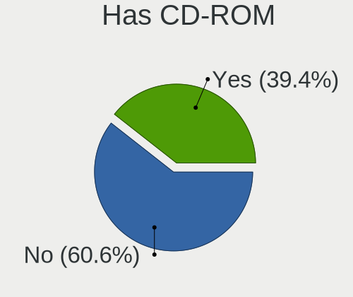
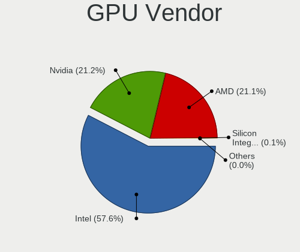
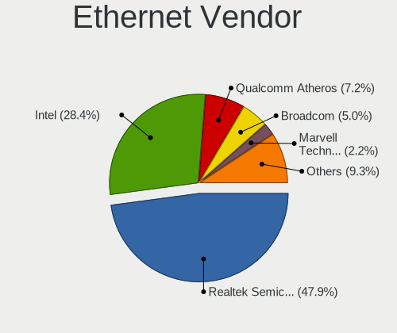
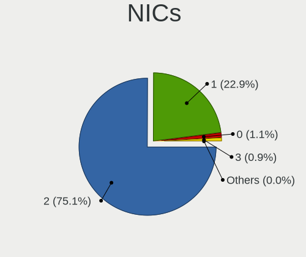
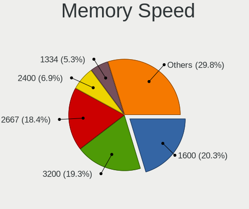
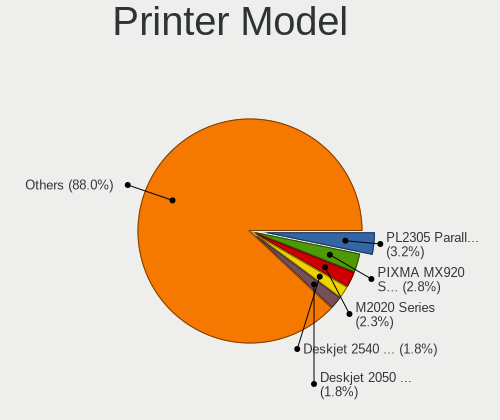
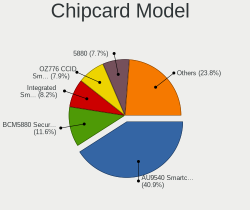

Linux in Germany - Tested Hardware & Statistics (Notebooks)
-----------------------------------------------------------

A project to collect tested hardware configurations for Linux in Germany.

Anyone can contribute to this report by the [hw-probe](https://github.com/linuxhw/hw-probe) tool:

    sudo -E hw-probe -all -upload

Please contribute! Especially if your hardware is rare.

Contents
--------

* [ Test Cases ](#test-cases)

* [ System ](#system)
  - [ OS                       ](#os)
  - [ OS Family                ](#os-family)
  - [ Kernel                   ](#kernel)
  - [ Kernel Family            ](#kernel-family)
  - [ Kernel Major Ver.        ](#kernel-major-ver)
  - [ Arch                     ](#arch)
  - [ DE                       ](#de)
  - [ Display Server           ](#display-server)
  - [ Display Manager          ](#display-manager)
  - [ OS Lang                  ](#os-lang)
  - [ Boot Mode                ](#boot-mode)
  - [ Filesystem               ](#filesystem)
  - [ Part. scheme             ](#part-scheme)
  - [ Dual Boot with Linux/BSD ](#dual-boot-with-linuxbsd)
  - [ Dual Boot (Win)          ](#dual-boot-win)

* [ Board ](#board)
  - [ Vendor                   ](#vendor)
  - [ Model                    ](#model)
  - [ Model Family             ](#model-family)
  - [ MFG Year                 ](#mfg-year)
  - [ Form Factor              ](#form-factor)
  - [ Secure Boot              ](#secure-boot)
  - [ Coreboot                 ](#coreboot)
  - [ RAM Size                 ](#ram-size)
  - [ RAM Used                 ](#ram-used)
  - [ Total Drives             ](#total-drives)
  - [ Has CD-ROM               ](#has-cd-rom)
  - [ Has Ethernet             ](#has-ethernet)
  - [ Has WiFi                 ](#has-wifi)
  - [ Has Bluetooth            ](#has-bluetooth)

* [ Location ](#location)
  - [ Country                  ](#country)
  - [ City                     ](#city)

* [ Drives ](#drives)
  - [ Drive Vendor             ](#drive-vendor)
  - [ Drive Model              ](#drive-model)
  - [ HDD Vendor               ](#hdd-vendor)
  - [ SSD Vendor               ](#ssd-vendor)
  - [ Drive Kind               ](#drive-kind)
  - [ Drive Connector          ](#drive-connector)
  - [ Drive Size               ](#drive-size)
  - [ Space Total              ](#space-total)
  - [ Space Used               ](#space-used)
  - [ Malfunc. Drives          ](#malfunc-drives)
  - [ Malfunc. Drive Vendor    ](#malfunc-drive-vendor)
  - [ Malfunc. HDD Vendor      ](#malfunc-hdd-vendor)
  - [ Malfunc. Drive Kind      ](#malfunc-drive-kind)
  - [ Failed Drives            ](#failed-drives)
  - [ Failed Drive Vendor      ](#failed-drive-vendor)
  - [ Drive Status             ](#drive-status)

* [ Storage controller ](#storage-controller)
  - [ Storage Vendor           ](#storage-vendor)
  - [ Storage Model            ](#storage-model)
  - [ Storage Kind             ](#storage-kind)

* [ Processor ](#processor)
  - [ CPU Vendor               ](#cpu-vendor)
  - [ CPU Model                ](#cpu-model)
  - [ CPU Model Family         ](#cpu-model-family)
  - [ CPU Cores                ](#cpu-cores)
  - [ CPU Sockets              ](#cpu-sockets)
  - [ CPU Threads              ](#cpu-threads)
  - [ CPU Op-Modes             ](#cpu-op-modes)
  - [ CPU Microcode            ](#cpu-microcode)
  - [ CPU Microarch            ](#cpu-microarch)

* [ Graphics ](#graphics)
  - [ GPU Vendor               ](#gpu-vendor)
  - [ GPU Model                ](#gpu-model)
  - [ GPU Combo                ](#gpu-combo)
  - [ GPU Driver               ](#gpu-driver)
  - [ GPU Memory               ](#gpu-memory)

* [ Monitor ](#monitor)
  - [ Monitor Vendor           ](#monitor-vendor)
  - [ Monitor Model            ](#monitor-model)
  - [ Monitor Resolution       ](#monitor-resolution)
  - [ Monitor Diagonal         ](#monitor-diagonal)
  - [ Monitor Width            ](#monitor-width)
  - [ Aspect Ratio             ](#aspect-ratio)
  - [ Monitor Area             ](#monitor-area)
  - [ Pixel Density            ](#pixel-density)
  - [ Multiple Monitors        ](#multiple-monitors)

* [ Network ](#network)
  - [ Net Controller Vendor    ](#net-controller-vendor)
  - [ Net Controller Model     ](#net-controller-model)
  - [ Wireless Vendor          ](#wireless-vendor)
  - [ Wireless Model           ](#wireless-model)
  - [ Ethernet Vendor          ](#ethernet-vendor)
  - [ Ethernet Model           ](#ethernet-model)
  - [ Net Controller Kind      ](#net-controller-kind)
  - [ Used Controller          ](#used-controller)
  - [ NICs                     ](#nics)
  - [ IPv6                     ](#ipv6)

* [ Bluetooth ](#bluetooth)
  - [ Bluetooth Vendor         ](#bluetooth-vendor)
  - [ Bluetooth Model          ](#bluetooth-model)

* [ Sound ](#sound)
  - [ Sound Vendor             ](#sound-vendor)
  - [ Sound Model              ](#sound-model)

* [ Memory ](#memory)
  - [ Memory Vendor            ](#memory-vendor)
  - [ Memory Model             ](#memory-model)
  - [ Memory Kind              ](#memory-kind)
  - [ Memory Form Factor       ](#memory-form-factor)
  - [ Memory Size              ](#memory-size)
  - [ Memory Speed             ](#memory-speed)

* [ Printers & scanners ](#printers--scanners)
  - [ Printer Vendor           ](#printer-vendor)
  - [ Printer Model            ](#printer-model)
  - [ Scanner Vendor           ](#scanner-vendor)
  - [ Scanner Model            ](#scanner-model)

* [ Camera ](#camera)
  - [ Camera Vendor            ](#camera-vendor)
  - [ Camera Model             ](#camera-model)

* [ Security ](#security)
  - [ Fingerprint Vendor       ](#fingerprint-vendor)
  - [ Fingerprint Model        ](#fingerprint-model)
  - [ Chipcard Vendor          ](#chipcard-vendor)
  - [ Chipcard Model           ](#chipcard-model)

* [ Unsupported ](#unsupported)
  - [ Unsupported Devices      ](#unsupported-devices)
  - [ Unsupported Device Types ](#unsupported-device-types)

Test Cases
----------

Total: 11446

| Vendor        | Model                       | Probe                                                      | Date         |
|---------------|-----------------------------|------------------------------------------------------------|--------------|
| MSI           | GP60 2QE                    | [50a45201e9](https://linux-hardware.org/?probe=50a45201e9) | May 07, 2022 |
| PC Special... | Recoil II                   | [4eeb154eea](https://linux-hardware.org/?probe=4eeb154eea) | May 07, 2022 |
| Fujitsu       | CELSIUS H720                | [7c41d6fd4d](https://linux-hardware.org/?probe=7c41d6fd4d) | May 06, 2022 |
| Lenovo        | ThinkPad P14s Gen 2a 21A... | [f3e4a840e8](https://linux-hardware.org/?probe=f3e4a840e8) | May 06, 2022 |
| Medion        | E7222                       | [658905b8e4](https://linux-hardware.org/?probe=658905b8e4) | May 06, 2022 |
| Lenovo        | ThinkPad E15 20RD0011GE     | [795365ba55](https://linux-hardware.org/?probe=795365ba55) | May 06, 2022 |
| Lenovo        | ThinkPad L470 20J4003WGE    | [79bb6b88d3](https://linux-hardware.org/?probe=79bb6b88d3) | May 06, 2022 |
| ASUSTek       | TUF Gaming FX505GE_FX505... | [ac270166aa](https://linux-hardware.org/?probe=ac270166aa) | May 06, 2022 |
| Lenovo        | ThinkPad X200 7459N40       | [f3a5a2e374](https://linux-hardware.org/?probe=f3a5a2e374) | May 06, 2022 |
| Lenovo        | ThinkPad X200 7459N40       | [74b1da3699](https://linux-hardware.org/?probe=74b1da3699) | May 06, 2022 |
| HP            | Laptop 15s-fq3xxx           | [a229549e45](https://linux-hardware.org/?probe=a229549e45) | May 06, 2022 |
| Avell High... | G1713/C55 Fox               | [3967b8c677](https://linux-hardware.org/?probe=3967b8c677) | May 06, 2022 |
| HUAWEI        | BOM-WXX9                    | [35746e52a6](https://linux-hardware.org/?probe=35746e52a6) | May 05, 2022 |
| Lenovo        | ThinkPad P1 Gen 2 20QT00... | [5f62eb4b30](https://linux-hardware.org/?probe=5f62eb4b30) | May 05, 2022 |
| Google        | Boten                       | [6204cff7de](https://linux-hardware.org/?probe=6204cff7de) | May 05, 2022 |
| HP            | Laptop 15s-fq3xxx           | [789a4c7367](https://linux-hardware.org/?probe=789a4c7367) | May 05, 2022 |
| Medion        | E7222                       | [1e12090b57](https://linux-hardware.org/?probe=1e12090b57) | May 05, 2022 |
| ASUSTek       | X550CC                      | [8306d5b694](https://linux-hardware.org/?probe=8306d5b694) | May 05, 2022 |
| Razer         | Blade 14 - RZ09-0370        | [fa323515aa](https://linux-hardware.org/?probe=fa323515aa) | May 05, 2022 |
| HP            | EliteBook 840 G6            | [f26171e0fb](https://linux-hardware.org/?probe=f26171e0fb) | May 05, 2022 |
| HP            | Laptop 15s-eq1xxx           | [f255a41930](https://linux-hardware.org/?probe=f255a41930) | May 05, 2022 |
| HP            | EliteBook 8470p             | [d7223d4b03](https://linux-hardware.org/?probe=d7223d4b03) | May 05, 2022 |
| HP            | Laptop 15s-fq3xxx           | [926a1bd0ad](https://linux-hardware.org/?probe=926a1bd0ad) | May 05, 2022 |
| Dell          | Latitude E5440              | [a505dc0b3c](https://linux-hardware.org/?probe=a505dc0b3c) | May 05, 2022 |
| Medion        | E13203                      | [2a8cf1f516](https://linux-hardware.org/?probe=2a8cf1f516) | May 04, 2022 |
| HP            | Laptop 15s-eq1xxx           | [9498437701](https://linux-hardware.org/?probe=9498437701) | May 04, 2022 |
| ASUSTek       | K93SM                       | [e59c89868b](https://linux-hardware.org/?probe=e59c89868b) | May 04, 2022 |
| HUAWEI        | MACH-WX9                    | [90635adac4](https://linux-hardware.org/?probe=90635adac4) | May 04, 2022 |
| Apple         | MacBookAir7,2               | [c08ef3e666](https://linux-hardware.org/?probe=c08ef3e666) | May 04, 2022 |
| HP            | Laptop 15s-fq3xxx           | [eda68b255e](https://linux-hardware.org/?probe=eda68b255e) | May 04, 2022 |
| Lenovo        | ThinkBook 16p Gen 2 20YM    | [ccb21427bf](https://linux-hardware.org/?probe=ccb21427bf) | May 04, 2022 |
| Lenovo        | ThinkPad T400 6474WPU       | [ce7e91802e](https://linux-hardware.org/?probe=ce7e91802e) | May 03, 2022 |
| Lenovo        | ThinkPad X131e 336838U      | [543ee221b3](https://linux-hardware.org/?probe=543ee221b3) | May 03, 2022 |
| ASUSTek       | X550CC                      | [e4918450ce](https://linux-hardware.org/?probe=e4918450ce) | May 03, 2022 |
| HP            | 255 G6 Notebook PC          | [af004a928f](https://linux-hardware.org/?probe=af004a928f) | May 03, 2022 |
| Lenovo        | ThinkPad R500 27326FG       | [1ed6992177](https://linux-hardware.org/?probe=1ed6992177) | May 03, 2022 |
| ASUSTek       | VivoBook_ASUSLaptop X712... | [0a01ebfdb1](https://linux-hardware.org/?probe=0a01ebfdb1) | May 03, 2022 |
| ASUSTek       | VivoBook_ASUSLaptop X712... | [93f01096ca](https://linux-hardware.org/?probe=93f01096ca) | May 03, 2022 |
| Fujitsu       | LIFEBOOK A3510              | [d5908498e1](https://linux-hardware.org/?probe=d5908498e1) | May 02, 2022 |
| ASUSTek       | ZenBook UX325SA_UM325SA     | [4e21e1d28e](https://linux-hardware.org/?probe=4e21e1d28e) | May 02, 2022 |
| ASUSTek       | A6G                         | [a873db0112](https://linux-hardware.org/?probe=a873db0112) | May 02, 2022 |
| HP            | ZBook Firefly 15 G7 Mobi... | [90d0e8adb2](https://linux-hardware.org/?probe=90d0e8adb2) | May 02, 2022 |
| HP            | Laptop 15s-eq1xxx           | [dfac863695](https://linux-hardware.org/?probe=dfac863695) | May 02, 2022 |
| HP            | Laptop 15s-eq1xxx           | [7636de5c44](https://linux-hardware.org/?probe=7636de5c44) | May 02, 2022 |
| HUAWEI        | HVY-WXX9                    | [fbd1c44f53](https://linux-hardware.org/?probe=fbd1c44f53) | May 02, 2022 |
| Lenovo        | ThinkPad T14 Gen 2i 20W0... | [0c5f20e02c](https://linux-hardware.org/?probe=0c5f20e02c) | May 02, 2022 |
| Lenovo        | ThinkPad E14 Gen 4 21ECS... | [332445f774](https://linux-hardware.org/?probe=332445f774) | May 02, 2022 |
| Lenovo        | ThinkPad T400 6474AL9       | [b303038c87](https://linux-hardware.org/?probe=b303038c87) | May 01, 2022 |
| Lenovo        | ThinkPad E14 Gen 4 21ECS... | [6c71a85fcc](https://linux-hardware.org/?probe=6c71a85fcc) | May 01, 2022 |
| HP            | ProBook 455 G8 Notebook ... | [0b847ba92b](https://linux-hardware.org/?probe=0b847ba92b) | May 01, 2022 |
| Acer          | Aspire 7750G                | [abd7ed0c5c](https://linux-hardware.org/?probe=abd7ed0c5c) | May 01, 2022 |
| Acer          | Aspire A515-56              | [b728fa5844](https://linux-hardware.org/?probe=b728fa5844) | May 01, 2022 |
| ASUSTek       | ZenBook UX325EA_UX325EA     | [c37aaf2585](https://linux-hardware.org/?probe=c37aaf2585) | May 01, 2022 |
| Fujitsu Si... | AMILO Xi 3650               | [f28a16f8de](https://linux-hardware.org/?probe=f28a16f8de) | May 01, 2022 |
| Schenker      | XMG CORE (TGL/M21)          | [7251434bdb](https://linux-hardware.org/?probe=7251434bdb) | May 01, 2022 |
| Acer          | TravelMate P253             | [89812a5d4a](https://linux-hardware.org/?probe=89812a5d4a) | May 01, 2022 |
| Dell          | Vostro 1720                 | [fd52613ee2](https://linux-hardware.org/?probe=fd52613ee2) | May 01, 2022 |
| Razer         | Blade Stealth 13 Late 20... | [ba8fa66c1c](https://linux-hardware.org/?probe=ba8fa66c1c) | May 01, 2022 |
| HP            | ProBook 455 G7              | [88fcea9210](https://linux-hardware.org/?probe=88fcea9210) | Apr 30, 2022 |
| Fujitsu Si... | AMILO A1650G                | [fbf6d9db93](https://linux-hardware.org/?probe=fbf6d9db93) | Apr 30, 2022 |
| Fujitsu Si... | AMILO A1650G                | [134f0a947b](https://linux-hardware.org/?probe=134f0a947b) | Apr 30, 2022 |
| Dell          | Vostro 1720                 | [bc8f50b9fb](https://linux-hardware.org/?probe=bc8f50b9fb) | Apr 30, 2022 |
| Dell          | Vostro 1720                 | [56cc7a9a54](https://linux-hardware.org/?probe=56cc7a9a54) | Apr 30, 2022 |
| Lenovo        | IdeaPad Z510 20287          | [058184d73c](https://linux-hardware.org/?probe=058184d73c) | Apr 30, 2022 |
| Lenovo        | ThinkBook 14 G2 ARE 20VF    | [b6cbc6e523](https://linux-hardware.org/?probe=b6cbc6e523) | Apr 30, 2022 |
| Lenovo        | ThinkPad T540p 20BFS26E0... | [06738e7bb8](https://linux-hardware.org/?probe=06738e7bb8) | Apr 30, 2022 |
| Acer          | Aspire E5-774G              | [32426089be](https://linux-hardware.org/?probe=32426089be) | Apr 30, 2022 |
| Acer          | Aspire E5-774G              | [0fce8f01ae](https://linux-hardware.org/?probe=0fce8f01ae) | Apr 30, 2022 |
| HP            | Laptop 17-ca0xxx            | [10eb959775](https://linux-hardware.org/?probe=10eb959775) | Apr 30, 2022 |
| ASUSTek       | T100HAN                     | [5ee200cfbe](https://linux-hardware.org/?probe=5ee200cfbe) | Apr 30, 2022 |
| HP            | 255 G6 Notebook PC          | [f639c7c8f5](https://linux-hardware.org/?probe=f639c7c8f5) | Apr 29, 2022 |
| Dell          | Inspiron N5050              | [7d3cb853e6](https://linux-hardware.org/?probe=7d3cb853e6) | Apr 29, 2022 |
| Dell          | Precision 3551              | [b146dc2249](https://linux-hardware.org/?probe=b146dc2249) | Apr 29, 2022 |
| Dell          | Precision 3551              | [d5a3a490f4](https://linux-hardware.org/?probe=d5a3a490f4) | Apr 29, 2022 |
| Dell          | XPS 13 7390                 | [aadc641825](https://linux-hardware.org/?probe=aadc641825) | Apr 29, 2022 |
| Lenovo        | ThinkPad E14 Gen 4 21ECS... | [61bb949815](https://linux-hardware.org/?probe=61bb949815) | Apr 29, 2022 |
| ASUSTek       | X411UN                      | [c864c65ec1](https://linux-hardware.org/?probe=c864c65ec1) | Apr 29, 2022 |
| Lenovo        | ThinkPad L560 20F1001YGE    | [c4021bd208](https://linux-hardware.org/?probe=c4021bd208) | Apr 29, 2022 |
| HP            | ZBook 15 G3                 | [94d74e9b78](https://linux-hardware.org/?probe=94d74e9b78) | Apr 29, 2022 |
| Lenovo        | ThinkPad T470 W10DG 20JN... | [e7ca44864b](https://linux-hardware.org/?probe=e7ca44864b) | Apr 29, 2022 |
| Fujitsu Si... | AMILO Xi 3650               | [61da560f18](https://linux-hardware.org/?probe=61da560f18) | Apr 29, 2022 |
| Fujitsu       | LIFEBOOK S762               | [e168087bf0](https://linux-hardware.org/?probe=e168087bf0) | Apr 28, 2022 |
| Fujitsu       | LIFEBOOK S762               | [c258235d05](https://linux-hardware.org/?probe=c258235d05) | Apr 28, 2022 |
| Lenovo        | ThinkPad T420 4180PC4       | [6c69039594](https://linux-hardware.org/?probe=6c69039594) | Apr 28, 2022 |
| Lenovo        | ThinkPad T440s 20ARS3640... | [13ec979f89](https://linux-hardware.org/?probe=13ec979f89) | Apr 28, 2022 |
| Packard Be... | DOT S                       | [d0231bab8b](https://linux-hardware.org/?probe=d0231bab8b) | Apr 28, 2022 |
| Samsung       | RC530/RC730                 | [2e44e9228e](https://linux-hardware.org/?probe=2e44e9228e) | Apr 28, 2022 |
| Matsushita... | CF-30CTQAZBG                | [7935a074aa](https://linux-hardware.org/?probe=7935a074aa) | Apr 27, 2022 |
| HUAWEI        | BOM-WXX9                    | [c07e06f794](https://linux-hardware.org/?probe=c07e06f794) | Apr 27, 2022 |
| Lenovo        | IdeaPad 110-15ISK 80UD      | [e51ff27a5a](https://linux-hardware.org/?probe=e51ff27a5a) | Apr 27, 2022 |
| ASUSTek       | Zephyrus S GX531GXR_GX53... | [882dbf87c5](https://linux-hardware.org/?probe=882dbf87c5) | Apr 27, 2022 |
| Acer          | Aspire E5-774G              | [be0fb85534](https://linux-hardware.org/?probe=be0fb85534) | Apr 27, 2022 |
| Alienware     | M18xR2                      | [3853b17e46](https://linux-hardware.org/?probe=3853b17e46) | Apr 27, 2022 |
| ASUSTek       | Zephyrus S GX531GXR_GX53... | [b540bb9d6f](https://linux-hardware.org/?probe=b540bb9d6f) | Apr 27, 2022 |
| Lenovo        | ThinkPad T470 W10DG 20JN... | [87cc990d93](https://linux-hardware.org/?probe=87cc990d93) | Apr 27, 2022 |
| Lenovo        | ThinkPad X1 Carbon 4th 2... | [14f1d071ae](https://linux-hardware.org/?probe=14f1d071ae) | Apr 26, 2022 |
| Samsung       | 755XDA                      | [eea7e3a0d3](https://linux-hardware.org/?probe=eea7e3a0d3) | Apr 26, 2022 |
| Acer          | Swift SF316-51              | [fe42983639](https://linux-hardware.org/?probe=fe42983639) | Apr 26, 2022 |
| Toshiba       | TECRA R940                  | [d841324245](https://linux-hardware.org/?probe=d841324245) | Apr 26, 2022 |
| ASUSTek       | Zephyrus S GX531GXR_GX53... | [9dee9219fd](https://linux-hardware.org/?probe=9dee9219fd) | Apr 26, 2022 |
| ASUSTek       | P55VA                       | [21c5b79768](https://linux-hardware.org/?probe=21c5b79768) | Apr 26, 2022 |
| Fujitsu Si... | AMILO Xi 3650               | [5661c025c7](https://linux-hardware.org/?probe=5661c025c7) | Apr 26, 2022 |
| Dell          | Latitude 7480               | [817415642f](https://linux-hardware.org/?probe=817415642f) | Apr 26, 2022 |
| Acer          | Aspire E1-570               | [b8257c292a](https://linux-hardware.org/?probe=b8257c292a) | Apr 26, 2022 |
| ASUSTek       | Zephyrus S GX531GXR_GX53... | [54b755397c](https://linux-hardware.org/?probe=54b755397c) | Apr 26, 2022 |
| Notebook      | W35xSTQ_370ST               | [ef4f066fba](https://linux-hardware.org/?probe=ef4f066fba) | Apr 26, 2022 |
| Fujitsu Si... | AMILO Xi 3650               | [c33c4a0ca2](https://linux-hardware.org/?probe=c33c4a0ca2) | Apr 26, 2022 |
| Fujitsu       | LIFEBOOK A531               | [4d2a2873fb](https://linux-hardware.org/?probe=4d2a2873fb) | Apr 26, 2022 |
| Intel         | Crestline & ICH8M Chipse... | [b410b890ef](https://linux-hardware.org/?probe=b410b890ef) | Apr 26, 2022 |
| Intel         | Crestline & ICH8M Chipse... | [4435386574](https://linux-hardware.org/?probe=4435386574) | Apr 26, 2022 |
| Lenovo        | ThinkPad P15v Gen 1 20TQ... | [bd827295e5](https://linux-hardware.org/?probe=bd827295e5) | Apr 26, 2022 |
| HP            | Stream Laptop 11-ak0xxx     | [8bd50984ef](https://linux-hardware.org/?probe=8bd50984ef) | Apr 25, 2022 |
| Lenovo        | ThinkPad T440 20B7S3UD00    | [9c66fd444a](https://linux-hardware.org/?probe=9c66fd444a) | Apr 25, 2022 |
| Lenovo        | ThinkPad T440 20B7S3UD00    | [942267c99b](https://linux-hardware.org/?probe=942267c99b) | Apr 25, 2022 |
| Medion        | S17402 MD63000              | [fe73d0023a](https://linux-hardware.org/?probe=fe73d0023a) | Apr 25, 2022 |
| Dell          | XPS 13 9370                 | [08d2d58a95](https://linux-hardware.org/?probe=08d2d58a95) | Apr 25, 2022 |
| Acer          | Aspire A717-71G             | [55baa49b73](https://linux-hardware.org/?probe=55baa49b73) | Apr 25, 2022 |
| Lenovo        | ThinkPad T400 2767B77       | [54b2615503](https://linux-hardware.org/?probe=54b2615503) | Apr 25, 2022 |
| Lenovo        | ThinkPad P15v Gen 1 20TQ... | [9e7c80a9d0](https://linux-hardware.org/?probe=9e7c80a9d0) | Apr 25, 2022 |
| ASUSTek       | ROG Strix G733ZX_G733ZX     | [032acaf88c](https://linux-hardware.org/?probe=032acaf88c) | Apr 25, 2022 |
| Lenovo        | IdeaPad 510-15IKB 80SV      | [2d1a1334c6](https://linux-hardware.org/?probe=2d1a1334c6) | Apr 25, 2022 |
| HP            | ProBook 455R G6             | [3118a03e9b](https://linux-hardware.org/?probe=3118a03e9b) | Apr 25, 2022 |
| Packard Be... | EasyNote TS11HR             | [e1731ce27f](https://linux-hardware.org/?probe=e1731ce27f) | Apr 25, 2022 |
| Packard Be... | EasyNote TS11HR             | [a681022e30](https://linux-hardware.org/?probe=a681022e30) | Apr 25, 2022 |
| Acer          | Aspire VN7-792G             | [77f5ce42de](https://linux-hardware.org/?probe=77f5ce42de) | Apr 24, 2022 |
| Lenovo        | ThinkBook 15 G3 ACL 21A4    | [2fcb2f9b19](https://linux-hardware.org/?probe=2fcb2f9b19) | Apr 24, 2022 |
| AMI           | Intel                       | [87e32073a4](https://linux-hardware.org/?probe=87e32073a4) | Apr 24, 2022 |
| Notebook      | NLx0MU                      | [5d65012d75](https://linux-hardware.org/?probe=5d65012d75) | Apr 24, 2022 |
| ASUSTek       | 1215N                       | [b921f6fbae](https://linux-hardware.org/?probe=b921f6fbae) | Apr 24, 2022 |
| HP            | 255 G3                      | [7f8bc209d0](https://linux-hardware.org/?probe=7f8bc209d0) | Apr 24, 2022 |
| Toshiba       | PORTEGE M800                | [20f2ac516c](https://linux-hardware.org/?probe=20f2ac516c) | Apr 24, 2022 |
| Acer          | Aspire E1-570               | [3ed79cff5c](https://linux-hardware.org/?probe=3ed79cff5c) | Apr 24, 2022 |
| Lenovo        | ThinkPad P1 Gen 4i 20Y30... | [b1895460f6](https://linux-hardware.org/?probe=b1895460f6) | Apr 24, 2022 |
| HP            | 255 G8 Notebook PC          | [c16cb4e0d6](https://linux-hardware.org/?probe=c16cb4e0d6) | Apr 24, 2022 |
| Lenovo        | ThinkPad P1 Gen 4i 20Y30... | [11e7429c51](https://linux-hardware.org/?probe=11e7429c51) | Apr 24, 2022 |
| Dell          | Latitude E6530              | [87a016871d](https://linux-hardware.org/?probe=87a016871d) | Apr 24, 2022 |
| Dell          | XPS 12-9Q33                 | [5cbe457f54](https://linux-hardware.org/?probe=5cbe457f54) | Apr 24, 2022 |
| Lenovo        | ThinkPad T520 4243WRK       | [3600152c79](https://linux-hardware.org/?probe=3600152c79) | Apr 24, 2022 |
| Lenovo        | ThinkPad T520 4243WRK       | [cf390615ba](https://linux-hardware.org/?probe=cf390615ba) | Apr 24, 2022 |
| Valve         | Jupiter                     | [4c43342014](https://linux-hardware.org/?probe=4c43342014) | Apr 24, 2022 |
| HP            | Laptop 17-bs0xx             | [8a4835680a](https://linux-hardware.org/?probe=8a4835680a) | Apr 24, 2022 |
| ASUSTek       | X705UQR                     | [e4a27bf740](https://linux-hardware.org/?probe=e4a27bf740) | Apr 23, 2022 |
| Medion        | E7220                       | [c2d7457304](https://linux-hardware.org/?probe=c2d7457304) | Apr 23, 2022 |
| ASUSTek       | ASUS TUF Gaming F17 FX70... | [e63c319457](https://linux-hardware.org/?probe=e63c319457) | Apr 23, 2022 |
| Medion        | E6436 MD61150               | [999d2d1526](https://linux-hardware.org/?probe=999d2d1526) | Apr 23, 2022 |
| Dell          | XPS 17 9700                 | [2d275ba888](https://linux-hardware.org/?probe=2d275ba888) | Apr 23, 2022 |
| HP            | Laptop 15-bs0xx             | [3ce5eb80eb](https://linux-hardware.org/?probe=3ce5eb80eb) | Apr 22, 2022 |
| Lenovo        | E31-70 80KX                 | [21f5bdfbc7](https://linux-hardware.org/?probe=21f5bdfbc7) | Apr 22, 2022 |
| Lenovo        | E31-70 80KX                 | [6910bac4f7](https://linux-hardware.org/?probe=6910bac4f7) | Apr 22, 2022 |
| AWOW          | AL34                        | [cc4a446b9e](https://linux-hardware.org/?probe=cc4a446b9e) | Apr 22, 2022 |
| TUXEDO        | Aura 15 Gen1                | [8ee6cabf43](https://linux-hardware.org/?probe=8ee6cabf43) | Apr 22, 2022 |
| Lenovo        | ThinkPad L15 Gen 1 20U70... | [618d8cab02](https://linux-hardware.org/?probe=618d8cab02) | Apr 22, 2022 |
| Lenovo        | IdeaPad L340-17API 81LY     | [4d911b0d94](https://linux-hardware.org/?probe=4d911b0d94) | Apr 22, 2022 |
| Lenovo        | IdeaPad L340-17API 81LY     | [aa854e0ae2](https://linux-hardware.org/?probe=aa854e0ae2) | Apr 22, 2022 |
| Acer          | Aspire E1-570               | [9b96999445](https://linux-hardware.org/?probe=9b96999445) | Apr 22, 2022 |
| Acer          | Aspire E1-570               | [b8e8a058d2](https://linux-hardware.org/?probe=b8e8a058d2) | Apr 22, 2022 |
| Acer          | Aspire V3-771               | [f36e209172](https://linux-hardware.org/?probe=f36e209172) | Apr 22, 2022 |
| Lenovo        | IdeaPad 320-15IKB 81BG      | [26b3b0efb2](https://linux-hardware.org/?probe=26b3b0efb2) | Apr 22, 2022 |
| Medion        | Erazer X7843 MD99996        | [02dd167b63](https://linux-hardware.org/?probe=02dd167b63) | Apr 22, 2022 |
| Acer          | Aspire 8930                 | [aaf1f1994a](https://linux-hardware.org/?probe=aaf1f1994a) | Apr 22, 2022 |
| Lenovo        | ThinkPad X230 2325HR9       | [a9d9d3fbb2](https://linux-hardware.org/?probe=a9d9d3fbb2) | Apr 21, 2022 |
| Valve         | Jupiter                     | [8564bded7f](https://linux-hardware.org/?probe=8564bded7f) | Apr 21, 2022 |
| Valve         | Jupiter                     | [d761657c3a](https://linux-hardware.org/?probe=d761657c3a) | Apr 21, 2022 |
| HP            | EliteBook 840 G5            | [0f748e86d4](https://linux-hardware.org/?probe=0f748e86d4) | Apr 21, 2022 |
| HP            | EliteBook 840 G5            | [58a8282067](https://linux-hardware.org/?probe=58a8282067) | Apr 21, 2022 |
| Timi          | TM1701                      | [dba97f1875](https://linux-hardware.org/?probe=dba97f1875) | Apr 21, 2022 |
| HP            | EliteBook Folio 9470m       | [13136bcf8d](https://linux-hardware.org/?probe=13136bcf8d) | Apr 21, 2022 |
| Apple         | MacBookAir4,2               | [1535fd1e85](https://linux-hardware.org/?probe=1535fd1e85) | Apr 21, 2022 |
| HP            | Pavilion g6                 | [63f6b73d50](https://linux-hardware.org/?probe=63f6b73d50) | Apr 21, 2022 |
| Acer          | TravelMate P653-M           | [208913a075](https://linux-hardware.org/?probe=208913a075) | Apr 21, 2022 |
| HP            | ZBook Fury 15 G7 Mobile ... | [1fc4d30b49](https://linux-hardware.org/?probe=1fc4d30b49) | Apr 21, 2022 |
| HP            | Laptop 15s-fq3xxx           | [676db10abf](https://linux-hardware.org/?probe=676db10abf) | Apr 21, 2022 |
| Lenovo        | 3000 N200 0769EQG           | [d9bbff0c4d](https://linux-hardware.org/?probe=d9bbff0c4d) | Apr 21, 2022 |
| HP            | ZBook 15 G3                 | [3b23a0c003](https://linux-hardware.org/?probe=3b23a0c003) | Apr 20, 2022 |
| Lenovo        | IdeaPad C340-14API 81N6     | [0ebad8c6f7](https://linux-hardware.org/?probe=0ebad8c6f7) | Apr 20, 2022 |
| Dell          | Latitude XT3                | [6db9585e20](https://linux-hardware.org/?probe=6db9585e20) | Apr 20, 2022 |
| Lenovo        | ThinkPad T430s 2356H83      | [714396bc62](https://linux-hardware.org/?probe=714396bc62) | Apr 20, 2022 |
| Acer          | Swift SF114-34              | [f2bfb22fea](https://linux-hardware.org/?probe=f2bfb22fea) | Apr 20, 2022 |
| Dell          | Inspiron N5040              | [9069ecddb3](https://linux-hardware.org/?probe=9069ecddb3) | Apr 20, 2022 |
| HP            | 625                         | [1d14c84fe9](https://linux-hardware.org/?probe=1d14c84fe9) | Apr 20, 2022 |
| Lenovo        | ThinkPad T400 64754B9       | [443f31afef](https://linux-hardware.org/?probe=443f31afef) | Apr 20, 2022 |
| Lenovo        | ThinkPad T400 64754B9       | [11ed3cef75](https://linux-hardware.org/?probe=11ed3cef75) | Apr 20, 2022 |
| Notebook      | NL5xNU                      | [bc83a39684](https://linux-hardware.org/?probe=bc83a39684) | Apr 20, 2022 |
| HP            | 255 G8 Notebook PC          | [d88db86125](https://linux-hardware.org/?probe=d88db86125) | Apr 20, 2022 |
| Lenovo        | ThinkPad T400 6474WBN       | [8bac0a70d6](https://linux-hardware.org/?probe=8bac0a70d6) | Apr 20, 2022 |
| Lenovo        | ThinkPad E480 20KN001QGE    | [6d0ba64623](https://linux-hardware.org/?probe=6d0ba64623) | Apr 19, 2022 |
| Lenovo        | ThinkPad T400 6474WBN       | [b7f4f882f3](https://linux-hardware.org/?probe=b7f4f882f3) | Apr 19, 2022 |
| Medion        | Akoya E6416 MD99610         | [5e6e51f206](https://linux-hardware.org/?probe=5e6e51f206) | Apr 19, 2022 |
| Lenovo        | IdeaPad 310-15ISK 80SM      | [0579e465d1](https://linux-hardware.org/?probe=0579e465d1) | Apr 19, 2022 |
| Lenovo        | ThinkPad X230 2324A15       | [8ff57cadde](https://linux-hardware.org/?probe=8ff57cadde) | Apr 19, 2022 |
| Acer          | Swift SF114-34              | [d300c598e0](https://linux-hardware.org/?probe=d300c598e0) | Apr 19, 2022 |
| HP            | 470 G8                      | [fb6853bfde](https://linux-hardware.org/?probe=fb6853bfde) | Apr 18, 2022 |
| ASUSTek       | ZenBook UX325SA_UM325SA     | [d3d2e2fe8a](https://linux-hardware.org/?probe=d3d2e2fe8a) | Apr 18, 2022 |
| Toshiba       | Satellite C870-1C2          | [c8917c947b](https://linux-hardware.org/?probe=c8917c947b) | Apr 18, 2022 |
| Acer          | Swift SF114-34              | [068741773e](https://linux-hardware.org/?probe=068741773e) | Apr 18, 2022 |
| ASUSTek       | K53SD                       | [0b91570a33](https://linux-hardware.org/?probe=0b91570a33) | Apr 18, 2022 |
| ASUSTek       | G771JW                      | [9b04178e4d](https://linux-hardware.org/?probe=9b04178e4d) | Apr 18, 2022 |
| ASUSTek       | K53SD                       | [169b47991c](https://linux-hardware.org/?probe=169b47991c) | Apr 18, 2022 |
| Timi          | TM1604                      | [2c182df836](https://linux-hardware.org/?probe=2c182df836) | Apr 18, 2022 |
| Packard Be... | DOTM                        | [fc12f3ef5e](https://linux-hardware.org/?probe=fc12f3ef5e) | Apr 18, 2022 |
| Medion        | E6215                       | [39eedb46b2](https://linux-hardware.org/?probe=39eedb46b2) | Apr 18, 2022 |
| TUXEDO        | Polaris Intel Gen3 (TGL)    | [08f9942632](https://linux-hardware.org/?probe=08f9942632) | Apr 18, 2022 |
| MSI           | Katana GF76 11UG            | [f460a6924f](https://linux-hardware.org/?probe=f460a6924f) | Apr 18, 2022 |
| ASUSTek       | K73BR                       | [596b3b2df6](https://linux-hardware.org/?probe=596b3b2df6) | Apr 18, 2022 |
| Dell          | Latitude E7440              | [bd010335eb](https://linux-hardware.org/?probe=bd010335eb) | Apr 17, 2022 |
| Toshiba       | Satellite P200              | [f7726b9903](https://linux-hardware.org/?probe=f7726b9903) | Apr 17, 2022 |
| TUXEDO        | Stellaris Intel Gen3 (TG... | [c1a5e02fa5](https://linux-hardware.org/?probe=c1a5e02fa5) | Apr 17, 2022 |
| Lenovo        | ThinkPad L15 Gen 1 20U4S... | [e5c667382f](https://linux-hardware.org/?probe=e5c667382f) | Apr 17, 2022 |
| Lenovo        | ThinkPad L14 Gen 2 20X2S... | [e0676b8bc5](https://linux-hardware.org/?probe=e0676b8bc5) | Apr 17, 2022 |
| Lenovo        | ThinkPad L14 Gen 2 20X2S... | [61bf43c506](https://linux-hardware.org/?probe=61bf43c506) | Apr 17, 2022 |
| Dell          | Latitude XT3                | [c4d7d751b7](https://linux-hardware.org/?probe=c4d7d751b7) | Apr 17, 2022 |
| HP            | Laptop 15s-fq3xxx           | [1fef674c68](https://linux-hardware.org/?probe=1fef674c68) | Apr 17, 2022 |
| Framework     | Laptop                      | [25577a2915](https://linux-hardware.org/?probe=25577a2915) | Apr 16, 2022 |
| Lenovo        | ThinkPad T490 20N3S19L00    | [5812cc4868](https://linux-hardware.org/?probe=5812cc4868) | Apr 16, 2022 |
| Valve         | Jupiter                     | [ed07e93435](https://linux-hardware.org/?probe=ed07e93435) | Apr 16, 2022 |
| Dell          | Inspiron 13-5378            | [3998a17f75](https://linux-hardware.org/?probe=3998a17f75) | Apr 16, 2022 |
| ASUSTek       | P52F                        | [0cb00534d0](https://linux-hardware.org/?probe=0cb00534d0) | Apr 16, 2022 |
| HP            | EliteBook 840 G1            | [d9c6549322](https://linux-hardware.org/?probe=d9c6549322) | Apr 16, 2022 |
| Acer          | TravelMate P643-M           | [eaec316f95](https://linux-hardware.org/?probe=eaec316f95) | Apr 16, 2022 |
| ASUSTek       | X550LN                      | [2a0b2ae677](https://linux-hardware.org/?probe=2a0b2ae677) | Apr 16, 2022 |
| Framework     | Laptop                      | [84da421304](https://linux-hardware.org/?probe=84da421304) | Apr 16, 2022 |
| Dell          | XPS 13 9310                 | [2c395ea438](https://linux-hardware.org/?probe=2c395ea438) | Apr 15, 2022 |
| Schenker      | VISION 15 (SVS15E21)        | [48e04dd798](https://linux-hardware.org/?probe=48e04dd798) | Apr 15, 2022 |
| Toshiba       | TECRA X40-E                 | [0ec808bca1](https://linux-hardware.org/?probe=0ec808bca1) | Apr 15, 2022 |
| Samsung       | 700T                        | [ff97fa9856](https://linux-hardware.org/?probe=ff97fa9856) | Apr 15, 2022 |
| Lenovo        | IdeaPad 320-15AST 80XV      | [61cad5dcd7](https://linux-hardware.org/?probe=61cad5dcd7) | Apr 15, 2022 |
| ASUSTek       | 1001PX                      | [520db05629](https://linux-hardware.org/?probe=520db05629) | Apr 15, 2022 |
| HP            | 255 G7 Notebook PC          | [c9a7153c14](https://linux-hardware.org/?probe=c9a7153c14) | Apr 15, 2022 |
| HP            | Pavilion Gaming Laptop 1... | [7ea86333a0](https://linux-hardware.org/?probe=7ea86333a0) | Apr 15, 2022 |
| Acer          | Aspire E5-774G              | [d6b3b8f04d](https://linux-hardware.org/?probe=d6b3b8f04d) | Apr 15, 2022 |
| Lenovo        | ThinkPad T495 20NK000MGE    | [558688bdc2](https://linux-hardware.org/?probe=558688bdc2) | Apr 15, 2022 |
| Sony          | VPCY21S1E                   | [48e798a45c](https://linux-hardware.org/?probe=48e798a45c) | Apr 15, 2022 |
| Lenovo        | Yoga Slim 7 14ARE05 82A2    | [078a3464bf](https://linux-hardware.org/?probe=078a3464bf) | Apr 15, 2022 |
| Acer          | TravelMate P643-M           | [92c833cf0b](https://linux-hardware.org/?probe=92c833cf0b) | Apr 15, 2022 |
| HP            | Laptop 15s-fq3xxx           | [1488e2a91f](https://linux-hardware.org/?probe=1488e2a91f) | Apr 15, 2022 |
| ASUSTek       | U33Jc                       | [8be18ca4d1](https://linux-hardware.org/?probe=8be18ca4d1) | Apr 15, 2022 |
| HP            | Pavilion dv7                | [077e8282a3](https://linux-hardware.org/?probe=077e8282a3) | Apr 15, 2022 |
| Dell          | Latitude XT3                | [ce6c2e43a0](https://linux-hardware.org/?probe=ce6c2e43a0) | Apr 15, 2022 |
| HP            | EliteBook 2570p             | [6717b9e689](https://linux-hardware.org/?probe=6717b9e689) | Apr 14, 2022 |
| Framework     | Laptop                      | [4997cab79b](https://linux-hardware.org/?probe=4997cab79b) | Apr 14, 2022 |
| Framework     | Laptop                      | [e4c994f47a](https://linux-hardware.org/?probe=e4c994f47a) | Apr 14, 2022 |
| Dell          | Latitude E6540              | [2ee68b5f38](https://linux-hardware.org/?probe=2ee68b5f38) | Apr 14, 2022 |
| Lenovo        | ThinkPad T470p 20J7S0000... | [50325a2b5c](https://linux-hardware.org/?probe=50325a2b5c) | Apr 14, 2022 |
| Dell          | Inspiron 3505               | [719a1712f2](https://linux-hardware.org/?probe=719a1712f2) | Apr 14, 2022 |
| Dell          | Inspiron 3505               | [5781ceb5ca](https://linux-hardware.org/?probe=5781ceb5ca) | Apr 14, 2022 |
| Wortmann      | 1220663_1470189             | [59eed1073a](https://linux-hardware.org/?probe=59eed1073a) | Apr 14, 2022 |
| TUXEDO        | PA70ES                      | [aa3ae14c59](https://linux-hardware.org/?probe=aa3ae14c59) | Apr 14, 2022 |
| Lenovo        | ThinkPad P52 20MAS17228     | [dac73320e9](https://linux-hardware.org/?probe=dac73320e9) | Apr 14, 2022 |
| ASUSTek       | ASUS TUF Dash F15 FX516P... | [554040d7b4](https://linux-hardware.org/?probe=554040d7b4) | Apr 14, 2022 |
| Dell          | Latitude E5530 non-vPro     | [2f865445ce](https://linux-hardware.org/?probe=2f865445ce) | Apr 14, 2022 |
| Dell          | Latitude E5530 non-vPro     | [d32ffb065a](https://linux-hardware.org/?probe=d32ffb065a) | Apr 14, 2022 |
| Lenovo        | ThinkPad X230 2306CTO       | [7a0b2570f3](https://linux-hardware.org/?probe=7a0b2570f3) | Apr 14, 2022 |
| Chuwi         | MiniBook                    | [3a2e128ecd](https://linux-hardware.org/?probe=3a2e128ecd) | Apr 14, 2022 |
| Framework     | Laptop                      | [b8850e9dc8](https://linux-hardware.org/?probe=b8850e9dc8) | Apr 14, 2022 |
| Acer          | Aspire A717-71G             | [7bf2eeb5cc](https://linux-hardware.org/?probe=7bf2eeb5cc) | Apr 14, 2022 |
| Acer          | Swift SF114-34              | [ca66ed7272](https://linux-hardware.org/?probe=ca66ed7272) | Apr 14, 2022 |
| Lenovo        | ThinkPad T495s 20QKS01E0... | [4035ec75ce](https://linux-hardware.org/?probe=4035ec75ce) | Apr 14, 2022 |
| Lenovo        | ThinkPad X13 Gen 1 20UGS... | [80572def69](https://linux-hardware.org/?probe=80572def69) | Apr 14, 2022 |
| Lenovo        | ThinkPad T410 2537E82       | [84026a1dd3](https://linux-hardware.org/?probe=84026a1dd3) | Apr 14, 2022 |
| Dell          | XPS 15 7590                 | [9715d61366](https://linux-hardware.org/?probe=9715d61366) | Apr 14, 2022 |
| Dell          | Precision 5540              | [6bd831ee00](https://linux-hardware.org/?probe=6bd831ee00) | Apr 14, 2022 |
| Lenovo        | ThinkPad X1 Carbon 4th 2... | [848f50a317](https://linux-hardware.org/?probe=848f50a317) | Apr 13, 2022 |
| HP            | EliteBook 8540p             | [f6c79e1461](https://linux-hardware.org/?probe=f6c79e1461) | Apr 13, 2022 |
| Lenovo        | ThinkPad L15 Gen 1 20U8S... | [003d57b6a3](https://linux-hardware.org/?probe=003d57b6a3) | Apr 13, 2022 |
| Dell          | G7 7700                     | [44407e056c](https://linux-hardware.org/?probe=44407e056c) | Apr 13, 2022 |
| Apple         | MacBookPro10,2              | [cf7c54ff19](https://linux-hardware.org/?probe=cf7c54ff19) | Apr 13, 2022 |
| Lenovo        | ThinkPad E590 20NB0029GE    | [1f9cb1427a](https://linux-hardware.org/?probe=1f9cb1427a) | Apr 13, 2022 |
| MSI           | Modern 15 A5M               | [7e03ed9f70](https://linux-hardware.org/?probe=7e03ed9f70) | Apr 13, 2022 |
| Dell          | XPS 13 9380                 | [0897999e8d](https://linux-hardware.org/?probe=0897999e8d) | Apr 13, 2022 |
| Lenovo        | ThinkPad T530 24296HG       | [74191e7ffb](https://linux-hardware.org/?probe=74191e7ffb) | Apr 13, 2022 |
| TUXEDO        | InfinityBook S 15 Gen6      | [d198614ac8](https://linux-hardware.org/?probe=d198614ac8) | Apr 13, 2022 |
| Lenovo        | ThinkPad T480s 20L7001PI... | [53c7e12994](https://linux-hardware.org/?probe=53c7e12994) | Apr 13, 2022 |
| Sony          | SVE1713A1EW                 | [fda4c51d3c](https://linux-hardware.org/?probe=fda4c51d3c) | Apr 13, 2022 |
| Lenovo        | ThinkPad X1 Extreme Gen ... | [332355ddfa](https://linux-hardware.org/?probe=332355ddfa) | Apr 13, 2022 |
| Dell          | Inspiron 5590               | [1605fca16d](https://linux-hardware.org/?probe=1605fca16d) | Apr 13, 2022 |
| Dell          | XPS 13 9370                 | [3e26cc6c66](https://linux-hardware.org/?probe=3e26cc6c66) | Apr 13, 2022 |
| Acer          | Aspire 7750G                | [64ff7776eb](https://linux-hardware.org/?probe=64ff7776eb) | Apr 13, 2022 |
| Dell          | Latitude 7400               | [2c32d69a57](https://linux-hardware.org/?probe=2c32d69a57) | Apr 13, 2022 |
| Acer          | Aspire E5-774G              | [ef43a63289](https://linux-hardware.org/?probe=ef43a63289) | Apr 13, 2022 |
| Samsung       | R505                        | [9ff46a8ca6](https://linux-hardware.org/?probe=9ff46a8ca6) | Apr 13, 2022 |
| HP            | Laptop 15-dw3xxx            | [95cff2fbb1](https://linux-hardware.org/?probe=95cff2fbb1) | Apr 13, 2022 |
| ASUSTek       | K50IJ                       | [1a012021cb](https://linux-hardware.org/?probe=1a012021cb) | Apr 13, 2022 |
| Dell          | Inspiron 5502               | [f39e4ba3dd](https://linux-hardware.org/?probe=f39e4ba3dd) | Apr 13, 2022 |
| Lenovo        | V130-15IKB 81HN             | [4228ebaeeb](https://linux-hardware.org/?probe=4228ebaeeb) | Apr 13, 2022 |
| Samsung       | 750XDA                      | [e2c10772c0](https://linux-hardware.org/?probe=e2c10772c0) | Apr 13, 2022 |
| Lenovo        | V130-15IGM 81HL             | [c74caa4194](https://linux-hardware.org/?probe=c74caa4194) | Apr 12, 2022 |
| Sony          | VGN-FZ21M                   | [a075507687](https://linux-hardware.org/?probe=a075507687) | Apr 12, 2022 |
| Dell          | Precision 5520              | [eb5bfc87ed](https://linux-hardware.org/?probe=eb5bfc87ed) | Apr 12, 2022 |
| MSI           | Modern 15 A5M               | [bdccad7bf9](https://linux-hardware.org/?probe=bdccad7bf9) | Apr 12, 2022 |
| Fujitsu       | LIFEBOOK A512               | [a477479700](https://linux-hardware.org/?probe=a477479700) | Apr 12, 2022 |
| Sony          | VGN-CS31S_W                 | [148f5f1564](https://linux-hardware.org/?probe=148f5f1564) | Apr 12, 2022 |
| Lenovo        | ThinkPad T430 2349T2A       | [344710cc3a](https://linux-hardware.org/?probe=344710cc3a) | Apr 12, 2022 |
| Sony          | VGN-FZ21M                   | [e8c7c66ae9](https://linux-hardware.org/?probe=e8c7c66ae9) | Apr 12, 2022 |
| Acer          | Aspire E5-774G              | [6c61158fd5](https://linux-hardware.org/?probe=6c61158fd5) | Apr 12, 2022 |
| Dell          | Precision 5520              | [0c7ae3171f](https://linux-hardware.org/?probe=0c7ae3171f) | Apr 12, 2022 |
| Fujitsu       | LIFEBOOK S760               | [6cb98b4c28](https://linux-hardware.org/?probe=6cb98b4c28) | Apr 12, 2022 |
| Lenovo        | ThinkPad E14 Gen 2 20T60... | [7007f9e0fc](https://linux-hardware.org/?probe=7007f9e0fc) | Apr 12, 2022 |
| HP            | Laptop 17-cp0xxx            | [15cf291bf3](https://linux-hardware.org/?probe=15cf291bf3) | Apr 12, 2022 |
| HP            | Laptop 17-cp0xxx            | [b8ca5707e7](https://linux-hardware.org/?probe=b8ca5707e7) | Apr 11, 2022 |
| Lenovo        | ThinkPad P51 20HJS1GU00     | [8f92a8ffda](https://linux-hardware.org/?probe=8f92a8ffda) | Apr 11, 2022 |
| Dell          | Latitude E5530 non-vPro     | [7a90612309](https://linux-hardware.org/?probe=7a90612309) | Apr 11, 2022 |
| Medion        | P6612                       | [14a3483a73](https://linux-hardware.org/?probe=14a3483a73) | Apr 11, 2022 |
| Medion        | P6612                       | [7ac5186e28](https://linux-hardware.org/?probe=7ac5186e28) | Apr 11, 2022 |
| HP            | ProBook 455 G7              | [153f53dadd](https://linux-hardware.org/?probe=153f53dadd) | Apr 11, 2022 |
| Acer          | Aspire A515-54G             | [52b660d8fb](https://linux-hardware.org/?probe=52b660d8fb) | Apr 11, 2022 |
| Lenovo        | ThinkPad X230 23255Z6       | [4a9a1b9415](https://linux-hardware.org/?probe=4a9a1b9415) | Apr 11, 2022 |
| Lenovo        | ThinkPad L560 20F1001YGE    | [9a6b2ad9f9](https://linux-hardware.org/?probe=9a6b2ad9f9) | Apr 11, 2022 |
| Lenovo        | ThinkPad L560 20F1001YGE    | [574edf3e3b](https://linux-hardware.org/?probe=574edf3e3b) | Apr 11, 2022 |
| Dell          | Vostro 15 3515              | [355230b16d](https://linux-hardware.org/?probe=355230b16d) | Apr 11, 2022 |
| Acer          | Aspire E5-571G              | [8afbbeeec0](https://linux-hardware.org/?probe=8afbbeeec0) | Apr 11, 2022 |
| HP            | ProBook 455 G7              | [edebd20c8e](https://linux-hardware.org/?probe=edebd20c8e) | Apr 11, 2022 |
| Samsung       | SX10P                       | [818c4884b1](https://linux-hardware.org/?probe=818c4884b1) | Apr 11, 2022 |
| HP            | ProBook 445 G8 Notebook ... | [17f7c92cc6](https://linux-hardware.org/?probe=17f7c92cc6) | Apr 11, 2022 |
| ASUSTek       | GL702VM                     | [70ff5129b4](https://linux-hardware.org/?probe=70ff5129b4) | Apr 10, 2022 |
| Lenovo        | IdeaPad Z585                | [5f84c70657](https://linux-hardware.org/?probe=5f84c70657) | Apr 10, 2022 |
| TUXEDO        | N15_17RD                    | [f4ad87db26](https://linux-hardware.org/?probe=f4ad87db26) | Apr 10, 2022 |
| Dell          | Latitude E6230              | [67750bdf0f](https://linux-hardware.org/?probe=67750bdf0f) | Apr 10, 2022 |
| Acer          | Aspire A517-52G             | [27d8eebf76](https://linux-hardware.org/?probe=27d8eebf76) | Apr 10, 2022 |
| Lenovo        | IdeaPad L340-17API 81LY     | [8cb4405c5f](https://linux-hardware.org/?probe=8cb4405c5f) | Apr 09, 2022 |
| Lenovo        | IdeaPad 320-15IAP 80XR      | [ad84faeb49](https://linux-hardware.org/?probe=ad84faeb49) | Apr 09, 2022 |
| Dell          | Latitude E6230              | [db52ca23d3](https://linux-hardware.org/?probe=db52ca23d3) | Apr 09, 2022 |
| Dell          | Latitude 5590               | [6ba3c2dc45](https://linux-hardware.org/?probe=6ba3c2dc45) | Apr 09, 2022 |
| Dell          | Latitude 5590               | [4e85ea549a](https://linux-hardware.org/?probe=4e85ea549a) | Apr 09, 2022 |
| Lenovo        | ThinkPad T460 20FMS25902    | [8645c57fcc](https://linux-hardware.org/?probe=8645c57fcc) | Apr 09, 2022 |
| HP            | Laptop 14s-fq0xxx           | [18045cb759](https://linux-hardware.org/?probe=18045cb759) | Apr 09, 2022 |
| Acer          | Aspire E5-774G              | [5d6cbe9aa4](https://linux-hardware.org/?probe=5d6cbe9aa4) | Apr 09, 2022 |
| ASUSTek       | X555LJ                      | [e7e9bc2b60](https://linux-hardware.org/?probe=e7e9bc2b60) | Apr 09, 2022 |
| Acer          | TravelMate P258-M           | [9f107a3174](https://linux-hardware.org/?probe=9f107a3174) | Apr 09, 2022 |
| Lenovo        | ThinkPad T470 20HES18R2C    | [2b0c006e2b](https://linux-hardware.org/?probe=2b0c006e2b) | Apr 09, 2022 |
| Acer          | Nitro AN515-45              | [ce9698e187](https://linux-hardware.org/?probe=ce9698e187) | Apr 09, 2022 |
| Samsung       | 870Z5E/880Z5E/680Z5E        | [19450f9d90](https://linux-hardware.org/?probe=19450f9d90) | Apr 09, 2022 |
| Lenovo        | IdeaPad U430 Touch 20270    | [dc2a98fe3d](https://linux-hardware.org/?probe=dc2a98fe3d) | Apr 09, 2022 |
| Lenovo        | ThinkPad P14s Gen 2i 20V... | [10d0d3a721](https://linux-hardware.org/?probe=10d0d3a721) | Apr 09, 2022 |
| ASUSTek       | P50IJ                       | [406b6b3862](https://linux-hardware.org/?probe=406b6b3862) | Apr 09, 2022 |
| Lenovo        | ThinkPad S1 Yoga 20CDCTO... | [eebc86ccbe](https://linux-hardware.org/?probe=eebc86ccbe) | Apr 09, 2022 |
| Packard Be... | EasyNote TK85               | [1a0e3a2e7d](https://linux-hardware.org/?probe=1a0e3a2e7d) | Apr 09, 2022 |
| Packard Be... | EasyNote TK85               | [a5123ca9d5](https://linux-hardware.org/?probe=a5123ca9d5) | Apr 09, 2022 |
| Apple         | MacBook5,1                  | [dc76bbdce6](https://linux-hardware.org/?probe=dc76bbdce6) | Apr 09, 2022 |
| Dell          | Latitude E6330              | [371edded6f](https://linux-hardware.org/?probe=371edded6f) | Apr 09, 2022 |
| Lenovo        | IdeaPad S206 2638           | [6236abf04e](https://linux-hardware.org/?probe=6236abf04e) | Apr 08, 2022 |
| Dell          | XPS 13 7390                 | [03940a7514](https://linux-hardware.org/?probe=03940a7514) | Apr 08, 2022 |
| Sony          | SVE1511W1ESI                | [403773664b](https://linux-hardware.org/?probe=403773664b) | Apr 08, 2022 |
| Acer          | Aspire R3-131T              | [15f16fd968](https://linux-hardware.org/?probe=15f16fd968) | Apr 08, 2022 |
| Lenovo        | ThinkPad T460 20FMS25902    | [ff290845fe](https://linux-hardware.org/?probe=ff290845fe) | Apr 08, 2022 |
| Lenovo        | ThinkPad T400 6475E13       | [cd49ac8445](https://linux-hardware.org/?probe=cd49ac8445) | Apr 08, 2022 |
| Lenovo        | ThinkPad T520 42404CG       | [cf8cc68083](https://linux-hardware.org/?probe=cf8cc68083) | Apr 07, 2022 |
| Sony          | VGN-FZ21M                   | [74b2235e4d](https://linux-hardware.org/?probe=74b2235e4d) | Apr 07, 2022 |
| Acer          | Aspire A515-56              | [46f9e8b140](https://linux-hardware.org/?probe=46f9e8b140) | Apr 07, 2022 |
| Acer          | Aspire A515-56              | [db6408f394](https://linux-hardware.org/?probe=db6408f394) | Apr 07, 2022 |
| HP            | 625                         | [940d71be52](https://linux-hardware.org/?probe=940d71be52) | Apr 07, 2022 |
| Toshiba       | Satellite L755              | [be86a2f36e](https://linux-hardware.org/?probe=be86a2f36e) | Apr 07, 2022 |
| Lenovo        | ThinkPad L15 Gen 1 20U8S... | [dea231bf61](https://linux-hardware.org/?probe=dea231bf61) | Apr 07, 2022 |
| Acer          | Aspire 7735                 | [e54c0831d6](https://linux-hardware.org/?probe=e54c0831d6) | Apr 07, 2022 |
| Lenovo        | ThinkPad L15 Gen 1 20U8S... | [b02ac7d8ce](https://linux-hardware.org/?probe=b02ac7d8ce) | Apr 07, 2022 |
| Dell          | Latitude 7490               | [167ce24f1b](https://linux-hardware.org/?probe=167ce24f1b) | Apr 06, 2022 |
| Medion        | WIM2140                     | [881f38fd33](https://linux-hardware.org/?probe=881f38fd33) | Apr 06, 2022 |
| Dell          | Latitude 5511               | [2cb0a3e451](https://linux-hardware.org/?probe=2cb0a3e451) | Apr 06, 2022 |
| Dell          | XPS 13 9310                 | [64c2c15492](https://linux-hardware.org/?probe=64c2c15492) | Apr 05, 2022 |
| Dell          | XPS 13 9310                 | [93dd14057b](https://linux-hardware.org/?probe=93dd14057b) | Apr 05, 2022 |
| Dell          | Latitude E6430              | [c974a805b2](https://linux-hardware.org/?probe=c974a805b2) | Apr 05, 2022 |
| Wortmann      | TERRA_MOBILE_1749           | [ee8ada5124](https://linux-hardware.org/?probe=ee8ada5124) | Apr 05, 2022 |
| LincPlus      | LINNCPLUS P1                | [742273ee3f](https://linux-hardware.org/?probe=742273ee3f) | Apr 05, 2022 |
| HP            | EliteBook 6930p             | [7427928bef](https://linux-hardware.org/?probe=7427928bef) | Apr 05, 2022 |
| Razer         | Blade Stealth               | [426dc681c4](https://linux-hardware.org/?probe=426dc681c4) | Apr 05, 2022 |
| ASUSTek       | 1101HA                      | [c3d2458d59](https://linux-hardware.org/?probe=c3d2458d59) | Apr 04, 2022 |
| Lenovo        | ThinkPad X1 Carbon 5th 2... | [92130ffb61](https://linux-hardware.org/?probe=92130ffb61) | Apr 04, 2022 |
| ASUSTek       | N750JK                      | [c17c4c69dd](https://linux-hardware.org/?probe=c17c4c69dd) | Apr 04, 2022 |
| ASUSTek       | N750JK                      | [9c39cbaec6](https://linux-hardware.org/?probe=9c39cbaec6) | Apr 04, 2022 |
| ASUSTek       | ROG Strix G712LU_G712LU     | [288629b95d](https://linux-hardware.org/?probe=288629b95d) | Apr 04, 2022 |
| Fujitsu       | LIFEBOOK S752               | [307e875610](https://linux-hardware.org/?probe=307e875610) | Apr 04, 2022 |
| Notebook      | NL40_50CU                   | [84ce11e08a](https://linux-hardware.org/?probe=84ce11e08a) | Apr 04, 2022 |
| Lenovo        | IdeaPad S12 20021,2959      | [e3fc33ffe1](https://linux-hardware.org/?probe=e3fc33ffe1) | Apr 04, 2022 |
| Sony          | SVE1712C1EW                 | [989843d8cf](https://linux-hardware.org/?probe=989843d8cf) | Apr 04, 2022 |
| HP            | 630                         | [555bedb0cd](https://linux-hardware.org/?probe=555bedb0cd) | Apr 04, 2022 |
| Medion        | S6417 MD99651               | [2911120bc0](https://linux-hardware.org/?probe=2911120bc0) | Apr 04, 2022 |
| Medion        | S561X                       | [468655cc72](https://linux-hardware.org/?probe=468655cc72) | Apr 03, 2022 |
| Wortmann      | M7x0S                       | [f25fe54ad4](https://linux-hardware.org/?probe=f25fe54ad4) | Apr 03, 2022 |
| Wortmann      | M7x0S                       | [364f9cbe89](https://linux-hardware.org/?probe=364f9cbe89) | Apr 03, 2022 |
| TUXEDO        | InfinityBook S 14 v5        | [6a5061e741](https://linux-hardware.org/?probe=6a5061e741) | Apr 03, 2022 |
| Lenovo        | ThinkPad T480s 20L7001SG... | [440bfc13d9](https://linux-hardware.org/?probe=440bfc13d9) | Apr 03, 2022 |
| Sony          | SVE1712C1EW                 | [5e530d1a32](https://linux-hardware.org/?probe=5e530d1a32) | Apr 03, 2022 |
| HP            | EliteBook 840 G5            | [5bd412532b](https://linux-hardware.org/?probe=5bd412532b) | Apr 03, 2022 |
| Samsung       | R580/R590                   | [0b95325a5e](https://linux-hardware.org/?probe=0b95325a5e) | Apr 03, 2022 |
| MSI           | GP76 Leopard 10UE           | [fa973d27a6](https://linux-hardware.org/?probe=fa973d27a6) | Apr 03, 2022 |
| Medion        | E6228                       | [c3fadd4b16](https://linux-hardware.org/?probe=c3fadd4b16) | Apr 03, 2022 |
| Medion        | E7419 MD60827               | [9b5701db0b](https://linux-hardware.org/?probe=9b5701db0b) | Apr 03, 2022 |
| Lenovo        | ThinkPad X220 Tablet 429... | [aea5a553d9](https://linux-hardware.org/?probe=aea5a553d9) | Apr 03, 2022 |
| HP            | EliteBook 8440p             | [4a72f1de5f](https://linux-hardware.org/?probe=4a72f1de5f) | Apr 03, 2022 |
| Lenovo        | ThinkPad T460 20FMS07000    | [35057588b4](https://linux-hardware.org/?probe=35057588b4) | Apr 03, 2022 |
| Lenovo        | ThinkPad T460 20FMS07000    | [9050980874](https://linux-hardware.org/?probe=9050980874) | Apr 02, 2022 |
| Acer          | Swift SF114-34              | [5dcb0a1847](https://linux-hardware.org/?probe=5dcb0a1847) | Apr 02, 2022 |
| HP            | Laptop 17-bs0xx             | [b7b9288166](https://linux-hardware.org/?probe=b7b9288166) | Apr 02, 2022 |
| HP            | Pavilion Aero Laptop 13-... | [8865aba7b6](https://linux-hardware.org/?probe=8865aba7b6) | Apr 02, 2022 |
| Packard Be... | EasyNote LV11HC             | [82fef89dcc](https://linux-hardware.org/?probe=82fef89dcc) | Apr 02, 2022 |
| Lenovo        | ThinkPad E580 20KS0039GE    | [e6ef9c8232](https://linux-hardware.org/?probe=e6ef9c8232) | Apr 02, 2022 |
| HP            | Elite x2 1012 G1            | [6c5dee9e74](https://linux-hardware.org/?probe=6c5dee9e74) | Apr 02, 2022 |
| Timi          | TM1612                      | [7eb83bb23a](https://linux-hardware.org/?probe=7eb83bb23a) | Apr 02, 2022 |
| Medion        | E6228                       | [07c511bcb4](https://linux-hardware.org/?probe=07c511bcb4) | Apr 02, 2022 |
| Jumper        | EZbook                      | [82059d364a](https://linux-hardware.org/?probe=82059d364a) | Apr 02, 2022 |
| Jumper        | EZbook                      | [e27bed6542](https://linux-hardware.org/?probe=e27bed6542) | Apr 02, 2022 |
| Lenovo        | V14-ADA 82C6                | [8f74b48f7c](https://linux-hardware.org/?probe=8f74b48f7c) | Apr 02, 2022 |
| Lenovo        | V14-ADA 82C6                | [c80f6bbe22](https://linux-hardware.org/?probe=c80f6bbe22) | Apr 02, 2022 |
| Dell          | Latitude E6540              | [e087a37f5f](https://linux-hardware.org/?probe=e087a37f5f) | Apr 02, 2022 |
| Acer          | Aspire 5951G                | [845846fc58](https://linux-hardware.org/?probe=845846fc58) | Apr 02, 2022 |
| CSL-Comput... | R Evolve C14i               | [4b2a6fd90c](https://linux-hardware.org/?probe=4b2a6fd90c) | Apr 02, 2022 |
| Apple         | MacBookAir4,2               | [7fc2cd808d](https://linux-hardware.org/?probe=7fc2cd808d) | Apr 02, 2022 |
| HP            | 255 G7 Notebook PC          | [290217f248](https://linux-hardware.org/?probe=290217f248) | Apr 01, 2022 |
| Notebook      | W65_67SZ                    | [1b085791cc](https://linux-hardware.org/?probe=1b085791cc) | Apr 01, 2022 |
| HP            | 250 G4                      | [cb7cd2ea49](https://linux-hardware.org/?probe=cb7cd2ea49) | Apr 01, 2022 |
| MSI           | MS-7816                     | [5641d3418b](https://linux-hardware.org/?probe=5641d3418b) | Apr 01, 2022 |
| ASUSTek       | ZenBook UX434DA_UM433DA     | [78ca0e19c4](https://linux-hardware.org/?probe=78ca0e19c4) | Apr 01, 2022 |
| Dell          | XPS 15 9570                 | [5fdfbe6b61](https://linux-hardware.org/?probe=5fdfbe6b61) | Apr 01, 2022 |
| ASUSTek       | ZenBook UX434DA_UM433DA     | [1eed2ff87d](https://linux-hardware.org/?probe=1eed2ff87d) | Apr 01, 2022 |
| HUAWEI        | MACH-WX9                    | [a799c6c916](https://linux-hardware.org/?probe=a799c6c916) | Apr 01, 2022 |
| Lenovo        | ThinkPad T480s 20L70058G... | [d9fb78563a](https://linux-hardware.org/?probe=d9fb78563a) | Apr 01, 2022 |
| HP            | 255 G8 Notebook PC          | [1b1917729b](https://linux-hardware.org/?probe=1b1917729b) | Apr 01, 2022 |
| Medion        | E7419 MD60827               | [d4fc165219](https://linux-hardware.org/?probe=d4fc165219) | Apr 01, 2022 |
| ASUSTek       | 901                         | [d118ee90d5](https://linux-hardware.org/?probe=d118ee90d5) | Apr 01, 2022 |
| Toshiba       | Satellite C50t-B            | [bc09e75a32](https://linux-hardware.org/?probe=bc09e75a32) | Apr 01, 2022 |
| Lenovo        | ThinkPad T14s Gen 1 20UJ... | [ff7f2845b0](https://linux-hardware.org/?probe=ff7f2845b0) | Apr 01, 2022 |
| Acer          | Nitro AN517-41              | [7bce36b9fa](https://linux-hardware.org/?probe=7bce36b9fa) | Apr 01, 2022 |
| HP            | EliteBook 8730w             | [caade8e7ff](https://linux-hardware.org/?probe=caade8e7ff) | Mar 31, 2022 |
| TUXEDO        | Polaris Intel Gen3 (TGL)    | [c01344bd43](https://linux-hardware.org/?probe=c01344bd43) | Mar 31, 2022 |
| Samsung       | 530U3C/530U4C/532U3C        | [0330b4bb9e](https://linux-hardware.org/?probe=0330b4bb9e) | Mar 31, 2022 |
| MSI           | GP76 Leopard 10UE           | [a0918b276a](https://linux-hardware.org/?probe=a0918b276a) | Mar 31, 2022 |
| HP            | Pavilion Aero Laptop 13-... | [a167953088](https://linux-hardware.org/?probe=a167953088) | Mar 31, 2022 |
| Dell          | Vostro 3550                 | [ad4ec3bdab](https://linux-hardware.org/?probe=ad4ec3bdab) | Mar 31, 2022 |
| HP            | ProBook 4340s               | [01f68c1cca](https://linux-hardware.org/?probe=01f68c1cca) | Mar 31, 2022 |
| Lenovo        | ThinkPad P50 20EQS4QL11     | [3c1ccf405a](https://linux-hardware.org/?probe=3c1ccf405a) | Mar 31, 2022 |
| Schenker      | XMG NEO (M19, RTX 2060)     | [5c85c4efaf](https://linux-hardware.org/?probe=5c85c4efaf) | Mar 31, 2022 |
| Packard Be... | EasyNote ENTG71BM           | [f236b5007a](https://linux-hardware.org/?probe=f236b5007a) | Mar 31, 2022 |
| HP            | 630                         | [889f8a3ade](https://linux-hardware.org/?probe=889f8a3ade) | Mar 31, 2022 |
| Lenovo        | IdeaPad Slim 1-14AST-05 ... | [43e45df9f5](https://linux-hardware.org/?probe=43e45df9f5) | Mar 30, 2022 |
| Lenovo        | ThinkPad T460 20FMS03600    | [530a787652](https://linux-hardware.org/?probe=530a787652) | Mar 30, 2022 |
| ASUSTek       | N750JK                      | [64621bf859](https://linux-hardware.org/?probe=64621bf859) | Mar 30, 2022 |
| Acer          | TravelMate 5720             | [3ce4630eb3](https://linux-hardware.org/?probe=3ce4630eb3) | Mar 30, 2022 |
| Lenovo        | ThinkPad X270 W10DG 20K5... | [c6726e85ab](https://linux-hardware.org/?probe=c6726e85ab) | Mar 30, 2022 |
| HP            | Laptop 14-dk1xxx            | [83f5079647](https://linux-hardware.org/?probe=83f5079647) | Mar 30, 2022 |
| Dell          | Latitude E7470              | [cf1faecffc](https://linux-hardware.org/?probe=cf1faecffc) | Mar 30, 2022 |
| ASUSTek       | P50IJ                       | [7b544e4318](https://linux-hardware.org/?probe=7b544e4318) | Mar 30, 2022 |
| Schenker      | VISION 14                   | [f6c59875a1](https://linux-hardware.org/?probe=f6c59875a1) | Mar 30, 2022 |
| HP            | ProBook 440 G5              | [5ef3a5fd60](https://linux-hardware.org/?probe=5ef3a5fd60) | Mar 30, 2022 |
| Lenovo        | G575 4383                   | [e1b18b8402](https://linux-hardware.org/?probe=e1b18b8402) | Mar 30, 2022 |
| Fujitsu Si... | LIFEBOOK E8420              | [1f81c3ef0a](https://linux-hardware.org/?probe=1f81c3ef0a) | Mar 30, 2022 |
| Toshiba       | Satellite C50-A             | [6616cb2c88](https://linux-hardware.org/?probe=6616cb2c88) | Mar 30, 2022 |
| Acer          | Swift SF313-53              | [15d4d13a68](https://linux-hardware.org/?probe=15d4d13a68) | Mar 30, 2022 |
| Acer          | Aspire VN7-792G             | [31da1eb580](https://linux-hardware.org/?probe=31da1eb580) | Mar 30, 2022 |
| Apple         | MacBookPro5,2               | [3f0b633075](https://linux-hardware.org/?probe=3f0b633075) | Mar 30, 2022 |
| Lenovo        | ThinkPad W520 42823CG       | [81d5068bf3](https://linux-hardware.org/?probe=81d5068bf3) | Mar 29, 2022 |
| Acer          | Aspire ES1-572              | [bf6df72edf](https://linux-hardware.org/?probe=bf6df72edf) | Mar 29, 2022 |
| Acer          | Aspire E5-771               | [74e7884f94](https://linux-hardware.org/?probe=74e7884f94) | Mar 29, 2022 |
| Lenovo        | ThinkPad X1 Carbon 7th 2... | [7a2f8d09f9](https://linux-hardware.org/?probe=7a2f8d09f9) | Mar 29, 2022 |
| MSI           | Stealth GS77 12UGS          | [d36f19cf34](https://linux-hardware.org/?probe=d36f19cf34) | Mar 29, 2022 |
| Acer          | Aspire E1-572G              | [3ea1291ab9](https://linux-hardware.org/?probe=3ea1291ab9) | Mar 29, 2022 |
| HP            | Pavilion ze2000 (EK813EA... | [fc14123c0f](https://linux-hardware.org/?probe=fc14123c0f) | Mar 28, 2022 |
| Acer          | Predator G9-792             | [79ee722c5d](https://linux-hardware.org/?probe=79ee722c5d) | Mar 28, 2022 |
| Acer          | Predator G9-792             | [ad06ecca1d](https://linux-hardware.org/?probe=ad06ecca1d) | Mar 28, 2022 |
| Acer          | Aspire 5951G                | [46d759867e](https://linux-hardware.org/?probe=46d759867e) | Mar 28, 2022 |
| Acer          | Aspire 5951G                | [b177106df0](https://linux-hardware.org/?probe=b177106df0) | Mar 28, 2022 |
| Lenovo        | G575 4383                   | [7ad8a7f864](https://linux-hardware.org/?probe=7ad8a7f864) | Mar 28, 2022 |
| Acer          | Aspire 5951G                | [beb50b3ce1](https://linux-hardware.org/?probe=beb50b3ce1) | Mar 28, 2022 |
| HP            | 255 G7 Notebook PC          | [0e63a73617](https://linux-hardware.org/?probe=0e63a73617) | Mar 28, 2022 |
| HP            | Laptop                      | [5f35bcfa9d](https://linux-hardware.org/?probe=5f35bcfa9d) | Mar 28, 2022 |
| Toshiba       | Satellite C70-C-1G2         | [034bb894e8](https://linux-hardware.org/?probe=034bb894e8) | Mar 28, 2022 |
| Lenovo        | IdeaPad 500-15ISK 80NT      | [cbff113cb3](https://linux-hardware.org/?probe=cbff113cb3) | Mar 27, 2022 |
| Lenovo        | IdeaPad 500-15ISK 80NT      | [a725ee0e42](https://linux-hardware.org/?probe=a725ee0e42) | Mar 27, 2022 |
| ASUSTek       | K52Je                       | [647fc6e655](https://linux-hardware.org/?probe=647fc6e655) | Mar 27, 2022 |
| Dell          | Vostro 2520                 | [3e2f399fd8](https://linux-hardware.org/?probe=3e2f399fd8) | Mar 27, 2022 |
| Acer          | Predator G9-792             | [4720698441](https://linux-hardware.org/?probe=4720698441) | Mar 27, 2022 |
| Dell          | Latitude 5520               | [ca6e0db25d](https://linux-hardware.org/?probe=ca6e0db25d) | Mar 27, 2022 |
| Acer          | Swift SF114-34              | [3bae64bb6f](https://linux-hardware.org/?probe=3bae64bb6f) | Mar 27, 2022 |
| Toshiba       | Satellite C70-C-1G2         | [52cd10acc4](https://linux-hardware.org/?probe=52cd10acc4) | Mar 27, 2022 |
| Acer          | Aspire E5-771               | [2a9d489c50](https://linux-hardware.org/?probe=2a9d489c50) | Mar 27, 2022 |
| AWOW          | TX33                        | [f47f001038](https://linux-hardware.org/?probe=f47f001038) | Mar 26, 2022 |
| Fujitsu       | LIFEBOOK E746               | [dc5e0a376b](https://linux-hardware.org/?probe=dc5e0a376b) | Mar 26, 2022 |
| HUAWEI        | MACH-WX9                    | [64e505d8d7](https://linux-hardware.org/?probe=64e505d8d7) | Mar 26, 2022 |
| Sony          | VGN-FW21E                   | [77c49f23fd](https://linux-hardware.org/?probe=77c49f23fd) | Mar 26, 2022 |
| ASUSTek       | N750JK                      | [127ced7c7f](https://linux-hardware.org/?probe=127ced7c7f) | Mar 26, 2022 |
| HP            | OMEN by Laptop              | [bca24e362a](https://linux-hardware.org/?probe=bca24e362a) | Mar 26, 2022 |
| ASUSTek       | N750JK                      | [aebfecf42d](https://linux-hardware.org/?probe=aebfecf42d) | Mar 26, 2022 |
| HP            | OMEN by Laptop              | [1cd6d454ed](https://linux-hardware.org/?probe=1cd6d454ed) | Mar 26, 2022 |
| Toshiba       | Satellite C70D-A            | [c8b872d005](https://linux-hardware.org/?probe=c8b872d005) | Mar 26, 2022 |
| HP            | ProBook 6470b               | [02dd6d658c](https://linux-hardware.org/?probe=02dd6d658c) | Mar 26, 2022 |
| ASUSTek       | P50IJ                       | [4f3b835a1e](https://linux-hardware.org/?probe=4f3b835a1e) | Mar 26, 2022 |
| HP            | ProBook 6460b               | [fcba632427](https://linux-hardware.org/?probe=fcba632427) | Mar 25, 2022 |
| HP            | ProBook 6460b               | [c301eab574](https://linux-hardware.org/?probe=c301eab574) | Mar 25, 2022 |
| Dell          | Latitude 5290 2-in-1        | [f0a08eb35b](https://linux-hardware.org/?probe=f0a08eb35b) | Mar 25, 2022 |
| HP            | 630                         | [dcad0005cb](https://linux-hardware.org/?probe=dcad0005cb) | Mar 25, 2022 |
| Teclast       | F6                          | [d4e2f31492](https://linux-hardware.org/?probe=d4e2f31492) | Mar 25, 2022 |
| Lenovo        | ThinkPad Edge E545 20B20... | [2a5e23d326](https://linux-hardware.org/?probe=2a5e23d326) | Mar 25, 2022 |
| MSI           | GP76 Leopard 10UE           | [d012a7b505](https://linux-hardware.org/?probe=d012a7b505) | Mar 25, 2022 |
| ASUSTek       | VivoBook_ASUSLaptop X515... | [57c51a1a1c](https://linux-hardware.org/?probe=57c51a1a1c) | Mar 25, 2022 |
| Lenovo        | IdeaPad 5 Pro 14ACN6 82L... | [5170bfb594](https://linux-hardware.org/?probe=5170bfb594) | Mar 24, 2022 |
| Lenovo        | ThinkPad T480 20L5CTO1WW    | [9fc0486da6](https://linux-hardware.org/?probe=9fc0486da6) | Mar 24, 2022 |
| Acer          | Aspire 5740                 | [853a141588](https://linux-hardware.org/?probe=853a141588) | Mar 24, 2022 |
| Dell          | Latitude E7450              | [3d59fe35f1](https://linux-hardware.org/?probe=3d59fe35f1) | Mar 24, 2022 |
| Notebook      | NL5xRU                      | [2766f55bb8](https://linux-hardware.org/?probe=2766f55bb8) | Mar 24, 2022 |
| MSI           | Alpha 15 A3DDK              | [ba7e272251](https://linux-hardware.org/?probe=ba7e272251) | Mar 23, 2022 |
| HP            | Notebook                    | [7c948bb767](https://linux-hardware.org/?probe=7c948bb767) | Mar 23, 2022 |
| HP            | Elite x2 1012 G1            | [d8c3d46ad9](https://linux-hardware.org/?probe=d8c3d46ad9) | Mar 23, 2022 |
| Lenovo        | IdeaPad 710S-13ISK 80SW     | [6285900fd7](https://linux-hardware.org/?probe=6285900fd7) | Mar 22, 2022 |
| MSI           | CR643                       | [24e9c1fe40](https://linux-hardware.org/?probe=24e9c1fe40) | Mar 22, 2022 |
| Acer          | Aspire A515-51              | [d4a6d3de3e](https://linux-hardware.org/?probe=d4a6d3de3e) | Mar 22, 2022 |
| MSI           | GE70 2PE                    | [67066e47d3](https://linux-hardware.org/?probe=67066e47d3) | Mar 22, 2022 |
| HP            | 250 G3                      | [78f15f6ada](https://linux-hardware.org/?probe=78f15f6ada) | Mar 21, 2022 |
| Samsung       | 905S3G/906S3G/915S3G/930... | [5cc0fe0f1e](https://linux-hardware.org/?probe=5cc0fe0f1e) | Mar 21, 2022 |
| LincPlus      | LINNCPLUS P1                | [ae221ac3a7](https://linux-hardware.org/?probe=ae221ac3a7) | Mar 21, 2022 |
| Lenovo        | ThinkPad X131e 336838U      | [6f78ab8921](https://linux-hardware.org/?probe=6f78ab8921) | Mar 21, 2022 |
| Lenovo        | ThinkPad L470 20J4003WGE    | [62b1219002](https://linux-hardware.org/?probe=62b1219002) | Mar 21, 2022 |
| HP            | 255 G7 Notebook PC          | [f8561c65dc](https://linux-hardware.org/?probe=f8561c65dc) | Mar 21, 2022 |
| HP            | ProBook 445 G8 Notebook ... | [a4c3638822](https://linux-hardware.org/?probe=a4c3638822) | Mar 20, 2022 |
| HP            | EliteBook 850 G8 Noteboo... | [906f450dd5](https://linux-hardware.org/?probe=906f450dd5) | Mar 20, 2022 |
| Lenovo        | B560 43308VG                | [f1e07e69d0](https://linux-hardware.org/?probe=f1e07e69d0) | Mar 20, 2022 |
| Apple         | MacBookPro6,2               | [d4c7ecbc5e](https://linux-hardware.org/?probe=d4c7ecbc5e) | Mar 20, 2022 |
| ASUSTek       | G750JH                      | [18441af78a](https://linux-hardware.org/?probe=18441af78a) | Mar 20, 2022 |
| Dell          | Precision M4800             | [71dd646f94](https://linux-hardware.org/?probe=71dd646f94) | Mar 20, 2022 |
| Framework     | Laptop                      | [b8fcafa943](https://linux-hardware.org/?probe=b8fcafa943) | Mar 20, 2022 |
| Lenovo        | ThinkPad Edge E330 33544... | [f7a309abe4](https://linux-hardware.org/?probe=f7a309abe4) | Mar 20, 2022 |
| HP            | 255 G8 Notebook PC          | [b3c770fb69](https://linux-hardware.org/?probe=b3c770fb69) | Mar 19, 2022 |
| Dell          | Latitude E6400              | [a4e3e37f01](https://linux-hardware.org/?probe=a4e3e37f01) | Mar 19, 2022 |
| ASUSTek       | 1001PXD                     | [dada1a7622](https://linux-hardware.org/?probe=dada1a7622) | Mar 19, 2022 |
| TUXEDO        | N8xEJEK                     | [1201e9ffc3](https://linux-hardware.org/?probe=1201e9ffc3) | Mar 19, 2022 |
| Toshiba       | Satellite C70-C-1G2         | [ebd5bb48d0](https://linux-hardware.org/?probe=ebd5bb48d0) | Mar 19, 2022 |
| Toshiba       | Satellite P500              | [7ea81d88f5](https://linux-hardware.org/?probe=7ea81d88f5) | Mar 19, 2022 |
| Lenovo        | G50-70 20351                | [a129b881b0](https://linux-hardware.org/?probe=a129b881b0) | Mar 19, 2022 |
| Unknown       | Apple MacBook Pro (13-in... | [5ec586f8e5](https://linux-hardware.org/?probe=5ec586f8e5) | Mar 19, 2022 |
| HP            | EliteBook 8460p             | [6004782573](https://linux-hardware.org/?probe=6004782573) | Mar 19, 2022 |
| Acer          | Aspire A517-52G             | [6c8231e47d](https://linux-hardware.org/?probe=6c8231e47d) | Mar 19, 2022 |
| Apple         | MacBookAir6,2               | [b71110144d](https://linux-hardware.org/?probe=b71110144d) | Mar 19, 2022 |
| Acer          | Swift SF114-34              | [0bdc39720e](https://linux-hardware.org/?probe=0bdc39720e) | Mar 19, 2022 |
| Samsung       | R509                        | [f557f45389](https://linux-hardware.org/?probe=f557f45389) | Mar 19, 2022 |
| Lenovo        | ThinkPad T495 20NK000MGE    | [fac11ffb8c](https://linux-hardware.org/?probe=fac11ffb8c) | Mar 19, 2022 |
| Samsung       | N150/N210/N220              | [7f8d86ea0e](https://linux-hardware.org/?probe=7f8d86ea0e) | Mar 19, 2022 |
| Acer          | Aspire VN7-572G             | [8e241919a3](https://linux-hardware.org/?probe=8e241919a3) | Mar 18, 2022 |
| ASUSTek       | ZenBook UX325SA_UM325SA     | [05c0be34be](https://linux-hardware.org/?probe=05c0be34be) | Mar 18, 2022 |
| Panasonic     | FZ-M1CC-51BE                | [94e014ee40](https://linux-hardware.org/?probe=94e014ee40) | Mar 18, 2022 |
| Acer          | Swift SF114-34              | [3de3cfea52](https://linux-hardware.org/?probe=3de3cfea52) | Mar 18, 2022 |
| Apple         | MacBookPro8,1               | [3f5738effb](https://linux-hardware.org/?probe=3f5738effb) | Mar 18, 2022 |
| Lenovo        | IdeaPad S340-15IML 81NA     | [f61d2bef93](https://linux-hardware.org/?probe=f61d2bef93) | Mar 18, 2022 |
| Fujitsu       | LIFEBOOK A3510              | [2072cd9c30](https://linux-hardware.org/?probe=2072cd9c30) | Mar 18, 2022 |
| Medion        | Erazer X7843 MD99996        | [5b02a95d5d](https://linux-hardware.org/?probe=5b02a95d5d) | Mar 18, 2022 |
| Lenovo        | ThinkPad P53 20QN000HGE     | [db71f4d011](https://linux-hardware.org/?probe=db71f4d011) | Mar 18, 2022 |
| Samsung       | R59P/R60P/R61P              | [3c656a76fc](https://linux-hardware.org/?probe=3c656a76fc) | Mar 18, 2022 |
| Lenovo        | Yoga 3 Pro-1370 80HE        | [ebe47e4312](https://linux-hardware.org/?probe=ebe47e4312) | Mar 17, 2022 |
| Toshiba       | Satellite C70D-B            | [461d8aa18b](https://linux-hardware.org/?probe=461d8aa18b) | Mar 17, 2022 |
| Fujitsu       | LIFEBOOK U748               | [7451bcb3ef](https://linux-hardware.org/?probe=7451bcb3ef) | Mar 17, 2022 |
| Dell          | Latitude E6520              | [50f5e434e5](https://linux-hardware.org/?probe=50f5e434e5) | Mar 17, 2022 |
| Packard Be... | EasyNote TM85               | [ec7dd9aba3](https://linux-hardware.org/?probe=ec7dd9aba3) | Mar 17, 2022 |
| MSI           | GE70 2PE                    | [f1223c0781](https://linux-hardware.org/?probe=f1223c0781) | Mar 17, 2022 |
| HP            | ENVY 15                     | [dedaac11a1](https://linux-hardware.org/?probe=dedaac11a1) | Mar 17, 2022 |
| HP            | Laptop 14s-fq0xxx           | [3ced3829f5](https://linux-hardware.org/?probe=3ced3829f5) | Mar 17, 2022 |
| Lenovo        | ThinkPad T570 20HAS0QB00    | [b5b110b57d](https://linux-hardware.org/?probe=b5b110b57d) | Mar 17, 2022 |
| MSI           | GE70 2PE                    | [f0cd55f2b2](https://linux-hardware.org/?probe=f0cd55f2b2) | Mar 17, 2022 |
| Dell          | XPS 13 7390                 | [d0a87aedef](https://linux-hardware.org/?probe=d0a87aedef) | Mar 16, 2022 |
| HP            | ProBook 455 G8 Notebook ... | [f2d0951af4](https://linux-hardware.org/?probe=f2d0951af4) | Mar 16, 2022 |
| Lenovo        | ThinkPad X230 23331D9       | [6edcc3117e](https://linux-hardware.org/?probe=6edcc3117e) | Mar 16, 2022 |
| Lenovo        | ThinkPad E15 Gen 2 20TD0... | [67e6e7097c](https://linux-hardware.org/?probe=67e6e7097c) | Mar 16, 2022 |
| HP            | ProBook 430 G2              | [e2ad81141c](https://linux-hardware.org/?probe=e2ad81141c) | Mar 16, 2022 |
| ASUSTek       | X756UQK                     | [f7ba1c3708](https://linux-hardware.org/?probe=f7ba1c3708) | Mar 16, 2022 |
| Sony          | VGN-FZ21M                   | [9a1245c454](https://linux-hardware.org/?probe=9a1245c454) | Mar 15, 2022 |
| Sony          | VGN-FW21E                   | [1dbc74cf43](https://linux-hardware.org/?probe=1dbc74cf43) | Mar 15, 2022 |
| LincPlus      | LINNCPLUS P1                | [7ae63f253a](https://linux-hardware.org/?probe=7ae63f253a) | Mar 15, 2022 |
| Dell          | Latitude E6510              | [e7e17cfe4e](https://linux-hardware.org/?probe=e7e17cfe4e) | Mar 15, 2022 |
| Dell          | Latitude E6510              | [0b6a814b38](https://linux-hardware.org/?probe=0b6a814b38) | Mar 15, 2022 |
| Lenovo        | G505 20240                  | [c21e84e1a7](https://linux-hardware.org/?probe=c21e84e1a7) | Mar 15, 2022 |
| TUXEDO        | Pulse 15 Gen1               | [44175a7ff8](https://linux-hardware.org/?probe=44175a7ff8) | Mar 15, 2022 |
| Panasonic     | CF-52PFN820G                | [515d0d5c5b](https://linux-hardware.org/?probe=515d0d5c5b) | Mar 15, 2022 |
| ASUSTek       | ROG Zephyrus G15 GA503QS... | [a9b38043c8](https://linux-hardware.org/?probe=a9b38043c8) | Mar 14, 2022 |
| AXDIA Inte... | MYBOOK 14 PRO               | [89baa8a149](https://linux-hardware.org/?probe=89baa8a149) | Mar 14, 2022 |
| HP            | 255 G7 Notebook PC          | [4728b42945](https://linux-hardware.org/?probe=4728b42945) | Mar 14, 2022 |
| ASUSTek       | VivoBook_ASUSLaptop X515... | [373fa69bd1](https://linux-hardware.org/?probe=373fa69bd1) | Mar 14, 2022 |
| Acer          | TravelMate 5720             | [5c3860eaa0](https://linux-hardware.org/?probe=5c3860eaa0) | Mar 14, 2022 |
| Acer          | Aspire VN7-572G             | [dc759490e1](https://linux-hardware.org/?probe=dc759490e1) | Mar 14, 2022 |
| TUXEDO        | InfinityBook Pro 14 Gen6    | [63ea3e99c5](https://linux-hardware.org/?probe=63ea3e99c5) | Mar 14, 2022 |
| Medion        | E7416T MD99377              | [8ea102c9c4](https://linux-hardware.org/?probe=8ea102c9c4) | Mar 14, 2022 |
| Acer          | Extensa 5630                | [32cab1f9fc](https://linux-hardware.org/?probe=32cab1f9fc) | Mar 14, 2022 |
| Lenovo        | IdeaPad Slim 1-14AST-05 ... | [03e078e598](https://linux-hardware.org/?probe=03e078e598) | Mar 14, 2022 |
| Lenovo        | IdeaPad Slim 1-14AST-05 ... | [917b5794e9](https://linux-hardware.org/?probe=917b5794e9) | Mar 14, 2022 |
| HUAWEI        | HVY-WXX9                    | [7dd9865dc1](https://linux-hardware.org/?probe=7dd9865dc1) | Mar 14, 2022 |
| Apple         | MacBookAir7,2               | [911881e47f](https://linux-hardware.org/?probe=911881e47f) | Mar 14, 2022 |
| HP            | Pavilion Laptop 14-bf1xx    | [35937c6572](https://linux-hardware.org/?probe=35937c6572) | Mar 14, 2022 |
| TUXEDO        | Stellaris AMD Gen3 (CZN)    | [08525a320d](https://linux-hardware.org/?probe=08525a320d) | Mar 13, 2022 |
| HP            | 255 G7 Notebook PC          | [b31d818efe](https://linux-hardware.org/?probe=b31d818efe) | Mar 13, 2022 |
| Dell          | Latitude E7470              | [7ce09d403d](https://linux-hardware.org/?probe=7ce09d403d) | Mar 13, 2022 |
| Dell          | Latitude E7470              | [0d9c88498d](https://linux-hardware.org/?probe=0d9c88498d) | Mar 13, 2022 |
| HP            | Pavilion dv7                | [91b8a77019](https://linux-hardware.org/?probe=91b8a77019) | Mar 13, 2022 |
| Dell          | Latitude E7470              | [31b0bbe97f](https://linux-hardware.org/?probe=31b0bbe97f) | Mar 13, 2022 |
| Samsung       | SP55S                       | [8f80ddd945](https://linux-hardware.org/?probe=8f80ddd945) | Mar 13, 2022 |
| HP            | EliteBook 840 G2            | [b2ae743e44](https://linux-hardware.org/?probe=b2ae743e44) | Mar 13, 2022 |
| Acer          | Aspire 5253G                | [a68548c466](https://linux-hardware.org/?probe=a68548c466) | Mar 12, 2022 |
| Acer          | Aspire 5253G                | [b3c693dcf5](https://linux-hardware.org/?probe=b3c693dcf5) | Mar 12, 2022 |
| HP            | Pavilion dv7                | [5645f0fbec](https://linux-hardware.org/?probe=5645f0fbec) | Mar 12, 2022 |
| Samsung       | R59P/R60P/R61P              | [733d90f097](https://linux-hardware.org/?probe=733d90f097) | Mar 12, 2022 |
| Toshiba       | PORTEGE R600                | [0ef53cb367](https://linux-hardware.org/?probe=0ef53cb367) | Mar 11, 2022 |
| Acer          | TravelMate 5720             | [2dc6f60b5e](https://linux-hardware.org/?probe=2dc6f60b5e) | Mar 11, 2022 |
| Lenovo        | V110-15IAP 80TG             | [5989c71041](https://linux-hardware.org/?probe=5989c71041) | Mar 11, 2022 |
| Sony          | VGN-FW21E                   | [93205c5e40](https://linux-hardware.org/?probe=93205c5e40) | Mar 11, 2022 |
| Fujitsu       | Unknown                     | [f5e22dbcd5](https://linux-hardware.org/?probe=f5e22dbcd5) | Mar 11, 2022 |
| Medion        | E6228                       | [47099a8c6c](https://linux-hardware.org/?probe=47099a8c6c) | Mar 11, 2022 |
| Apple         | MacBook5,1                  | [0f0ef0f4a0](https://linux-hardware.org/?probe=0f0ef0f4a0) | Mar 10, 2022 |
| Apple         | MacBookPro8,1               | [304a1f3357](https://linux-hardware.org/?probe=304a1f3357) | Mar 10, 2022 |
| ASUSTek       | X510UAR                     | [3bef060804](https://linux-hardware.org/?probe=3bef060804) | Mar 10, 2022 |
| ASUSTek       | ROG Zephyrus G14 GA401QM... | [589486d805](https://linux-hardware.org/?probe=589486d805) | Mar 10, 2022 |
| Dell          | Latitude 5411               | [b56bb115a0](https://linux-hardware.org/?probe=b56bb115a0) | Mar 10, 2022 |
| Acer          | Aspire A317-33              | [a4c0271977](https://linux-hardware.org/?probe=a4c0271977) | Mar 10, 2022 |
| Lenovo        | ThinkPad Edge E330 33544... | [3cb7da8e63](https://linux-hardware.org/?probe=3cb7da8e63) | Mar 10, 2022 |
| Acer          | Aspire ES1-311              | [fcd769423d](https://linux-hardware.org/?probe=fcd769423d) | Mar 10, 2022 |
| MSI           | VR630                       | [323001418f](https://linux-hardware.org/?probe=323001418f) | Mar 10, 2022 |
| Acer          | Aspire A515-51              | [8e7b1db68f](https://linux-hardware.org/?probe=8e7b1db68f) | Mar 09, 2022 |
| Lenovo        | ThinkPad X220 4290EC5       | [508a68f09e](https://linux-hardware.org/?probe=508a68f09e) | Mar 09, 2022 |
| Medion        | Akoya THE TOUCH 10          | [be2c2c791c](https://linux-hardware.org/?probe=be2c2c791c) | Mar 09, 2022 |
| Lenovo        | G700 20251                  | [fb6977c476](https://linux-hardware.org/?probe=fb6977c476) | Mar 09, 2022 |
| Dell          | G7 7588                     | [6a2247e8e1](https://linux-hardware.org/?probe=6a2247e8e1) | Mar 09, 2022 |
| Toshiba       | Satellite L450D             | [343578bf21](https://linux-hardware.org/?probe=343578bf21) | Mar 09, 2022 |
| Apple         | MacBookPro9,2               | [ef06c07ea8](https://linux-hardware.org/?probe=ef06c07ea8) | Mar 08, 2022 |
| Lenovo        | G50-70 20351                | [0b073ea407](https://linux-hardware.org/?probe=0b073ea407) | Mar 08, 2022 |
| ASUSTek       | VivoBook_ASUS Laptop X50... | [5939b86f71](https://linux-hardware.org/?probe=5939b86f71) | Mar 08, 2022 |
| Lenovo        | ThinkPad L15 Gen 2a 20X7... | [68422c3f35](https://linux-hardware.org/?probe=68422c3f35) | Mar 08, 2022 |
| Lenovo        | ThinkPad E15 20RD0016GE     | [b48a6240bf](https://linux-hardware.org/?probe=b48a6240bf) | Mar 08, 2022 |
| Lenovo        | ThinkBook 16p Gen 2 20YM    | [33ce116b8a](https://linux-hardware.org/?probe=33ce116b8a) | Mar 08, 2022 |
| Packard Be... | EasyNote LS11HR             | [7a99940861](https://linux-hardware.org/?probe=7a99940861) | Mar 08, 2022 |
| HP            | EliteBook 2760p             | [04f075f04a](https://linux-hardware.org/?probe=04f075f04a) | Mar 08, 2022 |
| Notebook      | PCx0Dx                      | [00b59d57b7](https://linux-hardware.org/?probe=00b59d57b7) | Mar 08, 2022 |
| Packard Be... | EasyNote TM85               | [10c87bed94](https://linux-hardware.org/?probe=10c87bed94) | Mar 07, 2022 |
| Packard Be... | EasyNote TM85               | [2b3ba9a762](https://linux-hardware.org/?probe=2b3ba9a762) | Mar 07, 2022 |
| Lenovo        | ThinkPad E14 Gen 3 20YDS... | [eccfe5b35c](https://linux-hardware.org/?probe=eccfe5b35c) | Mar 07, 2022 |
| Lenovo        | ThinkPad E14 Gen 3 20YDS... | [af11e24c3a](https://linux-hardware.org/?probe=af11e24c3a) | Mar 07, 2022 |
| AXDIA Inte... | MYBOOK 14 PRO               | [a02da9c610](https://linux-hardware.org/?probe=a02da9c610) | Mar 06, 2022 |
| AXDIA Inte... | WINBOOK 13                  | [6cf2cc07ed](https://linux-hardware.org/?probe=6cf2cc07ed) | Mar 06, 2022 |
| Lenovo        | ThinkPad X250 20CLS06L00    | [e6d00b85ed](https://linux-hardware.org/?probe=e6d00b85ed) | Mar 06, 2022 |
| Toshiba       | Satellite M50D-A            | [97beedb37f](https://linux-hardware.org/?probe=97beedb37f) | Mar 06, 2022 |
| HP            | EliteBook 820 G2            | [ecb1064b14](https://linux-hardware.org/?probe=ecb1064b14) | Mar 06, 2022 |
| Lenovo        | ThinkPad X230 2325ND9       | [02818352e0](https://linux-hardware.org/?probe=02818352e0) | Mar 06, 2022 |
| HP            | Pavilion Gaming Laptop 1... | [c0af09f04d](https://linux-hardware.org/?probe=c0af09f04d) | Mar 06, 2022 |
| Lenovo        | ThinkPad X230 2325ND9       | [24a601d3aa](https://linux-hardware.org/?probe=24a601d3aa) | Mar 06, 2022 |
| Acer          | Aspire 8943G                | [b7e82c9025](https://linux-hardware.org/?probe=b7e82c9025) | Mar 06, 2022 |
| HP            | Laptop 15-dw3xxx            | [2b748962fa](https://linux-hardware.org/?probe=2b748962fa) | Mar 06, 2022 |
| Lenovo        | V110-15ISK 80TL             | [f6f278aca1](https://linux-hardware.org/?probe=f6f278aca1) | Mar 06, 2022 |
| Sony          | SVE1712L1EW                 | [7fbf3864bc](https://linux-hardware.org/?probe=7fbf3864bc) | Mar 05, 2022 |
| HP            | ZBook 15 G5                 | [f86a14c16d](https://linux-hardware.org/?probe=f86a14c16d) | Mar 05, 2022 |
| HP            | 255 G7 Notebook PC          | [0171fa003c](https://linux-hardware.org/?probe=0171fa003c) | Mar 05, 2022 |
| Lenovo        | ThinkPad X1 Carbon 3rd 2... | [c719d350e4](https://linux-hardware.org/?probe=c719d350e4) | Mar 05, 2022 |
| Toshiba       | Satellite S50-B             | [96cc83a704](https://linux-hardware.org/?probe=96cc83a704) | Mar 05, 2022 |
| HUAWEI        | MACHD-WXX9                  | [707b59278e](https://linux-hardware.org/?probe=707b59278e) | Mar 05, 2022 |
| HUAWEI        | MACH-WX9                    | [17cc3f10df](https://linux-hardware.org/?probe=17cc3f10df) | Mar 05, 2022 |
| HP            | EliteBook 820 G3            | [c6fa3e547d](https://linux-hardware.org/?probe=c6fa3e547d) | Mar 05, 2022 |
| Dell          | Latitude E5500              | [0086493104](https://linux-hardware.org/?probe=0086493104) | Mar 04, 2022 |
| Apple         | MacBookPro5,2               | [a1728941bf](https://linux-hardware.org/?probe=a1728941bf) | Mar 04, 2022 |
| Acer          | Aspire A515-51G             | [058cafa79c](https://linux-hardware.org/?probe=058cafa79c) | Mar 04, 2022 |
| Acer          | Aspire ES1-531              | [fa2dbff255](https://linux-hardware.org/?probe=fa2dbff255) | Mar 03, 2022 |
| Acer          | Aspire ES1-531              | [8cdb809fce](https://linux-hardware.org/?probe=8cdb809fce) | Mar 03, 2022 |
| Medion        | Akoya P6638                 | [102c7910e5](https://linux-hardware.org/?probe=102c7910e5) | Mar 03, 2022 |
| Dell          | Studio 1737                 | [874afb5afd](https://linux-hardware.org/?probe=874afb5afd) | Mar 03, 2022 |
| Unknown       | Unknown                     | [40bfdf6d39](https://linux-hardware.org/?probe=40bfdf6d39) | Mar 03, 2022 |
| HP            | Pavilion dv6700             | [42079a88f3](https://linux-hardware.org/?probe=42079a88f3) | Mar 03, 2022 |
| HP            | Pavilion dv7                | [baa28e6924](https://linux-hardware.org/?probe=baa28e6924) | Mar 02, 2022 |
| Lenovo        | ThinkPad X200 7459N40       | [ac28cda346](https://linux-hardware.org/?probe=ac28cda346) | Mar 02, 2022 |
| Lenovo        | ThinkPad E14 Gen 3 20YDS... | [ac1c3aef05](https://linux-hardware.org/?probe=ac1c3aef05) | Mar 02, 2022 |
| Lenovo        | ThinkPad Edge E545 20B20... | [fa187c3e66](https://linux-hardware.org/?probe=fa187c3e66) | Mar 02, 2022 |
| Schenker      | XMG CORE (CZN/E21)          | [c2aa5e4261](https://linux-hardware.org/?probe=c2aa5e4261) | Mar 02, 2022 |
| HP            | Pavilion dv7                | [f1e2817a55](https://linux-hardware.org/?probe=f1e2817a55) | Mar 01, 2022 |
| Samsung       | R530/R730                   | [d28aae8671](https://linux-hardware.org/?probe=d28aae8671) | Mar 01, 2022 |
| Samsung       | R530/R730                   | [8e63f95f66](https://linux-hardware.org/?probe=8e63f95f66) | Mar 01, 2022 |
| Acer          | TravelMate 5760Z            | [b22c36a345](https://linux-hardware.org/?probe=b22c36a345) | Mar 01, 2022 |
| Medion        | Akoya E7221                 | [a66540bc44](https://linux-hardware.org/?probe=a66540bc44) | Mar 01, 2022 |
| Chuwi         | LarkBook                    | [90fc748492](https://linux-hardware.org/?probe=90fc748492) | Feb 28, 2022 |
| HP            | Laptop 15-db1xxx            | [03394e745c](https://linux-hardware.org/?probe=03394e745c) | Feb 28, 2022 |
| Chuwi         | LarkBook                    | [4102a66a3e](https://linux-hardware.org/?probe=4102a66a3e) | Feb 28, 2022 |
| Fujitsu       | LIFEBOOK E544               | [0b2c8c1077](https://linux-hardware.org/?probe=0b2c8c1077) | Feb 28, 2022 |
| HP            | Notebook                    | [f820b3f676](https://linux-hardware.org/?probe=f820b3f676) | Feb 28, 2022 |
| Acer          | TravelMate 5760Z            | [da8a65dcfc](https://linux-hardware.org/?probe=da8a65dcfc) | Feb 28, 2022 |
| Schenker      | VIA 15                      | [c84aacc342](https://linux-hardware.org/?probe=c84aacc342) | Feb 28, 2022 |
| HP            | 350 G2                      | [61e56d2d17](https://linux-hardware.org/?probe=61e56d2d17) | Feb 28, 2022 |
| MAXDATA       | PRO6100IW                   | [023e60cf6e](https://linux-hardware.org/?probe=023e60cf6e) | Feb 28, 2022 |
| HP            | 255 G5                      | [050e7b02e7](https://linux-hardware.org/?probe=050e7b02e7) | Feb 28, 2022 |
| Lenovo        | IdeaPad Slim 1-14AST-05 ... | [fa94978a0b](https://linux-hardware.org/?probe=fa94978a0b) | Feb 28, 2022 |
| Lenovo        | ThinkPad X220 42912WU       | [71cc4e2875](https://linux-hardware.org/?probe=71cc4e2875) | Feb 28, 2022 |
| ASUSTek       | UX305FA                     | [6618b00369](https://linux-hardware.org/?probe=6618b00369) | Feb 28, 2022 |
| HP            | Pavilion g7                 | [c9fa0137bd](https://linux-hardware.org/?probe=c9fa0137bd) | Feb 27, 2022 |
| Toshiba       | QOSMIO F60                  | [20bc8b40ec](https://linux-hardware.org/?probe=20bc8b40ec) | Feb 27, 2022 |
| Samsung       | 930XCJ/931XCJ/930XCR        | [b7db3a112d](https://linux-hardware.org/?probe=b7db3a112d) | Feb 27, 2022 |
| Acer          | Aspire V3-571G              | [40f6802b71](https://linux-hardware.org/?probe=40f6802b71) | Feb 27, 2022 |
| ECT           | ONE UNIQUE BOOK R4-0        | [e4cacb360f](https://linux-hardware.org/?probe=e4cacb360f) | Feb 27, 2022 |
| Toshiba       | Satellite M50D-A            | [9710eeef66](https://linux-hardware.org/?probe=9710eeef66) | Feb 27, 2022 |
| ASUSTek       | K73BY                       | [ea3bb81aaf](https://linux-hardware.org/?probe=ea3bb81aaf) | Feb 27, 2022 |
| Lenovo        | G560 0679                   | [7109402c58](https://linux-hardware.org/?probe=7109402c58) | Feb 27, 2022 |
| HUAWEI        | HVY-WXX9                    | [c1bee41eec](https://linux-hardware.org/?probe=c1bee41eec) | Feb 27, 2022 |
| Lenovo        | Legion S7 15IMH5 82BC       | [c11b3c6a72](https://linux-hardware.org/?probe=c11b3c6a72) | Feb 26, 2022 |
| Medion        | Erazer X7843 MD99996        | [40992abdec](https://linux-hardware.org/?probe=40992abdec) | Feb 26, 2022 |
| Dell          | XPS 13 9305                 | [36aacb1723](https://linux-hardware.org/?probe=36aacb1723) | Feb 26, 2022 |
| Lenovo        | ThinkPad T520 4243W4K       | [41c5dd8a4a](https://linux-hardware.org/?probe=41c5dd8a4a) | Feb 26, 2022 |
| HP            | EliteBook 8560p             | [d440e21050](https://linux-hardware.org/?probe=d440e21050) | Feb 26, 2022 |
| HP            | Laptop 17-cn0xxx            | [7da971b4f7](https://linux-hardware.org/?probe=7da971b4f7) | Feb 26, 2022 |
| HP            | Laptop 17-cn0xxx            | [9baeef9b55](https://linux-hardware.org/?probe=9baeef9b55) | Feb 26, 2022 |
| Medion        | Erazer X7843 MD99996        | [495ae782c5](https://linux-hardware.org/?probe=495ae782c5) | Feb 26, 2022 |
| ASUSTek       | VivoBook_ASUSLaptop X509... | [a9bcae50d2](https://linux-hardware.org/?probe=a9bcae50d2) | Feb 26, 2022 |
| Lenovo        | 40684WG                     | [a384c932ce](https://linux-hardware.org/?probe=a384c932ce) | Feb 26, 2022 |
| Fujitsu       | FARQ0200GZ                  | [a309120953](https://linux-hardware.org/?probe=a309120953) | Feb 26, 2022 |
| Lenovo        | ThinkPad E15 20RD001CGE     | [caae85eba1](https://linux-hardware.org/?probe=caae85eba1) | Feb 25, 2022 |
| HP            | Pavilion g7                 | [66d6050018](https://linux-hardware.org/?probe=66d6050018) | Feb 25, 2022 |
| Acer          | Aspire ES1-520              | [a885962e63](https://linux-hardware.org/?probe=a885962e63) | Feb 25, 2022 |
| Acer          | Aspire ES1-520              | [8297e9e3c9](https://linux-hardware.org/?probe=8297e9e3c9) | Feb 25, 2022 |
| Lenovo        | G70-80 80FF                 | [0a349a2a70](https://linux-hardware.org/?probe=0a349a2a70) | Feb 25, 2022 |
| ASUSTek       | U33Jc                       | [c45cdff0f9](https://linux-hardware.org/?probe=c45cdff0f9) | Feb 25, 2022 |
| ASUSTek       | N82JV                       | [30b9ccdcc9](https://linux-hardware.org/?probe=30b9ccdcc9) | Feb 25, 2022 |
| ASUSTek       | K50IJ                       | [97284dc322](https://linux-hardware.org/?probe=97284dc322) | Feb 25, 2022 |
| Lenovo        | ThinkPad T14s Gen 1 20UH... | [f904e185fb](https://linux-hardware.org/?probe=f904e185fb) | Feb 25, 2022 |
| Dell          | Inspiron 5505               | [42117b7c9e](https://linux-hardware.org/?probe=42117b7c9e) | Feb 25, 2022 |
| Samsung       | R530/R730                   | [8786882929](https://linux-hardware.org/?probe=8786882929) | Feb 25, 2022 |
| HP            | EliteBook 840 G1            | [a8b2cacac9](https://linux-hardware.org/?probe=a8b2cacac9) | Feb 25, 2022 |
| ASUSTek       | X555LA                      | [35acd46342](https://linux-hardware.org/?probe=35acd46342) | Feb 25, 2022 |
| Apple         | MacBook8,1                  | [b7b8d7f677](https://linux-hardware.org/?probe=b7b8d7f677) | Feb 24, 2022 |
| ASUSTek       | BU203UA                     | [20764e8ede](https://linux-hardware.org/?probe=20764e8ede) | Feb 24, 2022 |
| Acer          | Aspire A517-52G             | [640aca6d9f](https://linux-hardware.org/?probe=640aca6d9f) | Feb 24, 2022 |
| Lenovo        | ThinkPad T61 6468AE1        | [8ce87acc24](https://linux-hardware.org/?probe=8ce87acc24) | Feb 24, 2022 |
| Dell          | Latitude E6400              | [1c966f91d9](https://linux-hardware.org/?probe=1c966f91d9) | Feb 24, 2022 |
| Lenovo        | ThinkPad P1 Gen 3 20TJS2... | [393e833123](https://linux-hardware.org/?probe=393e833123) | Feb 24, 2022 |
| Dell          | Latitude E5570              | [c74046ca07](https://linux-hardware.org/?probe=c74046ca07) | Feb 24, 2022 |
| Dell          | Latitude E6400              | [f60fbfa9f0](https://linux-hardware.org/?probe=f60fbfa9f0) | Feb 24, 2022 |
| Dell          | Latitude E4300              | [bfa3fa7218](https://linux-hardware.org/?probe=bfa3fa7218) | Feb 24, 2022 |
| Fujitsu       | LIFEBOOK E752               | [f82673bb20](https://linux-hardware.org/?probe=f82673bb20) | Feb 24, 2022 |
| Lenovo        | ThinkPad X230 2325ND9       | [e9341489f1](https://linux-hardware.org/?probe=e9341489f1) | Feb 24, 2022 |
| Lenovo        | ThinkPad T420 4236A26       | [c0129677c2](https://linux-hardware.org/?probe=c0129677c2) | Feb 24, 2022 |
| Toshiba       | Satellite L300              | [9f42d69f9f](https://linux-hardware.org/?probe=9f42d69f9f) | Feb 24, 2022 |
| Lenovo        | ThinkPad T500 2056Y2Z       | [fcf18af227](https://linux-hardware.org/?probe=fcf18af227) | Feb 23, 2022 |
| Lenovo        | IdeaPad S340-15API 81NC     | [9a94ad6810](https://linux-hardware.org/?probe=9a94ad6810) | Feb 23, 2022 |
| Toshiba       | Satellite C50-A             | [b1f2dbfcc3](https://linux-hardware.org/?probe=b1f2dbfcc3) | Feb 23, 2022 |
| Lenovo        | ThinkPad T400 27658JG       | [e02ae1e879](https://linux-hardware.org/?probe=e02ae1e879) | Feb 23, 2022 |
| Acer          | Aspire 5742G                | [717a30dca3](https://linux-hardware.org/?probe=717a30dca3) | Feb 23, 2022 |
| Lenovo        | ThinkPad T420 42367A4       | [8a65b38196](https://linux-hardware.org/?probe=8a65b38196) | Feb 23, 2022 |
| Lenovo        | ThinkPad T61 6464WBN        | [dde4e34ede](https://linux-hardware.org/?probe=dde4e34ede) | Feb 23, 2022 |
| Acer          | Aspire 5920G                | [57bf2bd14b](https://linux-hardware.org/?probe=57bf2bd14b) | Feb 23, 2022 |
| Sony          | VPCEC2S1E                   | [be321607b0](https://linux-hardware.org/?probe=be321607b0) | Feb 23, 2022 |
| Dell          | Latitude E6520              | [2e2e342f0f](https://linux-hardware.org/?probe=2e2e342f0f) | Feb 23, 2022 |
| Lenovo        | B71-80 80RJ                 | [a5b06f50bd](https://linux-hardware.org/?probe=a5b06f50bd) | Feb 22, 2022 |
| Lenovo        | IdeaPad N581 7505           | [1d5722d382](https://linux-hardware.org/?probe=1d5722d382) | Feb 22, 2022 |
| Dell          | Latitude E6520              | [20fdd52b94](https://linux-hardware.org/?probe=20fdd52b94) | Feb 22, 2022 |
| ASUSTek       | 1101HA                      | [b234cc741f](https://linux-hardware.org/?probe=b234cc741f) | Feb 22, 2022 |
| Dell          | Inspiron 3721               | [da9c47ddfc](https://linux-hardware.org/?probe=da9c47ddfc) | Feb 22, 2022 |
| ASUSTek       | 1101HA                      | [f8f8968f19](https://linux-hardware.org/?probe=f8f8968f19) | Feb 22, 2022 |
| Lenovo        | IdeaPad 5 15ARE05 81YQ      | [8b7ccdff57](https://linux-hardware.org/?probe=8b7ccdff57) | Feb 22, 2022 |
| Acer          | Aspire E5-571               | [3a16589adc](https://linux-hardware.org/?probe=3a16589adc) | Feb 22, 2022 |
| Lenovo        | IdeaPad N581 7505           | [92be6f1ea8](https://linux-hardware.org/?probe=92be6f1ea8) | Feb 22, 2022 |
| Lenovo        | ThinkPad T14s Gen 1 20UH... | [2f36c10f42](https://linux-hardware.org/?probe=2f36c10f42) | Feb 22, 2022 |
| Dell          | Latitude E5270              | [5d2d5947f3](https://linux-hardware.org/?probe=5d2d5947f3) | Feb 22, 2022 |
| HP            | EliteBook 850 G7 Noteboo... | [0a9140ff8f](https://linux-hardware.org/?probe=0a9140ff8f) | Feb 22, 2022 |
| ASUSTek       | M70Vn                       | [ae56cd459a](https://linux-hardware.org/?probe=ae56cd459a) | Feb 22, 2022 |
| Samsung       | R530/R730                   | [18c21aabf3](https://linux-hardware.org/?probe=18c21aabf3) | Feb 22, 2022 |
| Lenovo        | IdeaPad Flex-14API 81SS     | [e24c41d802](https://linux-hardware.org/?probe=e24c41d802) | Feb 21, 2022 |
| HP            | EliteBook Revolve 810 G1    | [838f13e574](https://linux-hardware.org/?probe=838f13e574) | Feb 21, 2022 |
| Medion        | P6613                       | [bba96ca768](https://linux-hardware.org/?probe=bba96ca768) | Feb 21, 2022 |
| Lenovo        | ThinkPad T470 20HES18R2C    | [64d768d709](https://linux-hardware.org/?probe=64d768d709) | Feb 21, 2022 |
| TUXEDO        | P65xRP                      | [54fe2cd454](https://linux-hardware.org/?probe=54fe2cd454) | Feb 21, 2022 |
| Acer          | Swift SF114-34              | [ca3b04115c](https://linux-hardware.org/?probe=ca3b04115c) | Feb 20, 2022 |
| Lenovo        | IdeaPad N581 7505           | [cef4ec8fe6](https://linux-hardware.org/?probe=cef4ec8fe6) | Feb 20, 2022 |
| ASUSTek       | X751LK                      | [59056d9df8](https://linux-hardware.org/?probe=59056d9df8) | Feb 20, 2022 |
| ASUSTek       | X200CA                      | [eea123637a](https://linux-hardware.org/?probe=eea123637a) | Feb 20, 2022 |
| Lenovo        | B560 43308VG                | [609ffd75b7](https://linux-hardware.org/?probe=609ffd75b7) | Feb 20, 2022 |
| Toshiba       | Satellite C650D             | [99c0e6257f](https://linux-hardware.org/?probe=99c0e6257f) | Feb 20, 2022 |
| Lenovo        | Yoga Slim 7 14ARE05 82A2    | [100666467c](https://linux-hardware.org/?probe=100666467c) | Feb 20, 2022 |
| Apple         | MacBookAir3,1               | [48dcaa8622](https://linux-hardware.org/?probe=48dcaa8622) | Feb 20, 2022 |
| Lenovo        | ThinkPad S1 Yoga 20CD003... | [14748ba63b](https://linux-hardware.org/?probe=14748ba63b) | Feb 20, 2022 |
| HP            | EliteBook 850 G3            | [8fa5e6f026](https://linux-hardware.org/?probe=8fa5e6f026) | Feb 20, 2022 |
| Fujitsu       | LIFEBOOK E734               | [d521b9e2fa](https://linux-hardware.org/?probe=d521b9e2fa) | Feb 20, 2022 |
| Lenovo        | G50-70 20351                | [5ff1a9a4b3](https://linux-hardware.org/?probe=5ff1a9a4b3) | Feb 20, 2022 |
| ASUSTek       | K75VJ                       | [e0c07cf9d2](https://linux-hardware.org/?probe=e0c07cf9d2) | Feb 20, 2022 |
| Lenovo        | IdeaPad 100S-14IBR 80R9     | [0f818bf6e7](https://linux-hardware.org/?probe=0f818bf6e7) | Feb 20, 2022 |
| Lenovo        | ThinkPad T470 20HES18R2C    | [ae520d865b](https://linux-hardware.org/?probe=ae520d865b) | Feb 20, 2022 |
| HP            | Pavilion dv9700             | [13e90c97af](https://linux-hardware.org/?probe=13e90c97af) | Feb 20, 2022 |
| HP            | Pavilion dv9700             | [b45ef36266](https://linux-hardware.org/?probe=b45ef36266) | Feb 20, 2022 |
| ASUSTek       | ZenBook UX425UA_UM425UA     | [571c932872](https://linux-hardware.org/?probe=571c932872) | Feb 20, 2022 |
| Medion        | P6613                       | [43850e4c58](https://linux-hardware.org/?probe=43850e4c58) | Feb 20, 2022 |
| Acer          | Aspire V5-573G              | [62bd52b74c](https://linux-hardware.org/?probe=62bd52b74c) | Feb 20, 2022 |
| Lex BayTra... | 2I385C                      | [380bbc4a32](https://linux-hardware.org/?probe=380bbc4a32) | Feb 19, 2022 |
| HP            | ProBook 6475b               | [d1ec585515](https://linux-hardware.org/?probe=d1ec585515) | Feb 19, 2022 |
| ASUSTek       | N76VZ                       | [2f54a2ead3](https://linux-hardware.org/?probe=2f54a2ead3) | Feb 19, 2022 |
| Wortmann      | Mobile 1511                 | [bc5fabbc04](https://linux-hardware.org/?probe=bc5fabbc04) | Feb 19, 2022 |
| TUXEDO        | InfinityBook S 15 Gen6      | [e58eb70913](https://linux-hardware.org/?probe=e58eb70913) | Feb 19, 2022 |
| Packard Be... | ENLE11BZ                    | [f5aae267bc](https://linux-hardware.org/?probe=f5aae267bc) | Feb 19, 2022 |
| TUXEDO        | InfinityBook Pro 14 Gen6    | [1ad67d12e0](https://linux-hardware.org/?probe=1ad67d12e0) | Feb 19, 2022 |
| HP            | 255 G7 Notebook PC          | [42d59b0801](https://linux-hardware.org/?probe=42d59b0801) | Feb 19, 2022 |
| Lenovo        | ThinkPad T61 6468AE1        | [3205d8494e](https://linux-hardware.org/?probe=3205d8494e) | Feb 19, 2022 |
| ASUSTek       | X756UXK                     | [b71ec18dba](https://linux-hardware.org/?probe=b71ec18dba) | Feb 19, 2022 |
| ASUSTek       | M50Vm                       | [c562a6a3ad](https://linux-hardware.org/?probe=c562a6a3ad) | Feb 19, 2022 |
| HP            | 255 G7 Notebook PC          | [bd096baf97](https://linux-hardware.org/?probe=bd096baf97) | Feb 19, 2022 |
| HP            | EliteBook 8540w (WD930EA... | [fff6280eed](https://linux-hardware.org/?probe=fff6280eed) | Feb 19, 2022 |
| Lenovo        | ThinkPad Yoga 11e 20DAS0... | [49f5048540](https://linux-hardware.org/?probe=49f5048540) | Feb 19, 2022 |
| Lenovo        | IdeaPad N581 7505           | [71d0987faf](https://linux-hardware.org/?probe=71d0987faf) | Feb 19, 2022 |
| Samsung       | SP55S                       | [3f39c45f19](https://linux-hardware.org/?probe=3f39c45f19) | Feb 19, 2022 |
| Lenovo        | G50-70 20351                | [c88beca866](https://linux-hardware.org/?probe=c88beca866) | Feb 19, 2022 |
| TUXEDO        | InfinityBook Pro 14 Gen6    | [16e742d300](https://linux-hardware.org/?probe=16e742d300) | Feb 19, 2022 |
| Acer          | Aspire 8943G                | [536e9e71da](https://linux-hardware.org/?probe=536e9e71da) | Feb 18, 2022 |
| Lenovo        | ThinkPad L430 2468CTO       | [9244a0f8f9](https://linux-hardware.org/?probe=9244a0f8f9) | Feb 18, 2022 |
| HP            | 250 G8 Notebook PC          | [f7adb86dce](https://linux-hardware.org/?probe=f7adb86dce) | Feb 18, 2022 |
| HP            | ProBook 450 G7              | [6b77f8012b](https://linux-hardware.org/?probe=6b77f8012b) | Feb 18, 2022 |
| Lenovo        | ThinkPad P50 20EN0005GE     | [1f8abac9d7](https://linux-hardware.org/?probe=1f8abac9d7) | Feb 18, 2022 |
| Medion        | P7612                       | [7a8dc95cc8](https://linux-hardware.org/?probe=7a8dc95cc8) | Feb 18, 2022 |
| HP            | ProBook 450 G7              | [74e488319b](https://linux-hardware.org/?probe=74e488319b) | Feb 18, 2022 |
| Apple         | MacBook10,1                 | [06c4fb71d0](https://linux-hardware.org/?probe=06c4fb71d0) | Feb 18, 2022 |
| Apple         | MacBook10,1                 | [ff5822c1cf](https://linux-hardware.org/?probe=ff5822c1cf) | Feb 18, 2022 |
| Lenovo        | ThinkPad T495 20NKS01Y00    | [76d3c2cfa2](https://linux-hardware.org/?probe=76d3c2cfa2) | Feb 18, 2022 |
| Acer          | Aspire A315-53              | [6134bb8cba](https://linux-hardware.org/?probe=6134bb8cba) | Feb 18, 2022 |
| Dell          | Inspiron 7773               | [f2f40a2b71](https://linux-hardware.org/?probe=f2f40a2b71) | Feb 18, 2022 |
| AZW           | SEi                         | [e6305c0c34](https://linux-hardware.org/?probe=e6305c0c34) | Feb 18, 2022 |
| Toshiba       | PORTEGE R600                | [b4dbc4297f](https://linux-hardware.org/?probe=b4dbc4297f) | Feb 18, 2022 |
| Lenovo        | G710 20252                  | [d564ba78a8](https://linux-hardware.org/?probe=d564ba78a8) | Feb 18, 2022 |
| Toshiba       | Satellite C50-A             | [ca857b9f5a](https://linux-hardware.org/?probe=ca857b9f5a) | Feb 18, 2022 |
| Packard Be... | ENLK11BZ                    | [f4bd8ff9b0](https://linux-hardware.org/?probe=f4bd8ff9b0) | Feb 18, 2022 |
| Packard Be... | ENLK11BZ                    | [85f36d66f1](https://linux-hardware.org/?probe=85f36d66f1) | Feb 18, 2022 |
| LincPlus      | P1                          | [24e3b52251](https://linux-hardware.org/?probe=24e3b52251) | Feb 18, 2022 |
| HP            | EliteBook 845 G7 Noteboo... | [160f376cfa](https://linux-hardware.org/?probe=160f376cfa) | Feb 17, 2022 |
| ASUSTek       | X751LAB                     | [10ea8f6500](https://linux-hardware.org/?probe=10ea8f6500) | Feb 17, 2022 |
| Lenovo        | ThinkPad T430 2349H2G       | [f873bcc6c8](https://linux-hardware.org/?probe=f873bcc6c8) | Feb 17, 2022 |
| Acer          | Aspire 5749                 | [c2beca7751](https://linux-hardware.org/?probe=c2beca7751) | Feb 17, 2022 |
| ASUSTek       | ROG Zephyrus G15 GA503QS... | [7cea4f8b0f](https://linux-hardware.org/?probe=7cea4f8b0f) | Feb 17, 2022 |
| Lenovo        | G710 20252                  | [528af81a3a](https://linux-hardware.org/?probe=528af81a3a) | Feb 17, 2022 |
| ASUSTek       | TUF GAMING FX504GM_FX80G... | [e418af16aa](https://linux-hardware.org/?probe=e418af16aa) | Feb 17, 2022 |
| Lenovo        | G505s 20255                 | [2be9f6bed4](https://linux-hardware.org/?probe=2be9f6bed4) | Feb 17, 2022 |
| MSI           | CX600                       | [bbd815a6e9](https://linux-hardware.org/?probe=bbd815a6e9) | Feb 17, 2022 |
| HP            | Dratini                     | [bb3f3445ee](https://linux-hardware.org/?probe=bb3f3445ee) | Feb 17, 2022 |
| Dell          | Inspiron 5505               | [ac3f9fa03e](https://linux-hardware.org/?probe=ac3f9fa03e) | Feb 17, 2022 |
| Samsung       | 355V4C/356V4C/3445VC/354... | [5becdcf643](https://linux-hardware.org/?probe=5becdcf643) | Feb 17, 2022 |
| Acer          | Extensa 215-51              | [e5599af3cc](https://linux-hardware.org/?probe=e5599af3cc) | Feb 17, 2022 |
| HP            | ProBook 450 G8 Notebook ... | [d4b09f8302](https://linux-hardware.org/?probe=d4b09f8302) | Feb 17, 2022 |
| HP            | Presario CQ56               | [40d24470d0](https://linux-hardware.org/?probe=40d24470d0) | Feb 17, 2022 |
| Acer          | Predator G9-792             | [e516ba85b9](https://linux-hardware.org/?probe=e516ba85b9) | Feb 17, 2022 |
| Notebook      | W35xSTQ_370ST               | [dbace2cf5d](https://linux-hardware.org/?probe=dbace2cf5d) | Feb 17, 2022 |
| HP            | Laptop 17-by0xxx            | [6a79d148c8](https://linux-hardware.org/?probe=6a79d148c8) | Feb 17, 2022 |
| Packard Be... | EasyNote LS11HR             | [d8b9f8edb0](https://linux-hardware.org/?probe=d8b9f8edb0) | Feb 17, 2022 |
| ASUSTek       | GL702ZC                     | [4a213a20c0](https://linux-hardware.org/?probe=4a213a20c0) | Feb 17, 2022 |
| HP            | Laptop 17-by0xxx            | [432c2a8975](https://linux-hardware.org/?probe=432c2a8975) | Feb 16, 2022 |
| Lenovo        | ThinkPad X200 7459ZC2       | [897152c39c](https://linux-hardware.org/?probe=897152c39c) | Feb 16, 2022 |
| Toshiba       | Satellite C50-A             | [48ddc0e01d](https://linux-hardware.org/?probe=48ddc0e01d) | Feb 16, 2022 |
| Fujitsu       | LIFEBOOK A512               | [89c7cd2dd3](https://linux-hardware.org/?probe=89c7cd2dd3) | Feb 16, 2022 |
| Samsung       | N230                        | [f16e2ce417](https://linux-hardware.org/?probe=f16e2ce417) | Feb 16, 2022 |
| Samsung       | N230                        | [10be19ecbf](https://linux-hardware.org/?probe=10be19ecbf) | Feb 16, 2022 |
| Toshiba       | Satellite C870-19R          | [72755f69a8](https://linux-hardware.org/?probe=72755f69a8) | Feb 16, 2022 |
| Dell          | Latitude E6320              | [ae7b660be1](https://linux-hardware.org/?probe=ae7b660be1) | Feb 16, 2022 |
| Acer          | Aspire V3-771               | [1046915c3b](https://linux-hardware.org/?probe=1046915c3b) | Feb 16, 2022 |
| Lenovo        | ThinkPad T530 2394A11       | [c926008d79](https://linux-hardware.org/?probe=c926008d79) | Feb 16, 2022 |
| MSI           | Bravo 17 A4DDR              | [3dcfa13df7](https://linux-hardware.org/?probe=3dcfa13df7) | Feb 16, 2022 |
| Packard Be... | EasyNote TK85               | [9abcb12076](https://linux-hardware.org/?probe=9abcb12076) | Feb 16, 2022 |
| HP            | Laptop 17-ca0xxx            | [f3ee6f9dbb](https://linux-hardware.org/?probe=f3ee6f9dbb) | Feb 16, 2022 |
| Lenovo        | ThinkPad L460 20FVS07C00    | [e062302c48](https://linux-hardware.org/?probe=e062302c48) | Feb 16, 2022 |
| Lenovo        | ThinkPad X220 42912WU       | [05281aa81f](https://linux-hardware.org/?probe=05281aa81f) | Feb 16, 2022 |
| Lenovo        | ThinkPad X220 42912WU       | [1c04b9e65f](https://linux-hardware.org/?probe=1c04b9e65f) | Feb 16, 2022 |
| Lenovo        | IdeaPad 330-15ICH 81FK      | [9ef9950470](https://linux-hardware.org/?probe=9ef9950470) | Feb 15, 2022 |
| HP            | Pavilion Gaming Laptop 1... | [d9fab8e3ae](https://linux-hardware.org/?probe=d9fab8e3ae) | Feb 15, 2022 |
| Fujitsu       | LIFEBOOK E556               | [b9f9511cb0](https://linux-hardware.org/?probe=b9f9511cb0) | Feb 15, 2022 |
| Toshiba       | Satellite C870-19R          | [4e0345b36d](https://linux-hardware.org/?probe=4e0345b36d) | Feb 15, 2022 |
| HP            | Notebook                    | [40c672794e](https://linux-hardware.org/?probe=40c672794e) | Feb 15, 2022 |
| Lenovo        | ThinkPad T14s Gen 1 20UH... | [3db88acec8](https://linux-hardware.org/?probe=3db88acec8) | Feb 15, 2022 |
| Dell          | XPS 15 9570                 | [f65c6b2c80](https://linux-hardware.org/?probe=f65c6b2c80) | Feb 15, 2022 |
| Lenovo        | ThinkPad T450s 20BWS06K0... | [60cf03acd8](https://linux-hardware.org/?probe=60cf03acd8) | Feb 15, 2022 |
| Lenovo        | ThinkPad T450s 20BWS06K0... | [8305aa0d2e](https://linux-hardware.org/?probe=8305aa0d2e) | Feb 15, 2022 |
| Lenovo        | ThinkPad E14 Gen 3 20YDS... | [00241ec5d1](https://linux-hardware.org/?probe=00241ec5d1) | Feb 15, 2022 |
| Lenovo        | ThinkPad E14 Gen 3 20YDS... | [5fb9066caf](https://linux-hardware.org/?probe=5fb9066caf) | Feb 15, 2022 |
| Dell          | Latitude E7240              | [bed3e63b1e](https://linux-hardware.org/?probe=bed3e63b1e) | Feb 15, 2022 |
| Fujitsu       | LIFEBOOK A512               | [730023eb1b](https://linux-hardware.org/?probe=730023eb1b) | Feb 15, 2022 |
| Toshiba       | Satellite C870D-11F         | [eaac3ab809](https://linux-hardware.org/?probe=eaac3ab809) | Feb 14, 2022 |
| Fujitsu Si... | LIFEBOOK S6420              | [d42d70a45a](https://linux-hardware.org/?probe=d42d70a45a) | Feb 14, 2022 |
| Dell          | Latitude E6540              | [a06de7f66f](https://linux-hardware.org/?probe=a06de7f66f) | Feb 14, 2022 |
| HUAWEI        | NBLB-WAX9N                  | [70a12c10dc](https://linux-hardware.org/?probe=70a12c10dc) | Feb 14, 2022 |
| Acer          | Aspire 8930                 | [863481c071](https://linux-hardware.org/?probe=863481c071) | Feb 14, 2022 |
| Acer          | Aspire 8930                 | [533ac86eee](https://linux-hardware.org/?probe=533ac86eee) | Feb 14, 2022 |
| Schenker      | XMG CORE (TGL/M21)          | [56e3cdba6d](https://linux-hardware.org/?probe=56e3cdba6d) | Feb 14, 2022 |
| Lenovo        | ThinkPad T410 2537AT1       | [7ecf503a63](https://linux-hardware.org/?probe=7ecf503a63) | Feb 14, 2022 |
| Fujitsu       | LIFEBOOK A3510              | [621c548147](https://linux-hardware.org/?probe=621c548147) | Feb 14, 2022 |
| Samsung       | 700T                        | [a8a433333d](https://linux-hardware.org/?probe=a8a433333d) | Feb 14, 2022 |
| Dell          | Latitude 5510               | [380cb3e46b](https://linux-hardware.org/?probe=380cb3e46b) | Feb 14, 2022 |
| ASUSTek       | X75VC                       | [3eb95222e2](https://linux-hardware.org/?probe=3eb95222e2) | Feb 14, 2022 |
| Dell          | Latitude 5510               | [37a6c67d71](https://linux-hardware.org/?probe=37a6c67d71) | Feb 14, 2022 |
| ASUSTek       | K52Je                       | [45a1a6ff08](https://linux-hardware.org/?probe=45a1a6ff08) | Feb 14, 2022 |
| Lenovo        | ThinkPad P14s Gen 2i 20V... | [c23130bb43](https://linux-hardware.org/?probe=c23130bb43) | Feb 14, 2022 |
| Lenovo        | ThinkPad T460 20FMS0WN00    | [28be6b9f17](https://linux-hardware.org/?probe=28be6b9f17) | Feb 14, 2022 |
| Lenovo        | ThinkPad T460 20FMS0WN00    | [5819fc1b20](https://linux-hardware.org/?probe=5819fc1b20) | Feb 14, 2022 |
| Lenovo        | ThinkPad T495 20NK000MGE    | [af354b9537](https://linux-hardware.org/?probe=af354b9537) | Feb 14, 2022 |
| Lenovo        | ThinkPad T430 23476P9       | [e55e8897a7](https://linux-hardware.org/?probe=e55e8897a7) | Feb 14, 2022 |
| Medion        | E7419 MD60025               | [dc41d8a6ad](https://linux-hardware.org/?probe=dc41d8a6ad) | Feb 14, 2022 |
| Lenovo        | V15-IGL 82C3                | [35d928e17b](https://linux-hardware.org/?probe=35d928e17b) | Feb 14, 2022 |
| Sony          | VPCEB3E1E                   | [a0be8de519](https://linux-hardware.org/?probe=a0be8de519) | Feb 13, 2022 |
| Lenovo        | ThinkPad T470 20HES18R2C    | [e267632853](https://linux-hardware.org/?probe=e267632853) | Feb 13, 2022 |
| HP            | Laptop 17-ca0xxx            | [ae2c01b44b](https://linux-hardware.org/?probe=ae2c01b44b) | Feb 13, 2022 |
| ASUSTek       | ASUS BR1100CKA BR1100CKA... | [5768ab0770](https://linux-hardware.org/?probe=5768ab0770) | Feb 13, 2022 |
| MSI           | GV72 7RE                    | [d199f3e50a](https://linux-hardware.org/?probe=d199f3e50a) | Feb 13, 2022 |
| HP            | EliteBook 8470p             | [eb68a95d51](https://linux-hardware.org/?probe=eb68a95d51) | Feb 13, 2022 |
| HUAWEI        | MACHD-WXX9                  | [45c9189643](https://linux-hardware.org/?probe=45c9189643) | Feb 13, 2022 |
| Lenovo        | ThinkPad T530 24296KG       | [9940aacd34](https://linux-hardware.org/?probe=9940aacd34) | Feb 13, 2022 |
| ASUSTek       | VivoBook_ASUS Laptop X50... | [69c57efa90](https://linux-hardware.org/?probe=69c57efa90) | Feb 13, 2022 |
| ASUSTek       | VivoBook_ASUS Laptop X50... | [7c142a2edb](https://linux-hardware.org/?probe=7c142a2edb) | Feb 13, 2022 |
| Sony          | SVP1321L1EBI                | [b35a3fbfec](https://linux-hardware.org/?probe=b35a3fbfec) | Feb 13, 2022 |
| HP            | 255 G5                      | [a030b8f406](https://linux-hardware.org/?probe=a030b8f406) | Feb 13, 2022 |
| Medion        | Akoya THE TOUCH 10          | [220896c95e](https://linux-hardware.org/?probe=220896c95e) | Feb 13, 2022 |
| Lenovo        | IdeaPad 5 Pro 14ACN6 82L... | [30c1919c89](https://linux-hardware.org/?probe=30c1919c89) | Feb 13, 2022 |
| Sony          | SVF1521G6EW                 | [365ef21d2a](https://linux-hardware.org/?probe=365ef21d2a) | Feb 13, 2022 |
| Packard Be... | EasyNote LS11HR             | [3534b13bb3](https://linux-hardware.org/?probe=3534b13bb3) | Feb 13, 2022 |
| Toshiba       | Satellite L350              | [85b90b81ce](https://linux-hardware.org/?probe=85b90b81ce) | Feb 13, 2022 |
| HP            | Pavilion Notebook           | [0d41a14486](https://linux-hardware.org/?probe=0d41a14486) | Feb 13, 2022 |
| HP            | ENVY Laptop 14-eb1xxx       | [e4d3cf0edd](https://linux-hardware.org/?probe=e4d3cf0edd) | Feb 13, 2022 |
| Acer          | Aspire E1-530               | [21e2a6f70a](https://linux-hardware.org/?probe=21e2a6f70a) | Feb 13, 2022 |
| HP            | Pavilion dm3                | [72e4b19e29](https://linux-hardware.org/?probe=72e4b19e29) | Feb 13, 2022 |
| Lenovo        | IdeaPad 330-17AST 81D7      | [0c52b3ab5c](https://linux-hardware.org/?probe=0c52b3ab5c) | Feb 13, 2022 |
| HP            | Laptop 17-ak0xx             | [874b22af5d](https://linux-hardware.org/?probe=874b22af5d) | Feb 13, 2022 |
| Acer          | Swift SF315-41              | [8e8ddcee99](https://linux-hardware.org/?probe=8e8ddcee99) | Feb 13, 2022 |
| HP            | Laptop 15s-eq2xxx           | [3d94b9cb7b](https://linux-hardware.org/?probe=3d94b9cb7b) | Feb 12, 2022 |
| Lenovo        | Yoga 300-11IBR 80M1         | [ef662fd605](https://linux-hardware.org/?probe=ef662fd605) | Feb 12, 2022 |
| HP            | Notebook                    | [7d0124e894](https://linux-hardware.org/?probe=7d0124e894) | Feb 12, 2022 |
| HUAWEI        | NBLK-WAX9X                  | [9d3a4e4a04](https://linux-hardware.org/?probe=9d3a4e4a04) | Feb 12, 2022 |
| HP            | Compaq CQ58                 | [a7eac41f26](https://linux-hardware.org/?probe=a7eac41f26) | Feb 12, 2022 |
| TUXEDO        | N8xxEZ                      | [9293c685e7](https://linux-hardware.org/?probe=9293c685e7) | Feb 12, 2022 |
| HP            | Laptop 17-ak0xx             | [5ac054b0e2](https://linux-hardware.org/?probe=5ac054b0e2) | Feb 12, 2022 |
| HP            | 255 G8 Notebook PC          | [aac284c4db](https://linux-hardware.org/?probe=aac284c4db) | Feb 12, 2022 |
| Lenovo        | ThinkPad Edge E325 1297A... | [81d584f653](https://linux-hardware.org/?probe=81d584f653) | Feb 12, 2022 |
| Acer          | Aspire A317-53              | [32799e446c](https://linux-hardware.org/?probe=32799e446c) | Feb 12, 2022 |
| TUXEDO        | Pulse 14 Gen1               | [08833de386](https://linux-hardware.org/?probe=08833de386) | Feb 11, 2022 |
| Acer          | Aspire A317-53              | [adfe16b8de](https://linux-hardware.org/?probe=adfe16b8de) | Feb 11, 2022 |
| Lenovo        | ThinkPad T430 2351AK9       | [59d473ded9](https://linux-hardware.org/?probe=59d473ded9) | Feb 11, 2022 |
| Dell          | Latitude E7450              | [d3eeb3ec1b](https://linux-hardware.org/?probe=d3eeb3ec1b) | Feb 11, 2022 |
| Dell          | G3 3590                     | [2e84266d29](https://linux-hardware.org/?probe=2e84266d29) | Feb 11, 2022 |
| Toshiba       | Satellite C70D-B            | [da80f94d2d](https://linux-hardware.org/?probe=da80f94d2d) | Feb 11, 2022 |
| Lenovo        | ThinkPad T470 20HES18R2C    | [527186459e](https://linux-hardware.org/?probe=527186459e) | Feb 11, 2022 |
| ASUSTek       | 1001PXD                     | [4b2384eb8f](https://linux-hardware.org/?probe=4b2384eb8f) | Feb 11, 2022 |
| HP            | Pavilion dv8000 (RE428EA... | [2c68e5e29b](https://linux-hardware.org/?probe=2c68e5e29b) | Feb 11, 2022 |
| HP            | ProBook 655 G1              | [1c6a5c6e55](https://linux-hardware.org/?probe=1c6a5c6e55) | Feb 11, 2022 |
| HP            | Pavilion dv8000 (RE428EA... | [548187b430](https://linux-hardware.org/?probe=548187b430) | Feb 11, 2022 |
| Lenovo        | ThinkPad P15v Gen 2i 21A... | [63be20cf71](https://linux-hardware.org/?probe=63be20cf71) | Feb 11, 2022 |
| ASUSTek       | X751SA                      | [007765d1b3](https://linux-hardware.org/?probe=007765d1b3) | Feb 11, 2022 |
| Lenovo        | ThinkPad P15v Gen 2i 21A... | [a7d5970d58](https://linux-hardware.org/?probe=a7d5970d58) | Feb 11, 2022 |
| Beelink       | Gemini N                    | [fa50b7bb95](https://linux-hardware.org/?probe=fa50b7bb95) | Feb 11, 2022 |
| Toshiba       | Satellite C660              | [9e9b592889](https://linux-hardware.org/?probe=9e9b592889) | Feb 11, 2022 |
| Dell          | Latitude 5511               | [418c4bc399](https://linux-hardware.org/?probe=418c4bc399) | Feb 11, 2022 |
| Lenovo        | ThinkBook 14 G3 ACL 21A2    | [73a1a64560](https://linux-hardware.org/?probe=73a1a64560) | Feb 11, 2022 |
| HP            | EliteBook 8530w             | [4588f74e2e](https://linux-hardware.org/?probe=4588f74e2e) | Feb 11, 2022 |
| HP            | 650                         | [7369d6635b](https://linux-hardware.org/?probe=7369d6635b) | Feb 11, 2022 |
| HP            | OMEN Laptop 15-ek0xxx       | [0576901513](https://linux-hardware.org/?probe=0576901513) | Feb 11, 2022 |
| Acer          | Aspire V3-771               | [6d7e8d32fe](https://linux-hardware.org/?probe=6d7e8d32fe) | Feb 10, 2022 |
| Acer          | Aspire V3-771               | [369d44b5b9](https://linux-hardware.org/?probe=369d44b5b9) | Feb 10, 2022 |
| HP            | Presario CQ56               | [8dfee6fb14](https://linux-hardware.org/?probe=8dfee6fb14) | Feb 10, 2022 |
| HP            | 255 G7 Notebook PC          | [cb0abbfe2d](https://linux-hardware.org/?probe=cb0abbfe2d) | Feb 10, 2022 |
| Toshiba       | Satellite P200              | [31e65951de](https://linux-hardware.org/?probe=31e65951de) | Feb 10, 2022 |
| Google        | Nami                        | [5f1ba9ab72](https://linux-hardware.org/?probe=5f1ba9ab72) | Feb 10, 2022 |
| Toshiba       | TECRA R950                  | [cb85483d3d](https://linux-hardware.org/?probe=cb85483d3d) | Feb 10, 2022 |
| Lenovo        | Yoga 500-15IBD 80N6         | [33a40b952e](https://linux-hardware.org/?probe=33a40b952e) | Feb 10, 2022 |
| Samsung       | N150/N210/N220              | [62ec97c0fb](https://linux-hardware.org/?probe=62ec97c0fb) | Feb 10, 2022 |
| HP            | Compaq Presario CQ71        | [497c6a5a22](https://linux-hardware.org/?probe=497c6a5a22) | Feb 10, 2022 |
| HP            | Laptop 15-dw3xxx            | [cdc67cf287](https://linux-hardware.org/?probe=cdc67cf287) | Feb 10, 2022 |
| Samsung       | 355V4C/356V4C/3445VC/354... | [9b2e1bb715](https://linux-hardware.org/?probe=9b2e1bb715) | Feb 10, 2022 |
| Lenovo        | ThinkPad T460 20FMS07000    | [9a91ce673b](https://linux-hardware.org/?probe=9a91ce673b) | Feb 10, 2022 |
| Lenovo        | Unknown                     | [a3a3ea2bd9](https://linux-hardware.org/?probe=a3a3ea2bd9) | Feb 10, 2022 |
| Lenovo        | IdeaPad 5 14ITL05 82FE      | [fd3d0e2409](https://linux-hardware.org/?probe=fd3d0e2409) | Feb 09, 2022 |
| Lenovo        | G510 20238                  | [a45f27f8f3](https://linux-hardware.org/?probe=a45f27f8f3) | Feb 09, 2022 |
| Lenovo        | ThinkPad L530 24813QG       | [c051e2ad9b](https://linux-hardware.org/?probe=c051e2ad9b) | Feb 09, 2022 |
| Lenovo        | ThinkPad T430 2349U2B       | [dd76d59ffd](https://linux-hardware.org/?probe=dd76d59ffd) | Feb 09, 2022 |
| Lenovo        | ThinkPad T430 23501B3       | [565edc6010](https://linux-hardware.org/?probe=565edc6010) | Feb 09, 2022 |
| Lenovo        | ThinkPad T480s 20L8S3FG0... | [3a6e35daab](https://linux-hardware.org/?probe=3a6e35daab) | Feb 09, 2022 |
| Fujitsu       | LIFEBOOK NH532              | [b161688ec9](https://linux-hardware.org/?probe=b161688ec9) | Feb 09, 2022 |
| Dell          | XPS 15 9570                 | [38bb8e64f6](https://linux-hardware.org/?probe=38bb8e64f6) | Feb 09, 2022 |
| ASUSTek       | 1005PXD                     | [bf74331771](https://linux-hardware.org/?probe=bf74331771) | Feb 09, 2022 |
| HUAWEI        | BOHK-WAX9X                  | [e6177878f8](https://linux-hardware.org/?probe=e6177878f8) | Feb 09, 2022 |
| PC Special... | PA70Hx                      | [c42b9bab78](https://linux-hardware.org/?probe=c42b9bab78) | Feb 09, 2022 |
| Lenovo        | V320-17IKB 81CN             | [07f4b5fa29](https://linux-hardware.org/?probe=07f4b5fa29) | Feb 09, 2022 |
| Toshiba       | Satellite P200              | [f5c17b2b2a](https://linux-hardware.org/?probe=f5c17b2b2a) | Feb 09, 2022 |
| ASUSTek       | E202SA                      | [ced358c593](https://linux-hardware.org/?probe=ced358c593) | Feb 09, 2022 |
| Lenovo        | ThinkPad T430s 2356H83      | [a5201c533e](https://linux-hardware.org/?probe=a5201c533e) | Feb 09, 2022 |
| HP            | EliteBook 2170p             | [8abee6201f](https://linux-hardware.org/?probe=8abee6201f) | Feb 09, 2022 |
| Packard Be... | EasyNote LJ65               | [c93188ee11](https://linux-hardware.org/?probe=c93188ee11) | Feb 09, 2022 |
| Wortmann      | TERRA_MOBILE_1512/1712      | [6715b531e2](https://linux-hardware.org/?probe=6715b531e2) | Feb 09, 2022 |
| Acer          | Swift SF314-59              | [67a0a393d1](https://linux-hardware.org/?probe=67a0a393d1) | Feb 09, 2022 |
| Unknown       | Unknown                     | [736a64df69](https://linux-hardware.org/?probe=736a64df69) | Feb 09, 2022 |
| Fujitsu       | LIFEBOOK E5510              | [1d2114c1b6](https://linux-hardware.org/?probe=1d2114c1b6) | Feb 09, 2022 |
| Fujitsu       | LIFEBOOK E5510              | [34c2c0477f](https://linux-hardware.org/?probe=34c2c0477f) | Feb 09, 2022 |
| Acer          | Aspire A515-44              | [22f1b96e9a](https://linux-hardware.org/?probe=22f1b96e9a) | Feb 09, 2022 |
| HP            | Laptop 15-dw3xxx            | [b596d9fdb1](https://linux-hardware.org/?probe=b596d9fdb1) | Feb 09, 2022 |
| HP            | Laptop 14s-fq1xxx           | [5cda79bc7f](https://linux-hardware.org/?probe=5cda79bc7f) | Feb 09, 2022 |
| MSI           | MS-168A                     | [12e8387951](https://linux-hardware.org/?probe=12e8387951) | Feb 09, 2022 |
| Dell          | Precision 3520              | [c2e3e54c45](https://linux-hardware.org/?probe=c2e3e54c45) | Feb 09, 2022 |
| Lenovo        | ThinkPad T460p 20FXS0MF0... | [4071e2b845](https://linux-hardware.org/?probe=4071e2b845) | Feb 09, 2022 |
| Alienware     | m15 Ryzen Ed. R5            | [d13b0ff958](https://linux-hardware.org/?probe=d13b0ff958) | Feb 08, 2022 |
| Acer          | Aspire 6935                 | [d0dd380298](https://linux-hardware.org/?probe=d0dd380298) | Feb 08, 2022 |
| Acer          | Aspire A515-44              | [618a9f3a35](https://linux-hardware.org/?probe=618a9f3a35) | Feb 08, 2022 |
| Lenovo        | ThinkPad W500 40624DG       | [2d9ffc1ce5](https://linux-hardware.org/?probe=2d9ffc1ce5) | Feb 08, 2022 |
| Lenovo        | ThinkPad SL510 28477MG      | [8c6f03c8f7](https://linux-hardware.org/?probe=8c6f03c8f7) | Feb 08, 2022 |
| Acer          | Aspire 7740                 | [3963a3b387](https://linux-hardware.org/?probe=3963a3b387) | Feb 08, 2022 |
| Lenovo        | IdeaPad S206 2638           | [704b267347](https://linux-hardware.org/?probe=704b267347) | Feb 08, 2022 |
| Lenovo        | ThinkPad T420 4180AT9       | [d83b7599cb](https://linux-hardware.org/?probe=d83b7599cb) | Feb 08, 2022 |
| Samsung       | 600B4B/600B5B               | [2558403513](https://linux-hardware.org/?probe=2558403513) | Feb 08, 2022 |
| Lenovo        | ThinkPad SL510 28752NG      | [eafad796e8](https://linux-hardware.org/?probe=eafad796e8) | Feb 08, 2022 |
| Lenovo        | IdeaPad 110-17IKB 80VK      | [df89a1b937](https://linux-hardware.org/?probe=df89a1b937) | Feb 08, 2022 |
| Medion        | Akoya P2214T                | [55708cb128](https://linux-hardware.org/?probe=55708cb128) | Feb 08, 2022 |
| Samsung       | 600B4B/600B5B               | [f37984fec2](https://linux-hardware.org/?probe=f37984fec2) | Feb 08, 2022 |
| Packard Be... | EasyNote LM98               | [21d535f4e4](https://linux-hardware.org/?probe=21d535f4e4) | Feb 08, 2022 |
| Dell          | Latitude 5520               | [4c6abde0d6](https://linux-hardware.org/?probe=4c6abde0d6) | Feb 08, 2022 |
| Lenovo        | ThinkPad T14s Gen 1 20UH... | [935de1698b](https://linux-hardware.org/?probe=935de1698b) | Feb 08, 2022 |
| TUXEDO        | InfinityBook S 14 Gen6      | [3d7b583aeb](https://linux-hardware.org/?probe=3d7b583aeb) | Feb 08, 2022 |
| Lenovo        | ThinkPad T420s 4174NEG      | [dbb4a7778e](https://linux-hardware.org/?probe=dbb4a7778e) | Feb 08, 2022 |
| HP            | G6000 (GH831EA#ABD)         | [26992ff697](https://linux-hardware.org/?probe=26992ff697) | Feb 08, 2022 |
| Acer          | Aspire A515-51G             | [539119f529](https://linux-hardware.org/?probe=539119f529) | Feb 08, 2022 |
| Acer          | TravelMate 5760G            | [3024952eba](https://linux-hardware.org/?probe=3024952eba) | Feb 08, 2022 |
| Lenovo        | G500 20236                  | [d2d157214f](https://linux-hardware.org/?probe=d2d157214f) | Feb 08, 2022 |
| Dell          | Latitude E4300              | [07ce1c5924](https://linux-hardware.org/?probe=07ce1c5924) | Feb 08, 2022 |
| Acer          | Swift SF114-34              | [f0ffadac92](https://linux-hardware.org/?probe=f0ffadac92) | Feb 08, 2022 |
| Samsung       | 700Z3A/700Z4A/700Z5A/700... | [397136d976](https://linux-hardware.org/?probe=397136d976) | Feb 08, 2022 |
| Acer          | Aspire E5-774G              | [791321d27d](https://linux-hardware.org/?probe=791321d27d) | Feb 08, 2022 |
| HP            | Laptop 15-bs0xx             | [422c043d76](https://linux-hardware.org/?probe=422c043d76) | Feb 08, 2022 |
| MSI           | GP60 2PE                    | [e597f61177](https://linux-hardware.org/?probe=e597f61177) | Feb 08, 2022 |
| Lenovo        | G500 20236                  | [2dd47c0a4b](https://linux-hardware.org/?probe=2dd47c0a4b) | Feb 08, 2022 |
| Lenovo        | IdeaPad 5 Pro 16ACH6 82L... | [6fc44d8cf2](https://linux-hardware.org/?probe=6fc44d8cf2) | Feb 08, 2022 |
| ASUSTek       | P53E                        | [b05ea988a5](https://linux-hardware.org/?probe=b05ea988a5) | Feb 08, 2022 |
| Lenovo        | G580 2189                   | [12cb40d9b7](https://linux-hardware.org/?probe=12cb40d9b7) | Feb 08, 2022 |
| Acer          | Nitro AN517-51              | [250845433c](https://linux-hardware.org/?probe=250845433c) | Feb 08, 2022 |
| Dell          | Latitude E7440              | [e244c28777](https://linux-hardware.org/?probe=e244c28777) | Feb 08, 2022 |
| Lenovo        | B51-35 80LH                 | [4dc8595d0d](https://linux-hardware.org/?probe=4dc8595d0d) | Feb 08, 2022 |
| Samsung       | RF510/RF410/RF710           | [8bb90d9533](https://linux-hardware.org/?probe=8bb90d9533) | Feb 08, 2022 |
| HP            | ENVY Laptop 17-ch0xxx       | [d2034ed9f7](https://linux-hardware.org/?probe=d2034ed9f7) | Feb 08, 2022 |
| Lenovo        | ThinkPad X1 Extreme 2nd ... | [b400a64d30](https://linux-hardware.org/?probe=b400a64d30) | Feb 07, 2022 |
| Dell          | Vostro 5490                 | [011e0963bd](https://linux-hardware.org/?probe=011e0963bd) | Feb 07, 2022 |
| HP            | Pavilion 17                 | [6343416eef](https://linux-hardware.org/?probe=6343416eef) | Feb 07, 2022 |
| Apple         | MacBookPro4,1               | [87e9ca3a01](https://linux-hardware.org/?probe=87e9ca3a01) | Feb 07, 2022 |
| Acer          | Swift SF113-31              | [04cad1ea2f](https://linux-hardware.org/?probe=04cad1ea2f) | Feb 07, 2022 |
| Fujitsu       | LIFEBOOK E734               | [4605034148](https://linux-hardware.org/?probe=4605034148) | Feb 07, 2022 |
| Lenovo        | ThinkPad E490 20N8CTO1WW    | [5dbb969bd8](https://linux-hardware.org/?probe=5dbb969bd8) | Feb 07, 2022 |
| Dataton       | WATCHPAX 3362               | [a46a99f5f7](https://linux-hardware.org/?probe=a46a99f5f7) | Feb 07, 2022 |
| Lenovo        | ThinkPad SL410 2842AKG      | [d5e2c893f5](https://linux-hardware.org/?probe=d5e2c893f5) | Feb 07, 2022 |
| Acer          | TravelMate 8172             | [76e402e3d6](https://linux-hardware.org/?probe=76e402e3d6) | Feb 07, 2022 |
| HP            | ProBook 430 G2              | [789e7207f3](https://linux-hardware.org/?probe=789e7207f3) | Feb 07, 2022 |
| ASUSTek       | N56VZ                       | [b1702aa9ef](https://linux-hardware.org/?probe=b1702aa9ef) | Feb 07, 2022 |
| Lenovo        | ThinkPad T14s Gen 1 20UJ... | [34a6010fb2](https://linux-hardware.org/?probe=34a6010fb2) | Feb 07, 2022 |
| TUXEDO        | Pulse 15 Gen1               | [33521d7a03](https://linux-hardware.org/?probe=33521d7a03) | Feb 07, 2022 |
| TUXEDO        | InfinityBook Pro 15 v4      | [46ad65f3ca](https://linux-hardware.org/?probe=46ad65f3ca) | Feb 07, 2022 |
| Fujitsu Si... | ESPRIMO Mobile V6555        | [7131b16e91](https://linux-hardware.org/?probe=7131b16e91) | Feb 07, 2022 |
| Apple         | MacBook5,1                  | [f619840852](https://linux-hardware.org/?probe=f619840852) | Feb 07, 2022 |
| Toshiba       | PORTEGE Z30-C               | [e5376ce528](https://linux-hardware.org/?probe=e5376ce528) | Feb 07, 2022 |
| ASUSTek       | K56CM                       | [0e8b8d95e4](https://linux-hardware.org/?probe=0e8b8d95e4) | Feb 07, 2022 |
| Acer          | Aspire V3-571G              | [9ab57d4641](https://linux-hardware.org/?probe=9ab57d4641) | Feb 07, 2022 |
| Acer          | Aspire 5732Z                | [bc1767bd42](https://linux-hardware.org/?probe=bc1767bd42) | Feb 07, 2022 |
| Apple         | MacBook5,1                  | [baa251b3db](https://linux-hardware.org/?probe=baa251b3db) | Feb 07, 2022 |
| Apple         | MacBookPro11,1              | [8233b1191c](https://linux-hardware.org/?probe=8233b1191c) | Feb 07, 2022 |
| ASUSTek       | P55VA                       | [b6cdbbcb90](https://linux-hardware.org/?probe=b6cdbbcb90) | Feb 07, 2022 |
| TUXEDO        | Aura 15 Gen1                | [776a8f55b3](https://linux-hardware.org/?probe=776a8f55b3) | Feb 07, 2022 |
| HP            | Pavilion dv7                | [e8cd45b30d](https://linux-hardware.org/?probe=e8cd45b30d) | Feb 07, 2022 |
| MSI           | GF75 Thin 10SDR             | [12d6260c75](https://linux-hardware.org/?probe=12d6260c75) | Feb 07, 2022 |
| ASUSTek       | 901                         | [77c14174fd](https://linux-hardware.org/?probe=77c14174fd) | Feb 06, 2022 |
| Fujitsu Si... | AMILO Pa 1538               | [5715780bfc](https://linux-hardware.org/?probe=5715780bfc) | Feb 06, 2022 |
| HP            | 255 G7 Notebook PC          | [587efdf773](https://linux-hardware.org/?probe=587efdf773) | Feb 06, 2022 |
| Acer          | Aspire VN7-792G             | [cc47c7e512](https://linux-hardware.org/?probe=cc47c7e512) | Feb 06, 2022 |
| Dell          | Latitude E6530              | [ba102745b3](https://linux-hardware.org/?probe=ba102745b3) | Feb 06, 2022 |
| Dell          | Latitude E6410              | [e8e62d3cde](https://linux-hardware.org/?probe=e8e62d3cde) | Feb 06, 2022 |
| Lenovo        | ThinkPad X260 20F5S0V400    | [78266452a2](https://linux-hardware.org/?probe=78266452a2) | Feb 06, 2022 |
| IBM           | ThinkPad T43 2668BU7        | [2586bf5e87](https://linux-hardware.org/?probe=2586bf5e87) | Feb 06, 2022 |
| Notebook      | W35xSTQ_370ST               | [eefc90186a](https://linux-hardware.org/?probe=eefc90186a) | Feb 06, 2022 |
| Notebook      | W35xSTQ_370ST               | [c9302cd36e](https://linux-hardware.org/?probe=c9302cd36e) | Feb 06, 2022 |
| Dell          | XPS 15 7590                 | [425dcf3bb9](https://linux-hardware.org/?probe=425dcf3bb9) | Feb 06, 2022 |
| HP            | Pavilion g7                 | [6e6d2c79fd](https://linux-hardware.org/?probe=6e6d2c79fd) | Feb 06, 2022 |
| HP            | Pavilion g7                 | [334aee9a72](https://linux-hardware.org/?probe=334aee9a72) | Feb 06, 2022 |
| Samsung       | RV420/RV520/RV720/E3530/... | [36c068678e](https://linux-hardware.org/?probe=36c068678e) | Feb 06, 2022 |
| Dell          | Latitude 7370               | [f308a9e24e](https://linux-hardware.org/?probe=f308a9e24e) | Feb 06, 2022 |
| Dell          | Latitude E4310              | [50190cb420](https://linux-hardware.org/?probe=50190cb420) | Feb 06, 2022 |
| Lenovo        | ThinkPad T470 20HES18R2C    | [4598d6b2bb](https://linux-hardware.org/?probe=4598d6b2bb) | Feb 05, 2022 |
| Lenovo        | ThinkPad T495 20NK000MGE    | [5783821de9](https://linux-hardware.org/?probe=5783821de9) | Feb 05, 2022 |
| Lenovo        | Flex 2-15D 20377            | [deb06aeda3](https://linux-hardware.org/?probe=deb06aeda3) | Feb 05, 2022 |
| Dell          | Inspiron 7773               | [c99ba0c5b7](https://linux-hardware.org/?probe=c99ba0c5b7) | Feb 05, 2022 |
| HP            | 255 G7 Notebook PC          | [b8aa657ab7](https://linux-hardware.org/?probe=b8aa657ab7) | Feb 05, 2022 |
| Lenovo        | ThinkPad T495 20NK000MGE    | [d1f7916bfd](https://linux-hardware.org/?probe=d1f7916bfd) | Feb 05, 2022 |
| Dell          | Precision 5560              | [f4b2c34d3c](https://linux-hardware.org/?probe=f4b2c34d3c) | Feb 05, 2022 |
| Lenovo        | ThinkPad E490 20N80029GE    | [463f54f91a](https://linux-hardware.org/?probe=463f54f91a) | Feb 05, 2022 |
| Lenovo        | G70-70 80HW002UGE           | [9f901c16b5](https://linux-hardware.org/?probe=9f901c16b5) | Feb 05, 2022 |
| Dell          | XPS 15 9500                 | [2fb86c0c90](https://linux-hardware.org/?probe=2fb86c0c90) | Feb 05, 2022 |
| Dell          | Precision M4700             | [5de24590cc](https://linux-hardware.org/?probe=5de24590cc) | Feb 05, 2022 |
| Lenovo        | G550 2958                   | [e23451d062](https://linux-hardware.org/?probe=e23451d062) | Feb 05, 2022 |
| Acer          | Swift SF314-41              | [61007dacfd](https://linux-hardware.org/?probe=61007dacfd) | Feb 05, 2022 |
| Lenovo        | G550 2958                   | [f3966e661a](https://linux-hardware.org/?probe=f3966e661a) | Feb 05, 2022 |
| Dell          | XPS 15 9500                 | [b8f7e7d9d8](https://linux-hardware.org/?probe=b8f7e7d9d8) | Feb 05, 2022 |
| Lenovo        | G550 2958                   | [a933b9c8f4](https://linux-hardware.org/?probe=a933b9c8f4) | Feb 05, 2022 |
| Dell          | XPS 15 7590                 | [652229b720](https://linux-hardware.org/?probe=652229b720) | Feb 05, 2022 |
| Fujitsu       | LIFEBOOK E754               | [1c3771e62d](https://linux-hardware.org/?probe=1c3771e62d) | Feb 05, 2022 |
| Toshiba       | Satellite L300              | [24713a7953](https://linux-hardware.org/?probe=24713a7953) | Feb 05, 2022 |
| Sony          | VPCF115FM                   | [c3ab12f992](https://linux-hardware.org/?probe=c3ab12f992) | Feb 05, 2022 |
| Sony          | VPCF22C5E                   | [1887e093ef](https://linux-hardware.org/?probe=1887e093ef) | Feb 05, 2022 |
| ASUSTek       | X751SA                      | [c3a63f9d86](https://linux-hardware.org/?probe=c3a63f9d86) | Feb 04, 2022 |
| Fujitsu       | LIFEBOOK E556               | [58ec473b99](https://linux-hardware.org/?probe=58ec473b99) | Feb 04, 2022 |
| Dell          | Latitude 7370               | [2a5373b0f9](https://linux-hardware.org/?probe=2a5373b0f9) | Feb 04, 2022 |
| HP            | Pavilion 15                 | [fd92bbd20e](https://linux-hardware.org/?probe=fd92bbd20e) | Feb 04, 2022 |
| Apple         | MacBookPro11,5              | [46ba4fcc12](https://linux-hardware.org/?probe=46ba4fcc12) | Feb 04, 2022 |
| LG Electro... | X170-LS10K                  | [903d819a69](https://linux-hardware.org/?probe=903d819a69) | Feb 04, 2022 |
| Medion        | P6816                       | [7ff5ab5b0f](https://linux-hardware.org/?probe=7ff5ab5b0f) | Feb 04, 2022 |
| Framework     | Laptop                      | [64e6669cbc](https://linux-hardware.org/?probe=64e6669cbc) | Feb 04, 2022 |
| Fujitsu       | LIFEBOOK A3510              | [09f190d4b4](https://linux-hardware.org/?probe=09f190d4b4) | Feb 04, 2022 |
| Fujitsu       | LIFEBOOK A3510              | [abe18af5e7](https://linux-hardware.org/?probe=abe18af5e7) | Feb 04, 2022 |
| ASUSTek       | 901                         | [972a6c0937](https://linux-hardware.org/?probe=972a6c0937) | Feb 04, 2022 |
| ASUSTek       | 901                         | [27a497fdf8](https://linux-hardware.org/?probe=27a497fdf8) | Feb 04, 2022 |
| Schenker      | XMG CORE 14 (XCO14M20)      | [a4839e7109](https://linux-hardware.org/?probe=a4839e7109) | Feb 04, 2022 |
| Dell          | Latitude E6510              | [cd2f303041](https://linux-hardware.org/?probe=cd2f303041) | Feb 04, 2022 |
| Toshiba       | TECRA A11                   | [d4ea43cacd](https://linux-hardware.org/?probe=d4ea43cacd) | Feb 04, 2022 |
| Acer          | Aspire 8940G                | [686119ea77](https://linux-hardware.org/?probe=686119ea77) | Feb 03, 2022 |
| Dell          | Latitude E6530              | [a465763aa6](https://linux-hardware.org/?probe=a465763aa6) | Feb 03, 2022 |
| Acer          | Aspire ES1-571              | [80e97bbb78](https://linux-hardware.org/?probe=80e97bbb78) | Feb 03, 2022 |
| Notebook      | W35xSTQ_370ST               | [ceedb7d678](https://linux-hardware.org/?probe=ceedb7d678) | Feb 03, 2022 |
| Lenovo        | IdeaPad U330p 20267         | [b8645533ae](https://linux-hardware.org/?probe=b8645533ae) | Feb 02, 2022 |
| Packard Be... | EasyNote TS11HR             | [a5f676a32a](https://linux-hardware.org/?probe=a5f676a32a) | Feb 02, 2022 |
| Dell          | XPS 13 9350                 | [ab4b14a2fd](https://linux-hardware.org/?probe=ab4b14a2fd) | Feb 02, 2022 |
| Dell          | Latitude E6400              | [c55769f459](https://linux-hardware.org/?probe=c55769f459) | Feb 02, 2022 |
| Dell          | XPS 15 7590                 | [4297068908](https://linux-hardware.org/?probe=4297068908) | Feb 02, 2022 |
| ASUSTek       | ZenBook UX434FAC_UX434FA    | [c5cf391447](https://linux-hardware.org/?probe=c5cf391447) | Feb 02, 2022 |
| Dell          | Latitude 14 Rugged (5404... | [e416e71401](https://linux-hardware.org/?probe=e416e71401) | Feb 02, 2022 |
| Acer          | Aspire R7-572               | [cc4a5e9f7d](https://linux-hardware.org/?probe=cc4a5e9f7d) | Feb 02, 2022 |
| Apple         | MacBookPro16,1              | [2707a539f1](https://linux-hardware.org/?probe=2707a539f1) | Feb 02, 2022 |
| Lenovo        | G710 20252                  | [5683d776e0](https://linux-hardware.org/?probe=5683d776e0) | Feb 02, 2022 |
| Schenker      | XMG NEO (TGL/M21)           | [3cfaf3e233](https://linux-hardware.org/?probe=3cfaf3e233) | Feb 02, 2022 |
| Fujitsu       | LIFEBOOK E734               | [28280d252b](https://linux-hardware.org/?probe=28280d252b) | Feb 02, 2022 |
| Lenovo        | ThinkPad W700 27526LG       | [06b01ba136](https://linux-hardware.org/?probe=06b01ba136) | Feb 02, 2022 |
| Notebook      | W35xSTQ_370ST               | [8ca6ba0666](https://linux-hardware.org/?probe=8ca6ba0666) | Feb 01, 2022 |
| Lenovo        | IdeaPad 5 15ALC05 82LN      | [ad29a7f260](https://linux-hardware.org/?probe=ad29a7f260) | Feb 01, 2022 |
| HP            | Pavilion 17                 | [22ba4146a4](https://linux-hardware.org/?probe=22ba4146a4) | Feb 01, 2022 |
| PIPO          | Cherry Trail CR             | [eb92e7ef7f](https://linux-hardware.org/?probe=eb92e7ef7f) | Feb 01, 2022 |
| ASUSTek       | M51Tr                       | [d9f7af9fd5](https://linux-hardware.org/?probe=d9f7af9fd5) | Feb 01, 2022 |
| Wortmann      | 1220663_1470189             | [3f09a29186](https://linux-hardware.org/?probe=3f09a29186) | Feb 01, 2022 |
| Dell          | Precision M6800             | [560b1d25be](https://linux-hardware.org/?probe=560b1d25be) | Feb 01, 2022 |
| Dell          | Latitude 7370               | [2f8111fcee](https://linux-hardware.org/?probe=2f8111fcee) | Feb 01, 2022 |
| Medion        | E16402                      | [1abbc6f368](https://linux-hardware.org/?probe=1abbc6f368) | Feb 01, 2022 |
| Acer          | Swift SF114-32              | [1a0b7da0df](https://linux-hardware.org/?probe=1a0b7da0df) | Feb 01, 2022 |
| Acer          | Swift SF114-32              | [ce9e5f5d44](https://linux-hardware.org/?probe=ce9e5f5d44) | Feb 01, 2022 |
| Dell          | Inspiron 7720               | [ffe5569ab0](https://linux-hardware.org/?probe=ffe5569ab0) | Feb 01, 2022 |
| ASUSTek       | ZenBook UX425UA_UM425UA     | [213079780b](https://linux-hardware.org/?probe=213079780b) | Jan 31, 2022 |
| Lenovo        | IdeaPad Slim 1-14AST-05 ... | [512c8c256a](https://linux-hardware.org/?probe=512c8c256a) | Jan 31, 2022 |
| Lenovo        | IdeaPad Slim 1-14AST-05 ... | [a7e485dbef](https://linux-hardware.org/?probe=a7e485dbef) | Jan 31, 2022 |
| Apple         | MacBook5,1                  | [dd9f492694](https://linux-hardware.org/?probe=dd9f492694) | Jan 31, 2022 |
| HUAWEI        | NBLK-WAX9X                  | [9990fdf430](https://linux-hardware.org/?probe=9990fdf430) | Jan 31, 2022 |
| Dell          | Latitude 7370               | [42b6b1684b](https://linux-hardware.org/?probe=42b6b1684b) | Jan 31, 2022 |
| Dell          | Latitude E5570              | [87ec93dcdc](https://linux-hardware.org/?probe=87ec93dcdc) | Jan 31, 2022 |
| ASUSTek       | 1005PXD                     | [43666c16cb](https://linux-hardware.org/?probe=43666c16cb) | Jan 31, 2022 |
| MSI           | Creator 17 B11UH            | [25663dceb9](https://linux-hardware.org/?probe=25663dceb9) | Jan 31, 2022 |
| Acer          | TravelMate 6460             | [97aabaa620](https://linux-hardware.org/?probe=97aabaa620) | Jan 31, 2022 |
| Lenovo        | ThinkPad T460 20FMS2J000    | [f75f8240a4](https://linux-hardware.org/?probe=f75f8240a4) | Jan 31, 2022 |
| Lenovo        | IdeaPad 5 15ARE05 81YQ      | [577ab5937c](https://linux-hardware.org/?probe=577ab5937c) | Jan 30, 2022 |
| Lenovo        | ThinkPad X1 Carbon 5th 2... | [3b9602c67c](https://linux-hardware.org/?probe=3b9602c67c) | Jan 30, 2022 |
| HP            | Elite x2 1012 G1            | [13b478195a](https://linux-hardware.org/?probe=13b478195a) | Jan 30, 2022 |
| Lenovo        | ThinkPad T480s 20L8S02E0... | [e35fffc0dd](https://linux-hardware.org/?probe=e35fffc0dd) | Jan 30, 2022 |
| Lenovo        | ThinkPad E15 Gen 2 20TES... | [d899ce769f](https://linux-hardware.org/?probe=d899ce769f) | Jan 30, 2022 |
| Medion        | E7214                       | [c20aa5c58d](https://linux-hardware.org/?probe=c20aa5c58d) | Jan 30, 2022 |
| HP            | Compaq Presario CQ70        | [e1139570a4](https://linux-hardware.org/?probe=e1139570a4) | Jan 30, 2022 |
| Lenovo        | Y520-15IKBN 80WK            | [e618d0e8f6](https://linux-hardware.org/?probe=e618d0e8f6) | Jan 30, 2022 |
| HP            | 350 G1                      | [f0f4e8f688](https://linux-hardware.org/?probe=f0f4e8f688) | Jan 30, 2022 |
| Toshiba       | Satellite A300              | [a909d3702b](https://linux-hardware.org/?probe=a909d3702b) | Jan 30, 2022 |
| Toshiba       | Satellite A300              | [b02315f2c0](https://linux-hardware.org/?probe=b02315f2c0) | Jan 30, 2022 |
| Lenovo        | ThinkPad T430 2349GCG       | [9c94c598d3](https://linux-hardware.org/?probe=9c94c598d3) | Jan 30, 2022 |
| Lenovo        | V130-15IGM 81HL             | [67505d4784](https://linux-hardware.org/?probe=67505d4784) | Jan 30, 2022 |
| HP            | Laptop 15s-eq2xxx           | [af5eb12b7b](https://linux-hardware.org/?probe=af5eb12b7b) | Jan 29, 2022 |
| HP            | Laptop 15s-eq2xxx           | [c9528e87c0](https://linux-hardware.org/?probe=c9528e87c0) | Jan 29, 2022 |
| Toshiba       | Satellite A300              | [ddf886b767](https://linux-hardware.org/?probe=ddf886b767) | Jan 29, 2022 |
| Lenovo        | ThinkPad X1 Carbon 3rd 2... | [6158642c8d](https://linux-hardware.org/?probe=6158642c8d) | Jan 29, 2022 |
| Acer          | Aspire 5920G                | [130c29c76e](https://linux-hardware.org/?probe=130c29c76e) | Jan 29, 2022 |
| MSI           | GF75 Thin 10SDR             | [dadcf8d49c](https://linux-hardware.org/?probe=dadcf8d49c) | Jan 29, 2022 |
| HP            | ProBook 455 G7              | [08b0a66098](https://linux-hardware.org/?probe=08b0a66098) | Jan 29, 2022 |
| Lenovo        | G50-30 80G0                 | [2390502c8f](https://linux-hardware.org/?probe=2390502c8f) | Jan 29, 2022 |
| Dell          | Latitude E5420              | [89a74ff338](https://linux-hardware.org/?probe=89a74ff338) | Jan 29, 2022 |
| Medion        | S4216                       | [44f51b925b](https://linux-hardware.org/?probe=44f51b925b) | Jan 29, 2022 |
| Schenker      | VISION 15 (SVS15E21)        | [7697915441](https://linux-hardware.org/?probe=7697915441) | Jan 29, 2022 |
| Lenovo        | ThinkPad T430 2349GCG       | [79073707f7](https://linux-hardware.org/?probe=79073707f7) | Jan 29, 2022 |
| HP            | ProBook 4720s               | [c17f5dcf26](https://linux-hardware.org/?probe=c17f5dcf26) | Jan 29, 2022 |
| ASUSTek       | VivoBook 15_ASUS Laptop ... | [6ba91410f8](https://linux-hardware.org/?probe=6ba91410f8) | Jan 28, 2022 |
| ASUSTek       | X555BA                      | [526e03cf05](https://linux-hardware.org/?probe=526e03cf05) | Jan 28, 2022 |
| ASUSTek       | P50IJ                       | [28f19cf5c5](https://linux-hardware.org/?probe=28f19cf5c5) | Jan 28, 2022 |
| Acer          | Swift SF315-41              | [b25a81b248](https://linux-hardware.org/?probe=b25a81b248) | Jan 28, 2022 |
| Lenovo        | ThinkPad T420 4180ED3       | [b115732b3b](https://linux-hardware.org/?probe=b115732b3b) | Jan 28, 2022 |
| HP            | ProBook 6560b               | [6644889929](https://linux-hardware.org/?probe=6644889929) | Jan 28, 2022 |
| Apple         | MacBookPro6,2               | [0143cbef50](https://linux-hardware.org/?probe=0143cbef50) | Jan 28, 2022 |
| Fujitsu Si... | AMILO La1703                | [e5a36c2f32](https://linux-hardware.org/?probe=e5a36c2f32) | Jan 28, 2022 |
| Samsung       | 750XDA                      | [e83c271e2e](https://linux-hardware.org/?probe=e83c271e2e) | Jan 28, 2022 |
| Sony          | VPCSB1B9E                   | [2b1ede014c](https://linux-hardware.org/?probe=2b1ede014c) | Jan 28, 2022 |
| Fujitsu       | LIFEBOOK E734               | [c969e228f3](https://linux-hardware.org/?probe=c969e228f3) | Jan 28, 2022 |
| Fujitsu       | LIFEBOOK E734               | [3e66e21a1e](https://linux-hardware.org/?probe=3e66e21a1e) | Jan 28, 2022 |
| Lenovo        | ThinkPad T480s 20L8S02E0... | [999e47c570](https://linux-hardware.org/?probe=999e47c570) | Jan 28, 2022 |
| Lenovo        | ThinkPad T430 2349QM6       | [5b8b11206e](https://linux-hardware.org/?probe=5b8b11206e) | Jan 28, 2022 |
| Lenovo        | ThinkPad T430 2349QM6       | [93b54d612d](https://linux-hardware.org/?probe=93b54d612d) | Jan 28, 2022 |
| ASUSTek       | ZenBook UX425UAZ_UM425UA... | [29594870b8](https://linux-hardware.org/?probe=29594870b8) | Jan 27, 2022 |
| Fujitsu Si... | AMILO Xi 1526               | [5acf0f5805](https://linux-hardware.org/?probe=5acf0f5805) | Jan 27, 2022 |
| HP            | Laptop 15-da2xxx            | [46a8013ef6](https://linux-hardware.org/?probe=46a8013ef6) | Jan 27, 2022 |
| Dell          | XPS 15 9570                 | [dd98714aa0](https://linux-hardware.org/?probe=dd98714aa0) | Jan 27, 2022 |
| Dell          | XPS 15 9570                 | [24b7566606](https://linux-hardware.org/?probe=24b7566606) | Jan 27, 2022 |
| Dell          | Latitude E5430 non-vPro     | [1330d31221](https://linux-hardware.org/?probe=1330d31221) | Jan 27, 2022 |
| TUXEDO        | Book XP1511                 | [12a1ab9ddb](https://linux-hardware.org/?probe=12a1ab9ddb) | Jan 27, 2022 |
| Dell          | Latitude E5430 non-vPro     | [c4490b9719](https://linux-hardware.org/?probe=c4490b9719) | Jan 27, 2022 |
| Fujitsu       | LIFEBOOK A530               | [bda3f36826](https://linux-hardware.org/?probe=bda3f36826) | Jan 27, 2022 |
| Acer          | Swift SF114-34              | [ee5c4855a1](https://linux-hardware.org/?probe=ee5c4855a1) | Jan 27, 2022 |
| Dell          | Latitude 7480               | [03d42cf11e](https://linux-hardware.org/?probe=03d42cf11e) | Jan 27, 2022 |
| Fujitsu Si... | AMILO Xi 1526               | [0b4735d586](https://linux-hardware.org/?probe=0b4735d586) | Jan 27, 2022 |
| Lenovo        | V145-15AST 81MT             | [07192f2b7d](https://linux-hardware.org/?probe=07192f2b7d) | Jan 27, 2022 |
| Acer          | Aspire E1-570G              | [e119b0a5ef](https://linux-hardware.org/?probe=e119b0a5ef) | Jan 26, 2022 |
| Clevo         | W2xxHSQ                     | [5dd572e97b](https://linux-hardware.org/?probe=5dd572e97b) | Jan 26, 2022 |
| Lenovo        | V130-15IGM 81HL             | [4a7b39821e](https://linux-hardware.org/?probe=4a7b39821e) | Jan 26, 2022 |
| Acer          | Aspire 5750G                | [fe518d8966](https://linux-hardware.org/?probe=fe518d8966) | Jan 26, 2022 |
| Lenovo        | ThinkPad P15s Gen 2i 20W... | [2d908d8204](https://linux-hardware.org/?probe=2d908d8204) | Jan 26, 2022 |
| Acer          | Mammoth                     | [de58dffeaf](https://linux-hardware.org/?probe=de58dffeaf) | Jan 26, 2022 |
| ASUSTek       | ZenBook UX425UA_UM425UA     | [24ae03e093](https://linux-hardware.org/?probe=24ae03e093) | Jan 26, 2022 |
| Dell          | XPS 13 7390                 | [95d6e59e28](https://linux-hardware.org/?probe=95d6e59e28) | Jan 26, 2022 |
| Lenovo        | ThinkPad X61 7673C44        | [ab461bd99e](https://linux-hardware.org/?probe=ab461bd99e) | Jan 26, 2022 |
| HP            | ProBook 6550b               | [02d7f3125e](https://linux-hardware.org/?probe=02d7f3125e) | Jan 26, 2022 |
| Lenovo        | V155-15API 81V5             | [25e8674c5b](https://linux-hardware.org/?probe=25e8674c5b) | Jan 26, 2022 |
| Lenovo        | ThinkPad T15 Gen 2i 20W4... | [115b4f412c](https://linux-hardware.org/?probe=115b4f412c) | Jan 25, 2022 |
| Packard Be... | EasyNote TE11BZ             | [1f3f4d2107](https://linux-hardware.org/?probe=1f3f4d2107) | Jan 25, 2022 |
| TUXEDO        | Pulse 15 Gen1               | [510e973c9d](https://linux-hardware.org/?probe=510e973c9d) | Jan 25, 2022 |
| TUXEDO        | Book XP1511                 | [9a62ad3fe4](https://linux-hardware.org/?probe=9a62ad3fe4) | Jan 25, 2022 |
| Unknown       | T3 MRD                      | [2a812850f1](https://linux-hardware.org/?probe=2a812850f1) | Jan 25, 2022 |
| Apple         | MacBook5,1                  | [0f6c39f50e](https://linux-hardware.org/?probe=0f6c39f50e) | Jan 25, 2022 |
| Unknown       | Unknown                     | [84effb261a](https://linux-hardware.org/?probe=84effb261a) | Jan 24, 2022 |
| Sony          | VPCS11V9E                   | [f161e5d26c](https://linux-hardware.org/?probe=f161e5d26c) | Jan 24, 2022 |
| Dell          | Latitude E7250              | [2ebc0c7092](https://linux-hardware.org/?probe=2ebc0c7092) | Jan 24, 2022 |
| Acer          | Aspire 1810TZ               | [ee1d4236c9](https://linux-hardware.org/?probe=ee1d4236c9) | Jan 24, 2022 |
| HP            | 250 G7 Notebook PC          | [1364acf470](https://linux-hardware.org/?probe=1364acf470) | Jan 24, 2022 |
| Lenovo        | IdeaPad 5 15ITL05 82FG      | [a4f6a4a38e](https://linux-hardware.org/?probe=a4f6a4a38e) | Jan 24, 2022 |
| HP            | Elite x2 1012 G1            | [64fdc4c525](https://linux-hardware.org/?probe=64fdc4c525) | Jan 24, 2022 |
| Lenovo        | IdeaPad 5 15ITL05 82FG      | [9e4f498056](https://linux-hardware.org/?probe=9e4f498056) | Jan 24, 2022 |
| Sony          | VGN-N31S_W                  | [ce8de203fb](https://linux-hardware.org/?probe=ce8de203fb) | Jan 24, 2022 |
| ASUSTek       | VivoBook_ASUSLaptop X421... | [dfe95d1e0a](https://linux-hardware.org/?probe=dfe95d1e0a) | Jan 24, 2022 |
| Acer          | Extensa 2540                | [27a41f2533](https://linux-hardware.org/?probe=27a41f2533) | Jan 24, 2022 |
| Dell          | XPS 13 9360                 | [8f632f06f1](https://linux-hardware.org/?probe=8f632f06f1) | Jan 24, 2022 |
| Sony          | VGN-N31S_W                  | [fed17ac82e](https://linux-hardware.org/?probe=fed17ac82e) | Jan 24, 2022 |
| Lenovo        | ThinkPad T580 20LAS4KG0Q    | [b552b967e4](https://linux-hardware.org/?probe=b552b967e4) | Jan 24, 2022 |
| HP            | 250 G7 Notebook PC          | [9f5905c095](https://linux-hardware.org/?probe=9f5905c095) | Jan 24, 2022 |
| Dell          | Precision 5520              | [315d733003](https://linux-hardware.org/?probe=315d733003) | Jan 24, 2022 |
| Lenovo        | G50-70 20351                | [4ecee40dc7](https://linux-hardware.org/?probe=4ecee40dc7) | Jan 24, 2022 |
| Fujitsu       | LIFEBOOK U758               | [c386ed263b](https://linux-hardware.org/?probe=c386ed263b) | Jan 24, 2022 |
| TUXEDO        | Pulse 15 Gen1               | [e0197893fc](https://linux-hardware.org/?probe=e0197893fc) | Jan 24, 2022 |
| Lenovo        | G550 2958                   | [fd2872d2d8](https://linux-hardware.org/?probe=fd2872d2d8) | Jan 24, 2022 |
| HP            | Pavilion 17                 | [d2c545576e](https://linux-hardware.org/?probe=d2c545576e) | Jan 24, 2022 |
| Lenovo        | ThinkPad P50 20ENS1KF00     | [530c7cf41b](https://linux-hardware.org/?probe=530c7cf41b) | Jan 24, 2022 |
| Lenovo        | ThinkPad P50 20ENS1KF00     | [2a59b11e02](https://linux-hardware.org/?probe=2a59b11e02) | Jan 24, 2022 |
| Acer          | Aspire MM1-571              | [981399b18e](https://linux-hardware.org/?probe=981399b18e) | Jan 23, 2022 |
| HP            | 255 G7 Notebook PC          | [58c14af83d](https://linux-hardware.org/?probe=58c14af83d) | Jan 23, 2022 |
| Acer          | Aspire A517-51              | [62a28ff4d9](https://linux-hardware.org/?probe=62a28ff4d9) | Jan 23, 2022 |
| Lenovo        | G550 2958                   | [506ee71418](https://linux-hardware.org/?probe=506ee71418) | Jan 23, 2022 |
| HP            | EliteBook 840 G1            | [37e7b98af1](https://linux-hardware.org/?probe=37e7b98af1) | Jan 23, 2022 |
| HP            | 250 G7 Notebook PC          | [739904e65c](https://linux-hardware.org/?probe=739904e65c) | Jan 23, 2022 |
| Fujitsu       | LIFEBOOK S751               | [22757e0dd9](https://linux-hardware.org/?probe=22757e0dd9) | Jan 23, 2022 |
| Acer          | Aspire 7720                 | [20a42368f1](https://linux-hardware.org/?probe=20a42368f1) | Jan 23, 2022 |
| MSI           | U90/U100                    | [a87163f5ea](https://linux-hardware.org/?probe=a87163f5ea) | Jan 23, 2022 |
| ASUSTek       | K95VM                       | [8345888a5e](https://linux-hardware.org/?probe=8345888a5e) | Jan 23, 2022 |
| ASUSTek       | K95VM                       | [fb24768fa2](https://linux-hardware.org/?probe=fb24768fa2) | Jan 23, 2022 |
| Acer          | Aspire MM1-571              | [e2a322209e](https://linux-hardware.org/?probe=e2a322209e) | Jan 23, 2022 |
| HP            | ProBook 440 G6              | [b7fb25920a](https://linux-hardware.org/?probe=b7fb25920a) | Jan 23, 2022 |
| Lenovo        | IdeaPad 3 15ALC6 82KU       | [586c28a98a](https://linux-hardware.org/?probe=586c28a98a) | Jan 23, 2022 |
| HP            | Pavilion Aero Laptop 13-... | [3363e2fdb0](https://linux-hardware.org/?probe=3363e2fdb0) | Jan 23, 2022 |
| Dell          | Latitude 7490               | [fea8be783a](https://linux-hardware.org/?probe=fea8be783a) | Jan 23, 2022 |
| MSI           | U90/U100                    | [a005adaf94](https://linux-hardware.org/?probe=a005adaf94) | Jan 23, 2022 |
| eii           | WSA116                      | [ecff258a89](https://linux-hardware.org/?probe=ecff258a89) | Jan 23, 2022 |
| MSI           | GP76 Leopard 10UE           | [0b34910675](https://linux-hardware.org/?probe=0b34910675) | Jan 22, 2022 |
| ASUSTek       | E200HA                      | [d4a762079e](https://linux-hardware.org/?probe=d4a762079e) | Jan 22, 2022 |
| Dell          | Inspiron 1110               | [da43d699a4](https://linux-hardware.org/?probe=da43d699a4) | Jan 22, 2022 |
| Lenovo        | G780 20138                  | [4b5e81151e](https://linux-hardware.org/?probe=4b5e81151e) | Jan 22, 2022 |
| Fujitsu Si... | LIFEBOOK E8010              | [82d1bc5db0](https://linux-hardware.org/?probe=82d1bc5db0) | Jan 22, 2022 |
| Lenovo        | V155-15API 81V5             | [64455c2436](https://linux-hardware.org/?probe=64455c2436) | Jan 22, 2022 |
| Dell          | XPS 13 9310                 | [75d4eef3ba](https://linux-hardware.org/?probe=75d4eef3ba) | Jan 22, 2022 |
| HP            | Elite x2 1012 G1            | [2c73df6abc](https://linux-hardware.org/?probe=2c73df6abc) | Jan 21, 2022 |
| Dell          | Studio 1737                 | [d2d85d9b73](https://linux-hardware.org/?probe=d2d85d9b73) | Jan 21, 2022 |
| HP            | Laptop 17-ca1xxx            | [77545529dc](https://linux-hardware.org/?probe=77545529dc) | Jan 21, 2022 |
| Lenovo        | ThinkPad X220 4291B60       | [94a949025b](https://linux-hardware.org/?probe=94a949025b) | Jan 21, 2022 |
| Dell          | Inspiron 1110               | [e45c3422f3](https://linux-hardware.org/?probe=e45c3422f3) | Jan 21, 2022 |
| Fujitsu       | CELSIUS H780                | [ce41095f91](https://linux-hardware.org/?probe=ce41095f91) | Jan 21, 2022 |
| ASUSTek       | K52Dr                       | [2a8b6d5bf4](https://linux-hardware.org/?probe=2a8b6d5bf4) | Jan 21, 2022 |
| Fujitsu       | CELSIUS H780                | [942aeb3b0f](https://linux-hardware.org/?probe=942aeb3b0f) | Jan 21, 2022 |
| Samsung       | 355V4C/356V4C/3445VC/354... | [849871b55d](https://linux-hardware.org/?probe=849871b55d) | Jan 21, 2022 |
| ASUSTek       | ROG Zephyrus G14 GA401QM... | [37730388fd](https://linux-hardware.org/?probe=37730388fd) | Jan 21, 2022 |
| HP            | Laptop 15-db0xxx            | [caa12c2897](https://linux-hardware.org/?probe=caa12c2897) | Jan 21, 2022 |
| Samsung       | 355V4C/356V4C/3445VC/354... | [f9ebd05659](https://linux-hardware.org/?probe=f9ebd05659) | Jan 21, 2022 |
| Samsung       | 355V4C/356V4C/3445VC/354... | [4f653d2816](https://linux-hardware.org/?probe=4f653d2816) | Jan 21, 2022 |
| Dell          | Inspiron 15 5510            | [e40957f661](https://linux-hardware.org/?probe=e40957f661) | Jan 21, 2022 |
| Dell          | Inspiron 3482               | [f13427c9b0](https://linux-hardware.org/?probe=f13427c9b0) | Jan 21, 2022 |
| Mediacom      | GTZS                        | [cf77087188](https://linux-hardware.org/?probe=cf77087188) | Jan 21, 2022 |
| Acer          | Aspire F5-771G              | [dd9a69f04d](https://linux-hardware.org/?probe=dd9a69f04d) | Jan 20, 2022 |
| Notebook      | W35xSTQ_370ST               | [d18a3e9db5](https://linux-hardware.org/?probe=d18a3e9db5) | Jan 20, 2022 |
| Apple         | MacBookPro11,5              | [0a8fb964eb](https://linux-hardware.org/?probe=0a8fb964eb) | Jan 20, 2022 |
| Acer          | Extensa 2511                | [c1b88d129e](https://linux-hardware.org/?probe=c1b88d129e) | Jan 20, 2022 |
| Notebook      | W35xSTQ_370ST               | [8f642142b5](https://linux-hardware.org/?probe=8f642142b5) | Jan 20, 2022 |
| Dell          | Latitude E5470              | [c97c4b19b1](https://linux-hardware.org/?probe=c97c4b19b1) | Jan 20, 2022 |
| Samsung       | 600B4B/600B5B               | [c9ead0a4c9](https://linux-hardware.org/?probe=c9ead0a4c9) | Jan 20, 2022 |
| Dell          | Latitude 5520               | [edc7ac80ef](https://linux-hardware.org/?probe=edc7ac80ef) | Jan 20, 2022 |
| Dell          | Vostro1710                  | [926079196f](https://linux-hardware.org/?probe=926079196f) | Jan 20, 2022 |
| Acer          | Aspire VN7-792G             | [889532fa70](https://linux-hardware.org/?probe=889532fa70) | Jan 20, 2022 |
| Timi          | A34R                        | [fcf594f19a](https://linux-hardware.org/?probe=fcf594f19a) | Jan 20, 2022 |
| Timi          | A34R                        | [046409a8e2](https://linux-hardware.org/?probe=046409a8e2) | Jan 20, 2022 |
| HUAWEI        | MACHD-WXX9                  | [df4c38dba6](https://linux-hardware.org/?probe=df4c38dba6) | Jan 19, 2022 |
| ASUSTek       | ROG Zephyrus G14 GA401QM... | [512b021ab8](https://linux-hardware.org/?probe=512b021ab8) | Jan 19, 2022 |
| Lenovo        | V155-15API 81V5             | [09e824f68b](https://linux-hardware.org/?probe=09e824f68b) | Jan 19, 2022 |
| Lenovo        | Yoga 300-11IBY 80M0         | [087fb6774c](https://linux-hardware.org/?probe=087fb6774c) | Jan 19, 2022 |
| HP            | EliteBook 820 G3            | [c4d285b6e5](https://linux-hardware.org/?probe=c4d285b6e5) | Jan 19, 2022 |
| HP            | Pavilion Notebook           | [533f74b810](https://linux-hardware.org/?probe=533f74b810) | Jan 19, 2022 |
| HUAWEI        | MateBook X                  | [b8def0a48d](https://linux-hardware.org/?probe=b8def0a48d) | Jan 19, 2022 |
| Lenovo        | ThinkPad L440 20AT002YGE    | [303ee02c20](https://linux-hardware.org/?probe=303ee02c20) | Jan 18, 2022 |
| Acer          | Aspire A715-71G             | [9b9e5af3f6](https://linux-hardware.org/?probe=9b9e5af3f6) | Jan 18, 2022 |
| Wortmann      | TERRA_MOBILE_1512/1712      | [121b9f4443](https://linux-hardware.org/?probe=121b9f4443) | Jan 18, 2022 |
| Fujitsu Si... | AMILO Pa 1538               | [4828d5f734](https://linux-hardware.org/?probe=4828d5f734) | Jan 18, 2022 |
| HP            | EliteBook 8470p             | [2d05af003e](https://linux-hardware.org/?probe=2d05af003e) | Jan 18, 2022 |
| ASUSTek       | K50IJ                       | [262dcaf21e](https://linux-hardware.org/?probe=262dcaf21e) | Jan 18, 2022 |
| Samsung       | N150P/N210P/N220P           | [53b6312ff6](https://linux-hardware.org/?probe=53b6312ff6) | Jan 18, 2022 |
| ASUSTek       | K50IJ                       | [5187874180](https://linux-hardware.org/?probe=5187874180) | Jan 18, 2022 |
| Acer          | Aspire VN7-792G             | [d67f44cc19](https://linux-hardware.org/?probe=d67f44cc19) | Jan 18, 2022 |
| ONDA          | OBOOK 11                    | [5fe65e1ffe](https://linux-hardware.org/?probe=5fe65e1ffe) | Jan 18, 2022 |
| HP            | Laptop 17-ca0xxx            | [e88e9c2f3d](https://linux-hardware.org/?probe=e88e9c2f3d) | Jan 17, 2022 |
| LG Electro... | X170-LS10K                  | [6a9d7893ee](https://linux-hardware.org/?probe=6a9d7893ee) | Jan 17, 2022 |
| MSI           | Alpha 15 B5EEK              | [882906d968](https://linux-hardware.org/?probe=882906d968) | Jan 17, 2022 |
| TUXEDO        | Aura 15 Gen1                | [b90f0a3131](https://linux-hardware.org/?probe=b90f0a3131) | Jan 17, 2022 |
| Apple         | MacBookPro8,2               | [744cfeb340](https://linux-hardware.org/?probe=744cfeb340) | Jan 17, 2022 |
| Acer          | Predator G9-792             | [06a6edfaae](https://linux-hardware.org/?probe=06a6edfaae) | Jan 17, 2022 |
| HP            | 255 G7 Notebook PC          | [7855a0a207](https://linux-hardware.org/?probe=7855a0a207) | Jan 17, 2022 |
| Apple         | MacBookPro6,2               | [93dfa22733](https://linux-hardware.org/?probe=93dfa22733) | Jan 17, 2022 |
| HP            | Pavilion dv7                | [db0283f6c6](https://linux-hardware.org/?probe=db0283f6c6) | Jan 17, 2022 |
| Lenovo        | ThinkPad T410 253725G       | [3e1c463980](https://linux-hardware.org/?probe=3e1c463980) | Jan 16, 2022 |
| ASUSTek       | ZenBook UX425UAZ_UM425UA... | [03293e9384](https://linux-hardware.org/?probe=03293e9384) | Jan 16, 2022 |
| HUAWEI        | WRTD-WXX9                   | [8f9db79811](https://linux-hardware.org/?probe=8f9db79811) | Jan 16, 2022 |
| Dell          | Vostro 14 5410              | [e3486517d4](https://linux-hardware.org/?probe=e3486517d4) | Jan 16, 2022 |
| HP            | Notebook                    | [5d45aad44f](https://linux-hardware.org/?probe=5d45aad44f) | Jan 16, 2022 |
| Acer          | Swift SF114-34              | [2098bc3881](https://linux-hardware.org/?probe=2098bc3881) | Jan 16, 2022 |
| Fujitsu Si... | ESPRIMO Mobile V6505        | [4ceae99710](https://linux-hardware.org/?probe=4ceae99710) | Jan 15, 2022 |
| Medion        | WIM2160                     | [5e529f33bc](https://linux-hardware.org/?probe=5e529f33bc) | Jan 15, 2022 |
| Medion        | WIM2160                     | [758e2a7717](https://linux-hardware.org/?probe=758e2a7717) | Jan 15, 2022 |
| Toshiba       | Satellite L50-B             | [c0f3709a57](https://linux-hardware.org/?probe=c0f3709a57) | Jan 15, 2022 |
| Notebook      | W230ST                      | [3dacf0aea8](https://linux-hardware.org/?probe=3dacf0aea8) | Jan 15, 2022 |
| Dell          | Latitude E4300              | [9112d33b24](https://linux-hardware.org/?probe=9112d33b24) | Jan 15, 2022 |
| Lenovo        | ThinkPad T420 4236SWF       | [eff9f0ec21](https://linux-hardware.org/?probe=eff9f0ec21) | Jan 15, 2022 |
| Notebook      | W94_95_97SU2,SUY,-C,-T      | [786f091b04](https://linux-hardware.org/?probe=786f091b04) | Jan 15, 2022 |
| HP            | 255 G4 Notebook PC          | [34060f3357](https://linux-hardware.org/?probe=34060f3357) | Jan 15, 2022 |
| Lenovo        | ThinkPad E15 Gen 3 20YG0... | [d423649ed2](https://linux-hardware.org/?probe=d423649ed2) | Jan 15, 2022 |
| HP            | 255 G7 Notebook PC          | [de49cbdac7](https://linux-hardware.org/?probe=de49cbdac7) | Jan 15, 2022 |
| HP            | ENVY Laptop 13-ad1xx        | [8ed424ecb0](https://linux-hardware.org/?probe=8ed424ecb0) | Jan 14, 2022 |
| Lenovo        | ThinkPad X240 20AMS4SL00    | [3888a941b9](https://linux-hardware.org/?probe=3888a941b9) | Jan 14, 2022 |
| HP            | ENVY Laptop 13-ad1xx        | [d60c747d92](https://linux-hardware.org/?probe=d60c747d92) | Jan 14, 2022 |
| Acer          | Swift SF315-41              | [406aefba8a](https://linux-hardware.org/?probe=406aefba8a) | Jan 14, 2022 |
| Dell          | XPS 15 7590                 | [91ac362b29](https://linux-hardware.org/?probe=91ac362b29) | Jan 14, 2022 |
| Dell          | XPS 13 9310                 | [f695de13bf](https://linux-hardware.org/?probe=f695de13bf) | Jan 14, 2022 |
| Lenovo        | ThinkPad E15 Gen 3 20YG0... | [923572a92b](https://linux-hardware.org/?probe=923572a92b) | Jan 14, 2022 |
| LG Electro... | X170-LS10K                  | [cfd887ad1b](https://linux-hardware.org/?probe=cfd887ad1b) | Jan 14, 2022 |
| ASUSTek       | P50IJ                       | [d9634f128a](https://linux-hardware.org/?probe=d9634f128a) | Jan 14, 2022 |
| Apple         | MacBookPro6,2               | [e69fb99ebf](https://linux-hardware.org/?probe=e69fb99ebf) | Jan 14, 2022 |
| Medion        | WIM2100                     | [04cebe2ee2](https://linux-hardware.org/?probe=04cebe2ee2) | Jan 14, 2022 |
| Dell          | Latitude 3420               | [6577d229a0](https://linux-hardware.org/?probe=6577d229a0) | Jan 14, 2022 |
| HP            | ProBook 455 G7              | [ba70a4c2dc](https://linux-hardware.org/?probe=ba70a4c2dc) | Jan 14, 2022 |
| Lenovo        | ThinkPad E14 20RA0016GE     | [46eeb2d4b8](https://linux-hardware.org/?probe=46eeb2d4b8) | Jan 14, 2022 |
| Lenovo        | G710 20252                  | [136ff28eb8](https://linux-hardware.org/?probe=136ff28eb8) | Jan 14, 2022 |
| HUAWEI        | MACHD-WXX9                  | [fae944592d](https://linux-hardware.org/?probe=fae944592d) | Jan 14, 2022 |
| HUAWEI        | MACHD-WXX9                  | [ebdb392f57](https://linux-hardware.org/?probe=ebdb392f57) | Jan 14, 2022 |
| HP            | Pavilion dv9700             | [d91d90792c](https://linux-hardware.org/?probe=d91d90792c) | Jan 13, 2022 |
| HP            | Notebook                    | [61d5ea5f13](https://linux-hardware.org/?probe=61d5ea5f13) | Jan 13, 2022 |
| MSI           | GT70                        | [ae15bd941d](https://linux-hardware.org/?probe=ae15bd941d) | Jan 13, 2022 |
| Lenovo        | V145-15AST 81MT             | [03a777b7b1](https://linux-hardware.org/?probe=03a777b7b1) | Jan 13, 2022 |
| Lenovo        | ThinkPad T14 Gen 2a 20XL... | [3050abff3a](https://linux-hardware.org/?probe=3050abff3a) | Jan 13, 2022 |
| Acer          | Aspire E5-774G              | [bd6fa29ee0](https://linux-hardware.org/?probe=bd6fa29ee0) | Jan 13, 2022 |
| Dell          | Inspiron 3505               | [e01d513669](https://linux-hardware.org/?probe=e01d513669) | Jan 12, 2022 |
| Lenovo        | ThinkPad E470 20H2S00400    | [d717ae7a04](https://linux-hardware.org/?probe=d717ae7a04) | Jan 12, 2022 |
| HUAWEI        | NBLB-WAX9N                  | [13b34d87ce](https://linux-hardware.org/?probe=13b34d87ce) | Jan 12, 2022 |
| Medion        | Akoya THE TOUCH 10          | [7606a573d6](https://linux-hardware.org/?probe=7606a573d6) | Jan 12, 2022 |
| Lenovo        | ThinkPad T420 4180F65       | [be3640daf0](https://linux-hardware.org/?probe=be3640daf0) | Jan 12, 2022 |
| Lenovo        | V145-15AST 81MT             | [43ea5ed123](https://linux-hardware.org/?probe=43ea5ed123) | Jan 12, 2022 |
| Lenovo        | ThinkPad L14 Gen 1 20U50... | [729fd5a406](https://linux-hardware.org/?probe=729fd5a406) | Jan 12, 2022 |
| Apple         | MacBookPro5,5               | [46d42db225](https://linux-hardware.org/?probe=46d42db225) | Jan 12, 2022 |
| Apple         | MacBookPro5,5               | [5c58aa5b86](https://linux-hardware.org/?probe=5c58aa5b86) | Jan 12, 2022 |
| Fujitsu       | LIFEBOOK S782               | [054e0bda78](https://linux-hardware.org/?probe=054e0bda78) | Jan 11, 2022 |
| Dell          | Inspiron 3505               | [7ada292e47](https://linux-hardware.org/?probe=7ada292e47) | Jan 11, 2022 |
| Lenovo        | ThinkPad T500 2089A35       | [7d6198b88a](https://linux-hardware.org/?probe=7d6198b88a) | Jan 11, 2022 |
| Dell          | XPS 13 7390                 | [10dea3ac81](https://linux-hardware.org/?probe=10dea3ac81) | Jan 11, 2022 |
| Fujitsu       | Unknown                     | [676535d4a5](https://linux-hardware.org/?probe=676535d4a5) | Jan 11, 2022 |
| Acer          | Predator G9-792             | [870f7b6ea5](https://linux-hardware.org/?probe=870f7b6ea5) | Jan 11, 2022 |
| ASUSTek       | P50IJ                       | [1376c55324](https://linux-hardware.org/?probe=1376c55324) | Jan 11, 2022 |
| Lenovo        | ThinkPad T420 4180DY4       | [968c8c3b82](https://linux-hardware.org/?probe=968c8c3b82) | Jan 11, 2022 |
| Medion        | P6612                       | [5329dc71cf](https://linux-hardware.org/?probe=5329dc71cf) | Jan 11, 2022 |
| ASUSTek       | P50IJ                       | [3b1832fd6f](https://linux-hardware.org/?probe=3b1832fd6f) | Jan 11, 2022 |
| Packard Be... | EasyNote LJ65               | [8cc4799786](https://linux-hardware.org/?probe=8cc4799786) | Jan 11, 2022 |
| Acer          | Predator G9-792             | [908edac358](https://linux-hardware.org/?probe=908edac358) | Jan 11, 2022 |
| Lenovo        | ThinkPad T495s 20QJ0012G... | [57b3cff7ce](https://linux-hardware.org/?probe=57b3cff7ce) | Jan 11, 2022 |
| HP            | Pavilion 17                 | [426745a6c0](https://linux-hardware.org/?probe=426745a6c0) | Jan 11, 2022 |
| Dell          | Latitude E6410              | [8cd72717eb](https://linux-hardware.org/?probe=8cd72717eb) | Jan 11, 2022 |
| Lenovo        | IdeaPad Slim 1-14AST-05 ... | [f21bede8f0](https://linux-hardware.org/?probe=f21bede8f0) | Jan 11, 2022 |
| Schenker      | VISION 15 (SVS15E21)        | [f922873be6](https://linux-hardware.org/?probe=f922873be6) | Jan 10, 2022 |
| Notebook      | W35xSTQ_370ST               | [3941188ea5](https://linux-hardware.org/?probe=3941188ea5) | Jan 10, 2022 |
| Dell          | Inspiron 5758               | [02481ebfaa](https://linux-hardware.org/?probe=02481ebfaa) | Jan 10, 2022 |
| Acer          | Aspire 8930                 | [f6a0d1a6db](https://linux-hardware.org/?probe=f6a0d1a6db) | Jan 10, 2022 |
| Notebook      | W35xSTQ_370ST               | [bc72b6b571](https://linux-hardware.org/?probe=bc72b6b571) | Jan 10, 2022 |
| Dell          | Latitude 7420               | [3966cafb18](https://linux-hardware.org/?probe=3966cafb18) | Jan 10, 2022 |
| Lenovo        | IdeaPad S205 1038DHG        | [0ca3d0f485](https://linux-hardware.org/?probe=0ca3d0f485) | Jan 10, 2022 |
| Apple         | MacBook5,1                  | [6a8c354065](https://linux-hardware.org/?probe=6a8c354065) | Jan 10, 2022 |
| Lenovo        | ThinkPad L440 20ASS25V00    | [b91a7cb8ae](https://linux-hardware.org/?probe=b91a7cb8ae) | Jan 10, 2022 |
| Lenovo        | ThinkPad T440s 20ARS32P0... | [68cf5d4d4f](https://linux-hardware.org/?probe=68cf5d4d4f) | Jan 09, 2022 |
| HP            | EliteBook 2570p             | [c757e559b0](https://linux-hardware.org/?probe=c757e559b0) | Jan 09, 2022 |
| Lenovo        | IdeaPad 5 14ALC05 82LM      | [c98201c522](https://linux-hardware.org/?probe=c98201c522) | Jan 09, 2022 |
| Packard Be... | EasyNote LS11HR             | [5a0fc3c36a](https://linux-hardware.org/?probe=5a0fc3c36a) | Jan 09, 2022 |
| Lenovo        | G700 20251                  | [fa5244fec6](https://linux-hardware.org/?probe=fa5244fec6) | Jan 09, 2022 |
| Packard Be... | EasyNote LJ65               | [2a2925c947](https://linux-hardware.org/?probe=2a2925c947) | Jan 09, 2022 |
| HP            | Pavilion g7                 | [0f87ff2f9a](https://linux-hardware.org/?probe=0f87ff2f9a) | Jan 09, 2022 |
| Lenovo        | Yoga Slim 7 14ARE05 82A2    | [10f53d4021](https://linux-hardware.org/?probe=10f53d4021) | Jan 09, 2022 |
| Dell          | Inspiron 5758               | [c266ccc525](https://linux-hardware.org/?probe=c266ccc525) | Jan 09, 2022 |
| Packard Be... | EasyNote LJ65               | [a5f94a8daf](https://linux-hardware.org/?probe=a5f94a8daf) | Jan 09, 2022 |
| Acer          | Aspire V3-772               | [ad0599b618](https://linux-hardware.org/?probe=ad0599b618) | Jan 09, 2022 |
| Acer          | Aspire V3-772               | [a5a3785bd4](https://linux-hardware.org/?probe=a5a3785bd4) | Jan 09, 2022 |
| Packard Be... | EasyNote LJ65               | [da49e3e0ae](https://linux-hardware.org/?probe=da49e3e0ae) | Jan 09, 2022 |
| Dell          | Latitude XT2                | [65adc4cb22](https://linux-hardware.org/?probe=65adc4cb22) | Jan 09, 2022 |
| Acer          | Aspire SW5-111              | [7407c41377](https://linux-hardware.org/?probe=7407c41377) | Jan 09, 2022 |
| Dell          | Inspiron 3505               | [4b13bad9ae](https://linux-hardware.org/?probe=4b13bad9ae) | Jan 09, 2022 |
| Lenovo        | V130-15IGM 81HL             | [c6da06ae31](https://linux-hardware.org/?probe=c6da06ae31) | Jan 09, 2022 |
| Sony          | SVS13A1C5E                  | [891a2d4782](https://linux-hardware.org/?probe=891a2d4782) | Jan 09, 2022 |
| Acer          | Aspire S7-391               | [1c31255215](https://linux-hardware.org/?probe=1c31255215) | Jan 08, 2022 |
| Lenovo        | ThinkPad E14 Gen 2 20T6S... | [947371a733](https://linux-hardware.org/?probe=947371a733) | Jan 08, 2022 |
| Lenovo        | ThinkPad E595 20NFS0NG00    | [74f08c1917](https://linux-hardware.org/?probe=74f08c1917) | Jan 08, 2022 |
| Lenovo        | ThinkPad E14 Gen 2 20T6S... | [8f77dde028](https://linux-hardware.org/?probe=8f77dde028) | Jan 08, 2022 |
| Lenovo        | ThinkPad R500 2714AAG       | [e53d263950](https://linux-hardware.org/?probe=e53d263950) | Jan 08, 2022 |
| Medion        | BEAST X25                   | [5687f78ea3](https://linux-hardware.org/?probe=5687f78ea3) | Jan 08, 2022 |
| Medion        | BEAST X25                   | [7e8d4b82bc](https://linux-hardware.org/?probe=7e8d4b82bc) | Jan 08, 2022 |
| Samsung       | R59P/R60P/R61P              | [dd061ae267](https://linux-hardware.org/?probe=dd061ae267) | Jan 08, 2022 |
| Medion        | Akoya THE TOUCH 10          | [753fcd1661](https://linux-hardware.org/?probe=753fcd1661) | Jan 08, 2022 |
| Medion        | Akoya THE TOUCH 10          | [af239c06c8](https://linux-hardware.org/?probe=af239c06c8) | Jan 08, 2022 |
| ASUSTek       | B43E                        | [885fc6e55b](https://linux-hardware.org/?probe=885fc6e55b) | Jan 08, 2022 |
| Lenovo        | G50-80 80E5                 | [9d29b20f2d](https://linux-hardware.org/?probe=9d29b20f2d) | Jan 08, 2022 |
| Dell          | XPS 13 7390                 | [4026f1e18c](https://linux-hardware.org/?probe=4026f1e18c) | Jan 08, 2022 |
| Schenker      | N24_25JU                    | [b847cd914a](https://linux-hardware.org/?probe=b847cd914a) | Jan 08, 2022 |
| Notebook      | NH5x_NH7x_HHx_HJx_HKx       | [2aefd7833a](https://linux-hardware.org/?probe=2aefd7833a) | Jan 07, 2022 |
| Dell          | Precision 5510              | [98a122eac7](https://linux-hardware.org/?probe=98a122eac7) | Jan 07, 2022 |
| Sony          | VPCEB2Z1E                   | [40bc339ad3](https://linux-hardware.org/?probe=40bc339ad3) | Jan 07, 2022 |
| ASUSTek       | K70IO                       | [f4332a9d8c](https://linux-hardware.org/?probe=f4332a9d8c) | Jan 07, 2022 |
| Sony          | VPCEB2Z1E                   | [4e59f301b2](https://linux-hardware.org/?probe=4e59f301b2) | Jan 07, 2022 |
| Lenovo        | ThinkPad E14 Gen 3 20YDS... | [f24fe9346e](https://linux-hardware.org/?probe=f24fe9346e) | Jan 07, 2022 |
| eMachines     | G625                        | [1c60347748](https://linux-hardware.org/?probe=1c60347748) | Jan 07, 2022 |
| eMachines     | G625                        | [834d67571c](https://linux-hardware.org/?probe=834d67571c) | Jan 07, 2022 |
| Lenovo        | ThinkPad SL510 28476NG      | [8377f84130](https://linux-hardware.org/?probe=8377f84130) | Jan 07, 2022 |
| HUAWEI        | HN-WX9X                     | [8627687145](https://linux-hardware.org/?probe=8627687145) | Jan 07, 2022 |
| Sony          | VPCEA3S1E                   | [670b7a5d31](https://linux-hardware.org/?probe=670b7a5d31) | Jan 07, 2022 |
| Lenovo        | ThinkPad T440s 20AQ009DG... | [61f5e99aff](https://linux-hardware.org/?probe=61f5e99aff) | Jan 07, 2022 |
| Acer          | Aspire ES1-523              | [23c9b1e776](https://linux-hardware.org/?probe=23c9b1e776) | Jan 07, 2022 |
| Lenovo        | ThinkPad E14 Gen 3 20Y70... | [ee6b48f115](https://linux-hardware.org/?probe=ee6b48f115) | Jan 07, 2022 |
| HP            | Pavilion Gaming Laptop 1... | [79be6c615c](https://linux-hardware.org/?probe=79be6c615c) | Jan 07, 2022 |
| Dell          | Latitude E6500              | [8355df56a3](https://linux-hardware.org/?probe=8355df56a3) | Jan 07, 2022 |
| HP            | Pavilion Gaming Laptop 1... | [639c7cbb68](https://linux-hardware.org/?probe=639c7cbb68) | Jan 06, 2022 |
| Acer          | Aspire ES1-523              | [cf4fa3b6c2](https://linux-hardware.org/?probe=cf4fa3b6c2) | Jan 06, 2022 |
| Acer          | Aspire A515-45              | [5007c527a3](https://linux-hardware.org/?probe=5007c527a3) | Jan 06, 2022 |
| Packard Be... | EasyNote TK85               | [3d1225c6e9](https://linux-hardware.org/?probe=3d1225c6e9) | Jan 06, 2022 |
| Acer          | Swift SF114-34              | [8a245360d3](https://linux-hardware.org/?probe=8a245360d3) | Jan 06, 2022 |
| Acer          | Swift SF114-34              | [15431686d8](https://linux-hardware.org/?probe=15431686d8) | Jan 06, 2022 |
| HP            | ProBook 455 G8 Notebook ... | [3412915dd0](https://linux-hardware.org/?probe=3412915dd0) | Jan 06, 2022 |
| Toshiba       | Satellite A200              | [613096a5ad](https://linux-hardware.org/?probe=613096a5ad) | Jan 06, 2022 |
| Lenovo        | ThinkPad T420 4180AJ3       | [d744cfb251](https://linux-hardware.org/?probe=d744cfb251) | Jan 06, 2022 |
| Lenovo        | ThinkPad P14s Gen 2a 21A... | [d331d91cd7](https://linux-hardware.org/?probe=d331d91cd7) | Jan 06, 2022 |
| Lenovo        | ThinkPad E480 20KN009QGE    | [2f0f726202](https://linux-hardware.org/?probe=2f0f726202) | Jan 06, 2022 |
| Lenovo        | ThinkPad L14 Gen 2a 20X5... | [7ff88b76ff](https://linux-hardware.org/?probe=7ff88b76ff) | Jan 06, 2022 |
| HP            | ProBook 6460b               | [344d4bf578](https://linux-hardware.org/?probe=344d4bf578) | Jan 06, 2022 |
| Notebook      | W35xSTQ_370ST               | [f5948a8093](https://linux-hardware.org/?probe=f5948a8093) | Jan 05, 2022 |
| Lenovo        | ThinkPad T61 6463WCH        | [b0936c6830](https://linux-hardware.org/?probe=b0936c6830) | Jan 05, 2022 |
| Acer          | Aspire ES1-311              | [29f8e6e5ca](https://linux-hardware.org/?probe=29f8e6e5ca) | Jan 05, 2022 |
| Lenovo        | ThinkPad E14 Gen 3 20YDS... | [bc5837ca50](https://linux-hardware.org/?probe=bc5837ca50) | Jan 05, 2022 |
| Lenovo        | ThinkPad E14 Gen 3 20YDS... | [63a33e04a8](https://linux-hardware.org/?probe=63a33e04a8) | Jan 05, 2022 |
| HP            | Pavilion dv7                | [fff293f7e9](https://linux-hardware.org/?probe=fff293f7e9) | Jan 05, 2022 |
| Notebook      | W35xSTQ_370ST               | [8c30052212](https://linux-hardware.org/?probe=8c30052212) | Jan 05, 2022 |
| Lenovo        | ThinkPad X220 4290EC5       | [4ae7cf7f34](https://linux-hardware.org/?probe=4ae7cf7f34) | Jan 05, 2022 |
| Notebook      | NL5xRU                      | [39b60e131a](https://linux-hardware.org/?probe=39b60e131a) | Jan 05, 2022 |
| Lenovo        | ThinkPad E480 20KN009QGE    | [1d12aa3fa9](https://linux-hardware.org/?probe=1d12aa3fa9) | Jan 05, 2022 |
| Fujitsu       | LIFEBOOK U7510              | [6e5d25e99f](https://linux-hardware.org/?probe=6e5d25e99f) | Jan 05, 2022 |
| Acer          | Aspire E1-570               | [2ff1ed4b2c](https://linux-hardware.org/?probe=2ff1ed4b2c) | Jan 05, 2022 |
| Samsung       | 900X3C/900X3D/900X3E/900... | [520ced18c4](https://linux-hardware.org/?probe=520ced18c4) | Jan 05, 2022 |
| TUXEDO        | BC1510 1710                 | [6f516d87e2](https://linux-hardware.org/?probe=6f516d87e2) | Jan 05, 2022 |
| Dell          | Vostro 5471                 | [4057935870](https://linux-hardware.org/?probe=4057935870) | Jan 05, 2022 |
| AXDIA Inte... | MYBOOK 14 PRO               | [f691531281](https://linux-hardware.org/?probe=f691531281) | Jan 05, 2022 |
| HP            | ProBook 450 G2              | [86890c8e71](https://linux-hardware.org/?probe=86890c8e71) | Jan 04, 2022 |
| HP            | ProBook 450 G2              | [9e2ac77ec4](https://linux-hardware.org/?probe=9e2ac77ec4) | Jan 04, 2022 |
| ASUSTek       | F5R                         | [466253c124](https://linux-hardware.org/?probe=466253c124) | Jan 04, 2022 |
| Lenovo        | ThinkPad T420 4236SWF       | [469e243f80](https://linux-hardware.org/?probe=469e243f80) | Jan 04, 2022 |
| Lenovo        | ThinkPad W541 20EGS1VV00    | [5d88eb323c](https://linux-hardware.org/?probe=5d88eb323c) | Jan 04, 2022 |
| Acer          | Swift SF114-34              | [3d15bf4d48](https://linux-hardware.org/?probe=3d15bf4d48) | Jan 04, 2022 |
| ASUSTek       | X751LK                      | [c155fbdd7b](https://linux-hardware.org/?probe=c155fbdd7b) | Jan 04, 2022 |
| Medion        | P6620                       | [dbf6822c89](https://linux-hardware.org/?probe=dbf6822c89) | Jan 04, 2022 |
| Schenker      | XMG FUSION 15 (XFU15L19)    | [c10faa4e15](https://linux-hardware.org/?probe=c10faa4e15) | Jan 04, 2022 |
| Fujitsu       | LIFEBOOK E556               | [efedaea970](https://linux-hardware.org/?probe=efedaea970) | Jan 04, 2022 |
| Lenovo        | ThinkBook 13s-IWL 20R9      | [27d434def2](https://linux-hardware.org/?probe=27d434def2) | Jan 04, 2022 |
| Lenovo        | ThinkPad T430s 2356BQ5      | [217fe39d3f](https://linux-hardware.org/?probe=217fe39d3f) | Jan 04, 2022 |
| Acer          | Aspire 6930G                | [929cea53e3](https://linux-hardware.org/?probe=929cea53e3) | Jan 04, 2022 |
| Lenovo        | ThinkPad L14 Gen 2 20X10... | [5154f6ffe2](https://linux-hardware.org/?probe=5154f6ffe2) | Jan 04, 2022 |
| Dell          | Inspiron 1750               | [827adb411f](https://linux-hardware.org/?probe=827adb411f) | Jan 04, 2022 |
| Lenovo        | ThinkPad X250 20CLS0E705    | [80a5a608e3](https://linux-hardware.org/?probe=80a5a608e3) | Jan 04, 2022 |
| HP            | EliteBook 850 G8 Noteboo... | [9f198f45b9](https://linux-hardware.org/?probe=9f198f45b9) | Jan 04, 2022 |
| Acer          | Aspire A515-45              | [c8a27beaf7](https://linux-hardware.org/?probe=c8a27beaf7) | Jan 04, 2022 |
| Lenovo        | ThinkPad E14 Gen 3 20YDS... | [1515ea1b44](https://linux-hardware.org/?probe=1515ea1b44) | Jan 03, 2022 |
| Lenovo        | ThinkPad E14 Gen 3 20YDS... | [cd915e4292](https://linux-hardware.org/?probe=cd915e4292) | Jan 03, 2022 |
| HP            | OMEN by Laptop 16-c0xxx     | [a7ec771949](https://linux-hardware.org/?probe=a7ec771949) | Jan 03, 2022 |
| Lenovo        | IdeaPad S206 2638           | [41ded5d332](https://linux-hardware.org/?probe=41ded5d332) | Jan 03, 2022 |
| Acer          | Aspire 8730                 | [b2f2a7f746](https://linux-hardware.org/?probe=b2f2a7f746) | Jan 03, 2022 |
| Lenovo        | ThinkPad T420 4236SWF       | [93b24ead42](https://linux-hardware.org/?probe=93b24ead42) | Jan 03, 2022 |
| Wortmann      | TERRA_MOBILE_1512/1712      | [8c5491743e](https://linux-hardware.org/?probe=8c5491743e) | Jan 03, 2022 |
| eMachines     | G625                        | [03810742ed](https://linux-hardware.org/?probe=03810742ed) | Jan 03, 2022 |
| Medion        | WIM2100                     | [7d7f456db4](https://linux-hardware.org/?probe=7d7f456db4) | Jan 03, 2022 |
| Dell          | Latitude E5570              | [c8aab15c00](https://linux-hardware.org/?probe=c8aab15c00) | Jan 03, 2022 |
| Notebook      | W35xSTQ_370ST               | [0be956bd3d](https://linux-hardware.org/?probe=0be956bd3d) | Jan 03, 2022 |
| HP            | EliteBook 8470p             | [36d85d135d](https://linux-hardware.org/?probe=36d85d135d) | Jan 03, 2022 |
| ASUSTek       | X555LB                      | [0b7821bd7b](https://linux-hardware.org/?probe=0b7821bd7b) | Jan 03, 2022 |
| HP            | Compaq CQ58                 | [a6afbf78af](https://linux-hardware.org/?probe=a6afbf78af) | Jan 02, 2022 |
| Dell          | Vostro 3558                 | [e4536c2c5c](https://linux-hardware.org/?probe=e4536c2c5c) | Jan 02, 2022 |
| Acer          | Aspire ES1-523              | [fb1a762318](https://linux-hardware.org/?probe=fb1a762318) | Jan 02, 2022 |
| HP            | Laptop 15-db0xxx            | [b4d1a18243](https://linux-hardware.org/?probe=b4d1a18243) | Jan 02, 2022 |
| Toshiba       | Satellite C870-1C2          | [1d759e7171](https://linux-hardware.org/?probe=1d759e7171) | Jan 02, 2022 |
| Dell          | Vostro 3558                 | [6627d40aa0](https://linux-hardware.org/?probe=6627d40aa0) | Jan 02, 2022 |
| HUAWEI        | HKD-WXX                     | [19b1fdc5cd](https://linux-hardware.org/?probe=19b1fdc5cd) | Jan 02, 2022 |
| Wortmann      | TERRA_MOBILE_1512/1712      | [014c0d6df9](https://linux-hardware.org/?probe=014c0d6df9) | Jan 02, 2022 |
| HP            | 250 G6 Notebook PC          | [3e475e9f7f](https://linux-hardware.org/?probe=3e475e9f7f) | Jan 02, 2022 |
| HP            | 250 G6 Notebook PC          | [e24e5c3532](https://linux-hardware.org/?probe=e24e5c3532) | Jan 02, 2022 |
| eMachines     | G625                        | [e3f96637bb](https://linux-hardware.org/?probe=e3f96637bb) | Jan 02, 2022 |
| Lenovo        | ThinkPad T495 20NK000MGE    | [a829dd2913](https://linux-hardware.org/?probe=a829dd2913) | Jan 02, 2022 |
| HP            | Laptop 15-db0xxx            | [d1e3997bc0](https://linux-hardware.org/?probe=d1e3997bc0) | Jan 02, 2022 |
| Lenovo        | ThinkPad T490 20N3S6US00    | [087fbff7d6](https://linux-hardware.org/?probe=087fbff7d6) | Jan 02, 2022 |
| TUXEDO        | N8xEJEK                     | [2d4ccdeaff](https://linux-hardware.org/?probe=2d4ccdeaff) | Jan 02, 2022 |
| HP            | Notebook                    | [48f175a513](https://linux-hardware.org/?probe=48f175a513) | Jan 02, 2022 |
| Lenovo        | ThinkPad X1 Extreme 20MF... | [14ca887c8f](https://linux-hardware.org/?probe=14ca887c8f) | Jan 02, 2022 |
| Dell          | Inspiron 3505               | [93bfe9066b](https://linux-hardware.org/?probe=93bfe9066b) | Jan 02, 2022 |
| Acer          | Swift SF113-31              | [7122c86d4f](https://linux-hardware.org/?probe=7122c86d4f) | Jan 02, 2022 |
| Acer          | Aspire A515-44G             | [adce5f97e4](https://linux-hardware.org/?probe=adce5f97e4) | Jan 02, 2022 |
| Lenovo        | ThinkPad X1 Carbon 5th 2... | [ded316d4d3](https://linux-hardware.org/?probe=ded316d4d3) | Jan 02, 2022 |
| Medion        | S4216                       | [5d64e25278](https://linux-hardware.org/?probe=5d64e25278) | Jan 02, 2022 |
| Acer          | Swift SF114-34              | [d0f4960a6e](https://linux-hardware.org/?probe=d0f4960a6e) | Jan 01, 2022 |
| Lenovo        | G50-45 80E3                 | [616c133c6e](https://linux-hardware.org/?probe=616c133c6e) | Jan 01, 2022 |
| Acer          | Swift SF114-34              | [f6c0b3e7fb](https://linux-hardware.org/?probe=f6c0b3e7fb) | Jan 01, 2022 |
| Medion        | Akoya P7818                 | [3fcc005174](https://linux-hardware.org/?probe=3fcc005174) | Jan 01, 2022 |
| Lenovo        | ThinkPad T490 20N3S6US00    | [f748f15a80](https://linux-hardware.org/?probe=f748f15a80) | Jan 01, 2022 |
| Dell          | Inspiron 7773               | [0bf61b4dc0](https://linux-hardware.org/?probe=0bf61b4dc0) | Jan 01, 2022 |
| ASUSTek       | X756UXK                     | [3f565d70fe](https://linux-hardware.org/?probe=3f565d70fe) | Jan 01, 2022 |
| Schenker      | XMG CORE (CZN/E21)          | [32295fe4be](https://linux-hardware.org/?probe=32295fe4be) | Dec 31, 2021 |
| Google        | Coral                       | [23a0352176](https://linux-hardware.org/?probe=23a0352176) | Dec 31, 2021 |
| Dell          | XPS 13 9380                 | [cd66e486be](https://linux-hardware.org/?probe=cd66e486be) | Dec 31, 2021 |
| TUXEDO        | Unknown                     | [6a29278e3f](https://linux-hardware.org/?probe=6a29278e3f) | Dec 31, 2021 |
| MSI           | GE-700                      | [9ccf434539](https://linux-hardware.org/?probe=9ccf434539) | Dec 31, 2021 |
| MSI           | GE-700                      | [dd9998069e](https://linux-hardware.org/?probe=dd9998069e) | Dec 31, 2021 |
| Clevo         | Mobile 1540                 | [a95c590c05](https://linux-hardware.org/?probe=a95c590c05) | Dec 31, 2021 |
| Clevo         | Mobile 1540                 | [5d83d7995e](https://linux-hardware.org/?probe=5d83d7995e) | Dec 31, 2021 |
| HP            | Pavilion g7                 | [5de09e5d8f](https://linux-hardware.org/?probe=5de09e5d8f) | Dec 31, 2021 |
| Acer          | Swift SF514-55TA            | [3edb1a1943](https://linux-hardware.org/?probe=3edb1a1943) | Dec 30, 2021 |
| Acer          | Aspire A515-44G             | [8098e38e36](https://linux-hardware.org/?probe=8098e38e36) | Dec 30, 2021 |
| HP            | ProBook 6540b               | [18d80e5a7e](https://linux-hardware.org/?probe=18d80e5a7e) | Dec 30, 2021 |
| Toshiba       | Satellite C870D-119         | [2731f273f4](https://linux-hardware.org/?probe=2731f273f4) | Dec 30, 2021 |
| Acer          | Swift SF114-34              | [aa60ae9d40](https://linux-hardware.org/?probe=aa60ae9d40) | Dec 30, 2021 |
| Medion        | E7214                       | [a7649a7c16](https://linux-hardware.org/?probe=a7649a7c16) | Dec 30, 2021 |
| Acer          | Aspire A515-56              | [2d56f5db26](https://linux-hardware.org/?probe=2d56f5db26) | Dec 30, 2021 |
| HP            | ProBook 4720s               | [8dada6695e](https://linux-hardware.org/?probe=8dada6695e) | Dec 30, 2021 |
| Medion        | E6224                       | [4ebf65b683](https://linux-hardware.org/?probe=4ebf65b683) | Dec 30, 2021 |
| Wortmann      | 1220729_1470271             | [018071ac3e](https://linux-hardware.org/?probe=018071ac3e) | Dec 30, 2021 |
| ASUSTek       | K93SV                       | [5f70838374](https://linux-hardware.org/?probe=5f70838374) | Dec 30, 2021 |
| Dell          | Latitude 7480               | [a338b67d45](https://linux-hardware.org/?probe=a338b67d45) | Dec 30, 2021 |
| Lenovo        | ThinkPad X1 Nano Gen 1 2... | [c63ae72882](https://linux-hardware.org/?probe=c63ae72882) | Dec 30, 2021 |
| Lenovo        | ThinkBook 14 G3 ACL 21A2    | [1d3389845e](https://linux-hardware.org/?probe=1d3389845e) | Dec 30, 2021 |
| Lenovo        | ThinkPad T440p 20AWS3RH0... | [b2a71d3bbe](https://linux-hardware.org/?probe=b2a71d3bbe) | Dec 30, 2021 |
| Acer          | Swift SF114-34              | [280f3384c4](https://linux-hardware.org/?probe=280f3384c4) | Dec 30, 2021 |
| Google        | Rammus                      | [6f13aafbd1](https://linux-hardware.org/?probe=6f13aafbd1) | Dec 30, 2021 |
| Fujitsu       | LIFEBOOK E746               | [86da0c348f](https://linux-hardware.org/?probe=86da0c348f) | Dec 30, 2021 |
| Sony          | SVF1521A7EB                 | [5d72995b21](https://linux-hardware.org/?probe=5d72995b21) | Dec 30, 2021 |
| Sony          | SVF1521A7EB                 | [7bb54a83fc](https://linux-hardware.org/?probe=7bb54a83fc) | Dec 30, 2021 |
| Dell          | XPS 13 7390                 | [9406d941f5](https://linux-hardware.org/?probe=9406d941f5) | Dec 29, 2021 |
| Google        | Rammus                      | [89d97778ab](https://linux-hardware.org/?probe=89d97778ab) | Dec 29, 2021 |
| HP            | EliteBook 820 G2            | [ab5650da5a](https://linux-hardware.org/?probe=ab5650da5a) | Dec 29, 2021 |
| Dell          | Latitude D820               | [0634b6adca](https://linux-hardware.org/?probe=0634b6adca) | Dec 29, 2021 |
| Wortmann      | TERRA_MOBILE_1512/1712      | [d29a371098](https://linux-hardware.org/?probe=d29a371098) | Dec 29, 2021 |
| Acer          | Predator G3-572             | [87dc579598](https://linux-hardware.org/?probe=87dc579598) | Dec 29, 2021 |
| Lenovo        | ThinkPad X220 4290EC5       | [d5fd11ec55](https://linux-hardware.org/?probe=d5fd11ec55) | Dec 29, 2021 |
| HP            | Compaq CQ58                 | [a1678d5672](https://linux-hardware.org/?probe=a1678d5672) | Dec 29, 2021 |
| Schenker      | XMG CORE (CZN/E21)          | [fa7695f068](https://linux-hardware.org/?probe=fa7695f068) | Dec 29, 2021 |
| Toshiba       | Satellite L670D             | [cf8b91cec2](https://linux-hardware.org/?probe=cf8b91cec2) | Dec 29, 2021 |
| HP            | Pavilion g7                 | [751d37e5fd](https://linux-hardware.org/?probe=751d37e5fd) | Dec 29, 2021 |
| Lenovo        | ThinkPad X220 4290EC5       | [b8c9b68e8a](https://linux-hardware.org/?probe=b8c9b68e8a) | Dec 29, 2021 |
| Alienware     | M17xR3                      | [be8fd9059b](https://linux-hardware.org/?probe=be8fd9059b) | Dec 29, 2021 |
| Lenovo        | IdeaPad 300S-11IBR 80KU     | [7772b7082b](https://linux-hardware.org/?probe=7772b7082b) | Dec 28, 2021 |
| MSI           | GT73VR 6RE                  | [0f41e5dd07](https://linux-hardware.org/?probe=0f41e5dd07) | Dec 28, 2021 |
| Medion        | E122X                       | [9f95f7a0b1](https://linux-hardware.org/?probe=9f95f7a0b1) | Dec 28, 2021 |
| HP            | OMEN by Laptop 16-c0xxx     | [97fabe51da](https://linux-hardware.org/?probe=97fabe51da) | Dec 28, 2021 |
| Notebook      | W35xSTQ_370ST               | [353e114386](https://linux-hardware.org/?probe=353e114386) | Dec 28, 2021 |
| HP            | EliteBook 840 G4            | [5df0395db2](https://linux-hardware.org/?probe=5df0395db2) | Dec 28, 2021 |
| Schenker      | XMG CORE (REN/E21)          | [850f9a55d7](https://linux-hardware.org/?probe=850f9a55d7) | Dec 28, 2021 |
| Clevo         | P150HMx                     | [9b0ce5bae9](https://linux-hardware.org/?probe=9b0ce5bae9) | Dec 28, 2021 |
| ASUSTek       | A7V                         | [33b743a9bc](https://linux-hardware.org/?probe=33b743a9bc) | Dec 28, 2021 |
| Acer          | Aspire 7750G                | [3a24dba335](https://linux-hardware.org/?probe=3a24dba335) | Dec 28, 2021 |
| Lenovo        | Legion 5 Pro 16ACH6H 82J... | [ad0d3ae135](https://linux-hardware.org/?probe=ad0d3ae135) | Dec 28, 2021 |
| Acer          | Aspire 7750G                | [516cb4e250](https://linux-hardware.org/?probe=516cb4e250) | Dec 28, 2021 |
| Acer          | Extensa 2510                | [eb9d2bcd91](https://linux-hardware.org/?probe=eb9d2bcd91) | Dec 28, 2021 |
| Lenovo        | ThinkPad T570 W10DG 20JX... | [9682b75331](https://linux-hardware.org/?probe=9682b75331) | Dec 28, 2021 |
| TUXEDO        | Unknown                     | [339ee3ca1c](https://linux-hardware.org/?probe=339ee3ca1c) | Dec 28, 2021 |
| ASUSTek       | A7K                         | [787dfa2208](https://linux-hardware.org/?probe=787dfa2208) | Dec 28, 2021 |
| Acer          | Aspire ES1-523              | [a44334c02d](https://linux-hardware.org/?probe=a44334c02d) | Dec 28, 2021 |
| Acer          | Aspire ES1-523              | [9a457cc8e5](https://linux-hardware.org/?probe=9a457cc8e5) | Dec 27, 2021 |
| Lenovo        | Legion 5 Pro 16ACH6H 82J... | [2273dcdf3b](https://linux-hardware.org/?probe=2273dcdf3b) | Dec 27, 2021 |
| TUXEDO        | Unknown                     | [14323d7f2a](https://linux-hardware.org/?probe=14323d7f2a) | Dec 27, 2021 |
| HP            | EliteBook 2540p             | [727a6e4072](https://linux-hardware.org/?probe=727a6e4072) | Dec 27, 2021 |
| HP            | EliteBook 8440p (VD484AV... | [ba4cf422e7](https://linux-hardware.org/?probe=ba4cf422e7) | Dec 27, 2021 |
| Unknown       | Unknown                     | [434149847e](https://linux-hardware.org/?probe=434149847e) | Dec 27, 2021 |
| Alienware     | 14                          | [3f74c084d1](https://linux-hardware.org/?probe=3f74c084d1) | Dec 27, 2021 |
| Acer          | Predator G3-572             | [ea72b1c252](https://linux-hardware.org/?probe=ea72b1c252) | Dec 27, 2021 |
| Casper        | NIRVANA NOTEBOOK            | [335c0fad04](https://linux-hardware.org/?probe=335c0fad04) | Dec 27, 2021 |
| ASUSTek       | VivoBook_ASUSLaptop X421... | [539ada99ee](https://linux-hardware.org/?probe=539ada99ee) | Dec 27, 2021 |
| Schenker      | SLIM15_SSL15L19             | [4fe1631e4c](https://linux-hardware.org/?probe=4fe1631e4c) | Dec 26, 2021 |
| Lenovo        | ThinkPad T450 20BUS09X01    | [acce80e775](https://linux-hardware.org/?probe=acce80e775) | Dec 26, 2021 |
| Fujitsu       | LIFEBOOK S710               | [780fd4e74a](https://linux-hardware.org/?probe=780fd4e74a) | Dec 26, 2021 |
| Apple         | MacBook10,1                 | [dcc10bccbd](https://linux-hardware.org/?probe=dcc10bccbd) | Dec 26, 2021 |
| Lenovo        | IdeaPad Slim 1-14AST-05 ... | [3af644f11a](https://linux-hardware.org/?probe=3af644f11a) | Dec 26, 2021 |
| ASUSTek       | TUF Gaming FX705DY_FX705... | [e62e9c50d0](https://linux-hardware.org/?probe=e62e9c50d0) | Dec 26, 2021 |
| AXDIA Inte... | MYBOOK 14 PRO               | [73d605f4e5](https://linux-hardware.org/?probe=73d605f4e5) | Dec 26, 2021 |
| Dell          | Latitude E7250              | [d1b659b3ac](https://linux-hardware.org/?probe=d1b659b3ac) | Dec 25, 2021 |
| Notebook      | NL5xRU                      | [f74478e98e](https://linux-hardware.org/?probe=f74478e98e) | Dec 25, 2021 |
| Packard Be... | EasyNote MH36               | [ecf80a1ed9](https://linux-hardware.org/?probe=ecf80a1ed9) | Dec 25, 2021 |
| Lenovo        | ThinkPad T500 2087A75       | [6a1f2d337c](https://linux-hardware.org/?probe=6a1f2d337c) | Dec 25, 2021 |
| HP            | Notebook                    | [f536a666db](https://linux-hardware.org/?probe=f536a666db) | Dec 25, 2021 |
| Sony          | VPCS12J1E                   | [6c30990309](https://linux-hardware.org/?probe=6c30990309) | Dec 24, 2021 |
| HUAWEI        | HKD-WXX                     | [9e77c08b95](https://linux-hardware.org/?probe=9e77c08b95) | Dec 24, 2021 |
| Toshiba       | PORTEGE Z30-A               | [b47d00c36a](https://linux-hardware.org/?probe=b47d00c36a) | Dec 24, 2021 |
| Cube          | i18-L                       | [6770cf2a44](https://linux-hardware.org/?probe=6770cf2a44) | Dec 24, 2021 |
| Toshiba       | TECRA S11                   | [b846fd9c93](https://linux-hardware.org/?probe=b846fd9c93) | Dec 24, 2021 |
| Toshiba       | PORTEGE Z30-A               | [35af56c083](https://linux-hardware.org/?probe=35af56c083) | Dec 24, 2021 |
| HP            | EliteBook 8760w             | [5eac4e1b94](https://linux-hardware.org/?probe=5eac4e1b94) | Dec 24, 2021 |
| Samsung       | 355V4C/356V4C/3445VC/354... | [2c804d8c9b](https://linux-hardware.org/?probe=2c804d8c9b) | Dec 24, 2021 |
| HP            | Pavilion g6                 | [4cfb33c84d](https://linux-hardware.org/?probe=4cfb33c84d) | Dec 24, 2021 |
| HP            | Pavilion g6                 | [69ea9609f7](https://linux-hardware.org/?probe=69ea9609f7) | Dec 24, 2021 |
| Samsung       | 355V4C/356V4C/3445VC/354... | [956b0bbf6d](https://linux-hardware.org/?probe=956b0bbf6d) | Dec 24, 2021 |
| Sony          | VPCEA3S1E                   | [15bf845627](https://linux-hardware.org/?probe=15bf845627) | Dec 24, 2021 |
| Lenovo        | IdeaPad 530S-14IKB 81EU     | [44dd4eee41](https://linux-hardware.org/?probe=44dd4eee41) | Dec 24, 2021 |
| HP            | Pavilion Gaming Laptop 1... | [573930ce59](https://linux-hardware.org/?probe=573930ce59) | Dec 23, 2021 |
| ASUSTek       | T300CHI                     | [137db973d0](https://linux-hardware.org/?probe=137db973d0) | Dec 23, 2021 |
| Medion        | E4213 MD99329               | [8801cfdb2a](https://linux-hardware.org/?probe=8801cfdb2a) | Dec 23, 2021 |
| Lenovo        | Yoga Slim 7 Pro 14ACH5 8... | [deb1a17957](https://linux-hardware.org/?probe=deb1a17957) | Dec 23, 2021 |
| Lenovo        | Yoga Slim 7 Pro 14ACH5 8... | [ca89ed6eab](https://linux-hardware.org/?probe=ca89ed6eab) | Dec 23, 2021 |
| Lenovo        | ThinkPad X250 20CLS2B000    | [abba53c091](https://linux-hardware.org/?probe=abba53c091) | Dec 23, 2021 |
| Lenovo        | Flex 2-14D 20376            | [d950a63316](https://linux-hardware.org/?probe=d950a63316) | Dec 23, 2021 |
| Lenovo        | ThinkPad X390 20Q0CTO1WW    | [4c7c98c256](https://linux-hardware.org/?probe=4c7c98c256) | Dec 23, 2021 |
| Dell          | Latitude 5580               | [f0bf7f4dd9](https://linux-hardware.org/?probe=f0bf7f4dd9) | Dec 23, 2021 |
| HP            | Pavilion 11 x360 PC         | [faa5c3b07f](https://linux-hardware.org/?probe=faa5c3b07f) | Dec 23, 2021 |
| Schenker T... | VIA13                       | [30bd5ce366](https://linux-hardware.org/?probe=30bd5ce366) | Dec 22, 2021 |
| Acer          | Swift SF114-34              | [7178bccf8f](https://linux-hardware.org/?probe=7178bccf8f) | Dec 22, 2021 |
| Schenker T... | VIA13                       | [91faaef5d1](https://linux-hardware.org/?probe=91faaef5d1) | Dec 22, 2021 |
| Lenovo        | ThinkPad T60 1952YP1        | [1e35da088e](https://linux-hardware.org/?probe=1e35da088e) | Dec 22, 2021 |
| Timi          | TM1701                      | [96e5b3d8a2](https://linux-hardware.org/?probe=96e5b3d8a2) | Dec 22, 2021 |
| Lenovo        | ThinkPad T530 23591E1       | [ad52cba8cc](https://linux-hardware.org/?probe=ad52cba8cc) | Dec 22, 2021 |
| ASUSTek       | ASUSPRO P5440FA_P5440FA     | [8f8b485b86](https://linux-hardware.org/?probe=8f8b485b86) | Dec 22, 2021 |
| HP            | Pavilion g7                 | [68d9fe0608](https://linux-hardware.org/?probe=68d9fe0608) | Dec 22, 2021 |
| HP            | Laptop 15-db1xxx            | [39ba58cd93](https://linux-hardware.org/?probe=39ba58cd93) | Dec 22, 2021 |
| Sony          | VGN-AR71J                   | [b47c650edd](https://linux-hardware.org/?probe=b47c650edd) | Dec 22, 2021 |
| Sony          | VGN-AR71J                   | [abe7584329](https://linux-hardware.org/?probe=abe7584329) | Dec 22, 2021 |
| Toshiba       | TECRA A11                   | [9d7adafef3](https://linux-hardware.org/?probe=9d7adafef3) | Dec 22, 2021 |
| Acer          | Aspire ES1-523              | [8dd563a40d](https://linux-hardware.org/?probe=8dd563a40d) | Dec 22, 2021 |
| MSI           | GE76 Raider 10UE            | [84342785a9](https://linux-hardware.org/?probe=84342785a9) | Dec 22, 2021 |
| HP            | Pavilion x2 Detachable      | [a5673655a0](https://linux-hardware.org/?probe=a5673655a0) | Dec 22, 2021 |
| Acer          | Aspire 5250                 | [856d94d47a](https://linux-hardware.org/?probe=856d94d47a) | Dec 21, 2021 |
| ASUSTek       | F5VL                        | [2e237b62e5](https://linux-hardware.org/?probe=2e237b62e5) | Dec 21, 2021 |
| Medion        | ERAZER X7857 MD60893        | [3662e2c4d5](https://linux-hardware.org/?probe=3662e2c4d5) | Dec 21, 2021 |
| Lenovo        | V130-15IGM 81HL             | [541618076f](https://linux-hardware.org/?probe=541618076f) | Dec 21, 2021 |
| Sony          | VPCEA3S1E                   | [17a79ba919](https://linux-hardware.org/?probe=17a79ba919) | Dec 21, 2021 |
| Dell          | Inspiron N5110              | [27a68b2bf6](https://linux-hardware.org/?probe=27a68b2bf6) | Dec 21, 2021 |
| Dell          | Inspiron N5110              | [f5da6616cc](https://linux-hardware.org/?probe=f5da6616cc) | Dec 21, 2021 |
| Apple         | MacBook2,1                  | [82483b42e2](https://linux-hardware.org/?probe=82483b42e2) | Dec 21, 2021 |
| Acer          | Swift SF114-34              | [84c382b787](https://linux-hardware.org/?probe=84c382b787) | Dec 21, 2021 |
| Apple         | MacBook2,1                  | [197a4e0280](https://linux-hardware.org/?probe=197a4e0280) | Dec 21, 2021 |
| Lenovo        | ThinkPad E15 20RD0086UE     | [934c60ac38](https://linux-hardware.org/?probe=934c60ac38) | Dec 21, 2021 |
| Apple         | MacBook10,1                 | [4a8a649e9c](https://linux-hardware.org/?probe=4a8a649e9c) | Dec 21, 2021 |
| Apple         | MacBook10,1                 | [6426178805](https://linux-hardware.org/?probe=6426178805) | Dec 21, 2021 |
| Acer          | Aspire ES1-523              | [aa6f0cef81](https://linux-hardware.org/?probe=aa6f0cef81) | Dec 21, 2021 |
| ASUSTek       | X751SA                      | [3f2caa850f](https://linux-hardware.org/?probe=3f2caa850f) | Dec 21, 2021 |
| Lenovo        | ThinkPad X200 7459N40       | [3a1bbea391](https://linux-hardware.org/?probe=3a1bbea391) | Dec 20, 2021 |
| HP            | 255 G8 Notebook PC          | [fe4385482f](https://linux-hardware.org/?probe=fe4385482f) | Dec 20, 2021 |
| HP            | Laptop 15s-eq2xxx           | [3d5585257e](https://linux-hardware.org/?probe=3d5585257e) | Dec 20, 2021 |
| Samsung       | RV415/RV515/E3415           | [f148d188d1](https://linux-hardware.org/?probe=f148d188d1) | Dec 20, 2021 |
| Lenovo        | ThinkPad X200 7459N40       | [86a681ac02](https://linux-hardware.org/?probe=86a681ac02) | Dec 20, 2021 |
| Sony          | VGN-FW21E                   | [0c58cd8d69](https://linux-hardware.org/?probe=0c58cd8d69) | Dec 20, 2021 |
| Medion        | Akoya E6424 MD99850         | [1212feacf6](https://linux-hardware.org/?probe=1212feacf6) | Dec 20, 2021 |
| Fujitsu       | LIFEBOOK U7510              | [8b7026e04a](https://linux-hardware.org/?probe=8b7026e04a) | Dec 20, 2021 |
| Acer          | Swift SF114-34              | [f7d3352cbc](https://linux-hardware.org/?probe=f7d3352cbc) | Dec 19, 2021 |
| HP            | 250 G3                      | [819f26e4c2](https://linux-hardware.org/?probe=819f26e4c2) | Dec 19, 2021 |
| Dell          | Latitude XT3                | [8db51f70a2](https://linux-hardware.org/?probe=8db51f70a2) | Dec 19, 2021 |
| Sony          | VGN-FW21E                   | [d90a22e7b0](https://linux-hardware.org/?probe=d90a22e7b0) | Dec 19, 2021 |
| HP            | Pavilion dv7                | [933bfe9a52](https://linux-hardware.org/?probe=933bfe9a52) | Dec 19, 2021 |
| Acer          | Swift SF315-52G             | [b3246c4b3b](https://linux-hardware.org/?probe=b3246c4b3b) | Dec 19, 2021 |
| MSI           | CR61 2M/CX61 2OC/CX61 2O... | [bbc3629ec1](https://linux-hardware.org/?probe=bbc3629ec1) | Dec 19, 2021 |
| HP            | Notebook                    | [5aaca3e01e](https://linux-hardware.org/?probe=5aaca3e01e) | Dec 19, 2021 |
| HP            | Notebook                    | [f83e86b312](https://linux-hardware.org/?probe=f83e86b312) | Dec 19, 2021 |
| Schenker      | XMG CORE (REN/E21)          | [f6311c928b](https://linux-hardware.org/?probe=f6311c928b) | Dec 19, 2021 |
| Schenker      | XMG CORE (REN/E21)          | [8fc46b7322](https://linux-hardware.org/?probe=8fc46b7322) | Dec 19, 2021 |
| Lenovo        | IdeaPad 310-15IAP 80TT      | [e42d1bde5d](https://linux-hardware.org/?probe=e42d1bde5d) | Dec 19, 2021 |
| Lenovo        | ThinkPad P14s Gen 1 20Y1... | [87399b5e8b](https://linux-hardware.org/?probe=87399b5e8b) | Dec 19, 2021 |
| HP            | Presario CQ61               | [de2053aa1e](https://linux-hardware.org/?probe=de2053aa1e) | Dec 19, 2021 |
| Acer          | Aspire V5-573G              | [4c03d73b65](https://linux-hardware.org/?probe=4c03d73b65) | Dec 18, 2021 |
| HP            | 255 G8 Notebook PC          | [395295ab8b](https://linux-hardware.org/?probe=395295ab8b) | Dec 18, 2021 |
| Acer          | Aspire A515-45              | [f60056a164](https://linux-hardware.org/?probe=f60056a164) | Dec 18, 2021 |
| HP            | ProBook 470 G3              | [24299a6a67](https://linux-hardware.org/?probe=24299a6a67) | Dec 18, 2021 |
| Fujitsu       | LIFEBOOK S782               | [2fed9ebf97](https://linux-hardware.org/?probe=2fed9ebf97) | Dec 18, 2021 |
| Acer          | Aspire V3-771               | [6052875dea](https://linux-hardware.org/?probe=6052875dea) | Dec 18, 2021 |
| HP            | Pro x2 612 G1 Tablet        | [ec2c4c7d27](https://linux-hardware.org/?probe=ec2c4c7d27) | Dec 18, 2021 |
| Lenovo        | IdeaPad U400 09934FG        | [3b9cd097c8](https://linux-hardware.org/?probe=3b9cd097c8) | Dec 18, 2021 |
| ASUSTek       | K53SD                       | [68a3cbb84c](https://linux-hardware.org/?probe=68a3cbb84c) | Dec 18, 2021 |
| Acer          | Swift SF314-43              | [1f0d544a85](https://linux-hardware.org/?probe=1f0d544a85) | Dec 18, 2021 |
| Dell          | Latitude E7250              | [73d9027675](https://linux-hardware.org/?probe=73d9027675) | Dec 18, 2021 |
| Dell          | Latitude D630               | [ef872c1744](https://linux-hardware.org/?probe=ef872c1744) | Dec 18, 2021 |
| ASUSTek       | F5VL                        | [2fbc3a736f](https://linux-hardware.org/?probe=2fbc3a736f) | Dec 18, 2021 |
| Acer          | Aspire A517-52              | [f54723fd1e](https://linux-hardware.org/?probe=f54723fd1e) | Dec 18, 2021 |
| Lenovo        | G50-70 20351                | [c030fb5c82](https://linux-hardware.org/?probe=c030fb5c82) | Dec 18, 2021 |
| Dell          | Inspiron 3505               | [69fe91fa6d](https://linux-hardware.org/?probe=69fe91fa6d) | Dec 18, 2021 |
| HP            | Pavilion g6                 | [2c66d8aae6](https://linux-hardware.org/?probe=2c66d8aae6) | Dec 18, 2021 |
| Sony          | VPCEA3S1E                   | [b908337913](https://linux-hardware.org/?probe=b908337913) | Dec 18, 2021 |
| HP            | Pavilion dv7                | [cc23c422e3](https://linux-hardware.org/?probe=cc23c422e3) | Dec 18, 2021 |
| Lenovo        | V145-15AST 81MT             | [65abcab999](https://linux-hardware.org/?probe=65abcab999) | Dec 18, 2021 |
| Acer          | Aspire E1-572G              | [81528f272f](https://linux-hardware.org/?probe=81528f272f) | Dec 17, 2021 |
| Lenovo        | Z50-70 20354                | [0bc101f563](https://linux-hardware.org/?probe=0bc101f563) | Dec 17, 2021 |
| ASUSTek       | T300CHI                     | [87feb239ae](https://linux-hardware.org/?probe=87feb239ae) | Dec 17, 2021 |
| Apple         | MacBookPro7,1               | [35f027559c](https://linux-hardware.org/?probe=35f027559c) | Dec 17, 2021 |
| Apple         | MacBookPro5,5               | [5de20fd13d](https://linux-hardware.org/?probe=5de20fd13d) | Dec 17, 2021 |
| Acer          | Aspire A515-44              | [66a87b529d](https://linux-hardware.org/?probe=66a87b529d) | Dec 17, 2021 |
| Dell          | Latitude E6330              | [1333b200c3](https://linux-hardware.org/?probe=1333b200c3) | Dec 17, 2021 |
| HP            | 250 G3                      | [3679b68735](https://linux-hardware.org/?probe=3679b68735) | Dec 16, 2021 |
| Acer          | Aspire A515-55G             | [3a30992eb0](https://linux-hardware.org/?probe=3a30992eb0) | Dec 16, 2021 |
| Fujitsu       | LIFEBOOK E752               | [0b84572cff](https://linux-hardware.org/?probe=0b84572cff) | Dec 16, 2021 |
| HP            | 470 G7 Notebook PC          | [183c3a02ac](https://linux-hardware.org/?probe=183c3a02ac) | Dec 16, 2021 |
| Lenovo        | IdeaPad 3 15ALC6 82KU       | [30a4a58c5d](https://linux-hardware.org/?probe=30a4a58c5d) | Dec 16, 2021 |
| Lenovo        | ThinkPad T14 Gen 1 20S1S... | [f03a9175ef](https://linux-hardware.org/?probe=f03a9175ef) | Dec 16, 2021 |
| Wortmann      | 1220679_1470212             | [798fc3faee](https://linux-hardware.org/?probe=798fc3faee) | Dec 16, 2021 |
| Acer          | Aspire ES1-523              | [ddf98bbf0b](https://linux-hardware.org/?probe=ddf98bbf0b) | Dec 16, 2021 |
| Lenovo        | B590 62742QG                | [5429b6c088](https://linux-hardware.org/?probe=5429b6c088) | Dec 15, 2021 |
| Dell          | Inspiron 14 5410            | [d8e277762f](https://linux-hardware.org/?probe=d8e277762f) | Dec 15, 2021 |
| HP            | Laptop 15-db1xxx            | [a0f01cc0fa](https://linux-hardware.org/?probe=a0f01cc0fa) | Dec 15, 2021 |
| HP            | Laptop 17-ca0xxx            | [3ece9b4dbd](https://linux-hardware.org/?probe=3ece9b4dbd) | Dec 15, 2021 |
| Lenovo        | B590 62742QG                | [ac656d3824](https://linux-hardware.org/?probe=ac656d3824) | Dec 15, 2021 |
| HP            | Pavilion dv7                | [e3f63a9dbb](https://linux-hardware.org/?probe=e3f63a9dbb) | Dec 15, 2021 |
| Schenker      | XMG CORE 15(M20, RTX 206... | [abe037b9c1](https://linux-hardware.org/?probe=abe037b9c1) | Dec 15, 2021 |
| Acer          | Aspire ES1-523              | [c89f119a9f](https://linux-hardware.org/?probe=c89f119a9f) | Dec 15, 2021 |
| Mediacom      | GTZS                        | [acca3c465c](https://linux-hardware.org/?probe=acca3c465c) | Dec 15, 2021 |
| Lenovo        | B5400 20278                 | [866c638577](https://linux-hardware.org/?probe=866c638577) | Dec 15, 2021 |
| CSL-Comput... | R Evolve C14i               | [63c7f1d48e](https://linux-hardware.org/?probe=63c7f1d48e) | Dec 14, 2021 |
| Lenovo        | ThinkPad T410 253725G       | [1a2ff02d4e](https://linux-hardware.org/?probe=1a2ff02d4e) | Dec 14, 2021 |
| HP            | Laptop 17-cp0xxx            | [0e5c9bd058](https://linux-hardware.org/?probe=0e5c9bd058) | Dec 14, 2021 |
| HP            | Pavilion dv6700             | [62b703c029](https://linux-hardware.org/?probe=62b703c029) | Dec 14, 2021 |
| HP            | Laptop 17-cp0xxx            | [9f4433b81d](https://linux-hardware.org/?probe=9f4433b81d) | Dec 14, 2021 |
| Apple         | MacBookPro12,1              | [cc323f1fcc](https://linux-hardware.org/?probe=cc323f1fcc) | Dec 14, 2021 |
| Medion        | P651x series                | [350325a6a3](https://linux-hardware.org/?probe=350325a6a3) | Dec 14, 2021 |
| Medion        | P651x series                | [cc6aba4603](https://linux-hardware.org/?probe=cc6aba4603) | Dec 14, 2021 |
| Mediacom      | GTZS                        | [9e28b4c911](https://linux-hardware.org/?probe=9e28b4c911) | Dec 14, 2021 |
| Dell          | XPS 13 9360                 | [b4a6dc4e1b](https://linux-hardware.org/?probe=b4a6dc4e1b) | Dec 14, 2021 |
| Samsung       | 700Z3A/700Z4A/700Z5A/700... | [a4477f3eb2](https://linux-hardware.org/?probe=a4477f3eb2) | Dec 14, 2021 |
| Fujitsu Si... | LIFEBOOK S7220              | [b900afc57f](https://linux-hardware.org/?probe=b900afc57f) | Dec 14, 2021 |
| HP            | ProBook 450 G8 Notebook ... | [ea596baf39](https://linux-hardware.org/?probe=ea596baf39) | Dec 14, 2021 |
| ASUSTek       | ZenBook UX533FD_UX533FD     | [5b3b8680df](https://linux-hardware.org/?probe=5b3b8680df) | Dec 13, 2021 |
| Acer          | Aspire 6930G                | [6eca4edfb6](https://linux-hardware.org/?probe=6eca4edfb6) | Dec 13, 2021 |
| HP            | EliteBook 8440p             | [52432e7255](https://linux-hardware.org/?probe=52432e7255) | Dec 13, 2021 |
| ASUSTek       | X555UJ                      | [70c80c9757](https://linux-hardware.org/?probe=70c80c9757) | Dec 13, 2021 |
| Lenovo        | IdeaPad Slim 1-14AST-05 ... | [696d4a24cd](https://linux-hardware.org/?probe=696d4a24cd) | Dec 13, 2021 |
| Lenovo        | IdeaPad Slim 1-14AST-05 ... | [3d396a7f28](https://linux-hardware.org/?probe=3d396a7f28) | Dec 13, 2021 |
| Sony          | VGN-AR71J                   | [d57a2bc07a](https://linux-hardware.org/?probe=d57a2bc07a) | Dec 13, 2021 |
| Chuwi         | HeroBox Pro                 | [5d22184d1e](https://linux-hardware.org/?probe=5d22184d1e) | Dec 13, 2021 |
| AXDIA Inte... | MYBOOK 14 PRO               | [73ba7a03d3](https://linux-hardware.org/?probe=73ba7a03d3) | Dec 13, 2021 |
| Samsung       | 355V4C/356V4C/3445VC/354... | [b9908b0aa8](https://linux-hardware.org/?probe=b9908b0aa8) | Dec 12, 2021 |
| Dell          | Precision M4600             | [32034c26c7](https://linux-hardware.org/?probe=32034c26c7) | Dec 12, 2021 |
| Lenovo        | ThinkPad X131e 336838U      | [9b67be7470](https://linux-hardware.org/?probe=9b67be7470) | Dec 12, 2021 |
| Medion        | Erazer X7841 MD99556        | [be7c56cb5c](https://linux-hardware.org/?probe=be7c56cb5c) | Dec 12, 2021 |
| Dell          | Precision 5520              | [2b1ae8f2cc](https://linux-hardware.org/?probe=2b1ae8f2cc) | Dec 12, 2021 |
| HUAWEI        | NBLK-WAX9X                  | [3228031778](https://linux-hardware.org/?probe=3228031778) | Dec 12, 2021 |
| Dell          | Precision 5510              | [787e9271a8](https://linux-hardware.org/?probe=787e9271a8) | Dec 12, 2021 |
| Packard Be... | EasyNote TJ66               | [c840543ef6](https://linux-hardware.org/?probe=c840543ef6) | Dec 12, 2021 |
| Lenovo        | ThinkPad X201 3680KC5       | [64958365b3](https://linux-hardware.org/?probe=64958365b3) | Dec 12, 2021 |
| Dell          | Precision 3510              | [9297c4df3e](https://linux-hardware.org/?probe=9297c4df3e) | Dec 12, 2021 |
| Dell          | Inspiron 13-5378            | [22b04adc28](https://linux-hardware.org/?probe=22b04adc28) | Dec 12, 2021 |
| Apple         | MacBookAir5,1               | [c922e4f57d](https://linux-hardware.org/?probe=c922e4f57d) | Dec 12, 2021 |
| HP            | ProBook 4740s               | [0c46a57a91](https://linux-hardware.org/?probe=0c46a57a91) | Dec 12, 2021 |
| Dell          | Latitude E6540              | [a99f4fd5b9](https://linux-hardware.org/?probe=a99f4fd5b9) | Dec 12, 2021 |
| Lenovo        | IdeaPad 5 15ITL05 82FG      | [3b60828a9a](https://linux-hardware.org/?probe=3b60828a9a) | Dec 11, 2021 |
| Lenovo        | Z50-75 80EC                 | [94bfedf240](https://linux-hardware.org/?probe=94bfedf240) | Dec 11, 2021 |
| Acer          | Aspire A515-56              | [b09c99a197](https://linux-hardware.org/?probe=b09c99a197) | Dec 11, 2021 |
| Sony          | VGN-AR71J                   | [7885d13d4d](https://linux-hardware.org/?probe=7885d13d4d) | Dec 11, 2021 |
| HP            | ProBook 450 G8 Notebook ... | [1576089d35](https://linux-hardware.org/?probe=1576089d35) | Dec 11, 2021 |
| Lenovo        | ThinkPad T470 W10DG 20JM... | [b47ff7f818](https://linux-hardware.org/?probe=b47ff7f818) | Dec 11, 2021 |
| HUAWEI        | BOHK-WAX9X                  | [75ce536646](https://linux-hardware.org/?probe=75ce536646) | Dec 11, 2021 |
| ASUSTek       | F5VL                        | [6b321ff76d](https://linux-hardware.org/?probe=6b321ff76d) | Dec 11, 2021 |
| ASUSTek       | F5VL                        | [5a4c715b11](https://linux-hardware.org/?probe=5a4c715b11) | Dec 11, 2021 |
| Packard Be... | EasyNote LS11HR             | [d0c5d6098c](https://linux-hardware.org/?probe=d0c5d6098c) | Dec 11, 2021 |
| HUAWEI        | BOHK-WAX9X                  | [baf60b5282](https://linux-hardware.org/?probe=baf60b5282) | Dec 11, 2021 |
| HP            | ProBook 440 G6              | [b7313134e3](https://linux-hardware.org/?probe=b7313134e3) | Dec 11, 2021 |
| Lenovo        | ThinkPad X220 42912WG       | [f26ab9e1e1](https://linux-hardware.org/?probe=f26ab9e1e1) | Dec 11, 2021 |
| Lenovo        | ThinkPad Edge E135 33596... | [442ee6e27a](https://linux-hardware.org/?probe=442ee6e27a) | Dec 11, 2021 |
| AXDIA Inte... | MYBOOK 14 PRO               | [7d2780ae1a](https://linux-hardware.org/?probe=7d2780ae1a) | Dec 11, 2021 |
| HP            | Pavilion dv7                | [06a469c12c](https://linux-hardware.org/?probe=06a469c12c) | Dec 11, 2021 |
| Dell          | Precision 3551              | [f6f71e877d](https://linux-hardware.org/?probe=f6f71e877d) | Dec 11, 2021 |
| Lenovo        | ThinkPad Edge E135 33596... | [efd6b18a4f](https://linux-hardware.org/?probe=efd6b18a4f) | Dec 11, 2021 |
| Dell          | Inspiron 7773               | [d0f093d581](https://linux-hardware.org/?probe=d0f093d581) | Dec 10, 2021 |
| HP            | EliteBook 2540p (VB841AV... | [c0406366e7](https://linux-hardware.org/?probe=c0406366e7) | Dec 10, 2021 |
| Sony          | VPCS11V9E                   | [5cffbd63a8](https://linux-hardware.org/?probe=5cffbd63a8) | Dec 10, 2021 |
| Fujitsu       | LIFEBOOK AH530/HD6          | [232b26315a](https://linux-hardware.org/?probe=232b26315a) | Dec 10, 2021 |
| ASUSTek       | X200CA                      | [c593c6ec31](https://linux-hardware.org/?probe=c593c6ec31) | Dec 10, 2021 |
| Fujitsu       | LIFEBOOK A556               | [cf54c7fd23](https://linux-hardware.org/?probe=cf54c7fd23) | Dec 10, 2021 |
| ASUSTek       | X200CA                      | [22a255a392](https://linux-hardware.org/?probe=22a255a392) | Dec 10, 2021 |
| Lenovo        | ThinkPad T440p 20AWS2LW0... | [f0f7aeb31a](https://linux-hardware.org/?probe=f0f7aeb31a) | Dec 10, 2021 |
| TUXEDO        | Polaris 15 AMD Gen1         | [49234a5c74](https://linux-hardware.org/?probe=49234a5c74) | Dec 10, 2021 |
| TUXEDO        | Polaris 15 AMD Gen1         | [7cf830d39e](https://linux-hardware.org/?probe=7cf830d39e) | Dec 10, 2021 |
| Lenovo        | ThinkPad E460 20ETCTO1WW    | [e5a940ffdf](https://linux-hardware.org/?probe=e5a940ffdf) | Dec 10, 2021 |
| Fujitsu       | LIFEBOOK NH570              | [330ca2bfcf](https://linux-hardware.org/?probe=330ca2bfcf) | Dec 10, 2021 |
| Sony          | VGN-AR71J                   | [e8c54d0fcb](https://linux-hardware.org/?probe=e8c54d0fcb) | Dec 10, 2021 |
| HP            | ProBook 640 G2              | [fb5ddcbb80](https://linux-hardware.org/?probe=fb5ddcbb80) | Dec 10, 2021 |
| Lenovo        | ThinkPad X230 232578G       | [f53267338f](https://linux-hardware.org/?probe=f53267338f) | Dec 10, 2021 |
| Lenovo        | ThinkPad X230 232578G       | [3b7e64aebf](https://linux-hardware.org/?probe=3b7e64aebf) | Dec 10, 2021 |
| Fujitsu Si... | LIFEBOOK S7220              | [903ab450d1](https://linux-hardware.org/?probe=903ab450d1) | Dec 10, 2021 |
| Dell          | XPS 13 9370                 | [cd67c48cd9](https://linux-hardware.org/?probe=cd67c48cd9) | Dec 10, 2021 |
| Acer          | Aspire A315-54K             | [ff36ae0b87](https://linux-hardware.org/?probe=ff36ae0b87) | Dec 10, 2021 |
| IBM           | ThinkPad T43 2668BU7        | [30bc16722a](https://linux-hardware.org/?probe=30bc16722a) | Dec 10, 2021 |
| Lenovo        | ThinkPad Edge E531 68852... | [bb53c502d7](https://linux-hardware.org/?probe=bb53c502d7) | Dec 09, 2021 |
| Packard Be... | EasyNote LS11HR             | [3448089011](https://linux-hardware.org/?probe=3448089011) | Dec 09, 2021 |
| Samsung       | N150P/N210P/N220P           | [eed2dcde15](https://linux-hardware.org/?probe=eed2dcde15) | Dec 09, 2021 |
| Packard Be... | EasyNote LS11HR             | [c0f1d4fb91](https://linux-hardware.org/?probe=c0f1d4fb91) | Dec 09, 2021 |
| ASUSTek       | VivoBook_ASUSLaptop X515... | [3cb01a3418](https://linux-hardware.org/?probe=3cb01a3418) | Dec 09, 2021 |
| Acer          | Aspire MM1-571              | [b4db8fa448](https://linux-hardware.org/?probe=b4db8fa448) | Dec 09, 2021 |
| Acer          | Aspire MM1-571              | [87aff6ca56](https://linux-hardware.org/?probe=87aff6ca56) | Dec 09, 2021 |
| HP            | Pavilion dv7                | [4c5060fa56](https://linux-hardware.org/?probe=4c5060fa56) | Dec 09, 2021 |
| Medion        | S17403                      | [6ae6e220dd](https://linux-hardware.org/?probe=6ae6e220dd) | Dec 08, 2021 |
| HP            | ENVY Laptop 17-ch0xxx       | [9f1dcca20a](https://linux-hardware.org/?probe=9f1dcca20a) | Dec 08, 2021 |
| Lenovo        | ThinkPad E14 Gen 3 20Y70... | [631165b7a9](https://linux-hardware.org/?probe=631165b7a9) | Dec 08, 2021 |
| HP            | Pavilion dv7                | [24a718c158](https://linux-hardware.org/?probe=24a718c158) | Dec 08, 2021 |
| HP            | ENVY Laptop 17-ch0xxx       | [8a42c20833](https://linux-hardware.org/?probe=8a42c20833) | Dec 08, 2021 |
| TUXEDO        | InfinityBook S 15 Gen6      | [3880c485fb](https://linux-hardware.org/?probe=3880c485fb) | Dec 08, 2021 |
| Medion        | Akoya E6424 MD99850         | [b2a39bc754](https://linux-hardware.org/?probe=b2a39bc754) | Dec 08, 2021 |
| ASUSTek       | VivoBook_ASUSLaptop X421... | [6860b48116](https://linux-hardware.org/?probe=6860b48116) | Dec 08, 2021 |
| Dell          | Latitude E7470              | [6cd544e147](https://linux-hardware.org/?probe=6cd544e147) | Dec 08, 2021 |
| Fujitsu       | LIFEBOOK E556               | [b1db2f03af](https://linux-hardware.org/?probe=b1db2f03af) | Dec 08, 2021 |
| Lenovo        | ThinkPad T520 4243CJ2       | [15d1aafe1d](https://linux-hardware.org/?probe=15d1aafe1d) | Dec 08, 2021 |
| Lenovo        | ThinkBook 13s G2 ITL 20V... | [53a5915a78](https://linux-hardware.org/?probe=53a5915a78) | Dec 08, 2021 |
| Dell          | Latitude E7440              | [9f775e3b53](https://linux-hardware.org/?probe=9f775e3b53) | Dec 07, 2021 |
| ASUSTek       | F5VL                        | [17ba6de7db](https://linux-hardware.org/?probe=17ba6de7db) | Dec 07, 2021 |
| Lenovo        | Legion 5 Pro 16ACH6H 82J... | [d64e657861](https://linux-hardware.org/?probe=d64e657861) | Dec 07, 2021 |
| Lenovo        | Legion 5 Pro 16ACH6H 82J... | [8ee1603edc](https://linux-hardware.org/?probe=8ee1603edc) | Dec 07, 2021 |
| Medion        | Akoya P7818                 | [93ecb6c404](https://linux-hardware.org/?probe=93ecb6c404) | Dec 07, 2021 |
| Dell          | Latitude E7250              | [b39db0e2bd](https://linux-hardware.org/?probe=b39db0e2bd) | Dec 07, 2021 |
| Sony          | VPCSE1C5E                   | [fce9e586f5](https://linux-hardware.org/?probe=fce9e586f5) | Dec 07, 2021 |
| Samsung       | RV415/RV515/E3415           | [5b54fd6e00](https://linux-hardware.org/?probe=5b54fd6e00) | Dec 07, 2021 |
| Medion        | Akoya E6424 MD99850         | [da1fb3b99e](https://linux-hardware.org/?probe=da1fb3b99e) | Dec 07, 2021 |
| Acer          | Aspire ES1-731              | [0fd1abd601](https://linux-hardware.org/?probe=0fd1abd601) | Dec 07, 2021 |
| Sony          | VGN-AR71J                   | [c9e3feae6e](https://linux-hardware.org/?probe=c9e3feae6e) | Dec 07, 2021 |
| HUAWEI        | HN-WX9X                     | [f228b60d0c](https://linux-hardware.org/?probe=f228b60d0c) | Dec 07, 2021 |
| MSI           | CX61 0OC/CX61 0OD/CX61 0... | [4d4c80773b](https://linux-hardware.org/?probe=4d4c80773b) | Dec 07, 2021 |
| Samsung       | RV415/RV515/E3415           | [fff803b9aa](https://linux-hardware.org/?probe=fff803b9aa) | Dec 06, 2021 |
| Dell          | Latitude E6510              | [167adb232c](https://linux-hardware.org/?probe=167adb232c) | Dec 06, 2021 |
| HP            | Notebook                    | [f8e85180b1](https://linux-hardware.org/?probe=f8e85180b1) | Dec 06, 2021 |
| Dell          | Latitude E6510              | [78d8c91258](https://linux-hardware.org/?probe=78d8c91258) | Dec 06, 2021 |
| Dell          | Latitude E6410              | [69e0c044fe](https://linux-hardware.org/?probe=69e0c044fe) | Dec 06, 2021 |
| Lenovo        | ThinkBook 16p Gen 2 20YM    | [42fe75c227](https://linux-hardware.org/?probe=42fe75c227) | Dec 06, 2021 |
| HP            | 625                         | [94526be0dd](https://linux-hardware.org/?probe=94526be0dd) | Dec 06, 2021 |
| Winnovo       | V146                        | [1a711ee9ce](https://linux-hardware.org/?probe=1a711ee9ce) | Dec 06, 2021 |
| Winnovo       | V146                        | [ad65be135f](https://linux-hardware.org/?probe=ad65be135f) | Dec 06, 2021 |
| ASUSTek       | ROG Zephyrus G14 GA401QE... | [bedc5e41fc](https://linux-hardware.org/?probe=bedc5e41fc) | Dec 06, 2021 |
| Packard Be... | EasyNote TJ66               | [8083f4fc11](https://linux-hardware.org/?probe=8083f4fc11) | Dec 06, 2021 |
| Toshiba       | Satellite L670D             | [61493107a9](https://linux-hardware.org/?probe=61493107a9) | Dec 06, 2021 |
| Lenovo        | ThinkPad T460p 20FXS0550... | [40640fd92f](https://linux-hardware.org/?probe=40640fd92f) | Dec 06, 2021 |
| Dell          | Latitude E6410              | [0b4762f0fd](https://linux-hardware.org/?probe=0b4762f0fd) | Dec 05, 2021 |
| Acer          | Aspire 5732Z                | [f80423779a](https://linux-hardware.org/?probe=f80423779a) | Dec 05, 2021 |
| Sony          | SVP1121M1EBI                | [65e9211e33](https://linux-hardware.org/?probe=65e9211e33) | Dec 05, 2021 |
| HUAWEI        | MACHD-WXX9                  | [970669192e](https://linux-hardware.org/?probe=970669192e) | Dec 05, 2021 |
| HP            | ProBook 4740s               | [a24f0e642b](https://linux-hardware.org/?probe=a24f0e642b) | Dec 05, 2021 |
| Lenovo        | IdeaPad 110S-11IBR 80WG     | [c4263a27a5](https://linux-hardware.org/?probe=c4263a27a5) | Dec 05, 2021 |
| Acer          | Aspire VN7-792G             | [4cbc6b946a](https://linux-hardware.org/?probe=4cbc6b946a) | Dec 05, 2021 |
| HP            | G62                         | [6e055d5b6b](https://linux-hardware.org/?probe=6e055d5b6b) | Dec 05, 2021 |
| HP            | Laptop 17-by0xxx            | [ce922d87b9](https://linux-hardware.org/?probe=ce922d87b9) | Dec 05, 2021 |
| ASUSTek       | F5VL                        | [f4309e1099](https://linux-hardware.org/?probe=f4309e1099) | Dec 05, 2021 |
| Acer          | Aspire E5-571G              | [b006a547c8](https://linux-hardware.org/?probe=b006a547c8) | Dec 04, 2021 |
| Acer          | Aspire ES1-731              | [0dad5211d9](https://linux-hardware.org/?probe=0dad5211d9) | Dec 04, 2021 |
| TrekStor      | Surfbook E11B               | [e969350819](https://linux-hardware.org/?probe=e969350819) | Dec 04, 2021 |
| HP            | Mini 110-3100               | [062175d1a5](https://linux-hardware.org/?probe=062175d1a5) | Dec 04, 2021 |
| HP            | Pavilion Laptop 15-cw1xx... | [e1b477bfb8](https://linux-hardware.org/?probe=e1b477bfb8) | Dec 04, 2021 |
| Lenovo        | G580 20150                  | [4e5cef3910](https://linux-hardware.org/?probe=4e5cef3910) | Dec 04, 2021 |
| HP            | Mini 110-3100               | [1ac4b2626a](https://linux-hardware.org/?probe=1ac4b2626a) | Dec 04, 2021 |
| Lenovo        | V130-15IKB 81HN             | [ba8aaa489d](https://linux-hardware.org/?probe=ba8aaa489d) | Dec 04, 2021 |
| Dell          | Vostro1710                  | [849dafd90b](https://linux-hardware.org/?probe=849dafd90b) | Dec 04, 2021 |
| HP            | EliteBook 8460p             | [0dc1338ba5](https://linux-hardware.org/?probe=0dc1338ba5) | Dec 04, 2021 |
| HP            | EliteBook 8460p             | [626ec68b4a](https://linux-hardware.org/?probe=626ec68b4a) | Dec 04, 2021 |
| Samsung       | R519/R719                   | [91b6bb1589](https://linux-hardware.org/?probe=91b6bb1589) | Dec 04, 2021 |
| Lenovo        | G700                        | [2b7a430fcd](https://linux-hardware.org/?probe=2b7a430fcd) | Dec 04, 2021 |
| Lenovo        | ThinkPad T410 2522Y15       | [8b9bc362b3](https://linux-hardware.org/?probe=8b9bc362b3) | Dec 04, 2021 |
| Packard Be... | EasyNote LS11HR             | [d58c199fda](https://linux-hardware.org/?probe=d58c199fda) | Dec 04, 2021 |
| Lenovo        | ThinkPad E495 20NE001GGE    | [31e9125d85](https://linux-hardware.org/?probe=31e9125d85) | Dec 03, 2021 |
| Lenovo        | ThinkPad E495 20NE001GGE    | [3b230e73b3](https://linux-hardware.org/?probe=3b230e73b3) | Dec 03, 2021 |
| Fujitsu Si... | AMILO Xa 2528               | [787df9eaea](https://linux-hardware.org/?probe=787df9eaea) | Dec 03, 2021 |
| Acer          | Aspire ES1-533              | [a47fdce68f](https://linux-hardware.org/?probe=a47fdce68f) | Dec 03, 2021 |
| Apple         | MacBook8,1                  | [8cc90173e7](https://linux-hardware.org/?probe=8cc90173e7) | Dec 03, 2021 |
| Acer          | AOD255E                     | [390afd35cb](https://linux-hardware.org/?probe=390afd35cb) | Dec 03, 2021 |
| Acer          | Swift SF114-34              | [4aaf2b25c2](https://linux-hardware.org/?probe=4aaf2b25c2) | Dec 03, 2021 |
| TUXEDO        | InfinityBook Pro 14 Gen6    | [61ace3554b](https://linux-hardware.org/?probe=61ace3554b) | Dec 03, 2021 |
| TUXEDO        | InfinityBook Pro 14 Gen6    | [bedc746ec5](https://linux-hardware.org/?probe=bedc746ec5) | Dec 03, 2021 |
| Lenovo        | ThinkPad T450s 20BWS0R70... | [24dd955337](https://linux-hardware.org/?probe=24dd955337) | Dec 03, 2021 |
| HUAWEI        | KLVL-WXX9                   | [6c468accc0](https://linux-hardware.org/?probe=6c468accc0) | Dec 03, 2021 |
| HUAWEI        | KLVL-WXX9                   | [ee27adb248](https://linux-hardware.org/?probe=ee27adb248) | Dec 03, 2021 |
| Dell          | Precision 3560              | [dd0e4af9df](https://linux-hardware.org/?probe=dd0e4af9df) | Dec 03, 2021 |
| AXDIA Inte... | MYBOOK 14 PRO               | [0ae648efae](https://linux-hardware.org/?probe=0ae648efae) | Dec 03, 2021 |
| TUXEDO        | InfinityBook Pro 14 Gen6    | [674712f2a1](https://linux-hardware.org/?probe=674712f2a1) | Dec 03, 2021 |
| HUAWEI        | KLVL-WXX9                   | [c806323840](https://linux-hardware.org/?probe=c806323840) | Dec 03, 2021 |
| Lenovo        | ThinkPad T430 2349S9E       | [0da495ab3b](https://linux-hardware.org/?probe=0da495ab3b) | Dec 02, 2021 |
| Dell          | Latitude 7280               | [8baf21a38d](https://linux-hardware.org/?probe=8baf21a38d) | Dec 02, 2021 |
| HUAWEI        | KLVL-WXX9                   | [57b4dae376](https://linux-hardware.org/?probe=57b4dae376) | Dec 02, 2021 |
| Acer          | Aspire A515-45G             | [b798d76d7a](https://linux-hardware.org/?probe=b798d76d7a) | Dec 02, 2021 |
| Sony          | VPCEJ1L1E                   | [a48a00bdbc](https://linux-hardware.org/?probe=a48a00bdbc) | Dec 02, 2021 |
| Lenovo        | ThinkPad L580 20LW0010GE    | [054a35a203](https://linux-hardware.org/?probe=054a35a203) | Dec 02, 2021 |
| TUXEDO        | P95_HP                      | [859d674cfe](https://linux-hardware.org/?probe=859d674cfe) | Dec 02, 2021 |
| HP            | Laptop 17-bs0xx             | [ed3fc54cf0](https://linux-hardware.org/?probe=ed3fc54cf0) | Dec 02, 2021 |
| ASUSTek       | X540LA                      | [ad502f5cb4](https://linux-hardware.org/?probe=ad502f5cb4) | Dec 02, 2021 |
| Schenker      | VIA 15 Pro                  | [6b98d6a307](https://linux-hardware.org/?probe=6b98d6a307) | Dec 02, 2021 |
| Lenovo        | ThinkPad L480 20LTS01800    | [96a9c34b93](https://linux-hardware.org/?probe=96a9c34b93) | Dec 01, 2021 |
| HP            | Pavilion dv9700             | [04546d549c](https://linux-hardware.org/?probe=04546d549c) | Dec 01, 2021 |
| HP            | Pavilion dv9700             | [d7368c44db](https://linux-hardware.org/?probe=d7368c44db) | Dec 01, 2021 |
| Dell          | Studio 1735                 | [86d1cdae24](https://linux-hardware.org/?probe=86d1cdae24) | Dec 01, 2021 |
| Lenovo        | ThinkPad E15 Gen 3 20YHS... | [89b56db565](https://linux-hardware.org/?probe=89b56db565) | Dec 01, 2021 |
| TUXEDO        | Unknown                     | [ca8a5a1ea8](https://linux-hardware.org/?probe=ca8a5a1ea8) | Dec 01, 2021 |
| HP            | ZBook Fury 15.6 inch G8 ... | [0ebc40df56](https://linux-hardware.org/?probe=0ebc40df56) | Dec 01, 2021 |
| HP            | Laptop 15s-fq2xxx           | [94b9d8b093](https://linux-hardware.org/?probe=94b9d8b093) | Dec 01, 2021 |
| Lenovo        | ThinkPad T430 23501F9       | [1e7d7ad7cb](https://linux-hardware.org/?probe=1e7d7ad7cb) | Dec 01, 2021 |
| Lenovo        | ThinkPad X270 W10DG 20K5... | [434b1bae42](https://linux-hardware.org/?probe=434b1bae42) | Dec 01, 2021 |
| Lenovo        | ThinkPad T430 23501F9       | [57b823e91b](https://linux-hardware.org/?probe=57b823e91b) | Nov 30, 2021 |
| Apple         | MacBookAir5,1               | [d6a7c81e14](https://linux-hardware.org/?probe=d6a7c81e14) | Nov 30, 2021 |
| Acer          | Aspire E1-570               | [bfadba0221](https://linux-hardware.org/?probe=bfadba0221) | Nov 30, 2021 |
| ASUSTek       | X751LAB                     | [4383b601f4](https://linux-hardware.org/?probe=4383b601f4) | Nov 30, 2021 |
| HP            | EliteBook 2760p             | [d13f27ae75](https://linux-hardware.org/?probe=d13f27ae75) | Nov 30, 2021 |
| Acer          | Aspire E5-571G              | [f940ae414d](https://linux-hardware.org/?probe=f940ae414d) | Nov 30, 2021 |
| Dell          | Latitude 5285               | [39706b5a48](https://linux-hardware.org/?probe=39706b5a48) | Nov 30, 2021 |
| Lenovo        | ThinkPad T410 2522Y15       | [c57f5d2453](https://linux-hardware.org/?probe=c57f5d2453) | Nov 30, 2021 |
| HP            | 250 G5 Notebook PC          | [6cbd841bdc](https://linux-hardware.org/?probe=6cbd841bdc) | Nov 30, 2021 |
| HP            | EliteBook 840 G1            | [ca500cbb6c](https://linux-hardware.org/?probe=ca500cbb6c) | Nov 30, 2021 |
| Dell          | Precision M4600             | [f386251b14](https://linux-hardware.org/?probe=f386251b14) | Nov 30, 2021 |
| AXDIA Inte... | MYBOOK 14 PRO               | [1bc2e1056c](https://linux-hardware.org/?probe=1bc2e1056c) | Nov 30, 2021 |
| Teclast       | F15 Plus                    | [2267107ff7](https://linux-hardware.org/?probe=2267107ff7) | Nov 30, 2021 |
| Dell          | Precision M4700             | [81e858e6fd](https://linux-hardware.org/?probe=81e858e6fd) | Nov 30, 2021 |
| Lenovo        | ThinkPad L15 Gen 2a 20X7... | [d6ed09635e](https://linux-hardware.org/?probe=d6ed09635e) | Nov 30, 2021 |
| HP            | ProBook 640 G1              | [9c150bd1e6](https://linux-hardware.org/?probe=9c150bd1e6) | Nov 30, 2021 |
| Sony          | VPCZ21V9E                   | [c3f0684070](https://linux-hardware.org/?probe=c3f0684070) | Nov 30, 2021 |
| Lenovo        | IdeaPad 5 14ARE05 81YM      | [29a3dcf41b](https://linux-hardware.org/?probe=29a3dcf41b) | Nov 30, 2021 |
| Lenovo        | IdeaPad 320S-14IKB 80X4     | [2dbb4db154](https://linux-hardware.org/?probe=2dbb4db154) | Nov 29, 2021 |
| Acer          | Aspire E5-571G              | [95cb3fe8b3](https://linux-hardware.org/?probe=95cb3fe8b3) | Nov 29, 2021 |
| HP            | EliteBook 6930p             | [490af97802](https://linux-hardware.org/?probe=490af97802) | Nov 29, 2021 |
| Fujitsu       | LIFEBOOK U7510              | [d43a6a6bb8](https://linux-hardware.org/?probe=d43a6a6bb8) | Nov 29, 2021 |
| HP            | EliteBook 6930p             | [3060493675](https://linux-hardware.org/?probe=3060493675) | Nov 29, 2021 |
| Lenovo        | IdeaPad 5 14IIL05 81YH      | [dddc3d3a11](https://linux-hardware.org/?probe=dddc3d3a11) | Nov 29, 2021 |
| Samsung       | R520/R522/R620              | [babd307b08](https://linux-hardware.org/?probe=babd307b08) | Nov 29, 2021 |
| IBM           | ThinkPad T43 2668BU7        | [594b3488d6](https://linux-hardware.org/?probe=594b3488d6) | Nov 29, 2021 |
| Medion        | E7214                       | [560e62a8eb](https://linux-hardware.org/?probe=560e62a8eb) | Nov 28, 2021 |
| Acer          | Swift SF314-511             | [8e35f48f9f](https://linux-hardware.org/?probe=8e35f48f9f) | Nov 28, 2021 |
| Medion        | E7214                       | [afae80b905](https://linux-hardware.org/?probe=afae80b905) | Nov 28, 2021 |
| Samsung       | R530/R730/P590              | [0bbf67316b](https://linux-hardware.org/?probe=0bbf67316b) | Nov 28, 2021 |
| Lenovo        | G780 2182                   | [2eeaf69158](https://linux-hardware.org/?probe=2eeaf69158) | Nov 28, 2021 |
| Lenovo        | IdeaPad 5 14ARE05 81YM      | [5e38544a06](https://linux-hardware.org/?probe=5e38544a06) | Nov 28, 2021 |
| Dell          | Latitude E5420              | [9f504b4e6b](https://linux-hardware.org/?probe=9f504b4e6b) | Nov 28, 2021 |
| Dell          | XPS 13 7390                 | [783b49e383](https://linux-hardware.org/?probe=783b49e383) | Nov 28, 2021 |
| Lenovo        | IdeaPad U400 09934FG        | [316645b7ca](https://linux-hardware.org/?probe=316645b7ca) | Nov 27, 2021 |
| Acer          | Aspire ES1-523              | [0db6275099](https://linux-hardware.org/?probe=0db6275099) | Nov 27, 2021 |
| Dell          | Precision 7530              | [2b64eebf55](https://linux-hardware.org/?probe=2b64eebf55) | Nov 27, 2021 |
| Schenker      | XMG CORE 15(M20, RTX 206... | [390eb51b5f](https://linux-hardware.org/?probe=390eb51b5f) | Nov 27, 2021 |
| Schenker      | XMG CORE 15(M20, RTX 206... | [42e34578e5](https://linux-hardware.org/?probe=42e34578e5) | Nov 27, 2021 |
| Acer          | Swift SF114-34              | [ab85222ae4](https://linux-hardware.org/?probe=ab85222ae4) | Nov 27, 2021 |
| Acer          | Swift SF114-34              | [d0170808b3](https://linux-hardware.org/?probe=d0170808b3) | Nov 27, 2021 |
| Lenovo        | V155-15API 81V5             | [fa6e620fb9](https://linux-hardware.org/?probe=fa6e620fb9) | Nov 27, 2021 |
| Toshiba       | Satellite Pro S300L         | [186950385f](https://linux-hardware.org/?probe=186950385f) | Nov 26, 2021 |
| Lenovo        | ThinkPad T510 43494JG       | [3564b21c35](https://linux-hardware.org/?probe=3564b21c35) | Nov 26, 2021 |
| HP            | ProBook 635 Aero G7 Note... | [bef33ffa93](https://linux-hardware.org/?probe=bef33ffa93) | Nov 26, 2021 |
| ASUSTek       | P50IJ                       | [af38f32be0](https://linux-hardware.org/?probe=af38f32be0) | Nov 26, 2021 |
| Acer          | Extensa 2510                | [b1e0ee94ba](https://linux-hardware.org/?probe=b1e0ee94ba) | Nov 26, 2021 |
| Lenovo        | IdeaPad 320-17IKB 80XM      | [d63786632f](https://linux-hardware.org/?probe=d63786632f) | Nov 26, 2021 |
| Acer          | Aspire E1-772G              | [d49a3f3160](https://linux-hardware.org/?probe=d49a3f3160) | Nov 26, 2021 |
| Lenovo        | IdeaPad 100-14IBY 80MH      | [cd6f3e7b3d](https://linux-hardware.org/?probe=cd6f3e7b3d) | Nov 26, 2021 |
| HUAWEI        | BOHB-WAX9                   | [84e6cc82e7](https://linux-hardware.org/?probe=84e6cc82e7) | Nov 26, 2021 |
| AXDIA Inte... | Wintab 10                   | [9db3481488](https://linux-hardware.org/?probe=9db3481488) | Nov 25, 2021 |
| Apple         | MacBookPro11,5              | [633e48f4db](https://linux-hardware.org/?probe=633e48f4db) | Nov 25, 2021 |
| HP            | Pavilion Aero Laptop 13-... | [5a1e505112](https://linux-hardware.org/?probe=5a1e505112) | Nov 25, 2021 |
| Acer          | Aspire 8950G                | [65fedc7848](https://linux-hardware.org/?probe=65fedc7848) | Nov 25, 2021 |
| HP            | Laptop 17-ak0xx             | [176f69ab48](https://linux-hardware.org/?probe=176f69ab48) | Nov 25, 2021 |
| Dell          | Precision M4800             | [c81b76f119](https://linux-hardware.org/?probe=c81b76f119) | Nov 25, 2021 |
| Lenovo        | G500s 20245                 | [6966f7112a](https://linux-hardware.org/?probe=6966f7112a) | Nov 25, 2021 |
| Acer          | Aspire ES1-523              | [9ca76ebc4e](https://linux-hardware.org/?probe=9ca76ebc4e) | Nov 25, 2021 |
| MSI           | CX61 0OC/CX61 0OD/CX61 0... | [4eb53d4335](https://linux-hardware.org/?probe=4eb53d4335) | Nov 25, 2021 |
| Fujitsu       | LIFEBOOK U7511              | [0bf1567918](https://linux-hardware.org/?probe=0bf1567918) | Nov 25, 2021 |
| Lenovo        | IdeaPad 520S-14IKB 80X2     | [118d74f967](https://linux-hardware.org/?probe=118d74f967) | Nov 25, 2021 |
| Dell          | Inspiron 5593               | [fb416125d9](https://linux-hardware.org/?probe=fb416125d9) | Nov 25, 2021 |
| Lenovo        | IdeaPad 320S-14IKB 80X4     | [4d074b886e](https://linux-hardware.org/?probe=4d074b886e) | Nov 25, 2021 |
| TrekStor      | Surfbook W1                 | [62bf1ec198](https://linux-hardware.org/?probe=62bf1ec198) | Nov 25, 2021 |
| Fujitsu       | LIFEBOOK E751               | [3f1db85e8a](https://linux-hardware.org/?probe=3f1db85e8a) | Nov 25, 2021 |
| Lenovo        | G500s 20245                 | [58a082d61e](https://linux-hardware.org/?probe=58a082d61e) | Nov 25, 2021 |
| HP            | Pavilion 11 x360 PC         | [d5dcd1cc67](https://linux-hardware.org/?probe=d5dcd1cc67) | Nov 25, 2021 |
| Notebook      | NH50_70RA                   | [baa1c5d2ca](https://linux-hardware.org/?probe=baa1c5d2ca) | Nov 24, 2021 |
| Sony          | SVE1713Y1EB                 | [8152d798ab](https://linux-hardware.org/?probe=8152d798ab) | Nov 24, 2021 |
| ASUSTek       | X750LB                      | [c83cb212b7](https://linux-hardware.org/?probe=c83cb212b7) | Nov 24, 2021 |
| Samsung       | 305V4A/305V5A               | [6ff2518c69](https://linux-hardware.org/?probe=6ff2518c69) | Nov 24, 2021 |
| ASUSTek       | F5VL                        | [e077f803d2](https://linux-hardware.org/?probe=e077f803d2) | Nov 24, 2021 |
| AXDIA Inte... | Wintab 10                   | [04f77c36b0](https://linux-hardware.org/?probe=04f77c36b0) | Nov 24, 2021 |
| Lenovo        | ThinkPad T420 4238HK4       | [75988ea13b](https://linux-hardware.org/?probe=75988ea13b) | Nov 24, 2021 |
| Lenovo        | ThinkPad W530 2447GW3       | [893bad1753](https://linux-hardware.org/?probe=893bad1753) | Nov 24, 2021 |
| HUAWEI        | BOHB-WAX9                   | [26cc4e57e6](https://linux-hardware.org/?probe=26cc4e57e6) | Nov 24, 2021 |
| Lenovo        | Flex 2-14 20404             | [74894434bb](https://linux-hardware.org/?probe=74894434bb) | Nov 24, 2021 |
| ASUSTek       | X751LD                      | [ce95acc16d](https://linux-hardware.org/?probe=ce95acc16d) | Nov 24, 2021 |
| Dell          | Inspiron N5040              | [f0395c532b](https://linux-hardware.org/?probe=f0395c532b) | Nov 24, 2021 |
| Panasonic     | CF-52PFN820G                | [fa0b157ddc](https://linux-hardware.org/?probe=fa0b157ddc) | Nov 24, 2021 |
| Dell          | XPS 15 9560                 | [ed470afd8a](https://linux-hardware.org/?probe=ed470afd8a) | Nov 24, 2021 |
| Dell          | Latitude E5470              | [301105fefa](https://linux-hardware.org/?probe=301105fefa) | Nov 24, 2021 |
| HP            | ProBook 430 G6              | [b4b54eb2ca](https://linux-hardware.org/?probe=b4b54eb2ca) | Nov 23, 2021 |
| HP            | Pavilion 17                 | [315037ddfd](https://linux-hardware.org/?probe=315037ddfd) | Nov 23, 2021 |
| Lenovo        | G50-70 20351                | [667c9a87dc](https://linux-hardware.org/?probe=667c9a87dc) | Nov 23, 2021 |
| Acer          | Swift SF315-41              | [bea01dc778](https://linux-hardware.org/?probe=bea01dc778) | Nov 23, 2021 |
| Dell          | Latitude E5450              | [a1c9396c75](https://linux-hardware.org/?probe=a1c9396c75) | Nov 23, 2021 |
| HP            | Compaq Presario CQ71        | [eded1a32cf](https://linux-hardware.org/?probe=eded1a32cf) | Nov 23, 2021 |
| Acer          | Aspire 5741G                | [bf3b9a64e8](https://linux-hardware.org/?probe=bf3b9a64e8) | Nov 23, 2021 |
| Dell          | Latitude E6410              | [80efc29c50](https://linux-hardware.org/?probe=80efc29c50) | Nov 23, 2021 |
| Dell          | Inspiron N5040              | [52b80d29d3](https://linux-hardware.org/?probe=52b80d29d3) | Nov 23, 2021 |
| Acer          | Aspire E5-771               | [9dd142bdc3](https://linux-hardware.org/?probe=9dd142bdc3) | Nov 23, 2021 |
| ASUSTek       | X51RL                       | [4ec59d2453](https://linux-hardware.org/?probe=4ec59d2453) | Nov 22, 2021 |
| Dell          | XPS 13 9333                 | [faf93e292c](https://linux-hardware.org/?probe=faf93e292c) | Nov 22, 2021 |
| Lenovo        | ThinkPad T520 4243CJ2       | [418a8830c3](https://linux-hardware.org/?probe=418a8830c3) | Nov 22, 2021 |
| Fujitsu Si... | AMILO Pa 1510               | [9f731acb7e](https://linux-hardware.org/?probe=9f731acb7e) | Nov 22, 2021 |
| Fujitsu       | LIFEBOOK A512               | [c1362131de](https://linux-hardware.org/?probe=c1362131de) | Nov 22, 2021 |
| HP            | Pavilion Laptop 14-ce3xx... | [a108397b13](https://linux-hardware.org/?probe=a108397b13) | Nov 22, 2021 |
| SIEMENS       | SIMATIC Field PG M6         | [a0e1ef3935](https://linux-hardware.org/?probe=a0e1ef3935) | Nov 22, 2021 |
| ASUSTek       | X750LB                      | [8690031d6c](https://linux-hardware.org/?probe=8690031d6c) | Nov 22, 2021 |
| Medion        | S621xT                      | [28744645a6](https://linux-hardware.org/?probe=28744645a6) | Nov 22, 2021 |
| Acer          | Aspire A315-54K             | [844ff15c01](https://linux-hardware.org/?probe=844ff15c01) | Nov 22, 2021 |
| ASUSTek       | F5VL                        | [bf1a688706](https://linux-hardware.org/?probe=bf1a688706) | Nov 21, 2021 |
| ASUSTek       | F5VL                        | [a88186a72e](https://linux-hardware.org/?probe=a88186a72e) | Nov 21, 2021 |
| Dell          | Inspiron 5515               | [abfacfea39](https://linux-hardware.org/?probe=abfacfea39) | Nov 21, 2021 |
| Lenovo        | ThinkPad T510 4384Y11       | [a300a2ff2b](https://linux-hardware.org/?probe=a300a2ff2b) | Nov 21, 2021 |
| ASUSTek       | TX300CA                     | [17f64e324e](https://linux-hardware.org/?probe=17f64e324e) | Nov 21, 2021 |
| ASUSTek       | N71Vg                       | [4657bca419](https://linux-hardware.org/?probe=4657bca419) | Nov 21, 2021 |
| HP            | Pavilion Laptop 15-eh1xx... | [20e96b3352](https://linux-hardware.org/?probe=20e96b3352) | Nov 21, 2021 |
| Dell          | Latitude E6420              | [8cdefdbe41](https://linux-hardware.org/?probe=8cdefdbe41) | Nov 21, 2021 |
| ASUSTek       | UX410UAK                    | [5f7c5692f7](https://linux-hardware.org/?probe=5f7c5692f7) | Nov 21, 2021 |
| Medion        | Akoya P6638                 | [dca71e6592](https://linux-hardware.org/?probe=dca71e6592) | Nov 21, 2021 |
| Fujitsu       | LIFEBOOK T904               | [d2c07efc8b](https://linux-hardware.org/?probe=d2c07efc8b) | Nov 21, 2021 |
| Lenovo        | ThinkPad T430 2349DS1       | [1ad2d01280](https://linux-hardware.org/?probe=1ad2d01280) | Nov 21, 2021 |
| Lenovo        | ThinkPad T430 2349DS1       | [cd04ef3811](https://linux-hardware.org/?probe=cd04ef3811) | Nov 21, 2021 |
| HP            | ProBook 650 G1              | [9a66408c2e](https://linux-hardware.org/?probe=9a66408c2e) | Nov 21, 2021 |
| IBM           | ThinkPad T43 2668BU7        | [12017f88c5](https://linux-hardware.org/?probe=12017f88c5) | Nov 21, 2021 |
| Fujitsu       | LIFEBOOK T904               | [5c46d85473](https://linux-hardware.org/?probe=5c46d85473) | Nov 20, 2021 |
| ASUSTek       | N71Vg                       | [fb1c3614b6](https://linux-hardware.org/?probe=fb1c3614b6) | Nov 20, 2021 |
| Unknown       | Unknown                     | [04c12cc686](https://linux-hardware.org/?probe=04c12cc686) | Nov 20, 2021 |
| ASUSTek       | X55U                        | [453e340f9b](https://linux-hardware.org/?probe=453e340f9b) | Nov 20, 2021 |
| ASUSTek       | ZenBook UX425JA_UX425JA     | [dcc60be203](https://linux-hardware.org/?probe=dcc60be203) | Nov 20, 2021 |
| IBM           | ThinkPad T43 26686ZG        | [837bd8895e](https://linux-hardware.org/?probe=837bd8895e) | Nov 20, 2021 |
| Lenovo        | G50-45 80E3                 | [43f110e082](https://linux-hardware.org/?probe=43f110e082) | Nov 20, 2021 |
| IBM           | ThinkPad T43 26688AG        | [f0e357cf85](https://linux-hardware.org/?probe=f0e357cf85) | Nov 20, 2021 |
| IBM           | ThinkPad T43 26688AG        | [26b7c2dab9](https://linux-hardware.org/?probe=26b7c2dab9) | Nov 20, 2021 |
| Unknown       | Unknown                     | [0dc2b342a9](https://linux-hardware.org/?probe=0dc2b342a9) | Nov 20, 2021 |
| Dell          | Latitude 5490               | [cbe23836bf](https://linux-hardware.org/?probe=cbe23836bf) | Nov 20, 2021 |
| Sony          | SVE1713D1EW                 | [20d3ee7401](https://linux-hardware.org/?probe=20d3ee7401) | Nov 20, 2021 |
| HP            | 255 G6 Notebook PC          | [38b8570f9d](https://linux-hardware.org/?probe=38b8570f9d) | Nov 20, 2021 |
| Fujitsu Si... | AMILO Li1705                | [397611b48d](https://linux-hardware.org/?probe=397611b48d) | Nov 20, 2021 |
| Lenovo        | ThinkPad R500 2714AAG       | [da0da2b550](https://linux-hardware.org/?probe=da0da2b550) | Nov 19, 2021 |
| Lenovo        | ThinkPad T430 2349S9E       | [d68e11bb6f](https://linux-hardware.org/?probe=d68e11bb6f) | Nov 19, 2021 |
| HP            | Laptop 17-bs0xx             | [d1eab56cce](https://linux-hardware.org/?probe=d1eab56cce) | Nov 19, 2021 |
| Lenovo        | IdeaPad U430p 20269         | [d5d42ccda9](https://linux-hardware.org/?probe=d5d42ccda9) | Nov 19, 2021 |
| Packard Be... | EasyNote TK85               | [b8c3e5c9a7](https://linux-hardware.org/?probe=b8c3e5c9a7) | Nov 19, 2021 |
| ASUSTek       | X55U                        | [2d36a2abdf](https://linux-hardware.org/?probe=2d36a2abdf) | Nov 19, 2021 |
| ASUSTek       | X55U                        | [42ef5b4e3c](https://linux-hardware.org/?probe=42ef5b4e3c) | Nov 19, 2021 |
| Acer          | Aspire A315-56              | [be19e72980](https://linux-hardware.org/?probe=be19e72980) | Nov 19, 2021 |
| Lenovo        | ThinkPad P14s Gen 1 20Y1... | [01a15306b9](https://linux-hardware.org/?probe=01a15306b9) | Nov 19, 2021 |
| Medion        | A17                         | [55d3f6120b](https://linux-hardware.org/?probe=55d3f6120b) | Nov 19, 2021 |
| Sony          | SVE1713D1EW                 | [cf21ed12bc](https://linux-hardware.org/?probe=cf21ed12bc) | Nov 18, 2021 |
| Acer          | Swift SF314-42              | [264bebca57](https://linux-hardware.org/?probe=264bebca57) | Nov 18, 2021 |
| Sony          | VPCEB2Z1E                   | [95014a6fcd](https://linux-hardware.org/?probe=95014a6fcd) | Nov 18, 2021 |
| Lenovo        | ThinkPad T420 4180F65       | [7fd4686030](https://linux-hardware.org/?probe=7fd4686030) | Nov 18, 2021 |
| Lenovo        | ThinkPad E15 Gen 3 20YHS... | [dceb2debdb](https://linux-hardware.org/?probe=dceb2debdb) | Nov 18, 2021 |
| Lenovo        | ThinkPad E15 Gen 3 20YHS... | [9690c12aa3](https://linux-hardware.org/?probe=9690c12aa3) | Nov 18, 2021 |
| Packard Be... | EasyNote LJ75               | [7ec0fdf75d](https://linux-hardware.org/?probe=7ec0fdf75d) | Nov 18, 2021 |
| CSL-Comput... | R Evolve C14i               | [7efef38952](https://linux-hardware.org/?probe=7efef38952) | Nov 18, 2021 |
| HP            | Pavilion Notebook           | [01f7a4c33d](https://linux-hardware.org/?probe=01f7a4c33d) | Nov 18, 2021 |
| Lenovo        | ThinkPad T430 2349H86       | [f5d889ba4d](https://linux-hardware.org/?probe=f5d889ba4d) | Nov 18, 2021 |
| Lenovo        | ThinkPad X260 20F5S1GW1Q    | [3b8a61e460](https://linux-hardware.org/?probe=3b8a61e460) | Nov 18, 2021 |
| Dell          | Inspiron 15 5510            | [1a6cade330](https://linux-hardware.org/?probe=1a6cade330) | Nov 18, 2021 |
| Lenovo        | ThinkPad T480 20L5CTO1WW    | [0aa4ca34f5](https://linux-hardware.org/?probe=0aa4ca34f5) | Nov 18, 2021 |
| Lenovo        | ThinkPad T450s 20BWS0R70... | [b8824d927e](https://linux-hardware.org/?probe=b8824d927e) | Nov 18, 2021 |
| Samsung       | 355V4C/356V4C/3445VC/354... | [6d345c2500](https://linux-hardware.org/?probe=6d345c2500) | Nov 18, 2021 |
| Dell          | Vostro 2520                 | [b4ab72ffc4](https://linux-hardware.org/?probe=b4ab72ffc4) | Nov 18, 2021 |
| Sony          | VPCEB2Z1E                   | [634e6f2784](https://linux-hardware.org/?probe=634e6f2784) | Nov 17, 2021 |
| Toshiba       | Satellite C870-1C2          | [e3e16a0c1f](https://linux-hardware.org/?probe=e3e16a0c1f) | Nov 17, 2021 |
| HUAWEI        | NBLK-WAX9X                  | [e4a9f9a630](https://linux-hardware.org/?probe=e4a9f9a630) | Nov 17, 2021 |
| Lenovo        | ThinkPad T450s 20BWS0R70... | [d957da5d99](https://linux-hardware.org/?probe=d957da5d99) | Nov 17, 2021 |
| Lenovo        | ThinkPad W530 24474KG       | [1ea5d23a86](https://linux-hardware.org/?probe=1ea5d23a86) | Nov 17, 2021 |
| Sony          | VPCF24C5E                   | [1878ad8c7b](https://linux-hardware.org/?probe=1878ad8c7b) | Nov 17, 2021 |
| HP            | Compaq 6710b (GB893EA#AB... | [47a6a7a44f](https://linux-hardware.org/?probe=47a6a7a44f) | Nov 17, 2021 |
| Fujitsu       | LIFEBOOK E782               | [f2e77fa439](https://linux-hardware.org/?probe=f2e77fa439) | Nov 17, 2021 |
| Lenovo        | ThinkPad T470 20HD002HGE    | [e6ca3769d1](https://linux-hardware.org/?probe=e6ca3769d1) | Nov 17, 2021 |
| Dell          | XPS 15 9500                 | [a77e5494bf](https://linux-hardware.org/?probe=a77e5494bf) | Nov 17, 2021 |
| Dell          | Latitude 7300               | [b1fc86d055](https://linux-hardware.org/?probe=b1fc86d055) | Nov 17, 2021 |
| Dell          | XPS 15 9500                 | [526d5c7a21](https://linux-hardware.org/?probe=526d5c7a21) | Nov 17, 2021 |
| Dell          | XPS 15 9500                 | [be45eea786](https://linux-hardware.org/?probe=be45eea786) | Nov 17, 2021 |
| Lenovo        | ThinkPad T450s 20BWS3GD0... | [a407c8fa83](https://linux-hardware.org/?probe=a407c8fa83) | Nov 17, 2021 |
| Dell          | 0NY667                      | [d0c838dff6](https://linux-hardware.org/?probe=d0c838dff6) | Nov 17, 2021 |
| Dell          | Precision 5750              | [b7b6f3094f](https://linux-hardware.org/?probe=b7b6f3094f) | Nov 17, 2021 |
| HP            | ProBook 650 G1              | [07597b6850](https://linux-hardware.org/?probe=07597b6850) | Nov 16, 2021 |
| Dell          | Inspiron 5515               | [45acecd739](https://linux-hardware.org/?probe=45acecd739) | Nov 16, 2021 |
| HP            | ProBook 650 G1              | [21f9af6edb](https://linux-hardware.org/?probe=21f9af6edb) | Nov 16, 2021 |
| ASUSTek       | X555UJ                      | [025728db70](https://linux-hardware.org/?probe=025728db70) | Nov 16, 2021 |
| Lenovo        | ThinkPad T430 2349S9E       | [72ac73a219](https://linux-hardware.org/?probe=72ac73a219) | Nov 16, 2021 |
| Medion        | P6630                       | [235a9a3ced](https://linux-hardware.org/?probe=235a9a3ced) | Nov 16, 2021 |
| Medion        | P6630                       | [edc09031bd](https://linux-hardware.org/?probe=edc09031bd) | Nov 16, 2021 |
| Lenovo        | ThinkPad X220 4291W3B       | [a8bcc989fb](https://linux-hardware.org/?probe=a8bcc989fb) | Nov 16, 2021 |
| HP            | Compaq nc2400(#ABD)         | [6d90583588](https://linux-hardware.org/?probe=6d90583588) | Nov 16, 2021 |
| ASUSTek       | N56VJ                       | [f39e92a1f3](https://linux-hardware.org/?probe=f39e92a1f3) | Nov 16, 2021 |
| Lenovo        | ThinkPad E15 20RD0011GE     | [9fc3f12603](https://linux-hardware.org/?probe=9fc3f12603) | Nov 16, 2021 |
| Notebook      | SAM2010                     | [1b0302045c](https://linux-hardware.org/?probe=1b0302045c) | Nov 16, 2021 |
| Medion        | E6201                       | [8dea67db7b](https://linux-hardware.org/?probe=8dea67db7b) | Nov 16, 2021 |
| Acer          | Aspire A317-33              | [e9b40c10c4](https://linux-hardware.org/?probe=e9b40c10c4) | Nov 16, 2021 |
| Lenovo        | ThinkPad W530 2447D87       | [506e1d75ca](https://linux-hardware.org/?probe=506e1d75ca) | Nov 16, 2021 |
| HP            | Pavilion dv6500             | [d89ceebc14](https://linux-hardware.org/?probe=d89ceebc14) | Nov 16, 2021 |
| Lenovo        | ThinkPad E15 Gen 3 20YG0... | [6ee250067c](https://linux-hardware.org/?probe=6ee250067c) | Nov 16, 2021 |
| HP            | Pavilion dv6500             | [0e26e931a9](https://linux-hardware.org/?probe=0e26e931a9) | Nov 16, 2021 |
| Medion        | Akoya E6240T                | [9f7f0a3a96](https://linux-hardware.org/?probe=9f7f0a3a96) | Nov 16, 2021 |
| Lenovo        | ThinkBook 15 G2 ITL 20VE    | [6509634210](https://linux-hardware.org/?probe=6509634210) | Nov 16, 2021 |
| Fujitsu Si... | AMILO Pro V2030             | [bc3dc03ab8](https://linux-hardware.org/?probe=bc3dc03ab8) | Nov 16, 2021 |
| Fujitsu Si... | AMILO Pro V2030             | [d33feb98dd](https://linux-hardware.org/?probe=d33feb98dd) | Nov 16, 2021 |
| ASUSTek       | X580VD                      | [3c83607d76](https://linux-hardware.org/?probe=3c83607d76) | Nov 16, 2021 |
| ASUSTek       | ROG Strix G513QM_G513QM     | [162531d482](https://linux-hardware.org/?probe=162531d482) | Nov 16, 2021 |
| Apple         | MacBookPro5,3               | [631261f93d](https://linux-hardware.org/?probe=631261f93d) | Nov 16, 2021 |
| Acer          | Aspire A315-41              | [de7f351dfc](https://linux-hardware.org/?probe=de7f351dfc) | Nov 16, 2021 |
| HP            | Compaq 8710p (GC102EA#AB... | [bfef77542f](https://linux-hardware.org/?probe=bfef77542f) | Nov 15, 2021 |
| Dell          | Latitude D630               | [1494826be4](https://linux-hardware.org/?probe=1494826be4) | Nov 15, 2021 |
| ASUSTek       | ROG Strix G513QY_G513QY     | [06f896ff98](https://linux-hardware.org/?probe=06f896ff98) | Nov 15, 2021 |
| HP            | EliteBook 2560p             | [fc04d52b16](https://linux-hardware.org/?probe=fc04d52b16) | Nov 15, 2021 |
| Lenovo        | ThinkPad R61 8932G6G        | [abf7467d38](https://linux-hardware.org/?probe=abf7467d38) | Nov 15, 2021 |
| HP            | Notebook                    | [ba1a8ff9ab](https://linux-hardware.org/?probe=ba1a8ff9ab) | Nov 15, 2021 |
| Medion        | Akoya P7818                 | [273e1d36c0](https://linux-hardware.org/?probe=273e1d36c0) | Nov 15, 2021 |
| ASUSTek       | X756UXK                     | [c43737fc60](https://linux-hardware.org/?probe=c43737fc60) | Nov 15, 2021 |
| Lenovo        | ThinkPad E15 Gen 2 20TD0... | [4a0d23b255](https://linux-hardware.org/?probe=4a0d23b255) | Nov 15, 2021 |
| ASUSTek       | X756UXK                     | [69fadc7506](https://linux-hardware.org/?probe=69fadc7506) | Nov 15, 2021 |
| HP            | ProBook 455 G7              | [51ee9169de](https://linux-hardware.org/?probe=51ee9169de) | Nov 15, 2021 |
| Lenovo        | IdeaPad 3 17ADA05 81W2      | [ce05c5de33](https://linux-hardware.org/?probe=ce05c5de33) | Nov 15, 2021 |
| Dell          | XPS 15 9500                 | [bc424a9c53](https://linux-hardware.org/?probe=bc424a9c53) | Nov 15, 2021 |
| Dell          | Latitude E6500              | [5569c72650](https://linux-hardware.org/?probe=5569c72650) | Nov 15, 2021 |
| Acer          | Aspire A515-52G             | [6b15de28d3](https://linux-hardware.org/?probe=6b15de28d3) | Nov 14, 2021 |
| Acer          | Aspire E1-572G              | [cf6f4d66a4](https://linux-hardware.org/?probe=cf6f4d66a4) | Nov 14, 2021 |
| SLIMBOOK      | PRO                         | [7aafeb8c15](https://linux-hardware.org/?probe=7aafeb8c15) | Nov 14, 2021 |
| HP            | Laptop 15-db1xxx            | [3346838ebf](https://linux-hardware.org/?probe=3346838ebf) | Nov 14, 2021 |
| Acer          | Aspire A315-41              | [a7c1137d24](https://linux-hardware.org/?probe=a7c1137d24) | Nov 14, 2021 |
| HP            | ProBook 470 G3              | [d53a99fb27](https://linux-hardware.org/?probe=d53a99fb27) | Nov 14, 2021 |
| HP            | ProBook 470 G3              | [49dbc1e3bc](https://linux-hardware.org/?probe=49dbc1e3bc) | Nov 14, 2021 |
| Acer          | Aspire ES1-523              | [d57836c54a](https://linux-hardware.org/?probe=d57836c54a) | Nov 14, 2021 |
| AXDIA Inte... | Wintab 10                   | [0cf33496ad](https://linux-hardware.org/?probe=0cf33496ad) | Nov 14, 2021 |
| HP            | ENVY 17 Leap Motion SE N... | [c979c929a6](https://linux-hardware.org/?probe=c979c929a6) | Nov 14, 2021 |
| HP            | EliteBook 2560p             | [5574978db2](https://linux-hardware.org/?probe=5574978db2) | Nov 14, 2021 |
| Dell          | Latitude E6320              | [2eebab8f3a](https://linux-hardware.org/?probe=2eebab8f3a) | Nov 14, 2021 |
| Sony          | VPCEB3E4E                   | [f211e662f0](https://linux-hardware.org/?probe=f211e662f0) | Nov 14, 2021 |
| Medion        | ERAZER X7857 MD60893        | [2f979af179](https://linux-hardware.org/?probe=2f979af179) | Nov 14, 2021 |
| Acer          | Aspire A515-52              | [3c66d8c5e4](https://linux-hardware.org/?probe=3c66d8c5e4) | Nov 14, 2021 |
| Casper        | NIRVANA NOTEBOOK            | [e86bcf77b8](https://linux-hardware.org/?probe=e86bcf77b8) | Nov 14, 2021 |
| HP            | ENVY 17 Leap Motion SE N... | [4f760468bf](https://linux-hardware.org/?probe=4f760468bf) | Nov 14, 2021 |
| Lenovo        | Legion S7 15IMH5 82BC       | [43076bd623](https://linux-hardware.org/?probe=43076bd623) | Nov 14, 2021 |
| Dell          | Latitude E4300              | [5ef8c6ca9d](https://linux-hardware.org/?probe=5ef8c6ca9d) | Nov 13, 2021 |
| Toshiba       | Satellite L50-B             | [a242a7fefe](https://linux-hardware.org/?probe=a242a7fefe) | Nov 13, 2021 |
| Fujitsu       | LIFEBOOK S752               | [353e681e08](https://linux-hardware.org/?probe=353e681e08) | Nov 13, 2021 |
| Fujitsu       | LIFEBOOK S752               | [286f39db93](https://linux-hardware.org/?probe=286f39db93) | Nov 13, 2021 |
| HUAWEI        | KLVL-WXX9                   | [931df26536](https://linux-hardware.org/?probe=931df26536) | Nov 12, 2021 |
| Dell          | Latitude E6520              | [e795da8420](https://linux-hardware.org/?probe=e795da8420) | Nov 12, 2021 |
| Lenovo        | IdeaPad S206 2638           | [1a77b33e79](https://linux-hardware.org/?probe=1a77b33e79) | Nov 12, 2021 |
| Fujitsu       | LIFEBOOK A556               | [548ed7789f](https://linux-hardware.org/?probe=548ed7789f) | Nov 12, 2021 |
| ASUSTek       | N501VW                      | [8701c7e1c8](https://linux-hardware.org/?probe=8701c7e1c8) | Nov 12, 2021 |
| ASUSTek       | N501VW                      | [fe236eaa88](https://linux-hardware.org/?probe=fe236eaa88) | Nov 12, 2021 |
| Dell          | XPS 13 9380                 | [da9478b174](https://linux-hardware.org/?probe=da9478b174) | Nov 12, 2021 |
| ASUSTek       | ASUS TUF Gaming F15 FX50... | [655b92ca25](https://linux-hardware.org/?probe=655b92ca25) | Nov 12, 2021 |
| Acer          | Aspire 5755G                | [23a8df3372](https://linux-hardware.org/?probe=23a8df3372) | Nov 12, 2021 |
| Dell          | Inspiron 15-3573            | [0c659e62e6](https://linux-hardware.org/?probe=0c659e62e6) | Nov 12, 2021 |
| Lenovo        | ThinkPad T61 7659Y2R        | [56be57dcbd](https://linux-hardware.org/?probe=56be57dcbd) | Nov 12, 2021 |
| Fujitsu       | LIFEBOOK A514               | [0456a81df1](https://linux-hardware.org/?probe=0456a81df1) | Nov 12, 2021 |
| Lenovo        | ThinkPad T500 2241WU7       | [32cbb6b401](https://linux-hardware.org/?probe=32cbb6b401) | Nov 12, 2021 |
| Lenovo        | IdeaPad Slim 1-14AST-05 ... | [0c0d207da1](https://linux-hardware.org/?probe=0c0d207da1) | Nov 12, 2021 |
| Google        | Kindred                     | [0046ef8942](https://linux-hardware.org/?probe=0046ef8942) | Nov 12, 2021 |
| Google        | Kindred                     | [9d72c8972c](https://linux-hardware.org/?probe=9d72c8972c) | Nov 12, 2021 |
| Lenovo        | ThinkPad T480s 20L7001LG... | [d3564d416c](https://linux-hardware.org/?probe=d3564d416c) | Nov 12, 2021 |
| Lenovo        | ThinkPad T530 242923G       | [e551aeafe2](https://linux-hardware.org/?probe=e551aeafe2) | Nov 12, 2021 |
| Acer          | Swift SF315-41              | [744b18ebd1](https://linux-hardware.org/?probe=744b18ebd1) | Nov 12, 2021 |
| Apple         | MacBook5,1                  | [6ddb5fdd76](https://linux-hardware.org/?probe=6ddb5fdd76) | Nov 12, 2021 |
| Lenovo        | IdeaPad 3 15ITL6 82H8       | [12a612b038](https://linux-hardware.org/?probe=12a612b038) | Nov 11, 2021 |
| Notebook      | NL5xRU                      | [47dbe35cf9](https://linux-hardware.org/?probe=47dbe35cf9) | Nov 11, 2021 |
| Fujitsu       | LIFEBOOK A514               | [3117062662](https://linux-hardware.org/?probe=3117062662) | Nov 11, 2021 |
| Acer          | Aspire E5-771               | [fecb203ee1](https://linux-hardware.org/?probe=fecb203ee1) | Nov 11, 2021 |
| Lenovo        | ThinkPad E495 20NE000BGE    | [871e0a8d36](https://linux-hardware.org/?probe=871e0a8d36) | Nov 11, 2021 |
| Lenovo        | ThinkPad R500 2714AAG       | [065e9429f2](https://linux-hardware.org/?probe=065e9429f2) | Nov 11, 2021 |
| Dell          | XPS 15 9570                 | [d22d46f646](https://linux-hardware.org/?probe=d22d46f646) | Nov 11, 2021 |
| Lenovo        | ThinkPad E15 Gen 2 20TD0... | [2f75d80207](https://linux-hardware.org/?probe=2f75d80207) | Nov 11, 2021 |
| Acer          | Aspire 5951G                | [820a656fb9](https://linux-hardware.org/?probe=820a656fb9) | Nov 11, 2021 |
| Lenovo        | ThinkPad T430 2349G4G       | [33c3ae53dc](https://linux-hardware.org/?probe=33c3ae53dc) | Nov 11, 2021 |
| Acer          | Aspire A315-54K             | [2ea72b0ece](https://linux-hardware.org/?probe=2ea72b0ece) | Nov 11, 2021 |
| Toshiba       | Satellite L350              | [bd49c2deb4](https://linux-hardware.org/?probe=bd49c2deb4) | Nov 11, 2021 |
| Dell          | XPS 13 7390                 | [f5ceaaf6fe](https://linux-hardware.org/?probe=f5ceaaf6fe) | Nov 11, 2021 |
| ASUSTek       | T100TA                      | [867e0388ae](https://linux-hardware.org/?probe=867e0388ae) | Nov 11, 2021 |
| Dell          | Inspiron 5558               | [45992e5117](https://linux-hardware.org/?probe=45992e5117) | Nov 11, 2021 |
| ASUSTek       | F5VL                        | [b6557d1c30](https://linux-hardware.org/?probe=b6557d1c30) | Nov 10, 2021 |
| Lenovo        | ThinkPad X1 Carbon 3rd 2... | [755f8d9748](https://linux-hardware.org/?probe=755f8d9748) | Nov 10, 2021 |
| HP            | EliteBook 8440p             | [1bdbee29eb](https://linux-hardware.org/?probe=1bdbee29eb) | Nov 10, 2021 |
| Lenovo        | ThinkPad T420 4180W1A       | [d287c4fa59](https://linux-hardware.org/?probe=d287c4fa59) | Nov 10, 2021 |
| HP            | EliteBook 8440p             | [e4961a7cfc](https://linux-hardware.org/?probe=e4961a7cfc) | Nov 10, 2021 |
| Dell          | Latitude 7390               | [0898acb772](https://linux-hardware.org/?probe=0898acb772) | Nov 10, 2021 |
| Lenovo        | ThinkPad E14 Gen 2 20TBS... | [8e2e649f6b](https://linux-hardware.org/?probe=8e2e649f6b) | Nov 10, 2021 |
| ASUSTek       | F5VL                        | [7e8922e1c6](https://linux-hardware.org/?probe=7e8922e1c6) | Nov 10, 2021 |
| Lenovo        | ThinkPad E15 Gen 3 20YHS... | [6ede4b7e86](https://linux-hardware.org/?probe=6ede4b7e86) | Nov 10, 2021 |
| Lenovo        | ThinkPad T470 20HES1RS00    | [549f20dcf3](https://linux-hardware.org/?probe=549f20dcf3) | Nov 10, 2021 |
| ASUSTek       | X75VC                       | [ab2e9276a0](https://linux-hardware.org/?probe=ab2e9276a0) | Nov 10, 2021 |
| HUAWEI        | BOHB-WAX9                   | [3b1f90f3ab](https://linux-hardware.org/?probe=3b1f90f3ab) | Nov 10, 2021 |
| HP            | Pavilion dv9700             | [2f9200cc1e](https://linux-hardware.org/?probe=2f9200cc1e) | Nov 10, 2021 |
| HUAWEI        | BOHB-WAX9                   | [3858faa240](https://linux-hardware.org/?probe=3858faa240) | Nov 10, 2021 |
| HP            | Pavilion dv9700             | [c5eced1d86](https://linux-hardware.org/?probe=c5eced1d86) | Nov 10, 2021 |
| Samsung       | 305E4A/305E5A/305E7A        | [50bffb8a39](https://linux-hardware.org/?probe=50bffb8a39) | Nov 10, 2021 |
| Packard Be... | EasyNote TE69BM             | [5041e2b272](https://linux-hardware.org/?probe=5041e2b272) | Nov 10, 2021 |
| Packard Be... | EasyNote TE69BM             | [fcb5b11b8c](https://linux-hardware.org/?probe=fcb5b11b8c) | Nov 10, 2021 |
| TUXEDO        | P65xRP                      | [ab1b2ef982](https://linux-hardware.org/?probe=ab1b2ef982) | Nov 10, 2021 |
| Samsung       | RV415/RV515/E3415           | [2a9002ab69](https://linux-hardware.org/?probe=2a9002ab69) | Nov 10, 2021 |
| Dell          | XPS 15 9500                 | [f1d7eca0f3](https://linux-hardware.org/?probe=f1d7eca0f3) | Nov 10, 2021 |
| Lenovo        | ThinkPad W530 2447D87       | [00e40fe5d7](https://linux-hardware.org/?probe=00e40fe5d7) | Nov 10, 2021 |
| Lenovo        | ThinkPad L15 Gen 2a 20X7... | [f836e2cb62](https://linux-hardware.org/?probe=f836e2cb62) | Nov 10, 2021 |
| Fujitsu       | LIFEBOOK AH532              | [0d017f9835](https://linux-hardware.org/?probe=0d017f9835) | Nov 10, 2021 |
| ASUSTek       | VivoBook 15_ASUS Laptop ... | [b2e5c211fc](https://linux-hardware.org/?probe=b2e5c211fc) | Nov 10, 2021 |
| Acer          | Aspire E5-573               | [b7440ecdd3](https://linux-hardware.org/?probe=b7440ecdd3) | Nov 10, 2021 |
| Acer          | Aspire E5-573               | [3f95d69ad8](https://linux-hardware.org/?probe=3f95d69ad8) | Nov 10, 2021 |
| Packard Be... | EasyNote ME69BMP            | [f593e49ee5](https://linux-hardware.org/?probe=f593e49ee5) | Nov 09, 2021 |
| Lenovo        | ThinkPad E595 20NFS0NG00    | [fa812c89e2](https://linux-hardware.org/?probe=fa812c89e2) | Nov 09, 2021 |
| Acer          | Aspire E5-771               | [dd11733c60](https://linux-hardware.org/?probe=dd11733c60) | Nov 09, 2021 |
| Lenovo        | Yoga Slim 7 13ACN5 82CY     | [49148de6c4](https://linux-hardware.org/?probe=49148de6c4) | Nov 09, 2021 |
| Lenovo        | B590 627439G                | [e8d4ec7fff](https://linux-hardware.org/?probe=e8d4ec7fff) | Nov 09, 2021 |
| Lenovo        | ThinkBook 13s-IWL 20R9      | [88d791ff87](https://linux-hardware.org/?probe=88d791ff87) | Nov 09, 2021 |
| Acer          | Aspire E1-772G              | [ec97cd08d4](https://linux-hardware.org/?probe=ec97cd08d4) | Nov 09, 2021 |
| Acer          | Aspire E1-772G              | [be0c106296](https://linux-hardware.org/?probe=be0c106296) | Nov 09, 2021 |
| Google        | Morphius                    | [36055c10c4](https://linux-hardware.org/?probe=36055c10c4) | Nov 09, 2021 |
| ASUSTek       | X751LJ                      | [702610d77f](https://linux-hardware.org/?probe=702610d77f) | Nov 09, 2021 |
| Dell          | Latitude E5570              | [b2398623fc](https://linux-hardware.org/?probe=b2398623fc) | Nov 09, 2021 |
| HP            | ProBook 445 G7              | [eecec0bcf8](https://linux-hardware.org/?probe=eecec0bcf8) | Nov 08, 2021 |
| HP            | ProBook 445 G7              | [cb60701cba](https://linux-hardware.org/?probe=cb60701cba) | Nov 08, 2021 |
| Samsung       | R519/R719                   | [0c80d6cae5](https://linux-hardware.org/?probe=0c80d6cae5) | Nov 08, 2021 |
| Sony          | VPCEL2S1E                   | [00df9cdeb3](https://linux-hardware.org/?probe=00df9cdeb3) | Nov 08, 2021 |
| Dell          | Precision M4800             | [30a32fb8df](https://linux-hardware.org/?probe=30a32fb8df) | Nov 08, 2021 |
| Lenovo        | ThinkPad T430 2349Y3D       | [6ce1ddef22](https://linux-hardware.org/?probe=6ce1ddef22) | Nov 08, 2021 |
| Lenovo        | Yoga Slim 7 13ACN5 82CY     | [efd3dadc76](https://linux-hardware.org/?probe=efd3dadc76) | Nov 08, 2021 |
| HUAWEI        | KPL-W0X                     | [bffba05735](https://linux-hardware.org/?probe=bffba05735) | Nov 08, 2021 |
| HP            | 255 G6 Notebook PC          | [440ef156cb](https://linux-hardware.org/?probe=440ef156cb) | Nov 08, 2021 |
| HUAWEI        | KPL-W0X                     | [4a189c2903](https://linux-hardware.org/?probe=4a189c2903) | Nov 07, 2021 |
| HP            | Laptop 15-db1xxx            | [9d7625c781](https://linux-hardware.org/?probe=9d7625c781) | Nov 07, 2021 |
| Lenovo        | ThinkPad T480s 20L8S3D40... | [76be488014](https://linux-hardware.org/?probe=76be488014) | Nov 07, 2021 |
| Acer          | Nitro AN517-52              | [ccfbf09818](https://linux-hardware.org/?probe=ccfbf09818) | Nov 07, 2021 |
| Schenker      | VIA 15 Pro                  | [82e1c9fd71](https://linux-hardware.org/?probe=82e1c9fd71) | Nov 07, 2021 |
| Dell          | Vostro 1520                 | [9263faf991](https://linux-hardware.org/?probe=9263faf991) | Nov 07, 2021 |
| Dell          | Vostro 1520                 | [9941906504](https://linux-hardware.org/?probe=9941906504) | Nov 07, 2021 |
| Lenovo        | ThinkPad T460 20FMS78014    | [415b6db3da](https://linux-hardware.org/?probe=415b6db3da) | Nov 07, 2021 |
| Sony          | VGN-Z31WN_B                 | [19c0049ee7](https://linux-hardware.org/?probe=19c0049ee7) | Nov 07, 2021 |
| Dell          | Latitude E5420              | [b53c6bd6d2](https://linux-hardware.org/?probe=b53c6bd6d2) | Nov 07, 2021 |
| Acer          | Swift SF514-55TA            | [0796b1065a](https://linux-hardware.org/?probe=0796b1065a) | Nov 07, 2021 |
| Sony          | VGN-Z11MN_B                 | [bc8a2df50b](https://linux-hardware.org/?probe=bc8a2df50b) | Nov 07, 2021 |
| Dell          | Inspiron MM061              | [03bba840c5](https://linux-hardware.org/?probe=03bba840c5) | Nov 07, 2021 |
| Medion        | Akoya E6424 MD99850         | [4da0b1217e](https://linux-hardware.org/?probe=4da0b1217e) | Nov 07, 2021 |
| TUXEDO        | Unknown                     | [cb21aae05f](https://linux-hardware.org/?probe=cb21aae05f) | Nov 07, 2021 |
| Notebook      | NP50DE_DB                   | [6ecc612580](https://linux-hardware.org/?probe=6ecc612580) | Nov 07, 2021 |
| Jumper        | EZbook                      | [d9f2b0f1b2](https://linux-hardware.org/?probe=d9f2b0f1b2) | Nov 07, 2021 |
| Jumper        | EZbook                      | [2752cc575b](https://linux-hardware.org/?probe=2752cc575b) | Nov 07, 2021 |
| Lenovo        | IdeaPad 3 15ARE05 81W4      | [fdd5862f63](https://linux-hardware.org/?probe=fdd5862f63) | Nov 07, 2021 |
| Lenovo        | ThinkPad T480s 20L8S3D40... | [f96363ccf5](https://linux-hardware.org/?probe=f96363ccf5) | Nov 07, 2021 |
| Lenovo        | ThinkPad T61 6463WCH        | [7b7a362cc1](https://linux-hardware.org/?probe=7b7a362cc1) | Nov 06, 2021 |
| Samsung       | 730U3E/740U3E               | [9314d2856c](https://linux-hardware.org/?probe=9314d2856c) | Nov 06, 2021 |
| Dell          | Inspiron 5515               | [c35a7e7c59](https://linux-hardware.org/?probe=c35a7e7c59) | Nov 06, 2021 |
| ASUSTek       | X75A1                       | [5cc75684a1](https://linux-hardware.org/?probe=5cc75684a1) | Nov 06, 2021 |
| Lenovo        | IdeaPad U330p 20267         | [23877f9990](https://linux-hardware.org/?probe=23877f9990) | Nov 06, 2021 |
| Sony          | SVE1713D1EW                 | [64fd6b328f](https://linux-hardware.org/?probe=64fd6b328f) | Nov 06, 2021 |
| Sony          | SVE1713D1EW                 | [45609f28be](https://linux-hardware.org/?probe=45609f28be) | Nov 06, 2021 |
| HP            | Stream Notebook PC 14       | [addfe34d36](https://linux-hardware.org/?probe=addfe34d36) | Nov 06, 2021 |
| Apple         | MacBookAir4,1               | [01eb7627e2](https://linux-hardware.org/?probe=01eb7627e2) | Nov 06, 2021 |
| HP            | ProBook 440 G4              | [e0b2ef1603](https://linux-hardware.org/?probe=e0b2ef1603) | Nov 06, 2021 |
| Lenovo        | Z50-70 20354                | [9245f5eda7](https://linux-hardware.org/?probe=9245f5eda7) | Nov 06, 2021 |
| Lenovo        | Z50-70 20354                | [d0d01dbadf](https://linux-hardware.org/?probe=d0d01dbadf) | Nov 06, 2021 |
| ASUSTek       | VivoBook_ASUSLaptop X430... | [8cb9402546](https://linux-hardware.org/?probe=8cb9402546) | Nov 06, 2021 |
| Notebook      | NL5xRU                      | [4be7e4f970](https://linux-hardware.org/?probe=4be7e4f970) | Nov 05, 2021 |
| Lenovo        | V155-15API 81V5             | [b4eb5bdc7f](https://linux-hardware.org/?probe=b4eb5bdc7f) | Nov 05, 2021 |
| HUAWEI        | BOHK-WAX9X                  | [06c80b3339](https://linux-hardware.org/?probe=06c80b3339) | Nov 05, 2021 |
| Dell          | XPS 13 7390                 | [ee3371dd19](https://linux-hardware.org/?probe=ee3371dd19) | Nov 05, 2021 |
| ASUSTek       | ROG Zephyrus G14 GA401II... | [3ac072736a](https://linux-hardware.org/?probe=3ac072736a) | Nov 05, 2021 |
| Dell          | XPS 13 7390                 | [b96aeaf2d0](https://linux-hardware.org/?probe=b96aeaf2d0) | Nov 05, 2021 |
| HP            | G62                         | [d14a906ff2](https://linux-hardware.org/?probe=d14a906ff2) | Nov 05, 2021 |
| Fujitsu       | LIFEBOOK A555/G             | [4312be5851](https://linux-hardware.org/?probe=4312be5851) | Nov 05, 2021 |
| MSI           | Prestige 15 A11SCX          | [357d456473](https://linux-hardware.org/?probe=357d456473) | Nov 04, 2021 |
| Acer          | Aspire 4820TG               | [d96d0d9697](https://linux-hardware.org/?probe=d96d0d9697) | Nov 04, 2021 |
| ASUSTek       | ROG Zephyrus G14 GA401II... | [bf1918f758](https://linux-hardware.org/?probe=bf1918f758) | Nov 04, 2021 |
| Fujitsu       | LIFEBOOK E752               | [bf8e9a4a4c](https://linux-hardware.org/?probe=bf8e9a4a4c) | Nov 04, 2021 |
| Lenovo        | IdeaPad 110-17IKB 80VK      | [d6be5f45ee](https://linux-hardware.org/?probe=d6be5f45ee) | Nov 04, 2021 |
| Apple         | MacBookPro5,5               | [6305cdd73d](https://linux-hardware.org/?probe=6305cdd73d) | Nov 04, 2021 |
| Dell          | Latitude 5511               | [6dca737664](https://linux-hardware.org/?probe=6dca737664) | Nov 04, 2021 |
| Dell          | Latitude 5511               | [f2ef4f8e35](https://linux-hardware.org/?probe=f2ef4f8e35) | Nov 04, 2021 |
| Acer          | Swift SF315-52G             | [ffdc5baa4a](https://linux-hardware.org/?probe=ffdc5baa4a) | Nov 04, 2021 |
| Lenovo        | ThinkPad T460s 20FACTO1W... | [1d6e8a6521](https://linux-hardware.org/?probe=1d6e8a6521) | Nov 04, 2021 |
| Dell          | Latitude E6400              | [7e77dbd55a](https://linux-hardware.org/?probe=7e77dbd55a) | Nov 04, 2021 |
| Dell          | Latitude E6400              | [aedca0b231](https://linux-hardware.org/?probe=aedca0b231) | Nov 04, 2021 |
| Lenovo        | ThinkPad W530 24473H1       | [e65eb8420d](https://linux-hardware.org/?probe=e65eb8420d) | Nov 04, 2021 |
| Pine Micro... | Pine64 Pinebook Pro         | [ae9fd68c7d](https://linux-hardware.org/?probe=ae9fd68c7d) | Nov 04, 2021 |
| Lenovo        | ThinkPad W530 24473H1       | [97f9c15ed7](https://linux-hardware.org/?probe=97f9c15ed7) | Nov 04, 2021 |
| HP            | ProBook 430 G3              | [1d421060d7](https://linux-hardware.org/?probe=1d421060d7) | Nov 03, 2021 |
| Lenovo        | IdeaPad 5 Pro 16ACH6 82L... | [537b275d61](https://linux-hardware.org/?probe=537b275d61) | Nov 03, 2021 |
| Medion        | X781x                       | [7a56cfa114](https://linux-hardware.org/?probe=7a56cfa114) | Nov 03, 2021 |
| ASUSTek       | N71Vg                       | [4fee4d2ffc](https://linux-hardware.org/?probe=4fee4d2ffc) | Nov 03, 2021 |
| Lenovo        | ThinkPad L530 24814YG       | [825620f41b](https://linux-hardware.org/?probe=825620f41b) | Nov 03, 2021 |
| Lenovo        | ThinkPad T420 4180ED3       | [dbc9c2369a](https://linux-hardware.org/?probe=dbc9c2369a) | Nov 03, 2021 |
| HP            | Compaq 8710p (GC102EA#AB... | [9e7a883a59](https://linux-hardware.org/?probe=9e7a883a59) | Nov 03, 2021 |
| Lenovo        | ThinkPad T495 20NJ0010BM    | [78cb2ca751](https://linux-hardware.org/?probe=78cb2ca751) | Nov 03, 2021 |
| Lenovo        | ThinkPad T495 20NJ0010BM    | [b32c7f3c59](https://linux-hardware.org/?probe=b32c7f3c59) | Nov 03, 2021 |
| Lenovo        | ThinkPad E15 20RD0011GE     | [10bd49d9c0](https://linux-hardware.org/?probe=10bd49d9c0) | Nov 03, 2021 |
| HP            | Laptop 15-bs1xx             | [35c2fe2e6f](https://linux-hardware.org/?probe=35c2fe2e6f) | Nov 03, 2021 |
| Acer          | Aspire 5820TG               | [d8ae1a4109](https://linux-hardware.org/?probe=d8ae1a4109) | Nov 03, 2021 |
| ASUSTek       | K52Jr                       | [d08c837b92](https://linux-hardware.org/?probe=d08c837b92) | Nov 03, 2021 |
| Acer          | Aspire 5820TG               | [c79617751e](https://linux-hardware.org/?probe=c79617751e) | Nov 03, 2021 |
| Lenovo        | ThinkPad T470 20HES01100    | [d3c8a48b29](https://linux-hardware.org/?probe=d3c8a48b29) | Nov 03, 2021 |
| Dell          | Precision 7530              | [6a1961e13d](https://linux-hardware.org/?probe=6a1961e13d) | Nov 03, 2021 |
| Dell          | XPS 13 7390                 | [40df244ae9](https://linux-hardware.org/?probe=40df244ae9) | Nov 02, 2021 |
| Sony          | VPCEJ2J1E                   | [cd894f4d05](https://linux-hardware.org/?probe=cd894f4d05) | Nov 02, 2021 |
| HP            | Compaq Presario CQ61        | [86dd6331fc](https://linux-hardware.org/?probe=86dd6331fc) | Nov 02, 2021 |
| Lenovo        | IdeaPad S340-15IML 81NA     | [bd7c7f75e7](https://linux-hardware.org/?probe=bd7c7f75e7) | Nov 02, 2021 |
| TUXEDO        | P7xxTM1                     | [752ac8cd74](https://linux-hardware.org/?probe=752ac8cd74) | Nov 02, 2021 |
| HP            | Compaq nc6320 (RH377ET#A... | [15f9885d1f](https://linux-hardware.org/?probe=15f9885d1f) | Nov 02, 2021 |
| HP            | ProBook 450 G5              | [f63e8beb3b](https://linux-hardware.org/?probe=f63e8beb3b) | Nov 02, 2021 |
| HUAWEI        | BOHB-WAX9                   | [9949626d9a](https://linux-hardware.org/?probe=9949626d9a) | Nov 02, 2021 |
| Lenovo        | G50-30 80G0                 | [258232275b](https://linux-hardware.org/?probe=258232275b) | Nov 02, 2021 |
| Acer          | Aspire ES1-523              | [29771141bc](https://linux-hardware.org/?probe=29771141bc) | Nov 02, 2021 |
| Toshiba       | Satellite C870-1C2          | [7e5a2d91f8](https://linux-hardware.org/?probe=7e5a2d91f8) | Nov 02, 2021 |
| Acer          | Aspire F5-771G              | [d245e85553](https://linux-hardware.org/?probe=d245e85553) | Nov 02, 2021 |
| Dell          | Latitude 7490               | [ea64667f2c](https://linux-hardware.org/?probe=ea64667f2c) | Nov 01, 2021 |
| Sony          | VPCEB2Z1E                   | [b843bc7dd7](https://linux-hardware.org/?probe=b843bc7dd7) | Nov 01, 2021 |
| Packard Be... | EasyNote LS11HR             | [ce09bffec5](https://linux-hardware.org/?probe=ce09bffec5) | Nov 01, 2021 |
| Fujitsu       | LIFEBOOK S751               | [0365e0be95](https://linux-hardware.org/?probe=0365e0be95) | Nov 01, 2021 |
| Toshiba       | Satellite U920T             | [2151ed88f7](https://linux-hardware.org/?probe=2151ed88f7) | Nov 01, 2021 |
| Lenovo        | IdeaPad 330-17IKB 81DK      | [fdda57d98e](https://linux-hardware.org/?probe=fdda57d98e) | Nov 01, 2021 |
| ASUSTek       | M70SA                       | [8e72361111](https://linux-hardware.org/?probe=8e72361111) | Nov 01, 2021 |
| ASUSTek       | K75VJ                       | [9c0bccf601](https://linux-hardware.org/?probe=9c0bccf601) | Nov 01, 2021 |
| Acer          | Aspire V3-771               | [98a6324a75](https://linux-hardware.org/?probe=98a6324a75) | Nov 01, 2021 |
| Samsung       | R540/R580/R780/SA41/E452... | [fe2cd631e7](https://linux-hardware.org/?probe=fe2cd631e7) | Nov 01, 2021 |
| Lenovo        | ThinkPad E15 Gen 3 20YHS... | [0f08b62632](https://linux-hardware.org/?probe=0f08b62632) | Nov 01, 2021 |
| Lenovo        | ThinkPad P15 Gen 1 20ST0... | [19f41cb182](https://linux-hardware.org/?probe=19f41cb182) | Nov 01, 2021 |
| HP            | 255 G8 Notebook PC          | [600b7b9957](https://linux-hardware.org/?probe=600b7b9957) | Nov 01, 2021 |
| Fujitsu       | LIFEBOOK A544               | [723ea5b230](https://linux-hardware.org/?probe=723ea5b230) | Nov 01, 2021 |
| Acer          | Aspire E5-573G              | [ec1917e00c](https://linux-hardware.org/?probe=ec1917e00c) | Nov 01, 2021 |
| Lenovo        | ThinkBook 14 G3 ACL 21A2    | [2da0673527](https://linux-hardware.org/?probe=2da0673527) | Nov 01, 2021 |
| ASUSTek       | G750JH                      | [ac22e27954](https://linux-hardware.org/?probe=ac22e27954) | Oct 31, 2021 |
| HP            | Pavilion Notebook           | [9c8bb9558a](https://linux-hardware.org/?probe=9c8bb9558a) | Oct 31, 2021 |
| Apple         | MacBookPro11,2              | [eabb3946ad](https://linux-hardware.org/?probe=eabb3946ad) | Oct 31, 2021 |
| Apple         | MacBookPro9,2               | [783d081b5a](https://linux-hardware.org/?probe=783d081b5a) | Oct 31, 2021 |
| Apple         | MacBookPro9,2               | [ef04c3c27a](https://linux-hardware.org/?probe=ef04c3c27a) | Oct 31, 2021 |
| HP            | Laptop 15-db0xxx            | [3a06ecccaa](https://linux-hardware.org/?probe=3a06ecccaa) | Oct 31, 2021 |
| Apple         | MacBookPro11,2              | [2388e68622](https://linux-hardware.org/?probe=2388e68622) | Oct 31, 2021 |
| Lenovo        | ThinkPad W530 244743G       | [69a252ccd6](https://linux-hardware.org/?probe=69a252ccd6) | Oct 31, 2021 |
| HP            | Pavilion dv6                | [2e9d378e76](https://linux-hardware.org/?probe=2e9d378e76) | Oct 31, 2021 |
| Lenovo        | ThinkPad P14s Gen 2a 21A... | [11cd74e647](https://linux-hardware.org/?probe=11cd74e647) | Oct 31, 2021 |
| HP            | Pavilion Notebook           | [2c6c86b1fb](https://linux-hardware.org/?probe=2c6c86b1fb) | Oct 31, 2021 |
| Dell          | Latitude E5520              | [3405536413](https://linux-hardware.org/?probe=3405536413) | Oct 31, 2021 |
| Dell          | Latitude 5490               | [3d0fd285b6](https://linux-hardware.org/?probe=3d0fd285b6) | Oct 31, 2021 |
| Lenovo        | ThinkBook 14 G3 ACL 21A2    | [04852a18cb](https://linux-hardware.org/?probe=04852a18cb) | Oct 30, 2021 |
| Dell          | XPS 13 7390                 | [8956fee2f3](https://linux-hardware.org/?probe=8956fee2f3) | Oct 30, 2021 |
| Acer          | Aspire ES1-523              | [cfa7b4af8f](https://linux-hardware.org/?probe=cfa7b4af8f) | Oct 30, 2021 |
| HP            | 255 G8 Notebook PC          | [cb9c15cf6f](https://linux-hardware.org/?probe=cb9c15cf6f) | Oct 30, 2021 |
| Lenovo        | ThinkPad X201 3323DAG       | [5da95784ca](https://linux-hardware.org/?probe=5da95784ca) | Oct 30, 2021 |
| Samsung       | R540/R580/R780/SA41/E452... | [5c5a52580b](https://linux-hardware.org/?probe=5c5a52580b) | Oct 30, 2021 |
| Samsung       | R540/R580/R780/SA41/E452... | [38f4449679](https://linux-hardware.org/?probe=38f4449679) | Oct 30, 2021 |
| HP            | EliteBook 850 G3            | [436e9bf227](https://linux-hardware.org/?probe=436e9bf227) | Oct 30, 2021 |
| Lenovo        | V17-IIL 82GX                | [7125c6f5dd](https://linux-hardware.org/?probe=7125c6f5dd) | Oct 30, 2021 |
| Acer          | Swift SF514-55TA            | [4815f13f71](https://linux-hardware.org/?probe=4815f13f71) | Oct 30, 2021 |
| HP            | Laptop 15s-eq2xxx           | [d14fe5657a](https://linux-hardware.org/?probe=d14fe5657a) | Oct 30, 2021 |
| ASUSTek       | X751LK                      | [b2cda34b7e](https://linux-hardware.org/?probe=b2cda34b7e) | Oct 30, 2021 |
| Fujitsu       | LIFEBOOK P702               | [4639f065c8](https://linux-hardware.org/?probe=4639f065c8) | Oct 29, 2021 |
| Dell          | Inspiron 15-3573            | [141148ec26](https://linux-hardware.org/?probe=141148ec26) | Oct 29, 2021 |
| Medion        | Akoya E6240T                | [1a0a5790b3](https://linux-hardware.org/?probe=1a0a5790b3) | Oct 29, 2021 |
| Acer          | Aspire A315-53              | [06114b7eb7](https://linux-hardware.org/?probe=06114b7eb7) | Oct 29, 2021 |
| Acer          | Aspire A315-53              | [a825afe8fb](https://linux-hardware.org/?probe=a825afe8fb) | Oct 29, 2021 |
| Acer          | Aspire ES1-523              | [3c0ad3b607](https://linux-hardware.org/?probe=3c0ad3b607) | Oct 29, 2021 |
| HUAWEI        | KLVL-WXX9                   | [1e059db869](https://linux-hardware.org/?probe=1e059db869) | Oct 29, 2021 |
| Medion        | WIM2180                     | [a1f9398a77](https://linux-hardware.org/?probe=a1f9398a77) | Oct 29, 2021 |
| Acer          | Swift SF514-55TA            | [b107a0cb0a](https://linux-hardware.org/?probe=b107a0cb0a) | Oct 28, 2021 |
| Packard Be... | EasyNote TS11HR             | [f86ca58100](https://linux-hardware.org/?probe=f86ca58100) | Oct 28, 2021 |
| Lenovo        | ThinkPad T530 2429FB6       | [aeafcd85d2](https://linux-hardware.org/?probe=aeafcd85d2) | Oct 28, 2021 |
| Fujitsu       | LIFEBOOK E752               | [8ad87381bb](https://linux-hardware.org/?probe=8ad87381bb) | Oct 28, 2021 |
| Lenovo        | ThinkPad P1 Gen 4i 20Y4S... | [75c43f02bf](https://linux-hardware.org/?probe=75c43f02bf) | Oct 28, 2021 |
| Sony          | VPCEB2Z1E                   | [a18fb33a6f](https://linux-hardware.org/?probe=a18fb33a6f) | Oct 28, 2021 |
| Sony          | SVS1312G3EW                 | [7951439c81](https://linux-hardware.org/?probe=7951439c81) | Oct 28, 2021 |
| HP            | Pavilion g6                 | [0585dd7016](https://linux-hardware.org/?probe=0585dd7016) | Oct 28, 2021 |
| Lenovo        | G50-45 80E3                 | [b76f24f640](https://linux-hardware.org/?probe=b76f24f640) | Oct 28, 2021 |
| Lenovo        | ThinkPad T14s Gen 1 20T1... | [b1dec2f3df](https://linux-hardware.org/?probe=b1dec2f3df) | Oct 28, 2021 |
| ASUSTek       | ZenBook UX433FN_UX433FN     | [3377403e20](https://linux-hardware.org/?probe=3377403e20) | Oct 27, 2021 |
| Sony          | VPCEB2Z1E                   | [7c20abcead](https://linux-hardware.org/?probe=7c20abcead) | Oct 27, 2021 |
| Dell          | Latitude E5530 non-vPro     | [a377d34c0d](https://linux-hardware.org/?probe=a377d34c0d) | Oct 27, 2021 |
| Toshiba       | Satellite U400              | [abcf2eee75](https://linux-hardware.org/?probe=abcf2eee75) | Oct 27, 2021 |
| Acer          | Aspire ES1-711              | [b943e3347d](https://linux-hardware.org/?probe=b943e3347d) | Oct 27, 2021 |
| HP            | Notebook                    | [b9d36307a5](https://linux-hardware.org/?probe=b9d36307a5) | Oct 27, 2021 |
| HP            | 255 G6 Notebook PC          | [18cea74915](https://linux-hardware.org/?probe=18cea74915) | Oct 27, 2021 |
| HP            | 255 G6 Notebook PC          | [af44651bc1](https://linux-hardware.org/?probe=af44651bc1) | Oct 27, 2021 |
| Acer          | Aspire ES1-711              | [aff267e449](https://linux-hardware.org/?probe=aff267e449) | Oct 27, 2021 |
| Toshiba       | Satellite L755D             | [a740a2faa5](https://linux-hardware.org/?probe=a740a2faa5) | Oct 27, 2021 |
| Acer          | Aspire MM1-571              | [1c6796e6cf](https://linux-hardware.org/?probe=1c6796e6cf) | Oct 26, 2021 |
| HP            | Notebook                    | [1c7cde0b47](https://linux-hardware.org/?probe=1c7cde0b47) | Oct 26, 2021 |
| Dell          | Latitude E6410              | [ddd6e2a190](https://linux-hardware.org/?probe=ddd6e2a190) | Oct 26, 2021 |
| Lenovo        | G70-70 80HW                 | [3cdde1061c](https://linux-hardware.org/?probe=3cdde1061c) | Oct 26, 2021 |
| Fujitsu       | LIFEBOOK E556               | [84c3412a9b](https://linux-hardware.org/?probe=84c3412a9b) | Oct 26, 2021 |
| Dell          | Inspiron 15-3567            | [35bcbd121b](https://linux-hardware.org/?probe=35bcbd121b) | Oct 26, 2021 |
| Lenovo        | ThinkPad T61 6457W35        | [87e69e1105](https://linux-hardware.org/?probe=87e69e1105) | Oct 26, 2021 |
| HP            | ZBook 15 G5                 | [005d186dc0](https://linux-hardware.org/?probe=005d186dc0) | Oct 26, 2021 |
| Lenovo        | IdeaPad 3 17ALC6 82KV       | [040dfdca22](https://linux-hardware.org/?probe=040dfdca22) | Oct 26, 2021 |
| ASUSTek       | U56E                        | [011079f499](https://linux-hardware.org/?probe=011079f499) | Oct 26, 2021 |
| Lenovo        | ThinkPad T540p 20BFS05B0... | [5026826dbe](https://linux-hardware.org/?probe=5026826dbe) | Oct 26, 2021 |
| Lenovo        | ThinkPad T540p 20BFS05B0... | [f644310091](https://linux-hardware.org/?probe=f644310091) | Oct 26, 2021 |
| HP            | ZBook 15 G5                 | [d8b90bde71](https://linux-hardware.org/?probe=d8b90bde71) | Oct 25, 2021 |
| Lenovo        | G780 2182                   | [5cead11297](https://linux-hardware.org/?probe=5cead11297) | Oct 25, 2021 |
| Lenovo        | ThinkPad W520 42844DG       | [90895aab86](https://linux-hardware.org/?probe=90895aab86) | Oct 25, 2021 |
| HP            | Laptop 15-db0xxx            | [2e3861aef3](https://linux-hardware.org/?probe=2e3861aef3) | Oct 25, 2021 |
| HP            | Laptop 15-db0xxx            | [5791256cc7](https://linux-hardware.org/?probe=5791256cc7) | Oct 25, 2021 |
| Lenovo        | ThinkPad P70 20ERS00500     | [6988796caf](https://linux-hardware.org/?probe=6988796caf) | Oct 25, 2021 |
| Acer          | Swift SF314-56G             | [55a32ef8dc](https://linux-hardware.org/?probe=55a32ef8dc) | Oct 25, 2021 |
| Toshiba       | TECRA R950                  | [a7d6145c50](https://linux-hardware.org/?probe=a7d6145c50) | Oct 25, 2021 |
| Toshiba       | TECRA R950                  | [6f7ed35487](https://linux-hardware.org/?probe=6f7ed35487) | Oct 25, 2021 |
| HP            | Pavilion dv6                | [bf8422ec46](https://linux-hardware.org/?probe=bf8422ec46) | Oct 24, 2021 |
| Lenovo        | ThinkPad L520 78595VG       | [4aff5a6a0c](https://linux-hardware.org/?probe=4aff5a6a0c) | Oct 24, 2021 |
| Lenovo        | ThinkPad T430 2349H2G       | [b868085bfc](https://linux-hardware.org/?probe=b868085bfc) | Oct 24, 2021 |
| HP            | Laptop 17-by2xxx            | [850f0d7d76](https://linux-hardware.org/?probe=850f0d7d76) | Oct 24, 2021 |
| Dell          | Inspiron MM061              | [ba4fa58f09](https://linux-hardware.org/?probe=ba4fa58f09) | Oct 24, 2021 |
| Schenker      | VIA 15 Pro                  | [7242436545](https://linux-hardware.org/?probe=7242436545) | Oct 24, 2021 |
| Samsung       | 300E4C/300E5C/300E7C        | [bca6d30092](https://linux-hardware.org/?probe=bca6d30092) | Oct 24, 2021 |
| Lenovo        | IdeaPad 100-15IBY 80MJ      | [184b909fc0](https://linux-hardware.org/?probe=184b909fc0) | Oct 24, 2021 |
| Lenovo        | IdeaPad 320-15IAP 80XR      | [d9956cac67](https://linux-hardware.org/?probe=d9956cac67) | Oct 24, 2021 |
| Lenovo        | G50-30 80G0                 | [1387fab9fe](https://linux-hardware.org/?probe=1387fab9fe) | Oct 24, 2021 |
| HP            | Laptop 15s-eq2xxx           | [1e9f6f2d44](https://linux-hardware.org/?probe=1e9f6f2d44) | Oct 24, 2021 |
| Acer          | Aspire E1-772G              | [2ffccc532e](https://linux-hardware.org/?probe=2ffccc532e) | Oct 24, 2021 |
| HP            | Pavilion Laptop 13-an0xx... | [339e6ceb69](https://linux-hardware.org/?probe=339e6ceb69) | Oct 24, 2021 |
| HP            | Pavilion Laptop 13-an0xx... | [45e5e4cb47](https://linux-hardware.org/?probe=45e5e4cb47) | Oct 24, 2021 |
| Lenovo        | IdeaPad 100-15IBY 80MJ      | [a1b11244e3](https://linux-hardware.org/?probe=a1b11244e3) | Oct 24, 2021 |
| Acer          | Aspire 5741G                | [d9521929da](https://linux-hardware.org/?probe=d9521929da) | Oct 23, 2021 |
| Lenovo        | IdeaPad 500S-13ISK 80Q2     | [68f1525bef](https://linux-hardware.org/?probe=68f1525bef) | Oct 23, 2021 |
| Lenovo        | IdeaPad 500S-13ISK 80Q2     | [1146299277](https://linux-hardware.org/?probe=1146299277) | Oct 23, 2021 |
| Dell          | Latitude D630               | [1cfebe8169](https://linux-hardware.org/?probe=1cfebe8169) | Oct 23, 2021 |
| Fujitsu       | LIFEBOOK U772               | [7fab4f85e2](https://linux-hardware.org/?probe=7fab4f85e2) | Oct 23, 2021 |
| Sony          | VGN-CR11Z_R                 | [538c03b235](https://linux-hardware.org/?probe=538c03b235) | Oct 23, 2021 |
| Lenovo        | G550 2958                   | [c53ba56444](https://linux-hardware.org/?probe=c53ba56444) | Oct 23, 2021 |
| HUAWEI        | MACH-WX9                    | [68c01947c9](https://linux-hardware.org/?probe=68c01947c9) | Oct 23, 2021 |
| ASUSTek       | U56E                        | [006b5d31d6](https://linux-hardware.org/?probe=006b5d31d6) | Oct 23, 2021 |
| Apple         | MacBookPro8,2               | [571936bc0d](https://linux-hardware.org/?probe=571936bc0d) | Oct 23, 2021 |
| HP            | Compaq Presario CQ61        | [cb8b850048](https://linux-hardware.org/?probe=cb8b850048) | Oct 23, 2021 |
| Fujitsu       | LIFEBOOK E752               | [4d570fdeb4](https://linux-hardware.org/?probe=4d570fdeb4) | Oct 22, 2021 |
| Samsung       | 300E4A/300E5A/300E7A/343... | [89df37a291](https://linux-hardware.org/?probe=89df37a291) | Oct 22, 2021 |
| Samsung       | 300E4A/300E5A/300E7A/343... | [28b8c31ecf](https://linux-hardware.org/?probe=28b8c31ecf) | Oct 22, 2021 |
| HP            | Laptop 17-by2xxx            | [fbc73b8702](https://linux-hardware.org/?probe=fbc73b8702) | Oct 22, 2021 |
| ASUSTek       | U56E                        | [803a21a766](https://linux-hardware.org/?probe=803a21a766) | Oct 22, 2021 |
| ASUSTek       | X751LX                      | [ff8965b9e5](https://linux-hardware.org/?probe=ff8965b9e5) | Oct 22, 2021 |
| Acer          | Aspire 8943G                | [6d3dbc9716](https://linux-hardware.org/?probe=6d3dbc9716) | Oct 22, 2021 |
| HP            | Notebook                    | [11013f1334](https://linux-hardware.org/?probe=11013f1334) | Oct 22, 2021 |
| Toshiba       | Satellite L755D             | [c1edd56e18](https://linux-hardware.org/?probe=c1edd56e18) | Oct 22, 2021 |
| HP            | Laptop 17-by2xxx            | [f0f063483e](https://linux-hardware.org/?probe=f0f063483e) | Oct 22, 2021 |
| HP            | Laptop 15-ef2xxx            | [199b9bc400](https://linux-hardware.org/?probe=199b9bc400) | Oct 22, 2021 |
| Sony          | VGN-NR11Z_T                 | [f76ae4b159](https://linux-hardware.org/?probe=f76ae4b159) | Oct 22, 2021 |
| Sony          | VGN-CR11Z_R                 | [57043d09fe](https://linux-hardware.org/?probe=57043d09fe) | Oct 22, 2021 |
| Toshiba       | PORTEGE R830                | [5d6b560499](https://linux-hardware.org/?probe=5d6b560499) | Oct 22, 2021 |
| Acer          | NG-AN515-51-522Q            | [e4762b54f7](https://linux-hardware.org/?probe=e4762b54f7) | Oct 21, 2021 |
| Acer          | Aspire ES1-523              | [65b33599f0](https://linux-hardware.org/?probe=65b33599f0) | Oct 21, 2021 |
| ASUSTek       | P50IJ                       | [0dc4d38ed2](https://linux-hardware.org/?probe=0dc4d38ed2) | Oct 21, 2021 |
| Lenovo        | IdeaPad 5 15ALC05 82LN      | [91c65cbe64](https://linux-hardware.org/?probe=91c65cbe64) | Oct 21, 2021 |
| Notebook      | W35xSTQ_370ST               | [7e8c959027](https://linux-hardware.org/?probe=7e8c959027) | Oct 21, 2021 |
| Notebook      | W35xSTQ_370ST               | [f7f5637e38](https://linux-hardware.org/?probe=f7f5637e38) | Oct 21, 2021 |
| Dell          | Latitude 7400               | [2932112dca](https://linux-hardware.org/?probe=2932112dca) | Oct 21, 2021 |
| ASUSTek       | P50IJ                       | [dbbfda6004](https://linux-hardware.org/?probe=dbbfda6004) | Oct 21, 2021 |
| HP            | Compaq 8710p (GC102EA#AB... | [8668abcc62](https://linux-hardware.org/?probe=8668abcc62) | Oct 21, 2021 |
| TQ-Group      | TQMxE39S                    | [ce3945ea8e](https://linux-hardware.org/?probe=ce3945ea8e) | Oct 21, 2021 |
| HP            | Compaq 8710p (GC102EA#AB... | [18cf55aa72](https://linux-hardware.org/?probe=18cf55aa72) | Oct 21, 2021 |
| Toshiba       | Satellite L755              | [985ff9ba03](https://linux-hardware.org/?probe=985ff9ba03) | Oct 21, 2021 |
| TUXEDO        | Pulse 15 Gen1               | [b647b61ed5](https://linux-hardware.org/?probe=b647b61ed5) | Oct 20, 2021 |
| ASUSTek       | N73SV                       | [24b3447139](https://linux-hardware.org/?probe=24b3447139) | Oct 20, 2021 |
| Dell          | XPS 15 9570                 | [5bdc840660](https://linux-hardware.org/?probe=5bdc840660) | Oct 20, 2021 |
| Toshiba       | Satellite L755D             | [fbaad6e165](https://linux-hardware.org/?probe=fbaad6e165) | Oct 20, 2021 |
| Fujitsu       | LIFEBOOK E734               | [16725b608c](https://linux-hardware.org/?probe=16725b608c) | Oct 20, 2021 |
| HP            | EliteBook 8460p             | [24535d9a4b](https://linux-hardware.org/?probe=24535d9a4b) | Oct 20, 2021 |
| HP            | EliteBook 8460p             | [cf78694aa7](https://linux-hardware.org/?probe=cf78694aa7) | Oct 20, 2021 |
| Dell          | Inspiron 1545               | [07da8eb610](https://linux-hardware.org/?probe=07da8eb610) | Oct 20, 2021 |
| TUXEDO        | Aura 15 Gen1                | [cc5a9943e9](https://linux-hardware.org/?probe=cc5a9943e9) | Oct 20, 2021 |
| Lenovo        | G565 4385                   | [f24f4a7ce9](https://linux-hardware.org/?probe=f24f4a7ce9) | Oct 20, 2021 |
| Lenovo        | ThinkPad L512 2598A59       | [0bc832bd49](https://linux-hardware.org/?probe=0bc832bd49) | Oct 19, 2021 |
| ASUSTek       | ZenBook UX325EA_UX325EA     | [3d61b5412d](https://linux-hardware.org/?probe=3d61b5412d) | Oct 19, 2021 |
| Lenovo        | B5400 s20278Q               | [c71ca98310](https://linux-hardware.org/?probe=c71ca98310) | Oct 19, 2021 |
| Lenovo        | ThinkPad T460s 20FAS3F30... | [6d2d97674c](https://linux-hardware.org/?probe=6d2d97674c) | Oct 19, 2021 |
| Lenovo        | ThinkPad T460s 20FAS3F30... | [facdd98487](https://linux-hardware.org/?probe=facdd98487) | Oct 19, 2021 |
| Fujitsu       | LIFEBOOK AH531              | [e8729886f0](https://linux-hardware.org/?probe=e8729886f0) | Oct 19, 2021 |
| Samsung       | R530/R730/P590              | [e76e147759](https://linux-hardware.org/?probe=e76e147759) | Oct 19, 2021 |
| HP            | ProBook 4530s               | [4808ff3a68](https://linux-hardware.org/?probe=4808ff3a68) | Oct 19, 2021 |
| Lenovo        | ThinkPad T500 22437SG       | [0e26427d3d](https://linux-hardware.org/?probe=0e26427d3d) | Oct 19, 2021 |
| Lenovo        | G700 20251                  | [81736e787c](https://linux-hardware.org/?probe=81736e787c) | Oct 19, 2021 |
| Lenovo        | ThinkPad E15 Gen 2 20T80... | [8e04250418](https://linux-hardware.org/?probe=8e04250418) | Oct 19, 2021 |
| Lenovo        | ThinkPad L15 Gen 2a 20X7... | [06f7f0b860](https://linux-hardware.org/?probe=06f7f0b860) | Oct 19, 2021 |
| Lenovo        | ThinkPad L15 Gen 2a 20X7... | [cbab5d0ef9](https://linux-hardware.org/?probe=cbab5d0ef9) | Oct 19, 2021 |
| TrekStor      | SurfTab wintron 7.0 ST70... | [31ac5cdf6e](https://linux-hardware.org/?probe=31ac5cdf6e) | Oct 19, 2021 |
| Dell          | Latitude E7470              | [fdc6203a6e](https://linux-hardware.org/?probe=fdc6203a6e) | Oct 18, 2021 |
| Lenovo        | ThinkPad T495 20NK000MGE    | [8e00e1f239](https://linux-hardware.org/?probe=8e00e1f239) | Oct 18, 2021 |
| Dell          | Vostro 5415                 | [38a0198188](https://linux-hardware.org/?probe=38a0198188) | Oct 18, 2021 |
| ASUSTek       | F5VL                        | [ae3220a328](https://linux-hardware.org/?probe=ae3220a328) | Oct 18, 2021 |
| Dell          | Latitude E6500              | [2281834509](https://linux-hardware.org/?probe=2281834509) | Oct 18, 2021 |
| TQ-Group      | TQMxE39S                    | [5537ae8826](https://linux-hardware.org/?probe=5537ae8826) | Oct 18, 2021 |
| HP            | 250 G3                      | [8d9a889ed5](https://linux-hardware.org/?probe=8d9a889ed5) | Oct 18, 2021 |
| Lenovo        | ThinkPad X1 Carbon 7th 2... | [080c5280d0](https://linux-hardware.org/?probe=080c5280d0) | Oct 17, 2021 |
| Toshiba       | Satellite C870-1C2          | [076883700d](https://linux-hardware.org/?probe=076883700d) | Oct 17, 2021 |
| Lenovo        | ThinkPad T500 22437SG       | [751041603e](https://linux-hardware.org/?probe=751041603e) | Oct 17, 2021 |
| Dell          | Inspiron 15-3573            | [0eae8a7bf7](https://linux-hardware.org/?probe=0eae8a7bf7) | Oct 17, 2021 |
| Apple         | MacBookPro11,2              | [3fd2fe08ce](https://linux-hardware.org/?probe=3fd2fe08ce) | Oct 17, 2021 |
| ASUSTek       | G72GX                       | [48f6c89377](https://linux-hardware.org/?probe=48f6c89377) | Oct 17, 2021 |
| Dell          | Latitude E6410              | [3837b40b90](https://linux-hardware.org/?probe=3837b40b90) | Oct 17, 2021 |
| Medion        | E6436 MD61150               | [1edd4700fd](https://linux-hardware.org/?probe=1edd4700fd) | Oct 17, 2021 |
| Fujitsu       | LIFEBOOK E752               | [4768b805ff](https://linux-hardware.org/?probe=4768b805ff) | Oct 17, 2021 |
| Medion        | E6436 MD61150               | [2eaa34b93e](https://linux-hardware.org/?probe=2eaa34b93e) | Oct 17, 2021 |
| TUXEDO        | Pulse 15 Gen1               | [c5d0ae40bc](https://linux-hardware.org/?probe=c5d0ae40bc) | Oct 17, 2021 |
| HP            | Folio 13 - 2000             | [c54e17fc1c](https://linux-hardware.org/?probe=c54e17fc1c) | Oct 17, 2021 |
| TUXEDO        | Pulse 15 Gen1               | [5a4e05e401](https://linux-hardware.org/?probe=5a4e05e401) | Oct 17, 2021 |
| HP            | Pavilion dv6                | [b60dd43240](https://linux-hardware.org/?probe=b60dd43240) | Oct 17, 2021 |
| Acer          | Aspire E5-573G              | [562c0d7d01](https://linux-hardware.org/?probe=562c0d7d01) | Oct 17, 2021 |
| HP            | Laptop 17-by3xxx            | [e16a18bc8b](https://linux-hardware.org/?probe=e16a18bc8b) | Oct 17, 2021 |
| Dell          | XPS 13 9305                 | [d13426531e](https://linux-hardware.org/?probe=d13426531e) | Oct 17, 2021 |
| Lenovo        | Yoga 300-11IBY 80M0         | [0128495d83](https://linux-hardware.org/?probe=0128495d83) | Oct 17, 2021 |
| Lenovo        | ThinkPad T530 2429F86       | [52f6924bdc](https://linux-hardware.org/?probe=52f6924bdc) | Oct 17, 2021 |
| Lenovo        | ThinkPad T530 2429F86       | [4717fd017f](https://linux-hardware.org/?probe=4717fd017f) | Oct 17, 2021 |
| Lenovo        | ThinkPad P50 20EN0005SP     | [0f1a1feefe](https://linux-hardware.org/?probe=0f1a1feefe) | Oct 16, 2021 |
| ASUSTek       | N53Jq                       | [3cd3bb5eae](https://linux-hardware.org/?probe=3cd3bb5eae) | Oct 16, 2021 |
| Medion        | E6220                       | [8dad1afdd7](https://linux-hardware.org/?probe=8dad1afdd7) | Oct 16, 2021 |
| Lenovo        | ThinkPad L14 Gen 2 20X2S... | [ed5b0f4cdb](https://linux-hardware.org/?probe=ed5b0f4cdb) | Oct 16, 2021 |
| Fujitsu       | LIFEBOOK E752               | [2d7b0ea475](https://linux-hardware.org/?probe=2d7b0ea475) | Oct 16, 2021 |
| Lenovo        | ThinkPad L14 Gen 2 20X2S... | [44ca79a83a](https://linux-hardware.org/?probe=44ca79a83a) | Oct 16, 2021 |
| Lenovo        | B570 1068FQG                | [f305e4ab46](https://linux-hardware.org/?probe=f305e4ab46) | Oct 16, 2021 |
| ASUSTek       | M50Vn                       | [0cfa6348db](https://linux-hardware.org/?probe=0cfa6348db) | Oct 16, 2021 |
| ASUSTek       | M50Vn                       | [b3f6b4fdd8](https://linux-hardware.org/?probe=b3f6b4fdd8) | Oct 16, 2021 |
| HP            | ZBook 17 G3                 | [11b17af506](https://linux-hardware.org/?probe=11b17af506) | Oct 16, 2021 |
| HP            | EliteBook 840 G1            | [fa138f9d38](https://linux-hardware.org/?probe=fa138f9d38) | Oct 16, 2021 |
| Lenovo        | Flex 2-14 20404             | [ef609865b5](https://linux-hardware.org/?probe=ef609865b5) | Oct 16, 2021 |
| Lenovo        | Flex 2-14 20404             | [4fc5c2f99f](https://linux-hardware.org/?probe=4fc5c2f99f) | Oct 16, 2021 |
| Dell          | Latitude E7440              | [cfe53904bc](https://linux-hardware.org/?probe=cfe53904bc) | Oct 16, 2021 |
| Fujitsu       | LIFEBOOK S752               | [694795ae1d](https://linux-hardware.org/?probe=694795ae1d) | Oct 16, 2021 |
| Lenovo        | ThinkPad T510 4384WB4       | [4a54d7fd48](https://linux-hardware.org/?probe=4a54d7fd48) | Oct 16, 2021 |
| HP            | Laptop 15s-eq0xxx           | [fc4da04b79](https://linux-hardware.org/?probe=fc4da04b79) | Oct 16, 2021 |
| Lenovo        | ThinkPad X200 7458EB2       | [22bd0169bd](https://linux-hardware.org/?probe=22bd0169bd) | Oct 15, 2021 |
| Lenovo        | ThinkPad T470s 20HGS0180... | [da345e8de3](https://linux-hardware.org/?probe=da345e8de3) | Oct 15, 2021 |
| Lenovo        | ThinkPad T495 20NK000MGE    | [540e0b2d23](https://linux-hardware.org/?probe=540e0b2d23) | Oct 15, 2021 |
| Lenovo        | B570 1068GEG                | [cb2f8c100b](https://linux-hardware.org/?probe=cb2f8c100b) | Oct 15, 2021 |
| Wortmann      | TERRA_MOBILE_1512/1712      | [3c5e403d22](https://linux-hardware.org/?probe=3c5e403d22) | Oct 15, 2021 |
| HP            | ENVY Laptop 17-ch0xxx       | [12ebe0b845](https://linux-hardware.org/?probe=12ebe0b845) | Oct 15, 2021 |
| Lenovo        | ThinkPad T470s 20HGS0180... | [11539dc528](https://linux-hardware.org/?probe=11539dc528) | Oct 15, 2021 |
| Lenovo        | ThinkPad L412 0585A38       | [7c0766de28](https://linux-hardware.org/?probe=7c0766de28) | Oct 15, 2021 |
| Acer          | Aspire A717-72G             | [3d54291de2](https://linux-hardware.org/?probe=3d54291de2) | Oct 15, 2021 |
| ASUSTek       | X555UJ                      | [d1a123824c](https://linux-hardware.org/?probe=d1a123824c) | Oct 15, 2021 |
| Acer          | Aspire 7741                 | [2f093c19bf](https://linux-hardware.org/?probe=2f093c19bf) | Oct 15, 2021 |
| Lenovo        | ThinkPad L412 0585A38       | [3d20c4125c](https://linux-hardware.org/?probe=3d20c4125c) | Oct 15, 2021 |
| Dell          | Vostro 5490                 | [0a8aa1439f](https://linux-hardware.org/?probe=0a8aa1439f) | Oct 15, 2021 |
| HUAWEI        | WRT-WX9                     | [4ca2ac52b8](https://linux-hardware.org/?probe=4ca2ac52b8) | Oct 15, 2021 |
| Dell          | Latitude E6520              | [b84ef4472b](https://linux-hardware.org/?probe=b84ef4472b) | Oct 14, 2021 |
| Acer          | Aspire ES1-523              | [40ee4af9b2](https://linux-hardware.org/?probe=40ee4af9b2) | Oct 14, 2021 |
| Samsung       | 550P5C/550P7C               | [d80c24b2e7](https://linux-hardware.org/?probe=d80c24b2e7) | Oct 14, 2021 |
| Lenovo        | ThinkPad P50 20EQS0VV0T     | [be24112a95](https://linux-hardware.org/?probe=be24112a95) | Oct 14, 2021 |
| Toshiba       | Satellite L755              | [fdaa2dd77e](https://linux-hardware.org/?probe=fdaa2dd77e) | Oct 14, 2021 |
| Lenovo        | ThinkPad R500 27147KG       | [610e2ba453](https://linux-hardware.org/?probe=610e2ba453) | Oct 14, 2021 |
| Dell          | Latitude E6420              | [14b08ab14d](https://linux-hardware.org/?probe=14b08ab14d) | Oct 14, 2021 |
| Dell          | Latitude E6420              | [7eeebe4078](https://linux-hardware.org/?probe=7eeebe4078) | Oct 14, 2021 |
| ASUSTek       | B43E                        | [cfa7a66840](https://linux-hardware.org/?probe=cfa7a66840) | Oct 14, 2021 |
| Acer          | Aspire ES1-523              | [8b1efda53b](https://linux-hardware.org/?probe=8b1efda53b) | Oct 14, 2021 |
| HP            | EliteBook 745 G6            | [295112838e](https://linux-hardware.org/?probe=295112838e) | Oct 14, 2021 |
| HP            | ProBook 450 G5              | [0b7d7ef32a](https://linux-hardware.org/?probe=0b7d7ef32a) | Oct 14, 2021 |
| Schenker      | SCHENKER VIA 15 Pro         | [3a087e9b73](https://linux-hardware.org/?probe=3a087e9b73) | Oct 13, 2021 |
| Lenovo        | ThinkPad T450s 20BWS2KM0... | [e02c35310a](https://linux-hardware.org/?probe=e02c35310a) | Oct 13, 2021 |
| HP            | Laptop 14-dk0xxx            | [7f3e3f1e51](https://linux-hardware.org/?probe=7f3e3f1e51) | Oct 13, 2021 |
| HP            | ProBook 450 G5              | [7d6b2ffff1](https://linux-hardware.org/?probe=7d6b2ffff1) | Oct 13, 2021 |
| Dell          | Latitude 7310               | [54882e1646](https://linux-hardware.org/?probe=54882e1646) | Oct 13, 2021 |
| Acer          | Aspire 7741                 | [fa8303072e](https://linux-hardware.org/?probe=fa8303072e) | Oct 13, 2021 |
| Alienware     | M17xR3                      | [defe1f021f](https://linux-hardware.org/?probe=defe1f021f) | Oct 13, 2021 |
| Acer          | Aspire 7741                 | [fc301ed2ab](https://linux-hardware.org/?probe=fc301ed2ab) | Oct 13, 2021 |
| ASUSTek       | UX303LAB                    | [97b9f51735](https://linux-hardware.org/?probe=97b9f51735) | Oct 13, 2021 |
| Wortmann      | TERRA_MOBILE_1541H          | [28dd4b8caf](https://linux-hardware.org/?probe=28dd4b8caf) | Oct 13, 2021 |
| Sony          | VGN-FZ21M                   | [d6cd0679e0](https://linux-hardware.org/?probe=d6cd0679e0) | Oct 12, 2021 |
| Acer          | Aspire 5741G                | [69b1b6e13e](https://linux-hardware.org/?probe=69b1b6e13e) | Oct 12, 2021 |
| Dell          | Latitude E6320              | [e8538ce77d](https://linux-hardware.org/?probe=e8538ce77d) | Oct 12, 2021 |
| Dell          | Latitude E6320              | [4bea60d049](https://linux-hardware.org/?probe=4bea60d049) | Oct 12, 2021 |
| Lenovo        | ThinkPad X250 20CLS03Y00    | [6047c37a95](https://linux-hardware.org/?probe=6047c37a95) | Oct 11, 2021 |
| Lenovo        | ThinkPad X250 20CLS03Y00    | [3a3c3e4ad6](https://linux-hardware.org/?probe=3a3c3e4ad6) | Oct 11, 2021 |
| Lenovo        | ThinkPad T60 1952YP1        | [4dc6fabe86](https://linux-hardware.org/?probe=4dc6fabe86) | Oct 11, 2021 |
| Acer          | Aspire ES1-523              | [114a37b1ce](https://linux-hardware.org/?probe=114a37b1ce) | Oct 11, 2021 |
| Fujitsu Si... | AMILO Xi 3650               | [6b1cf875fd](https://linux-hardware.org/?probe=6b1cf875fd) | Oct 11, 2021 |
| Dell          | Latitude 7370               | [348b718b2b](https://linux-hardware.org/?probe=348b718b2b) | Oct 11, 2021 |
| Lenovo        | ThinkPad T14s Gen 1 20UJ... | [f4cfafc886](https://linux-hardware.org/?probe=f4cfafc886) | Oct 11, 2021 |
| Lenovo        | ThinkPad W530 24474KG       | [64fd7ae16c](https://linux-hardware.org/?probe=64fd7ae16c) | Oct 11, 2021 |
| Medion        | E6234                       | [73a63b68e1](https://linux-hardware.org/?probe=73a63b68e1) | Oct 11, 2021 |
| Lenovo        | ThinkPad X1 Carbon 6th 2... | [aa67aeb304](https://linux-hardware.org/?probe=aa67aeb304) | Oct 11, 2021 |
| HUAWEI        | HVY-WXX9                    | [0ef9f6ae5f](https://linux-hardware.org/?probe=0ef9f6ae5f) | Oct 11, 2021 |
| Acer          | Aspire ES1-523              | [f2f3695e28](https://linux-hardware.org/?probe=f2f3695e28) | Oct 11, 2021 |
| Dell          | Inspiron 3521               | [da35783974](https://linux-hardware.org/?probe=da35783974) | Oct 11, 2021 |
| IBM           | ThinkPad T43 2668Z3S        | [67510cc1aa](https://linux-hardware.org/?probe=67510cc1aa) | Oct 10, 2021 |
| Packard Be... | EasyNote TK85               | [4b795019cd](https://linux-hardware.org/?probe=4b795019cd) | Oct 10, 2021 |
| Toshiba       | Satellite L300              | [1a168c951a](https://linux-hardware.org/?probe=1a168c951a) | Oct 10, 2021 |
| Lenovo        | ThinkPad T530 2429F86       | [80f8553893](https://linux-hardware.org/?probe=80f8553893) | Oct 10, 2021 |
| Apple         | MacBookPro11,2              | [54028521e5](https://linux-hardware.org/?probe=54028521e5) | Oct 10, 2021 |
| Dell          | Inspiron 5593               | [86e4ec5b5b](https://linux-hardware.org/?probe=86e4ec5b5b) | Oct 10, 2021 |
| Acer          | Swift SF314-42              | [2dba12ae97](https://linux-hardware.org/?probe=2dba12ae97) | Oct 09, 2021 |
| Medion        | WIM2210                     | [a00f03897c](https://linux-hardware.org/?probe=a00f03897c) | Oct 09, 2021 |
| Acer          | Aspire E5-571G              | [95a7cc7345](https://linux-hardware.org/?probe=95a7cc7345) | Oct 09, 2021 |
| Lenovo        | IdeaPad 5 15ARE05 81YQ      | [7a79f83836](https://linux-hardware.org/?probe=7a79f83836) | Oct 09, 2021 |
| HP            | ProBook 4740s               | [f52230df09](https://linux-hardware.org/?probe=f52230df09) | Oct 09, 2021 |
| Acer          | Aspire SW5-012              | [2d4fc37233](https://linux-hardware.org/?probe=2d4fc37233) | Oct 09, 2021 |
| Apple         | MacBookPro5,5               | [53b17eb0c3](https://linux-hardware.org/?probe=53b17eb0c3) | Oct 09, 2021 |
| Acer          | Swift SF515-51T             | [ad5c3b5d7e](https://linux-hardware.org/?probe=ad5c3b5d7e) | Oct 09, 2021 |
| LG Electro... | R710-S.APSAG                | [07b311caef](https://linux-hardware.org/?probe=07b311caef) | Oct 09, 2021 |
| Lenovo        | IdeaPad 320S-14IKB 80X4     | [b7bae319e5](https://linux-hardware.org/?probe=b7bae319e5) | Oct 09, 2021 |
| HP            | 255 G5                      | [5435a21176](https://linux-hardware.org/?probe=5435a21176) | Oct 09, 2021 |
| Lenovo        | Legion S7 15IMH5 82BC       | [02101a1cf6](https://linux-hardware.org/?probe=02101a1cf6) | Oct 09, 2021 |
| ASUSTek       | N43SL                       | [c5adc8860e](https://linux-hardware.org/?probe=c5adc8860e) | Oct 09, 2021 |
| TUXEDO        | N7x0WU                      | [a3934e8b9d](https://linux-hardware.org/?probe=a3934e8b9d) | Oct 09, 2021 |
| Lenovo        | IdeaPad 320S-14IKB 80X4     | [b8f5505b7d](https://linux-hardware.org/?probe=b8f5505b7d) | Oct 09, 2021 |
| TUXEDO        | Pulse 15 Gen1               | [07663ad194](https://linux-hardware.org/?probe=07663ad194) | Oct 09, 2021 |
| ASUSTek       | K54C                        | [966e771791](https://linux-hardware.org/?probe=966e771791) | Oct 08, 2021 |
| HP            | 255 G5                      | [fc2954c2e8](https://linux-hardware.org/?probe=fc2954c2e8) | Oct 08, 2021 |
| Samsung       | 305V4A/305V5A               | [aa4502c743](https://linux-hardware.org/?probe=aa4502c743) | Oct 08, 2021 |
| TUXEDO        | Unknown                     | [59193a23d9](https://linux-hardware.org/?probe=59193a23d9) | Oct 08, 2021 |
| HP            | ProBook 4740s               | [c78b8aace6](https://linux-hardware.org/?probe=c78b8aace6) | Oct 08, 2021 |
| HP            | Laptop 17-cn0xxx            | [f790197719](https://linux-hardware.org/?probe=f790197719) | Oct 08, 2021 |
| Lenovo        | ThinkPad E14 Gen 2 20TBS... | [954005ca3d](https://linux-hardware.org/?probe=954005ca3d) | Oct 08, 2021 |
| Acer          | Aspire ES1-523              | [402d2109fe](https://linux-hardware.org/?probe=402d2109fe) | Oct 08, 2021 |
| Lenovo        | IdeaPad Slim 1-11AST-05 ... | [00a9d32484](https://linux-hardware.org/?probe=00a9d32484) | Oct 08, 2021 |
| Medion        | P6816                       | [6cc9a45142](https://linux-hardware.org/?probe=6cc9a45142) | Oct 08, 2021 |
| Lenovo        | G700 20251                  | [2a59a10bb7](https://linux-hardware.org/?probe=2a59a10bb7) | Oct 08, 2021 |
| HP            | Laptop 15-db1xxx            | [ff59958de9](https://linux-hardware.org/?probe=ff59958de9) | Oct 08, 2021 |
| HP            | Pavilion dv6                | [ed73b45de2](https://linux-hardware.org/?probe=ed73b45de2) | Oct 08, 2021 |
| HP            | Pavilion dv6                | [3d7b40a80b](https://linux-hardware.org/?probe=3d7b40a80b) | Oct 08, 2021 |
| HP            | EliteBook 8470p             | [2a56d08aac](https://linux-hardware.org/?probe=2a56d08aac) | Oct 08, 2021 |
| Acer          | SW5-017                     | [b976bac417](https://linux-hardware.org/?probe=b976bac417) | Oct 07, 2021 |
| Dell          | Latitude E6520              | [18591f972c](https://linux-hardware.org/?probe=18591f972c) | Oct 07, 2021 |
| HP            | Compaq 6720s                | [e880c038eb](https://linux-hardware.org/?probe=e880c038eb) | Oct 07, 2021 |
| HP            | Compaq 6720s                | [36a9fc9a39](https://linux-hardware.org/?probe=36a9fc9a39) | Oct 07, 2021 |
| Apple         | MacBookPro11,2              | [984c07edc4](https://linux-hardware.org/?probe=984c07edc4) | Oct 07, 2021 |
| Packard Be... | EasyNote TK85               | [65e8be2d06](https://linux-hardware.org/?probe=65e8be2d06) | Oct 07, 2021 |
| Sony          | VGN-NW21MF_W                | [3a4e2269af](https://linux-hardware.org/?probe=3a4e2269af) | Oct 07, 2021 |
| HP            | Laptop 15s-fq2xxx           | [705157ad43](https://linux-hardware.org/?probe=705157ad43) | Oct 07, 2021 |
| Acer          | Aspire SW5-012              | [828587b866](https://linux-hardware.org/?probe=828587b866) | Oct 07, 2021 |
| Unknown       | Unknown                     | [64217beff8](https://linux-hardware.org/?probe=64217beff8) | Oct 07, 2021 |
| Dell          | XPS 13 7390                 | [2db520a45a](https://linux-hardware.org/?probe=2db520a45a) | Oct 07, 2021 |
| Apple         | MacBookPro11,5              | [ac399cec92](https://linux-hardware.org/?probe=ac399cec92) | Oct 07, 2021 |
| Apple         | MacBookPro8,1               | [365af74cf1](https://linux-hardware.org/?probe=365af74cf1) | Oct 07, 2021 |
| Apple         | MacBookPro8,1               | [24f9f8f58d](https://linux-hardware.org/?probe=24f9f8f58d) | Oct 06, 2021 |
| Motion Com... | F5te                        | [8bcaa6846c](https://linux-hardware.org/?probe=8bcaa6846c) | Oct 06, 2021 |
| Lenovo        | ThinkPad T14s Gen 1 20UJ... | [229e6c9d4d](https://linux-hardware.org/?probe=229e6c9d4d) | Oct 06, 2021 |
| Lenovo        | ThinkPad X250 20CLS18S0T    | [0151eadf78](https://linux-hardware.org/?probe=0151eadf78) | Oct 06, 2021 |
| Dell          | XPS 17 9710                 | [44f342745d](https://linux-hardware.org/?probe=44f342745d) | Oct 06, 2021 |
| Lenovo        | Yoga 3 Pro-1370 80HE        | [a87e581c64](https://linux-hardware.org/?probe=a87e581c64) | Oct 06, 2021 |
| HP            | Laptop 15-db1xxx            | [04b3a75cd5](https://linux-hardware.org/?probe=04b3a75cd5) | Oct 06, 2021 |
| Lenovo        | ThinkPad X100e 35085GG      | [0c801919f2](https://linux-hardware.org/?probe=0c801919f2) | Oct 06, 2021 |
| Dell          | XPS 15 7590                 | [8f852e26db](https://linux-hardware.org/?probe=8f852e26db) | Oct 06, 2021 |
| Lenovo        | ThinkPad P14s Gen 1 20S4... | [ba0ec05d25](https://linux-hardware.org/?probe=ba0ec05d25) | Oct 06, 2021 |
| Dell          | Latitude E5530 non-vPro     | [afe8fca994](https://linux-hardware.org/?probe=afe8fca994) | Oct 06, 2021 |
| Dell          | XPS 15 9500                 | [5e980ff77d](https://linux-hardware.org/?probe=5e980ff77d) | Oct 06, 2021 |
| Lenovo        | ThinkPad P14s Gen 1 20S4... | [69752b194b](https://linux-hardware.org/?probe=69752b194b) | Oct 06, 2021 |
| Lenovo        | ThinkBook 14 G3 ACL 21A2    | [3ad4e11bac](https://linux-hardware.org/?probe=3ad4e11bac) | Oct 06, 2021 |
| HP            | EliteBook 2170p             | [b5e3aaff19](https://linux-hardware.org/?probe=b5e3aaff19) | Oct 06, 2021 |
| Lenovo        | ThinkBook 14 G3 ACL 21A2    | [18a2385458](https://linux-hardware.org/?probe=18a2385458) | Oct 06, 2021 |
| Acer          | Aspire SW3-013              | [337efcb5cf](https://linux-hardware.org/?probe=337efcb5cf) | Oct 05, 2021 |
| Acer          | Aspire SW3-013              | [e9715fa81b](https://linux-hardware.org/?probe=e9715fa81b) | Oct 05, 2021 |
| Dell          | XPS 13 9380                 | [52dea66c52](https://linux-hardware.org/?probe=52dea66c52) | Oct 05, 2021 |
| Lenovo        | ThinkPad L14 Gen 2a 20X5... | [7652c52823](https://linux-hardware.org/?probe=7652c52823) | Oct 05, 2021 |
| Acer          | Aspire ES1-523              | [6469949866](https://linux-hardware.org/?probe=6469949866) | Oct 05, 2021 |
| ASUSTek       | 1005PXD                     | [60f05e1f25](https://linux-hardware.org/?probe=60f05e1f25) | Oct 05, 2021 |
| Razer         | Blade Stealth 13 Late 20... | [22033e7185](https://linux-hardware.org/?probe=22033e7185) | Oct 05, 2021 |
| Lenovo        | ThinkPad T14s Gen 1 20UJ... | [3f75c7a5e9](https://linux-hardware.org/?probe=3f75c7a5e9) | Oct 05, 2021 |
| HP            | Laptop 15s-eq2xxx           | [555befb01f](https://linux-hardware.org/?probe=555befb01f) | Oct 05, 2021 |
| Lenovo        | G50-30 80G0                 | [38c291ee1e](https://linux-hardware.org/?probe=38c291ee1e) | Oct 05, 2021 |
| Lenovo        | ThinkPad T440s 20AQ009DG... | [697843fefc](https://linux-hardware.org/?probe=697843fefc) | Oct 05, 2021 |
| Acer          | Aspire ES1-523              | [84c272ceb8](https://linux-hardware.org/?probe=84c272ceb8) | Oct 05, 2021 |
| ASUSTek       | U36SD                       | [0702bea744](https://linux-hardware.org/?probe=0702bea744) | Oct 04, 2021 |
| Dell          | Latitude E6520              | [b9f0ad8ced](https://linux-hardware.org/?probe=b9f0ad8ced) | Oct 04, 2021 |
| Lenovo        | IdeaPad 5 15ALC05 82LN      | [e29610dc0f](https://linux-hardware.org/?probe=e29610dc0f) | Oct 04, 2021 |
| Dell          | Latitude E6320              | [dd422dc149](https://linux-hardware.org/?probe=dd422dc149) | Oct 04, 2021 |
| ASUSTek       | X751MA                      | [7a7899c096](https://linux-hardware.org/?probe=7a7899c096) | Oct 04, 2021 |
| HP            | 255 G6 Notebook PC          | [1acffc4d79](https://linux-hardware.org/?probe=1acffc4d79) | Oct 04, 2021 |
| HP            | 255 G6 Notebook PC          | [f18d976739](https://linux-hardware.org/?probe=f18d976739) | Oct 04, 2021 |
| HP            | EliteBook 820 G1            | [fe3265c020](https://linux-hardware.org/?probe=fe3265c020) | Oct 04, 2021 |
| Dell          | Venue 11 Pro 7130 vPro      | [b59eb435a5](https://linux-hardware.org/?probe=b59eb435a5) | Oct 04, 2021 |
| Lenovo        | ThinkPad E15 20RD001CGE     | [f7d150a85c](https://linux-hardware.org/?probe=f7d150a85c) | Oct 04, 2021 |
| Lenovo        | ThinkPad T440s 20AQ009DG... | [a46851ea0e](https://linux-hardware.org/?probe=a46851ea0e) | Oct 04, 2021 |
| Apple         | MacBookPro7,1               | [644b3b5b60](https://linux-hardware.org/?probe=644b3b5b60) | Oct 04, 2021 |
| Schenker      | SCHENKER_SLIM15_SSL15L19    | [1bb63be9b2](https://linux-hardware.org/?probe=1bb63be9b2) | Oct 04, 2021 |
| HP            | Laptop 17-cn0xxx            | [4b733dd1aa](https://linux-hardware.org/?probe=4b733dd1aa) | Oct 03, 2021 |
| Lenovo        | ThinkPad T61 6460EDG        | [d76777fe2e](https://linux-hardware.org/?probe=d76777fe2e) | Oct 03, 2021 |
| Dell          | Latitude 7390               | [50080eb85e](https://linux-hardware.org/?probe=50080eb85e) | Oct 03, 2021 |
| Lenovo        | ThinkPad L14 Gen 2 20X2S... | [fc9c85e537](https://linux-hardware.org/?probe=fc9c85e537) | Oct 03, 2021 |
| Fujitsu       | LIFEBOOK AH532              | [a4f833babc](https://linux-hardware.org/?probe=a4f833babc) | Oct 03, 2021 |
| Lenovo        | ThinkPad X220 4291A19       | [5aa0e2cad3](https://linux-hardware.org/?probe=5aa0e2cad3) | Oct 03, 2021 |
| HP            | Laptop 17-cn0xxx            | [037540483f](https://linux-hardware.org/?probe=037540483f) | Oct 03, 2021 |
| Packard Be... | EasyNote TK11BZ             | [c26b0a5645](https://linux-hardware.org/?probe=c26b0a5645) | Oct 02, 2021 |
| Medion        | E14303                      | [0fa72b5193](https://linux-hardware.org/?probe=0fa72b5193) | Oct 02, 2021 |
| Lenovo        | ThinkPad T61 6460EDG        | [c7f8055d52](https://linux-hardware.org/?probe=c7f8055d52) | Oct 02, 2021 |
| Lenovo        | ThinkPad T460s 20FAS21C0... | [181ea2d614](https://linux-hardware.org/?probe=181ea2d614) | Oct 02, 2021 |
| Samsung       | 700G7A                      | [f240ad59ab](https://linux-hardware.org/?probe=f240ad59ab) | Oct 02, 2021 |
| eMachines     | E725                        | [aa058ed867](https://linux-hardware.org/?probe=aa058ed867) | Oct 02, 2021 |
| MSI           | CR70 2M/CX70 2OC/CX70 2O... | [632179ebc2](https://linux-hardware.org/?probe=632179ebc2) | Oct 02, 2021 |
| Dell          | XPS 13 7390                 | [76a1cfb6ee](https://linux-hardware.org/?probe=76a1cfb6ee) | Oct 02, 2021 |
| Lenovo        | ThinkPad E14 Gen 3 20Y7C... | [eabcfa676f](https://linux-hardware.org/?probe=eabcfa676f) | Oct 02, 2021 |
| Dell          | Latitude E5420              | [2b3179cb1b](https://linux-hardware.org/?probe=2b3179cb1b) | Oct 02, 2021 |
| ASUSTek       | G72GX                       | [984966986d](https://linux-hardware.org/?probe=984966986d) | Oct 01, 2021 |
| Apple         | MacBookPro5,5               | [1778aadf36](https://linux-hardware.org/?probe=1778aadf36) | Oct 01, 2021 |
| Lenovo        | ThinkPad T15 Gen 2i 20W4... | [8e7fe0d176](https://linux-hardware.org/?probe=8e7fe0d176) | Oct 01, 2021 |
| Toshiba       | Satellite M40X              | [61fea93e97](https://linux-hardware.org/?probe=61fea93e97) | Oct 01, 2021 |
| Dell          | Latitude E6520              | [e1bf1df5ae](https://linux-hardware.org/?probe=e1bf1df5ae) | Oct 01, 2021 |
| Dell          | Inspiron 5415               | [a265f8ea5c](https://linux-hardware.org/?probe=a265f8ea5c) | Oct 01, 2021 |
| Fujitsu       | LIFEBOOK E752               | [5cccf30dd4](https://linux-hardware.org/?probe=5cccf30dd4) | Oct 01, 2021 |
| Medion        | P7653 MD61192               | [b703e34026](https://linux-hardware.org/?probe=b703e34026) | Oct 01, 2021 |
| Medion        | P7653 MD61192               | [d3b2bd3724](https://linux-hardware.org/?probe=d3b2bd3724) | Oct 01, 2021 |
| Lenovo        | ThinkPad X1 Carbon 2nd 2... | [5ef9ca5b26](https://linux-hardware.org/?probe=5ef9ca5b26) | Oct 01, 2021 |
| HP            | Laptop 17-ca1xxx            | [36bb4d47f0](https://linux-hardware.org/?probe=36bb4d47f0) | Oct 01, 2021 |
| Acer          | AOD255                      | [79fa37e2d3](https://linux-hardware.org/?probe=79fa37e2d3) | Sep 30, 2021 |
| Acer          | Aspire ES1-531              | [718e17ca9a](https://linux-hardware.org/?probe=718e17ca9a) | Sep 30, 2021 |
| Lenovo        | IdeaPad 5 15ARE05 81YQ      | [ca273872f4](https://linux-hardware.org/?probe=ca273872f4) | Sep 30, 2021 |
| Lenovo        | ThinkPad T440s 20ARS2V90... | [b64657dafd](https://linux-hardware.org/?probe=b64657dafd) | Sep 30, 2021 |
| Fujitsu       | LIFEBOOK AH531              | [4df59159e7](https://linux-hardware.org/?probe=4df59159e7) | Sep 30, 2021 |
| Acer          | Swift SF314-54              | [071fdd49c5](https://linux-hardware.org/?probe=071fdd49c5) | Sep 30, 2021 |
| HP            | 255 G6 Notebook PC          | [9823c616ed](https://linux-hardware.org/?probe=9823c616ed) | Sep 30, 2021 |
| Toshiba       | Satellite PRO C850-19W      | [6b2956b8af](https://linux-hardware.org/?probe=6b2956b8af) | Sep 30, 2021 |
| Fujitsu       | LIFEBOOK AH531              | [36d1048928](https://linux-hardware.org/?probe=36d1048928) | Sep 30, 2021 |
| Fujitsu       | LIFEBOOK AH531              | [fbf1e4bd46](https://linux-hardware.org/?probe=fbf1e4bd46) | Sep 30, 2021 |
| Dell          | Latitude 5411               | [b1b898bf2b](https://linux-hardware.org/?probe=b1b898bf2b) | Sep 30, 2021 |
| Apple         | MacBookPro11,5              | [6aad6a5fb1](https://linux-hardware.org/?probe=6aad6a5fb1) | Sep 29, 2021 |
| Acer          | Aspire V5-132P              | [a39f02e1a0](https://linux-hardware.org/?probe=a39f02e1a0) | Sep 29, 2021 |
| Acer          | Aspire V5-132P              | [2bc23bf581](https://linux-hardware.org/?probe=2bc23bf581) | Sep 29, 2021 |
| Wortmann      | 1220679_1470212             | [71ecbfd5c1](https://linux-hardware.org/?probe=71ecbfd5c1) | Sep 29, 2021 |
| Lenovo        | ThinkPad T490 20N3S19L00    | [1ee319861b](https://linux-hardware.org/?probe=1ee319861b) | Sep 29, 2021 |
| Lenovo        | ThinkPad X201 Tablet 309... | [11329ded30](https://linux-hardware.org/?probe=11329ded30) | Sep 29, 2021 |
| Lenovo        | ThinkPad T580 20L9CTO1WW    | [c13569fca7](https://linux-hardware.org/?probe=c13569fca7) | Sep 29, 2021 |
| Fujitsu Si... | AMILO Pa 1510               | [73a0747f86](https://linux-hardware.org/?probe=73a0747f86) | Sep 29, 2021 |
| Dell          | XPS 15 9510                 | [b184f7a668](https://linux-hardware.org/?probe=b184f7a668) | Sep 29, 2021 |
| MSI           | MS-168A                     | [8f867d43d5](https://linux-hardware.org/?probe=8f867d43d5) | Sep 29, 2021 |
| Lenovo        | IdeaPad Gaming 3 15IMH05... | [7bd5717e4d](https://linux-hardware.org/?probe=7bd5717e4d) | Sep 29, 2021 |
| HP            | Notebook                    | [bdf314b662](https://linux-hardware.org/?probe=bdf314b662) | Sep 29, 2021 |
| Sony          | VPCF23S1E                   | [bca5866f5e](https://linux-hardware.org/?probe=bca5866f5e) | Sep 28, 2021 |
| ASUSTek       | K52JK                       | [c9d36d363e](https://linux-hardware.org/?probe=c9d36d363e) | Sep 28, 2021 |
| HP            | EliteBook 8440p             | [5850ee0e6b](https://linux-hardware.org/?probe=5850ee0e6b) | Sep 28, 2021 |
| Medion        | E7214                       | [0c94a00773](https://linux-hardware.org/?probe=0c94a00773) | Sep 28, 2021 |
| Acer          | Aspire A515-54G             | [d85ec377c6](https://linux-hardware.org/?probe=d85ec377c6) | Sep 28, 2021 |
| Lenovo        | IdeaPad S206 2638           | [e1af88f5b9](https://linux-hardware.org/?probe=e1af88f5b9) | Sep 27, 2021 |
| Lenovo        | ThinkPad T430 2349N7G       | [d82d96a0ce](https://linux-hardware.org/?probe=d82d96a0ce) | Sep 27, 2021 |
| Lenovo        | ThinkPad T14s Gen 1 20UJ... | [932e703297](https://linux-hardware.org/?probe=932e703297) | Sep 27, 2021 |
| Lenovo        | G50-70 20351                | [e64c51ec2a](https://linux-hardware.org/?probe=e64c51ec2a) | Sep 27, 2021 |
| Lenovo        | IdeaPad 110S-11IBR 80WG     | [d3fcb6ade8](https://linux-hardware.org/?probe=d3fcb6ade8) | Sep 27, 2021 |
| Sony          | VPCEB3Z1E                   | [b0a4e65e92](https://linux-hardware.org/?probe=b0a4e65e92) | Sep 27, 2021 |
| Acer          | Extensa 2509                | [8383547e0a](https://linux-hardware.org/?probe=8383547e0a) | Sep 27, 2021 |
| Fujitsu       | LIFEBOOK T900               | [b8d983bbb2](https://linux-hardware.org/?probe=b8d983bbb2) | Sep 27, 2021 |
| Fujitsu       | LIFEBOOK T900               | [0ad5cc2ce2](https://linux-hardware.org/?probe=0ad5cc2ce2) | Sep 26, 2021 |
| Toshiba       | Satellite C55-A             | [79ea4956cb](https://linux-hardware.org/?probe=79ea4956cb) | Sep 26, 2021 |
| Toshiba       | Satellite C55-A             | [352e964c44](https://linux-hardware.org/?probe=352e964c44) | Sep 26, 2021 |
| Lenovo        | IdeaPad 5 15ARE05 81YQ      | [c28700cfda](https://linux-hardware.org/?probe=c28700cfda) | Sep 26, 2021 |
| Dell          | Inspiron 15-3573            | [320d64d26e](https://linux-hardware.org/?probe=320d64d26e) | Sep 26, 2021 |
| Lenovo        | ThinkPad T520 4242W19       | [0bbb8d9004](https://linux-hardware.org/?probe=0bbb8d9004) | Sep 26, 2021 |
| Lenovo        | IdeaPad 100-15IBY 80MJ      | [b5be54a897](https://linux-hardware.org/?probe=b5be54a897) | Sep 26, 2021 |
| Lenovo        | IdeaPad 100-15IBY 80MJ      | [9ecf2fc676](https://linux-hardware.org/?probe=9ecf2fc676) | Sep 26, 2021 |
| Lenovo        | ThinkPad X121e 3045CTO      | [9218f7536d](https://linux-hardware.org/?probe=9218f7536d) | Sep 26, 2021 |
| HP            | Laptop 15-db0xxx            | [ed937ed1cd](https://linux-hardware.org/?probe=ed937ed1cd) | Sep 26, 2021 |
| Fujitsu Si... | ESPRIMO Mobile V5535        | [6873235440](https://linux-hardware.org/?probe=6873235440) | Sep 26, 2021 |
| HP            | 350 G2                      | [29da7cc52e](https://linux-hardware.org/?probe=29da7cc52e) | Sep 26, 2021 |
| Lenovo        | ThinkPad T470 20HES2SF00    | [9cf10e22a6](https://linux-hardware.org/?probe=9cf10e22a6) | Sep 25, 2021 |
| Acer          | Swift SF314-59              | [c1a8e8396b](https://linux-hardware.org/?probe=c1a8e8396b) | Sep 25, 2021 |
| Schenker      | VISION 15 (SVS15E21)        | [a523a2078e](https://linux-hardware.org/?probe=a523a2078e) | Sep 25, 2021 |
| Dell          | XPS 15 9570                 | [d1b7e5de6b](https://linux-hardware.org/?probe=d1b7e5de6b) | Sep 25, 2021 |
| Sony          | VPCEH1S1E                   | [a337d919b1](https://linux-hardware.org/?probe=a337d919b1) | Sep 25, 2021 |
| Fujitsu       | LIFEBOOK S752               | [4732ada902](https://linux-hardware.org/?probe=4732ada902) | Sep 25, 2021 |
| Lenovo        | ThinkPad E460 20ET004LGE    | [b64e2c4a07](https://linux-hardware.org/?probe=b64e2c4a07) | Sep 25, 2021 |
| HP            | Pavilion g7                 | [a1153ccc82](https://linux-hardware.org/?probe=a1153ccc82) | Sep 25, 2021 |
| Wortmann      | 1220711_1470337             | [a2bf74d828](https://linux-hardware.org/?probe=a2bf74d828) | Sep 25, 2021 |
| Lenovo        | ThinkPad T450s 20BWS07N0... | [cb83c57f1c](https://linux-hardware.org/?probe=cb83c57f1c) | Sep 24, 2021 |
| HP            | Laptop 15-db0xxx            | [86719bbd60](https://linux-hardware.org/?probe=86719bbd60) | Sep 24, 2021 |
| Wortmann      | 1220711_1470337             | [68cdd95811](https://linux-hardware.org/?probe=68cdd95811) | Sep 24, 2021 |
| Apple         | MacBookPro10,2              | [25c8a26c00](https://linux-hardware.org/?probe=25c8a26c00) | Sep 24, 2021 |
| Dell          | XPS 13 7390                 | [38be162f41](https://linux-hardware.org/?probe=38be162f41) | Sep 24, 2021 |
| Dell          | Precision M4800             | [1d4a25cfec](https://linux-hardware.org/?probe=1d4a25cfec) | Sep 24, 2021 |
| HP            | ProBook 455 G1              | [8c99aeff21](https://linux-hardware.org/?probe=8c99aeff21) | Sep 24, 2021 |
| Toshiba       | Satellite C70D-A            | [936256d533](https://linux-hardware.org/?probe=936256d533) | Sep 24, 2021 |
| TUXEDO        | N7x0WU                      | [10f446b51e](https://linux-hardware.org/?probe=10f446b51e) | Sep 24, 2021 |
| Lenovo        | IdeaPad Gaming 3 15ARH05... | [4ec1d30e28](https://linux-hardware.org/?probe=4ec1d30e28) | Sep 24, 2021 |
| Lenovo        | IdeaPad Gaming 3 15ARH05... | [61079f0319](https://linux-hardware.org/?probe=61079f0319) | Sep 23, 2021 |
| Lenovo        | ThinkPad L480 20LS0026GE    | [c8c0317266](https://linux-hardware.org/?probe=c8c0317266) | Sep 23, 2021 |
| Fujitsu Si... | AMILO Xi 1526               | [aab9c46556](https://linux-hardware.org/?probe=aab9c46556) | Sep 23, 2021 |
| Lenovo        | ThinkPad T14s Gen 1 20UJ... | [88842376ba](https://linux-hardware.org/?probe=88842376ba) | Sep 23, 2021 |
| ASUSTek       | X751MA                      | [58363bd623](https://linux-hardware.org/?probe=58363bd623) | Sep 23, 2021 |
| Fujitsu       | LIFEBOOK AH532              | [4d2aa790e0](https://linux-hardware.org/?probe=4d2aa790e0) | Sep 23, 2021 |
| Lenovo        | Yoga Slim 7 Pro 14IHU5 O... | [f40c18c3b8](https://linux-hardware.org/?probe=f40c18c3b8) | Sep 23, 2021 |
| Packard Be... | EasyNote LM85               | [d4bcc9a744](https://linux-hardware.org/?probe=d4bcc9a744) | Sep 23, 2021 |
| Lenovo        | ThinkPad T14s Gen 1 20UJ... | [91175b6dbb](https://linux-hardware.org/?probe=91175b6dbb) | Sep 22, 2021 |
| HP            | Pavilion dv6700             | [8774b51f01](https://linux-hardware.org/?probe=8774b51f01) | Sep 22, 2021 |
| ASUSTek       | X751LD                      | [efc517d282](https://linux-hardware.org/?probe=efc517d282) | Sep 22, 2021 |
| Lenovo        | ThinkPad T480s 20L8SBX50... | [5279033e4b](https://linux-hardware.org/?probe=5279033e4b) | Sep 22, 2021 |
| Fujitsu       | LIFEBOOK E752               | [56833de251](https://linux-hardware.org/?probe=56833de251) | Sep 22, 2021 |
| HP            | EliteBook 845 G7 Noteboo... | [1f4a54498e](https://linux-hardware.org/?probe=1f4a54498e) | Sep 22, 2021 |
| Dell          | Precision 3560              | [d9b527db16](https://linux-hardware.org/?probe=d9b527db16) | Sep 22, 2021 |
| Dell          | Precision 3560              | [ac10c4db9c](https://linux-hardware.org/?probe=ac10c4db9c) | Sep 22, 2021 |
| Acer          | Aspire A515-44              | [94203d3564](https://linux-hardware.org/?probe=94203d3564) | Sep 22, 2021 |
| Acer          | Aspire A515-44              | [a8a4c7e477](https://linux-hardware.org/?probe=a8a4c7e477) | Sep 22, 2021 |
| ASUSTek       | K54C                        | [4896eed458](https://linux-hardware.org/?probe=4896eed458) | Sep 22, 2021 |
| ASUSTek       | T100HAN                     | [aabfa3e289](https://linux-hardware.org/?probe=aabfa3e289) | Sep 22, 2021 |
| Medion        | E6214                       | [200684c5d5](https://linux-hardware.org/?probe=200684c5d5) | Sep 21, 2021 |
| HP            | EliteBook 8540p             | [41812a0b0c](https://linux-hardware.org/?probe=41812a0b0c) | Sep 21, 2021 |
| Acer          | Aspire A515-56              | [d121231eea](https://linux-hardware.org/?probe=d121231eea) | Sep 21, 2021 |
| Fujitsu       | LIFEBOOK A357               | [e51f827d9c](https://linux-hardware.org/?probe=e51f827d9c) | Sep 21, 2021 |
| Dell          | XPS 13 7390                 | [797662a7af](https://linux-hardware.org/?probe=797662a7af) | Sep 21, 2021 |
| HP            | 250 G5 Notebook PC          | [aee3d7e7da](https://linux-hardware.org/?probe=aee3d7e7da) | Sep 21, 2021 |
| Fujitsu       | LIFEBOOK A532               | [ecd516ce9f](https://linux-hardware.org/?probe=ecd516ce9f) | Sep 21, 2021 |
| Toshiba       | Satellite L755              | [10baeecbf5](https://linux-hardware.org/?probe=10baeecbf5) | Sep 21, 2021 |
| Dell          | Latitude E6410              | [56aec59fbb](https://linux-hardware.org/?probe=56aec59fbb) | Sep 21, 2021 |
| Lenovo        | ThinkPad E590 20NB0029GE    | [65802f1a29](https://linux-hardware.org/?probe=65802f1a29) | Sep 21, 2021 |
| Notebook      | NJ5x_NJ7xLU                 | [3c6efb44b8](https://linux-hardware.org/?probe=3c6efb44b8) | Sep 21, 2021 |
| Lenovo        | IdeaPad 5 14ALC05 82LM      | [b504ad8727](https://linux-hardware.org/?probe=b504ad8727) | Sep 21, 2021 |
| HP            | Pavilion Gaming Laptop 1... | [9a331c7d2d](https://linux-hardware.org/?probe=9a331c7d2d) | Sep 21, 2021 |
| Fujitsu       | LIFEBOOK A357               | [2aab2f6ffb](https://linux-hardware.org/?probe=2aab2f6ffb) | Sep 21, 2021 |
| Dell          | XPS 15 9560                 | [4d6e9c85c6](https://linux-hardware.org/?probe=4d6e9c85c6) | Sep 21, 2021 |
| Dell          | XPS 15 9560                 | [3839ccac49](https://linux-hardware.org/?probe=3839ccac49) | Sep 21, 2021 |
| Fujitsu Si... | AMILO PRO V3515             | [f770a4f41f](https://linux-hardware.org/?probe=f770a4f41f) | Sep 20, 2021 |
| ASUSTek       | N73SV                       | [cc96f84051](https://linux-hardware.org/?probe=cc96f84051) | Sep 20, 2021 |
| Lenovo        | ThinkPad W700 2758MVG       | [66c8ecbaa1](https://linux-hardware.org/?probe=66c8ecbaa1) | Sep 20, 2021 |
| HP            | Laptop 15s-eq2xxx           | [e2593bb917](https://linux-hardware.org/?probe=e2593bb917) | Sep 20, 2021 |
| Toshiba       | Satellite Pro R50-C         | [414b60f612](https://linux-hardware.org/?probe=414b60f612) | Sep 20, 2021 |
| Medion        | WIM 2070                    | [e8bff6ea3d](https://linux-hardware.org/?probe=e8bff6ea3d) | Sep 20, 2021 |
| Fujitsu       | LIFEBOOK E752               | [5a023f35b9](https://linux-hardware.org/?probe=5a023f35b9) | Sep 20, 2021 |
| Lenovo        | ThinkPad T460s 20FAS0UM0... | [bcb44edae6](https://linux-hardware.org/?probe=bcb44edae6) | Sep 20, 2021 |
| Lenovo        | ThinkPad T495 20NK000MGE    | [496724a3b3](https://linux-hardware.org/?probe=496724a3b3) | Sep 20, 2021 |
| Lenovo        | ThinkPad T460s 20FAS0UM0... | [d623d8381b](https://linux-hardware.org/?probe=d623d8381b) | Sep 20, 2021 |
| Lenovo        | ThinkPad T495 20NK000MGE    | [cc372cd558](https://linux-hardware.org/?probe=cc372cd558) | Sep 20, 2021 |
| Acer          | Aspire A315-42              | [30cb0e857a](https://linux-hardware.org/?probe=30cb0e857a) | Sep 20, 2021 |
| Apple         | MacBookPro10,2              | [0e44f5011a](https://linux-hardware.org/?probe=0e44f5011a) | Sep 20, 2021 |
| Lenovo        | ThinkPad E15 20RD001CGE     | [c294f50116](https://linux-hardware.org/?probe=c294f50116) | Sep 19, 2021 |
| Lenovo        | IdeaPad C340-14API 81N6     | [6cee8ab2ec](https://linux-hardware.org/?probe=6cee8ab2ec) | Sep 19, 2021 |
| Dell          | Latitude E6430              | [185302cf5c](https://linux-hardware.org/?probe=185302cf5c) | Sep 19, 2021 |
| Lenovo        | IdeaPad 5 15ARE05 81YQ      | [d2511347b4](https://linux-hardware.org/?probe=d2511347b4) | Sep 19, 2021 |
| Fujitsu       | LIFEBOOK E752               | [d8e207997d](https://linux-hardware.org/?probe=d8e207997d) | Sep 19, 2021 |
| Fujitsu       | LIFEBOOK E752               | [b799ab99bd](https://linux-hardware.org/?probe=b799ab99bd) | Sep 19, 2021 |
| HP            | Pavilion dv7                | [a325cc9495](https://linux-hardware.org/?probe=a325cc9495) | Sep 19, 2021 |
| IBM           | ThinkPad T41p 2373GHG       | [04747e3df4](https://linux-hardware.org/?probe=04747e3df4) | Sep 19, 2021 |
| Toshiba       | Satellite C870-1C2          | [6129e531d9](https://linux-hardware.org/?probe=6129e531d9) | Sep 19, 2021 |
| HP            | EliteBook 820 G1            | [090481389a](https://linux-hardware.org/?probe=090481389a) | Sep 19, 2021 |
| Toshiba       | Satellite C855-2J5          | [56c7260e38](https://linux-hardware.org/?probe=56c7260e38) | Sep 19, 2021 |
| Dell          | XPS 17 9700                 | [10ebb253a5](https://linux-hardware.org/?probe=10ebb253a5) | Sep 19, 2021 |
| HP            | Laptop 15s-fq2xxx           | [75e595bfd4](https://linux-hardware.org/?probe=75e595bfd4) | Sep 19, 2021 |
| HP            | Laptop 15s-fq2xxx           | [fa5f70cc4e](https://linux-hardware.org/?probe=fa5f70cc4e) | Sep 19, 2021 |
| Acer          | Extensa 2509                | [86b9641971](https://linux-hardware.org/?probe=86b9641971) | Sep 19, 2021 |
| ASUSTek       | UX303UB                     | [8cfb61f7ff](https://linux-hardware.org/?probe=8cfb61f7ff) | Sep 18, 2021 |
| ASUSTek       | UX303UB                     | [bcfcb824b7](https://linux-hardware.org/?probe=bcfcb824b7) | Sep 18, 2021 |
| Medion        | S15449                      | [8f1110e14a](https://linux-hardware.org/?probe=8f1110e14a) | Sep 18, 2021 |
| HP            | ProBook 455 G1              | [f7c6b70c0b](https://linux-hardware.org/?probe=f7c6b70c0b) | Sep 18, 2021 |
| HUAWEI        | NBLK-WAX9X                  | [06734c20ce](https://linux-hardware.org/?probe=06734c20ce) | Sep 18, 2021 |
| ASUSTek       | VivoBook 15_ASUS Laptop ... | [5cc7f1c8fa](https://linux-hardware.org/?probe=5cc7f1c8fa) | Sep 18, 2021 |
| IBM           | ThinkPad T41p 2373GHG       | [134b90f474](https://linux-hardware.org/?probe=134b90f474) | Sep 18, 2021 |
| Apple         | MacBookPro9,2               | [66acff21b7](https://linux-hardware.org/?probe=66acff21b7) | Sep 18, 2021 |
| HP            | EliteBook 8560w (XX058AV... | [d9f9c1f992](https://linux-hardware.org/?probe=d9f9c1f992) | Sep 18, 2021 |
| Dell          | G7 7790                     | [d565581641](https://linux-hardware.org/?probe=d565581641) | Sep 18, 2021 |
| Lenovo        | ThinkPad E15 20RD001CGE     | [6c4cb50935](https://linux-hardware.org/?probe=6c4cb50935) | Sep 18, 2021 |
| Acer          | Iconia W4-820               | [d687bb600b](https://linux-hardware.org/?probe=d687bb600b) | Sep 18, 2021 |
| ASUSTek       | F5VL                        | [33ca35ae25](https://linux-hardware.org/?probe=33ca35ae25) | Sep 18, 2021 |
| Acer          | Aspire E5-771G              | [e0897cc620](https://linux-hardware.org/?probe=e0897cc620) | Sep 17, 2021 |
| Acer          | Aspire E5-771G              | [f856b68635](https://linux-hardware.org/?probe=f856b68635) | Sep 17, 2021 |
| Dell          | System XPS L702X            | [c6e3125e49](https://linux-hardware.org/?probe=c6e3125e49) | Sep 17, 2021 |
| Dell          | System XPS L702X            | [b6293e85eb](https://linux-hardware.org/?probe=b6293e85eb) | Sep 17, 2021 |
| ASUSTek       | N71Vg                       | [8e1fd4910a](https://linux-hardware.org/?probe=8e1fd4910a) | Sep 17, 2021 |
| Dell          | XPS 13 9310                 | [d374535153](https://linux-hardware.org/?probe=d374535153) | Sep 17, 2021 |
| Dell          | Latitude 7280               | [3a3823b149](https://linux-hardware.org/?probe=3a3823b149) | Sep 17, 2021 |
| ASUSTek       | VivoBook_ASUSLaptop X571... | [0fcefb1cc4](https://linux-hardware.org/?probe=0fcefb1cc4) | Sep 17, 2021 |
| Lenovo        | ThinkPad T520 42435GG       | [73a4cd0692](https://linux-hardware.org/?probe=73a4cd0692) | Sep 17, 2021 |
| Lenovo        | ThinkPad T520 42435GG       | [518209a322](https://linux-hardware.org/?probe=518209a322) | Sep 17, 2021 |
| ASUSTek       | X550CA                      | [4340321f04](https://linux-hardware.org/?probe=4340321f04) | Sep 17, 2021 |
| Apple         | MacBookPro10,2              | [6b5440b83f](https://linux-hardware.org/?probe=6b5440b83f) | Sep 17, 2021 |
| Apple         | MacBookPro10,2              | [3da3c8df88](https://linux-hardware.org/?probe=3da3c8df88) | Sep 17, 2021 |
| Fujitsu       | LIFEBOOK A357               | [200a52bdf2](https://linux-hardware.org/?probe=200a52bdf2) | Sep 16, 2021 |
| ASUSTek       | X751LK                      | [b4093aee34](https://linux-hardware.org/?probe=b4093aee34) | Sep 16, 2021 |
| Toshiba       | Satellite C660D             | [34140aab07](https://linux-hardware.org/?probe=34140aab07) | Sep 16, 2021 |
| Toshiba       | Satellite C660D             | [df2987dd63](https://linux-hardware.org/?probe=df2987dd63) | Sep 16, 2021 |
| ASUSTek       | X751LK                      | [dc5efb1624](https://linux-hardware.org/?probe=dc5efb1624) | Sep 16, 2021 |
| ASUSTek       | TP500LN                     | [5e377590c7](https://linux-hardware.org/?probe=5e377590c7) | Sep 16, 2021 |
| Lenovo        | ThinkPad T495 20NK000MGE    | [5b732d1c2e](https://linux-hardware.org/?probe=5b732d1c2e) | Sep 16, 2021 |
| ASUSTek       | X751LD                      | [df29a592fb](https://linux-hardware.org/?probe=df29a592fb) | Sep 16, 2021 |
| MSI           | CX61 0OC/CX61 0OD/CX61 0... | [47d1d04589](https://linux-hardware.org/?probe=47d1d04589) | Sep 16, 2021 |
| MSI           | CX61 0OC/CX61 0OD/CX61 0... | [5f33450a0d](https://linux-hardware.org/?probe=5f33450a0d) | Sep 16, 2021 |
| Fujitsu       | LIFEBOOK A532               | [6378509b91](https://linux-hardware.org/?probe=6378509b91) | Sep 16, 2021 |
| HP            | Pavilion x2 Detachable P... | [1332fd2ca2](https://linux-hardware.org/?probe=1332fd2ca2) | Sep 16, 2021 |
| Toshiba       | Satellite L755              | [142e3e40c2](https://linux-hardware.org/?probe=142e3e40c2) | Sep 16, 2021 |
| HP            | Pavilion x2 Detachable P... | [bf8d32d4f7](https://linux-hardware.org/?probe=bf8d32d4f7) | Sep 16, 2021 |
| Lenovo        | ThinkPad T14s Gen 1 20UJ... | [66385493ae](https://linux-hardware.org/?probe=66385493ae) | Sep 15, 2021 |
| TUXEDO        | InfinityBook S 14 Gen6      | [0c206818b9](https://linux-hardware.org/?probe=0c206818b9) | Sep 15, 2021 |
| Apple         | MacBookPro5,4               | [0b4d00d23e](https://linux-hardware.org/?probe=0b4d00d23e) | Sep 15, 2021 |
| Unknown       | Unknown                     | [cadaa9d559](https://linux-hardware.org/?probe=cadaa9d559) | Sep 15, 2021 |
| Unknown       | Unknown                     | [90799ca6b2](https://linux-hardware.org/?probe=90799ca6b2) | Sep 15, 2021 |
| Acer          | Aspire 8730                 | [6e53b2cfa9](https://linux-hardware.org/?probe=6e53b2cfa9) | Sep 15, 2021 |
| Lenovo        | ThinkPad T450s 20BWS00V0... | [6e2b20fd64](https://linux-hardware.org/?probe=6e2b20fd64) | Sep 15, 2021 |
| Lenovo        | ThinkPad X240 20AMS2YJ00    | [0886be62c6](https://linux-hardware.org/?probe=0886be62c6) | Sep 15, 2021 |
| Dell          | Latitude D630               | [260bb1528f](https://linux-hardware.org/?probe=260bb1528f) | Sep 15, 2021 |
| Intel         | Board                       | [0cbb9e2306](https://linux-hardware.org/?probe=0cbb9e2306) | Sep 15, 2021 |
| Lenovo        | ThinkPad E490 20N80029GE    | [38c4c119db](https://linux-hardware.org/?probe=38c4c119db) | Sep 15, 2021 |
| HP            | Pavilion x2 Detachable P... | [d93140bed7](https://linux-hardware.org/?probe=d93140bed7) | Sep 15, 2021 |
| TUXEDO        | Unknown                     | [33d9922ddc](https://linux-hardware.org/?probe=33d9922ddc) | Sep 15, 2021 |
| Apple         | MacBookPro10,2              | [59791cf495](https://linux-hardware.org/?probe=59791cf495) | Sep 15, 2021 |
| ASUSTek       | VivoBook_ASUSLaptop X712... | [983922cfbf](https://linux-hardware.org/?probe=983922cfbf) | Sep 15, 2021 |
| Acer          | Aspire 8943G                | [fa2a736aef](https://linux-hardware.org/?probe=fa2a736aef) | Sep 14, 2021 |
| HP            | Pavilion x2 Detachable P... | [c33e445621](https://linux-hardware.org/?probe=c33e445621) | Sep 14, 2021 |
| HP            | 655                         | [3778f219e8](https://linux-hardware.org/?probe=3778f219e8) | Sep 14, 2021 |
| Lenovo        | ThinkPad T14s Gen 1 20UJ... | [04fa6400f7](https://linux-hardware.org/?probe=04fa6400f7) | Sep 14, 2021 |
| Dell          | Precision 5550              | [8c0ecc7e76](https://linux-hardware.org/?probe=8c0ecc7e76) | Sep 13, 2021 |
| Toshiba       | Satellite Pro R50-C         | [e4192af183](https://linux-hardware.org/?probe=e4192af183) | Sep 13, 2021 |
| Sony          | SVS1312G3EW                 | [0a315b4077](https://linux-hardware.org/?probe=0a315b4077) | Sep 13, 2021 |
| Sony          | SVS1312G3EW                 | [bee47d862e](https://linux-hardware.org/?probe=bee47d862e) | Sep 13, 2021 |
| Lenovo        | ThinkPad X1 Extreme 2nd ... | [9624b39eea](https://linux-hardware.org/?probe=9624b39eea) | Sep 13, 2021 |
| HP            | Notebook                    | [9082e7207c](https://linux-hardware.org/?probe=9082e7207c) | Sep 13, 2021 |
| Medion        | E6228                       | [dd6be1e5d3](https://linux-hardware.org/?probe=dd6be1e5d3) | Sep 13, 2021 |
| Acer          | Aspire A515-44              | [98ea7aee66](https://linux-hardware.org/?probe=98ea7aee66) | Sep 13, 2021 |
| Medion        | E6228                       | [e09cef60d6](https://linux-hardware.org/?probe=e09cef60d6) | Sep 13, 2021 |
| Acer          | Swift SF315-52G             | [15a55d0f89](https://linux-hardware.org/?probe=15a55d0f89) | Sep 13, 2021 |
| Schenker      | XMG CORE (TGL/M21)          | [d1f9d8c10c](https://linux-hardware.org/?probe=d1f9d8c10c) | Sep 13, 2021 |
| Lenovo        | ThinkPad L580 20LW000VGE    | [fc251ab198](https://linux-hardware.org/?probe=fc251ab198) | Sep 13, 2021 |
| Fujitsu       | LIFEBOOK A357               | [efc14ead6c](https://linux-hardware.org/?probe=efc14ead6c) | Sep 13, 2021 |
| ASUSTek       | X751LD                      | [19db16c9df](https://linux-hardware.org/?probe=19db16c9df) | Sep 13, 2021 |
| Lenovo        | IdeaPad U430 Touch 20270    | [f02688bcc0](https://linux-hardware.org/?probe=f02688bcc0) | Sep 13, 2021 |
| Toshiba       | Satellite C870-1C2          | [3818ff8f07](https://linux-hardware.org/?probe=3818ff8f07) | Sep 12, 2021 |
| HP            | ZBook 17                    | [4a17b6372f](https://linux-hardware.org/?probe=4a17b6372f) | Sep 12, 2021 |
| HP            | Pavilion Notebook           | [50666feb6a](https://linux-hardware.org/?probe=50666feb6a) | Sep 12, 2021 |
| Acer          | Aspire A517-51              | [a4fbf1dc5f](https://linux-hardware.org/?probe=a4fbf1dc5f) | Sep 12, 2021 |
| HP            | Pavilion Notebook           | [70eb22c07e](https://linux-hardware.org/?probe=70eb22c07e) | Sep 12, 2021 |
| Casper        | NIRVANA NOTEBOOK            | [e6da734e20](https://linux-hardware.org/?probe=e6da734e20) | Sep 12, 2021 |
| HP            | Pavilion Laptop 15-eg0xx... | [940927e65f](https://linux-hardware.org/?probe=940927e65f) | Sep 12, 2021 |
| ASUSTek       | 701                         | [fa7ad6e131](https://linux-hardware.org/?probe=fa7ad6e131) | Sep 12, 2021 |
| Sony          | VPCEH1M1E                   | [b47fdedfd6](https://linux-hardware.org/?probe=b47fdedfd6) | Sep 12, 2021 |
| Dell          | Latitude E6430              | [aff84b5ec1](https://linux-hardware.org/?probe=aff84b5ec1) | Sep 12, 2021 |
| ASUSTek       | K52Je                       | [dbe451213f](https://linux-hardware.org/?probe=dbe451213f) | Sep 12, 2021 |
| Lenovo        | ThinkPad T490 20N3S19L00    | [a19eee5494](https://linux-hardware.org/?probe=a19eee5494) | Sep 11, 2021 |
| Acer          | Aspire 5740D                | [e45468d317](https://linux-hardware.org/?probe=e45468d317) | Sep 11, 2021 |
| Medion        | Akoya E7420 MD99890         | [7b33685abe](https://linux-hardware.org/?probe=7b33685abe) | Sep 11, 2021 |
| Toshiba       | Satellite Z930              | [2768d5ccb6](https://linux-hardware.org/?probe=2768d5ccb6) | Sep 11, 2021 |
| Medion        | A17                         | [c5bbd083a4](https://linux-hardware.org/?probe=c5bbd083a4) | Sep 11, 2021 |
| Fujitsu       | LIFEBOOK A357               | [6a38389900](https://linux-hardware.org/?probe=6a38389900) | Sep 11, 2021 |
| Lenovo        | IdeaPad 720S-13IKB 81BV     | [1a50956037](https://linux-hardware.org/?probe=1a50956037) | Sep 11, 2021 |
| Medion        | S15449                      | [03b29809eb](https://linux-hardware.org/?probe=03b29809eb) | Sep 11, 2021 |
| Lenovo        | IdeaPad Y580                | [409fb80ae5](https://linux-hardware.org/?probe=409fb80ae5) | Sep 10, 2021 |
| Packard Be... | EasyNote LS11HR             | [ba3bf57ec9](https://linux-hardware.org/?probe=ba3bf57ec9) | Sep 10, 2021 |
| Lenovo        | ThinkPad E15 Gen 3 20YG0... | [2dc4561954](https://linux-hardware.org/?probe=2dc4561954) | Sep 10, 2021 |
| Lenovo        | ThinkPad L540 20AUS0NE00    | [0c099ae80c](https://linux-hardware.org/?probe=0c099ae80c) | Sep 10, 2021 |
| Acer          | Extensa 5230                | [44cedb6b13](https://linux-hardware.org/?probe=44cedb6b13) | Sep 10, 2021 |
| Lenovo        | Legion C7 15IMH05 82EH      | [f5e81da91f](https://linux-hardware.org/?probe=f5e81da91f) | Sep 09, 2021 |
| Acer          | Aspire S7-391               | [c37f160f69](https://linux-hardware.org/?probe=c37f160f69) | Sep 09, 2021 |
| Dell          | Latitude E6410              | [084c7c1f1c](https://linux-hardware.org/?probe=084c7c1f1c) | Sep 09, 2021 |
| Lenovo        | ThinkPad T420 4236Z9U       | [5d6b67e671](https://linux-hardware.org/?probe=5d6b67e671) | Sep 09, 2021 |
| Toshiba       | Satellite U920T             | [66a1f3f644](https://linux-hardware.org/?probe=66a1f3f644) | Sep 08, 2021 |
| Lenovo        | IdeaPad 330-17IKB 81DM      | [480de48001](https://linux-hardware.org/?probe=480de48001) | Sep 08, 2021 |
| Lenovo        | Yoga 2 11 20332             | [8b390b2a9f](https://linux-hardware.org/?probe=8b390b2a9f) | Sep 08, 2021 |
| Lenovo        | Yoga 2 11 20332             | [5539dc376b](https://linux-hardware.org/?probe=5539dc376b) | Sep 08, 2021 |
| ASUSTek       | P55VA                       | [b00df8e82a](https://linux-hardware.org/?probe=b00df8e82a) | Sep 08, 2021 |
| Dell          | XPS 13 9310                 | [ce30239886](https://linux-hardware.org/?probe=ce30239886) | Sep 08, 2021 |
| Lenovo        | ThinkPad T14s Gen 1 20T0... | [bcfc7ecea2](https://linux-hardware.org/?probe=bcfc7ecea2) | Sep 08, 2021 |
| Lenovo        | ThinkPad T15 Gen 1 20S60... | [02edbaf479](https://linux-hardware.org/?probe=02edbaf479) | Sep 08, 2021 |
| ASUSTek       | K70AB                       | [09d17038e7](https://linux-hardware.org/?probe=09d17038e7) | Sep 07, 2021 |
| Lenovo        | ThinkPad X220 4291W3B       | [93e5afca43](https://linux-hardware.org/?probe=93e5afca43) | Sep 07, 2021 |
| Dell          | Latitude E6410              | [4283aa9651](https://linux-hardware.org/?probe=4283aa9651) | Sep 07, 2021 |
| Dell          | Latitude E6410              | [37ed7f9c9f](https://linux-hardware.org/?probe=37ed7f9c9f) | Sep 07, 2021 |
| Acer          | Aspire A515-44              | [2bea52d2d8](https://linux-hardware.org/?probe=2bea52d2d8) | Sep 07, 2021 |
| HP            | ZBook 17 G5                 | [bb62c2b79e](https://linux-hardware.org/?probe=bb62c2b79e) | Sep 07, 2021 |
| Sony          | VGN-BZ11MN                  | [068f476e17](https://linux-hardware.org/?probe=068f476e17) | Sep 07, 2021 |
| Toshiba       | Satellite L755              | [92d22f65bf](https://linux-hardware.org/?probe=92d22f65bf) | Sep 07, 2021 |
| Dell          | Inspiron 5579               | [3c56edefe6](https://linux-hardware.org/?probe=3c56edefe6) | Sep 07, 2021 |
| Dell          | Precision 3520              | [15e6e2c91d](https://linux-hardware.org/?probe=15e6e2c91d) | Sep 07, 2021 |
| Samsung       | 355V4C/356V4C/3445VC/354... | [9a46145cf4](https://linux-hardware.org/?probe=9a46145cf4) | Sep 06, 2021 |
| Lenovo        | ThinkPad X220 429137G       | [a1f2a2002d](https://linux-hardware.org/?probe=a1f2a2002d) | Sep 06, 2021 |
| HP            | Pavilion Laptop 13-an0xx... | [b3bc15244d](https://linux-hardware.org/?probe=b3bc15244d) | Sep 06, 2021 |
| Dell          | XPS 13 9310                 | [a23d662013](https://linux-hardware.org/?probe=a23d662013) | Sep 06, 2021 |
| Acer          | TravelMate 5735Z            | [18b3d45526](https://linux-hardware.org/?probe=18b3d45526) | Sep 06, 2021 |
| Acer          | TravelMate 5735Z            | [c721235996](https://linux-hardware.org/?probe=c721235996) | Sep 06, 2021 |
| Lenovo        | ThinkPad T420 4180ED3       | [d410366b57](https://linux-hardware.org/?probe=d410366b57) | Sep 06, 2021 |
| TUXEDO        | P65_P67RGRERA               | [342dd3e712](https://linux-hardware.org/?probe=342dd3e712) | Sep 06, 2021 |
| Acer          | Swift SF114-34              | [b591c5b15a](https://linux-hardware.org/?probe=b591c5b15a) | Sep 06, 2021 |
| Lenovo        | IdeaPad S540-14IWL 81ND     | [d50328bc5e](https://linux-hardware.org/?probe=d50328bc5e) | Sep 06, 2021 |
| Lenovo        | IdeaPad S540-14IWL 81ND     | [011dcd34a8](https://linux-hardware.org/?probe=011dcd34a8) | Sep 06, 2021 |
| Samsung       | 300E4C/300E5C/300E7C        | [7ff32b60eb](https://linux-hardware.org/?probe=7ff32b60eb) | Sep 05, 2021 |
| HP            | Pavilion Gaming Laptop 1... | [6ce77afdbf](https://linux-hardware.org/?probe=6ce77afdbf) | Sep 05, 2021 |
| Apple         | MacBookPro7,1               | [51e31a6fa5](https://linux-hardware.org/?probe=51e31a6fa5) | Sep 05, 2021 |
| Dell          | Inspiron 7773               | [0042b8bf6e](https://linux-hardware.org/?probe=0042b8bf6e) | Sep 05, 2021 |
| Apple         | MacBookPro10,2              | [bf01319296](https://linux-hardware.org/?probe=bf01319296) | Sep 05, 2021 |
| Medion        | E7214                       | [61b9ebbcfe](https://linux-hardware.org/?probe=61b9ebbcfe) | Sep 05, 2021 |
| HP            | EliteBook 820 G1            | [0a1850f760](https://linux-hardware.org/?probe=0a1850f760) | Sep 05, 2021 |
| HP            | EliteBook 820 G1            | [4ba7363e9e](https://linux-hardware.org/?probe=4ba7363e9e) | Sep 05, 2021 |
| Samsung       | 300E4C/300E5C/300E7C        | [631ee4fd97](https://linux-hardware.org/?probe=631ee4fd97) | Sep 05, 2021 |
| Medion        | S15449                      | [4b79c908d7](https://linux-hardware.org/?probe=4b79c908d7) | Sep 05, 2021 |
| ASUSTek       | ASUS TUF Gaming A15 FA50... | [7d3cd09f57](https://linux-hardware.org/?probe=7d3cd09f57) | Sep 05, 2021 |
| ASUSTek       | ASUS TUF Gaming A15 FA50... | [12d302d927](https://linux-hardware.org/?probe=12d302d927) | Sep 05, 2021 |
| Lenovo        | IdeaPad 5 Pro 16ACH6 82L... | [441840f603](https://linux-hardware.org/?probe=441840f603) | Sep 04, 2021 |
| AMI           | Intel                       | [61b25a4d10](https://linux-hardware.org/?probe=61b25a4d10) | Sep 04, 2021 |
| Lenovo        | ThinkPad T14s Gen 1 20UJ... | [e585680763](https://linux-hardware.org/?probe=e585680763) | Sep 04, 2021 |
| Samsung       | 355V4C/356V4C/3445VC/354... | [3eb77262b0](https://linux-hardware.org/?probe=3eb77262b0) | Sep 04, 2021 |
| Medion        | Akoya THE TOUCH 10          | [d49d62a2f5](https://linux-hardware.org/?probe=d49d62a2f5) | Sep 04, 2021 |
| Lenovo        | ThinkPad E14 Gen 3 20Y70... | [2bcaee9bfb](https://linux-hardware.org/?probe=2bcaee9bfb) | Sep 04, 2021 |
| Fujitsu       | LIFEBOOK A532               | [bc3558c2a9](https://linux-hardware.org/?probe=bc3558c2a9) | Sep 04, 2021 |
| HP            | Pavilion 17                 | [ef065acdd0](https://linux-hardware.org/?probe=ef065acdd0) | Sep 04, 2021 |
| Fujitsu       | LIFEBOOK AH530              | [91be63bbcd](https://linux-hardware.org/?probe=91be63bbcd) | Sep 04, 2021 |
| Lenovo        | ThinkPad T14s Gen 1 20UJ... | [82785cc5a8](https://linux-hardware.org/?probe=82785cc5a8) | Sep 03, 2021 |
| Fujitsu       | LIFEBOOK E734               | [29c848e736](https://linux-hardware.org/?probe=29c848e736) | Sep 03, 2021 |
| Apple         | MacBookPro10,2              | [8c92ec93da](https://linux-hardware.org/?probe=8c92ec93da) | Sep 03, 2021 |
| Sony          | VGN-AR71J                   | [3f2717ca34](https://linux-hardware.org/?probe=3f2717ca34) | Sep 02, 2021 |
| Panasonic     | CF-20-1                     | [6f921aa428](https://linux-hardware.org/?probe=6f921aa428) | Sep 02, 2021 |
| Samsung       | RV420/RV520/RV720/E3530/... | [dc3749d5f0](https://linux-hardware.org/?probe=dc3749d5f0) | Sep 02, 2021 |
| Sony          | VGN-AR71J                   | [d51c237953](https://linux-hardware.org/?probe=d51c237953) | Sep 02, 2021 |
| Acer          | Aspire ES1-311              | [a9f7714cce](https://linux-hardware.org/?probe=a9f7714cce) | Sep 02, 2021 |
| Medion        | P8614                       | [ab42608894](https://linux-hardware.org/?probe=ab42608894) | Sep 02, 2021 |
| Lenovo        | ThinkPad L15 Gen 1 20U8S... | [0de2d700db](https://linux-hardware.org/?probe=0de2d700db) | Sep 02, 2021 |
| Acer          | Aspire 8730                 | [23961f8f02](https://linux-hardware.org/?probe=23961f8f02) | Sep 02, 2021 |
| Acer          | Aspire 8730                 | [a0f96eb144](https://linux-hardware.org/?probe=a0f96eb144) | Sep 02, 2021 |
| Lenovo        | V130-15IKB 81HN             | [557a0d5396](https://linux-hardware.org/?probe=557a0d5396) | Sep 02, 2021 |
| HP            | EliteBook 850 G5            | [cd819892ba](https://linux-hardware.org/?probe=cd819892ba) | Sep 02, 2021 |
| HP            | Laptop 15-db1xxx            | [a57bb06892](https://linux-hardware.org/?probe=a57bb06892) | Sep 02, 2021 |
| HP            | EliteBook 850 G5            | [7cd9e2b617](https://linux-hardware.org/?probe=7cd9e2b617) | Sep 02, 2021 |
| HP            | Laptop 15-db1xxx            | [557bb7b866](https://linux-hardware.org/?probe=557bb7b866) | Sep 02, 2021 |
| Dell          | Latitude E6510              | [2ab208b5cd](https://linux-hardware.org/?probe=2ab208b5cd) | Sep 02, 2021 |
| Lenovo        | ThinkPad T470s W10DG 20J... | [6a6062a5f8](https://linux-hardware.org/?probe=6a6062a5f8) | Sep 02, 2021 |
| Lenovo        | IdeaPad 100-15IBY 80MJ      | [39a3c1b034](https://linux-hardware.org/?probe=39a3c1b034) | Sep 02, 2021 |
| Lenovo        | IdeaPad 100-15IBY 80MJ      | [4b6f0833eb](https://linux-hardware.org/?probe=4b6f0833eb) | Sep 02, 2021 |
| Lenovo        | ThinkPad Edge E330 3354D... | [86bcfa2f15](https://linux-hardware.org/?probe=86bcfa2f15) | Sep 01, 2021 |
| Fujitsu       | LIFEBOOK AH530              | [1cd6960cb6](https://linux-hardware.org/?probe=1cd6960cb6) | Sep 01, 2021 |
| HP            | 255 G6 Notebook PC          | [4f71a8ad02](https://linux-hardware.org/?probe=4f71a8ad02) | Sep 01, 2021 |
| Lenovo        | ThinkPad R60 9462A45        | [5850a811e3](https://linux-hardware.org/?probe=5850a811e3) | Sep 01, 2021 |
| Lenovo        | ThinkPad P51 20HJS0AR2P     | [c1b0c792da](https://linux-hardware.org/?probe=c1b0c792da) | Sep 01, 2021 |
| Acer          | Nitro AN515-51              | [3a9af067b3](https://linux-hardware.org/?probe=3a9af067b3) | Sep 01, 2021 |
| Lenovo        | ThinkPad T440 20B6CTO1WW    | [d294b3f8f1](https://linux-hardware.org/?probe=d294b3f8f1) | Sep 01, 2021 |
| HP            | ZBook 15 G3                 | [d6872bd9e9](https://linux-hardware.org/?probe=d6872bd9e9) | Sep 01, 2021 |
| Acer          | Aspire 7741                 | [67f170c148](https://linux-hardware.org/?probe=67f170c148) | Sep 01, 2021 |
| Toshiba       | Satellite C850D-11C         | [51748f289f](https://linux-hardware.org/?probe=51748f289f) | Sep 01, 2021 |
| Dell          | Inspiron 5370               | [b92f2ddb11](https://linux-hardware.org/?probe=b92f2ddb11) | Sep 01, 2021 |
| Acer          | Aspire ES1-512              | [9a8b3b3880](https://linux-hardware.org/?probe=9a8b3b3880) | Sep 01, 2021 |
| Lenovo        | ThinkPad T430 2349S9E       | [bc224fb15f](https://linux-hardware.org/?probe=bc224fb15f) | Aug 31, 2021 |
| Lenovo        | ThinkPad W530 2447AE3       | [a984a18ac3](https://linux-hardware.org/?probe=a984a18ac3) | Aug 31, 2021 |

...

See full list of test cases in the file [Test_Cases.md](</Location/Germany/Notebook/Test_Cases.md>).

System
------

OS
--

Installed operating systems

| Name                | Notebooks | Percent |
|---------------------|-----------|---------|
| Ubuntu 20.04        | 1297      | 17.73%  |
| Ubuntu 18.04        | 642       | 8.78%   |
| Linux Mint 20.2     | 293       | 4.01%   |
| OpenMandriva 4.2    | 248       | 3.39%   |
| Linux Mint 20.1     | 198       | 2.71%   |
| Linux Mint 20       | 169       | 2.31%   |
| Ubuntu 20.10        | 161       | 2.2%    |
| Ubuntu 21.10        | 154       | 2.11%   |
| Linux Mint 19.3     | 152       | 2.08%   |
| OpenMandriva 4.3    | 149       | 2.04%   |
| Linux Mint 20.3     | 147       | 2.01%   |
| Arch                | 135       | 1.85%   |
| Manjaro             | 127       | 1.74%   |
| Xubuntu 20.04       | 122       | 1.67%   |
| Ubuntu 19.10        | 112       | 1.53%   |
| Debian 11           | 112       | 1.53%   |
| Ubuntu 19.04        | 100       | 1.37%   |
| Ubuntu 21.04        | 99        | 1.35%   |
| KDE neon 20.04      | 97        | 1.33%   |
| BlackPanther 18.1   | 82        | 1.12%   |
| Zorin 16            | 79        | 1.08%   |
| Arch Rolling        | 78        | 1.07%   |
| Debian 10           | 76        | 1.04%   |
| Fedora 33           | 71        | 0.97%   |
| Pop!_OS 20.10       | 66        | 0.9%    |
| Fedora 32           | 63        | 0.86%   |
| Xubuntu 18.04       | 60        | 0.82%   |
| Zorin 15            | 59        | 0.81%   |
| Pop!_OS 20.04       | 58        | 0.79%   |
| Ubuntu 18.10        | 57        | 0.78%   |
| Kubuntu 20.04       | 57        | 0.78%   |
| Fedora 34           | 56        | 0.77%   |
| Linux Mint 19.2     | 54        | 0.74%   |
| Linux Mint 19.1     | 52        | 0.71%   |
| Pop!_OS 21.04       | 51        | 0.7%    |
| Fedora 35           | 49        | 0.67%   |
| Ubuntu 16.04        | 46        | 0.63%   |
| ROSA R10            | 45        | 0.62%   |
| ArcoLinux Rolling   | 44        | 0.6%    |
| Debian Testing      | 42        | 0.57%   |
| ROSA R11            | 41        | 0.56%   |
| Pop!_OS 21.10       | 34        | 0.46%   |
| Fedora 31           | 34        | 0.46%   |
| Gentoo 2.6          | 32        | 0.44%   |
| Ubuntu Budgie 20.04 | 31        | 0.42%   |
| ROSA R8.1           | 30        | 0.41%   |
| ROSA R9             | 29        | 0.4%    |
| Gentoo 2.7          | 29        | 0.4%    |
| Elementary 6.1      | 29        | 0.4%    |
| openSUSE Leap-15.2  | 27        | 0.37%   |
| ROSA R11.1          | 26        | 0.36%   |
| Ubuntu MATE 20.04   | 24        | 0.33%   |
| LMDE 4              | 24        | 0.33%   |
| Linux Mint 19       | 24        | 0.33%   |
| Manjaro 20.2.1      | 22        | 0.3%    |
| Ubuntu 22.04        | 21        | 0.29%   |
| Kubuntu 21.10       | 21        | 0.29%   |
| OpenMandriva 4.50   | 20        | 0.27%   |
| Kubuntu 18.04       | 19        | 0.26%   |
| Ubuntu MATE 18.04   | 17        | 0.23%   |

OS Family
---------

OS without a version

| Name          | Notebooks | Percent |
|---------------|-----------|---------|
| Ubuntu        | 2570      | 37.14%  |
| Linux Mint    | 1018      | 14.71%  |
| OpenMandriva  | 417       | 6.03%   |
| Manjaro       | 300       | 4.34%   |
| Fedora        | 259       | 3.74%   |
| Debian        | 257       | 3.71%   |
| Xubuntu       | 223       | 3.22%   |
| Pop!_OS       | 209       | 3.02%   |
| Arch          | 209       | 3.02%   |
| ROSA          | 171       | 2.47%   |
| Zorin         | 149       | 2.15%   |
| Kubuntu       | 140       | 2.02%   |
| KDE neon      | 111       | 1.6%    |
| openSUSE      | 105       | 1.52%   |
| Endless       | 93        | 1.34%   |
| BlackPanther  | 91        | 1.32%   |
| Gentoo        | 66        | 0.95%   |
| Elementary    | 61        | 0.88%   |
| Ubuntu MATE   | 58        | 0.84%   |
| ArcoLinux     | 51        | 0.74%   |
| Ubuntu Budgie | 48        | 0.69%   |
| Kali          | 33        | 0.48%   |
| Lubuntu       | 31        | 0.45%   |
| LMDE          | 26        | 0.38%   |
| Clear Linux   | 22        | 0.32%   |
| MX            | 19        | 0.27%   |
| Peppermint    | 16        | 0.23%   |
| CentOS        | 14        | 0.2%    |
| Parrot        | 13        | 0.19%   |
| EndeavourOS   | 13        | 0.19%   |
| Garuda Linux  | 11        | 0.16%   |
| LinuxFX       | 9         | 0.13%   |
| Deepin        | 9         | 0.13%   |
| Void Linux    | 6         | 0.09%   |
| Siduction     | 6         | 0.09%   |
| RHEL          | 6         | 0.09%   |
| Reborn OS     | 5         | 0.07%   |
| SteamOS       | 4         | 0.06%   |
| Oracle Linux  | 4         | 0.06%   |
| Devuan        | 4         | 0.06%   |
| Artix         | 4         | 0.06%   |
| antiX         | 4         | 0.06%   |
| antergos      | 4         | 0.06%   |
| Xero          | 3         | 0.04%   |
| PureOS        | 3         | 0.04%   |
| Makulu        | 3         | 0.04%   |
| Linux Lite    | 3         | 0.04%   |
| Hefftor       | 3         | 0.04%   |
| Sparky        | 2         | 0.03%   |
| Rocky Linux   | 2         | 0.03%   |
| NixOS         | 2         | 0.03%   |
| Manjaro-ARM   | 2         | 0.03%   |
| Mageia        | 2         | 0.03%   |
| LibertyOS     | 2         | 0.03%   |
| ArchLabs      | 2         | 0.03%   |
| AlmaLinux     | 2         | 0.03%   |
| Ubuntu Studio | 1         | 0.01%   |
| Trisquel      | 1         | 0.01%   |
| Solus         | 1         | 0.01%   |
| Slackware     | 1         | 0.01%   |

Kernel
------

Version of the Linux kernel

| Version                  | Notebooks | Percent |
|--------------------------|-----------|---------|
| 5.10.14-desktop-1omv4002 | 238       | 2.87%   |
| 5.4.0-42-generic         | 164       | 1.98%   |
| 5.16.7-desktop-1omv4003  | 146       | 1.76%   |
| 5.4.0-58-generic         | 118       | 1.42%   |
| 5.4.0-91-generic         | 101       | 1.22%   |
| 5.4.0-48-generic         | 96        | 1.16%   |
| 5.4.0-52-generic         | 92        | 1.11%   |
| 5.8.0-43-generic         | 67        | 0.81%   |
| 5.11.0-37-generic        | 63        | 0.76%   |
| 5.4.0-26-generic         | 62        | 0.75%   |
| 5.13.0-28-generic        | 62        | 0.75%   |
| 5.11.0-38-generic        | 62        | 0.75%   |
| 5.4.0-56-generic         | 61        | 0.74%   |
| 5.4.0-65-generic         | 60        | 0.72%   |
| 5.13.0-39-generic        | 59        | 0.71%   |
| 5.4.0-54-generic         | 58        | 0.7%    |
| 5.4.0-33-generic         | 58        | 0.7%    |
| 5.11.0-27-generic        | 58        | 0.7%    |
| 5.4.0-74-generic         | 56        | 0.68%   |
| 5.4.0-29-generic         | 56        | 0.68%   |
| 5.11.0-40-generic        | 55        | 0.66%   |
| 4.18.16-desktop-1bP      | 55        | 0.66%   |
| 5.4.0-72-generic         | 54        | 0.65%   |
| 5.4.0-40-generic         | 54        | 0.65%   |
| 5.4.0-90-generic         | 52        | 0.63%   |
| 5.4.0-81-generic         | 52        | 0.63%   |
| 5.4.0-47-generic         | 52        | 0.63%   |
| 5.3.0-40-generic         | 52        | 0.63%   |
| 5.3.0-28-generic         | 51        | 0.62%   |
| 5.4.0-77-generic         | 50        | 0.6%    |
| 5.8.0-59-generic         | 49        | 0.59%   |
| 5.11.0-34-generic        | 47        | 0.57%   |
| 5.4.0-80-generic         | 46        | 0.56%   |
| 5.4.0-73-generic         | 46        | 0.56%   |
| 5.11.0-43-generic        | 46        | 0.56%   |
| 5.4.0-66-generic         | 45        | 0.54%   |
| 5.3.0-46-generic         | 45        | 0.54%   |
| 5.3.0-42-generic         | 45        | 0.54%   |
| 5.0.0-37-generic         | 45        | 0.54%   |
| 5.4.0-70-generic         | 44        | 0.53%   |
| 5.13.0-30-generic        | 44        | 0.53%   |
| 5.8.0-50-generic         | 43        | 0.52%   |
| 5.8.0-44-generic         | 43        | 0.52%   |
| 5.13.0-27-generic        | 43        | 0.52%   |
| 5.4.0-37-generic         | 42        | 0.51%   |
| 5.4.0-89-generic         | 41        | 0.5%    |
| 5.13.0-22-generic        | 40        | 0.48%   |
| 5.11.0-25-generic        | 40        | 0.48%   |
| 5.11.0-41-generic        | 39        | 0.47%   |
| 5.8.0-7630-generic       | 37        | 0.45%   |
| 5.8.0-53-generic         | 37        | 0.45%   |
| 5.8.0-48-generic         | 37        | 0.45%   |
| 4.15.0-43-generic        | 37        | 0.45%   |
| 4.18.0-15-generic        | 36        | 0.43%   |
| 5.8.0-41-generic         | 35        | 0.42%   |
| 5.4.0-28-generic         | 35        | 0.42%   |
| 5.4.0-88-generic         | 33        | 0.4%    |
| 5.4.0-45-generic         | 33        | 0.4%    |
| 5.3.0-51-generic         | 32        | 0.39%   |
| 5.0.0-32-generic         | 32        | 0.39%   |

Kernel Family
-------------

Linux kernel without a distro release

| Version | Notebooks | Percent |
|---------|-----------|---------|
| 5.4.0   | 1892      | 25.16%  |
| 5.8.0   | 600       | 7.98%   |
| 4.15.0  | 588       | 7.82%   |
| 5.11.0  | 569       | 7.57%   |
| 5.13.0  | 418       | 5.56%   |
| 5.3.0   | 385       | 5.12%   |
| 5.0.0   | 249       | 3.31%   |
| 5.10.14 | 240       | 3.19%   |
| 4.18.0  | 203       | 2.7%    |
| 5.10.0  | 153       | 2.03%   |
| 5.16.7  | 149       | 1.98%   |
| 4.19.0  | 93        | 1.24%   |
| 4.18.16 | 59        | 0.78%   |
| 5.15.0  | 57        | 0.76%   |
| 4.9.20  | 35        | 0.47%   |
| 5.3.18  | 31        | 0.41%   |
| 4.9.60  | 31        | 0.41%   |
| 5.9.16  | 28        | 0.37%   |
| 5.6.0   | 27        | 0.36%   |
| 5.14.0  | 26        | 0.35%   |
| 4.4.0   | 26        | 0.35%   |
| 5.6.14  | 25        | 0.33%   |
| 5.8.16  | 24        | 0.32%   |
| 5.9.0   | 21        | 0.28%   |
| 5.9.11  | 20        | 0.27%   |
| 5.16.0  | 19        | 0.25%   |
| 5.7.0   | 18        | 0.24%   |
| 4.13.0  | 18        | 0.24%   |
| 5.9.8   | 16        | 0.21%   |
| 5.17.1  | 16        | 0.21%   |
| 5.12.4  | 16        | 0.21%   |
| 4.9.0   | 16        | 0.21%   |
| 5.15.12 | 15        | 0.2%    |
| 5.15.11 | 15        | 0.2%    |
| 5.11.12 | 15        | 0.2%    |
| 4.12.14 | 15        | 0.2%    |
| 5.13.8  | 14        | 0.19%   |
| 5.13.19 | 14        | 0.19%   |
| 5.1.15  | 14        | 0.19%   |
| 4.1.38  | 14        | 0.19%   |
| 5.9.10  | 13        | 0.17%   |
| 5.9.1   | 13        | 0.17%   |
| 5.15.8  | 13        | 0.17%   |
| 5.15.15 | 13        | 0.17%   |
| 5.8.18  | 12        | 0.16%   |
| 5.8.11  | 12        | 0.16%   |
| 5.11.16 | 12        | 0.16%   |
| 4.9.124 | 12        | 0.16%   |
| 5.8.1   | 11        | 0.15%   |
| 5.14.14 | 11        | 0.15%   |
| 5.8.6   | 10        | 0.13%   |
| 5.8.4   | 10        | 0.13%   |
| 5.4.32  | 10        | 0.13%   |
| 5.16.18 | 10        | 0.13%   |
| 5.16.15 | 10        | 0.13%   |
| 5.16.11 | 10        | 0.13%   |
| 5.15.7  | 10        | 0.13%   |
| 5.15.6  | 10        | 0.13%   |
| 5.11.11 | 10        | 0.13%   |
| 5.8.3   | 9         | 0.12%   |

Kernel Major Ver.
-----------------

Linux kernel major version

| Version | Notebooks | Percent |
|---------|-----------|---------|
| 5.4     | 2004      | 26.97%  |
| 5.8     | 716       | 9.64%   |
| 5.11    | 654       | 8.8%    |
| 4.15    | 592       | 7.97%   |
| 5.10    | 542       | 7.29%   |
| 5.13    | 492       | 6.62%   |
| 5.3     | 453       | 6.1%    |
| 4.18    | 271       | 3.65%   |
| 5.0     | 257       | 3.46%   |
| 5.16    | 247       | 3.32%   |
| 5.15    | 198       | 2.66%   |
| 5.9     | 140       | 1.88%   |
| 4.9     | 126       | 1.7%    |
| 5.6     | 120       | 1.62%   |
| 4.19    | 117       | 1.57%   |
| 5.14    | 84        | 1.13%   |
| 5.12    | 80        | 1.08%   |
| 5.7     | 73        | 0.98%   |
| 5.5     | 52        | 0.7%    |
| 5.17    | 42        | 0.57%   |
| 4.4     | 29        | 0.39%   |
| 5.1     | 26        | 0.35%   |
| 4.1     | 23        | 0.31%   |
| 4.13    | 19        | 0.26%   |
| 5.2     | 18        | 0.24%   |
| 4.12    | 15        | 0.2%    |
| 4.14    | 9         | 0.12%   |
| 4.20    | 7         | 0.09%   |
| 4.8     | 4         | 0.05%   |
| 4.17    | 4         | 0.05%   |
| 4.11    | 3         | 0.04%   |
| 3.10    | 3         | 0.04%   |
| 4.10    | 2         | 0.03%   |
| 5.4.104 | 1         | 0.01%   |
| 5.18    | 1         | 0.01%   |
| 5       | 1         | 0.01%   |
| 4.6     | 1         | 0.01%   |
| 4.3     | 1         | 0.01%   |
| 4.16    | 1         | 0.01%   |
| 3.12    | 1         | 0.01%   |
| Unknown | 1         | 0.01%   |

Arch
----

OS architecture (x86_64, i586, etc.)

| Name    | Notebooks | Percent |
|---------|-----------|---------|
| x86_64  | 6450      | 95.37%  |
| i686    | 302       | 4.47%   |
| aarch64 | 6         | 0.09%   |
| ppc     | 3         | 0.04%   |
| armv7l  | 2         | 0.03%   |

DE
--

Desktop Environment

| Name                         | Notebooks | Percent |
|------------------------------|-----------|---------|
| GNOME                        | 2798      | 39.81%  |
| KDE5                         | 961       | 13.67%  |
| Unknown                      | 935       | 13.3%   |
| X-Cinnamon                   | 716       | 10.19%  |
| XFCE                         | 577       | 8.21%   |
| MATE                         | 229       | 3.26%   |
| KDE                          | 219       | 3.12%   |
| Cinnamon                     | 128       | 1.82%   |
| KDE4                         | 104       | 1.48%   |
| Pantheon                     | 56        | 0.8%    |
| Budgie                       | 56        | 0.8%    |
| Unity                        | 52        | 0.74%   |
| LXQt                         | 40        | 0.57%   |
| i3                           | 37        | 0.53%   |
| LXDE                         | 32        | 0.46%   |
| Deepin                       | 17        | 0.24%   |
| GNOME Flashback              | 16        | 0.23%   |
| lightdm-xsession             | 7         | 0.1%    |
| GNOME Classic                | 7         | 0.1%    |
| awesome                      | 7         | 0.1%    |
| herbstluftwm                 | 5         | 0.07%   |
| Trinity                      | 4         | 0.06%   |
| sway                         | 4         | 0.06%   |
| xmonad                       | 3         | 0.04%   |
| openbox                      | 3         | 0.04%   |
| DWM                          | 3         | 0.04%   |
| bspwm                        | 3         | 0.04%   |
| qtile                        | 2         | 0.03%   |
| leftwm                       | 2         | 0.03%   |
| default                      | 2         | 0.03%   |
| xubuntu                      | 1         | 0.01%   |
| nxde                         | 1         | 0.01%   |
| icewm                        | 1         | 0.01%   |
| GNOME-Subgraph-Classic:GNOME | 1         | 0.01%   |

Display Server
--------------

X11 or Wayland

| Name        | Notebooks | Percent |
|-------------|-----------|---------|
| X11         | 5708      | 82.64%  |
| Wayland     | 635       | 9.19%   |
| Unknown     | 502       | 7.27%   |
| Tty         | 61        | 0.88%   |
| Unspecified | 1         | 0.01%   |

Display Manager
---------------

SDDM, LightDM, etc.

| Name    | Notebooks | Percent |
|---------|-----------|---------|
| Unknown | 3857      | 55.26%  |
| SDDM    | 914       | 13.09%  |
| GDM     | 692       | 9.91%   |
| LightDM | 598       | 8.57%   |
| GDM3    | 422       | 6.05%   |
| TDM     | 359       | 5.14%   |
| KDM     | 106       | 1.52%   |
| SLiM    | 13        | 0.19%   |
| XDM     | 11        | 0.16%   |
| NODM    | 5         | 0.07%   |
| MDM     | 1         | 0.01%   |
| Ly      | 1         | 0.01%   |
| GREETD  | 1         | 0.01%   |

OS Lang
-------

Language

| Lang                 | Notebooks | Percent |
|----------------------|-----------|---------|
| de_DE                | 4328      | 62.72%  |
| en_US                | 1104      | 16%     |
| Unknown              | 1070      | 15.51%  |
| en_GB                | 105       | 1.52%   |
| C                    | 81        | 1.17%   |
| ru_RU                | 37        | 0.54%   |
| pl_PL                | 24        | 0.35%   |
| it_IT                | 12        | 0.17%   |
| en_DE                | 12        | 0.17%   |
| fr_FR                | 11        | 0.16%   |
| POSIX                | 9         | 0.13%   |
| de_AT                | 9         | 0.13%   |
| es_ES                | 8         | 0.12%   |
| ro_RO                | 6         | 0.09%   |
| en_CA                | 6         | 0.09%   |
| pt_BR                | 5         | 0.07%   |
| hu_HU                | 5         | 0.07%   |
| de_CH                | 5         | 0.07%   |
| en_IN                | 4         | 0.06%   |
| en_IE                | 4         | 0.06%   |
| bg_BG                | 4         | 0.06%   |
| tr_TR                | 3         | 0.04%   |
| sk_SK                | 3         | 0.04%   |
| ru_UA                | 3         | 0.04%   |
| nds_DE               | 3         | 0.04%   |
| en_DK                | 3         | 0.04%   |
| en_AU                | 3         | 0.04%   |
| C.UTF8               | 3         | 0.04%   |
| nl_NL                | 2         | 0.03%   |
| ja_JP                | 2         | 0.03%   |
| de_DE.utf-8          | 2         | 0.03%   |
| de_BE                | 2         | 0.03%   |
| cs_CZ                | 2         | 0.03%   |
| zh_TW                | 1         | 0.01%   |
| sv_SE                | 1         | 0.01%   |
| sl_SI                | 1         | 0.01%   |
| pt_PT                | 1         | 0.01%   |
| hr_HR                | 1         | 0.01%   |
| fr_CA                | 1         | 0.01%   |
| es_CU                | 1         | 0.01%   |
| eo                   | 1         | 0.01%   |
| en_CM                | 1         | 0.01%   |
| en_150               | 1         | 0.01%   |
| en-US                | 1         | 0.01%   |
| el_GR                | 1         | 0.01%   |
| de_LI                | 1         | 0.01%   |
| de_IT                | 1         | 0.01%   |
| de_DE.UTF8           | 1         | 0.01%   |
| de_DE.iso885915@euro | 1         | 0.01%   |
| da_DK                | 1         | 0.01%   |
| bs_BA                | 1         | 0.01%   |
| ar_EG                | 1         | 0.01%   |
| aa_DJ                | 1         | 0.01%   |

Boot Mode
---------

EFI or BIOS

| Mode | Notebooks | Percent |
|------|-----------|---------|
| BIOS | 3663      | 53.3%   |
| EFI  | 3209      | 46.7%   |

Filesystem
----------

Type of filesystem

| Type     | Notebooks | Percent |
|----------|-----------|---------|
| Ext4     | 5535      | 80.61%  |
| Overlay  | 505       | 7.36%   |
| Btrfs    | 345       | 5.02%   |
| Unknown  | 332       | 4.84%   |
| Xfs      | 63        | 0.92%   |
| Zfs      | 31        | 0.45%   |
| Ext2     | 21        | 0.31%   |
| F2fs     | 12        | 0.17%   |
| Ext3     | 11        | 0.16%   |
| Tmpfs    | 5         | 0.07%   |
| Reiserfs | 2         | 0.03%   |
| Aufs     | 2         | 0.03%   |
| Rootfs   | 1         | 0.01%   |
| OveXlay  | 1         | 0.01%   |

Part. scheme
------------

Scheme of partitioning

| Type    | Notebooks | Percent |
|---------|-----------|---------|
| Unknown | 4247      | 62.13%  |
| GPT     | 1845      | 26.99%  |
| MBR     | 744       | 10.88%  |

Dual Boot with Linux/BSD
------------------------

Hosting more than one Linux/BSD

| Dual boot | Notebooks | Percent |
|-----------|-----------|---------|
| No        | 6045      | 88.35%  |
| Yes       | 797       | 11.65%  |

Dual Boot (Win)
---------------

Hosting Linux and Windows

| Dual boot | Notebooks | Percent |
|-----------|-----------|---------|
| No        | 5090      | 74.3%   |
| Yes       | 1761      | 25.7%   |

Board
-----

Vendor
------

Motherboard manufacturer

| Name                           | Notebooks | Percent |
|--------------------------------|-----------|---------|
| Lenovo                         | 1708      | 25.28%  |
| Hewlett-Packard                | 1021      | 15.11%  |
| Dell                           | 805       | 11.92%  |
| Acer                           | 770       | 11.4%   |
| ASUSTek Computer               | 578       | 8.56%   |
| Medion                         | 228       | 3.37%   |
| Toshiba                        | 204       | 3.02%   |
| Fujitsu                        | 166       | 2.46%   |
| Samsung Electronics            | 160       | 2.37%   |
| Apple                          | 139       | 2.06%   |
| Sony                           | 129       | 1.91%   |
| TUXEDO                         | 117       | 1.73%   |
| MSI                            | 96        | 1.42%   |
| Fujitsu Siemens                | 75        | 1.11%   |
| Notebook                       | 67        | 0.99%   |
| Packard Bell                   | 61        | 0.9%    |
| HUAWEI                         | 55        | 0.81%   |
| Schenker                       | 44        | 0.65%   |
| Unknown                        | 34        | 0.5%    |
| Wortmann AG                    | 33        | 0.49%   |
| TrekStor                       | 19        | 0.28%   |
| IBM                            | 15        | 0.22%   |
| Clevo                          | 13        | 0.19%   |
| eMachines                      | 12        | 0.18%   |
| AXDIA International            | 11        | 0.16%   |
| Alienware                      | 11        | 0.16%   |
| Panasonic                      | 10        | 0.15%   |
| Timi                           | 9         | 0.13%   |
| LG Electronics                 | 9         | 0.13%   |
| Google                         | 9         | 0.13%   |
| Razer                          | 7         | 0.1%    |
| Chuwi                          | 7         | 0.1%    |
| AMI                            | 7         | 0.1%    |
| LincPlus                       | 6         | 0.09%   |
| Framework                      | 6         | 0.09%   |
| Valve                          | 4         | 0.06%   |
| Jumper                         | 4         | 0.06%   |
| Gigabyte Technology            | 4         | 0.06%   |
| CSL-Computer                   | 4         | 0.06%   |
| XMG                            | 3         | 0.04%   |
| TQ-Group                       | 3         | 0.04%   |
| SIEMENS                        | 3         | 0.04%   |
| Pine Microsystems              | 3         | 0.04%   |
| MAXDATA                        | 3         | 0.04%   |
| Matsushita Electric Industrial | 3         | 0.04%   |
| AZW                            | 3         | 0.04%   |
| AWOW                           | 3         | 0.04%   |
| Winnovo                        | 2         | 0.03%   |
| Teclast                        | 2         | 0.03%   |
| SLIMBOOK                       | 2         | 0.03%   |
| Quanta                         | 2         | 0.03%   |
| Purism                         | 2         | 0.03%   |
| PC Specialist                  | 2         | 0.03%   |
| ONE-NETBOOK TECHNOLOGY         | 2         | 0.03%   |
| Motion Computing               | 2         | 0.03%   |
| Mediacom                       | 2         | 0.03%   |
| Intel                          | 2         | 0.03%   |
| HKC                            | 2         | 0.03%   |
| Hampoo                         | 2         | 0.03%   |
| GPD                            | 2         | 0.03%   |

Model
-----

Motherboard model

| Name                          | Notebooks | Percent |
|-------------------------------|-----------|---------|
| Unknown                       | 84        | 1.24%   |
| HP Notebook                   | 41        | 0.61%   |
| ASUS P50IJ                    | 27        | 0.4%    |
| Lenovo IdeaPad 5 15ARE05 81YQ | 23        | 0.34%   |
| Dell Latitude E6420           | 21        | 0.31%   |
| Dell Latitude E6410           | 19        | 0.28%   |
| HP 255 G7 Notebook PC         | 18        | 0.27%   |
| HP Laptop 17-ca1xxx           | 17        | 0.25%   |
| HP Laptop 17-ca0xxx           | 17        | 0.25%   |
| Dell XPS 15 9570              | 17        | 0.25%   |
| Dell XPS 13 9370              | 17        | 0.25%   |
| Acer Swift SF114-34           | 17        | 0.25%   |
| HP EliteBook 8470p            | 16        | 0.24%   |
| Dell Latitude E6430           | 16        | 0.24%   |
| HP Pavilion dv7               | 15        | 0.22%   |
| HP EliteBook 8460p            | 15        | 0.22%   |
| HP 250 G7 Notebook PC         | 15        | 0.22%   |
| HP Laptop 15-db1xxx           | 14        | 0.21%   |
| Acer Aspire 7750G             | 14        | 0.21%   |
| HP Pavilion dv6               | 13        | 0.19%   |
| HP EliteBook 8440p            | 13        | 0.19%   |
| Dell XPS 15 7590              | 13        | 0.19%   |
| Dell Latitude E6520           | 13        | 0.19%   |
| Packard Bell EasyNote LS11HR  | 12        | 0.18%   |
| HP ProBook 650 G1             | 12        | 0.18%   |
| HP Pavilion g6                | 12        | 0.18%   |
| HP Pavilion 17                | 12        | 0.18%   |
| HP Laptop 15s-eq2xxx          | 12        | 0.18%   |
| Dell XPS 15 9500              | 12        | 0.18%   |
| Dell XPS 13 9380              | 12        | 0.18%   |
| Dell Latitude E7470           | 12        | 0.18%   |
| Dell Latitude E6540           | 12        | 0.18%   |
| Dell Latitude E6400           | 12        | 0.18%   |
| Dell Latitude D630            | 12        | 0.18%   |
| Lenovo G50-70 20351           | 11        | 0.16%   |
| Lenovo G50-45 80E3            | 11        | 0.16%   |
| HP ProBook 455 G7             | 11        | 0.16%   |
| HP Pavilion g7                | 11        | 0.16%   |
| Dell Precision M4800          | 11        | 0.16%   |
| Apple MacBookPro9,2           | 11        | 0.16%   |
| Apple MacBook5,1              | 11        | 0.16%   |
| HUAWEI NBLK-WAX9X             | 10        | 0.15%   |
| HP Pavilion Notebook          | 10        | 0.15%   |
| HP Laptop 17-bs0xx            | 10        | 0.15%   |
| HP EliteBook 840 G5           | 10        | 0.15%   |
| Dell XPS 13 9360              | 10        | 0.15%   |
| Dell XPS 13 7390              | 10        | 0.15%   |
| Apple MacBookPro8,1           | 10        | 0.15%   |
| Acer TravelMate B117-M        | 10        | 0.15%   |
| Acer TravelMate 5720          | 10        | 0.15%   |
| Acer Aspire V3-771            | 10        | 0.15%   |
| Acer Aspire A515-44           | 10        | 0.15%   |
| Lenovo V130-15IKB 81HN        | 9         | 0.13%   |
| Lenovo G710 20252             | 9         | 0.13%   |
| HUAWEI KLVL-WXX9              | 9         | 0.13%   |
| HP EliteBook 840 G3           | 9         | 0.13%   |
| HP 625                        | 9         | 0.13%   |
| HP 250 G5 Notebook PC         | 9         | 0.13%   |
| Fujitsu LIFEBOOK S752         | 9         | 0.13%   |
| Fujitsu LIFEBOOK E752         | 9         | 0.13%   |

Model Family
------------

Motherboard model prefix

| Name                     | Notebooks | Percent |
|--------------------------|-----------|---------|
| Lenovo ThinkPad          | 1141      | 16.89%  |
| Acer Aspire              | 530       | 7.84%   |
| Dell Latitude            | 375       | 5.55%   |
| Lenovo IdeaPad           | 274       | 4.06%   |
| HP EliteBook             | 217       | 3.21%   |
| HP Laptop                | 168       | 2.49%   |
| Toshiba Satellite        | 162       | 2.4%    |
| HP Pavilion              | 158       | 2.34%   |
| Fujitsu LIFEBOOK         | 157       | 2.32%   |
| Dell XPS                 | 140       | 2.07%   |
| HP ProBook               | 133       | 1.97%   |
| Dell Inspiron            | 125       | 1.85%   |
| Dell Precision           | 85        | 1.26%   |
| Unknown                  | 84        | 1.24%   |
| HP Compaq                | 72        | 1.07%   |
| Acer Swift               | 71        | 1.05%   |
| Acer TravelMate          | 61        | 0.9%    |
| Packard Bell EasyNote    | 52        | 0.77%   |
| ASUS VivoBook            | 48        | 0.71%   |
| Medion Akoya             | 45        | 0.67%   |
| Dell Vostro              | 45        | 0.67%   |
| HP Notebook              | 41        | 0.61%   |
| HP 255                   | 40        | 0.59%   |
| HP 250                   | 36        | 0.53%   |
| ASUS ZenBook             | 36        | 0.53%   |
| Fujitsu Siemens AMILO    | 32        | 0.47%   |
| Acer Extensa             | 32        | 0.47%   |
| Lenovo Yoga              | 31        | 0.46%   |
| HP ZBook                 | 29        | 0.43%   |
| ASUS P50IJ               | 27        | 0.4%    |
| Fujitsu Siemens LIFEBOOK | 26        | 0.38%   |
| Schenker XMG             | 23        | 0.34%   |
| HP ENVY                  | 23        | 0.34%   |
| Acer Nitro               | 22        | 0.33%   |
| TUXEDO InfinityBook      | 20        | 0.3%    |
| Lenovo ThinkBook         | 19        | 0.28%   |
| Toshiba TECRA            | 18        | 0.27%   |
| Lenovo Legion            | 18        | 0.27%   |
| ASUS ROG                 | 18        | 0.27%   |
| Apple MacBookPro11       | 18        | 0.27%   |
| Wortmann AG TERRA        | 17        | 0.25%   |
| ASUS TUF                 | 17        | 0.25%   |
| Apple MacBookPro8        | 17        | 0.25%   |
| Fujitsu Siemens ESPRIMO  | 16        | 0.24%   |
| Apple MacBookPro5        | 14        | 0.21%   |
| Apple MacBook5           | 13        | 0.19%   |
| TrekStor Surfbook        | 12        | 0.18%   |
| Toshiba PORTEGE          | 12        | 0.18%   |
| IBM ThinkPad             | 12        | 0.18%   |
| Apple MacBookPro9        | 12        | 0.18%   |
| Schenker SCHENKER        | 11        | 0.16%   |
| Samsung R530             | 11        | 0.16%   |
| Lenovo G50-70            | 11        | 0.16%   |
| Lenovo G50-45            | 11        | 0.16%   |
| HP OMEN                  | 11        | 0.16%   |
| HP 350                   | 11        | 0.16%   |
| Acer Predator            | 11        | 0.16%   |
| Notebook W54             | 10        | 0.15%   |
| HUAWEI NBLK-WAX9X        | 10        | 0.15%   |
| Dell Studio              | 10        | 0.15%   |

MFG Year
--------

Motherboard manufacture year

| Year    | Notebooks | Percent |
|---------|-----------|---------|
| 2012    | 611       | 9.04%   |
| 2011    | 610       | 9.03%   |
| 2019    | 583       | 8.63%   |
| 2020    | 572       | 8.47%   |
| 2018    | 572       | 8.47%   |
| 2010    | 463       | 6.85%   |
| 2014    | 437       | 6.47%   |
| 2013    | 436       | 6.45%   |
| 2017    | 402       | 5.95%   |
| 2008    | 388       | 5.74%   |
| 2016    | 375       | 5.55%   |
| 2015    | 356       | 5.27%   |
| 2009    | 319       | 4.72%   |
| 2021    | 269       | 3.98%   |
| 2007    | 194       | 2.87%   |
| 2006    | 88        | 1.3%    |
| 2005    | 37        | 0.55%   |
| Unknown | 22        | 0.33%   |
| 2004    | 10        | 0.15%   |
| 2022    | 5         | 0.07%   |
| 2003    | 3         | 0.04%   |
| 2002    | 2         | 0.03%   |
| 2000    | 1         | 0.01%   |
| 1999    | 1         | 0.01%   |

Form Factor
-----------

Physical design of the computer

| Name     | Notebooks | Percent |
|----------|-----------|---------|
| Notebook | 6756      | 100%    |

Secure Boot
-----------

Enabled or disabled

| State    | Notebooks | Percent |
|----------|-----------|---------|
| Disabled | 6156      | 90.6%   |
| Enabled  | 639       | 9.4%    |

Coreboot
--------

Have coreboot on board

| Used | Notebooks | Percent |
|------|-----------|---------|
| No   | 6735      | 99.69%  |
| Yes  | 21        | 0.31%   |

RAM Size
--------

Total RAM memory

| Size in GB  | Notebooks | Percent |
|-------------|-----------|---------|
| 4.01-8.0    | 1912      | 27.93%  |
| 3.01-4.0    | 1745      | 25.49%  |
| 8.01-16.0   | 1168      | 17.06%  |
| 16.01-24.0  | 986       | 14.4%   |
| 1.01-2.0    | 347       | 5.07%   |
| 32.01-64.0  | 341       | 4.98%   |
| 2.01-3.0    | 149       | 2.18%   |
| 0.51-1.0    | 69        | 1.01%   |
| 24.01-32.0  | 60        | 0.88%   |
| 64.01-256.0 | 59        | 0.86%   |
| 0.01-0.5    | 7         | 0.1%    |
| Unknown     | 2         | 0.03%   |

RAM Used
--------

Used RAM memory

| Used GB    | Notebooks | Percent |
|------------|-----------|---------|
| 1.01-2.0   | 3337      | 44.66%  |
| 2.01-3.0   | 1756      | 23.5%   |
| 4.01-8.0   | 711       | 9.52%   |
| 3.01-4.0   | 703       | 9.41%   |
| 0.51-1.0   | 649       | 8.69%   |
| 8.01-16.0  | 184       | 2.46%   |
| 0.01-0.5   | 102       | 1.37%   |
| 16.01-24.0 | 17        | 0.23%   |
| 24.01-32.0 | 8         | 0.11%   |
| Unknown    | 3         | 0.04%   |
| 32.01-64.0 | 1         | 0.01%   |
| 0          | 1         | 0.01%   |

Total Drives
------------

Number of drives on board

| Drives | Notebooks | Percent |
|--------|-----------|---------|
| 1      | 5084      | 73.63%  |
| 2      | 1528      | 22.13%  |
| 3      | 191       | 2.77%   |
| 0      | 70        | 1.01%   |
| 4      | 25        | 0.36%   |
| 6      | 3         | 0.04%   |
| 5      | 3         | 0.04%   |
| 9      | 1         | 0.01%   |

Has CD-ROM
----------

Has CD-ROM on board

| Presented | Notebooks | Percent |
|-----------|-----------|---------|
| No        | 3522      | 51.79%  |
| Yes       | 3278      | 48.21%  |

Has Ethernet
------------

Has Ethernet on board

| Presented | Notebooks | Percent |
|-----------|-----------|---------|
| Yes       | 5867      | 86.59%  |
| No        | 909       | 13.41%  |

Has WiFi
--------

Has WiFi module

| Presented | Notebooks | Percent |
|-----------|-----------|---------|
| Yes       | 6629      | 98.06%  |
| No        | 131       | 1.94%   |

Has Bluetooth
-------------

Has Bluetooth module

| Presented | Notebooks | Percent |
|-----------|-----------|---------|
| Yes       | 4819      | 70.18%  |
| No        | 2048      | 29.82%  |

Location
--------

Country
-------

Geographic location (country)

| Country | Notebooks | Percent |
|---------|-----------|---------|
| Germany | 6756      | 100%    |

City
----

Geographic location (city)

| City                  | Notebooks | Percent |
|-----------------------|-----------|---------|
| Berlin                | 640       | 8.65%   |
| Munich                | 342       | 4.62%   |
| Hamburg               | 275       | 3.72%   |
| Frankfurt am Main     | 240       | 3.24%   |
| Stuttgart             | 171       | 2.31%   |
| Cologne               | 154       | 2.08%   |
| Leipzig               | 119       | 1.61%   |
| Nuremberg             | 94        | 1.27%   |
| Essen                 | 83        | 1.12%   |
| Dresden               | 81        | 1.09%   |
| Dsseldorf         | 78        | 1.05%   |
| Karlsruhe             | 69        | 0.93%   |
| Dortmund              | 69        | 0.93%   |
| Bielefeld             | 51        | 0.69%   |
| Bremen                | 50        | 0.68%   |
| Bonn                  | 48        | 0.65%   |
| Mainz                 | 47        | 0.64%   |
| Mannheim              | 44        | 0.59%   |
| Chemnitz              | 41        | 0.55%   |
| Braunschweig          | 41        | 0.55%   |
| Wiesbaden             | 40        | 0.54%   |
| Hanover               | 39        | 0.53%   |
| Darmstadt             | 39        | 0.53%   |
| Augsburg              | 39        | 0.53%   |
| Halle                 | 37        | 0.5%    |
| Wuppertal             | 35        | 0.47%   |
| Ulm                   | 31        | 0.42%   |
| Bamberg               | 31        | 0.42%   |
| Kassel                | 30        | 0.41%   |
| Oldenburg             | 29        | 0.39%   |
| Dsseldorf         | 29        | 0.39%   |
| Freiburg im Breisgau  | 28        | 0.38%   |
| Langenhagen           | 27        | 0.36%   |
| Heilbronn             | 27        | 0.36%   |
| Bochum                | 27        | 0.36%   |
| Regensburg            | 26        | 0.35%   |
| Duisburg              | 26        | 0.35%   |
| Offenbach             | 25        | 0.34%   |
| Kaiserslautern        | 25        | 0.34%   |
| Aachen                | 24        | 0.32%   |
| Kiel                  | 23        | 0.31%   |
| Giessen               | 23        | 0.31%   |
| Rostock               | 22        | 0.3%    |
| Potsdam               | 21        | 0.28%   |
| Solingen              | 20        | 0.27%   |
| Ludwigshafen am Rhein | 20        | 0.27%   |
| Ludwigsburg           | 20        | 0.27%   |
| Heidelberg            | 20        | 0.27%   |
| Erfurt                | 19        | 0.26%   |
| Recklinghausen        | 18        | 0.24%   |
| Oberhausen            | 18        | 0.24%   |
| Koblenz               | 18        | 0.24%   |
| Jena                  | 18        | 0.24%   |
| Ingolstadt            | 18        | 0.24%   |
| Remscheid             | 17        | 0.23%   |
| Gelsenkirchen         | 17        | 0.23%   |
| Weimar                | 16        | 0.22%   |
| Magdeburg             | 16        | 0.22%   |
| Krefeld               | 16        | 0.22%   |
| Herne                 | 16        | 0.22%   |

Drives
------

Drive Vendor
------------

Hard drive vendors

| Vendor                    | Notebooks | Drives | Percent |
|---------------------------|-----------|--------|---------|
| Samsung Electronics       | 1767      | 2392   | 21.64%  |
| WDC                       | 876       | 1146   | 10.73%  |
| Seagate                   | 868       | 1132   | 10.63%  |
| Toshiba                   | 706       | 910    | 8.65%   |
| SanDisk                   | 665       | 916    | 8.15%   |
| Unknown                   | 460       | 642    | 5.63%   |
| SK Hynix                  | 315       | 405    | 3.86%   |
| Crucial                   | 306       | 417    | 3.75%   |
| Hitachi                   | 302       | 371    | 3.7%    |
| Kingston                  | 228       | 285    | 2.79%   |
| Intel                     | 224       | 296    | 2.74%   |
| Intenso                   | 186       | 229    | 2.28%   |
| HGST                      | 181       | 234    | 2.22%   |
| Micron Technology         | 178       | 227    | 2.18%   |
| Fujitsu                   | 90        | 117    | 1.1%    |
| Transcend                 | 57        | 72     | 0.7%    |
| Apple                     | 51        | 67     | 0.62%   |
| LITEON                    | 48        | 50     | 0.59%   |
| A-DATA Technology         | 45        | 53     | 0.55%   |
| KIOXIA                    | 42        | 49     | 0.51%   |
| Phison                    | 41        | 59     | 0.5%    |
| LITEONIT                  | 37        | 45     | 0.45%   |
| OCZ                       | 30        | 37     | 0.37%   |
| China                     | 24        | 27     | 0.29%   |
| Patriot                   | 22        | 27     | 0.27%   |
| JMicron                   | 20        | 20     | 0.24%   |
| Leven                     | 18        | 25     | 0.22%   |
| INNOVATION IT             | 18        | 21     | 0.22%   |
| Lenovo                    | 17        | 21     | 0.21%   |
| Unknown                   | 16        | 17     | 0.2%    |
| SPCC                      | 15        | 19     | 0.18%   |
| PNY                       | 11        | 16     | 0.13%   |
| Micron/Crucial Technology | 11        | 11     | 0.13%   |
| Hewlett-Packard           | 11        | 16     | 0.13%   |
| SABRENT                   | 10        | 11     | 0.12%   |
| CORSAIR                   | 10        | 11     | 0.12%   |
| ASMT                      | 10        | 11     | 0.12%   |
| Netac                     | 8         | 11     | 0.1%    |
| Lite-On                   | 8         | 10     | 0.1%    |
| KingSpec                  | 8         | 11     | 0.1%    |
| IBM/Hitachi               | 8         | 8      | 0.1%    |
| Silicon Motion            | 7         | 8      | 0.09%   |
| DOGFISH                   | 7         | 13     | 0.09%   |
| ASMedia                   | 7         | 8      | 0.09%   |
| TrekStor                  | 6         | 6      | 0.07%   |
| TCSUNBOW                  | 6         | 17     | 0.07%   |
| KingDian                  | 6         | 7      | 0.07%   |
| EMTEC                     | 6         | 6      | 0.07%   |
| USB3.0                    | 5         | 6      | 0.06%   |
| Union Memory (Shenzhen)   | 5         | 14     | 0.06%   |
| SSSTC                     | 5         | 5      | 0.06%   |
| Lexar                     | 5         | 7      | 0.06%   |
| KIOXIA-EXCERIA            | 5         | 5      | 0.06%   |
| WD MediaMax               | 4         | 7      | 0.05%   |
| Verbatim                  | 4         | 7      | 0.05%   |
| PLEXTOR                   | 4         | 4      | 0.05%   |
| BHT                       | 4         | 6      | 0.05%   |
| Apacer                    | 4         | 5      | 0.05%   |
| ADATA Technology          | 4         | 6      | 0.05%   |
| USB                       | 3         | 3      | 0.04%   |

Drive Model
-----------

Hard drive models

| Model                                 | Notebooks | Percent |
|---------------------------------------|-----------|---------|
| Toshiba MQ01ABD100 1TB                | 99        | 1.17%   |
| Samsung NVMe SSD Drive 512GB          | 92        | 1.08%   |
| Unknown MMC Card  32GB                | 90        | 1.06%   |
| Seagate ST1000LM024 HN-M101MBB 1TB    | 89        | 1.05%   |
| Sandisk NVMe SSD Drive 512GB          | 85        | 1%      |
| Samsung SSD 850 EVO 500GB             | 83        | 0.98%   |
| Samsung SSD 860 EVO 500GB             | 81        | 0.95%   |
| Samsung SSD 850 EVO 250GB             | 76        | 0.9%    |
| Seagate ST9500325AS 500GB             | 75        | 0.88%   |
| Unknown MMC Card  64GB                | 71        | 0.84%   |
| Seagate ST1000LM035-1RK172 1TB        | 69        | 0.81%   |
| Toshiba MQ01ABF050 500GB              | 58        | 0.68%   |
| SanDisk SSD PLUS 240GB                | 57        | 0.67%   |
| SK Hynix NVMe SSD Drive 512GB         | 56        | 0.66%   |
| WDC WD10JPVX-22JC3T0 1TB              | 52        | 0.61%   |
| Samsung SSD 860 EVO 1TB               | 51        | 0.6%    |
| Seagate ST500LT012-1DG142 500GB       | 48        | 0.57%   |
| Samsung SSD 860 EVO 250GB             | 48        | 0.57%   |
| Samsung NVMe SSD Drive 256GB          | 48        | 0.57%   |
| Intel NVMe SSD Drive 512GB            | 46        | 0.54%   |
| Crucial CT500MX500SSD1 500GB          | 46        | 0.54%   |
| Samsung NVMe SSD Drive 1024GB         | 45        | 0.53%   |
| Toshiba MQ04ABF100 1TB                | 44        | 0.52%   |
| Samsung NVMe SSD Drive 500GB          | 42        | 0.49%   |
| Unknown MMC Card  128GB               | 39        | 0.46%   |
| Samsung SSD 840 EVO 500GB             | 39        | 0.46%   |
| Samsung NVMe SSD Drive 1TB            | 39        | 0.46%   |
| Toshiba NVMe SSD Drive 512GB          | 38        | 0.45%   |
| Crucial CT1000MX500SSD1 1TB           | 38        | 0.45%   |
| SanDisk SSD PLUS 1000GB               | 35        | 0.41%   |
| Toshiba NVMe SSD Drive 256GB          | 34        | 0.4%    |
| Seagate ST500LM000-1EJ162 500GB       | 34        | 0.4%    |
| HGST HTS725050A7E630 500GB            | 34        | 0.4%    |
| HGST HTS545050A7E680 500GB            | 34        | 0.4%    |
| HGST HTS541010A9E680 1TB              | 34        | 0.4%    |
| SK Hynix NVMe SSD Drive 256GB         | 33        | 0.39%   |
| HGST HTS721010A9E630 1TB              | 32        | 0.38%   |
| Crucial CT240BX500SSD1 240GB          | 32        | 0.38%   |
| WDC WD3200BEVT-22ZCT0 320GB           | 30        | 0.35%   |
| Samsung SSD 840 EVO 250GB             | 30        | 0.35%   |
| WDC WDS500G2B0A-00SM50 500GB SSD      | 29        | 0.34%   |
| Intenso SSD SATAIII 512GB             | 29        | 0.34%   |
| Intel SSDPEKKW256G7 256GB             | 29        | 0.34%   |
| Samsung SSD 970 EVO Plus 1TB          | 28        | 0.33%   |
| Kingston SA400S37240G 240GB SSD       | 28        | 0.33%   |
| WDC WD10SPZX-21Z10T0 1TB              | 27        | 0.32%   |
| WDC WD10SPZX-60Z10T0 1TB              | 26        | 0.31%   |
| Seagate ST9320325AS 320GB             | 26        | 0.31%   |
| Micron 1100_MTFDDAV256TBN 256GB SSD   | 26        | 0.31%   |
| SanDisk SSD PLUS 120GB                | 25        | 0.29%   |
| Samsung MZVLB1T0HBLR-000L7 1TB        | 25        | 0.29%   |
| Seagate ST1000LM048-2E7172 1TB        | 24        | 0.28%   |
| Samsung SSD 860 QVO 1TB               | 24        | 0.28%   |
| WDC WD5000LPVX-22V0TT0 500GB          | 23        | 0.27%   |
| SK Hynix HFS256G39TND-N210A 256GB SSD | 23        | 0.27%   |
| SanDisk SSD PLUS 480GB                | 23        | 0.27%   |
| Sandisk NVMe SSD Drive 256GB          | 23        | 0.27%   |
| Samsung SSD 840 EVO 120GB             | 23        | 0.27%   |
| Hitachi HTS545050A7E380 500GB         | 23        | 0.27%   |
| Unknown MMC Card  16GB                | 22        | 0.26%   |

HDD Vendor
----------

Hard disk drive vendors

| Vendor              | Notebooks | Drives | Percent |
|---------------------|-----------|--------|---------|
| Seagate             | 846       | 1102   | 31.54%  |
| WDC                 | 623       | 812    | 23.23%  |
| Toshiba             | 450       | 571    | 16.78%  |
| Hitachi             | 302       | 371    | 11.26%  |
| HGST                | 181       | 234    | 6.75%   |
| Samsung Electronics | 99        | 125    | 3.69%   |
| Fujitsu             | 90        | 117    | 3.36%   |
| Unknown             | 22        | 55     | 0.82%   |
| Intenso             | 20        | 28     | 0.75%   |
| IBM/Hitachi         | 8         | 8      | 0.3%    |
| ASMT                | 8         | 9      | 0.3%    |
| SABRENT             | 7         | 8      | 0.26%   |
| Apple               | 7         | 7      | 0.26%   |
| asmedia             | 4         | 5      | 0.15%   |
| USB3.0              | 3         | 3      | 0.11%   |
| USB                 | 2         | 2      | 0.07%   |
| SILICONMOTION       | 2         | 5      | 0.07%   |
| LIO-ORG             | 2         | 8      | 0.07%   |
| HGST HTS            | 2         | 2      | 0.07%   |
| WD MediaMax         | 1         | 1      | 0.04%   |
| Inateck             | 1         | 1      | 0.04%   |
| IBM                 | 1         | 1      | 0.04%   |
| Dell                | 1         | 1      | 0.04%   |

SSD Vendor
----------

Solid state drive vendors

| Vendor              | Notebooks | Drives | Percent |
|---------------------|-----------|--------|---------|
| Samsung Electronics | 1074      | 1429   | 33.85%  |
| SanDisk             | 500       | 716    | 15.76%  |
| Crucial             | 288       | 397    | 9.08%   |
| Kingston            | 168       | 215    | 5.29%   |
| Intenso             | 145       | 174    | 4.57%   |
| WDC                 | 104       | 134    | 3.28%   |
| Toshiba             | 101       | 122    | 3.18%   |
| Micron Technology   | 99        | 119    | 3.12%   |
| SK Hynix            | 89        | 113    | 2.8%    |
| Intel               | 74        | 97     | 2.33%   |
| Transcend           | 56        | 71     | 1.76%   |
| LITEON              | 46        | 48     | 1.45%   |
| A-DATA Technology   | 38        | 45     | 1.2%    |
| LITEONIT            | 37        | 45     | 1.17%   |
| Apple               | 32        | 38     | 1.01%   |
| OCZ                 | 30        | 37     | 0.95%   |
| China               | 23        | 26     | 0.72%   |
| Patriot             | 22        | 27     | 0.69%   |
| INNOVATION IT       | 18        | 21     | 0.57%   |
| Leven               | 17        | 23     | 0.54%   |
| SPCC                | 14        | 18     | 0.44%   |
| JMicron             | 13        | 14     | 0.41%   |
| PNY                 | 9         | 14     | 0.28%   |
| Hewlett-Packard     | 9         | 9      | 0.28%   |
| PHISON              | 8         | 9      | 0.25%   |
| Netac               | 8         | 11     | 0.25%   |
| KingSpec            | 8         | 11     | 0.25%   |
| CORSAIR             | 8         | 9      | 0.25%   |
| Unknown             | 7         | 7      | 0.22%   |
| DOGFISH             | 7         | 13     | 0.22%   |
| Seagate             | 6         | 8      | 0.19%   |
| KingDian            | 6         | 7      | 0.19%   |
| Emtec               | 6         | 6      | 0.19%   |
| Unknown             | 6         | 6      | 0.19%   |
| Lexar               | 5         | 7      | 0.16%   |
| Verbatim            | 4         | 7      | 0.13%   |
| TrekStor            | 4         | 4      | 0.13%   |
| PLEXTOR             | 4         | 4      | 0.13%   |
| BHT                 | 4         | 6      | 0.13%   |
| Apacer              | 4         | 5      | 0.13%   |
| TCSUNBOW            | 3         | 9      | 0.09%   |
| OCZ-VERTEX3         | 3         | 4      | 0.09%   |
| lntenso             | 3         | 3      | 0.09%   |
| KIOXIA-EXCERIA      | 3         | 3      | 0.09%   |
| KingFast            | 3         | 3      | 0.09%   |
| ASUS-PHISON         | 3         | 4      | 0.09%   |
| Zheino              | 2         | 2      | 0.06%   |
| Vaseky              | 2         | 6      | 0.06%   |
| USB3.0              | 2         | 3      | 0.06%   |
| TO Exter            | 2         | 3      | 0.06%   |
| Teclast             | 2         | 2      | 0.06%   |
| ShanDianZhe         | 2         | 2      | 0.06%   |
| Mushkin             | 2         | 2      | 0.06%   |
| Indilinx            | 2         | 3      | 0.06%   |
| GOODRAM             | 2         | 2      | 0.06%   |
| CT120BX5            | 2         | 2      | 0.06%   |
| CIE                 | 2         | 2      | 0.06%   |
| BIWIN               | 2         | 2      | 0.06%   |
| ASMedia             | 2         | 2      | 0.06%   |
| Wdstars             | 1         | 1      | 0.03%   |

Drive Kind
----------

HDD or SSD

| Kind    | Notebooks | Drives | Percent |
|---------|-----------|--------|---------|
| SSD     | 2970      | 4162   | 37.81%  |
| HDD     | 2597      | 3476   | 33.06%  |
| NVMe    | 1743      | 2379   | 22.19%  |
| MMC     | 447       | 593    | 5.69%   |
| Unknown | 98        | 129    | 1.25%   |

Drive Connector
---------------

SATA, SAS, NVMe, etc.

| Type | Notebooks | Drives | Percent |
|------|-----------|--------|---------|
| SATA | 5037      | 7400   | 67.33%  |
| NVMe | 1741      | 2375   | 23.27%  |
| MMC  | 447       | 593    | 5.98%   |
| SAS  | 256       | 371    | 3.42%   |

Drive Size
----------

Size of hard drive

| Size in TB | Notebooks | Drives | Percent |
|------------|-----------|--------|---------|
| 0.01-0.5   | 3955      | 5502   | 71.62%  |
| 0.51-1.0   | 1374      | 1849   | 24.88%  |
| 1.01-2.0   | 148       | 213    | 2.68%   |
| 3.01-4.0   | 30        | 51     | 0.54%   |
| 4.01-10.0  | 10        | 17     | 0.18%   |
| 2.01-3.0   | 5         | 6      | 0.09%   |

Space Total
-----------

Amount of disk space available on the file system

| Size in GB     | Notebooks | Percent |
|----------------|-----------|---------|
| 101-250        | 2196      | 30.9%   |
| 251-500        | 1844      | 25.95%  |
| 501-1000       | 980       | 13.79%  |
| 51-100         | 530       | 7.46%   |
| 1-20           | 483       | 6.8%    |
| 1001-2000      | 361       | 5.08%   |
| 21-50          | 320       | 4.5%    |
| Unknown        | 209       | 2.94%   |
| More than 3000 | 100       | 1.41%   |
| 2001-3000      | 83        | 1.17%   |

Space Used
----------

Amount of used disk space

| Used GB        | Notebooks | Percent |
|----------------|-----------|---------|
| 1-20           | 3124      | 41.9%   |
| 21-50          | 1391      | 18.66%  |
| 51-100         | 910       | 12.2%   |
| 101-250        | 909       | 12.19%  |
| 251-500        | 483       | 6.48%   |
| 501-1000       | 267       | 3.58%   |
| Unknown        | 209       | 2.8%    |
| 1001-2000      | 117       | 1.57%   |
| More than 3000 | 27        | 0.36%   |
| 2001-3000      | 17        | 0.23%   |
| 0              | 2         | 0.03%   |

Malfunc. Drives
---------------

Drive models with a malfunction

| Model                                               | Notebooks | Drives | Percent |
|-----------------------------------------------------|-----------|--------|---------|
| Toshiba MQ01ABD100 1TB                              | 9         | 11     | 2.67%   |
| Seagate ST9500325AS 500GB                           | 8         | 13     | 2.37%   |
| Seagate ST500LT012-9WS142 500GB                     | 6         | 6      | 1.78%   |
| Seagate ST500LT012-1DG142 500GB                     | 6         | 6      | 1.78%   |
| Seagate ST500LM000-SSHD-8GB                         | 6         | 6      | 1.78%   |
| Seagate ST500LM000-1EJ162 500GB                     | 6         | 7      | 1.78%   |
| Seagate ST1000LM035-1RK172 1TB                      | 6         | 6      | 1.78%   |
| Seagate ST1000LM024 HN-M101MBB 1TB                  | 6         | 8      | 1.78%   |
| HGST HTS725050A7E630 500GB                          | 6         | 6      | 1.78%   |
| Seagate ST9320325AS 320GB                           | 5         | 6      | 1.48%   |
| HGST HTS545050A7E680 500GB                          | 5         | 9      | 1.48%   |
| Seagate ST9500420AS 500GB                           | 4         | 4      | 1.19%   |
| Seagate ST9250315AS 250GB                           | 4         | 4      | 1.19%   |
| Hitachi HTS547575A9E384 752GB                       | 4         | 4      | 1.19%   |
| Hitachi HTS545050A7E380 500GB                       | 4         | 4      | 1.19%   |
| Hitachi HTS541616J9SA00 160GB                       | 4         | 5      | 1.19%   |
| HGST HTS545050A7E380 500GB                          | 4         | 6      | 1.19%   |
| Fujitsu MHZ2320BH G2 320GB                          | 4         | 5      | 1.19%   |
| Toshiba MQ01ACF050 500GB                            | 3         | 3      | 0.89%   |
| Toshiba MQ01ABD075 752GB                            | 3         | 3      | 0.89%   |
| Toshiba KSG60ZMV256G M.2 2280 256GB SSD             | 3         | 3      | 0.89%   |
| Seagate ST9750423AS 752GB                           | 3         | 4      | 0.89%   |
| Seagate ST2000LM007-1R8174 2TB                      | 3         | 3      | 0.89%   |
| Micron Technology MTFDDAV256TDL-1AW1ZABHA 256GB SSD | 3         | 3      | 0.89%   |
| Hitachi HTS547564A9E384 640GB                       | 3         | 3      | 0.89%   |
| HGST HTS541010A9E680 1TB                            | 3         | 3      | 0.89%   |
| WDC WDS240G2G0B-00EPW0 240GB SSD                    | 2         | 2      | 0.59%   |
| WDC WD7500BPVX-22JC3T0 752GB                        | 2         | 2      | 0.59%   |
| WDC WD5000BPVT-22HXZT1 500GB                        | 2         | 2      | 0.59%   |
| Toshiba MK5059GSXP 500GB                            | 2         | 2      | 0.59%   |
| Toshiba MK3259GSXP 320GB                            | 2         | 2      | 0.59%   |
| SK Hynix HFS256G39TND-N210A 256GB SSD               | 2         | 2      | 0.59%   |
| SK Hynix HFS256G39MND-2300A 256GB SSD               | 2         | 2      | 0.59%   |
| Seagate ST9750420AS 752GB                           | 2         | 2      | 0.59%   |
| Seagate ST9320423AS 320GB                           | 2         | 2      | 0.59%   |
| Seagate ST9250827AS 250GB                           | 2         | 2      | 0.59%   |
| Seagate ST9160827AS 160GB                           | 2         | 2      | 0.59%   |
| Seagate ST500LM021-1KJ152 500GB                     | 2         | 2      | 0.59%   |
| Seagate ST500LM012 HN-M500MBB 500GB                 | 2         | 2      | 0.59%   |
| Seagate ST320LT007-9ZV142 320GB                     | 2         | 2      | 0.59%   |
| Samsung Electronics SSD 850 EVO 1TB                 | 2         | 2      | 0.59%   |
| Samsung Electronics HM500JI 500GB                   | 2         | 2      | 0.59%   |
| Samsung Electronics HM160HI 160GB                   | 2         | 6      | 0.59%   |
| Samsung Electronics HM160HC 160GB                   | 2         | 2      | 0.59%   |
| Hitachi HTS725050A9A364 500GB                       | 2         | 5      | 0.59%   |
| Hitachi HTS723232A7A364 320GB                       | 2         | 2      | 0.59%   |
| Hitachi HTS545050B9A300 500GB                       | 2         | 3      | 0.59%   |
| Hitachi HTS543232L9A300 320GB                       | 2         | 2      | 0.59%   |
| Hitachi HTS543232A7A384 320GB                       | 2         | 2      | 0.59%   |
| Hitachi HTS542516K9SA00 160GB                       | 2         | 2      | 0.59%   |
| Hitachi HTS542512K9SA00 120GB                       | 2         | 2      | 0.59%   |
| Hitachi HTS541612J9SA00 120GB                       | 2         | 2      | 0.59%   |
| Fujitsu MHZ2160BH G2 160GB                          | 2         | 2      | 0.59%   |
| Fujitsu MHY2120BH 120GB                             | 2         | 2      | 0.59%   |
| Apple SSD SM256C 256GB                              | 2         | 2      | 0.59%   |
| WDC WDS240G2G0A-00JH30 240GB SSD                    | 1         | 1      | 0.3%    |
| WDC WD7500BPVT-22HXZT3 752GB                        | 1         | 1      | 0.3%    |
| WDC WD7500BPVT-22HXZT1 752GB                        | 1         | 1      | 0.3%    |
| WDC WD6400BEVT-80A0RT0 640GB                        | 1         | 1      | 0.3%    |
| WDC WD6400BEVT-00A0RT0 640GB                        | 1         | 1      | 0.3%    |

Malfunc. Drive Vendor
---------------------

Vendors of faulty drives

| Vendor              | Notebooks | Drives | Percent |
|---------------------|-----------|--------|---------|
| Seagate             | 91        | 105    | 27.16%  |
| Hitachi             | 46        | 52     | 13.73%  |
| WDC                 | 37        | 42     | 11.04%  |
| Toshiba             | 37        | 40     | 11.04%  |
| Samsung Electronics | 24        | 30     | 7.16%   |
| HGST                | 21        | 28     | 6.27%   |
| SanDisk             | 14        | 17     | 4.18%   |
| Fujitsu             | 14        | 17     | 4.18%   |
| SK Hynix            | 13        | 16     | 3.88%   |
| Crucial             | 9         | 9      | 2.69%   |
| Micron Technology   | 7         | 9      | 2.09%   |
| Intel               | 4         | 4      | 1.19%   |
| Transcend           | 3         | 3      | 0.9%    |
| LITEONIT            | 3         | 3      | 0.9%    |
| Kingston            | 3         | 3      | 0.9%    |
| Apple               | 2         | 2      | 0.6%    |
| PNY                 | 1         | 1      | 0.3%    |
| PHISON              | 1         | 1      | 0.3%    |
| LITEON              | 1         | 1      | 0.3%    |
| Intenso             | 1         | 1      | 0.3%    |
| IBM/Hitachi         | 1         | 1      | 0.3%    |
| ASMedia             | 1         | 1      | 0.3%    |
| Unknown             | 1         | 1      | 0.3%    |

Malfunc. HDD Vendor
-------------------

Vendors of faulty HDD drives

| Vendor              | Notebooks | Drives | Percent |
|---------------------|-----------|--------|---------|
| Seagate             | 91        | 105    | 36.25%  |
| Hitachi             | 46        | 52     | 18.33%  |
| WDC                 | 33        | 38     | 13.15%  |
| Toshiba             | 31        | 33     | 12.35%  |
| HGST                | 21        | 28     | 8.37%   |
| Fujitsu             | 14        | 17     | 5.58%   |
| Samsung Electronics | 13        | 17     | 5.18%   |
| IBM/Hitachi         | 1         | 1      | 0.4%    |
| ASMedia             | 1         | 1      | 0.4%    |

Malfunc. Drive Kind
-------------------

Kinds of faulty drives

| Kind | Notebooks | Drives | Percent |
|------|-----------|--------|---------|
| HDD  | 250       | 292    | 74.85%  |
| SSD  | 77        | 85     | 23.05%  |
| NVMe | 7         | 10     | 2.1%    |

Failed Drives
-------------

Failed drive models

| Model                                          | Notebooks | Drives | Percent |
|------------------------------------------------|-----------|--------|---------|
| WDC WD5000BEVT-00A0RT0 500GB                   | 1         | 1      | 11.11%  |
| WDC PC SN520 SDAPMUW-512G-1001 512GB           | 1         | 1      | 11.11%  |
| Toshiba MK5065GSX 500GB                        | 1         | 1      | 11.11%  |
| Toshiba MK1059GSM 1TB                          | 1         | 1      | 11.11%  |
| Seagate ST9500325AS 500GB                      | 1         | 1      | 11.11%  |
| Seagate ST9320325AS 320GB                      | 1         | 1      | 11.11%  |
| Micron Technology 1100_MTFDDAV256TBN 256GB SSD | 1         | 1      | 11.11%  |
| Intel SSDSCKGF256A5 SATA 256GB                 | 1         | 1      | 11.11%  |
| Hitachi HTS541010G9SA00 100GB                  | 1         | 1      | 11.11%  |

Failed Drive Vendor
-------------------

Failed drive vendors

| Vendor            | Notebooks | Drives | Percent |
|-------------------|-----------|--------|---------|
| WDC               | 2         | 2      | 22.22%  |
| Toshiba           | 2         | 2      | 22.22%  |
| Seagate           | 2         | 2      | 22.22%  |
| Micron Technology | 1         | 1      | 11.11%  |
| Intel             | 1         | 1      | 11.11%  |
| Hitachi           | 1         | 1      | 11.11%  |

Drive Status
------------

Number of failed and malfunc. drives

| Status   | Notebooks | Drives | Percent |
|----------|-----------|--------|---------|
| Detected | 4431      | 7223   | 62.82%  |
| Works    | 2282      | 3120   | 32.35%  |
| Malfunc  | 332       | 387    | 4.71%   |
| Failed   | 9         | 9      | 0.13%   |

Storage controller
------------------

Storage Vendor
--------------

Storage controller vendors

| Vendor                           | Notebooks | Percent |
|----------------------------------|-----------|---------|
| Intel                            | 4957      | 65.75%  |
| AMD                              | 746       | 9.9%    |
| Samsung Electronics              | 675       | 8.95%   |
| Sandisk                          | 303       | 4.02%   |
| SK Hynix                         | 216       | 2.87%   |
| Toshiba America Info Systems     | 151       | 2%      |
| Micron Technology                | 79        | 1.05%   |
| Nvidia                           | 77        | 1.02%   |
| Kingston Technology Company      | 60        | 0.8%    |
| KIOXIA                           | 50        | 0.66%   |
| Phison Electronics               | 36        | 0.48%   |
| Micron/Crucial Technology        | 29        | 0.38%   |
| Silicon Integrated Systems [SiS] | 19        | 0.25%   |
| Lenovo                           | 17        | 0.23%   |
| ADATA Technology                 | 14        | 0.19%   |
| VIA Technologies                 | 13        | 0.17%   |
| Union Memory (Shenzhen)          | 12        | 0.16%   |
| Silicon Image                    | 11        | 0.15%   |
| Lite-On Technology               | 10        | 0.13%   |
| Apple                            | 10        | 0.13%   |
| Silicon Motion                   | 9         | 0.12%   |
| Solid State Storage Technology   | 8         | 0.11%   |
| JMicron Technology               | 8         | 0.11%   |
| Seagate Technology               | 6         | 0.08%   |
| Shenzhen Longsys Electronics     | 4         | 0.05%   |
| Marvell Technology Group         | 4         | 0.05%   |
| ASMedia Technology               | 4         | 0.05%   |
| Yangtze Memory Technologies      | 2         | 0.03%   |
| Unknown                          | 2         | 0.03%   |
| ULi Electronics                  | 2         | 0.03%   |
| Realtek Semiconductor            | 2         | 0.03%   |
| OCZ Technology Group             | 1         | 0.01%   |
| MAXIO Technology (Hangzhou)      | 1         | 0.01%   |
| Unknown                          | 1         | 0.01%   |

Storage Model
-------------

Storage controller models

| Model                                                                            | Notebooks | Percent |
|----------------------------------------------------------------------------------|-----------|---------|
| Intel 7 Series Chipset Family 6-port SATA Controller [AHCI mode]                 | 635       | 7.81%   |
| AMD FCH SATA Controller [AHCI mode]                                              | 573       | 7.05%   |
| Intel Sunrise Point-LP SATA Controller [AHCI mode]                               | 515       | 6.33%   |
| Intel 6 Series/C200 Series Chipset Family 6 port Mobile SATA AHCI Controller     | 478       | 5.88%   |
| Samsung NVMe SSD Controller SM981/PM981/PM983                                    | 411       | 5.06%   |
| Intel 82801IBM/IEM (ICH9M/ICH9M-E) 4 port SATA Controller [AHCI mode]            | 391       | 4.81%   |
| Intel 82801 Mobile SATA Controller [RAID mode]                                   | 311       | 3.83%   |
| Intel 8 Series SATA Controller 1 [AHCI mode]                                     | 266       | 3.27%   |
| Intel 5 Series/3400 Series Chipset 4 port SATA AHCI Controller                   | 244       | 3%      |
| Intel 8 Series/C220 Series Chipset Family 6-port SATA Controller 1 [AHCI mode]   | 233       | 2.87%   |
| Intel Wildcat Point-LP SATA Controller [AHCI Mode]                               | 193       | 2.37%   |
| Intel 82801HM/HEM (ICH8M/ICH8M-E) IDE Controller                                 | 177       | 2.18%   |
| Intel 82801HM/HEM (ICH8M/ICH8M-E) SATA Controller [AHCI mode]                    | 146       | 1.8%    |
| Intel Cannon Lake Mobile PCH SATA AHCI Controller                                | 141       | 1.73%   |
| Samsung NVMe SSD Controller 980                                                  | 137       | 1.69%   |
| Intel 5 Series/3400 Series Chipset 6 port SATA AHCI Controller                   | 137       | 1.69%   |
| Sandisk WD Black SN750 / PC SN730 NVMe SSD                                       | 112       | 1.38%   |
| Intel HM170/QM170 Chipset SATA Controller [AHCI Mode]                            | 105       | 1.29%   |
| AMD SB7x0/SB8x0/SB9x0 SATA Controller [AHCI mode]                                | 105       | 1.29%   |
| Intel Atom Processor E3800 Series SATA AHCI Controller                           | 99        | 1.22%   |
| Micron Non-Volatile memory controller                                            | 79        | 0.97%   |
| Intel SSD 660P Series                                                            | 79        | 0.97%   |
| Intel Atom/Celeron/Pentium Processor x5-E8000/J3xxx/N3xxx Series SATA Controller | 76        | 0.93%   |
| Intel Celeron/Pentium Silver Processor SATA Controller                           | 74        | 0.91%   |
| Intel Comet Lake SATA AHCI Controller                                            | 72        | 0.89%   |
| Intel 82801GBM/GHM (ICH7-M Family) SATA Controller [IDE mode]                    | 71        | 0.87%   |
| Intel Volume Management Device NVMe RAID Controller                              | 69        | 0.85%   |
| Samsung NVMe SSD Controller SM961/PM961/SM963                                    | 67        | 0.82%   |
| Intel Celeron N3350/Pentium N4200/Atom E3900 Series SATA AHCI Controller         | 67        | 0.82%   |
| SK Hynix BC501 NVMe Solid State Drive                                            | 65        | 0.8%    |
| Intel Cannon Point-LP SATA Controller [AHCI Mode]                                | 65        | 0.8%    |
| Intel 82801G (ICH7 Family) IDE Controller                                        | 58        | 0.71%   |
| Intel Q170/Q150/B150/H170/H110/Z170/CM236 Chipset SATA Controller [AHCI Mode]    | 57        | 0.7%    |
| Intel NM10/ICH7 Family SATA Controller [AHCI mode]                               | 55        | 0.68%   |
| Sandisk WD Blue SN500 / PC SN520 NVMe SSD                                        | 51        | 0.63%   |
| Intel 82801GBM/GHM (ICH7-M Family) SATA Controller [AHCI mode]                   | 51        | 0.63%   |
| KIOXIA Non-Volatile memory controller                                            | 49        | 0.6%    |
| Sandisk WD Blue SN550 NVMe SSD                                                   | 48        | 0.59%   |
| SK Hynix Non-Volatile memory controller                                          | 46        | 0.57%   |
| SK Hynix Gold P31 SSD                                                            | 45        | 0.55%   |
| Intel 82801IBM/IEM (ICH9M/ICH9M-E) 2 port SATA Controller [IDE mode]             | 45        | 0.55%   |
| Toshiba America Info Systems XG6 NVMe SSD Controller                             | 44        | 0.54%   |
| Intel 82801HM/HEM (ICH8M/ICH8M-E) SATA Controller [IDE mode]                     | 43        | 0.53%   |
| Toshiba America Info Systems Toshiba America Info Non-Volatile memory controller | 40        | 0.49%   |
| Nvidia MCP79 AHCI Controller                                                     | 38        | 0.47%   |
| SK Hynix BC511                                                                   | 37        | 0.46%   |
| Intel Tiger Lake-LP SATA Controller [AHCI mode]                                  | 36        | 0.44%   |
| Samsung NVMe SSD Controller PM9A1/PM9A3/980PRO                                   | 35        | 0.43%   |
| AMD SB600 Non-Raid-5 SATA                                                        | 35        | 0.43%   |
| AMD SB600 IDE                                                                    | 35        | 0.43%   |
| Toshiba America Info Systems BG3 NVMe SSD Controller                             | 33        | 0.41%   |
| Intel 400 Series Chipset Family SATA AHCI Controller                             | 33        | 0.41%   |
| Sandisk WD Black 2018/SN750 / PC SN720 NVMe SSD                                  | 32        | 0.39%   |
| Intel SSD Pro 7600p/760p/E 6100p Series                                          | 32        | 0.39%   |
| Sandisk Non-Volatile memory controller                                           | 28        | 0.34%   |
| Intel SSD 600P Series                                                            | 28        | 0.34%   |
| Intel Mobile 4 Series Chipset PT IDER Controller                                 | 28        | 0.34%   |
| Intel Ice Lake-LP SATA Controller [AHCI mode]                                    | 28        | 0.34%   |
| AMD SB7x0/SB8x0/SB9x0 IDE Controller                                             | 28        | 0.34%   |
| Phison E12 NVMe Controller                                                       | 26        | 0.32%   |

Storage Kind
------------

Kind of storage controller (IDE, SATA, NVMe, SAS, ...)

| Kind | Notebooks | Percent |
|------|-----------|---------|
| SATA | 5023      | 63.9%   |
| NVMe | 1760      | 22.39%  |
| IDE  | 677       | 8.61%   |
| RAID | 401       | 5.1%    |

Processor
---------

CPU Vendor
----------

Processor vendors

| Vendor       | Notebooks | Percent |
|--------------|-----------|---------|
| Intel        | 5642      | 83.51%  |
| AMD          | 1101      | 16.3%   |
| ARM          | 6         | 0.09%   |
| Unknown      | 2         | 0.03%   |
| QUALCOMM     | 1         | 0.01%   |
| PowerBook5,6 | 1         | 0.01%   |
| PowerBook5,4 | 1         | 0.01%   |
| PowerBook3,4 | 1         | 0.01%   |
| CentaurHauls | 1         | 0.01%   |

CPU Model
---------

Processor models

| Model                                         | Notebooks | Percent |
|-----------------------------------------------|-----------|---------|
| Intel Core i5-8250U CPU @ 1.60GHz             | 126       | 1.86%   |
| Intel Core i5-2520M CPU @ 2.50GHz             | 119       | 1.76%   |
| Intel Core i5-3320M CPU @ 2.60GHz             | 111       | 1.64%   |
| Intel Core i7-8550U CPU @ 1.80GHz             | 101       | 1.49%   |
| Intel Core i5-7200U CPU @ 2.50GHz             | 99        | 1.46%   |
| Intel Core i7-8565U CPU @ 1.80GHz             | 92        | 1.36%   |
| AMD Ryzen 5 3500U with Radeon Vega Mobile Gfx | 92        | 1.36%   |
| Intel Core i5-8265U CPU @ 1.60GHz             | 81        | 1.2%    |
| Intel Core i7-10510U CPU @ 1.80GHz            | 80        | 1.18%   |
| Intel Core i5-6200U CPU @ 2.30GHz             | 75        | 1.11%   |
| Intel Core i7-8750H CPU @ 2.20GHz             | 69        | 1.02%   |
| Intel 11th Gen Core i7-1165G7 @ 2.80GHz       | 69        | 1.02%   |
| Intel Core i5-3210M CPU @ 2.50GHz             | 64        | 0.95%   |
| Intel Core i7-9750H CPU @ 2.60GHz             | 63        | 0.93%   |
| Intel Core i5-6300U CPU @ 2.40GHz             | 58        | 0.86%   |
| Intel Core i5 CPU M 520 @ 2.40GHz             | 58        | 0.86%   |
| Intel Core i7-7700HQ CPU @ 2.80GHz            | 56        | 0.83%   |
| Intel Core i5-5200U CPU @ 2.20GHz             | 56        | 0.83%   |
| Intel 11th Gen Core i5-1135G7 @ 2.40GHz       | 53        | 0.78%   |
| Intel Core i7-2670QM CPU @ 2.20GHz            | 52        | 0.77%   |
| AMD Ryzen 7 PRO 4750U with Radeon Graphics    | 51        | 0.75%   |
| Intel Core i5-4200U CPU @ 1.60GHz             | 50        | 0.74%   |
| Intel Core 2 Duo CPU P8600 @ 2.40GHz          | 49        | 0.72%   |
| AMD Ryzen 7 4700U with Radeon Graphics        | 49        | 0.72%   |
| Intel Core i7-6700HQ CPU @ 2.60GHz            | 48        | 0.71%   |
| Intel Core i7-7500U CPU @ 2.70GHz             | 47        | 0.69%   |
| Intel Core 2 Duo CPU P8400 @ 2.26GHz          | 47        | 0.69%   |
| AMD Ryzen 5 4500U with Radeon Graphics        | 47        | 0.69%   |
| Intel Core i5-3230M CPU @ 2.60GHz             | 44        | 0.65%   |
| Intel Core i5-10210U CPU @ 1.60GHz            | 43        | 0.64%   |
| Intel Core i7-3520M CPU @ 2.90GHz             | 42        | 0.62%   |
| Intel Core i7-10750H CPU @ 2.60GHz            | 42        | 0.62%   |
| Intel Core i5-5300U CPU @ 2.30GHz             | 42        | 0.62%   |
| Intel Core 2 Duo CPU P8700 @ 2.53GHz          | 42        | 0.62%   |
| AMD Ryzen 5 5500U with Radeon Graphics        | 42        | 0.62%   |
| Intel Core i5-2540M CPU @ 2.60GHz             | 40        | 0.59%   |
| Intel Core i5-2410M CPU @ 2.30GHz             | 40        | 0.59%   |
| Intel Core i5-2450M CPU @ 2.50GHz             | 39        | 0.58%   |
| AMD Ryzen 7 4800H with Radeon Graphics        | 39        | 0.58%   |
| Intel Core i5-4210U CPU @ 1.70GHz             | 38        | 0.56%   |
| Intel Core i5-2430M CPU @ 2.40GHz             | 38        | 0.56%   |
| AMD Ryzen 7 3700U with Radeon Vega Mobile Gfx | 38        | 0.56%   |
| Intel Core i5-4300U CPU @ 1.90GHz             | 37        | 0.55%   |
| Intel Atom CPU N270 @ 1.60GHz                 | 37        | 0.55%   |
| Intel Core i5 CPU M 460 @ 2.53GHz             | 36        | 0.53%   |
| Intel Core i3-3110M CPU @ 2.40GHz             | 35        | 0.52%   |
| Intel Core 2 Duo CPU T6670 @ 2.20GHz          | 35        | 0.52%   |
| Intel Core i3 CPU M 370 @ 2.40GHz             | 34        | 0.5%    |
| AMD E-450 APU with Radeon HD Graphics         | 34        | 0.5%    |
| Intel Pentium Dual-Core CPU T4200 @ 2.00GHz   | 33        | 0.49%   |
| Intel Core i3-2350M CPU @ 2.30GHz             | 33        | 0.49%   |
| Intel Core i3 CPU M 350 @ 2.27GHz             | 33        | 0.49%   |
| Intel Celeron N4000 CPU @ 1.10GHz             | 33        | 0.49%   |
| Intel Core i7-6500U CPU @ 2.50GHz             | 32        | 0.47%   |
| Intel Core i7-2630QM CPU @ 2.00GHz            | 32        | 0.47%   |
| Intel Core i7-2620M CPU @ 2.70GHz             | 32        | 0.47%   |
| Intel Core i7-6600U CPU @ 2.60GHz             | 31        | 0.46%   |
| Intel Core i7-4600U CPU @ 2.10GHz             | 31        | 0.46%   |
| Intel Atom x5-Z8350 CPU @ 1.44GHz             | 31        | 0.46%   |
| Intel Core i5 CPU M 430 @ 2.27GHz             | 30        | 0.44%   |

CPU Model Family
----------------

Processor model prefix

| Model                          | Notebooks | Percent |
|--------------------------------|-----------|---------|
| Intel Core i5                  | 1780      | 26.33%  |
| Intel Core i7                  | 1510      | 22.34%  |
| Intel Core 2 Duo               | 534       | 7.9%    |
| Intel Core i3                  | 482       | 7.13%   |
| Intel Celeron                  | 276       | 4.08%   |
| Intel Pentium                  | 262       | 3.88%   |
| AMD Ryzen 5                    | 257       | 3.8%    |
| Other                          | 224       | 3.31%   |
| AMD Ryzen 7                    | 208       | 3.08%   |
| Intel Atom                     | 194       | 2.87%   |
| Intel Pentium Dual-Core        | 78        | 1.15%   |
| AMD Ryzen 7 PRO                | 70        | 1.04%   |
| AMD A6                         | 69        | 1.02%   |
| AMD A4                         | 57        | 0.84%   |
| AMD E                          | 56        | 0.83%   |
| Intel Core 2                   | 52        | 0.77%   |
| Intel Genuine                  | 50        | 0.74%   |
| AMD A8                         | 47        | 0.7%    |
| Intel Pentium Silver           | 43        | 0.64%   |
| Intel Pentium Dual             | 43        | 0.64%   |
| AMD Ryzen 3                    | 40        | 0.59%   |
| Intel Pentium M                | 38        | 0.56%   |
| AMD E2                         | 36        | 0.53%   |
| AMD Turion 64 X2 Mobile        | 34        | 0.5%    |
| Intel Celeron M                | 22        | 0.33%   |
| AMD E1                         | 22        | 0.33%   |
| AMD Athlon                     | 20        | 0.3%    |
| AMD A10                        | 20        | 0.3%    |
| Intel Core i9                  | 18        | 0.27%   |
| AMD Ryzen 9                    | 16        | 0.24%   |
| AMD Athlon X2                  | 16        | 0.24%   |
| Intel Core M                   | 15        | 0.22%   |
| AMD Ryzen 5 PRO                | 14        | 0.21%   |
| AMD Athlon II                  | 14        | 0.21%   |
| Intel Core m3                  | 11        | 0.16%   |
| AMD Turion 64 Mobile           | 11        | 0.16%   |
| AMD Athlon 64 X2               | 11        | 0.16%   |
| Intel Xeon                     | 9         | 0.13%   |
| Intel Core m5                  | 8         | 0.12%   |
| Intel Core Duo                 | 7         | 0.1%    |
| AMD Mobile Sempron             | 7         | 0.1%    |
| AMD Athlon II Dual-Core        | 7         | 0.1%    |
| Intel Core m7                  | 6         | 0.09%   |
| AMD Turion X2 Dual-Core Mobile | 6         | 0.09%   |
| AMD C-60                       | 6         | 0.09%   |
| Intel Core 2 Quad              | 5         | 0.07%   |
| Intel Celeron Dual-Core        | 5         | 0.07%   |
| AMD V140                       | 4         | 0.06%   |
| Intel Pentium III              | 3         | 0.04%   |
| Intel Mobile Pentium 4         | 3         | 0.04%   |
| Intel Core 2 Extreme           | 3         | 0.04%   |
| AMD GX                         | 3         | 0.04%   |
| AMD FX                         | 3         | 0.04%   |
| Intel Pentium 4                | 2         | 0.03%   |
| Intel Core 2 Solo              | 2         | 0.03%   |
| AMD V160                       | 2         | 0.03%   |
| AMD Turion II Dual-Core        | 2         | 0.03%   |
| AMD Athlon Neo                 | 2         | 0.03%   |
| AMD Athlon II Neo              | 2         | 0.03%   |
| AMD A12                        | 2         | 0.03%   |

CPU Cores
---------

Number of processor cores

| Number  | Notebooks | Percent |
|---------|-----------|---------|
| 2       | 3799      | 56.2%   |
| 4       | 2070      | 30.62%  |
| 6       | 346       | 5.12%   |
| 8       | 281       | 4.16%   |
| 1       | 244       | 3.61%   |
| Unknown | 14        | 0.21%   |
| 14      | 2         | 0.03%   |
| 16      | 1         | 0.01%   |
| 10      | 1         | 0.01%   |
| 5       | 1         | 0.01%   |
| 3       | 1         | 0.01%   |

CPU Sockets
-----------

Number of sockets

| Number  | Notebooks | Percent |
|---------|-----------|---------|
| 1       | 6751      | 99.93%  |
| 2       | 3         | 0.04%   |
| 4       | 1         | 0.01%   |
| Unknown | 1         | 0.01%   |

CPU Threads
-----------

Threads per core (Hyper-Threading)

| Number  | Notebooks | Percent |
|---------|-----------|---------|
| 2       | 4648      | 68.76%  |
| 1       | 2097      | 31.02%  |
| Unknown | 14        | 0.21%   |
| 8       | 1         | 0.01%   |

CPU Op-Modes
------------

CPU Operation Modes (32-bit, 64-bit)

| Op mode        | Notebooks | Percent |
|----------------|-----------|---------|
| 32-bit, 64-bit | 6471      | 95.51%  |
| 32-bit         | 152       | 2.24%   |
| Unknown        | 148       | 2.18%   |
| 64-bit         | 4         | 0.06%   |

CPU Microcode
-------------

Microcode number

| Number     | Notebooks | Percent |
|------------|-----------|---------|
| Unknown    | 1171      | 16.86%  |
| 0x206a7    | 550       | 7.92%   |
| 0x306a9    | 502       | 7.23%   |
| 0x1067a    | 318       | 4.58%   |
| 0x40651    | 237       | 3.41%   |
| 0x806ea    | 235       | 3.38%   |
| 0x306c3    | 231       | 3.33%   |
| 0x20655    | 228       | 3.28%   |
| 0x406e3    | 219       | 3.15%   |
| 0x806ec    | 211       | 3.04%   |
| 0x306d4    | 181       | 2.61%   |
| 0x806e9    | 179       | 2.58%   |
| 0x906ea    | 148       | 2.13%   |
| 0x806c1    | 140       | 2.02%   |
| 0x6fd      | 139       | 2%      |
| 0x10676    | 136       | 1.96%   |
| 0x08108102 | 106       | 1.53%   |
| 0x30678    | 105       | 1.51%   |
| 0x20652    | 101       | 1.45%   |
| 0x806eb    | 87        | 1.25%   |
| 0x406c4    | 83        | 1.2%    |
| 0x08600106 | 76        | 1.09%   |
| 0x906e9    | 74        | 1.07%   |
| 0xa0652    | 73        | 1.05%   |
| 0x08108109 | 70        | 1.01%   |
| 0x506e3    | 69        | 0.99%   |
| 0x08600103 | 61        | 0.88%   |
| 0x706e5    | 55        | 0.79%   |
| 0x506c9    | 55        | 0.79%   |
| 0x06006705 | 55        | 0.79%   |
| 0x05000119 | 52        | 0.75%   |
| 0x106ca    | 51        | 0.73%   |
| 0x08608103 | 50        | 0.72%   |
| 0x706a1    | 46        | 0.66%   |
| 0x07030105 | 45        | 0.65%   |
| 0x106c2    | 43        | 0.62%   |
| 0x0a50000c | 42        | 0.6%    |
| 0x406c3    | 40        | 0.58%   |
| 0x6f6      | 39        | 0.56%   |
| 0x6fb      | 36        | 0.52%   |
| 0x6d8      | 31        | 0.45%   |
| 0x0810100b | 31        | 0.45%   |
| 0x6e8      | 30        | 0.43%   |
| 0x906ed    | 28        | 0.4%    |
| 0x106e5    | 28        | 0.4%    |
| 0x08600104 | 27        | 0.39%   |
| 0x0700010f | 25        | 0.36%   |
| 0x03000027 | 25        | 0.36%   |
| 0x08600102 | 24        | 0.35%   |
| 0x06001119 | 24        | 0.35%   |
| 0x010000c8 | 22        | 0.32%   |
| 0x906c0    | 21        | 0.3%    |
| 0x706a8    | 16        | 0.23%   |
| 0x806d1    | 14        | 0.2%    |
| 0x05000029 | 14        | 0.2%    |
| 0x02000057 | 14        | 0.2%    |
| 0x6fa      | 13        | 0.19%   |
| 0x40661    | 13        | 0.19%   |
| 0x08608102 | 13        | 0.19%   |
| 0x07030104 | 13        | 0.19%   |

CPU Microarch
-------------

Microarchitecture

| Name             | Notebooks | Percent |
|------------------|-----------|---------|
| KabyLake         | 1145      | 16.94%  |
| SandyBridge      | 629       | 9.31%   |
| IvyBridge        | 595       | 8.8%    |
| Haswell          | 548       | 8.11%   |
| Penryn           | 501       | 7.41%   |
| Westmere         | 385       | 5.7%    |
| Skylake          | 352       | 5.21%   |
| Core             | 271       | 4.01%   |
| Silvermont       | 264       | 3.91%   |
| Zen 2            | 232       | 3.43%   |
| Broadwell        | 213       | 3.15%   |
| Zen+             | 201       | 2.97%   |
| TigerLake        | 158       | 2.34%   |
| Bonnell          | 108       | 1.6%    |
| Unknown          | 107       | 1.58%   |
| P6               | 94        | 1.39%   |
| CometLake        | 92        | 1.36%   |
| Excavator        | 84        | 1.24%   |
| Bobcat           | 83        | 1.23%   |
| Icelake          | 77        | 1.14%   |
| Goldmont plus    | 75        | 1.11%   |
| Puma             | 73        | 1.08%   |
| K8 Hammer        | 69        | 1.02%   |
| Goldmont         | 68        | 1.01%   |
| Zen              | 58        | 0.86%   |
| Zen 3            | 56        | 0.83%   |
| Jaguar           | 38        | 0.56%   |
| K10              | 33        | 0.49%   |
| Nehalem          | 30        | 0.44%   |
| K10 Llano        | 30        | 0.44%   |
| Piledriver       | 28        | 0.41%   |
| K8 & K10 hybrid  | 27        | 0.4%    |
| Tremont          | 15        | 0.22%   |
| Steamroller      | 10        | 0.15%   |
| NetBurst         | 6         | 0.09%   |
| K6               | 2         | 0.03%   |
| Alderlake Hybrid | 2         | 0.03%   |

Graphics
--------

GPU Vendor
----------

Vendors of graphics cards

| Vendor                           | Notebooks | Percent |
|----------------------------------|-----------|---------|
| Intel                            | 4871      | 58.84%  |
| Nvidia                           | 1758      | 21.24%  |
| AMD                              | 1625      | 19.63%  |
| Silicon Integrated Systems [SiS] | 11        | 0.13%   |
| VIA Technologies                 | 8         | 0.1%    |
| S3 Graphics                      | 4         | 0.05%   |
| Neomagic                         | 1         | 0.01%   |

GPU Model
---------

Graphics card models

| Model                                                                                    | Notebooks | Percent |
|------------------------------------------------------------------------------------------|-----------|---------|
| Intel 3rd Gen Core processor Graphics Controller                                         | 566       | 6.59%   |
| Intel 2nd Generation Core Processor Family Integrated Graphics Controller                | 537       | 6.25%   |
| Intel Mobile 4 Series Chipset Integrated Graphics Controller                             | 293       | 3.41%   |
| Intel Haswell-ULT Integrated Graphics Controller                                         | 278       | 3.24%   |
| Intel UHD Graphics 620                                                                   | 261       | 3.04%   |
| Intel Core Processor Integrated Graphics Controller                                      | 239       | 2.78%   |
| Intel 4th Gen Core Processor Integrated Graphics Controller                              | 231       | 2.69%   |
| AMD Renoir                                                                               | 229       | 2.67%   |
| Intel Skylake GT2 [HD Graphics 520]                                                      | 227       | 2.64%   |
| Intel WhiskeyLake-U GT2 [UHD Graphics 620]                                               | 205       | 2.39%   |
| AMD Picasso/Raven 2 [Radeon Vega Series / Radeon Vega Mobile Series]                     | 203       | 2.36%   |
| Intel HD Graphics 620                                                                    | 184       | 2.14%   |
| Intel HD Graphics 5500                                                                   | 177       | 2.06%   |
| Intel CoffeeLake-H GT2 [UHD Graphics 630]                                                | 174       | 2.03%   |
| Intel TigerLake-LP GT2 [Iris Xe Graphics]                                                | 148       | 1.72%   |
| Intel CometLake-U GT2 [UHD Graphics]                                                     | 134       | 1.56%   |
| Intel Atom/Celeron/Pentium Processor x5-E8000/J3xxx/N3xxx Integrated Graphics Controller | 134       | 1.56%   |
| Intel Atom Processor Z36xxx/Z37xxx Series Graphics & Display                             | 130       | 1.51%   |
| Intel Mobile GM965/GL960 Integrated Graphics Controller (secondary)                      | 104       | 1.21%   |
| Intel Mobile GM965/GL960 Integrated Graphics Controller (primary)                        | 104       | 1.21%   |
| Intel Mobile 945GM/GMS/GME, 943/940GML Express Integrated Graphics Controller            | 97        | 1.13%   |
| Intel HD Graphics 530                                                                    | 84        | 0.98%   |
| Intel HD Graphics 630                                                                    | 82        | 0.95%   |
| Intel CometLake-H GT2 [UHD Graphics]                                                     | 80        | 0.93%   |
| AMD Seymour [Radeon HD 6400M/7400M Series]                                               | 74        | 0.86%   |
| AMD Lucienne                                                                             | 73        | 0.85%   |
| AMD Stoney [Radeon R2/R3/R4/R5 Graphics]                                                 | 69        | 0.8%    |
| AMD Park [Mobility Radeon HD 5430/5450/5470]                                             | 60        | 0.7%    |
| Intel Mobile 945GM/GMS, 943/940GML Express Integrated Graphics Controller                | 59        | 0.69%   |
| AMD Cezanne                                                                              | 55        | 0.64%   |
| Nvidia GP108M [GeForce MX150]                                                            | 53        | 0.62%   |
| Nvidia GF117M [GeForce 610M/710M/810M/820M / GT 620M/625M/630M/720M]                     | 53        | 0.62%   |
| Intel GeminiLake [UHD Graphics 600]                                                      | 53        | 0.62%   |
| Intel Atom Processor D4xx/D5xx/N4xx/N5xx Integrated Graphics Controller                  | 53        | 0.62%   |
| AMD Raven Ridge [Radeon Vega Series / Radeon Vega Mobile Series]                         | 53        | 0.62%   |
| AMD Mullins [Radeon R4/R5 Graphics]                                                      | 53        | 0.62%   |
| AMD Topaz XT [Radeon R7 M260/M265 / M340/M360 / M440/M445 / 530/535 / 620/625 Mobile]    | 49        | 0.57%   |
| Nvidia GP107M [GeForce GTX 1050 Ti Mobile]                                               | 47        | 0.55%   |
| Nvidia TU117M [GeForce GTX 1650 Mobile / Max-Q]                                          | 46        | 0.54%   |
| Nvidia GP107M [GeForce GTX 1050 Mobile]                                                  | 45        | 0.52%   |
| Intel HD Graphics 500                                                                    | 45        | 0.52%   |
| Intel Iris Plus Graphics G1 (Ice Lake)                                                   | 43        | 0.5%    |
| Nvidia G96CM [GeForce 9600M GT]                                                          | 39        | 0.45%   |
| Intel Mobile 945GSE Express Integrated Graphics Controller                               | 38        | 0.44%   |
| Nvidia GF108M [GeForce GT 540M]                                                          | 37        | 0.43%   |
| AMD Sun XT [Radeon HD 8670A/8670M/8690M / R5 M330 / M430 / Radeon 520 Mobile]            | 35        | 0.41%   |
| Nvidia GP108M [GeForce MX250]                                                            | 34        | 0.4%    |
| Nvidia GM108M [GeForce 940MX]                                                            | 34        | 0.4%    |
| Nvidia GM107M [GeForce GTX 950M]                                                         | 34        | 0.4%    |
| Nvidia GM108M [GeForce 840M]                                                             | 33        | 0.38%   |
| AMD Thames [Radeon HD 7500M/7600M Series]                                                | 32        | 0.37%   |
| Nvidia TU106M [GeForce RTX 2060 Mobile]                                                  | 30        | 0.35%   |
| Nvidia GM107M [GeForce GTX 960M]                                                         | 30        | 0.35%   |
| Nvidia GF108M [GeForce GT 620M/630M/635M/640M LE]                                        | 30        | 0.35%   |
| AMD Madison [Mobility Radeon HD 5650/5750 / 6530M/6550M]                                 | 30        | 0.35%   |
| Nvidia TU117M [GeForce GTX 1650 Ti Mobile]                                               | 28        | 0.33%   |
| Nvidia GT218M [GeForce 310M]                                                             | 27        | 0.31%   |
| Nvidia GP106M [GeForce GTX 1060 Mobile]                                                  | 27        | 0.31%   |
| Nvidia GA106M [GeForce RTX 3060 Mobile / Max-Q]                                          | 27        | 0.31%   |
| Nvidia TU116M [GeForce GTX 1660 Ti Mobile]                                               | 26        | 0.3%    |

GPU Combo
---------

Combinations of graphics cards

| Name            | Notebooks | Percent |
|-----------------|-----------|---------|
| 1 x Intel       | 3410      | 50.35%  |
| Intel + Nvidia  | 1197      | 17.68%  |
| 1 x AMD         | 1196      | 17.66%  |
| 1 x Nvidia      | 490       | 7.24%   |
| Intel + AMD     | 268       | 3.96%   |
| 2 x AMD         | 100       | 1.48%   |
| AMD + Nvidia    | 64        | 0.95%   |
| Other           | 12        | 0.18%   |
| 2 x Nvidia      | 11        | 0.16%   |
| 1 x SiS         | 11        | 0.16%   |
| 1 x VIA         | 8         | 0.12%   |
| 1 x S3 Graphics | 4         | 0.06%   |
| 1 x Neomagic    | 1         | 0.01%   |

GPU Driver
----------

Free vs proprietary

| Driver      | Notebooks | Percent |
|-------------|-----------|---------|
| Free        | 5877      | 85.77%  |
| Proprietary | 747       | 10.9%   |
| Unknown     | 228       | 3.33%   |

GPU Memory
----------

Total video memory

| Size in GB | Notebooks | Percent |
|------------|-----------|---------|
| Unknown    | 4031      | 58.08%  |
| 0.01-0.5   | 1015      | 14.62%  |
| 1.01-2.0   | 943       | 13.59%  |
| 0.51-1.0   | 487       | 7.02%   |
| 3.01-4.0   | 331       | 4.77%   |
| 5.01-6.0   | 77        | 1.11%   |
| 7.01-8.0   | 39        | 0.56%   |
| 2.01-3.0   | 14        | 0.2%    |
| 8.01-16.0  | 4         | 0.06%   |

Monitor
-------

Monitor Vendor
--------------

Monitor vendors

| Vendor                  | Notebooks | Percent |
|-------------------------|-----------|---------|
| AU Optronics            | 1538      | 20.87%  |
| LG Display              | 1218      | 16.52%  |
| Chimei Innolux          | 859       | 11.65%  |
| Samsung Electronics     | 767       | 10.41%  |
| BOE                     | 673       | 9.13%   |
| Lenovo                  | 288       | 3.91%   |
| Chi Mei Optoelectronics | 214       | 2.9%    |
| Sharp                   | 182       | 2.47%   |
| Dell                    | 173       | 2.35%   |
| Apple                   | 144       | 1.95%   |
| Goldstar                | 115       | 1.56%   |
| LG Philips              | 104       | 1.41%   |
| BenQ                    | 90        | 1.22%   |
| PANDA                   | 84        | 1.14%   |
| Hewlett-Packard         | 68        | 0.92%   |
| Acer                    | 62        | 0.84%   |
| InfoVision              | 58        | 0.79%   |
| Ancor Communications    | 57        | 0.77%   |
| Philips                 | 49        | 0.66%   |
| CPT                     | 46        | 0.62%   |
| AOC                     | 40        | 0.54%   |
| Eizo                    | 39        | 0.53%   |
| Sony                    | 38        | 0.52%   |
| Iiyama                  | 38        | 0.52%   |
| HannStar                | 38        | 0.52%   |
| Fujitsu Siemens         | 29        | 0.39%   |
| Seiko/Epson             | 28        | 0.38%   |
| Panasonic               | 27        | 0.37%   |
| LGD                     | 25        | 0.34%   |
| CSO                     | 24        | 0.33%   |
| Toshiba                 | 16        | 0.22%   |
| Medion                  | 15        | 0.2%    |
| Vestel Elektronik       | 14        | 0.19%   |
| Quanta Display          | 13        | 0.18%   |
| InnoLux Display         | 13        | 0.18%   |
| Unknown                 | 11        | 0.15%   |
| NEC Computers           | 11        | 0.15%   |
| IBM                     | 11        | 0.15%   |
| ASUSTek Computer        | 8         | 0.11%   |
| ViewSonic               | 7         | 0.09%   |
| Nvidia                  | 6         | 0.08%   |
| LPL                     | 6         | 0.08%   |
| Grundig                 | 6         | 0.08%   |
| Compal                  | 6         | 0.08%   |
| Orion                   | 5         | 0.07%   |
| JDI                     | 5         | 0.07%   |
| ___                     | 4         | 0.05%   |
| Packard Bell            | 4         | 0.05%   |
| MStar                   | 4         | 0.05%   |
| ITE                     | 4         | 0.05%   |
| Denver                  | 4         | 0.05%   |
| DENON                   | 4         | 0.05%   |
| CVT                     | 4         | 0.05%   |
| ANX                     | 4         | 0.05%   |
| TMX                     | 3         | 0.04%   |
| RTK                     | 3         | 0.04%   |
| Lenovo Group Limited    | 3         | 0.04%   |
| CMN                     | 3         | 0.04%   |
| Belinea                 | 3         | 0.04%   |
| TIANMA XM               | 2         | 0.03%   |

Monitor Model
-------------

Monitor models

| Model                                                                     | Notebooks | Percent |
|---------------------------------------------------------------------------|-----------|---------|
| AU Optronics LCD Monitor AUO23EC 1366x768 344x193mm 15.5-inch             | 61        | 0.82%   |
| AU Optronics LCD Monitor AUO38ED 1920x1080 344x193mm 15.5-inch            | 54        | 0.72%   |
| Chimei Innolux LCD Monitor CMN14D4 1920x1080 309x173mm 13.9-inch          | 50        | 0.67%   |
| AU Optronics LCD Monitor AUO21ED 1920x1080 344x193mm 15.5-inch            | 47        | 0.63%   |
| Samsung Electronics LCD Monitor SEC5441 1366x768 309x174mm 14.0-inch      | 45        | 0.6%    |
| Lenovo LCD Monitor LEN40B1 1600x900 345x194mm 15.6-inch                   | 42        | 0.56%   |
| LG Display LCD Monitor LGD046F 1920x1080 344x194mm 15.5-inch              | 41        | 0.55%   |
| LG Display LCD Monitor LGD02DC 1366x768 344x194mm 15.5-inch               | 37        | 0.49%   |
| BOE LCD Monitor BOE0687 1920x1080 344x193mm 15.5-inch                     | 37        | 0.49%   |
| Chimei Innolux LCD Monitor CMN15DB 1366x768 344x193mm 15.5-inch           | 36        | 0.48%   |
| AU Optronics LCD Monitor AUO403D 1920x1080 309x173mm 13.9-inch            | 35        | 0.47%   |
| AU Optronics LCD Monitor AUO22EC 1366x768 344x193mm 15.5-inch             | 35        | 0.47%   |
| AU Optronics LCD Monitor AUO213E 1600x900 309x174mm 14.0-inch             | 35        | 0.47%   |
| Chimei Innolux LCD Monitor CMN14C9 1920x1080 309x173mm 13.9-inch          | 33        | 0.44%   |
| BOE LCD Monitor BOE0660 1600x900 382x215mm 17.3-inch                      | 33        | 0.44%   |
| AU Optronics LCD Monitor AUO61ED 1920x1080 344x194mm 15.5-inch            | 33        | 0.44%   |
| LG Display LCD Monitor LGD02D8 1366x768 277x156mm 12.5-inch               | 30        | 0.4%    |
| Chimei Innolux LCD Monitor CMN1735 1920x1080 382x215mm 17.3-inch          | 29        | 0.39%   |
| Chimei Innolux LCD Monitor CMN15E8 1920x1080 344x193mm 15.5-inch          | 29        | 0.39%   |
| AU Optronics LCD Monitor AUO139E 1600x900 382x214mm 17.2-inch             | 29        | 0.39%   |
| Samsung Electronics LCD Monitor SEC3245 1366x768 344x194mm 15.5-inch      | 28        | 0.37%   |
| LG Display LCD Monitor LGD02E3 1366x768 344x194mm 15.5-inch               | 28        | 0.37%   |
| BOE LCD Monitor BOE06A5 1366x768 344x194mm 15.5-inch                      | 28        | 0.37%   |
| AU Optronics LCD Monitor AUO573D 1920x1080 309x174mm 14.0-inch            | 28        | 0.37%   |
| AU Optronics LCD Monitor AUO109D 1920x1080 381x214mm 17.2-inch            | 28        | 0.37%   |
| LG Display LCD Monitor LGD056D 1920x1080 382x215mm 17.3-inch              | 27        | 0.36%   |
| Chimei Innolux LCD Monitor CMN1728 1600x900 382x215mm 17.3-inch           | 27        | 0.36%   |
| Chi Mei Optoelectronics LCD Monitor CMO15A7 1366x768 344x193mm 15.5-inch  | 27        | 0.36%   |
| Lenovo LCD Monitor LEN40B2 1920x1080 344x193mm 15.5-inch                  | 26        | 0.35%   |
| Chi Mei Optoelectronics LCD Monitor CMO1720 1920x1080 382x215mm 17.3-inch | 26        | 0.35%   |
| AU Optronics LCD Monitor AUO129E 1600x900 382x214mm 17.2-inch             | 26        | 0.35%   |
| AU Optronics LCD Monitor AUO106C 1366x768 277x156mm 12.5-inch             | 25        | 0.33%   |
| Lenovo LCD Monitor LEN40B0 1366x768 345x194mm 15.6-inch                   | 24        | 0.32%   |
| AU Optronics LCD Monitor AUO313C 1366x768 309x173mm 13.9-inch             | 24        | 0.32%   |
| AU Optronics LCD Monitor AUO219E 1600x900 382x214mm 17.2-inch             | 24        | 0.32%   |
| AU Optronics LCD Monitor AUO119E 1600x900 382x214mm 17.2-inch             | 24        | 0.32%   |
| LG Display LCD Monitor LGD033A 1366x768 344x194mm 15.5-inch               | 23        | 0.31%   |
| Lenovo LCD Monitor LEN40BA 1920x1080 344x194mm 15.5-inch                  | 23        | 0.31%   |
| Samsung Electronics LCD Monitor SEC544B 1600x900 382x215mm 17.3-inch      | 22        | 0.29%   |
| LG Display LCD Monitor LGD04A7 1920x1080 344x194mm 15.5-inch              | 22        | 0.29%   |
| AU Optronics LCD Monitor AUO21EC 1366x768 344x194mm 15.5-inch             | 22        | 0.29%   |
| Samsung Electronics LCD Monitor SEC304C 1366x768 353x198mm 15.9-inch      | 21        | 0.28%   |
| Panasonic LCD Monitor MEI96A2 2880x1620 344x193mm 15.5-inch               | 21        | 0.28%   |
| Lenovo LCD Monitor LEN4050 1280x800 331x207mm 15.4-inch                   | 21        | 0.28%   |
| Chimei Innolux LCD Monitor CMN1482 1600x900 309x174mm 14.0-inch           | 21        | 0.28%   |
| BOE LCD Monitor BOE0685 1600x900 382x215mm 17.3-inch                      | 21        | 0.28%   |
| Chimei Innolux LCD Monitor CMN1734 1600x900 382x214mm 17.2-inch           | 20        | 0.27%   |
| Chimei Innolux LCD Monitor CMN15D5 1920x1080 344x193mm 15.5-inch          | 20        | 0.27%   |
| AU Optronics LCD Monitor AUO243D 1920x1080 309x173mm 13.9-inch            | 20        | 0.27%   |
| AU Optronics LCD Monitor AUO149E 1600x900 382x214mm 17.2-inch             | 20        | 0.27%   |
| AU Optronics LCD Monitor AUO123D 1920x1080 309x173mm 13.9-inch            | 20        | 0.27%   |
| Chimei Innolux LCD Monitor CMN1738 1920x1080 381x214mm 17.2-inch          | 19        | 0.25%   |
| Chimei Innolux LCD Monitor CMN15F5 1920x1080 344x193mm 15.5-inch          | 19        | 0.25%   |
| HannStar HSD100IFW1 HSD03E9 1024x600 220x129mm 10.0-inch                  | 18        | 0.24%   |
| Chimei Innolux LCD Monitor CMN15E7 1920x1080 344x193mm 15.5-inch          | 18        | 0.24%   |
| LG Display LCD Monitor LGD05E5 1920x1080 344x194mm 15.5-inch              | 17        | 0.23%   |
| LG Display LCD Monitor LGD0521 1920x1080 309x174mm 14.0-inch              | 17        | 0.23%   |
| Chimei Innolux LCD Monitor CMN14F2 1920x1080 309x173mm 13.9-inch          | 17        | 0.23%   |
| Chimei Innolux LCD Monitor CMN1132 1366x768 256x144mm 11.6-inch           | 17        | 0.23%   |
| AU Optronics LCD Monitor AUO26EC 1366x768 344x193mm 15.5-inch             | 17        | 0.23%   |

Monitor Resolution
------------------

Monitor screen resolution

| Resolution         | Notebooks | Percent |
|--------------------|-----------|---------|
| 1920x1080 (FHD)    | 2833      | 40.34%  |
| 1366x768 (WXGA)    | 1670      | 23.78%  |
| 1600x900 (HD+)     | 775       | 11.04%  |
| 1280x800 (WXGA)    | 398       | 5.67%   |
| 3840x2160 (4K)     | 245       | 3.49%   |
| 2560x1440 (QHD)    | 188       | 2.68%   |
| 1440x900 (WXGA+)   | 188       | 2.68%   |
| 1920x1200 (WUXGA)  | 135       | 1.92%   |
| 1680x1050 (WSXGA+) | 106       | 1.51%   |
| 1024x600           | 72        | 1.03%   |
| 1280x1024 (SXGA)   | 52        | 0.74%   |
| 3440x1440          | 29        | 0.41%   |
| 2560x1600          | 29        | 0.41%   |
| 2880x1800          | 27        | 0.38%   |
| 3200x1800 (QHD+)   | 24        | 0.34%   |
| 2160x1440          | 22        | 0.31%   |
| 3840x2400          | 21        | 0.3%    |
| 1024x768 (XGA)     | 21        | 0.3%    |
| Unknown            | 20        | 0.28%   |
| 2560x1080          | 16        | 0.23%   |
| 1680x945           | 16        | 0.23%   |
| 1920x540           | 13        | 0.19%   |
| 1360x768           | 13        | 0.19%   |
| 2256x1504          | 12        | 0.17%   |
| 3840x1080          | 10        | 0.14%   |
| 1600x1200          | 10        | 0.14%   |
| 3000x2000          | 9         | 0.13%   |
| 1400x1050          | 9         | 0.13%   |
| 1920x1280          | 7         | 0.1%    |
| 1280x768           | 5         | 0.07%   |
| 800x1280           | 4         | 0.06%   |
| 2304x1440          | 4         | 0.06%   |
| 3840x1200          | 3         | 0.04%   |
| 1280x854           | 3         | 0.04%   |
| 1024x576           | 3         | 0.04%   |
| 6400x2160          | 2         | 0.03%   |
| 3840x1600          | 2         | 0.03%   |
| 3280x1050          | 2         | 0.03%   |
| 2288x1287          | 2         | 0.03%   |
| 2048x1152          | 2         | 0.03%   |
| 1280x720 (HD)      | 2         | 0.03%   |
| 7680x1080          | 1         | 0.01%   |
| 7040x1440          | 1         | 0.01%   |
| 5760x2160          | 1         | 0.01%   |
| 4800x1800          | 1         | 0.01%   |
| 3840x2560          | 1         | 0.01%   |
| 3360x1080          | 1         | 0.01%   |
| 3200x1080          | 1         | 0.01%   |
| 3120x1050          | 1         | 0.01%   |
| 3072x1920          | 1         | 0.01%   |
| 2880x900           | 1         | 0.01%   |
| 2880x1920          | 1         | 0.01%   |
| 2560x1024          | 1         | 0.01%   |
| 2520x1680          | 1         | 0.01%   |
| 2240x1400          | 1         | 0.01%   |
| 2160x1350          | 1         | 0.01%   |
| 1920x515           | 1         | 0.01%   |
| 1920x2160          | 1         | 0.01%   |
| 1280x960           | 1         | 0.01%   |
| 1200x1920          | 1         | 0.01%   |

Monitor Diagonal
----------------

Diagonal size in inches

| Inches  | Notebooks | Percent |
|---------|-----------|---------|
| 15      | 2835      | 38.47%  |
| 17      | 989       | 13.42%  |
| 13      | 864       | 11.72%  |
| 14      | 835       | 11.33%  |
| 24      | 283       | 3.84%   |
| 12      | 261       | 3.54%   |
| 27      | 240       | 3.26%   |
| Unknown | 152       | 2.06%   |
| 23      | 147       | 1.99%   |
| 11      | 127       | 1.72%   |
| 10      | 91        | 1.23%   |
| 21      | 84        | 1.14%   |
| 18      | 73        | 0.99%   |
| 22      | 50        | 0.68%   |
| 19      | 47        | 0.64%   |
| 34      | 42        | 0.57%   |
| 16      | 36        | 0.49%   |
| 31      | 30        | 0.41%   |
| 84      | 23        | 0.31%   |
| 72      | 18        | 0.24%   |
| 25      | 18        | 0.24%   |
| 54      | 17        | 0.23%   |
| 20      | 17        | 0.23%   |
| 32      | 13        | 0.18%   |
| 40      | 11        | 0.15%   |
| 28      | 9         | 0.12%   |
| 26      | 8         | 0.11%   |
| 8       | 8         | 0.11%   |
| 52      | 6         | 0.08%   |
| 65      | 5         | 0.07%   |
| 48      | 5         | 0.07%   |
| 37      | 4         | 0.05%   |
| 33      | 4         | 0.05%   |
| 142     | 2         | 0.03%   |
| 49      | 2         | 0.03%   |
| 47      | 2         | 0.03%   |
| 46      | 2         | 0.03%   |
| 41      | 2         | 0.03%   |
| 39      | 2         | 0.03%   |
| 59      | 1         | 0.01%   |
| 55      | 1         | 0.01%   |
| 42      | 1         | 0.01%   |
| 29      | 1         | 0.01%   |
| 7       | 1         | 0.01%   |

Monitor Width
-------------

Physical width

| Width in mm    | Notebooks | Percent |
|----------------|-----------|---------|
| 301-350        | 3988      | 54.49%  |
| 351-400        | 1128      | 15.41%  |
| 201-300        | 947       | 12.94%  |
| 501-600        | 631       | 8.62%   |
| 401-500        | 233       | 3.18%   |
| Unknown        | 152       | 2.08%   |
| 601-700        | 69        | 0.94%   |
| 701-800        | 59        | 0.81%   |
| 1001-1500      | 41        | 0.56%   |
| 1501-2000      | 40        | 0.55%   |
| 801-900        | 16        | 0.22%   |
| 101-200        | 9         | 0.12%   |
| 901-1000       | 4         | 0.05%   |
| More than 2000 | 2         | 0.03%   |

Aspect Ratio
------------

Proportional relationship between the width and the height

| Ratio   | Notebooks | Percent |
|---------|-----------|---------|
| 16/9    | 5403      | 81.41%  |
| 16/10   | 880       | 13.26%  |
| Unknown | 117       | 1.76%   |
| 3/2     | 77        | 1.16%   |
| 5/4     | 49        | 0.74%   |
| 21/9    | 47        | 0.71%   |
| 4/3     | 39        | 0.59%   |
| 32/9    | 9         | 0.14%   |
| 0.62    | 7         | 0.11%   |
| 6/5     | 4         | 0.06%   |
| 1.00    | 2         | 0.03%   |
| 3.73    | 1         | 0.02%   |
| 0.89    | 1         | 0.02%   |
| 0.65    | 1         | 0.02%   |

Monitor Area
------------

Area in inch

| Area in inch | Notebooks | Percent |
|----------------|-----------|---------|
| 101-110        | 2838      | 38.53%  |
| 81-90          | 1313      | 17.83%  |
| 121-130        | 837       | 11.36%  |
| 201-250        | 427       | 5.8%    |
| 71-80          | 381       | 5.17%   |
| 61-70          | 257       | 3.49%   |
| 301-350        | 245       | 3.33%   |
| Unknown        | 152       | 2.06%   |
| 131-140        | 142       | 1.93%   |
| 251-300        | 136       | 1.85%   |
| 51-60          | 129       | 1.75%   |
| 351-500        | 96        | 1.3%    |
| 151-200        | 91        | 1.24%   |
| 41-50          | 89        | 1.21%   |
| 141-150        | 79        | 1.07%   |
| More than 1000 | 74        | 1%      |
| 501-1000       | 29        | 0.39%   |
| 91-100         | 22        | 0.3%    |
| 111-120        | 19        | 0.26%   |
| 1-40           | 9         | 0.12%   |

Pixel Density
-------------

Pixels per inch

| Density       | Notebooks | Percent |
|---------------|-----------|---------|
| 121-160       | 2882      | 39.75%  |
| 101-120       | 2274      | 31.37%  |
| 51-100        | 1270      | 17.52%  |
| 161-240       | 432       | 5.96%   |
| More than 240 | 186       | 2.57%   |
| Unknown       | 152       | 2.1%    |
| 1-50          | 54        | 0.74%   |

Multiple Monitors
-----------------

Total monitors connected

| Total | Notebooks | Percent |
|-------|-----------|---------|
| 1     | 5646      | 81.51%  |
| 2     | 915       | 13.21%  |
| 0     | 234       | 3.38%   |
| 3     | 125       | 1.8%    |
| 4     | 7         | 0.1%    |

Network
-------

Net Controller Vendor
---------------------

Controller vendors

| Vendor                            | Notebooks | Percent |
|-----------------------------------|-----------|---------|
| Intel                             | 3859      | 35.07%  |
| Realtek Semiconductor             | 3172      | 28.83%  |
| Qualcomm Atheros                  | 1641      | 14.91%  |
| Broadcom                          | 781       | 7.1%    |
| Marvell Technology Group          | 186       | 1.69%   |
| Broadcom Limited                  | 152       | 1.38%   |
| Ericsson Business Mobile Networks | 142       | 1.29%   |
| Sierra Wireless                   | 127       | 1.15%   |
| Dell                              | 115       | 1.05%   |
| Ralink                            | 90        | 0.82%   |
| Lenovo                            | 68        | 0.62%   |
| Nvidia                            | 56        | 0.51%   |
| Hewlett-Packard                   | 55        | 0.5%    |
| ASIX Electronics                  | 49        | 0.45%   |
| MediaTek                          | 43        | 0.39%   |
| Huawei Technologies               | 39        | 0.35%   |
| Ralink Technology                 | 38        | 0.35%   |
| DisplayLink                       | 36        | 0.33%   |
| TP-Link                           | 32        | 0.29%   |
| Fibocom                           | 27        | 0.25%   |
| Samsung Electronics               | 26        | 0.24%   |
| JMicron Technology                | 25        | 0.23%   |
| ASUSTek Computer                  | 18        | 0.16%   |
| Silicon Integrated Systems [SiS]  | 17        | 0.15%   |
| Edimax Technology                 | 16        | 0.15%   |
| AVM                               | 12        | 0.11%   |
| NetGear                           | 11        | 0.1%    |
| D-Link System                     | 11        | 0.1%    |
| Attansic Technology               | 11        | 0.1%    |
| VIA Technologies                  | 10        | 0.09%   |
| Qualcomm Atheros Communications   | 10        | 0.09%   |
| Qualcomm                          | 10        | 0.09%   |
| Xiaomi                            | 9         | 0.08%   |
| Apple                             | 7         | 0.06%   |
| AMD                               | 7         | 0.06%   |
| U-Blox                            | 6         | 0.05%   |
| Toshiba                           | 6         | 0.05%   |
| Microsoft                         | 6         | 0.05%   |
| D-Link                            | 5         | 0.05%   |
| ZyDAS                             | 4         | 0.04%   |
| Microchip Technology              | 4         | 0.04%   |
| Arduino SA                        | 4         | 0.04%   |
| T & A Mobile Phones               | 3         | 0.03%   |
| Novatek Microelectronics          | 3         | 0.03%   |
| HMD Global                        | 3         | 0.03%   |
| Belkin Components                 | 3         | 0.03%   |
| Winbond Electronics               | 2         | 0.02%   |
| ULi Electronics                   | 2         | 0.02%   |
| Sitecom Europe                    | 2         | 0.02%   |
| Shenzhen Goodix Technology        | 2         | 0.02%   |
| OnePlus Technology (Shenzhen)     | 2         | 0.02%   |
| Micro Star International          | 2         | 0.02%   |
| LSI                               | 2         | 0.02%   |
| Linksys                           | 2         | 0.02%   |
| Lego Group                        | 2         | 0.02%   |
| Intersil                          | 2         | 0.02%   |
| ICS Advent                        | 2         | 0.02%   |
| Google                            | 2         | 0.02%   |
| Fujitsu Siemens Computers         | 2         | 0.02%   |
| Davicom Semiconductor             | 2         | 0.02%   |

Net Controller Model
--------------------

Controller models

| Model                                                                   | Notebooks | Percent |
|-------------------------------------------------------------------------|-----------|---------|
| Realtek RTL8111/8168/8411 PCI Express Gigabit Ethernet Controller       | 2138      | 15.71%  |
| Realtek RTL810xE PCI Express Fast Ethernet controller                   | 464       | 3.41%   |
| Intel 82579LM Gigabit Network Connection (Lewisville)                   | 445       | 3.27%   |
| Intel Wi-Fi 6 AX200                                                     | 338       | 2.48%   |
| Qualcomm Atheros AR9285 Wireless Network Adapter (PCI-Express)          | 327       | 2.4%    |
| Intel Centrino Advanced-N 6205 [Taylor Peak]                            | 307       | 2.26%   |
| Intel Wireless 7260                                                     | 296       | 2.17%   |
| Intel Wireless 8265 / 8275                                              | 292       | 2.15%   |
| Realtek RTL8153 Gigabit Ethernet Adapter                                | 229       | 1.68%   |
| Realtek RTL8821CE 802.11ac PCIe Wireless Network Adapter                | 215       | 1.58%   |
| Qualcomm Atheros QCA9377 802.11ac Wireless Network Adapter              | 207       | 1.52%   |
| Intel Wireless 8260                                                     | 201       | 1.48%   |
| Intel Wireless 7265                                                     | 194       | 1.43%   |
| Qualcomm Atheros AR9485 Wireless Network Adapter                        | 172       | 1.26%   |
| Qualcomm Atheros QCA6174 802.11ac Wireless Network Adapter              | 157       | 1.15%   |
| Qualcomm Atheros QCA9565 / AR9565 Wireless Network Adapter              | 150       | 1.1%    |
| Realtek RTL8723BE PCIe Wireless Network Adapter                         | 143       | 1.05%   |
| Intel Centrino Ultimate-N 6300                                          | 132       | 0.97%   |
| Intel 82577LM Gigabit Network Connection                                | 131       | 0.96%   |
| Intel WiFi Link 5100                                                    | 118       | 0.87%   |
| Broadcom BCM4313 802.11bgn Wireless Network Adapter                     | 117       | 0.86%   |
| Qualcomm Atheros AR8151 v2.0 Gigabit Ethernet                           | 116       | 0.85%   |
| Qualcomm Atheros AR242x / AR542x Wireless Network Adapter (PCI-Express) | 115       | 0.84%   |
| Intel Wireless 3160                                                     | 114       | 0.84%   |
| Intel PRO/Wireless 3945ABG [Golan] Network Connection                   | 114       | 0.84%   |
| Intel Cannon Point-LP CNVi [Wireless-AC]                                | 111       | 0.82%   |
| Intel 82567LM Gigabit Network Connection                                | 110       | 0.81%   |
| Intel Wireless-AC 9260                                                  | 108       | 0.79%   |
| Intel Wireless 3165                                                     | 107       | 0.79%   |
| Broadcom BCM43142 802.11b/g/n                                           | 105       | 0.77%   |
| Intel Wi-Fi 6 AX201                                                     | 103       | 0.76%   |
| Realtek RTL8822CE 802.11ac PCIe Wireless Network Adapter                | 98        | 0.72%   |
| Intel Centrino Advanced-N 6200                                          | 97        | 0.71%   |
| Intel Ethernet Connection I217-LM                                       | 96        | 0.71%   |
| Intel Ethernet Connection (4) I219-V                                    | 92        | 0.68%   |
| Intel Centrino Wireless-N 2230                                          | 92        | 0.68%   |
| Intel Ethernet Connection I218-LM                                       | 90        | 0.66%   |
| Intel Comet Lake PCH-LP CNVi WiFi                                       | 89        | 0.65%   |
| Intel Ethernet Connection I219-LM                                       | 87        | 0.64%   |
| Intel Cannon Lake PCH CNVi WiFi                                         | 84        | 0.62%   |
| Qualcomm Atheros AR8131 Gigabit Ethernet                                | 81        | 0.6%    |
| Intel Ethernet Connection (3) I218-LM                                   | 76        | 0.56%   |
| Intel Comet Lake PCH CNVi WiFi                                          | 74        | 0.54%   |
| Qualcomm Atheros AR9287 Wireless Network Adapter (PCI-Express)          | 73        | 0.54%   |
| Intel PRO/Wireless 4965 AG or AGN [Kedron] Network Connection           | 72        | 0.53%   |
| Realtek RTL8188CE 802.11b/g/n WiFi Adapter                              | 69        | 0.51%   |
| Qualcomm Atheros AR9462 Wireless Network Adapter                        | 69        | 0.51%   |
| Qualcomm Atheros AR928X Wireless Network Adapter (PCI-Express)          | 67        | 0.49%   |
| Intel Dual Band Wireless-AC 3165 Plus Bluetooth                         | 67        | 0.49%   |
| Intel Centrino Advanced-N 6235                                          | 66        | 0.48%   |
| Intel PRO/Wireless 5100 AGN [Shiloh] Network Connection                 | 61        | 0.45%   |
| Qualcomm Atheros AR8121/AR8113/AR8114 Gigabit or Fast Ethernet          | 58        | 0.43%   |
| Intel Ultimate N WiFi Link 5300                                         | 57        | 0.42%   |
| Intel Ethernet Connection (4) I219-LM                                   | 57        | 0.42%   |
| Realtek RTL8822BE 802.11a/b/g/n/ac WiFi adapter                         | 56        | 0.41%   |
| Realtek RTL8191SEvB Wireless LAN Controller                             | 56        | 0.41%   |
| Realtek RTL8723DE Wireless Network Adapter                              | 52        | 0.38%   |
| Intel Dual Band Wireless-AC 3168NGW [Stone Peak]                        | 52        | 0.38%   |
| Broadcom NetLink BCM57780 Gigabit Ethernet PCIe                         | 52        | 0.38%   |
| Ericsson Business Mobile Networks H5321 gw Mobile Broadband Module      | 50        | 0.37%   |

Wireless Vendor
---------------

Wireless vendors

| Vendor                          | Notebooks | Percent |
|---------------------------------|-----------|---------|
| Intel                           | 3652      | 51.93%  |
| Qualcomm Atheros                | 1368      | 19.45%  |
| Realtek Semiconductor           | 899       | 12.78%  |
| Broadcom                        | 538       | 7.65%   |
| Sierra Wireless                 | 93        | 1.32%   |
| Ralink                          | 90        | 1.28%   |
| Broadcom Limited                | 79        | 1.12%   |
| Dell                            | 51        | 0.73%   |
| MediaTek                        | 41        | 0.58%   |
| Ralink Technology               | 38        | 0.54%   |
| TP-Link                         | 27        | 0.38%   |
| Fibocom                         | 21        | 0.3%    |
| ASUSTek Computer                | 18        | 0.26%   |
| Edimax Technology               | 16        | 0.23%   |
| Hewlett-Packard                 | 12        | 0.17%   |
| AVM                             | 12        | 0.17%   |
| NetGear                         | 11        | 0.16%   |
| D-Link System                   | 11        | 0.16%   |
| Qualcomm Atheros Communications | 10        | 0.14%   |
| Qualcomm                        | 7         | 0.1%    |
| Microsoft                       | 5         | 0.07%   |
| D-Link                          | 5         | 0.07%   |
| ZyDAS                           | 4         | 0.06%   |
| Belkin Components               | 3         | 0.04%   |
| Winbond Electronics             | 2         | 0.03%   |
| Sitecom Europe                  | 2         | 0.03%   |
| Samsung Electronics             | 2         | 0.03%   |
| Micro Star International        | 2         | 0.03%   |
| Linksys                         | 2         | 0.03%   |
| Lenovo                          | 2         | 0.03%   |
| Fujitsu Siemens Computers       | 2         | 0.03%   |
| ZyXEL Communications            | 1         | 0.01%   |
| Wacom                           | 1         | 0.01%   |
| Texas Instruments               | 1         | 0.01%   |
| Qcom                            | 1         | 0.01%   |
| Marvell Technology Group        | 1         | 0.01%   |
| BUFFALO                         | 1         | 0.01%   |
| Acer NeWeb                      | 1         | 0.01%   |

Wireless Model
--------------

Wireless models

| Model                                                                   | Notebooks | Percent |
|-------------------------------------------------------------------------|-----------|---------|
| Intel Wi-Fi 6 AX200                                                     | 338       | 4.77%   |
| Qualcomm Atheros AR9285 Wireless Network Adapter (PCI-Express)          | 327       | 4.62%   |
| Intel Centrino Advanced-N 6205 [Taylor Peak]                            | 307       | 4.34%   |
| Intel Wireless 7260                                                     | 296       | 4.18%   |
| Intel Wireless 8265 / 8275                                              | 292       | 4.12%   |
| Realtek RTL8821CE 802.11ac PCIe Wireless Network Adapter                | 215       | 3.04%   |
| Qualcomm Atheros QCA9377 802.11ac Wireless Network Adapter              | 207       | 2.92%   |
| Intel Wireless 8260                                                     | 201       | 2.84%   |
| Intel Wireless 7265                                                     | 194       | 2.74%   |
| Qualcomm Atheros AR9485 Wireless Network Adapter                        | 172       | 2.43%   |
| Qualcomm Atheros QCA6174 802.11ac Wireless Network Adapter              | 157       | 2.22%   |
| Qualcomm Atheros QCA9565 / AR9565 Wireless Network Adapter              | 150       | 2.12%   |
| Realtek RTL8723BE PCIe Wireless Network Adapter                         | 143       | 2.02%   |
| Intel Centrino Ultimate-N 6300                                          | 132       | 1.86%   |
| Intel WiFi Link 5100                                                    | 118       | 1.67%   |
| Broadcom BCM4313 802.11bgn Wireless Network Adapter                     | 117       | 1.65%   |
| Qualcomm Atheros AR242x / AR542x Wireless Network Adapter (PCI-Express) | 115       | 1.62%   |
| Intel Wireless 3160                                                     | 114       | 1.61%   |
| Intel PRO/Wireless 3945ABG [Golan] Network Connection                   | 114       | 1.61%   |
| Intel Cannon Point-LP CNVi [Wireless-AC]                                | 111       | 1.57%   |
| Intel Wireless-AC 9260                                                  | 108       | 1.53%   |
| Intel Wireless 3165                                                     | 107       | 1.51%   |
| Broadcom BCM43142 802.11b/g/n                                           | 105       | 1.48%   |
| Intel Wi-Fi 6 AX201                                                     | 103       | 1.46%   |
| Realtek RTL8822CE 802.11ac PCIe Wireless Network Adapter                | 98        | 1.38%   |
| Intel Centrino Advanced-N 6200                                          | 97        | 1.37%   |
| Intel Centrino Wireless-N 2230                                          | 92        | 1.3%    |
| Intel Comet Lake PCH-LP CNVi WiFi                                       | 89        | 1.26%   |
| Intel Cannon Lake PCH CNVi WiFi                                         | 84        | 1.19%   |
| Intel Comet Lake PCH CNVi WiFi                                          | 74        | 1.05%   |
| Qualcomm Atheros AR9287 Wireless Network Adapter (PCI-Express)          | 73        | 1.03%   |
| Intel PRO/Wireless 4965 AG or AGN [Kedron] Network Connection           | 72        | 1.02%   |
| Realtek RTL8188CE 802.11b/g/n WiFi Adapter                              | 69        | 0.97%   |
| Qualcomm Atheros AR9462 Wireless Network Adapter                        | 69        | 0.97%   |
| Qualcomm Atheros AR928X Wireless Network Adapter (PCI-Express)          | 67        | 0.95%   |
| Intel Dual Band Wireless-AC 3165 Plus Bluetooth                         | 67        | 0.95%   |
| Intel Centrino Advanced-N 6235                                          | 66        | 0.93%   |
| Intel PRO/Wireless 5100 AGN [Shiloh] Network Connection                 | 61        | 0.86%   |
| Intel Ultimate N WiFi Link 5300                                         | 57        | 0.81%   |
| Realtek RTL8822BE 802.11a/b/g/n/ac WiFi adapter                         | 56        | 0.79%   |
| Realtek RTL8191SEvB Wireless LAN Controller                             | 56        | 0.79%   |
| Realtek RTL8723DE Wireless Network Adapter                              | 52        | 0.73%   |
| Intel Dual Band Wireless-AC 3168NGW [Stone Peak]                        | 52        | 0.73%   |
| Intel Centrino Wireless-N 1000 [Condor Peak]                            | 47        | 0.66%   |
| Broadcom BCM4322 802.11a/b/g/n Wireless LAN Controller                  | 46        | 0.65%   |
| Intel Centrino Wireless-N 1030 [Rainbow Peak]                           | 40        | 0.57%   |
| Intel Ice Lake-LP PCH CNVi WiFi                                         | 37        | 0.52%   |
| Realtek RTL8852AE 802.11ax PCIe Wireless Network Adapter                | 36        | 0.51%   |
| Broadcom BCM43224 802.11a/b/g/n                                         | 36        | 0.51%   |
| Broadcom BCM4312 802.11b/g LP-PHY                                       | 35        | 0.49%   |
| Sierra Wireless EM7455                                                  | 34        | 0.48%   |
| Broadcom BCM43225 802.11b/g/n                                           | 33        | 0.47%   |
| MEDIATEK MT7921 802.11ax PCI Express Wireless Network Adapter           | 32        | 0.45%   |
| Broadcom BCM4331 802.11a/b/g/n                                          | 32        | 0.45%   |
| Broadcom BCM43228 802.11a/b/g/n                                         | 31        | 0.44%   |
| Intel PRO/Wireless 2200BG [Calexico2] Network Connection                | 29        | 0.41%   |
| Realtek RTL8723AE PCIe Wireless Network Adapter                         | 27        | 0.38%   |
| Dell DW5811e Snapdragon X7 LTE                                    | 27        | 0.38%   |
| Sierra Wireless EM7355                                                  | 26        | 0.37%   |
| Realtek RTL8188EUS 802.11n Wireless Network Adapter                     | 26        | 0.37%   |

Ethernet Vendor
---------------

Ethernet vendors

| Vendor                           | Notebooks | Percent |
|----------------------------------|-----------|---------|
| Realtek Semiconductor            | 2884      | 47.16%  |
| Intel                            | 1706      | 27.89%  |
| Qualcomm Atheros                 | 517       | 8.45%   |
| Broadcom                         | 347       | 5.67%   |
| Marvell Technology Group         | 185       | 3.02%   |
| Broadcom Limited                 | 77        | 1.26%   |
| Lenovo                           | 66        | 1.08%   |
| Nvidia                           | 56        | 0.92%   |
| ASIX Electronics                 | 49        | 0.8%    |
| DisplayLink                      | 36        | 0.59%   |
| Sierra Wireless                  | 34        | 0.56%   |
| JMicron Technology               | 25        | 0.41%   |
| Huawei Technologies              | 16        | 0.26%   |
| Silicon Integrated Systems [SiS] | 15        | 0.25%   |
| Samsung Electronics              | 14        | 0.23%   |
| Attansic Technology              | 11        | 0.18%   |
| VIA Technologies                 | 10        | 0.16%   |
| Hewlett-Packard                  | 10        | 0.16%   |
| Xiaomi                           | 9         | 0.15%   |
| Apple                            | 7         | 0.11%   |
| TP-Link                          | 5         | 0.08%   |
| Fibocom                          | 5         | 0.08%   |
| Microchip Technology             | 4         | 0.07%   |
| T & A Mobile Phones              | 3         | 0.05%   |
| Qualcomm                         | 3         | 0.05%   |
| HMD Global                       | 3         | 0.05%   |
| ULi Electronics                  | 2         | 0.03%   |
| OnePlus Technology (Shenzhen)    | 2         | 0.03%   |
| ICS Advent                       | 2         | 0.03%   |
| Davicom Semiconductor            | 2         | 0.03%   |
| ZTE WCDMA Technologies MSM       | 1         | 0.02%   |
| Research In Motion               | 1         | 0.02%   |
| OPPO Electronics                 | 1         | 0.02%   |
| National Semiconductor           | 1         | 0.02%   |
| Microsoft                        | 1         | 0.02%   |
| MediaTek                         | 1         | 0.02%   |
| Intersil                         | 1         | 0.02%   |
| Google                           | 1         | 0.02%   |
| Foxconn / Hon Hai                | 1         | 0.02%   |
| Compal Electronics               | 1         | 0.02%   |
| 3Com                             | 1         | 0.02%   |

Ethernet Model
--------------

Ethernet models

| Model                                                                          | Notebooks | Percent |
|--------------------------------------------------------------------------------|-----------|---------|
| Realtek RTL8111/8168/8411 PCI Express Gigabit Ethernet Controller              | 2138      | 34.65%  |
| Realtek RTL810xE PCI Express Fast Ethernet controller                          | 464       | 7.52%   |
| Intel 82579LM Gigabit Network Connection (Lewisville)                          | 445       | 7.21%   |
| Realtek RTL8153 Gigabit Ethernet Adapter                                       | 229       | 3.71%   |
| Intel 82577LM Gigabit Network Connection                                       | 131       | 2.12%   |
| Qualcomm Atheros AR8151 v2.0 Gigabit Ethernet                                  | 116       | 1.88%   |
| Intel 82567LM Gigabit Network Connection                                       | 110       | 1.78%   |
| Intel Ethernet Connection I217-LM                                              | 96        | 1.56%   |
| Intel Ethernet Connection (4) I219-V                                           | 92        | 1.49%   |
| Intel Ethernet Connection I218-LM                                              | 90        | 1.46%   |
| Intel Ethernet Connection I219-LM                                              | 87        | 1.41%   |
| Qualcomm Atheros AR8131 Gigabit Ethernet                                       | 81        | 1.31%   |
| Intel Ethernet Connection (3) I218-LM                                          | 76        | 1.23%   |
| Qualcomm Atheros AR8121/AR8113/AR8114 Gigabit or Fast Ethernet                 | 58        | 0.94%   |
| Intel Ethernet Connection (4) I219-LM                                          | 57        | 0.92%   |
| Broadcom NetLink BCM57780 Gigabit Ethernet PCIe                                | 52        | 0.84%   |
| Realtek RTL-8100/8101L/8139 PCI Fast Ethernet Adapter                          | 47        | 0.76%   |
| Intel 82579V Gigabit Network Connection                                        | 46        | 0.75%   |
| Broadcom NetLink BCM57785 Gigabit Ethernet PCIe                                | 46        | 0.75%   |
| Intel Ethernet Connection (6) I219-V                                           | 45        | 0.73%   |
| Marvell Group 88E8040 PCI-E Fast Ethernet Controller                           | 44        | 0.71%   |
| Intel Ethernet Connection I219-V                                               | 44        | 0.71%   |
| Qualcomm Atheros AR8132 Fast Ethernet                                          | 41        | 0.66%   |
| Broadcom NetXtreme BCM5764M Gigabit Ethernet PCIe                              | 39        | 0.63%   |
| Marvell Group 88E8055 PCI-E Gigabit Ethernet Controller                        | 38        | 0.62%   |
| Qualcomm Atheros AR8161 Gigabit Ethernet                                       | 37        | 0.6%    |
| Intel 82566MM Gigabit Network Connection                                       | 37        | 0.6%    |
| Broadcom NetLink BCM5787M Gigabit Ethernet PCI Express                         | 36        | 0.58%   |
| Sierra Wireless EM7345 4G LTE                                                  | 34        | 0.55%   |
| Nvidia MCP79 Ethernet                                                          | 33        | 0.53%   |
| ASIX AX88179 Gigabit Ethernet                                                  | 33        | 0.53%   |
| Intel Ethernet Connection (7) I219-LM                                          | 32        | 0.52%   |
| Intel Ethernet Connection (2) I219-LM                                          | 31        | 0.5%    |
| Qualcomm Atheros QCA8172 Fast Ethernet                                         | 30        | 0.49%   |
| Marvell Group Yukon Optima 88E8059 [PCIe Gigabit Ethernet Controller with AVB] | 29        | 0.47%   |
| Broadcom NetXtreme BCM57765 Gigabit Ethernet PCIe                              | 29        | 0.47%   |
| Intel Ethernet Connection I217-V                                               | 27        | 0.44%   |
| Intel Ethernet Connection (10) I219-V                                          | 26        | 0.42%   |
| Qualcomm Atheros Killer E220x Gigabit Ethernet Controller                      | 25        | 0.41%   |
| Broadcom NetLink BCM5784M Gigabit Ethernet PCIe                                | 25        | 0.41%   |
| Qualcomm Atheros AR8162 Fast Ethernet                                          | 24        | 0.39%   |
| Qualcomm Atheros AR8152 v2.0 Fast Ethernet                                     | 21        | 0.34%   |
| JMicron JMC250 PCI Express Gigabit Ethernet Controller                         | 21        | 0.34%   |
| Intel Ethernet Connection (6) I219-LM                                          | 21        | 0.34%   |
| Intel Ethernet Connection (5) I219-LM                                          | 21        | 0.34%   |
| Intel Ethernet Connection (7) I219-V                                           | 20        | 0.32%   |
| Qualcomm Atheros Killer E2400 Gigabit Ethernet Controller                      | 18        | 0.29%   |
| Lenovo USB-C Dock Ethernet                                                     | 18        | 0.29%   |
| Broadcom NetXtreme BCM57786 Gigabit Ethernet PCIe                              | 18        | 0.29%   |
| Broadcom Limited NetLink BCM57780 Gigabit Ethernet PCIe                        | 18        | 0.29%   |
| Qualcomm Atheros QCA8171 Gigabit Ethernet                                      | 17        | 0.28%   |
| Qualcomm Atheros AR8151 v1.0 Gigabit Ethernet                                  | 17        | 0.28%   |
| Qualcomm Atheros Killer E2500 Gigabit Ethernet Controller                      | 16        | 0.26%   |
| Marvell Group 88E8057 PCI-E Gigabit Ethernet Controller                        | 16        | 0.26%   |
| Intel Ethernet Connection (11) I219-LM                                         | 16        | 0.26%   |
| Realtek RTL8125 2.5GbE Controller                                              | 15        | 0.24%   |
| Marvell Group 88E8058 PCI-E Gigabit Ethernet Controller                        | 15        | 0.24%   |
| Intel Ethernet Connection (13) I219-V                                          | 15        | 0.24%   |
| Silicon Integrated Systems [SiS] 191 Gigabit Ethernet Adapter                  | 14        | 0.23%   |
| Lenovo ThinkPad Lan                                                            | 14        | 0.23%   |

Net Controller Kind
-------------------

Ethernet, WiFi or modem

| Kind     | Notebooks | Percent |
|----------|-----------|---------|
| WiFi     | 6628      | 51.58%  |
| Ethernet | 5862      | 45.62%  |
| Modem    | 347       | 2.7%    |
| Unknown  | 12        | 0.09%   |

Used Controller
---------------

Currently used network controller

| Kind     | Notebooks | Percent |
|----------|-----------|---------|
| WiFi     | 5632      | 63.23%  |
| Ethernet | 3236      | 36.33%  |
| Modem    | 39        | 0.44%   |

NICs
----

Total network controllers on board

| Total | Notebooks | Percent |
|-------|-----------|---------|
| 2     | 5481      | 81.04%  |
| 1     | 1141      | 16.87%  |
| 0     | 87        | 1.29%   |
| 3     | 52        | 0.77%   |
| 5     | 1         | 0.01%   |
| 4     | 1         | 0.01%   |

IPv6
----

IPv6 vs IPv4

| Used | Notebooks | Percent |
|------|-----------|---------|
| No   | 5219      | 75.08%  |
| Yes  | 1732      | 24.92%  |

Bluetooth
---------

Bluetooth Vendor
----------------

Controller vendors

| Vendor                          | Notebooks | Percent |
|---------------------------------|-----------|---------|
| Intel                           | 2297      | 47.24%  |
| Realtek Semiconductor           | 522       | 10.74%  |
| Broadcom                        | 405       | 8.33%   |
| Qualcomm Atheros Communications | 304       | 6.25%   |
| Lite-On Technology              | 255       | 5.24%   |
| Foxconn / Hon Hai               | 219       | 4.5%    |
| IMC Networks                    | 142       | 2.92%   |
| Dell                            | 136       | 2.8%    |
| Apple                           | 128       | 2.63%   |
| Cambridge Silicon Radio         | 109       | 2.24%   |
| Hewlett-Packard                 | 74        | 1.52%   |
| Toshiba                         | 57        | 1.17%   |
| Foxconn International           | 32        | 0.66%   |
| Realtek                         | 28        | 0.58%   |
| Alps Electric                   | 26        | 0.53%   |
| ASUSTek Computer                | 25        | 0.51%   |
| Askey Computer                  | 23        | 0.47%   |
| Ralink                          | 22        | 0.45%   |
| Taiyo Yuden                     | 15        | 0.31%   |
| Chicony Electronics             | 10        | 0.21%   |
| Ralink Technology               | 8         | 0.16%   |
| Belkin Components               | 5         | 0.1%    |
| Qcom                            | 4         | 0.08%   |
| Edimax Technology               | 4         | 0.08%   |
| Fujitsu                         | 3         | 0.06%   |
| MediaTek                        | 2         | 0.04%   |
| TP-Link                         | 1         | 0.02%   |
| Syntek                          | 1         | 0.02%   |
| Sitecom Europe                  | 1         | 0.02%   |
| SINO WEALTH                     | 1         | 0.02%   |
| Micro Star International        | 1         | 0.02%   |
| Logitech                        | 1         | 0.02%   |
| Integrated System Solution      | 1         | 0.02%   |

Bluetooth Model
---------------

Controller models

| Model                                                                               | Notebooks | Percent |
|-------------------------------------------------------------------------------------|-----------|---------|
| Intel Bluetooth wireless interface                                                  | 1097      | 22.55%  |
| Intel AX200 Bluetooth                                                               | 320       | 6.58%   |
| Realtek Bluetooth Radio                                                             | 301       | 6.19%   |
| Intel AX201 Bluetooth                                                               | 272       | 5.59%   |
| Intel Bluetooth 9460/9560 Jefferson Peak (JfP)                                      | 249       | 5.12%   |
| Intel Centrino Bluetooth Wireless Transceiver                                       | 139       | 2.86%   |
| Realtek  Bluetooth 4.2 Adapter                                                      | 119       | 2.45%   |
| Qualcomm Atheros  Bluetooth Device                                                  | 113       | 2.32%   |
| Cambridge Silicon Radio Bluetooth Dongle (HCI mode)                                 | 109       | 2.24%   |
| Broadcom BCM2045B (BDC-2.1)                                                         | 101       | 2.08%   |
| Intel Wireless-AC 9260 Bluetooth Adapter                                            | 99        | 2.03%   |
| Lite-On Qualcomm Atheros QCA9377 Bluetooth                                          | 85        | 1.75%   |
| Lite-On Bluetooth Device                                                            | 85        | 1.75%   |
| Foxconn / Hon Hai Bluetooth Device                                                  | 78        | 1.6%    |
| Apple Bluetooth Host Controller                                                     | 75        | 1.54%   |
| Broadcom BCM20702 Bluetooth 4.0 [ThinkPad]                                          | 73        | 1.5%    |
| Qualcomm Atheros AR3011 Bluetooth                                                   | 65        | 1.34%   |
| Dell DW375 Bluetooth Module                                                         | 58        | 1.19%   |
| Qualcomm Atheros QCA61x4 Bluetooth 4.0                                              | 55        | 1.13%   |
| Qualcomm Atheros AR3012 Bluetooth 4.0                                               | 54        | 1.11%   |
| Intel Wireless-AC 3168 Bluetooth                                                    | 51        | 1.05%   |
| Realtek 802.11n WLAN Adapter                                                        | 50        | 1.03%   |
| Intel Bluetooth Device                                                              | 49        | 1.01%   |
| IMC Networks Bluetooth Radio                                                        | 49        | 1.01%   |
| Lite-On Atheros AR3012 Bluetooth                                                    | 47        | 0.97%   |
| HP Broadcom 2070 Bluetooth Combo                                                    | 44        | 0.9%    |
| Broadcom BCM2045B (BDC-2.1) [Bluetooth Controller]                                  | 41        | 0.84%   |
| IMC Networks Bluetooth Device                                                       | 39        | 0.8%    |
| Foxconn / Hon Hai BCM20702A0                                                        | 37        | 0.76%   |
| Realtek RTL8723B Bluetooth                                                          | 34        | 0.7%    |
| Broadcom BCM2045 Bluetooth                                                          | 33        | 0.68%   |
| Foxconn International BCM43142A0 Bluetooth module                                   | 32        | 0.66%   |
| Dell BCM20702A0 Bluetooth Module                                                    | 32        | 0.66%   |
| HP Bluetooth 2.0 Interface [Broadcom BCM2045]                                       | 30        | 0.62%   |
| Realtek Bluetooth Radio                                                             | 28        | 0.58%   |
| Broadcom HP Portable SoftSailing                                                    | 27        | 0.55%   |
| Askey Bluetooth Device                                                              | 23        | 0.47%   |
| Apple Bluetooth HCI                                                                 | 23        | 0.47%   |
| Ralink RT3290 Bluetooth                                                             | 22        | 0.45%   |
| Intel AX210 Bluetooth                                                               | 22        | 0.45%   |
| Apple Bluetooth USB Host Controller                                                 | 20        | 0.41%   |
| Foxconn / Hon Hai Foxconn T77H114 BCM2070 [Single-Chip Bluetooth 2.1 + EDR Adapter] | 19        | 0.39%   |
| Broadcom BCM2045B (BDC-2) [Bluetooth Controller]                                    | 19        | 0.39%   |
| Realtek RTL8821A Bluetooth                                                          | 17        | 0.35%   |
| IMC Networks Atheros AR3012 Bluetooth 4.0 Adapter                                   | 17        | 0.35%   |
| Foxconn / Hon Hai Bluetooth USB Host Controller                                     | 16        | 0.33%   |
| Toshiba RT Bluetooth Radio                                                          | 13        | 0.27%   |
| Foxconn / Hon Hai Acer Bluetooth module                                             | 13        | 0.27%   |
| Dell Wireless 370 Bluetooth Mini-card                                               | 13        | 0.27%   |
| Broadcom BCM43142A0 Bluetooth Device                                                | 13        | 0.27%   |
| Broadcom BCM43142A0 Bluetooth 4.0                                                   | 13        | 0.27%   |
| Toshiba Integrated Bluetooth HCI                                                    | 12        | 0.25%   |
| Toshiba Bluetooth Device                                                            | 12        | 0.25%   |
| Qualcomm Atheros Bluetooth USB Host Controller                                      | 12        | 0.25%   |
| Lite-On Wireless_Device                                                             | 11        | 0.23%   |
| Foxconn / Hon Hai Wireless_Device                                                   | 11        | 0.23%   |
| Foxconn / Hon Hai Broadcom Bluetooth 2.1 Device                                     | 11        | 0.23%   |
| Broadcom HP Portable Bumble Bee                                                     | 11        | 0.23%   |
| Alps Electric BCM2046 Bluetooth Device                                              | 11        | 0.23%   |
| IMC Networks Wireless_Device                                                        | 10        | 0.21%   |

Sound
-----

Sound Vendor
------------

Sound card vendors

| Vendor                                         | Notebooks | Percent |
|------------------------------------------------|-----------|---------|
| Intel                                          | 5471      | 67.12%  |
| AMD                                            | 1326      | 16.27%  |
| Nvidia                                         | 828       | 10.16%  |
| C-Media Electronics                            | 72        | 0.88%   |
| Lenovo                                         | 69        | 0.85%   |
| Realtek Semiconductor                          | 54        | 0.66%   |
| GN Netcom                                      | 52        | 0.64%   |
| Logitech                                       | 36        | 0.44%   |
| Plantronics                                    | 27        | 0.33%   |
| Silicon Integrated Systems [SiS]               | 19        | 0.23%   |
| Texas Instruments                              | 14        | 0.17%   |
| Sennheiser Communications                      | 13        | 0.16%   |
| Creative Technology                            | 11        | 0.13%   |
| VIA Technologies                               | 10        | 0.12%   |
| JMTek                                          | 9         | 0.11%   |
| Hewlett-Packard                                | 9         | 0.11%   |
| Conexant Systems                               | 9         | 0.11%   |
| Focusrite-Novation                             | 8         | 0.1%    |
| Kingston Technology                            | 6         | 0.07%   |
| Dell                                           | 6         | 0.07%   |
| TerraTec Electronic                            | 5         | 0.06%   |
| RODE Microphones                               | 5         | 0.06%   |
| Razer USA                                      | 5         | 0.06%   |
| M-Audio                                        | 5         | 0.06%   |
| SteelSeries ApS                                | 4         | 0.05%   |
| No brand                                       | 4         | 0.05%   |
| Native Instruments                             | 4         | 0.05%   |
| Generalplus Technology                         | 4         | 0.05%   |
| Apple                                          | 4         | 0.05%   |
| Cambridge Silicon Radio                        | 3         | 0.04%   |
| AKAI Professional M.I.                         | 3         | 0.04%   |
| Yamaha                                         | 2         | 0.02%   |
| ULi Electronics                                | 2         | 0.02%   |
| Tdlasunnic                                     | 2         | 0.02%   |
| Samson Technologies                            | 2         | 0.02%   |
| Quanta                                         | 2         | 0.02%   |
| Phison Electronics                             | 2         | 0.02%   |
| Microchip Technology                           | 2         | 0.02%   |
| Huawei Technologies                            | 2         | 0.02%   |
| GYROCOM C&C                                    | 2         | 0.02%   |
| Fujitsu                                        | 2         | 0.02%   |
| ESS Technology                                 | 2         | 0.02%   |
| Corsair                                        | 2         | 0.02%   |
| BEHRINGER International                        | 2         | 0.02%   |
| ASUSTek Computer                               | 2         | 0.02%   |
| XMOS                                           | 1         | 0.01%   |
| USB MICROPHONE                                 | 1         | 0.01%   |
| Trust                                          | 1         | 0.01%   |
| Thomann                                        | 1         | 0.01%   |
| TEAC                                           | 1         | 0.01%   |
| snakebyte                                      | 1         | 0.01%   |
| Siemens Information and Communication Products | 1         | 0.01%   |
| SAVITECH                                       | 1         | 0.01%   |
| Samsung Electronics                            | 1         | 0.01%   |
| ROCCAT                                         | 1         | 0.01%   |
| QinHeng Electronics                            | 1         | 0.01%   |
| Pro-Ject                                       | 1         | 0.01%   |
| Megawin Technology                             | 1         | 0.01%   |
| Mark of the Unicorn                            | 1         | 0.01%   |
| KORG                                           | 1         | 0.01%   |

Sound Model
-----------

Sound card models

| Model                                                                                             | Notebooks | Percent |
|---------------------------------------------------------------------------------------------------|-----------|---------|
| Intel Sunrise Point-LP HD Audio                                                                   | 745       | 7.57%   |
| Intel 7 Series/C216 Chipset Family High Definition Audio Controller                               | 683       | 6.94%   |
| AMD Family 17h/19h HD Audio Controller                                                            | 609       | 6.19%   |
| Intel 6 Series/C200 Series Chipset Family High Definition Audio Controller                        | 540       | 5.49%   |
| Intel 82801I (ICH9 Family) HD Audio Controller                                                    | 453       | 4.6%    |
| Intel 5 Series/3400 Series Chipset High Definition Audio                                          | 415       | 4.22%   |
| AMD Renoir Radeon High Definition Audio Controller                                                | 319       | 3.24%   |
| Intel Haswell-ULT HD Audio Controller                                                             | 281       | 2.86%   |
| Intel 8 Series HD Audio Controller                                                                | 279       | 2.84%   |
| Intel 8 Series/C220 Series Chipset High Definition Audio Controller                               | 266       | 2.7%    |
| AMD Raven/Raven2/Fenghuang HDMI/DP Audio Controller                                               | 247       | 2.51%   |
| Intel Xeon E3-1200 v3/4th Gen Core Processor HD Audio Controller                                  | 229       | 2.33%   |
| Intel Cannon Point-LP High Definition Audio Controller                                            | 213       | 2.17%   |
| Intel Broadwell-U Audio Controller                                                                | 213       | 2.17%   |
| Intel Wildcat Point-LP High Definition Audio Controller                                           | 209       | 2.12%   |
| Intel Cannon Lake PCH cAVS                                                                        | 203       | 2.06%   |
| AMD FCH Azalia Controller                                                                         | 203       | 2.06%   |
| Intel 82801H (ICH8 Family) HD Audio Controller                                                    | 191       | 1.94%   |
| Intel NM10/ICH7 Family High Definition Audio Controller                                           | 189       | 1.92%   |
| Intel Tiger Lake-LP Smart Sound Technology Audio Controller                                       | 158       | 1.61%   |
| AMD SBx00 Azalia (Intel HDA)                                                                      | 148       | 1.5%    |
| Intel Comet Lake PCH-LP cAVS                                                                      | 142       | 1.44%   |
| AMD Kabini HDMI/DP Audio                                                                          | 125       | 1.27%   |
| Nvidia GF108 High Definition Audio Controller                                                     | 124       | 1.26%   |
| Intel Atom Processor Z36xxx/Z37xxx Series High Definition Audio Controller                        | 106       | 1.08%   |
| Intel 100 Series/C230 Series Chipset Family HD Audio Controller                                   | 96        | 0.98%   |
| Intel CM238 HD Audio Controller                                                                   | 94        | 0.96%   |
| Intel Comet Lake PCH cAVS                                                                         | 86        | 0.87%   |
| AMD Family 15h (Models 60h-6fh) Audio Controller                                                  | 83        | 0.84%   |
| Intel Atom/Celeron/Pentium Processor x5-E8000/J3xxx/N3xxx Series High Definition Audio Controller | 80        | 0.81%   |
| Intel Celeron/Pentium Silver Processor High Definition Audio                                      | 75        | 0.76%   |
| Nvidia High Definition Audio Controller                                                           | 70        | 0.71%   |
| AMD High Definition Audio Controller                                                              | 69        | 0.7%    |
| Intel Celeron N3350/Pentium N4200/Atom E3900 Series Audio Cluster                                 | 67        | 0.68%   |
| Nvidia TU107 GeForce GTX 1650 High Definition Audio Controller                                    | 66        | 0.67%   |
| AMD Cedar HDMI Audio [Radeon HD 5400/6300/7300 Series]                                            | 64        | 0.65%   |
| Intel Ice Lake-LP Smart Sound Technology Audio Controller                                         | 61        | 0.62%   |
| AMD RV710/730 HDMI Audio [Radeon HD 4000 series]                                                  | 54        | 0.55%   |
| Realtek Semiconductor USB Audio                                                                   | 51        | 0.52%   |
| Nvidia GF119 HDMI Audio Controller                                                                | 51        | 0.52%   |
| Nvidia TU106 High Definition Audio Controller                                                     | 50        | 0.51%   |
| AMD Wrestler HDMI Audio                                                                           | 50        | 0.51%   |
| Nvidia GT216 HDMI Audio Controller                                                                | 49        | 0.5%    |
| Nvidia GP107GL High Definition Audio Controller                                                   | 46        | 0.47%   |
| Nvidia GK107 HDMI Audio Controller                                                                | 46        | 0.47%   |
| Nvidia MCP79 High Definition Audio                                                                | 43        | 0.44%   |
| Nvidia GM107 High Definition Audio Controller [GeForce 940MX]                                     | 39        | 0.4%    |
| AMD Redwood HDMI Audio [Radeon HD 5000 Series]                                                    | 37        | 0.38%   |
| AMD Caicos HDMI Audio [Radeon HD 6450 / 7450/8450/8490 OEM / R5 230/235/235X OEM]                 | 31        | 0.32%   |
| AMD BeaverCreek HDMI Audio [Radeon HD 6500D and 6400G-6600G series]                               | 30        | 0.3%    |
| Nvidia Audio device                                                                               | 29        | 0.29%   |
| AMD Trinity HDMI Audio Controller                                                                 | 28        | 0.28%   |
| Nvidia TU116 High Definition Audio Controller                                                     | 27        | 0.27%   |
| Nvidia GP106 High Definition Audio Controller                                                     | 27        | 0.27%   |
| Intel Jasper Lake HD Audio                                                                        | 24        | 0.24%   |
| C-Media Electronics Audio Adapter (Unitek Y-247A)                                                 | 24        | 0.24%   |
| AMD Turks HDMI Audio [Radeon HD 6500/6600 / 6700M Series]                                         | 21        | 0.21%   |
| Lenovo ThinkPad USB-C Dock Gen2 USB Audio                                                         | 20        | 0.2%    |
| Nvidia GF106 High Definition Audio Controller                                                     | 19        | 0.19%   |
| Intel Tiger Lake-H HD Audio Controller                                                            | 19        | 0.19%   |

Memory
------

Memory Vendor
-------------

Memory module vendors

| Vendor                                           | Notebooks | Percent |
|--------------------------------------------------|-----------|---------|
| Samsung Electronics                              | 1196      | 32.06%  |
| SK Hynix                                         | 839       | 22.49%  |
| Micron Technology                                | 416       | 11.15%  |
| Unknown                                          | 329       | 8.82%   |
| Kingston                                         | 295       | 7.91%   |
| Crucial                                          | 163       | 4.37%   |
| Ramaxel Technology                               | 109       | 2.92%   |
| Elpida                                           | 95        | 2.55%   |
| Nanya Technology                                 | 57        | 1.53%   |
| A-DATA Technology                                | 50        | 1.34%   |
| Corsair                                          | 47        | 1.26%   |
| Unknown (ABCD)                                   | 31        | 0.83%   |
| G.Skill                                          | 18        | 0.48%   |
| ASint Technology                                 | 11        | 0.29%   |
| Transcend                                        | 10        | 0.27%   |
| 48spaces                                         | 9         | 0.24%   |
| Unknown                                          | 8         | 0.21%   |
| Patriot                                          | 5         | 0.13%   |
| Avant                                            | 5         | 0.13%   |
| SHARETRONIC                                      | 3         | 0.08%   |
| Lexar                                            | 3         | 0.08%   |
| GOODRAM                                          | 3         | 0.08%   |
| Apacer                                           | 3         | 0.08%   |
| Toshiba                                          | 2         | 0.05%   |
| Team                                             | 2         | 0.05%   |
| Qimonda                                          | 2         | 0.05%   |
| PNY                                              | 2         | 0.05%   |
| GeIL                                             | 2         | 0.05%   |
| CSX                                              | 2         | 0.05%   |
| Aeneon                                           | 2         | 0.05%   |
| ZIFEI                                            | 1         | 0.03%   |
| Unknown (0x5D00000000000000)                     | 1         | 0.03%   |
| Unknown (0x4D342037305435363633515A332D43463720) | 1         | 0.03%   |
| Unknown (0x36345431323830323045444C322E35433220) | 1         | 0.03%   |
| Unknown (09C7)                                   | 1         | 0.03%   |
| Unifosa                                          | 1         | 0.03%   |
| Smart                                            | 1         | 0.03%   |
| ProMos/Mosel Vitelic                             | 1         | 0.03%   |
| MCI Computer                                     | 1         | 0.03%   |
| DSL                                              | 1         | 0.03%   |
| COS Memory                                       | 1         | 0.03%   |

Memory Model
------------

Memory module models

| Model                                                               | Notebooks | Percent |
|---------------------------------------------------------------------|-----------|---------|
| Samsung RAM M471B5273DH0-CH9 4GB SODIMM DDR3 1334MT/s               | 62        | 1.56%   |
| SK Hynix RAM HMA81GS6AFR8N-UH 8GB SODIMM DDR4 2667MT/s              | 54        | 1.36%   |
| Samsung RAM M471B5173DB0-YK0 4096MB SODIMM DDR3 1600MT/s            | 49        | 1.23%   |
| SK Hynix RAM HMT41GS6BFR8A-PB 8GB SODIMM DDR3 1600MT/s              | 44        | 1.11%   |
| Samsung RAM M471A5244CB0-CTD 4GB SODIMM DDR4 3266MT/s               | 43        | 1.08%   |
| Samsung RAM M471A1G44AB0-CWE 8GB SODIMM DDR4 3200MT/s               | 43        | 1.08%   |
| Samsung RAM M471B5173QH0-YK0 4GB SODIMM DDR3 1600MT/s               | 42        | 1.06%   |
| Samsung RAM M471A2K43DB1-CWE 16GB SODIMM DDR4 3200MT/s              | 41        | 1.03%   |
| Samsung RAM M471A1K43DB1-CWE 8GB SODIMM DDR4 3200MT/s               | 40        | 1.01%   |
| SK Hynix RAM HMT451S6BFR8A-PB 4GB SODIMM DDR3 1600MT/s              | 39        | 0.98%   |
| Samsung RAM M471B5273CH0-CH9 4096MB SODIMM DDR3 1334MT/s            | 39        | 0.98%   |
| Samsung RAM M471A1K43CB1-CRC 8GB SODIMM DDR4 2667MT/s               | 39        | 0.98%   |
| Samsung RAM M471B1G73QH0-YK0 8GB SODIMM DDR3 1600MT/s               | 37        | 0.93%   |
| Samsung RAM M471A1K43CB1-CTD 8GB SODIMM DDR4 2667MT/s               | 33        | 0.83%   |
| SK Hynix RAM HMT351S6CFR8C-PB 4GB SODIMM DDR3 1600MT/s              | 32        | 0.81%   |
| Samsung RAM M471B1G73EB0-YK0 8192MB SODIMM DDR3 1600MT/s            | 32        | 0.81%   |
| Samsung RAM M471B1G73DB0-YK0 8GB SODIMM DDR3 1600MT/s               | 32        | 0.81%   |
| Samsung RAM M471A1K43BB1-CRC 8GB SODIMM DDR4 2667MT/s               | 31        | 0.78%   |
| Samsung RAM M471B5173EB0-YK0 4GB SODIMM DDR3 1600MT/s               | 27        | 0.68%   |
| Samsung RAM M471A1K43DB1-CTD 8GB SODIMM DDR4 2667MT/s               | 27        | 0.68%   |
| Unknown (ABCD) RAM 123456789012345678 2048MB SODIMM LPDDR4 2400MT/s | 26        | 0.65%   |
| SK Hynix RAM HMA851S6CJR6N-VK 4GB SODIMM DDR4 2667MT/s              | 24        | 0.6%    |
| Samsung RAM M471B5273DH0-CK0 4GB SODIMM DDR3 1600MT/s               | 24        | 0.6%    |
| Samsung RAM M471A4G43MB1-CTD 32GB SODIMM DDR4 2667MT/s              | 24        | 0.6%    |
| Samsung RAM M471A2K43CB1-CTD 16GB SODIMM DDR4 2667MT/s              | 24        | 0.6%    |
| Micron RAM 8ATF1G64HZ-2G6E1 8192MB SODIMM DDR4 2667MT/s             | 24        | 0.6%    |
| SK Hynix RAM HMA81GS6CJR8N-VK 8GB SODIMM DDR4 2667MT/s              | 22        | 0.55%   |
| Samsung RAM M471A5244CB0-CRC 4096MB SODIMM DDR4 2667MT/s            | 22        | 0.55%   |
| Samsung RAM M471A2K43DB1-CTD 16GB SODIMM DDR4 2667MT/s              | 22        | 0.55%   |
| Unknown RAM Module 2048MB SODIMM DDR2 667MT/s                       | 21        | 0.53%   |
| SK Hynix RAM HMA41GS6AFR8N-TF 8GB SODIMM DDR4 2667MT/s              | 21        | 0.53%   |
| Samsung RAM M471A2G44AM0-CWE 16GB SODIMM DDR4 3200MT/s              | 21        | 0.53%   |
| Samsung RAM M471A4G43AB1-CWE 32GB SODIMM DDR4 3200MT/s              | 20        | 0.5%    |
| Unknown RAM Module 2GB SODIMM DDR2 667MT/s                          | 19        | 0.48%   |
| SK Hynix RAM HMT351S6EFR8A-PB 4GB SODIMM DDR3 1600MT/s              | 19        | 0.48%   |
| SK Hynix RAM H9CCNNNCLGALAR-NVD 8192MB Row Of Chips LPDDR3 2133MT/s | 19        | 0.48%   |
| Samsung RAM M471B5773DH0-CH9 2GB SODIMM DDR3 1600MT/s               | 19        | 0.48%   |
| Micron RAM 4ATF1G64HZ-3G2E1 8GB SODIMM DDR4 3200MT/s                | 19        | 0.48%   |
| SK Hynix RAM HMA81GS6JJR8N-VK 8GB SODIMM DDR4 2667MT/s              | 18        | 0.45%   |
| Samsung RAM M471A2K43CB1-CRC 16GB SODIMM DDR4 2667MT/s              | 18        | 0.45%   |
| Micron RAM 16KTF51264HZ-1G6M1 4096MB SODIMM DDR3 1600MT/s           | 18        | 0.45%   |
| Crucial RAM CT102464BF160B.C16 8GB SODIMM DDR3 1600MT/s             | 18        | 0.45%   |
| Micron RAM 4ATF51264HZ-2G6E1 4096MB SODIMM DDR4 2667MT/s            | 17        | 0.43%   |
| Micron RAM 4ATF1G64HZ-3G2E2 8GB SODIMM DDR4 3200MT/s                | 17        | 0.43%   |
| Samsung RAM U6E3S4AA-MGCR 1GB Row Of Chips LPDDR4 4267MT/s          | 16        | 0.4%    |
| Micron RAM 4ATF51264HZ-3G2J1 4GB SODIMM DDR4 3200MT/s               | 16        | 0.4%    |
| Micron RAM 4ATF1G64HZ-3G2E1 8GB Row Of Chips DDR4 3200MT/s          | 16        | 0.4%    |
| Micron RAM 16JSF51264HZ-1G4D1 4GB SODIMM DDR3 1334MT/s              | 16        | 0.4%    |
| SK Hynix RAM HMA851S6AFR6N-UH 4GB SODIMM DDR4 2667MT/s              | 15        | 0.38%   |
| Samsung RAM M471B5673FH0-CF8 2GB SODIMM DDR3 1067MT/s               | 15        | 0.38%   |
| Ramaxel RAM RMSA3260ME78HAF-2666 8GB SODIMM DDR4 2667MT/s           | 15        | 0.38%   |
| Micron RAM 16KTF1G64HZ-1G6E1 8GB SODIMM DDR3 1600MT/s               | 15        | 0.38%   |
| Crucial RAM CT102464BF160B.M16 8GB SODIMM DDR3 1600MT/s             | 15        | 0.38%   |
| SK Hynix RAM HMA82GS6JJR8N-VK 16GB SODIMM DDR4 2667MT/s             | 14        | 0.35%   |
| SK Hynix RAM HMA81GS6DJR8N-XN 8GB SODIMM DDR4 3200MT/s              | 14        | 0.35%   |
| Samsung RAM M471B5673FH0-CH9 2048MB SODIMM DDR3 1334MT/s            | 14        | 0.35%   |
| Samsung RAM M471A1G44AB0-CWE 8GB Row Of Chips DDR4 3200MT/s         | 14        | 0.35%   |
| Micron RAM 8ATF1G64HZ-3G2J1 8192MB SODIMM DDR4 3200MT/s             | 14        | 0.35%   |
| Micron RAM 4ATF51264HZ-2G3B1 4GB SODIMM DDR4 2400MT/s               | 14        | 0.35%   |
| Unknown RAM Module 4GB SODIMM DDR3                                  | 13        | 0.33%   |

Memory Kind
-----------

Memory module kinds

| Kind    | Notebooks | Percent |
|---------|-----------|---------|
| DDR4    | 1359      | 42.11%  |
| DDR3    | 1295      | 40.13%  |
| DDR2    | 189       | 5.86%   |
| LPDDR4  | 129       | 4%      |
| LPDDR3  | 110       | 3.41%   |
| SDRAM   | 82        | 2.54%   |
| DDR     | 26        | 0.81%   |
| Unknown | 24        | 0.74%   |
| DRAM    | 13        | 0.4%    |

Memory Form Factor
------------------

Physical design of the memory module

| Name         | Notebooks | Percent |
|--------------|-----------|---------|
| SODIMM       | 2944      | 91%     |
| Row Of Chips | 230       | 7.11%   |
| Chip         | 37        | 1.14%   |
| DIMM         | 20        | 0.62%   |
| Unknown      | 4         | 0.12%   |

Memory Size
-----------

Memory module size

| Size  | Notebooks | Percent |
|-------|-----------|---------|
| 8192  | 1183      | 34.25%  |
| 4096  | 1160      | 33.58%  |
| 2048  | 491       | 14.22%  |
| 16384 | 404       | 11.7%   |
| 1024  | 118       | 3.42%   |
| 32768 | 75        | 2.17%   |
| 512   | 15        | 0.43%   |
| 256   | 4         | 0.12%   |
| 128   | 4         | 0.12%   |

Memory Speed
------------

Memory module speed

| Speed   | Notebooks | Percent |
|---------|-----------|---------|
| 1600    | 832       | 23.88%  |
| 2667    | 727       | 20.87%  |
| 3200    | 440       | 12.63%  |
| 2400    | 240       | 6.89%   |
| 1334    | 238       | 6.83%   |
| 1333    | 164       | 4.71%   |
| 2133    | 156       | 4.48%   |
| Unknown | 107       | 3.07%   |
| 667     | 96        | 2.76%   |
| 1067    | 94        | 2.7%    |
| 4267    | 52        | 1.49%   |
| 1867    | 47        | 1.35%   |
| 800     | 46        | 1.32%   |
| 4199    | 44        | 1.26%   |
| 3266    | 43        | 1.23%   |
| 1066    | 33        | 0.95%   |
| 2048    | 22        | 0.63%   |
| 975     | 22        | 0.63%   |
| 4266    | 16        | 0.46%   |
| 533     | 15        | 0.43%   |
| 1866    | 11        | 0.32%   |
| 3733    | 8         | 0.23%   |
| 333     | 8         | 0.23%   |
| 3000    | 3         | 0.09%   |
| 2267    | 3         | 0.09%   |
| 400     | 3         | 0.09%   |
| 4800    | 2         | 0.06%   |
| 2933    | 2         | 0.06%   |
| 1639    | 2         | 0.06%   |
| 2666    | 1         | 0.03%   |
| 1777    | 1         | 0.03%   |
| 933     | 1         | 0.03%   |
| 666     | 1         | 0.03%   |
| 266     | 1         | 0.03%   |
| 200     | 1         | 0.03%   |
| 166     | 1         | 0.03%   |
| 100     | 1         | 0.03%   |

Printers & scanners
-------------------

Printer Vendor
--------------

Printer device vendors

| Vendor                | Notebooks | Percent |
|-----------------------|-----------|---------|
| Hewlett-Packard       | 42        | 34.15%  |
| Canon                 | 23        | 18.7%   |
| Brother Industries    | 15        | 12.2%   |
| Samsung Electronics   | 14        | 11.38%  |
| Seiko Epson           | 10        | 8.13%   |
| Kyocera               | 7         | 5.69%   |
| Prolific Technology   | 5         | 4.07%   |
| QinHeng Electronics   | 2         | 1.63%   |
| STMicroelectronics    | 1         | 0.81%   |
| Oki Data              | 1         | 0.81%   |
| MIIIW                 | 1         | 0.81%   |
| Lexmark International | 1         | 0.81%   |
| Dymo-CoStar           | 1         | 0.81%   |

Printer Model
-------------

Printer device models

| Model                                                     | Notebooks | Percent |
|-----------------------------------------------------------|-----------|---------|
| Prolific PL2305 Parallel Port                             | 5         | 4.07%   |
| Samsung M2020 Series                                      | 3         | 2.44%   |
| Kyocera Mita FS-820                                       | 3         | 2.44%   |
| HP ENVY 4520 series                                       | 3         | 2.44%   |
| HP Deskjet 2540 series                                    | 3         | 2.44%   |
| Canon PIXMA MX920 Series                                  | 3         | 2.44%   |
| Seiko Epson XP-4100 Series                                | 2         | 1.63%   |
| Samsung CLX-3300 Series                                   | 2         | 1.63%   |
| QinHeng CH340S                                            | 2         | 1.63%   |
| Kyocera FS-1030D printer                                  | 2         | 1.63%   |
| HP Officejet 4620 series                                  | 2         | 1.63%   |
| HP LaserJet 200 colorMFP M275nw                           | 2         | 1.63%   |
| HP DeskJet 3630 series                                    | 2         | 1.63%   |
| HP DeskJet 2700 series                                    | 2         | 1.63%   |
| HP DeskJet 2600 series                                    | 2         | 1.63%   |
| HP Deskjet 2050 J510                                      | 2         | 1.63%   |
| HP Deskjet 1050 J410                                      | 2         | 1.63%   |
| Canon TS700 series                                        | 2         | 1.63%   |
| Canon PIXMA MG3600 Series                                 | 2         | 1.63%   |
| Brother MFC-L3750CDW                                      | 2         | 1.63%   |
| Brother MFC-L2710DW series                                | 2         | 1.63%   |
| STMicroelectronics LED badge -- mini LED display -- 11x44 | 1         | 0.81%   |
| Seiko Epson XP-3100 Series                                | 1         | 0.81%   |
| Seiko Epson XP-2100 Series                                | 1         | 0.81%   |
| Seiko Epson WF-2530 Series                                | 1         | 0.81%   |
| Seiko Epson WF-2510 Series                                | 1         | 0.81%   |
| Seiko Epson WF-2010 Series                                | 1         | 0.81%   |
| Seiko Epson Printer                                       | 1         | 0.81%   |
| Seiko Epson ET-2720 Series                                | 1         | 0.81%   |
| Seiko Epson ET-2710 Series                                | 1         | 0.81%   |
| Samsung SCX-4200 series                                   | 1         | 0.81%   |
| Samsung SCX-3200 Series                                   | 1         | 0.81%   |
| Samsung ML-331x Series Laser Printer                      | 1         | 0.81%   |
| Samsung ML-216x Series Laser Printer                      | 1         | 0.81%   |
| Samsung ML-1610 Mono Laser Printer                        | 1         | 0.81%   |
| Samsung M267x 287x Series                                 | 1         | 0.81%   |
| Samsung Color Laser Printer                               | 1         | 0.81%   |
| Samsung CLX-3180 Series                                   | 1         | 0.81%   |
| Samsung CLP-310 Color Laser Printer                       | 1         | 0.81%   |
| Oki Data USB Device                                       | 1         | 0.81%   |
| MIIIW MW Keyboard Air Mini                                | 1         | 0.81%   |
| Lexmark International E360d                               | 1         | 0.81%   |
| Kyocera Mita FS-920                                       | 1         | 0.81%   |
| Kyocera ECOSYS M5526cdw                                   | 1         | 0.81%   |
| HP Officejet J4500 series                                 | 1         | 0.81%   |
| HP OfficeJet 4300                                         | 1         | 0.81%   |
| HP Officejet 2620 series                                  | 1         | 0.81%   |
| HP LaserJet Professional P1102w                           | 1         | 0.81%   |
| HP LaserJet Pro M148f-M149f                               | 1         | 0.81%   |
| HP Laserjet P1505                                         | 1         | 0.81%   |
| HP LaserJet P1102                                         | 1         | 0.81%   |
| HP LaserJet P1005                                         | 1         | 0.81%   |
| HP LaserJet 1320                                          | 1         | 0.81%   |
| HP LaserJet 1018                                          | 1         | 0.81%   |
| HP Laser 107a                                             | 1         | 0.81%   |
| HP EWS UPD                                                | 1         | 0.81%   |
| HP ENVY Photo 6200 series                                 | 1         | 0.81%   |
| HP ENVY 6000 series                                       | 1         | 0.81%   |
| HP ENVY 4500 series                                       | 1         | 0.81%   |
| HP Deskjet F2280 series                                   | 1         | 0.81%   |

Scanner Vendor
--------------

Scanner device vendors

| Vendor          | Notebooks | Percent |
|-----------------|-----------|---------|
| Canon           | 24        | 72.73%  |
| Seiko Epson     | 5         | 15.15%  |
| Plustek         | 1         | 3.03%   |
| Mustek Systems  | 1         | 3.03%   |
| Hewlett-Packard | 1         | 3.03%   |
| AGFA-Gevaert NV | 1         | 3.03%   |

Scanner Model
-------------

Scanner device models

| Model                                                    | Notebooks | Percent |
|----------------------------------------------------------|-----------|---------|
| Canon CanoScan LiDE 220                                  | 4         | 12.12%  |
| Canon CanoScan N670U/N676U/LiDE 20                       | 3         | 9.09%   |
| Canon CanoScan LIDE 25                                   | 3         | 9.09%   |
| Canon CanoScan LiDE 110                                  | 3         | 9.09%   |
| Canon CanoScan LiDE 500F                                 | 2         | 6.06%   |
| Canon CanoScan LiDE 210                                  | 2         | 6.06%   |
| Seiko Epson GT-F730 [GT-S630/Perfection V33/V330 Photo]  | 1         | 3.03%   |
| Seiko Epson GT-F720 [GT-S620/Perfection V30/V300 Photo]  | 1         | 3.03%   |
| Seiko Epson GT-F500/GT-F550 [Perfection 2480/2580 PHOTO] | 1         | 3.03%   |
| Seiko Epson GT-8400UF [Perfection 1670/1670 PHOTO]       | 1         | 3.03%   |
| Seiko Epson GT-7200U [Perfection 1250/1250 PHOTO]        | 1         | 3.03%   |
| Plustek OpticPro UT12/16/24 Scanner                      | 1         | 3.03%   |
| Mustek Systems SNAPSCAN e22                              | 1         | 3.03%   |
| HP HP4470C                                               | 1         | 3.03%   |
| Canon CanoScan LiDE 90                                   | 1         | 3.03%   |
| Canon CanoScan LiDE 600F                                 | 1         | 3.03%   |
| Canon CanoScan LiDE 60                                   | 1         | 3.03%   |
| Canon CanoScan LiDE 50/LiDE 35/LiDE 40                   | 1         | 3.03%   |
| Canon CanoScan LiDE 120                                  | 1         | 3.03%   |
| Canon CanoScan LiDE 100                                  | 1         | 3.03%   |
| Canon CanoScan 3200F                                     | 1         | 3.03%   |
| AGFA-Gevaert NV SnapScan 1212U (?)                       | 1         | 3.03%   |

Camera
------

Camera Vendor
-------------

Camera device vendors

| Vendor                                 | Notebooks | Percent |
|----------------------------------------|-----------|---------|
| Chicony Electronics                    | 1776      | 31%     |
| IMC Networks                           | 511       | 8.92%   |
| Acer                                   | 499       | 8.71%   |
| Realtek Semiconductor                  | 417       | 7.28%   |
| Microdia                               | 370       | 6.46%   |
| Sunplus Innovation Technology          | 260       | 4.54%   |
| Suyin                                  | 244       | 4.26%   |
| Quanta                                 | 244       | 4.26%   |
| Cheng Uei Precision Industry (Foxlink) | 227       | 3.96%   |
| Lite-On Technology                     | 167       | 2.91%   |
| Syntek                                 | 126       | 2.2%    |
| Apple                                  | 111       | 1.94%   |
| Silicon Motion                         | 89        | 1.55%   |
| Logitech                               | 87        | 1.52%   |
| Ricoh                                  | 85        | 1.48%   |
| Alcor Micro                            | 81        | 1.41%   |
| Lenovo                                 | 70        | 1.22%   |
| Z-Star Microelectronics                | 45        | 0.79%   |
| ALi                                    | 40        | 0.7%    |
| Luxvisions Innotech Limited            | 34        | 0.59%   |
| Primax Electronics                     | 27        | 0.47%   |
| Importek                               | 22        | 0.38%   |
| Samsung Electronics                    | 21        | 0.37%   |
| DigiTech                               | 21        | 0.37%   |
| Microsoft                              | 13        | 0.23%   |
| Sunplus Technology                     | 11        | 0.19%   |
| Generalplus Technology                 | 10        | 0.17%   |
| Genesys Logic                          | 9         | 0.16%   |
| Intel                                  | 8         | 0.14%   |
| OmniVision Technologies                | 7         | 0.12%   |
| eMPIA Technology                       | 7         | 0.12%   |
| Creative Technology                    | 7         | 0.12%   |
| DJJHFA1BIF5CB0                         | 6         | 0.1%    |
| Sonix Technology                       | 4         | 0.07%   |
| Google                                 | 4         | 0.07%   |
| Alpha Imaging Technology               | 4         | 0.07%   |
| Y Media                                | 3         | 0.05%   |
| USB Camera                             | 3         | 0.05%   |
| Unknown                                | 3         | 0.05%   |
| Trust                                  | 3         | 0.05%   |
| SunplusIT                              | 3         | 0.05%   |
| GEMBIRD                                | 3         | 0.05%   |
| Foxconn / Hon Hai                      | 3         | 0.05%   |
| Cubeternet                             | 3         | 0.05%   |
| ARC International                      | 3         | 0.05%   |
| webcam                                 | 2         | 0.03%   |
| WaveRider Communications               | 2         | 0.03%   |
| Tripath Technology                     | 2         | 0.03%   |
| Sony Ericsson Mobile Communications AB | 2         | 0.03%   |
| Pixart Imaging                         | 2         | 0.03%   |
| MacroSilicon                           | 2         | 0.03%   |
| KYE Systems (Mouse Systems)            | 2         | 0.03%   |
| HTC (High Tech Computer)               | 2         | 0.03%   |
| Aveo Technology                        | 2         | 0.03%   |
| 8SSC20F27145V1SR19P0BEK                | 2         | 0.03%   |
| YGTek                                  | 1         | 0.02%   |
| Xiaomi                                 | 1         | 0.02%   |
| Spreadtrum Communications              | 1         | 0.02%   |
| Razer USA                              | 1         | 0.02%   |
| Philips (or NXP)                       | 1         | 0.02%   |

Camera Model
------------

Camera device models

| Model                                            | Notebooks | Percent |
|--------------------------------------------------|-----------|---------|
| Chicony Integrated Camera                        | 336       | 5.84%   |
| Chicony HD Webcam                                | 210       | 3.65%   |
| IMC Networks Integrated Camera                   | 176       | 3.06%   |
| Microdia Integrated_Webcam_HD                    | 124       | 2.16%   |
| Acer Integrated Camera                           | 124       | 2.16%   |
| Realtek Integrated_Webcam_HD                     | 111       | 1.93%   |
| Chicony USB2.0 Camera                            | 93        | 1.62%   |
| Chicony FJ Camera                                | 88        | 1.53%   |
| IMC Networks USB2.0 HD UVC WebCam                | 87        | 1.51%   |
| Chicony USB 2.0 Camera                           | 79        | 1.37%   |
| Lite-On Integrated Camera                        | 70        | 1.22%   |
| Sunplus Integrated_Webcam_HD                     | 61        | 1.06%   |
| Acer Lenovo EasyCamera                           | 61        | 1.06%   |
| Syntek Integrated Camera                         | 57        | 0.99%   |
| Acer BisonCam, NB Pro                            | 55        | 0.96%   |
| Microdia Integrated Webcam                       | 54        | 0.94%   |
| Chicony Integrated Camera (1280x720@30)          | 54        | 0.94%   |
| Sunplus HD WebCam                                | 51        | 0.89%   |
| Chicony HD User Facing                           | 50        | 0.87%   |
| Quanta HP Webcam                                 | 48        | 0.83%   |
| Chicony USB2.0 HD UVC WebCam                     | 48        | 0.83%   |
| Chicony HP Webcam                                | 48        | 0.83%   |
| Quanta HD User Facing                            | 47        | 0.82%   |
| Cheng Uei Precision Industry (Foxlink) HP Webcam | 47        | 0.82%   |
| Acer SunplusIT Integrated Camera                 | 47        | 0.82%   |
| Chicony TOSHIBA Web Camera - HD                  | 46        | 0.8%    |
| Realtek USB Camera                               | 44        | 0.77%   |
| IMC Networks USB2.0 VGA UVC WebCam               | 44        | 0.77%   |
| Apple Built-in iSight                            | 41        | 0.71%   |
| Suyin Acer/HP Integrated Webcam [CN0314]         | 39        | 0.68%   |
| Chicony VGA Webcam                               | 38        | 0.66%   |
| Chicony Lenovo Integrated Camera (0.3MP)         | 37        | 0.64%   |
| Chicony Lenovo EasyCamera                        | 37        | 0.64%   |
| Chicony HP HD Camera                             | 37        | 0.64%   |
| Acer Lenovo Integrated Webcam                    | 36        | 0.63%   |
| Quanta HD Webcam                                 | 34        | 0.59%   |
| Chicony EasyCamera                               | 34        | 0.59%   |
| Syntek Lenovo EasyCamera                         | 33        | 0.57%   |
| Realtek Lenovo EasyCamera                        | 33        | 0.57%   |
| ALi Gateway Webcam                               | 33        | 0.57%   |
| Chicony ThinkPad T490 Webcam                     | 32        | 0.56%   |
| Chicony HP TrueVision HD Camera                  | 32        | 0.56%   |
| Lite-On HP Webcam                                | 31        | 0.54%   |
| Alcor Micro USB 2.0 Camera                       | 31        | 0.54%   |
| Microdia USB 2.0 Camera                          | 29        | 0.5%    |
| Cheng Uei Precision Industry (Foxlink) Webcam    | 29        | 0.5%    |
| Quanta HP HD Camera                              | 28        | 0.49%   |
| IMC Networks USB2.0 UVC VGA WebCam               | 28        | 0.49%   |
| Apple FaceTime HD Camera                         | 28        | 0.49%   |
| Acer EasyCamera                                  | 28        | 0.49%   |
| Realtek USB2.0 HD UVC WebCam                     | 27        | 0.47%   |
| Lenovo Integrated Webcam                         | 27        | 0.47%   |
| Chicony USB2.0 VGA UVC WebCam                    | 27        | 0.47%   |
| Quanta VGA WebCam                                | 26        | 0.45%   |
| Suyin 1.3M HD WebCam                             | 25        | 0.43%   |
| Lite-On HP HD Camera                             | 25        | 0.43%   |
| Acer BisonCam,NB Pro                             | 25        | 0.43%   |
| Realtek HD WebCam                                | 24        | 0.42%   |
| IMC Networks HD Camera                           | 24        | 0.42%   |
| Chicony CNF9055 Toshiba Webcam                   | 24        | 0.42%   |

Security
--------

Fingerprint Vendor
------------------

Fingerprint sensor vendors

| Vendor                     | Notebooks | Percent |
|----------------------------|-----------|---------|
| Validity Sensors           | 469       | 32.84%  |
| Synaptics                  | 332       | 23.25%  |
| Shenzhen Goodix Technology | 154       | 10.78%  |
| AuthenTec                  | 154       | 10.78%  |
| Upek                       | 120       | 8.4%    |
| LighTuning Technology      | 107       | 7.49%   |
| Elan Microelectronics      | 57        | 3.99%   |
| STMicroelectronics         | 30        | 2.1%    |
| HOLTEK                     | 4         | 0.28%   |
| Samsung Electronics        | 1         | 0.07%   |

Fingerprint Model
-----------------

Fingerprint sensor models

| Model                                                                      | Notebooks | Percent |
|----------------------------------------------------------------------------|-----------|---------|
| Synaptics Prometheus MIS Touch Fingerprint Reader                          | 144       | 10.08%  |
| Upek Biometric Touchchip/Touchstrip Fingerprint Sensor                     | 114       | 7.98%   |
| Shenzhen Goodix  Fingerprint Device                                        | 84        | 5.88%   |
| Validity Sensors VFS495 Fingerprint Reader                                 | 81        | 5.67%   |
| Validity Sensors VFS 5011 fingerprint sensor                               | 78        | 5.46%   |
| AuthenTec AES2810                                                          | 58        | 4.06%   |
| Validity Sensors Synaptics WBDI                                            | 49        | 3.43%   |
| Validity Sensors VFS5011 Fingerprint Reader                                | 48        | 3.36%   |
| Synaptics Metallica MIS Touch Fingerprint Reader                           | 48        | 3.36%   |
| LighTuning EgisTec Touch Fingerprint Sensor                                | 46        | 3.22%   |
| Unknown                                                                    | 41        | 2.87%   |
| Shenzhen Goodix Fingerprint Reader                                         | 40        | 2.8%    |
| Validity Sensors VFS471 Fingerprint Reader                                 | 37        | 2.59%   |
| Elan ELAN:Fingerprint                                                      | 37        | 2.59%   |
| LighTuning ES603 Swipe Fingerprint Sensor                                  | 36        | 2.52%   |
| Synaptics Metallica MOH Touch Fingerprint Reader                           | 35        | 2.45%   |
| Validity Sensors Swipe Fingerprint Sensor                                  | 33        | 2.31%   |
| AuthenTec AES2501 Fingerprint Sensor                                       | 33        | 2.31%   |
| Validity Sensors VFS7500 Touch Fingerprint Sensor                          | 30        | 2.1%    |
| STMicroelectronics Fingerprint Reader                                      | 30        | 2.1%    |
| Shenzhen Goodix FingerPrint                                                | 30        | 2.1%    |
| Validity Sensors VFS451 Fingerprint Reader                                 | 28        | 1.96%   |
| Validity Sensors VFS491                                                    | 26        | 1.82%   |
| Synaptics  FS7604 Touch Fingerprint Sensor with PurePrint                  | 25        | 1.75%   |
| AuthenTec AES1600                                                          | 25        | 1.75%   |
| LighTuning Fingerprint Reader                                              | 24        | 1.68%   |
| AuthenTec Fingerprint Sensor                                               | 21        | 1.47%   |
| Synaptics  VFS7552 Touch Fingerprint Sensor with PurePrint                 | 20        | 1.4%    |
| Validity Sensors Synaptics VFS7552 Touch Fingerprint Sensor with PurePrint | 19        | 1.33%   |
| Elan ELAN:ARM-M4                                                           | 18        | 1.26%   |
| Validity Sensors Fingerprint scanner                                       | 15        | 1.05%   |
| Validity Sensors VFS101 Fingerprint Reader                                 | 13        | 0.91%   |
| Synaptics WBDI Device                                                      | 11        | 0.77%   |
| AuthenTec AES2550 Fingerprint Sensor                                       | 9         | 0.63%   |
| AuthenTec AES1660 Fingerprint Sensor                                       | 7         | 0.49%   |
| Validity Sensors VFS Fingerprint sensor                                    | 6         | 0.42%   |
| Upek TCS5B Fingerprint sensor                                              | 6         | 0.42%   |
| Synaptics  WBDI                                                            | 6         | 0.42%   |
| HOLTEK FocalTech Fingerprint Device                                        | 4         | 0.28%   |
| Validity Sensors VFS301 Fingerprint Reader                                 | 3         | 0.21%   |
| Validity Sensors VFS300 Fingerprint Reader                                 | 2         | 0.14%   |
| Synaptics  WBDI Fingerprint Reader - USB 052                               | 2         | 0.14%   |
| Elan fingerprint sensor [FeinTech FPS00200]                                | 2         | 0.14%   |
| Validity Sensors VFS7552 Touch Fingerprint Sensor                          | 1         | 0.07%   |
| Samsung Fingerprint Sensor Device - 730B                                   | 1         | 0.07%   |
| LighTuning Fingerprint Sensor                                              | 1         | 0.07%   |
| AuthenTec AES3500 TruePrint Sensor                                         | 1         | 0.07%   |

Chipcard Vendor
---------------

Chipcard module vendors

| Vendor                    | Notebooks | Percent |
|---------------------------|-----------|---------|
| Alcor Micro               | 314       | 37.07%  |
| Broadcom                  | 272       | 32.11%  |
| O2 Micro                  | 86        | 10.15%  |
| Lenovo                    | 84        | 9.92%   |
| Upek                      | 55        | 6.49%   |
| Yubico.com                | 9         | 1.06%   |
| Gemalto (was Gemplus)     | 8         | 0.94%   |
| OmniKey                   | 4         | 0.47%   |
| SCM Microsystems          | 3         | 0.35%   |
| Clay Logic                | 3         | 0.35%   |
| Reiner SCT Kartensysteme  | 1         | 0.12%   |
| Realtek Semiconductor     | 1         | 0.12%   |
| Purism, SPC               | 1         | 0.12%   |
| NXP Semiconductors        | 1         | 0.12%   |
| Microchip Technology      | 1         | 0.12%   |
| Kobil Systems             | 1         | 0.12%   |
| In Focus Systems          | 1         | 0.12%   |
| Fujitsu Siemens Computers | 1         | 0.12%   |
| Cherry                    | 1         | 0.12%   |

Chipcard Model
--------------

Chipcard module models

| Model                                                                        | Notebooks | Percent |
|------------------------------------------------------------------------------|-----------|---------|
| Alcor Micro AU9540 Smartcard Reader                                          | 314       | 37.07%  |
| Broadcom BCM5880 Secure Applications Processor                               | 120       | 14.17%  |
| Lenovo Integrated Smart Card Reader                                          | 84        | 9.92%   |
| O2 Micro OZ776 CCID Smartcard Reader                                         | 75        | 8.85%   |
| Broadcom BCM5880 Secure Applications Processor with fingerprint swipe sensor | 62        | 7.32%   |
| Upek TouchChip Fingerprint Coprocessor (WBF advanced mode)                   | 55        | 6.49%   |
| Broadcom 5880                                                                | 53        | 6.26%   |
| Broadcom 58200                                                               | 33        | 3.9%    |
| O2 Micro Oz776 SmartCard Reader                                              | 11        | 1.3%    |
| Yubico.com Yubikey NEO(-N) OTP+CCID                                          | 7         | 0.83%   |
| Gemalto (was Gemplus) Compact Smart Card Reader Writer                       | 5         | 0.59%   |
| Broadcom BCM5880 Secure Applications Processor with fingerprint touch sensor | 4         | 0.47%   |
| Gemalto (was Gemplus) GemPC Twin SmartCard Reader                            | 3         | 0.35%   |
| Clay Logic Nitrokey Pro                                                      | 3         | 0.35%   |
| Yubico.com Yubikey 4/5 U2F+CCID                                              | 2         | 0.24%   |
| SCM Microsystems SCR3340 - ExpressCard54 Smart Card Reader                   | 2         | 0.24%   |
| OmniKey CardMan 4321                                                         | 2         | 0.24%   |
| SCM Microsystems SCR35xx Smart Card Reader                                   | 1         | 0.12%   |
| Reiner SCT Kartensysteme tanJack USB                                         | 1         | 0.12%   |
| Realtek Semiconductor Smart Card Reader Interface                            | 1         | 0.12%   |
| Purism, SPC Librem Key                                                       | 1         | 0.12%   |
| OmniKey CardMan 3021 / 3121                                                  | 1         | 0.12%   |
| OmniKey 3x21 Smart Card Reader                                               | 1         | 0.12%   |
| NXP Semiconductors PR533                                                     | 1         | 0.12%   |
| Microchip Technology SMSC USX101x Reader                                     | 1         | 0.12%   |
| Kobil Systems Smart Token                                                    | 1         | 0.12%   |
| In Focus Systems EMV Smartcard Reader                                        | 1         | 0.12%   |
| Fujitsu Siemens Computers Keyboard KB SCR                                    | 1         | 0.12%   |
| Cherry SmartCard Reader Keyboard KC 1000 SC                                  | 1         | 0.12%   |

Unsupported
-----------

Unsupported Devices
-------------------

Total unsupported devices on board

| Total | Notebooks | Percent |
|-------|-----------|---------|
| 0     | 4029      | 58.12%  |
| 1     | 2165      | 31.23%  |
| 2     | 588       | 8.48%   |
| 3     | 106       | 1.53%   |
| 4     | 27        | 0.39%   |
| 5     | 12        | 0.17%   |
| 7     | 3         | 0.04%   |
| 9     | 1         | 0.01%   |
| 6     | 1         | 0.01%   |

Unsupported Device Types
------------------------

Types of unsupported devices

| Type                     | Notebooks | Percent |
|--------------------------|-----------|---------|
| Fingerprint reader       | 1414      | 38.03%  |
| Chipcard                 | 765       | 20.58%  |
| Graphics card            | 533       | 14.34%  |
| Net/wireless             | 357       | 9.6%    |
| Multimedia controller    | 151       | 4.06%   |
| Storage                  | 118       | 3.17%   |
| Communication controller | 75        | 2.02%   |
| Camera                   | 65        | 1.75%   |
| Card reader              | 61        | 1.64%   |
| Bluetooth                | 59        | 1.59%   |
| Modem                    | 35        | 0.94%   |
| Sound                    | 27        | 0.73%   |
| Net/ethernet             | 20        | 0.54%   |
| Network                  | 12        | 0.32%   |
| Flash memory             | 9         | 0.24%   |
| Storage/ide              | 5         | 0.13%   |
| Unassigned class         | 4         | 0.11%   |
| Firewire controller      | 3         | 0.08%   |
| Storage/raid             | 2         | 0.05%   |
| Tv card                  | 1         | 0.03%   |
| Storage/ata              | 1         | 0.03%   |
| Dvb card                 | 1         | 0.03%   |

