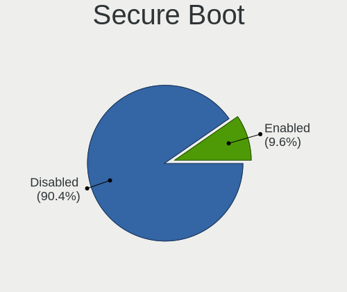
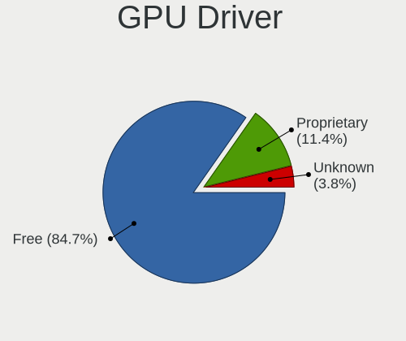
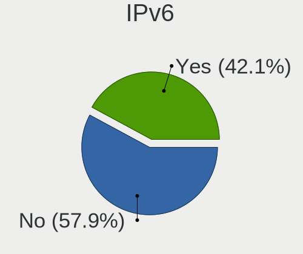

Linux in Germany - Tested Hardware & Statistics (Notebooks)
-----------------------------------------------------------

A project to collect tested hardware configurations for Linux in Germany.

Anyone can contribute to this report by the [hw-probe](https://github.com/linuxhw/hw-probe) tool:

    sudo -E hw-probe -all -upload

Please contribute! Especially if your hardware is rare.

Contents
--------

* [ Test Cases ](#test-cases)

* [ System ](#system)
  - [ OS                       ](#os)
  - [ OS Family                ](#os-family)
  - [ Kernel                   ](#kernel)
  - [ Kernel Family            ](#kernel-family)
  - [ Kernel Major Ver.        ](#kernel-major-ver)
  - [ Arch                     ](#arch)
  - [ DE                       ](#de)
  - [ Display Server           ](#display-server)
  - [ Display Manager          ](#display-manager)
  - [ OS Lang                  ](#os-lang)
  - [ Boot Mode                ](#boot-mode)
  - [ Filesystem               ](#filesystem)
  - [ Part. scheme             ](#part-scheme)
  - [ Dual Boot with Linux/BSD ](#dual-boot-with-linuxbsd)
  - [ Dual Boot (Win)          ](#dual-boot-win)

* [ Board ](#board)
  - [ Vendor                   ](#vendor)
  - [ Model                    ](#model)
  - [ Model Family             ](#model-family)
  - [ MFG Year                 ](#mfg-year)
  - [ Form Factor              ](#form-factor)
  - [ Secure Boot              ](#secure-boot)
  - [ Coreboot                 ](#coreboot)
  - [ RAM Size                 ](#ram-size)
  - [ RAM Used                 ](#ram-used)
  - [ Total Drives             ](#total-drives)
  - [ Has CD-ROM               ](#has-cd-rom)
  - [ Has Ethernet             ](#has-ethernet)
  - [ Has WiFi                 ](#has-wifi)
  - [ Has Bluetooth            ](#has-bluetooth)

* [ Location ](#location)
  - [ Country                  ](#country)
  - [ City                     ](#city)

* [ Drives ](#drives)
  - [ Drive Vendor             ](#drive-vendor)
  - [ Drive Model              ](#drive-model)
  - [ HDD Vendor               ](#hdd-vendor)
  - [ SSD Vendor               ](#ssd-vendor)
  - [ Drive Kind               ](#drive-kind)
  - [ Drive Connector          ](#drive-connector)
  - [ Drive Size               ](#drive-size)
  - [ Space Total              ](#space-total)
  - [ Space Used               ](#space-used)
  - [ Malfunc. Drives          ](#malfunc-drives)
  - [ Malfunc. Drive Vendor    ](#malfunc-drive-vendor)
  - [ Malfunc. HDD Vendor      ](#malfunc-hdd-vendor)
  - [ Malfunc. Drive Kind      ](#malfunc-drive-kind)
  - [ Failed Drives            ](#failed-drives)
  - [ Failed Drive Vendor      ](#failed-drive-vendor)
  - [ Drive Status             ](#drive-status)

* [ Storage controller ](#storage-controller)
  - [ Storage Vendor           ](#storage-vendor)
  - [ Storage Model            ](#storage-model)
  - [ Storage Kind             ](#storage-kind)

* [ Processor ](#processor)
  - [ CPU Vendor               ](#cpu-vendor)
  - [ CPU Model                ](#cpu-model)
  - [ CPU Model Family         ](#cpu-model-family)
  - [ CPU Cores                ](#cpu-cores)
  - [ CPU Sockets              ](#cpu-sockets)
  - [ CPU Threads              ](#cpu-threads)
  - [ CPU Op-Modes             ](#cpu-op-modes)
  - [ CPU Microcode            ](#cpu-microcode)
  - [ CPU Microarch            ](#cpu-microarch)

* [ Graphics ](#graphics)
  - [ GPU Vendor               ](#gpu-vendor)
  - [ GPU Model                ](#gpu-model)
  - [ GPU Combo                ](#gpu-combo)
  - [ GPU Driver               ](#gpu-driver)
  - [ GPU Memory               ](#gpu-memory)

* [ Monitor ](#monitor)
  - [ Monitor Vendor           ](#monitor-vendor)
  - [ Monitor Model            ](#monitor-model)
  - [ Monitor Resolution       ](#monitor-resolution)
  - [ Monitor Diagonal         ](#monitor-diagonal)
  - [ Monitor Width            ](#monitor-width)
  - [ Aspect Ratio             ](#aspect-ratio)
  - [ Monitor Area             ](#monitor-area)
  - [ Pixel Density            ](#pixel-density)
  - [ Multiple Monitors        ](#multiple-monitors)

* [ Network ](#network)
  - [ Net Controller Vendor    ](#net-controller-vendor)
  - [ Net Controller Model     ](#net-controller-model)
  - [ Wireless Vendor          ](#wireless-vendor)
  - [ Wireless Model           ](#wireless-model)
  - [ Ethernet Vendor          ](#ethernet-vendor)
  - [ Ethernet Model           ](#ethernet-model)
  - [ Net Controller Kind      ](#net-controller-kind)
  - [ Used Controller          ](#used-controller)
  - [ NICs                     ](#nics)
  - [ IPv6                     ](#ipv6)

* [ Bluetooth ](#bluetooth)
  - [ Bluetooth Vendor         ](#bluetooth-vendor)
  - [ Bluetooth Model          ](#bluetooth-model)

* [ Sound ](#sound)
  - [ Sound Vendor             ](#sound-vendor)
  - [ Sound Model              ](#sound-model)

* [ Memory ](#memory)
  - [ Memory Vendor            ](#memory-vendor)
  - [ Memory Model             ](#memory-model)
  - [ Memory Kind              ](#memory-kind)
  - [ Memory Form Factor       ](#memory-form-factor)
  - [ Memory Size              ](#memory-size)
  - [ Memory Speed             ](#memory-speed)

* [ Printers & scanners ](#printers--scanners)
  - [ Printer Vendor           ](#printer-vendor)
  - [ Printer Model            ](#printer-model)
  - [ Scanner Vendor           ](#scanner-vendor)
  - [ Scanner Model            ](#scanner-model)

* [ Camera ](#camera)
  - [ Camera Vendor            ](#camera-vendor)
  - [ Camera Model             ](#camera-model)

* [ Security ](#security)
  - [ Fingerprint Vendor       ](#fingerprint-vendor)
  - [ Fingerprint Model        ](#fingerprint-model)
  - [ Chipcard Vendor          ](#chipcard-vendor)
  - [ Chipcard Model           ](#chipcard-model)

* [ Unsupported ](#unsupported)
  - [ Unsupported Devices      ](#unsupported-devices)
  - [ Unsupported Device Types ](#unsupported-device-types)

Test Cases
----------

Total: 14004

| Vendor        | Model                       | Probe                                                      | Date         |
|---------------|-----------------------------|------------------------------------------------------------|--------------|
| Tactus        | GeoBook 140                 | [0ceb5a3b7c](https://linux-hardware.org/?probe=0ceb5a3b7c) | Apr 01, 2023 |
| Acer          | Aspire A315-35              | [659a4cfd5a](https://linux-hardware.org/?probe=659a4cfd5a) | Apr 01, 2023 |
| Lenovo        | V15 G2 IJL 82QY             | [8582f4e86e](https://linux-hardware.org/?probe=8582f4e86e) | Apr 01, 2023 |
| Lenovo        | V15 G2 IJL 82QY             | [e94e2e397e](https://linux-hardware.org/?probe=e94e2e397e) | Apr 01, 2023 |
| Medion        | E6214                       | [5766389c97](https://linux-hardware.org/?probe=5766389c97) | Apr 01, 2023 |
| Lenovo        | IdeaPad U310                | [6add75e18c](https://linux-hardware.org/?probe=6add75e18c) | Apr 01, 2023 |
| Acer          | Aspire A515-57              | [4a1b8f3f21](https://linux-hardware.org/?probe=4a1b8f3f21) | Apr 01, 2023 |
| HP            | 255 G7 Notebook PC          | [e06d57c27a](https://linux-hardware.org/?probe=e06d57c27a) | Apr 01, 2023 |
| Fujitsu       | LIFEBOOK S935               | [11b63a22b5](https://linux-hardware.org/?probe=11b63a22b5) | Apr 01, 2023 |
| Lenovo        | V15-IGL 82C3                | [4773b9449c](https://linux-hardware.org/?probe=4773b9449c) | Apr 01, 2023 |
| Lenovo        | ThinkPad T431s 20AA0016G... | [13e8d4f50b](https://linux-hardware.org/?probe=13e8d4f50b) | Mar 31, 2023 |
| HP            | Pavilion g7                 | [3b0b792078](https://linux-hardware.org/?probe=3b0b792078) | Mar 31, 2023 |
| Lenovo        | ThinkPad P14s Gen 2a 21A... | [36fab57ba7](https://linux-hardware.org/?probe=36fab57ba7) | Mar 31, 2023 |
| Gigabyte      | A7 K1                       | [e5e7751054](https://linux-hardware.org/?probe=e5e7751054) | Mar 31, 2023 |
| HP            | 250 G5 Notebook PC          | [d271318192](https://linux-hardware.org/?probe=d271318192) | Mar 31, 2023 |
| HP            | Laptop 15-db0xxx            | [c51f53a733](https://linux-hardware.org/?probe=c51f53a733) | Mar 31, 2023 |
| Medion        | E6214                       | [298e2f9c69](https://linux-hardware.org/?probe=298e2f9c69) | Mar 31, 2023 |
| Valve         | Jupiter                     | [888da0cc87](https://linux-hardware.org/?probe=888da0cc87) | Mar 31, 2023 |
| Lenovo        | ThinkPad P15s Gen 2i 20W... | [d35ddee3e1](https://linux-hardware.org/?probe=d35ddee3e1) | Mar 31, 2023 |
| Lenovo        | ThinkPad Edge E545 20B20... | [c2061eeeb8](https://linux-hardware.org/?probe=c2061eeeb8) | Mar 31, 2023 |
| Fujitsu Si... | AMILO A Series              | [e551dfea34](https://linux-hardware.org/?probe=e551dfea34) | Mar 31, 2023 |
| Lenovo        | ThinkPad Edge E545 20B20... | [9a866f03fd](https://linux-hardware.org/?probe=9a866f03fd) | Mar 31, 2023 |
| Unknown       | Unknown                     | [c30740a3eb](https://linux-hardware.org/?probe=c30740a3eb) | Mar 31, 2023 |
| Fujitsu Si... | ESPRIMO Mobile V5535        | [d6c537b33b](https://linux-hardware.org/?probe=d6c537b33b) | Mar 31, 2023 |
| ASUSTek       | X751SA                      | [5d8ad91642](https://linux-hardware.org/?probe=5d8ad91642) | Mar 31, 2023 |
| Medion        | E15407                      | [b863362865](https://linux-hardware.org/?probe=b863362865) | Mar 30, 2023 |
| Medion        | E15407                      | [641091a85d](https://linux-hardware.org/?probe=641091a85d) | Mar 30, 2023 |
| Lenovo        | ThinkPad E595 20NF0000GE    | [95a77f6dcc](https://linux-hardware.org/?probe=95a77f6dcc) | Mar 30, 2023 |
| ASUSTek       | X555LAB                     | [f1b87ecc62](https://linux-hardware.org/?probe=f1b87ecc62) | Mar 30, 2023 |
| Dell          | Inspiron 15 5510            | [162132b606](https://linux-hardware.org/?probe=162132b606) | Mar 30, 2023 |
| Lenovo        | IdeaPad 3 15ITL6 82H8       | [afd41155ee](https://linux-hardware.org/?probe=afd41155ee) | Mar 30, 2023 |
| Acer          | Swift SF114-32              | [d15bbe8855](https://linux-hardware.org/?probe=d15bbe8855) | Mar 30, 2023 |
| Dell          | XPS 13 7390                 | [990f324256](https://linux-hardware.org/?probe=990f324256) | Mar 30, 2023 |
| Acer          | Aspire A515-52G             | [8f357ff3e8](https://linux-hardware.org/?probe=8f357ff3e8) | Mar 30, 2023 |
| Dell          | XPS 13 7390                 | [b6226ae481](https://linux-hardware.org/?probe=b6226ae481) | Mar 30, 2023 |
| Medion        | S321X                       | [4c02136dda](https://linux-hardware.org/?probe=4c02136dda) | Mar 30, 2023 |
| Lenovo        | ThinkPad X220 Tablet 429... | [a2e324fd92](https://linux-hardware.org/?probe=a2e324fd92) | Mar 30, 2023 |
| Fujitsu       | LIFEBOOK E781               | [581f3f6547](https://linux-hardware.org/?probe=581f3f6547) | Mar 30, 2023 |
| Fujitsu       | LIFEBOOK S752               | [bf3d484605](https://linux-hardware.org/?probe=bf3d484605) | Mar 30, 2023 |
| Fujitsu       | LIFEBOOK S752               | [3e4d9fac89](https://linux-hardware.org/?probe=3e4d9fac89) | Mar 30, 2023 |
| Dell          | Latitude E5470              | [1c26acfb63](https://linux-hardware.org/?probe=1c26acfb63) | Mar 30, 2023 |
| Dell          | Precision M6400             | [293957e2c0](https://linux-hardware.org/?probe=293957e2c0) | Mar 30, 2023 |
| Lenovo        | ThinkPad Edge E530 3259M... | [9aaa97a931](https://linux-hardware.org/?probe=9aaa97a931) | Mar 30, 2023 |
| Acer          | NC-M3-581T-33216G52MAKK     | [3f394d8b43](https://linux-hardware.org/?probe=3f394d8b43) | Mar 30, 2023 |
| Lenovo        | Unknown                     | [04d5f7141a](https://linux-hardware.org/?probe=04d5f7141a) | Mar 30, 2023 |
| Acer          | Aspire 8943G                | [e1d172011e](https://linux-hardware.org/?probe=e1d172011e) | Mar 30, 2023 |
| Dell          | Precision M4800             | [ebd0442adc](https://linux-hardware.org/?probe=ebd0442adc) | Mar 30, 2023 |
| Dell          | XPS 13 7390                 | [2eb96be1ee](https://linux-hardware.org/?probe=2eb96be1ee) | Mar 29, 2023 |
| ASUSTek       | ZenBook UX431FAC_UX431FA    | [60e9294662](https://linux-hardware.org/?probe=60e9294662) | Mar 29, 2023 |
| Notebook      | N8xxEP6                     | [bb4ab60dc1](https://linux-hardware.org/?probe=bb4ab60dc1) | Mar 29, 2023 |
| Acer          | Aspire A515-57              | [06a3c07a40](https://linux-hardware.org/?probe=06a3c07a40) | Mar 29, 2023 |
| Acer          | Aspire 8930                 | [248dbe002e](https://linux-hardware.org/?probe=248dbe002e) | Mar 29, 2023 |
| Unknown       | Unknown                     | [7d3374d52b](https://linux-hardware.org/?probe=7d3374d52b) | Mar 29, 2023 |
| Acer          | Aspire E5-576               | [37fc62a287](https://linux-hardware.org/?probe=37fc62a287) | Mar 29, 2023 |
| Medion        | P7641 MD99856               | [7347a28d53](https://linux-hardware.org/?probe=7347a28d53) | Mar 28, 2023 |
| HP            | Pavilion g6                 | [c5b99ffdb0](https://linux-hardware.org/?probe=c5b99ffdb0) | Mar 28, 2023 |
| Acer          | Aspire V3-571G              | [ecde786683](https://linux-hardware.org/?probe=ecde786683) | Mar 28, 2023 |
| HP            | Pavilion dv5000 (EW771EA... | [db28f35ce0](https://linux-hardware.org/?probe=db28f35ce0) | Mar 28, 2023 |
| Acer          | Aspire E1-570               | [71b25255fa](https://linux-hardware.org/?probe=71b25255fa) | Mar 28, 2023 |
| Fujitsu       | LIFEBOOK E556               | [bbd878e897](https://linux-hardware.org/?probe=bbd878e897) | Mar 28, 2023 |
| Acer          | Aspire V3-571G              | [289bd8c2fd](https://linux-hardware.org/?probe=289bd8c2fd) | Mar 28, 2023 |
| Fujitsu       | LIFEBOOK E556               | [3842c12714](https://linux-hardware.org/?probe=3842c12714) | Mar 28, 2023 |
| HP            | Pavilion Notebook           | [783330690d](https://linux-hardware.org/?probe=783330690d) | Mar 28, 2023 |
| Dell          | Latitude E5500              | [6fea10bf98](https://linux-hardware.org/?probe=6fea10bf98) | Mar 28, 2023 |
| ASUSTek       | TX201LA                     | [27c77d0b6c](https://linux-hardware.org/?probe=27c77d0b6c) | Mar 28, 2023 |
| Lenovo        | ThinkPad T495 20NJ000XGE    | [70715024f2](https://linux-hardware.org/?probe=70715024f2) | Mar 28, 2023 |
| ASUSTek       | X555DG                      | [6a464d8e68](https://linux-hardware.org/?probe=6a464d8e68) | Mar 27, 2023 |
| Lenovo        | ThinkPad T490 20N3SBU219    | [b8e8125150](https://linux-hardware.org/?probe=b8e8125150) | Mar 27, 2023 |
| Valve         | Jupiter                     | [50abca1d7d](https://linux-hardware.org/?probe=50abca1d7d) | Mar 27, 2023 |
| Lenovo        | ThinkPad X220 42915P1       | [40d0cf6e14](https://linux-hardware.org/?probe=40d0cf6e14) | Mar 27, 2023 |
| Acer          | Aspire 7745G                | [9303cda87a](https://linux-hardware.org/?probe=9303cda87a) | Mar 27, 2023 |
| ASUSTek       | X540SA                      | [b2586a8e30](https://linux-hardware.org/?probe=b2586a8e30) | Mar 27, 2023 |
| Dell          | Latitude E6430              | [61ec1b65ed](https://linux-hardware.org/?probe=61ec1b65ed) | Mar 27, 2023 |
| GPD           | P3 MAX                      | [b3627909f1](https://linux-hardware.org/?probe=b3627909f1) | Mar 27, 2023 |
| Sony          | VPCSA2C5E                   | [60e85a64b0](https://linux-hardware.org/?probe=60e85a64b0) | Mar 27, 2023 |
| ASUSTek       | X540SA                      | [b165f6aa7a](https://linux-hardware.org/?probe=b165f6aa7a) | Mar 27, 2023 |
| Dell          | Precision 7530              | [d5687ef764](https://linux-hardware.org/?probe=d5687ef764) | Mar 27, 2023 |
| Lenovo        | ThinkPad L450 20DS0001GE    | [17f869b10d](https://linux-hardware.org/?probe=17f869b10d) | Mar 27, 2023 |
| Lenovo        | ThinkPad X230 23255NG       | [b606e5e418](https://linux-hardware.org/?probe=b606e5e418) | Mar 27, 2023 |
| Lenovo        | ThinkPad X230 23255NG       | [3effccad22](https://linux-hardware.org/?probe=3effccad22) | Mar 27, 2023 |
| Samsung       | 300E4A/300E5A/300E7A/343... | [1ed601999d](https://linux-hardware.org/?probe=1ed601999d) | Mar 27, 2023 |
| Lenovo        | ThinkPad T450s 20BWS3WY0... | [d1e9fcddfc](https://linux-hardware.org/?probe=d1e9fcddfc) | Mar 27, 2023 |
| TUXEDO        | Pulse 14 Gen1               | [7facc52f0e](https://linux-hardware.org/?probe=7facc52f0e) | Mar 27, 2023 |
| ASUSTek       | ASUS TUF Gaming A17 FA70... | [1c517ff300](https://linux-hardware.org/?probe=1c517ff300) | Mar 27, 2023 |
| MSI           | Modern 15 A5M               | [84092aca44](https://linux-hardware.org/?probe=84092aca44) | Mar 27, 2023 |
| Acer          | Aspire A315-56              | [db607e02ea](https://linux-hardware.org/?probe=db607e02ea) | Mar 27, 2023 |
| TUXEDO        | InfinityBook Pro Gen7 (M... | [84d2bfb9cc](https://linux-hardware.org/?probe=84d2bfb9cc) | Mar 27, 2023 |
| Acer          | Swift SF314-51              | [5a73818024](https://linux-hardware.org/?probe=5a73818024) | Mar 27, 2023 |
| Toshiba       | Satellite C50-A510          | [69eb2dad8f](https://linux-hardware.org/?probe=69eb2dad8f) | Mar 26, 2023 |
| MSI           | Modern 15 B12M              | [b4143381ac](https://linux-hardware.org/?probe=b4143381ac) | Mar 26, 2023 |
| Lenovo        | ThinkPad X230 2325BA3       | [9022b333bd](https://linux-hardware.org/?probe=9022b333bd) | Mar 26, 2023 |
| Dell          | XPS 13 7390                 | [7c10ad8eb9](https://linux-hardware.org/?probe=7c10ad8eb9) | Mar 26, 2023 |
| Fujitsu Si... | AMILO A Series              | [58391da932](https://linux-hardware.org/?probe=58391da932) | Mar 26, 2023 |
| Lenovo        | ThinkPad T440s 20AQ009DG... | [6f3481adc0](https://linux-hardware.org/?probe=6f3481adc0) | Mar 26, 2023 |
| Gigabyte      | A7 K1                       | [0eca943d2e](https://linux-hardware.org/?probe=0eca943d2e) | Mar 26, 2023 |
| ASUSTek       | K72Jr                       | [f80aed3ccc](https://linux-hardware.org/?probe=f80aed3ccc) | Mar 26, 2023 |
| Lenovo        | ThinkPad P14s Gen 3 21AK... | [13e0523db8](https://linux-hardware.org/?probe=13e0523db8) | Mar 26, 2023 |
| ASUSTek       | K50IJ                       | [ef0a85f5ad](https://linux-hardware.org/?probe=ef0a85f5ad) | Mar 26, 2023 |
| Medion        | E6214                       | [8ff346be04](https://linux-hardware.org/?probe=8ff346be04) | Mar 26, 2023 |
| Medion        | Akoya E6416                 | [bb2e759014](https://linux-hardware.org/?probe=bb2e759014) | Mar 26, 2023 |
| Apple         | MacBook1,1                  | [002929e495](https://linux-hardware.org/?probe=002929e495) | Mar 26, 2023 |
| Acer          | Aspire 7741                 | [176930d8ed](https://linux-hardware.org/?probe=176930d8ed) | Mar 26, 2023 |
| HP            | 620                         | [550c23f9a3](https://linux-hardware.org/?probe=550c23f9a3) | Mar 26, 2023 |
| Acer          | Aspire 7741                 | [d41b865ed2](https://linux-hardware.org/?probe=d41b865ed2) | Mar 26, 2023 |
| Lenovo        | V510-15IKB 80WQ             | [8df3d7641e](https://linux-hardware.org/?probe=8df3d7641e) | Mar 26, 2023 |
| Acer          | Nitro AN515-52              | [d2f95decbe](https://linux-hardware.org/?probe=d2f95decbe) | Mar 26, 2023 |
| ASUSTek       | X550ZA                      | [cc243873e2](https://linux-hardware.org/?probe=cc243873e2) | Mar 26, 2023 |
| ASUSTek       | X550ZA                      | [2e55d2163a](https://linux-hardware.org/?probe=2e55d2163a) | Mar 26, 2023 |
| Acer          | Nitro AN515-52              | [1377a2ea15](https://linux-hardware.org/?probe=1377a2ea15) | Mar 26, 2023 |
| ASUSTek       | X55U                        | [764682127e](https://linux-hardware.org/?probe=764682127e) | Mar 26, 2023 |
| Lenovo        | ThinkPad E14 Gen 3 20Y70... | [3ce456f3c8](https://linux-hardware.org/?probe=3ce456f3c8) | Mar 25, 2023 |
| Fujitsu       | LIFEBOOK A531               | [c9973bac8f](https://linux-hardware.org/?probe=c9973bac8f) | Mar 25, 2023 |
| Acer          | Aspire ES1-731              | [927cc86995](https://linux-hardware.org/?probe=927cc86995) | Mar 25, 2023 |
| Dell          | Vostro 15-3568              | [bc2447e1e5](https://linux-hardware.org/?probe=bc2447e1e5) | Mar 25, 2023 |
| Acer          | Aspire E1-731               | [667456015e](https://linux-hardware.org/?probe=667456015e) | Mar 25, 2023 |
| Toshiba       | PORTEGE Z30-A               | [114888d7f5](https://linux-hardware.org/?probe=114888d7f5) | Mar 25, 2023 |
| Lenovo        | ThinkPad X201 3680W81       | [02821ba817](https://linux-hardware.org/?probe=02821ba817) | Mar 25, 2023 |
| Medion        | E14412                      | [897c73454e](https://linux-hardware.org/?probe=897c73454e) | Mar 25, 2023 |
| Apple         | MacBookPro9,1               | [61948072a5](https://linux-hardware.org/?probe=61948072a5) | Mar 25, 2023 |
| Toshiba       | TECRA M10                   | [41e2f08c6b](https://linux-hardware.org/?probe=41e2f08c6b) | Mar 25, 2023 |
| Acer          | Aspire A315-56              | [143eed380e](https://linux-hardware.org/?probe=143eed380e) | Mar 25, 2023 |
| Apple         | MacBookPro11,3              | [f027c9ca09](https://linux-hardware.org/?probe=f027c9ca09) | Mar 25, 2023 |
| Medion        | E6214                       | [0dd02b9353](https://linux-hardware.org/?probe=0dd02b9353) | Mar 25, 2023 |
| Dell          | Vostro 15-3568              | [e6ee9fc566](https://linux-hardware.org/?probe=e6ee9fc566) | Mar 25, 2023 |
| ASUSTek       | TUF Gaming FX505DU_FX505... | [51d034c8d1](https://linux-hardware.org/?probe=51d034c8d1) | Mar 25, 2023 |
| Acer          | Aspire E1-572G              | [ce4febfe16](https://linux-hardware.org/?probe=ce4febfe16) | Mar 25, 2023 |
| Toshiba       | Satellite L50D-B            | [d2ce6bb555](https://linux-hardware.org/?probe=d2ce6bb555) | Mar 25, 2023 |
| Acer          | Aspire E1-572G              | [cef20904d7](https://linux-hardware.org/?probe=cef20904d7) | Mar 25, 2023 |
| Acer          | Aspire 7736                 | [af392f60cc](https://linux-hardware.org/?probe=af392f60cc) | Mar 25, 2023 |
| Acer          | Aspire 7736                 | [bbe13d4e0b](https://linux-hardware.org/?probe=bbe13d4e0b) | Mar 25, 2023 |
| TUXEDO        | InfinityBook Pro 14 v4      | [74c22c45c4](https://linux-hardware.org/?probe=74c22c45c4) | Mar 25, 2023 |
| AXDIA Inte... | myBook PRO14 SE V2          | [0e604dc9d0](https://linux-hardware.org/?probe=0e604dc9d0) | Mar 24, 2023 |
| Dell          | Latitude E5510              | [8a9a1eec2c](https://linux-hardware.org/?probe=8a9a1eec2c) | Mar 24, 2023 |
| HP            | EliteBook 840 G5            | [4e8606a29d](https://linux-hardware.org/?probe=4e8606a29d) | Mar 24, 2023 |
| Dell          | XPS 15 9550                 | [b6bb271247](https://linux-hardware.org/?probe=b6bb271247) | Mar 24, 2023 |
| ASUSTek       | VivoBook_ASUSLaptop S540... | [18cd806803](https://linux-hardware.org/?probe=18cd806803) | Mar 24, 2023 |
| Toshiba       | Satellite C50-B             | [4b563f19dd](https://linux-hardware.org/?probe=4b563f19dd) | Mar 24, 2023 |
| Lenovo        | ThinkPad T14s Gen 2i 20W... | [7dfb215d39](https://linux-hardware.org/?probe=7dfb215d39) | Mar 24, 2023 |
| Dell          | Latitude E6420              | [b1516dde2f](https://linux-hardware.org/?probe=b1516dde2f) | Mar 24, 2023 |
| Lenovo        | ThinkPad E15 Gen 4 21E6C... | [3042a430c0](https://linux-hardware.org/?probe=3042a430c0) | Mar 24, 2023 |
| ASUSTek       | VivoBook_ASUSLaptop M560... | [16b93bfe5d](https://linux-hardware.org/?probe=16b93bfe5d) | Mar 24, 2023 |
| Toshiba       | TECRA Z40-C                 | [39995c1c00](https://linux-hardware.org/?probe=39995c1c00) | Mar 24, 2023 |
| HP            | 255 G5                      | [99e2d83974](https://linux-hardware.org/?probe=99e2d83974) | Mar 24, 2023 |
| ASUSTek       | X75A1                       | [a4b87d85da](https://linux-hardware.org/?probe=a4b87d85da) | Mar 23, 2023 |
| ASUSTek       | X75A1                       | [654683dd2b](https://linux-hardware.org/?probe=654683dd2b) | Mar 23, 2023 |
| Lenovo        | ThinkPad T450s 20BWS05G0... | [38b0e00744](https://linux-hardware.org/?probe=38b0e00744) | Mar 23, 2023 |
| Lenovo        | ThinkPad T450s 20BWS05G0... | [ad1134944b](https://linux-hardware.org/?probe=ad1134944b) | Mar 23, 2023 |
| Valve         | Jupiter                     | [a26ed66cf4](https://linux-hardware.org/?probe=a26ed66cf4) | Mar 23, 2023 |
| Lenovo        | V130-15IGM 81HL             | [177fa734fc](https://linux-hardware.org/?probe=177fa734fc) | Mar 23, 2023 |
| ASUSTek       | X540SA                      | [bbb8b8bc48](https://linux-hardware.org/?probe=bbb8b8bc48) | Mar 23, 2023 |
| Valve         | Jupiter                     | [25c02815b0](https://linux-hardware.org/?probe=25c02815b0) | Mar 23, 2023 |
| HP            | ProBook 650 G5              | [028c91d344](https://linux-hardware.org/?probe=028c91d344) | Mar 23, 2023 |
| HUAWEI        | KPL-W0X                     | [80e6d9af10](https://linux-hardware.org/?probe=80e6d9af10) | Mar 22, 2023 |
| Lenovo        | IdeaPad Gaming 3 15IMH05... | [f6580b20d3](https://linux-hardware.org/?probe=f6580b20d3) | Mar 22, 2023 |
| Lenovo        | ThinkPad L380 20M6S3Q000    | [aab8aada0e](https://linux-hardware.org/?probe=aab8aada0e) | Mar 22, 2023 |
| TUXEDO        | InfinityBook Pro Gen7 (M... | [1c88428088](https://linux-hardware.org/?probe=1c88428088) | Mar 22, 2023 |
| ASUSTek       | X540SA                      | [7216fd6d18](https://linux-hardware.org/?probe=7216fd6d18) | Mar 22, 2023 |
| Apple         | MacBookPro11,5              | [ac5768cd3f](https://linux-hardware.org/?probe=ac5768cd3f) | Mar 22, 2023 |
| ASUSTek       | VivoBook_ASUSLaptop X513... | [946646a961](https://linux-hardware.org/?probe=946646a961) | Mar 22, 2023 |
| IGEL Techn... | M340C                       | [0a16ce19bb](https://linux-hardware.org/?probe=0a16ce19bb) | Mar 22, 2023 |
| Lenovo        | ThinkPad P50 20EQS3BT1R     | [9e8aaf974f](https://linux-hardware.org/?probe=9e8aaf974f) | Mar 22, 2023 |
| Lenovo        | ThinkPad E15 Gen 3 20YG0... | [e664e55602](https://linux-hardware.org/?probe=e664e55602) | Mar 22, 2023 |
| Lenovo        | ThinkPad E15 Gen 3 20YG0... | [e7a984f733](https://linux-hardware.org/?probe=e7a984f733) | Mar 22, 2023 |
| Star Labs     | StarBook                    | [b3957ad08f](https://linux-hardware.org/?probe=b3957ad08f) | Mar 22, 2023 |
| Sony          | VGN-AR51M                   | [ae55922eae](https://linux-hardware.org/?probe=ae55922eae) | Mar 22, 2023 |
| TUXEDO        | Pulse 15 Gen1               | [1da76d59b2](https://linux-hardware.org/?probe=1da76d59b2) | Mar 21, 2023 |
| HUAWEI        | KPL-W0X                     | [afc1ff125b](https://linux-hardware.org/?probe=afc1ff125b) | Mar 21, 2023 |
| Valve         | Jupiter                     | [f5883ebc3d](https://linux-hardware.org/?probe=f5883ebc3d) | Mar 21, 2023 |
| Valve         | Jupiter                     | [d6b52894a1](https://linux-hardware.org/?probe=d6b52894a1) | Mar 21, 2023 |
| Apple         | MacBookPro5,5               | [849f9d23c7](https://linux-hardware.org/?probe=849f9d23c7) | Mar 21, 2023 |
| Dell          | XPS 15 9500                 | [893f51c005](https://linux-hardware.org/?probe=893f51c005) | Mar 21, 2023 |
| HP            | Pavilion Gaming Laptop 1... | [7b772c82ca](https://linux-hardware.org/?probe=7b772c82ca) | Mar 21, 2023 |
| HP            | Pavilion Gaming Laptop 1... | [bd045deb23](https://linux-hardware.org/?probe=bd045deb23) | Mar 21, 2023 |
| HP            | Pavilion Gaming Laptop 1... | [afe8ca841c](https://linux-hardware.org/?probe=afe8ca841c) | Mar 21, 2023 |
| Samsung       | R530/R730                   | [9cd7e18a6d](https://linux-hardware.org/?probe=9cd7e18a6d) | Mar 21, 2023 |
| Samsung       | R530/R730                   | [87292d633d](https://linux-hardware.org/?probe=87292d633d) | Mar 21, 2023 |
| Toshiba       | Satellite C50-A             | [2a448ff4d4](https://linux-hardware.org/?probe=2a448ff4d4) | Mar 21, 2023 |
| Medion        | X783X                       | [d9b4733dd0](https://linux-hardware.org/?probe=d9b4733dd0) | Mar 21, 2023 |
| MSI           | Katana GF76 11UE            | [bacac82182](https://linux-hardware.org/?probe=bacac82182) | Mar 20, 2023 |
| HP            | EliteBook 8440p             | [0ec744551c](https://linux-hardware.org/?probe=0ec744551c) | Mar 20, 2023 |
| IGEL Techn... | M340C                       | [2785bf290e](https://linux-hardware.org/?probe=2785bf290e) | Mar 20, 2023 |
| HUAWEI        | HVY-WXX9                    | [fba4a165e3](https://linux-hardware.org/?probe=fba4a165e3) | Mar 20, 2023 |
| Toshiba       | Satellite C50-B             | [b9bf22cc53](https://linux-hardware.org/?probe=b9bf22cc53) | Mar 20, 2023 |
| Dell          | Inspiron 5405               | [bb59d0b5e9](https://linux-hardware.org/?probe=bb59d0b5e9) | Mar 20, 2023 |
| Lenovo        | G500 20236                  | [cf5df0e653](https://linux-hardware.org/?probe=cf5df0e653) | Mar 20, 2023 |
| HP            | Pavilion Gaming Laptop 1... | [afcac034a9](https://linux-hardware.org/?probe=afcac034a9) | Mar 20, 2023 |
| Lenovo        | V17 G2 ITL 82NX             | [0365bfc4ca](https://linux-hardware.org/?probe=0365bfc4ca) | Mar 20, 2023 |
| HP            | ProBook 470 G5              | [8335a6ae9b](https://linux-hardware.org/?probe=8335a6ae9b) | Mar 20, 2023 |
| Lenovo        | ThinkBook 15 G4 ABA 21DL    | [ade941e14d](https://linux-hardware.org/?probe=ade941e14d) | Mar 20, 2023 |
| Lenovo        | ThinkPad T14s Gen 1 20T0... | [f0eb91b635](https://linux-hardware.org/?probe=f0eb91b635) | Mar 20, 2023 |
| Lenovo        | ThinkPad L14 Gen 3 21C10... | [978df2886a](https://linux-hardware.org/?probe=978df2886a) | Mar 20, 2023 |
| HP            | Laptop 17-cp0xxx            | [2611e4ac10](https://linux-hardware.org/?probe=2611e4ac10) | Mar 20, 2023 |
| Dell          | XPS 15 9520                 | [b6ffb56057](https://linux-hardware.org/?probe=b6ffb56057) | Mar 20, 2023 |
| Dell          | Inspiron 5737               | [77d32b8b3a](https://linux-hardware.org/?probe=77d32b8b3a) | Mar 19, 2023 |
| TUXEDO        | N13xWU                      | [e9614af654](https://linux-hardware.org/?probe=e9614af654) | Mar 19, 2023 |
| Lenovo        | IdeaPad S145-15API 81UT     | [91d4251cb0](https://linux-hardware.org/?probe=91d4251cb0) | Mar 19, 2023 |
| HP            | Notebook                    | [85e86b10d3](https://linux-hardware.org/?probe=85e86b10d3) | Mar 19, 2023 |
| Lenovo        | ThinkPad T480 20L6S64C00    | [d91384b02c](https://linux-hardware.org/?probe=d91384b02c) | Mar 19, 2023 |
| Lenovo        | ThinkPad T430 23493V2       | [96a7658d91](https://linux-hardware.org/?probe=96a7658d91) | Mar 19, 2023 |
| Packard Be... | EasyNote TE11HC             | [ce6f515364](https://linux-hardware.org/?probe=ce6f515364) | Mar 19, 2023 |
| MSI           | PS42 8M                     | [aad18852f4](https://linux-hardware.org/?probe=aad18852f4) | Mar 19, 2023 |
| Acer          | Aspire V3-772               | [64b17e8d2c](https://linux-hardware.org/?probe=64b17e8d2c) | Mar 19, 2023 |
| Lenovo        | ThinkPad T410 2518A3G       | [eb61c430a6](https://linux-hardware.org/?probe=eb61c430a6) | Mar 19, 2023 |
| Lenovo        | ThinkPad T410 2518A3G       | [b09af2bf7d](https://linux-hardware.org/?probe=b09af2bf7d) | Mar 19, 2023 |
| TUXEDO        | InfinityBook Pro 14 Gen6    | [0500018bce](https://linux-hardware.org/?probe=0500018bce) | Mar 19, 2023 |
| MSI           | Katana GF76 11UE            | [b357741a4b](https://linux-hardware.org/?probe=b357741a4b) | Mar 19, 2023 |
| Acer          | Nitro AN517-41              | [5e5fd3788e](https://linux-hardware.org/?probe=5e5fd3788e) | Mar 19, 2023 |
| Schenker      | XMG FUSION 15 (XFU15L19)    | [dc8d19f73a](https://linux-hardware.org/?probe=dc8d19f73a) | Mar 19, 2023 |
| MSI           | GE60 2PE                    | [229b9e0525](https://linux-hardware.org/?probe=229b9e0525) | Mar 19, 2023 |
| HP            | ProBook 450 G8 Notebook ... | [f5c5712df1](https://linux-hardware.org/?probe=f5c5712df1) | Mar 18, 2023 |
| TUXEDO        | Polaris AMD Gen3 (CZN)      | [0db668b5ec](https://linux-hardware.org/?probe=0db668b5ec) | Mar 18, 2023 |
| Packard Be... | EasyNote TE11HC             | [0bb94771bc](https://linux-hardware.org/?probe=0bb94771bc) | Mar 18, 2023 |
| TUXEDO        | InfinityBook S 15/17 Gen... | [094b530ce7](https://linux-hardware.org/?probe=094b530ce7) | Mar 18, 2023 |
| Lenovo        | ThinkPad Edge E330 33541... | [4f0ddac461](https://linux-hardware.org/?probe=4f0ddac461) | Mar 18, 2023 |
| Schenker      | VISION 14                   | [85200e20d8](https://linux-hardware.org/?probe=85200e20d8) | Mar 18, 2023 |
| Sony          | SVZ1311C5E                  | [e433359eb9](https://linux-hardware.org/?probe=e433359eb9) | Mar 18, 2023 |
| Dell          | Precision M6600             | [a71645a248](https://linux-hardware.org/?probe=a71645a248) | Mar 18, 2023 |
| Apple         | MacBookPro9,2               | [e996669ec1](https://linux-hardware.org/?probe=e996669ec1) | Mar 18, 2023 |
| Acer          | Aspire 8730                 | [bc63e0d2c1](https://linux-hardware.org/?probe=bc63e0d2c1) | Mar 18, 2023 |
| Lenovo        | ThinkPad Yoga 11e 20D900... | [434b76d9cd](https://linux-hardware.org/?probe=434b76d9cd) | Mar 18, 2023 |
| Lenovo        | ThinkPad Yoga 11e 20D900... | [2ffc3ebd28](https://linux-hardware.org/?probe=2ffc3ebd28) | Mar 18, 2023 |
| Notebook      | N8xxEP6                     | [a4bd2c22eb](https://linux-hardware.org/?probe=a4bd2c22eb) | Mar 18, 2023 |
| Acer          | Aspire 8930                 | [46b84b6b7d](https://linux-hardware.org/?probe=46b84b6b7d) | Mar 18, 2023 |
| Lenovo        | IdeaPad 3 15ALC6 82KU       | [fce879befb](https://linux-hardware.org/?probe=fce879befb) | Mar 18, 2023 |
| Lenovo        | ThinkPad Edge E335 33556... | [463dac90ba](https://linux-hardware.org/?probe=463dac90ba) | Mar 18, 2023 |
| HP            | 250 G8 Notebook PC          | [db16a820b3](https://linux-hardware.org/?probe=db16a820b3) | Mar 18, 2023 |
| HP            | ProBook 470 G3              | [3cdb0bbdf6](https://linux-hardware.org/?probe=3cdb0bbdf6) | Mar 17, 2023 |
| Notebook      | N150CU                      | [284a367641](https://linux-hardware.org/?probe=284a367641) | Mar 17, 2023 |
| Valve         | Jupiter                     | [0dbb54db92](https://linux-hardware.org/?probe=0dbb54db92) | Mar 17, 2023 |
| HP            | 250 G8 Notebook PC          | [aa1530ca30](https://linux-hardware.org/?probe=aa1530ca30) | Mar 17, 2023 |
| Lenovo        | ThinkPad P50 20EN0006GE     | [6364c78054](https://linux-hardware.org/?probe=6364c78054) | Mar 17, 2023 |
| Lenovo        | ThinkPad T480s 20L8S02E0... | [75eff8dfa6](https://linux-hardware.org/?probe=75eff8dfa6) | Mar 17, 2023 |
| Medion        | GUARDIAN X10                | [f30ef18641](https://linux-hardware.org/?probe=f30ef18641) | Mar 17, 2023 |
| Lenovo        | ThinkPad E15 Gen 4 21ED0... | [66f4a76724](https://linux-hardware.org/?probe=66f4a76724) | Mar 17, 2023 |
| Medion        | GUARDIAN X10                | [76798fdb55](https://linux-hardware.org/?probe=76798fdb55) | Mar 17, 2023 |
| Apple         | MacBookPro11,1              | [b56e51e40b](https://linux-hardware.org/?probe=b56e51e40b) | Mar 17, 2023 |
| Gigabyte      | G5 KD                       | [a3234542a9](https://linux-hardware.org/?probe=a3234542a9) | Mar 17, 2023 |
| MSI           | GF72 8RE                    | [4610dffdcc](https://linux-hardware.org/?probe=4610dffdcc) | Mar 17, 2023 |
| Dell          | Latitude E5570              | [a15d1b43ca](https://linux-hardware.org/?probe=a15d1b43ca) | Mar 17, 2023 |
| Dell          | Latitude E5570              | [dd07b0c3b3](https://linux-hardware.org/?probe=dd07b0c3b3) | Mar 17, 2023 |
| Lenovo        | ThinkPad E15 Gen 4 21ED0... | [b50b834744](https://linux-hardware.org/?probe=b50b834744) | Mar 16, 2023 |
| Samsung       | 750XED                      | [be19d0454d](https://linux-hardware.org/?probe=be19d0454d) | Mar 16, 2023 |
| Lenovo        | ThinkPad 13 2nd Gen 20J1... | [f3ee556fb5](https://linux-hardware.org/?probe=f3ee556fb5) | Mar 16, 2023 |
| HP            | Laptop 15-da0xxx            | [d00b579583](https://linux-hardware.org/?probe=d00b579583) | Mar 16, 2023 |
| Lenovo        | ThinkPad T460s 20FAS0RP0... | [f901058202](https://linux-hardware.org/?probe=f901058202) | Mar 16, 2023 |
| HP            | Victus by Laptop 16-e0xx... | [304f8b71db](https://linux-hardware.org/?probe=304f8b71db) | Mar 16, 2023 |
| HP            | Victus by Laptop 16-e0xx... | [4bfe066835](https://linux-hardware.org/?probe=4bfe066835) | Mar 16, 2023 |
| Lenovo        | ThinkPad E15 Gen 4 21E60... | [1ed7ccd033](https://linux-hardware.org/?probe=1ed7ccd033) | Mar 16, 2023 |
| Lenovo        | Unknown                     | [8bdf0bf41b](https://linux-hardware.org/?probe=8bdf0bf41b) | Mar 16, 2023 |
| Lenovo        | ThinkPad T14 Gen 1 20S00... | [db0f4c6df3](https://linux-hardware.org/?probe=db0f4c6df3) | Mar 16, 2023 |
| Lenovo        | ThinkPad E14 Gen 2 20TAC... | [8ba3fe51e4](https://linux-hardware.org/?probe=8ba3fe51e4) | Mar 16, 2023 |
| Lenovo        | Legion 5 Pro 16ARH7H 82R... | [5b41550fc0](https://linux-hardware.org/?probe=5b41550fc0) | Mar 15, 2023 |
| TUXEDO        | Aura 15 Gen1                | [066f0cd17b](https://linux-hardware.org/?probe=066f0cd17b) | Mar 15, 2023 |
| Samsung       | 550P5C/550P7C               | [1cf7cdcd75](https://linux-hardware.org/?probe=1cf7cdcd75) | Mar 15, 2023 |
| Acer          | Aspire E5-551G              | [58703e3260](https://linux-hardware.org/?probe=58703e3260) | Mar 15, 2023 |
| Lenovo        | Legion 5 15ACH6A 82NW       | [1e802bfcd0](https://linux-hardware.org/?probe=1e802bfcd0) | Mar 15, 2023 |
| Dell          | Latitude 5290               | [2b4d5d7866](https://linux-hardware.org/?probe=2b4d5d7866) | Mar 15, 2023 |
| Apple         | MacBookPro9,2               | [6640fe0d6f](https://linux-hardware.org/?probe=6640fe0d6f) | Mar 15, 2023 |
| Acer          | Aspire V3-771               | [28f8273eb5](https://linux-hardware.org/?probe=28f8273eb5) | Mar 15, 2023 |
| TUXEDO        | InfinityBook Pro Gen7 (M... | [f5a6ecdae0](https://linux-hardware.org/?probe=f5a6ecdae0) | Mar 15, 2023 |
| Lenovo        | ThinkPad P15v Gen 3 21EM... | [e4254565ed](https://linux-hardware.org/?probe=e4254565ed) | Mar 15, 2023 |
| TUXEDO        | Pulse 15 Gen1               | [4a47120f89](https://linux-hardware.org/?probe=4a47120f89) | Mar 15, 2023 |
| Dell          | Latitude E6230              | [49a9844be8](https://linux-hardware.org/?probe=49a9844be8) | Mar 15, 2023 |
| ASUSTek       | VivoBook_ASUSLaptop X712... | [c1f62d3ed5](https://linux-hardware.org/?probe=c1f62d3ed5) | Mar 15, 2023 |
| TUXEDO        | Polaris Intel Gen3 (TGL)    | [29ebc422fe](https://linux-hardware.org/?probe=29ebc422fe) | Mar 15, 2023 |
| Acer          | Swift SF314-42              | [67500cfa07](https://linux-hardware.org/?probe=67500cfa07) | Mar 15, 2023 |
| Apple         | MacBookPro9,2               | [9b01d90367](https://linux-hardware.org/?probe=9b01d90367) | Mar 14, 2023 |
| Lenovo        | ThinkPad T490 20N3S3UL00    | [a9db94aee2](https://linux-hardware.org/?probe=a9db94aee2) | Mar 14, 2023 |
| Acer          | Aspire E5-571               | [6c7886396a](https://linux-hardware.org/?probe=6c7886396a) | Mar 14, 2023 |
| TUXEDO        | Aura 15 Gen2                | [15d4cdae49](https://linux-hardware.org/?probe=15d4cdae49) | Mar 14, 2023 |
| TUXEDO        | InfinityBook Pro 14 Gen6    | [3fcbfecb5a](https://linux-hardware.org/?probe=3fcbfecb5a) | Mar 14, 2023 |
| ASUSTek       | ZenBook UX534FAC_UX533FA... | [83351958e6](https://linux-hardware.org/?probe=83351958e6) | Mar 14, 2023 |
| TUXEDO        | InfinityBook Pro 14 v4      | [f5cbc232d7](https://linux-hardware.org/?probe=f5cbc232d7) | Mar 14, 2023 |
| Medion        | E14303                      | [bcd7d12004](https://linux-hardware.org/?probe=bcd7d12004) | Mar 14, 2023 |
| Acer          | Swift SF314-51              | [b410a4c017](https://linux-hardware.org/?probe=b410a4c017) | Mar 14, 2023 |
| Dell          | G5 5587                     | [4ff3c98faf](https://linux-hardware.org/?probe=4ff3c98faf) | Mar 14, 2023 |
| Dell          | XPS 15 7590                 | [5997bff822](https://linux-hardware.org/?probe=5997bff822) | Mar 14, 2023 |
| Lenovo        | Flex 2-14 20404             | [812104dae3](https://linux-hardware.org/?probe=812104dae3) | Mar 14, 2023 |
| Lenovo        | IdeaPad C340-14API 81N6     | [7637d41bf3](https://linux-hardware.org/?probe=7637d41bf3) | Mar 14, 2023 |
| Medion        | E14303                      | [6343eb16c7](https://linux-hardware.org/?probe=6343eb16c7) | Mar 14, 2023 |
| Lenovo        | ThinkPad T14 Gen 2a 20XL... | [054bb62a67](https://linux-hardware.org/?probe=054bb62a67) | Mar 14, 2023 |
| HP            | EliteBook 820 G4            | [bc12f3e2e4](https://linux-hardware.org/?probe=bc12f3e2e4) | Mar 14, 2023 |
| Lenovo        | ThinkPad E495 20NECTO1WW    | [283bbe97cc](https://linux-hardware.org/?probe=283bbe97cc) | Mar 14, 2023 |
| Lenovo        | Legion 5 15ACH6H 82JU       | [167f6c0b46](https://linux-hardware.org/?probe=167f6c0b46) | Mar 14, 2023 |
| Lenovo        | ThinkPad T430 2349SAJ       | [a0b7b2a17d](https://linux-hardware.org/?probe=a0b7b2a17d) | Mar 14, 2023 |
| Lenovo        | Z710 20250                  | [3a99fb6400](https://linux-hardware.org/?probe=3a99fb6400) | Mar 14, 2023 |
| Lenovo        | G500 20236                  | [decf2fb7ba](https://linux-hardware.org/?probe=decf2fb7ba) | Mar 14, 2023 |
| TUXEDO        | InfinityBook Pro Gen7 (M... | [7ccc0f584e](https://linux-hardware.org/?probe=7ccc0f584e) | Mar 14, 2023 |
| Lenovo        | ThinkPad T520 4242BC5       | [328620a2d3](https://linux-hardware.org/?probe=328620a2d3) | Mar 14, 2023 |
| Acer          | Aspire E5-551G              | [7a992ff109](https://linux-hardware.org/?probe=7a992ff109) | Mar 14, 2023 |
| Samsung       | 750XDA                      | [c6b76619bf](https://linux-hardware.org/?probe=c6b76619bf) | Mar 14, 2023 |
| Lenovo        | G500 20236                  | [9084414030](https://linux-hardware.org/?probe=9084414030) | Mar 14, 2023 |
| Acer          | Aspire 5749                 | [8b7cc3d191](https://linux-hardware.org/?probe=8b7cc3d191) | Mar 14, 2023 |
| Apple         | MacBook5,1                  | [6dd111e4e2](https://linux-hardware.org/?probe=6dd111e4e2) | Mar 14, 2023 |
| Lenovo        | IdeaPad 110-17ACL 80UM      | [04fcb41bb8](https://linux-hardware.org/?probe=04fcb41bb8) | Mar 14, 2023 |
| HP            | Pavilion Laptop 15-cs0xx... | [2b69e73996](https://linux-hardware.org/?probe=2b69e73996) | Mar 14, 2023 |
| Acer          | Aspire 5749                 | [cfd610357f](https://linux-hardware.org/?probe=cfd610357f) | Mar 14, 2023 |
| Schenker      | VIA 15 Pro                  | [ef02f8156e](https://linux-hardware.org/?probe=ef02f8156e) | Mar 13, 2023 |
| Lenovo        | ThinkPad E15 20RES05U00     | [7047c529ef](https://linux-hardware.org/?probe=7047c529ef) | Mar 13, 2023 |
| Lenovo        | G70-70 80HW0089GE           | [bb14c24b24](https://linux-hardware.org/?probe=bb14c24b24) | Mar 13, 2023 |
| Dell          | Latitude 7480               | [2c1cca300c](https://linux-hardware.org/?probe=2c1cca300c) | Mar 13, 2023 |
| Lenovo        | ThinkPad Edge E530 3259H... | [74348d01f3](https://linux-hardware.org/?probe=74348d01f3) | Mar 13, 2023 |
| Lenovo        | ThinkPad T460 20FMS0700A    | [0298b20ac9](https://linux-hardware.org/?probe=0298b20ac9) | Mar 13, 2023 |
| ASUSTek       | K56CB                       | [b6d6f5ed8d](https://linux-hardware.org/?probe=b6d6f5ed8d) | Mar 13, 2023 |
| Lenovo        | ThinkBook 14 G2 ITL 20VD    | [5fc0403ac3](https://linux-hardware.org/?probe=5fc0403ac3) | Mar 13, 2023 |
| Lenovo        | ThinkPad L15 Gen 1 20U8S... | [e78843ce7e](https://linux-hardware.org/?probe=e78843ce7e) | Mar 13, 2023 |
| Acer          | Aspire 5738                 | [bd231fbff6](https://linux-hardware.org/?probe=bd231fbff6) | Mar 12, 2023 |
| Samsung       | R780/R778                   | [6c10b62663](https://linux-hardware.org/?probe=6c10b62663) | Mar 12, 2023 |
| Lenovo        | ThinkPad T520 42435GG       | [fac1ee2528](https://linux-hardware.org/?probe=fac1ee2528) | Mar 12, 2023 |
| Acer          | Swift SF314-43              | [8f3c49d011](https://linux-hardware.org/?probe=8f3c49d011) | Mar 12, 2023 |
| HP            | ZBook 17 G3                 | [f69ef4ff89](https://linux-hardware.org/?probe=f69ef4ff89) | Mar 12, 2023 |
| Lenovo        | ThinkPad E15 Gen 3 20YG0... | [f1749d153b](https://linux-hardware.org/?probe=f1749d153b) | Mar 12, 2023 |
| HP            | G62                         | [cf9714246a](https://linux-hardware.org/?probe=cf9714246a) | Mar 12, 2023 |
| Packard Be... | EasyNote TE11HC             | [4a54741fec](https://linux-hardware.org/?probe=4a54741fec) | Mar 12, 2023 |
| ASUSTek       | X751MA                      | [f697401630](https://linux-hardware.org/?probe=f697401630) | Mar 12, 2023 |
| ASUSTek       | VivoBook_ASUSLaptop M340... | [55a73e2e07](https://linux-hardware.org/?probe=55a73e2e07) | Mar 12, 2023 |
| Dell          | Latitude E5570              | [494b8e3615](https://linux-hardware.org/?probe=494b8e3615) | Mar 12, 2023 |
| Lenovo        | ThinkPad A475 20KMS08300    | [b42df5cbe0](https://linux-hardware.org/?probe=b42df5cbe0) | Mar 11, 2023 |
| Lenovo        | ThinkPad A475 20KMS08300    | [17a3030488](https://linux-hardware.org/?probe=17a3030488) | Mar 11, 2023 |
| TUXEDO        | InfinityBook S 15/17 Gen... | [8aff6217a5](https://linux-hardware.org/?probe=8aff6217a5) | Mar 11, 2023 |
| ASUSTek       | K56CB                       | [b9690b513d](https://linux-hardware.org/?probe=b9690b513d) | Mar 11, 2023 |
| TUXEDO        | InfinityBook S 15/17 Gen... | [2a0539c2b1](https://linux-hardware.org/?probe=2a0539c2b1) | Mar 11, 2023 |
| Lenovo        | ThinkPad L15 Gen 1 20U8S... | [a909644dc4](https://linux-hardware.org/?probe=a909644dc4) | Mar 11, 2023 |
| Lenovo        | ThinkPad X250 20CLS4XP00    | [0c95c4ed7f](https://linux-hardware.org/?probe=0c95c4ed7f) | Mar 11, 2023 |
| Apple         | MacBookPro15,2              | [b6dc707f97](https://linux-hardware.org/?probe=b6dc707f97) | Mar 11, 2023 |
| HP            | ProBook 5330m               | [2ec50367d4](https://linux-hardware.org/?probe=2ec50367d4) | Mar 11, 2023 |
| VALE          | Notebook Classic C140       | [4e25d5eb76](https://linux-hardware.org/?probe=4e25d5eb76) | Mar 11, 2023 |
| Clevo         | W240EU/W250EUQ/W270EUQ      | [728697bff3](https://linux-hardware.org/?probe=728697bff3) | Mar 11, 2023 |
| Acer          | Aspire A515-51G             | [607171cb69](https://linux-hardware.org/?probe=607171cb69) | Mar 11, 2023 |
| HP            | ZBook 17 G2                 | [4b9462a4ff](https://linux-hardware.org/?probe=4b9462a4ff) | Mar 11, 2023 |
| Dell          | Vostro 3550                 | [40a0328a5f](https://linux-hardware.org/?probe=40a0328a5f) | Mar 11, 2023 |
| Fujitsu       | LIFEBOOK A359               | [0fa1ebbc11](https://linux-hardware.org/?probe=0fa1ebbc11) | Mar 11, 2023 |
| Fujitsu       | LIFEBOOK A359               | [f977012127](https://linux-hardware.org/?probe=f977012127) | Mar 11, 2023 |
| Acer          | Aspire A515-45              | [1fc9174c06](https://linux-hardware.org/?probe=1fc9174c06) | Mar 11, 2023 |
| HP            | Compaq nx9420 (ES444ET#A... | [f066472937](https://linux-hardware.org/?probe=f066472937) | Mar 11, 2023 |
| Dell          | Inspiron 5515               | [22dd14abae](https://linux-hardware.org/?probe=22dd14abae) | Mar 11, 2023 |
| Dell          | XPS 13 9300                 | [d3b7f2f978](https://linux-hardware.org/?probe=d3b7f2f978) | Mar 11, 2023 |
| Dell          | Latitude 3320               | [2a58a07005](https://linux-hardware.org/?probe=2a58a07005) | Mar 11, 2023 |
| Dell          | Latitude 3320               | [d17364c0ef](https://linux-hardware.org/?probe=d17364c0ef) | Mar 11, 2023 |
| Fujitsu       | LIFEBOOK U759               | [01025c7c43](https://linux-hardware.org/?probe=01025c7c43) | Mar 11, 2023 |
| IGEL Techn... | M340C                       | [878b5f0965](https://linux-hardware.org/?probe=878b5f0965) | Mar 11, 2023 |
| Apple         | MacBookPro9,2               | [2d0a8398ee](https://linux-hardware.org/?probe=2d0a8398ee) | Mar 11, 2023 |
| Apple         | MacBook5,1                  | [fd1d9fbcc2](https://linux-hardware.org/?probe=fd1d9fbcc2) | Mar 10, 2023 |
| Fujitsu       | LIFEBOOK S760               | [1d2e721898](https://linux-hardware.org/?probe=1d2e721898) | Mar 10, 2023 |
| ASUSTek       | K52Je                       | [f964ad4a66](https://linux-hardware.org/?probe=f964ad4a66) | Mar 10, 2023 |
| Toshiba       | TECRA Z40-C                 | [a4ba2ff90e](https://linux-hardware.org/?probe=a4ba2ff90e) | Mar 10, 2023 |
| Lenovo        | ThinkPad X1 Carbon 3rd 2... | [c44f0eab3e](https://linux-hardware.org/?probe=c44f0eab3e) | Mar 10, 2023 |
| Apple         | MacBookPro1,1               | [105d39532f](https://linux-hardware.org/?probe=105d39532f) | Mar 10, 2023 |
| Lenovo        | IdeaPad Gaming 3 15IMH05... | [50dd87563b](https://linux-hardware.org/?probe=50dd87563b) | Mar 10, 2023 |
| Acer          | Aspire V3-772               | [6648af3696](https://linux-hardware.org/?probe=6648af3696) | Mar 10, 2023 |
| Notebook      | N150CU                      | [3b891fe927](https://linux-hardware.org/?probe=3b891fe927) | Mar 10, 2023 |
| Notebook      | N150CU                      | [b7fbec9613](https://linux-hardware.org/?probe=b7fbec9613) | Mar 10, 2023 |
| HP            | Laptop 15s-eq2xxx           | [dd06fbb0f9](https://linux-hardware.org/?probe=dd06fbb0f9) | Mar 10, 2023 |
| Lenovo        | ThinkPad T440p 20AN0070M... | [0d0877faf5](https://linux-hardware.org/?probe=0d0877faf5) | Mar 10, 2023 |
| Lenovo        | IdeaPad 320-15IAP 80XR      | [c02ccacd98](https://linux-hardware.org/?probe=c02ccacd98) | Mar 10, 2023 |
| Lenovo        | ThinkPad L13 Yoga Gen 2a... | [eac4ae85a4](https://linux-hardware.org/?probe=eac4ae85a4) | Mar 10, 2023 |
| Lenovo        | IdeaPad 5 14ALC05 82LM      | [93b31111ef](https://linux-hardware.org/?probe=93b31111ef) | Mar 10, 2023 |
| Dell          | Precision M6700             | [7a02d78344](https://linux-hardware.org/?probe=7a02d78344) | Mar 10, 2023 |
| HP            | ZBook 17 G2                 | [565c8963d4](https://linux-hardware.org/?probe=565c8963d4) | Mar 10, 2023 |
| Medion        | Akoya E6412T                | [d8941697fd](https://linux-hardware.org/?probe=d8941697fd) | Mar 09, 2023 |
| Lenovo        | ThinkPad X220 4290W1B       | [129bfe8c92](https://linux-hardware.org/?probe=129bfe8c92) | Mar 09, 2023 |
| Lenovo        | IdeaPad 5 15ALC05 82LN      | [03ca2d1b27](https://linux-hardware.org/?probe=03ca2d1b27) | Mar 09, 2023 |
| Lenovo        | IdeaPad 5 15ALC05 82LN      | [607adcc4d1](https://linux-hardware.org/?probe=607adcc4d1) | Mar 09, 2023 |
| Dell          | Precision 7720              | [6132f690aa](https://linux-hardware.org/?probe=6132f690aa) | Mar 09, 2023 |
| Lenovo        | ThinkPad Edge E330 3354D... | [b741a79767](https://linux-hardware.org/?probe=b741a79767) | Mar 09, 2023 |
| ASUSTek       | VivoBook_ASUSLaptop S540... | [8a33917a89](https://linux-hardware.org/?probe=8a33917a89) | Mar 09, 2023 |
| ASUSTek       | VivoBook_ASUSLaptop S540... | [f4d71dcbd0](https://linux-hardware.org/?probe=f4d71dcbd0) | Mar 09, 2023 |
| Lenovo        | G500 20236                  | [898271efb7](https://linux-hardware.org/?probe=898271efb7) | Mar 09, 2023 |
| Medion        | E15302                      | [e4dbaf4893](https://linux-hardware.org/?probe=e4dbaf4893) | Mar 09, 2023 |
| HP            | EliteBook 840 G6            | [140991f223](https://linux-hardware.org/?probe=140991f223) | Mar 09, 2023 |
| Acer          | Aspire A515-47              | [3920049dfb](https://linux-hardware.org/?probe=3920049dfb) | Mar 09, 2023 |
| Sony          | SVE1713A6EW                 | [2e35a44a14](https://linux-hardware.org/?probe=2e35a44a14) | Mar 09, 2023 |
| Sony          | SVE1713A6EW                 | [cd8cfd3af0](https://linux-hardware.org/?probe=cd8cfd3af0) | Mar 09, 2023 |
| Lenovo        | ThinkPad L13 Yoga Gen 2a... | [a8d1bd3e81](https://linux-hardware.org/?probe=a8d1bd3e81) | Mar 09, 2023 |
| HP            | ENVY Laptop 13-aq0xxx       | [79fc708bbd](https://linux-hardware.org/?probe=79fc708bbd) | Mar 09, 2023 |
| Dell          | Latitude E5430 non-vPro     | [1456a6c45f](https://linux-hardware.org/?probe=1456a6c45f) | Mar 08, 2023 |
| HP            | EliteBook 840 G2            | [b4621990a6](https://linux-hardware.org/?probe=b4621990a6) | Mar 08, 2023 |
| Medion        | E122X                       | [dad02f1ac7](https://linux-hardware.org/?probe=dad02f1ac7) | Mar 08, 2023 |
| Dell          | Inspiron 3505               | [5ffa875792](https://linux-hardware.org/?probe=5ffa875792) | Mar 08, 2023 |
| Dell          | Precision 7720              | [e4a1149bcb](https://linux-hardware.org/?probe=e4a1149bcb) | Mar 08, 2023 |
| Dell          | Latitude 12 Rugged Table... | [471fdeb161](https://linux-hardware.org/?probe=471fdeb161) | Mar 08, 2023 |
| Lenovo        | ThinkPad X1 Carbon Gen 8... | [082ebd072a](https://linux-hardware.org/?probe=082ebd072a) | Mar 08, 2023 |
| Lenovo        | ThinkPad T450s 20BX0013G... | [11cf435bfe](https://linux-hardware.org/?probe=11cf435bfe) | Mar 08, 2023 |
| Lenovo        | ThinkPad T14s Gen 3 21CQ... | [2756d8312f](https://linux-hardware.org/?probe=2756d8312f) | Mar 08, 2023 |
| Acer          | Aspire E5-571G              | [74404a823b](https://linux-hardware.org/?probe=74404a823b) | Mar 08, 2023 |
| HP            | ENVY Laptop 13-aq0xxx       | [c768e8ff8f](https://linux-hardware.org/?probe=c768e8ff8f) | Mar 08, 2023 |
| Lenovo        | ThinkPad P73 20QSS1M700     | [f97fd31dd0](https://linux-hardware.org/?probe=f97fd31dd0) | Mar 08, 2023 |
| Lenovo        | IdeaPad U310                | [f666446ecb](https://linux-hardware.org/?probe=f666446ecb) | Mar 07, 2023 |
| Lenovo        | G500 20236                  | [1f5114d6a5](https://linux-hardware.org/?probe=1f5114d6a5) | Mar 07, 2023 |
| Acer          | Nitro AN515-43              | [32d1af5dee](https://linux-hardware.org/?probe=32d1af5dee) | Mar 07, 2023 |
| Lenovo        | ThinkPad T520 42435JG       | [cc83a62c0e](https://linux-hardware.org/?probe=cc83a62c0e) | Mar 07, 2023 |
| Lenovo        | IdeaPad 3 15ALC6 82KU       | [6e7ffbd8ad](https://linux-hardware.org/?probe=6e7ffbd8ad) | Mar 07, 2023 |
| Lenovo        | Legion Y540-15IRH 81SX      | [d3cd7ae3e8](https://linux-hardware.org/?probe=d3cd7ae3e8) | Mar 07, 2023 |
| Apple         | MacBookPro9,2               | [9d9396bbfe](https://linux-hardware.org/?probe=9d9396bbfe) | Mar 07, 2023 |
| Dell          | Latitude E5530 non-vPro     | [a490496acc](https://linux-hardware.org/?probe=a490496acc) | Mar 07, 2023 |
| Lenovo        | IdeaPad S340-15API 81NC     | [a3682a5cb6](https://linux-hardware.org/?probe=a3682a5cb6) | Mar 07, 2023 |
| Acer          | Aspire E1-731               | [02ddf5c151](https://linux-hardware.org/?probe=02ddf5c151) | Mar 07, 2023 |
| Lenovo        | Z50-70 20354                | [16e57996c0](https://linux-hardware.org/?probe=16e57996c0) | Mar 07, 2023 |
| Lenovo        | Legion Y540-15IRH 81SX      | [b48c76be97](https://linux-hardware.org/?probe=b48c76be97) | Mar 07, 2023 |
| HUAWEI        | CREM-WXX9                   | [1aaf3d1b9f](https://linux-hardware.org/?probe=1aaf3d1b9f) | Mar 07, 2023 |
| Acer          | Aspire ES1-572              | [a3dbc9b45e](https://linux-hardware.org/?probe=a3dbc9b45e) | Mar 07, 2023 |
| Lenovo        | ThinkPad X1 Carbon 5th 2... | [92f8093adb](https://linux-hardware.org/?probe=92f8093adb) | Mar 07, 2023 |
| Insyde        | CherryTrail                 | [a9eae507a9](https://linux-hardware.org/?probe=a9eae507a9) | Mar 07, 2023 |
| Apple         | MacBookPro8,1               | [bef545e821](https://linux-hardware.org/?probe=bef545e821) | Mar 07, 2023 |
| Acer          | One S1001                   | [b43d7f0a84](https://linux-hardware.org/?probe=b43d7f0a84) | Mar 06, 2023 |
| Google        | Droid                       | [f6cca75d35](https://linux-hardware.org/?probe=f6cca75d35) | Mar 06, 2023 |
| Fujitsu       | LIFEBOOK U7412              | [980dd72471](https://linux-hardware.org/?probe=980dd72471) | Mar 06, 2023 |
| Acer          | Aspire 8943G                | [914975f33e](https://linux-hardware.org/?probe=914975f33e) | Mar 06, 2023 |
| Acer          | E1-510                      | [86abc88022](https://linux-hardware.org/?probe=86abc88022) | Mar 06, 2023 |
| Acer          | Aspire E1-731               | [adece9ef93](https://linux-hardware.org/?probe=adece9ef93) | Mar 06, 2023 |
| HP            | Pavilion 15                 | [047897713a](https://linux-hardware.org/?probe=047897713a) | Mar 06, 2023 |
| HP            | ProBook 450 G4              | [72af4386e5](https://linux-hardware.org/?probe=72af4386e5) | Mar 06, 2023 |
| Lenovo        | ThinkBook 15 G4 ABA 21DL    | [0c9fa56b91](https://linux-hardware.org/?probe=0c9fa56b91) | Mar 06, 2023 |
| Lenovo        | ThinkBook 15 G4 ABA 21DL    | [8a9052463a](https://linux-hardware.org/?probe=8a9052463a) | Mar 06, 2023 |
| ASUSTek       | K50IJ                       | [332dfd3499](https://linux-hardware.org/?probe=332dfd3499) | Mar 06, 2023 |
| Lenovo        | ThinkPad X1 Carbon Gen 9... | [c5361191ff](https://linux-hardware.org/?probe=c5361191ff) | Mar 06, 2023 |
| Lenovo        | IdeaPad L340-15API 81LW     | [0047dd8b2a](https://linux-hardware.org/?probe=0047dd8b2a) | Mar 06, 2023 |
| Lenovo        | ThinkPad X1 Carbon Gen 9... | [f2ab4fd7d0](https://linux-hardware.org/?probe=f2ab4fd7d0) | Mar 06, 2023 |
| Lenovo        | ThinkPad T14s Gen 1 20UH... | [4b6c93e678](https://linux-hardware.org/?probe=4b6c93e678) | Mar 06, 2023 |
| Dell          | Latitude E6330              | [408b8ccbd0](https://linux-hardware.org/?probe=408b8ccbd0) | Mar 05, 2023 |
| Lenovo        | ThinkPad X240 20AMA1KEIX    | [addfa0676d](https://linux-hardware.org/?probe=addfa0676d) | Mar 05, 2023 |
| Medion        | Akoya E6412T                | [deed3f963d](https://linux-hardware.org/?probe=deed3f963d) | Mar 05, 2023 |
| Lenovo        | ThinkPad T431s 20AA0016G... | [89e2fd827d](https://linux-hardware.org/?probe=89e2fd827d) | Mar 05, 2023 |
| Apple         | MacBookPro6,2               | [308b516329](https://linux-hardware.org/?probe=308b516329) | Mar 05, 2023 |
| Dell          | Inspiron 3593               | [f33f04396c](https://linux-hardware.org/?probe=f33f04396c) | Mar 05, 2023 |
| HUAWEI        | HVY-WXX9                    | [3a5736dc70](https://linux-hardware.org/?probe=3a5736dc70) | Mar 05, 2023 |
| Acer          | Aspire 7750G                | [f0cde07b9f](https://linux-hardware.org/?probe=f0cde07b9f) | Mar 05, 2023 |
| Lenovo        | IdeaPad 330-17IKB 81DM      | [c420621505](https://linux-hardware.org/?probe=c420621505) | Mar 05, 2023 |
| Acer          | Predator PH315-52           | [d95904900e](https://linux-hardware.org/?probe=d95904900e) | Mar 05, 2023 |
| Lenovo        | ThinkPad X201 3626A18       | [cc7f8e563c](https://linux-hardware.org/?probe=cc7f8e563c) | Mar 05, 2023 |
| Lenovo        | IdeaPad 3 15ALC6 82KU       | [7e0a15042f](https://linux-hardware.org/?probe=7e0a15042f) | Mar 05, 2023 |
| Acer          | Predator PH315-52           | [ec79844b81](https://linux-hardware.org/?probe=ec79844b81) | Mar 05, 2023 |
| HP            | ZBook Power 15.6 inch G9... | [51aacc46ce](https://linux-hardware.org/?probe=51aacc46ce) | Mar 05, 2023 |
| Lenovo        | ThinkPad L15 Gen 1 20U4S... | [fb996384c6](https://linux-hardware.org/?probe=fb996384c6) | Mar 05, 2023 |
| TUXEDO        | Pulse 15 Gen2               | [7a21cf8349](https://linux-hardware.org/?probe=7a21cf8349) | Mar 05, 2023 |
| Acer          | TravelMate 7730             | [86db818e06](https://linux-hardware.org/?probe=86db818e06) | Mar 05, 2023 |
| Sony          | SVE1713Q1EB                 | [27268e9025](https://linux-hardware.org/?probe=27268e9025) | Mar 04, 2023 |
| Notebook      | N150CU                      | [99f9fb1cb3](https://linux-hardware.org/?probe=99f9fb1cb3) | Mar 04, 2023 |
| Lenovo        | ThinkPad Z61m 9450HAG       | [5aa66edd35](https://linux-hardware.org/?probe=5aa66edd35) | Mar 04, 2023 |
| HP            | 250 G4                      | [3912b0e13e](https://linux-hardware.org/?probe=3912b0e13e) | Mar 04, 2023 |
| Lenovo        | ThinkPad T460 20FMS0700A    | [86f9a722e7](https://linux-hardware.org/?probe=86f9a722e7) | Mar 04, 2023 |
| Lenovo        | ThinkPad T460 20FMS0700A    | [04e55fea70](https://linux-hardware.org/?probe=04e55fea70) | Mar 04, 2023 |
| Lenovo        | Yoga Slim 7 13ACN5 82CY     | [9c91f76369](https://linux-hardware.org/?probe=9c91f76369) | Mar 04, 2023 |
| LG Electro... | 17Z90Q-G.AA79G              | [a5c8c40830](https://linux-hardware.org/?probe=a5c8c40830) | Mar 04, 2023 |
| Apple         | MacBookPro9,2               | [ba908d3339](https://linux-hardware.org/?probe=ba908d3339) | Mar 04, 2023 |
| HP            | ProBook 430 G4              | [4ee8ecac35](https://linux-hardware.org/?probe=4ee8ecac35) | Mar 04, 2023 |
| HP            | ProBook 430 G4              | [91ad7a5414](https://linux-hardware.org/?probe=91ad7a5414) | Mar 04, 2023 |
| Medion        | E6214                       | [dc4be82c47](https://linux-hardware.org/?probe=dc4be82c47) | Mar 04, 2023 |
| Medion        | E6214                       | [9a211d6d85](https://linux-hardware.org/?probe=9a211d6d85) | Mar 04, 2023 |
| Lenovo        | ThinkPad T14s Gen 3 21CQ... | [8051ef372d](https://linux-hardware.org/?probe=8051ef372d) | Mar 04, 2023 |
| HP            | Presario CQ56               | [683be42a73](https://linux-hardware.org/?probe=683be42a73) | Mar 04, 2023 |
| Acer          | Aspire E5-521               | [124f9a3e4a](https://linux-hardware.org/?probe=124f9a3e4a) | Mar 04, 2023 |
| Acer          | Aspire E5-521               | [abf6824274](https://linux-hardware.org/?probe=abf6824274) | Mar 04, 2023 |
| Acer          | Aspire 5336                 | [0a597339ed](https://linux-hardware.org/?probe=0a597339ed) | Mar 04, 2023 |
| Acer          | Aspire 7741                 | [ad7765c51c](https://linux-hardware.org/?probe=ad7765c51c) | Mar 03, 2023 |
| Lenovo        | Yoga Slim 7 Pro 14ACH5 O... | [3b059b2feb](https://linux-hardware.org/?probe=3b059b2feb) | Mar 03, 2023 |
| Fujitsu       | LIFEBOOK S760               | [ad73d4c8d8](https://linux-hardware.org/?probe=ad73d4c8d8) | Mar 03, 2023 |
| Lenovo        | ThinkPad T14 Gen 3 21AHC... | [db92a5f137](https://linux-hardware.org/?probe=db92a5f137) | Mar 03, 2023 |
| Acer          | TravelMate 5744Z            | [a0475b1021](https://linux-hardware.org/?probe=a0475b1021) | Mar 03, 2023 |
| Acer          | Aspire E1-572G              | [ea6b0313eb](https://linux-hardware.org/?probe=ea6b0313eb) | Mar 03, 2023 |
| HP            | Compaq 615                  | [a700e4efc5](https://linux-hardware.org/?probe=a700e4efc5) | Mar 03, 2023 |
| HP            | EliteBook 855 G7 Noteboo... | [54a92cd736](https://linux-hardware.org/?probe=54a92cd736) | Mar 03, 2023 |
| HP            | Laptop 17-cp1xxx            | [295adf4a68](https://linux-hardware.org/?probe=295adf4a68) | Mar 03, 2023 |
| Lenovo        | ThinkPad P14s Gen 1 20Y1... | [4b20311834](https://linux-hardware.org/?probe=4b20311834) | Mar 03, 2023 |
| HP            | EliteBook 855 G7 Noteboo... | [916405bd1c](https://linux-hardware.org/?probe=916405bd1c) | Mar 03, 2023 |
| HP            | 635                         | [108b9443ea](https://linux-hardware.org/?probe=108b9443ea) | Mar 03, 2023 |
| Lenovo        | ThinkPad Edge E330 33541... | [4c2c80f8a5](https://linux-hardware.org/?probe=4c2c80f8a5) | Mar 03, 2023 |
| Lenovo        | IdeaPad 110-17ACL 80UM      | [d5022534ed](https://linux-hardware.org/?probe=d5022534ed) | Mar 03, 2023 |
| Lenovo        | Legion 5 15ACH6 82JW        | [180f5c9379](https://linux-hardware.org/?probe=180f5c9379) | Mar 03, 2023 |
| Schenker      | XMG NEO (M19, RTX 2070)     | [c45dbeb188](https://linux-hardware.org/?probe=c45dbeb188) | Mar 02, 2023 |
| HUAWEI        | NBLB-WAX9N                  | [22010e24cd](https://linux-hardware.org/?probe=22010e24cd) | Mar 02, 2023 |
| Lenovo        | IdeaPad 110-15IBR 80T7      | [970bb66449](https://linux-hardware.org/?probe=970bb66449) | Mar 02, 2023 |
| Lenovo        | ThinkPad X230 2333BR3       | [a3b6a280c1](https://linux-hardware.org/?probe=a3b6a280c1) | Mar 02, 2023 |
| Teclast       | F7                          | [1d5ad73ccb](https://linux-hardware.org/?probe=1d5ad73ccb) | Mar 02, 2023 |
| Lenovo        | ThinkPad T510 4384WAN       | [469dbdaecd](https://linux-hardware.org/?probe=469dbdaecd) | Mar 02, 2023 |
| Lenovo        | ThinkPad T14 Gen 1 20S0C... | [525be1bcbe](https://linux-hardware.org/?probe=525be1bcbe) | Mar 02, 2023 |
| Lenovo        | ThinkPad T510 4384WAN       | [9989b470b6](https://linux-hardware.org/?probe=9989b470b6) | Mar 02, 2023 |
| Acer          | Aspire 7745G                | [09f6357232](https://linux-hardware.org/?probe=09f6357232) | Mar 02, 2023 |
| Lenovo        | IdeaPad 5 15ARE05 81YQ      | [af18559468](https://linux-hardware.org/?probe=af18559468) | Mar 02, 2023 |
| Lenovo        | ThinkPad T431s 20AA0016G... | [830a8a94e2](https://linux-hardware.org/?probe=830a8a94e2) | Mar 02, 2023 |
| HP            | 255 15.6 inch G9 Noteboo... | [84952fb39a](https://linux-hardware.org/?probe=84952fb39a) | Mar 02, 2023 |
| Lenovo        | G710 20252                  | [80e85b4e85](https://linux-hardware.org/?probe=80e85b4e85) | Mar 02, 2023 |
| Lenovo        | ThinkPad T431s 20AA0016G... | [0bf8c9ca74](https://linux-hardware.org/?probe=0bf8c9ca74) | Mar 02, 2023 |
| DTRI          | DT317CR                     | [b78d90835c](https://linux-hardware.org/?probe=b78d90835c) | Mar 02, 2023 |
| HP            | Laptop 17-bs0xx             | [e055e73b69](https://linux-hardware.org/?probe=e055e73b69) | Mar 02, 2023 |
| Lenovo        | ThinkPad X230 2325SSV       | [2bbac81a6c](https://linux-hardware.org/?probe=2bbac81a6c) | Mar 02, 2023 |
| Dell          | Precision 5550              | [2015d4072e](https://linux-hardware.org/?probe=2015d4072e) | Mar 02, 2023 |
| Lenovo        | ThinkPad T460s 20FAS2G90... | [d1bc4257dc](https://linux-hardware.org/?probe=d1bc4257dc) | Mar 02, 2023 |
| Lenovo        | ThinkPad T460s 20FAS2G90... | [604151f821](https://linux-hardware.org/?probe=604151f821) | Mar 02, 2023 |
| Dell          | Precision 5550              | [d00337c66e](https://linux-hardware.org/?probe=d00337c66e) | Mar 02, 2023 |
| Lenovo        | ThinkPad X230 2325SSV       | [feca4c7fe9](https://linux-hardware.org/?probe=feca4c7fe9) | Mar 02, 2023 |
| Lenovo        | ThinkPad X230 2333BR3       | [7b17e49d0f](https://linux-hardware.org/?probe=7b17e49d0f) | Mar 02, 2023 |
| HP            | Laptop 17-by0xxx            | [362a7b3d33](https://linux-hardware.org/?probe=362a7b3d33) | Mar 02, 2023 |
| Dell          | Precision 7520              | [1a937434ba](https://linux-hardware.org/?probe=1a937434ba) | Mar 01, 2023 |
| Dell          | Inspiron 7786               | [bb140e0dd3](https://linux-hardware.org/?probe=bb140e0dd3) | Mar 01, 2023 |
| Acer          | TravelMate 7750             | [662d8ec690](https://linux-hardware.org/?probe=662d8ec690) | Mar 01, 2023 |
| MSI           | GP60 2OD                    | [62cfeec194](https://linux-hardware.org/?probe=62cfeec194) | Mar 01, 2023 |
| ASUSTek       | X540SA                      | [497c564d49](https://linux-hardware.org/?probe=497c564d49) | Mar 01, 2023 |
| HP            | EliteBook 6930p             | [9e30e71f02](https://linux-hardware.org/?probe=9e30e71f02) | Mar 01, 2023 |
| Lenovo        | Yoga Slim 7 Pro 14ACH5 O... | [fb4531590c](https://linux-hardware.org/?probe=fb4531590c) | Mar 01, 2023 |
| ASUSTek       | X540SA                      | [b2c4dbb868](https://linux-hardware.org/?probe=b2c4dbb868) | Mar 01, 2023 |
| Sony          | SVE1713Q1EB                 | [37ebb32a24](https://linux-hardware.org/?probe=37ebb32a24) | Mar 01, 2023 |
| Acer          | Aspire E5-521               | [cad95bc917](https://linux-hardware.org/?probe=cad95bc917) | Mar 01, 2023 |
| Lenovo        | ThinkPad T490 20N3S3UL00    | [f61c295d09](https://linux-hardware.org/?probe=f61c295d09) | Mar 01, 2023 |
| MSI           | Raider GE66 12UHS           | [3fcfdd9fba](https://linux-hardware.org/?probe=3fcfdd9fba) | Mar 01, 2023 |
| Medion        | Erazer X7851 MD60583        | [9ddd4f88b4](https://linux-hardware.org/?probe=9ddd4f88b4) | Feb 28, 2023 |
| Lenovo        | IdeaPad 3 15ALC6 82KU       | [8ec75c8681](https://linux-hardware.org/?probe=8ec75c8681) | Feb 28, 2023 |
| Acer          | Aspire E5-571G              | [fc0bc59c04](https://linux-hardware.org/?probe=fc0bc59c04) | Feb 28, 2023 |
| Lenovo        | ThinkPad T460 20FMS0700A    | [89a11e0826](https://linux-hardware.org/?probe=89a11e0826) | Feb 28, 2023 |
| Lenovo        | ThinkPad T430 2349KDG       | [ea95af537c](https://linux-hardware.org/?probe=ea95af537c) | Feb 28, 2023 |
| Dell          | Inspiron N5010              | [a1a44c0054](https://linux-hardware.org/?probe=a1a44c0054) | Feb 28, 2023 |
| Lenovo        | ThinkPad T460 20FMS0700A    | [c45e0040f7](https://linux-hardware.org/?probe=c45e0040f7) | Feb 28, 2023 |
| Acer          | Aspire V3-772               | [5a0c297e10](https://linux-hardware.org/?probe=5a0c297e10) | Feb 28, 2023 |
| Lenovo        | ThinkPad T460 20FMS78014    | [6fb2d54abe](https://linux-hardware.org/?probe=6fb2d54abe) | Feb 28, 2023 |
| Lenovo        | ThinkBook 14 G3 ACL 21A2    | [470d9f4591](https://linux-hardware.org/?probe=470d9f4591) | Feb 28, 2023 |
| ASUSTek       | ASUS TUF Gaming F15 FX50... | [41439f6b61](https://linux-hardware.org/?probe=41439f6b61) | Feb 28, 2023 |
| HP            | EliteBook 830 G5            | [b82fdfbe47](https://linux-hardware.org/?probe=b82fdfbe47) | Feb 28, 2023 |
| TUXEDO        | Aura 15 Gen2                | [26a7db2ed8](https://linux-hardware.org/?probe=26a7db2ed8) | Feb 28, 2023 |
| ASUSTek       | K52Je                       | [03857fde28](https://linux-hardware.org/?probe=03857fde28) | Feb 28, 2023 |
| Packard Be... | EasyNote TJ66               | [bd15540982](https://linux-hardware.org/?probe=bd15540982) | Feb 27, 2023 |
| HP            | Pavilion dv6                | [a19aa34db7](https://linux-hardware.org/?probe=a19aa34db7) | Feb 27, 2023 |
| HUAWEI        | MACHR-WX9                   | [b1ef7c7ea1](https://linux-hardware.org/?probe=b1ef7c7ea1) | Feb 27, 2023 |
| Apple         | MacBookAir6,1               | [1c1dc86eb1](https://linux-hardware.org/?probe=1c1dc86eb1) | Feb 27, 2023 |
| Acer          | Aspire 8930                 | [837e36aa25](https://linux-hardware.org/?probe=837e36aa25) | Feb 27, 2023 |
| Acer          | TM8573T                     | [3eaaedf476](https://linux-hardware.org/?probe=3eaaedf476) | Feb 27, 2023 |
| Valve         | Jupiter                     | [8bfec9ba8d](https://linux-hardware.org/?probe=8bfec9ba8d) | Feb 27, 2023 |
| Apple         | MacBookPro15,1              | [e1ce7bab5a](https://linux-hardware.org/?probe=e1ce7bab5a) | Feb 27, 2023 |
| ASUSTek       | X75VC                       | [8d629c0ed3](https://linux-hardware.org/?probe=8d629c0ed3) | Feb 27, 2023 |
| Lenovo        | ThinkPad X1 Carbon 7th 2... | [357c1abb1d](https://linux-hardware.org/?probe=357c1abb1d) | Feb 27, 2023 |
| Lenovo        | G700 20251                  | [8dc4179bbd](https://linux-hardware.org/?probe=8dc4179bbd) | Feb 27, 2023 |
| Lenovo        | IdeaPad 530S-14ARR 81H1     | [42acb38635](https://linux-hardware.org/?probe=42acb38635) | Feb 27, 2023 |
| Lenovo        | IdeaPad 530S-14ARR 81H1     | [e8c76a33fe](https://linux-hardware.org/?probe=e8c76a33fe) | Feb 27, 2023 |
| Acer          | Aspire E5-575G              | [b2fa34d832](https://linux-hardware.org/?probe=b2fa34d832) | Feb 27, 2023 |
| Dell          | Latitude E6430              | [b75c4a18b3](https://linux-hardware.org/?probe=b75c4a18b3) | Feb 27, 2023 |
| Apple         | MacBookPro15,1              | [caf6dc6f16](https://linux-hardware.org/?probe=caf6dc6f16) | Feb 27, 2023 |
| Apple         | MacBookAir6,1               | [058ecdce01](https://linux-hardware.org/?probe=058ecdce01) | Feb 27, 2023 |
| ASUSTek       | X751LK                      | [ba7e4e84ff](https://linux-hardware.org/?probe=ba7e4e84ff) | Feb 27, 2023 |
| ASUSTek       | TUF Gaming FX705DT_FX705... | [a5f5bdc903](https://linux-hardware.org/?probe=a5f5bdc903) | Feb 26, 2023 |
| Lenovo        | IdeaPad 5 Pro 16ACH6 82L... | [2abc3ba7d8](https://linux-hardware.org/?probe=2abc3ba7d8) | Feb 26, 2023 |
| Acer          | Predator PT515-51           | [b5da2905fb](https://linux-hardware.org/?probe=b5da2905fb) | Feb 26, 2023 |
| Lenovo        | IdeaPad 5 Pro 16ACH6 82L... | [1a49a04eb7](https://linux-hardware.org/?probe=1a49a04eb7) | Feb 26, 2023 |
| Acer          | Aspire V3-371               | [0855d319b4](https://linux-hardware.org/?probe=0855d319b4) | Feb 26, 2023 |
| Lenovo        | 3000 N200 0769EAG           | [28056b6929](https://linux-hardware.org/?probe=28056b6929) | Feb 26, 2023 |
| Valve         | Jupiter                     | [13b7bbbaa7](https://linux-hardware.org/?probe=13b7bbbaa7) | Feb 26, 2023 |
| HP            | ProBook 430 G4              | [05a6a84b50](https://linux-hardware.org/?probe=05a6a84b50) | Feb 26, 2023 |
| Samsung       | N150P                       | [436f0b863b](https://linux-hardware.org/?probe=436f0b863b) | Feb 26, 2023 |
| Valve         | Jupiter                     | [1f41a1d44d](https://linux-hardware.org/?probe=1f41a1d44d) | Feb 26, 2023 |
| AXDIA Inte... | WINDESK9 3G v2              | [49282044d3](https://linux-hardware.org/?probe=49282044d3) | Feb 26, 2023 |
| HP            | ENVY Laptop 13-ah0xxx       | [c3156c3f23](https://linux-hardware.org/?probe=c3156c3f23) | Feb 26, 2023 |
| Toshiba       | Satellite C855-2J5          | [6a55b5a6b3](https://linux-hardware.org/?probe=6a55b5a6b3) | Feb 26, 2023 |
| Packard Be... | EasyNote TE11HC             | [fb3c4afbaa](https://linux-hardware.org/?probe=fb3c4afbaa) | Feb 26, 2023 |
| Lenovo        | ThinkPad E14 Gen 2 20T7S... | [054cce6e78](https://linux-hardware.org/?probe=054cce6e78) | Feb 26, 2023 |
| Lenovo        | ThinkPad L470 20J4003WGE    | [42f6425b2d](https://linux-hardware.org/?probe=42f6425b2d) | Feb 26, 2023 |
| Sony          | SVE1712C1EW                 | [20bd9411d9](https://linux-hardware.org/?probe=20bd9411d9) | Feb 26, 2023 |
| Acer          | Aspire E5-771               | [73c974942f](https://linux-hardware.org/?probe=73c974942f) | Feb 26, 2023 |
| Toshiba       | Satellite C660D             | [d5e4af2957](https://linux-hardware.org/?probe=d5e4af2957) | Feb 26, 2023 |
| Fujitsu       | LIFEBOOK AH530              | [fd743448ae](https://linux-hardware.org/?probe=fd743448ae) | Feb 25, 2023 |
| Apple         | MacBookPro7,1               | [7505d49d88](https://linux-hardware.org/?probe=7505d49d88) | Feb 25, 2023 |
| Dell          | Latitude E6420              | [7ae4fe9340](https://linux-hardware.org/?probe=7ae4fe9340) | Feb 25, 2023 |
| Medion        | Akoya E6412T                | [9859dd29a7](https://linux-hardware.org/?probe=9859dd29a7) | Feb 25, 2023 |
| Lenovo        | V130-15IKB 81HN             | [9ac60693d9](https://linux-hardware.org/?probe=9ac60693d9) | Feb 25, 2023 |
| HP            | ProBook 430 G4              | [0a2c7cca00](https://linux-hardware.org/?probe=0a2c7cca00) | Feb 25, 2023 |
| Lenovo        | ThinkPad T400 6475KF3       | [92f3e0b9dd](https://linux-hardware.org/?probe=92f3e0b9dd) | Feb 25, 2023 |
| Lenovo        | ThinkPad X220 4290EC5       | [d72d87e4ae](https://linux-hardware.org/?probe=d72d87e4ae) | Feb 25, 2023 |
| Valve         | Jupiter                     | [c498b6050f](https://linux-hardware.org/?probe=c498b6050f) | Feb 25, 2023 |
| Acer          | Aspire V3-772G              | [f137fa0797](https://linux-hardware.org/?probe=f137fa0797) | Feb 25, 2023 |
| Valve         | Jupiter                     | [6e877dffe8](https://linux-hardware.org/?probe=6e877dffe8) | Feb 25, 2023 |
| Packard Be... | EasyNote TS11HR             | [0a63352761](https://linux-hardware.org/?probe=0a63352761) | Feb 25, 2023 |
| Acer          | Aspire E1-572G              | [438df492a0](https://linux-hardware.org/?probe=438df492a0) | Feb 25, 2023 |
| ASUSTek       | GL702ZC                     | [a40afcb1d9](https://linux-hardware.org/?probe=a40afcb1d9) | Feb 25, 2023 |
| Lenovo        | ThinkPad X270 W10DG 20K5... | [c2c5da60c3](https://linux-hardware.org/?probe=c2c5da60c3) | Feb 25, 2023 |
| Lenovo        | ThinkPad T460 20FMS78014    | [4eb96e5571](https://linux-hardware.org/?probe=4eb96e5571) | Feb 25, 2023 |
| Apple         | MacBookPro5,5               | [faf8e8fcc4](https://linux-hardware.org/?probe=faf8e8fcc4) | Feb 24, 2023 |
| Dell          | Latitude E6440              | [003611b4c7](https://linux-hardware.org/?probe=003611b4c7) | Feb 24, 2023 |
| ASUSTek       | K53U                        | [5b343010e7](https://linux-hardware.org/?probe=5b343010e7) | Feb 24, 2023 |
| Dell          | Vostro 3550                 | [1e1da6a575](https://linux-hardware.org/?probe=1e1da6a575) | Feb 24, 2023 |
| Dell          | Inspiron 3793               | [8e85683aae](https://linux-hardware.org/?probe=8e85683aae) | Feb 24, 2023 |
| Lenovo        | ThinkPad T440s 20AQ009DG... | [27e2d41750](https://linux-hardware.org/?probe=27e2d41750) | Feb 24, 2023 |
| HP            | Compaq 6715s (KE061ET#AB... | [ba0a8c88a7](https://linux-hardware.org/?probe=ba0a8c88a7) | Feb 24, 2023 |
| HP            | ProBook 430 G4              | [b815c24c07](https://linux-hardware.org/?probe=b815c24c07) | Feb 24, 2023 |
| HP            | ProBook 430 G4              | [e578b951f9](https://linux-hardware.org/?probe=e578b951f9) | Feb 24, 2023 |
| Acer          | Aspire E1-572G              | [39bfe03a28](https://linux-hardware.org/?probe=39bfe03a28) | Feb 24, 2023 |
| HP            | ProBook 430 G4              | [0dc5add67b](https://linux-hardware.org/?probe=0dc5add67b) | Feb 24, 2023 |
| HP            | ZBook 17 G2                 | [408bb96959](https://linux-hardware.org/?probe=408bb96959) | Feb 24, 2023 |
| Acer          | Aspire A517-51G             | [12040fcd10](https://linux-hardware.org/?probe=12040fcd10) | Feb 24, 2023 |
| Lenovo        | ThinkPad T460 20FMS78014    | [1a7328ecb9](https://linux-hardware.org/?probe=1a7328ecb9) | Feb 24, 2023 |
| Lenovo        | ThinkPad T520 4243F53       | [2e904cc4d7](https://linux-hardware.org/?probe=2e904cc4d7) | Feb 23, 2023 |
| Dell          | Latitude E7470              | [5e445bd00a](https://linux-hardware.org/?probe=5e445bd00a) | Feb 23, 2023 |
| Fujitsu       | LIFEBOOK E754               | [b2ae4d0b42](https://linux-hardware.org/?probe=b2ae4d0b42) | Feb 23, 2023 |
| HP            | ZBook Firefly 16 inch G9... | [885478dd47](https://linux-hardware.org/?probe=885478dd47) | Feb 23, 2023 |
| HP            | ZBook Firefly 16 inch G9... | [53eb80a44b](https://linux-hardware.org/?probe=53eb80a44b) | Feb 23, 2023 |
| Lenovo        | ThinkPad T540p 20BFS26E0... | [24219efe34](https://linux-hardware.org/?probe=24219efe34) | Feb 23, 2023 |
| Lenovo        | ThinkPad T460 20FMS78014    | [5d98aa89cd](https://linux-hardware.org/?probe=5d98aa89cd) | Feb 23, 2023 |
| Medion        | E6214                       | [601f9c64cf](https://linux-hardware.org/?probe=601f9c64cf) | Feb 23, 2023 |
| Medion        | Akoya E6412T                | [2915d1c409](https://linux-hardware.org/?probe=2915d1c409) | Feb 23, 2023 |
| Acer          | Aspire E5-521               | [7ffff246ca](https://linux-hardware.org/?probe=7ffff246ca) | Feb 23, 2023 |
| Samsung       | 700Z3A/700Z4A/700Z5A/700... | [fe07c5db6d](https://linux-hardware.org/?probe=fe07c5db6d) | Feb 23, 2023 |
| Lenovo        | IdeaPad S340-15API 81NC     | [d03f3a8806](https://linux-hardware.org/?probe=d03f3a8806) | Feb 23, 2023 |
| Lenovo        | IdeaPad S340-15API 81NC     | [ca79eee760](https://linux-hardware.org/?probe=ca79eee760) | Feb 23, 2023 |
| HP            | Laptop 15-da0xxx            | [78c0de43af](https://linux-hardware.org/?probe=78c0de43af) | Feb 23, 2023 |
| Lenovo        | ThinkPad T14 Gen 1 20UES... | [296b314a4a](https://linux-hardware.org/?probe=296b314a4a) | Feb 23, 2023 |
| Lenovo        | V14 G2 ITL 82KA             | [0a3d750f36](https://linux-hardware.org/?probe=0a3d750f36) | Feb 23, 2023 |
| Dell          | Vostro 3550                 | [497a8d66e5](https://linux-hardware.org/?probe=497a8d66e5) | Feb 22, 2023 |
| Dell          | Precision M4800             | [57c57bb353](https://linux-hardware.org/?probe=57c57bb353) | Feb 22, 2023 |
| Dell          | XPS 9320                    | [896a21551e](https://linux-hardware.org/?probe=896a21551e) | Feb 22, 2023 |
| Lenovo        | ThinkPad L14 Gen 1 20U50... | [8227fec538](https://linux-hardware.org/?probe=8227fec538) | Feb 22, 2023 |
| Sony          | SVE1713A6EW                 | [55d2085f4b](https://linux-hardware.org/?probe=55d2085f4b) | Feb 22, 2023 |
| Lenovo        | ThinkPad E14 Gen 4 21EB0... | [1bc13bfa0c](https://linux-hardware.org/?probe=1bc13bfa0c) | Feb 22, 2023 |
| Sony          | VGN-NW11S_T                 | [ee3de294d6](https://linux-hardware.org/?probe=ee3de294d6) | Feb 22, 2023 |
| Schenker      | VISION 15 (SVS15E21)        | [8be573974d](https://linux-hardware.org/?probe=8be573974d) | Feb 22, 2023 |
| Fujitsu Si... | AMILO Li3910                | [28890c5346](https://linux-hardware.org/?probe=28890c5346) | Feb 21, 2023 |
| Lenovo        | ThinkPad T520 4243RP3       | [06f3b4eece](https://linux-hardware.org/?probe=06f3b4eece) | Feb 21, 2023 |
| Lenovo        | ThinkPad T470s W10DG 20J... | [7ead9488ae](https://linux-hardware.org/?probe=7ead9488ae) | Feb 21, 2023 |
| HP            | Laptop 17-cp0xxx            | [11c3e6a360](https://linux-hardware.org/?probe=11c3e6a360) | Feb 21, 2023 |
| HP            | EliteBook Folio 1040 G2     | [265018acd3](https://linux-hardware.org/?probe=265018acd3) | Feb 21, 2023 |
| Apple         | MacBookAir6,1               | [b9117f0c6f](https://linux-hardware.org/?probe=b9117f0c6f) | Feb 21, 2023 |
| TUXEDO        | Polaris Intel Gen3 (TGL)    | [c0733771d5](https://linux-hardware.org/?probe=c0733771d5) | Feb 21, 2023 |
| TUXEDO        | Polaris Intel Gen3 (TGL)    | [039bb422e0](https://linux-hardware.org/?probe=039bb422e0) | Feb 21, 2023 |
| Lenovo        | ThinkPad T440p 20AWS3E20... | [012b54b31c](https://linux-hardware.org/?probe=012b54b31c) | Feb 21, 2023 |
| Lenovo        | ThinkPad T470p 20J6CTO1W... | [0117dde1bf](https://linux-hardware.org/?probe=0117dde1bf) | Feb 21, 2023 |
| Toshiba       | Satellite C855-2J5          | [91dd183dae](https://linux-hardware.org/?probe=91dd183dae) | Feb 21, 2023 |
| Tactus        | GeoBook 140                 | [e6ab3a56ec](https://linux-hardware.org/?probe=e6ab3a56ec) | Feb 21, 2023 |
| Toshiba       | Satellite C855-2J5          | [b78b4b8d5d](https://linux-hardware.org/?probe=b78b4b8d5d) | Feb 21, 2023 |
| Valve         | Jupiter                     | [e16dedb7b1](https://linux-hardware.org/?probe=e16dedb7b1) | Feb 21, 2023 |
| HP            | Pavilion 15                 | [c33178dcdc](https://linux-hardware.org/?probe=c33178dcdc) | Feb 21, 2023 |
| Dell          | XPS 13 9360                 | [f36328511d](https://linux-hardware.org/?probe=f36328511d) | Feb 21, 2023 |
| Dell          | XPS 13 7390                 | [2b329d108f](https://linux-hardware.org/?probe=2b329d108f) | Feb 21, 2023 |
| Acer          | Swift SF114-34              | [e9f5a9d293](https://linux-hardware.org/?probe=e9f5a9d293) | Feb 21, 2023 |
| Lenovo        | IdeaPad 5 15ARE05 81YQ      | [53737369e8](https://linux-hardware.org/?probe=53737369e8) | Feb 21, 2023 |
| Lenovo        | ThinkPad E15 Gen 4 21EES... | [b8c4b41baf](https://linux-hardware.org/?probe=b8c4b41baf) | Feb 21, 2023 |
| Insyde        | CherryTrail                 | [819fd0183b](https://linux-hardware.org/?probe=819fd0183b) | Feb 21, 2023 |
| Dell          | XPS 15 7590                 | [f613ecb9b2](https://linux-hardware.org/?probe=f613ecb9b2) | Feb 20, 2023 |
| HP            | Unknown                     | [06f5e98fdd](https://linux-hardware.org/?probe=06f5e98fdd) | Feb 20, 2023 |
| Lenovo        | IdeaPad Y900-17ISK 80Q1     | [d852e3306a](https://linux-hardware.org/?probe=d852e3306a) | Feb 20, 2023 |
| Fujitsu       | LIFEBOOK P702               | [4f446d8fed](https://linux-hardware.org/?probe=4f446d8fed) | Feb 20, 2023 |
| Valve         | Jupiter                     | [9c3004823f](https://linux-hardware.org/?probe=9c3004823f) | Feb 20, 2023 |
| Acer          | Aspire E5-771G              | [6ae684b9fd](https://linux-hardware.org/?probe=6ae684b9fd) | Feb 20, 2023 |
| Acer          | Aspire 5740                 | [2b9a742da7](https://linux-hardware.org/?probe=2b9a742da7) | Feb 20, 2023 |
| Apple         | MacBookAir7,2               | [97b147476a](https://linux-hardware.org/?probe=97b147476a) | Feb 20, 2023 |
| HP            | Laptop 17-by0xxx            | [b712a17c72](https://linux-hardware.org/?probe=b712a17c72) | Feb 20, 2023 |
| Lenovo        | ThinkPad E550 20DF004TGE    | [f6cf4e902d](https://linux-hardware.org/?probe=f6cf4e902d) | Feb 20, 2023 |
| Samsung       | 535U3C                      | [ec173f014b](https://linux-hardware.org/?probe=ec173f014b) | Feb 20, 2023 |
| Lenovo        | ThinkPad E495 20NEA001GE    | [87857c46e9](https://linux-hardware.org/?probe=87857c46e9) | Feb 20, 2023 |
| TUXEDO        | Unknown                     | [0f60fd3519](https://linux-hardware.org/?probe=0f60fd3519) | Feb 20, 2023 |
| TUXEDO        | Unknown                     | [5faa7cf993](https://linux-hardware.org/?probe=5faa7cf993) | Feb 20, 2023 |
| Lenovo        | V14 G2 ITL 82KA             | [7ee9e59831](https://linux-hardware.org/?probe=7ee9e59831) | Feb 20, 2023 |
| Lenovo        | IdeaPad L340-15IRH Gamin... | [6c02ec2d87](https://linux-hardware.org/?probe=6c02ec2d87) | Feb 19, 2023 |
| Medion        | Akoya E4214 MD99570         | [3cd9667646](https://linux-hardware.org/?probe=3cd9667646) | Feb 19, 2023 |
| Dell          | Inspiron 3793               | [760270eadc](https://linux-hardware.org/?probe=760270eadc) | Feb 19, 2023 |
| HP            | ENVY 15                     | [7d53c3db41](https://linux-hardware.org/?probe=7d53c3db41) | Feb 19, 2023 |
| ASUSTek       | G771JW                      | [e5b5f4792c](https://linux-hardware.org/?probe=e5b5f4792c) | Feb 19, 2023 |
| ASUSTek       | G771JW                      | [c73a9b9ee2](https://linux-hardware.org/?probe=c73a9b9ee2) | Feb 19, 2023 |
| HUAWEI        | BOD-WXX9                    | [f8e02626c5](https://linux-hardware.org/?probe=f8e02626c5) | Feb 19, 2023 |
| Toshiba       | Satellite L50-B             | [3c53a60245](https://linux-hardware.org/?probe=3c53a60245) | Feb 19, 2023 |
| ASUSTek       | X55U                        | [15322abeb5](https://linux-hardware.org/?probe=15322abeb5) | Feb 19, 2023 |
| ASUSTek       | X705UAR                     | [4489c297e3](https://linux-hardware.org/?probe=4489c297e3) | Feb 19, 2023 |
| Dell          | Precision 7730              | [b39937f461](https://linux-hardware.org/?probe=b39937f461) | Feb 19, 2023 |
| Lenovo        | B560 43308VG                | [c30b594458](https://linux-hardware.org/?probe=c30b594458) | Feb 19, 2023 |
| HP            | EliteBook 840 G1            | [b916da5116](https://linux-hardware.org/?probe=b916da5116) | Feb 19, 2023 |
| Dell          | Precision M4800             | [d19947e42e](https://linux-hardware.org/?probe=d19947e42e) | Feb 19, 2023 |
| Lenovo        | IdeaPad 5 Pro 16ARH7 82S... | [19bdc55bfd](https://linux-hardware.org/?probe=19bdc55bfd) | Feb 19, 2023 |
| MSI           | Katana GF66 11UC            | [ef6f60f0a8](https://linux-hardware.org/?probe=ef6f60f0a8) | Feb 19, 2023 |
| Medion        | Akoya E6412T                | [41a31b6bd1](https://linux-hardware.org/?probe=41a31b6bd1) | Feb 18, 2023 |
| Valve         | Jupiter                     | [87ab38d6c8](https://linux-hardware.org/?probe=87ab38d6c8) | Feb 18, 2023 |
| HP            | Pavilion Gaming Laptop 1... | [6aae20aa14](https://linux-hardware.org/?probe=6aae20aa14) | Feb 18, 2023 |
| Medion        | X6816                       | [3f05d06600](https://linux-hardware.org/?probe=3f05d06600) | Feb 18, 2023 |
| ASUSTek       | X756UB                      | [713121e0fc](https://linux-hardware.org/?probe=713121e0fc) | Feb 18, 2023 |
| Medion        | Akoya S4220 MD99820         | [31e6881e43](https://linux-hardware.org/?probe=31e6881e43) | Feb 18, 2023 |
| Schenker      | XMG CORE 17(M20, GTX 165... | [abf7c4c33c](https://linux-hardware.org/?probe=abf7c4c33c) | Feb 18, 2023 |
| Acer          | Aspire E1-572G              | [b98e23ae68](https://linux-hardware.org/?probe=b98e23ae68) | Feb 18, 2023 |
| Lenovo        | ThinkPad E14 Gen 3 20Y70... | [ce2d0361d1](https://linux-hardware.org/?probe=ce2d0361d1) | Feb 18, 2023 |
| Sony          | VPCEA3S1E                   | [45d0b9a823](https://linux-hardware.org/?probe=45d0b9a823) | Feb 18, 2023 |
| Acer          | Aspire 5920G                | [5132814eb1](https://linux-hardware.org/?probe=5132814eb1) | Feb 18, 2023 |
| ASUSTek       | X705UAR                     | [f8c852da52](https://linux-hardware.org/?probe=f8c852da52) | Feb 18, 2023 |
| ASUSTek       | ASUSPRO P5440FA_P5440FA     | [5fb2330e71](https://linux-hardware.org/?probe=5fb2330e71) | Feb 18, 2023 |
| Lenovo        | ThinkPad X240 20AMS0RR00    | [d159971f77](https://linux-hardware.org/?probe=d159971f77) | Feb 18, 2023 |
| Lenovo        | ThinkPad T14 Gen 1 20S00... | [4baabf8013](https://linux-hardware.org/?probe=4baabf8013) | Feb 18, 2023 |
| TUXEDO        | Stellaris/Polaris AMD Ge... | [87be6c6120](https://linux-hardware.org/?probe=87be6c6120) | Feb 18, 2023 |
| CSL-Comput... | YOGABOOK                    | [89abf11ce7](https://linux-hardware.org/?probe=89abf11ce7) | Feb 18, 2023 |
| Insyde        | CherryTrail                 | [5a9384c22b](https://linux-hardware.org/?probe=5a9384c22b) | Feb 17, 2023 |
| Lenovo        | ThinkPad X201 3680A27       | [b84fe99b8a](https://linux-hardware.org/?probe=b84fe99b8a) | Feb 17, 2023 |
| HP            | ENVY 15                     | [e59ac2cec0](https://linux-hardware.org/?probe=e59ac2cec0) | Feb 17, 2023 |
| HP            | Laptop 17-bs0xx             | [cc805e31b0](https://linux-hardware.org/?probe=cc805e31b0) | Feb 17, 2023 |
| ASUSTek       | ASUSPRO P5440FA_P5440FA     | [9497d288f6](https://linux-hardware.org/?probe=9497d288f6) | Feb 17, 2023 |
| Sony          | VPCEB2Z1E                   | [5c172121ab](https://linux-hardware.org/?probe=5c172121ab) | Feb 17, 2023 |
| Fujitsu       | LIFEBOOK E736               | [60cf64693e](https://linux-hardware.org/?probe=60cf64693e) | Feb 17, 2023 |
| Dell          | Precision 7540              | [2a511e3e78](https://linux-hardware.org/?probe=2a511e3e78) | Feb 17, 2023 |
| TUXEDO        | Stellaris Intel Gen4        | [5e35f0aecc](https://linux-hardware.org/?probe=5e35f0aecc) | Feb 17, 2023 |
| TUXEDO        | Unknown                     | [d770ba8b7b](https://linux-hardware.org/?probe=d770ba8b7b) | Feb 17, 2023 |
| Medion        | X6816                       | [fe99854800](https://linux-hardware.org/?probe=fe99854800) | Feb 17, 2023 |
| Acer          | Aspire 7750G                | [e4b193c332](https://linux-hardware.org/?probe=e4b193c332) | Feb 17, 2023 |
| ASUSTek       | X555LJ                      | [a524479b7a](https://linux-hardware.org/?probe=a524479b7a) | Feb 17, 2023 |
| Toshiba       | Satellite C50D-A-10E        | [85f5db38b7](https://linux-hardware.org/?probe=85f5db38b7) | Feb 16, 2023 |
| Lenovo        | ThinkPad E15 Gen 3 20YG0... | [392442adfb](https://linux-hardware.org/?probe=392442adfb) | Feb 16, 2023 |
| Acer          | Aspire A515-51G             | [065827a397](https://linux-hardware.org/?probe=065827a397) | Feb 16, 2023 |
| ASUSTek       | ROG Strix G713RM_G713RM     | [5ad2fae7bc](https://linux-hardware.org/?probe=5ad2fae7bc) | Feb 16, 2023 |
| MSI           | GF75 Thin 10UEK             | [a1b9683bcc](https://linux-hardware.org/?probe=a1b9683bcc) | Feb 16, 2023 |
| Lenovo        | ThinkPad T14 Gen 3 21AH0... | [3f21ded506](https://linux-hardware.org/?probe=3f21ded506) | Feb 16, 2023 |
| Acer          | Aspire A717-71G             | [488a80bcda](https://linux-hardware.org/?probe=488a80bcda) | Feb 16, 2023 |
| Lenovo        | ThinkPad L15 Gen 2 20X30... | [a16c82308f](https://linux-hardware.org/?probe=a16c82308f) | Feb 16, 2023 |
| Lenovo        | V15-IGL 82C3                | [76f2f157a5](https://linux-hardware.org/?probe=76f2f157a5) | Feb 16, 2023 |
| Lenovo        | ThinkPad P15s Gen 2i 20W... | [c08ad0f295](https://linux-hardware.org/?probe=c08ad0f295) | Feb 16, 2023 |
| Lenovo        | Legion Y530-15ICH 81FV      | [66218c2375](https://linux-hardware.org/?probe=66218c2375) | Feb 16, 2023 |
| HP            | ENVY TS Sleekbook 4         | [1189701feb](https://linux-hardware.org/?probe=1189701feb) | Feb 15, 2023 |
| Lenovo        | IdeaPad 3 15ALC6 82KU       | [62c4a2d52d](https://linux-hardware.org/?probe=62c4a2d52d) | Feb 15, 2023 |
| Acer          | Extensa 215-21              | [917c8f4ccb](https://linux-hardware.org/?probe=917c8f4ccb) | Feb 15, 2023 |
| HP            | 550                         | [81b67f211d](https://linux-hardware.org/?probe=81b67f211d) | Feb 15, 2023 |
| Dell          | XPS 13 9360                 | [8c73abe0ee](https://linux-hardware.org/?probe=8c73abe0ee) | Feb 15, 2023 |
| ASUSTek       | ZenBook UX431DA_UM431DA     | [d177dc7b4d](https://linux-hardware.org/?probe=d177dc7b4d) | Feb 15, 2023 |
| Samsung       | SP55S                       | [0b125a359a](https://linux-hardware.org/?probe=0b125a359a) | Feb 15, 2023 |
| ASUSTek       | K52N                        | [f87ece85e9](https://linux-hardware.org/?probe=f87ece85e9) | Feb 15, 2023 |
| Valve         | Jupiter                     | [4963dad787](https://linux-hardware.org/?probe=4963dad787) | Feb 15, 2023 |
| MSI           | GE60 2OC\2OD\2OE            | [1a8f01fabe](https://linux-hardware.org/?probe=1a8f01fabe) | Feb 15, 2023 |
| HP            | 250 G6 Notebook PC          | [a1c5081488](https://linux-hardware.org/?probe=a1c5081488) | Feb 14, 2023 |
| Dell          | Latitude 5480               | [03123ee601](https://linux-hardware.org/?probe=03123ee601) | Feb 14, 2023 |
| Lenovo        | IdeaPad 520S-14IKB 81BL     | [008d06fbf8](https://linux-hardware.org/?probe=008d06fbf8) | Feb 14, 2023 |
| Medion        | E7220                       | [a1b4318b54](https://linux-hardware.org/?probe=a1b4318b54) | Feb 14, 2023 |
| Dell          | Latitude E7240              | [6c131e6c56](https://linux-hardware.org/?probe=6c131e6c56) | Feb 14, 2023 |
| Lenovo        | ThinkPad T460 20FMS1GX0C    | [22ee871680](https://linux-hardware.org/?probe=22ee871680) | Feb 14, 2023 |
| Lenovo        | ThinkPad T430 2349KDG       | [a471eab123](https://linux-hardware.org/?probe=a471eab123) | Feb 14, 2023 |
| Lenovo        | ThinkPad T490 20N3S3UL00    | [dc352cd9dc](https://linux-hardware.org/?probe=dc352cd9dc) | Feb 14, 2023 |
| Lenovo        | G780 2182                   | [d63c64e709](https://linux-hardware.org/?probe=d63c64e709) | Feb 14, 2023 |
| Acer          | Aspire E1-572G              | [6f1041afa1](https://linux-hardware.org/?probe=6f1041afa1) | Feb 14, 2023 |
| Lenovo        | ThinkPad E14 Gen 4 21EB0... | [6c07807921](https://linux-hardware.org/?probe=6c07807921) | Feb 14, 2023 |
| Lenovo        | ThinkPad X1 Carbon Gen 9... | [85ad798500](https://linux-hardware.org/?probe=85ad798500) | Feb 14, 2023 |
| Dell          | Latitude E6420              | [bf4ea90e58](https://linux-hardware.org/?probe=bf4ea90e58) | Feb 14, 2023 |
| Acer          | Aspire V5-123               | [30a24a1bb6](https://linux-hardware.org/?probe=30a24a1bb6) | Feb 14, 2023 |
| Dell          | Latitude E6330              | [8fe849a8ff](https://linux-hardware.org/?probe=8fe849a8ff) | Feb 14, 2023 |
| MSI           | GP73 Leopard 8RE            | [1d754a5fa3](https://linux-hardware.org/?probe=1d754a5fa3) | Feb 14, 2023 |
| Fujitsu       | LIFEBOOK E754               | [469896ac73](https://linux-hardware.org/?probe=469896ac73) | Feb 14, 2023 |
| IBM           | ThinkPad T40p 2373CG6       | [a7aa67f64e](https://linux-hardware.org/?probe=a7aa67f64e) | Feb 14, 2023 |
| IBM           | ThinkPad T40p 2373CG6       | [eda645cefe](https://linux-hardware.org/?probe=eda645cefe) | Feb 14, 2023 |
| Lenovo        | ThinkPad T470 20HES13701    | [9c839fa75b](https://linux-hardware.org/?probe=9c839fa75b) | Feb 14, 2023 |
| HP            | EliteBook 840 G5            | [2f78b0c253](https://linux-hardware.org/?probe=2f78b0c253) | Feb 14, 2023 |
| Lenovo        | ThinkPad T14 Gen 1 20UD0... | [f6bcdb7c6b](https://linux-hardware.org/?probe=f6bcdb7c6b) | Feb 14, 2023 |
| Lenovo        | ThinkPad T14 Gen 1 20UD0... | [345021f7f6](https://linux-hardware.org/?probe=345021f7f6) | Feb 14, 2023 |
| SLIMBOOK      | PROX15                      | [7dc8f07dcb](https://linux-hardware.org/?probe=7dc8f07dcb) | Feb 14, 2023 |
| Acer          | Aspire V3-771               | [f22c83d683](https://linux-hardware.org/?probe=f22c83d683) | Feb 14, 2023 |
| Lenovo        | ThinkPad P51 20HJS0AR16     | [ad0f22fe34](https://linux-hardware.org/?probe=ad0f22fe34) | Feb 14, 2023 |
| Samsung       | R530/R730/P530              | [c3bef1932e](https://linux-hardware.org/?probe=c3bef1932e) | Feb 13, 2023 |
| Lenovo        | Legion 5 15ACH6A 82NW       | [1f0e965483](https://linux-hardware.org/?probe=1f0e965483) | Feb 13, 2023 |
| Acer          | Swift SF314-512             | [08a9c049a1](https://linux-hardware.org/?probe=08a9c049a1) | Feb 13, 2023 |
| Apple         | MacBookPro9,2               | [ca1a34e5a2](https://linux-hardware.org/?probe=ca1a34e5a2) | Feb 13, 2023 |
| Acer          | TravelMate 8572G            | [7049ab32d4](https://linux-hardware.org/?probe=7049ab32d4) | Feb 13, 2023 |
| Sony          | VPCF13M1E                   | [4700e4a0c6](https://linux-hardware.org/?probe=4700e4a0c6) | Feb 13, 2023 |
| ASUSTek       | T100HAN                     | [dc44ec25dc](https://linux-hardware.org/?probe=dc44ec25dc) | Feb 13, 2023 |
| Lenovo        | G780 2182                   | [02a8db28cf](https://linux-hardware.org/?probe=02a8db28cf) | Feb 13, 2023 |
| Lenovo        | Legion 5 15ACH6A 82NW       | [3b7765dfcc](https://linux-hardware.org/?probe=3b7765dfcc) | Feb 13, 2023 |
| Lenovo        | ThinkPad X1 Carbon Gen 9... | [6add161dbe](https://linux-hardware.org/?probe=6add161dbe) | Feb 13, 2023 |
| HP            | ZBook Firefly 15 inch G8... | [5091f3fec7](https://linux-hardware.org/?probe=5091f3fec7) | Feb 13, 2023 |
| Dell          | Inspiron 5490               | [f840248d22](https://linux-hardware.org/?probe=f840248d22) | Feb 13, 2023 |
| HP            | G62                         | [e32c4fdd93](https://linux-hardware.org/?probe=e32c4fdd93) | Feb 13, 2023 |
| Lenovo        | ThinkPad X260 20F5S8JT00    | [856bc9371a](https://linux-hardware.org/?probe=856bc9371a) | Feb 12, 2023 |
| Acer          | Swift SF514-51              | [16e29cd411](https://linux-hardware.org/?probe=16e29cd411) | Feb 12, 2023 |
| Acer          | Swift SF514-51              | [4f13a044da](https://linux-hardware.org/?probe=4f13a044da) | Feb 12, 2023 |
| Insyde        | CherryTrail                 | [86103b5293](https://linux-hardware.org/?probe=86103b5293) | Feb 12, 2023 |
| Fujitsu       | LIFEBOOK S760               | [e60b719e85](https://linux-hardware.org/?probe=e60b719e85) | Feb 12, 2023 |
| Lenovo        | IdeaPad L340-15API 81LW     | [617c2c847a](https://linux-hardware.org/?probe=617c2c847a) | Feb 12, 2023 |
| HP            | EliteBook 850 G1            | [54e092f58f](https://linux-hardware.org/?probe=54e092f58f) | Feb 12, 2023 |
| Lenovo        | ThinkPad X1 Carbon Gen 9... | [efd9f878d2](https://linux-hardware.org/?probe=efd9f878d2) | Feb 12, 2023 |
| Lenovo        | ThinkPad T430s 2356BQ5      | [fb8b46669e](https://linux-hardware.org/?probe=fb8b46669e) | Feb 12, 2023 |
| HP            | Compaq 6730b (NB034ET#UU... | [baa5f72e80](https://linux-hardware.org/?probe=baa5f72e80) | Feb 12, 2023 |
| HP            | EliteBook 840 G5            | [b569293b7b](https://linux-hardware.org/?probe=b569293b7b) | Feb 12, 2023 |
| TUXEDO        | Pulse 14 Gen1               | [f9865dfb5b](https://linux-hardware.org/?probe=f9865dfb5b) | Feb 12, 2023 |
| HP            | Notebook                    | [729f2b5250](https://linux-hardware.org/?probe=729f2b5250) | Feb 12, 2023 |
| HP            | Notebook                    | [155c8fa16e](https://linux-hardware.org/?probe=155c8fa16e) | Feb 12, 2023 |
| Apple         | MacBookPro13,3              | [29ad514920](https://linux-hardware.org/?probe=29ad514920) | Feb 11, 2023 |
| Dell          | Precision M4700             | [1a44cb5ef9](https://linux-hardware.org/?probe=1a44cb5ef9) | Feb 11, 2023 |
| Notebook      | MAM2120                     | [300a622d96](https://linux-hardware.org/?probe=300a622d96) | Feb 11, 2023 |
| HP            | Notebook                    | [b0f08012f1](https://linux-hardware.org/?probe=b0f08012f1) | Feb 11, 2023 |
| Lenovo        | Z710 20250                  | [94ee6da4d3](https://linux-hardware.org/?probe=94ee6da4d3) | Feb 11, 2023 |
| Lenovo        | ThinkPad T440p 20AW007QM... | [7a74052d7c](https://linux-hardware.org/?probe=7a74052d7c) | Feb 11, 2023 |
| Google        | Boten                       | [5562b4af15](https://linux-hardware.org/?probe=5562b4af15) | Feb 11, 2023 |
| Google        | Boten                       | [d07e5295bb](https://linux-hardware.org/?probe=d07e5295bb) | Feb 11, 2023 |
| Lenovo        | ThinkPad T470s 20HFCT01W... | [322a9d340e](https://linux-hardware.org/?probe=322a9d340e) | Feb 11, 2023 |
| Medion        | P6634                       | [ec0002869f](https://linux-hardware.org/?probe=ec0002869f) | Feb 11, 2023 |
| HP            | Laptop 14s-fq1xxx           | [afe2d79c09](https://linux-hardware.org/?probe=afe2d79c09) | Feb 11, 2023 |
| Medion        | P6634                       | [15c3260ecf](https://linux-hardware.org/?probe=15c3260ecf) | Feb 11, 2023 |
| Acer          | Aspire E1-572G              | [0498a9f264](https://linux-hardware.org/?probe=0498a9f264) | Feb 11, 2023 |
| Acer          | Aspire E1-572G              | [b844af0fa2](https://linux-hardware.org/?probe=b844af0fa2) | Feb 11, 2023 |
| Lenovo        | ThinkPad T560 20FHA03TGE    | [31ae950d04](https://linux-hardware.org/?probe=31ae950d04) | Feb 11, 2023 |
| Lenovo        | IdeaPad 3 15ALC6 82KU       | [1aba056aa4](https://linux-hardware.org/?probe=1aba056aa4) | Feb 11, 2023 |
| Valve         | Jupiter                     | [a25b3850e1](https://linux-hardware.org/?probe=a25b3850e1) | Feb 11, 2023 |
| HONOR         | HLYL-WXX9                   | [9d916e8e03](https://linux-hardware.org/?probe=9d916e8e03) | Feb 10, 2023 |
| Acer          | Aspire E5-771G              | [44d18b7733](https://linux-hardware.org/?probe=44d18b7733) | Feb 10, 2023 |
| Toshiba       | Satellite Pro S300L         | [fb13ee6731](https://linux-hardware.org/?probe=fb13ee6731) | Feb 10, 2023 |
| Lenovo        | IdeaPad 320-17IKB 80XM      | [a830b15868](https://linux-hardware.org/?probe=a830b15868) | Feb 10, 2023 |
| ASUSTek       | 1015PE                      | [81f71f26fc](https://linux-hardware.org/?probe=81f71f26fc) | Feb 10, 2023 |
| ASUSTek       | VivoBook_ASUSLaptop X513... | [59271934a3](https://linux-hardware.org/?probe=59271934a3) | Feb 10, 2023 |
| HP            | 250 G4                      | [1c2413a114](https://linux-hardware.org/?probe=1c2413a114) | Feb 10, 2023 |
| Sony          | SVE1713A6EW                 | [69f94c30bf](https://linux-hardware.org/?probe=69f94c30bf) | Feb 10, 2023 |
| Dell          | Latitude 7430               | [3807975438](https://linux-hardware.org/?probe=3807975438) | Feb 10, 2023 |
| Fujitsu Si... | LIFEBOOK S6410              | [427ae6ff82](https://linux-hardware.org/?probe=427ae6ff82) | Feb 10, 2023 |
| Valve         | Jupiter                     | [65226bc442](https://linux-hardware.org/?probe=65226bc442) | Feb 10, 2023 |
| Lenovo        | ThinkPad X1 Carbon Gen 9... | [501effae28](https://linux-hardware.org/?probe=501effae28) | Feb 10, 2023 |
| Acer          | Aspire V5-551               | [cb3ab0bbf5](https://linux-hardware.org/?probe=cb3ab0bbf5) | Feb 10, 2023 |
| Sony          | SVE1713A6EW                 | [61bffa9573](https://linux-hardware.org/?probe=61bffa9573) | Feb 10, 2023 |
| Lenovo        | ThinkPad SL510 28477MG      | [8f22e1beaa](https://linux-hardware.org/?probe=8f22e1beaa) | Feb 10, 2023 |
| Star Labs     | StarBook                    | [08e31c8ad5](https://linux-hardware.org/?probe=08e31c8ad5) | Feb 10, 2023 |
| Schenker      | XMG CORE (REN/E21)          | [d5ae0e820f](https://linux-hardware.org/?probe=d5ae0e820f) | Feb 10, 2023 |
| Valve         | Jupiter                     | [0d098c87bc](https://linux-hardware.org/?probe=0d098c87bc) | Feb 10, 2023 |
| Samsung       | 535U3C                      | [66946352ce](https://linux-hardware.org/?probe=66946352ce) | Feb 10, 2023 |
| HP            | Laptop 17-bs0xx             | [84eb5f0ad8](https://linux-hardware.org/?probe=84eb5f0ad8) | Feb 09, 2023 |
| Lenovo        | ThinkPad E15 Gen 4 21EES... | [22012a9e81](https://linux-hardware.org/?probe=22012a9e81) | Feb 09, 2023 |
| HP            | 635                         | [c29c6a3347](https://linux-hardware.org/?probe=c29c6a3347) | Feb 09, 2023 |
| HP            | ENVY 17                     | [0cbb03092e](https://linux-hardware.org/?probe=0cbb03092e) | Feb 09, 2023 |
| Acer          | Aspire V5-551               | [132d55b2ed](https://linux-hardware.org/?probe=132d55b2ed) | Feb 09, 2023 |
| HP            | ENVY 17                     | [358fa805f7](https://linux-hardware.org/?probe=358fa805f7) | Feb 09, 2023 |
| HP            | Compaq Presario A900        | [d3c4a9e1e6](https://linux-hardware.org/?probe=d3c4a9e1e6) | Feb 09, 2023 |
| Dell          | Latitude E6510              | [1588e685b9](https://linux-hardware.org/?probe=1588e685b9) | Feb 09, 2023 |
| Toshiba       | Satellite L70-B             | [f47ccc62c7](https://linux-hardware.org/?probe=f47ccc62c7) | Feb 09, 2023 |
| Lenovo        | ThinkPad T430s 23562Z3      | [7338d8375a](https://linux-hardware.org/?probe=7338d8375a) | Feb 09, 2023 |
| Toshiba       | Satellite L70-B             | [68ba5288c0](https://linux-hardware.org/?probe=68ba5288c0) | Feb 09, 2023 |
| Lenovo        | ThinkPad T590 20N5S4R800    | [6a55f84594](https://linux-hardware.org/?probe=6a55f84594) | Feb 09, 2023 |
| Lenovo        | ThinkPad E15 Gen 4 21ED0... | [02adcb8587](https://linux-hardware.org/?probe=02adcb8587) | Feb 09, 2023 |
| ASUSTek       | ZenBook UX425JA_UX425JA     | [a087803ded](https://linux-hardware.org/?probe=a087803ded) | Feb 09, 2023 |
| Lenovo        | ThinkPad T460 20FMS78014    | [c5d2f396c3](https://linux-hardware.org/?probe=c5d2f396c3) | Feb 09, 2023 |
| Acer          | Aspire E1-571               | [fe1dac78bb](https://linux-hardware.org/?probe=fe1dac78bb) | Feb 09, 2023 |
| Dell          | Latitude 5421               | [e7c6fbfeb8](https://linux-hardware.org/?probe=e7c6fbfeb8) | Feb 09, 2023 |
| Lenovo        | ThinkPad T480 20L50005GE    | [8a259d8e20](https://linux-hardware.org/?probe=8a259d8e20) | Feb 09, 2023 |
| TUXEDO        | Polaris AMD Gen3 (CZN)      | [93afe9ddeb](https://linux-hardware.org/?probe=93afe9ddeb) | Feb 09, 2023 |
| Lenovo        | G50-70 20351                | [af3d5cd04c](https://linux-hardware.org/?probe=af3d5cd04c) | Feb 09, 2023 |
| Lenovo        | ThinkPad T470 20HES13701    | [fef1f72c3a](https://linux-hardware.org/?probe=fef1f72c3a) | Feb 09, 2023 |
| Lenovo        | ThinkPad T440 20B7S06N00    | [689f67186c](https://linux-hardware.org/?probe=689f67186c) | Feb 09, 2023 |
| AMI           | Cherry Trail CR             | [e7eab93323](https://linux-hardware.org/?probe=e7eab93323) | Feb 09, 2023 |
| Schenker      | VIA 15                      | [8096682644](https://linux-hardware.org/?probe=8096682644) | Feb 09, 2023 |
| Insyde        | CherryTrail                 | [6983e79372](https://linux-hardware.org/?probe=6983e79372) | Feb 09, 2023 |
| Lenovo        | ThinkPad E15 Gen 4 21EES... | [5a4721b1bd](https://linux-hardware.org/?probe=5a4721b1bd) | Feb 08, 2023 |
| Toshiba       | Satellite C55-A             | [481fb97852](https://linux-hardware.org/?probe=481fb97852) | Feb 08, 2023 |
| Dell          | Latitude 7390               | [9f8f6c68cc](https://linux-hardware.org/?probe=9f8f6c68cc) | Feb 08, 2023 |
| Acer          | Aspire A317-33              | [9c91956bd3](https://linux-hardware.org/?probe=9c91956bd3) | Feb 08, 2023 |
| Lenovo        | ThinkPad X121e 305166G      | [04993e2b06](https://linux-hardware.org/?probe=04993e2b06) | Feb 08, 2023 |
| Insyde        | CherryTrail                 | [db3d49fa06](https://linux-hardware.org/?probe=db3d49fa06) | Feb 08, 2023 |
| Lenovo        | ThinkPad E495 20NEA001GE    | [2fcd1f1a24](https://linux-hardware.org/?probe=2fcd1f1a24) | Feb 08, 2023 |
| Acer          | Aspire 5755G                | [0d0c6fe86c](https://linux-hardware.org/?probe=0d0c6fe86c) | Feb 08, 2023 |
| Lenovo        | IdeaPad 300-15ISK 80Q7      | [534e91923b](https://linux-hardware.org/?probe=534e91923b) | Feb 08, 2023 |
| HP            | ProBook 445 G8 Notebook ... | [5c86b33fdd](https://linux-hardware.org/?probe=5c86b33fdd) | Feb 08, 2023 |
| Alienware     | M14xR2                      | [601b0373af](https://linux-hardware.org/?probe=601b0373af) | Feb 08, 2023 |
| Lenovo        | ThinkPad T440s 20ARS2V90... | [a2e7b3b9b7](https://linux-hardware.org/?probe=a2e7b3b9b7) | Feb 08, 2023 |
| Lenovo        | IdeaPad 5 Pro 16ACH6 82L... | [5bacc02d41](https://linux-hardware.org/?probe=5bacc02d41) | Feb 08, 2023 |
| Dell          | Latitude E5470              | [e0634fdc6e](https://linux-hardware.org/?probe=e0634fdc6e) | Feb 08, 2023 |
| Toshiba       | Satellite Pro S300L         | [a3929d7109](https://linux-hardware.org/?probe=a3929d7109) | Feb 08, 2023 |
| ASUSTek       | VivoBook_ASUSLaptop X521... | [d47dacfb72](https://linux-hardware.org/?probe=d47dacfb72) | Feb 07, 2023 |
| Medion        | E6234                       | [3599c03a1c](https://linux-hardware.org/?probe=3599c03a1c) | Feb 07, 2023 |
| MSI           | CX600                       | [7478d44927](https://linux-hardware.org/?probe=7478d44927) | Feb 07, 2023 |
| Acer          | Swift SF314-512             | [556b064487](https://linux-hardware.org/?probe=556b064487) | Feb 07, 2023 |
| ASUSTek       | ASUS TUF Dash F15 FX516P... | [7bc16e17ef](https://linux-hardware.org/?probe=7bc16e17ef) | Feb 07, 2023 |
| TUXEDO        | Pulse 15 Gen2               | [203b42b148](https://linux-hardware.org/?probe=203b42b148) | Feb 07, 2023 |
| Dell          | Latitude 7390               | [698cdea248](https://linux-hardware.org/?probe=698cdea248) | Feb 07, 2023 |
| Toshiba       | Satellite Pro S300L         | [974e141513](https://linux-hardware.org/?probe=974e141513) | Feb 07, 2023 |
| TUXEDO        | N8xxEZ                      | [680bdf5ada](https://linux-hardware.org/?probe=680bdf5ada) | Feb 07, 2023 |
| HP            | ZBook Fury 15 G7 Mobile ... | [940552c46d](https://linux-hardware.org/?probe=940552c46d) | Feb 07, 2023 |
| Toshiba       | Satellite Pro S300L         | [f26d6fdb4d](https://linux-hardware.org/?probe=f26d6fdb4d) | Feb 07, 2023 |
| Tactus        | GeoBook 140                 | [cffb78b471](https://linux-hardware.org/?probe=cffb78b471) | Feb 07, 2023 |
| HP            | 250 G5 Notebook PC          | [91b05d223a](https://linux-hardware.org/?probe=91b05d223a) | Feb 07, 2023 |
| Lenovo        | ThinkPad X240 20AL00FMGE    | [0ac2678512](https://linux-hardware.org/?probe=0ac2678512) | Feb 06, 2023 |
| Wortmann      | TERRA_MOBILE_1512/1712      | [d929f6ba34](https://linux-hardware.org/?probe=d929f6ba34) | Feb 06, 2023 |
| HUAWEI        | BOM-WXX9                    | [ad723064e1](https://linux-hardware.org/?probe=ad723064e1) | Feb 06, 2023 |
| ASUSTek       | X550VXK                     | [e7a0aa4ff9](https://linux-hardware.org/?probe=e7a0aa4ff9) | Feb 06, 2023 |
| Lenovo        | ThinkPad T460 20FMS0VG25    | [9a537c89c7](https://linux-hardware.org/?probe=9a537c89c7) | Feb 06, 2023 |
| Acer          | Aspire A515-44              | [62c2c59f82](https://linux-hardware.org/?probe=62c2c59f82) | Feb 06, 2023 |
| Lenovo        | IdeaPad L340-15API 81LW     | [ae915854ff](https://linux-hardware.org/?probe=ae915854ff) | Feb 06, 2023 |
| TUXEDO        | InfinityBook S 15/17 Gen... | [9b92561723](https://linux-hardware.org/?probe=9b92561723) | Feb 06, 2023 |
| Medion        | Erazer P6679 MD60262        | [b5e5bee093](https://linux-hardware.org/?probe=b5e5bee093) | Feb 06, 2023 |
| Lenovo        | IdeaPad L340-15API 81LW     | [afc6bca158](https://linux-hardware.org/?probe=afc6bca158) | Feb 06, 2023 |
| Lenovo        | ThinkPad L15 Gen 1 20U7S... | [84411df81a](https://linux-hardware.org/?probe=84411df81a) | Feb 06, 2023 |
| Fujitsu Si... | AMILO Pa 1538               | [a2876a567b](https://linux-hardware.org/?probe=a2876a567b) | Feb 06, 2023 |
| Lenovo        | IdeaPad 5 Pro 16ARH7 82S... | [e0a869c67b](https://linux-hardware.org/?probe=e0a869c67b) | Feb 06, 2023 |
| Notebook      | W35xSTQ_370ST               | [0a4e03a5e7](https://linux-hardware.org/?probe=0a4e03a5e7) | Feb 06, 2023 |
| Notebook      | W35xSTQ_370ST               | [8f088caae3](https://linux-hardware.org/?probe=8f088caae3) | Feb 06, 2023 |
| ASUSTek       | ASUS TUF Gaming F15 FX50... | [149a2716a8](https://linux-hardware.org/?probe=149a2716a8) | Feb 06, 2023 |
| Lenovo        | ThinkPad T410 2537AT1       | [8b3c0ec4e9](https://linux-hardware.org/?probe=8b3c0ec4e9) | Feb 06, 2023 |
| Acer          | Swift SF114-34              | [28aad1fae5](https://linux-hardware.org/?probe=28aad1fae5) | Feb 06, 2023 |
| Toshiba       | Satellite L50-B             | [fe59cbe322](https://linux-hardware.org/?probe=fe59cbe322) | Feb 06, 2023 |
| Lenovo        | ThinkPad SL510 2847A72      | [dbde7285e5](https://linux-hardware.org/?probe=dbde7285e5) | Feb 06, 2023 |
| Lenovo        | ThinkPad X1 Carbon Gen 1... | [da270fa237](https://linux-hardware.org/?probe=da270fa237) | Feb 05, 2023 |
| Dell          | Inspiron 1520               | [74adfc8d41](https://linux-hardware.org/?probe=74adfc8d41) | Feb 05, 2023 |
| Insyde        | CherryTrail                 | [cb02cfc77c](https://linux-hardware.org/?probe=cb02cfc77c) | Feb 05, 2023 |
| Acer          | Swift SF114-34              | [ea8a0e0617](https://linux-hardware.org/?probe=ea8a0e0617) | Feb 05, 2023 |
| Dell          | Latitude E6400              | [61e0a7ffe7](https://linux-hardware.org/?probe=61e0a7ffe7) | Feb 05, 2023 |
| Acer          | Aspire A515-52G             | [3152274587](https://linux-hardware.org/?probe=3152274587) | Feb 05, 2023 |
| HP            | ProBook 430 G3              | [f23e88d6a1](https://linux-hardware.org/?probe=f23e88d6a1) | Feb 05, 2023 |
| Insyde        | CherryTrail                 | [b3ad379bdc](https://linux-hardware.org/?probe=b3ad379bdc) | Feb 05, 2023 |
| Acer          | Aspire 8935G                | [10f8560601](https://linux-hardware.org/?probe=10f8560601) | Feb 05, 2023 |
| Google        | Ampton                      | [74d5b6aa4d](https://linux-hardware.org/?probe=74d5b6aa4d) | Feb 05, 2023 |
| Fujitsu       | LIFEBOOK T902               | [9c92a1772d](https://linux-hardware.org/?probe=9c92a1772d) | Feb 05, 2023 |
| Dell          | Latitude E7470              | [88a8b69cc3](https://linux-hardware.org/?probe=88a8b69cc3) | Feb 05, 2023 |
| Acer          | Aspire 8935G                | [be37cc70f5](https://linux-hardware.org/?probe=be37cc70f5) | Feb 05, 2023 |
| ASUSTek       | X751MA                      | [1dad1d740d](https://linux-hardware.org/?probe=1dad1d740d) | Feb 05, 2023 |
| Samsung       | Q330                        | [feddb64b95](https://linux-hardware.org/?probe=feddb64b95) | Feb 05, 2023 |
| Acer          | Aspire E1-572G              | [c22ab7647c](https://linux-hardware.org/?probe=c22ab7647c) | Feb 05, 2023 |
| Google        | Ampton                      | [2785bde3f9](https://linux-hardware.org/?probe=2785bde3f9) | Feb 05, 2023 |
| Sony          | VPCEH1J8E                   | [073520ab38](https://linux-hardware.org/?probe=073520ab38) | Feb 05, 2023 |
| Apple         | MacBookPro6,2               | [4d2653610f](https://linux-hardware.org/?probe=4d2653610f) | Feb 05, 2023 |
| HP            | 255 G8 Notebook PC          | [c373d892e3](https://linux-hardware.org/?probe=c373d892e3) | Feb 05, 2023 |
| Lenovo        | ThinkPad T580 20L90024GE    | [56ca260fb1](https://linux-hardware.org/?probe=56ca260fb1) | Feb 05, 2023 |
| Valve         | Jupiter                     | [47a9f4fb0d](https://linux-hardware.org/?probe=47a9f4fb0d) | Feb 05, 2023 |
| Dell          | Inspiron 3593               | [2e87d3f607](https://linux-hardware.org/?probe=2e87d3f607) | Feb 04, 2023 |
| Apple         | MacBookPro11,3              | [8bdb86b164](https://linux-hardware.org/?probe=8bdb86b164) | Feb 04, 2023 |
| ASUSTek       | F5SL                        | [1e5bb7661e](https://linux-hardware.org/?probe=1e5bb7661e) | Feb 04, 2023 |
| HP            | Unknown                     | [b1dacc0d29](https://linux-hardware.org/?probe=b1dacc0d29) | Feb 04, 2023 |
| Acer          | Aspire E5-774G              | [5e147e4fe1](https://linux-hardware.org/?probe=5e147e4fe1) | Feb 04, 2023 |
| HP            | OMEN by Laptop 17-cb0xxx    | [a865465884](https://linux-hardware.org/?probe=a865465884) | Feb 04, 2023 |
| Lenovo        | ThinkPad T460 20FMS07000    | [a41f5126d3](https://linux-hardware.org/?probe=a41f5126d3) | Feb 04, 2023 |
| Lenovo        | ThinkPad P72 20MB0005GE     | [6322972a9c](https://linux-hardware.org/?probe=6322972a9c) | Feb 04, 2023 |
| Lenovo        | G780 2182                   | [217d487f92](https://linux-hardware.org/?probe=217d487f92) | Feb 04, 2023 |
| Lenovo        | IdeaPad 120S-11IAP 81A4     | [d6d63e0add](https://linux-hardware.org/?probe=d6d63e0add) | Feb 04, 2023 |
| Toshiba       | Satellite P775              | [df8aa8c06a](https://linux-hardware.org/?probe=df8aa8c06a) | Feb 04, 2023 |
| HP            | Laptop 17-bs0xx             | [78ca889e8d](https://linux-hardware.org/?probe=78ca889e8d) | Feb 04, 2023 |
| HP            | 250 G7 Notebook PC          | [9c9aa5e0e0](https://linux-hardware.org/?probe=9c9aa5e0e0) | Feb 03, 2023 |
| Toshiba       | Satellite L550              | [4fe84fc9ec](https://linux-hardware.org/?probe=4fe84fc9ec) | Feb 03, 2023 |
| Lenovo        | ThinkPad T570 W10DG 20JX... | [37d0cc301b](https://linux-hardware.org/?probe=37d0cc301b) | Feb 03, 2023 |
| HP            | 250 G7 Notebook PC          | [ccf7f4d126](https://linux-hardware.org/?probe=ccf7f4d126) | Feb 03, 2023 |
| Dell          | Vostro 3460                 | [8aa57f1d6d](https://linux-hardware.org/?probe=8aa57f1d6d) | Feb 03, 2023 |
| Lenovo        | ThinkPad T570 W10DG 20JX... | [a08ee9b387](https://linux-hardware.org/?probe=a08ee9b387) | Feb 03, 2023 |
| Dell          | Latitude 5530               | [dd0a933124](https://linux-hardware.org/?probe=dd0a933124) | Feb 03, 2023 |
| HP            | Laptop 15-db0xxx            | [6ff5d8109e](https://linux-hardware.org/?probe=6ff5d8109e) | Feb 03, 2023 |
| Dell          | Vostro 3460                 | [78919f6127](https://linux-hardware.org/?probe=78919f6127) | Feb 03, 2023 |
| HP            | 250 G7 Notebook PC          | [fafb999b1a](https://linux-hardware.org/?probe=fafb999b1a) | Feb 03, 2023 |
| HP            | 250 G7 Notebook PC          | [50076364b8](https://linux-hardware.org/?probe=50076364b8) | Feb 03, 2023 |
| Lenovo        | Legion 5 15ACH6A 82NW       | [a1073e64f7](https://linux-hardware.org/?probe=a1073e64f7) | Feb 03, 2023 |
| Acer          | Aspire V3-571G              | [b7b8a9927a](https://linux-hardware.org/?probe=b7b8a9927a) | Feb 03, 2023 |
| HP            | 250 G6 Notebook PC          | [2be7a67960](https://linux-hardware.org/?probe=2be7a67960) | Feb 03, 2023 |
| Lenovo        | IdeaPad 5 Pro 16ARH7 82S... | [8d6a42cd26](https://linux-hardware.org/?probe=8d6a42cd26) | Feb 03, 2023 |
| Lenovo        | ThinkPad T460 20FMS07000    | [62d193dd49](https://linux-hardware.org/?probe=62d193dd49) | Feb 03, 2023 |
| Lenovo        | ThinkPad T460 20FMS07000    | [181cdf6a58](https://linux-hardware.org/?probe=181cdf6a58) | Feb 03, 2023 |
| Apple         | MacBookPro8,1               | [c441c159c1](https://linux-hardware.org/?probe=c441c159c1) | Feb 03, 2023 |
| Lenovo        | ThinkPad X220 4291W3B       | [7f21116bf5](https://linux-hardware.org/?probe=7f21116bf5) | Feb 03, 2023 |
| Medion        | S17405                      | [85cdfa1290](https://linux-hardware.org/?probe=85cdfa1290) | Feb 03, 2023 |
| Insyde        | CherryTrail                 | [052464225a](https://linux-hardware.org/?probe=052464225a) | Feb 03, 2023 |
| Insyde        | CherryTrail                 | [1705ff48be](https://linux-hardware.org/?probe=1705ff48be) | Feb 02, 2023 |
| Google        | Babymega                    | [2a8b81c6f4](https://linux-hardware.org/?probe=2a8b81c6f4) | Feb 02, 2023 |
| Acer          | Aspire V3-771               | [f4d2245f7c](https://linux-hardware.org/?probe=f4d2245f7c) | Feb 02, 2023 |
| Lenovo        | ThinkPad X1 Carbon Gen 9... | [3c2d4cf289](https://linux-hardware.org/?probe=3c2d4cf289) | Feb 02, 2023 |
| Acer          | Aspire V5-552G              | [2750863407](https://linux-hardware.org/?probe=2750863407) | Feb 02, 2023 |
| Lenovo        | ThinkPad X1C 5th W10DG 2... | [992dfcbbe6](https://linux-hardware.org/?probe=992dfcbbe6) | Feb 02, 2023 |
| Sony          | SVF1521O4E                  | [e2d47879d4](https://linux-hardware.org/?probe=e2d47879d4) | Feb 02, 2023 |
| Lenovo        | ThinkPad L13 Yoga Gen 2a... | [8db619716a](https://linux-hardware.org/?probe=8db619716a) | Feb 02, 2023 |
| Lenovo        | ThinkPad L13 Yoga Gen 2a... | [7019bd88e0](https://linux-hardware.org/?probe=7019bd88e0) | Feb 01, 2023 |
| Lenovo        | ThinkPad L580 20LW0010GE    | [ed7b51b8bc](https://linux-hardware.org/?probe=ed7b51b8bc) | Feb 01, 2023 |
| Samsung       | 600B4B/600B5B               | [d3cf4446d5](https://linux-hardware.org/?probe=d3cf4446d5) | Feb 01, 2023 |
| Toshiba       | Satellite P775              | [c03f7668ac](https://linux-hardware.org/?probe=c03f7668ac) | Feb 01, 2023 |
| HP            | Compaq nx9420 (ES444ET#A... | [ac78478b3b](https://linux-hardware.org/?probe=ac78478b3b) | Feb 01, 2023 |
| MSI           | GP60 2PE                    | [a1bb8934a0](https://linux-hardware.org/?probe=a1bb8934a0) | Feb 01, 2023 |
| Lenovo        | ThinkPad X1 Carbon Gen 9... | [0de8121880](https://linux-hardware.org/?probe=0de8121880) | Feb 01, 2023 |
| Lenovo        | ThinkPad A485 20MVS0U500    | [b398a8e8e6](https://linux-hardware.org/?probe=b398a8e8e6) | Feb 01, 2023 |
| Lenovo        | ThinkPad T490s 20NYS4HL0... | [d792c0057e](https://linux-hardware.org/?probe=d792c0057e) | Feb 01, 2023 |
| Lenovo        | ThinkPad X1 Carbon Gen 9... | [f39ab69b74](https://linux-hardware.org/?probe=f39ab69b74) | Feb 01, 2023 |
| Lenovo        | ThinkPad T520 4243WRK       | [924a321452](https://linux-hardware.org/?probe=924a321452) | Feb 01, 2023 |
| MSI           | Raider GE66 12UHS           | [75e83dae8b](https://linux-hardware.org/?probe=75e83dae8b) | Feb 01, 2023 |
| Acer          | Aspire A315-53              | [d221bc6b8d](https://linux-hardware.org/?probe=d221bc6b8d) | Feb 01, 2023 |
| Dell          | Precision M6700             | [743cb766c2](https://linux-hardware.org/?probe=743cb766c2) | Feb 01, 2023 |
| Lenovo        | ThinkPad T14s Gen 3 21CQ... | [6b9dc508e1](https://linux-hardware.org/?probe=6b9dc508e1) | Feb 01, 2023 |
| ASUSTek       | VivoBook_ASUSLaptop E510... | [08e071efa2](https://linux-hardware.org/?probe=08e071efa2) | Feb 01, 2023 |
| Schenker      | VISION 16 Pro (L22)         | [0979a6ca2a](https://linux-hardware.org/?probe=0979a6ca2a) | Jan 31, 2023 |
| Lenovo        | ThinkPad T560 20FJS44L0B    | [06bf3870a5](https://linux-hardware.org/?probe=06bf3870a5) | Jan 31, 2023 |
| Lenovo        | ThinkPad T530 2394A11       | [e7946fa600](https://linux-hardware.org/?probe=e7946fa600) | Jan 31, 2023 |
| HUAWEI        | HLYL-WXX9                   | [6e8d45f76b](https://linux-hardware.org/?probe=6e8d45f76b) | Jan 31, 2023 |
| HP            | Laptop 14s-dq3xxx           | [12ebaf0896](https://linux-hardware.org/?probe=12ebaf0896) | Jan 31, 2023 |
| Dell          | Latitude E6540              | [156a047a82](https://linux-hardware.org/?probe=156a047a82) | Jan 31, 2023 |
| Medion        | E15410                      | [24135c324e](https://linux-hardware.org/?probe=24135c324e) | Jan 31, 2023 |
| Notebook      | W35xSTQ_370ST               | [b52cc29e08](https://linux-hardware.org/?probe=b52cc29e08) | Jan 31, 2023 |
| Dell          | XPS 13 7390                 | [5479d8c85b](https://linux-hardware.org/?probe=5479d8c85b) | Jan 31, 2023 |
| Dell          | XPS 13 9370                 | [cd12cbdc16](https://linux-hardware.org/?probe=cd12cbdc16) | Jan 31, 2023 |
| HUAWEI        | KLVL-WXXW                   | [4c8bff0f95](https://linux-hardware.org/?probe=4c8bff0f95) | Jan 31, 2023 |
| Lenovo        | ThinkPad E15 Gen 2 20T9S... | [51d249d102](https://linux-hardware.org/?probe=51d249d102) | Jan 31, 2023 |
| ASUSTek       | VivoBook_ASUSLaptop M340... | [cd9b7d5796](https://linux-hardware.org/?probe=cd9b7d5796) | Jan 31, 2023 |
| Dell          | XPS 15 9570                 | [896d7f2fbd](https://linux-hardware.org/?probe=896d7f2fbd) | Jan 31, 2023 |
| Notebook      | W35xSTQ_370ST               | [b33ec828fc](https://linux-hardware.org/?probe=b33ec828fc) | Jan 31, 2023 |
| HP            | EliteBook 840 G2            | [bf4741c8ad](https://linux-hardware.org/?probe=bf4741c8ad) | Jan 31, 2023 |
| Lenovo        | ThinkPad P15 Gen 2i 20YQ... | [ea48b6870c](https://linux-hardware.org/?probe=ea48b6870c) | Jan 31, 2023 |
| ASUSTek       | ZenBook UX425UA_UM425UA     | [4febaa325b](https://linux-hardware.org/?probe=4febaa325b) | Jan 31, 2023 |
| Lenovo        | ThinkPad T440 20B7S2GS0W    | [46008b3d38](https://linux-hardware.org/?probe=46008b3d38) | Jan 31, 2023 |
| TUXEDO        | Stellaris Intel Gen4        | [2df9f60f2e](https://linux-hardware.org/?probe=2df9f60f2e) | Jan 31, 2023 |
| Fujitsu       | LIFEBOOK S751               | [35948f3b5e](https://linux-hardware.org/?probe=35948f3b5e) | Jan 31, 2023 |
| Lenovo        | ThinkPad E14 Gen 4 21E30... | [87904d9d06](https://linux-hardware.org/?probe=87904d9d06) | Jan 31, 2023 |
| Acer          | Predator PH315-52           | [457b7cf5f0](https://linux-hardware.org/?probe=457b7cf5f0) | Jan 30, 2023 |
| Acer          | Aspire V3-772G              | [fce1ba6f6b](https://linux-hardware.org/?probe=fce1ba6f6b) | Jan 30, 2023 |
| Lenovo        | IdeaPad 530S-15IKB 81EV     | [58739a5bef](https://linux-hardware.org/?probe=58739a5bef) | Jan 30, 2023 |
| HP            | Laptop 17-bs0xx             | [ed57a59e39](https://linux-hardware.org/?probe=ed57a59e39) | Jan 30, 2023 |
| Acer          | Aspire E5-771               | [389651889c](https://linux-hardware.org/?probe=389651889c) | Jan 30, 2023 |
| HP            | Compaq Presario CQ70        | [07e9e57b88](https://linux-hardware.org/?probe=07e9e57b88) | Jan 30, 2023 |
| HP            | Laptop 17-ak0xx             | [6e6f32430a](https://linux-hardware.org/?probe=6e6f32430a) | Jan 30, 2023 |
| Acer          | Aspire E1-572G              | [6064a923c6](https://linux-hardware.org/?probe=6064a923c6) | Jan 30, 2023 |
| Acer          | Aspire 5755G                | [03c2f11b67](https://linux-hardware.org/?probe=03c2f11b67) | Jan 30, 2023 |
| TUXEDO        | Unknown                     | [81566e6fc9](https://linux-hardware.org/?probe=81566e6fc9) | Jan 30, 2023 |
| Lenovo        | ThinkPad P15 Gen 2i 20YR... | [3c0723977c](https://linux-hardware.org/?probe=3c0723977c) | Jan 30, 2023 |
| ASUSTek       | F5VL                        | [07e0539a43](https://linux-hardware.org/?probe=07e0539a43) | Jan 30, 2023 |
| Fujitsu Si... | STYLISTIC ST5112            | [c343cec0c8](https://linux-hardware.org/?probe=c343cec0c8) | Jan 30, 2023 |
| Acer          | Swift SF514-52T             | [6f95748149](https://linux-hardware.org/?probe=6f95748149) | Jan 30, 2023 |
| Lenovo        | 3000 N200 0769BAG           | [f8f410eb2a](https://linux-hardware.org/?probe=f8f410eb2a) | Jan 29, 2023 |
| Lenovo        | IdeaPad 720S-14IKB 81BD     | [50eb066d41](https://linux-hardware.org/?probe=50eb066d41) | Jan 29, 2023 |
| Apple         | MacBookPro5,5               | [678b6fa5f6](https://linux-hardware.org/?probe=678b6fa5f6) | Jan 29, 2023 |
| Lenovo        | IdeaPad 100-15IBD 80QQ      | [84c2710911](https://linux-hardware.org/?probe=84c2710911) | Jan 29, 2023 |
| Acer          | Nitro AN517-41              | [ecb7c49d2e](https://linux-hardware.org/?probe=ecb7c49d2e) | Jan 29, 2023 |
| ASUSTek       | ASUS TUF Gaming F15 FX50... | [608c0b8c88](https://linux-hardware.org/?probe=608c0b8c88) | Jan 29, 2023 |
| Lenovo        | Yoga Slim 7 Carbon 13ITL... | [d3936466af](https://linux-hardware.org/?probe=d3936466af) | Jan 29, 2023 |
| AXDIA Inte... | WINPAD V10                  | [c5f4838490](https://linux-hardware.org/?probe=c5f4838490) | Jan 29, 2023 |
| TUXEDO        | N14xWU                      | [5681ab6b5d](https://linux-hardware.org/?probe=5681ab6b5d) | Jan 28, 2023 |
| HUAWEI        | MACH-WX9                    | [5b00f79b72](https://linux-hardware.org/?probe=5b00f79b72) | Jan 28, 2023 |
| HP            | OMEN Laptop 15-en0xxx       | [e163d98802](https://linux-hardware.org/?probe=e163d98802) | Jan 28, 2023 |

...

See full list of test cases in the file [Test_Cases.md](</Location/Germany/Notebook/Test_Cases.md>).

System
------

OS
--

Installed operating systems

| Name                         | Notebooks | Percent |
|------------------------------|-----------|---------|
| Ubuntu 20.04                 | 1395      | 14.01%  |
| Ubuntu 18.04                 | 644       | 6.47%   |
| Ubuntu 22.04                 | 456       | 4.58%   |
| Linux Mint 20.2              | 303       | 3.04%   |
| Linux Mint 20.3              | 295       | 2.96%   |
| OpenMandriva 4.2             | 254       | 2.55%   |
| Debian 11                    | 246       | 2.47%   |
| OpenMandriva 4.3             | 240       | 2.41%   |
| Linux Mint 20.1              | 200       | 2.01%   |
| Linux Mint 20                | 173       | 1.74%   |
| Manjaro                      | 162       | 1.63%   |
| Ubuntu 21.10                 | 161       | 1.62%   |
| Ubuntu 20.10                 | 160       | 1.61%   |
| Linux Mint 19.3              | 158       | 1.59%   |
| Zorin 16                     | 152       | 1.53%   |
| Arch                         | 146       | 1.47%   |
| Xubuntu 20.04                | 137       | 1.38%   |
| Arch Rolling                 | 130       | 1.31%   |
| Linux Mint 21.1              | 127       | 1.28%   |
| KDE neon 20.04               | 118       | 1.19%   |
| Ubuntu 19.10                 | 112       | 1.13%   |
| Linux Mint 21                | 104       | 1.04%   |
| Ubuntu 19.04                 | 102       | 1.02%   |
| Ubuntu 21.04                 | 99        | 0.99%   |
| Ubuntu 22.10                 | 96        | 0.96%   |
| Fedora 36                    | 86        | 0.86%   |
| Pop!_OS 22.04                | 84        | 0.84%   |
| OpenMandriva 23.01           | 84        | 0.84%   |
| BlackPanther 18.1            | 84        | 0.84%   |
| openSUSE Tumbleweed-XXXXXXXX | 82        | 0.82%   |
| Fedora 37                    | 82        | 0.82%   |
| Debian 10                    | 78        | 0.78%   |
| Fedora 33                    | 72        | 0.72%   |
| Pop!_OS 20.10                | 67        | 0.67%   |
| Kubuntu 20.04                | 66        | 0.66%   |
| Zorin 15                     | 65        | 0.65%   |
| Xubuntu 18.04                | 65        | 0.65%   |
| ArcoLinux Rolling            | 65        | 0.65%   |
| Fedora 32                    | 63        | 0.63%   |
| Pop!_OS 20.04                | 59        | 0.59%   |

OS Family
---------

OS without a version

| Name          | Notebooks | Percent |
|---------------|-----------|---------|
| Ubuntu        | 3118      | 33.28%  |
| Linux Mint    | 1383      | 14.76%  |
| OpenMandriva  | 654       | 6.98%   |
| Debian        | 435       | 4.64%   |
| Fedora        | 409       | 4.37%   |
| Manjaro       | 377       | 4.02%   |
| Pop!_OS       | 287       | 3.06%   |
| Xubuntu       | 277       | 2.96%   |
| Arch          | 272       | 2.9%    |
| Zorin         | 229       | 2.44%   |
| Kubuntu       | 202       | 2.16%   |
| ROSA          | 184       | 1.96%   |
| KDE neon      | 154       | 1.64%   |
| openSUSE      | 150       | 1.6%    |
| Endless       | 105       | 1.12%   |
| Elementary    | 94        | 1%      |
| BlackPanther  | 93        | 0.99%   |
| Gentoo        | 84        | 0.9%    |
| Ubuntu MATE   | 78        | 0.83%   |
| ArcoLinux     | 73        | 0.78%   |
| SteamOS       | 72        | 0.77%   |
| Kali          | 62        | 0.66%   |
| LMDE          | 60        | 0.64%   |
| Ubuntu Budgie | 59        | 0.63%   |
| Ubuntu Unity  | 50        | 0.53%   |
| Lubuntu       | 49        | 0.52%   |
| MX            | 34        | 0.36%   |
| EndeavourOS   | 32        | 0.34%   |
| Garuda Linux  | 23        | 0.25%   |
| Clear Linux   | 23        | 0.25%   |
| Peppermint    | 17        | 0.18%   |
| CentOS        | 16        | 0.17%   |
| TUXEDO OS     | 15        | 0.16%   |
| Parrot        | 15        | 0.16%   |
| LinuxFX       | 11        | 0.12%   |
| Void Linux    | 9         | 0.1%    |
| Nobara        | 9         | 0.1%    |
| Deepin        | 9         | 0.1%    |
| Siduction     | 8         | 0.09%   |
| RHEL          | 8         | 0.09%   |

Kernel
------

Version of the Linux kernel

| Version                  | Notebooks | Percent |
|--------------------------|-----------|---------|
| 5.10.14-desktop-1omv4002 | 244       | 2.2%    |
| 5.16.7-desktop-1omv4003  | 225       | 2.03%   |
| 5.4.0-42-generic         | 157       | 1.42%   |
| 5.15.0-56-generic        | 143       | 1.29%   |
| 5.4.0-58-generic         | 120       | 1.08%   |
| 5.15.0-58-generic        | 107       | 0.97%   |
| 5.4.0-91-generic         | 105       | 0.95%   |
| 5.4.0-48-generic         | 93        | 0.84%   |
| 5.4.0-52-generic         | 90        | 0.81%   |
| 5.15.0-46-generic        | 79        | 0.71%   |
| 6.1.1-desktop-1omv2290   | 78        | 0.7%    |
| 5.15.0-52-generic        | 78        | 0.7%    |
| 5.15.0-60-generic        | 73        | 0.66%   |
| 5.8.0-43-generic         | 67        | 0.6%    |
| 5.15.0-48-generic        | 63        | 0.57%   |
| 5.4.0-26-generic         | 62        | 0.56%   |
| 5.19.0-35-generic        | 61        | 0.55%   |
| 5.13.0-39-generic        | 61        | 0.55%   |
| 5.13.0-28-generic        | 60        | 0.54%   |
| 5.11.0-38-generic        | 60        | 0.54%   |
| 5.4.0-56-generic         | 59        | 0.53%   |
| 5.4.0-74-generic         | 58        | 0.52%   |
| 5.4.0-72-generic         | 58        | 0.52%   |
| 5.4.0-65-generic         | 58        | 0.52%   |
| 5.15.0-53-generic        | 57        | 0.51%   |
| 5.11.0-37-generic        | 57        | 0.51%   |
| 5.11.0-27-generic        | 57        | 0.51%   |
| 5.4.0-54-generic         | 56        | 0.51%   |
| 5.11.0-40-generic        | 56        | 0.51%   |
| 4.18.16-desktop-1bP      | 56        | 0.51%   |
| 5.4.0-33-generic         | 55        | 0.5%    |
| 5.4.0-29-generic         | 55        | 0.5%    |
| 5.15.0-47-generic        | 54        | 0.49%   |
| 5.4.0-40-generic         | 53        | 0.48%   |
| 5.3.0-40-generic         | 52        | 0.47%   |
| 5.15.0-67-generic        | 52        | 0.47%   |
| 5.4.0-47-generic         | 51        | 0.46%   |
| 5.3.0-28-generic         | 51        | 0.46%   |
| 5.4.0-90-generic         | 50        | 0.45%   |
| 5.4.0-81-generic         | 50        | 0.45%   |

Kernel Family
-------------

Linux kernel without a distro release

| Version | Notebooks | Percent |
|---------|-----------|---------|
| 5.4.0   | 2082      | 20.36%  |
| 5.15.0  | 926       | 9.05%   |
| 4.15.0  | 601       | 5.88%   |
| 5.8.0   | 598       | 5.85%   |
| 5.11.0  | 583       | 5.7%    |
| 5.13.0  | 580       | 5.67%   |
| 5.3.0   | 388       | 3.79%   |
| 5.10.0  | 324       | 3.17%   |
| 5.0.0   | 250       | 2.44%   |
| 5.10.14 | 246       | 2.41%   |
| 5.19.0  | 235       | 2.3%    |
| 5.16.7  | 228       | 2.23%   |
| 4.18.0  | 208       | 2.03%   |
| 4.19.0  | 94        | 0.92%   |
| 6.1.1   | 89        | 0.87%   |
| 4.18.16 | 60        | 0.59%   |
| 6.1.0   | 45        | 0.44%   |
| 6.0.0   | 45        | 0.44%   |
| 5.14.0  | 43        | 0.42%   |
| 4.9.20  | 36        | 0.35%   |
| 6.2.6   | 35        | 0.34%   |
| 5.3.18  | 33        | 0.32%   |
| 5.18.0  | 33        | 0.32%   |
| 4.9.60  | 31        | 0.3%    |
| 5.17.5  | 30        | 0.29%   |
| 4.4.0   | 28        | 0.27%   |
| 5.9.16  | 27        | 0.26%   |
| 5.6.14  | 27        | 0.26%   |
| 5.6.0   | 27        | 0.26%   |
| 5.16.0  | 26        | 0.25%   |
| 5.8.16  | 24        | 0.23%   |
| 6.0.12  | 23        | 0.22%   |
| 5.17.0  | 21        | 0.21%   |
| 6.1.12  | 20        | 0.2%    |
| 5.17.1  | 20        | 0.2%    |
| 5.18.10 | 19        | 0.19%   |
| 5.9.11  | 18        | 0.18%   |
| 5.7.0   | 18        | 0.18%   |
| 4.13.0  | 18        | 0.18%   |
| 6.1.7   | 17        | 0.17%   |

Kernel Major Ver.
-----------------

Linux kernel major version

| Version | Notebooks | Percent |
|---------|-----------|---------|
| 5.4     | 2194      | 21.71%  |
| 5.15    | 1133      | 11.21%  |
| 5.10    | 728       | 7.2%    |
| 5.8     | 714       | 7.06%   |
| 5.11    | 667       | 6.6%    |
| 5.13    | 656       | 6.49%   |
| 4.15    | 605       | 5.99%   |
| 5.3     | 458       | 4.53%   |
| 5.16    | 349       | 3.45%   |
| 5.19    | 326       | 3.23%   |
| 4.18    | 277       | 2.74%   |
| 6.1     | 271       | 2.68%   |
| 5.0     | 258       | 2.55%   |
| 6.0     | 184       | 1.82%   |
| 5.9     | 133       | 1.32%   |
| 4.9     | 128       | 1.27%   |
| 5.6     | 122       | 1.21%   |
| 4.19    | 118       | 1.17%   |
| 5.17    | 115       | 1.14%   |
| 5.14    | 110       | 1.09%   |
| 5.18    | 109       | 1.08%   |
| 5.12    | 80        | 0.79%   |
| 6.2     | 78        | 0.77%   |
| 5.7     | 71        | 0.7%    |
| 5.5     | 51        | 0.5%    |
| 4.4     | 31        | 0.31%   |
| 5.1     | 25        | 0.25%   |
| 4.1     | 22        | 0.22%   |
| 4.13    | 19        | 0.19%   |
| 5.2     | 18        | 0.18%   |
| 4.12    | 16        | 0.16%   |
| 4.14    | 10        | 0.1%    |
| 4.20    | 7         | 0.07%   |
| 4.8     | 4         | 0.04%   |
| 4.17    | 4         | 0.04%   |
| 3.10    | 4         | 0.04%   |
| 4.11    | 3         | 0.03%   |
| 4.10    | 2         | 0.02%   |
| 5.4.104 | 1         | 0.01%   |
| 5       | 1         | 0.01%   |

Arch
----

OS architecture (x86_64, i586, etc.)

| Name    | Notebooks | Percent |
|---------|-----------|---------|
| x86_64  | 8775      | 96.33%  |
| i686    | 325       | 3.57%   |
| aarch64 | 4         | 0.04%   |
| ppc     | 3         | 0.03%   |
| armv7l  | 2         | 0.02%   |

DE
--

Desktop Environment

| Name                         | Notebooks | Percent |
|------------------------------|-----------|---------|
| GNOME                        | 3816      | 40.26%  |
| KDE5                         | 1537      | 16.22%  |
| X-Cinnamon                   | 1057      | 11.15%  |
| Unknown                      | 979       | 10.33%  |
| XFCE                         | 776       | 8.19%   |
| MATE                         | 296       | 3.12%   |
| KDE                          | 223       | 2.35%   |
| Cinnamon                     | 166       | 1.75%   |
| KDE4                         | 106       | 1.12%   |
| Pantheon                     | 89        | 0.94%   |
| Budgie                       | 72        | 0.76%   |
| LXQt                         | 69        | 0.73%   |
| i3                           | 55        | 0.58%   |
| Unity                        | 54        | 0.57%   |
| LXDE                         | 41        | 0.43%   |
| GNOME Flashback              | 23        | 0.24%   |
| Deepin                       | 19        | 0.2%    |
| sway                         | 14        | 0.15%   |
| lightdm-xsession             | 13        | 0.14%   |
| awesome                      | 12        | 0.13%   |
| GNOME Classic                | 9         | 0.09%   |
| openbox                      | 5         | 0.05%   |
| herbstluftwm                 | 5         | 0.05%   |
| bspwm                        | 5         | 0.05%   |
| xmonad                       | 4         | 0.04%   |
| Trinity                      | 4         | 0.04%   |
| Enlightenment                | 4         | 0.04%   |
| qtile                        | 3         | 0.03%   |
| DWM                          | 3         | 0.03%   |
| x-session-manager            | 2         | 0.02%   |
| leftwm                       | 2         | 0.02%   |
| ICEWM                        | 2         | 0.02%   |
| Hyprland                     | 2         | 0.02%   |
| default                      | 2         | 0.02%   |
| chadwm                       | 2         | 0.02%   |
| xubuntu                      | 1         | 0.01%   |
| nxde                         | 1         | 0.01%   |
| KDE:old                      | 1         | 0.01%   |
| GNOME-Subgraph-Classic:GNOME | 1         | 0.01%   |
| GNOME-Classic                | 1         | 0.01%   |

Display Server
--------------

X11 or Wayland

| Name        | Notebooks | Percent |
|-------------|-----------|---------|
| X11         | 7423      | 79.46%  |
| Wayland     | 1297      | 13.88%  |
| Unknown     | 532       | 5.69%   |
| Tty         | 89        | 0.95%   |
| Unspecified | 1         | 0.01%   |

Display Manager
---------------

SDDM, LightDM, etc.

| Name    | Notebooks | Percent |
|---------|-----------|---------|
| Unknown | 4560      | 48.19%  |
| SDDM    | 1338      | 14.14%  |
| LightDM | 1101      | 11.64%  |
| GDM3    | 1043      | 11.02%  |
| GDM     | 897       | 9.48%   |
| TDM     | 366       | 3.87%   |
| KDM     | 108       | 1.14%   |
| SLiM    | 15        | 0.16%   |
| XDM     | 14        | 0.15%   |
| LXDM    | 6         | 0.06%   |
| NODM    | 5         | 0.05%   |
| GREETD  | 5         | 0.05%   |
| MDM     | 2         | 0.02%   |
| Ly      | 2         | 0.02%   |

OS Lang
-------

Language

| Lang        | Notebooks | Percent |
|-------------|-----------|---------|
| de_DE       | 5897      | 63.47%  |
| en_US       | 1716      | 18.47%  |
| Unknown     | 1087      | 11.7%   |
| en_GB       | 154       | 1.66%   |
| C           | 106       | 1.14%   |
| ru_RU       | 51        | 0.55%   |
| pl_PL       | 32        | 0.34%   |
| en_DE       | 30        | 0.32%   |
| it_IT       | 20        | 0.22%   |
| POSIX       | 16        | 0.17%   |
| fr_FR       | 15        | 0.16%   |
| es_ES       | 14        | 0.15%   |
| de_AT       | 11        | 0.12%   |
| hu_HU       | 10        | 0.11%   |
| C.UTF8      | 9         | 0.1%    |
| ro_RO       | 8         | 0.09%   |
| en_IN       | 7         | 0.08%   |
| en_CA       | 7         | 0.08%   |
| de_CH       | 7         | 0.08%   |
| ru_UA       | 6         | 0.06%   |
| pt_BR       | 6         | 0.06%   |
| nl_NL       | 6         | 0.06%   |
| en_AG       | 6         | 0.06%   |
| en_IE       | 5         | 0.05%   |
| en_DK       | 5         | 0.05%   |
| en_AU       | 5         | 0.05%   |
| tr_TR       | 4         | 0.04%   |
| bg_BG       | 4         | 0.04%   |
| sk_SK       | 3         | 0.03%   |
| nds_DE      | 3         | 0.03%   |
| uk_UA       | 2         | 0.02%   |
| pt_PT       | 2         | 0.02%   |
| ja_JP       | 2         | 0.02%   |
| en_SG       | 2         | 0.02%   |
| el_GR       | 2         | 0.02%   |
| de_LI       | 2         | 0.02%   |
| de_IT       | 2         | 0.02%   |
| de_DE.UTF8  | 2         | 0.02%   |
| de_DE.utf-8 | 2         | 0.02%   |
| de_BE       | 2         | 0.02%   |

Boot Mode
---------

EFI or BIOS

| Mode | Notebooks | Percent |
|------|-----------|---------|
| BIOS | 4776      | 51.39%  |
| EFI  | 4518      | 48.61%  |

Filesystem
----------

Type of filesystem

| Type     | Notebooks | Percent |
|----------|-----------|---------|
| Ext4     | 7333      | 79.21%  |
| Overlay  | 707       | 7.64%   |
| Btrfs    | 683       | 7.38%   |
| Unknown  | 343       | 3.7%    |
| Xfs      | 81        | 0.87%   |
| Zfs      | 44        | 0.48%   |
| Ext2     | 23        | 0.25%   |
| F2fs     | 16        | 0.17%   |
| Ext3     | 12        | 0.13%   |
| Tmpfs    | 7         | 0.08%   |
| Rootfs   | 2         | 0.02%   |
| Reiserfs | 2         | 0.02%   |
| Aufs     | 2         | 0.02%   |
| XXXXXXX  | 1         | 0.01%   |
| XXXfs    | 1         | 0.01%   |
| OveXlay  | 1         | 0.01%   |

Part. scheme
------------

Scheme of partitioning

| Type    | Notebooks | Percent |
|---------|-----------|---------|
| Unknown | 5058      | 54.32%  |
| GPT     | 3197      | 34.34%  |
| MBR     | 1056      | 11.34%  |

Dual Boot with Linux/BSD
------------------------

Hosting more than one Linux/BSD

| Dual boot | Notebooks | Percent |
|-----------|-----------|---------|
| No        | 8057      | 87.31%  |
| Yes       | 1171      | 12.69%  |

Dual Boot (Win)
---------------

Hosting Linux and Windows

| Dual boot | Notebooks | Percent |
|-----------|-----------|---------|
| No        | 6875      | 74.45%  |
| Yes       | 2360      | 25.55%  |

Board
-----

Vendor
------

Motherboard manufacturer

| Name                | Notebooks | Percent |
|---------------------|-----------|---------|
| Lenovo              | 2374      | 26.08%  |
| Hewlett-Packard     | 1327      | 14.58%  |
| Dell                | 1067      | 11.72%  |
| Acer                | 1000      | 10.99%  |
| ASUSTek Computer    | 756       | 8.31%   |
| Medion              | 288       | 3.16%   |
| Toshiba             | 246       | 2.7%    |
| Fujitsu             | 215       | 2.36%   |
| Apple               | 199       | 2.19%   |
| Samsung Electronics | 198       | 2.18%   |
| TUXEDO              | 176       | 1.93%   |
| Sony                | 157       | 1.72%   |
| MSI                 | 141       | 1.55%   |
| HUAWEI              | 101       | 1.11%   |
| Notebook            | 90        | 0.99%   |
| Fujitsu Siemens     | 85        | 0.93%   |
| Packard Bell        | 74        | 0.81%   |
| Valve               | 73        | 0.8%    |
| Schenker            | 68        | 0.75%   |
| Wortmann AG         | 41        | 0.45%   |
| Unknown             | 39        | 0.43%   |
| TrekStor            | 22        | 0.24%   |
| Google              | 20        | 0.22%   |
| IBM                 | 17        | 0.19%   |
| Gigabyte Technology | 17        | 0.19%   |
| AXDIA International | 16        | 0.18%   |
| Alienware           | 16        | 0.18%   |
| Clevo               | 15        | 0.16%   |
| Timi                | 14        | 0.15%   |
| eMachines           | 14        | 0.15%   |
| Razer               | 13        | 0.14%   |
| Panasonic           | 13        | 0.14%   |
| LG Electronics      | 12        | 0.13%   |
| Framework           | 12        | 0.13%   |
| Chuwi               | 11        | 0.12%   |
| Tactus              | 9         | 0.1%    |
| LincPlus            | 8         | 0.09%   |
| AMI                 | 8         | 0.09%   |
| CSL-Computer        | 6         | 0.07%   |
| Quanta              | 5         | 0.05%   |

Model
-----

Motherboard model

| Name                          | Notebooks | Percent |
|-------------------------------|-----------|---------|
| Unknown                       | 107       | 1.18%   |
| Valve Jupiter                 | 73        | 0.8%    |
| HP Notebook                   | 47        | 0.52%   |
| Lenovo IdeaPad 5 15ARE05 81YQ | 29        | 0.32%   |
| ASUS P50IJ                    | 29        | 0.32%   |
| HP 255 G7 Notebook PC         | 24        | 0.26%   |
| Dell Latitude E6420           | 24        | 0.26%   |
| Dell Latitude E6430           | 21        | 0.23%   |
| Dell XPS 15 9570              | 20        | 0.22%   |
| Dell Latitude E6410           | 20        | 0.22%   |
| Acer Swift SF114-34           | 20        | 0.22%   |
| HP Laptop 17-ca1xxx           | 18        | 0.2%    |
| HP Laptop 15s-eq2xxx          | 18        | 0.2%    |
| HP 250 G7 Notebook PC         | 18        | 0.2%    |
| Dell XPS 13 9370              | 18        | 0.2%    |
| Apple MacBookPro9,2           | 18        | 0.2%    |
| HP Pavilion Notebook          | 17        | 0.19%   |
| HP Laptop 17-ca0xxx           | 17        | 0.19%   |
| HP EliteBook 8470p            | 17        | 0.19%   |
| HP EliteBook 8460p            | 17        | 0.19%   |
| Dell XPS 15 7590              | 17        | 0.19%   |
| Dell Latitude E7470           | 17        | 0.19%   |
| HP Pavilion g7                | 16        | 0.18%   |
| HP Pavilion dv7               | 16        | 0.18%   |
| HP Pavilion 17                | 16        | 0.18%   |
| Dell XPS 15 9500              | 16        | 0.18%   |
| Dell XPS 13 7390              | 16        | 0.18%   |
| Dell Latitude E6540           | 16        | 0.18%   |
| Acer Aspire 7750G             | 16        | 0.18%   |
| Dell Latitude E6520           | 15        | 0.16%   |
| Lenovo G50-70 20351           | 14        | 0.15%   |
| HUAWEI NBLK-WAX9X             | 14        | 0.15%   |
| HP ProBook 650 G1             | 14        | 0.15%   |
| HP Pavilion g6                | 14        | 0.15%   |
| HP Pavilion dv6               | 14        | 0.15%   |
| HP Laptop 15-db1xxx           | 14        | 0.15%   |
| HP EliteBook 8440p            | 14        | 0.15%   |
| HP EliteBook 840 G5           | 14        | 0.15%   |
| Apple MacBookPro8,1           | 14        | 0.15%   |
| Apple MacBook5,1              | 14        | 0.15%   |

Model Family
------------

Motherboard model prefix

| Name                     | Notebooks | Percent |
|--------------------------|-----------|---------|
| Lenovo ThinkPad          | 1574      | 17.29%  |
| Acer Aspire              | 688       | 7.56%   |
| Dell Latitude            | 484       | 5.32%   |
| Lenovo IdeaPad           | 372       | 4.09%   |
| HP EliteBook             | 281       | 3.09%   |
| HP Laptop                | 216       | 2.37%   |
| Fujitsu LIFEBOOK         | 204       | 2.24%   |
| Toshiba Satellite        | 200       | 2.2%    |
| HP Pavilion              | 194       | 2.13%   |
| HP ProBook               | 175       | 1.92%   |
| Dell XPS                 | 175       | 1.92%   |
| Dell Inspiron            | 157       | 1.72%   |
| Dell Precision           | 126       | 1.38%   |
| Unknown                  | 107       | 1.18%   |
| Acer Swift               | 98        | 1.08%   |
| HP Compaq                | 88        | 0.97%   |
| ASUS VivoBook            | 88        | 0.97%   |
| Acer TravelMate          | 75        | 0.82%   |
| Valve Jupiter            | 73        | 0.8%    |
| Packard Bell EasyNote    | 65        | 0.71%   |
| Medion Akoya             | 58        | 0.64%   |
| HP ZBook                 | 55        | 0.6%    |
| Dell Vostro              | 55        | 0.6%    |
| HP 250                   | 54        | 0.59%   |
| HP 255                   | 53        | 0.58%   |
| ASUS ZenBook             | 53        | 0.58%   |
| Lenovo Yoga              | 48        | 0.53%   |
| HP Notebook              | 47        | 0.52%   |
| Acer Extensa             | 37        | 0.41%   |
| Lenovo Legion            | 36        | 0.4%    |
| TUXEDO InfinityBook      | 35        | 0.38%   |
| Fujitsu Siemens AMILO    | 35        | 0.38%   |
| Schenker XMG             | 34        | 0.37%   |
| Acer Nitro               | 33        | 0.36%   |
| Lenovo ThinkBook         | 32        | 0.35%   |
| HP ENVY                  | 32        | 0.35%   |
| ASUS P50IJ               | 29        | 0.32%   |
| Fujitsu Siemens LIFEBOOK | 28        | 0.31%   |
| Apple MacBookPro8        | 25        | 0.27%   |
| Apple MacBookPro11       | 24        | 0.26%   |

MFG Year
--------

Motherboard manufacture year

| Year    | Notebooks | Percent |
|---------|-----------|---------|
| 2020    | 802       | 8.81%   |
| 2012    | 782       | 8.59%   |
| 2019    | 761       | 8.36%   |
| 2011    | 741       | 8.14%   |
| 2018    | 722       | 7.93%   |
| 2013    | 608       | 6.68%   |
| 2021    | 603       | 6.62%   |
| 2010    | 562       | 6.17%   |
| 2014    | 516       | 5.67%   |
| 2017    | 514       | 5.65%   |
| 2016    | 485       | 5.33%   |
| 2015    | 480       | 5.27%   |
| 2008    | 452       | 4.97%   |
| 2009    | 401       | 4.41%   |
| 2022    | 254       | 2.79%   |
| 2007    | 228       | 2.5%    |
| 2006    | 106       | 1.16%   |
| 2005    | 42        | 0.46%   |
| Unknown | 21        | 0.23%   |
| 2004    | 10        | 0.11%   |
| 2023    | 5         | 0.05%   |
| 2003    | 3         | 0.03%   |
| 2002    | 2         | 0.02%   |
| 2000    | 1         | 0.01%   |
| 1999    | 1         | 0.01%   |

Form Factor
-----------

Physical design of the computer

| Name     | Notebooks | Percent |
|----------|-----------|---------|
| Notebook | 9102      | 100%    |

Secure Boot
-----------

Enabled or disabled

| State    | Notebooks | Percent |
|----------|-----------|---------|
| Disabled | 8278      | 90.22%  |
| Enabled  | 897       | 9.78%   |

Coreboot
--------

Have coreboot on board

| Used | Notebooks | Percent |
|------|-----------|---------|
| No   | 9063      | 99.57%  |
| Yes  | 39        | 0.43%   |

RAM Size
--------

Total RAM memory

| Size in GB  | Notebooks | Percent |
|-------------|-----------|---------|
| 4.01-8.0    | 2551      | 27.69%  |
| 3.01-4.0    | 2167      | 23.52%  |
| 8.01-16.0   | 1672      | 18.15%  |
| 16.01-24.0  | 1381      | 14.99%  |
| 32.01-64.0  | 552       | 5.99%   |
| 1.01-2.0    | 410       | 4.45%   |
| 2.01-3.0    | 179       | 1.94%   |
| 64.01-256.0 | 108       | 1.17%   |
| 24.01-32.0  | 103       | 1.12%   |
| 0.51-1.0    | 81        | 0.88%   |
| 0.01-0.5    | 7         | 0.08%   |
| Unknown     | 2         | 0.02%   |

RAM Used
--------

Used RAM memory

| Used GB    | Notebooks | Percent |
|------------|-----------|---------|
| 1.01-2.0   | 4231      | 42.1%   |
| 2.01-3.0   | 2443      | 24.31%  |
| 4.01-8.0   | 1072      | 10.67%  |
| 3.01-4.0   | 1065      | 10.6%   |
| 0.51-1.0   | 761       | 7.57%   |
| 8.01-16.0  | 311       | 3.09%   |
| 0.01-0.5   | 115       | 1.14%   |
| 16.01-24.0 | 35        | 0.35%   |
| 24.01-32.0 | 11        | 0.11%   |
| 32.01-64.0 | 3         | 0.03%   |
| Unknown    | 3         | 0.03%   |
| 0          | 1         | 0.01%   |

Total Drives
------------

Number of drives on board

| Drives | Notebooks | Percent |
|--------|-----------|---------|
| 1      | 6837      | 73.41%  |
| 2      | 2086      | 22.4%   |
| 3      | 253       | 2.72%   |
| 0      | 84        | 0.9%    |
| 4      | 41        | 0.44%   |
| 6      | 5         | 0.05%   |
| 5      | 4         | 0.04%   |
| 7      | 2         | 0.02%   |
| 9      | 1         | 0.01%   |

Has CD-ROM
----------

Has CD-ROM on board

| Presented | Notebooks | Percent |
|-----------|-----------|---------|
| No        | 5090      | 55.59%  |
| Yes       | 4067      | 44.41%  |

Has Ethernet
------------

Has Ethernet on board

| Presented | Notebooks | Percent |
|-----------|-----------|---------|
| Yes       | 7749      | 84.85%  |
| No        | 1384      | 15.15%  |

Has WiFi
--------

Has WiFi module

| Presented | Notebooks | Percent |
|-----------|-----------|---------|
| Yes       | 8946      | 98.2%   |
| No        | 164       | 1.8%    |

Has Bluetooth
-------------

Has Bluetooth module

| Presented | Notebooks | Percent |
|-----------|-----------|---------|
| Yes       | 6707      | 72.46%  |
| No        | 2549      | 27.54%  |

Location
--------

Country
-------

Geographic location (country)

| Country | Notebooks | Percent |
|---------|-----------|---------|
| Germany | 9102      | 100%    |

City
----

Geographic location (city)

| City                 | Notebooks | Percent |
|----------------------|-----------|---------|
| Berlin               | 869       | 8.81%   |
| Munich               | 476       | 4.83%   |
| Hamburg              | 356       | 3.61%   |
| Frankfurt am Main    | 297       | 3.01%   |
| Cologne              | 235       | 2.38%   |
| Stuttgart            | 205       | 2.08%   |
| Leipzig              | 156       | 1.58%   |
| Dresden              | 117       | 1.19%   |
| Nuremberg            | 112       | 1.14%   |
| Dsseldorf          | 101       | 1.02%   |
| Essen                | 100       | 1.01%   |
| Mannheim             | 92        | 0.93%   |
| Dortmund             | 85        | 0.86%   |
| Karlsruhe            | 83        | 0.84%   |
| Duisburg             | 75        | 0.76%   |
| Bremen               | 67        | 0.68%   |
| Hanover              | 62        | 0.63%   |
| Bielefeld            | 61        | 0.62%   |
| Darmstadt            | 59        | 0.6%    |
| Bonn                 | 59        | 0.6%    |
| Wuppertal            | 55        | 0.56%   |
| Braunschweig         | 53        | 0.54%   |
| Augsburg             | 53        | 0.54%   |
| Mnster             | 52        | 0.53%   |
| Wiesbaden            | 50        | 0.51%   |
| Bochum               | 48        | 0.49%   |
| Mainz                | 47        | 0.48%   |
| Regensburg           | 45        | 0.46%   |
| Halle                | 43        | 0.44%   |
| Chemnitz             | 42        | 0.43%   |
| Kiel                 | 40        | 0.41%   |
| Aachen               | 40        | 0.41%   |
| Freiburg im Breisgau | 39        | 0.4%    |
| Bamberg              | 35        | 0.35%   |
| Garbsen              | 32        | 0.32%   |
| Erfurt               | 32        | 0.32%   |
| Rsselsheim am Main | 30        | 0.3%    |
| Kassel               | 30        | 0.3%    |
| Heilbronn            | 30        | 0.3%    |
| Offenbach            | 29        | 0.29%   |

Drives
------

Drive Vendor
------------

Hard drive vendors

| Vendor                      | Notebooks | Drives | Percent |
|-----------------------------|-----------|--------|---------|
| Samsung Electronics         | 2422      | 3230   | 21.77%  |
| WDC                         | 1139      | 1443   | 10.24%  |
| Seagate                     | 1043      | 1344   | 9.38%   |
| SanDisk                     | 938       | 1263   | 8.43%   |
| Toshiba                     | 865       | 1097   | 7.78%   |
| Unknown                     | 627       | 856    | 5.64%   |
| SK hynix                    | 457       | 569    | 4.11%   |
| Crucial                     | 418       | 547    | 3.76%   |
| Hitachi                     | 365       | 442    | 3.28%   |
| Kingston                    | 345       | 421    | 3.1%    |
| Intel                       | 310       | 408    | 2.79%   |
| Micron Technology           | 283       | 355    | 2.54%   |
| Intenso                     | 278       | 350    | 2.5%    |
| HGST                        | 221       | 281    | 1.99%   |
| Fujitsu                     | 103       | 132    | 0.93%   |
| KIOXIA                      | 81        | 99     | 0.73%   |
| Apple                       | 78        | 93     | 0.7%    |
| Transcend                   | 74        | 92     | 0.67%   |
| Phison                      | 69        | 91     | 0.62%   |
| LITEON                      | 65        | 67     | 0.58%   |
| A-DATA Technology           | 60        | 68     | 0.54%   |
| Unknown                     | 44        | 48     | 0.4%    |
| LITEONIT                    | 43        | 54     | 0.39%   |
| China                       | 36        | 41     | 0.32%   |
| OCZ                         | 34        | 46     | 0.31%   |
| Micron/Crucial Technology   | 29        | 33     | 0.26%   |
| SPCC                        | 27        | 31     | 0.24%   |
| JMicron Technology          | 27        | 27     | 0.24%   |
| Kingston Technology Company | 26        | 30     | 0.23%   |
| Phison Electronics          | 25        | 28     | 0.22%   |
| Patriot                     | 25        | 29     | 0.22%   |
| Silicon Motion              | 22        | 24     | 0.2%    |
| Netac                       | 21        | 27     | 0.19%   |
| UMIS                        | 20        | 34     | 0.18%   |
| Leven                       | 20        | 30     | 0.18%   |
| Lenovo                      | 20        | 24     | 0.18%   |
| INNOVATION IT               | 20        | 26     | 0.18%   |
| ASMT                        | 17        | 20     | 0.15%   |
| SABRENT                     | 15        | 18     | 0.13%   |
| PNY                         | 15        | 19     | 0.13%   |

Drive Model
-----------

Hard drive models

| Model                                               | Notebooks | Percent |
|-----------------------------------------------------|-----------|---------|
| Toshiba MQ01ABD100 1TB                              | 125       | 1.08%   |
| Unknown MMC Card  32GB                              | 116       | 1%      |
| Seagate ST1000LM024 HN-M101MBB 1TB                  | 110       | 0.95%   |
| Samsung SSD 850 EVO 500GB                           | 108       | 0.93%   |
| Samsung SSD 860 EVO 500GB                           | 105       | 0.9%    |
| Samsung NVMe SSD Drive 512GB                        | 99        | 0.85%   |
| SanDisk NVMe SSD Drive 512GB                        | 96        | 0.83%   |
| Samsung SSD 850 EVO 250GB                           | 93        | 0.8%    |
| Unknown MMC Card  64GB                              | 91        | 0.78%   |
| Seagate ST9500325AS 500GB                           | 91        | 0.78%   |
| Seagate ST1000LM035-1RK172 1TB                      | 83        | 0.71%   |
| Toshiba MQ01ABF050 500GB                            | 67        | 0.58%   |
| Samsung NVMe SSD Controller SM981/PM981/PM983 250GB | 67        | 0.58%   |
| SanDisk SSD PLUS 240GB                              | 66        | 0.57%   |
| WDC WD10JPVX-22JC3T0 1TB                            | 65        | 0.56%   |
| Crucial CT500MX500SSD1 500GB                        | 65        | 0.56%   |
| SK hynix NVMe SSD Drive 512GB                       | 63        | 0.54%   |
| Samsung SSD 860 EVO 1TB                             | 61        | 0.52%   |
| Unknown MMC Card  128GB                             | 57        | 0.49%   |
| Samsung SSD 860 EVO 250GB                           | 57        | 0.49%   |
| Samsung NVMe SSD Drive 1024GB                       | 56        | 0.48%   |
| Seagate ST500LT012-1DG142 500GB                     | 54        | 0.46%   |
| Samsung SM963 2.5" NVMe PCIe SSD 256GB              | 54        | 0.46%   |
| SanDisk SSD PLUS 1000GB                             | 53        | 0.46%   |
| Toshiba MQ04ABF100 1TB                              | 52        | 0.45%   |
| Crucial CT1000MX500SSD1 1TB                         | 50        | 0.43%   |
| Intel NVMe SSD Drive 512GB                          | 49        | 0.42%   |
| HGST HTS721010A9E630 1TB                            | 47        | 0.4%    |
| Crucial CT240BX500SSD1 240GB                        | 47        | 0.4%    |
| Samsung NVMe SSD Drive 500GB                        | 44        | 0.38%   |
| Unknown                                             | 44        | 0.38%   |
| Samsung SSD 840 EVO 250GB                           | 43        | 0.37%   |
| Samsung NVMe SSD Drive 1TB                          | 43        | 0.37%   |
| HGST HTS725050A7E630 500GB                          | 43        | 0.37%   |
| Toshiba NVMe SSD Drive 512GB                        | 42        | 0.36%   |
| WDC WDS500G2B0A-00SM50 500GB SSD                    | 41        | 0.35%   |
| Samsung SSD 970 EVO Plus 1TB                        | 41        | 0.35%   |
| Samsung SSD 840 EVO 500GB                           | 41        | 0.35%   |
| Intenso SSD SATAIII 512GB                           | 40        | 0.34%   |
| WDC WD3200BEVT-22ZCT0 320GB                         | 38        | 0.33%   |

HDD Vendor
----------

Hard disk drive vendors

| Vendor              | Notebooks | Drives | Percent |
|---------------------|-----------|--------|---------|
| Seagate             | 1014      | 1305   | 31.28%  |
| WDC                 | 769       | 978    | 23.72%  |
| Toshiba             | 532       | 667    | 16.41%  |
| Hitachi             | 365       | 442    | 11.26%  |
| HGST                | 221       | 281    | 6.82%   |
| Samsung Electronics | 114       | 144    | 3.52%   |
| Fujitsu             | 103       | 132    | 3.18%   |
| Unknown             | 32        | 71     | 0.99%   |
| Intenso             | 22        | 29     | 0.68%   |
| ASMT                | 14        | 16     | 0.43%   |
| SABRENT             | 11        | 13     | 0.34%   |
| IBM/Hitachi         | 8         | 8      | 0.25%   |
| Apple               | 8         | 8      | 0.25%   |
| USB3.0              | 7         | 8      | 0.22%   |
| ASMedia             | 5         | 6      | 0.15%   |
| USB                 | 3         | 3      | 0.09%   |
| SILICONMOTION       | 2         | 3      | 0.06%   |
| LIO-ORG             | 2         | 8      | 0.06%   |
| HGST HTS            | 2         | 2      | 0.06%   |
| WD MediaMax         | 1         | 1      | 0.03%   |
| StoreJet            | 1         | 1      | 0.03%   |
| LaCie               | 1         | 1      | 0.03%   |
| IBM                 | 1         | 1      | 0.03%   |
| IB-AC703            | 1         | 1      | 0.03%   |
| Dell                | 1         | 1      | 0.03%   |
| ASUSTOR             | 1         | 2      | 0.03%   |
| Unknown             | 1         | 1      | 0.03%   |

SSD Vendor
----------

Solid state drive vendors

| Vendor              | Notebooks | Drives | Percent |
|---------------------|-----------|--------|---------|
| Samsung Electronics | 1356      | 1775   | 32.34%  |
| SanDisk             | 655       | 920    | 15.62%  |
| Crucial             | 391       | 518    | 9.33%   |
| Kingston            | 227       | 288    | 5.41%   |
| Intenso             | 215       | 262    | 5.13%   |
| WDC                 | 144       | 179    | 3.43%   |
| Micron Technology   | 129       | 155    | 3.08%   |
| Toshiba             | 124       | 149    | 2.96%   |
| SK hynix            | 109       | 130    | 2.6%    |
| Intel               | 99        | 126    | 2.36%   |
| Transcend           | 72        | 90     | 1.72%   |
| LITEON              | 62        | 64     | 1.48%   |
| Apple               | 53        | 62     | 1.26%   |
| A-DATA Technology   | 49        | 55     | 1.17%   |
| LITEONIT            | 43        | 54     | 1.03%   |
| China               | 36        | 41     | 0.86%   |
| OCZ                 | 34        | 46     | 0.81%   |
| Patriot             | 25        | 29     | 0.6%    |
| SPCC                | 23        | 26     | 0.55%   |
| Netac               | 21        | 27     | 0.5%    |
| INNOVATION IT       | 20        | 26     | 0.48%   |
| Leven               | 19        | 29     | 0.45%   |
| JMicron Technology  | 17        | 18     | 0.41%   |
| Phison              | 15        | 17     | 0.36%   |
| Hewlett-Packard     | 13        | 14     | 0.31%   |
| PNY                 | 12        | 16     | 0.29%   |
| Unknown             | 12        | 13     | 0.29%   |
| Unknown             | 11        | 11     | 0.26%   |
| Apacer              | 11        | 15     | 0.26%   |
| Dogfish             | 10        | 18     | 0.24%   |
| Seagate             | 9         | 11     | 0.21%   |
| KingSpec            | 9         | 12     | 0.21%   |
| Emtec               | 9         | 10     | 0.21%   |
| Corsair             | 8         | 9      | 0.19%   |
| KingDian            | 7         | 8      | 0.17%   |
| Verbatim            | 6         | 11     | 0.14%   |
| TrekStor            | 6         | 8      | 0.14%   |
| Lexar               | 6         | 8      | 0.14%   |
| BIWIN               | 6         | 6      | 0.14%   |
| Plextor             | 5         | 6      | 0.12%   |

Drive Kind
----------

HDD or SSD

| Kind    | Notebooks | Drives | Percent |
|---------|-----------|--------|---------|
| SSD     | 3912      | 5406   | 36.74%  |
| HDD     | 3133      | 4133   | 29.42%  |
| NVMe    | 2824      | 3795   | 26.52%  |
| MMC     | 630       | 824    | 5.92%   |
| Unknown | 149       | 190    | 1.4%    |

Drive Connector
---------------

SATA, SAS, NVMe, etc.

| Type | Notebooks | Drives | Percent |
|------|-----------|--------|---------|
| SATA | 6359      | 9201   | 62.46%  |
| NVMe | 2820      | 3784   | 27.7%   |
| MMC  | 630       | 824    | 6.19%   |
| SAS  | 372       | 539    | 3.65%   |

Drive Size
----------

Size of hard drive

| Size in TB      | Notebooks | Drives | Percent |
|-----------------|-----------|--------|---------|
| 0.01-0.5        | 4944      | 6784   | 70.57%  |
| 0.51-1.0        | 1797      | 2384   | 25.65%  |
| 1.01-2.0        | 202       | 269    | 2.88%   |
| 4.01-10.0       | 25        | 41     | 0.36%   |
| 2.01-3.0        | 22        | 30     | 0.31%   |
| 3.01-4.0        | 15        | 30     | 0.21%   |
| More than 100.0 | 1         | 1      | 0.01%   |

Space Total
-----------

Amount of disk space available on the file system

| Size in GB     | Notebooks | Percent |
|----------------|-----------|---------|
| 101-250        | 2891      | 30.09%  |
| 251-500        | 2499      | 26.01%  |
| 501-1000       | 1385      | 14.42%  |
| 1-20           | 693       | 7.21%   |
| 51-100         | 661       | 6.88%   |
| 1001-2000      | 503       | 5.24%   |
| 21-50          | 397       | 4.13%   |
| Unknown        | 283       | 2.95%   |
| More than 3000 | 172       | 1.79%   |
| 2001-3000      | 124       | 1.29%   |

Space Used
----------

Amount of used disk space

| Used GB        | Notebooks | Percent |
|----------------|-----------|---------|
| 1-20           | 4019      | 39.89%  |
| 21-50          | 1912      | 18.98%  |
| 101-250        | 1283      | 12.73%  |
| 51-100         | 1235      | 12.26%  |
| 251-500        | 725       | 7.2%    |
| 501-1000       | 373       | 3.7%    |
| Unknown        | 283       | 2.81%   |
| 1001-2000      | 169       | 1.68%   |
| More than 3000 | 47        | 0.47%   |
| 2001-3000      | 26        | 0.26%   |
| 0              | 3         | 0.03%   |

Malfunc. Drives
---------------

Drive models with a malfunction

| Model                                               | Notebooks | Drives | Percent |
|-----------------------------------------------------|-----------|--------|---------|
| Seagate ST9500325AS 500GB                           | 10        | 14     | 2.19%   |
| Toshiba MQ01ABD100 1TB                              | 9         | 11     | 1.97%   |
| Seagate ST9320325AS 320GB                           | 8         | 9      | 1.75%   |
| Seagate ST1000LM024 HN-M101MBB 1TB                  | 8         | 11     | 1.75%   |
| Seagate ST500LT012-9WS142 500GB                     | 7         | 8      | 1.54%   |
| Seagate ST500LT012-1DG142 500GB                     | 7         | 7      | 1.54%   |
| Seagate ST500LM000-SSHD-8GB                         | 7         | 7      | 1.54%   |
| Seagate ST1000LM035-1RK172 1TB                      | 7         | 7      | 1.54%   |
| HGST HTS545050A7E680 500GB                          | 7         | 11     | 1.54%   |
| Seagate ST500LM000-1EJ162 500GB                     | 6         | 9      | 1.32%   |
| HGST HTS725050A7E630 500GB                          | 6         | 6      | 1.32%   |
| Crucial M4-CT256M4SSD3 256GB                        | 5         | 5      | 1.1%    |
| Seagate ST9500420AS 500GB                           | 4         | 4      | 0.88%   |
| Seagate ST9250315AS 250GB                           | 4         | 5      | 0.88%   |
| SanDisk SSD PLUS 1000GB                             | 4         | 5      | 0.88%   |
| Micron Technology MTFDDAV256TDL-1AW1ZABHA 256GB SSD | 4         | 4      | 0.88%   |
| Hitachi HTS547575A9E384 752GB                       | 4         | 4      | 0.88%   |
| Hitachi HTS545050A7E380 500GB                       | 4         | 4      | 0.88%   |
| Hitachi HTS541616J9SA00 160GB                       | 4         | 5      | 0.88%   |
| HGST HTS545050A7E380 500GB                          | 4         | 7      | 0.88%   |
| HGST HTS541010A9E680 1TB                            | 4         | 4      | 0.88%   |
| Fujitsu MHZ2320BH G2 320GB                          | 4         | 5      | 0.88%   |
| WDC WDS240G2G0B-00EPW0 240GB SSD                    | 3         | 3      | 0.66%   |
| Toshiba MQ01ACF050 500GB                            | 3         | 3      | 0.66%   |
| Toshiba MQ01ABD075 752GB                            | 3         | 4      | 0.66%   |
| Toshiba KSG60ZMV256G M.2 2280 256GB SSD             | 3         | 3      | 0.66%   |
| Seagate ST9750423AS 752GB                           | 3         | 4      | 0.66%   |
| Seagate ST2000LM007-1R8174 2TB                      | 3         | 3      | 0.66%   |
| Hitachi HTS723232A7A364 320GB                       | 3         | 3      | 0.66%   |
| Hitachi HTS547564A9E384 640GB                       | 3         | 3      | 0.66%   |
| WDC WD7500BPVX-22JC3T0 752GB                        | 2         | 2      | 0.44%   |
| WDC WD5000BPVT-22HXZT1 500GB                        | 2         | 2      | 0.44%   |
| WDC WD2500BEVT-22A23T0 250GB                        | 2         | 2      | 0.44%   |
| WDC WD10JPVX-22JC3T0 1TB                            | 2         | 3      | 0.44%   |
| WDC WD10JPCX-24UE4T0 1TB                            | 2         | 2      | 0.44%   |
| WDC PC SA530 SDASN8Y-256G-1006 256GB                | 2         | 2      | 0.44%   |
| Toshiba MK5059GSXP 500GB                            | 2         | 2      | 0.44%   |
| Toshiba MK3259GSXP 320GB                            | 2         | 2      | 0.44%   |
| SK hynix SH920 mSATA 256GB SSD                      | 2         | 2      | 0.44%   |
| SK hynix HFS256G39TND-N210A 256GB SSD               | 2         | 2      | 0.44%   |

Malfunc. Drive Vendor
---------------------

Vendors of faulty drives

| Vendor              | Notebooks | Drives | Percent |
|---------------------|-----------|--------|---------|
| Seagate             | 115       | 136    | 25.39%  |
| Hitachi             | 54        | 60     | 11.92%  |
| WDC                 | 51        | 55     | 11.26%  |
| Toshiba             | 43        | 49     | 9.49%   |
| Samsung Electronics | 38        | 44     | 8.39%   |
| SanDisk             | 25        | 30     | 5.52%   |
| HGST                | 25        | 32     | 5.52%   |
| SK hynix            | 17        | 19     | 3.75%   |
| Micron Technology   | 16        | 18     | 3.53%   |
| Crucial             | 16        | 16     | 3.53%   |
| Fujitsu             | 15        | 17     | 3.31%   |
| Intel               | 11        | 11     | 2.43%   |
| Kingston            | 5         | 5      | 1.1%    |
| Transcend           | 4         | 4      | 0.88%   |
| China               | 3         | 3      | 0.66%   |
| A-DATA Technology   | 3         | 4      | 0.66%   |
| LITEONIT            | 2         | 5      | 0.44%   |
| Intenso             | 2         | 2      | 0.44%   |
| Apple               | 2         | 2      | 0.44%   |
| PNY                 | 1         | 1      | 0.22%   |
| Phison              | 1         | 1      | 0.22%   |
| LITEON              | 1         | 1      | 0.22%   |
| IBM/Hitachi         | 1         | 1      | 0.22%   |
| ASMedia             | 1         | 1      | 0.22%   |
| Unknown             | 1         | 1      | 0.22%   |

Malfunc. HDD Vendor
-------------------

Vendors of faulty HDD drives

| Vendor              | Notebooks | Drives | Percent |
|---------------------|-----------|--------|---------|
| Seagate             | 114       | 135    | 37.38%  |
| Hitachi             | 54        | 60     | 17.7%   |
| WDC                 | 43        | 47     | 14.1%   |
| Toshiba             | 37        | 41     | 12.13%  |
| HGST                | 25        | 32     | 8.2%    |
| Samsung Electronics | 15        | 18     | 4.92%   |
| Fujitsu             | 15        | 17     | 4.92%   |
| IBM/Hitachi         | 1         | 1      | 0.33%   |
| ASMedia             | 1         | 1      | 0.33%   |

Malfunc. Drive Kind
-------------------

Kinds of faulty drives

| Kind | Notebooks | Drives | Percent |
|------|-----------|--------|---------|
| HDD  | 303       | 352    | 67.33%  |
| SSD  | 124       | 138    | 27.56%  |
| NVMe | 23        | 28     | 5.11%   |

Failed Drives
-------------

Failed drive models

| Model                                          | Notebooks | Drives | Percent |
|------------------------------------------------|-----------|--------|---------|
| WDC WD5000BEVT-00A0RT0 500GB                   | 1         | 1      | 9.09%   |
| WDC PC SN520 SDAPMUW-512G-1001 512GB           | 1         | 1      | 9.09%   |
| Toshiba MK5065GSX 500GB                        | 1         | 1      | 9.09%   |
| Toshiba MK1059GSM 1TB                          | 1         | 1      | 9.09%   |
| Seagate ST9500325AS 500GB                      | 1         | 1      | 9.09%   |
| Seagate ST9320325AS 320GB                      | 1         | 1      | 9.09%   |
| Micron Technology 1100_MTFDDAV256TBN 256GB SSD | 1         | 1      | 9.09%   |
| Intel SSDSCKGF256A5 SATA 256GB                 | 1         | 1      | 9.09%   |
| Intel SSDSA2BW160G3 160GB                      | 1         | 1      | 9.09%   |
| Hitachi HTS541010G9SA00 100GB                  | 1         | 1      | 9.09%   |
| HGST HTS721010A9E630 1TB                       | 1         | 1      | 9.09%   |

Failed Drive Vendor
-------------------

Failed drive vendors

| Vendor            | Notebooks | Drives | Percent |
|-------------------|-----------|--------|---------|
| WDC               | 2         | 2      | 18.18%  |
| Toshiba           | 2         | 2      | 18.18%  |
| Seagate           | 2         | 2      | 18.18%  |
| Intel             | 2         | 2      | 18.18%  |
| Micron Technology | 1         | 1      | 9.09%   |
| Hitachi           | 1         | 1      | 9.09%   |
| HGST              | 1         | 1      | 9.09%   |

Drive Status
------------

Number of failed and malfunc. drives

| Status   | Notebooks | Drives | Percent |
|----------|-----------|--------|---------|
| Detected | 5699      | 9212   | 59.43%  |
| Works    | 3432      | 4607   | 35.79%  |
| Malfunc  | 448       | 518    | 4.67%   |
| Failed   | 11        | 11     | 0.11%   |

Storage controller
------------------

Storage Vendor
--------------

Storage controller vendors

| Vendor                           | Notebooks | Percent |
|----------------------------------|-----------|---------|
| Intel                            | 6371      | 61.45%  |
| Samsung Electronics              | 1062      | 10.24%  |
| AMD                              | 1018      | 9.82%   |
| SanDisk                          | 494       | 4.77%   |
| SK hynix                         | 332       | 3.2%    |
| Toshiba America Info Systems     | 210       | 2.03%   |
| Micron Technology                | 155       | 1.5%    |
| Kingston Technology Company      | 141       | 1.36%   |
| Nvidia                           | 96        | 0.93%   |
| KIOXIA                           | 88        | 0.85%   |
| Phison Electronics               | 84        | 0.81%   |
| Micron/Crucial Technology        | 55        | 0.53%   |
| Union Memory (Shenzhen)          | 36        | 0.35%   |
| Silicon Integrated Systems [SiS] | 27        | 0.26%   |
| Silicon Motion                   | 25        | 0.24%   |
| Lenovo                           | 20        | 0.19%   |
| ADATA Technology                 | 19        | 0.18%   |
| Solid State Storage Technology   | 16        | 0.15%   |
| VIA Technologies                 | 14        | 0.14%   |
| Apple                            | 14        | 0.14%   |
| Silicon Image                    | 12        | 0.12%   |
| Lite-On Technology               | 12        | 0.12%   |
| Marvell Technology Group         | 10        | 0.1%    |
| Seagate Technology               | 9         | 0.09%   |
| JMicron Technology               | 9         | 0.09%   |
| O2 Micro                         | 8         | 0.08%   |
| Realtek Semiconductor            | 6         | 0.06%   |
| Shenzhen Longsys Electronics     | 5         | 0.05%   |
| MAXIO Technology (Hangzhou)      | 4         | 0.04%   |
| ASMedia Technology               | 4         | 0.04%   |
| Yangtze Memory Technologies      | 3         | 0.03%   |
| ULi Electronics                  | 3         | 0.03%   |
| Transcend                        | 1         | 0.01%   |
| OCZ Technology Group             | 1         | 0.01%   |
| INNOGRIT                         | 1         | 0.01%   |
| Biwin Storage Technology         | 1         | 0.01%   |
| Unknown                          | 1         | 0.01%   |

Storage Model
-------------

Storage controller models

| Model                                                                            | Notebooks | Percent |
|----------------------------------------------------------------------------------|-----------|---------|
| AMD FCH SATA Controller [AHCI mode]                                              | 800       | 7.18%   |
| Intel 7 Series Chipset Family 6-port SATA Controller [AHCI mode]                 | 786       | 7.05%   |
| Intel Sunrise Point-LP SATA Controller [AHCI mode]                               | 673       | 6.04%   |
| Intel 6 Series/C200 Series Chipset Family 6 port Mobile SATA AHCI Controller     | 587       | 5.27%   |
| Samsung NVMe SSD Controller SM981/PM981/PM983                                    | 583       | 5.23%   |
| Intel 82801IBM/IEM (ICH9M/ICH9M-E) 4 port SATA Controller [AHCI mode]            | 469       | 4.21%   |
| Intel 82801 Mobile SATA Controller [RAID mode]                                   | 404       | 3.62%   |
| Intel 8 Series SATA Controller 1 [AHCI mode]                                     | 344       | 3.09%   |
| Intel 8 Series/C220 Series Chipset Family 6-port SATA Controller 1 [AHCI mode]   | 303       | 2.72%   |
| Intel 5 Series/3400 Series Chipset 4 port SATA AHCI Controller                   | 303       | 2.72%   |
| Intel Wildcat Point-LP SATA Controller [AHCI Mode]                               | 252       | 2.26%   |
| Samsung NVMe SSD Controller 980                                                  | 227       | 2.04%   |
| Intel 82801HM/HEM (ICH8M/ICH8M-E) IDE Controller                                 | 208       | 1.87%   |
| Intel Cannon Lake Mobile PCH SATA AHCI Controller                                | 195       | 1.75%   |
| Intel 82801HM/HEM (ICH8M/ICH8M-E) SATA Controller [AHCI mode]                    | 176       | 1.58%   |
| SanDisk WD Black SN750 / PC SN730 NVMe SSD                                       | 165       | 1.48%   |
| Intel 5 Series/3400 Series Chipset 6 port SATA AHCI Controller                   | 164       | 1.47%   |
| Intel Volume Management Device NVMe RAID Controller                              | 157       | 1.41%   |
| Micron NVMe Storage Controller                                                   | 154       | 1.38%   |
| Intel HM170/QM170 Chipset SATA Controller [AHCI Mode]                            | 135       | 1.21%   |
| AMD SB7x0/SB8x0/SB9x0 SATA Controller [AHCI mode]                                | 134       | 1.2%    |
| Intel Atom Processor E3800 Series SATA AHCI Controller                           | 131       | 1.17%   |
| Intel Celeron/Pentium Silver Processor SATA Controller                           | 127       | 1.14%   |
| Samsung NVMe SSD Controller PM9A1/PM9A3/980PRO                                   | 109       | 0.98%   |
| Samsung NVMe SSD Controller SM961/PM961/SM963                                    | 104       | 0.93%   |
| SK hynix Gold P31/PC711 NVMe Solid State Drive                                   | 101       | 0.91%   |
| Intel SSD 660P Series                                                            | 101       | 0.91%   |
| Intel Comet Lake SATA AHCI Controller                                            | 93        | 0.83%   |
| Intel Atom/Celeron/Pentium Processor x5-E8000/J3xxx/N3xxx Series SATA Controller | 89        | 0.8%    |
| Intel Q170/Q150/B150/H170/H110/Z170/CM236 Chipset SATA Controller [AHCI Mode]    | 87        | 0.78%   |
| Intel Cannon Point-LP SATA Controller [AHCI Mode]                                | 87        | 0.78%   |
| SanDisk WD Blue SN550 NVMe SSD                                                   | 85        | 0.76%   |
| Intel Celeron N3350/Pentium N4200/Atom E3900 Series SATA AHCI Controller         | 84        | 0.75%   |
| Intel 82801GBM/GHM (ICH7-M Family) SATA Controller [IDE mode]                    | 83        | 0.74%   |
| SK hynix BC501 NVMe Solid State Drive                                            | 82        | 0.74%   |
| KIOXIA NVMe SSD Controller BG4                                                   | 72        | 0.65%   |
| Toshiba America Info Systems XG6 NVMe SSD Controller                             | 71        | 0.64%   |
| Intel Tiger Lake-LP SATA Controller                                              | 70        | 0.63%   |
| SanDisk WD Blue SN500 / PC SN520 NVMe SSD                                        | 67        | 0.6%    |
| Intel 82801G (ICH7 Family) IDE Controller                                        | 67        | 0.6%    |

Storage Kind
------------

Kind of storage controller (IDE, SATA, NVMe, SAS, ...)

| Kind | Notebooks | Percent |
|------|-----------|---------|
| SATA | 6518      | 60.59%  |
| NVMe | 2844      | 26.44%  |
| IDE  | 812       | 7.55%   |
| RAID | 583       | 5.42%   |

Processor
---------

CPU Vendor
----------

Processor vendors

| Vendor       | Notebooks | Percent |
|--------------|-----------|---------|
| Intel        | 7412      | 81.43%  |
| AMD          | 1679      | 18.45%  |
| ARM          | 4         | 0.04%   |
| Unknown      | 2         | 0.02%   |
| QUALCOMM     | 1         | 0.01%   |
| PowerBook5,6 | 1         | 0.01%   |
| PowerBook5,4 | 1         | 0.01%   |
| PowerBook3,4 | 1         | 0.01%   |
| CentaurHauls | 1         | 0.01%   |

CPU Model
---------

Processor models

| Model                                         | Notebooks | Percent |
|-----------------------------------------------|-----------|---------|
| Intel Core i5-8250U CPU @ 1.60GHz             | 151       | 1.66%   |
| Intel Core i5-3320M CPU @ 2.60GHz             | 147       | 1.61%   |
| Intel Core i5-2520M CPU @ 2.50GHz             | 142       | 1.56%   |
| Intel Core i7-8550U CPU @ 1.80GHz             | 128       | 1.4%    |
| AMD Ryzen 5 3500U with Radeon Vega Mobile Gfx | 123       | 1.35%   |
| Intel Core i5-7200U CPU @ 2.50GHz             | 121       | 1.33%   |
| Intel Core i7-8565U CPU @ 1.80GHz             | 112       | 1.23%   |
| Intel Core i5-6200U CPU @ 2.30GHz             | 108       | 1.19%   |
| Intel 11th Gen Core i7-1165G7 @ 2.80GHz       | 108       | 1.19%   |
| Intel Core i7-10510U CPU @ 1.80GHz            | 105       | 1.15%   |
| Intel Core i5-8265U CPU @ 1.60GHz             | 98        | 1.08%   |
| Intel Core i5-6300U CPU @ 2.40GHz             | 95        | 1.04%   |
| Intel Core i7-9750H CPU @ 2.60GHz             | 92        | 1.01%   |
| Intel 11th Gen Core i5-1135G7 @ 2.40GHz       | 92        | 1.01%   |
| Intel Core i7-8750H CPU @ 2.20GHz             | 90        | 0.99%   |
| AMD Ryzen 5 5500U with Radeon Graphics        | 84        | 0.92%   |
| Intel Core i5-3210M CPU @ 2.50GHz             | 83        | 0.91%   |
| Intel Core i5 CPU M 520 @ 2.40GHz             | 75        | 0.82%   |
| Intel Core i5-5200U CPU @ 2.20GHz             | 74        | 0.81%   |
| AMD Custom APU 0405                           | 73        | 0.8%    |
| AMD Ryzen 7 PRO 4750U with Radeon Graphics    | 69        | 0.76%   |
| Intel Core i7-7700HQ CPU @ 2.80GHz            | 68        | 0.75%   |
| Intel Core i5-10210U CPU @ 1.60GHz            | 65        | 0.71%   |
| AMD Ryzen 7 4700U with Radeon Graphics        | 65        | 0.71%   |
| Intel Core i7-7500U CPU @ 2.70GHz             | 62        | 0.68%   |
| Intel Core i7-2670QM CPU @ 2.20GHz            | 60        | 0.66%   |
| Intel Core i5-3230M CPU @ 2.60GHz             | 60        | 0.66%   |
| Intel Core i7-6700HQ CPU @ 2.60GHz            | 59        | 0.65%   |
| Intel Core i5-5300U CPU @ 2.30GHz             | 58        | 0.64%   |
| Intel Core i5-4200U CPU @ 1.60GHz             | 58        | 0.64%   |
| Intel Core 2 Duo CPU P8600 @ 2.40GHz          | 57        | 0.63%   |
| Intel Core i5-4210U CPU @ 1.70GHz             | 56        | 0.61%   |
| AMD Ryzen 5 4500U with Radeon Graphics        | 56        | 0.61%   |
| Intel Core i7-10750H CPU @ 2.60GHz            | 55        | 0.6%    |
| AMD Ryzen 7 4800H with Radeon Graphics        | 55        | 0.6%    |
| Intel Core 2 Duo CPU P8400 @ 2.26GHz          | 54        | 0.59%   |
| Intel Core i5-4300U CPU @ 1.90GHz             | 52        | 0.57%   |
| Intel Core i5-2430M CPU @ 2.40GHz             | 51        | 0.56%   |
| AMD Ryzen 7 5700U with Radeon Graphics        | 51        | 0.56%   |
| Intel Core 2 Duo CPU P8700 @ 2.53GHz          | 50        | 0.55%   |

CPU Model Family
----------------

Processor model prefix

| Model                   | Notebooks | Percent |
|-------------------------|-----------|---------|
| Intel Core i5           | 2346      | 25.76%  |
| Intel Core i7           | 1942      | 21.32%  |
| Intel Core 2 Duo        | 624       | 6.85%   |
| Intel Core i3           | 605       | 6.64%   |
| Other                   | 544       | 5.97%   |
| AMD Ryzen 5             | 396       | 4.35%   |
| Intel Celeron           | 383       | 4.21%   |
| AMD Ryzen 7             | 351       | 3.85%   |
| Intel Pentium           | 324       | 3.56%   |
| Intel Atom              | 228       | 2.5%    |
| AMD Ryzen 7 PRO         | 111       | 1.22%   |
| Intel Pentium Dual-Core | 103       | 1.13%   |
| AMD A6                  | 84        | 0.92%   |
| AMD E                   | 71        | 0.78%   |
| AMD Ryzen 3             | 69        | 0.76%   |
| Intel Pentium Silver    | 68        | 0.75%   |
| AMD A4                  | 68        | 0.75%   |
| Intel Core 2            | 62        | 0.68%   |
| Intel Genuine           | 59        | 0.65%   |
| AMD A8                  | 58        | 0.64%   |
| Intel Pentium Dual      | 57        | 0.63%   |
| Intel Pentium M         | 43        | 0.47%   |
| AMD Turion 64 X2 Mobile | 42        | 0.46%   |
| AMD E2                  | 42        | 0.46%   |
| AMD Ryzen 9             | 36        | 0.4%    |
| AMD Ryzen 5 PRO         | 28        | 0.31%   |
| Intel Core i9           | 26        | 0.29%   |
| AMD A10                 | 26        | 0.29%   |
| AMD E1                  | 25        | 0.27%   |
| Intel Celeron M         | 24        | 0.26%   |
| AMD Athlon              | 23        | 0.25%   |
| AMD Athlon X2           | 19        | 0.21%   |
| AMD Athlon II           | 18        | 0.2%    |
| Intel Core M            | 17        | 0.19%   |
| Intel Xeon              | 15        | 0.16%   |
| AMD Athlon 64 X2        | 13        | 0.14%   |
| AMD Turion 64 Mobile    | 12        | 0.13%   |
| Intel Core m3           | 11        | 0.12%   |
| Intel Core m5           | 9         | 0.1%    |
| AMD Mobile Sempron      | 9         | 0.1%    |

CPU Cores
---------

Number of processor cores

| Number  | Notebooks | Percent |
|---------|-----------|---------|
| 2       | 4825      | 52.96%  |
| 4       | 2850      | 31.28%  |
| 6       | 539       | 5.92%   |
| 8       | 503       | 5.52%   |
| 1       | 285       | 3.13%   |
| 14      | 38        | 0.42%   |
| 12      | 29        | 0.32%   |
| 10      | 21        | 0.23%   |
| Unknown | 15        | 0.16%   |
| 16      | 2         | 0.02%   |
| 5       | 2         | 0.02%   |
| 3       | 1         | 0.01%   |

CPU Sockets
-----------

Number of sockets

| Number  | Notebooks | Percent |
|---------|-----------|---------|
| 1       | 9097      | 99.95%  |
| 2       | 2         | 0.02%   |
| Unknown | 2         | 0.02%   |
| 4       | 1         | 0.01%   |

CPU Threads
-----------

Threads per core (Hyper-Threading)

| Number  | Notebooks | Percent |
|---------|-----------|---------|
| 2       | 6450      | 70.78%  |
| 1       | 2643      | 29%     |
| Unknown | 15        | 0.16%   |
| 4       | 3         | 0.03%   |
| 8       | 2         | 0.02%   |

CPU Op-Modes
------------

CPU Operation Modes (32-bit, 64-bit)

| Op mode        | Notebooks | Percent |
|----------------|-----------|---------|
| 32-bit, 64-bit | 8800      | 96.48%  |
| 32-bit         | 169       | 1.85%   |
| Unknown        | 149       | 1.63%   |
| 64-bit         | 3         | 0.03%   |

CPU Microcode
-------------

Microcode number

| Number     | Notebooks | Percent |
|------------|-----------|---------|
| Unknown    | 1964      | 20.86%  |
| 0x206a7    | 636       | 6.76%   |
| 0x306a9    | 612       | 6.5%    |
| 0x1067a    | 373       | 3.96%   |
| 0x40651    | 305       | 3.24%   |
| 0x806ea    | 299       | 3.18%   |
| 0x406e3    | 294       | 3.12%   |
| 0x306c3    | 280       | 2.97%   |
| 0x806ec    | 276       | 2.93%   |
| 0x20655    | 269       | 2.86%   |
| 0x806c1    | 232       | 2.46%   |
| 0x306d4    | 227       | 2.41%   |
| 0x806e9    | 216       | 2.29%   |
| 0x906ea    | 192       | 2.04%   |
| 0x6fd      | 158       | 1.68%   |
| 0x10676    | 155       | 1.65%   |
| 0x30678    | 134       | 1.42%   |
| 0x08108102 | 132       | 1.4%    |
| 0x20652    | 120       | 1.27%   |
| 0x0a50000c | 120       | 1.27%   |
| 0x08600106 | 120       | 1.27%   |
| 0x08608103 | 108       | 1.15%   |
| 0x806eb    | 103       | 1.09%   |
| 0x08108109 | 103       | 1.09%   |
| 0x406c4    | 95        | 1.01%   |
| 0xa0652    | 94        | 1%      |
| 0x506e3    | 94        | 1%      |
| 0x906e9    | 92        | 0.98%   |
| 0x706e5    | 82        | 0.87%   |
| 0x08600103 | 75        | 0.8%    |
| 0x506c9    | 70        | 0.74%   |
| 0x06006705 | 69        | 0.73%   |
| 0x05000119 | 64        | 0.68%   |
| 0x706a1    | 63        | 0.67%   |
| 0x106ca    | 55        | 0.58%   |
| 0x906a3    | 53        | 0.56%   |
| 0x07030105 | 51        | 0.54%   |
| 0x406c3    | 50        | 0.53%   |
| 0x106c2    | 49        | 0.52%   |
| 0x6f6      | 44        | 0.47%   |

CPU Microarch
-------------

Microarchitecture

| Name             | Notebooks | Percent |
|------------------|-----------|---------|
| KabyLake         | 1495      | 16.41%  |
| SandyBridge      | 767       | 8.42%   |
| IvyBridge        | 749       | 8.22%   |
| Haswell          | 716       | 7.86%   |
| Penryn           | 606       | 6.65%   |
| Skylake          | 493       | 5.41%   |
| Westmere         | 470       | 5.16%   |
| Silvermont       | 338       | 3.71%   |
| Unknown          | 328       | 3.6%    |
| Core             | 321       | 3.52%   |
| Zen 2            | 315       | 3.46%   |
| Broadwell        | 283       | 3.11%   |
| TigerLake        | 277       | 3.04%   |
| Zen+             | 271       | 2.98%   |
| Zen 3            | 170       | 1.87%   |
| Icelake          | 139       | 1.53%   |
| Goldmont plus    | 130       | 1.43%   |
| CometLake        | 126       | 1.38%   |
| Bonnell          | 119       | 1.31%   |
| Excavator        | 107       | 1.17%   |
| P6               | 105       | 1.15%   |
| Bobcat           | 105       | 1.15%   |
| Puma             | 89        | 0.98%   |
| Goldmont         | 87        | 0.96%   |
| K8 Hammer        | 83        | 0.91%   |
| Zen              | 75        | 0.82%   |
| Alderlake Hybrid | 67        | 0.74%   |
| Jaguar           | 44        | 0.48%   |
| K10              | 43        | 0.47%   |
| Piledriver       | 38        | 0.42%   |
| Nehalem          | 36        | 0.4%    |
| K8 & K10 hybrid  | 35        | 0.38%   |
| K10 Llano        | 34        | 0.37%   |
| Tremont          | 27        | 0.3%    |
| Steamroller      | 13        | 0.14%   |
| NetBurst         | 6         | 0.07%   |
| K6               | 2         | 0.02%   |

Graphics
--------

GPU Vendor
----------

Vendors of graphics cards

| Vendor                           | Notebooks | Percent |
|----------------------------------|-----------|---------|
| Intel                            | 6473      | 57.98%  |
| Nvidia                           | 2343      | 20.99%  |
| AMD                              | 2321      | 20.79%  |
| Silicon Integrated Systems [SiS] | 14        | 0.13%   |
| VIA Technologies                 | 9         | 0.08%   |
| S3 Graphics                      | 4         | 0.04%   |
| Neomagic                         | 1         | 0.01%   |

GPU Model
---------

Graphics card models

| Model                                                                                    | Notebooks | Percent |
|------------------------------------------------------------------------------------------|-----------|---------|
| Intel 3rd Gen Core processor Graphics Controller                                         | 712       | 6.17%   |
| Intel 2nd Generation Core Processor Family Integrated Graphics Controller                | 662       | 5.73%   |
| Intel Haswell-ULT Integrated Graphics Controller                                         | 365       | 3.16%   |
| Intel Mobile 4 Series Chipset Integrated Graphics Controller                             | 347       | 3.01%   |
| Intel UHD Graphics 620                                                                   | 339       | 2.94%   |
| Intel Skylake GT2 [HD Graphics 520]                                                      | 327       | 2.83%   |
| AMD Renoir                                                                               | 312       | 2.7%    |
| Intel 4th Gen Core Processor Integrated Graphics Controller                              | 303       | 2.62%   |
| Intel Core Processor Integrated Graphics Controller                                      | 295       | 2.55%   |
| AMD Picasso/Raven 2 [Radeon Vega Series / Radeon Vega Mobile Series]                     | 275       | 2.38%   |
| Intel TigerLake-LP GT2 [Iris Xe Graphics]                                                | 253       | 2.19%   |
| Intel WhiskeyLake-U GT2 [UHD Graphics 620]                                               | 250       | 2.17%   |
| Intel HD Graphics 620                                                                    | 244       | 2.11%   |
| Intel CoffeeLake-H GT2 [UHD Graphics 630]                                                | 234       | 2.03%   |
| Intel HD Graphics 5500                                                                   | 231       | 2%      |
| Intel CometLake-U GT2 [UHD Graphics]                                                     | 191       | 1.65%   |
| Intel Atom Processor Z36xxx/Z37xxx Series Graphics & Display                             | 174       | 1.51%   |
| Intel Atom/Celeron/Pentium Processor x5-E8000/J3xxx/N3xxx Integrated Graphics Controller | 164       | 1.42%   |
| AMD Lucienne                                                                             | 154       | 1.33%   |
| AMD Cezanne [Radeon Vega Series / Radeon Vega Mobile Series]                             | 137       | 1.19%   |
| Intel Mobile GM965/GL960 Integrated Graphics Controller (secondary)                      | 125       | 1.08%   |
| Intel Mobile GM965/GL960 Integrated Graphics Controller (primary)                        | 125       | 1.08%   |
| Intel HD Graphics 530                                                                    | 109       | 0.94%   |
| Intel CometLake-H GT2 [UHD Graphics]                                                     | 109       | 0.94%   |
| Intel Mobile 945GM/GMS/GME, 943/940GML Express Integrated Graphics Controller            | 107       | 0.93%   |
| Intel HD Graphics 630                                                                    | 105       | 0.91%   |
| Intel GeminiLake [UHD Graphics 600]                                                      | 93        | 0.81%   |
| AMD Seymour [Radeon HD 6400M/7400M Series]                                               | 88        | 0.76%   |
| AMD Stoney [Radeon R2/R3/R4/R5 Graphics]                                                 | 87        | 0.75%   |
| AMD VanGogh [AMD Custom GPU 0405]                                                        | 73        | 0.63%   |
| Nvidia GP108M [GeForce MX150]                                                            | 72        | 0.62%   |
| AMD Park [Mobility Radeon HD 5430/5450/5470]                                             | 70        | 0.61%   |
| Nvidia GF117M [GeForce 610M/710M/810M/820M / GT 620M/625M/630M/720M]                     | 69        | 0.6%    |
| AMD Raven Ridge [Radeon Vega Series / Radeon Vega Mobile Series]                         | 68        | 0.59%   |
| Intel Alder Lake-P Integrated Graphics Controller                                        | 67        | 0.58%   |
| Intel Iris Plus Graphics G1 (Ice Lake)                                                   | 66        | 0.57%   |
| Nvidia TU117M [GeForce GTX 1650 Mobile / Max-Q]                                          | 65        | 0.56%   |
| AMD Mullins [Radeon R4/R5 Graphics]                                                      | 65        | 0.56%   |
| Intel Mobile 945GM/GMS, 943/940GML Express Integrated Graphics Controller                | 63        | 0.55%   |
| Nvidia GA106M [GeForce RTX 3060 Mobile / Max-Q]                                          | 61        | 0.53%   |

GPU Combo
---------

Combinations of graphics cards

| Name               | Notebooks | Percent |
|--------------------|-----------|---------|
| 1 x Intel          | 4517      | 49.51%  |
| 1 x AMD            | 1733      | 18.99%  |
| Intel + Nvidia     | 1610      | 17.65%  |
| 1 x Nvidia         | 604       | 6.62%   |
| Intel + AMD        | 334       | 3.66%   |
| 2 x AMD            | 134       | 1.47%   |
| AMD + Nvidia       | 123       | 1.35%   |
| 2 x Intel          | 14        | 0.15%   |
| 1 x SiS            | 14        | 0.15%   |
| Other              | 13        | 0.14%   |
| 2 x Nvidia         | 13        | 0.14%   |
| 1 x VIA            | 9         | 0.1%    |
| 1 x S3 Graphics    | 4         | 0.04%   |
| 1 x Neomagic       | 1         | 0.01%   |
| Intel + 2 x Nvidia | 1         | 0.01%   |

GPU Driver
----------

Free vs proprietary

| Driver      | Notebooks | Percent |
|-------------|-----------|---------|
| Free        | 7921      | 85.83%  |
| Proprietary | 1009      | 10.93%  |
| Unknown     | 299       | 3.24%   |

GPU Memory
----------

Total video memory

| Size in GB     | Notebooks | Percent |
|----------------|-----------|---------|
| Unknown        | 5715      | 61.04%  |
| 0.01-0.5       | 1278      | 13.65%  |
| 1.01-2.0       | 1134      | 12.11%  |
| 0.51-1.0       | 629       | 6.72%   |
| 3.01-4.0       | 412       | 4.4%    |
| 5.01-6.0       | 106       | 1.13%   |
| 7.01-8.0       | 66        | 0.7%    |
| 2.01-3.0       | 14        | 0.15%   |
| 8.01-16.0      | 8         | 0.09%   |
| More than 64.0 | 1         | 0.01%   |

Monitor
-------

Monitor Vendor
--------------

Monitor vendors

| Vendor                  | Notebooks | Percent |
|-------------------------|-----------|---------|
| AU Optronics            | 2026      | 20.26%  |
| LG Display              | 1582      | 15.82%  |
| Chimei Innolux          | 1235      | 12.35%  |
| BOE                     | 1017      | 10.17%  |
| Samsung Electronics     | 996       | 9.96%   |
| Lenovo                  | 354       | 3.54%   |
| Chi Mei Optoelectronics | 271       | 2.71%   |
| Sharp                   | 248       | 2.48%   |
| Dell                    | 239       | 2.39%   |
| Apple                   | 202       | 2.02%   |
| Goldstar                | 155       | 1.55%   |
| BenQ                    | 125       | 1.25%   |
| LG Philips              | 123       | 1.23%   |
| PANDA                   | 112       | 1.12%   |
| Hewlett-Packard         | 100       | 1%      |
| Acer                    | 91        | 0.91%   |
| Ancor Communications    | 78        | 0.78%   |
| InfoVision              | 73        | 0.73%   |
| Philips                 | 59        | 0.59%   |
| CSO                     | 59        | 0.59%   |
| AOC                     | 58        | 0.58%   |
| CPT                     | 57        | 0.57%   |
| Iiyama                  | 54        | 0.54%   |
| Eizo                    | 51        | 0.51%   |
| Sony                    | 47        | 0.47%   |
| HannStar                | 43        | 0.43%   |
| Fujitsu Siemens         | 40        | 0.4%    |
| Valve                   | 33        | 0.33%   |
| Seiko/Epson             | 31        | 0.31%   |
| Panasonic               | 31        | 0.31%   |
| LGD                     | 27        | 0.27%   |
| Analogix                | 23        | 0.23%   |
| Toshiba                 | 21        | 0.21%   |
| Medion                  | 20        | 0.2%    |
| Vestel Elektronik       | 19        | 0.19%   |
| ASUSTek Computer        | 19        | 0.19%   |
| Quanta Display          | 18        | 0.18%   |
| Unknown                 | 16        | 0.16%   |
| IBM                     | 16        | 0.16%   |
| ViewSonic               | 15        | 0.15%   |

Monitor Model
-------------

Monitor models

| Model                                                                     | Notebooks | Percent |
|---------------------------------------------------------------------------|-----------|---------|
| AU Optronics LCD Monitor AUO23EC 1366x768 344x193mm 15.5-inch             | 76        | 0.75%   |
| Chimei Innolux LCD Monitor CMN14D4 1920x1080 309x173mm 13.9-inch          | 68        | 0.67%   |
| AU Optronics LCD Monitor AUO38ED 1920x1080 344x193mm 15.5-inch            | 65        | 0.64%   |
| AU Optronics LCD Monitor AUO21ED 1920x1080 344x194mm 15.5-inch            | 62        | 0.61%   |
| Samsung Electronics LCD Monitor SEC5441 1366x768 344x194mm 15.5-inch      | 58        | 0.57%   |
| LG Display LCD Monitor LGD046F 1920x1080 344x194mm 15.5-inch              | 51        | 0.5%    |
| LG Display LCD Monitor LGD02DC 1366x768 344x194mm 15.5-inch               | 51        | 0.5%    |
| Lenovo LCD Monitor LEN40B1 1600x900 344x194mm 15.5-inch                   | 50        | 0.49%   |
| Chimei Innolux LCD Monitor CMN15DB 1366x768 344x193mm 15.5-inch           | 50        | 0.49%   |
| BOE LCD Monitor BOE0687 1920x1080 344x193mm 15.5-inch                     | 50        | 0.49%   |
| LG Display LCD Monitor LGD02D8 1366x768 277x156mm 12.5-inch               | 45        | 0.44%   |
| Chimei Innolux LCD Monitor CMN14C9 1920x1080 309x173mm 13.9-inch          | 45        | 0.44%   |
| AU Optronics LCD Monitor AUO573D 1920x1080 309x174mm 14.0-inch            | 45        | 0.44%   |
| AU Optronics LCD Monitor AUO22EC 1366x768 344x193mm 15.5-inch             | 44        | 0.43%   |
| Chimei Innolux LCD Monitor CMN1735 1920x1080 382x215mm 17.3-inch          | 43        | 0.42%   |
| AU Optronics LCD Monitor AUO403D 1920x1080 309x173mm 13.9-inch            | 40        | 0.39%   |
| LG Display LCD Monitor LGD02E3 1366x768 344x194mm 15.5-inch               | 39        | 0.38%   |
| Chimei Innolux LCD Monitor CMN15E8 1920x1080 344x193mm 15.5-inch          | 39        | 0.38%   |
| AU Optronics LCD Monitor AUO139E 1600x900 382x214mm 17.2-inch             | 38        | 0.37%   |
| Chimei Innolux LCD Monitor CMN1728 1600x900 382x215mm 17.3-inch           | 37        | 0.36%   |
| AU Optronics LCD Monitor AUO213E 1600x900 309x174mm 14.0-inch             | 37        | 0.36%   |
| BOE LCD Monitor BOE0660 1600x900 382x215mm 17.3-inch                      | 36        | 0.35%   |
| AU Optronics LCD Monitor AUO109D 1920x1080 381x214mm 17.2-inch            | 36        | 0.35%   |
| Samsung Electronics LCD Monitor SEC3245 1366x768 344x194mm 15.5-inch      | 34        | 0.33%   |
| Chimei Innolux LCD Monitor CMN15E7 1920x1080 344x193mm 15.5-inch          | 34        | 0.33%   |
| Valve ANX7530 U VLV3001 800x1280 100x150mm 7.1-inch                       | 33        | 0.33%   |
| LG Display LCD Monitor LGD056D 1920x1080 382x215mm 17.3-inch              | 33        | 0.33%   |
| LG Display LCD Monitor LGD033A 1366x768 344x194mm 15.5-inch               | 33        | 0.33%   |
| BOE LCD Monitor BOE06A5 1366x768 344x194mm 15.5-inch                      | 33        | 0.33%   |
| AU Optronics LCD Monitor AUO219E 1600x900 382x214mm 17.2-inch             | 33        | 0.33%   |
| Lenovo LCD Monitor LEN40B2 1920x1080 344x193mm 15.5-inch                  | 32        | 0.32%   |
| Chi Mei Optoelectronics LCD Monitor CMO1720 1920x1080 382x215mm 17.3-inch | 32        | 0.32%   |
| Chimei Innolux LCD Monitor CMN15F5 1920x1080 344x193mm 15.5-inch          | 31        | 0.31%   |
| AU Optronics LCD Monitor AUO106C 1366x768 276x155mm 12.5-inch             | 31        | 0.31%   |
| Lenovo LCD Monitor LEN40BA 1920x1080 344x194mm 15.5-inch                  | 30        | 0.3%    |
| Lenovo LCD Monitor LEN40B0 1366x768 344x194mm 15.5-inch                   | 30        | 0.3%    |
| Chi Mei Optoelectronics LCD Monitor CMO15A7 1366x768 344x193mm 15.5-inch  | 30        | 0.3%    |
| Samsung Electronics LCD Monitor SEC544B 1600x900 310x174mm 14.0-inch      | 29        | 0.29%   |
| Chimei Innolux LCD Monitor CMN1738 1920x1080 381x214mm 17.2-inch          | 29        | 0.29%   |
| AU Optronics LCD Monitor AUO243D 1920x1080 309x173mm 13.9-inch            | 29        | 0.29%   |

Monitor Resolution
------------------

Monitor screen resolution

| Resolution         | Notebooks | Percent |
|--------------------|-----------|---------|
| 1920x1080 (FHD)    | 3993      | 42.03%  |
| 1366x768 (WXGA)    | 2122      | 22.33%  |
| 1600x900 (HD+)     | 965       | 10.16%  |
| 1280x800 (WXGA)    | 475       | 5%      |
| 3840x2160 (4K)     | 338       | 3.56%   |
| 2560x1440 (QHD)    | 303       | 3.19%   |
| 1440x900 (WXGA+)   | 231       | 2.43%   |
| 1920x1200 (WUXGA)  | 194       | 2.04%   |
| 1680x1050 (WSXGA+) | 137       | 1.44%   |
| 1024x600           | 81        | 0.85%   |
| 2560x1600          | 68        | 0.72%   |
| 1280x1024 (SXGA)   | 58        | 0.61%   |
| 800x1280           | 54        | 0.57%   |
| 2880x1800          | 54        | 0.57%   |
| 3440x1440          | 53        | 0.56%   |
| 3840x2400          | 38        | 0.4%    |
| 2160x1440          | 30        | 0.32%   |
| 3200x1800 (QHD+)   | 29        | 0.31%   |
| Unknown            | 26        | 0.27%   |
| 1024x768 (XGA)     | 24        | 0.25%   |
| 2560x1080          | 23        | 0.24%   |
| 2256x1504          | 20        | 0.21%   |
| 1680x945           | 20        | 0.21%   |
| 3840x1080          | 16        | 0.17%   |
| 1920x540           | 16        | 0.17%   |
| 1360x768           | 15        | 0.16%   |
| 3000x2000          | 11        | 0.12%   |
| 1920x1280          | 10        | 0.11%   |
| 1600x1200          | 10        | 0.11%   |
| 1400x1050          | 10        | 0.11%   |
| 3072x1920          | 6         | 0.06%   |
| 2520x1680          | 6         | 0.06%   |
| 2288x1287          | 5         | 0.05%   |
| 1280x768           | 5         | 0.05%   |
| 1280x720 (HD)      | 5         | 0.05%   |
| 3840x1600          | 4         | 0.04%   |
| 2304x1440          | 4         | 0.04%   |
| 3840x1200          | 3         | 0.03%   |
| 1280x854           | 3         | 0.03%   |
| 1024x576           | 3         | 0.03%   |

Monitor Diagonal
----------------

Diagonal size in inches

| Inches  | Notebooks | Percent |
|---------|-----------|---------|
| 15      | 3755      | 37.54%  |
| 17      | 1316      | 13.16%  |
| 13      | 1190      | 11.9%   |
| 14      | 1161      | 11.61%  |
| 24      | 381       | 3.81%   |
| 27      | 353       | 3.53%   |
| 12      | 349       | 3.49%   |
| 23      | 217       | 2.17%   |
| Unknown | 201       | 2.01%   |
| 11      | 156       | 1.56%   |
| 21      | 113       | 1.13%   |
| 10      | 101       | 1.01%   |
| 16      | 92        | 0.92%   |
| 18      | 87        | 0.87%   |
| 34      | 65        | 0.65%   |
| 31      | 59        | 0.59%   |
| 22      | 57        | 0.57%   |
| 19      | 56        | 0.56%   |
| 84      | 34        | 0.34%   |
| 7       | 34        | 0.34%   |
| 25      | 24        | 0.24%   |
| 40      | 23        | 0.23%   |
| 72      | 22        | 0.22%   |
| 20      | 21        | 0.21%   |
| 54      | 18        | 0.18%   |
| 32      | 18        | 0.18%   |
| 28      | 12        | 0.12%   |
| 26      | 12        | 0.12%   |
| 48      | 9         | 0.09%   |
| 8       | 8         | 0.08%   |
| 52      | 6         | 0.06%   |
| 37      | 6         | 0.06%   |
| 33      | 6         | 0.06%   |
| 142     | 5         | 0.05%   |
| 65      | 5         | 0.05%   |
| 36      | 5         | 0.05%   |
| 35      | 5         | 0.05%   |
| 49      | 4         | 0.04%   |
| 55      | 2         | 0.02%   |
| 47      | 2         | 0.02%   |

Monitor Width
-------------

Physical width

| Width in mm    | Notebooks | Percent |
|----------------|-----------|---------|
| 301-350        | 5415      | 54.54%  |
| 351-400        | 1498      | 15.09%  |
| 201-300        | 1235      | 12.44%  |
| 501-600        | 893       | 8.99%   |
| 401-500        | 291       | 2.93%   |
| Unknown        | 201       | 2.02%   |
| 601-700        | 111       | 1.12%   |
| 701-800        | 95        | 0.96%   |
| 1501-2000      | 54        | 0.54%   |
| 1001-1500      | 48        | 0.48%   |
| 801-900        | 36        | 0.36%   |
| 1-100          | 33        | 0.33%   |
| 101-200        | 9         | 0.09%   |
| More than 2000 | 5         | 0.05%   |
| 901-1000       | 5         | 0.05%   |

Aspect Ratio
------------

Proportional relationship between the width and the height

| Ratio   | Notebooks | Percent |
|---------|-----------|---------|
| 16/9    | 7275      | 81.09%  |
| 16/10   | 1185      | 13.21%  |
| Unknown | 134       | 1.49%   |
| 3/2     | 109       | 1.22%   |
| 21/9    | 78        | 0.87%   |
| 5/4     | 54        | 0.6%    |
| 4/3     | 46        | 0.51%   |
| 0.67    | 33        | 0.37%   |
| 0.62    | 26        | 0.29%   |
| 32/9    | 16        | 0.18%   |
| 6/5     | 5         | 0.06%   |
| 1.00    | 5         | 0.06%   |
| 3.73    | 2         | 0.02%   |
| 0.89    | 1         | 0.01%   |
| 0.65    | 1         | 0.01%   |
| 0.56    | 1         | 0.01%   |

Monitor Area
------------

Area in inch

| Area in inch | Notebooks | Percent |
|----------------|-----------|---------|
| 101-110        | 3762      | 37.65%  |
| 81-90          | 1851      | 18.53%  |
| 121-130        | 1115      | 11.16%  |
| 201-250        | 587       | 5.88%   |
| 71-80          | 490       | 4.9%    |
| 301-350        | 362       | 3.62%   |
| 61-70          | 344       | 3.44%   |
| Unknown        | 201       | 2.01%   |
| 131-140        | 188       | 1.88%   |
| 251-300        | 172       | 1.72%   |
| 351-500        | 163       | 1.63%   |
| 51-60          | 158       | 1.58%   |
| 151-200        | 112       | 1.12%   |
| 41-50          | 99        | 0.99%   |
| 141-150        | 96        | 0.96%   |
| More than 1000 | 94        | 0.94%   |
| 111-120        | 65        | 0.65%   |
| 501-1000       | 54        | 0.54%   |
| 1-40           | 42        | 0.42%   |
| 91-100         | 36        | 0.36%   |

Pixel Density
-------------

Pixels per inch

| Density       | Notebooks | Percent |
|---------------|-----------|---------|
| 121-160       | 4026      | 41.01%  |
| 101-120       | 2933      | 29.87%  |
| 51-100        | 1640      | 16.7%   |
| 161-240       | 689       | 7.02%   |
| More than 240 | 266       | 2.71%   |
| Unknown       | 201       | 2.05%   |
| 1-50          | 63        | 0.64%   |

Multiple Monitors
-----------------

Total monitors connected

| Total | Notebooks | Percent |
|-------|-----------|---------|
| 1     | 7543      | 80.75%  |
| 2     | 1305      | 13.97%  |
| 0     | 301       | 3.22%   |
| 3     | 181       | 1.94%   |
| 4     | 11        | 0.12%   |

Network
-------

Net Controller Vendor
---------------------

Controller vendors

| Vendor                            | Notebooks | Percent |
|-----------------------------------|-----------|---------|
| Intel                             | 5194      | 35.2%   |
| Realtek Semiconductor             | 4340      | 29.41%  |
| Qualcomm Atheros                  | 2048      | 13.88%  |
| Broadcom                          | 999       | 6.77%   |
| Marvell Technology Group          | 223       | 1.51%   |
| Broadcom Limited                  | 223       | 1.51%   |
| Ericsson Business Mobile Networks | 173       | 1.17%   |
| Sierra Wireless                   | 172       | 1.17%   |
| Dell                              | 152       | 1.03%   |
| MediaTek                          | 132       | 0.89%   |
| Ralink                            | 111       | 0.75%   |
| Lenovo                            | 100       | 0.68%   |
| ASIX Electronics                  | 97        | 0.66%   |
| Nvidia                            | 68        | 0.46%   |
| Hewlett-Packard                   | 68        | 0.46%   |
| TP-Link                           | 56        | 0.38%   |
| DisplayLink                       | 56        | 0.38%   |
| Huawei Technologies               | 53        | 0.36%   |
| Ralink Technology                 | 49        | 0.33%   |
| Fibocom                           | 41        | 0.28%   |
| Samsung Electronics               | 37        | 0.25%   |
| JMicron Technology                | 28        | 0.19%   |
| Silicon Integrated Systems [SiS]  | 24        | 0.16%   |
| Qualcomm                          | 24        | 0.16%   |
| ASUSTek Computer                  | 22        | 0.15%   |
| Edimax Technology                 | 20        | 0.14%   |
| AVM                               | 17        | 0.12%   |
| Xiaomi                            | 15        | 0.1%    |
| Qualcomm Atheros Communications   | 13        | 0.09%   |
| NetGear                           | 13        | 0.09%   |
| VIA Technologies                  | 11        | 0.07%   |
| D-Link System                     | 11        | 0.07%   |
| Attansic Technology               | 11        | 0.07%   |
| Apple                             | 11        | 0.07%   |
| D-Link                            | 10        | 0.07%   |
| U-Blox                            | 8         | 0.05%   |
| Microsoft                         | 7         | 0.05%   |
| Google                            | 7         | 0.05%   |
| AMD                               | 7         | 0.05%   |
| Toshiba                           | 6         | 0.04%   |

Net Controller Model
--------------------

Controller models

| Model                                                                   | Notebooks | Percent |
|-------------------------------------------------------------------------|-----------|---------|
| Realtek RTL8111/8168/8411 PCI Express Gigabit Ethernet Controller       | 2829      | 15.54%  |
| Realtek RTL810xE PCI Express Fast Ethernet controller                   | 575       | 3.16%   |
| Intel 82579LM Gigabit Network Connection (Lewisville)                   | 541       | 2.97%   |
| Intel Wi-Fi 6 AX200                                                     | 487       | 2.68%   |
| Intel Wireless 8265 / 8275                                              | 414       | 2.27%   |
| Qualcomm Atheros AR9285 Wireless Network Adapter (PCI-Express)          | 385       | 2.12%   |
| Intel Centrino Advanced-N 6205 [Taylor Peak]                            | 383       | 2.1%    |
| Intel Wireless 7260                                                     | 373       | 2.05%   |
| Realtek RTL8153 Gigabit Ethernet Adapter                                | 372       | 2.04%   |
| Realtek RTL8821CE 802.11ac PCIe Wireless Network Adapter                | 306       | 1.68%   |
| Intel Wireless 8260                                                     | 284       | 1.56%   |
| Qualcomm Atheros QCA9377 802.11ac Wireless Network Adapter              | 278       | 1.53%   |
| Intel Wireless 7265                                                     | 252       | 1.38%   |
| Realtek RTL8822CE 802.11ac PCIe Wireless Network Adapter                | 219       | 1.2%    |
| Qualcomm Atheros AR9485 Wireless Network Adapter                        | 215       | 1.18%   |
| Qualcomm Atheros QCA6174 802.11ac Wireless Network Adapter              | 195       | 1.07%   |
| Qualcomm Atheros QCA9565 / AR9565 Wireless Network Adapter              | 194       | 1.07%   |
| Intel Wi-Fi 6 AX201                                                     | 190       | 1.04%   |
| Realtek RTL8723BE PCIe Wireless Network Adapter                         | 175       | 0.96%   |
| Intel Centrino Ultimate-N 6300                                          | 161       | 0.88%   |
| Intel 82577LM Gigabit Network Connection                                | 153       | 0.84%   |
| Broadcom BCM4313 802.11bgn Wireless Network Adapter                     | 145       | 0.8%    |
| Intel Wireless 3160                                                     | 143       | 0.79%   |
| Intel WiFi Link 5100                                                    | 143       | 0.79%   |
| Qualcomm Atheros AR242x / AR542x Wireless Network Adapter (PCI-Express) | 142       | 0.78%   |
| Intel Wireless-AC 9260                                                  | 141       | 0.77%   |
| Intel Wireless 3165                                                     | 141       | 0.77%   |
| Qualcomm Atheros AR8151 v2.0 Gigabit Ethernet                           | 139       | 0.76%   |
| Broadcom BCM43142 802.11b/g/n                                           | 139       | 0.76%   |
| Intel Cannon Point-LP CNVi [Wireless-AC]                                | 138       | 0.76%   |
| Intel Ethernet Connection I219-LM                                       | 134       | 0.74%   |
| Intel Comet Lake PCH-LP CNVi WiFi                                       | 134       | 0.74%   |
| Intel PRO/Wireless 3945ABG [Golan] Network Connection                   | 132       | 0.73%   |
| Intel 82567LM Gigabit Network Connection                                | 127       | 0.7%    |
| Intel Ethernet Connection I217-LM                                       | 126       | 0.69%   |
| Intel Ethernet Connection I218-LM                                       | 125       | 0.69%   |
| Intel Centrino Advanced-N 6200                                          | 117       | 0.64%   |
| Intel Ethernet Connection (4) I219-V                                    | 114       | 0.63%   |
| Intel Centrino Wireless-N 2230                                          | 110       | 0.6%    |
| Intel Cannon Lake PCH CNVi WiFi                                         | 107       | 0.59%   |

Wireless Vendor
---------------

Wireless vendors

| Vendor                          | Notebooks | Percent |
|---------------------------------|-----------|---------|
| Intel                           | 4936      | 51.62%  |
| Qualcomm Atheros                | 1705      | 17.83%  |
| Realtek Semiconductor           | 1314      | 13.74%  |
| Broadcom                        | 690       | 7.22%   |
| Sierra Wireless                 | 172       | 1.8%    |
| MediaTek                        | 129       | 1.35%   |
| Broadcom Limited                | 112       | 1.17%   |
| Ralink                          | 111       | 1.16%   |
| Dell                            | 76        | 0.79%   |
| Ralink Technology               | 49        | 0.51%   |
| TP-Link                         | 48        | 0.5%    |
| Fibocom                         | 41        | 0.43%   |
| ASUSTek Computer                | 22        | 0.23%   |
| Edimax Technology               | 20        | 0.21%   |
| Qualcomm                        | 19        | 0.2%    |
| AVM                             | 17        | 0.18%   |
| Hewlett-Packard                 | 16        | 0.17%   |
| Qualcomm Atheros Communications | 13        | 0.14%   |
| NetGear                         | 13        | 0.14%   |
| D-Link System                   | 11        | 0.12%   |
| D-Link                          | 9         | 0.09%   |
| Microsoft                       | 6         | 0.06%   |
| ZyDAS                           | 5         | 0.05%   |
| Belkin Components               | 4         | 0.04%   |
| Winbond Electronics             | 3         | 0.03%   |
| Wacom                           | 2         | 0.02%   |
| Texas Instruments               | 2         | 0.02%   |
| Sitecom Europe                  | 2         | 0.02%   |
| Samsung Electronics             | 2         | 0.02%   |
| Quectel Wireless Solutions      | 2         | 0.02%   |
| Micro Star International        | 2         | 0.02%   |
| Linksys                         | 2         | 0.02%   |
| Fujitsu Siemens Computers       | 2         | 0.02%   |
| ZyXEL Communications            | 1         | 0.01%   |
| Qcom                            | 1         | 0.01%   |
| Marvell Technology Group        | 1         | 0.01%   |
| BUFFALO                         | 1         | 0.01%   |
| Acer NeWeb                      | 1         | 0.01%   |

Wireless Model
--------------

Wireless models

| Model                                                                   | Notebooks | Percent |
|-------------------------------------------------------------------------|-----------|---------|
| Intel Wi-Fi 6 AX200                                                     | 487       | 5.07%   |
| Intel Wireless 8265 / 8275                                              | 414       | 4.31%   |
| Qualcomm Atheros AR9285 Wireless Network Adapter (PCI-Express)          | 385       | 4%      |
| Intel Centrino Advanced-N 6205 [Taylor Peak]                            | 383       | 3.98%   |
| Intel Wireless 7260                                                     | 373       | 3.88%   |
| Realtek RTL8821CE 802.11ac PCIe Wireless Network Adapter                | 306       | 3.18%   |
| Intel Wireless 8260                                                     | 284       | 2.95%   |
| Qualcomm Atheros QCA9377 802.11ac Wireless Network Adapter              | 278       | 2.89%   |
| Intel Wireless 7265                                                     | 252       | 2.62%   |
| Realtek RTL8822CE 802.11ac PCIe Wireless Network Adapter                | 219       | 2.28%   |
| Qualcomm Atheros AR9485 Wireless Network Adapter                        | 215       | 2.24%   |
| Qualcomm Atheros QCA6174 802.11ac Wireless Network Adapter              | 195       | 2.03%   |
| Qualcomm Atheros QCA9565 / AR9565 Wireless Network Adapter              | 194       | 2.02%   |
| Intel Wi-Fi 6 AX201                                                     | 190       | 1.98%   |
| Realtek RTL8723BE PCIe Wireless Network Adapter                         | 175       | 1.82%   |
| Intel Centrino Ultimate-N 6300                                          | 161       | 1.67%   |
| Broadcom BCM4313 802.11bgn Wireless Network Adapter                     | 145       | 1.51%   |
| Intel Wireless 3160                                                     | 143       | 1.49%   |
| Intel WiFi Link 5100                                                    | 143       | 1.49%   |
| Qualcomm Atheros AR242x / AR542x Wireless Network Adapter (PCI-Express) | 142       | 1.48%   |
| Intel Wireless-AC 9260                                                  | 141       | 1.47%   |
| Intel Wireless 3165                                                     | 141       | 1.47%   |
| Broadcom BCM43142 802.11b/g/n                                           | 139       | 1.45%   |
| Intel Cannon Point-LP CNVi [Wireless-AC]                                | 138       | 1.44%   |
| Intel Comet Lake PCH-LP CNVi WiFi                                       | 134       | 1.39%   |
| Intel PRO/Wireless 3945ABG [Golan] Network Connection                   | 132       | 1.37%   |
| Intel Centrino Advanced-N 6200                                          | 117       | 1.22%   |
| Intel Centrino Wireless-N 2230                                          | 110       | 1.14%   |
| Intel Cannon Lake PCH CNVi WiFi                                         | 107       | 1.11%   |
| MediaTek MT7921 802.11ax PCI Express Wireless Network Adapter           | 103       | 1.07%   |
| Intel Comet Lake PCH CNVi WiFi                                          | 103       | 1.07%   |
| Qualcomm Atheros AR9462 Wireless Network Adapter                        | 95        | 0.99%   |
| Intel Dual Band Wireless-AC 3165 Plus Bluetooth                         | 89        | 0.93%   |
| Qualcomm Atheros AR9287 Wireless Network Adapter (PCI-Express)          | 84        | 0.87%   |
| Intel PRO/Wireless 4965 AG or AGN [Kedron] Network Connection           | 84        | 0.87%   |
| Realtek RTL8188CE 802.11b/g/n WiFi Adapter                              | 83        | 0.86%   |
| Qualcomm Atheros AR928X Wireless Network Adapter (PCI-Express)          | 80        | 0.83%   |
| Intel Centrino Advanced-N 6235                                          | 80        | 0.83%   |
| Realtek RTL8852AE 802.11ax PCIe Wireless Network Adapter                | 73        | 0.76%   |
| Intel Alder Lake-P PCH CNVi WiFi                                        | 72        | 0.75%   |

Ethernet Vendor
---------------

Ethernet vendors

| Vendor                                 | Notebooks | Percent |
|----------------------------------------|-----------|---------|
| Realtek Semiconductor                  | 3851      | 47.67%  |
| Intel                                  | 2260      | 27.98%  |
| Qualcomm Atheros                       | 630       | 7.8%    |
| Broadcom                               | 450       | 5.57%   |
| Marvell Technology Group               | 222       | 2.75%   |
| Broadcom Limited                       | 117       | 1.45%   |
| Lenovo                                 | 100       | 1.24%   |
| ASIX Electronics                       | 97        | 1.2%    |
| Nvidia                                 | 68        | 0.84%   |
| DisplayLink                            | 56        | 0.69%   |
| Samsung Electronics                    | 31        | 0.38%   |
| JMicron Technology                     | 28        | 0.35%   |
| Silicon Integrated Systems [SiS]       | 22        | 0.27%   |
| Huawei Technologies                    | 19        | 0.24%   |
| Xiaomi                                 | 15        | 0.19%   |
| Hewlett-Packard                        | 15        | 0.19%   |
| VIA Technologies                       | 11        | 0.14%   |
| Attansic Technology                    | 11        | 0.14%   |
| Apple                                  | 11        | 0.14%   |
| TP-Link                                | 8         | 0.1%    |
| Google                                 | 7         | 0.09%   |
| Qualcomm                               | 5         | 0.06%   |
| Microchip Technology                   | 5         | 0.06%   |
| OnePlus Technology (Shenzhen)          | 4         | 0.05%   |
| HMD Global                             | 4         | 0.05%   |
| ULi Electronics                        | 3         | 0.04%   |
| T & A Mobile Phones                    | 3         | 0.04%   |
| MosChip Semiconductor                  | 3         | 0.04%   |
| OPPO Electronics                       | 2         | 0.02%   |
| MediaTek                               | 2         | 0.02%   |
| ICS Advent                             | 2         | 0.02%   |
| Davicom Semiconductor                  | 2         | 0.02%   |
| ZTE WCDMA Technologies MSM             | 1         | 0.01%   |
| Sony Ericsson Mobile Communications AB | 1         | 0.01%   |
| Research In Motion                     | 1         | 0.01%   |
| Promise Technology                     | 1         | 0.01%   |
| National Semiconductor                 | 1         | 0.01%   |
| Motorola PCS                           | 1         | 0.01%   |
| Microsoft                              | 1         | 0.01%   |
| LG Electronics                         | 1         | 0.01%   |

Ethernet Model
--------------

Ethernet models

| Model                                                                          | Notebooks | Percent |
|--------------------------------------------------------------------------------|-----------|---------|
| Realtek RTL8111/8168/8411 PCI Express Gigabit Ethernet Controller              | 2829      | 34.66%  |
| Realtek RTL810xE PCI Express Fast Ethernet controller                          | 575       | 7.05%   |
| Intel 82579LM Gigabit Network Connection (Lewisville)                          | 541       | 6.63%   |
| Realtek RTL8153 Gigabit Ethernet Adapter                                       | 372       | 4.56%   |
| Intel 82577LM Gigabit Network Connection                                       | 153       | 1.87%   |
| Qualcomm Atheros AR8151 v2.0 Gigabit Ethernet                                  | 139       | 1.7%    |
| Intel Ethernet Connection I219-LM                                              | 134       | 1.64%   |
| Intel 82567LM Gigabit Network Connection                                       | 127       | 1.56%   |
| Intel Ethernet Connection I217-LM                                              | 126       | 1.54%   |
| Intel Ethernet Connection I218-LM                                              | 125       | 1.53%   |
| Intel Ethernet Connection (4) I219-V                                           | 114       | 1.4%    |
| Intel Ethernet Connection (3) I218-LM                                          | 101       | 1.24%   |
| Intel Ethernet Connection (4) I219-LM                                          | 99        | 1.21%   |
| Qualcomm Atheros AR8131 Gigabit Ethernet                                       | 98        | 1.2%    |
| ASIX AX88179 Gigabit Ethernet                                                  | 79        | 0.97%   |
| Qualcomm Atheros AR8121/AR8113/AR8114 Gigabit or Fast Ethernet                 | 69        | 0.85%   |
| Broadcom NetLink BCM57785 Gigabit Ethernet PCIe                                | 68        | 0.83%   |
| Broadcom NetLink BCM57780 Gigabit Ethernet PCIe                                | 65        | 0.8%    |
| Intel Ethernet Connection I219-V                                               | 62        | 0.76%   |
| Intel 82579V Gigabit Network Connection                                        | 59        | 0.72%   |
| Intel Ethernet Connection (6) I219-V                                           | 56        | 0.69%   |
| Marvell Group 88E8040 PCI-E Fast Ethernet Controller                           | 53        | 0.65%   |
| Realtek RTL-8100/8101L/8139 PCI Fast Ethernet Adapter                          | 52        | 0.64%   |
| Broadcom NetXtreme BCM5764M Gigabit Ethernet PCIe                              | 50        | 0.61%   |
| Qualcomm Atheros AR8161 Gigabit Ethernet                                       | 47        | 0.58%   |
| Intel Ethernet Connection (2) I219-LM                                          | 47        | 0.58%   |
| Broadcom NetXtreme BCM57765 Gigabit Ethernet PCIe                              | 45        | 0.55%   |
| Qualcomm Atheros AR8132 Fast Ethernet                                          | 44        | 0.54%   |
| Intel 82566MM Gigabit Network Connection                                       | 44        | 0.54%   |
| Marvell Group 88E8055 PCI-E Gigabit Ethernet Controller                        | 43        | 0.53%   |
| Intel Ethernet Connection (7) I219-LM                                          | 42        | 0.51%   |
| Qualcomm Atheros QCA8172 Fast Ethernet                                         | 41        | 0.5%    |
| Intel Ethernet Connection (10) I219-V                                          | 41        | 0.5%    |
| Nvidia MCP79 Ethernet                                                          | 40        | 0.49%   |
| Broadcom NetLink BCM5787M Gigabit Ethernet PCI Express                         | 39        | 0.48%   |
| Realtek RTL8125 2.5GbE Controller                                              | 37        | 0.45%   |
| Marvell Group Yukon Optima 88E8059 [PCIe Gigabit Ethernet Controller with AVB] | 36        | 0.44%   |
| Qualcomm Atheros Killer E220x Gigabit Ethernet Controller                      | 35        | 0.43%   |
| Broadcom Limited NetLink BCM57780 Gigabit Ethernet PCIe                        | 34        | 0.42%   |
| Intel Ethernet Connection I217-V                                               | 32        | 0.39%   |

Net Controller Kind
-------------------

Ethernet, WiFi or modem

| Kind     | Notebooks | Percent |
|----------|-----------|---------|
| WiFi     | 8945      | 52.28%  |
| Ethernet | 7740      | 45.24%  |
| Modem    | 412       | 2.41%   |
| Unknown  | 13        | 0.08%   |

Used Controller
---------------

Currently used network controller

| Kind     | Notebooks | Percent |
|----------|-----------|---------|
| WiFi     | 7161      | 73.27%  |
| Ethernet | 2612      | 26.73%  |

NICs
----

Total network controllers on board

| Total | Notebooks | Percent |
|-------|-----------|---------|
| 2     | 7138      | 78.34%  |
| 1     | 1780      | 19.53%  |
| 0     | 110       | 1.21%   |
| 3     | 81        | 0.89%   |
| 4     | 2         | 0.02%   |
| 5     | 1         | 0.01%   |

IPv6
----

IPv6 vs IPv4

| Used | Notebooks | Percent |
|------|-----------|---------|
| No   | 6330      | 67.43%  |
| Yes  | 3058      | 32.57%  |

Bluetooth
---------

Bluetooth Vendor
----------------

Controller vendors

| Vendor                          | Notebooks | Percent |
|---------------------------------|-----------|---------|
| Intel                           | 3266      | 48.24%  |
| Realtek Semiconductor           | 751       | 11.09%  |
| Broadcom                        | 504       | 7.44%   |
| Qualcomm Atheros Communications | 384       | 5.67%   |
| Lite-On Technology              | 339       | 5.01%   |
| Foxconn / Hon Hai               | 311       | 4.59%   |
| IMC Networks                    | 278       | 4.11%   |
| Apple                           | 182       | 2.69%   |
| Dell                            | 175       | 2.58%   |
| Cambridge Silicon Radio         | 136       | 2.01%   |
| Hewlett-Packard                 | 90        | 1.33%   |
| Toshiba                         | 69        | 1.02%   |
| Realtek                         | 50        | 0.74%   |
| Foxconn International           | 42        | 0.62%   |
| ASUSTek Computer                | 34        | 0.5%    |
| Alps Electric                   | 30        | 0.44%   |
| Askey Computer                  | 27        | 0.4%    |
| Ralink                          | 23        | 0.34%   |
| Taiyo Yuden                     | 17        | 0.25%   |
| Chicony Electronics             | 11        | 0.16%   |
| Ralink Technology               | 9         | 0.13%   |
| USI                             | 8         | 0.12%   |
| Qcom                            | 6         | 0.09%   |
| MediaTek                        | 6         | 0.09%   |
| Belkin Components               | 5         | 0.07%   |
| Fujitsu                         | 4         | 0.06%   |
| Edimax Technology               | 4         | 0.06%   |
| TP-Link                         | 1         | 0.01%   |
| Syntek                          | 1         | 0.01%   |
| Sitecom Europe                  | 1         | 0.01%   |
| SINO WEALTH                     | 1         | 0.01%   |
| Roper                           | 1         | 0.01%   |
| Micro Star International        | 1         | 0.01%   |
| Logitech                        | 1         | 0.01%   |
| Integrated System Solution      | 1         | 0.01%   |
| Fujitsu Siemens Computers       | 1         | 0.01%   |

Bluetooth Model
---------------

Controller models

| Model                                               | Notebooks | Percent |
|-----------------------------------------------------|-----------|---------|
| Intel Bluetooth wireless interface                  | 1471      | 21.72%  |
| Intel AX201 Bluetooth                               | 468       | 6.91%   |
| Intel AX200 Bluetooth                               | 461       | 6.81%   |
| Realtek Bluetooth Radio                             | 450       | 6.64%   |
| Intel Bluetooth 9460/9560 Jefferson Peak (JfP)      | 340       | 5.02%   |
| Realtek  Bluetooth 4.2 Adapter                      | 204       | 3.01%   |
| Intel Centrino Bluetooth Wireless Transceiver       | 170       | 2.51%   |
| Qualcomm Atheros  Bluetooth Device                  | 153       | 2.26%   |
| IMC Networks Bluetooth Radio                        | 141       | 2.08%   |
| Cambridge Silicon Radio Bluetooth Dongle (HCI mode) | 136       | 2.01%   |
| Intel Wireless-AC 9260 Bluetooth Adapter            | 129       | 1.9%    |
| Broadcom BCM2045B (BDC-2.1)                         | 127       | 1.88%   |
| Lite-On Qualcomm Atheros QCA9377 Bluetooth          | 109       | 1.61%   |
| Lite-On Bluetooth Device                            | 105       | 1.55%   |
| Apple Bluetooth Host Controller                     | 103       | 1.52%   |
| Foxconn / Hon Hai Bluetooth Device                  | 97        | 1.43%   |
| Broadcom BCM20702 Bluetooth 4.0 [ThinkPad]          | 97        | 1.43%   |
| Qualcomm Atheros AR3011 Bluetooth                   | 73        | 1.08%   |
| Qualcomm Atheros AR3012 Bluetooth 4.0               | 70        | 1.03%   |
| Dell DW375 Bluetooth Module                         | 69        | 1.02%   |
| Qualcomm Atheros QCA61x4 Bluetooth 4.0              | 67        | 0.99%   |
| Intel Wireless-AC 3168 Bluetooth                    | 65        | 0.96%   |
| Lite-On Atheros AR3012 Bluetooth                    | 62        | 0.92%   |
| Intel Centrino Advanced-N 6230 Bluetooth adapter    | 61        | 0.9%    |
| IMC Networks Bluetooth Device                       | 55        | 0.81%   |
| HP Broadcom 2070 Bluetooth Combo                    | 55        | 0.81%   |
| Foxconn / Hon Hai Wireless_Device                   | 53        | 0.78%   |
| Intel AX210 Bluetooth                               | 52        | 0.77%   |
| Realtek Bluetooth Radio                             | 50        | 0.74%   |
| Intel Bluetooth Device                              | 50        | 0.74%   |
| Broadcom BCM2045B (BDC-2.1) [Bluetooth Controller]  | 48        | 0.71%   |
| Dell BCM20702A0 Bluetooth Module                    | 44        | 0.65%   |
| Realtek RTL8723B Bluetooth                          | 43        | 0.63%   |
| Foxconn International BCM43142A0 Bluetooth module   | 42        | 0.62%   |
| Foxconn / Hon Hai BCM20702A0                        | 42        | 0.62%   |
| Broadcom BCM2045 Bluetooth                          | 42        | 0.62%   |
| Apple Bluetooth USB Host Controller                 | 39        | 0.58%   |
| HP Bluetooth 2.0 Interface [Broadcom BCM2045]       | 35        | 0.52%   |
| Realtek RTL8822BE Bluetooth 4.2 Adapter             | 33        | 0.49%   |
| Broadcom HP Portable SoftSailing                    | 31        | 0.46%   |

Sound
-----

Sound Vendor
------------

Sound card vendors

| Vendor                           | Notebooks | Percent |
|----------------------------------|-----------|---------|
| Intel                            | 7190      | 64.87%  |
| AMD                              | 1962      | 17.7%   |
| Nvidia                           | 1147      | 10.35%  |
| Lenovo                           | 108       | 0.97%   |
| C-Media Electronics              | 94        | 0.85%   |
| GN Netcom                        | 82        | 0.74%   |
| Realtek Semiconductor            | 68        | 0.61%   |
| Logitech                         | 50        | 0.45%   |
| Plantronics                      | 34        | 0.31%   |
| Silicon Integrated Systems [SiS] | 27        | 0.24%   |
| Texas Instruments                | 19        | 0.17%   |
| Hewlett-Packard                  | 19        | 0.17%   |
| Focusrite-Novation               | 16        | 0.14%   |
| JMTek                            | 14        | 0.13%   |
| Generalplus Technology           | 14        | 0.13%   |
| Conexant Systems                 | 14        | 0.13%   |
| Sennheiser Communications        | 13        | 0.12%   |
| Creative Technology              | 13        | 0.12%   |
| Kingston Technology              | 12        | 0.11%   |
| VIA Technologies                 | 11        | 0.1%    |
| RODE Microphones                 | 10        | 0.09%   |
| Razer USA                        | 9         | 0.08%   |
| Apple                            | 9         | 0.08%   |
| SteelSeries ApS                  | 7         | 0.06%   |
| Dell                             | 7         | 0.06%   |
| TerraTec Electronic              | 6         | 0.05%   |
| M-Audio                          | 5         | 0.05%   |
| DSEA A/S                         | 5         | 0.05%   |
| Blue Microphones                 | 5         | 0.05%   |
| BEHRINGER International          | 5         | 0.05%   |
| Yamaha                           | 4         | 0.04%   |
| No brand                         | 4         | 0.04%   |
| Native Instruments               | 4         | 0.04%   |
| GYROCOM C&C                      | 4         | 0.04%   |
| Corsair                          | 4         | 0.04%   |
| Cambridge Silicon Radio          | 4         | 0.04%   |
| ULi Electronics                  | 3         | 0.03%   |
| SAVITECH                         | 3         | 0.03%   |
| Samson Technologies              | 3         | 0.03%   |
| Beyerdynamic                     | 3         | 0.03%   |

Sound Model
-----------

Sound card models

| Model                                                                                             | Notebooks | Percent |
|---------------------------------------------------------------------------------------------------|-----------|---------|
| Intel Sunrise Point-LP HD Audio                                                                   | 997       | 7.42%   |
| AMD Family 17h/19h HD Audio Controller                                                            | 985       | 7.33%   |
| Intel 7 Series/C216 Chipset Family High Definition Audio Controller                               | 858       | 6.38%   |
| Intel 6 Series/C200 Series Chipset Family High Definition Audio Controller                        | 657       | 4.89%   |
| AMD Renoir Radeon High Definition Audio Controller                                                | 569       | 4.23%   |
| Intel 82801I (ICH9 Family) HD Audio Controller                                                    | 543       | 4.04%   |
| Intel 5 Series/3400 Series Chipset High Definition Audio                                          | 506       | 3.76%   |
| Intel Haswell-ULT HD Audio Controller                                                             | 369       | 2.75%   |
| Intel 8 Series HD Audio Controller                                                                | 367       | 2.73%   |
| Intel 8 Series/C220 Series Chipset High Definition Audio Controller                               | 346       | 2.57%   |
| AMD Raven/Raven2/Fenghuang HDMI/DP Audio Controller                                               | 331       | 2.46%   |
| Intel Xeon E3-1200 v3/4th Gen Core Processor HD Audio Controller                                  | 296       | 2.2%    |
| Intel Broadwell-U Audio Controller                                                                | 283       | 2.11%   |
| Intel Wildcat Point-LP High Definition Audio Controller                                           | 279       | 2.08%   |
| Intel Tiger Lake-LP Smart Sound Technology Audio Controller                                       | 277       | 2.06%   |
| Intel Cannon Lake PCH cAVS                                                                        | 268       | 1.99%   |
| Intel Cannon Point-LP High Definition Audio Controller                                            | 263       | 1.96%   |
| AMD FCH Azalia Controller                                                                         | 249       | 1.85%   |
| Intel 82801H (ICH8 Family) HD Audio Controller                                                    | 223       | 1.66%   |
| Intel NM10/ICH7 Family High Definition Audio Controller                                           | 214       | 1.59%   |
| Intel Comet Lake PCH-LP cAVS                                                                      | 199       | 1.48%   |
| AMD SBx00 Azalia (Intel HDA)                                                                      | 188       | 1.4%    |
| Nvidia GF108 High Definition Audio Controller                                                     | 158       | 1.18%   |
| AMD Kabini HDMI/DP Audio                                                                          | 152       | 1.13%   |
| Intel Atom Processor Z36xxx/Z37xxx Series High Definition Audio Controller                        | 142       | 1.06%   |
| Intel Celeron/Pentium Silver Processor High Definition Audio                                      | 130       | 0.97%   |
| Intel CM238 HD Audio Controller                                                                   | 126       | 0.94%   |
| Intel 100 Series/C230 Series Chipset Family HD Audio Controller                                   | 126       | 0.94%   |
| Intel Comet Lake PCH cAVS                                                                         | 119       | 0.89%   |
| AMD Family 15h (Models 60h-6fh) Audio Controller                                                  | 106       | 0.79%   |
| Intel Ice Lake-LP Smart Sound Technology Audio Controller                                         | 98        | 0.73%   |
| Intel Atom/Celeron/Pentium Processor x5-E8000/J3xxx/N3xxx Series High Definition Audio Controller | 95        | 0.71%   |
| AMD Rembrandt Radeon High Definition Audio Controller                                             | 95        | 0.71%   |
| Intel Alder Lake PCH-P High Definition Audio Controller                                           | 90        | 0.67%   |
| Nvidia High Definition Audio Controller                                                           | 88        | 0.65%   |
| AMD High Definition Audio Controller                                                              | 87        | 0.65%   |
| Intel Celeron N3350/Pentium N4200/Atom E3900 Series Audio Cluster                                 | 86        | 0.64%   |
| Nvidia TU107 GeForce GTX 1650 High Definition Audio Controller                                    | 84        | 0.62%   |
| AMD Cedar HDMI Audio [Radeon HD 5400/6300/7300 Series]                                            | 74        | 0.55%   |
| Nvidia TU106 High Definition Audio Controller                                                     | 72        | 0.54%   |

Memory
------

Memory Vendor
-------------

Memory module vendors

| Vendor                                           | Notebooks | Percent |
|--------------------------------------------------|-----------|---------|
| Samsung Electronics                              | 1737      | 32.17%  |
| SK hynix                                         | 1228      | 22.74%  |
| Micron Technology                                | 632       | 11.71%  |
| Unknown                                          | 440       | 8.15%   |
| Kingston                                         | 403       | 7.46%   |
| Crucial                                          | 231       | 4.28%   |
| Ramaxel Technology                               | 148       | 2.74%   |
| Elpida                                           | 125       | 2.32%   |
| A-DATA Technology                                | 77        | 1.43%   |
| Corsair                                          | 73        | 1.35%   |
| Nanya Technology                                 | 67        | 1.24%   |
| Unknown (ABCD)                                   | 52        | 0.96%   |
| G.Skill                                          | 28        | 0.52%   |
| Transcend                                        | 19        | 0.35%   |
| Unknown                                          | 18        | 0.33%   |
| ASint Technology                                 | 17        | 0.31%   |
| 48spaces                                         | 11        | 0.2%    |
| Avant                                            | 8         | 0.15%   |
| GOODRAM                                          | 7         | 0.13%   |
| Toshiba                                          | 6         | 0.11%   |
| SHARETRONIC                                      | 6         | 0.11%   |
| Team                                             | 5         | 0.09%   |
| Qimonda                                          | 5         | 0.09%   |
| Patriot                                          | 5         | 0.09%   |
| CSX                                              | 5         | 0.09%   |
| PNY                                              | 3         | 0.06%   |
| Neo Forza                                        | 3         | 0.06%   |
| Lexar                                            | 3         | 0.06%   |
| Apacer                                           | 3         | 0.06%   |
| Unknown (8ECE)                                   | 2         | 0.04%   |
| GSkill                                           | 2         | 0.04%   |
| Goldkey                                          | 2         | 0.04%   |
| GeIL                                             | 2         | 0.04%   |
| fef5                                             | 2         | 0.04%   |
| Aeneon                                           | 2         | 0.04%   |
| ZIFEI                                            | 1         | 0.02%   |
| Unknown (AB)                                     | 1         | 0.02%   |
| Unknown (7F7F7F7F7F7F7F25)                       | 1         | 0.02%   |
| Unknown (0x5D00000000000000)                     | 1         | 0.02%   |
| Unknown (0x4D342037305435363633515A332D43463720) | 1         | 0.02%   |

Memory Model
------------

Memory module models

| Model                                                            | Notebooks | Percent |
|------------------------------------------------------------------|-----------|---------|
| Samsung RAM M471B5273DH0-CH9 4GB SODIMM DDR3 1334MT/s            | 87        | 1.51%   |
| SK hynix RAM HMT451S6BFR8A-PB 4GB SODIMM DDR3 1600MT/s           | 76        | 1.32%   |
| SK hynix RAM HMA81GS6AFR8N-UH 8GB SODIMM DDR4 2667MT/s           | 75        | 1.3%    |
| Samsung RAM M471A1G44AB0-CWE 8GB SODIMM DDR4 3200MT/s            | 68        | 1.18%   |
| Samsung RAM M471B5173QH0-YK0 4GB SODIMM DDR3 1600MT/s            | 65        | 1.13%   |
| Samsung RAM M471A5244CB0-CTD 4GB SODIMM DDR4 3266MT/s            | 60        | 1.04%   |
| SK hynix RAM HMT41GS6BFR8A-PB 8GB SODIMM DDR3 1600MT/s           | 59        | 1.03%   |
| Samsung RAM M471B5173DB0-YK0 4GB SODIMM DDR3 1600MT/s            | 58        | 1.01%   |
| Samsung RAM M471A1K43DB1-CWE 8GB SODIMM DDR4 3200MT/s            | 58        | 1.01%   |
| Samsung RAM M471A2K43DB1-CWE 16GB SODIMM DDR4 3200MT/s           | 56        | 0.97%   |
| Samsung RAM M471B5273CH0-CH9 4GB SODIMM DDR3 1334MT/s            | 54        | 0.94%   |
| Samsung RAM M471B1G73QH0-YK0 8GB SODIMM DDR3 1867MT/s            | 52        | 0.9%    |
| Samsung RAM M471A1K43CB1-CRC 8GB SODIMM DDR4 2667MT/s            | 49        | 0.85%   |
| Unknown (ABCD) RAM 123456789012345678 2GB SODIMM LPDDR4 2400MT/s | 47        | 0.82%   |
| SK hynix RAM HMAA1GS6CJR6N-XN 8GB SODIMM DDR4 3200MT/s           | 44        | 0.76%   |
| Samsung RAM M471B1G73DB0-YK0 8GB SODIMM DDR3 1600MT/s            | 44        | 0.76%   |
| Samsung RAM M471A1K43CB1-CTD 8GB SODIMM DDR4 2667MT/s            | 43        | 0.75%   |
| Samsung RAM M471B1G73EB0-YK0 8GB SODIMM DDR3 1600MT/s            | 42        | 0.73%   |
| Samsung RAM M471A1K43BB1-CRC 8GB SODIMM DDR4 2667MT/s            | 41        | 0.71%   |
| SK hynix RAM HMT351S6CFR8C-PB 4GB SODIMM DDR3 1600MT/s           | 40        | 0.69%   |
| Samsung RAM M471B5173EB0-YK0 4GB SODIMM DDR3 1600MT/s            | 38        | 0.66%   |
| Samsung RAM M471A2G44AM0-CWE 16GB SODIMM DDR4 3200MT/s           | 38        | 0.66%   |
| SK hynix RAM HMA81GS6CJR8N-VK 8GB SODIMM DDR4 2667MT/s           | 36        | 0.63%   |
| Samsung RAM M471A4G43MB1-CTD 32GB SODIMM DDR4 2667MT/s           | 36        | 0.63%   |
| Samsung RAM M471A1K43DB1-CTD 8GB SODIMM DDR4 2667MT/s            | 36        | 0.63%   |
| Micron RAM 4ATF1G64HZ-3G2E1 8GB SODIMM DDR4 3200MT/s             | 35        | 0.61%   |
| SK hynix RAM HMA81GS6DJR8N-XN 8GB SODIMM DDR4 3200MT/s           | 34        | 0.59%   |
| Samsung RAM M471A1G44BB0-CWE 8GB SODIMM DDR4 3200MT/s            | 34        | 0.59%   |
| Samsung RAM M471B5273DH0-CK0 4GB SODIMM DDR3 1600MT/s            | 32        | 0.56%   |
| Micron RAM 8ATF1G64HZ-2G6E1 8GB SODIMM DDR4 2667MT/s             | 32        | 0.56%   |
| Samsung RAM M471A2K43CB1-CTD 16GB SODIMM DDR4 8400MT/s           | 31        | 0.54%   |
| Samsung RAM M471A2K43CB1-CRC 16GB SODIMM DDR4 2667MT/s           | 30        | 0.52%   |
| Samsung RAM M471A5244CB0-CRC 4GB SODIMM DDR4 2667MT/s            | 28        | 0.49%   |
| Samsung RAM M471A2K43DB1-CTD 16GB SODIMM DDR4 2667MT/s           | 28        | 0.49%   |
| Micron RAM 4ATF1G64HZ-3G2E1 8GB Row Of Chips DDR4 3200MT/s       | 28        | 0.49%   |
| Unknown RAM Module 2GB SODIMM DDR2 667MT/s                       | 27        | 0.47%   |
| Samsung RAM M471A4G43AB1-CWE 32GB SODIMM DDR4 3200MT/s           | 27        | 0.47%   |
| SK hynix RAM HMA41GS6AFR8N-TF 8GB SODIMM DDR4 2667MT/s           | 26        | 0.45%   |
| Samsung RAM M471A5244CB0-CWE 4GB SODIMM DDR4 3200MT/s            | 26        | 0.45%   |
| SK hynix RAM HMT451S6AFR8A-PB 4GB SODIMM DDR3 1600MT/s           | 25        | 0.43%   |

Memory Kind
-----------

Memory module kinds

| Kind    | Notebooks | Percent |
|---------|-----------|---------|
| DDR4    | 2083      | 44.87%  |
| DDR3    | 1712      | 36.88%  |
| DDR2    | 249       | 5.36%   |
| LPDDR4  | 218       | 4.7%    |
| LPDDR3  | 139       | 2.99%   |
| SDRAM   | 101       | 2.18%   |
| LPDDR5  | 34        | 0.73%   |
| Unknown | 33        | 0.71%   |
| DDR     | 32        | 0.69%   |
| DDR5    | 24        | 0.52%   |
| DRAM    | 17        | 0.37%   |

Memory Form Factor
------------------

Physical design of the memory module

| Name         | Notebooks | Percent |
|--------------|-----------|---------|
| SODIMM       | 4191      | 89.8%   |
| Row Of Chips | 383       | 8.21%   |
| Chip         | 57        | 1.22%   |
| DIMM         | 27        | 0.58%   |
| Unknown      | 9         | 0.19%   |

Memory Size
-----------

Memory module size

| Size  | Notebooks | Percent |
|-------|-----------|---------|
| 8192  | 1814      | 36.3%   |
| 4096  | 1564      | 31.3%   |
| 16384 | 669       | 13.39%  |
| 2048  | 624       | 12.49%  |
| 1024  | 163       | 3.26%   |
| 32768 | 134       | 2.68%   |
| 512   | 20        | 0.4%    |
| 256   | 4         | 0.08%   |
| 128   | 4         | 0.08%   |
| 384   | 1         | 0.02%   |

Memory Speed
------------

Memory module speed

| Speed   | Notebooks | Percent |
|---------|-----------|---------|
| 1600    | 1115      | 22.32%  |
| 2667    | 973       | 19.48%  |
| 3200    | 830       | 16.62%  |
| 2400    | 343       | 6.87%   |
| 1334    | 301       | 6.03%   |
| 2133    | 214       | 4.28%   |
| 1333    | 204       | 4.08%   |
| Unknown | 138       | 2.76%   |
| 667     | 131       | 2.62%   |
| 1067    | 122       | 2.44%   |
| 4267    | 85        | 1.7%    |
| 1867    | 71        | 1.42%   |
| 3266    | 60        | 1.2%    |
| 800     | 59        | 1.18%   |
| 4199    | 56        | 1.12%   |
| 1066    | 39        | 0.78%   |
| 4266    | 33        | 0.66%   |
| 6400    | 32        | 0.64%   |
| 8400    | 31        | 0.62%   |
| 2048    | 27        | 0.54%   |
| 4800    | 26        | 0.52%   |
| 975     | 26        | 0.52%   |
| 533     | 21        | 0.42%   |
| 1866    | 12        | 0.24%   |
| 3733    | 10        | 0.2%    |
| 333     | 10        | 0.2%    |
| 2933    | 5         | 0.1%    |
| 3000    | 4         | 0.08%   |
| 2267    | 3         | 0.06%   |
| 400     | 3         | 0.06%   |
| 1639    | 2         | 0.04%   |
| 266     | 2         | 0.04%   |
| 166     | 2         | 0.04%   |
| 2800    | 1         | 0.02%   |
| 933     | 1         | 0.02%   |
| 666     | 1         | 0.02%   |
| 200     | 1         | 0.02%   |
| 100     | 1         | 0.02%   |

Printers & scanners
-------------------

Printer Vendor
--------------

Printer device vendors

| Vendor                | Notebooks | Percent |
|-----------------------|-----------|---------|
| Hewlett-Packard       | 53        | 33.54%  |
| Canon                 | 28        | 17.72%  |
| Brother Industries    | 25        | 15.82%  |
| Samsung Electronics   | 19        | 12.03%  |
| Seiko Epson           | 13        | 8.23%   |
| Kyocera               | 7         | 4.43%   |
| Prolific Technology   | 5         | 3.16%   |
| QinHeng Electronics   | 2         | 1.27%   |
| Lexmark International | 2         | 1.27%   |
| STMicroelectronics    | 1         | 0.63%   |
| Oki Data              | 1         | 0.63%   |
| MIIIW                 | 1         | 0.63%   |
| Dymo-CoStar           | 1         | 0.63%   |

Printer Model
-------------

Printer device models

| Model                                                     | Notebooks | Percent |
|-----------------------------------------------------------|-----------|---------|
| Samsung M2020 Series                                      | 5         | 3.16%   |
| Prolific PL2305 Parallel Port                             | 5         | 3.16%   |
| Canon PIXMA MX920 Series                                  | 5         | 3.16%   |
| HP Deskjet 2540 series                                    | 4         | 2.53%   |
| Brother DCP-7055W                                         | 4         | 2.53%   |
| Kyocera Mita FS-820                                       | 3         | 1.9%    |
| HP ENVY 4520 series                                       | 3         | 1.9%    |
| HP Deskjet 2050 J510                                      | 3         | 1.9%    |
| HP Deskjet 1050 J410                                      | 3         | 1.9%    |
| Seiko Epson XP-4100 Series                                | 2         | 1.27%   |
| Seiko Epson WF-2510 Series                                | 2         | 1.27%   |
| Samsung CLX-3300 Series                                   | 2         | 1.27%   |
| QinHeng CH340S                                            | 2         | 1.27%   |
| Lexmark International E360d                               | 2         | 1.27%   |
| Kyocera FS-1030D printer                                  | 2         | 1.27%   |
| HP Officejet 4620 series                                  | 2         | 1.27%   |
| HP LaserJet 200 colorMFP M275nw                           | 2         | 1.27%   |
| HP EWS UPD                                                | 2         | 1.27%   |
| HP DeskJet 3630 series                                    | 2         | 1.27%   |
| HP DeskJet 2700 series                                    | 2         | 1.27%   |
| HP DeskJet 2600 series                                    | 2         | 1.27%   |
| HP Deskjet 1000 J110 series                               | 2         | 1.27%   |
| Canon TS700 series                                        | 2         | 1.27%   |
| Canon TR8500 series                                       | 2         | 1.27%   |
| Canon PIXMA MG3600 Series                                 | 2         | 1.27%   |
| Brother MFC-L3750CDW                                      | 2         | 1.27%   |
| Brother MFC-L2710DW series                                | 2         | 1.27%   |
| STMicroelectronics LED badge -- mini LED display -- 11x44 | 1         | 0.63%   |
| Seiko Epson XP-3100 Series                                | 1         | 0.63%   |
| Seiko Epson XP-2100 Series                                | 1         | 0.63%   |
| Seiko Epson WF-2530 Series                                | 1         | 0.63%   |
| Seiko Epson WF-2010 Series                                | 1         | 0.63%   |
| Seiko Epson Stylus NX230/SX235W Series                    | 1         | 0.63%   |
| Seiko Epson Printer                                       | 1         | 0.63%   |
| Seiko Epson ET-2850 Series                                | 1         | 0.63%   |
| Seiko Epson ET-2720 Series                                | 1         | 0.63%   |
| Seiko Epson ET-2710 Series                                | 1         | 0.63%   |
| Samsung SCX-4200 series                                   | 1         | 0.63%   |
| Samsung SCX-3200 Series                                   | 1         | 0.63%   |
| Samsung ML-331x Series Laser Printer                      | 1         | 0.63%   |

Scanner Vendor
--------------

Scanner device vendors

| Vendor                                         | Notebooks | Percent |
|------------------------------------------------|-----------|---------|
| Canon                                          | 27        | 72.97%  |
| Seiko Epson                                    | 5         | 13.51%  |
| Siemens Information and Communication Products | 1         | 2.7%    |
| Plustek                                        | 1         | 2.7%    |
| Mustek Systems                                 | 1         | 2.7%    |
| Hewlett-Packard                                | 1         | 2.7%    |
| AGFA-Gevaert NV                                | 1         | 2.7%    |

Scanner Model
-------------

Scanner device models

| Model                                                                           | Notebooks | Percent |
|---------------------------------------------------------------------------------|-----------|---------|
| Canon CanoScan N670U/N676U/LiDE 20                                              | 4         | 10.81%  |
| Canon CanoScan LiDE 220                                                         | 4         | 10.81%  |
| Canon CanoScan LiDE 110                                                         | 4         | 10.81%  |
| Canon CanoScan LIDE 25                                                          | 3         | 8.11%   |
| Canon CanoScan LiDE 500F                                                        | 2         | 5.41%   |
| Canon CanoScan LiDE 210                                                         | 2         | 5.41%   |
| Siemens Information and Communication Products ID-Mouse with Fingerprint Reader | 1         | 2.7%    |
| Seiko Epson GT-F730 [GT-S630/Perfection V33/V330 Photo]                         | 1         | 2.7%    |
| Seiko Epson GT-F720 [GT-S620/Perfection V30/V300 Photo]                         | 1         | 2.7%    |
| Seiko Epson GT-F500/GT-F550 [Perfection 2480/2580 PHOTO]                        | 1         | 2.7%    |
| Seiko Epson GT-8400UF [Perfection 1670/1670 PHOTO]                              | 1         | 2.7%    |
| Seiko Epson GT-7200U [Perfection 1250/1250 PHOTO]                               | 1         | 2.7%    |
| Plustek OpticPro UT12/16/24 Scanner                                             | 1         | 2.7%    |
| Mustek Systems SNAPSCAN e22                                                     | 1         | 2.7%    |
| HP HP4470C                                                                      | 1         | 2.7%    |
| Canon CanoScan LiDE 90                                                          | 1         | 2.7%    |
| Canon CanoScan LiDE 600F                                                        | 1         | 2.7%    |
| Canon CanoScan LiDE 60                                                          | 1         | 2.7%    |
| Canon CanoScan LiDE 50/LiDE 35/LiDE 40                                          | 1         | 2.7%    |
| Canon CanoScan LiDE 200                                                         | 1         | 2.7%    |
| Canon CanoScan LiDE 120                                                         | 1         | 2.7%    |
| Canon CanoScan LiDE 100                                                         | 1         | 2.7%    |
| Canon CanoScan 3200F                                                            | 1         | 2.7%    |
| AGFA-Gevaert NV SnapScan 1212U (?)                                              | 1         | 2.7%    |

Camera
------

Camera Vendor
-------------

Camera device vendors

| Vendor                                 | Notebooks | Percent |
|----------------------------------------|-----------|---------|
| Chicony Electronics                    | 2373      | 30.45%  |
| IMC Networks                           | 713       | 9.15%   |
| Acer                                   | 596       | 7.65%   |
| Realtek Semiconductor                  | 530       | 6.8%    |
| Microdia                               | 529       | 6.79%   |
| Quanta                                 | 367       | 4.71%   |
| Sunplus Innovation Technology          | 342       | 4.39%   |
| Suyin                                  | 313       | 4.02%   |
| Cheng Uei Precision Industry (Foxlink) | 306       | 3.93%   |
| Lite-On Technology                     | 204       | 2.62%   |
| Syntek                                 | 179       | 2.3%    |
| Apple                                  | 155       | 1.99%   |
| Logitech                               | 131       | 1.68%   |
| Bison Electronics                      | 113       | 1.45%   |
| Silicon Motion                         | 108       | 1.39%   |
| Ricoh                                  | 104       | 1.33%   |
| Alcor Micro                            | 101       | 1.3%    |
| Lenovo                                 | 90        | 1.16%   |
| Luxvisions Innotech Limited            | 81        | 1.04%   |
| Z-Star Microelectronics                | 55        | 0.71%   |
| ALi                                    | 49        | 0.63%   |
| Primax Electronics                     | 34        | 0.44%   |
| Samsung Electronics                    | 32        | 0.41%   |
| DigiTech                               | 28        | 0.36%   |
| Importek                               | 24        | 0.31%   |
| SunplusIT                              | 19        | 0.24%   |
| Microsoft                              | 17        | 0.22%   |
| Sunplus Technology                     | 14        | 0.18%   |
| Sonix Technology                       | 14        | 0.18%   |
| Generalplus Technology                 | 13        | 0.17%   |
| Genesys Logic                          | 10        | 0.13%   |
| USB Camera                             | 9         | 0.12%   |
| eMPIA Technology                       | 9         | 0.12%   |
| OmniVision Technologies                | 8         | 0.1%    |
| Intel                                  | 8         | 0.1%    |
| Y Media                                | 7         | 0.09%   |
| Creative Technology                    | 7         | 0.09%   |
| ARC International                      | 6         | 0.08%   |
| KYE Systems (Mouse Systems)            | 5         | 0.06%   |
| Cubeternet                             | 5         | 0.06%   |

Camera Model
------------

Camera device models

| Model                                            | Notebooks | Percent |
|--------------------------------------------------|-----------|---------|
| Chicony Integrated Camera                        | 543       | 6.94%   |
| IMC Networks Integrated Camera                   | 260       | 3.32%   |
| Chicony HD WebCam                                | 259       | 3.31%   |
| Microdia Integrated_Webcam_HD                    | 182       | 2.33%   |
| Realtek Integrated_Webcam_HD                     | 138       | 1.76%   |
| IMC Networks USB2.0 HD UVC WebCam                | 131       | 1.67%   |
| Chicony USB2.0 Camera                            | 124       | 1.59%   |
| Acer Integrated Camera                           | 123       | 1.57%   |
| Chicony FJ Camera                                | 107       | 1.37%   |
| Syntek Integrated Camera                         | 98        | 1.25%   |
| Lite-On Integrated Camera                        | 90        | 1.15%   |
| Chicony USB 2.0 Camera                           | 87        | 1.11%   |
| Microdia Integrated Webcam                       | 79        | 1.01%   |
| Acer Lenovo EasyCamera                           | 76        | 0.97%   |
| Chicony HD User Facing                           | 72        | 0.92%   |
| Sunplus HD WebCam                                | 71        | 0.91%   |
| Chicony USB2.0 HD UVC WebCam                     | 69        | 0.88%   |
| Quanta HD User Facing                            | 68        | 0.87%   |
| Sunplus Integrated_Webcam_HD                     | 66        | 0.84%   |
| Acer BisonCam, NB Pro                            | 66        | 0.84%   |
| Acer SunplusIT Integrated Camera                 | 64        | 0.82%   |
| Chicony HP HD Camera                             | 63        | 0.81%   |
| Chicony Integrated Camera (1280x720@30)          | 62        | 0.79%   |
| Cheng Uei Precision Industry (Foxlink) HP Webcam | 62        | 0.79%   |
| Bison Integrated Camera                          | 60        | 0.77%   |
| IMC Networks USB2.0 VGA UVC WebCam               | 57        | 0.73%   |
| Chicony HP Webcam                                | 55        | 0.7%    |
| Quanta HP Webcam                                 | 54        | 0.69%   |
| Chicony TOSHIBA Web Camera - HD                  | 53        | 0.68%   |
| Acer Lenovo Integrated Webcam                    | 53        | 0.68%   |
| Chicony Lenovo Integrated Camera (0.3MP)         | 52        | 0.66%   |
| Apple Built-in iSight                            | 52        | 0.66%   |
| Suyin Acer/HP Integrated Webcam [CN0314]         | 50        | 0.64%   |
| Quanta HP HD Camera                              | 50        | 0.64%   |
| Chicony Integrated IR Camera                     | 49        | 0.63%   |
| Realtek USB Camera                               | 47        | 0.6%    |
| Chicony VGA WebCam                               | 47        | 0.6%    |
| Realtek Lenovo EasyCamera                        | 44        | 0.56%   |
| Quanta HD Webcam                                 | 44        | 0.56%   |
| Microdia USB 2.0 Camera                          | 44        | 0.56%   |

Security
--------

Fingerprint Vendor
------------------

Fingerprint sensor vendors

| Vendor                             | Notebooks | Percent |
|------------------------------------|-----------|---------|
| Validity Sensors                   | 621       | 32.21%  |
| Synaptics                          | 490       | 25.41%  |
| Shenzhen Goodix Technology         | 239       | 12.4%   |
| AuthenTec                          | 182       | 9.44%   |
| Upek                               | 148       | 7.68%   |
| LighTuning Technology              | 126       | 6.54%   |
| Elan Microelectronics              | 73        | 3.79%   |
| STMicroelectronics                 | 36        | 1.87%   |
| HOLTEK                             | 7         | 0.36%   |
| Realtek USB2.0 Finger Print Bridge | 3         | 0.16%   |
| Samsung Electronics                | 1         | 0.05%   |
| Next Biometrics                    | 1         | 0.05%   |
| Focal-systems.Corp                 | 1         | 0.05%   |

Fingerprint Model
-----------------

Fingerprint sensor models

| Model                                                                      | Notebooks | Percent |
|----------------------------------------------------------------------------|-----------|---------|
| Synaptics Prometheus MIS Touch Fingerprint Reader                          | 214       | 11.1%   |
| Shenzhen Goodix  FingerPrint Device                                        | 143       | 7.42%   |
| Upek Biometric Touchchip/Touchstrip Fingerprint Sensor                     | 140       | 7.26%   |
| Validity Sensors VFS495 Fingerprint Reader                                 | 120       | 6.22%   |
| Validity Sensors VFS 5011 fingerprint sensor                               | 105       | 5.45%   |
| Validity Sensors Synaptics WBDI                                            | 70        | 3.63%   |
| Synaptics Metallica MIS Touch Fingerprint Reader                           | 69        | 3.58%   |
| AuthenTec AES2810                                                          | 66        | 3.42%   |
| Validity Sensors VFS5011 Fingerprint Reader                                | 64        | 3.32%   |
| Shenzhen Goodix Fingerprint Reader                                         | 56        | 2.9%    |
| LighTuning EgisTec Touch Fingerprint Sensor                                | 56        | 2.9%    |
| Elan ELAN:Fingerprint                                                      | 49        | 2.54%   |
| Validity Sensors VFS471 Fingerprint Reader                                 | 45        | 2.33%   |
| Validity Sensors VFS7500 Touch Fingerprint Sensor                          | 43        | 2.23%   |
| LighTuning ES603 Swipe Fingerprint Sensor                                  | 42        | 2.18%   |
| Shenzhen Goodix FingerPrint                                                | 40        | 2.07%   |
| AuthenTec AES2501 Fingerprint Sensor                                       | 40        | 2.07%   |
| Validity Sensors Swipe Fingerprint Sensor                                  | 39        | 2.02%   |
| Synaptics Metallica MOH Touch Fingerprint Reader                           | 39        | 2.02%   |
| STMicroelectronics Fingerprint Reader                                      | 36        | 1.87%   |
| Synaptics  FS7604 Touch Fingerprint Sensor with PurePrint                  | 30        | 1.56%   |
| AuthenTec AES1600                                                          | 30        | 1.56%   |
| Validity Sensors VFS491                                                    | 29        | 1.5%    |
| Validity Sensors VFS451 Fingerprint Reader                                 | 28        | 1.45%   |
| Synaptics  VFS7552 Touch Fingerprint Sensor with PurePrint                 | 28        | 1.45%   |
| LighTuning Fingerprint Reader                                              | 27        | 1.4%    |
| AuthenTec Fingerprint Sensor                                               | 26        | 1.35%   |
| Validity Sensors Synaptics VFS7552 Touch Fingerprint Sensor with PurePrint | 24        | 1.24%   |
| Synaptics UWP WBDI                                                         | 24        | 1.24%   |
| Elan ELAN:ARM-M4                                                           | 22        | 1.14%   |
| Validity Sensors VFS101 Fingerprint Reader                                 | 18        | 0.93%   |
| Unknown                                                                    | 18        | 0.93%   |
| Validity Sensors Fingerprint scanner                                       | 16        | 0.83%   |
| Synaptics FS7604 Touch Fingerprint Sensor with PurePrint                   | 14        | 0.73%   |
| Synaptics  WBDI                                                            | 13        | 0.67%   |
| Synaptics WBDI Device                                                      | 12        | 0.62%   |
| Synaptics WBDI                                                             | 12        | 0.62%   |
| AuthenTec AES1660 Fingerprint Sensor                                       | 10        | 0.52%   |
| Validity Sensors VFS Fingerprint sensor                                    | 9         | 0.47%   |
| Synaptics UWP WBDI Device                                                  | 9         | 0.47%   |

Chipcard Vendor
---------------

Chipcard module vendors

| Vendor                    | Notebooks | Percent |
|---------------------------|-----------|---------|
| Alcor Micro               | 464       | 40.56%  |
| Broadcom                  | 349       | 30.51%  |
| O2 Micro                  | 104       | 9.09%   |
| Lenovo                    | 101       | 8.83%   |
| Upek                      | 72        | 6.29%   |
| Gemalto (was Gemplus)     | 13        | 1.14%   |
| Yubico.com                | 11        | 0.96%   |
| OmniKey                   | 6         | 0.52%   |
| Clay Logic                | 6         | 0.52%   |
| SCM Microsystems          | 4         | 0.35%   |
| Reiner SCT Kartensysteme  | 4         | 0.35%   |
| NXP Semiconductors        | 2         | 0.17%   |
| Cherry                    | 2         | 0.17%   |
| Realtek Semiconductor     | 1         | 0.09%   |
| Purism, SPC               | 1         | 0.09%   |
| Microchip Technology      | 1         | 0.09%   |
| Kobil Systems             | 1         | 0.09%   |
| In Focus Systems          | 1         | 0.09%   |
| Fujitsu Siemens Computers | 1         | 0.09%   |

Chipcard Model
--------------

Chipcard module models

| Model                                                                        | Notebooks | Percent |
|------------------------------------------------------------------------------|-----------|---------|
| Alcor Micro AU9540 Smartcard Reader                                          | 464       | 40.56%  |
| Broadcom BCM5880 Secure Applications Processor                               | 144       | 12.59%  |
| Lenovo Integrated Smart Card Reader                                          | 101       | 8.83%   |
| O2 Micro OZ776 CCID Smartcard Reader                                         | 93        | 8.13%   |
| Broadcom 5880                                                                | 78        | 6.82%   |
| Broadcom BCM5880 Secure Applications Processor with fingerprint swipe sensor | 73        | 6.38%   |
| Upek TouchChip Fingerprint Coprocessor (WBF advanced mode)                   | 72        | 6.29%   |
| Broadcom 58200                                                               | 48        | 4.2%    |
| O2 Micro Oz776 SmartCard Reader                                              | 11        | 0.96%   |
| Yubico.com Yubikey NEO(-N) OTP+CCID                                          | 8         | 0.7%    |
| Gemalto (was Gemplus) GemPC Twin SmartCard Reader                            | 7         | 0.61%   |
| Gemalto (was Gemplus) Compact Smart Card Reader Writer                       | 6         | 0.52%   |
| Clay Logic Nitrokey Pro                                                      | 6         | 0.52%   |
| Broadcom BCM5880 Secure Applications Processor with fingerprint touch sensor | 6         | 0.52%   |
| Yubico.com Yubikey 4/5 U2F+CCID                                              | 3         | 0.26%   |
| Reiner SCT Kartensysteme cyberJack RFID basis contactless smartcard reader   | 3         | 0.26%   |
| OmniKey CardMan 4321                                                         | 3         | 0.26%   |
| SCM Microsystems SCR3340 - ExpressCard54 Smart Card Reader                   | 2         | 0.17%   |
| NXP Semiconductors PR533                                                     | 2         | 0.17%   |
| Cherry SmartCard Reader Keyboard KC 1000 SC                                  | 2         | 0.17%   |
| SCM Microsystems SCR35xx Smart Card Reader                                   | 1         | 0.09%   |
| SCM Microsystems SCR3500 A Contact Reader                                    | 1         | 0.09%   |
| Reiner SCT Kartensysteme tanJack USB                                         | 1         | 0.09%   |
| Realtek Semiconductor Smart Card Reader Interface                            | 1         | 0.09%   |
| Purism, SPC Librem Key                                                       | 1         | 0.09%   |
| OmniKey CardMan 3121 (HID Technologies)                                      | 1         | 0.09%   |
| OmniKey CardMan 3021 / 3121                                                  | 1         | 0.09%   |
| OmniKey 3x21 Smart Card Reader                                               | 1         | 0.09%   |
| Microchip Technology SMSC USX101x Reader                                     | 1         | 0.09%   |
| Kobil Systems Smart Token                                                    | 1         | 0.09%   |
| In Focus Systems EMV Smartcard Reader                                        | 1         | 0.09%   |
| Fujitsu Siemens Computers Keyboard KB SCR                                    | 1         | 0.09%   |

Unsupported
-----------

Unsupported Devices
-------------------

Total unsupported devices on board

| Total | Notebooks | Percent |
|-------|-----------|---------|
| 0     | 5282      | 56.5%   |
| 1     | 2965      | 31.71%  |
| 2     | 880       | 9.41%   |
| 3     | 166       | 1.78%   |
| 4     | 31        | 0.33%   |
| 5     | 17        | 0.18%   |
| 6     | 4         | 0.04%   |
| 7     | 3         | 0.03%   |
| 9     | 1         | 0.01%   |

Unsupported Device Types
------------------------

Types of unsupported devices

| Type                     | Notebooks | Percent |
|--------------------------|-----------|---------|
| Fingerprint reader       | 1903      | 36.01%  |
| Chipcard                 | 1026      | 19.42%  |
| Graphics card            | 937       | 17.73%  |
| Net/wireless             | 497       | 9.41%   |
| Multimedia controller    | 229       | 4.33%   |
| Storage                  | 135       | 2.55%   |
| Camera                   | 124       | 2.35%   |
| Communication controller | 109       | 2.06%   |
| Bluetooth                | 83        | 1.57%   |
| Card reader              | 82        | 1.55%   |
| Sound                    | 43        | 0.81%   |
| Modem                    | 43        | 0.81%   |
| Net/ethernet             | 28        | 0.53%   |
| Network                  | 15        | 0.28%   |
| Flash memory             | 10        | 0.19%   |
| Unassigned class         | 5         | 0.09%   |
| Storage/ide              | 5         | 0.09%   |
| Firewire controller      | 4         | 0.08%   |
| Storage/raid             | 2         | 0.04%   |
| Tv card                  | 1         | 0.02%   |
| Storage/nvme             | 1         | 0.02%   |
| Storage/ata              | 1         | 0.02%   |
| Dvb card                 | 1         | 0.02%   |

