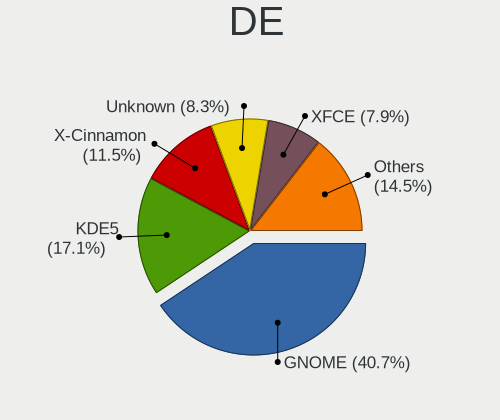
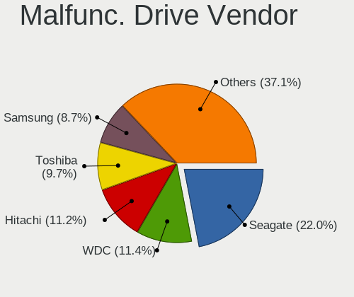
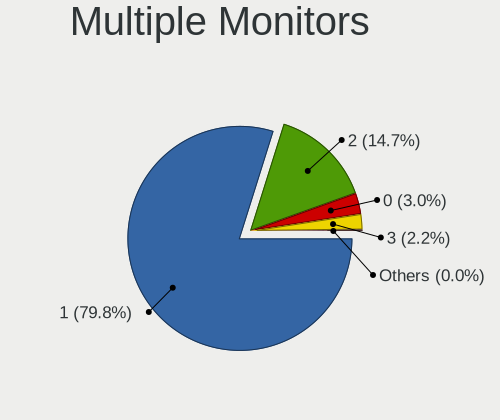

Linux in Germany - Tested Hardware & Statistics (Notebooks)
-----------------------------------------------------------

A project to collect tested hardware configurations for Linux in Germany.

Anyone can contribute to this report by the [hw-probe](https://github.com/linuxhw/hw-probe) tool:

    sudo -E hw-probe -all -upload

Please contribute! Especially if your hardware is rare.

Contents
--------

* [ Test Cases ](#test-cases)

* [ System ](#system)
  - [ OS                       ](#os)
  - [ OS Family                ](#os-family)
  - [ Kernel                   ](#kernel)
  - [ Kernel Family            ](#kernel-family)
  - [ Kernel Major Ver.        ](#kernel-major-ver)
  - [ Arch                     ](#arch)
  - [ DE                       ](#de)
  - [ Display Server           ](#display-server)
  - [ Display Manager          ](#display-manager)
  - [ OS Lang                  ](#os-lang)
  - [ Boot Mode                ](#boot-mode)
  - [ Filesystem               ](#filesystem)
  - [ Part. scheme             ](#part-scheme)
  - [ Dual Boot with Linux/BSD ](#dual-boot-with-linuxbsd)
  - [ Dual Boot (Win)          ](#dual-boot-win)

* [ Board ](#board)
  - [ Vendor                   ](#vendor)
  - [ Model                    ](#model)
  - [ Model Family             ](#model-family)
  - [ MFG Year                 ](#mfg-year)
  - [ Form Factor              ](#form-factor)
  - [ Secure Boot              ](#secure-boot)
  - [ Coreboot                 ](#coreboot)
  - [ RAM Size                 ](#ram-size)
  - [ RAM Used                 ](#ram-used)
  - [ Total Drives             ](#total-drives)
  - [ Has CD-ROM               ](#has-cd-rom)
  - [ Has Ethernet             ](#has-ethernet)
  - [ Has WiFi                 ](#has-wifi)
  - [ Has Bluetooth            ](#has-bluetooth)

* [ Location ](#location)
  - [ Country                  ](#country)
  - [ City                     ](#city)

* [ Drives ](#drives)
  - [ Drive Vendor             ](#drive-vendor)
  - [ Drive Model              ](#drive-model)
  - [ HDD Vendor               ](#hdd-vendor)
  - [ SSD Vendor               ](#ssd-vendor)
  - [ Drive Kind               ](#drive-kind)
  - [ Drive Connector          ](#drive-connector)
  - [ Drive Size               ](#drive-size)
  - [ Space Total              ](#space-total)
  - [ Space Used               ](#space-used)
  - [ Malfunc. Drives          ](#malfunc-drives)
  - [ Malfunc. Drive Vendor    ](#malfunc-drive-vendor)
  - [ Malfunc. HDD Vendor      ](#malfunc-hdd-vendor)
  - [ Malfunc. Drive Kind      ](#malfunc-drive-kind)
  - [ Failed Drives            ](#failed-drives)
  - [ Failed Drive Vendor      ](#failed-drive-vendor)
  - [ Drive Status             ](#drive-status)

* [ Storage controller ](#storage-controller)
  - [ Storage Vendor           ](#storage-vendor)
  - [ Storage Model            ](#storage-model)
  - [ Storage Kind             ](#storage-kind)

* [ Processor ](#processor)
  - [ CPU Vendor               ](#cpu-vendor)
  - [ CPU Model                ](#cpu-model)
  - [ CPU Model Family         ](#cpu-model-family)
  - [ CPU Cores                ](#cpu-cores)
  - [ CPU Sockets              ](#cpu-sockets)
  - [ CPU Threads              ](#cpu-threads)
  - [ CPU Op-Modes             ](#cpu-op-modes)
  - [ CPU Microcode            ](#cpu-microcode)
  - [ CPU Microarch            ](#cpu-microarch)

* [ Graphics ](#graphics)
  - [ GPU Vendor               ](#gpu-vendor)
  - [ GPU Model                ](#gpu-model)
  - [ GPU Combo                ](#gpu-combo)
  - [ GPU Driver               ](#gpu-driver)
  - [ GPU Memory               ](#gpu-memory)

* [ Monitor ](#monitor)
  - [ Monitor Vendor           ](#monitor-vendor)
  - [ Monitor Model            ](#monitor-model)
  - [ Monitor Resolution       ](#monitor-resolution)
  - [ Monitor Diagonal         ](#monitor-diagonal)
  - [ Monitor Width            ](#monitor-width)
  - [ Aspect Ratio             ](#aspect-ratio)
  - [ Monitor Area             ](#monitor-area)
  - [ Pixel Density            ](#pixel-density)
  - [ Multiple Monitors        ](#multiple-monitors)

* [ Network ](#network)
  - [ Net Controller Vendor    ](#net-controller-vendor)
  - [ Net Controller Model     ](#net-controller-model)
  - [ Wireless Vendor          ](#wireless-vendor)
  - [ Wireless Model           ](#wireless-model)
  - [ Ethernet Vendor          ](#ethernet-vendor)
  - [ Ethernet Model           ](#ethernet-model)
  - [ Net Controller Kind      ](#net-controller-kind)
  - [ Used Controller          ](#used-controller)
  - [ NICs                     ](#nics)
  - [ IPv6                     ](#ipv6)

* [ Bluetooth ](#bluetooth)
  - [ Bluetooth Vendor         ](#bluetooth-vendor)
  - [ Bluetooth Model          ](#bluetooth-model)

* [ Sound ](#sound)
  - [ Sound Vendor             ](#sound-vendor)
  - [ Sound Model              ](#sound-model)

* [ Memory ](#memory)
  - [ Memory Vendor            ](#memory-vendor)
  - [ Memory Model             ](#memory-model)
  - [ Memory Kind              ](#memory-kind)
  - [ Memory Form Factor       ](#memory-form-factor)
  - [ Memory Size              ](#memory-size)
  - [ Memory Speed             ](#memory-speed)

* [ Printers & scanners ](#printers--scanners)
  - [ Printer Vendor           ](#printer-vendor)
  - [ Printer Model            ](#printer-model)
  - [ Scanner Vendor           ](#scanner-vendor)
  - [ Scanner Model            ](#scanner-model)

* [ Camera ](#camera)
  - [ Camera Vendor            ](#camera-vendor)
  - [ Camera Model             ](#camera-model)

* [ Security ](#security)
  - [ Fingerprint Vendor       ](#fingerprint-vendor)
  - [ Fingerprint Model        ](#fingerprint-model)
  - [ Chipcard Vendor          ](#chipcard-vendor)
  - [ Chipcard Model           ](#chipcard-model)

* [ Unsupported ](#unsupported)
  - [ Unsupported Devices      ](#unsupported-devices)
  - [ Unsupported Device Types ](#unsupported-device-types)

Test Cases
----------

Total: 17330

| Vendor        | Model                       | Probe                                                      | Date         |
|---------------|-----------------------------|------------------------------------------------------------|--------------|
| Acer          | Aspire 5750G                | [a12f3e5ce6](https://linux-hardware.org/?probe=a12f3e5ce6) | Dec 24, 2023 |
| Acer          | Aspire 5750G                | [1a31482d70](https://linux-hardware.org/?probe=1a31482d70) | Dec 24, 2023 |
| Notebook      | NL5xNU                      | [1cb09f63f9](https://linux-hardware.org/?probe=1cb09f63f9) | Dec 24, 2023 |
| Lenovo        | ThinkPad X1 Carbon Gen 1... | [1297c97e04](https://linux-hardware.org/?probe=1297c97e04) | Dec 24, 2023 |
| HP            | Presario CQ61               | [249a217a7c](https://linux-hardware.org/?probe=249a217a7c) | Dec 24, 2023 |
| Teclast       | F6 Plus                     | [a8fee53f37](https://linux-hardware.org/?probe=a8fee53f37) | Dec 24, 2023 |
| Acer          | Aspire 7750G                | [0b0beeca3a](https://linux-hardware.org/?probe=0b0beeca3a) | Dec 23, 2023 |
| System76      | Gazelle                     | [2b9bce59e7](https://linux-hardware.org/?probe=2b9bce59e7) | Dec 23, 2023 |
| TUXEDO        | N24_25JU                    | [8a1a153723](https://linux-hardware.org/?probe=8a1a153723) | Dec 23, 2023 |
| Lenovo        | IdeaPad Y500 9541           | [a85ec375f5](https://linux-hardware.org/?probe=a85ec375f5) | Dec 23, 2023 |
| HP            | EliteBook 8570w             | [4b6025ed6e](https://linux-hardware.org/?probe=4b6025ed6e) | Dec 23, 2023 |
| Lenovo        | ThinkPad T480 20L5000BGE    | [8753b04999](https://linux-hardware.org/?probe=8753b04999) | Dec 23, 2023 |
| Lenovo        | ThinkBook 15 G4 ABA 21DL    | [5aae7c7b5c](https://linux-hardware.org/?probe=5aae7c7b5c) | Dec 23, 2023 |
| Lenovo        | ThinkBook 16 G6 IRL 21KH    | [c197684b37](https://linux-hardware.org/?probe=c197684b37) | Dec 23, 2023 |
| HP            | EliteBook 845 G8 Noteboo... | [d3dabca767](https://linux-hardware.org/?probe=d3dabca767) | Dec 23, 2023 |
| Toshiba       | Satellite Pro R50-C         | [b4d280ac6a](https://linux-hardware.org/?probe=b4d280ac6a) | Dec 23, 2023 |
| HP            | EliteBook 845 G8 Noteboo... | [26673c372e](https://linux-hardware.org/?probe=26673c372e) | Dec 23, 2023 |
| Toshiba       | Satellite Pro R50-C         | [421d62894b](https://linux-hardware.org/?probe=421d62894b) | Dec 23, 2023 |
| HP            | Laptop 17-bs1xx             | [984a979a7b](https://linux-hardware.org/?probe=984a979a7b) | Dec 23, 2023 |
| Apple         | MacBookPro7,1               | [0f291ca562](https://linux-hardware.org/?probe=0f291ca562) | Dec 23, 2023 |
| Dell          | Latitude E6540              | [9e3371b6b2](https://linux-hardware.org/?probe=9e3371b6b2) | Dec 23, 2023 |
| ASUSTek       | ASUS TUF Gaming A15 FA50... | [87b9f04878](https://linux-hardware.org/?probe=87b9f04878) | Dec 23, 2023 |
| Lenovo        | ThinkPad T480 20L6S69B00    | [16b6aaa173](https://linux-hardware.org/?probe=16b6aaa173) | Dec 23, 2023 |
| HP            | EliteBook 840 G5            | [5b7a85e9fc](https://linux-hardware.org/?probe=5b7a85e9fc) | Dec 23, 2023 |
| Lenovo        | ThinkBook 16 G6 ABP 21KK    | [569ce717aa](https://linux-hardware.org/?probe=569ce717aa) | Dec 23, 2023 |
| Lenovo        | Legion 7 16ARHA7 82UH       | [8dad235090](https://linux-hardware.org/?probe=8dad235090) | Dec 23, 2023 |
| Lenovo        | Legion 5 15IAH7H 82RB       | [2ca58f3eb8](https://linux-hardware.org/?probe=2ca58f3eb8) | Dec 23, 2023 |
| ASUSTek       | ASUS TUF Gaming A17 FA70... | [8a36394313](https://linux-hardware.org/?probe=8a36394313) | Dec 23, 2023 |
| ASUSTek       | ASUS TUF Gaming A17 FA70... | [eb035a95fa](https://linux-hardware.org/?probe=eb035a95fa) | Dec 22, 2023 |
| Lenovo        | ThinkPad P14s Gen 4 21K6... | [d53640436b](https://linux-hardware.org/?probe=d53640436b) | Dec 22, 2023 |
| HP            | Pavilion Notebook           | [42c72b303d](https://linux-hardware.org/?probe=42c72b303d) | Dec 22, 2023 |
| Dell          | Precision M4800             | [ce7a9239f4](https://linux-hardware.org/?probe=ce7a9239f4) | Dec 22, 2023 |
| HP            | Pavilion Notebook           | [7afecc25eb](https://linux-hardware.org/?probe=7afecc25eb) | Dec 22, 2023 |
| Medion        | X682X                       | [c0deb0e748](https://linux-hardware.org/?probe=c0deb0e748) | Dec 22, 2023 |
| Apple         | MacBookPro13,1              | [89ef1fa23c](https://linux-hardware.org/?probe=89ef1fa23c) | Dec 22, 2023 |
| ASUSTek       | X555LD                      | [c81a75e686](https://linux-hardware.org/?probe=c81a75e686) | Dec 22, 2023 |
| ASUSTek       | VivoBook_ASUSLaptop X530... | [3f903fafe6](https://linux-hardware.org/?probe=3f903fafe6) | Dec 22, 2023 |
| ASUSTek       | K50AF                       | [367c28d17a](https://linux-hardware.org/?probe=367c28d17a) | Dec 22, 2023 |
| Samsung       | 300E4C/300E5C/300E7C        | [a11f0a948c](https://linux-hardware.org/?probe=a11f0a948c) | Dec 22, 2023 |
| Lenovo        | ThinkPad T440p 20AWS0280... | [239bc0b85a](https://linux-hardware.org/?probe=239bc0b85a) | Dec 22, 2023 |
| HUAWEI        | KLVL-WXXW                   | [75c61bce6d](https://linux-hardware.org/?probe=75c61bce6d) | Dec 22, 2023 |
| Acer          | Aspire E5-576               | [e40f16f86b](https://linux-hardware.org/?probe=e40f16f86b) | Dec 22, 2023 |
| ASUSTek       | X555LD                      | [30e988edc9](https://linux-hardware.org/?probe=30e988edc9) | Dec 22, 2023 |
| Medion        | S17403                      | [167acdd156](https://linux-hardware.org/?probe=167acdd156) | Dec 22, 2023 |
| Toshiba       | Satellite Pro L850-1L2      | [c3bfd150bc](https://linux-hardware.org/?probe=c3bfd150bc) | Dec 22, 2023 |
| Lenovo        | Flex 2-15D 20377            | [a22602448b](https://linux-hardware.org/?probe=a22602448b) | Dec 22, 2023 |
| Acer          | Aspire A515-44              | [874744ee1f](https://linux-hardware.org/?probe=874744ee1f) | Dec 22, 2023 |
| Dell          | Precision 5480              | [382626cfb5](https://linux-hardware.org/?probe=382626cfb5) | Dec 21, 2023 |
| Alienware     | 14                          | [ee2678a24f](https://linux-hardware.org/?probe=ee2678a24f) | Dec 21, 2023 |
| HP            | ProBook 445 14 inch G10 ... | [0e95b32d0b](https://linux-hardware.org/?probe=0e95b32d0b) | Dec 21, 2023 |
| Fujitsu       | LIFEBOOK U749               | [75a3ef28b0](https://linux-hardware.org/?probe=75a3ef28b0) | Dec 21, 2023 |
| HUAWEI        | BOD-WXX9                    | [f95bb7d27c](https://linux-hardware.org/?probe=f95bb7d27c) | Dec 21, 2023 |
| Lenovo        | ThinkPad X1 Nano Gen 1 2... | [d178358ee1](https://linux-hardware.org/?probe=d178358ee1) | Dec 21, 2023 |
| TUXEDO        | InfinityBook Pro Gen7 (M... | [030e411799](https://linux-hardware.org/?probe=030e411799) | Dec 21, 2023 |
| HUAWEI        | MRGFG-XX                    | [747de8fa3c](https://linux-hardware.org/?probe=747de8fa3c) | Dec 21, 2023 |
| Inter Sale... | NID-11125DE                 | [d65538541d](https://linux-hardware.org/?probe=d65538541d) | Dec 21, 2023 |
| ASUSTek       | X550LD                      | [bc65f1d620](https://linux-hardware.org/?probe=bc65f1d620) | Dec 21, 2023 |
| Lenovo        | ThinkPad L580 20LW0010GE    | [4bd3fc58a8](https://linux-hardware.org/?probe=4bd3fc58a8) | Dec 21, 2023 |
| Apple         | MacBookPro14,1              | [e221a6befb](https://linux-hardware.org/?probe=e221a6befb) | Dec 21, 2023 |
| In-S          | C116A                       | [ba252bb452](https://linux-hardware.org/?probe=ba252bb452) | Dec 20, 2023 |
| Fujitsu       | LIFEBOOK AH530              | [fb91eaef3b](https://linux-hardware.org/?probe=fb91eaef3b) | Dec 20, 2023 |
| Lenovo        | ThinkPad T480 20L6S01W00    | [c38a7a8ad4](https://linux-hardware.org/?probe=c38a7a8ad4) | Dec 20, 2023 |
| Lenovo        | ThinkPad W520 42844DG       | [52cd813233](https://linux-hardware.org/?probe=52cd813233) | Dec 20, 2023 |
| Wortmann      | TERRA_MOBILE_1529H          | [49f1bedb5a](https://linux-hardware.org/?probe=49f1bedb5a) | Dec 20, 2023 |
| Dell          | XPS 15 7590                 | [74136911a0](https://linux-hardware.org/?probe=74136911a0) | Dec 20, 2023 |
| Dell          | Latitude 7480               | [f080cc67aa](https://linux-hardware.org/?probe=f080cc67aa) | Dec 20, 2023 |
| Lenovo        | IdeaPad 1 15ALC7 82R4       | [2dcde776ad](https://linux-hardware.org/?probe=2dcde776ad) | Dec 20, 2023 |
| Lenovo        | IdeaPad 320-17IKB 80XM      | [393c13e870](https://linux-hardware.org/?probe=393c13e870) | Dec 20, 2023 |
| Lenovo        | IdeaPad 320-17IKB 80XM      | [09af8afa56](https://linux-hardware.org/?probe=09af8afa56) | Dec 20, 2023 |
| Dell          | Latitude 7490               | [058142d276](https://linux-hardware.org/?probe=058142d276) | Dec 20, 2023 |
| HP            | EliteBook 8560p             | [b9e00df8b5](https://linux-hardware.org/?probe=b9e00df8b5) | Dec 20, 2023 |
| HP            | EliteBook 8560p             | [334bc9d94f](https://linux-hardware.org/?probe=334bc9d94f) | Dec 20, 2023 |
| ASUSTek       | VivoBook_ASUSLaptop E510... | [2e42798435](https://linux-hardware.org/?probe=2e42798435) | Dec 20, 2023 |
| Micro Comp... | Venus series                | [e01ac2dc02](https://linux-hardware.org/?probe=e01ac2dc02) | Dec 20, 2023 |
| Inter Sale... | NID-11125DE                 | [17af2fca66](https://linux-hardware.org/?probe=17af2fca66) | Dec 20, 2023 |
| ASUSTek       | ASUS TUF Gaming A15 FA50... | [b14bdf4602](https://linux-hardware.org/?probe=b14bdf4602) | Dec 20, 2023 |
| Valve         | Jupiter                     | [1265867fcf](https://linux-hardware.org/?probe=1265867fcf) | Dec 19, 2023 |
| HUAWEI        | MRGFG-XX                    | [6a10eb945c](https://linux-hardware.org/?probe=6a10eb945c) | Dec 19, 2023 |
| Lenovo        | ThinkPad X1 Carbon 4th 2... | [da74c3a382](https://linux-hardware.org/?probe=da74c3a382) | Dec 19, 2023 |
| TUXEDO        | Aura 14 Gen3                | [bdc38bf0fd](https://linux-hardware.org/?probe=bdc38bf0fd) | Dec 19, 2023 |
| Lenovo        | IdeaPad 330-15ARR 81D2      | [2b7ff14fc2](https://linux-hardware.org/?probe=2b7ff14fc2) | Dec 19, 2023 |
| Wortmann      | TERRA_MOBILE_1542           | [f09218ee8f](https://linux-hardware.org/?probe=f09218ee8f) | Dec 19, 2023 |
| HP            | ElitePad 1000 G2            | [533ccb0c41](https://linux-hardware.org/?probe=533ccb0c41) | Dec 19, 2023 |
| Lenovo        | IdeaPadFlex 15 20309        | [81dbec4f1a](https://linux-hardware.org/?probe=81dbec4f1a) | Dec 19, 2023 |
| TUXEDO        | Pulse 14 Gen1               | [031f8b45bd](https://linux-hardware.org/?probe=031f8b45bd) | Dec 19, 2023 |
| Sony          | SVE1511A1EW                 | [2f0fde3487](https://linux-hardware.org/?probe=2f0fde3487) | Dec 19, 2023 |
| HP            | 655                         | [c0bd13830f](https://linux-hardware.org/?probe=c0bd13830f) | Dec 19, 2023 |
| Sony          | SVE1511A1EW                 | [e5531ecc00](https://linux-hardware.org/?probe=e5531ecc00) | Dec 19, 2023 |
| Acer          | Swift SF315-52G             | [26f06e876d](https://linux-hardware.org/?probe=26f06e876d) | Dec 18, 2023 |
| Dell          | XPS 15 7590                 | [229df442f5](https://linux-hardware.org/?probe=229df442f5) | Dec 18, 2023 |
| Acer          | Aspire E1-731               | [e5312bdd49](https://linux-hardware.org/?probe=e5312bdd49) | Dec 18, 2023 |
| HP            | ProBook 430 G4              | [c2b96a9e0f](https://linux-hardware.org/?probe=c2b96a9e0f) | Dec 18, 2023 |
| Medion        | E6246 MD63200               | [eda979df79](https://linux-hardware.org/?probe=eda979df79) | Dec 18, 2023 |
| HUAWEI        | NBLB-WAX9N                  | [1f03d33b22](https://linux-hardware.org/?probe=1f03d33b22) | Dec 18, 2023 |
| Packard Be... | EasyNote TE69BM             | [6a4bc96f4b](https://linux-hardware.org/?probe=6a4bc96f4b) | Dec 18, 2023 |
| ASUSTek       | Zenbook UM5302LA_UM5302L... | [29ee1d8ad5](https://linux-hardware.org/?probe=29ee1d8ad5) | Dec 18, 2023 |
| Lenovo        | IdeaPad 1 11ADA05 82GV      | [980280224f](https://linux-hardware.org/?probe=980280224f) | Dec 18, 2023 |
| Lenovo        | IdeaPad 1 11ADA05 82GV      | [41f03f0699](https://linux-hardware.org/?probe=41f03f0699) | Dec 18, 2023 |
| Wortmann      | TERRA_MOBILE_1542           | [054ed4fad9](https://linux-hardware.org/?probe=054ed4fad9) | Dec 18, 2023 |
| Panasonic     | FZ-M1CCA17E3                | [87024c17b5](https://linux-hardware.org/?probe=87024c17b5) | Dec 17, 2023 |
| Panasonic     | FZ-M1CCA17E3                | [8f2a76eb09](https://linux-hardware.org/?probe=8f2a76eb09) | Dec 17, 2023 |
| Medion        | BEAST X30                   | [cec06735ba](https://linux-hardware.org/?probe=cec06735ba) | Dec 17, 2023 |
| Acer          | Swift SF315-41              | [300b426183](https://linux-hardware.org/?probe=300b426183) | Dec 17, 2023 |
| Acer          | Aspire 4820TG               | [a9bc29a915](https://linux-hardware.org/?probe=a9bc29a915) | Dec 17, 2023 |
| HP            | ENVY Laptop 17-ch0xxx       | [43602a664e](https://linux-hardware.org/?probe=43602a664e) | Dec 17, 2023 |
| Lenovo        | ThinkPad W550s 20E2CTO1W... | [17b157ef44](https://linux-hardware.org/?probe=17b157ef44) | Dec 17, 2023 |
| ASUSTek       | ZenBook UX425QA_UM425QA     | [73693b1a91](https://linux-hardware.org/?probe=73693b1a91) | Dec 17, 2023 |
| HUAWEI        | NBLB-WAX9N                  | [16ebb489d4](https://linux-hardware.org/?probe=16ebb489d4) | Dec 17, 2023 |
| HP            | ProBook 4535s               | [80aa5bd12b](https://linux-hardware.org/?probe=80aa5bd12b) | Dec 17, 2023 |
| Medion        | E6214                       | [1bc5839854](https://linux-hardware.org/?probe=1bc5839854) | Dec 17, 2023 |
| Medion        | E6214                       | [5269b6e576](https://linux-hardware.org/?probe=5269b6e576) | Dec 17, 2023 |
| Lenovo        | IdeaPad 320-15IKB 80XL      | [02fb9a3f3b](https://linux-hardware.org/?probe=02fb9a3f3b) | Dec 17, 2023 |
| Acer          | Aspire V3-772               | [d3e1291358](https://linux-hardware.org/?probe=d3e1291358) | Dec 17, 2023 |
| HP            | ZBook Fury 16 G9 Mobile ... | [ce0e0e1bc1](https://linux-hardware.org/?probe=ce0e0e1bc1) | Dec 17, 2023 |
| Lenovo        | ThinkPad W530 24491D1       | [bab70d44b1](https://linux-hardware.org/?probe=bab70d44b1) | Dec 17, 2023 |
| HP            | ProBook 430 G4              | [253da93459](https://linux-hardware.org/?probe=253da93459) | Dec 17, 2023 |
| Fujitsu       | LIFEBOOK U749               | [4ede8e182e](https://linux-hardware.org/?probe=4ede8e182e) | Dec 17, 2023 |
| ASUSTek       | X550LD                      | [f46b47b272](https://linux-hardware.org/?probe=f46b47b272) | Dec 16, 2023 |
| Lenovo        | ThinkPad X230 2325BA3       | [1c573f00c0](https://linux-hardware.org/?probe=1c573f00c0) | Dec 16, 2023 |
| Lenovo        | V110-15IAP 80TG             | [8bb410ae42](https://linux-hardware.org/?probe=8bb410ae42) | Dec 16, 2023 |
| Acer          | Aspire V5-573G              | [723eb61284](https://linux-hardware.org/?probe=723eb61284) | Dec 16, 2023 |
| HP            | ProBook 455 15.6 inch G1... | [56e1b0ed26](https://linux-hardware.org/?probe=56e1b0ed26) | Dec 16, 2023 |
| Lenovo        | ThinkPad T14 Gen 4 21K3C... | [66a8c2ad4c](https://linux-hardware.org/?probe=66a8c2ad4c) | Dec 16, 2023 |
| Medion        | E6214                       | [806be57bd5](https://linux-hardware.org/?probe=806be57bd5) | Dec 16, 2023 |
| HP            | ProBook 430 G4              | [30f8fe050c](https://linux-hardware.org/?probe=30f8fe050c) | Dec 16, 2023 |
| AWOW          | Unknown                     | [7061726896](https://linux-hardware.org/?probe=7061726896) | Dec 16, 2023 |
| Acer          | Aspire 6920                 | [716c31a854](https://linux-hardware.org/?probe=716c31a854) | Dec 16, 2023 |
| Sony          | VGN-FW51MF_H                | [5cb2ea3418](https://linux-hardware.org/?probe=5cb2ea3418) | Dec 16, 2023 |
| Dell          | XPS 13 9360                 | [0aa5382212](https://linux-hardware.org/?probe=0aa5382212) | Dec 16, 2023 |
| ASUSTek       | X555LD                      | [109311067f](https://linux-hardware.org/?probe=109311067f) | Dec 16, 2023 |
| Dell          | Inspiron 7520               | [5614a9077e](https://linux-hardware.org/?probe=5614a9077e) | Dec 16, 2023 |
| Lenovo        | V17 G3 IAP 82U1             | [2598a81fd9](https://linux-hardware.org/?probe=2598a81fd9) | Dec 16, 2023 |
| Apple         | MacBookPro10,2              | [01713ad0b4](https://linux-hardware.org/?probe=01713ad0b4) | Dec 16, 2023 |
| ASUSTek       | K50AF                       | [2d4a3c6859](https://linux-hardware.org/?probe=2d4a3c6859) | Dec 16, 2023 |
| Acer          | Aspire 7750G                | [32af19e996](https://linux-hardware.org/?probe=32af19e996) | Dec 16, 2023 |
| Medion        | E6417 MD99252               | [26e9c2ba0c](https://linux-hardware.org/?probe=26e9c2ba0c) | Dec 15, 2023 |
| Lenovo        | IdeaPad 320-17IKB 81BJ      | [2d3b97c04a](https://linux-hardware.org/?probe=2d3b97c04a) | Dec 15, 2023 |
| Lenovo        | ThinkPad P1 20MDS02BGE      | [65eb962233](https://linux-hardware.org/?probe=65eb962233) | Dec 15, 2023 |
| ASUSTek       | X705UAR                     | [0ab56df890](https://linux-hardware.org/?probe=0ab56df890) | Dec 15, 2023 |
| ASUSTek       | X705UAR                     | [9f0e2069b1](https://linux-hardware.org/?probe=9f0e2069b1) | Dec 15, 2023 |
| HP            | Pavilion g6                 | [7863fae702](https://linux-hardware.org/?probe=7863fae702) | Dec 15, 2023 |
| Toshiba       | Satellite C70D-A            | [88b5dab876](https://linux-hardware.org/?probe=88b5dab876) | Dec 15, 2023 |
| Lenovo        | Legion Y530-15ICH 81FV      | [618978da16](https://linux-hardware.org/?probe=618978da16) | Dec 15, 2023 |
| TUXEDO        | Pulse 15 Gen2               | [93fea0297b](https://linux-hardware.org/?probe=93fea0297b) | Dec 15, 2023 |
| Valve         | Galileo                     | [cd8b629d23](https://linux-hardware.org/?probe=cd8b629d23) | Dec 15, 2023 |
| HP            | Laptop 17-bs1xx             | [ef29718fd5](https://linux-hardware.org/?probe=ef29718fd5) | Dec 15, 2023 |
| Razer         | Blade 17 (2022) - RZ09-0... | [88ffce598c](https://linux-hardware.org/?probe=88ffce598c) | Dec 15, 2023 |
| Medion        | Akoya E7226                 | [a8677e8420](https://linux-hardware.org/?probe=a8677e8420) | Dec 15, 2023 |
| Medion        | Akoya E7226                 | [059918d809](https://linux-hardware.org/?probe=059918d809) | Dec 15, 2023 |
| Acer          | Aspire 5741G                | [2c456f017e](https://linux-hardware.org/?probe=2c456f017e) | Dec 15, 2023 |
| Acer          | Aspire 5741G                | [6aed980ba9](https://linux-hardware.org/?probe=6aed980ba9) | Dec 15, 2023 |
| Lenovo        | ThinkPad L15 Gen 1 20U30... | [9fa07d2004](https://linux-hardware.org/?probe=9fa07d2004) | Dec 14, 2023 |
| Dell          | Precision M6800             | [c3ff8fa4c5](https://linux-hardware.org/?probe=c3ff8fa4c5) | Dec 14, 2023 |
| Dell          | Inspiron 3793               | [90804693a6](https://linux-hardware.org/?probe=90804693a6) | Dec 14, 2023 |
| ASUSTek       | Zenbook 15 UM3504DA_UM35... | [cf35bfbdf4](https://linux-hardware.org/?probe=cf35bfbdf4) | Dec 14, 2023 |
| Lenovo        | ThinkPad SL510 28477MG      | [7a1dc9b889](https://linux-hardware.org/?probe=7a1dc9b889) | Dec 14, 2023 |
| Dell          | XPS 15 7590                 | [69e37f3d93](https://linux-hardware.org/?probe=69e37f3d93) | Dec 14, 2023 |
| ASUSTek       | ROG Strix G713QE_G713QE     | [de24d459c5](https://linux-hardware.org/?probe=de24d459c5) | Dec 14, 2023 |
| Lenovo        | Yoga Slim 7 Pro 14ACH5 O... | [0b08ee22d8](https://linux-hardware.org/?probe=0b08ee22d8) | Dec 14, 2023 |
| Lenovo        | ThinkPad T440s 20ARS0HC0... | [3aa9eb82fb](https://linux-hardware.org/?probe=3aa9eb82fb) | Dec 14, 2023 |
| ASUSTek       | X555LD                      | [9609ed5138](https://linux-hardware.org/?probe=9609ed5138) | Dec 14, 2023 |
| Fujitsu       | LIFEBOOK A357               | [b537ee14db](https://linux-hardware.org/?probe=b537ee14db) | Dec 14, 2023 |
| HP            | 255 15.6 inch G9 Noteboo... | [0d0165957f](https://linux-hardware.org/?probe=0d0165957f) | Dec 14, 2023 |
| Acer          | TMP645-M                    | [bd22eef09b](https://linux-hardware.org/?probe=bd22eef09b) | Dec 13, 2023 |
| Apple         | MacBookAir6,2               | [9c3e8b880d](https://linux-hardware.org/?probe=9c3e8b880d) | Dec 13, 2023 |
| ASUSTek       | X55C                        | [13f3dbcb5f](https://linux-hardware.org/?probe=13f3dbcb5f) | Dec 13, 2023 |
| Fujitsu       | LIFEBOOK S762               | [9d192a95d8](https://linux-hardware.org/?probe=9d192a95d8) | Dec 13, 2023 |
| Fujitsu       | LIFEBOOK S762               | [19e6b5a871](https://linux-hardware.org/?probe=19e6b5a871) | Dec 13, 2023 |
| ASUSTek       | K50AF                       | [00e0b6dc86](https://linux-hardware.org/?probe=00e0b6dc86) | Dec 13, 2023 |
| LG Electro... | 16Z90R-G.AA76G              | [1e83ee89e2](https://linux-hardware.org/?probe=1e83ee89e2) | Dec 13, 2023 |
| Lenovo        | ThinkPad X1 Carbon Gen 8... | [4a5e5bbe29](https://linux-hardware.org/?probe=4a5e5bbe29) | Dec 13, 2023 |
| ASUSTek       | ASUS TUF Gaming F17 FX70... | [f9933769ef](https://linux-hardware.org/?probe=f9933769ef) | Dec 13, 2023 |
| Apple         | MacBookAir6,2               | [963ff854d9](https://linux-hardware.org/?probe=963ff854d9) | Dec 13, 2023 |
| Fujitsu       | LIFEBOOK S792               | [811be0cce0](https://linux-hardware.org/?probe=811be0cce0) | Dec 13, 2023 |
| ASUSTek       | X556UQK                     | [1ac3287ee1](https://linux-hardware.org/?probe=1ac3287ee1) | Dec 13, 2023 |
| HP            | Laptop 15s-eq2xxx           | [8151ecbeef](https://linux-hardware.org/?probe=8151ecbeef) | Dec 12, 2023 |
| Lenovo        | ThinkPad P1 20MD0001GE      | [e4c9202751](https://linux-hardware.org/?probe=e4c9202751) | Dec 12, 2023 |
| Lenovo        | ThinkPad P1 20MD0001GE      | [5662ef46db](https://linux-hardware.org/?probe=5662ef46db) | Dec 12, 2023 |
| ASUSTek       | ASUS TUF Gaming F17 FX70... | [27b99be924](https://linux-hardware.org/?probe=27b99be924) | Dec 12, 2023 |
| Dell          | XPS 15 7590                 | [97ca767d40](https://linux-hardware.org/?probe=97ca767d40) | Dec 12, 2023 |
| Fujitsu       | LIFEBOOK T902               | [da78a4dd31](https://linux-hardware.org/?probe=da78a4dd31) | Dec 12, 2023 |
| Sony          | SVE1713A1EW                 | [64b473222e](https://linux-hardware.org/?probe=64b473222e) | Dec 12, 2023 |
| Lenovo        | ThinkPad X250 20CM001PGE    | [920f198d61](https://linux-hardware.org/?probe=920f198d61) | Dec 12, 2023 |
| Acer          | Extensa 215-55              | [40eaa33887](https://linux-hardware.org/?probe=40eaa33887) | Dec 12, 2023 |
| Fujitsu       | LIFEBOOK T902               | [dff662b36c](https://linux-hardware.org/?probe=dff662b36c) | Dec 12, 2023 |
| Inter Sale... | NID-11125DE                 | [373498e89a](https://linux-hardware.org/?probe=373498e89a) | Dec 12, 2023 |
| HP            | ProBook 650 G2              | [9936eed724](https://linux-hardware.org/?probe=9936eed724) | Dec 12, 2023 |
| Fujitsu       | LIFEBOOK E548               | [235ca8a477](https://linux-hardware.org/?probe=235ca8a477) | Dec 12, 2023 |
| Lenovo        | ThinkPad T480s 20L8S5LK0... | [e8ebbc8111](https://linux-hardware.org/?probe=e8ebbc8111) | Dec 12, 2023 |
| TUXEDO        | InfinityBook Pro Gen7 (M... | [627ee4cb32](https://linux-hardware.org/?probe=627ee4cb32) | Dec 11, 2023 |
| Lenovo        | IdeaPad S145-15AST 81N3     | [c832a59f37](https://linux-hardware.org/?probe=c832a59f37) | Dec 11, 2023 |
| Acer          | Aspire A515-52G             | [c6ac91a53c](https://linux-hardware.org/?probe=c6ac91a53c) | Dec 11, 2023 |
| ASUSTek       | ZenBook UX482EG_UX482EG     | [a644fcc63e](https://linux-hardware.org/?probe=a644fcc63e) | Dec 11, 2023 |
| Lenovo        | ThinkPad X201 3626GWG       | [023f7dd390](https://linux-hardware.org/?probe=023f7dd390) | Dec 11, 2023 |
| Acer          | Aspire 7520                 | [70405c9fa1](https://linux-hardware.org/?probe=70405c9fa1) | Dec 10, 2023 |
| Framework     | Laptop 13 (AMD Ryzen 704... | [ee7a9f7ba7](https://linux-hardware.org/?probe=ee7a9f7ba7) | Dec 10, 2023 |
| ASUSTek       | VivoBook_ASUSLaptop X571... | [4c6cd4453d](https://linux-hardware.org/?probe=4c6cd4453d) | Dec 10, 2023 |
| Dell          | Latitude E6410              | [0b8db8ccee](https://linux-hardware.org/?probe=0b8db8ccee) | Dec 10, 2023 |
| Sony          | VGN-AR51M                   | [d1c67ac651](https://linux-hardware.org/?probe=d1c67ac651) | Dec 10, 2023 |
| Lenovo        | ThinkPad T530 2429W1E       | [02a4811e8d](https://linux-hardware.org/?probe=02a4811e8d) | Dec 10, 2023 |
| HP            | Laptop 14-bs0xx             | [f096c75cf9](https://linux-hardware.org/?probe=f096c75cf9) | Dec 10, 2023 |
| HP            | Laptop 17-cn3xxx            | [7a93c4b54c](https://linux-hardware.org/?probe=7a93c4b54c) | Dec 10, 2023 |
| Acer          | Nitro AN517-41              | [6e5abc0ea5](https://linux-hardware.org/?probe=6e5abc0ea5) | Dec 10, 2023 |
| Lenovo        | Legion 7 16ARHA7 82UH       | [2ba6a00229](https://linux-hardware.org/?probe=2ba6a00229) | Dec 10, 2023 |
| Lenovo        | ThinkPad T440p 20ANCTO1W... | [070ba5c3c1](https://linux-hardware.org/?probe=070ba5c3c1) | Dec 10, 2023 |
| HP            | EliteBook 8460p             | [1e96233f59](https://linux-hardware.org/?probe=1e96233f59) | Dec 10, 2023 |
| Dell          | Latitude E6400              | [c23aa9b02a](https://linux-hardware.org/?probe=c23aa9b02a) | Dec 10, 2023 |
| HP            | EliteBook 845 G7 Noteboo... | [3cfc2b72b4](https://linux-hardware.org/?probe=3cfc2b72b4) | Dec 10, 2023 |
| Lenovo        | Legion 7 16ARHA7 82UH       | [d906394ed7](https://linux-hardware.org/?probe=d906394ed7) | Dec 10, 2023 |
| Dell          | Inspiron 7559               | [3f4af9bbdd](https://linux-hardware.org/?probe=3f4af9bbdd) | Dec 10, 2023 |
| Lenovo        | ThinkPad T480 20L6S4G700    | [a1ebdec411](https://linux-hardware.org/?probe=a1ebdec411) | Dec 10, 2023 |
| Samsung       | 950XCJ/951XCJ/950XCR        | [2bc305a065](https://linux-hardware.org/?probe=2bc305a065) | Dec 09, 2023 |
| MSI           | Katana GF66 11UE            | [451c5731ae](https://linux-hardware.org/?probe=451c5731ae) | Dec 09, 2023 |
| Lenovo        | IdeaPad 5 15ARE05 81YQ      | [296e90c442](https://linux-hardware.org/?probe=296e90c442) | Dec 09, 2023 |
| Lenovo        | IdeaPad 5 15ARE05 81YQ      | [cea0431bcb](https://linux-hardware.org/?probe=cea0431bcb) | Dec 09, 2023 |
| HUAWEI        | NBLB-WAX9N                  | [be35efa2be](https://linux-hardware.org/?probe=be35efa2be) | Dec 09, 2023 |
| Razer         | Blade                       | [bf9ad5f7df](https://linux-hardware.org/?probe=bf9ad5f7df) | Dec 09, 2023 |
| Lenovo        | ThinkPad L15 Gen 1 20U8S... | [140789380e](https://linux-hardware.org/?probe=140789380e) | Dec 09, 2023 |
| Gigabyte      | G5 GE                       | [e63d83327b](https://linux-hardware.org/?probe=e63d83327b) | Dec 09, 2023 |
| Medion        | P8614                       | [a7689ec115](https://linux-hardware.org/?probe=a7689ec115) | Dec 09, 2023 |
| Samsung       | 90X3A                       | [45697431c1](https://linux-hardware.org/?probe=45697431c1) | Dec 09, 2023 |
| HP            | Pavilion 15                 | [8041cb2da6](https://linux-hardware.org/?probe=8041cb2da6) | Dec 09, 2023 |
| Fujitsu Si... | LIFEBOOK T5010              | [7a66cc4016](https://linux-hardware.org/?probe=7a66cc4016) | Dec 09, 2023 |
| MSI           | Katana 17 B13VGK            | [e91a23fa88](https://linux-hardware.org/?probe=e91a23fa88) | Dec 08, 2023 |
| TUXEDO        | U931                        | [a73533a163](https://linux-hardware.org/?probe=a73533a163) | Dec 08, 2023 |
| Acer          | Aspire A517-53G             | [11208976d5](https://linux-hardware.org/?probe=11208976d5) | Dec 08, 2023 |
| Sony          | SVE1713Q1EB                 | [482c83143b](https://linux-hardware.org/?probe=482c83143b) | Dec 08, 2023 |
| Apple         | MacBookAir7,2               | [e3b462d63d](https://linux-hardware.org/?probe=e3b462d63d) | Dec 08, 2023 |
| Dell          | Inspiron MM061              | [213b775f8b](https://linux-hardware.org/?probe=213b775f8b) | Dec 08, 2023 |
| Dell          | Inspiron MM061              | [d4c43fe4f4](https://linux-hardware.org/?probe=d4c43fe4f4) | Dec 08, 2023 |
| HP            | Compaq 6730b (NB034ET#UU... | [88c39cda86](https://linux-hardware.org/?probe=88c39cda86) | Dec 08, 2023 |
| HP            | ZBook 15v G5                | [96133249d0](https://linux-hardware.org/?probe=96133249d0) | Dec 08, 2023 |
| Apple         | MacBook4,1                  | [dfd1f871b8](https://linux-hardware.org/?probe=dfd1f871b8) | Dec 08, 2023 |
| HP            | 250 G8 Notebook PC          | [4efdc6d768](https://linux-hardware.org/?probe=4efdc6d768) | Dec 07, 2023 |
| ASUSTek       | VivoBook_ASUSLaptop S540... | [2eb0717bf1](https://linux-hardware.org/?probe=2eb0717bf1) | Dec 07, 2023 |
| HP            | Pavilion Gaming Laptop 1... | [e0f14fb199](https://linux-hardware.org/?probe=e0f14fb199) | Dec 07, 2023 |
| Dell          | Latitude E5540              | [208d70d734](https://linux-hardware.org/?probe=208d70d734) | Dec 07, 2023 |
| Acer          | Aspire 7730G                | [c98f96bcc1](https://linux-hardware.org/?probe=c98f96bcc1) | Dec 07, 2023 |
| Lenovo        | ThinkPad T460s 20FAS30D0... | [87477ed836](https://linux-hardware.org/?probe=87477ed836) | Dec 07, 2023 |
| HP            | 255 15.6 inch G9 Noteboo... | [f85ac7ef66](https://linux-hardware.org/?probe=f85ac7ef66) | Dec 07, 2023 |
| Lenovo        | ThinkPad T480s 20L7001LM... | [37c62fe0ba](https://linux-hardware.org/?probe=37c62fe0ba) | Dec 07, 2023 |
| HONOR         | HGF-WX6                     | [0ba74f97d0](https://linux-hardware.org/?probe=0ba74f97d0) | Dec 07, 2023 |
| Lenovo        | ThinkPad T540p 20BFS2600... | [b6ec0a5c30](https://linux-hardware.org/?probe=b6ec0a5c30) | Dec 07, 2023 |
| ASUSTek       | ASUS TUF Dash F15 FX516P... | [13080ba71b](https://linux-hardware.org/?probe=13080ba71b) | Dec 07, 2023 |
| Acer          | Aspire V3-772               | [3939d82727](https://linux-hardware.org/?probe=3939d82727) | Dec 07, 2023 |
| HP            | ZBook Power 15.6 inch G1... | [c58925365b](https://linux-hardware.org/?probe=c58925365b) | Dec 07, 2023 |
| Valve         | Jupiter                     | [1a0ea506dc](https://linux-hardware.org/?probe=1a0ea506dc) | Dec 07, 2023 |
| Medion        | Unknown                     | [58a27e1f8f](https://linux-hardware.org/?probe=58a27e1f8f) | Dec 07, 2023 |
| Lenovo        | IdeaPad 3 15ITL05 81X8      | [6623cb7bdc](https://linux-hardware.org/?probe=6623cb7bdc) | Dec 06, 2023 |
| ASUSTek       | UX510UWK                    | [30a7e501ad](https://linux-hardware.org/?probe=30a7e501ad) | Dec 06, 2023 |
| HP            | Pavilion Gaming Laptop 1... | [21c49766ca](https://linux-hardware.org/?probe=21c49766ca) | Dec 06, 2023 |
| Acer          | Aspire E1-731               | [c9e518b7b9](https://linux-hardware.org/?probe=c9e518b7b9) | Dec 06, 2023 |
| Packard Be... | DOT S                       | [131c38200b](https://linux-hardware.org/?probe=131c38200b) | Dec 06, 2023 |
| Lenovo        | Yoga Pro 7 14ARP8 83AU      | [280a9a93e6](https://linux-hardware.org/?probe=280a9a93e6) | Dec 06, 2023 |
| Lenovo        | IdeaPad 330-15ARR 81D2      | [20c7a1d11b](https://linux-hardware.org/?probe=20c7a1d11b) | Dec 06, 2023 |
| Acer          | Aspire A517-51G             | [68f538dbc9](https://linux-hardware.org/?probe=68f538dbc9) | Dec 06, 2023 |
| Lenovo        | IdeaPad 330-15ARR 81D2      | [b62b670195](https://linux-hardware.org/?probe=b62b670195) | Dec 06, 2023 |
| Lenovo        | Legion Y540-17IRH 81Q4      | [3c1c6e89b6](https://linux-hardware.org/?probe=3c1c6e89b6) | Dec 06, 2023 |
| Lenovo        | ThinkPad E595 20NFCTO1WW    | [1f68b6b7c7](https://linux-hardware.org/?probe=1f68b6b7c7) | Dec 06, 2023 |
| ASUSTek       | K52Je                       | [3d8e6840bf](https://linux-hardware.org/?probe=3d8e6840bf) | Dec 05, 2023 |
| LG Electro... | 16Z90R-G.AA76G              | [5ac1d1605a](https://linux-hardware.org/?probe=5ac1d1605a) | Dec 05, 2023 |
| HP            | Laptop 17-cp0xxx            | [9d4a4790f4](https://linux-hardware.org/?probe=9d4a4790f4) | Dec 05, 2023 |
| Apple         | MacBookPro11,3              | [b886333167](https://linux-hardware.org/?probe=b886333167) | Dec 05, 2023 |
| Schenker      | XMG NEO 15(E20, RTX 20xx... | [e238c1edb9](https://linux-hardware.org/?probe=e238c1edb9) | Dec 05, 2023 |
| Micro Comp... | Venus series                | [fab7ae9a17](https://linux-hardware.org/?probe=fab7ae9a17) | Dec 05, 2023 |
| SDZ           | X133                        | [6e7c008a6a](https://linux-hardware.org/?probe=6e7c008a6a) | Dec 05, 2023 |
| Alienware     | 17                          | [77103bfec3](https://linux-hardware.org/?probe=77103bfec3) | Dec 05, 2023 |
| Dell          | XPS 13 9343                 | [d5ee40d605](https://linux-hardware.org/?probe=d5ee40d605) | Dec 05, 2023 |
| ASUSTek       | ROG Strix G814JV_G814JV     | [6cd3d66979](https://linux-hardware.org/?probe=6cd3d66979) | Dec 05, 2023 |
| Lenovo        | ThinkPad T580 20LAS1GG00    | [c592d82494](https://linux-hardware.org/?probe=c592d82494) | Dec 05, 2023 |
| Fujitsu       | LIFEBOOK A357               | [8725242a43](https://linux-hardware.org/?probe=8725242a43) | Dec 04, 2023 |
| Apple         | MacBookPro5,5               | [82dedf4be4](https://linux-hardware.org/?probe=82dedf4be4) | Dec 04, 2023 |
| Dell          | Inspiron 16 Plus 7620       | [969efab4b8](https://linux-hardware.org/?probe=969efab4b8) | Dec 04, 2023 |
| HP            | Laptop 15-bs0xx             | [efedef5a13](https://linux-hardware.org/?probe=efedef5a13) | Dec 04, 2023 |
| Wortmann      | 1220657_1470295             | [74bac21281](https://linux-hardware.org/?probe=74bac21281) | Dec 04, 2023 |
| Valve         | Jupiter                     | [ea1ae6a495](https://linux-hardware.org/?probe=ea1ae6a495) | Dec 04, 2023 |
| Dell          | XPS 13 9343                 | [aca11b8b22](https://linux-hardware.org/?probe=aca11b8b22) | Dec 04, 2023 |
| Lenovo        | ThinkPad L460 20FVS07C00    | [fd5a4dbeb9](https://linux-hardware.org/?probe=fd5a4dbeb9) | Dec 04, 2023 |
| Lenovo        | ThinkPad L590 20Q7001CGE    | [03b128fbc9](https://linux-hardware.org/?probe=03b128fbc9) | Dec 04, 2023 |
| Lenovo        | ThinkPad X1 Carbon Gen 1... | [dcb521e9aa](https://linux-hardware.org/?probe=dcb521e9aa) | Dec 04, 2023 |
| HP            | Laptop 14-ma0xxx            | [7581ae1b5c](https://linux-hardware.org/?probe=7581ae1b5c) | Dec 04, 2023 |
| HP            | Laptop 14-ma0xxx            | [f42d1b765a](https://linux-hardware.org/?probe=f42d1b765a) | Dec 04, 2023 |
| Dell          | Latitude E6230              | [c1e6d37718](https://linux-hardware.org/?probe=c1e6d37718) | Dec 04, 2023 |
| HP            | 255 G6 Notebook PC          | [626135b546](https://linux-hardware.org/?probe=626135b546) | Dec 04, 2023 |
| Lenovo        | Yoga Pro 9 14IRP8 83BU      | [ff7bf1a3cc](https://linux-hardware.org/?probe=ff7bf1a3cc) | Dec 04, 2023 |
| Lenovo        | Yoga Pro 9 14IRP8 83BU      | [1e1ea2cc1d](https://linux-hardware.org/?probe=1e1ea2cc1d) | Dec 04, 2023 |
| Acer          | Aspire V3-771               | [81184ba727](https://linux-hardware.org/?probe=81184ba727) | Dec 04, 2023 |
| HP            | 625                         | [b2a08fa60e](https://linux-hardware.org/?probe=b2a08fa60e) | Dec 04, 2023 |
| ASUSTek       | K50IJ                       | [c093780dc5](https://linux-hardware.org/?probe=c093780dc5) | Dec 03, 2023 |
| HP            | Laptop 15s-eq2xxx           | [b052f32ef5](https://linux-hardware.org/?probe=b052f32ef5) | Dec 03, 2023 |
| HP            | EliteBook 840 G2            | [0ae6e0f882](https://linux-hardware.org/?probe=0ae6e0f882) | Dec 03, 2023 |
| HP            | ENVY Laptop 17-ch1xxx       | [595fc0137d](https://linux-hardware.org/?probe=595fc0137d) | Dec 03, 2023 |
| ASUSTek       | VivoBook_ASUSLaptop M350... | [e9e31f8aaa](https://linux-hardware.org/?probe=e9e31f8aaa) | Dec 03, 2023 |
| Packard Be... | EasyNote LS11HR             | [c3d34dfe3a](https://linux-hardware.org/?probe=c3d34dfe3a) | Dec 03, 2023 |
| Dell          | Precision M4800             | [ff01ff15f9](https://linux-hardware.org/?probe=ff01ff15f9) | Dec 03, 2023 |
| ASUSTek       | X555LJ                      | [e8ed47af34](https://linux-hardware.org/?probe=e8ed47af34) | Dec 03, 2023 |
| HP            | Laptop 17-by0xxx            | [d27ace68bb](https://linux-hardware.org/?probe=d27ace68bb) | Dec 03, 2023 |
| HUAWEI        | NBLK-WAX9X                  | [29d9e5aa67](https://linux-hardware.org/?probe=29d9e5aa67) | Dec 03, 2023 |
| Razer         | Blade 17 (2022) - RZ09-0... | [f4c7fc7890](https://linux-hardware.org/?probe=f4c7fc7890) | Dec 03, 2023 |
| Medion        | Unknown                     | [8fce2ae281](https://linux-hardware.org/?probe=8fce2ae281) | Dec 03, 2023 |
| Medion        | Unknown                     | [c99fd8f0b0](https://linux-hardware.org/?probe=c99fd8f0b0) | Dec 03, 2023 |
| Fujitsu       | LIFEBOOK S751               | [a86f7ce9cc](https://linux-hardware.org/?probe=a86f7ce9cc) | Dec 03, 2023 |
| Lenovo        | IdeaPad Slim 5 16ABR8 82... | [5f96e00c00](https://linux-hardware.org/?probe=5f96e00c00) | Dec 03, 2023 |
| Dell          | Latitude 7370               | [30fc1de681](https://linux-hardware.org/?probe=30fc1de681) | Dec 03, 2023 |
| Acer          | Aspire V3-771               | [28345ccbfb](https://linux-hardware.org/?probe=28345ccbfb) | Dec 02, 2023 |
| ASUSTek       | K56CB                       | [97e892b8ef](https://linux-hardware.org/?probe=97e892b8ef) | Dec 02, 2023 |
| Apple         | MacBookPro13,1              | [165571d0a3](https://linux-hardware.org/?probe=165571d0a3) | Dec 02, 2023 |
| Dell          | Latitude E6430              | [fedc3b8a8d](https://linux-hardware.org/?probe=fedc3b8a8d) | Dec 02, 2023 |
| HP            | EliteBook 840 G5            | [05b5607e47](https://linux-hardware.org/?probe=05b5607e47) | Dec 02, 2023 |
| ASUSTek       | K54C                        | [e9694ebc98](https://linux-hardware.org/?probe=e9694ebc98) | Dec 02, 2023 |
| Dell          | XPS 13 9360                 | [f2a9f68180](https://linux-hardware.org/?probe=f2a9f68180) | Dec 02, 2023 |
| Dell          | XPS 13 9360                 | [e6d3755007](https://linux-hardware.org/?probe=e6d3755007) | Dec 02, 2023 |
| Toshiba       | Satellite C650D             | [704507bfd5](https://linux-hardware.org/?probe=704507bfd5) | Dec 02, 2023 |
| MSI           | GE72 6QD                    | [2e250b81a4](https://linux-hardware.org/?probe=2e250b81a4) | Dec 02, 2023 |
| Dell          | Latitude E6430              | [980a0b89b5](https://linux-hardware.org/?probe=980a0b89b5) | Dec 02, 2023 |
| ASUSTek       | VivoBook_ASUSLaptop E510... | [7ddcba051c](https://linux-hardware.org/?probe=7ddcba051c) | Dec 02, 2023 |
| Sony          | VPCEB1S1E                   | [d240ac5f41](https://linux-hardware.org/?probe=d240ac5f41) | Dec 02, 2023 |
| Lenovo        | IdeaPad 1 15ALC7 82R4       | [5d98fa1470](https://linux-hardware.org/?probe=5d98fa1470) | Dec 02, 2023 |
| Apple         | MacBookPro14,1              | [9dea837056](https://linux-hardware.org/?probe=9dea837056) | Dec 02, 2023 |
| Lenovo        | IdeaPad S20-30              | [ae69cb9115](https://linux-hardware.org/?probe=ae69cb9115) | Dec 01, 2023 |
| Fujitsu       | LIFEBOOK E780               | [f1e82db736](https://linux-hardware.org/?probe=f1e82db736) | Dec 01, 2023 |
| TUXEDO        | InfinityBook Pro 14 Gen6    | [997f545600](https://linux-hardware.org/?probe=997f545600) | Dec 01, 2023 |
| VALE          | Notebook Classic C140       | [3c14d641ec](https://linux-hardware.org/?probe=3c14d641ec) | Dec 01, 2023 |
| Valve         | Galileo                     | [3239203d03](https://linux-hardware.org/?probe=3239203d03) | Dec 01, 2023 |
| Lenovo        | ThinkPad W550s 20E2CTO1W... | [1645df2234](https://linux-hardware.org/?probe=1645df2234) | Dec 01, 2023 |
| Lenovo        | ThinkPad W550s 20E2CTO1W... | [570da1b5b2](https://linux-hardware.org/?probe=570da1b5b2) | Dec 01, 2023 |
| Packard Be... | EasyNote LJ75               | [0f21e6cb39](https://linux-hardware.org/?probe=0f21e6cb39) | Dec 01, 2023 |
| Acer          | Aspire A114-31              | [1eb938404f](https://linux-hardware.org/?probe=1eb938404f) | Dec 01, 2023 |
| Acer          | Aspire E5-773G              | [9ca60df165](https://linux-hardware.org/?probe=9ca60df165) | Dec 01, 2023 |
| Fujitsu       | LIFEBOOK A555/G             | [5b088fb31f](https://linux-hardware.org/?probe=5b088fb31f) | Dec 01, 2023 |
| Fujitsu       | LIFEBOOK A555/G             | [c0f107065e](https://linux-hardware.org/?probe=c0f107065e) | Dec 01, 2023 |
| Samsung       | R530/R730                   | [d307e11a95](https://linux-hardware.org/?probe=d307e11a95) | Dec 01, 2023 |
| Dell          | Precision 7520              | [3651203e23](https://linux-hardware.org/?probe=3651203e23) | Dec 01, 2023 |
| Acer          | Aspire A517-52G             | [72702ceb3f](https://linux-hardware.org/?probe=72702ceb3f) | Dec 01, 2023 |
| Dell          | Latitude E6530              | [a9b4f4fa6c](https://linux-hardware.org/?probe=a9b4f4fa6c) | Dec 01, 2023 |
| Dell          | Inspiron 5559               | [a29e779e6e](https://linux-hardware.org/?probe=a29e779e6e) | Dec 01, 2023 |
| Dell          | Inspiron 5559               | [06f49be71d](https://linux-hardware.org/?probe=06f49be71d) | Dec 01, 2023 |
| Medion        | E6226                       | [8422a61bf7](https://linux-hardware.org/?probe=8422a61bf7) | Dec 01, 2023 |
| Lenovo        | ThinkPad T490s 20NYS02A0... | [a23499d148](https://linux-hardware.org/?probe=a23499d148) | Nov 30, 2023 |
| Lenovo        | ThinkPad L14 Gen 3 21C5C... | [6a029b4d87](https://linux-hardware.org/?probe=6a029b4d87) | Nov 30, 2023 |
| HP            | 15                          | [df51360bdd](https://linux-hardware.org/?probe=df51360bdd) | Nov 30, 2023 |
| Acer          | Aspire A315-35              | [dad806dd8b](https://linux-hardware.org/?probe=dad806dd8b) | Nov 30, 2023 |
| Acer          | Aspire A517-52G             | [33126bb441](https://linux-hardware.org/?probe=33126bb441) | Nov 30, 2023 |
| HP            | Laptop 17-ca1xxx            | [f38c73783f](https://linux-hardware.org/?probe=f38c73783f) | Nov 30, 2023 |
| Dell          | Latitude E5530 non-vPro     | [a8532d8b7b](https://linux-hardware.org/?probe=a8532d8b7b) | Nov 30, 2023 |
| Lenovo        | Z51-70 80K6                 | [e7fab4df3b](https://linux-hardware.org/?probe=e7fab4df3b) | Nov 30, 2023 |
| HP            | Compaq CQ58                 | [d50dd381c3](https://linux-hardware.org/?probe=d50dd381c3) | Nov 30, 2023 |
| Lenovo        | ThinkPad E14 Gen 2 20TA0... | [499e463561](https://linux-hardware.org/?probe=499e463561) | Nov 30, 2023 |
| HP            | Pavilion g6                 | [f36afef418](https://linux-hardware.org/?probe=f36afef418) | Nov 30, 2023 |
| Lenovo        | ThinkPad X1 Carbon 6th 2... | [1999f34fd0](https://linux-hardware.org/?probe=1999f34fd0) | Nov 30, 2023 |
| Dell          | Latitude 7370               | [356b2e9e31](https://linux-hardware.org/?probe=356b2e9e31) | Nov 30, 2023 |
| HP            | EliteBook 840 G3            | [fa8d37e46b](https://linux-hardware.org/?probe=fa8d37e46b) | Nov 30, 2023 |
| Toshiba       | Satellite C850-19D          | [cd9dbac72b](https://linux-hardware.org/?probe=cd9dbac72b) | Nov 30, 2023 |
| HP            | Laptop 17-ca0xxx            | [0ab91a2ff5](https://linux-hardware.org/?probe=0ab91a2ff5) | Nov 30, 2023 |
| Lenovo        | ThinkPad T590 20N5S56P00    | [352fffb7a9](https://linux-hardware.org/?probe=352fffb7a9) | Nov 30, 2023 |
| Valve         | Jupiter                     | [da673c17c8](https://linux-hardware.org/?probe=da673c17c8) | Nov 29, 2023 |
| Lenovo        | ThinkPad X13 Gen 3 21BNC... | [6596326097](https://linux-hardware.org/?probe=6596326097) | Nov 29, 2023 |
| Acer          | Aspire A317-32              | [02b205724a](https://linux-hardware.org/?probe=02b205724a) | Nov 29, 2023 |
| Acer          | Aspire one                  | [5bf09e9b79](https://linux-hardware.org/?probe=5bf09e9b79) | Nov 29, 2023 |
| Acer          | Aspire 7741                 | [21dd4594fd](https://linux-hardware.org/?probe=21dd4594fd) | Nov 29, 2023 |
| Dell          | Latitude 5420               | [56ad64e87a](https://linux-hardware.org/?probe=56ad64e87a) | Nov 29, 2023 |
| Lenovo        | IdeaPad 3 17ALC6 82KV       | [1b7f8a15dd](https://linux-hardware.org/?probe=1b7f8a15dd) | Nov 29, 2023 |
| Lenovo        | ThinkPad W530 24412S6       | [35077333e3](https://linux-hardware.org/?probe=35077333e3) | Nov 29, 2023 |
| Lenovo        | Yoga Slim 7 ProX 14ARH7 ... | [4fb92d7fe0](https://linux-hardware.org/?probe=4fb92d7fe0) | Nov 29, 2023 |
| Acer          | AOD260                      | [20594f9a03](https://linux-hardware.org/?probe=20594f9a03) | Nov 29, 2023 |
| Acer          | AOD260                      | [de50f2993e](https://linux-hardware.org/?probe=de50f2993e) | Nov 29, 2023 |
| Samsung       | RF511/RF411/RF711           | [4446f12e33](https://linux-hardware.org/?probe=4446f12e33) | Nov 29, 2023 |
| Lenovo        | ThinkPad W530 244723G       | [30e3d22482](https://linux-hardware.org/?probe=30e3d22482) | Nov 29, 2023 |
| Unknown       | Unknown                     | [b6ebeab524](https://linux-hardware.org/?probe=b6ebeab524) | Nov 29, 2023 |
| ASUSTek       | VivoBook_ASUSLaptop M350... | [d385ea9309](https://linux-hardware.org/?probe=d385ea9309) | Nov 29, 2023 |
| Lenovo        | IdeaPad L340-15API 81LW     | [066daf7cac](https://linux-hardware.org/?probe=066daf7cac) | Nov 29, 2023 |
| Lenovo        | ThinkPad T490 20N3SFKX00    | [9d5bc38102](https://linux-hardware.org/?probe=9d5bc38102) | Nov 29, 2023 |
| Lenovo        | ThinkPad T520 4243VU3       | [6cbaf1893d](https://linux-hardware.org/?probe=6cbaf1893d) | Nov 29, 2023 |
| Lenovo        | ThinkPad T14 Gen 2a 20XL... | [66847c493b](https://linux-hardware.org/?probe=66847c493b) | Nov 29, 2023 |
| ASUSTek       | VivoBook_ASUSLaptop X571... | [2b2bb98701](https://linux-hardware.org/?probe=2b2bb98701) | Nov 29, 2023 |
| Fujitsu       | LIFEBOOK S762               | [a7b0f7fe30](https://linux-hardware.org/?probe=a7b0f7fe30) | Nov 28, 2023 |
| ASUSTek       | VivoBook_ASUSLaptop M160... | [577a8fa908](https://linux-hardware.org/?probe=577a8fa908) | Nov 28, 2023 |
| Google        | Lindar                      | [6dcdf626fc](https://linux-hardware.org/?probe=6dcdf626fc) | Nov 28, 2023 |
| ASUSTek       | X200CA                      | [d0ea54e4fa](https://linux-hardware.org/?probe=d0ea54e4fa) | Nov 28, 2023 |
| ASUSTek       | K93SV                       | [f85fb01be1](https://linux-hardware.org/?probe=f85fb01be1) | Nov 28, 2023 |
| Lenovo        | ThinkPad X13 Gen 3 21BNC... | [97719198b9](https://linux-hardware.org/?probe=97719198b9) | Nov 28, 2023 |
| Apple         | MacBookPro12,1              | [0bf3c142b3](https://linux-hardware.org/?probe=0bf3c142b3) | Nov 28, 2023 |
| HP            | ZBook Fury 15.6 inch G8 ... | [4fbfde63e3](https://linux-hardware.org/?probe=4fbfde63e3) | Nov 28, 2023 |
| Samsung       | 530U3C/530U4C/532U3C        | [6b10244910](https://linux-hardware.org/?probe=6b10244910) | Nov 28, 2023 |
| Apple         | MacBookPro12,1              | [f9512696d3](https://linux-hardware.org/?probe=f9512696d3) | Nov 28, 2023 |
| HP            | ZBook Fury 15.6 inch G8 ... | [ff997b6ca3](https://linux-hardware.org/?probe=ff997b6ca3) | Nov 28, 2023 |
| MSI           | GE60 0NC\0ND                | [f1285ee8a7](https://linux-hardware.org/?probe=f1285ee8a7) | Nov 28, 2023 |
| Lenovo        | ThinkBook 15 G3 ACL 21A4    | [0c4dcfe90c](https://linux-hardware.org/?probe=0c4dcfe90c) | Nov 28, 2023 |
| Unknown       | Unknown                     | [d7d0f11ab2](https://linux-hardware.org/?probe=d7d0f11ab2) | Nov 28, 2023 |
| ASUSTek       | K55VD                       | [711f565945](https://linux-hardware.org/?probe=711f565945) | Nov 28, 2023 |
| Dell          | Latitude E6540              | [0346e7ea11](https://linux-hardware.org/?probe=0346e7ea11) | Nov 28, 2023 |
| TUXEDO        | Pulse 15 Gen1               | [aca3298198](https://linux-hardware.org/?probe=aca3298198) | Nov 28, 2023 |
| HP            | 355 G2                      | [bb79df3643](https://linux-hardware.org/?probe=bb79df3643) | Nov 28, 2023 |
| Valve         | Jupiter                     | [ebc4731c68](https://linux-hardware.org/?probe=ebc4731c68) | Nov 28, 2023 |
| HP            | Pavilion g7                 | [10f5b71d45](https://linux-hardware.org/?probe=10f5b71d45) | Nov 27, 2023 |
| Packard Be... | EasyNote TK85               | [3beded6cde](https://linux-hardware.org/?probe=3beded6cde) | Nov 27, 2023 |
| ASUSTek       | P53E                        | [4ae691e974](https://linux-hardware.org/?probe=4ae691e974) | Nov 27, 2023 |
| Lenovo        | Y520-15IKBN 80WK            | [b46ec04a69](https://linux-hardware.org/?probe=b46ec04a69) | Nov 27, 2023 |
| Dell          | Precision M4700             | [e63ddd94ec](https://linux-hardware.org/?probe=e63ddd94ec) | Nov 27, 2023 |
| Lenovo        | Y520-15IKBN 80WK            | [d3122d678f](https://linux-hardware.org/?probe=d3122d678f) | Nov 27, 2023 |
| Dell          | Precision M4600             | [487510b166](https://linux-hardware.org/?probe=487510b166) | Nov 27, 2023 |
| Lenovo        | ThinkPad P14s Gen 2a 21A... | [4c071e2ab0](https://linux-hardware.org/?probe=4c071e2ab0) | Nov 27, 2023 |
| LETSUNG       | Unknown                     | [bfbf7dfeaa](https://linux-hardware.org/?probe=bfbf7dfeaa) | Nov 27, 2023 |
| HP            | Pavilion dv6                | [5887d4ee16](https://linux-hardware.org/?probe=5887d4ee16) | Nov 27, 2023 |
| Valve         | Jupiter                     | [855c477023](https://linux-hardware.org/?probe=855c477023) | Nov 27, 2023 |
| TUXEDO        | Pulse 15 Gen1               | [02f1616520](https://linux-hardware.org/?probe=02f1616520) | Nov 27, 2023 |
| Lenovo        | ThinkPad T490 20N3S5DU14    | [37cb36a6fa](https://linux-hardware.org/?probe=37cb36a6fa) | Nov 27, 2023 |
| Micro Comp... | Venus series                | [fd9dbf149e](https://linux-hardware.org/?probe=fd9dbf149e) | Nov 27, 2023 |
| Dell          | Latitude E6400              | [4f978ce40b](https://linux-hardware.org/?probe=4f978ce40b) | Nov 27, 2023 |
| Lenovo        | ThinkBook 16 G6 IRL 21KH    | [b605ecdf31](https://linux-hardware.org/?probe=b605ecdf31) | Nov 26, 2023 |
| Lenovo        | ThinkPad X201 3323RKG       | [71242a9bc0](https://linux-hardware.org/?probe=71242a9bc0) | Nov 26, 2023 |
| Lenovo        | IdeaPad 3 14ABA7 82RM       | [92f23bf41c](https://linux-hardware.org/?probe=92f23bf41c) | Nov 26, 2023 |
| Acer          | Aspire 8950G                | [7f8fcd90dd](https://linux-hardware.org/?probe=7f8fcd90dd) | Nov 26, 2023 |
| Packard Be... | EasyNote LJ75               | [ec3c8ef712](https://linux-hardware.org/?probe=ec3c8ef712) | Nov 26, 2023 |
| HP            | Compaq Presario CQ60        | [acd145c278](https://linux-hardware.org/?probe=acd145c278) | Nov 26, 2023 |
| ASUSTek       | VivoBook_ASUSLaptop X513... | [fdb42ffac6](https://linux-hardware.org/?probe=fdb42ffac6) | Nov 26, 2023 |
| HP            | Laptop 17-cp0xxx            | [fe7c9a705c](https://linux-hardware.org/?probe=fe7c9a705c) | Nov 26, 2023 |
| Lenovo        | Legion Pro 5 16ARX8 82WM    | [312776837c](https://linux-hardware.org/?probe=312776837c) | Nov 26, 2023 |
| Lenovo        | ThinkPad X270 20HN0015GE    | [68ead98f75](https://linux-hardware.org/?probe=68ead98f75) | Nov 26, 2023 |
| AOCWEI        | A2                          | [ac8272a8a8](https://linux-hardware.org/?probe=ac8272a8a8) | Nov 26, 2023 |
| IBM           | ThinkPad T42 2373CS8        | [79787555b2](https://linux-hardware.org/?probe=79787555b2) | Nov 26, 2023 |
| Acer          | Aspire V3-771               | [31a2b60a50](https://linux-hardware.org/?probe=31a2b60a50) | Nov 26, 2023 |
| Lenovo        | ThinkPad R400 7440DQ6       | [3720b52e84](https://linux-hardware.org/?probe=3720b52e84) | Nov 26, 2023 |
| Acer          | Aspire E5-774G              | [c9d2305459](https://linux-hardware.org/?probe=c9d2305459) | Nov 26, 2023 |
| Lenovo        | IdeaPad 330S-15IKB 81F5     | [435a764eeb](https://linux-hardware.org/?probe=435a764eeb) | Nov 26, 2023 |
| HP            | Laptop 15-db0xxx            | [22dbbee029](https://linux-hardware.org/?probe=22dbbee029) | Nov 26, 2023 |
| TUXEDO        | Pulse 15 Gen1               | [c828f995fb](https://linux-hardware.org/?probe=c828f995fb) | Nov 26, 2023 |
| TUXEDO        | Stellaris Intel Gen5        | [16cc1f3183](https://linux-hardware.org/?probe=16cc1f3183) | Nov 26, 2023 |
| TUXEDO        | Pulse 15 Gen1               | [f9d2e880ee](https://linux-hardware.org/?probe=f9d2e880ee) | Nov 26, 2023 |
| Lenovo        | V17 G3 IAP 82U1             | [12a76ad0cd](https://linux-hardware.org/?probe=12a76ad0cd) | Nov 26, 2023 |
| Medion        | E6214                       | [83d5d32938](https://linux-hardware.org/?probe=83d5d32938) | Nov 26, 2023 |
| Lenovo        | IdeaPad 3 15ITL05 81X8      | [43e183bc2b](https://linux-hardware.org/?probe=43e183bc2b) | Nov 26, 2023 |
| Lenovo        | ThinkPad T580 20LAS1KA00    | [2cb6b8bc4c](https://linux-hardware.org/?probe=2cb6b8bc4c) | Nov 25, 2023 |
| HP            | EliteBook 845 G7 Noteboo... | [cf1e883f11](https://linux-hardware.org/?probe=cf1e883f11) | Nov 25, 2023 |
| Lenovo        | ThinkPad T420 4236Q23       | [3bfbdef979](https://linux-hardware.org/?probe=3bfbdef979) | Nov 25, 2023 |
| HP            | ProBook 470 G5              | [58452288b1](https://linux-hardware.org/?probe=58452288b1) | Nov 25, 2023 |
| Packard Be... | EasyNote TS11HR             | [cf23a5df5b](https://linux-hardware.org/?probe=cf23a5df5b) | Nov 25, 2023 |
| Lenovo        | Yoga 7 14ARP8 82YM          | [534d53e480](https://linux-hardware.org/?probe=534d53e480) | Nov 25, 2023 |
| Framework     | Laptop 13 (AMD Ryzen 704... | [f526bc07cf](https://linux-hardware.org/?probe=f526bc07cf) | Nov 25, 2023 |
| Lenovo        | IdeaPad 520S-14IKB 80X2     | [f740e978fc](https://linux-hardware.org/?probe=f740e978fc) | Nov 25, 2023 |
| ASUSTek       | K54L                        | [a60f9f6279](https://linux-hardware.org/?probe=a60f9f6279) | Nov 25, 2023 |
| Apple         | MacBookPro8,1               | [eb9615352b](https://linux-hardware.org/?probe=eb9615352b) | Nov 25, 2023 |
| Apple         | MacBookPro14,1              | [390152e044](https://linux-hardware.org/?probe=390152e044) | Nov 25, 2023 |
| Timi          | TM1604                      | [6dca61908e](https://linux-hardware.org/?probe=6dca61908e) | Nov 25, 2023 |
| Lenovo        | Legion Y540-17IRH 81Q4      | [5c9e8496f0](https://linux-hardware.org/?probe=5c9e8496f0) | Nov 25, 2023 |
| Lenovo        | Legion Y540-17IRH 81Q4      | [b9644727cd](https://linux-hardware.org/?probe=b9644727cd) | Nov 25, 2023 |
| Acer          | Aspire 7750G                | [9d5b39aa8b](https://linux-hardware.org/?probe=9d5b39aa8b) | Nov 25, 2023 |
| Framework     | Laptop 13 (AMD Ryzen 704... | [7b53c24f1e](https://linux-hardware.org/?probe=7b53c24f1e) | Nov 25, 2023 |
| Lenovo        | ThinkPad E14 Gen 4 21ECS... | [d32adc8fff](https://linux-hardware.org/?probe=d32adc8fff) | Nov 24, 2023 |
| Medion        | P7816                       | [e92d0b3318](https://linux-hardware.org/?probe=e92d0b3318) | Nov 24, 2023 |
| HP            | EliteBook 1040 14 inch G... | [f84212c870](https://linux-hardware.org/?probe=f84212c870) | Nov 24, 2023 |
| Lenovo        | ThinkPad X260 20F5S0V500    | [a293b54992](https://linux-hardware.org/?probe=a293b54992) | Nov 24, 2023 |
| Lenovo        | V17 G3 IAP 82U1             | [87205535c7](https://linux-hardware.org/?probe=87205535c7) | Nov 24, 2023 |
| Lenovo        | Flex 2-15D 20377            | [668dae74ed](https://linux-hardware.org/?probe=668dae74ed) | Nov 24, 2023 |
| Medion        | E5214                       | [f3ab89b2d3](https://linux-hardware.org/?probe=f3ab89b2d3) | Nov 23, 2023 |
| Dell          | Latitude D820               | [b4944d7c0a](https://linux-hardware.org/?probe=b4944d7c0a) | Nov 23, 2023 |
| Acer          | Extensa 2540                | [872332e774](https://linux-hardware.org/?probe=872332e774) | Nov 23, 2023 |
| HUAWEI        | NBLB-WAX9N                  | [c883420b97](https://linux-hardware.org/?probe=c883420b97) | Nov 23, 2023 |
| MSI           | Thin GF63 12VF              | [e65041b614](https://linux-hardware.org/?probe=e65041b614) | Nov 23, 2023 |
| ASUSTek       | VivoBook_ASUSLaptop X712... | [ec55afa142](https://linux-hardware.org/?probe=ec55afa142) | Nov 23, 2023 |
| Medion        | E6226                       | [d290548caf](https://linux-hardware.org/?probe=d290548caf) | Nov 23, 2023 |
| Lenovo        | Legion 7 16ITHg6 82K6       | [5c0820855b](https://linux-hardware.org/?probe=5c0820855b) | Nov 23, 2023 |
| Lenovo        | ThinkPad S1 Yoga 20CDCTO... | [3a3915012e](https://linux-hardware.org/?probe=3a3915012e) | Nov 23, 2023 |
| Acer          | Aspire V5-573G              | [dea4d9231a](https://linux-hardware.org/?probe=dea4d9231a) | Nov 23, 2023 |
| Alienware     | 14                          | [35c0313036](https://linux-hardware.org/?probe=35c0313036) | Nov 22, 2023 |
| Medion        | E14412                      | [3ba8cc6090](https://linux-hardware.org/?probe=3ba8cc6090) | Nov 22, 2023 |
| Acer          | Aspire ES1-731              | [649e8a4e24](https://linux-hardware.org/?probe=649e8a4e24) | Nov 22, 2023 |
| Dell          | XPS 13 9360                 | [ace74e0228](https://linux-hardware.org/?probe=ace74e0228) | Nov 22, 2023 |
| ASUSTek       | 1001PX                      | [74bc5aeded](https://linux-hardware.org/?probe=74bc5aeded) | Nov 22, 2023 |
| ASUSTek       | 1001PX                      | [2069694d95](https://linux-hardware.org/?probe=2069694d95) | Nov 22, 2023 |
| Lenovo        | G70-80 80FF                 | [c3acaa0cd4](https://linux-hardware.org/?probe=c3acaa0cd4) | Nov 22, 2023 |
| Lenovo        | Legion 7 16ITHg6 82K6       | [a4cda5b12d](https://linux-hardware.org/?probe=a4cda5b12d) | Nov 22, 2023 |
| Lenovo        | ThinkPad X1 Carbon 6th 2... | [a1ff8b615f](https://linux-hardware.org/?probe=a1ff8b615f) | Nov 22, 2023 |
| Dell          | Latitude 5420               | [9b1a7a96e8](https://linux-hardware.org/?probe=9b1a7a96e8) | Nov 22, 2023 |
| Alienware     | 14                          | [1cd772be42](https://linux-hardware.org/?probe=1cd772be42) | Nov 22, 2023 |
| Dell          | Latitude E6430              | [5ca728bb94](https://linux-hardware.org/?probe=5ca728bb94) | Nov 22, 2023 |
| Lenovo        | ThinkPad T14s Gen 3 21CQ... | [b23adf2f66](https://linux-hardware.org/?probe=b23adf2f66) | Nov 22, 2023 |
| Acer          | Aspire 7750G                | [eb37f9f9b4](https://linux-hardware.org/?probe=eb37f9f9b4) | Nov 22, 2023 |
| Fujitsu       | LIFEBOOK E736               | [f046d0c414](https://linux-hardware.org/?probe=f046d0c414) | Nov 22, 2023 |
| Lenovo        | ThinkPad T490s 20NYS02A0... | [90e2dbaa74](https://linux-hardware.org/?probe=90e2dbaa74) | Nov 21, 2023 |
| Valve         | Jupiter                     | [a81bb49e88](https://linux-hardware.org/?probe=a81bb49e88) | Nov 21, 2023 |
| Valve         | Jupiter                     | [ba3c14e8e7](https://linux-hardware.org/?probe=ba3c14e8e7) | Nov 21, 2023 |
| Dell          | Latitude E5520              | [7c773e173a](https://linux-hardware.org/?probe=7c773e173a) | Nov 21, 2023 |
| TUXEDO        | InfinityBook Pro Gen8 (M... | [4aa46817c3](https://linux-hardware.org/?probe=4aa46817c3) | Nov 21, 2023 |
| Acer          | Aspire E1-731               | [abb995bc38](https://linux-hardware.org/?probe=abb995bc38) | Nov 21, 2023 |
| HP            | ProBook 635 Aero G8 Note... | [cb6bad64b4](https://linux-hardware.org/?probe=cb6bad64b4) | Nov 21, 2023 |
| Dell          | Inspiron 3593               | [3e6c300167](https://linux-hardware.org/?probe=3e6c300167) | Nov 21, 2023 |
| Lenovo        | ThinkPad T480s 20L7004PG... | [32665cdd0e](https://linux-hardware.org/?probe=32665cdd0e) | Nov 21, 2023 |
| HP            | Laptop 15-da0xxx            | [a322cc26b1](https://linux-hardware.org/?probe=a322cc26b1) | Nov 21, 2023 |
| Acer          | Aspire V3-772G              | [742d987926](https://linux-hardware.org/?probe=742d987926) | Nov 21, 2023 |
| Toshiba       | Satellite C50D-B            | [71c11bc234](https://linux-hardware.org/?probe=71c11bc234) | Nov 21, 2023 |
| Lenovo        | G50-45 80E3                 | [7f6fbb3c44](https://linux-hardware.org/?probe=7f6fbb3c44) | Nov 21, 2023 |
| Lenovo        | G50-45 80E3                 | [497645938f](https://linux-hardware.org/?probe=497645938f) | Nov 21, 2023 |
| Fujitsu       | LIFEBOOK E736               | [eb2c46c2cc](https://linux-hardware.org/?probe=eb2c46c2cc) | Nov 21, 2023 |
| Panasonic     | CF-53JAWZYFG                | [cb1ce8efd5](https://linux-hardware.org/?probe=cb1ce8efd5) | Nov 20, 2023 |
| HP            | 650                         | [ee76251969](https://linux-hardware.org/?probe=ee76251969) | Nov 20, 2023 |
| HP            | Pavilion Laptop 15-eg0xx... | [463f733cdb](https://linux-hardware.org/?probe=463f733cdb) | Nov 20, 2023 |
| Lenovo        | ThinkPad T460 20FMS22Q00    | [84df1d0476](https://linux-hardware.org/?probe=84df1d0476) | Nov 20, 2023 |
| Valve         | Jupiter                     | [be5497e3a7](https://linux-hardware.org/?probe=be5497e3a7) | Nov 20, 2023 |
| VALE          | Notebook Classic C140       | [8066e591b1](https://linux-hardware.org/?probe=8066e591b1) | Nov 20, 2023 |
| VALE          | Notebook Classic C140       | [ac2a036a3c](https://linux-hardware.org/?probe=ac2a036a3c) | Nov 20, 2023 |
| Medion        | E5214                       | [8e3148e284](https://linux-hardware.org/?probe=8e3148e284) | Nov 20, 2023 |
| Lenovo        | IdeaPad 5 15ARE05 81YQ      | [753bbb0ad2](https://linux-hardware.org/?probe=753bbb0ad2) | Nov 20, 2023 |
| Lenovo        | ThinkPad T540p 20BFS5DV0... | [99ea5fbbc2](https://linux-hardware.org/?probe=99ea5fbbc2) | Nov 20, 2023 |
| Lenovo        | ThinkPad X1 Carbon 4th 2... | [3d7006e8b3](https://linux-hardware.org/?probe=3d7006e8b3) | Nov 20, 2023 |
| Gigabyte      | G5 GE                       | [85bdab2412](https://linux-hardware.org/?probe=85bdab2412) | Nov 20, 2023 |
| Lenovo        | G580 2189                   | [3ec9fbcdea](https://linux-hardware.org/?probe=3ec9fbcdea) | Nov 20, 2023 |
| Lenovo        | ThinkPad E15 Gen 4 21E60... | [6381dd5516](https://linux-hardware.org/?probe=6381dd5516) | Nov 20, 2023 |
| Acer          | Nitro AN515-51              | [ec5c91510c](https://linux-hardware.org/?probe=ec5c91510c) | Nov 20, 2023 |
| Dell          | Latitude E5440              | [467d68239e](https://linux-hardware.org/?probe=467d68239e) | Nov 20, 2023 |
| HP            | 255 15.6 inch G9 Noteboo... | [3dfe3f0994](https://linux-hardware.org/?probe=3dfe3f0994) | Nov 20, 2023 |
| HP            | 255 15.6 inch G9 Noteboo... | [209008741e](https://linux-hardware.org/?probe=209008741e) | Nov 20, 2023 |
| HP            | Laptop 17-cp0xxx            | [a01b705317](https://linux-hardware.org/?probe=a01b705317) | Nov 19, 2023 |
| Apple         | MacBookPro4,1               | [908ca19a6d](https://linux-hardware.org/?probe=908ca19a6d) | Nov 19, 2023 |
| Dell          | Vostro1710                  | [a34c5e67aa](https://linux-hardware.org/?probe=a34c5e67aa) | Nov 19, 2023 |
| Sony          | SVP1321S1EBI                | [589b7a8e3f](https://linux-hardware.org/?probe=589b7a8e3f) | Nov 19, 2023 |
| Lenovo        | ThinkPad X270 20HMS5QA00    | [2717711723](https://linux-hardware.org/?probe=2717711723) | Nov 19, 2023 |
| Lenovo        | ThinkPad T460 20FMS22Q00    | [626d8d9409](https://linux-hardware.org/?probe=626d8d9409) | Nov 19, 2023 |
| Lenovo        | B71-80 80RJ                 | [88cce56690](https://linux-hardware.org/?probe=88cce56690) | Nov 19, 2023 |
| HP            | Pavilion Laptop 15-eg0xx... | [9fd0ad28e8](https://linux-hardware.org/?probe=9fd0ad28e8) | Nov 19, 2023 |
| HP            | Pavilion Laptop 15-eg0xx... | [3e6fcc9388](https://linux-hardware.org/?probe=3e6fcc9388) | Nov 19, 2023 |
| HP            | Notebook                    | [7ca0f11e6f](https://linux-hardware.org/?probe=7ca0f11e6f) | Nov 19, 2023 |
| HP            | ProBook 6550b               | [b0ed7bd41d](https://linux-hardware.org/?probe=b0ed7bd41d) | Nov 19, 2023 |
| Lenovo        | ThinkPad X1 Carbon Gen 1... | [0f7f8ed2e1](https://linux-hardware.org/?probe=0f7f8ed2e1) | Nov 19, 2023 |
| TUXEDO        | Polaris AMD Gen3 (CZN)      | [1048b240d5](https://linux-hardware.org/?probe=1048b240d5) | Nov 19, 2023 |
| TUXEDO        | Polaris AMD Gen3 (CZN)      | [74162bf452](https://linux-hardware.org/?probe=74162bf452) | Nov 19, 2023 |
| Valve         | Jupiter                     | [e226cd6888](https://linux-hardware.org/?probe=e226cd6888) | Nov 18, 2023 |
| Lenovo        | ThinkPad T530 24297XG       | [2b1944e111](https://linux-hardware.org/?probe=2b1944e111) | Nov 18, 2023 |
| Medion        | E5214                       | [4513f3394d](https://linux-hardware.org/?probe=4513f3394d) | Nov 18, 2023 |
| ASUSTek       | UX31A                       | [31c744b241](https://linux-hardware.org/?probe=31c744b241) | Nov 18, 2023 |
| Samsung       | 530U3C/530U4C/532U3C        | [ab94da9781](https://linux-hardware.org/?probe=ab94da9781) | Nov 18, 2023 |
| MSI           | N6105                       | [647e6d71a4](https://linux-hardware.org/?probe=647e6d71a4) | Nov 18, 2023 |
| TUXEDO        | InfinityBook S 15/17 Gen... | [629ca85bd5](https://linux-hardware.org/?probe=629ca85bd5) | Nov 18, 2023 |
| Medion        | Akoya E4214 MD99570         | [c194cb14f2](https://linux-hardware.org/?probe=c194cb14f2) | Nov 18, 2023 |
| TUXEDO        | InfinityBook S 15/17 Gen... | [1a6683483d](https://linux-hardware.org/?probe=1a6683483d) | Nov 18, 2023 |
| Lenovo        | Legion Y540-17IRH 81Q4      | [22ff783529](https://linux-hardware.org/?probe=22ff783529) | Nov 18, 2023 |
| Packard Be... | EasyNote TE69BM             | [43c08807a8](https://linux-hardware.org/?probe=43c08807a8) | Nov 18, 2023 |
| HUAWEI        | NBLB-WAX9N                  | [ec19f0fa52](https://linux-hardware.org/?probe=ec19f0fa52) | Nov 18, 2023 |
| ASUSTek       | X705UDR                     | [d584e68fe0](https://linux-hardware.org/?probe=d584e68fe0) | Nov 18, 2023 |
| Lenovo        | G580 2189                   | [9a96aff4c7](https://linux-hardware.org/?probe=9a96aff4c7) | Nov 18, 2023 |
| HP            | Compaq 6910p                | [7501434931](https://linux-hardware.org/?probe=7501434931) | Nov 18, 2023 |
| Acer          | Extensa 215-55              | [e1a2307332](https://linux-hardware.org/?probe=e1a2307332) | Nov 18, 2023 |
| Valve         | Jupiter                     | [d859d4f159](https://linux-hardware.org/?probe=d859d4f159) | Nov 18, 2023 |
| HP            | 255 G7 Notebook PC          | [9e5738b77f](https://linux-hardware.org/?probe=9e5738b77f) | Nov 18, 2023 |
| Lenovo        | ThinkPad L15 Gen 1 20U30... | [b2783e2506](https://linux-hardware.org/?probe=b2783e2506) | Nov 18, 2023 |
| Valve         | Jupiter                     | [fdddf0d94f](https://linux-hardware.org/?probe=fdddf0d94f) | Nov 18, 2023 |
| Sony          | SVE1713Q1EB                 | [d561fc3b0e](https://linux-hardware.org/?probe=d561fc3b0e) | Nov 17, 2023 |
| Samsung       | 90X3A                       | [ec66e119b8](https://linux-hardware.org/?probe=ec66e119b8) | Nov 17, 2023 |
| ASUSTek       | X550LB                      | [12628fd298](https://linux-hardware.org/?probe=12628fd298) | Nov 17, 2023 |
| Acer          | Extensa 2540                | [5988d61982](https://linux-hardware.org/?probe=5988d61982) | Nov 17, 2023 |
| Dell          | Precision 5510              | [a6c623e57a](https://linux-hardware.org/?probe=a6c623e57a) | Nov 17, 2023 |
| Inter Sale... | NID-11125DE                 | [f5d936a4dd](https://linux-hardware.org/?probe=f5d936a4dd) | Nov 17, 2023 |
| HUAWEI        | BOHK-WAX9X                  | [d45c2fd452](https://linux-hardware.org/?probe=d45c2fd452) | Nov 17, 2023 |
| Medion        | Akoya S4220 MD99820         | [e0907fd289](https://linux-hardware.org/?probe=e0907fd289) | Nov 17, 2023 |
| Lenovo        | IdeaPad 3 17ALC6 82KV       | [026b13382d](https://linux-hardware.org/?probe=026b13382d) | Nov 17, 2023 |
| HP            | Pavilion Laptop 15-cw1xx... | [e35c170bf2](https://linux-hardware.org/?probe=e35c170bf2) | Nov 17, 2023 |
| Dell          | Precision 7760              | [daaf99c63e](https://linux-hardware.org/?probe=daaf99c63e) | Nov 17, 2023 |
| Dell          | Precision 7760              | [50404f0f12](https://linux-hardware.org/?probe=50404f0f12) | Nov 17, 2023 |
| Lenovo        | IdeaPad 3 17ALC6 82KV       | [893762777e](https://linux-hardware.org/?probe=893762777e) | Nov 17, 2023 |
| Apple         | MacBookPro5,2               | [6ab9a3a012](https://linux-hardware.org/?probe=6ab9a3a012) | Nov 17, 2023 |
| Lenovo        | ThinkPad X1 Yoga 1st 20F... | [168e6686a8](https://linux-hardware.org/?probe=168e6686a8) | Nov 17, 2023 |
| Lenovo        | ThinkPad E15 Gen 4 21EES... | [d4fa4feba3](https://linux-hardware.org/?probe=d4fa4feba3) | Nov 17, 2023 |
| Wortmann      | 1220571_1470066             | [16eda5ed5b](https://linux-hardware.org/?probe=16eda5ed5b) | Nov 17, 2023 |
| Schenker      | VIA 15 Pro                  | [f11c1dcd90](https://linux-hardware.org/?probe=f11c1dcd90) | Nov 17, 2023 |
| Schenker      | VIA 15 Pro                  | [604f785353](https://linux-hardware.org/?probe=604f785353) | Nov 16, 2023 |
| Lenovo        | ThinkPad T450 20BUS1JD0B    | [9435191a4d](https://linux-hardware.org/?probe=9435191a4d) | Nov 16, 2023 |
| Medion        | P8614                       | [fbbdd9bd21](https://linux-hardware.org/?probe=fbbdd9bd21) | Nov 16, 2023 |
| HP            | Laptop 15-bs0xx             | [6d71a63b67](https://linux-hardware.org/?probe=6d71a63b67) | Nov 16, 2023 |
| Fujitsu       | LIFEBOOK E780               | [d3a64f5368](https://linux-hardware.org/?probe=d3a64f5368) | Nov 16, 2023 |
| Acer          | Aspire V3-771               | [5b38f976c4](https://linux-hardware.org/?probe=5b38f976c4) | Nov 16, 2023 |
| Lenovo        | IdeaPad C340-14API 81N6     | [adf1b0c27a](https://linux-hardware.org/?probe=adf1b0c27a) | Nov 16, 2023 |
| Lenovo        | IdeaPad C340-14API 81N6     | [168e0af4e6](https://linux-hardware.org/?probe=168e0af4e6) | Nov 16, 2023 |
| MSI           | Cyborg 15 A12VF             | [ca5d20d4a4](https://linux-hardware.org/?probe=ca5d20d4a4) | Nov 16, 2023 |
| MSI           | Cyborg 15 A12VF             | [914e24f740](https://linux-hardware.org/?probe=914e24f740) | Nov 16, 2023 |
| Lenovo        | ThinkPad T450 20BUS1JD0B    | [9bff619b4f](https://linux-hardware.org/?probe=9bff619b4f) | Nov 16, 2023 |
| HP            | 250 G5 Notebook PC          | [dde4f98b29](https://linux-hardware.org/?probe=dde4f98b29) | Nov 16, 2023 |
| Acer          | Swift SF514-55TA            | [8dc1d6ce36](https://linux-hardware.org/?probe=8dc1d6ce36) | Nov 16, 2023 |
| HP            | 250 G5 Notebook PC          | [f6d6d655df](https://linux-hardware.org/?probe=f6d6d655df) | Nov 16, 2023 |
| Acer          | Swift SF514-55TA            | [a919a2c3a9](https://linux-hardware.org/?probe=a919a2c3a9) | Nov 16, 2023 |
| Dell          | Latitude 5530               | [4490ae8afe](https://linux-hardware.org/?probe=4490ae8afe) | Nov 16, 2023 |
| Dell          | Latitude 3320               | [19a9472e3c](https://linux-hardware.org/?probe=19a9472e3c) | Nov 16, 2023 |
| Dell          | Latitude 3320               | [285ad2f27a](https://linux-hardware.org/?probe=285ad2f27a) | Nov 16, 2023 |
| HP            | ENVY 17 Leap Motion SE N... | [d3f96c75c3](https://linux-hardware.org/?probe=d3f96c75c3) | Nov 16, 2023 |
| Lenovo        | ThinkPad T420 4180ED3       | [f963bd64fa](https://linux-hardware.org/?probe=f963bd64fa) | Nov 16, 2023 |
| Apple         | MacBook5,1                  | [1987d370db](https://linux-hardware.org/?probe=1987d370db) | Nov 16, 2023 |
| HP            | ENVY 17 Leap Motion SE N... | [09c51af703](https://linux-hardware.org/?probe=09c51af703) | Nov 15, 2023 |
| Medion        | Akoya S4220 MD99820         | [0e080c09ad](https://linux-hardware.org/?probe=0e080c09ad) | Nov 15, 2023 |
| Lenovo        | Legion Y540-17IRH 81Q4      | [de105aa3d0](https://linux-hardware.org/?probe=de105aa3d0) | Nov 15, 2023 |
| ASUSTek       | UL80VT                      | [35735f2cbf](https://linux-hardware.org/?probe=35735f2cbf) | Nov 15, 2023 |
| ASUSTek       | UL80VT                      | [e4eaf39f61](https://linux-hardware.org/?probe=e4eaf39f61) | Nov 15, 2023 |
| Lenovo        | Legion 5 15IMH05H 81Y6      | [a4bbeade58](https://linux-hardware.org/?probe=a4bbeade58) | Nov 15, 2023 |
| HP            | Pavilion dv9700             | [0b039b15e7](https://linux-hardware.org/?probe=0b039b15e7) | Nov 15, 2023 |
| HP            | Pavilion dv9700             | [b5e651a2bf](https://linux-hardware.org/?probe=b5e651a2bf) | Nov 15, 2023 |
| Medion        | P8614                       | [42700378f9](https://linux-hardware.org/?probe=42700378f9) | Nov 15, 2023 |
| HP            | EliteBook 8460p             | [2843f23ade](https://linux-hardware.org/?probe=2843f23ade) | Nov 15, 2023 |
| Toshiba       | Satellite Pro L100          | [429902b4e5](https://linux-hardware.org/?probe=429902b4e5) | Nov 15, 2023 |
| HP            | Pavilion dv3500             | [cdbcd71dac](https://linux-hardware.org/?probe=cdbcd71dac) | Nov 14, 2023 |
| Medion        | E6417 MD99252               | [4703096a9d](https://linux-hardware.org/?probe=4703096a9d) | Nov 14, 2023 |
| TUXEDO        | Unknown                     | [e90f4e1799](https://linux-hardware.org/?probe=e90f4e1799) | Nov 14, 2023 |
| Dell          | Latitude E7450              | [500f23ef78](https://linux-hardware.org/?probe=500f23ef78) | Nov 14, 2023 |
| HP            | ProBook 440 G5              | [84acc862ff](https://linux-hardware.org/?probe=84acc862ff) | Nov 14, 2023 |
| HP            | ProBook 440 G5              | [c533e77f38](https://linux-hardware.org/?probe=c533e77f38) | Nov 14, 2023 |
| Framework     | Laptop (12th Gen Intel C... | [80c4bdd25c](https://linux-hardware.org/?probe=80c4bdd25c) | Nov 14, 2023 |
| Apple         | MacBookPro12,1              | [d00bbdf844](https://linux-hardware.org/?probe=d00bbdf844) | Nov 14, 2023 |
| HP            | ProBook 6570b               | [edf0d74b51](https://linux-hardware.org/?probe=edf0d74b51) | Nov 14, 2023 |
| TUXEDO        | InfinityBook S 15 Gen6      | [5efa262121](https://linux-hardware.org/?probe=5efa262121) | Nov 14, 2023 |
| HP            | Laptop 15-da0xxx            | [e71274f9db](https://linux-hardware.org/?probe=e71274f9db) | Nov 14, 2023 |
| Dell          | Latitude E6430              | [0a0f6d2edc](https://linux-hardware.org/?probe=0a0f6d2edc) | Nov 14, 2023 |
| Acer          | AOA110                      | [a6b7a86c67](https://linux-hardware.org/?probe=a6b7a86c67) | Nov 14, 2023 |
| HP            | Compaq 15                   | [85c63bfd1e](https://linux-hardware.org/?probe=85c63bfd1e) | Nov 14, 2023 |
| HP            | EliteBook 845 14 inch G9... | [33256c25e9](https://linux-hardware.org/?probe=33256c25e9) | Nov 14, 2023 |
| Apple         | MacBookAir5,2               | [60e418e27f](https://linux-hardware.org/?probe=60e418e27f) | Nov 14, 2023 |
| Apple         | MacBookPro12,1              | [493702778b](https://linux-hardware.org/?probe=493702778b) | Nov 14, 2023 |
| Lenovo        | ThinkPad E550 20DF00CNGE    | [35e0f85cf3](https://linux-hardware.org/?probe=35e0f85cf3) | Nov 13, 2023 |
| Acer          | Swift SF314-512             | [a1b5f65a73](https://linux-hardware.org/?probe=a1b5f65a73) | Nov 13, 2023 |
| Apple         | MacBookPro5,5               | [57e4a13fab](https://linux-hardware.org/?probe=57e4a13fab) | Nov 13, 2023 |
| Packard Be... | EasyNote TE69BM             | [8a2d1a9198](https://linux-hardware.org/?probe=8a2d1a9198) | Nov 13, 2023 |
| HUAWEI        | NBD-WXX9                    | [3f2f4fcf8a](https://linux-hardware.org/?probe=3f2f4fcf8a) | Nov 13, 2023 |
| Dell          | Latitude 5490               | [ed244b0d48](https://linux-hardware.org/?probe=ed244b0d48) | Nov 13, 2023 |
| Valve         | Jupiter                     | [acdbd4cb2a](https://linux-hardware.org/?probe=acdbd4cb2a) | Nov 13, 2023 |
| Dell          | Latitude 7420               | [dcbc2d6415](https://linux-hardware.org/?probe=dcbc2d6415) | Nov 13, 2023 |
| Apple         | MacBookPro11,3              | [4338ec3c3e](https://linux-hardware.org/?probe=4338ec3c3e) | Nov 13, 2023 |
| ASUSTek       | K52N                        | [b9ff4ae64f](https://linux-hardware.org/?probe=b9ff4ae64f) | Nov 13, 2023 |
| ASUSTek       | K52N                        | [d462381428](https://linux-hardware.org/?probe=d462381428) | Nov 13, 2023 |
| Lenovo        | ThinkPad L15 Gen 3 21C30... | [137d579104](https://linux-hardware.org/?probe=137d579104) | Nov 13, 2023 |
| Lenovo        | ThinkPad L15 Gen 3 21C30... | [aacc7d1f61](https://linux-hardware.org/?probe=aacc7d1f61) | Nov 13, 2023 |
| ASUSTek       | ASUS TUF Gaming A15 FA50... | [a0105ee2c8](https://linux-hardware.org/?probe=a0105ee2c8) | Nov 13, 2023 |
| Acer          | Aspire ES1-521              | [429add2d41](https://linux-hardware.org/?probe=429add2d41) | Nov 13, 2023 |
| Lenovo        | Legion 7 16ITHg6 82K6       | [a9bd320fa5](https://linux-hardware.org/?probe=a9bd320fa5) | Nov 13, 2023 |
| ASUSTek       | ROG Flow X13 GV301QE_GV3... | [22ba69f09d](https://linux-hardware.org/?probe=22ba69f09d) | Nov 13, 2023 |
| Apple         | MacBookPro11,3              | [6a545de7a7](https://linux-hardware.org/?probe=6a545de7a7) | Nov 13, 2023 |
| Intel         | SLIMBOOK                    | [77b2023148](https://linux-hardware.org/?probe=77b2023148) | Nov 12, 2023 |
| HUAWEI        | NBLB-WAX9N                  | [83d6eddd15](https://linux-hardware.org/?probe=83d6eddd15) | Nov 12, 2023 |
| Toshiba       | Satellite Pro L100          | [ade0fd48dc](https://linux-hardware.org/?probe=ade0fd48dc) | Nov 12, 2023 |
| Lenovo        | ThinkPad T460s 20FAS0W90... | [ed58c31bd9](https://linux-hardware.org/?probe=ed58c31bd9) | Nov 12, 2023 |
| Lenovo        | ThinkPad T460s 20FAS0W90... | [8217aa4929](https://linux-hardware.org/?probe=8217aa4929) | Nov 12, 2023 |
| Google        | Akemi                       | [c0722184e7](https://linux-hardware.org/?probe=c0722184e7) | Nov 12, 2023 |
| ASUSTek       | ROG Zephyrus G14 GA401QC... | [cadbea6f61](https://linux-hardware.org/?probe=cadbea6f61) | Nov 12, 2023 |
| Lenovo        | ThinkPad X1 Carbon 6th 2... | [dc7f05a118](https://linux-hardware.org/?probe=dc7f05a118) | Nov 12, 2023 |
| Lenovo        | ThinkPad X13 Gen 2a 20XJ... | [4691b70353](https://linux-hardware.org/?probe=4691b70353) | Nov 12, 2023 |
| Dell          | Latitude 5420               | [9f68e8d365](https://linux-hardware.org/?probe=9f68e8d365) | Nov 12, 2023 |
| Lenovo        | ThinkPad Edge E535 32607... | [f5bea4eb8b](https://linux-hardware.org/?probe=f5bea4eb8b) | Nov 12, 2023 |
| Dell          | Latitude E6540              | [23b7a72d1e](https://linux-hardware.org/?probe=23b7a72d1e) | Nov 12, 2023 |
| Samsung       | 905S3G/906S3G/915S3G/930... | [1542535fcc](https://linux-hardware.org/?probe=1542535fcc) | Nov 12, 2023 |
| TUXEDO        | Polaris 15 AMD Gen1         | [a08b139fa8](https://linux-hardware.org/?probe=a08b139fa8) | Nov 12, 2023 |
| Lenovo        | ThinkPad X1 Yoga 1st 20F... | [1bc14c9509](https://linux-hardware.org/?probe=1bc14c9509) | Nov 12, 2023 |
| Lenovo        | ThinkPad T420 4236QE0       | [16d356b88c](https://linux-hardware.org/?probe=16d356b88c) | Nov 12, 2023 |
| Lenovo        | ThinkPad T420 4236QE0       | [bce581924a](https://linux-hardware.org/?probe=bce581924a) | Nov 12, 2023 |
| HP            | 255 G7 Notebook PC          | [5e137ad583](https://linux-hardware.org/?probe=5e137ad583) | Nov 12, 2023 |
| Lenovo        | ThinkPad E580 20KS001RGE    | [55b706c3ec](https://linux-hardware.org/?probe=55b706c3ec) | Nov 12, 2023 |
| HP            | Laptop 15s-eq2xxx           | [569f3a5034](https://linux-hardware.org/?probe=569f3a5034) | Nov 11, 2023 |
| Lenovo        | ThinkPad T460 20FMS22Q00    | [4c40c1d213](https://linux-hardware.org/?probe=4c40c1d213) | Nov 11, 2023 |
| Unknown       | Unknown                     | [16acb0dabc](https://linux-hardware.org/?probe=16acb0dabc) | Nov 11, 2023 |
| Acer          | Aspire E5-511               | [689f2bca5b](https://linux-hardware.org/?probe=689f2bca5b) | Nov 11, 2023 |
| Lenovo        | Legion Slim 7 16APH8 82Y... | [1946d2a10c](https://linux-hardware.org/?probe=1946d2a10c) | Nov 11, 2023 |
| Dell          | Latitude E6230              | [b497378ab3](https://linux-hardware.org/?probe=b497378ab3) | Nov 11, 2023 |
| Lenovo        | ThinkBook 13s G4 IAP 21A... | [e713ed7256](https://linux-hardware.org/?probe=e713ed7256) | Nov 11, 2023 |
| Lenovo        | ThinkPad X1 Carbon 6th 2... | [2354181c41](https://linux-hardware.org/?probe=2354181c41) | Nov 11, 2023 |
| Lenovo        | ThinkPad T14 Gen 4 21HES... | [cfb7162d49](https://linux-hardware.org/?probe=cfb7162d49) | Nov 11, 2023 |
| Lenovo        | ThinkPad P16 Gen 2 21FAC... | [820f65395e](https://linux-hardware.org/?probe=820f65395e) | Nov 11, 2023 |
| HP            | Laptop 17-cp0xxx            | [16bea54d5a](https://linux-hardware.org/?probe=16bea54d5a) | Nov 11, 2023 |
| Samsung       | R530/R730                   | [e1177626c4](https://linux-hardware.org/?probe=e1177626c4) | Nov 11, 2023 |
| Lenovo        | ThinkPad E580 20KS0039GE    | [5b0dc0f10d](https://linux-hardware.org/?probe=5b0dc0f10d) | Nov 11, 2023 |
| ASUSTek       | VivoBook_ASUSLaptop E510... | [3113cdd229](https://linux-hardware.org/?probe=3113cdd229) | Nov 11, 2023 |
| ASUSTek       | ROG Strix G513QY_G513QY     | [5ceb1cfa6d](https://linux-hardware.org/?probe=5ceb1cfa6d) | Nov 11, 2023 |
| Lenovo        | ThinkPad E15 Gen 2 20TD0... | [4aae90aee9](https://linux-hardware.org/?probe=4aae90aee9) | Nov 11, 2023 |
| Lenovo        | Legion 5 Pro 16ACH6H 82J... | [d9e81e4df6](https://linux-hardware.org/?probe=d9e81e4df6) | Nov 10, 2023 |
| HP            | 255 15.6 inch G10           | [1f507d83b5](https://linux-hardware.org/?probe=1f507d83b5) | Nov 10, 2023 |
| Inter Sale... | NID-11125DE                 | [c98c6fed76](https://linux-hardware.org/?probe=c98c6fed76) | Nov 10, 2023 |
| Lenovo        | ThinkPad X270 20HMS5QA00    | [840117ab20](https://linux-hardware.org/?probe=840117ab20) | Nov 10, 2023 |
| Acer          | Aspire 8920                 | [6f3465ab67](https://linux-hardware.org/?probe=6f3465ab67) | Nov 10, 2023 |
| HP            | EliteBook 840 G6            | [7ef5d16bc5](https://linux-hardware.org/?probe=7ef5d16bc5) | Nov 10, 2023 |
| Unknown       | Unknown                     | [820a8f3b76](https://linux-hardware.org/?probe=820a8f3b76) | Nov 10, 2023 |
| Lenovo        | ThinkPad T470s 20HFCTO1W... | [a5b20e26b9](https://linux-hardware.org/?probe=a5b20e26b9) | Nov 10, 2023 |
| Lenovo        | Legion 7 16ITHg6 82K6       | [1cda9633ce](https://linux-hardware.org/?probe=1cda9633ce) | Nov 10, 2023 |
| HP            | EliteBook 8460p             | [f9f795d8ba](https://linux-hardware.org/?probe=f9f795d8ba) | Nov 09, 2023 |
| Lenovo        | Legion 5 Pro 16ACH6H 82J... | [93d7b2bcdc](https://linux-hardware.org/?probe=93d7b2bcdc) | Nov 09, 2023 |
| MSI           | Katana GF66 12UD            | [acc81a52a0](https://linux-hardware.org/?probe=acc81a52a0) | Nov 09, 2023 |
| ASUSTek       | VivoBook_ASUSLaptop X712... | [2cc57d33a8](https://linux-hardware.org/?probe=2cc57d33a8) | Nov 09, 2023 |
| HP            | ProBook 450 G7              | [32fe1a3fd3](https://linux-hardware.org/?probe=32fe1a3fd3) | Nov 09, 2023 |
| HP            | Laptop 15-da2xxx            | [d38ccb16c4](https://linux-hardware.org/?probe=d38ccb16c4) | Nov 09, 2023 |
| HP            | Laptop 15-da2xxx            | [f6d111d4d4](https://linux-hardware.org/?probe=f6d111d4d4) | Nov 09, 2023 |
| Lenovo        | Legion Slim 7 16APH8 82Y... | [03b4295585](https://linux-hardware.org/?probe=03b4295585) | Nov 09, 2023 |
| AOCWEI        | A2                          | [1006e22f22](https://linux-hardware.org/?probe=1006e22f22) | Nov 09, 2023 |
| Toshiba       | Satellite C50-A             | [056e939d6d](https://linux-hardware.org/?probe=056e939d6d) | Nov 09, 2023 |
| Apple         | MacBookPro4,1               | [f5aca7e320](https://linux-hardware.org/?probe=f5aca7e320) | Nov 09, 2023 |
| ASUSTek       | ROG Strix G814JV_G814JV     | [44d665c87b](https://linux-hardware.org/?probe=44d665c87b) | Nov 09, 2023 |
| HP            | Elite x2 1012 G1            | [0ffa68a85f](https://linux-hardware.org/?probe=0ffa68a85f) | Nov 09, 2023 |
| Sony          | VGN-NR11Z_T                 | [d6921ab5ba](https://linux-hardware.org/?probe=d6921ab5ba) | Nov 09, 2023 |
| Lenovo        | ThinkPad E14 Gen 3 20Y7C... | [d73d435640](https://linux-hardware.org/?probe=d73d435640) | Nov 09, 2023 |
| Chuwi         | GemiBook XPro               | [3803995d49](https://linux-hardware.org/?probe=3803995d49) | Nov 09, 2023 |
| IBM           | ThinkPad T40 23736G4        | [5c1d0bcbb2](https://linux-hardware.org/?probe=5c1d0bcbb2) | Nov 08, 2023 |
| Lenovo        | ThinkPad X121e 30515YG      | [4008ec0eb0](https://linux-hardware.org/?probe=4008ec0eb0) | Nov 08, 2023 |
| Acer          | Aspire E1-531               | [6a30b05dcb](https://linux-hardware.org/?probe=6a30b05dcb) | Nov 08, 2023 |
| Toshiba       | Satellite C50-A             | [6c8040c314](https://linux-hardware.org/?probe=6c8040c314) | Nov 08, 2023 |
| Lenovo        | ThinkPad X260 20F5S0V500    | [143fa66e87](https://linux-hardware.org/?probe=143fa66e87) | Nov 08, 2023 |
| HP            | ProBook 6470b               | [5b5177e5ed](https://linux-hardware.org/?probe=5b5177e5ed) | Nov 08, 2023 |
| Fujitsu       | CELSIUS H710                | [681dd2fb31](https://linux-hardware.org/?probe=681dd2fb31) | Nov 08, 2023 |
| Fujitsu       | CELSIUS H710                | [75aec29d90](https://linux-hardware.org/?probe=75aec29d90) | Nov 08, 2023 |
| Samsung       | 767XCL                      | [beba8edd4f](https://linux-hardware.org/?probe=beba8edd4f) | Nov 08, 2023 |
| Lenovo        | ThinkPad P16 Gen 1 21D6S... | [4b9f31e3e0](https://linux-hardware.org/?probe=4b9f31e3e0) | Nov 08, 2023 |
| Acer          | Aspire A517-51              | [9b0700130f](https://linux-hardware.org/?probe=9b0700130f) | Nov 08, 2023 |
| Lenovo        | ThinkPad T470s W10DG 20J... | [b111aacb49](https://linux-hardware.org/?probe=b111aacb49) | Nov 08, 2023 |
| Lenovo        | ThinkPad E14 Gen 4 21ECS... | [6badd92c4f](https://linux-hardware.org/?probe=6badd92c4f) | Nov 08, 2023 |
| Samsung       | N150/N210/N220              | [6fa94d2738](https://linux-hardware.org/?probe=6fa94d2738) | Nov 08, 2023 |
| Medion        | P6681 MD60814               | [a17f8ffc19](https://linux-hardware.org/?probe=a17f8ffc19) | Nov 07, 2023 |
| Google        | Akemi                       | [e3010845ab](https://linux-hardware.org/?probe=e3010845ab) | Nov 07, 2023 |
| ASUSTek       | VivoBook_ASUSLaptop X712... | [899834392d](https://linux-hardware.org/?probe=899834392d) | Nov 07, 2023 |
| Lenovo        | ThinkPad E595 20NFCTO1WW    | [34c0a2ec4c](https://linux-hardware.org/?probe=34c0a2ec4c) | Nov 07, 2023 |
| Lenovo        | ThinkPad W541 20EGS1LB00    | [7a31e185b9](https://linux-hardware.org/?probe=7a31e185b9) | Nov 07, 2023 |
| Lenovo        | ThinkPad T470 20HES3JR02    | [4cdded6623](https://linux-hardware.org/?probe=4cdded6623) | Nov 07, 2023 |
| Gigabyte      | G5 GE                       | [4f65048877](https://linux-hardware.org/?probe=4f65048877) | Nov 07, 2023 |
| Timi          | Redmi G 2022                | [f8cecbac55](https://linux-hardware.org/?probe=f8cecbac55) | Nov 07, 2023 |
| ASUSTek       | VivoBook_ASUSLaptop X160... | [7433f93679](https://linux-hardware.org/?probe=7433f93679) | Nov 07, 2023 |
| Lenovo        | G50-45 80E3                 | [518823b9dc](https://linux-hardware.org/?probe=518823b9dc) | Nov 07, 2023 |
| Lenovo        | G50-45 80E3                 | [a9978280c9](https://linux-hardware.org/?probe=a9978280c9) | Nov 07, 2023 |
| Google        | Akemi                       | [f19a7fb862](https://linux-hardware.org/?probe=f19a7fb862) | Nov 06, 2023 |
| Lenovo        | ThinkPad X13 Gen 2a 20XJ... | [56b15965f9](https://linux-hardware.org/?probe=56b15965f9) | Nov 06, 2023 |
| Toshiba       | Satellite L50-A-1DL         | [e7b5bfa0b4](https://linux-hardware.org/?probe=e7b5bfa0b4) | Nov 06, 2023 |
| Samsung       | 530U3BI/530U4BI/530U4BH     | [29957ce519](https://linux-hardware.org/?probe=29957ce519) | Nov 06, 2023 |
| HP            | EliteBook 850 G3            | [dadc34f1bb](https://linux-hardware.org/?probe=dadc34f1bb) | Nov 06, 2023 |
| HP            | EliteBook 850 G3            | [b5b4c26e1e](https://linux-hardware.org/?probe=b5b4c26e1e) | Nov 06, 2023 |
| TUXEDO        | Stellaris Intel Gen4        | [437f0962bf](https://linux-hardware.org/?probe=437f0962bf) | Nov 06, 2023 |
| Dell          | Latitude E6420              | [9fd076e986](https://linux-hardware.org/?probe=9fd076e986) | Nov 06, 2023 |
| HP            | EliteBook 840 G5            | [279ac4ed92](https://linux-hardware.org/?probe=279ac4ed92) | Nov 06, 2023 |
| MSI           | Bravo 17 C7VF               | [5982277b4b](https://linux-hardware.org/?probe=5982277b4b) | Nov 06, 2023 |
| ASUSTek       | VivoBook_ASUSLaptop X712... | [254a87d641](https://linux-hardware.org/?probe=254a87d641) | Nov 05, 2023 |
| TUXEDO        | Pulse 15 Gen1               | [4a5e89566c](https://linux-hardware.org/?probe=4a5e89566c) | Nov 05, 2023 |
| Inter Sale... | NID-11125DE                 | [aca3d534de](https://linux-hardware.org/?probe=aca3d534de) | Nov 05, 2023 |
| Acer          | Predator PT516-52s          | [30b7a47643](https://linux-hardware.org/?probe=30b7a47643) | Nov 05, 2023 |
| Acer          | Aspire A515-51              | [a0450fee29](https://linux-hardware.org/?probe=a0450fee29) | Nov 05, 2023 |
| HP            | Pavilion 17                 | [50a9cf65b3](https://linux-hardware.org/?probe=50a9cf65b3) | Nov 05, 2023 |
| Lenovo        | ThinkPad T580 20LAS62M07    | [56d9dc4a36](https://linux-hardware.org/?probe=56d9dc4a36) | Nov 05, 2023 |
| Notebook      | N85_N87,HJ,HJ1,HK1          | [53f5c381aa](https://linux-hardware.org/?probe=53f5c381aa) | Nov 05, 2023 |
| HP            | ProBook 4740s               | [2efc1092dd](https://linux-hardware.org/?probe=2efc1092dd) | Nov 05, 2023 |
| HP            | ProBook 4740s               | [0351f35099](https://linux-hardware.org/?probe=0351f35099) | Nov 05, 2023 |
| Lenovo        | Legion 5 17ITH6H 82JM       | [7bde99341f](https://linux-hardware.org/?probe=7bde99341f) | Nov 05, 2023 |
| Acer          | Aspire ES1-311              | [d06185f74c](https://linux-hardware.org/?probe=d06185f74c) | Nov 05, 2023 |
| Dell          | Inspiron 7559               | [da97d12548](https://linux-hardware.org/?probe=da97d12548) | Nov 05, 2023 |
| AMI           | Unknown                     | [2512404fd7](https://linux-hardware.org/?probe=2512404fd7) | Nov 05, 2023 |
| Medion        | E6417 MD99252               | [8660ae1c16](https://linux-hardware.org/?probe=8660ae1c16) | Nov 05, 2023 |
| HP            | Mini 210-3000               | [8b55a876a9](https://linux-hardware.org/?probe=8b55a876a9) | Nov 05, 2023 |
| Framework     | Laptop 13 (AMD Ryzen 704... | [3f295082ce](https://linux-hardware.org/?probe=3f295082ce) | Nov 05, 2023 |
| Fujitsu       | LIFEBOOK E736               | [a2b93486a9](https://linux-hardware.org/?probe=a2b93486a9) | Nov 05, 2023 |
| Notebook      | NL5xRU                      | [6dd04cca75](https://linux-hardware.org/?probe=6dd04cca75) | Nov 05, 2023 |
| Acer          | Aspire A515-57              | [532db79d07](https://linux-hardware.org/?probe=532db79d07) | Nov 05, 2023 |
| Google        | Akemi                       | [350f53d84a](https://linux-hardware.org/?probe=350f53d84a) | Nov 05, 2023 |
| Acer          | Aspire A517-51G             | [11f85eb258](https://linux-hardware.org/?probe=11f85eb258) | Nov 04, 2023 |
| Acer          | Aspire 7750G                | [ddf88ff37c](https://linux-hardware.org/?probe=ddf88ff37c) | Nov 04, 2023 |
| Medion        | E6214                       | [776be82bf6](https://linux-hardware.org/?probe=776be82bf6) | Nov 04, 2023 |
| Lenovo        | ThinkPad X1 Carbon Gen 9... | [e95c10c89d](https://linux-hardware.org/?probe=e95c10c89d) | Nov 04, 2023 |
| Apple         | MacBookAir6,2               | [f8507f333d](https://linux-hardware.org/?probe=f8507f333d) | Nov 04, 2023 |
| Lenovo        | ThinkPad T550 20CJS07P01    | [52157a4ee8](https://linux-hardware.org/?probe=52157a4ee8) | Nov 04, 2023 |
| Lenovo        | ThinkPad T460s 20FAS1NF0... | [8528f9946b](https://linux-hardware.org/?probe=8528f9946b) | Nov 04, 2023 |
| HP            | EliteBook 850 G5            | [a7f0f43604](https://linux-hardware.org/?probe=a7f0f43604) | Nov 04, 2023 |
| Sony          | VPCEH3J1E                   | [e0ae745034](https://linux-hardware.org/?probe=e0ae745034) | Nov 04, 2023 |
| Toshiba       | Satellite L70-A             | [bf7be11ced](https://linux-hardware.org/?probe=bf7be11ced) | Nov 04, 2023 |
| Lenovo        | IdeaPad 3 17ABA7 82RQ       | [12b6cd2d09](https://linux-hardware.org/?probe=12b6cd2d09) | Nov 04, 2023 |
| TrekStor      | Surfbook W2                 | [cfee0c0363](https://linux-hardware.org/?probe=cfee0c0363) | Nov 04, 2023 |
| Medion        | E6214                       | [65976063e7](https://linux-hardware.org/?probe=65976063e7) | Nov 04, 2023 |
| Dell          | Latitude E6420              | [6bd73f2b0e](https://linux-hardware.org/?probe=6bd73f2b0e) | Nov 04, 2023 |
| Lenovo        | ThinkPad P43s 20RH0021MX    | [082adbf921](https://linux-hardware.org/?probe=082adbf921) | Nov 04, 2023 |
| Acer          | Aspire E5-551G              | [f8e737dbde](https://linux-hardware.org/?probe=f8e737dbde) | Nov 03, 2023 |
| HP            | 255 G6 Notebook PC          | [b73e7cf536](https://linux-hardware.org/?probe=b73e7cf536) | Nov 03, 2023 |
| VALE          | Notebook Classic C140       | [fd52185cf0](https://linux-hardware.org/?probe=fd52185cf0) | Nov 03, 2023 |
| Dell          | Latitude E5570              | [a4617a2ea3](https://linux-hardware.org/?probe=a4617a2ea3) | Nov 03, 2023 |
| Dell          | Latitude E5570              | [82d66aaaf1](https://linux-hardware.org/?probe=82d66aaaf1) | Nov 03, 2023 |
| HP            | EliteBook 845 14 inch G9... | [5ff77430fa](https://linux-hardware.org/?probe=5ff77430fa) | Nov 03, 2023 |
| Lenovo        | IdeaPad Pro 5 14APH8 83A... | [0845a0ec43](https://linux-hardware.org/?probe=0845a0ec43) | Nov 03, 2023 |
| Acer          | Aspire V5-571P              | [36d10f86c0](https://linux-hardware.org/?probe=36d10f86c0) | Nov 03, 2023 |
| Schenker      | XMG CORE (REN/E21)          | [9edac2c8ee](https://linux-hardware.org/?probe=9edac2c8ee) | Nov 03, 2023 |
| ASUSTek       | VivoBook_ASUSLaptop N740... | [7fd71a723a](https://linux-hardware.org/?probe=7fd71a723a) | Nov 03, 2023 |
| Lenovo        | ThinkPad T480s 20L8S35G0... | [14074a05b9](https://linux-hardware.org/?probe=14074a05b9) | Nov 02, 2023 |
| Toshiba       | Satellite Pro L770-12Q      | [bd3567b828](https://linux-hardware.org/?probe=bd3567b828) | Nov 02, 2023 |
| Lenovo        | Unknown                     | [3b5aa652dc](https://linux-hardware.org/?probe=3b5aa652dc) | Nov 02, 2023 |
| Lenovo        | Unknown                     | [da6aff8db2](https://linux-hardware.org/?probe=da6aff8db2) | Nov 02, 2023 |
| HP            | ProBook 6450b               | [a63f28d2be](https://linux-hardware.org/?probe=a63f28d2be) | Nov 02, 2023 |
| Google        | Akemi                       | [20ec65943c](https://linux-hardware.org/?probe=20ec65943c) | Nov 02, 2023 |
| HP            | ProBook 450 G5              | [b012e30cb6](https://linux-hardware.org/?probe=b012e30cb6) | Nov 02, 2023 |
| Wortmann      | 1220777_1400328             | [778b1abc73](https://linux-hardware.org/?probe=778b1abc73) | Nov 02, 2023 |
| HP            | 250 G6 Notebook PC          | [7184f1aadf](https://linux-hardware.org/?probe=7184f1aadf) | Nov 02, 2023 |
| Lenovo        | ThinkPad T430 23493V2       | [6fc33e3528](https://linux-hardware.org/?probe=6fc33e3528) | Nov 02, 2023 |
| HP            | Laptop 17-cp0xxx            | [c7760958c8](https://linux-hardware.org/?probe=c7760958c8) | Nov 02, 2023 |
| HP            | Laptop 15-gw0xxx            | [35f5c2edc0](https://linux-hardware.org/?probe=35f5c2edc0) | Nov 02, 2023 |
| Dell          | XPS 15 9570                 | [2efa290a39](https://linux-hardware.org/?probe=2efa290a39) | Nov 02, 2023 |
| Gigabyte      | AORUS 17G KD                | [ac471f8580](https://linux-hardware.org/?probe=ac471f8580) | Nov 02, 2023 |
| HP            | ProBook 650 G1              | [60c6e3a5d2](https://linux-hardware.org/?probe=60c6e3a5d2) | Nov 01, 2023 |
| MSI           | GT73VR 6RF                  | [3930a59e72](https://linux-hardware.org/?probe=3930a59e72) | Nov 01, 2023 |
| Lenovo        | ThinkPad T480 20L6S68T00    | [dba91e5612](https://linux-hardware.org/?probe=dba91e5612) | Nov 01, 2023 |
| HP            | Pavilion Gaming Laptop 1... | [f72ba9e16b](https://linux-hardware.org/?probe=f72ba9e16b) | Nov 01, 2023 |
| Lenovo        | B71-80 80RJ                 | [93507b3ead](https://linux-hardware.org/?probe=93507b3ead) | Nov 01, 2023 |
| HP            | Laptop 17-ca0xxx            | [888ed977bc](https://linux-hardware.org/?probe=888ed977bc) | Nov 01, 2023 |
| Lenovo        | ThinkPad X260 20F5A28AUK    | [c1e44a55c8](https://linux-hardware.org/?probe=c1e44a55c8) | Nov 01, 2023 |
| Lenovo        | ThinkPad X260 20F5A28AUK    | [84ca0a285d](https://linux-hardware.org/?probe=84ca0a285d) | Nov 01, 2023 |
| VALE          | Notebook Classic C140       | [5be309c18b](https://linux-hardware.org/?probe=5be309c18b) | Nov 01, 2023 |
| Apple         | MacBookPro3,1               | [73a395f017](https://linux-hardware.org/?probe=73a395f017) | Nov 01, 2023 |
| Notebook      | P65_P67SA                   | [a8bf179e25](https://linux-hardware.org/?probe=a8bf179e25) | Nov 01, 2023 |
| Lenovo        | ThinkPad T14s Gen 4 21F8... | [865e6764f2](https://linux-hardware.org/?probe=865e6764f2) | Nov 01, 2023 |
| Lenovo        | ThinkPad T14s Gen 4 21F8... | [bf87ba6b55](https://linux-hardware.org/?probe=bf87ba6b55) | Nov 01, 2023 |
| Lenovo        | ThinkPad T420 42369U7       | [8de4ad6ae1](https://linux-hardware.org/?probe=8de4ad6ae1) | Nov 01, 2023 |
| Lenovo        | ThinkPad T430 23493V2       | [0d5b87b380](https://linux-hardware.org/?probe=0d5b87b380) | Nov 01, 2023 |
| Medion        | E6417 MD99252               | [56fcf238a1](https://linux-hardware.org/?probe=56fcf238a1) | Nov 01, 2023 |
| TUXEDO        | Aura 15 Gen2                | [ca743b4e40](https://linux-hardware.org/?probe=ca743b4e40) | Nov 01, 2023 |
| Google        | Akemi                       | [a5cea3a369](https://linux-hardware.org/?probe=a5cea3a369) | Oct 31, 2023 |
| Lenovo        | Unknown                     | [70268d88a4](https://linux-hardware.org/?probe=70268d88a4) | Oct 31, 2023 |
| Lenovo        | ThinkPad X1 Carbon 6th 2... | [ded975e57f](https://linux-hardware.org/?probe=ded975e57f) | Oct 31, 2023 |
| Lenovo        | ThinkPad X1 Carbon 6th 2... | [c90a14fcf5](https://linux-hardware.org/?probe=c90a14fcf5) | Oct 31, 2023 |
| Fujitsu       | LIFEBOOK U7510              | [e25f9a6add](https://linux-hardware.org/?probe=e25f9a6add) | Oct 31, 2023 |
| Fujitsu       | LIFEBOOK E5511              | [c4dbce515a](https://linux-hardware.org/?probe=c4dbce515a) | Oct 31, 2023 |
| Lenovo        | V145-15AST 81MT             | [6bd7131347](https://linux-hardware.org/?probe=6bd7131347) | Oct 31, 2023 |
| Lenovo        | G50-80 80E5                 | [ee528fce07](https://linux-hardware.org/?probe=ee528fce07) | Oct 31, 2023 |
| Lenovo        | ThinkPad P50 20EQS4QL11     | [9fd9ad0312](https://linux-hardware.org/?probe=9fd9ad0312) | Oct 31, 2023 |
| Lenovo        | G50-80 80E5                 | [4e0042e20c](https://linux-hardware.org/?probe=4e0042e20c) | Oct 31, 2023 |
| MSI           | Thin GF63 12VE              | [1776ca1088](https://linux-hardware.org/?probe=1776ca1088) | Oct 30, 2023 |
| Lenovo        | ThinkPad T560 20FJS44L0B    | [12c0c78dc8](https://linux-hardware.org/?probe=12c0c78dc8) | Oct 30, 2023 |
| Medion        | E16402                      | [4a79a1b81a](https://linux-hardware.org/?probe=4a79a1b81a) | Oct 30, 2023 |
| Wortmann      | 1220766_1470449             | [a8eecd22f4](https://linux-hardware.org/?probe=a8eecd22f4) | Oct 30, 2023 |
| HP            | Laptop 15s-eq1xxx           | [755128955b](https://linux-hardware.org/?probe=755128955b) | Oct 30, 2023 |
| Inter Sale... | NID-11125DE                 | [2ba3404987](https://linux-hardware.org/?probe=2ba3404987) | Oct 30, 2023 |
| ASUSTek       | VivoBook 15_ASUS Laptop ... | [ed3aee0fd5](https://linux-hardware.org/?probe=ed3aee0fd5) | Oct 30, 2023 |
| HP            | EliteBook 840 G6            | [52786d6efa](https://linux-hardware.org/?probe=52786d6efa) | Oct 30, 2023 |
| Valve         | Jupiter                     | [ede97625bd](https://linux-hardware.org/?probe=ede97625bd) | Oct 30, 2023 |
| HP            | ProBook 6570b               | [5b574791fa](https://linux-hardware.org/?probe=5b574791fa) | Oct 30, 2023 |
| Samsung       | RC410/RC510/RC710           | [3cc0feaa4e](https://linux-hardware.org/?probe=3cc0feaa4e) | Oct 29, 2023 |
| Dell          | Precision 7760              | [eaba0c73b0](https://linux-hardware.org/?probe=eaba0c73b0) | Oct 29, 2023 |
| Lenovo        | ThinkPad 25 20K70000GE      | [ce13c83c47](https://linux-hardware.org/?probe=ce13c83c47) | Oct 29, 2023 |
| Lenovo        | ThinkPad 25 20K70000GE      | [597958381f](https://linux-hardware.org/?probe=597958381f) | Oct 29, 2023 |
| Apple         | MacBookPro5,5               | [2815a5477f](https://linux-hardware.org/?probe=2815a5477f) | Oct 29, 2023 |
| Lenovo        | ThinkPad T460 20FMS5E018    | [98c446abbd](https://linux-hardware.org/?probe=98c446abbd) | Oct 29, 2023 |
| Lenovo        | ThinkPad E14 Gen 4 21ECS... | [c1d00eb91f](https://linux-hardware.org/?probe=c1d00eb91f) | Oct 29, 2023 |
| Lenovo        | ThinkPad T590 20N5S56P00    | [c410852108](https://linux-hardware.org/?probe=c410852108) | Oct 29, 2023 |
| ASUSTek       | X75VC                       | [9b8051fb79](https://linux-hardware.org/?probe=9b8051fb79) | Oct 29, 2023 |
| Lenovo        | G50-70 20351                | [5d83a07987](https://linux-hardware.org/?probe=5d83a07987) | Oct 29, 2023 |
| ASUSTek       | Zenbook 15 UM3504DA_UM35... | [e34ea8701a](https://linux-hardware.org/?probe=e34ea8701a) | Oct 28, 2023 |
| Lenovo        | ThinkPad T440s 20ARS32P0... | [58234989c1](https://linux-hardware.org/?probe=58234989c1) | Oct 28, 2023 |
| Lenovo        | ThinkPad E520 1143A22       | [cd1af5dc70](https://linux-hardware.org/?probe=cd1af5dc70) | Oct 28, 2023 |
| Lenovo        | ThinkPad T480 20L6S68T00    | [57e3abc23d](https://linux-hardware.org/?probe=57e3abc23d) | Oct 28, 2023 |
| Acer          | Extensa 215-55              | [d1d57049ab](https://linux-hardware.org/?probe=d1d57049ab) | Oct 28, 2023 |
| Acer          | TravelMate P214-41          | [53659e599e](https://linux-hardware.org/?probe=53659e599e) | Oct 28, 2023 |
| Lenovo        | IdeaPad Yoga 13 2191        | [219a94f546](https://linux-hardware.org/?probe=219a94f546) | Oct 28, 2023 |
| Dell          | Latitude E6440              | [8d106c22bf](https://linux-hardware.org/?probe=8d106c22bf) | Oct 28, 2023 |
| HP            | Laptop 17-cp0xxx            | [9b3c09e73a](https://linux-hardware.org/?probe=9b3c09e73a) | Oct 27, 2023 |
| HP            | EliteBook 840 G7 Noteboo... | [5591930fc0](https://linux-hardware.org/?probe=5591930fc0) | Oct 27, 2023 |
| Lenovo        | ThinkPad E14 Gen 4 21ECS... | [6fe7d8e13b](https://linux-hardware.org/?probe=6fe7d8e13b) | Oct 27, 2023 |
| HP            | Laptop 15s-fq3xxx           | [b718818efa](https://linux-hardware.org/?probe=b718818efa) | Oct 27, 2023 |
| HP            | Laptop 15s-eq3xxx           | [e340ddc535](https://linux-hardware.org/?probe=e340ddc535) | Oct 27, 2023 |
| Acer          | Predator PH317-51           | [941e333a3b](https://linux-hardware.org/?probe=941e333a3b) | Oct 27, 2023 |
| Lenovo        | ThinkPad T410 2537JC6       | [c84f5cb370](https://linux-hardware.org/?probe=c84f5cb370) | Oct 27, 2023 |
| Dell          | Precision M6800             | [e8fd7cce51](https://linux-hardware.org/?probe=e8fd7cce51) | Oct 27, 2023 |
| Lenovo        | IdeaPad 3 17ITL6 82H9       | [20d212f3d4](https://linux-hardware.org/?probe=20d212f3d4) | Oct 27, 2023 |
| ASUSTek       | Zenbook 15 UM3504DA_UM35... | [5e0942e6b0](https://linux-hardware.org/?probe=5e0942e6b0) | Oct 27, 2023 |
| Lenovo        | ThinkPad T410 2537JC6       | [51b394c8c9](https://linux-hardware.org/?probe=51b394c8c9) | Oct 27, 2023 |
| HP            | Laptop 14-ma0xxx            | [8482e4e6c2](https://linux-hardware.org/?probe=8482e4e6c2) | Oct 27, 2023 |
| HP            | Laptop 15-ef2xxx            | [01f4f7926d](https://linux-hardware.org/?probe=01f4f7926d) | Oct 27, 2023 |
| EXTRA Comp... | MS-1758                     | [eced546e79](https://linux-hardware.org/?probe=eced546e79) | Oct 26, 2023 |
| Acer          | Aspire 5750G                | [afe742ceca](https://linux-hardware.org/?probe=afe742ceca) | Oct 26, 2023 |
| MSI           | MS-1736                     | [929f0d008e](https://linux-hardware.org/?probe=929f0d008e) | Oct 26, 2023 |
| Medion        | Unknown                     | [ffcdfb3003](https://linux-hardware.org/?probe=ffcdfb3003) | Oct 26, 2023 |
| Lenovo        | ThinkPad E14 Gen 4 21ECS... | [b6925d5638](https://linux-hardware.org/?probe=b6925d5638) | Oct 26, 2023 |
| Acer          | Extensa 215-55              | [410da8fbb8](https://linux-hardware.org/?probe=410da8fbb8) | Oct 26, 2023 |
| Dell          | Latitude E6440              | [b72f1e313e](https://linux-hardware.org/?probe=b72f1e313e) | Oct 26, 2023 |
| Dell          | Latitude E6530              | [ec57b86fe6](https://linux-hardware.org/?probe=ec57b86fe6) | Oct 26, 2023 |
| Acer          | Swift SFG14-71              | [bba9f221f9](https://linux-hardware.org/?probe=bba9f221f9) | Oct 26, 2023 |
| Lenovo        | IdeaPadFlex 15D 20334       | [ef8b5632b4](https://linux-hardware.org/?probe=ef8b5632b4) | Oct 26, 2023 |
| Schenker      | VISION (M23)                | [64cead24ba](https://linux-hardware.org/?probe=64cead24ba) | Oct 26, 2023 |
| Dell          | XPS 13 9370                 | [0c1002fb74](https://linux-hardware.org/?probe=0c1002fb74) | Oct 26, 2023 |
| HP            | ZBook 15 G3                 | [21bcc65553](https://linux-hardware.org/?probe=21bcc65553) | Oct 26, 2023 |
| ASUSTek       | VivoBook_ASUSLaptop X512... | [bd6ab7e486](https://linux-hardware.org/?probe=bd6ab7e486) | Oct 26, 2023 |
| ASUSTek       | VivoBook_ASUSLaptop X512... | [bfe12f37dc](https://linux-hardware.org/?probe=bfe12f37dc) | Oct 25, 2023 |
| Lenovo        | ThinkPad T460 20FMS3YG01    | [b23f4c86cb](https://linux-hardware.org/?probe=b23f4c86cb) | Oct 25, 2023 |
| Lenovo        | Yoga Slim 7 ProX 14ARH7 ... | [2473987add](https://linux-hardware.org/?probe=2473987add) | Oct 25, 2023 |
| Acer          | Aspire 5750G                | [b726b22da1](https://linux-hardware.org/?probe=b726b22da1) | Oct 25, 2023 |
| Lenovo        | G780 2182                   | [5c9917344a](https://linux-hardware.org/?probe=5c9917344a) | Oct 25, 2023 |
| Dell          | Precision 5480              | [0d66f24fe1](https://linux-hardware.org/?probe=0d66f24fe1) | Oct 25, 2023 |
| HP            | 255 15.6 inch G10 Notebo... | [6b46392321](https://linux-hardware.org/?probe=6b46392321) | Oct 25, 2023 |
| Toshiba       | Satellite C670D-126         | [b117860daf](https://linux-hardware.org/?probe=b117860daf) | Oct 25, 2023 |
| Acer          | Aspire ES1-521              | [2df6fb3e2a](https://linux-hardware.org/?probe=2df6fb3e2a) | Oct 25, 2023 |
| Dell          | Precision M4700             | [0b95109eba](https://linux-hardware.org/?probe=0b95109eba) | Oct 25, 2023 |
| Valve         | Jupiter                     | [0b8471e81a](https://linux-hardware.org/?probe=0b8471e81a) | Oct 25, 2023 |
| Lenovo        | ThinkPad P1 20MES05502      | [699bed0bd4](https://linux-hardware.org/?probe=699bed0bd4) | Oct 25, 2023 |
| Toshiba       | Satellite C660D             | [011e4e4756](https://linux-hardware.org/?probe=011e4e4756) | Oct 25, 2023 |
| Lenovo        | IdeaPadFlex 15D 20334       | [861e2b3154](https://linux-hardware.org/?probe=861e2b3154) | Oct 25, 2023 |
| Acer          | Aspire A515-57G             | [d61428d56d](https://linux-hardware.org/?probe=d61428d56d) | Oct 25, 2023 |
| Dell          | Latitude E6540              | [dfb08d307b](https://linux-hardware.org/?probe=dfb08d307b) | Oct 25, 2023 |
| MSI           | CX61 0OC/CX61 0OD/CX61 0... | [99c1b311f1](https://linux-hardware.org/?probe=99c1b311f1) | Oct 25, 2023 |
| HP            | Dragonfly Folio 13.5 inc... | [ffb075a639](https://linux-hardware.org/?probe=ffb075a639) | Oct 24, 2023 |
| HP            | 250 G7 Notebook PC          | [64d7d103a5](https://linux-hardware.org/?probe=64d7d103a5) | Oct 24, 2023 |
| Medion        | Akoya E6240T                | [67dbd98f9b](https://linux-hardware.org/?probe=67dbd98f9b) | Oct 24, 2023 |
| Acer          | Nitro AN515-44              | [20f40f9f55](https://linux-hardware.org/?probe=20f40f9f55) | Oct 24, 2023 |
| ASUSTek       | X551CAP                     | [bff9909d9b](https://linux-hardware.org/?probe=bff9909d9b) | Oct 24, 2023 |
| Medion        | Unknown                     | [fa168b5e75](https://linux-hardware.org/?probe=fa168b5e75) | Oct 24, 2023 |
| Dell          | Latitude E6420              | [6f26cdd42a](https://linux-hardware.org/?probe=6f26cdd42a) | Oct 24, 2023 |
| Toshiba       | Satellite Pro L770-12Q      | [3ca47e347a](https://linux-hardware.org/?probe=3ca47e347a) | Oct 24, 2023 |
| Samsung       | R530/R730                   | [27caa8fdbe](https://linux-hardware.org/?probe=27caa8fdbe) | Oct 24, 2023 |
| HP            | 255 15.6 inch G10 Notebo... | [bde83ce236](https://linux-hardware.org/?probe=bde83ce236) | Oct 24, 2023 |
| HP            | 255 G5                      | [30164a995c](https://linux-hardware.org/?probe=30164a995c) | Oct 24, 2023 |
| HUAWEI        | NBLB-WAX9N                  | [7d30ed4803](https://linux-hardware.org/?probe=7d30ed4803) | Oct 24, 2023 |
| HP            | ProBook 450 G6              | [17c7c26cd0](https://linux-hardware.org/?probe=17c7c26cd0) | Oct 24, 2023 |
| Acer          | Aspire 7750G                | [91006bdfa7](https://linux-hardware.org/?probe=91006bdfa7) | Oct 24, 2023 |
| Samsung       | N150P                       | [83f77d7896](https://linux-hardware.org/?probe=83f77d7896) | Oct 23, 2023 |
| Lenovo        | ThinkPad T14s Gen 4 21F8... | [e2e4b18ec2](https://linux-hardware.org/?probe=e2e4b18ec2) | Oct 23, 2023 |
| Lenovo        | ThinkPad X1 Carbon 4th 2... | [66d2dedb14](https://linux-hardware.org/?probe=66d2dedb14) | Oct 23, 2023 |
| HP            | Pavilion 17                 | [7e822923ca](https://linux-hardware.org/?probe=7e822923ca) | Oct 23, 2023 |
| Lenovo        | ThinkPad X1 Carbon 6th 2... | [e34ccf8825](https://linux-hardware.org/?probe=e34ccf8825) | Oct 23, 2023 |
| Lenovo        | ThinkPad X1 Carbon 4th 2... | [ca685c37ad](https://linux-hardware.org/?probe=ca685c37ad) | Oct 23, 2023 |
| AWOW          | AL34                        | [d349e3c132](https://linux-hardware.org/?probe=d349e3c132) | Oct 23, 2023 |
| Lenovo        | IdeaPad 3 14ARE05 81W3      | [55c5bbce9f](https://linux-hardware.org/?probe=55c5bbce9f) | Oct 23, 2023 |
| Lenovo        | IdeaPad 3 14ARE05 81W3      | [bd89e392d1](https://linux-hardware.org/?probe=bd89e392d1) | Oct 23, 2023 |
| Schenker      | XMG NEO (TGL/M21)           | [6d63f6c5ba](https://linux-hardware.org/?probe=6d63f6c5ba) | Oct 23, 2023 |
| HP            | EliteBook 850 G3            | [e3df7c7494](https://linux-hardware.org/?probe=e3df7c7494) | Oct 23, 2023 |
| HP            | EliteBook 850 G3            | [0b37842809](https://linux-hardware.org/?probe=0b37842809) | Oct 23, 2023 |
| Lenovo        | Legion Pro 7 16IRX8 82WR    | [205d62042e](https://linux-hardware.org/?probe=205d62042e) | Oct 22, 2023 |
| Lenovo        | IdeaPad Pro 5 14APH8 83A... | [081a9eb0fe](https://linux-hardware.org/?probe=081a9eb0fe) | Oct 22, 2023 |
| Google        | Reef                        | [819e00dd76](https://linux-hardware.org/?probe=819e00dd76) | Oct 22, 2023 |
| Lenovo        | ThinkPad L14 Gen 1 20U10... | [816fae3275](https://linux-hardware.org/?probe=816fae3275) | Oct 22, 2023 |
| Dell          | Latitude E6520              | [5d73c1d444](https://linux-hardware.org/?probe=5d73c1d444) | Oct 22, 2023 |
| Lenovo        | Legion Pro 7 16IRX8 82WR    | [329228b5c7](https://linux-hardware.org/?probe=329228b5c7) | Oct 22, 2023 |
| Dell          | XPS 15 9560                 | [c2c4d81d07](https://linux-hardware.org/?probe=c2c4d81d07) | Oct 22, 2023 |
| Valve         | Jupiter                     | [8e04b76eb0](https://linux-hardware.org/?probe=8e04b76eb0) | Oct 22, 2023 |
| Lenovo        | IdeaPad 1 15AMN7 82VG       | [9dae3fabcb](https://linux-hardware.org/?probe=9dae3fabcb) | Oct 22, 2023 |
| Lenovo        | ThinkPad T460s 20F90060G... | [b44ed99aff](https://linux-hardware.org/?probe=b44ed99aff) | Oct 22, 2023 |
| ASUSTek       | ROG Strix G713RM_G713RM     | [fa46708f8f](https://linux-hardware.org/?probe=fa46708f8f) | Oct 22, 2023 |
| Acer          | Aspire 7750G                | [5962f780e9](https://linux-hardware.org/?probe=5962f780e9) | Oct 22, 2023 |
| Lenovo        | IdeaPad 1 15AMN7 82VG       | [38fcbd8bc7](https://linux-hardware.org/?probe=38fcbd8bc7) | Oct 21, 2023 |
| HUAWEI        | KLVL-WXXW                   | [b615345fa6](https://linux-hardware.org/?probe=b615345fa6) | Oct 21, 2023 |
| Lenovo        | ThinkPad L15 Gen 1 20U8S... | [63924140af](https://linux-hardware.org/?probe=63924140af) | Oct 21, 2023 |
| VALE          | Notebook Classic C140       | [885bd9c1cf](https://linux-hardware.org/?probe=885bd9c1cf) | Oct 21, 2023 |
| HP            | 250 G6 Notebook PC          | [0ddb261c8c](https://linux-hardware.org/?probe=0ddb261c8c) | Oct 21, 2023 |
| HP            | ProBook 650 G2              | [33216a8361](https://linux-hardware.org/?probe=33216a8361) | Oct 21, 2023 |
| Acer          | Aspire 7750G                | [9990a91f59](https://linux-hardware.org/?probe=9990a91f59) | Oct 21, 2023 |
| TrekStor      | Surfbook W2                 | [001d67067b](https://linux-hardware.org/?probe=001d67067b) | Oct 21, 2023 |
| Lenovo        | ThinkPad E15 Gen 4 21EES... | [f1b2f555ef](https://linux-hardware.org/?probe=f1b2f555ef) | Oct 21, 2023 |
| Lenovo        | V130-15IGM 81HL             | [fc8d54a39c](https://linux-hardware.org/?probe=fc8d54a39c) | Oct 21, 2023 |
| Notebook      | NJx0PU                      | [8c7eb17819](https://linux-hardware.org/?probe=8c7eb17819) | Oct 21, 2023 |
| Schenker      | XMG NEO (TGL/M21)           | [3afdd1b0da](https://linux-hardware.org/?probe=3afdd1b0da) | Oct 21, 2023 |
| Sony          | SVF1521K6EW                 | [f179781ca4](https://linux-hardware.org/?probe=f179781ca4) | Oct 21, 2023 |
| Lenovo        | ThinkPad T14 Gen 3 21AH0... | [7fd3955384](https://linux-hardware.org/?probe=7fd3955384) | Oct 21, 2023 |
| HP            | ProBook 450 15.6 inch G1... | [97607b5959](https://linux-hardware.org/?probe=97607b5959) | Oct 20, 2023 |
| HP            | Pavilion dv6                | [83e83b7e1c](https://linux-hardware.org/?probe=83e83b7e1c) | Oct 20, 2023 |
| Lenovo        | Y50-70 20378                | [e51b067a88](https://linux-hardware.org/?probe=e51b067a88) | Oct 20, 2023 |
| Lenovo        | ThinkPad T470s W10DG 20J... | [2db6199949](https://linux-hardware.org/?probe=2db6199949) | Oct 20, 2023 |
| Fujitsu       | LIFEBOOK A555               | [73592fa9fb](https://linux-hardware.org/?probe=73592fa9fb) | Oct 20, 2023 |
| ASUSTek       | X551MA                      | [6ee41b351a](https://linux-hardware.org/?probe=6ee41b351a) | Oct 20, 2023 |
| Inter Sale... | NID-11125DE                 | [166e30e45b](https://linux-hardware.org/?probe=166e30e45b) | Oct 20, 2023 |
| Samsung       | 530U3C/530U4C               | [8d85a5bd07](https://linux-hardware.org/?probe=8d85a5bd07) | Oct 20, 2023 |
| Lenovo        | Y50-70 20378                | [2593407253](https://linux-hardware.org/?probe=2593407253) | Oct 20, 2023 |
| TUXEDO        | XMG FUSION 15 (XFU15L19)    | [af44d01ae9](https://linux-hardware.org/?probe=af44d01ae9) | Oct 19, 2023 |
| HUAWEI        | KLVL-WXX9                   | [ca05cc8c35](https://linux-hardware.org/?probe=ca05cc8c35) | Oct 19, 2023 |
| Apple         | MacBookPro8,3               | [4df4c395df](https://linux-hardware.org/?probe=4df4c395df) | Oct 19, 2023 |
| Dell          | Latitude 5490               | [cdf021cc62](https://linux-hardware.org/?probe=cdf021cc62) | Oct 19, 2023 |
| Dell          | XPS 13 9380                 | [a108313537](https://linux-hardware.org/?probe=a108313537) | Oct 19, 2023 |
| Lenovo        | G505s 20255                 | [0e81bd9537](https://linux-hardware.org/?probe=0e81bd9537) | Oct 19, 2023 |
| ASUSTek       | X751SA                      | [21a2a5b900](https://linux-hardware.org/?probe=21a2a5b900) | Oct 18, 2023 |
| HP            | EliteBook 2570p             | [6493441541](https://linux-hardware.org/?probe=6493441541) | Oct 18, 2023 |
| HP            | EliteBook 840 G5            | [728b29b59d](https://linux-hardware.org/?probe=728b29b59d) | Oct 18, 2023 |
| Lenovo        | ThinkPad X1 Carbon 6th 2... | [6b616c60de](https://linux-hardware.org/?probe=6b616c60de) | Oct 18, 2023 |
| Lenovo        | Legion 5 82B5               | [fecce40ebb](https://linux-hardware.org/?probe=fecce40ebb) | Oct 18, 2023 |
| Lenovo        | IdeaPad 1 15AMN7 82VG       | [417e10e47c](https://linux-hardware.org/?probe=417e10e47c) | Oct 18, 2023 |
| Dell          | Precision 7520              | [bd78f68578](https://linux-hardware.org/?probe=bd78f68578) | Oct 18, 2023 |
| Lenovo        | ThinkPad P16s Gen 2 21K9... | [8762d7b263](https://linux-hardware.org/?probe=8762d7b263) | Oct 18, 2023 |
| Lenovo        | IdeaPad 330-15ARR 81D2      | [d8ab8a8fc8](https://linux-hardware.org/?probe=d8ab8a8fc8) | Oct 18, 2023 |
| Valve         | Jupiter                     | [4c916d65a8](https://linux-hardware.org/?probe=4c916d65a8) | Oct 18, 2023 |
| HP            | 15                          | [7767b3e03c](https://linux-hardware.org/?probe=7767b3e03c) | Oct 18, 2023 |
| HP            | 350 G2                      | [e89e096104](https://linux-hardware.org/?probe=e89e096104) | Oct 18, 2023 |
| Apple         | MacBookPro12,1              | [00940af7d1](https://linux-hardware.org/?probe=00940af7d1) | Oct 17, 2023 |
| Sony          | VGN-FZ31Z                   | [9a6fd46a7d](https://linux-hardware.org/?probe=9a6fd46a7d) | Oct 17, 2023 |
| Samsung       | 530U3BI/530U4BI/530U4BH     | [fcb27574dc](https://linux-hardware.org/?probe=fcb27574dc) | Oct 17, 2023 |
| Samsung       | 530U3BI/530U4BI/530U4BH     | [3ef7b0b3c7](https://linux-hardware.org/?probe=3ef7b0b3c7) | Oct 17, 2023 |
| Lenovo        | Yoga 7 14ARP8 82YM          | [7e446027c0](https://linux-hardware.org/?probe=7e446027c0) | Oct 17, 2023 |
| ASUSTek       | Zenbook UX5401ZAS_UX5401... | [1430f19105](https://linux-hardware.org/?probe=1430f19105) | Oct 17, 2023 |
| HUAWEI        | MACH-WX9                    | [8cb8d0943c](https://linux-hardware.org/?probe=8cb8d0943c) | Oct 17, 2023 |
| Medion        | E16402                      | [270f180ff8](https://linux-hardware.org/?probe=270f180ff8) | Oct 17, 2023 |
| Lenovo        | ThinkPad P15 Gen 2i 20YQ... | [f9a0ba2cba](https://linux-hardware.org/?probe=f9a0ba2cba) | Oct 17, 2023 |
| Lenovo        | ThinkPad E14 20RA0016GE     | [b71d628059](https://linux-hardware.org/?probe=b71d628059) | Oct 17, 2023 |
| Lenovo        | ThinkPad P15 Gen 2i 20YQ... | [902d95cec2](https://linux-hardware.org/?probe=902d95cec2) | Oct 17, 2023 |
| HP            | EliteBook 820 G2            | [14f5dbdc5a](https://linux-hardware.org/?probe=14f5dbdc5a) | Oct 17, 2023 |
| Acer          | Aspire V3-771               | [e56b3d3602](https://linux-hardware.org/?probe=e56b3d3602) | Oct 17, 2023 |
| Acer          | Aspire 7750G                | [6c7f890049](https://linux-hardware.org/?probe=6c7f890049) | Oct 17, 2023 |
| Lenovo        | ThinkPad T590 20N5S56P00    | [913c616ff6](https://linux-hardware.org/?probe=913c616ff6) | Oct 17, 2023 |
| VALE          | Notebook Classic C140       | [5f573ef544](https://linux-hardware.org/?probe=5f573ef544) | Oct 17, 2023 |
| Sony          | SVF1421L1EW                 | [60cbc4c236](https://linux-hardware.org/?probe=60cbc4c236) | Oct 17, 2023 |
| HP            | Pavilion dv7                | [81b0ac96b9](https://linux-hardware.org/?probe=81b0ac96b9) | Oct 17, 2023 |
| Lenovo        | ThinkPad T470 W10DG 20JN... | [20c026b8a7](https://linux-hardware.org/?probe=20c026b8a7) | Oct 16, 2023 |
| HP            | 255 G7 Notebook PC          | [39eb0f056a](https://linux-hardware.org/?probe=39eb0f056a) | Oct 16, 2023 |
| HP            | 255 G7 Notebook PC          | [2f1a744273](https://linux-hardware.org/?probe=2f1a744273) | Oct 16, 2023 |
| Acer          | Aspire 7750G                | [2a2d5e2425](https://linux-hardware.org/?probe=2a2d5e2425) | Oct 16, 2023 |
| Apple         | MacBookPro5,3               | [60e2d65ac4](https://linux-hardware.org/?probe=60e2d65ac4) | Oct 16, 2023 |
| Lenovo        | IdeaPad 3 15ITL6 82H8       | [a0f3ae3d1a](https://linux-hardware.org/?probe=a0f3ae3d1a) | Oct 16, 2023 |
| Lenovo        | ThinkPad P14s Gen 4 21K5... | [d5ac310d84](https://linux-hardware.org/?probe=d5ac310d84) | Oct 16, 2023 |
| ASUSTek       | 1015PN                      | [b6cbd56a75](https://linux-hardware.org/?probe=b6cbd56a75) | Oct 16, 2023 |
| HP            | Pavilion Laptop 15-eh2xx... | [cb93196af0](https://linux-hardware.org/?probe=cb93196af0) | Oct 16, 2023 |
| HP            | Laptop 17-ca0xxx            | [37564ba566](https://linux-hardware.org/?probe=37564ba566) | Oct 16, 2023 |
| HP            | Laptop 17-ca0xxx            | [189f8ff7d0](https://linux-hardware.org/?probe=189f8ff7d0) | Oct 16, 2023 |
| Dell          | Precision 7670              | [6993d3fcea](https://linux-hardware.org/?probe=6993d3fcea) | Oct 16, 2023 |
| Sony          | VPCEF2S1E                   | [e4be1dd0e0](https://linux-hardware.org/?probe=e4be1dd0e0) | Oct 16, 2023 |
| HUAWEI        | MACH-WX9                    | [19ec3283fc](https://linux-hardware.org/?probe=19ec3283fc) | Oct 15, 2023 |
| Razer         | Book 13 - RZ09-0357         | [0a1c9e7aae](https://linux-hardware.org/?probe=0a1c9e7aae) | Oct 15, 2023 |
| Toshiba       | Satellite C670-169          | [b30404cbb6](https://linux-hardware.org/?probe=b30404cbb6) | Oct 15, 2023 |
| HP            | Pavilion Gaming Laptop 1... | [248c1c4918](https://linux-hardware.org/?probe=248c1c4918) | Oct 15, 2023 |
| HP            | Laptop 17-cp0xxx            | [7841cb689e](https://linux-hardware.org/?probe=7841cb689e) | Oct 15, 2023 |
| Toshiba       | Satellite C670-169          | [2b13bdaf52](https://linux-hardware.org/?probe=2b13bdaf52) | Oct 15, 2023 |

...

See full list of test cases in the file [Test_Cases.md](</Location/Germany/Notebook/Test_Cases.md>).

System
------

OS
--

Installed operating systems

| Name                         | Notebooks | Percent |
|------------------------------|-----------|---------|
| Ubuntu 20.04                 | 1425      | 11.6%   |
| Ubuntu 22.04                 | 755       | 6.14%   |
| Ubuntu 18.04                 | 645       | 5.25%   |
| Linux Mint 20.3              | 316       | 2.57%   |
| Linux Mint 20.2              | 304       | 2.47%   |
| Debian 11                    | 299       | 2.43%   |
| Linux Mint 21.1              | 266       | 2.16%   |
| OpenMandriva 4.2             | 259       | 2.11%   |
| OpenMandriva 4.3             | 246       | 2%      |
| Zorin 16                     | 225       | 1.83%   |
| Arch Rolling                 | 210       | 1.71%   |
| Linux Mint 20.1              | 202       | 1.64%   |
| Manjaro                      | 194       | 1.58%   |
| Linux Mint 21.2              | 182       | 1.48%   |
| Linux Mint 20                | 178       | 1.45%   |
| Ubuntu 21.10                 | 162       | 1.32%   |
| Ubuntu 20.10                 | 161       | 1.31%   |
| Linux Mint 19.3              | 158       | 1.29%   |
| Arch                         | 146       | 1.19%   |
| Xubuntu 20.04                | 139       | 1.13%   |
| Pop!_OS 22.04                | 135       | 1.1%    |
| Fedora 38                    | 133       | 1.08%   |
| openSUSE Tumbleweed-XXXXXXXX | 124       | 1.01%   |
| Linux Mint 21                | 119       | 0.97%   |
| KDE neon 20.04               | 119       | 0.97%   |
| Ubuntu 22.10                 | 116       | 0.94%   |
| Ubuntu 19.10                 | 112       | 0.91%   |
| Debian 12                    | 110       | 0.9%    |
| Ubuntu 23.04                 | 102       | 0.83%   |
| Ubuntu 19.04                 | 102       | 0.83%   |
| Ubuntu 21.04                 | 99        | 0.81%   |
| ArcoLinux Rolling            | 97        | 0.79%   |
| OpenMandriva 23.03           | 95        | 0.77%   |
| Fedora 37                    | 94        | 0.77%   |
| OpenMandriva 23.01           | 91        | 0.74%   |
| Fedora 36                    | 86        | 0.7%    |
| BlackPanther 18.1            | 86        | 0.7%    |
| Kubuntu 22.04                | 79        | 0.64%   |
| Debian 10                    | 79        | 0.64%   |
| OpenMandriva 23.08           | 75        | 0.61%   |

OS Family
---------

OS without a version

| Name          | Notebooks | Percent |
|---------------|-----------|---------|
| Ubuntu        | 3567      | 31.03%  |
| Linux Mint    | 1708      | 14.86%  |
| OpenMandriva  | 824       | 7.17%   |
| Debian        | 594       | 5.17%   |
| Fedora        | 566       | 4.92%   |
| Manjaro       | 442       | 3.84%   |
| Arch          | 351       | 3.05%   |
| Pop!_OS       | 338       | 2.94%   |
| Zorin         | 308       | 2.68%   |
| Xubuntu       | 299       | 2.6%    |
| Kubuntu       | 273       | 2.37%   |
| openSUSE      | 226       | 1.97%   |
| ROSA          | 189       | 1.64%   |
| KDE neon      | 170       | 1.48%   |
| SteamOS       | 120       | 1.04%   |
| Elementary    | 113       | 0.98%   |
| ArcoLinux     | 106       | 0.92%   |
| Endless       | 105       | 0.91%   |
| BlackPanther  | 95        | 0.83%   |
| Gentoo        | 94        | 0.82%   |
| Ubuntu MATE   | 91        | 0.79%   |
| Kali          | 89        | 0.77%   |
| LMDE          | 83        | 0.72%   |
| Ubuntu Budgie | 67        | 0.58%   |
| Lubuntu       | 61        | 0.53%   |
| EndeavourOS   | 61        | 0.53%   |
| MX            | 54        | 0.47%   |
| Ubuntu Unity  | 53        | 0.46%   |
| TUXEDO OS     | 48        | 0.42%   |
| Garuda Linux  | 31        | 0.27%   |
| Clear Linux   | 26        | 0.23%   |
| Parrot        | 23        | 0.2%    |
| Nobara        | 23        | 0.2%    |
| Xero          | 22        | 0.19%   |
| Peppermint    | 18        | 0.16%   |
| CentOS        | 18        | 0.16%   |
| Devuan        | 13        | 0.11%   |
| LinuxFX       | 12        | 0.1%    |
| Void Linux    | 11        | 0.1%    |
| Siduction     | 11        | 0.1%    |

Kernel
------

Version of the Linux kernel

| Version                  | Notebooks | Percent |
|--------------------------|-----------|---------|
| 5.10.14-desktop-1omv4002 | 249       | 1.82%   |
| 5.16.7-desktop-1omv4003  | 227       | 1.66%   |
| 5.4.0-42-generic         | 157       | 1.15%   |
| 5.15.0-56-generic        | 153       | 1.12%   |
| 5.4.0-58-generic         | 120       | 0.88%   |
| 5.15.0-58-generic        | 110       | 0.8%    |
| 5.4.0-91-generic         | 105       | 0.77%   |
| 5.4.0-48-generic         | 93        | 0.68%   |
| 6.2.6-desktop-1omv2390   | 92        | 0.67%   |
| 5.4.0-52-generic         | 90        | 0.66%   |
| 6.1.1-desktop-1omv2290   | 85        | 0.62%   |
| 5.15.0-46-generic        | 80        | 0.58%   |
| 5.15.0-52-generic        | 79        | 0.58%   |
| 5.15.0-60-generic        | 73        | 0.53%   |
| 5.8.0-43-generic         | 67        | 0.49%   |
| 6.4.11-desktop-1omv2390  | 66        | 0.48%   |
| 5.4.0-26-generic         | 64        | 0.47%   |
| 5.19.0-35-generic        | 64        | 0.47%   |
| 5.15.0-48-generic        | 64        | 0.47%   |
| 5.13.0-39-generic        | 61        | 0.45%   |
| 5.13.0-28-generic        | 60        | 0.44%   |
| 5.11.0-38-generic        | 60        | 0.44%   |
| 5.4.0-56-generic         | 59        | 0.43%   |
| 5.4.0-74-generic         | 58        | 0.42%   |
| 5.4.0-72-generic         | 58        | 0.42%   |
| 5.4.0-65-generic         | 58        | 0.42%   |
| 5.15.0-76-generic        | 58        | 0.42%   |
| 5.11.0-27-generic        | 58        | 0.42%   |
| 4.18.16-desktop-1bP      | 58        | 0.42%   |
| 5.15.0-53-generic        | 57        | 0.42%   |
| 5.11.0-37-generic        | 57        | 0.42%   |
| 5.4.0-54-generic         | 56        | 0.41%   |
| 5.15.0-67-generic        | 56        | 0.41%   |
| 5.15.0-47-generic        | 56        | 0.41%   |
| 5.11.0-40-generic        | 56        | 0.41%   |
| 5.4.0-33-generic         | 55        | 0.4%    |
| 5.4.0-29-generic         | 55        | 0.4%    |
| 5.4.0-40-generic         | 53        | 0.39%   |
| 5.3.0-40-generic         | 52        | 0.38%   |
| 5.13.0-valve36-1-neptune | 52        | 0.38%   |

Kernel Family
-------------

Linux kernel without a distro release

| Version | Notebooks | Percent |
|---------|-----------|---------|
| 5.4.0   | 2114      | 16.7%   |
| 5.15.0  | 1377      | 10.88%  |
| 5.13.0  | 614       | 4.85%   |
| 4.15.0  | 604       | 4.77%   |
| 5.8.0   | 600       | 4.74%   |
| 5.11.0  | 585       | 4.62%   |
| 5.19.0  | 438       | 3.46%   |
| 6.2.0   | 396       | 3.13%   |
| 5.10.0  | 391       | 3.09%   |
| 5.3.0   | 388       | 3.07%   |
| 5.10.14 | 251       | 1.98%   |
| 5.0.0   | 250       | 1.97%   |
| 5.16.7  | 230       | 1.82%   |
| 4.18.0  | 209       | 1.65%   |
| 6.1.0   | 184       | 1.45%   |
| 6.2.6   | 124       | 0.98%   |
| 6.5.0   | 105       | 0.83%   |
| 6.1.1   | 97        | 0.77%   |
| 4.19.0  | 96        | 0.76%   |
| 6.4.11  | 82        | 0.65%   |
| 4.18.16 | 62        | 0.49%   |
| 6.0.0   | 54        | 0.43%   |
| 5.14.0  | 49        | 0.39%   |
| 5.14.21 | 39        | 0.31%   |
| 6.6.2   | 38        | 0.3%    |
| 4.9.20  | 36        | 0.28%   |
| 5.3.18  | 33        | 0.26%   |
| 5.18.0  | 33        | 0.26%   |
| 4.9.60  | 31        | 0.24%   |
| 5.17.5  | 30        | 0.24%   |
| 6.5.6   | 29        | 0.23%   |
| 5.6.14  | 29        | 0.23%   |
| 5.6.0   | 28        | 0.22%   |
| 4.4.0   | 28        | 0.22%   |
| 5.9.16  | 27        | 0.21%   |
| 5.16.0  | 27        | 0.21%   |
| 6.4.6   | 25        | 0.2%    |
| 6.5.9   | 24        | 0.19%   |
| 6.5.5   | 24        | 0.19%   |
| 5.8.16  | 24        | 0.19%   |

Kernel Major Ver.
-----------------

Linux kernel major version

| Version | Notebooks | Percent |
|---------|-----------|---------|
| 5.4     | 2227      | 17.82%  |
| 5.15    | 1602      | 12.82%  |
| 5.10    | 803       | 6.43%   |
| 5.8     | 716       | 5.73%   |
| 5.13    | 690       | 5.52%   |
| 5.11    | 669       | 5.35%   |
| 6.2     | 630       | 5.04%   |
| 4.15    | 608       | 4.87%   |
| 5.19    | 530       | 4.24%   |
| 6.1     | 515       | 4.12%   |
| 5.3     | 458       | 3.66%   |
| 5.16    | 357       | 2.86%   |
| 4.18    | 280       | 2.24%   |
| 5.0     | 258       | 2.06%   |
| 6.5     | 243       | 1.94%   |
| 6.4     | 231       | 1.85%   |
| 6.0     | 195       | 1.56%   |
| 5.14    | 143       | 1.14%   |
| 6.3     | 139       | 1.11%   |
| 5.9     | 133       | 1.06%   |
| 4.9     | 128       | 1.02%   |
| 5.6     | 125       | 1%      |
| 4.19    | 120       | 0.96%   |
| 5.17    | 118       | 0.94%   |
| 5.18    | 111       | 0.89%   |
| 6.6     | 91        | 0.73%   |
| 5.12    | 80        | 0.64%   |
| 5.7     | 71        | 0.57%   |
| 5.5     | 52        | 0.42%   |
| 4.4     | 31        | 0.25%   |
| 5.1     | 25        | 0.2%    |
| 4.1     | 22        | 0.18%   |
| 4.13    | 19        | 0.15%   |
| 5.2     | 18        | 0.14%   |
| 4.12    | 16        | 0.13%   |
| 4.14    | 10        | 0.08%   |
| 4.20    | 7         | 0.06%   |
| 4.8     | 4         | 0.03%   |
| 4.17    | 4         | 0.03%   |
| 3.10    | 4         | 0.03%   |

Arch
----

OS architecture (x86_64, i586, etc.)

| Name    | Notebooks | Percent |
|---------|-----------|---------|
| x86_64  | 10786     | 96.86%  |
| i686    | 339       | 3.04%   |
| aarch64 | 6         | 0.05%   |
| ppc     | 3         | 0.03%   |
| armv7l  | 2         | 0.02%   |

DE
--

Desktop Environment

| Name              | Notebooks | Percent |
|-------------------|-----------|---------|
| GNOME             | 4653      | 40.11%  |
| KDE5              | 2079      | 17.92%  |
| X-Cinnamon        | 1360      | 11.72%  |
| Unknown           | 1029      | 8.87%   |
| XFCE              | 946       | 8.15%   |
| MATE              | 350       | 3.02%   |
| KDE               | 232       | 2%      |
| Cinnamon          | 189       | 1.63%   |
| Pantheon          | 109       | 0.94%   |
| KDE4              | 106       | 0.91%   |
| LXQt              | 103       | 0.89%   |
| Budgie            | 82        | 0.71%   |
| i3                | 75        | 0.65%   |
| Unity             | 57        | 0.49%   |
| LXDE              | 50        | 0.43%   |
| GNOME Flashback   | 24        | 0.21%   |
| Deepin            | 22        | 0.19%   |
| sway              | 16        | 0.14%   |
| lightdm-xsession  | 16        | 0.14%   |
| awesome           | 15        | 0.13%   |
| GNOME Classic     | 13        | 0.11%   |
| Hyprland          | 9         | 0.08%   |
| xmonad            | 6         | 0.05%   |
| openbox           | 6         | 0.05%   |
| bspwm             | 6         | 0.05%   |
| Trinity           | 5         | 0.04%   |
| Herbstluftwm      | 5         | 0.04%   |
| Enlightenment     | 4         | 0.03%   |
| qtile             | 3         | 0.03%   |
| LeftWM            | 3         | 0.03%   |
| ICEWM             | 3         | 0.03%   |
| fluxbox           | 3         | 0.03%   |
| DWM               | 3         | 0.03%   |
| chadwm            | 3         | 0.03%   |
| x-session-manager | 2         | 0.02%   |
| GNOME-Classic     | 2         | 0.02%   |
| default           | 2         | 0.02%   |
| BunsenLabs        | 2         | 0.02%   |
| xubuntu           | 1         | 0.01%   |
| river             | 1         | 0.01%   |

Display Server
--------------

X11 or Wayland

| Name        | Notebooks | Percent |
|-------------|-----------|---------|
| X11         | 8719      | 75.96%  |
| Wayland     | 2076      | 18.09%  |
| Unknown     | 560       | 4.88%   |
| Tty         | 122       | 1.06%   |
| Unspecified | 1         | 0.01%   |

Display Manager
---------------

SDDM, LightDM, etc.

| Name    | Notebooks | Percent |
|---------|-----------|---------|
| Unknown | 5297      | 45.7%   |
| SDDM    | 1742      | 15.03%  |
| GDM3    | 1512      | 13.04%  |
| LightDM | 1483      | 12.79%  |
| GDM     | 1022      | 8.82%   |
| TDM     | 366       | 3.16%   |
| KDM     | 108       | 0.93%   |
| XDM     | 18        | 0.16%   |
| SLiM    | 16        | 0.14%   |
| LXDM    | 11        | 0.09%   |
| NODM    | 5         | 0.04%   |
| GREETD  | 5         | 0.04%   |
| Ly      | 3         | 0.03%   |
| MDM     | 2         | 0.02%   |
| LY-DM   | 1         | 0.01%   |

OS Lang
-------

Language

| Lang       | Notebooks | Percent |
|------------|-----------|---------|
| de_DE      | 7270      | 63.93%  |
| en_US      | 2225      | 19.57%  |
| Unknown    | 1106      | 9.73%   |
| en_GB      | 204       | 1.79%   |
| C          | 148       | 1.3%    |
| ru_RU      | 68        | 0.6%    |
| pl_PL      | 35        | 0.31%   |
| en_DE      | 35        | 0.31%   |
| it_IT      | 26        | 0.23%   |
| POSIX      | 22        | 0.19%   |
| fr_FR      | 18        | 0.16%   |
| es_ES      | 15        | 0.13%   |
| de_AT      | 14        | 0.12%   |
| hu_HU      | 12        | 0.11%   |
| C.UTF8     | 11        | 0.1%    |
| en_DK      | 10        | 0.09%   |
| ru_UA      | 9         | 0.08%   |
| de_CH      | 9         | 0.08%   |
| ro_RO      | 8         | 0.07%   |
| nl_NL      | 8         | 0.07%   |
| en_CA      | 8         | 0.07%   |
| en_IN      | 7         | 0.06%   |
| en_IE      | 7         | 0.06%   |
| uk_UA      | 6         | 0.05%   |
| tr_TR      | 6         | 0.05%   |
| pt_BR      | 6         | 0.05%   |
| en_AG      | 6         | 0.05%   |
| sk_SK      | 5         | 0.04%   |
| en_AU      | 5         | 0.04%   |
| de_BE      | 4         | 0.04%   |
| bg_BG      | 4         | 0.04%   |
| nds_DE     | 3         | 0.03%   |
| de_IT      | 3         | 0.03%   |
| de_DE.UTF8 | 3         | 0.03%   |
| zh_TW      | 2         | 0.02%   |
| sl_SI      | 2         | 0.02%   |
| pt_PT      | 2         | 0.02%   |
| ja_JP      | 2         | 0.02%   |
| hr_HR      | 2         | 0.02%   |
| eo         | 2         | 0.02%   |

Boot Mode
---------

EFI or BIOS

| Mode | Notebooks | Percent |
|------|-----------|---------|
| BIOS | 5709      | 50.12%  |
| EFI  | 5682      | 49.88%  |

Filesystem
----------

Type of filesystem

| Type     | Notebooks | Percent |
|----------|-----------|---------|
| Ext4     | 8588      | 75.15%  |
| Btrfs    | 1053      | 9.21%   |
| Overlay  | 842       | 7.37%   |
| Tmpfs    | 358       | 3.13%   |
| Unknown  | 344       | 3.01%   |
| Xfs      | 110       | 0.96%   |
| Zfs      | 66        | 0.58%   |
| Ext2     | 23        | 0.2%    |
| F2fs     | 18        | 0.16%   |
| Ext3     | 15        | 0.13%   |
| Rootfs   | 2         | 0.02%   |
| Reiserfs | 2         | 0.02%   |
| Aufs     | 2         | 0.02%   |
| XXXXXXX  | 1         | 0.01%   |
| XXXfs    | 1         | 0.01%   |
| XXX4     | 1         | 0.01%   |
| OveXlay  | 1         | 0.01%   |
| Jfs      | 1         | 0.01%   |

Part. scheme
------------

Scheme of partitioning

| Type    | Notebooks | Percent |
|---------|-----------|---------|
| Unknown | 5751      | 50.26%  |
| GPT     | 4429      | 38.7%   |
| MBR     | 1263      | 11.04%  |

Dual Boot with Linux/BSD
------------------------

Hosting more than one Linux/BSD

| Dual boot | Notebooks | Percent |
|-----------|-----------|---------|
| No        | 9888      | 87.41%  |
| Yes       | 1424      | 12.59%  |

Dual Boot (Win)
---------------

Hosting Linux and Windows

| Dual boot | Notebooks | Percent |
|-----------|-----------|---------|
| No        | 8480      | 75%     |
| Yes       | 2827      | 25%     |

Board
-----

Vendor
------

Motherboard manufacturer

| Name                | Notebooks | Percent |
|---------------------|-----------|---------|
| Lenovo              | 2906      | 26.11%  |
| Hewlett-Packard     | 1654      | 14.86%  |
| Dell                | 1273      | 11.44%  |
| Acer                | 1181      | 10.61%  |
| ASUSTek Computer    | 926       | 8.32%   |
| Medion              | 336       | 3.02%   |
| Toshiba             | 282       | 2.53%   |
| Fujitsu             | 278       | 2.5%    |
| Apple               | 272       | 2.44%   |
| TUXEDO              | 231       | 2.08%   |
| Samsung Electronics | 224       | 2.01%   |
| Sony                | 178       | 1.6%    |
| MSI                 | 175       | 1.57%   |
| HUAWEI              | 136       | 1.22%   |
| Valve               | 122       | 1.1%    |
| Notebook            | 103       | 0.93%   |
| Fujitsu Siemens     | 92        | 0.83%   |
| Packard Bell        | 91        | 0.82%   |
| Schenker            | 82        | 0.74%   |
| Unknown             | 49        | 0.44%   |
| Wortmann AG         | 48        | 0.43%   |
| Google              | 27        | 0.24%   |
| Gigabyte Technology | 26        | 0.23%   |
| TrekStor            | 23        | 0.21%   |
| Alienware           | 21        | 0.19%   |
| Razer               | 19        | 0.17%   |
| IBM                 | 19        | 0.17%   |
| Timi                | 18        | 0.16%   |
| Clevo               | 18        | 0.16%   |
| Framework           | 17        | 0.15%   |
| AXDIA International | 17        | 0.15%   |
| Panasonic           | 16        | 0.14%   |
| eMachines           | 15        | 0.13%   |
| LG Electronics      | 14        | 0.13%   |
| Chuwi               | 14        | 0.13%   |
| VALE                | 10        | 0.09%   |
| AMI                 | 10        | 0.09%   |
| Tactus              | 9         | 0.08%   |
| LincPlus            | 9         | 0.08%   |
| System76            | 7         | 0.06%   |

Model
-----

Motherboard model

| Name                          | Notebooks | Percent |
|-------------------------------|-----------|---------|
| Unknown                       | 129       | 1.16%   |
| Valve Jupiter                 | 120       | 1.08%   |
| HP Notebook                   | 53        | 0.48%   |
| Lenovo IdeaPad 5 15ARE05 81YQ | 32        | 0.29%   |
| ASUS P50IJ                    | 29        | 0.26%   |
| HP 255 G7 Notebook PC         | 27        | 0.24%   |
| Dell Latitude E6420           | 26        | 0.23%   |
| HP Laptop 15s-eq2xxx          | 25        | 0.22%   |
| Acer Aspire 7750G             | 25        | 0.22%   |
| Dell Latitude E6430           | 24        | 0.22%   |
| Dell Latitude E6410           | 24        | 0.22%   |
| Dell XPS 15 9570              | 23        | 0.21%   |
| Acer Swift SF114-34           | 22        | 0.2%    |
| Dell XPS 15 7590              | 21        | 0.19%   |
| Apple MacBookPro9,2           | 21        | 0.19%   |
| HP Pavilion Notebook          | 20        | 0.18%   |
| HP Pavilion g6                | 20        | 0.18%   |
| HP Laptop 17-ca1xxx           | 20        | 0.18%   |
| HP 250 G7 Notebook PC         | 20        | 0.18%   |
| Dell Latitude E6540           | 20        | 0.18%   |
| TUXEDO Pulse 15 Gen1          | 19        | 0.17%   |
| HP Pavilion dv7               | 19        | 0.17%   |
| HP Pavilion 17                | 19        | 0.17%   |
| HP Laptop 17-ca0xxx           | 19        | 0.17%   |
| HP EliteBook 8470p            | 19        | 0.17%   |
| HP EliteBook 8460p            | 19        | 0.17%   |
| Dell XPS 15 9500              | 19        | 0.17%   |
| Dell XPS 13 9370              | 19        | 0.17%   |
| Apple MacBookPro12,1          | 19        | 0.17%   |
| HUAWEI NBLK-WAX9X             | 18        | 0.16%   |
| HP Pavilion dv6               | 18        | 0.16%   |
| HP EliteBook 840 G5           | 18        | 0.16%   |
| HP EliteBook 840 G3           | 18        | 0.16%   |
| Dell XPS 13 7390              | 18        | 0.16%   |
| Dell Latitude E7470           | 18        | 0.16%   |
| Dell Latitude E6520           | 18        | 0.16%   |
| Apple MacBookPro8,1           | 18        | 0.16%   |
| Acer Aspire V3-771            | 18        | 0.16%   |
| Lenovo G50-70 20351           | 17        | 0.15%   |
| HP ProBook 650 G1             | 17        | 0.15%   |

Model Family
------------

Motherboard model prefix

| Name                  | Notebooks | Percent |
|-----------------------|-----------|---------|
| Lenovo ThinkPad       | 1917      | 17.23%  |
| Acer Aspire           | 814       | 7.31%   |
| Dell Latitude         | 584       | 5.25%   |
| Lenovo IdeaPad        | 447       | 4.02%   |
| HP EliteBook          | 355       | 3.19%   |
| HP Laptop             | 281       | 2.52%   |
| Fujitsu LIFEBOOK      | 264       | 2.37%   |
| HP Pavilion           | 240       | 2.16%   |
| Toshiba Satellite     | 231       | 2.08%   |
| HP ProBook            | 210       | 1.89%   |
| Dell XPS              | 210       | 1.89%   |
| Dell Inspiron         | 177       | 1.59%   |
| Dell Precision        | 163       | 1.46%   |
| Unknown               | 129       | 1.16%   |
| Valve Jupiter         | 120       | 1.08%   |
| ASUS VivoBook         | 120       | 1.08%   |
| Acer Swift            | 112       | 1.01%   |
| HP Compaq             | 98        | 0.88%   |
| Acer TravelMate       | 87        | 0.78%   |
| Packard Bell EasyNote | 82        | 0.74%   |
| HP 255                | 75        | 0.67%   |
| ASUS ZenBook          | 70        | 0.63%   |
| Medion Akoya          | 69        | 0.62%   |
| HP ZBook              | 69        | 0.62%   |
| HP 250                | 64        | 0.58%   |
| Lenovo Yoga           | 63        | 0.57%   |
| Lenovo Legion         | 60        | 0.54%   |
| Dell Vostro           | 60        | 0.54%   |
| HP Notebook           | 53        | 0.48%   |
| TUXEDO InfinityBook   | 51        | 0.46%   |
| Lenovo ThinkBook      | 46        | 0.41%   |
| Acer Extensa          | 46        | 0.41%   |
| Acer Nitro            | 44        | 0.4%    |
| ASUS ROG              | 43        | 0.39%   |
| Schenker XMG          | 42        | 0.38%   |
| Fujitsu Siemens AMILO | 39        | 0.35%   |
| HP ENVY               | 37        | 0.33%   |
| Apple MacBookPro11    | 35        | 0.31%   |
| ASUS ASUS             | 34        | 0.31%   |
| Apple MacBookPro8     | 32        | 0.29%   |

MFG Year
--------

Motherboard manufacture year

| Year    | Notebooks | Percent |
|---------|-----------|---------|
| 2020    | 960       | 8.63%   |
| 2012    | 934       | 8.39%   |
| 2019    | 884       | 7.94%   |
| 2011    | 869       | 7.81%   |
| 2018    | 857       | 7.7%    |
| 2021    | 816       | 7.33%   |
| 2013    | 751       | 6.75%   |
| 2010    | 662       | 5.95%   |
| 2014    | 638       | 5.73%   |
| 2017    | 622       | 5.59%   |
| 2016    | 578       | 5.19%   |
| 2015    | 553       | 4.97%   |
| 2008    | 494       | 4.44%   |
| 2022    | 475       | 4.27%   |
| 2009    | 444       | 3.99%   |
| 2007    | 262       | 2.35%   |
| 2023    | 129       | 1.16%   |
| 2006    | 114       | 1.02%   |
| 2005    | 43        | 0.39%   |
| Unknown | 25        | 0.22%   |
| 2004    | 11        | 0.1%    |
| 2003    | 4         | 0.04%   |
| 2002    | 2         | 0.02%   |
| 2000    | 1         | 0.01%   |
| 1999    | 1         | 0.01%   |

Form Factor
-----------

Physical design of the computer

| Name     | Notebooks | Percent |
|----------|-----------|---------|
| Notebook | 11129     | 100%    |

Secure Boot
-----------

Enabled or disabled

| State    | Notebooks | Percent |
|----------|-----------|---------|
| Disabled | 10143     | 90.31%  |
| Enabled  | 1088      | 9.69%   |

Coreboot
--------

Have coreboot on board

| Used | Notebooks | Percent |
|------|-----------|---------|
| No   | 11078     | 99.54%  |
| Yes  | 51        | 0.46%   |

RAM Size
--------

Total RAM memory

| Size in GB  | Notebooks | Percent |
|-------------|-----------|---------|
| 4.01-8.0    | 3188      | 28.27%  |
| 3.01-4.0    | 2462      | 21.84%  |
| 8.01-16.0   | 2027      | 17.98%  |
| 16.01-24.0  | 1763      | 15.64%  |
| 32.01-64.0  | 785       | 6.96%   |
| 1.01-2.0    | 448       | 3.97%   |
| 2.01-3.0    | 198       | 1.76%   |
| 24.01-32.0  | 155       | 1.37%   |
| 64.01-256.0 | 152       | 1.35%   |
| 0.51-1.0    | 87        | 0.77%   |
| 0.01-0.5    | 8         | 0.07%   |
| Unknown     | 2         | 0.02%   |

RAM Used
--------

Used RAM memory

| Used GB    | Notebooks | Percent |
|------------|-----------|---------|
| 1.01-2.0   | 4906      | 39.7%   |
| 2.01-3.0   | 3045      | 24.64%  |
| 4.01-8.0   | 1502      | 12.16%  |
| 3.01-4.0   | 1445      | 11.69%  |
| 0.51-1.0   | 828       | 6.7%    |
| 8.01-16.0  | 426       | 3.45%   |
| 0.01-0.5   | 129       | 1.04%   |
| 16.01-24.0 | 51        | 0.41%   |
| 24.01-32.0 | 17        | 0.14%   |
| 32.01-64.0 | 4         | 0.03%   |
| Unknown    | 3         | 0.02%   |
| 0          | 1         | 0.01%   |

Total Drives
------------

Number of drives on board

| Drives | Notebooks | Percent |
|--------|-----------|---------|
| 1      | 8372      | 73.41%  |
| 2      | 2553      | 22.38%  |
| 3      | 321       | 2.81%   |
| 0      | 94        | 0.82%   |
| 4      | 51        | 0.45%   |
| 6      | 6         | 0.05%   |
| 5      | 5         | 0.04%   |
| 7      | 2         | 0.02%   |
| 9      | 1         | 0.01%   |

Has CD-ROM
----------

Has CD-ROM on board

| Presented | Notebooks | Percent |
|-----------|-----------|---------|
| No        | 6425      | 57.3%   |
| Yes       | 4788      | 42.7%   |

Has Ethernet
------------

Has Ethernet on board

| Presented | Notebooks | Percent |
|-----------|-----------|---------|
| Yes       | 9366      | 83.8%   |
| No        | 1811      | 16.2%   |

Has WiFi
--------

Has WiFi module

| Presented | Notebooks | Percent |
|-----------|-----------|---------|
| Yes       | 10934     | 98.14%  |
| No        | 207       | 1.86%   |

Has Bluetooth
-------------

Has Bluetooth module

| Presented | Notebooks | Percent |
|-----------|-----------|---------|
| Yes       | 8388      | 74.04%  |
| No        | 2941      | 25.96%  |

Location
--------

Country
-------

Geographic location (country)

| Country | Notebooks | Percent |
|---------|-----------|---------|
| Germany | 11129     | 100%    |

City
----

Geographic location (city)

| City                 | Notebooks | Percent |
|----------------------|-----------|---------|
| Berlin               | 1077      | 8.89%   |
| Munich               | 568       | 4.69%   |
| Hamburg              | 449       | 3.7%    |
| Frankfurt am Main    | 361       | 2.98%   |
| Cologne              | 281       | 2.32%   |
| Stuttgart            | 243       | 2.01%   |
| Leipzig              | 201       | 1.66%   |
| Dresden              | 154       | 1.27%   |
| Nuremberg            | 142       | 1.17%   |
| Dsseldorf          | 136       | 1.12%   |
| Essen                | 132       | 1.09%   |
| Mannheim             | 122       | 1.01%   |
| Karlsruhe            | 110       | 0.91%   |
| Dortmund             | 97        | 0.8%    |
| Bonn                 | 87        | 0.72%   |
| Duisburg             | 84        | 0.69%   |
| Bremen               | 83        | 0.68%   |
| Hanover              | 82        | 0.68%   |
| Wuppertal            | 75        | 0.62%   |
| Bielefeld            | 74        | 0.61%   |
| Braunschweig         | 67        | 0.55%   |
| Darmstadt            | 66        | 0.54%   |
| Augsburg             | 66        | 0.54%   |
| Mnster             | 62        | 0.51%   |
| Bochum               | 61        | 0.5%    |
| Wiesbaden            | 59        | 0.49%   |
| Mainz                | 57        | 0.47%   |
| Chemnitz             | 52        | 0.43%   |
| Regensburg           | 50        | 0.41%   |
| Aachen               | 50        | 0.41%   |
| Kiel                 | 49        | 0.4%    |
| Halle                | 45        | 0.37%   |
| Freiburg im Breisgau | 43        | 0.35%   |
| Bamberg              | 40        | 0.33%   |
| Erfurt               | 39        | 0.32%   |
| Mnchengladbach     | 38        | 0.31%   |
| Ulm                  | 37        | 0.31%   |
| Reutlingen           | 37        | 0.31%   |
| Koblenz              | 36        | 0.3%    |
| Kassel               | 36        | 0.3%    |

Drives
------

Drive Vendor
------------

Hard drive vendors

| Vendor                      | Notebooks | Drives | Percent |
|-----------------------------|-----------|--------|---------|
| Samsung Electronics         | 3020      | 4081   | 22.11%  |
| WDC                         | 1314      | 1700   | 9.62%   |
| Seagate                     | 1177      | 1525   | 8.62%   |
| SanDisk                     | 1156      | 1584   | 8.46%   |
| Toshiba                     | 990       | 1272   | 7.25%   |
| Unknown                     | 751       | 1037   | 5.5%    |
| SK hynix                    | 576       | 716    | 4.22%   |
| Crucial                     | 526       | 684    | 3.85%   |
| Hitachi                     | 408       | 505    | 2.99%   |
| Kingston                    | 402       | 513    | 2.94%   |
| Micron Technology           | 391       | 488    | 2.86%   |
| Intel                       | 391       | 515    | 2.86%   |
| Intenso                     | 354       | 450    | 2.59%   |
| HGST                        | 265       | 344    | 1.94%   |
| KIOXIA                      | 127       | 160    | 0.93%   |
| Apple                       | 117       | 152    | 0.86%   |
| Fujitsu                     | 112       | 144    | 0.82%   |
| Transcend                   | 88        | 109    | 0.64%   |
| Phison                      | 87        | 118    | 0.64%   |
| LITEON                      | 79        | 84     | 0.58%   |
| A-DATA Technology           | 70        | 80     | 0.51%   |
| Unknown                     | 70        | 80     | 0.51%   |
| Phison Electronics          | 63        | 73     | 0.46%   |
| Micron/Crucial Technology   | 60        | 69     | 0.44%   |
| Kingston Technology Company | 52        | 63     | 0.38%   |
| China                       | 50        | 59     | 0.37%   |
| LITEONIT                    | 48        | 59     | 0.35%   |
| SPCC                        | 38        | 43     | 0.28%   |
| Silicon Motion              | 37        | 48     | 0.27%   |
| OCZ                         | 36        | 49     | 0.26%   |
| JMicron Technology          | 35        | 35     | 0.26%   |
| Patriot                     | 32        | 39     | 0.23%   |
| UMIS                        | 28        | 46     | 0.21%   |
| ASMT                        | 28        | 34     | 0.21%   |
| Lenovo                      | 26        | 30     | 0.19%   |
| INNOVATION IT               | 24        | 31     | 0.18%   |
| Netac                       | 23        | 35     | 0.17%   |
| Leven                       | 22        | 34     | 0.16%   |
| Union Memory (Shenzhen)     | 20        | 33     | 0.15%   |
| SABRENT                     | 18        | 21     | 0.13%   |

Drive Model
-----------

Hard drive models

| Model                                               | Notebooks | Percent |
|-----------------------------------------------------|-----------|---------|
| Samsung NVMe SSD Controller SM981/PM981/PM983 250GB | 155       | 1.08%   |
| Toshiba MQ01ABD100 1TB                              | 146       | 1.02%   |
| Unknown MMC Card  32GB                              | 129       | 0.9%    |
| Seagate ST1000LM024 HN-M101MBB 1TB                  | 122       | 0.85%   |
| Samsung SSD 850 EVO 500GB                           | 121       | 0.85%   |
| Samsung SSD 860 EVO 500GB                           | 116       | 0.81%   |
| Samsung SSD 850 EVO 250GB                           | 116       | 0.81%   |
| Unknown MMC Card  64GB                              | 115       | 0.8%    |
| SanDisk NVMe SSD Drive 512GB                        | 105       | 0.73%   |
| Seagate ST1000LM035-1RK172 1TB                      | 102       | 0.71%   |
| Samsung NVMe SSD Drive 512GB                        | 99        | 0.69%   |
| Seagate ST9500325AS 500GB                           | 93        | 0.65%   |
| Crucial CT500MX500SSD1 500GB                        | 89        | 0.62%   |
| Samsung NVMe SSD Controller PM9A1/PM9A3/980PRO 2TB  | 88        | 0.62%   |
| Toshiba MQ01ABF050 500GB                            | 76        | 0.53%   |
| SanDisk SSD PLUS 240GB                              | 76        | 0.53%   |
| Samsung SSD 860 EVO 1TB                             | 73        | 0.51%   |
| WDC WD10JPVX-22JC3T0 1TB                            | 72        | 0.5%    |
| Unknown MMC Card  128GB                             | 71        | 0.5%    |
| Unknown                                             | 70        | 0.49%   |
| Crucial CT1000MX500SSD1 1TB                         | 68        | 0.48%   |
| Seagate ST500LT012-1DG142 500GB                     | 66        | 0.46%   |
| Samsung SSD 860 EVO 250GB                           | 66        | 0.46%   |
| SK hynix NVMe SSD Drive 512GB                       | 63        | 0.44%   |
| Toshiba MQ04ABF100 1TB                              | 62        | 0.43%   |
| SanDisk SSD PLUS 1000GB                             | 61        | 0.43%   |
| Samsung NVMe SSD Drive 1024GB                       | 56        | 0.39%   |
| Samsung SSD 970 EVO Plus 1TB                        | 55        | 0.38%   |
| Samsung PM963 2.5" NVMe PCIe SSD 256GB              | 54        | 0.38%   |
| HGST HTS721010A9E630 1TB                            | 54        | 0.38%   |
| HGST HTS725050A7E630 500GB                          | 53        | 0.37%   |
| Crucial CT240BX500SSD1 240GB                        | 53        | 0.37%   |
| Samsung SSD 840 EVO 250GB                           | 50        | 0.35%   |
| Intel NVMe SSD Drive 512GB                          | 49        | 0.34%   |
| WDC WDS500G2B0A-00SM50 500GB SSD                    | 48        | 0.34%   |
| HGST HTS541010A9E680 1TB                            | 48        | 0.34%   |
| Intenso SSD SATAIII 512GB                           | 46        | 0.32%   |
| HGST HTS545050A7E680 500GB                          | 45        | 0.31%   |
| Samsung SSD 870 QVO 1TB                             | 44        | 0.31%   |
| Samsung NVMe SSD Drive 500GB                        | 44        | 0.31%   |

HDD Vendor
----------

Hard disk drive vendors

| Vendor              | Notebooks | Drives | Percent |
|---------------------|-----------|--------|---------|
| Seagate             | 1143      | 1480   | 31.12%  |
| WDC                 | 874       | 1145   | 23.8%   |
| Toshiba             | 616       | 780    | 16.77%  |
| Hitachi             | 408       | 505    | 11.11%  |
| HGST                | 265       | 344    | 7.21%   |
| Samsung Electronics | 121       | 157    | 3.29%   |
| Fujitsu             | 112       | 144    | 3.05%   |
| Unknown             | 39        | 79     | 1.06%   |
| Intenso             | 24        | 32     | 0.65%   |
| ASMT                | 10        | 11     | 0.27%   |
| Apple               | 10        | 11     | 0.27%   |
| USB3.0              | 8         | 9      | 0.22%   |
| IBM/Hitachi         | 8         | 8      | 0.22%   |
| TO Exter            | 5         | 6      | 0.14%   |
| USB                 | 4         | 4      | 0.11%   |
| HGST HTS            | 3         | 3      | 0.08%   |
| External            | 3         | 3      | 0.08%   |
| SILICONMOTION       | 2         | 3      | 0.05%   |
| SABRENT             | 2         | 2      | 0.05%   |
| LIO-ORG             | 2         | 12     | 0.05%   |
| WD_BLACK            | 1         | 1      | 0.03%   |
| WD MediaMax         | 1         | 1      | 0.03%   |
| StoreJet            | 1         | 1      | 0.03%   |
| SSK                 | 1         | 1      | 0.03%   |
| SAGE                | 1         | 1      | 0.03%   |
| Maxone              | 1         | 1      | 0.03%   |
| LaCie               | 1         | 1      | 0.03%   |
| Inateck             | 1         | 1      | 0.03%   |
| IBM                 | 1         | 1      | 0.03%   |
| IB-AC703            | 1         | 1      | 0.03%   |
| Dell                | 1         | 1      | 0.03%   |
| ASUSTOR             | 1         | 2      | 0.03%   |
| ASMedia             | 1         | 1      | 0.03%   |
| Unknown             | 1         | 1      | 0.03%   |

SSD Vendor
----------

Solid state drive vendors

| Vendor              | Notebooks | Drives | Percent |
|---------------------|-----------|--------|---------|
| Samsung Electronics | 1615      | 2120   | 31.76%  |
| SanDisk             | 764       | 1094   | 15.02%  |
| Crucial             | 487       | 641    | 9.58%   |
| Intenso             | 275       | 345    | 5.41%   |
| Kingston            | 260       | 341    | 5.11%   |
| WDC                 | 176       | 218    | 3.46%   |
| Micron Technology   | 154       | 185    | 3.03%   |
| Toshiba             | 138       | 168    | 2.71%   |
| Intel               | 129       | 164    | 2.54%   |
| SK hynix            | 123       | 147    | 2.42%   |
| Transcend           | 85        | 106    | 1.67%   |
| Apple               | 82        | 97     | 1.61%   |
| LITEON              | 74        | 79     | 1.46%   |
| A-DATA Technology   | 57        | 64     | 1.12%   |
| China               | 50        | 59     | 0.98%   |
| LITEONIT            | 48        | 59     | 0.94%   |
| OCZ                 | 36        | 49     | 0.71%   |
| SPCC                | 34        | 38     | 0.67%   |
| Patriot             | 31        | 37     | 0.61%   |
| Phison              | 25        | 32     | 0.49%   |
| JMicron Technology  | 24        | 25     | 0.47%   |
| INNOVATION IT       | 24        | 31     | 0.47%   |
| Netac               | 23        | 35     | 0.45%   |
| Leven               | 21        | 33     | 0.41%   |
| Unknown             | 19        | 21     | 0.37%   |
| ASMT                | 16        | 21     | 0.31%   |
| Emtec               | 15        | 16     | 0.29%   |
| Apacer              | 14        | 18     | 0.28%   |
| Verbatim            | 13        | 21     | 0.26%   |
| Unknown             | 13        | 14     | 0.26%   |
| PNY                 | 13        | 17     | 0.26%   |
| Hewlett-Packard     | 13        | 14     | 0.26%   |
| Dogfish             | 12        | 22     | 0.24%   |
| KingSpec            | 11        | 14     | 0.22%   |
| Seagate             | 10        | 12     | 0.2%    |
| GLOWAY              | 9         | 14     | 0.18%   |
| Lexar               | 8         | 10     | 0.16%   |
| KingDian            | 8         | 9      | 0.16%   |
| Corsair             | 8         | 9      | 0.16%   |
| ASMedia             | 8         | 9      | 0.16%   |

Drive Kind
----------

HDD or SSD

| Kind    | Notebooks | Drives | Percent |
|---------|-----------|--------|---------|
| SSD     | 4708      | 6602   | 36.22%  |
| NVMe    | 3796      | 5219   | 29.21%  |
| HDD     | 3549      | 4753   | 27.31%  |
| MMC     | 757       | 1014   | 5.82%   |
| Unknown | 187       | 240    | 1.44%   |

Drive Connector
---------------

SATA, SAS, NVMe, etc.

| Type | Notebooks | Drives | Percent |
|------|-----------|--------|---------|
| SATA | 7463      | 10956  | 59.77%  |
| NVMe | 3787      | 5182   | 30.33%  |
| MMC  | 757       | 1014   | 6.06%   |
| SAS  | 480       | 676    | 3.84%   |

Drive Size
----------

Size of hard drive

| Size in TB | Notebooks | Drives | Percent |
|------------|-----------|--------|---------|
| 0.01-0.5   | 5743      | 7960   | 69.81%  |
| 0.51-1.0   | 2156      | 2938   | 26.21%  |
| 1.01-2.0   | 255       | 343    | 3.1%    |
| 3.01-4.0   | 42        | 68     | 0.51%   |
| 4.01-10.0  | 29        | 44     | 0.35%   |
| 10.01-20.0 | 2         | 2      | 0.02%   |

Space Total
-----------

Amount of disk space available on the file system

| Size in GB     | Notebooks | Percent |
|----------------|-----------|---------|
| 101-250        | 3425      | 28.93%  |
| 251-500        | 3036      | 25.65%  |
| 501-1000       | 1795      | 15.16%  |
| 1-20           | 880       | 7.43%   |
| 51-100         | 766       | 6.47%   |
| 1001-2000      | 683       | 5.77%   |
| 21-50          | 442       | 3.73%   |
| Unknown        | 375       | 3.17%   |
| More than 3000 | 263       | 2.22%   |
| 2001-3000      | 173       | 1.46%   |

Space Used
----------

Amount of used disk space

| Used GB        | Notebooks | Percent |
|----------------|-----------|---------|
| 1-20           | 4721      | 38.07%  |
| 21-50          | 2362      | 19.05%  |
| 101-250        | 1632      | 13.16%  |
| 51-100         | 1550      | 12.5%   |
| 251-500        | 943       | 7.6%    |
| 501-1000       | 487       | 3.93%   |
| Unknown        | 375       | 3.02%   |
| 1001-2000      | 219       | 1.77%   |
| More than 3000 | 64        | 0.52%   |
| 2001-3000      | 44        | 0.35%   |
| 0              | 4         | 0.03%   |

Malfunc. Drives
---------------

Drive models with a malfunction

| Model                                                           | Notebooks | Drives | Percent |
|-----------------------------------------------------------------|-----------|--------|---------|
| Toshiba MQ01ABD100 1TB                                          | 14        | 17     | 2.5%    |
| Seagate ST9500325AS 500GB                                       | 10        | 14     | 1.79%   |
| HGST HTS725050A7E630 500GB                                      | 10        | 10     | 1.79%   |
| Seagate ST9320325AS 320GB                                       | 9         | 10     | 1.61%   |
| Seagate ST500LT012-1DG142 500GB                                 | 9         | 9      | 1.61%   |
| Seagate ST1000LM035-1RK172 1TB                                  | 9         | 9      | 1.61%   |
| Seagate ST1000LM024 HN-M101MBB 1TB                              | 9         | 13     | 1.61%   |
| SK hynix BC711 HFM512GD3JX013N 512GB                            | 7         | 7      | 1.25%   |
| Seagate ST500LT012-9WS142 500GB                                 | 7         | 8      | 1.25%   |
| Seagate ST500LM000-SSHD-8GB                                     | 7         | 7      | 1.25%   |
| Seagate ST500LM000-1EJ162 500GB                                 | 7         | 10     | 1.25%   |
| HGST HTS545050A7E680 500GB                                      | 7         | 11     | 1.25%   |
| HGST HTS541010A9E680 1TB                                        | 7         | 7      | 1.25%   |
| Seagate ST9250315AS 250GB                                       | 5         | 6      | 0.89%   |
| Hitachi HTS547575A9E384 752GB                                   | 5         | 5      | 0.89%   |
| Hitachi HTS545050A7E380 500GB                                   | 5         | 5      | 0.89%   |
| HGST HTS545050A7E380 500GB                                      | 5         | 8      | 0.89%   |
| Crucial M4-CT256M4SSD3 256GB                                    | 5         | 5      | 0.89%   |
| Toshiba MQ01ABD075 752GB                                        | 4         | 5      | 0.71%   |
| Seagate ST9500420AS 500GB                                       | 4         | 4      | 0.71%   |
| Seagate ST9320423AS 320GB                                       | 4         | 4      | 0.71%   |
| SanDisk SSD PLUS 1000GB                                         | 4         | 5      | 0.71%   |
| Micron Technology MTFDDAV256TDL-1AW1ZABHA 256GB SSD             | 4         | 4      | 0.71%   |
| Hitachi HTS547564A9E384 640GB                                   | 4         | 4      | 0.71%   |
| Hitachi HTS545032B9A300 320GB                                   | 4         | 4      | 0.71%   |
| Hitachi HTS541616J9SA00 160GB                                   | 4         | 5      | 0.71%   |
| HGST HTS721010A9E630 1TB                                        | 4         | 5      | 0.71%   |
| Fujitsu MHZ2320BH G2 320GB                                      | 4         | 5      | 0.71%   |
| WDC WDS240G2G0B-00EPW0 240GB SSD                                | 3         | 3      | 0.54%   |
| WDC WD5000BPVT-22HXZT1 500GB                                    | 3         | 3      | 0.54%   |
| WDC WD10JPVX-22JC3T0 1TB                                        | 3         | 4      | 0.54%   |
| Toshiba MQ01ACF050 500GB                                        | 3         | 3      | 0.54%   |
| Toshiba MK3259GSXP 320GB                                        | 3         | 3      | 0.54%   |
| Toshiba KSG60ZMV256G M.2 2280 256GB SSD                         | 3         | 3      | 0.54%   |
| Seagate ST9750423AS 752GB                                       | 3         | 4      | 0.54%   |
| Seagate ST2000LM007-1R8174 2TB                                  | 3         | 3      | 0.54%   |
| SanDisk SSD PLUS 480GB                                          | 3         | 4      | 0.54%   |
| Samsung Electronics NVMe SSD Controller SM981/PM981/PM983 250GB | 3         | 3      | 0.54%   |
| Samsung Electronics HM160HI 160GB                               | 3         | 7      | 0.54%   |
| Hitachi HTS723232A7A364 320GB                                   | 3         | 3      | 0.54%   |

Malfunc. Drive Vendor
---------------------

Vendors of faulty drives

| Vendor              | Notebooks | Drives | Percent |
|---------------------|-----------|--------|---------|
| Seagate             | 127       | 149    | 22.8%   |
| WDC                 | 70        | 79     | 12.57%  |
| Hitachi             | 63        | 69     | 11.31%  |
| Toshiba             | 59        | 66     | 10.59%  |
| Samsung Electronics | 45        | 52     | 8.08%   |
| HGST                | 35        | 43     | 6.28%   |
| SanDisk             | 29        | 35     | 5.21%   |
| SK hynix            | 27        | 30     | 4.85%   |
| Fujitsu             | 17        | 19     | 3.05%   |
| Crucial             | 17        | 18     | 3.05%   |
| Micron Technology   | 16        | 19     | 2.87%   |
| Intel               | 13        | 13     | 2.33%   |
| Kingston            | 9         | 9      | 1.62%   |
| Transcend           | 5         | 5      | 0.9%    |
| LITEONIT            | 3         | 6      | 0.54%   |
| Intenso             | 3         | 3      | 0.54%   |
| China               | 3         | 3      | 0.54%   |
| A-DATA Technology   | 3         | 4      | 0.54%   |
| PNY                 | 2         | 3      | 0.36%   |
| LITEON              | 2         | 2      | 0.36%   |
| Apple               | 2         | 2      | 0.36%   |
| RDM-II              | 1         | 1      | 0.18%   |
| Phison              | 1         | 1      | 0.18%   |
| OCZ                 | 1         | 1      | 0.18%   |
| Lenovo              | 1         | 1      | 0.18%   |
| IBM/Hitachi         | 1         | 1      | 0.18%   |
| ASMedia             | 1         | 1      | 0.18%   |
| Unknown             | 1         | 1      | 0.18%   |

Malfunc. HDD Vendor
-------------------

Vendors of faulty HDD drives

| Vendor              | Notebooks | Drives | Percent |
|---------------------|-----------|--------|---------|
| Seagate             | 126       | 148    | 33.96%  |
| Hitachi             | 63        | 69     | 16.98%  |
| WDC                 | 58        | 67     | 15.63%  |
| Toshiba             | 53        | 58     | 14.29%  |
| HGST                | 35        | 43     | 9.43%   |
| Samsung Electronics | 18        | 22     | 4.85%   |
| Fujitsu             | 17        | 19     | 4.58%   |
| IBM/Hitachi         | 1         | 1      | 0.27%   |

Malfunc. Drive Kind
-------------------

Kinds of faulty drives

| Kind | Notebooks | Drives | Percent |
|------|-----------|--------|---------|
| HDD  | 369       | 427    | 66.73%  |
| SSD  | 152       | 170    | 27.49%  |
| NVMe | 32        | 39     | 5.79%   |

Failed Drives
-------------

Failed drive models

| Model                                          | Notebooks | Drives | Percent |
|------------------------------------------------|-----------|--------|---------|
| WDC WD5000BEVT-00A0RT0 500GB                   | 1         | 1      | 8.33%   |
| WDC PC SN520 SDAPMUW-512G-1001 512GB           | 1         | 1      | 8.33%   |
| Toshiba MK5065GSX 500GB                        | 1         | 1      | 8.33%   |
| Toshiba MK1059GSM 1TB                          | 1         | 1      | 8.33%   |
| Seagate ST9500325AS 500GB                      | 1         | 1      | 8.33%   |
| Seagate ST9320325AS 320GB                      | 1         | 1      | 8.33%   |
| Samsung Electronics SSD 980 1TB                | 1         | 1      | 8.33%   |
| Micron Technology 1100_MTFDDAV256TBN 256GB SSD | 1         | 1      | 8.33%   |
| Intel SSDSCKGF256A5 SATA 256GB                 | 1         | 1      | 8.33%   |
| Intel SSDSA2BW160G3 160GB                      | 1         | 1      | 8.33%   |
| Hitachi HTS541010G9SA00 100GB                  | 1         | 1      | 8.33%   |
| HGST HTS721010A9E630 1TB                       | 1         | 1      | 8.33%   |

Failed Drive Vendor
-------------------

Failed drive vendors

| Vendor              | Notebooks | Drives | Percent |
|---------------------|-----------|--------|---------|
| WDC                 | 2         | 2      | 16.67%  |
| Toshiba             | 2         | 2      | 16.67%  |
| Seagate             | 2         | 2      | 16.67%  |
| Intel               | 2         | 2      | 16.67%  |
| Samsung Electronics | 1         | 1      | 8.33%   |
| Micron Technology   | 1         | 1      | 8.33%   |
| Hitachi             | 1         | 1      | 8.33%   |
| HGST                | 1         | 1      | 8.33%   |

Drive Status
------------

Number of failed and malfunc. drives

| Status   | Notebooks | Drives | Percent |
|----------|-----------|--------|---------|
| Detected | 6788      | 11197  | 57.76%  |
| Works    | 4402      | 5983   | 37.46%  |
| Malfunc  | 550       | 636    | 4.68%   |
| Failed   | 12        | 12     | 0.1%    |

Storage controller
------------------

Storage Vendor
--------------

Storage controller vendors

| Vendor                                  | Notebooks | Percent |
|-----------------------------------------|-----------|---------|
| Intel                                   | 7595      | 59.29%  |
| Samsung Electronics                     | 1426      | 11.13%  |
| AMD                                     | 1199      | 9.36%   |
| SanDisk                                 | 642       | 5.01%   |
| SK hynix                                | 434       | 3.39%   |
| Toshiba America Info Systems            | 242       | 1.89%   |
| Micron Technology                       | 238       | 1.86%   |
| Kingston Technology Company             | 190       | 1.48%   |
| Phison Electronics                      | 135       | 1.05%   |
| KIOXIA                                  | 133       | 1.04%   |
| Nvidia                                  | 117       | 0.91%   |
| Micron/Crucial Technology               | 96        | 0.75%   |
| Union Memory (Shenzhen)                 | 56        | 0.44%   |
| Silicon Motion                          | 44        | 0.34%   |
| Silicon Integrated Systems [SiS]        | 28        | 0.22%   |
| Solid State Storage Technology          | 27        | 0.21%   |
| Lenovo                                  | 26        | 0.2%    |
| ADATA Technology                        | 21        | 0.16%   |
| Apple                                   | 20        | 0.16%   |
| VIA Technologies                        | 16        | 0.12%   |
| Marvell Technology Group                | 15        | 0.12%   |
| Silicon Image                           | 14        | 0.11%   |
| O2 Micro                                | 14        | 0.11%   |
| Lite-On Technology                      | 14        | 0.11%   |
| Seagate Technology                      | 12        | 0.09%   |
| MAXIO Technology (Hangzhou)             | 10        | 0.08%   |
| JMicron Technology                      | 10        | 0.08%   |
| Shenzhen Longsys Electronics            | 9         | 0.07%   |
| Realtek Semiconductor                   | 8         | 0.06%   |
| ASMedia Technology                      | 4         | 0.03%   |
| Yangtze Memory Technologies             | 3         | 0.02%   |
| ULi Electronics                         | 3         | 0.02%   |
| Transcend                               | 2         | 0.02%   |
| INNOGRIT                                | 2         | 0.02%   |
| Shenzhen Unionmemory Information System | 1         | 0.01%   |
| OCZ Technology Group                    | 1         | 0.01%   |
| Biwin Storage Technology                | 1         | 0.01%   |
| Unknown                                 | 1         | 0.01%   |

Storage Model
-------------

Storage controller models

| Model                                                                            | Notebooks | Percent |
|----------------------------------------------------------------------------------|-----------|---------|
| AMD FCH SATA Controller [AHCI mode]                                              | 954       | 6.94%   |
| Intel 7 Series Chipset Family 6-port SATA Controller [AHCI mode]                 | 933       | 6.78%   |
| Intel Sunrise Point-LP SATA Controller [AHCI mode]                               | 826       | 6.01%   |
| Samsung NVMe SSD Controller SM981/PM981/PM983                                    | 725       | 5.27%   |
| Intel 6 Series/C200 Series Chipset Family 6 port Mobile SATA AHCI Controller     | 686       | 4.99%   |
| Intel 82801IBM/IEM (ICH9M/ICH9M-E) 4 port SATA Controller [AHCI mode]            | 507       | 3.69%   |
| Intel 82801 Mobile SATA Controller [RAID mode]                                   | 483       | 3.51%   |
| Intel 8 Series SATA Controller 1 [AHCI mode]                                     | 391       | 2.84%   |
| Intel 8 Series/C220 Series Chipset Family 6-port SATA Controller 1 [AHCI mode]   | 354       | 2.57%   |
| Intel 5 Series/3400 Series Chipset 4 port SATA AHCI Controller                   | 347       | 2.52%   |
| Samsung NVMe SSD Controller 980 (DRAM-less)                                      | 305       | 2.22%   |
| Intel Wildcat Point-LP SATA Controller [AHCI Mode]                               | 305       | 2.22%   |
| Intel Volume Management Device NVMe RAID Controller                              | 244       | 1.77%   |
| Intel 82801HM/HEM (ICH8M/ICH8M-E) IDE Controller                                 | 232       | 1.69%   |
| Intel Cannon Lake Mobile PCH SATA AHCI Controller                                | 227       | 1.65%   |
| Samsung NVMe SSD Controller PM9A1/PM9A3/980PRO                                   | 200       | 1.45%   |
| Intel 5 Series/3400 Series Chipset 6 port SATA AHCI Controller                   | 200       | 1.45%   |
| Intel 82801HM/HEM (ICH8M/ICH8M-E) SATA Controller [AHCI mode]                    | 199       | 1.45%   |
| SanDisk Extreme Pro / WD Black SN750 / PC SN730 / Red SN700 NVMe SSD             | 195       | 1.42%   |
| Intel Celeron/Pentium Silver Processor SATA Controller                           | 170       | 1.24%   |
| Intel HM170/QM170 Chipset SATA Controller [AHCI Mode]                            | 165       | 1.2%    |
| Intel Atom Processor E3800 Series SATA AHCI Controller                           | 156       | 1.13%   |
| AMD SB7x0/SB8x0/SB9x0 SATA Controller [AHCI mode]                                | 153       | 1.11%   |
| SK hynix Gold P31/BC711/PC711 NVMe Solid State Drive                             | 141       | 1.03%   |
| Samsung NVMe SSD Controller SM961/PM961/SM963                                    | 120       | 0.87%   |
| Intel SSD 660P Series                                                            | 119       | 0.87%   |
| SanDisk Ultra 3D / WD Blue SN550 NVMe SSD                                        | 113       | 0.82%   |
| Intel Comet Lake SATA AHCI Controller                                            | 111       | 0.81%   |
| Intel Q170/Q150/B150/H170/H110/Z170/CM236 Chipset SATA Controller [AHCI Mode]    | 108       | 0.79%   |
| Intel Tiger Lake-LP SATA Controller                                              | 104       | 0.76%   |
| Intel Atom/Celeron/Pentium Processor x5-E8000/J3xxx/N3xxx Series SATA Controller | 103       | 0.75%   |
| Intel Cannon Point-LP SATA Controller [AHCI Mode]                                | 98        | 0.71%   |
| SK hynix BC501 NVMe Solid State Drive                                            | 94        | 0.68%   |
| KIOXIA NVMe SSD Controller BG4 (DRAM-less)                                       | 93        | 0.68%   |
| Intel Celeron N3350/Pentium N4200/Atom E3900 Series SATA AHCI Controller         | 92        | 0.67%   |
| Intel 82801GBM/GHM (ICH7-M Family) SATA Controller [IDE mode]                    | 88        | 0.64%   |
| Toshiba America Info Systems XG6 NVMe SSD Controller                             | 83        | 0.6%    |
| SanDisk WD Blue SN500 / PC SN520 x2 M.2 2280 NVMe SSD                            | 72        | 0.52%   |
| Intel 82801G (ICH7 Family) IDE Controller                                        | 70        | 0.51%   |
| Micron 2210 NVMe SSD [Cobain]                                                    | 67        | 0.49%   |

Storage Kind
------------

Kind of storage controller (IDE, SATA, NVMe, SAS, ...)

| Kind | Notebooks | Percent |
|------|-----------|---------|
| SATA | 7763      | 58.64%  |
| NVMe | 3812      | 28.79%  |
| IDE  | 903       | 6.82%   |
| RAID | 761       | 5.75%   |

Processor
---------

CPU Vendor
----------

Processor vendors

| Vendor       | Notebooks | Percent |
|--------------|-----------|---------|
| Intel        | 8993      | 80.81%  |
| AMD          | 2123      | 19.08%  |
| ARM          | 5         | 0.04%   |
| Unknown      | 3         | 0.03%   |
| QUALCOMM     | 1         | 0.01%   |
| PowerBook5,6 | 1         | 0.01%   |
| PowerBook5,4 | 1         | 0.01%   |
| PowerBook3,4 | 1         | 0.01%   |
| CentaurHauls | 1         | 0.01%   |

CPU Model
---------

Processor models

| Model                                         | Notebooks | Percent |
|-----------------------------------------------|-----------|---------|
| Intel Core i5-8250U CPU @ 1.60GHz             | 177       | 1.59%   |
| Intel Core i5-3320M CPU @ 2.60GHz             | 168       | 1.51%   |
| Intel Core i5-2520M CPU @ 2.50GHz             | 163       | 1.46%   |
| Intel Core i5-7200U CPU @ 2.50GHz             | 155       | 1.39%   |
| Intel Core i7-8550U CPU @ 1.80GHz             | 147       | 1.32%   |
| AMD Ryzen 5 3500U with Radeon Vega Mobile Gfx | 140       | 1.26%   |
| Intel Core i5-6300U CPU @ 2.40GHz             | 131       | 1.18%   |
| Intel 11th Gen Core i7-1165G7 @ 2.80GHz       | 129       | 1.16%   |
| Intel Core i7-8565U CPU @ 1.80GHz             | 128       | 1.15%   |
| Intel Core i5-6200U CPU @ 2.30GHz             | 126       | 1.13%   |
| Intel 11th Gen Core i5-1135G7 @ 2.40GHz       | 125       | 1.12%   |
| AMD Custom APU 0405                           | 122       | 1.1%    |
| Intel Core i7-10510U CPU @ 1.80GHz            | 118       | 1.06%   |
| Intel Core i5-8265U CPU @ 1.60GHz             | 118       | 1.06%   |
| AMD Ryzen 5 5500U with Radeon Graphics        | 111       | 1%      |
| Intel Core i7-9750H CPU @ 2.60GHz             | 107       | 0.96%   |
| Intel Core i5-3210M CPU @ 2.50GHz             | 107       | 0.96%   |
| Intel Core i7-8750H CPU @ 2.20GHz             | 106       | 0.95%   |
| Intel Core i5-5200U CPU @ 2.20GHz             | 84        | 0.75%   |
| Intel Core i5 CPU M 520 @ 2.40GHz             | 82        | 0.74%   |
| Intel Core i7-7700HQ CPU @ 2.80GHz            | 81        | 0.73%   |
| Intel Core i5-10210U CPU @ 1.60GHz            | 80        | 0.72%   |
| Intel Core i5-5300U CPU @ 2.30GHz             | 77        | 0.69%   |
| Intel Core i5-3230M CPU @ 2.60GHz             | 76        | 0.68%   |
| Intel Core i7-6700HQ CPU @ 2.60GHz            | 75        | 0.67%   |
| Intel Core i7-7500U CPU @ 2.70GHz             | 74        | 0.66%   |
| AMD Ryzen 7 4800H with Radeon Graphics        | 74        | 0.66%   |
| AMD Ryzen 7 PRO 4750U with Radeon Graphics    | 73        | 0.66%   |
| AMD Ryzen 7 4700U with Radeon Graphics        | 71        | 0.64%   |
| Intel Core i7-2670QM CPU @ 2.20GHz            | 69        | 0.62%   |
| AMD Ryzen 7 5700U with Radeon Graphics        | 69        | 0.62%   |
| Intel Core i7-10750H CPU @ 2.60GHz            | 68        | 0.61%   |
| Intel Core i5-4210U CPU @ 1.70GHz             | 68        | 0.61%   |
| Intel Core i5-4200U CPU @ 1.60GHz             | 67        | 0.6%    |
| Intel Core 2 Duo CPU P8600 @ 2.40GHz          | 64        | 0.57%   |
| Intel Core 2 Duo CPU P8400 @ 2.26GHz          | 61        | 0.55%   |
| AMD Ryzen 5 4500U with Radeon Graphics        | 60        | 0.54%   |
| AMD Ryzen 7 5800H with Radeon Graphics        | 59        | 0.53%   |
| Intel 12th Gen Core i7-12700H                 | 58        | 0.52%   |
| AMD Ryzen 7 3700U with Radeon Vega Mobile Gfx | 58        | 0.52%   |

CPU Model Family
----------------

Processor model prefix

| Model                   | Notebooks | Percent |
|-------------------------|-----------|---------|
| Intel Core i5           | 2855      | 25.64%  |
| Intel Core i7           | 2311      | 20.76%  |
| Other                   | 894       | 8.03%   |
| Intel Core i3           | 716       | 6.43%   |
| Intel Core 2 Duo        | 681       | 6.12%   |
| AMD Ryzen 5             | 496       | 4.45%   |
| Intel Celeron           | 470       | 4.22%   |
| AMD Ryzen 7             | 468       | 4.2%    |
| Intel Pentium           | 379       | 3.4%    |
| Intel Atom              | 254       | 2.28%   |
| AMD Ryzen 7 PRO         | 140       | 1.26%   |
| Intel Pentium Dual-Core | 116       | 1.04%   |
| AMD A6                  | 100       | 0.9%    |
| AMD Ryzen 3             | 89        | 0.8%    |
| Intel Pentium Silver    | 84        | 0.75%   |
| AMD E                   | 77        | 0.69%   |
| AMD A4                  | 75        | 0.67%   |
| AMD A8                  | 70        | 0.63%   |
| Intel Core 2            | 67        | 0.6%    |
| Intel Pentium Dual      | 65        | 0.58%   |
| Intel Genuine           | 64        | 0.57%   |
| AMD Ryzen 9             | 59        | 0.53%   |
| AMD E2                  | 48        | 0.43%   |
| Intel Pentium M         | 46        | 0.41%   |
| AMD Turion 64 X2 Mobile | 46        | 0.41%   |
| AMD Ryzen 5 PRO         | 37        | 0.33%   |
| AMD A10                 | 34        | 0.31%   |
| Intel Core i9           | 30        | 0.27%   |
| AMD Athlon              | 30        | 0.27%   |
| AMD E1                  | 28        | 0.25%   |
| Intel Celeron M         | 25        | 0.22%   |
| AMD Athlon II           | 23        | 0.21%   |
| AMD Athlon X2           | 21        | 0.19%   |
| Intel Xeon              | 19        | 0.17%   |
| Intel Core M            | 19        | 0.17%   |
| AMD Athlon 64 X2        | 15        | 0.13%   |
| AMD Turion 64 Mobile    | 13        | 0.12%   |
| AMD Athlon II Dual-Core | 13        | 0.12%   |
| Intel Core m5           | 12        | 0.11%   |
| Intel Core m3           | 12        | 0.11%   |

CPU Cores
---------

Number of processor cores

| Number  | Notebooks | Percent |
|---------|-----------|---------|
| 2       | 5698      | 51.15%  |
| 4       | 3467      | 31.12%  |
| 8       | 699       | 6.28%   |
| 6       | 688       | 6.18%   |
| 1       | 311       | 2.79%   |
| 14      | 95        | 0.85%   |
| 12      | 74        | 0.66%   |
| 10      | 68        | 0.61%   |
| Unknown | 15        | 0.13%   |
| 24      | 9         | 0.08%   |
| 16      | 7         | 0.06%   |
| 5       | 6         | 0.05%   |
| 3       | 2         | 0.02%   |

CPU Sockets
-----------

Number of sockets

| Number  | Notebooks | Percent |
|---------|-----------|---------|
| 1       | 11124     | 99.96%  |
| 2       | 2         | 0.02%   |
| Unknown | 2         | 0.02%   |
| 4       | 1         | 0.01%   |

CPU Threads
-----------

Threads per core (Hyper-Threading)

| Number  | Notebooks | Percent |
|---------|-----------|---------|
| 2       | 8090      | 72.59%  |
| 1       | 3035      | 27.23%  |
| Unknown | 15        | 0.13%   |
| 4       | 3         | 0.03%   |
| 8       | 2         | 0.02%   |

CPU Op-Modes
------------

CPU Operation Modes (32-bit, 64-bit)

| Op mode        | Notebooks | Percent |
|----------------|-----------|---------|
| 32-bit, 64-bit | 10814     | 97%     |
| 32-bit         | 178       | 1.6%    |
| Unknown        | 151       | 1.35%   |
| 64-bit         | 5         | 0.04%   |

CPU Microcode
-------------

Microcode number

| Number     | Notebooks | Percent |
|------------|-----------|---------|
| Unknown    | 3201      | 27.65%  |
| 0x206a7    | 687       | 5.93%   |
| 0x306a9    | 679       | 5.86%   |
| 0x1067a    | 397       | 3.43%   |
| 0x40651    | 335       | 2.89%   |
| 0x406e3    | 333       | 2.88%   |
| 0x806ea    | 322       | 2.78%   |
| 0x306c3    | 305       | 2.63%   |
| 0x806ec    | 301       | 2.6%    |
| 0x20655    | 299       | 2.58%   |
| 0x806c1    | 276       | 2.38%   |
| 0x306d4    | 256       | 2.21%   |
| 0x806e9    | 243       | 2.1%    |
| 0x906ea    | 203       | 1.75%   |
| 0x10676    | 170       | 1.47%   |
| 0x6fd      | 164       | 1.42%   |
| 0x0a50000c | 161       | 1.39%   |
| 0x08608103 | 140       | 1.21%   |
| 0x08108102 | 140       | 1.21%   |
| 0x30678    | 139       | 1.2%    |
| 0x08600106 | 138       | 1.19%   |
| 0x20652    | 128       | 1.11%   |
| 0x08108109 | 124       | 1.07%   |
| 0x806eb    | 111       | 0.96%   |
| 0xa0652    | 105       | 0.91%   |
| 0x506e3    | 103       | 0.89%   |
| 0x406c4    | 103       | 0.89%   |
| 0x906e9    | 97        | 0.84%   |
| 0x706e5    | 87        | 0.75%   |
| 0x08600103 | 84        | 0.73%   |
| 0x906a3    | 76        | 0.66%   |
| 0x06006705 | 74        | 0.64%   |
| 0x506c9    | 73        | 0.63%   |
| 0x05000119 | 67        | 0.58%   |
| 0x706a1    | 66        | 0.57%   |
| 0x106ca    | 60        | 0.52%   |
| 0x706a8    | 58        | 0.5%    |
| 0x07030105 | 57        | 0.49%   |
| 0x806d1    | 54        | 0.47%   |
| 0x406c3    | 54        | 0.47%   |

CPU Microarch
-------------

Microarchitecture

| Name             | Notebooks | Percent |
|------------------|-----------|---------|
| KabyLake         | 1807      | 16.22%  |
| SandyBridge      | 898       | 8.06%   |
| IvyBridge        | 898       | 8.06%   |
| Haswell          | 844       | 7.58%   |
| Penryn           | 671       | 6.02%   |
| Skylake          | 621       | 5.57%   |
| Unknown          | 565       | 5.07%   |
| Westmere         | 557       | 5%      |
| Silvermont       | 394       | 3.54%   |
| TigerLake        | 374       | 3.36%   |
| Zen 2            | 367       | 3.29%   |
| Broadwell        | 353       | 3.17%   |
| Core             | 346       | 3.11%   |
| Zen+             | 309       | 2.77%   |
| Zen 3            | 264       | 2.37%   |
| Alderlake Hybrid | 182       | 1.63%   |
| Icelake          | 181       | 1.62%   |
| Goldmont plus    | 176       | 1.58%   |
| CometLake        | 155       | 1.39%   |
| Bonnell          | 130       | 1.17%   |
| Excavator        | 125       | 1.12%   |
| Bobcat           | 112       | 1.01%   |
| P6               | 110       | 0.99%   |
| Puma             | 104       | 0.93%   |
| Goldmont         | 96        | 0.86%   |
| K8 Hammer        | 90        | 0.81%   |
| Zen              | 84        | 0.75%   |
| K10              | 55        | 0.49%   |
| Jaguar           | 54        | 0.48%   |
| Piledriver       | 47        | 0.42%   |
| K8 & K10 hybrid  | 39        | 0.35%   |
| Nehalem          | 38        | 0.34%   |
| K10 Llano        | 37        | 0.33%   |
| Tremont          | 31        | 0.28%   |
| Steamroller      | 16        | 0.14%   |
| NetBurst         | 6         | 0.05%   |
| K6               | 2         | 0.02%   |
| Gracemont        | 2         | 0.02%   |

Graphics
--------

GPU Vendor
----------

Vendors of graphics cards

| Vendor                           | Notebooks | Percent |
|----------------------------------|-----------|---------|
| Intel                            | 7905      | 57.78%  |
| Nvidia                           | 2893      | 21.15%  |
| AMD                              | 2853      | 20.85%  |
| Silicon Integrated Systems [SiS] | 14        | 0.1%    |
| VIA Technologies                 | 10        | 0.07%   |
| S3 Graphics                      | 4         | 0.03%   |
| Silicon Motion                   | 1         | 0.01%   |
| Neomagic                         | 1         | 0.01%   |

GPU Model
---------

Graphics card models

| Model                                                                                    | Notebooks | Percent |
|------------------------------------------------------------------------------------------|-----------|---------|
| Intel 3rd Gen Core processor Graphics Controller                                         | 850       | 6.02%   |
| Intel 2nd Generation Core Processor Family Integrated Graphics Controller                | 769       | 5.45%   |
| Intel Haswell-ULT Integrated Graphics Controller                                         | 422       | 2.99%   |
| Intel Skylake GT2 [HD Graphics 520]                                                      | 413       | 2.93%   |
| Intel UHD Graphics 620                                                                   | 412       | 2.92%   |
| Intel Mobile 4 Series Chipset Integrated Graphics Controller                             | 378       | 2.68%   |
| AMD Renoir [Radeon RX Vega 6 (Ryzen 4000/5000 Mobile Series)]                            | 362       | 2.56%   |
| Intel Core Processor Integrated Graphics Controller                                      | 356       | 2.52%   |
| Intel 4th Gen Core Processor Integrated Graphics Controller                              | 356       | 2.52%   |
| Intel TigerLake-LP GT2 [Iris Xe Graphics]                                                | 331       | 2.34%   |
| AMD Picasso/Raven 2 [Radeon Vega Series / Radeon Vega Mobile Series]                     | 314       | 2.22%   |
| Intel HD Graphics 620                                                                    | 310       | 2.2%    |
| Intel WhiskeyLake-U GT2 [UHD Graphics 620]                                               | 299       | 2.12%   |
| Intel HD Graphics 5500                                                                   | 280       | 1.98%   |
| Intel CoffeeLake-H GT2 [UHD Graphics 630]                                                | 273       | 1.93%   |
| Intel CometLake-U GT2 [UHD Graphics]                                                     | 228       | 1.62%   |
| Intel Atom Processor Z36xxx/Z37xxx Series Graphics & Display                             | 210       | 1.49%   |
| AMD Lucienne                                                                             | 206       | 1.46%   |
| Intel Atom/Celeron/Pentium Processor x5-E8000/J3xxx/N3xxx Integrated Graphics Controller | 184       | 1.3%    |
| AMD Cezanne [Radeon Vega Series / Radeon Vega Mobile Series]                             | 183       | 1.3%    |
| Intel Mobile GM965/GL960 Integrated Graphics Controller (secondary)                      | 140       | 0.99%   |
| Intel Mobile GM965/GL960 Integrated Graphics Controller (primary)                        | 140       | 0.99%   |
| Intel Alder Lake-P GT2 [Iris Xe Graphics]                                                | 139       | 0.98%   |
| Intel HD Graphics 530                                                                    | 136       | 0.96%   |
| Intel CometLake-H GT2 [UHD Graphics]                                                     | 132       | 0.94%   |
| Intel GeminiLake [UHD Graphics 600]                                                      | 128       | 0.91%   |
| Intel HD Graphics 630                                                                    | 124       | 0.88%   |
| AMD VanGogh [AMD Custom GPU 0405]                                                        | 120       | 0.85%   |
| Intel Mobile 945GM/GMS/GME, 943/940GML Express Integrated Graphics Controller            | 113       | 0.8%    |
| Nvidia TU117M [GeForce GTX 1650 Mobile / Max-Q]                                          | 100       | 0.71%   |
| AMD Stoney [Radeon R2/R3/R4/R5 Graphics]                                                 | 98        | 0.69%   |
| AMD Seymour [Radeon HD 6400M/7400M Series]                                               | 97        | 0.69%   |
| Nvidia GF117M [GeForce 610M/710M/810M/820M / GT 620M/625M/630M/720M]                     | 86        | 0.61%   |
| Nvidia GA106M [GeForce RTX 3060 Mobile / Max-Q]                                          | 85        | 0.6%    |
| Nvidia GP108M [GeForce MX150]                                                            | 83        | 0.59%   |
| Intel TigerLake-H GT1 [UHD Graphics]                                                     | 81        | 0.57%   |
| AMD Park [Mobility Radeon HD 5430/5450/5470]                                             | 79        | 0.56%   |
| Intel Iris Plus Graphics G1 (Ice Lake)                                                   | 77        | 0.55%   |
| AMD Mullins [Radeon R4/R5 Graphics]                                                      | 77        | 0.55%   |
| AMD Raven Ridge [Radeon Vega Series / Radeon Vega Mobile Series]                         | 75        | 0.53%   |

GPU Combo
---------

Combinations of graphics cards

| Name               | Notebooks | Percent |
|--------------------|-----------|---------|
| 1 x Intel          | 5490      | 49.19%  |
| 1 x AMD            | 2137      | 19.15%  |
| Intel + Nvidia     | 1994      | 17.87%  |
| 1 x Nvidia         | 718       | 6.43%   |
| Intel + AMD        | 392       | 3.51%   |
| AMD + Nvidia       | 170       | 1.52%   |
| 2 x AMD            | 160       | 1.43%   |
| 2 x Intel          | 33        | 0.3%    |
| 2 x Nvidia         | 19        | 0.17%   |
| Other              | 16        | 0.14%   |
| 1 x SiS            | 14        | 0.13%   |
| 1 x VIA            | 10        | 0.09%   |
| 1 x S3 Graphics    | 4         | 0.04%   |
| 1 x Silicon Motion | 1         | 0.01%   |
| 1 x Neomagic       | 1         | 0.01%   |
| Intel + 2 x Nvidia | 1         | 0.01%   |

GPU Driver
----------

Free vs proprietary

| Driver      | Notebooks | Percent |
|-------------|-----------|---------|
| Free        | 9666      | 85.68%  |
| Proprietary | 1275      | 11.3%   |
| Unknown     | 341       | 3.02%   |

GPU Memory
----------

Total video memory

| Size in GB     | Notebooks | Percent |
|----------------|-----------|---------|
| Unknown        | 7203      | 62.95%  |
| 0.01-0.5       | 1489      | 13.01%  |
| 1.01-2.0       | 1288      | 11.26%  |
| 0.51-1.0       | 730       | 6.38%   |
| 3.01-4.0       | 475       | 4.15%   |
| 5.01-6.0       | 135       | 1.18%   |
| 7.01-8.0       | 91        | 0.8%    |
| 8.01-16.0      | 16        | 0.14%   |
| 2.01-3.0       | 15        | 0.13%   |
| More than 64.0 | 1         | 0.01%   |

Monitor
-------

Monitor Vendor
--------------

Monitor vendors

| Vendor                  | Notebooks | Percent |
|-------------------------|-----------|---------|
| AU Optronics            | 2454      | 19.8%   |
| LG Display              | 1918      | 15.47%  |
| Chimei Innolux          | 1525      | 12.3%   |
| BOE                     | 1335      | 10.77%  |
| Samsung Electronics     | 1215      | 9.8%    |
| Lenovo                  | 425       | 3.43%   |
| Dell                    | 316       | 2.55%   |
| Chi Mei Optoelectronics | 311       | 2.51%   |
| Sharp                   | 305       | 2.46%   |
| Apple                   | 276       | 2.23%   |
| Goldstar                | 193       | 1.56%   |
| BenQ                    | 156       | 1.26%   |
| PANDA                   | 147       | 1.19%   |
| LG Philips              | 136       | 1.1%    |
| Hewlett-Packard         | 123       | 0.99%   |
| Acer                    | 116       | 0.94%   |
| InfoVision              | 100       | 0.81%   |
| CSO                     | 96        | 0.77%   |
| Ancor Communications    | 95        | 0.77%   |
| Valve                   | 84        | 0.68%   |
| AOC                     | 72        | 0.58%   |
| Iiyama                  | 70        | 0.56%   |
| Philips                 | 68        | 0.55%   |
| CPT                     | 59        | 0.48%   |
| Sony                    | 57        | 0.46%   |
| Eizo                    | 57        | 0.46%   |
| HannStar                | 48        | 0.39%   |
| Fujitsu Siemens         | 48        | 0.39%   |
| Panasonic               | 38        | 0.31%   |
| Seiko/Epson             | 33        | 0.27%   |
| LGD                     | 33        | 0.27%   |
| ASUSTek Computer        | 28        | 0.23%   |
| Toshiba                 | 23        | 0.19%   |
| Medion                  | 23        | 0.19%   |
| Analogix                | 23        | 0.19%   |
| Vestel Elektronik       | 22        | 0.18%   |
| ViewSonic               | 20        | 0.16%   |
| Unknown                 | 19        | 0.15%   |
| Quanta Display          | 19        | 0.15%   |
| NEC Computers           | 18        | 0.15%   |

Monitor Model
-------------

Monitor models

| Model                                                                     | Notebooks | Percent |
|---------------------------------------------------------------------------|-----------|---------|
| AU Optronics LCD Monitor AUO23EC 1366x768 344x193mm 15.5-inch             | 84        | 0.67%   |
| Valve ANX7530 U VLV3001 800x1280 100x150mm 7.1-inch                       | 82        | 0.65%   |
| AU Optronics LCD Monitor AUO38ED 1920x1080 344x193mm 15.5-inch            | 81        | 0.64%   |
| Chimei Innolux LCD Monitor CMN14D4 1920x1080 309x173mm 13.9-inch          | 75        | 0.6%    |
| AU Optronics LCD Monitor AUO21ED 1920x1080 344x194mm 15.5-inch            | 72        | 0.57%   |
| Samsung Electronics LCD Monitor SEC5441 1366x768 309x174mm 14.0-inch      | 65        | 0.52%   |
| LG Display LCD Monitor LGD02DC 1366x768 344x194mm 15.5-inch               | 63        | 0.5%    |
| Lenovo LCD Monitor LEN40B1 1600x900 345x194mm 15.6-inch                   | 60        | 0.48%   |
| LG Display LCD Monitor LGD046F 1920x1080 344x194mm 15.5-inch              | 59        | 0.47%   |
| BOE LCD Monitor BOE0687 1920x1080 344x193mm 15.5-inch                     | 57        | 0.45%   |
| Chimei Innolux LCD Monitor CMN15DB 1366x768 344x193mm 15.5-inch           | 55        | 0.44%   |
| AU Optronics LCD Monitor AUO22EC 1366x768 344x193mm 15.5-inch             | 54        | 0.43%   |
| Chimei Innolux LCD Monitor CMN14C9 1920x1080 309x173mm 13.9-inch          | 53        | 0.42%   |
| Chimei Innolux LCD Monitor CMN1735 1920x1080 382x215mm 17.3-inch          | 52        | 0.41%   |
| LG Display LCD Monitor LGD02D8 1366x768 277x156mm 12.5-inch               | 50        | 0.4%    |
| AU Optronics LCD Monitor AUO403D 1920x1080 309x174mm 14.0-inch            | 49        | 0.39%   |
| LG Display LCD Monitor LGD02E3 1366x768 344x194mm 15.5-inch               | 46        | 0.37%   |
| AU Optronics LCD Monitor AUO573D 1920x1080 309x174mm 14.0-inch            | 46        | 0.37%   |
| Chimei Innolux LCD Monitor CMN1728 1600x900 382x215mm 17.3-inch           | 45        | 0.36%   |
| Chimei Innolux LCD Monitor CMN15E7 1920x1080 344x193mm 15.5-inch          | 45        | 0.36%   |
| Chimei Innolux LCD Monitor CMN15F5 1920x1080 344x193mm 15.5-inch          | 44        | 0.35%   |
| Chi Mei Optoelectronics LCD Monitor CMO1720 1920x1080 382x215mm 17.3-inch | 44        | 0.35%   |
| AU Optronics LCD Monitor AUO139E 1600x900 382x214mm 17.2-inch             | 44        | 0.35%   |
| Lenovo LCD Monitor LEN40BA 1920x1080 344x194mm 15.5-inch                  | 43        | 0.34%   |
| BOE LCD Monitor BOE0660 1600x900 382x215mm 17.3-inch                      | 43        | 0.34%   |
| Chimei Innolux LCD Monitor CMN15E8 1920x1080 344x193mm 15.5-inch          | 42        | 0.33%   |
| AU Optronics LCD Monitor AUO213E 1600x900 309x174mm 14.0-inch             | 42        | 0.33%   |
| AU Optronics LCD Monitor AUO109D 1920x1080 381x214mm 17.2-inch            | 42        | 0.33%   |
| AU Optronics LCD Monitor AUO219E 1600x900 382x214mm 17.2-inch             | 40        | 0.32%   |
| Samsung Electronics LCD Monitor SEC3245 1366x768 344x194mm 15.5-inch      | 38        | 0.3%    |
| LG Display LCD Monitor LGD056D 1920x1080 382x215mm 17.3-inch              | 38        | 0.3%    |
| Lenovo LCD Monitor LEN40B2 1920x1080 344x193mm 15.5-inch                  | 38        | 0.3%    |
| AU Optronics LCD Monitor AUO106C 1366x768 276x155mm 12.5-inch             | 38        | 0.3%    |
| BOE LCD Monitor BOE06A5 1366x768 344x194mm 15.5-inch                      | 37        | 0.29%   |
| AU Optronics LCD Monitor AUO243D 1920x1080 309x173mm 13.9-inch            | 37        | 0.29%   |
| LG Display LCD Monitor LGD04A7 1920x1080 344x194mm 15.5-inch              | 35        | 0.28%   |
| LG Display LCD Monitor LGD033A 1366x768 344x194mm 15.5-inch               | 35        | 0.28%   |
| Samsung Electronics LCD Monitor SEC544B 1600x900 382x215mm 17.3-inch      | 34        | 0.27%   |
| Chimei Innolux LCD Monitor CMN1738 1920x1080 381x214mm 17.2-inch          | 34        | 0.27%   |
| Chi Mei Optoelectronics LCD Monitor CMO15A7 1366x768 344x193mm 15.5-inch  | 34        | 0.27%   |

Monitor Resolution
------------------

Monitor screen resolution

| Resolution         | Notebooks | Percent |
|--------------------|-----------|---------|
| 1920x1080 (FHD)    | 5007      | 42.64%  |
| 1366x768 (WXGA)    | 2491      | 21.21%  |
| 1600x900 (HD+)     | 1136      | 9.67%   |
| 1280x800 (WXGA)    | 527       | 4.49%   |
| 3840x2160 (4K)     | 438       | 3.73%   |
| 2560x1440 (QHD)    | 394       | 3.36%   |
| 1920x1200 (WUXGA)  | 284       | 2.42%   |
| 1440x900 (WXGA+)   | 267       | 2.27%   |
| 1680x1050 (WSXGA+) | 159       | 1.35%   |
| 2560x1600          | 127       | 1.08%   |
| 800x1280           | 103       | 0.88%   |
| 2880x1800          | 96        | 0.82%   |
| 1024x600           | 88        | 0.75%   |
| 3440x1440          | 73        | 0.62%   |
| 1280x1024 (SXGA)   | 68        | 0.58%   |
| 3840x2400          | 54        | 0.46%   |
| 3200x1800 (QHD+)   | 37        | 0.32%   |
| 2160x1440          | 37        | 0.32%   |
| Unknown            | 30        | 0.26%   |
| 2560x1080          | 28        | 0.24%   |
| 2256x1504          | 27        | 0.23%   |
| 1024x768 (XGA)     | 27        | 0.23%   |
| 3840x1080          | 23        | 0.2%    |
| 1680x945           | 22        | 0.19%   |
| 1920x540           | 19        | 0.16%   |
| 1360x768           | 16        | 0.14%   |
| 1920x1280          | 13        | 0.11%   |
| 3000x2000          | 12        | 0.1%    |
| 1600x1200          | 12        | 0.1%    |
| 3840x1600          | 11        | 0.09%   |
| 3072x1920          | 11        | 0.09%   |
| 1400x1050          | 11        | 0.09%   |
| 2520x1680          | 10        | 0.09%   |
| 1280x720 (HD)      | 8         | 0.07%   |
| 2288x1287          | 7         | 0.06%   |
| 3840x1200          | 5         | 0.04%   |
| 2304x1440          | 5         | 0.04%   |
| 1280x768           | 5         | 0.04%   |
| 3456x2160          | 4         | 0.03%   |
| 2240x1400          | 4         | 0.03%   |

Monitor Diagonal
----------------

Diagonal size in inches

| Inches  | Notebooks | Percent |
|---------|-----------|---------|
| 15      | 4587      | 37.02%  |
| 17      | 1596      | 12.88%  |
| 13      | 1461      | 11.79%  |
| 14      | 1446      | 11.67%  |
| 24      | 495       | 4%      |
| 27      | 458       | 3.7%    |
| 12      | 411       | 3.32%   |
| 23      | 257       | 2.07%   |
| Unknown | 205       | 1.65%   |
| 11      | 178       | 1.44%   |
| 16      | 173       | 1.4%    |
| 21      | 152       | 1.23%   |
| 10      | 116       | 0.94%   |
| 18      | 97        | 0.78%   |
| 31      | 88        | 0.71%   |
| 7       | 85        | 0.69%   |
| 34      | 83        | 0.67%   |
| 22      | 68        | 0.55%   |
| 19      | 68        | 0.55%   |
| 84      | 47        | 0.38%   |
| 40      | 30        | 0.24%   |
| 25      | 28        | 0.23%   |
| 72      | 27        | 0.22%   |
| 54      | 24        | 0.19%   |
| 20      | 23        | 0.19%   |
| 3       | 23        | 0.19%   |
| 32      | 22        | 0.18%   |
| 28      | 17        | 0.14%   |
| 48      | 12        | 0.1%    |
| 37      | 12        | 0.1%    |
| 26      | 11        | 0.09%   |
| 8       | 10        | 0.08%   |
| 52      | 8         | 0.06%   |
| 49      | 8         | 0.06%   |
| 142     | 7         | 0.06%   |
| 65      | 7         | 0.06%   |
| 35      | 7         | 0.06%   |
| 33      | 7         | 0.06%   |
| 55      | 5         | 0.04%   |
| 36      | 5         | 0.04%   |

Monitor Width
-------------

Physical width

| Width in mm    | Notebooks | Percent |
|----------------|-----------|---------|
| 301-350        | 6694      | 54.46%  |
| 351-400        | 1812      | 14.74%  |
| 201-300        | 1496      | 12.17%  |
| 501-600        | 1130      | 9.19%   |
| 401-500        | 355       | 2.89%   |
| Unknown        | 205       | 1.67%   |
| 601-700        | 156       | 1.27%   |
| 701-800        | 118       | 0.96%   |
| 1-100          | 103       | 0.84%   |
| 1501-2000      | 73        | 0.59%   |
| 1001-1500      | 73        | 0.59%   |
| 801-900        | 51        | 0.41%   |
| 101-200        | 11        | 0.09%   |
| 901-1000       | 8         | 0.07%   |
| More than 2000 | 7         | 0.06%   |

Aspect Ratio
------------

Proportional relationship between the width and the height

| Ratio   | Notebooks | Percent |
|---------|-----------|---------|
| 16/9    | 8901      | 80.28%  |
| 16/10   | 1515      | 13.66%  |
| Unknown | 149       | 1.34%   |
| 3/2     | 141       | 1.27%   |
| 21/9    | 106       | 0.96%   |
| 0.67    | 82        | 0.74%   |
| 5/4     | 65        | 0.59%   |
| 4/3     | 51        | 0.46%   |
| 6/5     | 29        | 0.26%   |
| 32/9    | 24        | 0.22%   |
| 1.00    | 7         | 0.06%   |
| 0.62    | 5         | 0.05%   |
| 3.73    | 4         | 0.04%   |
| 0.56    | 4         | 0.04%   |
| 3.40    | 1         | 0.01%   |
| 3.20    | 1         | 0.01%   |
| 0.89    | 1         | 0.01%   |
| 0.65    | 1         | 0.01%   |
| 0.63    | 1         | 0.01%   |

Monitor Area
------------

Area in inch

| Area in inch | Notebooks | Percent |
|----------------|-----------|---------|
| 101-110        | 4585      | 37.07%  |
| 81-90          | 2291      | 18.52%  |
| 121-130        | 1371      | 11.09%  |
| 201-250        | 730       | 5.9%    |
| 71-80          | 593       | 4.79%   |
| 301-350        | 466       | 3.77%   |
| 61-70          | 406       | 3.28%   |
| 351-500        | 223       | 1.8%    |
| 131-140        | 223       | 1.8%    |
| 251-300        | 211       | 1.71%   |
| Unknown        | 205       | 1.66%   |
| 51-60          | 181       | 1.46%   |
| 151-200        | 144       | 1.16%   |
| 111-120        | 140       | 1.13%   |
| More than 1000 | 133       | 1.08%   |
| 41-50          | 114       | 0.92%   |
| 1-40           | 114       | 0.92%   |
| 141-150        | 109       | 0.88%   |
| 501-1000       | 77        | 0.62%   |
| 91-100         | 52        | 0.42%   |

Pixel Density
-------------

Pixels per inch

| Density       | Notebooks | Percent |
|---------------|-----------|---------|
| 121-160       | 5009      | 41.21%  |
| 101-120       | 3505      | 28.83%  |
| 51-100        | 1954      | 16.07%  |
| 161-240       | 1008      | 8.29%   |
| More than 240 | 387       | 3.18%   |
| Unknown       | 205       | 1.69%   |
| 1-50          | 88        | 0.72%   |

Multiple Monitors
-----------------

Total monitors connected

| Total | Notebooks | Percent |
|-------|-----------|---------|
| 1     | 9184      | 80.31%  |
| 2     | 1656      | 14.48%  |
| 0     | 342       | 2.99%   |
| 3     | 236       | 2.06%   |
| 4     | 17        | 0.15%   |
| 5     | 1         | 0.01%   |

Network
-------

Net Controller Vendor
---------------------

Controller vendors

| Vendor                            | Notebooks | Percent |
|-----------------------------------|-----------|---------|
| Intel                             | 6310      | 35.13%  |
| Realtek Semiconductor             | 5345      | 29.76%  |
| Qualcomm Atheros                  | 2384      | 13.27%  |
| Broadcom                          | 1188      | 6.61%   |
| Broadcom Limited                  | 267       | 1.49%   |
| MediaTek                          | 241       | 1.34%   |
| Marvell Technology Group          | 241       | 1.34%   |
| Sierra Wireless                   | 221       | 1.23%   |
| Ericsson Business Mobile Networks | 193       | 1.07%   |
| Dell                              | 176       | 0.98%   |
| ASIX Electronics                  | 148       | 0.82%   |
| Ralink                            | 126       | 0.7%    |
| Lenovo                            | 125       | 0.7%    |
| Nvidia                            | 83        | 0.46%   |
| Hewlett-Packard                   | 83        | 0.46%   |
| TP-Link                           | 75        | 0.42%   |
| DisplayLink                       | 75        | 0.42%   |
| Ralink Technology                 | 65        | 0.36%   |
| Huawei Technologies               | 64        | 0.36%   |
| Fibocom                           | 57        | 0.32%   |
| Samsung Electronics               | 46        | 0.26%   |
| Qualcomm                          | 41        | 0.23%   |
| JMicron Technology                | 33        | 0.18%   |
| Silicon Integrated Systems [SiS]  | 25        | 0.14%   |
| Edimax Technology                 | 25        | 0.14%   |
| ASUSTek Computer                  | 24        | 0.13%   |
| AVM                               | 22        | 0.12%   |
| Xiaomi                            | 19        | 0.11%   |
| NetGear                           | 16        | 0.09%   |
| VIA Technologies                  | 13        | 0.07%   |
| Qualcomm Atheros Communications   | 13        | 0.07%   |
| D-Link                            | 13        | 0.07%   |
| Microchip Technology              | 11        | 0.06%   |
| Google                            | 11        | 0.06%   |
| D-Link System                     | 11        | 0.06%   |
| Attansic Technology               | 11        | 0.06%   |
| Apple                             | 11        | 0.06%   |
| U-Blox                            | 10        | 0.06%   |
| Arduino SA                        | 9         | 0.05%   |
| AMD                               | 9         | 0.05%   |

Net Controller Model
--------------------

Controller models

| Model                                                                   | Notebooks | Percent |
|-------------------------------------------------------------------------|-----------|---------|
| Realtek RTL8111/8168/8411 PCI Express Gigabit Ethernet Controller       | 3415      | 15.39%  |
| Realtek RTL810xE PCI Express Fast Ethernet controller                   | 665       | 3%      |
| Intel 82579LM Gigabit Network Connection (Lewisville)                   | 623       | 2.81%   |
| Intel Wi-Fi 6 AX200                                                     | 582       | 2.62%   |
| Intel Wireless 8265 / 8275                                              | 525       | 2.37%   |
| Realtek RTL8153 Gigabit Ethernet Adapter                                | 512       | 2.31%   |
| Intel Centrino Advanced-N 6205 [Taylor Peak]                            | 448       | 2.02%   |
| Qualcomm Atheros AR9285 Wireless Network Adapter (PCI-Express)          | 427       | 1.92%   |
| Intel Wireless 7260                                                     | 423       | 1.91%   |
| Realtek RTL8821CE 802.11ac PCIe Wireless Network Adapter                | 378       | 1.7%    |
| Intel Wireless 8260                                                     | 367       | 1.65%   |
| Qualcomm Atheros QCA9377 802.11ac Wireless Network Adapter              | 328       | 1.48%   |
| Realtek RTL8822CE 802.11ac PCIe Wireless Network Adapter                | 318       | 1.43%   |
| Intel Wireless 7265                                                     | 304       | 1.37%   |
| Qualcomm Atheros AR9485 Wireless Network Adapter                        | 265       | 1.19%   |
| Intel Wi-Fi 6 AX201                                                     | 261       | 1.18%   |
| Qualcomm Atheros QCA9565 / AR9565 Wireless Network Adapter              | 231       | 1.04%   |
| Qualcomm Atheros QCA6174 802.11ac Wireless Network Adapter              | 218       | 0.98%   |
| Realtek RTL8723BE PCIe Wireless Network Adapter                         | 196       | 0.88%   |
| Intel Centrino Ultimate-N 6300                                          | 192       | 0.87%   |
| Intel 82577LM Gigabit Network Connection                                | 186       | 0.84%   |
| Intel Ethernet Connection I219-LM                                       | 177       | 0.8%    |
| Qualcomm Atheros AR8151 v2.0 Gigabit Ethernet                           | 175       | 0.79%   |
| Broadcom BCM4313 802.11bgn Wireless Network Adapter                     | 174       | 0.78%   |
| Intel Wireless 3165                                                     | 171       | 0.77%   |
| Intel Alder Lake-P PCH CNVi WiFi                                        | 171       | 0.77%   |
| Intel Wireless 3160                                                     | 167       | 0.75%   |
| Intel Cannon Point-LP CNVi [Wireless-AC]                                | 167       | 0.75%   |
| Broadcom BCM43142 802.11b/g/n                                           | 166       | 0.75%   |
| MediaTek MT7921 802.11ax PCI Express Wireless Network Adapter           | 161       | 0.73%   |
| Intel Comet Lake PCH-LP CNVi WiFi                                       | 161       | 0.73%   |
| Qualcomm Atheros AR242x / AR542x Wireless Network Adapter (PCI-Express) | 155       | 0.7%    |
| Intel Wireless-AC 9260                                                  | 154       | 0.69%   |
| Intel WiFi Link 5100                                                    | 154       | 0.69%   |
| Intel Ethernet Connection I217-LM                                       | 153       | 0.69%   |
| Intel Ethernet Connection (4) I219-LM                                   | 147       | 0.66%   |
| Intel Ethernet Connection (4) I219-V                                    | 143       | 0.64%   |
| Intel PRO/Wireless 3945ABG [Golan] Network Connection                   | 139       | 0.63%   |
| Intel Centrino Advanced-N 6200                                          | 139       | 0.63%   |
| Intel 82567LM Gigabit Network Connection                                | 138       | 0.62%   |

Wireless Vendor
---------------

Wireless vendors

| Vendor                                | Notebooks | Percent |
|---------------------------------------|-----------|---------|
| Intel                                 | 6012      | 51.13%  |
| Qualcomm Atheros                      | 1978      | 16.82%  |
| Realtek Semiconductor                 | 1654      | 14.07%  |
| Broadcom                              | 847       | 7.2%    |
| MediaTek                              | 233       | 1.98%   |
| Sierra Wireless                       | 221       | 1.88%   |
| Broadcom Limited                      | 139       | 1.18%   |
| Ralink                                | 126       | 1.07%   |
| Dell                                  | 116       | 0.99%   |
| TP-Link                               | 65        | 0.55%   |
| Ralink Technology                     | 65        | 0.55%   |
| Fibocom                               | 57        | 0.48%   |
| Qualcomm                              | 34        | 0.29%   |
| Ericsson Business Mobile Networks     | 27        | 0.23%   |
| Edimax Technology                     | 25        | 0.21%   |
| ASUSTek Computer                      | 23        | 0.2%    |
| AVM                                   | 22        | 0.19%   |
| Hewlett-Packard                       | 19        | 0.16%   |
| NetGear                               | 15        | 0.13%   |
| Qualcomm Atheros Communications       | 13        | 0.11%   |
| D-Link                                | 12        | 0.1%    |
| D-Link System                         | 11        | 0.09%   |
| Microsoft                             | 6         | 0.05%   |
| ZyDAS                                 | 5         | 0.04%   |
| Belkin Components                     | 4         | 0.03%   |
| Winbond Electronics                   | 3         | 0.03%   |
| Wacom                                 | 3         | 0.03%   |
| Fujitsu Siemens Computers             | 3         | 0.03%   |
| ZyXEL Communications                  | 2         | 0.02%   |
| Texas Instruments                     | 2         | 0.02%   |
| Sitecom Europe                        | 2         | 0.02%   |
| Samsung Electronics                   | 2         | 0.02%   |
| Quectel Wireless Solutions            | 2         | 0.02%   |
| Micro Star International              | 2         | 0.02%   |
| Linksys                               | 2         | 0.02%   |
| Qcom                                  | 1         | 0.01%   |
| Marvell Technology Group              | 1         | 0.01%   |
| Cisco Aironet Wireless Communications | 1         | 0.01%   |
| BUFFALO                               | 1         | 0.01%   |
| Arduino SA                            | 1         | 0.01%   |

Wireless Model
--------------

Wireless models

| Model                                                                   | Notebooks | Percent |
|-------------------------------------------------------------------------|-----------|---------|
| Intel Wi-Fi 6 AX200                                                     | 582       | 4.92%   |
| Intel Wireless 8265 / 8275                                              | 525       | 4.44%   |
| Intel Centrino Advanced-N 6205 [Taylor Peak]                            | 448       | 3.79%   |
| Qualcomm Atheros AR9285 Wireless Network Adapter (PCI-Express)          | 427       | 3.61%   |
| Intel Wireless 7260                                                     | 423       | 3.58%   |
| Realtek RTL8821CE 802.11ac PCIe Wireless Network Adapter                | 378       | 3.2%    |
| Intel Wireless 8260                                                     | 367       | 3.1%    |
| Qualcomm Atheros QCA9377 802.11ac Wireless Network Adapter              | 328       | 2.77%   |
| Realtek RTL8822CE 802.11ac PCIe Wireless Network Adapter                | 318       | 2.69%   |
| Intel Wireless 7265                                                     | 304       | 2.57%   |
| Qualcomm Atheros AR9485 Wireless Network Adapter                        | 265       | 2.24%   |
| Intel Wi-Fi 6 AX201                                                     | 261       | 2.21%   |
| Qualcomm Atheros QCA9565 / AR9565 Wireless Network Adapter              | 231       | 1.95%   |
| Qualcomm Atheros QCA6174 802.11ac Wireless Network Adapter              | 218       | 1.84%   |
| Realtek RTL8723BE PCIe Wireless Network Adapter                         | 196       | 1.66%   |
| Intel Centrino Ultimate-N 6300                                          | 192       | 1.62%   |
| Broadcom BCM4313 802.11bgn Wireless Network Adapter                     | 174       | 1.47%   |
| Intel Wireless 3165                                                     | 171       | 1.45%   |
| Intel Alder Lake-P PCH CNVi WiFi                                        | 171       | 1.45%   |
| Intel Wireless 3160                                                     | 167       | 1.41%   |
| Intel Cannon Point-LP CNVi [Wireless-AC]                                | 167       | 1.41%   |
| Broadcom BCM43142 802.11b/g/n                                           | 166       | 1.4%    |
| MediaTek MT7921 802.11ax PCI Express Wireless Network Adapter           | 161       | 1.36%   |
| Intel Comet Lake PCH-LP CNVi WiFi                                       | 161       | 1.36%   |
| Qualcomm Atheros AR242x / AR542x Wireless Network Adapter (PCI-Express) | 155       | 1.31%   |
| Intel Wireless-AC 9260                                                  | 154       | 1.3%    |
| Intel WiFi Link 5100                                                    | 154       | 1.3%    |
| Intel PRO/Wireless 3945ABG [Golan] Network Connection                   | 139       | 1.18%   |
| Intel Centrino Advanced-N 6200                                          | 139       | 1.18%   |
| Intel Cannon Lake PCH CNVi WiFi                                         | 130       | 1.1%    |
| Intel Comet Lake PCH CNVi WiFi                                          | 126       | 1.07%   |
| Intel Centrino Wireless-N 2230                                          | 125       | 1.06%   |
| Qualcomm Atheros AR9462 Wireless Network Adapter                        | 121       | 1.02%   |
| Qualcomm Atheros AR9287 Wireless Network Adapter (PCI-Express)          | 103       | 0.87%   |
| Intel Dual Band Wireless-AC 3165 Plus Bluetooth                         | 100       | 0.85%   |
| Realtek RTL8188CE 802.11b/g/n WiFi Adapter                              | 95        | 0.8%    |
| Intel Centrino Advanced-N 6235                                          | 95        | 0.8%    |
| Intel PRO/Wireless 4965 AG or AGN [Kedron] Network Connection           | 92        | 0.78%   |
| Realtek RTL8852AE 802.11ax PCIe Wireless Network Adapter                | 88        | 0.74%   |
| Qualcomm Atheros AR928X Wireless Network Adapter (PCI-Express)          | 87        | 0.74%   |

Ethernet Vendor
---------------

Ethernet vendors

| Vendor                                 | Notebooks | Percent |
|----------------------------------------|-----------|---------|
| Realtek Semiconductor                  | 4696      | 47.95%  |
| Intel                                  | 2761      | 28.19%  |
| Qualcomm Atheros                       | 749       | 7.65%   |
| Broadcom                               | 512       | 5.23%   |
| Marvell Technology Group               | 240       | 2.45%   |
| ASIX Electronics                       | 148       | 1.51%   |
| Broadcom Limited                       | 135       | 1.38%   |
| Lenovo                                 | 123       | 1.26%   |
| Nvidia                                 | 83        | 0.85%   |
| DisplayLink                            | 75        | 0.77%   |
| JMicron Technology                     | 33        | 0.34%   |
| Samsung Electronics                    | 28        | 0.29%   |
| Huawei Technologies                    | 24        | 0.25%   |
| Silicon Integrated Systems [SiS]       | 23        | 0.23%   |
| Hewlett-Packard                        | 21        | 0.21%   |
| Xiaomi                                 | 19        | 0.19%   |
| VIA Technologies                       | 13        | 0.13%   |
| Microchip Technology                   | 11        | 0.11%   |
| Google                                 | 11        | 0.11%   |
| Attansic Technology                    | 11        | 0.11%   |
| Apple                                  | 11        | 0.11%   |
| TP-Link                                | 10        | 0.1%    |
| Qualcomm                               | 7         | 0.07%   |
| MediaTek                               | 7         | 0.07%   |
| OnePlus Technology (Shenzhen)          | 5         | 0.05%   |
| HMD Global                             | 4         | 0.04%   |
| ULi Electronics                        | 3         | 0.03%   |
| T & A Mobile Phones                    | 3         | 0.03%   |
| OPPO Electronics                       | 3         | 0.03%   |
| MosChip Semiconductor                  | 3         | 0.03%   |
| ICS Advent                             | 3         | 0.03%   |
| ZTE WCDMA Technologies MSM             | 2         | 0.02%   |
| Davicom Semiconductor                  | 2         | 0.02%   |
| Sony Ericsson Mobile Communications AB | 1         | 0.01%   |
| Research In Motion                     | 1         | 0.01%   |
| Promise Technology                     | 1         | 0.01%   |
| NetGear                                | 1         | 0.01%   |
| National Semiconductor                 | 1         | 0.01%   |
| Motorola PCS                           | 1         | 0.01%   |
| Microsoft                              | 1         | 0.01%   |

Ethernet Model
--------------

Ethernet models

| Model                                                                          | Notebooks | Percent |
|--------------------------------------------------------------------------------|-----------|---------|
| Realtek RTL8111/8168/8411 PCI Express Gigabit Ethernet Controller              | 3415      | 34.46%  |
| Realtek RTL810xE PCI Express Fast Ethernet controller                          | 665       | 6.71%   |
| Intel 82579LM Gigabit Network Connection (Lewisville)                          | 623       | 6.29%   |
| Realtek RTL8153 Gigabit Ethernet Adapter                                       | 512       | 5.17%   |
| Intel 82577LM Gigabit Network Connection                                       | 186       | 1.88%   |
| Intel Ethernet Connection I219-LM                                              | 177       | 1.79%   |
| Qualcomm Atheros AR8151 v2.0 Gigabit Ethernet                                  | 175       | 1.77%   |
| Intel Ethernet Connection I217-LM                                              | 153       | 1.54%   |
| Intel Ethernet Connection (4) I219-LM                                          | 147       | 1.48%   |
| Intel Ethernet Connection (4) I219-V                                           | 143       | 1.44%   |
| Intel 82567LM Gigabit Network Connection                                       | 138       | 1.39%   |
| Intel Ethernet Connection I218-LM                                              | 135       | 1.36%   |
| ASIX AX88179 Gigabit Ethernet                                                  | 128       | 1.29%   |
| Intel Ethernet Connection (3) I218-LM                                          | 125       | 1.26%   |
| Qualcomm Atheros AR8131 Gigabit Ethernet                                       | 106       | 1.07%   |
| Intel Ethernet Connection I219-V                                               | 82        | 0.83%   |
| Broadcom NetLink BCM57785 Gigabit Ethernet PCIe                                | 80        | 0.81%   |
| Qualcomm Atheros AR8121/AR8113/AR8114 Gigabit or Fast Ethernet                 | 78        | 0.79%   |
| Broadcom NetLink BCM57780 Gigabit Ethernet PCIe                                | 75        | 0.76%   |
| Intel Ethernet Connection (6) I219-V                                           | 72        | 0.73%   |
| Intel 82579V Gigabit Network Connection                                        | 72        | 0.73%   |
| Qualcomm Atheros AR8161 Gigabit Ethernet                                       | 64        | 0.65%   |
| Realtek RTL8125 2.5GbE Controller                                              | 62        | 0.63%   |
| Marvell Group 88E8040 PCI-E Fast Ethernet Controller                           | 57        | 0.58%   |
| Broadcom NetXtreme BCM57765 Gigabit Ethernet PCIe                              | 57        | 0.58%   |
| Broadcom NetXtreme BCM5764M Gigabit Ethernet PCIe                              | 57        | 0.58%   |
| Realtek RTL-8100/8101L/8139 PCI Fast Ethernet Adapter                          | 56        | 0.57%   |
| Intel Ethernet Connection (2) I219-LM                                          | 56        | 0.57%   |
| Qualcomm Atheros AR8132 Fast Ethernet                                          | 51        | 0.51%   |
| Nvidia MCP79 Ethernet                                                          | 51        | 0.51%   |
| Intel Ethernet Connection (7) I219-LM                                          | 49        | 0.49%   |
| Intel 82566MM Gigabit Network Connection                                       | 48        | 0.48%   |
| Broadcom Limited NetLink BCM57780 Gigabit Ethernet PCIe                        | 47        | 0.47%   |
| Marvell Group 88E8055 PCI-E Gigabit Ethernet Controller                        | 46        | 0.46%   |
| Intel Ethernet Connection (10) I219-V                                          | 46        | 0.46%   |
| Qualcomm Atheros QCA8172 Fast Ethernet                                         | 45        | 0.45%   |
| Qualcomm Atheros Killer E220x Gigabit Ethernet Controller                      | 44        | 0.44%   |
| Broadcom NetLink BCM5787M Gigabit Ethernet PCI Express                         | 42        | 0.42%   |
| Intel Ethernet Connection (6) I219-LM                                          | 41        | 0.41%   |
| Marvell Group Yukon Optima 88E8059 [PCIe Gigabit Ethernet Controller with AVB] | 40        | 0.4%    |

Net Controller Kind
-------------------

Ethernet, WiFi or modem

| Kind     | Notebooks | Percent |
|----------|-----------|---------|
| WiFi     | 10933     | 52.72%  |
| Ethernet | 9357      | 45.12%  |
| Modem    | 431       | 2.08%   |
| Unknown  | 16        | 0.08%   |

Used Controller
---------------

Currently used network controller

| Kind     | Notebooks | Percent |
|----------|-----------|---------|
| WiFi     | 8772      | 73.19%  |
| Ethernet | 3211      | 26.79%  |
| Modem    | 2         | 0.02%   |

NICs
----

Total network controllers on board

| Total | Notebooks | Percent |
|-------|-----------|---------|
| 2     | 8559      | 76.82%  |
| 1     | 2346      | 21.06%  |
| 0     | 139       | 1.25%   |
| 3     | 95        | 0.85%   |
| 4     | 2         | 0.02%   |
| 5     | 1         | 0.01%   |

IPv6
----

IPv6 vs IPv4

| Used | Notebooks | Percent |
|------|-----------|---------|
| No   | 7189      | 62.45%  |
| Yes  | 4323      | 37.55%  |

Bluetooth
---------

Bluetooth Vendor
----------------

Controller vendors

| Vendor                          | Notebooks | Percent |
|---------------------------------|-----------|---------|
| Intel                           | 4109      | 48.5%   |
| Realtek Semiconductor           | 946       | 11.17%  |
| Broadcom                        | 589       | 6.95%   |
| Qualcomm Atheros Communications | 454       | 5.36%   |
| Foxconn / Hon Hai               | 431       | 5.09%   |
| Lite-On Technology              | 399       | 4.71%   |
| IMC Networks                    | 383       | 4.52%   |
| Apple                           | 247       | 2.92%   |
| Dell                            | 203       | 2.4%    |
| Cambridge Silicon Radio         | 166       | 1.96%   |
| Hewlett-Packard                 | 106       | 1.25%   |
| Toshiba                         | 80        | 0.94%   |
| Realtek                         | 68        | 0.8%    |
| Foxconn International           | 47        | 0.55%   |
| ASUSTek Computer                | 37        | 0.44%   |
| Alps Electric                   | 35        | 0.41%   |
| Askey Computer                  | 34        | 0.4%    |
| Ralink                          | 26        | 0.31%   |
| USI                             | 18        | 0.21%   |
| Taiyo Yuden                     | 18        | 0.21%   |
| MediaTek                        | 13        | 0.15%   |
| Chicony Electronics             | 13        | 0.15%   |
| Ralink Technology               | 9         | 0.11%   |
| Qcom                            | 7         | 0.08%   |
| Fujitsu                         | 7         | 0.08%   |
| Belkin Components               | 6         | 0.07%   |
| TP-Link                         | 5         | 0.06%   |
| Edimax Technology               | 5         | 0.06%   |
| Integrated System Solution      | 2         | 0.02%   |
| Syntek                          | 1         | 0.01%   |
| Sitecom Europe                  | 1         | 0.01%   |
| SINO WEALTH                     | 1         | 0.01%   |
| Roper                           | 1         | 0.01%   |
| Opticis                         | 1         | 0.01%   |
| Micro Star International        | 1         | 0.01%   |
| Logitech                        | 1         | 0.01%   |
| Fujitsu Siemens Computers       | 1         | 0.01%   |
| Unknown                         | 1         | 0.01%   |

Bluetooth Model
---------------

Controller models

| Model                                               | Notebooks | Percent |
|-----------------------------------------------------|-----------|---------|
| Intel Bluetooth wireless interface                  | 1796      | 21.19%  |
| Intel AX201 Bluetooth                               | 628       | 7.41%   |
| Intel AX200 Bluetooth                               | 555       | 6.55%   |
| Realtek Bluetooth Radio                             | 550       | 6.49%   |
| Intel Bluetooth 9460/9560 Jefferson Peak (JfP)      | 428       | 5.05%   |
| Realtek  Bluetooth 4.2 Adapter                      | 240       | 2.83%   |
| IMC Networks Bluetooth Radio                        | 201       | 2.37%   |
| Intel Centrino Bluetooth Wireless Transceiver       | 200       | 2.36%   |
| Qualcomm Atheros  Bluetooth Device                  | 178       | 2.1%    |
| Cambridge Silicon Radio Bluetooth Dongle (HCI mode) | 166       | 1.96%   |
| Intel Bluetooth Device                              | 150       | 1.77%   |
| Broadcom BCM2045B (BDC-2.1)                         | 150       | 1.77%   |
| Apple Bluetooth Host Controller                     | 143       | 1.69%   |
| Intel Wireless-AC 9260 Bluetooth Adapter            | 142       | 1.68%   |
| Lite-On Qualcomm Atheros QCA9377 Bluetooth          | 126       | 1.49%   |
| Foxconn / Hon Hai Bluetooth Device                  | 119       | 1.4%    |
| Lite-On Bluetooth Device                            | 116       | 1.37%   |
| Broadcom BCM20702 Bluetooth 4.0 [ThinkPad]          | 115       | 1.36%   |
| Qualcomm Atheros AR3012 Bluetooth 4.0               | 88        | 1.04%   |
| Qualcomm Atheros AR3011 Bluetooth                   | 85        | 1%      |
| Dell DW375 Bluetooth Module                         | 83        | 0.98%   |
| Qualcomm Atheros QCA61x4 Bluetooth 4.0              | 80        | 0.94%   |
| Intel Wireless-AC 3168 Bluetooth                    | 79        | 0.93%   |
| Foxconn / Hon Hai MediaTek Bluetooth Adapter        | 74        | 0.87%   |
| Lite-On Atheros AR3012 Bluetooth                    | 72        | 0.85%   |
| Intel AX210 Bluetooth                               | 69        | 0.81%   |
| IMC Networks Bluetooth Device                       | 67        | 0.79%   |
| Realtek 802.11ac WLAN Adapter                       | 66        | 0.78%   |
| Realtek 802.11ac WLAN Adapter                       | 66        | 0.78%   |
| HP Broadcom 2070 Bluetooth Combo                    | 65        | 0.77%   |
| Intel Centrino Advanced-N 6230 Bluetooth adapter    | 64        | 0.76%   |
| Apple Bluetooth USB Host Controller                 | 57        | 0.67%   |
| Foxconn / Hon Hai BCM20702A0                        | 56        | 0.66%   |
| IMC Networks Wireless_Device                        | 53        | 0.63%   |
| Dell BCM20702A0 Bluetooth Module                    | 51        | 0.6%    |
| Broadcom BCM2045B (BDC-2.1) [Bluetooth Controller]  | 51        | 0.6%    |
| Foxconn International BCM43142A0 Bluetooth module   | 47        | 0.55%   |
| Broadcom BCM2045 Bluetooth                          | 47        | 0.55%   |
| Realtek RTL8723B Bluetooth                          | 46        | 0.54%   |
| Lite-On Wireless_Device                             | 45        | 0.53%   |

Sound
-----

Sound Vendor
------------

Sound card vendors

| Vendor                           | Notebooks | Percent |
|----------------------------------|-----------|---------|
| Intel                            | 8734      | 63.89%  |
| AMD                              | 2450      | 17.92%  |
| Nvidia                           | 1466      | 10.72%  |
| Lenovo                           | 146       | 1.07%   |
| C-Media Electronics              | 115       | 0.84%   |
| GN Netcom                        | 104       | 0.76%   |
| Realtek Semiconductor            | 88        | 0.64%   |
| Logitech                         | 65        | 0.48%   |
| Plantronics                      | 40        | 0.29%   |
| Silicon Integrated Systems [SiS] | 28        | 0.2%    |
| Hewlett-Packard                  | 28        | 0.2%    |
| Texas Instruments                | 27        | 0.2%    |
| JMTek                            | 23        | 0.17%   |
| Focusrite-Novation               | 23        | 0.17%   |
| Generalplus Technology           | 22        | 0.16%   |
| DSEA A/S                         | 21        | 0.15%   |
| Kingston Technology              | 16        | 0.12%   |
| Conexant Systems                 | 16        | 0.12%   |
| Creative Technology              | 15        | 0.11%   |
| VIA Technologies                 | 14        | 0.1%    |
| Razer USA                        | 14        | 0.1%    |
| RODE Microphones                 | 11        | 0.08%   |
| Dell                             | 9         | 0.07%   |
| Apple                            | 9         | 0.07%   |
| SteelSeries ApS                  | 8         | 0.06%   |
| TerraTec Electronic              | 7         | 0.05%   |
| Corsair                          | 7         | 0.05%   |
| Sony                             | 6         | 0.04%   |
| M-Audio                          | 6         | 0.04%   |
| Blue Microphones                 | 6         | 0.04%   |
| Yamaha                           | 5         | 0.04%   |
| Sennheiser Communications        | 5         | 0.04%   |
| No brand                         | 5         | 0.04%   |
| Native Instruments               | 5         | 0.04%   |
| Fujitsu                          | 5         | 0.04%   |
| BEHRINGER International          | 5         | 0.04%   |
| SAVITECH                         | 4         | 0.03%   |
| Samsung Electronics              | 4         | 0.03%   |
| Huawei Technologies              | 4         | 0.03%   |
| GYROCOM C&C                      | 4         | 0.03%   |

Sound Model
-----------

Sound card models

| Model                                                                                             | Notebooks | Percent |
|---------------------------------------------------------------------------------------------------|-----------|---------|
| AMD Family 17h/19h HD Audio Controller                                                            | 1278      | 7.72%   |
| Intel Sunrise Point-LP HD Audio                                                                   | 1244      | 7.51%   |
| Intel 7 Series/C216 Chipset Family High Definition Audio Controller                               | 1021      | 6.16%   |
| Intel 6 Series/C200 Series Chipset Family High Definition Audio Controller                        | 773       | 4.67%   |
| AMD Renoir Radeon High Definition Audio Controller                                                | 744       | 4.49%   |
| Intel 5 Series/3400 Series Chipset High Definition Audio                                          | 595       | 3.59%   |
| Intel 82801I (ICH9 Family) HD Audio Controller                                                    | 588       | 3.55%   |
| Intel Haswell-ULT HD Audio Controller                                                             | 429       | 2.59%   |
| Intel 8 Series HD Audio Controller                                                                | 427       | 2.58%   |
| Intel 8 Series/C220 Series Chipset High Definition Audio Controller                               | 414       | 2.5%    |
| AMD Raven/Raven2/Fenghuang HDMI/DP Audio Controller                                               | 377       | 2.28%   |
| Intel Tiger Lake-LP Smart Sound Technology Audio Controller                                       | 373       | 2.25%   |
| Intel Broadwell-U Audio Controller                                                                | 353       | 2.13%   |
| Intel Wildcat Point-LP High Definition Audio Controller                                           | 347       | 2.1%    |
| Intel Xeon E3-1200 v3/4th Gen Core Processor HD Audio Controller                                  | 345       | 2.08%   |
| Intel Cannon Lake PCH cAVS                                                                        | 316       | 1.91%   |
| Intel Cannon Point-LP High Definition Audio Controller                                            | 313       | 1.89%   |
| AMD FCH Azalia Controller                                                                         | 290       | 1.75%   |
| Intel 82801H (ICH8 Family) HD Audio Controller                                                    | 247       | 1.49%   |
| Intel Comet Lake PCH-LP cAVS                                                                      | 238       | 1.44%   |
| Intel NM10/ICH7 Family High Definition Audio Controller                                           | 229       | 1.38%   |
| Intel Alder Lake PCH-P High Definition Audio Controller                                           | 215       | 1.3%    |
| AMD SBx00 Azalia (Intel HDA)                                                                      | 209       | 1.26%   |
| AMD Rembrandt Radeon High Definition Audio Controller                                             | 200       | 1.21%   |
| Nvidia GF108 High Definition Audio Controller                                                     | 188       | 1.14%   |
| AMD Kabini HDMI/DP Audio                                                                          | 184       | 1.11%   |
| Intel Celeron/Pentium Silver Processor High Definition Audio                                      | 176       | 1.06%   |
| Intel Atom Processor Z36xxx/Z37xxx Series High Definition Audio Controller                        | 168       | 1.01%   |
| Intel 100 Series/C230 Series Chipset Family HD Audio Controller                                   | 158       | 0.95%   |
| Intel CM238 HD Audio Controller                                                                   | 149       | 0.9%    |
| Intel Comet Lake PCH cAVS                                                                         | 147       | 0.89%   |
| AMD Family 15h (Models 60h-6fh) Audio Controller                                                  | 124       | 0.75%   |
| Intel Ice Lake-LP Smart Sound Technology Audio Controller                                         | 116       | 0.7%    |
| Intel Atom/Celeron/Pentium Processor x5-E8000/J3xxx/N3xxx Series High Definition Audio Controller | 109       | 0.66%   |
| Nvidia TU107 GeForce GTX 1650 High Definition Audio Controller                                    | 103       | 0.62%   |
| AMD High Definition Audio Controller                                                              | 98        | 0.59%   |
| Nvidia High Definition Audio Controller                                                           | 96        | 0.58%   |
| Intel Celeron N3350/Pentium N4200/Atom E3900 Series Audio Cluster                                 | 95        | 0.57%   |
| Nvidia TU106 High Definition Audio Controller                                                     | 91        | 0.55%   |
| Intel Tiger Lake-H HD Audio Controller                                                            | 89        | 0.54%   |

Memory
------

Memory Vendor
-------------

Memory module vendors

| Vendor              | Notebooks | Percent |
|---------------------|-----------|---------|
| Samsung Electronics | 2172      | 32.1%   |
| SK hynix            | 1565      | 23.13%  |
| Micron Technology   | 810       | 11.97%  |
| Unknown             | 502       | 7.42%   |
| Kingston            | 490       | 7.24%   |
| Crucial             | 304       | 4.49%   |
| Ramaxel Technology  | 184       | 2.72%   |
| Elpida              | 147       | 2.17%   |
| A-DATA Technology   | 93        | 1.37%   |
| Corsair             | 89        | 1.32%   |
| Nanya Technology    | 80        | 1.18%   |
| Unknown (ABCD)      | 70        | 1.03%   |
| G.Skill             | 44        | 0.65%   |
| Unknown             | 34        | 0.5%    |
| Transcend           | 22        | 0.33%   |
| ASint Technology    | 19        | 0.28%   |
| 48spaces            | 12        | 0.18%   |
| GOODRAM             | 9         | 0.13%   |
| Avant               | 9         | 0.13%   |
| Team                | 7         | 0.1%    |
| SHARETRONIC         | 7         | 0.1%    |
| CSX                 | 7         | 0.1%    |
| Toshiba             | 6         | 0.09%   |
| Qimonda             | 6         | 0.09%   |
| Patriot             | 5         | 0.07%   |
| Neo Forza           | 5         | 0.07%   |
| Goldkey             | 4         | 0.06%   |
| Timetec             | 3         | 0.04%   |
| PNY                 | 3         | 0.04%   |
| Lexar               | 3         | 0.04%   |
| ChangXin Memory     | 3         | 0.04%   |
| Apacer              | 3         | 0.04%   |
| Unknown (8ECE)      | 2         | 0.03%   |
| Smart               | 2         | 0.03%   |
| MCI Computer        | 2         | 0.03%   |
| Innodisk            | 2         | 0.03%   |
| GSkill              | 2         | 0.03%   |
| GeIL                | 2         | 0.03%   |
| ff                  | 2         | 0.03%   |
| fef5                | 2         | 0.03%   |

Memory Model
------------

Memory module models

| Model                                                            | Notebooks | Percent |
|------------------------------------------------------------------|-----------|---------|
| Samsung RAM M471B5273DH0-CH9 4GB SODIMM DDR3 1334MT/s            | 101       | 1.4%    |
| SK hynix RAM HMA81GS6AFR8N-UH 8GB SODIMM DDR4 2667MT/s           | 93        | 1.29%   |
| SK hynix RAM HMT451S6BFR8A-PB 4GB SODIMM DDR3 1600MT/s           | 82        | 1.14%   |
| Samsung RAM M471A1G44AB0-CWE 8GB SODIMM DDR4 3200MT/s            | 79        | 1.09%   |
| Samsung RAM M471B5173QH0-YK0 4GB SODIMM DDR3 1600MT/s            | 78        | 1.08%   |
| Samsung RAM M471A1K43DB1-CWE 8GB SODIMM DDR4 3200MT/s            | 76        | 1.05%   |
| Samsung RAM M471B5173DB0-YK0 4GB SODIMM DDR3 1600MT/s            | 73        | 1.01%   |
| SK hynix RAM HMT41GS6BFR8A-PB 8GB SODIMM DDR3 1600MT/s           | 72        | 1%      |
| Samsung RAM M471A5244CB0-CTD 4GB SODIMM DDR4 3266MT/s            | 67        | 0.93%   |
| Unknown (ABCD) RAM 123456789012345678 2GB SODIMM LPDDR4 2400MT/s | 64        | 0.89%   |
| Samsung RAM M471B5273CH0-CH9 4GB SODIMM DDR3 1334MT/s            | 63        | 0.87%   |
| Samsung RAM M471B1G73QH0-YK0 8GB SODIMM DDR3 1867MT/s            | 63        | 0.87%   |
| SK hynix RAM HMAA1GS6CJR6N-XN 8GB SODIMM DDR4 3200MT/s           | 62        | 0.86%   |
| Samsung RAM M471A2K43DB1-CWE 16GB SODIMM DDR4 3200MT/s           | 62        | 0.86%   |
| Samsung RAM M471A1K43CB1-CRC 8GB SODIMM DDR4 2667MT/s            | 58        | 0.8%    |
| Samsung RAM M471A1K43CB1-CTD 8GB SODIMM DDR4 2667MT/s            | 54        | 0.75%   |
| Samsung RAM M471A1G44BB0-CWE 8GB SODIMM DDR4 3200MT/s            | 54        | 0.75%   |
| SK hynix RAM HMT351S6CFR8C-PB 4GB SODIMM DDR3 1600MT/s           | 53        | 0.73%   |
| Samsung RAM M471B1G73EB0-YK0 8GB SODIMM DDR3 1600MT/s            | 52        | 0.72%   |
| Samsung RAM M471B1G73DB0-YK0 8GB SODIMM DDR3 1600MT/s            | 50        | 0.69%   |
| Samsung RAM M471B5173EB0-YK0 4GB SODIMM DDR3 1600MT/s            | 48        | 0.66%   |
| SK hynix RAM HMA81GS6DJR8N-XN 8GB SODIMM DDR4 3200MT/s           | 47        | 0.65%   |
| Samsung RAM M471A1K43BB1-CRC 8192MB SODIMM DDR4 2667MT/s         | 47        | 0.65%   |
| Samsung RAM M471A2G44AM0-CWE 16GB SODIMM DDR4 3200MT/s           | 44        | 0.61%   |
| Samsung RAM M471A1K43DB1-CTD 8GB SODIMM DDR4 2667MT/s            | 44        | 0.61%   |
| SK hynix RAM HMA851S6CJR6N-VK 4GB SODIMM DDR4 2667MT/s           | 43        | 0.6%    |
| Samsung RAM M471A1K43EB1-CWE 8GB SODIMM DDR4 3200MT/s            | 42        | 0.58%   |
| SK hynix RAM HMA81GS6CJR8N-VK 8GB SODIMM DDR4 2667MT/s           | 41        | 0.57%   |
| Samsung RAM M471A5244CB0-CWE 4GB SODIMM DDR4 3200MT/s            | 41        | 0.57%   |
| Samsung RAM M471A5244CB0-CRC 4096MB SODIMM DDR4 2667MT/s         | 39        | 0.54%   |
| Samsung RAM M471A4G43MB1-CTD 32GB SODIMM DDR4 2667MT/s           | 38        | 0.53%   |
| Samsung RAM M471A4G43AB1-CWE 32GB SODIMM DDR4 3200MT/s           | 38        | 0.53%   |
| Micron RAM 4ATF1G64HZ-3G2E1 8GB SODIMM DDR4 3200MT/s             | 38        | 0.53%   |
| Micron RAM 4ATF1G64HZ-3G2E1 8GB Row Of Chips DDR4 3200MT/s       | 38        | 0.53%   |
| Samsung RAM M471B5273DH0-CK0 4GB SODIMM DDR3 1600MT/s            | 37        | 0.51%   |
| Samsung RAM M471A2K43DB1-CTD 16GB SODIMM DDR4 2667MT/s           | 37        | 0.51%   |
| Samsung RAM M471A2K43CB1-CRC 16GB SODIMM DDR4 2667MT/s           | 37        | 0.51%   |
| Samsung RAM M471A2K43CB1-CTD 16GB SODIMM DDR4 8400MT/s           | 35        | 0.48%   |
| Micron RAM 8ATF1G64HZ-2G6E1 8GB SODIMM DDR4 2667MT/s             | 35        | 0.48%   |
| Unknown RAM Module 2GB SODIMM DDR2 667MT/s                       | 34        | 0.47%   |

Memory Kind
-----------

Memory module kinds

| Kind    | Notebooks | Percent |
|---------|-----------|---------|
| DDR4    | 2640      | 45.49%  |
| DDR3    | 2067      | 35.61%  |
| DDR2    | 285       | 4.91%   |
| LPDDR4  | 281       | 4.84%   |
| LPDDR3  | 163       | 2.81%   |
| SDRAM   | 113       | 1.95%   |
| LPDDR5  | 89        | 1.53%   |
| DDR5    | 70        | 1.21%   |
| Unknown | 40        | 0.69%   |
| DDR     | 35        | 0.6%    |
| DRAM    | 21        | 0.36%   |

Memory Form Factor
------------------

Physical design of the memory module

| Name            | Notebooks | Percent |
|-----------------|-----------|---------|
| SODIMM          | 5200      | 89.01%  |
| Row Of Chips    | 519       | 8.88%   |
| Chip            | 73        | 1.25%   |
| DIMM            | 33        | 0.56%   |
| Unknown         | 16        | 0.27%   |
| Proprietary Car | 1         | 0.02%   |

Memory Size
-----------

Memory module size

| Size  | Notebooks | Percent |
|-------|-----------|---------|
| 8192  | 2416      | 38.26%  |
| 4096  | 1803      | 28.55%  |
| 16384 | 931       | 14.74%  |
| 2048  | 738       | 11.69%  |
| 32768 | 204       | 3.23%   |
| 1024  | 188       | 2.98%   |
| 512   | 25        | 0.4%    |
| 256   | 4         | 0.06%   |
| 128   | 4         | 0.06%   |
| 65536 | 1         | 0.02%   |
| 384   | 1         | 0.02%   |

Memory Speed
------------

Memory module speed

| Speed   | Notebooks | Percent |
|---------|-----------|---------|
| 1600    | 1342      | 21.5%   |
| 2667    | 1187      | 19.01%  |
| 3200    | 1148      | 18.39%  |
| 2400    | 405       | 6.49%   |
| 1334    | 356       | 5.7%    |
| 2133    | 264       | 4.23%   |
| 1333    | 246       | 3.94%   |
| Unknown | 158       | 2.53%   |
| 667     | 151       | 2.42%   |
| 1067    | 137       | 2.19%   |
| 4267    | 109       | 1.75%   |
| 1867    | 94        | 1.51%   |
| 6400    | 80        | 1.28%   |
| 800     | 75        | 1.2%    |
| 3266    | 67        | 1.07%   |
| 4199    | 63        | 1.01%   |
| 4800    | 59        | 0.95%   |
| 1066    | 51        | 0.82%   |
| 4266    | 40        | 0.64%   |
| 8400    | 35        | 0.56%   |
| 975     | 31        | 0.5%    |
| 2048    | 30        | 0.48%   |
| 533     | 27        | 0.43%   |
| 3733    | 15        | 0.24%   |
| 1866    | 14        | 0.22%   |
| 5600    | 13        | 0.21%   |
| 333     | 10        | 0.16%   |
| 2933    | 7         | 0.11%   |
| 3000    | 4         | 0.06%   |
| 7500    | 3         | 0.05%   |
| 2267    | 3         | 0.05%   |
| 400     | 3         | 0.05%   |
| 5500    | 2         | 0.03%   |
| 1639    | 2         | 0.03%   |
| 666     | 2         | 0.03%   |
| 266     | 2         | 0.03%   |
| 166     | 2         | 0.03%   |
| 7467    | 1         | 0.02%   |
| 3600    | 1         | 0.02%   |
| 2800    | 1         | 0.02%   |

Printers & scanners
-------------------

Printer Vendor
--------------

Printer device vendors

| Vendor                | Notebooks | Percent |
|-----------------------|-----------|---------|
| Hewlett-Packard       | 62        | 32.12%  |
| Canon                 | 35        | 18.13%  |
| Brother Industries    | 34        | 17.62%  |
| Samsung Electronics   | 23        | 11.92%  |
| Seiko Epson           | 16        | 8.29%   |
| Kyocera               | 7         | 3.63%   |
| Prolific Technology   | 5         | 2.59%   |
| Dymo-CoStar           | 3         | 1.55%   |
| QinHeng Electronics   | 2         | 1.04%   |
| Lexmark International | 2         | 1.04%   |
| STMicroelectronics    | 1         | 0.52%   |
| Oki Data              | 1         | 0.52%   |
| MIIIW                 | 1         | 0.52%   |
| Dell                  | 1         | 0.52%   |

Printer Model
-------------

Printer device models

| Model                                                     | Notebooks | Percent |
|-----------------------------------------------------------|-----------|---------|
| Canon PIXMA MX920 Series                                  | 6         | 3.11%   |
| Samsung M2020 Series                                      | 5         | 2.59%   |
| Prolific PL2305 Parallel Port                             | 5         | 2.59%   |
| HP Deskjet 2540 series                                    | 4         | 2.07%   |
| HP Deskjet 2050 J510                                      | 4         | 2.07%   |
| Brother DCP-7055W                                         | 4         | 2.07%   |
| Kyocera Mita FS-820                                       | 3         | 1.55%   |
| HP ENVY 4520 series                                       | 3         | 1.55%   |
| HP DeskJet 2700 series                                    | 3         | 1.55%   |
| HP Deskjet 1050 J410                                      | 3         | 1.55%   |
| Brother MFC-L3750CDW                                      | 3         | 1.55%   |
| Seiko Epson XP-4100 Series                                | 2         | 1.04%   |
| Seiko Epson WF-2510 Series                                | 2         | 1.04%   |
| Samsung M267x 287x Series                                 | 2         | 1.04%   |
| Samsung CLX-3300 Series                                   | 2         | 1.04%   |
| Samsung C48x Series Color Laser Multifunction Printer     | 2         | 1.04%   |
| QinHeng CH340S                                            | 2         | 1.04%   |
| Lexmark International E360d                               | 2         | 1.04%   |
| Kyocera FS-1030D printer                                  | 2         | 1.04%   |
| HP Officejet 4620 series                                  | 2         | 1.04%   |
| HP LaserJet 200 colorMFP M275nw                           | 2         | 1.04%   |
| HP EWS UPD                                                | 2         | 1.04%   |
| HP ENVY 6000 series                                       | 2         | 1.04%   |
| HP ENVY 4500 series                                       | 2         | 1.04%   |
| HP DeskJet 4100 series                                    | 2         | 1.04%   |
| HP DeskJet 3630 series                                    | 2         | 1.04%   |
| HP DeskJet 2620 All-in-One Printer                        | 2         | 1.04%   |
| HP Deskjet 1000 J110 series                               | 2         | 1.04%   |
| Canon TS700 series                                        | 2         | 1.04%   |
| Canon TR8500 series                                       | 2         | 1.04%   |
| Canon PIXMA MG3600 Series                                 | 2         | 1.04%   |
| Canon Pixma iP4500 Printer                                | 2         | 1.04%   |
| Brother MFC-L2710DW series                                | 2         | 1.04%   |
| Brother DCP-7010                                          | 2         | 1.04%   |
| STMicroelectronics LED badge -- mini LED display -- 11x44 | 1         | 0.52%   |
| Seiko Epson XP-3100 Series                                | 1         | 0.52%   |
| Seiko Epson XP-2100 Series                                | 1         | 0.52%   |
| Seiko Epson WF-2530 Series                                | 1         | 0.52%   |
| Seiko Epson WF-2010 Series                                | 1         | 0.52%   |
| Seiko Epson Stylus NX230/SX235W Series                    | 1         | 0.52%   |

Scanner Vendor
--------------

Scanner device vendors

| Vendor                                         | Notebooks | Percent |
|------------------------------------------------|-----------|---------|
| Canon                                          | 32        | 74.42%  |
| Seiko Epson                                    | 5         | 11.63%  |
| Ultima Electronics                             | 1         | 2.33%   |
| Siemens Information and Communication Products | 1         | 2.33%   |
| Plustek                                        | 1         | 2.33%   |
| Mustek Systems                                 | 1         | 2.33%   |
| Hewlett-Packard                                | 1         | 2.33%   |
| AGFA-Gevaert NV                                | 1         | 2.33%   |

Scanner Model
-------------

Scanner device models

| Model                                                                                 | Notebooks | Percent |
|---------------------------------------------------------------------------------------|-----------|---------|
| Canon CanoScan LiDE 220                                                               | 5         | 11.63%  |
| Canon CanoScan N670U/N676U/LiDE 20                                                    | 4         | 9.3%    |
| Canon CanoScan LiDE 110                                                               | 4         | 9.3%    |
| Canon CanoScan LIDE 25                                                                | 3         | 6.98%   |
| Canon CanoScan LiDE 90                                                                | 2         | 4.65%   |
| Canon CanoScan LiDE 500F                                                              | 2         | 4.65%   |
| Canon CanoScan LiDE 210                                                               | 2         | 4.65%   |
| Canon CanoScan LiDE 120                                                               | 2         | 4.65%   |
| Canon CanoScan LiDE 100                                                               | 2         | 4.65%   |
| Ultima Artec Ultima 2000 (GT6801 based)/Lifetec LT9385/ScanMagic 1200 UB Plus Scanner | 1         | 2.33%   |
| Siemens Information and Communication Products ID-Mouse with Fingerprint Reader       | 1         | 2.33%   |
| Seiko Epson GT-F730 [GT-S630/Perfection V33/V330 Photo]                               | 1         | 2.33%   |
| Seiko Epson GT-F720 [GT-S620/Perfection V30/V300 Photo]                               | 1         | 2.33%   |
| Seiko Epson GT-F500/GT-F550 [Perfection 2480/2580 PHOTO]                              | 1         | 2.33%   |
| Seiko Epson GT-8400UF [Perfection 1670/1670 PHOTO]                                    | 1         | 2.33%   |
| Seiko Epson GT-7200U [Perfection 1250/1250 PHOTO]                                     | 1         | 2.33%   |
| Plustek OpticPro UT12/16/24 Scanner                                                   | 1         | 2.33%   |
| Mustek Systems SNAPSCAN e22                                                           | 1         | 2.33%   |
| HP HP4470C                                                                            | 1         | 2.33%   |
| Canon CanoScan LiDE 600F                                                              | 1         | 2.33%   |
| Canon CanoScan LiDE 60                                                                | 1         | 2.33%   |
| Canon CanoScan LiDE 50/LiDE 35/LiDE 40                                                | 1         | 2.33%   |
| Canon CanoScan LiDE 200                                                               | 1         | 2.33%   |
| Canon CanoScan 4400F                                                                  | 1         | 2.33%   |
| Canon CanoScan 3200F                                                                  | 1         | 2.33%   |
| AGFA-Gevaert NV SnapScan 1212U (?)                                                    | 1         | 2.33%   |

Camera
------

Camera Vendor
-------------

Camera device vendors

| Vendor                                 | Notebooks | Percent |
|----------------------------------------|-----------|---------|
| Chicony Electronics                    | 2875      | 30.06%  |
| IMC Networks                           | 879       | 9.19%   |
| Bison Electronics                      | 694       | 7.26%   |
| Microdia                               | 637       | 6.66%   |
| Realtek Semiconductor                  | 633       | 6.62%   |
| Quanta                                 | 476       | 4.98%   |
| Sunplus Innovation Technology          | 431       | 4.51%   |
| Cheng Uei Precision Industry (Foxlink) | 370       | 3.87%   |
| Suyin                                  | 366       | 3.83%   |
| Lite-On Technology                     | 249       | 2.6%    |
| Syntek                                 | 230       | 2.4%    |
| Apple                                  | 190       | 1.99%   |
| Acer                                   | 181       | 1.89%   |
| Logitech                               | 170       | 1.78%   |
| Luxvisions Innotech Limited            | 132       | 1.38%   |
| Silicon Motion                         | 126       | 1.32%   |
| Alcor Micro                            | 121       | 1.27%   |
| Ricoh                                  | 119       | 1.24%   |
| Lenovo                                 | 103       | 1.08%   |
| ALi                                    | 61        | 0.64%   |
| Z-Star Microelectronics                | 59        | 0.62%   |
| Samsung Electronics                    | 37        | 0.39%   |
| Primax Electronics                     | 37        | 0.39%   |
| DigiTech                               | 33        | 0.35%   |
| Sonix Technology                       | 31        | 0.32%   |
| Importek                               | 30        | 0.31%   |
| SunplusIT                              | 25        | 0.26%   |
| Microsoft                              | 25        | 0.26%   |
| Sunplus Technology                     | 17        | 0.18%   |
| icSpring                               | 14        | 0.15%   |
| Generalplus Technology                 | 14        | 0.15%   |
| Genesys Logic                          | 12        | 0.13%   |
| Y Media                                | 10        | 0.1%    |
| OmniVision Technologies                | 10        | 0.1%    |
| eMPIA Technology                       | 9         | 0.09%   |
| BKX-210918                             | 9         | 0.09%   |
| Intel                                  | 8         | 0.08%   |
| Creative Technology                    | 7         | 0.07%   |
| ARC International                      | 7         | 0.07%   |
| Alpha Imaging Technology               | 7         | 0.07%   |

Camera Model
------------

Camera device models

| Model                                            | Notebooks | Percent |
|--------------------------------------------------|-----------|---------|
| Chicony Integrated Camera                        | 625       | 6.5%    |
| Chicony HD WebCam                                | 323       | 3.36%   |
| IMC Networks Integrated Camera                   | 314       | 3.27%   |
| Microdia Integrated_Webcam_HD                    | 222       | 2.31%   |
| Bison Integrated Camera                          | 206       | 2.14%   |
| IMC Networks USB2.0 HD UVC WebCam                | 174       | 1.81%   |
| Realtek Integrated_Webcam_HD                     | 159       | 1.65%   |
| Chicony FJ Camera                                | 148       | 1.54%   |
| Syntek Integrated Camera                         | 135       | 1.4%    |
| Lite-On Integrated Camera                        | 113       | 1.18%   |
| Chicony USB2.0 Camera                            | 108       | 1.12%   |
| Microdia Integrated Webcam                       | 97        | 1.01%   |
| Sunplus HD WebCam                                | 94        | 0.98%   |
| Sunplus Integrated_Webcam_HD                     | 88        | 0.92%   |
| Quanta HD User Facing                            | 87        | 0.91%   |
| Chicony HP HD Camera                             | 87        | 0.91%   |
| Chicony USB2.0 HD UVC WebCam                     | 83        | 0.86%   |
| Bison SunplusIT Integrated Camera                | 81        | 0.84%   |
| Chicony HD User Facing                           | 80        | 0.83%   |
| Chicony USB 2.0 Camera                           | 76        | 0.79%   |
| Chicony Integrated Camera (1280x720@30)          | 76        | 0.79%   |
| Realtek USB Camera                               | 75        | 0.78%   |
| Quanta HP Webcam                                 | 69        | 0.72%   |
| Cheng Uei Precision Industry (Foxlink) HP Webcam | 68        | 0.71%   |
| Chicony TOSHIBA Web Camera - HD                  | 67        | 0.7%    |
| Apple Built-in iSight                            | 66        | 0.69%   |
| Quanta HP HD Camera                              | 65        | 0.68%   |
| Chicony HP Webcam                                | 65        | 0.68%   |
| Bison Lenovo EasyCamera                          | 65        | 0.68%   |
| IMC Networks USB2.0 VGA UVC WebCam               | 64        | 0.67%   |
| Suyin Acer/HP Integrated Webcam [CN0314]         | 60        | 0.62%   |
| Chicony Lenovo Integrated Camera (0.3MP)         | 59        | 0.61%   |
| Chicony HP TrueVision HD Camera                  | 59        | 0.61%   |
| Apple FaceTime HD Camera                         | 56        | 0.58%   |
| Chicony VGA WebCam                               | 54        | 0.56%   |
| Acer BisonCam,NB Pro                             | 54        | 0.56%   |
| Realtek Lenovo EasyCamera                        | 53        | 0.55%   |
| Quanta HD Webcam                                 | 52        | 0.54%   |
| Bison Lenovo Integrated Webcam                   | 52        | 0.54%   |
| ALi Gateway Webcam                               | 52        | 0.54%   |

Security
--------

Fingerprint Vendor
------------------

Fingerprint sensor vendors

| Vendor                             | Notebooks | Percent |
|------------------------------------|-----------|---------|
| Validity Sensors                   | 742       | 32.01%  |
| Synaptics                          | 611       | 26.36%  |
| Shenzhen Goodix Technology         | 295       | 12.73%  |
| AuthenTec                          | 205       | 8.84%   |
| Upek                               | 171       | 7.38%   |
| LighTuning Technology              | 140       | 6.04%   |
| Elan Microelectronics              | 92        | 3.97%   |
| STMicroelectronics                 | 38        | 1.64%   |
| HOLTEK                             | 11        | 0.47%   |
| Realtek USB2.0 Finger Print Bridge | 8         | 0.35%   |
| Samsung Electronics                | 2         | 0.09%   |
| Focal-systems.Corp                 | 2         | 0.09%   |
| Next Biometrics                    | 1         | 0.04%   |

Fingerprint Model
-----------------

Fingerprint sensor models

| Model                                                                      | Notebooks | Percent |
|----------------------------------------------------------------------------|-----------|---------|
| Synaptics Prometheus MIS Touch Fingerprint Reader                          | 250       | 10.78%  |
| Shenzhen Goodix  Fingerprint Device                                        | 183       | 7.89%   |
| Upek Biometric Touchchip/Touchstrip Fingerprint Sensor                     | 160       | 6.9%    |
| Validity Sensors VFS495 Fingerprint Reader                                 | 146       | 6.3%    |
| Validity Sensors VFS 5011 fingerprint sensor                               | 122       | 5.26%   |
| Synaptics Metallica MIS Touch Fingerprint Reader                           | 99        | 4.27%   |
| Validity Sensors Synaptics WBDI                                            | 91        | 3.92%   |
| AuthenTec AES2810                                                          | 74        | 3.19%   |
| Validity Sensors VFS5011 Fingerprint Reader                                | 70        | 3.02%   |
| Shenzhen Goodix Fingerprint Reader                                         | 67        | 2.89%   |
| LighTuning EgisTec Touch Fingerprint Sensor                                | 59        | 2.54%   |
| Elan ELAN:Fingerprint                                                      | 55        | 2.37%   |
| Validity Sensors VFS7500 Touch Fingerprint Sensor                          | 51        | 2.2%    |
| LighTuning ES603 Swipe Fingerprint Sensor                                  | 50        | 2.16%   |
| Validity Sensors VFS471 Fingerprint Reader                                 | 48        | 2.07%   |
| Synaptics Metallica MOH Touch Fingerprint Reader                           | 46        | 1.98%   |
| Shenzhen Goodix FingerPrint                                                | 45        | 1.94%   |
| AuthenTec AES2501 Fingerprint Sensor                                       | 45        | 1.94%   |
| Validity Sensors Swipe Fingerprint Sensor                                  | 43        | 1.85%   |
| STMicroelectronics Fingerprint Reader                                      | 38        | 1.64%   |
| Validity Sensors VFS491                                                    | 37        | 1.6%    |
| Elan ELAN:ARM-M4                                                           | 35        | 1.51%   |
| Validity Sensors Synaptics VFS7552 Touch Fingerprint Sensor with PurePrint | 34        | 1.47%   |
| Synaptics  FS7604 Touch Fingerprint Sensor with PurePrint                  | 34        | 1.47%   |
| Validity Sensors VFS451 Fingerprint Reader                                 | 33        | 1.42%   |
| Synaptics Fingerprint reader [HP G6]                                       | 32        | 1.38%   |
| AuthenTec Fingerprint Sensor                                               | 31        | 1.34%   |
| LighTuning Fingerprint Reader                                              | 30        | 1.29%   |
| AuthenTec AES1600                                                          | 30        | 1.29%   |
| Synaptics UWP WBDI Device                                                  | 25        | 1.08%   |
| Validity Sensors VFS101 Fingerprint Reader                                 | 24        | 1.03%   |
| Synaptics FS7604 Touch Fingerprint Sensor with PurePrint                   | 23        | 0.99%   |
| Unknown                                                                    | 22        | 0.95%   |
| Validity Sensors Fingerprint scanner                                       | 20        | 0.86%   |
| Synaptics TouchPad                                                         | 20        | 0.86%   |
| Synaptics WBDI                                                             | 16        | 0.69%   |
| Synaptics WBDI Device                                                      | 15        | 0.65%   |
| Synaptics  WBDI                                                            | 15        | 0.65%   |
| AuthenTec AES2550 Fingerprint Sensor                                       | 13        | 0.56%   |
| Upek TCS5B Fingerprint sensor                                              | 11        | 0.47%   |

Chipcard Vendor
---------------

Chipcard module vendors

| Vendor                    | Notebooks | Percent |
|---------------------------|-----------|---------|
| Alcor Micro               | 569       | 40.88%  |
| Broadcom                  | 433       | 31.11%  |
| O2 Micro                  | 127       | 9.12%   |
| Lenovo                    | 119       | 8.55%   |
| Upek                      | 80        | 5.75%   |
| Gemalto (was Gemplus)     | 16        | 1.15%   |
| Yubico.com                | 14        | 1.01%   |
| OmniKey                   | 7         | 0.5%    |
| Clay Logic                | 6         | 0.43%   |
| Reiner SCT Kartensysteme  | 5         | 0.36%   |
| SCM Microsystems          | 4         | 0.29%   |
| Cherry                    | 4         | 0.29%   |
| NXP Semiconductors        | 2         | 0.14%   |
| Realtek Semiconductor     | 1         | 0.07%   |
| Purism, SPC               | 1         | 0.07%   |
| Microchip Technology      | 1         | 0.07%   |
| Kobil Systems             | 1         | 0.07%   |
| In Focus Systems          | 1         | 0.07%   |
| Fujitsu Siemens Computers | 1         | 0.07%   |

Chipcard Model
--------------

Chipcard module models

| Model                                                                        | Notebooks | Percent |
|------------------------------------------------------------------------------|-----------|---------|
| Alcor Micro AU9540 Smartcard Reader                                          | 569       | 40.88%  |
| Broadcom BCM5880 Secure Applications Processor                               | 170       | 12.21%  |
| Lenovo Integrated Smart Card Reader                                          | 119       | 8.55%   |
| O2 Micro OZ776 CCID Smartcard Reader                                         | 114       | 8.19%   |
| Broadcom 5880                                                                | 95        | 6.82%   |
| Broadcom BCM5880 Secure Applications Processor with fingerprint swipe sensor | 85        | 6.11%   |
| Upek TouchChip Fingerprint Coprocessor (WBF advanced mode)                   | 80        | 5.75%   |
| Broadcom 58200                                                               | 73        | 5.24%   |
| O2 Micro Oz776 SmartCard Reader                                              | 13        | 0.93%   |
| Broadcom BCM5880 Secure Applications Processor with fingerprint touch sensor | 10        | 0.72%   |
| Yubico.com Yubikey NEO(-N) OTP+CCID                                          | 9         | 0.65%   |
| Gemalto (was Gemplus) Compact Smart Card Reader Writer                       | 9         | 0.65%   |
| Gemalto (was Gemplus) GemPC Twin SmartCard Reader                            | 7         | 0.5%    |
| Clay Logic Nitrokey Pro                                                      | 6         | 0.43%   |
| Yubico.com Yubikey 4/5 U2F+CCID                                              | 5         | 0.36%   |
| Reiner SCT Kartensysteme cyberJack RFID basis contactless smartcard reader   | 4         | 0.29%   |
| Cherry SmartCard Reader Keyboard KC 1000 SC                                  | 4         | 0.29%   |
| OmniKey CardMan 4321                                                         | 3         | 0.22%   |
| SCM Microsystems SCR3340 - ExpressCard54 Smart Card Reader                   | 2         | 0.14%   |
| OmniKey CardMan 3021 / 3121                                                  | 2         | 0.14%   |
| NXP Semiconductors PR533                                                     | 2         | 0.14%   |
| SCM Microsystems SCR35xx Smart Card Reader                                   | 1         | 0.07%   |
| SCM Microsystems SCR3500 A Contact Reader                                    | 1         | 0.07%   |
| Reiner SCT Kartensysteme tanJack USB                                         | 1         | 0.07%   |
| Realtek Semiconductor Smart Card Reader Interface                            | 1         | 0.07%   |
| Purism, SPC Librem Key                                                       | 1         | 0.07%   |
| OmniKey CardMan 3121 (HID Technologies)                                      | 1         | 0.07%   |
| OmniKey 3x21 Smart Card Reader                                               | 1         | 0.07%   |
| Microchip Technology SMSC USX101x Reader                                     | 1         | 0.07%   |
| Kobil Systems Smart Token                                                    | 1         | 0.07%   |
| In Focus Systems EMV Smartcard Reader                                        | 1         | 0.07%   |
| Fujitsu Siemens Computers Keyboard KB SCR                                    | 1         | 0.07%   |

Unsupported
-----------

Unsupported Devices
-------------------

Total unsupported devices on board

| Total | Notebooks | Percent |
|-------|-----------|---------|
| 0     | 6471      | 56.49%  |
| 1     | 3695      | 32.25%  |
| 2     | 1028      | 8.97%   |
| 3     | 196       | 1.71%   |
| 4     | 39        | 0.34%   |
| 5     | 18        | 0.16%   |
| 6     | 5         | 0.04%   |
| 7     | 3         | 0.03%   |
| 9     | 1         | 0.01%   |

Unsupported Device Types
------------------------

Types of unsupported devices

| Type                     | Notebooks | Percent |
|--------------------------|-----------|---------|
| Fingerprint reader       | 2289      | 35.77%  |
| Chipcard                 | 1232      | 19.25%  |
| Graphics card            | 1136      | 17.75%  |
| Net/wireless             | 586       | 9.16%   |
| Multimedia controller    | 318       | 4.97%   |
| Camera                   | 167       | 2.61%   |
| Storage                  | 154       | 2.41%   |
| Communication controller | 125       | 1.95%   |
| Bluetooth                | 106       | 1.66%   |
| Card reader              | 103       | 1.61%   |
| Sound                    | 48        | 0.75%   |
| Modem                    | 46        | 0.72%   |
| Net/ethernet             | 34        | 0.53%   |
| Network                  | 19        | 0.3%    |
| Flash memory             | 11        | 0.17%   |
| Firewire controller      | 6         | 0.09%   |
| Unassigned class         | 5         | 0.08%   |
| Storage/ide              | 5         | 0.08%   |
| Dvb card                 | 4         | 0.06%   |
| Storage/raid             | 2         | 0.03%   |
| Tv card                  | 1         | 0.02%   |
| Storage/nvme             | 1         | 0.02%   |
| Storage/ata              | 1         | 0.02%   |

