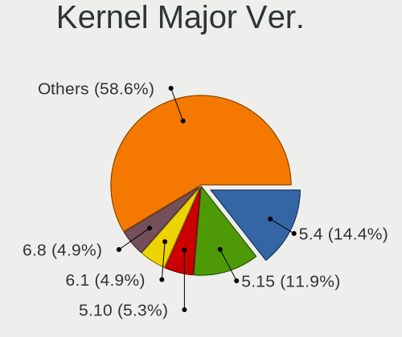
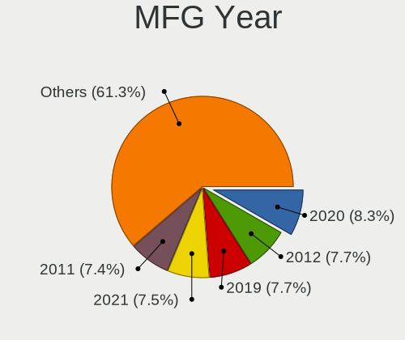
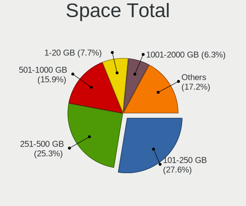

Linux in Germany - Tested Hardware & Statistics (Notebooks)
-----------------------------------------------------------

A project to collect tested hardware configurations for Linux in Germany.

Anyone can contribute to this report by the [hw-probe](https://github.com/linuxhw/hw-probe) tool:

    sudo -E hw-probe -all -upload

Please contribute! Especially if your hardware is rare.

Contents
--------

* [ Test Cases ](#test-cases)

* [ System ](#system)
  - [ OS                       ](#os)
  - [ OS Family                ](#os-family)
  - [ Kernel                   ](#kernel)
  - [ Kernel Family            ](#kernel-family)
  - [ Kernel Major Ver.        ](#kernel-major-ver)
  - [ Arch                     ](#arch)
  - [ DE                       ](#de)
  - [ Display Server           ](#display-server)
  - [ Display Manager          ](#display-manager)
  - [ OS Lang                  ](#os-lang)
  - [ Boot Mode                ](#boot-mode)
  - [ Filesystem               ](#filesystem)
  - [ Part. scheme             ](#part-scheme)
  - [ Dual Boot with Linux/BSD ](#dual-boot-with-linuxbsd)
  - [ Dual Boot (Win)          ](#dual-boot-win)

* [ Board ](#board)
  - [ Vendor                   ](#vendor)
  - [ Model                    ](#model)
  - [ Model Family             ](#model-family)
  - [ MFG Year                 ](#mfg-year)
  - [ Form Factor              ](#form-factor)
  - [ Secure Boot              ](#secure-boot)
  - [ Coreboot                 ](#coreboot)
  - [ RAM Size                 ](#ram-size)
  - [ RAM Used                 ](#ram-used)
  - [ Total Drives             ](#total-drives)
  - [ Has CD-ROM               ](#has-cd-rom)
  - [ Has Ethernet             ](#has-ethernet)
  - [ Has WiFi                 ](#has-wifi)
  - [ Has Bluetooth            ](#has-bluetooth)

* [ Location ](#location)
  - [ Country                  ](#country)
  - [ City                     ](#city)

* [ Drives ](#drives)
  - [ Drive Vendor             ](#drive-vendor)
  - [ Drive Model              ](#drive-model)
  - [ HDD Vendor               ](#hdd-vendor)
  - [ SSD Vendor               ](#ssd-vendor)
  - [ Drive Kind               ](#drive-kind)
  - [ Drive Connector          ](#drive-connector)
  - [ Drive Size               ](#drive-size)
  - [ Space Total              ](#space-total)
  - [ Space Used               ](#space-used)
  - [ Malfunc. Drives          ](#malfunc-drives)
  - [ Malfunc. Drive Vendor    ](#malfunc-drive-vendor)
  - [ Malfunc. HDD Vendor      ](#malfunc-hdd-vendor)
  - [ Malfunc. Drive Kind      ](#malfunc-drive-kind)
  - [ Failed Drives            ](#failed-drives)
  - [ Failed Drive Vendor      ](#failed-drive-vendor)
  - [ Drive Status             ](#drive-status)

* [ Storage controller ](#storage-controller)
  - [ Storage Vendor           ](#storage-vendor)
  - [ Storage Model            ](#storage-model)
  - [ Storage Kind             ](#storage-kind)

* [ Processor ](#processor)
  - [ CPU Vendor               ](#cpu-vendor)
  - [ CPU Model                ](#cpu-model)
  - [ CPU Model Family         ](#cpu-model-family)
  - [ CPU Cores                ](#cpu-cores)
  - [ CPU Sockets              ](#cpu-sockets)
  - [ CPU Threads              ](#cpu-threads)
  - [ CPU Op-Modes             ](#cpu-op-modes)
  - [ CPU Microcode            ](#cpu-microcode)
  - [ CPU Microarch            ](#cpu-microarch)

* [ Graphics ](#graphics)
  - [ GPU Vendor               ](#gpu-vendor)
  - [ GPU Model                ](#gpu-model)
  - [ GPU Combo                ](#gpu-combo)
  - [ GPU Driver               ](#gpu-driver)
  - [ GPU Memory               ](#gpu-memory)

* [ Monitor ](#monitor)
  - [ Monitor Vendor           ](#monitor-vendor)
  - [ Monitor Model            ](#monitor-model)
  - [ Monitor Resolution       ](#monitor-resolution)
  - [ Monitor Diagonal         ](#monitor-diagonal)
  - [ Monitor Width            ](#monitor-width)
  - [ Aspect Ratio             ](#aspect-ratio)
  - [ Monitor Area             ](#monitor-area)
  - [ Pixel Density            ](#pixel-density)
  - [ Multiple Monitors        ](#multiple-monitors)

* [ Network ](#network)
  - [ Net Controller Vendor    ](#net-controller-vendor)
  - [ Net Controller Model     ](#net-controller-model)
  - [ Wireless Vendor          ](#wireless-vendor)
  - [ Wireless Model           ](#wireless-model)
  - [ Ethernet Vendor          ](#ethernet-vendor)
  - [ Ethernet Model           ](#ethernet-model)
  - [ Net Controller Kind      ](#net-controller-kind)
  - [ Used Controller          ](#used-controller)
  - [ NICs                     ](#nics)
  - [ IPv6                     ](#ipv6)

* [ Bluetooth ](#bluetooth)
  - [ Bluetooth Vendor         ](#bluetooth-vendor)
  - [ Bluetooth Model          ](#bluetooth-model)

* [ Sound ](#sound)
  - [ Sound Vendor             ](#sound-vendor)
  - [ Sound Model              ](#sound-model)

* [ Memory ](#memory)
  - [ Memory Vendor            ](#memory-vendor)
  - [ Memory Model             ](#memory-model)
  - [ Memory Kind              ](#memory-kind)
  - [ Memory Form Factor       ](#memory-form-factor)
  - [ Memory Size              ](#memory-size)
  - [ Memory Speed             ](#memory-speed)

* [ Printers & scanners ](#printers--scanners)
  - [ Printer Vendor           ](#printer-vendor)
  - [ Printer Model            ](#printer-model)
  - [ Scanner Vendor           ](#scanner-vendor)
  - [ Scanner Model            ](#scanner-model)

* [ Camera ](#camera)
  - [ Camera Vendor            ](#camera-vendor)
  - [ Camera Model             ](#camera-model)

* [ Security ](#security)
  - [ Fingerprint Vendor       ](#fingerprint-vendor)
  - [ Fingerprint Model        ](#fingerprint-model)
  - [ Chipcard Vendor          ](#chipcard-vendor)
  - [ Chipcard Model           ](#chipcard-model)

* [ Unsupported ](#unsupported)
  - [ Unsupported Devices      ](#unsupported-devices)
  - [ Unsupported Device Types ](#unsupported-device-types)

Test Cases
----------

Total: 12223

| Vendor        | Model                       | Probe                                                      | Date         |
|---------------|-----------------------------|------------------------------------------------------------|--------------|
| Packard Be... | DOT S                       | [bb05d9a173](https://linux-hardware.org/?probe=bb05d9a173) | Dec 01, 2022 |
| Lenovo        | IdeaPad Gaming 3 15IAH7 ... | [fe9e8854c5](https://linux-hardware.org/?probe=fe9e8854c5) | Dec 01, 2022 |
| Lenovo        | IdeaPad Gaming 3 15IAH7 ... | [562e1f4b92](https://linux-hardware.org/?probe=562e1f4b92) | Dec 01, 2022 |
| TUXEDO        | N13xWU                      | [55935f091d](https://linux-hardware.org/?probe=55935f091d) | Dec 01, 2022 |
| Lenovo        | ThinkPad E15 Gen 4 21EES... | [674157de54](https://linux-hardware.org/?probe=674157de54) | Dec 01, 2022 |
| Sony          | VPCEB1M1E                   | [988c78f70d](https://linux-hardware.org/?probe=988c78f70d) | Dec 01, 2022 |
| Dell          | XPS 13 9343                 | [125fcd77b9](https://linux-hardware.org/?probe=125fcd77b9) | Dec 01, 2022 |
| Acer          | TravelMate P614-51T-G2      | [952e89e25d](https://linux-hardware.org/?probe=952e89e25d) | Dec 01, 2022 |
| Sony          | VPCEB4L9E                   | [cad7ef5059](https://linux-hardware.org/?probe=cad7ef5059) | Nov 30, 2022 |
| Lenovo        | G500 20236                  | [43815283d9](https://linux-hardware.org/?probe=43815283d9) | Nov 30, 2022 |
| Dell          | XPS 15 9500                 | [42971a8394](https://linux-hardware.org/?probe=42971a8394) | Nov 30, 2022 |
| Notebook      | RIM2520                     | [5f66abbb8b](https://linux-hardware.org/?probe=5f66abbb8b) | Nov 30, 2022 |
| ASUSTek       | VivoBook_ASUSLaptop E410... | [9505f905e8](https://linux-hardware.org/?probe=9505f905e8) | Nov 30, 2022 |
| Acer          | TravelMate P614-51T-G2      | [37e14fc1c1](https://linux-hardware.org/?probe=37e14fc1c1) | Nov 30, 2022 |
| HP            | Pavilion Gaming Laptop 1... | [c33e807c11](https://linux-hardware.org/?probe=c33e807c11) | Nov 30, 2022 |
| Tactus        | GeoBook 140                 | [91342e56df](https://linux-hardware.org/?probe=91342e56df) | Nov 29, 2022 |
| HP            | Compaq CQ58                 | [009ac41742](https://linux-hardware.org/?probe=009ac41742) | Nov 29, 2022 |
| Dell          | Precision 7520              | [2c0cb92f23](https://linux-hardware.org/?probe=2c0cb92f23) | Nov 29, 2022 |
| HP            | Pavilion Gaming Laptop 1... | [50e500a8fb](https://linux-hardware.org/?probe=50e500a8fb) | Nov 29, 2022 |
| Lenovo        | ThinkPad E550 20DF004RGE    | [a06fd97ee3](https://linux-hardware.org/?probe=a06fd97ee3) | Nov 29, 2022 |
| ASUSTek       | X756UXK                     | [a8fde1c59a](https://linux-hardware.org/?probe=a8fde1c59a) | Nov 29, 2022 |
| ASUSTek       | VivoBook_ASUSLaptop X512... | [140872c53d](https://linux-hardware.org/?probe=140872c53d) | Nov 29, 2022 |
| Lenovo        | ThinkPad T14s Gen 2a 20X... | [762b81c49e](https://linux-hardware.org/?probe=762b81c49e) | Nov 29, 2022 |
| Lenovo        | ThinkPad T14s Gen 2a 20X... | [01543655e9](https://linux-hardware.org/?probe=01543655e9) | Nov 29, 2022 |
| TUXEDO        | Unknown                     | [fd06ca029c](https://linux-hardware.org/?probe=fd06ca029c) | Nov 29, 2022 |
| Lenovo        | G500 20236                  | [6ece9d62e6](https://linux-hardware.org/?probe=6ece9d62e6) | Nov 29, 2022 |
| Lenovo        | ThinkPad T460s 20FAS16J0... | [142a1e8a94](https://linux-hardware.org/?probe=142a1e8a94) | Nov 29, 2022 |
| HP            | ZBook 15                    | [452a6f86d5](https://linux-hardware.org/?probe=452a6f86d5) | Nov 29, 2022 |
| HUAWEI        | NBLK-WAX9X                  | [8f17b6a915](https://linux-hardware.org/?probe=8f17b6a915) | Nov 29, 2022 |
| Lenovo        | ThinkPad L15 Gen 1 20U70... | [fd821a4b54](https://linux-hardware.org/?probe=fd821a4b54) | Nov 29, 2022 |
| Lenovo        | V17 G2 ITL 82NX             | [6dcdb4d9ea](https://linux-hardware.org/?probe=6dcdb4d9ea) | Nov 29, 2022 |
| Dell          | G7 7790                     | [a85c1cd70e](https://linux-hardware.org/?probe=a85c1cd70e) | Nov 28, 2022 |
| Acer          | Aspire 5820TG               | [61cab6d996](https://linux-hardware.org/?probe=61cab6d996) | Nov 28, 2022 |
| Acer          | Aspire 5820TG               | [1e64d9426d](https://linux-hardware.org/?probe=1e64d9426d) | Nov 28, 2022 |
| Acer          | Swift SF314-43              | [1a6c47ad0e](https://linux-hardware.org/?probe=1a6c47ad0e) | Nov 28, 2022 |
| Acer          | Aspire A315-59              | [f7a1cff386](https://linux-hardware.org/?probe=f7a1cff386) | Nov 28, 2022 |
| Lenovo        | ThinkPad X301 2776LEG       | [ebaea0c805](https://linux-hardware.org/?probe=ebaea0c805) | Nov 28, 2022 |
| Chuwi         | HeroBook Pro                | [df7f48022d](https://linux-hardware.org/?probe=df7f48022d) | Nov 28, 2022 |
| Chuwi         | HeroBook Pro                | [c8e48e2c0f](https://linux-hardware.org/?probe=c8e48e2c0f) | Nov 28, 2022 |
| Lenovo        | IdeaPad Y560                | [4918810cd1](https://linux-hardware.org/?probe=4918810cd1) | Nov 28, 2022 |
| Lenovo        | G700 20251                  | [49167f9f67](https://linux-hardware.org/?probe=49167f9f67) | Nov 28, 2022 |
| HP            | 255 G6 Notebook PC          | [e17172d1c5](https://linux-hardware.org/?probe=e17172d1c5) | Nov 28, 2022 |
| HP            | Pavilion Laptop 15-cw1xx... | [1f4c5bfc57](https://linux-hardware.org/?probe=1f4c5bfc57) | Nov 28, 2022 |
| HP            | EliteBook 8560w             | [61e60261ef](https://linux-hardware.org/?probe=61e60261ef) | Nov 28, 2022 |
| Lenovo        | ThinkPad T460 20FMS07000    | [0c1dece352](https://linux-hardware.org/?probe=0c1dece352) | Nov 28, 2022 |
| Dell          | System XPS L502X            | [bd45da46bc](https://linux-hardware.org/?probe=bd45da46bc) | Nov 27, 2022 |
| Fujitsu       | LIFEBOOK S751               | [20cb13ada3](https://linux-hardware.org/?probe=20cb13ada3) | Nov 27, 2022 |
| Fujitsu       | LIFEBOOK S751               | [9062066523](https://linux-hardware.org/?probe=9062066523) | Nov 27, 2022 |
| Lenovo        | ThinkPad E15 Gen 4 21EES... | [d8bb1b1d38](https://linux-hardware.org/?probe=d8bb1b1d38) | Nov 27, 2022 |
| Medion        | E11201                      | [0838f9db75](https://linux-hardware.org/?probe=0838f9db75) | Nov 27, 2022 |
| HP            | EliteBook 8560w             | [3145d17bb7](https://linux-hardware.org/?probe=3145d17bb7) | Nov 27, 2022 |
| Tactus        | GeoBook 140                 | [e3f4d734da](https://linux-hardware.org/?probe=e3f4d734da) | Nov 27, 2022 |
| Lenovo        | ThinkPad E15 Gen 4 21EES... | [7db4db6cc7](https://linux-hardware.org/?probe=7db4db6cc7) | Nov 27, 2022 |
| Gigabyte      | RC14UD                      | [37c4b79c24](https://linux-hardware.org/?probe=37c4b79c24) | Nov 27, 2022 |
| Dell          | G3 3779                     | [2def46f37c](https://linux-hardware.org/?probe=2def46f37c) | Nov 27, 2022 |
| Acer          | Aspire A517-52              | [3ce1a2c42a](https://linux-hardware.org/?probe=3ce1a2c42a) | Nov 27, 2022 |
| HP            | 255 G8 Notebook PC          | [97cf5008bb](https://linux-hardware.org/?probe=97cf5008bb) | Nov 27, 2022 |
| ASUSTek       | VivoBook_ASUSLaptop X421... | [32bfa52fc1](https://linux-hardware.org/?probe=32bfa52fc1) | Nov 27, 2022 |
| HP            | ProBook 440 G7              | [d923cda32c](https://linux-hardware.org/?probe=d923cda32c) | Nov 26, 2022 |
| Dell          | XPS 15 7590                 | [071f2be55e](https://linux-hardware.org/?probe=071f2be55e) | Nov 26, 2022 |
| Dell          | Latitude D610               | [437f7630fd](https://linux-hardware.org/?probe=437f7630fd) | Nov 26, 2022 |
| Valve         | Jupiter                     | [ea37f7d713](https://linux-hardware.org/?probe=ea37f7d713) | Nov 26, 2022 |
| HP            | 255 G7 Notebook PC          | [8c389cf5d6](https://linux-hardware.org/?probe=8c389cf5d6) | Nov 26, 2022 |
| Acer          | Swift SFX14-41G             | [521cb4d847](https://linux-hardware.org/?probe=521cb4d847) | Nov 26, 2022 |
| MSI           | GE70 2OC\2OE                | [842781ccfc](https://linux-hardware.org/?probe=842781ccfc) | Nov 26, 2022 |
| Dell          | Latitude E6540              | [543ca1307c](https://linux-hardware.org/?probe=543ca1307c) | Nov 26, 2022 |
| Toshiba       | Satellite C670D-126         | [6c2fc84bf2](https://linux-hardware.org/?probe=6c2fc84bf2) | Nov 26, 2022 |
| Getac         | S410                        | [3df44aa3af](https://linux-hardware.org/?probe=3df44aa3af) | Nov 26, 2022 |
| TUXEDO        | Aura 15 Gen1                | [2868e94785](https://linux-hardware.org/?probe=2868e94785) | Nov 26, 2022 |
| Samsung       | RC530/RC730                 | [64515ff8b1](https://linux-hardware.org/?probe=64515ff8b1) | Nov 26, 2022 |
| Apple         | MacBookPro7,1               | [8268fc2c12](https://linux-hardware.org/?probe=8268fc2c12) | Nov 26, 2022 |
| Lenovo        | ThinkPad T430 2349I62       | [ab0d49b5cd](https://linux-hardware.org/?probe=ab0d49b5cd) | Nov 25, 2022 |
| MSI           | MS-16G1                     | [8d8233d2a9](https://linux-hardware.org/?probe=8d8233d2a9) | Nov 25, 2022 |
| Lenovo        | ThinkPad T430 23501K1       | [46ec8527f5](https://linux-hardware.org/?probe=46ec8527f5) | Nov 25, 2022 |
| Lenovo        | ThinkPad L15 Gen 1 20U70... | [18130ae317](https://linux-hardware.org/?probe=18130ae317) | Nov 25, 2022 |
| Lenovo        | IdeaPad 120S-11IAP 81A4     | [48d797ccdc](https://linux-hardware.org/?probe=48d797ccdc) | Nov 25, 2022 |
| Lenovo        | IdeaPad 3 15ALC6 82KU       | [86735d895f](https://linux-hardware.org/?probe=86735d895f) | Nov 25, 2022 |
| HP            | EliteBook 850 G8 Noteboo... | [1f2bd09174](https://linux-hardware.org/?probe=1f2bd09174) | Nov 25, 2022 |
| ASUSTek       | X751MA                      | [15ea4b4462](https://linux-hardware.org/?probe=15ea4b4462) | Nov 25, 2022 |
| Samsung       | 300E4C/300E5C/300E7C        | [024b4da647](https://linux-hardware.org/?probe=024b4da647) | Nov 25, 2022 |
| HP            | Compaq CQ58                 | [e6d1387823](https://linux-hardware.org/?probe=e6d1387823) | Nov 25, 2022 |
| Lenovo        | Slim 7 ProX 14ARH7 82V2     | [1ed724b75e](https://linux-hardware.org/?probe=1ed724b75e) | Nov 25, 2022 |
| Lenovo        | 40684WG                     | [27e2eeccbf](https://linux-hardware.org/?probe=27e2eeccbf) | Nov 25, 2022 |
| Samsung       | R59P/R60P/R61P              | [62510109f9](https://linux-hardware.org/?probe=62510109f9) | Nov 25, 2022 |
| Lenovo        | ThinkPad E470 20H2S00700    | [f82ee02c50](https://linux-hardware.org/?probe=f82ee02c50) | Nov 25, 2022 |
| HP            | ZBook 15                    | [dc8f215893](https://linux-hardware.org/?probe=dc8f215893) | Nov 25, 2022 |
| Dell          | Inspiron 7559               | [620f0d5cec](https://linux-hardware.org/?probe=620f0d5cec) | Nov 25, 2022 |
| Acer          | Aspire VN7-791G             | [7664866053](https://linux-hardware.org/?probe=7664866053) | Nov 25, 2022 |
| Lenovo        | ThinkPad T460 20FMS07000    | [eded61b721](https://linux-hardware.org/?probe=eded61b721) | Nov 25, 2022 |
| Apple         | MacBook3,1                  | [404821c7d6](https://linux-hardware.org/?probe=404821c7d6) | Nov 25, 2022 |
| Lenovo        | ThinkPad P17 Gen 2i 20YU... | [cd660d3210](https://linux-hardware.org/?probe=cd660d3210) | Nov 24, 2022 |
| HP            | 255 G7 Notebook PC          | [f5a6bcf0fb](https://linux-hardware.org/?probe=f5a6bcf0fb) | Nov 24, 2022 |
| Acer          | Aspire E5-573               | [c0ccedd707](https://linux-hardware.org/?probe=c0ccedd707) | Nov 24, 2022 |
| Acer          | Aspire E5-573               | [f2b9fd554b](https://linux-hardware.org/?probe=f2b9fd554b) | Nov 24, 2022 |
| Acer          | Aspire ES1-711              | [b3260faedb](https://linux-hardware.org/?probe=b3260faedb) | Nov 24, 2022 |
| ASUSTek       | Zenbook UX5401ZA_UX5401Z... | [aaa0e3394f](https://linux-hardware.org/?probe=aaa0e3394f) | Nov 24, 2022 |
| Lenovo        | IdeaPad 320-15AST 80XV      | [b73b2c4c07](https://linux-hardware.org/?probe=b73b2c4c07) | Nov 24, 2022 |
| Lenovo        | V145-15AST 81MT             | [b37755877d](https://linux-hardware.org/?probe=b37755877d) | Nov 24, 2022 |
| Samsung       | 600B4B/600B5B               | [6cbdda4e27](https://linux-hardware.org/?probe=6cbdda4e27) | Nov 24, 2022 |
| Thomson       | GEN17V3C8WH256              | [7b1a510e2e](https://linux-hardware.org/?probe=7b1a510e2e) | Nov 24, 2022 |
| Dell          | XPS 13 9300                 | [43fe4ed852](https://linux-hardware.org/?probe=43fe4ed852) | Nov 24, 2022 |
| ASUSTek       | ASUS TUF Gaming A17 FA70... | [cf30d2df93](https://linux-hardware.org/?probe=cf30d2df93) | Nov 24, 2022 |
| HP            | EliteBook 820 G3            | [3ca3320525](https://linux-hardware.org/?probe=3ca3320525) | Nov 24, 2022 |
| HP            | EliteBook 8560w             | [7253dd4798](https://linux-hardware.org/?probe=7253dd4798) | Nov 24, 2022 |
| Lenovo        | ThinkBook 15-IIL 20SM       | [0f96032f10](https://linux-hardware.org/?probe=0f96032f10) | Nov 24, 2022 |
| Packard Be... | EasyNote TM98               | [468831c306](https://linux-hardware.org/?probe=468831c306) | Nov 24, 2022 |
| Lenovo        | ThinkPad T460 20FMS0VG25    | [06221c9746](https://linux-hardware.org/?probe=06221c9746) | Nov 24, 2022 |
| Dell          | Inspiron 7720               | [a75b9a21f9](https://linux-hardware.org/?probe=a75b9a21f9) | Nov 24, 2022 |
| Dell          | Latitude E6320              | [81f633b550](https://linux-hardware.org/?probe=81f633b550) | Nov 24, 2022 |
| Lenovo        | ThinkPad P15s Gen 2i 20W... | [1c65fff6e7](https://linux-hardware.org/?probe=1c65fff6e7) | Nov 24, 2022 |
| Dell          | XPS 9320                    | [d63a585507](https://linux-hardware.org/?probe=d63a585507) | Nov 23, 2022 |
| Dell          | Inspiron 7720               | [ae4fc56cb3](https://linux-hardware.org/?probe=ae4fc56cb3) | Nov 23, 2022 |
| Lenovo        | IdeaPad Y560                | [154702cbc6](https://linux-hardware.org/?probe=154702cbc6) | Nov 23, 2022 |
| Lenovo        | ThinkPad T495 20NK000UUS    | [0e8c0e6f07](https://linux-hardware.org/?probe=0e8c0e6f07) | Nov 23, 2022 |
| Lenovo        | ThinkPad T490 20N3S8T211    | [97ea649145](https://linux-hardware.org/?probe=97ea649145) | Nov 23, 2022 |
| Lenovo        | ThinkPad T460 20FMS0VG25    | [b00a1e7f6a](https://linux-hardware.org/?probe=b00a1e7f6a) | Nov 23, 2022 |
| Dell          | XPS 15 9510                 | [26fb968043](https://linux-hardware.org/?probe=26fb968043) | Nov 23, 2022 |
| HP            | G62                         | [754a471519](https://linux-hardware.org/?probe=754a471519) | Nov 23, 2022 |
| MPMAN         | CONVERTER 102               | [cab847edc0](https://linux-hardware.org/?probe=cab847edc0) | Nov 23, 2022 |
| ASUSTek       | GR8                         | [99683fc732](https://linux-hardware.org/?probe=99683fc732) | Nov 22, 2022 |
| Apple         | MacBookPro11,3              | [476415b4e4](https://linux-hardware.org/?probe=476415b4e4) | Nov 22, 2022 |
| Acer          | Aspire 7520                 | [d2f4caca66](https://linux-hardware.org/?probe=d2f4caca66) | Nov 22, 2022 |
| Lenovo        | ThinkPad T440p 20AWS3RJ0... | [43f6a19d9a](https://linux-hardware.org/?probe=43f6a19d9a) | Nov 22, 2022 |
| Fujitsu       | LIFEBOOK A3510              | [e1c126c1f2](https://linux-hardware.org/?probe=e1c126c1f2) | Nov 22, 2022 |
| Lenovo        | ThinkPad T450 20BUS08L00    | [31ddbc5ee3](https://linux-hardware.org/?probe=31ddbc5ee3) | Nov 22, 2022 |
| Acer          | Aspire A315-51              | [3d8ef86616](https://linux-hardware.org/?probe=3d8ef86616) | Nov 21, 2022 |
| Acer          | Aspire A315-51              | [bcff111ecd](https://linux-hardware.org/?probe=bcff111ecd) | Nov 21, 2022 |
| MSI           | Katana GF76 11UG            | [e29dda268c](https://linux-hardware.org/?probe=e29dda268c) | Nov 21, 2022 |
| MSI           | Katana GF76 11UG            | [9627a23b1f](https://linux-hardware.org/?probe=9627a23b1f) | Nov 21, 2022 |
| Lenovo        | ThinkPad T450 20BUA0AEIG    | [48956b6f61](https://linux-hardware.org/?probe=48956b6f61) | Nov 21, 2022 |
| HP            | EliteBook 840 G5            | [62ffc22eea](https://linux-hardware.org/?probe=62ffc22eea) | Nov 21, 2022 |
| Lenovo        | ThinkPad T440 20B7000LGE    | [9194594686](https://linux-hardware.org/?probe=9194594686) | Nov 21, 2022 |
| HP            | 250 G7 Notebook PC          | [f56bd99812](https://linux-hardware.org/?probe=f56bd99812) | Nov 21, 2022 |
| HP            | 250 G7 Notebook PC          | [d7e8c67720](https://linux-hardware.org/?probe=d7e8c67720) | Nov 21, 2022 |
| HP            | ZBook 17 G2                 | [1c5168fcfe](https://linux-hardware.org/?probe=1c5168fcfe) | Nov 21, 2022 |
| TUXEDO        | Pulse 15 Gen1               | [b65ee83a19](https://linux-hardware.org/?probe=b65ee83a19) | Nov 21, 2022 |
| TUXEDO        | Pulse 15 Gen1               | [c8d395cdcc](https://linux-hardware.org/?probe=c8d395cdcc) | Nov 21, 2022 |
| Dell          | Latitude E6320              | [91ebf30a5c](https://linux-hardware.org/?probe=91ebf30a5c) | Nov 21, 2022 |
| Medion        | Akoya P2214T                | [eb9e0cfbf8](https://linux-hardware.org/?probe=eb9e0cfbf8) | Nov 20, 2022 |
| Samsung       | 270E5J/2570EJ               | [f5b73b34c6](https://linux-hardware.org/?probe=f5b73b34c6) | Nov 20, 2022 |
| MSI           | CX700                       | [69c6ae1f04](https://linux-hardware.org/?probe=69c6ae1f04) | Nov 20, 2022 |
| HUAWEI        | MACH-WX9                    | [32fa69ea64](https://linux-hardware.org/?probe=32fa69ea64) | Nov 20, 2022 |
| TUXEDO        | XMG FUSION 15 (XFU15L19)    | [d9a74ee60a](https://linux-hardware.org/?probe=d9a74ee60a) | Nov 20, 2022 |
| HP            | EliteBook 850 G8 Noteboo... | [2db5ac853d](https://linux-hardware.org/?probe=2db5ac853d) | Nov 20, 2022 |
| Dell          | XPS 13 7390                 | [52810e28da](https://linux-hardware.org/?probe=52810e28da) | Nov 20, 2022 |
| HP            | EliteBook 850 G4            | [30c7f00ee5](https://linux-hardware.org/?probe=30c7f00ee5) | Nov 20, 2022 |
| Lenovo        | ThinkPad T460 20FMS07000    | [5043f6c54e](https://linux-hardware.org/?probe=5043f6c54e) | Nov 20, 2022 |
| Acer          | Aspire VN7-572G             | [314902c0f1](https://linux-hardware.org/?probe=314902c0f1) | Nov 20, 2022 |
| HP            | ZBook 15 G2                 | [5df677d667](https://linux-hardware.org/?probe=5df677d667) | Nov 20, 2022 |
| MPMAN         | CONVERTER 102               | [845925720b](https://linux-hardware.org/?probe=845925720b) | Nov 20, 2022 |
| Chuwi         | LapBook SE                  | [ecc56a3703](https://linux-hardware.org/?probe=ecc56a3703) | Nov 19, 2022 |
| Lenovo        | IdeaPadFlex 15D 20334       | [77dcd3bef6](https://linux-hardware.org/?probe=77dcd3bef6) | Nov 19, 2022 |
| HP            | EliteBook 820 G2            | [5d82e9f6ac](https://linux-hardware.org/?probe=5d82e9f6ac) | Nov 19, 2022 |
| HP            | EliteBook 820 G2            | [9d20af2c30](https://linux-hardware.org/?probe=9d20af2c30) | Nov 19, 2022 |
| ASUSTek       | B451JA                      | [faeb294d65](https://linux-hardware.org/?probe=faeb294d65) | Nov 19, 2022 |
| Lenovo        | ThinkPad T580 20L9CTO1WW    | [bed1f98f04](https://linux-hardware.org/?probe=bed1f98f04) | Nov 19, 2022 |
| Lenovo        | ThinkPad X220 Tablet 429... | [85e0869ac9](https://linux-hardware.org/?probe=85e0869ac9) | Nov 19, 2022 |
| Tactus        | GeoBook 140                 | [127ec68044](https://linux-hardware.org/?probe=127ec68044) | Nov 19, 2022 |
| HP            | Laptop 17-cp0xxx            | [a3fde1deaa](https://linux-hardware.org/?probe=a3fde1deaa) | Nov 19, 2022 |
| Dell          | Inspiron 3537               | [b8d74d8e6f](https://linux-hardware.org/?probe=b8d74d8e6f) | Nov 19, 2022 |
| Fujitsu       | LIFEBOOK A3510              | [9eb6a535ac](https://linux-hardware.org/?probe=9eb6a535ac) | Nov 19, 2022 |
| Lenovo        | ThinkPad E15 Gen 4 21EES... | [1572414802](https://linux-hardware.org/?probe=1572414802) | Nov 19, 2022 |
| Toshiba       | Satellite C670D-126         | [17e464f802](https://linux-hardware.org/?probe=17e464f802) | Nov 19, 2022 |
| Dell          | Latitude 5414               | [a408bec327](https://linux-hardware.org/?probe=a408bec327) | Nov 18, 2022 |
| Dell          | Latitude E6540              | [4148292f4d](https://linux-hardware.org/?probe=4148292f4d) | Nov 18, 2022 |
| Samsung       | 600B4B/600B5B               | [0185c349b9](https://linux-hardware.org/?probe=0185c349b9) | Nov 18, 2022 |
| HP            | Laptop 17-cp0xxx            | [f4c6260289](https://linux-hardware.org/?probe=f4c6260289) | Nov 18, 2022 |
| Acer          | Aspire A515-45              | [482709f151](https://linux-hardware.org/?probe=482709f151) | Nov 18, 2022 |
| Samsung       | 600B4B/600B5B               | [6992e11b21](https://linux-hardware.org/?probe=6992e11b21) | Nov 18, 2022 |
| Dell          | Latitude E6540              | [31752fdaa8](https://linux-hardware.org/?probe=31752fdaa8) | Nov 18, 2022 |
| Dell          | Precision M4400             | [715efc61ae](https://linux-hardware.org/?probe=715efc61ae) | Nov 18, 2022 |
| Fujitsu       | LIFEBOOK E756               | [144470ec16](https://linux-hardware.org/?probe=144470ec16) | Nov 18, 2022 |
| HUAWEI        | HLYL-WXX9                   | [560c24bf74](https://linux-hardware.org/?probe=560c24bf74) | Nov 18, 2022 |
| Packard Be... | EasyNote TK81               | [c396423368](https://linux-hardware.org/?probe=c396423368) | Nov 17, 2022 |
| Lenovo        | ThinkPad SL500 27464DG      | [13bd11ffd4](https://linux-hardware.org/?probe=13bd11ffd4) | Nov 17, 2022 |
| Lenovo        | ThinkPad P1 Gen 3 20TJS2... | [64fb254a64](https://linux-hardware.org/?probe=64fb254a64) | Nov 17, 2022 |
| HP            | EliteBook 745 G5            | [9d7fefd253](https://linux-hardware.org/?probe=9d7fefd253) | Nov 17, 2022 |
| Lenovo        | ThinkPad T430 2349KQ3       | [aacdefc31b](https://linux-hardware.org/?probe=aacdefc31b) | Nov 17, 2022 |
| Apple         | MacBookAir7,2               | [b0bdd6227a](https://linux-hardware.org/?probe=b0bdd6227a) | Nov 17, 2022 |
| Lenovo        | IdeaPad 530S-15IKB 81EV     | [ca1def3570](https://linux-hardware.org/?probe=ca1def3570) | Nov 17, 2022 |
| Medion        | P6816                       | [3aadacefe7](https://linux-hardware.org/?probe=3aadacefe7) | Nov 17, 2022 |
| HP            | Laptop 17-by1xxx            | [a74914048e](https://linux-hardware.org/?probe=a74914048e) | Nov 17, 2022 |
| Lenovo        | IdeaPadFlex 15D 20334       | [23f8c23e8b](https://linux-hardware.org/?probe=23f8c23e8b) | Nov 17, 2022 |
| Dell          | Latitude 3320               | [fbaf8e5ab9](https://linux-hardware.org/?probe=fbaf8e5ab9) | Nov 16, 2022 |
| Dell          | Latitude 3320               | [377fbd3b41](https://linux-hardware.org/?probe=377fbd3b41) | Nov 16, 2022 |
| Apple         | MacBookPro9,2               | [8e1b32a9f0](https://linux-hardware.org/?probe=8e1b32a9f0) | Nov 16, 2022 |
| ASUSTek       | A7K                         | [08edc83fa4](https://linux-hardware.org/?probe=08edc83fa4) | Nov 16, 2022 |
| MSI           | CR620                       | [4d90de18ca](https://linux-hardware.org/?probe=4d90de18ca) | Nov 16, 2022 |
| Apple         | MacBook4,1                  | [06c160b1a8](https://linux-hardware.org/?probe=06c160b1a8) | Nov 16, 2022 |
| Dell          | Latitude E6430              | [60832751d1](https://linux-hardware.org/?probe=60832751d1) | Nov 16, 2022 |
| Acer          | Aspire A315-42              | [121ed6e51d](https://linux-hardware.org/?probe=121ed6e51d) | Nov 16, 2022 |
| Lenovo        | IdeaPad 5 Pro 14ACN6 82L... | [e7343719c2](https://linux-hardware.org/?probe=e7343719c2) | Nov 16, 2022 |
| Lenovo        | Legion 5 Pro 16ARH7H 82R... | [c43362b7ad](https://linux-hardware.org/?probe=c43362b7ad) | Nov 16, 2022 |
| HP            | Laptop 15-dw3xxx            | [e656990178](https://linux-hardware.org/?probe=e656990178) | Nov 16, 2022 |
| Google        | Boten                       | [105e91dd04](https://linux-hardware.org/?probe=105e91dd04) | Nov 16, 2022 |
| ASUSTek       | T100HAN                     | [f973b6bcd4](https://linux-hardware.org/?probe=f973b6bcd4) | Nov 15, 2022 |
| Dell          | Studio 1737                 | [883ac54ca7](https://linux-hardware.org/?probe=883ac54ca7) | Nov 15, 2022 |
| Dell          | Inspiron 3505               | [ce754fa34b](https://linux-hardware.org/?probe=ce754fa34b) | Nov 15, 2022 |
| Apple         | MacBook1,1                  | [6945006338](https://linux-hardware.org/?probe=6945006338) | Nov 15, 2022 |
| Lenovo        | ThinkPad T490s 20NYS02B0... | [7d2cffcf6a](https://linux-hardware.org/?probe=7d2cffcf6a) | Nov 15, 2022 |
| ASUSTek       | A7K                         | [ff0ca96a2e](https://linux-hardware.org/?probe=ff0ca96a2e) | Nov 15, 2022 |
| Acer          | Aspire V3-571G              | [ea0093a1f6](https://linux-hardware.org/?probe=ea0093a1f6) | Nov 15, 2022 |
| Chuwi         | GemiBook Pro                | [d9b2356cf0](https://linux-hardware.org/?probe=d9b2356cf0) | Nov 15, 2022 |
| Schenker      | VISION 15 (SVS15E21)        | [dcffe478fe](https://linux-hardware.org/?probe=dcffe478fe) | Nov 14, 2022 |
| Lenovo        | ThinkPad P1 Gen 3 20TJS2... | [de9e18e6ca](https://linux-hardware.org/?probe=de9e18e6ca) | Nov 14, 2022 |
| Lenovo        | IdeaPadFlex 15D 20334       | [73bc7e7428](https://linux-hardware.org/?probe=73bc7e7428) | Nov 14, 2022 |
| Lenovo        | IdeaPadFlex 15D 20334       | [9d798077df](https://linux-hardware.org/?probe=9d798077df) | Nov 14, 2022 |
| ASUSTek       | K53U                        | [e947ac0aab](https://linux-hardware.org/?probe=e947ac0aab) | Nov 14, 2022 |
| Apple         | MacBookPro11,4              | [9028326508](https://linux-hardware.org/?probe=9028326508) | Nov 14, 2022 |
| Dell          | Inspiron 3480               | [699e532a38](https://linux-hardware.org/?probe=699e532a38) | Nov 14, 2022 |
| Dell          | Inspiron 3480               | [3fca000783](https://linux-hardware.org/?probe=3fca000783) | Nov 14, 2022 |
| Acer          | Aspire A315-42              | [333067d4c6](https://linux-hardware.org/?probe=333067d4c6) | Nov 14, 2022 |
| Dell          | XPS 13 9380                 | [1501d641b4](https://linux-hardware.org/?probe=1501d641b4) | Nov 14, 2022 |
| Dell          | XPS 9315                    | [9f97a6b66c](https://linux-hardware.org/?probe=9f97a6b66c) | Nov 14, 2022 |
| AXDIA Inte... | MYBOOK 14 PRO               | [8267ec6686](https://linux-hardware.org/?probe=8267ec6686) | Nov 14, 2022 |
| Samsung       | 530U3C/530U4C/532U3C        | [3e1d185e6d](https://linux-hardware.org/?probe=3e1d185e6d) | Nov 14, 2022 |
| Toshiba       | Satellite P50-B-10Q         | [f28064cdad](https://linux-hardware.org/?probe=f28064cdad) | Nov 14, 2022 |
| Fujitsu       | LIFEBOOK U7511              | [66656bedcf](https://linux-hardware.org/?probe=66656bedcf) | Nov 14, 2022 |
| Valve         | Jupiter                     | [0bd1833d8c](https://linux-hardware.org/?probe=0bd1833d8c) | Nov 13, 2022 |
| HP            | 530 Notebook PC(KD092AA#... | [b6c682238c](https://linux-hardware.org/?probe=b6c682238c) | Nov 13, 2022 |
| Schenker      | VISION 15 (SVS15E21)        | [41dbab85c0](https://linux-hardware.org/?probe=41dbab85c0) | Nov 13, 2022 |
| Dell          | Venue 11 Pro 5130           | [bb8c29a397](https://linux-hardware.org/?probe=bb8c29a397) | Nov 13, 2022 |
| HP            | Laptop 17-cp0xxx            | [fa8dcc3eed](https://linux-hardware.org/?probe=fa8dcc3eed) | Nov 13, 2022 |
| Medion        | E7220                       | [7d3df30772](https://linux-hardware.org/?probe=7d3df30772) | Nov 13, 2022 |
| HP            | ProBook 640 G4              | [c120112085](https://linux-hardware.org/?probe=c120112085) | Nov 13, 2022 |
| HP            | Pavilion g7                 | [ebf3708ac3](https://linux-hardware.org/?probe=ebf3708ac3) | Nov 13, 2022 |
| Valve         | Jupiter                     | [0046f0e15d](https://linux-hardware.org/?probe=0046f0e15d) | Nov 13, 2022 |
| HP            | ENVY Laptop 17-ch1xxx       | [ff0881b6e4](https://linux-hardware.org/?probe=ff0881b6e4) | Nov 13, 2022 |
| Acer          | Aspire SW5-171              | [2d44304a43](https://linux-hardware.org/?probe=2d44304a43) | Nov 13, 2022 |
| Packard Be... | EasyNote TM98               | [1b98225677](https://linux-hardware.org/?probe=1b98225677) | Nov 13, 2022 |
| Medion        | E4254 MD63100               | [b38503d9ac](https://linux-hardware.org/?probe=b38503d9ac) | Nov 13, 2022 |
| Medion        | E4254 MD63100               | [bc622b98f9](https://linux-hardware.org/?probe=bc622b98f9) | Nov 13, 2022 |
| Sony          | SVF1532W4E                  | [33d278cd7a](https://linux-hardware.org/?probe=33d278cd7a) | Nov 12, 2022 |
| Sony          | SVT1511M1ES                 | [2fd916d045](https://linux-hardware.org/?probe=2fd916d045) | Nov 12, 2022 |
| Valve         | Jupiter                     | [62e925fd8a](https://linux-hardware.org/?probe=62e925fd8a) | Nov 12, 2022 |
| Fujitsu       | LIFEBOOK E782               | [f6b2530682](https://linux-hardware.org/?probe=f6b2530682) | Nov 12, 2022 |
| Packard Be... | EasyNote LJ65               | [1de1737600](https://linux-hardware.org/?probe=1de1737600) | Nov 12, 2022 |
| Dell          | Latitude E6420              | [056daa7806](https://linux-hardware.org/?probe=056daa7806) | Nov 12, 2022 |
| Dell          | Precision 5570              | [b89bc3b56a](https://linux-hardware.org/?probe=b89bc3b56a) | Nov 12, 2022 |
| Lenovo        | ThinkPad A285 20MX000HMX    | [d199e5d35b](https://linux-hardware.org/?probe=d199e5d35b) | Nov 12, 2022 |
| Lenovo        | G710 20252                  | [3ae6407869](https://linux-hardware.org/?probe=3ae6407869) | Nov 12, 2022 |
| HP            | Laptop 17-cp0xxx            | [a5575e0c9d](https://linux-hardware.org/?probe=a5575e0c9d) | Nov 12, 2022 |
| HP            | Laptop 17-cp0xxx            | [2e6b12e93d](https://linux-hardware.org/?probe=2e6b12e93d) | Nov 12, 2022 |
| ASUSTek       | VivoBook_ASUSLaptop X512... | [0d6bd34095](https://linux-hardware.org/?probe=0d6bd34095) | Nov 12, 2022 |
| Google        | Shyvana                     | [2df69a0782](https://linux-hardware.org/?probe=2df69a0782) | Nov 12, 2022 |
| Dell          | Vostro 3300                 | [be3a3b081d](https://linux-hardware.org/?probe=be3a3b081d) | Nov 12, 2022 |
| AXDIA Inte... | MYBOOK 14                   | [0638c8c3ec](https://linux-hardware.org/?probe=0638c8c3ec) | Nov 12, 2022 |
| Acer          | Aspire SW5-171              | [6b887efe23](https://linux-hardware.org/?probe=6b887efe23) | Nov 11, 2022 |
| HP            | EliteBook 8460p             | [0bf7762382](https://linux-hardware.org/?probe=0bf7762382) | Nov 11, 2022 |
| Dell          | Precision M4700             | [4fc304d429](https://linux-hardware.org/?probe=4fc304d429) | Nov 11, 2022 |
| HP            | ENVY Laptop 17-ch1xxx       | [22ab694d81](https://linux-hardware.org/?probe=22ab694d81) | Nov 11, 2022 |
| Google        | Volet                       | [ad7d4384bc](https://linux-hardware.org/?probe=ad7d4384bc) | Nov 11, 2022 |
| Acer          | AOD255E                     | [817724283b](https://linux-hardware.org/?probe=817724283b) | Nov 11, 2022 |
| Dell          | XPS 15 9510                 | [2db7764d25](https://linux-hardware.org/?probe=2db7764d25) | Nov 11, 2022 |
| Gigabyte      | AERO 15-X9                  | [1d490bb7d1](https://linux-hardware.org/?probe=1d490bb7d1) | Nov 11, 2022 |
| Lenovo        | ThinkPad E14 Gen 4 21ECS... | [7aeba8b69a](https://linux-hardware.org/?probe=7aeba8b69a) | Nov 10, 2022 |
| Medion        | X781X                       | [c6dc817a03](https://linux-hardware.org/?probe=c6dc817a03) | Nov 10, 2022 |
| Samsung       | SP55S                       | [92ae1cf763](https://linux-hardware.org/?probe=92ae1cf763) | Nov 10, 2022 |
| HP            | EliteBook 840 14 inch G9... | [950c263b8a](https://linux-hardware.org/?probe=950c263b8a) | Nov 10, 2022 |
| Lenovo        | ThinkPad T450s 20BWS33U0... | [ce3e5599ad](https://linux-hardware.org/?probe=ce3e5599ad) | Nov 10, 2022 |
| HUAWEI        | CREM-WXX9                   | [4e535c916f](https://linux-hardware.org/?probe=4e535c916f) | Nov 10, 2022 |
| CSL-Comput... | R Evolve C14i               | [2a99a4d733](https://linux-hardware.org/?probe=2a99a4d733) | Nov 10, 2022 |
| VALE          | Notebook Slim S132          | [fc8cf254ad](https://linux-hardware.org/?probe=fc8cf254ad) | Nov 10, 2022 |
| VALE          | Notebook Slim S132          | [720ddf5d0f](https://linux-hardware.org/?probe=720ddf5d0f) | Nov 10, 2022 |
| ASUSTek       | G752VS                      | [d64b6e685f](https://linux-hardware.org/?probe=d64b6e685f) | Nov 09, 2022 |
| Lenovo        | ThinkPad T14s Gen 2i 20W... | [cb36e9d15c](https://linux-hardware.org/?probe=cb36e9d15c) | Nov 09, 2022 |
| HP            | Elite x2 1012 G1            | [0847b8a5d7](https://linux-hardware.org/?probe=0847b8a5d7) | Nov 09, 2022 |
| HP            | Elite x2 1012 G1            | [a5446ab998](https://linux-hardware.org/?probe=a5446ab998) | Nov 09, 2022 |
| HP            | Laptop 17-cp0xxx            | [1c51983a67](https://linux-hardware.org/?probe=1c51983a67) | Nov 09, 2022 |
| HP            | Laptop 17-ca2xxx            | [a31e9f30cc](https://linux-hardware.org/?probe=a31e9f30cc) | Nov 09, 2022 |
| Dell          | Inspiron 3593               | [be071c7456](https://linux-hardware.org/?probe=be071c7456) | Nov 08, 2022 |
| HP            | ProBook 650 G4              | [2aec71897b](https://linux-hardware.org/?probe=2aec71897b) | Nov 08, 2022 |
| Lenovo        | IdeaPad 5 15ARE05 81YQ      | [c17772f8e7](https://linux-hardware.org/?probe=c17772f8e7) | Nov 08, 2022 |
| Lenovo        | ThinkPad T480 20L6S24N00    | [0b17fc5246](https://linux-hardware.org/?probe=0b17fc5246) | Nov 08, 2022 |
| Dell          | Precision 5540              | [4dacdf54de](https://linux-hardware.org/?probe=4dacdf54de) | Nov 08, 2022 |
| Acer          | Aspire 7735                 | [6134256155](https://linux-hardware.org/?probe=6134256155) | Nov 08, 2022 |
| HP            | ProBook 430 G4              | [5d6f34affd](https://linux-hardware.org/?probe=5d6f34affd) | Nov 08, 2022 |
| HP            | Laptop 17-cp0xxx            | [91355e2bd7](https://linux-hardware.org/?probe=91355e2bd7) | Nov 08, 2022 |
| Apple         | MacBookPro12,1              | [2b5899e483](https://linux-hardware.org/?probe=2b5899e483) | Nov 08, 2022 |
| Lenovo        | ThinkPad L15 Gen 1 20U8S... | [1a4822b860](https://linux-hardware.org/?probe=1a4822b860) | Nov 08, 2022 |
| Dell          | Latitude E7470              | [2c04c69ac3](https://linux-hardware.org/?probe=2c04c69ac3) | Nov 08, 2022 |
| MSI           | GE60 0NC/GE60 0ND           | [c6460ff904](https://linux-hardware.org/?probe=c6460ff904) | Nov 07, 2022 |
| Apple         | MacBookPro9,2               | [0d548754f5](https://linux-hardware.org/?probe=0d548754f5) | Nov 07, 2022 |
| Acer          | Enduro EN314-51W            | [ed2102b338](https://linux-hardware.org/?probe=ed2102b338) | Nov 07, 2022 |
| Lenovo        | ThinkPad T495 20NKS01Y00    | [9c3a72fffb](https://linux-hardware.org/?probe=9c3a72fffb) | Nov 07, 2022 |
| Lenovo        | V15-IIL 82C5                | [7f372be9dc](https://linux-hardware.org/?probe=7f372be9dc) | Nov 07, 2022 |
| Dell          | Studio 1558                 | [8be31a4335](https://linux-hardware.org/?probe=8be31a4335) | Nov 07, 2022 |
| Dell          | Studio 1737                 | [d286ea1b6c](https://linux-hardware.org/?probe=d286ea1b6c) | Nov 07, 2022 |
| Schenker      | XMG NEO (M22)               | [b1abd017f3](https://linux-hardware.org/?probe=b1abd017f3) | Nov 07, 2022 |
| Lenovo        | ThinkPad E15 Gen 4 21EES... | [f3c625be2d](https://linux-hardware.org/?probe=f3c625be2d) | Nov 07, 2022 |
| Dell          | Inspiron 5415               | [48edcdeec1](https://linux-hardware.org/?probe=48edcdeec1) | Nov 07, 2022 |
| Lenovo        | ThinkPad X1 Extreme Gen ... | [e13f29fc81](https://linux-hardware.org/?probe=e13f29fc81) | Nov 07, 2022 |
| Lenovo        | ThinkPad E14 20RA000WMH     | [bf3f9b3384](https://linux-hardware.org/?probe=bf3f9b3384) | Nov 07, 2022 |
| HP            | EliteBook 850 G8 Noteboo... | [2e0c6e37a4](https://linux-hardware.org/?probe=2e0c6e37a4) | Nov 07, 2022 |
| Unknown       | Unknown                     | [6af513692f](https://linux-hardware.org/?probe=6af513692f) | Nov 07, 2022 |
| Unknown       | Unknown                     | [b4859caaba](https://linux-hardware.org/?probe=b4859caaba) | Nov 07, 2022 |
| Lenovo        | ThinkPad T470p 20J60018G... | [b9650901a5](https://linux-hardware.org/?probe=b9650901a5) | Nov 07, 2022 |
| Fujitsu Si... | ESPRIMO Mobile V5535        | [a39cc50a9a](https://linux-hardware.org/?probe=a39cc50a9a) | Nov 07, 2022 |
| Lenovo        | IdeaPad 5 15ALC05 82LN      | [12b14f3cbc](https://linux-hardware.org/?probe=12b14f3cbc) | Nov 06, 2022 |
| Lenovo        | Y520-15IKB 80YY             | [626a442179](https://linux-hardware.org/?probe=626a442179) | Nov 06, 2022 |
| Fujitsu Si... | LIFEBOOK E8410              | [a2bfb0cd63](https://linux-hardware.org/?probe=a2bfb0cd63) | Nov 06, 2022 |
| Lenovo        | IdeaPadFlex 15D 20334       | [e44a807758](https://linux-hardware.org/?probe=e44a807758) | Nov 06, 2022 |
| Packard Be... | EasyNote LJ65               | [c75f470cf8](https://linux-hardware.org/?probe=c75f470cf8) | Nov 06, 2022 |
| Acer          | Aspire 5750                 | [83a24172bd](https://linux-hardware.org/?probe=83a24172bd) | Nov 06, 2022 |
| Valve         | Jupiter                     | [695f4b6a83](https://linux-hardware.org/?probe=695f4b6a83) | Nov 06, 2022 |
| TUXEDO        | Pulse 15 Gen1               | [a37d4887e1](https://linux-hardware.org/?probe=a37d4887e1) | Nov 06, 2022 |
| HP            | 250 G8 Notebook PC          | [de8ffd02b1](https://linux-hardware.org/?probe=de8ffd02b1) | Nov 06, 2022 |
| Wortmann      | TERRA_MOBILE_1542           | [2a2464e0a3](https://linux-hardware.org/?probe=2a2464e0a3) | Nov 06, 2022 |
| Wortmann      | TERRA_MOBILE_1542           | [eded2f5469](https://linux-hardware.org/?probe=eded2f5469) | Nov 06, 2022 |
| Lenovo        | ThinkPad L450 20DT0000GE    | [1a925e0302](https://linux-hardware.org/?probe=1a925e0302) | Nov 06, 2022 |
| Lenovo        | Legion 5 Pro 16IAH7H 82R... | [055c066a45](https://linux-hardware.org/?probe=055c066a45) | Nov 06, 2022 |
| Packard Be... | EasyNote LS44HR             | [375b78c3f3](https://linux-hardware.org/?probe=375b78c3f3) | Nov 06, 2022 |
| ASUSTek       | GL752VW                     | [cc373f85e7](https://linux-hardware.org/?probe=cc373f85e7) | Nov 06, 2022 |
| Medion        | E6222                       | [5e8852fe27](https://linux-hardware.org/?probe=5e8852fe27) | Nov 05, 2022 |
| Medion        | E6222                       | [382425c8de](https://linux-hardware.org/?probe=382425c8de) | Nov 05, 2022 |
| Quanta        | TW8/SW8/DW8                 | [31caaec976](https://linux-hardware.org/?probe=31caaec976) | Nov 05, 2022 |
| Wortmann      | 1220624_1470150             | [2782ad2c3e](https://linux-hardware.org/?probe=2782ad2c3e) | Nov 05, 2022 |
| TUXEDO        | Stellaris Intel Gen4        | [2b4987c9e8](https://linux-hardware.org/?probe=2b4987c9e8) | Nov 05, 2022 |
| Acer          | Aspire A717-71G             | [a6fa794196](https://linux-hardware.org/?probe=a6fa794196) | Nov 05, 2022 |
| Acer          | Aspire 5737Z                | [272737a826](https://linux-hardware.org/?probe=272737a826) | Nov 05, 2022 |
| Notebook      | N13xWU                      | [1514310861](https://linux-hardware.org/?probe=1514310861) | Nov 05, 2022 |
| Lenovo        | G50-70 20351                | [e29a593971](https://linux-hardware.org/?probe=e29a593971) | Nov 05, 2022 |
| Lenovo        | ThinkPad L15 Gen 1 20U70... | [a2905cad90](https://linux-hardware.org/?probe=a2905cad90) | Nov 04, 2022 |
| Dell          | XPS 13 9310                 | [104082422f](https://linux-hardware.org/?probe=104082422f) | Nov 04, 2022 |
| Dell          | XPS 13 9310                 | [2f2963b2fc](https://linux-hardware.org/?probe=2f2963b2fc) | Nov 04, 2022 |
| Lenovo        | B71-80 80RJ                 | [25e9f48d6e](https://linux-hardware.org/?probe=25e9f48d6e) | Nov 04, 2022 |
| Apple         | MacBookPro12,1              | [e63f3a94fa](https://linux-hardware.org/?probe=e63f3a94fa) | Nov 04, 2022 |
| Lenovo        | ThinkBook 13s G2 ITL 20V... | [58989ea140](https://linux-hardware.org/?probe=58989ea140) | Nov 04, 2022 |
| TUXEDO        | InfinityBook S 15 Gen6      | [4e666fbb8f](https://linux-hardware.org/?probe=4e666fbb8f) | Nov 04, 2022 |
| Medion        | E6246 MD63200               | [211d565292](https://linux-hardware.org/?probe=211d565292) | Nov 04, 2022 |
| ASUSTek       | X553MA                      | [d70f962654](https://linux-hardware.org/?probe=d70f962654) | Nov 04, 2022 |
| Lenovo        | Unknown                     | [0825807141](https://linux-hardware.org/?probe=0825807141) | Nov 04, 2022 |
| Lenovo        | ThinkPad W541 20EGS2M300    | [28ebd68fbc](https://linux-hardware.org/?probe=28ebd68fbc) | Nov 04, 2022 |
| Lenovo        | ThinkPad W541 20EGS2M300    | [9dd90ba8d3](https://linux-hardware.org/?probe=9dd90ba8d3) | Nov 04, 2022 |
| ASUSTek       | VivoBook_ASUSLaptop X515... | [efb286a3c6](https://linux-hardware.org/?probe=efb286a3c6) | Nov 03, 2022 |
| HP            | EliteBook 850 G6            | [3480a7be5a](https://linux-hardware.org/?probe=3480a7be5a) | Nov 03, 2022 |
| MSI           | GF63 Thin 10SC              | [e5cf54c1c1](https://linux-hardware.org/?probe=e5cf54c1c1) | Nov 03, 2022 |
| HP            | EliteBook 840 G2            | [813cfb5bdf](https://linux-hardware.org/?probe=813cfb5bdf) | Nov 03, 2022 |
| Lenovo        | ThinkPad L13 Yoga Gen 2a... | [c868e47483](https://linux-hardware.org/?probe=c868e47483) | Nov 03, 2022 |
| Notebook      | NJ50_70CU                   | [0427d9b80c](https://linux-hardware.org/?probe=0427d9b80c) | Nov 03, 2022 |
| Lenovo        | ThinkPad R500 2714AAG       | [456f21be22](https://linux-hardware.org/?probe=456f21be22) | Nov 03, 2022 |
| ASUSTek       | K50IJ                       | [5aa399c2c2](https://linux-hardware.org/?probe=5aa399c2c2) | Nov 03, 2022 |
| HUAWEI        | CREM-WXX9                   | [870d04c833](https://linux-hardware.org/?probe=870d04c833) | Nov 03, 2022 |
| Dell          | Precision M6400             | [b98b318067](https://linux-hardware.org/?probe=b98b318067) | Nov 02, 2022 |
| Dell          | Latitude E6320              | [b66269072e](https://linux-hardware.org/?probe=b66269072e) | Nov 02, 2022 |
| Acer          | Nitro AN515-43              | [8ca3bfde82](https://linux-hardware.org/?probe=8ca3bfde82) | Nov 02, 2022 |
| Lenovo        | G50-45 80E3                 | [d4f08c71a6](https://linux-hardware.org/?probe=d4f08c71a6) | Nov 02, 2022 |
| Samsung       | 600B4B/600B5B               | [56767f430b](https://linux-hardware.org/?probe=56767f430b) | Nov 02, 2022 |
| Samsung       | 600B4B/600B5B               | [b1ffa94d76](https://linux-hardware.org/?probe=b1ffa94d76) | Nov 02, 2022 |
| Schenker      | VISION 15 (SVS15E21)        | [2b5c165e30](https://linux-hardware.org/?probe=2b5c165e30) | Nov 02, 2022 |
| Dell          | XPS 13 9305                 | [4ffebc50a0](https://linux-hardware.org/?probe=4ffebc50a0) | Nov 02, 2022 |
| HP            | 625                         | [830c5c0d14](https://linux-hardware.org/?probe=830c5c0d14) | Nov 02, 2022 |
| HP            | 625                         | [4c627cab51](https://linux-hardware.org/?probe=4c627cab51) | Nov 02, 2022 |
| HUAWEI        | HVY-WXX9                    | [87ab6daba5](https://linux-hardware.org/?probe=87ab6daba5) | Nov 02, 2022 |
| Lenovo        | IdeaPadFlex 15D 20334       | [005b25ef06](https://linux-hardware.org/?probe=005b25ef06) | Nov 02, 2022 |
| Dell          | Vostro 15 3515              | [59c101934c](https://linux-hardware.org/?probe=59c101934c) | Nov 02, 2022 |
| Fujitsu       | LIFEBOOK A532               | [d4af3b0745](https://linux-hardware.org/?probe=d4af3b0745) | Nov 01, 2022 |
| HP            | ZBook 15 G3                 | [06ea8207dc](https://linux-hardware.org/?probe=06ea8207dc) | Nov 01, 2022 |
| Lenovo        | ThinkPad E14 Gen 4 21ECS... | [766e7fb0d0](https://linux-hardware.org/?probe=766e7fb0d0) | Nov 01, 2022 |
| HUAWEI        | CREM-WXX9                   | [1d24aac4ce](https://linux-hardware.org/?probe=1d24aac4ce) | Nov 01, 2022 |
| HUAWEI        | CREM-WXX9                   | [2eb32b1bb3](https://linux-hardware.org/?probe=2eb32b1bb3) | Nov 01, 2022 |
| Timi          | TM1701                      | [84a5a6ce39](https://linux-hardware.org/?probe=84a5a6ce39) | Nov 01, 2022 |
| Lenovo        | G710 20252                  | [834e3f17aa](https://linux-hardware.org/?probe=834e3f17aa) | Oct 31, 2022 |
| Lenovo        | G710 20252                  | [acc007bae4](https://linux-hardware.org/?probe=acc007bae4) | Oct 31, 2022 |
| Lenovo        | ThinkPad L14 Gen 1 20U50... | [c9e0b81f80](https://linux-hardware.org/?probe=c9e0b81f80) | Oct 31, 2022 |
| Sony          | VPCZ12C5E                   | [b1e6524541](https://linux-hardware.org/?probe=b1e6524541) | Oct 31, 2022 |
| HP            | Laptop 17-ca3xxx            | [2c42913712](https://linux-hardware.org/?probe=2c42913712) | Oct 31, 2022 |
| Dell          | Latitude E6500              | [b7be8c3204](https://linux-hardware.org/?probe=b7be8c3204) | Oct 31, 2022 |
| Dell          | Latitude E6500              | [cb3b467ba8](https://linux-hardware.org/?probe=cb3b467ba8) | Oct 31, 2022 |
| Lenovo        | ThinkPad T495 20NKS01Y00    | [c6a13e1ab3](https://linux-hardware.org/?probe=c6a13e1ab3) | Oct 31, 2022 |
| Lenovo        | ThinkPad T440p 20AW005BG... | [b25134edde](https://linux-hardware.org/?probe=b25134edde) | Oct 31, 2022 |
| Sony          | VPCZ12C5E                   | [85803f499a](https://linux-hardware.org/?probe=85803f499a) | Oct 31, 2022 |
| Lenovo        | G700                        | [9bf9b4e263](https://linux-hardware.org/?probe=9bf9b4e263) | Oct 31, 2022 |
| Sony          | SVT13118FXS                 | [13b4af9ec3](https://linux-hardware.org/?probe=13b4af9ec3) | Oct 31, 2022 |
| Vulcan Ele... | Excursion XB                | [30ceac1216](https://linux-hardware.org/?probe=30ceac1216) | Oct 31, 2022 |
| ASUSTek       | K73SV                       | [d505f0c0d0](https://linux-hardware.org/?probe=d505f0c0d0) | Oct 30, 2022 |
| Lenovo        | ThinkPad Z16 Gen 1 21D4C... | [2e39c3ce92](https://linux-hardware.org/?probe=2e39c3ce92) | Oct 30, 2022 |
| Lenovo        | IdeaPad 320-15IKB 80XL      | [cf460716f9](https://linux-hardware.org/?probe=cf460716f9) | Oct 30, 2022 |
| HP            | ProBook 450 G6              | [224f9c8141](https://linux-hardware.org/?probe=224f9c8141) | Oct 30, 2022 |
| Lenovo        | ThinkPad L15 Gen 1 20U8S... | [4b778e52ee](https://linux-hardware.org/?probe=4b778e52ee) | Oct 30, 2022 |
| Lenovo        | ThinkPad X200 Tablet 745... | [d58eb8b2f0](https://linux-hardware.org/?probe=d58eb8b2f0) | Oct 30, 2022 |
| Lenovo        | V110-15IAP 80TG             | [01d8b89e0d](https://linux-hardware.org/?probe=01d8b89e0d) | Oct 30, 2022 |
| Lenovo        | ThinkPad X200 Tablet 745... | [032bc01698](https://linux-hardware.org/?probe=032bc01698) | Oct 30, 2022 |
| Lenovo        | V110-15IAP 80TG             | [183feb626d](https://linux-hardware.org/?probe=183feb626d) | Oct 30, 2022 |
| Tactus        | GeoBook 140                 | [71f32a229a](https://linux-hardware.org/?probe=71f32a229a) | Oct 30, 2022 |
| Lenovo        | ThinkPad E14 Gen 3 20Y70... | [97425e2f52](https://linux-hardware.org/?probe=97425e2f52) | Oct 29, 2022 |
| Lenovo        | ThinkPad E15 Gen 2 20T9S... | [42fcb880db](https://linux-hardware.org/?probe=42fcb880db) | Oct 29, 2022 |
| Apple         | MacBookPro11,2              | [c5955c7440](https://linux-hardware.org/?probe=c5955c7440) | Oct 29, 2022 |
| Lenovo        | G710 20252                  | [f700e495ba](https://linux-hardware.org/?probe=f700e495ba) | Oct 29, 2022 |
| Lenovo        | ThinkPad E15 Gen 2 20T9S... | [242fbb2c79](https://linux-hardware.org/?probe=242fbb2c79) | Oct 29, 2022 |
| Apple         | MacBookPro3,1               | [27a5553057](https://linux-hardware.org/?probe=27a5553057) | Oct 29, 2022 |
| HP            | Laptop 17-bs0xx             | [68238274ff](https://linux-hardware.org/?probe=68238274ff) | Oct 29, 2022 |
| Acer          | Extensa 5635ZG              | [8c0a7c0aa1](https://linux-hardware.org/?probe=8c0a7c0aa1) | Oct 29, 2022 |
| MSI           | GE60 0NC\0ND                | [79bd38da8f](https://linux-hardware.org/?probe=79bd38da8f) | Oct 29, 2022 |
| Dell          | Latitude 5590               | [c7fa986fbd](https://linux-hardware.org/?probe=c7fa986fbd) | Oct 29, 2022 |
| Lenovo        | ThinkPad T480s 20L8S4PR1... | [d99f500b00](https://linux-hardware.org/?probe=d99f500b00) | Oct 29, 2022 |
| Lenovo        | V15-IGL 82C3                | [5bd4292187](https://linux-hardware.org/?probe=5bd4292187) | Oct 29, 2022 |
| Lenovo        | ThinkPad E15 Gen 2 20T9S... | [7800fc7b5b](https://linux-hardware.org/?probe=7800fc7b5b) | Oct 29, 2022 |
| HP            | 255 G8 Notebook PC          | [7e9c19c994](https://linux-hardware.org/?probe=7e9c19c994) | Oct 28, 2022 |
| Lenovo        | IdeaPad 3 15ADA05 81W1      | [0971db18ed](https://linux-hardware.org/?probe=0971db18ed) | Oct 28, 2022 |
| TUXEDO        | Unknown                     | [99555fc4eb](https://linux-hardware.org/?probe=99555fc4eb) | Oct 28, 2022 |
| Lenovo        | ThinkPad W530 2438CTO       | [1915c9d3b0](https://linux-hardware.org/?probe=1915c9d3b0) | Oct 28, 2022 |
| Lenovo        | ThinkPad Edge E320 1298R... | [c79d1e6209](https://linux-hardware.org/?probe=c79d1e6209) | Oct 28, 2022 |
| TUXEDO        | Aura 15 Gen1                | [4055c79756](https://linux-hardware.org/?probe=4055c79756) | Oct 28, 2022 |
| Dell          | Inspiron MM061              | [e1709bf653](https://linux-hardware.org/?probe=e1709bf653) | Oct 28, 2022 |
| Dell          | Inspiron MM061              | [05cffb09e0](https://linux-hardware.org/?probe=05cffb09e0) | Oct 28, 2022 |
| Acer          | Aspire E5-575G              | [04d54cb9c8](https://linux-hardware.org/?probe=04d54cb9c8) | Oct 28, 2022 |
| Dell          | Inspiron 15 3511            | [7cc13c49e2](https://linux-hardware.org/?probe=7cc13c49e2) | Oct 28, 2022 |
| HP            | 250 G5 Notebook PC          | [da6915a49b](https://linux-hardware.org/?probe=da6915a49b) | Oct 28, 2022 |
| Lenovo        | ThinkPad E470 20H2S00700    | [768c6c8357](https://linux-hardware.org/?probe=768c6c8357) | Oct 28, 2022 |
| Dell          | Inspiron 5490               | [bbea359211](https://linux-hardware.org/?probe=bbea359211) | Oct 28, 2022 |
| Packard Be... | EasyNote MH45               | [b9aa4cc6d5](https://linux-hardware.org/?probe=b9aa4cc6d5) | Oct 27, 2022 |
| Toshiba       | Satellite L300              | [60618ba137](https://linux-hardware.org/?probe=60618ba137) | Oct 27, 2022 |
| Lenovo        | G710 20252                  | [d15bee47c4](https://linux-hardware.org/?probe=d15bee47c4) | Oct 27, 2022 |
| HP            | EliteBook 850 G8 Noteboo... | [84acb8d19b](https://linux-hardware.org/?probe=84acb8d19b) | Oct 27, 2022 |
| Lenovo        | ThinkPad E15 Gen 4 21E6C... | [7ffc8c3537](https://linux-hardware.org/?probe=7ffc8c3537) | Oct 27, 2022 |
| ASUSTek       | UL50VT                      | [e156a74255](https://linux-hardware.org/?probe=e156a74255) | Oct 27, 2022 |
| HUAWEI        | NBLB-WAX9N                  | [3541e2e011](https://linux-hardware.org/?probe=3541e2e011) | Oct 27, 2022 |
| Lenovo        | ThinkPad L590 20Q7001HGE    | [187544b911](https://linux-hardware.org/?probe=187544b911) | Oct 27, 2022 |
| Dell          | Precision 7760              | [b8fce270db](https://linux-hardware.org/?probe=b8fce270db) | Oct 27, 2022 |
| Acer          | Aspire 8730                 | [86bffd9523](https://linux-hardware.org/?probe=86bffd9523) | Oct 27, 2022 |
| Lenovo        | ThinkPad E15 Gen 2 20TD0... | [4386ec3fb8](https://linux-hardware.org/?probe=4386ec3fb8) | Oct 27, 2022 |
| Acer          | Aspire E3-112               | [fd34f66305](https://linux-hardware.org/?probe=fd34f66305) | Oct 26, 2022 |
| HP            | ProBook 445 G7              | [d9f63cbff8](https://linux-hardware.org/?probe=d9f63cbff8) | Oct 26, 2022 |
| ASUSTek       | X510UQ                      | [8907b3e019](https://linux-hardware.org/?probe=8907b3e019) | Oct 26, 2022 |
| LincPlus      | P1                          | [cc97e9ec36](https://linux-hardware.org/?probe=cc97e9ec36) | Oct 26, 2022 |
| Dell          | Precision 5570              | [3d5a222867](https://linux-hardware.org/?probe=3d5a222867) | Oct 26, 2022 |
| HP            | ProBook 640 G1              | [e30a33bfd8](https://linux-hardware.org/?probe=e30a33bfd8) | Oct 26, 2022 |
| Dell          | Latitude 7480               | [ec106dc62b](https://linux-hardware.org/?probe=ec106dc62b) | Oct 26, 2022 |
| HP            | 250 G5 Notebook PC          | [3f112eb783](https://linux-hardware.org/?probe=3f112eb783) | Oct 26, 2022 |
| HP            | 250 G5 Notebook PC          | [282a978812](https://linux-hardware.org/?probe=282a978812) | Oct 26, 2022 |
| Medion        | Unknown                     | [4645bf772f](https://linux-hardware.org/?probe=4645bf772f) | Oct 26, 2022 |
| HUAWEI        | BOM-WXX9                    | [bd0f4d864e](https://linux-hardware.org/?probe=bd0f4d864e) | Oct 25, 2022 |
| ASUSTek       | ROG Zephyrus G14 GA401QC... | [ae3d3abdf0](https://linux-hardware.org/?probe=ae3d3abdf0) | Oct 25, 2022 |
| Acer          | Aspire 5750                 | [20df7ad008](https://linux-hardware.org/?probe=20df7ad008) | Oct 25, 2022 |
| Dell          | Precision 5570              | [d74abc314b](https://linux-hardware.org/?probe=d74abc314b) | Oct 25, 2022 |
| Valve         | Jupiter                     | [98a9dbc46f](https://linux-hardware.org/?probe=98a9dbc46f) | Oct 25, 2022 |
| Lenovo        | IdeaPad U530 Touch 20289    | [93932086e7](https://linux-hardware.org/?probe=93932086e7) | Oct 25, 2022 |
| Lenovo        | IdeaPad 320-15AST 80XV      | [80177955c3](https://linux-hardware.org/?probe=80177955c3) | Oct 25, 2022 |
| Lenovo        | ThinkPad X1 Carbon 5th 2... | [e4d7dc5f38](https://linux-hardware.org/?probe=e4d7dc5f38) | Oct 25, 2022 |
| Medion        | P8612                       | [a5c437d5f8](https://linux-hardware.org/?probe=a5c437d5f8) | Oct 24, 2022 |
| HP            | Laptop 17-cp0xxx            | [4a818d766f](https://linux-hardware.org/?probe=4a818d766f) | Oct 24, 2022 |
| Dell          | XPS 15 9500                 | [ebe6337ddc](https://linux-hardware.org/?probe=ebe6337ddc) | Oct 24, 2022 |
| TUXEDO        | Polaris (CML/Gen2)          | [3cb2ce5a02](https://linux-hardware.org/?probe=3cb2ce5a02) | Oct 24, 2022 |
| Tactus        | GeoBook_240                 | [5331bf15bd](https://linux-hardware.org/?probe=5331bf15bd) | Oct 23, 2022 |
| Dell          | XPS 15 9500                 | [5fc8ebf31f](https://linux-hardware.org/?probe=5fc8ebf31f) | Oct 23, 2022 |
| Valve         | Jupiter                     | [6e4712d276](https://linux-hardware.org/?probe=6e4712d276) | Oct 23, 2022 |
| Lenovo        | ThinkPad E15 Gen 4 21EES... | [7f98afbe41](https://linux-hardware.org/?probe=7f98afbe41) | Oct 23, 2022 |
| Lenovo        | ThinkPad L15 Gen 1 20U70... | [b5315c133f](https://linux-hardware.org/?probe=b5315c133f) | Oct 23, 2022 |
| Valve         | Jupiter                     | [719742423c](https://linux-hardware.org/?probe=719742423c) | Oct 23, 2022 |
| Samsung       | R59P/R60P/R61P              | [0465cb7dee](https://linux-hardware.org/?probe=0465cb7dee) | Oct 23, 2022 |
| Lenovo        | ThinkPad T460s 20FAS6EH0... | [794fa1859f](https://linux-hardware.org/?probe=794fa1859f) | Oct 23, 2022 |
| Schenker      | VISION 15 (SVS15E21)        | [8138e910ce](https://linux-hardware.org/?probe=8138e910ce) | Oct 23, 2022 |
| ASUSTek       | X510UQ                      | [6d976f6f96](https://linux-hardware.org/?probe=6d976f6f96) | Oct 23, 2022 |
| Lenovo        | IdeaPad 5 15ALC05 82LN      | [4884be1a24](https://linux-hardware.org/?probe=4884be1a24) | Oct 22, 2022 |
| Apple         | MacBookPro3,1               | [64087e63a2](https://linux-hardware.org/?probe=64087e63a2) | Oct 22, 2022 |
| Panasonic     | CF-LX3J-50M3                | [949acb4c3a](https://linux-hardware.org/?probe=949acb4c3a) | Oct 22, 2022 |
| Lenovo        | IdeaPad 3 17ABA7 82RQ       | [a8a9cdfabc](https://linux-hardware.org/?probe=a8a9cdfabc) | Oct 22, 2022 |
| Lenovo        | IdeaPad 3 17ABA7 82RQ       | [d82378ea41](https://linux-hardware.org/?probe=d82378ea41) | Oct 22, 2022 |
| Lenovo        | ThinkPad X200 7459J74       | [7ca95da1a5](https://linux-hardware.org/?probe=7ca95da1a5) | Oct 22, 2022 |
| Lenovo        | IdeaPad 5 15ALC05 82LN      | [079a05485d](https://linux-hardware.org/?probe=079a05485d) | Oct 22, 2022 |
| ASUSTek       | X705UAP                     | [97de42a1ec](https://linux-hardware.org/?probe=97de42a1ec) | Oct 22, 2022 |
| Global Dis... | W11651                      | [9cf1e2df07](https://linux-hardware.org/?probe=9cf1e2df07) | Oct 22, 2022 |
| Lenovo        | ThinkPad X270 W10DG 20K6... | [c097316857](https://linux-hardware.org/?probe=c097316857) | Oct 22, 2022 |
| PC Special... | N750HU                      | [c90194cfb9](https://linux-hardware.org/?probe=c90194cfb9) | Oct 22, 2022 |
| Lenovo        | Legion 5 82B5               | [3d67f01531](https://linux-hardware.org/?probe=3d67f01531) | Oct 22, 2022 |
| Lenovo        | ThinkPad E15 Gen 3 20YG0... | [8eebebb58f](https://linux-hardware.org/?probe=8eebebb58f) | Oct 21, 2022 |
| MSI           | Katana GF76 11UG            | [ab90111e61](https://linux-hardware.org/?probe=ab90111e61) | Oct 21, 2022 |
| Lenovo        | Legion 5 Pro 16IAH7H 82R... | [1ab0245c57](https://linux-hardware.org/?probe=1ab0245c57) | Oct 21, 2022 |
| Acer          | Swift SF314-42              | [2449f6a1b7](https://linux-hardware.org/?probe=2449f6a1b7) | Oct 21, 2022 |
| Timi          | Xiaomi Book Pro 16 2022     | [41bade1339](https://linux-hardware.org/?probe=41bade1339) | Oct 21, 2022 |
| Lenovo        | Legion 5 Pro 16IAH7H 82R... | [1c9e2ec0c2](https://linux-hardware.org/?probe=1c9e2ec0c2) | Oct 21, 2022 |
| Fujitsu       | LIFEBOOK E746               | [4c699ac628](https://linux-hardware.org/?probe=4c699ac628) | Oct 21, 2022 |
| Dell          | Precision M6800             | [9b909039ee](https://linux-hardware.org/?probe=9b909039ee) | Oct 21, 2022 |
| Acer          | Extensa 215-52              | [aaf7209d03](https://linux-hardware.org/?probe=aaf7209d03) | Oct 21, 2022 |
| Dell          | Vostro V13                  | [c7cd7a2ddf](https://linux-hardware.org/?probe=c7cd7a2ddf) | Oct 21, 2022 |
| Dell          | Vostro V13                  | [43eb559763](https://linux-hardware.org/?probe=43eb559763) | Oct 21, 2022 |
| Lenovo        | ThinkPad E15 Gen 4 21EES... | [b13dc58884](https://linux-hardware.org/?probe=b13dc58884) | Oct 20, 2022 |
| MSI           | GT70 0NC/GT70 0NC           | [592b788d62](https://linux-hardware.org/?probe=592b788d62) | Oct 20, 2022 |
| Dell          | Latitude 5520               | [0455df4135](https://linux-hardware.org/?probe=0455df4135) | Oct 20, 2022 |
| Lenovo        | G780                        | [986b0fdbd0](https://linux-hardware.org/?probe=986b0fdbd0) | Oct 20, 2022 |
| HP            | Laptop 15-db0xxx            | [c9962923a9](https://linux-hardware.org/?probe=c9962923a9) | Oct 20, 2022 |
| HP            | ZBook Firefly 15 inch G8... | [4c0b27f18e](https://linux-hardware.org/?probe=4c0b27f18e) | Oct 20, 2022 |
| HP            | EliteBook Folio 9470m       | [8e8d9a5c1d](https://linux-hardware.org/?probe=8e8d9a5c1d) | Oct 20, 2022 |
| HP            | EliteBook Folio 9470m       | [5b059add3e](https://linux-hardware.org/?probe=5b059add3e) | Oct 20, 2022 |
| HP            | ENVY Laptop 17-ch1xxx       | [162e7a20b2](https://linux-hardware.org/?probe=162e7a20b2) | Oct 20, 2022 |
| Valve         | Jupiter                     | [53e7ae8cd4](https://linux-hardware.org/?probe=53e7ae8cd4) | Oct 20, 2022 |
| HP            | EliteBook 850 G2            | [b6fd429ceb](https://linux-hardware.org/?probe=b6fd429ceb) | Oct 20, 2022 |
| Valve         | Jupiter                     | [bdca0279e2](https://linux-hardware.org/?probe=bdca0279e2) | Oct 20, 2022 |
| HP            | EliteBook 850 G2            | [f33baf66a9](https://linux-hardware.org/?probe=f33baf66a9) | Oct 20, 2022 |
| HP            | 250 G8 Notebook PC          | [e8dc04cc0e](https://linux-hardware.org/?probe=e8dc04cc0e) | Oct 20, 2022 |
| HUAWEI        | HLYL-WXX9                   | [6a7e7ac7ce](https://linux-hardware.org/?probe=6a7e7ac7ce) | Oct 19, 2022 |
| Dell          | Latitude 7420               | [332d2cd420](https://linux-hardware.org/?probe=332d2cd420) | Oct 19, 2022 |
| HP            | Pavilion Laptop 15-cs3xx... | [30bf540299](https://linux-hardware.org/?probe=30bf540299) | Oct 19, 2022 |
| Lenovo        | ThinkPad T460s 20FAS1Q10... | [a96060006f](https://linux-hardware.org/?probe=a96060006f) | Oct 19, 2022 |
| Toshiba       | Satellite L300              | [ccd5c1a1d7](https://linux-hardware.org/?probe=ccd5c1a1d7) | Oct 19, 2022 |
| HP            | ZBook 15 G3                 | [a078a2f2ae](https://linux-hardware.org/?probe=a078a2f2ae) | Oct 19, 2022 |
| Tactus        | GeoBook 140                 | [6d01f5c57b](https://linux-hardware.org/?probe=6d01f5c57b) | Oct 19, 2022 |
| ASUSTek       | N82JV                       | [7157bb5872](https://linux-hardware.org/?probe=7157bb5872) | Oct 19, 2022 |
| ASUSTek       | BU201LAV                    | [9d1fe7cb6f](https://linux-hardware.org/?probe=9d1fe7cb6f) | Oct 19, 2022 |
| Acer          | Aspire V3-772G              | [b901145ed0](https://linux-hardware.org/?probe=b901145ed0) | Oct 19, 2022 |
| MSI           | GE60 0NC/GE60 0ND           | [829326a8e5](https://linux-hardware.org/?probe=829326a8e5) | Oct 18, 2022 |
| MSI           | GE60 0NC/GE60 0ND           | [697ccec46b](https://linux-hardware.org/?probe=697ccec46b) | Oct 18, 2022 |
| MSI           | Katana GF66 11UE            | [0e2d9432e1](https://linux-hardware.org/?probe=0e2d9432e1) | Oct 18, 2022 |
| Dell          | XPS L701X                   | [53c5b7ea24](https://linux-hardware.org/?probe=53c5b7ea24) | Oct 18, 2022 |
| Notebook      | N15_17RD,RD2                | [50713b916b](https://linux-hardware.org/?probe=50713b916b) | Oct 18, 2022 |
| Valve         | Jupiter                     | [a52a79aad6](https://linux-hardware.org/?probe=a52a79aad6) | Oct 18, 2022 |
| Lenovo        | Legion S7 16ARHA7 82UG      | [28a1d15220](https://linux-hardware.org/?probe=28a1d15220) | Oct 18, 2022 |
| Lenovo        | ThinkPad X1 Carbon Gen 1... | [437cb780cb](https://linux-hardware.org/?probe=437cb780cb) | Oct 18, 2022 |
| HP            | EliteBook 850 G1            | [dfeb98414b](https://linux-hardware.org/?probe=dfeb98414b) | Oct 18, 2022 |
| Dell          | Precision 7760              | [44b60a4fcf](https://linux-hardware.org/?probe=44b60a4fcf) | Oct 18, 2022 |
| HP            | EliteBook 850 G2            | [79a8b3d707](https://linux-hardware.org/?probe=79a8b3d707) | Oct 18, 2022 |
| Toshiba       | Satellite L300              | [5c7a54a7ad](https://linux-hardware.org/?probe=5c7a54a7ad) | Oct 18, 2022 |
| Toshiba       | Satellite L755              | [8a3de9dbf2](https://linux-hardware.org/?probe=8a3de9dbf2) | Oct 18, 2022 |
| HP            | Laptop 17-bs0xx             | [369934a06c](https://linux-hardware.org/?probe=369934a06c) | Oct 18, 2022 |
| Toshiba       | Satellite L755              | [3dd30d87be](https://linux-hardware.org/?probe=3dd30d87be) | Oct 18, 2022 |
| Acer          | Aspire V3-772G              | [8231c6e6ef](https://linux-hardware.org/?probe=8231c6e6ef) | Oct 18, 2022 |
| HP            | EliteBook 850 G1            | [7f8c9d778c](https://linux-hardware.org/?probe=7f8c9d778c) | Oct 18, 2022 |
| Sony          | SVF1532W4E                  | [e66750b690](https://linux-hardware.org/?probe=e66750b690) | Oct 18, 2022 |
| Lenovo        | IdeaPad 5 15ITL05 82FG      | [e33a95e0b0](https://linux-hardware.org/?probe=e33a95e0b0) | Oct 18, 2022 |
| MSI           | GP72VR 7RF                  | [86a4902866](https://linux-hardware.org/?probe=86a4902866) | Oct 17, 2022 |
| Valve         | Jupiter                     | [1c513b151b](https://linux-hardware.org/?probe=1c513b151b) | Oct 17, 2022 |
| Dell          | Latitude E7250              | [f7089d8635](https://linux-hardware.org/?probe=f7089d8635) | Oct 17, 2022 |
| Dell          | Latitude E5270              | [6f07cdee36](https://linux-hardware.org/?probe=6f07cdee36) | Oct 17, 2022 |
| ASUSTek       | X553MA                      | [71cfc713af](https://linux-hardware.org/?probe=71cfc713af) | Oct 17, 2022 |
| ASUSTek       | UX21A                       | [1d7d76b463](https://linux-hardware.org/?probe=1d7d76b463) | Oct 16, 2022 |
| Sony          | SVE1712C1EW                 | [d4f9a0d03b](https://linux-hardware.org/?probe=d4f9a0d03b) | Oct 16, 2022 |
| HP            | EliteBook 8460p             | [62291b3c66](https://linux-hardware.org/?probe=62291b3c66) | Oct 16, 2022 |
| Dell          | XPS 13 7390                 | [c78fae026e](https://linux-hardware.org/?probe=c78fae026e) | Oct 16, 2022 |
| Dell          | Latitude 3350               | [4c634a0308](https://linux-hardware.org/?probe=4c634a0308) | Oct 16, 2022 |
| Samsung       | NC10                        | [1ea93f5095](https://linux-hardware.org/?probe=1ea93f5095) | Oct 16, 2022 |
| MSI           | Katana GF76 11UG            | [460ceb1307](https://linux-hardware.org/?probe=460ceb1307) | Oct 16, 2022 |
| Dell          | Latitude 3320               | [300f16471f](https://linux-hardware.org/?probe=300f16471f) | Oct 16, 2022 |
| Dell          | Latitude 3320               | [e4645890b8](https://linux-hardware.org/?probe=e4645890b8) | Oct 16, 2022 |
| HP            | Laptop 17-bs0xx             | [090cc3b6c5](https://linux-hardware.org/?probe=090cc3b6c5) | Oct 16, 2022 |
| Dell          | Inspiron 3505               | [ea75db9cc9](https://linux-hardware.org/?probe=ea75db9cc9) | Oct 16, 2022 |
| Lenovo        | G70-70 80HW                 | [75e3a82cdf](https://linux-hardware.org/?probe=75e3a82cdf) | Oct 15, 2022 |
| Timi          | TM1701                      | [c2b709ff0c](https://linux-hardware.org/?probe=c2b709ff0c) | Oct 15, 2022 |
| Lenovo        | Yoga Slim 7 14ARE05 82A2    | [cce0f23c1a](https://linux-hardware.org/?probe=cce0f23c1a) | Oct 15, 2022 |
| TUXEDO        | InfinityBook_Pro13_14_v4    | [ba752883e7](https://linux-hardware.org/?probe=ba752883e7) | Oct 15, 2022 |
| Fujitsu       | LIFEBOOK E754               | [4a2e6b2db6](https://linux-hardware.org/?probe=4a2e6b2db6) | Oct 15, 2022 |
| Acer          | Aspire A515-44              | [a19fc69283](https://linux-hardware.org/?probe=a19fc69283) | Oct 15, 2022 |
| Panasonic     | CF-LX3J-50M3                | [95386977de](https://linux-hardware.org/?probe=95386977de) | Oct 14, 2022 |
| Lenovo        | V15 G2 IJL 82QY             | [240811f34a](https://linux-hardware.org/?probe=240811f34a) | Oct 14, 2022 |
| TUXEDO        | Pulse 15 Gen1               | [e93bd87f1b](https://linux-hardware.org/?probe=e93bd87f1b) | Oct 14, 2022 |
| Toshiba       | Satellite C70-B             | [610178423d](https://linux-hardware.org/?probe=610178423d) | Oct 14, 2022 |
| Acer          | Aspire A515-45              | [f5f09c5dd6](https://linux-hardware.org/?probe=f5f09c5dd6) | Oct 14, 2022 |
| Acer          | Aspire A515-45              | [8b3d048a4b](https://linux-hardware.org/?probe=8b3d048a4b) | Oct 14, 2022 |
| Acer          | Aspire 5820TG               | [21ed56e447](https://linux-hardware.org/?probe=21ed56e447) | Oct 14, 2022 |
| Dell          | Latitude 5420               | [6621462af3](https://linux-hardware.org/?probe=6621462af3) | Oct 14, 2022 |
| ASUSTek       | N750JK                      | [cfa8b0a147](https://linux-hardware.org/?probe=cfa8b0a147) | Oct 14, 2022 |
| Lenovo        | ThinkPad T520 42434YG       | [cdfaf8e110](https://linux-hardware.org/?probe=cdfaf8e110) | Oct 14, 2022 |
| Dell          | Latitude E6330              | [009302e426](https://linux-hardware.org/?probe=009302e426) | Oct 14, 2022 |
| Lenovo        | ThinkPad E14 Gen 4 21EB0... | [77adb778b6](https://linux-hardware.org/?probe=77adb778b6) | Oct 13, 2022 |
| Gigabyte      | G5 MD                       | [fd8b812638](https://linux-hardware.org/?probe=fd8b812638) | Oct 13, 2022 |
| Dell          | XPS 13 7390                 | [60b21aed9a](https://linux-hardware.org/?probe=60b21aed9a) | Oct 13, 2022 |
| ASUSTek       | X553MA                      | [256cb98ed8](https://linux-hardware.org/?probe=256cb98ed8) | Oct 13, 2022 |
| Dell          | Precision 7720              | [4cadd86832](https://linux-hardware.org/?probe=4cadd86832) | Oct 13, 2022 |
| Schenker      | SLIM_13_14_SSL13_14L18      | [b7bd0894f2](https://linux-hardware.org/?probe=b7bd0894f2) | Oct 13, 2022 |
| Lenovo        | ThinkPad X270 20HMS2R900    | [38739fd54f](https://linux-hardware.org/?probe=38739fd54f) | Oct 13, 2022 |
| Fujitsu       | LIFEBOOK E752               | [b4b93e4c15](https://linux-hardware.org/?probe=b4b93e4c15) | Oct 13, 2022 |
| Dell          | Latitude E6420              | [f39e0305c5](https://linux-hardware.org/?probe=f39e0305c5) | Oct 13, 2022 |
| Lenovo        | ThinkPad T520 42434YG       | [d29671c689](https://linux-hardware.org/?probe=d29671c689) | Oct 13, 2022 |
| Lenovo        | ThinkPad X1 Carbon 6th 2... | [b604d02690](https://linux-hardware.org/?probe=b604d02690) | Oct 13, 2022 |
| MSI           | Prestige 14 A11SCS          | [e552920463](https://linux-hardware.org/?probe=e552920463) | Oct 13, 2022 |
| Valve         | Jupiter                     | [ec6c38cc2e](https://linux-hardware.org/?probe=ec6c38cc2e) | Oct 13, 2022 |
| Schenker      | VISION 15 (SVS15E21)        | [705931711b](https://linux-hardware.org/?probe=705931711b) | Oct 13, 2022 |
| Valve         | Jupiter                     | [88385d207c](https://linux-hardware.org/?probe=88385d207c) | Oct 12, 2022 |
| HP            | EliteBook 830 G6            | [0dc42d7e5e](https://linux-hardware.org/?probe=0dc42d7e5e) | Oct 12, 2022 |
| HUAWEI        | HVY-WXX9                    | [a2ec61226c](https://linux-hardware.org/?probe=a2ec61226c) | Oct 12, 2022 |
| HP            | x2 210                      | [8b73f83532](https://linux-hardware.org/?probe=8b73f83532) | Oct 12, 2022 |
| HP            | x2 210                      | [981b59c927](https://linux-hardware.org/?probe=981b59c927) | Oct 12, 2022 |
| Lenovo        | ThinkPad L14 Gen 1 20U50... | [ccee0b66d9](https://linux-hardware.org/?probe=ccee0b66d9) | Oct 12, 2022 |
| Lenovo        | ThinkBook 14 G4+ IAP 21C... | [8b554dcfe0](https://linux-hardware.org/?probe=8b554dcfe0) | Oct 12, 2022 |
| Acer          | Aspire 8943G                | [b2db9705c1](https://linux-hardware.org/?probe=b2db9705c1) | Oct 12, 2022 |
| ASUSTek       | VivoBook_ASUSLaptop E410... | [1bbc611d89](https://linux-hardware.org/?probe=1bbc611d89) | Oct 12, 2022 |
| Unknown       | Unknown                     | [a098b893f4](https://linux-hardware.org/?probe=a098b893f4) | Oct 11, 2022 |
| Acer          | Nitro AN515-51              | [68df5abb66](https://linux-hardware.org/?probe=68df5abb66) | Oct 11, 2022 |
| Lenovo        | ThinkPad T430 2347DS3       | [970542656e](https://linux-hardware.org/?probe=970542656e) | Oct 11, 2022 |
| ASUSTek       | VivoBook_ASUSLaptop X513... | [62dbb6973e](https://linux-hardware.org/?probe=62dbb6973e) | Oct 11, 2022 |
| Medion        | E7424 MD60750               | [7c9ea600ad](https://linux-hardware.org/?probe=7c9ea600ad) | Oct 11, 2022 |
| TERRA         | TERRAPC                     | [048f3ad5ef](https://linux-hardware.org/?probe=048f3ad5ef) | Oct 11, 2022 |
| Lenovo        | G710 20252                  | [d83e7270f9](https://linux-hardware.org/?probe=d83e7270f9) | Oct 11, 2022 |
| Lenovo        | Yoga 300-11IBY 80M0         | [3c02b5a75c](https://linux-hardware.org/?probe=3c02b5a75c) | Oct 10, 2022 |
| Valve         | Jupiter                     | [4c324f424d](https://linux-hardware.org/?probe=4c324f424d) | Oct 10, 2022 |
| HP            | Berknip                     | [016d401f29](https://linux-hardware.org/?probe=016d401f29) | Oct 10, 2022 |
| Sony          | VGN-N21E_W                  | [464905b4f8](https://linux-hardware.org/?probe=464905b4f8) | Oct 10, 2022 |
| ASUSTek       | VivoBook_ASUSLaptop X571... | [98a14153ba](https://linux-hardware.org/?probe=98a14153ba) | Oct 10, 2022 |
| ASUSTek       | VivoBook_ASUSLaptop X571... | [58eb34d574](https://linux-hardware.org/?probe=58eb34d574) | Oct 10, 2022 |
| MSI           | EX610                       | [60ac12983f](https://linux-hardware.org/?probe=60ac12983f) | Oct 10, 2022 |
| Acer          | Aspire A317-52              | [af63fa24cb](https://linux-hardware.org/?probe=af63fa24cb) | Oct 09, 2022 |
| Notebook      | N13xWU                      | [b9d5ec8b96](https://linux-hardware.org/?probe=b9d5ec8b96) | Oct 09, 2022 |
| Dell          | Inspiron 14 5420            | [d9f937a8c4](https://linux-hardware.org/?probe=d9f937a8c4) | Oct 09, 2022 |
| HP            | 255 G8 Notebook PC          | [6a56a66eae](https://linux-hardware.org/?probe=6a56a66eae) | Oct 09, 2022 |
| HP            | EliteBook 845 G7 Noteboo... | [99d95e9424](https://linux-hardware.org/?probe=99d95e9424) | Oct 09, 2022 |
| Dell          | Studio 1745                 | [0a38385b3c](https://linux-hardware.org/?probe=0a38385b3c) | Oct 09, 2022 |
| Lenovo        | ThinkPad E15 Gen 4 21EES... | [cd06846004](https://linux-hardware.org/?probe=cd06846004) | Oct 09, 2022 |
| Lenovo        | ThinkPad E15 Gen 4 21EES... | [2f4281aaaf](https://linux-hardware.org/?probe=2f4281aaaf) | Oct 09, 2022 |
| Lenovo        | ThinkPad T61 765912G        | [e7f2dc737e](https://linux-hardware.org/?probe=e7f2dc737e) | Oct 09, 2022 |
| HP            | EliteBook 8460p             | [c49812c597](https://linux-hardware.org/?probe=c49812c597) | Oct 09, 2022 |
| HP            | EliteBook 8460p             | [0a13b34320](https://linux-hardware.org/?probe=0a13b34320) | Oct 09, 2022 |
| ASUSTek       | TUF Gaming FX505DY_FX505... | [7785f0ebfb](https://linux-hardware.org/?probe=7785f0ebfb) | Oct 09, 2022 |
| HP            | EliteBook 850 G7 Noteboo... | [4b42e61542](https://linux-hardware.org/?probe=4b42e61542) | Oct 08, 2022 |
| ASUSTek       | VivoBook_ASUSLaptop E410... | [49802b54cd](https://linux-hardware.org/?probe=49802b54cd) | Oct 08, 2022 |
| HP            | EliteBook 850 G7 Noteboo... | [f2e24545a0](https://linux-hardware.org/?probe=f2e24545a0) | Oct 08, 2022 |
| Sony          | VGN-AR71J                   | [57348f6a71](https://linux-hardware.org/?probe=57348f6a71) | Oct 08, 2022 |
| Lenovo        | ThinkPad T495 20NKS01Y00    | [ff4f9614fd](https://linux-hardware.org/?probe=ff4f9614fd) | Oct 08, 2022 |
| Lenovo        | ThinkPad E14 Gen 4 21ECS... | [f28b3e73c0](https://linux-hardware.org/?probe=f28b3e73c0) | Oct 08, 2022 |
| Dell          | Studio 1745                 | [35a2b9314f](https://linux-hardware.org/?probe=35a2b9314f) | Oct 08, 2022 |
| Lenovo        | ThinkPad L470 20J4CTO1WW    | [3aee91df8c](https://linux-hardware.org/?probe=3aee91df8c) | Oct 08, 2022 |
| Lenovo        | ThinkPad X200 7458EB2       | [70673f67bd](https://linux-hardware.org/?probe=70673f67bd) | Oct 08, 2022 |
| Lenovo        | ThinkPad T410 2537AF8       | [06dd00b171](https://linux-hardware.org/?probe=06dd00b171) | Oct 08, 2022 |
| Toshiba       | Satellite P200              | [55e4a786bd](https://linux-hardware.org/?probe=55e4a786bd) | Oct 08, 2022 |
| AXDIA Inte... | WINBOOK 13                  | [35638411ee](https://linux-hardware.org/?probe=35638411ee) | Oct 08, 2022 |
| HP            | Laptop 15s-eq2xxx           | [3d968cc61a](https://linux-hardware.org/?probe=3d968cc61a) | Oct 08, 2022 |
| Packard Be... | EasyNote LS11HR             | [f606170c85](https://linux-hardware.org/?probe=f606170c85) | Oct 08, 2022 |
| HP            | ProBook 470 G1              | [8572d5cbb6](https://linux-hardware.org/?probe=8572d5cbb6) | Oct 08, 2022 |
| Valve         | Jupiter                     | [2d8b46d523](https://linux-hardware.org/?probe=2d8b46d523) | Oct 07, 2022 |
| Toshiba       | Satellite L500              | [90c1d12ca3](https://linux-hardware.org/?probe=90c1d12ca3) | Oct 07, 2022 |
| Lenovo        | IdeaPad Slim 1-14AST-05 ... | [dc99eb14fb](https://linux-hardware.org/?probe=dc99eb14fb) | Oct 07, 2022 |
| Fujitsu       | LIFEBOOK E736               | [3e7cc2c14a](https://linux-hardware.org/?probe=3e7cc2c14a) | Oct 07, 2022 |
| Clevo         | W150HRM                     | [0aa2ea3e92](https://linux-hardware.org/?probe=0aa2ea3e92) | Oct 07, 2022 |
| HP            | ProBook 455 G7              | [26dfdb5aed](https://linux-hardware.org/?probe=26dfdb5aed) | Oct 07, 2022 |
| TERRA         | TERRAPC                     | [ec9068f7ea](https://linux-hardware.org/?probe=ec9068f7ea) | Oct 07, 2022 |
| Acer          | Swift SF314-42              | [b20fc20189](https://linux-hardware.org/?probe=b20fc20189) | Oct 07, 2022 |
| HP            | Compaq 6530b (GW688AV)      | [4f99aa083c](https://linux-hardware.org/?probe=4f99aa083c) | Oct 07, 2022 |
| Lenovo        | ThinkPad T14 Gen 1 20S00... | [08e98e28c2](https://linux-hardware.org/?probe=08e98e28c2) | Oct 07, 2022 |
| Lenovo        | ThinkPad W510 4391B76       | [1c7ffe7f28](https://linux-hardware.org/?probe=1c7ffe7f28) | Oct 07, 2022 |
| HP            | Compaq 6530b (GW688AV)      | [805c7c3031](https://linux-hardware.org/?probe=805c7c3031) | Oct 06, 2022 |
| Lenovo        | IdeaPad Slim 1-14AST-05 ... | [2bcb266a0a](https://linux-hardware.org/?probe=2bcb266a0a) | Oct 06, 2022 |
| Medion        | P6618                       | [58fc953d6c](https://linux-hardware.org/?probe=58fc953d6c) | Oct 06, 2022 |
| Lenovo        | ThinkPad E14 Gen 4 21EB0... | [b5d789a7f9](https://linux-hardware.org/?probe=b5d789a7f9) | Oct 06, 2022 |
| HP            | ProBook 440 G7              | [46e7baeae1](https://linux-hardware.org/?probe=46e7baeae1) | Oct 06, 2022 |
| Acer          | Aspire A317-52              | [9e6708de22](https://linux-hardware.org/?probe=9e6708de22) | Oct 06, 2022 |
| Acer          | Swift SF113-31              | [be00c7fd40](https://linux-hardware.org/?probe=be00c7fd40) | Oct 06, 2022 |
| Lenovo        | IdeaPad Y560                | [15e2c8994f](https://linux-hardware.org/?probe=15e2c8994f) | Oct 06, 2022 |
| HP            | ProBook 650 G2              | [9a79250780](https://linux-hardware.org/?probe=9a79250780) | Oct 06, 2022 |
| Acer          | Swift SF113-31              | [6821710730](https://linux-hardware.org/?probe=6821710730) | Oct 06, 2022 |
| HP            | Pavilion g7                 | [cc745de07f](https://linux-hardware.org/?probe=cc745de07f) | Oct 06, 2022 |
| Toshiba       | Satellite C650D             | [69db41a0b6](https://linux-hardware.org/?probe=69db41a0b6) | Oct 06, 2022 |
| MSI           | Katana GF66 11UE            | [e95b16017c](https://linux-hardware.org/?probe=e95b16017c) | Oct 05, 2022 |
| HP            | ProBook 6560b               | [c66d244ff2](https://linux-hardware.org/?probe=c66d244ff2) | Oct 05, 2022 |
| HP            | ProBook 6560b               | [ed2bd7adce](https://linux-hardware.org/?probe=ed2bd7adce) | Oct 05, 2022 |
| Lenovo        | ThinkPad P14s Gen 2a 21A... | [96b4cda722](https://linux-hardware.org/?probe=96b4cda722) | Oct 05, 2022 |
| Lenovo        | ThinkPad T480 20L50004MZ    | [f2c440fdf6](https://linux-hardware.org/?probe=f2c440fdf6) | Oct 05, 2022 |
| Lenovo        | ThinkPad T480 20L50004MZ    | [8159009c50](https://linux-hardware.org/?probe=8159009c50) | Oct 05, 2022 |
| Alienware     | x14                         | [ad37874de1](https://linux-hardware.org/?probe=ad37874de1) | Oct 05, 2022 |
| Acer          | Aspire S3                   | [ab3226a7fe](https://linux-hardware.org/?probe=ab3226a7fe) | Oct 05, 2022 |
| Lenovo        | ThinkPad T400 6474WPU       | [14423cc638](https://linux-hardware.org/?probe=14423cc638) | Oct 05, 2022 |
| Lenovo        | Yoga Slim 7 14ARE05 82A2    | [4ba2e11c73](https://linux-hardware.org/?probe=4ba2e11c73) | Oct 05, 2022 |
| HP            | ZBook 17 G4                 | [d97c3b286d](https://linux-hardware.org/?probe=d97c3b286d) | Oct 04, 2022 |
| Lenovo        | ThinkPad E570 20H500B4GE    | [46e06a46c3](https://linux-hardware.org/?probe=46e06a46c3) | Oct 04, 2022 |
| HP            | EliteBook 735 G6            | [c3f86b0e1a](https://linux-hardware.org/?probe=c3f86b0e1a) | Oct 04, 2022 |
| Lenovo        | ThinkPad E14 Gen 4 21EB0... | [891c122bbe](https://linux-hardware.org/?probe=891c122bbe) | Oct 04, 2022 |
| Lenovo        | ThinkPad P14s Gen 2a 21A... | [31fa8b62ff](https://linux-hardware.org/?probe=31fa8b62ff) | Oct 04, 2022 |
| Lenovo        | ThinkPad Edge 03193UG       | [49afe38831](https://linux-hardware.org/?probe=49afe38831) | Oct 04, 2022 |
| Packard Be... | EasyNote TS11HR             | [34c6b23624](https://linux-hardware.org/?probe=34c6b23624) | Oct 04, 2022 |
| ASUSTek       | ZenBook UX425UAZ_UM425UA... | [85bcec60e7](https://linux-hardware.org/?probe=85bcec60e7) | Oct 04, 2022 |
| Acer          | TravelMate 5744             | [4817d4810d](https://linux-hardware.org/?probe=4817d4810d) | Oct 03, 2022 |
| MSI           | Katana GF66 11UE            | [cef4eb985c](https://linux-hardware.org/?probe=cef4eb985c) | Oct 03, 2022 |
| Lenovo        | ThinkPad E15 Gen 2 20TD0... | [4d7411d37a](https://linux-hardware.org/?probe=4d7411d37a) | Oct 03, 2022 |
| MSI           | Katana GF76 11UG            | [d433417836](https://linux-hardware.org/?probe=d433417836) | Oct 03, 2022 |
| ASUSTek       | X555LAB                     | [68ce30e7c8](https://linux-hardware.org/?probe=68ce30e7c8) | Oct 03, 2022 |
| Lenovo        | V130-15IKB 81HN             | [823a068620](https://linux-hardware.org/?probe=823a068620) | Oct 03, 2022 |
| HP            | Pavilion Gaming Laptop 1... | [d3bcd51be1](https://linux-hardware.org/?probe=d3bcd51be1) | Oct 03, 2022 |
| Lenovo        | ThinkPad T14 Gen 1 20UD0... | [64f2393fde](https://linux-hardware.org/?probe=64f2393fde) | Oct 03, 2022 |
| Medion        | E6220                       | [51ae620c3d](https://linux-hardware.org/?probe=51ae620c3d) | Oct 03, 2022 |
| MSI           | GP76 Leopard 10UE           | [642a408011](https://linux-hardware.org/?probe=642a408011) | Oct 03, 2022 |
| MSI           | GP76 Leopard 10UE           | [718cd28f70](https://linux-hardware.org/?probe=718cd28f70) | Oct 03, 2022 |
| Dell          | XPS 13 9310                 | [f58849d2c7](https://linux-hardware.org/?probe=f58849d2c7) | Oct 03, 2022 |
| ASUSTek       | X555LAB                     | [f999cc5d3c](https://linux-hardware.org/?probe=f999cc5d3c) | Oct 02, 2022 |
| Valve         | Jupiter                     | [e051d6a0a9](https://linux-hardware.org/?probe=e051d6a0a9) | Oct 02, 2022 |
| Lenovo        | Yoga Slim 7 Carbon 13ITL... | [8f24127ac0](https://linux-hardware.org/?probe=8f24127ac0) | Oct 02, 2022 |
| Lenovo        | ThinkPad T460s 20F90060G... | [8d17d38142](https://linux-hardware.org/?probe=8d17d38142) | Oct 02, 2022 |
| Lenovo        | IdeaPad 100-14IBY 80MH      | [676289f650](https://linux-hardware.org/?probe=676289f650) | Oct 02, 2022 |
| Lenovo        | ThinkPad E15 Gen 2 20TD0... | [9d1b373e90](https://linux-hardware.org/?probe=9d1b373e90) | Oct 02, 2022 |
| Dell          | Latitude E4310              | [30e28f8806](https://linux-hardware.org/?probe=30e28f8806) | Oct 02, 2022 |
| Dell          | Vostro 3560                 | [79f922d367](https://linux-hardware.org/?probe=79f922d367) | Oct 02, 2022 |
| Lenovo        | ThinkPad Edge E330 3354E... | [b8d2c9adc6](https://linux-hardware.org/?probe=b8d2c9adc6) | Oct 02, 2022 |
| Dell          | Vostro 3560                 | [59c14fb5c0](https://linux-hardware.org/?probe=59c14fb5c0) | Oct 02, 2022 |
| HP            | Laptop 15-da0xxx            | [831cd8e80f](https://linux-hardware.org/?probe=831cd8e80f) | Oct 02, 2022 |
| Notebook      | NL5xNU                      | [f9a21d9492](https://linux-hardware.org/?probe=f9a21d9492) | Oct 02, 2022 |
| ASUSTek       | G752VS                      | [49ca9b71c8](https://linux-hardware.org/?probe=49ca9b71c8) | Oct 02, 2022 |
| Lenovo        | Legion 5 Pro 16ACH6H 82J... | [4cff6af25b](https://linux-hardware.org/?probe=4cff6af25b) | Oct 02, 2022 |
| Acer          | Aspire V3-772G              | [16789117f4](https://linux-hardware.org/?probe=16789117f4) | Oct 02, 2022 |
| Dell          | Vostro 5320                 | [93a0c7d88f](https://linux-hardware.org/?probe=93a0c7d88f) | Oct 02, 2022 |
| Acer          | Aspire A317-52              | [c59c599497](https://linux-hardware.org/?probe=c59c599497) | Oct 02, 2022 |
| OEM           | Unknown                     | [1fd130f9bf](https://linux-hardware.org/?probe=1fd130f9bf) | Oct 02, 2022 |
| Acer          | Aspire 5920G                | [9bd67cf4f9](https://linux-hardware.org/?probe=9bd67cf4f9) | Oct 01, 2022 |
| HUAWEI        | HLYL-WXX9                   | [318010d949](https://linux-hardware.org/?probe=318010d949) | Oct 01, 2022 |
| Lenovo        | IdeaPad 530S-14ARR 81H1     | [68b0c0ca1a](https://linux-hardware.org/?probe=68b0c0ca1a) | Oct 01, 2022 |
| HP            | ProBook 430 G7              | [bf25686a1f](https://linux-hardware.org/?probe=bf25686a1f) | Oct 01, 2022 |
| Lenovo        | ThinkPad X270 W10DG 20K5... | [012add7349](https://linux-hardware.org/?probe=012add7349) | Oct 01, 2022 |
| HP            | ZBook 17 G4                 | [1476da42c3](https://linux-hardware.org/?probe=1476da42c3) | Sep 30, 2022 |
| OEM           | Unknown                     | [af7df2aea6](https://linux-hardware.org/?probe=af7df2aea6) | Sep 30, 2022 |
| OEM           | Unknown                     | [4fd2ca7d03](https://linux-hardware.org/?probe=4fd2ca7d03) | Sep 30, 2022 |
| Dell          | Precision 3551              | [d0341acb53](https://linux-hardware.org/?probe=d0341acb53) | Sep 30, 2022 |
| HP            | Compaq CQ58                 | [28048a6d3e](https://linux-hardware.org/?probe=28048a6d3e) | Sep 30, 2022 |
| Sony          | SVE1512C6EB                 | [c47a3a5bd7](https://linux-hardware.org/?probe=c47a3a5bd7) | Sep 30, 2022 |
| Acer          | Aspire E1-531               | [fbe026b995](https://linux-hardware.org/?probe=fbe026b995) | Sep 30, 2022 |
| Valve         | Jupiter                     | [5e7ec518d4](https://linux-hardware.org/?probe=5e7ec518d4) | Sep 30, 2022 |
| Acer          | Aspire A315-56              | [1ee3922873](https://linux-hardware.org/?probe=1ee3922873) | Sep 30, 2022 |
| Lenovo        | ThinkPad T470s 20HGS09L0... | [7c384e5578](https://linux-hardware.org/?probe=7c384e5578) | Sep 30, 2022 |
| SIEMENS       | SIMATIC ITP1000             | [adbd7dbca6](https://linux-hardware.org/?probe=adbd7dbca6) | Sep 30, 2022 |
| Dell          | Inspiron 3505               | [097825430f](https://linux-hardware.org/?probe=097825430f) | Sep 30, 2022 |
| Timi          | Xiaomi Book Pro 16 2022     | [d2a3575975](https://linux-hardware.org/?probe=d2a3575975) | Sep 30, 2022 |
| Valve         | Jupiter                     | [a031955ffb](https://linux-hardware.org/?probe=a031955ffb) | Sep 30, 2022 |
| Toshiba       | TECRA M10                   | [64ad67c8e9](https://linux-hardware.org/?probe=64ad67c8e9) | Sep 29, 2022 |
| ASUSTek       | Zenbook UM3402YA_UM3402Y... | [36ad3c69ee](https://linux-hardware.org/?probe=36ad3c69ee) | Sep 29, 2022 |
| Acer          | Aspire ES1-311              | [0f40a045a9](https://linux-hardware.org/?probe=0f40a045a9) | Sep 29, 2022 |
| HP            | Compaq nx6325 (EY344EA#A... | [8808f98c62](https://linux-hardware.org/?probe=8808f98c62) | Sep 29, 2022 |
| ASUSTek       | N56VZ                       | [2b78a7c7f1](https://linux-hardware.org/?probe=2b78a7c7f1) | Sep 29, 2022 |
| Apple         | MacBookPro3,1               | [00f2a6e705](https://linux-hardware.org/?probe=00f2a6e705) | Sep 29, 2022 |
| Dell          | Latitude E7250              | [bed2e025b0](https://linux-hardware.org/?probe=bed2e025b0) | Sep 29, 2022 |
| HP            | ProBook 6560b               | [902ef8ef79](https://linux-hardware.org/?probe=902ef8ef79) | Sep 29, 2022 |
| HUAWEI        | KLVL-WXXW                   | [fd8b95bb3b](https://linux-hardware.org/?probe=fd8b95bb3b) | Sep 29, 2022 |
| Lenovo        | IdeaPad 720-15IKB 81AG      | [9ac63cdce6](https://linux-hardware.org/?probe=9ac63cdce6) | Sep 29, 2022 |
| Medion        | Akoya E6422 MD99680         | [52c1708200](https://linux-hardware.org/?probe=52c1708200) | Sep 28, 2022 |
| Notebook      | PB50_70RF,RD,RC             | [d56e485c88](https://linux-hardware.org/?probe=d56e485c88) | Sep 28, 2022 |
| Lenovo        | ThinkPad L15 Gen 1 20U70... | [d137298cb5](https://linux-hardware.org/?probe=d137298cb5) | Sep 28, 2022 |
| Dell          | System Vostro 3750          | [4e08b9be50](https://linux-hardware.org/?probe=4e08b9be50) | Sep 28, 2022 |
| ASUSTek       | VivoBook 17_ASUS Laptop ... | [a3fc8eb1bc](https://linux-hardware.org/?probe=a3fc8eb1bc) | Sep 28, 2022 |
| HP            | Laptop 15s-eq2xxx           | [6d9c960574](https://linux-hardware.org/?probe=6d9c960574) | Sep 28, 2022 |
| Dell          | Latitude E7250              | [4bf6378dde](https://linux-hardware.org/?probe=4bf6378dde) | Sep 28, 2022 |
| Dell          | Latitude E5430 non-vPro     | [12e886f006](https://linux-hardware.org/?probe=12e886f006) | Sep 28, 2022 |
| Medion        | E6234                       | [19f1d7841e](https://linux-hardware.org/?probe=19f1d7841e) | Sep 28, 2022 |
| Lenovo        | ThinkBook 14 G3 ACL 21A2    | [9271d6a014](https://linux-hardware.org/?probe=9271d6a014) | Sep 28, 2022 |
| Medion        | Unknown                     | [821c3c8fed](https://linux-hardware.org/?probe=821c3c8fed) | Sep 28, 2022 |
| Samsung       | RV420/RV520/RV720/E3530/... | [9a1e3a98ab](https://linux-hardware.org/?probe=9a1e3a98ab) | Sep 28, 2022 |
| Dell          | Latitude E6330              | [47b2074732](https://linux-hardware.org/?probe=47b2074732) | Sep 27, 2022 |
| ASUSTek       | VivoBook_ASUSLaptop E410... | [ebfbdd37b8](https://linux-hardware.org/?probe=ebfbdd37b8) | Sep 27, 2022 |
| Acer          | Aspire 5750G                | [f73c1084d0](https://linux-hardware.org/?probe=f73c1084d0) | Sep 27, 2022 |
| Acer          | Aspire A317-52              | [6cc6160f7c](https://linux-hardware.org/?probe=6cc6160f7c) | Sep 27, 2022 |
| Dell          | Latitude E7470              | [5bdc528b5a](https://linux-hardware.org/?probe=5bdc528b5a) | Sep 27, 2022 |
| Lenovo        | G780                        | [057a86bcdc](https://linux-hardware.org/?probe=057a86bcdc) | Sep 27, 2022 |
| Lenovo        | ThinkPad T14s Gen 2i 20W... | [5b7d4c6b7a](https://linux-hardware.org/?probe=5b7d4c6b7a) | Sep 27, 2022 |
| HP            | 635                         | [0509987782](https://linux-hardware.org/?probe=0509987782) | Sep 27, 2022 |
| Toshiba       | Satellite C50-B             | [3cea1ede58](https://linux-hardware.org/?probe=3cea1ede58) | Sep 27, 2022 |
| Lenovo        | ThinkPad X270 W10DG 20K5... | [ae7c83bb37](https://linux-hardware.org/?probe=ae7c83bb37) | Sep 27, 2022 |
| Dell          | Latitude 5290 2-in-1        | [19d835ace8](https://linux-hardware.org/?probe=19d835ace8) | Sep 27, 2022 |
| Samsung       | R425/R525                   | [a5b0ee0a18](https://linux-hardware.org/?probe=a5b0ee0a18) | Sep 27, 2022 |
| Fujitsu Si... | ESPRIMO Mobile V5535        | [6f4452adc5](https://linux-hardware.org/?probe=6f4452adc5) | Sep 27, 2022 |
| Lenovo        | ThinkPad E15 Gen 3 20YGC... | [9616464154](https://linux-hardware.org/?probe=9616464154) | Sep 26, 2022 |
| Fujitsu       | LIFEBOOK E752               | [f4e2b14498](https://linux-hardware.org/?probe=f4e2b14498) | Sep 26, 2022 |
| Dell          | System Inspiron N7110       | [90fffc8800](https://linux-hardware.org/?probe=90fffc8800) | Sep 26, 2022 |
| Medion        | C15MU-N                     | [e4a1e96ebd](https://linux-hardware.org/?probe=e4a1e96ebd) | Sep 26, 2022 |
| Dell          | Precision 7520              | [a7b1df0888](https://linux-hardware.org/?probe=a7b1df0888) | Sep 26, 2022 |
| Dell          | Latitude E7470              | [1dba765507](https://linux-hardware.org/?probe=1dba765507) | Sep 26, 2022 |
| HUAWEI        | NBLB-WAX9N                  | [f1d78ca455](https://linux-hardware.org/?probe=f1d78ca455) | Sep 26, 2022 |
| HP            | ZBook 17 G2                 | [d6d9af3173](https://linux-hardware.org/?probe=d6d9af3173) | Sep 26, 2022 |
| HP            | ZBook 17 G2                 | [ff70118578](https://linux-hardware.org/?probe=ff70118578) | Sep 26, 2022 |
| Lenovo        | ThinkPad T460p 20FW000EG... | [60138ee2f9](https://linux-hardware.org/?probe=60138ee2f9) | Sep 26, 2022 |
| ASUSTek       | K93SV                       | [541a21ceb8](https://linux-hardware.org/?probe=541a21ceb8) | Sep 26, 2022 |
| HUAWEI        | BOHB-WAX9                   | [64fd780b2f](https://linux-hardware.org/?probe=64fd780b2f) | Sep 26, 2022 |
| HUAWEI        | BOHB-WAX9                   | [d557cdbe1c](https://linux-hardware.org/?probe=d557cdbe1c) | Sep 26, 2022 |
| ASUSTek       | X201EP                      | [4e6c202d5d](https://linux-hardware.org/?probe=4e6c202d5d) | Sep 26, 2022 |
| Valve         | Jupiter                     | [315719a312](https://linux-hardware.org/?probe=315719a312) | Sep 25, 2022 |
| Lenovo        | ThinkPad X250 20CL001DMS    | [7662278b86](https://linux-hardware.org/?probe=7662278b86) | Sep 25, 2022 |
| HUAWEI        | KLVL-WXXW                   | [6828f26ab2](https://linux-hardware.org/?probe=6828f26ab2) | Sep 25, 2022 |
| Lenovo        | ThinkPad T14 Gen 3 21AHC... | [0e69d41fef](https://linux-hardware.org/?probe=0e69d41fef) | Sep 25, 2022 |
| Lenovo        | ThinkPad E15 Gen 4 21EES... | [fb7029173f](https://linux-hardware.org/?probe=fb7029173f) | Sep 25, 2022 |
| HP            | EliteBook 830 G6            | [cdbc7c7949](https://linux-hardware.org/?probe=cdbc7c7949) | Sep 25, 2022 |
| HP            | EliteBook 830 G6            | [907383d255](https://linux-hardware.org/?probe=907383d255) | Sep 25, 2022 |
| Dell          | XPS 13 9380                 | [332540a4c8](https://linux-hardware.org/?probe=332540a4c8) | Sep 24, 2022 |
| ASUSTek       | N750JV                      | [04cc8b4e36](https://linux-hardware.org/?probe=04cc8b4e36) | Sep 24, 2022 |
| Lenovo        | ThinkPad T61 765912G        | [bd04e564a0](https://linux-hardware.org/?probe=bd04e564a0) | Sep 24, 2022 |
| Acer          | Extensa 5635ZG              | [ade183eadc](https://linux-hardware.org/?probe=ade183eadc) | Sep 24, 2022 |
| Lenovo        | ThinkPad L14 Gen 1 20U50... | [dc165f65b5](https://linux-hardware.org/?probe=dc165f65b5) | Sep 24, 2022 |
| Dell          | Precision 7560              | [8124a7a3eb](https://linux-hardware.org/?probe=8124a7a3eb) | Sep 24, 2022 |
| Dell          | Latitude 3320               | [3296a12784](https://linux-hardware.org/?probe=3296a12784) | Sep 24, 2022 |
| HP            | 250 G8 Notebook PC          | [fab0eac5a6](https://linux-hardware.org/?probe=fab0eac5a6) | Sep 24, 2022 |
| Pegatron      | A15                         | [a865984ad5](https://linux-hardware.org/?probe=a865984ad5) | Sep 23, 2022 |
| Pegatron      | A15                         | [ea527d6d5a](https://linux-hardware.org/?probe=ea527d6d5a) | Sep 23, 2022 |
| Dell          | XPS 15 9520                 | [1a7e610c32](https://linux-hardware.org/?probe=1a7e610c32) | Sep 23, 2022 |
| Tactus        | GeoBook 140                 | [7d8700d0e1](https://linux-hardware.org/?probe=7d8700d0e1) | Sep 23, 2022 |
| Lenovo        | ThinkPad X220 Tablet 429... | [845256127e](https://linux-hardware.org/?probe=845256127e) | Sep 23, 2022 |
| Lenovo        | Yoga Slim 7 Carbon 13ITL... | [c916654073](https://linux-hardware.org/?probe=c916654073) | Sep 22, 2022 |
| VALE          | Notebook Classic C140       | [5a8e431c98](https://linux-hardware.org/?probe=5a8e431c98) | Sep 22, 2022 |
| HP            | EliteBook 840 G3            | [c3a88ed62d](https://linux-hardware.org/?probe=c3a88ed62d) | Sep 22, 2022 |
| TUXEDO        | Pulse 15 Gen1               | [57ee917c21](https://linux-hardware.org/?probe=57ee917c21) | Sep 22, 2022 |
| TUXEDO        | Book BA1510                 | [76a485fe7e](https://linux-hardware.org/?probe=76a485fe7e) | Sep 22, 2022 |
| Lenovo        | ThinkPad X200s 7470WWD      | [268aa65de3](https://linux-hardware.org/?probe=268aa65de3) | Sep 22, 2022 |
| Acer          | Aspire ES1-512              | [00e679e86c](https://linux-hardware.org/?probe=00e679e86c) | Sep 22, 2022 |
| Acer          | Aspire ES1-512              | [318436c7ab](https://linux-hardware.org/?probe=318436c7ab) | Sep 22, 2022 |
| Dell          | Precision 7760              | [f6600a1244](https://linux-hardware.org/?probe=f6600a1244) | Sep 22, 2022 |
| ASUSTek       | ROG Zephyrus G14 GA401QE... | [ba5fdd39e6](https://linux-hardware.org/?probe=ba5fdd39e6) | Sep 21, 2022 |
| Lenovo        | G500 20236                  | [ede942e5a1](https://linux-hardware.org/?probe=ede942e5a1) | Sep 21, 2022 |
| Framework     | Laptop (12th Gen Intel C... | [69d5dcb9b7](https://linux-hardware.org/?probe=69d5dcb9b7) | Sep 21, 2022 |
| Lenovo        | ThinkPad X230 23255Z6       | [25cc23e2ad](https://linux-hardware.org/?probe=25cc23e2ad) | Sep 21, 2022 |
| Lenovo        | ThinkPad L580 20LWCTO1WW    | [a80367f777](https://linux-hardware.org/?probe=a80367f777) | Sep 21, 2022 |
| Lenovo        | ThinkPad T61 6468AE1        | [8719597c22](https://linux-hardware.org/?probe=8719597c22) | Sep 21, 2022 |
| Acer          | Aspire ES1-111M             | [04f08de672](https://linux-hardware.org/?probe=04f08de672) | Sep 21, 2022 |
| Lenovo        | Yoga 3 Pro-1370 80HE        | [65d258e56a](https://linux-hardware.org/?probe=65d258e56a) | Sep 21, 2022 |
| HUAWEI        | KLVL-WXXW                   | [8e46e07b3a](https://linux-hardware.org/?probe=8e46e07b3a) | Sep 21, 2022 |
| Dell          | G5 5505                     | [82017aa2ae](https://linux-hardware.org/?probe=82017aa2ae) | Sep 21, 2022 |
| Lenovo        | ThinkPad W500 4061BC8       | [f2280ae816](https://linux-hardware.org/?probe=f2280ae816) | Sep 21, 2022 |
| Medion        | E6220                       | [59b39f54d8](https://linux-hardware.org/?probe=59b39f54d8) | Sep 21, 2022 |
| Valve         | Jupiter                     | [7bc45b1077](https://linux-hardware.org/?probe=7bc45b1077) | Sep 21, 2022 |
| AXDIA Inte... | MYBOOK 14 PRO               | [0ada4a5b83](https://linux-hardware.org/?probe=0ada4a5b83) | Sep 20, 2022 |
| HP            | Pavilion Aero Laptop 13-... | [c321ff96af](https://linux-hardware.org/?probe=c321ff96af) | Sep 20, 2022 |
| Dell          | Inspiron 5515               | [a7f0e24464](https://linux-hardware.org/?probe=a7f0e24464) | Sep 20, 2022 |
| Lenovo        | ThinkPad X260 20F5003EMB    | [302eacc4ff](https://linux-hardware.org/?probe=302eacc4ff) | Sep 20, 2022 |
| Lenovo        | ThinkPad T61 6468AE1        | [028ead1680](https://linux-hardware.org/?probe=028ead1680) | Sep 20, 2022 |
| HP            | ProBook 455 G7              | [80d61eb345](https://linux-hardware.org/?probe=80d61eb345) | Sep 20, 2022 |
| Medion        | P15648                      | [e3d7873a30](https://linux-hardware.org/?probe=e3d7873a30) | Sep 19, 2022 |
| HP            | EliteBook 850 G3            | [7cfeb3607a](https://linux-hardware.org/?probe=7cfeb3607a) | Sep 19, 2022 |
| HP            | EliteBook 850 G3            | [1b461187db](https://linux-hardware.org/?probe=1b461187db) | Sep 19, 2022 |
| Lenovo        | ThinkPad T14s Gen 2a 20X... | [474f619a29](https://linux-hardware.org/?probe=474f619a29) | Sep 19, 2022 |
| Lenovo        | ThinkPad E14 Gen 3 20Y70... | [75cc4fa084](https://linux-hardware.org/?probe=75cc4fa084) | Sep 19, 2022 |
| Lenovo        | ThinkPad T14s Gen 1 20UJ... | [167d69530f](https://linux-hardware.org/?probe=167d69530f) | Sep 19, 2022 |
| Lenovo        | ThinkPad T14s Gen 1 20UJ... | [d3b972d870](https://linux-hardware.org/?probe=d3b972d870) | Sep 19, 2022 |
| Lenovo        | ThinkPad T14 Gen 3 21CF0... | [8bf0000c61](https://linux-hardware.org/?probe=8bf0000c61) | Sep 19, 2022 |
| Dell          | Precision 5560              | [5e70cfd82f](https://linux-hardware.org/?probe=5e70cfd82f) | Sep 19, 2022 |
| Dell          | Latitude E6420              | [44dd859fbb](https://linux-hardware.org/?probe=44dd859fbb) | Sep 19, 2022 |
| Lenovo        | ThinkPad P14s Gen 1 20Y1... | [61cbfb879a](https://linux-hardware.org/?probe=61cbfb879a) | Sep 19, 2022 |
| Lenovo        | ThinkPad P14s Gen 1 20Y1... | [d2e3e6c9bb](https://linux-hardware.org/?probe=d2e3e6c9bb) | Sep 19, 2022 |
| Lenovo        | ThinkPad P14s Gen 1 20Y1... | [e404df9b2f](https://linux-hardware.org/?probe=e404df9b2f) | Sep 19, 2022 |
| Lenovo        | ThinkPad X220 42918F6       | [69dda668fc](https://linux-hardware.org/?probe=69dda668fc) | Sep 18, 2022 |
| Lenovo        | ThinkPad T400 6474WPU       | [892c3fb361](https://linux-hardware.org/?probe=892c3fb361) | Sep 18, 2022 |
| Lenovo        | G780                        | [eb3df9a17e](https://linux-hardware.org/?probe=eb3df9a17e) | Sep 18, 2022 |
| Lenovo        | IdeaPad 720s-13ARR 81BR     | [fa45602fc5](https://linux-hardware.org/?probe=fa45602fc5) | Sep 18, 2022 |
| Valve         | Jupiter                     | [de74f87be5](https://linux-hardware.org/?probe=de74f87be5) | Sep 18, 2022 |
| ASUSTek       | X553MA                      | [28839dfd9e](https://linux-hardware.org/?probe=28839dfd9e) | Sep 18, 2022 |
| Valve         | Jupiter                     | [8273135785](https://linux-hardware.org/?probe=8273135785) | Sep 18, 2022 |
| Lenovo        | ThinkPad E480 20KQS00000    | [c3c44800e7](https://linux-hardware.org/?probe=c3c44800e7) | Sep 18, 2022 |
| Valve         | Jupiter                     | [b667f00856](https://linux-hardware.org/?probe=b667f00856) | Sep 17, 2022 |
| Lenovo        | ThinkPad T14 Gen 1 20UD0... | [a779591dc1](https://linux-hardware.org/?probe=a779591dc1) | Sep 17, 2022 |
| Dell          | Latitude E7440              | [5194c92c15](https://linux-hardware.org/?probe=5194c92c15) | Sep 17, 2022 |
| Lenovo        | IdeaPad 5 14ALC05 82LM      | [8e5e19a8bd](https://linux-hardware.org/?probe=8e5e19a8bd) | Sep 17, 2022 |
| Medion        | Akoya S6213T                | [6fb8ca6c1b](https://linux-hardware.org/?probe=6fb8ca6c1b) | Sep 17, 2022 |
| Lenovo        | IdeaPad 5 Pro 14ARH7 82S... | [3615e82cb6](https://linux-hardware.org/?probe=3615e82cb6) | Sep 17, 2022 |
| Lenovo        | ThinkPad T450s 20BWS21K0... | [1fa176a244](https://linux-hardware.org/?probe=1fa176a244) | Sep 17, 2022 |
| Acer          | TravelMate 5735Z            | [b920fce554](https://linux-hardware.org/?probe=b920fce554) | Sep 17, 2022 |
| HP            | Falco                       | [5fa86b77d6](https://linux-hardware.org/?probe=5fa86b77d6) | Sep 17, 2022 |
| Acer          | Aspire 5820TG               | [df263f4d0b](https://linux-hardware.org/?probe=df263f4d0b) | Sep 17, 2022 |
| Dell          | Latitude 5290 2-in-1        | [21620af2bb](https://linux-hardware.org/?probe=21620af2bb) | Sep 16, 2022 |
| Valve         | Jupiter                     | [d5464b13f9](https://linux-hardware.org/?probe=d5464b13f9) | Sep 16, 2022 |
| Lenovo        | IdeaPadFlex 15D 20334       | [5620510083](https://linux-hardware.org/?probe=5620510083) | Sep 16, 2022 |
| Lenovo        | Z50-70 20354                | [fafabb8c1f](https://linux-hardware.org/?probe=fafabb8c1f) | Sep 16, 2022 |
| Lenovo        | ThinkPad T14s Gen 1 20UJ... | [a1f16914f7](https://linux-hardware.org/?probe=a1f16914f7) | Sep 16, 2022 |
| Apple         | MacBookPro5,4               | [9cc24963d4](https://linux-hardware.org/?probe=9cc24963d4) | Sep 16, 2022 |
| Apple         | MacBookPro5,4               | [6d28bb81ce](https://linux-hardware.org/?probe=6d28bb81ce) | Sep 16, 2022 |
| GPD           | MicroPC                     | [dadac68a23](https://linux-hardware.org/?probe=dadac68a23) | Sep 15, 2022 |
| Dell          | Latitude E6520              | [df5bdafb78](https://linux-hardware.org/?probe=df5bdafb78) | Sep 15, 2022 |
| HP            | Laptop 15s-fq1xxx           | [be467d8dfe](https://linux-hardware.org/?probe=be467d8dfe) | Sep 15, 2022 |
| ASUSTek       | VivoBook_ASUSLaptop S540... | [cbfa465b68](https://linux-hardware.org/?probe=cbfa465b68) | Sep 15, 2022 |
| Dell          | Latitude 7430               | [4fdf1a303c](https://linux-hardware.org/?probe=4fdf1a303c) | Sep 15, 2022 |
| Lenovo        | ThinkPad X270 W10DG 20K5... | [31c810e744](https://linux-hardware.org/?probe=31c810e744) | Sep 15, 2022 |
| Panasonic     | CF-53JWX1CFG                | [f4e1cd21d9](https://linux-hardware.org/?probe=f4e1cd21d9) | Sep 15, 2022 |
| Medion        | E6234                       | [2ea41cb7ed](https://linux-hardware.org/?probe=2ea41cb7ed) | Sep 15, 2022 |
| HP            | EliteBook 850 G3            | [f1e4aef2f2](https://linux-hardware.org/?probe=f1e4aef2f2) | Sep 15, 2022 |
| HP            | EliteBook 850 G3            | [de3a2e822c](https://linux-hardware.org/?probe=de3a2e822c) | Sep 14, 2022 |
| ASUSTek       | X200CA                      | [6e71dffc7b](https://linux-hardware.org/?probe=6e71dffc7b) | Sep 14, 2022 |
| ASUSTek       | X55CR                       | [43b77d436c](https://linux-hardware.org/?probe=43b77d436c) | Sep 14, 2022 |
| Acer          | V5-131                      | [7a218d1ae7](https://linux-hardware.org/?probe=7a218d1ae7) | Sep 14, 2022 |
| HP            | Laptop 15-db0xxx            | [3e082463a9](https://linux-hardware.org/?probe=3e082463a9) | Sep 14, 2022 |
| ASUSTek       | VivoBook 15_ASUS Laptop ... | [e2c85682b5](https://linux-hardware.org/?probe=e2c85682b5) | Sep 13, 2022 |
| ASUSTek       | VivoBook_ASUSLaptop X515... | [fa652e45e1](https://linux-hardware.org/?probe=fa652e45e1) | Sep 13, 2022 |
| ASUSTek       | X550VXK                     | [df5d5b4f0d](https://linux-hardware.org/?probe=df5d5b4f0d) | Sep 13, 2022 |
| Dell          | Inspiron N5050              | [c0f9d7bf4a](https://linux-hardware.org/?probe=c0f9d7bf4a) | Sep 13, 2022 |
| Dell          | Latitude 5480               | [59bcf57d5b](https://linux-hardware.org/?probe=59bcf57d5b) | Sep 13, 2022 |
| HP            | Laptop 15-db0xxx            | [5240fca99f](https://linux-hardware.org/?probe=5240fca99f) | Sep 13, 2022 |
| Acer          | Aspire ES1-311              | [ee2f9a766c](https://linux-hardware.org/?probe=ee2f9a766c) | Sep 13, 2022 |
| Schenker      | VISION 15 (SVS15E21)        | [dee9d6b81f](https://linux-hardware.org/?probe=dee9d6b81f) | Sep 13, 2022 |
| Dell          | Precision 5560              | [78809c82c2](https://linux-hardware.org/?probe=78809c82c2) | Sep 13, 2022 |
| HUAWEI        | HBB-WX9                     | [30b6cc18c5](https://linux-hardware.org/?probe=30b6cc18c5) | Sep 13, 2022 |
| HUAWEI        | KLVL-WXXW                   | [de37b9cf96](https://linux-hardware.org/?probe=de37b9cf96) | Sep 13, 2022 |
| Acer          | Aspire 7741                 | [a1375d3bb4](https://linux-hardware.org/?probe=a1375d3bb4) | Sep 13, 2022 |
| Dell          | Latitude E6540              | [e23aacd364](https://linux-hardware.org/?probe=e23aacd364) | Sep 12, 2022 |
| Samsung       | 600B4B/600B5B               | [25c2b764a6](https://linux-hardware.org/?probe=25c2b764a6) | Sep 12, 2022 |
| Samsung       | R530/R730/R540              | [9149fde5c5](https://linux-hardware.org/?probe=9149fde5c5) | Sep 12, 2022 |
| System76      | Darter Pro                  | [d93179bdb4](https://linux-hardware.org/?probe=d93179bdb4) | Sep 12, 2022 |
| Lenovo        | ThinkPad T14 Gen 3 21CF0... | [5bbf96fe23](https://linux-hardware.org/?probe=5bbf96fe23) | Sep 12, 2022 |
| Gigabyte      | AERO 15-X9                  | [d6d8f577e0](https://linux-hardware.org/?probe=d6d8f577e0) | Sep 12, 2022 |
| Lenovo        | ThinkPad X240 20AL00ETGE    | [95a3df06c9](https://linux-hardware.org/?probe=95a3df06c9) | Sep 12, 2022 |
| AXDIA Inte... | MYBOOK 14 PRO               | [3a6e62d846](https://linux-hardware.org/?probe=3a6e62d846) | Sep 12, 2022 |
| Lenovo        | ThinkPad T440 20B7S1C600    | [88d8697b4f](https://linux-hardware.org/?probe=88d8697b4f) | Sep 11, 2022 |
| MSI           | Alpha 15 B5EEK              | [c59ebfd9e8](https://linux-hardware.org/?probe=c59ebfd9e8) | Sep 11, 2022 |
| Lenovo        | ThinkPad L15 Gen 2 20X30... | [c1c2e05a86](https://linux-hardware.org/?probe=c1c2e05a86) | Sep 11, 2022 |
| Acer          | Aspire V3-771               | [044ee57b31](https://linux-hardware.org/?probe=044ee57b31) | Sep 11, 2022 |
| MSI           | GF75 Thin 10SC              | [be99178497](https://linux-hardware.org/?probe=be99178497) | Sep 10, 2022 |
| HP            | OMEN Notebook PC 15         | [3ba69d2a5b](https://linux-hardware.org/?probe=3ba69d2a5b) | Sep 10, 2022 |
| Acer          | Aspire 7745G                | [a41158c2cc](https://linux-hardware.org/?probe=a41158c2cc) | Sep 10, 2022 |
| Samsung       | SX60P                       | [1e0ea8e787](https://linux-hardware.org/?probe=1e0ea8e787) | Sep 09, 2022 |
| Toshiba       | Satellite C70D-A            | [41e71a8271](https://linux-hardware.org/?probe=41e71a8271) | Sep 09, 2022 |
| Lenovo        | ThinkPad S1 Yoga 20CDCTO... | [0a7b65b735](https://linux-hardware.org/?probe=0a7b65b735) | Sep 09, 2022 |
| Dell          | Latitude 7430               | [b1cdbef6b2](https://linux-hardware.org/?probe=b1cdbef6b2) | Sep 09, 2022 |
| Valve         | Jupiter                     | [c63b3ff391](https://linux-hardware.org/?probe=c63b3ff391) | Sep 09, 2022 |
| Dell          | XPS 15 9570                 | [a54dae9e4b](https://linux-hardware.org/?probe=a54dae9e4b) | Sep 09, 2022 |
| Dell          | Precision 5570              | [e12db7f794](https://linux-hardware.org/?probe=e12db7f794) | Sep 08, 2022 |
| HP            | Laptop 15-bw0xx             | [2154b21ff3](https://linux-hardware.org/?probe=2154b21ff3) | Sep 08, 2022 |
| Medion        | S4216                       | [1f1e6b24bf](https://linux-hardware.org/?probe=1f1e6b24bf) | Sep 08, 2022 |
| Lenovo        | ThinkPad T460 20FN003LGE    | [6108c677a2](https://linux-hardware.org/?probe=6108c677a2) | Sep 08, 2022 |
| Dell          | Precision M6500             | [0600261684](https://linux-hardware.org/?probe=0600261684) | Sep 08, 2022 |
| Lenovo        | ThinkPad T460 20FN003LGE    | [0f8da1f0c8](https://linux-hardware.org/?probe=0f8da1f0c8) | Sep 08, 2022 |
| ASUSTek       | N750JV                      | [7bbdd18024](https://linux-hardware.org/?probe=7bbdd18024) | Sep 08, 2022 |
| Notebook      | N350DW                      | [673f2961a0](https://linux-hardware.org/?probe=673f2961a0) | Sep 08, 2022 |
| Dell          | Latitude E5420              | [b80d26540d](https://linux-hardware.org/?probe=b80d26540d) | Sep 08, 2022 |
| Lenovo        | ThinkBook 14-IML 20RV       | [e3976254ee](https://linux-hardware.org/?probe=e3976254ee) | Sep 08, 2022 |
| Dell          | Vostro 3700                 | [40e150eb3b](https://linux-hardware.org/?probe=40e150eb3b) | Sep 08, 2022 |
| Acer          | Aspire 5738                 | [141712c674](https://linux-hardware.org/?probe=141712c674) | Sep 07, 2022 |
| ASUSTek       | N750JV                      | [8f80278357](https://linux-hardware.org/?probe=8f80278357) | Sep 07, 2022 |
| Acer          | Aspire 5920G                | [713102f9c1](https://linux-hardware.org/?probe=713102f9c1) | Sep 07, 2022 |
| HP            | 255 G8 Notebook PC          | [fd2f08b8dd](https://linux-hardware.org/?probe=fd2f08b8dd) | Sep 07, 2022 |
| Lenovo        | G580                        | [922ede2a50](https://linux-hardware.org/?probe=922ede2a50) | Sep 07, 2022 |
| HP            | Laptop 17-ca0xxx            | [c65eb0b5c8](https://linux-hardware.org/?probe=c65eb0b5c8) | Sep 07, 2022 |
| Dell          | Studio 1747                 | [42ae5d9dbe](https://linux-hardware.org/?probe=42ae5d9dbe) | Sep 07, 2022 |
| HP            | Pavilion Notebook           | [062f15a645](https://linux-hardware.org/?probe=062f15a645) | Sep 07, 2022 |
| HP            | ProBook 6560b               | [5654698cb9](https://linux-hardware.org/?probe=5654698cb9) | Sep 07, 2022 |
| Lenovo        | ThinkPad Edge E531 68856... | [498682ac13](https://linux-hardware.org/?probe=498682ac13) | Sep 06, 2022 |
| Sony          | VPCSB3X9E                   | [03bd901e4f](https://linux-hardware.org/?probe=03bd901e4f) | Sep 06, 2022 |
| Samsung       | RV420/RV520/RV720/E3530/... | [bbc86fb274](https://linux-hardware.org/?probe=bbc86fb274) | Sep 06, 2022 |
| ASUSTek       | VivoBook_ASUSLaptop M340... | [aa4d4912e2](https://linux-hardware.org/?probe=aa4d4912e2) | Sep 06, 2022 |
| Samsung       | 755XDA                      | [58091d8a85](https://linux-hardware.org/?probe=58091d8a85) | Sep 06, 2022 |
| Acer          | Extensa 5230                | [a5546cc97c](https://linux-hardware.org/?probe=a5546cc97c) | Sep 06, 2022 |
| Lenovo        | ThinkPad T480 20L50004GE    | [fefa3f4935](https://linux-hardware.org/?probe=fefa3f4935) | Sep 06, 2022 |
| Samsung       | 755XDA                      | [a2013be10e](https://linux-hardware.org/?probe=a2013be10e) | Sep 06, 2022 |
| Lenovo        | Yoga 2 11 20332             | [9b6635c1db](https://linux-hardware.org/?probe=9b6635c1db) | Sep 06, 2022 |
| Dell          | XPS 15 9500                 | [0d66bc1b42](https://linux-hardware.org/?probe=0d66bc1b42) | Sep 06, 2022 |
| Lenovo        | IdeaPad 700-15ISK 80RU      | [5263a99ed8](https://linux-hardware.org/?probe=5263a99ed8) | Sep 05, 2022 |
| Dell          | Latitude E6530              | [9e0c4566c5](https://linux-hardware.org/?probe=9e0c4566c5) | Sep 05, 2022 |
| Samsung       | RV420/RV520/RV720/E3530/... | [70081c6ec8](https://linux-hardware.org/?probe=70081c6ec8) | Sep 05, 2022 |
| Notebook      | NJ5x_NJ7xLU                 | [1cadc455a1](https://linux-hardware.org/?probe=1cadc455a1) | Sep 05, 2022 |
| Lenovo        | ThinkPad T480 20L50004MZ    | [7702adff5d](https://linux-hardware.org/?probe=7702adff5d) | Sep 05, 2022 |
| Apple         | MacBook5,1                  | [88c4e0664a](https://linux-hardware.org/?probe=88c4e0664a) | Sep 05, 2022 |
| ASUSTek       | VivoBook_ASUSLaptop X515... | [3aa5926982](https://linux-hardware.org/?probe=3aa5926982) | Sep 05, 2022 |
| HP            | 255 G7 Notebook PC          | [99be9d8928](https://linux-hardware.org/?probe=99be9d8928) | Sep 05, 2022 |
| Dell          | Precision 7760              | [e920197599](https://linux-hardware.org/?probe=e920197599) | Sep 05, 2022 |
| ASUSTek       | UX51VZA                     | [46aa1dbafa](https://linux-hardware.org/?probe=46aa1dbafa) | Sep 04, 2022 |
| Dell          | Inspiron 15-3573            | [47b54fb058](https://linux-hardware.org/?probe=47b54fb058) | Sep 04, 2022 |
| HP            | Pavilion dv6500             | [eec792ef79](https://linux-hardware.org/?probe=eec792ef79) | Sep 04, 2022 |
| Lenovo        | E31-80 80MX                 | [0eecb590e6](https://linux-hardware.org/?probe=0eecb590e6) | Sep 04, 2022 |
| Lenovo        | ThinkPad E560 20EV000RGE    | [5b69ce9986](https://linux-hardware.org/?probe=5b69ce9986) | Sep 04, 2022 |
| Acer          | AS VN7-571G                 | [1c14fbaf96](https://linux-hardware.org/?probe=1c14fbaf96) | Sep 04, 2022 |
| ASUSTek       | VivoBook_ASUSLaptop X415... | [35e98b0a2a](https://linux-hardware.org/?probe=35e98b0a2a) | Sep 04, 2022 |
| ASUSTek       | VivoBook_ASUSLaptop X415... | [985872733c](https://linux-hardware.org/?probe=985872733c) | Sep 04, 2022 |
| HP            | Pavilion dv6500             | [0751d35153](https://linux-hardware.org/?probe=0751d35153) | Sep 04, 2022 |
| Packard Be... | EasyNote LJ65               | [cd0ee92e1c](https://linux-hardware.org/?probe=cd0ee92e1c) | Sep 04, 2022 |
| Valve         | Jupiter                     | [93771f5a6b](https://linux-hardware.org/?probe=93771f5a6b) | Sep 04, 2022 |
| Apple         | MacBookPro8,2               | [b37d844ab3](https://linux-hardware.org/?probe=b37d844ab3) | Sep 04, 2022 |
| Valve         | Jupiter                     | [08728d3dc1](https://linux-hardware.org/?probe=08728d3dc1) | Sep 04, 2022 |
| Lenovo        | 3000 N200 0769BAG           | [33fcb3e2b3](https://linux-hardware.org/?probe=33fcb3e2b3) | Sep 04, 2022 |
| MSI           | MS-168B                     | [a0a6645eef](https://linux-hardware.org/?probe=a0a6645eef) | Sep 04, 2022 |
| Lenovo        | ThinkPad X230 232438J       | [dca0e2fa77](https://linux-hardware.org/?probe=dca0e2fa77) | Sep 04, 2022 |
| Dell          | XPS 15 9520                 | [9736522a27](https://linux-hardware.org/?probe=9736522a27) | Sep 03, 2022 |
| TUXEDO        | Pulse 15 Gen1               | [dc3fd2d992](https://linux-hardware.org/?probe=dc3fd2d992) | Sep 03, 2022 |
| Toshiba       | Satellite C70D-A            | [32fa823faa](https://linux-hardware.org/?probe=32fa823faa) | Sep 03, 2022 |
| HUAWEI        | KPL-W0X                     | [cfb4e75518](https://linux-hardware.org/?probe=cfb4e75518) | Sep 03, 2022 |
| Valve         | Jupiter                     | [a8038907ed](https://linux-hardware.org/?probe=a8038907ed) | Sep 03, 2022 |
| HP            | Compaq 6910p                | [0165c7d3c6](https://linux-hardware.org/?probe=0165c7d3c6) | Sep 03, 2022 |
| Acer          | Aspire 5750G                | [a881cc280a](https://linux-hardware.org/?probe=a881cc280a) | Sep 03, 2022 |
| TUXEDO        | N8xEJEK                     | [e1042ef0ff](https://linux-hardware.org/?probe=e1042ef0ff) | Sep 03, 2022 |
| HP            | Laptop 15s-eq0xxx           | [85e96b2d25](https://linux-hardware.org/?probe=85e96b2d25) | Sep 03, 2022 |
| ASUSTek       | N501VW                      | [e7e5ddf474](https://linux-hardware.org/?probe=e7e5ddf474) | Sep 03, 2022 |
| HP            | EliteBook 8470p             | [33ae7d4c4b](https://linux-hardware.org/?probe=33ae7d4c4b) | Sep 03, 2022 |
| Lenovo        | ThinkBook 15 G2 ITL 20VE    | [4c07e27fb2](https://linux-hardware.org/?probe=4c07e27fb2) | Sep 03, 2022 |
| HUAWEI        | KPL-W0X                     | [2e3f16bc80](https://linux-hardware.org/?probe=2e3f16bc80) | Sep 02, 2022 |
| Apple         | MacBookPro8,2               | [c74752a0d2](https://linux-hardware.org/?probe=c74752a0d2) | Sep 02, 2022 |
| Acer          | Aspire V3-772               | [bc1bcb3b13](https://linux-hardware.org/?probe=bc1bcb3b13) | Sep 02, 2022 |
| Dell          | XPS 15 9520                 | [f1cfdb5e32](https://linux-hardware.org/?probe=f1cfdb5e32) | Sep 02, 2022 |
| ASUSTek       | UX51VZA                     | [e93c1732ec](https://linux-hardware.org/?probe=e93c1732ec) | Sep 02, 2022 |
| Valve         | Jupiter                     | [c0094f39c5](https://linux-hardware.org/?probe=c0094f39c5) | Sep 02, 2022 |
| Lenovo        | ThinkPad T14 Gen 1 20S1S... | [e5ae0e72ca](https://linux-hardware.org/?probe=e5ae0e72ca) | Sep 02, 2022 |
| ASUSTek       | X75VC                       | [3cd89c5ac3](https://linux-hardware.org/?probe=3cd89c5ac3) | Sep 02, 2022 |
| Schenker      | XMG FUSION 15 (XFU15M22)    | [3a8cfc8781](https://linux-hardware.org/?probe=3a8cfc8781) | Sep 01, 2022 |
| Lenovo        | IdeaPad Slim 1-14AST-05 ... | [c83430605e](https://linux-hardware.org/?probe=c83430605e) | Sep 01, 2022 |
| ASUSTek       | VivoBook_ASUS Laptop X50... | [9da6412308](https://linux-hardware.org/?probe=9da6412308) | Sep 01, 2022 |
| ASUSTek       | K50IJ                       | [10dd5d1e15](https://linux-hardware.org/?probe=10dd5d1e15) | Sep 01, 2022 |
| Toshiba       | PORTEGE M800                | [547ef88897](https://linux-hardware.org/?probe=547ef88897) | Aug 31, 2022 |
| Toshiba       | PORTEGE M800                | [355cc5a1ec](https://linux-hardware.org/?probe=355cc5a1ec) | Aug 31, 2022 |
| Valve         | Jupiter                     | [0b928ad313](https://linux-hardware.org/?probe=0b928ad313) | Aug 31, 2022 |
| Dell          | Latitude 7280               | [e71e9350b4](https://linux-hardware.org/?probe=e71e9350b4) | Aug 31, 2022 |
| Lenovo        | IdeaPad Slim 1-14AST-05 ... | [ad6c7ea5ab](https://linux-hardware.org/?probe=ad6c7ea5ab) | Aug 31, 2022 |
| Lenovo        | ThinkPad L540 20AUA06000    | [e2fd79b86e](https://linux-hardware.org/?probe=e2fd79b86e) | Aug 30, 2022 |
| Medion        | P7649 MD60817               | [3a703e2be0](https://linux-hardware.org/?probe=3a703e2be0) | Aug 30, 2022 |
| Lenovo        | IdeaPad S340-14API 81NB     | [aa35aacc70](https://linux-hardware.org/?probe=aa35aacc70) | Aug 30, 2022 |
| HP            | ProBook 6470b               | [2cbe458c94](https://linux-hardware.org/?probe=2cbe458c94) | Aug 30, 2022 |
| Lenovo        | ThinkPad Edge E535 3260E... | [05141be4a5](https://linux-hardware.org/?probe=05141be4a5) | Aug 30, 2022 |
| ASUSTek       | GL552JX                     | [d477c2cd47](https://linux-hardware.org/?probe=d477c2cd47) | Aug 30, 2022 |
| Lenovo        | ThinkPad E15 Gen 3 20YG0... | [6393abc859](https://linux-hardware.org/?probe=6393abc859) | Aug 30, 2022 |
| Lenovo        | IdeaPad S340-14API 81NB     | [4d2ce353d4](https://linux-hardware.org/?probe=4d2ce353d4) | Aug 30, 2022 |
| Dell          | Latitude 5520               | [26434099b3](https://linux-hardware.org/?probe=26434099b3) | Aug 30, 2022 |
| Acer          | Aspire E5-771G              | [76803c2532](https://linux-hardware.org/?probe=76803c2532) | Aug 30, 2022 |
| Dell          | Inspiron 15 5510            | [346eda373e](https://linux-hardware.org/?probe=346eda373e) | Aug 29, 2022 |
| Dell          | Inspiron 15 5510            | [ecdb2875da](https://linux-hardware.org/?probe=ecdb2875da) | Aug 29, 2022 |
| Dell          | Latitude E6330              | [eb89774723](https://linux-hardware.org/?probe=eb89774723) | Aug 29, 2022 |
| HP            | EliteBook 8570w             | [907d5f36e6](https://linux-hardware.org/?probe=907d5f36e6) | Aug 29, 2022 |
| Acer          | Aspire E5-771G              | [52cc79c6d9](https://linux-hardware.org/?probe=52cc79c6d9) | Aug 29, 2022 |
| Apple         | MacBookPro5,2               | [7f66ca2cc7](https://linux-hardware.org/?probe=7f66ca2cc7) | Aug 29, 2022 |
| Lenovo        | IdeaPad Gaming 3 15ACH6 ... | [844a0c00e2](https://linux-hardware.org/?probe=844a0c00e2) | Aug 29, 2022 |
| Lenovo        | ThinkPad X1 Carbon 6th 2... | [636a7f710c](https://linux-hardware.org/?probe=636a7f710c) | Aug 29, 2022 |
| TUXEDO        | Polaris AMD Gen2 (REN)      | [df1e70349c](https://linux-hardware.org/?probe=df1e70349c) | Aug 29, 2022 |
| ASUSTek       | M70Vn                       | [236d8cb74e](https://linux-hardware.org/?probe=236d8cb74e) | Aug 29, 2022 |
| Lenovo        | ThinkPad P14s Gen 2a 21A... | [b3c97eb801](https://linux-hardware.org/?probe=b3c97eb801) | Aug 29, 2022 |
| Lenovo        | ThinkPad P14s Gen 2a 21A... | [748d6f1523](https://linux-hardware.org/?probe=748d6f1523) | Aug 29, 2022 |
| Lenovo        | G70-80 80FF                 | [8ac571d297](https://linux-hardware.org/?probe=8ac571d297) | Aug 28, 2022 |
| Lenovo        | G70-80 80FF                 | [3f2eb2720b](https://linux-hardware.org/?probe=3f2eb2720b) | Aug 28, 2022 |
| TUXEDO        | InfinityBook Pro 14 v4      | [cc583599ef](https://linux-hardware.org/?probe=cc583599ef) | Aug 28, 2022 |
| Lenovo        | IdeaPad C340-14API 81N6     | [c8c04ce5db](https://linux-hardware.org/?probe=c8c04ce5db) | Aug 28, 2022 |
| ASUSTek       | VivoBook_ASUSLaptop X509... | [be59676867](https://linux-hardware.org/?probe=be59676867) | Aug 28, 2022 |
| Lenovo        | G700 20251                  | [25e0f764b5](https://linux-hardware.org/?probe=25e0f764b5) | Aug 28, 2022 |

...

See full list of test cases in the file [Test_Cases.md](</Location/Germany/Notebook/Test_Cases.md>).

System
------

OS
--

Installed operating systems

| Name                         | Notebooks | Percent |
|------------------------------|-----------|---------|
| Ubuntu 20.04                 | 1364      | 15.67%  |
| Ubuntu 18.04                 | 640       | 7.35%   |
| Linux Mint 20.2              | 299       | 3.43%   |
| Ubuntu 22.04                 | 256       | 2.94%   |
| OpenMandriva 4.2             | 253       | 2.91%   |
| Linux Mint 20.3              | 253       | 2.91%   |
| OpenMandriva 4.3             | 219       | 2.52%   |
| Linux Mint 20.1              | 200       | 2.3%    |
| Debian 11                    | 182       | 2.09%   |
| Linux Mint 20                | 172       | 1.98%   |
| Ubuntu 21.10                 | 160       | 1.84%   |
| Ubuntu 20.10                 | 160       | 1.84%   |
| Linux Mint 19.3              | 157       | 1.8%    |
| Manjaro                      | 152       | 1.75%   |
| Arch                         | 146       | 1.68%   |
| Xubuntu 20.04                | 132       | 1.52%   |
| Zorin 16                     | 120       | 1.38%   |
| KDE neon 20.04               | 116       | 1.33%   |
| Ubuntu 19.10                 | 111       | 1.28%   |
| Ubuntu 19.04                 | 102       | 1.17%   |
| Ubuntu 21.04                 | 99        | 1.14%   |
| Arch Rolling                 | 99        | 1.14%   |
| BlackPanther 18.1            | 83        | 0.95%   |
| Fedora 36                    | 81        | 0.93%   |
| Debian 10                    | 78        | 0.9%    |
| Linux Mint 21                | 75        | 0.86%   |
| Fedora 33                    | 71        | 0.82%   |
| Pop!_OS 20.10                | 67        | 0.77%   |
| Xubuntu 18.04                | 65        | 0.75%   |
| Zorin 15                     | 64        | 0.74%   |
| Kubuntu 20.04                | 64        | 0.74%   |
| Fedora 32                    | 63        | 0.72%   |
| openSUSE Tumbleweed-XXXXXXXX | 61        | 0.7%    |
| Pop!_OS 22.04                | 59        | 0.68%   |
| Pop!_OS 20.04                | 59        | 0.68%   |
| Ubuntu 18.10                 | 57        | 0.65%   |
| Fedora 34                    | 57        | 0.65%   |
| Debian Testing               | 56        | 0.64%   |
| Linux Mint 19.2              | 54        | 0.62%   |
| Linux Mint 19.1              | 54        | 0.62%   |

OS Family
---------

OS without a version

| Name          | Notebooks | Percent |
|---------------|-----------|---------|
| Ubuntu        | 2838      | 34.5%   |
| Linux Mint    | 1198      | 14.56%  |
| OpenMandriva  | 517       | 6.28%   |
| Debian        | 351       | 4.27%   |
| Manjaro       | 350       | 4.25%   |
| Fedora        | 346       | 4.21%   |
| Pop!_OS       | 263       | 3.2%    |
| Xubuntu       | 255       | 3.1%    |
| Arch          | 241       | 2.93%   |
| Zorin         | 195       | 2.37%   |
| ROSA          | 178       | 2.16%   |
| Kubuntu       | 171       | 2.08%   |
| KDE neon      | 138       | 1.68%   |
| openSUSE      | 123       | 1.5%    |
| Endless       | 100       | 1.22%   |
| BlackPanther  | 92        | 1.12%   |
| Gentoo        | 80        | 0.97%   |
| Elementary    | 77        | 0.94%   |
| Ubuntu MATE   | 69        | 0.84%   |
| ArcoLinux     | 62        | 0.75%   |
| Ubuntu Budgie | 57        | 0.69%   |
| Ubuntu Unity  | 50        | 0.61%   |
| Kali          | 46        | 0.56%   |
| LMDE          | 45        | 0.55%   |
| Lubuntu       | 43        | 0.52%   |
| SteamOS       | 40        | 0.49%   |
| MX            | 29        | 0.35%   |
| Clear Linux   | 23        | 0.28%   |
| EndeavourOS   | 22        | 0.27%   |
| Peppermint    | 17        | 0.21%   |
| Garuda Linux  | 16        | 0.19%   |
| CentOS        | 15        | 0.18%   |
| Parrot        | 14        | 0.17%   |
| LinuxFX       | 11        | 0.13%   |
| Deepin        | 9         | 0.11%   |
| Void Linux    | 7         | 0.09%   |
| RHEL          | 7         | 0.09%   |
| Ubuntu Studio | 6         | 0.07%   |
| TUXEDO OS     | 6         | 0.07%   |
| Siduction     | 6         | 0.07%   |

Kernel
------

Version of the Linux kernel

| Version                  | Notebooks | Percent |
|--------------------------|-----------|---------|
| 5.10.14-desktop-1omv4002 | 243       | 2.5%    |
| 5.16.7-desktop-1omv4003  | 209       | 2.15%   |
| 5.4.0-42-generic         | 157       | 1.62%   |
| 5.4.0-58-generic         | 119       | 1.23%   |
| 5.4.0-91-generic         | 104       | 1.07%   |
| 5.4.0-48-generic         | 93        | 0.96%   |
| 5.4.0-52-generic         | 90        | 0.93%   |
| 5.15.0-52-generic        | 78        | 0.8%    |
| 5.15.0-46-generic        | 77        | 0.79%   |
| 5.8.0-43-generic         | 66        | 0.68%   |
| 5.4.0-26-generic         | 62        | 0.64%   |
| 5.15.0-48-generic        | 61        | 0.63%   |
| 5.13.0-39-generic        | 61        | 0.63%   |
| 5.13.0-28-generic        | 60        | 0.62%   |
| 5.11.0-38-generic        | 60        | 0.62%   |
| 5.4.0-56-generic         | 59        | 0.61%   |
| 5.4.0-65-generic         | 58        | 0.6%    |
| 5.4.0-72-generic         | 57        | 0.59%   |
| 5.11.0-37-generic        | 57        | 0.59%   |
| 5.11.0-27-generic        | 57        | 0.59%   |
| 5.4.0-74-generic         | 56        | 0.58%   |
| 5.4.0-54-generic         | 56        | 0.58%   |
| 5.11.0-40-generic        | 56        | 0.58%   |
| 4.18.16-desktop-1bP      | 56        | 0.58%   |
| 5.4.0-33-generic         | 55        | 0.57%   |
| 5.4.0-29-generic         | 55        | 0.57%   |
| 5.4.0-40-generic         | 53        | 0.55%   |
| 5.15.0-53-generic        | 53        | 0.55%   |
| 5.3.0-40-generic         | 52        | 0.54%   |
| 5.4.0-47-generic         | 51        | 0.53%   |
| 5.3.0-28-generic         | 51        | 0.53%   |
| 5.15.0-47-generic        | 51        | 0.53%   |
| 5.4.0-90-generic         | 50        | 0.52%   |
| 5.4.0-81-generic         | 50        | 0.52%   |
| 5.8.0-59-generic         | 47        | 0.48%   |
| 5.4.0-77-generic         | 47        | 0.48%   |
| 5.4.0-80-generic         | 46        | 0.47%   |
| 5.4.0-73-generic         | 46        | 0.47%   |
| 5.11.0-43-generic        | 46        | 0.47%   |
| 5.0.0-37-generic         | 46        | 0.47%   |

Kernel Family
-------------

Linux kernel without a distro release

| Version | Notebooks | Percent |
|---------|-----------|---------|
| 5.4.0   | 2030      | 22.68%  |
| 4.15.0  | 597       | 6.67%   |
| 5.8.0   | 596       | 6.66%   |
| 5.11.0  | 579       | 6.47%   |
| 5.13.0  | 540       | 6.03%   |
| 5.15.0  | 537       | 6%      |
| 5.3.0   | 387       | 4.32%   |
| 5.0.0   | 250       | 2.79%   |
| 5.10.0  | 248       | 2.77%   |
| 5.10.14 | 245       | 2.74%   |
| 5.16.7  | 212       | 2.37%   |
| 4.18.0  | 207       | 2.31%   |
| 4.19.0  | 94        | 1.05%   |
| 4.18.16 | 60        | 0.67%   |
| 5.19.0  | 48        | 0.54%   |
| 5.14.0  | 42        | 0.47%   |
| 4.9.20  | 36        | 0.4%    |
| 5.3.18  | 33        | 0.37%   |
| 5.18.0  | 32        | 0.36%   |
| 4.9.60  | 31        | 0.35%   |
| 5.17.5  | 28        | 0.31%   |
| 5.9.16  | 27        | 0.3%    |
| 5.6.0   | 27        | 0.3%    |
| 4.4.0   | 27        | 0.3%    |
| 5.6.14  | 26        | 0.29%   |
| 5.16.0  | 25        | 0.28%   |
| 5.8.16  | 24        | 0.27%   |
| 5.17.1  | 20        | 0.22%   |
| 5.9.11  | 19        | 0.21%   |
| 5.17.0  | 19        | 0.21%   |
| 5.7.0   | 18        | 0.2%    |
| 5.18.10 | 18        | 0.2%    |
| 4.13.0  | 18        | 0.2%    |
| 6.0.2   | 17        | 0.19%   |
| 6.0.0   | 17        | 0.19%   |
| 5.9.0   | 17        | 0.19%   |
| 4.9.0   | 17        | 0.19%   |
| 5.9.8   | 16        | 0.18%   |
| 5.12.4  | 16        | 0.18%   |
| 5.19.5  | 15        | 0.17%   |

Kernel Major Ver.
-----------------

Linux kernel major version

| Version | Notebooks | Percent |
|---------|-----------|---------|
| 5.4     | 2141      | 24.19%  |
| 5.15    | 727       | 8.21%   |
| 5.8     | 712       | 8.04%   |
| 5.11    | 663       | 7.49%   |
| 5.10    | 650       | 7.34%   |
| 5.13    | 616       | 6.96%   |
| 4.15    | 601       | 6.79%   |
| 5.3     | 457       | 5.16%   |
| 5.16    | 327       | 3.69%   |
| 4.18    | 276       | 3.12%   |
| 5.0     | 258       | 2.91%   |
| 5.9     | 134       | 1.51%   |
| 5.19    | 134       | 1.51%   |
| 4.9     | 128       | 1.45%   |
| 5.6     | 121       | 1.37%   |
| 4.19    | 118       | 1.33%   |
| 5.17    | 111       | 1.25%   |
| 5.14    | 105       | 1.19%   |
| 5.18    | 104       | 1.18%   |
| 6.0     | 94        | 1.06%   |
| 5.12    | 80        | 0.9%    |
| 5.7     | 71        | 0.8%    |
| 5.5     | 51        | 0.58%   |
| 4.4     | 30        | 0.34%   |
| 5.1     | 25        | 0.28%   |
| 4.1     | 22        | 0.25%   |
| 4.13    | 19        | 0.21%   |
| 5.2     | 18        | 0.2%    |
| 4.12    | 15        | 0.17%   |
| 4.14    | 9         | 0.1%    |
| 4.20    | 7         | 0.08%   |
| 4.8     | 4         | 0.05%   |
| 4.17    | 4         | 0.05%   |
| 3.10    | 4         | 0.05%   |
| 6.1     | 3         | 0.03%   |
| 4.11    | 3         | 0.03%   |
| 4.10    | 2         | 0.02%   |
| 5.4.104 | 1         | 0.01%   |
| 5       | 1         | 0.01%   |
| 4.6     | 1         | 0.01%   |

Arch
----

OS architecture (x86_64, i586, etc.)

| Name    | Notebooks | Percent |
|---------|-----------|---------|
| x86_64  | 7683      | 95.92%  |
| i686    | 318       | 3.97%   |
| aarch64 | 4         | 0.05%   |
| ppc     | 3         | 0.04%   |
| armv7l  | 2         | 0.02%   |

DE
--

Desktop Environment

| Name                         | Notebooks | Percent |
|------------------------------|-----------|---------|
| GNOME                        | 3361      | 40.34%  |
| KDE5                         | 1257      | 15.09%  |
| Unknown                      | 960       | 11.52%  |
| X-Cinnamon                   | 886       | 10.63%  |
| XFCE                         | 674       | 8.09%   |
| MATE                         | 269       | 3.23%   |
| KDE                          | 222       | 2.66%   |
| Cinnamon                     | 144       | 1.73%   |
| KDE4                         | 106       | 1.27%   |
| Pantheon                     | 73        | 0.88%   |
| Budgie                       | 68        | 0.82%   |
| LXQt                         | 57        | 0.68%   |
| Unity                        | 54        | 0.65%   |
| i3                           | 47        | 0.56%   |
| LXDE                         | 36        | 0.43%   |
| GNOME Flashback              | 21        | 0.25%   |
| Deepin                       | 19        | 0.23%   |
| lightdm-xsession             | 12        | 0.14%   |
| sway                         | 10        | 0.12%   |
| awesome                      | 9         | 0.11%   |
| GNOME Classic                | 8         | 0.1%    |
| herbstluftwm                 | 5         | 0.06%   |
| xmonad                       | 4         | 0.05%   |
| trinity                      | 4         | 0.05%   |
| openbox                      | 4         | 0.05%   |
| bspwm                        | 4         | 0.05%   |
| DWM                          | 3         | 0.04%   |
| qtile                        | 2         | 0.02%   |
| leftwm                       | 2         | 0.02%   |
| Enlightenment                | 2         | 0.02%   |
| default                      | 2         | 0.02%   |
| xubuntu                      | 1         | 0.01%   |
| nxde                         | 1         | 0.01%   |
| KDE:old                      | 1         | 0.01%   |
| icewm                        | 1         | 0.01%   |
| GNOME-Subgraph-Classic:GNOME | 1         | 0.01%   |
| cwm                          | 1         | 0.01%   |

Display Server
--------------

X11 or Wayland

| Name        | Notebooks | Percent |
|-------------|-----------|---------|
| X11         | 6636      | 80.92%  |
| Wayland     | 972       | 11.85%  |
| Unknown     | 519       | 6.33%   |
| Tty         | 73        | 0.89%   |
| Unspecified | 1         | 0.01%   |

Display Manager
---------------

SDDM, LightDM, etc.

| Name    | Notebooks | Percent |
|---------|-----------|---------|
| Unknown | 4249      | 51.15%  |
| SDDM    | 1115      | 13.42%  |
| LightDM | 858       | 10.33%  |
| GDM     | 813       | 9.79%   |
| GDM3    | 758       | 9.12%   |
| TDM     | 366       | 4.41%   |
| KDM     | 107       | 1.29%   |
| SLiM    | 14        | 0.17%   |
| XDM     | 13        | 0.16%   |
| NODM    | 5         | 0.06%   |
| LXDM    | 3         | 0.04%   |
| GREETD  | 3         | 0.04%   |
| MDM     | 2         | 0.02%   |
| Ly      | 1         | 0.01%   |

OS Lang
-------

Language

| Lang        | Notebooks | Percent |
|-------------|-----------|---------|
| de_DE       | 5153      | 63.07%  |
| en_US       | 1432      | 17.53%  |
| Unknown     | 1081      | 13.23%  |
| en_GB       | 129       | 1.58%   |
| C           | 94        | 1.15%   |
| ru_RU       | 45        | 0.55%   |
| pl_PL       | 29        | 0.35%   |
| en_DE       | 22        | 0.27%   |
| it_IT       | 18        | 0.22%   |
| fr_FR       | 13        | 0.16%   |
| POSIX       | 12        | 0.15%   |
| es_ES       | 12        | 0.15%   |
| de_AT       | 9         | 0.11%   |
| C.UTF8      | 8         | 0.1%    |
| ro_RO       | 7         | 0.09%   |
| hu_HU       | 7         | 0.09%   |
| en_CA       | 7         | 0.09%   |
| de_CH       | 6         | 0.07%   |
| pt_BR       | 5         | 0.06%   |
| en_IN       | 5         | 0.06%   |
| en_IE       | 5         | 0.06%   |
| en_AU       | 5         | 0.06%   |
| en_AG       | 5         | 0.06%   |
| ru_UA       | 4         | 0.05%   |
| nl_NL       | 4         | 0.05%   |
| en_DK       | 4         | 0.05%   |
| bg_BG       | 4         | 0.05%   |
| tr_TR       | 3         | 0.04%   |
| sk_SK       | 3         | 0.04%   |
| nds_DE      | 3         | 0.04%   |
| ja_JP       | 2         | 0.02%   |
| en_SG       | 2         | 0.02%   |
| el_GR       | 2         | 0.02%   |
| de_LI       | 2         | 0.02%   |
| de_IT       | 2         | 0.02%   |
| de_DE.utf-8 | 2         | 0.02%   |
| de_BE       | 2         | 0.02%   |
| Default     | 2         | 0.02%   |
| cs_CZ       | 2         | 0.02%   |
| zh_TW       | 1         | 0.01%   |

Boot Mode
---------

EFI or BIOS

| Mode | Notebooks | Percent |
|------|-----------|---------|
| BIOS | 4245      | 52.02%  |
| EFI  | 3916      | 47.98%  |

Filesystem
----------

Type of filesystem

| Type     | Notebooks | Percent |
|----------|-----------|---------|
| Ext4     | 6509      | 80.05%  |
| Overlay  | 600       | 7.38%   |
| Btrfs    | 509       | 6.26%   |
| Unknown  | 342       | 4.21%   |
| Xfs      | 71        | 0.87%   |
| Zfs      | 40        | 0.49%   |
| Ext2     | 23        | 0.28%   |
| F2fs     | 14        | 0.17%   |
| Ext3     | 11        | 0.14%   |
| Tmpfs    | 5         | 0.06%   |
| Reiserfs | 2         | 0.02%   |
| Aufs     | 2         | 0.02%   |
| XXXXXXX  | 1         | 0.01%   |
| Rootfs   | 1         | 0.01%   |
| OveXlay  | 1         | 0.01%   |

Part. scheme
------------

Scheme of partitioning

| Type    | Notebooks | Percent |
|---------|-----------|---------|
| Unknown | 4764      | 58.51%  |
| GPT     | 2487      | 30.55%  |
| MBR     | 891       | 10.94%  |

Dual Boot with Linux/BSD
------------------------

Hosting more than one Linux/BSD

| Dual boot | Notebooks | Percent |
|-----------|-----------|---------|
| No        | 7123      | 87.87%  |
| Yes       | 983       | 12.13%  |

Dual Boot (Win)
---------------

Hosting Linux and Windows

| Dual boot | Notebooks | Percent |
|-----------|-----------|---------|
| No        | 6032      | 74.27%  |
| Yes       | 2090      | 25.73%  |

Board
-----

Vendor
------

Motherboard manufacturer

| Name                | Notebooks | Percent |
|---------------------|-----------|---------|
| Lenovo              | 2056      | 25.69%  |
| Hewlett-Packard     | 1190      | 14.87%  |
| Dell                | 959       | 11.98%  |
| Acer                | 875       | 10.93%  |
| ASUSTek Computer    | 680       | 8.5%    |
| Medion              | 263       | 3.29%   |
| Toshiba             | 222       | 2.77%   |
| Fujitsu             | 188       | 2.35%   |
| Samsung Electronics | 180       | 2.25%   |
| Apple               | 166       | 2.07%   |
| TUXEDO              | 144       | 1.8%    |
| Sony                | 140       | 1.75%   |
| MSI                 | 120       | 1.5%    |
| Notebook            | 83        | 1.04%   |
| HUAWEI              | 82        | 1.02%   |
| Fujitsu Siemens     | 81        | 1.01%   |
| Packard Bell        | 70        | 0.87%   |
| Schenker            | 52        | 0.65%   |
| Valve               | 41        | 0.51%   |
| Wortmann AG         | 37        | 0.46%   |
| Unknown             | 35        | 0.44%   |
| TrekStor            | 21        | 0.26%   |
| IBM                 | 16        | 0.2%    |
| Google              | 14        | 0.17%   |
| eMachines           | 14        | 0.17%   |
| Clevo               | 14        | 0.17%   |
| Alienware           | 14        | 0.17%   |
| Timi                | 13        | 0.16%   |
| Razer               | 13        | 0.16%   |
| Panasonic           | 13        | 0.16%   |
| AXDIA International | 13        | 0.16%   |
| Gigabyte Technology | 12        | 0.15%   |
| LG Electronics      | 11        | 0.14%   |
| Chuwi               | 11        | 0.14%   |
| Framework           | 9         | 0.11%   |
| LincPlus            | 8         | 0.1%    |
| Tactus              | 7         | 0.09%   |
| AMI                 | 7         | 0.09%   |
| CSL-Computer        | 5         | 0.06%   |
| SIEMENS             | 4         | 0.05%   |

Model
-----

Motherboard model

| Name                          | Notebooks | Percent |
|-------------------------------|-----------|---------|
| Unknown                       | 98        | 1.22%   |
| HP Notebook                   | 42        | 0.52%   |
| Valve Jupiter                 | 41        | 0.51%   |
| ASUS P50IJ                    | 29        | 0.36%   |
| Lenovo IdeaPad 5 15ARE05 81YQ | 25        | 0.31%   |
| HP 255 G7 Notebook PC         | 23        | 0.29%   |
| Dell Latitude E6420           | 23        | 0.29%   |
| Dell Latitude E6410           | 20        | 0.25%   |
| Dell XPS 15 9570              | 19        | 0.24%   |
| Dell Latitude E6430           | 18        | 0.22%   |
| Acer Swift SF114-34           | 18        | 0.22%   |
| HP Laptop 17-ca1xxx           | 17        | 0.21%   |
| HP Laptop 17-ca0xxx           | 17        | 0.21%   |
| HP EliteBook 8470p            | 17        | 0.21%   |
| HP EliteBook 8460p            | 17        | 0.21%   |
| Dell XPS 13 9370              | 17        | 0.21%   |
| HP 250 G7 Notebook PC         | 16        | 0.2%    |
| HP Pavilion dv7               | 15        | 0.19%   |
| HP Pavilion 17                | 15        | 0.19%   |
| HP Laptop 15s-eq2xxx          | 15        | 0.19%   |
| Dell XPS 15 9500              | 15        | 0.19%   |
| Dell Latitude E6540           | 15        | 0.19%   |
| Acer Aspire 7750G             | 15        | 0.19%   |
| HP Pavilion g7                | 14        | 0.17%   |
| HP Laptop 15-db1xxx           | 14        | 0.17%   |
| Dell XPS 15 7590              | 14        | 0.17%   |
| Dell Latitude E7470           | 14        | 0.17%   |
| Dell Latitude E6520           | 14        | 0.17%   |
| Lenovo G710 20252             | 13        | 0.16%   |
| Lenovo G50-70 20351           | 13        | 0.16%   |
| HUAWEI NBLK-WAX9X             | 13        | 0.16%   |
| HP ProBook 650 G1             | 13        | 0.16%   |
| HP Pavilion Notebook          | 13        | 0.16%   |
| HP Pavilion dv6               | 13        | 0.16%   |
| HP EliteBook 8440p            | 13        | 0.16%   |
| HP EliteBook 840 G5           | 13        | 0.16%   |
| Dell XPS 13 9380              | 13        | 0.16%   |
| Dell Latitude D630            | 13        | 0.16%   |
| Apple MacBookPro9,2           | 13        | 0.16%   |
| Packard Bell EasyNote LS11HR  | 12        | 0.15%   |

Model Family
------------

Motherboard model prefix

| Name                     | Notebooks | Percent |
|--------------------------|-----------|---------|
| Lenovo ThinkPad          | 1359      | 16.98%  |
| Acer Aspire              | 600       | 7.5%    |
| Dell Latitude            | 438       | 5.47%   |
| Lenovo IdeaPad           | 323       | 4.04%   |
| HP EliteBook             | 259       | 3.24%   |
| HP Laptop                | 195       | 2.44%   |
| Toshiba Satellite        | 178       | 2.22%   |
| Fujitsu LIFEBOOK         | 178       | 2.22%   |
| HP Pavilion              | 176       | 2.2%    |
| HP ProBook               | 160       | 2%      |
| Dell XPS                 | 156       | 1.95%   |
| Dell Inspiron            | 140       | 1.75%   |
| Dell Precision           | 110       | 1.37%   |
| Unknown                  | 98        | 1.22%   |
| Acer Swift               | 83        | 1.04%   |
| HP Compaq                | 80        | 1%      |
| ASUS VivoBook            | 76        | 0.95%   |
| Acer TravelMate          | 67        | 0.84%   |
| Packard Bell EasyNote    | 61        | 0.76%   |
| Medion Akoya             | 53        | 0.66%   |
| Dell Vostro              | 52        | 0.65%   |
| HP 255                   | 48        | 0.6%    |
| HP 250                   | 46        | 0.57%   |
| ASUS ZenBook             | 44        | 0.55%   |
| HP Notebook              | 42        | 0.52%   |
| Valve Jupiter            | 41        | 0.51%   |
| HP ZBook                 | 40        | 0.5%    |
| Lenovo Yoga              | 39        | 0.49%   |
| Acer Extensa             | 35        | 0.44%   |
| Fujitsu Siemens AMILO    | 34        | 0.42%   |
| ASUS P50IJ               | 29        | 0.36%   |
| Lenovo ThinkBook         | 28        | 0.35%   |
| Schenker XMG             | 27        | 0.34%   |
| Fujitsu Siemens LIFEBOOK | 27        | 0.34%   |
| Acer Nitro               | 27        | 0.34%   |
| HP ENVY                  | 26        | 0.32%   |
| Lenovo Legion            | 25        | 0.31%   |
| TUXEDO InfinityBook      | 24        | 0.3%    |
| Dell System              | 22        | 0.27%   |
| Apple MacBookPro11       | 22        | 0.27%   |

MFG Year
--------

Motherboard manufacture year

| Year    | Notebooks | Percent |
|---------|-----------|---------|
| 2020    | 708       | 8.85%   |
| 2012    | 693       | 8.66%   |
| 2011    | 681       | 8.51%   |
| 2019    | 680       | 8.5%    |
| 2018    | 649       | 8.11%   |
| 2013    | 541       | 6.76%   |
| 2010    | 513       | 6.41%   |
| 2017    | 463       | 5.79%   |
| 2021    | 459       | 5.74%   |
| 2014    | 459       | 5.74%   |
| 2016    | 437       | 5.46%   |
| 2008    | 426       | 5.32%   |
| 2015    | 418       | 5.22%   |
| 2009    | 365       | 4.56%   |
| 2007    | 216       | 2.7%    |
| 2022    | 116       | 1.45%   |
| 2006    | 102       | 1.27%   |
| 2005    | 39        | 0.49%   |
| Unknown | 21        | 0.26%   |
| 2004    | 10        | 0.12%   |
| 2003    | 3         | 0.04%   |
| 2002    | 2         | 0.02%   |
| 2000    | 1         | 0.01%   |
| 1999    | 1         | 0.01%   |

Form Factor
-----------

Physical design of the computer

| Name     | Notebooks | Percent |
|----------|-----------|---------|
| Notebook | 8003      | 100%    |

Secure Boot
-----------

Enabled or disabled

| State    | Notebooks | Percent |
|----------|-----------|---------|
| Disabled | 7269      | 90.19%  |
| Enabled  | 791       | 9.81%   |

Coreboot
--------

Have coreboot on board

| Used | Notebooks | Percent |
|------|-----------|---------|
| No   | 7973      | 99.63%  |
| Yes  | 30        | 0.37%   |

RAM Size
--------

Total RAM memory

| Size in GB  | Notebooks | Percent |
|-------------|-----------|---------|
| 4.01-8.0    | 2244      | 27.68%  |
| 3.01-4.0    | 1969      | 24.29%  |
| 8.01-16.0   | 1451      | 17.9%   |
| 16.01-24.0  | 1200      | 14.8%   |
| 32.01-64.0  | 449       | 5.54%   |
| 1.01-2.0    | 384       | 4.74%   |
| 2.01-3.0    | 165       | 2.04%   |
| 64.01-256.0 | 80        | 0.99%   |
| 0.51-1.0    | 78        | 0.96%   |
| 24.01-32.0  | 77        | 0.95%   |
| 0.01-0.5    | 7         | 0.09%   |
| Unknown     | 2         | 0.02%   |

RAM Used
--------

Used RAM memory

| Used GB    | Notebooks | Percent |
|------------|-----------|---------|
| 1.01-2.0   | 3813      | 43.2%   |
| 2.01-3.0   | 2104      | 23.84%  |
| 3.01-4.0   | 911       | 10.32%  |
| 4.01-8.0   | 885       | 10.03%  |
| 0.51-1.0   | 711       | 8.06%   |
| 8.01-16.0  | 251       | 2.84%   |
| 0.01-0.5   | 110       | 1.25%   |
| 16.01-24.0 | 26        | 0.29%   |
| 24.01-32.0 | 9         | 0.1%    |
| Unknown    | 3         | 0.03%   |
| 32.01-64.0 | 2         | 0.02%   |
| 0          | 1         | 0.01%   |

Total Drives
------------

Number of drives on board

| Drives | Notebooks | Percent |
|--------|-----------|---------|
| 1      | 6009      | 73.36%  |
| 2      | 1828      | 22.32%  |
| 3      | 226       | 2.76%   |
| 0      | 79        | 0.96%   |
| 4      | 38        | 0.46%   |
| 6      | 5         | 0.06%   |
| 5      | 4         | 0.05%   |
| 9      | 1         | 0.01%   |
| 7      | 1         | 0.01%   |

Has CD-ROM
----------

Has CD-ROM on board

| Presented | Notebooks | Percent |
|-----------|-----------|---------|
| No        | 4377      | 54.36%  |
| Yes       | 3675      | 45.64%  |

Has Ethernet
------------

Has Ethernet on board

| Presented | Notebooks | Percent |
|-----------|-----------|---------|
| Yes       | 6850      | 85.33%  |
| No        | 1178      | 14.67%  |

Has WiFi
--------

Has WiFi module

| Presented | Notebooks | Percent |
|-----------|-----------|---------|
| Yes       | 7864      | 98.18%  |
| No        | 146       | 1.82%   |

Has Bluetooth
-------------

Has Bluetooth module

| Presented | Notebooks | Percent |
|-----------|-----------|---------|
| Yes       | 5807      | 71.31%  |
| No        | 2336      | 28.69%  |

Location
--------

Country
-------

Geographic location (country)

| Country | Notebooks | Percent |
|---------|-----------|---------|
| Germany | 8003      | 100%    |

City
----

Geographic location (city)

| City                 | Notebooks | Percent |
|----------------------|-----------|---------|
| Berlin               | 762       | 8.83%   |
| Munich               | 422       | 4.89%   |
| Hamburg              | 318       | 3.68%   |
| Frankfurt am Main    | 246       | 2.85%   |
| Cologne              | 197       | 2.28%   |
| Stuttgart            | 176       | 2.04%   |
| Leipzig              | 138       | 1.6%    |
| Dresden              | 108       | 1.25%   |
| Nuremberg            | 93        | 1.08%   |
| Essen                | 90        | 1.04%   |
| Dsseldorf          | 90        | 1.04%   |
| Mannheim             | 82        | 0.95%   |
| Dortmund             | 75        | 0.87%   |
| Karlsruhe            | 70        | 0.81%   |
| Duisburg             | 65        | 0.75%   |
| Bremen               | 62        | 0.72%   |
| Darmstadt            | 54        | 0.63%   |
| Bielefeld            | 53        | 0.61%   |
| Bonn                 | 51        | 0.59%   |
| Hanover              | 50        | 0.58%   |
| Mnster             | 49        | 0.57%   |
| Wuppertal            | 48        | 0.56%   |
| Braunschweig         | 48        | 0.56%   |
| Wiesbaden            | 47        | 0.54%   |
| Augsburg             | 42        | 0.49%   |
| Regensburg           | 41        | 0.48%   |
| Mainz                | 41        | 0.48%   |
| Bochum               | 40        | 0.46%   |
| Halle                | 39        | 0.45%   |
| Freiburg im Breisgau | 36        | 0.42%   |
| Chemnitz             | 36        | 0.42%   |
| Bamberg              | 35        | 0.41%   |
| Aachen               | 35        | 0.41%   |
| Kiel                 | 34        | 0.39%   |
| Garbsen              | 30        | 0.35%   |
| Erfurt               | 29        | 0.34%   |
| Rsselsheim am Main | 28        | 0.32%   |
| Potsdam              | 27        | 0.31%   |
| Kassel               | 27        | 0.31%   |
| Hemmingen            | 27        | 0.31%   |

Drives
------

Drive Vendor
------------

Hard drive vendors

| Vendor                    | Notebooks | Drives | Percent |
|---------------------------|-----------|--------|---------|
| Samsung Electronics       | 2100      | 2799   | 21.54%  |
| WDC                       | 1018      | 1287   | 10.44%  |
| Seagate                   | 976       | 1245   | 10.01%  |
| SanDisk                   | 803       | 1076   | 8.24%   |
| Toshiba                   | 780       | 990    | 8%      |
| Unknown                   | 552       | 751    | 5.66%   |
| SK hynix                  | 393       | 490    | 4.03%   |
| Crucial                   | 367       | 481    | 3.76%   |
| Hitachi                   | 336       | 407    | 3.45%   |
| Kingston                  | 302       | 362    | 3.1%    |
| Intel                     | 273       | 357    | 2.8%    |
| Intenso                   | 236       | 296    | 2.42%   |
| Micron Technology         | 234       | 296    | 2.4%    |
| HGST                      | 204       | 259    | 2.09%   |
| Fujitsu                   | 99        | 127    | 1.02%   |
| Transcend                 | 67        | 83     | 0.69%   |
| Apple                     | 65        | 77     | 0.67%   |
| KIOXIA                    | 61        | 76     | 0.63%   |
| LITEON                    | 60        | 62     | 0.62%   |
| Phison                    | 59        | 80     | 0.61%   |
| A-DATA Technology         | 50        | 58     | 0.51%   |
| LITEONIT                  | 39        | 48     | 0.4%    |
| OCZ                       | 34        | 43     | 0.35%   |
| China                     | 28        | 32     | 0.29%   |
| Unknown                   | 24        | 27     | 0.25%   |
| Patriot                   | 23        | 27     | 0.24%   |
| Micron/Crucial Technology | 22        | 24     | 0.23%   |
| JMicron Technology        | 22        | 22     | 0.23%   |
| SPCC                      | 21        | 25     | 0.22%   |
| Leven                     | 20        | 29     | 0.21%   |
| Lenovo                    | 19        | 23     | 0.19%   |
| INNOVATION IT             | 19        | 23     | 0.19%   |
| UMIS                      | 16        | 28     | 0.16%   |
| Netac                     | 16        | 20     | 0.16%   |
| Silicon Motion            | 15        | 16     | 0.15%   |
| Hewlett-Packard           | 14        | 20     | 0.14%   |
| SABRENT                   | 13        | 14     | 0.13%   |
| PNY                       | 13        | 17     | 0.13%   |
| ASMT                      | 13        | 15     | 0.13%   |
| Union Memory (Shenzhen)   | 12        | 22     | 0.12%   |

Drive Model
-----------

Hard drive models

| Model                                  | Notebooks | Percent |
|----------------------------------------|-----------|---------|
| Toshiba MQ01ABD100 1TB                 | 114       | 1.12%   |
| Unknown MMC Card  32GB                 | 101       | 0.99%   |
| Seagate ST1000LM024 HN-M101MBB 1TB     | 100       | 0.98%   |
| Samsung SSD 850 EVO 500GB              | 100       | 0.98%   |
| Samsung NVMe SSD Drive 512GB           | 99        | 0.97%   |
| SanDisk NVMe SSD Drive 512GB           | 95        | 0.93%   |
| Samsung SSD 860 EVO 500GB              | 89        | 0.88%   |
| Seagate ST9500325AS 500GB              | 86        | 0.85%   |
| Samsung SSD 850 EVO 250GB              | 82        | 0.81%   |
| Unknown MMC Card  64GB                 | 81        | 0.8%    |
| Seagate ST1000LM035-1RK172 1TB         | 78        | 0.77%   |
| SK hynix NVMe SSD Drive 512GB          | 63        | 0.62%   |
| SanDisk SSD PLUS 240GB                 | 62        | 0.61%   |
| Toshiba MQ01ABF050 500GB               | 59        | 0.58%   |
| Samsung SSD 860 EVO 1TB                | 57        | 0.56%   |
| Samsung NVMe SSD Drive 1024GB          | 56        | 0.55%   |
| Crucial CT500MX500SSD1 500GB           | 55        | 0.54%   |
| WDC WD10JPVX-22JC3T0 1TB               | 54        | 0.53%   |
| Samsung SM963 2.5" NVMe PCIe SSD 256GB | 54        | 0.53%   |
| Samsung SSD 860 EVO 250GB              | 52        | 0.51%   |
| Unknown MMC Card  128GB                | 51        | 0.5%    |
| Seagate ST500LT012-1DG142 500GB        | 50        | 0.49%   |
| Intel NVMe SSD Drive 512GB             | 49        | 0.48%   |
| Toshiba MQ04ABF100 1TB                 | 48        | 0.47%   |
| SanDisk SSD PLUS 1000GB                | 44        | 0.43%   |
| Samsung NVMe SSD Drive 500GB           | 44        | 0.43%   |
| Samsung NVMe SSD Drive 1TB             | 43        | 0.42%   |
| Crucial CT1000MX500SSD1 1TB            | 43        | 0.42%   |
| Toshiba NVMe SSD Drive 512GB           | 42        | 0.41%   |
| HGST HTS721010A9E630 1TB               | 42        | 0.41%   |
| Samsung SSD 840 EVO 500GB              | 41        | 0.4%    |
| Crucial CT240BX500SSD1 240GB           | 41        | 0.4%    |
| HGST HTS725050A7E630 500GB             | 38        | 0.37%   |
| WDC WD3200BEVT-22ZCT0 320GB            | 37        | 0.36%   |
| HGST HTS541010A9E680 1TB               | 37        | 0.36%   |
| Intenso SSD SATAIII 128GB              | 36        | 0.35%   |
| WDC WDS500G2B0A-00SM50 500GB SSD       | 35        | 0.34%   |
| Toshiba NVMe SSD Drive 256GB           | 35        | 0.34%   |
| Seagate ST500LM000-1EJ162 500GB        | 35        | 0.34%   |
| Samsung SSD 970 EVO Plus 1TB           | 35        | 0.34%   |

HDD Vendor
----------

Hard disk drive vendors

| Vendor              | Notebooks | Drives | Percent |
|---------------------|-----------|--------|---------|
| Seagate             | 951       | 1212   | 31.93%  |
| WDC                 | 697       | 885    | 23.4%   |
| Toshiba             | 487       | 609    | 16.35%  |
| Hitachi             | 336       | 407    | 11.28%  |
| HGST                | 204       | 259    | 6.85%   |
| Samsung Electronics | 106       | 133    | 3.56%   |
| Fujitsu             | 99        | 127    | 3.32%   |
| Unknown             | 28        | 63     | 0.94%   |
| Intenso             | 21        | 28     | 0.71%   |
| ASMT                | 10        | 11     | 0.34%   |
| IBM/Hitachi         | 8         | 8      | 0.27%   |
| Apple               | 7         | 7      | 0.24%   |
| USB3.0              | 4         | 4      | 0.13%   |
| ASMedia             | 4         | 5      | 0.13%   |
| USB                 | 3         | 3      | 0.1%    |
| SILICONMOTION       | 2         | 3      | 0.07%   |
| LIO-ORG             | 2         | 8      | 0.07%   |
| HGST HTS            | 2         | 2      | 0.07%   |
| WD MediaMax         | 1         | 1      | 0.03%   |
| Inateck             | 1         | 1      | 0.03%   |
| IBM                 | 1         | 1      | 0.03%   |
| IB-AC703            | 1         | 1      | 0.03%   |
| Dell                | 1         | 1      | 0.03%   |
| ASUSTOR             | 1         | 2      | 0.03%   |
| Unknown             | 1         | 1      | 0.03%   |

SSD Vendor
----------

Solid state drive vendors

| Vendor              | Notebooks | Drives | Percent |
|---------------------|-----------|--------|---------|
| Samsung Electronics | 1221      | 1595   | 32.88%  |
| SanDisk             | 579       | 812    | 15.59%  |
| Crucial             | 343       | 455    | 9.24%   |
| Kingston            | 203       | 251    | 5.47%   |
| Intenso             | 181       | 219    | 4.87%   |
| WDC                 | 125       | 154    | 3.37%   |
| Micron Technology   | 116       | 139    | 3.12%   |
| Toshiba             | 111       | 133    | 2.99%   |
| SK hynix            | 101       | 121    | 2.72%   |
| Intel               | 87        | 110    | 2.34%   |
| Transcend           | 65        | 81     | 1.75%   |
| LITEON              | 57        | 59     | 1.53%   |
| Apple               | 45        | 51     | 1.21%   |
| A-DATA Technology   | 41        | 47     | 1.1%    |
| LITEONIT            | 39        | 48     | 1.05%   |
| OCZ                 | 34        | 43     | 0.92%   |
| China               | 28        | 32     | 0.75%   |
| Patriot             | 23        | 27     | 0.62%   |
| SPCC                | 19        | 22     | 0.51%   |
| INNOVATION IT       | 19        | 23     | 0.51%   |
| Leven               | 17        | 23     | 0.46%   |
| Netac               | 16        | 20     | 0.43%   |
| JMicron Technology  | 15        | 16     | 0.4%    |
| Phison              | 12        | 14     | 0.32%   |
| Hewlett-Packard     | 12        | 13     | 0.32%   |
| PNY                 | 11        | 15     | 0.3%    |
| Dogfish             | 10        | 17     | 0.27%   |
| Apacer              | 10        | 11     | 0.27%   |
| Unknown             | 8         | 8      | 0.22%   |
| KingSpec            | 8         | 11     | 0.22%   |
| Emtec               | 8         | 9      | 0.22%   |
| Corsair             | 8         | 9      | 0.22%   |
| Seagate             | 7         | 9      | 0.19%   |
| KingDian            | 7         | 8      | 0.19%   |
| Unknown             | 7         | 7      | 0.19%   |
| TrekStor            | 6         | 7      | 0.16%   |
| Lexar               | 6         | 8      | 0.16%   |
| Plextor             | 5         | 6      | 0.13%   |
| BIWIN               | 5         | 5      | 0.13%   |
| Verbatim            | 4         | 9      | 0.11%   |

Drive Kind
----------

HDD or SSD

| Kind    | Notebooks | Drives | Percent |
|---------|-----------|--------|---------|
| SSD     | 3461      | 4769   | 37.06%  |
| HDD     | 2879      | 3782   | 30.82%  |
| NVMe    | 2327      | 3122   | 24.91%  |
| MMC     | 544       | 711    | 5.82%   |
| Unknown | 129       | 167    | 1.38%   |

Drive Connector
---------------

SATA, SAS, NVMe, etc.

| Type | Notebooks | Drives | Percent |
|------|-----------|--------|---------|
| SATA | 5736      | 8278   | 64.32%  |
| NVMe | 2319      | 3096   | 26%     |
| MMC  | 544       | 711    | 6.1%    |
| SAS  | 319       | 466    | 3.58%   |

Drive Size
----------

Size of hard drive

| Size in TB | Notebooks | Drives | Percent |
|------------|-----------|--------|---------|
| 0.01-0.5   | 4533      | 6180   | 71.95%  |
| 0.51-1.0   | 1557      | 2075   | 24.71%  |
| 1.01-2.0   | 153       | 205    | 2.43%   |
| 2.01-3.0   | 24        | 31     | 0.38%   |
| 4.01-10.0  | 18        | 29     | 0.29%   |
| 3.01-4.0   | 13        | 29     | 0.21%   |
| 10.01-20.0 | 2         | 2      | 0.03%   |

Space Total
-----------

Amount of disk space available on the file system

| Size in GB     | Notebooks | Percent |
|----------------|-----------|---------|
| 101-250        | 2580      | 30.59%  |
| 251-500        | 2207      | 26.17%  |
| 501-1000       | 1175      | 13.93%  |
| 1-20           | 591       | 7.01%   |
| 51-100         | 590       | 7%      |
| 1001-2000      | 439       | 5.21%   |
| 21-50          | 365       | 4.33%   |
| Unknown        | 249       | 2.95%   |
| More than 3000 | 138       | 1.64%   |
| 2001-3000      | 100       | 1.19%   |

Space Used
----------

Amount of used disk space

| Used GB        | Notebooks | Percent |
|----------------|-----------|---------|
| 1-20           | 3614      | 40.88%  |
| 21-50          | 1656      | 18.73%  |
| 101-250        | 1112      | 12.58%  |
| 51-100         | 1081      | 12.23%  |
| 251-500        | 608       | 6.88%   |
| 501-1000       | 316       | 3.57%   |
| Unknown        | 249       | 2.82%   |
| 1001-2000      | 143       | 1.62%   |
| More than 3000 | 38        | 0.43%   |
| 2001-3000      | 20        | 0.23%   |
| 0              | 3         | 0.03%   |

Malfunc. Drives
---------------

Drive models with a malfunction

| Model                                               | Notebooks | Drives | Percent |
|-----------------------------------------------------|-----------|--------|---------|
| Toshiba MQ01ABD100 1TB                              | 9         | 11     | 2.24%   |
| Seagate ST9500325AS 500GB                           | 9         | 13     | 2.24%   |
| Seagate ST500LT012-9WS142 500GB                     | 7         | 8      | 1.74%   |
| Seagate ST500LM000-SSHD-8GB                         | 7         | 7      | 1.74%   |
| Seagate ST1000LM024 HN-M101MBB 1TB                  | 7         | 10     | 1.74%   |
| Seagate ST9320325AS 320GB                           | 6         | 7      | 1.49%   |
| Seagate ST500LT012-1DG142 500GB                     | 6         | 6      | 1.49%   |
| Seagate ST500LM000-1EJ162 500GB                     | 6         | 8      | 1.49%   |
| Seagate ST1000LM035-1RK172 1TB                      | 6         | 6      | 1.49%   |
| HGST HTS725050A7E630 500GB                          | 6         | 6      | 1.49%   |
| HGST HTS545050A7E680 500GB                          | 6         | 10     | 1.49%   |
| Crucial M4-CT256M4SSD3 256GB                        | 5         | 5      | 1.24%   |
| Seagate ST9500420AS 500GB                           | 4         | 4      | 1%      |
| Seagate ST9250315AS 250GB                           | 4         | 5      | 1%      |
| Micron Technology MTFDDAV256TDL-1AW1ZABHA 256GB SSD | 4         | 4      | 1%      |
| Hitachi HTS547575A9E384 752GB                       | 4         | 4      | 1%      |
| Hitachi HTS545050A7E380 500GB                       | 4         | 4      | 1%      |
| Hitachi HTS541616J9SA00 160GB                       | 4         | 5      | 1%      |
| HGST HTS545050A7E380 500GB                          | 4         | 7      | 1%      |
| Fujitsu MHZ2320BH G2 320GB                          | 4         | 5      | 1%      |
| WDC WDS240G2G0B-00EPW0 240GB SSD                    | 3         | 3      | 0.75%   |
| Toshiba MQ01ACF050 500GB                            | 3         | 3      | 0.75%   |
| Toshiba MQ01ABD075 752GB                            | 3         | 3      | 0.75%   |
| Toshiba KSG60ZMV256G M.2 2280 256GB SSD             | 3         | 3      | 0.75%   |
| Seagate ST9750423AS 752GB                           | 3         | 4      | 0.75%   |
| Seagate ST2000LM007-1R8174 2TB                      | 3         | 3      | 0.75%   |
| SanDisk SSD PLUS 1000GB                             | 3         | 3      | 0.75%   |
| Hitachi HTS723232A7A364 320GB                       | 3         | 3      | 0.75%   |
| Hitachi HTS547564A9E384 640GB                       | 3         | 3      | 0.75%   |
| HGST HTS541010A9E680 1TB                            | 3         | 3      | 0.75%   |
| WDC WD7500BPVX-22JC3T0 752GB                        | 2         | 2      | 0.5%    |
| WDC WD5000BPVT-22HXZT1 500GB                        | 2         | 2      | 0.5%    |
| WDC WD2500BEVT-22A23T0 250GB                        | 2         | 2      | 0.5%    |
| WDC WD10JPCX-24UE4T0 1TB                            | 2         | 2      | 0.5%    |
| Toshiba MK5059GSXP 500GB                            | 2         | 2      | 0.5%    |
| Toshiba MK3259GSXP 320GB                            | 2         | 2      | 0.5%    |
| SK hynix HFS256G39TND-N210A 256GB SSD               | 2         | 2      | 0.5%    |
| SK hynix HFS256G39MND-2300A 256GB SSD               | 2         | 2      | 0.5%    |
| SK hynix BC711 HFM512GD3JX013N 512GB                | 2         | 2      | 0.5%    |
| SK hynix BC501 HFM256GDJTNG-8310A 256GB             | 2         | 4      | 0.5%    |

Malfunc. Drive Vendor
---------------------

Vendors of faulty drives

| Vendor              | Notebooks | Drives | Percent |
|---------------------|-----------|--------|---------|
| Seagate             | 103       | 121    | 25.75%  |
| Hitachi             | 51        | 57     | 12.75%  |
| WDC                 | 45        | 49     | 11.25%  |
| Toshiba             | 39        | 42     | 9.75%   |
| Samsung Electronics | 31        | 36     | 7.75%   |
| HGST                | 22        | 29     | 5.5%    |
| SanDisk             | 20        | 23     | 5%      |
| SK hynix            | 16        | 18     | 4%      |
| Crucial             | 16        | 16     | 4%      |
| Fujitsu             | 15        | 17     | 3.75%   |
| Micron Technology   | 12        | 14     | 3%      |
| Intel               | 7         | 7      | 1.75%   |
| Transcend           | 4         | 4      | 1%      |
| Kingston            | 4         | 4      | 1%      |
| LITEONIT            | 2         | 3      | 0.5%    |
| Intenso             | 2         | 2      | 0.5%    |
| Apple               | 2         | 2      | 0.5%    |
| A-DATA Technology   | 2         | 3      | 0.5%    |
| PNY                 | 1         | 1      | 0.25%   |
| Phison              | 1         | 1      | 0.25%   |
| LITEON              | 1         | 1      | 0.25%   |
| IBM/Hitachi         | 1         | 1      | 0.25%   |
| China               | 1         | 1      | 0.25%   |
| ASMedia             | 1         | 1      | 0.25%   |
| Unknown             | 1         | 1      | 0.25%   |

Malfunc. HDD Vendor
-------------------

Vendors of faulty HDD drives

| Vendor              | Notebooks | Drives | Percent |
|---------------------|-----------|--------|---------|
| Seagate             | 103       | 121    | 37.05%  |
| Hitachi             | 51        | 57     | 18.35%  |
| WDC                 | 39        | 43     | 14.03%  |
| Toshiba             | 33        | 35     | 11.87%  |
| HGST                | 22        | 29     | 7.91%   |
| Fujitsu             | 15        | 17     | 5.4%    |
| Samsung Electronics | 13        | 16     | 4.68%   |
| IBM/Hitachi         | 1         | 1      | 0.36%   |
| ASMedia             | 1         | 1      | 0.36%   |

Malfunc. Drive Kind
-------------------

Kinds of faulty drives

| Kind | Notebooks | Drives | Percent |
|------|-----------|--------|---------|
| HDD  | 277       | 320    | 69.6%   |
| SSD  | 105       | 114    | 26.38%  |
| NVMe | 16        | 20     | 4.02%   |

Failed Drives
-------------

Failed drive models

| Model                                          | Notebooks | Drives | Percent |
|------------------------------------------------|-----------|--------|---------|
| WDC WD5000BEVT-00A0RT0 500GB                   | 1         | 1      | 9.09%   |
| WDC PC SN520 SDAPMUW-512G-1001 512GB           | 1         | 1      | 9.09%   |
| Toshiba MK5065GSX 500GB                        | 1         | 1      | 9.09%   |
| Toshiba MK1059GSM 1TB                          | 1         | 1      | 9.09%   |
| Seagate ST9500325AS 500GB                      | 1         | 1      | 9.09%   |
| Seagate ST9320325AS 320GB                      | 1         | 1      | 9.09%   |
| Micron Technology 1100_MTFDDAV256TBN 256GB SSD | 1         | 1      | 9.09%   |
| Intel SSDSCKGF256A5 SATA 256GB                 | 1         | 1      | 9.09%   |
| Intel SSDSA2BW160G3 160GB                      | 1         | 1      | 9.09%   |
| Hitachi HTS541010G9SA00 100GB                  | 1         | 1      | 9.09%   |
| HGST HTS721010A9E630 1TB                       | 1         | 1      | 9.09%   |

Failed Drive Vendor
-------------------

Failed drive vendors

| Vendor            | Notebooks | Drives | Percent |
|-------------------|-----------|--------|---------|
| WDC               | 2         | 2      | 18.18%  |
| Toshiba           | 2         | 2      | 18.18%  |
| Seagate           | 2         | 2      | 18.18%  |
| Intel             | 2         | 2      | 18.18%  |
| Micron Technology | 1         | 1      | 9.09%   |
| Hitachi           | 1         | 1      | 9.09%   |
| HGST              | 1         | 1      | 9.09%   |

Drive Status
------------

Number of failed and malfunc. drives

| Status   | Notebooks | Drives | Percent |
|----------|-----------|--------|---------|
| Detected | 5125      | 8219   | 61.03%  |
| Works    | 2865      | 3867   | 34.12%  |
| Malfunc  | 396       | 454    | 4.72%   |
| Failed   | 11        | 11     | 0.13%   |

Storage controller
------------------

Storage Vendor
--------------

Storage controller vendors

| Vendor                           | Notebooks | Percent |
|----------------------------------|-----------|---------|
| Intel                            | 5716      | 63.23%  |
| AMD                              | 884       | 9.78%   |
| Samsung Electronics              | 872       | 9.65%   |
| SanDisk                          | 400       | 4.42%   |
| SK hynix                         | 278       | 3.08%   |
| Toshiba America Info Systems     | 184       | 2.04%   |
| Micron Technology                | 119       | 1.32%   |
| Kingston Technology Company      | 108       | 1.19%   |
| Nvidia                           | 90        | 1%      |
| KIOXIA                           | 67        | 0.74%   |
| Phison Electronics               | 61        | 0.67%   |
| Micron/Crucial Technology        | 45        | 0.5%    |
| Union Memory (Shenzhen)          | 31        | 0.34%   |
| Silicon Integrated Systems [SiS] | 22        | 0.24%   |
| Lenovo                           | 19        | 0.21%   |
| Silicon Motion                   | 18        | 0.2%    |
| ADATA Technology                 | 16        | 0.18%   |
| VIA Technologies                 | 14        | 0.15%   |
| Silicon Image                    | 12        | 0.13%   |
| Lite-On Technology               | 12        | 0.13%   |
| Solid State Storage Technology   | 11        | 0.12%   |
| Apple                            | 11        | 0.12%   |
| JMicron Technology               | 9         | 0.1%    |
| Seagate Technology               | 8         | 0.09%   |
| Marvell Technology Group         | 8         | 0.09%   |
| Shenzhen Longsys Electronics     | 5         | 0.06%   |
| Realtek Semiconductor            | 4         | 0.04%   |
| ASMedia Technology               | 4         | 0.04%   |
| O2 Micro                         | 3         | 0.03%   |
| Yangtze Memory Technologies      | 2         | 0.02%   |
| ULi Electronics                  | 2         | 0.02%   |
| Transcend                        | 1         | 0.01%   |
| OCZ Technology Group             | 1         | 0.01%   |
| MAXIO Technology (Hangzhou)      | 1         | 0.01%   |
| INNOGRIT                         | 1         | 0.01%   |
| Unknown                          | 1         | 0.01%   |

Storage Model
-------------

Storage controller models

| Model                                                                            | Notebooks | Percent |
|----------------------------------------------------------------------------------|-----------|---------|
| Intel 7 Series Chipset Family 6-port SATA Controller [AHCI mode]                 | 706       | 7.25%   |
| AMD FCH SATA Controller [AHCI mode]                                              | 686       | 7.04%   |
| Intel Sunrise Point-LP SATA Controller [AHCI mode]                               | 599       | 6.15%   |
| Intel 6 Series/C200 Series Chipset Family 6 port Mobile SATA AHCI Controller     | 536       | 5.5%    |
| Samsung NVMe SSD Controller SM981/PM981/PM983                                    | 502       | 5.15%   |
| Intel 82801IBM/IEM (ICH9M/ICH9M-E) 4 port SATA Controller [AHCI mode]            | 439       | 4.51%   |
| Intel 82801 Mobile SATA Controller [RAID mode]                                   | 359       | 3.69%   |
| Intel 8 Series SATA Controller 1 [AHCI mode]                                     | 299       | 3.07%   |
| Intel 8 Series/C220 Series Chipset Family 6-port SATA Controller 1 [AHCI mode]   | 274       | 2.81%   |
| Intel 5 Series/3400 Series Chipset 4 port SATA AHCI Controller                   | 269       | 2.76%   |
| Intel Wildcat Point-LP SATA Controller [AHCI Mode]                               | 224       | 2.3%    |
| Intel 82801HM/HEM (ICH8M/ICH8M-E) IDE Controller                                 | 197       | 2.02%   |
| Samsung NVMe SSD Controller 980                                                  | 183       | 1.88%   |
| Intel 82801HM/HEM (ICH8M/ICH8M-E) SATA Controller [AHCI mode]                    | 166       | 1.7%    |
| Intel Cannon Lake Mobile PCH SATA AHCI Controller                                | 164       | 1.68%   |
| Intel 5 Series/3400 Series Chipset 6 port SATA AHCI Controller                   | 150       | 1.54%   |
| SanDisk WD Black SN750 / PC SN730 NVMe SSD                                       | 139       | 1.43%   |
| Intel HM170/QM170 Chipset SATA Controller [AHCI Mode]                            | 126       | 1.29%   |
| Intel Volume Management Device NVMe RAID Controller                              | 121       | 1.24%   |
| Micron Non-Volatile memory controller                                            | 119       | 1.22%   |
| AMD SB7x0/SB8x0/SB9x0 SATA Controller [AHCI mode]                                | 119       | 1.22%   |
| Intel Atom Processor E3800 Series SATA AHCI Controller                           | 115       | 1.18%   |
| Intel Celeron/Pentium Silver Processor SATA Controller                           | 110       | 1.13%   |
| Intel SSD 660P Series                                                            | 93        | 0.95%   |
| Samsung NVMe SSD Controller SM961/PM961/SM963                                    | 86        | 0.88%   |
| Intel Comet Lake SATA AHCI Controller                                            | 85        | 0.87%   |
| Intel 82801GBM/GHM (ICH7-M Family) SATA Controller [IDE mode]                    | 81        | 0.83%   |
| SK hynix Gold P31/PC711 NVMe Solid State Drive                                   | 80        | 0.82%   |
| Intel Cannon Point-LP SATA Controller [AHCI Mode]                                | 79        | 0.81%   |
| Intel Atom/Celeron/Pentium Processor x5-E8000/J3xxx/N3xxx Series SATA Controller | 79        | 0.81%   |
| Intel Celeron N3350/Pentium N4200/Atom E3900 Series SATA AHCI Controller         | 76        | 0.78%   |
| Intel Q170/Q150/B150/H170/H110/Z170/CM236 Chipset SATA Controller [AHCI Mode]    | 74        | 0.76%   |
| SanDisk WD Blue SN550 NVMe SSD                                                   | 73        | 0.75%   |
| SK hynix BC501 NVMe Solid State Drive                                            | 72        | 0.74%   |
| Samsung NVMe SSD Controller PM9A1/PM9A3/980PRO                                   | 66        | 0.68%   |
| Intel 82801G (ICH7 Family) IDE Controller                                        | 63        | 0.65%   |
| SanDisk WD Blue SN500 / PC SN520 NVMe SSD                                        | 62        | 0.64%   |
| Toshiba America Info Systems XG6 NVMe SSD Controller                             | 61        | 0.63%   |
| KIOXIA NVMe SSD Controller BG4                                                   | 60        | 0.62%   |
| SK hynix Non-Volatile memory controller                                          | 57        | 0.59%   |

Storage Kind
------------

Kind of storage controller (IDE, SATA, NVMe, SAS, ...)

| Kind | Notebooks | Percent |
|------|-----------|---------|
| SATA | 5813      | 61.75%  |
| NVMe | 2342      | 24.88%  |
| IDE  | 757       | 8.04%   |
| RAID | 502       | 5.33%   |

Processor
---------

CPU Vendor
----------

Processor vendors

| Vendor       | Notebooks | Percent |
|--------------|-----------|---------|
| Intel        | 6583      | 82.26%  |
| AMD          | 1409      | 17.61%  |
| ARM          | 4         | 0.05%   |
| Unknown      | 2         | 0.02%   |
| QUALCOMM     | 1         | 0.01%   |
| PowerBook5,6 | 1         | 0.01%   |
| PowerBook5,4 | 1         | 0.01%   |
| PowerBook3,4 | 1         | 0.01%   |
| CentaurHauls | 1         | 0.01%   |

CPU Model
---------

Processor models

| Model                                         | Notebooks | Percent |
|-----------------------------------------------|-----------|---------|
| Intel Core i5-8250U CPU @ 1.60GHz             | 138       | 1.72%   |
| Intel Core i5-3320M CPU @ 2.60GHz             | 131       | 1.64%   |
| Intel Core i5-2520M CPU @ 2.50GHz             | 130       | 1.62%   |
| Intel Core i7-8550U CPU @ 1.80GHz             | 113       | 1.41%   |
| AMD Ryzen 5 3500U with Radeon Vega Mobile Gfx | 110       | 1.37%   |
| Intel Core i5-7200U CPU @ 2.50GHz             | 109       | 1.36%   |
| Intel Core i7-8565U CPU @ 1.80GHz             | 105       | 1.31%   |
| Intel Core i7-10510U CPU @ 1.80GHz            | 93        | 1.16%   |
| Intel Core i5-6200U CPU @ 2.30GHz             | 92        | 1.15%   |
| Intel Core i5-8265U CPU @ 1.60GHz             | 88        | 1.1%    |
| Intel 11th Gen Core i7-1165G7 @ 2.80GHz       | 88        | 1.1%    |
| Intel Core i7-9750H CPU @ 2.60GHz             | 80        | 1%      |
| Intel Core i7-8750H CPU @ 2.20GHz             | 78        | 0.97%   |
| Intel Core i5-6300U CPU @ 2.40GHz             | 76        | 0.95%   |
| Intel 11th Gen Core i5-1135G7 @ 2.40GHz       | 74        | 0.92%   |
| Intel Core i5-3210M CPU @ 2.50GHz             | 71        | 0.89%   |
| Intel Core i5-5200U CPU @ 2.20GHz             | 67        | 0.84%   |
| AMD Ryzen 5 5500U with Radeon Graphics        | 67        | 0.84%   |
| Intel Core i5 CPU M 520 @ 2.40GHz             | 65        | 0.81%   |
| Intel Core i7-7700HQ CPU @ 2.80GHz            | 63        | 0.79%   |
| AMD Ryzen 7 PRO 4750U with Radeon Graphics    | 63        | 0.79%   |
| Intel Core i7-6700HQ CPU @ 2.60GHz            | 58        | 0.72%   |
| Intel Core i7-7500U CPU @ 2.70GHz             | 57        | 0.71%   |
| AMD Ryzen 7 4700U with Radeon Graphics        | 57        | 0.71%   |
| Intel Core i7-2670QM CPU @ 2.20GHz            | 55        | 0.69%   |
| Intel Core i5-10210U CPU @ 1.60GHz            | 55        | 0.69%   |
| Intel Core 2 Duo CPU P8600 @ 2.40GHz          | 54        | 0.67%   |
| AMD Ryzen 5 4500U with Radeon Graphics        | 54        | 0.67%   |
| Intel Core i7-10750H CPU @ 2.60GHz            | 51        | 0.64%   |
| Intel Core i5-5300U CPU @ 2.30GHz             | 51        | 0.64%   |
| Intel Core i5-3230M CPU @ 2.60GHz             | 51        | 0.64%   |
| Intel Core 2 Duo CPU P8400 @ 2.26GHz          | 51        | 0.64%   |
| Intel Core i5-4200U CPU @ 1.60GHz             | 50        | 0.62%   |
| AMD Ryzen 7 4800H with Radeon Graphics        | 47        | 0.59%   |
| Intel Core i7-3520M CPU @ 2.90GHz             | 46        | 0.57%   |
| Intel Core i5-4210U CPU @ 1.70GHz             | 45        | 0.56%   |
| Intel Core i5-2430M CPU @ 2.40GHz             | 45        | 0.56%   |
| Intel Core i5-2410M CPU @ 2.30GHz             | 45        | 0.56%   |
| Intel Core 2 Duo CPU P8700 @ 2.53GHz          | 45        | 0.56%   |
| AMD Ryzen 7 3700U with Radeon Vega Mobile Gfx | 45        | 0.56%   |

CPU Model Family
----------------

Processor model prefix

| Model                   | Notebooks | Percent |
|-------------------------|-----------|---------|
| Intel Core i5           | 2064      | 25.77%  |
| Intel Core i7           | 1744      | 21.78%  |
| Intel Core 2 Duo        | 589       | 7.36%   |
| Intel Core i3           | 549       | 6.86%   |
| Other                   | 393       | 4.91%   |
| Intel Celeron           | 338       | 4.22%   |
| AMD Ryzen 5             | 338       | 4.22%   |
| Intel Pentium           | 290       | 3.62%   |
| AMD Ryzen 7             | 275       | 3.43%   |
| Intel Atom              | 212       | 2.65%   |
| AMD Ryzen 7 PRO         | 94        | 1.17%   |
| Intel Pentium Dual-Core | 92        | 1.15%   |
| AMD A6                  | 76        | 0.95%   |
| AMD A4                  | 64        | 0.8%    |
| AMD E                   | 63        | 0.79%   |
| Intel Pentium Silver    | 59        | 0.74%   |
| Intel Core 2            | 59        | 0.74%   |
| Intel Genuine           | 56        | 0.7%    |
| AMD A8                  | 53        | 0.66%   |
| AMD Ryzen 3             | 51        | 0.64%   |
| Intel Pentium Dual      | 50        | 0.62%   |
| Intel Pentium M         | 40        | 0.5%    |
| AMD Turion 64 X2 Mobile | 40        | 0.5%    |
| AMD E2                  | 40        | 0.5%    |
| AMD Ryzen 9             | 28        | 0.35%   |
| Intel Celeron M         | 24        | 0.3%    |
| AMD E1                  | 24        | 0.3%    |
| AMD A10                 | 24        | 0.3%    |
| AMD Ryzen 5 PRO         | 23        | 0.29%   |
| Intel Core i9           | 20        | 0.25%   |
| AMD Athlon              | 20        | 0.25%   |
| AMD Athlon X2           | 17        | 0.21%   |
| Intel Core M            | 16        | 0.2%    |
| AMD Athlon II           | 15        | 0.19%   |
| AMD Athlon 64 X2        | 13        | 0.16%   |
| Intel Xeon              | 12        | 0.15%   |
| Intel Core m3           | 11        | 0.14%   |
| AMD Turion 64 Mobile    | 11        | 0.14%   |
| Intel Core m5           | 9         | 0.11%   |
| AMD Mobile Sempron      | 9         | 0.11%   |

CPU Cores
---------

Number of processor cores

| Number  | Notebooks | Percent |
|---------|-----------|---------|
| 2       | 4339      | 54.17%  |
| 4       | 2498      | 31.19%  |
| 6       | 451       | 5.63%   |
| 8       | 397       | 4.96%   |
| 1       | 269       | 3.36%   |
| 14      | 18        | 0.22%   |
| Unknown | 15        | 0.19%   |
| 12      | 11        | 0.14%   |
| 10      | 8         | 0.1%    |
| 5       | 2         | 0.02%   |
| 16      | 1         | 0.01%   |
| 3       | 1         | 0.01%   |

CPU Sockets
-----------

Number of sockets

| Number  | Notebooks | Percent |
|---------|-----------|---------|
| 1       | 7998      | 99.94%  |
| 2       | 2         | 0.02%   |
| Unknown | 2         | 0.02%   |
| 4       | 1         | 0.01%   |

CPU Threads
-----------

Threads per core (Hyper-Threading)

| Number  | Notebooks | Percent |
|---------|-----------|---------|
| 2       | 5576      | 69.61%  |
| 1       | 2416      | 30.16%  |
| Unknown | 15        | 0.19%   |
| 8       | 2         | 0.02%   |
| 4       | 1         | 0.01%   |

CPU Op-Modes
------------

CPU Operation Modes (32-bit, 64-bit)

| Op mode        | Notebooks | Percent |
|----------------|-----------|---------|
| 32-bit, 64-bit | 7707      | 96.07%  |
| 32-bit         | 163       | 2.03%   |
| Unknown        | 149       | 1.86%   |
| 64-bit         | 3         | 0.04%   |

CPU Microcode
-------------

Microcode number

| Number     | Notebooks | Percent |
|------------|-----------|---------|
| Unknown    | 1564      | 18.94%  |
| 0x206a7    | 597       | 7.23%   |
| 0x306a9    | 559       | 6.77%   |
| 0x1067a    | 352       | 4.26%   |
| 0x40651    | 268       | 3.25%   |
| 0x806ea    | 267       | 3.23%   |
| 0x306c3    | 262       | 3.17%   |
| 0x406e3    | 259       | 3.14%   |
| 0x20655    | 248       | 3%      |
| 0x806ec    | 247       | 2.99%   |
| 0x306d4    | 209       | 2.53%   |
| 0x806e9    | 201       | 2.43%   |
| 0x806c1    | 198       | 2.4%    |
| 0x906ea    | 170       | 2.06%   |
| 0x6fd      | 151       | 1.83%   |
| 0x10676    | 151       | 1.83%   |
| 0x30678    | 121       | 1.47%   |
| 0x08108102 | 118       | 1.43%   |
| 0x20652    | 111       | 1.34%   |
| 0x08600106 | 101       | 1.22%   |
| 0x806eb    | 96        | 1.16%   |
| 0x08108109 | 90        | 1.09%   |
| 0x0a50000c | 89        | 1.08%   |
| 0xa0652    | 88        | 1.07%   |
| 0x506e3    | 86        | 1.04%   |
| 0x406c4    | 86        | 1.04%   |
| 0x906e9    | 83        | 1.01%   |
| 0x08608103 | 76        | 0.92%   |
| 0x706e5    | 72        | 0.87%   |
| 0x06006705 | 68        | 0.82%   |
| 0x08600103 | 66        | 0.8%    |
| 0x506c9    | 64        | 0.78%   |
| 0x05000119 | 60        | 0.73%   |
| 0x706a1    | 57        | 0.69%   |
| 0x106ca    | 53        | 0.64%   |
| 0x106c2    | 48        | 0.58%   |
| 0x07030105 | 48        | 0.58%   |
| 0x406c3    | 44        | 0.53%   |
| 0x6f6      | 43        | 0.52%   |
| 0x6fb      | 40        | 0.48%   |

CPU Microarch
-------------

Microarchitecture

| Name             | Notebooks | Percent |
|------------------|-----------|---------|
| KabyLake         | 1328      | 16.58%  |
| SandyBridge      | 701       | 8.75%   |
| IvyBridge        | 670       | 8.37%   |
| Haswell          | 631       | 7.88%   |
| Penryn           | 566       | 7.07%   |
| Skylake          | 429       | 5.36%   |
| Westmere         | 425       | 5.31%   |
| Core             | 302       | 3.77%   |
| Silvermont       | 297       | 3.71%   |
| Zen 2            | 279       | 3.48%   |
| Broadwell        | 253       | 3.16%   |
| Zen+             | 238       | 2.97%   |
| TigerLake        | 230       | 2.87%   |
| Unknown          | 216       | 2.7%    |
| Zen 3            | 115       | 1.44%   |
| Bonnell          | 115       | 1.44%   |
| IceLake          | 114       | 1.42%   |
| CometLake        | 113       | 1.41%   |
| Goldmont plus    | 111       | 1.39%   |
| P6               | 100       | 1.25%   |
| Excavator        | 100       | 1.25%   |
| Bobcat           | 94        | 1.17%   |
| Puma             | 79        | 0.99%   |
| K8 Hammer        | 79        | 0.99%   |
| Goldmont         | 78        | 0.97%   |
| Zen              | 68        | 0.85%   |
| Jaguar           | 41        | 0.51%   |
| K10              | 39        | 0.49%   |
| Piledriver       | 34        | 0.42%   |
| Nehalem          | 33        | 0.41%   |
| K10 Llano        | 33        | 0.41%   |
| K8 & K10 hybrid  | 31        | 0.39%   |
| Alderlake Hybrid | 27        | 0.34%   |
| Tremont          | 21        | 0.26%   |
| Steamroller      | 10        | 0.12%   |
| NetBurst         | 6         | 0.07%   |
| K6               | 2         | 0.02%   |

Graphics
--------

GPU Vendor
----------

Vendors of graphics cards

| Vendor                           | Notebooks | Percent |
|----------------------------------|-----------|---------|
| Intel                            | 5724      | 58.38%  |
| Nvidia                           | 2070      | 21.11%  |
| AMD                              | 1984      | 20.23%  |
| Silicon Integrated Systems [SiS] | 13        | 0.13%   |
| VIA Technologies                 | 9         | 0.09%   |
| S3 Graphics                      | 4         | 0.04%   |
| Neomagic                         | 1         | 0.01%   |

GPU Model
---------

Graphics card models

| Model                                                                                    | Notebooks | Percent |
|------------------------------------------------------------------------------------------|-----------|---------|
| Intel 3rd Gen Core processor Graphics Controller                                         | 639       | 6.29%   |
| Intel 2nd Generation Core Processor Family Integrated Graphics Controller                | 603       | 5.93%   |
| Intel Mobile 4 Series Chipset Integrated Graphics Controller                             | 326       | 3.21%   |
| Intel Haswell-ULT Integrated Graphics Controller                                         | 314       | 3.09%   |
| Intel UHD Graphics 620                                                                   | 303       | 2.98%   |
| Intel Skylake GT2 [HD Graphics 520]                                                      | 276       | 2.72%   |
| AMD Renoir                                                                               | 276       | 2.72%   |
| Intel 4th Gen Core Processor Integrated Graphics Controller                              | 272       | 2.68%   |
| Intel Core Processor Integrated Graphics Controller                                      | 266       | 2.62%   |
| AMD Picasso/Raven 2 [Radeon Vega Series / Radeon Vega Mobile Series]                     | 242       | 2.38%   |
| Intel WhiskeyLake-U GT2 [UHD Graphics 620]                                               | 229       | 2.25%   |
| Intel HD Graphics 620                                                                    | 218       | 2.14%   |
| Intel TigerLake-LP GT2 [Iris Xe Graphics]                                                | 212       | 2.09%   |
| Intel HD Graphics 5500                                                                   | 205       | 2.02%   |
| Intel CoffeeLake-H GT2 [UHD Graphics 630]                                                | 203       | 2%      |
| Intel CometLake-U GT2 [UHD Graphics]                                                     | 163       | 1.6%    |
| Intel Atom Processor Z36xxx/Z37xxx Series Graphics & Display                             | 153       | 1.51%   |
| Intel Atom/Celeron/Pentium Processor x5-E8000/J3xxx/N3xxx Integrated Graphics Controller | 144       | 1.42%   |
| Intel Mobile GM965/GL960 Integrated Graphics Controller (secondary)                      | 119       | 1.17%   |
| Intel Mobile GM965/GL960 Integrated Graphics Controller (primary)                        | 119       | 1.17%   |
| AMD Lucienne                                                                             | 115       | 1.13%   |
| Intel Mobile 945GM/GMS/GME, 943/940GML Express Integrated Graphics Controller            | 105       | 1.03%   |
| Intel HD Graphics 530                                                                    | 102       | 1%      |
| Intel CometLake-H GT2 [UHD Graphics]                                                     | 97        | 0.95%   |
| AMD Cezanne [Radeon Vega Series / Radeon Vega Mobile Series]                             | 97        | 0.95%   |
| Intel HD Graphics 630                                                                    | 95        | 0.93%   |
| AMD Stoney [Radeon R2/R3/R4/R5 Graphics]                                                 | 83        | 0.82%   |
| AMD Seymour [Radeon HD 6400M/7400M Series]                                               | 83        | 0.82%   |
| Intel GeminiLake [UHD Graphics 600]                                                      | 78        | 0.77%   |
| AMD Park [Mobility Radeon HD 5430/5450/5470]                                             | 64        | 0.63%   |
| Nvidia GP108M [GeForce MX150]                                                            | 62        | 0.61%   |
| Nvidia GF117M [GeForce 610M/710M/810M/820M / GT 620M/625M/630M/720M]                     | 62        | 0.61%   |
| Intel Mobile 945GM/GMS, 943/940GML Express Integrated Graphics Controller                | 62        | 0.61%   |
| AMD Raven Ridge [Radeon Vega Series / Radeon Vega Mobile Series]                         | 61        | 0.6%    |
| Intel Iris Plus Graphics G1 (Ice Lake)                                                   | 58        | 0.57%   |
| AMD Mullins [Radeon R4/R5 Graphics]                                                      | 57        | 0.56%   |
| Nvidia GP107M [GeForce GTX 1050 Ti Mobile]                                               | 55        | 0.54%   |
| Intel Atom Processor D4xx/D5xx/N4xx/N5xx Integrated Graphics Controller                  | 55        | 0.54%   |
| Nvidia TU117M [GeForce GTX 1650 Mobile / Max-Q]                                          | 54        | 0.53%   |
| AMD Topaz XT [Radeon R7 M260/M265 / M340/M360 / M440/M445 / 530/535 / 620/625 Mobile]    | 53        | 0.52%   |

GPU Combo
---------

Combinations of graphics cards

| Name            | Notebooks | Percent |
|-----------------|-----------|---------|
| 1 x Intel       | 4006      | 49.94%  |
| 1 x AMD         | 1476      | 18.4%   |
| Intel + Nvidia  | 1418      | 17.68%  |
| 1 x Nvidia      | 555       | 6.92%   |
| Intel + AMD     | 299       | 3.73%   |
| 2 x AMD         | 122       | 1.52%   |
| AMD + Nvidia    | 90        | 1.12%   |
| 2 x Nvidia      | 13        | 0.16%   |
| 1 x SiS         | 13        | 0.16%   |
| Other           | 11        | 0.14%   |
| 1 x VIA         | 9         | 0.11%   |
| 2 x Intel       | 4         | 0.05%   |
| 1 x S3 Graphics | 4         | 0.05%   |
| 1 x Neomagic    | 1         | 0.01%   |

GPU Driver
----------

Free vs proprietary

| Driver      | Notebooks | Percent |
|-------------|-----------|---------|
| Free        | 6958      | 85.72%  |
| Proprietary | 887       | 10.93%  |
| Unknown     | 272       | 3.35%   |

GPU Memory
----------

Total video memory

| Size in GB     | Notebooks | Percent |
|----------------|-----------|---------|
| Unknown        | 4926      | 59.88%  |
| 0.01-0.5       | 1161      | 14.11%  |
| 1.01-2.0       | 1036      | 12.59%  |
| 0.51-1.0       | 561       | 6.82%   |
| 3.01-4.0       | 373       | 4.53%   |
| 5.01-6.0       | 91        | 1.11%   |
| 7.01-8.0       | 57        | 0.69%   |
| 2.01-3.0       | 14        | 0.17%   |
| 8.01-16.0      | 7         | 0.09%   |
| More than 64.0 | 1         | 0.01%   |

Monitor
-------

Monitor Vendor
--------------

Monitor vendors

| Vendor                  | Notebooks | Percent |
|-------------------------|-----------|---------|
| AU Optronics            | 1821      | 20.67%  |
| LG Display              | 1418      | 16.09%  |
| Chimei Innolux          | 1056      | 11.99%  |
| Samsung Electronics     | 897       | 10.18%  |
| BOE                     | 850       | 9.65%   |
| Lenovo                  | 322       | 3.65%   |
| Chi Mei Optoelectronics | 248       | 2.81%   |
| Sharp                   | 219       | 2.49%   |
| Dell                    | 213       | 2.42%   |
| Apple                   | 170       | 1.93%   |
| Goldstar                | 135       | 1.53%   |
| LG Philips              | 116       | 1.32%   |
| BenQ                    | 115       | 1.31%   |
| PANDA                   | 99        | 1.12%   |
| Hewlett-Packard         | 86        | 0.98%   |
| Acer                    | 75        | 0.85%   |
| Ancor Communications    | 71        | 0.81%   |
| InfoVision              | 67        | 0.76%   |
| Philips                 | 54        | 0.61%   |
| CPT                     | 51        | 0.58%   |
| Eizo                    | 49        | 0.56%   |
| Iiyama                  | 47        | 0.53%   |
| AOC                     | 47        | 0.53%   |
| Sony                    | 42        | 0.48%   |
| HannStar                | 41        | 0.47%   |
| CSO                     | 40        | 0.45%   |
| Fujitsu Siemens         | 34        | 0.39%   |
| Seiko/Epson             | 30        | 0.34%   |
| Panasonic               | 29        | 0.33%   |
| LGD                     | 26        | 0.3%    |
| ANX                     | 21        | 0.24%   |
| Toshiba                 | 19        | 0.22%   |
| Medion                  | 18        | 0.2%    |
| Analogix                | 17        | 0.19%   |
| Unknown                 | 16        | 0.18%   |
| Quanta Display          | 16        | 0.18%   |
| Vestel Elektronik       | 15        | 0.17%   |
| ASUSTek Computer        | 14        | 0.16%   |
| InnoLux Display         | 13        | 0.15%   |
| IBM                     | 13        | 0.15%   |

Monitor Model
-------------

Monitor models

| Model                                                                     | Notebooks | Percent |
|---------------------------------------------------------------------------|-----------|---------|
| AU Optronics LCD Monitor AUO23EC 1366x768 344x193mm 15.5-inch             | 70        | 0.78%   |
| Chimei Innolux LCD Monitor CMN14D4 1920x1080 309x173mm 13.9-inch          | 60        | 0.67%   |
| AU Optronics LCD Monitor AUO38ED 1920x1080 344x193mm 15.5-inch            | 60        | 0.67%   |
| Samsung Electronics LCD Monitor SEC5441 1366x768 344x194mm 15.5-inch      | 58        | 0.65%   |
| AU Optronics LCD Monitor AUO21ED 1920x1080 344x193mm 15.5-inch            | 54        | 0.6%    |
| LG Display LCD Monitor LGD046F 1920x1080 345x194mm 15.6-inch              | 50        | 0.56%   |
| BOE LCD Monitor BOE0687 1920x1080 344x193mm 15.5-inch                     | 46        | 0.51%   |
| Lenovo LCD Monitor LEN40B1 1600x900 345x194mm 15.6-inch                   | 45        | 0.5%    |
| LG Display LCD Monitor LGD02DC 1366x768 344x194mm 15.5-inch               | 43        | 0.48%   |
| Chimei Innolux LCD Monitor CMN15DB 1366x768 344x193mm 15.5-inch           | 42        | 0.47%   |
| AU Optronics LCD Monitor AUO573D 1920x1080 309x174mm 14.0-inch            | 41        | 0.46%   |
| Chimei Innolux LCD Monitor CMN14C9 1920x1080 309x173mm 13.9-inch          | 40        | 0.45%   |
| AU Optronics LCD Monitor AUO22EC 1366x768 344x193mm 15.5-inch             | 40        | 0.45%   |
| AU Optronics LCD Monitor AUO61ED 1920x1080 344x193mm 15.5-inch            | 39        | 0.44%   |
| LG Display LCD Monitor LGD02D8 1366x768 277x156mm 12.5-inch               | 37        | 0.41%   |
| Chimei Innolux LCD Monitor CMN1735 1920x1080 382x215mm 17.3-inch          | 37        | 0.41%   |
| AU Optronics LCD Monitor AUO403D 1920x1080 309x173mm 13.9-inch            | 36        | 0.4%    |
| AU Optronics LCD Monitor AUO213E 1600x900 309x174mm 14.0-inch             | 36        | 0.4%    |
| BOE LCD Monitor BOE0660 1600x900 382x215mm 17.3-inch                      | 35        | 0.39%   |
| AU Optronics LCD Monitor AUO139E 1600x900 382x214mm 17.2-inch             | 35        | 0.39%   |
| Samsung Electronics LCD Monitor SEC3245 1366x768 344x194mm 15.5-inch      | 34        | 0.38%   |
| LG Display LCD Monitor LGD02E3 1366x768 344x194mm 15.5-inch               | 33        | 0.37%   |
| Chimei Innolux LCD Monitor CMN1728 1600x900 382x215mm 17.3-inch           | 33        | 0.37%   |
| Chimei Innolux LCD Monitor CMN15E8 1920x1080 344x193mm 15.5-inch          | 33        | 0.37%   |
| BOE LCD Monitor BOE06A5 1366x768 344x194mm 15.5-inch                      | 32        | 0.36%   |
| LG Display LCD Monitor LGD056D 1920x1080 382x215mm 17.3-inch              | 31        | 0.35%   |
| AU Optronics LCD Monitor AUO109D 1920x1080 381x214mm 17.2-inch            | 31        | 0.35%   |
| Chi Mei Optoelectronics LCD Monitor CMO1720 1920x1080 382x215mm 17.3-inch | 30        | 0.34%   |
| LG Display LCD Monitor LGD033A 1366x768 344x194mm 15.5-inch               | 29        | 0.32%   |
| Lenovo LCD Monitor LEN40B2 1920x1080 344x193mm 15.5-inch                  | 29        | 0.32%   |
| Chi Mei Optoelectronics LCD Monitor CMO15A7 1366x768 344x193mm 15.5-inch  | 29        | 0.32%   |
| AU Optronics LCD Monitor AUO106C 1366x768 276x155mm 12.5-inch             | 29        | 0.32%   |
| Lenovo LCD Monitor LEN40BA 1920x1080 344x194mm 15.5-inch                  | 27        | 0.3%    |
| Lenovo LCD Monitor LEN40B0 1366x768 345x194mm 15.6-inch                   | 27        | 0.3%    |
| AU Optronics LCD Monitor AUO219E 1600x900 382x214mm 17.2-inch             | 27        | 0.3%    |
| AU Optronics LCD Monitor AUO129E 1600x900 382x214mm 17.2-inch             | 27        | 0.3%    |
| AU Optronics LCD Monitor AUO119E 1600x900 382x214mm 17.2-inch             | 26        | 0.29%   |
| Chimei Innolux LCD Monitor CMN15E7 1920x1080 344x193mm 15.5-inch          | 25        | 0.28%   |
| Chimei Innolux LCD Monitor CMN1482 1600x900 309x174mm 14.0-inch           | 25        | 0.28%   |
| BOE LCD Monitor BOE0685 1600x900 382x215mm 17.3-inch                      | 25        | 0.28%   |

Monitor Resolution
------------------

Monitor screen resolution

| Resolution         | Notebooks | Percent |
|--------------------|-----------|---------|
| 1920x1080 (FHD)    | 3490      | 41.67%  |
| 1366x768 (WXGA)    | 1896      | 22.64%  |
| 1600x900 (HD+)     | 872       | 10.41%  |
| 1280x800 (WXGA)    | 439       | 5.24%   |
| 3840x2160 (4K)     | 287       | 3.43%   |
| 2560x1440 (QHD)    | 245       | 2.93%   |
| 1440x900 (WXGA+)   | 216       | 2.58%   |
| 1920x1200 (WUXGA)  | 172       | 2.05%   |
| 1680x1050 (WSXGA+) | 121       | 1.44%   |
| 1024x600           | 77        | 0.92%   |
| 1280x1024 (SXGA)   | 57        | 0.68%   |
| 3440x1440          | 44        | 0.53%   |
| 2560x1600          | 43        | 0.51%   |
| 800x1280           | 40        | 0.48%   |
| 2880x1800          | 39        | 0.47%   |
| 3840x2400          | 32        | 0.38%   |
| 2160x1440          | 28        | 0.33%   |
| 3200x1800 (QHD+)   | 27        | 0.32%   |
| 1024x768 (XGA)     | 24        | 0.29%   |
| Unknown            | 22        | 0.26%   |
| 2560x1080          | 20        | 0.24%   |
| 1680x945           | 19        | 0.23%   |
| 1920x540           | 16        | 0.19%   |
| 3840x1080          | 15        | 0.18%   |
| 2256x1504          | 15        | 0.18%   |
| 1360x768           | 15        | 0.18%   |
| 1920x1280          | 10        | 0.12%   |
| 1400x1050          | 10        | 0.12%   |
| 3000x2000          | 9         | 0.11%   |
| 1600x1200          | 9         | 0.11%   |
| 2288x1287          | 5         | 0.06%   |
| 1280x768           | 5         | 0.06%   |
| 3072x1920          | 4         | 0.05%   |
| 2520x1680          | 4         | 0.05%   |
| 2304x1440          | 4         | 0.05%   |
| 1280x720 (HD)      | 4         | 0.05%   |
| 3840x1600          | 3         | 0.04%   |
| 3840x1200          | 3         | 0.04%   |
| 1280x854           | 3         | 0.04%   |
| 1024x576           | 3         | 0.04%   |

Monitor Diagonal
----------------

Diagonal size in inches

| Inches  | Notebooks | Percent |
|---------|-----------|---------|
| 15      | 3354      | 38.08%  |
| 17      | 1154      | 13.1%   |
| 13      | 1031      | 11.71%  |
| 14      | 1017      | 11.55%  |
| 24      | 344       | 3.91%   |
| 12      | 308       | 3.5%    |
| 27      | 302       | 3.43%   |
| Unknown | 198       | 2.25%   |
| 23      | 175       | 1.99%   |
| 11      | 142       | 1.61%   |
| 21      | 106       | 1.2%    |
| 10      | 97        | 1.1%    |
| 18      | 82        | 0.93%   |
| 16      | 62        | 0.7%    |
| 34      | 56        | 0.64%   |
| 19      | 55        | 0.62%   |
| 22      | 54        | 0.61%   |
| 31      | 44        | 0.5%    |
| 84      | 27        | 0.31%   |
| 25      | 22        | 0.25%   |
| 72      | 21        | 0.24%   |
| 20      | 19        | 0.22%   |
| 54      | 17        | 0.19%   |
| 32      | 16        | 0.18%   |
| 40      | 13        | 0.15%   |
| 28      | 11        | 0.12%   |
| 26      | 10        | 0.11%   |
| 48      | 9         | 0.1%    |
| 8       | 8         | 0.09%   |
| 52      | 6         | 0.07%   |
| 142     | 5         | 0.06%   |
| 65      | 5         | 0.06%   |
| 37      | 5         | 0.06%   |
| 33      | 5         | 0.06%   |
| 7       | 5         | 0.06%   |
| 49      | 4         | 0.05%   |
| 35      | 4         | 0.05%   |
| 55      | 2         | 0.02%   |
| 47      | 2         | 0.02%   |
| 46      | 2         | 0.02%   |

Monitor Width
-------------

Physical width

| Width in mm    | Notebooks | Percent |
|----------------|-----------|---------|
| 301-350        | 4772      | 54.59%  |
| 351-400        | 1326      | 15.17%  |
| 201-300        | 1095      | 12.53%  |
| 501-600        | 772       | 8.83%   |
| 401-500        | 273       | 3.12%   |
| Unknown        | 198       | 2.27%   |
| 601-700        | 88        | 1.01%   |
| 701-800        | 77        | 0.88%   |
| 1001-1500      | 48        | 0.55%   |
| 1501-2000      | 46        | 0.53%   |
| 801-900        | 24        | 0.27%   |
| 101-200        | 9         | 0.1%    |
| More than 2000 | 5         | 0.06%   |
| 901-1000       | 4         | 0.05%   |
| 1-100          | 4         | 0.05%   |

Aspect Ratio
------------

Proportional relationship between the width and the height

| Ratio   | Notebooks | Percent |
|---------|-----------|---------|
| 16/9    | 6408      | 81.03%  |
| 16/10   | 1049      | 13.27%  |
| Unknown | 124       | 1.57%   |
| 3/2     | 94        | 1.19%   |
| 21/9    | 66        | 0.83%   |
| 5/4     | 53        | 0.67%   |
| 4/3     | 43        | 0.54%   |
| 0.62    | 39        | 0.49%   |
| 32/9    | 15        | 0.19%   |
| 6/5     | 5         | 0.06%   |
| 1.00    | 5         | 0.06%   |
| 0.67    | 4         | 0.05%   |
| 3.73    | 1         | 0.01%   |
| 0.89    | 1         | 0.01%   |
| 0.65    | 1         | 0.01%   |

Monitor Area
------------

Area in inch

| Area in inch | Notebooks | Percent |
|----------------|-----------|---------|
| 101-110        | 3360      | 38.19%  |
| 81-90          | 1602      | 18.21%  |
| 121-130        | 971       | 11.04%  |
| 201-250        | 509       | 5.79%   |
| 71-80          | 437       | 4.97%   |
| 301-350        | 308       | 3.5%    |
| 61-70          | 304       | 3.46%   |
| Unknown        | 198       | 2.25%   |
| 131-140        | 170       | 1.93%   |
| 251-300        | 163       | 1.85%   |
| 51-60          | 144       | 1.64%   |
| 351-500        | 135       | 1.53%   |
| 151-200        | 106       | 1.2%    |
| 41-50          | 95        | 1.08%   |
| 141-150        | 91        | 1.03%   |
| More than 1000 | 85        | 0.97%   |
| 111-120        | 40        | 0.45%   |
| 501-1000       | 36        | 0.41%   |
| 91-100         | 30        | 0.34%   |
| 1-40           | 13        | 0.15%   |

Pixel Density
-------------

Pixels per inch

| Density       | Notebooks | Percent |
|---------------|-----------|---------|
| 121-160       | 3529      | 40.81%  |
| 101-120       | 2610      | 30.18%  |
| 51-100        | 1472      | 17.02%  |
| 161-240       | 549       | 6.35%   |
| More than 240 | 226       | 2.61%   |
| Unknown       | 198       | 2.29%   |
| 1-50          | 64        | 0.74%   |

Multiple Monitors
-----------------

Total monitors connected

| Total | Notebooks | Percent |
|-------|-----------|---------|
| 1     | 6648      | 81.02%  |
| 2     | 1115      | 13.59%  |
| 0     | 273       | 3.33%   |
| 3     | 159       | 1.94%   |
| 4     | 10        | 0.12%   |

Network
-------

Net Controller Vendor
---------------------

Controller vendors

| Vendor                            | Notebooks | Percent |
|-----------------------------------|-----------|---------|
| Intel                             | 4574      | 35.21%  |
| Realtek Semiconductor             | 3794      | 29.21%  |
| Qualcomm Atheros                  | 1839      | 14.16%  |
| Broadcom                          | 902       | 6.94%   |
| Marvell Technology Group          | 204       | 1.57%   |
| Broadcom Limited                  | 193       | 1.49%   |
| Ericsson Business Mobile Networks | 157       | 1.21%   |
| Sierra Wireless                   | 151       | 1.16%   |
| Dell                              | 136       | 1.05%   |
| Ralink                            | 104       | 0.8%    |
| MediaTek                          | 89        | 0.69%   |
| Lenovo                            | 85        | 0.65%   |
| ASIX Electronics                  | 74        | 0.57%   |
| Nvidia                            | 63        | 0.48%   |
| Hewlett-Packard                   | 63        | 0.48%   |
| Huawei Technologies               | 47        | 0.36%   |
| TP-Link                           | 46        | 0.35%   |
| Ralink Technology                 | 44        | 0.34%   |
| DisplayLink                       | 42        | 0.32%   |
| Fibocom                           | 34        | 0.26%   |
| Samsung Electronics               | 31        | 0.24%   |
| JMicron Technology                | 26        | 0.2%    |
| Silicon Integrated Systems [SiS]  | 20        | 0.15%   |
| ASUSTek Computer                  | 20        | 0.15%   |
| Edimax Technology                 | 19        | 0.15%   |
| AVM                               | 16        | 0.12%   |
| Qualcomm                          | 14        | 0.11%   |
| Xiaomi                            | 13        | 0.1%    |
| NetGear                           | 12        | 0.09%   |
| VIA Technologies                  | 11        | 0.08%   |
| Qualcomm Atheros Communications   | 11        | 0.08%   |
| D-Link System                     | 11        | 0.08%   |
| Attansic Technology               | 11        | 0.08%   |
| D-Link                            | 9         | 0.07%   |
| Apple                             | 9         | 0.07%   |
| U-Blox                            | 8         | 0.06%   |
| AMD                               | 7         | 0.05%   |
| Toshiba                           | 6         | 0.05%   |
| Microsoft                         | 6         | 0.05%   |
| Google                            | 6         | 0.05%   |

Net Controller Model
--------------------

Controller models

| Model                                                                   | Notebooks | Percent |
|-------------------------------------------------------------------------|-----------|---------|
| Realtek RTL8111/8168/8411 PCI Express Gigabit Ethernet Controller       | 2513      | 15.66%  |
| Realtek RTL810xE PCI Express Fast Ethernet controller                   | 521       | 3.25%   |
| Intel 82579LM Gigabit Network Connection (Lewisville)                   | 492       | 3.07%   |
| Intel Wi-Fi 6 AX200                                                     | 418       | 2.61%   |
| Intel Wireless 8265 / 8275                                              | 359       | 2.24%   |
| Qualcomm Atheros AR9285 Wireless Network Adapter (PCI-Express)          | 353       | 2.2%    |
| Intel Centrino Advanced-N 6205 [Taylor Peak]                            | 347       | 2.16%   |
| Intel Wireless 7260                                                     | 335       | 2.09%   |
| Realtek RTL8153 Gigabit Ethernet Adapter                                | 307       | 1.91%   |
| Realtek RTL8821CE 802.11ac PCIe Wireless Network Adapter                | 277       | 1.73%   |
| Intel Wireless 8260                                                     | 247       | 1.54%   |
| Qualcomm Atheros QCA9377 802.11ac Wireless Network Adapter              | 245       | 1.53%   |
| Intel Wireless 7265                                                     | 224       | 1.4%    |
| Qualcomm Atheros AR9485 Wireless Network Adapter                        | 191       | 1.19%   |
| Qualcomm Atheros QCA6174 802.11ac Wireless Network Adapter              | 180       | 1.12%   |
| Qualcomm Atheros QCA9565 / AR9565 Wireless Network Adapter              | 166       | 1.03%   |
| Realtek RTL8822CE 802.11ac PCIe Wireless Network Adapter                | 164       | 1.02%   |
| Realtek RTL8723BE PCIe Wireless Network Adapter                         | 158       | 0.98%   |
| Intel Wi-Fi 6 AX201                                                     | 156       | 0.97%   |
| Intel Centrino Ultimate-N 6300                                          | 147       | 0.92%   |
| Intel 82577LM Gigabit Network Connection                                | 142       | 0.89%   |
| Broadcom BCM4313 802.11bgn Wireless Network Adapter                     | 135       | 0.84%   |
| Intel WiFi Link 5100                                                    | 133       | 0.83%   |
| Qualcomm Atheros AR242x / AR542x Wireless Network Adapter (PCI-Express) | 132       | 0.82%   |
| Intel Wireless-AC 9260                                                  | 129       | 0.8%    |
| Qualcomm Atheros AR8151 v2.0 Gigabit Ethernet                           | 128       | 0.8%    |
| Intel Wireless 3165                                                     | 128       | 0.8%    |
| Intel Wireless 3160                                                     | 128       | 0.8%    |
| Intel PRO/Wireless 3945ABG [Golan] Network Connection                   | 125       | 0.78%   |
| Intel Cannon Point-LP CNVi [Wireless-AC]                                | 123       | 0.77%   |
| Broadcom BCM43142 802.11b/g/n                                           | 123       | 0.77%   |
| Intel 82567LM Gigabit Network Connection                                | 122       | 0.76%   |
| Intel Comet Lake PCH-LP CNVi WiFi                                       | 114       | 0.71%   |
| Intel Ethernet Connection I217-LM                                       | 112       | 0.7%    |
| Intel Ethernet Connection I219-LM                                       | 109       | 0.68%   |
| Intel Ethernet Connection I218-LM                                       | 107       | 0.67%   |
| Intel Centrino Advanced-N 6200                                          | 107       | 0.67%   |
| Intel Centrino Wireless-N 2230                                          | 103       | 0.64%   |
| Intel Ethernet Connection (4) I219-V                                    | 101       | 0.63%   |
| Intel Comet Lake PCH CNVi WiFi                                          | 92        | 0.57%   |

Wireless Vendor
---------------

Wireless vendors

| Vendor                          | Notebooks | Percent |
|---------------------------------|-----------|---------|
| Intel                           | 4343      | 51.6%   |
| Qualcomm Atheros                | 1531      | 18.19%  |
| Realtek Semiconductor           | 1128      | 13.4%   |
| Broadcom                        | 623       | 7.4%    |
| Sierra Wireless                 | 151       | 1.79%   |
| Ralink                          | 104       | 1.24%   |
| Broadcom Limited                | 102       | 1.21%   |
| MediaTek                        | 86        | 1.02%   |
| Dell                            | 64        | 0.76%   |
| Ralink Technology               | 44        | 0.52%   |
| TP-Link                         | 38        | 0.45%   |
| Fibocom                         | 33        | 0.39%   |
| Hewlett-Packard                 | 28        | 0.33%   |
| ASUSTek Computer                | 20        | 0.24%   |
| Edimax Technology               | 19        | 0.23%   |
| AVM                             | 16        | 0.19%   |
| NetGear                         | 12        | 0.14%   |
| Qualcomm Atheros Communications | 11        | 0.13%   |
| Qualcomm                        | 11        | 0.13%   |
| D-Link System                   | 11        | 0.13%   |
| D-Link                          | 8         | 0.1%    |
| Microsoft                       | 5         | 0.06%   |
| ZyDAS                           | 4         | 0.05%   |
| Belkin Components               | 3         | 0.04%   |
| Winbond Electronics             | 2         | 0.02%   |
| Sitecom Europe                  | 2         | 0.02%   |
| Samsung Electronics             | 2         | 0.02%   |
| Quectel Wireless Solutions      | 2         | 0.02%   |
| Micro Star International        | 2         | 0.02%   |
| Linksys                         | 2         | 0.02%   |
| Fujitsu Siemens Computers       | 2         | 0.02%   |
| ZyXEL Communications            | 1         | 0.01%   |
| Wacom                           | 1         | 0.01%   |
| Texas Instruments               | 1         | 0.01%   |
| Qcom                            | 1         | 0.01%   |
| Marvell Technology Group        | 1         | 0.01%   |
| BUFFALO                         | 1         | 0.01%   |
| Acer NeWeb                      | 1         | 0.01%   |

Wireless Model
--------------

Wireless models

| Model                                                                   | Notebooks | Percent |
|-------------------------------------------------------------------------|-----------|---------|
| Intel Wi-Fi 6 AX200                                                     | 418       | 4.94%   |
| Intel Wireless 8265 / 8275                                              | 359       | 4.24%   |
| Qualcomm Atheros AR9285 Wireless Network Adapter (PCI-Express)          | 353       | 4.17%   |
| Intel Centrino Advanced-N 6205 [Taylor Peak]                            | 347       | 4.1%    |
| Intel Wireless 7260                                                     | 335       | 3.96%   |
| Realtek RTL8821CE 802.11ac PCIe Wireless Network Adapter                | 277       | 3.27%   |
| Intel Wireless 8260                                                     | 247       | 2.92%   |
| Qualcomm Atheros QCA9377 802.11ac Wireless Network Adapter              | 245       | 2.89%   |
| Intel Wireless 7265                                                     | 224       | 2.65%   |
| Qualcomm Atheros AR9485 Wireless Network Adapter                        | 191       | 2.26%   |
| Qualcomm Atheros QCA6174 802.11ac Wireless Network Adapter              | 180       | 2.13%   |
| Qualcomm Atheros QCA9565 / AR9565 Wireless Network Adapter              | 166       | 1.96%   |
| Realtek RTL8822CE 802.11ac PCIe Wireless Network Adapter                | 164       | 1.94%   |
| Realtek RTL8723BE PCIe Wireless Network Adapter                         | 158       | 1.87%   |
| Intel Wi-Fi 6 AX201                                                     | 156       | 1.84%   |
| Intel Centrino Ultimate-N 6300                                          | 147       | 1.74%   |
| Broadcom BCM4313 802.11bgn Wireless Network Adapter                     | 135       | 1.59%   |
| Intel WiFi Link 5100                                                    | 133       | 1.57%   |
| Qualcomm Atheros AR242x / AR542x Wireless Network Adapter (PCI-Express) | 132       | 1.56%   |
| Intel Wireless-AC 9260                                                  | 129       | 1.52%   |
| Intel Wireless 3165                                                     | 128       | 1.51%   |
| Intel Wireless 3160                                                     | 128       | 1.51%   |
| Intel PRO/Wireless 3945ABG [Golan] Network Connection                   | 125       | 1.48%   |
| Intel Cannon Point-LP CNVi [Wireless-AC]                                | 123       | 1.45%   |
| Broadcom BCM43142 802.11b/g/n                                           | 123       | 1.45%   |
| Intel Comet Lake PCH-LP CNVi WiFi                                       | 114       | 1.35%   |
| Intel Centrino Advanced-N 6200                                          | 107       | 1.26%   |
| Intel Centrino Wireless-N 2230                                          | 103       | 1.22%   |
| Intel Comet Lake PCH CNVi WiFi                                          | 92        | 1.09%   |
| Intel Cannon Lake PCH CNVi WiFi                                         | 89        | 1.05%   |
| Intel PRO/Wireless 4965 AG or AGN [Kedron] Network Connection           | 82        | 0.97%   |
| Qualcomm Atheros AR9462 Wireless Network Adapter                        | 81        | 0.96%   |
| Intel Dual Band Wireless-AC 3165 Plus Bluetooth                         | 80        | 0.94%   |
| Qualcomm Atheros AR9287 Wireless Network Adapter (PCI-Express)          | 77        | 0.91%   |
| Realtek RTL8188CE 802.11b/g/n WiFi Adapter                              | 76        | 0.9%    |
| Qualcomm Atheros AR928X Wireless Network Adapter (PCI-Express)          | 73        | 0.86%   |
| Intel Centrino Advanced-N 6235                                          | 72        | 0.85%   |
| MediaTek MT7921 802.11ax PCI Express Wireless Network Adapter           | 71        | 0.84%   |
| Intel PRO/Wireless 5100 AGN [Shiloh] Network Connection                 | 67        | 0.79%   |
| Realtek RTL8822BE 802.11a/b/g/n/ac WiFi adapter                         | 64        | 0.76%   |

Ethernet Vendor
---------------

Ethernet vendors

| Vendor                           | Notebooks | Percent |
|----------------------------------|-----------|---------|
| Realtek Semiconductor            | 3395      | 47.71%  |
| Intel                            | 1995      | 28.04%  |
| Qualcomm Atheros                 | 573       | 8.05%   |
| Broadcom                         | 403       | 5.66%   |
| Marvell Technology Group         | 203       | 2.85%   |
| Broadcom Limited                 | 97        | 1.36%   |
| Lenovo                           | 85        | 1.19%   |
| ASIX Electronics                 | 74        | 1.04%   |
| Nvidia                           | 63        | 0.89%   |
| DisplayLink                      | 42        | 0.59%   |
| JMicron Technology               | 26        | 0.37%   |
| Samsung Electronics              | 25        | 0.35%   |
| Huawei Technologies              | 19        | 0.27%   |
| Silicon Integrated Systems [SiS] | 18        | 0.25%   |
| Xiaomi                           | 13        | 0.18%   |
| VIA Technologies                 | 11        | 0.15%   |
| Attansic Technology              | 11        | 0.15%   |
| Apple                            | 9         | 0.13%   |
| TP-Link                          | 8         | 0.11%   |
| Google                           | 6         | 0.08%   |
| Microchip Technology             | 5         | 0.07%   |
| HMD Global                       | 4         | 0.06%   |
| T & A Mobile Phones              | 3         | 0.04%   |
| Qualcomm                         | 3         | 0.04%   |
| ULi Electronics                  | 2         | 0.03%   |
| OnePlus Technology (Shenzhen)    | 2         | 0.03%   |
| MosChip Semiconductor            | 2         | 0.03%   |
| MediaTek                         | 2         | 0.03%   |
| ICS Advent                       | 2         | 0.03%   |
| Davicom Semiconductor            | 2         | 0.03%   |
| ZTE WCDMA Technologies MSM       | 1         | 0.01%   |
| Research In Motion               | 1         | 0.01%   |
| Promise Technology               | 1         | 0.01%   |
| OPPO Electronics                 | 1         | 0.01%   |
| National Semiconductor           | 1         | 0.01%   |
| Microsoft                        | 1         | 0.01%   |
| LG Electronics                   | 1         | 0.01%   |
| Intersil                         | 1         | 0.01%   |
| Foxconn / Hon Hai                | 1         | 0.01%   |
| D-Link                           | 1         | 0.01%   |

Ethernet Model
--------------

Ethernet models

| Model                                                                          | Notebooks | Percent |
|--------------------------------------------------------------------------------|-----------|---------|
| Realtek RTL8111/8168/8411 PCI Express Gigabit Ethernet Controller              | 2513      | 34.97%  |
| Realtek RTL810xE PCI Express Fast Ethernet controller                          | 521       | 7.25%   |
| Intel 82579LM Gigabit Network Connection (Lewisville)                          | 492       | 6.85%   |
| Realtek RTL8153 Gigabit Ethernet Adapter                                       | 307       | 4.27%   |
| Intel 82577LM Gigabit Network Connection                                       | 142       | 1.98%   |
| Qualcomm Atheros AR8151 v2.0 Gigabit Ethernet                                  | 128       | 1.78%   |
| Intel 82567LM Gigabit Network Connection                                       | 122       | 1.7%    |
| Intel Ethernet Connection I217-LM                                              | 112       | 1.56%   |
| Intel Ethernet Connection I219-LM                                              | 109       | 1.52%   |
| Intel Ethernet Connection I218-LM                                              | 107       | 1.49%   |
| Intel Ethernet Connection (4) I219-V                                           | 101       | 1.41%   |
| Intel Ethernet Connection (3) I218-LM                                          | 89        | 1.24%   |
| Qualcomm Atheros AR8131 Gigabit Ethernet                                       | 88        | 1.22%   |
| Intel Ethernet Connection (4) I219-LM                                          | 83        | 1.15%   |
| Qualcomm Atheros AR8121/AR8113/AR8114 Gigabit or Fast Ethernet                 | 64        | 0.89%   |
| Broadcom NetLink BCM57780 Gigabit Ethernet PCIe                                | 60        | 0.83%   |
| Broadcom NetLink BCM57785 Gigabit Ethernet PCIe                                | 58        | 0.81%   |
| ASIX AX88179 Gigabit Ethernet                                                  | 57        | 0.79%   |
| Intel Ethernet Connection I219-V                                               | 56        | 0.78%   |
| Intel 82579V Gigabit Network Connection                                        | 54        | 0.75%   |
| Intel Ethernet Connection (6) I219-V                                           | 51        | 0.71%   |
| Marvell Group 88E8040 PCI-E Fast Ethernet Controller                           | 49        | 0.68%   |
| Realtek RTL-8100/8101L/8139 PCI Fast Ethernet Adapter                          | 48        | 0.67%   |
| Broadcom NetXtreme BCM5764M Gigabit Ethernet PCIe                              | 43        | 0.6%    |
| Qualcomm Atheros AR8132 Fast Ethernet                                          | 42        | 0.58%   |
| Intel 82566MM Gigabit Network Connection                                       | 42        | 0.58%   |
| Intel Ethernet Connection (2) I219-LM                                          | 41        | 0.57%   |
| Qualcomm Atheros AR8161 Gigabit Ethernet                                       | 40        | 0.56%   |
| Marvell Group 88E8055 PCI-E Gigabit Ethernet Controller                        | 40        | 0.56%   |
| Qualcomm Atheros QCA8172 Fast Ethernet                                         | 39        | 0.54%   |
| Broadcom NetLink BCM5787M Gigabit Ethernet PCI Express                         | 37        | 0.51%   |
| Nvidia MCP79 Ethernet                                                          | 36        | 0.5%    |
| Broadcom NetXtreme BCM57765 Gigabit Ethernet PCIe                              | 34        | 0.47%   |
| Intel Ethernet Connection (7) I219-LM                                          | 33        | 0.46%   |
| Intel Ethernet Connection (10) I219-V                                          | 33        | 0.46%   |
| Marvell Group Yukon Optima 88E8059 [PCIe Gigabit Ethernet Controller with AVB] | 32        | 0.45%   |
| Qualcomm Atheros Killer E220x Gigabit Ethernet Controller                      | 31        | 0.43%   |
| Intel Ethernet Connection I217-V                                               | 30        | 0.42%   |
| Broadcom NetLink BCM5784M Gigabit Ethernet PCIe                                | 30        | 0.42%   |
| Qualcomm Atheros AR8162 Fast Ethernet                                          | 28        | 0.39%   |

Net Controller Kind
-------------------

Ethernet, WiFi or modem

| Kind     | Notebooks | Percent |
|----------|-----------|---------|
| WiFi     | 7863      | 52.09%  |
| Ethernet | 6843      | 45.33%  |
| Modem    | 377       | 2.5%    |
| Unknown  | 12        | 0.08%   |

Used Controller
---------------

Currently used network controller

| Kind     | Notebooks | Percent |
|----------|-----------|---------|
| WiFi     | 6290      | 73.25%  |
| Ethernet | 2297      | 26.75%  |

NICs
----

Total network controllers on board

| Total | Notebooks | Percent |
|-------|-----------|---------|
| 2     | 6344      | 79.19%  |
| 1     | 1499      | 18.71%  |
| 0     | 96        | 1.2%    |
| 3     | 70        | 0.87%   |
| 5     | 1         | 0.01%   |
| 4     | 1         | 0.01%   |

IPv6
----

IPv6 vs IPv4

| Used | Notebooks | Percent |
|------|-----------|---------|
| No   | 5793      | 70.28%  |
| Yes  | 2450      | 29.72%  |

Bluetooth
---------

Bluetooth Vendor
----------------

Controller vendors

| Vendor                          | Notebooks | Percent |
|---------------------------------|-----------|---------|
| Intel                           | 2808      | 47.89%  |
| Realtek Semiconductor           | 648       | 11.05%  |
| Broadcom                        | 457       | 7.79%   |
| Qualcomm Atheros Communications | 346       | 5.9%    |
| Lite-On Technology              | 297       | 5.07%   |
| Foxconn / Hon Hai               | 256       | 4.37%   |
| IMC Networks                    | 218       | 3.72%   |
| Dell                            | 162       | 2.76%   |
| Apple                           | 153       | 2.61%   |
| Cambridge Silicon Radio         | 124       | 2.11%   |
| Hewlett-Packard                 | 81        | 1.38%   |
| Toshiba                         | 62        | 1.06%   |
| Realtek                         | 41        | 0.7%    |
| Foxconn International           | 41        | 0.7%    |
| ASUSTek Computer                | 29        | 0.49%   |
| Alps Electric                   | 28        | 0.48%   |
| Askey Computer                  | 24        | 0.41%   |
| Ralink                          | 23        | 0.39%   |
| Taiyo Yuden                     | 15        | 0.26%   |
| Chicony Electronics             | 11        | 0.19%   |
| Ralink Technology               | 9         | 0.15%   |
| Qcom                            | 5         | 0.09%   |
| Belkin Components               | 5         | 0.09%   |
| MediaTek                        | 4         | 0.07%   |
| Edimax Technology               | 4         | 0.07%   |
| Fujitsu                         | 3         | 0.05%   |
| USI                             | 2         | 0.03%   |
| TP-Link                         | 1         | 0.02%   |
| Syntek                          | 1         | 0.02%   |
| Sitecom Europe                  | 1         | 0.02%   |
| SINO WEALTH                     | 1         | 0.02%   |
| Micro Star International        | 1         | 0.02%   |
| Logitech                        | 1         | 0.02%   |
| Integrated System Solution      | 1         | 0.02%   |

Bluetooth Model
---------------

Controller models

| Model                                               | Notebooks | Percent |
|-----------------------------------------------------|-----------|---------|
| Intel Bluetooth wireless interface                  | 1297      | 22.11%  |
| Realtek Bluetooth Radio                             | 399       | 6.8%    |
| Intel AX200 Bluetooth                               | 395       | 6.73%   |
| Intel AX201 Bluetooth                               | 382       | 6.51%   |
| Intel Bluetooth 9460/9560 Jefferson Peak (JfP)      | 289       | 4.93%   |
| Realtek  Bluetooth 4.2 Adapter                      | 191       | 3.26%   |
| Intel Centrino Bluetooth Wireless Transceiver       | 155       | 2.64%   |
| Qualcomm Atheros  Bluetooth Device                  | 135       | 2.3%    |
| Cambridge Silicon Radio Bluetooth Dongle (HCI mode) | 124       | 2.11%   |
| Intel Wireless-AC 9260 Bluetooth Adapter            | 119       | 2.03%   |
| Broadcom BCM2045B (BDC-2.1)                         | 115       | 1.96%   |
| IMC Networks Bluetooth Radio                        | 103       | 1.76%   |
| Lite-On Qualcomm Atheros QCA9377 Bluetooth          | 97        | 1.65%   |
| Lite-On Bluetooth Device                            | 97        | 1.65%   |
| Apple Bluetooth Host Controller                     | 88        | 1.5%    |
| Foxconn / Hon Hai Bluetooth Device                  | 83        | 1.41%   |
| Broadcom BCM20702 Bluetooth 4.0 [ThinkPad]          | 82        | 1.4%    |
| Qualcomm Atheros AR3011 Bluetooth                   | 67        | 1.14%   |
| Dell DW375 Bluetooth Module                         | 65        | 1.11%   |
| Qualcomm Atheros QCA61x4 Bluetooth 4.0              | 63        | 1.07%   |
| Qualcomm Atheros AR3012 Bluetooth 4.0               | 62        | 1.06%   |
| Intel Wireless-AC 3168 Bluetooth                    | 55        | 0.94%   |
| Intel Centrino Advanced-N 6230 Bluetooth adapter    | 54        | 0.92%   |
| Lite-On Atheros AR3012 Bluetooth                    | 52        | 0.89%   |
| IMC Networks Bluetooth Device                       | 48        | 0.82%   |
| HP Broadcom 2070 Bluetooth Combo                    | 48        | 0.82%   |
| Broadcom BCM2045B (BDC-2.1) [Bluetooth Controller]  | 48        | 0.82%   |
| Foxconn / Hon Hai BCM20702A0                        | 42        | 0.72%   |
| Realtek Bluetooth Radio                             | 41        | 0.7%    |
| Foxconn International BCM43142A0 Bluetooth module   | 41        | 0.7%    |
| Realtek RTL8723B Bluetooth                          | 39        | 0.66%   |
| Dell BCM20702A0 Bluetooth Module                    | 39        | 0.66%   |
| Broadcom BCM2045 Bluetooth                          | 38        | 0.65%   |
| Intel AX210 Bluetooth                               | 37        | 0.63%   |
| HP Bluetooth 2.0 Interface [Broadcom BCM2045]       | 33        | 0.56%   |
| Foxconn / Hon Hai Wireless_Device                   | 33        | 0.56%   |
| Broadcom HP Portable SoftSailing                    | 29        | 0.49%   |
| Apple Bluetooth USB Host Controller                 | 29        | 0.49%   |
| Intel Bluetooth Device                              | 26        | 0.44%   |
| Apple Bluetooth HCI                                 | 26        | 0.44%   |

Sound
-----

Sound Vendor
------------

Sound card vendors

| Vendor                               | Notebooks | Percent |
|--------------------------------------|-----------|---------|
| Intel                                | 6385      | 65.86%  |
| AMD                                  | 1658      | 17.1%   |
| Nvidia                               | 990       | 10.21%  |
| Lenovo                               | 88        | 0.91%   |
| C-Media Electronics                  | 83        | 0.86%   |
| GN Netcom                            | 67        | 0.69%   |
| Realtek Semiconductor                | 62        | 0.64%   |
| Logitech                             | 43        | 0.44%   |
| Plantronics                          | 30        | 0.31%   |
| Silicon Integrated Systems [SiS]     | 22        | 0.23%   |
| Texas Instruments                    | 15        | 0.15%   |
| Hewlett-Packard                      | 14        | 0.14%   |
| Focusrite-Novation                   | 14        | 0.14%   |
| Sennheiser Communications            | 13        | 0.13%   |
| Conexant Systems                     | 12        | 0.12%   |
| VIA Technologies                     | 11        | 0.11%   |
| Kingston Technology                  | 11        | 0.11%   |
| JMTek                                | 11        | 0.11%   |
| Generalplus Technology               | 11        | 0.11%   |
| Creative Technology                  | 11        | 0.11%   |
| RODE Microphones                     | 9         | 0.09%   |
| Dell                                 | 7         | 0.07%   |
| TerraTec Electronic                  | 6         | 0.06%   |
| Razer USA                            | 6         | 0.06%   |
| Apple                                | 6         | 0.06%   |
| SteelSeries ApS                      | 5         | 0.05%   |
| M-Audio                              | 5         | 0.05%   |
| No brand                             | 4         | 0.04%   |
| Native Instruments                   | 4         | 0.04%   |
| Blue Microphones                     | 4         | 0.04%   |
| Samson Technologies                  | 3         | 0.03%   |
| GYROCOM C&C                          | 3         | 0.03%   |
| Corsair                              | 3         | 0.03%   |
| Cambridge Silicon Radio              | 3         | 0.03%   |
| BEHRINGER International              | 3         | 0.03%   |
| AKAI Professional M.I.               | 3         | 0.03%   |
| Yamaha                               | 2         | 0.02%   |
| ULi Electronics                      | 2         | 0.02%   |
| Thesycon Systemsoftware & Consulting | 2         | 0.02%   |
| Tdlasunnic                           | 2         | 0.02%   |

Sound Model
-----------

Sound card models

| Model                                                                                             | Notebooks | Percent |
|---------------------------------------------------------------------------------------------------|-----------|---------|
| Intel Sunrise Point-LP HD Audio                                                                   | 877       | 7.47%   |
| AMD Family 17h/19h HD Audio Controller                                                            | 805       | 6.86%   |
| Intel 7 Series/C216 Chipset Family High Definition Audio Controller                               | 768       | 6.54%   |
| Intel 6 Series/C200 Series Chipset Family High Definition Audio Controller                        | 602       | 5.13%   |
| Intel 82801I (ICH9 Family) HD Audio Controller                                                    | 508       | 4.33%   |
| Intel 5 Series/3400 Series Chipset High Definition Audio                                          | 458       | 3.9%    |
| AMD Renoir Radeon High Definition Audio Controller                                                | 453       | 3.86%   |
| Intel Haswell-ULT HD Audio Controller                                                             | 318       | 2.71%   |
| Intel 8 Series HD Audio Controller                                                                | 316       | 2.69%   |
| Intel 8 Series/C220 Series Chipset High Definition Audio Controller                               | 312       | 2.66%   |
| AMD Raven/Raven2/Fenghuang HDMI/DP Audio Controller                                               | 294       | 2.5%    |
| Intel Xeon E3-1200 v3/4th Gen Core Processor HD Audio Controller                                  | 268       | 2.28%   |
| Intel Broadwell-U Audio Controller                                                                | 253       | 2.16%   |
| Intel Wildcat Point-LP High Definition Audio Controller                                           | 249       | 2.12%   |
| Intel Cannon Point-LP High Definition Audio Controller                                            | 241       | 2.05%   |
| Intel Cannon Lake PCH cAVS                                                                        | 233       | 1.98%   |
| Intel Tiger Lake-LP Smart Sound Technology Audio Controller                                       | 230       | 1.96%   |
| AMD FCH Azalia Controller                                                                         | 225       | 1.92%   |
| Intel 82801H (ICH8 Family) HD Audio Controller                                                    | 212       | 1.81%   |
| Intel NM10/ICH7 Family High Definition Audio Controller                                           | 205       | 1.75%   |
| Intel Comet Lake PCH-LP cAVS                                                                      | 171       | 1.46%   |
| AMD SBx00 Azalia (Intel HDA)                                                                      | 171       | 1.46%   |
| Nvidia GF108 High Definition Audio Controller                                                     | 140       | 1.19%   |
| AMD Kabini HDMI/DP Audio                                                                          | 136       | 1.16%   |
| Intel Atom Processor Z36xxx/Z37xxx Series High Definition Audio Controller                        | 125       | 1.06%   |
| Intel 100 Series/C230 Series Chipset Family HD Audio Controller                                   | 118       | 1.01%   |
| Intel CM238 HD Audio Controller                                                                   | 111       | 0.95%   |
| Intel Celeron/Pentium Silver Processor High Definition Audio                                      | 111       | 0.95%   |
| Intel Comet Lake PCH cAVS                                                                         | 107       | 0.91%   |
| AMD Family 15h (Models 60h-6fh) Audio Controller                                                  | 99        | 0.84%   |
| Intel Ice Lake-LP Smart Sound Technology Audio Controller                                         | 83        | 0.71%   |
| Intel Atom/Celeron/Pentium Processor x5-E8000/J3xxx/N3xxx Series High Definition Audio Controller | 83        | 0.71%   |
| AMD High Definition Audio Controller                                                              | 83        | 0.71%   |
| Nvidia High Definition Audio Controller                                                           | 79        | 0.67%   |
| Intel Celeron N3350/Pentium N4200/Atom E3900 Series Audio Cluster                                 | 77        | 0.66%   |
| Nvidia TU107 GeForce GTX 1650 High Definition Audio Controller                                    | 75        | 0.64%   |
| AMD Cedar HDMI Audio [Radeon HD 5400/6300/7300 Series]                                            | 68        | 0.58%   |
| AMD RV710/730 HDMI Audio [Radeon HD 4000 series]                                                  | 66        | 0.56%   |
| Nvidia TU106 High Definition Audio Controller                                                     | 65        | 0.55%   |
| Realtek Semiconductor USB Audio                                                                   | 59        | 0.5%    |

Memory
------

Memory Vendor
-------------

Memory module vendors

| Vendor                                           | Notebooks | Percent |
|--------------------------------------------------|-----------|---------|
| Samsung Electronics                              | 1478      | 32.26%  |
| SK hynix                                         | 1035      | 22.59%  |
| Micron Technology                                | 519       | 11.33%  |
| Unknown                                          | 390       | 8.51%   |
| Kingston                                         | 338       | 7.38%   |
| Crucial                                          | 198       | 4.32%   |
| Ramaxel Technology                               | 125       | 2.73%   |
| Elpida                                           | 111       | 2.42%   |
| Nanya Technology                                 | 64        | 1.4%    |
| A-DATA Technology                                | 64        | 1.4%    |
| Corsair                                          | 59        | 1.29%   |
| Unknown (ABCD)                                   | 47        | 1.03%   |
| G.Skill                                          | 23        | 0.5%    |
| Transcend                                        | 17        | 0.37%   |
| ASint Technology                                 | 17        | 0.37%   |
| Unknown                                          | 17        | 0.37%   |
| 48spaces                                         | 10        | 0.22%   |
| Avant                                            | 7         | 0.15%   |
| Team                                             | 5         | 0.11%   |
| Patriot                                          | 5         | 0.11%   |
| Goodram                                          | 5         | 0.11%   |
| Toshiba                                          | 4         | 0.09%   |
| SHARETRONIC                                      | 4         | 0.09%   |
| Qimonda                                          | 4         | 0.09%   |
| CSX                                              | 4         | 0.09%   |
| PNY                                              | 3         | 0.07%   |
| Lexar                                            | 3         | 0.07%   |
| Apacer                                           | 3         | 0.07%   |
| GeIL                                             | 2         | 0.04%   |
| Aeneon                                           | 2         | 0.04%   |
| ZIFEI                                            | 1         | 0.02%   |
| Unknown (AB)                                     | 1         | 0.02%   |
| Unknown (8ECE)                                   | 1         | 0.02%   |
| Unknown (7F7F7F7F7F7F7F25)                       | 1         | 0.02%   |
| Unknown (0x5D00000000000000)                     | 1         | 0.02%   |
| Unknown (0x4D342037305435363633515A332D43463720) | 1         | 0.02%   |
| Unknown (0x36345431323830323045444C322E35433220) | 1         | 0.02%   |
| Unknown (09C7)                                   | 1         | 0.02%   |
| Unifosa                                          | 1         | 0.02%   |
| Smart                                            | 1         | 0.02%   |

Memory Model
------------

Memory module models

| Model                                                            | Notebooks | Percent |
|------------------------------------------------------------------|-----------|---------|
| Samsung RAM M471B5273DH0-CH9 4GB SODIMM DDR3 1334MT/s            | 71        | 1.45%   |
| SK hynix RAM HMA81GS6AFR8N-UH 8GB SODIMM DDR4 2667MT/s           | 66        | 1.35%   |
| Samsung RAM M471A1G44AB0-CWE 8GB SODIMM DDR4 3200MT/s            | 61        | 1.25%   |
| SK hynix RAM HMT451S6BFR8A-PB 4GB SODIMM DDR3 1600MT/s           | 59        | 1.21%   |
| Samsung RAM M471B5173QH0-YK0 4GB SODIMM DDR3 1600MT/s            | 58        | 1.19%   |
| Samsung RAM M471A5244CB0-CTD 4GB SODIMM DDR4 3266MT/s            | 53        | 1.09%   |
| Samsung RAM M471B5173DB0-YK0 4096MB SODIMM DDR3 1600MT/s         | 52        | 1.07%   |
| Samsung RAM M471A1K43DB1-CWE 8192MB SODIMM DDR4 3200MT/s         | 51        | 1.04%   |
| Samsung RAM M471A2K43DB1-CWE 16GB SODIMM DDR4 3200MT/s           | 48        | 0.98%   |
| SK hynix RAM HMT41GS6BFR8A-PB 8GB SODIMM DDR3 1600MT/s           | 46        | 0.94%   |
| Samsung RAM M471A1K43CB1-CRC 8GB SODIMM DDR4 2667MT/s            | 46        | 0.94%   |
| Samsung RAM M471B5273CH0-CH9 4GB SODIMM DDR3 1334MT/s            | 45        | 0.92%   |
| Samsung RAM M471B1G73QH0-YK0 8GB SODIMM DDR3 1600MT/s            | 44        | 0.9%    |
| Unknown (ABCD) RAM 123456789012345678 2GB SODIMM LPDDR4 2400MT/s | 42        | 0.86%   |
| Samsung RAM M471B1G73DB0-YK0 8GB SODIMM DDR3 1600MT/s            | 40        | 0.82%   |
| SK hynix RAM HMT351S6CFR8C-PB 4GB SODIMM DDR3 1600MT/s           | 38        | 0.78%   |
| Samsung RAM M471B1G73EB0-YK0 8GB SODIMM DDR3 1600MT/s            | 38        | 0.78%   |
| Samsung RAM M471A1K43CB1-CTD 8GB SODIMM DDR4 2667MT/s            | 36        | 0.74%   |
| Samsung RAM M471A1K43BB1-CRC 8GB SODIMM DDR4 2667MT/s            | 35        | 0.72%   |
| SK hynix RAM HMA81GS6CJR8N-VK 8GB SODIMM DDR4 2667MT/s           | 34        | 0.7%    |
| Samsung RAM M471B5173EB0-YK0 4GB SODIMM DDR3 1600MT/s            | 32        | 0.66%   |
| Samsung RAM M471A1K43DB1-CTD 8GB SODIMM DDR4 2667MT/s            | 32        | 0.66%   |
| Micron RAM 4ATF1G64HZ-3G2E1 8GB SODIMM DDR4 3200MT/s             | 32        | 0.66%   |
| Samsung RAM M471A4G43MB1-CTD 32GB SODIMM DDR4 2667MT/s           | 30        | 0.61%   |
| SK hynix RAM HMAA1GS6CJR6N-XN 8GB SODIMM DDR4 3200MT/s           | 29        | 0.59%   |
| Micron RAM 8ATF1G64HZ-2G6E1 8GB SODIMM DDR4 2667MT/s             | 29        | 0.59%   |
| SK hynix RAM HMA81GS6DJR8N-XN 8GB SODIMM DDR4 3200MT/s           | 28        | 0.57%   |
| Samsung RAM M471A2G44AM0-CWE 16GB SODIMM DDR4 3200MT/s           | 27        | 0.55%   |
| Unknown RAM Module 2GB SODIMM DDR2 667MT/s                       | 26        | 0.53%   |
| SK hynix RAM HMA851S6CJR6N-VK 4GB SODIMM DDR4 2667MT/s           | 26        | 0.53%   |
| Samsung RAM M471B5273DH0-CK0 4GB SODIMM DDR3 1600MT/s            | 26        | 0.53%   |
| Samsung RAM M471A2K43DB1-CTD 16GB SODIMM DDR4 2667MT/s           | 26        | 0.53%   |
| Samsung RAM M471A2K43CB1-CTD 16GB SODIMM DDR4 8400MT/s           | 26        | 0.53%   |
| Samsung RAM M471A5244CB0-CRC 4GB SODIMM DDR4 2667MT/s            | 25        | 0.51%   |
| Samsung RAM M471A2K43CB1-CRC 16GB SODIMM DDR4 2667MT/s           | 25        | 0.51%   |
| Micron RAM 4ATF1G64HZ-3G2E1 8GB Row Of Chips DDR4 3200MT/s       | 24        | 0.49%   |
| SK hynix RAM HMA41GS6AFR8N-TF 8GB SODIMM DDR4 2667MT/s           | 23        | 0.47%   |
| Unknown RAM Module 2048MB SODIMM DDR2 667MT/s                    | 22        | 0.45%   |
| SK hynix RAM HMT351S6EFR8A-PB 4GB SODIMM DDR3 1600MT/s           | 22        | 0.45%   |
| SK hynix RAM HMA81GS6JJR8N-VK 8GB SODIMM DDR4 2667MT/s           | 22        | 0.45%   |

Memory Kind
-----------

Memory module kinds

| Kind    | Notebooks | Percent |
|---------|-----------|---------|
| DDR4    | 1738      | 44.02%  |
| DDR3    | 1488      | 37.69%  |
| DDR2    | 226       | 5.72%   |
| LPDDR4  | 178       | 4.51%   |
| LPDDR3  | 124       | 3.14%   |
| SDRAM   | 92        | 2.33%   |
| DDR     | 30        | 0.76%   |
| Unknown | 25        | 0.63%   |
| LPDDR5  | 16        | 0.41%   |
| DRAM    | 16        | 0.41%   |
| DDR5    | 15        | 0.38%   |

Memory Form Factor
------------------

Physical design of the memory module

| Name         | Notebooks | Percent |
|--------------|-----------|---------|
| SODIMM       | 3578      | 90.35%  |
| Row Of Chips | 304       | 7.68%   |
| Chip         | 48        | 1.21%   |
| DIMM         | 24        | 0.61%   |
| Unknown      | 6         | 0.15%   |

Memory Size
-----------

Memory module size

| Size  | Notebooks | Percent |
|-------|-----------|---------|
| 8192  | 1524      | 35.88%  |
| 4096  | 1338      | 31.5%   |
| 2048  | 559       | 13.16%  |
| 16384 | 548       | 12.9%   |
| 1024  | 149       | 3.51%   |
| 32768 | 103       | 2.43%   |
| 512   | 18        | 0.42%   |
| 256   | 4         | 0.09%   |
| 128   | 4         | 0.09%   |

Memory Speed
------------

Memory module speed

| Speed   | Notebooks | Percent |
|---------|-----------|---------|
| 1600    | 959       | 22.51%  |
| 2667    | 850       | 19.95%  |
| 3200    | 641       | 15.04%  |
| 2400    | 296       | 6.95%   |
| 1334    | 268       | 6.29%   |
| 2133    | 189       | 4.44%   |
| 1333    | 187       | 4.39%   |
| Unknown | 122       | 2.86%   |
| 667     | 121       | 2.84%   |
| 1067    | 105       | 2.46%   |
| 4267    | 66        | 1.55%   |
| 1867    | 60        | 1.41%   |
| 3266    | 53        | 1.24%   |
| 800     | 50        | 1.17%   |
| 4199    | 49        | 1.15%   |
| 1066    | 39        | 0.92%   |
| 4266    | 28        | 0.66%   |
| 8400    | 26        | 0.61%   |
| 2048    | 26        | 0.61%   |
| 975     | 24        | 0.56%   |
| 533     | 19        | 0.45%   |
| 4800    | 16        | 0.38%   |
| 6400    | 15        | 0.35%   |
| 1866    | 12        | 0.28%   |
| 3733    | 9         | 0.21%   |
| 333     | 9         | 0.21%   |
| 2933    | 4         | 0.09%   |
| 3000    | 3         | 0.07%   |
| 2267    | 3         | 0.07%   |
| 400     | 3         | 0.07%   |
| 1639    | 2         | 0.05%   |
| 1777    | 1         | 0.02%   |
| 933     | 1         | 0.02%   |
| 666     | 1         | 0.02%   |
| 266     | 1         | 0.02%   |
| 200     | 1         | 0.02%   |
| 166     | 1         | 0.02%   |
| 100     | 1         | 0.02%   |

Printers & scanners
-------------------

Printer Vendor
--------------

Printer device vendors

| Vendor                | Notebooks | Percent |
|-----------------------|-----------|---------|
| Hewlett-Packard       | 49        | 34.27%  |
| Canon                 | 26        | 18.18%  |
| Brother Industries    | 22        | 15.38%  |
| Samsung Electronics   | 16        | 11.19%  |
| Seiko Epson           | 10        | 6.99%   |
| Kyocera               | 7         | 4.9%    |
| Prolific Technology   | 5         | 3.5%    |
| QinHeng Electronics   | 2         | 1.4%    |
| Lexmark International | 2         | 1.4%    |
| STMicroelectronics    | 1         | 0.7%    |
| Oki Data              | 1         | 0.7%    |
| MIIIW                 | 1         | 0.7%    |
| Dymo-CoStar           | 1         | 0.7%    |

Printer Model
-------------

Printer device models

| Model                                                     | Notebooks | Percent |
|-----------------------------------------------------------|-----------|---------|
| Prolific PL2305 Parallel Port                             | 5         | 3.5%    |
| Canon PIXMA MX920 Series                                  | 5         | 3.5%    |
| Samsung M2020 Series                                      | 4         | 2.8%    |
| HP Deskjet 2540 series                                    | 4         | 2.8%    |
| Brother DCP-7055W                                         | 4         | 2.8%    |
| Kyocera Mita FS-820                                       | 3         | 2.1%    |
| HP ENVY 4520 series                                       | 3         | 2.1%    |
| HP Deskjet 1050 J410                                      | 3         | 2.1%    |
| Seiko Epson XP-4100 Series                                | 2         | 1.4%    |
| Samsung CLX-3300 Series                                   | 2         | 1.4%    |
| QinHeng CH340S                                            | 2         | 1.4%    |
| Lexmark International E360d                               | 2         | 1.4%    |
| Kyocera FS-1030D printer                                  | 2         | 1.4%    |
| HP Officejet 4620 series                                  | 2         | 1.4%    |
| HP LaserJet 200 colorMFP M275nw                           | 2         | 1.4%    |
| HP DeskJet 3630 series                                    | 2         | 1.4%    |
| HP DeskJet 2700 series                                    | 2         | 1.4%    |
| HP DeskJet 2620 All-in-One Printer                        | 2         | 1.4%    |
| HP Deskjet 2050 J510                                      | 2         | 1.4%    |
| HP Deskjet 1000 J110 series                               | 2         | 1.4%    |
| Canon TS700 series                                        | 2         | 1.4%    |
| Canon PIXMA MG3600 Series                                 | 2         | 1.4%    |
| Brother MFC-L3750CDW                                      | 2         | 1.4%    |
| Brother MFC-L2710DW series                                | 2         | 1.4%    |
| STMicroelectronics LED badge -- mini LED display -- 11x44 | 1         | 0.7%    |
| Seiko Epson XP-3100 Series                                | 1         | 0.7%    |
| Seiko Epson XP-2100 Series                                | 1         | 0.7%    |
| Seiko Epson WF-2530 Series                                | 1         | 0.7%    |
| Seiko Epson WF-2510 Series                                | 1         | 0.7%    |
| Seiko Epson WF-2010 Series                                | 1         | 0.7%    |
| Seiko Epson Printer                                       | 1         | 0.7%    |
| Seiko Epson L3160 Series                                  | 1         | 0.7%    |
| Seiko Epson L3150 Series                                  | 1         | 0.7%    |
| Samsung SCX-4200 series                                   | 1         | 0.7%    |
| Samsung SCX-3200 Series                                   | 1         | 0.7%    |
| Samsung ML-331x Series Laser Printer                      | 1         | 0.7%    |
| Samsung ML-216x Series Laser Printer                      | 1         | 0.7%    |
| Samsung ML-1610 Mono Laser Printer                        | 1         | 0.7%    |
| Samsung M267x 287x Series                                 | 1         | 0.7%    |
| Samsung Color Laser Printer                               | 1         | 0.7%    |

Scanner Vendor
--------------

Scanner device vendors

| Vendor          | Notebooks | Percent |
|-----------------|-----------|---------|
| Canon           | 25        | 73.53%  |
| Seiko Epson     | 5         | 14.71%  |
| Plustek         | 1         | 2.94%   |
| Mustek Systems  | 1         | 2.94%   |
| Hewlett-Packard | 1         | 2.94%   |
| AGFA-Gevaert NV | 1         | 2.94%   |

Scanner Model
-------------

Scanner device models

| Model                                                    | Notebooks | Percent |
|----------------------------------------------------------|-----------|---------|
| Canon CanoScan LiDE 220                                  | 4         | 11.76%  |
| Canon CanoScan N670U/N676U/LiDE 20                       | 3         | 8.82%   |
| Canon CanoScan LIDE 25                                   | 3         | 8.82%   |
| Canon CanoScan LiDE 110                                  | 3         | 8.82%   |
| Canon CanoScan LiDE 500F                                 | 2         | 5.88%   |
| Canon CanoScan LiDE 210                                  | 2         | 5.88%   |
| Seiko Epson GT-F730 [GT-S630/Perfection V33/V330 Photo]  | 1         | 2.94%   |
| Seiko Epson GT-F720 [GT-S620/Perfection V30/V300 Photo]  | 1         | 2.94%   |
| Seiko Epson GT-F500/GT-F550 [Perfection 2480/2580 PHOTO] | 1         | 2.94%   |
| Seiko Epson GT-8400UF [Perfection 1670/1670 PHOTO]       | 1         | 2.94%   |
| Seiko Epson GT-7200U [Perfection 1250/1250 PHOTO]        | 1         | 2.94%   |
| Plustek OpticPro UT12/16/24 Scanner                      | 1         | 2.94%   |
| Mustek Systems SNAPSCAN e22                              | 1         | 2.94%   |
| HP HP4470C                                               | 1         | 2.94%   |
| Canon CanoScan LiDE 90                                   | 1         | 2.94%   |
| Canon CanoScan LiDE 600F                                 | 1         | 2.94%   |
| Canon CanoScan LiDE 60                                   | 1         | 2.94%   |
| Canon CanoScan LiDE 50/LiDE 35/LiDE 40                   | 1         | 2.94%   |
| Canon CanoScan LiDE 200                                  | 1         | 2.94%   |
| Canon CanoScan LiDE 120                                  | 1         | 2.94%   |
| Canon CanoScan LiDE 100                                  | 1         | 2.94%   |
| Canon CanoScan 3200F                                     | 1         | 2.94%   |
| AGFA-Gevaert NV SnapScan 1212U (?)                       | 1         | 2.94%   |

Camera
------

Camera Vendor
-------------

Camera device vendors

| Vendor                                 | Notebooks | Percent |
|----------------------------------------|-----------|---------|
| Chicony Electronics                    | 2082      | 30.51%  |
| IMC Networks                           | 625       | 9.16%   |
| Acer                                   | 610       | 8.94%   |
| Realtek Semiconductor                  | 482       | 7.06%   |
| Microdia                               | 460       | 6.74%   |
| Quanta                                 | 314       | 4.6%    |
| Sunplus Innovation Technology          | 304       | 4.46%   |
| Suyin                                  | 278       | 4.07%   |
| Cheng Uei Precision Industry (Foxlink) | 270       | 3.96%   |
| Lite-On Technology                     | 188       | 2.76%   |
| Syntek                                 | 147       | 2.15%   |
| Apple                                  | 129       | 1.89%   |
| Logitech                               | 114       | 1.67%   |
| Silicon Motion                         | 99        | 1.45%   |
| Ricoh                                  | 94        | 1.38%   |
| Alcor Micro                            | 89        | 1.3%    |
| Lenovo                                 | 80        | 1.17%   |
| Luxvisions Innotech Limited            | 57        | 0.84%   |
| Z-Star Microelectronics                | 51        | 0.75%   |
| ALi                                    | 46        | 0.67%   |
| Primax Electronics                     | 30        | 0.44%   |
| Samsung Electronics                    | 28        | 0.41%   |
| DigiTech                               | 25        | 0.37%   |
| Importek                               | 22        | 0.32%   |
| Sunplus Technology                     | 13        | 0.19%   |
| Microsoft                              | 13        | 0.19%   |
| SunplusIT                              | 12        | 0.18%   |
| Generalplus Technology                 | 12        | 0.18%   |
| Genesys Logic                          | 10        | 0.15%   |
| Sonix Technology                       | 8         | 0.12%   |
| Intel                                  | 8         | 0.12%   |
| USB Camera                             | 7         | 0.1%    |
| OmniVision Technologies                | 7         | 0.1%    |
| eMPIA Technology                       | 7         | 0.1%    |
| DJKANA19IDX53W                         | 7         | 0.1%    |
| Creative Technology                    | 7         | 0.1%    |
| Y Media                                | 5         | 0.07%   |
| KYE Systems (Mouse Systems)            | 5         | 0.07%   |
| ARC International                      | 5         | 0.07%   |
| Google                                 | 4         | 0.06%   |

Camera Model
------------

Camera device models

| Model                                            | Notebooks | Percent |
|--------------------------------------------------|-----------|---------|
| Chicony Integrated Camera                        | 424       | 6.19%   |
| Chicony HD WebCam                                | 248       | 3.62%   |
| IMC Networks Integrated Camera                   | 218       | 3.18%   |
| Microdia Integrated_Webcam_HD                    | 161       | 2.35%   |
| Acer Integrated Camera                           | 155       | 2.26%   |
| Realtek Integrated_Webcam_HD                     | 125       | 1.83%   |
| IMC Networks USB2.0 HD UVC WebCam                | 110       | 1.61%   |
| Chicony USB2.0 Camera                            | 107       | 1.56%   |
| Chicony FJ Camera                                | 96        | 1.4%    |
| Chicony USB 2.0 Camera                           | 84        | 1.23%   |
| Lite-On Integrated Camera                        | 81        | 1.18%   |
| Acer Lenovo EasyCamera                           | 74        | 1.08%   |
| Syntek Integrated Camera                         | 71        | 1.04%   |
| Chicony USB2.0 HD UVC WebCam                     | 65        | 0.95%   |
| Chicony HD User Facing                           | 64        | 0.93%   |
| Microdia Integrated Webcam                       | 63        | 0.92%   |
| Acer BisonCam, NB Pro                            | 62        | 0.91%   |
| Quanta HD User Facing                            | 61        | 0.89%   |
| Sunplus HD WebCam                                | 58        | 0.85%   |
| Chicony Integrated Camera (1280x720@30)          | 58        | 0.85%   |
| Realtek USB Camera                               | 56        | 0.82%   |
| Sunplus Integrated_Webcam_HD                     | 55        | 0.8%    |
| IMC Networks USB2.0 VGA UVC WebCam               | 54        | 0.79%   |
| Acer SunplusIT Integrated Camera                 | 54        | 0.79%   |
| Cheng Uei Precision Industry (Foxlink) HP Webcam | 53        | 0.77%   |
| Quanta HP Webcam                                 | 52        | 0.76%   |
| Chicony HP HD Camera                             | 52        | 0.76%   |
| Chicony HP Webcam                                | 49        | 0.72%   |
| Chicony TOSHIBA Web Camera - HD                  | 48        | 0.7%    |
| Acer Lenovo Integrated Webcam                    | 47        | 0.69%   |
| Suyin Acer/HP Integrated Webcam [CN0314]         | 46        | 0.67%   |
| Apple Built-in iSight                            | 44        | 0.64%   |
| Chicony VGA Webcam                               | 43        | 0.63%   |
| Chicony Lenovo Integrated Camera (0.3MP)         | 43        | 0.63%   |
| Quanta HP HD Camera                              | 42        | 0.61%   |
| Realtek Lenovo EasyCamera                        | 41        | 0.6%    |
| Chicony Lenovo EasyCamera                        | 40        | 0.58%   |
| Chicony EasyCamera                               | 40        | 0.58%   |
| Chicony HP TrueVision HD Camera                  | 38        | 0.55%   |
| ALi Gateway Webcam                               | 38        | 0.55%   |

Security
--------

Fingerprint Vendor
------------------

Fingerprint sensor vendors

| Vendor                     | Notebooks | Percent |
|----------------------------|-----------|---------|
| Validity Sensors           | 552       | 32.43%  |
| Synaptics                  | 418       | 24.56%  |
| Shenzhen Goodix Technology | 205       | 12.04%  |
| AuthenTec                  | 172       | 10.11%  |
| Upek                       | 135       | 7.93%   |
| LighTuning Technology      | 114       | 6.7%    |
| Elan Microelectronics      | 65        | 3.82%   |
| STMicroelectronics         | 34        | 2%      |
| HOLTEK                     | 5         | 0.29%   |
| Samsung Electronics        | 1         | 0.06%   |
| Focal-systems.Corp         | 1         | 0.06%   |

Fingerprint Model
-----------------

Fingerprint sensor models

| Model                                                                      | Notebooks | Percent |
|----------------------------------------------------------------------------|-----------|---------|
| Synaptics Prometheus MIS Touch Fingerprint Reader                          | 185       | 10.87%  |
| Upek Biometric Touchchip/Touchstrip Fingerprint Sensor                     | 128       | 7.52%   |
| Shenzhen Goodix  Fingerprint Device                                        | 120       | 7.05%   |
| Validity Sensors VFS495 Fingerprint Reader                                 | 104       | 6.11%   |
| Validity Sensors VFS 5011 fingerprint sensor                               | 93        | 5.46%   |
| AuthenTec AES2810                                                          | 64        | 3.76%   |
| Unknown                                                                    | 62        | 3.64%   |
| Validity Sensors VFS5011 Fingerprint Reader                                | 59        | 3.47%   |
| Validity Sensors Synaptics WBDI                                            | 58        | 3.41%   |
| Synaptics Metallica MIS Touch Fingerprint Reader                           | 57        | 3.35%   |
| LighTuning EgisTec Touch Fingerprint Sensor                                | 49        | 2.88%   |
| Shenzhen Goodix Fingerprint Reader                                         | 48        | 2.82%   |
| Elan ELAN:Fingerprint                                                      | 44        | 2.59%   |
| Validity Sensors VFS471 Fingerprint Reader                                 | 41        | 2.41%   |
| LighTuning ES603 Swipe Fingerprint Sensor                                  | 39        | 2.29%   |
| Validity Sensors VFS7500 Touch Fingerprint Sensor                          | 38        | 2.23%   |
| Synaptics Metallica MOH Touch Fingerprint Reader                           | 38        | 2.23%   |
| Shenzhen Goodix FingerPrint                                                | 37        | 2.17%   |
| AuthenTec AES2501 Fingerprint Sensor                                       | 37        | 2.17%   |
| Validity Sensors Swipe Fingerprint Sensor                                  | 35        | 2.06%   |
| STMicroelectronics Fingerprint Reader                                      | 34        | 2%      |
| AuthenTec AES1600                                                          | 29        | 1.7%    |
| Validity Sensors VFS491                                                    | 28        | 1.65%   |
| Validity Sensors VFS451 Fingerprint Reader                                 | 28        | 1.65%   |
| Synaptics  FS7604 Touch Fingerprint Sensor with PurePrint                  | 28        | 1.65%   |
| Synaptics  VFS7552 Touch Fingerprint Sensor with PurePrint                 | 25        | 1.47%   |
| LighTuning Fingerprint Reader                                              | 25        | 1.47%   |
| AuthenTec Fingerprint Sensor                                               | 24        | 1.41%   |
| Validity Sensors Synaptics VFS7552 Touch Fingerprint Sensor with PurePrint | 21        | 1.23%   |
| Elan ELAN:ARM-M4                                                           | 19        | 1.12%   |
| Validity Sensors VFS101 Fingerprint Reader                                 | 15        | 0.88%   |
| Validity Sensors Fingerprint scanner                                       | 15        | 0.88%   |
| Synaptics WBDI Device                                                      | 12        | 0.71%   |
| Synaptics  WBDI                                                            | 9         | 0.53%   |
| AuthenTec AES2550 Fingerprint Sensor                                       | 9         | 0.53%   |
| AuthenTec AES1660 Fingerprint Sensor                                       | 8         | 0.47%   |
| Validity Sensors VFS Fingerprint sensor                                    | 7         | 0.41%   |
| Upek TCS5B Fingerprint sensor                                              | 7         | 0.41%   |
| Validity Sensors VFS300 Fingerprint Reader                                 | 5         | 0.29%   |
| HOLTEK FocalTech Fingerprint Device                                        | 5         | 0.29%   |

Chipcard Vendor
---------------

Chipcard module vendors

| Vendor                    | Notebooks | Percent |
|---------------------------|-----------|---------|
| Alcor Micro               | 401       | 39.74%  |
| Broadcom                  | 314       | 31.12%  |
| O2 Micro                  | 92        | 9.12%   |
| Lenovo                    | 92        | 9.12%   |
| Upek                      | 63        | 6.24%   |
| Gemalto (was Gemplus)     | 11        | 1.09%   |
| Yubico.com                | 10        | 0.99%   |
| OmniKey                   | 5         | 0.5%    |
| Clay Logic                | 5         | 0.5%    |
| SCM Microsystems          | 4         | 0.4%    |
| Reiner SCT Kartensysteme  | 3         | 0.3%    |
| NXP Semiconductors        | 2         | 0.2%    |
| Realtek Semiconductor     | 1         | 0.1%    |
| Purism, SPC               | 1         | 0.1%    |
| Microchip Technology      | 1         | 0.1%    |
| Kobil Systems             | 1         | 0.1%    |
| In Focus Systems          | 1         | 0.1%    |
| Fujitsu Siemens Computers | 1         | 0.1%    |
| Cherry                    | 1         | 0.1%    |

Chipcard Model
--------------

Chipcard module models

| Model                                                                        | Notebooks | Percent |
|------------------------------------------------------------------------------|-----------|---------|
| Alcor Micro AU9540 Smartcard Reader                                          | 401       | 39.74%  |
| Broadcom BCM5880 Secure Applications Processor                               | 133       | 13.18%  |
| Lenovo Integrated Smart Card Reader                                          | 92        | 9.12%   |
| O2 Micro OZ776 CCID Smartcard Reader                                         | 81        | 8.03%   |
| Broadcom BCM5880 Secure Applications Processor with fingerprint swipe sensor | 68        | 6.74%   |
| Broadcom 5880                                                                | 65        | 6.44%   |
| Upek TouchChip Fingerprint Coprocessor (WBF advanced mode)                   | 63        | 6.24%   |
| Broadcom 58200                                                               | 42        | 4.16%   |
| O2 Micro Oz776 SmartCard Reader                                              | 11        | 1.09%   |
| Yubico.com Yubikey NEO(-N) OTP+CCID                                          | 8         | 0.79%   |
| Gemalto (was Gemplus) Compact Smart Card Reader Writer                       | 6         | 0.59%   |
| Broadcom BCM5880 Secure Applications Processor with fingerprint touch sensor | 6         | 0.59%   |
| Gemalto (was Gemplus) GemPC Twin SmartCard Reader                            | 5         | 0.5%    |
| Clay Logic Nitrokey Pro                                                      | 5         | 0.5%    |
| OmniKey CardMan 4321                                                         | 3         | 0.3%    |
| Yubico.com Yubikey 4/5 U2F+CCID                                              | 2         | 0.2%    |
| SCM Microsystems SCR3340 - ExpressCard54 Smart Card Reader                   | 2         | 0.2%    |
| Reiner SCT Kartensysteme cyberJack RFID basis contactless smartcard reader   | 2         | 0.2%    |
| NXP Semiconductors PR533                                                     | 2         | 0.2%    |
| SCM Microsystems SCR35xx Smart Card Reader                                   | 1         | 0.1%    |
| SCM Microsystems SCR3500 A Contact Reader                                    | 1         | 0.1%    |
| Reiner SCT Kartensysteme tanJack USB                                         | 1         | 0.1%    |
| Realtek Semiconductor Smart Card Reader Interface                            | 1         | 0.1%    |
| Purism, SPC Librem Key                                                       | 1         | 0.1%    |
| OmniKey CardMan 3021 / 3121                                                  | 1         | 0.1%    |
| OmniKey 3x21 Smart Card Reader                                               | 1         | 0.1%    |
| Microchip Technology SMSC USX101x Reader                                     | 1         | 0.1%    |
| Kobil Systems Smart Token                                                    | 1         | 0.1%    |
| In Focus Systems EMV Smartcard Reader                                        | 1         | 0.1%    |
| Fujitsu Siemens Computers Keyboard KB SCR                                    | 1         | 0.1%    |
| Cherry SmartCard Reader Keyboard KC 1000 SC                                  | 1         | 0.1%    |

Unsupported
-----------

Unsupported Devices
-------------------

Total unsupported devices on board

| Total | Notebooks | Percent |
|-------|-----------|---------|
| 0     | 4710      | 57.33%  |
| 1     | 2596      | 31.6%   |
| 2     | 723       | 8.8%    |
| 3     | 135       | 1.64%   |
| 4     | 29        | 0.35%   |
| 5     | 15        | 0.18%   |
| 6     | 4         | 0.05%   |
| 7     | 3         | 0.04%   |
| 9     | 1         | 0.01%   |

Unsupported Device Types
------------------------

Types of unsupported devices

| Type                     | Notebooks | Percent |
|--------------------------|-----------|---------|
| Fingerprint reader       | 1681      | 37.21%  |
| Chipcard                 | 906       | 20.06%  |
| Graphics card            | 674       | 14.92%  |
| Net/wireless             | 445       | 9.85%   |
| Multimedia controller    | 199       | 4.41%   |
| Storage                  | 128       | 2.83%   |
| Camera                   | 99        | 2.19%   |
| Communication controller | 96        | 2.13%   |
| Bluetooth                | 75        | 1.66%   |
| Card reader              | 73        | 1.62%   |
| Modem                    | 38        | 0.84%   |
| Sound                    | 37        | 0.82%   |
| Net/ethernet             | 24        | 0.53%   |
| Network                  | 14        | 0.31%   |
| Flash memory             | 9         | 0.2%    |
| Unassigned class         | 5         | 0.11%   |
| Storage/ide              | 5         | 0.11%   |
| Firewire controller      | 4         | 0.09%   |
| Storage/raid             | 2         | 0.04%   |
| Tv card                  | 1         | 0.02%   |
| Storage/ata              | 1         | 0.02%   |
| Dvb card                 | 1         | 0.02%   |

