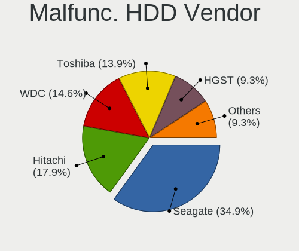
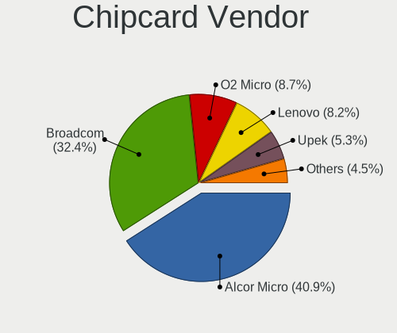

Linux in Germany - Tested Hardware & Statistics (Notebooks)
-----------------------------------------------------------

A project to collect tested hardware configurations for Linux in Germany.

Anyone can contribute to this report by the [hw-probe](https://github.com/linuxhw/hw-probe) tool:

    sudo -E hw-probe -all -upload

Please contribute! Especially if your hardware is rare.

Contents
--------

* [ Test Cases ](#test-cases)

* [ System ](#system)
  - [ OS                       ](#os)
  - [ OS Family                ](#os-family)
  - [ Kernel                   ](#kernel)
  - [ Kernel Family            ](#kernel-family)
  - [ Kernel Major Ver.        ](#kernel-major-ver)
  - [ Arch                     ](#arch)
  - [ DE                       ](#de)
  - [ Display Server           ](#display-server)
  - [ Display Manager          ](#display-manager)
  - [ OS Lang                  ](#os-lang)
  - [ Boot Mode                ](#boot-mode)
  - [ Filesystem               ](#filesystem)
  - [ Part. scheme             ](#part-scheme)
  - [ Dual Boot with Linux/BSD ](#dual-boot-with-linuxbsd)
  - [ Dual Boot (Win)          ](#dual-boot-win)

* [ Board ](#board)
  - [ Vendor                   ](#vendor)
  - [ Model                    ](#model)
  - [ Model Family             ](#model-family)
  - [ MFG Year                 ](#mfg-year)
  - [ Form Factor              ](#form-factor)
  - [ Secure Boot              ](#secure-boot)
  - [ Coreboot                 ](#coreboot)
  - [ RAM Size                 ](#ram-size)
  - [ RAM Used                 ](#ram-used)
  - [ Total Drives             ](#total-drives)
  - [ Has CD-ROM               ](#has-cd-rom)
  - [ Has Ethernet             ](#has-ethernet)
  - [ Has WiFi                 ](#has-wifi)
  - [ Has Bluetooth            ](#has-bluetooth)

* [ Location ](#location)
  - [ Country                  ](#country)
  - [ City                     ](#city)

* [ Drives ](#drives)
  - [ Drive Vendor             ](#drive-vendor)
  - [ Drive Model              ](#drive-model)
  - [ HDD Vendor               ](#hdd-vendor)
  - [ SSD Vendor               ](#ssd-vendor)
  - [ Drive Kind               ](#drive-kind)
  - [ Drive Connector          ](#drive-connector)
  - [ Drive Size               ](#drive-size)
  - [ Space Total              ](#space-total)
  - [ Space Used               ](#space-used)
  - [ Malfunc. Drives          ](#malfunc-drives)
  - [ Malfunc. Drive Vendor    ](#malfunc-drive-vendor)
  - [ Malfunc. HDD Vendor      ](#malfunc-hdd-vendor)
  - [ Malfunc. Drive Kind      ](#malfunc-drive-kind)
  - [ Failed Drives            ](#failed-drives)
  - [ Failed Drive Vendor      ](#failed-drive-vendor)
  - [ Drive Status             ](#drive-status)

* [ Storage controller ](#storage-controller)
  - [ Storage Vendor           ](#storage-vendor)
  - [ Storage Model            ](#storage-model)
  - [ Storage Kind             ](#storage-kind)

* [ Processor ](#processor)
  - [ CPU Vendor               ](#cpu-vendor)
  - [ CPU Model                ](#cpu-model)
  - [ CPU Model Family         ](#cpu-model-family)
  - [ CPU Cores                ](#cpu-cores)
  - [ CPU Sockets              ](#cpu-sockets)
  - [ CPU Threads              ](#cpu-threads)
  - [ CPU Op-Modes             ](#cpu-op-modes)
  - [ CPU Microcode            ](#cpu-microcode)
  - [ CPU Microarch            ](#cpu-microarch)

* [ Graphics ](#graphics)
  - [ GPU Vendor               ](#gpu-vendor)
  - [ GPU Model                ](#gpu-model)
  - [ GPU Combo                ](#gpu-combo)
  - [ GPU Driver               ](#gpu-driver)
  - [ GPU Memory               ](#gpu-memory)

* [ Monitor ](#monitor)
  - [ Monitor Vendor           ](#monitor-vendor)
  - [ Monitor Model            ](#monitor-model)
  - [ Monitor Resolution       ](#monitor-resolution)
  - [ Monitor Diagonal         ](#monitor-diagonal)
  - [ Monitor Width            ](#monitor-width)
  - [ Aspect Ratio             ](#aspect-ratio)
  - [ Monitor Area             ](#monitor-area)
  - [ Pixel Density            ](#pixel-density)
  - [ Multiple Monitors        ](#multiple-monitors)

* [ Network ](#network)
  - [ Net Controller Vendor    ](#net-controller-vendor)
  - [ Net Controller Model     ](#net-controller-model)
  - [ Wireless Vendor          ](#wireless-vendor)
  - [ Wireless Model           ](#wireless-model)
  - [ Ethernet Vendor          ](#ethernet-vendor)
  - [ Ethernet Model           ](#ethernet-model)
  - [ Net Controller Kind      ](#net-controller-kind)
  - [ Used Controller          ](#used-controller)
  - [ NICs                     ](#nics)
  - [ IPv6                     ](#ipv6)

* [ Bluetooth ](#bluetooth)
  - [ Bluetooth Vendor         ](#bluetooth-vendor)
  - [ Bluetooth Model          ](#bluetooth-model)

* [ Sound ](#sound)
  - [ Sound Vendor             ](#sound-vendor)
  - [ Sound Model              ](#sound-model)

* [ Memory ](#memory)
  - [ Memory Vendor            ](#memory-vendor)
  - [ Memory Model             ](#memory-model)
  - [ Memory Kind              ](#memory-kind)
  - [ Memory Form Factor       ](#memory-form-factor)
  - [ Memory Size              ](#memory-size)
  - [ Memory Speed             ](#memory-speed)

* [ Printers & scanners ](#printers--scanners)
  - [ Printer Vendor           ](#printer-vendor)
  - [ Printer Model            ](#printer-model)
  - [ Scanner Vendor           ](#scanner-vendor)
  - [ Scanner Model            ](#scanner-model)

* [ Camera ](#camera)
  - [ Camera Vendor            ](#camera-vendor)
  - [ Camera Model             ](#camera-model)

* [ Security ](#security)
  - [ Fingerprint Vendor       ](#fingerprint-vendor)
  - [ Fingerprint Model        ](#fingerprint-model)
  - [ Chipcard Vendor          ](#chipcard-vendor)
  - [ Chipcard Model           ](#chipcard-model)

* [ Unsupported ](#unsupported)
  - [ Unsupported Devices      ](#unsupported-devices)
  - [ Unsupported Device Types ](#unsupported-device-types)

Test Cases
----------

Total: 18975

| Vendor        | Model                       | Probe                                                      | Date         |
|---------------|-----------------------------|------------------------------------------------------------|--------------|
| Dell          | Inspiron 3481               | [78cf24846f](https://linux-hardware.org/?probe=78cf24846f) | May 09, 2024 |
| Lenovo        | ThinkBook 13x G4 IMH 21K... | [7cfc568eb2](https://linux-hardware.org/?probe=7cfc568eb2) | May 09, 2024 |
| Gigabyte      | G5 GE                       | [938a8a3f8e](https://linux-hardware.org/?probe=938a8a3f8e) | May 09, 2024 |
| Lenovo        | ThinkPad T440s 20AQ0069G... | [86d66670cb](https://linux-hardware.org/?probe=86d66670cb) | May 09, 2024 |
| Lenovo        | Legion Y540-15IRH 81SX      | [03e53efb87](https://linux-hardware.org/?probe=03e53efb87) | May 08, 2024 |
| ASUSTek       | VivoBook_ASUSLaptop K370... | [57bc46051b](https://linux-hardware.org/?probe=57bc46051b) | May 08, 2024 |
| Valve         | Jupiter                     | [fadecff7cd](https://linux-hardware.org/?probe=fadecff7cd) | May 08, 2024 |
| Apple         | MacBookPro8,2               | [2410273443](https://linux-hardware.org/?probe=2410273443) | May 08, 2024 |
| Lenovo        | ThinkPad T410 2537MN9       | [7deebe7ca3](https://linux-hardware.org/?probe=7deebe7ca3) | May 08, 2024 |
| HP            | ProBook 4740s               | [7f39194517](https://linux-hardware.org/?probe=7f39194517) | May 08, 2024 |
| ECT           | ONE GAMING Notebook K56-... | [64028f3e06](https://linux-hardware.org/?probe=64028f3e06) | May 08, 2024 |
| Dell          | XPS 15 7590                 | [a4b733d1fe](https://linux-hardware.org/?probe=a4b733d1fe) | May 08, 2024 |
| HP            | EliteBook 735 G5            | [628e01fd2b](https://linux-hardware.org/?probe=628e01fd2b) | May 08, 2024 |
| Acer          | Aspire 5720                 | [0a218dfdfe](https://linux-hardware.org/?probe=0a218dfdfe) | May 08, 2024 |
| ASUSTek       | N61Vn                       | [07f83fc6c0](https://linux-hardware.org/?probe=07f83fc6c0) | May 08, 2024 |
| Dell          | Latitude E6540              | [c6c6acf7d2](https://linux-hardware.org/?probe=c6c6acf7d2) | May 08, 2024 |
| HP            | ZBook Power 15.6 inch G8... | [291c23ee80](https://linux-hardware.org/?probe=291c23ee80) | May 08, 2024 |
| Dell          | Latitude E6540              | [a57f8ef498](https://linux-hardware.org/?probe=a57f8ef498) | May 08, 2024 |
| Lenovo        | ThinkPad T440s 20AQ0069G... | [b84ba3c6c7](https://linux-hardware.org/?probe=b84ba3c6c7) | May 08, 2024 |
| Schenker      | VISION 16 Pro (L22)         | [c54f918726](https://linux-hardware.org/?probe=c54f918726) | May 08, 2024 |
| Dell          | Latitude D830               | [831a2196a3](https://linux-hardware.org/?probe=831a2196a3) | May 07, 2024 |
| ASUSTek       | X555LD                      | [989d24a4b7](https://linux-hardware.org/?probe=989d24a4b7) | May 07, 2024 |
| HP            | ProBook 450 G5              | [4536e47198](https://linux-hardware.org/?probe=4536e47198) | May 07, 2024 |
| Lenovo        | ThinkPad P14s Gen 4 21HF... | [85239f7dc1](https://linux-hardware.org/?probe=85239f7dc1) | May 07, 2024 |
| TUXEDO        | InfinityBook Pro Gen7 (M... | [bc9db74da3](https://linux-hardware.org/?probe=bc9db74da3) | May 07, 2024 |
| Lenovo        | Unknown                     | [63995e584e](https://linux-hardware.org/?probe=63995e584e) | May 07, 2024 |
| Acer          | Aspire A315-56              | [37f76a3652](https://linux-hardware.org/?probe=37f76a3652) | May 07, 2024 |
| Dell          | XPS 15 9520                 | [70022231bd](https://linux-hardware.org/?probe=70022231bd) | May 07, 2024 |
| Dell          | Precision 5560              | [c9f03ecb24](https://linux-hardware.org/?probe=c9f03ecb24) | May 07, 2024 |
| Samsung       | RC530/RC730                 | [9e8af32b68](https://linux-hardware.org/?probe=9e8af32b68) | May 07, 2024 |
| Lenovo        | ThinkPad E15 Gen 4 21E60... | [230c054c87](https://linux-hardware.org/?probe=230c054c87) | May 07, 2024 |
| Framework     | Laptop 13 (AMD Ryzen 704... | [b3a37af0d0](https://linux-hardware.org/?probe=b3a37af0d0) | May 07, 2024 |
| Framework     | Laptop 13 (AMD Ryzen 704... | [63e6a64d1b](https://linux-hardware.org/?probe=63e6a64d1b) | May 07, 2024 |
| Apple         | MacBookPro11,1              | [c18909580d](https://linux-hardware.org/?probe=c18909580d) | May 07, 2024 |
| Apple         | MacBookPro11,1              | [61aed9772b](https://linux-hardware.org/?probe=61aed9772b) | May 07, 2024 |
| Sony          | VPCEB1S1E                   | [db144a8fd9](https://linux-hardware.org/?probe=db144a8fd9) | May 06, 2024 |
| Valve         | Galileo                     | [af20242820](https://linux-hardware.org/?probe=af20242820) | May 06, 2024 |
| Unknown       | Unknown                     | [273d6afeb5](https://linux-hardware.org/?probe=273d6afeb5) | May 06, 2024 |
| Sony          | VPCEB1S1E                   | [aa8d766ae4](https://linux-hardware.org/?probe=aa8d766ae4) | May 06, 2024 |
| Lenovo        | ThinkPad P50 20ENCTO1WW     | [9adbb0ba2c](https://linux-hardware.org/?probe=9adbb0ba2c) | May 06, 2024 |
| HP            | EliteBook 820 G2            | [254af47954](https://linux-hardware.org/?probe=254af47954) | May 06, 2024 |
| Lenovo        | ThinkPad P50 20ENCTO1WW     | [465a5be052](https://linux-hardware.org/?probe=465a5be052) | May 06, 2024 |
| Lenovo        | ThinkPad P51 W10DG 20MNS... | [76f01093f1](https://linux-hardware.org/?probe=76f01093f1) | May 06, 2024 |
| HP            | 650                         | [8fa3b11e2c](https://linux-hardware.org/?probe=8fa3b11e2c) | May 05, 2024 |
| Lenovo        | V110-15IAP 80TG             | [2ba8347b04](https://linux-hardware.org/?probe=2ba8347b04) | May 05, 2024 |
| Lenovo        | ThinkBook 16 G6 ABP 21KK    | [5a7ed888e1](https://linux-hardware.org/?probe=5a7ed888e1) | May 05, 2024 |
| Fujitsu       | CELSIUS H730                | [78e1a3550b](https://linux-hardware.org/?probe=78e1a3550b) | May 05, 2024 |
| Dell          | Inspiron 16 Plus 7620       | [cd8ef2428b](https://linux-hardware.org/?probe=cd8ef2428b) | May 05, 2024 |
| ASUSTek       | GL753VD                     | [735ff065db](https://linux-hardware.org/?probe=735ff065db) | May 05, 2024 |
| HP            | ProBook 640 G1              | [012a8fbd0c](https://linux-hardware.org/?probe=012a8fbd0c) | May 05, 2024 |
| HUAWEI        | MACHR-WX9                   | [9577917e03](https://linux-hardware.org/?probe=9577917e03) | May 05, 2024 |
| Apple         | MacBookPro6,2               | [01201fa443](https://linux-hardware.org/?probe=01201fa443) | May 05, 2024 |
| ASUSTek       | N61Vn                       | [5aaf9f4609](https://linux-hardware.org/?probe=5aaf9f4609) | May 05, 2024 |
| ASUSTek       | GR8                         | [6a8003e347](https://linux-hardware.org/?probe=6a8003e347) | May 05, 2024 |
| Dell          | Latitude 5410               | [8302f81328](https://linux-hardware.org/?probe=8302f81328) | May 04, 2024 |
| HP            | EliteBook 850 G5            | [997c27445a](https://linux-hardware.org/?probe=997c27445a) | May 04, 2024 |
| Lenovo        | ThinkPad T520 4243W29       | [b1e4dde68e](https://linux-hardware.org/?probe=b1e4dde68e) | May 04, 2024 |
| Lenovo        | ThinkPad X1 Carbon Gen 9... | [90ac042d36](https://linux-hardware.org/?probe=90ac042d36) | May 04, 2024 |
| ASUSTek       | X751MA                      | [ab76aeaddb](https://linux-hardware.org/?probe=ab76aeaddb) | May 04, 2024 |
| Lenovo        | ThinkPad T530 2429HR5       | [c5640e6fae](https://linux-hardware.org/?probe=c5640e6fae) | May 04, 2024 |
| Dell          | Latitude 5490               | [b31473028c](https://linux-hardware.org/?probe=b31473028c) | May 04, 2024 |
| Lenovo        | V340-17IWL 81RG             | [1584f1c1cf](https://linux-hardware.org/?probe=1584f1c1cf) | May 03, 2024 |
| ASUSTek       | ROG Zephyrus M16 GU604VI... | [d22fed35ce](https://linux-hardware.org/?probe=d22fed35ce) | May 03, 2024 |
| IGEL Techn... | M340C                       | [dbb60f0c71](https://linux-hardware.org/?probe=dbb60f0c71) | May 03, 2024 |
| HP            | EliteBook 840 G4            | [f9fed717ee](https://linux-hardware.org/?probe=f9fed717ee) | May 03, 2024 |
| Lenovo        | Legion Slim 5 14APH8 82Y... | [9b8008703d](https://linux-hardware.org/?probe=9b8008703d) | May 03, 2024 |
| ASUSTek       | TUF Gaming FX504GE_FX80G... | [6fb2e2c6d4](https://linux-hardware.org/?probe=6fb2e2c6d4) | May 03, 2024 |
| Acer          | Swift SFG14-72              | [00c7e89498](https://linux-hardware.org/?probe=00c7e89498) | May 03, 2024 |
| Lenovo        | ThinkPad T460 20FMS0VG25    | [754611f403](https://linux-hardware.org/?probe=754611f403) | May 03, 2024 |
| ASUSTek       | GR8                         | [ded6da2442](https://linux-hardware.org/?probe=ded6da2442) | May 02, 2024 |
| Toshiba       | Satellite A200              | [47b52c0fce](https://linux-hardware.org/?probe=47b52c0fce) | May 02, 2024 |
| Schenker      | XMG CORE 15(M20, RTX 206... | [e22a67c560](https://linux-hardware.org/?probe=e22a67c560) | May 02, 2024 |
| Lenovo        | B560 43308UG                | [3a36ef2f10](https://linux-hardware.org/?probe=3a36ef2f10) | May 02, 2024 |
| Star Labs     | StarBook                    | [637a8da717](https://linux-hardware.org/?probe=637a8da717) | May 02, 2024 |
| Chuwi         | HeroBook Pro                | [76e47767d1](https://linux-hardware.org/?probe=76e47767d1) | May 02, 2024 |
| Lenovo        | ThinkPad E14 Gen 5 21JRC... | [8c996ba957](https://linux-hardware.org/?probe=8c996ba957) | May 02, 2024 |
| Lenovo        | V14-ADA 82C6                | [1e4ba01e31](https://linux-hardware.org/?probe=1e4ba01e31) | May 02, 2024 |
| TUXEDO        | Aura 15 Gen2                | [93d15c44da](https://linux-hardware.org/?probe=93d15c44da) | May 02, 2024 |
| Schenker      | XMG NEO (CZN/E21)           | [c6e0886125](https://linux-hardware.org/?probe=c6e0886125) | May 02, 2024 |
| ASUSTek       | X553MA                      | [0418112d2f](https://linux-hardware.org/?probe=0418112d2f) | May 02, 2024 |
| HP            | Unknown                     | [2105666632](https://linux-hardware.org/?probe=2105666632) | May 02, 2024 |
| Lenovo        | V145-15AST 81MT             | [9f845a3577](https://linux-hardware.org/?probe=9f845a3577) | May 02, 2024 |
| Fujitsu       | CELSIUS H730                | [49cfbc7ba1](https://linux-hardware.org/?probe=49cfbc7ba1) | May 01, 2024 |
| Medion        | P662X                       | [3689ca2476](https://linux-hardware.org/?probe=3689ca2476) | May 01, 2024 |
| HP            | 250 G7 Notebook PC          | [d53b36801f](https://linux-hardware.org/?probe=d53b36801f) | May 01, 2024 |
| Dell          | Latitude 5490               | [c83e9f5562](https://linux-hardware.org/?probe=c83e9f5562) | May 01, 2024 |
| Notebook      | V15x_V17xRNx                | [ec53c078f5](https://linux-hardware.org/?probe=ec53c078f5) | May 01, 2024 |
| HP            | ProBook 450 15.6 inch G1... | [e39ccf215f](https://linux-hardware.org/?probe=e39ccf215f) | May 01, 2024 |
| Samsung       | 355V4C/356V4C/3445VC/354... | [b861055064](https://linux-hardware.org/?probe=b861055064) | May 01, 2024 |
| Wortmann      | TERRA_MOBILE_1749           | [cdfcbe795b](https://linux-hardware.org/?probe=cdfcbe795b) | May 01, 2024 |
| ECT           | Unknown                     | [0ebb9fcdd0](https://linux-hardware.org/?probe=0ebb9fcdd0) | May 01, 2024 |
| ASUSTek       | ASUS Vivobook S 16 S5606... | [bfe20c3d58](https://linux-hardware.org/?probe=bfe20c3d58) | May 01, 2024 |
| LG Electro... | 16Z90P-G.AA76G              | [f9bdc22f6f](https://linux-hardware.org/?probe=f9bdc22f6f) | May 01, 2024 |
| Dell          | Inspiron 7537               | [d27f9ad169](https://linux-hardware.org/?probe=d27f9ad169) | May 01, 2024 |
| HP            | EliteBook 850 G1            | [c6effb94ba](https://linux-hardware.org/?probe=c6effb94ba) | May 01, 2024 |
| Lenovo        | Y50-70 20378                | [f7076c4db1](https://linux-hardware.org/?probe=f7076c4db1) | May 01, 2024 |
| Dell          | XPS 13 9360                 | [da66fe35d4](https://linux-hardware.org/?probe=da66fe35d4) | May 01, 2024 |
| MSI           | EX623                       | [76a2472e9d](https://linux-hardware.org/?probe=76a2472e9d) | Apr 30, 2024 |
| TUXEDO        | InfinityBook Pro 14 Gen6    | [290ff65bc7](https://linux-hardware.org/?probe=290ff65bc7) | Apr 30, 2024 |
| Acer          | Aspire E5-521G              | [0236376455](https://linux-hardware.org/?probe=0236376455) | Apr 30, 2024 |
| Apple         | MacBookPro9,1               | [ab5152538c](https://linux-hardware.org/?probe=ab5152538c) | Apr 29, 2024 |
| HP            | ProBook 650 G8 Notebook ... | [18585f423b](https://linux-hardware.org/?probe=18585f423b) | Apr 29, 2024 |
| ASUSTek       | TUF Gaming FX705DT_FX705... | [442e237079](https://linux-hardware.org/?probe=442e237079) | Apr 29, 2024 |
| ASUSTek       | TUF Gaming FX705DT_FX705... | [c785d9440f](https://linux-hardware.org/?probe=c785d9440f) | Apr 29, 2024 |
| Apple         | MacBookPro9,1               | [d670f48308](https://linux-hardware.org/?probe=d670f48308) | Apr 29, 2024 |
| Acer          | Swift SFE16-43              | [02fa8654df](https://linux-hardware.org/?probe=02fa8654df) | Apr 29, 2024 |
| HP            | 255 15.6 inch G9 Noteboo... | [184f4e1a7c](https://linux-hardware.org/?probe=184f4e1a7c) | Apr 29, 2024 |
| HP            | Victus by Laptop 16-e0xx... | [1cd614027a](https://linux-hardware.org/?probe=1cd614027a) | Apr 29, 2024 |
| TUXEDO        | Pulse 14 Gen3               | [d298ae16e1](https://linux-hardware.org/?probe=d298ae16e1) | Apr 29, 2024 |
| Lenovo        | IdeaPad 5 Pro 14ITL6 82L... | [80821a7004](https://linux-hardware.org/?probe=80821a7004) | Apr 29, 2024 |
| Dell          | Latitude 5420               | [121f841401](https://linux-hardware.org/?probe=121f841401) | Apr 29, 2024 |
| Lenovo        | ThinkPad L15 Gen 1 20U70... | [d4e717f7b6](https://linux-hardware.org/?probe=d4e717f7b6) | Apr 29, 2024 |
| TUXEDO        | InfinityBook Pro Gen8 (M... | [93815a6cda](https://linux-hardware.org/?probe=93815a6cda) | Apr 28, 2024 |
| Dell          | Precision M6800             | [394b2b0f31](https://linux-hardware.org/?probe=394b2b0f31) | Apr 28, 2024 |
| Lenovo        | ThinkPad W530 24474KG       | [0019533554](https://linux-hardware.org/?probe=0019533554) | Apr 28, 2024 |
| HUAWEI        | HVY-WXX9                    | [6f9f3a855d](https://linux-hardware.org/?probe=6f9f3a855d) | Apr 28, 2024 |
| HUAWEI        | HVY-WXX9                    | [1f145f5fb5](https://linux-hardware.org/?probe=1f145f5fb5) | Apr 28, 2024 |
| Lenovo        | B570 1068EMG                | [9617fb7082](https://linux-hardware.org/?probe=9617fb7082) | Apr 28, 2024 |
| Samsung       | RC530/RC730                 | [ef8bb7edf5](https://linux-hardware.org/?probe=ef8bb7edf5) | Apr 28, 2024 |
| Fujitsu       | LIFEBOOK UH572              | [18bdace363](https://linux-hardware.org/?probe=18bdace363) | Apr 28, 2024 |
| Apple         | MacBookPro11,1              | [0a30ad8b47](https://linux-hardware.org/?probe=0a30ad8b47) | Apr 28, 2024 |
| Lenovo        | ThinkPad X390 20Q1S62G00    | [e7319a730f](https://linux-hardware.org/?probe=e7319a730f) | Apr 27, 2024 |
| Lenovo        | IdeaPadFlex 15D 20334       | [a05b704ec4](https://linux-hardware.org/?probe=a05b704ec4) | Apr 27, 2024 |
| TUXEDO        | InfinityBook Pro 14 Gen6    | [f6d6805396](https://linux-hardware.org/?probe=f6d6805396) | Apr 27, 2024 |
| HP            | EliteBook 735 G5            | [9e1b0b4220](https://linux-hardware.org/?probe=9e1b0b4220) | Apr 27, 2024 |
| Lenovo        | ThinkPad X240 20AMA0SE00    | [be7a1e7b0c](https://linux-hardware.org/?probe=be7a1e7b0c) | Apr 27, 2024 |
| HP            | EliteBook 830 G6            | [6b74d2c1b5](https://linux-hardware.org/?probe=6b74d2c1b5) | Apr 27, 2024 |
| ASUSTek       | X555LD                      | [95724fb189](https://linux-hardware.org/?probe=95724fb189) | Apr 27, 2024 |
| Samsung       | 355V4C/356V4C/3445VC/354... | [4b825a61db](https://linux-hardware.org/?probe=4b825a61db) | Apr 27, 2024 |
| Dell          | Latitude 5300               | [0bacb68e71](https://linux-hardware.org/?probe=0bacb68e71) | Apr 27, 2024 |
| Acer          | Aspire A515-57              | [99f1c965f4](https://linux-hardware.org/?probe=99f1c965f4) | Apr 27, 2024 |
| Valve         | Jupiter                     | [2c0ec8539f](https://linux-hardware.org/?probe=2c0ec8539f) | Apr 26, 2024 |
| Gigabyte      | AERO 15-X9                  | [a62c895461](https://linux-hardware.org/?probe=a62c895461) | Apr 26, 2024 |
| Medion        | Akoya E6227                 | [76bfce53f4](https://linux-hardware.org/?probe=76bfce53f4) | Apr 26, 2024 |
| Gigabyte      | AERO 15-X9                  | [25245adc43](https://linux-hardware.org/?probe=25245adc43) | Apr 26, 2024 |
| Lenovo        | Unknown                     | [314b707335](https://linux-hardware.org/?probe=314b707335) | Apr 26, 2024 |
| HP            | ZBook 17 G3 Mobile Works... | [e56b499574](https://linux-hardware.org/?probe=e56b499574) | Apr 26, 2024 |
| Acer          | Aspire 7745G                | [2db24c493d](https://linux-hardware.org/?probe=2db24c493d) | Apr 26, 2024 |
| ASUSTek       | 1000H                       | [0463a4d88b](https://linux-hardware.org/?probe=0463a4d88b) | Apr 26, 2024 |
| Lenovo        | Legion 5 Pro 16ACH6H 82J... | [46e559a9de](https://linux-hardware.org/?probe=46e559a9de) | Apr 26, 2024 |
| Apple         | MacBookAir7,2               | [00973a82c8](https://linux-hardware.org/?probe=00973a82c8) | Apr 26, 2024 |
| Dell          | XPS 14 9440                 | [9eef0b7d62](https://linux-hardware.org/?probe=9eef0b7d62) | Apr 26, 2024 |
| ASUSTek       | X55A                        | [6b6ea50d41](https://linux-hardware.org/?probe=6b6ea50d41) | Apr 26, 2024 |
| ASUSTek       | ASUS TUF Gaming A15 FA50... | [703d565003](https://linux-hardware.org/?probe=703d565003) | Apr 26, 2024 |
| Lenovo        | ThinkPad T470s 20HGS45C0... | [f39ba0b079](https://linux-hardware.org/?probe=f39ba0b079) | Apr 26, 2024 |
| Chuwi         | MiniBook X                  | [72a19fbe38](https://linux-hardware.org/?probe=72a19fbe38) | Apr 26, 2024 |
| HP            | EliteBook 8730w             | [da4db94e97](https://linux-hardware.org/?probe=da4db94e97) | Apr 26, 2024 |
| Valve         | Jupiter                     | [3b3674f61e](https://linux-hardware.org/?probe=3b3674f61e) | Apr 26, 2024 |
| Gigabyte      | W251U                       | [ae6076979a](https://linux-hardware.org/?probe=ae6076979a) | Apr 25, 2024 |
| HP            | EliteBook 840 G8 Noteboo... | [eaf4d9f0b7](https://linux-hardware.org/?probe=eaf4d9f0b7) | Apr 25, 2024 |
| Lenovo        | IdeaPad 5 Pro 14ACN6 82L... | [ae5dddd784](https://linux-hardware.org/?probe=ae5dddd784) | Apr 25, 2024 |
| HP            | EliteBook 850 G5            | [4da2348bbe](https://linux-hardware.org/?probe=4da2348bbe) | Apr 25, 2024 |
| Lenovo        | ThinkPad T450s 20BX001EU... | [b1cd1d7df2](https://linux-hardware.org/?probe=b1cd1d7df2) | Apr 25, 2024 |
| Lenovo        | ThinkPad T450s 20BX001EU... | [9acc3eed8d](https://linux-hardware.org/?probe=9acc3eed8d) | Apr 25, 2024 |
| HP            | ProBook 4340s               | [a33e5a73ef](https://linux-hardware.org/?probe=a33e5a73ef) | Apr 25, 2024 |
| ASUSTek       | N751JK                      | [1d2d8c3d7a](https://linux-hardware.org/?probe=1d2d8c3d7a) | Apr 25, 2024 |
| Fujitsu       | LIFEBOOK P702               | [e7b04de0c7](https://linux-hardware.org/?probe=e7b04de0c7) | Apr 25, 2024 |
| Dell          | Latitude E6540              | [270b868041](https://linux-hardware.org/?probe=270b868041) | Apr 25, 2024 |
| ASUSTek       | N751JK                      | [f49afec710](https://linux-hardware.org/?probe=f49afec710) | Apr 25, 2024 |
| Lenovo        | U31-70 80M5                 | [2a4ad09169](https://linux-hardware.org/?probe=2a4ad09169) | Apr 25, 2024 |
| HP            | Dragonfly 13.5 inch G4 N... | [09ff8bf6dd](https://linux-hardware.org/?probe=09ff8bf6dd) | Apr 25, 2024 |
| Apple         | MacBookPro15,1              | [cd32029949](https://linux-hardware.org/?probe=cd32029949) | Apr 24, 2024 |
| Apple         | MacBookPro9,2               | [bc2a0115a8](https://linux-hardware.org/?probe=bc2a0115a8) | Apr 24, 2024 |
| Lenovo        | ThinkPad T470s 20HGS6Y80... | [96569e2ad7](https://linux-hardware.org/?probe=96569e2ad7) | Apr 24, 2024 |
| Lenovo        | ThinkPad T570 20H90002RI    | [eeccbdaf2a](https://linux-hardware.org/?probe=eeccbdaf2a) | Apr 24, 2024 |
| Lenovo        | V15 G4 IAH 83FS             | [b922fc6d5e](https://linux-hardware.org/?probe=b922fc6d5e) | Apr 24, 2024 |
| Gigabyte      | G5 GE                       | [82e2ab72fe](https://linux-hardware.org/?probe=82e2ab72fe) | Apr 24, 2024 |
| Lenovo        | ThinkPad T470s W10DG 20J... | [a06bcc63e8](https://linux-hardware.org/?probe=a06bcc63e8) | Apr 24, 2024 |
| Lenovo        | ThinkPad T470s W10DG 20J... | [bc030e73d5](https://linux-hardware.org/?probe=bc030e73d5) | Apr 24, 2024 |
| Dell          | Precision 3581              | [93a95856e0](https://linux-hardware.org/?probe=93a95856e0) | Apr 24, 2024 |
| Lenovo        | ThinkPad T460 20FMS0VG25    | [3367162736](https://linux-hardware.org/?probe=3367162736) | Apr 24, 2024 |
| Apple         | MacBookPro8,1               | [cf1ac0276a](https://linux-hardware.org/?probe=cf1ac0276a) | Apr 24, 2024 |
| Lenovo        | ThinkPad E14 Gen 2 20TA0... | [038bd79a48](https://linux-hardware.org/?probe=038bd79a48) | Apr 23, 2024 |
| Lenovo        | ThinkPad T14s Gen 4 21F8... | [1f13f4d924](https://linux-hardware.org/?probe=1f13f4d924) | Apr 23, 2024 |
| Toshiba       | Satellite C50-A             | [cabe5d7a20](https://linux-hardware.org/?probe=cabe5d7a20) | Apr 23, 2024 |
| Framework     | Laptop (12th Gen Intel C... | [e79a07e085](https://linux-hardware.org/?probe=e79a07e085) | Apr 23, 2024 |
| Dell          | Latitude E5550              | [2193ab1cfa](https://linux-hardware.org/?probe=2193ab1cfa) | Apr 23, 2024 |
| Lenovo        | ThinkPad P15 Gen 1 20SU0... | [3ccc4413fb](https://linux-hardware.org/?probe=3ccc4413fb) | Apr 22, 2024 |
| Acer          | Aspire A315-56              | [994d2b8b2d](https://linux-hardware.org/?probe=994d2b8b2d) | Apr 22, 2024 |
| Acer          | Aspire A315-56              | [92fb8268cc](https://linux-hardware.org/?probe=92fb8268cc) | Apr 22, 2024 |
| Acer          | Aspire E5-575T              | [d91600e2a3](https://linux-hardware.org/?probe=d91600e2a3) | Apr 22, 2024 |
| HP            | ZBook Studio G3             | [c78e54109c](https://linux-hardware.org/?probe=c78e54109c) | Apr 22, 2024 |
| Lenovo        | IdeaPad 320-17IKB 80XM      | [43ec460c41](https://linux-hardware.org/?probe=43ec460c41) | Apr 22, 2024 |
| HP            | ENVY 15                     | [1f59ab10af](https://linux-hardware.org/?probe=1f59ab10af) | Apr 22, 2024 |
| Lenovo        | ThinkPad E15 Gen 2 20T80... | [fdad15cab2](https://linux-hardware.org/?probe=fdad15cab2) | Apr 22, 2024 |
| Lenovo        | ThinkPad W530 24474KG       | [f5bb127a05](https://linux-hardware.org/?probe=f5bb127a05) | Apr 21, 2024 |
| ASUSTek       | X555UF                      | [0ad869f641](https://linux-hardware.org/?probe=0ad869f641) | Apr 21, 2024 |
| HP            | EliteBook 8460p             | [10abeed71a](https://linux-hardware.org/?probe=10abeed71a) | Apr 21, 2024 |
| Acer          | Aspire F5-573               | [c71f150bd8](https://linux-hardware.org/?probe=c71f150bd8) | Apr 21, 2024 |
| MSI           | Thin GF63 12VE              | [797980dc42](https://linux-hardware.org/?probe=797980dc42) | Apr 21, 2024 |
| Dell          | Latitude 5440               | [58cc268fb3](https://linux-hardware.org/?probe=58cc268fb3) | Apr 21, 2024 |
| ASUSTek       | VivoBook_ASUSLaptop M160... | [09f4ed7915](https://linux-hardware.org/?probe=09f4ed7915) | Apr 21, 2024 |
| Lenovo        | B5400 80B6QB0               | [e7a82d8d18](https://linux-hardware.org/?probe=e7a82d8d18) | Apr 21, 2024 |
| Apple         | MacBookPro8,2               | [86d1293b64](https://linux-hardware.org/?probe=86d1293b64) | Apr 21, 2024 |
| HP            | Laptop 17-cp0xxx            | [9eff554fa4](https://linux-hardware.org/?probe=9eff554fa4) | Apr 21, 2024 |
| Lenovo        | Legion 5 15ACH6H 82JU       | [63baa07920](https://linux-hardware.org/?probe=63baa07920) | Apr 21, 2024 |
| Medion        | Akoya E6227                 | [180d5db57d](https://linux-hardware.org/?probe=180d5db57d) | Apr 20, 2024 |
| ASUSTek       | ASUS TUF Gaming A15 FA50... | [4c782693bf](https://linux-hardware.org/?probe=4c782693bf) | Apr 20, 2024 |
| Acer          | Extensa 215-55              | [2639558ab5](https://linux-hardware.org/?probe=2639558ab5) | Apr 20, 2024 |
| Teclast       | F6 Plus                     | [58aa179f3b](https://linux-hardware.org/?probe=58aa179f3b) | Apr 20, 2024 |
| AMI           | Unknown                     | [8330483e6e](https://linux-hardware.org/?probe=8330483e6e) | Apr 20, 2024 |
| HP            | Laptop 17-cp0xxx            | [fea13a098d](https://linux-hardware.org/?probe=fea13a098d) | Apr 20, 2024 |
| XMG           | N85_N87,HJ,HJ1,HK1          | [88ab8ac1a1](https://linux-hardware.org/?probe=88ab8ac1a1) | Apr 20, 2024 |
| Toshiba       | Satellite L50-C             | [ca2755b614](https://linux-hardware.org/?probe=ca2755b614) | Apr 20, 2024 |
| Toshiba       | Satellite L50-C             | [8eec3bacc7](https://linux-hardware.org/?probe=8eec3bacc7) | Apr 20, 2024 |
| HP            | ProBook 450 G8 Notebook ... | [6bb7ef988e](https://linux-hardware.org/?probe=6bb7ef988e) | Apr 20, 2024 |
| ASUSTek       | VivoBook_ASUSLaptop X712... | [35685d6f90](https://linux-hardware.org/?probe=35685d6f90) | Apr 20, 2024 |
| Dell          | XPS 13 9360                 | [5f76fcfd59](https://linux-hardware.org/?probe=5f76fcfd59) | Apr 20, 2024 |
| Fujitsu       | LIFEBOOK U727               | [2d96690752](https://linux-hardware.org/?probe=2d96690752) | Apr 20, 2024 |
| ASUSTek       | ASUS TUF Gaming F15 FX50... | [1e8f14cb22](https://linux-hardware.org/?probe=1e8f14cb22) | Apr 20, 2024 |
| Chuwi         | MiniBook X                  | [d65bae182c](https://linux-hardware.org/?probe=d65bae182c) | Apr 19, 2024 |
| HP            | ZBook 15 G5                 | [e6dc5df04b](https://linux-hardware.org/?probe=e6dc5df04b) | Apr 19, 2024 |
| Apple         | MacBookPro9,2               | [f8fa58a83b](https://linux-hardware.org/?probe=f8fa58a83b) | Apr 19, 2024 |
| Acer          | Swift SF316-51              | [f1400c4a39](https://linux-hardware.org/?probe=f1400c4a39) | Apr 19, 2024 |
| Lenovo        | ThinkBook 16 G4+ IAP 21C... | [06f11dee2c](https://linux-hardware.org/?probe=06f11dee2c) | Apr 19, 2024 |
| Apple         | MacBookPro9,2               | [8dde47a60c](https://linux-hardware.org/?probe=8dde47a60c) | Apr 19, 2024 |
| Medion        | E6214                       | [fef41424b0](https://linux-hardware.org/?probe=fef41424b0) | Apr 19, 2024 |
| Acer          | NG-F5-771G-74P9             | [efaac96b3d](https://linux-hardware.org/?probe=efaac96b3d) | Apr 19, 2024 |
| Dell          | Latitude 7440               | [abc0600b15](https://linux-hardware.org/?probe=abc0600b15) | Apr 19, 2024 |
| Dell          | Latitude 7440               | [bc75c7249a](https://linux-hardware.org/?probe=bc75c7249a) | Apr 19, 2024 |
| Apple         | MacBook6,1                  | [3f4764c0ee](https://linux-hardware.org/?probe=3f4764c0ee) | Apr 19, 2024 |
| Medion        | E6214                       | [f6e648f8a4](https://linux-hardware.org/?probe=f6e648f8a4) | Apr 19, 2024 |
| Fujitsu       | LIFEBOOK T902               | [1f6b5be9dc](https://linux-hardware.org/?probe=1f6b5be9dc) | Apr 19, 2024 |
| Medion        | E11202                      | [aadb8a9e0a](https://linux-hardware.org/?probe=aadb8a9e0a) | Apr 19, 2024 |
| Medion        | E11202                      | [3de0e202c9](https://linux-hardware.org/?probe=3de0e202c9) | Apr 19, 2024 |
| Dell          | Inspiron 910                | [150577a3da](https://linux-hardware.org/?probe=150577a3da) | Apr 19, 2024 |
| Lenovo        | G700 20251                  | [6f7a2c121a](https://linux-hardware.org/?probe=6f7a2c121a) | Apr 19, 2024 |
| Lenovo        | ThinkPad T410 2539W2Q       | [9cb003f852](https://linux-hardware.org/?probe=9cb003f852) | Apr 18, 2024 |
| Lenovo        | B570 1068EMG                | [87cf443603](https://linux-hardware.org/?probe=87cf443603) | Apr 18, 2024 |
| HP            | ZBook Power 15.6 inch G1... | [f82450896d](https://linux-hardware.org/?probe=f82450896d) | Apr 18, 2024 |
| Lenovo        | G50-80 80E5                 | [184f2cf756](https://linux-hardware.org/?probe=184f2cf756) | Apr 18, 2024 |
| ASUSTek       | X756UXK                     | [c529e5199d](https://linux-hardware.org/?probe=c529e5199d) | Apr 18, 2024 |
| Packard Be... | EasyNote TK85               | [ae661b7230](https://linux-hardware.org/?probe=ae661b7230) | Apr 18, 2024 |
| Acer          | TravelMate P253             | [d3081b2d18](https://linux-hardware.org/?probe=d3081b2d18) | Apr 18, 2024 |
| ASUSTek       | X55A                        | [5603d8ff5e](https://linux-hardware.org/?probe=5603d8ff5e) | Apr 18, 2024 |
| Valve         | Jupiter                     | [85092eabaa](https://linux-hardware.org/?probe=85092eabaa) | Apr 18, 2024 |
| Lenovo        | ThinkPad T490 20N3SBU219    | [f9900101cc](https://linux-hardware.org/?probe=f9900101cc) | Apr 17, 2024 |
| Lenovo        | ThinkPad T450s 20BWS00V0... | [c6cafaee9d](https://linux-hardware.org/?probe=c6cafaee9d) | Apr 17, 2024 |
| Lenovo        | ThinkPad W550s 20E2CTO1W... | [121d5593e0](https://linux-hardware.org/?probe=121d5593e0) | Apr 17, 2024 |
| Dell          | Inspiron 7737               | [a19a0ef17f](https://linux-hardware.org/?probe=a19a0ef17f) | Apr 17, 2024 |
| Lenovo        | ThinkPad T580 20LAS2VM00    | [6a81f0c31f](https://linux-hardware.org/?probe=6a81f0c31f) | Apr 17, 2024 |
| Apple         | MacBookPro13,2              | [25f6afbbd6](https://linux-hardware.org/?probe=25f6afbbd6) | Apr 17, 2024 |
| Lenovo        | ThinkPad L15 Gen 3 21C70... | [15cf4a7e8f](https://linux-hardware.org/?probe=15cf4a7e8f) | Apr 17, 2024 |
| HP            | Laptop 15-db0xxx            | [a3eb57bb17](https://linux-hardware.org/?probe=a3eb57bb17) | Apr 16, 2024 |
| Dell          | Latitude 5430               | [5f23ced920](https://linux-hardware.org/?probe=5f23ced920) | Apr 16, 2024 |
| Lenovo        | ThinkPad T470s W10DG 20J... | [58c5fd150d](https://linux-hardware.org/?probe=58c5fd150d) | Apr 16, 2024 |
| Valve         | Jupiter                     | [7de67bf8c5](https://linux-hardware.org/?probe=7de67bf8c5) | Apr 16, 2024 |
| HP            | Laptop 14-cm0xxx            | [9dd5160f8f](https://linux-hardware.org/?probe=9dd5160f8f) | Apr 16, 2024 |
| HP            | 250 G7 Notebook PC          | [714eb8d9ea](https://linux-hardware.org/?probe=714eb8d9ea) | Apr 16, 2024 |
| ASUSTek       | N751JK                      | [39bb3da888](https://linux-hardware.org/?probe=39bb3da888) | Apr 16, 2024 |
| Dell          | Latitude 5410               | [700b37dcf0](https://linux-hardware.org/?probe=700b37dcf0) | Apr 16, 2024 |
| Apple         | MacBookAir6,2               | [22c88e1591](https://linux-hardware.org/?probe=22c88e1591) | Apr 16, 2024 |
| Samsung       | 750XED                      | [fee3c81bf3](https://linux-hardware.org/?probe=fee3c81bf3) | Apr 16, 2024 |
| Dell          | Latitude E6330              | [14d0cfe948](https://linux-hardware.org/?probe=14d0cfe948) | Apr 16, 2024 |
| Acer          | Aspire E5-521G              | [27ed8e5b6e](https://linux-hardware.org/?probe=27ed8e5b6e) | Apr 16, 2024 |
| Medion        | E5218                       | [62b09e7720](https://linux-hardware.org/?probe=62b09e7720) | Apr 16, 2024 |
| Lenovo        | ThinkPad T480s 20L8S02E0... | [4f6dc2dd34](https://linux-hardware.org/?probe=4f6dc2dd34) | Apr 16, 2024 |
| HP            | EliteBook 840 G1            | [a41037f2e9](https://linux-hardware.org/?probe=a41037f2e9) | Apr 15, 2024 |
| Lenovo        | ThinkPad P16s Gen 2 21K9... | [3a87512dcd](https://linux-hardware.org/?probe=3a87512dcd) | Apr 15, 2024 |
| HP            | 250 G3                      | [954137cff4](https://linux-hardware.org/?probe=954137cff4) | Apr 15, 2024 |
| Lenovo        | ThinkPad E460 20EUS00000    | [aa85d58506](https://linux-hardware.org/?probe=aa85d58506) | Apr 15, 2024 |
| Lenovo        | ThinkBook 15p Gen 2 21B1    | [e7a52d5a3c](https://linux-hardware.org/?probe=e7a52d5a3c) | Apr 15, 2024 |
| Lenovo        | ThinkPad X13 Gen 3 21CMA... | [9820ac9335](https://linux-hardware.org/?probe=9820ac9335) | Apr 15, 2024 |
| Lenovo        | ThinkPad T410 2539W2Q       | [54c60f5622](https://linux-hardware.org/?probe=54c60f5622) | Apr 15, 2024 |
| LG Electro... | 17Z90R-G.AA77G              | [c3c12d00f2](https://linux-hardware.org/?probe=c3c12d00f2) | Apr 15, 2024 |
| ASUSTek       | X502CA                      | [80390054a8](https://linux-hardware.org/?probe=80390054a8) | Apr 15, 2024 |
| ASUSTek       | TUF Gaming FX504GE_FX80G... | [9826a53ffb](https://linux-hardware.org/?probe=9826a53ffb) | Apr 15, 2024 |
| HP            | Pavilion 17                 | [ee03c38da0](https://linux-hardware.org/?probe=ee03c38da0) | Apr 15, 2024 |
| Lenovo        | IdeaPad 1 15ALC7 82R4       | [ccbc40e1d5](https://linux-hardware.org/?probe=ccbc40e1d5) | Apr 15, 2024 |
| LG Electro... | 17Z90R-G.AA77G              | [9adb0d4728](https://linux-hardware.org/?probe=9adb0d4728) | Apr 15, 2024 |
| HP            | 255 15.6 inch G10           | [3858a294e8](https://linux-hardware.org/?probe=3858a294e8) | Apr 14, 2024 |
| Lenovo        | ThinkPad T470s 20HGS6Y80... | [56bf2bd4d4](https://linux-hardware.org/?probe=56bf2bd4d4) | Apr 14, 2024 |
| Lenovo        | IdeaPad Slim 1-14AST-05 ... | [6720cd6b1d](https://linux-hardware.org/?probe=6720cd6b1d) | Apr 14, 2024 |
| Razer         | Blade                       | [8ff543883a](https://linux-hardware.org/?probe=8ff543883a) | Apr 14, 2024 |
| HP            | 255 15.6 inch G10           | [b72fb5d156](https://linux-hardware.org/?probe=b72fb5d156) | Apr 14, 2024 |
| Medion        | E6226                       | [be5a69a09e](https://linux-hardware.org/?probe=be5a69a09e) | Apr 14, 2024 |
| HP            | ENVY Notebook               | [2a30e00bec](https://linux-hardware.org/?probe=2a30e00bec) | Apr 14, 2024 |
| Framework     | Laptop 13 (AMD Ryzen 704... | [d6d03b4ad2](https://linux-hardware.org/?probe=d6d03b4ad2) | Apr 14, 2024 |
| TUXEDO        | Sirius 16 Gen1              | [6b5703bf76](https://linux-hardware.org/?probe=6b5703bf76) | Apr 14, 2024 |
| HP            | EliteBook 8760w             | [d405776640](https://linux-hardware.org/?probe=d405776640) | Apr 13, 2024 |
| Lenovo        | IdeaPad Slim 1-14AST-05 ... | [59540c163c](https://linux-hardware.org/?probe=59540c163c) | Apr 13, 2024 |
| Apple         | MacBookPro11,5              | [16393b1211](https://linux-hardware.org/?probe=16393b1211) | Apr 13, 2024 |
| Acer          | Extensa 2540                | [ff3d1b60d2](https://linux-hardware.org/?probe=ff3d1b60d2) | Apr 13, 2024 |
| Razer         | Blade 14 - RZ09-0370        | [caa72afe3c](https://linux-hardware.org/?probe=caa72afe3c) | Apr 13, 2024 |
| HP            | Pavilion 17                 | [d0e707c518](https://linux-hardware.org/?probe=d0e707c518) | Apr 13, 2024 |
| Samsung       | R519/R719                   | [236c296c4d](https://linux-hardware.org/?probe=236c296c4d) | Apr 13, 2024 |
| Acer          | Aspire E1-572G              | [39e93654ec](https://linux-hardware.org/?probe=39e93654ec) | Apr 13, 2024 |
| Acer          | Aspire E1-572G              | [562a3aa8fe](https://linux-hardware.org/?probe=562a3aa8fe) | Apr 13, 2024 |
| Notebook      | W65_67SZ                    | [e5d65368f2](https://linux-hardware.org/?probe=e5d65368f2) | Apr 13, 2024 |
| Medion        | E6226                       | [7337c330bf](https://linux-hardware.org/?probe=7337c330bf) | Apr 13, 2024 |
| Dell          | Latitude 7490               | [94c0f4c16e](https://linux-hardware.org/?probe=94c0f4c16e) | Apr 13, 2024 |
| Acer          | Aspire VN7-791              | [c8ea58dedf](https://linux-hardware.org/?probe=c8ea58dedf) | Apr 13, 2024 |
| HP            | Pavilion Laptop 15-eh0xx... | [416a662c16](https://linux-hardware.org/?probe=416a662c16) | Apr 13, 2024 |
| Lenovo        | IdeaPad Slim 1-14AST-05 ... | [6c2703c57b](https://linux-hardware.org/?probe=6c2703c57b) | Apr 13, 2024 |
| Acer          | Aspire 8943G                | [02488e8ac4](https://linux-hardware.org/?probe=02488e8ac4) | Apr 12, 2024 |
| Lenovo        | ThinkPad T14s Gen 4 21F8... | [b29f521f01](https://linux-hardware.org/?probe=b29f521f01) | Apr 12, 2024 |
| Acer          | Nitro AN515-44              | [8b8b4193c8](https://linux-hardware.org/?probe=8b8b4193c8) | Apr 12, 2024 |
| Dell          | Latitude E6440              | [2474a0cb33](https://linux-hardware.org/?probe=2474a0cb33) | Apr 12, 2024 |
| Lenovo        | ThinkPad X270 20HMS5QA00    | [1f5a7a6e2f](https://linux-hardware.org/?probe=1f5a7a6e2f) | Apr 12, 2024 |
| Samsung       | R530/R730                   | [8c14b05ec6](https://linux-hardware.org/?probe=8c14b05ec6) | Apr 12, 2024 |
| ASUSTek       | GL753VE                     | [0a705b21d4](https://linux-hardware.org/?probe=0a705b21d4) | Apr 12, 2024 |
| Dell          | XPS 15 9520                 | [b6bd2872da](https://linux-hardware.org/?probe=b6bd2872da) | Apr 12, 2024 |
| Lenovo        | ThinkPad T520 4243F53       | [9996ba8710](https://linux-hardware.org/?probe=9996ba8710) | Apr 12, 2024 |
| Shuttle       | X50V6                       | [c6b8ac2413](https://linux-hardware.org/?probe=c6b8ac2413) | Apr 12, 2024 |
| Lenovo        | ThinkPad S5-S540 20B3007... | [696b2e9290](https://linux-hardware.org/?probe=696b2e9290) | Apr 12, 2024 |
| Lenovo        | ThinkPad S5-S540 20B3007... | [7d473643db](https://linux-hardware.org/?probe=7d473643db) | Apr 12, 2024 |
| System76      | Oryx Pro                    | [0204db931b](https://linux-hardware.org/?probe=0204db931b) | Apr 12, 2024 |
| Lenovo        | ThinkPad T470s 20HFCT01W... | [e72d400eb3](https://linux-hardware.org/?probe=e72d400eb3) | Apr 11, 2024 |
| Apple         | MacBookPro14,1              | [b824a3a76c](https://linux-hardware.org/?probe=b824a3a76c) | Apr 11, 2024 |
| Toshiba       | Satellite L50D-B            | [37d988b60d](https://linux-hardware.org/?probe=37d988b60d) | Apr 11, 2024 |
| Lenovo        | ThinkPad T14 Gen 4 21K3C... | [6800f41004](https://linux-hardware.org/?probe=6800f41004) | Apr 11, 2024 |
| HP            | 250 G5 Notebook PC          | [288ebeb8ba](https://linux-hardware.org/?probe=288ebeb8ba) | Apr 11, 2024 |
| Lenovo        | ThinkPad P16s Gen 2 21K9... | [90946053e1](https://linux-hardware.org/?probe=90946053e1) | Apr 11, 2024 |
| Dell          | XPS 15 7590                 | [245aabbb91](https://linux-hardware.org/?probe=245aabbb91) | Apr 11, 2024 |
| TUXEDO        | Sirius 16 Gen1              | [d8b9d651e3](https://linux-hardware.org/?probe=d8b9d651e3) | Apr 11, 2024 |
| Dell          | Latitude E5450              | [0498f11080](https://linux-hardware.org/?probe=0498f11080) | Apr 10, 2024 |
| Dell          | Latitude E5450              | [6dce980379](https://linux-hardware.org/?probe=6dce980379) | Apr 10, 2024 |
| ASUSTek       | ROG Zephyrus M16 GU604VI... | [d1322ccf2d](https://linux-hardware.org/?probe=d1322ccf2d) | Apr 10, 2024 |
| Acer          | E1-510                      | [c53095abd3](https://linux-hardware.org/?probe=c53095abd3) | Apr 10, 2024 |
| HP            | ProBook 430 G4              | [7aa6a736a5](https://linux-hardware.org/?probe=7aa6a736a5) | Apr 10, 2024 |
| Lenovo        | Legion 5 Pro 16ACH6H 82J... | [9a15677135](https://linux-hardware.org/?probe=9a15677135) | Apr 10, 2024 |
| Dell          | Inspiron 14 5425            | [65702761a8](https://linux-hardware.org/?probe=65702761a8) | Apr 10, 2024 |
| Lenovo        | IdeaPad 3 15ITL6 82H8       | [184f279e1e](https://linux-hardware.org/?probe=184f279e1e) | Apr 10, 2024 |
| Lenovo        | ThinkPad T470s W10DG 20J... | [32010db3bd](https://linux-hardware.org/?probe=32010db3bd) | Apr 09, 2024 |
| Lenovo        | ThinkPad X1 Nano Gen 1 2... | [1c025781a3](https://linux-hardware.org/?probe=1c025781a3) | Apr 09, 2024 |
| Dell          | Latitude 7420               | [8dc657f9e2](https://linux-hardware.org/?probe=8dc657f9e2) | Apr 09, 2024 |
| Dell          | Latitude E7240              | [08dd3e8b44](https://linux-hardware.org/?probe=08dd3e8b44) | Apr 09, 2024 |
| Lenovo        | ThinkPad T420s 4174HR1      | [f79b6e4265](https://linux-hardware.org/?probe=f79b6e4265) | Apr 08, 2024 |
| Lenovo        | IdeaPadFlex 15 20309        | [4b373f33aa](https://linux-hardware.org/?probe=4b373f33aa) | Apr 08, 2024 |
| Toshiba       | Satellite C670-12E          | [766fbef61b](https://linux-hardware.org/?probe=766fbef61b) | Apr 08, 2024 |
| ASUSTek       | ROG Strix G513QY_G513QY     | [d856b1bbba](https://linux-hardware.org/?probe=d856b1bbba) | Apr 08, 2024 |
| Lenovo        | ThinkPad T14s Gen 4 21F8... | [a9fbbbcdde](https://linux-hardware.org/?probe=a9fbbbcdde) | Apr 08, 2024 |
| Dell          | Latitude E6330              | [36773b72a0](https://linux-hardware.org/?probe=36773b72a0) | Apr 08, 2024 |
| Dell          | Latitude E5470              | [5117e65d62](https://linux-hardware.org/?probe=5117e65d62) | Apr 08, 2024 |
| HP            | Laptop 17-cp0xxx            | [f38bf5b9a6](https://linux-hardware.org/?probe=f38bf5b9a6) | Apr 08, 2024 |
| ASUSTek       | VivoBook_ASUSLaptop M160... | [26939f8d07](https://linux-hardware.org/?probe=26939f8d07) | Apr 08, 2024 |
| Lenovo        | ThinkPad T15 Gen 2i 20W4... | [e9cd6d780b](https://linux-hardware.org/?probe=e9cd6d780b) | Apr 08, 2024 |
| Toshiba       | Satellite Pro L670          | [6466d3ca99](https://linux-hardware.org/?probe=6466d3ca99) | Apr 08, 2024 |
| Lenovo        | Legion 5 17ACH6H 82JY       | [4393607015](https://linux-hardware.org/?probe=4393607015) | Apr 08, 2024 |
| Lenovo        | ThinkPad L14 Gen 2a 20X5... | [95b6780794](https://linux-hardware.org/?probe=95b6780794) | Apr 08, 2024 |
| Lenovo        | Legion Pro 5 16ARX8 82WM    | [25ee9e6b9c](https://linux-hardware.org/?probe=25ee9e6b9c) | Apr 07, 2024 |
| Lenovo        | V15-ADA 82C7                | [48910343a8](https://linux-hardware.org/?probe=48910343a8) | Apr 07, 2024 |
| Apple         | MacBookPro12,1              | [3939e35d26](https://linux-hardware.org/?probe=3939e35d26) | Apr 07, 2024 |
| Lenovo        | IdeaPad L340-15API 81LW     | [a130a64c11](https://linux-hardware.org/?probe=a130a64c11) | Apr 07, 2024 |
| Lenovo        | Yoga 2 13 20344             | [62b5514e4f](https://linux-hardware.org/?probe=62b5514e4f) | Apr 07, 2024 |
| Samsung       | R530/R730                   | [edc9fc5a6f](https://linux-hardware.org/?probe=edc9fc5a6f) | Apr 07, 2024 |
| Getac         | S410                        | [eaed5d075c](https://linux-hardware.org/?probe=eaed5d075c) | Apr 07, 2024 |
| Getac         | S410                        | [abe2ec7a25](https://linux-hardware.org/?probe=abe2ec7a25) | Apr 07, 2024 |
| Getac         | S410                        | [b8619aa32c](https://linux-hardware.org/?probe=b8619aa32c) | Apr 06, 2024 |
| Dell          | Inspiron N5110              | [e6d6bf8f56](https://linux-hardware.org/?probe=e6d6bf8f56) | Apr 06, 2024 |
| Acer          | Aspire A315-59              | [f436469297](https://linux-hardware.org/?probe=f436469297) | Apr 06, 2024 |
| Lenovo        | IdeaPad 3 17ABA7 82RQ       | [b87b1a20b9](https://linux-hardware.org/?probe=b87b1a20b9) | Apr 06, 2024 |
| Dell          | XPS 14 9440                 | [1d91483497](https://linux-hardware.org/?probe=1d91483497) | Apr 06, 2024 |
| Medion        | E6214                       | [5ddeb441b9](https://linux-hardware.org/?probe=5ddeb441b9) | Apr 06, 2024 |
| MSI           | CX600                       | [a8d66c3a93](https://linux-hardware.org/?probe=a8d66c3a93) | Apr 06, 2024 |
| MSI           | CX600                       | [edf0e2393f](https://linux-hardware.org/?probe=edf0e2393f) | Apr 06, 2024 |
| Medion        | E6214                       | [20d0838443](https://linux-hardware.org/?probe=20d0838443) | Apr 06, 2024 |
| Dell          | Latitude 5411               | [c4b5b0e4e2](https://linux-hardware.org/?probe=c4b5b0e4e2) | Apr 06, 2024 |
| Lenovo        | V15 G2 IJL 82QY             | [7044fe413f](https://linux-hardware.org/?probe=7044fe413f) | Apr 06, 2024 |
| Lenovo        | V15 G2 IJL 82QY             | [df78f47ed8](https://linux-hardware.org/?probe=df78f47ed8) | Apr 06, 2024 |
| System76      | Oryx Pro                    | [4592d774b4](https://linux-hardware.org/?probe=4592d774b4) | Apr 06, 2024 |
| TUXEDO        | InfinityBook S 14 v5        | [d977cefb34](https://linux-hardware.org/?probe=d977cefb34) | Apr 06, 2024 |
| Apple         | MacBookPro8,2               | [d7077a5910](https://linux-hardware.org/?probe=d7077a5910) | Apr 05, 2024 |
| ASUSTek       | ROG Zephyrus M16 GU604VI... | [f06c2345e5](https://linux-hardware.org/?probe=f06c2345e5) | Apr 05, 2024 |
| HP            | EliteBook 8540p             | [aa42d66ce3](https://linux-hardware.org/?probe=aa42d66ce3) | Apr 05, 2024 |
| Dell          | Latitude 5411               | [5b71370c46](https://linux-hardware.org/?probe=5b71370c46) | Apr 05, 2024 |
| Lenovo        | ThinkPad T410 2539W2Q       | [22001152a2](https://linux-hardware.org/?probe=22001152a2) | Apr 05, 2024 |
| Acer          | Extensa 2540                | [5bf929579c](https://linux-hardware.org/?probe=5bf929579c) | Apr 05, 2024 |
| ASUSTek       | ROG Zephyrus M16 GU604VI... | [5abe3f3d6a](https://linux-hardware.org/?probe=5abe3f3d6a) | Apr 05, 2024 |
| Framework     | Laptop                      | [3349129590](https://linux-hardware.org/?probe=3349129590) | Apr 05, 2024 |
| HP            | Laptop 15-dw3xxx            | [e009d9dd56](https://linux-hardware.org/?probe=e009d9dd56) | Apr 05, 2024 |
| Lenovo        | ThinkPad T420 4180W1A       | [274454a883](https://linux-hardware.org/?probe=274454a883) | Apr 04, 2024 |
| HP            | EliteBook 820 G3            | [5179c6e5f3](https://linux-hardware.org/?probe=5179c6e5f3) | Apr 04, 2024 |
| Acer          | Aspire 5750                 | [ee4bb4963a](https://linux-hardware.org/?probe=ee4bb4963a) | Apr 04, 2024 |
| TUXEDO        | Polaris AMD Gen5            | [352afa7567](https://linux-hardware.org/?probe=352afa7567) | Apr 04, 2024 |
| Lenovo        | ThinkPad X13 Gen 3 21BN0... | [46844a5ee4](https://linux-hardware.org/?probe=46844a5ee4) | Apr 04, 2024 |
| Lenovo        | ThinkPad X240 20AMS0RR00    | [667aa572cf](https://linux-hardware.org/?probe=667aa572cf) | Apr 04, 2024 |
| Lenovo        | G700 20251                  | [e0f1bd8006](https://linux-hardware.org/?probe=e0f1bd8006) | Apr 04, 2024 |
| Toshiba       | Satellite C670-12E          | [c0b10bc723](https://linux-hardware.org/?probe=c0b10bc723) | Apr 04, 2024 |
| Dell          | XPS 14 9440                 | [82e31ff137](https://linux-hardware.org/?probe=82e31ff137) | Apr 04, 2024 |
| Clevo         | W240EU/W250EUQ/W270EUQ      | [1479db147d](https://linux-hardware.org/?probe=1479db147d) | Apr 04, 2024 |
| Apple         | MacBookAir6,2               | [7a303875c9](https://linux-hardware.org/?probe=7a303875c9) | Apr 04, 2024 |
| HP            | 255 15.6 inch G10           | [b8ca6d353e](https://linux-hardware.org/?probe=b8ca6d353e) | Apr 04, 2024 |
| Dell          | XPS 13 9360                 | [4bff34786c](https://linux-hardware.org/?probe=4bff34786c) | Apr 04, 2024 |
| Sony          | SVF1521C6EW                 | [36dc49fd34](https://linux-hardware.org/?probe=36dc49fd34) | Apr 04, 2024 |
| Toshiba       | Satellite Pro L850-1L2      | [b8049607c2](https://linux-hardware.org/?probe=b8049607c2) | Apr 03, 2024 |
| Toshiba       | Satellite Pro L850-1L2      | [492fa43c95](https://linux-hardware.org/?probe=492fa43c95) | Apr 03, 2024 |
| Lenovo        | ThinkPad X13 Gen 3 21BN0... | [91168e1623](https://linux-hardware.org/?probe=91168e1623) | Apr 03, 2024 |
| EXTRA Comp... | MS-1758                     | [2035bb619e](https://linux-hardware.org/?probe=2035bb619e) | Apr 03, 2024 |
| ASUSTek       | X555LD                      | [da49e24bdb](https://linux-hardware.org/?probe=da49e24bdb) | Apr 03, 2024 |
| Toshiba       | Satellite L10W-B-101        | [eaa5927086](https://linux-hardware.org/?probe=eaa5927086) | Apr 03, 2024 |
| ASUSTek       | VivoBook_ASUSLaptop K660... | [eb3179b973](https://linux-hardware.org/?probe=eb3179b973) | Apr 03, 2024 |
| Fujitsu       | LIFEBOOK A557               | [0c26980268](https://linux-hardware.org/?probe=0c26980268) | Apr 03, 2024 |
| HP            | 255 15.6 inch G10           | [79c4373ce0](https://linux-hardware.org/?probe=79c4373ce0) | Apr 03, 2024 |
| HP            | 250 G6 Notebook PC          | [bddda9964b](https://linux-hardware.org/?probe=bddda9964b) | Apr 03, 2024 |
| EXTRA Comp... | MS-1758                     | [eb223535ec](https://linux-hardware.org/?probe=eb223535ec) | Apr 03, 2024 |
| HUAWEI        | BOM-WXX9                    | [7fdae0c660](https://linux-hardware.org/?probe=7fdae0c660) | Apr 02, 2024 |
| Lenovo        | Legion Slim 5 14APH8 82Y... | [bb84e6292b](https://linux-hardware.org/?probe=bb84e6292b) | Apr 02, 2024 |
| HP            | Laptop 17-cp0xxx            | [05643228c4](https://linux-hardware.org/?probe=05643228c4) | Apr 02, 2024 |
| Lenovo        | ThinkPad S5-S531 20B0004... | [2dd77820c8](https://linux-hardware.org/?probe=2dd77820c8) | Apr 02, 2024 |
| Acer          | TravelMate P277-MG          | [49a90af61e](https://linux-hardware.org/?probe=49a90af61e) | Apr 02, 2024 |
| Fujitsu       | LIFEBOOK E746               | [14c4b1ca3a](https://linux-hardware.org/?probe=14c4b1ca3a) | Apr 02, 2024 |
| Lenovo        | ThinkPad T540p 20BFS06B0... | [290e63ab76](https://linux-hardware.org/?probe=290e63ab76) | Apr 01, 2024 |
| Acer          | Aspire E5-575               | [1b68289c29](https://linux-hardware.org/?probe=1b68289c29) | Apr 01, 2024 |
| Dell          | Latitude E6500              | [f4c661e581](https://linux-hardware.org/?probe=f4c661e581) | Apr 01, 2024 |
| HP            | ZBook 15 G3                 | [871f096cb4](https://linux-hardware.org/?probe=871f096cb4) | Apr 01, 2024 |
| Lenovo        | ThinkPad T540p 20BFS06B0... | [83f55034f4](https://linux-hardware.org/?probe=83f55034f4) | Apr 01, 2024 |
| Acer          | Aspire ES1-111              | [5135f2fbd2](https://linux-hardware.org/?probe=5135f2fbd2) | Apr 01, 2024 |
| TrekStor      | Surfbook A13B               | [ca0eef1b3c](https://linux-hardware.org/?probe=ca0eef1b3c) | Apr 01, 2024 |
| Medion        | E6217                       | [c2ca377a05](https://linux-hardware.org/?probe=c2ca377a05) | Mar 31, 2024 |
| Dell          | G5 5505                     | [1948ababd2](https://linux-hardware.org/?probe=1948ababd2) | Mar 31, 2024 |
| MSI           | Vector GP78HX 13VG          | [74268fafe5](https://linux-hardware.org/?probe=74268fafe5) | Mar 31, 2024 |
| HP            | Laptop 17-by3xxx            | [a027e6d87b](https://linux-hardware.org/?probe=a027e6d87b) | Mar 31, 2024 |
| MSI           | GF63 Thin 11UC              | [7019c31494](https://linux-hardware.org/?probe=7019c31494) | Mar 31, 2024 |
| HUAWEI        | BOM-WXX9                    | [55199df248](https://linux-hardware.org/?probe=55199df248) | Mar 31, 2024 |
| Apple         | MacBookAir4,2               | [9dce51f88e](https://linux-hardware.org/?probe=9dce51f88e) | Mar 31, 2024 |
| Fujitsu       | LIFEBOOK T902               | [791d0e46d7](https://linux-hardware.org/?probe=791d0e46d7) | Mar 30, 2024 |
| HP            | Laptop 17-ca1xxx            | [e88f2fde95](https://linux-hardware.org/?probe=e88f2fde95) | Mar 30, 2024 |
| Acer          | Extensa 5220                | [5748186120](https://linux-hardware.org/?probe=5748186120) | Mar 30, 2024 |
| HP            | Laptop 14s-fq0xxx           | [a45f20b822](https://linux-hardware.org/?probe=a45f20b822) | Mar 30, 2024 |
| Lenovo        | ThinkPad L14 Gen 1 20U50... | [1ac53d0197](https://linux-hardware.org/?probe=1ac53d0197) | Mar 30, 2024 |
| HP            | EliteBook 2740p             | [796c12edc5](https://linux-hardware.org/?probe=796c12edc5) | Mar 30, 2024 |
| Lenovo        | LOQ 16APH8 82XU             | [818d4cdfe2](https://linux-hardware.org/?probe=818d4cdfe2) | Mar 30, 2024 |
| ASUSTek       | VivoBook_ASUSLaptop M160... | [f231d9a041](https://linux-hardware.org/?probe=f231d9a041) | Mar 30, 2024 |
| Lenovo        | ThinkPad T480 20L6S29E02    | [55c9ebc175](https://linux-hardware.org/?probe=55c9ebc175) | Mar 30, 2024 |
| Wortmann      | 1220571_1470066             | [702441f1cb](https://linux-hardware.org/?probe=702441f1cb) | Mar 30, 2024 |
| Acer          | Aspire 7750G                | [2a5cf029d6](https://linux-hardware.org/?probe=2a5cf029d6) | Mar 30, 2024 |
| ASUSTek       | VivoBook_ASUSLaptop X515... | [edbe2be086](https://linux-hardware.org/?probe=edbe2be086) | Mar 30, 2024 |
| Google        | Shyvana                     | [62bb3ea760](https://linux-hardware.org/?probe=62bb3ea760) | Mar 30, 2024 |
| HP            | Laptop 17-cp0xxx            | [ad835fa809](https://linux-hardware.org/?probe=ad835fa809) | Mar 30, 2024 |
| ASUSTek       | GR8                         | [1135229a2d](https://linux-hardware.org/?probe=1135229a2d) | Mar 30, 2024 |
| Lenovo        | ThinkPad T490 20N3SEYA00    | [62aa4b3862](https://linux-hardware.org/?probe=62aa4b3862) | Mar 29, 2024 |
| Lenovo        | ThinkPad X220 4291W3B       | [c4fdbba9d2](https://linux-hardware.org/?probe=c4fdbba9d2) | Mar 29, 2024 |
| Lenovo        | ThinkPad X270 20HMS5QA00    | [c8e1d6d36a](https://linux-hardware.org/?probe=c8e1d6d36a) | Mar 29, 2024 |
| Fujitsu       | LIFEBOOK E558               | [7c2ec1d730](https://linux-hardware.org/?probe=7c2ec1d730) | Mar 29, 2024 |
| Acer          | Aspire A515-43              | [caa01a6b16](https://linux-hardware.org/?probe=caa01a6b16) | Mar 29, 2024 |
| Framework     | Laptop (12th Gen Intel C... | [3ccfef4564](https://linux-hardware.org/?probe=3ccfef4564) | Mar 29, 2024 |
| HP            | EliteBook 850 G1            | [3448f4cb60](https://linux-hardware.org/?probe=3448f4cb60) | Mar 29, 2024 |
| Lenovo        | ThinkPad T540p 20BE00B2G... | [158444c545](https://linux-hardware.org/?probe=158444c545) | Mar 29, 2024 |
| Lenovo        | ThinkPad X220 429137G       | [07863dff89](https://linux-hardware.org/?probe=07863dff89) | Mar 29, 2024 |
| Lenovo        | ThinkPad T480s 20L8SBK60... | [26a17a556d](https://linux-hardware.org/?probe=26a17a556d) | Mar 29, 2024 |
| Medion        | E6226                       | [6b8e087aa7](https://linux-hardware.org/?probe=6b8e087aa7) | Mar 28, 2024 |
| Unknown       | Unknown                     | [e296d5b81b](https://linux-hardware.org/?probe=e296d5b81b) | Mar 28, 2024 |
| ASUSTek       | VivoBook_ASUSLaptop X515... | [4b1c2afd39](https://linux-hardware.org/?probe=4b1c2afd39) | Mar 28, 2024 |
| Dell          | Latitude E7440              | [506236e3d3](https://linux-hardware.org/?probe=506236e3d3) | Mar 28, 2024 |
| Lenovo        | ThinkPad E470 20H1006KGE    | [494ac5439c](https://linux-hardware.org/?probe=494ac5439c) | Mar 28, 2024 |
| Lenovo        | ThinkPad S5-S540 20B3007... | [d4d11d40bd](https://linux-hardware.org/?probe=d4d11d40bd) | Mar 28, 2024 |
| Dell          | Precision 7710              | [02cc10dc57](https://linux-hardware.org/?probe=02cc10dc57) | Mar 28, 2024 |
| Lenovo        | V15 G4 IAH 83FS             | [ec668db660](https://linux-hardware.org/?probe=ec668db660) | Mar 28, 2024 |
| Samsung       | 730U3E/740U3E               | [cbadd5a34d](https://linux-hardware.org/?probe=cbadd5a34d) | Mar 28, 2024 |
| Medion        | E6226                       | [68db525087](https://linux-hardware.org/?probe=68db525087) | Mar 28, 2024 |
| Toshiba       | Satellite C70D-A            | [8489c1e38c](https://linux-hardware.org/?probe=8489c1e38c) | Mar 28, 2024 |
| Lenovo        | ThinkPad E15 Gen 3 20YGC... | [2129863d24](https://linux-hardware.org/?probe=2129863d24) | Mar 28, 2024 |
| TUXEDO        | N24_25JU                    | [c49066a6fc](https://linux-hardware.org/?probe=c49066a6fc) | Mar 27, 2024 |
| HP            | Pavilion Notebook           | [3e40c71136](https://linux-hardware.org/?probe=3e40c71136) | Mar 27, 2024 |
| ASUSTek       | X555LD                      | [a9907de646](https://linux-hardware.org/?probe=a9907de646) | Mar 27, 2024 |
| Toshiba       | Satellite C70D-A            | [38fce9b527](https://linux-hardware.org/?probe=38fce9b527) | Mar 27, 2024 |
| Dell          | Latitude E6520              | [b0934dd20e](https://linux-hardware.org/?probe=b0934dd20e) | Mar 27, 2024 |
| Lenovo        | B50-10 80QR                 | [cf333072f0](https://linux-hardware.org/?probe=cf333072f0) | Mar 27, 2024 |
| Toshiba       | Satellite C70D-B            | [6800119330](https://linux-hardware.org/?probe=6800119330) | Mar 27, 2024 |
| Lenovo        | ThinkPad T16 Gen 1 21BWS... | [b0c568a57a](https://linux-hardware.org/?probe=b0c568a57a) | Mar 27, 2024 |
| Lenovo        | ThinkPad T16 Gen 1 21BWS... | [d055521ca4](https://linux-hardware.org/?probe=d055521ca4) | Mar 27, 2024 |
| Fujitsu       | LIFEBOOK E752               | [cb9025799c](https://linux-hardware.org/?probe=cb9025799c) | Mar 27, 2024 |
| HP            | Laptop 15s-eq2xxx           | [b4e434bb17](https://linux-hardware.org/?probe=b4e434bb17) | Mar 27, 2024 |
| HP            | 255 15.6 inch G10           | [4fb9cfdc6b](https://linux-hardware.org/?probe=4fb9cfdc6b) | Mar 26, 2024 |
| Lenovo        | ThinkPad P1 20MDCTO1WW      | [1f9d8fad3e](https://linux-hardware.org/?probe=1f9d8fad3e) | Mar 26, 2024 |
| Samsung       | RC530/RC730                 | [f0bacda01a](https://linux-hardware.org/?probe=f0bacda01a) | Mar 26, 2024 |
| Lenovo        | ThinkPad P50 20EQS6LN1P     | [6e68290d5f](https://linux-hardware.org/?probe=6e68290d5f) | Mar 26, 2024 |
| Toshiba       | Satellite Z830              | [ad324a7f50](https://linux-hardware.org/?probe=ad324a7f50) | Mar 26, 2024 |
| Dell          | System XPS L502X            | [d5930c810f](https://linux-hardware.org/?probe=d5930c810f) | Mar 26, 2024 |
| Toshiba       | Satellite Z830              | [65016e9943](https://linux-hardware.org/?probe=65016e9943) | Mar 26, 2024 |
| ASUSTek       | ROG Zephyrus G14 GA402RK... | [57aabe3115](https://linux-hardware.org/?probe=57aabe3115) | Mar 26, 2024 |
| ASUSTek       | VivoBook_ASUSLaptop X712... | [3bc8347b2c](https://linux-hardware.org/?probe=3bc8347b2c) | Mar 25, 2024 |
| Fujitsu       | LIFEBOOK E752               | [2677c98a6d](https://linux-hardware.org/?probe=2677c98a6d) | Mar 25, 2024 |
| HUAWEI        | MRGFG-XX                    | [3fa2d0c5fa](https://linux-hardware.org/?probe=3fa2d0c5fa) | Mar 25, 2024 |
| Apple         | MacBookAir4,2               | [d31e841f4d](https://linux-hardware.org/?probe=d31e841f4d) | Mar 25, 2024 |
| ASUSTek       | GL553VD                     | [4ff584a0d8](https://linux-hardware.org/?probe=4ff584a0d8) | Mar 25, 2024 |
| Lenovo        | ThinkPad T14s Gen 1 20T1... | [3936c99d1e](https://linux-hardware.org/?probe=3936c99d1e) | Mar 25, 2024 |
| Medion        | E6232                       | [15ab49b13b](https://linux-hardware.org/?probe=15ab49b13b) | Mar 25, 2024 |
| HP            | Laptop 15-fc0xxx            | [660ce9b8ae](https://linux-hardware.org/?probe=660ce9b8ae) | Mar 25, 2024 |
| Lenovo        | Legion 7 16ACHg6 82N6       | [77bfcb26fe](https://linux-hardware.org/?probe=77bfcb26fe) | Mar 25, 2024 |
| Lenovo        | G50-80 80E5                 | [6dc1223032](https://linux-hardware.org/?probe=6dc1223032) | Mar 25, 2024 |
| Dell          | Latitude 7370               | [47ed88571a](https://linux-hardware.org/?probe=47ed88571a) | Mar 25, 2024 |
| ASUSTek       | ZenBook UX534FTC_UX534FT    | [a99d39c0b4](https://linux-hardware.org/?probe=a99d39c0b4) | Mar 24, 2024 |
| Apple         | MacBookPro1,1               | [4046c97819](https://linux-hardware.org/?probe=4046c97819) | Mar 24, 2024 |
| Lenovo        | IdeaPad S340-15API 81NC     | [4f98b7fda2](https://linux-hardware.org/?probe=4f98b7fda2) | Mar 24, 2024 |
| HP            | ProBook 445 G7              | [5586958ad8](https://linux-hardware.org/?probe=5586958ad8) | Mar 24, 2024 |
| Lenovo        | IdeaPad 5 14ITL05 82FE      | [401ed2252e](https://linux-hardware.org/?probe=401ed2252e) | Mar 24, 2024 |
| MSI           | CR70 2M/CX70 2OC/CX70 2O... | [2709ea9b5c](https://linux-hardware.org/?probe=2709ea9b5c) | Mar 24, 2024 |
| Lenovo        | IdeaPad 5 14ITL05 82FE      | [9afa8e9c42](https://linux-hardware.org/?probe=9afa8e9c42) | Mar 24, 2024 |
| Lenovo        | ThinkPad X200T 7450CTO      | [71d0b95323](https://linux-hardware.org/?probe=71d0b95323) | Mar 24, 2024 |
| HP            | Pavilion Laptop 15-cw1xx... | [ff1c38eea1](https://linux-hardware.org/?probe=ff1c38eea1) | Mar 24, 2024 |
| Lenovo        | ThinkPad L15 Gen 1 20U70... | [2cf44c6715](https://linux-hardware.org/?probe=2cf44c6715) | Mar 24, 2024 |
| Chuwi         | GemiBook Pro                | [c6525579e2](https://linux-hardware.org/?probe=c6525579e2) | Mar 24, 2024 |
| Chuwi         | GemiBook Pro                | [056eb38fe1](https://linux-hardware.org/?probe=056eb38fe1) | Mar 24, 2024 |
| Fujitsu       | LIFEBOOK S760               | [9ef9218d97](https://linux-hardware.org/?probe=9ef9218d97) | Mar 24, 2024 |
| Lenovo        | IdeaPad 320-15IAP 80XR      | [049e2594d8](https://linux-hardware.org/?probe=049e2594d8) | Mar 24, 2024 |
| Dell          | G5 5505                     | [bbe548c3a5](https://linux-hardware.org/?probe=bbe548c3a5) | Mar 24, 2024 |
| HP            | EliteBook 840 G1            | [afa5872c09](https://linux-hardware.org/?probe=afa5872c09) | Mar 24, 2024 |
| HP            | EliteBook 840 G2            | [b911c5e72d](https://linux-hardware.org/?probe=b911c5e72d) | Mar 24, 2024 |
| Lenovo        | ThinkPad T14 Gen 1 20UES... | [95ba85ab58](https://linux-hardware.org/?probe=95ba85ab58) | Mar 24, 2024 |
| Lenovo        | ThinkPad T14 Gen 1 20UES... | [67fc1bc6d4](https://linux-hardware.org/?probe=67fc1bc6d4) | Mar 24, 2024 |
| HP            | EliteBook 820 G3            | [49d688fd51](https://linux-hardware.org/?probe=49d688fd51) | Mar 24, 2024 |
| Medion        | Akoya E6227                 | [7cc5c6951e](https://linux-hardware.org/?probe=7cc5c6951e) | Mar 23, 2024 |
| Apple         | MacBookPro1,1               | [ca5449cab6](https://linux-hardware.org/?probe=ca5449cab6) | Mar 23, 2024 |
| HP            | 250 G8 Notebook PC          | [d0c0e017d3](https://linux-hardware.org/?probe=d0c0e017d3) | Mar 23, 2024 |
| Lenovo        | B570 1068EMG                | [a13540b755](https://linux-hardware.org/?probe=a13540b755) | Mar 23, 2024 |
| Lenovo        | V15-ADA 82C7                | [9fce956c50](https://linux-hardware.org/?probe=9fce956c50) | Mar 23, 2024 |
| Toshiba       | Satellite C70D-B            | [85a82b979c](https://linux-hardware.org/?probe=85a82b979c) | Mar 23, 2024 |
| Dell          | Precision 7710              | [7e5fbab156](https://linux-hardware.org/?probe=7e5fbab156) | Mar 23, 2024 |
| Dell          | Latitude 5400               | [20fa0e002d](https://linux-hardware.org/?probe=20fa0e002d) | Mar 23, 2024 |
| HUAWEI        | BOHK-WAX9X                  | [f5d05f888f](https://linux-hardware.org/?probe=f5d05f888f) | Mar 23, 2024 |
| Lenovo        | ThinkPad T14s Gen 4 21F8... | [674e134686](https://linux-hardware.org/?probe=674e134686) | Mar 23, 2024 |
| Lenovo        | ThinkPad T460 20FMS08H00    | [8dfcfff063](https://linux-hardware.org/?probe=8dfcfff063) | Mar 23, 2024 |
| Lenovo        | Yoga 500-14IBD 80N4         | [f3a0db8de0](https://linux-hardware.org/?probe=f3a0db8de0) | Mar 23, 2024 |
| Lenovo        | ThinkPad T14s Gen 4 21F8... | [cef6c03ce2](https://linux-hardware.org/?probe=cef6c03ce2) | Mar 23, 2024 |
| HP            | EliteBook 8560w             | [1bf5084448](https://linux-hardware.org/?probe=1bf5084448) | Mar 23, 2024 |
| Acer          | Aspire V5-573G              | [0ffca5c7aa](https://linux-hardware.org/?probe=0ffca5c7aa) | Mar 23, 2024 |
| Acer          | Aspire E1-570               | [ca6c2802b8](https://linux-hardware.org/?probe=ca6c2802b8) | Mar 23, 2024 |
| Dell          | Latitude E7240              | [ccabe8257d](https://linux-hardware.org/?probe=ccabe8257d) | Mar 23, 2024 |
| Dell          | Precision 7710              | [c02d57103f](https://linux-hardware.org/?probe=c02d57103f) | Mar 23, 2024 |
| Lenovo        | Flex 2-15D 20377            | [e285a594eb](https://linux-hardware.org/?probe=e285a594eb) | Mar 23, 2024 |
| Fujitsu       | LIFEBOOK U772               | [b8d7fc9d90](https://linux-hardware.org/?probe=b8d7fc9d90) | Mar 23, 2024 |
| Valve         | Galileo                     | [5e7e2c39df](https://linux-hardware.org/?probe=5e7e2c39df) | Mar 22, 2024 |
| N-one         | Nbook Ultra                 | [3c2a710741](https://linux-hardware.org/?probe=3c2a710741) | Mar 22, 2024 |
| Lenovo        | G500 20236                  | [cd81ad497c](https://linux-hardware.org/?probe=cd81ad497c) | Mar 22, 2024 |
| Dell          | Latitude E7240              | [cce23d2d34](https://linux-hardware.org/?probe=cce23d2d34) | Mar 22, 2024 |
| HP            | EliteBook 820 G3            | [8d6c61145c](https://linux-hardware.org/?probe=8d6c61145c) | Mar 22, 2024 |
| HP            | Pavilion Laptop 15-eg3xx... | [e8ba57a53c](https://linux-hardware.org/?probe=e8ba57a53c) | Mar 22, 2024 |
| Lenovo        | ThinkPad E16 Gen 1 21JUS... | [83394e00aa](https://linux-hardware.org/?probe=83394e00aa) | Mar 22, 2024 |
| Dell          | Vostro 3550                 | [72e8f5070d](https://linux-hardware.org/?probe=72e8f5070d) | Mar 22, 2024 |
| Acer          | Aspire V5-551               | [8f34b815df](https://linux-hardware.org/?probe=8f34b815df) | Mar 21, 2024 |
| Apple         | MacBookAir7,2               | [b013bb39fe](https://linux-hardware.org/?probe=b013bb39fe) | Mar 21, 2024 |
| Lenovo        | V340-17IWL 81RG             | [948c90fc46](https://linux-hardware.org/?probe=948c90fc46) | Mar 21, 2024 |
| Lenovo        | G50-80 80E5                 | [3d16cef172](https://linux-hardware.org/?probe=3d16cef172) | Mar 21, 2024 |
| HP            | Laptop 14s-dq3xxx           | [bb6d61cb47](https://linux-hardware.org/?probe=bb6d61cb47) | Mar 21, 2024 |
| HONOR         | HLYL-WXX9                   | [62fe7bdcd7](https://linux-hardware.org/?probe=62fe7bdcd7) | Mar 21, 2024 |
| TUXEDO        | Book BA1510                 | [4ca12df976](https://linux-hardware.org/?probe=4ca12df976) | Mar 21, 2024 |
| HP            | EliteBook 820 G3            | [5d5d06eab9](https://linux-hardware.org/?probe=5d5d06eab9) | Mar 20, 2024 |
| ASUSTek       | VivoBook_ASUSLaptop X712... | [ac91f9a09e](https://linux-hardware.org/?probe=ac91f9a09e) | Mar 20, 2024 |
| Lenovo        | ThinkPad E16 Gen 1 21JN0... | [8b103ba076](https://linux-hardware.org/?probe=8b103ba076) | Mar 20, 2024 |
| ASUSTek       | VivoBook_ASUSLaptop X160... | [27f28f94bf](https://linux-hardware.org/?probe=27f28f94bf) | Mar 20, 2024 |
| Purism        | Librem 15 v3                | [e43654a7ca](https://linux-hardware.org/?probe=e43654a7ca) | Mar 20, 2024 |
| Dell          | Precision 5520              | [8d942977e2](https://linux-hardware.org/?probe=8d942977e2) | Mar 20, 2024 |
| HP            | Pavilion dv6700             | [520f7adb20](https://linux-hardware.org/?probe=520f7adb20) | Mar 20, 2024 |
| HP            | 650                         | [f00b383a45](https://linux-hardware.org/?probe=f00b383a45) | Mar 20, 2024 |
| Lenovo        | ThinkPad S5-S540 20B3007... | [6a76956698](https://linux-hardware.org/?probe=6a76956698) | Mar 19, 2024 |
| Lenovo        | ThinkPad P16 Gen 1 21D6S... | [d69a92fb98](https://linux-hardware.org/?probe=d69a92fb98) | Mar 19, 2024 |
| HP            | Pavilion HDX9000            | [e8aa45f301](https://linux-hardware.org/?probe=e8aa45f301) | Mar 19, 2024 |
| HP            | Pavilion HDX9000            | [0c3e10d249](https://linux-hardware.org/?probe=0c3e10d249) | Mar 19, 2024 |
| Lenovo        | ThinkPad S5-S531 20B0004... | [62154aaa67](https://linux-hardware.org/?probe=62154aaa67) | Mar 19, 2024 |
| TUXEDO        | Stellaris Intel Gen5        | [d2b4d77618](https://linux-hardware.org/?probe=d2b4d77618) | Mar 19, 2024 |
| HP            | ZBook Studio G4             | [2f191d4ac2](https://linux-hardware.org/?probe=2f191d4ac2) | Mar 19, 2024 |
| Lenovo        | ThinkPad P15s Gen 1 20T4... | [3bef14d11e](https://linux-hardware.org/?probe=3bef14d11e) | Mar 19, 2024 |
| Razer         | Blade 14 - RZ09-0482        | [44a58b94b5](https://linux-hardware.org/?probe=44a58b94b5) | Mar 19, 2024 |
| Lenovo        | Yoga 3 Pro-1370 80HE        | [ba249049b8](https://linux-hardware.org/?probe=ba249049b8) | Mar 19, 2024 |
| HP            | ProBook 635 Aero G8 Note... | [96e1c92c7f](https://linux-hardware.org/?probe=96e1c92c7f) | Mar 19, 2024 |
| Lenovo        | ThinkPad T480s 20L8SCLH0... | [a568c4313e](https://linux-hardware.org/?probe=a568c4313e) | Mar 18, 2024 |
| Razer         | Blade 14 - RZ09-0482        | [11880dc6e0](https://linux-hardware.org/?probe=11880dc6e0) | Mar 18, 2024 |
| Dell          | G5 5505                     | [e07e02393c](https://linux-hardware.org/?probe=e07e02393c) | Mar 18, 2024 |
| Acer          | TM8573T                     | [f60d5f0213](https://linux-hardware.org/?probe=f60d5f0213) | Mar 18, 2024 |
| Dell          | System XPS L502X            | [64b806b993](https://linux-hardware.org/?probe=64b806b993) | Mar 18, 2024 |
| Framework     | Laptop 13 (AMD Ryzen 704... | [027fecc047](https://linux-hardware.org/?probe=027fecc047) | Mar 18, 2024 |
| Samsung       | R530/R730                   | [a6d84da06a](https://linux-hardware.org/?probe=a6d84da06a) | Mar 18, 2024 |
| Dell          | Latitude E6500              | [e623a98775](https://linux-hardware.org/?probe=e623a98775) | Mar 18, 2024 |
| TUXEDO        | Aura 15 Gen3                | [a984970bae](https://linux-hardware.org/?probe=a984970bae) | Mar 18, 2024 |
| Fujitsu       | LIFEBOOK E751               | [3bbfd71663](https://linux-hardware.org/?probe=3bbfd71663) | Mar 18, 2024 |
| Dell          | Vostro 3550                 | [f46e1135ee](https://linux-hardware.org/?probe=f46e1135ee) | Mar 18, 2024 |
| Lenovo        | ThinkPad T430 2349CV8       | [c720271bc9](https://linux-hardware.org/?probe=c720271bc9) | Mar 18, 2024 |
| VALE          | Notebook Classic C140       | [dea2880555](https://linux-hardware.org/?probe=dea2880555) | Mar 18, 2024 |
| Lenovo        | ThinkPad X201 3626A18       | [cc0161233f](https://linux-hardware.org/?probe=cc0161233f) | Mar 17, 2024 |
| HP            | EliteBook Folio 1040 G1     | [d971ff6b2d](https://linux-hardware.org/?probe=d971ff6b2d) | Mar 17, 2024 |
| VALE          | Notebook Classic C140       | [8f4b7b935e](https://linux-hardware.org/?probe=8f4b7b935e) | Mar 17, 2024 |
| HP            | ZBook Fury 15 G7 Mobile ... | [59749a8b22](https://linux-hardware.org/?probe=59749a8b22) | Mar 17, 2024 |
| Lenovo        | Z710 20250                  | [60c82a772a](https://linux-hardware.org/?probe=60c82a772a) | Mar 17, 2024 |
| Lenovo        | G505 20240                  | [15a2296a5e](https://linux-hardware.org/?probe=15a2296a5e) | Mar 17, 2024 |
| Lenovo        | IdeaPad U160 08946JG        | [62adedc3dc](https://linux-hardware.org/?probe=62adedc3dc) | Mar 17, 2024 |
| HP            | Laptop 17-ak0xx             | [64fba2d333](https://linux-hardware.org/?probe=64fba2d333) | Mar 17, 2024 |
| Lenovo        | G770 1037                   | [61ed0db020](https://linux-hardware.org/?probe=61ed0db020) | Mar 17, 2024 |
| HP            | EliteBook 8560p             | [0739a85ef8](https://linux-hardware.org/?probe=0739a85ef8) | Mar 17, 2024 |
| Lenovo        | ThinkPad T520 42404CG       | [f3311a7692](https://linux-hardware.org/?probe=f3311a7692) | Mar 17, 2024 |
| Acer          | Nitro AN517-54              | [f2f0133087](https://linux-hardware.org/?probe=f2f0133087) | Mar 16, 2024 |
| HP            | Pavilion Aero Laptop 13-... | [91d582db04](https://linux-hardware.org/?probe=91d582db04) | Mar 16, 2024 |
| Lenovo        | G700 20251                  | [66ad856801](https://linux-hardware.org/?probe=66ad856801) | Mar 16, 2024 |
| Dell          | Latitude E7240              | [d159f296d4](https://linux-hardware.org/?probe=d159f296d4) | Mar 16, 2024 |
| HP            | Compaq nx6310 (RH342ET#A... | [8991775659](https://linux-hardware.org/?probe=8991775659) | Mar 16, 2024 |
| Purism        | librem_13v2                 | [e338abd505](https://linux-hardware.org/?probe=e338abd505) | Mar 15, 2024 |
| Lenovo        | ThinkPad E550 20DF00D0GE    | [7d8bd6efb8](https://linux-hardware.org/?probe=7d8bd6efb8) | Mar 15, 2024 |
| Fujitsu       | LIFEBOOK E756               | [8e592e6500](https://linux-hardware.org/?probe=8e592e6500) | Mar 15, 2024 |
| Dell          | Inspiron 15 7000 Gaming     | [0fe48c40c7](https://linux-hardware.org/?probe=0fe48c40c7) | Mar 15, 2024 |
| Valve         | Jupiter                     | [5592371b6d](https://linux-hardware.org/?probe=5592371b6d) | Mar 15, 2024 |
| Fujitsu       | LIFEBOOK E5512A             | [a4027e3386](https://linux-hardware.org/?probe=a4027e3386) | Mar 15, 2024 |
| Lenovo        | ThinkPad T480s 20L8SCLH0... | [fd91f6e0b8](https://linux-hardware.org/?probe=fd91f6e0b8) | Mar 15, 2024 |
| HP            | Laptop 17-ca1xxx            | [8a576ef6a9](https://linux-hardware.org/?probe=8a576ef6a9) | Mar 15, 2024 |
| HP            | EliteBook 8570w             | [19055b415f](https://linux-hardware.org/?probe=19055b415f) | Mar 15, 2024 |
| Valve         | Galileo                     | [ce3a2505b6](https://linux-hardware.org/?probe=ce3a2505b6) | Mar 14, 2024 |
| HP            | EliteBook 8570w             | [71264ac645](https://linux-hardware.org/?probe=71264ac645) | Mar 14, 2024 |
| Lenovo        | ThinkPad X13 Gen 3 21CMC... | [8226a1148f](https://linux-hardware.org/?probe=8226a1148f) | Mar 14, 2024 |
| ASUSTek       | K501UW                      | [b340853193](https://linux-hardware.org/?probe=b340853193) | Mar 14, 2024 |
| ASUSTek       | VivoBook_ASUSLaptop M350... | [7bd3592ccd](https://linux-hardware.org/?probe=7bd3592ccd) | Mar 14, 2024 |
| HP            | Laptop 15-bw0xx             | [2d543fb861](https://linux-hardware.org/?probe=2d543fb861) | Mar 14, 2024 |
| Lenovo        | ThinkPad T460 20FMS1JA00    | [f2bbb15237](https://linux-hardware.org/?probe=f2bbb15237) | Mar 13, 2024 |
| Acer          | Aspire E5-573G              | [36653be57c](https://linux-hardware.org/?probe=36653be57c) | Mar 13, 2024 |
| TUXEDO        | Pulse 15 Gen1               | [106f4fd286](https://linux-hardware.org/?probe=106f4fd286) | Mar 13, 2024 |
| Valve         | Galileo                     | [a55314d630](https://linux-hardware.org/?probe=a55314d630) | Mar 13, 2024 |
| Acer          | Predator PT515-51           | [be5eec8386](https://linux-hardware.org/?probe=be5eec8386) | Mar 13, 2024 |
| HP            | EliteBook 850 G1            | [65c6d3f39e](https://linux-hardware.org/?probe=65c6d3f39e) | Mar 13, 2024 |
| Lenovo        | Legion Pro 5 16ARX8 82WM    | [91114bc213](https://linux-hardware.org/?probe=91114bc213) | Mar 13, 2024 |
| HP            | Pavilion dm3                | [0f22d77b49](https://linux-hardware.org/?probe=0f22d77b49) | Mar 12, 2024 |
| Sony          | SVE1712T1EB                 | [a01a793d3b](https://linux-hardware.org/?probe=a01a793d3b) | Mar 12, 2024 |
| Sony          | SVE1712T1EB                 | [2bc7cadf31](https://linux-hardware.org/?probe=2bc7cadf31) | Mar 12, 2024 |
| Dell          | Latitude 5400               | [44f84745ef](https://linux-hardware.org/?probe=44f84745ef) | Mar 12, 2024 |
| Valve         | Jupiter                     | [14ed8497d8](https://linux-hardware.org/?probe=14ed8497d8) | Mar 12, 2024 |
| Lenovo        | Y520-15IKBN 80WK            | [1e7f921f12](https://linux-hardware.org/?probe=1e7f921f12) | Mar 12, 2024 |
| Lenovo        | ThinkPad T14 Gen 3 21AJS... | [2605d2fe75](https://linux-hardware.org/?probe=2605d2fe75) | Mar 12, 2024 |
| Lenovo        | ThinkPad T495 20NKS59W02    | [8af6bd38a3](https://linux-hardware.org/?probe=8af6bd38a3) | Mar 12, 2024 |
| Dell          | Latitude 5420               | [225e5abd98](https://linux-hardware.org/?probe=225e5abd98) | Mar 12, 2024 |
| Lenovo        | ThinkBook 14 G4 IAP 21DH    | [06ecea6114](https://linux-hardware.org/?probe=06ecea6114) | Mar 12, 2024 |
| Dell          | G15 Special Edition 5521    | [c901d3b2b2](https://linux-hardware.org/?probe=c901d3b2b2) | Mar 12, 2024 |
| Sony          | SVF1521B4E                  | [4d21f5cc6b](https://linux-hardware.org/?probe=4d21f5cc6b) | Mar 12, 2024 |
| Acer          | Predator PT515-51           | [9e5b498d5d](https://linux-hardware.org/?probe=9e5b498d5d) | Mar 11, 2024 |
| Sony          | VPCEC3A4E                   | [38f3380fcf](https://linux-hardware.org/?probe=38f3380fcf) | Mar 11, 2024 |
| LG Electro... | 17Z90Q-G.AA79G              | [a7fb28d6ac](https://linux-hardware.org/?probe=a7fb28d6ac) | Mar 11, 2024 |
| Lenovo        | ThinkPad T440s 20AQ009DG... | [dd2cc3d3df](https://linux-hardware.org/?probe=dd2cc3d3df) | Mar 11, 2024 |
| Lenovo        | IdeaPad U160 08946JG        | [0d6bea90e0](https://linux-hardware.org/?probe=0d6bea90e0) | Mar 11, 2024 |
| HP            | Pavilion Gaming Laptop 1... | [10c1897017](https://linux-hardware.org/?probe=10c1897017) | Mar 11, 2024 |
| HP            | Pavilion 17                 | [3ec0291877](https://linux-hardware.org/?probe=3ec0291877) | Mar 11, 2024 |
| Valve         | Jupiter                     | [ee85c6e7e9](https://linux-hardware.org/?probe=ee85c6e7e9) | Mar 11, 2024 |
| HP            | ProBook 650 G2              | [532a823ad7](https://linux-hardware.org/?probe=532a823ad7) | Mar 11, 2024 |
| Fujitsu       | LIFEBOOK A557               | [48ab1104d0](https://linux-hardware.org/?probe=48ab1104d0) | Mar 11, 2024 |
| Lenovo        | Legion Pro 5 16ARX8 82WM    | [84f27202bf](https://linux-hardware.org/?probe=84f27202bf) | Mar 10, 2024 |
| Sony          | SVE1711X1EB                 | [650997b749](https://linux-hardware.org/?probe=650997b749) | Mar 10, 2024 |
| Medion        | E4253 MD61110               | [58e65139f8](https://linux-hardware.org/?probe=58e65139f8) | Mar 10, 2024 |
| Dell          | Precision M4600             | [0dbbfe6b02](https://linux-hardware.org/?probe=0dbbfe6b02) | Mar 10, 2024 |
| Lenovo        | Legion Pro 5 16ARX8 82WM    | [651908ba44](https://linux-hardware.org/?probe=651908ba44) | Mar 09, 2024 |
| ASUSTek       | ROG Strix G713QM_G713QM     | [3ba89be7ce](https://linux-hardware.org/?probe=3ba89be7ce) | Mar 09, 2024 |
| Apple         | MacBookAir6,1               | [de3cdad359](https://linux-hardware.org/?probe=de3cdad359) | Mar 09, 2024 |
| HP            | Elite x2 1012 G1            | [512c2aa7fe](https://linux-hardware.org/?probe=512c2aa7fe) | Mar 09, 2024 |
| Lenovo        | IdeaPad 3 17ALC6 82KV       | [6b11295c31](https://linux-hardware.org/?probe=6b11295c31) | Mar 09, 2024 |
| HUAWEI        | BoDE-WXX9                   | [0d827eec25](https://linux-hardware.org/?probe=0d827eec25) | Mar 09, 2024 |
| Acer          | Aspire 5741G                | [506cdb1c20](https://linux-hardware.org/?probe=506cdb1c20) | Mar 09, 2024 |
| Lenovo        | ThinkPad P50 20ENCTO1WW     | [41e8406cb8](https://linux-hardware.org/?probe=41e8406cb8) | Mar 09, 2024 |
| Toshiba       | Satellite C670D-12Q         | [d221fa93cf](https://linux-hardware.org/?probe=d221fa93cf) | Mar 09, 2024 |
| Lenovo        | ThinkPad T14 Gen 4 21K3C... | [29d3373a2d](https://linux-hardware.org/?probe=29d3373a2d) | Mar 09, 2024 |
| Lenovo        | ThinkPad P50 20ENCTO1WW     | [8dccc4df3f](https://linux-hardware.org/?probe=8dccc4df3f) | Mar 09, 2024 |
| Acer          | Aspire V3-772               | [e7e568da74](https://linux-hardware.org/?probe=e7e568da74) | Mar 08, 2024 |
| Lenovo        | ThinkPad T440s 20ARS2QF0... | [fdebc30141](https://linux-hardware.org/?probe=fdebc30141) | Mar 08, 2024 |
| ECT           | ONE GAMING Laptop Agent ... | [5de8ec763e](https://linux-hardware.org/?probe=5de8ec763e) | Mar 08, 2024 |
| Acer          | Aspire 7745G                | [d517a343f4](https://linux-hardware.org/?probe=d517a343f4) | Mar 08, 2024 |
| Dell          | Latitude E5470              | [c78328a9b1](https://linux-hardware.org/?probe=c78328a9b1) | Mar 08, 2024 |
| Lenovo        | ThinkPad X270 W10DG 20K5... | [3e50ab7eff](https://linux-hardware.org/?probe=3e50ab7eff) | Mar 08, 2024 |
| Acer          | Aspire A715-75G             | [518dc5d05e](https://linux-hardware.org/?probe=518dc5d05e) | Mar 08, 2024 |
| Lenovo        | V17 G4 IRU 83A2             | [36ac6f0e6b](https://linux-hardware.org/?probe=36ac6f0e6b) | Mar 08, 2024 |
| Dell          | Latitude 5530               | [474a88cccf](https://linux-hardware.org/?probe=474a88cccf) | Mar 08, 2024 |
| Dell          | Latitude E6500              | [e03e94f299](https://linux-hardware.org/?probe=e03e94f299) | Mar 08, 2024 |
| Dell          | XPS 15 9530                 | [2f06508328](https://linux-hardware.org/?probe=2f06508328) | Mar 08, 2024 |
| Dell          | System Inspiron N7110       | [c5ccfac3f3](https://linux-hardware.org/?probe=c5ccfac3f3) | Mar 07, 2024 |
| Framework     | Laptop 13 (AMD Ryzen 704... | [696ef5f453](https://linux-hardware.org/?probe=696ef5f453) | Mar 07, 2024 |
| Acer          | Predator PH16-71            | [51e167f627](https://linux-hardware.org/?probe=51e167f627) | Mar 07, 2024 |
| Framework     | Laptop 13 (AMD Ryzen 704... | [c449550473](https://linux-hardware.org/?probe=c449550473) | Mar 07, 2024 |
| Dell          | XPS 13 9370                 | [19fd303ce7](https://linux-hardware.org/?probe=19fd303ce7) | Mar 07, 2024 |
| HP            | 255 15.6 inch G10           | [64708f11a8](https://linux-hardware.org/?probe=64708f11a8) | Mar 07, 2024 |
| Dell          | XPS 15 7590                 | [d981893991](https://linux-hardware.org/?probe=d981893991) | Mar 07, 2024 |
| Lenovo        | ThinkPad T410 2537CF3       | [4636168ade](https://linux-hardware.org/?probe=4636168ade) | Mar 07, 2024 |
| Samsung       | 305E4A/305E5A/305E7A        | [4b98a0bb80](https://linux-hardware.org/?probe=4b98a0bb80) | Mar 07, 2024 |
| Apple         | MacBookAir7,2               | [f701ce67f5](https://linux-hardware.org/?probe=f701ce67f5) | Mar 07, 2024 |
| Dell          | Latitude 5530               | [252c53438e](https://linux-hardware.org/?probe=252c53438e) | Mar 07, 2024 |
| Dell          | Inspiron 7537               | [197adab8a5](https://linux-hardware.org/?probe=197adab8a5) | Mar 07, 2024 |
| Dell          | Latitude E6540              | [c6d8e8bdcb](https://linux-hardware.org/?probe=c6d8e8bdcb) | Mar 07, 2024 |
| HP            | Laptop 15-db0xxx            | [0939f6e67b](https://linux-hardware.org/?probe=0939f6e67b) | Mar 07, 2024 |
| Sony          | SVE1713E1EW                 | [bb684e897e](https://linux-hardware.org/?probe=bb684e897e) | Mar 07, 2024 |
| ASUSTek       | VivoBook_ASUSLaptop E510... | [a6ea021c37](https://linux-hardware.org/?probe=a6ea021c37) | Mar 07, 2024 |
| Acer          | Aspire A315-54K             | [a6e0858b23](https://linux-hardware.org/?probe=a6e0858b23) | Mar 07, 2024 |
| Acer          | Aspire A315-54K             | [cbb9e8f043](https://linux-hardware.org/?probe=cbb9e8f043) | Mar 07, 2024 |
| eMachines     | Unknown                     | [419c39fa61](https://linux-hardware.org/?probe=419c39fa61) | Mar 06, 2024 |
| Lenovo        | ThinkPad T14s Gen 1 20UH... | [a57603903a](https://linux-hardware.org/?probe=a57603903a) | Mar 06, 2024 |
| Lenovo        | 3000 G530 444625G           | [720e206a18](https://linux-hardware.org/?probe=720e206a18) | Mar 06, 2024 |
| Samsung       | R530/R730                   | [4c11035f66](https://linux-hardware.org/?probe=4c11035f66) | Mar 06, 2024 |
| Clevo         | W240HU/W250HUQ              | [b4f3b9c879](https://linux-hardware.org/?probe=b4f3b9c879) | Mar 06, 2024 |
| HP            | Laptop 17-cp3xxx            | [41c4383dd9](https://linux-hardware.org/?probe=41c4383dd9) | Mar 06, 2024 |
| Lenovo        | ThinkPad L15 Gen 1 20U30... | [06a42408e4](https://linux-hardware.org/?probe=06a42408e4) | Mar 06, 2024 |
| Lenovo        | ThinkPad T440s 20ARS32P0... | [3fe2247187](https://linux-hardware.org/?probe=3fe2247187) | Mar 05, 2024 |
| HP            | 250 G7 Notebook PC          | [5602abb8e5](https://linux-hardware.org/?probe=5602abb8e5) | Mar 05, 2024 |
| Dell          | Precision M4600             | [4c78283748](https://linux-hardware.org/?probe=4c78283748) | Mar 05, 2024 |
| ASUSTek       | VivoBook_ASUSLaptop E510... | [0efecc769b](https://linux-hardware.org/?probe=0efecc769b) | Mar 05, 2024 |
| Unknown       | Apple MacBook Pro (14-in... | [b125cd1787](https://linux-hardware.org/?probe=b125cd1787) | Mar 05, 2024 |
| Lenovo        | ThinkPad E16 Gen 1 21JN0... | [6f90a8e2f4](https://linux-hardware.org/?probe=6f90a8e2f4) | Mar 05, 2024 |
| Toshiba       | Satellite C50-A             | [64c28ad883](https://linux-hardware.org/?probe=64c28ad883) | Mar 05, 2024 |
| HP            | Laptop 15-db0xxx            | [209e5977f9](https://linux-hardware.org/?probe=209e5977f9) | Mar 05, 2024 |
| Samsung       | 355V4C/355V4X/355V5C/355... | [0997073605](https://linux-hardware.org/?probe=0997073605) | Mar 05, 2024 |
| Samsung       | 355V4C/355V4X/355V5C/355... | [3c963fd772](https://linux-hardware.org/?probe=3c963fd772) | Mar 05, 2024 |
| Lenovo        | ThinkPad X13 Gen 4 21EX0... | [0877ab049c](https://linux-hardware.org/?probe=0877ab049c) | Mar 05, 2024 |
| Lenovo        | ThinkPad X13 Gen 4 21EX0... | [ad24be96f8](https://linux-hardware.org/?probe=ad24be96f8) | Mar 05, 2024 |
| Chuwi         | GemiBook Pro                | [3318fa4906](https://linux-hardware.org/?probe=3318fa4906) | Mar 05, 2024 |
| Chuwi         | GemiBook Pro                | [971e3ba533](https://linux-hardware.org/?probe=971e3ba533) | Mar 05, 2024 |
| Medion        | ME Series                   | [ace6388b48](https://linux-hardware.org/?probe=ace6388b48) | Mar 04, 2024 |
| Lenovo        | G50-80 80E5                 | [b76400053a](https://linux-hardware.org/?probe=b76400053a) | Mar 04, 2024 |
| Lenovo        | Unknown                     | [821c1ffdbe](https://linux-hardware.org/?probe=821c1ffdbe) | Mar 04, 2024 |
| Dell          | Inspiron 7537               | [f1e729e18f](https://linux-hardware.org/?probe=f1e729e18f) | Mar 04, 2024 |
| ASUSTek       | VivoBook_ASUSLaptop X160... | [2bbb7923b9](https://linux-hardware.org/?probe=2bbb7923b9) | Mar 04, 2024 |
| Acer          | Aspire ES1-311              | [a7b591317e](https://linux-hardware.org/?probe=a7b591317e) | Mar 04, 2024 |
| ASUSTek       | ASUS TUF Gaming A15 FA50... | [2ce71ad477](https://linux-hardware.org/?probe=2ce71ad477) | Mar 04, 2024 |
| Dell          | XPS 13 9360                 | [961c7c8b78](https://linux-hardware.org/?probe=961c7c8b78) | Mar 04, 2024 |
| Dell          | XPS 13 9360                 | [c3d6cf875c](https://linux-hardware.org/?probe=c3d6cf875c) | Mar 04, 2024 |
| CSL-Comput... | T14 v2                      | [9353bbc0cb](https://linux-hardware.org/?probe=9353bbc0cb) | Mar 04, 2024 |
| Dell          | XPS 13 9310                 | [f788059abd](https://linux-hardware.org/?probe=f788059abd) | Mar 04, 2024 |
| Lenovo        | ThinkPad T15 Gen 1 20S7S... | [dede36b712](https://linux-hardware.org/?probe=dede36b712) | Mar 04, 2024 |
| Dell          | XPS 13 9360                 | [0d4da56914](https://linux-hardware.org/?probe=0d4da56914) | Mar 03, 2024 |
| Lenovo        | ThinkPad X250 20CLS5KN00    | [51414251c8](https://linux-hardware.org/?probe=51414251c8) | Mar 03, 2024 |
| HP            | ProBook 6470b               | [db15714a99](https://linux-hardware.org/?probe=db15714a99) | Mar 03, 2024 |
| Lenovo        | IdeaPad 1 15AMN7 82VG       | [a0f65ca405](https://linux-hardware.org/?probe=a0f65ca405) | Mar 03, 2024 |
| Toshiba       | Satellite C50-A             | [2229c82401](https://linux-hardware.org/?probe=2229c82401) | Mar 03, 2024 |
| HP            | Laptop 15s-eq2xxx           | [3f006bdf4d](https://linux-hardware.org/?probe=3f006bdf4d) | Mar 03, 2024 |
| Clevo         | W25xHPx                     | [6378ee2353](https://linux-hardware.org/?probe=6378ee2353) | Mar 03, 2024 |
| HP            | Pavilion Gaming Laptop 1... | [16e5aeca08](https://linux-hardware.org/?probe=16e5aeca08) | Mar 03, 2024 |
| Valve         | Jupiter                     | [eecf1f7620](https://linux-hardware.org/?probe=eecf1f7620) | Mar 02, 2024 |
| Lenovo        | IdeaPad 5 15ARE05 81YQ      | [56aee13926](https://linux-hardware.org/?probe=56aee13926) | Mar 02, 2024 |
| Razer         | Blade Pro                   | [e7958de2ad](https://linux-hardware.org/?probe=e7958de2ad) | Mar 02, 2024 |
| Dell          | Latitude 3320               | [2383dad71c](https://linux-hardware.org/?probe=2383dad71c) | Mar 02, 2024 |
| Dell          | Latitude 3320               | [39e3b01c69](https://linux-hardware.org/?probe=39e3b01c69) | Mar 02, 2024 |
| MSI           | M670                        | [4dd9cf1975](https://linux-hardware.org/?probe=4dd9cf1975) | Mar 02, 2024 |
| Lenovo        | ThinkPad X1 Carbon 6th 2... | [17e31be3a7](https://linux-hardware.org/?probe=17e31be3a7) | Mar 02, 2024 |
| HP            | ProBook 450 G8              | [550ad596b6](https://linux-hardware.org/?probe=550ad596b6) | Mar 02, 2024 |
| Valve         | Jupiter                     | [febb7c9dec](https://linux-hardware.org/?probe=febb7c9dec) | Mar 01, 2024 |
| Timi          | A35R                        | [3683162bb5](https://linux-hardware.org/?probe=3683162bb5) | Mar 01, 2024 |
| HP            | 250 G8 Notebook PC          | [bcac46fe58](https://linux-hardware.org/?probe=bcac46fe58) | Mar 01, 2024 |
| HP            | Pavilion Notebook           | [7ba2ad81be](https://linux-hardware.org/?probe=7ba2ad81be) | Mar 01, 2024 |
| Apple         | MacBookPro8,2               | [6441b139f1](https://linux-hardware.org/?probe=6441b139f1) | Mar 01, 2024 |
| Lenovo        | IdeaPad 330S-14IKB 81F4     | [38b1d8c01c](https://linux-hardware.org/?probe=38b1d8c01c) | Mar 01, 2024 |
| Acer          | TravelMate 5740             | [90bca14b6a](https://linux-hardware.org/?probe=90bca14b6a) | Feb 29, 2024 |
| Lenovo        | ThinkPad T61p 6457A23       | [d891adddc5](https://linux-hardware.org/?probe=d891adddc5) | Feb 29, 2024 |
| Fujitsu       | LIFEBOOK AH532              | [ba5f0d7f00](https://linux-hardware.org/?probe=ba5f0d7f00) | Feb 29, 2024 |
| Apple         | MacBookPro5,4               | [681e76d909](https://linux-hardware.org/?probe=681e76d909) | Feb 29, 2024 |
| Apple         | MacBookPro5,4               | [ca45519759](https://linux-hardware.org/?probe=ca45519759) | Feb 29, 2024 |
| Toshiba       | Satellite C670-12E          | [51b3c0df3d](https://linux-hardware.org/?probe=51b3c0df3d) | Feb 29, 2024 |
| Acer          | Aspire 5742Z                | [22ba0ca014](https://linux-hardware.org/?probe=22ba0ca014) | Feb 29, 2024 |
| Apple         | MacBookPro6,2               | [a3b8064ddf](https://linux-hardware.org/?probe=a3b8064ddf) | Feb 29, 2024 |
| Acer          | Aspire E5-575G              | [18c2c2505c](https://linux-hardware.org/?probe=18c2c2505c) | Feb 28, 2024 |
| Fujitsu       | LIFEBOOK E558               | [6e09a2b835](https://linux-hardware.org/?probe=6e09a2b835) | Feb 28, 2024 |
| Lenovo        | ThinkPad L15 Gen 4 21H70... | [1b28fd0c04](https://linux-hardware.org/?probe=1b28fd0c04) | Feb 28, 2024 |
| Lenovo        | ThinkPad T16 Gen 2 21K7C... | [b2d3a2ae6a](https://linux-hardware.org/?probe=b2d3a2ae6a) | Feb 28, 2024 |
| Lenovo        | ThinkPad L530 24814YG       | [41599a23c0](https://linux-hardware.org/?probe=41599a23c0) | Feb 28, 2024 |
| ASUSTek       | X200CA                      | [d1c79b49fd](https://linux-hardware.org/?probe=d1c79b49fd) | Feb 28, 2024 |
| HP            | ENVY 14                     | [2e9f8e331c](https://linux-hardware.org/?probe=2e9f8e331c) | Feb 28, 2024 |
| HP            | ENVY Laptop 13-ad1xx        | [10fa6234cf](https://linux-hardware.org/?probe=10fa6234cf) | Feb 27, 2024 |
| HP            | Pavilion Aero Laptop 13-... | [80e87858cf](https://linux-hardware.org/?probe=80e87858cf) | Feb 27, 2024 |
| HP            | EliteBook 8470p             | [d67a754532](https://linux-hardware.org/?probe=d67a754532) | Feb 27, 2024 |
| Fujitsu       | LIFEBOOK S760               | [2039bfdc88](https://linux-hardware.org/?probe=2039bfdc88) | Feb 27, 2024 |
| Acer          | Aspire A315-59              | [13cc993ee0](https://linux-hardware.org/?probe=13cc993ee0) | Feb 27, 2024 |
| ASUSTek       | K53SK                       | [0f7233aecc](https://linux-hardware.org/?probe=0f7233aecc) | Feb 27, 2024 |
| Dell          | XPS 15 7590                 | [0b9ccc8770](https://linux-hardware.org/?probe=0b9ccc8770) | Feb 27, 2024 |
| Fujitsu       | LIFEBOOK S760               | [dcabe4f35b](https://linux-hardware.org/?probe=dcabe4f35b) | Feb 27, 2024 |
| Lenovo        | Legion 5 15ACH6H 82JU       | [a0a7955fdc](https://linux-hardware.org/?probe=a0a7955fdc) | Feb 27, 2024 |
| Samsung       | 535U3C                      | [1977d9318f](https://linux-hardware.org/?probe=1977d9318f) | Feb 27, 2024 |
| Acer          | Aspire V5-573G              | [bebfcaf048](https://linux-hardware.org/?probe=bebfcaf048) | Feb 27, 2024 |
| HP            | ENVY 15                     | [068d2786f7](https://linux-hardware.org/?probe=068d2786f7) | Feb 27, 2024 |
| Lenovo        | G560 0679                   | [48e931ad75](https://linux-hardware.org/?probe=48e931ad75) | Feb 27, 2024 |
| Dell          | System XPS L702X            | [d0f35ab407](https://linux-hardware.org/?probe=d0f35ab407) | Feb 27, 2024 |
| Dell          | System XPS L702X            | [586ab49a3e](https://linux-hardware.org/?probe=586ab49a3e) | Feb 27, 2024 |
| Valve         | Galileo                     | [10c68c0f8b](https://linux-hardware.org/?probe=10c68c0f8b) | Feb 27, 2024 |
| Lenovo        | ThinkPad L15 Gen 4 21H7C... | [31130bb86e](https://linux-hardware.org/?probe=31130bb86e) | Feb 26, 2024 |
| Acer          | Extensa 2540                | [13c12434f5](https://linux-hardware.org/?probe=13c12434f5) | Feb 26, 2024 |
| ASUSTek       | VivoBook_ASUSLaptop K370... | [4635af4aa0](https://linux-hardware.org/?probe=4635af4aa0) | Feb 26, 2024 |
| ASUSTek       | VivoBook_ASUSLaptop K370... | [ead35b6d5c](https://linux-hardware.org/?probe=ead35b6d5c) | Feb 26, 2024 |
| Lenovo        | Yoga Slim 7 14ITL05 82A3    | [b4cd4b2ecb](https://linux-hardware.org/?probe=b4cd4b2ecb) | Feb 26, 2024 |
| HP            | ProBook 640 G1              | [75c9689f14](https://linux-hardware.org/?probe=75c9689f14) | Feb 26, 2024 |
| Lenovo        | ThinkPad T410 2537JC6       | [b022332d2d](https://linux-hardware.org/?probe=b022332d2d) | Feb 26, 2024 |
| Toshiba       | Satellite P55-A             | [105f469e59](https://linux-hardware.org/?probe=105f469e59) | Feb 26, 2024 |
| ASUSTek       | VivoBook 14_ASUS Laptop ... | [7561960b94](https://linux-hardware.org/?probe=7561960b94) | Feb 26, 2024 |
| Clevo         | D900C                       | [4f01daad16](https://linux-hardware.org/?probe=4f01daad16) | Feb 26, 2024 |
| Lenovo        | ThinkPad X230 2325AS6       | [875ff13c8f](https://linux-hardware.org/?probe=875ff13c8f) | Feb 26, 2024 |
| Acer          | Aspire V3-372               | [fcd3114d4b](https://linux-hardware.org/?probe=fcd3114d4b) | Feb 26, 2024 |
| Dell          | Latitude 5300               | [8ab46e0ae3](https://linux-hardware.org/?probe=8ab46e0ae3) | Feb 26, 2024 |
| Clevo         | W25xHPx                     | [2e88171315](https://linux-hardware.org/?probe=2e88171315) | Feb 26, 2024 |
| Lenovo        | ThinkPad T410 2537CF3       | [4ee68f50a4](https://linux-hardware.org/?probe=4ee68f50a4) | Feb 26, 2024 |
| Lenovo        | ThinkPad P50 20EQS6LJ00     | [9feccf4738](https://linux-hardware.org/?probe=9feccf4738) | Feb 26, 2024 |
| Lenovo        | ThinkPad T14 Gen 2i 20W1... | [79b6d0b6de](https://linux-hardware.org/?probe=79b6d0b6de) | Feb 26, 2024 |
| HP            | EliteBook 840 G2            | [b4571bfd3b](https://linux-hardware.org/?probe=b4571bfd3b) | Feb 26, 2024 |
| HP            | ENVY 14                     | [20a3a016ff](https://linux-hardware.org/?probe=20a3a016ff) | Feb 26, 2024 |
| Framework     | Laptop 16 (AMD Ryzen 704... | [23db04fc3b](https://linux-hardware.org/?probe=23db04fc3b) | Feb 26, 2024 |
| ASUSTek       | ASUS TUF Gaming A15 FA50... | [46a1483a14](https://linux-hardware.org/?probe=46a1483a14) | Feb 26, 2024 |
| Sony          | VGN-Z21WN_B                 | [46a3898a84](https://linux-hardware.org/?probe=46a3898a84) | Feb 25, 2024 |
| HUAWEI        | KLVF-XX                     | [d53f54add7](https://linux-hardware.org/?probe=d53f54add7) | Feb 25, 2024 |
| Chuwi         | MiniBook X                  | [d354f9d849](https://linux-hardware.org/?probe=d354f9d849) | Feb 25, 2024 |
| Toshiba       | PORTEGE Z20T-B              | [5c0becae45](https://linux-hardware.org/?probe=5c0becae45) | Feb 25, 2024 |
| ASUSTek       | F5SR                        | [b131139752](https://linux-hardware.org/?probe=b131139752) | Feb 25, 2024 |
| Apple         | MacBookPro10,1              | [8b83e774a1](https://linux-hardware.org/?probe=8b83e774a1) | Feb 25, 2024 |
| Purism        | Librem 13 v2                | [1c54fb5bf1](https://linux-hardware.org/?probe=1c54fb5bf1) | Feb 25, 2024 |
| HP            | Pavilion Laptop 15-cd0xx    | [6d31b35e19](https://linux-hardware.org/?probe=6d31b35e19) | Feb 25, 2024 |
| HUAWEI        | MDF-XX                      | [121af5b6e4](https://linux-hardware.org/?probe=121af5b6e4) | Feb 25, 2024 |
| Lenovo        | ThinkPad T460 20FMS50T14    | [659dfb16b4](https://linux-hardware.org/?probe=659dfb16b4) | Feb 25, 2024 |
| Toshiba       | Satellite CL10W-B-100       | [e9ba73a885](https://linux-hardware.org/?probe=e9ba73a885) | Feb 25, 2024 |
| HUAWEI        | MDF-XX                      | [6c64d8cc5c](https://linux-hardware.org/?probe=6c64d8cc5c) | Feb 25, 2024 |
| Samsung       | R530/R730                   | [3a015000cf](https://linux-hardware.org/?probe=3a015000cf) | Feb 25, 2024 |
| Apple         | MacBookPro14,1              | [a8719d37ff](https://linux-hardware.org/?probe=a8719d37ff) | Feb 25, 2024 |
| Lenovo        | ThinkPad T480s 20L8S2FV0... | [bfdd138d9d](https://linux-hardware.org/?probe=bfdd138d9d) | Feb 24, 2024 |
| HP            | Compaq nx6310 (RH342ET#A... | [f9490ddc4c](https://linux-hardware.org/?probe=f9490ddc4c) | Feb 24, 2024 |
| HP            | Laptop 17-cp0xxx            | [85f840ba85](https://linux-hardware.org/?probe=85f840ba85) | Feb 24, 2024 |
| MicroByte     | ezbook                      | [f498a6892f](https://linux-hardware.org/?probe=f498a6892f) | Feb 24, 2024 |
| ASUSTek       | K53SC                       | [35b1dda2a4](https://linux-hardware.org/?probe=35b1dda2a4) | Feb 24, 2024 |
| Apple         | MacBookPro12,1              | [6fa1f75e39](https://linux-hardware.org/?probe=6fa1f75e39) | Feb 24, 2024 |
| Lenovo        | IdeaPad 330-15ARR 81D2      | [b34b8567f2](https://linux-hardware.org/?probe=b34b8567f2) | Feb 24, 2024 |
| Samsung       | 930XCJ/931XCJ/930XCR        | [73250b5f33](https://linux-hardware.org/?probe=73250b5f33) | Feb 24, 2024 |
| Medion        | E14304                      | [364518962e](https://linux-hardware.org/?probe=364518962e) | Feb 24, 2024 |
| Dell          | Latitude E5470              | [c21678b3f1](https://linux-hardware.org/?probe=c21678b3f1) | Feb 24, 2024 |
| Lenovo        | ThinkPad T480s 20L8S70N0... | [e22e9c6b98](https://linux-hardware.org/?probe=e22e9c6b98) | Feb 24, 2024 |
| Medion        | E14304                      | [ca85dce24e](https://linux-hardware.org/?probe=ca85dce24e) | Feb 24, 2024 |
| Dell          | Latitude 5511               | [9737e237df](https://linux-hardware.org/?probe=9737e237df) | Feb 24, 2024 |
| ASUSTek       | X751LX                      | [702ddba05b](https://linux-hardware.org/?probe=702ddba05b) | Feb 24, 2024 |
| ASUSTek       | ZenBook S UX391UA           | [b4912fccbb](https://linux-hardware.org/?probe=b4912fccbb) | Feb 23, 2024 |
| MicroByte     | ezbook                      | [46e3ae346a](https://linux-hardware.org/?probe=46e3ae346a) | Feb 23, 2024 |
| Acer          | Aspire V3-771               | [74340232af](https://linux-hardware.org/?probe=74340232af) | Feb 23, 2024 |
| Acer          | Aspire V3-771               | [05328efcfd](https://linux-hardware.org/?probe=05328efcfd) | Feb 23, 2024 |
| HP            | ENVY Laptop 13-ad1xx        | [0c4acba1f5](https://linux-hardware.org/?probe=0c4acba1f5) | Feb 23, 2024 |
| Valve         | Jupiter                     | [c54b01f190](https://linux-hardware.org/?probe=c54b01f190) | Feb 23, 2024 |
| ASUSTek       | VivoBook_ASUSLaptop M160... | [cc665a7f07](https://linux-hardware.org/?probe=cc665a7f07) | Feb 23, 2024 |
| Apple         | MacBookPro5,2               | [f34e05e096](https://linux-hardware.org/?probe=f34e05e096) | Feb 23, 2024 |
| Lenovo        | IdeaPad 5 14ALC05 82LM      | [0525dc9544](https://linux-hardware.org/?probe=0525dc9544) | Feb 23, 2024 |
| HP            | 255 15.6 inch G10           | [122d6aa5c9](https://linux-hardware.org/?probe=122d6aa5c9) | Feb 23, 2024 |
| HP            | Pavilion Laptop 15-cd0xx    | [83bf2661f0](https://linux-hardware.org/?probe=83bf2661f0) | Feb 23, 2024 |
| Framework     | Laptop 16 (AMD Ryzen 704... | [6b4361b5e4](https://linux-hardware.org/?probe=6b4361b5e4) | Feb 22, 2024 |
| Lenovo        | IdeaPad 330S-15IKB 81F5     | [9cc44f0ff5](https://linux-hardware.org/?probe=9cc44f0ff5) | Feb 22, 2024 |
| Apple         | MacBookPro6,2               | [fd9e5de8cf](https://linux-hardware.org/?probe=fd9e5de8cf) | Feb 22, 2024 |
| Dell          | Vostro 3700                 | [17fd185a72](https://linux-hardware.org/?probe=17fd185a72) | Feb 22, 2024 |
| Sony          | VPCEC3A4E                   | [e365c35e91](https://linux-hardware.org/?probe=e365c35e91) | Feb 22, 2024 |
| HUAWEI        | MRGFG-XX                    | [71d819b3da](https://linux-hardware.org/?probe=71d819b3da) | Feb 22, 2024 |
| Acer          | Aspire 5749                 | [2b4a6846b1](https://linux-hardware.org/?probe=2b4a6846b1) | Feb 21, 2024 |
| Fujitsu       | LIFEBOOK A3511              | [84159136b2](https://linux-hardware.org/?probe=84159136b2) | Feb 21, 2024 |
| Fujitsu       | LIFEBOOK E449               | [fa2e018267](https://linux-hardware.org/?probe=fa2e018267) | Feb 21, 2024 |
| Fujitsu       | LIFEBOOK A3511              | [ddf3d0bbe0](https://linux-hardware.org/?probe=ddf3d0bbe0) | Feb 21, 2024 |
| Apple         | MacBookPro5,1               | [6bbe163c4b](https://linux-hardware.org/?probe=6bbe163c4b) | Feb 21, 2024 |
| Medion        | S17405                      | [aa997b17c6](https://linux-hardware.org/?probe=aa997b17c6) | Feb 21, 2024 |
| Dell          | Inspiron 7537               | [a8a4757143](https://linux-hardware.org/?probe=a8a4757143) | Feb 21, 2024 |
| Lenovo        | ThinkPad T480s 20L8S70N0... | [f71f7f9b8a](https://linux-hardware.org/?probe=f71f7f9b8a) | Feb 21, 2024 |
| Acer          | Nitro AN515-44              | [2edb7ab7a3](https://linux-hardware.org/?probe=2edb7ab7a3) | Feb 20, 2024 |
| Lenovo        | ThinkPad T460 20FMS22Q00    | [cef24e671a](https://linux-hardware.org/?probe=cef24e671a) | Feb 20, 2024 |
| Razer         | Blade 14 - RZ09-0370        | [119689a507](https://linux-hardware.org/?probe=119689a507) | Feb 20, 2024 |
| HP            | Laptop 17-ca0xxx            | [53b9eb5912](https://linux-hardware.org/?probe=53b9eb5912) | Feb 20, 2024 |
| Lenovo        | ThinkPad P14s Gen 3 21AK... | [3a058baea1](https://linux-hardware.org/?probe=3a058baea1) | Feb 20, 2024 |
| Lenovo        | ThinkPad L15 Gen 4 21H70... | [6f6430db27](https://linux-hardware.org/?probe=6f6430db27) | Feb 20, 2024 |
| Lenovo        | ThinkPad E595 20NFCTO1WW    | [034c817132](https://linux-hardware.org/?probe=034c817132) | Feb 20, 2024 |
| Lenovo        | ThinkPad E470 20H2S00500    | [3c24c9be66](https://linux-hardware.org/?probe=3c24c9be66) | Feb 20, 2024 |
| HP            | Laptop 15-da0xxx            | [f645d51815](https://linux-hardware.org/?probe=f645d51815) | Feb 20, 2024 |
| Lenovo        | ThinkPad P16 Gen 2 21FAC... | [c2489aa41a](https://linux-hardware.org/?probe=c2489aa41a) | Feb 20, 2024 |
| Lenovo        | ThinkPad E14 Gen 3 20Y70... | [ea53553832](https://linux-hardware.org/?probe=ea53553832) | Feb 19, 2024 |
| VALE          | Notebook Classic C140       | [919ae7a7f6](https://linux-hardware.org/?probe=919ae7a7f6) | Feb 19, 2024 |
| ASUSTek       | K53U                        | [6a9381dfac](https://linux-hardware.org/?probe=6a9381dfac) | Feb 19, 2024 |
| ASUSTek       | ASUS TUF Gaming A15 FA50... | [d3554f701e](https://linux-hardware.org/?probe=d3554f701e) | Feb 19, 2024 |
| Lenovo        | ThinkPad T430s 2356LPG      | [7179df29bf](https://linux-hardware.org/?probe=7179df29bf) | Feb 19, 2024 |
| ASUSTek       | G750JS                      | [b3f540a872](https://linux-hardware.org/?probe=b3f540a872) | Feb 19, 2024 |
| Lenovo        | V15-ADA 82C7                | [916dfe2be8](https://linux-hardware.org/?probe=916dfe2be8) | Feb 19, 2024 |
| Apple         | MacBookAir7,2               | [ecbdd45b38](https://linux-hardware.org/?probe=ecbdd45b38) | Feb 19, 2024 |
| Framework     | Laptop 13 (AMD Ryzen 704... | [ad1d775ac3](https://linux-hardware.org/?probe=ad1d775ac3) | Feb 19, 2024 |
| Lenovo        | ThinkPad T440s 20ARS32P0... | [df8713fa05](https://linux-hardware.org/?probe=df8713fa05) | Feb 18, 2024 |
| Dell          | Latitude 7280               | [d75d0ddad6](https://linux-hardware.org/?probe=d75d0ddad6) | Feb 18, 2024 |
| Acer          | Aspire A515-51G             | [d9cac2b5cc](https://linux-hardware.org/?probe=d9cac2b5cc) | Feb 18, 2024 |
| Dell          | Latitude E5550              | [8f96e62eaf](https://linux-hardware.org/?probe=8f96e62eaf) | Feb 18, 2024 |
| Fujitsu       | LIFEBOOK A530               | [5cc2223e2a](https://linux-hardware.org/?probe=5cc2223e2a) | Feb 18, 2024 |
| HP            | 650                         | [545ac746a7](https://linux-hardware.org/?probe=545ac746a7) | Feb 18, 2024 |
| Samsung       | 750XDA                      | [0aed547d08](https://linux-hardware.org/?probe=0aed547d08) | Feb 18, 2024 |
| VALE          | Notebook Classic C140       | [f42ae3f06f](https://linux-hardware.org/?probe=f42ae3f06f) | Feb 18, 2024 |
| VALE          | Notebook Classic C140       | [157113da4f](https://linux-hardware.org/?probe=157113da4f) | Feb 18, 2024 |
| Acer          | Aspire 7750G                | [ed2abd09ad](https://linux-hardware.org/?probe=ed2abd09ad) | Feb 18, 2024 |
| HP            | Laptop 15-db0xxx            | [86f9451f3f](https://linux-hardware.org/?probe=86f9451f3f) | Feb 18, 2024 |
| HP            | Laptop 15-db0xxx            | [513504a90a](https://linux-hardware.org/?probe=513504a90a) | Feb 18, 2024 |
| Lenovo        | ThinkPad T14 Gen 3 21AH0... | [ee51a528f8](https://linux-hardware.org/?probe=ee51a528f8) | Feb 18, 2024 |
| TUXEDO        | InfinityBook_Pro13_14_v4    | [4264042062](https://linux-hardware.org/?probe=4264042062) | Feb 18, 2024 |
| Apple         | MacBookAir6,2               | [044e1f50b1](https://linux-hardware.org/?probe=044e1f50b1) | Feb 18, 2024 |
| Dell          | Latitude 5511               | [3cd7a41876](https://linux-hardware.org/?probe=3cd7a41876) | Feb 18, 2024 |
| Apple         | MacBookAir6,2               | [d586fc31c0](https://linux-hardware.org/?probe=d586fc31c0) | Feb 18, 2024 |
| Acer          | Aspire 5749                 | [1f4babca8d](https://linux-hardware.org/?probe=1f4babca8d) | Feb 18, 2024 |
| Dell          | Latitude 5511               | [695989cbaf](https://linux-hardware.org/?probe=695989cbaf) | Feb 18, 2024 |
| Apple         | MacBookAir7,2               | [f4c061b91b](https://linux-hardware.org/?probe=f4c061b91b) | Feb 18, 2024 |
| Apple         | MacBookAir6,1               | [f11ff820e7](https://linux-hardware.org/?probe=f11ff820e7) | Feb 18, 2024 |
| Dell          | Latitude 5320               | [7c75206370](https://linux-hardware.org/?probe=7c75206370) | Feb 18, 2024 |
| HP            | EliteBook 840 G2            | [74496a33f8](https://linux-hardware.org/?probe=74496a33f8) | Feb 18, 2024 |
| Sony          | VPCEC3A4E                   | [cc5290daff](https://linux-hardware.org/?probe=cc5290daff) | Feb 18, 2024 |
| Lenovo        | ThinkPad W530 24491D1       | [6d087bfaae](https://linux-hardware.org/?probe=6d087bfaae) | Feb 17, 2024 |
| Sony          | VPCEC3A4E                   | [b31170da6a](https://linux-hardware.org/?probe=b31170da6a) | Feb 17, 2024 |
| Fujitsu       | LIFEBOOK E751               | [4a6aaebdfd](https://linux-hardware.org/?probe=4a6aaebdfd) | Feb 17, 2024 |
| ASUSTek       | K53U                        | [63de783cfc](https://linux-hardware.org/?probe=63de783cfc) | Feb 17, 2024 |
| Toshiba       | Satellite C850-1GL          | [56003542f7](https://linux-hardware.org/?probe=56003542f7) | Feb 17, 2024 |
| Acer          | Aspire V5-573G              | [dc9dcb0170](https://linux-hardware.org/?probe=dc9dcb0170) | Feb 17, 2024 |
| Dell          | Latitude E6500              | [58652601f6](https://linux-hardware.org/?probe=58652601f6) | Feb 17, 2024 |
| Lenovo        | ThinkPad X250 20CLS08N00    | [98270b4353](https://linux-hardware.org/?probe=98270b4353) | Feb 17, 2024 |
| Lenovo        | ThinkPad L540 20AUS2J000    | [0a4d82764c](https://linux-hardware.org/?probe=0a4d82764c) | Feb 17, 2024 |
| Dell          | Latitude E6500              | [1ffdcc3b16](https://linux-hardware.org/?probe=1ffdcc3b16) | Feb 17, 2024 |
| HP            | 255 G4                      | [0a2efa88c9](https://linux-hardware.org/?probe=0a2efa88c9) | Feb 17, 2024 |
| Toshiba       | Satellite C670D-121         | [e72d5daf72](https://linux-hardware.org/?probe=e72d5daf72) | Feb 17, 2024 |
| Sony          | SVE14A1V1EW                 | [7b7620a24b](https://linux-hardware.org/?probe=7b7620a24b) | Feb 17, 2024 |
| Lenovo        | ThinkPad X230 23255NG       | [d7d3586722](https://linux-hardware.org/?probe=d7d3586722) | Feb 16, 2024 |
| Acer          | Extensa 215-33              | [d84724ee53](https://linux-hardware.org/?probe=d84724ee53) | Feb 16, 2024 |
| Lenovo        | IdeaPad 5 15ALC05 82LN      | [38836fe392](https://linux-hardware.org/?probe=38836fe392) | Feb 16, 2024 |
| Notebook      | NL5xNU                      | [04ef2dff2b](https://linux-hardware.org/?probe=04ef2dff2b) | Feb 16, 2024 |
| Dell          | Latitude 5420               | [3689b27c71](https://linux-hardware.org/?probe=3689b27c71) | Feb 16, 2024 |
| HP            | EliteBook 8760w             | [3ccaff2988](https://linux-hardware.org/?probe=3ccaff2988) | Feb 16, 2024 |
| Fujitsu       | LIFEBOOK A357               | [bb327edee3](https://linux-hardware.org/?probe=bb327edee3) | Feb 16, 2024 |
| Fujitsu       | LIFEBOOK AH530              | [75e8b88065](https://linux-hardware.org/?probe=75e8b88065) | Feb 16, 2024 |
| Sony          | VPCF13C5E                   | [9dff0e4e04](https://linux-hardware.org/?probe=9dff0e4e04) | Feb 16, 2024 |
| Sony          | VPCF13C5E                   | [a78bd8feae](https://linux-hardware.org/?probe=a78bd8feae) | Feb 16, 2024 |
| Acer          | Swift SFG14-42              | [e9afc5f040](https://linux-hardware.org/?probe=e9afc5f040) | Feb 16, 2024 |
| Dell          | XPS 13 9360                 | [cb203b751f](https://linux-hardware.org/?probe=cb203b751f) | Feb 16, 2024 |
| HP            | EliteBook 840 G4            | [9c9b70ead5](https://linux-hardware.org/?probe=9c9b70ead5) | Feb 16, 2024 |
| HP            | EliteBook 840 G4            | [669babc5a9](https://linux-hardware.org/?probe=669babc5a9) | Feb 16, 2024 |
| Lenovo        | ThinkPad T14 Gen 1 20S0C... | [95b7d6875a](https://linux-hardware.org/?probe=95b7d6875a) | Feb 16, 2024 |
| Apple         | MacBookPro14,1              | [40b22ed823](https://linux-hardware.org/?probe=40b22ed823) | Feb 16, 2024 |
| Valve         | Galileo                     | [e8ff67fb4c](https://linux-hardware.org/?probe=e8ff67fb4c) | Feb 16, 2024 |
| Lenovo        | ThinkBook 14 G4+ IAP 21C... | [a515bf1923](https://linux-hardware.org/?probe=a515bf1923) | Feb 16, 2024 |
| ASUSTek       | GL752VW                     | [1ebb68ea10](https://linux-hardware.org/?probe=1ebb68ea10) | Feb 15, 2024 |
| HP            | Laptop 17-cn0xxx            | [7453a324f5](https://linux-hardware.org/?probe=7453a324f5) | Feb 15, 2024 |
| Toshiba       | Satellite C670D-121         | [31876b1946](https://linux-hardware.org/?probe=31876b1946) | Feb 15, 2024 |
| Unknown       | Apple MacBook Pro (14-in... | [b390f478e1](https://linux-hardware.org/?probe=b390f478e1) | Feb 15, 2024 |
| Lenovo        | ThinkPad T520 42406BG       | [46f1806259](https://linux-hardware.org/?probe=46f1806259) | Feb 15, 2024 |
| Lenovo        | ThinkPad T520 42406BG       | [c2f80860e5](https://linux-hardware.org/?probe=c2f80860e5) | Feb 15, 2024 |
| Lenovo        | V110-15IAP 80TG             | [67b1e7f352](https://linux-hardware.org/?probe=67b1e7f352) | Feb 15, 2024 |
| ASUSTek       | ROG Strix G713RS_G713RS     | [8e7c6becd2](https://linux-hardware.org/?probe=8e7c6becd2) | Feb 14, 2024 |
| Medion        | Scout E10                   | [39d51a34fe](https://linux-hardware.org/?probe=39d51a34fe) | Feb 14, 2024 |
| Medion        | E14412                      | [6d14dd3a06](https://linux-hardware.org/?probe=6d14dd3a06) | Feb 14, 2024 |
| Acer          | Aspire A515-52G             | [229c364086](https://linux-hardware.org/?probe=229c364086) | Feb 14, 2024 |
| Schenker      | VISION (E22)                | [dba47a52cd](https://linux-hardware.org/?probe=dba47a52cd) | Feb 14, 2024 |
| HP            | ZBook 17 G2                 | [4de7b2d7b1](https://linux-hardware.org/?probe=4de7b2d7b1) | Feb 14, 2024 |
| Lenovo        | ThinkPad T460 20FMS0VG25    | [7d411fdf29](https://linux-hardware.org/?probe=7d411fdf29) | Feb 14, 2024 |
| Lenovo        | ThinkPad T460 20FMS0VG25    | [d0f489b933](https://linux-hardware.org/?probe=d0f489b933) | Feb 14, 2024 |
| Dell          | Latitude 5511               | [8c547c9285](https://linux-hardware.org/?probe=8c547c9285) | Feb 14, 2024 |
| TUXEDO        | Book BA1510                 | [5e0d56776d](https://linux-hardware.org/?probe=5e0d56776d) | Feb 14, 2024 |
| Acer          | Swift SFG14-42              | [53a7087db0](https://linux-hardware.org/?probe=53a7087db0) | Feb 13, 2024 |
| Dell          | Latitude E5470              | [47ecde27ad](https://linux-hardware.org/?probe=47ecde27ad) | Feb 13, 2024 |
| Lenovo        | ThinkPad T460 20FMS22Q00    | [85e7855e2c](https://linux-hardware.org/?probe=85e7855e2c) | Feb 13, 2024 |
| Lenovo        | ThinkPad W530 2447GW3       | [0748ce2b65](https://linux-hardware.org/?probe=0748ce2b65) | Feb 13, 2024 |
| HP            | Laptop 15s-eq2xxx           | [4379a0a8ac](https://linux-hardware.org/?probe=4379a0a8ac) | Feb 13, 2024 |
| HP            | Laptop 15s-eq2xxx           | [92f61b45c5](https://linux-hardware.org/?probe=92f61b45c5) | Feb 13, 2024 |
| ASUSTek       | G750JW                      | [1ba5260b50](https://linux-hardware.org/?probe=1ba5260b50) | Feb 13, 2024 |
| TUXEDO        | XP1610                      | [520e2a82de](https://linux-hardware.org/?probe=520e2a82de) | Feb 12, 2024 |
| HP            | EliteBook 8560p             | [748b126968](https://linux-hardware.org/?probe=748b126968) | Feb 12, 2024 |
| Dell          | Latitude 5430               | [87e10fa88f](https://linux-hardware.org/?probe=87e10fa88f) | Feb 12, 2024 |
| HP            | Pavilion Notebook           | [c6f9e9d9a1](https://linux-hardware.org/?probe=c6f9e9d9a1) | Feb 12, 2024 |
| HP            | Pavilion Notebook           | [1632a843dd](https://linux-hardware.org/?probe=1632a843dd) | Feb 12, 2024 |
| Lenovo        | Legion 5 Pro 16ITH6H 82J... | [2743423175](https://linux-hardware.org/?probe=2743423175) | Feb 12, 2024 |
| AXDIA Inte... | WINBOOK 13                  | [8b5df65145](https://linux-hardware.org/?probe=8b5df65145) | Feb 12, 2024 |
| Lenovo        | ThinkPad T450s 20BWS1RT0... | [562ce94bd6](https://linux-hardware.org/?probe=562ce94bd6) | Feb 12, 2024 |
| Valve         | Jupiter                     | [b87bcc0c74](https://linux-hardware.org/?probe=b87bcc0c74) | Feb 12, 2024 |
| HP            | Compaq 615                  | [1761631f89](https://linux-hardware.org/?probe=1761631f89) | Feb 11, 2024 |
| Lenovo        | ThinkPad L450 20DS0001GE    | [1924ee1778](https://linux-hardware.org/?probe=1924ee1778) | Feb 11, 2024 |
| TUXEDO        | Unknown                     | [9e4e88d13e](https://linux-hardware.org/?probe=9e4e88d13e) | Feb 11, 2024 |
| Acer          | TravelMate 7520             | [2cdca7160b](https://linux-hardware.org/?probe=2cdca7160b) | Feb 11, 2024 |
| ASUSTek       | ROG Strix G732LXS_G732LX... | [771474eb5b](https://linux-hardware.org/?probe=771474eb5b) | Feb 11, 2024 |
| HP            | Laptop 15-dw1xxx            | [27505f5d96](https://linux-hardware.org/?probe=27505f5d96) | Feb 11, 2024 |
| Lenovo        | ThinkPad L520 5016BG1       | [cb11451e09](https://linux-hardware.org/?probe=cb11451e09) | Feb 11, 2024 |
| Lenovo        | ThinkPad E14 Gen 3 20Y70... | [ddf002ea65](https://linux-hardware.org/?probe=ddf002ea65) | Feb 11, 2024 |
| Lenovo        | Flex 2-15D 20377            | [d35bcfd4ab](https://linux-hardware.org/?probe=d35bcfd4ab) | Feb 11, 2024 |
| Lenovo        | G700 20251                  | [0f516314de](https://linux-hardware.org/?probe=0f516314de) | Feb 10, 2024 |
| Lenovo        | G700 20251                  | [9b162a206b](https://linux-hardware.org/?probe=9b162a206b) | Feb 10, 2024 |
| Lenovo        | ThinkPad T410 2537CF3       | [7be1e6e033](https://linux-hardware.org/?probe=7be1e6e033) | Feb 10, 2024 |
| Fujitsu       | LIFEBOOK A557               | [5582ceb1bd](https://linux-hardware.org/?probe=5582ceb1bd) | Feb 10, 2024 |
| LincPlus      | LINNCPLUS P1                | [23bf6d0d24](https://linux-hardware.org/?probe=23bf6d0d24) | Feb 10, 2024 |
| Dell          | Venue 11 Pro 7139           | [7a40714c60](https://linux-hardware.org/?probe=7a40714c60) | Feb 10, 2024 |
| Dell          | Latitude 5590               | [5da8b12f67](https://linux-hardware.org/?probe=5da8b12f67) | Feb 10, 2024 |
| Dell          | XPS 15 9530                 | [ad2cb2b559](https://linux-hardware.org/?probe=ad2cb2b559) | Feb 10, 2024 |
| ASUSTek       | F5SL                        | [9530937dcb](https://linux-hardware.org/?probe=9530937dcb) | Feb 09, 2024 |
| HP            | 255 G7 Notebook PC          | [699d176f6d](https://linux-hardware.org/?probe=699d176f6d) | Feb 09, 2024 |
| TUXEDO        | Book XP15 / XP17 Gen12      | [e8784ff987](https://linux-hardware.org/?probe=e8784ff987) | Feb 09, 2024 |
| Lenovo        | Legion 5 15IAH7H 82RB       | [7655b668c5](https://linux-hardware.org/?probe=7655b668c5) | Feb 09, 2024 |
| Lenovo        | IdeaPad 3 17ALC6 82KV       | [49f5211e0b](https://linux-hardware.org/?probe=49f5211e0b) | Feb 09, 2024 |
| Acer          | Aspire V5-573G              | [207b6cf943](https://linux-hardware.org/?probe=207b6cf943) | Feb 09, 2024 |
| HP            | Pavilion 15                 | [5d60cc14fe](https://linux-hardware.org/?probe=5d60cc14fe) | Feb 09, 2024 |
| Fujitsu       | LIFEBOOK E780               | [313ffa1b82](https://linux-hardware.org/?probe=313ffa1b82) | Feb 09, 2024 |
| Acer          | Aspire MM1-571              | [80545bb456](https://linux-hardware.org/?probe=80545bb456) | Feb 09, 2024 |
| Acer          | Aspire MM1-571              | [245bb8e32c](https://linux-hardware.org/?probe=245bb8e32c) | Feb 09, 2024 |
| HP            | EliteBook 840 G5            | [6b8c1318cc](https://linux-hardware.org/?probe=6b8c1318cc) | Feb 09, 2024 |
| HP            | Pavilion dv6                | [449d5793ef](https://linux-hardware.org/?probe=449d5793ef) | Feb 09, 2024 |
| Lenovo        | ThinkPad T495 20NKS01Y00    | [23251492b8](https://linux-hardware.org/?probe=23251492b8) | Feb 09, 2024 |
| HONOR         | HLYL-WXX9                   | [535a8b8cc5](https://linux-hardware.org/?probe=535a8b8cc5) | Feb 09, 2024 |
| Acer          | Swift SF314-511             | [d7bf624b97](https://linux-hardware.org/?probe=d7bf624b97) | Feb 09, 2024 |
| Acer          | AOD255E                     | [fd8a88ea1a](https://linux-hardware.org/?probe=fd8a88ea1a) | Feb 09, 2024 |
| Lenovo        | IdeaPad 330-15ARR 81D2      | [03ca7a3858](https://linux-hardware.org/?probe=03ca7a3858) | Feb 08, 2024 |
| Lenovo        | ThinkPad P50 20EQS4QL11     | [4e07a33981](https://linux-hardware.org/?probe=4e07a33981) | Feb 08, 2024 |
| Lenovo        | ThinkPad T470s 20HG004LG... | [6a4dfe98f5](https://linux-hardware.org/?probe=6a4dfe98f5) | Feb 08, 2024 |
| Lenovo        | ThinkPad T430s 2356H83      | [7ee978c5e1](https://linux-hardware.org/?probe=7ee978c5e1) | Feb 08, 2024 |
| Acer          | Swift SFG16-71              | [fdbc6826aa](https://linux-hardware.org/?probe=fdbc6826aa) | Feb 08, 2024 |
| ASUSTek       | EP121                       | [8ba2122ce6](https://linux-hardware.org/?probe=8ba2122ce6) | Feb 08, 2024 |
| Lenovo        | IdeaPad C340-14API 81N6     | [1686f16b06](https://linux-hardware.org/?probe=1686f16b06) | Feb 08, 2024 |
| ASUSTek       | VivoBook_ASUSLaptop M160... | [9ad66b528a](https://linux-hardware.org/?probe=9ad66b528a) | Feb 08, 2024 |
| ASUSTek       | N550JK                      | [cd3c8554eb](https://linux-hardware.org/?probe=cd3c8554eb) | Feb 08, 2024 |
| Dell          | XPS 13 9360                 | [2bbfa1412e](https://linux-hardware.org/?probe=2bbfa1412e) | Feb 08, 2024 |
| Acer          | Aspire A515-52K             | [08c3bcf367](https://linux-hardware.org/?probe=08c3bcf367) | Feb 07, 2024 |
| Fujitsu       | LIFEBOOK U7313              | [f1f1ab12ba](https://linux-hardware.org/?probe=f1f1ab12ba) | Feb 07, 2024 |
| Dell          | G15 Special Edition 5521    | [c3a273b645](https://linux-hardware.org/?probe=c3a273b645) | Feb 07, 2024 |
| Sony          | VPCEA3S1E                   | [b223dc44b9](https://linux-hardware.org/?probe=b223dc44b9) | Feb 07, 2024 |
| Lenovo        | Yoga Pro 9 14IRP8 83BU      | [fe8cffd529](https://linux-hardware.org/?probe=fe8cffd529) | Feb 07, 2024 |
| Fujitsu       | LIFEBOOK AH530              | [f810a582b9](https://linux-hardware.org/?probe=f810a582b9) | Feb 07, 2024 |
| ASUSTek       | UL50VT                      | [b25f172725](https://linux-hardware.org/?probe=b25f172725) | Feb 07, 2024 |
| Lenovo        | IdeaPad 1 11IGL05 81VT      | [10a9284561](https://linux-hardware.org/?probe=10a9284561) | Feb 07, 2024 |
| Lenovo        | Legion 5 Pro 16ACH6H 82J... | [c8567d0dcc](https://linux-hardware.org/?probe=c8567d0dcc) | Feb 06, 2024 |
| HP            | Pavilion Gaming Laptop 1... | [71337384fc](https://linux-hardware.org/?probe=71337384fc) | Feb 06, 2024 |
| HP            | Pavilion Gaming Laptop 1... | [737d829c3d](https://linux-hardware.org/?probe=737d829c3d) | Feb 06, 2024 |
| Lenovo        | ThinkPad T520 42435JG       | [20367ed051](https://linux-hardware.org/?probe=20367ed051) | Feb 06, 2024 |
| Fujitsu       | LIFEBOOK AH530              | [5b65435343](https://linux-hardware.org/?probe=5b65435343) | Feb 06, 2024 |
| Acer          | Swift SFG16-71              | [e3a8277e10](https://linux-hardware.org/?probe=e3a8277e10) | Feb 06, 2024 |
| Lenovo        | IdeaPad 110-15ISK 80UD      | [8e28ff1d53](https://linux-hardware.org/?probe=8e28ff1d53) | Feb 06, 2024 |
| ASUSTek       | G750JX                      | [165bccb560](https://linux-hardware.org/?probe=165bccb560) | Feb 06, 2024 |
| HP            | Compaq 15                   | [beb2ca6a98](https://linux-hardware.org/?probe=beb2ca6a98) | Feb 06, 2024 |

...

See full list of test cases in the file [Test_Cases.md](</Location/Germany/Notebook/Test_Cases.md>).

System
------

OS
--

Installed operating systems

| Name                         | Notebooks | Percent |
|------------------------------|-----------|---------|
| Ubuntu 20.04                 | 1438      | 10.7%   |
| Ubuntu 22.04                 | 904       | 6.73%   |
| Ubuntu 18.04                 | 647       | 4.82%   |
| Linux Mint 20.3              | 325       | 2.42%   |
| Debian 11                    | 309       | 2.3%    |
| Linux Mint 20.2              | 305       | 2.27%   |
| Linux Mint 21.1              | 276       | 2.05%   |
| OpenMandriva 4.2             | 261       | 1.94%   |
| OpenMandriva 4.3             | 248       | 1.85%   |
| Arch Rolling                 | 247       | 1.84%   |
| Zorin 16                     | 237       | 1.76%   |
| Linux Mint 21.2              | 222       | 1.65%   |
| Manjaro                      | 213       | 1.59%   |
| Linux Mint 20.1              | 202       | 1.5%    |
| Linux Mint 20                | 178       | 1.32%   |
| Debian 12                    | 166       | 1.24%   |
| Ubuntu 21.10                 | 163       | 1.21%   |
| Pop!_OS 22.04                | 163       | 1.21%   |
| Ubuntu 20.10                 | 161       | 1.2%    |
| Linux Mint 19.3              | 158       | 1.18%   |
| Fedora 39                    | 148       | 1.1%    |
| openSUSE Tumbleweed-XXXXXXXX | 147       | 1.09%   |
| Arch                         | 146       | 1.09%   |
| Xubuntu 20.04                | 141       | 1.05%   |
| Fedora 38                    | 137       | 1.02%   |
| Linux Mint 21                | 122       | 0.91%   |
| Ubuntu 22.10                 | 119       | 0.89%   |
| KDE neon 20.04               | 119       | 0.89%   |
| ArcoLinux Rolling            | 119       | 0.89%   |
| Ubuntu 19.10                 | 112       | 0.83%   |
| Ubuntu 23.04                 | 107       | 0.8%    |
| Ubuntu 19.04                 | 102       | 0.76%   |
| Ubuntu 21.04                 | 100       | 0.74%   |
| OpenMandriva 23.08           | 98        | 0.73%   |
| OpenMandriva 23.03           | 97        | 0.72%   |
| Fedora 37                    | 95        | 0.71%   |
| Ubuntu 23.10                 | 93        | 0.69%   |
| Kubuntu 22.04                | 93        | 0.69%   |
| OpenMandriva 23.01           | 91        | 0.68%   |
| Fedora 36                    | 86        | 0.64%   |

OS Family
---------

OS without a version

| Name          | Notebooks | Percent |
|---------------|-----------|---------|
| Ubuntu        | 3791      | 30.21%  |
| Linux Mint    | 1821      | 14.51%  |
| OpenMandriva  | 873       | 6.96%   |
| Fedora        | 691       | 5.51%   |
| Debian        | 675       | 5.38%   |
| Manjaro       | 474       | 3.78%   |
| Arch          | 388       | 3.09%   |
| Zorin         | 374       | 2.98%   |
| Pop!_OS       | 366       | 2.92%   |
| Xubuntu       | 319       | 2.54%   |
| Kubuntu       | 300       | 2.39%   |
| openSUSE      | 271       | 2.16%   |
| ROSA          | 197       | 1.57%   |
| KDE neon      | 178       | 1.42%   |
| SteamOS       | 138       | 1.1%    |
| ArcoLinux     | 128       | 1.02%   |
| Elementary    | 126       | 1%      |
| Endless       | 106       | 0.84%   |
| Ubuntu MATE   | 102       | 0.81%   |
| Kali          | 102       | 0.81%   |
| Gentoo        | 100       | 0.8%    |
| LMDE          | 99        | 0.79%   |
| BlackPanther  | 95        | 0.76%   |
| EndeavourOS   | 75        | 0.6%    |
| Ubuntu Budgie | 69        | 0.55%   |
| Lubuntu       | 68        | 0.54%   |
| TUXEDO OS     | 60        | 0.48%   |
| MX            | 58        | 0.46%   |
| Ubuntu Unity  | 54        | 0.43%   |
| Garuda Linux  | 33        | 0.26%   |
| Nobara        | 29        | 0.23%   |
| Clear Linux   | 26        | 0.21%   |
| Xero          | 24        | 0.19%   |
| Parrot        | 23        | 0.18%   |
| Peppermint    | 18        | 0.14%   |
| CentOS        | 18        | 0.14%   |
| NixOS         | 16        | 0.13%   |
| Devuan        | 14        | 0.11%   |
| Void Linux    | 13        | 0.1%    |
| Siduction     | 12        | 0.1%    |

Kernel
------

Version of the Linux kernel

| Version                  | Notebooks | Percent |
|--------------------------|-----------|---------|
| 5.10.14-desktop-1omv4002 | 251       | 1.67%   |
| 5.16.7-desktop-1omv4003  | 228       | 1.52%   |
| 5.4.0-42-generic         | 157       | 1.04%   |
| 5.15.0-56-generic        | 155       | 1.03%   |
| 5.4.0-58-generic         | 119       | 0.79%   |
| 5.15.0-58-generic        | 111       | 0.74%   |
| 5.4.0-91-generic         | 105       | 0.7%    |
| 6.2.6-desktop-1omv2390   | 94        | 0.62%   |
| 5.4.0-48-generic         | 93        | 0.62%   |
| 5.4.0-52-generic         | 90        | 0.6%    |
| 6.4.11-desktop-1omv2390  | 89        | 0.59%   |
| 5.15.0-91-generic        | 86        | 0.57%   |
| 6.1.1-desktop-1omv2290   | 85        | 0.57%   |
| 5.15.0-46-generic        | 80        | 0.53%   |
| 5.15.0-52-generic        | 79        | 0.53%   |
| 5.15.0-60-generic        | 73        | 0.49%   |
| 6.5.0-14-generic         | 71        | 0.47%   |
| 6.2.0-39-generic         | 68        | 0.45%   |
| 5.8.0-43-generic         | 67        | 0.45%   |
| 5.4.0-26-generic         | 65        | 0.43%   |
| 5.19.0-35-generic        | 64        | 0.43%   |
| 5.15.0-48-generic        | 64        | 0.43%   |
| 5.15.0-76-generic        | 62        | 0.41%   |
| 6.2.0-26-generic         | 61        | 0.41%   |
| 5.13.0-39-generic        | 61        | 0.41%   |
| 5.13.0-28-generic        | 60        | 0.4%    |
| 5.11.0-38-generic        | 60        | 0.4%    |
| 5.4.0-72-generic         | 59        | 0.39%   |
| 5.4.0-56-generic         | 59        | 0.39%   |
| 5.11.0-27-generic        | 59        | 0.39%   |
| 4.18.16-desktop-1bP      | 59        | 0.39%   |
| 5.4.0-74-generic         | 58        | 0.39%   |
| 5.15.0-67-generic        | 58        | 0.39%   |
| 5.11.0-37-generic        | 58        | 0.39%   |
| 5.4.0-65-generic         | 57        | 0.38%   |
| 5.15.0-53-generic        | 57        | 0.38%   |
| 5.4.0-54-generic         | 56        | 0.37%   |
| 5.11.0-40-generic        | 56        | 0.37%   |
| 5.4.0-33-generic         | 55        | 0.37%   |
| 5.4.0-29-generic         | 55        | 0.37%   |

Kernel Family
-------------

Linux kernel without a distro release

| Version | Notebooks | Percent |
|---------|-----------|---------|
| 5.4.0   | 2127      | 15.33%  |
| 5.15.0  | 1515      | 10.92%  |
| 5.13.0  | 617       | 4.45%   |
| 4.15.0  | 606       | 4.37%   |
| 5.8.0   | 600       | 4.32%   |
| 5.11.0  | 589       | 4.25%   |
| 6.2.0   | 453       | 3.27%   |
| 5.19.0  | 440       | 3.17%   |
| 6.5.0   | 433       | 3.12%   |
| 5.10.0  | 403       | 2.9%    |
| 5.3.0   | 388       | 2.8%    |
| 6.1.0   | 256       | 1.85%   |
| 5.10.14 | 253       | 1.82%   |
| 5.0.0   | 250       | 1.8%    |
| 5.16.7  | 231       | 1.67%   |
| 4.18.0  | 210       | 1.51%   |
| 6.2.6   | 126       | 0.91%   |
| 6.4.11  | 106       | 0.76%   |
| 4.19.0  | 97        | 0.7%    |
| 6.1.1   | 96        | 0.69%   |
| 6.6.2   | 65        | 0.47%   |
| 4.18.16 | 63        | 0.45%   |
| 5.14.21 | 57        | 0.41%   |
| 6.0.0   | 55        | 0.4%    |
| 5.14.0  | 50        | 0.36%   |
| 6.5.6   | 40        | 0.29%   |
| 6.1.52  | 40        | 0.29%   |
| 4.9.20  | 36        | 0.26%   |
| 5.18.0  | 34        | 0.25%   |
| 5.3.18  | 33        | 0.24%   |
| 6.8.0   | 32        | 0.23%   |
| 5.17.5  | 30        | 0.22%   |
| 4.9.60  | 30        | 0.22%   |
| 6.6.10  | 28        | 0.2%    |
| 5.6.14  | 28        | 0.2%    |
| 5.6.0   | 28        | 0.2%    |
| 4.4.0   | 28        | 0.2%    |
| 5.9.16  | 27        | 0.19%   |
| 6.6.9   | 26        | 0.19%   |
| 6.6.8   | 26        | 0.19%   |

Kernel Major Ver.
-----------------

Linux kernel major version

| Version | Notebooks | Percent |
|---------|-----------|---------|
| 5.4     | 2242      | 16.38%  |
| 5.15    | 1741      | 12.72%  |
| 5.10    | 818       | 5.98%   |
| 5.8     | 716       | 5.23%   |
| 5.13    | 695       | 5.08%   |
| 6.2     | 691       | 5.05%   |
| 5.11    | 673       | 4.92%   |
| 6.1     | 630       | 4.6%    |
| 4.15    | 610       | 4.46%   |
| 6.5     | 588       | 4.3%    |
| 5.19    | 532       | 3.89%   |
| 5.3     | 458       | 3.35%   |
| 5.16    | 356       | 2.6%    |
| 6.6     | 291       | 2.13%   |
| 4.18    | 282       | 2.06%   |
| 5.0     | 258       | 1.89%   |
| 6.4     | 255       | 1.86%   |
| 6.0     | 198       | 1.45%   |
| 5.14    | 162       | 1.18%   |
| 6.3     | 142       | 1.04%   |
| 5.9     | 133       | 0.97%   |
| 4.9     | 128       | 0.94%   |
| 5.6     | 124       | 0.91%   |
| 4.19    | 121       | 0.88%   |
| 6.7     | 119       | 0.87%   |
| 5.17    | 119       | 0.87%   |
| 6.8     | 114       | 0.83%   |
| 5.18    | 112       | 0.82%   |
| 5.12    | 78        | 0.57%   |
| 5.7     | 71        | 0.52%   |
| 5.5     | 52        | 0.38%   |
| 4.4     | 31        | 0.23%   |
| 5.1     | 25        | 0.18%   |
| 4.1     | 22        | 0.16%   |
| 4.13    | 19        | 0.14%   |
| 5.2     | 18        | 0.13%   |
| 4.12    | 16        | 0.12%   |
| 4.14    | 10        | 0.07%   |
| 4.20    | 7         | 0.05%   |
| 4.8     | 5         | 0.04%   |

Arch
----

OS architecture (x86_64, i586, etc.)

| Name    | Notebooks | Percent |
|---------|-----------|---------|
| x86_64  | 11774     | 97.01%  |
| i686    | 349       | 2.88%   |
| aarch64 | 9         | 0.07%   |
| ppc     | 3         | 0.02%   |
| armv7l  | 2         | 0.02%   |

DE
--

Desktop Environment

| Name              | Notebooks | Percent |
|-------------------|-----------|---------|
| GNOME             | 5136      | 40.6%   |
| KDE5              | 2278      | 18.01%  |
| X-Cinnamon        | 1471      | 11.63%  |
| Unknown           | 1062      | 8.39%   |
| XFCE              | 1021      | 8.07%   |
| MATE              | 383       | 3.03%   |
| KDE               | 239       | 1.89%   |
| Cinnamon          | 194       | 1.53%   |
| Pantheon          | 123       | 0.97%   |
| LXQt              | 120       | 0.95%   |
| KDE4              | 109       | 0.86%   |
| Budgie            | 86        | 0.68%   |
| i3                | 79        | 0.62%   |
| Unity             | 59        | 0.47%   |
| LXDE              | 57        | 0.45%   |
| KDE6              | 26        | 0.21%   |
| GNOME Flashback   | 24        | 0.19%   |
| Deepin            | 23        | 0.18%   |
| Hyprland          | 20        | 0.16%   |
| sway              | 19        | 0.15%   |
| GNOME Classic     | 17        | 0.13%   |
| lightdm-xsession  | 16        | 0.13%   |
| awesome           | 16        | 0.13%   |
| bspwm             | 7         | 0.06%   |
| xmonad            | 6         | 0.05%   |
| trinity           | 6         | 0.05%   |
| openbox           | 6         | 0.05%   |
| herbstluftwm      | 5         | 0.04%   |
| Enlightenment     | 5         | 0.04%   |
| icewm             | 4         | 0.03%   |
| qtile             | 3         | 0.02%   |
| leftwm            | 3         | 0.02%   |
| fluxbox           | 3         | 0.02%   |
| DWM               | 3         | 0.02%   |
| chadwm            | 3         | 0.02%   |
| x-session-manager | 2         | 0.02%   |
| GNOME-Classic     | 2         | 0.02%   |
| Endless:GNOME     | 2         | 0.02%   |
| default           | 2         | 0.02%   |
| BunsenLabs        | 2         | 0.02%   |

Display Server
--------------

X11 or Wayland

| Name        | Notebooks | Percent |
|-------------|-----------|---------|
| X11         | 9247      | 73.75%  |
| Wayland     | 2570      | 20.5%   |
| Unknown     | 586       | 4.67%   |
| Tty         | 134       | 1.07%   |
| Unspecified | 1         | 0.01%   |

Display Manager
---------------

SDDM, LightDM, etc.

| Name    | Notebooks | Percent |
|---------|-----------|---------|
| Unknown | 5654      | 44.74%  |
| SDDM    | 1924      | 15.23%  |
| GDM3    | 1756      | 13.9%   |
| LightDM | 1665      | 13.18%  |
| GDM     | 1094      | 8.66%   |
| TDM     | 367       | 2.9%    |
| KDM     | 110       | 0.87%   |
| XDM     | 20        | 0.16%   |
| SLiM    | 17        | 0.13%   |
| LXDM    | 12        | 0.09%   |
| NODM    | 5         | 0.04%   |
| GREETD  | 5         | 0.04%   |
| Ly      | 3         | 0.02%   |
| MDM     | 2         | 0.02%   |
| LY-DM   | 2         | 0.02%   |
| SLIMSKI | 1         | 0.01%   |

OS Lang
-------

Language

| Lang       | Notebooks | Percent |
|------------|-----------|---------|
| de_DE      | 7922      | 63.9%   |
| en_US      | 2492      | 20.1%   |
| Unknown    | 1126      | 9.08%   |
| en_GB      | 232       | 1.87%   |
| C          | 162       | 1.31%   |
| ru_RU      | 77        | 0.62%   |
| pl_PL      | 43        | 0.35%   |
| en_DE      | 37        | 0.3%    |
| it_IT      | 27        | 0.22%   |
| POSIX      | 26        | 0.21%   |
| fr_FR      | 21        | 0.17%   |
| es_ES      | 17        | 0.14%   |
| de_AT      | 15        | 0.12%   |
| hu_HU      | 13        | 0.1%    |
| en_DK      | 11        | 0.09%   |
| C.UTF8     | 11        | 0.09%   |
| ru_UA      | 10        | 0.08%   |
| ro_RO      | 10        | 0.08%   |
| nl_NL      | 9         | 0.07%   |
| de_CH      | 9         | 0.07%   |
| en_IE      | 8         | 0.06%   |
| en_CA      | 8         | 0.06%   |
| uk_UA      | 7         | 0.06%   |
| tr_TR      | 7         | 0.06%   |
| en_IN      | 7         | 0.06%   |
| pt_BR      | 6         | 0.05%   |
| en_AU      | 6         | 0.05%   |
| en_AG      | 6         | 0.05%   |
| sk_SK      | 5         | 0.04%   |
| de_BE      | 4         | 0.03%   |
| bg_BG      | 4         | 0.03%   |
| nds_DE     | 3         | 0.02%   |
| de_IT      | 3         | 0.02%   |
| de_DE.UTF8 | 3         | 0.02%   |
| zh_TW      | 2         | 0.02%   |
| zh_CN      | 2         | 0.02%   |
| sl_SI      | 2         | 0.02%   |
| pt_PT      | 2         | 0.02%   |
| ja_JP      | 2         | 0.02%   |
| hr_HR      | 2         | 0.02%   |

Boot Mode
---------

EFI or BIOS

| Mode | Notebooks | Percent |
|------|-----------|---------|
| BIOS | 6237      | 50.18%  |
| EFI  | 6192      | 49.82%  |

Filesystem
----------

Type of filesystem

| Type     | Notebooks | Percent |
|----------|-----------|---------|
| Ext4     | 9174      | 73.49%  |
| Btrfs    | 1276      | 10.22%  |
| Overlay  | 880       | 7.05%   |
| Tmpfs    | 545       | 4.37%   |
| Unknown  | 342       | 2.74%   |
| Xfs      | 118       | 0.95%   |
| Zfs      | 76        | 0.61%   |
| Ext2     | 25        | 0.2%    |
| F2fs     | 21        | 0.17%   |
| Ext3     | 16        | 0.13%   |
| Rootfs   | 2         | 0.02%   |
| Reiserfs | 2         | 0.02%   |
| Aufs     | 2         | 0.02%   |
| XXXXXXX  | 1         | 0.01%   |
| XXXfs    | 1         | 0.01%   |
| XXX4     | 1         | 0.01%   |
| OveXlay  | 1         | 0.01%   |
| Jfs      | 1         | 0.01%   |

Part. scheme
------------

Scheme of partitioning

| Type    | Notebooks | Percent |
|---------|-----------|---------|
| Unknown | 6073      | 48.67%  |
| GPT     | 5024      | 40.26%  |
| MBR     | 1382      | 11.07%  |

Dual Boot with Linux/BSD
------------------------

Hosting more than one Linux/BSD

| Dual boot | Notebooks | Percent |
|-----------|-----------|---------|
| No        | 10798     | 87.53%  |
| Yes       | 1539      | 12.47%  |

Dual Boot (Win)
---------------

Hosting Linux and Windows

| Dual boot | Notebooks | Percent |
|-----------|-----------|---------|
| No        | 9273      | 75.24%  |
| Yes       | 3052      | 24.76%  |

Board
-----

Vendor
------

Motherboard manufacturer

| Name                | Notebooks | Percent |
|---------------------|-----------|---------|
| Lenovo              | 3174      | 26.17%  |
| Hewlett-Packard     | 1800      | 14.84%  |
| Dell                | 1389      | 11.45%  |
| Acer                | 1258      | 10.37%  |
| ASUSTek Computer    | 997       | 8.22%   |
| Medion              | 360       | 2.97%   |
| Apple               | 330       | 2.72%   |
| Fujitsu             | 312       | 2.57%   |
| Toshiba             | 303       | 2.5%    |
| TUXEDO              | 255       | 2.1%    |
| Samsung Electronics | 242       | 2%      |
| MSI                 | 191       | 1.57%   |
| Sony                | 190       | 1.57%   |
| HUAWEI              | 147       | 1.21%   |
| Valve               | 140       | 1.15%   |
| Notebook            | 107       | 0.88%   |
| Packard Bell        | 93        | 0.77%   |
| Fujitsu Siemens     | 93        | 0.77%   |
| Schenker            | 87        | 0.72%   |
| Unknown             | 54        | 0.45%   |
| Wortmann AG         | 50        | 0.41%   |
| Google              | 30        | 0.25%   |
| Framework           | 29        | 0.24%   |
| Gigabyte Technology | 27        | 0.22%   |
| Razer               | 25        | 0.21%   |
| TrekStor            | 24        | 0.2%    |
| Alienware           | 23        | 0.19%   |
| Clevo               | 21        | 0.17%   |
| IBM                 | 20        | 0.16%   |
| Timi                | 19        | 0.16%   |
| LG Electronics      | 19        | 0.16%   |
| Chuwi               | 18        | 0.15%   |
| AXDIA International | 18        | 0.15%   |
| Panasonic           | 16        | 0.13%   |
| eMachines           | 16        | 0.13%   |
| VALE                | 14        | 0.12%   |
| AMI                 | 11        | 0.09%   |
| LincPlus            | 10        | 0.08%   |
| Tactus              | 9         | 0.07%   |
| System76            | 8         | 0.07%   |

Model
-----

Motherboard model

| Name                          | Notebooks | Percent |
|-------------------------------|-----------|---------|
| Unknown                       | 140       | 1.15%   |
| Valve Jupiter                 | 132       | 1.09%   |
| HP Notebook                   | 55        | 0.45%   |
| Lenovo IdeaPad 5 15ARE05 81YQ | 33        | 0.27%   |
| ASUS P50IJ                    | 29        | 0.24%   |
| HP 255 G7 Notebook PC         | 28        | 0.23%   |
| HP Laptop 15s-eq2xxx          | 27        | 0.22%   |
| Dell Latitude E6420           | 27        | 0.22%   |
| Dell Latitude E6410           | 26        | 0.21%   |
| Acer Aspire 7750G             | 26        | 0.21%   |
| HP Pavilion 17                | 24        | 0.2%    |
| Dell XPS 15 9570              | 24        | 0.2%    |
| Dell Latitude E6430           | 24        | 0.2%    |
| Apple MacBookPro9,2           | 24        | 0.2%    |
| HP 250 G7 Notebook PC         | 23        | 0.19%   |
| Dell XPS 15 7590              | 23        | 0.19%   |
| Dell Latitude E6540           | 23        | 0.19%   |
| HP Pavilion Notebook          | 22        | 0.18%   |
| Acer Swift SF114-34           | 22        | 0.18%   |
| HP Laptop 17-ca1xxx           | 21        | 0.17%   |
| Dell XPS 13 9370              | 21        | 0.17%   |
| Apple MacBookPro12,1          | 21        | 0.17%   |
| TUXEDO Pulse 15 Gen1          | 20        | 0.16%   |
| HP Pavilion g6                | 20        | 0.16%   |
| HP Laptop 17-ca0xxx           | 20        | 0.16%   |
| HP EliteBook 8460p            | 20        | 0.16%   |
| Dell Latitude E6520           | 20        | 0.16%   |
| Apple MacBookPro8,1           | 20        | 0.16%   |
| Apple MacBookAir7,2           | 20        | 0.16%   |
| Acer Aspire V3-771            | 20        | 0.16%   |
| HP Pavilion dv7               | 19        | 0.16%   |
| HP Pavilion dv6               | 19        | 0.16%   |
| HP Laptop 17-cp0xxx           | 19        | 0.16%   |
| HP EliteBook 8470p            | 19        | 0.16%   |
| HP EliteBook 840 G5           | 19        | 0.16%   |
| HP EliteBook 840 G3           | 19        | 0.16%   |
| Dell XPS 15 9500              | 19        | 0.16%   |
| Dell Latitude E7470           | 19        | 0.16%   |
| HUAWEI NBLK-WAX9X             | 18        | 0.15%   |
| Dell XPS 13 7390              | 18        | 0.15%   |

Model Family
------------

Motherboard model prefix

| Name                  | Notebooks | Percent |
|-----------------------|-----------|---------|
| Lenovo ThinkPad       | 2087      | 17.21%  |
| Acer Aspire           | 861       | 7.1%    |
| Dell Latitude         | 644       | 5.31%   |
| Lenovo IdeaPad        | 473       | 3.9%    |
| HP EliteBook          | 385       | 3.17%   |
| HP Laptop             | 305       | 2.51%   |
| Fujitsu LIFEBOOK      | 296       | 2.44%   |
| HP Pavilion           | 265       | 2.18%   |
| Toshiba Satellite     | 250       | 2.06%   |
| HP ProBook            | 227       | 1.87%   |
| Dell XPS              | 225       | 1.85%   |
| Dell Inspiron         | 195       | 1.61%   |
| Dell Precision        | 177       | 1.46%   |
| Unknown               | 140       | 1.15%   |
| ASUS VivoBook         | 135       | 1.11%   |
| Valve Jupiter         | 132       | 1.09%   |
| Acer Swift            | 121       | 1%      |
| HP Compaq             | 104       | 0.86%   |
| Acer TravelMate       | 94        | 0.77%   |
| Packard Bell EasyNote | 84        | 0.69%   |
| HP 255                | 82        | 0.68%   |
| HP ZBook              | 80        | 0.66%   |
| Lenovo Legion         | 77        | 0.63%   |
| ASUS ZenBook          | 73        | 0.6%    |
| Medion Akoya          | 72        | 0.59%   |
| HP 250                | 71        | 0.59%   |
| Lenovo Yoga           | 70        | 0.58%   |
| Dell Vostro           | 63        | 0.52%   |
| TUXEDO InfinityBook   | 56        | 0.46%   |
| HP Notebook           | 55        | 0.45%   |
| Lenovo ThinkBook      | 53        | 0.44%   |
| ASUS ROG              | 51        | 0.42%   |
| Acer Extensa          | 50        | 0.41%   |
| Acer Nitro            | 47        | 0.39%   |
| Schenker XMG          | 45        | 0.37%   |
| Apple MacBookPro11    | 45        | 0.37%   |
| HP ENVY               | 42        | 0.35%   |
| Fujitsu Siemens AMILO | 39        | 0.32%   |
| ASUS ASUS             | 38        | 0.31%   |
| Apple MacBookPro8     | 37        | 0.31%   |

MFG Year
--------

Motherboard manufacture year

| Year    | Notebooks | Percent |
|---------|-----------|---------|
| 2020    | 1042      | 8.59%   |
| 2012    | 952       | 7.85%   |
| 2019    | 942       | 7.77%   |
| 2011    | 935       | 7.71%   |
| 2018    | 907       | 7.48%   |
| 2021    | 902       | 7.44%   |
| 2013    | 833       | 6.87%   |
| 2010    | 709       | 5.85%   |
| 2014    | 688       | 5.67%   |
| 2017    | 683       | 5.63%   |
| 2016    | 618       | 5.09%   |
| 2015    | 583       | 4.81%   |
| 2008    | 569       | 4.69%   |
| 2022    | 530       | 4.37%   |
| 2009    | 472       | 3.89%   |
| 2007    | 286       | 2.36%   |
| 2023    | 260       | 2.14%   |
| 2006    | 116       | 0.96%   |
| 2005    | 45        | 0.37%   |
| Unknown | 28        | 0.23%   |
| 2024    | 11        | 0.09%   |
| 2004    | 11        | 0.09%   |
| 2003    | 4         | 0.03%   |
| 2002    | 2         | 0.02%   |
| 2000    | 1         | 0.01%   |
| 1999    | 1         | 0.01%   |

Form Factor
-----------

Physical design of the computer

| Name     | Notebooks | Percent |
|----------|-----------|---------|
| Notebook | 12130     | 100%    |

Secure Boot
-----------

Enabled or disabled

| State    | Notebooks | Percent |
|----------|-----------|---------|
| Disabled | 11062     | 90.32%  |
| Enabled  | 1185      | 9.68%   |

Coreboot
--------

Have coreboot on board

| Used | Notebooks | Percent |
|------|-----------|---------|
| No   | 12072     | 99.52%  |
| Yes  | 58        | 0.48%   |

RAM Size
--------

Total RAM memory

| Size in GB  | Notebooks | Percent |
|-------------|-----------|---------|
| 4.01-8.0    | 3478      | 28.26%  |
| 3.01-4.0    | 2617      | 21.27%  |
| 8.01-16.0   | 2211      | 17.97%  |
| 16.01-24.0  | 1956      | 15.9%   |
| 32.01-64.0  | 897       | 7.29%   |
| 1.01-2.0    | 463       | 3.76%   |
| 2.01-3.0    | 214       | 1.74%   |
| 24.01-32.0  | 197       | 1.6%    |
| 64.01-256.0 | 174       | 1.41%   |
| 0.51-1.0    | 88        | 0.72%   |
| 0.01-0.5    | 8         | 0.07%   |
| Unknown     | 2         | 0.02%   |

RAM Used
--------

Used RAM memory

| Used GB    | Notebooks | Percent |
|------------|-----------|---------|
| 1.01-2.0   | 5205      | 38.53%  |
| 2.01-3.0   | 3382      | 25.03%  |
| 4.01-8.0   | 1734      | 12.83%  |
| 3.01-4.0   | 1628      | 12.05%  |
| 0.51-1.0   | 861       | 6.37%   |
| 8.01-16.0  | 479       | 3.55%   |
| 0.01-0.5   | 134       | 0.99%   |
| 16.01-24.0 | 61        | 0.45%   |
| 24.01-32.0 | 18        | 0.13%   |
| 32.01-64.0 | 4         | 0.03%   |
| Unknown    | 3         | 0.02%   |
| 0          | 1         | 0.01%   |

Total Drives
------------

Number of drives on board

| Drives | Notebooks | Percent |
|--------|-----------|---------|
| 1      | 9125      | 73.36%  |
| 2      | 2797      | 22.49%  |
| 3      | 345       | 2.77%   |
| 0      | 100       | 0.8%    |
| 4      | 55        | 0.44%   |
| 6      | 6         | 0.05%   |
| 5      | 6         | 0.05%   |
| 7      | 2         | 0.02%   |
| 13     | 1         | 0.01%   |
| 9      | 1         | 0.01%   |

Has CD-ROM
----------

Has CD-ROM on board

| Presented | Notebooks | Percent |
|-----------|-----------|---------|
| No        | 7192      | 58.87%  |
| Yes       | 5024      | 41.13%  |

Has Ethernet
------------

Has Ethernet on board

| Presented | Notebooks | Percent |
|-----------|-----------|---------|
| Yes       | 10152     | 83.3%   |
| No        | 2036      | 16.7%   |

Has WiFi
--------

Has WiFi module

| Presented | Notebooks | Percent |
|-----------|-----------|---------|
| Yes       | 11931     | 98.24%  |
| No        | 214       | 1.76%   |

Has Bluetooth
-------------

Has Bluetooth module

| Presented | Notebooks | Percent |
|-----------|-----------|---------|
| Yes       | 9215      | 74.64%  |
| No        | 3131      | 25.36%  |

Location
--------

Country
-------

Geographic location (country)

| Country | Notebooks | Percent |
|---------|-----------|---------|
| Germany | 12130     | 100%    |

City
----

Geographic location (city)

| City                 | Notebooks | Percent |
|----------------------|-----------|---------|
| Berlin               | 1167      | 8.82%   |
| Munich               | 620       | 4.69%   |
| Hamburg              | 494       | 3.74%   |
| Frankfurt am Main    | 395       | 2.99%   |
| Cologne              | 311       | 2.35%   |
| Stuttgart            | 270       | 2.04%   |
| Leipzig              | 221       | 1.67%   |
| Dresden              | 171       | 1.29%   |
| Nuremberg            | 165       | 1.25%   |
| Dsseldorf          | 151       | 1.14%   |
| Essen                | 142       | 1.07%   |
| Mannheim             | 135       | 1.02%   |
| Karlsruhe            | 119       | 0.9%    |
| Dortmund             | 106       | 0.8%    |
| Bremen               | 95        | 0.72%   |
| Duisburg             | 93        | 0.7%    |
| Bonn                 | 93        | 0.7%    |
| Hanover              | 87        | 0.66%   |
| Wuppertal            | 80        | 0.6%    |
| Darmstadt            | 78        | 0.59%   |
| Bielefeld            | 77        | 0.58%   |
| Augsburg             | 73        | 0.55%   |
| Bochum               | 71        | 0.54%   |
| Braunschweig         | 70        | 0.53%   |
| Mnster             | 66        | 0.5%    |
| Wiesbaden            | 61        | 0.46%   |
| Mainz                | 61        | 0.46%   |
| Aachen               | 56        | 0.42%   |
| Chemnitz             | 54        | 0.41%   |
| Kiel                 | 53        | 0.4%    |
| Regensburg           | 52        | 0.39%   |
| Halle                | 46        | 0.35%   |
| Freiburg im Breisgau | 46        | 0.35%   |
| Reutlingen           | 41        | 0.31%   |
| Mnchengladbach     | 40        | 0.3%    |
| Lbeck              | 40        | 0.3%    |
| Erfurt               | 40        | 0.3%    |
| Bamberg              | 40        | 0.3%    |
| Ulm                  | 39        | 0.29%   |
| Krefeld              | 39        | 0.29%   |

Drives
------

Drive Vendor
------------

Hard drive vendors

| Vendor                      | Notebooks | Drives | Percent |
|-----------------------------|-----------|--------|---------|
| Samsung Electronics         | 3294      | 4504   | 22.11%  |
| WDC                         | 1376      | 1794   | 9.24%   |
| Sandisk                     | 1304      | 1783   | 8.75%   |
| Seagate                     | 1245      | 1611   | 8.36%   |
| Toshiba                     | 1046      | 1346   | 7.02%   |
| Unknown                     | 812       | 1115   | 5.45%   |
| SK hynix                    | 630       | 790    | 4.23%   |
| Crucial                     | 575       | 759    | 3.86%   |
| Kingston                    | 440       | 563    | 2.95%   |
| Micron Technology           | 432       | 547    | 2.9%    |
| Intel                       | 426       | 569    | 2.86%   |
| Hitachi                     | 426       | 532    | 2.86%   |
| Intenso                     | 401       | 516    | 2.69%   |
| HGST                        | 281       | 373    | 1.89%   |
| KIOXIA                      | 157       | 197    | 1.05%   |
| Apple                       | 155       | 207    | 1.04%   |
| Fujitsu                     | 116       | 149    | 0.78%   |
| Transcend                   | 97        | 120    | 0.65%   |
| Phison                      | 94        | 126    | 0.63%   |
| LITEON                      | 84        | 89     | 0.56%   |
| Phison Electronics          | 81        | 98     | 0.54%   |
| Unknown                     | 79        | 92     | 0.53%   |
| A-DATA Technology           | 74        | 86     | 0.5%    |
| Micron/Crucial Technology   | 71        | 84     | 0.48%   |
| Kingston Technology Company | 63        | 81     | 0.42%   |
| China                       | 55        | 64     | 0.37%   |
| LITEONIT                    | 54        | 67     | 0.36%   |
| Silicon Motion              | 43        | 58     | 0.29%   |
| OCZ                         | 41        | 55     | 0.28%   |
| JMicron Technology          | 41        | 43     | 0.28%   |
| SPCC                        | 39        | 44     | 0.26%   |
| Patriot                     | 38        | 46     | 0.26%   |
| ASMT                        | 33        | 39     | 0.22%   |
| UMIS                        | 29        | 49     | 0.19%   |
| Lenovo                      | 28        | 32     | 0.19%   |
| Netac                       | 26        | 40     | 0.17%   |
| Leven                       | 24        | 36     | 0.16%   |
| INNOVATION IT               | 24        | 31     | 0.16%   |
| Union Memory (Shenzhen)     | 21        | 34     | 0.14%   |
| PNY                         | 21        | 26     | 0.14%   |

Drive Model
-----------

Hard drive models

| Model                                              | Notebooks | Percent |
|----------------------------------------------------|-----------|---------|
| Samsung NVMe SSD Controller SM981/PM981/PM983 1TB  | 194       | 1.24%   |
| Toshiba MQ01ABD100 1TB                             | 153       | 0.98%   |
| Unknown MMC Card  32GB                             | 138       | 0.89%   |
| Samsung SSD 850 EVO 500GB                          | 127       | 0.81%   |
| Seagate ST1000LM024 HN-M101MBB 1TB                 | 126       | 0.81%   |
| Unknown MMC Card  64GB                             | 125       | 0.8%    |
| Samsung SSD 860 EVO 500GB                          | 122       | 0.78%   |
| Samsung SSD 850 EVO 250GB                          | 120       | 0.77%   |
| Samsung NVMe SSD Controller PM9A1/PM9A3/980PRO 1TB | 114       | 0.73%   |
| SanDisk NVMe SSD Drive 512GB                       | 111       | 0.71%   |
| Seagate ST1000LM035-1RK172 1TB                     | 108       | 0.69%   |
| Samsung NVMe SSD Drive 512GB                       | 99        | 0.63%   |
| Seagate ST9500325AS 500GB                          | 98        | 0.63%   |
| Crucial CT500MX500SSD1 500GB                       | 96        | 0.62%   |
| SanDisk SSD PLUS 240GB                             | 84        | 0.54%   |
| Unknown                                            | 79        | 0.51%   |
| Unknown MMC Card  128GB                            | 78        | 0.5%    |
| Samsung SSD 860 EVO 1TB                            | 78        | 0.5%    |
| Toshiba MQ01ABF050 500GB                           | 77        | 0.49%   |
| WDC WD10JPVX-22JC3T0 1TB                           | 75        | 0.48%   |
| Samsung SSD 860 EVO 250GB                          | 74        | 0.47%   |
| Crucial CT1000MX500SSD1 1TB                        | 74        | 0.47%   |
| Seagate ST500LT012-1DG142 500GB                    | 69        | 0.44%   |
| SanDisk SSD PLUS 1000GB                            | 69        | 0.44%   |
| Toshiba MQ04ABF100 1TB                             | 66        | 0.42%   |
| SK hynix NVMe SSD Drive 512GB                      | 63        | 0.4%    |
| Crucial CT240BX500SSD1 240GB                       | 60        | 0.38%   |
| HGST HTS721010A9E630 1TB                           | 57        | 0.37%   |
| Samsung SSD 970 EVO Plus 1TB                       | 56        | 0.36%   |
| Samsung NVMe SSD Drive 1024GB                      | 56        | 0.36%   |
| HGST HTS725050A7E630 500GB                         | 55        | 0.35%   |
| Samsung PM963 2.5" NVMe PCIe SSD 256GB             | 54        | 0.35%   |
| Samsung SSD 840 EVO 250GB                          | 53        | 0.34%   |
| HGST HTS541010A9E680 1TB                           | 52        | 0.33%   |
| Samsung SSD 980 1TB                                | 49        | 0.31%   |
| Intenso SSD SATAIII 240GB                          | 49        | 0.31%   |
| Intel NVMe SSD Drive 512GB                         | 49        | 0.31%   |
| WDC WDS500G2B0A-00SM50 500GB SSD                   | 48        | 0.31%   |
| Samsung SSD 870 QVO 1TB                            | 48        | 0.31%   |
| Sandisk WD Black SN750 / PC SN730 NVMe SSD 512GB   | 46        | 0.3%    |

HDD Vendor
----------

Hard disk drive vendors

| Vendor              | Notebooks | Drives | Percent |
|---------------------|-----------|--------|---------|
| Seagate             | 1210      | 1564   | 31.05%  |
| WDC                 | 912       | 1203   | 23.4%   |
| Toshiba             | 643       | 818    | 16.5%   |
| Hitachi             | 426       | 532    | 10.93%  |
| HGST                | 281       | 373    | 7.21%   |
| Samsung Electronics | 124       | 160    | 3.18%   |
| Fujitsu             | 116       | 149    | 2.98%   |
| Unknown             | 42        | 83     | 1.08%   |
| JMicron Technology  | 29        | 31     | 0.74%   |
| Intenso             | 26        | 34     | 0.67%   |
| SABRENT             | 16        | 18     | 0.41%   |
| ASMT                | 12        | 13     | 0.31%   |
| Apple               | 12        | 13     | 0.31%   |
| IBM/Hitachi         | 8         | 8      | 0.21%   |
| ASMedia             | 6         | 7      | 0.15%   |
| USB3.0              | 5         | 7      | 0.13%   |
| TO Exter            | 5         | 6      | 0.13%   |
| USB                 | 3         | 3      | 0.08%   |
| HGST HTS            | 3         | 3      | 0.08%   |
| SILICONMOTION       | 2         | 3      | 0.05%   |
| LIO-ORG             | 2         | 12     | 0.05%   |
| Unknown             | 2         | 2      | 0.05%   |
| WD_BLACK            | 1         | 1      | 0.03%   |
| WD MediaMax         | 1         | 1      | 0.03%   |
| StoreJet            | 1         | 1      | 0.03%   |
| STEC                | 1         | 1      | 0.03%   |
| SAGE                | 1         | 1      | 0.03%   |
| Maxone              | 1         | 1      | 0.03%   |
| LaCie               | 1         | 1      | 0.03%   |
| Inateck             | 1         | 1      | 0.03%   |
| IBM                 | 1         | 1      | 0.03%   |
| IB-AC703            | 1         | 1      | 0.03%   |
| Dell                | 1         | 1      | 0.03%   |
| ASUSTOR             | 1         | 2      | 0.03%   |

SSD Vendor
----------

Solid state drive vendors

| Vendor              | Notebooks | Drives | Percent |
|---------------------|-----------|--------|---------|
| Samsung Electronics | 1733      | 2303   | 31.28%  |
| SanDisk             | 832       | 1188   | 15.02%  |
| Crucial             | 526       | 706    | 9.49%   |
| Intenso             | 314       | 398    | 5.67%   |
| Kingston            | 282       | 370    | 5.09%   |
| WDC                 | 190       | 235    | 3.43%   |
| Micron Technology   | 166       | 202    | 3%      |
| Toshiba             | 152       | 184    | 2.74%   |
| Intel               | 141       | 182    | 2.55%   |
| SK hynix            | 135       | 162    | 2.44%   |
| Apple               | 107       | 123    | 1.93%   |
| Transcend           | 94        | 117    | 1.7%    |
| LITEON              | 78        | 83     | 1.41%   |
| A-DATA Technology   | 61        | 70     | 1.1%    |
| China               | 55        | 64     | 0.99%   |
| LITEONIT            | 54        | 67     | 0.97%   |
| OCZ                 | 41        | 55     | 0.74%   |
| Patriot             | 37        | 44     | 0.67%   |
| SPCC                | 35        | 39     | 0.63%   |
| Phison              | 28        | 36     | 0.51%   |
| Netac               | 26        | 40     | 0.47%   |
| INNOVATION IT       | 24        | 31     | 0.43%   |
| Leven               | 23        | 35     | 0.42%   |
| Unknown             | 23        | 25     | 0.42%   |
| ASMT                | 19        | 24     | 0.34%   |
| Verbatim            | 18        | 26     | 0.32%   |
| Emtec               | 18        | 19     | 0.32%   |
| PNY                 | 17        | 21     | 0.31%   |
| Apacer              | 15        | 19     | 0.27%   |
| Hewlett-Packard     | 14        | 15     | 0.25%   |
| Dogfish             | 14        | 25     | 0.25%   |
| Unknown             | 13        | 14     | 0.23%   |
| KingSpec            | 13        | 17     | 0.23%   |
| Seagate             | 10        | 12     | 0.18%   |
| Lexar               | 10        | 12     | 0.18%   |
| GLOWAY              | 10        | 17     | 0.18%   |
| Fanxiang            | 10        | 12     | 0.18%   |
| KingDian            | 9         | 10     | 0.16%   |
| GOODRAM             | 8         | 8      | 0.14%   |
| Corsair             | 8         | 9      | 0.14%   |

Drive Kind
----------

HDD or SSD

| Kind    | Notebooks | Drives | Percent |
|---------|-----------|--------|---------|
| SSD     | 5124      | 7242   | 36.18%  |
| NVMe    | 4265      | 5932   | 30.11%  |
| HDD     | 3758      | 5055   | 26.53%  |
| MMC     | 817       | 1094   | 5.77%   |
| Unknown | 199       | 262    | 1.41%   |

Drive Connector
---------------

SATA, SAS, NVMe, etc.

| Type | Notebooks | Drives | Percent |
|------|-----------|--------|---------|
| SATA | 8006      | 11829  | 58.8%   |
| NVMe | 4260      | 5899   | 31.29%  |
| MMC  | 817       | 1094   | 6%      |
| SAS  | 532       | 763    | 3.91%   |

Drive Size
----------

Size of hard drive

| Size in TB | Notebooks | Drives | Percent |
|------------|-----------|--------|---------|
| 0.01-0.5   | 6182      | 8648   | 69.85%  |
| 0.51-1.0   | 2287      | 3098   | 25.84%  |
| 1.01-2.0   | 293       | 420    | 3.31%   |
| 3.01-4.0   | 36        | 60     | 0.41%   |
| 2.01-3.0   | 25        | 33     | 0.28%   |
| 4.01-10.0  | 22        | 33     | 0.25%   |
| 10.01-20.0 | 5         | 5      | 0.06%   |

Space Total
-----------

Amount of disk space available on the file system

| Size in GB     | Notebooks | Percent |
|----------------|-----------|---------|
| 101-250        | 3689      | 28.53%  |
| 251-500        | 3319      | 25.67%  |
| 501-1000       | 2007      | 15.52%  |
| 1-20           | 954       | 7.38%   |
| 51-100         | 814       | 6.29%   |
| 1001-2000      | 766       | 5.92%   |
| 21-50          | 459       | 3.55%   |
| Unknown        | 415       | 3.21%   |
| More than 3000 | 312       | 2.41%   |
| 2001-3000      | 197       | 1.52%   |

Space Used
----------

Amount of used disk space

| Used GB        | Notebooks | Percent |
|----------------|-----------|---------|
| 1-20           | 5066      | 37.37%  |
| 21-50          | 2586      | 19.08%  |
| 101-250        | 1824      | 13.45%  |
| 51-100         | 1708      | 12.6%   |
| 251-500        | 1027      | 7.58%   |
| 501-1000       | 549       | 4.05%   |
| Unknown        | 415       | 3.06%   |
| 1001-2000      | 251       | 1.85%   |
| More than 3000 | 72        | 0.53%   |
| 2001-3000      | 53        | 0.39%   |
| 0              | 6         | 0.04%   |

Malfunc. Drives
---------------

Drive models with a malfunction

| Model                                                         | Notebooks | Drives | Percent |
|---------------------------------------------------------------|-----------|--------|---------|
| Toshiba MQ01ABD100 1TB                                        | 15        | 18     | 2.46%   |
| Seagate ST9500325AS 500GB                                     | 11        | 15     | 1.8%    |
| Seagate ST500LT012-1DG142 500GB                               | 10        | 10     | 1.64%   |
| HGST HTS725050A7E630 500GB                                    | 10        | 10     | 1.64%   |
| Seagate ST9320325AS 320GB                                     | 9         | 10     | 1.48%   |
| Seagate ST1000LM035-1RK172 1TB                                | 9         | 9      | 1.48%   |
| Seagate ST1000LM024 HN-M101MBB 1TB                            | 9         | 13     | 1.48%   |
| SK hynix BC711 HFM512GD3JX013N 512GB                          | 7         | 7      | 1.15%   |
| Seagate ST500LT012-9WS142 500GB                               | 7         | 8      | 1.15%   |
| Seagate ST500LM000-SSHD-8GB                                   | 7         | 7      | 1.15%   |
| Seagate ST500LM000-1EJ162 500GB                               | 7         | 10     | 1.15%   |
| HGST HTS545050A7E680 500GB                                    | 7         | 12     | 1.15%   |
| HGST HTS541010A9E680 1TB                                      | 7         | 8      | 1.15%   |
| HGST HTS545050A7E380 500GB                                    | 6         | 9      | 0.98%   |
| Seagate ST9250315AS 250GB                                     | 5         | 6      | 0.82%   |
| SanDisk SSD PLUS 1000GB                                       | 5         | 6      | 0.82%   |
| Hitachi HTS547575A9E384 752GB                                 | 5         | 5      | 0.82%   |
| Hitachi HTS545050A7E380 500GB                                 | 5         | 5      | 0.82%   |
| HGST HTS721010A9E630 1TB                                      | 5         | 6      | 0.82%   |
| Crucial M4-CT256M4SSD3 256GB                                  | 5         | 5      | 0.82%   |
| Toshiba MQ01ABD075 752GB                                      | 4         | 5      | 0.66%   |
| Seagate ST9500420AS 500GB                                     | 4         | 4      | 0.66%   |
| Seagate ST9320423AS 320GB                                     | 4         | 4      | 0.66%   |
| Samsung Electronics NVMe SSD Controller SM981/PM981/PM983 1TB | 4         | 4      | 0.66%   |
| Micron Technology MTFDDAV256TDL-1AW1ZABHA 256GB SSD           | 4         | 4      | 0.66%   |
| Hitachi HTS547564A9E384 640GB                                 | 4         | 4      | 0.66%   |
| Hitachi HTS545032B9A300 320GB                                 | 4         | 4      | 0.66%   |
| Hitachi HTS541616J9SA00 160GB                                 | 4         | 5      | 0.66%   |
| Fujitsu MHZ2320BH G2 320GB                                    | 4         | 5      | 0.66%   |
| WDC WDS240G2G0B-00EPW0 240GB SSD                              | 3         | 3      | 0.49%   |
| WDC WD5000BPVT-22HXZT1 500GB                                  | 3         | 3      | 0.49%   |
| WDC WD10JPVX-22JC3T0 1TB                                      | 3         | 4      | 0.49%   |
| WDC PC SA530 SDASN8Y-256G-1006 256GB SSD                      | 3         | 3      | 0.49%   |
| Toshiba MQ01ACF050 500GB                                      | 3         | 3      | 0.49%   |
| Toshiba MK3259GSXP 320GB                                      | 3         | 3      | 0.49%   |
| Toshiba KSG60ZMV256G M.2 2280 256GB SSD                       | 3         | 3      | 0.49%   |
| SK hynix HFS060G32MNB-2000A 64GB SSD                          | 3         | 4      | 0.49%   |
| Seagate ST9750423AS 752GB                                     | 3         | 4      | 0.49%   |
| Seagate ST320LT020-9YG142 320GB                               | 3         | 3      | 0.49%   |
| Seagate ST320LT007-9ZV142 320GB                               | 3         | 3      | 0.49%   |

Malfunc. Drive Vendor
---------------------

Vendors of faulty drives

| Vendor              | Notebooks | Drives | Percent |
|---------------------|-----------|--------|---------|
| Seagate             | 137       | 160    | 22.61%  |
| WDC                 | 75        | 86     | 12.38%  |
| Hitachi             | 65        | 71     | 10.73%  |
| Toshiba             | 62        | 69     | 10.23%  |
| Samsung Electronics | 50        | 57     | 8.25%   |
| HGST                | 37        | 47     | 6.11%   |
| SK hynix            | 33        | 37     | 5.45%   |
| SanDisk             | 31        | 37     | 5.12%   |
| Micron Technology   | 17        | 20     | 2.81%   |
| Intel               | 17        | 18     | 2.81%   |
| Fujitsu             | 17        | 19     | 2.81%   |
| Crucial             | 17        | 18     | 2.81%   |
| Kingston            | 11        | 11     | 1.82%   |
| Transcend           | 5         | 5      | 0.83%   |
| LITEONIT            | 4         | 8      | 0.66%   |
| Intenso             | 3         | 3      | 0.5%    |
| China               | 3         | 3      | 0.5%    |
| A-DATA Technology   | 3         | 4      | 0.5%    |
| Unknown             | 3         | 3      | 0.5%    |
| PNY                 | 2         | 3      | 0.33%   |
| OCZ                 | 2         | 2      | 0.33%   |
| LITEON              | 2         | 2      | 0.33%   |
| Lenovo              | 2         | 2      | 0.33%   |
| Apple               | 2         | 2      | 0.33%   |
| RDM-II              | 1         | 1      | 0.17%   |
| Phison              | 1         | 1      | 0.17%   |
| KingSpec            | 1         | 1      | 0.17%   |
| IBM/Hitachi         | 1         | 1      | 0.17%   |
| ASMT                | 1         | 1      | 0.17%   |
| ASMedia             | 1         | 1      | 0.17%   |

Malfunc. HDD Vendor
-------------------

Vendors of faulty HDD drives

| Vendor              | Notebooks | Drives | Percent |
|---------------------|-----------|--------|---------|
| Seagate             | 136       | 159    | 34.61%  |
| Hitachi             | 65        | 71     | 16.54%  |
| WDC                 | 61        | 72     | 15.52%  |
| Toshiba             | 55        | 60     | 13.99%  |
| HGST                | 37        | 47     | 9.41%   |
| Samsung Electronics | 18        | 22     | 4.58%   |
| Fujitsu             | 17        | 19     | 4.33%   |
| IBM/Hitachi         | 1         | 1      | 0.25%   |
| ASMT                | 1         | 1      | 0.25%   |
| ASMedia             | 1         | 1      | 0.25%   |
| Unknown             | 1         | 1      | 0.25%   |

Malfunc. Drive Kind
-------------------

Kinds of faulty drives

| Kind | Notebooks | Drives | Percent |
|------|-----------|--------|---------|
| HDD  | 390       | 454    | 64.78%  |
| SSD  | 172       | 192    | 28.57%  |
| NVMe | 40        | 47     | 6.64%   |

Failed Drives
-------------

Failed drive models

| Model                                          | Notebooks | Drives | Percent |
|------------------------------------------------|-----------|--------|---------|
| WDC WD5000BEVT-00A0RT0 500GB                   | 1         | 1      | 7.14%   |
| WDC PC SN520 SDAPMUW-512G-1001 512GB           | 1         | 1      | 7.14%   |
| Toshiba MK5065GSX 500GB                        | 1         | 1      | 7.14%   |
| Toshiba MK3276GSXN 320GB                       | 1         | 1      | 7.14%   |
| Toshiba MK1059GSM 1TB                          | 1         | 1      | 7.14%   |
| Seagate ST9500325AS 500GB                      | 1         | 1      | 7.14%   |
| Seagate ST9320325AS 320GB                      | 1         | 1      | 7.14%   |
| Samsung Electronics SSD 980 1TB                | 1         | 1      | 7.14%   |
| Micron Technology 1100_MTFDDAV256TBN 256GB SSD | 1         | 1      | 7.14%   |
| JMicron Technology Tech 250GB                  | 1         | 1      | 7.14%   |
| Intel SSDSCKGF256A5 SATA 256GB                 | 1         | 1      | 7.14%   |
| Intel SSDSA2BW160G3 160GB                      | 1         | 1      | 7.14%   |
| Hitachi HTS541010G9SA00 100GB                  | 1         | 1      | 7.14%   |
| HGST HTS721010A9E630 1TB                       | 1         | 1      | 7.14%   |

Failed Drive Vendor
-------------------

Failed drive vendors

| Vendor              | Notebooks | Drives | Percent |
|---------------------|-----------|--------|---------|
| Toshiba             | 3         | 3      | 21.43%  |
| WDC                 | 2         | 2      | 14.29%  |
| Seagate             | 2         | 2      | 14.29%  |
| Intel               | 2         | 2      | 14.29%  |
| Samsung Electronics | 1         | 1      | 7.14%   |
| Micron Technology   | 1         | 1      | 7.14%   |
| JMicron Technology  | 1         | 1      | 7.14%   |
| Hitachi             | 1         | 1      | 7.14%   |
| HGST                | 1         | 1      | 7.14%   |

Drive Status
------------

Number of failed and malfunc. drives

| Status   | Notebooks | Drives | Percent |
|----------|-----------|--------|---------|
| Detected | 7338      | 12204  | 57.3%   |
| Works    | 4860      | 6674   | 37.95%  |
| Malfunc  | 595       | 693    | 4.65%   |
| Failed   | 14        | 14     | 0.11%   |

Storage controller
------------------

Storage Vendor
--------------

Storage controller vendors

| Vendor                                  | Notebooks | Percent |
|-----------------------------------------|-----------|---------|
| Intel                                   | 8187      | 58.43%  |
| Samsung Electronics                     | 1606      | 11.46%  |
| AMD                                     | 1288      | 9.19%   |
| SanDisk                                 | 733       | 5.23%   |
| SK hynix                                | 476       | 3.4%    |
| Micron Technology                       | 267       | 1.91%   |
| Toshiba America Info Systems            | 263       | 1.88%   |
| Kingston Technology Company             | 217       | 1.55%   |
| KIOXIA                                  | 161       | 1.15%   |
| Phison Electronics                      | 157       | 1.12%   |
| Nvidia                                  | 125       | 0.89%   |
| Micron/Crucial Technology               | 117       | 0.84%   |
| Union Memory (Shenzhen)                 | 56        | 0.4%    |
| Silicon Motion                          | 50        | 0.36%   |
| Silicon Integrated Systems [SiS]        | 31        | 0.22%   |
| Solid State Storage Technology          | 28        | 0.2%    |
| Lenovo                                  | 28        | 0.2%    |
| Apple                                   | 27        | 0.19%   |
| ADATA Technology                        | 22        | 0.16%   |
| Marvell Technology Group                | 19        | 0.14%   |
| VIA Technologies                        | 17        | 0.12%   |
| Shenzhen Longsys Electronics            | 16        | 0.11%   |
| O2 Micro                                | 16        | 0.11%   |
| MAXIO Technology (Hangzhou)             | 15        | 0.11%   |
| Lite-On Technology                      | 15        | 0.11%   |
| Silicon Image                           | 14        | 0.1%    |
| Seagate Technology                      | 13        | 0.09%   |
| JMicron Technology                      | 12        | 0.09%   |
| Realtek Semiconductor                   | 10        | 0.07%   |
| ASMedia Technology                      | 6         | 0.04%   |
| Yangtze Memory Technologies             | 3         | 0.02%   |
| ULi Electronics                         | 3         | 0.02%   |
| Shenzhen Unionmemory Information System | 3         | 0.02%   |
| Unknown                                 | 3         | 0.02%   |
| Transcend                               | 2         | 0.01%   |
| INNOGRIT                                | 2         | 0.01%   |
| Biwin Storage Technology                | 2         | 0.01%   |
| OCZ Technology Group                    | 1         | 0.01%   |

Storage Model
-------------

Storage controller models

| Model                                                                            | Notebooks | Percent |
|----------------------------------------------------------------------------------|-----------|---------|
| AMD FCH SATA Controller [AHCI mode]                                              | 1027      | 6.83%   |
| Intel 7 Series Chipset Family 6-port SATA Controller [AHCI mode]                 | 992       | 6.6%    |
| Intel Sunrise Point-LP SATA Controller [AHCI mode]                               | 887       | 5.9%    |
| Samsung NVMe SSD Controller SM981/PM981/PM983                                    | 777       | 5.17%   |
| Intel 6 Series/C200 Series Chipset Family 6 port Mobile SATA AHCI Controller     | 742       | 4.93%   |
| Intel 82801IBM/IEM (ICH9M/ICH9M-E) 4 port SATA Controller [AHCI mode]            | 529       | 3.52%   |
| Intel 82801 Mobile SATA Controller [RAID mode]                                   | 524       | 3.48%   |
| Intel 8 Series SATA Controller 1 [AHCI mode]                                     | 427       | 2.84%   |
| Intel 8 Series/C220 Series Chipset Family 6-port SATA Controller 1 [AHCI mode]   | 387       | 2.57%   |
| Intel 5 Series/3400 Series Chipset 4 port SATA AHCI Controller                   | 374       | 2.49%   |
| Samsung NVMe SSD Controller 980 (DRAM-less)                                      | 343       | 2.28%   |
| Intel Wildcat Point-LP SATA Controller [AHCI Mode]                               | 330       | 2.19%   |
| Intel Volume Management Device NVMe RAID Controller                              | 277       | 1.84%   |
| Intel 82801HM/HEM (ICH8M/ICH8M-E) IDE Controller                                 | 242       | 1.61%   |
| Intel Cannon Lake Mobile PCH SATA AHCI Controller                                | 241       | 1.6%    |
| Samsung NVMe SSD Controller PM9A1/PM9A3/980PRO                                   | 238       | 1.58%   |
| Intel 5 Series/3400 Series Chipset 6 port SATA AHCI Controller                   | 215       | 1.43%   |
| Intel 82801HM/HEM (ICH8M/ICH8M-E) SATA Controller [AHCI mode]                    | 209       | 1.39%   |
| SanDisk Extreme Pro / WD Black SN750 / PC SN730 / Red SN700 NVMe SSD             | 206       | 1.37%   |
| Intel Celeron/Pentium Silver Processor SATA Controller                           | 184       | 1.22%   |
| Intel HM170/QM170 Chipset SATA Controller [AHCI Mode]                            | 177       | 1.18%   |
| AMD SB7x0/SB8x0/SB9x0 SATA Controller [AHCI mode]                                | 165       | 1.1%    |
| Intel Atom Processor E3800 Series SATA AHCI Controller                           | 163       | 1.08%   |
| SK hynix Gold P31/BC711/PC711 NVMe Solid State Drive                             | 152       | 1.01%   |
| Samsung NVMe SSD Controller SM961/PM961/SM963                                    | 135       | 0.9%    |
| Intel SSD 660P Series                                                            | 126       | 0.84%   |
| Intel Q170/Q150/B150/H170/H110/Z170/CM236 Chipset SATA Controller [AHCI Mode]    | 124       | 0.82%   |
| SanDisk Ultra 3D / WD Blue SN550 NVMe SSD                                        | 123       | 0.82%   |
| Intel Comet Lake SATA AHCI Controller                                            | 116       | 0.77%   |
| Intel Tiger Lake-LP SATA Controller                                              | 115       | 0.76%   |
| Intel Atom/Celeron/Pentium Processor x5-E8000/J3xxx/N3xxx Series SATA Controller | 107       | 0.71%   |
| KIOXIA NVMe SSD Controller BG4 (DRAM-less)                                       | 105       | 0.7%    |
| Intel Cannon Point-LP SATA Controller [AHCI Mode]                                | 105       | 0.7%    |
| Intel Celeron N3350/Pentium N4200/Atom E3900 Series SATA AHCI Controller         | 101       | 0.67%   |
| SK hynix BC501 NVMe Solid State Drive                                            | 97        | 0.65%   |
| Toshiba America Info Systems XG6 NVMe SSD Controller                             | 91        | 0.61%   |
| Intel 82801GBM/GHM (ICH7-M Family) SATA Controller [IDE mode]                    | 89        | 0.59%   |
| SanDisk WD Blue SN500 / PC SN520 x2 M.2 2280 NVMe SSD                            | 75        | 0.5%    |
| Intel 82801G (ICH7 Family) IDE Controller                                        | 75        | 0.5%    |
| Micron 2450 NVMe SSD [HendrixV] (DRAM-less)                                      | 71        | 0.47%   |

Storage Kind
------------

Kind of storage controller (IDE, SATA, NVMe, SAS, ...)

| Kind | Notebooks | Percent |
|------|-----------|---------|
| SATA | 8359      | 57.82%  |
| NVMe | 4283      | 29.63%  |
| IDE  | 957       | 6.62%   |
| RAID | 857       | 5.93%   |

Processor
---------

CPU Vendor
----------

Processor vendors

| Vendor       | Notebooks | Percent |
|--------------|-----------|---------|
| Intel        | 9771      | 80.55%  |
| AMD          | 2343      | 19.32%  |
| Unknown      | 6         | 0.05%   |
| ARM          | 5         | 0.04%   |
| QUALCOMM     | 1         | 0.01%   |
| PowerBook5,6 | 1         | 0.01%   |
| PowerBook5,4 | 1         | 0.01%   |
| PowerBook3,4 | 1         | 0.01%   |
| CentaurHauls | 1         | 0.01%   |

CPU Model
---------

Processor models

| Model                                         | Notebooks | Percent |
|-----------------------------------------------|-----------|---------|
| Intel Core i5-8250U CPU @ 1.60GHz             | 185       | 1.52%   |
| Intel Core i5-2520M CPU @ 2.50GHz             | 178       | 1.47%   |
| Intel Core i5-3320M CPU @ 2.60GHz             | 177       | 1.46%   |
| Intel Core i5-7200U CPU @ 2.50GHz             | 166       | 1.37%   |
| Intel Core i7-8550U CPU @ 1.80GHz             | 156       | 1.28%   |
| AMD Ryzen 5 3500U with Radeon Vega Mobile Gfx | 149       | 1.23%   |
| Intel Core i5-6300U CPU @ 2.40GHz             | 144       | 1.19%   |
| Intel 11th Gen Core i7-1165G7 @ 2.80GHz       | 136       | 1.12%   |
| Intel 11th Gen Core i5-1135G7 @ 2.40GHz       | 136       | 1.12%   |
| AMD Custom APU 0405                           | 136       | 1.12%   |
| Intel Core i7-8565U CPU @ 1.80GHz             | 132       | 1.09%   |
| Intel Core i5-6200U CPU @ 2.30GHz             | 132       | 1.09%   |
| Intel Core i5-8265U CPU @ 1.60GHz             | 126       | 1.04%   |
| Intel Core i7-10510U CPU @ 1.80GHz            | 124       | 1.02%   |
| AMD Ryzen 5 5500U with Radeon Graphics        | 123       | 1.01%   |
| Intel Core i7-9750H CPU @ 2.60GHz             | 114       | 0.94%   |
| Intel Core i5-3210M CPU @ 2.50GHz             | 114       | 0.94%   |
| Intel Core i7-8750H CPU @ 2.20GHz             | 113       | 0.93%   |
| Intel Core i7-7700HQ CPU @ 2.80GHz            | 91        | 0.75%   |
| Intel Core i5-5200U CPU @ 2.20GHz             | 89        | 0.73%   |
| Intel Core i5-10210U CPU @ 1.60GHz            | 88        | 0.72%   |
| Intel Core i5 CPU M 520 @ 2.40GHz             | 88        | 0.72%   |
| Intel Core i5-5300U CPU @ 2.30GHz             | 86        | 0.71%   |
| Intel Core i7-7500U CPU @ 2.70GHz             | 81        | 0.67%   |
| Intel Core i5-3230M CPU @ 2.60GHz             | 81        | 0.67%   |
| Intel Core i7-6700HQ CPU @ 2.60GHz            | 79        | 0.65%   |
| AMD Ryzen 7 4800H with Radeon Graphics        | 79        | 0.65%   |
| AMD Ryzen 7 PRO 4750U with Radeon Graphics    | 76        | 0.63%   |
| Intel Core i5-4210U CPU @ 1.70GHz             | 75        | 0.62%   |
| AMD Ryzen 7 5700U with Radeon Graphics        | 74        | 0.61%   |
| AMD Ryzen 7 4700U with Radeon Graphics        | 73        | 0.6%    |
| Intel Core i7-2670QM CPU @ 2.20GHz            | 72        | 0.59%   |
| Intel Core i7-10750H CPU @ 2.60GHz            | 72        | 0.59%   |
| Intel Core i5-4200U CPU @ 1.60GHz             | 70        | 0.58%   |
| AMD Ryzen 7 5800H with Radeon Graphics        | 68        | 0.56%   |
| Intel Core 2 Duo CPU P8600 @ 2.40GHz          | 66        | 0.54%   |
| Intel Core i5-4300U CPU @ 1.90GHz             | 65        | 0.54%   |
| Intel Core i5-2410M CPU @ 2.30GHz             | 65        | 0.54%   |
| Intel 12th Gen Core i7-12700H                 | 65        | 0.54%   |
| AMD Ryzen 5 4500U with Radeon Graphics        | 64        | 0.53%   |

CPU Model Family
----------------

Processor model prefix

| Model                   | Notebooks | Percent |
|-------------------------|-----------|---------|
| Intel Core i5           | 3092      | 25.48%  |
| Intel Core i7           | 2500      | 20.6%   |
| Other                   | 1059      | 8.73%   |
| Intel Core i3           | 772       | 6.36%   |
| Intel Core 2 Duo        | 715       | 5.89%   |
| AMD Ryzen 5             | 539       | 4.44%   |
| AMD Ryzen 7             | 533       | 4.39%   |
| Intel Celeron           | 506       | 4.17%   |
| Intel Pentium           | 411       | 3.39%   |
| Intel Atom              | 260       | 2.14%   |
| AMD Ryzen 7 PRO         | 159       | 1.31%   |
| Intel Pentium Dual-Core | 124       | 1.02%   |
| AMD A6                  | 105       | 0.87%   |
| AMD Ryzen 3             | 98        | 0.81%   |
| Intel Pentium Silver    | 90        | 0.74%   |
| AMD E                   | 82        | 0.68%   |
| AMD A4                  | 78        | 0.64%   |
| AMD A8                  | 74        | 0.61%   |
| AMD Ryzen 9             | 73        | 0.6%    |
| Intel Core 2            | 70        | 0.58%   |
| Intel Pentium Dual      | 67        | 0.55%   |
| Intel Genuine           | 67        | 0.55%   |
| AMD E2                  | 50        | 0.41%   |
| Intel Pentium M         | 48        | 0.4%    |
| AMD Turion 64 X2 Mobile | 47        | 0.39%   |
| AMD Ryzen 5 PRO         | 44        | 0.36%   |
| AMD A10                 | 37        | 0.3%    |
| Intel Core i9           | 35        | 0.29%   |
| AMD Athlon              | 31        | 0.26%   |
| AMD E1                  | 30        | 0.25%   |
| AMD Athlon II           | 26        | 0.21%   |
| Intel Celeron M         | 25        | 0.21%   |
| Intel Xeon              | 24        | 0.2%    |
| Intel Core M            | 21        | 0.17%   |
| AMD Athlon X2           | 21        | 0.17%   |
| AMD Athlon 64 X2        | 15        | 0.12%   |
| Intel Core m5           | 14        | 0.12%   |
| AMD Athlon II Dual-Core | 14        | 0.12%   |
| Intel Core m3           | 13        | 0.11%   |
| AMD Turion 64 Mobile    | 13        | 0.11%   |

CPU Cores
---------

Number of processor cores

| Number  | Notebooks | Percent |
|---------|-----------|---------|
| 2       | 6140      | 50.57%  |
| 4       | 3750      | 30.89%  |
| 8       | 810       | 6.67%   |
| 6       | 748       | 6.16%   |
| 1       | 322       | 2.65%   |
| 14      | 127       | 1.05%   |
| 10      | 101       | 0.83%   |
| 12      | 90        | 0.74%   |
| 16      | 17        | 0.14%   |
| Unknown | 15        | 0.12%   |
| 24      | 11        | 0.09%   |
| 5       | 7         | 0.06%   |
| 3       | 3         | 0.02%   |

CPU Sockets
-----------

Number of sockets

| Number  | Notebooks | Percent |
|---------|-----------|---------|
| 1       | 12125     | 99.96%  |
| 2       | 2         | 0.02%   |
| Unknown | 2         | 0.02%   |
| 4       | 1         | 0.01%   |

CPU Threads
-----------

Threads per core (Hyper-Threading)

| Number  | Notebooks | Percent |
|---------|-----------|---------|
| 2       | 8891      | 73.17%  |
| 1       | 3240      | 26.66%  |
| Unknown | 15        | 0.12%   |
| 4       | 3         | 0.02%   |
| 8       | 2         | 0.02%   |

CPU Op-Modes
------------

CPU Operation Modes (32-bit, 64-bit)

| Op mode        | Notebooks | Percent |
|----------------|-----------|---------|
| 32-bit, 64-bit | 11806     | 97.18%  |
| 32-bit         | 183       | 1.51%   |
| Unknown        | 152       | 1.25%   |
| 64-bit         | 8         | 0.07%   |

CPU Microcode
-------------

Microcode number

| Number     | Notebooks | Percent |
|------------|-----------|---------|
| Unknown    | 3989      | 31.55%  |
| 0x206a7    | 706       | 5.58%   |
| 0x306a9    | 690       | 5.46%   |
| 0x1067a    | 406       | 3.21%   |
| 0x40651    | 349       | 2.76%   |
| 0x406e3    | 339       | 2.68%   |
| 0x806ea    | 329       | 2.6%    |
| 0x20655    | 316       | 2.5%    |
| 0x306c3    | 315       | 2.49%   |
| 0x806ec    | 303       | 2.4%    |
| 0x806c1    | 280       | 2.21%   |
| 0x306d4    | 262       | 2.07%   |
| 0x806e9    | 253       | 2%      |
| 0x906ea    | 206       | 1.63%   |
| 0x10676    | 173       | 1.37%   |
| 0x6fd      | 166       | 1.31%   |
| 0x0a50000c | 166       | 1.31%   |
| 0x08608103 | 148       | 1.17%   |
| 0x30678    | 144       | 1.14%   |
| 0x08600106 | 144       | 1.14%   |
| 0x08108102 | 144       | 1.14%   |
| 0x20652    | 137       | 1.08%   |
| 0x08108109 | 127       | 1%      |
| 0x806eb    | 111       | 0.88%   |
| 0xa0652    | 106       | 0.84%   |
| 0x506e3    | 105       | 0.83%   |
| 0x406c4    | 104       | 0.82%   |
| 0x906e9    | 100       | 0.79%   |
| 0x706e5    | 88        | 0.7%    |
| 0x08600103 | 85        | 0.67%   |
| 0x906a3    | 81        | 0.64%   |
| 0x06006705 | 78        | 0.62%   |
| 0x506c9    | 76        | 0.6%    |
| 0x05000119 | 69        | 0.55%   |
| 0x706a1    | 68        | 0.54%   |
| 0x706a8    | 61        | 0.48%   |
| 0x106ca    | 61        | 0.48%   |
| 0x07030105 | 58        | 0.46%   |
| 0x106c2    | 55        | 0.43%   |
| 0x806d1    | 54        | 0.43%   |

CPU Microarch
-------------

Microarchitecture

| Name              | Notebooks | Percent |
|-------------------|-----------|---------|
| KabyLake          | 1955      | 16.1%   |
| SandyBridge       | 971       | 8%      |
| IvyBridge         | 952       | 7.84%   |
| Haswell           | 936       | 7.71%   |
| Penryn            | 706       | 5.81%   |
| Unknown           | 697       | 5.74%   |
| Skylake           | 675       | 5.56%   |
| Westmere          | 604       | 4.97%   |
| Silvermont        | 412       | 3.39%   |
| TigerLake         | 409       | 3.37%   |
| Broadwell         | 391       | 3.22%   |
| Zen 2             | 389       | 3.2%    |
| Core              | 363       | 2.99%   |
| Zen+              | 328       | 2.7%    |
| Zen 3             | 300       | 2.47%   |
| Alderlake Hybrid  | 251       | 2.07%   |
| IceLake           | 196       | 1.61%   |
| Goldmont plus     | 192       | 1.58%   |
| CometLake         | 168       | 1.38%   |
| Excavator         | 133       | 1.1%    |
| Bonnell           | 133       | 1.1%    |
| Bobcat            | 119       | 0.98%   |
| P6                | 114       | 0.94%   |
| Puma              | 110       | 0.91%   |
| Goldmont          | 105       | 0.86%   |
| K8 Hammer         | 93        | 0.77%   |
| Zen               | 92        | 0.76%   |
| K10               | 60        | 0.49%   |
| Jaguar            | 58        | 0.48%   |
| Piledriver        | 50        | 0.41%   |
| K8 & K10 hybrid   | 42        | 0.35%   |
| Nehalem           | 38        | 0.31%   |
| K10 Llano         | 38        | 0.31%   |
| Tremont           | 34        | 0.28%   |
| Steamroller       | 17        | 0.14%   |
| NetBurst          | 6         | 0.05%   |
| Meteorlake Hybrid | 3         | 0.02%   |
| Gracemont         | 3         | 0.02%   |
| K6                | 2         | 0.02%   |

Graphics
--------

GPU Vendor
----------

Vendors of graphics cards

| Vendor                           | Notebooks | Percent |
|----------------------------------|-----------|---------|
| Intel                            | 8615      | 57.78%  |
| Nvidia                           | 3150      | 21.13%  |
| AMD                              | 3114      | 20.89%  |
| Silicon Integrated Systems [SiS] | 14        | 0.09%   |
| VIA Technologies                 | 11        | 0.07%   |
| S3 Graphics                      | 4         | 0.03%   |
| Silicon Motion                   | 1         | 0.01%   |
| Neomagic                         | 1         | 0.01%   |

GPU Model
---------

Graphics card models

| Model                                                                                    | Notebooks | Percent |
|------------------------------------------------------------------------------------------|-----------|---------|
| Intel 3rd Gen Core processor Graphics Controller                                         | 900       | 5.85%   |
| Intel 2nd Generation Core Processor Family Integrated Graphics Controller                | 835       | 5.43%   |
| Intel Haswell-ULT Integrated Graphics Controller                                         | 469       | 3.05%   |
| Intel UHD Graphics 620                                                                   | 445       | 2.89%   |
| Intel Skylake GT2 [HD Graphics 520]                                                      | 441       | 2.87%   |
| Intel Mobile 4 Series Chipset Integrated Graphics Controller                             | 397       | 2.58%   |
| Intel Core Processor Integrated Graphics Controller                                      | 393       | 2.56%   |
| Intel 4th Gen Core Processor Integrated Graphics Controller                              | 389       | 2.53%   |
| AMD Renoir [Radeon RX Vega 6 (Ryzen 4000/5000 Mobile Series)]                            | 384       | 2.5%    |
| Intel TigerLake-LP GT2 [Iris Xe Graphics]                                                | 359       | 2.33%   |
| Intel HD Graphics 620                                                                    | 342       | 2.22%   |
| AMD Picasso/Raven 2 [Radeon Vega Series / Radeon Vega Mobile Series]                     | 336       | 2.19%   |
| Intel WhiskeyLake-U GT2 [UHD Graphics 620]                                               | 319       | 2.07%   |
| Intel HD Graphics 5500                                                                   | 305       | 1.98%   |
| Intel CoffeeLake-H GT2 [UHD Graphics 630]                                                | 288       | 1.87%   |
| Intel CometLake-U GT2 [UHD Graphics]                                                     | 249       | 1.62%   |
| AMD Lucienne                                                                             | 227       | 1.48%   |
| Intel Atom Processor Z36xxx/Z37xxx Series Graphics & Display                             | 221       | 1.44%   |
| AMD Cezanne [Radeon Vega Series / Radeon Vega Mobile Series]                             | 201       | 1.31%   |
| Intel Atom/Celeron/Pentium Processor x5-E8000/J3xxx/N3xxx Integrated Graphics Controller | 191       | 1.24%   |
| Intel Alder Lake-P GT2 [Iris Xe Graphics]                                                | 159       | 1.03%   |
| Intel HD Graphics 530                                                                    | 148       | 0.96%   |
| Intel Mobile GM965/GL960 Integrated Graphics Controller (secondary)                      | 146       | 0.95%   |
| Intel Mobile GM965/GL960 Integrated Graphics Controller (primary)                        | 146       | 0.95%   |
| Intel CometLake-H GT2 [UHD Graphics]                                                     | 145       | 0.94%   |
| Intel GeminiLake [UHD Graphics 600]                                                      | 138       | 0.9%    |
| Intel HD Graphics 630                                                                    | 133       | 0.86%   |
| AMD VanGogh [AMD Custom GPU 0405]                                                        | 132       | 0.86%   |
| Intel Mobile 945GM/GMS/GME, 943/940GML Express Integrated Graphics Controller            | 119       | 0.77%   |
| Nvidia TU117M [GeForce GTX 1650 Mobile / Max-Q]                                          | 109       | 0.71%   |
| AMD Stoney [Radeon R2/R3/R4/R5 Graphics]                                                 | 105       | 0.68%   |
| AMD Seymour [Radeon HD 6400M/7400M Series]                                               | 99        | 0.64%   |
| Nvidia GA106M [GeForce RTX 3060 Mobile / Max-Q]                                          | 95        | 0.62%   |
| Intel TigerLake-H GT1 [UHD Graphics]                                                     | 91        | 0.59%   |
| AMD Barcelo                                                                              | 89        | 0.58%   |
| Nvidia GF117M [GeForce 610M/710M/810M/820M / GT 620M/625M/630M/720M]                     | 88        | 0.57%   |
| Nvidia GP108M [GeForce MX150]                                                            | 86        | 0.56%   |
| Intel Iris Plus Graphics G1 (Ice Lake)                                                   | 82        | 0.53%   |
| AMD Park [Mobility Radeon HD 5430/5450/5470]                                             | 81        | 0.53%   |
| AMD Mullins [Radeon R4/R5 Graphics]                                                      | 81        | 0.53%   |

GPU Combo
---------

Combinations of graphics cards

| Name               | Notebooks | Percent |
|--------------------|-----------|---------|
| 1 x Intel          | 5994      | 49.28%  |
| 1 x AMD            | 2320      | 19.07%  |
| Intel + Nvidia     | 2161      | 17.77%  |
| 1 x Nvidia         | 771       | 6.34%   |
| Intel + AMD        | 421       | 3.46%   |
| AMD + Nvidia       | 204       | 1.68%   |
| 2 x AMD            | 175       | 1.44%   |
| 2 x Intel          | 45        | 0.37%   |
| 2 x Nvidia         | 22        | 0.18%   |
| Other              | 19        | 0.16%   |
| 1 x SiS            | 14        | 0.12%   |
| 1 x VIA            | 11        | 0.09%   |
| 1 x S3 Graphics    | 4         | 0.03%   |
| 1 x Silicon Motion | 1         | 0.01%   |
| 1 x Neomagic       | 1         | 0.01%   |
| Intel + 2 x Nvidia | 1         | 0.01%   |

GPU Driver
----------

Free vs proprietary

| Driver      | Notebooks | Percent |
|-------------|-----------|---------|
| Free        | 10519     | 85.48%  |
| Proprietary | 1399      | 11.37%  |
| Unknown     | 388       | 3.15%   |

GPU Memory
----------

Total video memory

| Size in GB     | Notebooks | Percent |
|----------------|-----------|---------|
| Unknown        | 8005      | 64.14%  |
| 0.01-0.5       | 1581      | 12.67%  |
| 1.01-2.0       | 1341      | 10.74%  |
| 0.51-1.0       | 771       | 6.18%   |
| 3.01-4.0       | 499       | 4%      |
| 5.01-6.0       | 144       | 1.15%   |
| 7.01-8.0       | 104       | 0.83%   |
| 8.01-16.0      | 18        | 0.14%   |
| 2.01-3.0       | 16        | 0.13%   |
| More than 64.0 | 1         | 0.01%   |
| 16.01-24.0     | 1         | 0.01%   |

Monitor
-------

Monitor Vendor
--------------

Monitor vendors

| Vendor                  | Notebooks | Percent |
|-------------------------|-----------|---------|
| AU Optronics            | 2688      | 19.86%  |
| LG Display              | 2065      | 15.25%  |
| Chimei Innolux          | 1656      | 12.23%  |
| BOE                     | 1482      | 10.95%  |
| Samsung Electronics     | 1324      | 9.78%   |
| Lenovo                  | 459       | 3.39%   |
| Dell                    | 346       | 2.56%   |
| Apple                   | 329       | 2.43%   |
| Chi Mei Optoelectronics | 326       | 2.41%   |
| Sharp                   | 323       | 2.39%   |
| Goldstar                | 211       | 1.56%   |
| BenQ                    | 163       | 1.2%    |
| PANDA                   | 160       | 1.18%   |
| LG Philips              | 141       | 1.04%   |
| Hewlett-Packard         | 134       | 0.99%   |
| Acer                    | 128       | 0.95%   |
| CSO                     | 119       | 0.88%   |
| InfoVision              | 115       | 0.85%   |
| Valve                   | 103       | 0.76%   |
| Ancor Communications    | 103       | 0.76%   |
| AOC                     | 81        | 0.6%    |
| Iiyama                  | 79        | 0.58%   |
| Philips                 | 71        | 0.52%   |
| Sony                    | 65        | 0.48%   |
| CPT                     | 62        | 0.46%   |
| Eizo                    | 61        | 0.45%   |
| Fujitsu Siemens         | 54        | 0.4%    |
| HannStar                | 50        | 0.37%   |
| Panasonic               | 41        | 0.3%    |
| Seiko/Epson             | 33        | 0.24%   |
| LGD                     | 33        | 0.24%   |
| ASUSTek Computer        | 33        | 0.24%   |
| Vestel Elektronik       | 25        | 0.18%   |
| Toshiba                 | 24        | 0.18%   |
| Medion                  | 23        | 0.17%   |
| Analogix                | 23        | 0.17%   |
| Quanta Display          | 22        | 0.16%   |
| ViewSonic               | 20        | 0.15%   |
| Unknown                 | 20        | 0.15%   |
| TMX                     | 20        | 0.15%   |

Monitor Model
-------------

Monitor models

| Model                                                                     | Notebooks | Percent |
|---------------------------------------------------------------------------|-----------|---------|
| Valve ANX7530 U VLV3001 800x1280 100x150mm 7.1-inch                       | 95        | 0.69%   |
| AU Optronics LCD Monitor AUO23EC 1366x768 344x193mm 15.5-inch             | 90        | 0.65%   |
| AU Optronics LCD Monitor AUO38ED 1920x1080 344x193mm 15.5-inch            | 88        | 0.64%   |
| Chimei Innolux LCD Monitor CMN14D4 1920x1080 309x173mm 13.9-inch          | 80        | 0.58%   |
| AU Optronics LCD Monitor AUO21ED 1920x1080 344x193mm 15.5-inch            | 75        | 0.55%   |
| Samsung Electronics LCD Monitor SEC5441 1366x768 344x194mm 15.5-inch      | 74        | 0.54%   |
| LG Display LCD Monitor LGD02DC 1366x768 344x194mm 15.5-inch               | 66        | 0.48%   |
| Lenovo LCD Monitor LEN40B1 1600x900 345x194mm 15.6-inch                   | 65        | 0.47%   |
| LG Display LCD Monitor LGD046F 1920x1080 340x190mm 15.3-inch              | 62        | 0.45%   |
| AU Optronics LCD Monitor AUO22EC 1366x768 344x193mm 15.5-inch             | 60        | 0.44%   |
| BOE LCD Monitor BOE0687 1920x1080 344x193mm 15.5-inch                     | 59        | 0.43%   |
| Chimei Innolux LCD Monitor CMN1735 1920x1080 382x215mm 17.3-inch          | 58        | 0.42%   |
| Chimei Innolux LCD Monitor CMN15DB 1366x768 344x193mm 15.5-inch           | 57        | 0.41%   |
| Chimei Innolux LCD Monitor CMN14C9 1920x1080 309x173mm 13.9-inch          | 56        | 0.41%   |
| LG Display LCD Monitor LGD02E3 1366x768 344x194mm 15.5-inch               | 52        | 0.38%   |
| LG Display LCD Monitor LGD02D8 1366x768 277x156mm 12.5-inch               | 51        | 0.37%   |
| Chimei Innolux LCD Monitor CMN1728 1600x900 382x215mm 17.3-inch           | 50        | 0.36%   |
| Chimei Innolux LCD Monitor CMN15E7 1920x1080 344x193mm 15.5-inch          | 50        | 0.36%   |
| AU Optronics LCD Monitor AUO573D 1920x1080 309x174mm 14.0-inch            | 49        | 0.36%   |
| AU Optronics LCD Monitor AUO403D 1920x1080 309x174mm 14.0-inch            | 49        | 0.36%   |
| Chimei Innolux LCD Monitor CMN15F5 1920x1080 344x193mm 15.5-inch          | 47        | 0.34%   |
| Chimei Innolux LCD Monitor CMN15E8 1920x1080 344x193mm 15.5-inch          | 46        | 0.33%   |
| Chi Mei Optoelectronics LCD Monitor CMO1720 1920x1080 382x215mm 17.3-inch | 45        | 0.33%   |
| BOE LCD Monitor BOE0660 1600x900 382x215mm 17.3-inch                      | 45        | 0.33%   |
| AU Optronics LCD Monitor AUO213E 1600x900 309x174mm 14.0-inch             | 45        | 0.33%   |
| Lenovo LCD Monitor LEN40BA 1920x1080 344x194mm 15.5-inch                  | 44        | 0.32%   |
| AU Optronics LCD Monitor AUO139E 1600x900 382x214mm 17.2-inch             | 44        | 0.32%   |
| Samsung Electronics LCD Monitor SEC3245 1366x768 344x194mm 15.5-inch      | 43        | 0.31%   |
| AU Optronics LCD Monitor AUO109D 1920x1080 381x214mm 17.2-inch            | 43        | 0.31%   |
| AU Optronics LCD Monitor AUO243D 1920x1080 309x173mm 13.9-inch            | 42        | 0.31%   |
| AU Optronics LCD Monitor AUO106C 1366x768 277x156mm 12.5-inch             | 42        | 0.31%   |
| AU Optronics LCD Monitor AUO219E 1600x900 382x214mm 17.2-inch             | 40        | 0.29%   |
| LG Display LCD Monitor LGD056D 1920x1080 382x215mm 17.3-inch              | 39        | 0.28%   |
| BOE LCD Monitor BOE06A5 1366x768 344x194mm 15.5-inch                      | 39        | 0.28%   |
| LG Display LCD Monitor LGD04A7 1920x1080 344x194mm 15.5-inch              | 38        | 0.28%   |
| LG Display LCD Monitor LGD033A 1366x768 344x194mm 15.5-inch               | 38        | 0.28%   |
| Lenovo LCD Monitor LEN40B2 1920x1080 344x193mm 15.5-inch                  | 38        | 0.28%   |
| Chimei Innolux LCD Monitor CMN1738 1920x1080 381x214mm 17.2-inch          | 38        | 0.28%   |
| LG Display LCD Monitor LGD046D 1920x1080 309x174mm 14.0-inch              | 37        | 0.27%   |
| AU Optronics LCD Monitor AUO26EC 1366x768 344x193mm 15.5-inch             | 36        | 0.26%   |

Monitor Resolution
------------------

Monitor screen resolution

| Resolution         | Notebooks | Percent |
|--------------------|-----------|---------|
| 1920x1080 (FHD)    | 5475      | 42.65%  |
| 1366x768 (WXGA)    | 2660      | 20.72%  |
| 1600x900 (HD+)     | 1220      | 9.5%    |
| 1280x800 (WXGA)    | 554       | 4.32%   |
| 3840x2160 (4K)     | 485       | 3.78%   |
| 2560x1440 (QHD)    | 442       | 3.44%   |
| 1920x1200 (WUXGA)  | 338       | 2.63%   |
| 1440x900 (WXGA+)   | 300       | 2.34%   |
| 1680x1050 (WSXGA+) | 170       | 1.32%   |
| 2560x1600          | 158       | 1.23%   |
| 2880x1800          | 129       | 1%      |
| 800x1280           | 121       | 0.94%   |
| 1024x600           | 92        | 0.72%   |
| 3440x1440          | 80        | 0.62%   |
| 1280x1024 (SXGA)   | 72        | 0.56%   |
| 3840x2400          | 59        | 0.46%   |
| 3200x1800 (QHD+)   | 41        | 0.32%   |
| 2160x1440          | 39        | 0.3%    |
| 2256x1504          | 36        | 0.28%   |
| 1024x768 (XGA)     | 32        | 0.25%   |
| 2560x1080          | 30        | 0.23%   |
| Unknown            | 30        | 0.23%   |
| 3840x1080          | 23        | 0.18%   |
| 1680x945           | 23        | 0.18%   |
| 1920x540           | 20        | 0.16%   |
| 1920x1280          | 17        | 0.13%   |
| 1360x768           | 16        | 0.12%   |
| 3000x2000          | 14        | 0.11%   |
| 3072x1920          | 13        | 0.1%    |
| 3840x1600          | 12        | 0.09%   |
| 1600x1200          | 12        | 0.09%   |
| 2520x1680          | 11        | 0.09%   |
| 1400x1050          | 11        | 0.09%   |
| 1280x720 (HD)      | 9         | 0.07%   |
| 2288x1287          | 8         | 0.06%   |
| 3200x2000          | 7         | 0.05%   |
| 3456x2160          | 6         | 0.05%   |
| 2304x1440          | 6         | 0.05%   |
| 3840x1200          | 5         | 0.04%   |
| 2240x1400          | 5         | 0.04%   |

Monitor Diagonal
----------------

Diagonal size in inches

| Inches  | Notebooks | Percent |
|---------|-----------|---------|
| 15      | 4961      | 36.66%  |
| 17      | 1732      | 12.8%   |
| 13      | 1617      | 11.95%  |
| 14      | 1594      | 11.78%  |
| 24      | 546       | 4.03%   |
| 27      | 503       | 3.72%   |
| 12      | 450       | 3.33%   |
| 23      | 269       | 1.99%   |
| 16      | 227       | 1.68%   |
| Unknown | 210       | 1.55%   |
| 11      | 193       | 1.43%   |
| 21      | 161       | 1.19%   |
| 10      | 119       | 0.88%   |
| 18      | 106       | 0.78%   |
| 7       | 104       | 0.77%   |
| 31      | 102       | 0.75%   |
| 34      | 91        | 0.67%   |
| 19      | 73        | 0.54%   |
| 22      | 72        | 0.53%   |
| 84      | 53        | 0.39%   |
| 40      | 32        | 0.24%   |
| 25      | 32        | 0.24%   |
| 72      | 31        | 0.23%   |
| 54      | 27        | 0.2%    |
| 32      | 25        | 0.18%   |
| 20      | 24        | 0.18%   |
| 3       | 23        | 0.17%   |
| 28      | 19        | 0.14%   |
| 26      | 14        | 0.1%    |
| 48      | 12        | 0.09%   |
| 37      | 12        | 0.09%   |
| 8       | 11        | 0.08%   |
| 65      | 9         | 0.07%   |
| 142     | 8         | 0.06%   |
| 52      | 8         | 0.06%   |
| 49      | 8         | 0.06%   |
| 35      | 8         | 0.06%   |
| 33      | 7         | 0.05%   |
| 29      | 6         | 0.04%   |
| 55      | 5         | 0.04%   |

Monitor Width
-------------

Physical width

| Width in mm    | Notebooks | Percent |
|----------------|-----------|---------|
| 301-350        | 7294      | 54.33%  |
| 351-400        | 1975      | 14.71%  |
| 201-300        | 1658      | 12.35%  |
| 501-600        | 1241      | 9.24%   |
| 401-500        | 376       | 2.8%    |
| Unknown        | 210       | 1.56%   |
| 601-700        | 176       | 1.31%   |
| 701-800        | 129       | 0.96%   |
| 1-100          | 121       | 0.9%    |
| 1501-2000      | 84        | 0.63%   |
| 1001-1500      | 79        | 0.59%   |
| 801-900        | 54        | 0.4%    |
| 101-200        | 12        | 0.09%   |
| 901-1000       | 9         | 0.07%   |
| More than 2000 | 8         | 0.06%   |

Aspect Ratio
------------

Proportional relationship between the width and the height

| Ratio   | Notebooks | Percent |
|---------|-----------|---------|
| 16/9    | 9667      | 79.77%  |
| 16/10   | 1716      | 14.16%  |
| 3/2     | 164       | 1.35%   |
| Unknown | 151       | 1.25%   |
| 21/9    | 115       | 0.95%   |
| 0.67    | 95        | 0.78%   |
| 5/4     | 69        | 0.57%   |
| 4/3     | 56        | 0.46%   |
| 6/5     | 30        | 0.25%   |
| 32/9    | 24        | 0.2%    |
| 0.62    | 11        | 0.09%   |
| 1.00    | 8         | 0.07%   |
| 3.73    | 4         | 0.03%   |
| 0.56    | 4         | 0.03%   |
| 3.40    | 1         | 0.01%   |
| 3.20    | 1         | 0.01%   |
| 0.89    | 1         | 0.01%   |
| 0.65    | 1         | 0.01%   |
| 0.63    | 1         | 0.01%   |

Monitor Area
------------

Area in inch

| Area in inch | Notebooks | Percent |
|----------------|-----------|---------|
| 101-110        | 4963      | 36.74%  |
| 81-90          | 2523      | 18.68%  |
| 121-130        | 1495      | 11.07%  |
| 201-250        | 780       | 5.77%   |
| 71-80          | 661       | 4.89%   |
| 301-350        | 514       | 3.8%    |
| 61-70          | 443       | 3.28%   |
| 351-500        | 251       | 1.86%   |
| 251-300        | 241       | 1.78%   |
| 131-140        | 236       | 1.75%   |
| Unknown        | 210       | 1.55%   |
| 51-60          | 196       | 1.45%   |
| 111-120        | 187       | 1.38%   |
| More than 1000 | 150       | 1.11%   |
| 151-200        | 149       | 1.1%    |
| 1-40           | 133       | 0.98%   |
| 141-150        | 119       | 0.88%   |
| 41-50          | 117       | 0.87%   |
| 501-1000       | 81        | 0.6%    |
| 91-100         | 60        | 0.44%   |

Pixel Density
-------------

Pixels per inch

| Density       | Notebooks | Percent |
|---------------|-----------|---------|
| 121-160       | 5496      | 41.37%  |
| 101-120       | 3753      | 28.25%  |
| 51-100        | 2111      | 15.89%  |
| 161-240       | 1181      | 8.89%   |
| More than 240 | 434       | 3.27%   |
| Unknown       | 210       | 1.58%   |
| 1-50          | 99        | 0.75%   |

Multiple Monitors
-----------------

Total monitors connected

| Total | Notebooks | Percent |
|-------|-----------|---------|
| 1     | 10019     | 80.27%  |
| 2     | 1810      | 14.5%   |
| 0     | 377       | 3.02%   |
| 3     | 254       | 2.04%   |
| 4     | 20        | 0.16%   |
| 5     | 1         | 0.01%   |

Network
-------

Net Controller Vendor
---------------------

Controller vendors

| Vendor                            | Notebooks | Percent |
|-----------------------------------|-----------|---------|
| Intel                             | 6861      | 35.11%  |
| Realtek Semiconductor             | 5796      | 29.66%  |
| Qualcomm Atheros                  | 2551      | 13.05%  |
| Broadcom                          | 1289      | 6.6%    |
| Broadcom Limited                  | 301       | 1.54%   |
| MediaTek                          | 300       | 1.54%   |
| Marvell Technology Group          | 256       | 1.31%   |
| Sierra Wireless                   | 245       | 1.25%   |
| Ericsson Business Mobile Networks | 206       | 1.05%   |
| Dell                              | 189       | 0.97%   |
| ASIX Electronics                  | 176       | 0.9%    |
| Lenovo                            | 138       | 0.71%   |
| Ralink                            | 133       | 0.68%   |
| Hewlett-Packard                   | 91        | 0.47%   |
| Nvidia                            | 89        | 0.46%   |
| DisplayLink                       | 82        | 0.42%   |
| TP-Link                           | 79        | 0.4%    |
| Ralink Technology                 | 72        | 0.37%   |
| Huawei Technologies               | 65        | 0.33%   |
| FIBOCOM                           | 63        | 0.32%   |
| Qualcomm                          | 61        | 0.31%   |
| Samsung Electronics               | 51        | 0.26%   |
| JMicron Technology                | 36        | 0.18%   |
| Silicon Integrated Systems [SiS]  | 28        | 0.14%   |
| Edimax Technology                 | 27        | 0.14%   |
| AVM                               | 25        | 0.13%   |
| ASUSTek Computer                  | 25        | 0.13%   |
| Xiaomi                            | 23        | 0.12%   |
| NetGear                           | 16        | 0.08%   |
| D-Link                            | 16        | 0.08%   |
| Qualcomm Atheros Communications   | 15        | 0.08%   |
| VIA Technologies                  | 14        | 0.07%   |
| D-Link System                     | 14        | 0.07%   |
| Google                            | 13        | 0.07%   |
| Apple                             | 12        | 0.06%   |
| Microchip Technology              | 11        | 0.06%   |
| Attansic Technology               | 11        | 0.06%   |
| U-Blox                            | 10        | 0.05%   |
| Arduino SA                        | 10        | 0.05%   |
| AMD                               | 9         | 0.05%   |

Net Controller Model
--------------------

Controller models

| Model                                                                   | Notebooks | Percent |
|-------------------------------------------------------------------------|-----------|---------|
| Realtek RTL8111/8168/8211/8411 PCI Express Gigabit Ethernet Controller  | 3676      | 15.23%  |
| Realtek RTL810xE PCI Express Fast Ethernet controller                   | 704       | 2.92%   |
| Intel 82579LM Gigabit Network Connection (Lewisville)                   | 659       | 2.73%   |
| Intel Wi-Fi 6 AX200                                                     | 619       | 2.56%   |
| Realtek RTL8153 Gigabit Ethernet Adapter                                | 579       | 2.4%    |
| Intel Wireless 8265 / 8275                                              | 569       | 2.36%   |
| Intel Centrino Advanced-N 6205 [Taylor Peak]                            | 474       | 1.96%   |
| Intel Wireless 7260                                                     | 466       | 1.93%   |
| Qualcomm Atheros AR9285 Wireless Network Adapter (PCI-Express)          | 456       | 1.89%   |
| Realtek RTL8821CE 802.11ac PCIe Wireless Network Adapter                | 418       | 1.73%   |
| Intel Wireless 8260                                                     | 406       | 1.68%   |
| Qualcomm Atheros QCA9377 802.11ac Wireless Network Adapter              | 354       | 1.47%   |
| Realtek RTL8822CE 802.11ac PCIe Wireless Network Adapter                | 343       | 1.42%   |
| Intel Wireless 7265                                                     | 334       | 1.38%   |
| Qualcomm Atheros AR9485 Wireless Network Adapter                        | 285       | 1.18%   |
| Intel Wi-Fi 6 AX201                                                     | 285       | 1.18%   |
| Qualcomm Atheros QCA9565 / AR9565 Wireless Network Adapter              | 247       | 1.02%   |
| Qualcomm Atheros QCA6174 802.11ac Wireless Network Adapter              | 234       | 0.97%   |
| Intel Alder Lake-P PCH CNVi WiFi                                        | 213       | 0.88%   |
| Realtek RTL8723BE PCIe Wireless Network Adapter                         | 207       | 0.86%   |
| Intel Centrino Ultimate-N 6300                                          | 207       | 0.86%   |
| Intel 82577LM Gigabit Network Connection                                | 198       | 0.82%   |
| Intel Ethernet Connection I219-LM                                       | 192       | 0.8%    |
| Broadcom BCM4313 802.11bgn Wireless Network Adapter                     | 184       | 0.76%   |
| MediaTek MT7921 802.11ax PCI Express Wireless Network Adapter           | 183       | 0.76%   |
| Intel Cannon Point-LP CNVi [Wireless-AC]                                | 182       | 0.75%   |
| Qualcomm Atheros AR8151 v2.0 Gigabit Ethernet                           | 181       | 0.75%   |
| Intel Wireless 3165                                                     | 181       | 0.75%   |
| Broadcom BCM43142 802.11b/g/n                                           | 181       | 0.75%   |
| Intel Wireless 3160                                                     | 176       | 0.73%   |
| Intel Comet Lake PCH-LP CNVi WiFi                                       | 176       | 0.73%   |
| Intel Ethernet Connection (4) I219-LM                                   | 172       | 0.71%   |
| Intel Ethernet Connection I217-LM                                       | 167       | 0.69%   |
| Intel Wi-Fi 5(802.11ac) Wireless-AC 9x6x [Thunder Peak]                 | 162       | 0.67%   |
| Intel WiFi Link 5100                                                    | 160       | 0.66%   |
| Qualcomm Atheros AR242x / AR542x Wireless Network Adapter (PCI-Express) | 156       | 0.65%   |
| Intel Ethernet Connection (4) I219-V                                    | 153       | 0.63%   |
| ASIX AX88179 Gigabit Ethernet                                           | 153       | 0.63%   |
| Intel Ethernet Connection I218-LM                                       | 148       | 0.61%   |
| Intel Centrino Advanced-N 6200                                          | 146       | 0.6%    |

Wireless Vendor
---------------

Wireless vendors

| Vendor                                | Notebooks | Percent |
|---------------------------------------|-----------|---------|
| Intel                                 | 6544      | 51.19%  |
| Qualcomm Atheros                      | 2114      | 16.54%  |
| Realtek Semiconductor                 | 1797      | 14.06%  |
| Broadcom                              | 929       | 7.27%   |
| MediaTek                              | 293       | 2.29%   |
| Sierra Wireless                       | 245       | 1.92%   |
| Broadcom Limited                      | 165       | 1.29%   |
| Ralink                                | 133       | 1.04%   |
| Dell                                  | 100       | 0.78%   |
| Ralink Technology                     | 72        | 0.56%   |
| TP-Link                               | 67        | 0.52%   |
| FIBOCOM                               | 63        | 0.49%   |
| Qualcomm                              | 54        | 0.42%   |
| Edimax Technology                     | 27        | 0.21%   |
| AVM                                   | 25        | 0.2%    |
| ASUSTek Computer                      | 24        | 0.19%   |
| Hewlett-Packard                       | 21        | 0.16%   |
| Qualcomm Atheros Communications       | 15        | 0.12%   |
| NetGear                               | 15        | 0.12%   |
| D-Link                                | 15        | 0.12%   |
| D-Link System                         | 14        | 0.11%   |
| Microsoft                             | 7         | 0.05%   |
| ZyDAS                                 | 5         | 0.04%   |
| Belkin Components                     | 4         | 0.03%   |
| ZyXEL Communications                  | 3         | 0.02%   |
| Winbond Electronics                   | 3         | 0.02%   |
| Wacom                                 | 3         | 0.02%   |
| Fujitsu Siemens Computers             | 3         | 0.02%   |
| Texas Instruments                     | 2         | 0.02%   |
| Sitecom Europe                        | 2         | 0.02%   |
| Samsung Electronics                   | 2         | 0.02%   |
| Quectel Wireless Solutions            | 2         | 0.02%   |
| Qualcomm Technologies                 | 2         | 0.02%   |
| Micro Star International              | 2         | 0.02%   |
| Linksys                               | 2         | 0.02%   |
| Qcom                                  | 1         | 0.01%   |
| Marvell Technology Group              | 1         | 0.01%   |
| GlobeSpan                             | 1         | 0.01%   |
| Cisco Aironet Wireless Communications | 1         | 0.01%   |
| BUFFALO                               | 1         | 0.01%   |

Wireless Model
--------------

Wireless models

| Model                                                                   | Notebooks | Percent |
|-------------------------------------------------------------------------|-----------|---------|
| Intel Wi-Fi 6 AX200                                                     | 619       | 4.82%   |
| Intel Wireless 8265 / 8275                                              | 569       | 4.43%   |
| Intel Centrino Advanced-N 6205 [Taylor Peak]                            | 474       | 3.69%   |
| Intel Wireless 7260                                                     | 466       | 3.63%   |
| Qualcomm Atheros AR9285 Wireless Network Adapter (PCI-Express)          | 456       | 3.55%   |
| Realtek RTL8821CE 802.11ac PCIe Wireless Network Adapter                | 418       | 3.25%   |
| Intel Wireless 8260                                                     | 406       | 3.16%   |
| Qualcomm Atheros QCA9377 802.11ac Wireless Network Adapter              | 354       | 2.75%   |
| Realtek RTL8822CE 802.11ac PCIe Wireless Network Adapter                | 343       | 2.67%   |
| Intel Wireless 7265                                                     | 334       | 2.6%    |
| Qualcomm Atheros AR9485 Wireless Network Adapter                        | 285       | 2.22%   |
| Intel Wi-Fi 6 AX201                                                     | 285       | 2.22%   |
| Qualcomm Atheros QCA9565 / AR9565 Wireless Network Adapter              | 247       | 1.92%   |
| Qualcomm Atheros QCA6174 802.11ac Wireless Network Adapter              | 234       | 1.82%   |
| Intel Alder Lake-P PCH CNVi WiFi                                        | 213       | 1.66%   |
| Realtek RTL8723BE PCIe Wireless Network Adapter                         | 207       | 1.61%   |
| Intel Centrino Ultimate-N 6300                                          | 207       | 1.61%   |
| Broadcom BCM4313 802.11bgn Wireless Network Adapter                     | 184       | 1.43%   |
| MediaTek MT7921 802.11ax PCI Express Wireless Network Adapter           | 183       | 1.42%   |
| Intel Cannon Point-LP CNVi [Wireless-AC]                                | 182       | 1.42%   |
| Intel Wireless 3165                                                     | 181       | 1.41%   |
| Broadcom BCM43142 802.11b/g/n                                           | 181       | 1.41%   |
| Intel Wireless 3160                                                     | 176       | 1.37%   |
| Intel Comet Lake PCH-LP CNVi WiFi                                       | 176       | 1.37%   |
| Intel Wi-Fi 5(802.11ac) Wireless-AC 9x6x [Thunder Peak]                 | 162       | 1.26%   |
| Intel WiFi Link 5100                                                    | 160       | 1.24%   |
| Qualcomm Atheros AR242x / AR542x Wireless Network Adapter (PCI-Express) | 156       | 1.21%   |
| Intel Centrino Advanced-N 6200                                          | 146       | 1.14%   |
| Intel PRO/Wireless 3945ABG [Golan] Network Connection                   | 145       | 1.13%   |
| Intel Comet Lake PCH CNVi WiFi                                          | 138       | 1.07%   |
| Intel Cannon Lake PCH CNVi WiFi                                         | 138       | 1.07%   |
| Intel Centrino Wireless-N 2230                                          | 136       | 1.06%   |
| Qualcomm Atheros AR9462 Wireless Network Adapter                        | 132       | 1.03%   |
| Qualcomm Atheros AR9287 Wireless Network Adapter (PCI-Express)          | 110       | 0.86%   |
| Intel Dual Band Wireless-AC 3165 Plus Bluetooth                         | 105       | 0.82%   |
| Realtek RTL8188CE 802.11b/g/n WiFi Adapter                              | 102       | 0.79%   |
| Intel PRO/Wireless 4965 AG or AGN [Kedron] Network Connection           | 101       | 0.79%   |
| Intel Centrino Advanced-N 6235                                          | 101       | 0.79%   |
| Realtek RTL8852AE 802.11ax PCIe Wireless Network Adapter                | 94        | 0.73%   |
| Qualcomm Atheros AR928X Wireless Network Adapter (PCI-Express)          | 93        | 0.72%   |

Ethernet Vendor
---------------

Ethernet vendors

| Vendor                                 | Notebooks | Percent |
|----------------------------------------|-----------|---------|
| Realtek Semiconductor                  | 5079      | 47.74%  |
| Intel                                  | 3024      | 28.42%  |
| Qualcomm Atheros                       | 800       | 7.52%   |
| Broadcom                               | 545       | 5.12%   |
| Marvell Technology Group               | 255       | 2.4%    |
| ASIX Electronics                       | 176       | 1.65%   |
| Broadcom Limited                       | 143       | 1.34%   |
| Lenovo                                 | 135       | 1.27%   |
| Nvidia                                 | 89        | 0.84%   |
| DisplayLink                            | 82        | 0.77%   |
| Samsung Electronics                    | 45        | 0.42%   |
| JMicron Technology                     | 36        | 0.34%   |
| Silicon Integrated Systems [SiS]       | 26        | 0.24%   |
| Huawei Technologies                    | 24        | 0.23%   |
| Hewlett-Packard                        | 24        | 0.23%   |
| Xiaomi                                 | 23        | 0.22%   |
| VIA Technologies                       | 14        | 0.13%   |
| Google                                 | 13        | 0.12%   |
| TP-Link                                | 12        | 0.11%   |
| Apple                                  | 12        | 0.11%   |
| Microchip Technology                   | 11        | 0.1%    |
| Attansic Technology                    | 11        | 0.1%    |
| Qualcomm                               | 7         | 0.07%   |
| MediaTek                               | 6         | 0.06%   |
| OnePlus Technology (Shenzhen)          | 5         | 0.05%   |
| ICS Advent                             | 4         | 0.04%   |
| HMD Global                             | 4         | 0.04%   |
| ULi Electronics                        | 3         | 0.03%   |
| T & A Mobile Phones                    | 3         | 0.03%   |
| OPPO Electronics                       | 3         | 0.03%   |
| MosChip Semiconductor                  | 3         | 0.03%   |
| ZTE WCDMA Technologies MSM             | 2         | 0.02%   |
| Motorola PCS                           | 2         | 0.02%   |
| Davicom Semiconductor                  | 2         | 0.02%   |
| Sony Ericsson Mobile Communications AB | 1         | 0.01%   |
| Research In Motion                     | 1         | 0.01%   |
| Promise Technology                     | 1         | 0.01%   |
| NetGear                                | 1         | 0.01%   |
| National Semiconductor                 | 1         | 0.01%   |
| Microsoft                              | 1         | 0.01%   |

Ethernet Model
--------------

Ethernet models

| Model                                                                          | Notebooks | Percent |
|--------------------------------------------------------------------------------|-----------|---------|
| Realtek RTL8111/8168/8211/8411 PCI Express Gigabit Ethernet Controller         | 3676      | 34.16%  |
| Realtek RTL810xE PCI Express Fast Ethernet controller                          | 704       | 6.54%   |
| Intel 82579LM Gigabit Network Connection (Lewisville)                          | 659       | 6.12%   |
| Realtek RTL8153 Gigabit Ethernet Adapter                                       | 579       | 5.38%   |
| Intel 82577LM Gigabit Network Connection                                       | 198       | 1.84%   |
| Intel Ethernet Connection I219-LM                                              | 192       | 1.78%   |
| Qualcomm Atheros AR8151 v2.0 Gigabit Ethernet                                  | 181       | 1.68%   |
| Intel Ethernet Connection (4) I219-LM                                          | 172       | 1.6%    |
| Intel Ethernet Connection I217-LM                                              | 167       | 1.55%   |
| Intel Ethernet Connection (4) I219-V                                           | 153       | 1.42%   |
| ASIX AX88179 Gigabit Ethernet                                                  | 153       | 1.42%   |
| Intel Ethernet Connection I218-LM                                              | 148       | 1.38%   |
| Intel 82567LM Gigabit Network Connection                                       | 146       | 1.36%   |
| Intel Ethernet Connection (3) I218-LM                                          | 140       | 1.3%    |
| Qualcomm Atheros AR8131 Gigabit Ethernet                                       | 116       | 1.08%   |
| Intel Ethernet Connection I219-V                                               | 88        | 0.82%   |
| Broadcom NetLink BCM57780 Gigabit Ethernet PCIe                                | 83        | 0.77%   |
| Broadcom NetLink BCM57785 Gigabit Ethernet PCIe                                | 82        | 0.76%   |
| Intel 82579V Gigabit Network Connection                                        | 80        | 0.74%   |
| Qualcomm Atheros AR8121/AR8113/AR8114 Gigabit or Fast Ethernet                 | 79        | 0.73%   |
| Intel Ethernet Connection (6) I219-V                                           | 76        | 0.71%   |
| Realtek RTL8125 2.5GbE Controller                                              | 72        | 0.67%   |
| Qualcomm Atheros AR8161 Gigabit Ethernet                                       | 70        | 0.65%   |
| Intel Ethernet Connection (2) I219-LM                                          | 67        | 0.62%   |
| Broadcom NetXtreme BCM57765 Gigabit Ethernet PCIe                              | 66        | 0.61%   |
| Broadcom NetXtreme BCM5764M Gigabit Ethernet PCIe                              | 61        | 0.57%   |
| Marvell Group 88E8040 PCI-E Fast Ethernet Controller                           | 60        | 0.56%   |
| Realtek RTL-8100/8101L/8139 PCI Fast Ethernet Adapter                          | 57        | 0.53%   |
| Nvidia MCP79 Ethernet                                                          | 56        | 0.52%   |
| Intel Ethernet Connection (7) I219-LM                                          | 52        | 0.48%   |
| Qualcomm Atheros QCA8172 Fast Ethernet                                         | 51        | 0.47%   |
| Qualcomm Atheros AR8132 Fast Ethernet                                          | 51        | 0.47%   |
| Broadcom Limited NetLink BCM57780 Gigabit Ethernet PCIe                        | 51        | 0.47%   |
| Intel 82566MM Gigabit Network Connection                                       | 50        | 0.46%   |
| Intel Ethernet Connection (6) I219-LM                                          | 49        | 0.46%   |
| Intel Ethernet Connection (10) I219-V                                          | 49        | 0.46%   |
| Marvell Group 88E8055 PCI-E Gigabit Ethernet Controller                        | 46        | 0.43%   |
| Qualcomm Atheros Killer E220x Gigabit Ethernet Controller                      | 45        | 0.42%   |
| Marvell Group Yukon Optima 88E8059 [PCIe Gigabit Ethernet Controller with AVB] | 44        | 0.41%   |
| Broadcom NetLink BCM5787M Gigabit Ethernet PCI Express                         | 44        | 0.41%   |

Net Controller Kind
-------------------

Ethernet, WiFi or modem

| Kind     | Notebooks | Percent |
|----------|-----------|---------|
| WiFi     | 11929     | 52.82%  |
| Ethernet | 10139     | 44.89%  |
| Modem    | 497       | 2.2%    |
| Unknown  | 19        | 0.08%   |

Used Controller
---------------

Currently used network controller

| Kind     | Notebooks | Percent |
|----------|-----------|---------|
| WiFi     | 9626      | 73.61%  |
| Ethernet | 3450      | 26.38%  |
| Modem    | 1         | 0.01%   |

NICs
----

Total network controllers on board

| Total | Notebooks | Percent |
|-------|-----------|---------|
| 2     | 9246      | 76.12%  |
| 1     | 2649      | 21.81%  |
| 0     | 145       | 1.19%   |
| 3     | 104       | 0.86%   |
| 4     | 2         | 0.02%   |
| 5     | 1         | 0.01%   |

IPv6
----

IPv6 vs IPv4

| Used | Notebooks | Percent |
|------|-----------|---------|
| No   | 7594      | 60.47%  |
| Yes  | 4964      | 39.53%  |

Bluetooth
---------

Bluetooth Vendor
----------------

Controller vendors

| Vendor                          | Notebooks | Percent |
|---------------------------------|-----------|---------|
| Intel                           | 4515      | 48.5%   |
| Realtek Semiconductor           | 1028      | 11.04%  |
| Broadcom                        | 632       | 6.79%   |
| Qualcomm Atheros Communications | 496       | 5.33%   |
| Foxconn / Hon Hai               | 490       | 5.26%   |
| Lite-On Technology              | 428       | 4.6%    |
| IMC Networks                    | 424       | 4.55%   |
| Apple                           | 295       | 3.17%   |
| Dell                            | 210       | 2.26%   |
| Cambridge Silicon Radio         | 184       | 1.98%   |
| Hewlett-Packard                 | 116       | 1.25%   |
| Toshiba                         | 88        | 0.95%   |
| Realtek                         | 70        | 0.75%   |
| Foxconn International           | 49        | 0.53%   |
| ASUSTek Computer                | 40        | 0.43%   |
| Askey Computer                  | 39        | 0.42%   |
| Alps Electric                   | 35        | 0.38%   |
| USI                             | 28        | 0.3%    |
| MediaTek                        | 28        | 0.3%    |
| Ralink                          | 27        | 0.29%   |
| Taiyo Yuden                     | 19        | 0.2%    |
| Chicony Electronics             | 14        | 0.15%   |
| Ralink Technology               | 9         | 0.1%    |
| Fujitsu                         | 8         | 0.09%   |
| Qcom                            | 7         | 0.08%   |
| Belkin Components               | 7         | 0.08%   |
| TP-Link                         | 6         | 0.06%   |
| Edimax Technology               | 5         | 0.05%   |
| Integrated System Solution      | 3         | 0.03%   |
| Unknown                         | 2         | 0.02%   |
| Syntek                          | 1         | 0.01%   |
| Sitecom Europe                  | 1         | 0.01%   |
| SINO WEALTH                     | 1         | 0.01%   |
| Roper                           | 1         | 0.01%   |
| Opticis                         | 1         | 0.01%   |
| Micro Star International        | 1         | 0.01%   |
| Logitech                        | 1         | 0.01%   |
| Fujitsu Siemens Computers       | 1         | 0.01%   |

Bluetooth Model
---------------

Controller models

| Model                                               | Notebooks | Percent |
|-----------------------------------------------------|-----------|---------|
| Intel Bluetooth wireless interface                  | 1116      | 11.98%  |
| Intel Bluetooth Device                              | 843       | 9.05%   |
| Intel AX201 Bluetooth                               | 708       | 7.6%    |
| Realtek Bluetooth Radio                             | 612       | 6.57%   |
| Intel AX200 Bluetooth                               | 590       | 6.33%   |
| Intel Bluetooth 9460/9560 Jefferson Peak (JfP)      | 461       | 4.95%   |
| Realtek  Bluetooth 4.2 Adapter                      | 228       | 2.45%   |
| IMC Networks Bluetooth Radio                        | 219       | 2.35%   |
| Intel Centrino Bluetooth Wireless Transceiver       | 215       | 2.31%   |
| Intel AX211 Bluetooth                               | 206       | 2.21%   |
| Qualcomm Atheros  Bluetooth Device                  | 194       | 2.08%   |
| Cambridge Silicon Radio Bluetooth Dongle (HCI mode) | 184       | 1.97%   |
| Apple Bluetooth Host Controller                     | 167       | 1.79%   |
| Broadcom BCM2045B (BDC-2.1)                         | 166       | 1.78%   |
| Intel Wireless-AC 9260 Bluetooth Adapter            | 150       | 1.61%   |
| Lite-On Qualcomm Atheros QCA9377 Bluetooth          | 137       | 1.47%   |
| Foxconn / Hon Hai Bluetooth Device                  | 132       | 1.42%   |
| Lite-On Bluetooth Device                            | 122       | 1.31%   |
| Broadcom BCM20702 Bluetooth 4.0 [ThinkPad]          | 121       | 1.3%    |
| Qualcomm Atheros AR3012 Bluetooth 4.0               | 93        | 1%      |
| Qualcomm Atheros AR3011 Bluetooth                   | 92        | 0.99%   |
| Qualcomm Atheros QCA61x4 Bluetooth 4.0              | 90        | 0.97%   |
| Dell DW375 Bluetooth Module                         | 87        | 0.93%   |
| Foxconn / Hon Hai MediaTek Bluetooth Adapter        | 85        | 0.91%   |
| Intel Wireless-AC 3168 Bluetooth                    | 82        | 0.88%   |
| Intel AX210 Bluetooth                               | 80        | 0.86%   |
| Apple Bluetooth USB Host Controller                 | 78        | 0.84%   |
| Lite-On Atheros AR3012 Bluetooth                    | 75        | 0.8%    |
| HP Broadcom 2070 Bluetooth Combo                    | 73        | 0.78%   |
| Realtek 802.11ac WLAN Adapter                       | 71        | 0.76%   |
| IMC Networks Bluetooth Device                       | 71        | 0.76%   |
| Realtek Bluetooth Radio                             | 70        | 0.75%   |
| Intel Centrino Advanced-N 6230 Bluetooth adapter    | 68        | 0.73%   |
| IMC Networks Wireless_Device                        | 65        | 0.7%    |
| Foxconn / Hon Hai BCM20702A0                        | 64        | 0.69%   |
| Broadcom BCM2045B (BDC-2.1) [Bluetooth Controller]  | 53        | 0.57%   |
| Dell BCM20702A0 Bluetooth Module                    | 51        | 0.55%   |
| Lite-On Wireless_Device                             | 50        | 0.54%   |
| Foxconn International BCM43142A0 Bluetooth module   | 49        | 0.53%   |
| Broadcom BCM2045 Bluetooth                          | 49        | 0.53%   |

Sound
-----

Sound Vendor
------------

Sound card vendors

| Vendor                           | Notebooks | Percent |
|----------------------------------|-----------|---------|
| Intel                            | 9494      | 63.55%  |
| AMD                              | 2689      | 18%     |
| Nvidia                           | 1632      | 10.92%  |
| Lenovo                           | 160       | 1.07%   |
| C-Media Electronics              | 124       | 0.83%   |
| GN Netcom                        | 110       | 0.74%   |
| Realtek Semiconductor            | 92        | 0.62%   |
| Logitech                         | 71        | 0.48%   |
| Plantronics                      | 46        | 0.31%   |
| Hewlett-Packard                  | 32        | 0.21%   |
| Texas Instruments                | 31        | 0.21%   |
| Silicon Integrated Systems [SiS] | 31        | 0.21%   |
| DSEA A/S                         | 28        | 0.19%   |
| Focusrite-Novation               | 26        | 0.17%   |
| JMTek                            | 25        | 0.17%   |
| Generalplus Technology           | 24        | 0.16%   |
| Kingston Technology              | 18        | 0.12%   |
| Conexant Systems                 | 17        | 0.11%   |
| VIA Technologies                 | 15        | 0.1%    |
| Creative Technology              | 15        | 0.1%    |
| Razer USA                        | 14        | 0.09%   |
| RODE Microphones                 | 13        | 0.09%   |
| Dell                             | 13        | 0.09%   |
| Apple                            | 12        | 0.08%   |
| SteelSeries ApS                  | 9         | 0.06%   |
| TerraTec Electronic              | 7         | 0.05%   |
| Sony                             | 7         | 0.05%   |
| Corsair                          | 7         | 0.05%   |
| BEHRINGER International          | 7         | 0.05%   |
| M-Audio                          | 6         | 0.04%   |
| Fujitsu                          | 6         | 0.04%   |
| Blue Microphones                 | 6         | 0.04%   |
| Yamaha                           | 5         | 0.03%   |
| Sennheiser Communications        | 5         | 0.03%   |
| Samsung Electronics              | 5         | 0.03%   |
| No brand                         | 5         | 0.03%   |
| Native Instruments               | 5         | 0.03%   |
| Huawei Technologies              | 5         | 0.03%   |
| SAVITECH                         | 4         | 0.03%   |
| GYROCOM C&C                      | 4         | 0.03%   |

Sound Model
-----------

Sound card models

| Model                                                                                             | Notebooks | Percent |
|---------------------------------------------------------------------------------------------------|-----------|---------|
| AMD Family 17h/19h HD Audio Controller                                                            | 1436      | 7.92%   |
| Intel Sunrise Point-LP HD Audio                                                                   | 1352      | 7.46%   |
| Intel 7 Series/C216 Chipset Family High Definition Audio Controller                               | 1086      | 5.99%   |
| Intel 6 Series/C200 Series Chipset Family High Definition Audio Controller                        | 835       | 4.61%   |
| AMD Renoir Radeon High Definition Audio Controller                                                | 808       | 4.46%   |
| Intel 5 Series/3400 Series Chipset High Definition Audio                                          | 642       | 3.54%   |
| Intel 82801I (ICH9 Family) HD Audio Controller                                                    | 614       | 3.39%   |
| Intel Haswell-ULT HD Audio Controller                                                             | 477       | 2.63%   |
| Intel 8 Series HD Audio Controller                                                                | 475       | 2.62%   |
| Intel 8 Series/C220 Series Chipset High Definition Audio Controller                               | 457       | 2.52%   |
| Intel Tiger Lake-LP Smart Sound Technology Audio Controller                                       | 408       | 2.25%   |
| AMD Raven/Raven2/Fenghuang HDMI/DP Audio Controller                                               | 403       | 2.22%   |
| Intel Broadwell-U Audio Controller                                                                | 391       | 2.16%   |
| Intel Wildcat Point-LP High Definition Audio Controller                                           | 385       | 2.12%   |
| Intel Xeon E3-1200 v3/4th Gen Core Processor HD Audio Controller                                  | 378       | 2.09%   |
| Intel Cannon Lake PCH cAVS                                                                        | 334       | 1.84%   |
| Intel Cannon Point-LP High Definition Audio Controller                                            | 333       | 1.84%   |
| AMD FCH Azalia Controller                                                                         | 307       | 1.69%   |
| AMD Rembrandt Radeon High Definition Audio Controller                                             | 267       | 1.47%   |
| Intel Alder Lake PCH-P High Definition Audio Controller                                           | 262       | 1.45%   |
| Intel 82801H (ICH8 Family) HD Audio Controller                                                    | 261       | 1.44%   |
| Intel Comet Lake PCH-LP cAVS                                                                      | 260       | 1.43%   |
| Intel NM10/ICH7 Family High Definition Audio Controller                                           | 236       | 1.3%    |
| AMD SBx00 Azalia (Intel HDA)                                                                      | 222       | 1.22%   |
| Nvidia GF108 High Definition Audio Controller                                                     | 202       | 1.11%   |
| AMD Kabini HDMI/DP Audio                                                                          | 195       | 1.08%   |
| Intel Celeron/Pentium Silver Processor High Definition Audio                                      | 192       | 1.06%   |
| Intel Atom Processor Z36xxx/Z37xxx Series High Definition Audio Controller                        | 178       | 0.98%   |
| Intel 100 Series/C230 Series Chipset Family HD Audio Controller                                   | 175       | 0.97%   |
| Intel CM238 HD Audio Controller                                                                   | 164       | 0.9%    |
| Intel Comet Lake PCH cAVS                                                                         | 160       | 0.88%   |
| AMD Family 15h (Models 60h-6fh) Audio Controller                                                  | 132       | 0.73%   |
| Intel Ice Lake-LP Smart Sound Technology Audio Controller                                         | 123       | 0.68%   |
| Intel Atom/Celeron/Pentium Processor x5-E8000/J3xxx/N3xxx Series High Definition Audio Controller | 114       | 0.63%   |
| Nvidia TU107 GeForce GTX 1650 High Definition Audio Controller                                    | 112       | 0.62%   |
| AMD High Definition Audio Controller                                                              | 105       | 0.58%   |
| Nvidia High Definition Audio Controller                                                           | 104       | 0.57%   |
| Intel Celeron N3350/Pentium N4200/Atom E3900 Series Audio Cluster                                 | 104       | 0.57%   |
| Nvidia Audio device                                                                               | 103       | 0.57%   |
| Intel Tiger Lake-H HD Audio Controller                                                            | 99        | 0.55%   |

Memory
------

Memory Vendor
-------------

Memory module vendors

| Vendor              | Notebooks | Percent |
|---------------------|-----------|---------|
| Samsung Electronics | 2388      | 32.14%  |
| SK hynix            | 1719      | 23.14%  |
| Micron Technology   | 891       | 11.99%  |
| Kingston            | 540       | 7.27%   |
| Unknown             | 537       | 7.23%   |
| Crucial             | 340       | 4.58%   |
| Ramaxel Technology  | 198       | 2.66%   |
| Elpida              | 157       | 2.11%   |
| Corsair             | 100       | 1.35%   |
| A-DATA Technology   | 98        | 1.32%   |
| Nanya Technology    | 88        | 1.18%   |
| Unknown (ABCD)      | 77        | 1.04%   |
| G.Skill             | 48        | 0.65%   |
| Unknown             | 43        | 0.58%   |
| Transcend           | 25        | 0.34%   |
| ASint Technology    | 20        | 0.27%   |
| Avant               | 12        | 0.16%   |
| 48spaces            | 12        | 0.16%   |
| GOODRAM             | 9         | 0.12%   |
| CSX                 | 9         | 0.12%   |
| Team                | 8         | 0.11%   |
| SHARETRONIC         | 8         | 0.11%   |
| Toshiba             | 6         | 0.08%   |
| Qimonda             | 6         | 0.08%   |
| Patriot             | 6         | 0.08%   |
| Timetec             | 5         | 0.07%   |
| Neo Forza           | 5         | 0.07%   |
| Goldkey             | 4         | 0.05%   |
| ChangXin Memory     | 4         | 0.05%   |
| Apacer              | 4         | 0.05%   |
| PNY                 | 3         | 0.04%   |
| Lexar               | 3         | 0.04%   |
| ff                  | 3         | 0.04%   |
| 4ea5                | 3         | 0.04%   |
| Wilk                | 2         | 0.03%   |
| Unknown (8ECE)      | 2         | 0.03%   |
| Smart               | 2         | 0.03%   |
| MCI Computer        | 2         | 0.03%   |
| Innodisk            | 2         | 0.03%   |
| GSkill              | 2         | 0.03%   |

Memory Model
------------

Memory module models

| Model                                                            | Notebooks | Percent |
|------------------------------------------------------------------|-----------|---------|
| Samsung RAM M471B5273DH0-CH9 4GB SODIMM DDR3 1334MT/s            | 109       | 1.38%   |
| SK hynix RAM HMA81GS6AFR8N-UH 8GB SODIMM DDR4 2667MT/s           | 102       | 1.29%   |
| SK hynix RAM HMT451S6BFR8A-PB 4GB SODIMM DDR3 1600MT/s           | 96        | 1.21%   |
| Samsung RAM M471A1G44AB0-CWE 8192MB SODIMM DDR4 3200MT/s         | 90        | 1.14%   |
| Samsung RAM M471A1K43DB1-CWE 8GB SODIMM DDR4 3200MT/s            | 84        | 1.06%   |
| Samsung RAM M471B5173QH0-YK0 4GB SODIMM DDR3 1600MT/s            | 82        | 1.03%   |
| SK hynix RAM HMT41GS6BFR8A-PB 8GB SODIMM DDR3 1600MT/s           | 79        | 1%      |
| Samsung RAM M471B5173DB0-YK0 4GB SODIMM DDR3 1600MT/s            | 78        | 0.98%   |
| SK hynix RAM HMAA1GS6CJR6N-XN 8GB SODIMM DDR4 3200MT/s           | 73        | 0.92%   |
| Samsung RAM M471B5273CH0-CH9 4GB SODIMM DDR3 1334MT/s            | 71        | 0.9%    |
| Samsung RAM M471A5244CB0-CTD 4GB SODIMM DDR4 3266MT/s            | 71        | 0.9%    |
| Unknown (ABCD) RAM 123456789012345678 2GB SODIMM LPDDR4 2400MT/s | 70        | 0.88%   |
| Samsung RAM M471A1K43CB1-CRC 8GB SODIMM DDR4 2667MT/s            | 70        | 0.88%   |
| Samsung RAM M471B1G73QH0-YK0 8GB SODIMM DDR3 1600MT/s            | 67        | 0.85%   |
| Samsung RAM M471A2K43DB1-CWE 16GB SODIMM DDR4 3200MT/s           | 64        | 0.81%   |
| Samsung RAM M471A1G44BB0-CWE 8GB SODIMM DDR4 3200MT/s            | 62        | 0.78%   |
| Samsung RAM M471B1G73EB0-YK0 8GB SODIMM DDR3 1600MT/s            | 57        | 0.72%   |
| SK hynix RAM HMT351S6CFR8C-PB 4GB SODIMM DDR3 1600MT/s           | 56        | 0.71%   |
| Samsung RAM M471B1G73DB0-YK0 8GB SODIMM DDR3 1600MT/s            | 55        | 0.69%   |
| Samsung RAM M471A1K43CB1-CTD 8GB SODIMM DDR4 2667MT/s            | 55        | 0.69%   |
| Samsung RAM M471B5173EB0-YK0 4GB SODIMM DDR3 1600MT/s            | 52        | 0.66%   |
| Samsung RAM M471A1K43DB1-CTD 8GB SODIMM DDR4 2667MT/s            | 48        | 0.61%   |
| Samsung RAM M471A1K43BB1-CRC 8192MB SODIMM DDR4 2667MT/s         | 48        | 0.61%   |
| Samsung RAM M471A5244CB0-CWE 4GB SODIMM DDR4 3200MT/s            | 46        | 0.58%   |
| Samsung RAM M471A1K43EB1-CWE 8GB SODIMM DDR4 3200MT/s            | 46        | 0.58%   |
| SK hynix RAM HMA81GS6CJR8N-VK 8GB SODIMM DDR4 2667MT/s           | 44        | 0.56%   |
| Samsung RAM M471A2G44AM0-CWE 16GB SODIMM DDR4 3200MT/s           | 44        | 0.56%   |
| Samsung RAM M471A2K43CB1-CRC 16GB SODIMM DDR4 2667MT/s           | 43        | 0.54%   |
| Unknown                                                          | 43        | 0.54%   |
| Micron RAM 4ATF1G64HZ-3G2E1 8GB Row Of Chips DDR4 3200MT/s       | 42        | 0.53%   |
| Samsung RAM M471A5244CB0-CRC 4GB SODIMM DDR4 2667MT/s            | 41        | 0.52%   |
| Samsung RAM M471B5273DH0-CK0 4096MB SODIMM DDR3 1600MT/s         | 40        | 0.5%    |
| Samsung RAM M471A4G43MB1-CTD 32GB SODIMM DDR4 2667MT/s           | 40        | 0.5%    |
| Samsung RAM M471A2K43CB1-CTD 16GB SODIMM DDR4 8400MT/s           | 40        | 0.5%    |
| Micron RAM 4ATF1G64HZ-3G2E1 8GB SODIMM DDR4 3200MT/s             | 39        | 0.49%   |
| Samsung RAM M471A4G43AB1-CWE 32GB SODIMM DDR4 3200MT/s           | 38        | 0.48%   |
| Unknown RAM Module 2GB SODIMM DDR2 667MT/s                       | 37        | 0.47%   |
| SK hynix RAM HMT41GS6AFR8A-PB 8GB SODIMM DDR3 1600MT/s           | 37        | 0.47%   |
| Samsung RAM M471A2K43DB1-CTD 16GB SODIMM DDR4 2667MT/s           | 37        | 0.47%   |
| Micron RAM 8ATF1G64HZ-2G6E1 8GB SODIMM DDR4 2667MT/s             | 35        | 0.44%   |

Memory Kind
-----------

Memory module kinds

| Kind    | Notebooks | Percent |
|---------|-----------|---------|
| DDR4    | 2890      | 45.28%  |
| DDR3    | 2249      | 35.24%  |
| DDR2    | 303       | 4.75%   |
| LPDDR4  | 296       | 4.64%   |
| LPDDR3  | 180       | 2.82%   |
| LPDDR5  | 128       | 2.01%   |
| SDRAM   | 127       | 1.99%   |
| DDR5    | 107       | 1.68%   |
| Unknown | 43        | 0.67%   |
| DDR     | 37        | 0.58%   |
| DRAM    | 22        | 0.34%   |

Memory Form Factor
------------------

Physical design of the memory module

| Name            | Notebooks | Percent |
|-----------------|-----------|---------|
| SODIMM          | 5705      | 88.88%  |
| Row Of Chips    | 582       | 9.07%   |
| Chip            | 75        | 1.17%   |
| DIMM            | 36        | 0.56%   |
| Unknown         | 20        | 0.31%   |
| Proprietary Car | 1         | 0.02%   |

Memory Size
-----------

Memory module size

| Size  | Notebooks | Percent |
|-------|-----------|---------|
| 8192  | 2681      | 38.53%  |
| 4096  | 1947      | 27.98%  |
| 16384 | 1064      | 15.29%  |
| 2048  | 796       | 11.44%  |
| 32768 | 228       | 3.28%   |
| 1024  | 203       | 2.92%   |
| 512   | 28        | 0.4%    |
| 256   | 4         | 0.06%   |
| 128   | 4         | 0.06%   |
| 65536 | 1         | 0.01%   |
| 49152 | 1         | 0.01%   |
| 3072  | 1         | 0.01%   |
| 384   | 1         | 0.01%   |

Memory Speed
------------

Memory module speed

| Speed   | Notebooks | Percent |
|---------|-----------|---------|
| 1600    | 1464      | 21.37%  |
| 3200    | 1287      | 18.78%  |
| 2667    | 1266      | 18.48%  |
| 2400    | 441       | 6.44%   |
| 1334    | 383       | 5.59%   |
| 2133    | 291       | 4.25%   |
| 1333    | 263       | 3.84%   |
| Unknown | 168       | 2.45%   |
| 667     | 163       | 2.38%   |
| 1067    | 150       | 2.19%   |
| 4267    | 113       | 1.65%   |
| 1867    | 100       | 1.46%   |
| 6400    | 99        | 1.44%   |
| 800     | 83        | 1.21%   |
| 4800    | 74        | 1.08%   |
| 3266    | 71        | 1.04%   |
| 4199    | 67        | 0.98%   |
| 1066    | 52        | 0.76%   |
| 4266    | 41        | 0.6%    |
| 8400    | 40        | 0.58%   |
| 5600    | 35        | 0.51%   |
| 2048    | 35        | 0.51%   |
| 975     | 32        | 0.47%   |
| 533     | 30        | 0.44%   |
| 1866    | 17        | 0.25%   |
| 3733    | 16        | 0.23%   |
| 7500    | 15        | 0.22%   |
| 333     | 11        | 0.16%   |
| 2933    | 8         | 0.12%   |
| 7467    | 5         | 0.07%   |
| 5500    | 4         | 0.06%   |
| 3000    | 4         | 0.06%   |
| 1639    | 4         | 0.06%   |
| 2267    | 3         | 0.04%   |
| 400     | 3         | 0.04%   |
| 666     | 2         | 0.03%   |
| 266     | 2         | 0.03%   |
| 166     | 2         | 0.03%   |
| 8533    | 1         | 0.01%   |
| 4000    | 1         | 0.01%   |

Printers & scanners
-------------------

Printer Vendor
--------------

Printer device vendors

| Vendor                | Notebooks | Percent |
|-----------------------|-----------|---------|
| Hewlett-Packard       | 67        | 33.17%  |
| Canon                 | 36        | 17.82%  |
| Brother Industries    | 34        | 16.83%  |
| Samsung Electronics   | 23        | 11.39%  |
| Seiko Epson           | 17        | 8.42%   |
| Kyocera               | 7         | 3.47%   |
| Prolific Technology   | 6         | 2.97%   |
| Dymo-CoStar           | 3         | 1.49%   |
| QinHeng Electronics   | 2         | 0.99%   |
| Lexmark International | 2         | 0.99%   |
| STMicroelectronics    | 1         | 0.5%    |
| Oki Data              | 1         | 0.5%    |
| Minolta               | 1         | 0.5%    |
| MIIIW                 | 1         | 0.5%    |
| Dell                  | 1         | 0.5%    |

Printer Model
-------------

Printer device models

| Model                                                     | Notebooks | Percent |
|-----------------------------------------------------------|-----------|---------|
| Prolific PL2305 Parallel Port                             | 6         | 2.97%   |
| Canon PIXMA MX920 Series                                  | 6         | 2.97%   |
| Samsung M2020 Series                                      | 5         | 2.48%   |
| HP Deskjet 2540 series                                    | 4         | 1.98%   |
| HP Deskjet 2050 J510                                      | 4         | 1.98%   |
| Brother DCP-7055W                                         | 4         | 1.98%   |
| Kyocera Mita FS-820                                       | 3         | 1.49%   |
| HP ENVY 4520 series                                       | 3         | 1.49%   |
| HP DeskJet 2700 series                                    | 3         | 1.49%   |
| HP Deskjet 1050 J410                                      | 3         | 1.49%   |
| Brother MFC-L3750CDW                                      | 3         | 1.49%   |
| Seiko Epson XP-4100 Series                                | 2         | 0.99%   |
| Seiko Epson WF-2510 Series                                | 2         | 0.99%   |
| Samsung M267x 287x Series                                 | 2         | 0.99%   |
| Samsung CLX-3300 Series                                   | 2         | 0.99%   |
| Samsung C48x Series Color Laser Multifunction Printer     | 2         | 0.99%   |
| QinHeng CH340S                                            | 2         | 0.99%   |
| Lexmark International E360d                               | 2         | 0.99%   |
| Kyocera FS-1030D printer                                  | 2         | 0.99%   |
| HP OfficeJet 4650 series                                  | 2         | 0.99%   |
| HP Officejet 4620 series                                  | 2         | 0.99%   |
| HP LaserJet 200 colorMFP M275nw                           | 2         | 0.99%   |
| HP EWS UPD                                                | 2         | 0.99%   |
| HP ENVY 6000 series                                       | 2         | 0.99%   |
| HP ENVY 4500 series                                       | 2         | 0.99%   |
| HP DeskJet 4100 series                                    | 2         | 0.99%   |
| HP DeskJet 3630 series                                    | 2         | 0.99%   |
| HP DeskJet 2600 series                                    | 2         | 0.99%   |
| HP Deskjet 1000 J110 series                               | 2         | 0.99%   |
| HP Color LaserJet CP1215                                  | 2         | 0.99%   |
| Canon TS700 series                                        | 2         | 0.99%   |
| Canon TR8500 series                                       | 2         | 0.99%   |
| Canon PIXMA MG3600 Series                                 | 2         | 0.99%   |
| Canon Pixma iP4500 Printer                                | 2         | 0.99%   |
| Canon LiDE 300                                            | 2         | 0.99%   |
| Brother MFC-L2710DW series                                | 2         | 0.99%   |
| Brother DCP-7010                                          | 2         | 0.99%   |
| STMicroelectronics LED badge -- mini LED display -- 11x44 | 1         | 0.5%    |
| Seiko Epson XP-3100 Series                                | 1         | 0.5%    |
| Seiko Epson XP-215 217 Series                             | 1         | 0.5%    |

Scanner Vendor
--------------

Scanner device vendors

| Vendor                                         | Notebooks | Percent |
|------------------------------------------------|-----------|---------|
| Canon                                          | 34        | 75.56%  |
| Seiko Epson                                    | 5         | 11.11%  |
| Ultima Electronics                             | 1         | 2.22%   |
| Siemens Information and Communication Products | 1         | 2.22%   |
| Plustek                                        | 1         | 2.22%   |
| Mustek Systems                                 | 1         | 2.22%   |
| Hewlett-Packard                                | 1         | 2.22%   |
| AGFA-Gevaert NV                                | 1         | 2.22%   |

Scanner Model
-------------

Scanner device models

| Model                                                                                 | Notebooks | Percent |
|---------------------------------------------------------------------------------------|-----------|---------|
| Canon CanoScan LiDE 220                                                               | 6         | 13.33%  |
| Canon CanoScan N670U/N676U/LiDE 20                                                    | 4         | 8.89%   |
| Canon CanoScan LiDE 110                                                               | 4         | 8.89%   |
| Canon CanoScan LIDE 25                                                                | 3         | 6.67%   |
| Canon CanoScan LiDE 210                                                               | 3         | 6.67%   |
| Canon CanoScan LiDE 90                                                                | 2         | 4.44%   |
| Canon CanoScan LiDE 500F                                                              | 2         | 4.44%   |
| Canon CanoScan LiDE 120                                                               | 2         | 4.44%   |
| Canon CanoScan LiDE 100                                                               | 2         | 4.44%   |
| Ultima Artec Ultima 2000 (GT6801 based)/Lifetec LT9385/ScanMagic 1200 UB Plus Scanner | 1         | 2.22%   |
| Siemens Information and Communication Products ID-Mouse with Fingerprint Reader       | 1         | 2.22%   |
| Seiko Epson GT-F730 [GT-S630/Perfection V33/V330 Photo]                               | 1         | 2.22%   |
| Seiko Epson GT-F720 [GT-S620/Perfection V30/V300 Photo]                               | 1         | 2.22%   |
| Seiko Epson GT-F500/GT-F550 [Perfection 2480/2580 PHOTO]                              | 1         | 2.22%   |
| Seiko Epson GT-8400UF [Perfection 1670/1670 PHOTO]                                    | 1         | 2.22%   |
| Seiko Epson GT-7200U [Perfection 1250/1250 PHOTO]                                     | 1         | 2.22%   |
| Plustek OpticPro UT12/16/24 Scanner                                                   | 1         | 2.22%   |
| Mustek Systems SNAPSCAN e22                                                           | 1         | 2.22%   |
| HP HP4470C                                                                            | 1         | 2.22%   |
| Canon CanoScan LiDE 600F                                                              | 1         | 2.22%   |
| Canon CanoScan LiDE 60                                                                | 1         | 2.22%   |
| Canon CanoScan LiDE 50/LiDE 35/LiDE 40                                                | 1         | 2.22%   |
| Canon CanoScan LiDE 200                                                               | 1         | 2.22%   |
| Canon CanoScan 4400F                                                                  | 1         | 2.22%   |
| Canon CanoScan 3200F                                                                  | 1         | 2.22%   |
| AGFA-Gevaert NV SnapScan 1212U (?)                                                    | 1         | 2.22%   |

Camera
------

Camera Vendor
-------------

Camera device vendors

| Vendor                                 | Notebooks | Percent |
|----------------------------------------|-----------|---------|
| Chicony Electronics                    | 3124      | 29.93%  |
| IMC Networks                           | 928       | 8.89%   |
| Realtek Semiconductor                  | 703       | 6.74%   |
| Bison Electronics                      | 697       | 6.68%   |
| Microdia                               | 691       | 6.62%   |
| Quanta                                 | 507       | 4.86%   |
| Sunplus Innovation Technology          | 467       | 4.47%   |
| Cheng Uei Precision Industry (Foxlink) | 409       | 3.92%   |
| Suyin                                  | 387       | 3.71%   |
| Acer                                   | 279       | 2.67%   |
| Lite-On Technology                     | 270       | 2.59%   |
| Syntek                                 | 253       | 2.42%   |
| Apple                                  | 218       | 2.09%   |
| Logitech                               | 187       | 1.79%   |
| Luxvisions Innotech Limited            | 164       | 1.57%   |
| Silicon Motion                         | 137       | 1.31%   |
| Alcor Micro                            | 129       | 1.24%   |
| Ricoh                                  | 125       | 1.2%    |
| Lenovo                                 | 110       | 1.05%   |
| ALi                                    | 66        | 0.63%   |
| Z-Star Microelectronics                | 61        | 0.58%   |
| Samsung Electronics                    | 40        | 0.38%   |
| Primax Electronics                     | 40        | 0.38%   |
| Sonix Technology                       | 37        | 0.35%   |
| DigiTech                               | 36        | 0.34%   |
| Importek                               | 33        | 0.32%   |
| SunplusIT                              | 30        | 0.29%   |
| Microsoft                              | 27        | 0.26%   |
| Sunplus Technology                     | 17        | 0.16%   |
| Generalplus Technology                 | 17        | 0.16%   |
| icSpring                               | 16        | 0.15%   |
| Genesys Logic                          | 14        | 0.13%   |
| Y Media                                | 12        | 0.11%   |
| BKX-210918                             | 12        | 0.11%   |
| Shinetech                              | 11        | 0.11%   |
| OmniVision Technologies                | 10        | 0.1%    |
| Intel                                  | 9         | 0.09%   |
| eMPIA Technology                       | 9         | 0.09%   |
| Alpha Imaging Technology               | 8         | 0.08%   |
| Jieli Technology                       | 7         | 0.07%   |

Camera Model
------------

Camera device models

| Model                                            | Notebooks | Percent |
|--------------------------------------------------|-----------|---------|
| Chicony Integrated Camera                        | 683       | 6.51%   |
| IMC Networks Integrated Camera                   | 335       | 3.19%   |
| Chicony HD Webcam                                | 313       | 2.98%   |
| Microdia Integrated_Webcam_HD                    | 241       | 2.3%    |
| Bison Integrated Camera                          | 201       | 1.92%   |
| Realtek Integrated_Webcam_HD                     | 189       | 1.8%    |
| IMC Networks USB2.0 HD UVC WebCam                | 185       | 1.76%   |
| Chicony FJ Camera                                | 172       | 1.64%   |
| Syntek Integrated Camera                         | 154       | 1.47%   |
| Chicony USB2.0 Camera                            | 143       | 1.36%   |
| Lite-On Integrated Camera                        | 122       | 1.16%   |
| Sunplus HD WebCam                                | 100       | 0.95%   |
| Microdia Integrated Webcam                       | 100       | 0.95%   |
| Chicony HP HD Camera                             | 96        | 0.92%   |
| Quanta HD User Facing                            | 95        | 0.91%   |
| Chicony USB2.0 HD UVC WebCam                     | 93        | 0.89%   |
| Sunplus Integrated_Webcam_HD                     | 92        | 0.88%   |
| Bison SunplusIT Integrated Camera                | 85        | 0.81%   |
| Acer Integrated Camera                           | 85        | 0.81%   |
| Realtek USB Camera                               | 82        | 0.78%   |
| Chicony Integrated Camera (1280x720@30)          | 82        | 0.78%   |
| Chicony HD User Facing                           | 82        | 0.78%   |
| Chicony Integrated IR Camera                     | 81        | 0.77%   |
| Chicony TOSHIBA Web Camera - HD                  | 78        | 0.74%   |
| Apple Built-in iSight                            | 75        | 0.72%   |
| Quanta HP Webcam                                 | 71        | 0.68%   |
| Chicony USB 2.0 Camera                           | 70        | 0.67%   |
| Cheng Uei Precision Industry (Foxlink) HP Webcam | 70        | 0.67%   |
| Chicony HP Webcam                                | 69        | 0.66%   |
| Quanta HP HD Camera                              | 68        | 0.65%   |
| Bison BisonCam,NB Pro                            | 68        | 0.65%   |
| Chicony Lenovo Integrated Camera (0.3MP)         | 67        | 0.64%   |
| IMC Networks USB2.0 VGA UVC WebCam               | 66        | 0.63%   |
| Chicony HP Truevision HD camera                  | 65        | 0.62%   |
| Apple FaceTime HD Camera                         | 65        | 0.62%   |
| Suyin Acer/HP Integrated Webcam [CN0314]         | 62        | 0.59%   |
| Microdia USB 2.0 Camera                          | 60        | 0.57%   |
| Chicony Lenovo EasyCamera                        | 58        | 0.55%   |
| Chicony VGA WebCam                               | 57        | 0.54%   |
| Realtek Lenovo EasyCamera                        | 56        | 0.53%   |

Security
--------

Fingerprint Vendor
------------------

Fingerprint sensor vendors

| Vendor                             | Notebooks | Percent |
|------------------------------------|-----------|---------|
| Validity Sensors                   | 805       | 32.33%  |
| Synaptics                          | 662       | 26.59%  |
| Shenzhen Goodix Technology         | 312       | 12.53%  |
| AuthenTec                          | 213       | 8.55%   |
| Upek                               | 182       | 7.31%   |
| LighTuning Technology              | 147       | 5.9%    |
| Elan Microelectronics              | 100       | 4.02%   |
| STMicroelectronics                 | 39        | 1.57%   |
| HOLTEK                             | 12        | 0.48%   |
| Realtek USB2.0 Finger Print Bridge | 9         | 0.36%   |
| Samsung Electronics                | 3         | 0.12%   |
| Next Biometrics                    | 3         | 0.12%   |
| Focal-systems.Corp                 | 3         | 0.12%   |

Fingerprint Model
-----------------

Fingerprint sensor models

| Model                                                                      | Notebooks | Percent |
|----------------------------------------------------------------------------|-----------|---------|
| Synaptics Prometheus MIS Touch Fingerprint Reader                          | 266       | 10.68%  |
| Shenzhen Goodix  Fingerprint Device                                        | 196       | 7.87%   |
| Upek Biometric Touchchip/Touchstrip Fingerprint Sensor                     | 171       | 6.86%   |
| Validity Sensors VFS495 Fingerprint Reader                                 | 161       | 6.46%   |
| Validity Sensors VFS 5011 fingerprint sensor                               | 133       | 5.34%   |
| Synaptics Metallica MIS Touch Fingerprint Reader                           | 111       | 4.46%   |
| Validity Sensors Synaptics WBDI                                            | 96        | 3.85%   |
| Validity Sensors VFS5011 Fingerprint Reader                                | 79        | 3.17%   |
| AuthenTec AES2810                                                          | 75        | 3.01%   |
| Shenzhen Goodix Fingerprint Reader                                         | 69        | 2.77%   |
| LighTuning EgisTec Touch Fingerprint Sensor                                | 60        | 2.41%   |
| Elan ELAN:Fingerprint                                                      | 57        | 2.29%   |
| Validity Sensors VFS7500 Touch Fingerprint Sensor                          | 54        | 2.17%   |
| LighTuning ES603 Swipe Fingerprint Sensor                                  | 53        | 2.13%   |
| Validity Sensors VFS471 Fingerprint Reader                                 | 51        | 2.05%   |
| Validity Sensors Swipe Fingerprint Sensor                                  | 48        | 1.93%   |
| Synaptics Metallica MOH Touch Fingerprint Reader                           | 47        | 1.89%   |
| Shenzhen Goodix FingerPrint                                                | 47        | 1.89%   |
| AuthenTec AES2501 Fingerprint Sensor                                       | 47        | 1.89%   |
| Elan ELAN:ARM-M4                                                           | 41        | 1.65%   |
| Validity Sensors VFS491                                                    | 40        | 1.61%   |
| Validity Sensors Synaptics VFS7552 Touch Fingerprint Sensor with PurePrint | 39        | 1.57%   |
| STMicroelectronics Fingerprint Reader                                      | 39        | 1.57%   |
| Validity Sensors VFS451 Fingerprint Reader                                 | 35        | 1.41%   |
| Synaptics  FS7604 Touch Fingerprint Sensor with PurePrint                  | 35        | 1.41%   |
| Synaptics UWP WBDI Device                                                  | 34        | 1.36%   |
| Synaptics Fingerprint reader [HP G6]                                       | 33        | 1.32%   |
| LighTuning Fingerprint Reader                                              | 33        | 1.32%   |
| AuthenTec Fingerprint Sensor                                               | 33        | 1.32%   |
| AuthenTec AES1600                                                          | 31        | 1.24%   |
| Synaptics FS7604 Touch Fingerprint Sensor with PurePrint                   | 29        | 1.16%   |
| Validity Sensors VFS101 Fingerprint Reader                                 | 24        | 0.96%   |
| Synaptics TouchPad                                                         | 23        | 0.92%   |
| Unknown                                                                    | 23        | 0.92%   |
| Validity Sensors Fingerprint scanner                                       | 21        | 0.84%   |
| Synaptics WBDI                                                             | 17        | 0.68%   |
| Synaptics WBDI Device                                                      | 15        | 0.6%    |
| Synaptics  WBDI                                                            | 15        | 0.6%    |
| AuthenTec AES2550 Fingerprint Sensor                                       | 15        | 0.6%    |
| HOLTEK FocalTech Fingerprint Device                                        | 12        | 0.48%   |

Chipcard Vendor
---------------

Chipcard module vendors

| Vendor                    | Notebooks | Percent |
|---------------------------|-----------|---------|
| Alcor Micro               | 618       | 40.66%  |
| Broadcom                  | 485       | 31.91%  |
| O2 Micro                  | 137       | 9.01%   |
| Lenovo                    | 128       | 8.42%   |
| Upek                      | 84        | 5.53%   |
| Gemalto (was Gemplus)     | 17        | 1.12%   |
| Yubico.com                | 14        | 0.92%   |
| OmniKey                   | 7         | 0.46%   |
| Clay Logic                | 6         | 0.39%   |
| Reiner SCT Kartensysteme  | 5         | 0.33%   |
| CHERRY                    | 5         | 0.33%   |
| SCM Microsystems          | 4         | 0.26%   |
| Purism, SPC               | 2         | 0.13%   |
| NXP Semiconductors        | 2         | 0.13%   |
| Fujitsu Siemens Computers | 2         | 0.13%   |
| Realtek Semiconductor     | 1         | 0.07%   |
| Microchip Technology      | 1         | 0.07%   |
| Kobil Systems             | 1         | 0.07%   |
| In Focus Systems          | 1         | 0.07%   |

Chipcard Model
--------------

Chipcard module models

| Model                                                                        | Notebooks | Percent |
|------------------------------------------------------------------------------|-----------|---------|
| Alcor Micro AU9540 Smartcard Reader                                          | 618       | 40.66%  |
| Broadcom BCM5880 Secure Applications Processor                               | 183       | 12.04%  |
| Lenovo Integrated Smart Card Reader                                          | 128       | 8.42%   |
| O2 Micro OZ776 CCID Smartcard Reader                                         | 124       | 8.16%   |
| Broadcom 5880                                                                | 107       | 7.04%   |
| Broadcom 58200                                                               | 93        | 6.12%   |
| Broadcom BCM5880 Secure Applications Processor with fingerprint swipe sensor | 92        | 6.05%   |
| Upek TouchChip Fingerprint Coprocessor (WBF advanced mode)                   | 84        | 5.53%   |
| O2 Micro Oz776 SmartCard Reader                                              | 13        | 0.86%   |
| Broadcom BCM5880 Secure Applications Processor with fingerprint touch sensor | 10        | 0.66%   |
| Yubico.com Yubikey NEO(-N) OTP+CCID                                          | 9         | 0.59%   |
| Gemalto (was Gemplus) Compact Smart Card Reader Writer                       | 9         | 0.59%   |
| Gemalto (was Gemplus) GemPC Twin SmartCard Reader                            | 8         | 0.53%   |
| Clay Logic Nitrokey Pro                                                      | 6         | 0.39%   |
| Yubico.com Yubikey 4/5 U2F+CCID                                              | 5         | 0.33%   |
| CHERRY SmartCard Reader Keyboard KC 1000 SC                                  | 5         | 0.33%   |
| Reiner SCT Kartensysteme cyberJack RFID basis contactless smartcard reader   | 4         | 0.26%   |
| OmniKey CardMan 4321                                                         | 3         | 0.2%    |
| SCM Microsystems SCR3340 - ExpressCard54 Smart Card Reader                   | 2         | 0.13%   |
| Purism, SPC Librem Key                                                       | 2         | 0.13%   |
| OmniKey CardMan 3021 / 3121                                                  | 2         | 0.13%   |
| NXP Semiconductors PR533                                                     | 2         | 0.13%   |
| SCM Microsystems SCR35xx Smart Card Reader                                   | 1         | 0.07%   |
| SCM Microsystems SCR3500 A Contact Reader                                    | 1         | 0.07%   |
| Reiner SCT Kartensysteme tanJack USB                                         | 1         | 0.07%   |
| Realtek Semiconductor Smart Card Reader Interface                            | 1         | 0.07%   |
| OmniKey CardMan 3121 (HID Technologies)                                      | 1         | 0.07%   |
| OmniKey 3x21 Smart Card Reader                                               | 1         | 0.07%   |
| Microchip Technology SMSC USX101x Reader                                     | 1         | 0.07%   |
| Kobil Systems Smart Token                                                    | 1         | 0.07%   |
| In Focus Systems EMV Smartcard Reader                                        | 1         | 0.07%   |
| Fujitsu Siemens Computers Keyboard KB100 SCR eSIG                            | 1         | 0.07%   |
| Fujitsu Siemens Computers Keyboard KB SCR                                    | 1         | 0.07%   |

Unsupported
-----------

Unsupported Devices
-------------------

Total unsupported devices on board

| Total | Notebooks | Percent |
|-------|-----------|---------|
| 0     | 7103      | 56.84%  |
| 1     | 4027      | 32.22%  |
| 2     | 1088      | 8.71%   |
| 3     | 207       | 1.66%   |
| 4     | 44        | 0.35%   |
| 5     | 19        | 0.15%   |
| 6     | 5         | 0.04%   |
| 7     | 3         | 0.02%   |
| 9     | 1         | 0.01%   |

Unsupported Device Types
------------------------

Types of unsupported devices

| Type                     | Notebooks | Percent |
|--------------------------|-----------|---------|
| Fingerprint reader       | 2460      | 35.71%  |
| Chipcard                 | 1339      | 19.44%  |
| Graphics card            | 1203      | 17.47%  |
| Net/wireless             | 621       | 9.02%   |
| Multimedia controller    | 367       | 5.33%   |
| Camera                   | 180       | 2.61%   |
| Storage                  | 164       | 2.38%   |
| Communication controller | 131       | 1.9%    |
| Card reader              | 116       | 1.68%   |
| Bluetooth                | 116       | 1.68%   |
| Sound                    | 50        | 0.73%   |
| Modem                    | 46        | 0.67%   |
| Net/ethernet             | 37        | 0.54%   |
| Network                  | 20        | 0.29%   |
| Flash memory             | 12        | 0.17%   |
| Unassigned class         | 6         | 0.09%   |
| Firewire controller      | 6         | 0.09%   |
| Storage/ide              | 5         | 0.07%   |
| Dvb card                 | 4         | 0.06%   |
| Storage/raid             | 2         | 0.03%   |
| Tv card                  | 1         | 0.01%   |
| Storage/nvme             | 1         | 0.01%   |
| Storage/ata              | 1         | 0.01%   |

