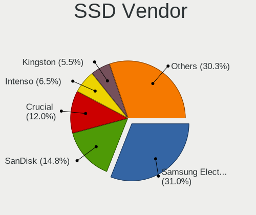
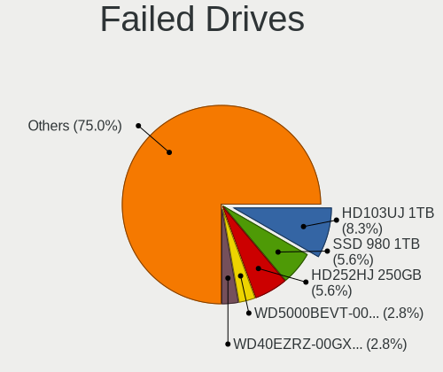
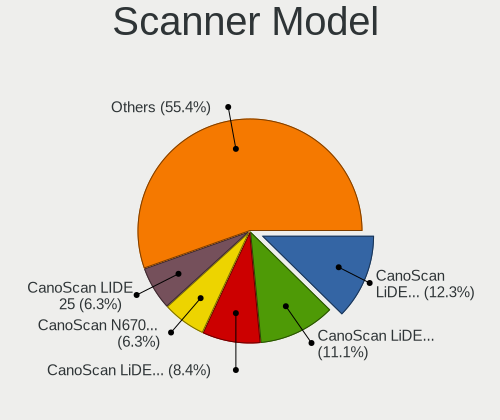

Linux in Germany - Tested Hardware & Statistics
-----------------------------------------------

A project to collect tested hardware configurations for Linux in Germany.

Anyone can contribute to this report by the [hw-probe](https://github.com/linuxhw/hw-probe) tool:

    sudo -E hw-probe -all -upload

Please contribute! Especially if your hardware is rare.

This is a report for all computer types. See also reports for [desktops](/Location/Germany/Desktop/README.md) and [notebooks](/Location/Germany/Notebook/README.md).

Contents
--------

* [ Test Cases ](#test-cases)

* [ System ](#system)
  - [ OS                       ](#os)
  - [ OS Family                ](#os-family)
  - [ Kernel                   ](#kernel)
  - [ Kernel Family            ](#kernel-family)
  - [ Kernel Major Ver.        ](#kernel-major-ver)
  - [ Arch                     ](#arch)
  - [ DE                       ](#de)
  - [ Display Server           ](#display-server)
  - [ Display Manager          ](#display-manager)
  - [ OS Lang                  ](#os-lang)
  - [ Boot Mode                ](#boot-mode)
  - [ Filesystem               ](#filesystem)
  - [ Part. scheme             ](#part-scheme)
  - [ Dual Boot with Linux/BSD ](#dual-boot-with-linuxbsd)
  - [ Dual Boot (Win)          ](#dual-boot-win)

* [ Board ](#board)
  - [ Vendor                   ](#vendor)
  - [ Model                    ](#model)
  - [ Model Family             ](#model-family)
  - [ MFG Year                 ](#mfg-year)
  - [ Form Factor              ](#form-factor)
  - [ Secure Boot              ](#secure-boot)
  - [ Coreboot                 ](#coreboot)
  - [ RAM Size                 ](#ram-size)
  - [ RAM Used                 ](#ram-used)
  - [ Total Drives             ](#total-drives)
  - [ Has CD-ROM               ](#has-cd-rom)
  - [ Has Ethernet             ](#has-ethernet)
  - [ Has WiFi                 ](#has-wifi)
  - [ Has Bluetooth            ](#has-bluetooth)

* [ Location ](#location)
  - [ Country                  ](#country)
  - [ City                     ](#city)

* [ Drives ](#drives)
  - [ Drive Vendor             ](#drive-vendor)
  - [ Drive Model              ](#drive-model)
  - [ HDD Vendor               ](#hdd-vendor)
  - [ SSD Vendor               ](#ssd-vendor)
  - [ Drive Kind               ](#drive-kind)
  - [ Drive Connector          ](#drive-connector)
  - [ Drive Size               ](#drive-size)
  - [ Space Total              ](#space-total)
  - [ Space Used               ](#space-used)
  - [ Malfunc. Drives          ](#malfunc-drives)
  - [ Malfunc. Drive Vendor    ](#malfunc-drive-vendor)
  - [ Malfunc. HDD Vendor      ](#malfunc-hdd-vendor)
  - [ Malfunc. Drive Kind      ](#malfunc-drive-kind)
  - [ Failed Drives            ](#failed-drives)
  - [ Failed Drive Vendor      ](#failed-drive-vendor)
  - [ Drive Status             ](#drive-status)

* [ Storage controller ](#storage-controller)
  - [ Storage Vendor           ](#storage-vendor)
  - [ Storage Model            ](#storage-model)
  - [ Storage Kind             ](#storage-kind)

* [ Processor ](#processor)
  - [ CPU Vendor               ](#cpu-vendor)
  - [ CPU Model                ](#cpu-model)
  - [ CPU Model Family         ](#cpu-model-family)
  - [ CPU Cores                ](#cpu-cores)
  - [ CPU Sockets              ](#cpu-sockets)
  - [ CPU Threads              ](#cpu-threads)
  - [ CPU Op-Modes             ](#cpu-op-modes)
  - [ CPU Microcode            ](#cpu-microcode)
  - [ CPU Microarch            ](#cpu-microarch)

* [ Graphics ](#graphics)
  - [ GPU Vendor               ](#gpu-vendor)
  - [ GPU Model                ](#gpu-model)
  - [ GPU Combo                ](#gpu-combo)
  - [ GPU Driver               ](#gpu-driver)
  - [ GPU Memory               ](#gpu-memory)

* [ Monitor ](#monitor)
  - [ Monitor Vendor           ](#monitor-vendor)
  - [ Monitor Model            ](#monitor-model)
  - [ Monitor Resolution       ](#monitor-resolution)
  - [ Monitor Diagonal         ](#monitor-diagonal)
  - [ Monitor Width            ](#monitor-width)
  - [ Aspect Ratio             ](#aspect-ratio)
  - [ Monitor Area             ](#monitor-area)
  - [ Pixel Density            ](#pixel-density)
  - [ Multiple Monitors        ](#multiple-monitors)

* [ Network ](#network)
  - [ Net Controller Vendor    ](#net-controller-vendor)
  - [ Net Controller Model     ](#net-controller-model)
  - [ Wireless Vendor          ](#wireless-vendor)
  - [ Wireless Model           ](#wireless-model)
  - [ Ethernet Vendor          ](#ethernet-vendor)
  - [ Ethernet Model           ](#ethernet-model)
  - [ Net Controller Kind      ](#net-controller-kind)
  - [ Used Controller          ](#used-controller)
  - [ NICs                     ](#nics)
  - [ IPv6                     ](#ipv6)

* [ Bluetooth ](#bluetooth)
  - [ Bluetooth Vendor         ](#bluetooth-vendor)
  - [ Bluetooth Model          ](#bluetooth-model)

* [ Sound ](#sound)
  - [ Sound Vendor             ](#sound-vendor)
  - [ Sound Model              ](#sound-model)

* [ Memory ](#memory)
  - [ Memory Vendor            ](#memory-vendor)
  - [ Memory Model             ](#memory-model)
  - [ Memory Kind              ](#memory-kind)
  - [ Memory Form Factor       ](#memory-form-factor)
  - [ Memory Size              ](#memory-size)
  - [ Memory Speed             ](#memory-speed)

* [ Printers & scanners ](#printers--scanners)
  - [ Printer Vendor           ](#printer-vendor)
  - [ Printer Model            ](#printer-model)
  - [ Scanner Vendor           ](#scanner-vendor)
  - [ Scanner Model            ](#scanner-model)

* [ Camera ](#camera)
  - [ Camera Vendor            ](#camera-vendor)
  - [ Camera Model             ](#camera-model)

* [ Security ](#security)
  - [ Fingerprint Vendor       ](#fingerprint-vendor)
  - [ Fingerprint Model        ](#fingerprint-model)
  - [ Chipcard Vendor          ](#chipcard-vendor)
  - [ Chipcard Model           ](#chipcard-model)

* [ Unsupported ](#unsupported)
  - [ Unsupported Devices      ](#unsupported-devices)
  - [ Unsupported Device Types ](#unsupported-device-types)

Test Cases
----------

Total: 26325

| Vendor        | Model                       | Form-Factor | Probe                                                      | Date         |
|---------------|-----------------------------|-------------|------------------------------------------------------------|--------------|
| Medion        | Erazer X7851 MD60583        | Notebook    | [9ddd4f88b4](https://linux-hardware.org/?probe=9ddd4f88b4) | Feb 28, 2023 |
| Gigabyte      | B450 AORUS ELITE V2         | Desktop     | [0e0b3360ba](https://linux-hardware.org/?probe=0e0b3360ba) | Feb 28, 2023 |
| Unknown       | Unknown                     | Desktop     | [1c5f8fef49](https://linux-hardware.org/?probe=1c5f8fef49) | Feb 28, 2023 |
| ASRock        | B660M-STX                   | Desktop     | [5a32d2e162](https://linux-hardware.org/?probe=5a32d2e162) | Feb 28, 2023 |
| Medion        | TJ4125                      | Desktop     | [2024916642](https://linux-hardware.org/?probe=2024916642) | Feb 28, 2023 |
| Lenovo        | IdeaPad 3 15ALC6 82KU       | Notebook    | [8ec75c8681](https://linux-hardware.org/?probe=8ec75c8681) | Feb 28, 2023 |
| Acer          | Aspire E5-571G              | Notebook    | [fc0bc59c04](https://linux-hardware.org/?probe=fc0bc59c04) | Feb 28, 2023 |
| Lenovo        | ThinkPad T460 20FMS0700A    | Notebook    | [89a11e0826](https://linux-hardware.org/?probe=89a11e0826) | Feb 28, 2023 |
| Lenovo        | ThinkPad T430 2349KDG       | Notebook    | [ea95af537c](https://linux-hardware.org/?probe=ea95af537c) | Feb 28, 2023 |
| Dell          | Inspiron N5010              | Notebook    | [a1a44c0054](https://linux-hardware.org/?probe=a1a44c0054) | Feb 28, 2023 |
| Lenovo        | ThinkPad T460 20FMS0700A    | Notebook    | [c45e0040f7](https://linux-hardware.org/?probe=c45e0040f7) | Feb 28, 2023 |
| Acer          | Aspire V3-772               | Notebook    | [5a0c297e10](https://linux-hardware.org/?probe=5a0c297e10) | Feb 28, 2023 |
| Lenovo        | ThinkPad T460 20FMS78014    | Notebook    | [6fb2d54abe](https://linux-hardware.org/?probe=6fb2d54abe) | Feb 28, 2023 |
| Gigabyte      | B85M-D3H                    | Desktop     | [b6128fb3e9](https://linux-hardware.org/?probe=b6128fb3e9) | Feb 28, 2023 |
| Lenovo        | ThinkBook 14 G3 ACL 21A2    | Notebook    | [470d9f4591](https://linux-hardware.org/?probe=470d9f4591) | Feb 28, 2023 |
| ASUSTek       | ASUS TUF Gaming F15 FX50... | Notebook    | [41439f6b61](https://linux-hardware.org/?probe=41439f6b61) | Feb 28, 2023 |
| Dell          | 0F6X5P A00                  | Desktop     | [de72247b2d](https://linux-hardware.org/?probe=de72247b2d) | Feb 28, 2023 |
| HP            | EliteBook 830 G5            | Notebook    | [b82fdfbe47](https://linux-hardware.org/?probe=b82fdfbe47) | Feb 28, 2023 |
| TUXEDO        | Aura 15 Gen2                | Notebook    | [26a7db2ed8](https://linux-hardware.org/?probe=26a7db2ed8) | Feb 28, 2023 |
| BESSTAR Te... | UM250 V1.0                  | Desktop     | [2ef76c6dff](https://linux-hardware.org/?probe=2ef76c6dff) | Feb 28, 2023 |
| Gigabyte      | Z390 UD                     | Desktop     | [f3dfd93cc9](https://linux-hardware.org/?probe=f3dfd93cc9) | Feb 28, 2023 |
| Gigabyte      | Q87M-D2H                    | Desktop     | [c2eff23772](https://linux-hardware.org/?probe=c2eff23772) | Feb 28, 2023 |
| ASUSTek       | K52Je                       | Notebook    | [03857fde28](https://linux-hardware.org/?probe=03857fde28) | Feb 28, 2023 |
| ASUSTek       | PRIME B550M-A               | Desktop     | [a6af4042ea](https://linux-hardware.org/?probe=a6af4042ea) | Feb 28, 2023 |
| Lenovo        | Yoga 7 15ITL5 82BJ          | Convertible | [7d60e37ac0](https://linux-hardware.org/?probe=7d60e37ac0) | Feb 28, 2023 |
| ASRock        | N68C-S UCC                  | Desktop     | [a5469adf59](https://linux-hardware.org/?probe=a5469adf59) | Feb 28, 2023 |
| ASRock        | A320M-HDV                   | Desktop     | [5ba575539c](https://linux-hardware.org/?probe=5ba575539c) | Feb 28, 2023 |
| MSI           | X470 GAMING PLUS MAX        | Desktop     | [05542207ee](https://linux-hardware.org/?probe=05542207ee) | Feb 28, 2023 |
| Acer          | TDPS05                      | Desktop     | [c4a636fb79](https://linux-hardware.org/?probe=c4a636fb79) | Feb 28, 2023 |
| Acer          | TDPS05                      | Desktop     | [114e21597f](https://linux-hardware.org/?probe=114e21597f) | Feb 28, 2023 |
| Packard Be... | EasyNote TJ66               | Notebook    | [bd15540982](https://linux-hardware.org/?probe=bd15540982) | Feb 27, 2023 |
| HP            | Pavilion dv6                | Notebook    | [a19aa34db7](https://linux-hardware.org/?probe=a19aa34db7) | Feb 27, 2023 |
| HUAWEI        | MACHR-WX9                   | Notebook    | [b1ef7c7ea1](https://linux-hardware.org/?probe=b1ef7c7ea1) | Feb 27, 2023 |
| Acer          | Predator G3620              | Desktop     | [72f3382b60](https://linux-hardware.org/?probe=72f3382b60) | Feb 27, 2023 |
| Apple         | MacBookAir6,1               | Notebook    | [1c1dc86eb1](https://linux-hardware.org/?probe=1c1dc86eb1) | Feb 27, 2023 |
| Acer          | Aspire 8930                 | Notebook    | [837e36aa25](https://linux-hardware.org/?probe=837e36aa25) | Feb 27, 2023 |
| Acer          | TM8573T                     | Notebook    | [3eaaedf476](https://linux-hardware.org/?probe=3eaaedf476) | Feb 27, 2023 |
| Valve         | Jupiter                     | Notebook    | [8bfec9ba8d](https://linux-hardware.org/?probe=8bfec9ba8d) | Feb 27, 2023 |
| Apple         | MacBookPro15,1              | Notebook    | [e1ce7bab5a](https://linux-hardware.org/?probe=e1ce7bab5a) | Feb 27, 2023 |
| Dell          | 0D6H9T A00                  | Desktop     | [70bdf485da](https://linux-hardware.org/?probe=70bdf485da) | Feb 27, 2023 |
| ASUSTek       | X75VC                       | Notebook    | [8d629c0ed3](https://linux-hardware.org/?probe=8d629c0ed3) | Feb 27, 2023 |
| Dell          | 0J584C                      | Desktop     | [5f16a97f99](https://linux-hardware.org/?probe=5f16a97f99) | Feb 27, 2023 |
| Lenovo        | ThinkPad X1 Carbon 7th 2... | Notebook    | [357c1abb1d](https://linux-hardware.org/?probe=357c1abb1d) | Feb 27, 2023 |
| Lenovo        | G700 20251                  | Notebook    | [8dc4179bbd](https://linux-hardware.org/?probe=8dc4179bbd) | Feb 27, 2023 |
| Gigabyte      | H97-HD3                     | Desktop     | [bb2cac1486](https://linux-hardware.org/?probe=bb2cac1486) | Feb 27, 2023 |
| Raspberry ... | Raspberry Pi 4 Model B R... | Soc         | [29f6c3c897](https://linux-hardware.org/?probe=29f6c3c897) | Feb 27, 2023 |
| AZW           | GTR V01                     | Mini pc     | [c788211e6d](https://linux-hardware.org/?probe=c788211e6d) | Feb 27, 2023 |
| HP            | EliteBook x360 1030 G2      | Convertible | [11aeca0c24](https://linux-hardware.org/?probe=11aeca0c24) | Feb 27, 2023 |
| Apple         | Mac-F2218FA9                | All in one  | [9ed18088a0](https://linux-hardware.org/?probe=9ed18088a0) | Feb 27, 2023 |
| Lenovo        | IdeaPad 530S-14ARR 81H1     | Notebook    | [42acb38635](https://linux-hardware.org/?probe=42acb38635) | Feb 27, 2023 |
| Lenovo        | IdeaPad 530S-14ARR 81H1     | Notebook    | [e8c76a33fe](https://linux-hardware.org/?probe=e8c76a33fe) | Feb 27, 2023 |
| Acer          | Aspire E5-575G              | Notebook    | [b2fa34d832](https://linux-hardware.org/?probe=b2fa34d832) | Feb 27, 2023 |
| Gigabyte      | Z390 UD                     | Desktop     | [be3ac3e778](https://linux-hardware.org/?probe=be3ac3e778) | Feb 27, 2023 |
| Gigabyte      | B450M S2H                   | Desktop     | [4f55a08266](https://linux-hardware.org/?probe=4f55a08266) | Feb 27, 2023 |
| Dell          | Latitude E6430              | Notebook    | [b75c4a18b3](https://linux-hardware.org/?probe=b75c4a18b3) | Feb 27, 2023 |
| MSI           | Z170A-G45 GAMING            | Desktop     | [a5496030e7](https://linux-hardware.org/?probe=a5496030e7) | Feb 27, 2023 |
| Apple         | MacBookPro15,1              | Notebook    | [caf6dc6f16](https://linux-hardware.org/?probe=caf6dc6f16) | Feb 27, 2023 |
| Apple         | MacBookAir6,1               | Notebook    | [058ecdce01](https://linux-hardware.org/?probe=058ecdce01) | Feb 27, 2023 |
| ASUSTek       | X751LK                      | Notebook    | [ba7e4e84ff](https://linux-hardware.org/?probe=ba7e4e84ff) | Feb 27, 2023 |
| ASUSTek       | ROG STRIX X570-I GAMING     | Desktop     | [49f3238d4a](https://linux-hardware.org/?probe=49f3238d4a) | Feb 26, 2023 |
| ASUSTek       | TUF Gaming FX705DT_FX705... | Notebook    | [a5f5bdc903](https://linux-hardware.org/?probe=a5f5bdc903) | Feb 26, 2023 |
| Lenovo        | IdeaPad 5 Pro 16ACH6 82L... | Notebook    | [2abc3ba7d8](https://linux-hardware.org/?probe=2abc3ba7d8) | Feb 26, 2023 |
| Acer          | Predator PT515-51           | Notebook    | [b5da2905fb](https://linux-hardware.org/?probe=b5da2905fb) | Feb 26, 2023 |
| Lenovo        | IdeaPad 5 Pro 16ACH6 82L... | Notebook    | [1a49a04eb7](https://linux-hardware.org/?probe=1a49a04eb7) | Feb 26, 2023 |
| Dell          | 03KWTV A02                  | Desktop     | [8b6eae9fd5](https://linux-hardware.org/?probe=8b6eae9fd5) | Feb 26, 2023 |
| MSI           | MAG B760 TOMAHAWK WIFI D... | Desktop     | [575a7f4897](https://linux-hardware.org/?probe=575a7f4897) | Feb 26, 2023 |
| MSI           | MAG B760 TOMAHAWK WIFI D... | Desktop     | [466f8533fb](https://linux-hardware.org/?probe=466f8533fb) | Feb 26, 2023 |
| Acer          | Aspire V3-371               | Notebook    | [0855d319b4](https://linux-hardware.org/?probe=0855d319b4) | Feb 26, 2023 |
| Lenovo        | 3000 N200 0769EAG           | Notebook    | [28056b6929](https://linux-hardware.org/?probe=28056b6929) | Feb 26, 2023 |
| ASUSTek       | EB1035                      | All in one  | [1ba71d8407](https://linux-hardware.org/?probe=1ba71d8407) | Feb 26, 2023 |
| Valve         | Jupiter                     | Notebook    | [13b7bbbaa7](https://linux-hardware.org/?probe=13b7bbbaa7) | Feb 26, 2023 |
| ASUSTek       | ROG STRIX B450-E GAMING     | Desktop     | [2088ba9df6](https://linux-hardware.org/?probe=2088ba9df6) | Feb 26, 2023 |
| HP            | ProBook 430 G4              | Notebook    | [05a6a84b50](https://linux-hardware.org/?probe=05a6a84b50) | Feb 26, 2023 |
| Acer          | EG43M                       | Desktop     | [d533c457eb](https://linux-hardware.org/?probe=d533c457eb) | Feb 26, 2023 |
| HP            | 8643 SMVB                   | Desktop     | [4f36e23485](https://linux-hardware.org/?probe=4f36e23485) | Feb 26, 2023 |
| Samsung       | N150P                       | Notebook    | [436f0b863b](https://linux-hardware.org/?probe=436f0b863b) | Feb 26, 2023 |
| ASUSTek       | M5A78L                      | Desktop     | [693582be4e](https://linux-hardware.org/?probe=693582be4e) | Feb 26, 2023 |
| Gigabyte      | Q87M-D2H                    | Desktop     | [ee31b8fa71](https://linux-hardware.org/?probe=ee31b8fa71) | Feb 26, 2023 |
| Valve         | Jupiter                     | Notebook    | [1f41a1d44d](https://linux-hardware.org/?probe=1f41a1d44d) | Feb 26, 2023 |
| AXDIA Inte... | WINDESK9 3G v2              | Notebook    | [49282044d3](https://linux-hardware.org/?probe=49282044d3) | Feb 26, 2023 |
| HP            | ENVY Laptop 13-ah0xxx       | Notebook    | [c3156c3f23](https://linux-hardware.org/?probe=c3156c3f23) | Feb 26, 2023 |
| MSI           | A320M-A PRO MAX             | Desktop     | [64cf10c762](https://linux-hardware.org/?probe=64cf10c762) | Feb 26, 2023 |
| ASUSTek       | PRIME Z490-A                | Desktop     | [267da4138c](https://linux-hardware.org/?probe=267da4138c) | Feb 26, 2023 |
| Dell          | 0NKW6Y A01                  | Desktop     | [62e7760c7a](https://linux-hardware.org/?probe=62e7760c7a) | Feb 26, 2023 |
| Toshiba       | Satellite C855-2J5          | Notebook    | [6a55b5a6b3](https://linux-hardware.org/?probe=6a55b5a6b3) | Feb 26, 2023 |
| Packard Be... | EasyNote TE11HC             | Notebook    | [fb3c4afbaa](https://linux-hardware.org/?probe=fb3c4afbaa) | Feb 26, 2023 |
| Gigabyte      | MZBSWBP-00                  | Desktop     | [525ac20362](https://linux-hardware.org/?probe=525ac20362) | Feb 26, 2023 |
| Unknown       | Unknown                     | Soc         | [5d9ced37d2](https://linux-hardware.org/?probe=5d9ced37d2) | Feb 26, 2023 |
| Lenovo        | ThinkPad E14 Gen 2 20T7S... | Notebook    | [054cce6e78](https://linux-hardware.org/?probe=054cce6e78) | Feb 26, 2023 |
| Lenovo        | ThinkPad L470 20J4003WGE    | Notebook    | [42f6425b2d](https://linux-hardware.org/?probe=42f6425b2d) | Feb 26, 2023 |
| Sony          | SVE1712C1EW                 | Notebook    | [20bd9411d9](https://linux-hardware.org/?probe=20bd9411d9) | Feb 26, 2023 |
| Acer          | Aspire E5-771               | Notebook    | [73c974942f](https://linux-hardware.org/?probe=73c974942f) | Feb 26, 2023 |
| Toshiba       | Satellite C660D             | Notebook    | [d5e4af2957](https://linux-hardware.org/?probe=d5e4af2957) | Feb 26, 2023 |
| ASRock        | 960GM-VGS3 FX               | Desktop     | [66ea6164bf](https://linux-hardware.org/?probe=66ea6164bf) | Feb 25, 2023 |
| Fujitsu       | LIFEBOOK AH530              | Notebook    | [fd743448ae](https://linux-hardware.org/?probe=fd743448ae) | Feb 25, 2023 |
| Apple         | MacBookPro7,1               | Notebook    | [7505d49d88](https://linux-hardware.org/?probe=7505d49d88) | Feb 25, 2023 |
| Dell          | Latitude E6420              | Notebook    | [7ae4fe9340](https://linux-hardware.org/?probe=7ae4fe9340) | Feb 25, 2023 |
| Medion        | Akoya E6412T                | Notebook    | [9859dd29a7](https://linux-hardware.org/?probe=9859dd29a7) | Feb 25, 2023 |
| Gigabyte      | H77M-D3H                    | Desktop     | [01eb743492](https://linux-hardware.org/?probe=01eb743492) | Feb 25, 2023 |
| Lenovo        | V130-15IKB 81HN             | Notebook    | [9ac60693d9](https://linux-hardware.org/?probe=9ac60693d9) | Feb 25, 2023 |
| ASUSTek       | TUF X470-PLUS GAMING        | Desktop     | [ce9dda227f](https://linux-hardware.org/?probe=ce9dda227f) | Feb 25, 2023 |
| HP            | ProBook 430 G4              | Notebook    | [0a2c7cca00](https://linux-hardware.org/?probe=0a2c7cca00) | Feb 25, 2023 |
| Lenovo        | ThinkPad T400 6475KF3       | Notebook    | [92f3e0b9dd](https://linux-hardware.org/?probe=92f3e0b9dd) | Feb 25, 2023 |
| Lenovo        | ThinkPad X220 4290EC5       | Notebook    | [d72d87e4ae](https://linux-hardware.org/?probe=d72d87e4ae) | Feb 25, 2023 |
| Valve         | Jupiter                     | Notebook    | [c498b6050f](https://linux-hardware.org/?probe=c498b6050f) | Feb 25, 2023 |
| Acer          | Aspire V3-772G              | Notebook    | [f137fa0797](https://linux-hardware.org/?probe=f137fa0797) | Feb 25, 2023 |
| ASUSTek       | PRIME A520M-A II            | Desktop     | [8e913f4c3e](https://linux-hardware.org/?probe=8e913f4c3e) | Feb 25, 2023 |
| Valve         | Jupiter                     | Notebook    | [6e877dffe8](https://linux-hardware.org/?probe=6e877dffe8) | Feb 25, 2023 |
| ASRock        | H97 Pro4                    | Desktop     | [f703af2e6b](https://linux-hardware.org/?probe=f703af2e6b) | Feb 25, 2023 |
| Gigabyte      | H77M-D3H                    | Desktop     | [766790f373](https://linux-hardware.org/?probe=766790f373) | Feb 25, 2023 |
| Medion        | TJ4125                      | Desktop     | [bde9228741](https://linux-hardware.org/?probe=bde9228741) | Feb 25, 2023 |
| Gigabyte      | B85M-D3H                    | Desktop     | [b1a38edcc2](https://linux-hardware.org/?probe=b1a38edcc2) | Feb 25, 2023 |
| Packard Be... | EasyNote TS11HR             | Notebook    | [0a63352761](https://linux-hardware.org/?probe=0a63352761) | Feb 25, 2023 |
| Acer          | Aspire E1-572G              | Notebook    | [438df492a0](https://linux-hardware.org/?probe=438df492a0) | Feb 25, 2023 |
| ASUSTek       | GL702ZC                     | Notebook    | [a40afcb1d9](https://linux-hardware.org/?probe=a40afcb1d9) | Feb 25, 2023 |
| Lenovo        | ThinkPad X270 W10DG 20K5... | Notebook    | [c2c5da60c3](https://linux-hardware.org/?probe=c2c5da60c3) | Feb 25, 2023 |
| Gigabyte      | Z77X-D3H                    | Desktop     | [b57e519074](https://linux-hardware.org/?probe=b57e519074) | Feb 25, 2023 |
| Gigabyte      | Z77X-D3H                    | Desktop     | [bf3c4ff51d](https://linux-hardware.org/?probe=bf3c4ff51d) | Feb 25, 2023 |
| Lenovo        | ThinkPad T460 20FMS78014    | Notebook    | [4eb96e5571](https://linux-hardware.org/?probe=4eb96e5571) | Feb 25, 2023 |
| Intel         | NUC6i7KYB H90766-405        | Mini pc     | [f2b6ab9730](https://linux-hardware.org/?probe=f2b6ab9730) | Feb 25, 2023 |
| MSI           | B450M PRO-M2                | Desktop     | [e63cbac447](https://linux-hardware.org/?probe=e63cbac447) | Feb 25, 2023 |
| MSI           | B450M PRO-M2                | Desktop     | [4af0524a44](https://linux-hardware.org/?probe=4af0524a44) | Feb 25, 2023 |
| Apple         | MacBookPro5,5               | Notebook    | [faf8e8fcc4](https://linux-hardware.org/?probe=faf8e8fcc4) | Feb 24, 2023 |
| Dell          | Latitude E6440              | Notebook    | [003611b4c7](https://linux-hardware.org/?probe=003611b4c7) | Feb 24, 2023 |
| ASUSTek       | K53U                        | Notebook    | [5b343010e7](https://linux-hardware.org/?probe=5b343010e7) | Feb 24, 2023 |
| ZOTAC         | MEK1                        | Desktop     | [a61a52d794](https://linux-hardware.org/?probe=a61a52d794) | Feb 24, 2023 |
| MSI           | A320M-A PRO MAX             | Desktop     | [24b1205b0c](https://linux-hardware.org/?probe=24b1205b0c) | Feb 24, 2023 |
| Fujitsu       | D3501-A1 S26361-D3501-A1    | Desktop     | [7031bb977d](https://linux-hardware.org/?probe=7031bb977d) | Feb 24, 2023 |
| ASRock        | X570S PG Riptide            | Desktop     | [23cc3fd2c4](https://linux-hardware.org/?probe=23cc3fd2c4) | Feb 24, 2023 |
| Dell          | Vostro 3550                 | Notebook    | [1e1da6a575](https://linux-hardware.org/?probe=1e1da6a575) | Feb 24, 2023 |
| Dell          | Inspiron 3793               | Notebook    | [8e85683aae](https://linux-hardware.org/?probe=8e85683aae) | Feb 24, 2023 |
| ASUSTek       | SABERTOOTH P67              | Desktop     | [efdc981614](https://linux-hardware.org/?probe=efdc981614) | Feb 24, 2023 |
| Lenovo        | ThinkPad T440s 20AQ009DG... | Notebook    | [27e2d41750](https://linux-hardware.org/?probe=27e2d41750) | Feb 24, 2023 |
| HP            | 8433 11                     | Desktop     | [e8663b2a0c](https://linux-hardware.org/?probe=e8663b2a0c) | Feb 24, 2023 |
| ASUSTek       | PRIME B550M-A WIFI II       | Desktop     | [5d901ddc4e](https://linux-hardware.org/?probe=5d901ddc4e) | Feb 24, 2023 |
| HP            | Compaq 6715s (KE061ET#AB... | Notebook    | [ba0a8c88a7](https://linux-hardware.org/?probe=ba0a8c88a7) | Feb 24, 2023 |
| HP            | ProBook 430 G4              | Notebook    | [b815c24c07](https://linux-hardware.org/?probe=b815c24c07) | Feb 24, 2023 |
| Fujitsu Si... | D2824-A1 S26361-D2824-A1    | Desktop     | [f5b4a5da72](https://linux-hardware.org/?probe=f5b4a5da72) | Feb 24, 2023 |
| Intel         | NUC7JYB J67967-404          | Mini pc     | [32f4f192fa](https://linux-hardware.org/?probe=32f4f192fa) | Feb 24, 2023 |
| HP            | ProBook 430 G4              | Notebook    | [e578b951f9](https://linux-hardware.org/?probe=e578b951f9) | Feb 24, 2023 |
| Acer          | Aspire E1-572G              | Notebook    | [39bfe03a28](https://linux-hardware.org/?probe=39bfe03a28) | Feb 24, 2023 |
| HP            | ProBook 430 G4              | Notebook    | [0dc5add67b](https://linux-hardware.org/?probe=0dc5add67b) | Feb 24, 2023 |
| Gigabyte      | Q87M-D2H                    | Desktop     | [dde739ae8a](https://linux-hardware.org/?probe=dde739ae8a) | Feb 24, 2023 |
| HP            | ZBook 17 G2                 | Notebook    | [408bb96959](https://linux-hardware.org/?probe=408bb96959) | Feb 24, 2023 |
| Acer          | Aspire A517-51G             | Notebook    | [12040fcd10](https://linux-hardware.org/?probe=12040fcd10) | Feb 24, 2023 |
| Lenovo        | Yoga 7 14ARB7 82QF          | Convertible | [2ecca5bb0b](https://linux-hardware.org/?probe=2ecca5bb0b) | Feb 24, 2023 |
| Lenovo        | ThinkPad T460 20FMS78014    | Notebook    | [1a7328ecb9](https://linux-hardware.org/?probe=1a7328ecb9) | Feb 24, 2023 |
| Lenovo        | ThinkPad T520 4243F53       | Notebook    | [2e904cc4d7](https://linux-hardware.org/?probe=2e904cc4d7) | Feb 23, 2023 |
| MSI           | B450 TOMAHAWK MAX II        | Desktop     | [bf6fc4a9d6](https://linux-hardware.org/?probe=bf6fc4a9d6) | Feb 23, 2023 |
| ASRock        | H370M-ITX/ac                | Desktop     | [300d88af87](https://linux-hardware.org/?probe=300d88af87) | Feb 23, 2023 |
| HP            | EliteBook x360 1030 G2      | Convertible | [802ba906a0](https://linux-hardware.org/?probe=802ba906a0) | Feb 23, 2023 |
| HP            | 8433 11                     | Desktop     | [9aa13c1fa5](https://linux-hardware.org/?probe=9aa13c1fa5) | Feb 23, 2023 |
| ASUSTek       | KRPA-U16 Series             | Desktop     | [e417ffd8e7](https://linux-hardware.org/?probe=e417ffd8e7) | Feb 23, 2023 |
| Packard Be... | IXTREME M5800               | Desktop     | [43b2cca281](https://linux-hardware.org/?probe=43b2cca281) | Feb 23, 2023 |
| Dell          | Latitude E7470              | Notebook    | [5e445bd00a](https://linux-hardware.org/?probe=5e445bd00a) | Feb 23, 2023 |
| Fujitsu       | D3062-A1 S26361-D3062-A1    | Desktop     | [3288bf6604](https://linux-hardware.org/?probe=3288bf6604) | Feb 23, 2023 |
| Fujitsu       | LIFEBOOK E754               | Notebook    | [b2ae4d0b42](https://linux-hardware.org/?probe=b2ae4d0b42) | Feb 23, 2023 |
| HP            | ZBook Firefly 16 inch G9... | Notebook    | [885478dd47](https://linux-hardware.org/?probe=885478dd47) | Feb 23, 2023 |
| ASRock        | B450M Pro4                  | Desktop     | [193a97dfb1](https://linux-hardware.org/?probe=193a97dfb1) | Feb 23, 2023 |
| HP            | ZBook Firefly 16 inch G9... | Notebook    | [53eb80a44b](https://linux-hardware.org/?probe=53eb80a44b) | Feb 23, 2023 |
| Lenovo        | ThinkPad T540p 20BFS26E0... | Notebook    | [24219efe34](https://linux-hardware.org/?probe=24219efe34) | Feb 23, 2023 |
| Lenovo        | ThinkPad T460 20FMS78014    | Notebook    | [5d98aa89cd](https://linux-hardware.org/?probe=5d98aa89cd) | Feb 23, 2023 |
| ASUSTek       | ROG STRIX X570-E GAMING     | Desktop     | [6bdb8ada9c](https://linux-hardware.org/?probe=6bdb8ada9c) | Feb 23, 2023 |
| Acer          | FX58M                       | Desktop     | [dd80460a7d](https://linux-hardware.org/?probe=dd80460a7d) | Feb 23, 2023 |
| Medion        | E6214                       | Notebook    | [601f9c64cf](https://linux-hardware.org/?probe=601f9c64cf) | Feb 23, 2023 |
| Medion        | Akoya E6412T                | Notebook    | [2915d1c409](https://linux-hardware.org/?probe=2915d1c409) | Feb 23, 2023 |
| Acer          | Aspire E5-521               | Notebook    | [7ffff246ca](https://linux-hardware.org/?probe=7ffff246ca) | Feb 23, 2023 |
| MSI           | Z170-A PRO                  | Desktop     | [a5a54422a0](https://linux-hardware.org/?probe=a5a54422a0) | Feb 23, 2023 |
| Samsung       | 700Z3A/700Z4A/700Z5A/700... | Notebook    | [fe07c5db6d](https://linux-hardware.org/?probe=fe07c5db6d) | Feb 23, 2023 |
| ASUSTek       | PRIME B560-PLUS             | Desktop     | [4f19f71811](https://linux-hardware.org/?probe=4f19f71811) | Feb 23, 2023 |
| ASUSTek       | Maximus VI HERO             | Desktop     | [16618052ef](https://linux-hardware.org/?probe=16618052ef) | Feb 23, 2023 |
| Lenovo        | IdeaPad S340-15API 81NC     | Notebook    | [d03f3a8806](https://linux-hardware.org/?probe=d03f3a8806) | Feb 23, 2023 |
| Intel         | NUC6i7KYB H90766-403        | Mini pc     | [2948f164d5](https://linux-hardware.org/?probe=2948f164d5) | Feb 23, 2023 |
| Lenovo        | IdeaPad S340-15API 81NC     | Notebook    | [ca79eee760](https://linux-hardware.org/?probe=ca79eee760) | Feb 23, 2023 |
| HP            | Laptop 15-da0xxx            | Notebook    | [78c0de43af](https://linux-hardware.org/?probe=78c0de43af) | Feb 23, 2023 |
| Lenovo        | ThinkPad T14 Gen 1 20UES... | Notebook    | [296b314a4a](https://linux-hardware.org/?probe=296b314a4a) | Feb 23, 2023 |
| Lenovo        | V14 G2 ITL 82KA             | Notebook    | [0a3d750f36](https://linux-hardware.org/?probe=0a3d750f36) | Feb 23, 2023 |
| Dell          | 0J584C                      | Desktop     | [f0c7703e3c](https://linux-hardware.org/?probe=f0c7703e3c) | Feb 23, 2023 |
| Dell          | XPS 15 9575                 | Convertible | [38981fcd34](https://linux-hardware.org/?probe=38981fcd34) | Feb 22, 2023 |
| Dell          | 0J584C                      | Desktop     | [003da08b72](https://linux-hardware.org/?probe=003da08b72) | Feb 22, 2023 |
| ASRock        | B450M Pro4                  | Desktop     | [ccd3d2932f](https://linux-hardware.org/?probe=ccd3d2932f) | Feb 22, 2023 |
| Gigabyte      | B450M S2H                   | Desktop     | [4b440b2084](https://linux-hardware.org/?probe=4b440b2084) | Feb 22, 2023 |
| Dell          | Vostro 3550                 | Notebook    | [497a8d66e5](https://linux-hardware.org/?probe=497a8d66e5) | Feb 22, 2023 |
| ASRock        | B450 Pro4                   | Desktop     | [87600137b2](https://linux-hardware.org/?probe=87600137b2) | Feb 22, 2023 |
| Apple         | Mac-F2218FA9                | All in one  | [5d68665089](https://linux-hardware.org/?probe=5d68665089) | Feb 22, 2023 |
| Dell          | Precision M4800             | Notebook    | [57c57bb353](https://linux-hardware.org/?probe=57c57bb353) | Feb 22, 2023 |
| ASRock        | FM2A68M-HD+                 | Desktop     | [4468c0fcb9](https://linux-hardware.org/?probe=4468c0fcb9) | Feb 22, 2023 |
| Lenovo        | 36EB NOK                    | Desktop     | [019ad99dd4](https://linux-hardware.org/?probe=019ad99dd4) | Feb 22, 2023 |
| Dell          | XPS 9320                    | Notebook    | [896a21551e](https://linux-hardware.org/?probe=896a21551e) | Feb 22, 2023 |
| Acer          | FX58M                       | Desktop     | [6d689fa44b](https://linux-hardware.org/?probe=6d689fa44b) | Feb 22, 2023 |
| MSI           | B550-A PRO                  | Desktop     | [11d4db7a00](https://linux-hardware.org/?probe=11d4db7a00) | Feb 22, 2023 |
| Dell          | 0WMJ54 A01                  | Desktop     | [49a53e4b1d](https://linux-hardware.org/?probe=49a53e4b1d) | Feb 22, 2023 |
| ASUSTek       | Maximus VI HERO             | Desktop     | [754e37e18d](https://linux-hardware.org/?probe=754e37e18d) | Feb 22, 2023 |
| Lenovo        | ThinkPad L14 Gen 1 20U50... | Notebook    | [8227fec538](https://linux-hardware.org/?probe=8227fec538) | Feb 22, 2023 |
| Sony          | SVE1713A6EW                 | Notebook    | [55d2085f4b](https://linux-hardware.org/?probe=55d2085f4b) | Feb 22, 2023 |
| Lenovo        | ThinkPad E14 Gen 4 21EB0... | Notebook    | [1bc13bfa0c](https://linux-hardware.org/?probe=1bc13bfa0c) | Feb 22, 2023 |
| Sony          | VGN-NW11S_T                 | Notebook    | [ee3de294d6](https://linux-hardware.org/?probe=ee3de294d6) | Feb 22, 2023 |
| Shuttle       | FL10J                       | Desktop     | [943316a9c5](https://linux-hardware.org/?probe=943316a9c5) | Feb 22, 2023 |
| ASUSTek       | ROG STRIX B550-A GAMING     | Desktop     | [0d0a828b39](https://linux-hardware.org/?probe=0d0a828b39) | Feb 22, 2023 |
| Intel         | NUC8BEB J72692-309          | Mini pc     | [d29d970c4a](https://linux-hardware.org/?probe=d29d970c4a) | Feb 22, 2023 |
| Schenker      | VISION 15 (SVS15E21)        | Notebook    | [8be573974d](https://linux-hardware.org/?probe=8be573974d) | Feb 22, 2023 |
| ASUSTek       | M2NPV-MX                    | Desktop     | [06d857e2ff](https://linux-hardware.org/?probe=06d857e2ff) | Feb 22, 2023 |
| Unknown       | Unknown                     | Desktop     | [5cf4127d47](https://linux-hardware.org/?probe=5cf4127d47) | Feb 21, 2023 |
| Fujitsu Si... | AMILO Li3910                | Notebook    | [28890c5346](https://linux-hardware.org/?probe=28890c5346) | Feb 21, 2023 |
| Lenovo        | ThinkPad T520 4243RP3       | Notebook    | [06f3b4eece](https://linux-hardware.org/?probe=06f3b4eece) | Feb 21, 2023 |
| ASUSTek       | M5A78L/USB3                 | Desktop     | [b4288b76ee](https://linux-hardware.org/?probe=b4288b76ee) | Feb 21, 2023 |
| ASRockRack    | X470D4U                     | Desktop     | [162a5279bc](https://linux-hardware.org/?probe=162a5279bc) | Feb 21, 2023 |
| HP            | 2B4B                        | Desktop     | [92c45eb54f](https://linux-hardware.org/?probe=92c45eb54f) | Feb 21, 2023 |
| Lenovo        | ThinkPad T470s W10DG 20J... | Notebook    | [7ead9488ae](https://linux-hardware.org/?probe=7ead9488ae) | Feb 21, 2023 |
| HP            | Laptop 17-cp0xxx            | Notebook    | [11c3e6a360](https://linux-hardware.org/?probe=11c3e6a360) | Feb 21, 2023 |
| Lenovo        | Yoga 7 15ITL5 82BJ          | Convertible | [75ddf34841](https://linux-hardware.org/?probe=75ddf34841) | Feb 21, 2023 |
| HP            | EliteBook Folio 1040 G2     | Notebook    | [265018acd3](https://linux-hardware.org/?probe=265018acd3) | Feb 21, 2023 |
| Apple         | MacBookAir6,1               | Notebook    | [b9117f0c6f](https://linux-hardware.org/?probe=b9117f0c6f) | Feb 21, 2023 |
| HP            | 339A                        | Desktop     | [d4ee04127e](https://linux-hardware.org/?probe=d4ee04127e) | Feb 21, 2023 |
| HP            | 8906 SMVB                   | Desktop     | [892b3930a6](https://linux-hardware.org/?probe=892b3930a6) | Feb 21, 2023 |
| ASRock        | X570 Phantom Gaming 4       | Desktop     | [6b883f967d](https://linux-hardware.org/?probe=6b883f967d) | Feb 21, 2023 |
| TUXEDO        | Polaris Intel Gen3 (TGL)    | Notebook    | [c0733771d5](https://linux-hardware.org/?probe=c0733771d5) | Feb 21, 2023 |
| TUXEDO        | Polaris Intel Gen3 (TGL)    | Notebook    | [039bb422e0](https://linux-hardware.org/?probe=039bb422e0) | Feb 21, 2023 |
| Lenovo        | ThinkPad T440p 20AWS3E20... | Notebook    | [012b54b31c](https://linux-hardware.org/?probe=012b54b31c) | Feb 21, 2023 |
| Lenovo        | ThinkPad T470p 20J6CTO1W... | Notebook    | [0117dde1bf](https://linux-hardware.org/?probe=0117dde1bf) | Feb 21, 2023 |
| Toshiba       | Satellite C855-2J5          | Notebook    | [91dd183dae](https://linux-hardware.org/?probe=91dd183dae) | Feb 21, 2023 |
| HP            | Elite x2 1012 G2            | Tablet      | [9a9c8192de](https://linux-hardware.org/?probe=9a9c8192de) | Feb 21, 2023 |
| Tactus        | GeoBook 140                 | Notebook    | [e6ab3a56ec](https://linux-hardware.org/?probe=e6ab3a56ec) | Feb 21, 2023 |
| Toshiba       | Satellite C855-2J5          | Notebook    | [b78b4b8d5d](https://linux-hardware.org/?probe=b78b4b8d5d) | Feb 21, 2023 |
| Dell          | 0HY9JP A01                  | Desktop     | [8c1473e111](https://linux-hardware.org/?probe=8c1473e111) | Feb 21, 2023 |
| Valve         | Jupiter                     | Notebook    | [e16dedb7b1](https://linux-hardware.org/?probe=e16dedb7b1) | Feb 21, 2023 |
| HP            | Pavilion 15                 | Notebook    | [c33178dcdc](https://linux-hardware.org/?probe=c33178dcdc) | Feb 21, 2023 |
| Dell          | XPS 13 9360                 | Notebook    | [f36328511d](https://linux-hardware.org/?probe=f36328511d) | Feb 21, 2023 |
| Dell          | XPS 13 7390                 | Notebook    | [2b329d108f](https://linux-hardware.org/?probe=2b329d108f) | Feb 21, 2023 |
| Dell          | 0TT740 A00                  | Server      | [ec75c9762a](https://linux-hardware.org/?probe=ec75c9762a) | Feb 21, 2023 |
| Acer          | Swift SF114-34              | Notebook    | [e9f5a9d293](https://linux-hardware.org/?probe=e9f5a9d293) | Feb 21, 2023 |
| Lenovo        | IdeaPad 5 15ARE05 81YQ      | Notebook    | [53737369e8](https://linux-hardware.org/?probe=53737369e8) | Feb 21, 2023 |
| MSI           | MPG X570 GAMING EDGE WIF... | Desktop     | [64b7226700](https://linux-hardware.org/?probe=64b7226700) | Feb 21, 2023 |
| Lenovo        | ThinkPad E15 Gen 4 21EES... | Notebook    | [b8c4b41baf](https://linux-hardware.org/?probe=b8c4b41baf) | Feb 21, 2023 |
| Insyde        | CherryTrail                 | Notebook    | [819fd0183b](https://linux-hardware.org/?probe=819fd0183b) | Feb 21, 2023 |
| Dell          | XPS 15 7590                 | Notebook    | [f613ecb9b2](https://linux-hardware.org/?probe=f613ecb9b2) | Feb 20, 2023 |
| HP            | Unknown                     | Notebook    | [06f5e98fdd](https://linux-hardware.org/?probe=06f5e98fdd) | Feb 20, 2023 |
| ASRock        | Z270M-ITX/ac                | Desktop     | [4f507f4e5a](https://linux-hardware.org/?probe=4f507f4e5a) | Feb 20, 2023 |
| Lenovo        | IdeaPad Y900-17ISK 80Q1     | Notebook    | [d852e3306a](https://linux-hardware.org/?probe=d852e3306a) | Feb 20, 2023 |
| MSI           | 970A-G43                    | Desktop     | [5fab82df57](https://linux-hardware.org/?probe=5fab82df57) | Feb 20, 2023 |
| Fujitsu       | D3161-A1 S26361-D3161-A1    | Desktop     | [a37ae03564](https://linux-hardware.org/?probe=a37ae03564) | Feb 20, 2023 |
| Fujitsu       | D3161-A1 S26361-D3161-A1    | Desktop     | [c17db0329f](https://linux-hardware.org/?probe=c17db0329f) | Feb 20, 2023 |
| Dell          | 0F642F A00                  | Desktop     | [b4b47b728d](https://linux-hardware.org/?probe=b4b47b728d) | Feb 20, 2023 |
| Fujitsu       | LIFEBOOK P702               | Notebook    | [4f446d8fed](https://linux-hardware.org/?probe=4f446d8fed) | Feb 20, 2023 |
| Valve         | Jupiter                     | Notebook    | [9c3004823f](https://linux-hardware.org/?probe=9c3004823f) | Feb 20, 2023 |
| Acer          | Aspire E5-771G              | Notebook    | [6ae684b9fd](https://linux-hardware.org/?probe=6ae684b9fd) | Feb 20, 2023 |
| HP            | 3398                        | Desktop     | [3ea3d01398](https://linux-hardware.org/?probe=3ea3d01398) | Feb 20, 2023 |
| Acer          | Aspire 5740                 | Notebook    | [2b9a742da7](https://linux-hardware.org/?probe=2b9a742da7) | Feb 20, 2023 |
| Apple         | MacBookAir7,2               | Notebook    | [97b147476a](https://linux-hardware.org/?probe=97b147476a) | Feb 20, 2023 |
| HP            | Laptop 17-by0xxx            | Notebook    | [b712a17c72](https://linux-hardware.org/?probe=b712a17c72) | Feb 20, 2023 |
| Dell          | XPS 13 9310 2-in-1          | Convertible | [3af0967330](https://linux-hardware.org/?probe=3af0967330) | Feb 20, 2023 |
| Samsung       | A3Y17 LTE EUR rev03 boar... | Soc         | [6cc51c8d61](https://linux-hardware.org/?probe=6cc51c8d61) | Feb 20, 2023 |
| Lenovo        | ThinkPad E550 20DF004TGE    | Notebook    | [f6cf4e902d](https://linux-hardware.org/?probe=f6cf4e902d) | Feb 20, 2023 |
| Samsung       | 535U3C                      | Notebook    | [ec173f014b](https://linux-hardware.org/?probe=ec173f014b) | Feb 20, 2023 |
| Lenovo        | ThinkPad E495 20NEA001GE    | Notebook    | [87857c46e9](https://linux-hardware.org/?probe=87857c46e9) | Feb 20, 2023 |
| TUXEDO        | Unknown                     | Notebook    | [0f60fd3519](https://linux-hardware.org/?probe=0f60fd3519) | Feb 20, 2023 |
| TUXEDO        | Unknown                     | Notebook    | [5faa7cf993](https://linux-hardware.org/?probe=5faa7cf993) | Feb 20, 2023 |
| MSI           | B450M PRO-VDH V2            | Desktop     | [a3124367c3](https://linux-hardware.org/?probe=a3124367c3) | Feb 20, 2023 |
| IP3 Tech      | rev1.1                      | Mini pc     | [7c4f6801f0](https://linux-hardware.org/?probe=7c4f6801f0) | Feb 20, 2023 |
| Lenovo        | V14 G2 ITL 82KA             | Notebook    | [7ee9e59831](https://linux-hardware.org/?probe=7ee9e59831) | Feb 20, 2023 |
| ASRock        | X570 Taichi Razer Editio... | Desktop     | [3f44c52c3e](https://linux-hardware.org/?probe=3f44c52c3e) | Feb 20, 2023 |
| MSI           | X370 GAMING PLUS            | Desktop     | [a180732a9f](https://linux-hardware.org/?probe=a180732a9f) | Feb 19, 2023 |
| Lenovo        | IdeaPad L340-15IRH Gamin... | Notebook    | [6c02ec2d87](https://linux-hardware.org/?probe=6c02ec2d87) | Feb 19, 2023 |
| Medion        | Akoya E4214 MD99570         | Notebook    | [3cd9667646](https://linux-hardware.org/?probe=3cd9667646) | Feb 19, 2023 |
| Dell          | Inspiron 3793               | Notebook    | [760270eadc](https://linux-hardware.org/?probe=760270eadc) | Feb 19, 2023 |
| HP            | ENVY 15                     | Notebook    | [7d53c3db41](https://linux-hardware.org/?probe=7d53c3db41) | Feb 19, 2023 |
| ASUSTek       | G771JW                      | Notebook    | [e5b5f4792c](https://linux-hardware.org/?probe=e5b5f4792c) | Feb 19, 2023 |
| ASUSTek       | G771JW                      | Notebook    | [c73a9b9ee2](https://linux-hardware.org/?probe=c73a9b9ee2) | Feb 19, 2023 |
| HUAWEI        | BOD-WXX9                    | Notebook    | [f8e02626c5](https://linux-hardware.org/?probe=f8e02626c5) | Feb 19, 2023 |
| Toshiba       | Satellite L50-B             | Notebook    | [3c53a60245](https://linux-hardware.org/?probe=3c53a60245) | Feb 19, 2023 |
| Samsung       | 930QED                      | Convertible | [f72fed80df](https://linux-hardware.org/?probe=f72fed80df) | Feb 19, 2023 |
| ASUSTek       | X55U                        | Notebook    | [15322abeb5](https://linux-hardware.org/?probe=15322abeb5) | Feb 19, 2023 |
| ASRock        | X300M-STX                   | Desktop     | [f689e279bc](https://linux-hardware.org/?probe=f689e279bc) | Feb 19, 2023 |
| ASUSTek       | X705UAR                     | Notebook    | [4489c297e3](https://linux-hardware.org/?probe=4489c297e3) | Feb 19, 2023 |
| MSI           | B450 TOMAHAWK               | Desktop     | [50b693cc98](https://linux-hardware.org/?probe=50b693cc98) | Feb 19, 2023 |
| Dell          | Precision 7730              | Notebook    | [b39937f461](https://linux-hardware.org/?probe=b39937f461) | Feb 19, 2023 |
| Medion        | H110H4-EM                   | Desktop     | [71da47e860](https://linux-hardware.org/?probe=71da47e860) | Feb 19, 2023 |
| Lenovo        | B560 43308VG                | Notebook    | [c30b594458](https://linux-hardware.org/?probe=c30b594458) | Feb 19, 2023 |
| Gigabyte      | H81M-S2H                    | Desktop     | [d6f4d9d8df](https://linux-hardware.org/?probe=d6f4d9d8df) | Feb 19, 2023 |
| HP            | EliteBook 840 G1            | Notebook    | [b916da5116](https://linux-hardware.org/?probe=b916da5116) | Feb 19, 2023 |
| MSI           | MS-98G4                     | Desktop     | [7c9bd7f8bc](https://linux-hardware.org/?probe=7c9bd7f8bc) | Feb 19, 2023 |
| MSI           | MS-98G4                     | Desktop     | [84fd2fa298](https://linux-hardware.org/?probe=84fd2fa298) | Feb 19, 2023 |
| Dell          | Precision M4800             | Notebook    | [d19947e42e](https://linux-hardware.org/?probe=d19947e42e) | Feb 19, 2023 |
| Lenovo        | IdeaPad 5 Pro 16ARH7 82S... | Notebook    | [19bdc55bfd](https://linux-hardware.org/?probe=19bdc55bfd) | Feb 19, 2023 |
| MSI           | Katana GF66 11UC            | Notebook    | [ef6f60f0a8](https://linux-hardware.org/?probe=ef6f60f0a8) | Feb 19, 2023 |
| HP            | 0AACh                       | Desktop     | [3ff53d69b2](https://linux-hardware.org/?probe=3ff53d69b2) | Feb 19, 2023 |
| ASUSTek       | Maximus VIII RANGER         | Desktop     | [e3852ecb78](https://linux-hardware.org/?probe=e3852ecb78) | Feb 19, 2023 |
| Gigabyte      | X299 UD4 Pro-CF             | Desktop     | [d442995b00](https://linux-hardware.org/?probe=d442995b00) | Feb 19, 2023 |
| ASUSTek       | A78M-E                      | Desktop     | [3b2adbff33](https://linux-hardware.org/?probe=3b2adbff33) | Feb 18, 2023 |
| Inventec      | VXC Class A02               | Desktop     | [ddea00ed0c](https://linux-hardware.org/?probe=ddea00ed0c) | Feb 18, 2023 |
| Medion        | Akoya E6412T                | Notebook    | [41a31b6bd1](https://linux-hardware.org/?probe=41a31b6bd1) | Feb 18, 2023 |
| Dell          | 0PY127 A02                  | Desktop     | [2be7133f11](https://linux-hardware.org/?probe=2be7133f11) | Feb 18, 2023 |
| HP            | 17E2                        | Mini pc     | [58b70e409c](https://linux-hardware.org/?probe=58b70e409c) | Feb 18, 2023 |
| Gigabyte      | B550 AORUS ELITE V2         | Desktop     | [ab3e07326a](https://linux-hardware.org/?probe=ab3e07326a) | Feb 18, 2023 |
| Valve         | Jupiter                     | Notebook    | [87ab38d6c8](https://linux-hardware.org/?probe=87ab38d6c8) | Feb 18, 2023 |
| HP            | Pavilion Gaming Laptop 1... | Notebook    | [6aae20aa14](https://linux-hardware.org/?probe=6aae20aa14) | Feb 18, 2023 |
| Medion        | X6816                       | Notebook    | [3f05d06600](https://linux-hardware.org/?probe=3f05d06600) | Feb 18, 2023 |
| Gigabyte      | Q87M-D2H                    | Desktop     | [3c0c91cfd4](https://linux-hardware.org/?probe=3c0c91cfd4) | Feb 18, 2023 |
| ASUSTek       | X756UB                      | Notebook    | [713121e0fc](https://linux-hardware.org/?probe=713121e0fc) | Feb 18, 2023 |
| Medion        | Akoya S4220 MD99820         | Notebook    | [31e6881e43](https://linux-hardware.org/?probe=31e6881e43) | Feb 18, 2023 |
| Schenker      | XMG CORE 17(M20, GTX 165... | Notebook    | [abf7c4c33c](https://linux-hardware.org/?probe=abf7c4c33c) | Feb 18, 2023 |
| Acer          | Aspire E1-572G              | Notebook    | [b98e23ae68](https://linux-hardware.org/?probe=b98e23ae68) | Feb 18, 2023 |
| Lenovo        | ThinkPad E14 Gen 3 20Y70... | Notebook    | [ce2d0361d1](https://linux-hardware.org/?probe=ce2d0361d1) | Feb 18, 2023 |
| Gigabyte      | B450M S2H                   | Desktop     | [2420c1fb57](https://linux-hardware.org/?probe=2420c1fb57) | Feb 18, 2023 |
| Sony          | VPCEA3S1E                   | Notebook    | [45d0b9a823](https://linux-hardware.org/?probe=45d0b9a823) | Feb 18, 2023 |
| Acer          | Aspire 5920G                | Notebook    | [5132814eb1](https://linux-hardware.org/?probe=5132814eb1) | Feb 18, 2023 |
| ASUSTek       | X705UAR                     | Notebook    | [f8c852da52](https://linux-hardware.org/?probe=f8c852da52) | Feb 18, 2023 |
| ASUSTek       | ASUSPRO P5440FA_P5440FA     | Notebook    | [5fb2330e71](https://linux-hardware.org/?probe=5fb2330e71) | Feb 18, 2023 |
| Gigabyte      | AB350-Gaming 3-CF           | Desktop     | [96c9f07207](https://linux-hardware.org/?probe=96c9f07207) | Feb 18, 2023 |
| Gigabyte      | AB350-Gaming 3-CF           | Desktop     | [2734c1a2ae](https://linux-hardware.org/?probe=2734c1a2ae) | Feb 18, 2023 |
| Lenovo        | ThinkPad X1 Yoga Gen 6 2... | Convertible | [540ab25c2f](https://linux-hardware.org/?probe=540ab25c2f) | Feb 18, 2023 |
| Lenovo        | ThinkPad X240 20AMS0RR00    | Notebook    | [d159971f77](https://linux-hardware.org/?probe=d159971f77) | Feb 18, 2023 |
| Lenovo        | ThinkPad T14 Gen 1 20S00... | Notebook    | [4baabf8013](https://linux-hardware.org/?probe=4baabf8013) | Feb 18, 2023 |
| TUXEDO        | Stellaris/Polaris AMD Ge... | Notebook    | [87be6c6120](https://linux-hardware.org/?probe=87be6c6120) | Feb 18, 2023 |
| CSL-Comput... | YOGABOOK                    | Notebook    | [89abf11ce7](https://linux-hardware.org/?probe=89abf11ce7) | Feb 18, 2023 |
| Insyde        | CherryTrail                 | Notebook    | [5a9384c22b](https://linux-hardware.org/?probe=5a9384c22b) | Feb 17, 2023 |
| ASUSTek       | P5G41T-M LX2/GB             | Desktop     | [da12f4a29b](https://linux-hardware.org/?probe=da12f4a29b) | Feb 17, 2023 |
| Dell          | 0XC7MM A01                  | Desktop     | [93ccca9fdd](https://linux-hardware.org/?probe=93ccca9fdd) | Feb 17, 2023 |
| Lenovo        | ThinkPad X201 3680A27       | Notebook    | [b84fe99b8a](https://linux-hardware.org/?probe=b84fe99b8a) | Feb 17, 2023 |
| HP            | ENVY 15                     | Notebook    | [e59ac2cec0](https://linux-hardware.org/?probe=e59ac2cec0) | Feb 17, 2023 |
| ASUSTek       | PRIME Z690M-PLUS D4         | Desktop     | [750c0f6337](https://linux-hardware.org/?probe=750c0f6337) | Feb 17, 2023 |
| HP            | Laptop 17-bs0xx             | Notebook    | [cc805e31b0](https://linux-hardware.org/?probe=cc805e31b0) | Feb 17, 2023 |
| ASUSTek       | ASUSPRO P5440FA_P5440FA     | Notebook    | [9497d288f6](https://linux-hardware.org/?probe=9497d288f6) | Feb 17, 2023 |
| ASUSTek       | ROG STRIX Z370-F GAMING     | Desktop     | [d76b048134](https://linux-hardware.org/?probe=d76b048134) | Feb 17, 2023 |
| Sony          | VPCEB2Z1E                   | Notebook    | [5c172121ab](https://linux-hardware.org/?probe=5c172121ab) | Feb 17, 2023 |
| ASUSTek       | TUF X470-PLUS GAMING        | Desktop     | [271ad0ffe2](https://linux-hardware.org/?probe=271ad0ffe2) | Feb 17, 2023 |
| Lenovo        | 36C5 SDK0K17763 WIN 1801... | Desktop     | [fa1e14d3d5](https://linux-hardware.org/?probe=fa1e14d3d5) | Feb 17, 2023 |
| Hardkernel    | ODROID-N2                   | Soc         | [9a8138252f](https://linux-hardware.org/?probe=9a8138252f) | Feb 17, 2023 |
| Raspberry ... | Raspberry Pi Zero Rev 1.... | Soc         | [24ee06b435](https://linux-hardware.org/?probe=24ee06b435) | Feb 17, 2023 |
| Lenovo        | 36C5 SDK0K17763 WIN 1801... | Desktop     | [b6217420cc](https://linux-hardware.org/?probe=b6217420cc) | Feb 17, 2023 |
| ASUSTek       | TUF B450-PLUS GAMING        | Desktop     | [1029c7f3bb](https://linux-hardware.org/?probe=1029c7f3bb) | Feb 17, 2023 |
| Fujitsu       | LIFEBOOK E736               | Notebook    | [60cf64693e](https://linux-hardware.org/?probe=60cf64693e) | Feb 17, 2023 |
| Lenovo        | 1046 SDK0T08861 WIN 3305... | Desktop     | [b9c30fbaf8](https://linux-hardware.org/?probe=b9c30fbaf8) | Feb 17, 2023 |
| Dell          | Precision 7540              | Notebook    | [2a511e3e78](https://linux-hardware.org/?probe=2a511e3e78) | Feb 17, 2023 |
| ASUSTek       | ROG STRIX B550-F GAMING     | Desktop     | [8fa990093e](https://linux-hardware.org/?probe=8fa990093e) | Feb 17, 2023 |
| TUXEDO        | Stellaris Intel Gen4        | Notebook    | [5e35f0aecc](https://linux-hardware.org/?probe=5e35f0aecc) | Feb 17, 2023 |
| Gigabyte      | B450 AORUS PRO-CF           | Desktop     | [9cd5183878](https://linux-hardware.org/?probe=9cd5183878) | Feb 17, 2023 |
| TUXEDO        | Unknown                     | Notebook    | [d770ba8b7b](https://linux-hardware.org/?probe=d770ba8b7b) | Feb 17, 2023 |
| Medion        | X6816                       | Notebook    | [fe99854800](https://linux-hardware.org/?probe=fe99854800) | Feb 17, 2023 |
| Gigabyte      | B450 AORUS PRO-CF           | Desktop     | [7e44f9e4ff](https://linux-hardware.org/?probe=7e44f9e4ff) | Feb 17, 2023 |
| ASUSTek       | TUF Gaming B550-PRO         | Desktop     | [fa6a3fe6e3](https://linux-hardware.org/?probe=fa6a3fe6e3) | Feb 17, 2023 |
| Acer          | Aspire 7750G                | Notebook    | [e4b193c332](https://linux-hardware.org/?probe=e4b193c332) | Feb 17, 2023 |
| HP            | 1998                        | Desktop     | [24a633610d](https://linux-hardware.org/?probe=24a633610d) | Feb 17, 2023 |
| ASRock        | X470 Taichi                 | Desktop     | [71685845fe](https://linux-hardware.org/?probe=71685845fe) | Feb 17, 2023 |
| ASUSTek       | X555LJ                      | Notebook    | [a524479b7a](https://linux-hardware.org/?probe=a524479b7a) | Feb 17, 2023 |
| MSI           | MAG B550M MORTAR WIFI       | Desktop     | [4948ea8836](https://linux-hardware.org/?probe=4948ea8836) | Feb 17, 2023 |
| Hardkernel    | ODROID-H2                   | Desktop     | [0b85baa5ee](https://linux-hardware.org/?probe=0b85baa5ee) | Feb 17, 2023 |
| Pegatron      | IPM31G                      | Desktop     | [42d112d7e0](https://linux-hardware.org/?probe=42d112d7e0) | Feb 17, 2023 |
| Intel         | NUC8BEB J72692-304          | Mini pc     | [16b8333671](https://linux-hardware.org/?probe=16b8333671) | Feb 17, 2023 |
| Intel         | NUC8BEB J72692-304          | Mini pc     | [546d700cde](https://linux-hardware.org/?probe=546d700cde) | Feb 17, 2023 |
| Biostar       | G41U3G                      | Desktop     | [9d534d5d74](https://linux-hardware.org/?probe=9d534d5d74) | Feb 16, 2023 |
| Toshiba       | Satellite C50D-A-10E        | Notebook    | [85f5db38b7](https://linux-hardware.org/?probe=85f5db38b7) | Feb 16, 2023 |
| ASUSTek       | TUF X470-PLUS GAMING        | Desktop     | [76ab936a75](https://linux-hardware.org/?probe=76ab936a75) | Feb 16, 2023 |
| Lenovo        | ThinkPad E15 Gen 3 20YG0... | Notebook    | [392442adfb](https://linux-hardware.org/?probe=392442adfb) | Feb 16, 2023 |
| MSI           | Z270 TOMAHAWK ARCTIC        | Desktop     | [cfdcc68921](https://linux-hardware.org/?probe=cfdcc68921) | Feb 16, 2023 |
| MSI           | Z270 TOMAHAWK ARCTIC        | Desktop     | [7bb3c6268f](https://linux-hardware.org/?probe=7bb3c6268f) | Feb 16, 2023 |
| MSI           | X470 GAMING PRO CARBON A... | Desktop     | [beec8fdf56](https://linux-hardware.org/?probe=beec8fdf56) | Feb 16, 2023 |
| Acer          | Aspire A515-51G             | Notebook    | [065827a397](https://linux-hardware.org/?probe=065827a397) | Feb 16, 2023 |
| ASUSTek       | ROG Strix G713RM_G713RM     | Notebook    | [5ad2fae7bc](https://linux-hardware.org/?probe=5ad2fae7bc) | Feb 16, 2023 |
| MSI           | GF75 Thin 10UEK             | Notebook    | [a1b9683bcc](https://linux-hardware.org/?probe=a1b9683bcc) | Feb 16, 2023 |
| HP            | EliteBook 840 G8 Noteboo... | Notebook    | [03498d5815](https://linux-hardware.org/?probe=03498d5815) | Feb 16, 2023 |
| Lenovo        | ThinkPad T14 Gen 3 21AH0... | Notebook    | [3f21ded506](https://linux-hardware.org/?probe=3f21ded506) | Feb 16, 2023 |
| Gigabyte      | B450M S2H                   | Desktop     | [72b29b5f80](https://linux-hardware.org/?probe=72b29b5f80) | Feb 16, 2023 |
| ASUSTek       | P5Q-PRO                     | Desktop     | [f01a1d6c70](https://linux-hardware.org/?probe=f01a1d6c70) | Feb 16, 2023 |
| Acer          | Aspire A717-71G             | Notebook    | [488a80bcda](https://linux-hardware.org/?probe=488a80bcda) | Feb 16, 2023 |
| Lenovo        | ThinkPad L15 Gen 2 20X30... | Notebook    | [a16c82308f](https://linux-hardware.org/?probe=a16c82308f) | Feb 16, 2023 |
| Lenovo        | V15-IGL 82C3                | Notebook    | [76f2f157a5](https://linux-hardware.org/?probe=76f2f157a5) | Feb 16, 2023 |
| Lenovo        | ThinkPad P15s Gen 2i 20W... | Notebook    | [c08ad0f295](https://linux-hardware.org/?probe=c08ad0f295) | Feb 16, 2023 |
| ASRock        | FM2A68M-HD+                 | Desktop     | [3dbfa09166](https://linux-hardware.org/?probe=3dbfa09166) | Feb 16, 2023 |
| Inventec      | VXC Class A02               | Desktop     | [6e36781784](https://linux-hardware.org/?probe=6e36781784) | Feb 16, 2023 |
| Inventec      | VXC Class A02               | Desktop     | [f85ac5bc8a](https://linux-hardware.org/?probe=f85ac5bc8a) | Feb 16, 2023 |
| Lenovo        | Legion Y530-15ICH 81FV      | Notebook    | [66218c2375](https://linux-hardware.org/?probe=66218c2375) | Feb 16, 2023 |
| Inventec      | VXC Class A02               | Desktop     | [b1266a1e15](https://linux-hardware.org/?probe=b1266a1e15) | Feb 16, 2023 |
| MSI           | PRO Z690-A WIFI DDR4        | Desktop     | [40c415883e](https://linux-hardware.org/?probe=40c415883e) | Feb 16, 2023 |
| ASRock        | 990FX Extreme4              | Desktop     | [7ce91f2b1e](https://linux-hardware.org/?probe=7ce91f2b1e) | Feb 16, 2023 |
| HP            | ENVY TS Sleekbook 4         | Notebook    | [1189701feb](https://linux-hardware.org/?probe=1189701feb) | Feb 15, 2023 |
| Lenovo        | IdeaPad 3 15ALC6 82KU       | Notebook    | [62c4a2d52d](https://linux-hardware.org/?probe=62c4a2d52d) | Feb 15, 2023 |
| HP            | 1494                        | Desktop     | [fd47ccde98](https://linux-hardware.org/?probe=fd47ccde98) | Feb 15, 2023 |
| ASUSTek       | PRIME B360M-C               | Desktop     | [d380600b31](https://linux-hardware.org/?probe=d380600b31) | Feb 15, 2023 |
| MSI           | Z97 GAMING 5                | Desktop     | [e29c56eb10](https://linux-hardware.org/?probe=e29c56eb10) | Feb 15, 2023 |
| Acer          | Extensa 215-21              | Notebook    | [917c8f4ccb](https://linux-hardware.org/?probe=917c8f4ccb) | Feb 15, 2023 |
| HP            | 550                         | Notebook    | [81b67f211d](https://linux-hardware.org/?probe=81b67f211d) | Feb 15, 2023 |
| Dell          | XPS 13 9360                 | Notebook    | [8c73abe0ee](https://linux-hardware.org/?probe=8c73abe0ee) | Feb 15, 2023 |
| HP            | ProBook x360 11 G5 EE       | Convertible | [2a3b26b186](https://linux-hardware.org/?probe=2a3b26b186) | Feb 15, 2023 |
| ASUSTek       | ZenBook UX431DA_UM431DA     | Notebook    | [d177dc7b4d](https://linux-hardware.org/?probe=d177dc7b4d) | Feb 15, 2023 |
| Samsung       | SP55S                       | Notebook    | [0b125a359a](https://linux-hardware.org/?probe=0b125a359a) | Feb 15, 2023 |
| ASUSTek       | K52N                        | Notebook    | [f87ece85e9](https://linux-hardware.org/?probe=f87ece85e9) | Feb 15, 2023 |
| MSI           | Z370M MORTAR                | Desktop     | [5ac9c9a924](https://linux-hardware.org/?probe=5ac9c9a924) | Feb 15, 2023 |
| Valve         | Jupiter                     | Notebook    | [4963dad787](https://linux-hardware.org/?probe=4963dad787) | Feb 15, 2023 |
| ASUSTek       | Z9PG-D16 Series             | Server      | [91e39972f5](https://linux-hardware.org/?probe=91e39972f5) | Feb 15, 2023 |
| ASUSTek       | Z9PG-D16 Series             | Server      | [419c9638e4](https://linux-hardware.org/?probe=419c9638e4) | Feb 15, 2023 |
| Unknown       | Unknown                     | Soc         | [44db19feaf](https://linux-hardware.org/?probe=44db19feaf) | Feb 15, 2023 |
| MSI           | GE60 2OC\2OD\2OE            | Notebook    | [1a8f01fabe](https://linux-hardware.org/?probe=1a8f01fabe) | Feb 15, 2023 |
| Dell          | 0MF24N A03                  | Desktop     | [e48d83d96d](https://linux-hardware.org/?probe=e48d83d96d) | Feb 15, 2023 |
| Inventec      | VXC Class A02               | Desktop     | [52b2c70658](https://linux-hardware.org/?probe=52b2c70658) | Feb 14, 2023 |
| HP            | 250 G6 Notebook PC          | Notebook    | [a1c5081488](https://linux-hardware.org/?probe=a1c5081488) | Feb 14, 2023 |
| Medion        | MS-7800                     | Desktop     | [7827888ac6](https://linux-hardware.org/?probe=7827888ac6) | Feb 14, 2023 |
| Gigabyte      | Z77X-D3H                    | Desktop     | [85d374c1b4](https://linux-hardware.org/?probe=85d374c1b4) | Feb 14, 2023 |
| ASUSTek       | AM1M-A                      | Desktop     | [2947200c5c](https://linux-hardware.org/?probe=2947200c5c) | Feb 14, 2023 |
| Dell          | Latitude 5480               | Notebook    | [03123ee601](https://linux-hardware.org/?probe=03123ee601) | Feb 14, 2023 |
| Lenovo        | IdeaPad 520S-14IKB 81BL     | Notebook    | [008d06fbf8](https://linux-hardware.org/?probe=008d06fbf8) | Feb 14, 2023 |
| Medion        | E7220                       | Notebook    | [a1b4318b54](https://linux-hardware.org/?probe=a1b4318b54) | Feb 14, 2023 |
| Dell          | Latitude E7240              | Notebook    | [6c131e6c56](https://linux-hardware.org/?probe=6c131e6c56) | Feb 14, 2023 |
| Lenovo        | ThinkPad T460 20FMS1GX0C    | Notebook    | [22ee871680](https://linux-hardware.org/?probe=22ee871680) | Feb 14, 2023 |
| Lenovo        | ThinkPad T430 2349KDG       | Notebook    | [a471eab123](https://linux-hardware.org/?probe=a471eab123) | Feb 14, 2023 |
| MSI           | H310M PRO-D                 | Desktop     | [ce2d236a2d](https://linux-hardware.org/?probe=ce2d236a2d) | Feb 14, 2023 |
| MSI           | A320M-A PRO MAX             | Desktop     | [dd2017324e](https://linux-hardware.org/?probe=dd2017324e) | Feb 14, 2023 |
| Lenovo        | ThinkPad T490 20N3S3UL00    | Notebook    | [dc352cd9dc](https://linux-hardware.org/?probe=dc352cd9dc) | Feb 14, 2023 |
| ASRock        | Z77 Extreme6/TB4            | Desktop     | [cbcb53dec3](https://linux-hardware.org/?probe=cbcb53dec3) | Feb 14, 2023 |
| Gigabyte      | B550 AORUS ELITE            | Desktop     | [21ad600245](https://linux-hardware.org/?probe=21ad600245) | Feb 14, 2023 |
| Lenovo        | G780 2182                   | Notebook    | [d63c64e709](https://linux-hardware.org/?probe=d63c64e709) | Feb 14, 2023 |
| Lenovo        | MAHOBAY NO DPK              | Desktop     | [0b0ccd06b0](https://linux-hardware.org/?probe=0b0ccd06b0) | Feb 14, 2023 |
| Acer          | Aspire E1-572G              | Notebook    | [6f1041afa1](https://linux-hardware.org/?probe=6f1041afa1) | Feb 14, 2023 |
| Dell          | 0RN474                      | Desktop     | [5c1bf45372](https://linux-hardware.org/?probe=5c1bf45372) | Feb 14, 2023 |
| Lenovo        | ThinkPad E14 Gen 4 21EB0... | Notebook    | [6c07807921](https://linux-hardware.org/?probe=6c07807921) | Feb 14, 2023 |
| Lenovo        | ThinkPad X1 Carbon Gen 9... | Notebook    | [85ad798500](https://linux-hardware.org/?probe=85ad798500) | Feb 14, 2023 |
| Packard Be... | IXTREME M5800               | Desktop     | [6e1d13cecb](https://linux-hardware.org/?probe=6e1d13cecb) | Feb 14, 2023 |
| Packard Be... | IXTREME M5800               | Desktop     | [33e3d93b19](https://linux-hardware.org/?probe=33e3d93b19) | Feb 14, 2023 |
| Dell          | Latitude E6420              | Notebook    | [bf4ea90e58](https://linux-hardware.org/?probe=bf4ea90e58) | Feb 14, 2023 |
| Acer          | Aspire V5-123               | Notebook    | [30a24a1bb6](https://linux-hardware.org/?probe=30a24a1bb6) | Feb 14, 2023 |
| Dell          | Latitude E6330              | Notebook    | [8fe849a8ff](https://linux-hardware.org/?probe=8fe849a8ff) | Feb 14, 2023 |
| MSI           | GP73 Leopard 8RE            | Notebook    | [1d754a5fa3](https://linux-hardware.org/?probe=1d754a5fa3) | Feb 14, 2023 |
| Fujitsu       | LIFEBOOK E754               | Notebook    | [469896ac73](https://linux-hardware.org/?probe=469896ac73) | Feb 14, 2023 |
| IBM           | ThinkPad T40p 2373CG6       | Notebook    | [a7aa67f64e](https://linux-hardware.org/?probe=a7aa67f64e) | Feb 14, 2023 |
| IBM           | ThinkPad T40p 2373CG6       | Notebook    | [eda645cefe](https://linux-hardware.org/?probe=eda645cefe) | Feb 14, 2023 |
| Lenovo        | ThinkPad T470 20HES13701    | Notebook    | [9c839fa75b](https://linux-hardware.org/?probe=9c839fa75b) | Feb 14, 2023 |
| HP            | EliteBook 840 G5            | Notebook    | [2f78b0c253](https://linux-hardware.org/?probe=2f78b0c253) | Feb 14, 2023 |
| Lenovo        | ThinkPad T14 Gen 1 20UD0... | Notebook    | [f6bcdb7c6b](https://linux-hardware.org/?probe=f6bcdb7c6b) | Feb 14, 2023 |
| Lenovo        | ThinkPad T14 Gen 1 20UD0... | Notebook    | [345021f7f6](https://linux-hardware.org/?probe=345021f7f6) | Feb 14, 2023 |
| SLIMBOOK      | PROX15                      | Notebook    | [7dc8f07dcb](https://linux-hardware.org/?probe=7dc8f07dcb) | Feb 14, 2023 |
| Acer          | Aspire V3-771               | Notebook    | [f22c83d683](https://linux-hardware.org/?probe=f22c83d683) | Feb 14, 2023 |
| Gigabyte      | B550 GAMING X V2            | Desktop     | [10c8101c9b](https://linux-hardware.org/?probe=10c8101c9b) | Feb 14, 2023 |
| Lenovo        | ThinkPad P51 20HJS0AR16     | Notebook    | [ad0f22fe34](https://linux-hardware.org/?probe=ad0f22fe34) | Feb 14, 2023 |
| Dell          | 0RN474                      | Desktop     | [20f3c37dc2](https://linux-hardware.org/?probe=20f3c37dc2) | Feb 14, 2023 |
| Samsung       | R530/R730/P530              | Notebook    | [c3bef1932e](https://linux-hardware.org/?probe=c3bef1932e) | Feb 13, 2023 |
| Gigabyte      | X570 AORUS MASTER           | Desktop     | [2d26056501](https://linux-hardware.org/?probe=2d26056501) | Feb 13, 2023 |
| ASRock        | IMB-195                     | Desktop     | [91da0807bb](https://linux-hardware.org/?probe=91da0807bb) | Feb 13, 2023 |
| MSI           | B450M PRO-VDH V2            | Desktop     | [a3a21b9c18](https://linux-hardware.org/?probe=a3a21b9c18) | Feb 13, 2023 |
| Lenovo        | Legion 5 15ACH6A 82NW       | Notebook    | [1f0e965483](https://linux-hardware.org/?probe=1f0e965483) | Feb 13, 2023 |
| ASUSTek       | P5Q DELUXE                  | Desktop     | [f9a6865c0d](https://linux-hardware.org/?probe=f9a6865c0d) | Feb 13, 2023 |
| ASUSTek       | TUF X470-PLUS GAMING        | Desktop     | [f0899499e5](https://linux-hardware.org/?probe=f0899499e5) | Feb 13, 2023 |
| Acer          | Swift SF314-512             | Notebook    | [08a9c049a1](https://linux-hardware.org/?probe=08a9c049a1) | Feb 13, 2023 |
| Apple         | MacBookPro9,2               | Notebook    | [ca1a34e5a2](https://linux-hardware.org/?probe=ca1a34e5a2) | Feb 13, 2023 |
| ASRock        | AOD790GX/128M               | Desktop     | [693f4f40f8](https://linux-hardware.org/?probe=693f4f40f8) | Feb 13, 2023 |
| Acer          | TravelMate 8572G            | Notebook    | [7049ab32d4](https://linux-hardware.org/?probe=7049ab32d4) | Feb 13, 2023 |
| Dell          | 0GM819                      | Desktop     | [a055c74e36](https://linux-hardware.org/?probe=a055c74e36) | Feb 13, 2023 |
| Sony          | VPCF13M1E                   | Notebook    | [4700e4a0c6](https://linux-hardware.org/?probe=4700e4a0c6) | Feb 13, 2023 |
| ASUSTek       | T100HAN                     | Notebook    | [dc44ec25dc](https://linux-hardware.org/?probe=dc44ec25dc) | Feb 13, 2023 |
| Lenovo        | G780 2182                   | Notebook    | [02a8db28cf](https://linux-hardware.org/?probe=02a8db28cf) | Feb 13, 2023 |
| Lenovo        | Legion 5 15ACH6A 82NW       | Notebook    | [3b7765dfcc](https://linux-hardware.org/?probe=3b7765dfcc) | Feb 13, 2023 |
| Lenovo        | ThinkPad X1 Carbon Gen 9... | Notebook    | [6add161dbe](https://linux-hardware.org/?probe=6add161dbe) | Feb 13, 2023 |
| Shuttle       | FX79R                       | Desktop     | [b1631ebb53](https://linux-hardware.org/?probe=b1631ebb53) | Feb 13, 2023 |
| Dell          | 0YXT71 A01                  | Desktop     | [cdc2dedbcd](https://linux-hardware.org/?probe=cdc2dedbcd) | Feb 13, 2023 |
| Apple         | Mac-F226BEC8 PVT            | All in one  | [7623da10b8](https://linux-hardware.org/?probe=7623da10b8) | Feb 13, 2023 |
| HP            | ZBook Firefly 15 inch G8... | Notebook    | [5091f3fec7](https://linux-hardware.org/?probe=5091f3fec7) | Feb 13, 2023 |
| ASUSTek       | ROG STRIX B550-F GAMING     | Desktop     | [88b290f249](https://linux-hardware.org/?probe=88b290f249) | Feb 13, 2023 |
| Fujitsu       | D3613-A1 S26361-D3613-A1    | Desktop     | [dd2d87798a](https://linux-hardware.org/?probe=dd2d87798a) | Feb 13, 2023 |
| Dell          | Inspiron 5490               | Notebook    | [f840248d22](https://linux-hardware.org/?probe=f840248d22) | Feb 13, 2023 |
| HP            | G62                         | Notebook    | [e32c4fdd93](https://linux-hardware.org/?probe=e32c4fdd93) | Feb 13, 2023 |
| Gigabyte      | Q87M-D2H                    | Desktop     | [1788a41484](https://linux-hardware.org/?probe=1788a41484) | Feb 12, 2023 |
| Lenovo        | ThinkPad X260 20F5S8JT00    | Notebook    | [856bc9371a](https://linux-hardware.org/?probe=856bc9371a) | Feb 12, 2023 |
| Acer          | Swift SF514-51              | Notebook    | [16e29cd411](https://linux-hardware.org/?probe=16e29cd411) | Feb 12, 2023 |
| ASRock        | X570 Phantom Gaming-ITX/... | Desktop     | [4eb6264a20](https://linux-hardware.org/?probe=4eb6264a20) | Feb 12, 2023 |
| Gigabyte      | Q87M-D2H                    | Desktop     | [0742700581](https://linux-hardware.org/?probe=0742700581) | Feb 12, 2023 |
| Acer          | Swift SF514-51              | Notebook    | [4f13a044da](https://linux-hardware.org/?probe=4f13a044da) | Feb 12, 2023 |
| HP            | EliteBook x360 1030 G2      | Convertible | [b25d844a19](https://linux-hardware.org/?probe=b25d844a19) | Feb 12, 2023 |
| ASUSTek       | TUF Gaming X570-PLUS        | Desktop     | [09a78143b4](https://linux-hardware.org/?probe=09a78143b4) | Feb 12, 2023 |
| Gigabyte      | GA-MA785GM-US2H             | Desktop     | [4863b5361f](https://linux-hardware.org/?probe=4863b5361f) | Feb 12, 2023 |
| Alienware     | 0N43JM A00                  | Desktop     | [ef1d9239ab](https://linux-hardware.org/?probe=ef1d9239ab) | Feb 12, 2023 |
| Insyde        | CherryTrail                 | Notebook    | [86103b5293](https://linux-hardware.org/?probe=86103b5293) | Feb 12, 2023 |
| Gigabyte      | H110M-S2HP-CF               | Desktop     | [928f0b0e2e](https://linux-hardware.org/?probe=928f0b0e2e) | Feb 12, 2023 |
| Fujitsu       | LIFEBOOK S760               | Notebook    | [e60b719e85](https://linux-hardware.org/?probe=e60b719e85) | Feb 12, 2023 |
| MSI           | A320M-A PRO MAX             | Desktop     | [f5ef3d92cb](https://linux-hardware.org/?probe=f5ef3d92cb) | Feb 12, 2023 |
| Lenovo        | IdeaPad L340-15API 81LW     | Notebook    | [617c2c847a](https://linux-hardware.org/?probe=617c2c847a) | Feb 12, 2023 |
| Gigabyte      | B560 HD3                    | Desktop     | [067646f7f8](https://linux-hardware.org/?probe=067646f7f8) | Feb 12, 2023 |
| Gigabyte      | B75M-D3H                    | Desktop     | [954221ff64](https://linux-hardware.org/?probe=954221ff64) | Feb 12, 2023 |
| ASUSTek       | ROG STRIX B550-A GAMING     | Desktop     | [c9d3e3c1cb](https://linux-hardware.org/?probe=c9d3e3c1cb) | Feb 12, 2023 |
| Lenovo        | ThinkPad L13 Yoga Gen 2 ... | Convertible | [27411524db](https://linux-hardware.org/?probe=27411524db) | Feb 12, 2023 |
| HP            | EliteBook 850 G1            | Notebook    | [54e092f58f](https://linux-hardware.org/?probe=54e092f58f) | Feb 12, 2023 |
| Lenovo        | ThinkPad X1 Carbon Gen 9... | Notebook    | [efd9f878d2](https://linux-hardware.org/?probe=efd9f878d2) | Feb 12, 2023 |
| Lenovo        | ThinkPad T430s 2356BQ5      | Notebook    | [fb8b46669e](https://linux-hardware.org/?probe=fb8b46669e) | Feb 12, 2023 |
| ASRock        | B450 Pro4                   | Desktop     | [4fa0ea0e04](https://linux-hardware.org/?probe=4fa0ea0e04) | Feb 12, 2023 |
| HP            | Compaq 6730b (NB034ET#UU... | Notebook    | [baa5f72e80](https://linux-hardware.org/?probe=baa5f72e80) | Feb 12, 2023 |
| HP            | EliteBook 840 G5            | Notebook    | [b569293b7b](https://linux-hardware.org/?probe=b569293b7b) | Feb 12, 2023 |
| TUXEDO        | Pulse 14 Gen1               | Notebook    | [f9865dfb5b](https://linux-hardware.org/?probe=f9865dfb5b) | Feb 12, 2023 |
| Acer          | Aspire XC-704               | Desktop     | [c1ca2c8952](https://linux-hardware.org/?probe=c1ca2c8952) | Feb 12, 2023 |
| HP            | Notebook                    | Notebook    | [729f2b5250](https://linux-hardware.org/?probe=729f2b5250) | Feb 12, 2023 |
| HP            | Notebook                    | Notebook    | [155c8fa16e](https://linux-hardware.org/?probe=155c8fa16e) | Feb 12, 2023 |
| MSI           | B450 GAMING PRO CARBON A... | Desktop     | [874ccdcf1a](https://linux-hardware.org/?probe=874ccdcf1a) | Feb 12, 2023 |
| Fujitsu       | D3233-A1 S26361-D3233-A1    | Desktop     | [343d75e9d7](https://linux-hardware.org/?probe=343d75e9d7) | Feb 12, 2023 |
| Apple         | MacBookPro13,3              | Notebook    | [29ad514920](https://linux-hardware.org/?probe=29ad514920) | Feb 11, 2023 |
| ASRock        | A320M-DVS R4.0              | Desktop     | [1589cfe790](https://linux-hardware.org/?probe=1589cfe790) | Feb 11, 2023 |
| ASRock        | A320M-DVS R4.0              | Desktop     | [22fdde82eb](https://linux-hardware.org/?probe=22fdde82eb) | Feb 11, 2023 |
| Dell          | Precision M4700             | Notebook    | [1a44cb5ef9](https://linux-hardware.org/?probe=1a44cb5ef9) | Feb 11, 2023 |
| Notebook      | MAM2120                     | Notebook    | [300a622d96](https://linux-hardware.org/?probe=300a622d96) | Feb 11, 2023 |
| HP            | Notebook                    | Notebook    | [b0f08012f1](https://linux-hardware.org/?probe=b0f08012f1) | Feb 11, 2023 |
| Lenovo        | Z710 20250                  | Notebook    | [94ee6da4d3](https://linux-hardware.org/?probe=94ee6da4d3) | Feb 11, 2023 |
| Lenovo        | ThinkPad T440p 20AW007QM... | Notebook    | [7a74052d7c](https://linux-hardware.org/?probe=7a74052d7c) | Feb 11, 2023 |
| TrekStor      | YOURBOOK C11B               | Convertible | [c65b530677](https://linux-hardware.org/?probe=c65b530677) | Feb 11, 2023 |
| Google        | Boten                       | Notebook    | [5562b4af15](https://linux-hardware.org/?probe=5562b4af15) | Feb 11, 2023 |
| Google        | Boten                       | Notebook    | [d07e5295bb](https://linux-hardware.org/?probe=d07e5295bb) | Feb 11, 2023 |
| Lenovo        | ThinkPad T470s 20HFCT01W... | Notebook    | [322a9d340e](https://linux-hardware.org/?probe=322a9d340e) | Feb 11, 2023 |
| Medion        | TJ4105                      | Desktop     | [b9f44d3290](https://linux-hardware.org/?probe=b9f44d3290) | Feb 11, 2023 |
| Medion        | P6634                       | Notebook    | [ec0002869f](https://linux-hardware.org/?probe=ec0002869f) | Feb 11, 2023 |
| HP            | Laptop 14s-fq1xxx           | Notebook    | [afe2d79c09](https://linux-hardware.org/?probe=afe2d79c09) | Feb 11, 2023 |
| Medion        | P6634                       | Notebook    | [15c3260ecf](https://linux-hardware.org/?probe=15c3260ecf) | Feb 11, 2023 |
| ASRock        | 880GMH/USB3                 | Desktop     | [55a9c9fd6c](https://linux-hardware.org/?probe=55a9c9fd6c) | Feb 11, 2023 |
| ASRock        | 880GMH/USB3                 | Desktop     | [39017e9de9](https://linux-hardware.org/?probe=39017e9de9) | Feb 11, 2023 |
| Dell          | Inspiron 7506 2n1           | Convertible | [cbdda8d7e0](https://linux-hardware.org/?probe=cbdda8d7e0) | Feb 11, 2023 |
| HP            | EliteBook x360 1030 G2      | Convertible | [9b95bc446b](https://linux-hardware.org/?probe=9b95bc446b) | Feb 11, 2023 |
| ASRock        | B450 Pro4                   | Desktop     | [c9a6a6e981](https://linux-hardware.org/?probe=c9a6a6e981) | Feb 11, 2023 |
| Gigabyte      | H81M-S2H                    | Desktop     | [a789235fe3](https://linux-hardware.org/?probe=a789235fe3) | Feb 11, 2023 |
| Acer          | Aspire E1-572G              | Notebook    | [0498a9f264](https://linux-hardware.org/?probe=0498a9f264) | Feb 11, 2023 |
| HP            | 8054                        | Desktop     | [55c5642509](https://linux-hardware.org/?probe=55c5642509) | Feb 11, 2023 |
| Gigabyte      | B85M-D3H                    | Desktop     | [ba06eb3e9c](https://linux-hardware.org/?probe=ba06eb3e9c) | Feb 11, 2023 |
| Acer          | Aspire TC-1760              | Desktop     | [a0db2f09b6](https://linux-hardware.org/?probe=a0db2f09b6) | Feb 11, 2023 |
| Acer          | Aspire E1-572G              | Notebook    | [b844af0fa2](https://linux-hardware.org/?probe=b844af0fa2) | Feb 11, 2023 |
| Gigabyte      | H81M-S2H                    | Desktop     | [f3919f8d69](https://linux-hardware.org/?probe=f3919f8d69) | Feb 11, 2023 |
| Lenovo        | ThinkPad T560 20FHA03TGE    | Notebook    | [31ae950d04](https://linux-hardware.org/?probe=31ae950d04) | Feb 11, 2023 |
| Lenovo        | IdeaPad 3 15ALC6 82KU       | Notebook    | [1aba056aa4](https://linux-hardware.org/?probe=1aba056aa4) | Feb 11, 2023 |
| Gigabyte      | MZBSWAP-K4                  | Desktop     | [325c9ef37b](https://linux-hardware.org/?probe=325c9ef37b) | Feb 11, 2023 |
| Valve         | Jupiter                     | Notebook    | [a25b3850e1](https://linux-hardware.org/?probe=a25b3850e1) | Feb 11, 2023 |
| HONOR         | HLYL-WXX9                   | Notebook    | [9d916e8e03](https://linux-hardware.org/?probe=9d916e8e03) | Feb 10, 2023 |
| Acer          | Aspire E5-771G              | Notebook    | [44d18b7733](https://linux-hardware.org/?probe=44d18b7733) | Feb 10, 2023 |
| Gigabyte      | Z77X-D3H                    | Desktop     | [620ed89dca](https://linux-hardware.org/?probe=620ed89dca) | Feb 10, 2023 |
| Dell          | Inspiron 7506 2n1           | Convertible | [270400302e](https://linux-hardware.org/?probe=270400302e) | Feb 10, 2023 |
| Toshiba       | Satellite Pro S300L         | Notebook    | [fb13ee6731](https://linux-hardware.org/?probe=fb13ee6731) | Feb 10, 2023 |
| Lenovo        | IdeaPad 320-17IKB 80XM      | Notebook    | [a830b15868](https://linux-hardware.org/?probe=a830b15868) | Feb 10, 2023 |
| ASUSTek       | 1015PE                      | Notebook    | [81f71f26fc](https://linux-hardware.org/?probe=81f71f26fc) | Feb 10, 2023 |
| ASUSTek       | VivoBook_ASUSLaptop X513... | Notebook    | [59271934a3](https://linux-hardware.org/?probe=59271934a3) | Feb 10, 2023 |
| HP            | 250 G4                      | Notebook    | [1c2413a114](https://linux-hardware.org/?probe=1c2413a114) | Feb 10, 2023 |
| Sony          | SVE1713A6EW                 | Notebook    | [69f94c30bf](https://linux-hardware.org/?probe=69f94c30bf) | Feb 10, 2023 |
| Dell          | Inspiron 7506 2n1           | Convertible | [ef2d2504b8](https://linux-hardware.org/?probe=ef2d2504b8) | Feb 10, 2023 |
| Dell          | Latitude 7430               | Notebook    | [3807975438](https://linux-hardware.org/?probe=3807975438) | Feb 10, 2023 |
| Biostar       | A68N-5100                   | Desktop     | [4c44b82580](https://linux-hardware.org/?probe=4c44b82580) | Feb 10, 2023 |
| Fujitsu Si... | LIFEBOOK S6410              | Notebook    | [427ae6ff82](https://linux-hardware.org/?probe=427ae6ff82) | Feb 10, 2023 |
| Valve         | Jupiter                     | Notebook    | [65226bc442](https://linux-hardware.org/?probe=65226bc442) | Feb 10, 2023 |
| Lenovo        | ThinkPad L13 Yoga Gen 2 ... | Convertible | [34be8876be](https://linux-hardware.org/?probe=34be8876be) | Feb 10, 2023 |
| Lenovo        | ThinkPad L13 Yoga Gen 2 ... | Convertible | [c8ef4f8d8c](https://linux-hardware.org/?probe=c8ef4f8d8c) | Feb 10, 2023 |
| ASUSTek       | PRIME B550-PLUS             | Desktop     | [453e95e775](https://linux-hardware.org/?probe=453e95e775) | Feb 10, 2023 |
| ASUSTek       | PRIME Z270-K                | Desktop     | [298bbec731](https://linux-hardware.org/?probe=298bbec731) | Feb 10, 2023 |
| Lenovo        | ThinkPad X1 Tablet 20GHS... | Tablet      | [6f25e83af0](https://linux-hardware.org/?probe=6f25e83af0) | Feb 10, 2023 |
| Lenovo        | ThinkPad X1 Carbon Gen 9... | Notebook    | [501effae28](https://linux-hardware.org/?probe=501effae28) | Feb 10, 2023 |
| Acer          | Aspire V5-551               | Notebook    | [cb3ab0bbf5](https://linux-hardware.org/?probe=cb3ab0bbf5) | Feb 10, 2023 |
| Fujitsu       | D3233-A1 S26361-D3233-A1    | Desktop     | [def22e6194](https://linux-hardware.org/?probe=def22e6194) | Feb 10, 2023 |
| Supermicro    | H11SSL-i                    | Server      | [ba881ed411](https://linux-hardware.org/?probe=ba881ed411) | Feb 10, 2023 |
| Sony          | SVE1713A6EW                 | Notebook    | [61bffa9573](https://linux-hardware.org/?probe=61bffa9573) | Feb 10, 2023 |
| ASUSTek       | ROG STRIX B650-A GAMING ... | Desktop     | [f493bc6d9d](https://linux-hardware.org/?probe=f493bc6d9d) | Feb 10, 2023 |
| Lenovo        | ThinkPad SL510 28477MG      | Notebook    | [8f22e1beaa](https://linux-hardware.org/?probe=8f22e1beaa) | Feb 10, 2023 |
| Star Labs     | StarBook                    | Notebook    | [08e31c8ad5](https://linux-hardware.org/?probe=08e31c8ad5) | Feb 10, 2023 |
| Schenker      | XMG CORE (REN/E21)          | Notebook    | [d5ae0e820f](https://linux-hardware.org/?probe=d5ae0e820f) | Feb 10, 2023 |
| Lenovo        | 310B SDK0J40705 WIN 3425... | Desktop     | [2fafc493ce](https://linux-hardware.org/?probe=2fafc493ce) | Feb 10, 2023 |
| ASUSTek       | M5A99X EVO                  | Desktop     | [55dd77bf13](https://linux-hardware.org/?probe=55dd77bf13) | Feb 10, 2023 |
| ASUSTek       | M5A99X EVO                  | Desktop     | [09bac39306](https://linux-hardware.org/?probe=09bac39306) | Feb 10, 2023 |
| Valve         | Jupiter                     | Notebook    | [0d098c87bc](https://linux-hardware.org/?probe=0d098c87bc) | Feb 10, 2023 |
| Samsung       | 535U3C                      | Notebook    | [66946352ce](https://linux-hardware.org/?probe=66946352ce) | Feb 10, 2023 |
| HP            | Laptop 17-bs0xx             | Notebook    | [84eb5f0ad8](https://linux-hardware.org/?probe=84eb5f0ad8) | Feb 09, 2023 |
| Lenovo        | ThinkPad E15 Gen 4 21EES... | Notebook    | [22012a9e81](https://linux-hardware.org/?probe=22012a9e81) | Feb 09, 2023 |
| HP            | 635                         | Notebook    | [c29c6a3347](https://linux-hardware.org/?probe=c29c6a3347) | Feb 09, 2023 |
| HP            | 843B                        | Desktop     | [990b099595](https://linux-hardware.org/?probe=990b099595) | Feb 09, 2023 |
| MSI           | MAG B550 TOMAHAWK           | Desktop     | [13492935fd](https://linux-hardware.org/?probe=13492935fd) | Feb 09, 2023 |
| Biostar       | H81MHV3 5.0                 | Desktop     | [390c8dd03a](https://linux-hardware.org/?probe=390c8dd03a) | Feb 09, 2023 |
| ASRock        | FM2A68M-HD+                 | Desktop     | [e6b6ee0c57](https://linux-hardware.org/?probe=e6b6ee0c57) | Feb 09, 2023 |
| ASUSTek       | PRIME B350M-A               | Desktop     | [287544d374](https://linux-hardware.org/?probe=287544d374) | Feb 09, 2023 |
| HP            | ENVY 17                     | Notebook    | [0cbb03092e](https://linux-hardware.org/?probe=0cbb03092e) | Feb 09, 2023 |
| ASUSTek       | ROG STRIX X570-E GAMING     | Desktop     | [17bf959fd0](https://linux-hardware.org/?probe=17bf959fd0) | Feb 09, 2023 |
| Gigabyte      | Q87M-D2H                    | Desktop     | [b38d2821bf](https://linux-hardware.org/?probe=b38d2821bf) | Feb 09, 2023 |
| Gigabyte      | Q87M-D2H                    | Desktop     | [a26baa69ab](https://linux-hardware.org/?probe=a26baa69ab) | Feb 09, 2023 |
| Acer          | Aspire V5-551               | Notebook    | [132d55b2ed](https://linux-hardware.org/?probe=132d55b2ed) | Feb 09, 2023 |
| HP            | ENVY 17                     | Notebook    | [358fa805f7](https://linux-hardware.org/?probe=358fa805f7) | Feb 09, 2023 |
| HP            | Compaq Presario A900        | Notebook    | [d3c4a9e1e6](https://linux-hardware.org/?probe=d3c4a9e1e6) | Feb 09, 2023 |
| Dell          | Latitude E6510              | Notebook    | [1588e685b9](https://linux-hardware.org/?probe=1588e685b9) | Feb 09, 2023 |
| Toshiba       | Satellite L70-B             | Notebook    | [f47ccc62c7](https://linux-hardware.org/?probe=f47ccc62c7) | Feb 09, 2023 |
| Lenovo        | ThinkPad T430s 23562Z3      | Notebook    | [7338d8375a](https://linux-hardware.org/?probe=7338d8375a) | Feb 09, 2023 |
| Dell          | 0JP3NX A00                  | Desktop     | [c56d23fcfc](https://linux-hardware.org/?probe=c56d23fcfc) | Feb 09, 2023 |
| Toshiba       | Satellite L70-B             | Notebook    | [68ba5288c0](https://linux-hardware.org/?probe=68ba5288c0) | Feb 09, 2023 |
| Lenovo        | ThinkPad T590 20N5S4R800    | Notebook    | [6a55f84594](https://linux-hardware.org/?probe=6a55f84594) | Feb 09, 2023 |
| Lenovo        | ThinkPad E15 Gen 4 21ED0... | Notebook    | [02adcb8587](https://linux-hardware.org/?probe=02adcb8587) | Feb 09, 2023 |
| ASUSTek       | ZenBook UX425JA_UX425JA     | Notebook    | [a087803ded](https://linux-hardware.org/?probe=a087803ded) | Feb 09, 2023 |
| Lenovo        | ThinkPad T460 20FMS78014    | Notebook    | [c5d2f396c3](https://linux-hardware.org/?probe=c5d2f396c3) | Feb 09, 2023 |
| Acer          | Aspire E1-571               | Notebook    | [fe1dac78bb](https://linux-hardware.org/?probe=fe1dac78bb) | Feb 09, 2023 |
| Dell          | Latitude 5421               | Notebook    | [e7c6fbfeb8](https://linux-hardware.org/?probe=e7c6fbfeb8) | Feb 09, 2023 |
| MSI           | X570-A PRO                  | Desktop     | [9decf03532](https://linux-hardware.org/?probe=9decf03532) | Feb 09, 2023 |
| MSI           | X99S SLI PLUS               | Desktop     | [8c6fb84b12](https://linux-hardware.org/?probe=8c6fb84b12) | Feb 09, 2023 |
| Lenovo        | ThinkPad T480 20L50005GE    | Notebook    | [8a259d8e20](https://linux-hardware.org/?probe=8a259d8e20) | Feb 09, 2023 |
| Gigabyte      | B560 HD3                    | Desktop     | [b4fa86401f](https://linux-hardware.org/?probe=b4fa86401f) | Feb 09, 2023 |
| TUXEDO        | Polaris AMD Gen3 (CZN)      | Notebook    | [93afe9ddeb](https://linux-hardware.org/?probe=93afe9ddeb) | Feb 09, 2023 |
| Fujitsu       | D3221-A1 S26361-D3221-A1    | Desktop     | [46193e11d4](https://linux-hardware.org/?probe=46193e11d4) | Feb 09, 2023 |
| ASRock        | Z68 Extreme4 Gen3           | Desktop     | [4548de054f](https://linux-hardware.org/?probe=4548de054f) | Feb 09, 2023 |
| Medion        | E3221 MD61096               | Convertible | [f66f236114](https://linux-hardware.org/?probe=f66f236114) | Feb 09, 2023 |
| Lenovo        | G50-70 20351                | Notebook    | [af3d5cd04c](https://linux-hardware.org/?probe=af3d5cd04c) | Feb 09, 2023 |
| ASUSTek       | ROG STRIX X670E-A GAMING... | Desktop     | [157c2ef73f](https://linux-hardware.org/?probe=157c2ef73f) | Feb 09, 2023 |
| Lenovo        | ThinkPad T470 20HES13701    | Notebook    | [fef1f72c3a](https://linux-hardware.org/?probe=fef1f72c3a) | Feb 09, 2023 |
| Medion        | TJ4105                      | Desktop     | [cd654518c0](https://linux-hardware.org/?probe=cd654518c0) | Feb 09, 2023 |
| Dell          | 0JP3NX A00                  | Desktop     | [444cfa4969](https://linux-hardware.org/?probe=444cfa4969) | Feb 09, 2023 |
| Lenovo        | ThinkPad T440 20B7S06N00    | Notebook    | [689f67186c](https://linux-hardware.org/?probe=689f67186c) | Feb 09, 2023 |
| AMI           | Cherry Trail CR             | Notebook    | [e7eab93323](https://linux-hardware.org/?probe=e7eab93323) | Feb 09, 2023 |
| MSI           | X370 XPOWER GAMING TITAN... | Desktop     | [f09cd898c8](https://linux-hardware.org/?probe=f09cd898c8) | Feb 09, 2023 |
| Schenker      | VIA 15                      | Notebook    | [8096682644](https://linux-hardware.org/?probe=8096682644) | Feb 09, 2023 |
| Insyde        | CherryTrail                 | Notebook    | [6983e79372](https://linux-hardware.org/?probe=6983e79372) | Feb 09, 2023 |
| HP            | 8459                        | Desktop     | [5e71f95f59](https://linux-hardware.org/?probe=5e71f95f59) | Feb 08, 2023 |
| ASUSTek       | PRIME B660-PLUS D4          | Desktop     | [a0132107aa](https://linux-hardware.org/?probe=a0132107aa) | Feb 08, 2023 |
| ASUSTek       | PRIME B550M-A               | Desktop     | [dd76c764a1](https://linux-hardware.org/?probe=dd76c764a1) | Feb 08, 2023 |
| Fujitsu       | LIFEBOOK T938               | Convertible | [f8e549cd38](https://linux-hardware.org/?probe=f8e549cd38) | Feb 08, 2023 |
| ASUSTek       | PRIME B660-PLUS D4          | Desktop     | [6231dbe6d4](https://linux-hardware.org/?probe=6231dbe6d4) | Feb 08, 2023 |
| Lenovo        | ThinkPad E15 Gen 4 21EES... | Notebook    | [5a4721b1bd](https://linux-hardware.org/?probe=5a4721b1bd) | Feb 08, 2023 |
| HP            | 872E                        | Mini pc     | [f809835619](https://linux-hardware.org/?probe=f809835619) | Feb 08, 2023 |
| HP            | 872E                        | Mini pc     | [4a097af2fc](https://linux-hardware.org/?probe=4a097af2fc) | Feb 08, 2023 |
| Toshiba       | Satellite C55-A             | Notebook    | [481fb97852](https://linux-hardware.org/?probe=481fb97852) | Feb 08, 2023 |
| Gigabyte      | B650M AORUS ELITE AX        | Desktop     | [58346a45de](https://linux-hardware.org/?probe=58346a45de) | Feb 08, 2023 |
| Acer          | FX58M                       | Desktop     | [2e7718be04](https://linux-hardware.org/?probe=2e7718be04) | Feb 08, 2023 |
| Dell          | Latitude 7390               | Notebook    | [9f8f6c68cc](https://linux-hardware.org/?probe=9f8f6c68cc) | Feb 08, 2023 |
| Acer          | Aspire A317-33              | Notebook    | [9c91956bd3](https://linux-hardware.org/?probe=9c91956bd3) | Feb 08, 2023 |
| Lenovo        | ThinkPad X121e 305166G      | Notebook    | [04993e2b06](https://linux-hardware.org/?probe=04993e2b06) | Feb 08, 2023 |
| Gigabyte      | GA-MA74GM-S2H               | Desktop     | [e7ee51ecdd](https://linux-hardware.org/?probe=e7ee51ecdd) | Feb 08, 2023 |
| Insyde        | CherryTrail                 | Notebook    | [db3d49fa06](https://linux-hardware.org/?probe=db3d49fa06) | Feb 08, 2023 |
| Lenovo        | ThinkPad E495 20NEA001GE    | Notebook    | [2fcd1f1a24](https://linux-hardware.org/?probe=2fcd1f1a24) | Feb 08, 2023 |
| Acer          | Aspire 5755G                | Notebook    | [0d0c6fe86c](https://linux-hardware.org/?probe=0d0c6fe86c) | Feb 08, 2023 |
| Fujitsu       | D3501-A1 S26361-D3501-A1    | Desktop     | [91050a6f99](https://linux-hardware.org/?probe=91050a6f99) | Feb 08, 2023 |
| Lenovo        | IdeaPad 300-15ISK 80Q7      | Notebook    | [534e91923b](https://linux-hardware.org/?probe=534e91923b) | Feb 08, 2023 |
| MSI           | MPG X570 GAMING PLUS        | Desktop     | [38a5652498](https://linux-hardware.org/?probe=38a5652498) | Feb 08, 2023 |
| HP            | ProBook x360 11 G5 EE       | Convertible | [f1b6e67a01](https://linux-hardware.org/?probe=f1b6e67a01) | Feb 08, 2023 |
| MSI           | MPG X570 GAMING PLUS        | Desktop     | [bb3f563900](https://linux-hardware.org/?probe=bb3f563900) | Feb 08, 2023 |
| HP            | ProBook 445 G8 Notebook ... | Notebook    | [5c86b33fdd](https://linux-hardware.org/?probe=5c86b33fdd) | Feb 08, 2023 |
| Alienware     | M14xR2                      | Notebook    | [601b0373af](https://linux-hardware.org/?probe=601b0373af) | Feb 08, 2023 |
| Lenovo        | ThinkPad T440s 20ARS2V90... | Notebook    | [a2e7b3b9b7](https://linux-hardware.org/?probe=a2e7b3b9b7) | Feb 08, 2023 |
| Lenovo        | IdeaPad Duet 3 10IGL5 82... | Tablet      | [c81361e795](https://linux-hardware.org/?probe=c81361e795) | Feb 08, 2023 |
| Lenovo        | IdeaPad Duet 3 10IGL5 82... | Tablet      | [848f59b84d](https://linux-hardware.org/?probe=848f59b84d) | Feb 08, 2023 |
| MSI           | X570-A PRO                  | Desktop     | [8193758f55](https://linux-hardware.org/?probe=8193758f55) | Feb 08, 2023 |
| MSI           | B350M PRO-VDH               | Desktop     | [41249a7b9f](https://linux-hardware.org/?probe=41249a7b9f) | Feb 08, 2023 |
| Lenovo        | IdeaPad 5 Pro 16ACH6 82L... | Notebook    | [5bacc02d41](https://linux-hardware.org/?probe=5bacc02d41) | Feb 08, 2023 |
| Dell          | Latitude E5470              | Notebook    | [e0634fdc6e](https://linux-hardware.org/?probe=e0634fdc6e) | Feb 08, 2023 |
| ASUSTek       | PRIME H310M-E R2.0          | Desktop     | [7cc20180f3](https://linux-hardware.org/?probe=7cc20180f3) | Feb 08, 2023 |
| Toshiba       | Satellite Pro S300L         | Notebook    | [a3929d7109](https://linux-hardware.org/?probe=a3929d7109) | Feb 08, 2023 |
| ASUSTek       | VivoBook_ASUSLaptop X521... | Notebook    | [d47dacfb72](https://linux-hardware.org/?probe=d47dacfb72) | Feb 07, 2023 |
| Medion        | E6234                       | Notebook    | [3599c03a1c](https://linux-hardware.org/?probe=3599c03a1c) | Feb 07, 2023 |
| MSI           | CX600                       | Notebook    | [7478d44927](https://linux-hardware.org/?probe=7478d44927) | Feb 07, 2023 |
| Shenzhen M... | F7BFC                       | Desktop     | [04f7bc268b](https://linux-hardware.org/?probe=04f7bc268b) | Feb 07, 2023 |
| Acer          | Swift SF314-512             | Notebook    | [556b064487](https://linux-hardware.org/?probe=556b064487) | Feb 07, 2023 |
| ASUSTek       | ASUS TUF Dash F15 FX516P... | Notebook    | [7bc16e17ef](https://linux-hardware.org/?probe=7bc16e17ef) | Feb 07, 2023 |
| TUXEDO        | Pulse 15 Gen2               | Notebook    | [203b42b148](https://linux-hardware.org/?probe=203b42b148) | Feb 07, 2023 |
| Fujitsu       | LIFEBOOK T938               | Convertible | [a38e54fc5f](https://linux-hardware.org/?probe=a38e54fc5f) | Feb 07, 2023 |
| Fujitsu       | LIFEBOOK T938               | Convertible | [83e2f6d1a6](https://linux-hardware.org/?probe=83e2f6d1a6) | Feb 07, 2023 |
| Dell          | Latitude 7390               | Notebook    | [698cdea248](https://linux-hardware.org/?probe=698cdea248) | Feb 07, 2023 |
| Toshiba       | Satellite Pro S300L         | Notebook    | [974e141513](https://linux-hardware.org/?probe=974e141513) | Feb 07, 2023 |
| TUXEDO        | N8xxEZ                      | Notebook    | [680bdf5ada](https://linux-hardware.org/?probe=680bdf5ada) | Feb 07, 2023 |
| HP            | ZBook Fury 15 G7 Mobile ... | Notebook    | [940552c46d](https://linux-hardware.org/?probe=940552c46d) | Feb 07, 2023 |
| Toshiba       | Satellite Pro S300L         | Notebook    | [f26d6fdb4d](https://linux-hardware.org/?probe=f26d6fdb4d) | Feb 07, 2023 |
| Tactus        | GeoBook 140                 | Notebook    | [cffb78b471](https://linux-hardware.org/?probe=cffb78b471) | Feb 07, 2023 |
| HP            | 250 G5 Notebook PC          | Notebook    | [91b05d223a](https://linux-hardware.org/?probe=91b05d223a) | Feb 07, 2023 |
| Gigabyte      | G41M-ES2L                   | Desktop     | [0f31a45e98](https://linux-hardware.org/?probe=0f31a45e98) | Feb 07, 2023 |
| Lenovo        | ThinkPad X240 20AL00FMGE    | Notebook    | [0ac2678512](https://linux-hardware.org/?probe=0ac2678512) | Feb 06, 2023 |
| Wortmann      | TERRA_MOBILE_1512/1712      | Notebook    | [d929f6ba34](https://linux-hardware.org/?probe=d929f6ba34) | Feb 06, 2023 |
| HUAWEI        | BOM-WXX9                    | Notebook    | [ad723064e1](https://linux-hardware.org/?probe=ad723064e1) | Feb 06, 2023 |
| ASUSTek       | X550VXK                     | Notebook    | [e7a0aa4ff9](https://linux-hardware.org/?probe=e7a0aa4ff9) | Feb 06, 2023 |
| Gigabyte      | X570 AORUS ELITE            | Desktop     | [b4b14d9d66](https://linux-hardware.org/?probe=b4b14d9d66) | Feb 06, 2023 |
| Lenovo        | ThinkPad T460 20FMS0VG25    | Notebook    | [9a537c89c7](https://linux-hardware.org/?probe=9a537c89c7) | Feb 06, 2023 |
| Acer          | Aspire A515-44              | Notebook    | [62c2c59f82](https://linux-hardware.org/?probe=62c2c59f82) | Feb 06, 2023 |
| Dell          | 0DFRFW A01                  | Desktop     | [b715b202c7](https://linux-hardware.org/?probe=b715b202c7) | Feb 06, 2023 |
| Dell          | 0DFRFW A01                  | Desktop     | [3871eeccac](https://linux-hardware.org/?probe=3871eeccac) | Feb 06, 2023 |
| Lenovo        | IdeaPad L340-15API 81LW     | Notebook    | [ae915854ff](https://linux-hardware.org/?probe=ae915854ff) | Feb 06, 2023 |
| TUXEDO        | InfinityBook S 15/17 Gen... | Notebook    | [9b92561723](https://linux-hardware.org/?probe=9b92561723) | Feb 06, 2023 |
| MSI           | A320M-A PRO MAX             | Desktop     | [40ba1db546](https://linux-hardware.org/?probe=40ba1db546) | Feb 06, 2023 |
| MSI           | A320M-A PRO MAX             | Desktop     | [21a9cc1c97](https://linux-hardware.org/?probe=21a9cc1c97) | Feb 06, 2023 |
| Medion        | Erazer P6679 MD60262        | Notebook    | [b5e5bee093](https://linux-hardware.org/?probe=b5e5bee093) | Feb 06, 2023 |
| Lenovo        | IdeaPad L340-15API 81LW     | Notebook    | [afc6bca158](https://linux-hardware.org/?probe=afc6bca158) | Feb 06, 2023 |
| Lenovo        | ThinkPad L15 Gen 1 20U7S... | Notebook    | [84411df81a](https://linux-hardware.org/?probe=84411df81a) | Feb 06, 2023 |
| Gigabyte      | B550I AORUS PRO AX          | Desktop     | [42dba6bdb3](https://linux-hardware.org/?probe=42dba6bdb3) | Feb 06, 2023 |
| Fujitsu Si... | AMILO Pa 1538               | Notebook    | [a2876a567b](https://linux-hardware.org/?probe=a2876a567b) | Feb 06, 2023 |
| Lenovo        | IdeaPad 5 Pro 16ARH7 82S... | Notebook    | [e0a869c67b](https://linux-hardware.org/?probe=e0a869c67b) | Feb 06, 2023 |
| Notebook      | W35xSTQ_370ST               | Notebook    | [0a4e03a5e7](https://linux-hardware.org/?probe=0a4e03a5e7) | Feb 06, 2023 |
| Notebook      | W35xSTQ_370ST               | Notebook    | [8f088caae3](https://linux-hardware.org/?probe=8f088caae3) | Feb 06, 2023 |
| ASUSTek       | TUF B450M-PLUS GAMING       | Desktop     | [a9bfc9669d](https://linux-hardware.org/?probe=a9bfc9669d) | Feb 06, 2023 |
| ASUSTek       | ASUS TUF Gaming F15 FX50... | Notebook    | [149a2716a8](https://linux-hardware.org/?probe=149a2716a8) | Feb 06, 2023 |
| Lenovo        | ThinkPad T410 2537AT1       | Notebook    | [8b3c0ec4e9](https://linux-hardware.org/?probe=8b3c0ec4e9) | Feb 06, 2023 |
| Fujitsu       | D3233-A1 S26361-D3233-A1    | Desktop     | [d0fc8bac6c](https://linux-hardware.org/?probe=d0fc8bac6c) | Feb 06, 2023 |
| Acer          | Swift SF114-34              | Notebook    | [28aad1fae5](https://linux-hardware.org/?probe=28aad1fae5) | Feb 06, 2023 |
| ASUSTek       | PRIME A320M-K               | Desktop     | [4f67dd9470](https://linux-hardware.org/?probe=4f67dd9470) | Feb 06, 2023 |
| Lenovo        | Myrtle CRB SDK0J40700 WI... | Desktop     | [96f24866e0](https://linux-hardware.org/?probe=96f24866e0) | Feb 06, 2023 |
| Toshiba       | Satellite L50-B             | Notebook    | [fe59cbe322](https://linux-hardware.org/?probe=fe59cbe322) | Feb 06, 2023 |
| Lenovo        | ThinkPad SL510 2847A72      | Notebook    | [dbde7285e5](https://linux-hardware.org/?probe=dbde7285e5) | Feb 06, 2023 |
| GEEKOM        | MiniAir 11                  | Server      | [f5a2b2de44](https://linux-hardware.org/?probe=f5a2b2de44) | Feb 06, 2023 |
| Lenovo        | ThinkPad X1 Carbon Gen 1... | Notebook    | [da270fa237](https://linux-hardware.org/?probe=da270fa237) | Feb 05, 2023 |
| ASUSTek       | PRIME H310M-A R2.0          | Desktop     | [4a971615e8](https://linux-hardware.org/?probe=4a971615e8) | Feb 05, 2023 |
| Dell          | Inspiron 1520               | Notebook    | [74adfc8d41](https://linux-hardware.org/?probe=74adfc8d41) | Feb 05, 2023 |
| Insyde        | CherryTrail                 | Notebook    | [cb02cfc77c](https://linux-hardware.org/?probe=cb02cfc77c) | Feb 05, 2023 |
| Acer          | Swift SF114-34              | Notebook    | [ea8a0e0617](https://linux-hardware.org/?probe=ea8a0e0617) | Feb 05, 2023 |
| Dell          | Inspiron 7506 2n1           | Convertible | [890ed665ed](https://linux-hardware.org/?probe=890ed665ed) | Feb 05, 2023 |
| MSI           | MPG X570 GAMING PLUS        | Desktop     | [e281d5800f](https://linux-hardware.org/?probe=e281d5800f) | Feb 05, 2023 |
| ASRock        | Z77 Pro3                    | Desktop     | [897fe5b70f](https://linux-hardware.org/?probe=897fe5b70f) | Feb 05, 2023 |
| Gigabyte      | Z390 GAMING X-CF            | Desktop     | [89846cdd59](https://linux-hardware.org/?probe=89846cdd59) | Feb 05, 2023 |
| Gigabyte      | H61MA-D2V                   | Desktop     | [b708cdc12f](https://linux-hardware.org/?probe=b708cdc12f) | Feb 05, 2023 |
| ASRock        | Z77 Pro3                    | Desktop     | [a5d1048918](https://linux-hardware.org/?probe=a5d1048918) | Feb 05, 2023 |
| Dell          | Latitude E6400              | Notebook    | [61e0a7ffe7](https://linux-hardware.org/?probe=61e0a7ffe7) | Feb 05, 2023 |
| HP            | Pavilion x360 Convertibl... | Convertible | [7b81bb188c](https://linux-hardware.org/?probe=7b81bb188c) | Feb 05, 2023 |
| Acer          | Aspire A515-52G             | Notebook    | [3152274587](https://linux-hardware.org/?probe=3152274587) | Feb 05, 2023 |
| HP            | ProBook 430 G3              | Notebook    | [f23e88d6a1](https://linux-hardware.org/?probe=f23e88d6a1) | Feb 05, 2023 |
| ASUSTek       | M4A78T-E                    | Desktop     | [365f2be75e](https://linux-hardware.org/?probe=365f2be75e) | Feb 05, 2023 |
| Insyde        | CherryTrail                 | Notebook    | [b3ad379bdc](https://linux-hardware.org/?probe=b3ad379bdc) | Feb 05, 2023 |
| MSI           | X570-A PRO                  | Desktop     | [aeab6dd32b](https://linux-hardware.org/?probe=aeab6dd32b) | Feb 05, 2023 |
| Acer          | Aspire 8935G                | Notebook    | [10f8560601](https://linux-hardware.org/?probe=10f8560601) | Feb 05, 2023 |
| Gigabyte      | B550 AORUS ELITE V2         | Desktop     | [add74ba4b4](https://linux-hardware.org/?probe=add74ba4b4) | Feb 05, 2023 |
| Google        | Ampton                      | Notebook    | [74d5b6aa4d](https://linux-hardware.org/?probe=74d5b6aa4d) | Feb 05, 2023 |
| Fujitsu       | LIFEBOOK T902               | Notebook    | [9c92a1772d](https://linux-hardware.org/?probe=9c92a1772d) | Feb 05, 2023 |
| Dell          | Latitude E7470              | Notebook    | [88a8b69cc3](https://linux-hardware.org/?probe=88a8b69cc3) | Feb 05, 2023 |
| Acer          | Aspire 8935G                | Notebook    | [be37cc70f5](https://linux-hardware.org/?probe=be37cc70f5) | Feb 05, 2023 |
| ASUSTek       | X751MA                      | Notebook    | [1dad1d740d](https://linux-hardware.org/?probe=1dad1d740d) | Feb 05, 2023 |
| Medion        | Akoya E6240T                | Desktop     | [3707cf7d95](https://linux-hardware.org/?probe=3707cf7d95) | Feb 05, 2023 |
| Fujitsu       | D3233-A1 S26361-D3233-A1    | Desktop     | [e5707e3ff0](https://linux-hardware.org/?probe=e5707e3ff0) | Feb 05, 2023 |
| Samsung       | Q330                        | Notebook    | [feddb64b95](https://linux-hardware.org/?probe=feddb64b95) | Feb 05, 2023 |
| Acer          | Aspire E1-572G              | Notebook    | [c22ab7647c](https://linux-hardware.org/?probe=c22ab7647c) | Feb 05, 2023 |
| Intel         | S5000VSA                    | Server      | [a8bdebe074](https://linux-hardware.org/?probe=a8bdebe074) | Feb 05, 2023 |
| Unknown       | Unknown                     | Desktop     | [5a491991ef](https://linux-hardware.org/?probe=5a491991ef) | Feb 05, 2023 |
| ASUSTek       | P8H61-M LX R2.0             | Desktop     | [1985f76677](https://linux-hardware.org/?probe=1985f76677) | Feb 05, 2023 |
| Google        | Ampton                      | Notebook    | [2785bde3f9](https://linux-hardware.org/?probe=2785bde3f9) | Feb 05, 2023 |
| ASUSTek       | M5A99X EVO                  | Desktop     | [2bf0bbb10a](https://linux-hardware.org/?probe=2bf0bbb10a) | Feb 05, 2023 |
| ASRock        | X570 Extreme4               | Desktop     | [73e37c2b14](https://linux-hardware.org/?probe=73e37c2b14) | Feb 05, 2023 |
| Sony          | VPCEH1J8E                   | Notebook    | [073520ab38](https://linux-hardware.org/?probe=073520ab38) | Feb 05, 2023 |
| HP            | EliteBook x360 830 G6       | Convertible | [3801f86839](https://linux-hardware.org/?probe=3801f86839) | Feb 05, 2023 |
| Apple         | MacBookPro6,2               | Notebook    | [4d2653610f](https://linux-hardware.org/?probe=4d2653610f) | Feb 05, 2023 |
| Lenovo        | SHARKBAY SDK0E50510 WIN     | Desktop     | [83a5201a65](https://linux-hardware.org/?probe=83a5201a65) | Feb 05, 2023 |
| Raspberry ... | Raspberry Pi                | Soc         | [caf7d9b39a](https://linux-hardware.org/?probe=caf7d9b39a) | Feb 05, 2023 |
| ASRock        | X300M-STX                   | Desktop     | [c614e44344](https://linux-hardware.org/?probe=c614e44344) | Feb 05, 2023 |
| ASRock        | X300M-STX                   | Desktop     | [ad59fdb4e4](https://linux-hardware.org/?probe=ad59fdb4e4) | Feb 05, 2023 |
| HP            | 255 G8 Notebook PC          | Notebook    | [c373d892e3](https://linux-hardware.org/?probe=c373d892e3) | Feb 05, 2023 |
| Lenovo        | ThinkPad T580 20L90024GE    | Notebook    | [56ca260fb1](https://linux-hardware.org/?probe=56ca260fb1) | Feb 05, 2023 |
| HP            | 845A                        | Desktop     | [3e744bcf5b](https://linux-hardware.org/?probe=3e744bcf5b) | Feb 05, 2023 |
| Valve         | Jupiter                     | Notebook    | [47a9f4fb0d](https://linux-hardware.org/?probe=47a9f4fb0d) | Feb 05, 2023 |
| Dell          | Inspiron 3593               | Notebook    | [2e87d3f607](https://linux-hardware.org/?probe=2e87d3f607) | Feb 04, 2023 |
| Acidanther... | MacBookPro11,3              | Notebook    | [8bdb86b164](https://linux-hardware.org/?probe=8bdb86b164) | Feb 04, 2023 |
| ASUSTek       | P7P55 LX                    | Desktop     | [3786e7a211](https://linux-hardware.org/?probe=3786e7a211) | Feb 04, 2023 |
| ASUSTek       | F5SL                        | Notebook    | [1e5bb7661e](https://linux-hardware.org/?probe=1e5bb7661e) | Feb 04, 2023 |
| Medion        | B660H7-M20                  | Desktop     | [90cdf106b9](https://linux-hardware.org/?probe=90cdf106b9) | Feb 04, 2023 |
| HP            | Unknown                     | Notebook    | [b1dacc0d29](https://linux-hardware.org/?probe=b1dacc0d29) | Feb 04, 2023 |
| ASRock        | B450M Pro4                  | Desktop     | [187414de1f](https://linux-hardware.org/?probe=187414de1f) | Feb 04, 2023 |
| Acer          | Aspire E5-774G              | Notebook    | [5e147e4fe1](https://linux-hardware.org/?probe=5e147e4fe1) | Feb 04, 2023 |
| Radxa         | ROCK 5B                     | Soc         | [78a631609d](https://linux-hardware.org/?probe=78a631609d) | Feb 04, 2023 |
| HP            | OMEN by Laptop 17-cb0xxx    | Notebook    | [a865465884](https://linux-hardware.org/?probe=a865465884) | Feb 04, 2023 |
| Gigabyte      | GA-78LMT-USB3 SEx           | Desktop     | [f319fe6763](https://linux-hardware.org/?probe=f319fe6763) | Feb 04, 2023 |
| Gigabyte      | Z87-HD3                     | Desktop     | [d214fb8d55](https://linux-hardware.org/?probe=d214fb8d55) | Feb 04, 2023 |
| Gigabyte      | MZBSWMP-00                  | Desktop     | [018b3728ea](https://linux-hardware.org/?probe=018b3728ea) | Feb 04, 2023 |
| MSI           | Z170-A PRO                  | Desktop     | [564a19c004](https://linux-hardware.org/?probe=564a19c004) | Feb 04, 2023 |
| ASUSTek       | ROG STRIX X570-F GAMING     | Desktop     | [66a494b2ec](https://linux-hardware.org/?probe=66a494b2ec) | Feb 04, 2023 |
| Lenovo        | ThinkPad T460 20FMS07000    | Notebook    | [a41f5126d3](https://linux-hardware.org/?probe=a41f5126d3) | Feb 04, 2023 |
| Dell          | 0GDG8Y A00                  | Desktop     | [b9b0a6cccb](https://linux-hardware.org/?probe=b9b0a6cccb) | Feb 04, 2023 |
| Gigabyte      | MZBSWMP-00                  | Desktop     | [52bb20e0b2](https://linux-hardware.org/?probe=52bb20e0b2) | Feb 04, 2023 |
| Lenovo        | ThinkPad P72 20MB0005GE     | Notebook    | [6322972a9c](https://linux-hardware.org/?probe=6322972a9c) | Feb 04, 2023 |
| ASUSTek       | PRIME A320M-K               | Desktop     | [a1b3ef275a](https://linux-hardware.org/?probe=a1b3ef275a) | Feb 04, 2023 |
| ASUSTek       | PRIME A320M-K               | Desktop     | [6a67c722de](https://linux-hardware.org/?probe=6a67c722de) | Feb 04, 2023 |
| Lenovo        | G780 2182                   | Notebook    | [217d487f92](https://linux-hardware.org/?probe=217d487f92) | Feb 04, 2023 |
| Lenovo        | IdeaPad 120S-11IAP 81A4     | Notebook    | [d6d63e0add](https://linux-hardware.org/?probe=d6d63e0add) | Feb 04, 2023 |
| Toshiba       | Satellite P775              | Notebook    | [df8aa8c06a](https://linux-hardware.org/?probe=df8aa8c06a) | Feb 04, 2023 |
| Gigabyte      | B560M DS3H V2               | Desktop     | [c73b66a241](https://linux-hardware.org/?probe=c73b66a241) | Feb 04, 2023 |
| HP            | Laptop 17-bs0xx             | Notebook    | [78ca889e8d](https://linux-hardware.org/?probe=78ca889e8d) | Feb 04, 2023 |
| HP            | 250 G7 Notebook PC          | Notebook    | [9c9aa5e0e0](https://linux-hardware.org/?probe=9c9aa5e0e0) | Feb 03, 2023 |
| Unknown       | HX90                        | Desktop     | [60ade05817](https://linux-hardware.org/?probe=60ade05817) | Feb 03, 2023 |
| Toshiba       | Satellite L550              | Notebook    | [4fe84fc9ec](https://linux-hardware.org/?probe=4fe84fc9ec) | Feb 03, 2023 |
| Inventec      | Z CLASS A02                 | Desktop     | [81c4e4ce60](https://linux-hardware.org/?probe=81c4e4ce60) | Feb 03, 2023 |
| Gigabyte      | B450 I AORUS PRO WIFI-CF    | Desktop     | [bb6553a9c3](https://linux-hardware.org/?probe=bb6553a9c3) | Feb 03, 2023 |
| Lenovo        | ThinkPad T570 W10DG 20JX... | Notebook    | [37d0cc301b](https://linux-hardware.org/?probe=37d0cc301b) | Feb 03, 2023 |
| HP            | 250 G7 Notebook PC          | Notebook    | [ccf7f4d126](https://linux-hardware.org/?probe=ccf7f4d126) | Feb 03, 2023 |
| Dell          | Vostro 3460                 | Notebook    | [8aa57f1d6d](https://linux-hardware.org/?probe=8aa57f1d6d) | Feb 03, 2023 |
| Cube          | SurfTab twin 11.6           | Convertible | [16b0e45f37](https://linux-hardware.org/?probe=16b0e45f37) | Feb 03, 2023 |
| Lenovo        | ThinkPad T570 W10DG 20JX... | Notebook    | [a08ee9b387](https://linux-hardware.org/?probe=a08ee9b387) | Feb 03, 2023 |
| Dell          | Latitude 5530               | Notebook    | [dd0a933124](https://linux-hardware.org/?probe=dd0a933124) | Feb 03, 2023 |
| HP            | Spectre x360 Convertible... | Convertible | [97aee04498](https://linux-hardware.org/?probe=97aee04498) | Feb 03, 2023 |
| HP            | Laptop 15-db0xxx            | Notebook    | [6ff5d8109e](https://linux-hardware.org/?probe=6ff5d8109e) | Feb 03, 2023 |
| Dell          | Vostro 3460                 | Notebook    | [78919f6127](https://linux-hardware.org/?probe=78919f6127) | Feb 03, 2023 |
| HP            | 250 G7 Notebook PC          | Notebook    | [fafb999b1a](https://linux-hardware.org/?probe=fafb999b1a) | Feb 03, 2023 |
| HP            | 250 G7 Notebook PC          | Notebook    | [50076364b8](https://linux-hardware.org/?probe=50076364b8) | Feb 03, 2023 |
| Gigabyte      | B560M DS3H V2               | Desktop     | [53c49f808e](https://linux-hardware.org/?probe=53c49f808e) | Feb 03, 2023 |
| Biostar       | H81MHV3 5.0                 | Desktop     | [084eee2317](https://linux-hardware.org/?probe=084eee2317) | Feb 03, 2023 |
| Supermicro    | X11SSH-F                    | Server      | [a65a6e89d1](https://linux-hardware.org/?probe=a65a6e89d1) | Feb 03, 2023 |
| Lenovo        | Legion 5 15ACH6A 82NW       | Notebook    | [a1073e64f7](https://linux-hardware.org/?probe=a1073e64f7) | Feb 03, 2023 |
| ASUSTek       | M5A97 R2.0                  | Desktop     | [e5a1cf7284](https://linux-hardware.org/?probe=e5a1cf7284) | Feb 03, 2023 |
| Acer          | WMCP78M                     | Desktop     | [cd9dccabaf](https://linux-hardware.org/?probe=cd9dccabaf) | Feb 03, 2023 |
| Acer          | Aspire V3-571G              | Notebook    | [b7b8a9927a](https://linux-hardware.org/?probe=b7b8a9927a) | Feb 03, 2023 |
| HP            | 250 G6 Notebook PC          | Notebook    | [2be7a67960](https://linux-hardware.org/?probe=2be7a67960) | Feb 03, 2023 |
| ASUSTek       | PRIME B450M-A               | Desktop     | [19b6a074e8](https://linux-hardware.org/?probe=19b6a074e8) | Feb 03, 2023 |
| Gigabyte      | B560M DS3H V2               | Desktop     | [1a9042435b](https://linux-hardware.org/?probe=1a9042435b) | Feb 03, 2023 |
| MSI           | MPG X570 GAMING EDGE WIF... | Desktop     | [4f6655087b](https://linux-hardware.org/?probe=4f6655087b) | Feb 03, 2023 |
| Lenovo        | IdeaPad 5 Pro 16ARH7 82S... | Notebook    | [8d6a42cd26](https://linux-hardware.org/?probe=8d6a42cd26) | Feb 03, 2023 |
| Lenovo        | ThinkPad T460 20FMS07000    | Notebook    | [62d193dd49](https://linux-hardware.org/?probe=62d193dd49) | Feb 03, 2023 |
| Lenovo        | ThinkPad T460 20FMS07000    | Notebook    | [181cdf6a58](https://linux-hardware.org/?probe=181cdf6a58) | Feb 03, 2023 |
| MSI           | B85M-E45                    | Desktop     | [13453f924e](https://linux-hardware.org/?probe=13453f924e) | Feb 03, 2023 |
| Apple         | MacBookPro8,1               | Notebook    | [c441c159c1](https://linux-hardware.org/?probe=c441c159c1) | Feb 03, 2023 |
| Lenovo        | ThinkPad X220 4291W3B       | Notebook    | [7f21116bf5](https://linux-hardware.org/?probe=7f21116bf5) | Feb 03, 2023 |
| Medion        | S17405                      | Notebook    | [85cdfa1290](https://linux-hardware.org/?probe=85cdfa1290) | Feb 03, 2023 |
| Insyde        | CherryTrail                 | Notebook    | [052464225a](https://linux-hardware.org/?probe=052464225a) | Feb 03, 2023 |
| ASRock        | Z97 Killer                  | Desktop     | [6ef63fb3ba](https://linux-hardware.org/?probe=6ef63fb3ba) | Feb 03, 2023 |
| Insyde        | CherryTrail                 | Notebook    | [1705ff48be](https://linux-hardware.org/?probe=1705ff48be) | Feb 02, 2023 |
| ASRock        | X570S PG Riptide            | Desktop     | [473d3aa027](https://linux-hardware.org/?probe=473d3aa027) | Feb 02, 2023 |
| HP            | 1825                        | Desktop     | [fd942fd3ba](https://linux-hardware.org/?probe=fd942fd3ba) | Feb 02, 2023 |
| Google        | Babymega                    | Notebook    | [2a8b81c6f4](https://linux-hardware.org/?probe=2a8b81c6f4) | Feb 02, 2023 |
| ASUSTek       | M5A99X EVO                  | Desktop     | [a6035b01eb](https://linux-hardware.org/?probe=a6035b01eb) | Feb 02, 2023 |
| ASUSTek       | M5A99X EVO                  | Desktop     | [a84ffe2c81](https://linux-hardware.org/?probe=a84ffe2c81) | Feb 02, 2023 |
| Acer          | Aspire V3-771               | Notebook    | [f4d2245f7c](https://linux-hardware.org/?probe=f4d2245f7c) | Feb 02, 2023 |
| Lenovo        | ThinkPad X1 Carbon Gen 9... | Notebook    | [3c2d4cf289](https://linux-hardware.org/?probe=3c2d4cf289) | Feb 02, 2023 |
| ASUSTek       | M5A97 LE R2.0               | Desktop     | [5cf5d890a2](https://linux-hardware.org/?probe=5cf5d890a2) | Feb 02, 2023 |
| Lenovo        | ThinkPad X380 Yoga 20LJS... | Convertible | [9bb5fabf0b](https://linux-hardware.org/?probe=9bb5fabf0b) | Feb 02, 2023 |
| Apple         | Mac-AA95B1DDAB278B95 iMa... | All in one  | [42c3899a37](https://linux-hardware.org/?probe=42c3899a37) | Feb 02, 2023 |
| Acer          | Aspire V5-552G              | Notebook    | [2750863407](https://linux-hardware.org/?probe=2750863407) | Feb 02, 2023 |
| Lenovo        | ThinkPad X1C 5th W10DG 2... | Notebook    | [992dfcbbe6](https://linux-hardware.org/?probe=992dfcbbe6) | Feb 02, 2023 |
| Sony          | SVF1521O4E                  | Notebook    | [e2d47879d4](https://linux-hardware.org/?probe=e2d47879d4) | Feb 02, 2023 |
| Lenovo        | ThinkPad L13 Yoga Gen 2a... | Notebook    | [8db619716a](https://linux-hardware.org/?probe=8db619716a) | Feb 02, 2023 |
| HP            | 8436                        | Desktop     | [01c0c7e212](https://linux-hardware.org/?probe=01c0c7e212) | Feb 01, 2023 |
| Lenovo        | ThinkPad L13 Yoga Gen 2a... | Notebook    | [7019bd88e0](https://linux-hardware.org/?probe=7019bd88e0) | Feb 01, 2023 |
| HP            | 8436                        | Desktop     | [636618ef58](https://linux-hardware.org/?probe=636618ef58) | Feb 01, 2023 |
| Gigabyte      | B650M DS3H                  | Desktop     | [981bcc29a7](https://linux-hardware.org/?probe=981bcc29a7) | Feb 01, 2023 |
| Lenovo        | ThinkPad L580 20LW0010GE    | Notebook    | [ed7b51b8bc](https://linux-hardware.org/?probe=ed7b51b8bc) | Feb 01, 2023 |
| Samsung       | 600B4B/600B5B               | Notebook    | [d3cf4446d5](https://linux-hardware.org/?probe=d3cf4446d5) | Feb 01, 2023 |
| ASUSTek       | TUF B450-PLUS GAMING        | Desktop     | [d44fb4f702](https://linux-hardware.org/?probe=d44fb4f702) | Feb 01, 2023 |
| ASUSTek       | A8N-SLI Premium             | Desktop     | [faf81c22ae](https://linux-hardware.org/?probe=faf81c22ae) | Feb 01, 2023 |
| Toshiba       | Satellite P775              | Notebook    | [c03f7668ac](https://linux-hardware.org/?probe=c03f7668ac) | Feb 01, 2023 |
| HP            | Compaq nx9420 (ES444ET#A... | Notebook    | [ac78478b3b](https://linux-hardware.org/?probe=ac78478b3b) | Feb 01, 2023 |
| MSI           | GP60 2PE                    | Notebook    | [a1bb8934a0](https://linux-hardware.org/?probe=a1bb8934a0) | Feb 01, 2023 |
| Lenovo        | ThinkPad X1 Carbon Gen 9... | Notebook    | [0de8121880](https://linux-hardware.org/?probe=0de8121880) | Feb 01, 2023 |
| Lenovo        | ThinkPad A485 20MVS0U500    | Notebook    | [b398a8e8e6](https://linux-hardware.org/?probe=b398a8e8e6) | Feb 01, 2023 |
| Lenovo        | ThinkPad T490s 20NYS4HL0... | Notebook    | [d792c0057e](https://linux-hardware.org/?probe=d792c0057e) | Feb 01, 2023 |
| ASUSTek       | P9X79                       | Desktop     | [01e8662b39](https://linux-hardware.org/?probe=01e8662b39) | Feb 01, 2023 |
| Lenovo        | ThinkPad X1 Carbon Gen 9... | Notebook    | [f39ab69b74](https://linux-hardware.org/?probe=f39ab69b74) | Feb 01, 2023 |
| Lenovo        | ThinkPad T520 4243WRK       | Notebook    | [924a321452](https://linux-hardware.org/?probe=924a321452) | Feb 01, 2023 |
| MSI           | Z170A PC MATE               | Desktop     | [ff305089b2](https://linux-hardware.org/?probe=ff305089b2) | Feb 01, 2023 |
| MSI           | Raider GE66 12UHS           | Notebook    | [75e83dae8b](https://linux-hardware.org/?probe=75e83dae8b) | Feb 01, 2023 |
| MSI           | B250M PRO-VDH               | Desktop     | [1dbacce612](https://linux-hardware.org/?probe=1dbacce612) | Feb 01, 2023 |
| MSI           | X470 GAMING PLUS MAX        | Desktop     | [f1fecf5447](https://linux-hardware.org/?probe=f1fecf5447) | Feb 01, 2023 |
| Acer          | Aspire A315-53              | Notebook    | [d221bc6b8d](https://linux-hardware.org/?probe=d221bc6b8d) | Feb 01, 2023 |
| Dell          | Precision M6700             | Notebook    | [743cb766c2](https://linux-hardware.org/?probe=743cb766c2) | Feb 01, 2023 |
| Lenovo        | ThinkPad T14s Gen 3 21CQ... | Notebook    | [6b9dc508e1](https://linux-hardware.org/?probe=6b9dc508e1) | Feb 01, 2023 |
| ASUSTek       | VivoBook_ASUSLaptop E510... | Notebook    | [08e071efa2](https://linux-hardware.org/?probe=08e071efa2) | Feb 01, 2023 |
| Gigabyte      | MZBSWMP-00                  | Desktop     | [894f632950](https://linux-hardware.org/?probe=894f632950) | Feb 01, 2023 |
| Gigabyte      | H55M-UD2H                   | Desktop     | [9337f49fff](https://linux-hardware.org/?probe=9337f49fff) | Feb 01, 2023 |
| Schenker      | VISION 16 Pro (L22)         | Notebook    | [0979a6ca2a](https://linux-hardware.org/?probe=0979a6ca2a) | Jan 31, 2023 |
| Lenovo        | ThinkPad T560 20FJS44L0B    | Notebook    | [06bf3870a5](https://linux-hardware.org/?probe=06bf3870a5) | Jan 31, 2023 |
| Lenovo        | ThinkPad T530 2394A11       | Notebook    | [e7946fa600](https://linux-hardware.org/?probe=e7946fa600) | Jan 31, 2023 |
| HUAWEI        | HLYL-WXX9                   | Notebook    | [6e8d45f76b](https://linux-hardware.org/?probe=6e8d45f76b) | Jan 31, 2023 |
| MSI           | 870A-G54                    | Desktop     | [0aaa012de5](https://linux-hardware.org/?probe=0aaa012de5) | Jan 31, 2023 |
| HP            | Laptop 14s-dq3xxx           | Notebook    | [12ebaf0896](https://linux-hardware.org/?probe=12ebaf0896) | Jan 31, 2023 |
| Dell          | Latitude E6540              | Notebook    | [156a047a82](https://linux-hardware.org/?probe=156a047a82) | Jan 31, 2023 |
| Medion        | E15410                      | Notebook    | [24135c324e](https://linux-hardware.org/?probe=24135c324e) | Jan 31, 2023 |
| Notebook      | W35xSTQ_370ST               | Notebook    | [b52cc29e08](https://linux-hardware.org/?probe=b52cc29e08) | Jan 31, 2023 |
| Dell          | XPS 13 7390                 | Notebook    | [5479d8c85b](https://linux-hardware.org/?probe=5479d8c85b) | Jan 31, 2023 |
| Dell          | XPS 13 9370                 | Notebook    | [cd12cbdc16](https://linux-hardware.org/?probe=cd12cbdc16) | Jan 31, 2023 |
| HUAWEI        | KLVL-WXXW                   | Notebook    | [4c8bff0f95](https://linux-hardware.org/?probe=4c8bff0f95) | Jan 31, 2023 |
| Lenovo        | ThinkPad E15 Gen 2 20T9S... | Notebook    | [51d249d102](https://linux-hardware.org/?probe=51d249d102) | Jan 31, 2023 |
| Dell          | 0NKW6Y A02                  | Desktop     | [4a63357651](https://linux-hardware.org/?probe=4a63357651) | Jan 31, 2023 |
| ASUSTek       | VivoBook_ASUSLaptop M340... | Notebook    | [cd9b7d5796](https://linux-hardware.org/?probe=cd9b7d5796) | Jan 31, 2023 |
| MSI           | B550-A PRO                  | Desktop     | [78ab25ef78](https://linux-hardware.org/?probe=78ab25ef78) | Jan 31, 2023 |
| Dell          | XPS 15 9570                 | Notebook    | [896d7f2fbd](https://linux-hardware.org/?probe=896d7f2fbd) | Jan 31, 2023 |
| Notebook      | W35xSTQ_370ST               | Notebook    | [b33ec828fc](https://linux-hardware.org/?probe=b33ec828fc) | Jan 31, 2023 |
| MSI           | B550-A PRO                  | Desktop     | [2458455037](https://linux-hardware.org/?probe=2458455037) | Jan 31, 2023 |
| HP            | EliteBook 840 G2            | Notebook    | [bf4741c8ad](https://linux-hardware.org/?probe=bf4741c8ad) | Jan 31, 2023 |
| ASUSTek       | P5V800-MX                   | Desktop     | [a8696956aa](https://linux-hardware.org/?probe=a8696956aa) | Jan 31, 2023 |
| Lenovo        | ThinkPad P15 Gen 2i 20YQ... | Notebook    | [ea48b6870c](https://linux-hardware.org/?probe=ea48b6870c) | Jan 31, 2023 |
| ASUSTek       | ZenBook UX425UA_UM425UA     | Notebook    | [4febaa325b](https://linux-hardware.org/?probe=4febaa325b) | Jan 31, 2023 |
| Lenovo        | ThinkPad T440 20B7S2GS0W    | Notebook    | [46008b3d38](https://linux-hardware.org/?probe=46008b3d38) | Jan 31, 2023 |
| TUXEDO        | Stellaris Intel Gen4        | Notebook    | [2df9f60f2e](https://linux-hardware.org/?probe=2df9f60f2e) | Jan 31, 2023 |
| Cube          | SurfTab twin 11.6           | Convertible | [ab9b9ee0b8](https://linux-hardware.org/?probe=ab9b9ee0b8) | Jan 31, 2023 |
| Maxtang       | EHL30 V1.0                  | Desktop     | [d104ad1307](https://linux-hardware.org/?probe=d104ad1307) | Jan 31, 2023 |
| Fujitsu       | LIFEBOOK S751               | Notebook    | [35948f3b5e](https://linux-hardware.org/?probe=35948f3b5e) | Jan 31, 2023 |
| Lenovo        | ThinkPad E14 Gen 4 21E30... | Notebook    | [87904d9d06](https://linux-hardware.org/?probe=87904d9d06) | Jan 31, 2023 |
| ASUSTek       | PRIME X670E-PRO WIFI        | Desktop     | [4f08ac24d9](https://linux-hardware.org/?probe=4f08ac24d9) | Jan 30, 2023 |
| Gigabyte      | X570 AORUS ELITE            | Desktop     | [034ae066aa](https://linux-hardware.org/?probe=034ae066aa) | Jan 30, 2023 |
| MSI           | MPG X570 GAMING EDGE WIF... | Desktop     | [353272e0d2](https://linux-hardware.org/?probe=353272e0d2) | Jan 30, 2023 |
| Acer          | Predator PH315-52           | Notebook    | [457b7cf5f0](https://linux-hardware.org/?probe=457b7cf5f0) | Jan 30, 2023 |
| ASRock        | B450M Pro4                  | Desktop     | [c63c663181](https://linux-hardware.org/?probe=c63c663181) | Jan 30, 2023 |
| Acer          | Aspire V3-772G              | Notebook    | [fce1ba6f6b](https://linux-hardware.org/?probe=fce1ba6f6b) | Jan 30, 2023 |
| Lenovo        | IdeaPad 530S-15IKB 81EV     | Notebook    | [58739a5bef](https://linux-hardware.org/?probe=58739a5bef) | Jan 30, 2023 |
| Lenovo        | 1046 SDK0T08861 WIN 3305... | Desktop     | [fa81cc9dea](https://linux-hardware.org/?probe=fa81cc9dea) | Jan 30, 2023 |
| HP            | Laptop 17-bs0xx             | Notebook    | [ed57a59e39](https://linux-hardware.org/?probe=ed57a59e39) | Jan 30, 2023 |
| Acer          | Aspire E5-771               | Notebook    | [389651889c](https://linux-hardware.org/?probe=389651889c) | Jan 30, 2023 |
| HP            | Compaq Presario CQ70        | Notebook    | [07e9e57b88](https://linux-hardware.org/?probe=07e9e57b88) | Jan 30, 2023 |
| HP            | Laptop 17-ak0xx             | Notebook    | [6e6f32430a](https://linux-hardware.org/?probe=6e6f32430a) | Jan 30, 2023 |
| Gigabyte      | GA-990FXA-UD3               | Desktop     | [78cd3f7f65](https://linux-hardware.org/?probe=78cd3f7f65) | Jan 30, 2023 |
| Gigabyte      | B550 AORUS ELITE            | Desktop     | [3fac03d01d](https://linux-hardware.org/?probe=3fac03d01d) | Jan 30, 2023 |
| ASRock        | X470 Master SLI             | Desktop     | [1746dfe4b1](https://linux-hardware.org/?probe=1746dfe4b1) | Jan 30, 2023 |
| ASUSTek       | H81M2                       | Desktop     | [304b95972c](https://linux-hardware.org/?probe=304b95972c) | Jan 30, 2023 |
| Acer          | Aspire E1-572G              | Notebook    | [6064a923c6](https://linux-hardware.org/?probe=6064a923c6) | Jan 30, 2023 |
| Acer          | Aspire 5755G                | Notebook    | [03c2f11b67](https://linux-hardware.org/?probe=03c2f11b67) | Jan 30, 2023 |
| TUXEDO        | Unknown                     | Notebook    | [81566e6fc9](https://linux-hardware.org/?probe=81566e6fc9) | Jan 30, 2023 |
| Lenovo        | ThinkPad P15 Gen 2i 20YR... | Notebook    | [3c0723977c](https://linux-hardware.org/?probe=3c0723977c) | Jan 30, 2023 |
| ASUSTek       | F5VL                        | Notebook    | [07e0539a43](https://linux-hardware.org/?probe=07e0539a43) | Jan 30, 2023 |
| ASUSTek       | Z170 PRO GAMING             | Desktop     | [c2a4529e33](https://linux-hardware.org/?probe=c2a4529e33) | Jan 30, 2023 |
| Fujitsu Si... | STYLISTIC ST5112            | Notebook    | [c343cec0c8](https://linux-hardware.org/?probe=c343cec0c8) | Jan 30, 2023 |
| Acer          | Swift SF514-52T             | Notebook    | [6f95748149](https://linux-hardware.org/?probe=6f95748149) | Jan 30, 2023 |
| ASUSTek       | B85M-G                      | Desktop     | [73deb30280](https://linux-hardware.org/?probe=73deb30280) | Jan 29, 2023 |
| HP            | 8460                        | Desktop     | [078e151afc](https://linux-hardware.org/?probe=078e151afc) | Jan 29, 2023 |
| Gigabyte      | Z270X-Ultra Gaming-CF       | Desktop     | [55c3e9597c](https://linux-hardware.org/?probe=55c3e9597c) | Jan 29, 2023 |
| Lenovo        | 3000 N200 0769BAG           | Notebook    | [f8f410eb2a](https://linux-hardware.org/?probe=f8f410eb2a) | Jan 29, 2023 |
| Gigabyte      | Z370 HD3-CF                 | Desktop     | [1721760555](https://linux-hardware.org/?probe=1721760555) | Jan 29, 2023 |
| MSI           | X399 SLI PLUS               | Desktop     | [f7008e788b](https://linux-hardware.org/?probe=f7008e788b) | Jan 29, 2023 |
| Lenovo        | IdeaPad 720S-14IKB 81BD     | Notebook    | [50eb066d41](https://linux-hardware.org/?probe=50eb066d41) | Jan 29, 2023 |
| HP            | 339A                        | Desktop     | [5bd8bab56c](https://linux-hardware.org/?probe=5bd8bab56c) | Jan 29, 2023 |
| Apple         | MacBookPro5,5               | Notebook    | [678b6fa5f6](https://linux-hardware.org/?probe=678b6fa5f6) | Jan 29, 2023 |
| Lenovo        | IdeaPad 100-15IBD 80QQ      | Notebook    | [84c2710911](https://linux-hardware.org/?probe=84c2710911) | Jan 29, 2023 |
| Medion        | TJ4125                      | Desktop     | [5fb5d01ae9](https://linux-hardware.org/?probe=5fb5d01ae9) | Jan 29, 2023 |
| Fujitsu Si... | D2587-A1 S26361-D2587-A1    | Desktop     | [6378111bbd](https://linux-hardware.org/?probe=6378111bbd) | Jan 29, 2023 |
| HP            | 8643 SMVB                   | Desktop     | [d9047d3c7b](https://linux-hardware.org/?probe=d9047d3c7b) | Jan 29, 2023 |
| ASUSTek       | PRIME H310I-PLUS R2.0       | Desktop     | [1b8a1f7b64](https://linux-hardware.org/?probe=1b8a1f7b64) | Jan 29, 2023 |
| Acer          | Nitro AN517-41              | Notebook    | [ecb7c49d2e](https://linux-hardware.org/?probe=ecb7c49d2e) | Jan 29, 2023 |
| ASUSTek       | ProArt B550-CREATOR         | Desktop     | [c93e84b79b](https://linux-hardware.org/?probe=c93e84b79b) | Jan 29, 2023 |
| Lenovo        | ThinkPad X1 Yoga Gen 7 2... | Convertible | [2fee4a59ba](https://linux-hardware.org/?probe=2fee4a59ba) | Jan 29, 2023 |
| ASUSTek       | ASUS TUF Gaming F15 FX50... | Notebook    | [608c0b8c88](https://linux-hardware.org/?probe=608c0b8c88) | Jan 29, 2023 |
| Lenovo        | Yoga Slim 7 Carbon 13ITL... | Notebook    | [d3936466af](https://linux-hardware.org/?probe=d3936466af) | Jan 29, 2023 |
| AXDIA Inte... | WINPAD V10                  | Notebook    | [c5f4838490](https://linux-hardware.org/?probe=c5f4838490) | Jan 29, 2023 |
| MSI           | A68HM GRENADE               | Desktop     | [696581b7b6](https://linux-hardware.org/?probe=696581b7b6) | Jan 28, 2023 |
| TUXEDO        | N14xWU                      | Notebook    | [5681ab6b5d](https://linux-hardware.org/?probe=5681ab6b5d) | Jan 28, 2023 |
| Fujitsu       | D3221-A1 S26361-D3221-A1    | Desktop     | [bc4b6513bb](https://linux-hardware.org/?probe=bc4b6513bb) | Jan 28, 2023 |
| HUAWEI        | MACH-WX9                    | Notebook    | [5b00f79b72](https://linux-hardware.org/?probe=5b00f79b72) | Jan 28, 2023 |
| Dell          | 05MW5F A00                  | Mini pc     | [dd56d67fef](https://linux-hardware.org/?probe=dd56d67fef) | Jan 28, 2023 |
| BESSTAR Te... | UM350                       | Desktop     | [1ec2f78884](https://linux-hardware.org/?probe=1ec2f78884) | Jan 28, 2023 |
| ASRock        | X570 Pro4                   | Desktop     | [bf09bd7413](https://linux-hardware.org/?probe=bf09bd7413) | Jan 28, 2023 |
| HP            | OMEN Laptop 15-en0xxx       | Notebook    | [e163d98802](https://linux-hardware.org/?probe=e163d98802) | Jan 28, 2023 |
| Lenovo        | ThinkPad 20FQ005TGE         | Convertible | [a8e34a1084](https://linux-hardware.org/?probe=a8e34a1084) | Jan 28, 2023 |
| ASRock        | Z97 Killer                  | Desktop     | [2658d00cd2](https://linux-hardware.org/?probe=2658d00cd2) | Jan 28, 2023 |
| Lenovo        | ThinkPad L15 Gen 1 20U4S... | Notebook    | [a8e2d5b5f0](https://linux-hardware.org/?probe=a8e2d5b5f0) | Jan 28, 2023 |
| MSI           | B85M-E45                    | Desktop     | [335cebea8b](https://linux-hardware.org/?probe=335cebea8b) | Jan 28, 2023 |
| Gigabyte      | AX370-Gaming K7             | Desktop     | [e369c6e5b8](https://linux-hardware.org/?probe=e369c6e5b8) | Jan 28, 2023 |
| Lenovo        | 3111 SDK0J40697 WIN 3305... | Mini pc     | [cbd1d84f00](https://linux-hardware.org/?probe=cbd1d84f00) | Jan 28, 2023 |
| ASRock        | Z370 Extreme4               | Desktop     | [8c6abbc491](https://linux-hardware.org/?probe=8c6abbc491) | Jan 28, 2023 |
| Acer          | Aspire ES1-711              | Notebook    | [3aa8f67a82](https://linux-hardware.org/?probe=3aa8f67a82) | Jan 28, 2023 |
| Lenovo        | Yoga 510-14IKB 80VB         | Convertible | [473f9c9cb3](https://linux-hardware.org/?probe=473f9c9cb3) | Jan 28, 2023 |
| Gigabyte      | X570 AORUS ULTRA            | Desktop     | [40152faf5b](https://linux-hardware.org/?probe=40152faf5b) | Jan 28, 2023 |
| HP            | Pavilion x360 Convertibl... | Convertible | [7961073f5f](https://linux-hardware.org/?probe=7961073f5f) | Jan 28, 2023 |
| HP            | ENVY x360 2-in-1 Laptop ... | Convertible | [40672aba71](https://linux-hardware.org/?probe=40672aba71) | Jan 28, 2023 |
| ASUSTek       | TUF Gaming X570-PLUS        | Desktop     | [c67c5a3cfe](https://linux-hardware.org/?probe=c67c5a3cfe) | Jan 28, 2023 |
| ASUSTek       | TUF Gaming X570-PLUS        | Desktop     | [6cdea948c5](https://linux-hardware.org/?probe=6cdea948c5) | Jan 28, 2023 |
| Lenovo        | ThinkPad X270 W10DG 20K6... | Notebook    | [ee4a3f359b](https://linux-hardware.org/?probe=ee4a3f359b) | Jan 27, 2023 |
| ASUSTek       | M5A78L-M LE                 | Desktop     | [a4c0ee5753](https://linux-hardware.org/?probe=a4c0ee5753) | Jan 27, 2023 |
| ASRock        | B550M-HDV                   | Desktop     | [29bdcc85ad](https://linux-hardware.org/?probe=29bdcc85ad) | Jan 27, 2023 |
| ASRock        | Z97 Killer                  | Desktop     | [d4c609c373](https://linux-hardware.org/?probe=d4c609c373) | Jan 27, 2023 |
| HP            | Laptop 15-bs0xx             | Notebook    | [9b10308469](https://linux-hardware.org/?probe=9b10308469) | Jan 27, 2023 |
| ASUSTek       | PRIME Z390-A                | Desktop     | [a30690db0c](https://linux-hardware.org/?probe=a30690db0c) | Jan 27, 2023 |
| Gigabyte      | GA-78LMT-USB3               | Desktop     | [55d50f6d18](https://linux-hardware.org/?probe=55d50f6d18) | Jan 27, 2023 |
| Toshiba       | Satellite L755              | Notebook    | [b15899ef80](https://linux-hardware.org/?probe=b15899ef80) | Jan 27, 2023 |
| Toshiba       | Satellite L755              | Notebook    | [357a0cd22d](https://linux-hardware.org/?probe=357a0cd22d) | Jan 27, 2023 |
| ASUSTek       | PRIME B450M-A               | Desktop     | [4a33dd0b76](https://linux-hardware.org/?probe=4a33dd0b76) | Jan 27, 2023 |
| Acer          | Predator G3620              | Desktop     | [0fdd7e30ce](https://linux-hardware.org/?probe=0fdd7e30ce) | Jan 27, 2023 |
| BESSTAR Te... | UM340                       | Desktop     | [77efbbb270](https://linux-hardware.org/?probe=77efbbb270) | Jan 27, 2023 |
| Acer          | Aspire 7741                 | Notebook    | [79d4beeb12](https://linux-hardware.org/?probe=79d4beeb12) | Jan 27, 2023 |
| ASUSTek       | P8H61-M LX R2.0             | Desktop     | [6d2e490a23](https://linux-hardware.org/?probe=6d2e490a23) | Jan 27, 2023 |
| ASUSTek       | Z170-K                      | Desktop     | [a1f535bfca](https://linux-hardware.org/?probe=a1f535bfca) | Jan 27, 2023 |
| Lenovo        | IdeaPad S130-11IGM 81J1     | Notebook    | [ee351959a0](https://linux-hardware.org/?probe=ee351959a0) | Jan 27, 2023 |
| Sony          | SVE1512H1EB                 | Notebook    | [9f9b853849](https://linux-hardware.org/?probe=9f9b853849) | Jan 27, 2023 |
| MSI           | B365M PRO-VDH               | Desktop     | [d5bbfc18d5](https://linux-hardware.org/?probe=d5bbfc18d5) | Jan 27, 2023 |
| Sony          | SVE1512H1EB                 | Notebook    | [a1f75687bc](https://linux-hardware.org/?probe=a1f75687bc) | Jan 27, 2023 |
| Lenovo        | IdeaPad 330-17AST 81D7      | Notebook    | [f409b1df0b](https://linux-hardware.org/?probe=f409b1df0b) | Jan 27, 2023 |
| Gigabyte      | Z170X-UD5 TH-CF             | Desktop     | [0d9491187e](https://linux-hardware.org/?probe=0d9491187e) | Jan 27, 2023 |
| Acer          | Aspire E1-522               | Notebook    | [b1e1e4bb29](https://linux-hardware.org/?probe=b1e1e4bb29) | Jan 27, 2023 |
| TUXEDO        | InfinityBook S 15 Gen6      | Notebook    | [ee44dc2539](https://linux-hardware.org/?probe=ee44dc2539) | Jan 27, 2023 |
| HUAWEI        | HVY-WXX9                    | Notebook    | [dddf41f4e3](https://linux-hardware.org/?probe=dddf41f4e3) | Jan 27, 2023 |
| Acer          | Aspire ES1-571              | Notebook    | [c35f2771dc](https://linux-hardware.org/?probe=c35f2771dc) | Jan 27, 2023 |
| Schenker      | XMG FOCUS (M22)             | Notebook    | [b04fdbb6da](https://linux-hardware.org/?probe=b04fdbb6da) | Jan 27, 2023 |
| HUAWEI        | BOHB-WAX9                   | Notebook    | [00e21c8359](https://linux-hardware.org/?probe=00e21c8359) | Jan 27, 2023 |
| MSI           | CX600                       | Notebook    | [643c7effe7](https://linux-hardware.org/?probe=643c7effe7) | Jan 27, 2023 |
| Samsung       | 750XDA                      | Notebook    | [747e2b49d4](https://linux-hardware.org/?probe=747e2b49d4) | Jan 27, 2023 |
| Samsung       | 750XDA                      | Notebook    | [18fe906041](https://linux-hardware.org/?probe=18fe906041) | Jan 27, 2023 |
| Lenovo        | V15-ADA 82C7                | Notebook    | [5e42d7b8a7](https://linux-hardware.org/?probe=5e42d7b8a7) | Jan 27, 2023 |
| ASUSTek       | VivoBook_ASUSLaptop TP42... | Convertible | [9912417dc3](https://linux-hardware.org/?probe=9912417dc3) | Jan 27, 2023 |
| Fujitsu       | LIFEBOOK A556               | Notebook    | [550ced1932](https://linux-hardware.org/?probe=550ced1932) | Jan 27, 2023 |
| AXDIA Inte... | WINPAD V10                  | Notebook    | [ba8bdae82f](https://linux-hardware.org/?probe=ba8bdae82f) | Jan 27, 2023 |
| Gigabyte      | J3455N-D3H                  | Desktop     | [3eb9131ab1](https://linux-hardware.org/?probe=3eb9131ab1) | Jan 27, 2023 |
| Medion        | TJ4125                      | Desktop     | [eaca458ea2](https://linux-hardware.org/?probe=eaca458ea2) | Jan 26, 2023 |
| Raspberry ... | Raspberry Pi 4 Model B R... | Soc         | [f6eac95147](https://linux-hardware.org/?probe=f6eac95147) | Jan 26, 2023 |
| Notebook      | P15SM-A/SM1-A               | Notebook    | [7f70263934](https://linux-hardware.org/?probe=7f70263934) | Jan 26, 2023 |
| ASUSTek       | PRIME Z490-A                | Desktop     | [91dbb8d045](https://linux-hardware.org/?probe=91dbb8d045) | Jan 26, 2023 |
| Lenovo        | Yoga Slim 7 Pro 16ACH6 8... | Notebook    | [9dfc820ceb](https://linux-hardware.org/?probe=9dfc820ceb) | Jan 26, 2023 |
| Lenovo        | Yoga Slim 7 Pro 16ACH6 8... | Notebook    | [0168a5cae2](https://linux-hardware.org/?probe=0168a5cae2) | Jan 26, 2023 |
| HP            | 255 G8 Notebook PC          | Notebook    | [fdcee64754](https://linux-hardware.org/?probe=fdcee64754) | Jan 26, 2023 |
| HP            | 255 G8 Notebook PC          | Notebook    | [814fe54dc5](https://linux-hardware.org/?probe=814fe54dc5) | Jan 26, 2023 |
| Dell          | Precision 7720              | Notebook    | [f5e8281d01](https://linux-hardware.org/?probe=f5e8281d01) | Jan 26, 2023 |
| ASUSTek       | M4N78 PRO                   | Desktop     | [e547b297b0](https://linux-hardware.org/?probe=e547b297b0) | Jan 26, 2023 |
| Lenovo        | Legion 5 15IMH05 82AU       | Notebook    | [3d7c3e004b](https://linux-hardware.org/?probe=3d7c3e004b) | Jan 26, 2023 |
| Gigabyte      | Sabre 15                    | Notebook    | [3ad57e9198](https://linux-hardware.org/?probe=3ad57e9198) | Jan 26, 2023 |
| Acer          | Nitro AN517-51              | Notebook    | [8c568dd8e5](https://linux-hardware.org/?probe=8c568dd8e5) | Jan 26, 2023 |
| ASUSTek       | P8H77-V LE                  | Desktop     | [0305833fbd](https://linux-hardware.org/?probe=0305833fbd) | Jan 26, 2023 |
| Fujitsu       | LIFEBOOK E752               | Notebook    | [2fc97553ae](https://linux-hardware.org/?probe=2fc97553ae) | Jan 26, 2023 |
| Lenovo        | ThinkPad T495 20NKS01Y00    | Notebook    | [a1dfc58700](https://linux-hardware.org/?probe=a1dfc58700) | Jan 26, 2023 |
| Lenovo        | ThinkPad T490 20N20048GE    | Notebook    | [54915be6bc](https://linux-hardware.org/?probe=54915be6bc) | Jan 26, 2023 |
| Apple         | Mac-F2268CC8                | All in one  | [fe389a3724](https://linux-hardware.org/?probe=fe389a3724) | Jan 26, 2023 |
| HP            | 18E4                        | Desktop     | [1f51508eeb](https://linux-hardware.org/?probe=1f51508eeb) | Jan 26, 2023 |
| Valve         | Jupiter                     | Notebook    | [44f513f83b](https://linux-hardware.org/?probe=44f513f83b) | Jan 26, 2023 |
| HP            | 3397                        | Desktop     | [1584c8c840](https://linux-hardware.org/?probe=1584c8c840) | Jan 26, 2023 |
| Medion        | E15410                      | Notebook    | [5ba9ffd6a8](https://linux-hardware.org/?probe=5ba9ffd6a8) | Jan 26, 2023 |
| HP            | 355 G2                      | Notebook    | [66f901e77a](https://linux-hardware.org/?probe=66f901e77a) | Jan 26, 2023 |
| Sony          | SVJ2022M1EWI                | Notebook    | [c4c9254e6d](https://linux-hardware.org/?probe=c4c9254e6d) | Jan 25, 2023 |
| Lenovo        | G50-30 80G0                 | Notebook    | [850fc5b742](https://linux-hardware.org/?probe=850fc5b742) | Jan 25, 2023 |
| Fujitsu       | D3233-A1 S26361-D3233-A1    | Desktop     | [d30b7c1657](https://linux-hardware.org/?probe=d30b7c1657) | Jan 25, 2023 |
| Lenovo        | V14-ADA 82C6                | Notebook    | [4d5aa34028](https://linux-hardware.org/?probe=4d5aa34028) | Jan 25, 2023 |
| Acer          | Aspire E1-571G              | Notebook    | [ed297cfa3b](https://linux-hardware.org/?probe=ed297cfa3b) | Jan 25, 2023 |
| Lenovo        | ThinkPad T14s Gen 3 21CQ... | Notebook    | [a780c8d844](https://linux-hardware.org/?probe=a780c8d844) | Jan 25, 2023 |
| Lenovo        | ThinkPad T14s Gen 3 21CQ... | Notebook    | [e6a1506275](https://linux-hardware.org/?probe=e6a1506275) | Jan 25, 2023 |
| Acer          | Switch SW512-52             | Tablet      | [7d44e4c760](https://linux-hardware.org/?probe=7d44e4c760) | Jan 25, 2023 |
| ASRock        | B75 Pro3-M                  | Desktop     | [cf662e2730](https://linux-hardware.org/?probe=cf662e2730) | Jan 25, 2023 |
| ASRock        | B75 Pro3-M                  | Desktop     | [c2ff1b1e23](https://linux-hardware.org/?probe=c2ff1b1e23) | Jan 25, 2023 |
| ASUSTek       | ROG STRIX H370-I GAMING     | Desktop     | [decfe6ab97](https://linux-hardware.org/?probe=decfe6ab97) | Jan 25, 2023 |
| Intel         | NUC7JYB J67967-404          | Mini pc     | [3fbe56012b](https://linux-hardware.org/?probe=3fbe56012b) | Jan 25, 2023 |
| Medion        | MS-7728                     | Desktop     | [76298f7282](https://linux-hardware.org/?probe=76298f7282) | Jan 25, 2023 |
| Dell          | Inspiron 5748               | Notebook    | [924749ac13](https://linux-hardware.org/?probe=924749ac13) | Jan 25, 2023 |
| ASRock        | X300M-STX                   | Desktop     | [f111e4de3b](https://linux-hardware.org/?probe=f111e4de3b) | Jan 25, 2023 |
| Valve         | Jupiter                     | Notebook    | [e6a43dd88c](https://linux-hardware.org/?probe=e6a43dd88c) | Jan 25, 2023 |

...

See full list of test cases in the file [Test_Cases.md](</Location/Germany/All/Test_Cases.md>).

System
------

OS
--

Installed operating systems

| Name                         | Computers | Percent |
|------------------------------|-----------|---------|
| Ubuntu 20.04                 | 2790      | 14.93%  |
| Ubuntu 18.04                 | 1242      | 6.65%   |
| Ubuntu 22.04                 | 758       | 4.06%   |
| Linux Mint 20.2              | 563       | 3.01%   |
| OpenMandriva 4.2             | 557       | 2.98%   |
| Linux Mint 20.3              | 528       | 2.83%   |
| OpenMandriva 4.3             | 515       | 2.76%   |
| Debian 11                    | 469       | 2.51%   |
| Linux Mint 20.1              | 360       | 1.93%   |
| Ubuntu 20.10                 | 343       | 1.84%   |
| Ubuntu 21.10                 | 340       | 1.82%   |
| Manjaro                      | 339       | 1.81%   |
| Linux Mint 20                | 290       | 1.55%   |
| Arch                         | 287       | 1.54%   |
| Arch Rolling                 | 285       | 1.53%   |
| Linux Mint 19.3              | 283       | 1.51%   |
| Zorin 16                     | 275       | 1.47%   |
| Xubuntu 20.04                | 257       | 1.38%   |
| KDE neon 20.04               | 252       | 1.35%   |
| Ubuntu 21.04                 | 238       | 1.27%   |
| Ubuntu 19.10                 | 216       | 1.16%   |
| Ubuntu 19.04                 | 203       | 1.09%   |
| Linux Mint 21                | 177       | 0.95%   |
| openSUSE Tumbleweed-XXXXXXXX | 176       | 0.94%   |
| Debian 10                    | 168       | 0.9%    |
| Fedora 36                    | 155       | 0.83%   |
| Linux Mint 21.1              | 154       | 0.82%   |
| OpenMandriva 23.01           | 150       | 0.8%    |
| Kubuntu 20.04                | 142       | 0.76%   |
| BlackPanther 18.1            | 142       | 0.76%   |
| Ubuntu 22.10                 | 141       | 0.75%   |
| Pop!_OS 20.10                | 138       | 0.74%   |
| Fedora 33                    | 137       | 0.73%   |
| Pop!_OS 22.04                | 136       | 0.73%   |
| Fedora 37                    | 117       | 0.63%   |
| Pop!_OS 20.04                | 115       | 0.62%   |
| Pop!_OS 21.04                | 114       | 0.61%   |
| Fedora 32                    | 113       | 0.6%    |
| Zorin 15                     | 110       | 0.59%   |
| Linux Mint 19.2              | 110       | 0.59%   |

OS Family
---------

OS without a version

| Name          | Computers | Percent |
|---------------|-----------|---------|
| Ubuntu        | 6066      | 34.45%  |
| Linux Mint    | 2410      | 13.69%  |
| OpenMandriva  | 1331      | 7.56%   |
| Debian        | 814       | 4.62%   |
| Fedora        | 735       | 4.17%   |
| Manjaro       | 720       | 4.09%   |
| Pop!_OS       | 558       | 3.17%   |
| Arch          | 556       | 3.16%   |
| Xubuntu       | 487       | 2.77%   |
| Zorin         | 406       | 2.31%   |
| Kubuntu       | 370       | 2.1%    |
| ROSA          | 347       | 1.97%   |
| openSUSE      | 313       | 1.78%   |
| KDE neon      | 305       | 1.73%   |
| Gentoo        | 201       | 1.14%   |
| BlackPanther  | 153       | 0.87%   |
| Elementary    | 146       | 0.83%   |
| Ubuntu MATE   | 142       | 0.81%   |
| Endless       | 142       | 0.81%   |
| ArcoLinux     | 119       | 0.68%   |
| Ubuntu Unity  | 109       | 0.62%   |
| LMDE          | 91        | 0.52%   |
| Kali          | 89        | 0.51%   |
| Lubuntu       | 88        | 0.5%    |
| Ubuntu Budgie | 86        | 0.49%   |
| SteamOS       | 68        | 0.39%   |
| EndeavourOS   | 67        | 0.38%   |
| MX            | 50        | 0.28%   |
| CentOS        | 49        | 0.28%   |
| Garuda Linux  | 44        | 0.25%   |
| Clear Linux   | 44        | 0.25%   |
| Raspbian      | 37        | 0.21%   |
| Peppermint    | 25        | 0.14%   |
| LinuxFX       | 25        | 0.14%   |
| Parrot        | 23        | 0.13%   |
| QTS           | 21        | 0.12%   |
| Nobara        | 18        | 0.1%    |
| RHEL          | 17        | 0.1%    |
| Ubuntu Studio | 16        | 0.09%   |
| Artix         | 16        | 0.09%   |

Kernel
------

Version of the Linux kernel

| Version                  | Computers | Percent |
|--------------------------|-----------|---------|
| 5.10.14-desktop-1omv4002 | 530       | 2.53%   |
| 5.16.7-desktop-1omv4003  | 498       | 2.38%   |
| 5.4.0-42-generic         | 301       | 1.44%   |
| 5.15.0-56-generic        | 243       | 1.16%   |
| 5.4.0-58-generic         | 228       | 1.09%   |
| 5.15.0-58-generic        | 185       | 0.88%   |
| 5.4.0-52-generic         | 178       | 0.85%   |
| 5.4.0-91-generic         | 177       | 0.85%   |
| 5.4.0-48-generic         | 175       | 0.84%   |
| 5.15.0-52-generic        | 141       | 0.67%   |
| 5.15.0-48-generic        | 140       | 0.67%   |
| 6.1.1-desktop-1omv2290   | 137       | 0.66%   |
| 5.4.0-26-generic         | 136       | 0.65%   |
| 5.15.0-46-generic        | 136       | 0.65%   |
| 5.15.0-60-generic        | 119       | 0.57%   |
| 5.8.0-43-generic         | 118       | 0.56%   |
| 5.4.0-65-generic         | 118       | 0.56%   |
| 5.13.0-39-generic        | 115       | 0.55%   |
| 5.11.0-27-generic        | 115       | 0.55%   |
| 5.4.0-54-generic         | 113       | 0.54%   |
| 5.4.0-40-generic         | 113       | 0.54%   |
| 5.11.0-37-generic        | 112       | 0.54%   |
| 5.11.0-38-generic        | 111       | 0.53%   |
| 5.13.0-28-generic        | 110       | 0.53%   |
| 5.4.0-29-generic         | 109       | 0.52%   |
| 5.3.0-40-generic         | 107       | 0.51%   |
| 5.11.0-40-generic        | 107       | 0.51%   |
| 5.15.0-53-generic        | 105       | 0.5%    |
| 5.4.0-72-generic         | 102       | 0.49%   |
| 4.18.16-desktop-1bP      | 101       | 0.48%   |
| 5.15.0-47-generic        | 100       | 0.48%   |
| 5.4.0-33-generic         | 98        | 0.47%   |
| 5.13.0-30-generic        | 97        | 0.46%   |
| 5.4.0-37-generic         | 96        | 0.46%   |
| 5.4.0-56-generic         | 94        | 0.45%   |
| 5.4.0-81-generic         | 92        | 0.44%   |
| 5.4.0-74-generic         | 92        | 0.44%   |
| 5.4.0-80-generic         | 91        | 0.44%   |
| 5.4.0-90-generic         | 88        | 0.42%   |
| 5.11.0-43-generic        | 87        | 0.42%   |

Kernel Family
-------------

Linux kernel without a distro release

| Version | Computers | Percent |
|---------|-----------|---------|
| 5.4.0   | 3964      | 20.57%  |
| 5.15.0  | 1586      | 8.23%   |
| 5.8.0   | 1199      | 6.22%   |
| 4.15.0  | 1175      | 6.1%    |
| 5.11.0  | 1134      | 5.88%   |
| 5.13.0  | 1082      | 5.61%   |
| 5.3.0   | 701       | 3.64%   |
| 5.10.14 | 535       | 2.78%   |
| 5.10.0  | 512       | 2.66%   |
| 5.16.7  | 507       | 2.63%   |
| 5.0.0   | 486       | 2.52%   |
| 4.18.0  | 368       | 1.91%   |
| 5.19.0  | 258       | 1.34%   |
| 4.19.0  | 173       | 0.9%    |
| 6.1.1   | 157       | 0.81%   |
| 4.18.16 | 110       | 0.57%   |
| 5.3.18  | 74        | 0.38%   |
| 5.14.0  | 70        | 0.36%   |
| 4.9.20  | 63        | 0.33%   |
| 4.4.0   | 62        | 0.32%   |
| 6.0.0   | 59        | 0.31%   |
| 5.18.0  | 58        | 0.3%    |
| 4.9.60  | 58        | 0.3%    |
| 5.17.5  | 51        | 0.26%   |
| 5.17.1  | 50        | 0.26%   |
| 5.9.16  | 48        | 0.25%   |
| 5.11.12 | 47        | 0.24%   |
| 6.0.12  | 46        | 0.24%   |
| 5.6.0   | 46        | 0.24%   |
| 5.16.0  | 45        | 0.23%   |
| 5.6.14  | 44        | 0.23%   |
| 5.12.4  | 44        | 0.23%   |
| 5.9.0   | 43        | 0.22%   |
| 5.9.11  | 41        | 0.21%   |
| 5.18.12 | 39        | 0.2%    |
| 5.8.16  | 36        | 0.19%   |
| 4.12.14 | 36        | 0.19%   |
| 5.7.0   | 35        | 0.18%   |
| 6.0.10  | 33        | 0.17%   |
| 6.1.8   | 31        | 0.16%   |

Kernel Major Ver.
-----------------

Linux kernel major version

| Version | Computers | Percent |
|---------|-----------|---------|
| 5.4     | 4211      | 22.13%  |
| 5.15    | 2028      | 10.66%  |
| 5.8     | 1431      | 7.52%   |
| 5.10    | 1388      | 7.29%   |
| 5.11    | 1353      | 7.11%   |
| 5.13    | 1244      | 6.54%   |
| 4.15    | 1184      | 6.22%   |
| 5.3     | 840       | 4.41%   |
| 5.16    | 746       | 3.92%   |
| 5.0     | 509       | 2.67%   |
| 4.18    | 492       | 2.59%   |
| 5.19    | 458       | 2.41%   |
| 6.1     | 370       | 1.94%   |
| 6.0     | 322       | 1.69%   |
| 5.9     | 274       | 1.44%   |
| 5.18    | 240       | 1.26%   |
| 4.9     | 239       | 1.26%   |
| 5.6     | 230       | 1.21%   |
| 4.19    | 224       | 1.18%   |
| 5.17    | 217       | 1.14%   |
| 5.14    | 217       | 1.14%   |
| 5.12    | 170       | 0.89%   |
| 5.7     | 151       | 0.79%   |
| 5.5     | 99        | 0.52%   |
| 4.4     | 72        | 0.38%   |
| 5.2     | 43        | 0.23%   |
| 5.1     | 43        | 0.23%   |
| 4.1     | 39        | 0.2%    |
| 4.14    | 37        | 0.19%   |
| 4.12    | 36        | 0.19%   |
| 3.10    | 28        | 0.15%   |
| 4.13    | 27        | 0.14%   |
| 4.20    | 14        | 0.07%   |
| 4.17    | 11        | 0.06%   |
| 6.2     | 6         | 0.03%   |
| 5       | 6         | 0.03%   |
| 4.8     | 6         | 0.03%   |
| 4.10    | 5         | 0.03%   |
| 4.11    | 4         | 0.02%   |
| 4.16    | 3         | 0.02%   |

Arch
----

OS architecture (x86_64, i586, etc.)

| Name     | Computers | Percent |
|----------|-----------|---------|
| x86_64   | 16349     | 95.82%  |
| i686     | 481       | 2.82%   |
| aarch64  | 170       | 1%      |
| armv7l   | 44        | 0.26%   |
| armv6l   | 9         | 0.05%   |
| ppc      | 5         | 0.03%   |
| armv8l   | 2         | 0.01%   |
| armv5tel | 2         | 0.01%   |
| mips     | 1         | 0.01%   |

DE
--

Desktop Environment

| Name              | Computers | Percent |
|-------------------|-----------|---------|
| GNOME             | 7061      | 39.59%  |
| KDE5              | 2969      | 16.65%  |
| Unknown           | 2205      | 12.36%  |
| X-Cinnamon        | 1876      | 10.52%  |
| XFCE              | 1336      | 7.49%   |
| MATE              | 525       | 2.94%   |
| KDE               | 476       | 2.67%   |
| Cinnamon          | 263       | 1.47%   |
| KDE4              | 202       | 1.13%   |
| Pantheon          | 141       | 0.79%   |
| LXQt              | 113       | 0.63%   |
| Unity             | 112       | 0.63%   |
| Budgie            | 110       | 0.62%   |
| i3                | 97        | 0.54%   |
| LXDE              | 84        | 0.47%   |
| GNOME Flashback   | 39        | 0.22%   |
| Deepin            | 36        | 0.2%    |
| GNOME Classic     | 24        | 0.13%   |
| sway              | 22        | 0.12%   |
| awesome           | 21        | 0.12%   |
| lightdm-xsession  | 17        | 0.1%    |
| openbox           | 15        | 0.08%   |
| bspwm             | 10        | 0.06%   |
| dwm               | 9         | 0.05%   |
| qtile             | 8         | 0.04%   |
| herbstluftwm      | 8         | 0.04%   |
| trinity           | 7         | 0.04%   |
| xmonad            | 6         | 0.03%   |
| Enlightenment     | 6         | 0.03%   |
| hyprland          | 5         | 0.03%   |
| chadwm            | 5         | 0.03%   |
| leftwm            | 3         | 0.02%   |
| Yaru:ubuntu:GNOME | 2         | 0.01%   |
| x-session-manager | 2         | 0.01%   |
| Phosh:GNOME       | 2         | 0.01%   |
| default           | 2         | 0.01%   |
| cwm               | 2         | 0.01%   |
| xubuntu           | 1         | 0.01%   |
| ubuntustudio      | 1         | 0.01%   |
| pearl:GNOME       | 1         | 0.01%   |

Display Server
--------------

X11 or Wayland

| Name        | Computers | Percent |
|-------------|-----------|---------|
| X11         | 13847     | 78.97%  |
| Wayland     | 2196      | 12.52%  |
| Unknown     | 1109      | 6.32%   |
| Tty         | 379       | 2.16%   |
| Web         | 2         | 0.01%   |
| Unspecified | 2         | 0.01%   |

Display Manager
---------------

SDDM, LightDM, etc.

| Name    | Computers | Percent |
|---------|-----------|---------|
| Unknown | 9023      | 50.79%  |
| SDDM    | 2602      | 14.65%  |
| GDM3    | 1887      | 10.62%  |
| LightDM | 1831      | 10.31%  |
| GDM     | 1493      | 8.4%    |
| TDM     | 641       | 3.61%   |
| KDM     | 203       | 1.14%   |
| XDM     | 31        | 0.17%   |
| SLiM    | 24        | 0.14%   |
| NODM    | 9         | 0.05%   |
| LXDM    | 9         | 0.05%   |
| MDM     | 6         | 0.03%   |
| Ly      | 4         | 0.02%   |
| GREETD  | 4         | 0.02%   |

OS Lang
-------

Language

| Lang       | Computers | Percent |
|------------|-----------|---------|
| de_DE      | 11181     | 64.08%  |
| en_US      | 3046      | 17.46%  |
| Unknown    | 2082      | 11.93%  |
| en_GB      | 311       | 1.78%   |
| C          | 265       | 1.52%   |
| ru_RU      | 72        | 0.41%   |
| en_DE      | 52        | 0.3%    |
| pl_PL      | 48        | 0.28%   |
| POSIX      | 40        | 0.23%   |
| fr_FR      | 33        | 0.19%   |
| it_IT      | 29        | 0.17%   |
| es_ES      | 29        | 0.17%   |
| de_AT      | 26        | 0.15%   |
| C.UTF8     | 17        | 0.1%    |
| hu_HU      | 16        | 0.09%   |
| de_CH      | 16        | 0.09%   |
| en_IE      | 14        | 0.08%   |
| ro_RO      | 12        | 0.07%   |
| en_CA      | 12        | 0.07%   |
| nl_NL      | 11        | 0.06%   |
| en_DK      | 10        | 0.06%   |
| ru_UA      | 8         | 0.05%   |
| en_AU      | 7         | 0.04%   |
| de_BE      | 7         | 0.04%   |
| tr_TR      | 6         | 0.03%   |
| en_IN      | 6         | 0.03%   |
| pt_BR      | 5         | 0.03%   |
| en_AG      | 5         | 0.03%   |
| el_GR      | 5         | 0.03%   |
| bg_BG      | 5         | 0.03%   |
| de_IT      | 4         | 0.02%   |
| cs_CZ      | 4         | 0.02%   |
| uk_UA      | 3         | 0.02%   |
| sk_SK      | 3         | 0.02%   |
| pt_PT      | 3         | 0.02%   |
| nds_DE     | 3         | 0.02%   |
| hr_HR      | 3         | 0.02%   |
| de_LI      | 3         | 0.02%   |
| de_DE@euro | 3         | 0.02%   |
| de_DE.UTF8 | 3         | 0.02%   |

Boot Mode
---------

EFI or BIOS

| Mode | Computers | Percent |
|------|-----------|---------|
| BIOS | 9460      | 54.28%  |
| EFI  | 7968      | 45.72%  |

Filesystem
----------

Type of filesystem

| Type          | Computers | Percent |
|---------------|-----------|---------|
| Ext4          | 13477     | 77.53%  |
| Overlay       | 1546      | 8.89%   |
| Btrfs         | 1245      | 7.16%   |
| Unknown       | 621       | 3.57%   |
| Xfs           | 206       | 1.19%   |
| Zfs           | 100       | 0.58%   |
| Ext2          | 69        | 0.4%    |
| Ext3          | 50        | 0.29%   |
| F2fs          | 30        | 0.17%   |
| Tmpfs         | 14        | 0.08%   |
| Reiserfs      | 7         | 0.04%   |
| Aufs          | 4         | 0.02%   |
| XXXXXXX       | 3         | 0.02%   |
| Rootfs        | 3         | 0.02%   |
| Jfs           | 2         | 0.01%   |
| XXXXX         | 1         | 0.01%   |
| XXXX          | 1         | 0.01%   |
| XXXfs         | 1         | 0.01%   |
| XXX4          | 1         | 0.01%   |
| OveXlay       | 1         | 0.01%   |
| Fuse.snapfuse | 1         | 0.01%   |

Part. scheme
------------

Scheme of partitioning

| Type    | Computers | Percent |
|---------|-----------|---------|
| Unknown | 9803      | 56.06%  |
| GPT     | 5665      | 32.4%   |
| MBR     | 2018      | 11.54%  |

Dual Boot with Linux/BSD
------------------------

Hosting more than one Linux/BSD

| Dual boot | Computers | Percent |
|-----------|-----------|---------|
| No        | 14459     | 83.08%  |
| Yes       | 2944      | 16.92%  |

Dual Boot (Win)
---------------

Hosting Linux and Windows

| Dual boot | Computers | Percent |
|-----------|-----------|---------|
| No        | 12220     | 70.31%  |
| Yes       | 5161      | 29.69%  |

Board
-----

Vendor
------

Motherboard manufacturer

| Name                    | Computers | Percent |
|-------------------------|-----------|---------|
| Lenovo                  | 2729      | 16%     |
| ASUSTek Computer        | 2480      | 14.54%  |
| Hewlett-Packard         | 1891      | 11.09%  |
| Dell                    | 1449      | 8.5%    |
| Acer                    | 1168      | 6.85%   |
| MSI                     | 1160      | 6.8%    |
| Gigabyte Technology     | 1142      | 6.7%    |
| ASRock                  | 853       | 5%      |
| Fujitsu                 | 508       | 2.98%   |
| Medion                  | 474       | 2.78%   |
| Apple                   | 298       | 1.75%   |
| Toshiba                 | 241       | 1.41%   |
| Samsung Electronics     | 204       | 1.2%    |
| Intel                   | 192       | 1.13%   |
| TUXEDO                  | 161       | 0.94%   |
| Raspberry Pi Foundation | 156       | 0.91%   |
| Sony                    | 155       | 0.91%   |
| Fujitsu Siemens         | 154       | 0.9%    |
| Unknown                 | 119       | 0.7%    |
| Packard Bell            | 103       | 0.6%    |
| HUAWEI                  | 102       | 0.6%    |
| Notebook                | 88        | 0.52%   |
| Biostar                 | 69        | 0.4%    |
| Valve                   | 68        | 0.4%    |
| Schenker                | 64        | 0.38%   |
| Supermicro              | 55        | 0.32%   |
| Microsoft               | 53        | 0.31%   |
| Wortmann AG             | 52        | 0.3%    |
| Foxconn                 | 51        | 0.3%    |
| BESSTAR Tech            | 41        | 0.24%   |
| TrekStor                | 38        | 0.22%   |
| Pegatron                | 35        | 0.21%   |
| ZOTAC                   | 34        | 0.2%    |
| Shuttle                 | 34        | 0.2%    |
| AMI                     | 32        | 0.19%   |
| IBM                     | 26        | 0.15%   |
| Google                  | 21        | 0.12%   |
| Chuwi                   | 21        | 0.12%   |
| Alienware               | 21        | 0.12%   |
| eMachines               | 20        | 0.12%   |

Model
-----

Motherboard model

| Name                          | Computers | Percent |
|-------------------------------|-----------|---------|
| Unknown                       | 200       | 1.17%   |
| ASUS All Series               | 120       | 0.7%    |
| RPi Raspberry Pi              | 69        | 0.4%    |
| Valve Jupiter                 | 68        | 0.4%    |
| MSI MS-7C37                   | 66        | 0.39%   |
| MSI MS-7B86                   | 53        | 0.31%   |
| HP Notebook                   | 46        | 0.27%   |
| MSI MS-7A38                   | 43        | 0.25%   |
| ASUS PRIME A320M-K            | 42        | 0.25%   |
| ASUS PRIME B350-PLUS          | 33        | 0.19%   |
| ASUS M5A78L-M/USB3            | 33        | 0.19%   |
| MSI MS-7C02                   | 31        | 0.18%   |
| MSI MS-7B89                   | 31        | 0.18%   |
| ASRock B450M Pro4             | 31        | 0.18%   |
| Dell OptiPlex 7010            | 30        | 0.18%   |
| ASUS P50IJ                    | 29        | 0.17%   |
| Lenovo IdeaPad 5 15ARE05 81YQ | 28        | 0.16%   |
| Gigabyte X570 AORUS ELITE     | 28        | 0.16%   |
| ASUS PRIME X370-PRO           | 28        | 0.16%   |
| MSI MS-7B79                   | 27        | 0.16%   |
| Gigabyte 970A-DS3P            | 27        | 0.16%   |
| MSI MS-7C56                   | 26        | 0.15%   |
| Dell OptiPlex 790             | 25        | 0.15%   |
| Dell Latitude E6420           | 24        | 0.14%   |
| ASUS A0000001                 | 24        | 0.14%   |
| MSI MS-7693                   | 23        | 0.13%   |
| HP 255 G7 Notebook PC         | 23        | 0.13%   |
| ASUS A68HM-PLUS               | 23        | 0.13%   |
| MSI MS-7C91                   | 22        | 0.13%   |
| ASUS TUF Gaming X570-PLUS     | 22        | 0.13%   |
| ASRock B450 Pro4              | 22        | 0.13%   |
| Supermicro Super Server       | 21        | 0.12%   |
| Gigabyte GA-78LMT-USB3 6.0    | 21        | 0.12%   |
| Dell OptiPlex 780             | 21        | 0.12%   |
| ASUS PRIME B450M-A            | 21        | 0.12%   |
| ASRock 970 Pro3 R2.0          | 21        | 0.12%   |
| MSI MS-7C52                   | 20        | 0.12%   |
| Dell XPS 15 9570              | 20        | 0.12%   |
| Dell Latitude E6430           | 20        | 0.12%   |
| Dell Latitude E6410           | 20        | 0.12%   |

Model Family
------------

Motherboard model prefix

| Name                    | Computers | Percent |
|-------------------------|-----------|---------|
| Lenovo ThinkPad         | 1577      | 9.25%   |
| Acer Aspire             | 778       | 4.56%   |
| Dell Latitude           | 493       | 2.89%   |
| Lenovo IdeaPad          | 370       | 2.17%   |
| ASUS PRIME              | 311       | 1.82%   |
| HP EliteBook            | 295       | 1.73%   |
| HP Pavilion             | 233       | 1.37%   |
| Dell OptiPlex           | 225       | 1.32%   |
| HP Compaq               | 214       | 1.25%   |
| HP Laptop               | 211       | 1.24%   |
| Fujitsu LIFEBOOK        | 200       | 1.17%   |
| Fujitsu ESPRIMO         | 200       | 1.17%   |
| Unknown                 | 200       | 1.17%   |
| ASUS ROG                | 197       | 1.16%   |
| Toshiba Satellite       | 196       | 1.15%   |
| Dell Inspiron           | 194       | 1.14%   |
| Dell XPS                | 191       | 1.12%   |
| HP ProBook              | 186       | 1.09%   |
| Dell Precision          | 170       | 1%      |
| RPi Raspberry           | 154       | 0.9%    |
| Lenovo ThinkCentre      | 137       | 0.8%    |
| ASUS All                | 120       | 0.7%    |
| ASUS TUF                | 114       | 0.67%   |
| Lenovo Yoga             | 106       | 0.62%   |
| Acer Swift              | 95        | 0.56%   |
| HP ENVY                 | 89        | 0.52%   |
| ASUS VivoBook           | 88        | 0.52%   |
| ASUS M5A78L-M           | 80        | 0.47%   |
| Acer TravelMate         | 76        | 0.45%   |
| Medion Akoya            | 73        | 0.43%   |
| Valve Jupiter           | 68        | 0.4%    |
| MSI MS-7C37             | 66        | 0.39%   |
| Dell Vostro             | 66        | 0.39%   |
| Packard Bell EasyNote   | 65        | 0.38%   |
| Gigabyte X570           | 64        | 0.38%   |
| ASUS ZenBook            | 62        | 0.36%   |
| Fujitsu Siemens ESPRIMO | 54        | 0.32%   |
| MSI MS-7B86             | 53        | 0.31%   |
| Microsoft Surface       | 53        | 0.31%   |
| HP ZBook                | 53        | 0.31%   |

MFG Year
--------

Motherboard manufacture year

| Year    | Computers | Percent |
|---------|-----------|---------|
| 2018    | 1569      | 9.2%    |
| 2019    | 1542      | 9.04%   |
| 2012    | 1493      | 8.75%   |
| 2020    | 1448      | 8.49%   |
| 2011    | 1289      | 7.56%   |
| 2013    | 1181      | 6.93%   |
| 2017    | 1148      | 6.73%   |
| 2010    | 1000      | 5.86%   |
| 2014    | 971       | 5.69%   |
| 2021    | 925       | 5.42%   |
| 2015    | 849       | 4.98%   |
| 2016    | 818       | 4.8%    |
| 2009    | 780       | 4.57%   |
| 2008    | 731       | 4.29%   |
| 2007    | 421       | 2.47%   |
| 2022    | 340       | 1.99%   |
| Unknown | 219       | 1.28%   |
| 2006    | 199       | 1.17%   |
| 2005    | 82        | 0.48%   |
| 2004    | 25        | 0.15%   |
| 2003    | 12        | 0.07%   |
| 2000    | 5         | 0.03%   |
| 2002    | 4         | 0.02%   |
| 2023    | 1         | 0.01%   |
| 2001    | 1         | 0.01%   |
| 1999    | 1         | 0.01%   |

Form Factor
-----------

Physical design of the computer

| Name           | Computers | Percent |
|----------------|-----------|---------|
| Notebook       | 8785      | 51.51%  |
| Desktop        | 6870      | 40.28%  |
| Convertible    | 471       | 2.76%   |
| Mini pc        | 270       | 1.58%   |
| System on chip | 202       | 1.18%   |
| Tablet         | 192       | 1.13%   |
| All in one     | 145       | 0.85%   |
| Server         | 107       | 0.63%   |
| Phone          | 11        | 0.06%   |
| Stick pc       | 1         | 0.01%   |

Secure Boot
-----------

Enabled or disabled

| State    | Computers | Percent |
|----------|-----------|---------|
| Disabled | 15923     | 92.76%  |
| Enabled  | 1242      | 7.24%   |

Coreboot
--------

Have coreboot on board

| Used | Computers | Percent |
|------|-----------|---------|
| No   | 17009     | 99.74%  |
| Yes  | 45        | 0.26%   |

RAM Size
--------

Total RAM memory

| Size in GB      | Computers | Percent |
|-----------------|-----------|---------|
| 4.01-8.0        | 3759      | 21.71%  |
| 3.01-4.0        | 3436      | 19.85%  |
| 16.01-24.0      | 3411      | 19.7%   |
| 8.01-16.0       | 3219      | 18.59%  |
| 32.01-64.0      | 1659      | 9.58%   |
| 1.01-2.0        | 628       | 3.63%   |
| 64.01-256.0     | 478       | 2.76%   |
| 24.01-32.0      | 292       | 1.69%   |
| 2.01-3.0        | 251       | 1.45%   |
| 0.51-1.0        | 136       | 0.79%   |
| 0.01-0.5        | 22        | 0.13%   |
| More than 256.0 | 19        | 0.11%   |
| Unknown         | 4         | 0.02%   |

RAM Used
--------

Used RAM memory

| Used GB     | Computers | Percent |
|-------------|-----------|---------|
| 1.01-2.0    | 7801      | 41.15%  |
| 2.01-3.0    | 4436      | 23.4%   |
| 4.01-8.0    | 2180      | 11.5%   |
| 3.01-4.0    | 1986      | 10.48%  |
| 0.51-1.0    | 1455      | 7.68%   |
| 8.01-16.0   | 626       | 3.3%    |
| 0.01-0.5    | 289       | 1.52%   |
| 16.01-24.0  | 97        | 0.51%   |
| 24.01-32.0  | 35        | 0.18%   |
| 32.01-64.0  | 34        | 0.18%   |
| Unknown     | 8         | 0.04%   |
| 64.01-256.0 | 6         | 0.03%   |
| 0           | 4         | 0.02%   |

Total Drives
------------

Number of drives on board

| Drives  | Computers | Percent |
|---------|-----------|---------|
| 1       | 10035     | 56.86%  |
| 2       | 4442      | 25.17%  |
| 3       | 1504      | 8.52%   |
| 4       | 769       | 4.36%   |
| 5       | 363       | 2.06%   |
| 0       | 192       | 1.09%   |
| 6       | 164       | 0.93%   |
| 7       | 83        | 0.47%   |
| 8       | 34        | 0.19%   |
| 9       | 15        | 0.08%   |
| 10      | 12        | 0.07%   |
| Unknown | 11        | 0.06%   |
| 13      | 6         | 0.03%   |
| 12      | 5         | 0.03%   |
| 17      | 4         | 0.02%   |
| 11      | 4         | 0.02%   |
| 14      | 2         | 0.01%   |
| 23      | 1         | 0.01%   |
| 22      | 1         | 0.01%   |
| 20      | 1         | 0.01%   |
| 16      | 1         | 0.01%   |

Has CD-ROM
----------

Has CD-ROM on board

| Presented | Computers | Percent |
|-----------|-----------|---------|
| No        | 8873      | 51.59%  |
| Yes       | 8326      | 48.41%  |

Has Ethernet
------------

Has Ethernet on board

| Presented | Computers | Percent |
|-----------|-----------|---------|
| Yes       | 15086     | 88.24%  |
| No        | 2011      | 11.76%  |

Has WiFi
--------

Has WiFi module

| Presented | Computers | Percent |
|-----------|-----------|---------|
| Yes       | 12010     | 69.92%  |
| No        | 5167      | 30.08%  |

Has Bluetooth
-------------

Has Bluetooth module

| Presented | Computers | Percent |
|-----------|-----------|---------|
| Yes       | 9220      | 53.22%  |
| No        | 8104      | 46.78%  |

Location
--------

Country
-------

Geographic location (country)

| Country | Computers | Percent |
|---------|-----------|---------|
| Germany | 17054     | 100%    |

City
----

Geographic location (city)

| City                  | Computers | Percent |
|-----------------------|-----------|---------|
| Berlin                | 1533      | 8.31%   |
| Munich                | 794       | 4.3%    |
| Hamburg               | 713       | 3.86%   |
| Frankfurt am Main     | 569       | 3.08%   |
| Cologne               | 401       | 2.17%   |
| Stuttgart             | 362       | 1.96%   |
| Leipzig               | 286       | 1.55%   |
| Nuremberg             | 210       | 1.14%   |
| Dresden               | 202       | 1.09%   |
| Dsseldorf           | 196       | 1.06%   |
| Essen                 | 192       | 1.04%   |
| Mannheim              | 173       | 0.94%   |
| Karlsruhe             | 165       | 0.89%   |
| Dortmund              | 149       | 0.81%   |
| Duisburg              | 135       | 0.73%   |
| Bremen                | 116       | 0.63%   |
| Hanover               | 110       | 0.6%    |
| Bonn                  | 107       | 0.58%   |
| Wuppertal             | 103       | 0.56%   |
| Darmstadt             | 97        | 0.53%   |
| Mnster              | 96        | 0.52%   |
| Augsburg              | 95        | 0.51%   |
| Bochum                | 94        | 0.51%   |
| Bielefeld             | 93        | 0.5%    |
| Braunschweig          | 91        | 0.49%   |
| Mainz                 | 90        | 0.49%   |
| Wiesbaden             | 87        | 0.47%   |
| Regensburg            | 78        | 0.42%   |
| Chemnitz              | 76        | 0.41%   |
| Kiel                  | 75        | 0.41%   |
| Falkenstein           | 75        | 0.41%   |
| Aachen                | 75        | 0.41%   |
| Halle                 | 73        | 0.4%    |
| Freiburg im Breisgau  | 64        | 0.35%   |
| Erfurt                | 64        | 0.35%   |
| Bamberg               | 63        | 0.34%   |
| Garbsen               | 60        | 0.33%   |
| Krefeld               | 59        | 0.32%   |
| Ludwigshafen am Rhein | 56        | 0.3%    |
| Heilbronn             | 56        | 0.3%    |

Drives
------

Drive Vendor
------------

Hard drive vendors

| Vendor                    | Computers | Drives | Percent |
|---------------------------|-----------|--------|---------|
| Samsung Electronics       | 5359      | 8492   | 21.15%  |
| WDC                       | 3504      | 5600   | 13.83%  |
| Seagate                   | 3169      | 4885   | 12.5%   |
| SanDisk                   | 1949      | 2757   | 7.69%   |
| Toshiba                   | 1632      | 2247   | 6.44%   |
| Crucial                   | 1198      | 1705   | 4.73%   |
| Unknown                   | 1195      | 1684   | 4.72%   |
| Kingston                  | 842       | 1095   | 3.32%   |
| Hitachi                   | 784       | 1020   | 3.09%   |
| Intenso                   | 700       | 948    | 2.76%   |
| SK hynix                  | 553       | 688    | 2.18%   |
| Intel                     | 528       | 730    | 2.08%   |
| Micron Technology         | 367       | 470    | 1.45%   |
| HGST                      | 343       | 484    | 1.35%   |
| Phison                    | 202       | 279    | 0.8%    |
| A-DATA Technology         | 192       | 247    | 0.76%   |
| OCZ                       | 151       | 195    | 0.6%    |
| Transcend                 | 141       | 169    | 0.56%   |
| KIOXIA                    | 122       | 149    | 0.48%   |
| Fujitsu                   | 119       | 152    | 0.47%   |
| Apple                     | 114       | 139    | 0.45%   |
| Micron/Crucial Technology | 95        | 129    | 0.37%   |
| LITEON                    | 92        | 99     | 0.36%   |
| Patriot                   | 84        | 118    | 0.33%   |
| China                     | 83        | 98     | 0.33%   |
| Maxtor                    | 74        | 112    | 0.29%   |
| SPCC                      | 73        | 97     | 0.29%   |
| Corsair                   | 71        | 89     | 0.28%   |
| JMicron Technology        | 70        | 75     | 0.28%   |
| Unknown                   | 69        | 80     | 0.27%   |
| Silicon Motion            | 68        | 90     | 0.27%   |
| ASMT                      | 58        | 74     | 0.23%   |
| LITEONIT                  | 54        | 65     | 0.21%   |
| Leven                     | 53        | 70     | 0.21%   |
| Phison Electronics        | 51        | 61     | 0.2%    |
| PNY                       | 45        | 61     | 0.18%   |
| Netac                     | 41        | 47     | 0.16%   |
| Hewlett-Packard           | 40        | 59     | 0.16%   |
| SABRENT                   | 37        | 43     | 0.15%   |
| INNOVATION IT             | 36        | 44     | 0.14%   |

Drive Model
-----------

Hard drive models

| Model                                               | Computers | Percent |
|-----------------------------------------------------|-----------|---------|
| Samsung SSD 850 EVO 250GB                           | 331       | 1.17%   |
| Samsung SSD 860 EVO 500GB                           | 297       | 1.05%   |
| Samsung SSD 850 EVO 500GB                           | 275       | 0.97%   |
| Unknown MMC Card  32GB                              | 206       | 0.73%   |
| Unknown MMC Card  64GB                              | 196       | 0.69%   |
| Crucial CT1000MX500SSD1 1TB                         | 188       | 0.66%   |
| Samsung SSD 860 EVO 1TB                             | 187       | 0.66%   |
| Crucial CT500MX500SSD1 500GB                        | 186       | 0.65%   |
| Samsung NVMe SSD Drive 500GB                        | 180       | 0.63%   |
| Samsung NVMe SSD Drive 512GB                        | 160       | 0.56%   |
| Samsung NVMe SSD Drive 1TB                          | 153       | 0.54%   |
| Toshiba MQ01ABD100 1TB                              | 146       | 0.51%   |
| Samsung SSD 860 EVO 250GB                           | 144       | 0.51%   |
| Samsung NVMe SSD Controller SM981/PM981/PM983 250GB | 141       | 0.5%    |
| Samsung SSD 840 EVO 250GB                           | 139       | 0.49%   |
| Seagate ST500DM002-1BD142 500GB                     | 138       | 0.49%   |
| Toshiba DT01ACA100 1TB                              | 135       | 0.48%   |
| SanDisk SSD PLUS 240GB                              | 134       | 0.47%   |
| SanDisk SSD PLUS 1000GB                             | 131       | 0.46%   |
| Seagate ST1000LM024 HN-M101MBB 1TB                  | 129       | 0.45%   |
| Crucial CT240BX500SSD1 240GB                        | 121       | 0.43%   |
| Samsung SSD 970 EVO Plus 1TB                        | 118       | 0.42%   |
| SanDisk NVMe SSD Drive 512GB                        | 116       | 0.41%   |
| Unknown SD/MMC/MS PRO 16GB                          | 112       | 0.39%   |
| Samsung SM963 2.5" NVMe PCIe SSD 256GB              | 110       | 0.39%   |
| Seagate ST9500325AS 500GB                           | 107       | 0.38%   |
| Unknown MMC Card  128GB                             | 104       | 0.37%   |
| SanDisk SSD PLUS 480GB                              | 101       | 0.36%   |
| Samsung SSD 840 EVO 120GB                           | 99        | 0.35%   |
| Seagate ST1000LM035-1RK172 1TB                      | 97        | 0.34%   |
| Kingston SA400S37240G 240GB SSD                     | 97        | 0.34%   |
| Toshiba HDWD110 1TB                                 | 94        | 0.33%   |
| Seagate ST1000DM010-2EP102 1TB                      | 93        | 0.33%   |
| Samsung SSD 970 EVO Plus 500GB                      | 90        | 0.32%   |
| Samsung SSD 860 QVO 1TB                             | 88        | 0.31%   |
| Intenso SSD SATAIII 256GB                           | 87        | 0.31%   |
| Seagate ST2000DM008-2FR102 2TB                      | 84        | 0.3%    |
| Samsung NVMe SSD Drive 1024GB                       | 80        | 0.28%   |
| WDC WD20EZRZ-00Z5HB0 2TB                            | 79        | 0.28%   |
| WDC WD10JPVX-22JC3T0 1TB                            | 78        | 0.27%   |

HDD Vendor
----------

Hard disk drive vendors

| Vendor              | Computers | Drives | Percent |
|---------------------|-----------|--------|---------|
| Seagate             | 3105      | 4785   | 32.1%   |
| WDC                 | 2891      | 4710   | 29.89%  |
| Toshiba             | 1167      | 1631   | 12.07%  |
| Hitachi             | 784       | 1020   | 8.11%   |
| Samsung Electronics | 744       | 1107   | 7.69%   |
| HGST                | 343       | 484    | 3.55%   |
| Unknown             | 120       | 181    | 1.24%   |
| Fujitsu             | 119       | 152    | 1.23%   |
| Intenso             | 75        | 111    | 0.78%   |
| Maxtor              | 71        | 106    | 0.73%   |
| JMicron Technology  | 48        | 51     | 0.5%    |
| SABRENT             | 30        | 35     | 0.31%   |
| Apple               | 28        | 31     | 0.29%   |
| ASMT                | 17        | 21     | 0.18%   |
| ASMedia             | 17        | 19     | 0.18%   |
| WD MediaMax         | 13        | 17     | 0.13%   |
| USB3.0              | 13        | 14     | 0.13%   |
| IBM/Hitachi         | 11        | 11     | 0.11%   |
| ExcelStor           | 10        | 11     | 0.1%    |
| USB                 | 6         | 6      | 0.06%   |
| Hewlett-Packard     | 6         | 13     | 0.06%   |
| HGST HTS            | 5         | 5      | 0.05%   |
| Dell                | 5         | 9      | 0.05%   |
| IBM                 | 4         | 5      | 0.04%   |
| LIO-ORG             | 3         | 10     | 0.03%   |
| HPE                 | 3         | 12     | 0.03%   |
| SILICONMOTION       | 2         | 3      | 0.02%   |
| MDT                 | 2         | 2      | 0.02%   |
| MARVELL             | 2         | 2      | 0.02%   |
| Magnetic Data       | 2         | 3      | 0.02%   |
| LaCie               | 2         | 2      | 0.02%   |
| KESU                | 2         | 2      | 0.02%   |
| IET                 | 2         | 2      | 0.02%   |
| China               | 2         | 3      | 0.02%   |
| TPH00800640GB       | 1         | 1      | 0.01%   |
| TANDBERG            | 1         | 1      | 0.01%   |
| Synology            | 1         | 1      | 0.01%   |
| StoreJet            | 1         | 1      | 0.01%   |
| Quantum             | 1         | 1      | 0.01%   |
| PHD 3.0             | 1         | 2      | 0.01%   |

SSD Vendor
----------

Solid state drive vendors

| Vendor              | Computers | Drives | Percent |
|---------------------|-----------|--------|---------|
| Samsung Electronics | 3045      | 4437   | 31.97%  |
| SanDisk             | 1498      | 2169   | 15.73%  |
| Crucial             | 1116      | 1588   | 11.72%  |
| Kingston            | 564       | 742    | 5.92%   |
| Intenso             | 523       | 684    | 5.49%   |
| WDC                 | 358       | 465    | 3.76%   |
| Intel               | 212       | 281    | 2.23%   |
| Micron Technology   | 193       | 239    | 2.03%   |
| Toshiba             | 192       | 240    | 2.02%   |
| A-DATA Technology   | 160       | 207    | 1.68%   |
| OCZ                 | 147       | 187    | 1.54%   |
| SK hynix            | 137       | 164    | 1.44%   |
| Transcend           | 129       | 149    | 1.35%   |
| LITEON              | 86        | 93     | 0.9%    |
| China               | 80        | 94     | 0.84%   |
| Patriot             | 78        | 110    | 0.82%   |
| SPCC                | 61        | 80     | 0.64%   |
| Apple               | 61        | 69     | 0.64%   |
| LITEONIT            | 54        | 65     | 0.57%   |
| Leven               | 51        | 68     | 0.54%   |
| Corsair             | 41        | 54     | 0.43%   |
| Netac               | 39        | 45     | 0.41%   |
| ASMT                | 37        | 48     | 0.39%   |
| PNY                 | 36        | 52     | 0.38%   |
| INNOVATION IT       | 36        | 44     | 0.38%   |
| Apacer              | 31        | 38     | 0.33%   |
| Unknown             | 30        | 31     | 0.31%   |
| Unknown             | 30        | 37     | 0.31%   |
| Hewlett-Packard     | 26        | 30     | 0.27%   |
| Phison              | 23        | 37     | 0.24%   |
| KingDian            | 23        | 25     | 0.24%   |
| Verbatim            | 22        | 34     | 0.23%   |
| Seagate             | 21        | 28     | 0.22%   |
| Emtec               | 20        | 23     | 0.21%   |
| Dogfish             | 17        | 34     | 0.18%   |
| Team                | 16        | 21     | 0.17%   |
| Plextor             | 16        | 17     | 0.17%   |
| Mushkin             | 16        | 27     | 0.17%   |
| KingSpec            | 13        | 21     | 0.14%   |
| TrekStor            | 12        | 14     | 0.13%   |

Drive Kind
----------

HDD or SSD

| Kind    | Computers | Drives | Percent |
|---------|-----------|--------|---------|
| SSD     | 8205      | 13140  | 36.26%  |
| HDD     | 7985      | 14599  | 35.29%  |
| NVMe    | 4959      | 7154   | 21.92%  |
| MMC     | 1067      | 1409   | 4.72%   |
| Unknown | 410       | 612    | 1.81%   |

Drive Connector
---------------

SATA, SAS, NVMe, etc.

| Type | Computers | Drives | Percent |
|------|-----------|--------|---------|
| SATA | 12962     | 26667  | 64.57%  |
| NVMe | 4954      | 7134   | 24.68%  |
| SAS  | 1091      | 1704   | 5.43%   |
| MMC  | 1067      | 1409   | 5.32%   |

Drive Size
----------

Size of hard drive

| Size in TB      | Computers | Drives | Percent |
|-----------------|-----------|--------|---------|
| 0.01-0.5        | 10037     | 16127  | 58.56%  |
| 0.51-1.0        | 4517      | 7036   | 26.35%  |
| 1.01-2.0        | 1417      | 2371   | 8.27%   |
| 3.01-4.0        | 499       | 905    | 2.91%   |
| 2.01-3.0        | 327       | 588    | 1.91%   |
| 4.01-10.0       | 285       | 584    | 1.66%   |
| 10.01-20.0      | 50        | 112    | 0.29%   |
| 20.01-50.0      | 4         | 8      | 0.02%   |
| More than 100.0 | 3         | 3      | 0.02%   |
| 50.01-100.0     | 1         | 4      | 0.01%   |
| 0               | 1         | 1      | 0.01%   |

Space Total
-----------

Amount of disk space available on the file system

| Size in GB     | Computers | Percent |
|----------------|-----------|---------|
| 101-250        | 4787      | 26.32%  |
| 251-500        | 3937      | 21.65%  |
| 501-1000       | 2602      | 14.31%  |
| 1001-2000      | 1399      | 7.69%   |
| 1-20           | 1375      | 7.56%   |
| 51-100         | 1177      | 6.47%   |
| More than 3000 | 960       | 5.28%   |
| 21-50          | 704       | 3.87%   |
| Unknown        | 689       | 3.79%   |
| 2001-3000      | 558       | 3.07%   |

Space Used
----------

Amount of used disk space

| Used GB        | Computers | Percent |
|----------------|-----------|---------|
| 1-20           | 7223      | 38.13%  |
| 21-50          | 3087      | 16.3%   |
| 101-250        | 2268      | 11.97%  |
| 51-100         | 2057      | 10.86%  |
| 251-500        | 1409      | 7.44%   |
| 501-1000       | 1003      | 5.3%    |
| Unknown        | 689       | 3.64%   |
| 1001-2000      | 628       | 3.32%   |
| More than 3000 | 338       | 1.78%   |
| 2001-3000      | 232       | 1.22%   |
| 0              | 7         | 0.04%   |

Malfunc. Drives
---------------

Drive models with a malfunction

| Model                                               | Computers | Drives | Percent |
|-----------------------------------------------------|-----------|--------|---------|
| Seagate ST500DM002-1BD142 500GB                     | 17        | 19     | 1.38%   |
| Seagate ST9500325AS 500GB                           | 14        | 20     | 1.14%   |
| Samsung Electronics HD103UJ 1TB                     | 12        | 12     | 0.98%   |
| Crucial CT525MX300SSD1 528GB                        | 12        | 13     | 0.98%   |
| Seagate ST9320325AS 320GB                           | 11        | 12     | 0.9%    |
| Seagate ST1000LM024 HN-M101MBB 1TB                  | 11        | 14     | 0.9%    |
| Toshiba MQ01ABD100 1TB                              | 10        | 13     | 0.81%   |
| WDC WD20EARS-00MVWB0 2TB                            | 9         | 12     | 0.73%   |
| Samsung Electronics SP2504C 250GB                   | 9         | 9      | 0.73%   |
| Samsung Electronics HD501LJ 500GB                   | 9         | 13     | 0.73%   |
| WDC WDS240G2G0A-00JH30 240GB SSD                    | 8         | 9      | 0.65%   |
| Seagate ST500LT012-9WS142 500GB                     | 8         | 10     | 0.65%   |
| Seagate ST500LT012-1DG142 500GB                     | 8         | 8      | 0.65%   |
| SanDisk SSD PLUS 480GB                              | 8         | 8      | 0.65%   |
| WDC WD20EFRX-68EUZN0 2TB                            | 7         | 11     | 0.57%   |
| WDC WD10EARS-00Y5B1 1TB                             | 7         | 8      | 0.57%   |
| Seagate ST500LM000-SSHD-8GB                         | 7         | 7      | 0.57%   |
| Seagate ST500LM000-1EJ162 500GB                     | 7         | 9      | 0.57%   |
| Seagate ST3500418AS 500GB                           | 7         | 8      | 0.57%   |
| Seagate ST1000LM035-1RK172 1TB                      | 7         | 7      | 0.57%   |
| SanDisk SSD PLUS 240GB                              | 7         | 9      | 0.57%   |
| HGST HTS545050A7E680 500GB                          | 7         | 11     | 0.57%   |
| WDC WD10JPVX-22JC3T0 1TB                            | 6         | 7      | 0.49%   |
| Seagate ST9250315AS 250GB                           | 6         | 7      | 0.49%   |
| Seagate ST31000528AS 1TB                            | 6         | 7      | 0.49%   |
| Seagate ST1000DM003-9YN162 1TB                      | 6         | 6      | 0.49%   |
| SanDisk SSD PLUS 1000GB                             | 6         | 7      | 0.49%   |
| Samsung Electronics HD160JJ/ 160GB                  | 6         | 9      | 0.49%   |
| Samsung Electronics HD103SI 1TB                     | 6         | 6      | 0.49%   |
| Kingston SV300S37A120G 120GB SSD                    | 6         | 7      | 0.49%   |
| HGST HTS725050A7E630 500GB                          | 6         | 6      | 0.49%   |
| WDC WD20EARX-00PASB0 2TB                            | 5         | 5      | 0.41%   |
| WDC WD10EADS-00L5B1 1TB                             | 5         | 5      | 0.41%   |
| Toshiba DT01ACA100 1TB                              | 5         | 5      | 0.41%   |
| Seagate ST1000DM003-1CH162 1TB                      | 5         | 7      | 0.41%   |
| Samsung Electronics SSD 970 EVO 500GB               | 5         | 6      | 0.41%   |
| Samsung Electronics SSD 840 EVO 120GB               | 5         | 6      | 0.41%   |
| Samsung Electronics HD753LJ 752GB                   | 5         | 6      | 0.41%   |
| Samsung Electronics HD103SJ 1TB                     | 5         | 5      | 0.41%   |
| Micron Technology MTFDDAV256TDL-1AW1ZABHA 256GB SSD | 5         | 5      | 0.41%   |

Malfunc. Drive Vendor
---------------------

Vendors of faulty drives

| Vendor              | Computers | Drives | Percent |
|---------------------|-----------|--------|---------|
| Seagate             | 298       | 366    | 24.75%  |
| WDC                 | 245       | 337    | 20.35%  |
| Samsung Electronics | 165       | 197    | 13.7%   |
| Hitachi             | 98        | 121    | 8.14%   |
| Toshiba             | 67        | 75     | 5.56%   |
| SanDisk             | 65        | 75     | 5.4%    |
| Crucial             | 41        | 44     | 3.41%   |
| HGST                | 34        | 43     | 2.82%   |
| Intel               | 26        | 26     | 2.16%   |
| SK hynix            | 23        | 25     | 1.91%   |
| Micron Technology   | 23        | 25     | 1.91%   |
| Fujitsu             | 17        | 20     | 1.41%   |
| Kingston            | 15        | 16     | 1.25%   |
| Intenso             | 12        | 13     | 1%      |
| Maxtor              | 11        | 17     | 0.91%   |
| Transcend           | 7         | 8      | 0.58%   |
| A-DATA Technology   | 7         | 8      | 0.58%   |
| Apple               | 6         | 7      | 0.5%    |
| WD MediaMax         | 3         | 3      | 0.25%   |
| Unknown             | 3         | 3      | 0.25%   |
| IBM                 | 3         | 3      | 0.25%   |
| ASMedia             | 3         | 3      | 0.25%   |
| XPG                 | 2         | 2      | 0.17%   |
| OCZ                 | 2         | 4      | 0.17%   |
| MDT                 | 2         | 2      | 0.17%   |
| LITEONIT            | 2         | 5      | 0.17%   |
| IBM/Hitachi         | 2         | 2      | 0.17%   |
| China               | 2         | 2      | 0.17%   |
| USB3.0              | 1         | 1      | 0.08%   |
| TO Exter            | 1         | 1      | 0.08%   |
| SSSTC               | 1         | 1      | 0.08%   |
| SPCC                | 1         | 1      | 0.08%   |
| PNY                 | 1         | 1      | 0.08%   |
| Plextor             | 1         | 1      | 0.08%   |
| Phison              | 1         | 1      | 0.08%   |
| OCZ-VERTEX2         | 1         | 1      | 0.08%   |
| Netac               | 1         | 1      | 0.08%   |
| Neo Forza           | 1         | 1      | 0.08%   |
| Mushkin             | 1         | 1      | 0.08%   |
| LITEON              | 1         | 1      | 0.08%   |

Malfunc. HDD Vendor
-------------------

Vendors of faulty HDD drives

| Vendor              | Computers | Drives | Percent |
|---------------------|-----------|--------|---------|
| Seagate             | 298       | 366    | 34.1%   |
| WDC                 | 230       | 321    | 26.32%  |
| Samsung Electronics | 104       | 124    | 11.9%   |
| Hitachi             | 98        | 121    | 11.21%  |
| Toshiba             | 61        | 67     | 6.98%   |
| HGST                | 34        | 43     | 3.89%   |
| Fujitsu             | 17        | 20     | 1.95%   |
| Maxtor              | 11        | 17     | 1.26%   |
| Apple               | 4         | 5      | 0.46%   |
| WD MediaMax         | 3         | 3      | 0.34%   |
| IBM                 | 3         | 3      | 0.34%   |
| MDT                 | 2         | 2      | 0.23%   |
| IBM/Hitachi         | 2         | 2      | 0.23%   |
| ASMedia             | 2         | 2      | 0.23%   |
| USB3.0              | 1         | 1      | 0.11%   |
| Unknown             | 1         | 1      | 0.11%   |
| Intenso             | 1         | 1      | 0.11%   |
| IB                  | 1         | 1      | 0.11%   |
| Hewlett-Packard     | 1         | 1      | 0.11%   |

Malfunc. Drive Kind
-------------------

Kinds of faulty drives

| Kind | Computers | Drives | Percent |
|------|-----------|--------|---------|
| HDD  | 824       | 1101   | 71.59%  |
| SSD  | 283       | 318    | 24.59%  |
| NVMe | 44        | 53     | 3.82%   |

Failed Drives
-------------

Failed drive models

| Model                                            | Computers | Drives | Percent |
|--------------------------------------------------|-----------|--------|---------|
| Samsung Electronics HD103UJ 1TB                  | 3         | 3      | 10%     |
| Samsung Electronics HD252HJ 250GB                | 2         | 2      | 6.67%   |
| WDC WD5000BEVT-00A0RT0 500GB                     | 1         | 1      | 3.33%   |
| WDC WD40EZRZ-00GXCB0 4TB                         | 1         | 2      | 3.33%   |
| WDC WD30EZRS-00J99B0 3TB                         | 1         | 1      | 3.33%   |
| WDC WD1600YS-23SHB0 160GB                        | 1         | 1      | 3.33%   |
| WDC PC SN520 SDAPMUW-512G-1001 512GB             | 1         | 1      | 3.33%   |
| TPH00800640GB 640GB                              | 1         | 1      | 3.33%   |
| Toshiba MK5065GSX 500GB                          | 1         | 1      | 3.33%   |
| Toshiba MK1059GSM 1TB                            | 1         | 1      | 3.33%   |
| Toshiba MG03ACA300 3TB                           | 1         | 1      | 3.33%   |
| Seagate ST9500325AS 500GB                        | 1         | 1      | 3.33%   |
| Seagate ST9320325AS 320GB                        | 1         | 1      | 3.33%   |
| Seagate ST3640323AS 640GB                        | 1         | 1      | 3.33%   |
| Samsung Electronics SSD 980 500GB                | 1         | 1      | 3.33%   |
| Samsung Electronics SSD 980 1TB                  | 1         | 1      | 3.33%   |
| Samsung Electronics SSD 850 250GB                | 1         | 1      | 3.33%   |
| Samsung Electronics MZVLB1T0HALR-00000 1TB       | 1         | 2      | 3.33%   |
| Samsung Electronics MZ7LN256HCHP-00000 256GB SSD | 1         | 2      | 3.33%   |
| Micron Technology 1100_MTFDDAV256TBN 256GB SSD   | 1         | 1      | 3.33%   |
| Maxtor STM3500320AS 500GB                        | 1         | 1      | 3.33%   |
| Intenso SSD SATAIII 256GB                        | 1         | 1      | 3.33%   |
| Intel SSDSCKGF256A5 SATA 256GB                   | 1         | 1      | 3.33%   |
| Intel SSDSA2BW160G3 160GB                        | 1         | 1      | 3.33%   |
| Hitachi HTS541010G9SA00 100GB                    | 1         | 1      | 3.33%   |
| Hitachi HDP725040GLA360 400GB                    | 1         | 1      | 3.33%   |
| HGST HTS721010A9E630 1TB                         | 1         | 1      | 3.33%   |

Failed Drive Vendor
-------------------

Failed drive vendors

| Vendor              | Computers | Drives | Percent |
|---------------------|-----------|--------|---------|
| Samsung Electronics | 10        | 12     | 33.33%  |
| WDC                 | 5         | 6      | 16.67%  |
| Toshiba             | 3         | 3      | 10%     |
| Seagate             | 3         | 3      | 10%     |
| Intel               | 2         | 2      | 6.67%   |
| Hitachi             | 2         | 2      | 6.67%   |
| TPH00800640GB       | 1         | 1      | 3.33%   |
| Micron Technology   | 1         | 1      | 3.33%   |
| Maxtor              | 1         | 1      | 3.33%   |
| Intenso             | 1         | 1      | 3.33%   |
| HGST                | 1         | 1      | 3.33%   |

Drive Status
------------

Number of failed and malfunc. drives

| Status   | Computers | Drives | Percent |
|----------|-----------|--------|---------|
| Detected | 10901     | 23537  | 59.37%  |
| Works    | 6306      | 11871  | 34.34%  |
| Malfunc  | 1124      | 1472   | 6.12%   |
| Failed   | 30        | 33     | 0.16%   |
| Limited  | 1         | 1      | 0.01%   |

Storage controller
------------------

Storage Vendor
--------------

Storage controller vendors

| Vendor                           | Computers | Percent |
|----------------------------------|-----------|---------|
| Intel                            | 10727     | 50.36%  |
| AMD                              | 3800      | 17.84%  |
| Samsung Electronics              | 2183      | 10.25%  |
| SanDisk                          | 755       | 3.54%   |
| ASMedia Technology               | 426       | 2%      |
| SK hynix                         | 389       | 1.83%   |
| Nvidia                           | 350       | 1.64%   |
| Kingston Technology Company      | 311       | 1.46%   |
| JMicron Technology               | 284       | 1.33%   |
| Phison Electronics               | 282       | 1.32%   |
| Marvell Technology Group         | 281       | 1.32%   |
| Toshiba America Info Systems     | 280       | 1.31%   |
| Micron/Crucial Technology        | 192       | 0.9%    |
| Micron Technology                | 177       | 0.83%   |
| KIOXIA                           | 138       | 0.65%   |
| Silicon Motion                   | 93        | 0.44%   |
| VIA Technologies                 | 77        | 0.36%   |
| ADATA Technology                 | 65        | 0.31%   |
| Silicon Image                    | 57        | 0.27%   |
| LSI Logic / Symbios Logic        | 54        | 0.25%   |
| Broadcom / LSI                   | 47        | 0.22%   |
| Adaptec                          | 46        | 0.22%   |
| Union Memory (Shenzhen)          | 39        | 0.18%   |
| Silicon Integrated Systems [SiS] | 33        | 0.15%   |
| Seagate Technology               | 27        | 0.13%   |
| Realtek Semiconductor            | 23        | 0.11%   |
| Lenovo                           | 22        | 0.1%    |
| Apple                            | 19        | 0.09%   |
| Lite-On Technology               | 18        | 0.08%   |
| Solid State Storage Technology   | 15        | 0.07%   |
| Hewlett-Packard                  | 13        | 0.06%   |
| Shenzhen Longsys Electronics     | 9         | 0.04%   |
| MAXIO Technology (Hangzhou)      | 9         | 0.04%   |
| Integrated Technology Express    | 9         | 0.04%   |
| 3ware                            | 9         | 0.04%   |
| OCZ Technology Group             | 8         | 0.04%   |
| O2 Micro                         | 7         | 0.03%   |
| ULi Electronics                  | 4         | 0.02%   |
| Yangtze Memory Technologies      | 3         | 0.01%   |
| INNOGRIT                         | 3         | 0.01%   |

Storage Model
-------------

Storage controller models

| Model                                                                          | Computers | Percent |
|--------------------------------------------------------------------------------|-----------|---------|
| AMD FCH SATA Controller [AHCI mode]                                            | 2338      | 9.36%   |
| Samsung NVMe SSD Controller SM981/PM981/PM983                                  | 1297      | 5.19%   |
| Intel 7 Series Chipset Family 6-port SATA Controller [AHCI mode]               | 786       | 3.15%   |
| Intel 8 Series/C220 Series Chipset Family 6-port SATA Controller 1 [AHCI mode] | 768       | 3.07%   |
| Intel Sunrise Point-LP SATA Controller [AHCI mode]                             | 754       | 3.02%   |
| AMD SB7x0/SB8x0/SB9x0 SATA Controller [AHCI mode]                              | 586       | 2.35%   |
| AMD SB7x0/SB8x0/SB9x0 IDE Controller                                           | 586       | 2.35%   |
| AMD 400 Series Chipset SATA Controller                                         | 582       | 2.33%   |
| Intel 6 Series/C200 Series Chipset Family 6 port Mobile SATA AHCI Controller   | 581       | 2.33%   |
| Intel 82801IBM/IEM (ICH9M/ICH9M-E) 4 port SATA Controller [AHCI mode]          | 467       | 1.87%   |
| Intel Q170/Q150/B150/H170/H110/Z170/CM236 Chipset SATA Controller [AHCI Mode]  | 448       | 1.79%   |
| Intel 82801 Mobile SATA Controller [RAID mode]                                 | 417       | 1.67%   |
| ASMedia ASM1062 Serial ATA Controller                                          | 397       | 1.59%   |
| Intel 6 Series/C200 Series Chipset Family 6 port Desktop SATA AHCI Controller  | 375       | 1.5%    |
| Intel 8 Series SATA Controller 1 [AHCI mode]                                   | 362       | 1.45%   |
| Intel 7 Series/C210 Series Chipset Family 6-port SATA Controller [AHCI mode]   | 355       | 1.42%   |
| AMD SB7x0/SB8x0/SB9x0 SATA Controller [IDE mode]                               | 326       | 1.3%    |
| Samsung NVMe SSD Controller 980                                                | 317       | 1.27%   |
| AMD 500 Series Chipset SATA Controller                                         | 296       | 1.18%   |
| Intel 5 Series/3400 Series Chipset 4 port SATA AHCI Controller                 | 294       | 1.18%   |
| Samsung NVMe SSD Controller SM961/PM961/SM963                                  | 283       | 1.13%   |
| Intel 200 Series PCH SATA controller [AHCI mode]                               | 274       | 1.1%    |
| Intel 5 Series/3400 Series Chipset 6 port SATA AHCI Controller                 | 270       | 1.08%   |
| Intel Celeron/Pentium Silver Processor SATA Controller                         | 268       | 1.07%   |
| Intel Wildcat Point-LP SATA Controller [AHCI Mode]                             | 261       | 1.04%   |
| Samsung NVMe SSD Controller PM9A1/PM9A3/980PRO                                 | 253       | 1.01%   |
| Intel NM10/ICH7 Family SATA Controller [IDE mode]                              | 245       | 0.98%   |
| Intel 82801G (ICH7 Family) IDE Controller                                      | 245       | 0.98%   |
| Intel Volume Management Device NVMe RAID Controller                            | 226       | 0.9%    |
| SanDisk WD Black SN750 / PC SN730 NVMe SSD                                     | 225       | 0.9%    |
| Intel 82801HM/HEM (ICH8M/ICH8M-E) IDE Controller                               | 218       | 0.87%   |
| Intel Cannon Lake PCH SATA AHCI Controller                                     | 210       | 0.84%   |
| Intel Cannon Lake Mobile PCH SATA AHCI Controller                              | 187       | 0.75%   |
| Intel 82801HM/HEM (ICH8M/ICH8M-E) SATA Controller [AHCI mode]                  | 185       | 0.74%   |
| Intel SATA Controller [RAID mode]                                              | 184       | 0.74%   |
| Micron Non-Volatile memory controller                                          | 176       | 0.7%    |
| JMicron JMB363 SATA/IDE Controller                                             | 174       | 0.7%    |
| Intel Atom Processor E3800 Series SATA AHCI Controller                         | 168       | 0.67%   |
| Intel Celeron N3350/Pentium N4200/Atom E3900 Series SATA AHCI Controller       | 161       | 0.64%   |
| Intel SSD 660P Series                                                          | 158       | 0.63%   |

Storage Kind
------------

Kind of storage controller (IDE, SATA, NVMe, SAS, ...)

| Kind | Computers | Percent |
|------|-----------|---------|
| SATA | 12724     | 58.75%  |
| NVMe | 5016      | 23.16%  |
| IDE  | 2711      | 12.52%  |
| RAID | 1066      | 4.92%   |
| SAS  | 73        | 0.34%   |
| SCSI | 67        | 0.31%   |

Processor
---------

CPU Vendor
----------

Processor vendors

| Vendor                | Computers | Percent |
|-----------------------|-----------|---------|
| Intel                 | 12129     | 71.12%  |
| AMD                   | 4690      | 27.5%   |
| ARM                   | 215       | 1.26%   |
| Qualcomm              | 6         | 0.04%   |
| Unknown               | 6         | 0.04%   |
| Marvell Semiconductor | 2         | 0.01%   |
| PowerMac3,6           | 1         | 0.01%   |
| PowerMac10,2          | 1         | 0.01%   |
| PowerBook5,6          | 1         | 0.01%   |
| PowerBook5,4          | 1         | 0.01%   |
| PowerBook3,4          | 1         | 0.01%   |
| MIPS                  | 1         | 0.01%   |
| CentaurHauls          | 1         | 0.01%   |

CPU Model
---------

Processor models

| Model                                         | Computers | Percent |
|-----------------------------------------------|-----------|---------|
| AMD Ryzen 5 3600 6-Core Processor             | 175       | 1.02%   |
| Intel Core i5-8250U CPU @ 1.60GHz             | 173       | 1.01%   |
| ARM Processor                                 | 159       | 0.93%   |
| AMD Ryzen 7 3700X 8-Core Processor            | 153       | 0.89%   |
| Intel 11th Gen Core i7-1165G7 @ 2.80GHz       | 151       | 0.88%   |
| Intel Core i7-8550U CPU @ 1.80GHz             | 145       | 0.85%   |
| Intel Core i5-3320M CPU @ 2.60GHz             | 140       | 0.82%   |
| Intel Core i5-2520M CPU @ 2.50GHz             | 139       | 0.81%   |
| Intel Core i5-7200U CPU @ 2.50GHz             | 138       | 0.81%   |
| Intel Core i7-8565U CPU @ 1.80GHz             | 129       | 0.75%   |
| AMD Ryzen 5 3500U with Radeon Vega Mobile Gfx | 124       | 0.72%   |
| Intel Core i7-10510U CPU @ 1.80GHz            | 123       | 0.72%   |
| Intel 11th Gen Core i5-1135G7 @ 2.40GHz       | 119       | 0.7%    |
| Intel Core i5-6200U CPU @ 2.30GHz             | 113       | 0.66%   |
| Intel Core i5-8265U CPU @ 1.60GHz             | 110       | 0.64%   |
| Intel Atom x5-Z8350 CPU @ 1.44GHz             | 110       | 0.64%   |
| AMD Ryzen 7 2700X Eight-Core Processor        | 107       | 0.63%   |
| Intel Core i5-6300U CPU @ 2.40GHz             | 101       | 0.59%   |
| AMD FX-8350 Eight-Core Processor              | 100       | 0.58%   |
| AMD Ryzen 5 5500U with Radeon Graphics        | 94        | 0.55%   |
| Intel Core i7-9750H CPU @ 2.60GHz             | 90        | 0.53%   |
| AMD Ryzen 5 2600 Six-Core Processor           | 89        | 0.52%   |
| AMD Ryzen 7 4700U with Radeon Graphics        | 87        | 0.51%   |
| Intel Core i7-8750H CPU @ 2.20GHz             | 86        | 0.5%    |
| Intel Core i5-10210U CPU @ 1.60GHz            | 84        | 0.49%   |
| AMD FX-6300 Six-Core Processor                | 83        | 0.49%   |
| Intel Core i5-3210M CPU @ 2.50GHz             | 82        | 0.48%   |
| Intel Core i7-6700K CPU @ 4.00GHz             | 80        | 0.47%   |
| Intel Core i5-5200U CPU @ 2.20GHz             | 76        | 0.44%   |
| Intel Core i5-3470 CPU @ 3.20GHz              | 76        | 0.44%   |
| Intel Core i7-7500U CPU @ 2.70GHz             | 72        | 0.42%   |
| Intel Core i5 CPU M 520 @ 2.40GHz             | 72        | 0.42%   |
| Intel Core i7-3770 CPU @ 3.40GHz              | 70        | 0.41%   |
| AMD Ryzen 9 3900X 12-Core Processor           | 70        | 0.41%   |
| AMD Ryzen 5 4500U with Radeon Graphics        | 69        | 0.4%    |
| Intel Core i7-7700HQ CPU @ 2.80GHz            | 68        | 0.4%    |
| Intel Core 2 Duo CPU E8400 @ 3.00GHz          | 68        | 0.4%    |
| AMD Custom APU 0405                           | 68        | 0.4%    |
| AMD Ryzen 7 PRO 4750U with Radeon Graphics    | 67        | 0.39%   |
| Intel Core i5-2400 CPU @ 3.10GHz              | 63        | 0.37%   |

CPU Model Family
----------------

Processor model prefix

| Model                   | Computers | Percent |
|-------------------------|-----------|---------|
| Intel Core i5           | 3675      | 21.52%  |
| Intel Core i7           | 2923      | 17.11%  |
| AMD Ryzen 5             | 1093      | 6.4%    |
| Intel Core i3           | 1002      | 5.87%   |
| AMD Ryzen 7             | 910       | 5.33%   |
| Other                   | 908       | 5.32%   |
| Intel Core 2 Duo        | 862       | 5.05%   |
| Intel Celeron           | 707       | 4.14%   |
| Intel Pentium           | 491       | 2.87%   |
| AMD FX                  | 402       | 2.35%   |
| Intel Xeon              | 385       | 2.25%   |
| Intel Atom              | 376       | 2.2%    |
| AMD Ryzen 9             | 222       | 1.3%    |
| Intel Pentium Dual-Core | 212       | 1.24%   |
| Intel Core 2 Quad       | 190       | 1.11%   |
| AMD Ryzen 3             | 183       | 1.07%   |
| AMD A8                  | 160       | 0.94%   |
| AMD Phenom II X4        | 154       | 0.9%    |
| AMD Ryzen 7 PRO         | 127       | 0.74%   |
| AMD A4                  | 125       | 0.73%   |
| AMD A10                 | 118       | 0.69%   |
| Intel Core 2            | 115       | 0.67%   |
| Intel Pentium Silver    | 111       | 0.65%   |
| AMD Athlon II X2        | 109       | 0.64%   |
| AMD A6                  | 107       | 0.63%   |
| AMD E                   | 92        | 0.54%   |
| Intel Core i9           | 90        | 0.53%   |
| Intel Pentium Dual      | 78        | 0.46%   |
| AMD Ryzen 5 PRO         | 72        | 0.42%   |
| AMD Athlon 64 X2        | 71        | 0.42%   |
| AMD Athlon              | 62        | 0.36%   |
| Intel Genuine           | 61        | 0.36%   |
| AMD Athlon II X4        | 58        | 0.34%   |
| Intel Pentium 4         | 53        | 0.31%   |
| ARM BCM                 | 45        | 0.26%   |
| Intel Pentium M         | 43        | 0.25%   |
| AMD Turion 64 X2 Mobile | 42        | 0.25%   |
| AMD E2                  | 42        | 0.25%   |
| AMD Phenom II X6        | 40        | 0.23%   |
| AMD Ryzen Threadripper  | 34        | 0.2%    |

CPU Cores
---------

Number of processor cores

| Number  | Computers | Percent |
|---------|-----------|---------|
| 2       | 6687      | 39.11%  |
| 4       | 6450      | 37.73%  |
| 6       | 1564      | 9.15%   |
| 8       | 1259      | 7.36%   |
| 1       | 470       | 2.75%   |
| 12      | 205       | 1.2%    |
| 3       | 141       | 0.82%   |
| 16      | 123       | 0.72%   |
| 10      | 61        | 0.36%   |
| Unknown | 53        | 0.31%   |
| 14      | 39        | 0.23%   |
| 32      | 11        | 0.06%   |
| 24      | 9         | 0.05%   |
| 18      | 7         | 0.04%   |
| 40      | 4         | 0.02%   |
| 5       | 4         | 0.02%   |
| 20      | 3         | 0.02%   |
| 80      | 2         | 0.01%   |
| 64      | 2         | 0.01%   |
| 36      | 2         | 0.01%   |
| 68      | 1         | 0.01%   |

CPU Sockets
-----------

Number of sockets

| Number  | Computers | Percent |
|---------|-----------|---------|
| 1       | 16908     | 99.13%  |
| 2       | 122       | 0.72%   |
| Unknown | 20        | 0.12%   |
| 4       | 5         | 0.03%   |
| 3       | 1         | 0.01%   |

CPU Threads
-----------

Threads per core (Hyper-Threading)

| Number  | Computers | Percent |
|---------|-----------|---------|
| 2       | 10770     | 63.02%  |
| 1       | 6260      | 36.63%  |
| Unknown | 53        | 0.31%   |
| 4       | 5         | 0.03%   |
| 8       | 2         | 0.01%   |

CPU Op-Modes
------------

CPU Operation Modes (32-bit, 64-bit)

| Op mode        | Computers | Percent |
|----------------|-----------|---------|
| 32-bit, 64-bit | 16459     | 96.25%  |
| Unknown        | 418       | 2.44%   |
| 32-bit         | 204       | 1.19%   |
| 64-bit         | 19        | 0.11%   |

CPU Microcode
-------------

Microcode number

| Number     | Computers | Percent |
|------------|-----------|---------|
| Unknown    | 3771      | 21.34%  |
| 0x206a7    | 1015      | 5.74%   |
| 0x306a9    | 978       | 5.54%   |
| 0x306c3    | 789       | 4.47%   |
| 0x1067a    | 679       | 3.84%   |
| 0x506e3    | 377       | 2.13%   |
| 0x906ea    | 373       | 2.11%   |
| 0x806ea    | 373       | 2.11%   |
| 0x806ec    | 333       | 1.88%   |
| 0x40651    | 325       | 1.84%   |
| 0x806c1    | 315       | 1.78%   |
| 0x406e3    | 315       | 1.78%   |
| 0x20655    | 304       | 1.72%   |
| 0x08701021 | 290       | 1.64%   |
| 0x806e9    | 283       | 1.6%    |
| 0x906e9    | 250       | 1.41%   |
| 0x306d4    | 241       | 1.36%   |
| 0x06000852 | 225       | 1.27%   |
| 0x010000c8 | 216       | 1.22%   |
| 0x0800820d | 212       | 1.2%    |
| 0x6fd      | 199       | 1.13%   |
| 0x10676    | 191       | 1.08%   |
| 0x08108109 | 189       | 1.07%   |
| 0x406c4    | 182       | 1.03%   |
| 0x30678    | 170       | 0.96%   |
| 0x08600106 | 166       | 0.94%   |
| 0x06001119 | 156       | 0.88%   |
| 0x20652    | 154       | 0.87%   |
| 0x0a50000c | 151       | 0.85%   |
| 0x08108102 | 149       | 0.84%   |
| 0x706a1    | 145       | 0.82%   |
| 0x6fb      | 139       | 0.79%   |
| 0x506c9    | 130       | 0.74%   |
| 0x08701013 | 130       | 0.74%   |
| 0x08608103 | 120       | 0.68%   |
| 0x806eb    | 119       | 0.67%   |
| 0x106e5    | 114       | 0.65%   |
| 0x706e5    | 103       | 0.58%   |
| 0xa0652    | 94        | 0.53%   |
| 0x906ed    | 87        | 0.49%   |

CPU Microarch
-------------

Microarchitecture

| Name             | Computers | Percent |
|------------------|-----------|---------|
| KabyLake         | 2275      | 13.31%  |
| Haswell          | 1417      | 8.29%   |
| SandyBridge      | 1265      | 7.4%    |
| IvyBridge        | 1204      | 7.05%   |
| Penryn           | 1032      | 6.04%   |
| Zen 2            | 934       | 5.47%   |
| Skylake          | 913       | 5.34%   |
| Zen+             | 703       | 4.11%   |
| Unknown          | 628       | 3.67%   |
| Westmere         | 590       | 3.45%   |
| Core             | 548       | 3.21%   |
| Silvermont       | 535       | 3.13%   |
| Piledriver       | 511       | 2.99%   |
| K10              | 478       | 2.8%    |
| Zen 3            | 440       | 2.57%   |
| Zen              | 421       | 2.46%   |
| TigerLake        | 371       | 2.17%   |
| Broadwell        | 322       | 1.88%   |
| Goldmont plus    | 275       | 1.61%   |
| CometLake        | 233       | 1.36%   |
| Nehalem          | 199       | 1.16%   |
| IceLake          | 190       | 1.11%   |
| K8 Hammer        | 187       | 1.09%   |
| Excavator        | 174       | 1.02%   |
| Goldmont         | 165       | 0.97%   |
| Bonnell          | 163       | 0.95%   |
| Bobcat           | 149       | 0.87%   |
| P6               | 109       | 0.64%   |
| Puma             | 106       | 0.62%   |
| Alderlake Hybrid | 103       | 0.6%    |
| NetBurst         | 91        | 0.53%   |
| Bulldozer        | 80        | 0.47%   |
| Jaguar           | 73        | 0.43%   |
| Steamroller      | 66        | 0.39%   |
| K10 Llano        | 60        | 0.35%   |
| Tremont          | 38        | 0.22%   |
| K8 & K10 hybrid  | 34        | 0.2%    |
| K6               | 6         | 0.04%   |
| CannonLake       | 1         | 0.01%   |

Graphics
--------

GPU Vendor
----------

Vendors of graphics cards

| Vendor                                       | Computers | Percent |
|----------------------------------------------|-----------|---------|
| Intel                                        | 8939      | 46.2%   |
| Nvidia                                       | 5258      | 27.18%  |
| AMD                                          | 4945      | 25.56%  |
| Matrox Electronics Systems                   | 78        | 0.4%    |
| ASPEED Technology                            | 76        | 0.39%   |
| Silicon Integrated Systems [SiS]             | 17        | 0.09%   |
| VIA Technologies                             | 13        | 0.07%   |
| S3 Graphics                                  | 8         | 0.04%   |
| ATI Technologies                             | 8         | 0.04%   |
| XGI Technology (eXtreme Graphics Innovation) | 3         | 0.02%   |
| Neomagic                                     | 1         | 0.01%   |
| Dome Imaging Systems                         | 1         | 0.01%   |

GPU Model
---------

Graphics card models

| Model                                                                                    | Computers | Percent |
|------------------------------------------------------------------------------------------|-----------|---------|
| Intel 2nd Generation Core Processor Family Integrated Graphics Controller                | 875       | 4.38%   |
| Intel 3rd Gen Core processor Graphics Controller                                         | 707       | 3.54%   |
| Intel UHD Graphics 620                                                                   | 394       | 1.97%   |
| AMD Picasso/Raven 2 [Radeon Vega Series / Radeon Vega Mobile Series]                     | 394       | 1.97%   |
| AMD Renoir                                                                               | 388       | 1.94%   |
| Intel Haswell-ULT Integrated Graphics Controller                                         | 383       | 1.92%   |
| Intel Skylake GT2 [HD Graphics 520]                                                      | 347       | 1.74%   |
| Intel Mobile 4 Series Chipset Integrated Graphics Controller                             | 347       | 1.74%   |
| AMD Ellesmere [Radeon RX 470/480/570/570X/580/580X/590]                                  | 342       | 1.71%   |
| Intel TigerLake-LP GT2 [Iris Xe Graphics]                                                | 334       | 1.67%   |
| Intel Core Processor Integrated Graphics Controller                                      | 317       | 1.59%   |
| Intel HD Graphics 620                                                                    | 298       | 1.49%   |
| Intel Atom/Celeron/Pentium Processor x5-E8000/J3xxx/N3xxx Integrated Graphics Controller | 298       | 1.49%   |
| Intel 4th Gen Core Processor Integrated Graphics Controller                              | 296       | 1.48%   |
| Intel Xeon E3-1200 v3/4th Gen Core Processor Integrated Graphics Controller              | 294       | 1.47%   |
| Intel WhiskeyLake-U GT2 [UHD Graphics 620]                                               | 287       | 1.44%   |
| Intel HD Graphics 530                                                                    | 248       | 1.24%   |
| Intel CometLake-U GT2 [UHD Graphics]                                                     | 236       | 1.18%   |
| Intel Atom Processor Z36xxx/Z37xxx Series Graphics & Display                             | 235       | 1.18%   |
| Intel HD Graphics 5500                                                                   | 234       | 1.17%   |
| Intel CoffeeLake-H GT2 [UHD Graphics 630]                                                | 232       | 1.16%   |
| Intel GeminiLake [UHD Graphics 600]                                                      | 203       | 1.02%   |
| AMD Cezanne [Radeon Vega Series / Radeon Vega Mobile Series]                             | 198       | 0.99%   |
| Intel HD Graphics 630                                                                    | 197       | 0.99%   |
| Nvidia GP107 [GeForce GTX 1050 Ti]                                                       | 185       | 0.93%   |
| AMD Lucienne                                                                             | 172       | 0.86%   |
| AMD Raven Ridge [Radeon Vega Series / Radeon Vega Mobile Series]                         | 169       | 0.85%   |
| Intel CoffeeLake-S GT2 [UHD Graphics 630]                                                | 161       | 0.81%   |
| Nvidia GK208B [GeForce GT 710]                                                           | 152       | 0.76%   |
| Intel Xeon E3-1200 v2/3rd Gen Core processor Graphics Controller                         | 144       | 0.72%   |
| Nvidia GP106 [GeForce GTX 1060 6GB]                                                      | 139       | 0.7%    |
| Intel 4 Series Chipset Integrated Graphics Controller                                    | 134       | 0.67%   |
| Intel Mobile GM965/GL960 Integrated Graphics Controller (secondary)                      | 125       | 0.63%   |
| Intel Mobile GM965/GL960 Integrated Graphics Controller (primary)                        | 125       | 0.63%   |
| AMD Navi 10 [Radeon RX 5600 OEM/5600 XT / 5700/5700 XT]                                  | 118       | 0.59%   |
| Intel HD Graphics 500                                                                    | 113       | 0.57%   |
| Intel Mobile 945GM/GMS/GME, 943/940GML Express Integrated Graphics Controller            | 110       | 0.55%   |
| Intel CometLake-H GT2 [UHD Graphics]                                                     | 106       | 0.53%   |
| AMD Caicos [Radeon HD 6450/7450/8450 / R5 230 OEM]                                       | 104       | 0.52%   |
| AMD Stoney [Radeon R2/R3/R4/R5 Graphics]                                                 | 102       | 0.51%   |

GPU Combo
---------

Combinations of graphics cards

| Name                              | Computers | Percent |
|-----------------------------------|-----------|---------|
| 1 x Intel                         | 6695      | 38.97%  |
| 1 x AMD                           | 4189      | 24.38%  |
| 1 x Nvidia                        | 3310      | 19.27%  |
| Intel + Nvidia                    | 1701      | 9.9%    |
| Intel + AMD                       | 370       | 2.15%   |
| Other                             | 245       | 1.43%   |
| 2 x AMD                           | 220       | 1.28%   |
| AMD + Nvidia                      | 163       | 0.95%   |
| 2 x Nvidia                        | 69        | 0.4%    |
| 1 x Matrox                        | 68        | 0.4%    |
| 1 x ASPEED                        | 56        | 0.33%   |
| 1 x SiS                           | 17        | 0.1%    |
| 2 x Intel                         | 15        | 0.09%   |
| 1 x VIA                           | 13        | 0.08%   |
| Nvidia + ASPEED                   | 12        | 0.07%   |
| 1 x S3 Graphics                   | 8         | 0.05%   |
| Nvidia + Matrox                   | 6         | 0.03%   |
| AMD + ASPEED                      | 6         | 0.03%   |
| AMD + Matrox                      | 4         | 0.02%   |
| Nvidia + XGI                      | 2         | 0.01%   |
| Intel + 2 x Nvidia                | 2         | 0.01%   |
| Intel + AMD + 1 x Nvidia          | 2         | 0.01%   |
| 5 x AMD                           | 1         | 0.01%   |
| 4 x Nvidia                        | 1         | 0.01%   |
| 2 x Nvidia + 1 x ASPEED           | 1         | 0.01%   |
| 2 x AMD + 1 x Nvidia + 1 x ASPEED | 1         | 0.01%   |
| Nvidia + Dome Imaging Systems     | 1         | 0.01%   |
| 1 x Neomagic                      | 1         | 0.01%   |
| 1 x Intel + 4 x AMD               | 1         | 0.01%   |
| AMD + XGI                         | 1         | 0.01%   |

GPU Driver
----------

Free vs proprietary

| Driver      | Computers | Percent |
|-------------|-----------|---------|
| Free        | 13728     | 79.13%  |
| Proprietary | 2690      | 15.51%  |
| Unknown     | 930       | 5.36%   |

GPU Memory
----------

Total video memory

| Size in GB     | Computers | Percent |
|----------------|-----------|---------|
| Unknown        | 9265      | 52.47%  |
| 1.01-2.0       | 2227      | 12.61%  |
| 0.01-0.5       | 2147      | 12.16%  |
| 0.51-1.0       | 1495      | 8.47%   |
| 3.01-4.0       | 1103      | 6.25%   |
| 7.01-8.0       | 781       | 4.42%   |
| 5.01-6.0       | 328       | 1.86%   |
| 8.01-16.0      | 183       | 1.04%   |
| 2.01-3.0       | 103       | 0.58%   |
| 16.01-24.0     | 18        | 0.1%    |
| 4.01-5.0       | 8         | 0.05%   |
| More than 64.0 | 1         | 0.01%   |

Monitor
-------

Monitor Vendor
--------------

Monitor vendors

| Vendor                  | Computers | Percent |
|-------------------------|-----------|---------|
| Samsung Electronics     | 2334      | 12.71%  |
| AU Optronics            | 2129      | 11.59%  |
| LG Display              | 1631      | 8.88%   |
| Chimei Innolux          | 1253      | 6.82%   |
| BOE                     | 1062      | 5.78%   |
| Goldstar                | 932       | 5.07%   |
| Dell                    | 874       | 4.76%   |
| Acer                    | 736       | 4.01%   |
| BenQ                    | 684       | 3.72%   |
| Ancor Communications    | 490       | 2.67%   |
| Hewlett-Packard         | 479       | 2.61%   |
| Lenovo                  | 453       | 2.47%   |
| Philips                 | 370       | 2.01%   |
| AOC                     | 364       | 1.98%   |
| Fujitsu Siemens         | 289       | 1.57%   |
| Iiyama                  | 280       | 1.52%   |
| Sharp                   | 275       | 1.5%    |
| Chi Mei Optoelectronics | 273       | 1.49%   |
| Apple                   | 267       | 1.45%   |
| Eizo                    | 251       | 1.37%   |
| Medion                  | 191       | 1.04%   |
| PANDA                   | 136       | 0.74%   |
| HannStar                | 127       | 0.69%   |
| Sony                    | 126       | 0.69%   |
| LG Philips              | 123       | 0.67%   |
| Unknown                 | 122       | 0.66%   |
| ASUSTek Computer        | 117       | 0.64%   |
| InfoVision              | 115       | 0.63%   |
| LG Electronics          | 111       | 0.6%    |
| NEC Computers           | 109       | 0.59%   |
| Panasonic               | 100       | 0.54%   |
| ViewSonic               | 93        | 0.51%   |
| Vestel Elektronik       | 76        | 0.41%   |
| Belinea                 | 63        | 0.34%   |
| Toshiba                 | 60        | 0.33%   |
| Compal                  | 60        | 0.33%   |
| CSO                     | 57        | 0.31%   |
| CPT                     | 57        | 0.31%   |
| Grundig                 | 46        | 0.25%   |
| Idek Iiyama             | 45        | 0.25%   |

Monitor Model
-------------

Monitor models

| Model                                                                 | Computers | Percent |
|-----------------------------------------------------------------------|-----------|---------|
| Vestel Elektronik 42 FHD_LCD-TV VES3700 1920x540                      | 76        | 0.4%    |
| AU Optronics LCD Monitor AUO23EC 1366x768 344x193mm 15.5-inch         | 73        | 0.38%   |
| Chimei Innolux LCD Monitor CMN14D4 1920x1080 309x173mm 13.9-inch      | 72        | 0.38%   |
| AU Optronics LCD Monitor AUO38ED 1920x1080 344x193mm 15.5-inch        | 64        | 0.33%   |
| AU Optronics LCD Monitor AUO21ED 1920x1080 344x193mm 15.5-inch        | 59        | 0.31%   |
| Samsung Electronics LCD Monitor SEC5441 1366x768 293x165mm 13.2-inch  | 58        | 0.3%    |
| BenQ GL2450H BNQ78A7 1920x1080 531x298mm 24.0-inch                    | 56        | 0.29%   |
| LG Display LCD Monitor LGD02DC 1366x768 344x194mm 15.5-inch           | 51        | 0.27%   |
| LG Display LCD Monitor LGD046F 1920x1080 344x194mm 15.5-inch          | 50        | 0.26%   |
| Lenovo LCD Monitor LEN40B1 1600x900 344x194mm 15.5-inch               | 49        | 0.26%   |
| BOE LCD Monitor BOE0687 1920x1080 344x193mm 15.5-inch                 | 49        | 0.26%   |
| Chimei Innolux LCD Monitor CMN15DB 1366x768 344x193mm 15.5-inch       | 47        | 0.25%   |
| Chimei Innolux LCD Monitor CMN14C9 1920x1080 309x173mm 13.9-inch      | 45        | 0.24%   |
| AU Optronics LCD Monitor AUO61ED 1920x1080 344x193mm 15.5-inch        | 45        | 0.24%   |
| Samsung Electronics C27F390 SAM0D32 1920x1080 598x336mm 27.0-inch     | 44        | 0.23%   |
| AU Optronics LCD Monitor AUO573D 1920x1080 309x174mm 14.0-inch        | 44        | 0.23%   |
| AU Optronics LCD Monitor AUO22EC 1366x768 344x193mm 15.5-inch         | 44        | 0.23%   |
| Grundig TV GRU4448 1920x1080                                          | 42        | 0.22%   |
| Ancor Communications VS248 ACI2498 1920x1080 531x299mm 24.0-inch      | 42        | 0.22%   |
| Chimei Innolux LCD Monitor CMN1735 1920x1080 382x215mm 17.3-inch      | 41        | 0.21%   |
| Samsung Electronics U28E590 SAM0C4D 3840x2160 607x345mm 27.5-inch     | 40        | 0.21%   |
| LG Display LCD Monitor LGD02D8 1366x768 277x156mm 12.5-inch           | 40        | 0.21%   |
| Chimei Innolux LCD Monitor CMN15E8 1920x1080 344x193mm 15.5-inch      | 39        | 0.2%    |
| AU Optronics LCD Monitor AUO403D 1920x1080 309x173mm 13.9-inch        | 39        | 0.2%    |
| LG Display LCD Monitor LGD02E3 1366x768 344x194mm 15.5-inch           | 38        | 0.2%    |
| Goldstar Ultra HD GSM5B09 3840x2160 600x340mm 27.2-inch               | 38        | 0.2%    |
| Chimei Innolux LCD Monitor CMN1728 1600x900 382x215mm 17.3-inch       | 37        | 0.19%   |
| AU Optronics LCD Monitor AUO213E 1600x900 309x174mm 14.0-inch         | 37        | 0.19%   |
| Samsung Electronics C24F390 SAM0D2C 1920x1080 521x293mm 23.5-inch     | 36        | 0.19%   |
| Panasonic TV MEIA296 3840x2160 1872x1053mm 84.6-inch                  | 36        | 0.19%   |
| BOE LCD Monitor BOE0660 1600x900 382x215mm 17.3-inch                  | 36        | 0.19%   |
| AU Optronics LCD Monitor AUO139E 1600x900 382x214mm 17.2-inch         | 36        | 0.19%   |
| Ancor Communications ASUS VS247 ACI249A 1920x1080 521x293mm 23.5-inch | 36        | 0.19%   |
| Goldstar HDR 4K GSM7707 3840x2160 600x340mm 27.2-inch                 | 35        | 0.18%   |
| Dell U2412M DELA07A 1920x1200 518x324mm 24.1-inch                     | 35        | 0.18%   |
| Samsung Electronics LCD Monitor SEC3245 1366x768 344x194mm 15.5-inch  | 34        | 0.18%   |
| AU Optronics LCD Monitor AUO109D 1920x1080 381x214mm 17.2-inch        | 34        | 0.18%   |
| LG Display LCD Monitor LGD056D 1920x1080 382x215mm 17.3-inch          | 33        | 0.17%   |
| Chimei Innolux LCD Monitor CMN15E7 1920x1080 344x193mm 15.5-inch      | 33        | 0.17%   |
| BOE LCD Monitor BOE06A5 1366x768 344x194mm 15.5-inch                  | 33        | 0.17%   |

Monitor Resolution
------------------

Monitor screen resolution

| Resolution         | Computers | Percent |
|--------------------|-----------|---------|
| 1920x1080 (FHD)    | 7675      | 43.42%  |
| 1366x768 (WXGA)    | 2144      | 12.13%  |
| 3840x2160 (4K)     | 1217      | 6.89%   |
| 1600x900 (HD+)     | 1016      | 5.75%   |
| 2560x1440 (QHD)    | 923       | 5.22%   |
| 1680x1050 (WSXGA+) | 743       | 4.2%    |
| 1280x1024 (SXGA)   | 736       | 4.16%   |
| 1920x1200 (WUXGA)  | 578       | 3.27%   |
| 1280x800 (WXGA)    | 476       | 2.69%   |
| 1440x900 (WXGA+)   | 350       | 1.98%   |
| Unknown            | 279       | 1.58%   |
| 3440x1440          | 194       | 1.1%    |
| 3840x1080          | 143       | 0.81%   |
| 2560x1080          | 97        | 0.55%   |
| 2560x1600          | 94        | 0.53%   |
| 1024x600           | 81        | 0.46%   |
| 1600x1200          | 70        | 0.4%    |
| 1920x540           | 68        | 0.38%   |
| 800x1280           | 67        | 0.38%   |
| 1024x768 (XGA)     | 63        | 0.36%   |
| 1360x768           | 62        | 0.35%   |
| 2880x1800          | 49        | 0.28%   |
| 2160x1440          | 44        | 0.25%   |
| 3840x2400          | 40        | 0.23%   |
| 3200x1800 (QHD+)   | 31        | 0.18%   |
| 3840x1600          | 27        | 0.15%   |
| 2736x1824          | 26        | 0.15%   |
| 2256x1504          | 22        | 0.12%   |
| 3840x1200          | 21        | 0.12%   |
| 4480x1440          | 20        | 0.11%   |
| 1920x1280          | 20        | 0.11%   |
| 1680x945           | 20        | 0.11%   |
| 1400x1050          | 18        | 0.1%    |
| 3000x2000          | 17        | 0.1%    |
| 1280x720 (HD)      | 16        | 0.09%   |
| 2048x1152          | 14        | 0.08%   |
| 5760x2160          | 13        | 0.07%   |
| 3200x1080          | 12        | 0.07%   |
| 2288x1287          | 11        | 0.06%   |
| 5760x1080          | 10        | 0.06%   |

Monitor Diagonal
----------------

Diagonal size in inches

| Inches  | Computers | Percent |
|---------|-----------|---------|
| 15      | 3820      | 20.92%  |
| 24      | 1670      | 9.14%   |
| 27      | 1660      | 9.09%   |
| 17      | 1468      | 8.04%   |
| 13      | 1372      | 7.51%   |
| 14      | 1216      | 6.66%   |
| Unknown | 1155      | 6.32%   |
| 23      | 1138      | 6.23%   |
| 21      | 753       | 4.12%   |
| 19      | 603       | 3.3%    |
| 22      | 536       | 2.93%   |
| 12      | 380       | 2.08%   |
| 31      | 316       | 1.73%   |
| 34      | 224       | 1.23%   |
| 84      | 205       | 1.12%   |
| 11      | 205       | 1.12%   |
| 20      | 182       | 1%      |
| 18      | 160       | 0.88%   |
| 10      | 119       | 0.65%   |
| 16      | 113       | 0.62%   |
| 54      | 111       | 0.61%   |
| 40      | 103       | 0.56%   |
| 72      | 98        | 0.54%   |
| 25      | 96        | 0.53%   |
| 32      | 94        | 0.51%   |
| 28      | 47        | 0.26%   |
| 26      | 40        | 0.22%   |
| 48      | 34        | 0.19%   |
| 65      | 32        | 0.18%   |
| 37      | 32        | 0.18%   |
| 7       | 30        | 0.16%   |
| 33      | 29        | 0.16%   |
| 52      | 26        | 0.14%   |
| 49      | 23        | 0.13%   |
| 42      | 17        | 0.09%   |
| 35      | 17        | 0.09%   |
| 43      | 14        | 0.08%   |
| 39      | 14        | 0.08%   |
| 29      | 14        | 0.08%   |
| 55      | 12        | 0.07%   |

Monitor Width
-------------

Physical width

| Width in mm    | Computers | Percent |
|----------------|-----------|---------|
| 301-350        | 5747      | 32.01%  |
| 501-600        | 4110      | 22.89%  |
| 351-400        | 1926      | 10.73%  |
| 401-500        | 1743      | 9.71%   |
| 201-300        | 1507      | 8.39%   |
| Unknown        | 1155      | 6.43%   |
| 601-700        | 576       | 3.21%   |
| 701-800        | 353       | 1.97%   |
| 1501-2000      | 305       | 1.7%    |
| 1001-1500      | 283       | 1.58%   |
| 801-900        | 168       | 0.94%   |
| 901-1000       | 30        | 0.17%   |
| 1-100          | 27        | 0.15%   |
| 101-200        | 13        | 0.07%   |
| More than 2000 | 10        | 0.06%   |

Aspect Ratio
------------

Proportional relationship between the width and the height

| Ratio   | Computers | Percent |
|---------|-----------|---------|
| 16/9    | 11823     | 70.89%  |
| 16/10   | 2311      | 13.86%  |
| Unknown | 967       | 5.8%    |
| 5/4     | 675       | 4.05%   |
| 21/9    | 289       | 1.73%   |
| 3/2     | 223       | 1.34%   |
| 4/3     | 182       | 1.09%   |
| 32/9    | 62        | 0.37%   |
| 6/5     | 49        | 0.29%   |
| 0.62    | 45        | 0.27%   |
| 0.67    | 27        | 0.16%   |
| 1.00    | 12        | 0.07%   |
| 3.20    | 4         | 0.02%   |
| 0.56    | 3         | 0.02%   |
| 3.73    | 2         | 0.01%   |
| 1.96    | 1         | 0.01%   |
| 0.89    | 1         | 0.01%   |
| 0.65    | 1         | 0.01%   |
| 0.45    | 1         | 0.01%   |

Monitor Area
------------

Area in inch

| Area in inch | Computers | Percent |
|----------------|-----------|---------|
| 101-110        | 3823      | 21.11%  |
| 201-250        | 3162      | 17.46%  |
| 81-90          | 1916      | 10.58%  |
| 301-350        | 1693      | 9.35%   |
| Unknown        | 1155      | 6.38%   |
| 121-130        | 1090      | 6.02%   |
| 151-200        | 1001      | 5.53%   |
| 251-300        | 742       | 4.1%    |
| 351-500        | 728       | 4.02%   |
| 71-80          | 675       | 3.73%   |
| More than 1000 | 531       | 2.93%   |
| 61-70          | 356       | 1.97%   |
| 141-150        | 321       | 1.77%   |
| 501-1000       | 243       | 1.34%   |
| 131-140        | 208       | 1.15%   |
| 51-60          | 207       | 1.14%   |
| 41-50          | 116       | 0.64%   |
| 111-120        | 66        | 0.36%   |
| 1-40           | 40        | 0.22%   |
| 91-100         | 39        | 0.22%   |

Pixel Density
-------------

Pixels per inch

| Density       | Computers | Percent |
|---------------|-----------|---------|
| 51-100        | 6219      | 35.35%  |
| 121-160       | 4425      | 25.15%  |
| 101-120       | 4066      | 23.11%  |
| Unknown       | 1155      | 6.57%   |
| 161-240       | 1080      | 6.14%   |
| 1-50          | 326       | 1.85%   |
| More than 240 | 320       | 1.82%   |

Multiple Monitors
-----------------

Total monitors connected

| Total | Computers | Percent |
|-------|-----------|---------|
| 1     | 13672     | 78.25%  |
| 2     | 2491      | 14.26%  |
| 0     | 955       | 5.47%   |
| 3     | 322       | 1.84%   |
| 4     | 30        | 0.17%   |
| 5     | 2         | 0.01%   |

Network
-------

Net Controller Vendor
---------------------

Controller vendors

| Vendor                            | Computers | Percent |
|-----------------------------------|-----------|---------|
| Realtek Semiconductor             | 8635      | 34.44%  |
| Intel                             | 8512      | 33.94%  |
| Qualcomm Atheros                  | 2609      | 10.4%   |
| Broadcom                          | 1348      | 5.38%   |
| Marvell Technology Group          | 328       | 1.31%   |
| Broadcom Limited                  | 296       | 1.18%   |
| Nvidia                            | 285       | 1.14%   |
| Ralink Technology                 | 215       | 0.86%   |
| Sierra Wireless                   | 195       | 0.78%   |
| TP-Link                           | 187       | 0.75%   |
| MediaTek                          | 176       | 0.7%    |
| Ralink                            | 169       | 0.67%   |
| Ericsson Business Mobile Networks | 168       | 0.67%   |
| Dell                              | 152       | 0.61%   |
| ASIX Electronics                  | 129       | 0.51%   |
| AVM                               | 110       | 0.44%   |
| Lenovo                            | 107       | 0.43%   |
| Microsoft                         | 104       | 0.41%   |
| DisplayLink                       | 79        | 0.32%   |
| Samsung Electronics               | 78        | 0.31%   |
| Edimax Technology                 | 74        | 0.3%    |
| Hewlett-Packard                   | 72        | 0.29%   |
| Huawei Technologies               | 70        | 0.28%   |
| D-Link System                     | 66        | 0.26%   |
| IMC Networks                      | 61        | 0.24%   |
| ASUSTek Computer                  | 54        | 0.22%   |
| Aquantia                          | 51        | 0.2%    |
| Fibocom                           | 48        | 0.19%   |
| Qualcomm Atheros Communications   | 46        | 0.18%   |
| D-Link                            | 43        | 0.17%   |
| VIA Technologies                  | 39        | 0.16%   |
| NetGear                           | 34        | 0.14%   |
| JMicron Technology                | 30        | 0.12%   |
| Xiaomi                            | 27        | 0.11%   |
| Microchip Technology              | 25        | 0.1%    |
| Belkin Components                 | 25        | 0.1%    |
| Silicon Integrated Systems [SiS]  | 24        | 0.1%    |
| Qualcomm                          | 23        | 0.09%   |
| Sitecom Europe                    | 19        | 0.08%   |
| Mellanox Technologies             | 17        | 0.07%   |

Net Controller Model
--------------------

Controller models

| Model                                                                   | Computers | Percent |
|-------------------------------------------------------------------------|-----------|---------|
| Realtek RTL8111/8168/8411 PCI Express Gigabit Ethernet Controller       | 6379      | 21.45%  |
| Intel 82579LM Gigabit Network Connection (Lewisville)                   | 780       | 2.62%   |
| Intel Wi-Fi 6 AX200                                                     | 778       | 2.62%   |
| Realtek RTL810xE PCI Express Fast Ethernet controller                   | 618       | 2.08%   |
| Intel Wireless 8265 / 8275                                              | 519       | 1.75%   |
| Realtek RTL8153 Gigabit Ethernet Adapter                                | 475       | 1.6%    |
| Intel I211 Gigabit Network Connection                                   | 475       | 1.6%    |
| Qualcomm Atheros AR9285 Wireless Network Adapter (PCI-Express)          | 407       | 1.37%   |
| Intel Wireless 7260                                                     | 395       | 1.33%   |
| Intel Centrino Advanced-N 6205 [Taylor Peak]                            | 374       | 1.26%   |
| Realtek RTL8821CE 802.11ac PCIe Wireless Network Adapter                | 368       | 1.24%   |
| Intel Wireless 8260                                                     | 337       | 1.13%   |
| Qualcomm Atheros QCA9377 802.11ac Wireless Network Adapter              | 317       | 1.07%   |
| Realtek RTL8125 2.5GbE Controller                                       | 310       | 1.04%   |
| Intel Wireless 7265                                                     | 303       | 1.02%   |
| Intel Ethernet Connection (2) I219-V                                    | 293       | 0.99%   |
| Intel Wi-Fi 6 AX201                                                     | 272       | 0.91%   |
| Intel Ethernet Connection I217-LM                                       | 256       | 0.86%   |
| Qualcomm Atheros AR9485 Wireless Network Adapter                        | 247       | 0.83%   |
| Realtek RTL8822CE 802.11ac PCIe Wireless Network Adapter                | 243       | 0.82%   |
| Intel Wireless 3165                                                     | 241       | 0.81%   |
| Qualcomm Atheros QCA6174 802.11ac Wireless Network Adapter              | 228       | 0.77%   |
| Intel Wireless-AC 9260                                                  | 218       | 0.73%   |
| Intel 82579V Gigabit Network Connection                                 | 213       | 0.72%   |
| Qualcomm Atheros AR8151 v2.0 Gigabit Ethernet                           | 205       | 0.69%   |
| Intel Cannon Point-LP CNVi [Wireless-AC]                                | 201       | 0.68%   |
| Qualcomm Atheros QCA9565 / AR9565 Wireless Network Adapter              | 197       | 0.66%   |
| Realtek RTL8723BE PCIe Wireless Network Adapter                         | 188       | 0.63%   |
| Intel Dual Band Wireless-AC 3168NGW [Stone Peak]                        | 186       | 0.63%   |
| Intel Comet Lake PCH-LP CNVi WiFi                                       | 181       | 0.61%   |
| Intel Wireless 3160                                                     | 163       | 0.55%   |
| Intel Centrino Ultimate-N 6300                                          | 158       | 0.53%   |
| Intel Ethernet Connection I217-V                                        | 153       | 0.51%   |
| Intel 82577LM Gigabit Network Connection                                | 150       | 0.5%    |
| Qualcomm Atheros AR242x / AR542x Wireless Network Adapter (PCI-Express) | 146       | 0.49%   |
| Intel Ethernet Connection I219-LM                                       | 145       | 0.49%   |
| Broadcom BCM4313 802.11bgn Wireless Network Adapter                     | 144       | 0.48%   |
| Intel Cannon Lake PCH CNVi WiFi                                         | 142       | 0.48%   |
| Intel WiFi Link 5100                                                    | 139       | 0.47%   |
| Intel Ethernet Controller I225-V                                        | 137       | 0.46%   |

Wireless Vendor
---------------

Wireless vendors

| Vendor                                | Computers | Percent |
|---------------------------------------|-----------|---------|
| Intel                                 | 6167      | 48.04%  |
| Qualcomm Atheros                      | 1987      | 15.48%  |
| Realtek Semiconductor                 | 1983      | 15.45%  |
| Broadcom                              | 792       | 6.17%   |
| Ralink Technology                     | 215       | 1.67%   |
| Sierra Wireless                       | 195       | 1.52%   |
| TP-Link                               | 177       | 1.38%   |
| Ralink                                | 169       | 1.32%   |
| Broadcom Limited                      | 138       | 1.07%   |
| MediaTek                              | 124       | 0.97%   |
| AVM                                   | 110       | 0.86%   |
| Microsoft                             | 97        | 0.76%   |
| Dell                                  | 75        | 0.58%   |
| Edimax Technology                     | 74        | 0.58%   |
| IMC Networks                          | 61        | 0.48%   |
| ASUSTek Computer                      | 54        | 0.42%   |
| D-Link System                         | 53        | 0.41%   |
| Fibocom                               | 47        | 0.37%   |
| Qualcomm Atheros Communications       | 46        | 0.36%   |
| D-Link                                | 39        | 0.3%    |
| Marvell Technology Group              | 36        | 0.28%   |
| NetGear                               | 34        | 0.26%   |
| Ericsson Business Mobile Networks     | 24        | 0.19%   |
| Belkin Components                     | 22        | 0.17%   |
| Sitecom Europe                        | 19        | 0.15%   |
| Qualcomm                              | 16        | 0.12%   |
| Hewlett-Packard                       | 16        | 0.12%   |
| ZyXEL Communications                  | 9         | 0.07%   |
| ZyDAS                                 | 9         | 0.07%   |
| Wacom                                 | 5         | 0.04%   |
| Linksys                               | 5         | 0.04%   |
| Philips (or NXP)                      | 4         | 0.03%   |
| 802.11g Adapter [Linksys WUSB54GC v3] | 4         | 0.03%   |
| Winbond Electronics                   | 3         | 0.02%   |
| Texas Instruments                     | 3         | 0.02%   |
| Quectel Wireless Solutions            | 3         | 0.02%   |
| Fujitsu Siemens Computers             | 3         | 0.02%   |
| Samsung Electronics                   | 2         | 0.02%   |
| Micro Star International              | 2         | 0.02%   |
| Gemtek                                | 2         | 0.02%   |

Wireless Model
--------------

Wireless models

| Model                                                                   | Computers | Percent |
|-------------------------------------------------------------------------|-----------|---------|
| Intel Wi-Fi 6 AX200                                                     | 778       | 6.02%   |
| Intel Wireless 8265 / 8275                                              | 519       | 4.01%   |
| Qualcomm Atheros AR9285 Wireless Network Adapter (PCI-Express)          | 407       | 3.15%   |
| Intel Wireless 7260                                                     | 395       | 3.06%   |
| Intel Centrino Advanced-N 6205 [Taylor Peak]                            | 374       | 2.89%   |
| Realtek RTL8821CE 802.11ac PCIe Wireless Network Adapter                | 368       | 2.85%   |
| Intel Wireless 8260                                                     | 337       | 2.61%   |
| Qualcomm Atheros QCA9377 802.11ac Wireless Network Adapter              | 317       | 2.45%   |
| Intel Wireless 7265                                                     | 303       | 2.34%   |
| Intel Wi-Fi 6 AX201                                                     | 272       | 2.1%    |
| Qualcomm Atheros AR9485 Wireless Network Adapter                        | 247       | 1.91%   |
| Realtek RTL8822CE 802.11ac PCIe Wireless Network Adapter                | 243       | 1.88%   |
| Intel Wireless 3165                                                     | 241       | 1.86%   |
| Qualcomm Atheros QCA6174 802.11ac Wireless Network Adapter              | 228       | 1.76%   |
| Intel Wireless-AC 9260                                                  | 218       | 1.69%   |
| Intel Cannon Point-LP CNVi [Wireless-AC]                                | 201       | 1.55%   |
| Qualcomm Atheros QCA9565 / AR9565 Wireless Network Adapter              | 197       | 1.52%   |
| Realtek RTL8723BE PCIe Wireless Network Adapter                         | 188       | 1.45%   |
| Intel Dual Band Wireless-AC 3168NGW [Stone Peak]                        | 186       | 1.44%   |
| Intel Comet Lake PCH-LP CNVi WiFi                                       | 181       | 1.4%    |
| Intel Wireless 3160                                                     | 163       | 1.26%   |
| Intel Centrino Ultimate-N 6300                                          | 158       | 1.22%   |
| Qualcomm Atheros AR242x / AR542x Wireless Network Adapter (PCI-Express) | 146       | 1.13%   |
| Broadcom BCM4313 802.11bgn Wireless Network Adapter                     | 144       | 1.11%   |
| Intel Cannon Lake PCH CNVi WiFi                                         | 142       | 1.1%    |
| Intel WiFi Link 5100                                                    | 139       | 1.08%   |
| Broadcom BCM43142 802.11b/g/n                                           | 137       | 1.06%   |
| Realtek RTL88x2bu [AC1200 Techkey]                                      | 133       | 1.03%   |
| Intel PRO/Wireless 3945ABG [Golan] Network Connection                   | 131       | 1.01%   |
| Intel Comet Lake PCH CNVi WiFi                                          | 120       | 0.93%   |
| Qualcomm Atheros AR9462 Wireless Network Adapter                        | 114       | 0.88%   |
| Intel Centrino Advanced-N 6200                                          | 114       | 0.88%   |
| Intel Centrino Wireless-N 2230                                          | 112       | 0.87%   |
| Qualcomm Atheros AR9287 Wireless Network Adapter (PCI-Express)          | 106       | 0.82%   |
| Realtek RTL8822BE 802.11a/b/g/n/ac WiFi adapter                         | 104       | 0.8%    |
| Intel Dual Band Wireless-AC 3165 Plus Bluetooth                         | 104       | 0.8%    |
| Realtek RTL8188CE 802.11b/g/n WiFi Adapter                              | 100       | 0.77%   |
| Qualcomm Atheros AR928X Wireless Network Adapter (PCI-Express)          | 100       | 0.77%   |
| Realtek RTL8188EUS 802.11n Wireless Network Adapter                     | 93        | 0.72%   |
| Intel Wi-Fi 6 AX210/AX211/AX411 160MHz                                  | 92        | 0.71%   |

Ethernet Vendor
---------------

Ethernet vendors

| Vendor                           | Computers | Percent |
|----------------------------------|-----------|---------|
| Realtek Semiconductor            | 7868      | 49.26%  |
| Intel                            | 4824      | 30.2%   |
| Qualcomm Atheros                 | 920       | 5.76%   |
| Broadcom                         | 723       | 4.53%   |
| Marvell Technology Group         | 292       | 1.83%   |
| Nvidia                           | 285       | 1.78%   |
| Broadcom Limited                 | 164       | 1.03%   |
| ASIX Electronics                 | 129       | 0.81%   |
| Lenovo                           | 107       | 0.67%   |
| DisplayLink                      | 79        | 0.49%   |
| Samsung Electronics              | 71        | 0.44%   |
| MediaTek                         | 51        | 0.32%   |
| Aquantia                         | 51        | 0.32%   |
| VIA Technologies                 | 38        | 0.24%   |
| Huawei Technologies              | 33        | 0.21%   |
| JMicron Technology               | 30        | 0.19%   |
| Xiaomi                           | 27        | 0.17%   |
| Silicon Integrated Systems [SiS] | 22        | 0.14%   |
| Microchip Technology             | 21        | 0.13%   |
| Hewlett-Packard                  | 19        | 0.12%   |
| 3Com                             | 16        | 0.1%    |
| Apple                            | 15        | 0.09%   |
| Mellanox Technologies            | 14        | 0.09%   |
| Google                           | 13        | 0.08%   |
| D-Link System                    | 13        | 0.08%   |
| Attansic Technology              | 11        | 0.07%   |
| American Megatrends              | 11        | 0.07%   |
| TP-Link                          | 10        | 0.06%   |
| Standard Microsystems            | 7         | 0.04%   |
| Qualcomm                         | 7         | 0.04%   |
| Microsoft                        | 7         | 0.04%   |
| HMD Global                       | 6         | 0.04%   |
| ICS Advent                       | 5         | 0.03%   |
| ADMtek                           | 5         | 0.03%   |
| OnePlus Technology (Shenzhen)    | 4         | 0.03%   |
| MosChip Semiconductor            | 4         | 0.03%   |
| IBM                              | 4         | 0.03%   |
| Emulex                           | 4         | 0.03%   |
| D-Link                           | 4         | 0.03%   |
| ZTE WCDMA Technologies MSM       | 3         | 0.02%   |

Ethernet Model
--------------

Ethernet models

| Model                                                             | Computers | Percent |
|-------------------------------------------------------------------|-----------|---------|
| Realtek RTL8111/8168/8411 PCI Express Gigabit Ethernet Controller | 6379      | 39.08%  |
| Intel 82579LM Gigabit Network Connection (Lewisville)             | 780       | 4.78%   |
| Realtek RTL810xE PCI Express Fast Ethernet controller             | 618       | 3.79%   |
| Realtek RTL8153 Gigabit Ethernet Adapter                          | 475       | 2.91%   |
| Intel I211 Gigabit Network Connection                             | 475       | 2.91%   |
| Realtek RTL8125 2.5GbE Controller                                 | 310       | 1.9%    |
| Intel Ethernet Connection (2) I219-V                              | 293       | 1.79%   |
| Intel Ethernet Connection I217-LM                                 | 256       | 1.57%   |
| Intel 82579V Gigabit Network Connection                           | 213       | 1.3%    |
| Qualcomm Atheros AR8151 v2.0 Gigabit Ethernet                     | 205       | 1.26%   |
| Intel Ethernet Connection I217-V                                  | 153       | 0.94%   |
| Intel 82577LM Gigabit Network Connection                          | 150       | 0.92%   |
| Intel Ethernet Connection I219-LM                                 | 145       | 0.89%   |
| Intel Ethernet Controller I225-V                                  | 137       | 0.84%   |
| Intel I210 Gigabit Network Connection                             | 130       | 0.8%    |
| Intel Ethernet Connection (7) I219-V                              | 129       | 0.79%   |
| Intel Ethernet Connection (4) I219-V                              | 129       | 0.79%   |
| Intel Ethernet Connection (2) I219-LM                             | 128       | 0.78%   |
| Intel 82567LM Gigabit Network Connection                          | 127       | 0.78%   |
| Intel Ethernet Connection I218-LM                                 | 124       | 0.76%   |
| Qualcomm Atheros AR8131 Gigabit Ethernet                          | 111       | 0.68%   |
| Intel Ethernet Connection (6) I219-V                              | 106       | 0.65%   |
| Intel Ethernet Connection (4) I219-LM                             | 106       | 0.65%   |
| Realtek RTL-8100/8101L/8139 PCI Fast Ethernet Adapter             | 100       | 0.61%   |
| Nvidia MCP61 Ethernet                                             | 99        | 0.61%   |
| Intel 82567LM-3 Gigabit Network Connection                        | 98        | 0.6%    |
| Intel Ethernet Connection (3) I218-LM                             | 96        | 0.59%   |
| ASIX AX88179 Gigabit Ethernet                                     | 96        | 0.59%   |
| Qualcomm Atheros AR8121/AR8113/AR8114 Gigabit or Fast Ethernet    | 95        | 0.58%   |
| Qualcomm Atheros AR8161 Gigabit Ethernet                          | 89        | 0.55%   |
| Broadcom NetLink BCM57780 Gigabit Ethernet PCIe                   | 89        | 0.55%   |
| Intel Ethernet Connection (2) I218-V                              | 83        | 0.51%   |
| Qualcomm Atheros Killer E220x Gigabit Ethernet Controller         | 81        | 0.5%    |
| Intel Ethernet Connection (7) I219-LM                             | 81        | 0.5%    |
| Intel 82574L Gigabit Network Connection                           | 78        | 0.48%   |
| Intel Ethernet Connection I219-V                                  | 72        | 0.44%   |
| Intel Ethernet Connection (10) I219-V                             | 72        | 0.44%   |
| Broadcom NetXtreme BCM5764M Gigabit Ethernet PCIe                 | 71        | 0.43%   |
| Broadcom NetLink BCM57785 Gigabit Ethernet PCIe                   | 67        | 0.41%   |
| Nvidia MCP79 Ethernet                                             | 61        | 0.37%   |

Net Controller Kind
-------------------

Ethernet, WiFi or modem

| Kind     | Computers | Percent |
|----------|-----------|---------|
| Ethernet | 15069     | 54.72%  |
| WiFi     | 11991     | 43.55%  |
| Modem    | 441       | 1.6%    |
| Unknown  | 36        | 0.13%   |

Used Controller
---------------

Currently used network controller

| Kind     | Computers | Percent |
|----------|-----------|---------|
| Ethernet | 8880      | 50.15%  |
| WiFi     | 8821      | 49.82%  |
| Unknown  | 5         | 0.03%   |

NICs
----

Total network controllers on board

| Total | Computers | Percent |
|-------|-----------|---------|
| 2     | 9026      | 52.77%  |
| 1     | 7235      | 42.3%   |
| 0     | 396       | 2.32%   |
| 3     | 344       | 2.01%   |
| 4     | 61        | 0.36%   |
| 5     | 16        | 0.09%   |
| 6     | 12        | 0.07%   |
| 8     | 6         | 0.04%   |
| 7     | 3         | 0.02%   |
| 18    | 2         | 0.01%   |
| 10    | 2         | 0.01%   |
| 12    | 1         | 0.01%   |
| 9     | 1         | 0.01%   |

IPv6
----

IPv6 vs IPv4

| Used | Computers | Percent |
|------|-----------|---------|
| No   | 11884     | 67.55%  |
| Yes  | 5708      | 32.45%  |

Bluetooth
---------

Bluetooth Vendor
----------------

Controller vendors

| Vendor                          | Computers | Percent |
|---------------------------------|-----------|---------|
| Intel                           | 4451      | 47.68%  |
| Realtek Semiconductor           | 960       | 10.28%  |
| Cambridge Silicon Radio         | 704       | 7.54%   |
| Broadcom                        | 593       | 6.35%   |
| Qualcomm Atheros Communications | 470       | 5.03%   |
| Lite-On Technology              | 355       | 3.8%    |
| IMC Networks                    | 323       | 3.46%   |
| Foxconn / Hon Hai               | 313       | 3.35%   |
| Apple                           | 279       | 2.99%   |
| Dell                            | 172       | 1.84%   |
| ASUSTek Computer                | 170       | 1.82%   |
| Hewlett-Packard                 | 90        | 0.96%   |
| Toshiba                         | 67        | 0.72%   |
| Realtek                         | 49        | 0.52%   |
| Foxconn International           | 42        | 0.45%   |
| Marvell Semiconductor           | 33        | 0.35%   |
| MediaTek                        | 30        | 0.32%   |
| Alps Electric                   | 29        | 0.31%   |
| Askey Computer                  | 26        | 0.28%   |
| Ralink                          | 23        | 0.25%   |
| Integrated System Solution      | 22        | 0.24%   |
| Belkin Components               | 21        | 0.22%   |
| Taiyo Yuden                     | 17        | 0.18%   |
| Edimax Technology               | 14        | 0.15%   |
| Qcom                            | 11        | 0.12%   |
| Chicony Electronics             | 11        | 0.12%   |
| TP-Link                         | 10        | 0.11%   |
| Ralink Technology               | 9         | 0.1%    |
| Logitech                        | 8         | 0.09%   |
| USI                             | 6         | 0.06%   |
| Micro Star International        | 4         | 0.04%   |
| HTC (High Tech Computer)        | 4         | 0.04%   |
| Fujitsu                         | 3         | 0.03%   |
| SINO WEALTH                     | 2         | 0.02%   |
| Motorola PCS                    | 2         | 0.02%   |
| Fujitsu Siemens Computers       | 2         | 0.02%   |
| Conwise Technology              | 2         | 0.02%   |
| Syntek                          | 1         | 0.01%   |
| Sitecom Europe                  | 1         | 0.01%   |
| National Semiconductor          | 1         | 0.01%   |

Bluetooth Model
---------------

Controller models

| Model                                               | Computers | Percent |
|-----------------------------------------------------|-----------|---------|
| Intel Bluetooth wireless interface                  | 1825      | 19.54%  |
| Intel AX200 Bluetooth                               | 723       | 7.74%   |
| Cambridge Silicon Radio Bluetooth Dongle (HCI mode) | 703       | 7.53%   |
| Intel AX201 Bluetooth                               | 621       | 6.65%   |
| Realtek Bluetooth Radio                             | 596       | 6.38%   |
| Intel Bluetooth 9460/9560 Jefferson Peak (JfP)      | 516       | 5.52%   |
| Realtek  Bluetooth 4.2 Adapter                      | 259       | 2.77%   |
| Intel Wireless-AC 9260 Bluetooth Adapter            | 205       | 2.19%   |
| Intel Wireless-AC 3168 Bluetooth                    | 179       | 1.92%   |
| Intel Centrino Bluetooth Wireless Transceiver       | 175       | 1.87%   |
| Qualcomm Atheros  Bluetooth Device                  | 169       | 1.81%   |
| IMC Networks Bluetooth Radio                        | 149       | 1.6%    |
| Broadcom BCM2045B (BDC-2.1)                         | 120       | 1.28%   |
| Lite-On Qualcomm Atheros QCA9377 Bluetooth          | 116       | 1.24%   |
| Lite-On Bluetooth Device                            | 116       | 1.24%   |
| Qualcomm Atheros AR3011 Bluetooth                   | 114       | 1.22%   |
| Apple Bluetooth Host Controller                     | 108       | 1.16%   |
| Foxconn / Hon Hai Bluetooth Device                  | 98        | 1.05%   |
| Broadcom BCM20702 Bluetooth 4.0 [ThinkPad]          | 93        | 1%      |
| Qualcomm Atheros QCA61x4 Bluetooth 4.0              | 85        | 0.91%   |
| Intel AX210 Bluetooth                               | 85        | 0.91%   |
| IMC Networks Bluetooth Device                       | 79        | 0.85%   |
| ASUS Broadcom BCM20702A0 Bluetooth                  | 78        | 0.84%   |
| Qualcomm Atheros AR3012 Bluetooth 4.0               | 76        | 0.81%   |
| Broadcom BCM20702A0 Bluetooth 4.0                   | 74        | 0.79%   |
| Apple Bluetooth USB Host Controller                 | 71        | 0.76%   |
| Dell DW375 Bluetooth Module                         | 68        | 0.73%   |
| Lite-On Atheros AR3012 Bluetooth                    | 64        | 0.69%   |
| Intel Bluetooth Device                              | 63        | 0.67%   |
| Intel Centrino Advanced-N 6230 Bluetooth adapter    | 61        | 0.65%   |
| Foxconn / Hon Hai Wireless_Device                   | 58        | 0.62%   |
| Apple Built-in Bluetooth 2.0+EDR HCI                | 58        | 0.62%   |
| HP Broadcom 2070 Bluetooth Combo                    | 54        | 0.58%   |
| Broadcom BCM2045B (BDC-2.1) [Bluetooth Controller]  | 48        | 0.51%   |
| Realtek RTL8723B Bluetooth                          | 47        | 0.5%    |
| Foxconn / Hon Hai BCM20702A0                        | 47        | 0.5%    |
| Realtek 802.11ac WLAN Adapter                       | 46        | 0.49%   |
| Broadcom BCM2045 Bluetooth                          | 43        | 0.46%   |
| Foxconn International BCM43142A0 Bluetooth module   | 42        | 0.45%   |
| Dell BCM20702A0 Bluetooth Module                    | 41        | 0.44%   |

Sound
-----

Sound Vendor
------------

Sound card vendors

| Vendor                           | Computers | Percent |
|----------------------------------|-----------|---------|
| Intel                            | 11412     | 48.72%  |
| AMD                              | 5473      | 23.36%  |
| Nvidia                           | 3870      | 16.52%  |
| C-Media Electronics              | 440       | 1.88%   |
| Creative Labs                    | 203       | 0.87%   |
| Logitech                         | 192       | 0.82%   |
| GN Netcom                        | 144       | 0.61%   |
| Lenovo                           | 114       | 0.49%   |
| Texas Instruments                | 109       | 0.47%   |
| Realtek Semiconductor            | 88        | 0.38%   |
| Plantronics                      | 71        | 0.3%    |
| Focusrite-Novation               | 71        | 0.3%    |
| JMTek                            | 69        | 0.29%   |
| Kingston Technology              | 67        | 0.29%   |
| Creative Technology              | 67        | 0.29%   |
| VIA Technologies                 | 63        | 0.27%   |
| DSEA A/S                         | 47        | 0.2%    |
| Razer USA                        | 45        | 0.19%   |
| Generalplus Technology           | 42        | 0.18%   |
| Yamaha                           | 36        | 0.15%   |
| SteelSeries ApS                  | 35        | 0.15%   |
| ASUSTek Computer                 | 33        | 0.14%   |
| Silicon Integrated Systems [SiS] | 31        | 0.13%   |
| Corsair                          | 31        | 0.13%   |
| Hewlett-Packard                  | 30        | 0.13%   |
| RODE Microphones                 | 29        | 0.12%   |
| Samson Technologies              | 27        | 0.12%   |
| BEHRINGER International          | 25        | 0.11%   |
| Dell                             | 22        | 0.09%   |
| TerraTec Electronic              | 21        | 0.09%   |
| Sennheiser Communications        | 18        | 0.08%   |
| Native Instruments               | 18        | 0.08%   |
| M-Audio                          | 16        | 0.07%   |
| GYROCOM C&C                      | 16        | 0.07%   |
| Blue Microphones                 | 16        | 0.07%   |
| Conexant Systems                 | 14        | 0.06%   |
| Apple                            | 14        | 0.06%   |
| ROCCAT                           | 12        | 0.05%   |
| Cambridge Silicon Radio          | 12        | 0.05%   |
| AKAI Professional M.I.           | 12        | 0.05%   |

Sound Model
-----------

Sound card models

| Model                                                                             | Computers | Percent |
|-----------------------------------------------------------------------------------|-----------|---------|
| AMD Family 17h/19h HD Audio Controller                                            | 1411      | 5.04%   |
| Intel 7 Series/C216 Chipset Family High Definition Audio Controller               | 1232      | 4.4%    |
| Intel Sunrise Point-LP HD Audio                                                   | 1159      | 4.14%   |
| Intel 6 Series/C200 Series Chipset Family High Definition Audio Controller        | 1104      | 3.94%   |
| AMD SBx00 Azalia (Intel HDA)                                                      | 935       | 3.34%   |
| Intel 8 Series/C220 Series Chipset High Definition Audio Controller               | 801       | 2.86%   |
| AMD Renoir Radeon High Definition Audio Controller                                | 745       | 2.66%   |
| AMD Starship/Matisse HD Audio Controller                                          | 678       | 2.42%   |
| Intel 5 Series/3400 Series Chipset High Definition Audio                          | 670       | 2.39%   |
| Intel 82801I (ICH9 Family) HD Audio Controller                                    | 663       | 2.37%   |
| Intel Xeon E3-1200 v3/4th Gen Core Processor HD Audio Controller                  | 611       | 2.18%   |
| AMD Raven/Raven2/Fenghuang HDMI/DP Audio Controller                               | 553       | 1.97%   |
| AMD FCH Azalia Controller                                                         | 519       | 1.85%   |
| AMD Family 17h (Models 00h-0fh) HD Audio Controller                               | 499       | 1.78%   |
| Intel Cannon Lake PCH cAVS                                                        | 476       | 1.7%    |
| Intel 100 Series/C230 Series Chipset Family HD Audio Controller                   | 474       | 1.69%   |
| Intel NM10/ICH7 Family High Definition Audio Controller                           | 449       | 1.6%    |
| Intel Haswell-ULT HD Audio Controller                                             | 388       | 1.38%   |
| Intel 8 Series HD Audio Controller                                                | 386       | 1.38%   |
| Intel Tiger Lake-LP Smart Sound Technology Audio Controller                       | 371       | 1.32%   |
| AMD Ellesmere HDMI Audio [Radeon RX 470/480 / 570/580/590]                        | 343       | 1.22%   |
| Intel Cannon Point-LP High Definition Audio Controller                            | 334       | 1.19%   |
| Nvidia GP107GL High Definition Audio Controller                                   | 307       | 1.1%    |
| Intel Broadwell-U Audio Controller                                                | 294       | 1.05%   |
| Intel Wildcat Point-LP High Definition Audio Controller                           | 289       | 1.03%   |
| Intel 200 Series PCH HD Audio                                                     | 282       | 1.01%   |
| Nvidia GF108 High Definition Audio Controller                                     | 276       | 0.98%   |
| Intel 82801H (ICH8 Family) HD Audio Controller                                    | 275       | 0.98%   |
| Nvidia GK208 HDMI/DP Audio Controller                                             | 273       | 0.97%   |
| Intel Celeron/Pentium Silver Processor High Definition Audio                      | 272       | 0.97%   |
| Intel Comet Lake PCH-LP cAVS                                                      | 249       | 0.89%   |
| Nvidia High Definition Audio Controller                                           | 219       | 0.78%   |
| Nvidia GP106 High Definition Audio Controller                                     | 214       | 0.76%   |
| AMD Kabini HDMI/DP Audio                                                          | 213       | 0.76%   |
| AMD Oland/Hainan/Cape Verde/Pitcairn HDMI Audio [Radeon HD 7000 Series]           | 207       | 0.74%   |
| Nvidia GP104 High Definition Audio Controller                                     | 206       | 0.74%   |
| AMD Cedar HDMI Audio [Radeon HD 5400/6300/7300 Series]                            | 193       | 0.69%   |
| Intel Atom Processor Z36xxx/Z37xxx Series High Definition Audio Controller        | 186       | 0.66%   |
| AMD Caicos HDMI Audio [Radeon HD 6450 / 7450/8450/8490 OEM / R5 230/235/235X OEM] | 174       | 0.62%   |
| AMD Family 15h (Models 60h-6fh) Audio Controller                                  | 171       | 0.61%   |

Memory
------

Memory Vendor
-------------

Memory module vendors

| Vendor              | Computers | Percent |
|---------------------|-----------|---------|
| Samsung Electronics | 2263      | 23.65%  |
| SK hynix            | 1574      | 16.45%  |
| Unknown             | 1024      | 10.7%   |
| Kingston            | 902       | 9.43%   |
| Micron Technology   | 865       | 9.04%   |
| Crucial             | 695       | 7.26%   |
| G.Skill             | 573       | 5.99%   |
| Corsair             | 522       | 5.46%   |
| Ramaxel Technology  | 175       | 1.83%   |
| Elpida              | 141       | 1.47%   |
| A-DATA Technology   | 137       | 1.43%   |
| Nanya Technology    | 134       | 1.4%    |
| Unknown (ABCD)      | 124       | 1.3%    |
| Unknown             | 60        | 0.63%   |
| Team                | 51        | 0.53%   |
| Transcend           | 43        | 0.45%   |
| Patriot             | 29        | 0.3%    |
| GOODRAM             | 18        | 0.19%   |
| ASint Technology    | 18        | 0.19%   |
| Avant               | 17        | 0.18%   |
| GeIL                | 15        | 0.16%   |
| 48spaces            | 14        | 0.15%   |
| Toshiba             | 13        | 0.14%   |
| Unifosa             | 10        | 0.1%    |
| CSX                 | 10        | 0.1%    |
| Qimonda             | 8         | 0.08%   |
| PNY                 | 7         | 0.07%   |
| Lexar               | 7         | 0.07%   |
| Apacer              | 7         | 0.07%   |
| SHARETRONIC         | 6         | 0.06%   |
| Hewlett-Packard     | 6         | 0.06%   |
| Mushkin             | 5         | 0.05%   |
| Aeneon              | 5         | 0.05%   |
| Unknown (AB)        | 4         | 0.04%   |
| Timetec             | 3         | 0.03%   |
| Patriot Memory      | 3         | 0.03%   |
| Golden Empire       | 3         | 0.03%   |
| Exceleram           | 3         | 0.03%   |
| Unknown (8ECE)      | 2         | 0.02%   |
| TakeMS              | 2         | 0.02%   |

Memory Model
------------

Memory module models

| Model                                                            | Computers | Percent |
|------------------------------------------------------------------|-----------|---------|
| Unknown (ABCD) RAM 123456789012345678 2GB SODIMM LPDDR4 2400MT/s | 89        | 0.87%   |
| Samsung RAM M471B5273DH0-CH9 4GB SODIMM DDR3 1334MT/s            | 85        | 0.83%   |
| SK hynix RAM HMA81GS6AFR8N-UH 8GB SODIMM DDR4 2667MT/s           | 83        | 0.81%   |
| Samsung RAM M471A1G44AB0-CWE 8GB SODIMM DDR4 3200MT/s            | 78        | 0.76%   |
| G.Skill RAM F4-3000C16-8GISB 8GB DIMM DDR4 3200MT/s              | 75        | 0.73%   |
| Samsung RAM M471A5244CB0-CTD 4GB SODIMM DDR4 3266MT/s            | 74        | 0.72%   |
| SK hynix RAM HMT451S6BFR8A-PB 4GB SODIMM DDR3 1600MT/s           | 71        | 0.69%   |
| Samsung RAM M471B5173QH0-YK0 4GB SODIMM DDR3 1600MT/s            | 70        | 0.68%   |
| Samsung RAM M471B5173DB0-YK0 4GB SODIMM DDR3 1600MT/s            | 63        | 0.61%   |
| Unknown                                                          | 60        | 0.58%   |
| Samsung RAM M471A1K43DB1-CWE 8GB SODIMM DDR4 3200MT/s            | 58        | 0.57%   |
| SK hynix RAM HMT41GS6BFR8A-PB 8GB SODIMM DDR3 1600MT/s           | 56        | 0.55%   |
| Samsung RAM M471A1K43CB1-CRC 8GB SODIMM DDR4 2667MT/s            | 54        | 0.53%   |
| Samsung RAM M471B1G73QH0-YK0 8GB SODIMM DDR3 1867MT/s            | 51        | 0.5%    |
| Samsung RAM M471A2K43DB1-CWE 16GB SODIMM DDR4 3200MT/s           | 50        | 0.49%   |
| Samsung RAM M471B5273CH0-CH9 4GB SODIMM DDR3 1334MT/s            | 49        | 0.48%   |
| Samsung RAM M471A1K43CB1-CTD 8GB SODIMM DDR4 2667MT/s            | 47        | 0.46%   |
| Samsung RAM M471A1K43BB1-CRC 8GB SODIMM DDR4 2667MT/s            | 46        | 0.45%   |
| G.Skill RAM F4-3200C16-8GVKB 8GB DIMM DDR4 3866MT/s              | 46        | 0.45%   |
| Samsung RAM M471B1G73EB0-YK0 8192MB SODIMM DDR3 1600MT/s         | 45        | 0.44%   |
| Samsung RAM M471B1G73DB0-YK0 8192MB SODIMM DDR3 1600MT/s         | 45        | 0.44%   |
| SK hynix RAM HMT351S6CFR8C-PB 4GB SODIMM DDR3 1600MT/s           | 44        | 0.43%   |
| Samsung RAM M471B5173EB0-YK0 4GB SODIMM DDR3 1600MT/s            | 43        | 0.42%   |
| Corsair RAM CMK16GX4M2B3200C16 8GB DIMM DDR4 3600MT/s            | 41        | 0.4%    |
| Unknown RAM Module 4096MB DIMM 1333MT/s                          | 39        | 0.38%   |
| SK hynix RAM HMA81GS6CJR8N-VK 8GB SODIMM DDR4 2667MT/s           | 38        | 0.37%   |
| G.Skill RAM F4-3200C16-8GIS 8GB DIMM DDR4 3200MT/s               | 38        | 0.37%   |
| G.Skill RAM F4-3200C16-16GVK 16GB DIMM DDR4 3600MT/s             | 38        | 0.37%   |
| Micron RAM 8ATF1G64HZ-2G6E1 8GB SODIMM DDR4 2667MT/s             | 37        | 0.36%   |
| Micron RAM 4ATF1G64HZ-3G2E1 8GB Row Of Chips DDR4 3200MT/s       | 37        | 0.36%   |
| Samsung RAM M471A5244CB0-CRC 4GB SODIMM DDR4 2667MT/s            | 36        | 0.35%   |
| Samsung RAM M471A4G43MB1-CTD 32GB SODIMM DDR4 2667MT/s           | 36        | 0.35%   |
| Unknown (ABCD) RAM 123456789012345678 2GB DIMM LPDDR4 2400MT/s   | 35        | 0.34%   |
| SK hynix RAM HMA81GS6DJR8N-XN 8GB SODIMM DDR4 3200MT/s           | 35        | 0.34%   |
| Samsung RAM M471A2G44AM0-CWE 16GB SODIMM DDR4 3200MT/s           | 35        | 0.34%   |
| Micron RAM 4ATF1G64HZ-3G2E1 8GB SODIMM DDR4 3200MT/s             | 35        | 0.34%   |
| Samsung RAM M471A1K43DB1-CTD 8GB SODIMM DDR4 2667MT/s            | 34        | 0.33%   |
| Samsung RAM M471B5273DH0-CK0 4GB SODIMM DDR3 1600MT/s            | 32        | 0.31%   |
| Samsung RAM M471A2K43CB1-CTD 16GB SODIMM DDR4 8400MT/s           | 32        | 0.31%   |
| SK hynix RAM HMAA1GS6CJR6N-XN 8GB SODIMM DDR4 3200MT/s           | 30        | 0.29%   |

Memory Kind
-----------

Memory module kinds

| Kind    | Computers | Percent |
|---------|-----------|---------|
| DDR4    | 3925      | 46.38%  |
| DDR3    | 2888      | 34.13%  |
| DDR2    | 415       | 4.9%    |
| LPDDR4  | 347       | 4.1%    |
| Unknown | 288       | 3.4%    |
| SDRAM   | 246       | 2.91%   |
| LPDDR3  | 187       | 2.21%   |
| DDR     | 67        | 0.79%   |
| DDR5    | 40        | 0.47%   |
| LPDDR5  | 37        | 0.44%   |
| DRAM    | 23        | 0.27%   |

Memory Form Factor
------------------

Physical design of the memory module

| Name            | Computers | Percent |
|-----------------|-----------|---------|
| SODIMM          | 4657      | 55.26%  |
| DIMM            | 3159      | 37.48%  |
| Row Of Chips    | 521       | 6.18%   |
| Chip            | 64        | 0.76%   |
| FB-DIMM         | 10        | 0.12%   |
| RIMM            | 8         | 0.09%   |
| Unknown         | 8         | 0.09%   |
| Proprietary Car | 1         | 0.01%   |

Memory Size
-----------

Memory module size

| Size   | Computers | Percent |
|--------|-----------|---------|
| 8192   | 3458      | 38.21%  |
| 4096   | 2485      | 27.46%  |
| 16384  | 1314      | 14.52%  |
| 2048   | 1153      | 12.74%  |
| 1024   | 305       | 3.37%   |
| 32768  | 281       | 3.11%   |
| 512    | 38        | 0.42%   |
| 256    | 5         | 0.06%   |
| 128    | 4         | 0.04%   |
| 65536  | 3         | 0.03%   |
| 129408 | 1         | 0.01%   |
| 384    | 1         | 0.01%   |
| 16     | 1         | 0.01%   |

Memory Speed
------------

Memory module speed

| Speed   | Computers | Percent |
|---------|-----------|---------|
| 1600    | 1840      | 20.19%  |
| 2667    | 1270      | 13.93%  |
| 3200    | 1263      | 13.86%  |
| 1333    | 698       | 7.66%   |
| 2400    | 680       | 7.46%   |
| 2133    | 449       | 4.93%   |
| 1334    | 308       | 3.38%   |
| 3600    | 235       | 2.58%   |
| 667     | 226       | 2.48%   |
| 800     | 212       | 2.33%   |
| Unknown | 204       | 2.24%   |
| 1867    | 158       | 1.73%   |
| 1067    | 142       | 1.56%   |
| 4267    | 133       | 1.46%   |
| 3266    | 109       | 1.2%    |
| 1066    | 87        | 0.95%   |
| 1866    | 84        | 0.92%   |
| 3000    | 81        | 0.89%   |
| 2666    | 63        | 0.69%   |
| 4199    | 57        | 0.63%   |
| 3733    | 55        | 0.6%    |
| 2933    | 55        | 0.6%    |
| 3400    | 53        | 0.58%   |
| 3866    | 50        | 0.55%   |
| 2048    | 39        | 0.43%   |
| 4800    | 36        | 0.39%   |
| 4266    | 36        | 0.39%   |
| 1800    | 36        | 0.39%   |
| 6400    | 35        | 0.38%   |
| 3800    | 35        | 0.38%   |
| 533     | 35        | 0.38%   |
| 3466    | 34        | 0.37%   |
| 400     | 34        | 0.37%   |
| 8400    | 32        | 0.35%   |
| 975     | 25        | 0.27%   |
| 2800    | 19        | 0.21%   |
| 333     | 19        | 0.21%   |
| 3666    | 17        | 0.19%   |
| 3500    | 13        | 0.14%   |
| 3534    | 10        | 0.11%   |

Printers & scanners
-------------------

Printer Vendor
--------------

Printer device vendors

| Vendor                   | Computers | Percent |
|--------------------------|-----------|---------|
| Hewlett-Packard          | 203       | 29.81%  |
| Brother Industries       | 128       | 18.8%   |
| Canon                    | 124       | 18.21%  |
| Samsung Electronics      | 89        | 13.07%  |
| Seiko Epson              | 45        | 6.61%   |
| Kyocera                  | 20        | 2.94%   |
| Prolific Technology      | 16        | 2.35%   |
| Dymo-CoStar              | 14        | 2.06%   |
| QinHeng Electronics      | 12        | 1.76%   |
| Lexmark International    | 11        | 1.62%   |
| Ricoh                    | 3         | 0.44%   |
| Dell                     | 3         | 0.44%   |
| Xerox                    | 2         | 0.29%   |
| Oki Data                 | 2         | 0.29%   |
| Magic Control Technology | 2         | 0.29%   |
| STMicroelectronics       | 1         | 0.15%   |
| Seiko Instruments        | 1         | 0.15%   |
| Panasonic (Matsushita)   | 1         | 0.15%   |
| MIIIW                    | 1         | 0.15%   |
| ATEN International       | 1         | 0.15%   |
| Agere Systems (Lucent)   | 1         | 0.15%   |
| Unknown                  | 1         | 0.15%   |

Printer Model
-------------

Printer device models

| Model                                | Computers | Percent |
|--------------------------------------|-----------|---------|
| Samsung M2020 Series                 | 16        | 2.34%   |
| Prolific PL2305 Parallel Port        | 16        | 2.34%   |
| Brother HL-2030 Laser Printer        | 13        | 1.9%    |
| QinHeng CH340S                       | 12        | 1.75%   |
| Canon PIXMA MX920 Series             | 11        | 1.61%   |
| HP ENVY 4520 series                  | 10        | 1.46%   |
| Canon iP7200 series                  | 9         | 1.31%   |
| Canon CanoScan LiDE 300              | 9         | 1.31%   |
| Samsung C48x Series                  | 8         | 1.17%   |
| Canon PIXMA MG3600 Series            | 8         | 1.17%   |
| Canon LiDE 400                       | 8         | 1.17%   |
| HP Deskjet 2540 series               | 7         | 1.02%   |
| HP OfficeJet 3830 series             | 6         | 0.88%   |
| Canon TR8500 series                  | 6         | 0.88%   |
| Brother MFC-L2710DW series           | 6         | 0.88%   |
| Seiko Epson ET-2710 Series           | 5         | 0.73%   |
| Samsung SCX-472x Series              | 5         | 0.73%   |
| Samsung ML-1640 Series Laser Printer | 5         | 0.73%   |
| Samsung M2070 Series                 | 5         | 0.73%   |
| HP Officejet 4620 series             | 5         | 0.73%   |
| HP ENVY 4500 series                  | 5         | 0.73%   |
| HP DeskJet F4200 series              | 5         | 0.73%   |
| HP DeskJet 2620 All-in-One Printer   | 5         | 0.73%   |
| Brother HL-3142CW series             | 5         | 0.73%   |
| Seiko Epson XP-2100 Series           | 4         | 0.58%   |
| Samsung M283x Series                 | 4         | 0.58%   |
| Kyocera Mita FS-820                  | 4         | 0.58%   |
| HP Officejet Pro 8100                | 4         | 0.58%   |
| HP OfficeJet 5200 series             | 4         | 0.58%   |
| HP Officejet 2620 series             | 4         | 0.58%   |
| HP DeskJet 3700 series               | 4         | 0.58%   |
| HP Deskjet 3520 series               | 4         | 0.58%   |
| HP DeskJet 2700 series               | 4         | 0.58%   |
| HP DeskJet 1110 series               | 4         | 0.58%   |
| HP Deskjet 1050 J410                 | 4         | 0.58%   |
| Dymo-CoStar LabelWriter 400          | 4         | 0.58%   |
| Canon TS700 series                   | 4         | 0.58%   |
| Canon TS5100 series                  | 4         | 0.58%   |
| Canon PIXMA MG2500 Series            | 4         | 0.58%   |
| Canon Pixma iP4500 Printer           | 4         | 0.58%   |

Scanner Vendor
--------------

Scanner device vendors

| Vendor                                         | Computers | Percent |
|------------------------------------------------|-----------|---------|
| Canon                                          | 173       | 70.9%   |
| Seiko Epson                                    | 39        | 15.98%  |
| Hewlett-Packard                                | 14        | 5.74%   |
| AGFA-Gevaert NV                                | 8         | 3.28%   |
| Mustek Systems                                 | 6         | 2.46%   |
| Siemens Information and Communication Products | 1         | 0.41%   |
| Plustek                                        | 1         | 0.41%   |
| Nikon                                          | 1         | 0.41%   |
| Microtek International                         | 1         | 0.41%   |

Scanner Model
-------------

Scanner device models

| Model                                                                           | Computers | Percent |
|---------------------------------------------------------------------------------|-----------|---------|
| Canon CanoScan LiDE 220                                                         | 24        | 9.84%   |
| Canon CanoScan LiDE 210                                                         | 24        | 9.84%   |
| Canon CanoScan LiDE 110                                                         | 19        | 7.79%   |
| Canon CanoScan LIDE 25                                                          | 17        | 6.97%   |
| Canon CanoScan N670U/N676U/LiDE 20                                              | 16        | 6.56%   |
| Canon CanoScan LiDE 120                                                         | 12        | 4.92%   |
| Canon CanoScan LiDE 100                                                         | 10        | 4.1%    |
| Seiko Epson GT-F520/GT-F570 [Perfection 3590 PHOTO]                             | 8         | 3.28%   |
| Canon CanoScan LiDE 50/LiDE 35/LiDE 40                                          | 8         | 3.28%   |
| Seiko Epson GT-X770 [Perfection V500]                                           | 5         | 2.05%   |
| Seiko Epson GT-9300UF [Perfection 2400 PHOTO]                                   | 5         | 2.05%   |
| Canon CanoScan LiDE 90                                                          | 5         | 2.05%   |
| Canon CanoScan LiDE 60                                                          | 5         | 2.05%   |
| Canon CanoScan LiDE 200                                                         | 5         | 2.05%   |
| Seiko Epson GT-F500/GT-F550 [Perfection 2480/2580 PHOTO]                        | 4         | 1.64%   |
| Canon CanoScan 9000F Mark II                                                    | 4         | 1.64%   |
| Canon CanoScan 8800F                                                            | 4         | 1.64%   |
| AGFA-Gevaert NV SnapScan 1212U (?)                                              | 4         | 1.64%   |
| HP ScanJet 3970c                                                                | 3         | 1.23%   |
| Canon CanoScan N1240U/LiDE 30                                                   | 3         | 1.23%   |
| Canon CanoScan LiDE 600F                                                        | 3         | 1.23%   |
| Canon CanoScan LiDE 500F                                                        | 3         | 1.23%   |
| Seiko Epson GT-8400UF [Perfection 1670/1670 PHOTO]                              | 2         | 0.82%   |
| Seiko Epson GT-8200U/GT-8200UF [Perfection 1650/1650 PHOTO]                     | 2         | 0.82%   |
| Mustek Systems ScanExpress 1200 CU                                              | 2         | 0.82%   |
| HP HP4470C                                                                      | 2         | 0.82%   |
| Canon CanoScan LiDE 700F                                                        | 2         | 0.82%   |
| Canon CanoScan 3200F                                                            | 2         | 0.82%   |
| Siemens Information and Communication Products ID-Mouse with Fingerprint Reader | 1         | 0.41%   |
| Seiko Epson GT-X750 [Perfection 4490 Photo]                                     | 1         | 0.41%   |
| Seiko Epson GT-F730 [GT-S630/Perfection V33/V330 Photo]                         | 1         | 0.41%   |
| Seiko Epson GT-F720 [GT-S620/Perfection V30/V300 Photo]                         | 1         | 0.41%   |
| Seiko Epson GT-F700 [Perfection V350]                                           | 1         | 0.41%   |
| Seiko Epson GT-F650 [GT-S600/Perfection V10/V100]                               | 1         | 0.41%   |
| Seiko Epson GT-9700F [Perfection 2450 PHOTO]                                    | 1         | 0.41%   |
| Seiko Epson GT-9400UF [Perfection 3170]                                         | 1         | 0.41%   |
| Seiko Epson GT-8700/GT-8700F [Perfection 1640SU/1640SU PHOTO]                   | 1         | 0.41%   |
| Seiko Epson GT-7700U [Perfection 1240U]                                         | 1         | 0.41%   |
| Seiko Epson GT-7200U [Perfection 1250/1250 PHOTO]                               | 1         | 0.41%   |
| Seiko Epson GT-6600U [Perfection 610]                                           | 1         | 0.41%   |

Camera
------

Camera Vendor
-------------

Camera device vendors

| Vendor                                 | Computers | Percent |
|----------------------------------------|-----------|---------|
| Chicony Electronics                    | 2422      | 25.69%  |
| IMC Networks                           | 764       | 8.1%    |
| Acer                                   | 718       | 7.62%   |
| Microdia                               | 659       | 6.99%   |
| Logitech                               | 640       | 6.79%   |
| Realtek Semiconductor                  | 598       | 6.34%   |
| Quanta                                 | 398       | 4.22%   |
| Sunplus Innovation Technology          | 390       | 4.14%   |
| Cheng Uei Precision Industry (Foxlink) | 326       | 3.46%   |
| Suyin                                  | 313       | 3.32%   |
| Apple                                  | 236       | 2.5%    |
| Lite-On Technology                     | 218       | 2.31%   |
| Syntek                                 | 203       | 2.15%   |
| Microsoft                              | 148       | 1.57%   |
| Alcor Micro                            | 146       | 1.55%   |
| Silicon Motion                         | 109       | 1.16%   |
| Ricoh                                  | 100       | 1.06%   |
| Lenovo                                 | 87        | 0.92%   |
| Samsung Electronics                    | 80        | 0.85%   |
| Luxvisions Innotech Limited            | 78        | 0.83%   |
| Z-Star Microelectronics                | 74        | 0.78%   |
| Generalplus Technology                 | 47        | 0.5%    |
| ALi                                    | 46        | 0.49%   |
| Creative Technology                    | 40        | 0.42%   |
| ARC International                      | 38        | 0.4%    |
| Primax Electronics                     | 34        | 0.36%   |
| DigiTech                               | 27        | 0.29%   |
| Importek                               | 25        | 0.27%   |
| Sonix Technology                       | 23        | 0.24%   |
| Sunplus Technology                     | 22        | 0.23%   |
| Cubeternet                             | 21        | 0.22%   |
| Trust                                  | 18        | 0.19%   |
| SunplusIT                              | 18        | 0.19%   |
| Unknown                                | 16        | 0.17%   |
| Jieli Technology                       | 16        | 0.17%   |
| Genesys Logic                          | 16        | 0.17%   |
| GEMBIRD                                | 16        | 0.17%   |
| Bison Electronics                      | 14        | 0.15%   |
| MacroSilicon                           | 12        | 0.13%   |
| KYE Systems (Mouse Systems)            | 12        | 0.13%   |

Camera Model
------------

Camera device models

| Model                                            | Computers | Percent |
|--------------------------------------------------|-----------|---------|
| Chicony Integrated Camera                        | 513       | 5.4%    |
| Chicony HD WebCam                                | 298       | 3.13%   |
| IMC Networks Integrated Camera                   | 280       | 2.95%   |
| Acer Integrated Camera                           | 202       | 2.12%   |
| Microdia Integrated_Webcam_HD                    | 185       | 1.95%   |
| Realtek Integrated_Webcam_HD                     | 153       | 1.61%   |
| IMC Networks USB2.0 HD UVC WebCam                | 141       | 1.48%   |
| Logitech Webcam C270                             | 135       | 1.42%   |
| Chicony USB2.0 Camera                            | 117       | 1.23%   |
| Syntek Integrated Camera                         | 113       | 1.19%   |
| Chicony FJ Camera                                | 106       | 1.12%   |
| Logitech HD Pro Webcam C920                      | 91        | 0.96%   |
| Lite-On Integrated Camera                        | 90        | 0.95%   |
| Chicony USB 2.0 Camera                           | 89        | 0.94%   |
| Apple Built-in iSight                            | 80        | 0.84%   |
| Samsung Galaxy A5 (MTP)                          | 79        | 0.83%   |
| Acer Lenovo EasyCamera                           | 78        | 0.82%   |
| Microdia Integrated Webcam                       | 77        | 0.81%   |
| Chicony HD User Facing                           | 71        | 0.75%   |
| Chicony HP HD Camera                             | 70        | 0.74%   |
| Quanta HD User Facing                            | 69        | 0.73%   |
| Chicony USB2.0 HD UVC WebCam                     | 69        | 0.73%   |
| Acer BisonCam, NB Pro                            | 69        | 0.73%   |
| Sunplus HD WebCam                                | 68        | 0.72%   |
| Chicony Integrated Camera (1280x720@30)          | 65        | 0.68%   |
| Microdia USB 2.0 Camera                          | 64        | 0.67%   |
| Sunplus Integrated_Webcam_HD                     | 63        | 0.66%   |
| IMC Networks USB2.0 VGA UVC WebCam               | 63        | 0.66%   |
| Acer SunplusIT Integrated Camera                 | 63        | 0.66%   |
| Microsoft LifeCam HD-3000                        | 62        | 0.65%   |
| Cheng Uei Precision Industry (Foxlink) HP Webcam | 62        | 0.65%   |
| Quanta HP Webcam                                 | 53        | 0.56%   |
| Quanta HP HD Camera                              | 53        | 0.56%   |
| Chicony HP Webcam                                | 53        | 0.56%   |
| Apple iPhone 5/5C/5S/6/SE                        | 53        | 0.56%   |
| Chicony TOSHIBA Web Camera - HD                  | 51        | 0.54%   |
| Acer Lenovo Integrated Webcam                    | 51        | 0.54%   |
| Realtek USB Camera                               | 50        | 0.53%   |
| Chicony ThinkPad T490 Webcam                     | 50        | 0.53%   |
| Chicony EasyCamera                               | 50        | 0.53%   |

Security
--------

Fingerprint Vendor
------------------

Fingerprint sensor vendors

| Vendor                     | Computers | Percent |
|----------------------------|-----------|---------|
| Validity Sensors           | 646       | 30.73%  |
| Synaptics                  | 597       | 28.4%   |
| Shenzhen Goodix Technology | 264       | 12.56%  |
| AuthenTec                  | 184       | 8.75%   |
| Upek                       | 143       | 6.8%    |
| LighTuning Technology      | 127       | 6.04%   |
| Elan Microelectronics      | 89        | 4.23%   |
| STMicroelectronics         | 37        | 1.76%   |
| HOLTEK                     | 6         | 0.29%   |
| Samsung Electronics        | 5         | 0.24%   |
| DigitalPersona             | 2         | 0.1%    |
| Next Biometrics            | 1         | 0.05%   |
| Focal-systems.Corp         | 1         | 0.05%   |

Fingerprint Model
-----------------

Fingerprint sensor models

| Model                                                                      | Computers | Percent |
|----------------------------------------------------------------------------|-----------|---------|
| Synaptics Prometheus MIS Touch Fingerprint Reader                          | 221       | 10.51%  |
| Unknown                                                                    | 151       | 7.18%   |
| Shenzhen Goodix  FingerPrint Device                                        | 145       | 6.9%    |
| Upek Biometric Touchchip/Touchstrip Fingerprint Sensor                     | 135       | 6.42%   |
| Validity Sensors VFS495 Fingerprint Reader                                 | 118       | 5.61%   |
| Validity Sensors VFS 5011 fingerprint sensor                               | 107       | 5.09%   |
| Validity Sensors Synaptics WBDI                                            | 82        | 3.9%    |
| Shenzhen Goodix Fingerprint Reader                                         | 82        | 3.9%    |
| Synaptics Metallica MIS Touch Fingerprint Reader                           | 66        | 3.14%   |
| AuthenTec AES2810                                                          | 66        | 3.14%   |
| Validity Sensors VFS5011 Fingerprint Reader                                | 62        | 2.95%   |
| Elan ELAN:Fingerprint                                                      | 56        | 2.66%   |
| LighTuning EgisTec Touch Fingerprint Sensor                                | 55        | 2.62%   |
| Validity Sensors VFS7500 Touch Fingerprint Sensor                          | 48        | 2.28%   |
| Validity Sensors VFS471 Fingerprint Reader                                 | 44        | 2.09%   |
| Synaptics Metallica MOH Touch Fingerprint Reader                           | 43        | 2.05%   |
| LighTuning ES603 Swipe Fingerprint Sensor                                  | 42        | 2%      |
| Synaptics  FS7604 Touch Fingerprint Sensor with PurePrint                  | 41        | 1.95%   |
| AuthenTec AES2501 Fingerprint Sensor                                       | 41        | 1.95%   |
| Validity Sensors Swipe Fingerprint Sensor                                  | 39        | 1.86%   |
| STMicroelectronics Fingerprint Reader                                      | 37        | 1.76%   |
| Shenzhen Goodix FingerPrint                                                | 37        | 1.76%   |
| AuthenTec AES1600                                                          | 31        | 1.47%   |
| Synaptics  WBDI                                                            | 30        | 1.43%   |
| Synaptics  VFS7552 Touch Fingerprint Sensor with PurePrint                 | 30        | 1.43%   |
| Validity Sensors VFS491                                                    | 29        | 1.38%   |
| Validity Sensors VFS451 Fingerprint Reader                                 | 28        | 1.33%   |
| Validity Sensors Synaptics VFS7552 Touch Fingerprint Sensor with PurePrint | 28        | 1.33%   |
| AuthenTec Fingerprint Sensor                                               | 28        | 1.33%   |
| LighTuning Fingerprint Reader                                              | 27        | 1.28%   |
| Elan ELAN:ARM-M4                                                           | 23        | 1.09%   |
| Validity Sensors VFS101 Fingerprint Reader                                 | 16        | 0.76%   |
| Validity Sensors Fingerprint scanner                                       | 16        | 0.76%   |
| Synaptics WBDI Device                                                      | 12        | 0.57%   |
| Validity Sensors Synaptics VFS7552 Touch Fingerprint Sensor                | 10        | 0.48%   |
| Elan fingerprint sensor [FeinTech FPS00200]                                | 10        | 0.48%   |
| AuthenTec AES2550 Fingerprint Sensor                                       | 9         | 0.43%   |
| Upek TCS5B Fingerprint sensor                                              | 8         | 0.38%   |
| AuthenTec AES1660 Fingerprint Sensor                                       | 8         | 0.38%   |
| Validity Sensors VFS Fingerprint sensor                                    | 7         | 0.33%   |

Chipcard Vendor
---------------

Chipcard module vendors

| Vendor                    | Computers | Percent |
|---------------------------|-----------|---------|
| Alcor Micro               | 482       | 39.83%  |
| Broadcom                  | 353       | 29.17%  |
| Lenovo                    | 100       | 8.26%   |
| O2 Micro                  | 98        | 8.1%    |
| Upek                      | 68        | 5.62%   |
| Reiner SCT Kartensysteme  | 25        | 2.07%   |
| Yubico.com                | 13        | 1.07%   |
| Gemalto (was Gemplus)     | 13        | 1.07%   |
| Clay Logic                | 11        | 0.91%   |
| OmniKey                   | 9         | 0.74%   |
| SCM Microsystems          | 8         | 0.66%   |
| Cherry                    | 8         | 0.66%   |
| Fujitsu Siemens Computers | 5         | 0.41%   |
| Kobil Systems             | 4         | 0.33%   |
| Advanced Card Systems     | 3         | 0.25%   |
| Realtek Semiconductor     | 2         | 0.17%   |
| NXP Semiconductors        | 2         | 0.17%   |
| In Focus Systems          | 2         | 0.17%   |
| Purism, SPC               | 1         | 0.08%   |
| Microchip Technology      | 1         | 0.08%   |
| Chicony Electronics       | 1         | 0.08%   |
| Aladdin Knowledge Systems | 1         | 0.08%   |

Chipcard Model
--------------

Chipcard module models

| Model                                                                        | Computers | Percent |
|------------------------------------------------------------------------------|-----------|---------|
| Alcor Micro AU9540 Smartcard Reader                                          | 480       | 39.67%  |
| Broadcom BCM5880 Secure Applications Processor                               | 141       | 11.65%  |
| Lenovo Integrated Smart Card Reader                                          | 99        | 8.18%   |
| O2 Micro OZ776 CCID Smartcard Reader                                         | 87        | 7.19%   |
| Broadcom 5880                                                                | 75        | 6.2%    |
| Broadcom BCM5880 Secure Applications Processor with fingerprint swipe sensor | 73        | 6.03%   |
| Upek TouchChip Fingerprint Coprocessor (WBF advanced mode)                   | 68        | 5.62%   |
| Broadcom 58200                                                               | 58        | 4.79%   |
| Reiner SCT Kartensysteme cyberJack RFID basis contactless smartcard reader   | 12        | 0.99%   |
| O2 Micro Oz776 SmartCard Reader                                              | 11        | 0.91%   |
| Clay Logic Nitrokey Pro                                                      | 11        | 0.91%   |
| Yubico.com Yubikey NEO(-N) OTP+CCID                                          | 8         | 0.66%   |
| Reiner SCT Kartensysteme cyberJack one                                       | 7         | 0.58%   |
| Gemalto (was Gemplus) GemPC Twin SmartCard Reader                            | 7         | 0.58%   |
| Gemalto (was Gemplus) Compact Smart Card Reader Writer                       | 6         | 0.5%    |
| Cherry SmartCard Reader Keyboard KC 1000 SC                                  | 6         | 0.5%    |
| Broadcom BCM5880 Secure Applications Processor with fingerprint touch sensor | 6         | 0.5%    |
| Yubico.com Yubikey 4 U2F+CCID                                                | 5         | 0.41%   |
| Reiner SCT Kartensysteme tanJack USB                                         | 4         | 0.33%   |
| OmniKey CardMan 3021 / 3121                                                  | 4         | 0.33%   |
| SCM Microsystems SCR335 SmartCard Reader                                     | 3         | 0.25%   |
| OmniKey CardMan 4321                                                         | 3         | 0.25%   |
| SCM Microsystems SCR3340 - ExpressCard54 Smart Card Reader                   | 2         | 0.17%   |
| Reiner SCT Kartensysteme cyberJack e-com/pinpad                              | 2         | 0.17%   |
| Realtek Semiconductor Smart Card Reader Interface                            | 2         | 0.17%   |
| NXP Semiconductors PR533                                                     | 2         | 0.17%   |
| Kobil Systems Smart Token                                                    | 2         | 0.17%   |
| Kobil Systems KOBIL Class 3 Reader                                           | 2         | 0.17%   |
| In Focus Systems EMV Smartcard Reader                                        | 2         | 0.17%   |
| Fujitsu Siemens Computers Keyboard KB SCR                                    | 2         | 0.17%   |
| Alcor Micro Watchdata W 1981                                                 | 2         | 0.17%   |
| Advanced Card Systems ACR122U                                                | 2         | 0.17%   |
| SCM Microsystems SCR35xx Smart Card Reader                                   | 1         | 0.08%   |
| SCM Microsystems SCR3500 A Contact Reader                                    | 1         | 0.08%   |
| SCM Microsystems SCR331 SmartCard Reader                                     | 1         | 0.08%   |
| Purism, SPC Librem Key                                                       | 1         | 0.08%   |
| OmniKey CardMan 3121 (HID Technologies)                                      | 1         | 0.08%   |
| OmniKey 3x21 Smart Card Reader                                               | 1         | 0.08%   |
| Microchip Technology SMSC USX101x Reader                                     | 1         | 0.08%   |
| Lenovo Smartcard Keyboard                                                    | 1         | 0.08%   |

Unsupported
-----------

Unsupported Devices
-------------------

Total unsupported devices on board

| Total | Computers | Percent |
|-------|-----------|---------|
| 0     | 12022     | 68.74%  |
| 1     | 4084      | 23.35%  |
| 2     | 1082      | 6.19%   |
| 3     | 206       | 1.18%   |
| 4     | 52        | 0.3%    |
| 5     | 30        | 0.17%   |
| 7     | 5         | 0.03%   |
| 6     | 5         | 0.03%   |
| 9     | 1         | 0.01%   |
| 8     | 1         | 0.01%   |

Unsupported Device Types
------------------------

Types of unsupported devices

| Type                     | Computers | Percent |
|--------------------------|-----------|---------|
| Fingerprint reader       | 2074      | 29.82%  |
| Graphics card            | 1325      | 19.05%  |
| Chipcard                 | 1071      | 15.4%   |
| Net/wireless             | 801       | 11.52%  |
| Multimedia controller    | 384       | 5.52%   |
| Communication controller | 312       | 4.49%   |
| Camera                   | 153       | 2.2%    |
| Storage                  | 141       | 2.03%   |
| Card reader              | 138       | 1.98%   |
| Unassigned class         | 120       | 1.73%   |
| Sound                    | 114       | 1.64%   |
| Bluetooth                | 110       | 1.58%   |
| Modem                    | 48        | 0.69%   |
| Net/ethernet             | 45        | 0.65%   |
| Network                  | 33        | 0.47%   |
| Storage/raid             | 20        | 0.29%   |
| Storage/ide              | 18        | 0.26%   |
| Dvb card                 | 12        | 0.17%   |
| Flash memory             | 10        | 0.14%   |
| Firewire controller      | 9         | 0.13%   |
| Tv card                  | 6         | 0.09%   |
| Unclassified device      | 4         | 0.06%   |
| Storage/nvme             | 3         | 0.04%   |
| Storage/ata              | 3         | 0.04%   |
| Video                    | 2         | 0.03%   |

