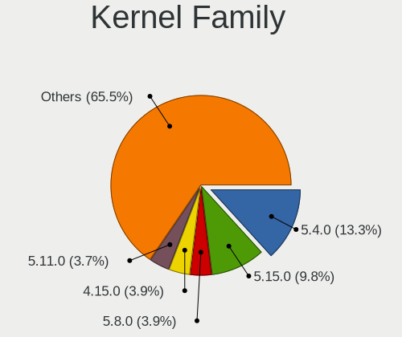
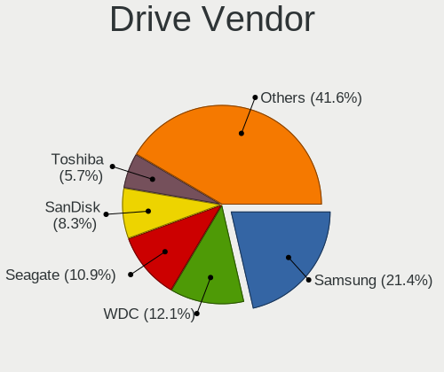
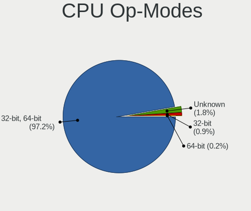
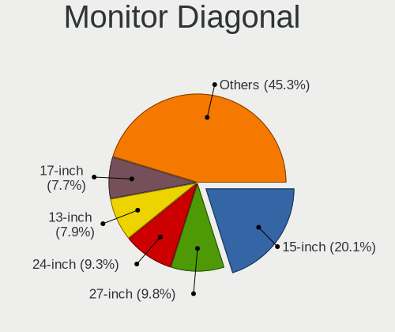
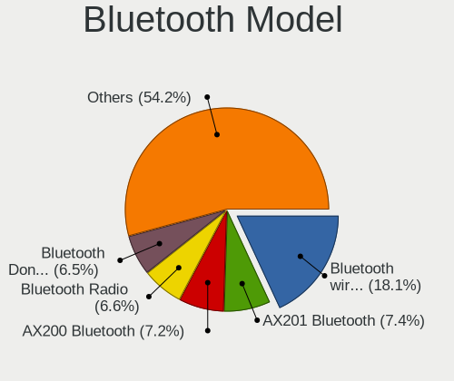
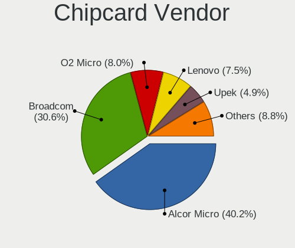

Linux in Germany - Tested Hardware & Statistics
-----------------------------------------------

A project to collect tested hardware configurations for Linux in Germany.

Anyone can contribute to this report by the [hw-probe](https://github.com/linuxhw/hw-probe) tool:

    sudo -E hw-probe -all -upload

Please contribute! Especially if your hardware is rare.

This is a report for all computer types. See also reports for [desktops](/Location/Germany/Desktop/README.md) and [notebooks](/Location/Germany/Notebook/README.md).

Contents
--------

* [ Test Cases ](#test-cases)

* [ System ](#system)
  - [ OS                       ](#os)
  - [ OS Family                ](#os-family)
  - [ Kernel                   ](#kernel)
  - [ Kernel Family            ](#kernel-family)
  - [ Kernel Major Ver.        ](#kernel-major-ver)
  - [ Arch                     ](#arch)
  - [ DE                       ](#de)
  - [ Display Server           ](#display-server)
  - [ Display Manager          ](#display-manager)
  - [ OS Lang                  ](#os-lang)
  - [ Boot Mode                ](#boot-mode)
  - [ Filesystem               ](#filesystem)
  - [ Part. scheme             ](#part-scheme)
  - [ Dual Boot with Linux/BSD ](#dual-boot-with-linuxbsd)
  - [ Dual Boot (Win)          ](#dual-boot-win)

* [ Board ](#board)
  - [ Vendor                   ](#vendor)
  - [ Model                    ](#model)
  - [ Model Family             ](#model-family)
  - [ MFG Year                 ](#mfg-year)
  - [ Form Factor              ](#form-factor)
  - [ Secure Boot              ](#secure-boot)
  - [ Coreboot                 ](#coreboot)
  - [ RAM Size                 ](#ram-size)
  - [ RAM Used                 ](#ram-used)
  - [ Total Drives             ](#total-drives)
  - [ Has CD-ROM               ](#has-cd-rom)
  - [ Has Ethernet             ](#has-ethernet)
  - [ Has WiFi                 ](#has-wifi)
  - [ Has Bluetooth            ](#has-bluetooth)

* [ Location ](#location)
  - [ Country                  ](#country)
  - [ City                     ](#city)

* [ Drives ](#drives)
  - [ Drive Vendor             ](#drive-vendor)
  - [ Drive Model              ](#drive-model)
  - [ HDD Vendor               ](#hdd-vendor)
  - [ SSD Vendor               ](#ssd-vendor)
  - [ Drive Kind               ](#drive-kind)
  - [ Drive Connector          ](#drive-connector)
  - [ Drive Size               ](#drive-size)
  - [ Space Total              ](#space-total)
  - [ Space Used               ](#space-used)
  - [ Malfunc. Drives          ](#malfunc-drives)
  - [ Malfunc. Drive Vendor    ](#malfunc-drive-vendor)
  - [ Malfunc. HDD Vendor      ](#malfunc-hdd-vendor)
  - [ Malfunc. Drive Kind      ](#malfunc-drive-kind)
  - [ Failed Drives            ](#failed-drives)
  - [ Failed Drive Vendor      ](#failed-drive-vendor)
  - [ Drive Status             ](#drive-status)

* [ Storage controller ](#storage-controller)
  - [ Storage Vendor           ](#storage-vendor)
  - [ Storage Model            ](#storage-model)
  - [ Storage Kind             ](#storage-kind)

* [ Processor ](#processor)
  - [ CPU Vendor               ](#cpu-vendor)
  - [ CPU Model                ](#cpu-model)
  - [ CPU Model Family         ](#cpu-model-family)
  - [ CPU Cores                ](#cpu-cores)
  - [ CPU Sockets              ](#cpu-sockets)
  - [ CPU Threads              ](#cpu-threads)
  - [ CPU Op-Modes             ](#cpu-op-modes)
  - [ CPU Microcode            ](#cpu-microcode)
  - [ CPU Microarch            ](#cpu-microarch)

* [ Graphics ](#graphics)
  - [ GPU Vendor               ](#gpu-vendor)
  - [ GPU Model                ](#gpu-model)
  - [ GPU Combo                ](#gpu-combo)
  - [ GPU Driver               ](#gpu-driver)
  - [ GPU Memory               ](#gpu-memory)

* [ Monitor ](#monitor)
  - [ Monitor Vendor           ](#monitor-vendor)
  - [ Monitor Model            ](#monitor-model)
  - [ Monitor Resolution       ](#monitor-resolution)
  - [ Monitor Diagonal         ](#monitor-diagonal)
  - [ Monitor Width            ](#monitor-width)
  - [ Aspect Ratio             ](#aspect-ratio)
  - [ Monitor Area             ](#monitor-area)
  - [ Pixel Density            ](#pixel-density)
  - [ Multiple Monitors        ](#multiple-monitors)

* [ Network ](#network)
  - [ Net Controller Vendor    ](#net-controller-vendor)
  - [ Net Controller Model     ](#net-controller-model)
  - [ Wireless Vendor          ](#wireless-vendor)
  - [ Wireless Model           ](#wireless-model)
  - [ Ethernet Vendor          ](#ethernet-vendor)
  - [ Ethernet Model           ](#ethernet-model)
  - [ Net Controller Kind      ](#net-controller-kind)
  - [ Used Controller          ](#used-controller)
  - [ NICs                     ](#nics)
  - [ IPv6                     ](#ipv6)

* [ Bluetooth ](#bluetooth)
  - [ Bluetooth Vendor         ](#bluetooth-vendor)
  - [ Bluetooth Model          ](#bluetooth-model)

* [ Sound ](#sound)
  - [ Sound Vendor             ](#sound-vendor)
  - [ Sound Model              ](#sound-model)

* [ Memory ](#memory)
  - [ Memory Vendor            ](#memory-vendor)
  - [ Memory Model             ](#memory-model)
  - [ Memory Kind              ](#memory-kind)
  - [ Memory Form Factor       ](#memory-form-factor)
  - [ Memory Size              ](#memory-size)
  - [ Memory Speed             ](#memory-speed)

* [ Printers & scanners ](#printers--scanners)
  - [ Printer Vendor           ](#printer-vendor)
  - [ Printer Model            ](#printer-model)
  - [ Scanner Vendor           ](#scanner-vendor)
  - [ Scanner Model            ](#scanner-model)

* [ Camera ](#camera)
  - [ Camera Vendor            ](#camera-vendor)
  - [ Camera Model             ](#camera-model)

* [ Security ](#security)
  - [ Fingerprint Vendor       ](#fingerprint-vendor)
  - [ Fingerprint Model        ](#fingerprint-model)
  - [ Chipcard Vendor          ](#chipcard-vendor)
  - [ Chipcard Model           ](#chipcard-model)

* [ Unsupported ](#unsupported)
  - [ Unsupported Devices      ](#unsupported-devices)
  - [ Unsupported Device Types ](#unsupported-device-types)

Test Cases
----------

Total: 29540

| Vendor        | Model                       | Form-Factor | Probe                                                      | Date         |
|---------------|-----------------------------|-------------|------------------------------------------------------------|--------------|
| ASUSTek       | M4A78LT-M-LE                | Desktop     | [9564e74fb6](https://linux-hardware.org/?probe=9564e74fb6) | Jul 01, 2023 |
| Fujitsu       | LIFEBOOK E780               | Notebook    | [12c5cd0309](https://linux-hardware.org/?probe=12c5cd0309) | Jul 01, 2023 |
| Gigabyte      | Q87M-D2H                    | Desktop     | [633c55d4ba](https://linux-hardware.org/?probe=633c55d4ba) | Jun 30, 2023 |
| Medion        | TJ4125                      | Desktop     | [5cebe0a1d0](https://linux-hardware.org/?probe=5cebe0a1d0) | Jun 30, 2023 |
| Gigabyte      | B85M-D3H                    | Desktop     | [99b07ae636](https://linux-hardware.org/?probe=99b07ae636) | Jun 30, 2023 |
| Gigabyte      | H410M S2H V3                | Desktop     | [e539937c27](https://linux-hardware.org/?probe=e539937c27) | Jun 30, 2023 |
| Valve         | Jupiter                     | Notebook    | [86984d2e19](https://linux-hardware.org/?probe=86984d2e19) | Jun 30, 2023 |
| Fujitsu       | LIFEBOOK P771               | Notebook    | [9d6575a3aa](https://linux-hardware.org/?probe=9d6575a3aa) | Jun 30, 2023 |
| Acer          | Aspire A517-52              | Notebook    | [79f2cae4d6](https://linux-hardware.org/?probe=79f2cae4d6) | Jun 30, 2023 |
| Medion        | TJ4125                      | Desktop     | [327794cb1a](https://linux-hardware.org/?probe=327794cb1a) | Jun 30, 2023 |
| Gigabyte      | B85M-D3H                    | Desktop     | [498eb9b539](https://linux-hardware.org/?probe=498eb9b539) | Jun 30, 2023 |
| Pegatron      | 2AB5                        | Desktop     | [f23fa01e43](https://linux-hardware.org/?probe=f23fa01e43) | Jun 30, 2023 |
| HP            | EliteBook 850 G1            | Notebook    | [a5f3a5ad14](https://linux-hardware.org/?probe=a5f3a5ad14) | Jun 30, 2023 |
| TUXEDO        | Pulse 15 Gen1               | Notebook    | [b15b3b6025](https://linux-hardware.org/?probe=b15b3b6025) | Jun 30, 2023 |
| ASUSTek       | N76VM                       | Notebook    | [df79346cd4](https://linux-hardware.org/?probe=df79346cd4) | Jun 30, 2023 |
| HP            | Laptop 17-cp2xxx            | Notebook    | [2012cd2c37](https://linux-hardware.org/?probe=2012cd2c37) | Jun 30, 2023 |
| Acer          | Aspire A315-56              | Notebook    | [3a814856ae](https://linux-hardware.org/?probe=3a814856ae) | Jun 30, 2023 |
| Lenovo        | ThinkPad X1 Carbon Gen 1... | Notebook    | [31db4fffd0](https://linux-hardware.org/?probe=31db4fffd0) | Jun 30, 2023 |
| HP            | EliteBook 8760w             | Notebook    | [470630eb65](https://linux-hardware.org/?probe=470630eb65) | Jun 30, 2023 |
| Gigabyte      | GA-MA770-UD3                | Desktop     | [03b1ea3bfa](https://linux-hardware.org/?probe=03b1ea3bfa) | Jun 30, 2023 |
| ASUSTek       | N76VM                       | Notebook    | [d770e894db](https://linux-hardware.org/?probe=d770e894db) | Jun 30, 2023 |
| HP            | 1497                        | Desktop     | [4dd582d288](https://linux-hardware.org/?probe=4dd582d288) | Jun 30, 2023 |
| Schenker      | XMG PRO (E23)               | Notebook    | [c70da63bd9](https://linux-hardware.org/?probe=c70da63bd9) | Jun 30, 2023 |
| Lenovo        | ThinkPad T460s 20F90057M... | Notebook    | [a78e2b4096](https://linux-hardware.org/?probe=a78e2b4096) | Jun 29, 2023 |
| Valve         | Jupiter                     | Notebook    | [d8a4613446](https://linux-hardware.org/?probe=d8a4613446) | Jun 29, 2023 |
| Intel         | Whiskey Platform            | Notebook    | [1caca06d89](https://linux-hardware.org/?probe=1caca06d89) | Jun 29, 2023 |
| ASRock        | H310CM-DVS                  | Desktop     | [46429ac6ae](https://linux-hardware.org/?probe=46429ac6ae) | Jun 29, 2023 |
| Medion        | Akoya P7818                 | Notebook    | [cfe9ae82fa](https://linux-hardware.org/?probe=cfe9ae82fa) | Jun 29, 2023 |
| HP            | Pro x2 612 G2               | Tablet      | [e47898dc3d](https://linux-hardware.org/?probe=e47898dc3d) | Jun 29, 2023 |
| Sony          | VGN-FE41M                   | Notebook    | [3bc894dc99](https://linux-hardware.org/?probe=3bc894dc99) | Jun 29, 2023 |
| HP            | Pavilion dv6                | Notebook    | [a24ee9a903](https://linux-hardware.org/?probe=a24ee9a903) | Jun 29, 2023 |
| Lenovo        | ThinkPad X200 7458AH8       | Notebook    | [a81af2d7e2](https://linux-hardware.org/?probe=a81af2d7e2) | Jun 29, 2023 |
| HP            | EliteBook 840 G3            | Notebook    | [979c4b20fc](https://linux-hardware.org/?probe=979c4b20fc) | Jun 29, 2023 |
| HP            | Notebook                    | Notebook    | [a178cbf707](https://linux-hardware.org/?probe=a178cbf707) | Jun 29, 2023 |
| Acer          | Aspire A517-52              | Notebook    | [06d27800c2](https://linux-hardware.org/?probe=06d27800c2) | Jun 29, 2023 |
| HP            | 8459                        | Desktop     | [11e9d33725](https://linux-hardware.org/?probe=11e9d33725) | Jun 29, 2023 |
| HP            | ENVY x360 Convertible 15... | Convertible | [81868a0214](https://linux-hardware.org/?probe=81868a0214) | Jun 29, 2023 |
| Lenovo        | ThinkPad T480 20L6S68T00    | Notebook    | [a50310948a](https://linux-hardware.org/?probe=a50310948a) | Jun 29, 2023 |
| Acer          | Aspire 5830TG               | Notebook    | [8c001b69bb](https://linux-hardware.org/?probe=8c001b69bb) | Jun 29, 2023 |
| Dell          | 0D28YY A03                  | Desktop     | [9c056f8643](https://linux-hardware.org/?probe=9c056f8643) | Jun 29, 2023 |
| HP            | Laptop 17-cp2xxx            | Notebook    | [f1a1aa76e2](https://linux-hardware.org/?probe=f1a1aa76e2) | Jun 29, 2023 |
| MSI           | Vector GP76 12UH            | Notebook    | [b7035d78a6](https://linux-hardware.org/?probe=b7035d78a6) | Jun 29, 2023 |
| Acer          | Aspire V5-572P              | Notebook    | [1a28142960](https://linux-hardware.org/?probe=1a28142960) | Jun 28, 2023 |
| ASUSTek       | ROG STRIX B450-F GAMING ... | Desktop     | [b94582735c](https://linux-hardware.org/?probe=b94582735c) | Jun 28, 2023 |
| ASUSTek       | VivoBook_ASUSLaptop X415... | Notebook    | [5819c72f02](https://linux-hardware.org/?probe=5819c72f02) | Jun 28, 2023 |
| ASUSTek       | H170-PRO                    | Desktop     | [506c909e37](https://linux-hardware.org/?probe=506c909e37) | Jun 28, 2023 |
| ASRock        | Z97 Extreme4                | Desktop     | [b1e629bc3c](https://linux-hardware.org/?probe=b1e629bc3c) | Jun 28, 2023 |
| Lenovo        | Yoga 730-15IWL 81JS         | Convertible | [4eef67e633](https://linux-hardware.org/?probe=4eef67e633) | Jun 28, 2023 |
| Gigabyte      | B550 AORUS ELITE            | Desktop     | [e46c7340d7](https://linux-hardware.org/?probe=e46c7340d7) | Jun 28, 2023 |
| HP            | Laptop 15-db0xxx            | Notebook    | [892229f999](https://linux-hardware.org/?probe=892229f999) | Jun 28, 2023 |
| HP            | Laptop 15-db0xxx            | Notebook    | [6d470794e9](https://linux-hardware.org/?probe=6d470794e9) | Jun 28, 2023 |
| Intel         | NUC11PABi5 M68265-501       | Mini pc     | [b6c0bd1df6](https://linux-hardware.org/?probe=b6c0bd1df6) | Jun 28, 2023 |
| Dell          | 0PC5F7 A01                  | Desktop     | [133ed5cc64](https://linux-hardware.org/?probe=133ed5cc64) | Jun 28, 2023 |
| Intel         | NUC11PABi5 M68265-501       | Mini pc     | [498d9375d4](https://linux-hardware.org/?probe=498d9375d4) | Jun 28, 2023 |
| MSI           | MPG Z490 GAMING EDGE WIF... | Desktop     | [238e77122e](https://linux-hardware.org/?probe=238e77122e) | Jun 28, 2023 |
| TUXEDO        | InfinityBook S 15/17 Gen... | Notebook    | [ed4a581e3e](https://linux-hardware.org/?probe=ed4a581e3e) | Jun 28, 2023 |
| Acer          | Veriton M490G               | Desktop     | [1f3da6e87f](https://linux-hardware.org/?probe=1f3da6e87f) | Jun 28, 2023 |
| ASRock        | H510M-HVS                   | Desktop     | [b90f532588](https://linux-hardware.org/?probe=b90f532588) | Jun 28, 2023 |
| ASUSTek       | F2A55-M LK                  | Desktop     | [0fcac8a0af](https://linux-hardware.org/?probe=0fcac8a0af) | Jun 28, 2023 |
| ASUSTek       | F5SR                        | Notebook    | [3722cfa5fb](https://linux-hardware.org/?probe=3722cfa5fb) | Jun 27, 2023 |
| Acer          | Aspire E5-573               | Notebook    | [cd65c92d12](https://linux-hardware.org/?probe=cd65c92d12) | Jun 27, 2023 |
| Acer          | Aspire E5-573               | Notebook    | [e3b1cdc71c](https://linux-hardware.org/?probe=e3b1cdc71c) | Jun 27, 2023 |
| TUXEDO        | P64_HJ,HK1                  | Notebook    | [4c542d50e7](https://linux-hardware.org/?probe=4c542d50e7) | Jun 27, 2023 |
| ASRock        | AB350M-HDV                  | Desktop     | [a055db3af3](https://linux-hardware.org/?probe=a055db3af3) | Jun 27, 2023 |
| Acer          | Aspire 5738                 | Notebook    | [09d8109c56](https://linux-hardware.org/?probe=09d8109c56) | Jun 27, 2023 |
| Dell          | 0KWVT8 A03                  | Desktop     | [8dcd3c3200](https://linux-hardware.org/?probe=8dcd3c3200) | Jun 27, 2023 |
| Fujitsu       | D3403-U1 S26361-D3403-U1    | Desktop     | [90067b8232](https://linux-hardware.org/?probe=90067b8232) | Jun 27, 2023 |
| AMI           | Cherry Trail CR             | Desktop     | [65fb07ed8d](https://linux-hardware.org/?probe=65fb07ed8d) | Jun 27, 2023 |
| Gigabyte      | EG45M-DS2H                  | Desktop     | [b9b25df5a3](https://linux-hardware.org/?probe=b9b25df5a3) | Jun 27, 2023 |
| Gigabyte      | Q87M-D2H                    | Desktop     | [95e5472f48](https://linux-hardware.org/?probe=95e5472f48) | Jun 27, 2023 |
| ASRock        | H61M-DGS R2.0               | Desktop     | [9cab8ca8c0](https://linux-hardware.org/?probe=9cab8ca8c0) | Jun 27, 2023 |
| Lenovo        | 1048 SDK0K17763 WIN 1801... | Desktop     | [d903758323](https://linux-hardware.org/?probe=d903758323) | Jun 27, 2023 |
| ASRock        | H61M-DGS R2.0               | Desktop     | [f719df9920](https://linux-hardware.org/?probe=f719df9920) | Jun 27, 2023 |
| Lenovo        | 36C5 SDK0K17763 WIN 1801... | Desktop     | [708131b231](https://linux-hardware.org/?probe=708131b231) | Jun 27, 2023 |
| Lenovo        | 36C5 SDK0K17763 WIN 1801... | Desktop     | [ef8f76e9e1](https://linux-hardware.org/?probe=ef8f76e9e1) | Jun 27, 2023 |
| Lenovo        | V110-15IKB 80TH             | Notebook    | [e6b9f96475](https://linux-hardware.org/?probe=e6b9f96475) | Jun 27, 2023 |
| Gigabyte      | GA-MA770T-UD3               | Desktop     | [73dfca737b](https://linux-hardware.org/?probe=73dfca737b) | Jun 27, 2023 |
| Acer          | Aspire E5-573G              | Notebook    | [fc532e9492](https://linux-hardware.org/?probe=fc532e9492) | Jun 27, 2023 |
| ASRock        | 960GM-VGS3 FX               | Desktop     | [2cd4ef0e5d](https://linux-hardware.org/?probe=2cd4ef0e5d) | Jun 27, 2023 |
| Dell          | Latitude E6230              | Notebook    | [b52e22e663](https://linux-hardware.org/?probe=b52e22e663) | Jun 27, 2023 |
| Valve         | Jupiter                     | Notebook    | [563dc53040](https://linux-hardware.org/?probe=563dc53040) | Jun 27, 2023 |
| ASRock        | H370M-ITX/ac                | Desktop     | [5e1d8d04f2](https://linux-hardware.org/?probe=5e1d8d04f2) | Jun 26, 2023 |
| Pine Micro... | Pine64 PinePhone (1.2)      | Phone       | [cf6a7757d5](https://linux-hardware.org/?probe=cf6a7757d5) | Jun 26, 2023 |
| ASRock        | A320M-DVS R4.0              | Desktop     | [742d015edb](https://linux-hardware.org/?probe=742d015edb) | Jun 26, 2023 |
| Intel         | NUC11ATBC4 M53051-400       | Mini pc     | [7c6c7cff66](https://linux-hardware.org/?probe=7c6c7cff66) | Jun 26, 2023 |
| ASRock        | A320M-DVS R4.0              | Desktop     | [6c659f8e1f](https://linux-hardware.org/?probe=6c659f8e1f) | Jun 26, 2023 |
| Lenovo        | ThinkCentre M90p 5450A26    | Desktop     | [78632c3242](https://linux-hardware.org/?probe=78632c3242) | Jun 26, 2023 |
| MSI           | MAG X570S TORPEDO MAX       | Desktop     | [9b9eeefdef](https://linux-hardware.org/?probe=9b9eeefdef) | Jun 26, 2023 |
| Lenovo        | V15 G2 ALC 82KD             | Notebook    | [d3e14b3015](https://linux-hardware.org/?probe=d3e14b3015) | Jun 26, 2023 |
| Gigabyte      | H310MD2P-CF                 | Desktop     | [1ad319cfc7](https://linux-hardware.org/?probe=1ad319cfc7) | Jun 26, 2023 |
| Intel Clie... | STK1AW32SC                  | Stick pc    | [0f27631293](https://linux-hardware.org/?probe=0f27631293) | Jun 26, 2023 |
| AZW           | SER V1.0                    | Mini pc     | [3b27404402](https://linux-hardware.org/?probe=3b27404402) | Jun 26, 2023 |
| Intel Clie... | STK1AW32SC                  | Stick pc    | [21a187daab](https://linux-hardware.org/?probe=21a187daab) | Jun 26, 2023 |
| HP            | 8906 SMVB                   | Desktop     | [18ab778722](https://linux-hardware.org/?probe=18ab778722) | Jun 26, 2023 |
| Lenovo        | ThinkCentre M91p 4524WAP    | Desktop     | [85eeeb037b](https://linux-hardware.org/?probe=85eeeb037b) | Jun 26, 2023 |
| Dell          | Precision 5570              | Notebook    | [dbf68aa669](https://linux-hardware.org/?probe=dbf68aa669) | Jun 26, 2023 |
| Lenovo        | ThinkPad T460 20FMS50T1J    | Notebook    | [91955c07a6](https://linux-hardware.org/?probe=91955c07a6) | Jun 26, 2023 |
| MSI           | X399 GAMING PRO CARBON A... | Desktop     | [b9bef208f1](https://linux-hardware.org/?probe=b9bef208f1) | Jun 26, 2023 |
| ASUSTek       | PRIME X370-PRO              | Desktop     | [827cec37c7](https://linux-hardware.org/?probe=827cec37c7) | Jun 26, 2023 |
| Zebra Tech... | ET85B                       | Tablet      | [0ad09dee4f](https://linux-hardware.org/?probe=0ad09dee4f) | Jun 26, 2023 |
| ASUSTek       | F5SR                        | Notebook    | [059a0b2611](https://linux-hardware.org/?probe=059a0b2611) | Jun 26, 2023 |
| HP            | EliteBook 8560w             | Notebook    | [dc55ec08b3](https://linux-hardware.org/?probe=dc55ec08b3) | Jun 26, 2023 |
| ASUSTek       | VivoBook_ASUSLaptop N740... | Notebook    | [44f08646c1](https://linux-hardware.org/?probe=44f08646c1) | Jun 26, 2023 |
| MSI           | B450 TOMAHAWK MAX           | Desktop     | [1bd3b2b912](https://linux-hardware.org/?probe=1bd3b2b912) | Jun 25, 2023 |
| MSI           | B450 TOMAHAWK MAX           | Desktop     | [d436c6bcdf](https://linux-hardware.org/?probe=d436c6bcdf) | Jun 25, 2023 |
| ASUSTek       | TP203NAH                    | Convertible | [9048d9f079](https://linux-hardware.org/?probe=9048d9f079) | Jun 25, 2023 |
| Unknown       | Unknown                     | Notebook    | [736f2d7bb5](https://linux-hardware.org/?probe=736f2d7bb5) | Jun 25, 2023 |
| HP            | 3648h                       | Desktop     | [16b9a3d94d](https://linux-hardware.org/?probe=16b9a3d94d) | Jun 25, 2023 |
| Lenovo        | IdeaPad S340-15API 81NC     | Notebook    | [e5c848cc49](https://linux-hardware.org/?probe=e5c848cc49) | Jun 25, 2023 |
| Fujitsu       | LIFEBOOK S751               | Notebook    | [94fe70521f](https://linux-hardware.org/?probe=94fe70521f) | Jun 25, 2023 |
| ASUSTek       | VivoBook_ASUSLaptop X415... | Notebook    | [de0797cd44](https://linux-hardware.org/?probe=de0797cd44) | Jun 25, 2023 |
| Lenovo        | ThinkPad P14s Gen 2a 21A... | Notebook    | [8b0180f4d4](https://linux-hardware.org/?probe=8b0180f4d4) | Jun 25, 2023 |
| Acer          | Swift SFX16-52G             | Notebook    | [28c4b7b2f3](https://linux-hardware.org/?probe=28c4b7b2f3) | Jun 25, 2023 |
| Acer          | Swift SFX16-52G             | Notebook    | [ac98f81b2a](https://linux-hardware.org/?probe=ac98f81b2a) | Jun 25, 2023 |
| ASUSTek       | N501VW                      | Notebook    | [7513f535f9](https://linux-hardware.org/?probe=7513f535f9) | Jun 25, 2023 |
| ASRock        | X570 Extreme4               | Desktop     | [0ab63facb3](https://linux-hardware.org/?probe=0ab63facb3) | Jun 25, 2023 |
| ASUSTek       | X75VC                       | Notebook    | [9fd44ac61e](https://linux-hardware.org/?probe=9fd44ac61e) | Jun 25, 2023 |
| Biostar       | X370GTN                     | Desktop     | [80b2b1d180](https://linux-hardware.org/?probe=80b2b1d180) | Jun 25, 2023 |
| Lenovo        | V15 G2 ITL 82KB             | Notebook    | [e172f7e955](https://linux-hardware.org/?probe=e172f7e955) | Jun 25, 2023 |
| ASUSTek       | K54C                        | Notebook    | [38e6ce020c](https://linux-hardware.org/?probe=38e6ce020c) | Jun 25, 2023 |
| ASUSTek       | H110M-A/M.2                 | Desktop     | [6b36aca9e6](https://linux-hardware.org/?probe=6b36aca9e6) | Jun 25, 2023 |
| ASUSTek       | P8B75-M LX                  | Desktop     | [5d7fd5b529](https://linux-hardware.org/?probe=5d7fd5b529) | Jun 25, 2023 |
| MSI           | MPG X570 GAMING PLUS        | Desktop     | [bd418c39bf](https://linux-hardware.org/?probe=bd418c39bf) | Jun 25, 2023 |
| Lenovo        | IdeaPad S340-15API 81NC     | Notebook    | [1c4e016f20](https://linux-hardware.org/?probe=1c4e016f20) | Jun 25, 2023 |
| Medion        | H110H4-CM2                  | Desktop     | [49df9d792a](https://linux-hardware.org/?probe=49df9d792a) | Jun 25, 2023 |
| Unknown       | Unknown                     | Notebook    | [72c377827d](https://linux-hardware.org/?probe=72c377827d) | Jun 24, 2023 |
| MSI           | Z97 MPOWER                  | Desktop     | [0cf75057cc](https://linux-hardware.org/?probe=0cf75057cc) | Jun 24, 2023 |
| Gigabyte      | GB-BRR7H-4800               | Desktop     | [d4125c6a4f](https://linux-hardware.org/?probe=d4125c6a4f) | Jun 24, 2023 |
| Lenovo        | IdeaPad Pro 5 16ARP8 83A... | Notebook    | [df9521a37d](https://linux-hardware.org/?probe=df9521a37d) | Jun 24, 2023 |
| Gigabyte      | F2A88XM-D3H                 | Desktop     | [a39abe1278](https://linux-hardware.org/?probe=a39abe1278) | Jun 24, 2023 |
| ASUSTek       | X750LN                      | Notebook    | [739ab83805](https://linux-hardware.org/?probe=739ab83805) | Jun 24, 2023 |
| HP            | Pavilion Notebook           | Notebook    | [e80fd49ba9](https://linux-hardware.org/?probe=e80fd49ba9) | Jun 24, 2023 |
| Lenovo        | ThinkPad X13 Gen 2a 20XH... | Notebook    | [71f17d4d74](https://linux-hardware.org/?probe=71f17d4d74) | Jun 24, 2023 |
| MSI           | MAG B650 TOMAHAWK WIFI      | Desktop     | [6760d73caf](https://linux-hardware.org/?probe=6760d73caf) | Jun 24, 2023 |
| HP            | 805D                        | Desktop     | [d55246de23](https://linux-hardware.org/?probe=d55246de23) | Jun 24, 2023 |
| MSI           | Z170A GAMING M3             | Desktop     | [96c2d6503c](https://linux-hardware.org/?probe=96c2d6503c) | Jun 24, 2023 |
| Lenovo        | IdeaPad 5 15ABA7 82SG       | Notebook    | [8a22a7fba4](https://linux-hardware.org/?probe=8a22a7fba4) | Jun 24, 2023 |
| Dell          | Inspiron 5767               | Notebook    | [9e3bf66b84](https://linux-hardware.org/?probe=9e3bf66b84) | Jun 24, 2023 |
| Dell          | Latitude E6500              | Notebook    | [2b1720ad90](https://linux-hardware.org/?probe=2b1720ad90) | Jun 24, 2023 |
| MSI           | GS63 7RD                    | Notebook    | [310191e110](https://linux-hardware.org/?probe=310191e110) | Jun 24, 2023 |
| ASUSTek       | K53TK                       | Notebook    | [905653d393](https://linux-hardware.org/?probe=905653d393) | Jun 24, 2023 |
| ASRock        | H61M-DGS R2.0               | Desktop     | [d26676c6f5](https://linux-hardware.org/?probe=d26676c6f5) | Jun 24, 2023 |
| Lenovo        | V145-15AST 81MT             | Notebook    | [1fe939429c](https://linux-hardware.org/?probe=1fe939429c) | Jun 24, 2023 |
| ASUSTek       | A68HM-PLUS                  | Desktop     | [fa162784e0](https://linux-hardware.org/?probe=fa162784e0) | Jun 24, 2023 |
| Valve         | Jupiter                     | Notebook    | [ba0343b607](https://linux-hardware.org/?probe=ba0343b607) | Jun 24, 2023 |
| Shenzhen M... | F6BFC                       | Desktop     | [7f13c620bf](https://linux-hardware.org/?probe=7f13c620bf) | Jun 23, 2023 |
| Dell          | XPS 15 9570                 | Notebook    | [2c09eb930c](https://linux-hardware.org/?probe=2c09eb930c) | Jun 23, 2023 |
| Lenovo        | ThinkPad X1 Nano Gen 2 2... | Notebook    | [f51aeb6252](https://linux-hardware.org/?probe=f51aeb6252) | Jun 23, 2023 |
| Gigabyte      | AORUS 15P YD                | Notebook    | [1e2fb31885](https://linux-hardware.org/?probe=1e2fb31885) | Jun 23, 2023 |
| ASUSTek       | X555LAB                     | Notebook    | [7b227bbaed](https://linux-hardware.org/?probe=7b227bbaed) | Jun 23, 2023 |
| ASRock        | X300M-STX                   | Desktop     | [eea6cc91ec](https://linux-hardware.org/?probe=eea6cc91ec) | Jun 23, 2023 |
| ASUSTek       | X751LD                      | Notebook    | [46e9b730a1](https://linux-hardware.org/?probe=46e9b730a1) | Jun 23, 2023 |
| Lenovo        | ThinkPad Yoga 370 20JJS0... | Convertible | [70954bb61e](https://linux-hardware.org/?probe=70954bb61e) | Jun 23, 2023 |
| HP            | ENVY x360 Convertible 15... | Convertible | [af8146f50e](https://linux-hardware.org/?probe=af8146f50e) | Jun 23, 2023 |
| HP            | ENVY x360 Convertible 15... | Convertible | [6968ecbe10](https://linux-hardware.org/?probe=6968ecbe10) | Jun 23, 2023 |
| ASUSTek       | P7P55 LX                    | Desktop     | [e700828afa](https://linux-hardware.org/?probe=e700828afa) | Jun 23, 2023 |
| ASUSTek       | P7P55 LX                    | Desktop     | [cd9b9aae75](https://linux-hardware.org/?probe=cd9b9aae75) | Jun 23, 2023 |
| Medion        | P6624                       | Notebook    | [49bd227ded](https://linux-hardware.org/?probe=49bd227ded) | Jun 23, 2023 |
| Fujitsu       | D3220-A1 S26361-D3220-A1    | Desktop     | [fa288c80f2](https://linux-hardware.org/?probe=fa288c80f2) | Jun 23, 2023 |
| Gigabyte      | B550M DS3H                  | Desktop     | [088398f2e7](https://linux-hardware.org/?probe=088398f2e7) | Jun 23, 2023 |
| ASRock        | B360M Pro4                  | Desktop     | [645a24c7bc](https://linux-hardware.org/?probe=645a24c7bc) | Jun 23, 2023 |
| MSI           | S12T 3M/S12 3M              | Notebook    | [f135825cec](https://linux-hardware.org/?probe=f135825cec) | Jun 23, 2023 |
| Lenovo        | BRASWELL NOK                | Desktop     | [1fe857b53b](https://linux-hardware.org/?probe=1fe857b53b) | Jun 23, 2023 |
| Lenovo        | ThinkPad X1 Carbon 4th 2... | Notebook    | [3cdf59359c](https://linux-hardware.org/?probe=3cdf59359c) | Jun 23, 2023 |
| HP            | Pavilion Notebook           | Notebook    | [cc0361248f](https://linux-hardware.org/?probe=cc0361248f) | Jun 23, 2023 |
| HP            | 3397                        | Desktop     | [8c9be2f4c0](https://linux-hardware.org/?probe=8c9be2f4c0) | Jun 23, 2023 |
| Acer          | Swift SFX14-51G             | Notebook    | [c8f3981a52](https://linux-hardware.org/?probe=c8f3981a52) | Jun 23, 2023 |
| HP            | Laptop 15s-eq2xxx           | Notebook    | [2faa400326](https://linux-hardware.org/?probe=2faa400326) | Jun 23, 2023 |
| TUXEDO        | Unknown                     | Notebook    | [71a75069f7](https://linux-hardware.org/?probe=71a75069f7) | Jun 23, 2023 |
| Dell          | Latitude E6510              | Notebook    | [a85838194d](https://linux-hardware.org/?probe=a85838194d) | Jun 23, 2023 |
| HP            | 255 15.6 inch G9 Noteboo... | Notebook    | [aa50925a16](https://linux-hardware.org/?probe=aa50925a16) | Jun 23, 2023 |
| TUXEDO        | Pulse 15 Gen1               | Notebook    | [efad2eddea](https://linux-hardware.org/?probe=efad2eddea) | Jun 23, 2023 |
| Fujitsu       | LIFEBOOK S751               | Notebook    | [70b047f976](https://linux-hardware.org/?probe=70b047f976) | Jun 22, 2023 |
| Lenovo        | ThinkPad P52 20M9CTO1WW     | Notebook    | [9d234065ed](https://linux-hardware.org/?probe=9d234065ed) | Jun 22, 2023 |
| Dell          | XPS 17 9710                 | Notebook    | [892620ac83](https://linux-hardware.org/?probe=892620ac83) | Jun 22, 2023 |
| Gigabyte      | Z77X-D3H                    | Desktop     | [54097cc170](https://linux-hardware.org/?probe=54097cc170) | Jun 22, 2023 |
| Sony          | SVE1712C1EW                 | Notebook    | [12f0ee026f](https://linux-hardware.org/?probe=12f0ee026f) | Jun 22, 2023 |
| Lenovo        | 3717 SDK0R32862 WIN 3258... | Desktop     | [7bf78e33d4](https://linux-hardware.org/?probe=7bf78e33d4) | Jun 22, 2023 |
| ASUSTek       | VivoBook_ASUSLaptop X515... | Notebook    | [4ae6c879aa](https://linux-hardware.org/?probe=4ae6c879aa) | Jun 22, 2023 |
| Dell          | 0JP3NX A02                  | Desktop     | [fbfe3fab11](https://linux-hardware.org/?probe=fbfe3fab11) | Jun 22, 2023 |
| ASRock        | J3160M                      | Desktop     | [0521c9a5a7](https://linux-hardware.org/?probe=0521c9a5a7) | Jun 22, 2023 |
| Acer          | Swift SFE16-42              | Notebook    | [9afa4fb174](https://linux-hardware.org/?probe=9afa4fb174) | Jun 22, 2023 |
| Framework     | Laptop                      | Notebook    | [eb51a9a662](https://linux-hardware.org/?probe=eb51a9a662) | Jun 22, 2023 |
| HP            | EliteBook 820 G3            | Notebook    | [925e5f0915](https://linux-hardware.org/?probe=925e5f0915) | Jun 22, 2023 |
| MSI           | B250M PRO-VDH               | Desktop     | [e8391a9f3d](https://linux-hardware.org/?probe=e8391a9f3d) | Jun 22, 2023 |
| Acer          | Aspire V5-552G              | Notebook    | [adeea10c6c](https://linux-hardware.org/?probe=adeea10c6c) | Jun 22, 2023 |
| ASUSTek       | PRIME B450M-K               | Desktop     | [fcb112b431](https://linux-hardware.org/?probe=fcb112b431) | Jun 22, 2023 |
| TUXEDO        | Pulse 15 Gen2               | Notebook    | [8158959dbd](https://linux-hardware.org/?probe=8158959dbd) | Jun 22, 2023 |
| Unknown       | Unknown                     | Desktop     | [3e25fc74a7](https://linux-hardware.org/?probe=3e25fc74a7) | Jun 22, 2023 |
| HP            | 3397                        | Desktop     | [a47ce0d4dc](https://linux-hardware.org/?probe=a47ce0d4dc) | Jun 22, 2023 |
| Unknown       | Unknown                     | Desktop     | [c2e0154437](https://linux-hardware.org/?probe=c2e0154437) | Jun 22, 2023 |
| Acer          | Aspire X1700                | Desktop     | [aac17ef2f2](https://linux-hardware.org/?probe=aac17ef2f2) | Jun 22, 2023 |
| ASRock        | X399 Taichi                 | Desktop     | [d9ca7c4369](https://linux-hardware.org/?probe=d9ca7c4369) | Jun 22, 2023 |
| AMI           | Intel                       | Desktop     | [1a4a632d56](https://linux-hardware.org/?probe=1a4a632d56) | Jun 22, 2023 |
| HP            | EliteBook 8540p             | Notebook    | [c72d0ef702](https://linux-hardware.org/?probe=c72d0ef702) | Jun 22, 2023 |
| Lenovo        | ThinkPad L380 20M5000UGE    | Notebook    | [06db720b62](https://linux-hardware.org/?probe=06db720b62) | Jun 22, 2023 |
| ASUSTek       | M5A78L-M PLUS/USB3          | Desktop     | [e177167295](https://linux-hardware.org/?probe=e177167295) | Jun 22, 2023 |
| ASUSTek       | VivoBook_ASUSLaptop X515... | Notebook    | [888133764a](https://linux-hardware.org/?probe=888133764a) | Jun 21, 2023 |
| Dell          | Latitude E6410              | Notebook    | [522dfb5977](https://linux-hardware.org/?probe=522dfb5977) | Jun 21, 2023 |
| Dell          | Latitude E6410              | Notebook    | [601921c51d](https://linux-hardware.org/?probe=601921c51d) | Jun 21, 2023 |
| ASUSTek       | G752VM                      | Notebook    | [b518236bd7](https://linux-hardware.org/?probe=b518236bd7) | Jun 21, 2023 |
| Wortmann      | NA92                        | All in one  | [7c0d234301](https://linux-hardware.org/?probe=7c0d234301) | Jun 21, 2023 |
| Lenovo        | IdeaPad 320-15IKB 80XL      | Notebook    | [b67f86bedc](https://linux-hardware.org/?probe=b67f86bedc) | Jun 21, 2023 |
| Lenovo        | ThinkPad T510 4349WHC       | Notebook    | [9134464b7a](https://linux-hardware.org/?probe=9134464b7a) | Jun 21, 2023 |
| Acer          | Extensa 2519                | Notebook    | [36f37b33d5](https://linux-hardware.org/?probe=36f37b33d5) | Jun 21, 2023 |
| HUAWEI        | BOHK-WAX9X                  | Notebook    | [510604914c](https://linux-hardware.org/?probe=510604914c) | Jun 21, 2023 |
| HUAWEI        | BOHK-WAX9X                  | Notebook    | [ab169bfbfd](https://linux-hardware.org/?probe=ab169bfbfd) | Jun 21, 2023 |
| HONOR         | HLYL-WXX9                   | Notebook    | [498f41554b](https://linux-hardware.org/?probe=498f41554b) | Jun 21, 2023 |
| Gigabyte      | Z77X-D3H                    | Desktop     | [1a47171330](https://linux-hardware.org/?probe=1a47171330) | Jun 21, 2023 |
| MSI           | B450-A PRO MAX              | Desktop     | [589e702758](https://linux-hardware.org/?probe=589e702758) | Jun 21, 2023 |
| Hardkernel    | ODROID-H2                   | Desktop     | [8f879f5566](https://linux-hardware.org/?probe=8f879f5566) | Jun 21, 2023 |
| MSI           | H110M PRO-D                 | Desktop     | [b652abc634](https://linux-hardware.org/?probe=b652abc634) | Jun 21, 2023 |
| Lenovo        | IdeaPadFlex 15 20309        | Notebook    | [76fbd356a0](https://linux-hardware.org/?probe=76fbd356a0) | Jun 21, 2023 |
| Unknown       | Unknown                     | Soc         | [3f9e700a1a](https://linux-hardware.org/?probe=3f9e700a1a) | Jun 21, 2023 |
| Gigabyte      | Z97M-D3H                    | Desktop     | [66e2a42098](https://linux-hardware.org/?probe=66e2a42098) | Jun 21, 2023 |
| Shenzhen M... | F7BFC                       | Desktop     | [f76394a58a](https://linux-hardware.org/?probe=f76394a58a) | Jun 21, 2023 |
| HP            | 339A                        | Desktop     | [960fd64baa](https://linux-hardware.org/?probe=960fd64baa) | Jun 21, 2023 |
| Apple         | MacBookPro6,2               | Notebook    | [3beb323b62](https://linux-hardware.org/?probe=3beb323b62) | Jun 21, 2023 |
| Packard Be... | EasyNote TE11HC             | Notebook    | [6bbc56b36c](https://linux-hardware.org/?probe=6bbc56b36c) | Jun 20, 2023 |
| Lenovo        | 36C5 SDK0K17763 WIN 1801... | Desktop     | [92f6324f8a](https://linux-hardware.org/?probe=92f6324f8a) | Jun 20, 2023 |
| HP            | ENVY Laptop 14-eb0xxx       | Notebook    | [233b6c3412](https://linux-hardware.org/?probe=233b6c3412) | Jun 20, 2023 |
| Gigabyte      | B550 AORUS ELITE            | Desktop     | [c2313cf371](https://linux-hardware.org/?probe=c2313cf371) | Jun 20, 2023 |
| Lenovo        | IdeaPad 3 15IGL05 81WQ      | Notebook    | [293b8783a3](https://linux-hardware.org/?probe=293b8783a3) | Jun 20, 2023 |
| Lenovo        | IdeaPad 3 15IGL05 81WQ      | Notebook    | [2f452cfce0](https://linux-hardware.org/?probe=2f452cfce0) | Jun 20, 2023 |
| Apple         | MacBookPro5,5               | Notebook    | [16c4045c3b](https://linux-hardware.org/?probe=16c4045c3b) | Jun 20, 2023 |
| Intel         | D34010WYK H14771-304        | Desktop     | [0d3af8114b](https://linux-hardware.org/?probe=0d3af8114b) | Jun 20, 2023 |
| HUAWEI        | CREM-WXX9                   | Notebook    | [55182e9371](https://linux-hardware.org/?probe=55182e9371) | Jun 20, 2023 |
| Gigabyte      | Q87M-D2H                    | Desktop     | [67a44b0d84](https://linux-hardware.org/?probe=67a44b0d84) | Jun 20, 2023 |
| TUXEDO        | P95xER                      | Notebook    | [f2f6ddaf27](https://linux-hardware.org/?probe=f2f6ddaf27) | Jun 20, 2023 |
| Dell          | 06FW8P A02                  | Desktop     | [f65ec61ffc](https://linux-hardware.org/?probe=f65ec61ffc) | Jun 20, 2023 |
| Lenovo        | IdeaPad S540-14IWL 81ND     | Notebook    | [3be3d70197](https://linux-hardware.org/?probe=3be3d70197) | Jun 20, 2023 |
| HP            | 255 G7 Notebook PC          | Notebook    | [3db68832fd](https://linux-hardware.org/?probe=3db68832fd) | Jun 20, 2023 |
| HP            | 18E4                        | Desktop     | [9e2ad40fc3](https://linux-hardware.org/?probe=9e2ad40fc3) | Jun 20, 2023 |
| Lenovo        | ThinkPad L15 Gen 1 20U30... | Notebook    | [7d00ddf4fc](https://linux-hardware.org/?probe=7d00ddf4fc) | Jun 20, 2023 |
| Pencents      | U50 Standard                | Mini pc     | [96db8365b1](https://linux-hardware.org/?probe=96db8365b1) | Jun 20, 2023 |
| MSI           | GT70 2OC/2OD                | Notebook    | [d8d81f0614](https://linux-hardware.org/?probe=d8d81f0614) | Jun 20, 2023 |
| Lenovo        | ThinkPad P53 20QNCTO1WW     | Notebook    | [dd152b03bc](https://linux-hardware.org/?probe=dd152b03bc) | Jun 20, 2023 |
| TUXEDO        | P65xRP                      | Notebook    | [cfefc9c13a](https://linux-hardware.org/?probe=cfefc9c13a) | Jun 20, 2023 |
| Valve         | Jupiter                     | Notebook    | [f4e47bb83e](https://linux-hardware.org/?probe=f4e47bb83e) | Jun 20, 2023 |
| HP            | EliteBook 840 G6            | Notebook    | [82c9c200bc](https://linux-hardware.org/?probe=82c9c200bc) | Jun 20, 2023 |
| Lenovo        | SHARKBAY NOK                | Desktop     | [4560c6d34d](https://linux-hardware.org/?probe=4560c6d34d) | Jun 19, 2023 |
| HP            | Pavilion dv6                | Notebook    | [09d49049bf](https://linux-hardware.org/?probe=09d49049bf) | Jun 19, 2023 |
| ASUSTek       | ZenBook UX325EA_UX325EA     | Notebook    | [91f85b5bb5](https://linux-hardware.org/?probe=91f85b5bb5) | Jun 19, 2023 |
| ASUSTek       | ZenBook UX325EA_UX325EA     | Notebook    | [93f576698e](https://linux-hardware.org/?probe=93f576698e) | Jun 19, 2023 |
| Lenovo        | Yoga Slim 7 Pro 14ACH5 O... | Notebook    | [a0862de551](https://linux-hardware.org/?probe=a0862de551) | Jun 19, 2023 |
| Lenovo        | Yoga Slim 7 Pro 14ACH5 O... | Notebook    | [3cfd8a448c](https://linux-hardware.org/?probe=3cfd8a448c) | Jun 19, 2023 |
| HP            | Pavilion Laptop 13-an0xx... | Notebook    | [0f68ace67c](https://linux-hardware.org/?probe=0f68ace67c) | Jun 19, 2023 |
| HP            | ENVY x360 Convertible 13... | Convertible | [d196994309](https://linux-hardware.org/?probe=d196994309) | Jun 19, 2023 |
| ZOTAC         | ZBOX-QCM7T3000/EN072080S... | Mini pc     | [40e085fda3](https://linux-hardware.org/?probe=40e085fda3) | Jun 19, 2023 |
| Lenovo        | ThinkPad T450s 20BWS11H0... | Notebook    | [596055aa43](https://linux-hardware.org/?probe=596055aa43) | Jun 19, 2023 |
| HP            | Laptop 15-db0xxx            | Notebook    | [c67d08fe43](https://linux-hardware.org/?probe=c67d08fe43) | Jun 19, 2023 |
| HP            | Laptop 14s-fq0xxx           | Notebook    | [6ff28ccac1](https://linux-hardware.org/?probe=6ff28ccac1) | Jun 19, 2023 |
| Acer          | Aspire 7739                 | Notebook    | [eda7fb180a](https://linux-hardware.org/?probe=eda7fb180a) | Jun 19, 2023 |
| Dell          | 0VV4V0 A00                  | All in one  | [9c22db900e](https://linux-hardware.org/?probe=9c22db900e) | Jun 19, 2023 |
| MSI           | GL72M 7REX                  | Notebook    | [6d50ff945d](https://linux-hardware.org/?probe=6d50ff945d) | Jun 19, 2023 |
| HP            | ProBook 650 G3              | Notebook    | [009fdf15c4](https://linux-hardware.org/?probe=009fdf15c4) | Jun 19, 2023 |
| MSI           | B450 TOMAHAWK MAX           | Desktop     | [bfe09e12f0](https://linux-hardware.org/?probe=bfe09e12f0) | Jun 18, 2023 |
| Packard Be... | EasyNote TE11HC             | Notebook    | [33785e2493](https://linux-hardware.org/?probe=33785e2493) | Jun 18, 2023 |
| Acer          | Aspire 7739                 | Notebook    | [34854e20dd](https://linux-hardware.org/?probe=34854e20dd) | Jun 18, 2023 |
| MSI           | B550-A PRO                  | Desktop     | [b0f066ab7e](https://linux-hardware.org/?probe=b0f066ab7e) | Jun 18, 2023 |
| MSI           | MS-16Y1                     | Notebook    | [167889509f](https://linux-hardware.org/?probe=167889509f) | Jun 18, 2023 |
| HP            | Pavilion Notebook           | Notebook    | [ce3c5bc056](https://linux-hardware.org/?probe=ce3c5bc056) | Jun 18, 2023 |
| ASUSTek       | X555LJ                      | Notebook    | [a4bea0f3e3](https://linux-hardware.org/?probe=a4bea0f3e3) | Jun 18, 2023 |
| Acer          | Veriton M490G               | Desktop     | [f9405b8bd2](https://linux-hardware.org/?probe=f9405b8bd2) | Jun 18, 2023 |
| ASUSTek       | X555LA                      | Notebook    | [a57885e16c](https://linux-hardware.org/?probe=a57885e16c) | Jun 18, 2023 |
| Gigabyte      | B85M-D3H                    | Desktop     | [033c027010](https://linux-hardware.org/?probe=033c027010) | Jun 18, 2023 |
| HP            | Notebook                    | Notebook    | [e53b70bcac](https://linux-hardware.org/?probe=e53b70bcac) | Jun 18, 2023 |
| Medion        | TJ4125                      | Desktop     | [4c6aec7e33](https://linux-hardware.org/?probe=4c6aec7e33) | Jun 18, 2023 |
| ASUSTek       | X556UQK                     | Notebook    | [fb675907ec](https://linux-hardware.org/?probe=fb675907ec) | Jun 18, 2023 |
| MSI           | Z77A-GD65                   | Desktop     | [93400d2b87](https://linux-hardware.org/?probe=93400d2b87) | Jun 18, 2023 |
| Dell          | Precision M4800             | Notebook    | [9f86d737f2](https://linux-hardware.org/?probe=9f86d737f2) | Jun 18, 2023 |
| HP            | Compaq Presario CQ71        | Notebook    | [d5025e2864](https://linux-hardware.org/?probe=d5025e2864) | Jun 18, 2023 |
| Gigabyte      | F2A88XM-D3H                 | Desktop     | [10b3b517f3](https://linux-hardware.org/?probe=10b3b517f3) | Jun 18, 2023 |
| ZOTAC         | ZBOX-MI531 Rev.00           | Mini pc     | [d477167fb3](https://linux-hardware.org/?probe=d477167fb3) | Jun 18, 2023 |
| ASUSTek       | F2A55-M LK                  | Desktop     | [961b50409f](https://linux-hardware.org/?probe=961b50409f) | Jun 18, 2023 |
| HP            | EliteBook 840 G5            | Notebook    | [7c7742bf5a](https://linux-hardware.org/?probe=7c7742bf5a) | Jun 18, 2023 |
| VALE          | Notebook Classic C140       | Notebook    | [afa3a9de5e](https://linux-hardware.org/?probe=afa3a9de5e) | Jun 18, 2023 |
| MSI           | B450 GAMING PRO CARBON A... | Desktop     | [11161fa30c](https://linux-hardware.org/?probe=11161fa30c) | Jun 18, 2023 |
| Sony          | SVF1421L1EW                 | Notebook    | [5d377cbe13](https://linux-hardware.org/?probe=5d377cbe13) | Jun 17, 2023 |
| MSI           | Z97 PC Mate                 | Desktop     | [191a3b02ac](https://linux-hardware.org/?probe=191a3b02ac) | Jun 17, 2023 |
| Lenovo        | V15 G4 AMN 82YU             | Notebook    | [2bfd69673e](https://linux-hardware.org/?probe=2bfd69673e) | Jun 17, 2023 |
| ASRock        | IMB-171-L                   | Desktop     | [257b925f7a](https://linux-hardware.org/?probe=257b925f7a) | Jun 17, 2023 |
| HP            | 829A                        | Mini pc     | [dc404251ff](https://linux-hardware.org/?probe=dc404251ff) | Jun 17, 2023 |
| ZOTAC         | ZBOX-CI622/CI642/CI662NA... | Mini pc     | [cacfc6480f](https://linux-hardware.org/?probe=cacfc6480f) | Jun 17, 2023 |
| Sony          | SVF1421L1EW                 | Notebook    | [e4dc7d363e](https://linux-hardware.org/?probe=e4dc7d363e) | Jun 17, 2023 |
| HP            | Notebook                    | Notebook    | [f01887f9d6](https://linux-hardware.org/?probe=f01887f9d6) | Jun 17, 2023 |
| HP            | 250 G4                      | Notebook    | [f25c49812b](https://linux-hardware.org/?probe=f25c49812b) | Jun 17, 2023 |
| Gigabyte      | B550M DS3H                  | Desktop     | [d40a2861ce](https://linux-hardware.org/?probe=d40a2861ce) | Jun 17, 2023 |
| MSI           | MS-AA71                     | All in one  | [b885127916](https://linux-hardware.org/?probe=b885127916) | Jun 17, 2023 |
| HP            | 255 15.6 inch G9 Noteboo... | Notebook    | [9206f6c141](https://linux-hardware.org/?probe=9206f6c141) | Jun 17, 2023 |
| HP            | EliteBook 8440p             | Notebook    | [4b1b2457a4](https://linux-hardware.org/?probe=4b1b2457a4) | Jun 17, 2023 |
| Medion        | S15449                      | Notebook    | [9ee17b411b](https://linux-hardware.org/?probe=9ee17b411b) | Jun 17, 2023 |
| ASUSTek       | TUF Gaming B550M-PLUS       | Desktop     | [b244c822ef](https://linux-hardware.org/?probe=b244c822ef) | Jun 17, 2023 |
| Medion        | H110H4-EM                   | Desktop     | [d1cae28722](https://linux-hardware.org/?probe=d1cae28722) | Jun 17, 2023 |
| Lenovo        | ThinkCentre M91p 4524WAP    | Desktop     | [707e7d9862](https://linux-hardware.org/?probe=707e7d9862) | Jun 17, 2023 |
| HP            | Pavilion Gaming Laptop      | Notebook    | [2d5c5b2c80](https://linux-hardware.org/?probe=2d5c5b2c80) | Jun 17, 2023 |
| Lenovo        | ThinkPad Edge E535 3260F... | Notebook    | [3fd273f672](https://linux-hardware.org/?probe=3fd273f672) | Jun 17, 2023 |
| ASUSTek       | PRIME H310M-A R2.0          | Desktop     | [a599147e58](https://linux-hardware.org/?probe=a599147e58) | Jun 17, 2023 |
| Medion        | E6214                       | Notebook    | [5547ea042f](https://linux-hardware.org/?probe=5547ea042f) | Jun 17, 2023 |
| HP            | ENVY x360 Convertible 13... | Convertible | [cb1add1b88](https://linux-hardware.org/?probe=cb1add1b88) | Jun 17, 2023 |
| ASUSTek       | ROG Maximus Z790 HERO       | Desktop     | [29c006c668](https://linux-hardware.org/?probe=29c006c668) | Jun 17, 2023 |
| Medion        | E6214                       | Notebook    | [98ddb6700a](https://linux-hardware.org/?probe=98ddb6700a) | Jun 17, 2023 |
| ASRock        | B660M Steel Legend          | Desktop     | [75f3194c4e](https://linux-hardware.org/?probe=75f3194c4e) | Jun 17, 2023 |
| ASRock        | B660M Steel Legend          | Desktop     | [454fea2b00](https://linux-hardware.org/?probe=454fea2b00) | Jun 17, 2023 |
| Dell          | Inspiron 3593               | Notebook    | [46ad2c78f7](https://linux-hardware.org/?probe=46ad2c78f7) | Jun 17, 2023 |
| Toshiba       | Satellite L775D-107         | Notebook    | [7959d73eb9](https://linux-hardware.org/?probe=7959d73eb9) | Jun 17, 2023 |
| MSI           | MS-AA71                     | All in one  | [feaaf5fbc0](https://linux-hardware.org/?probe=feaaf5fbc0) | Jun 16, 2023 |
| ASUSTek       | K73BR                       | Notebook    | [9f4d2564bf](https://linux-hardware.org/?probe=9f4d2564bf) | Jun 16, 2023 |
| Dell          | 0MN1TX A02                  | Desktop     | [61343d72f2](https://linux-hardware.org/?probe=61343d72f2) | Jun 16, 2023 |
| Lenovo        | 3132 SDK0J40697 WIN 3305... | Desktop     | [2149968671](https://linux-hardware.org/?probe=2149968671) | Jun 16, 2023 |
| Lenovo        | V15 G4 AMN 82YU             | Notebook    | [45d3e053e3](https://linux-hardware.org/?probe=45d3e053e3) | Jun 16, 2023 |
| Gigabyte      | B85M-D3H                    | Desktop     | [fe0d892e82](https://linux-hardware.org/?probe=fe0d892e82) | Jun 16, 2023 |
| Medion        | TJ4125                      | Desktop     | [fc102c077c](https://linux-hardware.org/?probe=fc102c077c) | Jun 16, 2023 |
| Lenovo        | ThinkPad X380 Yoga 20LJS... | Convertible | [8f65b1ab5b](https://linux-hardware.org/?probe=8f65b1ab5b) | Jun 16, 2023 |
| ASUSTek       | ROG Ally RC71L_RC71L        | Tablet      | [38138ba23d](https://linux-hardware.org/?probe=38138ba23d) | Jun 16, 2023 |
| Lenovo        | ThinkPad P51 20HJS1SF00     | Notebook    | [664ae7a0f2](https://linux-hardware.org/?probe=664ae7a0f2) | Jun 16, 2023 |
| Samsung       | 750XDA                      | Notebook    | [e04dd13d49](https://linux-hardware.org/?probe=e04dd13d49) | Jun 16, 2023 |
| Dell          | Latitude D620               | Notebook    | [8dc25931d7](https://linux-hardware.org/?probe=8dc25931d7) | Jun 16, 2023 |
| Dell          | Latitude D620               | Notebook    | [819f346812](https://linux-hardware.org/?probe=819f346812) | Jun 16, 2023 |
| Unknown       | Minix Neo U9-H              | Soc         | [7b845b4b0b](https://linux-hardware.org/?probe=7b845b4b0b) | Jun 16, 2023 |
| ASUSTek       | TUF Gaming B550-PRO         | Desktop     | [2543c7b4c9](https://linux-hardware.org/?probe=2543c7b4c9) | Jun 16, 2023 |
| MSI           | B450M MORTAR TITANIUM       | Desktop     | [3b83e2ea48](https://linux-hardware.org/?probe=3b83e2ea48) | Jun 16, 2023 |
| Samsung       | 930QCG                      | Convertible | [339858c7c7](https://linux-hardware.org/?probe=339858c7c7) | Jun 16, 2023 |
| MSI           | X470 GAMING PLUS MAX        | Desktop     | [61e45982dc](https://linux-hardware.org/?probe=61e45982dc) | Jun 16, 2023 |
| HONOR         | BMH-WCX9                    | Notebook    | [da0a4b3bf0](https://linux-hardware.org/?probe=da0a4b3bf0) | Jun 16, 2023 |
| ASRock        | X399 Phantom Gaming 6       | Desktop     | [aad3ead710](https://linux-hardware.org/?probe=aad3ead710) | Jun 16, 2023 |
| Lenovo        | ThinkPad X1 Carbon Gen 1... | Notebook    | [ea2e8604af](https://linux-hardware.org/?probe=ea2e8604af) | Jun 16, 2023 |
| HP            | 1587h                       | Desktop     | [bb361f8bca](https://linux-hardware.org/?probe=bb361f8bca) | Jun 16, 2023 |
| ASRock        | B450 Gaming-ITX/ac          | Desktop     | [d10c160695](https://linux-hardware.org/?probe=d10c160695) | Jun 16, 2023 |
| Dell          | Precision 3570              | Notebook    | [6f6debf1a4](https://linux-hardware.org/?probe=6f6debf1a4) | Jun 15, 2023 |
| MSI           | GL72M 7REX                  | Notebook    | [1f1699301f](https://linux-hardware.org/?probe=1f1699301f) | Jun 15, 2023 |
| Acer          | Swift SF114-34              | Notebook    | [32eb9f5dea](https://linux-hardware.org/?probe=32eb9f5dea) | Jun 15, 2023 |
| Acer          | Swift SF114-34              | Notebook    | [9f9ffda2e3](https://linux-hardware.org/?probe=9f9ffda2e3) | Jun 15, 2023 |
| MSI           | 760GM-P23                   | Desktop     | [b27c911277](https://linux-hardware.org/?probe=b27c911277) | Jun 15, 2023 |
| Acer          | TravelMate 8172             | Notebook    | [569fde2487](https://linux-hardware.org/?probe=569fde2487) | Jun 15, 2023 |
| Fujitsu       | D3162-C1 S26361-D3162-C1    | Desktop     | [31d4ce59c3](https://linux-hardware.org/?probe=31d4ce59c3) | Jun 15, 2023 |
| ASUSTek       | K70AC                       | Notebook    | [b9dc7d0b00](https://linux-hardware.org/?probe=b9dc7d0b00) | Jun 15, 2023 |
| Fujitsu Si... | ESPRIMO Mobile V6555        | Notebook    | [0210669ff3](https://linux-hardware.org/?probe=0210669ff3) | Jun 15, 2023 |
| Dell          | Latitude E7450              | Notebook    | [05ebaf45ae](https://linux-hardware.org/?probe=05ebaf45ae) | Jun 15, 2023 |
| Medion        | E6214                       | Notebook    | [71b2e69534](https://linux-hardware.org/?probe=71b2e69534) | Jun 15, 2023 |
| HP            | Laptop 15s-fq0xxx           | Notebook    | [ff98efdef7](https://linux-hardware.org/?probe=ff98efdef7) | Jun 15, 2023 |
| Acer          | Spin SP111-32N              | Convertible | [85a66a9924](https://linux-hardware.org/?probe=85a66a9924) | Jun 15, 2023 |
| ASUSTek       | P5Q-PRO                     | Desktop     | [df63208f37](https://linux-hardware.org/?probe=df63208f37) | Jun 15, 2023 |
| HP            | EliteBook 1040 G4           | Notebook    | [01724286d9](https://linux-hardware.org/?probe=01724286d9) | Jun 15, 2023 |
| ASUSTek       | F2A55-M LK                  | Desktop     | [68965d8ed9](https://linux-hardware.org/?probe=68965d8ed9) | Jun 15, 2023 |
| Lenovo        | IdeaPad 330S-15IKB 81F5     | Notebook    | [5b85dc34c6](https://linux-hardware.org/?probe=5b85dc34c6) | Jun 15, 2023 |
| Gigabyte      | B450M S2H                   | Desktop     | [1bcfd50d08](https://linux-hardware.org/?probe=1bcfd50d08) | Jun 15, 2023 |
| HP            | ENVY x360 2-in-1 Laptop ... | Convertible | [2e1608028d](https://linux-hardware.org/?probe=2e1608028d) | Jun 15, 2023 |
| Gigabyte      | B450M S2H                   | Desktop     | [04b5148080](https://linux-hardware.org/?probe=04b5148080) | Jun 15, 2023 |
| ASUSTek       | ROG STRIX Z490-F GAMING     | Desktop     | [95a5739eda](https://linux-hardware.org/?probe=95a5739eda) | Jun 14, 2023 |
| BESSTAR Te... | GB7                         | Mini pc     | [efe89f7f85](https://linux-hardware.org/?probe=efe89f7f85) | Jun 14, 2023 |
| Dell          | Precision M4500             | Notebook    | [5daca408ec](https://linux-hardware.org/?probe=5daca408ec) | Jun 14, 2023 |
| Lenovo        | ThinkPad P14s Gen 1 20Y1... | Notebook    | [65298dde46](https://linux-hardware.org/?probe=65298dde46) | Jun 14, 2023 |
| HP            | ENVY 17                     | Notebook    | [269ca0c6e9](https://linux-hardware.org/?probe=269ca0c6e9) | Jun 14, 2023 |
| Apple         | MacBookAir7,2               | Notebook    | [8f84dca464](https://linux-hardware.org/?probe=8f84dca464) | Jun 14, 2023 |
| Shenzhen M... | F7BFC                       | Desktop     | [7ae905703c](https://linux-hardware.org/?probe=7ae905703c) | Jun 14, 2023 |
| ASRock        | QC5000-ITX/PH               | Desktop     | [b50d647073](https://linux-hardware.org/?probe=b50d647073) | Jun 14, 2023 |
| Dell          | Latitude 7430               | Notebook    | [6cf1c68c1d](https://linux-hardware.org/?probe=6cf1c68c1d) | Jun 14, 2023 |
| Gigabyte      | X79-UD3                     | Desktop     | [3781214e55](https://linux-hardware.org/?probe=3781214e55) | Jun 14, 2023 |
| HP            | Pavilion 17                 | Notebook    | [bf5d126cc8](https://linux-hardware.org/?probe=bf5d126cc8) | Jun 14, 2023 |
| ASUSTek       | X555LA                      | Notebook    | [782fa74afe](https://linux-hardware.org/?probe=782fa74afe) | Jun 14, 2023 |
| ASUSTek       | PRIME B350-PLUS             | Desktop     | [f9ebdca1bd](https://linux-hardware.org/?probe=f9ebdca1bd) | Jun 14, 2023 |
| ASRock        | H170M Pro4                  | Desktop     | [818c9bc358](https://linux-hardware.org/?probe=818c9bc358) | Jun 14, 2023 |
| Apple         | Mac-8ED6AF5B48C039E1 Mac... | Mini pc     | [3b954125c5](https://linux-hardware.org/?probe=3b954125c5) | Jun 13, 2023 |
| Lenovo        | SHARKBAY SDK0E50510 WIN     | Desktop     | [83d9a91c16](https://linux-hardware.org/?probe=83d9a91c16) | Jun 13, 2023 |
| Dell          | XPS 9320                    | Notebook    | [a6567a0c58](https://linux-hardware.org/?probe=a6567a0c58) | Jun 13, 2023 |
| ASUSTek       | PRIME B350-PLUS             | Desktop     | [b548786e27](https://linux-hardware.org/?probe=b548786e27) | Jun 13, 2023 |
| ASUSTek       | PRIME B350-PLUS             | Desktop     | [928063a305](https://linux-hardware.org/?probe=928063a305) | Jun 13, 2023 |
| Fujitsu       | LIFEBOOK E780               | Notebook    | [b8631b65c4](https://linux-hardware.org/?probe=b8631b65c4) | Jun 13, 2023 |
| Gigabyte      | B450 AORUS M                | Desktop     | [aaef0bda82](https://linux-hardware.org/?probe=aaef0bda82) | Jun 13, 2023 |
| HP            | Laptop 15s-eq2xxx           | Notebook    | [1626648a8b](https://linux-hardware.org/?probe=1626648a8b) | Jun 13, 2023 |
| Shuttle       | FM10 V10                    | Desktop     | [f1396e2cce](https://linux-hardware.org/?probe=f1396e2cce) | Jun 13, 2023 |
| Gigabyte      | B550I AORUS PRO AX          | Desktop     | [d85ad203ff](https://linux-hardware.org/?probe=d85ad203ff) | Jun 13, 2023 |
| LincPlus      | LINNCPLUS P1                | Notebook    | [878dc2b05f](https://linux-hardware.org/?probe=878dc2b05f) | Jun 13, 2023 |
| Medion        | E7424 MD60150               | Notebook    | [c8d6acdb6f](https://linux-hardware.org/?probe=c8d6acdb6f) | Jun 13, 2023 |
| Medion        | Akoya P6656 MD99615         | Notebook    | [f6956c6b6c](https://linux-hardware.org/?probe=f6956c6b6c) | Jun 13, 2023 |
| Medion        | E7424 MD60150               | Notebook    | [9f4ec54afd](https://linux-hardware.org/?probe=9f4ec54afd) | Jun 13, 2023 |
| HP            | Laptop 15s-eq2xxx           | Notebook    | [20c6793733](https://linux-hardware.org/?probe=20c6793733) | Jun 13, 2023 |
| Schenker      | VIA 15 Pro                  | Notebook    | [311a7e116c](https://linux-hardware.org/?probe=311a7e116c) | Jun 13, 2023 |
| Intel         | Alder Lake-H PCH E1.0G      | Desktop     | [26e6a1f816](https://linux-hardware.org/?probe=26e6a1f816) | Jun 13, 2023 |
| Gigabyte      | C246-WU4-CF                 | Desktop     | [8babb9b5f1](https://linux-hardware.org/?probe=8babb9b5f1) | Jun 13, 2023 |
| MSI           | Z270 TOMAHAWK ARCTIC        | Desktop     | [86ab821b84](https://linux-hardware.org/?probe=86ab821b84) | Jun 13, 2023 |
| HP            | ENVY x360 2-in-1 Laptop ... | Convertible | [cea599b1d4](https://linux-hardware.org/?probe=cea599b1d4) | Jun 13, 2023 |
| HP            | ENVY x360 Convertible 13... | Convertible | [87fae7fd5c](https://linux-hardware.org/?probe=87fae7fd5c) | Jun 13, 2023 |
| HP            | Pavilion 17                 | Notebook    | [54eb1dbd1c](https://linux-hardware.org/?probe=54eb1dbd1c) | Jun 13, 2023 |
| ASUSTek       | ROG Zephyrus Duo 15 SE G... | Notebook    | [fff5e11f1c](https://linux-hardware.org/?probe=fff5e11f1c) | Jun 13, 2023 |
| Intel         | JSL MRD                     | Desktop     | [8943f697bc](https://linux-hardware.org/?probe=8943f697bc) | Jun 13, 2023 |
| Intel         | JSL MRD                     | Desktop     | [764e533752](https://linux-hardware.org/?probe=764e533752) | Jun 13, 2023 |
| HP            | Pavilion Gaming Laptop 1... | Notebook    | [3f3cbfd7fe](https://linux-hardware.org/?probe=3f3cbfd7fe) | Jun 12, 2023 |
| Acer          | Aspire F5-573G              | Notebook    | [c85f08223b](https://linux-hardware.org/?probe=c85f08223b) | Jun 12, 2023 |
| ASUSTek       | TUF Gaming Z690-PLUS WIF... | Desktop     | [7f974cd282](https://linux-hardware.org/?probe=7f974cd282) | Jun 12, 2023 |
| ASRockRack    | B565D4-V1L                  | Desktop     | [34df85cbb3](https://linux-hardware.org/?probe=34df85cbb3) | Jun 12, 2023 |
| TUXEDO        | Unknown                     | Notebook    | [d730799661](https://linux-hardware.org/?probe=d730799661) | Jun 12, 2023 |
| MSI           | X470 GAMING PRO             | Desktop     | [5f60b4bbac](https://linux-hardware.org/?probe=5f60b4bbac) | Jun 12, 2023 |
| MSI           | 760GM-P23                   | Desktop     | [9abb16943e](https://linux-hardware.org/?probe=9abb16943e) | Jun 12, 2023 |
| HP            | EliteBook 840 G7 Noteboo... | Notebook    | [4df7edf5e2](https://linux-hardware.org/?probe=4df7edf5e2) | Jun 12, 2023 |
| Acer          | Aspire A517-53G             | Notebook    | [a4c87fb2bc](https://linux-hardware.org/?probe=a4c87fb2bc) | Jun 12, 2023 |
| HP            | Laptop 15s-eq2xxx           | Notebook    | [7a6d7a1885](https://linux-hardware.org/?probe=7a6d7a1885) | Jun 12, 2023 |
| Fujitsu       | D2942-B1 S26361-D2942-B1    | Desktop     | [ed8bd3839f](https://linux-hardware.org/?probe=ed8bd3839f) | Jun 12, 2023 |
| Acer          | Aspire A517-53G             | Notebook    | [2069778d1f](https://linux-hardware.org/?probe=2069778d1f) | Jun 12, 2023 |
| Lenovo        | ThinkPad E590 20NB0029GE    | Notebook    | [f3dae81611](https://linux-hardware.org/?probe=f3dae81611) | Jun 12, 2023 |
| MSI           | MEG X570S ACE MAX           | Desktop     | [9f509b3507](https://linux-hardware.org/?probe=9f509b3507) | Jun 12, 2023 |
| Lenovo        | ThinkPad E590 20NB0029GE    | Notebook    | [f19d062310](https://linux-hardware.org/?probe=f19d062310) | Jun 12, 2023 |
| Dell          | Latitude 7430               | Notebook    | [6a01453dfa](https://linux-hardware.org/?probe=6a01453dfa) | Jun 12, 2023 |
| MSI           | MEG X570S ACE MAX           | Desktop     | [ad78badc4f](https://linux-hardware.org/?probe=ad78badc4f) | Jun 12, 2023 |
| Hampoo        | Cherry Trail CR V200        | Notebook    | [d2ee0bc234](https://linux-hardware.org/?probe=d2ee0bc234) | Jun 12, 2023 |
| Gigabyte      | Q87M-D2H                    | Desktop     | [59b855f1a1](https://linux-hardware.org/?probe=59b855f1a1) | Jun 12, 2023 |
| MSI           | Z590-A PRO                  | Desktop     | [bac6eb2f16](https://linux-hardware.org/?probe=bac6eb2f16) | Jun 12, 2023 |
| Dell          | Latitude E6510              | Notebook    | [f3e9e3bbf1](https://linux-hardware.org/?probe=f3e9e3bbf1) | Jun 12, 2023 |
| ASUSTek       | VivoBook_ASUSLaptop X415... | Notebook    | [9a4af7d5c3](https://linux-hardware.org/?probe=9a4af7d5c3) | Jun 12, 2023 |
| Gigabyte      | Z390 UD                     | Desktop     | [62965b4b77](https://linux-hardware.org/?probe=62965b4b77) | Jun 12, 2023 |
| MSI           | MEG X570 UNIFY              | Desktop     | [1f4d0ebdc1](https://linux-hardware.org/?probe=1f4d0ebdc1) | Jun 12, 2023 |
| Acer          | Veriton M490G               | Desktop     | [78ff85b0a4](https://linux-hardware.org/?probe=78ff85b0a4) | Jun 11, 2023 |
| HP            | 8703                        | Desktop     | [3bb8525ff9](https://linux-hardware.org/?probe=3bb8525ff9) | Jun 11, 2023 |
| Raspberry ... | Raspberry Pi 400 Rev 1.0    | Soc         | [f7397ff305](https://linux-hardware.org/?probe=f7397ff305) | Jun 11, 2023 |
| Gigabyte      | X470 AORUS GAMING 5 WIFI... | Desktop     | [c6401638dd](https://linux-hardware.org/?probe=c6401638dd) | Jun 11, 2023 |
| Lenovo        | ThinkPad P1 Gen 3 20TH00... | Notebook    | [d2c4574d58](https://linux-hardware.org/?probe=d2c4574d58) | Jun 11, 2023 |
| Shuttle       | FX50V4                      | Desktop     | [f6954d1b3c](https://linux-hardware.org/?probe=f6954d1b3c) | Jun 11, 2023 |
| Shuttle       | FX50V4                      | Desktop     | [1a76b058a0](https://linux-hardware.org/?probe=1a76b058a0) | Jun 11, 2023 |
| Lenovo        | 36C5 SDK0K17763 WIN 1801... | Desktop     | [e2673cf04e](https://linux-hardware.org/?probe=e2673cf04e) | Jun 11, 2023 |
| ASUSTek       | U43Jc                       | Notebook    | [1af7e59490](https://linux-hardware.org/?probe=1af7e59490) | Jun 11, 2023 |
| Unknown       | Unknown                     | Desktop     | [fae1758e76](https://linux-hardware.org/?probe=fae1758e76) | Jun 11, 2023 |
| ASUSTek       | U43Jc                       | Notebook    | [15e8e27585](https://linux-hardware.org/?probe=15e8e27585) | Jun 11, 2023 |
| MSI           | MPG B550 GAMING PLUS        | Desktop     | [e7d498373d](https://linux-hardware.org/?probe=e7d498373d) | Jun 11, 2023 |
| Gigabyte      | B450 AORUS ELITE            | Desktop     | [baf1f44dc8](https://linux-hardware.org/?probe=baf1f44dc8) | Jun 11, 2023 |
| MSI           | B550M PRO-VDH WIFI          | Desktop     | [5b985144ad](https://linux-hardware.org/?probe=5b985144ad) | Jun 11, 2023 |
| Medion        | E2291                       | Convertible | [4e834d645d](https://linux-hardware.org/?probe=4e834d645d) | Jun 11, 2023 |
| Gigabyte      | Z390 UD                     | Desktop     | [d9ff4ccb1c](https://linux-hardware.org/?probe=d9ff4ccb1c) | Jun 11, 2023 |
| Gigabyte      | Z390 UD                     | Desktop     | [5adb23a979](https://linux-hardware.org/?probe=5adb23a979) | Jun 11, 2023 |
| ASRock        | B650M PG Riptide            | Desktop     | [0f8fc0513f](https://linux-hardware.org/?probe=0f8fc0513f) | Jun 11, 2023 |
| HP            | 625 (WT144EA#ABD)           | Notebook    | [352eaf6ce7](https://linux-hardware.org/?probe=352eaf6ce7) | Jun 11, 2023 |
| Lenovo        | ThinkPad X13 Yoga Gen 3 ... | Convertible | [786dd354ed](https://linux-hardware.org/?probe=786dd354ed) | Jun 11, 2023 |
| Fujitsu       | D3417-A2 S26361-D3417-A2    | Desktop     | [9ea7188339](https://linux-hardware.org/?probe=9ea7188339) | Jun 11, 2023 |
| ASRock        | B360M Pro4                  | Desktop     | [396e828c07](https://linux-hardware.org/?probe=396e828c07) | Jun 11, 2023 |
| ASUSTek       | H110M-A/M.2                 | Desktop     | [e98ac1bb4c](https://linux-hardware.org/?probe=e98ac1bb4c) | Jun 11, 2023 |
| Acer          | Aspire A317-33              | Notebook    | [f62e645bd3](https://linux-hardware.org/?probe=f62e645bd3) | Jun 11, 2023 |
| HP            | 625 (WT144EA#ABD)           | Notebook    | [673ab1f0a9](https://linux-hardware.org/?probe=673ab1f0a9) | Jun 11, 2023 |
| ASRock        | H61M-DGS R2.0               | Desktop     | [78fe530046](https://linux-hardware.org/?probe=78fe530046) | Jun 11, 2023 |
| Valve         | Jupiter                     | Notebook    | [fc47f86c91](https://linux-hardware.org/?probe=fc47f86c91) | Jun 11, 2023 |
| Lenovo        | ThinkPad 13 2nd Gen 20J2... | Notebook    | [fd388e00c3](https://linux-hardware.org/?probe=fd388e00c3) | Jun 10, 2023 |
| HP            | EliteBook 1040 G4           | Notebook    | [98aa06475b](https://linux-hardware.org/?probe=98aa06475b) | Jun 10, 2023 |
| Gigabyte      | H57M-USB3                   | Desktop     | [91b1655f60](https://linux-hardware.org/?probe=91b1655f60) | Jun 10, 2023 |
| Apple         | MacBookPro11,3              | Notebook    | [b7dfbae839](https://linux-hardware.org/?probe=b7dfbae839) | Jun 10, 2023 |
| Dell          | Latitude E6510              | Notebook    | [e7c1e59ac7](https://linux-hardware.org/?probe=e7c1e59ac7) | Jun 10, 2023 |
| HP            | Laptop 17-by3xxx            | Notebook    | [421ff52b0b](https://linux-hardware.org/?probe=421ff52b0b) | Jun 10, 2023 |
| Lenovo        | ThinkPad X1 Carbon Gen 9... | Notebook    | [f7a2bd2ca8](https://linux-hardware.org/?probe=f7a2bd2ca8) | Jun 10, 2023 |
| Unknown       | Unknown                     | Soc         | [a61c241455](https://linux-hardware.org/?probe=a61c241455) | Jun 10, 2023 |
| Lenovo        | ThinkPad P1 Gen 3 20TH00... | Notebook    | [65a47406b0](https://linux-hardware.org/?probe=65a47406b0) | Jun 10, 2023 |
| Lenovo        | ThinkPad T470p 20J7S0XV0... | Notebook    | [b2f7d876c7](https://linux-hardware.org/?probe=b2f7d876c7) | Jun 10, 2023 |
| ASRock        | H61M-DGS R2.0               | Desktop     | [cc206f52b1](https://linux-hardware.org/?probe=cc206f52b1) | Jun 10, 2023 |
| Lenovo        | ThinkPad E15 Gen 4 21EDC... | Notebook    | [fa84ae9906](https://linux-hardware.org/?probe=fa84ae9906) | Jun 10, 2023 |
| HP            | 2B4B                        | Desktop     | [3ade78a07e](https://linux-hardware.org/?probe=3ade78a07e) | Jun 10, 2023 |
| HP            | ZBook 15 G2                 | Notebook    | [68c941fe5d](https://linux-hardware.org/?probe=68c941fe5d) | Jun 10, 2023 |
| HP            | 2B4B                        | Desktop     | [2da60252b5](https://linux-hardware.org/?probe=2da60252b5) | Jun 10, 2023 |
| HP            | EliteBook 840 G2            | Notebook    | [770045a9fc](https://linux-hardware.org/?probe=770045a9fc) | Jun 10, 2023 |
| ASUSTek       | ROG STRIX B350-F GAMING     | Desktop     | [08114e8a97](https://linux-hardware.org/?probe=08114e8a97) | Jun 10, 2023 |
| ASUSTek       | PRIME B450-PLUS             | Desktop     | [93555cfd25](https://linux-hardware.org/?probe=93555cfd25) | Jun 10, 2023 |
| ASUSTek       | PRIME B450-PLUS             | Desktop     | [2e6d82c14f](https://linux-hardware.org/?probe=2e6d82c14f) | Jun 10, 2023 |
| Seco          | C40 C                       | Desktop     | [4d990c8a0c](https://linux-hardware.org/?probe=4d990c8a0c) | Jun 10, 2023 |
| HP            | ZBook 15 G2                 | Notebook    | [2851b41659](https://linux-hardware.org/?probe=2851b41659) | Jun 09, 2023 |
| ASRock        | B360M Pro4                  | Desktop     | [9b52b20f3e](https://linux-hardware.org/?probe=9b52b20f3e) | Jun 09, 2023 |
| ASUSTek       | ROG STRIX Z690-A GAMING ... | Desktop     | [afa2a30d75](https://linux-hardware.org/?probe=afa2a30d75) | Jun 09, 2023 |
| ASUSTek       | M5A97 LE R2.0               | Desktop     | [a1877cb5b3](https://linux-hardware.org/?probe=a1877cb5b3) | Jun 09, 2023 |
| ASRock        | H61M-DGS R2.0               | Desktop     | [37c25e136f](https://linux-hardware.org/?probe=37c25e136f) | Jun 09, 2023 |
| Gigabyte      | B550M DS3H                  | Desktop     | [ea724e204b](https://linux-hardware.org/?probe=ea724e204b) | Jun 09, 2023 |
| MSI           | 970A-G46                    | Desktop     | [e4471b7a38](https://linux-hardware.org/?probe=e4471b7a38) | Jun 09, 2023 |
| HP            | Laptop 17-bs0xx             | Notebook    | [c93d52343c](https://linux-hardware.org/?probe=c93d52343c) | Jun 09, 2023 |
| Google        | Akali 360                   | Notebook    | [1f7d5f8bc5](https://linux-hardware.org/?probe=1f7d5f8bc5) | Jun 09, 2023 |
| MSI           | MAG B550M MORTAR WIFI       | Desktop     | [6491127e6e](https://linux-hardware.org/?probe=6491127e6e) | Jun 09, 2023 |
| Gigabyte      | B450 AORUS PRO WIFI-CF      | Desktop     | [f9677c0861](https://linux-hardware.org/?probe=f9677c0861) | Jun 09, 2023 |
| Lenovo        | ThinkPad X201 3249CTO       | Notebook    | [849dbace60](https://linux-hardware.org/?probe=849dbace60) | Jun 09, 2023 |
| Dell          | Latitude E7470              | Notebook    | [c5457da74f](https://linux-hardware.org/?probe=c5457da74f) | Jun 09, 2023 |
| Dell          | Precision M4600             | Notebook    | [a79a783515](https://linux-hardware.org/?probe=a79a783515) | Jun 09, 2023 |
| ASUSTek       | PRIME B350-PLUS             | Desktop     | [cc1f571000](https://linux-hardware.org/?probe=cc1f571000) | Jun 09, 2023 |
| Acer          | TravelMate P215-53          | Notebook    | [9536bf547a](https://linux-hardware.org/?probe=9536bf547a) | Jun 09, 2023 |
| Fujitsu       | LIFEBOOK E754               | Notebook    | [4d09f42447](https://linux-hardware.org/?probe=4d09f42447) | Jun 09, 2023 |
| Fujitsu       | LIFEBOOK U7411              | Notebook    | [ab35c95b72](https://linux-hardware.org/?probe=ab35c95b72) | Jun 09, 2023 |
| Gigabyte      | Q87M-D2H                    | Desktop     | [56421d7b0f](https://linux-hardware.org/?probe=56421d7b0f) | Jun 09, 2023 |
| Lenovo        | 1037 SDK0Q40104 WIN 3305... | Server      | [c7ced127f8](https://linux-hardware.org/?probe=c7ced127f8) | Jun 09, 2023 |
| ASUSTek       | M4A785G-HTPC                | Desktop     | [76304dfb4a](https://linux-hardware.org/?probe=76304dfb4a) | Jun 09, 2023 |
| ASUSTek       | G771JW                      | Notebook    | [6d989f49b6](https://linux-hardware.org/?probe=6d989f49b6) | Jun 09, 2023 |
| Lenovo        | ThinkPad X1 Carbon Gen 8... | Notebook    | [531e3f124d](https://linux-hardware.org/?probe=531e3f124d) | Jun 09, 2023 |
| Fujitsu       | D2942-B1 S26361-D2942-B1    | Desktop     | [9fb55abc56](https://linux-hardware.org/?probe=9fb55abc56) | Jun 08, 2023 |
| Raspberry ... | Raspberry Pi 4 Model B R... | Soc         | [50844825e2](https://linux-hardware.org/?probe=50844825e2) | Jun 08, 2023 |
| HP            | EliteBook Folio 9470m       | Notebook    | [5739bbf07f](https://linux-hardware.org/?probe=5739bbf07f) | Jun 08, 2023 |
| HP            | EliteBook Folio 9470m       | Notebook    | [74dd8ef72a](https://linux-hardware.org/?probe=74dd8ef72a) | Jun 08, 2023 |
| Lenovo        | ThinkPad E14 20RA0016GE     | Notebook    | [4c8d8758b7](https://linux-hardware.org/?probe=4c8d8758b7) | Jun 08, 2023 |
| MSI           | H110M PRO-D                 | Desktop     | [ad5baed526](https://linux-hardware.org/?probe=ad5baed526) | Jun 08, 2023 |
| Gigabyte      | B75M-D3H                    | Desktop     | [8c84a543bf](https://linux-hardware.org/?probe=8c84a543bf) | Jun 08, 2023 |
| Lenovo        | ThinkPad X280 20KES5SE22    | Notebook    | [c25a510191](https://linux-hardware.org/?probe=c25a510191) | Jun 08, 2023 |
| TUXEDO        | Stellaris Intel Gen4        | Notebook    | [e6cb646bd4](https://linux-hardware.org/?probe=e6cb646bd4) | Jun 08, 2023 |
| Lenovo        | Legion 5 15ACH6A 82NW       | Notebook    | [0aea375d78](https://linux-hardware.org/?probe=0aea375d78) | Jun 08, 2023 |
| Dell          | 0GDG8Y A00                  | Desktop     | [4789561d79](https://linux-hardware.org/?probe=4789561d79) | Jun 08, 2023 |
| Inventec      | VXC Class A02               | Desktop     | [c2bc26120f](https://linux-hardware.org/?probe=c2bc26120f) | Jun 08, 2023 |
| Lenovo        | IdeaPad 510-15IKB 80SV      | Notebook    | [3f04b950e8](https://linux-hardware.org/?probe=3f04b950e8) | Jun 08, 2023 |
| Lenovo        | ThinkPad P14s Gen 2a 21A... | Notebook    | [7543a0bbc1](https://linux-hardware.org/?probe=7543a0bbc1) | Jun 08, 2023 |
| Lenovo        | ThinkPad X1 Carbon 3444C... | Notebook    | [4e5e1d4052](https://linux-hardware.org/?probe=4e5e1d4052) | Jun 08, 2023 |
| HP            | Pavilion dv7                | Notebook    | [896e71aaaf](https://linux-hardware.org/?probe=896e71aaaf) | Jun 08, 2023 |
| Dell          | XPS 17 9730                 | Notebook    | [5be9db17d1](https://linux-hardware.org/?probe=5be9db17d1) | Jun 08, 2023 |
| AZW           | SER V1.0                    | Mini pc     | [e127b4c2f4](https://linux-hardware.org/?probe=e127b4c2f4) | Jun 08, 2023 |
| HP            | Spectre x360 Convertible... | Convertible | [5bec216150](https://linux-hardware.org/?probe=5bec216150) | Jun 08, 2023 |
| HP            | Spectre x360 Convertible... | Convertible | [7fa12c3607](https://linux-hardware.org/?probe=7fa12c3607) | Jun 08, 2023 |
| Lenovo        | ThinkPad X1 Tablet Gen 3... | Tablet      | [4797a4c2f9](https://linux-hardware.org/?probe=4797a4c2f9) | Jun 08, 2023 |
| Lenovo        | ThinkPad X1 Tablet Gen 3... | Tablet      | [53833409d1](https://linux-hardware.org/?probe=53833409d1) | Jun 08, 2023 |
| Lenovo        | ThinkPad L13 Yoga Gen 2a... | Convertible | [41dea00814](https://linux-hardware.org/?probe=41dea00814) | Jun 08, 2023 |
| Lenovo        | ThinkPad E15 Gen 4 21EES... | Notebook    | [06608c68d7](https://linux-hardware.org/?probe=06608c68d7) | Jun 07, 2023 |
| Gigabyte      | B450 AORUS ELITE            | Desktop     | [1d84d556bf](https://linux-hardware.org/?probe=1d84d556bf) | Jun 07, 2023 |
| Gigabyte      | B85M-D3H                    | Desktop     | [befd126f43](https://linux-hardware.org/?probe=befd126f43) | Jun 07, 2023 |
| ASUSTek       | STRIX Z270I GAMING          | Desktop     | [f836a7d0ff](https://linux-hardware.org/?probe=f836a7d0ff) | Jun 07, 2023 |
| Gigabyte      | B85M-D3H                    | Desktop     | [e146923f12](https://linux-hardware.org/?probe=e146923f12) | Jun 07, 2023 |
| Apple         | MacBookPro11,1              | Notebook    | [6c62565787](https://linux-hardware.org/?probe=6c62565787) | Jun 07, 2023 |
| Lenovo        | 1036 SDK0K17763 WIN 1801... | Desktop     | [1d36e85f27](https://linux-hardware.org/?probe=1d36e85f27) | Jun 07, 2023 |
| Dell          | 007MXD A00                  | Mini pc     | [b303b8ce0d](https://linux-hardware.org/?probe=b303b8ce0d) | Jun 07, 2023 |
| Lenovo        | 3704 SDK0J40700 WIN 3258... | Desktop     | [b18ffc5311](https://linux-hardware.org/?probe=b18ffc5311) | Jun 07, 2023 |
| Packard Be... | EasyNote ENTF71BM           | Notebook    | [490ae0bc1c](https://linux-hardware.org/?probe=490ae0bc1c) | Jun 07, 2023 |
| ZOTAC         | ZBOX-CI622/CI642/CI662NA... | Mini pc     | [bc11217633](https://linux-hardware.org/?probe=bc11217633) | Jun 06, 2023 |
| Dell          | 007MXD A00                  | Mini pc     | [8b904db6cf](https://linux-hardware.org/?probe=8b904db6cf) | Jun 06, 2023 |
| Apple         | Mac-35C5E08120C7EEAF Mac... | Mini pc     | [47c5d7587a](https://linux-hardware.org/?probe=47c5d7587a) | Jun 06, 2023 |
| Dell          | 007MXD A00                  | Mini pc     | [2532dfadd0](https://linux-hardware.org/?probe=2532dfadd0) | Jun 06, 2023 |
| Dell          | 007MXD A00                  | Mini pc     | [5cc10b1e1e](https://linux-hardware.org/?probe=5cc10b1e1e) | Jun 06, 2023 |
| Fujitsu Si... | D2811-A1 S26361-D2811-A1    | Desktop     | [bcb9105121](https://linux-hardware.org/?probe=bcb9105121) | Jun 06, 2023 |
| Fujitsu       | LIFEBOOK U9310X             | Convertible | [81b1cf6660](https://linux-hardware.org/?probe=81b1cf6660) | Jun 06, 2023 |
| Intel         | NUC5i5MYBE H47797-206       | Mini pc     | [a860a6cf23](https://linux-hardware.org/?probe=a860a6cf23) | Jun 06, 2023 |
| ASUSTek       | X200MA                      | Notebook    | [7c0552ad30](https://linux-hardware.org/?probe=7c0552ad30) | Jun 06, 2023 |
| Gigabyte      | Z390 UD                     | Desktop     | [1bf88bda62](https://linux-hardware.org/?probe=1bf88bda62) | Jun 06, 2023 |
| HP            | 2820h                       | Desktop     | [eb7322ad95](https://linux-hardware.org/?probe=eb7322ad95) | Jun 06, 2023 |
| Microsoft     | Surface Laptop 2            | Tablet      | [769eb5078e](https://linux-hardware.org/?probe=769eb5078e) | Jun 06, 2023 |
| Dell          | Precision 5510              | Notebook    | [9888f3aedd](https://linux-hardware.org/?probe=9888f3aedd) | Jun 06, 2023 |
| Gigabyte      | Q87M-D2H                    | Desktop     | [05a3b3210a](https://linux-hardware.org/?probe=05a3b3210a) | Jun 06, 2023 |
| Gigabyte      | Z590 VISION G               | Desktop     | [ee1abb360e](https://linux-hardware.org/?probe=ee1abb360e) | Jun 06, 2023 |
| Acer          | Aspire V5-572P              | Notebook    | [cdb5005799](https://linux-hardware.org/?probe=cdb5005799) | Jun 06, 2023 |
| Acer          | Aspire V5-572P              | Notebook    | [49745927a0](https://linux-hardware.org/?probe=49745927a0) | Jun 06, 2023 |
| Gigabyte      | G5 GE                       | Notebook    | [1b78246ef7](https://linux-hardware.org/?probe=1b78246ef7) | Jun 06, 2023 |
| ASUSTek       | CROSSHAIR VI HERO           | Desktop     | [9286154198](https://linux-hardware.org/?probe=9286154198) | Jun 05, 2023 |
| HP            | ProBook 650 G1              | Notebook    | [776a9fb064](https://linux-hardware.org/?probe=776a9fb064) | Jun 05, 2023 |
| Intel         | NUC7i5BNB J31144-310        | Mini pc     | [0ad2309a50](https://linux-hardware.org/?probe=0ad2309a50) | Jun 05, 2023 |
| Acer          | Aspire A517-53              | Notebook    | [a039ca0054](https://linux-hardware.org/?probe=a039ca0054) | Jun 05, 2023 |
| TUXEDO        | N8xEJEK                     | Notebook    | [28ca72e1e1](https://linux-hardware.org/?probe=28ca72e1e1) | Jun 05, 2023 |
| Apple         | MacBook5,1                  | Notebook    | [804abce033](https://linux-hardware.org/?probe=804abce033) | Jun 05, 2023 |
| Gigabyte      | X570 I AORUS PRO WIFI       | Desktop     | [91ee57c108](https://linux-hardware.org/?probe=91ee57c108) | Jun 05, 2023 |
| Lenovo        | ThinkPad X250 20CLS02K00    | Notebook    | [fc306205a7](https://linux-hardware.org/?probe=fc306205a7) | Jun 05, 2023 |
| Gigabyte      | Q87M-D2H                    | Desktop     | [eeaf6dbd4c](https://linux-hardware.org/?probe=eeaf6dbd4c) | Jun 05, 2023 |
| Lenovo        | ThinkPad X270 20HMS12K00    | Notebook    | [55abece90c](https://linux-hardware.org/?probe=55abece90c) | Jun 05, 2023 |
| Acer          | Aspire ES1-571              | Notebook    | [ed19db3614](https://linux-hardware.org/?probe=ed19db3614) | Jun 05, 2023 |
| ASRock        | N68C-S UCC                  | Desktop     | [741e39b142](https://linux-hardware.org/?probe=741e39b142) | Jun 05, 2023 |
| HP            | Notebook                    | Notebook    | [1605419ae0](https://linux-hardware.org/?probe=1605419ae0) | Jun 05, 2023 |
| Microsoft     | Surface Pro                 | Tablet      | [ad0794bddc](https://linux-hardware.org/?probe=ad0794bddc) | Jun 05, 2023 |
| HP            | Laptop 17-cp0xxx            | Notebook    | [b142b6de06](https://linux-hardware.org/?probe=b142b6de06) | Jun 05, 2023 |
| Dell          | Latitude E6510              | Notebook    | [49743c8db7](https://linux-hardware.org/?probe=49743c8db7) | Jun 04, 2023 |
| HP            | OMEN by Laptop              | Notebook    | [e3b8e1a109](https://linux-hardware.org/?probe=e3b8e1a109) | Jun 04, 2023 |
| Dell          | Latitude E5540              | Notebook    | [d2bde0e098](https://linux-hardware.org/?probe=d2bde0e098) | Jun 04, 2023 |
| Dell          | Latitude E5540              | Notebook    | [f9483c219e](https://linux-hardware.org/?probe=f9483c219e) | Jun 04, 2023 |
| Dell          | Latitude E6510              | Notebook    | [51c45b0aa7](https://linux-hardware.org/?probe=51c45b0aa7) | Jun 04, 2023 |
| Acer          | Aspire 3820                 | Notebook    | [edbf91844a](https://linux-hardware.org/?probe=edbf91844a) | Jun 04, 2023 |
| Sony          | VPCEH2H4E                   | Notebook    | [793e883d0c](https://linux-hardware.org/?probe=793e883d0c) | Jun 04, 2023 |
| HP            | EliteBook 840 G3            | Notebook    | [7c35e9a268](https://linux-hardware.org/?probe=7c35e9a268) | Jun 04, 2023 |
| Gigabyte      | B85M-D3H                    | Desktop     | [0bd595e07a](https://linux-hardware.org/?probe=0bd595e07a) | Jun 04, 2023 |
| Lenovo        | ThinkPad T480 20L6S29E1S    | Notebook    | [4d9e4fb129](https://linux-hardware.org/?probe=4d9e4fb129) | Jun 04, 2023 |
| Dell          | Latitude E5440              | Notebook    | [02b3462a2c](https://linux-hardware.org/?probe=02b3462a2c) | Jun 04, 2023 |
| Medion        | TJ4125                      | Desktop     | [3faed0102f](https://linux-hardware.org/?probe=3faed0102f) | Jun 04, 2023 |
| ASUSTek       | ROG Zephyrus G14 GA401QC... | Notebook    | [13f3f67373](https://linux-hardware.org/?probe=13f3f67373) | Jun 04, 2023 |
| Acer          | Swift SF316-51              | Notebook    | [4ba1405836](https://linux-hardware.org/?probe=4ba1405836) | Jun 04, 2023 |
| Gigabyte      | B660M GAMING X DDR4         | Desktop     | [0bd883cae2](https://linux-hardware.org/?probe=0bd883cae2) | Jun 04, 2023 |
| HP            | 1495                        | Desktop     | [0cbf6bee1f](https://linux-hardware.org/?probe=0cbf6bee1f) | Jun 04, 2023 |
| ASRock        | A75M-HVS                    | Desktop     | [69bc52dc4f](https://linux-hardware.org/?probe=69bc52dc4f) | Jun 04, 2023 |
| HP            | OMEN Laptop 15-en0xxx       | Notebook    | [2eeb67613f](https://linux-hardware.org/?probe=2eeb67613f) | Jun 04, 2023 |
| Clevo         | M670SRU                     | Notebook    | [0935f74d34](https://linux-hardware.org/?probe=0935f74d34) | Jun 04, 2023 |
| Clevo         | M670SRU                     | Notebook    | [e163d57d56](https://linux-hardware.org/?probe=e163d57d56) | Jun 04, 2023 |
| Dell          | Latitude 7210 2-in-1        | Tablet      | [a735050ced](https://linux-hardware.org/?probe=a735050ced) | Jun 04, 2023 |
| MSI           | U200                        | Notebook    | [01900b8117](https://linux-hardware.org/?probe=01900b8117) | Jun 04, 2023 |
| HP            | EliteBook 850 G8 Noteboo... | Notebook    | [7179829c20](https://linux-hardware.org/?probe=7179829c20) | Jun 04, 2023 |
| Biostar       | B350GT5                     | Desktop     | [18e1da8cce](https://linux-hardware.org/?probe=18e1da8cce) | Jun 04, 2023 |
| HP            | Pavilion Gaming Laptop 1... | Notebook    | [038871f5be](https://linux-hardware.org/?probe=038871f5be) | Jun 04, 2023 |
| Biostar       | B350GT5                     | Desktop     | [123beb390f](https://linux-hardware.org/?probe=123beb390f) | Jun 04, 2023 |
| Dell          | Venue 11 Pro 7130 vPro      | Notebook    | [c16266c1c9](https://linux-hardware.org/?probe=c16266c1c9) | Jun 04, 2023 |
| Dell          | XPS 13 9370                 | Notebook    | [c359b173f6](https://linux-hardware.org/?probe=c359b173f6) | Jun 04, 2023 |
| Dell          | XPS 13 9370                 | Notebook    | [a0efed7ee2](https://linux-hardware.org/?probe=a0efed7ee2) | Jun 04, 2023 |
| ASUSTek       | PRIME H310M-A R2.0          | Desktop     | [60749b6e47](https://linux-hardware.org/?probe=60749b6e47) | Jun 04, 2023 |
| Acer          | Aspire 5738                 | Notebook    | [138d22e03e](https://linux-hardware.org/?probe=138d22e03e) | Jun 04, 2023 |
| ZOTAC         | ZBOX-CI622/CI642/CI662NA... | Mini pc     | [737168e339](https://linux-hardware.org/?probe=737168e339) | Jun 04, 2023 |
| Toshiba       | TECRA Z40-C                 | Notebook    | [1ebf23281e](https://linux-hardware.org/?probe=1ebf23281e) | Jun 04, 2023 |
| HP            | 2B43                        | Desktop     | [d66cd5f48e](https://linux-hardware.org/?probe=d66cd5f48e) | Jun 04, 2023 |
| Pegatron      | Spring Peak                 | Notebook    | [a10a42a44d](https://linux-hardware.org/?probe=a10a42a44d) | Jun 04, 2023 |
| Pegatron      | Spring Peak                 | Notebook    | [e58b2a1237](https://linux-hardware.org/?probe=e58b2a1237) | Jun 04, 2023 |
| Pegatron      | Spring Peak                 | Notebook    | [ce54d0192d](https://linux-hardware.org/?probe=ce54d0192d) | Jun 04, 2023 |
| ASUSTek       | K52Je                       | Notebook    | [0190eef08c](https://linux-hardware.org/?probe=0190eef08c) | Jun 03, 2023 |
| Gigabyte      | G5 GE                       | Notebook    | [8ef447b2f3](https://linux-hardware.org/?probe=8ef447b2f3) | Jun 03, 2023 |
| ASUSTek       | X540SA                      | Notebook    | [e9e8995d2e](https://linux-hardware.org/?probe=e9e8995d2e) | Jun 03, 2023 |
| Fujitsu       | LIFEBOOK A357               | Notebook    | [a8baa03316](https://linux-hardware.org/?probe=a8baa03316) | Jun 03, 2023 |
| Chuwi         | GemiBook Pro                | Notebook    | [772d1f8765](https://linux-hardware.org/?probe=772d1f8765) | Jun 03, 2023 |
| Acer          | Aspire V3-372               | Notebook    | [1200863830](https://linux-hardware.org/?probe=1200863830) | Jun 03, 2023 |
| ASUSTek       | K52Je                       | Notebook    | [c6f78ba2aa](https://linux-hardware.org/?probe=c6f78ba2aa) | Jun 03, 2023 |
| ASUSTek       | P5Q-PRO                     | Desktop     | [76cd01b045](https://linux-hardware.org/?probe=76cd01b045) | Jun 03, 2023 |
| Acer          | Aspire AV15-51              | Notebook    | [41e5c1790c](https://linux-hardware.org/?probe=41e5c1790c) | Jun 03, 2023 |
| ASUSTek       | TUF Gaming Z590-PLUS WIF... | Desktop     | [51868dd3c8](https://linux-hardware.org/?probe=51868dd3c8) | Jun 03, 2023 |
| Acer          | Aspire AV15-51              | Notebook    | [d583c74274](https://linux-hardware.org/?probe=d583c74274) | Jun 03, 2023 |
| Acer          | Aspire AV15-51              | Notebook    | [7ed9ba7165](https://linux-hardware.org/?probe=7ed9ba7165) | Jun 03, 2023 |
| Gigabyte      | B365M H                     | Desktop     | [b7a585d1f1](https://linux-hardware.org/?probe=b7a585d1f1) | Jun 03, 2023 |
| Toshiba       | Satellite L50-C             | Notebook    | [7b1b547b11](https://linux-hardware.org/?probe=7b1b547b11) | Jun 03, 2023 |
| Acer          | Aspire 7745G                | Notebook    | [135ce50995](https://linux-hardware.org/?probe=135ce50995) | Jun 03, 2023 |
| Dell          | G15 5520                    | Notebook    | [b77b760dfe](https://linux-hardware.org/?probe=b77b760dfe) | Jun 03, 2023 |
| ASUSTek       | Z170-A                      | Desktop     | [4f512af4c2](https://linux-hardware.org/?probe=4f512af4c2) | Jun 03, 2023 |
| TUXEDO        | InfinityBook Pro 15 v5      | Notebook    | [1b01df33d2](https://linux-hardware.org/?probe=1b01df33d2) | Jun 03, 2023 |
| ASRock        | H81M-HDS                    | Desktop     | [248372dd54](https://linux-hardware.org/?probe=248372dd54) | Jun 03, 2023 |
| Lenovo        | Yoga 7 15ITL5 82BJ          | Convertible | [2354c37832](https://linux-hardware.org/?probe=2354c37832) | Jun 02, 2023 |
| HP            | Notebook                    | Notebook    | [9b12c54cf2](https://linux-hardware.org/?probe=9b12c54cf2) | Jun 02, 2023 |
| Medion        | TJ4125                      | Desktop     | [6244ae0e43](https://linux-hardware.org/?probe=6244ae0e43) | Jun 02, 2023 |
| Gigabyte      | B85M-D3H                    | Desktop     | [908f094e9d](https://linux-hardware.org/?probe=908f094e9d) | Jun 02, 2023 |
| Acer          | Aspire 7750G                | Notebook    | [160d4525c6](https://linux-hardware.org/?probe=160d4525c6) | Jun 02, 2023 |
| Lenovo        | ThinkPad T470 W10DG 20JN... | Notebook    | [2a67b74a26](https://linux-hardware.org/?probe=2a67b74a26) | Jun 02, 2023 |
| Apple         | MacBookPro5,5               | Notebook    | [9bf36ef4a5](https://linux-hardware.org/?probe=9bf36ef4a5) | Jun 02, 2023 |
| MSI           | U200                        | Notebook    | [2fe4d70ea1](https://linux-hardware.org/?probe=2fe4d70ea1) | Jun 02, 2023 |
| Gigabyte      | A320M-S2H-CF                | Desktop     | [914fa73266](https://linux-hardware.org/?probe=914fa73266) | Jun 02, 2023 |
| ASUSTek       | ROG STRIX B550-A GAMING     | Desktop     | [25721b28d3](https://linux-hardware.org/?probe=25721b28d3) | Jun 02, 2023 |
| HC Technol... | HCAR357-NR                  | Desktop     | [58f698b10a](https://linux-hardware.org/?probe=58f698b10a) | Jun 02, 2023 |
| Lenovo        | ThinkPad T460 20FMS0WN00    | Notebook    | [f576f54ff2](https://linux-hardware.org/?probe=f576f54ff2) | Jun 02, 2023 |
| Lenovo        | ThinkPad X1 Carbon 3rd 2... | Notebook    | [359d31bb8c](https://linux-hardware.org/?probe=359d31bb8c) | Jun 02, 2023 |
| Acer          | Aspire 7750G                | Notebook    | [e94cab5008](https://linux-hardware.org/?probe=e94cab5008) | Jun 02, 2023 |
| ASUSTek       | Z87-C                       | Desktop     | [20242d8299](https://linux-hardware.org/?probe=20242d8299) | Jun 02, 2023 |
| ASUSTek       | VivoBook_ASUSLaptop M350... | Notebook    | [1aea71b6c0](https://linux-hardware.org/?probe=1aea71b6c0) | Jun 02, 2023 |
| ASUSTek       | B85M-E                      | Desktop     | [ba95473e9c](https://linux-hardware.org/?probe=ba95473e9c) | Jun 02, 2023 |
| Gigabyte      | Z690 AORUS ELITE DDR4       | Desktop     | [c716b12ee2](https://linux-hardware.org/?probe=c716b12ee2) | Jun 02, 2023 |
| Gigabyte      | B85-HD3                     | Desktop     | [9931f8e663](https://linux-hardware.org/?probe=9931f8e663) | Jun 02, 2023 |
| Apple         | Mac-F42386C8 PVT            | All in one  | [c418655a3f](https://linux-hardware.org/?probe=c418655a3f) | Jun 02, 2023 |
| Apple         | Mac-F42386C8 PVT            | All in one  | [309f368a92](https://linux-hardware.org/?probe=309f368a92) | Jun 02, 2023 |
| ASUSTek       | VivoBook_ASUSLaptop M350... | Notebook    | [1bdb74a8ba](https://linux-hardware.org/?probe=1bdb74a8ba) | Jun 02, 2023 |
| Gigabyte      | AX370-Gaming K7             | Desktop     | [7baed02e0e](https://linux-hardware.org/?probe=7baed02e0e) | Jun 01, 2023 |
| Gigabyte      | H61M-S2PV                   | Desktop     | [6c86bd69e0](https://linux-hardware.org/?probe=6c86bd69e0) | Jun 01, 2023 |
| HP            | G62                         | Notebook    | [f2600c2f4b](https://linux-hardware.org/?probe=f2600c2f4b) | Jun 01, 2023 |
| Dell          | Latitude 5540               | Notebook    | [98ec8ec8bf](https://linux-hardware.org/?probe=98ec8ec8bf) | Jun 01, 2023 |
| Gigabyte      | Q87M-D2H                    | Desktop     | [8f3525a119](https://linux-hardware.org/?probe=8f3525a119) | Jun 01, 2023 |
| Gigabyte      | Z390 UD                     | Desktop     | [b66cbe20f8](https://linux-hardware.org/?probe=b66cbe20f8) | Jun 01, 2023 |
| Gigabyte      | Z390 UD                     | Desktop     | [3cca879110](https://linux-hardware.org/?probe=3cca879110) | Jun 01, 2023 |
| Intel         | NUC11ATBPE M49844-202       | Mini pc     | [2a1e548be7](https://linux-hardware.org/?probe=2a1e548be7) | Jun 01, 2023 |
| Acer          | Predator PH517-51           | Notebook    | [1de529b11c](https://linux-hardware.org/?probe=1de529b11c) | Jun 01, 2023 |
| Lenovo        | IdeaPad 5 14ALC05 82LM      | Notebook    | [97b54068b7](https://linux-hardware.org/?probe=97b54068b7) | Jun 01, 2023 |
| Lenovo        | ThinkPad T460 20FMS08H00    | Notebook    | [71208c2344](https://linux-hardware.org/?probe=71208c2344) | Jun 01, 2023 |
| ASUSTek       | B85M-E                      | Desktop     | [57f47246aa](https://linux-hardware.org/?probe=57f47246aa) | Jun 01, 2023 |
| Lenovo        | IdeaPad 3 17ITL6 82H9       | Notebook    | [a7af6cac2c](https://linux-hardware.org/?probe=a7af6cac2c) | Jun 01, 2023 |
| Dell          | Vostro 7590                 | Notebook    | [d9bfa42b63](https://linux-hardware.org/?probe=d9bfa42b63) | Jun 01, 2023 |
| ASRock        | H81M-HDS                    | Desktop     | [775913e245](https://linux-hardware.org/?probe=775913e245) | Jun 01, 2023 |
| Packard Be... | EasyNote TK11BZ             | Notebook    | [b1cbe3b6a6](https://linux-hardware.org/?probe=b1cbe3b6a6) | Jun 01, 2023 |
| HP            | ProBook 6450b               | Notebook    | [d3d4e45f9d](https://linux-hardware.org/?probe=d3d4e45f9d) | Jun 01, 2023 |
| Inventec      | D CLASS A02                 | Desktop     | [433df815db](https://linux-hardware.org/?probe=433df815db) | Jun 01, 2023 |
| ASUSTek       | ROG Flow X16 GV601VI_GV6... | Convertible | [76ec545734](https://linux-hardware.org/?probe=76ec545734) | Jun 01, 2023 |
| ASUSTek       | K53SK                       | Notebook    | [9b376cdd45](https://linux-hardware.org/?probe=9b376cdd45) | Jun 01, 2023 |
| Apple         | MacBook4,1                  | Notebook    | [996b318420](https://linux-hardware.org/?probe=996b318420) | Jun 01, 2023 |
| MSI           | P55-GD55                    | Desktop     | [1400fdf705](https://linux-hardware.org/?probe=1400fdf705) | May 31, 2023 |
| Lenovo        | ThinkPad X230 Tablet 343... | Notebook    | [efe855c429](https://linux-hardware.org/?probe=efe855c429) | May 31, 2023 |
| Lenovo        | ThinkPad X230 Tablet 343... | Notebook    | [c56e8318db](https://linux-hardware.org/?probe=c56e8318db) | May 31, 2023 |
| ASUSTek       | K53SK                       | Notebook    | [39c63c5bd1](https://linux-hardware.org/?probe=39c63c5bd1) | May 31, 2023 |
| Lenovo        | V17 G3 IAP 82U1             | Notebook    | [1be071e25d](https://linux-hardware.org/?probe=1be071e25d) | May 31, 2023 |
| HP            | 1497                        | Desktop     | [cc138de04b](https://linux-hardware.org/?probe=cc138de04b) | May 31, 2023 |
| HP            | Pavilion Laptop 15-cs2xx... | Notebook    | [2bb50cdcc7](https://linux-hardware.org/?probe=2bb50cdcc7) | May 31, 2023 |
| Gigabyte      | Q87M-D2H                    | Desktop     | [7400ec0f1a](https://linux-hardware.org/?probe=7400ec0f1a) | May 31, 2023 |
| HP            | Pavilion dv6500             | Notebook    | [0198d67a15](https://linux-hardware.org/?probe=0198d67a15) | May 31, 2023 |
| Fujitsu       | LIFEBOOK E780               | Notebook    | [8459f7cfee](https://linux-hardware.org/?probe=8459f7cfee) | May 31, 2023 |
| Fujitsu Si... | D2811-A1 S26361-D2811-A1    | Desktop     | [c0ff761729](https://linux-hardware.org/?probe=c0ff761729) | May 31, 2023 |
| ASUSTek       | P5Q                         | Desktop     | [e936e44332](https://linux-hardware.org/?probe=e936e44332) | May 31, 2023 |
| ASUSTek       | B85M-E                      | Desktop     | [08e31c6634](https://linux-hardware.org/?probe=08e31c6634) | May 31, 2023 |
| Apple         | Mac-77F17D7DA9285301 iMa... | All in one  | [449b742c95](https://linux-hardware.org/?probe=449b742c95) | May 31, 2023 |
| Lenovo        | ThinkBook 13s G3 ACN 20Y... | Notebook    | [827e0203ac](https://linux-hardware.org/?probe=827e0203ac) | May 31, 2023 |
| Dell          | Precision 3550              | Notebook    | [bddf57400b](https://linux-hardware.org/?probe=bddf57400b) | May 31, 2023 |
| Dell          | System Vostro 3750          | Notebook    | [f77ea94512](https://linux-hardware.org/?probe=f77ea94512) | May 31, 2023 |
| ZOTAC         | Unknown                     | Desktop     | [0626de1b2a](https://linux-hardware.org/?probe=0626de1b2a) | May 31, 2023 |
| Lenovo        | ThinkPad T14s Gen 3 21BR... | Notebook    | [0ead50ad49](https://linux-hardware.org/?probe=0ead50ad49) | May 31, 2023 |
| ASUSTek       | PRIME B450M-K II            | Desktop     | [2703e7856e](https://linux-hardware.org/?probe=2703e7856e) | May 30, 2023 |
| ASRock        | Q1900B-ITX                  | Desktop     | [88e4924fa2](https://linux-hardware.org/?probe=88e4924fa2) | May 30, 2023 |
| ASUSTek       | K53SK                       | Notebook    | [bfd926c8da](https://linux-hardware.org/?probe=bfd926c8da) | May 30, 2023 |
| Fujitsu       | LIFEBOOK T936               | Convertible | [fefb17a829](https://linux-hardware.org/?probe=fefb17a829) | May 30, 2023 |
| VALE          | Notebook Classic C140       | Notebook    | [cdc6168586](https://linux-hardware.org/?probe=cdc6168586) | May 30, 2023 |
| Acer          | Aspire 5749                 | Notebook    | [3bca2af88d](https://linux-hardware.org/?probe=3bca2af88d) | May 30, 2023 |
| ASUSTek       | TUF Gaming Z590-PLUS WIF... | Desktop     | [45e5adbb22](https://linux-hardware.org/?probe=45e5adbb22) | May 30, 2023 |
| Acer          | Predator PH517-51           | Notebook    | [cc24e32ab1](https://linux-hardware.org/?probe=cc24e32ab1) | May 30, 2023 |
| BESSTAR Te... | GB7                         | Mini pc     | [11bab4bc11](https://linux-hardware.org/?probe=11bab4bc11) | May 30, 2023 |
| Lenovo        | ThinkPad X1 Yoga 1st 20F... | Convertible | [e4fde15d9f](https://linux-hardware.org/?probe=e4fde15d9f) | May 30, 2023 |
| Dell          | 002KVM A01                  | Desktop     | [09d2d63c82](https://linux-hardware.org/?probe=09d2d63c82) | May 30, 2023 |
| Gigabyte      | Z170-HD3P-CF                | Desktop     | [e51651a755](https://linux-hardware.org/?probe=e51651a755) | May 30, 2023 |
| Gigabyte      | B550 AORUS ELITE AX V2      | Desktop     | [ffbccb8f47](https://linux-hardware.org/?probe=ffbccb8f47) | May 30, 2023 |
| MSI           | Titan GT77HX 13VH           | Notebook    | [7c3b8ed81d](https://linux-hardware.org/?probe=7c3b8ed81d) | May 29, 2023 |
| ASUSTek       | ZenBook UX431DA_UM431DA     | Notebook    | [048a3a0f30](https://linux-hardware.org/?probe=048a3a0f30) | May 29, 2023 |
| Gigabyte      | Q87M-D2H                    | Desktop     | [5e7eb5b41c](https://linux-hardware.org/?probe=5e7eb5b41c) | May 29, 2023 |
| Inventec      | VXC Class A02               | Desktop     | [0befe25313](https://linux-hardware.org/?probe=0befe25313) | May 29, 2023 |
| ASUSTek       | B85M-E                      | Desktop     | [eea74e88a5](https://linux-hardware.org/?probe=eea74e88a5) | May 29, 2023 |
| Inventec      | VXC Class A02               | Desktop     | [363827ad8c](https://linux-hardware.org/?probe=363827ad8c) | May 29, 2023 |
| MSI           | 970A-G46                    | Desktop     | [180eb351d7](https://linux-hardware.org/?probe=180eb351d7) | May 29, 2023 |
| Fujitsu       | LIFEBOOK E780               | Notebook    | [aac95cf765](https://linux-hardware.org/?probe=aac95cf765) | May 29, 2023 |
| Gigabyte      | B450 AORUS ELITE            | Desktop     | [d98102f69a](https://linux-hardware.org/?probe=d98102f69a) | May 29, 2023 |
| HP            | 82F2 A01                    | Desktop     | [fb729f1358](https://linux-hardware.org/?probe=fb729f1358) | May 29, 2023 |
| Packard Be... | MCP73                       | Desktop     | [e180017a10](https://linux-hardware.org/?probe=e180017a10) | May 29, 2023 |
| ASUSTek       | ROG STRIX B350-F GAMING     | Desktop     | [16b9dfbbe0](https://linux-hardware.org/?probe=16b9dfbbe0) | May 29, 2023 |
| ASUSTek       | VivoBook_ASUSLaptop X415... | Notebook    | [9fce8d1e40](https://linux-hardware.org/?probe=9fce8d1e40) | May 29, 2023 |
| Gigabyte      | Z77X-UD5H                   | Desktop     | [e947dd7da1](https://linux-hardware.org/?probe=e947dd7da1) | May 29, 2023 |
| Acer          | Aspire A315-51              | Notebook    | [d6f1c2bdbd](https://linux-hardware.org/?probe=d6f1c2bdbd) | May 29, 2023 |
| MSI           | P67A-GD65                   | Desktop     | [fe5e3bcd7b](https://linux-hardware.org/?probe=fe5e3bcd7b) | May 29, 2023 |
| Acer          | Aspire ES1-571              | Notebook    | [6f75ba50c1](https://linux-hardware.org/?probe=6f75ba50c1) | May 29, 2023 |
| Apple         | MacBookPro14,1              | Notebook    | [a5785cf3c3](https://linux-hardware.org/?probe=a5785cf3c3) | May 29, 2023 |
| Samsung       | 600B4B/600B5B               | Notebook    | [feba5017b3](https://linux-hardware.org/?probe=feba5017b3) | May 29, 2023 |
| ASUSTek       | Z10PA-D8 Series             | Desktop     | [02821a3220](https://linux-hardware.org/?probe=02821a3220) | May 29, 2023 |
| Dell          | XPS 13 9310                 | Notebook    | [d12d9a4fc2](https://linux-hardware.org/?probe=d12d9a4fc2) | May 29, 2023 |
| ASUSTek       | M5A97 R2.0                  | Desktop     | [f4a8ca4825](https://linux-hardware.org/?probe=f4a8ca4825) | May 29, 2023 |
| ASRock        | J4105-ITX                   | Desktop     | [570bc894da](https://linux-hardware.org/?probe=570bc894da) | May 29, 2023 |
| HP            | EliteBook 735 G6            | Notebook    | [18b33e6fc7](https://linux-hardware.org/?probe=18b33e6fc7) | May 29, 2023 |
| ASUSTek       | TUF Gaming B550-PLUS        | Desktop     | [9e0fc265de](https://linux-hardware.org/?probe=9e0fc265de) | May 29, 2023 |
| Lenovo        | ThinkPad X230 2325UYW       | Notebook    | [c2165f9183](https://linux-hardware.org/?probe=c2165f9183) | May 29, 2023 |
| Fujitsu       | CELSIUS H720                | Notebook    | [d7d19435c2](https://linux-hardware.org/?probe=d7d19435c2) | May 29, 2023 |
| Acer          | Nitro AN515-52              | Notebook    | [b90162f812](https://linux-hardware.org/?probe=b90162f812) | May 29, 2023 |
| Raspberry ... | Raspberry Pi 3 Model B P... | Soc         | [7721c98dea](https://linux-hardware.org/?probe=7721c98dea) | May 29, 2023 |
| Lenovo        | Yoga 9 14IRP8 83B1          | Convertible | [64c67b0919](https://linux-hardware.org/?probe=64c67b0919) | May 29, 2023 |
| HP            | Laptop 17-cp0xxx            | Notebook    | [5ac36928a5](https://linux-hardware.org/?probe=5ac36928a5) | May 28, 2023 |
| ALLDOCUBE     | i1405C                      | Notebook    | [7e4475ef13](https://linux-hardware.org/?probe=7e4475ef13) | May 28, 2023 |
| Acer          | Swift SF114-34              | Notebook    | [ec48f7a207](https://linux-hardware.org/?probe=ec48f7a207) | May 28, 2023 |
| Nvidia        | Tegra                       | Soc         | [06b49744e2](https://linux-hardware.org/?probe=06b49744e2) | May 28, 2023 |
| ASRock        | 970 Pro3 R2.0               | Desktop     | [a9ff8334b4](https://linux-hardware.org/?probe=a9ff8334b4) | May 28, 2023 |
| Dell          | Inspiron 7559               | Notebook    | [af1bb009ca](https://linux-hardware.org/?probe=af1bb009ca) | May 28, 2023 |
| ASRock        | 970 Pro3 R2.0               | Desktop     | [4ae997cf6b](https://linux-hardware.org/?probe=4ae997cf6b) | May 28, 2023 |
| HP            | ProBook x360 435 G7         | Convertible | [8d113fecb4](https://linux-hardware.org/?probe=8d113fecb4) | May 28, 2023 |
| ASUSTek       | U43Jc                       | Notebook    | [db28d8f731](https://linux-hardware.org/?probe=db28d8f731) | May 28, 2023 |
| Lenovo        | IdeaPad 5 Pro 16ACH6 82L... | Notebook    | [d5a3141562](https://linux-hardware.org/?probe=d5a3141562) | May 28, 2023 |
| Lenovo        | V130-15IKB 81HN             | Notebook    | [e50700f8be](https://linux-hardware.org/?probe=e50700f8be) | May 28, 2023 |
| ASUSTek       | U43Jc                       | Notebook    | [36bd3a5288](https://linux-hardware.org/?probe=36bd3a5288) | May 28, 2023 |
| Gigabyte      | J4005ND2P-CF                | Desktop     | [ccc5d73179](https://linux-hardware.org/?probe=ccc5d73179) | May 28, 2023 |
| Acer          | Aspire ES1-571              | Notebook    | [a3da42e0e9](https://linux-hardware.org/?probe=a3da42e0e9) | May 28, 2023 |
| Gigabyte      | B550M AORUS PRO-P           | Desktop     | [dbb348e8bf](https://linux-hardware.org/?probe=dbb348e8bf) | May 28, 2023 |
| TUXEDO        | Unknown                     | Notebook    | [21be23e012](https://linux-hardware.org/?probe=21be23e012) | May 28, 2023 |
| Apple         | MacBookAir7,2               | Notebook    | [f75fb35204](https://linux-hardware.org/?probe=f75fb35204) | May 28, 2023 |
| Lenovo        | ThinkPad T460 20FMS1JA00    | Notebook    | [618a907425](https://linux-hardware.org/?probe=618a907425) | May 27, 2023 |
| Unknown       | Unknown                     | Soc         | [cb86a495e2](https://linux-hardware.org/?probe=cb86a495e2) | May 27, 2023 |
| Chuwi         | UBook Pro                   | Tablet      | [190fe84e14](https://linux-hardware.org/?probe=190fe84e14) | May 27, 2023 |
| ASUSTek       | ROG Strix G713RW_G713RW     | Notebook    | [ef1ea73723](https://linux-hardware.org/?probe=ef1ea73723) | May 27, 2023 |
| Raspberry ... | Raspberry Pi 4 Model B R... | Soc         | [671d716ee3](https://linux-hardware.org/?probe=671d716ee3) | May 27, 2023 |
| Unknown       | Unknown                     | Soc         | [0ddad101d8](https://linux-hardware.org/?probe=0ddad101d8) | May 27, 2023 |
| Lenovo        | 36C5 SDK0K17763 WIN 1801... | Desktop     | [ccf71ca66c](https://linux-hardware.org/?probe=ccf71ca66c) | May 27, 2023 |
| Lenovo        | 36C5 SDK0K17763 WIN 1801... | Desktop     | [1a3a921775](https://linux-hardware.org/?probe=1a3a921775) | May 27, 2023 |
| ASUSTek       | ROG STRIX B550-F GAMING ... | Desktop     | [6465343084](https://linux-hardware.org/?probe=6465343084) | May 27, 2023 |
| Acer          | TravelMate 5735Z            | Notebook    | [9eea76e3ee](https://linux-hardware.org/?probe=9eea76e3ee) | May 27, 2023 |
| Lenovo        | G50-70 20351                | Notebook    | [ee0a9f666c](https://linux-hardware.org/?probe=ee0a9f666c) | May 27, 2023 |
| Lenovo        | IdeaPadFlex 5 14ALC05 82... | Convertible | [9d6faf76a0](https://linux-hardware.org/?probe=9d6faf76a0) | May 27, 2023 |
| Lenovo        | B50-70 80EU                 | Notebook    | [8c51cdf4ef](https://linux-hardware.org/?probe=8c51cdf4ef) | May 27, 2023 |
| HP            | EliteBook 840 G2            | Notebook    | [519e04a228](https://linux-hardware.org/?probe=519e04a228) | May 27, 2023 |
| MSI           | A55M-E33                    | Desktop     | [c25cb7cbb6](https://linux-hardware.org/?probe=c25cb7cbb6) | May 27, 2023 |
| Acer          | Aspire ES1-571              | Notebook    | [029ea88e3b](https://linux-hardware.org/?probe=029ea88e3b) | May 27, 2023 |
| Samsung       | 355V4C/356V4C/3445VC/354... | Notebook    | [9984b363d1](https://linux-hardware.org/?probe=9984b363d1) | May 27, 2023 |
| Tactus        | GeoFlex 110                 | Convertible | [9ea6e59b81](https://linux-hardware.org/?probe=9ea6e59b81) | May 27, 2023 |
| Tactus        | GeoFlex 110                 | Convertible | [f898014dd5](https://linux-hardware.org/?probe=f898014dd5) | May 27, 2023 |
| ASRock        | H87M Pro4                   | Desktop     | [efd2db0783](https://linux-hardware.org/?probe=efd2db0783) | May 27, 2023 |
| Lenovo        | ThinkPad X1 Carbon 5th 2... | Notebook    | [737d3fe7fb](https://linux-hardware.org/?probe=737d3fe7fb) | May 27, 2023 |
| Dell          | 00V62H A01                  | Desktop     | [0d8c590c8d](https://linux-hardware.org/?probe=0d8c590c8d) | May 27, 2023 |
| Gigabyte      | A320M-S2H V2-CF             | Desktop     | [b82f4b77f4](https://linux-hardware.org/?probe=b82f4b77f4) | May 26, 2023 |
| ASRock        | B450 Gaming-ITX/ac          | Desktop     | [4862d28e3f](https://linux-hardware.org/?probe=4862d28e3f) | May 26, 2023 |
| HP            | Laptop 15s-eq2xxx           | Notebook    | [d5d9543a5a](https://linux-hardware.org/?probe=d5d9543a5a) | May 26, 2023 |
| Lenovo        | ThinkPad P14s Gen 2a 21A... | Notebook    | [16ee98f9cc](https://linux-hardware.org/?probe=16ee98f9cc) | May 26, 2023 |
| Lenovo        | ThinkPad P14s Gen 2a 21A... | Notebook    | [39cf075935](https://linux-hardware.org/?probe=39cf075935) | May 26, 2023 |
| Lenovo        | ThinkPad T460s 20F90058G... | Notebook    | [71a2e90192](https://linux-hardware.org/?probe=71a2e90192) | May 26, 2023 |
| ASUSTek       | K53SV                       | Notebook    | [357c1fd091](https://linux-hardware.org/?probe=357c1fd091) | May 26, 2023 |
| Lenovo        | ThinkPad T14 Gen 2i 20W1... | Notebook    | [852932c13b](https://linux-hardware.org/?probe=852932c13b) | May 26, 2023 |
| ASUSTek       | M5A78L-M PLUS/USB3          | Desktop     | [6bcf3cf056](https://linux-hardware.org/?probe=6bcf3cf056) | May 26, 2023 |
| ASUSTek       | K52Je                       | Notebook    | [3b40aeae90](https://linux-hardware.org/?probe=3b40aeae90) | May 26, 2023 |
| HP            | 0AA4h                       | Desktop     | [41ec821e77](https://linux-hardware.org/?probe=41ec821e77) | May 26, 2023 |
| Dell          | Latitude E6330              | Notebook    | [e7477af1a5](https://linux-hardware.org/?probe=e7477af1a5) | May 26, 2023 |
| Gigabyte      | B550M AORUS ELITE           | Desktop     | [5d54a10d85](https://linux-hardware.org/?probe=5d54a10d85) | May 26, 2023 |
| ASUSTek       | PRIME B450-PLUS             | Desktop     | [e29fb14e81](https://linux-hardware.org/?probe=e29fb14e81) | May 26, 2023 |
| ASUSTek       | PRIME B450-PLUS             | Desktop     | [84d0d9807f](https://linux-hardware.org/?probe=84d0d9807f) | May 26, 2023 |
| Fujitsu Si... | D2464-A1 S26361-D2464-A1    | Desktop     | [313c8a3663](https://linux-hardware.org/?probe=313c8a3663) | May 26, 2023 |
| Dell          | Precision 5530              | Notebook    | [702b4d7914](https://linux-hardware.org/?probe=702b4d7914) | May 26, 2023 |
| Dell          | Latitude E6510              | Notebook    | [9edaeb2ffa](https://linux-hardware.org/?probe=9edaeb2ffa) | May 25, 2023 |
| Gigabyte      | B650M AORUS ELITE AX        | Desktop     | [f757bc2c6e](https://linux-hardware.org/?probe=f757bc2c6e) | May 25, 2023 |
| ASUSTek       | ROG CROSSHAIR VII HERO      | Desktop     | [1c62418caf](https://linux-hardware.org/?probe=1c62418caf) | May 25, 2023 |
| MSI           | Z590 PLUS                   | Desktop     | [1f531f4e58](https://linux-hardware.org/?probe=1f531f4e58) | May 25, 2023 |
| HP            | 250 G7 Notebook PC          | Notebook    | [2f0f83bda2](https://linux-hardware.org/?probe=2f0f83bda2) | May 25, 2023 |
| ASUSTek       | X705UVR                     | Notebook    | [bedbf77e16](https://linux-hardware.org/?probe=bedbf77e16) | May 25, 2023 |
| Sony          | SVF1521B4E                  | Notebook    | [d6eaf68ef4](https://linux-hardware.org/?probe=d6eaf68ef4) | May 25, 2023 |
| Sony          | SVF1521B4E                  | Notebook    | [03c5deb4cc](https://linux-hardware.org/?probe=03c5deb4cc) | May 25, 2023 |
| Acer          | Aspire V3-371               | Notebook    | [f9200e891b](https://linux-hardware.org/?probe=f9200e891b) | May 25, 2023 |
| Lenovo        | ThinkPad T580 20LAS62M07    | Notebook    | [48ad025649](https://linux-hardware.org/?probe=48ad025649) | May 25, 2023 |
| Gigabyte      | Q87M-D2H                    | Desktop     | [a3e5c89fe6](https://linux-hardware.org/?probe=a3e5c89fe6) | May 25, 2023 |
| Google        | Akali 360                   | Notebook    | [2a4bbc5d81](https://linux-hardware.org/?probe=2a4bbc5d81) | May 25, 2023 |
| Gigabyte      | B560M AORUS ELITE           | Desktop     | [c2d85ba655](https://linux-hardware.org/?probe=c2d85ba655) | May 25, 2023 |
| TUXEDO        | InfinityBook Pro 14 v4      | Notebook    | [51c520b6e6](https://linux-hardware.org/?probe=51c520b6e6) | May 25, 2023 |
| Dell          | Latitude E6430              | Notebook    | [37dab72e8c](https://linux-hardware.org/?probe=37dab72e8c) | May 25, 2023 |
| Wortmann      | 1220552_1470050             | Tablet      | [5717e92355](https://linux-hardware.org/?probe=5717e92355) | May 25, 2023 |
| Fujitsu       | D3061-A1 S26361-D3061-A1    | Desktop     | [94da2a33fe](https://linux-hardware.org/?probe=94da2a33fe) | May 25, 2023 |
| Lenovo        | ThinkPad T440p 20AW0045M... | Notebook    | [355e03f684](https://linux-hardware.org/?probe=355e03f684) | May 25, 2023 |
| ASUSTek       | F2A85-V                     | Desktop     | [c166f91030](https://linux-hardware.org/?probe=c166f91030) | May 25, 2023 |
| ASRock        | B450 Gaming-ITX/ac          | Desktop     | [ac28804681](https://linux-hardware.org/?probe=ac28804681) | May 25, 2023 |
| Fujitsu       | LIFEBOOK E752               | Notebook    | [0c7493d8d3](https://linux-hardware.org/?probe=0c7493d8d3) | May 24, 2023 |
| Lenovo        | IdeaPad Y560                | Notebook    | [a8b595f03c](https://linux-hardware.org/?probe=a8b595f03c) | May 24, 2023 |
| ASUSTek       | Berkeley                    | Desktop     | [c3e5448952](https://linux-hardware.org/?probe=c3e5448952) | May 24, 2023 |
| ASRock        | AB350M Pro4                 | Desktop     | [1efd2eb268](https://linux-hardware.org/?probe=1efd2eb268) | May 24, 2023 |
| Gigabyte      | B650 AORUS ELITE AX         | Desktop     | [ddfad3653a](https://linux-hardware.org/?probe=ddfad3653a) | May 24, 2023 |
| HP            | 255 G7 Notebook PC          | Notebook    | [45c21cb512](https://linux-hardware.org/?probe=45c21cb512) | May 24, 2023 |
| Apple         | Mac-942B59F58194171B iMa... | All in one  | [cb6f15c567](https://linux-hardware.org/?probe=cb6f15c567) | May 24, 2023 |
| Lenovo        | G50-70 20351                | Notebook    | [19dc1505b5](https://linux-hardware.org/?probe=19dc1505b5) | May 24, 2023 |
| ASUSTek       | ROG STRIX X399-E GAMING     | Desktop     | [647a30ff09](https://linux-hardware.org/?probe=647a30ff09) | May 24, 2023 |
| Apple         | MacBookPro6,2               | Notebook    | [6858db4f73](https://linux-hardware.org/?probe=6858db4f73) | May 24, 2023 |
| ASUSTek       | VivoBook_ASUSLaptop TP42... | Convertible | [85202f4e41](https://linux-hardware.org/?probe=85202f4e41) | May 24, 2023 |
| MSI           | B550-A PRO                  | Desktop     | [f77697fdd0](https://linux-hardware.org/?probe=f77697fdd0) | May 24, 2023 |
| Gigabyte      | B550 AORUS ELITE            | Desktop     | [2dfed39533](https://linux-hardware.org/?probe=2dfed39533) | May 24, 2023 |
| Dell          | Precision 5570              | Notebook    | [f014c35d45](https://linux-hardware.org/?probe=f014c35d45) | May 24, 2023 |
| HP            | 8906 SMVB                   | Desktop     | [ca3ed99a5c](https://linux-hardware.org/?probe=ca3ed99a5c) | May 24, 2023 |
| ASRock        | B85M-HDS                    | Desktop     | [fc128a2474](https://linux-hardware.org/?probe=fc128a2474) | May 24, 2023 |
| Lenovo        | SKYBAY SDK0J40705 WIN 34... | Desktop     | [3a26097c6a](https://linux-hardware.org/?probe=3a26097c6a) | May 24, 2023 |
| Lenovo        | ThinkPad T410 2537AT1       | Notebook    | [babbb757c6](https://linux-hardware.org/?probe=babbb757c6) | May 24, 2023 |
| Lenovo        | ThinkPad T530 24297XG       | Notebook    | [520e3d90a6](https://linux-hardware.org/?probe=520e3d90a6) | May 24, 2023 |
| ASUSTek       | K73BR                       | Notebook    | [2b59c4c84c](https://linux-hardware.org/?probe=2b59c4c84c) | May 24, 2023 |
| Lenovo        | ThinkPad T480 20L50005GE    | Notebook    | [306ecade71](https://linux-hardware.org/?probe=306ecade71) | May 24, 2023 |
| Valve         | Jupiter                     | Notebook    | [fd4190f3d7](https://linux-hardware.org/?probe=fd4190f3d7) | May 24, 2023 |
| PC Special... | NH5x_7xDPx                  | Notebook    | [4d4ce3a2bc](https://linux-hardware.org/?probe=4d4ce3a2bc) | May 23, 2023 |
| Gigabyte      | X470 AORUS GAMING 5 WIFI... | Desktop     | [8c6370ac0d](https://linux-hardware.org/?probe=8c6370ac0d) | May 23, 2023 |
| Dell          | Inspiron 3593               | Notebook    | [715800f05d](https://linux-hardware.org/?probe=715800f05d) | May 23, 2023 |
| Toshiba       | Satellite C660D             | Notebook    | [cd798092df](https://linux-hardware.org/?probe=cd798092df) | May 23, 2023 |
| ASUSTek       | ROG STRIX X399-E GAMING     | Desktop     | [fcefb35b05](https://linux-hardware.org/?probe=fcefb35b05) | May 23, 2023 |
| Dell          | Latitude E6510              | Notebook    | [731befae67](https://linux-hardware.org/?probe=731befae67) | May 23, 2023 |
| Medion        | H110H4-EM                   | Desktop     | [218e19be02](https://linux-hardware.org/?probe=218e19be02) | May 23, 2023 |
| Lenovo        | ThinkPad E460 20ETCTO1WW    | Notebook    | [cd2c3fbd45](https://linux-hardware.org/?probe=cd2c3fbd45) | May 23, 2023 |
| ASUSTek       | X751MA                      | Notebook    | [674b64f381](https://linux-hardware.org/?probe=674b64f381) | May 23, 2023 |
| Lenovo        | ThinkPad L520 5017A62       | Notebook    | [a8d01c9adb](https://linux-hardware.org/?probe=a8d01c9adb) | May 23, 2023 |
| ASRock        | H270 Performance            | Desktop     | [b3f7fdc329](https://linux-hardware.org/?probe=b3f7fdc329) | May 23, 2023 |
| ASUSTek       | VivoBook_ASUSLaptop X412... | Notebook    | [6e1c91c725](https://linux-hardware.org/?probe=6e1c91c725) | May 23, 2023 |
| Matsushita... | CF-W7BWAYZL3                | Notebook    | [a00f38be95](https://linux-hardware.org/?probe=a00f38be95) | May 23, 2023 |
| Gigabyte      | Q87M-D2H                    | Desktop     | [3c82eec4d2](https://linux-hardware.org/?probe=3c82eec4d2) | May 23, 2023 |
| HP            | 158Ch                       | Mini pc     | [436915ebe8](https://linux-hardware.org/?probe=436915ebe8) | May 23, 2023 |
| Lenovo        | ThinkPad W500 40626NG       | Notebook    | [9466f83af8](https://linux-hardware.org/?probe=9466f83af8) | May 22, 2023 |
| ASUSTek       | ASUS TUF Gaming F15 FX50... | Notebook    | [76db4a03a1](https://linux-hardware.org/?probe=76db4a03a1) | May 22, 2023 |
| Dell          | Latitude 7490               | Notebook    | [f689b559e8](https://linux-hardware.org/?probe=f689b559e8) | May 22, 2023 |
| Acer          | Aspire V3-371               | Notebook    | [c6276aaa0c](https://linux-hardware.org/?probe=c6276aaa0c) | May 22, 2023 |
| ASUSTek       | Zenbook UM6702RA_RM6702R... | Notebook    | [03e6dd8808](https://linux-hardware.org/?probe=03e6dd8808) | May 22, 2023 |
| MSI           | B550-A PRO                  | Desktop     | [0a952bd502](https://linux-hardware.org/?probe=0a952bd502) | May 22, 2023 |
| ASUSTek       | ASUS TUF Gaming A15 FA50... | Notebook    | [f25279745a](https://linux-hardware.org/?probe=f25279745a) | May 22, 2023 |
| Packard Be... | MCP73                       | Desktop     | [1203dc5301](https://linux-hardware.org/?probe=1203dc5301) | May 22, 2023 |
| Apple         | MacBookPro8,1               | Notebook    | [5b78800649](https://linux-hardware.org/?probe=5b78800649) | May 22, 2023 |
| Acer          | Aspire A315-43              | Notebook    | [926421c6be](https://linux-hardware.org/?probe=926421c6be) | May 22, 2023 |
| Apple         | MacBookPro8,1               | Notebook    | [a78ee7457a](https://linux-hardware.org/?probe=a78ee7457a) | May 22, 2023 |
| ASUSTek       | ROG STRIX X670E-I GAMING... | Desktop     | [a1fb857bcc](https://linux-hardware.org/?probe=a1fb857bcc) | May 22, 2023 |
| ASRock        | B550 Taichi                 | Desktop     | [175272b7e0](https://linux-hardware.org/?probe=175272b7e0) | May 22, 2023 |
| Lenovo        | ThinkPad P72 20MBCTO1WW     | Notebook    | [7cba5b3595](https://linux-hardware.org/?probe=7cba5b3595) | May 22, 2023 |
| Intel         | NUC12WSBi5 M46425-304       | Mini pc     | [b2ed9436de](https://linux-hardware.org/?probe=b2ed9436de) | May 22, 2023 |
| HP            | EliteBook Folio G1          | Notebook    | [81477cd76f](https://linux-hardware.org/?probe=81477cd76f) | May 22, 2023 |
| HP            | EliteBook Folio G1          | Notebook    | [73d4310fa2](https://linux-hardware.org/?probe=73d4310fa2) | May 22, 2023 |
| Framework     | Laptop                      | Notebook    | [7715f5f056](https://linux-hardware.org/?probe=7715f5f056) | May 22, 2023 |
| Lenovo        | IdeaPadFlex 5-1570 80XB     | Convertible | [f783691b47](https://linux-hardware.org/?probe=f783691b47) | May 22, 2023 |
| Lenovo        | ThinkPad X230 2325AC2       | Notebook    | [bc1633cf27](https://linux-hardware.org/?probe=bc1633cf27) | May 22, 2023 |
| HP            | Laptop 17-cp0xxx            | Notebook    | [0148c19bc7](https://linux-hardware.org/?probe=0148c19bc7) | May 22, 2023 |
| Acer          | TM8573T                     | Notebook    | [64df92ebbe](https://linux-hardware.org/?probe=64df92ebbe) | May 22, 2023 |
| HP            | Laptop 15s-eq2xxx           | Notebook    | [cccb529fd3](https://linux-hardware.org/?probe=cccb529fd3) | May 21, 2023 |
| Acer          | TM8573T                     | Notebook    | [2ea1f44eb8](https://linux-hardware.org/?probe=2ea1f44eb8) | May 21, 2023 |
| Dell          | 033FF6 A00                  | Desktop     | [086dd9367e](https://linux-hardware.org/?probe=086dd9367e) | May 21, 2023 |
| Apple         | MacBookPro14,2              | Notebook    | [d29f7a36f9](https://linux-hardware.org/?probe=d29f7a36f9) | May 21, 2023 |
| Gigabyte      | X570 AORUS ELITE            | Desktop     | [7b5628af0e](https://linux-hardware.org/?probe=7b5628af0e) | May 21, 2023 |
| Acer          | Aspire A515-52G             | Notebook    | [a80648e2a4](https://linux-hardware.org/?probe=a80648e2a4) | May 21, 2023 |
| Wortmann      | TERRA_MOBILE_1528P/1748P    | Notebook    | [03afaf2468](https://linux-hardware.org/?probe=03afaf2468) | May 21, 2023 |
| Lenovo        | ThinkPad T460s 20FAS0W90... | Notebook    | [0b3265b088](https://linux-hardware.org/?probe=0b3265b088) | May 21, 2023 |
| ASUSTek       | PRIME B450-PLUS             | Desktop     | [d4460792c6](https://linux-hardware.org/?probe=d4460792c6) | May 21, 2023 |
| Fujitsu       | LIFEBOOK S752               | Notebook    | [906ba8b65c](https://linux-hardware.org/?probe=906ba8b65c) | May 21, 2023 |
| Acer          | Aspire V5-572P              | Notebook    | [99f4730d26](https://linux-hardware.org/?probe=99f4730d26) | May 21, 2023 |
| Sony          | SVF1521B4E                  | Notebook    | [89c04d3b34](https://linux-hardware.org/?probe=89c04d3b34) | May 21, 2023 |
| Fujitsu       | LIFEBOOK U748               | Notebook    | [a8d8e219a2](https://linux-hardware.org/?probe=a8d8e219a2) | May 21, 2023 |
| MSI           | MPG B460I GAMING EDGE WI... | Desktop     | [80c62a0473](https://linux-hardware.org/?probe=80c62a0473) | May 21, 2023 |
| Dell          | G3 3500                     | Notebook    | [cbe9c2f010](https://linux-hardware.org/?probe=cbe9c2f010) | May 21, 2023 |
| Gigabyte      | Q87M-D2H                    | Desktop     | [ee4eca623f](https://linux-hardware.org/?probe=ee4eca623f) | May 21, 2023 |
| MSI           | MPG Z790 EDGE WIFI          | Desktop     | [30e9eb3dd1](https://linux-hardware.org/?probe=30e9eb3dd1) | May 21, 2023 |
| Lenovo        | Y50-70 20378                | Notebook    | [2aff70d7c9](https://linux-hardware.org/?probe=2aff70d7c9) | May 21, 2023 |
| Foxconn       | TPS01                       | Desktop     | [385129d471](https://linux-hardware.org/?probe=385129d471) | May 21, 2023 |
| Microsoft     | Surface Pro 3               | Tablet      | [979f49012c](https://linux-hardware.org/?probe=979f49012c) | May 21, 2023 |
| ASUSTek       | H110M-A/M.2                 | Desktop     | [3f97487981](https://linux-hardware.org/?probe=3f97487981) | May 21, 2023 |
| Microsoft     | Surface Go                  | Tablet      | [2df0364d3c](https://linux-hardware.org/?probe=2df0364d3c) | May 21, 2023 |
| Acer          | E1-510                      | Notebook    | [709c32e016](https://linux-hardware.org/?probe=709c32e016) | May 21, 2023 |
| Acer          | E1-510                      | Notebook    | [c18f4ac56b](https://linux-hardware.org/?probe=c18f4ac56b) | May 21, 2023 |
| ASUSTek       | PN41                        | Mini pc     | [520bb3be3c](https://linux-hardware.org/?probe=520bb3be3c) | May 21, 2023 |
| Unknown       | HX90                        | Desktop     | [d640a32296](https://linux-hardware.org/?probe=d640a32296) | May 21, 2023 |
| Acer          | Aspire V5-572P              | Notebook    | [456d6c8887](https://linux-hardware.org/?probe=456d6c8887) | May 21, 2023 |
| ASUSTek       | ROG STRIX B650E-F GAMING... | Desktop     | [262bc7c88f](https://linux-hardware.org/?probe=262bc7c88f) | May 21, 2023 |
| MICROBYTE     | ezbook                      | Notebook    | [aacd79e1c7](https://linux-hardware.org/?probe=aacd79e1c7) | May 20, 2023 |
| Gigabyte      | B450 AORUS M                | Desktop     | [71a87fa176](https://linux-hardware.org/?probe=71a87fa176) | May 20, 2023 |
| HP            | 255 G8 Notebook PC          | Notebook    | [157b535164](https://linux-hardware.org/?probe=157b535164) | May 20, 2023 |
| ASUSTek       | EB1035                      | All in one  | [ec3d9bc454](https://linux-hardware.org/?probe=ec3d9bc454) | May 20, 2023 |
| Acer          | Aspire S3                   | Notebook    | [b6841c9aeb](https://linux-hardware.org/?probe=b6841c9aeb) | May 20, 2023 |
| Gigabyte      | F2A88X-D3H                  | Desktop     | [a547a22c01](https://linux-hardware.org/?probe=a547a22c01) | May 20, 2023 |
| Biostar       | NF520D3                     | Desktop     | [806beba322](https://linux-hardware.org/?probe=806beba322) | May 20, 2023 |
| HP            | 8055                        | Desktop     | [ddfca600c1](https://linux-hardware.org/?probe=ddfca600c1) | May 20, 2023 |
| Intel         | NUC6CAYB J23203-409         | Mini pc     | [f39a134aa1](https://linux-hardware.org/?probe=f39a134aa1) | May 20, 2023 |
| Acer          | Aspire 5739G                | Notebook    | [23a84a79ed](https://linux-hardware.org/?probe=23a84a79ed) | May 20, 2023 |
| Medion        | BTDD-LT                     | Desktop     | [3b5eac782c](https://linux-hardware.org/?probe=3b5eac782c) | May 20, 2023 |
| Apple         | Mac-35C5E08120C7EEAF Mac... | Mini pc     | [a69a8746ff](https://linux-hardware.org/?probe=a69a8746ff) | May 20, 2023 |
| Acer          | Aspire S3                   | Notebook    | [3fafb0df5d](https://linux-hardware.org/?probe=3fafb0df5d) | May 20, 2023 |
| Dell          | Latitude 5285               | Notebook    | [0db3cfd34e](https://linux-hardware.org/?probe=0db3cfd34e) | May 20, 2023 |
| Lenovo        | ThinkPad E15 Gen 4 21EES... | Notebook    | [71ac41efb8](https://linux-hardware.org/?probe=71ac41efb8) | May 20, 2023 |
| Dell          | Latitude E6510              | Notebook    | [342b8d094e](https://linux-hardware.org/?probe=342b8d094e) | May 20, 2023 |
| HP            | Pavilion dv6                | Notebook    | [17ac43247a](https://linux-hardware.org/?probe=17ac43247a) | May 20, 2023 |
| MSI           | B450 GAMING PLUS MAX        | Desktop     | [7384b29d21](https://linux-hardware.org/?probe=7384b29d21) | May 20, 2023 |
| Microsoft     | Surface Go                  | Tablet      | [d687dbc74a](https://linux-hardware.org/?probe=d687dbc74a) | May 20, 2023 |
| ASUSTek       | ROG STRIX B550-A GAMING     | Desktop     | [0c87a87d33](https://linux-hardware.org/?probe=0c87a87d33) | May 20, 2023 |
| Foxconn       | TPS01                       | Desktop     | [853284b818](https://linux-hardware.org/?probe=853284b818) | May 20, 2023 |
| Acer          | Aspire 5739G                | Notebook    | [2ae6c83437](https://linux-hardware.org/?probe=2ae6c83437) | May 20, 2023 |
| HP            | 8433 11                     | Desktop     | [5d9e3a1dcc](https://linux-hardware.org/?probe=5d9e3a1dcc) | May 20, 2023 |
| Dell          | Latitude E6510              | Notebook    | [4d606396f8](https://linux-hardware.org/?probe=4d606396f8) | May 20, 2023 |
| Packard Be... | EasyNote MH36               | Notebook    | [a77cfa4947](https://linux-hardware.org/?probe=a77cfa4947) | May 20, 2023 |
| HP            | 8055                        | Desktop     | [d7b466e881](https://linux-hardware.org/?probe=d7b466e881) | May 20, 2023 |
| Gigabyte      | X570 AORUS ELITE            | Desktop     | [22ef34bb50](https://linux-hardware.org/?probe=22ef34bb50) | May 20, 2023 |
| MSI           | B350M BAZOOKA               | Desktop     | [49e536226c](https://linux-hardware.org/?probe=49e536226c) | May 19, 2023 |
| Lenovo        | ThinkPad T420 4236W1W       | Notebook    | [87e70e9606](https://linux-hardware.org/?probe=87e70e9606) | May 19, 2023 |
| MSI           | X370 GAMING PLUS            | Desktop     | [610c8c1a42](https://linux-hardware.org/?probe=610c8c1a42) | May 19, 2023 |
| HP            | Notebook                    | Notebook    | [3664846c35](https://linux-hardware.org/?probe=3664846c35) | May 19, 2023 |
| Acer          | TDPS05                      | Desktop     | [ed5384ee4d](https://linux-hardware.org/?probe=ed5384ee4d) | May 19, 2023 |
| MSI           | B350M BAZOOKA               | Desktop     | [2abefd21ea](https://linux-hardware.org/?probe=2abefd21ea) | May 19, 2023 |
| MSI           | B450 GAMING PRO CARBON A... | Desktop     | [8bd01d7d16](https://linux-hardware.org/?probe=8bd01d7d16) | May 19, 2023 |
| Lenovo        | ThinkPad T61 6463B45        | Notebook    | [a2445821f3](https://linux-hardware.org/?probe=a2445821f3) | May 19, 2023 |
| Fujitsu       | D3430-U1 S26361-D3430-U1    | Desktop     | [1e7af790ed](https://linux-hardware.org/?probe=1e7af790ed) | May 19, 2023 |
| ASUSTek       | A88XM-A                     | Desktop     | [eea6382d39](https://linux-hardware.org/?probe=eea6382d39) | May 19, 2023 |
| TUXEDO        | Pulse 15 Gen2               | Notebook    | [c0e3ea54c0](https://linux-hardware.org/?probe=c0e3ea54c0) | May 19, 2023 |
| Dell          | Latitude E5430 non-vPro     | Notebook    | [6d6cdfc735](https://linux-hardware.org/?probe=6d6cdfc735) | May 19, 2023 |
| Apple         | MacBookPro11,3              | Notebook    | [3de00073ba](https://linux-hardware.org/?probe=3de00073ba) | May 19, 2023 |
| Gigabyte      | H67A-D3H-B3                 | Desktop     | [606bb335e6](https://linux-hardware.org/?probe=606bb335e6) | May 19, 2023 |
| Dell          | Latitude 5411               | Notebook    | [8929285bca](https://linux-hardware.org/?probe=8929285bca) | May 19, 2023 |
| TUXEDO        | InfinityBook Pro 14 v4      | Notebook    | [741d6fe6d2](https://linux-hardware.org/?probe=741d6fe6d2) | May 19, 2023 |
| Lenovo        | ThinkPad E590 20NB0029GE    | Notebook    | [749d31d44a](https://linux-hardware.org/?probe=749d31d44a) | May 19, 2023 |
| Lenovo        | ThinkPad E590 20NB0029GE    | Notebook    | [85da505294](https://linux-hardware.org/?probe=85da505294) | May 19, 2023 |
| Microsoft     | Surface Pro 8               | Tablet      | [8f2c1d7d81](https://linux-hardware.org/?probe=8f2c1d7d81) | May 19, 2023 |
| ASUSTek       | PRIME B660-PLUS D4          | Desktop     | [f79cecb83e](https://linux-hardware.org/?probe=f79cecb83e) | May 19, 2023 |
| HP            | 15                          | Notebook    | [a22d3981e2](https://linux-hardware.org/?probe=a22d3981e2) | May 19, 2023 |
| MSI           | B450 TOMAHAWK MAX           | Desktop     | [584948af65](https://linux-hardware.org/?probe=584948af65) | May 19, 2023 |
| Lenovo        | ThinkPad L560 20F2S1JP03    | Notebook    | [d0dd999b33](https://linux-hardware.org/?probe=d0dd999b33) | May 18, 2023 |
| HP            | Pavilion dv6                | Notebook    | [4fb1281981](https://linux-hardware.org/?probe=4fb1281981) | May 18, 2023 |
| Lenovo        | ThinkPad X200s 7470WUB      | Notebook    | [e5ad235f60](https://linux-hardware.org/?probe=e5ad235f60) | May 18, 2023 |
| Lenovo        | ThinkPad T470s W10DG 20J... | Notebook    | [0608bc6ac3](https://linux-hardware.org/?probe=0608bc6ac3) | May 18, 2023 |
| Dell          | Latitude E6500              | Notebook    | [27213adbe8](https://linux-hardware.org/?probe=27213adbe8) | May 18, 2023 |
| Fujitsu       | D3222-A1 S26361-D3222-A1    | Desktop     | [87418d1634](https://linux-hardware.org/?probe=87418d1634) | May 18, 2023 |
| Lenovo        | IdeaPad 700-17ISK 80RV      | Notebook    | [61b0585530](https://linux-hardware.org/?probe=61b0585530) | May 18, 2023 |
| HP            | Laptop 15-db0xxx            | Notebook    | [6141537b7b](https://linux-hardware.org/?probe=6141537b7b) | May 18, 2023 |
| Lenovo        | 312D SDK0J40697 WIN 3305... | Mini pc     | [d4c89434ae](https://linux-hardware.org/?probe=d4c89434ae) | May 18, 2023 |
| HP            | ENVY x360 2-in-1 Laptop ... | Convertible | [bc571d8c3f](https://linux-hardware.org/?probe=bc571d8c3f) | May 18, 2023 |
| HP            | Laptop 14s-dq0xxx           | Notebook    | [6173aa2164](https://linux-hardware.org/?probe=6173aa2164) | May 18, 2023 |
| ASRock        | X370 Taichi                 | Desktop     | [94bf603662](https://linux-hardware.org/?probe=94bf603662) | May 18, 2023 |
| HP            | EliteBook 850 G8 Noteboo... | Notebook    | [25e9a17dd0](https://linux-hardware.org/?probe=25e9a17dd0) | May 18, 2023 |
| Gigabyte      | B450M DS3H V2               | Desktop     | [c9f5da779c](https://linux-hardware.org/?probe=c9f5da779c) | May 18, 2023 |
| Dell          | XPS 13 9305                 | Notebook    | [3eb1bee421](https://linux-hardware.org/?probe=3eb1bee421) | May 18, 2023 |
| HUAWEI        | HVY-WXX9                    | Notebook    | [eb15dc415d](https://linux-hardware.org/?probe=eb15dc415d) | May 18, 2023 |
| HUAWEI        | HVY-WXX9                    | Notebook    | [b30078ae71](https://linux-hardware.org/?probe=b30078ae71) | May 18, 2023 |
| MSI           | MAG B460M MORTAR            | Desktop     | [da74cacf64](https://linux-hardware.org/?probe=da74cacf64) | May 18, 2023 |
| Microsoft     | Surface Pro 8               | Tablet      | [4b28001974](https://linux-hardware.org/?probe=4b28001974) | May 18, 2023 |
| ASUSTek       | ROG STRIX X570-E GAMING     | Desktop     | [5e003a073d](https://linux-hardware.org/?probe=5e003a073d) | May 18, 2023 |
| HP            | 630                         | Notebook    | [bd7bdf5942](https://linux-hardware.org/?probe=bd7bdf5942) | May 18, 2023 |
| Sony          | VPCEB4Z1E                   | Notebook    | [d1cca131ad](https://linux-hardware.org/?probe=d1cca131ad) | May 18, 2023 |
| Lenovo        | MIIX 310-10ICR 80SG         | Tablet      | [cb6f71a6c4](https://linux-hardware.org/?probe=cb6f71a6c4) | May 18, 2023 |
| Lenovo        | MIIX 310-10ICR 80SG         | Tablet      | [3c5c536340](https://linux-hardware.org/?probe=3c5c536340) | May 18, 2023 |
| Lenovo        | IdeaPad S145-15IWL 81MV     | Notebook    | [d3bfab996e](https://linux-hardware.org/?probe=d3bfab996e) | May 18, 2023 |
| Dell          | Latitude E7240              | Notebook    | [208261238e](https://linux-hardware.org/?probe=208261238e) | May 18, 2023 |
| Dell          | Latitude E7240              | Notebook    | [faf148036f](https://linux-hardware.org/?probe=faf148036f) | May 18, 2023 |
| Lenovo        | MIIX 310-10ICR 80SG         | Tablet      | [d58889925f](https://linux-hardware.org/?probe=d58889925f) | May 18, 2023 |
| Lenovo        | MIIX 310-10ICR 80SG         | Tablet      | [b07c7291d1](https://linux-hardware.org/?probe=b07c7291d1) | May 18, 2023 |
| Medion        | E6232                       | Notebook    | [a447a0aba0](https://linux-hardware.org/?probe=a447a0aba0) | May 18, 2023 |
| Lenovo        | MIIX 310-10ICR 80SG         | Tablet      | [220fb1cfbc](https://linux-hardware.org/?probe=220fb1cfbc) | May 18, 2023 |
| HP            | Laptop 15s-eq2xxx           | Notebook    | [a23a2d1c6c](https://linux-hardware.org/?probe=a23a2d1c6c) | May 18, 2023 |
| Unknown       | Unknown                     | Desktop     | [58066198c4](https://linux-hardware.org/?probe=58066198c4) | May 18, 2023 |
| Lenovo        | IdeaPad S340-15API 81NC     | Notebook    | [aa625a94a0](https://linux-hardware.org/?probe=aa625a94a0) | May 18, 2023 |
| HP            | ProBook x360 435 G7         | Convertible | [073a6b791a](https://linux-hardware.org/?probe=073a6b791a) | May 17, 2023 |
| HP            | 339A                        | Desktop     | [44a6e1f861](https://linux-hardware.org/?probe=44a6e1f861) | May 17, 2023 |
| Valve         | Jupiter                     | Notebook    | [c16624e321](https://linux-hardware.org/?probe=c16624e321) | May 17, 2023 |
| ASRock        | N68-GS4/USB3 FX             | Desktop     | [80fa152a82](https://linux-hardware.org/?probe=80fa152a82) | May 17, 2023 |
| ASUSTek       | Zenbook UM6702RA_RM6702R... | Notebook    | [66f184855c](https://linux-hardware.org/?probe=66f184855c) | May 17, 2023 |
| Gigabyte      | B550 AORUS ELITE            | Desktop     | [84bd50bc27](https://linux-hardware.org/?probe=84bd50bc27) | May 17, 2023 |
| Apple         | MacBookPro12,1              | Notebook    | [4aadc89f41](https://linux-hardware.org/?probe=4aadc89f41) | May 17, 2023 |
| HP            | Laptop 14s-dq0xxx           | Notebook    | [0a08d453f7](https://linux-hardware.org/?probe=0a08d453f7) | May 17, 2023 |
| Unknown       | V00                         | Mini pc     | [79cb590ea8](https://linux-hardware.org/?probe=79cb590ea8) | May 17, 2023 |
| Gigabyte      | B550 AORUS ELITE            | Desktop     | [3a7b647f0b](https://linux-hardware.org/?probe=3a7b647f0b) | May 17, 2023 |
| HP            | Laptop 15s-fq2xxx           | Notebook    | [ad17e04f3b](https://linux-hardware.org/?probe=ad17e04f3b) | May 17, 2023 |
| Microsoft     | Surface Pro 3               | Tablet      | [bd8552e2d6](https://linux-hardware.org/?probe=bd8552e2d6) | May 17, 2023 |
| AMI           | Cherry Trail CR             | Desktop     | [60abe2cf78](https://linux-hardware.org/?probe=60abe2cf78) | May 17, 2023 |
| Dell          | Latitude E7270              | Notebook    | [c3b39e55f4](https://linux-hardware.org/?probe=c3b39e55f4) | May 17, 2023 |
| HP            | 838C                        | All in one  | [f39e40a1bb](https://linux-hardware.org/?probe=f39e40a1bb) | May 17, 2023 |
| Apple         | MacBookPro12,1              | Notebook    | [8aef05613d](https://linux-hardware.org/?probe=8aef05613d) | May 17, 2023 |
| Acer          | TDPS05                      | Desktop     | [2cfc303d36](https://linux-hardware.org/?probe=2cfc303d36) | May 17, 2023 |
| Dell          | 048DY8 A01                  | Desktop     | [aaf390dad1](https://linux-hardware.org/?probe=aaf390dad1) | May 17, 2023 |
| Dell          | 048DY8 A00                  | Desktop     | [1456bc7f66](https://linux-hardware.org/?probe=1456bc7f66) | May 17, 2023 |
| Dell          | Latitude 7430               | Notebook    | [eb576d7c2a](https://linux-hardware.org/?probe=eb576d7c2a) | May 17, 2023 |
| HP            | Pavilion Aero Laptop 13-... | Notebook    | [f31be9149e](https://linux-hardware.org/?probe=f31be9149e) | May 17, 2023 |
| Dell          | XPS 13 7390                 | Notebook    | [51ff9a820a](https://linux-hardware.org/?probe=51ff9a820a) | May 16, 2023 |
| ZOTAC         | Unknown                     | Desktop     | [5ae0ed6f5a](https://linux-hardware.org/?probe=5ae0ed6f5a) | May 16, 2023 |
| Lenovo        | ThinkPad X1 Yoga 3rd 20L... | Convertible | [478f988430](https://linux-hardware.org/?probe=478f988430) | May 16, 2023 |
| Dell          | XPS 13 7390                 | Notebook    | [e98b404c17](https://linux-hardware.org/?probe=e98b404c17) | May 16, 2023 |
| ASRock        | Z97 Pro3                    | Desktop     | [f8be8d5d2c](https://linux-hardware.org/?probe=f8be8d5d2c) | May 16, 2023 |
| ASUSTek       | H110M-A/M.2                 | Desktop     | [e2878f2250](https://linux-hardware.org/?probe=e2878f2250) | May 16, 2023 |
| Dell          | Latitude E5530 non-vPro     | Notebook    | [1d5a340968](https://linux-hardware.org/?probe=1d5a340968) | May 16, 2023 |
| TYAN Compu... | S2505T                      | Desktop     | [a17c60c707](https://linux-hardware.org/?probe=a17c60c707) | May 16, 2023 |
| Unknown       | Unknown                     | Desktop     | [baa2041a25](https://linux-hardware.org/?probe=baa2041a25) | May 16, 2023 |
| HP            | ENVY x360 Convertible 13... | Convertible | [a7d169fdf8](https://linux-hardware.org/?probe=a7d169fdf8) | May 16, 2023 |
| Dell          | Latitude 7430               | Notebook    | [d137c2d73b](https://linux-hardware.org/?probe=d137c2d73b) | May 16, 2023 |
| Lenovo        | ThinkBook 15 G4 IAP 21DJ    | Notebook    | [8cb1f28963](https://linux-hardware.org/?probe=8cb1f28963) | May 16, 2023 |
| ASUSTek       | VivoBook_ASUSLaptop X515... | Notebook    | [c62b63f5bf](https://linux-hardware.org/?probe=c62b63f5bf) | May 16, 2023 |
| Lenovo        | ThinkPad L15 Gen 2 20X30... | Notebook    | [24cb48f7d7](https://linux-hardware.org/?probe=24cb48f7d7) | May 16, 2023 |
| HP            | ENVY x360 Convertible 13... | Convertible | [c03dec75f1](https://linux-hardware.org/?probe=c03dec75f1) | May 16, 2023 |
| Acer          | Swift SFA16-41              | Notebook    | [8b1e6a5baf](https://linux-hardware.org/?probe=8b1e6a5baf) | May 16, 2023 |
| Lenovo        | ThinkPad T480 20L50005GE    | Notebook    | [58b895e713](https://linux-hardware.org/?probe=58b895e713) | May 16, 2023 |
| ASUSTek       | PRIME B450M-K II            | Desktop     | [e77f91338e](https://linux-hardware.org/?probe=e77f91338e) | May 16, 2023 |
| HP            | 8055                        | Desktop     | [639cc3308f](https://linux-hardware.org/?probe=639cc3308f) | May 16, 2023 |
| HP            | 8055                        | Desktop     | [15c8401c45](https://linux-hardware.org/?probe=15c8401c45) | May 16, 2023 |
| Dell          | Latitude E5530 non-vPro     | Notebook    | [040fb99c20](https://linux-hardware.org/?probe=040fb99c20) | May 15, 2023 |
| Lenovo        | ThinkPad T15p Gen 3 21DA... | Notebook    | [19feb08b89](https://linux-hardware.org/?probe=19feb08b89) | May 15, 2023 |
| ASUSTek       | ROG STRIX B650E-F GAMING... | Desktop     | [294fe7853f](https://linux-hardware.org/?probe=294fe7853f) | May 15, 2023 |
| ASUSTek       | ROG Zephyrus G14 GA401QM... | Notebook    | [0770462dab](https://linux-hardware.org/?probe=0770462dab) | May 15, 2023 |
| Unknown       | Unknown                     | Desktop     | [39f109f45a](https://linux-hardware.org/?probe=39f109f45a) | May 15, 2023 |

...

See full list of test cases in the file [Test_Cases.md](</Location/Germany/All/Test_Cases.md>).

System
------

OS
--

Installed operating systems

| Name                         | Computers | Percent |
|------------------------------|-----------|---------|
| Ubuntu 20.04                 | 2825      | 13.54%  |
| Ubuntu 18.04                 | 1246      | 5.97%   |
| Ubuntu 22.04                 | 1057      | 5.07%   |
| Debian 11                    | 600       | 2.88%   |
| Linux Mint 20.3              | 570       | 2.73%   |
| Linux Mint 20.2              | 567       | 2.72%   |
| OpenMandriva 4.2             | 563       | 2.7%    |
| OpenMandriva 4.3             | 541       | 2.59%   |
| Linux Mint 21.1              | 414       | 1.98%   |
| Manjaro                      | 369       | 1.77%   |
| Linux Mint 20.1              | 363       | 1.74%   |
| Arch Rolling                 | 355       | 1.7%    |
| Ubuntu 20.10                 | 343       | 1.64%   |
| Ubuntu 21.10                 | 342       | 1.64%   |
| Zorin 16                     | 319       | 1.53%   |
| Linux Mint 20                | 294       | 1.41%   |
| Arch                         | 287       | 1.38%   |
| Linux Mint 19.3              | 285       | 1.37%   |
| Xubuntu 20.04                | 259       | 1.24%   |
| KDE neon 20.04               | 252       | 1.21%   |
| Ubuntu 21.04                 | 238       | 1.14%   |
| Ubuntu 19.10                 | 216       | 1.04%   |
| Ubuntu 22.10                 | 208       | 1%      |
| openSUSE Tumbleweed-XXXXXXXX | 204       | 0.98%   |
| Ubuntu 19.04                 | 203       | 0.97%   |
| Linux Mint 21                | 196       | 0.94%   |
| Pop!_OS 22.04                | 192       | 0.92%   |
| OpenMandriva 23.01           | 182       | 0.87%   |
| OpenMandriva 23.03           | 176       | 0.84%   |
| Debian 10                    | 170       | 0.81%   |
| Fedora 37                    | 161       | 0.77%   |
| Fedora 36                    | 159       | 0.76%   |
| BlackPanther 18.1            | 144       | 0.69%   |
| Kubuntu 20.04                | 142       | 0.68%   |
| Pop!_OS 20.10                | 138       | 0.66%   |
| Fedora 33                    | 138       | 0.66%   |
| ArcoLinux Rolling            | 130       | 0.62%   |
| Pop!_OS 20.04                | 115       | 0.55%   |
| Pop!_OS 21.04                | 114       | 0.55%   |
| Fedora 32                    | 113       | 0.54%   |

OS Family
---------

OS without a version

| Name          | Computers | Percent |
|---------------|-----------|---------|
| Ubuntu        | 6495      | 33.19%  |
| Linux Mint    | 2711      | 13.85%  |
| OpenMandriva  | 1540      | 7.87%   |
| Debian        | 1009      | 5.16%   |
| Fedora        | 851       | 4.35%   |
| Manjaro       | 788       | 4.03%   |
| Arch          | 621       | 3.17%   |
| Pop!_OS       | 612       | 3.13%   |
| Xubuntu       | 515       | 2.63%   |
| Zorin         | 451       | 2.3%    |
| Kubuntu       | 424       | 2.17%   |
| openSUSE      | 360       | 1.84%   |
| ROSA          | 359       | 1.83%   |
| KDE neon      | 321       | 1.64%   |
| Gentoo        | 215       | 1.1%    |
| Elementary    | 164       | 0.84%   |
| BlackPanther  | 155       | 0.79%   |
| Ubuntu MATE   | 154       | 0.79%   |
| ArcoLinux     | 145       | 0.74%   |
| Endless       | 142       | 0.73%   |
| Ubuntu Unity  | 114       | 0.58%   |
| Kali          | 109       | 0.56%   |
| Lubuntu       | 105       | 0.54%   |
| LMDE          | 105       | 0.54%   |
| SteamOS       | 90        | 0.46%   |
| Ubuntu Budgie | 89        | 0.45%   |
| EndeavourOS   | 86        | 0.44%   |
| MX            | 62        | 0.32%   |
| CentOS        | 52        | 0.27%   |
| Garuda Linux  | 51        | 0.26%   |
| Clear Linux   | 49        | 0.25%   |
| Raspbian      | 46        | 0.24%   |
| Nobara        | 34        | 0.17%   |
| TUXEDO OS     | 31        | 0.16%   |
| Parrot        | 27        | 0.14%   |
| Peppermint    | 26        | 0.13%   |
| LinuxFX       | 26        | 0.13%   |
| QTS           | 21        | 0.11%   |
| Ubuntu Studio | 19        | 0.1%    |
| NixOS         | 19        | 0.1%    |

Kernel
------

Version of the Linux kernel

| Version                  | Computers | Percent |
|--------------------------|-----------|---------|
| 5.10.14-desktop-1omv4002 | 537       | 2.3%    |
| 5.16.7-desktop-1omv4003  | 512       | 2.19%   |
| 5.4.0-42-generic         | 301       | 1.29%   |
| 5.15.0-56-generic        | 264       | 1.13%   |
| 5.4.0-58-generic         | 228       | 0.98%   |
| 5.15.0-58-generic        | 193       | 0.83%   |
| 5.4.0-91-generic         | 179       | 0.77%   |
| 5.4.0-52-generic         | 178       | 0.76%   |
| 5.4.0-48-generic         | 175       | 0.75%   |
| 6.2.6-desktop-1omv2390   | 172       | 0.74%   |
| 6.1.1-desktop-1omv2290   | 171       | 0.73%   |
| 5.15.0-52-generic        | 144       | 0.62%   |
| 5.15.0-48-generic        | 143       | 0.61%   |
| 5.19.0-35-generic        | 140       | 0.6%    |
| 5.4.0-26-generic         | 139       | 0.59%   |
| 5.15.0-60-generic        | 139       | 0.59%   |
| 5.15.0-46-generic        | 138       | 0.59%   |
| 5.8.0-43-generic         | 118       | 0.5%    |
| 5.4.0-65-generic         | 118       | 0.5%    |
| 5.11.0-27-generic        | 116       | 0.5%    |
| 5.15.0-67-generic        | 115       | 0.49%   |
| 5.13.0-39-generic        | 115       | 0.49%   |
| 5.4.0-54-generic         | 113       | 0.48%   |
| 5.4.0-40-generic         | 113       | 0.48%   |
| 5.11.0-37-generic        | 112       | 0.48%   |
| 5.11.0-38-generic        | 111       | 0.47%   |
| 5.13.0-28-generic        | 110       | 0.47%   |
| 5.4.0-29-generic         | 109       | 0.47%   |
| 5.3.0-40-generic         | 107       | 0.46%   |
| 5.11.0-40-generic        | 107       | 0.46%   |
| 5.15.0-53-generic        | 106       | 0.45%   |
| 5.4.0-72-generic         | 102       | 0.44%   |
| 4.18.16-desktop-1bP      | 102       | 0.44%   |
| 5.15.0-47-generic        | 101       | 0.43%   |
| 5.13.0-30-generic        | 99        | 0.42%   |
| 5.4.0-33-generic         | 98        | 0.42%   |
| 5.4.0-37-generic         | 96        | 0.41%   |
| 5.4.0-56-generic         | 94        | 0.4%    |
| 5.4.0-74-generic         | 93        | 0.4%    |
| 5.4.0-81-generic         | 92        | 0.39%   |

Kernel Family
-------------

Linux kernel without a distro release

| Version | Computers | Percent |
|---------|-----------|---------|
| 5.4.0   | 4021      | 18.67%  |
| 5.15.0  | 1989      | 9.23%   |
| 5.8.0   | 1199      | 5.57%   |
| 4.15.0  | 1180      | 5.48%   |
| 5.11.0  | 1135      | 5.27%   |
| 5.13.0  | 1108      | 5.14%   |
| 5.19.0  | 711       | 3.3%    |
| 5.3.0   | 701       | 3.25%   |
| 5.10.0  | 628       | 2.92%   |
| 5.10.14 | 542       | 2.52%   |
| 5.16.7  | 521       | 2.42%   |
| 5.0.0   | 486       | 2.26%   |
| 4.18.0  | 370       | 1.72%   |
| 6.2.6   | 232       | 1.08%   |
| 6.1.1   | 192       | 0.89%   |
| 4.19.0  | 174       | 0.81%   |
| 6.1.0   | 140       | 0.65%   |
| 6.2.0   | 131       | 0.61%   |
| 4.18.16 | 111       | 0.52%   |
| 6.0.0   | 81        | 0.38%   |
| 5.14.0  | 75        | 0.35%   |
| 5.3.18  | 74        | 0.34%   |
| 4.9.20  | 63        | 0.29%   |
| 4.4.0   | 62        | 0.29%   |
| 5.18.0  | 58        | 0.27%   |
| 4.9.60  | 58        | 0.27%   |
| 6.0.12  | 52        | 0.24%   |
| 5.17.5  | 52        | 0.24%   |
| 5.17.1  | 50        | 0.23%   |
| 5.11.12 | 50        | 0.23%   |
| 5.9.16  | 48        | 0.22%   |
| 5.6.0   | 47        | 0.22%   |
| 5.6.14  | 46        | 0.21%   |
| 5.16.0  | 46        | 0.21%   |
| 6.1.12  | 44        | 0.2%    |
| 5.12.4  | 44        | 0.2%    |
| 5.9.0   | 43        | 0.2%    |
| 5.9.11  | 41        | 0.19%   |
| 5.14.21 | 41        | 0.19%   |
| 5.18.12 | 40        | 0.19%   |

Kernel Major Ver.
-----------------

Linux kernel major version

| Version | Computers | Percent |
|---------|-----------|---------|
| 5.4     | 4268      | 20.07%  |
| 5.15    | 2482      | 11.67%  |
| 5.10    | 1518      | 7.14%   |
| 5.8     | 1431      | 6.73%   |
| 5.11    | 1358      | 6.39%   |
| 5.13    | 1270      | 5.97%   |
| 4.15    | 1189      | 5.59%   |
| 5.19    | 913       | 4.29%   |
| 5.3     | 840       | 3.95%   |
| 5.16    | 773       | 3.64%   |
| 6.1     | 677       | 3.18%   |
| 6.2     | 551       | 2.59%   |
| 5.0     | 509       | 2.39%   |
| 4.18    | 495       | 2.33%   |
| 6.0     | 355       | 1.67%   |
| 5.9     | 274       | 1.29%   |
| 5.18    | 246       | 1.16%   |
| 5.14    | 242       | 1.14%   |
| 4.9     | 240       | 1.13%   |
| 5.6     | 233       | 1.1%    |
| 4.19    | 225       | 1.06%   |
| 5.17    | 220       | 1.03%   |
| 5.12    | 170       | 0.8%    |
| 5.7     | 151       | 0.71%   |
| 6.3     | 142       | 0.67%   |
| 5.5     | 100       | 0.47%   |
| 4.4     | 72        | 0.34%   |
| 5.2     | 43        | 0.2%    |
| 5.1     | 43        | 0.2%    |
| 4.1     | 39        | 0.18%   |
| 4.14    | 37        | 0.17%   |
| 4.12    | 36        | 0.17%   |
| 3.10    | 28        | 0.13%   |
| 4.13    | 27        | 0.13%   |
| 4.20    | 14        | 0.07%   |
| 4.17    | 11        | 0.05%   |
| 5       | 6         | 0.03%   |
| 4.8     | 6         | 0.03%   |
| 4.10    | 5         | 0.02%   |
| 4.11    | 4         | 0.02%   |

Arch
----

OS architecture (x86_64, i586, etc.)

| Name     | Computers | Percent |
|----------|-----------|---------|
| x86_64   | 18169     | 96.02%  |
| i686     | 493       | 2.61%   |
| aarch64  | 188       | 0.99%   |
| armv7l   | 50        | 0.26%   |
| armv6l   | 10        | 0.05%   |
| ppc      | 5         | 0.03%   |
| riscv64  | 2         | 0.01%   |
| armv8l   | 2         | 0.01%   |
| armv5tel | 2         | 0.01%   |
| mips     | 1         | 0.01%   |

DE
--

Desktop Environment

| Name              | Computers | Percent |
|-------------------|-----------|---------|
| GNOME             | 7820      | 39.51%  |
| KDE5              | 3436      | 17.36%  |
| Unknown           | 2303      | 11.64%  |
| X-Cinnamon        | 2144      | 10.83%  |
| XFCE              | 1488      | 7.52%   |
| MATE              | 575       | 2.91%   |
| KDE               | 485       | 2.45%   |
| Cinnamon          | 285       | 1.44%   |
| KDE4              | 203       | 1.03%   |
| Pantheon          | 159       | 0.8%    |
| LXQt              | 146       | 0.74%   |
| Budgie            | 119       | 0.6%    |
| Unity             | 117       | 0.59%   |
| i3                | 111       | 0.56%   |
| LXDE              | 102       | 0.52%   |
| GNOME Flashback   | 41        | 0.21%   |
| Deepin            | 40        | 0.2%    |
| GNOME Classic     | 27        | 0.14%   |
| sway              | 25        | 0.13%   |
| awesome           | 24        | 0.12%   |
| lightdm-xsession  | 19        | 0.1%    |
| openbox           | 17        | 0.09%   |
| bspwm             | 12        | 0.06%   |
| Hyprland          | 10        | 0.05%   |
| DWM               | 9         | 0.05%   |
| xmonad            | 8         | 0.04%   |
| qtile             | 8         | 0.04%   |
| herbstluftwm      | 8         | 0.04%   |
| trinity           | 7         | 0.04%   |
| Enlightenment     | 6         | 0.03%   |
| chadwm            | 6         | 0.03%   |
| Yaru:ubuntu:GNOME | 3         | 0.02%   |
| leftwm            | 3         | 0.02%   |
| ICEWM             | 3         | 0.02%   |
| x-session-manager | 2         | 0.01%   |
| Phosh:GNOME       | 2         | 0.01%   |
| i3-with-shmlog    | 2         | 0.01%   |
| fluxbox           | 2         | 0.01%   |
| default           | 2         | 0.01%   |
| cwm               | 2         | 0.01%   |

Display Server
--------------

X11 or Wayland

| Name        | Computers | Percent |
|-------------|-----------|---------|
| X11         | 15092     | 77.47%  |
| Wayland     | 2762      | 14.18%  |
| Unknown     | 1164      | 5.98%   |
| Tty         | 457       | 2.35%   |
| Web         | 3         | 0.02%   |
| Unspecified | 2         | 0.01%   |

Display Manager
---------------

SDDM, LightDM, etc.

| Name    | Computers | Percent |
|---------|-----------|---------|
| Unknown | 9618      | 48.75%  |
| SDDM    | 2992      | 15.16%  |
| GDM3    | 2321      | 11.76%  |
| LightDM | 2211      | 11.21%  |
| GDM     | 1642      | 8.32%   |
| TDM     | 641       | 3.25%   |
| KDM     | 205       | 1.04%   |
| XDM     | 35        | 0.18%   |
| SLiM    | 27        | 0.14%   |
| LXDM    | 13        | 0.07%   |
| NODM    | 9         | 0.05%   |
| MDM     | 6         | 0.03%   |
| GREETD  | 6         | 0.03%   |
| Ly      | 4         | 0.02%   |

OS Lang
-------

Language

| Lang       | Computers | Percent |
|------------|-----------|---------|
| de_DE      | 12486     | 64.53%  |
| en_US      | 3473      | 17.95%  |
| Unknown    | 2111      | 10.91%  |
| en_GB      | 353       | 1.82%   |
| C          | 295       | 1.52%   |
| ru_RU      | 86        | 0.44%   |
| en_DE      | 57        | 0.29%   |
| pl_PL      | 49        | 0.25%   |
| POSIX      | 47        | 0.24%   |
| fr_FR      | 35        | 0.18%   |
| it_IT      | 33        | 0.17%   |
| es_ES      | 29        | 0.15%   |
| de_AT      | 29        | 0.15%   |
| C.UTF8     | 20        | 0.1%    |
| en_IE      | 17        | 0.09%   |
| de_CH      | 17        | 0.09%   |
| hu_HU      | 16        | 0.08%   |
| nl_NL      | 14        | 0.07%   |
| en_CA      | 13        | 0.07%   |
| ro_RO      | 12        | 0.06%   |
| en_DK      | 11        | 0.06%   |
| ru_UA      | 9         | 0.05%   |
| de_BE      | 9         | 0.05%   |
| tr_TR      | 8         | 0.04%   |
| en_IN      | 8         | 0.04%   |
| en_AU      | 7         | 0.04%   |
| pt_BR      | 6         | 0.03%   |
| en_AG      | 6         | 0.03%   |
| el_GR      | 5         | 0.03%   |
| bg_BG      | 5         | 0.03%   |
| uk_UA      | 4         | 0.02%   |
| sk_SK      | 4         | 0.02%   |
| pt_PT      | 4         | 0.02%   |
| de_IT      | 4         | 0.02%   |
| de_DE@euro | 4         | 0.02%   |
| de_DE.UTF8 | 4         | 0.02%   |
| cs_CZ      | 4         | 0.02%   |
| nds_DE     | 3         | 0.02%   |
| hr_HR      | 3         | 0.02%   |
| de_LI      | 3         | 0.02%   |

Boot Mode
---------

EFI or BIOS

| Mode | Computers | Percent |
|------|-----------|---------|
| BIOS | 10316     | 53.3%   |
| EFI  | 9037      | 46.7%   |

Filesystem
----------

Type of filesystem

| Type          | Computers | Percent |
|---------------|-----------|---------|
| Ext4          | 14804     | 76.43%  |
| Overlay       | 1662      | 8.58%   |
| Btrfs         | 1531      | 7.9%    |
| Unknown       | 624       | 3.22%   |
| Xfs           | 230       | 1.19%   |
| Tmpfs         | 205       | 1.06%   |
| Zfs           | 130       | 0.67%   |
| Ext2          | 71        | 0.37%   |
| Ext3          | 53        | 0.27%   |
| F2fs          | 34        | 0.18%   |
| Reiserfs      | 7         | 0.04%   |
| Rootfs        | 4         | 0.02%   |
| Aufs          | 4         | 0.02%   |
| XXXXXXX       | 3         | 0.02%   |
| Jfs           | 2         | 0.01%   |
| XXXXX         | 1         | 0.01%   |
| XXXX          | 1         | 0.01%   |
| XXXfs         | 1         | 0.01%   |
| XXX4          | 1         | 0.01%   |
| OveXlay       | 1         | 0.01%   |
| Fuse.snapfuse | 1         | 0.01%   |

Part. scheme
------------

Scheme of partitioning

| Type    | Computers | Percent |
|---------|-----------|---------|
| Unknown | 10308     | 52.99%  |
| GPT     | 6884      | 35.39%  |
| MBR     | 2260      | 11.62%  |

Dual Boot with Linux/BSD
------------------------

Hosting more than one Linux/BSD

| Dual boot | Computers | Percent |
|-----------|-----------|---------|
| No        | 16041     | 83.01%  |
| Yes       | 3284      | 16.99%  |

Dual Boot (Win)
---------------

Hosting Linux and Windows

| Dual boot | Computers | Percent |
|-----------|-----------|---------|
| No        | 13634     | 70.68%  |
| Yes       | 5656      | 29.32%  |

Board
-----

Vendor
------

Motherboard manufacturer

| Name                    | Computers | Percent |
|-------------------------|-----------|---------|
| Lenovo                  | 3058      | 16.17%  |
| ASUSTek Computer        | 2720      | 14.38%  |
| Hewlett-Packard         | 2094      | 11.07%  |
| Dell                    | 1596      | 8.44%   |
| Acer                    | 1282      | 6.78%   |
| MSI                     | 1266      | 6.69%   |
| Gigabyte Technology     | 1257      | 6.65%   |
| ASRock                  | 926       | 4.9%    |
| Fujitsu                 | 581       | 3.07%   |
| Medion                  | 511       | 2.7%    |
| Apple                   | 346       | 1.83%   |
| Toshiba                 | 258       | 1.36%   |
| Samsung Electronics     | 222       | 1.17%   |
| Intel                   | 222       | 1.17%   |
| TUXEDO                  | 195       | 1.03%   |
| Raspberry Pi Foundation | 172       | 0.91%   |
| Sony                    | 171       | 0.9%    |
| Fujitsu Siemens         | 166       | 0.88%   |
| Unknown                 | 146       | 0.77%   |
| HUAWEI                  | 118       | 0.62%   |
| Packard Bell            | 112       | 0.59%   |
| Notebook                | 94        | 0.5%    |
| Valve                   | 88        | 0.47%   |
| Biostar                 | 76        | 0.4%    |
| Schenker                | 72        | 0.38%   |
| Supermicro              | 66        | 0.35%   |
| Microsoft               | 66        | 0.35%   |
| Foxconn                 | 57        | 0.3%    |
| Wortmann AG             | 56        | 0.3%    |
| BESSTAR Tech            | 47        | 0.25%   |
| ZOTAC                   | 42        | 0.22%   |
| Shuttle                 | 40        | 0.21%   |
| Pegatron                | 39        | 0.21%   |
| TrekStor                | 38        | 0.2%    |
| AMI                     | 35        | 0.19%   |
| Google                  | 27        | 0.14%   |
| IBM                     | 26        | 0.14%   |
| Chuwi                   | 25        | 0.13%   |
| ASRockRack              | 23        | 0.12%   |
| eMachines               | 22        | 0.12%   |

Model
-----

Motherboard model

| Name                          | Computers | Percent |
|-------------------------------|-----------|---------|
| Unknown                       | 231       | 1.22%   |
| ASUS All Series               | 131       | 0.69%   |
| Valve Jupiter                 | 88        | 0.47%   |
| RPi Raspberry Pi              | 70        | 0.37%   |
| MSI MS-7C37                   | 70        | 0.37%   |
| MSI MS-7B86                   | 60        | 0.32%   |
| HP Notebook                   | 51        | 0.27%   |
| MSI MS-7A38                   | 47        | 0.25%   |
| ASUS PRIME A320M-K            | 45        | 0.24%   |
| ASUS PRIME B350-PLUS          | 38        | 0.2%    |
| ASRock B450M Pro4             | 34        | 0.18%   |
| MSI MS-7C02                   | 33        | 0.17%   |
| MSI MS-7B89                   | 33        | 0.17%   |
| ASUS M5A78L-M/USB3            | 33        | 0.17%   |
| Dell OptiPlex 7010            | 32        | 0.17%   |
| MSI MS-7B79                   | 31        | 0.16%   |
| Gigabyte X570 AORUS ELITE     | 31        | 0.16%   |
| Lenovo IdeaPad 5 15ARE05 81YQ | 30        | 0.16%   |
| ASUS PRIME X370-PRO           | 30        | 0.16%   |
| MSI MS-7C56                   | 29        | 0.15%   |
| ASUS P50IJ                    | 29        | 0.15%   |
| Gigabyte 970A-DS3P            | 27        | 0.14%   |
| Dell OptiPlex 790             | 27        | 0.14%   |
| HP 255 G7 Notebook PC         | 26        | 0.14%   |
| MSI MS-7693                   | 25        | 0.13%   |
| Dell Latitude E6420           | 24        | 0.13%   |
| ASUS TUF Gaming X570-PLUS     | 24        | 0.13%   |
| ASUS A68HM-PLUS               | 24        | 0.13%   |
| ASUS A0000001                 | 24        | 0.13%   |
| HP Laptop 15s-eq2xxx          | 23        | 0.12%   |
| MSI MS-7C91                   | 22        | 0.12%   |
| MSI MS-7C52                   | 22        | 0.12%   |
| Gigabyte GA-78LMT-USB3 6.0    | 22        | 0.12%   |
| Dell OptiPlex 780             | 22        | 0.12%   |
| Dell Latitude E6430           | 22        | 0.12%   |
| Dell Latitude E6410           | 22        | 0.12%   |
| ASUS PRIME B450M-A            | 22        | 0.12%   |
| ASRock B450 Pro4              | 22        | 0.12%   |
| ASRock 970 Pro3 R2.0          | 22        | 0.12%   |
| Supermicro Super Server       | 21        | 0.11%   |

Model Family
------------

Motherboard model prefix

| Name                    | Computers | Percent |
|-------------------------|-----------|---------|
| Lenovo ThinkPad         | 1782      | 9.42%   |
| Acer Aspire             | 847       | 4.48%   |
| Dell Latitude           | 540       | 2.86%   |
| Lenovo IdeaPad          | 404       | 2.14%   |
| ASUS PRIME              | 344       | 1.82%   |
| HP EliteBook            | 323       | 1.71%   |
| HP Pavilion             | 267       | 1.41%   |
| Dell OptiPlex           | 240       | 1.27%   |
| ASUS ROG                | 237       | 1.25%   |
| HP Laptop               | 236       | 1.25%   |
| Fujitsu LIFEBOOK        | 233       | 1.23%   |
| HP Compaq               | 232       | 1.23%   |
| Unknown                 | 231       | 1.22%   |
| Fujitsu ESPRIMO         | 229       | 1.21%   |
| Dell XPS                | 216       | 1.14%   |
| Toshiba Satellite       | 209       | 1.11%   |
| Dell Inspiron           | 208       | 1.1%    |
| HP ProBook              | 199       | 1.05%   |
| Dell Precision          | 199       | 1.05%   |
| RPi Raspberry           | 170       | 0.9%    |
| Lenovo ThinkCentre      | 152       | 0.8%    |
| ASUS All                | 131       | 0.69%   |
| ASUS TUF                | 126       | 0.67%   |
| Lenovo Yoga             | 119       | 0.63%   |
| Acer Swift              | 107       | 0.57%   |
| ASUS VivoBook           | 106       | 0.56%   |
| HP ENVY                 | 103       | 0.54%   |
| Valve Jupiter           | 88        | 0.47%   |
| Acer TravelMate         | 88        | 0.47%   |
| ASUS M5A78L-M           | 81        | 0.43%   |
| Medion Akoya            | 78        | 0.41%   |
| Dell Vostro             | 72        | 0.38%   |
| Packard Bell EasyNote   | 71        | 0.38%   |
| MSI MS-7C37             | 70        | 0.37%   |
| Gigabyte X570           | 70        | 0.37%   |
| ASUS ZenBook            | 69        | 0.36%   |
| Microsoft Surface       | 66        | 0.35%   |
| HP EliteDesk            | 63        | 0.33%   |
| MSI MS-7B86             | 60        | 0.32%   |
| Fujitsu Siemens ESPRIMO | 60        | 0.32%   |

MFG Year
--------

Motherboard manufacture year

| Year    | Computers | Percent |
|---------|-----------|---------|
| 2018    | 1719      | 9.09%   |
| 2019    | 1675      | 8.86%   |
| 2020    | 1639      | 8.67%   |
| 2012    | 1622      | 8.58%   |
| 2011    | 1401      | 7.41%   |
| 2013    | 1282      | 6.78%   |
| 2017    | 1250      | 6.61%   |
| 2021    | 1112      | 5.88%   |
| 2010    | 1072      | 5.67%   |
| 2014    | 1068      | 5.65%   |
| 2015    | 947       | 5.01%   |
| 2016    | 898       | 4.75%   |
| 2009    | 842       | 4.45%   |
| 2008    | 765       | 4.04%   |
| 2022    | 545       | 2.88%   |
| 2007    | 441       | 2.33%   |
| Unknown | 247       | 1.31%   |
| 2006    | 209       | 1.11%   |
| 2005    | 83        | 0.44%   |
| 2023    | 45        | 0.24%   |
| 2004    | 26        | 0.14%   |
| 2003    | 13        | 0.07%   |
| 2002    | 5         | 0.03%   |
| 2000    | 5         | 0.03%   |
| 2001    | 1         | 0.01%   |
| 1999    | 1         | 0.01%   |

Form Factor
-----------

Physical design of the computer

| Name           | Computers | Percent |
|----------------|-----------|---------|
| Notebook       | 9773      | 51.67%  |
| Desktop        | 7537      | 39.85%  |
| Convertible    | 524       | 2.77%   |
| Mini pc        | 326       | 1.72%   |
| System on chip | 228       | 1.21%   |
| Tablet         | 222       | 1.17%   |
| All in one     | 167       | 0.88%   |
| Server         | 122       | 0.65%   |
| Phone          | 12        | 0.06%   |
| Stick pc       | 2         | 0.01%   |

Secure Boot
-----------

Enabled or disabled

| State    | Computers | Percent |
|----------|-----------|---------|
| Disabled | 17667     | 92.74%  |
| Enabled  | 1383      | 7.26%   |

Coreboot
--------

Have coreboot on board

| Used | Computers | Percent |
|------|-----------|---------|
| No   | 18859     | 99.71%  |
| Yes  | 54        | 0.29%   |

RAM Size
--------

Total RAM memory

| Size in GB      | Computers | Percent |
|-----------------|-----------|---------|
| 4.01-8.0        | 4216      | 21.95%  |
| 16.01-24.0      | 3802      | 19.79%  |
| 3.01-4.0        | 3687      | 19.2%   |
| 8.01-16.0       | 3553      | 18.5%   |
| 32.01-64.0      | 1911      | 9.95%   |
| 1.01-2.0        | 666       | 3.47%   |
| 64.01-256.0     | 570       | 2.97%   |
| 24.01-32.0      | 342       | 1.78%   |
| 2.01-3.0        | 265       | 1.38%   |
| 0.51-1.0        | 146       | 0.76%   |
| 0.01-0.5        | 24        | 0.12%   |
| More than 256.0 | 22        | 0.11%   |
| Unknown         | 4         | 0.02%   |

RAM Used
--------

Used RAM memory

| Used GB     | Computers | Percent |
|-------------|-----------|---------|
| 1.01-2.0    | 8435      | 39.93%  |
| 2.01-3.0    | 5016      | 23.74%  |
| 4.01-8.0    | 2580      | 12.21%  |
| 3.01-4.0    | 2287      | 10.83%  |
| 0.51-1.0    | 1533      | 7.26%   |
| 8.01-16.0   | 724       | 3.43%   |
| 0.01-0.5    | 321       | 1.52%   |
| 16.01-24.0  | 121       | 0.57%   |
| 24.01-32.0  | 44        | 0.21%   |
| 32.01-64.0  | 41        | 0.19%   |
| 64.01-256.0 | 10        | 0.05%   |
| Unknown     | 8         | 0.04%   |
| 0           | 5         | 0.02%   |

Total Drives
------------

Number of drives on board

| Drives  | Computers | Percent |
|---------|-----------|---------|
| 1       | 11164     | 56.96%  |
| 2       | 4915      | 25.08%  |
| 3       | 1663      | 8.48%   |
| 4       | 852       | 4.35%   |
| 5       | 397       | 2.03%   |
| 0       | 206       | 1.05%   |
| 6       | 195       | 0.99%   |
| 7       | 94        | 0.48%   |
| 8       | 40        | 0.2%    |
| 9       | 20        | 0.1%    |
| 10      | 13        | 0.07%   |
| Unknown | 11        | 0.06%   |
| 13      | 9         | 0.05%   |
| 17      | 5         | 0.03%   |
| 12      | 5         | 0.03%   |
| 11      | 4         | 0.02%   |
| 14      | 2         | 0.01%   |
| 79      | 1         | 0.01%   |
| 29      | 1         | 0.01%   |
| 23      | 1         | 0.01%   |
| 22      | 1         | 0.01%   |
| 20      | 1         | 0.01%   |
| 16      | 1         | 0.01%   |

Has CD-ROM
----------

Has CD-ROM on board

| Presented | Computers | Percent |
|-----------|-----------|---------|
| No        | 10054     | 52.67%  |
| Yes       | 9036      | 47.33%  |

Has Ethernet
------------

Has Ethernet on board

| Presented | Computers | Percent |
|-----------|-----------|---------|
| Yes       | 16647     | 87.78%  |
| No        | 2318      | 12.22%  |

Has WiFi
--------

Has WiFi module

| Presented | Computers | Percent |
|-----------|-----------|---------|
| Yes       | 13463     | 70.67%  |
| No        | 5587      | 29.33%  |

Has Bluetooth
-------------

Has Bluetooth module

| Presented | Computers | Percent |
|-----------|-----------|---------|
| Yes       | 10417     | 54.22%  |
| No        | 8796      | 45.78%  |

Location
--------

Country
-------

Geographic location (country)

| Country | Computers | Percent |
|---------|-----------|---------|
| Germany | 18913     | 100%    |

City
----

Geographic location (city)

| City                  | Computers | Percent |
|-----------------------|-----------|---------|
| Berlin                | 1698      | 8.26%   |
| Munich                | 878       | 4.27%   |
| Hamburg               | 787       | 3.83%   |
| Frankfurt am Main     | 645       | 3.14%   |
| Cologne               | 449       | 2.18%   |
| Stuttgart             | 403       | 1.96%   |
| Leipzig               | 316       | 1.54%   |
| Nuremberg             | 232       | 1.13%   |
| Dresden               | 232       | 1.13%   |
| Dsseldorf           | 220       | 1.07%   |
| Essen                 | 217       | 1.06%   |
| Mannheim              | 193       | 0.94%   |
| Karlsruhe             | 187       | 0.91%   |
| Dortmund              | 168       | 0.82%   |
| Duisburg              | 144       | 0.7%    |
| Hanover               | 134       | 0.65%   |
| Bonn                  | 129       | 0.63%   |
| Bremen                | 128       | 0.62%   |
| Wuppertal             | 118       | 0.57%   |
| Augsburg              | 114       | 0.55%   |
| Mnster              | 109       | 0.53%   |
| Darmstadt             | 106       | 0.52%   |
| Bochum                | 105       | 0.51%   |
| Bielefeld             | 102       | 0.5%    |
| Braunschweig          | 96        | 0.47%   |
| Mainz                 | 93        | 0.45%   |
| Chemnitz              | 93        | 0.45%   |
| Wiesbaden             | 90        | 0.44%   |
| Aachen                | 88        | 0.43%   |
| Regensburg            | 86        | 0.42%   |
| Kiel                  | 84        | 0.41%   |
| Falkenstein           | 83        | 0.4%    |
| Halle                 | 75        | 0.36%   |
| Freiburg im Breisgau  | 71        | 0.35%   |
| Krefeld               | 69        | 0.34%   |
| Erfurt                | 69        | 0.34%   |
| Bamberg               | 68        | 0.33%   |
| Reutlingen            | 65        | 0.32%   |
| Ludwigshafen am Rhein | 63        | 0.31%   |
| Heilbronn             | 63        | 0.31%   |

Drives
------

Drive Vendor
------------

Hard drive vendors

| Vendor                      | Computers | Drives | Percent |
|-----------------------------|-----------|--------|---------|
| Samsung Electronics         | 5960      | 9561   | 21.14%  |
| WDC                         | 3792      | 6138   | 13.45%  |
| Seagate                     | 3422      | 5430   | 12.14%  |
| SanDisk                     | 2187      | 3121   | 7.76%   |
| Toshiba                     | 1783      | 2480   | 6.32%   |
| Crucial                     | 1358      | 1946   | 4.82%   |
| Unknown                     | 1315      | 1861   | 4.66%   |
| Kingston                    | 928       | 1226   | 3.29%   |
| Hitachi                     | 843       | 1109   | 2.99%   |
| Intenso                     | 787       | 1086   | 2.79%   |
| SK hynix                    | 624       | 781    | 2.21%   |
| Intel                       | 591       | 825    | 2.1%    |
| Micron Technology           | 434       | 572    | 1.54%   |
| HGST                        | 381       | 534    | 1.35%   |
| Phison                      | 220       | 302    | 0.78%   |
| A-DATA Technology           | 209       | 278    | 0.74%   |
| Transcend                   | 159       | 195    | 0.56%   |
| OCZ                         | 155       | 203    | 0.55%   |
| KIOXIA                      | 153       | 188    | 0.54%   |
| Apple                       | 138       | 176    | 0.49%   |
| Fujitsu                     | 129       | 166    | 0.46%   |
| Micron/Crucial Technology   | 127       | 176    | 0.45%   |
| China                       | 107       | 128    | 0.38%   |
| LITEON                      | 99        | 107    | 0.35%   |
| Unknown                     | 96        | 110    | 0.34%   |
| Patriot                     | 95        | 135    | 0.34%   |
| SPCC                        | 88        | 115    | 0.31%   |
| Phison Electronics          | 88        | 107    | 0.31%   |
| JMicron Technology          | 83        | 93     | 0.29%   |
| Silicon Motion              | 81        | 107    | 0.29%   |
| Maxtor                      | 76        | 114    | 0.27%   |
| Corsair                     | 76        | 97     | 0.27%   |
| ASMT                        | 73        | 91     | 0.26%   |
| LITEONIT                    | 62        | 73     | 0.22%   |
| Leven                       | 60        | 80     | 0.21%   |
| Kingston Technology Company | 57        | 73     | 0.2%    |
| PNY                         | 54        | 78     | 0.19%   |
| Netac                       | 48        | 60     | 0.17%   |
| SABRENT                     | 44        | 54     | 0.16%   |
| INNOVATION IT               | 42        | 53     | 0.15%   |

Drive Model
-----------

Hard drive models

| Model                                               | Computers | Percent |
|-----------------------------------------------------|-----------|---------|
| Samsung SSD 850 EVO 250GB                           | 368       | 1.16%   |
| Samsung SSD 860 EVO 500GB                           | 326       | 1.03%   |
| Samsung SSD 850 EVO 500GB                           | 294       | 0.93%   |
| Samsung NVMe SSD Controller SM981/PM981/PM983 250GB | 240       | 0.76%   |
| Unknown MMC Card  32GB                              | 220       | 0.7%    |
| Unknown MMC Card  64GB                              | 217       | 0.69%   |
| Crucial CT1000MX500SSD1 1TB                         | 215       | 0.68%   |
| Crucial CT500MX500SSD1 500GB                        | 206       | 0.65%   |
| Samsung SSD 860 EVO 1TB                             | 202       | 0.64%   |
| Samsung NVMe SSD Drive 500GB                        | 180       | 0.57%   |
| Samsung NVMe SSD Drive 512GB                        | 160       | 0.51%   |
| Toshiba MQ01ABD100 1TB                              | 157       | 0.5%    |
| Samsung NVMe SSD Drive 1TB                          | 153       | 0.48%   |
| SanDisk SSD PLUS 240GB                              | 151       | 0.48%   |
| SanDisk SSD PLUS 1000GB                             | 151       | 0.48%   |
| Samsung SSD 860 EVO 250GB                           | 151       | 0.48%   |
| Toshiba DT01ACA100 1TB                              | 149       | 0.47%   |
| Samsung SSD 840 EVO 250GB                           | 147       | 0.46%   |
| Seagate ST500DM002-1BD142 500GB                     | 145       | 0.46%   |
| Seagate ST1000LM024 HN-M101MBB 1TB                  | 141       | 0.45%   |
| Samsung SSD 970 EVO Plus 1TB                        | 141       | 0.45%   |
| Crucial CT240BX500SSD1 240GB                        | 134       | 0.42%   |
| Unknown SD/MMC/MS PRO 250GB                         | 124       | 0.39%   |
| Unknown MMC Card  128GB                             | 118       | 0.37%   |
| SanDisk NVMe SSD Drive 512GB                        | 118       | 0.37%   |
| SanDisk SSD PLUS 480GB                              | 117       | 0.37%   |
| Samsung SSD 840 EVO 120GB                           | 110       | 0.35%   |
| Samsung NVMe SSD Drive 256GB                        | 110       | 0.35%   |
| Seagate ST9500325AS 500GB                           | 108       | 0.34%   |
| Samsung NVMe SSD Controller PM9A1/PM9A3/980PRO 2TB  | 107       | 0.34%   |
| Toshiba HDWD110 1TB                                 | 106       | 0.33%   |
| Kingston SA400S37240G 240GB SSD                     | 106       | 0.33%   |
| Seagate ST1000LM035-1RK172 1TB                      | 105       | 0.33%   |
| Seagate ST1000DM010-2EP102 1TB                      | 100       | 0.32%   |
| Samsung SSD 970 EVO Plus 500GB                      | 98        | 0.31%   |
| Intenso SSD SATAIII 512GB                           | 97        | 0.31%   |
| Seagate ST2000DM008-2FR102 2TB                      | 96        | 0.3%    |
| Samsung SSD 860 QVO 1TB                             | 96        | 0.3%    |
| Unknown                                             | 96        | 0.3%    |
| Samsung SSD 870 QVO 1TB                             | 88        | 0.28%   |

HDD Vendor
----------

Hard disk drive vendors

| Vendor              | Computers | Drives | Percent |
|---------------------|-----------|--------|---------|
| Seagate             | 3348      | 5316   | 32.32%  |
| WDC                 | 3105      | 5139   | 29.97%  |
| Toshiba             | 1272      | 1802   | 12.28%  |
| Hitachi             | 843       | 1109   | 8.14%   |
| Samsung Electronics | 779       | 1185   | 7.52%   |
| HGST                | 381       | 534    | 3.68%   |
| Unknown             | 132       | 199    | 1.27%   |
| Fujitsu             | 129       | 166    | 1.25%   |
| Intenso             | 80        | 120    | 0.77%   |
| Maxtor              | 72        | 107    | 0.7%    |
| Apple               | 33        | 36     | 0.32%   |
| ASMedia             | 27        | 30     | 0.26%   |
| ASMT                | 22        | 25     | 0.21%   |
| USB3.0              | 14        | 15     | 0.14%   |
| WD MediaMax         | 13        | 18     | 0.13%   |
| IBM/Hitachi         | 11        | 11     | 0.11%   |
| ExcelStor           | 10        | 11     | 0.1%    |
| Inateck             | 8         | 8      | 0.08%   |
| USB                 | 7         | 7      | 0.07%   |
| SSK                 | 7         | 7      | 0.07%   |
| Hewlett-Packard     | 6         | 25     | 0.06%   |
| HGST HTS            | 5         | 5      | 0.05%   |
| Dell                | 5         | 9      | 0.05%   |
| IBM                 | 4         | 5      | 0.04%   |
| HPE                 | 4         | 13     | 0.04%   |
| LIO-ORG             | 3         | 10     | 0.03%   |
| SILICONMOTION       | 2         | 3      | 0.02%   |
| MDT                 | 2         | 2      | 0.02%   |
| Maxone              | 2         | 2      | 0.02%   |
| MARVELL             | 2         | 2      | 0.02%   |
| Magnetic Data       | 2         | 3      | 0.02%   |
| LaCie               | 2         | 2      | 0.02%   |
| KESU                | 2         | 2      | 0.02%   |
| IET                 | 2         | 2      | 0.02%   |
| China               | 2         | 3      | 0.02%   |
| TPH00800640GB       | 1         | 1      | 0.01%   |
| TANDBERG            | 1         | 1      | 0.01%   |
| Synology            | 1         | 1      | 0.01%   |
| StoreJet            | 1         | 1      | 0.01%   |
| SABRENT             | 1         | 2      | 0.01%   |

SSD Vendor
----------

Solid state drive vendors

| Vendor              | Computers | Drives | Percent |
|---------------------|-----------|--------|---------|
| Samsung Electronics | 3337      | 4918   | 31.51%  |
| SanDisk             | 1653      | 2413   | 15.61%  |
| Crucial             | 1258      | 1802   | 11.88%  |
| Kingston            | 619       | 829    | 5.85%   |
| Intenso             | 592       | 795    | 5.59%   |
| WDC                 | 407       | 531    | 3.84%   |
| Intel               | 235       | 324    | 2.22%   |
| Toshiba             | 215       | 269    | 2.03%   |
| Micron Technology   | 215       | 285    | 2.03%   |
| A-DATA Technology   | 174       | 231    | 1.64%   |
| OCZ                 | 151       | 195    | 1.43%   |
| SK hynix            | 147       | 176    | 1.39%   |
| Transcend           | 144       | 171    | 1.36%   |
| China               | 104       | 124    | 0.98%   |
| LITEON              | 91        | 99     | 0.86%   |
| Patriot             | 86        | 123    | 0.81%   |
| Apple               | 75        | 88     | 0.71%   |
| SPCC                | 74        | 96     | 0.7%    |
| LITEONIT            | 62        | 73     | 0.59%   |
| Leven               | 58        | 78     | 0.55%   |
| ASMT                | 46        | 59     | 0.43%   |
| Netac               | 44        | 55     | 0.42%   |
| Corsair             | 43        | 59     | 0.41%   |
| INNOVATION IT       | 42        | 53     | 0.4%    |
| PNY                 | 40        | 61     | 0.38%   |
| Unknown             | 39        | 47     | 0.37%   |
| Apacer              | 38        | 45     | 0.36%   |
| Verbatim            | 31        | 46     | 0.29%   |
| Unknown             | 31        | 32     | 0.29%   |
| Phison              | 29        | 48     | 0.27%   |
| Hewlett-Packard     | 27        | 32     | 0.25%   |
| Seagate             | 24        | 31     | 0.23%   |
| Emtec               | 24        | 27     | 0.23%   |
| KingDian            | 23        | 28     | 0.22%   |
| Team                | 18        | 25     | 0.17%   |
| Plextor             | 18        | 19     | 0.17%   |
| Mushkin             | 17        | 30     | 0.16%   |
| Dogfish             | 17        | 34     | 0.16%   |
| KingSpec            | 15        | 23     | 0.14%   |
| GOODRAM             | 14        | 18     | 0.13%   |

Drive Kind
----------

HDD or SSD

| Kind    | Computers | Drives | Percent |
|---------|-----------|--------|---------|
| SSD     | 9086      | 14789  | 36.15%  |
| HDD     | 8556      | 15960  | 34.04%  |
| NVMe    | 5853      | 8547   | 23.29%  |
| MMC     | 1182      | 1567   | 4.7%    |
| Unknown | 457       | 687    | 1.82%   |

Drive Connector
---------------

SATA, SAS, NVMe, etc.

| Type | Computers | Drives | Percent |
|------|-----------|--------|---------|
| SATA | 14152     | 29609  | 63.26%  |
| NVMe | 5793      | 8418   | 25.89%  |
| SAS  | 1245      | 1956   | 5.56%   |
| MMC  | 1182      | 1567   | 5.28%   |

Drive Size
----------

Size of hard drive

| Size in TB      | Computers | Drives | Percent |
|-----------------|-----------|--------|---------|
| 0.01-0.5        | 10766     | 17466  | 57.52%  |
| 0.51-1.0        | 5114      | 8070   | 27.32%  |
| 1.01-2.0        | 1547      | 2638   | 8.27%   |
| 3.01-4.0        | 500       | 986    | 2.67%   |
| 4.01-10.0       | 383       | 819    | 2.05%   |
| 2.01-3.0        | 342       | 636    | 1.83%   |
| 10.01-20.0      | 57        | 120    | 0.3%    |
| 20.01-50.0      | 4         | 8      | 0.02%   |
| More than 100.0 | 1         | 1      | 0.01%   |
| 50.01-100.0     | 1         | 4      | 0.01%   |
| 0               | 1         | 1      | 0.01%   |

Space Total
-----------

Amount of disk space available on the file system

| Size in GB     | Computers | Percent |
|----------------|-----------|---------|
| 101-250        | 5270      | 26.02%  |
| 251-500        | 4379      | 21.62%  |
| 501-1000       | 2956      | 14.6%   |
| 1001-2000      | 1577      | 7.79%   |
| 1-20           | 1540      | 7.6%    |
| 51-100         | 1276      | 6.3%    |
| More than 3000 | 1094      | 5.4%    |
| Unknown        | 769       | 3.8%    |
| 21-50          | 760       | 3.75%   |
| 2001-3000      | 630       | 3.11%   |

Space Used
----------

Amount of used disk space

| Used GB        | Computers | Percent |
|----------------|-----------|---------|
| 1-20           | 7913      | 37.55%  |
| 21-50          | 3461      | 16.42%  |
| 101-250        | 2548      | 12.09%  |
| 51-100         | 2274      | 10.79%  |
| 251-500        | 1609      | 7.63%   |
| 501-1000       | 1125      | 5.34%   |
| Unknown        | 769       | 3.65%   |
| 1001-2000      | 722       | 3.43%   |
| More than 3000 | 386       | 1.83%   |
| 2001-3000      | 262       | 1.24%   |
| 0              | 7         | 0.03%   |

Malfunc. Drives
---------------

Drive models with a malfunction

| Model                                 | Computers | Drives | Percent |
|---------------------------------------|-----------|--------|---------|
| Seagate ST500DM002-1BD142 500GB       | 19        | 24     | 1.36%   |
| Seagate ST9500325AS 500GB             | 14        | 20     | 1%      |
| Seagate ST1000LM024 HN-M101MBB 1TB    | 14        | 17     | 1%      |
| Crucial CT525MX300SSD1 528GB          | 14        | 16     | 1%      |
| SanDisk SSD PLUS 480GB                | 13        | 14     | 0.93%   |
| Seagate ST9320325AS 320GB             | 12        | 13     | 0.86%   |
| Samsung Electronics HD103UJ 1TB       | 12        | 12     | 0.86%   |
| Toshiba MQ01ABD100 1TB                | 11        | 15     | 0.79%   |
| WDC WD20EARS-00MVWB0 2TB              | 10        | 13     | 0.72%   |
| Seagate ST1000LM035-1RK172 1TB        | 10        | 10     | 0.72%   |
| SanDisk SSD PLUS 240GB                | 10        | 12     | 0.72%   |
| WDC WDS240G2G0A-00JH30 240GB SSD      | 9         | 10     | 0.64%   |
| Seagate ST500LT012-1DG142 500GB       | 9         | 9      | 0.64%   |
| Samsung Electronics SP2504C 250GB     | 9         | 10     | 0.64%   |
| Samsung Electronics HD501LJ 500GB     | 9         | 16     | 0.64%   |
| WDC WD20EFRX-68EUZN0 2TB              | 8         | 13     | 0.57%   |
| WDC WD10EARS-00Y5B1 1TB               | 8         | 9      | 0.57%   |
| Seagate ST500LT012-9WS142 500GB       | 8         | 10     | 0.57%   |
| Seagate ST3500418AS 500GB             | 8         | 9      | 0.57%   |
| SanDisk SSD PLUS 1000GB               | 8         | 9      | 0.57%   |
| HGST HTS545050A7E680 500GB            | 8         | 12     | 0.57%   |
| Seagate ST500LM000-SSHD-8GB           | 7         | 7      | 0.5%    |
| Seagate ST500LM000-1EJ162 500GB       | 7         | 10     | 0.5%    |
| Seagate ST1000DM003-9YN162 1TB        | 7         | 9      | 0.5%    |
| Samsung Electronics SSD 970 EVO 500GB | 7         | 8      | 0.5%    |
| HGST HTS541010A9E680 1TB              | 7         | 7      | 0.5%    |
| WDC WD5000AADS-00S9B0 500GB           | 6         | 7      | 0.43%   |
| WDC WD20EARX-00PASB0 2TB              | 6         | 6      | 0.43%   |
| WDC WD10JPVX-22JC3T0 1TB              | 6         | 7      | 0.43%   |
| Seagate ST9250315AS 250GB             | 6         | 7      | 0.43%   |
| Seagate ST31000528AS 1TB              | 6         | 7      | 0.43%   |
| Seagate ST2000DL003-9VT166 2TB        | 6         | 6      | 0.43%   |
| Seagate ST1000DM003-1CH162 1TB        | 6         | 8      | 0.43%   |
| Samsung Electronics HD160JJ 160GB     | 6         | 9      | 0.43%   |
| Samsung Electronics HD103SI 1TB       | 6         | 6      | 0.43%   |
| Kingston SV300S37A120G 120GB SSD      | 6         | 7      | 0.43%   |
| HGST HTS725050A7E630 500GB            | 6         | 6      | 0.43%   |
| WDC WD10EADS-00L5B1 1TB               | 5         | 5      | 0.36%   |
| Toshiba DT01ACA100 1TB                | 5         | 6      | 0.36%   |
| Seagate ST31000524AS 1TB              | 5         | 5      | 0.36%   |

Malfunc. Drive Vendor
---------------------

Vendors of faulty drives

| Vendor              | Computers | Drives | Percent |
|---------------------|-----------|--------|---------|
| Seagate             | 340       | 425    | 24.85%  |
| WDC                 | 281       | 388    | 20.54%  |
| Samsung Electronics | 180       | 220    | 13.16%  |
| Hitachi             | 107       | 132    | 7.82%   |
| SanDisk             | 76        | 89     | 5.56%   |
| Toshiba             | 75        | 85     | 5.48%   |
| Crucial             | 47        | 54     | 3.44%   |
| HGST                | 39        | 48     | 2.85%   |
| Intel               | 29        | 30     | 2.12%   |
| Micron Technology   | 27        | 36     | 1.97%   |
| SK hynix            | 26        | 29     | 1.9%    |
| Kingston            | 18        | 20     | 1.32%   |
| Intenso             | 18        | 19     | 1.32%   |
| Fujitsu             | 18        | 21     | 1.32%   |
| Maxtor              | 12        | 18     | 0.88%   |
| A-DATA Technology   | 9         | 10     | 0.66%   |
| Transcend           | 7         | 8      | 0.51%   |
| Apple               | 7         | 8      | 0.51%   |
| WD MediaMax         | 4         | 4      | 0.29%   |
| OCZ                 | 4         | 6      | 0.29%   |
| ASMedia             | 4         | 4      | 0.29%   |
| Unknown             | 3         | 3      | 0.22%   |
| IBM                 | 3         | 3      | 0.22%   |
| China               | 3         | 3      | 0.22%   |
| XPG                 | 2         | 2      | 0.15%   |
| PNY                 | 2         | 3      | 0.15%   |
| MDT                 | 2         | 2      | 0.15%   |
| LITEONIT            | 2         | 5      | 0.15%   |
| LITEON              | 2         | 2      | 0.15%   |
| IBM/Hitachi         | 2         | 2      | 0.15%   |
| USB3.0              | 1         | 1      | 0.07%   |
| TO Exter            | 1         | 1      | 0.07%   |
| SSSTC               | 1         | 1      | 0.07%   |
| SPCC                | 1         | 1      | 0.07%   |
| Plextor             | 1         | 1      | 0.07%   |
| Phison              | 1         | 1      | 0.07%   |
| OCZ-VERTEX2         | 1         | 1      | 0.07%   |
| Netac               | 1         | 1      | 0.07%   |
| Neo Forza           | 1         | 1      | 0.07%   |
| Mushkin             | 1         | 1      | 0.07%   |

Malfunc. HDD Vendor
-------------------

Vendors of faulty HDD drives

| Vendor              | Computers | Drives | Percent |
|---------------------|-----------|--------|---------|
| Seagate             | 339       | 424    | 34.63%  |
| WDC                 | 261       | 366    | 26.66%  |
| Samsung Electronics | 108       | 135    | 11.03%  |
| Hitachi             | 107       | 132    | 10.93%  |
| Toshiba             | 69        | 77     | 7.05%   |
| HGST                | 39        | 48     | 3.98%   |
| Fujitsu             | 18        | 21     | 1.84%   |
| Maxtor              | 12        | 18     | 1.23%   |
| Apple               | 5         | 6      | 0.51%   |
| WD MediaMax         | 4         | 4      | 0.41%   |
| ASMedia             | 4         | 4      | 0.41%   |
| IBM                 | 3         | 3      | 0.31%   |
| MDT                 | 2         | 2      | 0.2%    |
| Intenso             | 2         | 2      | 0.2%    |
| IBM/Hitachi         | 2         | 2      | 0.2%    |
| USB3.0              | 1         | 1      | 0.1%    |
| Unknown             | 1         | 1      | 0.1%    |
| IB                  | 1         | 1      | 0.1%    |
| Hewlett-Packard     | 1         | 1      | 0.1%    |

Malfunc. Drive Kind
-------------------

Kinds of faulty drives

| Kind | Computers | Drives | Percent |
|------|-----------|--------|---------|
| HDD  | 922       | 1248   | 70.54%  |
| SSD  | 326       | 380    | 24.94%  |
| NVMe | 59        | 70     | 4.51%   |

Failed Drives
-------------

Failed drive models

| Model                                            | Computers | Drives | Percent |
|--------------------------------------------------|-----------|--------|---------|
| Samsung Electronics HD103UJ 1TB                  | 3         | 4      | 9.09%   |
| Samsung Electronics SSD 980 1TB                  | 2         | 2      | 6.06%   |
| Samsung Electronics HD252HJ 250GB                | 2         | 2      | 6.06%   |
| WDC WD5000BEVT-00A0RT0 500GB                     | 1         | 1      | 3.03%   |
| WDC WD40EZRZ-00GXCB0 4TB                         | 1         | 2      | 3.03%   |
| WDC WD30EZRS-00J99B0 3TB                         | 1         | 1      | 3.03%   |
| WDC WD1600YS-23SHB0 160GB                        | 1         | 1      | 3.03%   |
| WDC PC SN520 SDAPMUW-512G-1001 512GB             | 1         | 1      | 3.03%   |
| TPH00800640GB 640GB                              | 1         | 1      | 3.03%   |
| Toshiba MK5065GSX 500GB                          | 1         | 1      | 3.03%   |
| Toshiba MK3265GSX 320GB                          | 1         | 1      | 3.03%   |
| Toshiba MK1059GSM 1TB                            | 1         | 1      | 3.03%   |
| Toshiba MG03ACA300 3TB                           | 1         | 1      | 3.03%   |
| Seagate ST9500325AS 500GB                        | 1         | 1      | 3.03%   |
| Seagate ST9320325AS 320GB                        | 1         | 1      | 3.03%   |
| Seagate ST3640323AS 640GB                        | 1         | 1      | 3.03%   |
| Samsung Electronics SSD 980 500GB                | 1         | 1      | 3.03%   |
| Samsung Electronics SSD 850 250GB                | 1         | 1      | 3.03%   |
| Samsung Electronics MZVLB1T0HALR-00000 1TB       | 1         | 2      | 3.03%   |
| Samsung Electronics MZNTY128HDHP-00000 128GB SSD | 1         | 1      | 3.03%   |
| Samsung Electronics MZ7LN256HCHP-00000 256GB SSD | 1         | 2      | 3.03%   |
| Micron Technology 1100_MTFDDAV256TBN 256GB SSD   | 1         | 1      | 3.03%   |
| Maxtor STM3500320AS 500GB                        | 1         | 1      | 3.03%   |
| Intenso SSD SATAIII 512GB                        | 1         | 1      | 3.03%   |
| Intel SSDSCKGF256A5 SATA 256GB                   | 1         | 1      | 3.03%   |
| Intel SSDSA2BW160G3 160GB                        | 1         | 1      | 3.03%   |
| Hitachi HTS541010G9SA00 100GB                    | 1         | 1      | 3.03%   |
| Hitachi HDP725040GLA360 400GB                    | 1         | 1      | 3.03%   |
| HGST HTS721010A9E630 1TB                         | 1         | 1      | 3.03%   |

Failed Drive Vendor
-------------------

Failed drive vendors

| Vendor              | Computers | Drives | Percent |
|---------------------|-----------|--------|---------|
| Samsung Electronics | 12        | 15     | 36.36%  |
| WDC                 | 5         | 6      | 15.15%  |
| Toshiba             | 4         | 4      | 12.12%  |
| Seagate             | 3         | 3      | 9.09%   |
| Intel               | 2         | 2      | 6.06%   |
| Hitachi             | 2         | 2      | 6.06%   |
| TPH00800640GB       | 1         | 1      | 3.03%   |
| Micron Technology   | 1         | 1      | 3.03%   |
| Maxtor              | 1         | 1      | 3.03%   |
| Intenso             | 1         | 1      | 3.03%   |
| HGST                | 1         | 1      | 3.03%   |

Drive Status
------------

Number of failed and malfunc. drives

| Status   | Computers | Drives | Percent |
|----------|-----------|--------|---------|
| Detected | 11827     | 25866  | 57.83%  |
| Works    | 7317      | 13948  | 35.78%  |
| Malfunc  | 1274      | 1698   | 6.23%   |
| Failed   | 33        | 37     | 0.16%   |
| Limited  | 1         | 1      | 0.005%  |

Storage controller
------------------

Storage Vendor
--------------

Storage controller vendors

| Vendor                           | Computers | Percent |
|----------------------------------|-----------|---------|
| Intel                            | 11817     | 49.66%  |
| AMD                              | 4179      | 17.56%  |
| Samsung Electronics              | 2534      | 10.65%  |
| SanDisk                          | 872       | 3.66%   |
| ASMedia Technology               | 462       | 1.94%   |
| SK hynix                         | 449       | 1.89%   |
| Nvidia                           | 376       | 1.58%   |
| Kingston Technology Company      | 363       | 1.53%   |
| Phison Electronics               | 342       | 1.44%   |
| Toshiba America Info Systems     | 310       | 1.3%    |
| Marvell Technology Group         | 305       | 1.28%   |
| JMicron Technology               | 300       | 1.26%   |
| Micron/Crucial Technology        | 244       | 1.03%   |
| Micron Technology                | 222       | 0.93%   |
| KIOXIA                           | 168       | 0.71%   |
| Silicon Motion                   | 110       | 0.46%   |
| VIA Technologies                 | 83        | 0.35%   |
| ADATA Technology                 | 73        | 0.31%   |
| Silicon Image                    | 60        | 0.25%   |
| LSI Logic / Symbios Logic        | 58        | 0.24%   |
| Adaptec                          | 55        | 0.23%   |
| Broadcom / LSI                   | 54        | 0.23%   |
| Union Memory (Shenzhen)          | 51        | 0.21%   |
| Silicon Integrated Systems [SiS] | 36        | 0.15%   |
| Seagate Technology               | 32        | 0.13%   |
| Solid State Storage Technology   | 26        | 0.11%   |
| Realtek Semiconductor            | 26        | 0.11%   |
| Apple                            | 24        | 0.1%    |
| Lenovo                           | 23        | 0.1%    |
| MAXIO Technology (Hangzhou)      | 21        | 0.09%   |
| Lite-On Technology               | 20        | 0.08%   |
| Hewlett-Packard                  | 14        | 0.06%   |
| Shenzhen Longsys Electronics     | 13        | 0.05%   |
| O2 Micro                         | 11        | 0.05%   |
| Integrated Technology Express    | 10        | 0.04%   |
| OCZ Technology Group             | 9         | 0.04%   |
| 3ware                            | 9         | 0.04%   |
| ULi Electronics                  | 4         | 0.02%   |
| Yangtze Memory Technologies      | 3         | 0.01%   |
| Transcend                        | 3         | 0.01%   |

Storage Model
-------------

Storage controller models

| Model                                                                          | Computers | Percent |
|--------------------------------------------------------------------------------|-----------|---------|
| AMD FCH SATA Controller [AHCI mode]                                            | 2605      | 9.37%   |
| Samsung NVMe SSD Controller SM981/PM981/PM983                                  | 1462      | 5.26%   |
| Intel 7 Series Chipset Family 6-port SATA Controller [AHCI mode]               | 860       | 3.09%   |
| Intel 8 Series/C220 Series Chipset Family 6-port SATA Controller 1 [AHCI mode] | 842       | 3.03%   |
| Intel Sunrise Point-LP SATA Controller [AHCI mode]                             | 841       | 3.03%   |
| AMD 400 Series Chipset SATA Controller                                         | 641       | 2.31%   |
| Intel 6 Series/C200 Series Chipset Family 6 port Mobile SATA AHCI Controller   | 632       | 2.27%   |
| AMD SB7x0/SB8x0/SB9x0 SATA Controller [AHCI mode]                              | 620       | 2.23%   |
| AMD SB7x0/SB8x0/SB9x0 IDE Controller                                           | 615       | 2.21%   |
| Intel Q170/Q150/B150/H170/H110/Z170/CM236 Chipset SATA Controller [AHCI Mode]  | 503       | 1.81%   |
| Intel 82801IBM/IEM (ICH9M/ICH9M-E) 4 port SATA Controller [AHCI mode]          | 491       | 1.77%   |
| Intel 82801 Mobile SATA Controller [RAID mode]                                 | 453       | 1.63%   |
| ASMedia ASM1062 Serial ATA Controller                                          | 431       | 1.55%   |
| Intel 6 Series/C200 Series Chipset Family 6 port Desktop SATA AHCI Controller  | 407       | 1.46%   |
| Intel 8 Series SATA Controller 1 [AHCI mode]                                   | 399       | 1.44%   |
| Samsung NVMe SSD Controller 980                                                | 383       | 1.38%   |
| Intel 7 Series/C210 Series Chipset Family 6-port SATA Controller [AHCI mode]   | 383       | 1.38%   |
| AMD 500 Series Chipset SATA Controller                                         | 345       | 1.24%   |
| AMD SB7x0/SB8x0/SB9x0 SATA Controller [IDE mode]                               | 344       | 1.24%   |
| Samsung NVMe SSD Controller PM9A1/PM9A3/980PRO                                 | 334       | 1.2%    |
| Intel 5 Series/3400 Series Chipset 4 port SATA AHCI Controller                 | 320       | 1.15%   |
| Samsung NVMe SSD Controller SM961/PM961/SM963                                  | 313       | 1.13%   |
| Intel Celeron/Pentium Silver Processor SATA Controller                         | 302       | 1.09%   |
| Intel 200 Series PCH SATA controller [AHCI mode]                               | 300       | 1.08%   |
| Intel 5 Series/3400 Series Chipset 6 port SATA AHCI Controller                 | 297       | 1.07%   |
| Intel Wildcat Point-LP SATA Controller [AHCI Mode]                             | 294       | 1.06%   |
| Intel Volume Management Device NVMe RAID Controller                            | 280       | 1.01%   |
| Intel NM10/ICH7 Family SATA Controller [IDE mode]                              | 258       | 0.93%   |
| SanDisk WD Black SN750 / PC SN730 NVMe SSD                                     | 256       | 0.92%   |
| Intel 82801G (ICH7 Family) IDE Controller                                      | 256       | 0.92%   |
| Intel Cannon Lake PCH SATA AHCI Controller                                     | 232       | 0.83%   |
| Intel 82801HM/HEM (ICH8M/ICH8M-E) IDE Controller                               | 227       | 0.82%   |
| Intel Cannon Lake Mobile PCH SATA AHCI Controller                              | 213       | 0.77%   |
| Intel SATA Controller [RAID mode]                                              | 206       | 0.74%   |
| Intel 82801HM/HEM (ICH8M/ICH8M-E) SATA Controller [AHCI mode]                  | 193       | 0.69%   |
| JMicron JMB363 SATA/IDE Controller                                             | 184       | 0.66%   |
| Intel Atom Processor E3800 Series SATA AHCI Controller                         | 181       | 0.65%   |
| Intel SSD 660P Series                                                          | 178       | 0.64%   |
| Intel Comet Lake SATA AHCI Controller                                          | 173       | 0.62%   |
| SanDisk WD Blue SN550 NVMe SSD                                                 | 168       | 0.6%    |

Storage Kind
------------

Kind of storage controller (IDE, SATA, NVMe, SAS, ...)

| Kind | Computers | Percent |
|------|-----------|---------|
| SATA | 14052     | 58.24%  |
| NVMe | 5856      | 24.27%  |
| IDE  | 2861      | 11.86%  |
| RAID | 1205      | 4.99%   |
| SAS  | 83        | 0.34%   |
| SCSI | 72        | 0.3%    |

Processor
---------

CPU Vendor
----------

Processor vendors

| Vendor                | Computers | Percent |
|-----------------------|-----------|---------|
| Intel                 | 13437     | 71.04%  |
| AMD                   | 5213      | 27.56%  |
| ARM                   | 240       | 1.27%   |
| QUALCOMM              | 6         | 0.03%   |
| Unknown               | 6         | 0.03%   |
| thead,c906            | 2         | 0.01%   |
| Marvell Semiconductor | 2         | 0.01%   |
| CentaurHauls          | 2         | 0.01%   |
| PowerMac3,6           | 1         | 0.01%   |
| PowerMac10,2          | 1         | 0.01%   |
| PowerBook5,6          | 1         | 0.01%   |
| PowerBook5,4          | 1         | 0.01%   |
| PowerBook3,4          | 1         | 0.01%   |
| MIPS                  | 1         | 0.01%   |

CPU Model
---------

Processor models

| Model                                         | Computers | Percent |
|-----------------------------------------------|-----------|---------|
| AMD Ryzen 5 3600 6-Core Processor             | 189       | 1%      |
| Intel Core i5-8250U CPU @ 1.60GHz             | 185       | 0.97%   |
| ARM Processor                                 | 174       | 0.92%   |
| AMD Ryzen 7 3700X 8-Core Processor            | 168       | 0.89%   |
| Intel 11th Gen Core i7-1165G7 @ 2.80GHz       | 165       | 0.87%   |
| Intel Core i5-3320M CPU @ 2.60GHz             | 155       | 0.82%   |
| Intel Core i7-8550U CPU @ 1.80GHz             | 154       | 0.81%   |
| Intel Core i5-2520M CPU @ 2.50GHz             | 152       | 0.8%    |
| Intel Core i5-7200U CPU @ 2.50GHz             | 151       | 0.8%    |
| Intel 11th Gen Core i5-1135G7 @ 2.40GHz       | 144       | 0.76%   |
| Intel Core i7-8565U CPU @ 1.80GHz             | 136       | 0.72%   |
| Intel Core i7-10510U CPU @ 1.80GHz            | 136       | 0.72%   |
| AMD Ryzen 5 3500U with Radeon Vega Mobile Gfx | 136       | 0.72%   |
| Intel Core i5-8265U CPU @ 1.60GHz             | 124       | 0.65%   |
| Intel Core i5-6200U CPU @ 2.30GHz             | 121       | 0.64%   |
| Intel Atom x5-Z8350 CPU @ 1.44GHz             | 120       | 0.63%   |
| Intel Core i5-6300U CPU @ 2.40GHz             | 118       | 0.62%   |
| AMD Ryzen 7 2700X Eight-Core Processor        | 112       | 0.59%   |
| AMD Ryzen 5 5500U with Radeon Graphics        | 112       | 0.59%   |
| AMD Ryzen 5 2600 Six-Core Processor           | 106       | 0.56%   |
| AMD FX-8350 Eight-Core Processor              | 103       | 0.54%   |
| Intel Core i7-9750H CPU @ 2.60GHz             | 100       | 0.53%   |
| Intel Core i7-8750H CPU @ 2.20GHz             | 95        | 0.5%    |
| Intel Core i5-10210U CPU @ 1.60GHz            | 92        | 0.48%   |
| Intel Core i5-3210M CPU @ 2.50GHz             | 91        | 0.48%   |
| AMD Ryzen 7 4700U with Radeon Graphics        | 91        | 0.48%   |
| AMD FX-6300 Six-Core Processor                | 88        | 0.46%   |
| AMD Custom APU 0405                           | 88        | 0.46%   |
| Intel Core i7-6700K CPU @ 4.00GHz             | 82        | 0.43%   |
| Intel Core i5-5200U CPU @ 2.20GHz             | 81        | 0.43%   |
| Intel Core i5-3470 CPU @ 3.20GHz              | 81        | 0.43%   |
| Intel Core i7-7500U CPU @ 2.70GHz             | 77        | 0.41%   |
| Intel Core i7-3770 CPU @ 3.40GHz              | 77        | 0.41%   |
| Intel Core i5 CPU M 520 @ 2.40GHz             | 77        | 0.41%   |
| AMD Ryzen 7 5700U with Radeon Graphics        | 76        | 0.4%    |
| Intel Core i7-7700HQ CPU @ 2.80GHz            | 74        | 0.39%   |
| AMD Ryzen 9 3900X 12-Core Processor           | 74        | 0.39%   |
| AMD Ryzen 5 4500U with Radeon Graphics        | 74        | 0.39%   |
| Intel Core 2 Duo CPU E8400 @ 3.00GHz          | 71        | 0.37%   |
| Intel Core i5-5300U CPU @ 2.30GHz             | 70        | 0.37%   |

CPU Model Family
----------------

Processor model prefix

| Model                   | Computers | Percent |
|-------------------------|-----------|---------|
| Intel Core i5           | 4100      | 21.63%  |
| Intel Core i7           | 3191      | 16.84%  |
| AMD Ryzen 5             | 1248      | 6.59%   |
| Other                   | 1143      | 6.03%   |
| Intel Core i3           | 1108      | 5.85%   |
| AMD Ryzen 7             | 1039      | 5.48%   |
| Intel Core 2 Duo        | 907       | 4.79%   |
| Intel Celeron           | 786       | 4.15%   |
| Intel Pentium           | 540       | 2.85%   |
| AMD FX                  | 418       | 2.21%   |
| Intel Xeon              | 416       | 2.2%    |
| Intel Atom              | 400       | 2.11%   |
| AMD Ryzen 9             | 265       | 1.4%    |
| Intel Pentium Dual-Core | 225       | 1.19%   |
| Intel Core 2 Quad       | 206       | 1.09%   |
| AMD Ryzen 3             | 205       | 1.08%   |
| AMD A8                  | 174       | 0.92%   |
| AMD Phenom II X4        | 161       | 0.85%   |
| AMD Ryzen 7 PRO         | 144       | 0.76%   |
| AMD A4                  | 130       | 0.69%   |
| Intel Pentium Silver    | 125       | 0.66%   |
| AMD A10                 | 125       | 0.66%   |
| Intel Core 2            | 120       | 0.63%   |
| AMD Athlon II X2        | 118       | 0.62%   |
| AMD A6                  | 113       | 0.6%    |
| Intel Core i9           | 99        | 0.52%   |
| AMD E                   | 97        | 0.51%   |
| AMD Ryzen 5 PRO         | 83        | 0.44%   |
| Intel Pentium Dual      | 82        | 0.43%   |
| AMD Athlon 64 X2        | 73        | 0.39%   |
| Intel Genuine           | 66        | 0.35%   |
| AMD Athlon              | 65        | 0.34%   |
| AMD Athlon II X4        | 64        | 0.34%   |
| Intel Pentium 4         | 55        | 0.29%   |
| ARM BCM                 | 54        | 0.28%   |
| AMD Phenom II X6        | 45        | 0.24%   |
| AMD Ryzen Threadripper  | 44        | 0.23%   |
| Intel Pentium M         | 43        | 0.23%   |
| AMD Turion 64 X2 Mobile | 43        | 0.23%   |
| AMD E2                  | 43        | 0.23%   |

CPU Cores
---------

Number of processor cores

| Number  | Computers | Percent |
|---------|-----------|---------|
| 2       | 7303      | 38.5%   |
| 4       | 7104      | 37.45%  |
| 6       | 1779      | 9.38%   |
| 8       | 1456      | 7.68%   |
| 1       | 485       | 2.56%   |
| 12      | 269       | 1.42%   |
| 3       | 149       | 0.79%   |
| 16      | 143       | 0.75%   |
| 10      | 89        | 0.47%   |
| 14      | 70        | 0.37%   |
| Unknown | 59        | 0.31%   |
| 24      | 19        | 0.1%    |
| 32      | 13        | 0.07%   |
| 18      | 9         | 0.05%   |
| 5       | 7         | 0.04%   |
| 40      | 4         | 0.02%   |
| 20      | 4         | 0.02%   |
| 80      | 2         | 0.01%   |
| 64      | 2         | 0.01%   |
| 36      | 2         | 0.01%   |
| 68      | 1         | 0.01%   |

CPU Sockets
-----------

Number of sockets

| Number  | Computers | Percent |
|---------|-----------|---------|
| 1       | 18745     | 99.1%   |
| 2       | 138       | 0.73%   |
| Unknown | 26        | 0.14%   |
| 4       | 5         | 0.03%   |
| 3       | 1         | 0.01%   |

CPU Threads
-----------

Threads per core (Hyper-Threading)

| Number  | Computers | Percent |
|---------|-----------|---------|
| 2       | 12102     | 63.85%  |
| 1       | 6786      | 35.8%   |
| Unknown | 59        | 0.31%   |
| 4       | 6         | 0.03%   |
| 8       | 2         | 0.01%   |

CPU Op-Modes
------------

CPU Operation Modes (32-bit, 64-bit)

| Op mode        | Computers | Percent |
|----------------|-----------|---------|
| 32-bit, 64-bit | 18292     | 96.48%  |
| Unknown        | 435       | 2.29%   |
| 32-bit         | 210       | 1.11%   |
| 64-bit         | 22        | 0.12%   |

CPU Microcode
-------------

Microcode number

| Number     | Computers | Percent |
|------------|-----------|---------|
| Unknown    | 4681      | 23.79%  |
| 0x206a7    | 1068      | 5.43%   |
| 0x306a9    | 1039      | 5.28%   |
| 0x306c3    | 835       | 4.24%   |
| 0x1067a    | 704       | 3.58%   |
| 0x506e3    | 408       | 2.07%   |
| 0x906ea    | 398       | 2.02%   |
| 0x806ea    | 392       | 1.99%   |
| 0x806ec    | 366       | 1.86%   |
| 0x806c1    | 353       | 1.79%   |
| 0x40651    | 349       | 1.77%   |
| 0x406e3    | 346       | 1.76%   |
| 0x20655    | 326       | 1.66%   |
| 0x08701021 | 312       | 1.59%   |
| 0x806e9    | 307       | 1.56%   |
| 0x306d4    | 262       | 1.33%   |
| 0x906e9    | 261       | 1.33%   |
| 0x0800820d | 232       | 1.18%   |
| 0x010000c8 | 232       | 1.18%   |
| 0x06000852 | 231       | 1.17%   |
| 0x08108109 | 208       | 1.06%   |
| 0x6fd      | 203       | 1.03%   |
| 0x10676    | 199       | 1.01%   |
| 0x406c4    | 191       | 0.97%   |
| 0x08600106 | 190       | 0.97%   |
| 0x0a50000c | 189       | 0.96%   |
| 0x30678    | 173       | 0.88%   |
| 0x06001119 | 162       | 0.82%   |
| 0x20652    | 160       | 0.81%   |
| 0x08108102 | 159       | 0.81%   |
| 0x706a1    | 154       | 0.78%   |
| 0x08608103 | 150       | 0.76%   |
| 0x6fb      | 142       | 0.72%   |
| 0x08701013 | 135       | 0.69%   |
| 0x506c9    | 131       | 0.67%   |
| 0x806eb    | 125       | 0.64%   |
| 0x106e5    | 118       | 0.6%    |
| 0x706e5    | 110       | 0.56%   |
| 0x706a8    | 103       | 0.52%   |
| 0xa0652    | 100       | 0.51%   |

CPU Microarch
-------------

Microarchitecture

| Name             | Computers | Percent |
|------------------|-----------|---------|
| KabyLake         | 2517      | 13.27%  |
| Haswell          | 1559      | 8.22%   |
| SandyBridge      | 1375      | 7.25%   |
| IvyBridge        | 1318      | 6.95%   |
| Penryn           | 1092      | 5.76%   |
| Skylake          | 1043      | 5.5%    |
| Zen 2            | 1029      | 5.43%   |
| Unknown          | 812       | 4.28%   |
| Zen+             | 768       | 4.05%   |
| Westmere         | 646       | 3.41%   |
| Core             | 577       | 3.04%   |
| Silvermont       | 576       | 3.04%   |
| Zen 3            | 560       | 2.95%   |
| Piledriver       | 532       | 2.81%   |
| K10              | 512       | 2.7%    |
| Zen              | 459       | 2.42%   |
| TigerLake        | 436       | 2.3%    |
| Broadwell        | 364       | 1.92%   |
| Goldmont plus    | 313       | 1.65%   |
| CometLake        | 273       | 1.44%   |
| IceLake          | 215       | 1.13%   |
| Nehalem          | 209       | 1.1%    |
| K8 Hammer        | 191       | 1.01%   |
| Excavator        | 186       | 0.98%   |
| Alderlake Hybrid | 178       | 0.94%   |
| Goldmont         | 172       | 0.91%   |
| Bonnell          | 172       | 0.91%   |
| Bobcat           | 161       | 0.85%   |
| Puma             | 114       | 0.6%    |
| P6               | 112       | 0.59%   |
| NetBurst         | 95        | 0.5%    |
| Bulldozer        | 83        | 0.44%   |
| Jaguar           | 77        | 0.41%   |
| Steamroller      | 72        | 0.38%   |
| K10 Llano        | 64        | 0.34%   |
| Tremont          | 52        | 0.27%   |
| K8 & K10 hybrid  | 37        | 0.2%    |
| K6               | 7         | 0.04%   |
| Gracemont        | 2         | 0.01%   |
| CannonLake       | 1         | 0.01%   |

Graphics
--------

GPU Vendor
----------

Vendors of graphics cards

| Vendor                                       | Computers | Percent |
|----------------------------------------------|-----------|---------|
| Intel                                        | 9969      | 46.44%  |
| Nvidia                                       | 5790      | 26.97%  |
| AMD                                          | 5477      | 25.51%  |
| ASPEED Technology                            | 90        | 0.42%   |
| Matrox Electronics Systems                   | 86        | 0.4%    |
| Silicon Integrated Systems [SiS]             | 18        | 0.08%   |
| VIA Technologies                             | 15        | 0.07%   |
| ATI Technologies                             | 9         | 0.04%   |
| S3 Graphics                                  | 8         | 0.04%   |
| XGI Technology (eXtreme Graphics Innovation) | 3         | 0.01%   |
| Neomagic                                     | 1         | 0.005%  |
| Dome Imaging Systems                         | 1         | 0.005%  |

GPU Model
---------

Graphics card models

| Model                                                                                    | Computers | Percent |
|------------------------------------------------------------------------------------------|-----------|---------|
| Intel 2nd Generation Core Processor Family Integrated Graphics Controller                | 952       | 4.3%    |
| Intel 3rd Gen Core processor Graphics Controller                                         | 781       | 3.53%   |
| AMD Renoir                                                                               | 432       | 1.95%   |
| Intel UHD Graphics 620                                                                   | 429       | 1.94%   |
| AMD Picasso/Raven 2 [Radeon Vega Series / Radeon Vega Mobile Series]                     | 429       | 1.94%   |
| Intel Haswell-ULT Integrated Graphics Controller                                         | 424       | 1.92%   |
| Intel TigerLake-LP GT2 [Iris Xe Graphics]                                                | 389       | 1.76%   |
| Intel Skylake GT2 [HD Graphics 520]                                                      | 389       | 1.76%   |
| AMD Ellesmere [Radeon RX 470/480/570/570X/580/580X/590]                                  | 374       | 1.69%   |
| Intel Mobile 4 Series Chipset Integrated Graphics Controller                             | 367       | 1.66%   |
| Intel Core Processor Integrated Graphics Controller                                      | 353       | 1.59%   |
| Intel HD Graphics 620                                                                    | 336       | 1.52%   |
| Intel Atom/Celeron/Pentium Processor x5-E8000/J3xxx/N3xxx Integrated Graphics Controller | 321       | 1.45%   |
| Intel Xeon E3-1200 v3/4th Gen Core Processor Integrated Graphics Controller              | 318       | 1.44%   |
| Intel 4th Gen Core Processor Integrated Graphics Controller                              | 318       | 1.44%   |
| Intel WhiskeyLake-U GT2 [UHD Graphics 620]                                               | 313       | 1.41%   |
| Intel HD Graphics 530                                                                    | 296       | 1.34%   |
| Intel CometLake-U GT2 [UHD Graphics]                                                     | 269       | 1.22%   |
| Intel HD Graphics 5500                                                                   | 265       | 1.2%    |
| Intel CoffeeLake-H GT2 [UHD Graphics 630]                                                | 256       | 1.16%   |
| Intel Atom Processor Z36xxx/Z37xxx Series Graphics & Display                             | 253       | 1.14%   |
| AMD Cezanne [Radeon Vega Series / Radeon Vega Mobile Series]                             | 249       | 1.12%   |
| Intel GeminiLake [UHD Graphics 600]                                                      | 234       | 1.06%   |
| Intel HD Graphics 630                                                                    | 214       | 0.97%   |
| AMD Lucienne                                                                             | 212       | 0.96%   |
| Nvidia GP107 [GeForce GTX 1050 Ti]                                                       | 202       | 0.91%   |
| AMD Raven Ridge [Radeon Vega Series / Radeon Vega Mobile Series]                         | 181       | 0.82%   |
| Intel CoffeeLake-S GT2 [UHD Graphics 630]                                                | 175       | 0.79%   |
| Nvidia GK208B [GeForce GT 710]                                                           | 166       | 0.75%   |
| Intel Xeon E3-1200 v2/3rd Gen Core processor Graphics Controller                         | 159       | 0.72%   |
| Nvidia GP106 [GeForce GTX 1060 6GB]                                                      | 152       | 0.69%   |
| Intel 4 Series Chipset Integrated Graphics Controller                                    | 141       | 0.64%   |
| Intel Mobile GM965/GL960 Integrated Graphics Controller (secondary)                      | 131       | 0.59%   |
| Intel Mobile GM965/GL960 Integrated Graphics Controller (primary)                        | 131       | 0.59%   |
| AMD Navi 10 [Radeon RX 5600 OEM/5600 XT / 5700/5700 XT]                                  | 128       | 0.58%   |
| Nvidia GP108 [GeForce GT 1030]                                                           | 117       | 0.53%   |
| Intel HD Graphics 500                                                                    | 117       | 0.53%   |
| Intel CometLake-H GT2 [UHD Graphics]                                                     | 116       | 0.52%   |
| AMD Caicos [Radeon HD 6450/7450/8450 / R5 230 OEM]                                       | 114       | 0.51%   |
| Intel Alder Lake-P Integrated Graphics Controller                                        | 113       | 0.51%   |

GPU Combo
---------

Combinations of graphics cards

| Name                              | Computers | Percent |
|-----------------------------------|-----------|---------|
| 1 x Intel                         | 7474      | 39.22%  |
| 1 x AMD                           | 4630      | 24.3%   |
| 1 x Nvidia                        | 3600      | 18.89%  |
| Intel + Nvidia                    | 1898      | 9.96%   |
| Intel + AMD                       | 403       | 2.11%   |
| Other                             | 275       | 1.44%   |
| 2 x AMD                           | 243       | 1.28%   |
| AMD + Nvidia                      | 202       | 1.06%   |
| 1 x Matrox                        | 76        | 0.4%    |
| 2 x Nvidia                        | 75        | 0.39%   |
| 1 x ASPEED                        | 69        | 0.36%   |
| 2 x Intel                         | 27        | 0.14%   |
| 1 x SiS                           | 18        | 0.09%   |
| 1 x VIA                           | 15        | 0.08%   |
| Nvidia + ASPEED                   | 13        | 0.07%   |
| 1 x S3 Graphics                   | 8         | 0.04%   |
| Nvidia + Matrox                   | 6         | 0.03%   |
| AMD + ASPEED                      | 6         | 0.03%   |
| AMD + Matrox                      | 4         | 0.02%   |
| Nvidia + XGI                      | 2         | 0.01%   |
| Intel + 2 x Nvidia                | 2         | 0.01%   |
| Intel + AMD + 1 x Nvidia          | 2         | 0.01%   |
| 5 x AMD                           | 1         | 0.01%   |
| 4 x Nvidia                        | 1         | 0.01%   |
| 2 x Nvidia + 1 x ASPEED           | 1         | 0.01%   |
| 2 x AMD + 1 x Nvidia + 1 x ASPEED | 1         | 0.01%   |
| Nvidia + Dome Imaging Systems     | 1         | 0.01%   |
| 1 x Neomagic                      | 1         | 0.01%   |
| 1 x Intel + 4 x AMD               | 1         | 0.01%   |
| AMD + XGI                         | 1         | 0.01%   |

GPU Driver
----------

Free vs proprietary

| Driver      | Computers | Percent |
|-------------|-----------|---------|
| Free        | 15242     | 79.19%  |
| Proprietary | 2973      | 15.45%  |
| Unknown     | 1033      | 5.37%   |

GPU Memory
----------

Total video memory

| Size in GB     | Computers | Percent |
|----------------|-----------|---------|
| Unknown        | 10507     | 53.61%  |
| 1.01-2.0       | 2404      | 12.27%  |
| 0.01-0.5       | 2319      | 11.83%  |
| 0.51-1.0       | 1597      | 8.15%   |
| 3.01-4.0       | 1193      | 6.09%   |
| 7.01-8.0       | 850       | 4.34%   |
| 5.01-6.0       | 362       | 1.85%   |
| 8.01-16.0      | 224       | 1.14%   |
| 2.01-3.0       | 107       | 0.55%   |
| 16.01-24.0     | 25        | 0.13%   |
| 4.01-5.0       | 10        | 0.05%   |
| More than 64.0 | 1         | 0.01%   |

Monitor
-------

Monitor Vendor
--------------

Monitor vendors

| Vendor                  | Computers | Percent |
|-------------------------|-----------|---------|
| Samsung Electronics     | 2551      | 12.58%  |
| AU Optronics            | 2307      | 11.38%  |
| LG Display              | 1817      | 8.96%   |
| Chimei Innolux          | 1397      | 6.89%   |
| BOE                     | 1221      | 6.02%   |
| Goldstar                | 976       | 4.81%   |
| Dell                    | 968       | 4.77%   |
| Acer                    | 807       | 3.98%   |
| BenQ                    | 741       | 3.65%   |
| Ancor Communications    | 531       | 2.62%   |
| Hewlett-Packard         | 524       | 2.58%   |
| Lenovo                  | 503       | 2.48%   |
| AOC                     | 416       | 2.05%   |
| Philips                 | 399       | 1.97%   |
| Iiyama                  | 322       | 1.59%   |
| Sharp                   | 321       | 1.58%   |
| Fujitsu Siemens         | 317       | 1.56%   |
| Apple                   | 310       | 1.53%   |
| Chi Mei Optoelectronics | 294       | 1.45%   |
| Eizo                    | 281       | 1.39%   |
| Medion                  | 205       | 1.01%   |
| PANDA                   | 158       | 0.78%   |
| Sony                    | 146       | 0.72%   |
| ASUSTek Computer        | 140       | 0.69%   |
| HannStar                | 133       | 0.66%   |
| InfoVision              | 131       | 0.65%   |
| Unknown                 | 126       | 0.62%   |
| LG Philips              | 126       | 0.62%   |
| LG Electronics          | 120       | 0.59%   |
| ViewSonic               | 116       | 0.57%   |
| NEC Computers           | 114       | 0.56%   |
| Panasonic               | 111       | 0.55%   |
| Vestel Elektronik       | 80        | 0.39%   |
| CSO                     | 72        | 0.36%   |
| Belinea                 | 68        | 0.34%   |
| Compal                  | 67        | 0.33%   |
| Toshiba                 | 63        | 0.31%   |
| CPT                     | 58        | 0.29%   |
| Valve                   | 55        | 0.27%   |
| Grundig                 | 51        | 0.25%   |

Monitor Model
-------------

Monitor models

| Model                                                                     | Computers | Percent |
|---------------------------------------------------------------------------|-----------|---------|
| AU Optronics LCD Monitor AUO23EC 1366x768 344x193mm 15.5-inch             | 82        | 0.39%   |
| Vestel Elektronik 32FHD_LCD_TV VES3700 1920x1080 700x400mm 31.7-inch      | 80        | 0.38%   |
| Chimei Innolux LCD Monitor CMN14D4 1920x1080 309x173mm 13.9-inch          | 76        | 0.36%   |
| AU Optronics LCD Monitor AUO38ED 1920x1080 344x193mm 15.5-inch            | 71        | 0.34%   |
| AU Optronics LCD Monitor AUO21ED 1920x1080 344x194mm 15.5-inch            | 66        | 0.31%   |
| Samsung Electronics LCD Monitor SEC5441 1366x768 293x165mm 13.2-inch      | 59        | 0.28%   |
| LG Display LCD Monitor LGD02DC 1366x768 344x194mm 15.5-inch               | 58        | 0.27%   |
| BenQ GL2450H BNQ78A7 1920x1080 531x298mm 24.0-inch                        | 58        | 0.27%   |
| LG Display LCD Monitor LGD046F 1920x1080 350x190mm 15.7-inch              | 54        | 0.26%   |
| Lenovo LCD Monitor LEN40B1 1600x900 345x194mm 15.6-inch                   | 54        | 0.26%   |
| BOE LCD Monitor BOE0687 1920x1080 344x193mm 15.5-inch                     | 51        | 0.24%   |
| Valve ANX7530 U VLV3001 800x1280 100x150mm 7.1-inch                       | 50        | 0.24%   |
| Chimei Innolux LCD Monitor CMN15DB 1366x768 344x193mm 15.5-inch           | 50        | 0.24%   |
| LG Display LCD Monitor LGD02D8 1366x768 277x156mm 12.5-inch               | 49        | 0.23%   |
| Samsung Electronics C27F390 SAM0D32 1920x1080 598x336mm 27.0-inch         | 48        | 0.23%   |
| Grundig WUXGA GRU4448 1920x1080                                           | 47        | 0.22%   |
| Chimei Innolux LCD Monitor CMN14C9 1920x1080 309x173mm 13.9-inch          | 47        | 0.22%   |
| AU Optronics LCD Monitor AUO403D 1920x1080 309x174mm 14.0-inch            | 47        | 0.22%   |
| Samsung Electronics U28E590 SAM0C4D 3840x2160 607x345mm 27.5-inch         | 46        | 0.22%   |
| AU Optronics LCD Monitor AUO22EC 1366x768 344x193mm 15.5-inch             | 46        | 0.22%   |
| Ancor Communications VS248 ACI2498 1920x1080 531x299mm 24.0-inch          | 46        | 0.22%   |
| Chimei Innolux LCD Monitor CMN1735 1920x1080 382x215mm 17.3-inch          | 45        | 0.21%   |
| AU Optronics LCD Monitor AUO573D 1920x1080 309x174mm 14.0-inch            | 45        | 0.21%   |
| Dell U2412M DELA07A 1920x1200 518x324mm 24.1-inch                         | 43        | 0.2%    |
| Goldstar Ultra HD GSM5B09 3840x2160 600x340mm 27.2-inch                   | 42        | 0.2%    |
| Chimei Innolux LCD Monitor CMN1728 1600x900 382x215mm 17.3-inch           | 41        | 0.19%   |
| Chimei Innolux LCD Monitor CMN15E8 1920x1080 344x193mm 15.5-inch          | 41        | 0.19%   |
| BOE LCD Monitor BOE0660 1600x900 382x215mm 17.3-inch                      | 41        | 0.19%   |
| LG Display LCD Monitor LGD02E3 1366x768 344x194mm 15.5-inch               | 40        | 0.19%   |
| Chimei Innolux LCD Monitor CMN15E7 1920x1080 344x193mm 15.5-inch          | 40        | 0.19%   |
| AU Optronics LCD Monitor AUO139E 1600x900 382x214mm 17.2-inch             | 40        | 0.19%   |
| Ancor Communications ASUS VS247 ACI249A 1920x1080 521x293mm 23.5-inch     | 40        | 0.19%   |
| Samsung Electronics C24F390 SAM0D2C 1920x1080 521x293mm 23.5-inch         | 39        | 0.18%   |
| AU Optronics LCD Monitor AUO109D 1920x1080 381x214mm 17.2-inch            | 39        | 0.18%   |
| Panasonic TV MEIA296 3840x2160 698x392mm 31.5-inch                        | 37        | 0.18%   |
| AU Optronics LCD Monitor AUO213E 1600x900 309x174mm 14.0-inch             | 37        | 0.18%   |
| Chi Mei Optoelectronics LCD Monitor CMO1720 1920x1080 382x215mm 17.3-inch | 36        | 0.17%   |
| Panasonic VVX14T092N00 MEI96A2 2256x1504 285x190mm 13.5-inch              | 35        | 0.17%   |
| LG Display LCD Monitor LGD033A 1366x768 344x194mm 15.5-inch               | 35        | 0.17%   |
| Goldstar LG IPS FULLHD GSM5AB8 1920x1080 480x270mm 21.7-inch              | 35        | 0.17%   |

Monitor Resolution
------------------

Monitor screen resolution

| Resolution         | Computers | Percent |
|--------------------|-----------|---------|
| 1920x1080 (FHD)    | 8499      | 43.57%  |
| 1366x768 (WXGA)    | 2352      | 12.06%  |
| 3840x2160 (4K)     | 1355      | 6.95%   |
| 1600x900 (HD+)     | 1088      | 5.58%   |
| 2560x1440 (QHD)    | 1060      | 5.43%   |
| 1680x1050 (WSXGA+) | 812       | 4.16%   |
| 1280x1024 (SXGA)   | 780       | 4%      |
| 1920x1200 (WUXGA)  | 638       | 3.27%   |
| 1280x800 (WXGA)    | 499       | 2.56%   |
| 1440x900 (WXGA+)   | 378       | 1.94%   |
| Unknown            | 308       | 1.58%   |
| 3440x1440          | 227       | 1.16%   |
| 3840x1080          | 149       | 0.76%   |
| 2560x1600          | 117       | 0.6%    |
| 2560x1080          | 101       | 0.52%   |
| 1024x600           | 81        | 0.42%   |
| 1600x1200          | 77        | 0.39%   |
| 2880x1800          | 74        | 0.38%   |
| 1920x540           | 72        | 0.37%   |
| 800x1280           | 69        | 0.35%   |
| 1024x768 (XGA)     | 66        | 0.34%   |
| 1360x768           | 65        | 0.33%   |
| 3840x2400          | 52        | 0.27%   |
| 2160x1440          | 49        | 0.25%   |
| 3200x1800 (QHD+)   | 34        | 0.17%   |
| 3840x1600          | 30        | 0.15%   |
| 2736x1824          | 30        | 0.15%   |
| 1920x1280          | 29        | 0.15%   |
| 3840x1200          | 24        | 0.12%   |
| 2256x1504          | 24        | 0.12%   |
| 1280x720 (HD)      | 22        | 0.11%   |
| 4480x1440          | 21        | 0.11%   |
| 1680x945           | 21        | 0.11%   |
| 3000x2000          | 19        | 0.1%    |
| 1400x1050          | 18        | 0.09%   |
| 5760x2160          | 15        | 0.08%   |
| 2048x1152          | 15        | 0.08%   |
| 3200x1080          | 13        | 0.07%   |
| 2288x1287          | 13        | 0.07%   |
| 5760x1080          | 11        | 0.06%   |

Monitor Diagonal
----------------

Diagonal size in inches

| Inches  | Computers | Percent |
|---------|-----------|---------|
| 15      | 4221      | 20.92%  |
| 24      | 1837      | 9.11%   |
| 27      | 1823      | 9.04%   |
| 17      | 1616      | 8.01%   |
| 13      | 1535      | 7.61%   |
| 14      | 1348      | 6.68%   |
| 23      | 1258      | 6.24%   |
| Unknown | 1208      | 5.99%   |
| 21      | 836       | 4.14%   |
| 19      | 643       | 3.19%   |
| 22      | 576       | 2.86%   |
| 12      | 432       | 2.14%   |
| 31      | 377       | 1.87%   |
| 34      | 249       | 1.23%   |
| 84      | 222       | 1.1%    |
| 11      | 219       | 1.09%   |
| 20      | 193       | 0.96%   |
| 18      | 170       | 0.84%   |
| 16      | 140       | 0.69%   |
| 10      | 126       | 0.62%   |
| 72      | 115       | 0.57%   |
| 54      | 115       | 0.57%   |
| 40      | 115       | 0.57%   |
| 25      | 104       | 0.52%   |
| 32      | 100       | 0.5%    |
| 7       | 55        | 0.27%   |
| 28      | 53        | 0.26%   |
| 26      | 51        | 0.25%   |
| 65      | 41        | 0.2%    |
| 48      | 37        | 0.18%   |
| 37      | 34        | 0.17%   |
| 33      | 33        | 0.16%   |
| 52      | 30        | 0.15%   |
| 35      | 26        | 0.13%   |
| 36      | 23        | 0.11%   |
| 3       | 23        | 0.11%   |
| 42      | 22        | 0.11%   |
| 49      | 18        | 0.09%   |
| 55      | 17        | 0.08%   |
| 29      | 15        | 0.07%   |

Monitor Width
-------------

Physical width

| Width in mm    | Computers | Percent |
|----------------|-----------|---------|
| 301-350        | 6372      | 32.13%  |
| 501-600        | 4541      | 22.9%   |
| 351-400        | 2102      | 10.6%   |
| 401-500        | 1904      | 9.6%    |
| 201-300        | 1681      | 8.48%   |
| Unknown        | 1208      | 6.09%   |
| 601-700        | 646       | 3.26%   |
| 701-800        | 405       | 2.04%   |
| 1501-2000      | 340       | 1.71%   |
| 1001-1500      | 308       | 1.55%   |
| 801-900        | 191       | 0.96%   |
| 1-100          | 69        | 0.35%   |
| 901-1000       | 36        | 0.18%   |
| 101-200        | 16        | 0.08%   |
| More than 2000 | 11        | 0.06%   |

Aspect Ratio
------------

Proportional relationship between the width and the height

| Ratio   | Computers | Percent |
|---------|-----------|---------|
| 16/9    | 13082     | 71.03%  |
| 16/10   | 2564      | 13.92%  |
| Unknown | 1047      | 5.68%   |
| 5/4     | 717       | 3.89%   |
| 21/9    | 326       | 1.77%   |
| 3/2     | 266       | 1.44%   |
| 4/3     | 197       | 1.07%   |
| 6/5     | 73        | 0.4%    |
| 32/9    | 62        | 0.34%   |
| 0.67    | 50        | 0.27%   |
| 1.00    | 13        | 0.07%   |
| 3.20    | 4         | 0.02%   |
| 0.56    | 4         | 0.02%   |
| 0.62    | 3         | 0.02%   |
| 3.73    | 2         | 0.01%   |
| 3.40    | 1         | 0.01%   |
| 1.96    | 1         | 0.01%   |
| 0.89    | 1         | 0.01%   |
| 0.65    | 1         | 0.01%   |
| 0.63    | 1         | 0.01%   |
| 0.45    | 1         | 0.01%   |
| 0.25    | 1         | 0.01%   |

Monitor Area
------------

Area in inch

| Area in inch | Computers | Percent |
|----------------|-----------|---------|
| 101-110        | 4212      | 21.06%  |
| 201-250        | 3489      | 17.44%  |
| 81-90          | 2127      | 10.63%  |
| 301-350        | 1865      | 9.32%   |
| Unknown        | 1208      | 6.04%   |
| 121-130        | 1204      | 6.02%   |
| 151-200        | 1080      | 5.4%    |
| 351-500        | 839       | 4.19%   |
| 251-300        | 792       | 3.96%   |
| 71-80          | 756       | 3.78%   |
| More than 1000 | 586       | 2.93%   |
| 61-70          | 406       | 2.03%   |
| 141-150        | 342       | 1.71%   |
| 501-1000       | 287       | 1.43%   |
| 131-140        | 229       | 1.14%   |
| 51-60          | 226       | 1.13%   |
| 41-50          | 119       | 0.59%   |
| 111-120        | 103       | 0.51%   |
| 1-40           | 85        | 0.42%   |
| 91-100         | 47        | 0.23%   |

Pixel Density
-------------

Pixels per inch

| Density       | Computers | Percent |
|---------------|-----------|---------|
| 51-100        | 6811      | 35.06%  |
| 121-160       | 4935      | 25.4%   |
| 101-120       | 4460      | 22.96%  |
| 161-240       | 1247      | 6.42%   |
| Unknown       | 1208      | 6.22%   |
| More than 240 | 412       | 2.12%   |
| 1-50          | 353       | 1.82%   |

Multiple Monitors
-----------------

Total monitors connected

| Total | Computers | Percent |
|-------|-----------|---------|
| 1     | 15114     | 77.95%  |
| 2     | 2795      | 14.42%  |
| 0     | 1065      | 5.49%   |
| 3     | 375       | 1.93%   |
| 4     | 37        | 0.19%   |
| 5     | 3         | 0.02%   |

Network
-------

Net Controller Vendor
---------------------

Controller vendors

| Vendor                            | Computers | Percent |
|-----------------------------------|-----------|---------|
| Realtek Semiconductor             | 9590      | 34.42%  |
| Intel                             | 9513      | 34.14%  |
| Qualcomm Atheros                  | 2817      | 10.11%  |
| Broadcom                          | 1476      | 5.3%    |
| Marvell Technology Group          | 345       | 1.24%   |
| Broadcom Limited                  | 332       | 1.19%   |
| Nvidia                            | 303       | 1.09%   |
| MediaTek                          | 258       | 0.93%   |
| Ralink Technology                 | 239       | 0.86%   |
| Sierra Wireless                   | 227       | 0.81%   |
| TP-Link                           | 211       | 0.76%   |
| Ericsson Business Mobile Networks | 181       | 0.65%   |
| Ralink                            | 179       | 0.64%   |
| Dell                              | 165       | 0.59%   |
| ASIX Electronics                  | 157       | 0.56%   |
| Lenovo                            | 122       | 0.44%   |
| AVM                               | 121       | 0.43%   |
| Microsoft                         | 113       | 0.41%   |
| Samsung Electronics               | 89        | 0.32%   |
| DisplayLink                       | 86        | 0.31%   |
| Edimax Technology                 | 85        | 0.31%   |
| Huawei Technologies               | 84        | 0.3%    |
| Hewlett-Packard                   | 80        | 0.29%   |
| D-Link System                     | 71        | 0.25%   |
| IMC Networks                      | 63        | 0.23%   |
| ASUSTek Computer                  | 57        | 0.2%    |
| Aquantia                          | 57        | 0.2%    |
| Fibocom                           | 52        | 0.19%   |
| D-Link                            | 52        | 0.19%   |
| Qualcomm Atheros Communications   | 49        | 0.18%   |
| VIA Technologies                  | 41        | 0.15%   |
| NetGear                           | 39        | 0.14%   |
| JMicron Technology                | 34        | 0.12%   |
| Microchip Technology              | 32        | 0.11%   |
| Xiaomi                            | 30        | 0.11%   |
| Qualcomm                          | 30        | 0.11%   |
| Silicon Integrated Systems [SiS]  | 27        | 0.1%    |
| Belkin Components                 | 27        | 0.1%    |
| Mellanox Technologies             | 22        | 0.08%   |
| Sitecom Europe                    | 21        | 0.08%   |

Net Controller Model
--------------------

Controller models

| Model                                                             | Computers | Percent |
|-------------------------------------------------------------------|-----------|---------|
| Realtek RTL8111/8168/8411 PCI Express Gigabit Ethernet Controller | 6990      | 21.13%  |
| Intel Wi-Fi 6 AX200                                               | 874       | 2.64%   |
| Intel 82579LM Gigabit Network Connection (Lewisville)             | 848       | 2.56%   |
| Realtek RTL810xE PCI Express Fast Ethernet controller             | 668       | 2.02%   |
| Intel Wireless 8265 / 8275                                        | 591       | 1.79%   |
| Realtek RTL8153 Gigabit Ethernet Adapter                          | 574       | 1.74%   |
| Intel I211 Gigabit Network Connection                             | 524       | 1.58%   |
| Qualcomm Atheros AR9285 Wireless Network Adapter (PCI-Express)    | 429       | 1.3%    |
| Intel Wireless 7260                                               | 427       | 1.29%   |
| Realtek RTL8821CE 802.11ac PCIe Wireless Network Adapter          | 416       | 1.26%   |
| Intel Centrino Advanced-N 6205 [Taylor Peak]                      | 411       | 1.24%   |
| Realtek RTL8125 2.5GbE Controller                                 | 393       | 1.19%   |
| Intel Wireless 8260                                               | 382       | 1.15%   |
| Qualcomm Atheros QCA9377 802.11ac Wireless Network Adapter        | 344       | 1.04%   |
| Intel Wireless 7265                                               | 340       | 1.03%   |
| Intel Wi-Fi 6 AX201                                               | 319       | 0.96%   |
| Intel Ethernet Connection (2) I219-V                              | 315       | 0.95%   |
| Realtek RTL8822CE 802.11ac PCIe Wireless Network Adapter          | 300       | 0.91%   |
| Intel Ethernet Connection I217-LM                                 | 280       | 0.85%   |
| Qualcomm Atheros AR9485 Wireless Network Adapter                  | 279       | 0.84%   |
| Intel Wireless 3165                                               | 269       | 0.81%   |
| Qualcomm Atheros QCA6174 802.11ac Wireless Network Adapter        | 242       | 0.73%   |
| Intel Wireless-AC 9260                                            | 240       | 0.73%   |
| Intel 82579V Gigabit Network Connection                           | 230       | 0.7%    |
| Qualcomm Atheros AR8151 v2.0 Gigabit Ethernet                     | 222       | 0.67%   |
| Intel Cannon Point-LP CNVi [Wireless-AC]                          | 215       | 0.65%   |
| Qualcomm Atheros QCA9565 / AR9565 Wireless Network Adapter        | 214       | 0.65%   |
| Intel Dual Band Wireless-AC 3168NGW [Stone Peak]                  | 210       | 0.63%   |
| Intel Comet Lake PCH-LP CNVi WiFi                                 | 206       | 0.62%   |
| Realtek RTL8723BE PCIe Wireless Network Adapter                   | 197       | 0.6%    |
| Intel Ethernet Controller I225-V                                  | 182       | 0.55%   |
| Intel Wireless 3160                                               | 179       | 0.54%   |
| Intel Ethernet Connection I219-LM                                 | 170       | 0.51%   |
| Intel Centrino Ultimate-N 6300                                    | 170       | 0.51%   |
| Intel Ethernet Connection I217-V                                  | 168       | 0.51%   |
| Intel 82577LM Gigabit Network Connection                          | 166       | 0.5%    |
| Intel Cannon Lake PCH CNVi WiFi                                   | 158       | 0.48%   |
| Broadcom BCM4313 802.11bgn Wireless Network Adapter               | 158       | 0.48%   |
| Realtek RTL88x2bu [AC1200 Techkey]                                | 155       | 0.47%   |
| Intel WiFi Link 5100                                              | 150       | 0.45%   |

Wireless Vendor
---------------

Wireless vendors

| Vendor                                | Computers | Percent |
|---------------------------------------|-----------|---------|
| Intel                                 | 6917      | 48.09%  |
| Realtek Semiconductor                 | 2240      | 15.57%  |
| Qualcomm Atheros                      | 2142      | 14.89%  |
| Broadcom                              | 876       | 6.09%   |
| MediaTek                              | 252       | 1.75%   |
| Ralink Technology                     | 239       | 1.66%   |
| Sierra Wireless                       | 227       | 1.58%   |
| TP-Link                               | 201       | 1.4%    |
| Ralink                                | 179       | 1.24%   |
| Broadcom Limited                      | 153       | 1.06%   |
| AVM                                   | 121       | 0.84%   |
| Microsoft                             | 105       | 0.73%   |
| Edimax Technology                     | 85        | 0.59%   |
| Dell                                  | 83        | 0.58%   |
| IMC Networks                          | 63        | 0.44%   |
| D-Link System                         | 58        | 0.4%    |
| ASUSTek Computer                      | 57        | 0.4%    |
| Fibocom                               | 52        | 0.36%   |
| Qualcomm Atheros Communications       | 49        | 0.34%   |
| D-Link                                | 47        | 0.33%   |
| Marvell Technology Group              | 40        | 0.28%   |
| NetGear                               | 38        | 0.26%   |
| Belkin Components                     | 24        | 0.17%   |
| Qualcomm                              | 22        | 0.15%   |
| Sitecom Europe                        | 20        | 0.14%   |
| Hewlett-Packard                       | 17        | 0.12%   |
| ZyXEL Communications                  | 11        | 0.08%   |
| ZyDAS                                 | 10        | 0.07%   |
| Wacom                                 | 6         | 0.04%   |
| Linksys                               | 5         | 0.03%   |
| Philips (or NXP)                      | 4         | 0.03%   |
| Fujitsu Siemens Computers             | 4         | 0.03%   |
| 802.11g Adapter [Linksys WUSB54GC v3] | 4         | 0.03%   |
| Winbond Electronics                   | 3         | 0.02%   |
| Texas Instruments                     | 3         | 0.02%   |
| Quectel Wireless Solutions            | 3         | 0.02%   |
| Gemtek                                | 3         | 0.02%   |
| Sweex                                 | 2         | 0.01%   |
| Samsung Electronics                   | 2         | 0.01%   |
| Micro Star International              | 2         | 0.01%   |

Wireless Model
--------------

Wireless models

| Model                                                                   | Computers | Percent |
|-------------------------------------------------------------------------|-----------|---------|
| Intel Wi-Fi 6 AX200                                                     | 874       | 6.03%   |
| Intel Wireless 8265 / 8275                                              | 591       | 4.08%   |
| Qualcomm Atheros AR9285 Wireless Network Adapter (PCI-Express)          | 429       | 2.96%   |
| Intel Wireless 7260                                                     | 427       | 2.95%   |
| Realtek RTL8821CE 802.11ac PCIe Wireless Network Adapter                | 416       | 2.87%   |
| Intel Centrino Advanced-N 6205 [Taylor Peak]                            | 411       | 2.84%   |
| Intel Wireless 8260                                                     | 382       | 2.64%   |
| Qualcomm Atheros QCA9377 802.11ac Wireless Network Adapter              | 344       | 2.37%   |
| Intel Wireless 7265                                                     | 340       | 2.35%   |
| Intel Wi-Fi 6 AX201                                                     | 319       | 2.2%    |
| Realtek RTL8822CE 802.11ac PCIe Wireless Network Adapter                | 300       | 2.07%   |
| Qualcomm Atheros AR9485 Wireless Network Adapter                        | 279       | 1.93%   |
| Intel Wireless 3165                                                     | 269       | 1.86%   |
| Qualcomm Atheros QCA6174 802.11ac Wireless Network Adapter              | 242       | 1.67%   |
| Intel Wireless-AC 9260                                                  | 240       | 1.66%   |
| Intel Cannon Point-LP CNVi [Wireless-AC]                                | 215       | 1.48%   |
| Qualcomm Atheros QCA9565 / AR9565 Wireless Network Adapter              | 214       | 1.48%   |
| Intel Dual Band Wireless-AC 3168NGW [Stone Peak]                        | 210       | 1.45%   |
| Intel Comet Lake PCH-LP CNVi WiFi                                       | 206       | 1.42%   |
| Realtek RTL8723BE PCIe Wireless Network Adapter                         | 197       | 1.36%   |
| Intel Wireless 3160                                                     | 179       | 1.24%   |
| Intel Centrino Ultimate-N 6300                                          | 170       | 1.17%   |
| Intel Cannon Lake PCH CNVi WiFi                                         | 158       | 1.09%   |
| Broadcom BCM4313 802.11bgn Wireless Network Adapter                     | 158       | 1.09%   |
| Realtek RTL88x2bu [AC1200 Techkey]                                      | 155       | 1.07%   |
| Intel WiFi Link 5100                                                    | 150       | 1.04%   |
| Qualcomm Atheros AR242x / AR542x Wireless Network Adapter (PCI-Express) | 149       | 1.03%   |
| Broadcom BCM43142 802.11b/g/n                                           | 149       | 1.03%   |
| MediaTek MT7921 802.11ax PCI Express Wireless Network Adapter           | 142       | 0.98%   |
| Intel PRO/Wireless 3945ABG [Golan] Network Connection                   | 136       | 0.94%   |
| Intel Comet Lake PCH CNVi WiFi                                          | 130       | 0.9%    |
| Qualcomm Atheros AR9462 Wireless Network Adapter                        | 128       | 0.88%   |
| Intel Alder Lake-P PCH CNVi WiFi                                        | 127       | 0.88%   |
| Intel Centrino Advanced-N 6200                                          | 125       | 0.86%   |
| Intel Centrino Wireless-N 2230                                          | 123       | 0.85%   |
| Qualcomm Atheros AR9287 Wireless Network Adapter (PCI-Express)          | 118       | 0.81%   |
| Realtek RTL8822BE 802.11a/b/g/n/ac WiFi adapter                         | 114       | 0.79%   |
| Intel Dual Band Wireless-AC 3165 Plus Bluetooth                         | 113       | 0.78%   |
| Intel Wi-Fi 6 AX210/AX211/AX411 160MHz                                  | 111       | 0.77%   |
| Realtek RTL8188CE 802.11b/g/n WiFi Adapter                              | 108       | 0.75%   |

Ethernet Vendor
---------------

Ethernet vendors

| Vendor                           | Computers | Percent |
|----------------------------------|-----------|---------|
| Realtek Semiconductor            | 8701      | 49.42%  |
| Intel                            | 5381      | 30.57%  |
| Qualcomm Atheros                 | 994       | 5.65%   |
| Broadcom                         | 786       | 4.46%   |
| Marvell Technology Group         | 305       | 1.73%   |
| Nvidia                           | 303       | 1.72%   |
| Broadcom Limited                 | 186       | 1.06%   |
| ASIX Electronics                 | 157       | 0.89%   |
| Lenovo                           | 122       | 0.69%   |
| DisplayLink                      | 86        | 0.49%   |
| Samsung Electronics              | 61        | 0.35%   |
| Aquantia                         | 57        | 0.32%   |
| VIA Technologies                 | 40        | 0.23%   |
| Huawei Technologies              | 38        | 0.22%   |
| JMicron Technology               | 34        | 0.19%   |
| Xiaomi                           | 30        | 0.17%   |
| Microchip Technology             | 28        | 0.16%   |
| Silicon Integrated Systems [SiS] | 25        | 0.14%   |
| Hewlett-Packard                  | 24        | 0.14%   |
| Mellanox Technologies            | 19        | 0.11%   |
| Google                           | 17        | 0.1%    |
| 3Com                             | 17        | 0.1%    |
| Apple                            | 16        | 0.09%   |
| D-Link System                    | 13        | 0.07%   |
| American Megatrends              | 13        | 0.07%   |
| Attansic Technology              | 11        | 0.06%   |
| TP-Link                          | 10        | 0.06%   |
| Standard Microsystems            | 8         | 0.05%   |
| Qualcomm                         | 8         | 0.05%   |
| Microsoft                        | 8         | 0.05%   |
| HMD Global                       | 6         | 0.03%   |
| MediaTek                         | 5         | 0.03%   |
| ICS Advent                       | 5         | 0.03%   |
| Emulex                           | 5         | 0.03%   |
| D-Link                           | 5         | 0.03%   |
| ADMtek                           | 5         | 0.03%   |
| ZTE WCDMA Technologies MSM       | 4         | 0.02%   |
| OPPO Electronics                 | 4         | 0.02%   |
| OnePlus Technology (Shenzhen)    | 4         | 0.02%   |
| MosChip Semiconductor            | 4         | 0.02%   |

Ethernet Model
--------------

Ethernet models

| Model                                                             | Computers | Percent |
|-------------------------------------------------------------------|-----------|---------|
| Realtek RTL8111/8168/8411 PCI Express Gigabit Ethernet Controller | 6990      | 38.81%  |
| Intel 82579LM Gigabit Network Connection (Lewisville)             | 848       | 4.71%   |
| Realtek RTL810xE PCI Express Fast Ethernet controller             | 668       | 3.71%   |
| Realtek RTL8153 Gigabit Ethernet Adapter                          | 574       | 3.19%   |
| Intel I211 Gigabit Network Connection                             | 524       | 2.91%   |
| Realtek RTL8125 2.5GbE Controller                                 | 393       | 2.18%   |
| Intel Ethernet Connection (2) I219-V                              | 315       | 1.75%   |
| Intel Ethernet Connection I217-LM                                 | 280       | 1.55%   |
| Intel 82579V Gigabit Network Connection                           | 230       | 1.28%   |
| Qualcomm Atheros AR8151 v2.0 Gigabit Ethernet                     | 222       | 1.23%   |
| Intel Ethernet Controller I225-V                                  | 182       | 1.01%   |
| Intel Ethernet Connection I219-LM                                 | 170       | 0.94%   |
| Intel Ethernet Connection I217-V                                  | 168       | 0.93%   |
| Intel 82577LM Gigabit Network Connection                          | 166       | 0.92%   |
| Intel I210 Gigabit Network Connection                             | 150       | 0.83%   |
| Intel Ethernet Connection (2) I219-LM                             | 150       | 0.83%   |
| Intel Ethernet Connection (4) I219-V                              | 143       | 0.79%   |
| Intel Ethernet Connection (7) I219-V                              | 142       | 0.79%   |
| Intel 82567LM Gigabit Network Connection                          | 132       | 0.73%   |
| Intel Ethernet Connection I218-LM                                 | 131       | 0.73%   |
| Intel Ethernet Connection (4) I219-LM                             | 131       | 0.73%   |
| ASIX AX88179 Gigabit Ethernet                                     | 123       | 0.68%   |
| Qualcomm Atheros AR8131 Gigabit Ethernet                          | 119       | 0.66%   |
| Intel Ethernet Connection (3) I218-LM                             | 115       | 0.64%   |
| Intel Ethernet Connection (6) I219-V                              | 113       | 0.63%   |
| Qualcomm Atheros AR8121/AR8113/AR8114 Gigabit or Fast Ethernet    | 105       | 0.58%   |
| Nvidia MCP61 Ethernet                                             | 104       | 0.58%   |
| Realtek RTL-8100/8101L/8139 PCI Fast Ethernet Adapter             | 102       | 0.57%   |
| Intel 82567LM-3 Gigabit Network Connection                        | 102       | 0.57%   |
| Qualcomm Atheros AR8161 Gigabit Ethernet                          | 101       | 0.56%   |
| Broadcom NetLink BCM57780 Gigabit Ethernet PCIe                   | 93        | 0.52%   |
| Intel Ethernet Connection (7) I219-LM                             | 89        | 0.49%   |
| Intel Ethernet Connection (2) I218-V                              | 88        | 0.49%   |
| Qualcomm Atheros Killer E220x Gigabit Ethernet Controller         | 86        | 0.48%   |
| Intel 82574L Gigabit Network Connection                           | 84        | 0.47%   |
| Intel Ethernet Connection I219-V                                  | 79        | 0.44%   |
| Broadcom NetXtreme BCM5764M Gigabit Ethernet PCIe                 | 78        | 0.43%   |
| Intel Ethernet Connection (10) I219-V                             | 77        | 0.43%   |
| Broadcom NetLink BCM57785 Gigabit Ethernet PCIe                   | 73        | 0.41%   |
| Broadcom NetXtreme BCM57765 Gigabit Ethernet PCIe                 | 72        | 0.4%    |

Net Controller Kind
-------------------

Ethernet, WiFi or modem

| Kind     | Computers | Percent |
|----------|-----------|---------|
| Ethernet | 16631     | 54.27%  |
| WiFi     | 13442     | 43.87%  |
| Modem    | 531       | 1.73%   |
| Unknown  | 39        | 0.13%   |

Used Controller
---------------

Currently used network controller

| Kind     | Computers | Percent |
|----------|-----------|---------|
| WiFi     | 9879      | 50.23%  |
| Ethernet | 9780      | 49.73%  |
| Unknown  | 5         | 0.03%   |
| Modem    | 2         | 0.01%   |

NICs
----

Total network controllers on board

| Total | Computers | Percent |
|-------|-----------|---------|
| 2     | 9986      | 52.63%  |
| 1     | 8030      | 42.32%  |
| 0     | 440       | 2.32%   |
| 3     | 395       | 2.08%   |
| 4     | 74        | 0.39%   |
| 5     | 21        | 0.11%   |
| 6     | 13        | 0.07%   |
| 8     | 7         | 0.04%   |
| 7     | 3         | 0.02%   |
| 18    | 2         | 0.01%   |
| 10    | 2         | 0.01%   |
| 12    | 1         | 0.01%   |
| 9     | 1         | 0.01%   |

IPv6
----

IPv6 vs IPv4

| Used | Computers | Percent |
|------|-----------|---------|
| No   | 12728     | 65.12%  |
| Yes  | 6817      | 34.88%  |

Bluetooth
---------

Bluetooth Vendor
----------------

Controller vendors

| Vendor                          | Computers | Percent |
|---------------------------------|-----------|---------|
| Intel                           | 5084      | 48.15%  |
| Realtek Semiconductor           | 1098      | 10.4%   |
| Cambridge Silicon Radio         | 769       | 7.28%   |
| Broadcom                        | 640       | 6.06%   |
| Qualcomm Atheros Communications | 507       | 4.8%    |
| Lite-On Technology              | 387       | 3.67%   |
| IMC Networks                    | 376       | 3.56%   |
| Foxconn / Hon Hai               | 375       | 3.55%   |
| Apple                           | 319       | 3.02%   |
| Dell                            | 184       | 1.74%   |
| ASUSTek Computer                | 183       | 1.73%   |
| Hewlett-Packard                 | 96        | 0.91%   |
| Toshiba                         | 73        | 0.69%   |
| Realtek                         | 59        | 0.56%   |
| MediaTek                        | 58        | 0.55%   |
| Foxconn International           | 44        | 0.42%   |
| Marvell Semiconductor           | 37        | 0.35%   |
| Alps Electric                   | 32        | 0.3%    |
| Askey Computer                  | 29        | 0.27%   |
| Ralink                          | 23        | 0.22%   |
| Integrated System Solution      | 23        | 0.22%   |
| Belkin Components               | 22        | 0.21%   |
| TP-Link                         | 18        | 0.17%   |
| Edimax Technology               | 18        | 0.17%   |
| Taiyo Yuden                     | 17        | 0.16%   |
| Qcom                            | 12        | 0.11%   |
| Chicony Electronics             | 11        | 0.1%    |
| USI                             | 10        | 0.09%   |
| Ralink Technology               | 9         | 0.09%   |
| Logitech                        | 8         | 0.08%   |
| Fujitsu                         | 6         | 0.06%   |
| HTC (High Tech Computer)        | 5         | 0.05%   |
| Micro Star International        | 4         | 0.04%   |
| Unknown                         | 3         | 0.03%   |
| SINO WEALTH                     | 2         | 0.02%   |
| Motorola PCS                    | 2         | 0.02%   |
| ISSC                            | 2         | 0.02%   |
| Fujitsu Siemens Computers       | 2         | 0.02%   |
| Conwise Technology              | 2         | 0.02%   |
| Syntek                          | 1         | 0.01%   |

Bluetooth Model
---------------

Controller models

| Model                                               | Computers | Percent |
|-----------------------------------------------------|-----------|---------|
| Intel Bluetooth wireless interface                  | 2050      | 19.4%   |
| Intel AX200 Bluetooth                               | 820       | 7.76%   |
| Cambridge Silicon Radio Bluetooth Dongle (HCI mode) | 768       | 7.27%   |
| Intel AX201 Bluetooth                               | 732       | 6.93%   |
| Realtek Bluetooth Radio                             | 699       | 6.62%   |
| Intel Bluetooth 9460/9560 Jefferson Peak (JfP)      | 576       | 5.45%   |
| Realtek  Bluetooth 4.2 Adapter                      | 281       | 2.66%   |
| Intel Wireless-AC 9260 Bluetooth Adapter            | 224       | 2.12%   |
| Intel Wireless-AC 3168 Bluetooth                    | 203       | 1.92%   |
| Intel Centrino Bluetooth Wireless Transceiver       | 194       | 1.84%   |
| Qualcomm Atheros  Bluetooth Device                  | 185       | 1.75%   |
| IMC Networks Bluetooth Radio                        | 180       | 1.7%    |
| Broadcom BCM2045B (BDC-2.1)                         | 132       | 1.25%   |
| Apple Bluetooth Host Controller                     | 127       | 1.2%    |
| Lite-On Qualcomm Atheros QCA9377 Bluetooth          | 124       | 1.17%   |
| Lite-On Bluetooth Device                            | 121       | 1.15%   |
| Qualcomm Atheros AR3011 Bluetooth                   | 120       | 1.14%   |
| Intel Bluetooth Device                              | 118       | 1.12%   |
| Foxconn / Hon Hai Bluetooth Device                  | 108       | 1.02%   |
| Intel AX210 Bluetooth                               | 105       | 0.99%   |
| Broadcom BCM20702 Bluetooth 4.0 [ThinkPad]          | 103       | 0.97%   |
| Qualcomm Atheros QCA61x4 Bluetooth 4.0              | 89        | 0.84%   |
| Apple Bluetooth USB Host Controller                 | 86        | 0.81%   |
| Qualcomm Atheros AR3012 Bluetooth 4.0               | 84        | 0.8%    |
| IMC Networks Bluetooth Device                       | 84        | 0.8%    |
| ASUS Broadcom BCM20702A0 Bluetooth                  | 80        | 0.76%   |
| Broadcom BCM20702A0 Bluetooth 4.0                   | 77        | 0.73%   |
| Dell DW375 Bluetooth Module                         | 73        | 0.69%   |
| Lite-On Atheros AR3012 Bluetooth                    | 71        | 0.67%   |
| Foxconn / Hon Hai MediaTek Bluetooth Adapter        | 66        | 0.62%   |
| Intel Centrino Advanced-N 6230 Bluetooth adapter    | 65        | 0.62%   |
| Apple Built-in Bluetooth 2.0+EDR HCI                | 62        | 0.59%   |
| Realtek Bluetooth Radio                             | 59        | 0.56%   |
| HP Broadcom 2070 Bluetooth Combo                    | 59        | 0.56%   |
| MediaTek Wireless_Device                            | 56        | 0.53%   |
| Foxconn / Hon Hai BCM20702A0                        | 53        | 0.5%    |
| Realtek RTL8723B Bluetooth                          | 50        | 0.47%   |
| Broadcom BCM2045B (BDC-2.1) [Bluetooth Controller]  | 49        | 0.46%   |
| IMC Networks Wireless_Device                        | 47        | 0.44%   |
| Broadcom BCM2045 Bluetooth                          | 47        | 0.44%   |

Sound
-----

Sound Vendor
------------

Sound card vendors

| Vendor                           | Computers | Percent |
|----------------------------------|-----------|---------|
| Intel                            | 12657     | 48.59%  |
| AMD                              | 6072      | 23.31%  |
| Nvidia                           | 4273      | 16.41%  |
| C-Media Electronics              | 491       | 1.89%   |
| Logitech                         | 221       | 0.85%   |
| Creative Labs                    | 213       | 0.82%   |
| GN Netcom                        | 169       | 0.65%   |
| Lenovo                           | 131       | 0.5%    |
| Texas Instruments                | 125       | 0.48%   |
| Realtek Semiconductor            | 104       | 0.4%    |
| Plantronics                      | 82        | 0.31%   |
| JMTek                            | 80        | 0.31%   |
| Creative Technology              | 75        | 0.29%   |
| Focusrite-Novation               | 74        | 0.28%   |
| Kingston Technology              | 70        | 0.27%   |
| VIA Technologies                 | 69        | 0.26%   |
| Razer USA                        | 59        | 0.23%   |
| Sennheiser Communications        | 53        | 0.2%    |
| Generalplus Technology           | 50        | 0.19%   |
| ASUSTek Computer                 | 46        | 0.18%   |
| Yamaha                           | 40        | 0.15%   |
| SteelSeries ApS                  | 39        | 0.15%   |
| RODE Microphones                 | 37        | 0.14%   |
| Corsair                          | 35        | 0.13%   |
| Silicon Integrated Systems [SiS] | 34        | 0.13%   |
| Hewlett-Packard                  | 34        | 0.13%   |
| BEHRINGER International          | 28        | 0.11%   |
| Samson Technologies              | 27        | 0.1%    |
| TerraTec Electronic              | 24        | 0.09%   |
| Dell                             | 24        | 0.09%   |
| DSEA A/S                         | 22        | 0.08%   |
| Native Instruments               | 18        | 0.07%   |
| Micro Star International         | 18        | 0.07%   |
| M-Audio                          | 17        | 0.07%   |
| Blue Microphones                 | 17        | 0.07%   |
| GYROCOM C&C                      | 16        | 0.06%   |
| Conexant Systems                 | 16        | 0.06%   |
| Apple                            | 16        | 0.06%   |
| ROCCAT                           | 13        | 0.05%   |
| Cambridge Silicon Radio          | 13        | 0.05%   |

Sound Model
-----------

Sound card models

| Model                                                                             | Computers | Percent |
|-----------------------------------------------------------------------------------|-----------|---------|
| AMD Family 17h/19h HD Audio Controller                                            | 1656      | 5.31%   |
| Intel 7 Series/C216 Chipset Family High Definition Audio Controller               | 1347      | 4.32%   |
| Intel Sunrise Point-LP HD Audio                                                   | 1300      | 4.17%   |
| Intel 6 Series/C200 Series Chipset Family High Definition Audio Controller        | 1199      | 3.85%   |
| AMD SBx00 Azalia (Intel HDA)                                                      | 986       | 3.16%   |
| AMD Renoir Radeon High Definition Audio Controller                                | 900       | 2.89%   |
| Intel 8 Series/C220 Series Chipset High Definition Audio Controller               | 881       | 2.83%   |
| AMD Starship/Matisse HD Audio Controller                                          | 759       | 2.43%   |
| Intel 5 Series/3400 Series Chipset High Definition Audio                          | 730       | 2.34%   |
| Intel 82801I (ICH9 Family) HD Audio Controller                                    | 700       | 2.25%   |
| Intel Xeon E3-1200 v3/4th Gen Core Processor HD Audio Controller                  | 657       | 2.11%   |
| AMD Raven/Raven2/Fenghuang HDMI/DP Audio Controller                               | 598       | 1.92%   |
| AMD FCH Azalia Controller                                                         | 553       | 1.77%   |
| AMD Family 17h (Models 00h-0fh) HD Audio Controller                               | 551       | 1.77%   |
| Intel 100 Series/C230 Series Chipset Family HD Audio Controller                   | 536       | 1.72%   |
| Intel Cannon Lake PCH cAVS                                                        | 527       | 1.69%   |
| Intel NM10/ICH7 Family High Definition Audio Controller                           | 468       | 1.5%    |
| Intel Tiger Lake-LP Smart Sound Technology Audio Controller                       | 436       | 1.4%    |
| Intel Haswell-ULT HD Audio Controller                                             | 430       | 1.38%   |
| Intel 8 Series HD Audio Controller                                                | 428       | 1.37%   |
| AMD Ellesmere HDMI Audio [Radeon RX 470/480 / 570/580/590]                        | 374       | 1.2%    |
| Intel Cannon Point-LP High Definition Audio Controller                            | 364       | 1.17%   |
| Nvidia GP107GL High Definition Audio Controller                                   | 337       | 1.08%   |
| Intel Broadwell-U Audio Controller                                                | 334       | 1.07%   |
| Intel Wildcat Point-LP High Definition Audio Controller                           | 328       | 1.05%   |
| Intel Celeron/Pentium Silver Processor High Definition Audio                      | 309       | 0.99%   |
| Intel 200 Series PCH HD Audio                                                     | 307       | 0.98%   |
| Nvidia GK208 HDMI/DP Audio Controller                                             | 303       | 0.97%   |
| Nvidia GF108 High Definition Audio Controller                                     | 292       | 0.94%   |
| Intel 82801H (ICH8 Family) HD Audio Controller                                    | 287       | 0.92%   |
| Intel Comet Lake PCH-LP cAVS                                                      | 285       | 0.91%   |
| Nvidia GP106 High Definition Audio Controller                                     | 236       | 0.76%   |
| Nvidia High Definition Audio Controller                                           | 235       | 0.75%   |
| AMD Kabini HDMI/DP Audio                                                          | 231       | 0.74%   |
| AMD Oland/Hainan/Cape Verde/Pitcairn HDMI Audio [Radeon HD 7000 Series]           | 226       | 0.72%   |
| Nvidia GP104 High Definition Audio Controller                                     | 224       | 0.72%   |
| AMD Cedar HDMI Audio [Radeon HD 5400/6300/7300 Series]                            | 212       | 0.68%   |
| Intel Atom Processor Z36xxx/Z37xxx Series High Definition Audio Controller        | 203       | 0.65%   |
| Nvidia GM107 High Definition Audio Controller [GeForce 940MX]                     | 201       | 0.64%   |
| AMD Caicos HDMI Audio [Radeon HD 6450 / 7450/8450/8490 OEM / R5 230/235/235X OEM] | 187       | 0.6%    |

Memory
------

Memory Vendor
-------------

Memory module vendors

| Vendor              | Computers | Percent |
|---------------------|-----------|---------|
| Samsung Electronics | 2602      | 23.8%   |
| SK hynix            | 1820      | 16.65%  |
| Unknown             | 1132      | 10.35%  |
| Kingston            | 1030      | 9.42%   |
| Micron Technology   | 1005      | 9.19%   |
| Crucial             | 803       | 7.34%   |
| G.Skill             | 647       | 5.92%   |
| Corsair             | 589       | 5.39%   |
| Ramaxel Technology  | 205       | 1.88%   |
| A-DATA Technology   | 160       | 1.46%   |
| Elpida              | 157       | 1.44%   |
| Nanya Technology    | 146       | 1.34%   |
| Unknown (ABCD)      | 143       | 1.31%   |
| Team                | 59        | 0.54%   |
| Unknown             | 56        | 0.51%   |
| Transcend           | 48        | 0.44%   |
| Patriot             | 32        | 0.29%   |
| Goodram             | 23        | 0.21%   |
| ASint Technology    | 18        | 0.16%   |
| Avant               | 17        | 0.16%   |
| Toshiba             | 15        | 0.14%   |
| GeIL                | 15        | 0.14%   |
| 48spaces            | 14        | 0.13%   |
| Unifosa             | 11        | 0.1%    |
| CSX                 | 11        | 0.1%    |
| Qimonda             | 8         | 0.07%   |
| PNY                 | 8         | 0.07%   |
| Lexar               | 7         | 0.06%   |
| Hewlett-Packard     | 7         | 0.06%   |
| Apacer              | 7         | 0.06%   |
| SHARETRONIC         | 6         | 0.05%   |
| Mushkin             | 6         | 0.05%   |
| Aeneon              | 5         | 0.05%   |
| Unknown (AB)        | 4         | 0.04%   |
| Timetec             | 4         | 0.04%   |
| Swissbit            | 3         | 0.03%   |
| Silicon Power       | 3         | 0.03%   |
| Patriot Memory      | 3         | 0.03%   |
| Neo Forza           | 3         | 0.03%   |
| Golden Empire       | 3         | 0.03%   |

Memory Model
------------

Memory module models

| Model                                                            | Computers | Percent |
|------------------------------------------------------------------|-----------|---------|
| Unknown (ABCD) RAM 123456789012345678 3GB SODIMM LPDDR4 2400MT/s | 102       | 0.87%   |
| Samsung RAM M471B5273DH0-CH9 4GB SODIMM DDR3 1334MT/s            | 95        | 0.81%   |
| SK hynix RAM HMA81GS6AFR8N-UH 8GB SODIMM DDR4 2667MT/s           | 91        | 0.77%   |
| SK hynix RAM HMT451S6BFR8A-PB 4GB SODIMM DDR3 1600MT/s           | 89        | 0.76%   |
| Samsung RAM M471A1G44AB0-CWE 8GB SODIMM DDR4 3200MT/s            | 84        | 0.72%   |
| G.Skill RAM F4-3000C16-8GISB 8GB DIMM DDR4 3200MT/s              | 82        | 0.7%    |
| Samsung RAM M471A5244CB0-CTD 4GB SODIMM DDR4 3266MT/s            | 79        | 0.67%   |
| Samsung RAM M471B5173QH0-YK0 4GB SODIMM DDR3 1600MT/s            | 78        | 0.66%   |
| Samsung RAM M471B5173DB0-YK0 4GB SODIMM DDR3 1600MT/s            | 73        | 0.62%   |
| Samsung RAM M471A1K43DB1-CWE 8GB SODIMM DDR4 3200MT/s            | 69        | 0.59%   |
| SK hynix RAM HMT41GS6BFR8A-PB 8GB SODIMM DDR3 1600MT/s           | 64        | 0.54%   |
| Samsung RAM M471B5273CH0-CH9 4GB SODIMM DDR3 1334MT/s            | 58        | 0.49%   |
| Samsung RAM M471A2K43DB1-CWE 16GB SODIMM DDR4 3200MT/s           | 58        | 0.49%   |
| Samsung RAM M471A1K43CB1-CRC 8GB SODIMM DDR4 2667MT/s            | 58        | 0.49%   |
| Samsung RAM M471A1K43CB1-CTD 8GB SODIMM DDR4 2667MT/s            | 57        | 0.49%   |
| SK hynix RAM HMAA1GS6CJR6N-XN 8GB SODIMM DDR4 3200MT/s           | 56        | 0.48%   |
| Unknown                                                          | 56        | 0.48%   |
| Samsung RAM M471B1G73QH0-YK0 8GB SODIMM DDR3 1867MT/s            | 55        | 0.47%   |
| G.Skill RAM F4-3200C16-8GVKB 8GB DIMM DDR4 3866MT/s              | 52        | 0.44%   |
| Samsung RAM M471B5173EB0-YK0 4096MB SODIMM DDR3 1600MT/s         | 50        | 0.43%   |
| Samsung RAM M471A1K43BB1-CRC 8GB SODIMM DDR4 2667MT/s            | 50        | 0.43%   |
| SK hynix RAM HMT351S6CFR8C-PB 4GB SODIMM DDR3 1600MT/s           | 48        | 0.41%   |
| Samsung RAM M471B1G73DB0-YK0 8GB SODIMM DDR3 1600MT/s            | 48        | 0.41%   |
| Corsair RAM CMK16GX4M2B3200C16 8192MB DIMM DDR4 3600MT/s         | 48        | 0.41%   |
| Samsung RAM M471B1G73EB0-YK0 8GB SODIMM DDR3 1600MT/s            | 47        | 0.4%    |
| SK hynix RAM HMA81GS6DJR8N-XN 8GB SODIMM DDR4 3200MT/s           | 46        | 0.39%   |
| Samsung RAM M471A1G44BB0-CWE 8GB SODIMM DDR4 3200MT/s            | 45        | 0.38%   |
| Micron RAM 4ATF1G64HZ-3G2E1 8GB Row Of Chips DDR4 3200MT/s       | 45        | 0.38%   |
| G.Skill RAM F4-3200C16-8GIS 8192MB DIMM DDR4 3200MT/s            | 43        | 0.37%   |
| Samsung RAM M471A2G44AM0-CWE 16GB SODIMM DDR4 3200MT/s           | 42        | 0.36%   |
| Unknown (ABCD) RAM 123456789012345678 2GB DIMM LPDDR4 2400MT/s   | 41        | 0.35%   |
| Unknown RAM Module 4096MB DIMM 1333MT/s                          | 40        | 0.34%   |
| Samsung RAM M471A5244CB0-CRC 4GB SODIMM DDR4 2667MT/s            | 40        | 0.34%   |
| Samsung RAM M471A4G43MB1-CTD 32GB SODIMM DDR4 2667MT/s           | 39        | 0.33%   |
| Samsung RAM M471A1K43DB1-CTD 8GB SODIMM DDR4 2667MT/s            | 39        | 0.33%   |
| G.Skill RAM F4-3200C16-16GVK 16GB DIMM DDR4 3600MT/s             | 39        | 0.33%   |
| Samsung RAM M471A1K43EB1-CWE 8GB SODIMM DDR4 3200MT/s            | 38        | 0.32%   |
| Micron RAM 8ATF1G64HZ-2G6E1 8GB SODIMM DDR4 2667MT/s             | 37        | 0.32%   |
| Samsung RAM M471A2K43CB1-CTD 16GB SODIMM DDR4 8400MT/s           | 36        | 0.31%   |
| Micron RAM 4ATF1G64HZ-3G2E1 8GB SODIMM DDR4 3200MT/s             | 36        | 0.31%   |

Memory Kind
-----------

Memory module kinds

| Kind            | Computers | Percent |
|-----------------|-----------|---------|
| DDR4            | 4539      | 47.02%  |
| DDR3            | 3216      | 33.31%  |
| DDR2            | 450       | 4.66%   |
| LPDDR4          | 404       | 4.18%   |
| Unknown         | 322       | 3.34%   |
| SDRAM           | 270       | 2.8%    |
| LPDDR3          | 225       | 2.33%   |
| DDR5            | 71        | 0.74%   |
| DDR             | 69        | 0.71%   |
| LPDDR5          | 60        | 0.62%   |
| DRAM            | 26        | 0.27%   |
| Logical non-vol | 1         | 0.01%   |
| EEPROM          | 1         | 0.01%   |

Memory Form Factor
------------------

Physical design of the memory module

| Name            | Computers | Percent |
|-----------------|-----------|---------|
| SODIMM          | 5334      | 55.41%  |
| DIMM            | 3551      | 36.89%  |
| Row Of Chips    | 629       | 6.53%   |
| Chip            | 78        | 0.81%   |
| Unknown         | 14        | 0.15%   |
| FB-DIMM         | 10        | 0.1%    |
| RIMM            | 9         | 0.09%   |
| Proprietary Car | 1         | 0.01%   |

Memory Size
-----------

Memory module size

| Size   | Computers | Percent |
|--------|-----------|---------|
| 8192   | 3982      | 38.49%  |
| 4096   | 2774      | 26.81%  |
| 16384  | 1581      | 15.28%  |
| 2048   | 1276      | 12.33%  |
| 32768  | 344       | 3.33%   |
| 1024   | 328       | 3.17%   |
| 512    | 44        | 0.43%   |
| 256    | 5         | 0.05%   |
| 128    | 4         | 0.04%   |
| 65536  | 3         | 0.03%   |
| 129408 | 1         | 0.01%   |
| 384    | 1         | 0.01%   |
| 16     | 1         | 0.01%   |
| 1      | 1         | 0.01%   |

Memory Speed
------------

Memory module speed

| Speed   | Computers | Percent |
|---------|-----------|---------|
| 1600    | 2034      | 19.57%  |
| 3200    | 1533      | 14.75%  |
| 2667    | 1435      | 13.81%  |
| 1333    | 776       | 7.47%   |
| 2400    | 753       | 7.25%   |
| 2133    | 511       | 4.92%   |
| 1334    | 341       | 3.28%   |
| 3600    | 274       | 2.64%   |
| 667     | 243       | 2.34%   |
| 800     | 239       | 2.3%    |
| Unknown | 226       | 2.17%   |
| 1867    | 184       | 1.77%   |
| 1067    | 158       | 1.52%   |
| 4267    | 157       | 1.51%   |
| 3266    | 113       | 1.09%   |
| 1066    | 97        | 0.93%   |
| 1866    | 96        | 0.92%   |
| 2666    | 72        | 0.69%   |
| 3000    | 71        | 0.68%   |
| 2933    | 68        | 0.65%   |
| 1800    | 66        | 0.64%   |
| 3733    | 62        | 0.6%    |
| 4199    | 60        | 0.58%   |
| 6400    | 59        | 0.57%   |
| 4800    | 58        | 0.56%   |
| 3400    | 58        | 0.56%   |
| 3866    | 57        | 0.55%   |
| 3800    | 43        | 0.41%   |
| 2048    | 41        | 0.39%   |
| 4266    | 39        | 0.38%   |
| 400     | 37        | 0.36%   |
| 8400    | 36        | 0.35%   |
| 533     | 36        | 0.35%   |
| 975     | 28        | 0.27%   |
| 3533    | 27        | 0.26%   |
| 2800    | 21        | 0.2%    |
| 333     | 20        | 0.19%   |
| 3666    | 19        | 0.18%   |
| 3500    | 18        | 0.17%   |
| 4000    | 17        | 0.16%   |

Printers & scanners
-------------------

Printer Vendor
--------------

Printer device vendors

| Vendor                   | Computers | Percent |
|--------------------------|-----------|---------|
| Hewlett-Packard          | 220       | 29.77%  |
| Brother Industries       | 141       | 19.08%  |
| Canon                    | 134       | 18.13%  |
| Samsung Electronics      | 91        | 12.31%  |
| Seiko Epson              | 54        | 7.31%   |
| Kyocera                  | 21        | 2.84%   |
| Prolific Technology      | 17        | 2.3%    |
| Dymo-CoStar              | 16        | 2.17%   |
| Lexmark International    | 13        | 1.76%   |
| QinHeng Electronics      | 12        | 1.62%   |
| Xerox                    | 3         | 0.41%   |
| Ricoh                    | 3         | 0.41%   |
| Dell                     | 3         | 0.41%   |
| Oki Data                 | 2         | 0.27%   |
| Magic Control Technology | 2         | 0.27%   |
| STMicroelectronics       | 1         | 0.14%   |
| Seiko Instruments        | 1         | 0.14%   |
| Panasonic (Matsushita)   | 1         | 0.14%   |
| MIIIW                    | 1         | 0.14%   |
| ATEN International       | 1         | 0.14%   |
| Agere Systems (Lucent)   | 1         | 0.14%   |
| Unknown                  | 1         | 0.14%   |

Printer Model
-------------

Printer device models

| Model                                | Computers | Percent |
|--------------------------------------|-----------|---------|
| Prolific PL2305 Parallel Port        | 17        | 2.29%   |
| Samsung M2020 Series                 | 16        | 2.15%   |
| Brother HL-2030 Laser Printer        | 13        | 1.75%   |
| QinHeng CH340S                       | 12        | 1.62%   |
| Canon PIXMA MX920 Series             | 11        | 1.48%   |
| Canon CanoScan LiDE 300              | 11        | 1.48%   |
| HP ENVY 4520 series                  | 10        | 1.35%   |
| Canon LiDE 400                       | 10        | 1.35%   |
| Canon iP7200 series                  | 9         | 1.21%   |
| Samsung C48x Series                  | 8         | 1.08%   |
| Canon PIXMA MG3600 Series            | 8         | 1.08%   |
| HP Deskjet 2540 series               | 7         | 0.94%   |
| Canon TR8500 series                  | 7         | 0.94%   |
| Brother MFC-L2710DW series           | 7         | 0.94%   |
| Seiko Epson XP-2100 Series           | 6         | 0.81%   |
| Seiko Epson ET-2710 Series           | 6         | 0.81%   |
| HP OfficeJet 3830 series             | 6         | 0.81%   |
| HP ENVY 4500 series                  | 6         | 0.81%   |
| HP DeskJet 2700 series               | 6         | 0.81%   |
| Brother HL-3142CW series             | 6         | 0.81%   |
| Samsung SCX-472x Series              | 5         | 0.67%   |
| Samsung ML-1640 Series Laser Printer | 5         | 0.67%   |
| Samsung M2070 Series                 | 5         | 0.67%   |
| HP Officejet 4620 series             | 5         | 0.67%   |
| HP DeskJet F4200 series              | 5         | 0.67%   |
| HP DeskJet 3700 series               | 5         | 0.67%   |
| HP Deskjet 3520 series               | 5         | 0.67%   |
| HP DeskJet 2620 All-in-One Printer   | 5         | 0.67%   |
| HP DeskJet 1110 series               | 5         | 0.67%   |
| Dymo-CoStar LabelWriter 400          | 5         | 0.67%   |
| Samsung M283x Series                 | 4         | 0.54%   |
| Kyocera Mita FS-820                  | 4         | 0.54%   |
| HP Officejet Pro 8100                | 4         | 0.54%   |
| HP OfficeJet 5200 series             | 4         | 0.54%   |
| HP OfficeJet 4650 series             | 4         | 0.54%   |
| HP Officejet 2620 series             | 4         | 0.54%   |
| HP Deskjet 2050 J510                 | 4         | 0.54%   |
| HP Deskjet 1050 J410                 | 4         | 0.54%   |
| Dymo-CoStar LabelWriter 450          | 4         | 0.54%   |
| Canon TS700 series                   | 4         | 0.54%   |

Scanner Vendor
--------------

Scanner device vendors

| Vendor                                         | Computers | Percent |
|------------------------------------------------|-----------|---------|
| Canon                                          | 184       | 71.6%   |
| Seiko Epson                                    | 41        | 15.95%  |
| Hewlett-Packard                                | 14        | 5.45%   |
| AGFA-Gevaert NV                                | 8         | 3.11%   |
| Mustek Systems                                 | 6         | 2.33%   |
| Siemens Information and Communication Products | 1         | 0.39%   |
| Plustek                                        | 1         | 0.39%   |
| Nikon                                          | 1         | 0.39%   |
| Microtek International                         | 1         | 0.39%   |

Scanner Model
-------------

Scanner device models

| Model                                                                           | Computers | Percent |
|---------------------------------------------------------------------------------|-----------|---------|
| Canon CanoScan LiDE 220                                                         | 27        | 10.51%  |
| Canon CanoScan LiDE 210                                                         | 25        | 9.73%   |
| Canon CanoScan LiDE 110                                                         | 19        | 7.39%   |
| Canon CanoScan N670U/N676U/LiDE 20                                              | 18        | 7%      |
| Canon CanoScan LIDE 25                                                          | 18        | 7%      |
| Canon CanoScan LiDE 120                                                         | 12        | 4.67%   |
| Canon CanoScan LiDE 100                                                         | 12        | 4.67%   |
| Seiko Epson GT-F520/GT-F570 [Perfection 3590 PHOTO]                             | 8         | 3.11%   |
| Canon CanoScan LiDE 50/LiDE 35/LiDE 40                                          | 8         | 3.11%   |
| Canon CanoScan LiDE 90                                                          | 6         | 2.33%   |
| Canon CanoScan LiDE 200                                                         | 6         | 2.33%   |
| Seiko Epson GT-X770 [Perfection V500]                                           | 5         | 1.95%   |
| Seiko Epson GT-9300UF [Perfection 2400 PHOTO]                                   | 5         | 1.95%   |
| Canon CanoScan LiDE 60                                                          | 5         | 1.95%   |
| Seiko Epson GT-F500/GT-F550 [Perfection 2480/2580 PHOTO]                        | 4         | 1.56%   |
| Canon CanoScan 9000F Mark II                                                    | 4         | 1.56%   |
| Canon CanoScan 8800F                                                            | 4         | 1.56%   |
| AGFA-Gevaert NV SnapScan 1212U (?)                                              | 4         | 1.56%   |
| HP ScanJet 3970c                                                                | 3         | 1.17%   |
| Canon CanoScan N1240U/LiDE 30                                                   | 3         | 1.17%   |
| Canon CanoScan LiDE 600F                                                        | 3         | 1.17%   |
| Canon CanoScan LiDE 500F                                                        | 3         | 1.17%   |
| Seiko Epson GT-F730 [GT-S630/Perfection V33/V330 Photo]                         | 2         | 0.78%   |
| Seiko Epson GT-8400UF [Perfection 1670/1670 PHOTO]                              | 2         | 0.78%   |
| Seiko Epson GT-8200U/GT-8200UF [Perfection 1650/1650 PHOTO]                     | 2         | 0.78%   |
| Seiko Epson GT-6600U [Perfection 610]                                           | 2         | 0.78%   |
| Mustek Systems ScanExpress 1200 CU                                              | 2         | 0.78%   |
| HP HP4470C                                                                      | 2         | 0.78%   |
| Canon CanoScan LiDE 700F                                                        | 2         | 0.78%   |
| Canon CanoScan 3200F                                                            | 2         | 0.78%   |
| Siemens Information and Communication Products ID-Mouse with Fingerprint Reader | 1         | 0.39%   |
| Seiko Epson GT-X750 [Perfection 4490 Photo]                                     | 1         | 0.39%   |
| Seiko Epson GT-F720 [GT-S620/Perfection V30/V300 Photo]                         | 1         | 0.39%   |
| Seiko Epson GT-F700 [Perfection V350]                                           | 1         | 0.39%   |
| Seiko Epson GT-F650 [GT-S600/Perfection V10/V100]                               | 1         | 0.39%   |
| Seiko Epson GT-9700F [Perfection 2450 PHOTO]                                    | 1         | 0.39%   |
| Seiko Epson GT-9400UF [Perfection 3170]                                         | 1         | 0.39%   |
| Seiko Epson GT-8700/GT-8700F [Perfection 1640SU/1640SU PHOTO]                   | 1         | 0.39%   |
| Seiko Epson GT-7700U [Perfection 1240U]                                         | 1         | 0.39%   |
| Seiko Epson GT-7200U [Perfection 1250/1250 PHOTO]                               | 1         | 0.39%   |

Camera
------

Camera Vendor
-------------

Camera device vendors

| Vendor                                 | Computers | Percent |
|----------------------------------------|-----------|---------|
| Chicony Electronics                    | 2687      | 25.47%  |
| IMC Networks                           | 861       | 8.16%   |
| Logitech                               | 727       | 6.89%   |
| Microdia                               | 723       | 6.85%   |
| Realtek Semiconductor                  | 667       | 6.32%   |
| Bison Electronics                      | 551       | 5.22%   |
| Quanta                                 | 451       | 4.28%   |
| Sunplus Innovation Technology          | 443       | 4.2%    |
| Cheng Uei Precision Industry (Foxlink) | 357       | 3.38%   |
| Suyin                                  | 338       | 3.2%    |
| Acer                                   | 283       | 2.68%   |
| Apple                                  | 269       | 2.55%   |
| Lite-On Technology                     | 240       | 2.28%   |
| Syntek                                 | 234       | 2.22%   |
| Microsoft                              | 161       | 1.53%   |
| Alcor Micro                            | 156       | 1.48%   |
| Silicon Motion                         | 117       | 1.11%   |
| Ricoh                                  | 110       | 1.04%   |
| Luxvisions Innotech Limited            | 109       | 1.03%   |
| Lenovo                                 | 94        | 0.89%   |
| Samsung Electronics                    | 92        | 0.87%   |
| Z-Star Microelectronics                | 77        | 0.73%   |
| Generalplus Technology                 | 54        | 0.51%   |
| ALi                                    | 54        | 0.51%   |
| Creative Technology                    | 46        | 0.44%   |
| ARC International                      | 40        | 0.38%   |
| Primax Electronics                     | 34        | 0.32%   |
| Sonix Technology                       | 31        | 0.29%   |
| DigiTech                               | 29        | 0.27%   |
| Importek                               | 27        | 0.26%   |
| Sunplus Technology                     | 25        | 0.24%   |
| Cubeternet                             | 23        | 0.22%   |
| SunplusIT                              | 22        | 0.21%   |
| Trust                                  | 20        | 0.19%   |
| MacroSilicon                           | 19        | 0.18%   |
| Jieli Technology                       | 19        | 0.18%   |
| Genesys Logic                          | 18        | 0.17%   |
| GEMBIRD                                | 17        | 0.16%   |
| KYE Systems (Mouse Systems)            | 14        | 0.13%   |
| 2M UVC CAMERA                          | 13        | 0.12%   |

Camera Model
------------

Camera device models

| Model                                            | Computers | Percent |
|--------------------------------------------------|-----------|---------|
| Chicony Integrated Camera                        | 573       | 5.39%   |
| IMC Networks Integrated Camera                   | 320       | 3.01%   |
| Chicony HD Webcam                                | 284       | 2.67%   |
| Microdia Integrated_Webcam_HD                    | 211       | 1.98%   |
| Realtek Integrated_Webcam_HD                     | 170       | 1.6%    |
| IMC Networks USB2.0 HD UVC WebCam                | 160       | 1.5%    |
| Bison Integrated Camera                          | 158       | 1.49%   |
| Logitech Webcam C270                             | 149       | 1.4%    |
| Syntek Integrated Camera                         | 135       | 1.27%   |
| Chicony USB2.0 Camera                            | 134       | 1.26%   |
| Chicony FJ Camera                                | 129       | 1.21%   |
| Logitech HD Pro Webcam C920                      | 105       | 0.99%   |
| Lite-On Integrated Camera                        | 103       | 0.97%   |
| Samsung Galaxy A5 (MTP)                          | 90        | 0.85%   |
| Chicony USB 2.0 Camera                           | 90        | 0.85%   |
| Apple Built-in iSight                            | 89        | 0.84%   |
| Chicony HP HD Camera                             | 86        | 0.81%   |
| Microdia Integrated Webcam                       | 85        | 0.8%    |
| Sunplus HD WebCam                                | 79        | 0.74%   |
| Quanta HD User Facing                            | 78        | 0.73%   |
| Acer Integrated Camera                           | 77        | 0.72%   |
| Chicony USB2.0 HD UVC WebCam                     | 76        | 0.71%   |
| Chicony HD User Facing                           | 76        | 0.71%   |
| Bison SunplusIT Integrated Camera                | 74        | 0.7%    |
| Sunplus Integrated_Webcam_HD                     | 73        | 0.69%   |
| Chicony Integrated Camera (1280x720@30)          | 71        | 0.67%   |
| Microsoft LifeCam HD-3000                        | 68        | 0.64%   |
| Alcor Micro USB 2.0 Camera                       | 68        | 0.64%   |
| IMC Networks USB2.0 VGA UVC WebCam               | 65        | 0.61%   |
| Cheng Uei Precision Industry (Foxlink) HP Webcam | 63        | 0.59%   |
| Quanta HP Webcam                                 | 60        | 0.56%   |
| Quanta HP HD Camera                              | 60        | 0.56%   |
| Chicony HP Webcam                                | 59        | 0.55%   |
| Apple iPhone 5/5C/5S/6/SE/7/8/X                  | 58        | 0.55%   |
| Apple FaceTime HD Camera (Built-in)              | 58        | 0.55%   |
| Chicony TOSHIBA Web Camera - HD                  | 57        | 0.54%   |
| Realtek USB Camera                               | 56        | 0.53%   |
| Chicony Integrated IR Camera                     | 55        | 0.52%   |
| Suyin Acer/HP Integrated Webcam [CN0314]         | 53        | 0.5%    |
| Chicony ThinkPad T490 Webcam                     | 53        | 0.5%    |

Security
--------

Fingerprint Vendor
------------------

Fingerprint sensor vendors

| Vendor                             | Computers | Percent |
|------------------------------------|-----------|---------|
| Validity Sensors                   | 722       | 30.67%  |
| Synaptics                          | 677       | 28.76%  |
| Shenzhen Goodix Technology         | 298       | 12.66%  |
| AuthenTec                          | 198       | 8.41%   |
| Upek                               | 158       | 6.71%   |
| LighTuning Technology              | 136       | 5.78%   |
| Elan Microelectronics              | 99        | 4.21%   |
| STMicroelectronics                 | 40        | 1.7%    |
| HOLTEK                             | 10        | 0.42%   |
| Samsung Electronics                | 6         | 0.25%   |
| Realtek USB2.0 Finger Print Bridge | 6         | 0.25%   |
| DigitalPersona                     | 2         | 0.08%   |
| Next Biometrics                    | 1         | 0.04%   |
| Focal-systems.Corp                 | 1         | 0.04%   |

Fingerprint Model
-----------------

Fingerprint sensor models

| Model                                                                      | Computers | Percent |
|----------------------------------------------------------------------------|-----------|---------|
| Synaptics Prometheus MIS Touch Fingerprint Reader                          | 250       | 10.62%  |
| Shenzhen Goodix  FingerPrint Device                                        | 168       | 7.14%   |
| Upek Biometric Touchchip/Touchstrip Fingerprint Sensor                     | 149       | 6.33%   |
| Validity Sensors VFS495 Fingerprint Reader                                 | 129       | 5.48%   |
| Validity Sensors VFS 5011 fingerprint sensor                               | 118       | 5.01%   |
| Validity Sensors Synaptics WBDI                                            | 97        | 4.12%   |
| Shenzhen Goodix Fingerprint Reader                                         | 90        | 3.82%   |
| Synaptics Metallica MIS Touch Fingerprint Reader                           | 81        | 3.44%   |
| AuthenTec AES2810                                                          | 69        | 2.93%   |
| Validity Sensors VFS5011 Fingerprint Reader                                | 68        | 2.89%   |
| Synaptics UWP WBDI                                                         | 59        | 2.51%   |
| LighTuning EgisTec Touch Fingerprint Sensor                                | 59        | 2.51%   |
| Elan ELAN:Fingerprint                                                      | 59        | 2.51%   |
| Validity Sensors VFS7500 Touch Fingerprint Sensor                          | 55        | 2.34%   |
| Synaptics WBDI                                                             | 48        | 2.04%   |
| Synaptics Metallica MOH Touch Fingerprint Reader                           | 47        | 2%      |
| Validity Sensors VFS471 Fingerprint Reader                                 | 45        | 1.91%   |
| LighTuning ES603 Swipe Fingerprint Sensor                                  | 45        | 1.91%   |
| Synaptics  FS7604 Touch Fingerprint Sensor with PurePrint                  | 42        | 1.78%   |
| AuthenTec AES2501 Fingerprint Sensor                                       | 42        | 1.78%   |
| Validity Sensors Swipe Fingerprint Sensor                                  | 41        | 1.74%   |
| STMicroelectronics Fingerprint Reader                                      | 40        | 1.7%    |
| Shenzhen Goodix FingerPrint                                                | 40        | 1.7%    |
| Synaptics  VFS7552 Touch Fingerprint Sensor with PurePrint                 | 35        | 1.49%   |
| AuthenTec Fingerprint Sensor                                               | 32        | 1.36%   |
| AuthenTec AES1600                                                          | 32        | 1.36%   |
| Validity Sensors VFS491                                                    | 31        | 1.32%   |
| Validity Sensors Synaptics VFS7552 Touch Fingerprint Sensor with PurePrint | 31        | 1.32%   |
| Synaptics  WBDI                                                            | 31        | 1.32%   |
| Validity Sensors VFS451 Fingerprint Reader                                 | 30        | 1.27%   |
| Elan ELAN:ARM-M4                                                           | 30        | 1.27%   |
| LighTuning Fingerprint Reader                                              | 28        | 1.19%   |
| Unknown                                                                    | 21        | 0.89%   |
| Validity Sensors VFS101 Fingerprint Reader                                 | 19        | 0.81%   |
| Validity Sensors Fingerprint scanner                                       | 19        | 0.81%   |
| Synaptics UWP WBDI Device                                                  | 18        | 0.76%   |
| Synaptics FS7604 Touch Fingerprint Sensor with PurePrint                   | 18        | 0.76%   |
| Validity Sensors Synaptics VFS7552 Touch Fingerprint Sensor                | 16        | 0.68%   |
| Synaptics WBDI Device                                                      | 13        | 0.55%   |
| AuthenTec AES2550 Fingerprint Sensor                                       | 11        | 0.47%   |

Chipcard Vendor
---------------

Chipcard module vendors

| Vendor                    | Computers | Percent |
|---------------------------|-----------|---------|
| Alcor Micro               | 541       | 39.96%  |
| Broadcom                  | 389       | 28.73%  |
| O2 Micro                  | 118       | 8.71%   |
| Lenovo                    | 107       | 7.9%    |
| Upek                      | 78        | 5.76%   |
| Reiner SCT Kartensysteme  | 27        | 1.99%   |
| Gemalto (was Gemplus)     | 17        | 1.26%   |
| Yubico.com                | 14        | 1.03%   |
| Clay Logic                | 12        | 0.89%   |
| OmniKey                   | 11        | 0.81%   |
| Cherry                    | 9         | 0.66%   |
| SCM Microsystems          | 8         | 0.59%   |
| Fujitsu Siemens Computers | 5         | 0.37%   |
| Kobil Systems             | 4         | 0.3%    |
| Advanced Card Systems     | 4         | 0.3%    |
| Realtek Semiconductor     | 2         | 0.15%   |
| NXP Semiconductors        | 2         | 0.15%   |
| In Focus Systems          | 2         | 0.15%   |
| Purism, SPC               | 1         | 0.07%   |
| Microchip Technology      | 1         | 0.07%   |
| Chicony Electronics       | 1         | 0.07%   |
| Aladdin Knowledge Systems | 1         | 0.07%   |

Chipcard Model
--------------

Chipcard module models

| Model                                                                        | Computers | Percent |
|------------------------------------------------------------------------------|-----------|---------|
| Alcor Micro AU9540 Smartcard Reader                                          | 539       | 39.81%  |
| Broadcom BCM5880 Secure Applications Processor                               | 153       | 11.3%   |
| O2 Micro OZ776 CCID Smartcard Reader                                         | 106       | 7.83%   |
| Lenovo Integrated Smart Card Reader                                          | 106       | 7.83%   |
| Broadcom 5880                                                                | 85        | 6.28%   |
| Upek TouchChip Fingerprint Coprocessor (WBF advanced mode)                   | 78        | 5.76%   |
| Broadcom BCM5880 Secure Applications Processor with fingerprint swipe sensor | 77        | 5.69%   |
| Broadcom 58200                                                               | 68        | 5.02%   |
| Reiner SCT Kartensysteme cyberJack RFID basis contactless smartcard reader   | 14        | 1.03%   |
| O2 Micro Oz776 SmartCard Reader                                              | 12        | 0.89%   |
| Clay Logic Nitrokey Pro                                                      | 12        | 0.89%   |
| Yubico.com Yubikey NEO(-N) OTP+CCID                                          | 9         | 0.66%   |
| Gemalto (was Gemplus) GemPC Twin SmartCard Reader                            | 9         | 0.66%   |
| Gemalto (was Gemplus) Compact Smart Card Reader Writer                       | 8         | 0.59%   |
| Reiner SCT Kartensysteme cyberJack one                                       | 7         | 0.52%   |
| Cherry SmartCard Reader Keyboard KC 1000 SC                                  | 7         | 0.52%   |
| Broadcom BCM5880 Secure Applications Processor with fingerprint touch sensor | 6         | 0.44%   |
| Yubico.com Yubikey 4/5 U2F+CCID                                              | 5         | 0.37%   |
| OmniKey CardMan 3021 / 3121                                                  | 5         | 0.37%   |
| Reiner SCT Kartensysteme tanJack USB                                         | 4         | 0.3%    |
| SCM Microsystems SCR335 SmartCard Reader                                     | 3         | 0.22%   |
| OmniKey CardMan 4321                                                         | 3         | 0.22%   |
| SCM Microsystems SCR3340 - ExpressCard54 Smart Card Reader                   | 2         | 0.15%   |
| Reiner SCT Kartensysteme cyberJack e-com/pinpad                              | 2         | 0.15%   |
| Realtek Semiconductor Smart Card Reader Interface                            | 2         | 0.15%   |
| OmniKey CardMan 3121 (HID Technologies)                                      | 2         | 0.15%   |
| NXP Semiconductors PR533                                                     | 2         | 0.15%   |
| Kobil Systems Smart Token                                                    | 2         | 0.15%   |
| Kobil Systems KOBIL Class 3 Reader                                           | 2         | 0.15%   |
| In Focus Systems EMV Smartcard Reader                                        | 2         | 0.15%   |
| Fujitsu Siemens Computers Keyboard KB SCR                                    | 2         | 0.15%   |
| Alcor Micro Watchdata W 1981                                                 | 2         | 0.15%   |
| Advanced Card Systems ACR38 SmartCard Reader                                 | 2         | 0.15%   |
| Advanced Card Systems ACR122U                                                | 2         | 0.15%   |
| SCM Microsystems SCR35xx Smart Card Reader                                   | 1         | 0.07%   |
| SCM Microsystems SCR3500 A Contact Reader                                    | 1         | 0.07%   |
| SCM Microsystems SCR331 SmartCard Reader                                     | 1         | 0.07%   |
| Purism, SPC Librem Key                                                       | 1         | 0.07%   |
| OmniKey 3x21 Smart Card Reader                                               | 1         | 0.07%   |
| Microchip Technology SMSC USX101x Reader                                     | 1         | 0.07%   |

Unsupported
-----------

Unsupported Devices
-------------------

Total unsupported devices on board

| Total | Computers | Percent |
|-------|-----------|---------|
| 0     | 13305     | 68.53%  |
| 1     | 4596      | 23.67%  |
| 2     | 1181      | 6.08%   |
| 3     | 227       | 1.17%   |
| 4     | 65        | 0.33%   |
| 5     | 29        | 0.15%   |
| 7     | 5         | 0.03%   |
| 6     | 5         | 0.03%   |
| 8     | 2         | 0.01%   |
| 9     | 1         | 0.01%   |

Unsupported Device Types
------------------------

Types of unsupported devices

| Type                     | Computers | Percent |
|--------------------------|-----------|---------|
| Fingerprint reader       | 2323      | 30.04%  |
| Graphics card            | 1460      | 18.88%  |
| Chipcard                 | 1191      | 15.4%   |
| Net/wireless             | 880       | 11.38%  |
| Multimedia controller    | 438       | 5.66%   |
| Communication controller | 342       | 4.42%   |
| Camera                   | 184       | 2.38%   |
| Card reader              | 152       | 1.97%   |
| Storage                  | 146       | 1.89%   |
| Unassigned class         | 139       | 1.8%    |
| Sound                    | 127       | 1.64%   |
| Bluetooth                | 117       | 1.51%   |
| Net/ethernet             | 51        | 0.66%   |
| Modem                    | 51        | 0.66%   |
| Network                  | 38        | 0.49%   |
| Storage/raid             | 20        | 0.26%   |
| Storage/ide              | 19        | 0.25%   |
| Dvb card                 | 15        | 0.19%   |
| Flash memory             | 11        | 0.14%   |
| Firewire controller      | 9         | 0.12%   |
| Tv card                  | 6         | 0.08%   |
| Storage/nvme             | 5         | 0.06%   |
| Unclassified device      | 4         | 0.05%   |
| Storage/ata              | 4         | 0.05%   |
| Video                    | 2         | 0.03%   |

