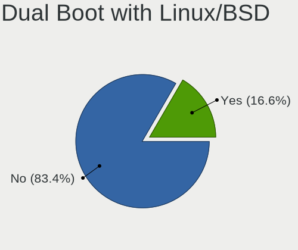
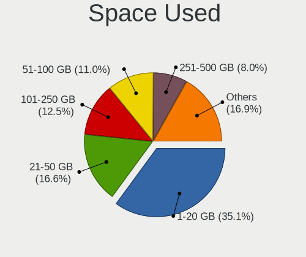
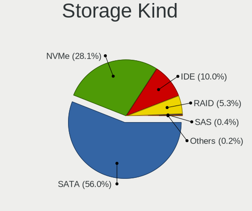
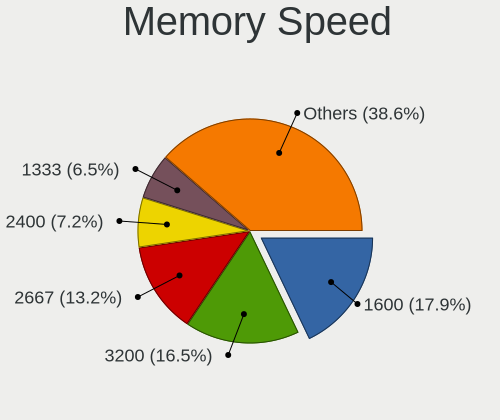

Linux in Germany - Tested Hardware & Statistics
-----------------------------------------------

A project to collect tested hardware configurations for Linux in Germany.

Anyone can contribute to this report by the [hw-probe](https://github.com/linuxhw/hw-probe) tool:

    sudo -E hw-probe -all -upload

Please contribute! Especially if your hardware is rare.

This is a report for all computer types. See also reports for [desktops](/Location/Germany/Desktop/README.md) and [notebooks](/Location/Germany/Notebook/README.md).

Contents
--------

* [ Test Cases ](#test-cases)

* [ System ](#system)
  - [ OS                       ](#os)
  - [ OS Family                ](#os-family)
  - [ Kernel                   ](#kernel)
  - [ Kernel Family            ](#kernel-family)
  - [ Kernel Major Ver.        ](#kernel-major-ver)
  - [ Arch                     ](#arch)
  - [ DE                       ](#de)
  - [ Display Server           ](#display-server)
  - [ Display Manager          ](#display-manager)
  - [ OS Lang                  ](#os-lang)
  - [ Boot Mode                ](#boot-mode)
  - [ Filesystem               ](#filesystem)
  - [ Part. scheme             ](#part-scheme)
  - [ Dual Boot with Linux/BSD ](#dual-boot-with-linuxbsd)
  - [ Dual Boot (Win)          ](#dual-boot-win)

* [ Board ](#board)
  - [ Vendor                   ](#vendor)
  - [ Model                    ](#model)
  - [ Model Family             ](#model-family)
  - [ MFG Year                 ](#mfg-year)
  - [ Form Factor              ](#form-factor)
  - [ Secure Boot              ](#secure-boot)
  - [ Coreboot                 ](#coreboot)
  - [ RAM Size                 ](#ram-size)
  - [ RAM Used                 ](#ram-used)
  - [ Total Drives             ](#total-drives)
  - [ Has CD-ROM               ](#has-cd-rom)
  - [ Has Ethernet             ](#has-ethernet)
  - [ Has WiFi                 ](#has-wifi)
  - [ Has Bluetooth            ](#has-bluetooth)

* [ Location ](#location)
  - [ Country                  ](#country)
  - [ City                     ](#city)

* [ Drives ](#drives)
  - [ Drive Vendor             ](#drive-vendor)
  - [ Drive Model              ](#drive-model)
  - [ HDD Vendor               ](#hdd-vendor)
  - [ SSD Vendor               ](#ssd-vendor)
  - [ Drive Kind               ](#drive-kind)
  - [ Drive Connector          ](#drive-connector)
  - [ Drive Size               ](#drive-size)
  - [ Space Total              ](#space-total)
  - [ Space Used               ](#space-used)
  - [ Malfunc. Drives          ](#malfunc-drives)
  - [ Malfunc. Drive Vendor    ](#malfunc-drive-vendor)
  - [ Malfunc. HDD Vendor      ](#malfunc-hdd-vendor)
  - [ Malfunc. Drive Kind      ](#malfunc-drive-kind)
  - [ Failed Drives            ](#failed-drives)
  - [ Failed Drive Vendor      ](#failed-drive-vendor)
  - [ Drive Status             ](#drive-status)

* [ Storage controller ](#storage-controller)
  - [ Storage Vendor           ](#storage-vendor)
  - [ Storage Model            ](#storage-model)
  - [ Storage Kind             ](#storage-kind)

* [ Processor ](#processor)
  - [ CPU Vendor               ](#cpu-vendor)
  - [ CPU Model                ](#cpu-model)
  - [ CPU Model Family         ](#cpu-model-family)
  - [ CPU Cores                ](#cpu-cores)
  - [ CPU Sockets              ](#cpu-sockets)
  - [ CPU Threads              ](#cpu-threads)
  - [ CPU Op-Modes             ](#cpu-op-modes)
  - [ CPU Microcode            ](#cpu-microcode)
  - [ CPU Microarch            ](#cpu-microarch)

* [ Graphics ](#graphics)
  - [ GPU Vendor               ](#gpu-vendor)
  - [ GPU Model                ](#gpu-model)
  - [ GPU Combo                ](#gpu-combo)
  - [ GPU Driver               ](#gpu-driver)
  - [ GPU Memory               ](#gpu-memory)

* [ Monitor ](#monitor)
  - [ Monitor Vendor           ](#monitor-vendor)
  - [ Monitor Model            ](#monitor-model)
  - [ Monitor Resolution       ](#monitor-resolution)
  - [ Monitor Diagonal         ](#monitor-diagonal)
  - [ Monitor Width            ](#monitor-width)
  - [ Aspect Ratio             ](#aspect-ratio)
  - [ Monitor Area             ](#monitor-area)
  - [ Pixel Density            ](#pixel-density)
  - [ Multiple Monitors        ](#multiple-monitors)

* [ Network ](#network)
  - [ Net Controller Vendor    ](#net-controller-vendor)
  - [ Net Controller Model     ](#net-controller-model)
  - [ Wireless Vendor          ](#wireless-vendor)
  - [ Wireless Model           ](#wireless-model)
  - [ Ethernet Vendor          ](#ethernet-vendor)
  - [ Ethernet Model           ](#ethernet-model)
  - [ Net Controller Kind      ](#net-controller-kind)
  - [ Used Controller          ](#used-controller)
  - [ NICs                     ](#nics)
  - [ IPv6                     ](#ipv6)

* [ Bluetooth ](#bluetooth)
  - [ Bluetooth Vendor         ](#bluetooth-vendor)
  - [ Bluetooth Model          ](#bluetooth-model)

* [ Sound ](#sound)
  - [ Sound Vendor             ](#sound-vendor)
  - [ Sound Model              ](#sound-model)

* [ Memory ](#memory)
  - [ Memory Vendor            ](#memory-vendor)
  - [ Memory Model             ](#memory-model)
  - [ Memory Kind              ](#memory-kind)
  - [ Memory Form Factor       ](#memory-form-factor)
  - [ Memory Size              ](#memory-size)
  - [ Memory Speed             ](#memory-speed)

* [ Printers & scanners ](#printers--scanners)
  - [ Printer Vendor           ](#printer-vendor)
  - [ Printer Model            ](#printer-model)
  - [ Scanner Vendor           ](#scanner-vendor)
  - [ Scanner Model            ](#scanner-model)

* [ Camera ](#camera)
  - [ Camera Vendor            ](#camera-vendor)
  - [ Camera Model             ](#camera-model)

* [ Security ](#security)
  - [ Fingerprint Vendor       ](#fingerprint-vendor)
  - [ Fingerprint Model        ](#fingerprint-model)
  - [ Chipcard Vendor          ](#chipcard-vendor)
  - [ Chipcard Model           ](#chipcard-model)

* [ Unsupported ](#unsupported)
  - [ Unsupported Devices      ](#unsupported-devices)
  - [ Unsupported Device Types ](#unsupported-device-types)

Test Cases
----------

Total: 29101

| Vendor        | Model                       | Form-Factor | Probe                                                      | Date         |
|---------------|-----------------------------|-------------|------------------------------------------------------------|--------------|
| Lenovo        | ThinkPad 13 2nd Gen 20J2... | Notebook    | [fd388e00c3](https://linux-hardware.org/?probe=fd388e00c3) | Jun 10, 2023 |
| HP            | EliteBook 1040 G4           | Notebook    | [98aa06475b](https://linux-hardware.org/?probe=98aa06475b) | Jun 10, 2023 |
| Gigabyte      | H57M-USB3                   | Desktop     | [91b1655f60](https://linux-hardware.org/?probe=91b1655f60) | Jun 10, 2023 |
| Apple         | MacBookPro11,3              | Notebook    | [b7dfbae839](https://linux-hardware.org/?probe=b7dfbae839) | Jun 10, 2023 |
| Dell          | Latitude E6510              | Notebook    | [e7c1e59ac7](https://linux-hardware.org/?probe=e7c1e59ac7) | Jun 10, 2023 |
| HP            | Laptop 17-by3xxx            | Notebook    | [421ff52b0b](https://linux-hardware.org/?probe=421ff52b0b) | Jun 10, 2023 |
| Lenovo        | ThinkPad X1 Carbon Gen 9... | Notebook    | [f7a2bd2ca8](https://linux-hardware.org/?probe=f7a2bd2ca8) | Jun 10, 2023 |
| Unknown       | Unknown                     | Soc         | [a61c241455](https://linux-hardware.org/?probe=a61c241455) | Jun 10, 2023 |
| Lenovo        | ThinkPad P1 Gen 3 20TH00... | Notebook    | [65a47406b0](https://linux-hardware.org/?probe=65a47406b0) | Jun 10, 2023 |
| Lenovo        | ThinkPad T470p 20J7S0XV0... | Notebook    | [b2f7d876c7](https://linux-hardware.org/?probe=b2f7d876c7) | Jun 10, 2023 |
| ASRock        | H61M-DGS R2.0               | Desktop     | [cc206f52b1](https://linux-hardware.org/?probe=cc206f52b1) | Jun 10, 2023 |
| Lenovo        | ThinkPad E15 Gen 4 21EDC... | Notebook    | [fa84ae9906](https://linux-hardware.org/?probe=fa84ae9906) | Jun 10, 2023 |
| HP            | 2B4B                        | Desktop     | [3ade78a07e](https://linux-hardware.org/?probe=3ade78a07e) | Jun 10, 2023 |
| HP            | ZBook 15 G2                 | Notebook    | [68c941fe5d](https://linux-hardware.org/?probe=68c941fe5d) | Jun 10, 2023 |
| HP            | 2B4B                        | Desktop     | [2da60252b5](https://linux-hardware.org/?probe=2da60252b5) | Jun 10, 2023 |
| HP            | EliteBook 840 G2            | Notebook    | [770045a9fc](https://linux-hardware.org/?probe=770045a9fc) | Jun 10, 2023 |
| ASUSTek       | ROG STRIX B350-F GAMING     | Desktop     | [08114e8a97](https://linux-hardware.org/?probe=08114e8a97) | Jun 10, 2023 |
| ASUSTek       | PRIME B450-PLUS             | Desktop     | [93555cfd25](https://linux-hardware.org/?probe=93555cfd25) | Jun 10, 2023 |
| ASUSTek       | PRIME B450-PLUS             | Desktop     | [2e6d82c14f](https://linux-hardware.org/?probe=2e6d82c14f) | Jun 10, 2023 |
| Seco          | C40 C                       | Desktop     | [4d990c8a0c](https://linux-hardware.org/?probe=4d990c8a0c) | Jun 10, 2023 |
| HP            | ZBook 15 G2                 | Notebook    | [2851b41659](https://linux-hardware.org/?probe=2851b41659) | Jun 09, 2023 |
| ASRock        | B360M Pro4                  | Desktop     | [9b52b20f3e](https://linux-hardware.org/?probe=9b52b20f3e) | Jun 09, 2023 |
| ASUSTek       | ROG STRIX Z690-A GAMING ... | Desktop     | [afa2a30d75](https://linux-hardware.org/?probe=afa2a30d75) | Jun 09, 2023 |
| ASUSTek       | M5A97 LE R2.0               | Desktop     | [a1877cb5b3](https://linux-hardware.org/?probe=a1877cb5b3) | Jun 09, 2023 |
| ASRock        | H61M-DGS R2.0               | Desktop     | [37c25e136f](https://linux-hardware.org/?probe=37c25e136f) | Jun 09, 2023 |
| Gigabyte      | B550M DS3H                  | Desktop     | [ea724e204b](https://linux-hardware.org/?probe=ea724e204b) | Jun 09, 2023 |
| MSI           | 970A-G46                    | Desktop     | [e4471b7a38](https://linux-hardware.org/?probe=e4471b7a38) | Jun 09, 2023 |
| HP            | Laptop 17-bs0xx             | Notebook    | [c93d52343c](https://linux-hardware.org/?probe=c93d52343c) | Jun 09, 2023 |
| Google        | Akali 360                   | Notebook    | [1f7d5f8bc5](https://linux-hardware.org/?probe=1f7d5f8bc5) | Jun 09, 2023 |
| MSI           | MAG B550M MORTAR WIFI       | Desktop     | [6491127e6e](https://linux-hardware.org/?probe=6491127e6e) | Jun 09, 2023 |
| Gigabyte      | B450 AORUS PRO WIFI-CF      | Desktop     | [f9677c0861](https://linux-hardware.org/?probe=f9677c0861) | Jun 09, 2023 |
| Lenovo        | ThinkPad X201 3249CTO       | Notebook    | [849dbace60](https://linux-hardware.org/?probe=849dbace60) | Jun 09, 2023 |
| Dell          | Latitude E7470              | Notebook    | [c5457da74f](https://linux-hardware.org/?probe=c5457da74f) | Jun 09, 2023 |
| Dell          | Precision M4600             | Notebook    | [a79a783515](https://linux-hardware.org/?probe=a79a783515) | Jun 09, 2023 |
| ASUSTek       | PRIME B350-PLUS             | Desktop     | [cc1f571000](https://linux-hardware.org/?probe=cc1f571000) | Jun 09, 2023 |
| Acer          | TravelMate P215-53          | Notebook    | [9536bf547a](https://linux-hardware.org/?probe=9536bf547a) | Jun 09, 2023 |
| Fujitsu       | LIFEBOOK E754               | Notebook    | [4d09f42447](https://linux-hardware.org/?probe=4d09f42447) | Jun 09, 2023 |
| Fujitsu       | LIFEBOOK U7411              | Notebook    | [ab35c95b72](https://linux-hardware.org/?probe=ab35c95b72) | Jun 09, 2023 |
| Gigabyte      | Q87M-D2H                    | Desktop     | [56421d7b0f](https://linux-hardware.org/?probe=56421d7b0f) | Jun 09, 2023 |
| Lenovo        | 1037 SDK0Q40104 WIN 3305... | Server      | [c7ced127f8](https://linux-hardware.org/?probe=c7ced127f8) | Jun 09, 2023 |
| ASUSTek       | M4A785G-HTPC                | Desktop     | [76304dfb4a](https://linux-hardware.org/?probe=76304dfb4a) | Jun 09, 2023 |
| ASUSTek       | G771JW                      | Notebook    | [6d989f49b6](https://linux-hardware.org/?probe=6d989f49b6) | Jun 09, 2023 |
| Lenovo        | ThinkPad X1 Carbon Gen 8... | Notebook    | [531e3f124d](https://linux-hardware.org/?probe=531e3f124d) | Jun 09, 2023 |
| Fujitsu       | D2942-B1 S26361-D2942-B1    | Desktop     | [9fb55abc56](https://linux-hardware.org/?probe=9fb55abc56) | Jun 08, 2023 |
| Raspberry ... | Raspberry Pi 4 Model B R... | Soc         | [50844825e2](https://linux-hardware.org/?probe=50844825e2) | Jun 08, 2023 |
| HP            | EliteBook Folio 9470m       | Notebook    | [5739bbf07f](https://linux-hardware.org/?probe=5739bbf07f) | Jun 08, 2023 |
| HP            | EliteBook Folio 9470m       | Notebook    | [74dd8ef72a](https://linux-hardware.org/?probe=74dd8ef72a) | Jun 08, 2023 |
| Lenovo        | ThinkPad E14 20RA0016GE     | Notebook    | [4c8d8758b7](https://linux-hardware.org/?probe=4c8d8758b7) | Jun 08, 2023 |
| MSI           | H110M PRO-D                 | Desktop     | [ad5baed526](https://linux-hardware.org/?probe=ad5baed526) | Jun 08, 2023 |
| Gigabyte      | B75M-D3H                    | Desktop     | [8c84a543bf](https://linux-hardware.org/?probe=8c84a543bf) | Jun 08, 2023 |
| Lenovo        | ThinkPad X280 20KES5SE22    | Notebook    | [c25a510191](https://linux-hardware.org/?probe=c25a510191) | Jun 08, 2023 |
| TUXEDO        | Stellaris Intel Gen4        | Notebook    | [e6cb646bd4](https://linux-hardware.org/?probe=e6cb646bd4) | Jun 08, 2023 |
| Lenovo        | Legion 5 15ACH6A 82NW       | Notebook    | [0aea375d78](https://linux-hardware.org/?probe=0aea375d78) | Jun 08, 2023 |
| Dell          | 0GDG8Y A00                  | Desktop     | [4789561d79](https://linux-hardware.org/?probe=4789561d79) | Jun 08, 2023 |
| Inventec      | VXC Class A02               | Desktop     | [c2bc26120f](https://linux-hardware.org/?probe=c2bc26120f) | Jun 08, 2023 |
| Lenovo        | IdeaPad 510-15IKB 80SV      | Notebook    | [3f04b950e8](https://linux-hardware.org/?probe=3f04b950e8) | Jun 08, 2023 |
| Lenovo        | ThinkPad P14s Gen 2a 21A... | Notebook    | [7543a0bbc1](https://linux-hardware.org/?probe=7543a0bbc1) | Jun 08, 2023 |
| Lenovo        | ThinkPad X1 Carbon 3444C... | Notebook    | [4e5e1d4052](https://linux-hardware.org/?probe=4e5e1d4052) | Jun 08, 2023 |
| HP            | Pavilion dv7                | Notebook    | [896e71aaaf](https://linux-hardware.org/?probe=896e71aaaf) | Jun 08, 2023 |
| Dell          | XPS 17 9730                 | Notebook    | [5be9db17d1](https://linux-hardware.org/?probe=5be9db17d1) | Jun 08, 2023 |
| AZW           | SER V1.0                    | Mini pc     | [e127b4c2f4](https://linux-hardware.org/?probe=e127b4c2f4) | Jun 08, 2023 |
| HP            | Spectre x360 Convertible... | Convertible | [5bec216150](https://linux-hardware.org/?probe=5bec216150) | Jun 08, 2023 |
| HP            | Spectre x360 Convertible... | Convertible | [7fa12c3607](https://linux-hardware.org/?probe=7fa12c3607) | Jun 08, 2023 |
| Lenovo        | ThinkPad X1 Tablet Gen 3... | Tablet      | [4797a4c2f9](https://linux-hardware.org/?probe=4797a4c2f9) | Jun 08, 2023 |
| Lenovo        | ThinkPad X1 Tablet Gen 3... | Tablet      | [53833409d1](https://linux-hardware.org/?probe=53833409d1) | Jun 08, 2023 |
| Lenovo        | ThinkPad L13 Yoga Gen 2a... | Convertible | [41dea00814](https://linux-hardware.org/?probe=41dea00814) | Jun 08, 2023 |
| Lenovo        | ThinkPad E15 Gen 4 21EES... | Notebook    | [06608c68d7](https://linux-hardware.org/?probe=06608c68d7) | Jun 07, 2023 |
| Gigabyte      | B450 AORUS ELITE            | Desktop     | [1d84d556bf](https://linux-hardware.org/?probe=1d84d556bf) | Jun 07, 2023 |
| Gigabyte      | B85M-D3H                    | Desktop     | [befd126f43](https://linux-hardware.org/?probe=befd126f43) | Jun 07, 2023 |
| ASUSTek       | STRIX Z270I GAMING          | Desktop     | [f836a7d0ff](https://linux-hardware.org/?probe=f836a7d0ff) | Jun 07, 2023 |
| Gigabyte      | B85M-D3H                    | Desktop     | [e146923f12](https://linux-hardware.org/?probe=e146923f12) | Jun 07, 2023 |
| Apple         | MacBookPro11,1              | Notebook    | [6c62565787](https://linux-hardware.org/?probe=6c62565787) | Jun 07, 2023 |
| Lenovo        | 1036 SDK0K17763 WIN 1801... | Desktop     | [1d36e85f27](https://linux-hardware.org/?probe=1d36e85f27) | Jun 07, 2023 |
| Dell          | 007MXD A00                  | Mini pc     | [b303b8ce0d](https://linux-hardware.org/?probe=b303b8ce0d) | Jun 07, 2023 |
| Lenovo        | 3704 SDK0J40700 WIN 3258... | Desktop     | [b18ffc5311](https://linux-hardware.org/?probe=b18ffc5311) | Jun 07, 2023 |
| Packard Be... | EasyNote ENTF71BM           | Notebook    | [490ae0bc1c](https://linux-hardware.org/?probe=490ae0bc1c) | Jun 07, 2023 |
| ZOTAC         | ZBOX-CI622/CI642/CI662NA... | Mini pc     | [bc11217633](https://linux-hardware.org/?probe=bc11217633) | Jun 06, 2023 |
| Dell          | 007MXD A00                  | Mini pc     | [8b904db6cf](https://linux-hardware.org/?probe=8b904db6cf) | Jun 06, 2023 |
| Apple         | Mac-35C5E08120C7EEAF Mac... | Mini pc     | [47c5d7587a](https://linux-hardware.org/?probe=47c5d7587a) | Jun 06, 2023 |
| Dell          | 007MXD A00                  | Mini pc     | [2532dfadd0](https://linux-hardware.org/?probe=2532dfadd0) | Jun 06, 2023 |
| Dell          | 007MXD A00                  | Mini pc     | [5cc10b1e1e](https://linux-hardware.org/?probe=5cc10b1e1e) | Jun 06, 2023 |
| Fujitsu Si... | D2811-A1 S26361-D2811-A1    | Desktop     | [bcb9105121](https://linux-hardware.org/?probe=bcb9105121) | Jun 06, 2023 |
| Fujitsu       | LIFEBOOK U9310X             | Convertible | [81b1cf6660](https://linux-hardware.org/?probe=81b1cf6660) | Jun 06, 2023 |
| Intel         | NUC5i5MYBE H47797-206       | Mini pc     | [a860a6cf23](https://linux-hardware.org/?probe=a860a6cf23) | Jun 06, 2023 |
| ASUSTek       | X200MA                      | Notebook    | [7c0552ad30](https://linux-hardware.org/?probe=7c0552ad30) | Jun 06, 2023 |
| Gigabyte      | Z390 UD                     | Desktop     | [1bf88bda62](https://linux-hardware.org/?probe=1bf88bda62) | Jun 06, 2023 |
| HP            | 2820h                       | Desktop     | [eb7322ad95](https://linux-hardware.org/?probe=eb7322ad95) | Jun 06, 2023 |
| Microsoft     | Surface Laptop 2            | Tablet      | [769eb5078e](https://linux-hardware.org/?probe=769eb5078e) | Jun 06, 2023 |
| Dell          | Precision 5510              | Notebook    | [9888f3aedd](https://linux-hardware.org/?probe=9888f3aedd) | Jun 06, 2023 |
| Gigabyte      | Q87M-D2H                    | Desktop     | [05a3b3210a](https://linux-hardware.org/?probe=05a3b3210a) | Jun 06, 2023 |
| Gigabyte      | Z590 VISION G               | Desktop     | [ee1abb360e](https://linux-hardware.org/?probe=ee1abb360e) | Jun 06, 2023 |
| Acer          | Aspire V5-572P              | Notebook    | [cdb5005799](https://linux-hardware.org/?probe=cdb5005799) | Jun 06, 2023 |
| Acer          | Aspire V5-572P              | Notebook    | [49745927a0](https://linux-hardware.org/?probe=49745927a0) | Jun 06, 2023 |
| Gigabyte      | G5 GE                       | Notebook    | [1b78246ef7](https://linux-hardware.org/?probe=1b78246ef7) | Jun 06, 2023 |
| ASUSTek       | CROSSHAIR VI HERO           | Desktop     | [9286154198](https://linux-hardware.org/?probe=9286154198) | Jun 05, 2023 |
| HP            | ProBook 650 G1              | Notebook    | [776a9fb064](https://linux-hardware.org/?probe=776a9fb064) | Jun 05, 2023 |
| Intel         | NUC7i5BNB J31144-310        | Mini pc     | [0ad2309a50](https://linux-hardware.org/?probe=0ad2309a50) | Jun 05, 2023 |
| Acer          | Aspire A517-53              | Notebook    | [a039ca0054](https://linux-hardware.org/?probe=a039ca0054) | Jun 05, 2023 |
| TUXEDO        | N8xEJEK                     | Notebook    | [28ca72e1e1](https://linux-hardware.org/?probe=28ca72e1e1) | Jun 05, 2023 |
| Apple         | MacBook5,1                  | Notebook    | [804abce033](https://linux-hardware.org/?probe=804abce033) | Jun 05, 2023 |
| Gigabyte      | X570 I AORUS PRO WIFI       | Desktop     | [91ee57c108](https://linux-hardware.org/?probe=91ee57c108) | Jun 05, 2023 |
| Lenovo        | ThinkPad X250 20CLS02K00    | Notebook    | [fc306205a7](https://linux-hardware.org/?probe=fc306205a7) | Jun 05, 2023 |
| Gigabyte      | Q87M-D2H                    | Desktop     | [eeaf6dbd4c](https://linux-hardware.org/?probe=eeaf6dbd4c) | Jun 05, 2023 |
| Lenovo        | ThinkPad X270 20HMS12K00    | Notebook    | [55abece90c](https://linux-hardware.org/?probe=55abece90c) | Jun 05, 2023 |
| Acer          | Aspire ES1-571              | Notebook    | [ed19db3614](https://linux-hardware.org/?probe=ed19db3614) | Jun 05, 2023 |
| ASRock        | N68C-S UCC                  | Desktop     | [741e39b142](https://linux-hardware.org/?probe=741e39b142) | Jun 05, 2023 |
| HP            | Notebook                    | Notebook    | [1605419ae0](https://linux-hardware.org/?probe=1605419ae0) | Jun 05, 2023 |
| Microsoft     | Surface Pro                 | Tablet      | [ad0794bddc](https://linux-hardware.org/?probe=ad0794bddc) | Jun 05, 2023 |
| HP            | Laptop 17-cp0xxx            | Notebook    | [b142b6de06](https://linux-hardware.org/?probe=b142b6de06) | Jun 05, 2023 |
| Dell          | Latitude E6510              | Notebook    | [49743c8db7](https://linux-hardware.org/?probe=49743c8db7) | Jun 04, 2023 |
| HP            | OMEN by Laptop              | Notebook    | [e3b8e1a109](https://linux-hardware.org/?probe=e3b8e1a109) | Jun 04, 2023 |
| Dell          | Latitude E5540              | Notebook    | [d2bde0e098](https://linux-hardware.org/?probe=d2bde0e098) | Jun 04, 2023 |
| Dell          | Latitude E5540              | Notebook    | [f9483c219e](https://linux-hardware.org/?probe=f9483c219e) | Jun 04, 2023 |
| Dell          | Latitude E6510              | Notebook    | [51c45b0aa7](https://linux-hardware.org/?probe=51c45b0aa7) | Jun 04, 2023 |
| Acer          | Aspire 3820                 | Notebook    | [edbf91844a](https://linux-hardware.org/?probe=edbf91844a) | Jun 04, 2023 |
| Sony          | VPCEH2H4E                   | Notebook    | [793e883d0c](https://linux-hardware.org/?probe=793e883d0c) | Jun 04, 2023 |
| HP            | EliteBook 840 G3            | Notebook    | [7c35e9a268](https://linux-hardware.org/?probe=7c35e9a268) | Jun 04, 2023 |
| Gigabyte      | B85M-D3H                    | Desktop     | [0bd595e07a](https://linux-hardware.org/?probe=0bd595e07a) | Jun 04, 2023 |
| Lenovo        | ThinkPad T480 20L6S29E1S    | Notebook    | [4d9e4fb129](https://linux-hardware.org/?probe=4d9e4fb129) | Jun 04, 2023 |
| Dell          | Latitude E5440              | Notebook    | [02b3462a2c](https://linux-hardware.org/?probe=02b3462a2c) | Jun 04, 2023 |
| Medion        | TJ4125                      | Desktop     | [3faed0102f](https://linux-hardware.org/?probe=3faed0102f) | Jun 04, 2023 |
| ASUSTek       | ROG Zephyrus G14 GA401QC... | Notebook    | [13f3f67373](https://linux-hardware.org/?probe=13f3f67373) | Jun 04, 2023 |
| Acer          | Swift SF316-51              | Notebook    | [4ba1405836](https://linux-hardware.org/?probe=4ba1405836) | Jun 04, 2023 |
| Gigabyte      | B660M GAMING X DDR4         | Desktop     | [0bd883cae2](https://linux-hardware.org/?probe=0bd883cae2) | Jun 04, 2023 |
| HP            | 1495                        | Desktop     | [0cbf6bee1f](https://linux-hardware.org/?probe=0cbf6bee1f) | Jun 04, 2023 |
| ASRock        | A75M-HVS                    | Desktop     | [69bc52dc4f](https://linux-hardware.org/?probe=69bc52dc4f) | Jun 04, 2023 |
| HP            | OMEN Laptop 15-en0xxx       | Notebook    | [2eeb67613f](https://linux-hardware.org/?probe=2eeb67613f) | Jun 04, 2023 |
| Clevo         | M670SRU                     | Notebook    | [0935f74d34](https://linux-hardware.org/?probe=0935f74d34) | Jun 04, 2023 |
| Clevo         | M670SRU                     | Notebook    | [e163d57d56](https://linux-hardware.org/?probe=e163d57d56) | Jun 04, 2023 |
| Dell          | Latitude 7210 2-in-1        | Tablet      | [a735050ced](https://linux-hardware.org/?probe=a735050ced) | Jun 04, 2023 |
| MSI           | U200                        | Notebook    | [01900b8117](https://linux-hardware.org/?probe=01900b8117) | Jun 04, 2023 |
| HP            | EliteBook 850 G8 Noteboo... | Notebook    | [7179829c20](https://linux-hardware.org/?probe=7179829c20) | Jun 04, 2023 |
| Biostar       | B350GT5                     | Desktop     | [18e1da8cce](https://linux-hardware.org/?probe=18e1da8cce) | Jun 04, 2023 |
| HP            | Pavilion Gaming Laptop 1... | Notebook    | [038871f5be](https://linux-hardware.org/?probe=038871f5be) | Jun 04, 2023 |
| Biostar       | B350GT5                     | Desktop     | [123beb390f](https://linux-hardware.org/?probe=123beb390f) | Jun 04, 2023 |
| Dell          | Venue 11 Pro 7130 vPro      | Notebook    | [c16266c1c9](https://linux-hardware.org/?probe=c16266c1c9) | Jun 04, 2023 |
| Dell          | XPS 13 9370                 | Notebook    | [c359b173f6](https://linux-hardware.org/?probe=c359b173f6) | Jun 04, 2023 |
| Dell          | XPS 13 9370                 | Notebook    | [a0efed7ee2](https://linux-hardware.org/?probe=a0efed7ee2) | Jun 04, 2023 |
| ASUSTek       | PRIME H310M-A R2.0          | Desktop     | [60749b6e47](https://linux-hardware.org/?probe=60749b6e47) | Jun 04, 2023 |
| Acer          | Aspire 5738                 | Notebook    | [138d22e03e](https://linux-hardware.org/?probe=138d22e03e) | Jun 04, 2023 |
| ZOTAC         | ZBOX-CI622/CI642/CI662NA... | Mini pc     | [737168e339](https://linux-hardware.org/?probe=737168e339) | Jun 04, 2023 |
| Toshiba       | TECRA Z40-C                 | Notebook    | [1ebf23281e](https://linux-hardware.org/?probe=1ebf23281e) | Jun 04, 2023 |
| HP            | 2B43                        | Desktop     | [d66cd5f48e](https://linux-hardware.org/?probe=d66cd5f48e) | Jun 04, 2023 |
| Pegatron      | Spring Peak                 | Notebook    | [a10a42a44d](https://linux-hardware.org/?probe=a10a42a44d) | Jun 04, 2023 |
| Pegatron      | Spring Peak                 | Notebook    | [e58b2a1237](https://linux-hardware.org/?probe=e58b2a1237) | Jun 04, 2023 |
| Pegatron      | Spring Peak                 | Notebook    | [ce54d0192d](https://linux-hardware.org/?probe=ce54d0192d) | Jun 04, 2023 |
| ASUSTek       | K52Je                       | Notebook    | [0190eef08c](https://linux-hardware.org/?probe=0190eef08c) | Jun 03, 2023 |
| Gigabyte      | G5 GE                       | Notebook    | [8ef447b2f3](https://linux-hardware.org/?probe=8ef447b2f3) | Jun 03, 2023 |
| ASUSTek       | X540SA                      | Notebook    | [e9e8995d2e](https://linux-hardware.org/?probe=e9e8995d2e) | Jun 03, 2023 |
| Fujitsu       | LIFEBOOK A357               | Notebook    | [a8baa03316](https://linux-hardware.org/?probe=a8baa03316) | Jun 03, 2023 |
| Chuwi         | GemiBook Pro                | Notebook    | [772d1f8765](https://linux-hardware.org/?probe=772d1f8765) | Jun 03, 2023 |
| Acer          | Aspire V3-372               | Notebook    | [1200863830](https://linux-hardware.org/?probe=1200863830) | Jun 03, 2023 |
| ASUSTek       | K52Je                       | Notebook    | [c6f78ba2aa](https://linux-hardware.org/?probe=c6f78ba2aa) | Jun 03, 2023 |
| ASUSTek       | P5Q-PRO                     | Desktop     | [76cd01b045](https://linux-hardware.org/?probe=76cd01b045) | Jun 03, 2023 |
| Acer          | Aspire AV15-51              | Notebook    | [41e5c1790c](https://linux-hardware.org/?probe=41e5c1790c) | Jun 03, 2023 |
| ASUSTek       | TUF Gaming Z590-PLUS WIF... | Desktop     | [51868dd3c8](https://linux-hardware.org/?probe=51868dd3c8) | Jun 03, 2023 |
| Acer          | Aspire AV15-51              | Notebook    | [d583c74274](https://linux-hardware.org/?probe=d583c74274) | Jun 03, 2023 |
| Acer          | Aspire AV15-51              | Notebook    | [7ed9ba7165](https://linux-hardware.org/?probe=7ed9ba7165) | Jun 03, 2023 |
| Gigabyte      | B365M H                     | Desktop     | [b7a585d1f1](https://linux-hardware.org/?probe=b7a585d1f1) | Jun 03, 2023 |
| Toshiba       | Satellite L50-C             | Notebook    | [7b1b547b11](https://linux-hardware.org/?probe=7b1b547b11) | Jun 03, 2023 |
| Acer          | Aspire 7745G                | Notebook    | [135ce50995](https://linux-hardware.org/?probe=135ce50995) | Jun 03, 2023 |
| Dell          | G15 5520                    | Notebook    | [b77b760dfe](https://linux-hardware.org/?probe=b77b760dfe) | Jun 03, 2023 |
| ASUSTek       | Z170-A                      | Desktop     | [4f512af4c2](https://linux-hardware.org/?probe=4f512af4c2) | Jun 03, 2023 |
| TUXEDO        | InfinityBook Pro 15 v5      | Notebook    | [1b01df33d2](https://linux-hardware.org/?probe=1b01df33d2) | Jun 03, 2023 |
| ASRock        | H81M-HDS                    | Desktop     | [248372dd54](https://linux-hardware.org/?probe=248372dd54) | Jun 03, 2023 |
| Lenovo        | Yoga 7 15ITL5 82BJ          | Convertible | [2354c37832](https://linux-hardware.org/?probe=2354c37832) | Jun 02, 2023 |
| HP            | Notebook                    | Notebook    | [9b12c54cf2](https://linux-hardware.org/?probe=9b12c54cf2) | Jun 02, 2023 |
| Medion        | TJ4125                      | Desktop     | [6244ae0e43](https://linux-hardware.org/?probe=6244ae0e43) | Jun 02, 2023 |
| Gigabyte      | B85M-D3H                    | Desktop     | [908f094e9d](https://linux-hardware.org/?probe=908f094e9d) | Jun 02, 2023 |
| Acer          | Aspire 7750G                | Notebook    | [160d4525c6](https://linux-hardware.org/?probe=160d4525c6) | Jun 02, 2023 |
| Lenovo        | ThinkPad T470 W10DG 20JN... | Notebook    | [2a67b74a26](https://linux-hardware.org/?probe=2a67b74a26) | Jun 02, 2023 |
| Apple         | MacBookPro5,5               | Notebook    | [9bf36ef4a5](https://linux-hardware.org/?probe=9bf36ef4a5) | Jun 02, 2023 |
| MSI           | U200                        | Notebook    | [2fe4d70ea1](https://linux-hardware.org/?probe=2fe4d70ea1) | Jun 02, 2023 |
| Gigabyte      | A320M-S2H-CF                | Desktop     | [914fa73266](https://linux-hardware.org/?probe=914fa73266) | Jun 02, 2023 |
| ASUSTek       | ROG STRIX B550-A GAMING     | Desktop     | [25721b28d3](https://linux-hardware.org/?probe=25721b28d3) | Jun 02, 2023 |
| HC Technol... | HCAR357-NR                  | Desktop     | [58f698b10a](https://linux-hardware.org/?probe=58f698b10a) | Jun 02, 2023 |
| Lenovo        | ThinkPad T460 20FMS0WN00    | Notebook    | [f576f54ff2](https://linux-hardware.org/?probe=f576f54ff2) | Jun 02, 2023 |
| Lenovo        | ThinkPad X1 Carbon 3rd 2... | Notebook    | [359d31bb8c](https://linux-hardware.org/?probe=359d31bb8c) | Jun 02, 2023 |
| Acer          | Aspire 7750G                | Notebook    | [e94cab5008](https://linux-hardware.org/?probe=e94cab5008) | Jun 02, 2023 |
| ASUSTek       | Z87-C                       | Desktop     | [20242d8299](https://linux-hardware.org/?probe=20242d8299) | Jun 02, 2023 |
| ASUSTek       | VivoBook_ASUSLaptop M350... | Notebook    | [1aea71b6c0](https://linux-hardware.org/?probe=1aea71b6c0) | Jun 02, 2023 |
| ASUSTek       | B85M-E                      | Desktop     | [ba95473e9c](https://linux-hardware.org/?probe=ba95473e9c) | Jun 02, 2023 |
| Gigabyte      | Z690 AORUS ELITE DDR4       | Desktop     | [c716b12ee2](https://linux-hardware.org/?probe=c716b12ee2) | Jun 02, 2023 |
| Gigabyte      | B85-HD3                     | Desktop     | [9931f8e663](https://linux-hardware.org/?probe=9931f8e663) | Jun 02, 2023 |
| Apple         | Mac-F42386C8 PVT            | All in one  | [c418655a3f](https://linux-hardware.org/?probe=c418655a3f) | Jun 02, 2023 |
| Apple         | Mac-F42386C8 PVT            | All in one  | [309f368a92](https://linux-hardware.org/?probe=309f368a92) | Jun 02, 2023 |
| ASUSTek       | VivoBook_ASUSLaptop M350... | Notebook    | [1bdb74a8ba](https://linux-hardware.org/?probe=1bdb74a8ba) | Jun 02, 2023 |
| Gigabyte      | AX370-Gaming K7             | Desktop     | [7baed02e0e](https://linux-hardware.org/?probe=7baed02e0e) | Jun 01, 2023 |
| Gigabyte      | H61M-S2PV                   | Desktop     | [6c86bd69e0](https://linux-hardware.org/?probe=6c86bd69e0) | Jun 01, 2023 |
| HP            | G62                         | Notebook    | [f2600c2f4b](https://linux-hardware.org/?probe=f2600c2f4b) | Jun 01, 2023 |
| Dell          | Latitude 5540               | Notebook    | [98ec8ec8bf](https://linux-hardware.org/?probe=98ec8ec8bf) | Jun 01, 2023 |
| Gigabyte      | Q87M-D2H                    | Desktop     | [8f3525a119](https://linux-hardware.org/?probe=8f3525a119) | Jun 01, 2023 |
| Gigabyte      | Z390 UD                     | Desktop     | [b66cbe20f8](https://linux-hardware.org/?probe=b66cbe20f8) | Jun 01, 2023 |
| Gigabyte      | Z390 UD                     | Desktop     | [3cca879110](https://linux-hardware.org/?probe=3cca879110) | Jun 01, 2023 |
| Intel         | NUC11ATBPE M49844-202       | Mini pc     | [2a1e548be7](https://linux-hardware.org/?probe=2a1e548be7) | Jun 01, 2023 |
| Acer          | Predator PH517-51           | Notebook    | [1de529b11c](https://linux-hardware.org/?probe=1de529b11c) | Jun 01, 2023 |
| Lenovo        | IdeaPad 5 14ALC05 82LM      | Notebook    | [97b54068b7](https://linux-hardware.org/?probe=97b54068b7) | Jun 01, 2023 |
| Lenovo        | ThinkPad T460 20FMS08H00    | Notebook    | [71208c2344](https://linux-hardware.org/?probe=71208c2344) | Jun 01, 2023 |
| ASUSTek       | B85M-E                      | Desktop     | [57f47246aa](https://linux-hardware.org/?probe=57f47246aa) | Jun 01, 2023 |
| Lenovo        | IdeaPad 3 17ITL6 82H9       | Notebook    | [a7af6cac2c](https://linux-hardware.org/?probe=a7af6cac2c) | Jun 01, 2023 |
| Dell          | Vostro 7590                 | Notebook    | [d9bfa42b63](https://linux-hardware.org/?probe=d9bfa42b63) | Jun 01, 2023 |
| ASRock        | H81M-HDS                    | Desktop     | [775913e245](https://linux-hardware.org/?probe=775913e245) | Jun 01, 2023 |
| Packard Be... | EasyNote TK11BZ             | Notebook    | [b1cbe3b6a6](https://linux-hardware.org/?probe=b1cbe3b6a6) | Jun 01, 2023 |
| HP            | ProBook 6450b               | Notebook    | [d3d4e45f9d](https://linux-hardware.org/?probe=d3d4e45f9d) | Jun 01, 2023 |
| Inventec      | D CLASS A02                 | Desktop     | [433df815db](https://linux-hardware.org/?probe=433df815db) | Jun 01, 2023 |
| ASUSTek       | ROG Flow X16 GV601VI_GV6... | Convertible | [76ec545734](https://linux-hardware.org/?probe=76ec545734) | Jun 01, 2023 |
| ASUSTek       | K53SK                       | Notebook    | [9b376cdd45](https://linux-hardware.org/?probe=9b376cdd45) | Jun 01, 2023 |
| Apple         | MacBook4,1                  | Notebook    | [996b318420](https://linux-hardware.org/?probe=996b318420) | Jun 01, 2023 |
| MSI           | P55-GD55                    | Desktop     | [1400fdf705](https://linux-hardware.org/?probe=1400fdf705) | May 31, 2023 |
| Lenovo        | ThinkPad X230 Tablet 343... | Notebook    | [efe855c429](https://linux-hardware.org/?probe=efe855c429) | May 31, 2023 |
| Lenovo        | ThinkPad X230 Tablet 343... | Notebook    | [c56e8318db](https://linux-hardware.org/?probe=c56e8318db) | May 31, 2023 |
| ASUSTek       | K53SK                       | Notebook    | [39c63c5bd1](https://linux-hardware.org/?probe=39c63c5bd1) | May 31, 2023 |
| Lenovo        | V17 G3 IAP 82U1             | Notebook    | [1be071e25d](https://linux-hardware.org/?probe=1be071e25d) | May 31, 2023 |
| HP            | 1497                        | Desktop     | [cc138de04b](https://linux-hardware.org/?probe=cc138de04b) | May 31, 2023 |
| HP            | Pavilion Laptop 15-cs2xx... | Notebook    | [2bb50cdcc7](https://linux-hardware.org/?probe=2bb50cdcc7) | May 31, 2023 |
| Gigabyte      | Q87M-D2H                    | Desktop     | [7400ec0f1a](https://linux-hardware.org/?probe=7400ec0f1a) | May 31, 2023 |
| HP            | Pavilion dv6500             | Notebook    | [0198d67a15](https://linux-hardware.org/?probe=0198d67a15) | May 31, 2023 |
| Fujitsu       | LIFEBOOK E780               | Notebook    | [8459f7cfee](https://linux-hardware.org/?probe=8459f7cfee) | May 31, 2023 |
| Fujitsu Si... | D2811-A1 S26361-D2811-A1    | Desktop     | [c0ff761729](https://linux-hardware.org/?probe=c0ff761729) | May 31, 2023 |
| ASUSTek       | P5Q                         | Desktop     | [e936e44332](https://linux-hardware.org/?probe=e936e44332) | May 31, 2023 |
| ASUSTek       | B85M-E                      | Desktop     | [08e31c6634](https://linux-hardware.org/?probe=08e31c6634) | May 31, 2023 |
| Apple         | Mac-77F17D7DA9285301 iMa... | All in one  | [449b742c95](https://linux-hardware.org/?probe=449b742c95) | May 31, 2023 |
| Lenovo        | ThinkBook 13s G3 ACN 20Y... | Notebook    | [827e0203ac](https://linux-hardware.org/?probe=827e0203ac) | May 31, 2023 |
| Dell          | Precision 3550              | Notebook    | [bddf57400b](https://linux-hardware.org/?probe=bddf57400b) | May 31, 2023 |
| Dell          | System Vostro 3750          | Notebook    | [f77ea94512](https://linux-hardware.org/?probe=f77ea94512) | May 31, 2023 |
| ZOTAC         | Unknown                     | Desktop     | [0626de1b2a](https://linux-hardware.org/?probe=0626de1b2a) | May 31, 2023 |
| Lenovo        | ThinkPad T14s Gen 3 21BR... | Notebook    | [0ead50ad49](https://linux-hardware.org/?probe=0ead50ad49) | May 31, 2023 |
| ASUSTek       | PRIME B450M-K II            | Desktop     | [2703e7856e](https://linux-hardware.org/?probe=2703e7856e) | May 30, 2023 |
| ASRock        | Q1900B-ITX                  | Desktop     | [88e4924fa2](https://linux-hardware.org/?probe=88e4924fa2) | May 30, 2023 |
| ASUSTek       | K53SK                       | Notebook    | [bfd926c8da](https://linux-hardware.org/?probe=bfd926c8da) | May 30, 2023 |
| Fujitsu       | LIFEBOOK T936               | Convertible | [fefb17a829](https://linux-hardware.org/?probe=fefb17a829) | May 30, 2023 |
| VALE          | Notebook Classic C140       | Notebook    | [cdc6168586](https://linux-hardware.org/?probe=cdc6168586) | May 30, 2023 |
| Acer          | Aspire 5749                 | Notebook    | [3bca2af88d](https://linux-hardware.org/?probe=3bca2af88d) | May 30, 2023 |
| ASUSTek       | TUF Gaming Z590-PLUS WIF... | Desktop     | [45e5adbb22](https://linux-hardware.org/?probe=45e5adbb22) | May 30, 2023 |
| Acer          | Predator PH517-51           | Notebook    | [cc24e32ab1](https://linux-hardware.org/?probe=cc24e32ab1) | May 30, 2023 |
| BESSTAR Te... | GB7                         | Mini pc     | [11bab4bc11](https://linux-hardware.org/?probe=11bab4bc11) | May 30, 2023 |
| Lenovo        | ThinkPad X1 Yoga 1st 20F... | Convertible | [e4fde15d9f](https://linux-hardware.org/?probe=e4fde15d9f) | May 30, 2023 |
| Dell          | 002KVM A01                  | Desktop     | [09d2d63c82](https://linux-hardware.org/?probe=09d2d63c82) | May 30, 2023 |
| Gigabyte      | Z170-HD3P-CF                | Desktop     | [e51651a755](https://linux-hardware.org/?probe=e51651a755) | May 30, 2023 |
| Gigabyte      | B550 AORUS ELITE AX V2      | Desktop     | [ffbccb8f47](https://linux-hardware.org/?probe=ffbccb8f47) | May 30, 2023 |
| MSI           | Titan GT77HX 13VH           | Notebook    | [7c3b8ed81d](https://linux-hardware.org/?probe=7c3b8ed81d) | May 29, 2023 |
| ASUSTek       | ZenBook UX431DA_UM431DA     | Notebook    | [048a3a0f30](https://linux-hardware.org/?probe=048a3a0f30) | May 29, 2023 |
| Gigabyte      | Q87M-D2H                    | Desktop     | [5e7eb5b41c](https://linux-hardware.org/?probe=5e7eb5b41c) | May 29, 2023 |
| Inventec      | VXC Class A02               | Desktop     | [0befe25313](https://linux-hardware.org/?probe=0befe25313) | May 29, 2023 |
| ASUSTek       | B85M-E                      | Desktop     | [eea74e88a5](https://linux-hardware.org/?probe=eea74e88a5) | May 29, 2023 |
| Inventec      | VXC Class A02               | Desktop     | [363827ad8c](https://linux-hardware.org/?probe=363827ad8c) | May 29, 2023 |
| MSI           | 970A-G46                    | Desktop     | [180eb351d7](https://linux-hardware.org/?probe=180eb351d7) | May 29, 2023 |
| Fujitsu       | LIFEBOOK E780               | Notebook    | [aac95cf765](https://linux-hardware.org/?probe=aac95cf765) | May 29, 2023 |
| Gigabyte      | B450 AORUS ELITE            | Desktop     | [d98102f69a](https://linux-hardware.org/?probe=d98102f69a) | May 29, 2023 |
| HP            | 82F2 A01                    | Desktop     | [fb729f1358](https://linux-hardware.org/?probe=fb729f1358) | May 29, 2023 |
| Packard Be... | MCP73                       | Desktop     | [e180017a10](https://linux-hardware.org/?probe=e180017a10) | May 29, 2023 |
| ASUSTek       | ROG STRIX B350-F GAMING     | Desktop     | [16b9dfbbe0](https://linux-hardware.org/?probe=16b9dfbbe0) | May 29, 2023 |
| ASUSTek       | VivoBook_ASUSLaptop X415... | Notebook    | [9fce8d1e40](https://linux-hardware.org/?probe=9fce8d1e40) | May 29, 2023 |
| Gigabyte      | Z77X-UD5H                   | Desktop     | [e947dd7da1](https://linux-hardware.org/?probe=e947dd7da1) | May 29, 2023 |
| Acer          | Aspire A315-51              | Notebook    | [d6f1c2bdbd](https://linux-hardware.org/?probe=d6f1c2bdbd) | May 29, 2023 |
| MSI           | P67A-GD65                   | Desktop     | [fe5e3bcd7b](https://linux-hardware.org/?probe=fe5e3bcd7b) | May 29, 2023 |
| Acer          | Aspire ES1-571              | Notebook    | [6f75ba50c1](https://linux-hardware.org/?probe=6f75ba50c1) | May 29, 2023 |
| Apple         | MacBookPro14,1              | Notebook    | [a5785cf3c3](https://linux-hardware.org/?probe=a5785cf3c3) | May 29, 2023 |
| Samsung       | 600B4B/600B5B               | Notebook    | [feba5017b3](https://linux-hardware.org/?probe=feba5017b3) | May 29, 2023 |
| ASUSTek       | Z10PA-D8 Series             | Desktop     | [02821a3220](https://linux-hardware.org/?probe=02821a3220) | May 29, 2023 |
| Dell          | XPS 13 9310                 | Notebook    | [d12d9a4fc2](https://linux-hardware.org/?probe=d12d9a4fc2) | May 29, 2023 |
| ASUSTek       | M5A97 R2.0                  | Desktop     | [f4a8ca4825](https://linux-hardware.org/?probe=f4a8ca4825) | May 29, 2023 |
| ASRock        | J4105-ITX                   | Desktop     | [570bc894da](https://linux-hardware.org/?probe=570bc894da) | May 29, 2023 |
| HP            | EliteBook 735 G6            | Notebook    | [18b33e6fc7](https://linux-hardware.org/?probe=18b33e6fc7) | May 29, 2023 |
| ASUSTek       | TUF Gaming B550-PLUS        | Desktop     | [9e0fc265de](https://linux-hardware.org/?probe=9e0fc265de) | May 29, 2023 |
| Lenovo        | ThinkPad X230 2325UYW       | Notebook    | [c2165f9183](https://linux-hardware.org/?probe=c2165f9183) | May 29, 2023 |
| Fujitsu       | CELSIUS H720                | Notebook    | [d7d19435c2](https://linux-hardware.org/?probe=d7d19435c2) | May 29, 2023 |
| Acer          | Nitro AN515-52              | Notebook    | [b90162f812](https://linux-hardware.org/?probe=b90162f812) | May 29, 2023 |
| Raspberry ... | Raspberry Pi 3 Model B P... | Soc         | [7721c98dea](https://linux-hardware.org/?probe=7721c98dea) | May 29, 2023 |
| Lenovo        | Yoga 9 14IRP8 83B1          | Convertible | [64c67b0919](https://linux-hardware.org/?probe=64c67b0919) | May 29, 2023 |
| HP            | Laptop 17-cp0xxx            | Notebook    | [5ac36928a5](https://linux-hardware.org/?probe=5ac36928a5) | May 28, 2023 |
| ALLDOCUBE     | i1405C                      | Notebook    | [7e4475ef13](https://linux-hardware.org/?probe=7e4475ef13) | May 28, 2023 |
| Acer          | Swift SF114-34              | Notebook    | [ec48f7a207](https://linux-hardware.org/?probe=ec48f7a207) | May 28, 2023 |
| Nvidia        | Tegra                       | Soc         | [06b49744e2](https://linux-hardware.org/?probe=06b49744e2) | May 28, 2023 |
| ASRock        | 970 Pro3 R2.0               | Desktop     | [a9ff8334b4](https://linux-hardware.org/?probe=a9ff8334b4) | May 28, 2023 |
| Dell          | Inspiron 7559               | Notebook    | [af1bb009ca](https://linux-hardware.org/?probe=af1bb009ca) | May 28, 2023 |
| ASRock        | 970 Pro3 R2.0               | Desktop     | [4ae997cf6b](https://linux-hardware.org/?probe=4ae997cf6b) | May 28, 2023 |
| HP            | ProBook x360 435 G7         | Convertible | [8d113fecb4](https://linux-hardware.org/?probe=8d113fecb4) | May 28, 2023 |
| ASUSTek       | U43Jc                       | Notebook    | [db28d8f731](https://linux-hardware.org/?probe=db28d8f731) | May 28, 2023 |
| Lenovo        | IdeaPad 5 Pro 16ACH6 82L... | Notebook    | [d5a3141562](https://linux-hardware.org/?probe=d5a3141562) | May 28, 2023 |
| Lenovo        | V130-15IKB 81HN             | Notebook    | [e50700f8be](https://linux-hardware.org/?probe=e50700f8be) | May 28, 2023 |
| ASUSTek       | U43Jc                       | Notebook    | [36bd3a5288](https://linux-hardware.org/?probe=36bd3a5288) | May 28, 2023 |
| Gigabyte      | J4005ND2P-CF                | Desktop     | [ccc5d73179](https://linux-hardware.org/?probe=ccc5d73179) | May 28, 2023 |
| Acer          | Aspire ES1-571              | Notebook    | [a3da42e0e9](https://linux-hardware.org/?probe=a3da42e0e9) | May 28, 2023 |
| Gigabyte      | B550M AORUS PRO-P           | Desktop     | [dbb348e8bf](https://linux-hardware.org/?probe=dbb348e8bf) | May 28, 2023 |
| TUXEDO        | Unknown                     | Notebook    | [21be23e012](https://linux-hardware.org/?probe=21be23e012) | May 28, 2023 |
| Apple         | MacBookAir7,2               | Notebook    | [f75fb35204](https://linux-hardware.org/?probe=f75fb35204) | May 28, 2023 |
| Lenovo        | ThinkPad T460 20FMS1JA00    | Notebook    | [618a907425](https://linux-hardware.org/?probe=618a907425) | May 27, 2023 |
| Unknown       | Unknown                     | Soc         | [cb86a495e2](https://linux-hardware.org/?probe=cb86a495e2) | May 27, 2023 |
| Chuwi         | UBook Pro                   | Tablet      | [190fe84e14](https://linux-hardware.org/?probe=190fe84e14) | May 27, 2023 |
| ASUSTek       | ROG Strix G713RW_G713RW     | Notebook    | [ef1ea73723](https://linux-hardware.org/?probe=ef1ea73723) | May 27, 2023 |
| Raspberry ... | Raspberry Pi 4 Model B R... | Soc         | [671d716ee3](https://linux-hardware.org/?probe=671d716ee3) | May 27, 2023 |
| Unknown       | Unknown                     | Soc         | [0ddad101d8](https://linux-hardware.org/?probe=0ddad101d8) | May 27, 2023 |
| Lenovo        | 36C5 SDK0K17763 WIN 1801... | Desktop     | [ccf71ca66c](https://linux-hardware.org/?probe=ccf71ca66c) | May 27, 2023 |
| Lenovo        | 36C5 SDK0K17763 WIN 1801... | Desktop     | [1a3a921775](https://linux-hardware.org/?probe=1a3a921775) | May 27, 2023 |
| ASUSTek       | ROG STRIX B550-F GAMING ... | Desktop     | [6465343084](https://linux-hardware.org/?probe=6465343084) | May 27, 2023 |
| Acer          | TravelMate 5735Z            | Notebook    | [9eea76e3ee](https://linux-hardware.org/?probe=9eea76e3ee) | May 27, 2023 |
| Lenovo        | G50-70 20351                | Notebook    | [ee0a9f666c](https://linux-hardware.org/?probe=ee0a9f666c) | May 27, 2023 |
| Lenovo        | IdeaPadFlex 5 14ALC05 82... | Convertible | [9d6faf76a0](https://linux-hardware.org/?probe=9d6faf76a0) | May 27, 2023 |
| Lenovo        | B50-70 80EU                 | Notebook    | [8c51cdf4ef](https://linux-hardware.org/?probe=8c51cdf4ef) | May 27, 2023 |
| HP            | EliteBook 840 G2            | Notebook    | [519e04a228](https://linux-hardware.org/?probe=519e04a228) | May 27, 2023 |
| MSI           | A55M-E33                    | Desktop     | [c25cb7cbb6](https://linux-hardware.org/?probe=c25cb7cbb6) | May 27, 2023 |
| Acer          | Aspire ES1-571              | Notebook    | [029ea88e3b](https://linux-hardware.org/?probe=029ea88e3b) | May 27, 2023 |
| Samsung       | 355V4C/356V4C/3445VC/354... | Notebook    | [9984b363d1](https://linux-hardware.org/?probe=9984b363d1) | May 27, 2023 |
| Tactus        | GeoFlex 110                 | Convertible | [9ea6e59b81](https://linux-hardware.org/?probe=9ea6e59b81) | May 27, 2023 |
| Tactus        | GeoFlex 110                 | Convertible | [f898014dd5](https://linux-hardware.org/?probe=f898014dd5) | May 27, 2023 |
| ASRock        | H87M Pro4                   | Desktop     | [efd2db0783](https://linux-hardware.org/?probe=efd2db0783) | May 27, 2023 |
| Lenovo        | ThinkPad X1 Carbon 5th 2... | Notebook    | [737d3fe7fb](https://linux-hardware.org/?probe=737d3fe7fb) | May 27, 2023 |
| Dell          | 00V62H A01                  | Desktop     | [0d8c590c8d](https://linux-hardware.org/?probe=0d8c590c8d) | May 27, 2023 |
| Gigabyte      | A320M-S2H V2-CF             | Desktop     | [b82f4b77f4](https://linux-hardware.org/?probe=b82f4b77f4) | May 26, 2023 |
| ASRock        | B450 Gaming-ITX/ac          | Desktop     | [4862d28e3f](https://linux-hardware.org/?probe=4862d28e3f) | May 26, 2023 |
| HP            | Laptop 15s-eq2xxx           | Notebook    | [d5d9543a5a](https://linux-hardware.org/?probe=d5d9543a5a) | May 26, 2023 |
| Lenovo        | ThinkPad P14s Gen 2a 21A... | Notebook    | [16ee98f9cc](https://linux-hardware.org/?probe=16ee98f9cc) | May 26, 2023 |
| Lenovo        | ThinkPad P14s Gen 2a 21A... | Notebook    | [39cf075935](https://linux-hardware.org/?probe=39cf075935) | May 26, 2023 |
| Lenovo        | ThinkPad T460s 20F90058G... | Notebook    | [71a2e90192](https://linux-hardware.org/?probe=71a2e90192) | May 26, 2023 |
| ASUSTek       | K53SV                       | Notebook    | [357c1fd091](https://linux-hardware.org/?probe=357c1fd091) | May 26, 2023 |
| Lenovo        | ThinkPad T14 Gen 2i 20W1... | Notebook    | [852932c13b](https://linux-hardware.org/?probe=852932c13b) | May 26, 2023 |
| ASUSTek       | M5A78L-M PLUS/USB3          | Desktop     | [6bcf3cf056](https://linux-hardware.org/?probe=6bcf3cf056) | May 26, 2023 |
| ASUSTek       | K52Je                       | Notebook    | [3b40aeae90](https://linux-hardware.org/?probe=3b40aeae90) | May 26, 2023 |
| HP            | 0AA4h                       | Desktop     | [41ec821e77](https://linux-hardware.org/?probe=41ec821e77) | May 26, 2023 |
| Dell          | Latitude E6330              | Notebook    | [e7477af1a5](https://linux-hardware.org/?probe=e7477af1a5) | May 26, 2023 |
| Gigabyte      | B550M AORUS ELITE           | Desktop     | [5d54a10d85](https://linux-hardware.org/?probe=5d54a10d85) | May 26, 2023 |
| ASUSTek       | PRIME B450-PLUS             | Desktop     | [e29fb14e81](https://linux-hardware.org/?probe=e29fb14e81) | May 26, 2023 |
| ASUSTek       | PRIME B450-PLUS             | Desktop     | [84d0d9807f](https://linux-hardware.org/?probe=84d0d9807f) | May 26, 2023 |
| Fujitsu Si... | D2464-A1 S26361-D2464-A1    | Desktop     | [313c8a3663](https://linux-hardware.org/?probe=313c8a3663) | May 26, 2023 |
| Dell          | Precision 5530              | Notebook    | [702b4d7914](https://linux-hardware.org/?probe=702b4d7914) | May 26, 2023 |
| Dell          | Latitude E6510              | Notebook    | [9edaeb2ffa](https://linux-hardware.org/?probe=9edaeb2ffa) | May 25, 2023 |
| Gigabyte      | B650M AORUS ELITE AX        | Desktop     | [f757bc2c6e](https://linux-hardware.org/?probe=f757bc2c6e) | May 25, 2023 |
| ASUSTek       | ROG CROSSHAIR VII HERO      | Desktop     | [1c62418caf](https://linux-hardware.org/?probe=1c62418caf) | May 25, 2023 |
| MSI           | Z590 PLUS                   | Desktop     | [1f531f4e58](https://linux-hardware.org/?probe=1f531f4e58) | May 25, 2023 |
| HP            | 250 G7 Notebook PC          | Notebook    | [2f0f83bda2](https://linux-hardware.org/?probe=2f0f83bda2) | May 25, 2023 |
| ASUSTek       | X705UVR                     | Notebook    | [bedbf77e16](https://linux-hardware.org/?probe=bedbf77e16) | May 25, 2023 |
| Sony          | SVF1521B4E                  | Notebook    | [d6eaf68ef4](https://linux-hardware.org/?probe=d6eaf68ef4) | May 25, 2023 |
| Sony          | SVF1521B4E                  | Notebook    | [03c5deb4cc](https://linux-hardware.org/?probe=03c5deb4cc) | May 25, 2023 |
| Acer          | Aspire V3-371               | Notebook    | [f9200e891b](https://linux-hardware.org/?probe=f9200e891b) | May 25, 2023 |
| Lenovo        | ThinkPad T580 20LAS62M07    | Notebook    | [48ad025649](https://linux-hardware.org/?probe=48ad025649) | May 25, 2023 |
| Gigabyte      | Q87M-D2H                    | Desktop     | [a3e5c89fe6](https://linux-hardware.org/?probe=a3e5c89fe6) | May 25, 2023 |
| Google        | Akali 360                   | Notebook    | [2a4bbc5d81](https://linux-hardware.org/?probe=2a4bbc5d81) | May 25, 2023 |
| Gigabyte      | B560M AORUS ELITE           | Desktop     | [c2d85ba655](https://linux-hardware.org/?probe=c2d85ba655) | May 25, 2023 |
| TUXEDO        | InfinityBook Pro 14 v4      | Notebook    | [51c520b6e6](https://linux-hardware.org/?probe=51c520b6e6) | May 25, 2023 |
| Dell          | Latitude E6430              | Notebook    | [37dab72e8c](https://linux-hardware.org/?probe=37dab72e8c) | May 25, 2023 |
| Wortmann      | 1220552_1470050             | Tablet      | [5717e92355](https://linux-hardware.org/?probe=5717e92355) | May 25, 2023 |
| Fujitsu       | D3061-A1 S26361-D3061-A1    | Desktop     | [94da2a33fe](https://linux-hardware.org/?probe=94da2a33fe) | May 25, 2023 |
| Lenovo        | ThinkPad T440p 20AW0045M... | Notebook    | [355e03f684](https://linux-hardware.org/?probe=355e03f684) | May 25, 2023 |
| ASUSTek       | F2A85-V                     | Desktop     | [c166f91030](https://linux-hardware.org/?probe=c166f91030) | May 25, 2023 |
| ASRock        | B450 Gaming-ITX/ac          | Desktop     | [ac28804681](https://linux-hardware.org/?probe=ac28804681) | May 25, 2023 |
| Fujitsu       | LIFEBOOK E752               | Notebook    | [0c7493d8d3](https://linux-hardware.org/?probe=0c7493d8d3) | May 24, 2023 |
| Lenovo        | IdeaPad Y560                | Notebook    | [a8b595f03c](https://linux-hardware.org/?probe=a8b595f03c) | May 24, 2023 |
| ASUSTek       | Berkeley                    | Desktop     | [c3e5448952](https://linux-hardware.org/?probe=c3e5448952) | May 24, 2023 |
| ASRock        | AB350M Pro4                 | Desktop     | [1efd2eb268](https://linux-hardware.org/?probe=1efd2eb268) | May 24, 2023 |
| Gigabyte      | B650 AORUS ELITE AX         | Desktop     | [ddfad3653a](https://linux-hardware.org/?probe=ddfad3653a) | May 24, 2023 |
| HP            | 255 G7 Notebook PC          | Notebook    | [45c21cb512](https://linux-hardware.org/?probe=45c21cb512) | May 24, 2023 |
| Apple         | Mac-942B59F58194171B iMa... | All in one  | [cb6f15c567](https://linux-hardware.org/?probe=cb6f15c567) | May 24, 2023 |
| Lenovo        | G50-70 20351                | Notebook    | [19dc1505b5](https://linux-hardware.org/?probe=19dc1505b5) | May 24, 2023 |
| ASUSTek       | ROG STRIX X399-E GAMING     | Desktop     | [647a30ff09](https://linux-hardware.org/?probe=647a30ff09) | May 24, 2023 |
| Apple         | MacBookPro6,2               | Notebook    | [6858db4f73](https://linux-hardware.org/?probe=6858db4f73) | May 24, 2023 |
| ASUSTek       | VivoBook_ASUSLaptop TP42... | Convertible | [85202f4e41](https://linux-hardware.org/?probe=85202f4e41) | May 24, 2023 |
| MSI           | B550-A PRO                  | Desktop     | [f77697fdd0](https://linux-hardware.org/?probe=f77697fdd0) | May 24, 2023 |
| Gigabyte      | B550 AORUS ELITE            | Desktop     | [2dfed39533](https://linux-hardware.org/?probe=2dfed39533) | May 24, 2023 |
| Dell          | Precision 5570              | Notebook    | [f014c35d45](https://linux-hardware.org/?probe=f014c35d45) | May 24, 2023 |
| HP            | 8906 SMVB                   | Desktop     | [ca3ed99a5c](https://linux-hardware.org/?probe=ca3ed99a5c) | May 24, 2023 |
| ASRock        | B85M-HDS                    | Desktop     | [fc128a2474](https://linux-hardware.org/?probe=fc128a2474) | May 24, 2023 |
| Lenovo        | SKYBAY SDK0J40705 WIN 34... | Desktop     | [3a26097c6a](https://linux-hardware.org/?probe=3a26097c6a) | May 24, 2023 |
| Lenovo        | ThinkPad T410 2537AT1       | Notebook    | [babbb757c6](https://linux-hardware.org/?probe=babbb757c6) | May 24, 2023 |
| Lenovo        | ThinkPad T530 24297XG       | Notebook    | [520e3d90a6](https://linux-hardware.org/?probe=520e3d90a6) | May 24, 2023 |
| ASUSTek       | K73BR                       | Notebook    | [2b59c4c84c](https://linux-hardware.org/?probe=2b59c4c84c) | May 24, 2023 |
| Lenovo        | ThinkPad T480 20L50005GE    | Notebook    | [306ecade71](https://linux-hardware.org/?probe=306ecade71) | May 24, 2023 |
| Valve         | Jupiter                     | Notebook    | [fd4190f3d7](https://linux-hardware.org/?probe=fd4190f3d7) | May 24, 2023 |
| PC Special... | NH5x_7xDPx                  | Notebook    | [4d4ce3a2bc](https://linux-hardware.org/?probe=4d4ce3a2bc) | May 23, 2023 |
| Gigabyte      | X470 AORUS GAMING 5 WIFI... | Desktop     | [8c6370ac0d](https://linux-hardware.org/?probe=8c6370ac0d) | May 23, 2023 |
| Dell          | Inspiron 3593               | Notebook    | [715800f05d](https://linux-hardware.org/?probe=715800f05d) | May 23, 2023 |
| Toshiba       | Satellite C660D             | Notebook    | [cd798092df](https://linux-hardware.org/?probe=cd798092df) | May 23, 2023 |
| ASUSTek       | ROG STRIX X399-E GAMING     | Desktop     | [fcefb35b05](https://linux-hardware.org/?probe=fcefb35b05) | May 23, 2023 |
| Dell          | Latitude E6510              | Notebook    | [731befae67](https://linux-hardware.org/?probe=731befae67) | May 23, 2023 |
| Medion        | H110H4-EM                   | Desktop     | [218e19be02](https://linux-hardware.org/?probe=218e19be02) | May 23, 2023 |
| Lenovo        | ThinkPad E460 20ETCTO1WW    | Notebook    | [cd2c3fbd45](https://linux-hardware.org/?probe=cd2c3fbd45) | May 23, 2023 |
| ASUSTek       | X751MA                      | Notebook    | [674b64f381](https://linux-hardware.org/?probe=674b64f381) | May 23, 2023 |
| Lenovo        | ThinkPad L520 5017A62       | Notebook    | [a8d01c9adb](https://linux-hardware.org/?probe=a8d01c9adb) | May 23, 2023 |
| ASRock        | H270 Performance            | Desktop     | [b3f7fdc329](https://linux-hardware.org/?probe=b3f7fdc329) | May 23, 2023 |
| ASUSTek       | VivoBook_ASUSLaptop X412... | Notebook    | [6e1c91c725](https://linux-hardware.org/?probe=6e1c91c725) | May 23, 2023 |
| Matsushita... | CF-W7BWAYZL3                | Notebook    | [a00f38be95](https://linux-hardware.org/?probe=a00f38be95) | May 23, 2023 |
| Gigabyte      | Q87M-D2H                    | Desktop     | [3c82eec4d2](https://linux-hardware.org/?probe=3c82eec4d2) | May 23, 2023 |
| HP            | 158Ch                       | Mini pc     | [436915ebe8](https://linux-hardware.org/?probe=436915ebe8) | May 23, 2023 |
| Lenovo        | ThinkPad W500 40626NG       | Notebook    | [9466f83af8](https://linux-hardware.org/?probe=9466f83af8) | May 22, 2023 |
| ASUSTek       | ASUS TUF Gaming F15 FX50... | Notebook    | [76db4a03a1](https://linux-hardware.org/?probe=76db4a03a1) | May 22, 2023 |
| Dell          | Latitude 7490               | Notebook    | [f689b559e8](https://linux-hardware.org/?probe=f689b559e8) | May 22, 2023 |
| Acer          | Aspire V3-371               | Notebook    | [c6276aaa0c](https://linux-hardware.org/?probe=c6276aaa0c) | May 22, 2023 |
| ASUSTek       | Zenbook UM6702RA_RM6702R... | Notebook    | [03e6dd8808](https://linux-hardware.org/?probe=03e6dd8808) | May 22, 2023 |
| MSI           | B550-A PRO                  | Desktop     | [0a952bd502](https://linux-hardware.org/?probe=0a952bd502) | May 22, 2023 |
| ASUSTek       | ASUS TUF Gaming A15 FA50... | Notebook    | [f25279745a](https://linux-hardware.org/?probe=f25279745a) | May 22, 2023 |
| Packard Be... | MCP73                       | Desktop     | [1203dc5301](https://linux-hardware.org/?probe=1203dc5301) | May 22, 2023 |
| Apple         | MacBookPro8,1               | Notebook    | [5b78800649](https://linux-hardware.org/?probe=5b78800649) | May 22, 2023 |
| Acer          | Aspire A315-43              | Notebook    | [926421c6be](https://linux-hardware.org/?probe=926421c6be) | May 22, 2023 |
| Apple         | MacBookPro8,1               | Notebook    | [a78ee7457a](https://linux-hardware.org/?probe=a78ee7457a) | May 22, 2023 |
| ASUSTek       | ROG STRIX X670E-I GAMING... | Desktop     | [a1fb857bcc](https://linux-hardware.org/?probe=a1fb857bcc) | May 22, 2023 |
| ASRock        | B550 Taichi                 | Desktop     | [175272b7e0](https://linux-hardware.org/?probe=175272b7e0) | May 22, 2023 |
| Lenovo        | ThinkPad P72 20MBCTO1WW     | Notebook    | [7cba5b3595](https://linux-hardware.org/?probe=7cba5b3595) | May 22, 2023 |
| Intel         | NUC12WSBi5 M46425-304       | Mini pc     | [b2ed9436de](https://linux-hardware.org/?probe=b2ed9436de) | May 22, 2023 |
| HP            | EliteBook Folio G1          | Notebook    | [81477cd76f](https://linux-hardware.org/?probe=81477cd76f) | May 22, 2023 |
| HP            | EliteBook Folio G1          | Notebook    | [73d4310fa2](https://linux-hardware.org/?probe=73d4310fa2) | May 22, 2023 |
| Framework     | Laptop                      | Notebook    | [7715f5f056](https://linux-hardware.org/?probe=7715f5f056) | May 22, 2023 |
| Lenovo        | IdeaPadFlex 5-1570 80XB     | Convertible | [f783691b47](https://linux-hardware.org/?probe=f783691b47) | May 22, 2023 |
| Lenovo        | ThinkPad X230 2325AC2       | Notebook    | [bc1633cf27](https://linux-hardware.org/?probe=bc1633cf27) | May 22, 2023 |
| HP            | Laptop 17-cp0xxx            | Notebook    | [0148c19bc7](https://linux-hardware.org/?probe=0148c19bc7) | May 22, 2023 |
| Acer          | TM8573T                     | Notebook    | [64df92ebbe](https://linux-hardware.org/?probe=64df92ebbe) | May 22, 2023 |
| HP            | Laptop 15s-eq2xxx           | Notebook    | [cccb529fd3](https://linux-hardware.org/?probe=cccb529fd3) | May 21, 2023 |
| Acer          | TM8573T                     | Notebook    | [2ea1f44eb8](https://linux-hardware.org/?probe=2ea1f44eb8) | May 21, 2023 |
| Dell          | 033FF6 A00                  | Desktop     | [086dd9367e](https://linux-hardware.org/?probe=086dd9367e) | May 21, 2023 |
| Apple         | MacBookPro14,2              | Notebook    | [d29f7a36f9](https://linux-hardware.org/?probe=d29f7a36f9) | May 21, 2023 |
| Gigabyte      | X570 AORUS ELITE            | Desktop     | [7b5628af0e](https://linux-hardware.org/?probe=7b5628af0e) | May 21, 2023 |
| Acer          | Aspire A515-52G             | Notebook    | [a80648e2a4](https://linux-hardware.org/?probe=a80648e2a4) | May 21, 2023 |
| Wortmann      | TERRA_MOBILE_1528P/1748P    | Notebook    | [03afaf2468](https://linux-hardware.org/?probe=03afaf2468) | May 21, 2023 |
| Lenovo        | ThinkPad T460s 20FAS0W90... | Notebook    | [0b3265b088](https://linux-hardware.org/?probe=0b3265b088) | May 21, 2023 |
| ASUSTek       | PRIME B450-PLUS             | Desktop     | [d4460792c6](https://linux-hardware.org/?probe=d4460792c6) | May 21, 2023 |
| Fujitsu       | LIFEBOOK S752               | Notebook    | [906ba8b65c](https://linux-hardware.org/?probe=906ba8b65c) | May 21, 2023 |
| Acer          | Aspire V5-572P              | Notebook    | [99f4730d26](https://linux-hardware.org/?probe=99f4730d26) | May 21, 2023 |
| Sony          | SVF1521B4E                  | Notebook    | [89c04d3b34](https://linux-hardware.org/?probe=89c04d3b34) | May 21, 2023 |
| Fujitsu       | LIFEBOOK U748               | Notebook    | [a8d8e219a2](https://linux-hardware.org/?probe=a8d8e219a2) | May 21, 2023 |
| MSI           | MPG B460I GAMING EDGE WI... | Desktop     | [80c62a0473](https://linux-hardware.org/?probe=80c62a0473) | May 21, 2023 |
| Dell          | G3 3500                     | Notebook    | [cbe9c2f010](https://linux-hardware.org/?probe=cbe9c2f010) | May 21, 2023 |
| Gigabyte      | Q87M-D2H                    | Desktop     | [ee4eca623f](https://linux-hardware.org/?probe=ee4eca623f) | May 21, 2023 |
| MSI           | MPG Z790 EDGE WIFI          | Desktop     | [30e9eb3dd1](https://linux-hardware.org/?probe=30e9eb3dd1) | May 21, 2023 |
| Lenovo        | Y50-70 20378                | Notebook    | [2aff70d7c9](https://linux-hardware.org/?probe=2aff70d7c9) | May 21, 2023 |
| Foxconn       | TPS01                       | Desktop     | [385129d471](https://linux-hardware.org/?probe=385129d471) | May 21, 2023 |
| Microsoft     | Surface Pro 3               | Tablet      | [979f49012c](https://linux-hardware.org/?probe=979f49012c) | May 21, 2023 |
| ASUSTek       | H110M-A/M.2                 | Desktop     | [3f97487981](https://linux-hardware.org/?probe=3f97487981) | May 21, 2023 |
| Microsoft     | Surface Go                  | Tablet      | [2df0364d3c](https://linux-hardware.org/?probe=2df0364d3c) | May 21, 2023 |
| Acer          | E1-510                      | Notebook    | [709c32e016](https://linux-hardware.org/?probe=709c32e016) | May 21, 2023 |
| Acer          | E1-510                      | Notebook    | [c18f4ac56b](https://linux-hardware.org/?probe=c18f4ac56b) | May 21, 2023 |
| ASUSTek       | PN41                        | Mini pc     | [520bb3be3c](https://linux-hardware.org/?probe=520bb3be3c) | May 21, 2023 |
| Unknown       | HX90                        | Desktop     | [d640a32296](https://linux-hardware.org/?probe=d640a32296) | May 21, 2023 |
| Acer          | Aspire V5-572P              | Notebook    | [456d6c8887](https://linux-hardware.org/?probe=456d6c8887) | May 21, 2023 |
| ASUSTek       | ROG STRIX B650E-F GAMING... | Desktop     | [262bc7c88f](https://linux-hardware.org/?probe=262bc7c88f) | May 21, 2023 |
| MICROBYTE     | ezbook                      | Notebook    | [aacd79e1c7](https://linux-hardware.org/?probe=aacd79e1c7) | May 20, 2023 |
| Gigabyte      | B450 AORUS M                | Desktop     | [71a87fa176](https://linux-hardware.org/?probe=71a87fa176) | May 20, 2023 |
| HP            | 255 G8 Notebook PC          | Notebook    | [157b535164](https://linux-hardware.org/?probe=157b535164) | May 20, 2023 |
| ASUSTek       | EB1035                      | All in one  | [ec3d9bc454](https://linux-hardware.org/?probe=ec3d9bc454) | May 20, 2023 |
| Acer          | Aspire S3                   | Notebook    | [b6841c9aeb](https://linux-hardware.org/?probe=b6841c9aeb) | May 20, 2023 |
| Gigabyte      | F2A88X-D3H                  | Desktop     | [a547a22c01](https://linux-hardware.org/?probe=a547a22c01) | May 20, 2023 |
| Biostar       | NF520D3                     | Desktop     | [806beba322](https://linux-hardware.org/?probe=806beba322) | May 20, 2023 |
| HP            | 8055                        | Desktop     | [ddfca600c1](https://linux-hardware.org/?probe=ddfca600c1) | May 20, 2023 |
| Intel         | NUC6CAYB J23203-409         | Mini pc     | [f39a134aa1](https://linux-hardware.org/?probe=f39a134aa1) | May 20, 2023 |
| Acer          | Aspire 5739G                | Notebook    | [23a84a79ed](https://linux-hardware.org/?probe=23a84a79ed) | May 20, 2023 |
| Medion        | BTDD-LT                     | Desktop     | [3b5eac782c](https://linux-hardware.org/?probe=3b5eac782c) | May 20, 2023 |
| Apple         | Mac-35C5E08120C7EEAF Mac... | Mini pc     | [a69a8746ff](https://linux-hardware.org/?probe=a69a8746ff) | May 20, 2023 |
| Acer          | Aspire S3                   | Notebook    | [3fafb0df5d](https://linux-hardware.org/?probe=3fafb0df5d) | May 20, 2023 |
| Dell          | Latitude 5285               | Notebook    | [0db3cfd34e](https://linux-hardware.org/?probe=0db3cfd34e) | May 20, 2023 |
| Lenovo        | ThinkPad E15 Gen 4 21EES... | Notebook    | [71ac41efb8](https://linux-hardware.org/?probe=71ac41efb8) | May 20, 2023 |
| Dell          | Latitude E6510              | Notebook    | [342b8d094e](https://linux-hardware.org/?probe=342b8d094e) | May 20, 2023 |
| HP            | Pavilion dv6                | Notebook    | [17ac43247a](https://linux-hardware.org/?probe=17ac43247a) | May 20, 2023 |
| MSI           | B450 GAMING PLUS MAX        | Desktop     | [7384b29d21](https://linux-hardware.org/?probe=7384b29d21) | May 20, 2023 |
| Microsoft     | Surface Go                  | Tablet      | [d687dbc74a](https://linux-hardware.org/?probe=d687dbc74a) | May 20, 2023 |
| ASUSTek       | ROG STRIX B550-A GAMING     | Desktop     | [0c87a87d33](https://linux-hardware.org/?probe=0c87a87d33) | May 20, 2023 |
| Foxconn       | TPS01                       | Desktop     | [853284b818](https://linux-hardware.org/?probe=853284b818) | May 20, 2023 |
| Acer          | Aspire 5739G                | Notebook    | [2ae6c83437](https://linux-hardware.org/?probe=2ae6c83437) | May 20, 2023 |
| HP            | 8433 11                     | Desktop     | [5d9e3a1dcc](https://linux-hardware.org/?probe=5d9e3a1dcc) | May 20, 2023 |
| Dell          | Latitude E6510              | Notebook    | [4d606396f8](https://linux-hardware.org/?probe=4d606396f8) | May 20, 2023 |
| Packard Be... | EasyNote MH36               | Notebook    | [a77cfa4947](https://linux-hardware.org/?probe=a77cfa4947) | May 20, 2023 |
| HP            | 8055                        | Desktop     | [d7b466e881](https://linux-hardware.org/?probe=d7b466e881) | May 20, 2023 |
| Gigabyte      | X570 AORUS ELITE            | Desktop     | [22ef34bb50](https://linux-hardware.org/?probe=22ef34bb50) | May 20, 2023 |
| MSI           | B350M BAZOOKA               | Desktop     | [49e536226c](https://linux-hardware.org/?probe=49e536226c) | May 19, 2023 |
| Lenovo        | ThinkPad T420 4236W1W       | Notebook    | [87e70e9606](https://linux-hardware.org/?probe=87e70e9606) | May 19, 2023 |
| MSI           | X370 GAMING PLUS            | Desktop     | [610c8c1a42](https://linux-hardware.org/?probe=610c8c1a42) | May 19, 2023 |
| HP            | Notebook                    | Notebook    | [3664846c35](https://linux-hardware.org/?probe=3664846c35) | May 19, 2023 |
| Acer          | TDPS05                      | Desktop     | [ed5384ee4d](https://linux-hardware.org/?probe=ed5384ee4d) | May 19, 2023 |
| MSI           | B350M BAZOOKA               | Desktop     | [2abefd21ea](https://linux-hardware.org/?probe=2abefd21ea) | May 19, 2023 |
| MSI           | B450 GAMING PRO CARBON A... | Desktop     | [8bd01d7d16](https://linux-hardware.org/?probe=8bd01d7d16) | May 19, 2023 |
| Lenovo        | ThinkPad T61 6463B45        | Notebook    | [a2445821f3](https://linux-hardware.org/?probe=a2445821f3) | May 19, 2023 |
| Fujitsu       | D3430-U1 S26361-D3430-U1    | Desktop     | [1e7af790ed](https://linux-hardware.org/?probe=1e7af790ed) | May 19, 2023 |
| ASUSTek       | A88XM-A                     | Desktop     | [eea6382d39](https://linux-hardware.org/?probe=eea6382d39) | May 19, 2023 |
| TUXEDO        | Pulse 15 Gen2               | Notebook    | [c0e3ea54c0](https://linux-hardware.org/?probe=c0e3ea54c0) | May 19, 2023 |
| Dell          | Latitude E5430 non-vPro     | Notebook    | [6d6cdfc735](https://linux-hardware.org/?probe=6d6cdfc735) | May 19, 2023 |
| Apple         | MacBookPro11,3              | Notebook    | [3de00073ba](https://linux-hardware.org/?probe=3de00073ba) | May 19, 2023 |
| Gigabyte      | H67A-D3H-B3                 | Desktop     | [606bb335e6](https://linux-hardware.org/?probe=606bb335e6) | May 19, 2023 |
| Dell          | Latitude 5411               | Notebook    | [8929285bca](https://linux-hardware.org/?probe=8929285bca) | May 19, 2023 |
| TUXEDO        | InfinityBook Pro 14 v4      | Notebook    | [741d6fe6d2](https://linux-hardware.org/?probe=741d6fe6d2) | May 19, 2023 |
| Lenovo        | ThinkPad E590 20NB0029GE    | Notebook    | [749d31d44a](https://linux-hardware.org/?probe=749d31d44a) | May 19, 2023 |
| Lenovo        | ThinkPad E590 20NB0029GE    | Notebook    | [85da505294](https://linux-hardware.org/?probe=85da505294) | May 19, 2023 |
| Microsoft     | Surface Pro 8               | Tablet      | [8f2c1d7d81](https://linux-hardware.org/?probe=8f2c1d7d81) | May 19, 2023 |
| ASUSTek       | PRIME B660-PLUS D4          | Desktop     | [f79cecb83e](https://linux-hardware.org/?probe=f79cecb83e) | May 19, 2023 |
| HP            | 15                          | Notebook    | [a22d3981e2](https://linux-hardware.org/?probe=a22d3981e2) | May 19, 2023 |
| MSI           | B450 TOMAHAWK MAX           | Desktop     | [584948af65](https://linux-hardware.org/?probe=584948af65) | May 19, 2023 |
| Lenovo        | ThinkPad L560 20F2S1JP03    | Notebook    | [d0dd999b33](https://linux-hardware.org/?probe=d0dd999b33) | May 18, 2023 |
| HP            | Pavilion dv6                | Notebook    | [4fb1281981](https://linux-hardware.org/?probe=4fb1281981) | May 18, 2023 |
| Lenovo        | ThinkPad X200s 7470WUB      | Notebook    | [e5ad235f60](https://linux-hardware.org/?probe=e5ad235f60) | May 18, 2023 |
| Lenovo        | ThinkPad T470s W10DG 20J... | Notebook    | [0608bc6ac3](https://linux-hardware.org/?probe=0608bc6ac3) | May 18, 2023 |
| Dell          | Latitude E6500              | Notebook    | [27213adbe8](https://linux-hardware.org/?probe=27213adbe8) | May 18, 2023 |
| Fujitsu       | D3222-A1 S26361-D3222-A1    | Desktop     | [87418d1634](https://linux-hardware.org/?probe=87418d1634) | May 18, 2023 |
| Lenovo        | IdeaPad 700-17ISK 80RV      | Notebook    | [61b0585530](https://linux-hardware.org/?probe=61b0585530) | May 18, 2023 |
| HP            | Laptop 15-db0xxx            | Notebook    | [6141537b7b](https://linux-hardware.org/?probe=6141537b7b) | May 18, 2023 |
| Lenovo        | 312D SDK0J40697 WIN 3305... | Mini pc     | [d4c89434ae](https://linux-hardware.org/?probe=d4c89434ae) | May 18, 2023 |
| HP            | ENVY x360 2-in-1 Laptop ... | Convertible | [bc571d8c3f](https://linux-hardware.org/?probe=bc571d8c3f) | May 18, 2023 |
| HP            | Laptop 14s-dq0xxx           | Notebook    | [6173aa2164](https://linux-hardware.org/?probe=6173aa2164) | May 18, 2023 |
| ASRock        | X370 Taichi                 | Desktop     | [94bf603662](https://linux-hardware.org/?probe=94bf603662) | May 18, 2023 |
| HP            | EliteBook 850 G8 Noteboo... | Notebook    | [25e9a17dd0](https://linux-hardware.org/?probe=25e9a17dd0) | May 18, 2023 |
| Gigabyte      | B450M DS3H V2               | Desktop     | [c9f5da779c](https://linux-hardware.org/?probe=c9f5da779c) | May 18, 2023 |
| Dell          | XPS 13 9305                 | Notebook    | [3eb1bee421](https://linux-hardware.org/?probe=3eb1bee421) | May 18, 2023 |
| HUAWEI        | HVY-WXX9                    | Notebook    | [eb15dc415d](https://linux-hardware.org/?probe=eb15dc415d) | May 18, 2023 |
| HUAWEI        | HVY-WXX9                    | Notebook    | [b30078ae71](https://linux-hardware.org/?probe=b30078ae71) | May 18, 2023 |
| MSI           | MAG B460M MORTAR            | Desktop     | [da74cacf64](https://linux-hardware.org/?probe=da74cacf64) | May 18, 2023 |
| Microsoft     | Surface Pro 8               | Tablet      | [4b28001974](https://linux-hardware.org/?probe=4b28001974) | May 18, 2023 |
| ASUSTek       | ROG STRIX X570-E GAMING     | Desktop     | [5e003a073d](https://linux-hardware.org/?probe=5e003a073d) | May 18, 2023 |
| HP            | 630                         | Notebook    | [bd7bdf5942](https://linux-hardware.org/?probe=bd7bdf5942) | May 18, 2023 |
| Sony          | VPCEB4Z1E                   | Notebook    | [d1cca131ad](https://linux-hardware.org/?probe=d1cca131ad) | May 18, 2023 |
| Lenovo        | MIIX 310-10ICR 80SG         | Tablet      | [cb6f71a6c4](https://linux-hardware.org/?probe=cb6f71a6c4) | May 18, 2023 |
| Lenovo        | MIIX 310-10ICR 80SG         | Tablet      | [3c5c536340](https://linux-hardware.org/?probe=3c5c536340) | May 18, 2023 |
| Lenovo        | IdeaPad S145-15IWL 81MV     | Notebook    | [d3bfab996e](https://linux-hardware.org/?probe=d3bfab996e) | May 18, 2023 |
| Dell          | Latitude E7240              | Notebook    | [208261238e](https://linux-hardware.org/?probe=208261238e) | May 18, 2023 |
| Dell          | Latitude E7240              | Notebook    | [faf148036f](https://linux-hardware.org/?probe=faf148036f) | May 18, 2023 |
| Lenovo        | MIIX 310-10ICR 80SG         | Tablet      | [d58889925f](https://linux-hardware.org/?probe=d58889925f) | May 18, 2023 |
| Lenovo        | MIIX 310-10ICR 80SG         | Tablet      | [b07c7291d1](https://linux-hardware.org/?probe=b07c7291d1) | May 18, 2023 |
| Medion        | E6232                       | Notebook    | [a447a0aba0](https://linux-hardware.org/?probe=a447a0aba0) | May 18, 2023 |
| Lenovo        | MIIX 310-10ICR 80SG         | Tablet      | [220fb1cfbc](https://linux-hardware.org/?probe=220fb1cfbc) | May 18, 2023 |
| HP            | Laptop 15s-eq2xxx           | Notebook    | [a23a2d1c6c](https://linux-hardware.org/?probe=a23a2d1c6c) | May 18, 2023 |
| Unknown       | Unknown                     | Desktop     | [58066198c4](https://linux-hardware.org/?probe=58066198c4) | May 18, 2023 |
| Lenovo        | IdeaPad S340-15API 81NC     | Notebook    | [aa625a94a0](https://linux-hardware.org/?probe=aa625a94a0) | May 18, 2023 |
| HP            | ProBook x360 435 G7         | Convertible | [073a6b791a](https://linux-hardware.org/?probe=073a6b791a) | May 17, 2023 |
| HP            | 339A                        | Desktop     | [44a6e1f861](https://linux-hardware.org/?probe=44a6e1f861) | May 17, 2023 |
| Valve         | Jupiter                     | Notebook    | [c16624e321](https://linux-hardware.org/?probe=c16624e321) | May 17, 2023 |
| ASRock        | N68-GS4/USB3 FX             | Desktop     | [80fa152a82](https://linux-hardware.org/?probe=80fa152a82) | May 17, 2023 |
| ASUSTek       | Zenbook UM6702RA_RM6702R... | Notebook    | [66f184855c](https://linux-hardware.org/?probe=66f184855c) | May 17, 2023 |
| Gigabyte      | B550 AORUS ELITE            | Desktop     | [84bd50bc27](https://linux-hardware.org/?probe=84bd50bc27) | May 17, 2023 |
| Apple         | MacBookPro12,1              | Notebook    | [4aadc89f41](https://linux-hardware.org/?probe=4aadc89f41) | May 17, 2023 |
| HP            | Laptop 14s-dq0xxx           | Notebook    | [0a08d453f7](https://linux-hardware.org/?probe=0a08d453f7) | May 17, 2023 |
| Unknown       | V00                         | Mini pc     | [79cb590ea8](https://linux-hardware.org/?probe=79cb590ea8) | May 17, 2023 |
| Gigabyte      | B550 AORUS ELITE            | Desktop     | [3a7b647f0b](https://linux-hardware.org/?probe=3a7b647f0b) | May 17, 2023 |
| HP            | Laptop 15s-fq2xxx           | Notebook    | [ad17e04f3b](https://linux-hardware.org/?probe=ad17e04f3b) | May 17, 2023 |
| Microsoft     | Surface Pro 3               | Tablet      | [bd8552e2d6](https://linux-hardware.org/?probe=bd8552e2d6) | May 17, 2023 |
| AMI           | Cherry Trail CR             | Desktop     | [60abe2cf78](https://linux-hardware.org/?probe=60abe2cf78) | May 17, 2023 |
| Dell          | Latitude E7270              | Notebook    | [c3b39e55f4](https://linux-hardware.org/?probe=c3b39e55f4) | May 17, 2023 |
| HP            | 838C                        | All in one  | [f39e40a1bb](https://linux-hardware.org/?probe=f39e40a1bb) | May 17, 2023 |
| Apple         | MacBookPro12,1              | Notebook    | [8aef05613d](https://linux-hardware.org/?probe=8aef05613d) | May 17, 2023 |
| Acer          | TDPS05                      | Desktop     | [2cfc303d36](https://linux-hardware.org/?probe=2cfc303d36) | May 17, 2023 |
| Dell          | 048DY8 A01                  | Desktop     | [aaf390dad1](https://linux-hardware.org/?probe=aaf390dad1) | May 17, 2023 |
| Dell          | 048DY8 A00                  | Desktop     | [1456bc7f66](https://linux-hardware.org/?probe=1456bc7f66) | May 17, 2023 |
| Dell          | Latitude 7430               | Notebook    | [eb576d7c2a](https://linux-hardware.org/?probe=eb576d7c2a) | May 17, 2023 |
| HP            | Pavilion Aero Laptop 13-... | Notebook    | [f31be9149e](https://linux-hardware.org/?probe=f31be9149e) | May 17, 2023 |
| Dell          | XPS 13 7390                 | Notebook    | [51ff9a820a](https://linux-hardware.org/?probe=51ff9a820a) | May 16, 2023 |
| ZOTAC         | Unknown                     | Desktop     | [5ae0ed6f5a](https://linux-hardware.org/?probe=5ae0ed6f5a) | May 16, 2023 |
| Lenovo        | ThinkPad X1 Yoga 3rd 20L... | Convertible | [478f988430](https://linux-hardware.org/?probe=478f988430) | May 16, 2023 |
| Dell          | XPS 13 7390                 | Notebook    | [e98b404c17](https://linux-hardware.org/?probe=e98b404c17) | May 16, 2023 |
| ASRock        | Z97 Pro3                    | Desktop     | [f8be8d5d2c](https://linux-hardware.org/?probe=f8be8d5d2c) | May 16, 2023 |
| ASUSTek       | H110M-A/M.2                 | Desktop     | [e2878f2250](https://linux-hardware.org/?probe=e2878f2250) | May 16, 2023 |
| Dell          | Latitude E5530 non-vPro     | Notebook    | [1d5a340968](https://linux-hardware.org/?probe=1d5a340968) | May 16, 2023 |
| TYAN Compu... | S2505T                      | Desktop     | [a17c60c707](https://linux-hardware.org/?probe=a17c60c707) | May 16, 2023 |
| Unknown       | Unknown                     | Desktop     | [baa2041a25](https://linux-hardware.org/?probe=baa2041a25) | May 16, 2023 |
| HP            | ENVY x360 Convertible 13... | Convertible | [a7d169fdf8](https://linux-hardware.org/?probe=a7d169fdf8) | May 16, 2023 |
| Dell          | Latitude 7430               | Notebook    | [d137c2d73b](https://linux-hardware.org/?probe=d137c2d73b) | May 16, 2023 |
| Lenovo        | ThinkBook 15 G4 IAP 21DJ    | Notebook    | [8cb1f28963](https://linux-hardware.org/?probe=8cb1f28963) | May 16, 2023 |
| ASUSTek       | VivoBook_ASUSLaptop X515... | Notebook    | [c62b63f5bf](https://linux-hardware.org/?probe=c62b63f5bf) | May 16, 2023 |
| Lenovo        | ThinkPad L15 Gen 2 20X30... | Notebook    | [24cb48f7d7](https://linux-hardware.org/?probe=24cb48f7d7) | May 16, 2023 |
| HP            | ENVY x360 Convertible 13... | Convertible | [c03dec75f1](https://linux-hardware.org/?probe=c03dec75f1) | May 16, 2023 |
| Acer          | Swift SFA16-41              | Notebook    | [8b1e6a5baf](https://linux-hardware.org/?probe=8b1e6a5baf) | May 16, 2023 |
| Lenovo        | ThinkPad T480 20L50005GE    | Notebook    | [58b895e713](https://linux-hardware.org/?probe=58b895e713) | May 16, 2023 |
| ASUSTek       | PRIME B450M-K II            | Desktop     | [e77f91338e](https://linux-hardware.org/?probe=e77f91338e) | May 16, 2023 |
| HP            | 8055                        | Desktop     | [639cc3308f](https://linux-hardware.org/?probe=639cc3308f) | May 16, 2023 |
| HP            | 8055                        | Desktop     | [15c8401c45](https://linux-hardware.org/?probe=15c8401c45) | May 16, 2023 |
| Dell          | Latitude E5530 non-vPro     | Notebook    | [040fb99c20](https://linux-hardware.org/?probe=040fb99c20) | May 15, 2023 |
| Lenovo        | ThinkPad T15p Gen 3 21DA... | Notebook    | [19feb08b89](https://linux-hardware.org/?probe=19feb08b89) | May 15, 2023 |
| ASUSTek       | ROG STRIX B650E-F GAMING... | Desktop     | [294fe7853f](https://linux-hardware.org/?probe=294fe7853f) | May 15, 2023 |
| ASUSTek       | ROG Zephyrus G14 GA401QM... | Notebook    | [0770462dab](https://linux-hardware.org/?probe=0770462dab) | May 15, 2023 |
| Unknown       | Unknown                     | Desktop     | [39f109f45a](https://linux-hardware.org/?probe=39f109f45a) | May 15, 2023 |
| Lenovo        | ThinkBook 14s Yoga G3 IR... | Convertible | [0bb1846e90](https://linux-hardware.org/?probe=0bb1846e90) | May 15, 2023 |
| Lenovo        | ThinkPad X1 Carbon Gen 9... | Notebook    | [61499d189f](https://linux-hardware.org/?probe=61499d189f) | May 15, 2023 |
| ASUSTek       | H110I-PLUS                  | Desktop     | [652d9e0fa9](https://linux-hardware.org/?probe=652d9e0fa9) | May 15, 2023 |
| ASUSTek       | ROG Strix G713PV_G713PV     | Notebook    | [dc5dd8c32a](https://linux-hardware.org/?probe=dc5dd8c32a) | May 15, 2023 |
| Gigabyte      | Q87M-D2H                    | Desktop     | [98f104037a](https://linux-hardware.org/?probe=98f104037a) | May 15, 2023 |
| Sony          | SVF1521B4E                  | Notebook    | [ec03e769b8](https://linux-hardware.org/?probe=ec03e769b8) | May 15, 2023 |
| Gigabyte      | B550 AORUS PRO AC           | Desktop     | [34e7782996](https://linux-hardware.org/?probe=34e7782996) | May 15, 2023 |
| ASUSTek       | VivoBook_ASUSLaptop N740... | Notebook    | [1573285475](https://linux-hardware.org/?probe=1573285475) | May 15, 2023 |
| MSI           | Z87-G45 GAMING              | Desktop     | [06e1ef84b3](https://linux-hardware.org/?probe=06e1ef84b3) | May 15, 2023 |
| Toshiba       | Satellite Pro R50-B         | Notebook    | [dda235ab03](https://linux-hardware.org/?probe=dda235ab03) | May 15, 2023 |
| Toshiba       | Satellite Pro R50-B         | Notebook    | [f9535b38b0](https://linux-hardware.org/?probe=f9535b38b0) | May 15, 2023 |
| ASUSTek       | PRIME B550M-K               | Desktop     | [61e6c3f5f1](https://linux-hardware.org/?probe=61e6c3f5f1) | May 15, 2023 |
| HP            | Laptop 15-db0xxx            | Notebook    | [61665ffc1a](https://linux-hardware.org/?probe=61665ffc1a) | May 15, 2023 |
| Lenovo        | ThinkPad E15 Gen 4 21EES... | Notebook    | [84526e9b64](https://linux-hardware.org/?probe=84526e9b64) | May 15, 2023 |
| Toshiba       | TECRA Z40-A                 | Notebook    | [55210b06ca](https://linux-hardware.org/?probe=55210b06ca) | May 15, 2023 |
| ASUSTek       | P8B75-M LX                  | Desktop     | [a0632f2587](https://linux-hardware.org/?probe=a0632f2587) | May 15, 2023 |
| Acer          | Aspire 7745G                | Notebook    | [c1bcc07617](https://linux-hardware.org/?probe=c1bcc07617) | May 15, 2023 |
| Acer          | Aspire 7745G                | Notebook    | [7b0f6f3dc2](https://linux-hardware.org/?probe=7b0f6f3dc2) | May 15, 2023 |
| Apple         | MacBookPro10,1              | Notebook    | [d27a3510ed](https://linux-hardware.org/?probe=d27a3510ed) | May 14, 2023 |
| AMI           | Intel                       | Desktop     | [05850f17d5](https://linux-hardware.org/?probe=05850f17d5) | May 14, 2023 |
| Microsoft     | Surface Book 3              | Tablet      | [7fa26c56fe](https://linux-hardware.org/?probe=7fa26c56fe) | May 14, 2023 |
| Apple         | Mac-F65AE981FFA204ED Mac... | Mini pc     | [9cda219db5](https://linux-hardware.org/?probe=9cda219db5) | May 14, 2023 |
| VALE          | Notebook Classic C140       | Notebook    | [656e811dfb](https://linux-hardware.org/?probe=656e811dfb) | May 14, 2023 |
| Lenovo        | 310B SDK0J40705 WIN 3425... | Desktop     | [94d901f023](https://linux-hardware.org/?probe=94d901f023) | May 14, 2023 |
| MSI           | B550-A PRO                  | Desktop     | [c226d29f06](https://linux-hardware.org/?probe=c226d29f06) | May 14, 2023 |
| ASRock        | Z790M-ITX WiFi              | Desktop     | [1560f547ad](https://linux-hardware.org/?probe=1560f547ad) | May 14, 2023 |
| Acer          | Swift SF114-34              | Notebook    | [360db31139](https://linux-hardware.org/?probe=360db31139) | May 14, 2023 |
| Lenovo        | V15 G2 ALC 82KD             | Notebook    | [f67b1d428b](https://linux-hardware.org/?probe=f67b1d428b) | May 14, 2023 |
| ASUSTek       | ROG STRIX B550-E GAMING     | Desktop     | [aa0e7978c5](https://linux-hardware.org/?probe=aa0e7978c5) | May 14, 2023 |
| ASUSTek       | ROG STRIX B550-E GAMING     | Desktop     | [34efd36999](https://linux-hardware.org/?probe=34efd36999) | May 14, 2023 |
| Acer          | Swift SF114-34              | Notebook    | [c3bbc544d3](https://linux-hardware.org/?probe=c3bbc544d3) | May 14, 2023 |
| Microsoft     | Surface Pro 8               | Tablet      | [fd5d8ff96d](https://linux-hardware.org/?probe=fd5d8ff96d) | May 14, 2023 |
| Lenovo        | ThinkBook Plus G2 ITG 20... | Notebook    | [2881ffcb77](https://linux-hardware.org/?probe=2881ffcb77) | May 14, 2023 |
| Gigabyte      | Q87M-D2H                    | Desktop     | [42db835c47](https://linux-hardware.org/?probe=42db835c47) | May 14, 2023 |
| Lenovo        | ThinkPad T570 20H90002GE    | Notebook    | [e6ff63678e](https://linux-hardware.org/?probe=e6ff63678e) | May 14, 2023 |
| Apple         | Mac-81E3E92DD6088272 iMa... | All in one  | [61370dd5d3](https://linux-hardware.org/?probe=61370dd5d3) | May 14, 2023 |
| ASUSTek       | VivoBook_ASUSLaptop N740... | Notebook    | [0ea14cadea](https://linux-hardware.org/?probe=0ea14cadea) | May 14, 2023 |
| Intel         | D510MO AAE76523-404         | Desktop     | [03221e90c1](https://linux-hardware.org/?probe=03221e90c1) | May 14, 2023 |
| ASUSTek       | ROG STRIX B450-F GAMING     | Desktop     | [41dee90f85](https://linux-hardware.org/?probe=41dee90f85) | May 14, 2023 |
| ASRock        | B650E PG Riptide WiFi       | Desktop     | [9243456914](https://linux-hardware.org/?probe=9243456914) | May 14, 2023 |
| Dell          | XPS 15 7590                 | Notebook    | [e81d6a8a69](https://linux-hardware.org/?probe=e81d6a8a69) | May 14, 2023 |
| ASUSTek       | VivoBook_ASUSLaptop X712... | Notebook    | [8747e49a83](https://linux-hardware.org/?probe=8747e49a83) | May 14, 2023 |
| HP            | ENVY 15                     | Notebook    | [0d1450cd2d](https://linux-hardware.org/?probe=0d1450cd2d) | May 14, 2023 |
| Foxconn       | nT-330i                     | Desktop     | [b95166587e](https://linux-hardware.org/?probe=b95166587e) | May 14, 2023 |
| Lenovo        | G50-45 80E3                 | Notebook    | [9298a8529a](https://linux-hardware.org/?probe=9298a8529a) | May 14, 2023 |
| Pegatron      | 2AB5                        | Desktop     | [2381fb0c55](https://linux-hardware.org/?probe=2381fb0c55) | May 14, 2023 |
| Valve         | Jupiter                     | Notebook    | [6d8b04de33](https://linux-hardware.org/?probe=6d8b04de33) | May 13, 2023 |
| Gigabyte      | Q87M-D2H                    | Desktop     | [3f4eafaf9c](https://linux-hardware.org/?probe=3f4eafaf9c) | May 13, 2023 |
| ASRock        | G41M-GS3                    | Desktop     | [8859685e86](https://linux-hardware.org/?probe=8859685e86) | May 13, 2023 |
| ASUSTek       | PRIME X570-PRO              | Desktop     | [0701f94970](https://linux-hardware.org/?probe=0701f94970) | May 13, 2023 |
| Lenovo        | Legion Y530-15ICH 81FV      | Notebook    | [1e5caac049](https://linux-hardware.org/?probe=1e5caac049) | May 13, 2023 |
| ASRock        | H370M-ITX/ac                | Desktop     | [7f4f38aeb1](https://linux-hardware.org/?probe=7f4f38aeb1) | May 13, 2023 |
| Gigabyte      | X570 AORUS ELITE            | Desktop     | [878a94a7c7](https://linux-hardware.org/?probe=878a94a7c7) | May 13, 2023 |
| MSI           | MEG X399 CREATION           | Desktop     | [7f11045d3f](https://linux-hardware.org/?probe=7f11045d3f) | May 13, 2023 |
| Fujitsu       | LIFEBOOK E5410              | Notebook    | [c62a002948](https://linux-hardware.org/?probe=c62a002948) | May 13, 2023 |
| ASRock        | Z97 Pro3                    | Desktop     | [34b2fb40b9](https://linux-hardware.org/?probe=34b2fb40b9) | May 13, 2023 |
| Fujitsu Si... | LIFEBOOK T5010              | Notebook    | [374128840e](https://linux-hardware.org/?probe=374128840e) | May 13, 2023 |
| Supermicro    | X10SL7-F                    | Server      | [1cf183101b](https://linux-hardware.org/?probe=1cf183101b) | May 13, 2023 |
| Valve         | Jupiter                     | Notebook    | [abf57f2578](https://linux-hardware.org/?probe=abf57f2578) | May 13, 2023 |
| Valve         | Jupiter                     | Notebook    | [49d110c5d2](https://linux-hardware.org/?probe=49d110c5d2) | May 13, 2023 |
| ASUSTek       | Zenbook UM6702RA_RM6702R... | Notebook    | [a25f9e8d93](https://linux-hardware.org/?probe=a25f9e8d93) | May 13, 2023 |
| ASUSTek       | K53SV                       | Notebook    | [60d7b5acf8](https://linux-hardware.org/?probe=60d7b5acf8) | May 13, 2023 |
| HP            | Notebook                    | Notebook    | [ee7a6bde04](https://linux-hardware.org/?probe=ee7a6bde04) | May 13, 2023 |
| Gigabyte      | B550 AORUS ELITE AX V2      | Desktop     | [fdf45a81de](https://linux-hardware.org/?probe=fdf45a81de) | May 13, 2023 |
| ASUSTek       | Zenbook UM6702RA_RM6702R... | Notebook    | [d2ba323017](https://linux-hardware.org/?probe=d2ba323017) | May 13, 2023 |
| ASRock        | B450 Gaming-ITX/ac          | Desktop     | [921f919bb6](https://linux-hardware.org/?probe=921f919bb6) | May 12, 2023 |
| Gigabyte      | B550I AORUS PRO AX          | Desktop     | [bd6f8927b4](https://linux-hardware.org/?probe=bd6f8927b4) | May 12, 2023 |
| Medion        | TJ4125                      | Desktop     | [a0fcafbf70](https://linux-hardware.org/?probe=a0fcafbf70) | May 12, 2023 |
| Gigabyte      | B85M-D3H                    | Desktop     | [67122d7cd6](https://linux-hardware.org/?probe=67122d7cd6) | May 12, 2023 |
| ASUSTek       | ROG STRIX B450-I GAMING     | Desktop     | [a2a47b4c35](https://linux-hardware.org/?probe=a2a47b4c35) | May 12, 2023 |
| ASUSTek       | SABERTOOTH 990FX            | Desktop     | [b56358c287](https://linux-hardware.org/?probe=b56358c287) | May 12, 2023 |
| Gigabyte      | X470 AORUS GAMING 5 WIFI... | Desktop     | [41b69ae4db](https://linux-hardware.org/?probe=41b69ae4db) | May 12, 2023 |
| Gigabyte      | B85M-D3H                    | Desktop     | [9c8ffba5f4](https://linux-hardware.org/?probe=9c8ffba5f4) | May 12, 2023 |
| Medion        | TJ4125                      | Desktop     | [4d7467c0bc](https://linux-hardware.org/?probe=4d7467c0bc) | May 12, 2023 |
| Unknown       | T3 MRD                      | Desktop     | [c37c04d223](https://linux-hardware.org/?probe=c37c04d223) | May 12, 2023 |
| TUXEDO        | Polaris Intel Gen3 (TGL)    | Notebook    | [4b296f5c40](https://linux-hardware.org/?probe=4b296f5c40) | May 12, 2023 |
| Gigabyte      | Q87M-D2H                    | Desktop     | [99c9764b7e](https://linux-hardware.org/?probe=99c9764b7e) | May 12, 2023 |
| Lenovo        | ThinkPad T480 20L6S29E02    | Notebook    | [d90b0e6626](https://linux-hardware.org/?probe=d90b0e6626) | May 12, 2023 |
| Medion        | BTDD-LT                     | Desktop     | [86a5697c9c](https://linux-hardware.org/?probe=86a5697c9c) | May 12, 2023 |
| HP            | ENVY 17                     | Notebook    | [9f71f0b3e1](https://linux-hardware.org/?probe=9f71f0b3e1) | May 12, 2023 |
| ASUSTek       | Zenbook UM6702RA_RM6702R... | Notebook    | [ba177fa007](https://linux-hardware.org/?probe=ba177fa007) | May 12, 2023 |
| ASUSTek       | X555LJ                      | Notebook    | [f39ba53533](https://linux-hardware.org/?probe=f39ba53533) | May 12, 2023 |
| Lenovo        | ThinkPad T590 20N4002WGE    | Notebook    | [6caedd8a7b](https://linux-hardware.org/?probe=6caedd8a7b) | May 12, 2023 |
| Gigabyte      | Z77-DS3H                    | Desktop     | [c86f346e1d](https://linux-hardware.org/?probe=c86f346e1d) | May 12, 2023 |
| ASUSTek       | X79-DELUXE                  | Desktop     | [ad6be5fe7c](https://linux-hardware.org/?probe=ad6be5fe7c) | May 12, 2023 |
| ASUSTek       | ROG CROSSHAIR VIII DARK ... | Desktop     | [6c61b581ba](https://linux-hardware.org/?probe=6c61b581ba) | May 12, 2023 |
| Gigabyte      | GA-970A-D3                  | Desktop     | [2302fc6860](https://linux-hardware.org/?probe=2302fc6860) | May 12, 2023 |
| Lenovo        | ThinkPad E14 Gen 4 21EB0... | Notebook    | [b054e28875](https://linux-hardware.org/?probe=b054e28875) | May 12, 2023 |
| TUXEDO        | Pulse 15 Gen2               | Notebook    | [703faeb982](https://linux-hardware.org/?probe=703faeb982) | May 12, 2023 |
| HP            | OMEN by Laptop              | Notebook    | [5a1484127d](https://linux-hardware.org/?probe=5a1484127d) | May 12, 2023 |
| Microsoft     | Surface Pro 3               | Tablet      | [bdcd2a3f9c](https://linux-hardware.org/?probe=bdcd2a3f9c) | May 12, 2023 |
| Dell          | Latitude D830               | Notebook    | [79c9ffb643](https://linux-hardware.org/?probe=79c9ffb643) | May 12, 2023 |
| Fujitsu       | D3313-A1 S26361-D3313-A1    | Desktop     | [92a39a22a2](https://linux-hardware.org/?probe=92a39a22a2) | May 12, 2023 |
| MSI           | B450 GAMING PRO CARBON A... | Desktop     | [cfa81980a9](https://linux-hardware.org/?probe=cfa81980a9) | May 12, 2023 |
| Lenovo        | ThinkPad E15 Gen 2 20T9S... | Notebook    | [870c85a9ac](https://linux-hardware.org/?probe=870c85a9ac) | May 12, 2023 |
| Lenovo        | ThinkPad X13 Gen 2a 20XH... | Notebook    | [b01a016489](https://linux-hardware.org/?probe=b01a016489) | May 12, 2023 |
| HP            | Pavilion g6                 | Notebook    | [83693568b6](https://linux-hardware.org/?probe=83693568b6) | May 12, 2023 |
| Dell          | Vostro 15 3510              | Notebook    | [fc82fe9907](https://linux-hardware.org/?probe=fc82fe9907) | May 11, 2023 |
| Lenovo        | ThinkPad L15 Gen 1 20U8S... | Notebook    | [5d67743d33](https://linux-hardware.org/?probe=5d67743d33) | May 11, 2023 |
| Lenovo        | IdeaPad Slim 1-14AST-05 ... | Notebook    | [bfb11f92b1](https://linux-hardware.org/?probe=bfb11f92b1) | May 11, 2023 |
| AZW           | Green G3                    | Desktop     | [e11013e93f](https://linux-hardware.org/?probe=e11013e93f) | May 11, 2023 |
| ZOTAC         | Unknown                     | Desktop     | [9495c6ca84](https://linux-hardware.org/?probe=9495c6ca84) | May 11, 2023 |
| Dell          | 0GY6Y8 A02                  | Desktop     | [99ad79383e](https://linux-hardware.org/?probe=99ad79383e) | May 11, 2023 |
| Lenovo        | ThinkPad X13 Gen 2a 20XH... | Notebook    | [637d09143c](https://linux-hardware.org/?probe=637d09143c) | May 11, 2023 |
| HP            | OMEN by Laptop              | Notebook    | [2c8128a196](https://linux-hardware.org/?probe=2c8128a196) | May 11, 2023 |
| MSI           | GT70 2PC                    | Notebook    | [c98c889dbf](https://linux-hardware.org/?probe=c98c889dbf) | May 11, 2023 |
| ASRock        | Z590M-ITX/ax                | Desktop     | [2d3692d380](https://linux-hardware.org/?probe=2d3692d380) | May 11, 2023 |
| ASRock        | Z590M-ITX/ax                | Desktop     | [3c43bfe7bc](https://linux-hardware.org/?probe=3c43bfe7bc) | May 11, 2023 |
| Fujitsu       | D3224-A1 S26361-D3224-A1    | Desktop     | [4b5279de3c](https://linux-hardware.org/?probe=4b5279de3c) | May 11, 2023 |
| Dell          | Vostro 3501                 | Notebook    | [c6cb7f265a](https://linux-hardware.org/?probe=c6cb7f265a) | May 11, 2023 |
| Dell          | Precision 7520              | Notebook    | [184802dbab](https://linux-hardware.org/?probe=184802dbab) | May 11, 2023 |
| Lenovo        | IdeaPad 3 15IAU7 82RK       | Notebook    | [f46fe8b9ee](https://linux-hardware.org/?probe=f46fe8b9ee) | May 11, 2023 |
| Dell          | 0GU083 A00                  | Desktop     | [eec8f60d12](https://linux-hardware.org/?probe=eec8f60d12) | May 11, 2023 |
| Dell          | 0J3C2F A02                  | Desktop     | [622dd024aa](https://linux-hardware.org/?probe=622dd024aa) | May 11, 2023 |
| MSI           | K9N6PGM2-V2                 | Desktop     | [a011c93e5a](https://linux-hardware.org/?probe=a011c93e5a) | May 11, 2023 |
| MSI           | K9N6PGM2-V2                 | Desktop     | [175c8a6b39](https://linux-hardware.org/?probe=175c8a6b39) | May 11, 2023 |
| TUXEDO        | Book_XA1510                 | Notebook    | [9aed9e823a](https://linux-hardware.org/?probe=9aed9e823a) | May 11, 2023 |
| Acer          | EQ45M                       | Desktop     | [57fa86c8dc](https://linux-hardware.org/?probe=57fa86c8dc) | May 11, 2023 |
| HP            | Laptop 17-by0xxx            | Notebook    | [10b9d3a925](https://linux-hardware.org/?probe=10b9d3a925) | May 11, 2023 |
| Lenovo        | 310B SDK0J40705 WIN 3425... | Desktop     | [53d9e318f6](https://linux-hardware.org/?probe=53d9e318f6) | May 11, 2023 |
| Lenovo        | 3138 SDK0J40697 WIN 3305... | Desktop     | [36022cb1ac](https://linux-hardware.org/?probe=36022cb1ac) | May 11, 2023 |
| Gigabyte      | Z390 AORUS PRO WIFI-CF      | Desktop     | [3df5f7ec7e](https://linux-hardware.org/?probe=3df5f7ec7e) | May 11, 2023 |
| ASRock        | J4125M                      | Desktop     | [bf3fa2ddd3](https://linux-hardware.org/?probe=bf3fa2ddd3) | May 10, 2023 |
| Gigabyte      | Z390 AORUS PRO WIFI-CF      | Desktop     | [1b20151b4c](https://linux-hardware.org/?probe=1b20151b4c) | May 10, 2023 |
| Microsoft     | Surface Pro 3               | Tablet      | [8ed39df8c1](https://linux-hardware.org/?probe=8ed39df8c1) | May 10, 2023 |
| HP            | Pavilion g6                 | Notebook    | [2eaacf14f6](https://linux-hardware.org/?probe=2eaacf14f6) | May 10, 2023 |
| ASUSTek       | X75VC                       | Notebook    | [cb14c4b8e0](https://linux-hardware.org/?probe=cb14c4b8e0) | May 10, 2023 |
| Lenovo        | ThinkPad W541 20EF001UGE    | Notebook    | [29c8170a0e](https://linux-hardware.org/?probe=29c8170a0e) | May 10, 2023 |
| ASUSTek       | ROG STRIX B650E-F GAMING... | Desktop     | [0625860f59](https://linux-hardware.org/?probe=0625860f59) | May 10, 2023 |
| ASUSTek       | ROG STRIX B550-F GAMING     | Desktop     | [554b258b3c](https://linux-hardware.org/?probe=554b258b3c) | May 10, 2023 |
| Dell          | Latitude E5530 non-vPro     | Notebook    | [07bcb8d332](https://linux-hardware.org/?probe=07bcb8d332) | May 10, 2023 |
| MSI           | B350M PRO-VDH               | Desktop     | [76dbae3614](https://linux-hardware.org/?probe=76dbae3614) | May 10, 2023 |
| HP            | Pavilion Gaming Laptop 1... | Notebook    | [b192a6461f](https://linux-hardware.org/?probe=b192a6461f) | May 10, 2023 |
| Acer          | Spin SP313-51N              | Convertible | [0f4b4bd536](https://linux-hardware.org/?probe=0f4b4bd536) | May 10, 2023 |
| Toshiba       | Satellite Pro R50-C         | Notebook    | [66fe960f10](https://linux-hardware.org/?probe=66fe960f10) | May 10, 2023 |
| Dell          | 0GM819                      | Desktop     | [ccd99ab6c3](https://linux-hardware.org/?probe=ccd99ab6c3) | May 10, 2023 |
| Lenovo        | IdeaPad 5 15ARE05 81YQ      | Notebook    | [57a74239f8](https://linux-hardware.org/?probe=57a74239f8) | May 10, 2023 |
| HP            | Pavilion Gaming Laptop 1... | Notebook    | [3ea1fd6554](https://linux-hardware.org/?probe=3ea1fd6554) | May 10, 2023 |
| ASUSTek       | X555LAB                     | Notebook    | [2710a15a04](https://linux-hardware.org/?probe=2710a15a04) | May 10, 2023 |
| ASUSTek       | ROG STRIX B450-E GAMING     | Desktop     | [f53beea0c9](https://linux-hardware.org/?probe=f53beea0c9) | May 10, 2023 |
| Fujitsu Si... | AMILO Pa 2548               | Notebook    | [d5d7d8308f](https://linux-hardware.org/?probe=d5d7d8308f) | May 10, 2023 |
| Medion        | E6232                       | Notebook    | [46e240ed2c](https://linux-hardware.org/?probe=46e240ed2c) | May 10, 2023 |
| Lenovo        | IdeaPad 5 15ARE05 81YQ      | Notebook    | [962ca6e507](https://linux-hardware.org/?probe=962ca6e507) | May 10, 2023 |
| Unknown       | Kontron BL i.MX8MM OSM-S... | Soc         | [958fed11ae](https://linux-hardware.org/?probe=958fed11ae) | May 10, 2023 |
| MSI           | B450 GAMING PLUS            | Desktop     | [df94e4a72a](https://linux-hardware.org/?probe=df94e4a72a) | May 10, 2023 |
| Gigabyte      | GA-78LMT-USB3               | Desktop     | [719d80a236](https://linux-hardware.org/?probe=719d80a236) | May 10, 2023 |
| Gigabyte      | GA-78LMT-USB3               | Desktop     | [b25b524237](https://linux-hardware.org/?probe=b25b524237) | May 10, 2023 |
| HP            | Laptop 17-cp0xxx            | Notebook    | [b32a7122fc](https://linux-hardware.org/?probe=b32a7122fc) | May 10, 2023 |
| Acer          | Spin SP514-51N              | Convertible | [6b23655b4b](https://linux-hardware.org/?probe=6b23655b4b) | May 10, 2023 |
| HP            | OMEN Laptop 15-en0xxx       | Notebook    | [39dd8fc09a](https://linux-hardware.org/?probe=39dd8fc09a) | May 10, 2023 |
| Supermicro    | X10DRi                      | Server      | [5fc37f06cb](https://linux-hardware.org/?probe=5fc37f06cb) | May 10, 2023 |
| Intel         | NUC13ANBi7 M89645-202       | Mini pc     | [6f1e53a7ec](https://linux-hardware.org/?probe=6f1e53a7ec) | May 10, 2023 |
| ASUSTek       | P8H77-V                     | Desktop     | [f86702afcf](https://linux-hardware.org/?probe=f86702afcf) | May 10, 2023 |
| MSI           | X470 GAMING PLUS MAX        | Desktop     | [ebe0f52831](https://linux-hardware.org/?probe=ebe0f52831) | May 10, 2023 |
| ASUSTek       | TUF Gaming X570-PLUS        | Desktop     | [02db88a814](https://linux-hardware.org/?probe=02db88a814) | May 10, 2023 |
| Apple         | MacBook8,1                  | Notebook    | [89d87ca773](https://linux-hardware.org/?probe=89d87ca773) | May 09, 2023 |
| Lenovo        | ThinkPad T570 20HAS0UU00    | Notebook    | [c0ad43f440](https://linux-hardware.org/?probe=c0ad43f440) | May 09, 2023 |
| Dell          | XPS 15 9560                 | Notebook    | [b904defc14](https://linux-hardware.org/?probe=b904defc14) | May 09, 2023 |
| Lenovo        | ThinkPad T570 20HAS0UU00    | Notebook    | [f3572c500c](https://linux-hardware.org/?probe=f3572c500c) | May 09, 2023 |
| HP            | 18E5                        | Desktop     | [09eb27d0c5](https://linux-hardware.org/?probe=09eb27d0c5) | May 09, 2023 |
| Acer          | Swift SF114-34              | Notebook    | [deab607d5b](https://linux-hardware.org/?probe=deab607d5b) | May 09, 2023 |
| ASUSTek       | ROG STRIX B550-A GAMING     | Desktop     | [f2f9e06eaf](https://linux-hardware.org/?probe=f2f9e06eaf) | May 09, 2023 |
| Gigabyte      | AX370-Gaming 5              | Desktop     | [462a9b182b](https://linux-hardware.org/?probe=462a9b182b) | May 09, 2023 |
| ASUSTek       | ROG STRIX B650E-F GAMING... | Desktop     | [1e41703eca](https://linux-hardware.org/?probe=1e41703eca) | May 09, 2023 |
| ASUSTek       | M5A78L-M LX3                | Desktop     | [7a623e22fc](https://linux-hardware.org/?probe=7a623e22fc) | May 09, 2023 |
| Toshiba       | Satellite P500              | Notebook    | [16472912d5](https://linux-hardware.org/?probe=16472912d5) | May 09, 2023 |
| ASUSTek       | PRIME B450M-A II            | Desktop     | [aee249559e](https://linux-hardware.org/?probe=aee249559e) | May 09, 2023 |
| Lenovo        | ThinkPad Yoga 370 20JJS0... | Convertible | [3346a6a326](https://linux-hardware.org/?probe=3346a6a326) | May 09, 2023 |
| Gigabyte      | Q87M-D2H                    | Desktop     | [a70e02af94](https://linux-hardware.org/?probe=a70e02af94) | May 09, 2023 |
| MSI           | X470 GAMING PLUS MAX        | Desktop     | [aa31c3dd8f](https://linux-hardware.org/?probe=aa31c3dd8f) | May 09, 2023 |
| Dell          | Latitude 7400               | Notebook    | [dd232bb43b](https://linux-hardware.org/?probe=dd232bb43b) | May 09, 2023 |
| Lenovo        | IdeaPad 110-17ISK 80VL      | Notebook    | [61056ebf79](https://linux-hardware.org/?probe=61056ebf79) | May 09, 2023 |
| Gigabyte      | X470 AORUS GAMING 5 WIFI... | Desktop     | [bf3fee03d2](https://linux-hardware.org/?probe=bf3fee03d2) | May 09, 2023 |
| Gigabyte      | A7 K1                       | Notebook    | [1c37df2d10](https://linux-hardware.org/?probe=1c37df2d10) | May 09, 2023 |
| Bluechip C... | TRAVELline B15W33           | Notebook    | [53091b3af6](https://linux-hardware.org/?probe=53091b3af6) | May 09, 2023 |
| ASRockRack    | X470D4U2/1N1                | Desktop     | [0df088e75f](https://linux-hardware.org/?probe=0df088e75f) | May 09, 2023 |
| Packard Be... | EasyNote TK36               | Notebook    | [18f7e68fb1](https://linux-hardware.org/?probe=18f7e68fb1) | May 09, 2023 |
| Lenovo        | ThinkPad P14s Gen 2a 21A... | Notebook    | [fba089b3d4](https://linux-hardware.org/?probe=fba089b3d4) | May 09, 2023 |
| Lenovo        | ThinkPad P14s Gen 2a 21A... | Notebook    | [f3abd29ef8](https://linux-hardware.org/?probe=f3abd29ef8) | May 09, 2023 |
| HUAWEI        | KLVL-WXXW                   | Notebook    | [a08e2235cd](https://linux-hardware.org/?probe=a08e2235cd) | May 09, 2023 |
| Lenovo        | ThinkPad X13 Gen 2a 20XH... | Notebook    | [28e1a5c2e9](https://linux-hardware.org/?probe=28e1a5c2e9) | May 09, 2023 |
| Lenovo        | ThinkPad X13 Gen 2a 20XH... | Notebook    | [fed7278850](https://linux-hardware.org/?probe=fed7278850) | May 09, 2023 |
| Valve         | Jupiter                     | Notebook    | [08aba8925e](https://linux-hardware.org/?probe=08aba8925e) | May 08, 2023 |
| ASUSTek       | SABERTOOTH 990FX            | Desktop     | [e98eff32d6](https://linux-hardware.org/?probe=e98eff32d6) | May 08, 2023 |
| Medion        | E6234                       | Notebook    | [6c3bd7d77f](https://linux-hardware.org/?probe=6c3bd7d77f) | May 08, 2023 |
| ASUSTek       | ROG Strix G513QY_G513QY     | Notebook    | [3211c828a2](https://linux-hardware.org/?probe=3211c828a2) | May 08, 2023 |
| HP            | 625                         | Notebook    | [956346de67](https://linux-hardware.org/?probe=956346de67) | May 08, 2023 |
| Lenovo        | ThinkPad T460 20FMS1JA00    | Notebook    | [db609197b4](https://linux-hardware.org/?probe=db609197b4) | May 08, 2023 |
| ASRock        | J4125M                      | Desktop     | [a702df382b](https://linux-hardware.org/?probe=a702df382b) | May 08, 2023 |
| Acer          | H57M01                      | Desktop     | [3cdf8244ef](https://linux-hardware.org/?probe=3cdf8244ef) | May 08, 2023 |
| HUAWEI        | NBLB-WAX9N                  | Notebook    | [0ebb311510](https://linux-hardware.org/?probe=0ebb311510) | May 08, 2023 |
| Fujitsu       | LIFEBOOK E751               | Notebook    | [8a3bd16269](https://linux-hardware.org/?probe=8a3bd16269) | May 08, 2023 |
| Acer          | Aspire A315-22              | Notebook    | [8849d7a1c9](https://linux-hardware.org/?probe=8849d7a1c9) | May 08, 2023 |
| Lenovo        | G560 0679                   | Notebook    | [a916fc6080](https://linux-hardware.org/?probe=a916fc6080) | May 08, 2023 |
| Dell          | 0WKGTH A02                  | Server      | [d0cef22171](https://linux-hardware.org/?probe=d0cef22171) | May 08, 2023 |
| Gigabyte      | Z390 UD                     | Desktop     | [19d78d1685](https://linux-hardware.org/?probe=19d78d1685) | May 08, 2023 |
| ASRock        | Z87 Pro4                    | Desktop     | [e3971068b6](https://linux-hardware.org/?probe=e3971068b6) | May 08, 2023 |
| Dell          | 0JP3NX A00                  | Desktop     | [974cb924d5](https://linux-hardware.org/?probe=974cb924d5) | May 08, 2023 |
| Gigabyte      | Z390 GAMING X-CF            | Desktop     | [aa2af0a4bc](https://linux-hardware.org/?probe=aa2af0a4bc) | May 08, 2023 |
| Lenovo        | ThinkPad T14 Gen 3 21AHC... | Notebook    | [36334e327a](https://linux-hardware.org/?probe=36334e327a) | May 08, 2023 |
| ASUSTek       | TUF Gaming B550-PRO         | Desktop     | [dc43e4a7e3](https://linux-hardware.org/?probe=dc43e4a7e3) | May 08, 2023 |
| Gigabyte      | Z390 GAMING X-CF            | Desktop     | [bfd53a8d28](https://linux-hardware.org/?probe=bfd53a8d28) | May 08, 2023 |
| ASUSTek       | P5QLD PRO                   | Desktop     | [c2a0653c52](https://linux-hardware.org/?probe=c2a0653c52) | May 08, 2023 |
| ASUSTek       | P8P67-M                     | Desktop     | [386d7c9de4](https://linux-hardware.org/?probe=386d7c9de4) | May 07, 2023 |
| TUXEDO        | N24_25BU                    | Notebook    | [9cd4e499ae](https://linux-hardware.org/?probe=9cd4e499ae) | May 07, 2023 |
| Gigabyte      | P35-DS4                     | Desktop     | [fd830a3568](https://linux-hardware.org/?probe=fd830a3568) | May 07, 2023 |
| Dell          | XPS 13 9305                 | Notebook    | [8b7b41fde9](https://linux-hardware.org/?probe=8b7b41fde9) | May 07, 2023 |
| Dell          | XPS 13 9305                 | Notebook    | [f830561f82](https://linux-hardware.org/?probe=f830561f82) | May 07, 2023 |
| Unknown       | Unknown                     | Notebook    | [cacf6a8831](https://linux-hardware.org/?probe=cacf6a8831) | May 07, 2023 |
| Medion        | E6234                       | Notebook    | [5afe99ed93](https://linux-hardware.org/?probe=5afe99ed93) | May 07, 2023 |
| ZOTAC         | ZBOX-ECM73070C/7307LH/53... | Mini pc     | [6184308bd3](https://linux-hardware.org/?probe=6184308bd3) | May 07, 2023 |
| Gigabyte      | Q87M-D2H                    | Desktop     | [7d861acbd6](https://linux-hardware.org/?probe=7d861acbd6) | May 07, 2023 |
| ASUSTek       | M5A78L-M PLUS/USB3          | Desktop     | [31123c256d](https://linux-hardware.org/?probe=31123c256d) | May 07, 2023 |
| ASUSTek       | M5A88-V EVO                 | Desktop     | [c174fcc2d8](https://linux-hardware.org/?probe=c174fcc2d8) | May 07, 2023 |
| ASUSTek       | M5A78L-M PLUS/USB3          | Desktop     | [1e62d5884b](https://linux-hardware.org/?probe=1e62d5884b) | May 07, 2023 |
| Gigabyte      | B450 AORUS M                | Desktop     | [87e972803c](https://linux-hardware.org/?probe=87e972803c) | May 07, 2023 |
| Toshiba       | Satellite L655              | Notebook    | [9eef570443](https://linux-hardware.org/?probe=9eef570443) | May 07, 2023 |
| Acer          | Aspire 8930                 | Notebook    | [1ec5df3fc1](https://linux-hardware.org/?probe=1ec5df3fc1) | May 07, 2023 |
| ASUSTek       | X555LJ                      | Notebook    | [febe8d60fc](https://linux-hardware.org/?probe=febe8d60fc) | May 07, 2023 |
| ASUSTek       | X555LJ                      | Notebook    | [2e25cad4b3](https://linux-hardware.org/?probe=2e25cad4b3) | May 07, 2023 |
| Lenovo        | ThinkPad L530 24812TG       | Notebook    | [d95ccbf97d](https://linux-hardware.org/?probe=d95ccbf97d) | May 07, 2023 |
| Dell          | 042P49 A02                  | Desktop     | [de394c8663](https://linux-hardware.org/?probe=de394c8663) | May 07, 2023 |
| ASUSTek       | Zenbook UM3402YAR_UM3402... | Notebook    | [020041a666](https://linux-hardware.org/?probe=020041a666) | May 07, 2023 |
| Lenovo        | ThinkPad Yoga 460 20ELS0... | Convertible | [305cc49ac0](https://linux-hardware.org/?probe=305cc49ac0) | May 07, 2023 |
| MSI           | GL75 9SD                    | Notebook    | [522594401b](https://linux-hardware.org/?probe=522594401b) | May 07, 2023 |
| ECS           | H410-SF110                  | Desktop     | [5e5011bdd3](https://linux-hardware.org/?probe=5e5011bdd3) | May 07, 2023 |
| Apple         | Mac-8ED6AF5B48C039E1 Mac... | Mini pc     | [0ccfb5109b](https://linux-hardware.org/?probe=0ccfb5109b) | May 07, 2023 |
| ASRock        | B650E PG Riptide WiFi       | Desktop     | [ed03df615e](https://linux-hardware.org/?probe=ed03df615e) | May 07, 2023 |
| Medion        | E6417 MD99252               | Notebook    | [6c46322374](https://linux-hardware.org/?probe=6c46322374) | May 07, 2023 |
| Lenovo        | 1036 SDK0K17763 WIN 1801... | Desktop     | [eeb37c9c4f](https://linux-hardware.org/?probe=eeb37c9c4f) | May 07, 2023 |
| Gigabyte      | Z390 UD                     | Desktop     | [b5a495cf0a](https://linux-hardware.org/?probe=b5a495cf0a) | May 07, 2023 |
| ASUSTek       | ROG STRIX B650E-F GAMING... | Desktop     | [f894b9a2c4](https://linux-hardware.org/?probe=f894b9a2c4) | May 07, 2023 |
| ASUSTek       | Z77-A                       | Desktop     | [92b5951471](https://linux-hardware.org/?probe=92b5951471) | May 07, 2023 |
| ASUSTek       | WS X299 SAGE                | Desktop     | [1c9e5ee2a6](https://linux-hardware.org/?probe=1c9e5ee2a6) | May 07, 2023 |
| ASRock        | J4125M                      | Desktop     | [57865d6cea](https://linux-hardware.org/?probe=57865d6cea) | May 07, 2023 |
| Valve         | Jupiter                     | Notebook    | [17b055eca4](https://linux-hardware.org/?probe=17b055eca4) | May 07, 2023 |
| Medion        | TJ4125                      | Desktop     | [583b49089e](https://linux-hardware.org/?probe=583b49089e) | May 07, 2023 |
| Gigabyte      | B85M-D3H                    | Desktop     | [11a41c975d](https://linux-hardware.org/?probe=11a41c975d) | May 07, 2023 |
| Lenovo        | ThinkPad L13 Yoga 20R6S0... | Convertible | [7ab24c2d1a](https://linux-hardware.org/?probe=7ab24c2d1a) | May 06, 2023 |
| ASUSTek       | P5Q SE/R                    | Desktop     | [4d78dbbdc6](https://linux-hardware.org/?probe=4d78dbbdc6) | May 06, 2023 |
| Fujitsu Si... | AMILO PRO V3515             | Notebook    | [a6da9a31d7](https://linux-hardware.org/?probe=a6da9a31d7) | May 06, 2023 |
| Dell          | Precision 7720              | Notebook    | [9e0a1bd8ef](https://linux-hardware.org/?probe=9e0a1bd8ef) | May 06, 2023 |
| Valve         | Jupiter                     | Notebook    | [55acf244c5](https://linux-hardware.org/?probe=55acf244c5) | May 06, 2023 |
| ASUSTek       | PRIME B450-PLUS             | Desktop     | [f3ea9b926d](https://linux-hardware.org/?probe=f3ea9b926d) | May 06, 2023 |
| HP            | Laptop 15s-eq2xxx           | Notebook    | [b3bf20b454](https://linux-hardware.org/?probe=b3bf20b454) | May 06, 2023 |
| Lenovo        | ThinkPad L13 Yoga 20R6S0... | Convertible | [df58b07032](https://linux-hardware.org/?probe=df58b07032) | May 06, 2023 |
| Gigabyte      | A320M-S2H-CF                | Desktop     | [42a38fb30a](https://linux-hardware.org/?probe=42a38fb30a) | May 06, 2023 |
| HP            | Laptop 17-ca0xxx            | Notebook    | [96099a3217](https://linux-hardware.org/?probe=96099a3217) | May 06, 2023 |
| Dell          | Latitude E6410              | Notebook    | [535fd92f64](https://linux-hardware.org/?probe=535fd92f64) | May 06, 2023 |
| Gigabyte      | GA-880GMA-UD2H              | Desktop     | [087681f84e](https://linux-hardware.org/?probe=087681f84e) | May 06, 2023 |
| ASRock        | N3150-NUC                   | Desktop     | [5775b2c94f](https://linux-hardware.org/?probe=5775b2c94f) | May 06, 2023 |
| Acer          | Predator PO3-640            | Desktop     | [6417de34e5](https://linux-hardware.org/?probe=6417de34e5) | May 06, 2023 |
| Gigabyte      | G5 MD                       | Notebook    | [7ad914a8a9](https://linux-hardware.org/?probe=7ad914a8a9) | May 06, 2023 |
| Acer          | Aspire ES1-711              | Notebook    | [9c88de8a31](https://linux-hardware.org/?probe=9c88de8a31) | May 06, 2023 |
| Acer          | Aspire ES1-711              | Notebook    | [a106dc51b2](https://linux-hardware.org/?probe=a106dc51b2) | May 06, 2023 |
| Notebook      | P15SM                       | Notebook    | [dcea4ec037](https://linux-hardware.org/?probe=dcea4ec037) | May 06, 2023 |
| ASUSTek       | M11BB                       | Desktop     | [35d2ca0280](https://linux-hardware.org/?probe=35d2ca0280) | May 06, 2023 |
| Dell          | Latitude E5430 non-vPro     | Notebook    | [59cdec7fce](https://linux-hardware.org/?probe=59cdec7fce) | May 06, 2023 |
| MSI           | B450M PRO-VDH MAX           | Desktop     | [a9d1794eec](https://linux-hardware.org/?probe=a9d1794eec) | May 06, 2023 |
| Lenovo        | SHARKBAY 0B98401 PRO        | Desktop     | [f4e56e51d7](https://linux-hardware.org/?probe=f4e56e51d7) | May 06, 2023 |
| ASUSTek       | M4A78LT-M-LE                | Desktop     | [b561c005c5](https://linux-hardware.org/?probe=b561c005c5) | May 06, 2023 |
| Medion        | MS-7621                     | Desktop     | [83c862da24](https://linux-hardware.org/?probe=83c862da24) | May 06, 2023 |
| ASUSTek       | PRIME B350-PLUS             | Desktop     | [1b7398e5e8](https://linux-hardware.org/?probe=1b7398e5e8) | May 06, 2023 |
| ASUSTek       | M4A78LT-M-LE                | Desktop     | [b08872130e](https://linux-hardware.org/?probe=b08872130e) | May 06, 2023 |
| Sony          | SVF1521M6E                  | Notebook    | [82f869d683](https://linux-hardware.org/?probe=82f869d683) | May 06, 2023 |
| Medion        | E6214                       | Notebook    | [869c63244c](https://linux-hardware.org/?probe=869c63244c) | May 06, 2023 |
| Medion        | E6214                       | Notebook    | [64eeb6e165](https://linux-hardware.org/?probe=64eeb6e165) | May 06, 2023 |
| Lenovo        | ThinkPad T410 2537CC5       | Notebook    | [10de9f17e1](https://linux-hardware.org/?probe=10de9f17e1) | May 06, 2023 |
| Acer          | EG43M                       | Desktop     | [50ee9c3423](https://linux-hardware.org/?probe=50ee9c3423) | May 06, 2023 |
| ASUSTek       | SABERTOOTH X79              | Desktop     | [f9d2b57c91](https://linux-hardware.org/?probe=f9d2b57c91) | May 06, 2023 |
| ASUSTek       | TUF Gaming X570-PLUS        | Desktop     | [1445a9b10d](https://linux-hardware.org/?probe=1445a9b10d) | May 06, 2023 |
| HP            | 8055                        | Desktop     | [693d157be0](https://linux-hardware.org/?probe=693d157be0) | May 06, 2023 |
| ASUSTek       | M4A87TD EVO                 | Desktop     | [ecb5894e85](https://linux-hardware.org/?probe=ecb5894e85) | May 06, 2023 |
| Lenovo        | V17 G2 ITL 82NX             | Notebook    | [79c33e919f](https://linux-hardware.org/?probe=79c33e919f) | May 06, 2023 |
| ASRock        | Q270 Pro BTC+               | Desktop     | [4fc3d2c86f](https://linux-hardware.org/?probe=4fc3d2c86f) | May 05, 2023 |
| Acer          | TravelMate P215-53          | Notebook    | [f7c7c572e4](https://linux-hardware.org/?probe=f7c7c572e4) | May 05, 2023 |
| Fujitsu Si... | AMILO Pa 2548               | Notebook    | [449779fbe4](https://linux-hardware.org/?probe=449779fbe4) | May 05, 2023 |
| Medion        | TJ4125                      | Desktop     | [2255946fa5](https://linux-hardware.org/?probe=2255946fa5) | May 05, 2023 |
| TUXEDO        | Pulse 15 Gen1               | Notebook    | [ec3e2f4be9](https://linux-hardware.org/?probe=ec3e2f4be9) | May 05, 2023 |
| Fujitsu Si... | AMILO Pa 2548               | Notebook    | [ffce6dd6d5](https://linux-hardware.org/?probe=ffce6dd6d5) | May 05, 2023 |
| Acer          | Aspire SW3-016              | Notebook    | [19f043f522](https://linux-hardware.org/?probe=19f043f522) | May 05, 2023 |
| Acer          | Aspire SW3-016              | Notebook    | [7996b7f419](https://linux-hardware.org/?probe=7996b7f419) | May 05, 2023 |
| Microsoft     | Surface Go 2                | Tablet      | [edcdedd65a](https://linux-hardware.org/?probe=edcdedd65a) | May 05, 2023 |
| Gigabyte      | GA-78LMT-USB3               | Desktop     | [09bd22441b](https://linux-hardware.org/?probe=09bd22441b) | May 05, 2023 |
| Medion        | P8614                       | Notebook    | [831518705e](https://linux-hardware.org/?probe=831518705e) | May 05, 2023 |
| Lenovo        | ThinkPad T15p Gen 2i 21A... | Notebook    | [064df1260c](https://linux-hardware.org/?probe=064df1260c) | May 05, 2023 |
| Samsung       | 530U3C/530U4C/532U3C        | Notebook    | [d016282342](https://linux-hardware.org/?probe=d016282342) | May 05, 2023 |
| Microsoft     | Surface Pro 3               | Tablet      | [27a1a2533b](https://linux-hardware.org/?probe=27a1a2533b) | May 05, 2023 |
| Razer         | Blade Pro 17 (2019)         | Notebook    | [4b2265c354](https://linux-hardware.org/?probe=4b2265c354) | May 05, 2023 |
| Dell          | 0RN474                      | Desktop     | [b638694274](https://linux-hardware.org/?probe=b638694274) | May 05, 2023 |
| ASUSTek       | PRIME B350-PLUS             | Desktop     | [b6ec076cc6](https://linux-hardware.org/?probe=b6ec076cc6) | May 05, 2023 |
| Gigabyte      | B550 AORUS ELITE            | Desktop     | [307dfb1c46](https://linux-hardware.org/?probe=307dfb1c46) | May 05, 2023 |
| Lenovo        | Legion 7 16ACHg6 82N6       | Notebook    | [d8582f94de](https://linux-hardware.org/?probe=d8582f94de) | May 05, 2023 |
| Gigabyte      | X470 AORUS GAMING 5 WIFI... | Desktop     | [101ec0a833](https://linux-hardware.org/?probe=101ec0a833) | May 05, 2023 |
| ASUSTek       | PRIME B350M-A               | Desktop     | [c5a8cec4f6](https://linux-hardware.org/?probe=c5a8cec4f6) | May 05, 2023 |
| Dell          | Latitude E5430 non-vPro     | Notebook    | [e9cfd8b8c4](https://linux-hardware.org/?probe=e9cfd8b8c4) | May 05, 2023 |
| Acer          | Aspire A315-42              | Notebook    | [d8f78a98f2](https://linux-hardware.org/?probe=d8f78a98f2) | May 05, 2023 |
| HP            | EliteBook 850 G8 Noteboo... | Notebook    | [907a94ae07](https://linux-hardware.org/?probe=907a94ae07) | May 05, 2023 |
| TUXEDO        | Polaris 15 AMD Gen1         | Notebook    | [d02d56f013](https://linux-hardware.org/?probe=d02d56f013) | May 05, 2023 |
| HP            | EliteBook 8440p             | Notebook    | [1ba4a283b1](https://linux-hardware.org/?probe=1ba4a283b1) | May 05, 2023 |
| Lenovo        | ThinkPad E14 Gen 2 20TA0... | Notebook    | [f9a56b49f3](https://linux-hardware.org/?probe=f9a56b49f3) | May 05, 2023 |
| Gigabyte      | GA-970A-UD3                 | Desktop     | [f1dec1f586](https://linux-hardware.org/?probe=f1dec1f586) | May 05, 2023 |
| Giga Compu... | MC13-LE0-000 01010101       | Server      | [7ba797b6a5](https://linux-hardware.org/?probe=7ba797b6a5) | May 05, 2023 |
| Medion        | E11201                      | Notebook    | [f0bfd835f8](https://linux-hardware.org/?probe=f0bfd835f8) | May 04, 2023 |
| HUAWEI        | BOHK-WAX9X                  | Notebook    | [2d8b053492](https://linux-hardware.org/?probe=2d8b053492) | May 04, 2023 |
| HUAWEI        | MRGF-XX                     | Notebook    | [ca2c7ad92c](https://linux-hardware.org/?probe=ca2c7ad92c) | May 04, 2023 |
| Apple         | MacBookPro14,2              | Notebook    | [4124bb2dde](https://linux-hardware.org/?probe=4124bb2dde) | May 04, 2023 |
| YANYU         | EPIC-N56_I522E Ver          | Desktop     | [b2ff986f07](https://linux-hardware.org/?probe=b2ff986f07) | May 04, 2023 |
| Lenovo        | ThinkPad W530 24473F2       | Notebook    | [937dddbff0](https://linux-hardware.org/?probe=937dddbff0) | May 04, 2023 |
| Acer          | Predator G3-605             | Desktop     | [6f91022c83](https://linux-hardware.org/?probe=6f91022c83) | May 04, 2023 |
| HP            | Pavilion Laptop 15-eh1xx... | Notebook    | [cc11b2dcde](https://linux-hardware.org/?probe=cc11b2dcde) | May 04, 2023 |
| Acer          | Aspire 7530G                | Notebook    | [5c19c9f6e4](https://linux-hardware.org/?probe=5c19c9f6e4) | May 04, 2023 |
| Lenovo        | ThinkPad E14 Gen 4 21ECS... | Notebook    | [1f2d88bfae](https://linux-hardware.org/?probe=1f2d88bfae) | May 04, 2023 |
| HP            | Laptop 17-ak0xx             | Notebook    | [579c16cd5c](https://linux-hardware.org/?probe=579c16cd5c) | May 04, 2023 |
| sunxi         | Banana Pi BPI-M2-Ultra      | Soc         | [7b25457d55](https://linux-hardware.org/?probe=7b25457d55) | May 04, 2023 |
| Lenovo        | ThinkPad T15 Gen 2i 20W4... | Notebook    | [c83ed0c49b](https://linux-hardware.org/?probe=c83ed0c49b) | May 04, 2023 |
| Lenovo        | ThinkPad T580 20L9CTO1WW    | Notebook    | [b8a363f717](https://linux-hardware.org/?probe=b8a363f717) | May 04, 2023 |
| Lenovo        | ThinkPad T14 Gen 3 21AHC... | Notebook    | [8a80fd7103](https://linux-hardware.org/?probe=8a80fd7103) | May 04, 2023 |
| Lenovo        | ThinkPad T14 Gen 3 21AHC... | Notebook    | [3198c997b2](https://linux-hardware.org/?probe=3198c997b2) | May 04, 2023 |
| Dell          | Latitude E5570              | Notebook    | [6b532c004d](https://linux-hardware.org/?probe=6b532c004d) | May 04, 2023 |
| HUAWEI        | BOHK-WAX9X                  | Notebook    | [fbc24a91e6](https://linux-hardware.org/?probe=fbc24a91e6) | May 04, 2023 |
| HP            | ProBook 450 G6              | Notebook    | [c5927045a3](https://linux-hardware.org/?probe=c5927045a3) | May 04, 2023 |
| HP            | EliteBook 8440p             | Notebook    | [16028c4863](https://linux-hardware.org/?probe=16028c4863) | May 04, 2023 |
| ASUSTek       | P5N73-CM                    | Desktop     | [e64a3c2da5](https://linux-hardware.org/?probe=e64a3c2da5) | May 04, 2023 |
| HP            | ProBook 650 G1              | Notebook    | [0cbc314c84](https://linux-hardware.org/?probe=0cbc314c84) | May 04, 2023 |
| Gigabyte      | GA-970A-UD3                 | Desktop     | [d83f1c354f](https://linux-hardware.org/?probe=d83f1c354f) | May 04, 2023 |
| Gigabyte      | B550 AORUS ELITE            | Desktop     | [11e132041b](https://linux-hardware.org/?probe=11e132041b) | May 04, 2023 |
| Lenovo        | IdeaPad N581 7505           | Notebook    | [5d340c1aa2](https://linux-hardware.org/?probe=5d340c1aa2) | May 04, 2023 |
| HP            | EliteBook 855 G7 Noteboo... | Notebook    | [b68f20e323](https://linux-hardware.org/?probe=b68f20e323) | May 04, 2023 |
| MSI           | H61M-E33                    | Desktop     | [f8f3b7bfcd](https://linux-hardware.org/?probe=f8f3b7bfcd) | May 04, 2023 |
| Acer          | Swift SF314-56G             | Notebook    | [460a286d9a](https://linux-hardware.org/?probe=460a286d9a) | May 04, 2023 |
| Gigabyte      | P55M-UD2                    | Desktop     | [a07a7cf773](https://linux-hardware.org/?probe=a07a7cf773) | May 04, 2023 |
| Lenovo        | ThinkPad L13 Yoga Gen 3 ... | Convertible | [23d2c52019](https://linux-hardware.org/?probe=23d2c52019) | May 04, 2023 |
| HP            | 8055                        | Desktop     | [b17e451ea7](https://linux-hardware.org/?probe=b17e451ea7) | May 03, 2023 |
| ASRock        | H310CM-HDV                  | Desktop     | [788d950ad8](https://linux-hardware.org/?probe=788d950ad8) | May 03, 2023 |
| Dell          | Inspiron 7506 2n1           | Convertible | [54449e43d5](https://linux-hardware.org/?probe=54449e43d5) | May 03, 2023 |
| ASUSTek       | M4A88TD-V EVO/USB3          | Desktop     | [2dabac74e0](https://linux-hardware.org/?probe=2dabac74e0) | May 03, 2023 |
| Dell          | XPS 13 9365                 | Convertible | [02ed0f374d](https://linux-hardware.org/?probe=02ed0f374d) | May 03, 2023 |
| Lenovo        | ThinkPad T480 20L6S2S800    | Notebook    | [7ffc12366e](https://linux-hardware.org/?probe=7ffc12366e) | May 03, 2023 |
| ASUSTek       | SABERTOOTH 990FX R2.0       | Desktop     | [d0df4d195a](https://linux-hardware.org/?probe=d0df4d195a) | May 03, 2023 |
| HP            | EliteBook x360 1030 G3      | Convertible | [3ec0caf9e8](https://linux-hardware.org/?probe=3ec0caf9e8) | May 03, 2023 |
| Gigabyte      | B85-HD3                     | Desktop     | [1e7a8a2576](https://linux-hardware.org/?probe=1e7a8a2576) | May 03, 2023 |
| ASUSTek       | P5NT WS                     | Desktop     | [70d5fd7a1d](https://linux-hardware.org/?probe=70d5fd7a1d) | May 03, 2023 |
| ASRock        | H81M-HDS R2.0               | Desktop     | [d0120d30ca](https://linux-hardware.org/?probe=d0120d30ca) | May 03, 2023 |
| Dell          | 00V62H A01                  | Desktop     | [a8d6e3cb45](https://linux-hardware.org/?probe=a8d6e3cb45) | May 03, 2023 |
| HP            | Pavilion dv6                | Notebook    | [be01072653](https://linux-hardware.org/?probe=be01072653) | May 03, 2023 |
| Gigabyte      | H87-HD3                     | Desktop     | [f0e4057e5f](https://linux-hardware.org/?probe=f0e4057e5f) | May 03, 2023 |
| TUXEDO        | Stellaris/Polaris AMD Ge... | Notebook    | [756500f10b](https://linux-hardware.org/?probe=756500f10b) | May 03, 2023 |
| HP            | Pavilion dv6                | Notebook    | [87f0c054fa](https://linux-hardware.org/?probe=87f0c054fa) | May 03, 2023 |
| ASUSTek       | X200MA                      | Notebook    | [31e08853ae](https://linux-hardware.org/?probe=31e08853ae) | May 03, 2023 |
| HP            | ProBook x360 435 G8 Note... | Convertible | [82dfed3806](https://linux-hardware.org/?probe=82dfed3806) | May 03, 2023 |
| Dell          | Latitude 5414               | Notebook    | [6922f7db46](https://linux-hardware.org/?probe=6922f7db46) | May 03, 2023 |
| Apple         | MacBookPro12,1              | Notebook    | [ff5236b993](https://linux-hardware.org/?probe=ff5236b993) | May 03, 2023 |
| ASUSTek       | ROG STRIX B550-F GAMING     | Desktop     | [89ae1a3e9d](https://linux-hardware.org/?probe=89ae1a3e9d) | May 03, 2023 |
| ASUSTek       | ROG STRIX B550-F GAMING     | Desktop     | [6dd26d16c2](https://linux-hardware.org/?probe=6dd26d16c2) | May 03, 2023 |
| ASUSTek       | P8B75-M LX                  | Desktop     | [48cd52c257](https://linux-hardware.org/?probe=48cd52c257) | May 03, 2023 |
| ASUSTek       | P8B75-M LX                  | Desktop     | [6f581a5919](https://linux-hardware.org/?probe=6f581a5919) | May 03, 2023 |
| Lenovo        | ThinkPad E15 Gen 3 20YG0... | Notebook    | [1e70580006](https://linux-hardware.org/?probe=1e70580006) | May 02, 2023 |
| Acer          | Aspire V5-531               | Notebook    | [d8c61ad691](https://linux-hardware.org/?probe=d8c61ad691) | May 02, 2023 |
| MSI           | B450 GAMING PLUS            | Desktop     | [017222d810](https://linux-hardware.org/?probe=017222d810) | May 02, 2023 |
| Acer          | Aspire V5-572P              | Notebook    | [a2e6cae633](https://linux-hardware.org/?probe=a2e6cae633) | May 02, 2023 |
| Acer          | Aspire V5-572P              | Notebook    | [00d2e57fb9](https://linux-hardware.org/?probe=00d2e57fb9) | May 02, 2023 |
| ASUSTek       | ROG STRIX B650E-E GAMING... | Desktop     | [9bb83ed0d4](https://linux-hardware.org/?probe=9bb83ed0d4) | May 02, 2023 |
| MSI           | B550-A PRO                  | Desktop     | [97620ac3e7](https://linux-hardware.org/?probe=97620ac3e7) | May 02, 2023 |
| Acer          | Aspire E1-571               | Notebook    | [46ecc78df6](https://linux-hardware.org/?probe=46ecc78df6) | May 02, 2023 |
| Gigabyte      | X570 AORUS MASTER           | Desktop     | [0dd7d869b2](https://linux-hardware.org/?probe=0dd7d869b2) | May 02, 2023 |
| HP            | EliteBook 2540p             | Notebook    | [a0b1299baa](https://linux-hardware.org/?probe=a0b1299baa) | May 02, 2023 |
| Gigabyte      | B760 GAMING X DDR4          | Desktop     | [6ee65c19d2](https://linux-hardware.org/?probe=6ee65c19d2) | May 02, 2023 |
| Dell          | Studio 1747                 | Notebook    | [6f140484a6](https://linux-hardware.org/?probe=6f140484a6) | May 02, 2023 |
| Gigabyte      | B85M-D3H                    | Desktop     | [f9c27ab898](https://linux-hardware.org/?probe=f9c27ab898) | May 02, 2023 |
| MSI           | K9N6PGM2-V2                 | Desktop     | [d7c60c4667](https://linux-hardware.org/?probe=d7c60c4667) | May 02, 2023 |
| Gigabyte      | Q87M-D2H                    | Desktop     | [ae586408c4](https://linux-hardware.org/?probe=ae586408c4) | May 02, 2023 |
| BESSTAR Te... | DMAF5                       | Desktop     | [b9f947fec3](https://linux-hardware.org/?probe=b9f947fec3) | May 02, 2023 |
| Unknown       | Unknown                     | Notebook    | [5434cb77bf](https://linux-hardware.org/?probe=5434cb77bf) | May 02, 2023 |
| Lenovo        | V15-IGL 82C3                | Notebook    | [583642a695](https://linux-hardware.org/?probe=583642a695) | May 02, 2023 |
| Dell          | Latitude 5520               | Notebook    | [394f247286](https://linux-hardware.org/?probe=394f247286) | May 02, 2023 |
| Gigabyte      | AX370-Gaming K7             | Desktop     | [ee8e81add2](https://linux-hardware.org/?probe=ee8e81add2) | May 01, 2023 |
| ASRock        | B550M-ITX/ac                | Desktop     | [b77341d8f0](https://linux-hardware.org/?probe=b77341d8f0) | May 01, 2023 |
| MSI           | B550M PRO-VDH WIFI          | Desktop     | [00dc63bf78](https://linux-hardware.org/?probe=00dc63bf78) | May 01, 2023 |
| AXDIA Inte... | MYBOOK 14 PRO               | Notebook    | [3174c98e9c](https://linux-hardware.org/?probe=3174c98e9c) | May 01, 2023 |
| Dell          | Latitude E6540              | Notebook    | [e6f334c91c](https://linux-hardware.org/?probe=e6f334c91c) | May 01, 2023 |
| ASUSTek       | PRIME H410M-A               | Desktop     | [147006a71f](https://linux-hardware.org/?probe=147006a71f) | May 01, 2023 |
| Acer          | Aspire E1-571               | Notebook    | [7b4e78233a](https://linux-hardware.org/?probe=7b4e78233a) | May 01, 2023 |
| HUAWEI        | BOHK-WAX9X                  | Notebook    | [c604e4ce30](https://linux-hardware.org/?probe=c604e4ce30) | May 01, 2023 |
| Medion        | B360H4-EM V1.0              | Desktop     | [86a89a1986](https://linux-hardware.org/?probe=86a89a1986) | May 01, 2023 |
| HUAWEI        | HVY-WXX9                    | Notebook    | [c5c9bbda3d](https://linux-hardware.org/?probe=c5c9bbda3d) | May 01, 2023 |
| HP            | Pavilion Gaming Laptop 1... | Notebook    | [e9bd630708](https://linux-hardware.org/?probe=e9bd630708) | May 01, 2023 |
| Dell          | Studio 1555                 | Notebook    | [4f9f0dc9bf](https://linux-hardware.org/?probe=4f9f0dc9bf) | May 01, 2023 |
| MSI           | B450M PRO-VDH MAX           | Desktop     | [8fb29cf081](https://linux-hardware.org/?probe=8fb29cf081) | May 01, 2023 |
| Lenovo        | 36C5 SDK0K17763 WIN 1801... | Desktop     | [56c837b00f](https://linux-hardware.org/?probe=56c837b00f) | May 01, 2023 |
| Raspberry ... | Raspberry Pi 4 Model B R... | Soc         | [d5ecbdf7e4](https://linux-hardware.org/?probe=d5ecbdf7e4) | May 01, 2023 |
| TUXEDO        | InfinityBook Pro Gen7 (M... | Notebook    | [15c04364fa](https://linux-hardware.org/?probe=15c04364fa) | May 01, 2023 |
| ASUSTek       | K53U                        | Notebook    | [0745a61353](https://linux-hardware.org/?probe=0745a61353) | May 01, 2023 |
| HP            | EliteBook x360 1030 G2      | Convertible | [03edfd3da7](https://linux-hardware.org/?probe=03edfd3da7) | May 01, 2023 |
| Dell          | Inspiron 1090               | Notebook    | [690e8bfe3a](https://linux-hardware.org/?probe=690e8bfe3a) | May 01, 2023 |
| Fujitsu Si... | D2811-A1 S26361-D2811-A1    | Desktop     | [b971501e28](https://linux-hardware.org/?probe=b971501e28) | May 01, 2023 |
| HUAWEI        | HVY-WXX9                    | Notebook    | [3c82fea068](https://linux-hardware.org/?probe=3c82fea068) | May 01, 2023 |
| ASRock        | B550 Taichi                 | Desktop     | [826fd3bad0](https://linux-hardware.org/?probe=826fd3bad0) | May 01, 2023 |
| ASUSTek       | VivoBook_ASUSLaptop E410... | Notebook    | [44bea19730](https://linux-hardware.org/?probe=44bea19730) | May 01, 2023 |
| ASUSTek       | VivoBook_ASUSLaptop E410... | Notebook    | [3de4215710](https://linux-hardware.org/?probe=3de4215710) | May 01, 2023 |
| HP            | EliteBook x360 1030 G2      | Convertible | [572e30e4ff](https://linux-hardware.org/?probe=572e30e4ff) | May 01, 2023 |
| HP            | EliteBook 830 G5            | Notebook    | [6b61472a4a](https://linux-hardware.org/?probe=6b61472a4a) | May 01, 2023 |
| Unknown       | Unknown                     | Desktop     | [31f41f9646](https://linux-hardware.org/?probe=31f41f9646) | May 01, 2023 |
| ASUSTek       | PN41                        | Mini pc     | [99d3eca719](https://linux-hardware.org/?probe=99d3eca719) | May 01, 2023 |
| Fujitsu       | D3223-A1 S26361-D3223-A1    | Desktop     | [9b6f7cea89](https://linux-hardware.org/?probe=9b6f7cea89) | May 01, 2023 |
| Lenovo        | 3111 SDK0J40697 WIN 3305... | Desktop     | [705ff684a9](https://linux-hardware.org/?probe=705ff684a9) | Apr 30, 2023 |
| ASRock        | FM2A68M-HD+                 | Desktop     | [467bb5ded2](https://linux-hardware.org/?probe=467bb5ded2) | Apr 30, 2023 |
| Sony          | SVF1521C6EW                 | Notebook    | [57e1c14061](https://linux-hardware.org/?probe=57e1c14061) | Apr 30, 2023 |
| Shuttle       | DL20N                       | Desktop     | [3f97bcaa08](https://linux-hardware.org/?probe=3f97bcaa08) | Apr 30, 2023 |
| ASRock        | 960GM-GS3 FX                | Desktop     | [392492c032](https://linux-hardware.org/?probe=392492c032) | Apr 30, 2023 |
| Medion        | H81H3-EM2                   | Desktop     | [c85a3da4ab](https://linux-hardware.org/?probe=c85a3da4ab) | Apr 30, 2023 |
| Acer          | Aspire A315-33              | Notebook    | [fdba59c054](https://linux-hardware.org/?probe=fdba59c054) | Apr 30, 2023 |
| ASRock        | N68-GS4 FX                  | Desktop     | [354f8689e7](https://linux-hardware.org/?probe=354f8689e7) | Apr 30, 2023 |
| Lenovo        | V15 G2 IJL 82QY             | Notebook    | [1714bffa0e](https://linux-hardware.org/?probe=1714bffa0e) | Apr 30, 2023 |
| MSI           | X570-A PRO                  | Desktop     | [4d31b88bbf](https://linux-hardware.org/?probe=4d31b88bbf) | Apr 30, 2023 |
| MSI           | X570-A PRO                  | Desktop     | [47a253784a](https://linux-hardware.org/?probe=47a253784a) | Apr 30, 2023 |
| ASUSTek       | X751SA                      | Notebook    | [5192130c0e](https://linux-hardware.org/?probe=5192130c0e) | Apr 30, 2023 |
| Lenovo        | ThinkPad L15 Gen 1 20U8S... | Notebook    | [32b3bf20de](https://linux-hardware.org/?probe=32b3bf20de) | Apr 30, 2023 |
| Fujitsu       | D3161-A1 S26361-D3161-A1    | Desktop     | [ac7894081f](https://linux-hardware.org/?probe=ac7894081f) | Apr 30, 2023 |
| Gigabyte      | TRX40 AORUS XTREME          | Desktop     | [a88277b7f9](https://linux-hardware.org/?probe=a88277b7f9) | Apr 30, 2023 |
| Lenovo        | ThinkPad T490s 20NX002SG... | Notebook    | [874f19f26e](https://linux-hardware.org/?probe=874f19f26e) | Apr 30, 2023 |
| Acer          | Aspire X3950                | Desktop     | [406366d5c1](https://linux-hardware.org/?probe=406366d5c1) | Apr 30, 2023 |
| HP            | Pavilion Gaming Laptop 1... | Notebook    | [9876205c45](https://linux-hardware.org/?probe=9876205c45) | Apr 30, 2023 |
| MSI           | B450 GAMING PLUS            | Desktop     | [8aa973e0f5](https://linux-hardware.org/?probe=8aa973e0f5) | Apr 30, 2023 |
| Medion        | E6214                       | Notebook    | [7bb9f39d76](https://linux-hardware.org/?probe=7bb9f39d76) | Apr 30, 2023 |
| Medion        | E6214                       | Notebook    | [39747632e6](https://linux-hardware.org/?probe=39747632e6) | Apr 30, 2023 |
| Gigabyte      | Q87M-D2H                    | Desktop     | [16279b3c8b](https://linux-hardware.org/?probe=16279b3c8b) | Apr 30, 2023 |
| Fujitsu       | LIFEBOOK E734               | Notebook    | [f99ecceaeb](https://linux-hardware.org/?probe=f99ecceaeb) | Apr 30, 2023 |
| Fujitsu       | LIFEBOOK E734               | Notebook    | [31fa8aa587](https://linux-hardware.org/?probe=31fa8aa587) | Apr 30, 2023 |
| HP            | Pavilion Aero Laptop 13-... | Notebook    | [df9cc0160a](https://linux-hardware.org/?probe=df9cc0160a) | Apr 30, 2023 |
| HP            | 255 G6 Notebook PC          | Notebook    | [d99135522b](https://linux-hardware.org/?probe=d99135522b) | Apr 30, 2023 |
| Dell          | XPS 13 7390                 | Notebook    | [c5000ec967](https://linux-hardware.org/?probe=c5000ec967) | Apr 30, 2023 |
| Acer          | Aspire M5-481T              | Notebook    | [d215d36b64](https://linux-hardware.org/?probe=d215d36b64) | Apr 30, 2023 |
| Lenovo        | ThinkPad T14 Gen 1 20S0S... | Notebook    | [2bc3c5303f](https://linux-hardware.org/?probe=2bc3c5303f) | Apr 30, 2023 |
| Gigabyte      | B85M-D3H                    | Desktop     | [2fe28d7f43](https://linux-hardware.org/?probe=2fe28d7f43) | Apr 29, 2023 |
| Medion        | TJ4125                      | Desktop     | [ad46974b2a](https://linux-hardware.org/?probe=ad46974b2a) | Apr 29, 2023 |
| ASUSTek       | ROG CROSSHAIR X670E HERO    | Desktop     | [4ac7cbf111](https://linux-hardware.org/?probe=4ac7cbf111) | Apr 29, 2023 |
| ASUSTek       | X751MA                      | Notebook    | [c952010dbb](https://linux-hardware.org/?probe=c952010dbb) | Apr 29, 2023 |
| Gigabyte      | B450 AORUS M                | Desktop     | [ccc2fbf8a9](https://linux-hardware.org/?probe=ccc2fbf8a9) | Apr 29, 2023 |

...

See full list of test cases in the file [Test_Cases.md](</Location/Germany/All/Test_Cases.md>).

System
------

OS
--

Installed operating systems

| Name                         | Computers | Percent |
|------------------------------|-----------|---------|
| Ubuntu 20.04                 | 2819      | 13.69%  |
| Ubuntu 18.04                 | 1246      | 6.05%   |
| Ubuntu 22.04                 | 1018      | 4.95%   |
| Debian 11                    | 592       | 2.88%   |
| Linux Mint 20.2              | 567       | 2.75%   |
| OpenMandriva 4.2             | 562       | 2.73%   |
| Linux Mint 20.3              | 562       | 2.73%   |
| OpenMandriva 4.3             | 537       | 2.61%   |
| Linux Mint 21.1              | 375       | 1.82%   |
| Manjaro                      | 364       | 1.77%   |
| Linux Mint 20.1              | 363       | 1.76%   |
| Ubuntu 20.10                 | 343       | 1.67%   |
| Ubuntu 21.10                 | 342       | 1.66%   |
| Arch Rolling                 | 339       | 1.65%   |
| Zorin 16                     | 316       | 1.54%   |
| Linux Mint 20                | 292       | 1.42%   |
| Arch                         | 287       | 1.39%   |
| Linux Mint 19.3              | 285       | 1.38%   |
| Xubuntu 20.04                | 258       | 1.25%   |
| KDE neon 20.04               | 252       | 1.22%   |
| Ubuntu 21.04                 | 238       | 1.16%   |
| Ubuntu 19.10                 | 216       | 1.05%   |
| Ubuntu 22.10                 | 207       | 1.01%   |
| Ubuntu 19.04                 | 203       | 0.99%   |
| openSUSE Tumbleweed-XXXXXXXX | 200       | 0.97%   |
| Linux Mint 21                | 192       | 0.93%   |
| Pop!_OS 22.04                | 187       | 0.91%   |
| OpenMandriva 23.01           | 182       | 0.88%   |
| Debian 10                    | 169       | 0.82%   |
| OpenMandriva 23.03           | 168       | 0.82%   |
| Fedora 37                    | 160       | 0.78%   |
| Fedora 36                    | 159       | 0.77%   |
| BlackPanther 18.1            | 143       | 0.69%   |
| Kubuntu 20.04                | 142       | 0.69%   |
| Pop!_OS 20.10                | 138       | 0.67%   |
| Fedora 33                    | 138       | 0.67%   |
| ArcoLinux Rolling            | 128       | 0.62%   |
| Pop!_OS 20.04                | 115       | 0.56%   |
| Pop!_OS 21.04                | 114       | 0.55%   |
| Fedora 32                    | 113       | 0.55%   |

OS Family
---------

OS without a version

| Name          | Computers | Percent |
|---------------|-----------|---------|
| Ubuntu        | 6442      | 33.36%  |
| Linux Mint    | 2660      | 13.77%  |
| OpenMandriva  | 1525      | 7.9%    |
| Debian        | 983       | 5.09%   |
| Fedora        | 837       | 4.33%   |
| Manjaro       | 778       | 4.03%   |
| Pop!_OS       | 607       | 3.14%   |
| Arch          | 607       | 3.14%   |
| Xubuntu       | 512       | 2.65%   |
| Zorin         | 448       | 2.32%   |
| Kubuntu       | 417       | 2.16%   |
| ROSA          | 357       | 1.85%   |
| openSUSE      | 353       | 1.83%   |
| KDE neon      | 319       | 1.65%   |
| Gentoo        | 214       | 1.11%   |
| Elementary    | 162       | 0.84%   |
| BlackPanther  | 154       | 0.8%    |
| Ubuntu MATE   | 152       | 0.79%   |
| ArcoLinux     | 143       | 0.74%   |
| Endless       | 142       | 0.74%   |
| Ubuntu Unity  | 114       | 0.59%   |
| Kali          | 107       | 0.55%   |
| LMDE          | 104       | 0.54%   |
| Lubuntu       | 101       | 0.52%   |
| Ubuntu Budgie | 89        | 0.46%   |
| EndeavourOS   | 87        | 0.45%   |
| SteamOS       | 85        | 0.44%   |
| MX            | 61        | 0.32%   |
| CentOS        | 52        | 0.27%   |
| Garuda Linux  | 50        | 0.26%   |
| Clear Linux   | 48        | 0.25%   |
| Raspbian      | 46        | 0.24%   |
| Nobara        | 33        | 0.17%   |
| TUXEDO OS     | 26        | 0.13%   |
| Peppermint    | 26        | 0.13%   |
| Parrot        | 26        | 0.13%   |
| LinuxFX       | 26        | 0.13%   |
| QTS           | 21        | 0.11%   |
| Ubuntu Studio | 19        | 0.1%    |
| RHEL          | 18        | 0.09%   |

Kernel
------

Version of the Linux kernel

| Version                  | Computers | Percent |
|--------------------------|-----------|---------|
| 5.10.14-desktop-1omv4002 | 536       | 2.33%   |
| 5.16.7-desktop-1omv4003  | 510       | 2.21%   |
| 5.4.0-42-generic         | 301       | 1.31%   |
| 5.15.0-56-generic        | 261       | 1.13%   |
| 5.4.0-58-generic         | 228       | 0.99%   |
| 5.15.0-58-generic        | 193       | 0.84%   |
| 5.4.0-91-generic         | 179       | 0.78%   |
| 5.4.0-52-generic         | 178       | 0.77%   |
| 5.4.0-48-generic         | 175       | 0.76%   |
| 6.1.1-desktop-1omv2290   | 170       | 0.74%   |
| 6.2.6-desktop-1omv2390   | 163       | 0.71%   |
| 5.15.0-52-generic        | 143       | 0.62%   |
| 5.15.0-48-generic        | 143       | 0.62%   |
| 5.19.0-35-generic        | 140       | 0.61%   |
| 5.15.0-60-generic        | 139       | 0.6%    |
| 5.4.0-26-generic         | 138       | 0.6%    |
| 5.15.0-46-generic        | 138       | 0.6%    |
| 5.8.0-43-generic         | 118       | 0.51%   |
| 5.4.0-65-generic         | 118       | 0.51%   |
| 5.11.0-27-generic        | 116       | 0.5%    |
| 5.15.0-67-generic        | 115       | 0.5%    |
| 5.13.0-39-generic        | 115       | 0.5%    |
| 5.4.0-54-generic         | 113       | 0.49%   |
| 5.4.0-40-generic         | 113       | 0.49%   |
| 5.11.0-37-generic        | 112       | 0.49%   |
| 5.11.0-38-generic        | 111       | 0.48%   |
| 5.13.0-28-generic        | 110       | 0.48%   |
| 5.4.0-29-generic         | 109       | 0.47%   |
| 5.3.0-40-generic         | 107       | 0.46%   |
| 5.11.0-40-generic        | 107       | 0.46%   |
| 5.15.0-53-generic        | 106       | 0.46%   |
| 5.4.0-72-generic         | 102       | 0.44%   |
| 4.18.16-desktop-1bP      | 102       | 0.44%   |
| 5.15.0-47-generic        | 101       | 0.44%   |
| 5.4.0-33-generic         | 98        | 0.43%   |
| 5.13.0-30-generic        | 98        | 0.43%   |
| 5.4.0-37-generic         | 96        | 0.42%   |
| 5.4.0-56-generic         | 94        | 0.41%   |
| 5.4.0-74-generic         | 93        | 0.4%    |
| 5.4.0-81-generic         | 92        | 0.4%    |

Kernel Family
-------------

Linux kernel without a distro release

| Version | Computers | Percent |
|---------|-----------|---------|
| 5.4.0   | 4013      | 18.89%  |
| 5.15.0  | 1926      | 9.07%   |
| 5.8.0   | 1199      | 5.64%   |
| 4.15.0  | 1179      | 5.55%   |
| 5.11.0  | 1135      | 5.34%   |
| 5.13.0  | 1102      | 5.19%   |
| 5.3.0   | 701       | 3.3%    |
| 5.19.0  | 661       | 3.11%   |
| 5.10.0  | 618       | 2.91%   |
| 5.10.14 | 541       | 2.55%   |
| 5.16.7  | 519       | 2.44%   |
| 5.0.0   | 486       | 2.29%   |
| 4.18.0  | 370       | 1.74%   |
| 6.2.6   | 216       | 1.02%   |
| 6.1.1   | 191       | 0.9%    |
| 4.19.0  | 174       | 0.82%   |
| 6.1.0   | 118       | 0.56%   |
| 4.18.16 | 111       | 0.52%   |
| 6.2.0   | 109       | 0.51%   |
| 6.0.0   | 80        | 0.38%   |
| 5.3.18  | 74        | 0.35%   |
| 5.14.0  | 73        | 0.34%   |
| 4.9.20  | 63        | 0.3%    |
| 4.4.0   | 62        | 0.29%   |
| 5.18.0  | 58        | 0.27%   |
| 4.9.60  | 58        | 0.27%   |
| 6.0.12  | 52        | 0.24%   |
| 5.17.5  | 52        | 0.24%   |
| 5.17.1  | 50        | 0.24%   |
| 5.11.12 | 49        | 0.23%   |
| 5.9.16  | 48        | 0.23%   |
| 5.6.0   | 47        | 0.22%   |
| 5.6.14  | 45        | 0.21%   |
| 5.16.0  | 45        | 0.21%   |
| 6.1.12  | 44        | 0.21%   |
| 5.12.4  | 44        | 0.21%   |
| 5.9.0   | 43        | 0.2%    |
| 5.9.11  | 41        | 0.19%   |
| 5.18.12 | 40        | 0.19%   |
| 5.14.21 | 38        | 0.18%   |

Kernel Major Ver.
-----------------

Linux kernel major version

| Version | Computers | Percent |
|---------|-----------|---------|
| 5.4     | 4260      | 20.31%  |
| 5.15    | 2415      | 11.52%  |
| 5.10    | 1506      | 7.18%   |
| 5.8     | 1431      | 6.82%   |
| 5.11    | 1357      | 6.47%   |
| 5.13    | 1264      | 6.03%   |
| 4.15    | 1188      | 5.66%   |
| 5.19    | 863       | 4.12%   |
| 5.3     | 840       | 4.01%   |
| 5.16    | 768       | 3.66%   |
| 6.1     | 635       | 3.03%   |
| 6.2     | 511       | 2.44%   |
| 5.0     | 509       | 2.43%   |
| 4.18    | 495       | 2.36%   |
| 6.0     | 354       | 1.69%   |
| 5.9     | 274       | 1.31%   |
| 5.18    | 246       | 1.17%   |
| 4.9     | 240       | 1.14%   |
| 5.14    | 237       | 1.13%   |
| 5.6     | 232       | 1.11%   |
| 4.19    | 225       | 1.07%   |
| 5.17    | 220       | 1.05%   |
| 5.12    | 170       | 0.81%   |
| 5.7     | 151       | 0.72%   |
| 5.5     | 100       | 0.48%   |
| 6.3     | 91        | 0.43%   |
| 4.4     | 72        | 0.34%   |
| 5.2     | 43        | 0.21%   |
| 5.1     | 43        | 0.21%   |
| 4.1     | 39        | 0.19%   |
| 4.14    | 37        | 0.18%   |
| 4.12    | 36        | 0.17%   |
| 3.10    | 28        | 0.13%   |
| 4.13    | 27        | 0.13%   |
| 4.20    | 14        | 0.07%   |
| 4.17    | 11        | 0.05%   |
| 5       | 6         | 0.03%   |
| 4.8     | 6         | 0.03%   |
| 4.10    | 5         | 0.02%   |
| 4.11    | 4         | 0.02%   |

Arch
----

OS architecture (x86_64, i586, etc.)

| Name     | Computers | Percent |
|----------|-----------|---------|
| x86_64   | 17931     | 96%     |
| i686     | 491       | 2.63%   |
| aarch64  | 184       | 0.99%   |
| armv7l   | 50        | 0.27%   |
| armv6l   | 10        | 0.05%   |
| ppc      | 5         | 0.03%   |
| riscv64  | 2         | 0.01%   |
| armv8l   | 2         | 0.01%   |
| armv5tel | 2         | 0.01%   |
| mips     | 1         | 0.01%   |

DE
--

Desktop Environment

| Name              | Computers | Percent |
|-------------------|-----------|---------|
| GNOME             | 7732      | 39.57%  |
| KDE5              | 3372      | 17.26%  |
| Unknown           | 2295      | 11.75%  |
| X-Cinnamon        | 2097      | 10.73%  |
| XFCE              | 1468      | 7.51%   |
| MATE              | 567       | 2.9%    |
| KDE               | 484       | 2.48%   |
| Cinnamon          | 282       | 1.44%   |
| KDE4              | 203       | 1.04%   |
| Pantheon          | 157       | 0.8%    |
| LXQt              | 141       | 0.72%   |
| Budgie            | 119       | 0.61%   |
| Unity             | 117       | 0.6%    |
| i3                | 111       | 0.57%   |
| LXDE              | 98        | 0.5%    |
| GNOME Flashback   | 41        | 0.21%   |
| Deepin            | 40        | 0.2%    |
| GNOME Classic     | 26        | 0.13%   |
| sway              | 24        | 0.12%   |
| awesome           | 23        | 0.12%   |
| lightdm-xsession  | 18        | 0.09%   |
| openbox           | 17        | 0.09%   |
| bspwm             | 12        | 0.06%   |
| Hyprland          | 10        | 0.05%   |
| DWM               | 9         | 0.05%   |
| xmonad            | 8         | 0.04%   |
| qtile             | 8         | 0.04%   |
| herbstluftwm      | 8         | 0.04%   |
| trinity           | 7         | 0.04%   |
| Enlightenment     | 6         | 0.03%   |
| chadwm            | 6         | 0.03%   |
| Yaru:ubuntu:GNOME | 3         | 0.02%   |
| leftwm            | 3         | 0.02%   |
| icewm             | 3         | 0.02%   |
| x-session-manager | 2         | 0.01%   |
| Phosh:GNOME       | 2         | 0.01%   |
| i3-with-shmlog    | 2         | 0.01%   |
| fluxbox           | 2         | 0.01%   |
| default           | 2         | 0.01%   |
| cwm               | 2         | 0.01%   |

Display Server
--------------

X11 or Wayland

| Name        | Computers | Percent |
|-------------|-----------|---------|
| X11         | 14914     | 77.58%  |
| Wayland     | 2700      | 14.04%  |
| Unknown     | 1156      | 6.01%   |
| Tty         | 449       | 2.34%   |
| Web         | 3         | 0.02%   |
| Unspecified | 2         | 0.01%   |

Display Manager
---------------

SDDM, LightDM, etc.

| Name    | Computers | Percent |
|---------|-----------|---------|
| Unknown | 9529      | 48.93%  |
| SDDM    | 2949      | 15.14%  |
| GDM3    | 2264      | 11.62%  |
| LightDM | 2162      | 11.1%   |
| GDM     | 1630      | 8.37%   |
| TDM     | 641       | 3.29%   |
| KDM     | 205       | 1.05%   |
| XDM     | 35        | 0.18%   |
| SLiM    | 26        | 0.13%   |
| LXDM    | 10        | 0.05%   |
| NODM    | 9         | 0.05%   |
| MDM     | 6         | 0.03%   |
| GREETD  | 6         | 0.03%   |
| Ly      | 4         | 0.02%   |

OS Lang
-------

Language

| Lang       | Computers | Percent |
|------------|-----------|---------|
| de_DE      | 12324     | 64.52%  |
| en_US      | 3413      | 17.87%  |
| Unknown    | 2107      | 11.03%  |
| en_GB      | 347       | 1.82%   |
| C          | 290       | 1.52%   |
| ru_RU      | 83        | 0.43%   |
| en_DE      | 55        | 0.29%   |
| pl_PL      | 49        | 0.26%   |
| POSIX      | 46        | 0.24%   |
| fr_FR      | 35        | 0.18%   |
| it_IT      | 33        | 0.17%   |
| es_ES      | 29        | 0.15%   |
| de_AT      | 29        | 0.15%   |
| C.UTF8     | 20        | 0.1%    |
| en_IE      | 17        | 0.09%   |
| de_CH      | 17        | 0.09%   |
| hu_HU      | 16        | 0.08%   |
| nl_NL      | 13        | 0.07%   |
| en_CA      | 13        | 0.07%   |
| ro_RO      | 12        | 0.06%   |
| en_DK      | 10        | 0.05%   |
| ru_UA      | 9         | 0.05%   |
| tr_TR      | 8         | 0.04%   |
| en_IN      | 8         | 0.04%   |
| de_BE      | 8         | 0.04%   |
| en_AU      | 7         | 0.04%   |
| pt_BR      | 6         | 0.03%   |
| en_AG      | 6         | 0.03%   |
| el_GR      | 5         | 0.03%   |
| bg_BG      | 5         | 0.03%   |
| uk_UA      | 4         | 0.02%   |
| sk_SK      | 4         | 0.02%   |
| pt_PT      | 4         | 0.02%   |
| de_IT      | 4         | 0.02%   |
| de_DE.UTF8 | 4         | 0.02%   |
| cs_CZ      | 4         | 0.02%   |
| nds_DE     | 3         | 0.02%   |
| hr_HR      | 3         | 0.02%   |
| de_LI      | 3         | 0.02%   |
| de_DE@euro | 3         | 0.02%   |

Boot Mode
---------

EFI or BIOS

| Mode | Computers | Percent |
|------|-----------|---------|
| BIOS | 10198     | 53.39%  |
| EFI  | 8903      | 46.61%  |

Filesystem
----------

Type of filesystem

| Type          | Computers | Percent |
|---------------|-----------|---------|
| Ext4          | 14641     | 76.66%  |
| Overlay       | 1650      | 8.64%   |
| Btrfs         | 1493      | 7.82%   |
| Unknown       | 623       | 3.26%   |
| Xfs           | 226       | 1.18%   |
| Tmpfs         | 154       | 0.81%   |
| Zfs           | 129       | 0.68%   |
| Ext2          | 70        | 0.37%   |
| Ext3          | 52        | 0.27%   |
| F2fs          | 34        | 0.18%   |
| Reiserfs      | 7         | 0.04%   |
| Rootfs        | 4         | 0.02%   |
| Aufs          | 4         | 0.02%   |
| XXXXXXX       | 3         | 0.02%   |
| Jfs           | 2         | 0.01%   |
| XXXXX         | 1         | 0.01%   |
| XXXX          | 1         | 0.01%   |
| XXXfs         | 1         | 0.01%   |
| XXX4          | 1         | 0.01%   |
| OveXlay       | 1         | 0.01%   |
| Fuse.snapfuse | 1         | 0.01%   |

Part. scheme
------------

Scheme of partitioning

| Type    | Computers | Percent |
|---------|-----------|---------|
| Unknown | 10226     | 53.27%  |
| GPT     | 6744      | 35.13%  |
| MBR     | 2225      | 11.59%  |

Dual Boot with Linux/BSD
------------------------

Hosting more than one Linux/BSD

| Dual boot | Computers | Percent |
|-----------|-----------|---------|
| No        | 15838     | 83.02%  |
| Yes       | 3239      | 16.98%  |

Dual Boot (Win)
---------------

Hosting Linux and Windows

| Dual boot | Computers | Percent |
|-----------|-----------|---------|
| No        | 13450     | 70.63%  |
| Yes       | 5592      | 29.37%  |

Board
-----

Vendor
------

Motherboard manufacturer

| Name                    | Computers | Percent |
|-------------------------|-----------|---------|
| Lenovo                  | 3021      | 16.18%  |
| ASUSTek Computer        | 2694      | 14.43%  |
| Hewlett-Packard         | 2060      | 11.03%  |
| Dell                    | 1579      | 8.46%   |
| Acer                    | 1267      | 6.79%   |
| MSI                     | 1242      | 6.65%   |
| Gigabyte Technology     | 1242      | 6.65%   |
| ASRock                  | 915       | 4.9%    |
| Fujitsu                 | 574       | 3.07%   |
| Medion                  | 505       | 2.71%   |
| Apple                   | 345       | 1.85%   |
| Toshiba                 | 257       | 1.38%   |
| Samsung Electronics     | 220       | 1.18%   |
| Intel                   | 217       | 1.16%   |
| TUXEDO                  | 188       | 1.01%   |
| Raspberry Pi Foundation | 171       | 0.92%   |
| Sony                    | 169       | 0.91%   |
| Fujitsu Siemens         | 165       | 0.88%   |
| Unknown                 | 141       | 0.76%   |
| HUAWEI                  | 117       | 0.63%   |
| Packard Bell            | 111       | 0.59%   |
| Notebook                | 94        | 0.5%    |
| Valve                   | 84        | 0.45%   |
| Biostar                 | 75        | 0.4%    |
| Schenker                | 70        | 0.37%   |
| Supermicro              | 66        | 0.35%   |
| Microsoft               | 66        | 0.35%   |
| Foxconn                 | 57        | 0.31%   |
| Wortmann AG             | 55        | 0.29%   |
| BESSTAR Tech            | 46        | 0.25%   |
| ZOTAC                   | 40        | 0.21%   |
| Pegatron                | 39        | 0.21%   |
| TrekStor                | 38        | 0.2%    |
| Shuttle                 | 38        | 0.2%    |
| AMI                     | 35        | 0.19%   |
| Google                  | 27        | 0.14%   |
| IBM                     | 26        | 0.14%   |
| Chuwi                   | 25        | 0.13%   |
| eMachines               | 22        | 0.12%   |
| ASRockRack              | 22        | 0.12%   |

Model
-----

Motherboard model

| Name                          | Computers | Percent |
|-------------------------------|-----------|---------|
| Unknown                       | 226       | 1.21%   |
| ASUS All Series               | 131       | 0.7%    |
| Valve Jupiter                 | 84        | 0.45%   |
| RPi Raspberry Pi              | 70        | 0.37%   |
| MSI MS-7C37                   | 69        | 0.37%   |
| MSI MS-7B86                   | 60        | 0.32%   |
| HP Notebook                   | 50        | 0.27%   |
| MSI MS-7A38                   | 47        | 0.25%   |
| ASUS PRIME A320M-K            | 45        | 0.24%   |
| ASUS PRIME B350-PLUS          | 37        | 0.2%    |
| ASRock B450M Pro4             | 34        | 0.18%   |
| ASUS M5A78L-M/USB3            | 33        | 0.18%   |
| MSI MS-7C02                   | 32        | 0.17%   |
| MSI MS-7B89                   | 32        | 0.17%   |
| Gigabyte X570 AORUS ELITE     | 31        | 0.17%   |
| Dell OptiPlex 7010            | 31        | 0.17%   |
| Lenovo IdeaPad 5 15ARE05 81YQ | 30        | 0.16%   |
| MSI MS-7B79                   | 29        | 0.16%   |
| ASUS PRIME X370-PRO           | 29        | 0.16%   |
| ASUS P50IJ                    | 29        | 0.16%   |
| MSI MS-7C56                   | 28        | 0.15%   |
| Gigabyte 970A-DS3P            | 27        | 0.14%   |
| Dell OptiPlex 790             | 26        | 0.14%   |
| MSI MS-7693                   | 25        | 0.13%   |
| HP 255 G7 Notebook PC         | 25        | 0.13%   |
| Dell Latitude E6420           | 24        | 0.13%   |
| ASUS TUF Gaming X570-PLUS     | 24        | 0.13%   |
| ASUS A68HM-PLUS               | 24        | 0.13%   |
| ASUS A0000001                 | 24        | 0.13%   |
| MSI MS-7C91                   | 22        | 0.12%   |
| MSI MS-7C52                   | 22        | 0.12%   |
| HP Laptop 15s-eq2xxx          | 22        | 0.12%   |
| Gigabyte GA-78LMT-USB3 6.0    | 22        | 0.12%   |
| Dell OptiPlex 780             | 22        | 0.12%   |
| Dell Latitude E6430           | 22        | 0.12%   |
| ASUS PRIME B450M-A            | 22        | 0.12%   |
| ASRock B450 Pro4              | 22        | 0.12%   |
| ASRock 970 Pro3 R2.0          | 22        | 0.12%   |
| Supermicro Super Server       | 21        | 0.11%   |
| Medion MS-7728                | 21        | 0.11%   |

Model Family
------------

Motherboard model prefix

| Name                  | Computers | Percent |
|-----------------------|-----------|---------|
| Lenovo ThinkPad       | 1763      | 9.44%   |
| Acer Aspire           | 838       | 4.49%   |
| Dell Latitude         | 535       | 2.87%   |
| Lenovo IdeaPad        | 397       | 2.13%   |
| ASUS PRIME            | 342       | 1.83%   |
| HP EliteBook          | 314       | 1.68%   |
| HP Pavilion           | 263       | 1.41%   |
| Dell OptiPlex         | 236       | 1.26%   |
| ASUS ROG              | 233       | 1.25%   |
| HP Laptop             | 232       | 1.24%   |
| Fujitsu LIFEBOOK      | 230       | 1.23%   |
| HP Compaq             | 229       | 1.23%   |
| Fujitsu ESPRIMO       | 227       | 1.22%   |
| Unknown               | 226       | 1.21%   |
| Dell XPS              | 212       | 1.14%   |
| Toshiba Satellite     | 208       | 1.11%   |
| Dell Inspiron         | 207       | 1.11%   |
| HP ProBook            | 198       | 1.06%   |
| Dell Precision        | 196       | 1.05%   |
| RPi Raspberry         | 169       | 0.91%   |
| Lenovo ThinkCentre    | 150       | 0.8%    |
| ASUS All              | 131       | 0.7%    |
| ASUS TUF              | 125       | 0.67%   |
| Lenovo Yoga           | 118       | 0.63%   |
| ASUS VivoBook         | 104       | 0.56%   |
| Acer Swift            | 104       | 0.56%   |
| HP ENVY               | 100       | 0.54%   |
| Acer TravelMate       | 87        | 0.47%   |
| Valve Jupiter         | 84        | 0.45%   |
| ASUS M5A78L-M         | 81        | 0.43%   |
| Medion Akoya          | 76        | 0.41%   |
| Dell Vostro           | 72        | 0.39%   |
| Packard Bell EasyNote | 70        | 0.37%   |
| Gigabyte X570         | 70        | 0.37%   |
| MSI MS-7C37           | 69        | 0.37%   |
| ASUS Zenbook          | 68        | 0.36%   |
| Microsoft Surface     | 66        | 0.35%   |
| HP EliteDesk          | 61        | 0.33%   |
| MSI MS-7B86           | 60        | 0.32%   |
| HP ZBook              | 59        | 0.32%   |

MFG Year
--------

Motherboard manufacture year

| Year    | Computers | Percent |
|---------|-----------|---------|
| 2018    | 1698      | 9.1%    |
| 2019    | 1659      | 8.89%   |
| 2020    | 1610      | 8.62%   |
| 2012    | 1608      | 8.61%   |
| 2011    | 1387      | 7.43%   |
| 2013    | 1270      | 6.8%    |
| 2017    | 1238      | 6.63%   |
| 2021    | 1091      | 5.84%   |
| 2010    | 1065      | 5.7%    |
| 2014    | 1045      | 5.6%    |
| 2015    | 939       | 5.03%   |
| 2016    | 886       | 4.75%   |
| 2009    | 837       | 4.48%   |
| 2008    | 760       | 4.07%   |
| 2022    | 511       | 2.74%   |
| 2007    | 440       | 2.36%   |
| Unknown | 242       | 1.3%    |
| 2006    | 207       | 1.11%   |
| 2005    | 83        | 0.44%   |
| 2023    | 42        | 0.22%   |
| 2004    | 26        | 0.14%   |
| 2003    | 13        | 0.07%   |
| 2002    | 5         | 0.03%   |
| 2000    | 5         | 0.03%   |
| 2001    | 1         | 0.01%   |
| 1999    | 1         | 0.01%   |

Form Factor
-----------

Physical design of the computer

| Name           | Computers | Percent |
|----------------|-----------|---------|
| Notebook       | 9641      | 51.64%  |
| Desktop        | 7452      | 39.92%  |
| Convertible    | 515       | 2.76%   |
| Mini pc        | 318       | 1.7%    |
| System on chip | 225       | 1.21%   |
| Tablet         | 219       | 1.17%   |
| All in one     | 165       | 0.88%   |
| Server         | 122       | 0.65%   |
| Phone          | 11        | 0.06%   |
| Stick pc       | 1         | 0.01%   |

Secure Boot
-----------

Enabled or disabled

| State    | Computers | Percent |
|----------|-----------|---------|
| Disabled | 17436     | 92.73%  |
| Enabled  | 1367      | 7.27%   |

Coreboot
--------

Have coreboot on board

| Used | Computers | Percent |
|------|-----------|---------|
| No   | 18615     | 99.71%  |
| Yes  | 54        | 0.29%   |

RAM Size
--------

Total RAM memory

| Size in GB      | Computers | Percent |
|-----------------|-----------|---------|
| 4.01-8.0        | 4151      | 21.89%  |
| 16.01-24.0      | 3758      | 19.82%  |
| 3.01-4.0        | 3654      | 19.27%  |
| 8.01-16.0       | 3513      | 18.53%  |
| 32.01-64.0      | 1872      | 9.87%   |
| 1.01-2.0        | 660       | 3.48%   |
| 64.01-256.0     | 559       | 2.95%   |
| 24.01-32.0      | 332       | 1.75%   |
| 2.01-3.0        | 265       | 1.4%    |
| 0.51-1.0        | 145       | 0.76%   |
| 0.01-0.5        | 24        | 0.13%   |
| More than 256.0 | 22        | 0.12%   |
| Unknown         | 4         | 0.02%   |

RAM Used
--------

Used RAM memory

| Used GB     | Computers | Percent |
|-------------|-----------|---------|
| 1.01-2.0    | 8356      | 40.1%   |
| 2.01-3.0    | 4941      | 23.71%  |
| 4.01-8.0    | 2529      | 12.14%  |
| 3.01-4.0    | 2240      | 10.75%  |
| 0.51-1.0    | 1523      | 7.31%   |
| 8.01-16.0   | 707       | 3.39%   |
| 0.01-0.5    | 318       | 1.53%   |
| 16.01-24.0  | 117       | 0.56%   |
| 24.01-32.0  | 44        | 0.21%   |
| 32.01-64.0  | 40        | 0.19%   |
| 64.01-256.0 | 10        | 0.05%   |
| Unknown     | 8         | 0.04%   |
| 0           | 5         | 0.02%   |

Total Drives
------------

Number of drives on board

| Drives  | Computers | Percent |
|---------|-----------|---------|
| 1       | 11022     | 56.98%  |
| 2       | 4849      | 25.07%  |
| 3       | 1642      | 8.49%   |
| 4       | 843       | 4.36%   |
| 5       | 391       | 2.02%   |
| 0       | 204       | 1.05%   |
| 6       | 187       | 0.97%   |
| 7       | 94        | 0.49%   |
| 8       | 38        | 0.2%    |
| 9       | 19        | 0.1%    |
| 10      | 13        | 0.07%   |
| Unknown | 11        | 0.06%   |
| 13      | 9         | 0.05%   |
| 17      | 5         | 0.03%   |
| 12      | 5         | 0.03%   |
| 11      | 4         | 0.02%   |
| 14      | 2         | 0.01%   |
| 79      | 1         | 0.01%   |
| 29      | 1         | 0.01%   |
| 23      | 1         | 0.01%   |
| 22      | 1         | 0.01%   |
| 20      | 1         | 0.01%   |
| 16      | 1         | 0.01%   |

Has CD-ROM
----------

Has CD-ROM on board

| Presented | Computers | Percent |
|-----------|-----------|---------|
| No        | 9909      | 52.6%   |
| Yes       | 8931      | 47.4%   |

Has Ethernet
------------

Has Ethernet on board

| Presented | Computers | Percent |
|-----------|-----------|---------|
| Yes       | 16444     | 87.85%  |
| No        | 2275      | 12.15%  |

Has WiFi
--------

Has WiFi module

| Presented | Computers | Percent |
|-----------|-----------|---------|
| Yes       | 13267     | 70.55%  |
| No        | 5539      | 29.45%  |

Has Bluetooth
-------------

Has Bluetooth module

| Presented | Computers | Percent |
|-----------|-----------|---------|
| Yes       | 10258     | 54.09%  |
| No        | 8708      | 45.91%  |

Location
--------

Country
-------

Geographic location (country)

| Country | Computers | Percent |
|---------|-----------|---------|
| Germany | 18669     | 100%    |

City
----

Geographic location (city)

| City                  | Computers | Percent |
|-----------------------|-----------|---------|
| Berlin                | 1675      | 8.26%   |
| Munich                | 869       | 4.28%   |
| Hamburg               | 779       | 3.84%   |
| Frankfurt am Main     | 640       | 3.16%   |
| Cologne               | 441       | 2.17%   |
| Stuttgart             | 398       | 1.96%   |
| Leipzig               | 314       | 1.55%   |
| Dresden               | 227       | 1.12%   |
| Nuremberg             | 224       | 1.1%    |
| Dsseldorf           | 217       | 1.07%   |
| Essen                 | 214       | 1.06%   |
| Mannheim              | 191       | 0.94%   |
| Karlsruhe             | 183       | 0.9%    |
| Dortmund              | 168       | 0.83%   |
| Duisburg              | 141       | 0.7%    |
| Hanover               | 131       | 0.65%   |
| Bremen                | 125       | 0.62%   |
| Bonn                  | 124       | 0.61%   |
| Wuppertal             | 115       | 0.57%   |
| Augsburg              | 110       | 0.54%   |
| Mnster              | 106       | 0.52%   |
| Darmstadt             | 106       | 0.52%   |
| Bochum                | 104       | 0.51%   |
| Bielefeld             | 102       | 0.5%    |
| Braunschweig          | 95        | 0.47%   |
| Mainz                 | 92        | 0.45%   |
| Chemnitz              | 91        | 0.45%   |
| Wiesbaden             | 90        | 0.44%   |
| Regensburg            | 86        | 0.42%   |
| Aachen                | 86        | 0.42%   |
| Kiel                  | 83        | 0.41%   |
| Falkenstein           | 81        | 0.4%    |
| Halle                 | 75        | 0.37%   |
| Freiburg im Breisgau  | 70        | 0.35%   |
| Krefeld               | 68        | 0.34%   |
| Erfurt                | 68        | 0.34%   |
| Bamberg               | 67        | 0.33%   |
| Reutlingen            | 64        | 0.32%   |
| Ludwigshafen am Rhein | 63        | 0.31%   |
| Heilbronn             | 62        | 0.31%   |

Drives
------

Drive Vendor
------------

Hard drive vendors

| Vendor                      | Computers | Drives | Percent |
|-----------------------------|-----------|--------|---------|
| Samsung Electronics         | 5878      | 9421   | 21.13%  |
| WDC                         | 3765      | 6078   | 13.54%  |
| Seagate                     | 3392      | 5367   | 12.2%   |
| Sandisk                     | 2146      | 3065   | 7.72%   |
| Toshiba                     | 1765      | 2455   | 6.35%   |
| Crucial                     | 1341      | 1916   | 4.82%   |
| Unknown                     | 1295      | 1831   | 4.66%   |
| Kingston                    | 914       | 1209   | 3.29%   |
| Hitachi                     | 836       | 1098   | 3.01%   |
| Intenso                     | 771       | 1062   | 2.77%   |
| SK hynix                    | 615       | 767    | 2.21%   |
| Intel                       | 581       | 810    | 2.09%   |
| Micron Technology           | 426       | 561    | 1.53%   |
| HGST                        | 374       | 524    | 1.34%   |
| Phison                      | 217       | 299    | 0.78%   |
| A-DATA Technology           | 208       | 275    | 0.75%   |
| Transcend                   | 159       | 194    | 0.57%   |
| OCZ                         | 155       | 202    | 0.56%   |
| KIOXIA                      | 149       | 182    | 0.54%   |
| Apple                       | 137       | 175    | 0.49%   |
| Fujitsu                     | 128       | 163    | 0.46%   |
| Micron/Crucial Technology   | 119       | 167    | 0.43%   |
| China                       | 103       | 123    | 0.37%   |
| LITEON                      | 98        | 106    | 0.35%   |
| Unknown                     | 95        | 109    | 0.34%   |
| Patriot                     | 93        | 132    | 0.33%   |
| SPCC                        | 83        | 109    | 0.3%    |
| JMicron Technology          | 83        | 92     | 0.3%    |
| Phison Electronics          | 80        | 94     | 0.29%   |
| Silicon Motion              | 79        | 105    | 0.28%   |
| Maxtor                      | 76        | 114    | 0.27%   |
| Corsair                     | 76        | 96     | 0.27%   |
| ASMT                        | 70        | 88     | 0.25%   |
| LITEONIT                    | 61        | 72     | 0.22%   |
| Leven                       | 58        | 78     | 0.21%   |
| PNY                         | 53        | 76     | 0.19%   |
| Kingston Technology Company | 51        | 67     | 0.18%   |
| Netac                       | 48        | 59     | 0.17%   |
| SABRENT                     | 43        | 53     | 0.15%   |
| INNOVATION IT               | 42        | 52     | 0.15%   |

Drive Model
-----------

Hard drive models

| Model                                               | Computers | Percent |
|-----------------------------------------------------|-----------|---------|
| Samsung SSD 850 EVO 250GB                           | 364       | 1.17%   |
| Samsung SSD 860 EVO 500GB                           | 323       | 1.03%   |
| Samsung SSD 850 EVO 500GB                           | 293       | 0.94%   |
| Samsung NVMe SSD Controller SM981/PM981/PM983 256GB | 227       | 0.73%   |
| Unknown MMC Card  32GB                              | 215       | 0.69%   |
| Unknown MMC Card  64GB                              | 214       | 0.69%   |
| Crucial CT1000MX500SSD1 1TB                         | 211       | 0.68%   |
| Crucial CT500MX500SSD1 500GB                        | 204       | 0.65%   |
| Samsung SSD 860 EVO 1TB                             | 200       | 0.64%   |
| Samsung NVMe SSD Drive 500GB                        | 180       | 0.58%   |
| Samsung NVMe SSD Drive 512GB                        | 160       | 0.51%   |
| Toshiba MQ01ABD100 1TB                              | 155       | 0.5%    |
| Samsung NVMe SSD Drive 1TB                          | 153       | 0.49%   |
| Samsung SSD 860 EVO 250GB                           | 150       | 0.48%   |
| SanDisk SSD PLUS 1000GB                             | 149       | 0.48%   |
| SanDisk SSD PLUS 240GB                              | 147       | 0.47%   |
| Toshiba DT01ACA100 1TB                              | 146       | 0.47%   |
| Seagate ST500DM002-1BD142 500GB                     | 145       | 0.46%   |
| Samsung SSD 840 EVO 250GB                           | 145       | 0.46%   |
| Seagate ST1000LM024 HN-M101MBB 1TB                  | 139       | 0.45%   |
| Samsung SSD 970 EVO Plus 1TB                        | 137       | 0.44%   |
| Crucial CT240BX500SSD1 240GB                        | 133       | 0.43%   |
| Unknown SD/MMC/MS PRO 64GB                          | 123       | 0.39%   |
| SanDisk NVMe SSD Drive 512GB                        | 117       | 0.37%   |
| Unknown MMC Card  128GB                             | 116       | 0.37%   |
| SanDisk SSD PLUS 480GB                              | 114       | 0.37%   |
| Samsung NVMe SSD Drive 256GB                        | 110       | 0.35%   |
| Samsung SSD 840 EVO 120GB                           | 109       | 0.35%   |
| Seagate ST9500325AS 500GB                           | 108       | 0.35%   |
| Kingston SA400S37240G 240GB SSD                     | 105       | 0.34%   |
| Toshiba HDWD110 1TB                                 | 104       | 0.33%   |
| Seagate ST1000LM035-1RK172 1TB                      | 103       | 0.33%   |
| Seagate ST1000DM010-2EP102 1TB                      | 99        | 0.32%   |
| Samsung NVMe SSD Controller PM9A1/PM9A3/980PRO 1TB  | 99        | 0.32%   |
| Samsung SSD 970 EVO Plus 500GB                      | 98        | 0.31%   |
| Seagate ST2000DM008-2FR102 2TB                      | 96        | 0.31%   |
| Samsung SSD 860 QVO 1TB                             | 96        | 0.31%   |
| Unknown                                             | 95        | 0.3%    |
| Intenso SSD SATAIII 120GB                           | 94        | 0.3%    |
| WDC WD20EZRZ-00Z5HB0 2TB                            | 85        | 0.27%   |

HDD Vendor
----------

Hard disk drive vendors

| Vendor              | Computers | Drives | Percent |
|---------------------|-----------|--------|---------|
| Seagate             | 3319      | 5254   | 32.3%   |
| WDC                 | 3080      | 5085   | 29.97%  |
| Toshiba             | 1260      | 1783   | 12.26%  |
| Hitachi             | 836       | 1098   | 8.14%   |
| Samsung Electronics | 775       | 1177   | 7.54%   |
| HGST                | 374       | 524    | 3.64%   |
| Unknown             | 131       | 198    | 1.27%   |
| Fujitsu             | 128       | 163    | 1.25%   |
| Intenso             | 79        | 118    | 0.77%   |
| Maxtor              | 72        | 107    | 0.7%    |
| Apple               | 33        | 36     | 0.32%   |
| ASMedia             | 27        | 30     | 0.26%   |
| ASMT                | 21        | 24     | 0.2%    |
| USB3.0              | 14        | 15     | 0.14%   |
| WD MediaMax         | 13        | 18     | 0.13%   |
| IBM/Hitachi         | 11        | 11     | 0.11%   |
| ExcelStor           | 10        | 11     | 0.1%    |
| Inateck             | 8         | 8      | 0.08%   |
| USB                 | 7         | 7      | 0.07%   |
| SSK                 | 7         | 7      | 0.07%   |
| Hewlett-Packard     | 6         | 25     | 0.06%   |
| HGST HTS            | 5         | 5      | 0.05%   |
| External            | 5         | 5      | 0.05%   |
| Dell                | 5         | 9      | 0.05%   |
| IBM                 | 4         | 5      | 0.04%   |
| HPE                 | 4         | 13     | 0.04%   |
| LIO-ORG             | 3         | 10     | 0.03%   |
| SILICONMOTION       | 2         | 3      | 0.02%   |
| MDT                 | 2         | 2      | 0.02%   |
| Maxone              | 2         | 2      | 0.02%   |
| MARVELL             | 2         | 2      | 0.02%   |
| Magnetic Data       | 2         | 3      | 0.02%   |
| LaCie               | 2         | 2      | 0.02%   |
| KESU                | 2         | 2      | 0.02%   |
| IET                 | 2         | 2      | 0.02%   |
| China               | 2         | 3      | 0.02%   |
| TPH00800640GB       | 1         | 1      | 0.01%   |
| TANDBERG            | 1         | 1      | 0.01%   |
| Synology            | 1         | 1      | 0.01%   |
| StoreJet            | 1         | 1      | 0.01%   |

SSD Vendor
----------

Solid state drive vendors

| Vendor              | Computers | Drives | Percent |
|---------------------|-----------|--------|---------|
| Samsung Electronics | 3300      | 4859   | 31.34%  |
| SanDisk             | 1627      | 2380   | 15.45%  |
| Crucial             | 1242      | 1775   | 11.79%  |
| Kingston            | 608       | 816    | 5.77%   |
| Intenso             | 579       | 776    | 5.5%    |
| WDC                 | 405       | 528    | 3.85%   |
| Intel               | 232       | 320    | 2.2%    |
| Micron Technology   | 212       | 279    | 2.01%   |
| Toshiba             | 211       | 265    | 2%      |
| A-DATA Technology   | 173       | 228    | 1.64%   |
| OCZ                 | 151       | 194    | 1.43%   |
| SK hynix            | 145       | 174    | 1.38%   |
| Transcend           | 144       | 171    | 1.37%   |
| China               | 100       | 119    | 0.95%   |
| LITEON              | 90        | 98     | 0.85%   |
| Patriot             | 85        | 121    | 0.81%   |
| Apple               | 74        | 87     | 0.7%    |
| SPCC                | 69        | 90     | 0.66%   |
| LITEONIT            | 61        | 72     | 0.58%   |
| JMicron Technology  | 57        | 63     | 0.54%   |
| Leven               | 56        | 76     | 0.53%   |
| ASMT                | 45        | 58     | 0.43%   |
| Netac               | 44        | 54     | 0.42%   |
| Corsair             | 43        | 58     | 0.41%   |
| INNOVATION IT       | 42        | 52     | 0.4%    |
| PNY                 | 40        | 61     | 0.38%   |
| Unknown             | 39        | 47     | 0.37%   |
| Apacer              | 38        | 45     | 0.36%   |
| SABRENT             | 35        | 44     | 0.33%   |
| Unknown             | 31        | 32     | 0.29%   |
| Verbatim            | 30        | 45     | 0.28%   |
| Phison              | 27        | 46     | 0.26%   |
| Hewlett-Packard     | 27        | 31     | 0.26%   |
| Seagate             | 24        | 31     | 0.23%   |
| Emtec               | 24        | 27     | 0.23%   |
| KingDian            | 23        | 27     | 0.22%   |
| Plextor             | 18        | 19     | 0.17%   |
| Team                | 17        | 24     | 0.16%   |
| Mushkin             | 17        | 30     | 0.16%   |
| Dogfish             | 17        | 34     | 0.16%   |

Drive Kind
----------

HDD or SSD

| Kind    | Computers | Drives | Percent |
|---------|-----------|--------|---------|
| SSD     | 9009      | 14679  | 36.34%  |
| HDD     | 8486      | 15794  | 34.23%  |
| NVMe    | 5681      | 8254   | 22.92%  |
| MMC     | 1165      | 1541   | 4.7%    |
| Unknown | 447       | 672    | 1.8%    |

Drive Connector
---------------

SATA, SAS, NVMe, etc.

| Type | Computers | Drives | Percent |
|------|-----------|--------|---------|
| SATA | 14005     | 29248  | 63.46%  |
| NVMe | 5677      | 8233   | 25.72%  |
| SAS  | 1223      | 1918   | 5.54%   |
| MMC  | 1165      | 1541   | 5.28%   |

Drive Size
----------

Size of hard drive

| Size in TB  | Computers | Drives | Percent |
|-------------|-----------|--------|---------|
| 0.01-0.5    | 10746     | 17455  | 57.97%  |
| 0.51-1.0    | 5015      | 7939   | 27.05%  |
| 1.01-2.0    | 1524      | 2589   | 8.22%   |
| 3.01-4.0    | 531       | 1016   | 2.86%   |
| 2.01-3.0    | 342       | 632    | 1.84%   |
| 4.01-10.0   | 284       | 668    | 1.53%   |
| 10.01-20.0  | 90        | 161    | 0.49%   |
| 20.01-50.0  | 4         | 8      | 0.02%   |
| 50.01-100.0 | 1         | 4      | 0.01%   |
| 0           | 1         | 1      | 0.01%   |

Space Total
-----------

Amount of disk space available on the file system

| Size in GB     | Computers | Percent |
|----------------|-----------|---------|
| 101-250        | 5208      | 26.06%  |
| 251-500        | 4325      | 21.65%  |
| 501-1000       | 2901      | 14.52%  |
| 1001-2000      | 1547      | 7.74%   |
| 1-20           | 1522      | 7.62%   |
| 51-100         | 1265      | 6.33%   |
| More than 3000 | 1080      | 5.41%   |
| Unknown        | 761       | 3.81%   |
| 21-50          | 752       | 3.76%   |
| 2001-3000      | 620       | 3.1%    |

Space Used
----------

Amount of used disk space

| Used GB        | Computers | Percent |
|----------------|-----------|---------|
| 1-20           | 7832      | 37.67%  |
| 21-50          | 3405      | 16.38%  |
| 101-250        | 2506      | 12.05%  |
| 51-100         | 2247      | 10.81%  |
| 251-500        | 1578      | 7.59%   |
| 501-1000       | 1111      | 5.34%   |
| Unknown        | 761       | 3.66%   |
| 1001-2000      | 707       | 3.4%    |
| More than 3000 | 378       | 1.82%   |
| 2001-3000      | 261       | 1.26%   |
| 0              | 7         | 0.03%   |

Malfunc. Drives
---------------

Drive models with a malfunction

| Model                                 | Computers | Drives | Percent |
|---------------------------------------|-----------|--------|---------|
| Seagate ST500DM002-1BD142 500GB       | 19        | 24     | 1.38%   |
| Seagate ST9500325AS 500GB             | 14        | 20     | 1.02%   |
| Crucial CT525MX300SSD1 528GB          | 14        | 15     | 1.02%   |
| Seagate ST1000LM024 HN-M101MBB 1TB    | 13        | 16     | 0.95%   |
| SanDisk SSD PLUS 480GB                | 13        | 14     | 0.95%   |
| Seagate ST9320325AS 320GB             | 12        | 13     | 0.87%   |
| Samsung Electronics HD103UJ 1TB       | 12        | 12     | 0.87%   |
| Toshiba MQ01ABD100 1TB                | 11        | 14     | 0.8%    |
| WDC WD20EARS-00MVWB0 2TB              | 10        | 13     | 0.73%   |
| Seagate ST1000LM035-1RK172 1TB        | 10        | 10     | 0.73%   |
| SanDisk SSD PLUS 240GB                | 10        | 12     | 0.73%   |
| WDC WDS240G2G0A-00JH30 240GB SSD      | 9         | 10     | 0.65%   |
| Seagate ST500LT012-1DG142 500GB       | 9         | 9      | 0.65%   |
| Samsung Electronics SP2504C 250GB     | 9         | 10     | 0.65%   |
| Samsung Electronics HD501LJ 500GB     | 9         | 16     | 0.65%   |
| WDC WD20EFRX-68EUZN0 2TB              | 8         | 13     | 0.58%   |
| WDC WD10EARS-00Y5B1 1TB               | 8         | 9      | 0.58%   |
| Seagate ST500LT012-9WS142 500GB       | 8         | 10     | 0.58%   |
| SanDisk SSD PLUS 1000GB               | 8         | 9      | 0.58%   |
| HGST HTS545050A7E680 500GB            | 8         | 12     | 0.58%   |
| Seagate ST500LM000-SSHD-8GB           | 7         | 7      | 0.51%   |
| Seagate ST500LM000-1EJ162 500GB       | 7         | 10     | 0.51%   |
| Seagate ST3500418AS 500GB             | 7         | 8      | 0.51%   |
| Seagate ST1000DM003-9YN162 1TB        | 7         | 9      | 0.51%   |
| Samsung Electronics SSD 970 EVO 500GB | 7         | 8      | 0.51%   |
| WDC WD5000AADS-00S9B0 500GB           | 6         | 7      | 0.44%   |
| WDC WD20EARX-00PASB0 2TB              | 6         | 6      | 0.44%   |
| WDC WD10JPVX-22JC3T0 1TB              | 6         | 7      | 0.44%   |
| Seagate ST9250315AS 250GB             | 6         | 7      | 0.44%   |
| Seagate ST31000528AS 1TB              | 6         | 7      | 0.44%   |
| Seagate ST2000DL003-9VT166 2TB        | 6         | 6      | 0.44%   |
| Seagate ST1000DM003-1CH162 1TB        | 6         | 8      | 0.44%   |
| Samsung Electronics HD160JJ 160GB     | 6         | 9      | 0.44%   |
| Samsung Electronics HD103SI 1TB       | 6         | 6      | 0.44%   |
| Kingston SV300S37A120G 120GB SSD      | 6         | 7      | 0.44%   |
| HGST HTS725050A7E630 500GB            | 6         | 6      | 0.44%   |
| HGST HTS541010A9E680 1TB              | 6         | 6      | 0.44%   |
| WDC WD10EADS-00L5B1 1TB               | 5         | 5      | 0.36%   |
| Toshiba DT01ACA100 1TB                | 5         | 6      | 0.36%   |
| Seagate ST31000524AS 1TB              | 5         | 5      | 0.36%   |

Malfunc. Drive Vendor
---------------------

Vendors of faulty drives

| Vendor              | Computers | Drives | Percent |
|---------------------|-----------|--------|---------|
| Seagate             | 334       | 419    | 24.8%   |
| WDC                 | 277       | 383    | 20.56%  |
| Samsung Electronics | 177       | 217    | 13.14%  |
| Hitachi             | 106       | 131    | 7.87%   |
| Toshiba             | 75        | 84     | 5.57%   |
| SanDisk             | 75        | 88     | 5.57%   |
| Crucial             | 47        | 53     | 3.49%   |
| HGST                | 38        | 47     | 2.82%   |
| Intel               | 29        | 30     | 2.15%   |
| Micron Technology   | 26        | 34     | 1.93%   |
| SK hynix            | 25        | 28     | 1.86%   |
| Kingston            | 18        | 20     | 1.34%   |
| Fujitsu             | 18        | 21     | 1.34%   |
| Intenso             | 17        | 18     | 1.26%   |
| Maxtor              | 12        | 18     | 0.89%   |
| A-DATA Technology   | 9         | 10     | 0.67%   |
| Transcend           | 7         | 8      | 0.52%   |
| Apple               | 7         | 8      | 0.52%   |
| WD MediaMax         | 4         | 4      | 0.3%    |
| ASMedia             | 4         | 4      | 0.3%    |
| Unknown             | 3         | 3      | 0.22%   |
| OCZ                 | 3         | 5      | 0.22%   |
| IBM                 | 3         | 3      | 0.22%   |
| China               | 3         | 3      | 0.22%   |
| XPG                 | 2         | 2      | 0.15%   |
| MDT                 | 2         | 2      | 0.15%   |
| LITEONIT            | 2         | 5      | 0.15%   |
| LITEON              | 2         | 2      | 0.15%   |
| IBM/Hitachi         | 2         | 2      | 0.15%   |
| USB3.0              | 1         | 1      | 0.07%   |
| TO Exter            | 1         | 1      | 0.07%   |
| SSSTC               | 1         | 1      | 0.07%   |
| SPCC                | 1         | 1      | 0.07%   |
| PNY                 | 1         | 1      | 0.07%   |
| Plextor             | 1         | 1      | 0.07%   |
| Phison              | 1         | 1      | 0.07%   |
| OCZ-VERTEX2         | 1         | 1      | 0.07%   |
| Netac               | 1         | 1      | 0.07%   |
| Neo Forza           | 1         | 1      | 0.07%   |
| Mushkin             | 1         | 1      | 0.07%   |

Malfunc. HDD Vendor
-------------------

Vendors of faulty HDD drives

| Vendor              | Computers | Drives | Percent |
|---------------------|-----------|--------|---------|
| Seagate             | 333       | 418    | 34.47%  |
| WDC                 | 257       | 361    | 26.6%   |
| Samsung Electronics | 107       | 134    | 11.08%  |
| Hitachi             | 106       | 131    | 10.97%  |
| Toshiba             | 69        | 76     | 7.14%   |
| HGST                | 38        | 47     | 3.93%   |
| Fujitsu             | 18        | 21     | 1.86%   |
| Maxtor              | 12        | 18     | 1.24%   |
| Apple               | 5         | 6      | 0.52%   |
| WD MediaMax         | 4         | 4      | 0.41%   |
| ASMedia             | 4         | 4      | 0.41%   |
| IBM                 | 3         | 3      | 0.31%   |
| MDT                 | 2         | 2      | 0.21%   |
| Intenso             | 2         | 2      | 0.21%   |
| IBM/Hitachi         | 2         | 2      | 0.21%   |
| USB3.0              | 1         | 1      | 0.1%    |
| Unknown             | 1         | 1      | 0.1%    |
| IB                  | 1         | 1      | 0.1%    |
| Hewlett-Packard     | 1         | 1      | 0.1%    |

Malfunc. Drive Kind
-------------------

Kinds of faulty drives

| Kind | Computers | Drives | Percent |
|------|-----------|--------|---------|
| HDD  | 911       | 1233   | 70.67%  |
| SSD  | 321       | 372    | 24.9%   |
| NVMe | 57        | 67     | 4.42%   |

Failed Drives
-------------

Failed drive models

| Model                                            | Computers | Drives | Percent |
|--------------------------------------------------|-----------|--------|---------|
| Samsung Electronics HD103UJ 1TB                  | 3         | 4      | 9.09%   |
| Samsung Electronics SSD 980 1TB                  | 2         | 2      | 6.06%   |
| Samsung Electronics HD252HJ 250GB                | 2         | 2      | 6.06%   |
| WDC WD5000BEVT-00A0RT0 500GB                     | 1         | 1      | 3.03%   |
| WDC WD40EZRZ-00GXCB0 4TB                         | 1         | 2      | 3.03%   |
| WDC WD30EZRS-00J99B0 3TB                         | 1         | 1      | 3.03%   |
| WDC WD1600YS-23SHB0 160GB                        | 1         | 1      | 3.03%   |
| WDC PC SN520 SDAPMUW-512G-1001 512GB             | 1         | 1      | 3.03%   |
| TPH00800640GB 640GB                              | 1         | 1      | 3.03%   |
| Toshiba MK5065GSX 500GB                          | 1         | 1      | 3.03%   |
| Toshiba MK3265GSX 320GB                          | 1         | 1      | 3.03%   |
| Toshiba MK1059GSM 1TB                            | 1         | 1      | 3.03%   |
| Toshiba MG03ACA300 3TB                           | 1         | 1      | 3.03%   |
| Seagate ST9500325AS 500GB                        | 1         | 1      | 3.03%   |
| Seagate ST9320325AS 320GB                        | 1         | 1      | 3.03%   |
| Seagate ST3640323AS 640GB                        | 1         | 1      | 3.03%   |
| Samsung Electronics SSD 980 500GB                | 1         | 1      | 3.03%   |
| Samsung Electronics SSD 850 250GB                | 1         | 1      | 3.03%   |
| Samsung Electronics MZVLB1T0HALR-00000 1TB       | 1         | 2      | 3.03%   |
| Samsung Electronics MZNTY128HDHP-00000 128GB SSD | 1         | 1      | 3.03%   |
| Samsung Electronics MZ7LN256HCHP-00000 256GB SSD | 1         | 2      | 3.03%   |
| Micron Technology 1100_MTFDDAV256TBN 256GB SSD   | 1         | 1      | 3.03%   |
| Maxtor STM3500320AS 500GB                        | 1         | 1      | 3.03%   |
| Intenso SSD SATAIII 120GB                        | 1         | 1      | 3.03%   |
| Intel SSDSCKGF256A5 SATA 256GB                   | 1         | 1      | 3.03%   |
| Intel SSDSA2BW160G3 160GB                        | 1         | 1      | 3.03%   |
| Hitachi HTS541010G9SA00 100GB                    | 1         | 1      | 3.03%   |
| Hitachi HDP725040GLA360 400GB                    | 1         | 1      | 3.03%   |
| HGST HTS721010A9E630 1TB                         | 1         | 1      | 3.03%   |

Failed Drive Vendor
-------------------

Failed drive vendors

| Vendor              | Computers | Drives | Percent |
|---------------------|-----------|--------|---------|
| Samsung Electronics | 12        | 15     | 36.36%  |
| WDC                 | 5         | 6      | 15.15%  |
| Toshiba             | 4         | 4      | 12.12%  |
| Seagate             | 3         | 3      | 9.09%   |
| Intel               | 2         | 2      | 6.06%   |
| Hitachi             | 2         | 2      | 6.06%   |
| TPH00800640GB       | 1         | 1      | 3.03%   |
| Micron Technology   | 1         | 1      | 3.03%   |
| Maxtor              | 1         | 1      | 3.03%   |
| Intenso             | 1         | 1      | 3.03%   |
| HGST                | 1         | 1      | 3.03%   |

Drive Status
------------

Number of failed and malfunc. drives

| Status   | Computers | Drives | Percent |
|----------|-----------|--------|---------|
| Detected | 11681     | 25510  | 57.88%  |
| Works    | 7207      | 13720  | 35.71%  |
| Malfunc  | 1259      | 1672   | 6.24%   |
| Failed   | 33        | 37     | 0.16%   |
| Limited  | 1         | 1      | 0.005%  |

Storage controller
------------------

Storage Vendor
--------------

Storage controller vendors

| Vendor                           | Computers | Percent |
|----------------------------------|-----------|---------|
| Intel                            | 11680     | 49.77%  |
| AMD                              | 4129      | 17.59%  |
| Samsung Electronics              | 2486      | 10.59%  |
| SanDisk                          | 853       | 3.63%   |
| ASMedia Technology               | 454       | 1.93%   |
| SK hynix                         | 442       | 1.88%   |
| Nvidia                           | 374       | 1.59%   |
| Kingston Technology Company      | 355       | 1.51%   |
| Phison Electronics               | 331       | 1.41%   |
| Toshiba America Info Systems     | 307       | 1.31%   |
| Marvell Technology Group         | 301       | 1.28%   |
| JMicron Technology               | 300       | 1.28%   |
| Micron/Crucial Technology        | 236       | 1.01%   |
| Micron Technology                | 217       | 0.92%   |
| KIOXIA                           | 165       | 0.7%    |
| Silicon Motion                   | 108       | 0.46%   |
| VIA Technologies                 | 83        | 0.35%   |
| ADATA Technology                 | 73        | 0.31%   |
| Silicon Image                    | 60        | 0.26%   |
| LSI Logic / Symbios Logic        | 57        | 0.24%   |
| Broadcom / LSI                   | 54        | 0.23%   |
| Adaptec                          | 54        | 0.23%   |
| Union Memory (Shenzhen)          | 50        | 0.21%   |
| Silicon Integrated Systems [SiS] | 35        | 0.15%   |
| Seagate Technology               | 32        | 0.14%   |
| Realtek Semiconductor            | 26        | 0.11%   |
| Solid State Storage Technology   | 24        | 0.1%    |
| Apple                            | 24        | 0.1%    |
| Lenovo                           | 23        | 0.1%    |
| MAXIO Technology (Hangzhou)      | 20        | 0.09%   |
| Lite-On Technology               | 20        | 0.09%   |
| Hewlett-Packard                  | 14        | 0.06%   |
| Shenzhen Longsys Electronics     | 13        | 0.06%   |
| O2 Micro                         | 10        | 0.04%   |
| OCZ Technology Group             | 9         | 0.04%   |
| Integrated Technology Express    | 9         | 0.04%   |
| 3ware                            | 9         | 0.04%   |
| ULi Electronics                  | 4         | 0.02%   |
| Yangtze Memory Technologies      | 3         | 0.01%   |
| Transcend                        | 3         | 0.01%   |

Storage Model
-------------

Storage controller models

| Model                                                                          | Computers | Percent |
|--------------------------------------------------------------------------------|-----------|---------|
| AMD FCH SATA Controller [AHCI mode]                                            | 2572      | 9.38%   |
| Samsung NVMe SSD Controller SM981/PM981/PM983                                  | 1439      | 5.25%   |
| Intel 7 Series Chipset Family 6-port SATA Controller [AHCI mode]               | 856       | 3.12%   |
| Intel 8 Series/C220 Series Chipset Family 6-port SATA Controller 1 [AHCI mode] | 836       | 3.05%   |
| Intel Sunrise Point-LP SATA Controller [AHCI mode]                             | 827       | 3.02%   |
| AMD 400 Series Chipset SATA Controller                                         | 635       | 2.32%   |
| Intel 6 Series/C200 Series Chipset Family 6 port Mobile SATA AHCI Controller   | 627       | 2.29%   |
| AMD SB7x0/SB8x0/SB9x0 SATA Controller [AHCI mode]                              | 617       | 2.25%   |
| AMD SB7x0/SB8x0/SB9x0 IDE Controller                                           | 610       | 2.22%   |
| Intel Q170/Q150/B150/H170/H110/Z170/CM236 Chipset SATA Controller [AHCI Mode]  | 496       | 1.81%   |
| Intel 82801IBM/IEM (ICH9M/ICH9M-E) 4 port SATA Controller [AHCI mode]          | 490       | 1.79%   |
| Intel 82801 Mobile SATA Controller [RAID mode]                                 | 450       | 1.64%   |
| ASMedia ASM1062 Serial ATA Controller                                          | 423       | 1.54%   |
| Intel 6 Series/C200 Series Chipset Family 6 port Desktop SATA AHCI Controller  | 403       | 1.47%   |
| Intel 8 Series SATA Controller 1 [AHCI mode]                                   | 391       | 1.43%   |
| Samsung NVMe SSD Controller 980                                                | 379       | 1.38%   |
| Intel 7 Series/C210 Series Chipset Family 6-port SATA Controller [AHCI mode]   | 377       | 1.37%   |
| AMD SB7x0/SB8x0/SB9x0 SATA Controller [IDE mode]                               | 340       | 1.24%   |
| AMD 500 Series Chipset SATA Controller                                         | 339       | 1.24%   |
| Samsung NVMe SSD Controller PM9A1/PM9A3/980PRO                                 | 321       | 1.17%   |
| Intel 5 Series/3400 Series Chipset 4 port SATA AHCI Controller                 | 317       | 1.16%   |
| Samsung NVMe SSD Controller SM961/PM961/SM963                                  | 309       | 1.13%   |
| Intel Celeron/Pentium Silver Processor SATA Controller                         | 296       | 1.08%   |
| Intel 200 Series PCH SATA controller [AHCI mode]                               | 296       | 1.08%   |
| Intel 5 Series/3400 Series Chipset 6 port SATA AHCI Controller                 | 295       | 1.08%   |
| Intel Wildcat Point-LP SATA Controller [AHCI Mode]                             | 290       | 1.06%   |
| Intel Volume Management Device NVMe RAID Controller                            | 270       | 0.98%   |
| Intel NM10/ICH7 Family SATA Controller [IDE mode]                              | 257       | 0.94%   |
| Intel 82801G (ICH7 Family) IDE Controller                                      | 255       | 0.93%   |
| SanDisk WD Black SN750 / PC SN730 NVMe SSD                                     | 251       | 0.92%   |
| Intel Cannon Lake PCH SATA AHCI Controller                                     | 230       | 0.84%   |
| Intel 82801HM/HEM (ICH8M/ICH8M-E) IDE Controller                               | 227       | 0.83%   |
| Micron NVMe Storage Controller                                                 | 212       | 0.77%   |
| Intel Cannon Lake Mobile PCH SATA AHCI Controller                              | 210       | 0.77%   |
| Intel SATA Controller [RAID mode]                                              | 201       | 0.73%   |
| Intel 82801HM/HEM (ICH8M/ICH8M-E) SATA Controller [AHCI mode]                  | 193       | 0.7%    |
| JMicron JMB363 SATA/IDE Controller                                             | 184       | 0.67%   |
| Intel Atom Processor E3800 Series SATA AHCI Controller                         | 181       | 0.66%   |
| Intel SSD 660P Series                                                          | 173       | 0.63%   |
| Intel Comet Lake SATA AHCI Controller                                          | 169       | 0.62%   |

Storage Kind
------------

Kind of storage controller (IDE, SATA, NVMe, SAS, ...)

| Kind | Computers | Percent |
|------|-----------|---------|
| SATA | 13885     | 58.33%  |
| NVMe | 5740      | 24.11%  |
| IDE  | 2841      | 11.93%  |
| RAID | 1186      | 4.98%   |
| SAS  | 83        | 0.35%   |
| SCSI | 71        | 0.3%    |

Processor
---------

CPU Vendor
----------

Processor vendors

| Vendor                | Computers | Percent |
|-----------------------|-----------|---------|
| Intel                 | 13267     | 71.06%  |
| AMD                   | 5143      | 27.55%  |
| ARM                   | 236       | 1.26%   |
| Qualcomm              | 6         | 0.03%   |
| Unknown               | 6         | 0.03%   |
| thead,c906            | 2         | 0.01%   |
| Marvell Semiconductor | 2         | 0.01%   |
| CentaurHauls          | 2         | 0.01%   |
| PowerMac3,6           | 1         | 0.01%   |
| PowerMac10,2          | 1         | 0.01%   |
| PowerBook5,6          | 1         | 0.01%   |
| PowerBook5,4          | 1         | 0.01%   |
| PowerBook3,4          | 1         | 0.01%   |
| MIPS                  | 1         | 0.01%   |

CPU Model
---------

Processor models

| Model                                         | Computers | Percent |
|-----------------------------------------------|-----------|---------|
| AMD Ryzen 5 3600 6-Core Processor             | 186       | 0.99%   |
| Intel Core i5-8250U CPU @ 1.60GHz             | 184       | 0.98%   |
| ARM Processor                                 | 170       | 0.91%   |
| AMD Ryzen 7 3700X 8-Core Processor            | 166       | 0.89%   |
| Intel 11th Gen Core i7-1165G7 @ 2.80GHz       | 164       | 0.88%   |
| Intel Core i5-3320M CPU @ 2.60GHz             | 154       | 0.82%   |
| Intel Core i7-8550U CPU @ 1.80GHz             | 153       | 0.82%   |
| Intel Core i5-2520M CPU @ 2.50GHz             | 150       | 0.8%    |
| Intel Core i5-7200U CPU @ 2.50GHz             | 147       | 0.78%   |
| Intel 11th Gen Core i5-1135G7 @ 2.40GHz       | 140       | 0.75%   |
| Intel Core i7-10510U CPU @ 1.80GHz            | 136       | 0.73%   |
| AMD Ryzen 5 3500U with Radeon Vega Mobile Gfx | 136       | 0.73%   |
| Intel Core i7-8565U CPU @ 1.80GHz             | 135       | 0.72%   |
| Intel Core i5-8265U CPU @ 1.60GHz             | 122       | 0.65%   |
| Intel Core i5-6200U CPU @ 2.30GHz             | 120       | 0.64%   |
| Intel Atom x5-Z8350 CPU @ 1.44GHz             | 120       | 0.64%   |
| Intel Core i5-6300U CPU @ 2.40GHz             | 116       | 0.62%   |
| AMD Ryzen 7 2700X Eight-Core Processor        | 112       | 0.6%    |
| AMD Ryzen 5 5500U with Radeon Graphics        | 110       | 0.59%   |
| AMD Ryzen 5 2600 Six-Core Processor           | 103       | 0.55%   |
| AMD FX-8350 Eight-Core Processor              | 103       | 0.55%   |
| Intel Core i7-9750H CPU @ 2.60GHz             | 99        | 0.53%   |
| Intel Core i7-8750H CPU @ 2.20GHz             | 92        | 0.49%   |
| Intel Core i5-10210U CPU @ 1.60GHz            | 91        | 0.49%   |
| AMD Ryzen 7 4700U with Radeon Graphics        | 91        | 0.49%   |
| Intel Core i5-3210M CPU @ 2.50GHz             | 89        | 0.47%   |
| AMD FX-6300 Six-Core Processor                | 87        | 0.46%   |
| AMD Custom APU 0405                           | 84        | 0.45%   |
| Intel Core i7-6700K CPU @ 4.00GHz             | 81        | 0.43%   |
| Intel Core i5-3470 CPU @ 3.20GHz              | 81        | 0.43%   |
| Intel Core i5-5200U CPU @ 2.20GHz             | 80        | 0.43%   |
| Intel Core i7-7500U CPU @ 2.70GHz             | 76        | 0.41%   |
| Intel Core i7-3770 CPU @ 3.40GHz              | 76        | 0.41%   |
| Intel Core i5 CPU M 520 @ 2.40GHz             | 76        | 0.41%   |
| AMD Ryzen 9 3900X 12-Core Processor           | 74        | 0.39%   |
| AMD Ryzen 7 5700U with Radeon Graphics        | 74        | 0.39%   |
| AMD Ryzen 5 4500U with Radeon Graphics        | 73        | 0.39%   |
| Intel Core i7-7700HQ CPU @ 2.80GHz            | 70        | 0.37%   |
| Intel Core 2 Duo CPU E8400 @ 3.00GHz          | 70        | 0.37%   |
| AMD Ryzen 7 5800X 8-Core Processor            | 70        | 0.37%   |

CPU Model Family
----------------

Processor model prefix

| Model                   | Computers | Percent |
|-------------------------|-----------|---------|
| Intel Core i5           | 4046      | 21.63%  |
| Intel Core i7           | 3158      | 16.88%  |
| AMD Ryzen 5             | 1229      | 6.57%   |
| Other                   | 1103      | 5.9%    |
| Intel Core i3           | 1093      | 5.84%   |
| AMD Ryzen 7             | 1021      | 5.46%   |
| Intel Core 2 Duo        | 903       | 4.83%   |
| Intel Celeron           | 774       | 4.14%   |
| Intel Pentium           | 531       | 2.84%   |
| AMD FX                  | 417       | 2.23%   |
| Intel Xeon              | 414       | 2.21%   |
| Intel Atom              | 398       | 2.13%   |
| AMD Ryzen 9             | 261       | 1.4%    |
| Intel Pentium Dual-Core | 225       | 1.2%    |
| Intel Core 2 Quad       | 204       | 1.09%   |
| AMD Ryzen 3             | 203       | 1.09%   |
| AMD A8                  | 172       | 0.92%   |
| AMD Phenom II X4        | 159       | 0.85%   |
| AMD Ryzen 7 PRO         | 143       | 0.76%   |
| AMD A4                  | 129       | 0.69%   |
| Intel Pentium Silver    | 123       | 0.66%   |
| AMD A10                 | 123       | 0.66%   |
| Intel Core 2            | 119       | 0.64%   |
| AMD Athlon II X2        | 117       | 0.63%   |
| AMD A6                  | 109       | 0.58%   |
| Intel Core i9           | 98        | 0.52%   |
| AMD E                   | 97        | 0.52%   |
| AMD Ryzen 5 PRO         | 83        | 0.44%   |
| Intel Pentium Dual      | 81        | 0.43%   |
| AMD Athlon 64 X2        | 73        | 0.39%   |
| Intel Genuine           | 65        | 0.35%   |
| AMD Athlon II X4        | 64        | 0.34%   |
| AMD Athlon              | 64        | 0.34%   |
| Intel Pentium 4         | 55        | 0.29%   |
| ARM BCM                 | 54        | 0.29%   |
| AMD Phenom II X6        | 44        | 0.24%   |
| Intel Pentium M         | 43        | 0.23%   |
| AMD Turion 64 X2 Mobile | 43        | 0.23%   |
| AMD E2                  | 43        | 0.23%   |
| AMD Ryzen Threadripper  | 41        | 0.22%   |

CPU Cores
---------

Number of processor cores

| Number  | Computers | Percent |
|---------|-----------|---------|
| 2       | 7225      | 38.59%  |
| 4       | 7024      | 37.51%  |
| 6       | 1750      | 9.35%   |
| 8       | 1427      | 7.62%   |
| 1       | 484       | 2.58%   |
| 12      | 258       | 1.38%   |
| 3       | 148       | 0.79%   |
| 16      | 141       | 0.75%   |
| 10      | 85        | 0.45%   |
| 14      | 65        | 0.35%   |
| Unknown | 56        | 0.3%    |
| 24      | 17        | 0.09%   |
| 32      | 13        | 0.07%   |
| 18      | 9         | 0.05%   |
| 5       | 7         | 0.04%   |
| 40      | 4         | 0.02%   |
| 20      | 4         | 0.02%   |
| 80      | 2         | 0.01%   |
| 64      | 2         | 0.01%   |
| 36      | 2         | 0.01%   |
| 68      | 1         | 0.01%   |

CPU Sockets
-----------

Number of sockets

| Number  | Computers | Percent |
|---------|-----------|---------|
| 1       | 18505     | 99.11%  |
| 2       | 137       | 0.73%   |
| Unknown | 23        | 0.12%   |
| 4       | 5         | 0.03%   |
| 3       | 1         | 0.01%   |

CPU Threads
-----------

Threads per core (Hyper-Threading)

| Number  | Computers | Percent |
|---------|-----------|---------|
| 2       | 11926     | 63.74%  |
| 1       | 6721      | 35.92%  |
| Unknown | 56        | 0.3%    |
| 4       | 6         | 0.03%   |
| 8       | 2         | 0.01%   |

CPU Op-Modes
------------

CPU Operation Modes (32-bit, 64-bit)

| Op mode        | Computers | Percent |
|----------------|-----------|---------|
| 32-bit, 64-bit | 18050     | 96.45%  |
| Unknown        | 435       | 2.32%   |
| 32-bit         | 209       | 1.12%   |
| 64-bit         | 21        | 0.11%   |

CPU Microcode
-------------

Microcode number

| Number     | Computers | Percent |
|------------|-----------|---------|
| Unknown    | 4569      | 23.53%  |
| 0x206a7    | 1059      | 5.45%   |
| 0x306a9    | 1033      | 5.32%   |
| 0x306c3    | 831       | 4.28%   |
| 0x1067a    | 702       | 3.62%   |
| 0x506e3    | 405       | 2.09%   |
| 0x906ea    | 393       | 2.02%   |
| 0x806ea    | 390       | 2.01%   |
| 0x806ec    | 363       | 1.87%   |
| 0x806c1    | 348       | 1.79%   |
| 0x406e3    | 344       | 1.77%   |
| 0x40651    | 344       | 1.77%   |
| 0x20655    | 324       | 1.67%   |
| 0x08701021 | 311       | 1.6%    |
| 0x806e9    | 300       | 1.55%   |
| 0x906e9    | 259       | 1.33%   |
| 0x306d4    | 258       | 1.33%   |
| 0x06000852 | 231       | 1.19%   |
| 0x0800820d | 230       | 1.18%   |
| 0x010000c8 | 230       | 1.18%   |
| 0x08108109 | 206       | 1.06%   |
| 0x6fd      | 203       | 1.05%   |
| 0x10676    | 198       | 1.02%   |
| 0x406c4    | 189       | 0.97%   |
| 0x08600106 | 188       | 0.97%   |
| 0x0a50000c | 184       | 0.95%   |
| 0x30678    | 173       | 0.89%   |
| 0x06001119 | 161       | 0.83%   |
| 0x20652    | 158       | 0.81%   |
| 0x08108102 | 158       | 0.81%   |
| 0x706a1    | 154       | 0.79%   |
| 0x08608103 | 146       | 0.75%   |
| 0x6fb      | 142       | 0.73%   |
| 0x08701013 | 135       | 0.7%    |
| 0x506c9    | 130       | 0.67%   |
| 0x806eb    | 124       | 0.64%   |
| 0x106e5    | 118       | 0.61%   |
| 0x706e5    | 108       | 0.56%   |
| 0xa0652    | 99        | 0.51%   |
| 0x706a8    | 99        | 0.51%   |

CPU Microarch
-------------

Microarchitecture

| Name             | Computers | Percent |
|------------------|-----------|---------|
| KabyLake         | 2481      | 13.26%  |
| Haswell          | 1541      | 8.23%   |
| SandyBridge      | 1363      | 7.28%   |
| IvyBridge        | 1307      | 6.98%   |
| Penryn           | 1087      | 5.81%   |
| Skylake          | 1029      | 5.5%    |
| Zen 2            | 1018      | 5.44%   |
| Unknown          | 782       | 4.18%   |
| Zen+             | 760       | 4.06%   |
| Westmere         | 639       | 3.41%   |
| Core             | 574       | 3.07%   |
| Silvermont       | 572       | 3.06%   |
| Zen 3            | 546       | 2.92%   |
| Piledriver       | 528       | 2.82%   |
| K10              | 507       | 2.71%   |
| Zen              | 454       | 2.43%   |
| TigerLake        | 427       | 2.28%   |
| Broadwell        | 359       | 1.92%   |
| Goldmont plus    | 307       | 1.64%   |
| CometLake        | 265       | 1.42%   |
| Icelake          | 212       | 1.13%   |
| Nehalem          | 208       | 1.11%   |
| K8 Hammer        | 191       | 1.02%   |
| Excavator        | 183       | 0.98%   |
| Bonnell          | 172       | 0.92%   |
| Goldmont         | 170       | 0.91%   |
| Alderlake Hybrid | 166       | 0.89%   |
| Bobcat           | 161       | 0.86%   |
| Puma             | 114       | 0.61%   |
| P6               | 111       | 0.59%   |
| NetBurst         | 95        | 0.51%   |
| Bulldozer        | 83        | 0.44%   |
| Jaguar           | 75        | 0.4%    |
| Steamroller      | 72        | 0.38%   |
| K10 Llano        | 62        | 0.33%   |
| Tremont          | 49        | 0.26%   |
| K8 & K10 hybrid  | 36        | 0.19%   |
| K6               | 7         | 0.04%   |
| Gracemont        | 2         | 0.01%   |
| CannonLake       | 1         | 0.01%   |

Graphics
--------

GPU Vendor
----------

Vendors of graphics cards

| Vendor                                       | Computers | Percent |
|----------------------------------------------|-----------|---------|
| Intel                                        | 9834      | 46.41%  |
| Nvidia                                       | 5723      | 27.01%  |
| AMD                                          | 5403      | 25.5%   |
| ASPEED Technology                            | 89        | 0.42%   |
| Matrox Electronics Systems                   | 86        | 0.41%   |
| Silicon Integrated Systems [SiS]             | 18        | 0.08%   |
| VIA Technologies                             | 15        | 0.07%   |
| ATI Technologies                             | 9         | 0.04%   |
| S3 Graphics                                  | 8         | 0.04%   |
| XGI Technology (eXtreme Graphics Innovation) | 3         | 0.01%   |
| Neomagic                                     | 1         | 0.005%  |
| Dome Imaging Systems                         | 1         | 0.005%  |

GPU Model
---------

Graphics card models

| Model                                                                                    | Computers | Percent |
|------------------------------------------------------------------------------------------|-----------|---------|
| Intel 2nd Generation Core Processor Family Integrated Graphics Controller                | 944       | 4.32%   |
| Intel 3rd Gen Core processor Graphics Controller                                         | 776       | 3.55%   |
| AMD Renoir                                                                               | 426       | 1.95%   |
| AMD Picasso/Raven 2 [Radeon Vega Series / Radeon Vega Mobile Series]                     | 425       | 1.94%   |
| Intel UHD Graphics 620                                                                   | 424       | 1.94%   |
| Intel Haswell-ULT Integrated Graphics Controller                                         | 416       | 1.9%    |
| Intel Skylake GT2 [HD Graphics 520]                                                      | 385       | 1.76%   |
| Intel TigerLake-LP GT2 [Iris Xe Graphics]                                                | 383       | 1.75%   |
| AMD Ellesmere [Radeon RX 470/480/570/570X/580/580X/590]                                  | 371       | 1.7%    |
| Intel Mobile 4 Series Chipset Integrated Graphics Controller                             | 366       | 1.67%   |
| Intel Core Processor Integrated Graphics Controller                                      | 348       | 1.59%   |
| Intel HD Graphics 620                                                                    | 329       | 1.51%   |
| Intel Atom/Celeron/Pentium Processor x5-E8000/J3xxx/N3xxx Integrated Graphics Controller | 317       | 1.45%   |
| Intel 4th Gen Core Processor Integrated Graphics Controller                              | 317       | 1.45%   |
| Intel Xeon E3-1200 v3/4th Gen Core Processor Integrated Graphics Controller              | 315       | 1.44%   |
| Intel WhiskeyLake-U GT2 [UHD Graphics 620]                                               | 309       | 1.41%   |
| Intel HD Graphics 530                                                                    | 292       | 1.34%   |
| Intel CometLake-U GT2 [UHD Graphics]                                                     | 267       | 1.22%   |
| Intel HD Graphics 5500                                                                   | 261       | 1.19%   |
| Intel Atom Processor Z36xxx/Z37xxx Series Graphics & Display                             | 253       | 1.16%   |
| Intel CoffeeLake-H GT2 [UHD Graphics 630]                                                | 252       | 1.15%   |
| AMD Cezanne [Radeon Vega Series / Radeon Vega Mobile Series]                             | 242       | 1.11%   |
| Intel GeminiLake [UHD Graphics 600]                                                      | 229       | 1.05%   |
| Intel HD Graphics 630                                                                    | 209       | 0.96%   |
| AMD Lucienne                                                                             | 208       | 0.95%   |
| Nvidia GP107 [GeForce GTX 1050 Ti]                                                       | 201       | 0.92%   |
| AMD Raven Ridge [Radeon Vega Series / Radeon Vega Mobile Series]                         | 180       | 0.82%   |
| Intel CoffeeLake-S GT2 [UHD Graphics 630]                                                | 173       | 0.79%   |
| Nvidia GK208B [GeForce GT 710]                                                           | 165       | 0.76%   |
| Intel Xeon E3-1200 v2/3rd Gen Core processor Graphics Controller                         | 156       | 0.71%   |
| Nvidia GP106 [GeForce GTX 1060 6GB]                                                      | 151       | 0.69%   |
| Intel 4 Series Chipset Integrated Graphics Controller                                    | 140       | 0.64%   |
| Intel Mobile GM965/GL960 Integrated Graphics Controller (secondary)                      | 131       | 0.6%    |
| Intel Mobile GM965/GL960 Integrated Graphics Controller (primary)                        | 131       | 0.6%    |
| AMD Navi 10 [Radeon RX 5600 OEM/5600 XT / 5700/5700 XT]                                  | 127       | 0.58%   |
| Intel HD Graphics 500                                                                    | 117       | 0.54%   |
| Intel CometLake-H GT2 [UHD Graphics]                                                     | 116       | 0.53%   |
| Nvidia GP108 [GeForce GT 1030]                                                           | 115       | 0.53%   |
| AMD Caicos [Radeon HD 6450/7450/8450 / R5 230 OEM]                                       | 113       | 0.52%   |
| Intel Mobile 945GM/GMS/GME, 943/940GML Express Integrated Graphics Controller            | 111       | 0.51%   |

GPU Combo
---------

Combinations of graphics cards

| Name                              | Computers | Percent |
|-----------------------------------|-----------|---------|
| 1 x Intel                         | 7374      | 39.2%   |
| 1 x AMD                           | 4566      | 24.27%  |
| 1 x Nvidia                        | 3568      | 18.97%  |
| Intel + Nvidia                    | 1866      | 9.92%   |
| Intel + AMD                       | 400       | 2.13%   |
| Other                             | 270       | 1.44%   |
| 2 x AMD                           | 239       | 1.27%   |
| AMD + Nvidia                      | 199       | 1.06%   |
| 1 x Matrox                        | 76        | 0.4%    |
| 2 x Nvidia                        | 75        | 0.4%    |
| 1 x ASPEED                        | 68        | 0.36%   |
| 2 x Intel                         | 26        | 0.14%   |
| 1 x SiS                           | 18        | 0.1%    |
| 1 x VIA                           | 15        | 0.08%   |
| Nvidia + ASPEED                   | 13        | 0.07%   |
| 1 x S3 Graphics                   | 8         | 0.04%   |
| Nvidia + Matrox                   | 6         | 0.03%   |
| AMD + ASPEED                      | 6         | 0.03%   |
| AMD + Matrox                      | 4         | 0.02%   |
| Nvidia + XGI                      | 2         | 0.01%   |
| Intel + 2 x Nvidia                | 2         | 0.01%   |
| Intel + AMD + 1 x Nvidia          | 2         | 0.01%   |
| 5 x AMD                           | 1         | 0.01%   |
| 4 x Nvidia                        | 1         | 0.01%   |
| 2 x Nvidia + 1 x ASPEED           | 1         | 0.01%   |
| 2 x AMD + 1 x Nvidia + 1 x ASPEED | 1         | 0.01%   |
| Nvidia + Dome Imaging Systems     | 1         | 0.01%   |
| 1 x Neomagic                      | 1         | 0.01%   |
| 1 x Intel + 4 x AMD               | 1         | 0.01%   |
| AMD + XGI                         | 1         | 0.01%   |

GPU Driver
----------

Free vs proprietary

| Driver      | Computers | Percent |
|-------------|-----------|---------|
| Free        | 15047     | 79.19%  |
| Proprietary | 2933      | 15.44%  |
| Unknown     | 1020      | 5.37%   |

GPU Memory
----------

Total video memory

| Size in GB     | Computers | Percent |
|----------------|-----------|---------|
| Unknown        | 10342     | 53.46%  |
| 1.01-2.0       | 2384      | 12.32%  |
| 0.01-0.5       | 2300      | 11.89%  |
| 0.51-1.0       | 1584      | 8.19%   |
| 3.01-4.0       | 1179      | 6.09%   |
| 7.01-8.0       | 840       | 4.34%   |
| 5.01-6.0       | 358       | 1.85%   |
| 8.01-16.0      | 217       | 1.12%   |
| 2.01-3.0       | 106       | 0.55%   |
| 16.01-24.0     | 24        | 0.12%   |
| 4.01-5.0       | 9         | 0.05%   |
| More than 64.0 | 1         | 0.01%   |

Monitor
-------

Monitor Vendor
--------------

Monitor vendors

| Vendor                  | Computers | Percent |
|-------------------------|-----------|---------|
| Samsung Electronics     | 2514      | 12.57%  |
| AU Optronics            | 2268      | 11.34%  |
| LG Display              | 1790      | 8.95%   |
| Chimei Innolux          | 1377      | 6.89%   |
| BOE                     | 1199      | 6%      |
| Goldstar                | 962       | 4.81%   |
| Dell                    | 955       | 4.78%   |
| Acer                    | 798       | 3.99%   |
| BenQ                    | 735       | 3.68%   |
| Ancor Communications    | 524       | 2.62%   |
| Hewlett-Packard         | 519       | 2.6%    |
| Lenovo                  | 500       | 2.5%    |
| AOC                     | 410       | 2.05%   |
| Philips                 | 396       | 1.98%   |
| Sharp                   | 316       | 1.58%   |
| Iiyama                  | 316       | 1.58%   |
| Fujitsu Siemens         | 314       | 1.57%   |
| Apple                   | 308       | 1.54%   |
| Chi Mei Optoelectronics | 291       | 1.46%   |
| Eizo                    | 276       | 1.38%   |
| Medion                  | 205       | 1.03%   |
| PANDA                   | 154       | 0.77%   |
| Sony                    | 144       | 0.72%   |
| ASUSTek Computer        | 138       | 0.69%   |
| HannStar                | 133       | 0.67%   |
| InfoVision              | 128       | 0.64%   |
| Unknown                 | 126       | 0.63%   |
| LG Philips              | 126       | 0.63%   |
| LG Electronics          | 120       | 0.6%    |
| NEC Computers           | 114       | 0.57%   |
| ViewSonic               | 110       | 0.55%   |
| Panasonic               | 110       | 0.55%   |
| Vestel Elektronik       | 78        | 0.39%   |
| CSO                     | 71        | 0.36%   |
| Compal                  | 66        | 0.33%   |
| Belinea                 | 66        | 0.33%   |
| Toshiba                 | 63        | 0.32%   |
| CPT                     | 58        | 0.29%   |
| Grundig                 | 51        | 0.26%   |
| Valve                   | 50        | 0.25%   |

Monitor Model
-------------

Monitor models

| Model                                                                 | Computers | Percent |
|-----------------------------------------------------------------------|-----------|---------|
| AU Optronics LCD Monitor AUO23EC 1366x768 344x193mm 15.5-inch         | 82        | 0.39%   |
| Vestel Elektronik 43UHD_LCD_TV VES3700 3840x2160 950x540mm 43.0-inch  | 78        | 0.37%   |
| Chimei Innolux LCD Monitor CMN14D4 1920x1080 309x173mm 13.9-inch      | 76        | 0.37%   |
| AU Optronics LCD Monitor AUO38ED 1920x1080 344x193mm 15.5-inch        | 69        | 0.33%   |
| AU Optronics LCD Monitor AUO21ED 1920x1080 344x194mm 15.5-inch        | 65        | 0.31%   |
| Samsung Electronics LCD Monitor SEC5441 1280x800 331x207mm 15.4-inch  | 59        | 0.28%   |
| LG Display LCD Monitor LGD02DC 1366x768 344x194mm 15.5-inch           | 58        | 0.28%   |
| BenQ GL2450H BNQ78A7 1920x1080 531x298mm 24.0-inch                    | 57        | 0.27%   |
| Lenovo LCD Monitor LEN40B1 1600x900 345x194mm 15.6-inch               | 54        | 0.26%   |
| LG Display LCD Monitor LGD046F 1920x1080 345x194mm 15.6-inch          | 52        | 0.25%   |
| BOE LCD Monitor BOE0687 1920x1080 344x193mm 15.5-inch                 | 51        | 0.25%   |
| Chimei Innolux LCD Monitor CMN15DB 1366x768 344x193mm 15.5-inch       | 50        | 0.24%   |
| LG Display LCD Monitor LGD02D8 1366x768 277x156mm 12.5-inch           | 49        | 0.24%   |
| Samsung Electronics C27F390 SAM0D32 1920x1080 598x336mm 27.0-inch     | 48        | 0.23%   |
| Grundig WUXGA GRU4448 1920x1080                                       | 47        | 0.23%   |
| Chimei Innolux LCD Monitor CMN14C9 1920x1080 309x173mm 13.9-inch      | 47        | 0.23%   |
| AU Optronics LCD Monitor AUO403D 1920x1080 309x173mm 13.9-inch        | 46        | 0.22%   |
| AU Optronics LCD Monitor AUO22EC 1366x768 344x193mm 15.5-inch         | 46        | 0.22%   |
| Ancor Communications VS248 ACI2498 1920x1080 531x299mm 24.0-inch      | 46        | 0.22%   |
| Valve ANX7530 U VLV3001 800x1280 100x150mm 7.1-inch                   | 45        | 0.22%   |
| Samsung Electronics U28E590 SAM0C4D 1680x1050 610x350mm 27.7-inch     | 45        | 0.22%   |
| AU Optronics LCD Monitor AUO573D 1920x1080 309x174mm 14.0-inch        | 45        | 0.22%   |
| Chimei Innolux LCD Monitor CMN1735 1920x1080 382x215mm 17.3-inch      | 44        | 0.21%   |
| Goldstar Ultra HD GSM5B09 3840x2160 600x340mm 27.2-inch               | 42        | 0.2%    |
| Dell U2412M DELA07A 1920x1200 518x324mm 24.1-inch                     | 41        | 0.2%    |
| BOE LCD Monitor BOE0660 1600x900 382x215mm 17.3-inch                  | 41        | 0.2%    |
| LG Display LCD Monitor LGD02E3 1366x768 344x194mm 15.5-inch           | 40        | 0.19%   |
| Chimei Innolux LCD Monitor CMN15E8 1920x1080 344x193mm 15.5-inch      | 40        | 0.19%   |
| AU Optronics LCD Monitor AUO139E 1600x900 382x214mm 17.2-inch         | 40        | 0.19%   |
| Samsung Electronics C24F390 SAM0D2C 1920x1080 521x293mm 23.5-inch     | 39        | 0.19%   |
| Chimei Innolux LCD Monitor CMN15E7 1920x1080 344x193mm 15.5-inch      | 39        | 0.19%   |
| Chimei Innolux LCD Monitor CMN1728 1600x900 382x215mm 17.3-inch       | 38        | 0.18%   |
| AU Optronics LCD Monitor AUO109D 1920x1080 381x214mm 17.2-inch        | 38        | 0.18%   |
| Ancor Communications ASUS VS247 ACI249A 1920x1080 521x293mm 23.5-inch | 38        | 0.18%   |
| Panasonic TV MEIA296 3840x2160 708x398mm 32.0-inch                    | 37        | 0.18%   |
| AU Optronics LCD Monitor AUO213E 1600x900 309x174mm 14.0-inch         | 37        | 0.18%   |
| Panasonic VVX14T092N00 MEI96A2 2256x1504 285x190mm 13.5-inch          | 35        | 0.17%   |
| LG Display LCD Monitor LGD033A 1366x768 344x194mm 15.5-inch           | 35        | 0.17%   |
| BOE LCD Monitor BOE06A5 1366x768 344x194mm 15.5-inch                  | 35        | 0.17%   |
| Samsung Electronics LCD Monitor SEC3245 1366x768 344x194mm 15.5-inch  | 34        | 0.16%   |

Monitor Resolution
------------------

Monitor screen resolution

| Resolution         | Computers | Percent |
|--------------------|-----------|---------|
| 1920x1080 (FHD)    | 8370      | 43.49%  |
| 1366x768 (WXGA)    | 2324      | 12.08%  |
| 3840x2160 (4K)     | 1334      | 6.93%   |
| 1600x900 (HD+)     | 1079      | 5.61%   |
| 2560x1440 (QHD)    | 1052      | 5.47%   |
| 1680x1050 (WSXGA+) | 806       | 4.19%   |
| 1280x1024 (SXGA)   | 769       | 4%      |
| 1920x1200 (WUXGA)  | 624       | 3.24%   |
| 1280x800 (WXGA)    | 495       | 2.57%   |
| 1440x900 (WXGA+)   | 376       | 1.95%   |
| Unknown            | 305       | 1.58%   |
| 3440x1440          | 224       | 1.16%   |
| 3840x1080          | 147       | 0.76%   |
| 2560x1600          | 114       | 0.59%   |
| 2560x1080          | 101       | 0.52%   |
| 1024x600           | 81        | 0.42%   |
| 1600x1200          | 76        | 0.39%   |
| 2880x1800          | 72        | 0.37%   |
| 1920x540           | 72        | 0.37%   |
| 1024x768 (XGA)     | 66        | 0.34%   |
| 800x1280           | 65        | 0.34%   |
| 1360x768           | 64        | 0.33%   |
| 3840x2400          | 50        | 0.26%   |
| 2160x1440          | 48        | 0.25%   |
| 3200x1800 (QHD+)   | 34        | 0.18%   |
| 2736x1824          | 30        | 0.16%   |
| 3840x1600          | 29        | 0.15%   |
| 1920x1280          | 28        | 0.15%   |
| 3840x1200          | 24        | 0.12%   |
| 2256x1504          | 24        | 0.12%   |
| 4480x1440          | 21        | 0.11%   |
| 1680x945           | 21        | 0.11%   |
| 1280x720 (HD)      | 21        | 0.11%   |
| 3000x2000          | 19        | 0.1%    |
| 1400x1050          | 18        | 0.09%   |
| 5760x2160          | 15        | 0.08%   |
| 2048x1152          | 15        | 0.08%   |
| 3200x1080          | 13        | 0.07%   |
| 2288x1287          | 13        | 0.07%   |
| 5760x1080          | 10        | 0.05%   |

Monitor Diagonal
----------------

Diagonal size in inches

| Inches  | Computers | Percent |
|---------|-----------|---------|
| 15      | 4156      | 20.89%  |
| 24      | 1805      | 9.07%   |
| 27      | 1803      | 9.06%   |
| 17      | 1589      | 7.99%   |
| 13      | 1513      | 7.61%   |
| 14      | 1331      | 6.69%   |
| 23      | 1242      | 6.24%   |
| Unknown | 1199      | 6.03%   |
| 21      | 825       | 4.15%   |
| 19      | 636       | 3.2%    |
| 22      | 571       | 2.87%   |
| 12      | 426       | 2.14%   |
| 31      | 367       | 1.85%   |
| 34      | 247       | 1.24%   |
| 84      | 219       | 1.1%    |
| 11      | 215       | 1.08%   |
| 20      | 192       | 0.97%   |
| 18      | 169       | 0.85%   |
| 16      | 136       | 0.68%   |
| 10      | 126       | 0.63%   |
| 40      | 116       | 0.58%   |
| 54      | 114       | 0.57%   |
| 72      | 113       | 0.57%   |
| 25      | 104       | 0.52%   |
| 32      | 100       | 0.5%    |
| 28      | 51        | 0.26%   |
| 26      | 50        | 0.25%   |
| 7       | 49        | 0.25%   |
| 65      | 40        | 0.2%    |
| 48      | 36        | 0.18%   |
| 37      | 33        | 0.17%   |
| 33      | 32        | 0.16%   |
| 52      | 28        | 0.14%   |
| 35      | 26        | 0.13%   |
| 36      | 23        | 0.12%   |
| 3       | 23        | 0.12%   |
| 42      | 21        | 0.11%   |
| 49      | 18        | 0.09%   |
| 55      | 17        | 0.09%   |
| 29      | 15        | 0.08%   |

Monitor Width
-------------

Physical width

| Width in mm    | Computers | Percent |
|----------------|-----------|---------|
| 301-350        | 6275      | 32.09%  |
| 501-600        | 4479      | 22.9%   |
| 351-400        | 2071      | 10.59%  |
| 401-500        | 1888      | 9.65%   |
| 201-300        | 1657      | 8.47%   |
| Unknown        | 1199      | 6.13%   |
| 601-700        | 633       | 3.24%   |
| 701-800        | 402       | 2.06%   |
| 1501-2000      | 335       | 1.71%   |
| 1001-1500      | 301       | 1.54%   |
| 801-900        | 191       | 0.98%   |
| 1-100          | 65        | 0.33%   |
| 901-1000       | 34        | 0.17%   |
| 101-200        | 15        | 0.08%   |
| More than 2000 | 11        | 0.06%   |

Aspect Ratio
------------

Proportional relationship between the width and the height

| Ratio   | Computers | Percent |
|---------|-----------|---------|
| 16/9    | 12904     | 71.03%  |
| 16/10   | 2527      | 13.91%  |
| Unknown | 1040      | 5.72%   |
| 5/4     | 705       | 3.88%   |
| 21/9    | 322       | 1.77%   |
| 3/2     | 263       | 1.45%   |
| 4/3     | 195       | 1.07%   |
| 6/5     | 73        | 0.4%    |
| 32/9    | 61        | 0.34%   |
| 0.67    | 45        | 0.25%   |
| 1.00    | 13        | 0.07%   |
| 3.20    | 4         | 0.02%   |
| 0.56    | 4         | 0.02%   |
| 0.62    | 3         | 0.02%   |
| 3.73    | 2         | 0.01%   |
| 1.96    | 1         | 0.01%   |
| 0.89    | 1         | 0.01%   |
| 0.65    | 1         | 0.01%   |
| 0.63    | 1         | 0.01%   |
| 0.45    | 1         | 0.01%   |
| 0.25    | 1         | 0.01%   |

Monitor Area
------------

Area in inch

| Area in inch | Computers | Percent |
|----------------|-----------|---------|
| 101-110        | 4147      | 21.03%  |
| 201-250        | 3438      | 17.43%  |
| 81-90          | 2102      | 10.66%  |
| 301-350        | 1846      | 9.36%   |
| Unknown        | 1199      | 6.08%   |
| 121-130        | 1185      | 6.01%   |
| 151-200        | 1070      | 5.42%   |
| 351-500        | 824       | 4.18%   |
| 251-300        | 781       | 3.96%   |
| 71-80          | 744       | 3.77%   |
| More than 1000 | 577       | 2.93%   |
| 61-70          | 400       | 2.03%   |
| 141-150        | 338       | 1.71%   |
| 501-1000       | 282       | 1.43%   |
| 131-140        | 226       | 1.15%   |
| 51-60          | 221       | 1.12%   |
| 41-50          | 119       | 0.6%    |
| 111-120        | 99        | 0.5%    |
| 1-40           | 80        | 0.41%   |
| 91-100         | 46        | 0.23%   |

Pixel Density
-------------

Pixels per inch

| Density       | Computers | Percent |
|---------------|-----------|---------|
| 51-100        | 6731      | 35.14%  |
| 121-160       | 4850      | 25.32%  |
| 101-120       | 4413      | 23.04%  |
| 161-240       | 1215      | 6.34%   |
| Unknown       | 1199      | 6.26%   |
| More than 240 | 404       | 2.11%   |
| 1-50          | 344       | 1.8%    |

Multiple Monitors
-----------------

Total monitors connected

| Total | Computers | Percent |
|-------|-----------|---------|
| 1     | 14922     | 77.97%  |
| 2     | 2754      | 14.39%  |
| 0     | 1053      | 5.5%    |
| 3     | 371       | 1.94%   |
| 4     | 35        | 0.18%   |
| 5     | 3         | 0.02%   |

Network
-------

Net Controller Vendor
---------------------

Controller vendors

| Vendor                            | Computers | Percent |
|-----------------------------------|-----------|---------|
| Realtek Semiconductor             | 9462      | 34.41%  |
| Intel                             | 9378      | 34.1%   |
| Qualcomm Atheros                  | 2782      | 10.12%  |
| Broadcom                          | 1467      | 5.33%   |
| Marvell Technology Group          | 344       | 1.25%   |
| Broadcom Limited                  | 330       | 1.2%    |
| Nvidia                            | 301       | 1.09%   |
| MediaTek                          | 249       | 0.91%   |
| Ralink Technology                 | 234       | 0.85%   |
| Sierra Wireless                   | 223       | 0.81%   |
| TP-Link                           | 204       | 0.74%   |
| Ericsson Business Mobile Networks | 181       | 0.66%   |
| Ralink                            | 179       | 0.65%   |
| Dell                              | 165       | 0.6%    |
| ASIX Electronics                  | 151       | 0.55%   |
| Lenovo                            | 120       | 0.44%   |
| AVM                               | 120       | 0.44%   |
| Microsoft                         | 113       | 0.41%   |
| Samsung Electronics               | 88        | 0.32%   |
| DisplayLink                       | 85        | 0.31%   |
| Huawei Technologies               | 82        | 0.3%    |
| Edimax Technology                 | 82        | 0.3%    |
| Hewlett-Packard                   | 79        | 0.29%   |
| D-Link System                     | 69        | 0.25%   |
| IMC Networks                      | 63        | 0.23%   |
| ASUSTek Computer                  | 56        | 0.2%    |
| Aquantia                          | 56        | 0.2%    |
| Fibocom                           | 52        | 0.19%   |
| D-Link                            | 52        | 0.19%   |
| Qualcomm Atheros Communications   | 49        | 0.18%   |
| VIA Technologies                  | 41        | 0.15%   |
| NetGear                           | 38        | 0.14%   |
| JMicron Technology                | 34        | 0.12%   |
| Microchip Technology              | 32        | 0.12%   |
| Qualcomm                          | 30        | 0.11%   |
| Xiaomi                            | 29        | 0.11%   |
| Belkin Components                 | 27        | 0.1%    |
| Silicon Integrated Systems [SiS]  | 26        | 0.09%   |
| Mellanox Technologies             | 22        | 0.08%   |
| Sitecom Europe                    | 21        | 0.08%   |

Net Controller Model
--------------------

Controller models

| Model                                                             | Computers | Percent |
|-------------------------------------------------------------------|-----------|---------|
| Realtek RTL8111/8168/8411 PCI Express Gigabit Ethernet Controller | 6905      | 21.15%  |
| Intel Wi-Fi 6 AX200                                               | 856       | 2.62%   |
| Intel 82579LM Gigabit Network Connection (Lewisville)             | 839       | 2.57%   |
| Realtek RTL810xE PCI Express Fast Ethernet controller             | 661       | 2.02%   |
| Intel Wireless 8265 / 8275                                        | 580       | 1.78%   |
| Realtek RTL8153 Gigabit Ethernet Adapter                          | 564       | 1.73%   |
| Intel I211 Gigabit Network Connection                             | 519       | 1.59%   |
| Qualcomm Atheros AR9285 Wireless Network Adapter (PCI-Express)    | 427       | 1.31%   |
| Intel Wireless 7260                                               | 424       | 1.3%    |
| Realtek RTL8821CE 802.11ac PCIe Wireless Network Adapter          | 407       | 1.25%   |
| Intel Centrino Advanced-N 6205 [Taylor Peak]                      | 407       | 1.25%   |
| Realtek RTL8125 2.5GbE Controller                                 | 380       | 1.16%   |
| Intel Wireless 8260                                               | 377       | 1.15%   |
| Qualcomm Atheros QCA9377 802.11ac Wireless Network Adapter        | 335       | 1.03%   |
| Intel Wireless 7265                                               | 335       | 1.03%   |
| Intel Ethernet Connection (2) I219-V                              | 314       | 0.96%   |
| Intel Wi-Fi 6 AX201                                               | 313       | 0.96%   |
| Realtek RTL8822CE 802.11ac PCIe Wireless Network Adapter          | 291       | 0.89%   |
| Intel Ethernet Connection I217-LM                                 | 277       | 0.85%   |
| Qualcomm Atheros AR9485 Wireless Network Adapter                  | 273       | 0.84%   |
| Intel Wireless 3165                                               | 263       | 0.81%   |
| Qualcomm Atheros QCA6174 802.11ac Wireless Network Adapter        | 241       | 0.74%   |
| Intel Wireless-AC 9260                                            | 236       | 0.72%   |
| Intel 82579V Gigabit Network Connection                           | 229       | 0.7%    |
| Qualcomm Atheros AR8151 v2.0 Gigabit Ethernet                     | 219       | 0.67%   |
| Intel Cannon Point-LP CNVi [Wireless-AC]                          | 215       | 0.66%   |
| Qualcomm Atheros QCA9565 / AR9565 Wireless Network Adapter        | 214       | 0.66%   |
| Intel Dual Band Wireless-AC 3168NGW [Stone Peak]                  | 205       | 0.63%   |
| Intel Comet Lake PCH-LP CNVi WiFi                                 | 205       | 0.63%   |
| Realtek RTL8723BE PCIe Wireless Network Adapter                   | 196       | 0.6%    |
| Intel Wireless 3160                                               | 176       | 0.54%   |
| Intel Ethernet Controller I225-V                                  | 175       | 0.54%   |
| Intel Centrino Ultimate-N 6300                                    | 169       | 0.52%   |
| Intel Ethernet Connection I219-LM                                 | 167       | 0.51%   |
| Intel Ethernet Connection I217-V                                  | 167       | 0.51%   |
| Intel 82577LM Gigabit Network Connection                          | 163       | 0.5%    |
| Intel Cannon Lake PCH CNVi WiFi                                   | 157       | 0.48%   |
| Realtek RTL88x2bu [AC1200 Techkey]                                | 154       | 0.47%   |
| Broadcom BCM4313 802.11bgn Wireless Network Adapter               | 154       | 0.47%   |
| Intel WiFi Link 5100                                              | 150       | 0.46%   |

Wireless Vendor
---------------

Wireless vendors

| Vendor                                | Computers | Percent |
|---------------------------------------|-----------|---------|
| Intel                                 | 6813      | 48.08%  |
| Realtek Semiconductor                 | 2208      | 15.58%  |
| Qualcomm Atheros                      | 2117      | 14.94%  |
| Broadcom                              | 870       | 6.14%   |
| MediaTek                              | 243       | 1.71%   |
| Ralink Technology                     | 234       | 1.65%   |
| Sierra Wireless                       | 223       | 1.57%   |
| TP-Link                               | 183       | 1.29%   |
| Ralink                                | 179       | 1.26%   |
| Broadcom Limited                      | 152       | 1.07%   |
| AVM                                   | 120       | 0.85%   |
| Microsoft                             | 105       | 0.74%   |
| Dell                                  | 83        | 0.59%   |
| Edimax Technology                     | 82        | 0.58%   |
| IMC Networks                          | 63        | 0.44%   |
| D-Link System                         | 56        | 0.4%    |
| ASUSTek Computer                      | 56        | 0.4%    |
| Fibocom                               | 52        | 0.37%   |
| Qualcomm Atheros Communications       | 49        | 0.35%   |
| D-Link                                | 47        | 0.33%   |
| Marvell Technology Group              | 40        | 0.28%   |
| NetGear                               | 37        | 0.26%   |
| Belkin Components                     | 24        | 0.17%   |
| Qualcomm                              | 22        | 0.16%   |
| Sitecom Europe                        | 20        | 0.14%   |
| Hewlett-Packard                       | 17        | 0.12%   |
| ZyXEL Communications                  | 10        | 0.07%   |
| ZyDAS                                 | 10        | 0.07%   |
| Wacom                                 | 5         | 0.04%   |
| Linksys                               | 5         | 0.04%   |
| Philips (or NXP)                      | 4         | 0.03%   |
| Fujitsu Siemens Computers             | 4         | 0.03%   |
| 802.11g Adapter [Linksys WUSB54GC v3] | 4         | 0.03%   |
| Winbond Electronics                   | 3         | 0.02%   |
| Texas Instruments                     | 3         | 0.02%   |
| Quectel Wireless Solutions            | 3         | 0.02%   |
| Gemtek                                | 3         | 0.02%   |
| Sweex                                 | 2         | 0.01%   |
| Samsung Electronics                   | 2         | 0.01%   |
| Micro Star International              | 2         | 0.01%   |

Wireless Model
--------------

Wireless models

| Model                                                                   | Computers | Percent |
|-------------------------------------------------------------------------|-----------|---------|
| Intel Wi-Fi 6 AX200                                                     | 856       | 6%      |
| Intel Wireless 8265 / 8275                                              | 580       | 4.06%   |
| Qualcomm Atheros AR9285 Wireless Network Adapter (PCI-Express)          | 427       | 2.99%   |
| Intel Wireless 7260                                                     | 424       | 2.97%   |
| Realtek RTL8821CE 802.11ac PCIe Wireless Network Adapter                | 407       | 2.85%   |
| Intel Centrino Advanced-N 6205 [Taylor Peak]                            | 407       | 2.85%   |
| Intel Wireless 8260                                                     | 377       | 2.64%   |
| Qualcomm Atheros QCA9377 802.11ac Wireless Network Adapter              | 335       | 2.35%   |
| Intel Wireless 7265                                                     | 335       | 2.35%   |
| Intel Wi-Fi 6 AX201                                                     | 313       | 2.19%   |
| Realtek RTL8822CE 802.11ac PCIe Wireless Network Adapter                | 291       | 2.04%   |
| Qualcomm Atheros AR9485 Wireless Network Adapter                        | 273       | 1.91%   |
| Intel Wireless 3165                                                     | 263       | 1.84%   |
| Qualcomm Atheros QCA6174 802.11ac Wireless Network Adapter              | 241       | 1.69%   |
| Intel Wireless-AC 9260                                                  | 236       | 1.65%   |
| Intel Cannon Point-LP CNVi [Wireless-AC]                                | 215       | 1.51%   |
| Qualcomm Atheros QCA9565 / AR9565 Wireless Network Adapter              | 214       | 1.5%    |
| Intel Dual Band Wireless-AC 3168NGW [Stone Peak]                        | 205       | 1.44%   |
| Intel Comet Lake PCH-LP CNVi WiFi                                       | 205       | 1.44%   |
| Realtek RTL8723BE PCIe Wireless Network Adapter                         | 196       | 1.37%   |
| Intel Wireless 3160                                                     | 176       | 1.23%   |
| Intel Centrino Ultimate-N 6300                                          | 169       | 1.18%   |
| Intel Cannon Lake PCH CNVi WiFi                                         | 157       | 1.1%    |
| Realtek RTL88x2bu [AC1200 Techkey]                                      | 154       | 1.08%   |
| Broadcom BCM4313 802.11bgn Wireless Network Adapter                     | 154       | 1.08%   |
| Intel WiFi Link 5100                                                    | 150       | 1.05%   |
| Qualcomm Atheros AR242x / AR542x Wireless Network Adapter (PCI-Express) | 148       | 1.04%   |
| Broadcom BCM43142 802.11b/g/n                                           | 147       | 1.03%   |
| MediaTek MT7921 802.11ax PCI Express Wireless Network Adapter           | 139       | 0.97%   |
| Intel PRO/Wireless 3945ABG [Golan] Network Connection                   | 134       | 0.94%   |
| Intel Comet Lake PCH CNVi WiFi                                          | 128       | 0.9%    |
| Qualcomm Atheros AR9462 Wireless Network Adapter                        | 126       | 0.88%   |
| Intel Centrino Advanced-N 6200                                          | 123       | 0.86%   |
| Intel Centrino Wireless-N 2230                                          | 121       | 0.85%   |
| Qualcomm Atheros AR9287 Wireless Network Adapter (PCI-Express)          | 116       | 0.81%   |
| Intel Alder Lake-P PCH CNVi WiFi                                        | 114       | 0.8%    |
| Realtek RTL8822BE 802.11a/b/g/n/ac WiFi adapter                         | 113       | 0.79%   |
| Intel Dual Band Wireless-AC 3165 Plus Bluetooth                         | 113       | 0.79%   |
| Intel Wi-Fi 6 AX210/AX211/AX411 160MHz                                  | 110       | 0.77%   |
| Realtek RTL8188CE 802.11b/g/n WiFi Adapter                              | 107       | 0.75%   |

Ethernet Vendor
---------------

Ethernet vendors

| Vendor                           | Computers | Percent |
|----------------------------------|-----------|---------|
| Realtek Semiconductor            | 8589      | 49.36%  |
| Intel                            | 5316      | 30.55%  |
| Qualcomm Atheros                 | 981       | 5.64%   |
| Broadcom                         | 782       | 4.49%   |
| Marvell Technology Group         | 304       | 1.75%   |
| Nvidia                           | 301       | 1.73%   |
| Broadcom Limited                 | 185       | 1.06%   |
| ASIX Electronics                 | 151       | 0.87%   |
| Lenovo                           | 120       | 0.69%   |
| DisplayLink                      | 85        | 0.49%   |
| Samsung Electronics              | 60        | 0.34%   |
| Aquantia                         | 56        | 0.32%   |
| VIA Technologies                 | 40        | 0.23%   |
| Huawei Technologies              | 38        | 0.22%   |
| JMicron Technology               | 34        | 0.2%    |
| Xiaomi                           | 29        | 0.17%   |
| Microchip Technology             | 28        | 0.16%   |
| Silicon Integrated Systems [SiS] | 24        | 0.14%   |
| Hewlett-Packard                  | 23        | 0.13%   |
| TP-Link                          | 21        | 0.12%   |
| Mellanox Technologies            | 19        | 0.11%   |
| 3Com                             | 17        | 0.1%    |
| Google                           | 16        | 0.09%   |
| Apple                            | 16        | 0.09%   |
| D-Link System                    | 13        | 0.07%   |
| American Megatrends              | 13        | 0.07%   |
| Attansic Technology              | 11        | 0.06%   |
| Standard Microsystems            | 8         | 0.05%   |
| Qualcomm                         | 8         | 0.05%   |
| Microsoft                        | 8         | 0.05%   |
| HMD Global                       | 6         | 0.03%   |
| MediaTek                         | 5         | 0.03%   |
| ICS Advent                       | 5         | 0.03%   |
| Emulex                           | 5         | 0.03%   |
| D-Link                           | 5         | 0.03%   |
| ADMtek                           | 5         | 0.03%   |
| ZTE WCDMA Technologies MSM       | 4         | 0.02%   |
| OPPO Electronics                 | 4         | 0.02%   |
| OnePlus Technology (Shenzhen)    | 4         | 0.02%   |
| MosChip Semiconductor            | 4         | 0.02%   |

Ethernet Model
--------------

Ethernet models

| Model                                                             | Computers | Percent |
|-------------------------------------------------------------------|-----------|---------|
| Realtek RTL8111/8168/8411 PCI Express Gigabit Ethernet Controller | 6905      | 38.79%  |
| Intel 82579LM Gigabit Network Connection (Lewisville)             | 839       | 4.71%   |
| Realtek RTL810xE PCI Express Fast Ethernet controller             | 661       | 3.71%   |
| Realtek RTL8153 Gigabit Ethernet Adapter                          | 564       | 3.17%   |
| Intel I211 Gigabit Network Connection                             | 519       | 2.92%   |
| Realtek RTL8125 2.5GbE Controller                                 | 380       | 2.13%   |
| Intel Ethernet Connection (2) I219-V                              | 314       | 1.76%   |
| Intel Ethernet Connection I217-LM                                 | 277       | 1.56%   |
| Intel 82579V Gigabit Network Connection                           | 229       | 1.29%   |
| Qualcomm Atheros AR8151 v2.0 Gigabit Ethernet                     | 219       | 1.23%   |
| Intel Ethernet Controller I225-V                                  | 175       | 0.98%   |
| Intel Ethernet Connection I219-LM                                 | 167       | 0.94%   |
| Intel Ethernet Connection I217-V                                  | 167       | 0.94%   |
| Intel 82577LM Gigabit Network Connection                          | 163       | 0.92%   |
| Intel Ethernet Connection (2) I219-LM                             | 148       | 0.83%   |
| Intel I210 Gigabit Network Connection                             | 147       | 0.83%   |
| Intel Ethernet Connection (4) I219-V                              | 141       | 0.79%   |
| Intel Ethernet Connection (7) I219-V                              | 140       | 0.79%   |
| Intel 82567LM Gigabit Network Connection                          | 131       | 0.74%   |
| Intel Ethernet Connection I218-LM                                 | 130       | 0.73%   |
| Intel Ethernet Connection (4) I219-LM                             | 127       | 0.71%   |
| Qualcomm Atheros AR8131 Gigabit Ethernet                          | 117       | 0.66%   |
| ASIX AX88179 Gigabit Ethernet                                     | 117       | 0.66%   |
| Intel Ethernet Connection (3) I218-LM                             | 113       | 0.63%   |
| Intel Ethernet Connection (6) I219-V                              | 112       | 0.63%   |
| Qualcomm Atheros AR8121/AR8113/AR8114 Gigabit or Fast Ethernet    | 104       | 0.58%   |
| Nvidia MCP61 Ethernet                                             | 104       | 0.58%   |
| Realtek RTL-8100/8101L/8139 PCI Fast Ethernet Adapter             | 102       | 0.57%   |
| Intel 82567LM-3 Gigabit Network Connection                        | 101       | 0.57%   |
| Qualcomm Atheros AR8161 Gigabit Ethernet                          | 99        | 0.56%   |
| Broadcom NetLink BCM57780 Gigabit Ethernet PCIe                   | 93        | 0.52%   |
| Intel Ethernet Connection (7) I219-LM                             | 88        | 0.49%   |
| Intel Ethernet Connection (2) I218-V                              | 87        | 0.49%   |
| Qualcomm Atheros Killer E220x Gigabit Ethernet Controller         | 85        | 0.48%   |
| Intel 82574L Gigabit Network Connection                           | 83        | 0.47%   |
| Intel Ethernet Connection I219-V                                  | 78        | 0.44%   |
| Broadcom NetXtreme BCM5764M Gigabit Ethernet PCIe                 | 78        | 0.44%   |
| Intel Ethernet Connection (10) I219-V                             | 76        | 0.43%   |
| Broadcom NetXtreme BCM57765 Gigabit Ethernet PCIe                 | 72        | 0.4%    |
| Broadcom NetLink BCM57785 Gigabit Ethernet PCIe                   | 72        | 0.4%    |

Net Controller Kind
-------------------

Ethernet, WiFi or modem

| Kind     | Computers | Percent |
|----------|-----------|---------|
| Ethernet | 16428     | 54.32%  |
| WiFi     | 13247     | 43.8%   |
| Modem    | 528       | 1.75%   |
| Unknown  | 38        | 0.13%   |

Used Controller
---------------

Currently used network controller

| Kind     | Computers | Percent |
|----------|-----------|---------|
| WiFi     | 9734      | 50.15%  |
| Ethernet | 9668      | 49.81%  |
| Unknown  | 5         | 0.03%   |
| Modem    | 2         | 0.01%   |

NICs
----

Total network controllers on board

| Total | Computers | Percent |
|-------|-----------|---------|
| 2     | 9860      | 52.64%  |
| 1     | 7924      | 42.3%   |
| 0     | 434       | 2.32%   |
| 3     | 391       | 2.09%   |
| 4     | 72        | 0.38%   |
| 5     | 21        | 0.11%   |
| 6     | 13        | 0.07%   |
| 8     | 7         | 0.04%   |
| 7     | 3         | 0.02%   |
| 18    | 2         | 0.01%   |
| 10    | 2         | 0.01%   |
| 12    | 1         | 0.01%   |
| 9     | 1         | 0.01%   |

IPv6
----

IPv6 vs IPv4

| Used | Computers | Percent |
|------|-----------|---------|
| No   | 12629     | 65.47%  |
| Yes  | 6660      | 34.53%  |

Bluetooth
---------

Bluetooth Vendor
----------------

Controller vendors

| Vendor                          | Computers | Percent |
|---------------------------------|-----------|---------|
| Intel                           | 4993      | 48.04%  |
| Realtek Semiconductor           | 1077      | 10.36%  |
| Cambridge Silicon Radio         | 760       | 7.31%   |
| Broadcom                        | 637       | 6.13%   |
| Qualcomm Atheros Communications | 501       | 4.82%   |
| Lite-On Technology              | 382       | 3.68%   |
| Foxconn / Hon Hai               | 370       | 3.56%   |
| IMC Networks                    | 366       | 3.52%   |
| Apple                           | 318       | 3.06%   |
| Dell                            | 184       | 1.77%   |
| ASUSTek Computer                | 183       | 1.76%   |
| Hewlett-Packard                 | 96        | 0.92%   |
| Toshiba                         | 73        | 0.7%    |
| Realtek                         | 58        | 0.56%   |
| MediaTek                        | 54        | 0.52%   |
| Foxconn International           | 44        | 0.42%   |
| Marvell Semiconductor           | 37        | 0.36%   |
| Alps Electric                   | 31        | 0.3%    |
| Askey Computer                  | 28        | 0.27%   |
| Ralink                          | 23        | 0.22%   |
| Integrated System Solution      | 23        | 0.22%   |
| Belkin Components               | 22        | 0.21%   |
| TP-Link                         | 17        | 0.16%   |
| Taiyo Yuden                     | 17        | 0.16%   |
| Edimax Technology               | 16        | 0.15%   |
| Qcom                            | 12        | 0.12%   |
| Chicony Electronics             | 11        | 0.11%   |
| USI                             | 10        | 0.1%    |
| Ralink Technology               | 9         | 0.09%   |
| Logitech                        | 8         | 0.08%   |
| Fujitsu                         | 5         | 0.05%   |
| Micro Star International        | 4         | 0.04%   |
| HTC (High Tech Computer)        | 4         | 0.04%   |
| Unknown                         | 3         | 0.03%   |
| SINO WEALTH                     | 2         | 0.02%   |
| Motorola PCS                    | 2         | 0.02%   |
| Fujitsu Siemens Computers       | 2         | 0.02%   |
| Conwise Technology              | 2         | 0.02%   |
| Syntek                          | 1         | 0.01%   |
| Sitecom Europe                  | 1         | 0.01%   |

Bluetooth Model
---------------

Controller models

| Model                                               | Computers | Percent |
|-----------------------------------------------------|-----------|---------|
| Intel Bluetooth wireless interface                  | 2018      | 19.4%   |
| Intel AX200 Bluetooth                               | 802       | 7.71%   |
| Cambridge Silicon Radio Bluetooth Dongle (HCI mode) | 759       | 7.3%    |
| Intel AX201 Bluetooth                               | 722       | 6.94%   |
| Realtek Bluetooth Radio                             | 675       | 6.49%   |
| Intel Bluetooth 9460/9560 Jefferson Peak (JfP)      | 571       | 5.49%   |
| Realtek  Bluetooth 4.2 Adapter                      | 278       | 2.67%   |
| Intel Wireless-AC 9260 Bluetooth Adapter            | 220       | 2.11%   |
| Intel Wireless-AC 3168 Bluetooth                    | 198       | 1.9%    |
| Intel Centrino Bluetooth Wireless Transceiver       | 192       | 1.85%   |
| Qualcomm Atheros  Bluetooth Device                  | 183       | 1.76%   |
| IMC Networks Bluetooth Radio                        | 175       | 1.68%   |
| Intel Bluetooth Device                              | 169       | 1.62%   |
| Apple Bluetooth Host Controller                     | 140       | 1.35%   |
| Broadcom BCM2045B (BDC-2.1)                         | 132       | 1.27%   |
| Lite-On Qualcomm Atheros QCA9377 Bluetooth          | 121       | 1.16%   |
| Lite-On Bluetooth Device                            | 121       | 1.16%   |
| Qualcomm Atheros AR3011 Bluetooth                   | 120       | 1.15%   |
| Foxconn / Hon Hai Bluetooth Device                  | 107       | 1.03%   |
| Intel AX210 Bluetooth                               | 104       | 1%      |
| Broadcom BCM20702 Bluetooth 4.0 [ThinkPad]          | 103       | 0.99%   |
| Qualcomm Atheros QCA61x4 Bluetooth 4.0              | 87        | 0.84%   |
| Qualcomm Atheros AR3012 Bluetooth 4.0               | 82        | 0.79%   |
| IMC Networks Bluetooth Device                       | 81        | 0.78%   |
| ASUS Broadcom BCM20702A0 Bluetooth                  | 80        | 0.77%   |
| Broadcom BCM20702A0 Bluetooth 4.0                   | 77        | 0.74%   |
| Dell DW375 Bluetooth Module                         | 73        | 0.7%    |
| Apple Bluetooth USB Host Controller                 | 72        | 0.69%   |
| Lite-On Atheros AR3012 Bluetooth                    | 71        | 0.68%   |
| Foxconn / Hon Hai MediaTek Bluetooth Adapter        | 66        | 0.63%   |
| Apple Built-in Bluetooth 2.0+EDR HCI                | 62        | 0.6%    |
| HP Broadcom 2070 Bluetooth Combo                    | 59        | 0.57%   |
| Realtek Bluetooth Radio                             | 58        | 0.56%   |
| MediaTek Wireless_Device                            | 52        | 0.5%    |
| Realtek RTL8723B Bluetooth                          | 50        | 0.48%   |
| Broadcom BCM2045B (BDC-2.1) [Bluetooth Controller]  | 49        | 0.47%   |
| Broadcom BCM2045 Bluetooth                          | 47        | 0.45%   |
| IMC Networks Wireless_Device                        | 46        | 0.44%   |
| Dell BCM20702A0 Bluetooth Module                    | 46        | 0.44%   |
| Foxconn / Hon Hai BCM20702A0                        | 45        | 0.43%   |

Sound
-----

Sound Vendor
------------

Sound card vendors

| Vendor                           | Computers | Percent |
|----------------------------------|-----------|---------|
| Intel                            | 12494     | 48.6%   |
| AMD                              | 5992      | 23.31%  |
| Nvidia                           | 4223      | 16.43%  |
| C-Media Electronics              | 484       | 1.88%   |
| Creative Labs                    | 212       | 0.82%   |
| Logitech                         | 210       | 0.82%   |
| GN Netcom                        | 163       | 0.63%   |
| Lenovo                           | 129       | 0.5%    |
| Texas Instruments                | 124       | 0.48%   |
| Realtek Semiconductor            | 104       | 0.4%    |
| Plantronics                      | 80        | 0.31%   |
| JMTek                            | 79        | 0.31%   |
| Focusrite-Novation               | 79        | 0.31%   |
| Creative Technology              | 74        | 0.29%   |
| Kingston Technology              | 70        | 0.27%   |
| VIA Technologies                 | 68        | 0.26%   |
| Razer USA                        | 58        | 0.23%   |
| Generalplus Technology           | 50        | 0.19%   |
| DSEA A/S                         | 50        | 0.19%   |
| ASUSTek Computer                 | 46        | 0.18%   |
| Yamaha                           | 40        | 0.16%   |
| SteelSeries ApS                  | 38        | 0.15%   |
| RODE Microphones                 | 36        | 0.14%   |
| Corsair                          | 35        | 0.14%   |
| Hewlett-Packard                  | 34        | 0.13%   |
| Silicon Integrated Systems [SiS] | 33        | 0.13%   |
| BEHRINGER International          | 28        | 0.11%   |
| Samson Technologies              | 27        | 0.11%   |
| Sennheiser Communications        | 25        | 0.1%    |
| TerraTec Electronic              | 24        | 0.09%   |
| Dell                             | 24        | 0.09%   |
| Native Instruments               | 18        | 0.07%   |
| M-Audio                          | 17        | 0.07%   |
| Blue Microphones                 | 17        | 0.07%   |
| Micro Star International         | 16        | 0.06%   |
| GYROCOM C&C                      | 16        | 0.06%   |
| Conexant Systems                 | 16        | 0.06%   |
| Apple                            | 16        | 0.06%   |
| Cambridge Silicon Radio          | 13        | 0.05%   |
| USB MICROPHONE                   | 12        | 0.05%   |

Sound Model
-----------

Sound card models

| Model                                                                             | Computers | Percent |
|-----------------------------------------------------------------------------------|-----------|---------|
| AMD Family 17h/19h HD Audio Controller                                            | 1622      | 5.27%   |
| Intel 7 Series/C216 Chipset Family High Definition Audio Controller               | 1335      | 4.34%   |
| Intel Sunrise Point-LP HD Audio                                                   | 1281      | 4.16%   |
| Intel 6 Series/C200 Series Chipset Family High Definition Audio Controller        | 1189      | 3.87%   |
| AMD SBx00 Azalia (Intel HDA)                                                      | 979       | 3.18%   |
| AMD Renoir Radeon High Definition Audio Controller                                | 881       | 2.86%   |
| Intel 8 Series/C220 Series Chipset High Definition Audio Controller               | 874       | 2.84%   |
| AMD Starship/Matisse HD Audio Controller                                          | 752       | 2.44%   |
| Intel 5 Series/3400 Series Chipset High Definition Audio                          | 723       | 2.35%   |
| Intel 82801I (ICH9 Family) HD Audio Controller                                    | 699       | 2.27%   |
| Intel Xeon E3-1200 v3/4th Gen Core Processor HD Audio Controller                  | 653       | 2.12%   |
| AMD Raven/Raven2/Fenghuang HDMI/DP Audio Controller                               | 593       | 1.93%   |
| AMD FCH Azalia Controller                                                         | 546       | 1.78%   |
| AMD Family 17h (Models 00h-0fh) HD Audio Controller                               | 543       | 1.77%   |
| Intel 100 Series/C230 Series Chipset Family HD Audio Controller                   | 527       | 1.71%   |
| Intel Cannon Lake PCH cAVS                                                        | 521       | 1.69%   |
| Intel NM10/ICH7 Family High Definition Audio Controller                           | 465       | 1.51%   |
| Intel Tiger Lake-LP Smart Sound Technology Audio Controller                       | 427       | 1.39%   |
| Intel Haswell-ULT HD Audio Controller                                             | 422       | 1.37%   |
| Intel 8 Series HD Audio Controller                                                | 420       | 1.37%   |
| AMD Ellesmere HDMI Audio [Radeon RX 470/480 / 570/580/590]                        | 371       | 1.21%   |
| Intel Cannon Point-LP High Definition Audio Controller                            | 359       | 1.17%   |
| Nvidia GP107GL High Definition Audio Controller                                   | 334       | 1.09%   |
| Intel Broadwell-U Audio Controller                                                | 329       | 1.07%   |
| Intel Wildcat Point-LP High Definition Audio Controller                           | 323       | 1.05%   |
| Intel Celeron/Pentium Silver Processor High Definition Audio                      | 303       | 0.99%   |
| Intel 200 Series PCH HD Audio                                                     | 303       | 0.99%   |
| Nvidia GK208 HDMI/DP Audio Controller                                             | 298       | 0.97%   |
| Nvidia GF108 High Definition Audio Controller                                     | 290       | 0.94%   |
| Intel 82801H (ICH8 Family) HD Audio Controller                                    | 287       | 0.93%   |
| Intel Comet Lake PCH-LP cAVS                                                      | 282       | 0.92%   |
| Nvidia High Definition Audio Controller                                           | 233       | 0.76%   |
| Nvidia GP106 High Definition Audio Controller                                     | 232       | 0.75%   |
| AMD Kabini HDMI/DP Audio                                                          | 227       | 0.74%   |
| Nvidia GP104 High Definition Audio Controller                                     | 222       | 0.72%   |
| AMD Oland/Hainan/Cape Verde/Pitcairn HDMI Audio [Radeon HD 7000 Series]           | 219       | 0.71%   |
| AMD Cedar HDMI Audio [Radeon HD 5400/6300/7300 Series]                            | 212       | 0.69%   |
| Intel Atom Processor Z36xxx/Z37xxx Series High Definition Audio Controller        | 203       | 0.66%   |
| Nvidia GM107 High Definition Audio Controller [GeForce 940MX]                     | 196       | 0.64%   |
| AMD Caicos HDMI Audio [Radeon HD 6450 / 7450/8450/8490 OEM / R5 230/235/235X OEM] | 186       | 0.6%    |

Memory
------

Memory Vendor
-------------

Memory module vendors

| Vendor              | Computers | Percent |
|---------------------|-----------|---------|
| Samsung Electronics | 2567      | 23.8%   |
| SK hynix            | 1788      | 16.58%  |
| Unknown             | 1123      | 10.41%  |
| Kingston            | 1020      | 9.46%   |
| Micron Technology   | 991       | 9.19%   |
| Crucial             | 791       | 7.33%   |
| G.Skill             | 640       | 5.93%   |
| Corsair             | 580       | 5.38%   |
| Ramaxel Technology  | 202       | 1.87%   |
| A-DATA Technology   | 159       | 1.47%   |
| Elpida              | 155       | 1.44%   |
| Nanya Technology    | 144       | 1.34%   |
| Unknown (ABCD)      | 139       | 1.29%   |
| Team                | 59        | 0.55%   |
| Unknown             | 54        | 0.5%    |
| Transcend           | 48        | 0.45%   |
| Patriot             | 32        | 0.3%    |
| GOODRAM             | 22        | 0.2%    |
| ASint Technology    | 18        | 0.17%   |
| Avant               | 17        | 0.16%   |
| Toshiba             | 15        | 0.14%   |
| GeIL                | 15        | 0.14%   |
| 48spaces            | 14        | 0.13%   |
| Unifosa             | 11        | 0.1%    |
| CSX                 | 11        | 0.1%    |
| Qimonda             | 8         | 0.07%   |
| PNY                 | 8         | 0.07%   |
| Lexar               | 7         | 0.06%   |
| Hewlett-Packard     | 7         | 0.06%   |
| Apacer              | 7         | 0.06%   |
| SHARETRONIC         | 6         | 0.06%   |
| Mushkin             | 5         | 0.05%   |
| Aeneon              | 5         | 0.05%   |
| Unknown (AB)        | 4         | 0.04%   |
| Timetec             | 4         | 0.04%   |
| Swissbit            | 3         | 0.03%   |
| Silicon Power       | 3         | 0.03%   |
| Patriot Memory      | 3         | 0.03%   |
| Neo Forza           | 3         | 0.03%   |
| Golden Empire       | 3         | 0.03%   |

Memory Model
------------

Memory module models

| Model                                                            | Computers | Percent |
|------------------------------------------------------------------|-----------|---------|
| Unknown (ABCD) RAM 123456789012345678 2GB SODIMM LPDDR4 2400MT/s | 100       | 0.86%   |
| Samsung RAM M471B5273DH0-CH9 4GB SODIMM DDR3 1334MT/s            | 95        | 0.82%   |
| SK hynix RAM HMA81GS6AFR8N-UH 8GB SODIMM DDR4 2667MT/s           | 90        | 0.78%   |
| SK hynix RAM HMT451S6BFR8A-PB 4GB SODIMM DDR3 1600MT/s           | 85        | 0.73%   |
| Samsung RAM M471A1G44AB0-CWE 8GB SODIMM DDR4 3200MT/s            | 84        | 0.73%   |
| G.Skill RAM F4-3000C16-8GISB 8192MB DIMM DDR4 3200MT/s           | 81        | 0.7%    |
| Samsung RAM M471A5244CB0-CTD 4GB SODIMM DDR4 3266MT/s            | 79        | 0.68%   |
| Samsung RAM M471B5173QH0-YK0 4GB SODIMM DDR3 1600MT/s            | 78        | 0.67%   |
| Samsung RAM M471B5173DB0-YK0 4GB SODIMM DDR3 1600MT/s            | 72        | 0.62%   |
| Samsung RAM M471A1K43DB1-CWE 8GB SODIMM DDR4 3200MT/s            | 68        | 0.59%   |
| SK hynix RAM HMT41GS6BFR8A-PB 8GB SODIMM DDR3 1600MT/s           | 63        | 0.54%   |
| Samsung RAM M471B5273CH0-CH9 4GB SODIMM DDR3 1334MT/s            | 58        | 0.5%    |
| Samsung RAM M471A2K43DB1-CWE 16GB SODIMM DDR4 3200MT/s           | 58        | 0.5%    |
| Samsung RAM M471A1K43CB1-CTD 8GB SODIMM DDR4 2667MT/s            | 57        | 0.49%   |
| Samsung RAM M471A1K43CB1-CRC 8GB SODIMM DDR4 2667MT/s            | 57        | 0.49%   |
| Samsung RAM M471B1G73QH0-YK0 8GB SODIMM DDR3 1867MT/s            | 54        | 0.47%   |
| Unknown                                                          | 54        | 0.47%   |
| G.Skill RAM F4-3200C16-8GVKB 8GB DIMM DDR4 3866MT/s              | 52        | 0.45%   |
| Samsung RAM M471B5173EB0-YK0 4GB SODIMM DDR3 1600MT/s            | 49        | 0.42%   |
| SK hynix RAM HMT351S6CFR8C-PB 4GB SODIMM DDR3 1600MT/s           | 48        | 0.41%   |
| Samsung RAM M471B1G73DB0-YK0 8GB SODIMM DDR3 1600MT/s            | 48        | 0.41%   |
| Samsung RAM M471A1K43BB1-CRC 8GB SODIMM DDR4 2667MT/s            | 48        | 0.41%   |
| Corsair RAM CMK16GX4M2B3200C16 8GB DIMM DDR4 3600MT/s            | 47        | 0.41%   |
| Samsung RAM M471B1G73EB0-YK0 8GB SODIMM DDR3 1600MT/s            | 46        | 0.4%    |
| SK hynix RAM HMA81GS6DJR8N-XN 8GB SODIMM DDR4 3200MT/s           | 45        | 0.39%   |
| Samsung RAM M471A1G44BB0-CWE 8GB SODIMM DDR4 3200MT/s            | 44        | 0.38%   |
| G.Skill RAM F4-3200C16-8GIS 8GB DIMM DDR4 3200MT/s               | 43        | 0.37%   |
| SK hynix RAM HMA81GS6CJR8N-VK 8GB SODIMM DDR4 2667MT/s           | 42        | 0.36%   |
| Samsung RAM M471A2G44AM0-CWE 16GB SODIMM DDR4 3200MT/s           | 42        | 0.36%   |
| Micron RAM 4ATF1G64HZ-3G2E1 8GB Row Of Chips DDR4 3200MT/s       | 41        | 0.35%   |
| Unknown RAM Module 4096MB DIMM 1333MT/s                          | 40        | 0.35%   |
| Unknown (ABCD) RAM 123456789012345678 2GB DIMM LPDDR4 2400MT/s   | 39        | 0.34%   |
| SK hynix RAM HMAA1GS6CJR6N-XN 8GB SODIMM DDR4 3200MT/s           | 39        | 0.34%   |
| Samsung RAM M471A1K43DB1-CTD 8GB SODIMM DDR4 2667MT/s            | 39        | 0.34%   |
| G.Skill RAM F4-3200C16-16GVK 16384MB DIMM DDR4 3600MT/s          | 39        | 0.34%   |
| Samsung RAM M471A5244CB0-CRC 4GB SODIMM DDR4 2667MT/s            | 38        | 0.33%   |
| Samsung RAM M471A4G43MB1-CTD 32GB SODIMM DDR4 2667MT/s           | 38        | 0.33%   |
| Samsung RAM M471A1K43EB1-CWE 8GB SODIMM DDR4 3200MT/s            | 38        | 0.33%   |
| Micron RAM 8ATF1G64HZ-2G6E1 8GB SODIMM DDR4 2667MT/s             | 37        | 0.32%   |
| Micron RAM 4ATF1G64HZ-3G2E1 8GB SODIMM DDR4 3200MT/s             | 36        | 0.31%   |

Memory Kind
-----------

Memory module kinds

| Kind            | Computers | Percent |
|-----------------|-----------|---------|
| DDR4            | 4469      | 46.94%  |
| DDR3            | 3183      | 33.43%  |
| DDR2            | 448       | 4.71%   |
| LPDDR4          | 396       | 4.16%   |
| Unknown         | 320       | 3.36%   |
| SDRAM           | 267       | 2.8%    |
| LPDDR3          | 225       | 2.36%   |
| DDR             | 69        | 0.72%   |
| DDR5            | 66        | 0.69%   |
| LPDDR5          | 50        | 0.53%   |
| DRAM            | 26        | 0.27%   |
| Logical non-vol | 1         | 0.01%   |
| EEPROM          | 1         | 0.01%   |

Memory Form Factor
------------------

Physical design of the memory module

| Name            | Computers | Percent |
|-----------------|-----------|---------|
| SODIMM          | 5265      | 55.46%  |
| DIMM            | 3508      | 36.95%  |
| Row Of Chips    | 611       | 6.44%   |
| Chip            | 77        | 0.81%   |
| Unknown         | 13        | 0.14%   |
| FB-DIMM         | 10        | 0.11%   |
| RIMM            | 9         | 0.09%   |
| Proprietary Car | 1         | 0.01%   |

Memory Size
-----------

Memory module size

| Size   | Computers | Percent |
|--------|-----------|---------|
| 8192   | 3925      | 38.47%  |
| 4096   | 2745      | 26.9%   |
| 16384  | 1549      | 15.18%  |
| 2048   | 1262      | 12.37%  |
| 32768  | 336       | 3.29%   |
| 1024   | 328       | 3.21%   |
| 512    | 42        | 0.41%   |
| 256    | 5         | 0.05%   |
| 128    | 4         | 0.04%   |
| 65536  | 3         | 0.03%   |
| 129408 | 1         | 0.01%   |
| 384    | 1         | 0.01%   |
| 16     | 1         | 0.01%   |
| 1      | 1         | 0.01%   |

Memory Speed
------------

Memory module speed

| Speed   | Computers | Percent |
|---------|-----------|---------|
| 1600    | 2016      | 19.67%  |
| 3200    | 1505      | 14.68%  |
| 2667    | 1415      | 13.8%   |
| 1333    | 767       | 7.48%   |
| 2400    | 741       | 7.23%   |
| 2133    | 505       | 4.93%   |
| 1334    | 339       | 3.31%   |
| 3600    | 269       | 2.62%   |
| 667     | 242       | 2.36%   |
| 800     | 238       | 2.32%   |
| Unknown | 224       | 2.19%   |
| 1867    | 184       | 1.79%   |
| 1067    | 155       | 1.51%   |
| 4267    | 154       | 1.5%    |
| 3266    | 111       | 1.08%   |
| 1066    | 96        | 0.94%   |
| 1866    | 94        | 0.92%   |
| 2666    | 71        | 0.69%   |
| 3000    | 70        | 0.68%   |
| 2933    | 67        | 0.65%   |
| 1800    | 66        | 0.64%   |
| 3733    | 62        | 0.6%    |
| 4199    | 60        | 0.59%   |
| 3400    | 58        | 0.57%   |
| 3866    | 57        | 0.56%   |
| 4800    | 56        | 0.55%   |
| 6400    | 50        | 0.49%   |
| 3800    | 40        | 0.39%   |
| 2048    | 40        | 0.39%   |
| 4266    | 39        | 0.38%   |
| 400     | 37        | 0.36%   |
| 533     | 36        | 0.35%   |
| 8400    | 35        | 0.34%   |
| 975     | 28        | 0.27%   |
| 3533    | 27        | 0.26%   |
| 2800    | 21        | 0.2%    |
| 333     | 20        | 0.2%    |
| 3666    | 19        | 0.19%   |
| 3500    | 18        | 0.18%   |
| 4000    | 17        | 0.17%   |

Printers & scanners
-------------------

Printer Vendor
--------------

Printer device vendors

| Vendor                   | Computers | Percent |
|--------------------------|-----------|---------|
| Hewlett-Packard          | 219       | 29.8%   |
| Brother Industries       | 140       | 19.05%  |
| Canon                    | 132       | 17.96%  |
| Samsung Electronics      | 91        | 12.38%  |
| Seiko Epson              | 54        | 7.35%   |
| Kyocera                  | 21        | 2.86%   |
| Prolific Technology      | 17        | 2.31%   |
| Dymo-CoStar              | 16        | 2.18%   |
| Lexmark International    | 13        | 1.77%   |
| QinHeng Electronics      | 12        | 1.63%   |
| Xerox                    | 3         | 0.41%   |
| Ricoh                    | 3         | 0.41%   |
| Dell                     | 3         | 0.41%   |
| Oki Data                 | 2         | 0.27%   |
| Magic Control Technology | 2         | 0.27%   |
| STMicroelectronics       | 1         | 0.14%   |
| Seiko Instruments        | 1         | 0.14%   |
| Panasonic (Matsushita)   | 1         | 0.14%   |
| MIIIW                    | 1         | 0.14%   |
| ATEN International       | 1         | 0.14%   |
| Agere Systems (Lucent)   | 1         | 0.14%   |
| Unknown                  | 1         | 0.14%   |

Printer Model
-------------

Printer device models

| Model                                | Computers | Percent |
|--------------------------------------|-----------|---------|
| Prolific PL2305 Parallel Port        | 17        | 2.3%    |
| Samsung M2020 Series                 | 16        | 2.17%   |
| Brother HL-2030 Laser Printer        | 13        | 1.76%   |
| QinHeng CH340S                       | 12        | 1.62%   |
| Canon PIXMA MX920 Series             | 11        | 1.49%   |
| HP ENVY 4520 series                  | 10        | 1.35%   |
| Canon LiDE 400                       | 10        | 1.35%   |
| Canon LiDE 300                       | 10        | 1.35%   |
| Canon iP7200 series                  | 9         | 1.22%   |
| Samsung C48x Series                  | 8         | 1.08%   |
| Canon PIXMA MG3600 Series            | 8         | 1.08%   |
| HP Deskjet 2540 series               | 7         | 0.95%   |
| Canon TR8500 series                  | 7         | 0.95%   |
| Brother MFC-L2710DW series           | 7         | 0.95%   |
| Seiko Epson XP-2100 Series           | 6         | 0.81%   |
| Seiko Epson ET-2710 Series           | 6         | 0.81%   |
| HP OfficeJet 3830 series             | 6         | 0.81%   |
| HP ENVY 4500 series                  | 6         | 0.81%   |
| HP DeskJet 2700 series               | 6         | 0.81%   |
| Brother HL-3142CW series             | 6         | 0.81%   |
| Samsung SCX-472x Series              | 5         | 0.68%   |
| Samsung ML-1640 Series Laser Printer | 5         | 0.68%   |
| Samsung M2070 Series                 | 5         | 0.68%   |
| HP Officejet 4620 series             | 5         | 0.68%   |
| HP DeskJet F4200 series              | 5         | 0.68%   |
| HP Deskjet 3520 series               | 5         | 0.68%   |
| HP DeskJet 2600 series               | 5         | 0.68%   |
| HP DeskJet 1110 series               | 5         | 0.68%   |
| Dymo-CoStar LabelWriter 400          | 5         | 0.68%   |
| Samsung M283x Series                 | 4         | 0.54%   |
| Kyocera Mita FS-820                  | 4         | 0.54%   |
| HP Officejet Pro 8100                | 4         | 0.54%   |
| HP OfficeJet 5200 series             | 4         | 0.54%   |
| HP OfficeJet 4650 series             | 4         | 0.54%   |
| HP Officejet 2620 series             | 4         | 0.54%   |
| HP DeskJet 3700 series               | 4         | 0.54%   |
| HP Deskjet 2050 J510                 | 4         | 0.54%   |
| HP Deskjet 1050 J410                 | 4         | 0.54%   |
| Dymo-CoStar LabelWriter 450          | 4         | 0.54%   |
| Canon TS700 series                   | 4         | 0.54%   |

Scanner Vendor
--------------

Scanner device vendors

| Vendor                                         | Computers | Percent |
|------------------------------------------------|-----------|---------|
| Canon                                          | 182       | 71.37%  |
| Seiko Epson                                    | 41        | 16.08%  |
| Hewlett-Packard                                | 14        | 5.49%   |
| AGFA-Gevaert NV                                | 8         | 3.14%   |
| Mustek Systems                                 | 6         | 2.35%   |
| Siemens Information and Communication Products | 1         | 0.39%   |
| Plustek                                        | 1         | 0.39%   |
| Nikon                                          | 1         | 0.39%   |
| Microtek International                         | 1         | 0.39%   |

Scanner Model
-------------

Scanner device models

| Model                                                                           | Computers | Percent |
|---------------------------------------------------------------------------------|-----------|---------|
| Canon CanoScan LiDE 220                                                         | 26        | 10.2%   |
| Canon CanoScan LiDE 210                                                         | 25        | 9.8%    |
| Canon CanoScan LiDE 110                                                         | 19        | 7.45%   |
| Canon CanoScan N670U/N676U/LiDE 20                                              | 18        | 7.06%   |
| Canon CanoScan LIDE 25                                                          | 17        | 6.67%   |
| Canon CanoScan LiDE 120                                                         | 12        | 4.71%   |
| Canon CanoScan LiDE 100                                                         | 12        | 4.71%   |
| Seiko Epson GT-F520/GT-F570 [Perfection 3590 PHOTO]                             | 8         | 3.14%   |
| Canon CanoScan LiDE 50/LiDE 35/LiDE 40                                          | 8         | 3.14%   |
| Canon CanoScan LiDE 90                                                          | 6         | 2.35%   |
| Canon CanoScan LiDE 200                                                         | 6         | 2.35%   |
| Seiko Epson GT-X770 [Perfection V500]                                           | 5         | 1.96%   |
| Seiko Epson GT-9300UF [Perfection 2400 PHOTO]                                   | 5         | 1.96%   |
| Canon CanoScan LiDE 60                                                          | 5         | 1.96%   |
| Seiko Epson GT-F500/GT-F550 [Perfection 2480/2580 PHOTO]                        | 4         | 1.57%   |
| Canon CanoScan 9000F Mark II                                                    | 4         | 1.57%   |
| Canon CanoScan 8800F                                                            | 4         | 1.57%   |
| AGFA-Gevaert NV SnapScan 1212U (?)                                              | 4         | 1.57%   |
| HP ScanJet 3970c                                                                | 3         | 1.18%   |
| Canon CanoScan N1240U/LiDE 30                                                   | 3         | 1.18%   |
| Canon CanoScan LiDE 600F                                                        | 3         | 1.18%   |
| Canon CanoScan LiDE 500F                                                        | 3         | 1.18%   |
| Seiko Epson GT-F730 [GT-S630/Perfection V33/V330 Photo]                         | 2         | 0.78%   |
| Seiko Epson GT-8400UF [Perfection 1670/1670 PHOTO]                              | 2         | 0.78%   |
| Seiko Epson GT-8200U/GT-8200UF [Perfection 1650/1650 PHOTO]                     | 2         | 0.78%   |
| Seiko Epson GT-6600U [Perfection 610]                                           | 2         | 0.78%   |
| Mustek Systems ScanExpress 1200 CU                                              | 2         | 0.78%   |
| HP HP4470C                                                                      | 2         | 0.78%   |
| Canon CanoScan LiDE 700F                                                        | 2         | 0.78%   |
| Canon CanoScan 3200F                                                            | 2         | 0.78%   |
| Siemens Information and Communication Products ID-Mouse with Fingerprint Reader | 1         | 0.39%   |
| Seiko Epson GT-X750 [Perfection 4490 Photo]                                     | 1         | 0.39%   |
| Seiko Epson GT-F720 [GT-S620/Perfection V30/V300 Photo]                         | 1         | 0.39%   |
| Seiko Epson GT-F700 [Perfection V350]                                           | 1         | 0.39%   |
| Seiko Epson GT-F650 [GT-S600/Perfection V10/V100]                               | 1         | 0.39%   |
| Seiko Epson GT-9700F [Perfection 2450 PHOTO]                                    | 1         | 0.39%   |
| Seiko Epson GT-9400UF [Perfection 3170]                                         | 1         | 0.39%   |
| Seiko Epson GT-8700/GT-8700F [Perfection 1640SU/1640SU PHOTO]                   | 1         | 0.39%   |
| Seiko Epson GT-7700U [Perfection 1240U]                                         | 1         | 0.39%   |
| Seiko Epson GT-7200U [Perfection 1250/1250 PHOTO]                               | 1         | 0.39%   |

Camera
------

Camera Vendor
-------------

Camera device vendors

| Vendor                                 | Computers | Percent |
|----------------------------------------|-----------|---------|
| Chicony Electronics                    | 2655      | 25.51%  |
| IMC Networks                           | 847       | 8.14%   |
| Logitech                               | 723       | 6.95%   |
| Microdia                               | 714       | 6.86%   |
| Realtek Semiconductor                  | 654       | 6.28%   |
| Bison Electronics                      | 490       | 4.71%   |
| Quanta                                 | 440       | 4.23%   |
| Sunplus Innovation Technology          | 434       | 4.17%   |
| Cheng Uei Precision Industry (Foxlink) | 352       | 3.38%   |
| Suyin                                  | 337       | 3.24%   |
| Acer                                   | 334       | 3.21%   |
| Apple                                  | 267       | 2.57%   |
| Lite-On Technology                     | 236       | 2.27%   |
| Syntek                                 | 231       | 2.22%   |
| Microsoft                              | 159       | 1.53%   |
| Alcor Micro                            | 156       | 1.5%    |
| Silicon Motion                         | 117       | 1.12%   |
| Ricoh                                  | 108       | 1.04%   |
| Luxvisions Innotech Limited            | 107       | 1.03%   |
| Lenovo                                 | 94        | 0.9%    |
| Samsung Electronics                    | 89        | 0.86%   |
| Z-Star Microelectronics                | 77        | 0.74%   |
| ALi                                    | 52        | 0.5%    |
| Generalplus Technology                 | 51        | 0.49%   |
| Creative Technology                    | 46        | 0.44%   |
| ARC International                      | 40        | 0.38%   |
| Primax Electronics                     | 34        | 0.33%   |
| Sonix Technology                       | 30        | 0.29%   |
| DigiTech                               | 29        | 0.28%   |
| Importek                               | 26        | 0.25%   |
| Sunplus Technology                     | 25        | 0.24%   |
| Cubeternet                             | 23        | 0.22%   |
| SunplusIT                              | 21        | 0.2%    |
| Trust                                  | 20        | 0.19%   |
| MacroSilicon                           | 19        | 0.18%   |
| Jieli Technology                       | 19        | 0.18%   |
| Genesys Logic                          | 18        | 0.17%   |
| GEMBIRD                                | 17        | 0.16%   |
| KYE Systems (Mouse Systems)            | 14        | 0.13%   |
| webcam                                 | 13        | 0.12%   |

Camera Model
------------

Camera device models

| Model                                            | Computers | Percent |
|--------------------------------------------------|-----------|---------|
| Chicony Integrated Camera                        | 569       | 5.42%   |
| IMC Networks Integrated Camera                   | 315       | 3%      |
| Chicony HD WebCam                                | 283       | 2.7%    |
| Microdia Integrated_Webcam_HD                    | 208       | 1.98%   |
| Realtek Integrated_Webcam_HD                     | 166       | 1.58%   |
| IMC Networks USB2.0 HD UVC WebCam                | 158       | 1.51%   |
| Logitech Webcam C270                             | 149       | 1.42%   |
| Bison Integrated Camera                          | 140       | 1.33%   |
| Syntek Integrated Camera                         | 133       | 1.27%   |
| Chicony USB2.0 Camera                            | 133       | 1.27%   |
| Logitech HD Pro Webcam C920                      | 132       | 1.26%   |
| Chicony FJ Camera                                | 128       | 1.22%   |
| Lite-On Integrated Camera                        | 101       | 0.96%   |
| Acer Integrated Camera                           | 91        | 0.87%   |
| Chicony USB 2.0 Camera                           | 89        | 0.85%   |
| Apple Built-in iSight                            | 89        | 0.85%   |
| Samsung Galaxy series, misc. (MTP mode)          | 88        | 0.84%   |
| Microdia Integrated Webcam                       | 85        | 0.81%   |
| Chicony HP HD Camera                             | 84        | 0.8%    |
| Quanta HD User Facing                            | 77        | 0.73%   |
| Sunplus HD WebCam                                | 76        | 0.72%   |
| Chicony HD User Facing                           | 76        | 0.72%   |
| Chicony USB2.0 HD UVC WebCam                     | 73        | 0.7%    |
| Bison SunplusIT Integrated Camera                | 73        | 0.7%    |
| Sunplus Integrated_Webcam_HD                     | 72        | 0.69%   |
| Chicony Integrated Camera (1280x720@30)          | 69        | 0.66%   |
| Realtek USB Camera                               | 68        | 0.65%   |
| Alcor Micro USB 2.0 Camera                       | 68        | 0.65%   |
| Microsoft LifeCam HD-3000                        | 66        | 0.63%   |
| Microdia USB 2.0 Camera                          | 63        | 0.6%    |
| IMC Networks USB2.0 VGA UVC WebCam               | 63        | 0.6%    |
| Cheng Uei Precision Industry (Foxlink) HP Webcam | 63        | 0.6%    |
| Quanta HP Webcam                                 | 59        | 0.56%   |
| Chicony HP Webcam                                | 59        | 0.56%   |
| Quanta HP HD Camera                              | 58        | 0.55%   |
| Bison Lenovo EasyCamera                          | 58        | 0.55%   |
| Apple FaceTime HD Camera (Built-in)              | 58        | 0.55%   |
| Chicony TOSHIBA Web Camera - HD                  | 57        | 0.54%   |
| Apple iPhone 5/5C/5S/6/SE/7/8/X                  | 56        | 0.53%   |
| Suyin Acer/HP Integrated Webcam [CN0314]         | 53        | 0.51%   |

Security
--------

Fingerprint Vendor
------------------

Fingerprint sensor vendors

| Vendor                             | Computers | Percent |
|------------------------------------|-----------|---------|
| Validity Sensors                   | 711       | 30.66%  |
| Synaptics                          | 665       | 28.68%  |
| Shenzhen Goodix Technology         | 294       | 12.68%  |
| AuthenTec                          | 196       | 8.45%   |
| Upek                               | 158       | 6.81%   |
| LighTuning Technology              | 135       | 5.82%   |
| Elan Microelectronics              | 97        | 4.18%   |
| STMicroelectronics                 | 40        | 1.72%   |
| HOLTEK                             | 9         | 0.39%   |
| Samsung Electronics                | 5         | 0.22%   |
| Realtek USB2.0 Finger Print Bridge | 5         | 0.22%   |
| DigitalPersona                     | 2         | 0.09%   |
| Next Biometrics                    | 1         | 0.04%   |
| Focal-systems.Corp                 | 1         | 0.04%   |

Fingerprint Model
-----------------

Fingerprint sensor models

| Model                                                                      | Computers | Percent |
|----------------------------------------------------------------------------|-----------|---------|
| Synaptics Prometheus MIS Touch Fingerprint Reader                          | 248       | 10.69%  |
| Shenzhen Goodix  FingerPrint Device                                        | 165       | 7.12%   |
| Upek Biometric Touchchip/Touchstrip Fingerprint Sensor                     | 149       | 6.43%   |
| Validity Sensors VFS495 Fingerprint Reader                                 | 126       | 5.43%   |
| Validity Sensors VFS 5011 fingerprint sensor                               | 117       | 5.05%   |
| Validity Sensors Synaptics WBDI                                            | 94        | 4.05%   |
| Shenzhen Goodix Fingerprint Reader                                         | 89        | 3.84%   |
| Synaptics Metallica MIS Touch Fingerprint Reader                           | 79        | 3.41%   |
| Validity Sensors VFS5011 Fingerprint Reader                                | 68        | 2.93%   |
| AuthenTec AES2810                                                          | 68        | 2.93%   |
| LighTuning EgisTec Touch Fingerprint Sensor                                | 59        | 2.54%   |
| Synaptics UWP WBDI                                                         | 58        | 2.5%    |
| Elan ELAN:Fingerprint                                                      | 58        | 2.5%    |
| Validity Sensors VFS7500 Touch Fingerprint Sensor                          | 54        | 2.33%   |
| Synaptics WBDI                                                             | 47        | 2.03%   |
| Validity Sensors VFS471 Fingerprint Reader                                 | 45        | 1.94%   |
| Synaptics Metallica MOH Touch Fingerprint Reader                           | 45        | 1.94%   |
| LighTuning ES603 Swipe Fingerprint Sensor                                  | 44        | 1.9%    |
| AuthenTec AES2501 Fingerprint Sensor                                       | 42        | 1.81%   |
| Validity Sensors Swipe Fingerprint Sensor                                  | 41        | 1.77%   |
| Synaptics  FS7604 Touch Fingerprint Sensor with PurePrint                  | 41        | 1.77%   |
| STMicroelectronics Fingerprint Reader                                      | 40        | 1.72%   |
| Shenzhen Goodix FingerPrint                                                | 40        | 1.72%   |
| Synaptics  VFS7552 Touch Fingerprint Sensor with PurePrint                 | 34        | 1.47%   |
| AuthenTec AES1600                                                          | 32        | 1.38%   |
| Validity Sensors VFS491                                                    | 31        | 1.34%   |
| Synaptics  WBDI                                                            | 31        | 1.34%   |
| AuthenTec Fingerprint Sensor                                               | 31        | 1.34%   |
| Validity Sensors VFS451 Fingerprint Reader                                 | 30        | 1.29%   |
| Validity Sensors Synaptics VFS7552 Touch Fingerprint Sensor with PurePrint | 30        | 1.29%   |
| Elan ELAN:ARM-M4                                                           | 29        | 1.25%   |
| LighTuning Fingerprint Reader                                              | 28        | 1.21%   |
| Unknown                                                                    | 21        | 0.91%   |
| Validity Sensors VFS101 Fingerprint Reader                                 | 19        | 0.82%   |
| Validity Sensors Fingerprint scanner                                       | 19        | 0.82%   |
| Synaptics FS7604 Touch Fingerprint Sensor with PurePrint                   | 18        | 0.78%   |
| Synaptics UWP WBDI Device                                                  | 17        | 0.73%   |
| Validity Sensors Synaptics VFS7552 Touch Fingerprint Sensor                | 14        | 0.6%    |
| Synaptics WBDI Device                                                      | 12        | 0.52%   |
| AuthenTec AES2550 Fingerprint Sensor                                       | 11        | 0.47%   |

Chipcard Vendor
---------------

Chipcard module vendors

| Vendor                    | Computers | Percent |
|---------------------------|-----------|---------|
| Alcor Micro               | 531       | 39.69%  |
| Broadcom                  | 385       | 28.77%  |
| O2 Micro                  | 117       | 8.74%   |
| Lenovo                    | 107       | 8%      |
| Upek                      | 78        | 5.83%   |
| Reiner SCT Kartensysteme  | 27        | 2.02%   |
| Gemalto (was Gemplus)     | 17        | 1.27%   |
| Yubico.com                | 13        | 0.97%   |
| Clay Logic                | 12        | 0.9%    |
| OmniKey                   | 11        | 0.82%   |
| Cherry                    | 9         | 0.67%   |
| SCM Microsystems          | 8         | 0.6%    |
| Fujitsu Siemens Computers | 5         | 0.37%   |
| Kobil Systems             | 4         | 0.3%    |
| Advanced Card Systems     | 4         | 0.3%    |
| Realtek Semiconductor     | 2         | 0.15%   |
| NXP Semiconductors        | 2         | 0.15%   |
| In Focus Systems          | 2         | 0.15%   |
| Purism, SPC               | 1         | 0.07%   |
| Microchip Technology      | 1         | 0.07%   |
| Chicony Electronics       | 1         | 0.07%   |
| Aladdin Knowledge Systems | 1         | 0.07%   |

Chipcard Model
--------------

Chipcard module models

| Model                                                                        | Computers | Percent |
|------------------------------------------------------------------------------|-----------|---------|
| Alcor Micro AU9540 Smartcard Reader                                          | 529       | 39.54%  |
| Broadcom BCM5880 Secure Applications Processor                               | 152       | 11.36%  |
| O2 Micro OZ776 CCID Smartcard Reader                                         | 106       | 7.92%   |
| Lenovo Integrated Smart Card Reader                                          | 106       | 7.92%   |
| Broadcom 5880                                                                | 85        | 6.35%   |
| Upek TouchChip Fingerprint Coprocessor (WBF advanced mode)                   | 78        | 5.83%   |
| Broadcom BCM5880 Secure Applications Processor with fingerprint swipe sensor | 76        | 5.68%   |
| Broadcom 58200                                                               | 66        | 4.93%   |
| Reiner SCT Kartensysteme cyberJack RFID basis contactless smartcard reader   | 14        | 1.05%   |
| Clay Logic Nitrokey Pro                                                      | 12        | 0.9%    |
| O2 Micro Oz776 SmartCard Reader                                              | 11        | 0.82%   |
| Gemalto (was Gemplus) GemPC Twin SmartCard Reader                            | 9         | 0.67%   |
| Yubico.com Yubikey NEO(-N) OTP+CCID                                          | 8         | 0.6%    |
| Gemalto (was Gemplus) Compact Smart Card Reader Writer                       | 8         | 0.6%    |
| Reiner SCT Kartensysteme cyberJack one                                       | 7         | 0.52%   |
| Cherry SmartCard Reader Keyboard KC 1000 SC                                  | 7         | 0.52%   |
| Broadcom BCM5880 Secure Applications Processor with fingerprint touch sensor | 6         | 0.45%   |
| Yubico.com Yubikey 4/5 U2F+CCID                                              | 5         | 0.37%   |
| OmniKey CardMan 3021 / 3121                                                  | 5         | 0.37%   |
| Reiner SCT Kartensysteme tanJack USB                                         | 4         | 0.3%    |
| SCM Microsystems SCR335 SmartCard Reader                                     | 3         | 0.22%   |
| OmniKey CardMan 4321                                                         | 3         | 0.22%   |
| SCM Microsystems SCR3340 - ExpressCard54 Smart Card Reader                   | 2         | 0.15%   |
| Reiner SCT Kartensysteme cyberJack e-com/pinpad                              | 2         | 0.15%   |
| Realtek Semiconductor Smart Card Reader Interface                            | 2         | 0.15%   |
| OmniKey CardMan 3121 (HID Technologies)                                      | 2         | 0.15%   |
| NXP Semiconductors PR533                                                     | 2         | 0.15%   |
| Kobil Systems Smart Token                                                    | 2         | 0.15%   |
| Kobil Systems KOBIL Class 3 Reader                                           | 2         | 0.15%   |
| In Focus Systems EMV Smartcard Reader                                        | 2         | 0.15%   |
| Fujitsu Siemens Computers Keyboard KB SCR                                    | 2         | 0.15%   |
| Alcor Micro Watchdata W 1981                                                 | 2         | 0.15%   |
| Advanced Card Systems ACR38 SmartCard Reader                                 | 2         | 0.15%   |
| Advanced Card Systems ACR122U                                                | 2         | 0.15%   |
| SCM Microsystems SCR35xx Smart Card Reader                                   | 1         | 0.07%   |
| SCM Microsystems SCR3500 A Contact Reader                                    | 1         | 0.07%   |
| SCM Microsystems SCR331 SmartCard Reader                                     | 1         | 0.07%   |
| Purism, SPC Librem Key                                                       | 1         | 0.07%   |
| OmniKey 3x21 Smart Card Reader                                               | 1         | 0.07%   |
| Microchip Technology SMSC USX101x Reader                                     | 1         | 0.07%   |

Unsupported
-----------

Unsupported Devices
-------------------

Total unsupported devices on board

| Total | Computers | Percent |
|-------|-----------|---------|
| 0     | 13108     | 68.4%   |
| 1     | 4540      | 23.69%  |
| 2     | 1176      | 6.14%   |
| 3     | 232       | 1.21%   |
| 4     | 66        | 0.34%   |
| 5     | 29        | 0.15%   |
| 7     | 5         | 0.03%   |
| 6     | 5         | 0.03%   |
| 8     | 2         | 0.01%   |
| 9     | 1         | 0.01%   |

Unsupported Device Types
------------------------

Types of unsupported devices

| Type                     | Computers | Percent |
|--------------------------|-----------|---------|
| Fingerprint reader       | 2288      | 29.77%  |
| Graphics card            | 1483      | 19.29%  |
| Chipcard                 | 1177      | 15.31%  |
| Net/wireless             | 872       | 11.35%  |
| Multimedia controller    | 433       | 5.63%   |
| Communication controller | 341       | 4.44%   |
| Camera                   | 180       | 2.34%   |
| Card reader              | 150       | 1.95%   |
| Storage                  | 145       | 1.89%   |
| Unassigned class         | 139       | 1.81%   |
| Sound                    | 127       | 1.65%   |
| Bluetooth                | 116       | 1.51%   |
| Net/ethernet             | 51        | 0.66%   |
| Modem                    | 51        | 0.66%   |
| Network                  | 38        | 0.49%   |
| Storage/raid             | 20        | 0.26%   |
| Storage/ide              | 19        | 0.25%   |
| Dvb card                 | 15        | 0.2%    |
| Flash memory             | 11        | 0.14%   |
| Firewire controller      | 9         | 0.12%   |
| Tv card                  | 6         | 0.08%   |
| Storage/nvme             | 5         | 0.07%   |
| Unclassified device      | 4         | 0.05%   |
| Storage/ata              | 4         | 0.05%   |
| Video                    | 2         | 0.03%   |

