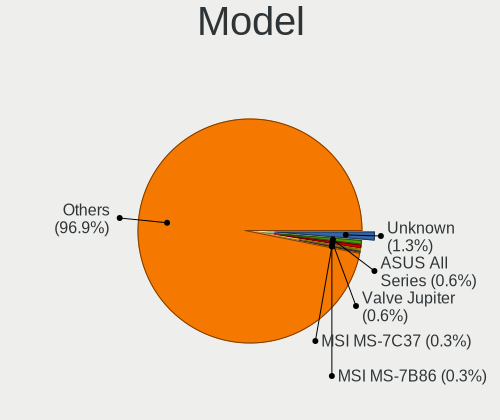
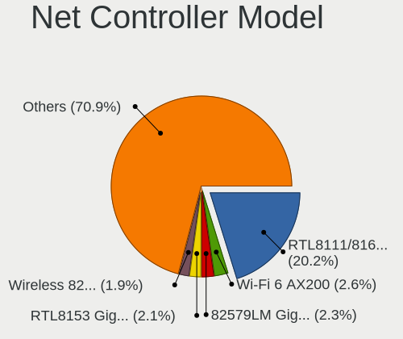
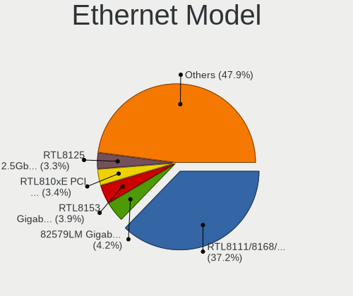
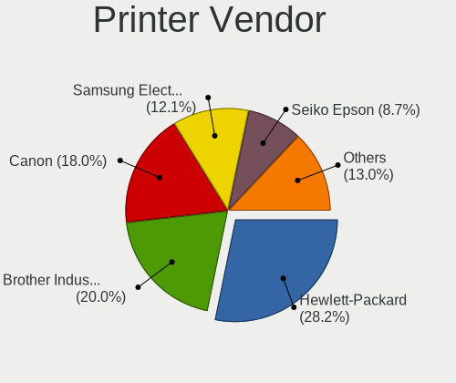

Linux in Germany - Tested Hardware & Statistics
-----------------------------------------------

A project to collect tested hardware configurations for Linux in Germany.

Anyone can contribute to this report by the [hw-probe](https://github.com/linuxhw/hw-probe) tool:

    sudo -E hw-probe -all -upload

Please contribute! Especially if your hardware is rare.

This is a report for all computer types. See also reports for [desktops](/Location/Germany/Desktop/README.md) and [notebooks](/Location/Germany/Notebook/README.md).

Contents
--------

* [ Test Cases ](#test-cases)

* [ System ](#system)
  - [ OS                       ](#os)
  - [ OS Family                ](#os-family)
  - [ Kernel                   ](#kernel)
  - [ Kernel Family            ](#kernel-family)
  - [ Kernel Major Ver.        ](#kernel-major-ver)
  - [ Arch                     ](#arch)
  - [ DE                       ](#de)
  - [ Display Server           ](#display-server)
  - [ Display Manager          ](#display-manager)
  - [ OS Lang                  ](#os-lang)
  - [ Boot Mode                ](#boot-mode)
  - [ Filesystem               ](#filesystem)
  - [ Part. scheme             ](#part-scheme)
  - [ Dual Boot with Linux/BSD ](#dual-boot-with-linuxbsd)
  - [ Dual Boot (Win)          ](#dual-boot-win)

* [ Board ](#board)
  - [ Vendor                   ](#vendor)
  - [ Model                    ](#model)
  - [ Model Family             ](#model-family)
  - [ MFG Year                 ](#mfg-year)
  - [ Form Factor              ](#form-factor)
  - [ Secure Boot              ](#secure-boot)
  - [ Coreboot                 ](#coreboot)
  - [ RAM Size                 ](#ram-size)
  - [ RAM Used                 ](#ram-used)
  - [ Total Drives             ](#total-drives)
  - [ Has CD-ROM               ](#has-cd-rom)
  - [ Has Ethernet             ](#has-ethernet)
  - [ Has WiFi                 ](#has-wifi)
  - [ Has Bluetooth            ](#has-bluetooth)

* [ Location ](#location)
  - [ Country                  ](#country)
  - [ City                     ](#city)

* [ Drives ](#drives)
  - [ Drive Vendor             ](#drive-vendor)
  - [ Drive Model              ](#drive-model)
  - [ HDD Vendor               ](#hdd-vendor)
  - [ SSD Vendor               ](#ssd-vendor)
  - [ Drive Kind               ](#drive-kind)
  - [ Drive Connector          ](#drive-connector)
  - [ Drive Size               ](#drive-size)
  - [ Space Total              ](#space-total)
  - [ Space Used               ](#space-used)
  - [ Malfunc. Drives          ](#malfunc-drives)
  - [ Malfunc. Drive Vendor    ](#malfunc-drive-vendor)
  - [ Malfunc. HDD Vendor      ](#malfunc-hdd-vendor)
  - [ Malfunc. Drive Kind      ](#malfunc-drive-kind)
  - [ Failed Drives            ](#failed-drives)
  - [ Failed Drive Vendor      ](#failed-drive-vendor)
  - [ Drive Status             ](#drive-status)

* [ Storage controller ](#storage-controller)
  - [ Storage Vendor           ](#storage-vendor)
  - [ Storage Model            ](#storage-model)
  - [ Storage Kind             ](#storage-kind)

* [ Processor ](#processor)
  - [ CPU Vendor               ](#cpu-vendor)
  - [ CPU Model                ](#cpu-model)
  - [ CPU Model Family         ](#cpu-model-family)
  - [ CPU Cores                ](#cpu-cores)
  - [ CPU Sockets              ](#cpu-sockets)
  - [ CPU Threads              ](#cpu-threads)
  - [ CPU Op-Modes             ](#cpu-op-modes)
  - [ CPU Microcode            ](#cpu-microcode)
  - [ CPU Microarch            ](#cpu-microarch)

* [ Graphics ](#graphics)
  - [ GPU Vendor               ](#gpu-vendor)
  - [ GPU Model                ](#gpu-model)
  - [ GPU Combo                ](#gpu-combo)
  - [ GPU Driver               ](#gpu-driver)
  - [ GPU Memory               ](#gpu-memory)

* [ Monitor ](#monitor)
  - [ Monitor Vendor           ](#monitor-vendor)
  - [ Monitor Model            ](#monitor-model)
  - [ Monitor Resolution       ](#monitor-resolution)
  - [ Monitor Diagonal         ](#monitor-diagonal)
  - [ Monitor Width            ](#monitor-width)
  - [ Aspect Ratio             ](#aspect-ratio)
  - [ Monitor Area             ](#monitor-area)
  - [ Pixel Density            ](#pixel-density)
  - [ Multiple Monitors        ](#multiple-monitors)

* [ Network ](#network)
  - [ Net Controller Vendor    ](#net-controller-vendor)
  - [ Net Controller Model     ](#net-controller-model)
  - [ Wireless Vendor          ](#wireless-vendor)
  - [ Wireless Model           ](#wireless-model)
  - [ Ethernet Vendor          ](#ethernet-vendor)
  - [ Ethernet Model           ](#ethernet-model)
  - [ Net Controller Kind      ](#net-controller-kind)
  - [ Used Controller          ](#used-controller)
  - [ NICs                     ](#nics)
  - [ IPv6                     ](#ipv6)

* [ Bluetooth ](#bluetooth)
  - [ Bluetooth Vendor         ](#bluetooth-vendor)
  - [ Bluetooth Model          ](#bluetooth-model)

* [ Sound ](#sound)
  - [ Sound Vendor             ](#sound-vendor)
  - [ Sound Model              ](#sound-model)

* [ Memory ](#memory)
  - [ Memory Vendor            ](#memory-vendor)
  - [ Memory Model             ](#memory-model)
  - [ Memory Kind              ](#memory-kind)
  - [ Memory Form Factor       ](#memory-form-factor)
  - [ Memory Size              ](#memory-size)
  - [ Memory Speed             ](#memory-speed)

* [ Printers & scanners ](#printers--scanners)
  - [ Printer Vendor           ](#printer-vendor)
  - [ Printer Model            ](#printer-model)
  - [ Scanner Vendor           ](#scanner-vendor)
  - [ Scanner Model            ](#scanner-model)

* [ Camera ](#camera)
  - [ Camera Vendor            ](#camera-vendor)
  - [ Camera Model             ](#camera-model)

* [ Security ](#security)
  - [ Fingerprint Vendor       ](#fingerprint-vendor)
  - [ Fingerprint Model        ](#fingerprint-model)
  - [ Chipcard Vendor          ](#chipcard-vendor)
  - [ Chipcard Model           ](#chipcard-model)

* [ Unsupported ](#unsupported)
  - [ Unsupported Devices      ](#unsupported-devices)
  - [ Unsupported Device Types ](#unsupported-device-types)

Test Cases
----------

Total: 27375

| Vendor        | Model                       | Form-Factor | Probe                                                      | Date         |
|---------------|-----------------------------|-------------|------------------------------------------------------------|--------------|
| Tactus        | GeoBook 140                 | Notebook    | [0ceb5a3b7c](https://linux-hardware.org/?probe=0ceb5a3b7c) | Apr 01, 2023 |
| Biostar       | A740G M2+                   | Desktop     | [182d84f68a](https://linux-hardware.org/?probe=182d84f68a) | Apr 01, 2023 |
| Lenovo        | MIIX 320-10ICR 80XF         | Tablet      | [06acff9e6b](https://linux-hardware.org/?probe=06acff9e6b) | Apr 01, 2023 |
| Gigabyte      | Q87M-D2H                    | Desktop     | [b627db43dd](https://linux-hardware.org/?probe=b627db43dd) | Apr 01, 2023 |
| Lenovo        | 317E SDK0K17763 WIN 1801... | Desktop     | [a4cad34ac9](https://linux-hardware.org/?probe=a4cad34ac9) | Apr 01, 2023 |
| Acer          | Aspire A315-35              | Notebook    | [659a4cfd5a](https://linux-hardware.org/?probe=659a4cfd5a) | Apr 01, 2023 |
| Lenovo        | V15 G2 IJL 82QY             | Notebook    | [8582f4e86e](https://linux-hardware.org/?probe=8582f4e86e) | Apr 01, 2023 |
| Lenovo        | 3111 SDK0J40697 WIN 3305... | Mini pc     | [d27ec7c05b](https://linux-hardware.org/?probe=d27ec7c05b) | Apr 01, 2023 |
| Lenovo        | V15 G2 IJL 82QY             | Notebook    | [e94e2e397e](https://linux-hardware.org/?probe=e94e2e397e) | Apr 01, 2023 |
| HP            | 8431                        | All in one  | [577af5a471](https://linux-hardware.org/?probe=577af5a471) | Apr 01, 2023 |
| Dell          | 0MGK50 A02                  | Desktop     | [3a042b5160](https://linux-hardware.org/?probe=3a042b5160) | Apr 01, 2023 |
| Gigabyte      | Z370 HD3-CF                 | Desktop     | [824aa0ae13](https://linux-hardware.org/?probe=824aa0ae13) | Apr 01, 2023 |
| ASUSTek       | PRIME X470-PRO              | Desktop     | [96fcc41161](https://linux-hardware.org/?probe=96fcc41161) | Apr 01, 2023 |
| Medion        | E6214                       | Notebook    | [5766389c97](https://linux-hardware.org/?probe=5766389c97) | Apr 01, 2023 |
| MSI           | B450 GAMING PLUS            | Desktop     | [539137fb36](https://linux-hardware.org/?probe=539137fb36) | Apr 01, 2023 |
| Lenovo        | IdeaPad U310                | Notebook    | [6add75e18c](https://linux-hardware.org/?probe=6add75e18c) | Apr 01, 2023 |
| Acer          | Aspire A515-57              | Notebook    | [4a1b8f3f21](https://linux-hardware.org/?probe=4a1b8f3f21) | Apr 01, 2023 |
| Acer          | Aspire XC-780               | Desktop     | [206239c162](https://linux-hardware.org/?probe=206239c162) | Apr 01, 2023 |
| Fujitsu       | D3432-A1 S26361-D3432-A1    | Desktop     | [86241cd6ad](https://linux-hardware.org/?probe=86241cd6ad) | Apr 01, 2023 |
| HP            | 255 G7 Notebook PC          | Notebook    | [e06d57c27a](https://linux-hardware.org/?probe=e06d57c27a) | Apr 01, 2023 |
| HP            | 84FD                        | Desktop     | [79367d5f7d](https://linux-hardware.org/?probe=79367d5f7d) | Apr 01, 2023 |
| HP            | ENVY x360 Convertible 13... | Convertible | [aabb4d79b8](https://linux-hardware.org/?probe=aabb4d79b8) | Apr 01, 2023 |
| Fujitsu       | LIFEBOOK S935               | Notebook    | [11b63a22b5](https://linux-hardware.org/?probe=11b63a22b5) | Apr 01, 2023 |
| Lenovo        | ThinkCentre M58 9728AHG     | Desktop     | [cb0fa70953](https://linux-hardware.org/?probe=cb0fa70953) | Apr 01, 2023 |
| Lenovo        | V15-IGL 82C3                | Notebook    | [4773b9449c](https://linux-hardware.org/?probe=4773b9449c) | Apr 01, 2023 |
| HP            | 2AFA                        | Desktop     | [d177838277](https://linux-hardware.org/?probe=d177838277) | Mar 31, 2023 |
| Lenovo        | ThinkPad T431s 20AA0016G... | Notebook    | [13e8d4f50b](https://linux-hardware.org/?probe=13e8d4f50b) | Mar 31, 2023 |
| ASRock        | Z87 Extreme6                | Desktop     | [675d214cbe](https://linux-hardware.org/?probe=675d214cbe) | Mar 31, 2023 |
| Dell          | 0JP3NX A00                  | Desktop     | [016632c560](https://linux-hardware.org/?probe=016632c560) | Mar 31, 2023 |
| MSI           | Z170A KRAIT GAMING 3X       | Desktop     | [672242513c](https://linux-hardware.org/?probe=672242513c) | Mar 31, 2023 |
| HP            | Pavilion g7                 | Notebook    | [3b0b792078](https://linux-hardware.org/?probe=3b0b792078) | Mar 31, 2023 |
| Lenovo        | IdeaPadFlex 5 15ALC05 82... | Convertible | [29ecf989bb](https://linux-hardware.org/?probe=29ecf989bb) | Mar 31, 2023 |
| Lenovo        | ThinkPad P14s Gen 2a 21A... | Notebook    | [36fab57ba7](https://linux-hardware.org/?probe=36fab57ba7) | Mar 31, 2023 |
| Samsung       | 950QED                      | Convertible | [fb238a74f2](https://linux-hardware.org/?probe=fb238a74f2) | Mar 31, 2023 |
| ASUSTek       | A68HM-PLUS                  | Desktop     | [520ad2ca86](https://linux-hardware.org/?probe=520ad2ca86) | Mar 31, 2023 |
| ASRock        | A320M-DVS R4.0              | Desktop     | [e6463ab36d](https://linux-hardware.org/?probe=e6463ab36d) | Mar 31, 2023 |
| Gigabyte      | A7 K1                       | Notebook    | [e5e7751054](https://linux-hardware.org/?probe=e5e7751054) | Mar 31, 2023 |
| Gigabyte      | Z390 M-CF                   | Desktop     | [a939015daa](https://linux-hardware.org/?probe=a939015daa) | Mar 31, 2023 |
| ASUSTek       | PN51-E1                     | Mini pc     | [14761d1566](https://linux-hardware.org/?probe=14761d1566) | Mar 31, 2023 |
| HP            | 250 G5 Notebook PC          | Notebook    | [d271318192](https://linux-hardware.org/?probe=d271318192) | Mar 31, 2023 |
| HP            | Laptop 15-db0xxx            | Notebook    | [c51f53a733](https://linux-hardware.org/?probe=c51f53a733) | Mar 31, 2023 |
| MSI           | B550-A PRO                  | Desktop     | [ab4f36e0fa](https://linux-hardware.org/?probe=ab4f36e0fa) | Mar 31, 2023 |
| Medion        | E6214                       | Notebook    | [298e2f9c69](https://linux-hardware.org/?probe=298e2f9c69) | Mar 31, 2023 |
| Valve         | Jupiter                     | Notebook    | [888da0cc87](https://linux-hardware.org/?probe=888da0cc87) | Mar 31, 2023 |
| ASRock        | B760M Pro RS/D4             | Desktop     | [6a63402e9c](https://linux-hardware.org/?probe=6a63402e9c) | Mar 31, 2023 |
| Lenovo        | ThinkPad P15s Gen 2i 20W... | Notebook    | [d35ddee3e1](https://linux-hardware.org/?probe=d35ddee3e1) | Mar 31, 2023 |
| ASUSTek       | TUF Gaming Z590-PLUS WIF... | Desktop     | [9addea9f4a](https://linux-hardware.org/?probe=9addea9f4a) | Mar 31, 2023 |
| Fujitsu       | D3600-A1 S26361-D3600-A1    | Desktop     | [fc9a42e387](https://linux-hardware.org/?probe=fc9a42e387) | Mar 31, 2023 |
| Lenovo        | ThinkPad Edge E545 20B20... | Notebook    | [c2061eeeb8](https://linux-hardware.org/?probe=c2061eeeb8) | Mar 31, 2023 |
| Fujitsu Si... | AMILO A Series              | Notebook    | [e551dfea34](https://linux-hardware.org/?probe=e551dfea34) | Mar 31, 2023 |
| Lenovo        | ThinkPad Edge E545 20B20... | Notebook    | [9a866f03fd](https://linux-hardware.org/?probe=9a866f03fd) | Mar 31, 2023 |
| ASUSTek       | Z97-K                       | Desktop     | [da56f6c38c](https://linux-hardware.org/?probe=da56f6c38c) | Mar 31, 2023 |
| Unknown       | Unknown                     | Notebook    | [c30740a3eb](https://linux-hardware.org/?probe=c30740a3eb) | Mar 31, 2023 |
| ASUSTek       | P8H67-M LE                  | Desktop     | [11b3a7cdb1](https://linux-hardware.org/?probe=11b3a7cdb1) | Mar 31, 2023 |
| Gigabyte      | TRX40 AORUS XTREME          | Desktop     | [0945961c85](https://linux-hardware.org/?probe=0945961c85) | Mar 31, 2023 |
| Fujitsu Si... | ESPRIMO Mobile V5535        | Notebook    | [d6c537b33b](https://linux-hardware.org/?probe=d6c537b33b) | Mar 31, 2023 |
| Gigabyte      | TRX40 AORUS XTREME          | Desktop     | [72c08c8ca9](https://linux-hardware.org/?probe=72c08c8ca9) | Mar 31, 2023 |
| Gigabyte      | B450 GAMING X               | Desktop     | [495c58a5c6](https://linux-hardware.org/?probe=495c58a5c6) | Mar 31, 2023 |
| AZW           | GTR V01                     | Mini pc     | [ccaf63588a](https://linux-hardware.org/?probe=ccaf63588a) | Mar 31, 2023 |
| ASUSTek       | H110M-R                     | Desktop     | [bd1a48e47d](https://linux-hardware.org/?probe=bd1a48e47d) | Mar 31, 2023 |
| Gigabyte      | A320M-S2H-CF                | Desktop     | [1c982255fa](https://linux-hardware.org/?probe=1c982255fa) | Mar 31, 2023 |
| ASRock        | Z97 Anniversary             | Desktop     | [c23aeb60ba](https://linux-hardware.org/?probe=c23aeb60ba) | Mar 31, 2023 |
| ECS           | G31T-M7                     | Desktop     | [c197c4ed1d](https://linux-hardware.org/?probe=c197c4ed1d) | Mar 31, 2023 |
| ASUSTek       | X751SA                      | Notebook    | [5d8ad91642](https://linux-hardware.org/?probe=5d8ad91642) | Mar 31, 2023 |
| Apple         | Mac-942B5BF58194151B        | All in one  | [53a11e07e8](https://linux-hardware.org/?probe=53a11e07e8) | Mar 31, 2023 |
| Fujitsu       | D3417-B2 S26361-D3417-B2    | Desktop     | [56c886069b](https://linux-hardware.org/?probe=56c886069b) | Mar 31, 2023 |
| Medion        | E15407                      | Notebook    | [b863362865](https://linux-hardware.org/?probe=b863362865) | Mar 30, 2023 |
| ASUSTek       | Z87-K                       | Desktop     | [e596dbb5bd](https://linux-hardware.org/?probe=e596dbb5bd) | Mar 30, 2023 |
| Medion        | E15407                      | Notebook    | [641091a85d](https://linux-hardware.org/?probe=641091a85d) | Mar 30, 2023 |
| ASUSTek       | EB1036                      | Desktop     | [955d389e06](https://linux-hardware.org/?probe=955d389e06) | Mar 30, 2023 |
| Unknown       | Unknown                     | Desktop     | [3773f3cd04](https://linux-hardware.org/?probe=3773f3cd04) | Mar 30, 2023 |
| Lenovo        | ThinkPad E595 20NF0000GE    | Notebook    | [95a77f6dcc](https://linux-hardware.org/?probe=95a77f6dcc) | Mar 30, 2023 |
| ASUSTek       | X555LAB                     | Notebook    | [f1b87ecc62](https://linux-hardware.org/?probe=f1b87ecc62) | Mar 30, 2023 |
| Packard Be... | FMP55                       | Desktop     | [88a15e20b2](https://linux-hardware.org/?probe=88a15e20b2) | Mar 30, 2023 |
| Dell          | Inspiron 15 5510            | Notebook    | [162132b606](https://linux-hardware.org/?probe=162132b606) | Mar 30, 2023 |
| Lenovo        | IdeaPad 3 15ITL6 82H8       | Notebook    | [afd41155ee](https://linux-hardware.org/?probe=afd41155ee) | Mar 30, 2023 |
| ASUSTek       | B85M-E                      | Desktop     | [7c7f9d0e36](https://linux-hardware.org/?probe=7c7f9d0e36) | Mar 30, 2023 |
| Acer          | Swift SF114-32              | Notebook    | [d15bbe8855](https://linux-hardware.org/?probe=d15bbe8855) | Mar 30, 2023 |
| Acer          | Aspire XC-1760              | Desktop     | [68e6aec940](https://linux-hardware.org/?probe=68e6aec940) | Mar 30, 2023 |
| HP            | 339A                        | Desktop     | [8f484ab259](https://linux-hardware.org/?probe=8f484ab259) | Mar 30, 2023 |
| MSI           | X79A-GD45                   | Desktop     | [6d78703b2c](https://linux-hardware.org/?probe=6d78703b2c) | Mar 30, 2023 |
| HP            | 86ED A01                    | All in one  | [e86753f364](https://linux-hardware.org/?probe=e86753f364) | Mar 30, 2023 |
| ASUSTek       | ROG STRIX TRX40-E GAMING    | Desktop     | [fbcdd4ed13](https://linux-hardware.org/?probe=fbcdd4ed13) | Mar 30, 2023 |
| ReachingTe... | Dream Quest Office 2021     | Mini pc     | [ed4291eed3](https://linux-hardware.org/?probe=ed4291eed3) | Mar 30, 2023 |
| Dell          | XPS 13 7390                 | Notebook    | [990f324256](https://linux-hardware.org/?probe=990f324256) | Mar 30, 2023 |
| HP            | 0AA4h                       | Desktop     | [97457bb10c](https://linux-hardware.org/?probe=97457bb10c) | Mar 30, 2023 |
| Acer          | Aspire A515-52G             | Notebook    | [8f357ff3e8](https://linux-hardware.org/?probe=8f357ff3e8) | Mar 30, 2023 |
| Dell          | XPS 13 7390                 | Notebook    | [b6226ae481](https://linux-hardware.org/?probe=b6226ae481) | Mar 30, 2023 |
| Medion        | S321X                       | Notebook    | [4c02136dda](https://linux-hardware.org/?probe=4c02136dda) | Mar 30, 2023 |
| Medion        | B250H4-EM                   | Desktop     | [f569d44749](https://linux-hardware.org/?probe=f569d44749) | Mar 30, 2023 |
| Lenovo        | ThinkPad X220 Tablet 429... | Notebook    | [a2e324fd92](https://linux-hardware.org/?probe=a2e324fd92) | Mar 30, 2023 |
| Fujitsu       | LIFEBOOK E781               | Notebook    | [581f3f6547](https://linux-hardware.org/?probe=581f3f6547) | Mar 30, 2023 |
| Fujitsu       | LIFEBOOK S752               | Notebook    | [bf3d484605](https://linux-hardware.org/?probe=bf3d484605) | Mar 30, 2023 |
| Fujitsu       | LIFEBOOK S752               | Notebook    | [3e4d9fac89](https://linux-hardware.org/?probe=3e4d9fac89) | Mar 30, 2023 |
| Dell          | Latitude E5470              | Notebook    | [1c26acfb63](https://linux-hardware.org/?probe=1c26acfb63) | Mar 30, 2023 |
| Dell          | Precision M6400             | Notebook    | [293957e2c0](https://linux-hardware.org/?probe=293957e2c0) | Mar 30, 2023 |
| Lenovo        | ThinkPad Edge E530 3259M... | Notebook    | [9aaa97a931](https://linux-hardware.org/?probe=9aaa97a931) | Mar 30, 2023 |
| HP            | 8399                        | Desktop     | [d8c0ad05f5](https://linux-hardware.org/?probe=d8c0ad05f5) | Mar 30, 2023 |
| Acer          | NC-M3-581T-33216G52MAKK     | Notebook    | [3f394d8b43](https://linux-hardware.org/?probe=3f394d8b43) | Mar 30, 2023 |
| Intel         | D510MO AAE76523-403         | Desktop     | [0d06f88081](https://linux-hardware.org/?probe=0d06f88081) | Mar 30, 2023 |
| Lenovo        | Unknown                     | Notebook    | [04d5f7141a](https://linux-hardware.org/?probe=04d5f7141a) | Mar 30, 2023 |
| Dell          | 0VV4V0 A00                  | All in one  | [63e8848234](https://linux-hardware.org/?probe=63e8848234) | Mar 30, 2023 |
| Acer          | Aspire 8943G                | Notebook    | [e1d172011e](https://linux-hardware.org/?probe=e1d172011e) | Mar 30, 2023 |
| Dell          | Precision M4800             | Notebook    | [ebd0442adc](https://linux-hardware.org/?probe=ebd0442adc) | Mar 30, 2023 |
| Lenovo        | SKYBAY SDK0J40705 WIN 34... | Desktop     | [936e8b10c5](https://linux-hardware.org/?probe=936e8b10c5) | Mar 30, 2023 |
| Dell          | XPS 13 7390                 | Notebook    | [2eb96be1ee](https://linux-hardware.org/?probe=2eb96be1ee) | Mar 29, 2023 |
| MSI           | B550-A PRO                  | Desktop     | [b4a4247459](https://linux-hardware.org/?probe=b4a4247459) | Mar 29, 2023 |
| ASUSTek       | ZenBook UX431FAC_UX431FA    | Notebook    | [60e9294662](https://linux-hardware.org/?probe=60e9294662) | Mar 29, 2023 |
| Notebook      | N8xxEP6                     | Notebook    | [bb4ab60dc1](https://linux-hardware.org/?probe=bb4ab60dc1) | Mar 29, 2023 |
| Acer          | Aspire A515-57              | Notebook    | [06a3c07a40](https://linux-hardware.org/?probe=06a3c07a40) | Mar 29, 2023 |
| ASUSTek       | TUF Gaming Z590-PLUS WIF... | Desktop     | [baf3c567a7](https://linux-hardware.org/?probe=baf3c567a7) | Mar 29, 2023 |
| Medion        | TJ4125                      | Desktop     | [e03693b0f0](https://linux-hardware.org/?probe=e03693b0f0) | Mar 29, 2023 |
| ASRock        | B550M Pro4                  | Desktop     | [a78f53a6b4](https://linux-hardware.org/?probe=a78f53a6b4) | Mar 29, 2023 |
| ASRock        | B550M Pro4                  | Desktop     | [a4c3b109dc](https://linux-hardware.org/?probe=a4c3b109dc) | Mar 29, 2023 |
| ASUSTek       | PRIME A320M-K               | Desktop     | [4f9eed1de2](https://linux-hardware.org/?probe=4f9eed1de2) | Mar 29, 2023 |
| MSI           | X79A-GD45                   | Desktop     | [bb4680bc5b](https://linux-hardware.org/?probe=bb4680bc5b) | Mar 29, 2023 |
| Acer          | Aspire 8930                 | Notebook    | [248dbe002e](https://linux-hardware.org/?probe=248dbe002e) | Mar 29, 2023 |
| Unknown       | Unknown                     | Notebook    | [7d3374d52b](https://linux-hardware.org/?probe=7d3374d52b) | Mar 29, 2023 |
| Acer          | Aspire E5-576               | Notebook    | [37fc62a287](https://linux-hardware.org/?probe=37fc62a287) | Mar 29, 2023 |
| HP            | 0AA4h                       | Desktop     | [801f843749](https://linux-hardware.org/?probe=801f843749) | Mar 29, 2023 |
| Lenovo        | 30D2 NOK                    | Desktop     | [e4d898e37d](https://linux-hardware.org/?probe=e4d898e37d) | Mar 29, 2023 |
| ASUSTek       | A78M-A                      | Desktop     | [e2ee931df2](https://linux-hardware.org/?probe=e2ee931df2) | Mar 28, 2023 |
| ASUSTek       | M3N78 PRO                   | Desktop     | [0f9abe9400](https://linux-hardware.org/?probe=0f9abe9400) | Mar 28, 2023 |
| Medion        | P7641 MD99856               | Notebook    | [7347a28d53](https://linux-hardware.org/?probe=7347a28d53) | Mar 28, 2023 |
| HP            | Pavilion g6                 | Notebook    | [c5b99ffdb0](https://linux-hardware.org/?probe=c5b99ffdb0) | Mar 28, 2023 |
| Acer          | Aspire V3-571G              | Notebook    | [ecde786683](https://linux-hardware.org/?probe=ecde786683) | Mar 28, 2023 |
| ASUSTek       | Z97-P                       | Desktop     | [0a0ca96d28](https://linux-hardware.org/?probe=0a0ca96d28) | Mar 28, 2023 |
| HP            | Pavilion dv5000 (EW771EA... | Notebook    | [db28f35ce0](https://linux-hardware.org/?probe=db28f35ce0) | Mar 28, 2023 |
| Acer          | Aspire E1-570               | Notebook    | [71b25255fa](https://linux-hardware.org/?probe=71b25255fa) | Mar 28, 2023 |
| Fujitsu       | D3162-A1 S26361-D3162-A1    | Desktop     | [4807db08a9](https://linux-hardware.org/?probe=4807db08a9) | Mar 28, 2023 |
| Fujitsu       | LIFEBOOK E556               | Notebook    | [bbd878e897](https://linux-hardware.org/?probe=bbd878e897) | Mar 28, 2023 |
| Unknown       | Unknown                     | Desktop     | [fb22157f03](https://linux-hardware.org/?probe=fb22157f03) | Mar 28, 2023 |
| Acer          | Aspire V3-571G              | Notebook    | [289bd8c2fd](https://linux-hardware.org/?probe=289bd8c2fd) | Mar 28, 2023 |
| Fujitsu       | D3222-A1 S26361-D3222-A1    | Desktop     | [ad5969356b](https://linux-hardware.org/?probe=ad5969356b) | Mar 28, 2023 |
| Gigabyte      | B85M-D3H                    | Desktop     | [a074e581b0](https://linux-hardware.org/?probe=a074e581b0) | Mar 28, 2023 |
| Lenovo        | 3178 SDK0J40700 WIN 3258... | Desktop     | [1c14b29af5](https://linux-hardware.org/?probe=1c14b29af5) | Mar 28, 2023 |
| Apple         | Mac-F2218EA9                | All in one  | [5590ec1365](https://linux-hardware.org/?probe=5590ec1365) | Mar 28, 2023 |
| Fujitsu       | LIFEBOOK E556               | Notebook    | [3842c12714](https://linux-hardware.org/?probe=3842c12714) | Mar 28, 2023 |
| HP            | Pavilion Notebook           | Notebook    | [783330690d](https://linux-hardware.org/?probe=783330690d) | Mar 28, 2023 |
| Dell          | Latitude E5500              | Notebook    | [6fea10bf98](https://linux-hardware.org/?probe=6fea10bf98) | Mar 28, 2023 |
| ASUSTek       | PRIME B450M-A II            | Desktop     | [4fe0ddab4b](https://linux-hardware.org/?probe=4fe0ddab4b) | Mar 28, 2023 |
| ASUSTek       | TX201LA                     | Notebook    | [27c77d0b6c](https://linux-hardware.org/?probe=27c77d0b6c) | Mar 28, 2023 |
| Gigabyte      | X58A-UD3R                   | Desktop     | [74d9c5e704](https://linux-hardware.org/?probe=74d9c5e704) | Mar 28, 2023 |
| Lenovo        | ThinkStation S30 0568E8G    | Desktop     | [ea3855cca5](https://linux-hardware.org/?probe=ea3855cca5) | Mar 28, 2023 |
| ASUSTek       | ROG STRIX Z390-F GAMING     | Desktop     | [611b42e6fd](https://linux-hardware.org/?probe=611b42e6fd) | Mar 28, 2023 |
| Lenovo        | ThinkPad T495 20NJ000XGE    | Notebook    | [70715024f2](https://linux-hardware.org/?probe=70715024f2) | Mar 28, 2023 |
| Acer          | Predator G3-605             | Desktop     | [8caea0f833](https://linux-hardware.org/?probe=8caea0f833) | Mar 27, 2023 |
| ASUSTek       | X555DG                      | Notebook    | [6a464d8e68](https://linux-hardware.org/?probe=6a464d8e68) | Mar 27, 2023 |
| Lenovo        | ThinkPad T490 20N3SBU219    | Notebook    | [b8e8125150](https://linux-hardware.org/?probe=b8e8125150) | Mar 27, 2023 |
| Gigabyte      | Z370 AORUS Gaming 7         | Desktop     | [91a63afb10](https://linux-hardware.org/?probe=91a63afb10) | Mar 27, 2023 |
| Gigabyte      | B450M S2H                   | Desktop     | [0901eb1e27](https://linux-hardware.org/?probe=0901eb1e27) | Mar 27, 2023 |
| Intel         | NUC7i5BNB J31144-314        | Mini pc     | [a43e1a0769](https://linux-hardware.org/?probe=a43e1a0769) | Mar 27, 2023 |
| Lenovo        | 36C5 SDK0J40700 WIN 3258... | Desktop     | [8d039976c9](https://linux-hardware.org/?probe=8d039976c9) | Mar 27, 2023 |
| MSI           | B550 GAMING GEN3            | Desktop     | [8b14146424](https://linux-hardware.org/?probe=8b14146424) | Mar 27, 2023 |
| Gigabyte      | H97M-HD3                    | Desktop     | [1b531d5ada](https://linux-hardware.org/?probe=1b531d5ada) | Mar 27, 2023 |
| HP            | Elite x2 1012 G2 Tablet     | Tablet      | [6df6d52151](https://linux-hardware.org/?probe=6df6d52151) | Mar 27, 2023 |
| HP            | Elite x2 1012 G2 Tablet     | Tablet      | [0963882502](https://linux-hardware.org/?probe=0963882502) | Mar 27, 2023 |
| Valve         | Jupiter                     | Notebook    | [50abca1d7d](https://linux-hardware.org/?probe=50abca1d7d) | Mar 27, 2023 |
| ASUSTek       | PRIME Z590-P                | Desktop     | [ab55adbf68](https://linux-hardware.org/?probe=ab55adbf68) | Mar 27, 2023 |
| ASRock        | 770 Extreme3                | Desktop     | [9cd5d1485c](https://linux-hardware.org/?probe=9cd5d1485c) | Mar 27, 2023 |
| Lenovo        | ThinkPad X220 42915P1       | Notebook    | [40d0cf6e14](https://linux-hardware.org/?probe=40d0cf6e14) | Mar 27, 2023 |
| Acer          | Aspire 7745G                | Notebook    | [9303cda87a](https://linux-hardware.org/?probe=9303cda87a) | Mar 27, 2023 |
| HP            | Spectre x360 2-in-1 Lapt... | Convertible | [42601709f3](https://linux-hardware.org/?probe=42601709f3) | Mar 27, 2023 |
| ASUSTek       | X540SA                      | Notebook    | [b2586a8e30](https://linux-hardware.org/?probe=b2586a8e30) | Mar 27, 2023 |
| Dell          | Latitude E6430              | Notebook    | [61ec1b65ed](https://linux-hardware.org/?probe=61ec1b65ed) | Mar 27, 2023 |
| Gigabyte      | Q87M-D2H                    | Desktop     | [dd71be113d](https://linux-hardware.org/?probe=dd71be113d) | Mar 27, 2023 |
| Medion        | TJ4125                      | Desktop     | [571b476915](https://linux-hardware.org/?probe=571b476915) | Mar 27, 2023 |
| GPD           | P3 MAX                      | Notebook    | [b3627909f1](https://linux-hardware.org/?probe=b3627909f1) | Mar 27, 2023 |
| Lenovo        | 102F NO DPK                 | Desktop     | [85a4bbf301](https://linux-hardware.org/?probe=85a4bbf301) | Mar 27, 2023 |
| Sony          | VPCSA2C5E                   | Notebook    | [60e85a64b0](https://linux-hardware.org/?probe=60e85a64b0) | Mar 27, 2023 |
| Gigabyte      | F2A88XM-D3H                 | Desktop     | [94cd15664b](https://linux-hardware.org/?probe=94cd15664b) | Mar 27, 2023 |
| HP            | 3648h                       | Desktop     | [fbc5138852](https://linux-hardware.org/?probe=fbc5138852) | Mar 27, 2023 |
| Lenovo        | ThinkCentre M71e 3157AE2    | Desktop     | [a71ced0077](https://linux-hardware.org/?probe=a71ced0077) | Mar 27, 2023 |
| ASUSTek       | X540SA                      | Notebook    | [b165f6aa7a](https://linux-hardware.org/?probe=b165f6aa7a) | Mar 27, 2023 |
| Gigabyte      | H87M-D3H                    | Desktop     | [b277bc971f](https://linux-hardware.org/?probe=b277bc971f) | Mar 27, 2023 |
| Dell          | Precision 7530              | Notebook    | [d5687ef764](https://linux-hardware.org/?probe=d5687ef764) | Mar 27, 2023 |
| Lenovo        | ThinkPad L450 20DS0001GE    | Notebook    | [17f869b10d](https://linux-hardware.org/?probe=17f869b10d) | Mar 27, 2023 |
| Lenovo        | ThinkPad X230 23255NG       | Notebook    | [b606e5e418](https://linux-hardware.org/?probe=b606e5e418) | Mar 27, 2023 |
| Lenovo        | ThinkPad X230 23255NG       | Notebook    | [3effccad22](https://linux-hardware.org/?probe=3effccad22) | Mar 27, 2023 |
| Samsung       | 300E4A/300E5A/300E7A/343... | Notebook    | [1ed601999d](https://linux-hardware.org/?probe=1ed601999d) | Mar 27, 2023 |
| Lenovo        | ThinkPad T450s 20BWS3WY0... | Notebook    | [d1e9fcddfc](https://linux-hardware.org/?probe=d1e9fcddfc) | Mar 27, 2023 |
| MSI           | B450 GAMING PLUS            | Desktop     | [5242d56a0f](https://linux-hardware.org/?probe=5242d56a0f) | Mar 27, 2023 |
| TUXEDO        | Pulse 14 Gen1               | Notebook    | [7facc52f0e](https://linux-hardware.org/?probe=7facc52f0e) | Mar 27, 2023 |
| ASUSTek       | ASUS TUF Gaming A17 FA70... | Notebook    | [1c517ff300](https://linux-hardware.org/?probe=1c517ff300) | Mar 27, 2023 |
| ASUSTek       | H110-PLUS                   | Desktop     | [b108ebc14f](https://linux-hardware.org/?probe=b108ebc14f) | Mar 27, 2023 |
| ASRock        | B450M Pro4                  | Desktop     | [a6bb6f959c](https://linux-hardware.org/?probe=a6bb6f959c) | Mar 27, 2023 |
| ASUSTek       | PRIME H310M-A R2.0          | Desktop     | [8af0f96567](https://linux-hardware.org/?probe=8af0f96567) | Mar 27, 2023 |
| MSI           | Modern 15 A5M               | Notebook    | [84092aca44](https://linux-hardware.org/?probe=84092aca44) | Mar 27, 2023 |
| Acer          | Aspire A315-56              | Notebook    | [db607e02ea](https://linux-hardware.org/?probe=db607e02ea) | Mar 27, 2023 |
| ASRock        | AM1B-ITX                    | Desktop     | [e5dc5f70ac](https://linux-hardware.org/?probe=e5dc5f70ac) | Mar 27, 2023 |
| ASUSTek       | N3150I-C                    | Desktop     | [6c977806a1](https://linux-hardware.org/?probe=6c977806a1) | Mar 27, 2023 |
| Microsoft     | Surface Pro 8               | Tablet      | [ed7e0c694b](https://linux-hardware.org/?probe=ed7e0c694b) | Mar 27, 2023 |
| Gigabyte      | A520M H                     | Desktop     | [7afe508254](https://linux-hardware.org/?probe=7afe508254) | Mar 27, 2023 |
| TUXEDO        | InfinityBook Pro Gen7 (M... | Notebook    | [84d2bfb9cc](https://linux-hardware.org/?probe=84d2bfb9cc) | Mar 27, 2023 |
| Gigabyte      | Z590 GAMING X               | Desktop     | [de1cb772e9](https://linux-hardware.org/?probe=de1cb772e9) | Mar 27, 2023 |
| Gigabyte      | Z590 GAMING X               | Desktop     | [db7671affd](https://linux-hardware.org/?probe=db7671affd) | Mar 27, 2023 |
| Acer          | Swift SF314-51              | Notebook    | [5a73818024](https://linux-hardware.org/?probe=5a73818024) | Mar 27, 2023 |
| Dell          | 0VV4V0 A00                  | All in one  | [a999e71c62](https://linux-hardware.org/?probe=a999e71c62) | Mar 27, 2023 |
| Fujitsu Si... | MS-7504VP-PV                | Desktop     | [83448b2d9b](https://linux-hardware.org/?probe=83448b2d9b) | Mar 26, 2023 |
| ASRock        | X300-ITX                    | Desktop     | [34402bbf9b](https://linux-hardware.org/?probe=34402bbf9b) | Mar 26, 2023 |
| MSI           | Z490 PLUS                   | Desktop     | [06032b5e04](https://linux-hardware.org/?probe=06032b5e04) | Mar 26, 2023 |
| ASRock        | B450M-HDV R4.0              | Desktop     | [e069fb2622](https://linux-hardware.org/?probe=e069fb2622) | Mar 26, 2023 |
| Toshiba       | Satellite C50-A510          | Notebook    | [69eb2dad8f](https://linux-hardware.org/?probe=69eb2dad8f) | Mar 26, 2023 |
| Medion        | P2A4-EM                     | Desktop     | [45e86dd60d](https://linux-hardware.org/?probe=45e86dd60d) | Mar 26, 2023 |
| Gigabyte      | X470 AORUS ULTRA GAMING-... | Desktop     | [a8d31fc431](https://linux-hardware.org/?probe=a8d31fc431) | Mar 26, 2023 |
| MSI           | Modern 15 B12M              | Notebook    | [b4143381ac](https://linux-hardware.org/?probe=b4143381ac) | Mar 26, 2023 |
| Lenovo        | 11061GG ThinkServer TS13... | Desktop     | [174e514c30](https://linux-hardware.org/?probe=174e514c30) | Mar 26, 2023 |
| Gigabyte      | H67MA-USB3-B3               | Desktop     | [ae3d30a042](https://linux-hardware.org/?probe=ae3d30a042) | Mar 26, 2023 |
| Lenovo        | ThinkPad X230 2325BA3       | Notebook    | [9022b333bd](https://linux-hardware.org/?probe=9022b333bd) | Mar 26, 2023 |
| Gigabyte      | H67MA-USB3-B3               | Desktop     | [b31a6f01f6](https://linux-hardware.org/?probe=b31a6f01f6) | Mar 26, 2023 |
| Dell          | XPS 13 7390                 | Notebook    | [7c10ad8eb9](https://linux-hardware.org/?probe=7c10ad8eb9) | Mar 26, 2023 |
| Fujitsu Si... | AMILO A Series              | Notebook    | [58391da932](https://linux-hardware.org/?probe=58391da932) | Mar 26, 2023 |
| Lenovo        | ThinkPad T440s 20AQ009DG... | Notebook    | [6f3481adc0](https://linux-hardware.org/?probe=6f3481adc0) | Mar 26, 2023 |
| Fujitsu       | D3233-A1 S26361-D3233-A1    | Desktop     | [b527095c8c](https://linux-hardware.org/?probe=b527095c8c) | Mar 26, 2023 |
| Gigabyte      | B550 AORUS ELITE V2         | Desktop     | [6553d2c85a](https://linux-hardware.org/?probe=6553d2c85a) | Mar 26, 2023 |
| Gigabyte      | A7 K1                       | Notebook    | [0eca943d2e](https://linux-hardware.org/?probe=0eca943d2e) | Mar 26, 2023 |
| ASUSTek       | K72Jr                       | Notebook    | [f80aed3ccc](https://linux-hardware.org/?probe=f80aed3ccc) | Mar 26, 2023 |
| Lenovo        | ThinkPad P14s Gen 3 21AK... | Notebook    | [13e0523db8](https://linux-hardware.org/?probe=13e0523db8) | Mar 26, 2023 |
| ASUSTek       | K50IJ                       | Notebook    | [ef0a85f5ad](https://linux-hardware.org/?probe=ef0a85f5ad) | Mar 26, 2023 |
| Medion        | E6214                       | Notebook    | [8ff346be04](https://linux-hardware.org/?probe=8ff346be04) | Mar 26, 2023 |
| Medion        | Akoya E6416                 | Notebook    | [bb2e759014](https://linux-hardware.org/?probe=bb2e759014) | Mar 26, 2023 |
| Chuwi         | RZBOX                       | Desktop     | [14ef8add03](https://linux-hardware.org/?probe=14ef8add03) | Mar 26, 2023 |
| Gigabyte      | Q87M-D2H                    | Desktop     | [8690ae647e](https://linux-hardware.org/?probe=8690ae647e) | Mar 26, 2023 |
| Apple         | MacBook1,1                  | Notebook    | [002929e495](https://linux-hardware.org/?probe=002929e495) | Mar 26, 2023 |
| Lenovo        | Yoga 7 14ITL5 82BH          | Convertible | [c322e1c537](https://linux-hardware.org/?probe=c322e1c537) | Mar 26, 2023 |
| Acer          | Aspire 7741                 | Notebook    | [176930d8ed](https://linux-hardware.org/?probe=176930d8ed) | Mar 26, 2023 |
| ASUSTek       | ROG STRIX B550-F GAMING     | Desktop     | [cba16003d7](https://linux-hardware.org/?probe=cba16003d7) | Mar 26, 2023 |
| HP            | 620                         | Notebook    | [550c23f9a3](https://linux-hardware.org/?probe=550c23f9a3) | Mar 26, 2023 |
| ASUSTek       | M2N68-AM Plus               | Desktop     | [e274c03773](https://linux-hardware.org/?probe=e274c03773) | Mar 26, 2023 |
| Acer          | Aspire 7741                 | Notebook    | [d41b865ed2](https://linux-hardware.org/?probe=d41b865ed2) | Mar 26, 2023 |
| Gigabyte      | A520M H                     | Desktop     | [cfacabcd33](https://linux-hardware.org/?probe=cfacabcd33) | Mar 26, 2023 |
| Lenovo        | V510-15IKB 80WQ             | Notebook    | [8df3d7641e](https://linux-hardware.org/?probe=8df3d7641e) | Mar 26, 2023 |
| Gigabyte      | A520M H                     | Desktop     | [ed01b04ada](https://linux-hardware.org/?probe=ed01b04ada) | Mar 26, 2023 |
| ASUSTek       | PRIME A520M-K               | Desktop     | [f01520e14a](https://linux-hardware.org/?probe=f01520e14a) | Mar 26, 2023 |
| Gigabyte      | B85M-D3H                    | Desktop     | [890cd39d63](https://linux-hardware.org/?probe=890cd39d63) | Mar 26, 2023 |
| Lenovo        | SHARKBAY NOK                | Desktop     | [74cf067852](https://linux-hardware.org/?probe=74cf067852) | Mar 26, 2023 |
| Shuttle       | B10IE01                     | Desktop     | [bc74a6b1a2](https://linux-hardware.org/?probe=bc74a6b1a2) | Mar 26, 2023 |
| Acer          | Nitro AN515-52              | Notebook    | [d2f95decbe](https://linux-hardware.org/?probe=d2f95decbe) | Mar 26, 2023 |
| HP            | Pavilion x360 Convertibl... | Convertible | [50387b06e7](https://linux-hardware.org/?probe=50387b06e7) | Mar 26, 2023 |
| HP            | Pavilion x360 Convertibl... | Convertible | [2a9ae9d859](https://linux-hardware.org/?probe=2a9ae9d859) | Mar 26, 2023 |
| ASUSTek       | X550ZA                      | Notebook    | [cc243873e2](https://linux-hardware.org/?probe=cc243873e2) | Mar 26, 2023 |
| ASUSTek       | X550ZA                      | Notebook    | [2e55d2163a](https://linux-hardware.org/?probe=2e55d2163a) | Mar 26, 2023 |
| Fujitsu       | D2917-A1 S26361-D2917-A1    | Desktop     | [0fc1609d81](https://linux-hardware.org/?probe=0fc1609d81) | Mar 26, 2023 |
| Dell          | Inspiron 7506 2n1           | Convertible | [024872acb1](https://linux-hardware.org/?probe=024872acb1) | Mar 26, 2023 |
| Dell          | 0MGK50 A02                  | Desktop     | [93b35b776a](https://linux-hardware.org/?probe=93b35b776a) | Mar 26, 2023 |
| Intel         | NUC5i3RYB H41000-502        | Mini pc     | [fac3426827](https://linux-hardware.org/?probe=fac3426827) | Mar 26, 2023 |
| Acer          | Nitro AN515-52              | Notebook    | [1377a2ea15](https://linux-hardware.org/?probe=1377a2ea15) | Mar 26, 2023 |
| Lenovo        | 3704 SDK0J40700 WIN 3258... | Desktop     | [b7b93f24a2](https://linux-hardware.org/?probe=b7b93f24a2) | Mar 26, 2023 |
| ASUSTek       | X55U                        | Notebook    | [764682127e](https://linux-hardware.org/?probe=764682127e) | Mar 26, 2023 |
| Lenovo        | ThinkPad E14 Gen 3 20Y70... | Notebook    | [3ce456f3c8](https://linux-hardware.org/?probe=3ce456f3c8) | Mar 25, 2023 |
| Medion        | TJ4125                      | Desktop     | [74b96baec4](https://linux-hardware.org/?probe=74b96baec4) | Mar 25, 2023 |
| Fujitsu       | LIFEBOOK A531               | Notebook    | [c9973bac8f](https://linux-hardware.org/?probe=c9973bac8f) | Mar 25, 2023 |
| Fujitsu       | D3220-A1 S26361-D3220-A1    | Desktop     | [cb325c06e8](https://linux-hardware.org/?probe=cb325c06e8) | Mar 25, 2023 |
| Acer          | Aspire ES1-731              | Notebook    | [927cc86995](https://linux-hardware.org/?probe=927cc86995) | Mar 25, 2023 |
| Dell          | Vostro 15-3568              | Notebook    | [bc2447e1e5](https://linux-hardware.org/?probe=bc2447e1e5) | Mar 25, 2023 |
| Acer          | Aspire E1-731               | Notebook    | [667456015e](https://linux-hardware.org/?probe=667456015e) | Mar 25, 2023 |
| Toshiba       | PORTEGE Z30-A               | Notebook    | [114888d7f5](https://linux-hardware.org/?probe=114888d7f5) | Mar 25, 2023 |
| Lenovo        | 30D2 NOK                    | Desktop     | [dc62baadff](https://linux-hardware.org/?probe=dc62baadff) | Mar 25, 2023 |
| ASUSTek       | P8H77-M                     | Desktop     | [6fc56d2339](https://linux-hardware.org/?probe=6fc56d2339) | Mar 25, 2023 |
| HP            | 3397                        | Desktop     | [2ad66803de](https://linux-hardware.org/?probe=2ad66803de) | Mar 25, 2023 |
| Lenovo        | ThinkPad X201 3680W81       | Notebook    | [02821ba817](https://linux-hardware.org/?probe=02821ba817) | Mar 25, 2023 |
| Packard Be... | FIH57                       | Desktop     | [794fd45482](https://linux-hardware.org/?probe=794fd45482) | Mar 25, 2023 |
| MSI           | H81M-P33                    | Desktop     | [0944bc82b9](https://linux-hardware.org/?probe=0944bc82b9) | Mar 25, 2023 |
| Medion        | E14412                      | Notebook    | [897c73454e](https://linux-hardware.org/?probe=897c73454e) | Mar 25, 2023 |
| Apple         | MacBookPro9,1               | Notebook    | [61948072a5](https://linux-hardware.org/?probe=61948072a5) | Mar 25, 2023 |
| Fujitsu       | D3161-A1 S26361-D3161-A1    | Desktop     | [76d02ffbf0](https://linux-hardware.org/?probe=76d02ffbf0) | Mar 25, 2023 |
| Toshiba       | TECRA M10                   | Notebook    | [41e2f08c6b](https://linux-hardware.org/?probe=41e2f08c6b) | Mar 25, 2023 |
| ASUSTek       | TUF Gaming B550-PLUS WIF... | Desktop     | [227aba28f2](https://linux-hardware.org/?probe=227aba28f2) | Mar 25, 2023 |
| Acer          | Aspire A315-56              | Notebook    | [143eed380e](https://linux-hardware.org/?probe=143eed380e) | Mar 25, 2023 |
| Apple         | MacBookPro11,3              | Notebook    | [f027c9ca09](https://linux-hardware.org/?probe=f027c9ca09) | Mar 25, 2023 |
| MSI           | H110M PRO-D                 | Desktop     | [104b9b1c12](https://linux-hardware.org/?probe=104b9b1c12) | Mar 25, 2023 |
| Medion        | E6214                       | Notebook    | [0dd02b9353](https://linux-hardware.org/?probe=0dd02b9353) | Mar 25, 2023 |
| Dell          | Vostro 15-3568              | Notebook    | [e6ee9fc566](https://linux-hardware.org/?probe=e6ee9fc566) | Mar 25, 2023 |
| ASUSTek       | TUF Gaming FX505DU_FX505... | Notebook    | [51d034c8d1](https://linux-hardware.org/?probe=51d034c8d1) | Mar 25, 2023 |
| MSI           | H110M PRO-D                 | Desktop     | [a822425dcf](https://linux-hardware.org/?probe=a822425dcf) | Mar 25, 2023 |
| Acer          | Aspire E1-572G              | Notebook    | [ce4febfe16](https://linux-hardware.org/?probe=ce4febfe16) | Mar 25, 2023 |
| Toshiba       | Satellite L50D-B            | Notebook    | [d2ce6bb555](https://linux-hardware.org/?probe=d2ce6bb555) | Mar 25, 2023 |
| ASUSTek       | TUF Gaming X670E-PLUS WI... | Desktop     | [f2b287b461](https://linux-hardware.org/?probe=f2b287b461) | Mar 25, 2023 |
| Acer          | Aspire E1-572G              | Notebook    | [cef20904d7](https://linux-hardware.org/?probe=cef20904d7) | Mar 25, 2023 |
| MSI           | MEG X570S ACE MAX           | Desktop     | [3a32e79b17](https://linux-hardware.org/?probe=3a32e79b17) | Mar 25, 2023 |
| Intel         | NUC10i3FNB K61362-305       | Mini pc     | [26c0bb67b6](https://linux-hardware.org/?probe=26c0bb67b6) | Mar 25, 2023 |
| Acer          | Aspire 7736                 | Notebook    | [af392f60cc](https://linux-hardware.org/?probe=af392f60cc) | Mar 25, 2023 |
| Acer          | Aspire 7736                 | Notebook    | [bbe13d4e0b](https://linux-hardware.org/?probe=bbe13d4e0b) | Mar 25, 2023 |
| HPE           | ProLiant MicroServer Gen... | Desktop     | [72f90312db](https://linux-hardware.org/?probe=72f90312db) | Mar 25, 2023 |
| TUXEDO        | InfinityBook Pro 14 v4      | Notebook    | [74c22c45c4](https://linux-hardware.org/?probe=74c22c45c4) | Mar 25, 2023 |
| Fujitsu       | D3062-A1 S26361-D3062-A1    | Desktop     | [ca8bcc6073](https://linux-hardware.org/?probe=ca8bcc6073) | Mar 25, 2023 |
| AXDIA Inte... | myBook PRO14 SE V2          | Notebook    | [0e604dc9d0](https://linux-hardware.org/?probe=0e604dc9d0) | Mar 24, 2023 |
| ASUSTek       | PRIME Z590-A                | Desktop     | [9a8b9b917f](https://linux-hardware.org/?probe=9a8b9b917f) | Mar 24, 2023 |
| HP            | 3048h                       | Desktop     | [69cd88b0c0](https://linux-hardware.org/?probe=69cd88b0c0) | Mar 24, 2023 |
| Lenovo        | 0x36BF SDK0J40709 WIN 32... | All in one  | [018bbef1d6](https://linux-hardware.org/?probe=018bbef1d6) | Mar 24, 2023 |
| Dell          | Latitude E5510              | Notebook    | [8a9a1eec2c](https://linux-hardware.org/?probe=8a9a1eec2c) | Mar 24, 2023 |
| HP            | EliteBook 840 G5            | Notebook    | [4e8606a29d](https://linux-hardware.org/?probe=4e8606a29d) | Mar 24, 2023 |
| Dell          | XPS 15 9550                 | Notebook    | [b6bb271247](https://linux-hardware.org/?probe=b6bb271247) | Mar 24, 2023 |
| ASUSTek       | M4A78T-E                    | Desktop     | [a820ffe411](https://linux-hardware.org/?probe=a820ffe411) | Mar 24, 2023 |
| ASUSTek       | TUF Gaming X670E-PLUS WI... | Desktop     | [dac7782920](https://linux-hardware.org/?probe=dac7782920) | Mar 24, 2023 |
| ASUSTek       | VivoBook_ASUSLaptop S540... | Notebook    | [18cd806803](https://linux-hardware.org/?probe=18cd806803) | Mar 24, 2023 |
| Toshiba       | Satellite C50-B             | Notebook    | [4b563f19dd](https://linux-hardware.org/?probe=4b563f19dd) | Mar 24, 2023 |
| HP            | ENVY x360 2-in-1 Laptop ... | Convertible | [6a2a55ca61](https://linux-hardware.org/?probe=6a2a55ca61) | Mar 24, 2023 |
| Lenovo        | ThinkPad T14s Gen 2i 20W... | Notebook    | [7dfb215d39](https://linux-hardware.org/?probe=7dfb215d39) | Mar 24, 2023 |
| Dell          | Latitude E6420              | Notebook    | [b1516dde2f](https://linux-hardware.org/?probe=b1516dde2f) | Mar 24, 2023 |
| ASUSTek       | ROG STRIX Z390-F GAMING     | Desktop     | [ec6fdc917b](https://linux-hardware.org/?probe=ec6fdc917b) | Mar 24, 2023 |
| Lenovo        | ThinkPad E15 Gen 4 21E6C... | Notebook    | [3042a430c0](https://linux-hardware.org/?probe=3042a430c0) | Mar 24, 2023 |
| ASUSTek       | TUF Gaming B550-PLUS        | Desktop     | [9240540b33](https://linux-hardware.org/?probe=9240540b33) | Mar 24, 2023 |
| Dell          | 0VV4V0 A00                  | All in one  | [9999f7dc6c](https://linux-hardware.org/?probe=9999f7dc6c) | Mar 24, 2023 |
| HPE           | ProLiant MicroServer Gen... | Desktop     | [2c8daaa4f2](https://linux-hardware.org/?probe=2c8daaa4f2) | Mar 24, 2023 |
| ASUSTek       | VivoBook_ASUSLaptop M560... | Notebook    | [16b93bfe5d](https://linux-hardware.org/?probe=16b93bfe5d) | Mar 24, 2023 |
| Toshiba       | TECRA Z40-C                 | Notebook    | [39995c1c00](https://linux-hardware.org/?probe=39995c1c00) | Mar 24, 2023 |
| Fujitsu       | D3162-B1 S26361-D3162-B1    | Desktop     | [a2c287936d](https://linux-hardware.org/?probe=a2c287936d) | Mar 24, 2023 |
| HP            | ENVY x360 Convertible 15... | Convertible | [3769ec9ab5](https://linux-hardware.org/?probe=3769ec9ab5) | Mar 24, 2023 |
| HP            | 255 G5                      | Notebook    | [99e2d83974](https://linux-hardware.org/?probe=99e2d83974) | Mar 24, 2023 |
| Raspberry ... | Raspberry Pi 4 Model B R... | Soc         | [ea3430977c](https://linux-hardware.org/?probe=ea3430977c) | Mar 23, 2023 |
| ASUSTek       | X75A1                       | Notebook    | [a4b87d85da](https://linux-hardware.org/?probe=a4b87d85da) | Mar 23, 2023 |
| ASUSTek       | X75A1                       | Notebook    | [654683dd2b](https://linux-hardware.org/?probe=654683dd2b) | Mar 23, 2023 |
| Lenovo        | ThinkPad T450s 20BWS05G0... | Notebook    | [38b0e00744](https://linux-hardware.org/?probe=38b0e00744) | Mar 23, 2023 |
| Lenovo        | ThinkPad T450s 20BWS05G0... | Notebook    | [ad1134944b](https://linux-hardware.org/?probe=ad1134944b) | Mar 23, 2023 |
| Valve         | Jupiter                     | Notebook    | [a26ed66cf4](https://linux-hardware.org/?probe=a26ed66cf4) | Mar 23, 2023 |
| Fujitsu       | D3403-A1 S26361-D3403-A1    | Desktop     | [a5795c9f91](https://linux-hardware.org/?probe=a5795c9f91) | Mar 23, 2023 |
| Lenovo        | V130-15IGM 81HL             | Notebook    | [177fa734fc](https://linux-hardware.org/?probe=177fa734fc) | Mar 23, 2023 |
| ASUSTek       | ROG STRIX B450-E GAMING     | Desktop     | [fd2f6925ba](https://linux-hardware.org/?probe=fd2f6925ba) | Mar 23, 2023 |
| ASUSTek       | X540SA                      | Notebook    | [bbb8b8bc48](https://linux-hardware.org/?probe=bbb8b8bc48) | Mar 23, 2023 |
| Valve         | Jupiter                     | Notebook    | [25c02815b0](https://linux-hardware.org/?probe=25c02815b0) | Mar 23, 2023 |
| HP            | ProBook 650 G5              | Notebook    | [028c91d344](https://linux-hardware.org/?probe=028c91d344) | Mar 23, 2023 |
| MSI           | G41M-P26                    | Desktop     | [49854744e6](https://linux-hardware.org/?probe=49854744e6) | Mar 23, 2023 |
| MSI           | B450M PRO-VDH MAX           | Desktop     | [c83000783a](https://linux-hardware.org/?probe=c83000783a) | Mar 23, 2023 |
| MSI           | MEG X570S ACE MAX           | Desktop     | [528ed2d3af](https://linux-hardware.org/?probe=528ed2d3af) | Mar 23, 2023 |
| Lenovo        | ThinkCentre M58 9728AHG     | Desktop     | [e1cfc1c76d](https://linux-hardware.org/?probe=e1cfc1c76d) | Mar 23, 2023 |
| Fujitsu       | D3161-A1 S26361-D3161-A1    | Desktop     | [effc5602f9](https://linux-hardware.org/?probe=effc5602f9) | Mar 23, 2023 |
| MSI           | MS-7255                     | Desktop     | [7322068101](https://linux-hardware.org/?probe=7322068101) | Mar 23, 2023 |
| HUAWEI        | KPL-W0X                     | Notebook    | [80e6d9af10](https://linux-hardware.org/?probe=80e6d9af10) | Mar 22, 2023 |
| Lenovo        | IdeaPad Gaming 3 15IMH05... | Notebook    | [f6580b20d3](https://linux-hardware.org/?probe=f6580b20d3) | Mar 22, 2023 |
| Lenovo        | ThinkPad L380 20M6S3Q000    | Notebook    | [aab8aada0e](https://linux-hardware.org/?probe=aab8aada0e) | Mar 22, 2023 |
| Intel         | NUC6CAYB J23203-402         | Mini pc     | [5d6fe54adf](https://linux-hardware.org/?probe=5d6fe54adf) | Mar 22, 2023 |
| TUXEDO        | InfinityBook Pro Gen7 (M... | Notebook    | [1c88428088](https://linux-hardware.org/?probe=1c88428088) | Mar 22, 2023 |
| ASUSTek       | X540SA                      | Notebook    | [7216fd6d18](https://linux-hardware.org/?probe=7216fd6d18) | Mar 22, 2023 |
| Apple         | MacBookPro11,5              | Notebook    | [ac5768cd3f](https://linux-hardware.org/?probe=ac5768cd3f) | Mar 22, 2023 |
| ASUSTek       | VivoBook_ASUSLaptop X513... | Notebook    | [946646a961](https://linux-hardware.org/?probe=946646a961) | Mar 22, 2023 |
| Gigabyte      | B550 AORUS ELITE            | Desktop     | [bbd16627c2](https://linux-hardware.org/?probe=bbd16627c2) | Mar 22, 2023 |
| IGEL Techn... | M340C                       | Notebook    | [0a16ce19bb](https://linux-hardware.org/?probe=0a16ce19bb) | Mar 22, 2023 |
| Dell          | 0X9M3X A01                  | Desktop     | [38f83864e4](https://linux-hardware.org/?probe=38f83864e4) | Mar 22, 2023 |
| ASUSTek       | P9X79 PRO                   | Desktop     | [fdc301b3ab](https://linux-hardware.org/?probe=fdc301b3ab) | Mar 22, 2023 |
| Dell          | 0NW73C A01                  | Desktop     | [39e1f031d9](https://linux-hardware.org/?probe=39e1f031d9) | Mar 22, 2023 |
| ASRockRack    | B665D4U-1L                  | Desktop     | [2be23ead3c](https://linux-hardware.org/?probe=2be23ead3c) | Mar 22, 2023 |
| Lenovo        | ThinkPad P50 20EQS3BT1R     | Notebook    | [9e8aaf974f](https://linux-hardware.org/?probe=9e8aaf974f) | Mar 22, 2023 |
| Unknown       | Unknown                     | Desktop     | [de1dd4e459](https://linux-hardware.org/?probe=de1dd4e459) | Mar 22, 2023 |
| Unknown       | Unknown                     | Desktop     | [33ebf18165](https://linux-hardware.org/?probe=33ebf18165) | Mar 22, 2023 |
| Lenovo        | ThinkPad E15 Gen 3 20YG0... | Notebook    | [e664e55602](https://linux-hardware.org/?probe=e664e55602) | Mar 22, 2023 |
| Dell          | 0RK936                      | Desktop     | [af3e7f60cb](https://linux-hardware.org/?probe=af3e7f60cb) | Mar 22, 2023 |
| Lenovo        | ThinkPad E15 Gen 3 20YG0... | Notebook    | [e7a984f733](https://linux-hardware.org/?probe=e7a984f733) | Mar 22, 2023 |
| Lenovo        | ThinkCentre Edge 91Z 707... | Desktop     | [2f50a76b96](https://linux-hardware.org/?probe=2f50a76b96) | Mar 22, 2023 |
| Star Labs     | StarBook                    | Notebook    | [b3957ad08f](https://linux-hardware.org/?probe=b3957ad08f) | Mar 22, 2023 |
| Sony          | VGN-AR51M                   | Notebook    | [ae55922eae](https://linux-hardware.org/?probe=ae55922eae) | Mar 22, 2023 |
| TUXEDO        | Pulse 15 Gen1               | Notebook    | [1da76d59b2](https://linux-hardware.org/?probe=1da76d59b2) | Mar 21, 2023 |
| LG Electro... | 16T90P-G.AA78G              | Convertible | [8de584585c](https://linux-hardware.org/?probe=8de584585c) | Mar 21, 2023 |
| HUAWEI        | KPL-W0X                     | Notebook    | [afc1ff125b](https://linux-hardware.org/?probe=afc1ff125b) | Mar 21, 2023 |
| ASRock        | FM2A68M-HD+                 | Desktop     | [7723ce424a](https://linux-hardware.org/?probe=7723ce424a) | Mar 21, 2023 |
| Orbsmart      | AW-11L                      | Mini pc     | [f66ed5bf1f](https://linux-hardware.org/?probe=f66ed5bf1f) | Mar 21, 2023 |
| Valve         | Jupiter                     | Notebook    | [f5883ebc3d](https://linux-hardware.org/?probe=f5883ebc3d) | Mar 21, 2023 |
| Valve         | Jupiter                     | Notebook    | [d6b52894a1](https://linux-hardware.org/?probe=d6b52894a1) | Mar 21, 2023 |
| Apple         | MacBookPro5,5               | Notebook    | [849f9d23c7](https://linux-hardware.org/?probe=849f9d23c7) | Mar 21, 2023 |
| Dell          | XPS 15 9500                 | Notebook    | [893f51c005](https://linux-hardware.org/?probe=893f51c005) | Mar 21, 2023 |
| HP            | Pavilion Gaming Laptop 1... | Notebook    | [7b772c82ca](https://linux-hardware.org/?probe=7b772c82ca) | Mar 21, 2023 |
| HP            | Pavilion Gaming Laptop 1... | Notebook    | [bd045deb23](https://linux-hardware.org/?probe=bd045deb23) | Mar 21, 2023 |
| Dell          | 0RK936                      | Desktop     | [6c2680e4e9](https://linux-hardware.org/?probe=6c2680e4e9) | Mar 21, 2023 |
| HP            | Pavilion Gaming Laptop 1... | Notebook    | [afe8ca841c](https://linux-hardware.org/?probe=afe8ca841c) | Mar 21, 2023 |
| Samsung       | R530/R730                   | Notebook    | [9cd7e18a6d](https://linux-hardware.org/?probe=9cd7e18a6d) | Mar 21, 2023 |
| Dell          | 0DFRFW A01                  | Desktop     | [0d10f51874](https://linux-hardware.org/?probe=0d10f51874) | Mar 21, 2023 |
| NZXT          | N7 B550                     | Desktop     | [8ca9bc3db9](https://linux-hardware.org/?probe=8ca9bc3db9) | Mar 21, 2023 |
| Samsung       | R530/R730                   | Notebook    | [87292d633d](https://linux-hardware.org/?probe=87292d633d) | Mar 21, 2023 |
| Toshiba       | Satellite C50-A             | Notebook    | [2a448ff4d4](https://linux-hardware.org/?probe=2a448ff4d4) | Mar 21, 2023 |
| MSI           | Z170A GAMING PRO            | Desktop     | [8948f99354](https://linux-hardware.org/?probe=8948f99354) | Mar 21, 2023 |
| Dell          | 0XCR8D A00                  | Desktop     | [e86eb83730](https://linux-hardware.org/?probe=e86eb83730) | Mar 21, 2023 |
| Medion        | X783X                       | Notebook    | [d9b4733dd0](https://linux-hardware.org/?probe=d9b4733dd0) | Mar 21, 2023 |
| HP            | Elite x2 1012 G2            | Tablet      | [dbbcf4a29a](https://linux-hardware.org/?probe=dbbcf4a29a) | Mar 21, 2023 |
| ASUSTek       | PRIME B650-PLUS             | Desktop     | [5ea7504472](https://linux-hardware.org/?probe=5ea7504472) | Mar 21, 2023 |
| ASUSTek       | ROG STRIX B450-F GAMING ... | Desktop     | [cd12accab0](https://linux-hardware.org/?probe=cd12accab0) | Mar 21, 2023 |
| Packard Be... | IXTREME M5800               | Desktop     | [62d90f07ba](https://linux-hardware.org/?probe=62d90f07ba) | Mar 20, 2023 |
| MSI           | Katana GF76 11UE            | Notebook    | [bacac82182](https://linux-hardware.org/?probe=bacac82182) | Mar 20, 2023 |
| HP            | EliteBook 8440p             | Notebook    | [0ec744551c](https://linux-hardware.org/?probe=0ec744551c) | Mar 20, 2023 |
| IGEL Techn... | M340C                       | Notebook    | [2785bf290e](https://linux-hardware.org/?probe=2785bf290e) | Mar 20, 2023 |
| Unknown       | Unknown                     | Desktop     | [a931b7a520](https://linux-hardware.org/?probe=a931b7a520) | Mar 20, 2023 |
| HUAWEI        | HVY-WXX9                    | Notebook    | [fba4a165e3](https://linux-hardware.org/?probe=fba4a165e3) | Mar 20, 2023 |
| Toshiba       | Satellite C50-B             | Notebook    | [b9bf22cc53](https://linux-hardware.org/?probe=b9bf22cc53) | Mar 20, 2023 |
| Dell          | Inspiron 5405               | Notebook    | [bb59d0b5e9](https://linux-hardware.org/?probe=bb59d0b5e9) | Mar 20, 2023 |
| Lenovo        | G500 20236                  | Notebook    | [cf5df0e653](https://linux-hardware.org/?probe=cf5df0e653) | Mar 20, 2023 |
| Packard Be... | IXTREME M5800               | Desktop     | [653b1820fe](https://linux-hardware.org/?probe=653b1820fe) | Mar 20, 2023 |
| HP            | Pavilion Gaming Laptop 1... | Notebook    | [afcac034a9](https://linux-hardware.org/?probe=afcac034a9) | Mar 20, 2023 |
| Lenovo        | V17 G2 ITL 82NX             | Notebook    | [0365bfc4ca](https://linux-hardware.org/?probe=0365bfc4ca) | Mar 20, 2023 |
| HP            | ProBook 470 G5              | Notebook    | [8335a6ae9b](https://linux-hardware.org/?probe=8335a6ae9b) | Mar 20, 2023 |
| Gigabyte      | Z68A-D3H-B3                 | Desktop     | [6c420d8fba](https://linux-hardware.org/?probe=6c420d8fba) | Mar 20, 2023 |
| Lenovo        | ThinkBook 15 G4 ABA 21DL    | Notebook    | [ade941e14d](https://linux-hardware.org/?probe=ade941e14d) | Mar 20, 2023 |
| Lenovo        | ThinkPad T14s Gen 1 20T0... | Notebook    | [f0eb91b635](https://linux-hardware.org/?probe=f0eb91b635) | Mar 20, 2023 |
| ASUSTek       | M5A99X EVO R2.0             | Desktop     | [db3e17d5f1](https://linux-hardware.org/?probe=db3e17d5f1) | Mar 20, 2023 |
| HP            | Elite x2 G4                 | Tablet      | [d49cba4016](https://linux-hardware.org/?probe=d49cba4016) | Mar 20, 2023 |
| Lenovo        | ThinkPad L14 Gen 3 21C10... | Notebook    | [978df2886a](https://linux-hardware.org/?probe=978df2886a) | Mar 20, 2023 |
| HP            | Laptop 17-cp0xxx            | Notebook    | [2611e4ac10](https://linux-hardware.org/?probe=2611e4ac10) | Mar 20, 2023 |
| Dell          | XPS 15 9520                 | Notebook    | [b6ffb56057](https://linux-hardware.org/?probe=b6ffb56057) | Mar 20, 2023 |
| MSI           | MAG Z690 TOMAHAWK WIFI D... | Desktop     | [5eee23b1db](https://linux-hardware.org/?probe=5eee23b1db) | Mar 20, 2023 |
| Lenovo        | Yoga C740-15IML 81TD        | Convertible | [ede048bc5d](https://linux-hardware.org/?probe=ede048bc5d) | Mar 20, 2023 |
| Gigabyte      | H81M-HD3                    | Desktop     | [8aaef31933](https://linux-hardware.org/?probe=8aaef31933) | Mar 19, 2023 |
| Dell          | Inspiron 5737               | Notebook    | [77d32b8b3a](https://linux-hardware.org/?probe=77d32b8b3a) | Mar 19, 2023 |
| TUXEDO        | N13xWU                      | Notebook    | [e9614af654](https://linux-hardware.org/?probe=e9614af654) | Mar 19, 2023 |
| ASRock        | G31M-GS                     | Desktop     | [abef6c6862](https://linux-hardware.org/?probe=abef6c6862) | Mar 19, 2023 |
| Lenovo        | IdeaPad S145-15API 81UT     | Notebook    | [91d4251cb0](https://linux-hardware.org/?probe=91d4251cb0) | Mar 19, 2023 |
| HP            | Notebook                    | Notebook    | [85e86b10d3](https://linux-hardware.org/?probe=85e86b10d3) | Mar 19, 2023 |
| Lenovo        | ThinkPad T480 20L6S64C00    | Notebook    | [d91384b02c](https://linux-hardware.org/?probe=d91384b02c) | Mar 19, 2023 |
| ASRock        | B450M Pro4                  | Desktop     | [81e36f47be](https://linux-hardware.org/?probe=81e36f47be) | Mar 19, 2023 |
| Lenovo        | ThinkPad T430 23493V2       | Notebook    | [96a7658d91](https://linux-hardware.org/?probe=96a7658d91) | Mar 19, 2023 |
| HP            | 0A9Ch                       | Desktop     | [e29fa7c9f7](https://linux-hardware.org/?probe=e29fa7c9f7) | Mar 19, 2023 |
| Packard Be... | EasyNote TE11HC             | Notebook    | [ce6f515364](https://linux-hardware.org/?probe=ce6f515364) | Mar 19, 2023 |
| MSI           | PS42 8M                     | Notebook    | [aad18852f4](https://linux-hardware.org/?probe=aad18852f4) | Mar 19, 2023 |
| Gigabyte      | 990FXA-UD5                  | Desktop     | [0daa99f732](https://linux-hardware.org/?probe=0daa99f732) | Mar 19, 2023 |
| Acer          | Aspire V3-772               | Notebook    | [64b17e8d2c](https://linux-hardware.org/?probe=64b17e8d2c) | Mar 19, 2023 |
| Lenovo        | ThinkPad T410 2518A3G       | Notebook    | [eb61c430a6](https://linux-hardware.org/?probe=eb61c430a6) | Mar 19, 2023 |
| Lenovo        | ThinkPad T410 2518A3G       | Notebook    | [b09af2bf7d](https://linux-hardware.org/?probe=b09af2bf7d) | Mar 19, 2023 |
| TUXEDO        | InfinityBook Pro 14 Gen6    | Notebook    | [0500018bce](https://linux-hardware.org/?probe=0500018bce) | Mar 19, 2023 |
| MSI           | Katana GF76 11UE            | Notebook    | [b357741a4b](https://linux-hardware.org/?probe=b357741a4b) | Mar 19, 2023 |
| Gigabyte      | Q87M-D2H                    | Desktop     | [fb5c67c585](https://linux-hardware.org/?probe=fb5c67c585) | Mar 19, 2023 |
| Gigabyte      | B85M-D3H                    | Desktop     | [605bc3d5b0](https://linux-hardware.org/?probe=605bc3d5b0) | Mar 19, 2023 |
| Acer          | Nitro AN517-41              | Notebook    | [5e5fd3788e](https://linux-hardware.org/?probe=5e5fd3788e) | Mar 19, 2023 |
| MSI           | A68HM-P33                   | Desktop     | [3e8c6c3d52](https://linux-hardware.org/?probe=3e8c6c3d52) | Mar 19, 2023 |
| Schenker      | XMG FUSION 15 (XFU15L19)    | Notebook    | [dc8d19f73a](https://linux-hardware.org/?probe=dc8d19f73a) | Mar 19, 2023 |
| MSI           | GE60 2PE                    | Notebook    | [229b9e0525](https://linux-hardware.org/?probe=229b9e0525) | Mar 19, 2023 |
| ASRock        | Z590M-ITX/ax                | Desktop     | [715b1e5c6b](https://linux-hardware.org/?probe=715b1e5c6b) | Mar 18, 2023 |
| HP            | ProBook 450 G8 Notebook ... | Notebook    | [f5c5712df1](https://linux-hardware.org/?probe=f5c5712df1) | Mar 18, 2023 |
| Medion        | TJ4125                      | Desktop     | [6895b929a4](https://linux-hardware.org/?probe=6895b929a4) | Mar 18, 2023 |
| TUXEDO        | Polaris AMD Gen3 (CZN)      | Notebook    | [0db668b5ec](https://linux-hardware.org/?probe=0db668b5ec) | Mar 18, 2023 |
| ASRock        | X570 Steel Legend           | Desktop     | [480bbff9d1](https://linux-hardware.org/?probe=480bbff9d1) | Mar 18, 2023 |
| Packard Be... | EasyNote TE11HC             | Notebook    | [0bb94771bc](https://linux-hardware.org/?probe=0bb94771bc) | Mar 18, 2023 |
| ASUSTek       | M4A87TD/USB3                | Desktop     | [ed76176dfa](https://linux-hardware.org/?probe=ed76176dfa) | Mar 18, 2023 |
| TUXEDO        | InfinityBook S 15/17 Gen... | Notebook    | [094b530ce7](https://linux-hardware.org/?probe=094b530ce7) | Mar 18, 2023 |
| Gigabyte      | 990FXA-UD7                  | Desktop     | [faab19eb56](https://linux-hardware.org/?probe=faab19eb56) | Mar 18, 2023 |
| Lenovo        | ThinkPad Edge E330 33541... | Notebook    | [4f0ddac461](https://linux-hardware.org/?probe=4f0ddac461) | Mar 18, 2023 |
| Schenker      | VISION 14                   | Notebook    | [85200e20d8](https://linux-hardware.org/?probe=85200e20d8) | Mar 18, 2023 |
| Sony          | SVZ1311C5E                  | Notebook    | [e433359eb9](https://linux-hardware.org/?probe=e433359eb9) | Mar 18, 2023 |
| Dell          | Precision M6600             | Notebook    | [a71645a248](https://linux-hardware.org/?probe=a71645a248) | Mar 18, 2023 |
| Gigabyte      | Q87M-D2H                    | Desktop     | [7051e25dc0](https://linux-hardware.org/?probe=7051e25dc0) | Mar 18, 2023 |
| MSI           | MAG X570S TORPEDO MAX       | Desktop     | [a3e8bcd9dd](https://linux-hardware.org/?probe=a3e8bcd9dd) | Mar 18, 2023 |
| Apple         | MacBookPro9,2               | Notebook    | [e996669ec1](https://linux-hardware.org/?probe=e996669ec1) | Mar 18, 2023 |
| ASUSTek       | X99-E WS/USB                | Desktop     | [f8029380c5](https://linux-hardware.org/?probe=f8029380c5) | Mar 18, 2023 |
| ASUSTek       | TUF Gaming B550M-PLUS       | Desktop     | [d8004fdcde](https://linux-hardware.org/?probe=d8004fdcde) | Mar 18, 2023 |
| Acer          | Aspire 8730                 | Notebook    | [bc63e0d2c1](https://linux-hardware.org/?probe=bc63e0d2c1) | Mar 18, 2023 |
| Fujitsu       | D3601-A1 S26361-D3601-A1    | Desktop     | [ec47c2dcb7](https://linux-hardware.org/?probe=ec47c2dcb7) | Mar 18, 2023 |
| Lenovo        | ThinkPad Yoga 11e 20D900... | Notebook    | [434b76d9cd](https://linux-hardware.org/?probe=434b76d9cd) | Mar 18, 2023 |
| Lenovo        | ThinkPad Yoga 11e 20D900... | Notebook    | [2ffc3ebd28](https://linux-hardware.org/?probe=2ffc3ebd28) | Mar 18, 2023 |
| Gigabyte      | GA-970A-DS3                 | Desktop     | [8a94a38026](https://linux-hardware.org/?probe=8a94a38026) | Mar 18, 2023 |
| Gigabyte      | GA-970A-DS3                 | Desktop     | [31851c4e15](https://linux-hardware.org/?probe=31851c4e15) | Mar 18, 2023 |
| Gigabyte      | B85M-D3H                    | Desktop     | [4cee2dc95e](https://linux-hardware.org/?probe=4cee2dc95e) | Mar 18, 2023 |
| Notebook      | N8xxEP6                     | Notebook    | [a4bd2c22eb](https://linux-hardware.org/?probe=a4bd2c22eb) | Mar 18, 2023 |
| MSI           | MPG B460I GAMING EDGE WI... | Desktop     | [8cf99eb521](https://linux-hardware.org/?probe=8cf99eb521) | Mar 18, 2023 |
| Acer          | Aspire 8930                 | Notebook    | [46b84b6b7d](https://linux-hardware.org/?probe=46b84b6b7d) | Mar 18, 2023 |
| ASUSTek       | A68HM-PLUS                  | Desktop     | [5d307f2d26](https://linux-hardware.org/?probe=5d307f2d26) | Mar 18, 2023 |
| Intel         | NUC6i7KYB H90766-405        | Mini pc     | [f74471e5bd](https://linux-hardware.org/?probe=f74471e5bd) | Mar 18, 2023 |
| Acer          | Aspire XC600 v1.0           | Desktop     | [ef3e267972](https://linux-hardware.org/?probe=ef3e267972) | Mar 18, 2023 |
| Lenovo        | IdeaPad 3 15ALC6 82KU       | Notebook    | [fce879befb](https://linux-hardware.org/?probe=fce879befb) | Mar 18, 2023 |
| Lenovo        | MAHOBAY Win8 STD MM DPK ... | Desktop     | [7cf7439659](https://linux-hardware.org/?probe=7cf7439659) | Mar 18, 2023 |
| Lenovo        | ThinkPad Edge E335 33556... | Notebook    | [463dac90ba](https://linux-hardware.org/?probe=463dac90ba) | Mar 18, 2023 |
| HP            | 250 G8 Notebook PC          | Notebook    | [db16a820b3](https://linux-hardware.org/?probe=db16a820b3) | Mar 18, 2023 |
| Gigabyte      | Z68XP-UD4                   | Desktop     | [9d5f79bbf4](https://linux-hardware.org/?probe=9d5f79bbf4) | Mar 18, 2023 |
| HP            | ProBook 470 G3              | Notebook    | [3cdb0bbdf6](https://linux-hardware.org/?probe=3cdb0bbdf6) | Mar 17, 2023 |
| Notebook      | N150CU                      | Notebook    | [284a367641](https://linux-hardware.org/?probe=284a367641) | Mar 17, 2023 |
| Valve         | Jupiter                     | Notebook    | [0dbb54db92](https://linux-hardware.org/?probe=0dbb54db92) | Mar 17, 2023 |
| ASUSTek       | M5A97 R2.0                  | Desktop     | [cd8dd26e2d](https://linux-hardware.org/?probe=cd8dd26e2d) | Mar 17, 2023 |
| Medion        | MS-7707                     | Desktop     | [4748632926](https://linux-hardware.org/?probe=4748632926) | Mar 17, 2023 |
| HP            | 250 G8 Notebook PC          | Notebook    | [aa1530ca30](https://linux-hardware.org/?probe=aa1530ca30) | Mar 17, 2023 |
| Lenovo        | ThinkPad P50 20EN0006GE     | Notebook    | [6364c78054](https://linux-hardware.org/?probe=6364c78054) | Mar 17, 2023 |
| Gigabyte      | B450 AORUS M                | Desktop     | [79a285d86b](https://linux-hardware.org/?probe=79a285d86b) | Mar 17, 2023 |
| Medion        | H81H3-EM2 H81EM2W08.217     | Desktop     | [1e1a430355](https://linux-hardware.org/?probe=1e1a430355) | Mar 17, 2023 |
| Lenovo        | ThinkPad T480s 20L8S02E0... | Notebook    | [75eff8dfa6](https://linux-hardware.org/?probe=75eff8dfa6) | Mar 17, 2023 |
| Medion        | GUARDIAN X10                | Notebook    | [f30ef18641](https://linux-hardware.org/?probe=f30ef18641) | Mar 17, 2023 |
| Gigabyte      | H110M-S2HP-CF               | Desktop     | [17d28488f3](https://linux-hardware.org/?probe=17d28488f3) | Mar 17, 2023 |
| Lenovo        | ThinkPad E15 Gen 4 21ED0... | Notebook    | [66f4a76724](https://linux-hardware.org/?probe=66f4a76724) | Mar 17, 2023 |
| Medion        | GUARDIAN X10                | Notebook    | [76798fdb55](https://linux-hardware.org/?probe=76798fdb55) | Mar 17, 2023 |
| Apple         | MacBookPro11,1              | Notebook    | [b56e51e40b](https://linux-hardware.org/?probe=b56e51e40b) | Mar 17, 2023 |
| Gigabyte      | X399 DESIGNARE EX-CF        | Desktop     | [557a99333f](https://linux-hardware.org/?probe=557a99333f) | Mar 17, 2023 |
| Gigabyte      | G5 KD                       | Notebook    | [a3234542a9](https://linux-hardware.org/?probe=a3234542a9) | Mar 17, 2023 |
| MSI           | GF72 8RE                    | Notebook    | [4610dffdcc](https://linux-hardware.org/?probe=4610dffdcc) | Mar 17, 2023 |
| HPE           | ProLiant MicroServer Gen... | Desktop     | [7e11b106d7](https://linux-hardware.org/?probe=7e11b106d7) | Mar 17, 2023 |
| Dell          | Latitude E5570              | Notebook    | [a15d1b43ca](https://linux-hardware.org/?probe=a15d1b43ca) | Mar 17, 2023 |
| ASUSTek       | PRIME B450M-A               | Desktop     | [fbf7dd9d94](https://linux-hardware.org/?probe=fbf7dd9d94) | Mar 17, 2023 |
| Dell          | Latitude E5570              | Notebook    | [dd07b0c3b3](https://linux-hardware.org/?probe=dd07b0c3b3) | Mar 17, 2023 |
| Lenovo        | ThinkPad E15 Gen 4 21ED0... | Notebook    | [b50b834744](https://linux-hardware.org/?probe=b50b834744) | Mar 16, 2023 |
| ASRock        | B450M Pro4                  | Desktop     | [a0fd9e4138](https://linux-hardware.org/?probe=a0fd9e4138) | Mar 16, 2023 |
| Samsung       | 750XED                      | Notebook    | [be19d0454d](https://linux-hardware.org/?probe=be19d0454d) | Mar 16, 2023 |
| Packard Be... | IXTREME M5800               | Desktop     | [4efa1b8600](https://linux-hardware.org/?probe=4efa1b8600) | Mar 16, 2023 |
| Fujitsu       | D3012-A1 S26361-D3012-A1    | Desktop     | [14c33dda50](https://linux-hardware.org/?probe=14c33dda50) | Mar 16, 2023 |
| Lenovo        | ThinkPad 13 2nd Gen 20J1... | Notebook    | [f3ee556fb5](https://linux-hardware.org/?probe=f3ee556fb5) | Mar 16, 2023 |
| Inventec      | D CLASS A02                 | Desktop     | [6b0555ac0f](https://linux-hardware.org/?probe=6b0555ac0f) | Mar 16, 2023 |
| HP            | Laptop 15-da0xxx            | Notebook    | [d00b579583](https://linux-hardware.org/?probe=d00b579583) | Mar 16, 2023 |
| Lenovo        | ThinkPad T460s 20FAS0RP0... | Notebook    | [f901058202](https://linux-hardware.org/?probe=f901058202) | Mar 16, 2023 |
| HP            | Victus by Laptop 16-e0xx... | Notebook    | [304f8b71db](https://linux-hardware.org/?probe=304f8b71db) | Mar 16, 2023 |
| HP            | Victus by Laptop 16-e0xx... | Notebook    | [4bfe066835](https://linux-hardware.org/?probe=4bfe066835) | Mar 16, 2023 |
| Lenovo        | ThinkPad E15 Gen 4 21E60... | Notebook    | [1ed7ccd033](https://linux-hardware.org/?probe=1ed7ccd033) | Mar 16, 2023 |
| Medion        | B550A4-EM                   | Desktop     | [458aea611f](https://linux-hardware.org/?probe=458aea611f) | Mar 16, 2023 |
| Pegatron      | 2AB5                        | Desktop     | [09fdb4daa2](https://linux-hardware.org/?probe=09fdb4daa2) | Mar 16, 2023 |
| Lenovo        | Unknown                     | Notebook    | [8bdf0bf41b](https://linux-hardware.org/?probe=8bdf0bf41b) | Mar 16, 2023 |
| Acer          | FX58M                       | Desktop     | [ffc55de046](https://linux-hardware.org/?probe=ffc55de046) | Mar 16, 2023 |
| Lenovo        | ThinkPad T14 Gen 1 20S00... | Notebook    | [db0f4c6df3](https://linux-hardware.org/?probe=db0f4c6df3) | Mar 16, 2023 |
| Lenovo        | ThinkPad E14 Gen 2 20TAC... | Notebook    | [8ba3fe51e4](https://linux-hardware.org/?probe=8ba3fe51e4) | Mar 16, 2023 |
| Dell          | 0PGKWF A00                  | Desktop     | [d03e035ed6](https://linux-hardware.org/?probe=d03e035ed6) | Mar 16, 2023 |
| Dell          | 0PGKWF A00                  | Desktop     | [2b34503276](https://linux-hardware.org/?probe=2b34503276) | Mar 16, 2023 |
| ASRock        | B450M Pro4                  | Desktop     | [108d237ebe](https://linux-hardware.org/?probe=108d237ebe) | Mar 16, 2023 |
| Dell          | 0773VG A00                  | Desktop     | [53c02c1bb8](https://linux-hardware.org/?probe=53c02c1bb8) | Mar 16, 2023 |
| ASUSTek       | P8H61-M LE/USB3             | Desktop     | [5200e8032c](https://linux-hardware.org/?probe=5200e8032c) | Mar 15, 2023 |
| Fujitsu       | D3632-A1 S26361-D3632-A1    | Desktop     | [56662cb899](https://linux-hardware.org/?probe=56662cb899) | Mar 15, 2023 |
| ASRock        | N68C-S UCC                  | Desktop     | [9fcdcbd033](https://linux-hardware.org/?probe=9fcdcbd033) | Mar 15, 2023 |
| ASRock        | N68C-S UCC                  | Desktop     | [a2630bc693](https://linux-hardware.org/?probe=a2630bc693) | Mar 15, 2023 |
| Lenovo        | Legion 5 Pro 16ARH7H 82R... | Notebook    | [5b41550fc0](https://linux-hardware.org/?probe=5b41550fc0) | Mar 15, 2023 |
| TUXEDO        | Aura 15 Gen1                | Notebook    | [066f0cd17b](https://linux-hardware.org/?probe=066f0cd17b) | Mar 15, 2023 |
| Gigabyte      | B450 I AORUS PRO WIFI-CF    | Desktop     | [b843a727ce](https://linux-hardware.org/?probe=b843a727ce) | Mar 15, 2023 |
| ASRock        | Z390M-ITX/ac                | Desktop     | [623a5ed92b](https://linux-hardware.org/?probe=623a5ed92b) | Mar 15, 2023 |
| Gigabyte      | X470 AORUS ULTRA GAMING-... | Desktop     | [4d5bb23ec0](https://linux-hardware.org/?probe=4d5bb23ec0) | Mar 15, 2023 |
| Raspberry ... | Raspberry Pi 3 Model B R... | Soc         | [ee177d0e61](https://linux-hardware.org/?probe=ee177d0e61) | Mar 15, 2023 |
| Samsung       | 550P5C/550P7C               | Notebook    | [1cf7cdcd75](https://linux-hardware.org/?probe=1cf7cdcd75) | Mar 15, 2023 |
| Unknown       | Unknown                     | Desktop     | [b20f8089c3](https://linux-hardware.org/?probe=b20f8089c3) | Mar 15, 2023 |
| MSI           | B450M MORTAR                | Desktop     | [14a4314e39](https://linux-hardware.org/?probe=14a4314e39) | Mar 15, 2023 |
| Acer          | Aspire E5-551G              | Notebook    | [58703e3260](https://linux-hardware.org/?probe=58703e3260) | Mar 15, 2023 |
| Lenovo        | 36EB NOK                    | Desktop     | [b6d8243d49](https://linux-hardware.org/?probe=b6d8243d49) | Mar 15, 2023 |
| Unknown       | Unknown                     | Desktop     | [b0b8ac79d9](https://linux-hardware.org/?probe=b0b8ac79d9) | Mar 15, 2023 |
| Dell          | 0WMJ54 A01                  | Desktop     | [de299316cc](https://linux-hardware.org/?probe=de299316cc) | Mar 15, 2023 |
| MSI           | Z97 PC Mate                 | Desktop     | [5b00c07288](https://linux-hardware.org/?probe=5b00c07288) | Mar 15, 2023 |
| Lenovo        | Legion 5 15ACH6A 82NW       | Notebook    | [1e802bfcd0](https://linux-hardware.org/?probe=1e802bfcd0) | Mar 15, 2023 |
| Acer          | TDPS05                      | Desktop     | [a2cdc5b3cd](https://linux-hardware.org/?probe=a2cdc5b3cd) | Mar 15, 2023 |
| Acer          | TDPS05                      | Desktop     | [8f528a91a5](https://linux-hardware.org/?probe=8f528a91a5) | Mar 15, 2023 |
| ASRock        | X470 Master SLI             | Desktop     | [06141a871e](https://linux-hardware.org/?probe=06141a871e) | Mar 15, 2023 |
| ASRock        | B365M Pro4                  | Desktop     | [e237668eb2](https://linux-hardware.org/?probe=e237668eb2) | Mar 15, 2023 |
| Dell          | Latitude 5290               | Notebook    | [2b4d5d7866](https://linux-hardware.org/?probe=2b4d5d7866) | Mar 15, 2023 |
| Apple         | MacBookPro9,2               | Notebook    | [6640fe0d6f](https://linux-hardware.org/?probe=6640fe0d6f) | Mar 15, 2023 |
| Acer          | Aspire V3-771               | Notebook    | [28f8273eb5](https://linux-hardware.org/?probe=28f8273eb5) | Mar 15, 2023 |
| Gigabyte      | B75M-D3H                    | Desktop     | [d45d6dce3b](https://linux-hardware.org/?probe=d45d6dce3b) | Mar 15, 2023 |
| TUXEDO        | InfinityBook Pro Gen7 (M... | Notebook    | [f5a6ecdae0](https://linux-hardware.org/?probe=f5a6ecdae0) | Mar 15, 2023 |
| ASUSTek       | PRIME A320I-K               | Desktop     | [91695981f2](https://linux-hardware.org/?probe=91695981f2) | Mar 15, 2023 |
| Lenovo        | ThinkPad P15v Gen 3 21EM... | Notebook    | [e4254565ed](https://linux-hardware.org/?probe=e4254565ed) | Mar 15, 2023 |
| TUXEDO        | Pulse 15 Gen1               | Notebook    | [4a47120f89](https://linux-hardware.org/?probe=4a47120f89) | Mar 15, 2023 |
| MSI           | B550-A PRO                  | Desktop     | [117ca7e4ef](https://linux-hardware.org/?probe=117ca7e4ef) | Mar 15, 2023 |
| Dell          | Latitude E6230              | Notebook    | [49a9844be8](https://linux-hardware.org/?probe=49a9844be8) | Mar 15, 2023 |
| ASUSTek       | VivoBook_ASUSLaptop X712... | Notebook    | [c1f62d3ed5](https://linux-hardware.org/?probe=c1f62d3ed5) | Mar 15, 2023 |
| TUXEDO        | Polaris Intel Gen3 (TGL)    | Notebook    | [29ebc422fe](https://linux-hardware.org/?probe=29ebc422fe) | Mar 15, 2023 |
| Acer          | Swift SF314-42              | Notebook    | [67500cfa07](https://linux-hardware.org/?probe=67500cfa07) | Mar 15, 2023 |
| Lenovo        | 3135 SDK0J40697 WIN 3305... | Mini pc     | [a1e7a34896](https://linux-hardware.org/?probe=a1e7a34896) | Mar 14, 2023 |
| Lenovo        | 3135 SDK0J40697 WIN 3305... | Mini pc     | [6e2a63edaa](https://linux-hardware.org/?probe=6e2a63edaa) | Mar 14, 2023 |
| Gigabyte      | H97M-HD3                    | Desktop     | [6831505433](https://linux-hardware.org/?probe=6831505433) | Mar 14, 2023 |
| Apple         | MacBookPro9,2               | Notebook    | [9b01d90367](https://linux-hardware.org/?probe=9b01d90367) | Mar 14, 2023 |
| Lenovo        | ThinkPad T490 20N3S3UL00    | Notebook    | [a9db94aee2](https://linux-hardware.org/?probe=a9db94aee2) | Mar 14, 2023 |
| Intel         | NUC8i7HNB J68197-503        | Mini pc     | [4639213f3e](https://linux-hardware.org/?probe=4639213f3e) | Mar 14, 2023 |
| Dell          | 0W0CHX A00                  | Desktop     | [8086e2dcee](https://linux-hardware.org/?probe=8086e2dcee) | Mar 14, 2023 |
| Intel         | NUC8i7HNB J68197-503        | Mini pc     | [35b2daa825](https://linux-hardware.org/?probe=35b2daa825) | Mar 14, 2023 |
| MSI           | X370 GAMING PRO CARBON      | Desktop     | [867aa61b78](https://linux-hardware.org/?probe=867aa61b78) | Mar 14, 2023 |
| ASRock        | B550 Extreme4               | Desktop     | [9a139b5bad](https://linux-hardware.org/?probe=9a139b5bad) | Mar 14, 2023 |
| MSI           | B450M PRO-VDH V2            | Desktop     | [342fc7ec97](https://linux-hardware.org/?probe=342fc7ec97) | Mar 14, 2023 |
| MSI           | B450M PRO-VDH V2            | Desktop     | [056353c290](https://linux-hardware.org/?probe=056353c290) | Mar 14, 2023 |
| ASRock        | H81M-HDS                    | Desktop     | [58f8534073](https://linux-hardware.org/?probe=58f8534073) | Mar 14, 2023 |
| MSI           | MS-AEA11                    | All in one  | [b1afba007b](https://linux-hardware.org/?probe=b1afba007b) | Mar 14, 2023 |
| Acer          | Aspire E5-571               | Notebook    | [6c7886396a](https://linux-hardware.org/?probe=6c7886396a) | Mar 14, 2023 |
| TUXEDO        | Aura 15 Gen2                | Notebook    | [15d4cdae49](https://linux-hardware.org/?probe=15d4cdae49) | Mar 14, 2023 |
| TUXEDO        | InfinityBook Pro 14 Gen6    | Notebook    | [3fcbfecb5a](https://linux-hardware.org/?probe=3fcbfecb5a) | Mar 14, 2023 |
| Shenzhen M... | F6BFC                       | Desktop     | [46cb84be25](https://linux-hardware.org/?probe=46cb84be25) | Mar 14, 2023 |
| Raspberry ... | Raspberry Pi 4 Model B R... | Soc         | [37a6b115cb](https://linux-hardware.org/?probe=37a6b115cb) | Mar 14, 2023 |
| ASUSTek       | ZenBook UX534FAC_UX533FA... | Notebook    | [83351958e6](https://linux-hardware.org/?probe=83351958e6) | Mar 14, 2023 |
| Gigabyte      | Z390 UD                     | Desktop     | [5f205e8b6f](https://linux-hardware.org/?probe=5f205e8b6f) | Mar 14, 2023 |
| TUXEDO        | InfinityBook Pro 14 v4      | Notebook    | [f5cbc232d7](https://linux-hardware.org/?probe=f5cbc232d7) | Mar 14, 2023 |
| Gigabyte      | Z390 UD                     | Desktop     | [916ea037f9](https://linux-hardware.org/?probe=916ea037f9) | Mar 14, 2023 |
| ASRock        | 970 Pro3 R2.0               | Desktop     | [137a000737](https://linux-hardware.org/?probe=137a000737) | Mar 14, 2023 |
| ASUSTek       | PRIME B550-PLUS             | Desktop     | [39ded01df5](https://linux-hardware.org/?probe=39ded01df5) | Mar 14, 2023 |
| Medion        | E14303                      | Notebook    | [bcd7d12004](https://linux-hardware.org/?probe=bcd7d12004) | Mar 14, 2023 |
| Acer          | Swift SF314-51              | Notebook    | [b410a4c017](https://linux-hardware.org/?probe=b410a4c017) | Mar 14, 2023 |
| ASUSTek       | PRIME B550-PLUS             | Desktop     | [529e83761c](https://linux-hardware.org/?probe=529e83761c) | Mar 14, 2023 |
| MSI           | MPG B550 GAMING PLUS        | Desktop     | [52e2dade5d](https://linux-hardware.org/?probe=52e2dade5d) | Mar 14, 2023 |
| ASUSTek       | ROG STRIX B550-A GAMING     | Desktop     | [c215f0cf02](https://linux-hardware.org/?probe=c215f0cf02) | Mar 14, 2023 |
| ASRock        | Z270 Gaming K6              | Desktop     | [3afad06d79](https://linux-hardware.org/?probe=3afad06d79) | Mar 14, 2023 |
| Dell          | G5 5587                     | Notebook    | [4ff3c98faf](https://linux-hardware.org/?probe=4ff3c98faf) | Mar 14, 2023 |
| ASUSTek       | P7P55D                      | Desktop     | [c685130644](https://linux-hardware.org/?probe=c685130644) | Mar 14, 2023 |
| Dell          | XPS 15 7590                 | Notebook    | [5997bff822](https://linux-hardware.org/?probe=5997bff822) | Mar 14, 2023 |
| Intel         | DX79TO AAG28805-402         | Desktop     | [9d21f71f9d](https://linux-hardware.org/?probe=9d21f71f9d) | Mar 14, 2023 |
| Lenovo        | Flex 2-14 20404             | Notebook    | [812104dae3](https://linux-hardware.org/?probe=812104dae3) | Mar 14, 2023 |
| ASUSTek       | PRIME TRX40-PRO             | Desktop     | [09dae67fd1](https://linux-hardware.org/?probe=09dae67fd1) | Mar 14, 2023 |
| Lenovo        | IdeaPad C340-14API 81N6     | Notebook    | [7637d41bf3](https://linux-hardware.org/?probe=7637d41bf3) | Mar 14, 2023 |
| MSI           | MAG B560M MORTAR WIFI       | Desktop     | [942d1f4c2c](https://linux-hardware.org/?probe=942d1f4c2c) | Mar 14, 2023 |
| ASUSTek       | CROSSHAIR VI HERO           | Desktop     | [e836500efa](https://linux-hardware.org/?probe=e836500efa) | Mar 14, 2023 |
| MSI           | MAG B560M MORTAR WIFI       | Desktop     | [3222c6ea63](https://linux-hardware.org/?probe=3222c6ea63) | Mar 14, 2023 |
| Medion        | E14303                      | Notebook    | [6343eb16c7](https://linux-hardware.org/?probe=6343eb16c7) | Mar 14, 2023 |
| Lenovo        | ThinkPad T14 Gen 2a 20XL... | Notebook    | [054bb62a67](https://linux-hardware.org/?probe=054bb62a67) | Mar 14, 2023 |
| HP            | EliteBook 820 G4            | Notebook    | [bc12f3e2e4](https://linux-hardware.org/?probe=bc12f3e2e4) | Mar 14, 2023 |
| Dell          | 0Y7WYT A00                  | Desktop     | [f8c17c2464](https://linux-hardware.org/?probe=f8c17c2464) | Mar 14, 2023 |
| Lenovo        | ThinkPad E495 20NECTO1WW    | Notebook    | [283bbe97cc](https://linux-hardware.org/?probe=283bbe97cc) | Mar 14, 2023 |
| Lenovo        | Legion 5 15ACH6H 82JU       | Notebook    | [167f6c0b46](https://linux-hardware.org/?probe=167f6c0b46) | Mar 14, 2023 |
| Foxconn       | TPS01                       | Desktop     | [60ae6d3891](https://linux-hardware.org/?probe=60ae6d3891) | Mar 14, 2023 |
| Dell          | 0773VG A00                  | Desktop     | [42baaa40b9](https://linux-hardware.org/?probe=42baaa40b9) | Mar 14, 2023 |
| Lenovo        | Tablet 10 20L3000RGE        | Tablet      | [595c2111ca](https://linux-hardware.org/?probe=595c2111ca) | Mar 14, 2023 |
| Fujitsu Si... | D1547 S26361-D1547          | Desktop     | [95a9c8655d](https://linux-hardware.org/?probe=95a9c8655d) | Mar 14, 2023 |
| HP            | ProLiant SL4540 Gen8        | Desktop     | [fb493ce600](https://linux-hardware.org/?probe=fb493ce600) | Mar 14, 2023 |
| Lenovo        | ThinkPad T430 2349SAJ       | Notebook    | [a0b7b2a17d](https://linux-hardware.org/?probe=a0b7b2a17d) | Mar 14, 2023 |
| ASUSTek       | TUF Gaming B550-PLUS        | Desktop     | [2662a08251](https://linux-hardware.org/?probe=2662a08251) | Mar 14, 2023 |
| Lenovo        | Z710 20250                  | Notebook    | [3a99fb6400](https://linux-hardware.org/?probe=3a99fb6400) | Mar 14, 2023 |
| Lenovo        | G500 20236                  | Notebook    | [decf2fb7ba](https://linux-hardware.org/?probe=decf2fb7ba) | Mar 14, 2023 |
| MSI           | CSM-H87M-G43                | Desktop     | [9df13e200e](https://linux-hardware.org/?probe=9df13e200e) | Mar 14, 2023 |
| ASRock        | H170M Pro4                  | Desktop     | [c34ef2441a](https://linux-hardware.org/?probe=c34ef2441a) | Mar 14, 2023 |
| TUXEDO        | InfinityBook Pro Gen7 (M... | Notebook    | [7ccc0f584e](https://linux-hardware.org/?probe=7ccc0f584e) | Mar 14, 2023 |
| Fujitsu       | D3500-A1 S26361-D3500-A1    | Desktop     | [eb761f4a30](https://linux-hardware.org/?probe=eb761f4a30) | Mar 14, 2023 |
| Lenovo        | ThinkPad T520 4242BC5       | Notebook    | [328620a2d3](https://linux-hardware.org/?probe=328620a2d3) | Mar 14, 2023 |
| Acer          | Aspire E5-551G              | Notebook    | [7a992ff109](https://linux-hardware.org/?probe=7a992ff109) | Mar 14, 2023 |
| ASRock        | A320M-HDV R4.0              | Desktop     | [723cb09007](https://linux-hardware.org/?probe=723cb09007) | Mar 14, 2023 |
| Samsung       | 750XDA                      | Notebook    | [c6b76619bf](https://linux-hardware.org/?probe=c6b76619bf) | Mar 14, 2023 |
| Gigabyte      | A320M-S2H-CF                | Desktop     | [4b0af487e9](https://linux-hardware.org/?probe=4b0af487e9) | Mar 14, 2023 |
| Lenovo        | G500 20236                  | Notebook    | [9084414030](https://linux-hardware.org/?probe=9084414030) | Mar 14, 2023 |
| Gigabyte      | A320M-S2H-CF                | Desktop     | [729bfdc60d](https://linux-hardware.org/?probe=729bfdc60d) | Mar 14, 2023 |
| Gigabyte      | X58A-UD7                    | Desktop     | [95248fc9a0](https://linux-hardware.org/?probe=95248fc9a0) | Mar 14, 2023 |
| Dell          | 0RK936                      | Desktop     | [59cbc1f071](https://linux-hardware.org/?probe=59cbc1f071) | Mar 14, 2023 |
| Acer          | Aspire 5749                 | Notebook    | [8b7cc3d191](https://linux-hardware.org/?probe=8b7cc3d191) | Mar 14, 2023 |
| Apple         | MacBook5,1                  | Notebook    | [6dd111e4e2](https://linux-hardware.org/?probe=6dd111e4e2) | Mar 14, 2023 |
| Apple         | Mac-AA95B1DDAB278B95 iMa... | All in one  | [e1c3ac639e](https://linux-hardware.org/?probe=e1c3ac639e) | Mar 14, 2023 |
| Lenovo        | IdeaPad 110-17ACL 80UM      | Notebook    | [04fcb41bb8](https://linux-hardware.org/?probe=04fcb41bb8) | Mar 14, 2023 |
| Lenovo        | MAHOBAY Win8 Pro DPK TPG    | Desktop     | [631e225bab](https://linux-hardware.org/?probe=631e225bab) | Mar 14, 2023 |
| HP            | Pavilion Laptop 15-cs0xx... | Notebook    | [2b69e73996](https://linux-hardware.org/?probe=2b69e73996) | Mar 14, 2023 |
| Acer          | Aspire 5749                 | Notebook    | [cfd610357f](https://linux-hardware.org/?probe=cfd610357f) | Mar 14, 2023 |
| Schenker      | VIA 15 Pro                  | Notebook    | [ef02f8156e](https://linux-hardware.org/?probe=ef02f8156e) | Mar 13, 2023 |
| Lenovo        | ThinkPad E15 20RES05U00     | Notebook    | [7047c529ef](https://linux-hardware.org/?probe=7047c529ef) | Mar 13, 2023 |
| Lenovo        | G70-70 80HW0089GE           | Notebook    | [bb14c24b24](https://linux-hardware.org/?probe=bb14c24b24) | Mar 13, 2023 |
| Gigabyte      | H110M-S2HP-CF               | Desktop     | [e59eca90ee](https://linux-hardware.org/?probe=e59eca90ee) | Mar 13, 2023 |
| Unknown       | Unknown                     | Soc         | [211fbfe507](https://linux-hardware.org/?probe=211fbfe507) | Mar 13, 2023 |
| Medion        | BTDD-TI                     | All in one  | [07fb1d3304](https://linux-hardware.org/?probe=07fb1d3304) | Mar 13, 2023 |
| Medion        | MS-7707                     | Desktop     | [14febb7194](https://linux-hardware.org/?probe=14febb7194) | Mar 13, 2023 |
| Dell          | Latitude 7480               | Notebook    | [2c1cca300c](https://linux-hardware.org/?probe=2c1cca300c) | Mar 13, 2023 |
| ASUSTek       | ROG STRIX B450-F GAMING ... | Desktop     | [e1fc53bd25](https://linux-hardware.org/?probe=e1fc53bd25) | Mar 13, 2023 |
| Intel         | NUC12WSBi7 M46422-303       | Mini pc     | [eecf7c5d8b](https://linux-hardware.org/?probe=eecf7c5d8b) | Mar 13, 2023 |
| Lenovo        | ThinkPad Edge E530 3259H... | Notebook    | [74348d01f3](https://linux-hardware.org/?probe=74348d01f3) | Mar 13, 2023 |
| Lenovo        | ThinkPad T460 20FMS0700A    | Notebook    | [0298b20ac9](https://linux-hardware.org/?probe=0298b20ac9) | Mar 13, 2023 |
| ASUSTek       | K56CB                       | Notebook    | [b6d6f5ed8d](https://linux-hardware.org/?probe=b6d6f5ed8d) | Mar 13, 2023 |
| ASUSTek       | PRIME X370-PRO              | Desktop     | [05da6b812c](https://linux-hardware.org/?probe=05da6b812c) | Mar 13, 2023 |
| ASUSTek       | ROG Maximus Z790 HERO       | Desktop     | [a22f7f4309](https://linux-hardware.org/?probe=a22f7f4309) | Mar 13, 2023 |
| Lenovo        | ThinkBook 14 G2 ITL 20VD    | Notebook    | [5fc0403ac3](https://linux-hardware.org/?probe=5fc0403ac3) | Mar 13, 2023 |
| Raspberry ... | Raspberry Pi 2 Model B R... | Soc         | [b120c1b209](https://linux-hardware.org/?probe=b120c1b209) | Mar 13, 2023 |
| Pegatron      | 2AB6                        | Desktop     | [8feb2e38c0](https://linux-hardware.org/?probe=8feb2e38c0) | Mar 13, 2023 |
| ASUSTek       | ROG Maximus Z790 HERO       | Desktop     | [d4f6b075c4](https://linux-hardware.org/?probe=d4f6b075c4) | Mar 13, 2023 |
| HP            | ENVY x360 Convertible 13... | Convertible | [82dce4c6e3](https://linux-hardware.org/?probe=82dce4c6e3) | Mar 13, 2023 |
| Lenovo        | ThinkPad L15 Gen 1 20U8S... | Notebook    | [e78843ce7e](https://linux-hardware.org/?probe=e78843ce7e) | Mar 13, 2023 |
| ASUSTek       | ROG STRIX B550-F GAMING     | Desktop     | [25c6ceb9e8](https://linux-hardware.org/?probe=25c6ceb9e8) | Mar 13, 2023 |
| Biostar       | A960D+V3                    | Desktop     | [e18f6a3a84](https://linux-hardware.org/?probe=e18f6a3a84) | Mar 13, 2023 |
| ASUSTek       | ROG STRIX B450-F GAMING ... | Desktop     | [abb73d2e5f](https://linux-hardware.org/?probe=abb73d2e5f) | Mar 13, 2023 |
| Lenovo        | Yoga 6-13ALC7 82UD          | Convertible | [6e3643ecb4](https://linux-hardware.org/?probe=6e3643ecb4) | Mar 13, 2023 |
| ASUSTek       | PRIME B560M-A               | Desktop     | [a7e24ac4b6](https://linux-hardware.org/?probe=a7e24ac4b6) | Mar 13, 2023 |
| Acer          | Aspire 5738                 | Notebook    | [bd231fbff6](https://linux-hardware.org/?probe=bd231fbff6) | Mar 12, 2023 |
| Wortmann      | Terra 3100                  | Desktop     | [126586f434](https://linux-hardware.org/?probe=126586f434) | Mar 12, 2023 |
| ASRockRack    | ROMED6U-2L2T                | Desktop     | [1af076312d](https://linux-hardware.org/?probe=1af076312d) | Mar 12, 2023 |
| Samsung       | R780/R778                   | Notebook    | [6c10b62663](https://linux-hardware.org/?probe=6c10b62663) | Mar 12, 2023 |
| HP            | EliteBook x360 1030 G2      | Convertible | [534a16bd62](https://linux-hardware.org/?probe=534a16bd62) | Mar 12, 2023 |
| Intel         | NUC12WSBi5 M46425-302       | Mini pc     | [2002eaa403](https://linux-hardware.org/?probe=2002eaa403) | Mar 12, 2023 |
| Lenovo        | ThinkPad T520 42435GG       | Notebook    | [fac1ee2528](https://linux-hardware.org/?probe=fac1ee2528) | Mar 12, 2023 |
| HP            | 872E                        | Mini pc     | [b35e56ca28](https://linux-hardware.org/?probe=b35e56ca28) | Mar 12, 2023 |
| ASUSTek       | ROG STRIX B550-A GAMING     | Desktop     | [1e0274aed9](https://linux-hardware.org/?probe=1e0274aed9) | Mar 12, 2023 |
| Apple         | Mac-F221BEC8                | Desktop     | [d57befe967](https://linux-hardware.org/?probe=d57befe967) | Mar 12, 2023 |
| ZOTAC         | ZBOX-CI622/CI642/CI662NA... | Mini pc     | [d1765ebd98](https://linux-hardware.org/?probe=d1765ebd98) | Mar 12, 2023 |
| ASUSTek       | ROG STRIX B550-A GAMING     | Desktop     | [8efb3d3950](https://linux-hardware.org/?probe=8efb3d3950) | Mar 12, 2023 |
| Acer          | Swift SF314-43              | Notebook    | [8f3c49d011](https://linux-hardware.org/?probe=8f3c49d011) | Mar 12, 2023 |
| Medion        | MS-7707                     | Desktop     | [a0621e0cd1](https://linux-hardware.org/?probe=a0621e0cd1) | Mar 12, 2023 |
| HP            | ZBook 17 G3                 | Notebook    | [f69ef4ff89](https://linux-hardware.org/?probe=f69ef4ff89) | Mar 12, 2023 |
| Lenovo        | ThinkPad E15 Gen 3 20YG0... | Notebook    | [f1749d153b](https://linux-hardware.org/?probe=f1749d153b) | Mar 12, 2023 |
| HP            | G62                         | Notebook    | [cf9714246a](https://linux-hardware.org/?probe=cf9714246a) | Mar 12, 2023 |
| Gigabyte      | MJPLNBB-00                  | Desktop     | [e8c31757e0](https://linux-hardware.org/?probe=e8c31757e0) | Mar 12, 2023 |
| ASRock        | B450 Pro4                   | Desktop     | [36981b0d78](https://linux-hardware.org/?probe=36981b0d78) | Mar 12, 2023 |
| Medion        | TJ4125                      | Desktop     | [5b8893bf40](https://linux-hardware.org/?probe=5b8893bf40) | Mar 12, 2023 |
| Gigabyte      | Z87X-OC Force-CF            | Desktop     | [17deac9c67](https://linux-hardware.org/?probe=17deac9c67) | Mar 12, 2023 |
| Gigabyte      | B560M DS3H V2               | Desktop     | [77b7a9348b](https://linux-hardware.org/?probe=77b7a9348b) | Mar 12, 2023 |
| Medion        | MS-7707                     | Desktop     | [4c9432026b](https://linux-hardware.org/?probe=4c9432026b) | Mar 12, 2023 |
| Acer          | FX58M                       | Desktop     | [5974103b03](https://linux-hardware.org/?probe=5974103b03) | Mar 12, 2023 |
| Packard Be... | EasyNote TE11HC             | Notebook    | [4a54741fec](https://linux-hardware.org/?probe=4a54741fec) | Mar 12, 2023 |
| ASUSTek       | ROG STRIX B450-I GAMING     | Desktop     | [35ad1f11db](https://linux-hardware.org/?probe=35ad1f11db) | Mar 12, 2023 |
| Gigabyte      | B85M-D3H                    | Desktop     | [f9dfd84f86](https://linux-hardware.org/?probe=f9dfd84f86) | Mar 12, 2023 |
| Gigabyte      | Q87M-D2H                    | Desktop     | [0c699c2214](https://linux-hardware.org/?probe=0c699c2214) | Mar 12, 2023 |
| ASUSTek       | X751MA                      | Notebook    | [f697401630](https://linux-hardware.org/?probe=f697401630) | Mar 12, 2023 |
| ASUSTek       | VivoBook_ASUSLaptop M340... | Notebook    | [55a73e2e07](https://linux-hardware.org/?probe=55a73e2e07) | Mar 12, 2023 |
| Dell          | Latitude E5570              | Notebook    | [494b8e3615](https://linux-hardware.org/?probe=494b8e3615) | Mar 12, 2023 |
| Acer          | E946GZ                      | Desktop     | [9b79cd2b84](https://linux-hardware.org/?probe=9b79cd2b84) | Mar 12, 2023 |
| Fujitsu       | LIFEBOOK U939X              | Convertible | [359ca913fe](https://linux-hardware.org/?probe=359ca913fe) | Mar 12, 2023 |
| ASUSTek       | PN50                        | Mini pc     | [9ce749e52e](https://linux-hardware.org/?probe=9ce749e52e) | Mar 12, 2023 |
| ASUSTek       | PRIME B350-PLUS             | Desktop     | [964377c32c](https://linux-hardware.org/?probe=964377c32c) | Mar 12, 2023 |
| Gigabyte      | B550 AORUS ELITE            | Desktop     | [b8eedb947a](https://linux-hardware.org/?probe=b8eedb947a) | Mar 11, 2023 |
| HP            | 212B                        | Desktop     | [0d3860ffc6](https://linux-hardware.org/?probe=0d3860ffc6) | Mar 11, 2023 |
| Dell          | 0M859N A00                  | Desktop     | [4de136eea0](https://linux-hardware.org/?probe=4de136eea0) | Mar 11, 2023 |
| Lenovo        | ThinkPad A475 20KMS08300    | Notebook    | [b42df5cbe0](https://linux-hardware.org/?probe=b42df5cbe0) | Mar 11, 2023 |
| Lenovo        | ThinkPad A475 20KMS08300    | Notebook    | [17a3030488](https://linux-hardware.org/?probe=17a3030488) | Mar 11, 2023 |
| ASUSTek       | H170-PRO                    | Desktop     | [c3e0b5bc1d](https://linux-hardware.org/?probe=c3e0b5bc1d) | Mar 11, 2023 |
| Lenovo        | MAHOBAY Win8 STD MM DPK ... | Desktop     | [916f61c8c4](https://linux-hardware.org/?probe=916f61c8c4) | Mar 11, 2023 |
| Medion        | TJ4125                      | Desktop     | [a93f645a7b](https://linux-hardware.org/?probe=a93f645a7b) | Mar 11, 2023 |
| TUXEDO        | InfinityBook S 15/17 Gen... | Notebook    | [8aff6217a5](https://linux-hardware.org/?probe=8aff6217a5) | Mar 11, 2023 |
| ASUSTek       | K56CB                       | Notebook    | [b9690b513d](https://linux-hardware.org/?probe=b9690b513d) | Mar 11, 2023 |
| TUXEDO        | InfinityBook S 15/17 Gen... | Notebook    | [2a0539c2b1](https://linux-hardware.org/?probe=2a0539c2b1) | Mar 11, 2023 |
| Fujitsu       | D3062-A1 S26361-D3062-A1    | Desktop     | [9366807359](https://linux-hardware.org/?probe=9366807359) | Mar 11, 2023 |
| HP            | 3647h                       | Desktop     | [1d8790b03b](https://linux-hardware.org/?probe=1d8790b03b) | Mar 11, 2023 |
| Fujitsu       | D3430-A1 S26361-D3430-A1    | Desktop     | [4fff7009b7](https://linux-hardware.org/?probe=4fff7009b7) | Mar 11, 2023 |
| ASUSTek       | M2N-E                       | Desktop     | [9e3eabb730](https://linux-hardware.org/?probe=9e3eabb730) | Mar 11, 2023 |
| Lenovo        | 313A NOK                    | Desktop     | [eac2246a83](https://linux-hardware.org/?probe=eac2246a83) | Mar 11, 2023 |
| Lenovo        | ThinkPad L15 Gen 1 20U8S... | Notebook    | [a909644dc4](https://linux-hardware.org/?probe=a909644dc4) | Mar 11, 2023 |
| Lenovo        | ThinkPad X250 20CLS4XP00    | Notebook    | [0c95c4ed7f](https://linux-hardware.org/?probe=0c95c4ed7f) | Mar 11, 2023 |
| Apple         | MacBookPro15,2              | Notebook    | [b6dc707f97](https://linux-hardware.org/?probe=b6dc707f97) | Mar 11, 2023 |
| HP            | ProBook 5330m               | Notebook    | [2ec50367d4](https://linux-hardware.org/?probe=2ec50367d4) | Mar 11, 2023 |
| VALE          | Notebook Classic C140       | Notebook    | [4e25d5eb76](https://linux-hardware.org/?probe=4e25d5eb76) | Mar 11, 2023 |
| Acer          | WG43M                       | Desktop     | [5858448536](https://linux-hardware.org/?probe=5858448536) | Mar 11, 2023 |
| Acer          | WG43M                       | Desktop     | [3d562885d0](https://linux-hardware.org/?probe=3d562885d0) | Mar 11, 2023 |
| Clevo         | W240EU/W250EUQ/W270EUQ      | Notebook    | [728697bff3](https://linux-hardware.org/?probe=728697bff3) | Mar 11, 2023 |
| Lenovo        | SKYBAY SDK0J40705 WIN 34... | Desktop     | [c91efb0de0](https://linux-hardware.org/?probe=c91efb0de0) | Mar 11, 2023 |
| Unknown       | Unknown                     | Desktop     | [7e7927f2dd](https://linux-hardware.org/?probe=7e7927f2dd) | Mar 11, 2023 |
| HP            | ENVY x360 2-in-1 Laptop ... | Convertible | [e5cdf2201f](https://linux-hardware.org/?probe=e5cdf2201f) | Mar 11, 2023 |
| Acer          | Aspire A515-51G             | Notebook    | [607171cb69](https://linux-hardware.org/?probe=607171cb69) | Mar 11, 2023 |
| ASRock        | B660M-STX                   | Desktop     | [2d0fdf6553](https://linux-hardware.org/?probe=2d0fdf6553) | Mar 11, 2023 |
| HP            | ZBook 17 G2                 | Notebook    | [4b9462a4ff](https://linux-hardware.org/?probe=4b9462a4ff) | Mar 11, 2023 |
| ASRock        | B660M-STX                   | Desktop     | [34a92205b4](https://linux-hardware.org/?probe=34a92205b4) | Mar 11, 2023 |
| Gigabyte      | B85M-D3H                    | Desktop     | [ee115bdfb8](https://linux-hardware.org/?probe=ee115bdfb8) | Mar 11, 2023 |
| Lenovo        | 102F SDK0J40697 WIN 3305... | Desktop     | [97741c600c](https://linux-hardware.org/?probe=97741c600c) | Mar 11, 2023 |
| ASRock        | FM2A58M-VG3+                | Desktop     | [2f98601c14](https://linux-hardware.org/?probe=2f98601c14) | Mar 11, 2023 |
| Dell          | Vostro 3550                 | Notebook    | [40a0328a5f](https://linux-hardware.org/?probe=40a0328a5f) | Mar 11, 2023 |
| Fujitsu       | LIFEBOOK A359               | Notebook    | [0fa1ebbc11](https://linux-hardware.org/?probe=0fa1ebbc11) | Mar 11, 2023 |
| Fujitsu       | LIFEBOOK A359               | Notebook    | [f977012127](https://linux-hardware.org/?probe=f977012127) | Mar 11, 2023 |
| Gigabyte      | Q87M-D2H                    | Desktop     | [ca2f0853bf](https://linux-hardware.org/?probe=ca2f0853bf) | Mar 11, 2023 |
| Acer          | Aspire A515-45              | Notebook    | [1fc9174c06](https://linux-hardware.org/?probe=1fc9174c06) | Mar 11, 2023 |
| HP            | Compaq nx9420 (ES444ET#A... | Notebook    | [f066472937](https://linux-hardware.org/?probe=f066472937) | Mar 11, 2023 |
| Dell          | Inspiron 5515               | Notebook    | [22dd14abae](https://linux-hardware.org/?probe=22dd14abae) | Mar 11, 2023 |
| Dell          | XPS 13 9300                 | Notebook    | [d3b7f2f978](https://linux-hardware.org/?probe=d3b7f2f978) | Mar 11, 2023 |
| Lenovo        | MAHOBAY Win8 STD MM DPK ... | Desktop     | [7edece131b](https://linux-hardware.org/?probe=7edece131b) | Mar 11, 2023 |
| Dell          | Latitude 3320               | Notebook    | [2a58a07005](https://linux-hardware.org/?probe=2a58a07005) | Mar 11, 2023 |
| Dell          | Latitude 3320               | Notebook    | [d17364c0ef](https://linux-hardware.org/?probe=d17364c0ef) | Mar 11, 2023 |
| Fujitsu       | LIFEBOOK U759               | Notebook    | [01025c7c43](https://linux-hardware.org/?probe=01025c7c43) | Mar 11, 2023 |
| IGEL Techn... | M340C                       | Notebook    | [878b5f0965](https://linux-hardware.org/?probe=878b5f0965) | Mar 11, 2023 |
| Acer          | Aspire M5400                | Desktop     | [39dde8de71](https://linux-hardware.org/?probe=39dde8de71) | Mar 11, 2023 |
| Apple         | MacBookPro9,2               | Notebook    | [2d0a8398ee](https://linux-hardware.org/?probe=2d0a8398ee) | Mar 11, 2023 |
| ASUSTek       | AT3N7A-I                    | Desktop     | [59de62aac5](https://linux-hardware.org/?probe=59de62aac5) | Mar 11, 2023 |
| Apple         | MacBook5,1                  | Notebook    | [fd1d9fbcc2](https://linux-hardware.org/?probe=fd1d9fbcc2) | Mar 10, 2023 |
| Fujitsu       | LIFEBOOK S760               | Notebook    | [1d2e721898](https://linux-hardware.org/?probe=1d2e721898) | Mar 10, 2023 |
| ASUSTek       | K52Je                       | Notebook    | [f964ad4a66](https://linux-hardware.org/?probe=f964ad4a66) | Mar 10, 2023 |
| Toshiba       | TECRA Z40-C                 | Notebook    | [a4ba2ff90e](https://linux-hardware.org/?probe=a4ba2ff90e) | Mar 10, 2023 |
| MSI           | B450 GAMING PLUS            | Desktop     | [46b213149e](https://linux-hardware.org/?probe=46b213149e) | Mar 10, 2023 |
| ASUSTek       | PRIME B650-PLUS             | Desktop     | [6cce878289](https://linux-hardware.org/?probe=6cce878289) | Mar 10, 2023 |
| Lenovo        | ThinkPad X1 Carbon 3rd 2... | Notebook    | [c44f0eab3e](https://linux-hardware.org/?probe=c44f0eab3e) | Mar 10, 2023 |
| Apple         | MacBookPro1,1               | Notebook    | [105d39532f](https://linux-hardware.org/?probe=105d39532f) | Mar 10, 2023 |
| ASUSTek       | ROG STRIX B450-F GAMING ... | Desktop     | [1f7b2c8bd5](https://linux-hardware.org/?probe=1f7b2c8bd5) | Mar 10, 2023 |
| ASRock        | 970 Pro3 R2.0               | Desktop     | [0217eab769](https://linux-hardware.org/?probe=0217eab769) | Mar 10, 2023 |
| Lenovo        | IdeaPad Gaming 3 15IMH05... | Notebook    | [50dd87563b](https://linux-hardware.org/?probe=50dd87563b) | Mar 10, 2023 |
| Foxconn       | 945 7AD Series              | Desktop     | [d8601ee583](https://linux-hardware.org/?probe=d8601ee583) | Mar 10, 2023 |
| Acer          | Aspire V3-772               | Notebook    | [6648af3696](https://linux-hardware.org/?probe=6648af3696) | Mar 10, 2023 |
| Notebook      | N150CU                      | Notebook    | [3b891fe927](https://linux-hardware.org/?probe=3b891fe927) | Mar 10, 2023 |
| HP            | 8754                        | Mini pc     | [4913915d6f](https://linux-hardware.org/?probe=4913915d6f) | Mar 10, 2023 |
| ASRock        | 960GM-GS3 FX                | Desktop     | [0ff4f2d904](https://linux-hardware.org/?probe=0ff4f2d904) | Mar 10, 2023 |
| ASUSTek       | H170-PRO                    | Desktop     | [26e8e51ba6](https://linux-hardware.org/?probe=26e8e51ba6) | Mar 10, 2023 |
| Notebook      | N150CU                      | Notebook    | [b7fbec9613](https://linux-hardware.org/?probe=b7fbec9613) | Mar 10, 2023 |
| HP            | Laptop 15s-eq2xxx           | Notebook    | [dd06fbb0f9](https://linux-hardware.org/?probe=dd06fbb0f9) | Mar 10, 2023 |
| Lenovo        | ThinkPad T440p 20AN0070M... | Notebook    | [0d0877faf5](https://linux-hardware.org/?probe=0d0877faf5) | Mar 10, 2023 |
| Lenovo        | IdeaPad 320-15IAP 80XR      | Notebook    | [c02ccacd98](https://linux-hardware.org/?probe=c02ccacd98) | Mar 10, 2023 |
| Acer          | Aspire M5400                | Desktop     | [09984fa907](https://linux-hardware.org/?probe=09984fa907) | Mar 10, 2023 |
| Lenovo        | ThinkPad L13 Yoga Gen 2a... | Notebook    | [eac4ae85a4](https://linux-hardware.org/?probe=eac4ae85a4) | Mar 10, 2023 |
| ZOTAC         | ZBOX-CI622/CI642/CI662NA... | Mini pc     | [3c074e17ea](https://linux-hardware.org/?probe=3c074e17ea) | Mar 10, 2023 |
| Lenovo        | IdeaPad 5 14ALC05 82LM      | Notebook    | [93b31111ef](https://linux-hardware.org/?probe=93b31111ef) | Mar 10, 2023 |
| Dell          | Precision M6700             | Notebook    | [7a02d78344](https://linux-hardware.org/?probe=7a02d78344) | Mar 10, 2023 |
| ASUSTek       | P5K                         | Desktop     | [e936aa1681](https://linux-hardware.org/?probe=e936aa1681) | Mar 10, 2023 |
| HP            | ZBook 17 G2                 | Notebook    | [565c8963d4](https://linux-hardware.org/?probe=565c8963d4) | Mar 10, 2023 |
| Lenovo        | MAHOBAY Win8 STD MM DPK ... | Desktop     | [507d61b2a9](https://linux-hardware.org/?probe=507d61b2a9) | Mar 10, 2023 |
| Raspberry ... | Raspberry Pi 3 Model B R... | Soc         | [93826ea84a](https://linux-hardware.org/?probe=93826ea84a) | Mar 09, 2023 |
| Medion        | Akoya E6412T                | Notebook    | [d8941697fd](https://linux-hardware.org/?probe=d8941697fd) | Mar 09, 2023 |
| Lenovo        | 3190 SDK0J40697 WIN 3305... | Mini pc     | [56b4f8a1a9](https://linux-hardware.org/?probe=56b4f8a1a9) | Mar 09, 2023 |
| Lenovo        | ThinkPad X220 4290W1B       | Notebook    | [129bfe8c92](https://linux-hardware.org/?probe=129bfe8c92) | Mar 09, 2023 |
| Lenovo        | IdeaPad 5 15ALC05 82LN      | Notebook    | [03ca2d1b27](https://linux-hardware.org/?probe=03ca2d1b27) | Mar 09, 2023 |
| Lenovo        | IdeaPad 5 15ALC05 82LN      | Notebook    | [607adcc4d1](https://linux-hardware.org/?probe=607adcc4d1) | Mar 09, 2023 |
| ASRock        | Q1900M                      | Desktop     | [019bcb3b4a](https://linux-hardware.org/?probe=019bcb3b4a) | Mar 09, 2023 |
| Gigabyte      | B550M DS3H                  | Desktop     | [dba3d6498b](https://linux-hardware.org/?probe=dba3d6498b) | Mar 09, 2023 |
| Dell          | Precision 7720              | Notebook    | [6132f690aa](https://linux-hardware.org/?probe=6132f690aa) | Mar 09, 2023 |
| Gigabyte      | Z370 HD3-CF                 | Desktop     | [0ccc293fad](https://linux-hardware.org/?probe=0ccc293fad) | Mar 09, 2023 |
| Lenovo        | ThinkPad Edge E330 3354D... | Notebook    | [b741a79767](https://linux-hardware.org/?probe=b741a79767) | Mar 09, 2023 |
| HP            | 802F                        | Desktop     | [8dc424549c](https://linux-hardware.org/?probe=8dc424549c) | Mar 09, 2023 |
| MSI           | MPG X570 GAMING PLUS        | Desktop     | [cfacdb386a](https://linux-hardware.org/?probe=cfacdb386a) | Mar 09, 2023 |
| ASUSTek       | VivoBook_ASUSLaptop S540... | Notebook    | [8a33917a89](https://linux-hardware.org/?probe=8a33917a89) | Mar 09, 2023 |
| ASUSTek       | VivoBook_ASUSLaptop S540... | Notebook    | [f4d71dcbd0](https://linux-hardware.org/?probe=f4d71dcbd0) | Mar 09, 2023 |
| Raspberry ... | Raspberry Pi 3 Model B R... | Soc         | [5715cff1d5](https://linux-hardware.org/?probe=5715cff1d5) | Mar 09, 2023 |
| Lenovo        | G500 20236                  | Notebook    | [898271efb7](https://linux-hardware.org/?probe=898271efb7) | Mar 09, 2023 |
| Medion        | E15302                      | Notebook    | [e4dbaf4893](https://linux-hardware.org/?probe=e4dbaf4893) | Mar 09, 2023 |
| Gigabyte      | F2A88X-D3H                  | Desktop     | [8e817e6f43](https://linux-hardware.org/?probe=8e817e6f43) | Mar 09, 2023 |
| HP            | EliteBook 840 G6            | Notebook    | [140991f223](https://linux-hardware.org/?probe=140991f223) | Mar 09, 2023 |
| Acer          | Aspire A515-47              | Notebook    | [3920049dfb](https://linux-hardware.org/?probe=3920049dfb) | Mar 09, 2023 |
| HP            | ENVY x360 Convertible 13... | Convertible | [5c9bbf4061](https://linux-hardware.org/?probe=5c9bbf4061) | Mar 09, 2023 |
| HP            | 886C                        | Desktop     | [9b59711064](https://linux-hardware.org/?probe=9b59711064) | Mar 09, 2023 |
| Sony          | SVE1713A6EW                 | Notebook    | [2e35a44a14](https://linux-hardware.org/?probe=2e35a44a14) | Mar 09, 2023 |
| Sony          | SVE1713A6EW                 | Notebook    | [cd8cfd3af0](https://linux-hardware.org/?probe=cd8cfd3af0) | Mar 09, 2023 |
| HP            | 3396                        | Desktop     | [276cd0de54](https://linux-hardware.org/?probe=276cd0de54) | Mar 09, 2023 |
| Apple         | Mac-8ED6AF5B48C039E1 Mac... | Mini pc     | [88fc9d4d39](https://linux-hardware.org/?probe=88fc9d4d39) | Mar 09, 2023 |
| MSI           | A75MA-P35                   | Desktop     | [5e428388b6](https://linux-hardware.org/?probe=5e428388b6) | Mar 09, 2023 |
| Lenovo        | ThinkPad L13 Yoga Gen 2a... | Notebook    | [a8d1bd3e81](https://linux-hardware.org/?probe=a8d1bd3e81) | Mar 09, 2023 |
| HP            | ENVY Laptop 13-aq0xxx       | Notebook    | [79fc708bbd](https://linux-hardware.org/?probe=79fc708bbd) | Mar 09, 2023 |
| Gigabyte      | 990FXA-UD7                  | Desktop     | [b88a423e30](https://linux-hardware.org/?probe=b88a423e30) | Mar 09, 2023 |
| ZOTAC         | ZBOX-CI622/CI642/CI662NA... | Mini pc     | [6e2ab72871](https://linux-hardware.org/?probe=6e2ab72871) | Mar 09, 2023 |
| Dell          | Latitude E5430 non-vPro     | Notebook    | [1456a6c45f](https://linux-hardware.org/?probe=1456a6c45f) | Mar 08, 2023 |
| HP            | EliteBook 840 G2            | Notebook    | [b4621990a6](https://linux-hardware.org/?probe=b4621990a6) | Mar 08, 2023 |
| Fujitsu       | D3313-E1 S26361-D3313-E1    | Desktop     | [7219e84299](https://linux-hardware.org/?probe=7219e84299) | Mar 08, 2023 |
| Medion        | E122X                       | Notebook    | [dad02f1ac7](https://linux-hardware.org/?probe=dad02f1ac7) | Mar 08, 2023 |
| Dell          | Inspiron 3505               | Notebook    | [5ffa875792](https://linux-hardware.org/?probe=5ffa875792) | Mar 08, 2023 |
| Dell          | Precision 7720              | Notebook    | [e4a1149bcb](https://linux-hardware.org/?probe=e4a1149bcb) | Mar 08, 2023 |
| HP            | ENVY x360 Convertible 15... | Convertible | [0a5c3f157b](https://linux-hardware.org/?probe=0a5c3f157b) | Mar 08, 2023 |
| Packard Be... | IMEDIA S3810                | Desktop     | [7bbac39491](https://linux-hardware.org/?probe=7bbac39491) | Mar 08, 2023 |
| Packard Be... | IMEDIA S3810                | Desktop     | [1f6f044145](https://linux-hardware.org/?probe=1f6f044145) | Mar 08, 2023 |
| Dell          | 0N826N A03                  | Desktop     | [b411046bb4](https://linux-hardware.org/?probe=b411046bb4) | Mar 08, 2023 |
| Dell          | 0N826N A03                  | Desktop     | [d4d9bac596](https://linux-hardware.org/?probe=d4d9bac596) | Mar 08, 2023 |
| Lenovo        | ThinkPad X12 Detachable ... | Tablet      | [89adccae04](https://linux-hardware.org/?probe=89adccae04) | Mar 08, 2023 |
| Dell          | Latitude 12 Rugged Table... | Notebook    | [471fdeb161](https://linux-hardware.org/?probe=471fdeb161) | Mar 08, 2023 |
| Lenovo        | ThinkPad X1 Carbon Gen 8... | Notebook    | [082ebd072a](https://linux-hardware.org/?probe=082ebd072a) | Mar 08, 2023 |
| Lenovo        | ThinkPad T450s 20BX0013G... | Notebook    | [11cf435bfe](https://linux-hardware.org/?probe=11cf435bfe) | Mar 08, 2023 |
| Lenovo        | ThinkPad T14s Gen 3 21CQ... | Notebook    | [2756d8312f](https://linux-hardware.org/?probe=2756d8312f) | Mar 08, 2023 |
| Packard Be... | FIH57                       | Desktop     | [676c23a829](https://linux-hardware.org/?probe=676c23a829) | Mar 08, 2023 |
| MSI           | B75MA-P45                   | Desktop     | [f066452d7d](https://linux-hardware.org/?probe=f066452d7d) | Mar 08, 2023 |
| Acer          | Aspire E5-571G              | Notebook    | [74404a823b](https://linux-hardware.org/?probe=74404a823b) | Mar 08, 2023 |
| HP            | ENVY Laptop 13-aq0xxx       | Notebook    | [c768e8ff8f](https://linux-hardware.org/?probe=c768e8ff8f) | Mar 08, 2023 |
| ASRock        | B450 Gaming-ITX/ac          | Desktop     | [f06981aa62](https://linux-hardware.org/?probe=f06981aa62) | Mar 08, 2023 |
| Acer          | Aspire G7713                | Desktop     | [ef1594178c](https://linux-hardware.org/?probe=ef1594178c) | Mar 08, 2023 |
| Lenovo        | ThinkPad P73 20QSS1M700     | Notebook    | [f97fd31dd0](https://linux-hardware.org/?probe=f97fd31dd0) | Mar 08, 2023 |
| HP            | Pavilion x360 Convertibl... | Convertible | [097be8dd03](https://linux-hardware.org/?probe=097be8dd03) | Mar 08, 2023 |
| Fujitsu       | D3162-A1 S26361-D3162-A1    | Desktop     | [43bdb7e444](https://linux-hardware.org/?probe=43bdb7e444) | Mar 08, 2023 |
| HP            | 8055                        | Desktop     | [0b9ddd5940](https://linux-hardware.org/?probe=0b9ddd5940) | Mar 07, 2023 |
| Lenovo        | IdeaPad U310                | Notebook    | [f666446ecb](https://linux-hardware.org/?probe=f666446ecb) | Mar 07, 2023 |
| Lenovo        | G500 20236                  | Notebook    | [1f5114d6a5](https://linux-hardware.org/?probe=1f5114d6a5) | Mar 07, 2023 |
| Acer          | Nitro AN515-43              | Notebook    | [32d1af5dee](https://linux-hardware.org/?probe=32d1af5dee) | Mar 07, 2023 |
| Lenovo        | 3111 SDK0J40697 WIN 3305... | Desktop     | [861ee9709a](https://linux-hardware.org/?probe=861ee9709a) | Mar 07, 2023 |
| MSI           | X370 SLI PLUS               | Desktop     | [d2ac8dd020](https://linux-hardware.org/?probe=d2ac8dd020) | Mar 07, 2023 |
| Lenovo        | ThinkPad T520 42435JG       | Notebook    | [cc83a62c0e](https://linux-hardware.org/?probe=cc83a62c0e) | Mar 07, 2023 |
| ASRock        | X570 Taichi                 | Desktop     | [4d48b829ca](https://linux-hardware.org/?probe=4d48b829ca) | Mar 07, 2023 |
| Fujitsu       | D3183-A1 S26361-D3183-A1    | Desktop     | [781f2a13a2](https://linux-hardware.org/?probe=781f2a13a2) | Mar 07, 2023 |
| ASRock        | G41M-GS3                    | Desktop     | [9e11e1f2af](https://linux-hardware.org/?probe=9e11e1f2af) | Mar 07, 2023 |
| Lenovo        | IdeaPad 3 15ALC6 82KU       | Notebook    | [6e7ffbd8ad](https://linux-hardware.org/?probe=6e7ffbd8ad) | Mar 07, 2023 |
| Lenovo        | Legion Y540-15IRH 81SX      | Notebook    | [d3cd7ae3e8](https://linux-hardware.org/?probe=d3cd7ae3e8) | Mar 07, 2023 |
| Apple         | MacBookPro9,2               | Notebook    | [9d9396bbfe](https://linux-hardware.org/?probe=9d9396bbfe) | Mar 07, 2023 |
| Dell          | Latitude E5530 non-vPro     | Notebook    | [a490496acc](https://linux-hardware.org/?probe=a490496acc) | Mar 07, 2023 |
| Gigabyte      | B85M-D3H                    | Desktop     | [adce83e80e](https://linux-hardware.org/?probe=adce83e80e) | Mar 07, 2023 |
| Gigabyte      | Q87M-D2H                    | Desktop     | [e6a1c90404](https://linux-hardware.org/?probe=e6a1c90404) | Mar 07, 2023 |
| HP            | 8860 A                      | Desktop     | [78c9aa9174](https://linux-hardware.org/?probe=78c9aa9174) | Mar 07, 2023 |
| ECS           | CMLU-MINI                   | Desktop     | [b537e49549](https://linux-hardware.org/?probe=b537e49549) | Mar 07, 2023 |
| Gigabyte      | B550 AORUS ELITE            | Desktop     | [5bd9a1c0d2](https://linux-hardware.org/?probe=5bd9a1c0d2) | Mar 07, 2023 |
| Lenovo        | IdeaPad S340-15API 81NC     | Notebook    | [a3682a5cb6](https://linux-hardware.org/?probe=a3682a5cb6) | Mar 07, 2023 |
| Acer          | Aspire E1-731               | Notebook    | [02ddf5c151](https://linux-hardware.org/?probe=02ddf5c151) | Mar 07, 2023 |
| Lenovo        | Z50-70 20354                | Notebook    | [16e57996c0](https://linux-hardware.org/?probe=16e57996c0) | Mar 07, 2023 |
| Lenovo        | Legion Y540-15IRH 81SX      | Notebook    | [b48c76be97](https://linux-hardware.org/?probe=b48c76be97) | Mar 07, 2023 |
| HUAWEI        | CREM-WXX9                   | Notebook    | [1aaf3d1b9f](https://linux-hardware.org/?probe=1aaf3d1b9f) | Mar 07, 2023 |
| Acer          | Aspire ES1-572              | Notebook    | [a3dbc9b45e](https://linux-hardware.org/?probe=a3dbc9b45e) | Mar 07, 2023 |
| Lenovo        | ThinkPad X1 Carbon 5th 2... | Notebook    | [92f8093adb](https://linux-hardware.org/?probe=92f8093adb) | Mar 07, 2023 |
| Intel         | DG965WH AAD41692-304        | Desktop     | [51017515be](https://linux-hardware.org/?probe=51017515be) | Mar 07, 2023 |
| Intel         | DG965WH AAD41692-304        | Desktop     | [2ce36cc539](https://linux-hardware.org/?probe=2ce36cc539) | Mar 07, 2023 |
| Chuwi         | HeroBox                     | Mini pc     | [6e8a20eb98](https://linux-hardware.org/?probe=6e8a20eb98) | Mar 07, 2023 |
| Unknown       | Unknown                     | Desktop     | [ffd546b665](https://linux-hardware.org/?probe=ffd546b665) | Mar 07, 2023 |
| MSI           | MAG B560M MORTAR WIFI       | Desktop     | [886aa04456](https://linux-hardware.org/?probe=886aa04456) | Mar 07, 2023 |
| Insyde        | CherryTrail                 | Notebook    | [a9eae507a9](https://linux-hardware.org/?probe=a9eae507a9) | Mar 07, 2023 |
| Apple         | MacBookPro8,1               | Notebook    | [bef545e821](https://linux-hardware.org/?probe=bef545e821) | Mar 07, 2023 |
| Fujitsu       | D3222-A1 S26361-D3222-A1    | Desktop     | [bfc1bf412e](https://linux-hardware.org/?probe=bfc1bf412e) | Mar 06, 2023 |
| Acer          | One S1001                   | Notebook    | [b43d7f0a84](https://linux-hardware.org/?probe=b43d7f0a84) | Mar 06, 2023 |
| Google        | Droid                       | Notebook    | [f6cca75d35](https://linux-hardware.org/?probe=f6cca75d35) | Mar 06, 2023 |
| Fujitsu       | LIFEBOOK U7412              | Notebook    | [980dd72471](https://linux-hardware.org/?probe=980dd72471) | Mar 06, 2023 |
| Acer          | Aspire 8943G                | Notebook    | [914975f33e](https://linux-hardware.org/?probe=914975f33e) | Mar 06, 2023 |
| MSI           | A55M-E33                    | Desktop     | [1f48360cc9](https://linux-hardware.org/?probe=1f48360cc9) | Mar 06, 2023 |
| MSI           | MPG B550I GAMING EDGE WI... | Desktop     | [19c3fcae2a](https://linux-hardware.org/?probe=19c3fcae2a) | Mar 06, 2023 |
| Medion        | B360H4-EM V1.0              | Desktop     | [fff333f854](https://linux-hardware.org/?probe=fff333f854) | Mar 06, 2023 |
| ASUSTek       | ET2013I                     | All in one  | [344a27f223](https://linux-hardware.org/?probe=344a27f223) | Mar 06, 2023 |
| Acer          | E1-510                      | Notebook    | [86abc88022](https://linux-hardware.org/?probe=86abc88022) | Mar 06, 2023 |
| Acer          | Aspire E1-731               | Notebook    | [adece9ef93](https://linux-hardware.org/?probe=adece9ef93) | Mar 06, 2023 |
| Lenovo        | 3111 SDK0J40697 WIN 3305... | Desktop     | [760ea275ba](https://linux-hardware.org/?probe=760ea275ba) | Mar 06, 2023 |
| HP            | Pavilion 15                 | Notebook    | [047897713a](https://linux-hardware.org/?probe=047897713a) | Mar 06, 2023 |
| Intel         | NUC7JYB J67967-404          | Mini pc     | [e93c6204c1](https://linux-hardware.org/?probe=e93c6204c1) | Mar 06, 2023 |
| HP            | ProLiant MicroServer Gen... | Desktop     | [ae0bbd2f73](https://linux-hardware.org/?probe=ae0bbd2f73) | Mar 06, 2023 |
| Apple         | Mac-8ED6AF5B48C039E1 Mac... | Mini pc     | [2973ba9319](https://linux-hardware.org/?probe=2973ba9319) | Mar 06, 2023 |
| HP            | ProLiant DL380p Gen8        | Server      | [c36bf90efb](https://linux-hardware.org/?probe=c36bf90efb) | Mar 06, 2023 |
| Lenovo        | 310B SDK0J40697 WIN 3305... | Mini pc     | [3f57fb1495](https://linux-hardware.org/?probe=3f57fb1495) | Mar 06, 2023 |
| HP            | ProBook 450 G4              | Notebook    | [72af4386e5](https://linux-hardware.org/?probe=72af4386e5) | Mar 06, 2023 |
| Lenovo        | ThinkBook 15 G4 ABA 21DL    | Notebook    | [0c9fa56b91](https://linux-hardware.org/?probe=0c9fa56b91) | Mar 06, 2023 |
| Lenovo        | ThinkBook 15 G4 ABA 21DL    | Notebook    | [8a9052463a](https://linux-hardware.org/?probe=8a9052463a) | Mar 06, 2023 |
| ASUSTek       | PRIME X370-PRO              | Desktop     | [9b72e94139](https://linux-hardware.org/?probe=9b72e94139) | Mar 06, 2023 |
| ASUSTek       | K50IJ                       | Notebook    | [332dfd3499](https://linux-hardware.org/?probe=332dfd3499) | Mar 06, 2023 |
| Lenovo        | ThinkPad X1 Carbon Gen 9... | Notebook    | [c5361191ff](https://linux-hardware.org/?probe=c5361191ff) | Mar 06, 2023 |
| Lenovo        | IdeaPad L340-15API 81LW     | Notebook    | [0047dd8b2a](https://linux-hardware.org/?probe=0047dd8b2a) | Mar 06, 2023 |
| Gigabyte      | Q87M-D2H                    | Desktop     | [f7c65531a7](https://linux-hardware.org/?probe=f7c65531a7) | Mar 06, 2023 |
| Lenovo        | ThinkPad X1 Carbon Gen 9... | Notebook    | [f2ab4fd7d0](https://linux-hardware.org/?probe=f2ab4fd7d0) | Mar 06, 2023 |
| ASUSTek       | A7N8X-E                     | Desktop     | [d0847fb118](https://linux-hardware.org/?probe=d0847fb118) | Mar 06, 2023 |
| Lenovo        | ThinkPad T14s Gen 1 20UH... | Notebook    | [4b6c93e678](https://linux-hardware.org/?probe=4b6c93e678) | Mar 06, 2023 |
| MSI           | MAG B560M MORTAR WIFI       | Desktop     | [9088ef4d11](https://linux-hardware.org/?probe=9088ef4d11) | Mar 06, 2023 |
| Gigabyte      | Z68XP-UD3P                  | Desktop     | [bfb7053ff8](https://linux-hardware.org/?probe=bfb7053ff8) | Mar 06, 2023 |
| ASUSTek       | PRIME B365M-A               | Desktop     | [c23b8aa247](https://linux-hardware.org/?probe=c23b8aa247) | Mar 06, 2023 |
| Medion        | E3223                       | Convertible | [17234793bb](https://linux-hardware.org/?probe=17234793bb) | Mar 06, 2023 |
| Raspberry ... | Raspberry Pi 4 Model B R... | Soc         | [db088a95ce](https://linux-hardware.org/?probe=db088a95ce) | Mar 06, 2023 |
| Dell          | Latitude E6330              | Notebook    | [408b8ccbd0](https://linux-hardware.org/?probe=408b8ccbd0) | Mar 05, 2023 |
| Intel         | H61M-S2PV                   | Desktop     | [85f04741bb](https://linux-hardware.org/?probe=85f04741bb) | Mar 05, 2023 |
| Gigabyte      | G41M-ES2L                   | Desktop     | [6f52c3fe5e](https://linux-hardware.org/?probe=6f52c3fe5e) | Mar 05, 2023 |
| Gigabyte      | G41M-ES2L                   | Desktop     | [b3fa56bc6f](https://linux-hardware.org/?probe=b3fa56bc6f) | Mar 05, 2023 |
| Lenovo        | ThinkPad X240 20AMA1KEIX    | Notebook    | [addfa0676d](https://linux-hardware.org/?probe=addfa0676d) | Mar 05, 2023 |
| Medion        | E3223                       | Convertible | [75b660c99e](https://linux-hardware.org/?probe=75b660c99e) | Mar 05, 2023 |
| Medion        | Akoya E6412T                | Notebook    | [deed3f963d](https://linux-hardware.org/?probe=deed3f963d) | Mar 05, 2023 |
| Lenovo        | ThinkPad T431s 20AA0016G... | Notebook    | [89e2fd827d](https://linux-hardware.org/?probe=89e2fd827d) | Mar 05, 2023 |
| MSI           | A75MA-P35                   | Desktop     | [240feec1ab](https://linux-hardware.org/?probe=240feec1ab) | Mar 05, 2023 |
| ASRock        | 970 Pro3 R2.0               | Desktop     | [c9ad4b8ba2](https://linux-hardware.org/?probe=c9ad4b8ba2) | Mar 05, 2023 |
| Apple         | MacBookPro6,2               | Notebook    | [308b516329](https://linux-hardware.org/?probe=308b516329) | Mar 05, 2023 |
| ASRock        | A300M-STX                   | Desktop     | [d920a52e51](https://linux-hardware.org/?probe=d920a52e51) | Mar 05, 2023 |
| MSI           | B450M MORTAR MAX            | Desktop     | [71ba309b29](https://linux-hardware.org/?probe=71ba309b29) | Mar 05, 2023 |
| Dell          | Inspiron 3593               | Notebook    | [f33f04396c](https://linux-hardware.org/?probe=f33f04396c) | Mar 05, 2023 |
| Gigabyte      | B85M-D3H                    | Desktop     | [9178ffc6f9](https://linux-hardware.org/?probe=9178ffc6f9) | Mar 05, 2023 |
| Gigabyte      | H370M D3H GSM-CF            | Desktop     | [3f37f83f5a](https://linux-hardware.org/?probe=3f37f83f5a) | Mar 05, 2023 |
| Lenovo        | ThinkPad L13 Yoga Gen 2 ... | Convertible | [58d3b866f6](https://linux-hardware.org/?probe=58d3b866f6) | Mar 05, 2023 |
| HUAWEI        | HVY-WXX9                    | Notebook    | [3a5736dc70](https://linux-hardware.org/?probe=3a5736dc70) | Mar 05, 2023 |
| Intel         | DG965WH AAD41692-304        | Desktop     | [cbbf38ac91](https://linux-hardware.org/?probe=cbbf38ac91) | Mar 05, 2023 |
| Acer          | Aspire 7750G                | Notebook    | [f0cde07b9f](https://linux-hardware.org/?probe=f0cde07b9f) | Mar 05, 2023 |
| Lenovo        | IdeaPad 330-17IKB 81DM      | Notebook    | [c420621505](https://linux-hardware.org/?probe=c420621505) | Mar 05, 2023 |
| Acer          | Predator PH315-52           | Notebook    | [d95904900e](https://linux-hardware.org/?probe=d95904900e) | Mar 05, 2023 |
| Shuttle       | DH670                       | Desktop     | [29f90ad317](https://linux-hardware.org/?probe=29f90ad317) | Mar 05, 2023 |
| Lenovo        | ThinkPad X201 3626A18       | Notebook    | [cc7f8e563c](https://linux-hardware.org/?probe=cc7f8e563c) | Mar 05, 2023 |
| Lenovo        | IdeaPad 3 15ALC6 82KU       | Notebook    | [7e0a15042f](https://linux-hardware.org/?probe=7e0a15042f) | Mar 05, 2023 |
| Intel         | DG965WH AAD41692-304        | Desktop     | [93717f1fd1](https://linux-hardware.org/?probe=93717f1fd1) | Mar 05, 2023 |
| Intel         | DG965WH AAD41692-304        | Desktop     | [1fb2473520](https://linux-hardware.org/?probe=1fb2473520) | Mar 05, 2023 |
| Fujitsu       | D3161-A1 S26361-D3161-A1    | Desktop     | [984e6241f5](https://linux-hardware.org/?probe=984e6241f5) | Mar 05, 2023 |
| Acer          | Predator PH315-52           | Notebook    | [ec79844b81](https://linux-hardware.org/?probe=ec79844b81) | Mar 05, 2023 |
| MSI           | X370 SLI PLUS               | Desktop     | [38e61e3fb5](https://linux-hardware.org/?probe=38e61e3fb5) | Mar 05, 2023 |
| HP            | ZBook Power 15.6 inch G9... | Notebook    | [51aacc46ce](https://linux-hardware.org/?probe=51aacc46ce) | Mar 05, 2023 |
| ASUSTek       | PRIME Z390-A                | Desktop     | [859a660d90](https://linux-hardware.org/?probe=859a660d90) | Mar 05, 2023 |
| Lenovo        | ThinkPad L15 Gen 1 20U4S... | Notebook    | [fb996384c6](https://linux-hardware.org/?probe=fb996384c6) | Mar 05, 2023 |
| TUXEDO        | Pulse 15 Gen2               | Notebook    | [7a21cf8349](https://linux-hardware.org/?probe=7a21cf8349) | Mar 05, 2023 |
| Acer          | TravelMate 7730             | Notebook    | [86db818e06](https://linux-hardware.org/?probe=86db818e06) | Mar 05, 2023 |
| ASRock        | 970 Extreme3 R2.0           | Desktop     | [f49b87fc79](https://linux-hardware.org/?probe=f49b87fc79) | Mar 04, 2023 |
| Sony          | SVE1713Q1EB                 | Notebook    | [27268e9025](https://linux-hardware.org/?probe=27268e9025) | Mar 04, 2023 |
| Notebook      | N150CU                      | Notebook    | [99f9fb1cb3](https://linux-hardware.org/?probe=99f9fb1cb3) | Mar 04, 2023 |
| ASUSTek       | B85M-G                      | Desktop     | [6105f440e0](https://linux-hardware.org/?probe=6105f440e0) | Mar 04, 2023 |
| Apple         | Mac-F2238AC8                | All in one  | [e4bb0c3535](https://linux-hardware.org/?probe=e4bb0c3535) | Mar 04, 2023 |
| Lenovo        | ThinkPad Z61m 9450HAG       | Notebook    | [5aa66edd35](https://linux-hardware.org/?probe=5aa66edd35) | Mar 04, 2023 |
| MSI           | A320M-A PRO MAX             | Desktop     | [15aa7710e2](https://linux-hardware.org/?probe=15aa7710e2) | Mar 04, 2023 |
| HP            | 250 G4                      | Notebook    | [3912b0e13e](https://linux-hardware.org/?probe=3912b0e13e) | Mar 04, 2023 |
| Lenovo        | ThinkPad T460 20FMS0700A    | Notebook    | [86f9a722e7](https://linux-hardware.org/?probe=86f9a722e7) | Mar 04, 2023 |
| Lenovo        | ThinkPad T460 20FMS0700A    | Notebook    | [04e55fea70](https://linux-hardware.org/?probe=04e55fea70) | Mar 04, 2023 |
| Lenovo        | Yoga Slim 7 13ACN5 82CY     | Notebook    | [9c91f76369](https://linux-hardware.org/?probe=9c91f76369) | Mar 04, 2023 |
| ASRock        | B550 Steel Legend           | Desktop     | [d533a64cb9](https://linux-hardware.org/?probe=d533a64cb9) | Mar 04, 2023 |
| Fujitsu       | D3401-H2 S26361-D3401-H2    | Desktop     | [fc4e41c940](https://linux-hardware.org/?probe=fc4e41c940) | Mar 04, 2023 |
| LG Electro... | 17Z90Q-G.AA79G              | Notebook    | [a5c8c40830](https://linux-hardware.org/?probe=a5c8c40830) | Mar 04, 2023 |
| Apple         | MacBookPro9,2               | Notebook    | [ba908d3339](https://linux-hardware.org/?probe=ba908d3339) | Mar 04, 2023 |
| HP            | ProBook 430 G4              | Notebook    | [4ee8ecac35](https://linux-hardware.org/?probe=4ee8ecac35) | Mar 04, 2023 |
| HP            | ProBook 430 G4              | Notebook    | [91ad7a5414](https://linux-hardware.org/?probe=91ad7a5414) | Mar 04, 2023 |
| Lenovo        | Yoga 530-14ARR 81H9         | Convertible | [bd0163923e](https://linux-hardware.org/?probe=bd0163923e) | Mar 04, 2023 |
| Gigabyte      | B85M-D3H                    | Desktop     | [9f5aaa2900](https://linux-hardware.org/?probe=9f5aaa2900) | Mar 04, 2023 |
| Medion        | E6214                       | Notebook    | [dc4be82c47](https://linux-hardware.org/?probe=dc4be82c47) | Mar 04, 2023 |
| ASRock        | X470 Taichi                 | Desktop     | [59392dfa37](https://linux-hardware.org/?probe=59392dfa37) | Mar 04, 2023 |
| Medion        | E6214                       | Notebook    | [9a211d6d85](https://linux-hardware.org/?probe=9a211d6d85) | Mar 04, 2023 |
| ASUSTek       | PRIME A320M-K               | Desktop     | [f725604d9b](https://linux-hardware.org/?probe=f725604d9b) | Mar 04, 2023 |
| Lenovo        | ThinkPad T14s Gen 3 21CQ... | Notebook    | [8051ef372d](https://linux-hardware.org/?probe=8051ef372d) | Mar 04, 2023 |
| HP            | Presario CQ56               | Notebook    | [683be42a73](https://linux-hardware.org/?probe=683be42a73) | Mar 04, 2023 |
| Acer          | Aspire E5-521               | Notebook    | [124f9a3e4a](https://linux-hardware.org/?probe=124f9a3e4a) | Mar 04, 2023 |
| Acer          | Aspire E5-521               | Notebook    | [abf6824274](https://linux-hardware.org/?probe=abf6824274) | Mar 04, 2023 |
| Acer          | Aspire 5336                 | Notebook    | [0a597339ed](https://linux-hardware.org/?probe=0a597339ed) | Mar 04, 2023 |
| Raspberry ... | Raspberry Pi Model B Rev... | Soc         | [dfdfa9f461](https://linux-hardware.org/?probe=dfdfa9f461) | Mar 04, 2023 |
| HP            | 82B4                        | Desktop     | [47d445cfa6](https://linux-hardware.org/?probe=47d445cfa6) | Mar 04, 2023 |
| MSI           | MPG B550 GAMING PLUS        | Desktop     | [1c45b9b74f](https://linux-hardware.org/?probe=1c45b9b74f) | Mar 04, 2023 |
| ASUSTek       | P8H61-M PRO                 | Desktop     | [5861c1d198](https://linux-hardware.org/?probe=5861c1d198) | Mar 03, 2023 |
| MSI           | X370 SLI PLUS               | Desktop     | [066ce423c0](https://linux-hardware.org/?probe=066ce423c0) | Mar 03, 2023 |
| Acer          | Aspire 7741                 | Notebook    | [ad7765c51c](https://linux-hardware.org/?probe=ad7765c51c) | Mar 03, 2023 |
| Lenovo        | Yoga Slim 7 Pro 14ACH5 O... | Notebook    | [3b059b2feb](https://linux-hardware.org/?probe=3b059b2feb) | Mar 03, 2023 |
| Fujitsu       | LIFEBOOK S760               | Notebook    | [ad73d4c8d8](https://linux-hardware.org/?probe=ad73d4c8d8) | Mar 03, 2023 |
| ASUSTek       | P9X79                       | Desktop     | [9a3c215b30](https://linux-hardware.org/?probe=9a3c215b30) | Mar 03, 2023 |
| Gigabyte      | Q87M-D2H                    | Desktop     | [d647248880](https://linux-hardware.org/?probe=d647248880) | Mar 03, 2023 |
| Acer          | Aspire G7713                | Desktop     | [179b18e8a7](https://linux-hardware.org/?probe=179b18e8a7) | Mar 03, 2023 |
| Gigabyte      | Q87M-D2H                    | Desktop     | [d5940a6492](https://linux-hardware.org/?probe=d5940a6492) | Mar 03, 2023 |
| Lenovo        | ThinkPad T14 Gen 3 21AHC... | Notebook    | [db92a5f137](https://linux-hardware.org/?probe=db92a5f137) | Mar 03, 2023 |
| Gigabyte      | B450M DS3H-CF               | Desktop     | [84e37e870d](https://linux-hardware.org/?probe=84e37e870d) | Mar 03, 2023 |
| Gigabyte      | Z370M D3H-CF                | Desktop     | [e51c87218a](https://linux-hardware.org/?probe=e51c87218a) | Mar 03, 2023 |
| Acer          | TravelMate 5744Z            | Notebook    | [a0475b1021](https://linux-hardware.org/?probe=a0475b1021) | Mar 03, 2023 |
| Acer          | Aspire E1-572G              | Notebook    | [ea6b0313eb](https://linux-hardware.org/?probe=ea6b0313eb) | Mar 03, 2023 |
| HP            | Compaq 615                  | Notebook    | [a700e4efc5](https://linux-hardware.org/?probe=a700e4efc5) | Mar 03, 2023 |
| Gigabyte      | H55M-S2H                    | Desktop     | [196ff8d0dc](https://linux-hardware.org/?probe=196ff8d0dc) | Mar 03, 2023 |
| HP            | EliteBook 855 G7 Noteboo... | Notebook    | [54a92cd736](https://linux-hardware.org/?probe=54a92cd736) | Mar 03, 2023 |
| HP            | Laptop 17-cp1xxx            | Notebook    | [295adf4a68](https://linux-hardware.org/?probe=295adf4a68) | Mar 03, 2023 |
| Lenovo        | ThinkPad P14s Gen 1 20Y1... | Notebook    | [4b20311834](https://linux-hardware.org/?probe=4b20311834) | Mar 03, 2023 |
| HP            | EliteBook 855 G7 Noteboo... | Notebook    | [916405bd1c](https://linux-hardware.org/?probe=916405bd1c) | Mar 03, 2023 |
| HP            | 635                         | Notebook    | [108b9443ea](https://linux-hardware.org/?probe=108b9443ea) | Mar 03, 2023 |
| Fujitsu       | D3233-A1 S26361-D3233-A1    | Desktop     | [6967d685e7](https://linux-hardware.org/?probe=6967d685e7) | Mar 03, 2023 |
| Biostar       | H81MHV3 5.0                 | Desktop     | [6ea9159a52](https://linux-hardware.org/?probe=6ea9159a52) | Mar 03, 2023 |
| Lenovo        | ThinkPad Edge E330 33541... | Notebook    | [4c2c80f8a5](https://linux-hardware.org/?probe=4c2c80f8a5) | Mar 03, 2023 |
| Lenovo        | IdeaPad 110-17ACL 80UM      | Notebook    | [d5022534ed](https://linux-hardware.org/?probe=d5022534ed) | Mar 03, 2023 |
| HP            | ENVY x360 2-in-1 Laptop ... | Convertible | [1cedcdfabb](https://linux-hardware.org/?probe=1cedcdfabb) | Mar 03, 2023 |
| Lenovo        | Legion 5 15ACH6 82JW        | Notebook    | [180f5c9379](https://linux-hardware.org/?probe=180f5c9379) | Mar 03, 2023 |
| ASUSTek       | PRIME B450M-A               | Desktop     | [053498458e](https://linux-hardware.org/?probe=053498458e) | Mar 03, 2023 |
| Schenker      | XMG NEO (M19, RTX 2070)     | Notebook    | [c45dbeb188](https://linux-hardware.org/?probe=c45dbeb188) | Mar 02, 2023 |
| HUAWEI        | NBLB-WAX9N                  | Notebook    | [22010e24cd](https://linux-hardware.org/?probe=22010e24cd) | Mar 02, 2023 |
| Lenovo        | IdeaPad 110-15IBR 80T7      | Notebook    | [970bb66449](https://linux-hardware.org/?probe=970bb66449) | Mar 02, 2023 |
| Lenovo        | ThinkPad X230 2333BR3       | Notebook    | [a3b6a280c1](https://linux-hardware.org/?probe=a3b6a280c1) | Mar 02, 2023 |
| ASRock        | B450 Gaming-ITX/ac          | Desktop     | [6a9e191eed](https://linux-hardware.org/?probe=6a9e191eed) | Mar 02, 2023 |
| Teclast       | F7                          | Notebook    | [1d5ad73ccb](https://linux-hardware.org/?probe=1d5ad73ccb) | Mar 02, 2023 |
| Lenovo        | ThinkPad T510 4384WAN       | Notebook    | [469dbdaecd](https://linux-hardware.org/?probe=469dbdaecd) | Mar 02, 2023 |
| Lenovo        | ThinkPad T14 Gen 1 20S0C... | Notebook    | [525be1bcbe](https://linux-hardware.org/?probe=525be1bcbe) | Mar 02, 2023 |
| Lenovo        | ThinkPad T510 4384WAN       | Notebook    | [9989b470b6](https://linux-hardware.org/?probe=9989b470b6) | Mar 02, 2023 |
| Gigabyte      | B550M DS3H                  | Desktop     | [150a75757b](https://linux-hardware.org/?probe=150a75757b) | Mar 02, 2023 |
| Acer          | Aspire 7745G                | Notebook    | [09f6357232](https://linux-hardware.org/?probe=09f6357232) | Mar 02, 2023 |
| Lenovo        | IdeaPad 5 15ARE05 81YQ      | Notebook    | [af18559468](https://linux-hardware.org/?probe=af18559468) | Mar 02, 2023 |
| HP            | 82F2 A01                    | Desktop     | [305779159c](https://linux-hardware.org/?probe=305779159c) | Mar 02, 2023 |
| HP            | 2B4B                        | Desktop     | [6fe13bec4d](https://linux-hardware.org/?probe=6fe13bec4d) | Mar 02, 2023 |
| HP            | 2B4B                        | Desktop     | [d97467e5aa](https://linux-hardware.org/?probe=d97467e5aa) | Mar 02, 2023 |
| Lenovo        | ThinkPad T431s 20AA0016G... | Notebook    | [830a8a94e2](https://linux-hardware.org/?probe=830a8a94e2) | Mar 02, 2023 |
| ASRockRack    | B450D4U-V1L                 | Desktop     | [93e91a76bf](https://linux-hardware.org/?probe=93e91a76bf) | Mar 02, 2023 |
| ASRockRack    | B450D4U-V1L                 | Desktop     | [1774000cc4](https://linux-hardware.org/?probe=1774000cc4) | Mar 02, 2023 |
| Dell          | 0WMJ54 A01                  | Desktop     | [39b4dcb180](https://linux-hardware.org/?probe=39b4dcb180) | Mar 02, 2023 |
| Intel         | NUC7JYB J67967-404          | Mini pc     | [21d1213402](https://linux-hardware.org/?probe=21d1213402) | Mar 02, 2023 |
| HP            | 255 15.6 inch G9 Noteboo... | Notebook    | [84952fb39a](https://linux-hardware.org/?probe=84952fb39a) | Mar 02, 2023 |
| Lenovo        | G710 20252                  | Notebook    | [80e85b4e85](https://linux-hardware.org/?probe=80e85b4e85) | Mar 02, 2023 |
| Lenovo        | ThinkPad T431s 20AA0016G... | Notebook    | [0bf8c9ca74](https://linux-hardware.org/?probe=0bf8c9ca74) | Mar 02, 2023 |
| Gigabyte      | Z390 UD                     | Desktop     | [98447e1aa7](https://linux-hardware.org/?probe=98447e1aa7) | Mar 02, 2023 |
| Supermicro    | X11SPM-TF                   | Server      | [6d1f207293](https://linux-hardware.org/?probe=6d1f207293) | Mar 02, 2023 |
| Supermicro    | X11SPM-TF                   | Server      | [c4eb62ca69](https://linux-hardware.org/?probe=c4eb62ca69) | Mar 02, 2023 |
| DTRI          | DT317CR                     | Notebook    | [b78d90835c](https://linux-hardware.org/?probe=b78d90835c) | Mar 02, 2023 |
| HP            | Laptop 17-bs0xx             | Notebook    | [e055e73b69](https://linux-hardware.org/?probe=e055e73b69) | Mar 02, 2023 |
| Supermicro    | X9DR3-F                     | Desktop     | [977be97551](https://linux-hardware.org/?probe=977be97551) | Mar 02, 2023 |

...

See full list of test cases in the file [Test_Cases.md](</Location/Germany/All/Test_Cases.md>).

System
------

OS
--

Installed operating systems

| Name                         | Computers | Percent |
|------------------------------|-----------|---------|
| Ubuntu 20.04                 | 2806      | 14.45%  |
| Ubuntu 18.04                 | 1244      | 6.41%   |
| Ubuntu 22.04                 | 873       | 4.5%    |
| Linux Mint 20.2              | 565       | 2.91%   |
| OpenMandriva 4.2             | 560       | 2.88%   |
| Linux Mint 20.3              | 544       | 2.8%    |
| OpenMandriva 4.3             | 531       | 2.73%   |
| Debian 11                    | 517       | 2.66%   |
| Linux Mint 20.1              | 362       | 1.86%   |
| Manjaro                      | 347       | 1.79%   |
| Ubuntu 20.10                 | 343       | 1.77%   |
| Ubuntu 21.10                 | 341       | 1.76%   |
| Arch Rolling                 | 304       | 1.57%   |
| Linux Mint 20                | 290       | 1.49%   |
| Zorin 16                     | 288       | 1.48%   |
| Arch                         | 287       | 1.48%   |
| Linux Mint 19.3              | 283       | 1.46%   |
| Xubuntu 20.04                | 257       | 1.32%   |
| KDE neon 20.04               | 252       | 1.3%    |
| Ubuntu 21.04                 | 238       | 1.23%   |
| Linux Mint 21.1              | 237       | 1.22%   |
| Ubuntu 19.10                 | 216       | 1.11%   |
| Ubuntu 19.04                 | 203       | 1.05%   |
| openSUSE Tumbleweed-XXXXXXXX | 188       | 0.97%   |
| Linux Mint 21                | 183       | 0.94%   |
| Ubuntu 22.10                 | 177       | 0.91%   |
| OpenMandriva 23.01           | 175       | 0.9%    |
| Debian 10                    | 169       | 0.87%   |
| Fedora 36                    | 157       | 0.81%   |
| Pop!_OS 22.04                | 155       | 0.8%    |
| Fedora 37                    | 148       | 0.76%   |
| Kubuntu 20.04                | 142       | 0.73%   |
| BlackPanther 18.1            | 142       | 0.73%   |
| Pop!_OS 20.10                | 138       | 0.71%   |
| Fedora 33                    | 138       | 0.71%   |
| Pop!_OS 20.04                | 115       | 0.59%   |
| Pop!_OS 21.04                | 114       | 0.59%   |
| Fedora 32                    | 113       | 0.58%   |
| ArcoLinux Rolling            | 111       | 0.57%   |
| Zorin 15                     | 110       | 0.57%   |

OS Family
---------

OS without a version

| Name          | Computers | Percent |
|---------------|-----------|---------|
| Ubuntu        | 6210      | 34.01%  |
| Linux Mint    | 2509      | 13.74%  |
| OpenMandriva  | 1419      | 7.77%   |
| Debian        | 877       | 4.8%    |
| Fedora        | 768       | 4.21%   |
| Manjaro       | 741       | 4.06%   |
| Pop!_OS       | 576       | 3.15%   |
| Arch          | 574       | 3.14%   |
| Xubuntu       | 491       | 2.69%   |
| Zorin         | 419       | 2.3%    |
| Kubuntu       | 389       | 2.13%   |
| ROSA          | 349       | 1.91%   |
| openSUSE      | 331       | 1.81%   |
| KDE neon      | 312       | 1.71%   |
| Gentoo        | 209       | 1.14%   |
| BlackPanther  | 153       | 0.84%   |
| Elementary    | 152       | 0.83%   |
| Ubuntu MATE   | 146       | 0.8%    |
| Endless       | 142       | 0.78%   |
| ArcoLinux     | 125       | 0.68%   |
| Ubuntu Unity  | 110       | 0.6%    |
| LMDE          | 99        | 0.54%   |
| Kali          | 98        | 0.54%   |
| Lubuntu       | 91        | 0.5%    |
| Ubuntu Budgie | 87        | 0.48%   |
| EndeavourOS   | 75        | 0.41%   |
| SteamOS       | 73        | 0.4%    |
| MX            | 54        | 0.3%    |
| CentOS        | 50        | 0.27%   |
| Garuda Linux  | 46        | 0.25%   |
| Clear Linux   | 45        | 0.25%   |
| Raspbian      | 42        | 0.23%   |
| Peppermint    | 25        | 0.14%   |
| LinuxFX       | 25        | 0.14%   |
| Parrot        | 23        | 0.13%   |
| Nobara        | 23        | 0.13%   |
| QTS           | 21        | 0.12%   |
| TUXEDO OS     | 19        | 0.1%    |
| Ubuntu Studio | 18        | 0.1%    |
| RHEL          | 18        | 0.1%    |

Kernel
------

Version of the Linux kernel

| Version                  | Computers | Percent |
|--------------------------|-----------|---------|
| 5.10.14-desktop-1omv4002 | 533       | 2.45%   |
| 5.16.7-desktop-1omv4003  | 508       | 2.34%   |
| 5.4.0-42-generic         | 301       | 1.39%   |
| 5.15.0-56-generic        | 249       | 1.15%   |
| 5.4.0-58-generic         | 228       | 1.05%   |
| 5.15.0-58-generic        | 188       | 0.87%   |
| 5.4.0-91-generic         | 179       | 0.82%   |
| 5.4.0-52-generic         | 178       | 0.82%   |
| 5.4.0-48-generic         | 175       | 0.81%   |
| 6.1.1-desktop-1omv2290   | 163       | 0.75%   |
| 5.15.0-52-generic        | 141       | 0.65%   |
| 5.15.0-48-generic        | 141       | 0.65%   |
| 5.15.0-46-generic        | 138       | 0.64%   |
| 5.4.0-26-generic         | 136       | 0.63%   |
| 5.19.0-35-generic        | 136       | 0.63%   |
| 5.15.0-60-generic        | 136       | 0.63%   |
| 5.8.0-43-generic         | 118       | 0.54%   |
| 5.4.0-65-generic         | 118       | 0.54%   |
| 5.13.0-39-generic        | 115       | 0.53%   |
| 5.11.0-27-generic        | 115       | 0.53%   |
| 5.4.0-54-generic         | 113       | 0.52%   |
| 5.4.0-40-generic         | 113       | 0.52%   |
| 5.11.0-37-generic        | 112       | 0.52%   |
| 5.11.0-38-generic        | 111       | 0.51%   |
| 5.13.0-28-generic        | 110       | 0.51%   |
| 5.4.0-29-generic         | 109       | 0.5%    |
| 5.15.0-67-generic        | 108       | 0.5%    |
| 5.3.0-40-generic         | 107       | 0.49%   |
| 5.11.0-40-generic        | 107       | 0.49%   |
| 5.15.0-53-generic        | 105       | 0.48%   |
| 5.4.0-72-generic         | 102       | 0.47%   |
| 5.15.0-47-generic        | 101       | 0.47%   |
| 4.18.16-desktop-1bP      | 101       | 0.47%   |
| 5.4.0-33-generic         | 98        | 0.45%   |
| 5.13.0-30-generic        | 98        | 0.45%   |
| 5.4.0-37-generic         | 96        | 0.44%   |
| 5.4.0-56-generic         | 94        | 0.43%   |
| 5.4.0-74-generic         | 93        | 0.43%   |
| 5.4.0-81-generic         | 92        | 0.42%   |
| 5.4.0-80-generic         | 91        | 0.42%   |

Kernel Family
-------------

Linux kernel without a distro release

| Version | Computers | Percent |
|---------|-----------|---------|
| 5.4.0   | 3987      | 19.9%   |
| 5.15.0  | 1714      | 8.56%   |
| 5.8.0   | 1199      | 5.99%   |
| 4.15.0  | 1176      | 5.87%   |
| 5.11.0  | 1134      | 5.66%   |
| 5.13.0  | 1088      | 5.43%   |
| 5.3.0   | 701       | 3.5%    |
| 5.10.0  | 547       | 2.73%   |
| 5.10.14 | 538       | 2.69%   |
| 5.16.7  | 517       | 2.58%   |
| 5.0.0   | 486       | 2.43%   |
| 5.19.0  | 440       | 2.2%    |
| 4.18.0  | 369       | 1.84%   |
| 6.1.1   | 183       | 0.91%   |
| 4.19.0  | 173       | 0.86%   |
| 4.18.16 | 110       | 0.55%   |
| 6.2.6   | 78        | 0.39%   |
| 5.3.18  | 74        | 0.37%   |
| 6.0.0   | 72        | 0.36%   |
| 5.14.0  | 71        | 0.35%   |
| 6.1.0   | 65        | 0.32%   |
| 4.9.20  | 63        | 0.31%   |
| 4.4.0   | 62        | 0.31%   |
| 5.18.0  | 58        | 0.29%   |
| 4.9.60  | 58        | 0.29%   |
| 6.0.12  | 52        | 0.26%   |
| 5.17.5  | 51        | 0.25%   |
| 5.17.1  | 50        | 0.25%   |
| 5.9.16  | 48        | 0.24%   |
| 5.11.12 | 48        | 0.24%   |
| 5.6.0   | 46        | 0.23%   |
| 5.16.0  | 45        | 0.22%   |
| 5.6.14  | 44        | 0.22%   |
| 5.12.4  | 44        | 0.22%   |
| 6.1.12  | 43        | 0.21%   |
| 5.9.0   | 43        | 0.21%   |
| 5.9.11  | 41        | 0.2%    |
| 5.18.12 | 39        | 0.19%   |
| 5.8.16  | 36        | 0.18%   |
| 4.12.14 | 36        | 0.18%   |

Kernel Major Ver.
-----------------

Linux kernel major version

| Version | Computers | Percent |
|---------|-----------|---------|
| 5.4     | 4234      | 21.4%   |
| 5.15    | 2183      | 11.04%  |
| 5.8     | 1431      | 7.23%   |
| 5.10    | 1429      | 7.22%   |
| 5.11    | 1354      | 6.84%   |
| 5.13    | 1250      | 6.32%   |
| 4.15    | 1185      | 5.99%   |
| 5.3     | 840       | 4.25%   |
| 5.16    | 762       | 3.85%   |
| 5.19    | 641       | 3.24%   |
| 5.0     | 509       | 2.57%   |
| 6.1     | 508       | 2.57%   |
| 4.18    | 493       | 2.49%   |
| 6.0     | 342       | 1.73%   |
| 5.9     | 274       | 1.39%   |
| 5.18    | 242       | 1.22%   |
| 4.9     | 239       | 1.21%   |
| 5.6     | 230       | 1.16%   |
| 5.14    | 224       | 1.13%   |
| 4.19    | 224       | 1.13%   |
| 5.17    | 217       | 1.1%    |
| 5.12    | 170       | 0.86%   |
| 6.2     | 161       | 0.81%   |
| 5.7     | 151       | 0.76%   |
| 5.5     | 99        | 0.5%    |
| 4.4     | 72        | 0.36%   |
| 5.2     | 43        | 0.22%   |
| 5.1     | 43        | 0.22%   |
| 4.1     | 39        | 0.2%    |
| 4.14    | 37        | 0.19%   |
| 4.12    | 36        | 0.18%   |
| 3.10    | 28        | 0.14%   |
| 4.13    | 27        | 0.14%   |
| 4.20    | 14        | 0.07%   |
| 4.17    | 11        | 0.06%   |
| 5       | 6         | 0.03%   |
| 4.8     | 6         | 0.03%   |
| 4.10    | 5         | 0.03%   |
| 4.11    | 4         | 0.02%   |
| 4.16    | 3         | 0.02%   |

Arch
----

OS architecture (x86_64, i586, etc.)

| Name     | Computers | Percent |
|----------|-----------|---------|
| x86_64   | 16955     | 95.89%  |
| i686     | 484       | 2.74%   |
| aarch64  | 174       | 0.98%   |
| armv7l   | 47        | 0.27%   |
| armv6l   | 10        | 0.06%   |
| ppc      | 5         | 0.03%   |
| armv8l   | 2         | 0.01%   |
| armv5tel | 2         | 0.01%   |
| riscv64  | 1         | 0.01%   |
| mips     | 1         | 0.01%   |

DE
--

Desktop Environment

| Name              | Computers | Percent |
|-------------------|-----------|---------|
| GNOME             | 7307      | 39.51%  |
| KDE5              | 3138      | 16.97%  |
| Unknown           | 2241      | 12.12%  |
| X-Cinnamon        | 1967      | 10.64%  |
| XFCE              | 1384      | 7.48%   |
| MATE              | 540       | 2.92%   |
| KDE               | 480       | 2.6%    |
| Cinnamon          | 277       | 1.5%    |
| KDE4              | 202       | 1.09%   |
| Pantheon          | 147       | 0.79%   |
| LXQt              | 119       | 0.64%   |
| Budgie            | 114       | 0.62%   |
| Unity             | 113       | 0.61%   |
| i3                | 100       | 0.54%   |
| LXDE              | 93        | 0.5%    |
| GNOME Flashback   | 40        | 0.22%   |
| Deepin            | 37        | 0.2%    |
| GNOME Classic     | 24        | 0.13%   |
| sway              | 22        | 0.12%   |
| awesome           | 22        | 0.12%   |
| lightdm-xsession  | 17        | 0.09%   |
| openbox           | 15        | 0.08%   |
| bspwm             | 11        | 0.06%   |
| DWM               | 9         | 0.05%   |
| qtile             | 8         | 0.04%   |
| herbstluftwm      | 8         | 0.04%   |
| trinity           | 7         | 0.04%   |
| Hyprland          | 7         | 0.04%   |
| xmonad            | 6         | 0.03%   |
| enlightenment     | 6         | 0.03%   |
| chadwm            | 5         | 0.03%   |
| Yaru:ubuntu:GNOME | 3         | 0.02%   |
| LeftWM            | 3         | 0.02%   |
| ICEWM             | 3         | 0.02%   |
| x-session-manager | 2         | 0.01%   |
| Phosh:GNOME       | 2         | 0.01%   |
| default           | 2         | 0.01%   |
| cwm               | 2         | 0.01%   |
| xubuntu           | 1         | 0.01%   |
| ubuntustudio      | 1         | 0.01%   |

Display Server
--------------

X11 or Wayland

| Name        | Computers | Percent |
|-------------|-----------|---------|
| X11         | 14273     | 78.5%   |
| Wayland     | 2374      | 13.06%  |
| Unknown     | 1123      | 6.18%   |
| Tty         | 409       | 2.25%   |
| Web         | 2         | 0.01%   |
| Unspecified | 2         | 0.01%   |

Display Manager
---------------

SDDM, LightDM, etc.

| Name    | Computers | Percent |
|---------|-----------|---------|
| Unknown | 9202      | 49.94%  |
| SDDM    | 2745      | 14.9%   |
| GDM3    | 2030      | 11.02%  |
| LightDM | 1964      | 10.66%  |
| GDM     | 1548      | 8.4%    |
| TDM     | 641       | 3.48%   |
| KDM     | 204       | 1.11%   |
| XDM     | 33        | 0.18%   |
| SLiM    | 25        | 0.14%   |
| NODM    | 9         | 0.05%   |
| LXDM    | 9         | 0.05%   |
| MDM     | 6         | 0.03%   |
| GREETD  | 5         | 0.03%   |
| Ly      | 4         | 0.02%   |

OS Lang
-------

Language

| Lang       | Computers | Percent |
|------------|-----------|---------|
| de_DE      | 11626     | 64.31%  |
| en_US      | 3185      | 17.62%  |
| Unknown    | 2089      | 11.55%  |
| en_GB      | 327       | 1.81%   |
| C          | 269       | 1.49%   |
| ru_RU      | 73        | 0.4%    |
| en_DE      | 53        | 0.29%   |
| pl_PL      | 48        | 0.27%   |
| POSIX      | 42        | 0.23%   |
| fr_FR      | 33        | 0.18%   |
| it_IT      | 30        | 0.17%   |
| es_ES      | 29        | 0.16%   |
| de_AT      | 28        | 0.15%   |
| C.UTF8     | 20        | 0.11%   |
| hu_HU      | 16        | 0.09%   |
| de_CH      | 16        | 0.09%   |
| en_IE      | 15        | 0.08%   |
| ro_RO      | 12        | 0.07%   |
| nl_NL      | 12        | 0.07%   |
| en_CA      | 12        | 0.07%   |
| en_DK      | 10        | 0.06%   |
| ru_UA      | 8         | 0.04%   |
| en_IN      | 8         | 0.04%   |
| en_AU      | 7         | 0.04%   |
| de_BE      | 7         | 0.04%   |
| tr_TR      | 6         | 0.03%   |
| pt_BR      | 6         | 0.03%   |
| en_AG      | 6         | 0.03%   |
| el_GR      | 5         | 0.03%   |
| bg_BG      | 5         | 0.03%   |
| pt_PT      | 4         | 0.02%   |
| de_IT      | 4         | 0.02%   |
| de_DE.UTF8 | 4         | 0.02%   |
| cs_CZ      | 4         | 0.02%   |
| uk_UA      | 3         | 0.02%   |
| sk_SK      | 3         | 0.02%   |
| nds_DE     | 3         | 0.02%   |
| hr_HR      | 3         | 0.02%   |
| de_LI      | 3         | 0.02%   |
| de_DE@euro | 3         | 0.02%   |

Boot Mode
---------

EFI or BIOS

| Mode | Computers | Percent |
|------|-----------|---------|
| BIOS | 9750      | 53.95%  |
| EFI  | 8321      | 46.05%  |

Filesystem
----------

Type of filesystem

| Type          | Computers | Percent |
|---------------|-----------|---------|
| Ext4          | 13955     | 77.41%  |
| Overlay       | 1593      | 8.84%   |
| Btrfs         | 1337      | 7.42%   |
| Unknown       | 623       | 3.46%   |
| Xfs           | 213       | 1.18%   |
| Zfs           | 113       | 0.63%   |
| Ext2          | 69        | 0.38%   |
| Ext3          | 50        | 0.28%   |
| F2fs          | 34        | 0.19%   |
| Tmpfs         | 15        | 0.08%   |
| Reiserfs      | 7         | 0.04%   |
| Rootfs        | 4         | 0.02%   |
| Aufs          | 4         | 0.02%   |
| XXXXXXX       | 3         | 0.02%   |
| Jfs           | 2         | 0.01%   |
| XXXXX         | 1         | 0.01%   |
| XXXX          | 1         | 0.01%   |
| XXXfs         | 1         | 0.01%   |
| XXX4          | 1         | 0.01%   |
| OveXlay       | 1         | 0.01%   |
| Fuse.snapfuse | 1         | 0.01%   |

Part. scheme
------------

Scheme of partitioning

| Type    | Computers | Percent |
|---------|-----------|---------|
| Unknown | 9947      | 54.8%   |
| GPT     | 6101      | 33.61%  |
| MBR     | 2104      | 11.59%  |

Dual Boot with Linux/BSD
------------------------

Hosting more than one Linux/BSD

| Dual boot | Computers | Percent |
|-----------|-----------|---------|
| No        | 14974     | 83%     |
| Yes       | 3068      | 17%     |

Dual Boot (Win)
---------------

Hosting Linux and Windows

| Dual boot | Computers | Percent |
|-----------|-----------|---------|
| No        | 12684     | 70.41%  |
| Yes       | 5330      | 29.59%  |

Board
-----

Vendor
------

Motherboard manufacturer

| Name                    | Computers | Percent |
|-------------------------|-----------|---------|
| Lenovo                  | 2854      | 16.15%  |
| ASUSTek Computer        | 2548      | 14.42%  |
| Hewlett-Packard         | 1956      | 11.07%  |
| Dell                    | 1493      | 8.45%   |
| Acer                    | 1210      | 6.85%   |
| MSI                     | 1191      | 6.74%   |
| Gigabyte Technology     | 1175      | 6.65%   |
| ASRock                  | 879       | 4.97%   |
| Fujitsu                 | 540       | 3.06%   |
| Medion                  | 488       | 2.76%   |
| Apple                   | 315       | 1.78%   |
| Toshiba                 | 247       | 1.4%    |
| Samsung Electronics     | 211       | 1.19%   |
| Intel                   | 201       | 1.14%   |
| TUXEDO                  | 176       | 1%      |
| Raspberry Pi Foundation | 164       | 0.93%   |
| Sony                    | 159       | 0.9%    |
| Fujitsu Siemens         | 158       | 0.89%   |
| Unknown                 | 127       | 0.72%   |
| HUAWEI                  | 106       | 0.6%    |
| Packard Bell            | 105       | 0.59%   |
| Notebook                | 90        | 0.51%   |
| Valve                   | 73        | 0.41%   |
| Biostar                 | 71        | 0.4%    |
| Schenker                | 68        | 0.38%   |
| Supermicro              | 64        | 0.36%   |
| Microsoft               | 54        | 0.31%   |
| Wortmann AG             | 53        | 0.3%    |
| Foxconn                 | 53        | 0.3%    |
| BESSTAR Tech            | 41        | 0.23%   |
| TrekStor                | 38        | 0.22%   |
| ZOTAC                   | 36        | 0.2%    |
| Shuttle                 | 36        | 0.2%    |
| Pegatron                | 36        | 0.2%    |
| AMI                     | 32        | 0.18%   |
| IBM                     | 26        | 0.15%   |
| Chuwi                   | 23        | 0.13%   |
| Google                  | 22        | 0.12%   |
| Alienware               | 21        | 0.12%   |
| eMachines               | 20        | 0.11%   |

Model
-----

Motherboard model

| Name                          | Computers | Percent |
|-------------------------------|-----------|---------|
| Unknown                       | 209       | 1.18%   |
| ASUS All Series               | 126       | 0.71%   |
| Valve Jupiter                 | 73        | 0.41%   |
| RPi Raspberry Pi              | 69        | 0.39%   |
| MSI MS-7C37                   | 67        | 0.38%   |
| MSI MS-7B86                   | 55        | 0.31%   |
| HP Notebook                   | 47        | 0.27%   |
| MSI MS-7A38                   | 44        | 0.25%   |
| ASUS PRIME A320M-K            | 44        | 0.25%   |
| ASUS PRIME B350-PLUS          | 33        | 0.19%   |
| ASUS M5A78L-M/USB3            | 33        | 0.19%   |
| ASRock B450M Pro4             | 33        | 0.19%   |
| MSI MS-7C02                   | 31        | 0.18%   |
| MSI MS-7B89                   | 31        | 0.18%   |
| Dell OptiPlex 7010            | 31        | 0.18%   |
| Lenovo IdeaPad 5 15ARE05 81YQ | 29        | 0.16%   |
| ASUS PRIME X370-PRO           | 29        | 0.16%   |
| ASUS P50IJ                    | 29        | 0.16%   |
| MSI MS-7C56                   | 28        | 0.16%   |
| Gigabyte X570 AORUS ELITE     | 28        | 0.16%   |
| MSI MS-7B79                   | 27        | 0.15%   |
| Gigabyte 970A-DS3P            | 27        | 0.15%   |
| Dell OptiPlex 790             | 25        | 0.14%   |
| HP 255 G7 Notebook PC         | 24        | 0.14%   |
| Dell Latitude E6420           | 24        | 0.14%   |
| ASUS A0000001                 | 24        | 0.14%   |
| MSI MS-7693                   | 23        | 0.13%   |
| ASUS A68HM-PLUS               | 23        | 0.13%   |
| MSI MS-7C91                   | 22        | 0.12%   |
| ASUS TUF Gaming X570-PLUS     | 22        | 0.12%   |
| ASUS PRIME B450M-A            | 22        | 0.12%   |
| ASRock B450 Pro4              | 22        | 0.12%   |
| ASRock 970 Pro3 R2.0          | 22        | 0.12%   |
| Supermicro Super Server       | 21        | 0.12%   |
| Gigabyte GA-78LMT-USB3 6.0    | 21        | 0.12%   |
| Dell OptiPlex 780             | 21        | 0.12%   |
| Dell Latitude E6430           | 21        | 0.12%   |
| ASUS PRIME X470-PRO           | 21        | 0.12%   |
| ASUS M5A97 R2.0               | 21        | 0.12%   |
| MSI MS-7C52                   | 20        | 0.11%   |

Model Family
------------

Motherboard model prefix

| Name                    | Computers | Percent |
|-------------------------|-----------|---------|
| Lenovo ThinkPad         | 1649      | 9.33%   |
| Acer Aspire             | 807       | 4.57%   |
| Dell Latitude           | 504       | 2.85%   |
| Lenovo IdeaPad          | 383       | 2.17%   |
| ASUS PRIME              | 325       | 1.84%   |
| HP EliteBook            | 299       | 1.69%   |
| HP Pavilion             | 246       | 1.39%   |
| Dell OptiPlex           | 230       | 1.3%    |
| HP Compaq               | 220       | 1.24%   |
| Fujitsu ESPRIMO         | 217       | 1.23%   |
| HP Laptop               | 216       | 1.22%   |
| Fujitsu LIFEBOOK        | 211       | 1.19%   |
| Unknown                 | 209       | 1.18%   |
| Dell Inspiron           | 203       | 1.15%   |
| ASUS ROG                | 203       | 1.15%   |
| Toshiba Satellite       | 200       | 1.13%   |
| Dell XPS                | 198       | 1.12%   |
| HP ProBook              | 192       | 1.09%   |
| Dell Precision          | 178       | 1.01%   |
| RPi Raspberry           | 162       | 0.92%   |
| Lenovo ThinkCentre      | 147       | 0.83%   |
| ASUS All                | 126       | 0.71%   |
| ASUS TUF                | 119       | 0.67%   |
| Lenovo Yoga             | 113       | 0.64%   |
| Acer Swift              | 98        | 0.55%   |
| HP ENVY                 | 95        | 0.54%   |
| ASUS VivoBook           | 93        | 0.53%   |
| ASUS M5A78L-M           | 80        | 0.45%   |
| Acer TravelMate         | 79        | 0.45%   |
| Medion Akoya            | 75        | 0.42%   |
| Valve Jupiter           | 73        | 0.41%   |
| Dell Vostro             | 69        | 0.39%   |
| MSI MS-7C37             | 67        | 0.38%   |
| Packard Bell EasyNote   | 65        | 0.37%   |
| Gigabyte X570           | 64        | 0.36%   |
| ASUS ZenBook            | 64        | 0.36%   |
| HP ZBook                | 56        | 0.32%   |
| MSI MS-7B86             | 55        | 0.31%   |
| Fujitsu Siemens ESPRIMO | 55        | 0.31%   |
| Microsoft Surface       | 54        | 0.31%   |

MFG Year
--------

Motherboard manufacture year

| Year    | Computers | Percent |
|---------|-----------|---------|
| 2018    | 1623      | 9.18%   |
| 2019    | 1578      | 8.93%   |
| 2012    | 1547      | 8.75%   |
| 2020    | 1525      | 8.63%   |
| 2011    | 1323      | 7.49%   |
| 2013    | 1212      | 6.86%   |
| 2017    | 1172      | 6.63%   |
| 2010    | 1020      | 5.77%   |
| 2014    | 995       | 5.63%   |
| 2021    | 992       | 5.61%   |
| 2015    | 880       | 4.98%   |
| 2016    | 847       | 4.79%   |
| 2009    | 805       | 4.56%   |
| 2008    | 742       | 4.2%    |
| 2007    | 426       | 2.41%   |
| 2022    | 410       | 2.32%   |
| Unknown | 229       | 1.3%    |
| 2006    | 204       | 1.15%   |
| 2005    | 83        | 0.47%   |
| 2004    | 26        | 0.15%   |
| 2003    | 13        | 0.07%   |
| 2023    | 9         | 0.05%   |
| 2000    | 5         | 0.03%   |
| 2002    | 4         | 0.02%   |
| 2001    | 1         | 0.01%   |
| 1999    | 1         | 0.01%   |

Form Factor
-----------

Physical design of the computer

| Name           | Computers | Percent |
|----------------|-----------|---------|
| Notebook       | 9102      | 51.51%  |
| Desktop        | 7100      | 40.18%  |
| Convertible    | 489       | 2.77%   |
| Mini pc        | 289       | 1.64%   |
| System on chip | 211       | 1.19%   |
| Tablet         | 199       | 1.13%   |
| All in one     | 156       | 0.88%   |
| Server         | 114       | 0.65%   |
| Phone          | 11        | 0.06%   |
| Stick pc       | 1         | 0.01%   |

Secure Boot
-----------

Enabled or disabled

| State    | Computers | Percent |
|----------|-----------|---------|
| Disabled | 16499     | 92.73%  |
| Enabled  | 1294      | 7.27%   |

Coreboot
--------

Have coreboot on board

| Used | Computers | Percent |
|------|-----------|---------|
| No   | 17625     | 99.73%  |
| Yes  | 47        | 0.27%   |

RAM Size
--------

Total RAM memory

| Size in GB      | Computers | Percent |
|-----------------|-----------|---------|
| 4.01-8.0        | 3898      | 21.72%  |
| 16.01-24.0      | 3543      | 19.75%  |
| 3.01-4.0        | 3518      | 19.61%  |
| 8.01-16.0       | 3340      | 18.61%  |
| 32.01-64.0      | 1746      | 9.73%   |
| 1.01-2.0        | 637       | 3.55%   |
| 64.01-256.0     | 509       | 2.84%   |
| 24.01-32.0      | 306       | 1.71%   |
| 2.01-3.0        | 258       | 1.44%   |
| 0.51-1.0        | 140       | 0.78%   |
| 0.01-0.5        | 24        | 0.13%   |
| More than 256.0 | 20        | 0.11%   |
| Unknown         | 4         | 0.02%   |

RAM Used
--------

Used RAM memory

| Used GB     | Computers | Percent |
|-------------|-----------|---------|
| 1.01-2.0    | 8004      | 40.68%  |
| 2.01-3.0    | 4621      | 23.49%  |
| 4.01-8.0    | 2319      | 11.79%  |
| 3.01-4.0    | 2080      | 10.57%  |
| 0.51-1.0    | 1480      | 7.52%   |
| 8.01-16.0   | 666       | 3.39%   |
| 0.01-0.5    | 299       | 1.52%   |
| 16.01-24.0  | 108       | 0.55%   |
| 32.01-64.0  | 38        | 0.19%   |
| 24.01-32.0  | 36        | 0.18%   |
| 64.01-256.0 | 10        | 0.05%   |
| Unknown     | 8         | 0.04%   |
| 0           | 5         | 0.03%   |

Total Drives
------------

Number of drives on board

| Drives  | Computers | Percent |
|---------|-----------|---------|
| 1       | 10409     | 56.89%  |
| 2       | 4603      | 25.16%  |
| 3       | 1553      | 8.49%   |
| 4       | 796       | 4.35%   |
| 5       | 371       | 2.03%   |
| 0       | 196       | 1.07%   |
| 6       | 172       | 0.94%   |
| 7       | 89        | 0.49%   |
| 8       | 36        | 0.2%    |
| 9       | 17        | 0.09%   |
| 10      | 13        | 0.07%   |
| Unknown | 11        | 0.06%   |
| 13      | 9         | 0.05%   |
| 17      | 5         | 0.03%   |
| 12      | 5         | 0.03%   |
| 11      | 4         | 0.02%   |
| 14      | 2         | 0.01%   |
| 29      | 1         | 0.01%   |
| 23      | 1         | 0.01%   |
| 22      | 1         | 0.01%   |
| 20      | 1         | 0.01%   |
| 16      | 1         | 0.01%   |

Has CD-ROM
----------

Has CD-ROM on board

| Presented | Computers | Percent |
|-----------|-----------|---------|
| No        | 9243      | 51.83%  |
| Yes       | 8592      | 48.17%  |

Has Ethernet
------------

Has Ethernet on board

| Presented | Computers | Percent |
|-----------|-----------|---------|
| Yes       | 15609     | 88.11%  |
| No        | 2107      | 11.89%  |

Has WiFi
--------

Has WiFi module

| Presented | Computers | Percent |
|-----------|-----------|---------|
| Yes       | 12511     | 70.28%  |
| No        | 5290      | 29.72%  |

Has Bluetooth
-------------

Has Bluetooth module

| Presented | Computers | Percent |
|-----------|-----------|---------|
| Yes       | 9619      | 53.59%  |
| No        | 8330      | 46.41%  |

Location
--------

Country
-------

Geographic location (country)

| Country | Computers | Percent |
|---------|-----------|---------|
| Germany | 17672     | 100%    |

City
----

Geographic location (city)

| City                 | Computers | Percent |
|----------------------|-----------|---------|
| Berlin               | 1588      | 8.29%   |
| Munich               | 824       | 4.3%    |
| Hamburg              | 731       | 3.82%   |
| Frankfurt am Main    | 595       | 3.11%   |
| Cologne              | 418       | 2.18%   |
| Stuttgart            | 385       | 2.01%   |
| Leipzig              | 294       | 1.54%   |
| Nuremberg            | 214       | 1.12%   |
| Dresden              | 209       | 1.09%   |
| Dsseldorf          | 198       | 1.03%   |
| Essen                | 194       | 1.01%   |
| Mannheim             | 176       | 0.92%   |
| Karlsruhe            | 170       | 0.89%   |
| Dortmund             | 154       | 0.8%    |
| Duisburg             | 138       | 0.72%   |
| Hanover              | 117       | 0.61%   |
| Bremen               | 117       | 0.61%   |
| Bonn                 | 113       | 0.59%   |
| Wuppertal            | 104       | 0.54%   |
| Bielefeld            | 103       | 0.54%   |
| Darmstadt            | 102       | 0.53%   |
| Augsburg             | 102       | 0.53%   |
| Bochum               | 101       | 0.53%   |
| Mnster             | 99        | 0.52%   |
| Braunschweig         | 92        | 0.48%   |
| Mainz                | 90        | 0.47%   |
| Wiesbaden            | 88        | 0.46%   |
| Chemnitz             | 85        | 0.44%   |
| Regensburg           | 81        | 0.42%   |
| Kiel                 | 80        | 0.42%   |
| Falkenstein          | 79        | 0.41%   |
| Aachen               | 78        | 0.41%   |
| Halle                | 76        | 0.4%    |
| Erfurt               | 67        | 0.35%   |
| Freiburg im Breisgau | 65        | 0.34%   |
| Bamberg              | 65        | 0.34%   |
| Krefeld              | 61        | 0.32%   |
| Garbsen              | 60        | 0.31%   |
| Mnchengladbach     | 59        | 0.31%   |
| Reutlingen           | 58        | 0.3%    |

Drives
------

Drive Vendor
------------

Hard drive vendors

| Vendor                      | Computers | Drives | Percent |
|-----------------------------|-----------|--------|---------|
| Samsung Electronics         | 5562      | 8847   | 21.16%  |
| WDC                         | 3612      | 5796   | 13.74%  |
| Seagate                     | 3246      | 5036   | 12.35%  |
| Sandisk                     | 2028      | 2880   | 7.72%   |
| Toshiba                     | 1688      | 2329   | 6.42%   |
| Crucial                     | 1258      | 1793   | 4.79%   |
| Unknown                     | 1222      | 1726   | 4.65%   |
| Kingston                    | 866       | 1140   | 3.29%   |
| Hitachi                     | 799       | 1048   | 3.04%   |
| Intenso                     | 732       | 996    | 2.78%   |
| SK hynix                    | 578       | 718    | 2.2%    |
| Intel                       | 551       | 772    | 2.1%    |
| Micron Technology           | 390       | 516    | 1.48%   |
| HGST                        | 359       | 501    | 1.37%   |
| Phison                      | 209       | 287    | 0.8%    |
| A-DATA Technology           | 198       | 256    | 0.75%   |
| OCZ                         | 153       | 199    | 0.58%   |
| Transcend                   | 149       | 180    | 0.57%   |
| KIOXIA                      | 129       | 157    | 0.49%   |
| Fujitsu                     | 122       | 155    | 0.46%   |
| Apple                       | 117       | 144    | 0.45%   |
| Micron/Crucial Technology   | 101       | 142    | 0.38%   |
| China                       | 94        | 110    | 0.36%   |
| LITEON                      | 93        | 100    | 0.35%   |
| Patriot                     | 88        | 123    | 0.33%   |
| Unknown                     | 80        | 92     | 0.3%    |
| SPCC                        | 78        | 103    | 0.3%    |
| JMicron Technology          | 76        | 83     | 0.29%   |
| Maxtor                      | 75        | 113    | 0.29%   |
| Corsair                     | 72        | 91     | 0.27%   |
| Silicon Motion              | 71        | 93     | 0.27%   |
| Phison Electronics          | 62        | 75     | 0.24%   |
| ASMT                        | 61        | 77     | 0.23%   |
| Leven                       | 55        | 75     | 0.21%   |
| LITEONIT                    | 54        | 65     | 0.21%   |
| PNY                         | 51        | 69     | 0.19%   |
| Netac                       | 43        | 52     | 0.16%   |
| Kingston Technology Company | 40        | 51     | 0.15%   |
| INNOVATION IT               | 40        | 49     | 0.15%   |
| Hewlett-Packard             | 40        | 72     | 0.15%   |

Drive Model
-----------

Hard drive models

| Model                                               | Computers | Percent |
|-----------------------------------------------------|-----------|---------|
| Samsung SSD 850 EVO 250GB                           | 343       | 1.16%   |
| Samsung SSD 860 EVO 500GB                           | 310       | 1.05%   |
| Samsung SSD 850 EVO 500GB                           | 285       | 0.97%   |
| Unknown MMC Card  32GB                              | 208       | 0.71%   |
| Unknown MMC Card  64GB                              | 199       | 0.67%   |
| Crucial CT1000MX500SSD1 1TB                         | 199       | 0.67%   |
| Crucial CT500MX500SSD1 500GB                        | 193       | 0.65%   |
| Samsung SSD 860 EVO 1TB                             | 189       | 0.64%   |
| Samsung NVMe SSD Drive 500GB                        | 180       | 0.61%   |
| Samsung NVMe SSD Controller SM981/PM981/PM983 250GB | 172       | 0.58%   |
| Samsung NVMe SSD Drive 512GB                        | 160       | 0.54%   |
| Samsung NVMe SSD Drive 1TB                          | 153       | 0.52%   |
| Toshiba MQ01ABD100 1TB                              | 150       | 0.51%   |
| Samsung SSD 860 EVO 250GB                           | 148       | 0.5%    |
| Samsung SSD 840 EVO 250GB                           | 143       | 0.48%   |
| Seagate ST500DM002-1BD142 500GB                     | 141       | 0.48%   |
| Toshiba DT01ACA100 1TB                              | 139       | 0.47%   |
| SanDisk SSD PLUS 240GB                              | 139       | 0.47%   |
| SanDisk SSD PLUS 1000GB                             | 137       | 0.46%   |
| Seagate ST1000LM024 HN-M101MBB 1TB                  | 135       | 0.46%   |
| Crucial CT240BX500SSD1 240GB                        | 127       | 0.43%   |
| Samsung SSD 970 EVO Plus 1TB                        | 124       | 0.42%   |
| Unknown SD/MMC/MS PRO 64GB                          | 117       | 0.4%    |
| SanDisk NVMe SSD Drive 512GB                        | 116       | 0.39%   |
| Samsung SM963 2.5" NVMe PCIe SSD 256GB              | 110       | 0.37%   |
| SanDisk SSD PLUS 480GB                              | 109       | 0.37%   |
| Seagate ST9500325AS 500GB                           | 108       | 0.37%   |
| Unknown MMC Card  128GB                             | 105       | 0.36%   |
| Samsung SSD 840 EVO 120GB                           | 104       | 0.35%   |
| Kingston SA400S37240G 240GB SSD                     | 100       | 0.34%   |
| Seagate ST1000LM035-1RK172 1TB                      | 99        | 0.34%   |
| Toshiba HDWD110 1TB                                 | 98        | 0.33%   |
| Samsung SSD 970 EVO Plus 500GB                      | 95        | 0.32%   |
| Seagate ST1000DM010-2EP102 1TB                      | 93        | 0.32%   |
| Samsung SSD 860 QVO 1TB                             | 93        | 0.32%   |
| Intenso SSD SATAIII 512GB                           | 89        | 0.3%    |
| Seagate ST2000DM008-2FR102 2TB                      | 88        | 0.3%    |
| WDC WD10EZEX-08WN4A0 1TB                            | 82        | 0.28%   |
| WDC WD10JPVX-22JC3T0 1TB                            | 81        | 0.27%   |
| WDC WD20EZRZ-00Z5HB0 2TB                            | 80        | 0.27%   |

HDD Vendor
----------

Hard disk drive vendors

| Vendor              | Computers | Drives | Percent |
|---------------------|-----------|--------|---------|
| Seagate             | 3180      | 4933   | 32.11%  |
| WDC                 | 2970      | 4865   | 29.99%  |
| Toshiba             | 1203      | 1683   | 12.15%  |
| Hitachi             | 799       | 1048   | 8.07%   |
| Samsung Electronics | 753       | 1132   | 7.6%    |
| HGST                | 359       | 501    | 3.63%   |
| Unknown             | 125       | 188    | 1.26%   |
| Fujitsu             | 122       | 155    | 1.23%   |
| Intenso             | 75        | 113    | 0.76%   |
| Maxtor              | 72        | 107    | 0.73%   |
| ASMT                | 53        | 67     | 0.54%   |
| SABRENT             | 31        | 39     | 0.31%   |
| Apple               | 28        | 31     | 0.28%   |
| ASMedia             | 18        | 20     | 0.18%   |
| WD MediaMax         | 13        | 17     | 0.13%   |
| USB3.0              | 13        | 14     | 0.13%   |
| IBM/Hitachi         | 11        | 11     | 0.11%   |
| ExcelStor           | 10        | 11     | 0.1%    |
| USB                 | 7         | 7      | 0.07%   |
| Hewlett-Packard     | 6         | 25     | 0.06%   |
| HGST HTS            | 5         | 5      | 0.05%   |
| Dell                | 5         | 9      | 0.05%   |
| IBM                 | 4         | 5      | 0.04%   |
| LIO-ORG             | 3         | 10     | 0.03%   |
| HPE                 | 3         | 12     | 0.03%   |
| SILICONMOTION       | 2         | 3      | 0.02%   |
| MDT                 | 2         | 2      | 0.02%   |
| MARVELL             | 2         | 2      | 0.02%   |
| Magnetic Data       | 2         | 3      | 0.02%   |
| LaCie               | 2         | 2      | 0.02%   |
| KESU                | 2         | 2      | 0.02%   |
| IET                 | 2         | 2      | 0.02%   |
| China               | 2         | 3      | 0.02%   |
| TPH00800640GB       | 1         | 1      | 0.01%   |
| TANDBERG            | 1         | 1      | 0.01%   |
| Synology            | 1         | 1      | 0.01%   |
| StoreJet            | 1         | 1      | 0.01%   |
| Quantum             | 1         | 1      | 0.01%   |
| PHD 3.0             | 1         | 2      | 0.01%   |
| Maxone              | 1         | 1      | 0.01%   |

SSD Vendor
----------

Solid state drive vendors

| Vendor              | Computers | Drives | Percent |
|---------------------|-----------|--------|---------|
| Samsung Electronics | 3147      | 4606   | 31.74%  |
| SanDisk             | 1546      | 2251   | 15.59%  |
| Crucial             | 1171      | 1669   | 11.81%  |
| Kingston            | 578       | 773    | 5.83%   |
| Intenso             | 550       | 724    | 5.55%   |
| WDC                 | 375       | 488    | 3.78%   |
| Intel               | 220       | 305    | 2.22%   |
| Toshiba             | 204       | 256    | 2.06%   |
| Micron Technology   | 200       | 265    | 2.02%   |
| A-DATA Technology   | 165       | 215    | 1.66%   |
| OCZ                 | 149       | 191    | 1.5%    |
| SK hynix            | 140       | 168    | 1.41%   |
| Transcend           | 136       | 159    | 1.37%   |
| China               | 91        | 106    | 0.92%   |
| LITEON              | 87        | 94     | 0.88%   |
| Patriot             | 81        | 114    | 0.82%   |
| SPCC                | 64        | 84     | 0.65%   |
| Apple               | 63        | 73     | 0.64%   |
| LITEONIT            | 54        | 65     | 0.54%   |
| Leven               | 53        | 73     | 0.53%   |
| JMicron Technology  | 51        | 56     | 0.51%   |
| Corsair             | 42        | 56     | 0.42%   |
| Netac               | 40        | 48     | 0.4%    |
| INNOVATION IT       | 40        | 49     | 0.4%    |
| PNY                 | 39        | 55     | 0.39%   |
| Unknown             | 34        | 42     | 0.34%   |
| Unknown             | 31        | 32     | 0.31%   |
| Apacer              | 31        | 38     | 0.31%   |
| Phison              | 26        | 41     | 0.26%   |
| Hewlett-Packard     | 26        | 30     | 0.26%   |
| Verbatim            | 23        | 36     | 0.23%   |
| Seagate             | 23        | 30     | 0.23%   |
| KingDian            | 23        | 26     | 0.23%   |
| Emtec               | 22        | 25     | 0.22%   |
| Team                | 17        | 22     | 0.17%   |
| Plextor             | 17        | 18     | 0.17%   |
| Dogfish             | 17        | 34     | 0.17%   |
| Mushkin             | 16        | 28     | 0.16%   |
| KingSpec            | 14        | 22     | 0.14%   |
| GOODRAM             | 13        | 17     | 0.13%   |

Drive Kind
----------

HDD or SSD

| Kind    | Computers | Drives | Percent |
|---------|-----------|--------|---------|
| SSD     | 8520      | 13759  | 36.34%  |
| HDD     | 8173      | 15051  | 34.86%  |
| NVMe    | 5236      | 7560   | 22.33%  |
| MMC     | 1095      | 1446   | 4.67%   |
| Unknown | 424       | 635    | 1.81%   |

Drive Connector
---------------

SATA, SAS, NVMe, etc.

| Type | Computers | Drives | Percent |
|------|-----------|--------|---------|
| SATA | 13367     | 27681  | 64.17%  |
| NVMe | 5228      | 7531   | 25.1%   |
| SAS  | 1139      | 1793   | 5.47%   |
| MMC  | 1095      | 1446   | 5.26%   |

Drive Size
----------

Size of hard drive

| Size in TB      | Computers | Drives | Percent |
|-----------------|-----------|--------|---------|
| 0.01-0.5        | 10228     | 16506  | 57.71%  |
| 0.51-1.0        | 4771      | 7425   | 26.92%  |
| 1.01-2.0        | 1507      | 2550   | 8.5%    |
| 3.01-4.0        | 465       | 857    | 2.62%   |
| 2.01-3.0        | 389       | 703    | 2.2%    |
| 4.01-10.0       | 302       | 640    | 1.7%    |
| 10.01-20.0      | 51        | 113    | 0.29%   |
| 20.01-50.0      | 4         | 8      | 0.02%   |
| More than 100.0 | 3         | 3      | 0.02%   |
| 50.01-100.0     | 1         | 4      | 0.01%   |
| 0               | 1         | 1      | 0.01%   |

Space Total
-----------

Amount of disk space available on the file system

| Size in GB     | Computers | Percent |
|----------------|-----------|---------|
| 101-250        | 4937      | 26.16%  |
| 251-500        | 4086      | 21.65%  |
| 501-1000       | 2730      | 14.47%  |
| 1001-2000      | 1455      | 7.71%   |
| 1-20           | 1431      | 7.58%   |
| 51-100         | 1215      | 6.44%   |
| More than 3000 | 996       | 5.28%   |
| 21-50          | 723       | 3.83%   |
| Unknown        | 714       | 3.78%   |
| 2001-3000      | 582       | 3.08%   |

Space Used
----------

Amount of used disk space

| Used GB        | Computers | Percent |
|----------------|-----------|---------|
| 1-20           | 7447      | 37.91%  |
| 21-50          | 3214      | 16.36%  |
| 101-250        | 2364      | 12.03%  |
| 51-100         | 2125      | 10.82%  |
| 251-500        | 1475      | 7.51%   |
| 501-1000       | 1051      | 5.35%   |
| Unknown        | 714       | 3.63%   |
| 1001-2000      | 653       | 3.32%   |
| More than 3000 | 353       | 1.8%    |
| 2001-3000      | 243       | 1.24%   |
| 0              | 7         | 0.04%   |

Malfunc. Drives
---------------

Drive models with a malfunction

| Model                                 | Computers | Drives | Percent |
|---------------------------------------|-----------|--------|---------|
| Seagate ST500DM002-1BD142 500GB       | 19        | 23     | 1.48%   |
| Seagate ST9500325AS 500GB             | 14        | 20     | 1.09%   |
| Crucial CT525MX300SSD1 528GB          | 13        | 14     | 1.01%   |
| SanDisk SSD PLUS 480GB                | 12        | 12     | 0.93%   |
| Samsung Electronics HD103UJ 1TB       | 12        | 12     | 0.93%   |
| Seagate ST9320325AS 320GB             | 11        | 12     | 0.86%   |
| Seagate ST1000LM024 HN-M101MBB 1TB    | 11        | 14     | 0.86%   |
| Toshiba MQ01ABD100 1TB                | 10        | 13     | 0.78%   |
| WDC WD20EARS-00MVWB0 2TB              | 9         | 12     | 0.7%    |
| Samsung Electronics SP2504C 250GB     | 9         | 10     | 0.7%    |
| Samsung Electronics HD501LJ 500GB     | 9         | 13     | 0.7%    |
| WDC WDS240G2G0A-00JH30 240GB SSD      | 8         | 9      | 0.62%   |
| WDC WD10EARS-00Y5B1 1TB               | 8         | 9      | 0.62%   |
| Seagate ST500LT012-9WS142 500GB       | 8         | 10     | 0.62%   |
| Seagate ST500LT012-1DG142 500GB       | 8         | 8      | 0.62%   |
| Seagate ST1000LM035-1RK172 1TB        | 8         | 8      | 0.62%   |
| HGST HTS545050A7E680 500GB            | 8         | 12     | 0.62%   |
| WDC WD20EFRX-68EUZN0 2TB              | 7         | 11     | 0.55%   |
| Seagate ST500LM000-SSHD-8GB           | 7         | 7      | 0.55%   |
| Seagate ST500LM000-1EJ162 500GB       | 7         | 10     | 0.55%   |
| Seagate ST3500418AS 500GB             | 7         | 8      | 0.55%   |
| SanDisk SSD PLUS 240GB                | 7         | 9      | 0.55%   |
| SanDisk SSD PLUS 1000GB               | 7         | 8      | 0.55%   |
| WDC WD20EARX-00PASB0 2TB              | 6         | 6      | 0.47%   |
| WDC WD10JPVX-22JC3T0 1TB              | 6         | 7      | 0.47%   |
| Seagate ST9250315AS 250GB             | 6         | 7      | 0.47%   |
| Seagate ST31000528AS 1TB              | 6         | 7      | 0.47%   |
| Seagate ST1000DM003-9YN162 1TB        | 6         | 7      | 0.47%   |
| Samsung Electronics SSD 970 EVO 500GB | 6         | 7      | 0.47%   |
| Samsung Electronics HD160JJ/ 160GB    | 6         | 9      | 0.47%   |
| Samsung Electronics HD103SI 1TB       | 6         | 6      | 0.47%   |
| Kingston SV300S37A120G 120GB SSD      | 6         | 7      | 0.47%   |
| HGST HTS725050A7E630 500GB            | 6         | 6      | 0.47%   |
| WDC WD5000AADS-00S9B0 500GB           | 5         | 6      | 0.39%   |
| WDC WD10EADS-00L5B1 1TB               | 5         | 5      | 0.39%   |
| Toshiba DT01ACA100 1TB                | 5         | 5      | 0.39%   |
| Seagate ST1000DM003-1CH162 1TB        | 5         | 7      | 0.39%   |
| Samsung Electronics SSD 840 EVO 120GB | 5         | 6      | 0.39%   |
| Samsung Electronics HD753LJ 752GB     | 5         | 6      | 0.39%   |
| Samsung Electronics HD103SJ 1TB       | 5         | 5      | 0.39%   |

Malfunc. Drive Vendor
---------------------

Vendors of faulty drives

| Vendor              | Computers | Drives | Percent |
|---------------------|-----------|--------|---------|
| Seagate             | 311       | 386    | 24.74%  |
| WDC                 | 257       | 351    | 20.45%  |
| Samsung Electronics | 171       | 205    | 13.6%   |
| Hitachi             | 98        | 121    | 7.8%    |
| Toshiba             | 70        | 78     | 5.57%   |
| SanDisk             | 70        | 80     | 5.57%   |
| Crucial             | 44        | 48     | 3.5%    |
| HGST                | 37        | 46     | 2.94%   |
| Intel               | 28        | 28     | 2.23%   |
| Micron Technology   | 24        | 31     | 1.91%   |
| SK hynix            | 23        | 25     | 1.83%   |
| Fujitsu             | 17        | 20     | 1.35%   |
| Kingston            | 16        | 18     | 1.27%   |
| Intenso             | 13        | 14     | 1.03%   |
| Maxtor              | 12        | 18     | 0.95%   |
| A-DATA Technology   | 8         | 9      | 0.64%   |
| Transcend           | 7         | 8      | 0.56%   |
| Apple               | 6         | 7      | 0.48%   |
| WD MediaMax         | 3         | 3      | 0.24%   |
| Unknown             | 3         | 3      | 0.24%   |
| IBM                 | 3         | 3      | 0.24%   |
| China               | 3         | 3      | 0.24%   |
| ASMedia             | 3         | 3      | 0.24%   |
| XPG                 | 2         | 2      | 0.16%   |
| OCZ                 | 2         | 4      | 0.16%   |
| MDT                 | 2         | 2      | 0.16%   |
| LITEONIT            | 2         | 5      | 0.16%   |
| IBM/Hitachi         | 2         | 2      | 0.16%   |
| USB3.0              | 1         | 1      | 0.08%   |
| TO Exter            | 1         | 1      | 0.08%   |
| SSSTC               | 1         | 1      | 0.08%   |
| SPCC                | 1         | 1      | 0.08%   |
| PNY                 | 1         | 1      | 0.08%   |
| Plextor             | 1         | 1      | 0.08%   |
| Phison              | 1         | 1      | 0.08%   |
| OCZ-VERTEX2         | 1         | 1      | 0.08%   |
| Netac               | 1         | 1      | 0.08%   |
| Neo Forza           | 1         | 1      | 0.08%   |
| Mushkin             | 1         | 1      | 0.08%   |
| LITEON              | 1         | 1      | 0.08%   |

Malfunc. HDD Vendor
-------------------

Vendors of faulty HDD drives

| Vendor              | Computers | Drives | Percent |
|---------------------|-----------|--------|---------|
| Seagate             | 310       | 385    | 34.25%  |
| WDC                 | 241       | 334    | 26.63%  |
| Samsung Electronics | 105       | 127    | 11.6%   |
| Hitachi             | 98        | 121    | 10.83%  |
| Toshiba             | 64        | 70     | 7.07%   |
| HGST                | 37        | 46     | 4.09%   |
| Fujitsu             | 17        | 20     | 1.88%   |
| Maxtor              | 12        | 18     | 1.33%   |
| Apple               | 4         | 5      | 0.44%   |
| WD MediaMax         | 3         | 3      | 0.33%   |
| IBM                 | 3         | 3      | 0.33%   |
| MDT                 | 2         | 2      | 0.22%   |
| IBM/Hitachi         | 2         | 2      | 0.22%   |
| ASMedia             | 2         | 2      | 0.22%   |
| USB3.0              | 1         | 1      | 0.11%   |
| Unknown             | 1         | 1      | 0.11%   |
| Intenso             | 1         | 1      | 0.11%   |
| IB                  | 1         | 1      | 0.11%   |
| Hewlett-Packard     | 1         | 1      | 0.11%   |

Malfunc. Drive Kind
-------------------

Kinds of faulty drives

| Kind | Computers | Drives | Percent |
|------|-----------|--------|---------|
| HDD  | 854       | 1143   | 70.99%  |
| SSD  | 298       | 340    | 24.77%  |
| NVMe | 51        | 60     | 4.24%   |

Failed Drives
-------------

Failed drive models

| Model                                            | Computers | Drives | Percent |
|--------------------------------------------------|-----------|--------|---------|
| Samsung Electronics HD103UJ 1TB                  | 3         | 4      | 9.68%   |
| Samsung Electronics HD252HJ 250GB                | 2         | 2      | 6.45%   |
| WDC WD5000BEVT-00A0RT0 500GB                     | 1         | 1      | 3.23%   |
| WDC WD40EZRZ-00GXCB0 4TB                         | 1         | 2      | 3.23%   |
| WDC WD30EZRS-00J99B0 3TB                         | 1         | 1      | 3.23%   |
| WDC WD1600YS-23SHB0 160GB                        | 1         | 1      | 3.23%   |
| WDC PC SN520 SDAPMUW-512G-1001 512GB             | 1         | 1      | 3.23%   |
| TPH00800640GB 640GB                              | 1         | 1      | 3.23%   |
| Toshiba MK5065GSX 500GB                          | 1         | 1      | 3.23%   |
| Toshiba MK1059GSM 1TB                            | 1         | 1      | 3.23%   |
| Toshiba MG03ACA300 3TB                           | 1         | 1      | 3.23%   |
| Seagate ST9500325AS 500GB                        | 1         | 1      | 3.23%   |
| Seagate ST9320325AS 320GB                        | 1         | 1      | 3.23%   |
| Seagate ST3640323AS 640GB                        | 1         | 1      | 3.23%   |
| Samsung Electronics SSD 980 500GB                | 1         | 1      | 3.23%   |
| Samsung Electronics SSD 980 1TB                  | 1         | 1      | 3.23%   |
| Samsung Electronics SSD 850 250GB                | 1         | 1      | 3.23%   |
| Samsung Electronics MZVLB1T0HALR-00000 1TB       | 1         | 2      | 3.23%   |
| Samsung Electronics MZNTY128HDHP-00000 128GB SSD | 1         | 1      | 3.23%   |
| Samsung Electronics MZ7LN256HCHP-00000 256GB SSD | 1         | 2      | 3.23%   |
| Micron Technology 1100_MTFDDAV256TBN 256GB SSD   | 1         | 1      | 3.23%   |
| Maxtor STM3500320AS 500GB                        | 1         | 1      | 3.23%   |
| Intenso SSD SATAIII 512GB                        | 1         | 1      | 3.23%   |
| Intel SSDSCKGF256A5 SATA 256GB                   | 1         | 1      | 3.23%   |
| Intel SSDSA2BW160G3 160GB                        | 1         | 1      | 3.23%   |
| Hitachi HTS541010G9SA00 100GB                    | 1         | 1      | 3.23%   |
| Hitachi HDP725040GLA360 400GB                    | 1         | 1      | 3.23%   |
| HGST HTS721010A9E630 1TB                         | 1         | 1      | 3.23%   |

Failed Drive Vendor
-------------------

Failed drive vendors

| Vendor              | Computers | Drives | Percent |
|---------------------|-----------|--------|---------|
| Samsung Electronics | 11        | 14     | 35.48%  |
| WDC                 | 5         | 6      | 16.13%  |
| Toshiba             | 3         | 3      | 9.68%   |
| Seagate             | 3         | 3      | 9.68%   |
| Intel               | 2         | 2      | 6.45%   |
| Hitachi             | 2         | 2      | 6.45%   |
| TPH00800640GB       | 1         | 1      | 3.23%   |
| Micron Technology   | 1         | 1      | 3.23%   |
| Maxtor              | 1         | 1      | 3.23%   |
| Intenso             | 1         | 1      | 3.23%   |
| HGST                | 1         | 1      | 3.23%   |

Drive Status
------------

Number of failed and malfunc. drives

| Status   | Computers | Drives | Percent |
|----------|-----------|--------|---------|
| Detected | 11184     | 24247  | 58.63%  |
| Works    | 6683      | 12625  | 35.04%  |
| Malfunc  | 1176      | 1543   | 6.17%   |
| Failed   | 31        | 35     | 0.16%   |
| Limited  | 1         | 1      | 0.01%   |

Storage controller
------------------

Storage Vendor
--------------

Storage controller vendors

| Vendor                           | Computers | Percent |
|----------------------------------|-----------|---------|
| Intel                            | 11102     | 50.16%  |
| AMD                              | 3932      | 17.76%  |
| Samsung Electronics              | 2297      | 10.38%  |
| SanDisk                          | 800       | 3.61%   |
| ASMedia Technology               | 433       | 1.96%   |
| SK hynix                         | 410       | 1.85%   |
| Nvidia                           | 359       | 1.62%   |
| Kingston Technology Company      | 326       | 1.47%   |
| Phison Electronics               | 300       | 1.36%   |
| JMicron Technology               | 291       | 1.31%   |
| Toshiba America Info Systems     | 289       | 1.31%   |
| Marvell Technology Group         | 289       | 1.31%   |
| Micron/Crucial Technology        | 204       | 0.92%   |
| Micron Technology                | 193       | 0.87%   |
| KIOXIA                           | 145       | 0.66%   |
| Silicon Motion                   | 98        | 0.44%   |
| VIA Technologies                 | 78        | 0.35%   |
| ADATA Technology                 | 67        | 0.3%    |
| Silicon Image                    | 59        | 0.27%   |
| LSI Logic / Symbios Logic        | 55        | 0.25%   |
| Broadcom / LSI                   | 51        | 0.23%   |
| Adaptec                          | 49        | 0.22%   |
| Union Memory (Shenzhen)          | 41        | 0.19%   |
| Silicon Integrated Systems [SiS] | 35        | 0.16%   |
| Seagate Technology               | 28        | 0.13%   |
| Realtek Semiconductor            | 25        | 0.11%   |
| Lenovo                           | 22        | 0.1%    |
| Apple                            | 20        | 0.09%   |
| Solid State Storage Technology   | 19        | 0.09%   |
| Lite-On Technology               | 18        | 0.08%   |
| Hewlett-Packard                  | 14        | 0.06%   |
| MAXIO Technology (Hangzhou)      | 12        | 0.05%   |
| Shenzhen Longsys Electronics     | 9         | 0.04%   |
| OCZ Technology Group             | 9         | 0.04%   |
| Integrated Technology Express    | 9         | 0.04%   |
| 3ware                            | 9         | 0.04%   |
| O2 Micro                         | 8         | 0.04%   |
| ULi Electronics                  | 4         | 0.02%   |
| Yangtze Memory Technologies      | 3         | 0.01%   |
| INNOGRIT                         | 3         | 0.01%   |

Storage Model
-------------

Storage controller models

| Model                                                                          | Computers | Percent |
|--------------------------------------------------------------------------------|-----------|---------|
| AMD FCH SATA Controller [AHCI mode]                                            | 2447      | 9.44%   |
| Samsung NVMe SSD Controller SM981/PM981/PM983                                  | 1358      | 5.24%   |
| Intel 7 Series Chipset Family 6-port SATA Controller [AHCI mode]               | 815       | 3.14%   |
| Intel 8 Series/C220 Series Chipset Family 6-port SATA Controller 1 [AHCI mode] | 790       | 3.05%   |
| Intel Sunrise Point-LP SATA Controller [AHCI mode]                             | 779       | 3.01%   |
| AMD 400 Series Chipset SATA Controller                                         | 604       | 2.33%   |
| Intel 6 Series/C200 Series Chipset Family 6 port Mobile SATA AHCI Controller   | 597       | 2.3%    |
| AMD SB7x0/SB8x0/SB9x0 IDE Controller                                           | 594       | 2.29%   |
| AMD SB7x0/SB8x0/SB9x0 SATA Controller [AHCI mode]                              | 593       | 2.29%   |
| Intel 82801IBM/IEM (ICH9M/ICH9M-E) 4 port SATA Controller [AHCI mode]          | 476       | 1.84%   |
| Intel Q170/Q150/B150/H170/H110/Z170/CM236 Chipset SATA Controller [AHCI Mode]  | 474       | 1.83%   |
| Intel 82801 Mobile SATA Controller [RAID mode]                                 | 429       | 1.66%   |
| ASMedia ASM1062 Serial ATA Controller                                          | 403       | 1.55%   |
| Intel 6 Series/C200 Series Chipset Family 6 port Desktop SATA AHCI Controller  | 386       | 1.49%   |
| Intel 8 Series SATA Controller 1 [AHCI mode]                                   | 372       | 1.44%   |
| Intel 7 Series/C210 Series Chipset Family 6-port SATA Controller [AHCI mode]   | 366       | 1.41%   |
| Samsung NVMe SSD Controller 980                                                | 345       | 1.33%   |
| AMD SB7x0/SB8x0/SB9x0 SATA Controller [IDE mode]                               | 332       | 1.28%   |
| AMD 500 Series Chipset SATA Controller                                         | 311       | 1.2%    |
| Intel 5 Series/3400 Series Chipset 4 port SATA AHCI Controller                 | 303       | 1.17%   |
| Samsung NVMe SSD Controller SM961/PM961/SM963                                  | 291       | 1.12%   |
| Intel 200 Series PCH SATA controller [AHCI mode]                               | 283       | 1.09%   |
| Intel 5 Series/3400 Series Chipset 6 port SATA AHCI Controller                 | 279       | 1.08%   |
| Intel Celeron/Pentium Silver Processor SATA Controller                         | 278       | 1.07%   |
| Samsung NVMe SSD Controller PM9A1/PM9A3/980PRO                                 | 273       | 1.05%   |
| Intel Wildcat Point-LP SATA Controller [AHCI Mode]                             | 272       | 1.05%   |
| Intel NM10/ICH7 Family SATA Controller [IDE mode]                              | 251       | 0.97%   |
| Intel 82801G (ICH7 Family) IDE Controller                                      | 251       | 0.97%   |
| Intel Volume Management Device NVMe RAID Controller                            | 242       | 0.93%   |
| SanDisk WD Black SN750 / PC SN730 NVMe SSD                                     | 235       | 0.91%   |
| Intel Cannon Lake PCH SATA AHCI Controller                                     | 221       | 0.85%   |
| Intel 82801HM/HEM (ICH8M/ICH8M-E) IDE Controller                               | 219       | 0.84%   |
| Intel Cannon Lake Mobile PCH SATA AHCI Controller                              | 197       | 0.76%   |
| Micron NVMe Storage Controller                                                 | 191       | 0.74%   |
| Intel SATA Controller [RAID mode]                                              | 191       | 0.74%   |
| Intel 82801HM/HEM (ICH8M/ICH8M-E) SATA Controller [AHCI mode]                  | 186       | 0.72%   |
| JMicron JMB363 SATA/IDE Controller                                             | 178       | 0.69%   |
| Intel Atom Processor E3800 Series SATA AHCI Controller                         | 174       | 0.67%   |
| Intel SSD 660P Series                                                          | 165       | 0.64%   |
| Intel Celeron N3350/Pentium N4200/Atom E3900 Series SATA AHCI Controller       | 163       | 0.63%   |

Storage Kind
------------

Kind of storage controller (IDE, SATA, NVMe, SAS, ...)

| Kind | Computers | Percent |
|------|-----------|---------|
| SATA | 13179     | 58.6%   |
| NVMe | 5290      | 23.52%  |
| IDE  | 2753      | 12.24%  |
| RAID | 1119      | 4.98%   |
| SAS  | 79        | 0.35%   |
| SCSI | 69        | 0.31%   |

Processor
---------

CPU Vendor
----------

Processor vendors

| Vendor                | Computers | Percent |
|-----------------------|-----------|---------|
| Intel                 | 12561     | 71.07%  |
| AMD                   | 4867      | 27.54%  |
| ARM                   | 223       | 1.26%   |
| QUALCOMM              | 6         | 0.03%   |
| Unknown               | 6         | 0.03%   |
| Marvell Semiconductor | 2         | 0.01%   |
| thead,c906            | 1         | 0.01%   |
| PowerMac3,6           | 1         | 0.01%   |
| PowerMac10,2          | 1         | 0.01%   |
| PowerBook5,6          | 1         | 0.01%   |
| PowerBook5,4          | 1         | 0.01%   |
| PowerBook3,4          | 1         | 0.01%   |
| MIPS                  | 1         | 0.01%   |
| CentaurHauls          | 1         | 0.01%   |

CPU Model
---------

Processor models

| Model                                         | Computers | Percent |
|-----------------------------------------------|-----------|---------|
| AMD Ryzen 5 3600 6-Core Processor             | 182       | 1.03%   |
| Intel Core i5-8250U CPU @ 1.60GHz             | 178       | 1%      |
| ARM Processor                                 | 162       | 0.91%   |
| AMD Ryzen 7 3700X 8-Core Processor            | 160       | 0.9%    |
| Intel 11th Gen Core i7-1165G7 @ 2.80GHz       | 159       | 0.9%    |
| Intel Core i7-8550U CPU @ 1.80GHz             | 150       | 0.85%   |
| Intel Core i5-3320M CPU @ 2.60GHz             | 147       | 0.83%   |
| Intel Core i5-2520M CPU @ 2.50GHz             | 145       | 0.82%   |
| Intel Core i5-7200U CPU @ 2.50GHz             | 140       | 0.79%   |
| Intel Core i7-8565U CPU @ 1.80GHz             | 131       | 0.74%   |
| Intel Core i7-10510U CPU @ 1.80GHz            | 131       | 0.74%   |
| AMD Ryzen 5 3500U with Radeon Vega Mobile Gfx | 129       | 0.73%   |
| Intel 11th Gen Core i5-1135G7 @ 2.40GHz       | 124       | 0.7%    |
| Intel Core i5-6200U CPU @ 2.30GHz             | 116       | 0.65%   |
| Intel Core i5-8265U CPU @ 1.60GHz             | 115       | 0.65%   |
| Intel Atom x5-Z8350 CPU @ 1.44GHz             | 113       | 0.64%   |
| AMD Ryzen 7 2700X Eight-Core Processor        | 110       | 0.62%   |
| Intel Core i5-6300U CPU @ 2.40GHz             | 105       | 0.59%   |
| AMD Ryzen 5 5500U with Radeon Graphics        | 101       | 0.57%   |
| AMD FX-8350 Eight-Core Processor              | 101       | 0.57%   |
| Intel Core i7-9750H CPU @ 2.60GHz             | 94        | 0.53%   |
| AMD Ryzen 5 2600 Six-Core Processor           | 93        | 0.52%   |
| Intel Core i7-8750H CPU @ 2.20GHz             | 90        | 0.51%   |
| AMD Ryzen 7 4700U with Radeon Graphics        | 90        | 0.51%   |
| Intel Core i5-10210U CPU @ 1.60GHz            | 88        | 0.5%    |
| Intel Core i5-3210M CPU @ 2.50GHz             | 86        | 0.48%   |
| AMD FX-6300 Six-Core Processor                | 85        | 0.48%   |
| Intel Core i7-6700K CPU @ 4.00GHz             | 80        | 0.45%   |
| Intel Core i5-3470 CPU @ 3.20GHz              | 79        | 0.45%   |
| Intel Core i5-5200U CPU @ 2.20GHz             | 77        | 0.43%   |
| Intel Core i5 CPU M 520 @ 2.40GHz             | 76        | 0.43%   |
| Intel Core i7-7500U CPU @ 2.70GHz             | 74        | 0.42%   |
| Intel Core i7-3770 CPU @ 3.40GHz              | 74        | 0.42%   |
| AMD Custom APU 0405                           | 73        | 0.41%   |
| AMD Ryzen 5 4500U with Radeon Graphics        | 71        | 0.4%    |
| AMD Ryzen 9 3900X 12-Core Processor           | 70        | 0.39%   |
| Intel Core 2 Duo CPU E8400 @ 3.00GHz          | 69        | 0.39%   |
| AMD Ryzen 7 PRO 4750U with Radeon Graphics    | 69        | 0.39%   |
| Intel Core i7-7700HQ CPU @ 2.80GHz            | 68        | 0.38%   |
| AMD Ryzen 7 5700U with Radeon Graphics        | 68        | 0.38%   |

CPU Model Family
----------------

Processor model prefix

| Model                   | Computers | Percent |
|-------------------------|-----------|---------|
| Intel Core i5           | 3816      | 21.55%  |
| Intel Core i7           | 3023      | 17.07%  |
| AMD Ryzen 5             | 1144      | 6.46%   |
| Intel Core i3           | 1033      | 5.83%   |
| Other                   | 975       | 5.51%   |
| AMD Ryzen 7             | 962       | 5.43%   |
| Intel Core 2 Duo        | 880       | 4.97%   |
| Intel Celeron           | 728       | 4.11%   |
| Intel Pentium           | 504       | 2.85%   |
| AMD FX                  | 409       | 2.31%   |
| Intel Xeon              | 398       | 2.25%   |
| Intel Atom              | 385       | 2.17%   |
| AMD Ryzen 9             | 230       | 1.3%    |
| Intel Pentium Dual-Core | 215       | 1.21%   |
| Intel Core 2 Quad       | 194       | 1.1%    |
| AMD Ryzen 3             | 192       | 1.08%   |
| AMD A8                  | 164       | 0.93%   |
| AMD Phenom II X4        | 155       | 0.88%   |
| AMD Ryzen 7 PRO         | 134       | 0.76%   |
| AMD A4                  | 127       | 0.72%   |
| AMD A10                 | 120       | 0.68%   |
| Intel Pentium Silver    | 117       | 0.66%   |
| Intel Core 2            | 117       | 0.66%   |
| AMD Athlon II X2        | 110       | 0.62%   |
| AMD A6                  | 107       | 0.6%    |
| Intel Core i9           | 93        | 0.53%   |
| AMD E                   | 93        | 0.53%   |
| Intel Pentium Dual      | 79        | 0.45%   |
| AMD Ryzen 5 PRO         | 79        | 0.45%   |
| AMD Athlon 64 X2        | 73        | 0.41%   |
| Intel Genuine           | 63        | 0.36%   |
| AMD Athlon              | 63        | 0.36%   |
| AMD Athlon II X4        | 59        | 0.33%   |
| Intel Pentium 4         | 54        | 0.3%    |
| ARM BCM                 | 50        | 0.28%   |
| Intel Pentium M         | 43        | 0.24%   |
| AMD E2                  | 43        | 0.24%   |
| AMD Turion 64 X2 Mobile | 42        | 0.24%   |
| AMD Phenom II X6        | 41        | 0.23%   |
| AMD Ryzen Threadripper  | 38        | 0.21%   |

CPU Cores
---------

Number of processor cores

| Number  | Computers | Percent |
|---------|-----------|---------|
| 2       | 6871      | 38.78%  |
| 4       | 6682      | 37.71%  |
| 6       | 1636      | 9.23%   |
| 8       | 1335      | 7.53%   |
| 1       | 477       | 2.69%   |
| 12      | 224       | 1.26%   |
| 3       | 145       | 0.82%   |
| 16      | 127       | 0.72%   |
| 10      | 70        | 0.4%    |
| Unknown | 54        | 0.3%    |
| 14      | 49        | 0.28%   |
| 32      | 12        | 0.07%   |
| 24      | 12        | 0.07%   |
| 18      | 7         | 0.04%   |
| 40      | 4         | 0.02%   |
| 20      | 4         | 0.02%   |
| 5       | 4         | 0.02%   |
| 80      | 2         | 0.01%   |
| 64      | 2         | 0.01%   |
| 36      | 2         | 0.01%   |
| 68      | 1         | 0.01%   |

CPU Sockets
-----------

Number of sockets

| Number  | Computers | Percent |
|---------|-----------|---------|
| 1       | 17517     | 99.11%  |
| 2       | 130       | 0.74%   |
| Unknown | 21        | 0.12%   |
| 4       | 5         | 0.03%   |
| 3       | 1         | 0.01%   |

CPU Threads
-----------

Threads per core (Hyper-Threading)

| Number  | Computers | Percent |
|---------|-----------|---------|
| 2       | 11211     | 63.31%  |
| 1       | 6437      | 36.35%  |
| Unknown | 54        | 0.3%    |
| 4       | 5         | 0.03%   |
| 8       | 2         | 0.01%   |

CPU Op-Modes
------------

CPU Operation Modes (32-bit, 64-bit)

| Op mode        | Computers | Percent |
|----------------|-----------|---------|
| 32-bit, 64-bit | 17066     | 96.32%  |
| Unknown        | 426       | 2.4%    |
| 32-bit         | 207       | 1.17%   |
| 64-bit         | 19        | 0.11%   |

CPU Microcode
-------------

Microcode number

| Number     | Computers | Percent |
|------------|-----------|---------|
| Unknown    | 4058      | 22.12%  |
| 0x206a7    | 1036      | 5.65%   |
| 0x306a9    | 1004      | 5.47%   |
| 0x306c3    | 807       | 4.4%    |
| 0x1067a    | 686       | 3.74%   |
| 0x506e3    | 391       | 2.13%   |
| 0x806ea    | 383       | 2.09%   |
| 0x906ea    | 380       | 2.07%   |
| 0x806ec    | 350       | 1.91%   |
| 0x40651    | 330       | 1.8%    |
| 0x806c1    | 327       | 1.78%   |
| 0x406e3    | 324       | 1.77%   |
| 0x20655    | 313       | 1.71%   |
| 0x08701021 | 299       | 1.63%   |
| 0x806e9    | 289       | 1.58%   |
| 0x906e9    | 256       | 1.4%    |
| 0x306d4    | 247       | 1.35%   |
| 0x06000852 | 226       | 1.23%   |
| 0x010000c8 | 220       | 1.2%    |
| 0x0800820d | 218       | 1.19%   |
| 0x6fd      | 200       | 1.09%   |
| 0x08108109 | 195       | 1.06%   |
| 0x10676    | 192       | 1.05%   |
| 0x406c4    | 184       | 1%      |
| 0x08600106 | 179       | 0.98%   |
| 0x30678    | 172       | 0.94%   |
| 0x0a50000c | 168       | 0.92%   |
| 0x06001119 | 158       | 0.86%   |
| 0x20652    | 156       | 0.85%   |
| 0x08108102 | 155       | 0.84%   |
| 0x706a1    | 148       | 0.81%   |
| 0x6fb      | 140       | 0.76%   |
| 0x08608103 | 134       | 0.73%   |
| 0x08701013 | 132       | 0.72%   |
| 0x506c9    | 130       | 0.71%   |
| 0x806eb    | 121       | 0.66%   |
| 0x106e5    | 116       | 0.63%   |
| 0x706e5    | 105       | 0.57%   |
| 0xa0652    | 95        | 0.52%   |
| 0x906ed    | 92        | 0.5%    |

CPU Microarch
-------------

Microarchitecture

| Name             | Computers | Percent |
|------------------|-----------|---------|
| KabyLake         | 2358      | 13.31%  |
| Haswell          | 1458      | 8.23%   |
| SandyBridge      | 1303      | 7.36%   |
| IvyBridge        | 1250      | 7.06%   |
| Penryn           | 1052      | 5.94%   |
| Zen 2            | 977       | 5.52%   |
| Skylake          | 959       | 5.41%   |
| Zen+             | 726       | 4.1%    |
| Unknown          | 691       | 3.9%    |
| Westmere         | 608       | 3.43%   |
| Core             | 559       | 3.16%   |
| Silvermont       | 547       | 3.09%   |
| Piledriver       | 517       | 2.92%   |
| K10              | 485       | 2.74%   |
| Zen 3            | 475       | 2.68%   |
| Zen              | 434       | 2.45%   |
| TigerLake        | 388       | 2.19%   |
| Broadwell        | 335       | 1.89%   |
| Goldmont plus    | 287       | 1.62%   |
| CometLake        | 245       | 1.38%   |
| Nehalem          | 203       | 1.15%   |
| IceLake          | 196       | 1.11%   |
| K8 Hammer        | 190       | 1.07%   |
| Excavator        | 177       | 1%      |
| Bonnell          | 168       | 0.95%   |
| Goldmont         | 167       | 0.94%   |
| Bobcat           | 153       | 0.86%   |
| Alderlake Hybrid | 123       | 0.69%   |
| Puma             | 110       | 0.62%   |
| P6               | 110       | 0.62%   |
| NetBurst         | 93        | 0.53%   |
| Bulldozer        | 81        | 0.46%   |
| Jaguar           | 73        | 0.41%   |
| Steamroller      | 70        | 0.4%    |
| K10 Llano        | 60        | 0.34%   |
| Tremont          | 43        | 0.24%   |
| K8 & K10 hybrid  | 35        | 0.2%    |
| K6               | 7         | 0.04%   |
| CannonLake       | 1         | 0.01%   |

Graphics
--------

GPU Vendor
----------

Vendors of graphics cards

| Vendor                                       | Computers | Percent |
|----------------------------------------------|-----------|---------|
| Intel                                        | 9270      | 46.23%  |
| Nvidia                                       | 5441      | 27.13%  |
| AMD                                          | 5121      | 25.54%  |
| Matrox Electronics Systems                   | 84        | 0.42%   |
| ASPEED Technology                            | 84        | 0.42%   |
| Silicon Integrated Systems [SiS]             | 18        | 0.09%   |
| VIA Technologies                             | 13        | 0.06%   |
| ATI Technologies                             | 9         | 0.04%   |
| S3 Graphics                                  | 8         | 0.04%   |
| XGI Technology (eXtreme Graphics Innovation) | 3         | 0.01%   |
| Neomagic                                     | 1         | 0.005%  |
| Dome Imaging Systems                         | 1         | 0.005%  |

GPU Model
---------

Graphics card models

| Model                                                                                    | Computers | Percent |
|------------------------------------------------------------------------------------------|-----------|---------|
| Intel 2nd Generation Core Processor Family Integrated Graphics Controller                | 903       | 4.37%   |
| Intel 3rd Gen Core processor Graphics Controller                                         | 734       | 3.55%   |
| AMD Picasso/Raven 2 [Radeon Vega Series / Radeon Vega Mobile Series]                     | 410       | 1.98%   |
| AMD Renoir                                                                               | 409       | 1.98%   |
| Intel UHD Graphics 620                                                                   | 404       | 1.95%   |
| Intel Haswell-ULT Integrated Graphics Controller                                         | 393       | 1.9%    |
| Intel Skylake GT2 [HD Graphics 520]                                                      | 360       | 1.74%   |
| Intel Mobile 4 Series Chipset Integrated Graphics Controller                             | 353       | 1.71%   |
| AMD Ellesmere [Radeon RX 470/480/570/570X/580/580X/590]                                  | 353       | 1.71%   |
| Intel TigerLake-LP GT2 [Iris Xe Graphics]                                                | 349       | 1.69%   |
| Intel Core Processor Integrated Graphics Controller                                      | 327       | 1.58%   |
| Intel HD Graphics 620                                                                    | 307       | 1.48%   |
| Intel Xeon E3-1200 v3/4th Gen Core Processor Integrated Graphics Controller              | 306       | 1.48%   |
| Intel Atom/Celeron/Pentium Processor x5-E8000/J3xxx/N3xxx Integrated Graphics Controller | 303       | 1.46%   |
| Intel 4th Gen Core Processor Integrated Graphics Controller                              | 303       | 1.46%   |
| Intel WhiskeyLake-U GT2 [UHD Graphics 620]                                               | 297       | 1.44%   |
| Intel HD Graphics 530                                                                    | 269       | 1.3%    |
| Intel CometLake-U GT2 [UHD Graphics]                                                     | 252       | 1.22%   |
| Intel HD Graphics 5500                                                                   | 244       | 1.18%   |
| Intel Atom Processor Z36xxx/Z37xxx Series Graphics & Display                             | 242       | 1.17%   |
| Intel CoffeeLake-H GT2 [UHD Graphics 630]                                                | 240       | 1.16%   |
| AMD Cezanne [Radeon Vega Series / Radeon Vega Mobile Series]                             | 217       | 1.05%   |
| Intel GeminiLake [UHD Graphics 600]                                                      | 211       | 1.02%   |
| Intel HD Graphics 630                                                                    | 203       | 0.98%   |
| Nvidia GP107 [GeForce GTX 1050 Ti]                                                       | 192       | 0.93%   |
| AMD Lucienne                                                                             | 191       | 0.92%   |
| AMD Raven Ridge [Radeon Vega Series / Radeon Vega Mobile Series]                         | 173       | 0.84%   |
| Intel CoffeeLake-S GT2 [UHD Graphics 630]                                                | 166       | 0.8%    |
| Nvidia GK208B [GeForce GT 710]                                                           | 160       | 0.77%   |
| Intel Xeon E3-1200 v2/3rd Gen Core processor Graphics Controller                         | 150       | 0.73%   |
| Nvidia GP106 [GeForce GTX 1060 6GB]                                                      | 145       | 0.7%    |
| Intel 4 Series Chipset Integrated Graphics Controller                                    | 137       | 0.66%   |
| Intel Mobile GM965/GL960 Integrated Graphics Controller (secondary)                      | 125       | 0.6%    |
| Intel Mobile GM965/GL960 Integrated Graphics Controller (primary)                        | 125       | 0.6%    |
| AMD Navi 10 [Radeon RX 5600 OEM/5600 XT / 5700/5700 XT]                                  | 120       | 0.58%   |
| Intel HD Graphics 500                                                                    | 114       | 0.55%   |
| Intel Mobile 945GM/GMS/GME, 943/940GML Express Integrated Graphics Controller            | 110       | 0.53%   |
| Intel CometLake-H GT2 [UHD Graphics]                                                     | 110       | 0.53%   |
| AMD Caicos [Radeon HD 6450/7450/8450 / R5 230 OEM]                                       | 109       | 0.53%   |
| Nvidia GP108 [GeForce GT 1030]                                                           | 108       | 0.52%   |

GPU Combo
---------

Combinations of graphics cards

| Name                              | Computers | Percent |
|-----------------------------------|-----------|---------|
| 1 x Intel                         | 6947      | 39.02%  |
| 1 x AMD                           | 4331      | 24.32%  |
| 1 x Nvidia                        | 3417      | 19.19%  |
| Intel + Nvidia                    | 1759      | 9.88%   |
| Intel + AMD                       | 382       | 2.15%   |
| Other                             | 255       | 1.43%   |
| 2 x AMD                           | 226       | 1.27%   |
| AMD + Nvidia                      | 181       | 1.02%   |
| 1 x Matrox                        | 74        | 0.42%   |
| 2 x Nvidia                        | 70        | 0.39%   |
| 1 x ASPEED                        | 64        | 0.36%   |
| 2 x Intel                         | 18        | 0.1%    |
| 1 x SiS                           | 18        | 0.1%    |
| 1 x VIA                           | 13        | 0.07%   |
| Nvidia + ASPEED                   | 12        | 0.07%   |
| 1 x S3 Graphics                   | 8         | 0.04%   |
| Nvidia + Matrox                   | 6         | 0.03%   |
| AMD + ASPEED                      | 6         | 0.03%   |
| AMD + Matrox                      | 4         | 0.02%   |
| Nvidia + XGI                      | 2         | 0.01%   |
| Intel + 2 x Nvidia                | 2         | 0.01%   |
| Intel + AMD + 1 x Nvidia          | 2         | 0.01%   |
| 5 x AMD                           | 1         | 0.01%   |
| 4 x Nvidia                        | 1         | 0.01%   |
| 2 x Nvidia + 1 x ASPEED           | 1         | 0.01%   |
| 2 x AMD + 1 x Nvidia + 1 x ASPEED | 1         | 0.01%   |
| Nvidia + Dome Imaging Systems     | 1         | 0.01%   |
| 1 x Neomagic                      | 1         | 0.01%   |
| 1 x Intel + 4 x AMD               | 1         | 0.01%   |
| AMD + XGI                         | 1         | 0.01%   |

GPU Driver
----------

Free vs proprietary

| Driver      | Computers | Percent |
|-------------|-----------|---------|
| Free        | 14230     | 79.15%  |
| Proprietary | 2783      | 15.48%  |
| Unknown     | 965       | 5.37%   |

GPU Memory
----------

Total video memory

| Size in GB     | Computers | Percent |
|----------------|-----------|---------|
| Unknown        | 9669      | 52.82%  |
| 1.01-2.0       | 2296      | 12.54%  |
| 0.01-0.5       | 2207      | 12.06%  |
| 0.51-1.0       | 1532      | 8.37%   |
| 3.01-4.0       | 1134      | 6.2%    |
| 7.01-8.0       | 800       | 4.37%   |
| 5.01-6.0       | 339       | 1.85%   |
| 8.01-16.0      | 195       | 1.07%   |
| 2.01-3.0       | 103       | 0.56%   |
| 16.01-24.0     | 21        | 0.11%   |
| 4.01-5.0       | 8         | 0.04%   |
| More than 64.0 | 1         | 0.01%   |

Monitor
-------

Monitor Vendor
--------------

Monitor vendors

| Vendor                  | Computers | Percent |
|-------------------------|-----------|---------|
| Samsung Electronics     | 2383      | 12.63%  |
| AU Optronics            | 2155      | 11.42%  |
| LG Display              | 1684      | 8.92%   |
| Chimei Innolux          | 1304      | 6.91%   |
| BOE                     | 1112      | 5.89%   |
| Goldstar                | 915       | 4.85%   |
| Dell                    | 888       | 4.71%   |
| Acer                    | 753       | 3.99%   |
| BenQ                    | 692       | 3.67%   |
| Ancor Communications    | 499       | 2.64%   |
| Hewlett-Packard         | 494       | 2.62%   |
| Lenovo                  | 468       | 2.48%   |
| AOC                     | 383       | 2.03%   |
| Philips                 | 379       | 2.01%   |
| Iiyama                  | 299       | 1.58%   |
| Fujitsu Siemens         | 299       | 1.58%   |
| Sharp                   | 291       | 1.54%   |
| Chi Mei Optoelectronics | 282       | 1.49%   |
| Apple                   | 281       | 1.49%   |
| Eizo                    | 263       | 1.39%   |
| Medion                  | 197       | 1.04%   |
| PANDA                   | 141       | 0.75%   |
| Sony                    | 135       | 0.72%   |
| HannStar                | 130       | 0.69%   |
| ASUSTek Computer        | 129       | 0.68%   |
| LG Philips              | 123       | 0.65%   |
| Unknown                 | 121       | 0.64%   |
| InfoVision              | 118       | 0.63%   |
| LG Electronics          | 115       | 0.61%   |
| NEC Computers           | 113       | 0.6%    |
| ViewSonic               | 104       | 0.55%   |
| Panasonic               | 101       | 0.54%   |
| Vestel Elektronik       | 77        | 0.41%   |
| Belinea                 | 65        | 0.34%   |
| CSO                     | 63        | 0.33%   |
| Compal                  | 62        | 0.33%   |
| Toshiba                 | 61        | 0.32%   |
| CPT                     | 58        | 0.31%   |
| Grundig                 | 49        | 0.26%   |
| Idek Iiyama             | 48        | 0.25%   |

Monitor Model
-------------

Monitor models

| Model                                                                  | Computers | Percent |
|------------------------------------------------------------------------|-----------|---------|
| Vestel Elektronik 55UHD_LCD_TV VES3700 3840x2160 1872x1053mm 84.6-inch | 77        | 0.39%   |
| AU Optronics LCD Monitor AUO23EC 1366x768 344x193mm 15.5-inch          | 76        | 0.39%   |
| Chimei Innolux LCD Monitor CMN14D4 1920x1080 309x173mm 13.9-inch       | 74        | 0.38%   |
| AU Optronics LCD Monitor AUO38ED 1920x1080 344x193mm 15.5-inch         | 65        | 0.33%   |
| AU Optronics LCD Monitor AUO21ED 1920x1080 344x194mm 15.5-inch         | 62        | 0.32%   |
| Samsung Electronics LCD Monitor SEC5441 1366x768 344x194mm 15.5-inch   | 58        | 0.3%    |
| BenQ GL2450H BNQ78A7 1920x1080 531x298mm 24.0-inch                     | 56        | 0.29%   |
| LG Display LCD Monitor LGD046F 1920x1080 344x194mm 15.5-inch           | 51        | 0.26%   |
| LG Display LCD Monitor LGD02DC 1366x768 344x194mm 15.5-inch            | 51        | 0.26%   |
| Lenovo LCD Monitor LEN40B1 1600x900 344x194mm 15.5-inch                | 50        | 0.25%   |
| Chimei Innolux LCD Monitor CMN15DB 1366x768 344x193mm 15.5-inch        | 50        | 0.25%   |
| BOE LCD Monitor BOE0687 1920x1080 344x193mm 15.5-inch                  | 50        | 0.25%   |
| Samsung Electronics C27F390 SAM0D32 1920x1080 598x336mm 27.0-inch      | 45        | 0.23%   |
| LG Display LCD Monitor LGD02D8 1366x768 277x156mm 12.5-inch            | 45        | 0.23%   |
| Grundig WUXGA GRU4448 1920x1080                                        | 45        | 0.23%   |
| Chimei Innolux LCD Monitor CMN14C9 1920x1080 309x173mm 13.9-inch       | 45        | 0.23%   |
| AU Optronics LCD Monitor AUO573D 1920x1080 309x174mm 14.0-inch         | 45        | 0.23%   |
| AU Optronics LCD Monitor AUO22EC 1366x768 344x193mm 15.5-inch          | 44        | 0.22%   |
| Chimei Innolux LCD Monitor CMN1735 1920x1080 382x215mm 17.3-inch       | 43        | 0.22%   |
| AU Optronics LCD Monitor AUO403D 1920x1080 309x173mm 13.9-inch         | 43        | 0.22%   |
| Ancor Communications VS248 ACI2498 1920x1080 531x299mm 24.0-inch       | 43        | 0.22%   |
| Samsung Electronics U28E590 SAM0C4D 3840x2160 607x345mm 27.5-inch      | 41        | 0.21%   |
| Chimei Innolux LCD Monitor CMN15E8 1920x1080 344x193mm 15.5-inch       | 40        | 0.2%    |
| LG Display LCD Monitor LGD02E3 1366x768 344x194mm 15.5-inch            | 39        | 0.2%    |
| Goldstar Ultra HD GSM5B09 3840x2160 600x340mm 27.2-inch                | 38        | 0.19%   |
| AU Optronics LCD Monitor AUO139E 1600x900 382x214mm 17.2-inch          | 38        | 0.19%   |
| Chimei Innolux LCD Monitor CMN1728 1600x900 382x215mm 17.3-inch        | 37        | 0.19%   |
| AU Optronics LCD Monitor AUO213E 1600x900 309x174mm 14.0-inch          | 37        | 0.19%   |
| Samsung Electronics C24F390 SAM0D2C 1920x1080 521x293mm 23.5-inch      | 36        | 0.18%   |
| Panasonic TV MEIA296 3840x2160 698x392mm 31.5-inch                     | 36        | 0.18%   |
| Dell U2412M DELA07A 1920x1200 518x324mm 24.1-inch                      | 36        | 0.18%   |
| Chimei Innolux LCD Monitor CMN15E7 1920x1080 344x193mm 15.5-inch       | 36        | 0.18%   |
| BOE LCD Monitor BOE0660 1600x900 382x215mm 17.3-inch                   | 36        | 0.18%   |
| AU Optronics LCD Monitor AUO109D 1920x1080 381x214mm 17.2-inch         | 36        | 0.18%   |
| Ancor Communications ASUS VS247 ACI249A 1920x1080 521x293mm 23.5-inch  | 36        | 0.18%   |
| Samsung Electronics LCD Monitor SEC3245 1366x768 344x194mm 15.5-inch   | 34        | 0.17%   |
| Valve ANX7530 U VLV3001 800x1280 100x150mm 7.1-inch                    | 33        | 0.17%   |
| LG Display LCD Monitor LGD056D 1920x1080 382x215mm 17.3-inch           | 33        | 0.17%   |
| LG Display LCD Monitor LGD033A 1366x768 344x194mm 15.5-inch            | 33        | 0.17%   |
| BOE LCD Monitor BOE06A5 1366x768 344x194mm 15.5-inch                   | 33        | 0.17%   |

Monitor Resolution
------------------

Monitor screen resolution

| Resolution         | Computers | Percent |
|--------------------|-----------|---------|
| 1920x1080 (FHD)    | 7895      | 43.46%  |
| 1366x768 (WXGA)    | 2207      | 12.15%  |
| 3840x2160 (4K)     | 1251      | 6.89%   |
| 1600x900 (HD+)     | 1039      | 5.72%   |
| 2560x1440 (QHD)    | 956       | 5.26%   |
| 1680x1050 (WSXGA+) | 770       | 4.24%   |
| 1280x1024 (SXGA)   | 745       | 4.1%    |
| 1920x1200 (WUXGA)  | 583       | 3.21%   |
| 1280x800 (WXGA)    | 486       | 2.68%   |
| 1440x900 (WXGA+)   | 358       | 1.97%   |
| Unknown            | 291       | 1.6%    |
| 3440x1440          | 207       | 1.14%   |
| 3840x1080          | 143       | 0.79%   |
| 2560x1600          | 101       | 0.56%   |
| 2560x1080          | 98        | 0.54%   |
| 1024x600           | 81        | 0.45%   |
| 1600x1200          | 73        | 0.4%    |
| 1920x540           | 71        | 0.39%   |
| 1360x768           | 63        | 0.35%   |
| 1024x768 (XGA)     | 63        | 0.35%   |
| 2880x1800          | 58        | 0.32%   |
| 800x1280           | 54        | 0.3%    |
| 2160x1440          | 44        | 0.24%   |
| 3840x2400          | 42        | 0.23%   |
| 3200x1800 (QHD+)   | 31        | 0.17%   |
| 2736x1824          | 28        | 0.15%   |
| 3840x1600          | 27        | 0.15%   |
| 3840x1200          | 22        | 0.12%   |
| 2256x1504          | 22        | 0.12%   |
| 4480x1440          | 21        | 0.12%   |
| 1920x1280          | 21        | 0.12%   |
| 1680x945           | 20        | 0.11%   |
| 3000x2000          | 18        | 0.1%    |
| 1400x1050          | 18        | 0.1%    |
| 1280x720 (HD)      | 18        | 0.1%    |
| 2048x1152          | 15        | 0.08%   |
| 5760x2160          | 14        | 0.08%   |
| 3200x1080          | 13        | 0.07%   |
| 2288x1287          | 12        | 0.07%   |
| 5760x1080          | 10        | 0.06%   |

Monitor Diagonal
----------------

Diagonal size in inches

| Inches  | Computers | Percent |
|---------|-----------|---------|
| 15      | 3918      | 20.88%  |
| 27      | 1683      | 8.97%   |
| 24      | 1677      | 8.94%   |
| 17      | 1520      | 8.1%    |
| 13      | 1426      | 7.6%    |
| 14      | 1257      | 6.7%    |
| 23      | 1186      | 6.32%   |
| Unknown | 1173      | 6.25%   |
| 21      | 773       | 4.12%   |
| 19      | 612       | 3.26%   |
| 22      | 551       | 2.94%   |
| 12      | 397       | 2.12%   |
| 31      | 332       | 1.77%   |
| 34      | 232       | 1.24%   |
| 84      | 210       | 1.12%   |
| 11      | 207       | 1.1%    |
| 20      | 185       | 0.99%   |
| 18      | 163       | 0.87%   |
| 16      | 123       | 0.66%   |
| 10      | 119       | 0.63%   |
| 54      | 107       | 0.57%   |
| 40      | 107       | 0.57%   |
| 72      | 106       | 0.56%   |
| 32      | 98        | 0.52%   |
| 25      | 98        | 0.52%   |
| 28      | 49        | 0.26%   |
| 26      | 45        | 0.24%   |
| 7       | 37        | 0.2%    |
| 65      | 36        | 0.19%   |
| 48      | 36        | 0.19%   |
| 37      | 32        | 0.17%   |
| 33      | 30        | 0.16%   |
| 52      | 28        | 0.15%   |
| 36      | 23        | 0.12%   |
| 35      | 20        | 0.11%   |
| 42      | 19        | 0.1%    |
| 49      | 16        | 0.09%   |
| 29      | 15        | 0.08%   |
| 39      | 14        | 0.07%   |
| 50      | 12        | 0.06%   |

Monitor Width
-------------

Physical width

| Width in mm    | Computers | Percent |
|----------------|-----------|---------|
| 301-350        | 5922      | 32.09%  |
| 501-600        | 4203      | 22.78%  |
| 351-400        | 1984      | 10.75%  |
| 401-500        | 1789      | 9.69%   |
| 201-300        | 1556      | 8.43%   |
| Unknown        | 1173      | 6.36%   |
| 601-700        | 581       | 3.15%   |
| 701-800        | 383       | 2.08%   |
| 1501-2000      | 318       | 1.72%   |
| 1001-1500      | 281       | 1.52%   |
| 801-900        | 175       | 0.95%   |
| 1-100          | 33        | 0.18%   |
| 901-1000       | 31        | 0.17%   |
| 101-200        | 14        | 0.08%   |
| More than 2000 | 10        | 0.05%   |

Aspect Ratio
------------

Proportional relationship between the width and the height

| Ratio   | Computers | Percent |
|---------|-----------|---------|
| 16/9    | 12164     | 70.93%  |
| 16/10   | 2386      | 13.91%  |
| Unknown | 999       | 5.83%   |
| 5/4     | 686       | 4%      |
| 21/9    | 301       | 1.76%   |
| 3/2     | 235       | 1.37%   |
| 4/3     | 185       | 1.08%   |
| 32/9    | 59        | 0.34%   |
| 6/5     | 49        | 0.29%   |
| 0.67    | 33        | 0.19%   |
| 0.62    | 26        | 0.15%   |
| 1.00    | 12        | 0.07%   |
| 3.20    | 4         | 0.02%   |
| 0.56    | 4         | 0.02%   |
| 3.73    | 2         | 0.01%   |
| 1.96    | 1         | 0.01%   |
| 0.89    | 1         | 0.01%   |
| 0.65    | 1         | 0.01%   |
| 0.45    | 1         | 0.01%   |

Monitor Area
------------

Area in inch

| Area in inch | Computers | Percent |
|----------------|-----------|---------|
| 101-110        | 3922      | 21.08%  |
| 201-250        | 3251      | 17.47%  |
| 81-90          | 1987      | 10.68%  |
| 301-350        | 1722      | 9.25%   |
| Unknown        | 1173      | 6.3%    |
| 121-130        | 1132      | 6.08%   |
| 151-200        | 1021      | 5.49%   |
| 351-500        | 762       | 4.09%   |
| 251-300        | 731       | 3.93%   |
| 71-80          | 698       | 3.75%   |
| More than 1000 | 544       | 2.92%   |
| 61-70          | 373       | 2%      |
| 141-150        | 328       | 1.76%   |
| 501-1000       | 264       | 1.42%   |
| 131-140        | 213       | 1.14%   |
| 51-60          | 209       | 1.12%   |
| 41-50          | 116       | 0.62%   |
| 111-120        | 75        | 0.4%    |
| 1-40           | 47        | 0.25%   |
| 91-100         | 41        | 0.22%   |

Pixel Density
-------------

Pixels per inch

| Density       | Computers | Percent |
|---------------|-----------|---------|
| 51-100        | 6391      | 35.36%  |
| 121-160       | 4561      | 25.23%  |
| 101-120       | 4183      | 23.14%  |
| Unknown       | 1173      | 6.49%   |
| 161-240       | 1107      | 6.12%   |
| More than 240 | 341       | 1.89%   |
| 1-50          | 319       | 1.76%   |

Multiple Monitors
-----------------

Total monitors connected

| Total | Computers | Percent |
|-------|-----------|---------|
| 1     | 14151     | 78.15%  |
| 2     | 2589      | 14.3%   |
| 0     | 1001      | 5.53%   |
| 3     | 334       | 1.84%   |
| 4     | 30        | 0.17%   |
| 5     | 2         | 0.01%   |

Network
-------

Net Controller Vendor
---------------------

Controller vendors

| Vendor                            | Computers | Percent |
|-----------------------------------|-----------|---------|
| Realtek Semiconductor             | 8956      | 34.44%  |
| Intel                             | 8860      | 34.07%  |
| Qualcomm Atheros                  | 2670      | 10.27%  |
| Broadcom                          | 1389      | 5.34%   |
| Marvell Technology Group          | 334       | 1.28%   |
| Broadcom Limited                  | 304       | 1.17%   |
| Nvidia                            | 292       | 1.12%   |
| Ralink Technology                 | 224       | 0.86%   |
| Sierra Wireless                   | 202       | 0.78%   |
| MediaTek                          | 199       | 0.77%   |
| TP-Link                           | 194       | 0.75%   |
| Ralink                            | 174       | 0.67%   |
| Ericsson Business Mobile Networks | 173       | 0.67%   |
| Dell                              | 156       | 0.6%    |
| ASIX Electronics                  | 137       | 0.53%   |
| Lenovo                            | 112       | 0.43%   |
| AVM                               | 111       | 0.43%   |
| Microsoft                         | 108       | 0.42%   |
| Samsung Electronics               | 81        | 0.31%   |
| DisplayLink                       | 81        | 0.31%   |
| Edimax Technology                 | 77        | 0.3%    |
| Hewlett-Packard                   | 75        | 0.29%   |
| Huawei Technologies               | 74        | 0.28%   |
| D-Link System                     | 69        | 0.27%   |
| IMC Networks                      | 61        | 0.23%   |
| ASUSTek Computer                  | 55        | 0.21%   |
| Aquantia                          | 53        | 0.2%    |
| Qualcomm Atheros Communications   | 49        | 0.19%   |
| Fibocom                           | 49        | 0.19%   |
| D-Link                            | 48        | 0.18%   |
| VIA Technologies                  | 39        | 0.15%   |
| NetGear                           | 34        | 0.13%   |
| JMicron Technology                | 32        | 0.12%   |
| Microchip Technology              | 30        | 0.12%   |
| Xiaomi                            | 28        | 0.11%   |
| Qualcomm                          | 27        | 0.1%    |
| Silicon Integrated Systems [SiS]  | 26        | 0.1%    |
| Belkin Components                 | 26        | 0.1%    |
| Mellanox Technologies             | 21        | 0.08%   |
| Sitecom Europe                    | 20        | 0.08%   |

Net Controller Model
--------------------

Controller models

| Model                                                                   | Computers | Percent |
|-------------------------------------------------------------------------|-----------|---------|
| Realtek RTL8111/8168/8411 PCI Express Gigabit Ethernet Controller       | 6591      | 21.37%  |
| Intel Wi-Fi 6 AX200                                                     | 813       | 2.64%   |
| Intel 82579LM Gigabit Network Connection (Lewisville)                   | 812       | 2.63%   |
| Realtek RTL810xE PCI Express Fast Ethernet controller                   | 637       | 2.06%   |
| Intel Wireless 8265 / 8275                                              | 538       | 1.74%   |
| Realtek RTL8153 Gigabit Ethernet Adapter                                | 506       | 1.64%   |
| Intel I211 Gigabit Network Connection                                   | 493       | 1.6%    |
| Qualcomm Atheros AR9285 Wireless Network Adapter (PCI-Express)          | 413       | 1.34%   |
| Intel Wireless 7260                                                     | 405       | 1.31%   |
| Intel Centrino Advanced-N 6205 [Taylor Peak]                            | 389       | 1.26%   |
| Realtek RTL8821CE 802.11ac PCIe Wireless Network Adapter                | 380       | 1.23%   |
| Intel Wireless 8260                                                     | 350       | 1.13%   |
| Realtek RTL8125 2.5GbE Controller                                       | 338       | 1.1%    |
| Qualcomm Atheros QCA9377 802.11ac Wireless Network Adapter              | 324       | 1.05%   |
| Intel Wireless 7265                                                     | 317       | 1.03%   |
| Intel Ethernet Connection (2) I219-V                                    | 302       | 0.98%   |
| Intel Wi-Fi 6 AX201                                                     | 286       | 0.93%   |
| Intel Ethernet Connection I217-LM                                       | 263       | 0.85%   |
| Realtek RTL8822CE 802.11ac PCIe Wireless Network Adapter                | 260       | 0.84%   |
| Qualcomm Atheros AR9485 Wireless Network Adapter                        | 256       | 0.83%   |
| Intel Wireless 3165                                                     | 250       | 0.81%   |
| Qualcomm Atheros QCA6174 802.11ac Wireless Network Adapter              | 232       | 0.75%   |
| Intel Wireless-AC 9260                                                  | 223       | 0.72%   |
| Intel 82579V Gigabit Network Connection                                 | 217       | 0.7%    |
| Qualcomm Atheros AR8151 v2.0 Gigabit Ethernet                           | 209       | 0.68%   |
| Qualcomm Atheros QCA9565 / AR9565 Wireless Network Adapter              | 206       | 0.67%   |
| Intel Cannon Point-LP CNVi [Wireless-AC]                                | 206       | 0.67%   |
| Intel Dual Band Wireless-AC 3168NGW [Stone Peak]                        | 196       | 0.64%   |
| Intel Comet Lake PCH-LP CNVi WiFi                                       | 192       | 0.62%   |
| Realtek RTL8723BE PCIe Wireless Network Adapter                         | 190       | 0.62%   |
| Intel Wireless 3160                                                     | 167       | 0.54%   |
| Intel Centrino Ultimate-N 6300                                          | 163       | 0.53%   |
| Intel Ethernet Connection I217-V                                        | 156       | 0.51%   |
| Intel 82577LM Gigabit Network Connection                                | 155       | 0.5%    |
| Intel Ethernet Connection I219-LM                                       | 150       | 0.49%   |
| Intel Cannon Lake PCH CNVi WiFi                                         | 148       | 0.48%   |
| Qualcomm Atheros AR242x / AR542x Wireless Network Adapter (PCI-Express) | 147       | 0.48%   |
| Intel Ethernet Controller I225-V                                        | 146       | 0.47%   |
| Broadcom BCM4313 802.11bgn Wireless Network Adapter                     | 146       | 0.47%   |
| Intel WiFi Link 5100                                                    | 145       | 0.47%   |

Wireless Vendor
---------------

Wireless vendors

| Vendor                                | Computers | Percent |
|---------------------------------------|-----------|---------|
| Intel                                 | 6420      | 48.1%   |
| Realtek Semiconductor                 | 2061      | 15.44%  |
| Qualcomm Atheros                      | 2036      | 15.26%  |
| Broadcom                              | 817       | 6.12%   |
| Ralink Technology                     | 224       | 1.68%   |
| Sierra Wireless                       | 202       | 1.51%   |
| MediaTek                              | 194       | 1.45%   |
| TP-Link                               | 184       | 1.38%   |
| Ralink                                | 174       | 1.3%    |
| Broadcom Limited                      | 138       | 1.03%   |
| AVM                                   | 111       | 0.83%   |
| Microsoft                             | 101       | 0.76%   |
| Edimax Technology                     | 77        | 0.58%   |
| Dell                                  | 77        | 0.58%   |
| IMC Networks                          | 61        | 0.46%   |
| D-Link System                         | 56        | 0.42%   |
| ASUSTek Computer                      | 55        | 0.41%   |
| Qualcomm Atheros Communications       | 49        | 0.37%   |
| Fibocom                               | 49        | 0.37%   |
| D-Link                                | 43        | 0.32%   |
| Marvell Technology Group              | 36        | 0.27%   |
| NetGear                               | 34        | 0.25%   |
| Belkin Components                     | 23        | 0.17%   |
| Qualcomm                              | 20        | 0.15%   |
| Sitecom Europe                        | 19        | 0.14%   |
| Hewlett-Packard                       | 16        | 0.12%   |
| ZyDAS                                 | 10        | 0.07%   |
| ZyXEL Communications                  | 9         | 0.07%   |
| Wacom                                 | 5         | 0.04%   |
| Linksys                               | 5         | 0.04%   |
| Philips (or NXP)                      | 4         | 0.03%   |
| 802.11g Adapter [Linksys WUSB54GC v3] | 4         | 0.03%   |
| Winbond Electronics                   | 3         | 0.02%   |
| Texas Instruments                     | 3         | 0.02%   |
| Quectel Wireless Solutions            | 3         | 0.02%   |
| Fujitsu Siemens Computers             | 3         | 0.02%   |
| Samsung Electronics                   | 2         | 0.01%   |
| Micro Star International              | 2         | 0.01%   |
| Gemtek                                | 2         | 0.01%   |
| Accton Technology                     | 2         | 0.01%   |

Wireless Model
--------------

Wireless models

| Model                                                                   | Computers | Percent |
|-------------------------------------------------------------------------|-----------|---------|
| Intel Wi-Fi 6 AX200                                                     | 813       | 6.05%   |
| Intel Wireless 8265 / 8275                                              | 538       | 4%      |
| Qualcomm Atheros AR9285 Wireless Network Adapter (PCI-Express)          | 413       | 3.07%   |
| Intel Wireless 7260                                                     | 405       | 3.01%   |
| Intel Centrino Advanced-N 6205 [Taylor Peak]                            | 389       | 2.89%   |
| Realtek RTL8821CE 802.11ac PCIe Wireless Network Adapter                | 380       | 2.83%   |
| Intel Wireless 8260                                                     | 350       | 2.6%    |
| Qualcomm Atheros QCA9377 802.11ac Wireless Network Adapter              | 324       | 2.41%   |
| Intel Wireless 7265                                                     | 317       | 2.36%   |
| Intel Wi-Fi 6 AX201                                                     | 286       | 2.13%   |
| Realtek RTL8822CE 802.11ac PCIe Wireless Network Adapter                | 260       | 1.93%   |
| Qualcomm Atheros AR9485 Wireless Network Adapter                        | 256       | 1.9%    |
| Intel Wireless 3165                                                     | 250       | 1.86%   |
| Qualcomm Atheros QCA6174 802.11ac Wireless Network Adapter              | 232       | 1.73%   |
| Intel Wireless-AC 9260                                                  | 223       | 1.66%   |
| Qualcomm Atheros QCA9565 / AR9565 Wireless Network Adapter              | 206       | 1.53%   |
| Intel Cannon Point-LP CNVi [Wireless-AC]                                | 206       | 1.53%   |
| Intel Dual Band Wireless-AC 3168NGW [Stone Peak]                        | 196       | 1.46%   |
| Intel Comet Lake PCH-LP CNVi WiFi                                       | 192       | 1.43%   |
| Realtek RTL8723BE PCIe Wireless Network Adapter                         | 190       | 1.41%   |
| Intel Wireless 3160                                                     | 167       | 1.24%   |
| Intel Centrino Ultimate-N 6300                                          | 163       | 1.21%   |
| Intel Cannon Lake PCH CNVi WiFi                                         | 148       | 1.1%    |
| Qualcomm Atheros AR242x / AR542x Wireless Network Adapter (PCI-Express) | 147       | 1.09%   |
| Broadcom BCM4313 802.11bgn Wireless Network Adapter                     | 146       | 1.09%   |
| Intel WiFi Link 5100                                                    | 145       | 1.08%   |
| Broadcom BCM43142 802.11b/g/n                                           | 139       | 1.03%   |
| Realtek RTL88x2bu [AC1200 Techkey]                                      | 138       | 1.03%   |
| Intel PRO/Wireless 3945ABG [Golan] Network Connection                   | 132       | 0.98%   |
| Intel Comet Lake PCH CNVi WiFi                                          | 123       | 0.92%   |
| Qualcomm Atheros AR9462 Wireless Network Adapter                        | 119       | 0.89%   |
| MediaTek MT7921 802.11ax PCI Express Wireless Network Adapter           | 118       | 0.88%   |
| Intel Centrino Advanced-N 6200                                          | 117       | 0.87%   |
| Intel Centrino Wireless-N 2230                                          | 116       | 0.86%   |
| Realtek RTL8822BE 802.11a/b/g/n/ac WiFi adapter                         | 110       | 0.82%   |
| Intel Dual Band Wireless-AC 3165 Plus Bluetooth                         | 110       | 0.82%   |
| Qualcomm Atheros AR9287 Wireless Network Adapter (PCI-Express)          | 109       | 0.81%   |
| Realtek RTL8188CE 802.11b/g/n WiFi Adapter                              | 102       | 0.76%   |
| Qualcomm Atheros AR928X Wireless Network Adapter (PCI-Express)          | 102       | 0.76%   |
| Intel Wi-Fi 6 AX210/AX211/AX411 160MHz                                  | 101       | 0.75%   |

Ethernet Vendor
---------------

Ethernet vendors

| Vendor                           | Computers | Percent |
|----------------------------------|-----------|---------|
| Realtek Semiconductor            | 8153      | 49.39%  |
| Intel                            | 5013      | 30.37%  |
| Qualcomm Atheros                 | 940       | 5.69%   |
| Broadcom                         | 748       | 4.53%   |
| Marvell Technology Group         | 298       | 1.81%   |
| Nvidia                           | 292       | 1.77%   |
| Broadcom Limited                 | 172       | 1.04%   |
| ASIX Electronics                 | 137       | 0.83%   |
| Lenovo                           | 112       | 0.68%   |
| DisplayLink                      | 81        | 0.49%   |
| Samsung Electronics              | 74        | 0.45%   |
| Aquantia                         | 53        | 0.32%   |
| VIA Technologies                 | 38        | 0.23%   |
| Huawei Technologies              | 35        | 0.21%   |
| JMicron Technology               | 32        | 0.19%   |
| Xiaomi                           | 28        | 0.17%   |
| Microchip Technology             | 26        | 0.16%   |
| Silicon Integrated Systems [SiS] | 24        | 0.15%   |
| Hewlett-Packard                  | 21        | 0.13%   |
| Mellanox Technologies            | 18        | 0.11%   |
| Apple                            | 16        | 0.1%    |
| 3Com                             | 16        | 0.1%    |
| Google                           | 13        | 0.08%   |
| D-Link System                    | 13        | 0.08%   |
| American Megatrends              | 12        | 0.07%   |
| Attansic Technology              | 11        | 0.07%   |
| TP-Link                          | 10        | 0.06%   |
| Standard Microsystems            | 7         | 0.04%   |
| Qualcomm                         | 7         | 0.04%   |
| Microsoft                        | 7         | 0.04%   |
| HMD Global                       | 6         | 0.04%   |
| ICS Advent                       | 5         | 0.03%   |
| D-Link                           | 5         | 0.03%   |
| ADMtek                           | 5         | 0.03%   |
| ZTE WCDMA Technologies MSM       | 4         | 0.02%   |
| OnePlus Technology (Shenzhen)    | 4         | 0.02%   |
| MosChip Semiconductor            | 4         | 0.02%   |
| MediaTek                         | 4         | 0.02%   |
| IBM                              | 4         | 0.02%   |
| Emulex                           | 4         | 0.02%   |

Ethernet Model
--------------

Ethernet models

| Model                                                             | Computers | Percent |
|-------------------------------------------------------------------|-----------|---------|
| Realtek RTL8111/8168/8411 PCI Express Gigabit Ethernet Controller | 6591      | 39.03%  |
| Intel 82579LM Gigabit Network Connection (Lewisville)             | 812       | 4.81%   |
| Realtek RTL810xE PCI Express Fast Ethernet controller             | 637       | 3.77%   |
| Realtek RTL8153 Gigabit Ethernet Adapter                          | 506       | 3%      |
| Intel I211 Gigabit Network Connection                             | 493       | 2.92%   |
| Realtek RTL8125 2.5GbE Controller                                 | 338       | 2%      |
| Intel Ethernet Connection (2) I219-V                              | 302       | 1.79%   |
| Intel Ethernet Connection I217-LM                                 | 263       | 1.56%   |
| Intel 82579V Gigabit Network Connection                           | 217       | 1.29%   |
| Qualcomm Atheros AR8151 v2.0 Gigabit Ethernet                     | 209       | 1.24%   |
| Intel Ethernet Connection I217-V                                  | 156       | 0.92%   |
| Intel 82577LM Gigabit Network Connection                          | 155       | 0.92%   |
| Intel Ethernet Connection I219-LM                                 | 150       | 0.89%   |
| Intel Ethernet Controller I225-V                                  | 146       | 0.86%   |
| Intel Ethernet Connection (2) I219-LM                             | 140       | 0.83%   |
| Intel I210 Gigabit Network Connection                             | 138       | 0.82%   |
| Intel Ethernet Connection (4) I219-V                              | 134       | 0.79%   |
| Intel Ethernet Connection (7) I219-V                              | 133       | 0.79%   |
| Intel 82567LM Gigabit Network Connection                          | 127       | 0.75%   |
| Intel Ethernet Connection I218-LM                                 | 126       | 0.75%   |
| Qualcomm Atheros AR8131 Gigabit Ethernet                          | 112       | 0.66%   |
| Intel Ethernet Connection (4) I219-LM                             | 109       | 0.65%   |
| Intel Ethernet Connection (6) I219-V                              | 108       | 0.64%   |
| ASIX AX88179 Gigabit Ethernet                                     | 104       | 0.62%   |
| Intel Ethernet Connection (3) I218-LM                             | 103       | 0.61%   |
| Realtek RTL-8100/8101L/8139 PCI Fast Ethernet Adapter             | 101       | 0.6%    |
| Nvidia MCP61 Ethernet                                             | 100       | 0.59%   |
| Intel 82567LM-3 Gigabit Network Connection                        | 100       | 0.59%   |
| Qualcomm Atheros AR8121/AR8113/AR8114 Gigabit or Fast Ethernet    | 98        | 0.58%   |
| Qualcomm Atheros AR8161 Gigabit Ethernet                          | 92        | 0.54%   |
| Broadcom NetLink BCM57780 Gigabit Ethernet PCIe                   | 90        | 0.53%   |
| Intel Ethernet Connection (7) I219-LM                             | 85        | 0.5%    |
| Intel Ethernet Connection (2) I218-V                              | 84        | 0.5%    |
| Qualcomm Atheros Killer E220x Gigabit Ethernet Controller         | 83        | 0.49%   |
| Intel 82574L Gigabit Network Connection                           | 81        | 0.48%   |
| Intel Ethernet Connection (10) I219-V                             | 75        | 0.44%   |
| Broadcom NetXtreme BCM5764M Gigabit Ethernet PCIe                 | 75        | 0.44%   |
| Intel Ethernet Connection I219-V                                  | 73        | 0.43%   |
| Broadcom NetXtreme BCM57765 Gigabit Ethernet PCIe                 | 68        | 0.4%    |
| Broadcom NetLink BCM57785 Gigabit Ethernet PCIe                   | 68        | 0.4%    |

Net Controller Kind
-------------------

Ethernet, WiFi or modem

| Kind     | Computers | Percent |
|----------|-----------|---------|
| Ethernet | 15592     | 54.52%  |
| WiFi     | 12491     | 43.68%  |
| Modem    | 477       | 1.67%   |
| Unknown  | 37        | 0.13%   |

Used Controller
---------------

Currently used network controller

| Kind     | Computers | Percent |
|----------|-----------|---------|
| WiFi     | 9178      | 50.01%  |
| Ethernet | 9169      | 49.96%  |
| Unknown  | 5         | 0.03%   |

NICs
----

Total network controllers on board

| Total | Computers | Percent |
|-------|-----------|---------|
| 2     | 9352      | 52.76%  |
| 1     | 7485      | 42.23%  |
| 0     | 410       | 2.31%   |
| 3     | 362       | 2.04%   |
| 4     | 69        | 0.39%   |
| 5     | 19        | 0.11%   |
| 6     | 13        | 0.07%   |
| 8     | 6         | 0.03%   |
| 7     | 3         | 0.02%   |
| 18    | 2         | 0.01%   |
| 10    | 2         | 0.01%   |
| 12    | 1         | 0.01%   |
| 9     | 1         | 0.01%   |

IPv6
----

IPv6 vs IPv4

| Used | Computers | Percent |
|------|-----------|---------|
| No   | 12168     | 66.72%  |
| Yes  | 6070      | 33.28%  |

Bluetooth
---------

Bluetooth Vendor
----------------

Controller vendors

| Vendor                          | Computers | Percent |
|---------------------------------|-----------|---------|
| Intel                           | 4665      | 47.9%   |
| Realtek Semiconductor           | 1009      | 10.36%  |
| Cambridge Silicon Radio         | 722       | 7.41%   |
| Broadcom                        | 609       | 6.25%   |
| Qualcomm Atheros Communications | 483       | 4.96%   |
| Lite-On Technology              | 367       | 3.77%   |
| IMC Networks                    | 338       | 3.47%   |
| Foxconn / Hon Hai               | 331       | 3.4%    |
| Apple                           | 293       | 3.01%   |
| ASUSTek Computer                | 178       | 1.83%   |
| Dell                            | 176       | 1.81%   |
| Hewlett-Packard                 | 91        | 0.93%   |
| Toshiba                         | 70        | 0.72%   |
| Realtek                         | 51        | 0.52%   |
| Foxconn International           | 42        | 0.43%   |
| MediaTek                        | 36        | 0.37%   |
| Marvell Semiconductor           | 33        | 0.34%   |
| Alps Electric                   | 30        | 0.31%   |
| Askey Computer                  | 27        | 0.28%   |
| Ralink                          | 23        | 0.24%   |
| Integrated System Solution      | 22        | 0.23%   |
| Belkin Components               | 21        | 0.22%   |
| Taiyo Yuden                     | 17        | 0.17%   |
| Edimax Technology               | 16        | 0.16%   |
| TP-Link                         | 12        | 0.12%   |
| Qcom                            | 11        | 0.11%   |
| Chicony Electronics             | 11        | 0.11%   |
| USI                             | 9         | 0.09%   |
| Ralink Technology               | 9         | 0.09%   |
| Logitech                        | 8         | 0.08%   |
| Micro Star International        | 4         | 0.04%   |
| HTC (High Tech Computer)        | 4         | 0.04%   |
| Fujitsu                         | 4         | 0.04%   |
| SINO WEALTH                     | 2         | 0.02%   |
| Motorola PCS                    | 2         | 0.02%   |
| Fujitsu Siemens Computers       | 2         | 0.02%   |
| Conwise Technology              | 2         | 0.02%   |
| Syntek                          | 1         | 0.01%   |
| Sitecom Europe                  | 1         | 0.01%   |
| Roper                           | 1         | 0.01%   |

Bluetooth Model
---------------

Controller models

| Model                                               | Computers | Percent |
|-----------------------------------------------------|-----------|---------|
| Intel Bluetooth wireless interface                  | 1894      | 19.43%  |
| Intel AX200 Bluetooth                               | 759       | 7.79%   |
| Cambridge Silicon Radio Bluetooth Dongle (HCI mode) | 721       | 7.4%    |
| Intel AX201 Bluetooth                               | 660       | 6.77%   |
| Realtek Bluetooth Radio                             | 624       | 6.4%    |
| Intel Bluetooth 9460/9560 Jefferson Peak (JfP)      | 541       | 5.55%   |
| Realtek  Bluetooth 4.2 Adapter                      | 266       | 2.73%   |
| Intel Wireless-AC 9260 Bluetooth Adapter            | 209       | 2.14%   |
| Intel Wireless-AC 3168 Bluetooth                    | 189       | 1.94%   |
| Intel Centrino Bluetooth Wireless Transceiver       | 183       | 1.88%   |
| Qualcomm Atheros  Bluetooth Device                  | 176       | 1.81%   |
| IMC Networks Bluetooth Radio                        | 159       | 1.63%   |
| Broadcom BCM2045B (BDC-2.1)                         | 127       | 1.3%    |
| Apple Bluetooth Host Controller                     | 125       | 1.28%   |
| Lite-On Bluetooth Device                            | 119       | 1.22%   |
| Lite-On Qualcomm Atheros QCA9377 Bluetooth          | 118       | 1.21%   |
| Qualcomm Atheros AR3011 Bluetooth                   | 116       | 1.19%   |
| Foxconn / Hon Hai Bluetooth Device                  | 102       | 1.05%   |
| Broadcom BCM20702 Bluetooth 4.0 [ThinkPad]          | 97        | 1%      |
| Intel AX210 Bluetooth                               | 94        | 0.96%   |
| Qualcomm Atheros QCA61x4 Bluetooth 4.0              | 85        | 0.87%   |
| IMC Networks Bluetooth Device                       | 79        | 0.81%   |
| ASUS Broadcom BCM20702A0 Bluetooth                  | 79        | 0.81%   |
| Qualcomm Atheros AR3012 Bluetooth 4.0               | 77        | 0.79%   |
| Intel Bluetooth Device                              | 75        | 0.77%   |
| Broadcom BCM20702A0 Bluetooth 4.0                   | 75        | 0.77%   |
| Dell DW375 Bluetooth Module                         | 69        | 0.71%   |
| Lite-On Atheros AR3012 Bluetooth                    | 67        | 0.69%   |
| Foxconn / Hon Hai Wireless_Device                   | 66        | 0.68%   |
| Apple Bluetooth USB Host Controller                 | 65        | 0.67%   |
| Intel Centrino Advanced-N 6230 Bluetooth adapter    | 63        | 0.65%   |
| Apple Built-in Bluetooth 2.0+EDR HCI                | 61        | 0.63%   |
| HP Broadcom 2070 Bluetooth Combo                    | 55        | 0.56%   |
| Realtek Bluetooth Radio                             | 51        | 0.52%   |
| Realtek RTL8723B Bluetooth                          | 48        | 0.49%   |
| Broadcom BCM2045B (BDC-2.1) [Bluetooth Controller]  | 48        | 0.49%   |
| Broadcom BCM2045 Bluetooth                          | 45        | 0.46%   |
| Dell BCM20702A0 Bluetooth Module                    | 44        | 0.45%   |
| Foxconn International BCM43142A0 Bluetooth module   | 42        | 0.43%   |
| Foxconn / Hon Hai BCM20702A0                        | 42        | 0.43%   |

Sound
-----

Sound Vendor
------------

Sound card vendors

| Vendor                           | Computers | Percent |
|----------------------------------|-----------|---------|
| Intel                            | 11817     | 48.67%  |
| AMD                              | 5669      | 23.35%  |
| Nvidia                           | 4011      | 16.52%  |
| C-Media Electronics              | 455       | 1.87%   |
| Creative Labs                    | 207       | 0.85%   |
| Logitech                         | 196       | 0.81%   |
| GN Netcom                        | 149       | 0.61%   |
| Lenovo                           | 119       | 0.49%   |
| Texas Instruments                | 113       | 0.47%   |
| Realtek Semiconductor            | 92        | 0.38%   |
| Plantronics                      | 77        | 0.32%   |
| JMTek                            | 74        | 0.3%    |
| Focusrite-Novation               | 73        | 0.3%    |
| Kingston Technology              | 70        | 0.29%   |
| Creative Technology              | 70        | 0.29%   |
| VIA Technologies                 | 64        | 0.26%   |
| Razer USA                        | 51        | 0.21%   |
| Sennheiser Communications        | 46        | 0.19%   |
| Generalplus Technology           | 46        | 0.19%   |
| Yamaha                           | 38        | 0.16%   |
| ASUSTek Computer                 | 37        | 0.15%   |
| SteelSeries ApS                  | 36        | 0.15%   |
| Silicon Integrated Systems [SiS] | 33        | 0.14%   |
| Corsair                          | 33        | 0.14%   |
| RODE Microphones                 | 31        | 0.13%   |
| Hewlett-Packard                  | 31        | 0.13%   |
| Samson Technologies              | 27        | 0.11%   |
| BEHRINGER International          | 27        | 0.11%   |
| TerraTec Electronic              | 22        | 0.09%   |
| Dell                             | 22        | 0.09%   |
| DSEA A/S                         | 20        | 0.08%   |
| Native Instruments               | 18        | 0.07%   |
| Blue Microphones                 | 17        | 0.07%   |
| M-Audio                          | 16        | 0.07%   |
| GYROCOM C&C                      | 16        | 0.07%   |
| Conexant Systems                 | 15        | 0.06%   |
| Apple                            | 15        | 0.06%   |
| Cambridge Silicon Radio          | 13        | 0.05%   |
| USB MICROPHONE                   | 12        | 0.05%   |
| ROCCAT                           | 12        | 0.05%   |

Sound Model
-----------

Sound card models

| Model                                                                             | Computers | Percent |
|-----------------------------------------------------------------------------------|-----------|---------|
| AMD Family 17h/19h HD Audio Controller                                            | 1506      | 5.18%   |
| Intel 7 Series/C216 Chipset Family High Definition Audio Controller               | 1276      | 4.39%   |
| Intel Sunrise Point-LP HD Audio                                                   | 1193      | 4.11%   |
| Intel 6 Series/C200 Series Chipset Family High Definition Audio Controller        | 1135      | 3.91%   |
| AMD SBx00 Azalia (Intel HDA)                                                      | 949       | 3.27%   |
| Intel 8 Series/C220 Series Chipset High Definition Audio Controller               | 825       | 2.84%   |
| AMD Renoir Radeon High Definition Audio Controller                                | 808       | 2.78%   |
| AMD Starship/Matisse HD Audio Controller                                          | 705       | 2.43%   |
| Intel 5 Series/3400 Series Chipset High Definition Audio                          | 689       | 2.37%   |
| Intel 82801I (ICH9 Family) HD Audio Controller                                    | 678       | 2.33%   |
| Intel Xeon E3-1200 v3/4th Gen Core Processor HD Audio Controller                  | 627       | 2.16%   |
| AMD Raven/Raven2/Fenghuang HDMI/DP Audio Controller                               | 571       | 1.97%   |
| AMD FCH Azalia Controller                                                         | 531       | 1.83%   |
| AMD Family 17h (Models 00h-0fh) HD Audio Controller                               | 515       | 1.77%   |
| Intel 100 Series/C230 Series Chipset Family HD Audio Controller                   | 499       | 1.72%   |
| Intel Cannon Lake PCH cAVS                                                        | 497       | 1.71%   |
| Intel NM10/ICH7 Family High Definition Audio Controller                           | 458       | 1.58%   |
| Intel Haswell-ULT HD Audio Controller                                             | 398       | 1.37%   |
| Intel 8 Series HD Audio Controller                                                | 396       | 1.36%   |
| Intel Tiger Lake-LP Smart Sound Technology Audio Controller                       | 388       | 1.34%   |
| AMD Ellesmere HDMI Audio [Radeon RX 470/480 / 570/580/590]                        | 353       | 1.21%   |
| Intel Cannon Point-LP High Definition Audio Controller                            | 346       | 1.19%   |
| Nvidia GP107GL High Definition Audio Controller                                   | 318       | 1.09%   |
| Intel Broadwell-U Audio Controller                                                | 305       | 1.05%   |
| Intel Wildcat Point-LP High Definition Audio Controller                           | 300       | 1.03%   |
| Intel 200 Series PCH HD Audio                                                     | 290       | 1%      |
| Nvidia GK208 HDMI/DP Audio Controller                                             | 284       | 0.98%   |
| Intel Celeron/Pentium Silver Processor High Definition Audio                      | 284       | 0.98%   |
| Nvidia GF108 High Definition Audio Controller                                     | 281       | 0.97%   |
| Intel 82801H (ICH8 Family) HD Audio Controller                                    | 277       | 0.95%   |
| Intel Comet Lake PCH-LP cAVS                                                      | 265       | 0.91%   |
| Nvidia High Definition Audio Controller                                           | 226       | 0.78%   |
| Nvidia GP106 High Definition Audio Controller                                     | 224       | 0.77%   |
| AMD Kabini HDMI/DP Audio                                                          | 219       | 0.75%   |
| Nvidia GP104 High Definition Audio Controller                                     | 213       | 0.73%   |
| AMD Oland/Hainan/Cape Verde/Pitcairn HDMI Audio [Radeon HD 7000 Series]           | 211       | 0.73%   |
| AMD Cedar HDMI Audio [Radeon HD 5400/6300/7300 Series]                            | 198       | 0.68%   |
| Intel Atom Processor Z36xxx/Z37xxx Series High Definition Audio Controller        | 192       | 0.66%   |
| Nvidia GM107 High Definition Audio Controller [GeForce 940MX]                     | 182       | 0.63%   |
| AMD Caicos HDMI Audio [Radeon HD 6450 / 7450/8450/8490 OEM / R5 230/235/235X OEM] | 179       | 0.62%   |

Memory
------

Memory Vendor
-------------

Memory module vendors

| Vendor              | Computers | Percent |
|---------------------|-----------|---------|
| Samsung Electronics | 2386      | 23.74%  |
| SK hynix            | 1661      | 16.53%  |
| Unknown             | 1063      | 10.58%  |
| Kingston            | 949       | 9.44%   |
| Micron Technology   | 917       | 9.12%   |
| Crucial             | 736       | 7.32%   |
| G.Skill             | 596       | 5.93%   |
| Corsair             | 549       | 5.46%   |
| Ramaxel Technology  | 185       | 1.84%   |
| Elpida              | 148       | 1.47%   |
| A-DATA Technology   | 145       | 1.44%   |
| Nanya Technology    | 138       | 1.37%   |
| Unknown (ABCD)      | 128       | 1.27%   |
| Team                | 53        | 0.53%   |
| Unknown             | 49        | 0.49%   |
| Transcend           | 44        | 0.44%   |
| Patriot             | 32        | 0.32%   |
| GOODRAM             | 19        | 0.19%   |
| ASint Technology    | 18        | 0.18%   |
| Avant               | 17        | 0.17%   |
| GeIL                | 15        | 0.15%   |
| 48spaces            | 14        | 0.14%   |
| Toshiba             | 13        | 0.13%   |
| Unifosa             | 10        | 0.1%    |
| CSX                 | 10        | 0.1%    |
| Qimonda             | 8         | 0.08%   |
| PNY                 | 7         | 0.07%   |
| Lexar               | 7         | 0.07%   |
| Hewlett-Packard     | 7         | 0.07%   |
| Apacer              | 7         | 0.07%   |
| SHARETRONIC         | 6         | 0.06%   |
| Mushkin             | 5         | 0.05%   |
| Aeneon              | 5         | 0.05%   |
| Unknown (AB)        | 4         | 0.04%   |
| Timetec             | 3         | 0.03%   |
| Silicon Power       | 3         | 0.03%   |
| Patriot Memory      | 3         | 0.03%   |
| Neo Forza           | 3         | 0.03%   |
| Golden Empire       | 3         | 0.03%   |
| Exceleram           | 3         | 0.03%   |

Memory Model
------------

Memory module models

| Model                                                            | Computers | Percent |
|------------------------------------------------------------------|-----------|---------|
| Unknown (ABCD) RAM 123456789012345678 2GB SODIMM LPDDR4 2400MT/s | 91        | 0.84%   |
| Samsung RAM M471B5273DH0-CH9 4GB SODIMM DDR3 1334MT/s            | 89        | 0.82%   |
| SK hynix RAM HMA81GS6AFR8N-UH 8GB SODIMM DDR4 2667MT/s           | 87        | 0.81%   |
| SK hynix RAM HMT451S6BFR8A-PB 4GB SODIMM DDR3 1600MT/s           | 81        | 0.75%   |
| Samsung RAM M471A1G44AB0-CWE 8GB SODIMM DDR4 3200MT/s            | 78        | 0.72%   |
| G.Skill RAM F4-3000C16-8GISB 8GB DIMM DDR4 3200MT/s              | 77        | 0.71%   |
| Samsung RAM M471A5244CB0-CTD 4GB SODIMM DDR4 3266MT/s            | 75        | 0.7%    |
| Samsung RAM M471B5173QH0-YK0 4GB SODIMM DDR3 1600MT/s            | 73        | 0.68%   |
| Samsung RAM M471B5173DB0-YK0 4GB SODIMM DDR3 1600MT/s            | 64        | 0.59%   |
| Samsung RAM M471A1K43DB1-CWE 8GB SODIMM DDR4 3200MT/s            | 62        | 0.57%   |
| SK hynix RAM HMT41GS6BFR8A-PB 8GB SODIMM DDR3 1600MT/s           | 60        | 0.56%   |
| Samsung RAM M471A2K43DB1-CWE 16GB SODIMM DDR4 3200MT/s           | 56        | 0.52%   |
| Samsung RAM M471A1K43CB1-CRC 8GB SODIMM DDR4 2667MT/s            | 55        | 0.51%   |
| Samsung RAM M471B5273CH0-CH9 4GB SODIMM DDR3 1334MT/s            | 54        | 0.5%    |
| Samsung RAM M471B1G73QH0-YK0 8GB SODIMM DDR3 1867MT/s            | 53        | 0.49%   |
| Samsung RAM M471A1K43CB1-CTD 8GB SODIMM DDR4 2667MT/s            | 51        | 0.47%   |
| G.Skill RAM F4-3200C16-8GVKB 8GB DIMM DDR4 3866MT/s              | 49        | 0.45%   |
| Unknown                                                          | 49        | 0.45%   |
| SK hynix RAM HMAA1GS6CJR6N-XN 8GB SODIMM DDR4 3200MT/s           | 48        | 0.44%   |
| Samsung RAM M471A1K43BB1-CRC 8GB SODIMM DDR4 2667MT/s            | 46        | 0.43%   |
| Samsung RAM M471B1G73EB0-YK0 8GB SODIMM DDR3 1600MT/s            | 45        | 0.42%   |
| Samsung RAM M471B1G73DB0-YK0 8GB SODIMM DDR3 1600MT/s            | 45        | 0.42%   |
| Samsung RAM M471B5173EB0-YK0 4GB SODIMM DDR3 1600MT/s            | 44        | 0.41%   |
| Corsair RAM CMK16GX4M2B3200C16 8GB DIMM DDR4 3600MT/s            | 43        | 0.4%    |
| SK hynix RAM HMT351S6CFR8C-PB 4GB SODIMM DDR3 1600MT/s           | 41        | 0.38%   |
| SK hynix RAM HMA81GS6CJR8N-VK 8GB SODIMM DDR4 2667MT/s           | 41        | 0.38%   |
| Unknown RAM Module 4096MB DIMM 1333MT/s                          | 39        | 0.36%   |
| Samsung RAM M471A2G44AM0-CWE 16GB SODIMM DDR4 3200MT/s           | 39        | 0.36%   |
| G.Skill RAM F4-3200C16-8GIS 8GB DIMM DDR4 3200MT/s               | 39        | 0.36%   |
| G.Skill RAM F4-3200C16-16GVK 16GB DIMM DDR4 3600MT/s             | 39        | 0.36%   |
| SK hynix RAM HMA81GS6DJR8N-XN 8GB SODIMM DDR4 3200MT/s           | 38        | 0.35%   |
| Micron RAM 4ATF1G64HZ-3G2E1 8GB Row Of Chips DDR4 3200MT/s       | 38        | 0.35%   |
| Unknown (ABCD) RAM 123456789012345678 1GB DIMM DDR3 2400MT/s     | 37        | 0.34%   |
| Samsung RAM M471A5244CB0-CRC 4GB SODIMM DDR4 2667MT/s            | 37        | 0.34%   |
| Samsung RAM M471A4G43MB1-CTD 32GB SODIMM DDR4 2667MT/s           | 37        | 0.34%   |
| Micron RAM 8ATF1G64HZ-2G6E1 8GB SODIMM DDR4 2667MT/s             | 37        | 0.34%   |
| Samsung RAM M471A1K43DB1-CTD 8GB SODIMM DDR4 2667MT/s            | 36        | 0.33%   |
| Samsung RAM M471A1G44BB0-CWE 8GB SODIMM DDR4 3200MT/s            | 35        | 0.32%   |
| Micron RAM 4ATF1G64HZ-3G2E1 8GB SODIMM DDR4 3200MT/s             | 35        | 0.32%   |
| Samsung RAM M471B5273DH0-CK0 4GB SODIMM DDR3 1600MT/s            | 33        | 0.31%   |

Memory Kind
-----------

Memory module kinds

| Kind    | Computers | Percent |
|---------|-----------|---------|
| DDR4    | 4157      | 46.79%  |
| DDR3    | 3008      | 33.85%  |
| DDR2    | 428       | 4.82%   |
| LPDDR4  | 366       | 4.12%   |
| Unknown | 303       | 3.41%   |
| SDRAM   | 252       | 2.84%   |
| LPDDR3  | 198       | 2.23%   |
| DDR     | 68        | 0.77%   |
| DDR5    | 41        | 0.46%   |
| LPDDR5  | 39        | 0.44%   |
| DRAM    | 25        | 0.28%   |

Memory Form Factor
------------------

Physical design of the memory module

| Name            | Computers | Percent |
|-----------------|-----------|---------|
| SODIMM          | 4905      | 55.38%  |
| DIMM            | 3302      | 37.28%  |
| Row Of Chips    | 555       | 6.27%   |
| Chip            | 67        | 0.76%   |
| FB-DIMM         | 10        | 0.11%   |
| Unknown         | 9         | 0.1%    |
| RIMM            | 8         | 0.09%   |
| Proprietary Car | 1         | 0.01%   |

Memory Size
-----------

Memory module size

| Size   | Computers | Percent |
|--------|-----------|---------|
| 8192   | 3641      | 38.31%  |
| 4096   | 2602      | 27.38%  |
| 16384  | 1398      | 14.71%  |
| 2048   | 1193      | 12.55%  |
| 1024   | 315       | 3.31%   |
| 32768  | 302       | 3.18%   |
| 512    | 39        | 0.41%   |
| 256    | 5         | 0.05%   |
| 128    | 4         | 0.04%   |
| 65536  | 3         | 0.03%   |
| 129408 | 1         | 0.01%   |
| 384    | 1         | 0.01%   |
| 16     | 1         | 0.01%   |

Memory Speed
------------

Memory module speed

| Speed   | Computers | Percent |
|---------|-----------|---------|
| 1600    | 1926      | 20.12%  |
| 3200    | 1363      | 14.24%  |
| 2667    | 1317      | 13.76%  |
| 1333    | 728       | 7.61%   |
| 2400    | 717       | 7.49%   |
| 2133    | 472       | 4.93%   |
| 1334    | 320       | 3.34%   |
| 3600    | 247       | 2.58%   |
| 667     | 231       | 2.41%   |
| 800     | 222       | 2.32%   |
| Unknown | 211       | 2.2%    |
| 1867    | 163       | 1.7%    |
| 1067    | 147       | 1.54%   |
| 4267    | 142       | 1.48%   |
| 3266    | 114       | 1.19%   |
| 1066    | 89        | 0.93%   |
| 1866    | 87        | 0.91%   |
| 3000    | 83        | 0.87%   |
| 2666    | 66        | 0.69%   |
| 2933    | 62        | 0.65%   |
| 4199    | 58        | 0.61%   |
| 3400    | 58        | 0.61%   |
| 3733    | 57        | 0.6%    |
| 3866    | 53        | 0.55%   |
| 4800    | 40        | 0.42%   |
| 6400    | 39        | 0.41%   |
| 2048    | 39        | 0.41%   |
| 1800    | 39        | 0.41%   |
| 3800    | 38        | 0.4%    |
| 4266    | 37        | 0.39%   |
| 3466    | 36        | 0.38%   |
| 400     | 36        | 0.38%   |
| 533     | 35        | 0.37%   |
| 8400    | 33        | 0.34%   |
| 975     | 26        | 0.27%   |
| 333     | 20        | 0.21%   |
| 2800    | 19        | 0.2%    |
| 3666    | 18        | 0.19%   |
| 3500    | 16        | 0.17%   |
| 3534    | 11        | 0.11%   |

Printers & scanners
-------------------

Printer Vendor
--------------

Printer device vendors

| Vendor                   | Computers | Percent |
|--------------------------|-----------|---------|
| Hewlett-Packard          | 212       | 30.03%  |
| Brother Industries       | 133       | 18.84%  |
| Canon                    | 127       | 17.99%  |
| Samsung Electronics      | 90        | 12.75%  |
| Seiko Epson              | 48        | 6.8%    |
| Kyocera                  | 20        | 2.83%   |
| Prolific Technology      | 16        | 2.27%   |
| Dymo-CoStar              | 16        | 2.27%   |
| Lexmark International    | 13        | 1.84%   |
| QinHeng Electronics      | 12        | 1.7%    |
| Ricoh                    | 3         | 0.42%   |
| Dell                     | 3         | 0.42%   |
| Xerox                    | 2         | 0.28%   |
| Oki Data                 | 2         | 0.28%   |
| Magic Control Technology | 2         | 0.28%   |
| STMicroelectronics       | 1         | 0.14%   |
| Seiko Instruments        | 1         | 0.14%   |
| Panasonic (Matsushita)   | 1         | 0.14%   |
| MIIIW                    | 1         | 0.14%   |
| ATEN International       | 1         | 0.14%   |
| Agere Systems (Lucent)   | 1         | 0.14%   |
| Unknown                  | 1         | 0.14%   |

Printer Model
-------------

Printer device models

| Model                                | Computers | Percent |
|--------------------------------------|-----------|---------|
| Samsung M2020 Series                 | 16        | 2.25%   |
| Prolific PL2305 Parallel Port        | 16        | 2.25%   |
| Brother HL-2030 Laser Printer        | 13        | 1.83%   |
| QinHeng CH340S                       | 12        | 1.69%   |
| Canon PIXMA MX920 Series             | 11        | 1.55%   |
| HP ENVY 4520 series                  | 10        | 1.41%   |
| Canon iP7200 series                  | 9         | 1.27%   |
| Canon CanoScan LiDE 300              | 9         | 1.27%   |
| Samsung C48x Series                  | 8         | 1.13%   |
| Canon PIXMA MG3600 Series            | 8         | 1.13%   |
| Canon LiDE 400                       | 8         | 1.13%   |
| HP Deskjet 2540 series               | 7         | 0.99%   |
| Canon TR8500 series                  | 7         | 0.99%   |
| Brother MFC-L2710DW series           | 7         | 0.99%   |
| HP OfficeJet 3830 series             | 6         | 0.85%   |
| Seiko Epson XP-2100 Series           | 5         | 0.7%    |
| Seiko Epson ET-2710 Series           | 5         | 0.7%    |
| Samsung SCX-472x Series              | 5         | 0.7%    |
| Samsung ML-1640 Series Laser Printer | 5         | 0.7%    |
| Samsung M2070 Series                 | 5         | 0.7%    |
| HP Officejet 4620 series             | 5         | 0.7%    |
| HP ENVY 4500 series                  | 5         | 0.7%    |
| HP DeskJet F4200 series              | 5         | 0.7%    |
| HP Deskjet 3520 series               | 5         | 0.7%    |
| HP DeskJet 2700 series               | 5         | 0.7%    |
| HP DeskJet 2600 series               | 5         | 0.7%    |
| HP DeskJet 1110 series               | 5         | 0.7%    |
| Dymo-CoStar LabelWriter 400          | 5         | 0.7%    |
| Brother HL-3142CW series             | 5         | 0.7%    |
| Samsung M283x Series                 | 4         | 0.56%   |
| Kyocera Mita FS-820                  | 4         | 0.56%   |
| HP Officejet Pro 8100                | 4         | 0.56%   |
| HP OfficeJet 5200 series             | 4         | 0.56%   |
| HP OfficeJet 4650 series             | 4         | 0.56%   |
| HP Officejet 2620 series             | 4         | 0.56%   |
| HP DeskJet 3700 series               | 4         | 0.56%   |
| HP Deskjet 2050 J510                 | 4         | 0.56%   |
| HP Deskjet 1050 J410                 | 4         | 0.56%   |
| Dymo-CoStar LabelWriter 450          | 4         | 0.56%   |
| Canon TS700 series                   | 4         | 0.56%   |

Scanner Vendor
--------------

Scanner device vendors

| Vendor                                         | Computers | Percent |
|------------------------------------------------|-----------|---------|
| Canon                                          | 175       | 70.85%  |
| Seiko Epson                                    | 40        | 16.19%  |
| Hewlett-Packard                                | 14        | 5.67%   |
| AGFA-Gevaert NV                                | 8         | 3.24%   |
| Mustek Systems                                 | 6         | 2.43%   |
| Siemens Information and Communication Products | 1         | 0.4%    |
| Plustek                                        | 1         | 0.4%    |
| Nikon                                          | 1         | 0.4%    |
| Microtek International                         | 1         | 0.4%    |

Scanner Model
-------------

Scanner device models

| Model                                                                           | Computers | Percent |
|---------------------------------------------------------------------------------|-----------|---------|
| Canon CanoScan LiDE 210                                                         | 25        | 10.12%  |
| Canon CanoScan LiDE 220                                                         | 24        | 9.72%   |
| Canon CanoScan LiDE 110                                                         | 19        | 7.69%   |
| Canon CanoScan LIDE 25                                                          | 17        | 6.88%   |
| Canon CanoScan N670U/N676U/LiDE 20                                              | 16        | 6.48%   |
| Canon CanoScan LiDE 120                                                         | 12        | 4.86%   |
| Canon CanoScan LiDE 100                                                         | 11        | 4.45%   |
| Seiko Epson GT-F520/GT-F570 [Perfection 3590 PHOTO]                             | 8         | 3.24%   |
| Canon CanoScan LiDE 50/LiDE 35/LiDE 40                                          | 8         | 3.24%   |
| Seiko Epson GT-X770 [Perfection V500]                                           | 5         | 2.02%   |
| Seiko Epson GT-9300UF [Perfection 2400 PHOTO]                                   | 5         | 2.02%   |
| Canon CanoScan LiDE 90                                                          | 5         | 2.02%   |
| Canon CanoScan LiDE 60                                                          | 5         | 2.02%   |
| Canon CanoScan LiDE 200                                                         | 5         | 2.02%   |
| Seiko Epson GT-F500/GT-F550 [Perfection 2480/2580 PHOTO]                        | 4         | 1.62%   |
| Canon CanoScan 9000F Mark II                                                    | 4         | 1.62%   |
| Canon CanoScan 8800F                                                            | 4         | 1.62%   |
| AGFA-Gevaert NV SnapScan 1212U (?)                                              | 4         | 1.62%   |
| HP ScanJet 3970c                                                                | 3         | 1.21%   |
| Canon CanoScan N1240U/LiDE 30                                                   | 3         | 1.21%   |
| Canon CanoScan LiDE 600F                                                        | 3         | 1.21%   |
| Canon CanoScan LiDE 500F                                                        | 3         | 1.21%   |
| Seiko Epson GT-8400UF [Perfection 1670/1670 PHOTO]                              | 2         | 0.81%   |
| Seiko Epson GT-8200U/GT-8200UF [Perfection 1650/1650 PHOTO]                     | 2         | 0.81%   |
| Seiko Epson GT-6600U [Perfection 610]                                           | 2         | 0.81%   |
| Mustek Systems ScanExpress 1200 CU                                              | 2         | 0.81%   |
| HP HP4470C                                                                      | 2         | 0.81%   |
| Canon CanoScan LiDE 700F                                                        | 2         | 0.81%   |
| Canon CanoScan 3200F                                                            | 2         | 0.81%   |
| Siemens Information and Communication Products ID-Mouse with Fingerprint Reader | 1         | 0.4%    |
| Seiko Epson GT-X750 [Perfection 4490 Photo]                                     | 1         | 0.4%    |
| Seiko Epson GT-F730 [GT-S630/Perfection V33/V330 Photo]                         | 1         | 0.4%    |
| Seiko Epson GT-F720 [GT-S620/Perfection V30/V300 Photo]                         | 1         | 0.4%    |
| Seiko Epson GT-F700 [Perfection V350]                                           | 1         | 0.4%    |
| Seiko Epson GT-F650 [GT-S600/Perfection V10/V100]                               | 1         | 0.4%    |
| Seiko Epson GT-9700F [Perfection 2450 PHOTO]                                    | 1         | 0.4%    |
| Seiko Epson GT-9400UF [Perfection 3170]                                         | 1         | 0.4%    |
| Seiko Epson GT-8700/GT-8700F [Perfection 1640SU/1640SU PHOTO]                   | 1         | 0.4%    |
| Seiko Epson GT-7700U [Perfection 1240U]                                         | 1         | 0.4%    |
| Seiko Epson GT-7200U [Perfection 1250/1250 PHOTO]                               | 1         | 0.4%    |

Camera
------

Camera Vendor
-------------

Camera device vendors

| Vendor                                 | Computers | Percent |
|----------------------------------------|-----------|---------|
| Chicony Electronics                    | 2522      | 25.75%  |
| IMC Networks                           | 790       | 8.07%   |
| Microdia                               | 679       | 6.93%   |
| Logitech                               | 667       | 6.81%   |
| Acer                                   | 647       | 6.61%   |
| Realtek Semiconductor                  | 615       | 6.28%   |
| Quanta                                 | 410       | 4.19%   |
| Sunplus Innovation Technology          | 409       | 4.18%   |
| Cheng Uei Precision Industry (Foxlink) | 334       | 3.41%   |
| Suyin                                  | 320       | 3.27%   |
| Apple                                  | 253       | 2.58%   |
| Lite-On Technology                     | 223       | 2.28%   |
| Syntek                                 | 218       | 2.23%   |
| Microsoft                              | 151       | 1.54%   |
| Alcor Micro                            | 150       | 1.53%   |
| Bison Electronics                      | 121       | 1.24%   |
| Silicon Motion                         | 111       | 1.13%   |
| Ricoh                                  | 104       | 1.06%   |
| Luxvisions Innotech Limited            | 93        | 0.95%   |
| Lenovo                                 | 91        | 0.93%   |
| Samsung Electronics                    | 85        | 0.87%   |
| Z-Star Microelectronics                | 76        | 0.78%   |
| ALi                                    | 49        | 0.5%    |
| Generalplus Technology                 | 48        | 0.49%   |
| Creative Technology                    | 42        | 0.43%   |
| ARC International                      | 38        | 0.39%   |
| Primax Electronics                     | 34        | 0.35%   |
| DigiTech                               | 28        | 0.29%   |
| SunplusIT                              | 27        | 0.28%   |
| Importek                               | 25        | 0.26%   |
| Sonix Technology                       | 24        | 0.25%   |
| Sunplus Technology                     | 23        | 0.23%   |
| Cubeternet                             | 21        | 0.21%   |
| Trust                                  | 18        | 0.18%   |
| Jieli Technology                       | 17        | 0.17%   |
| Genesys Logic                          | 16        | 0.16%   |
| GEMBIRD                                | 16        | 0.16%   |
| MacroSilicon                           | 15        | 0.15%   |
| KYE Systems (Mouse Systems)            | 13        | 0.13%   |
| webcam                                 | 11        | 0.11%   |

Camera Model
------------

Camera device models

| Model                                            | Computers | Percent |
|--------------------------------------------------|-----------|---------|
| Chicony Integrated Camera                        | 589       | 5.96%   |
| IMC Networks Integrated Camera                   | 294       | 2.98%   |
| Chicony HD WebCam                                | 273       | 2.76%   |
| Microdia Integrated_Webcam_HD                    | 194       | 1.96%   |
| Realtek Integrated_Webcam_HD                     | 159       | 1.61%   |
| Acer Integrated Camera                           | 152       | 1.54%   |
| IMC Networks USB2.0 HD UVC WebCam                | 146       | 1.48%   |
| Logitech Webcam C270                             | 138       | 1.4%    |
| Chicony USB2.0 Camera                            | 125       | 1.27%   |
| Syntek Integrated Camera                         | 124       | 1.26%   |
| Chicony FJ Camera                                | 113       | 1.14%   |
| Logitech HD Pro Webcam C920                      | 93        | 0.94%   |
| Lite-On Integrated Camera                        | 92        | 0.93%   |
| Microdia USB 2.0 Camera                          | 90        | 0.91%   |
| Chicony USB 2.0 Camera                           | 89        | 0.9%    |
| Apple Built-in iSight                            | 85        | 0.86%   |
| Samsung Galaxy A5 (MTP)                          | 84        | 0.85%   |
| Microdia Integrated Webcam                       | 80        | 0.81%   |
| Chicony HP HD Camera                             | 76        | 0.77%   |
| Acer Lenovo EasyCamera                           | 76        | 0.77%   |
| Chicony HD User Facing                           | 74        | 0.75%   |
| Sunplus HD WebCam                                | 71        | 0.72%   |
| Quanta HD User Facing                            | 70        | 0.71%   |
| Chicony USB2.0 HD UVC WebCam                     | 70        | 0.71%   |
| Acer BisonCam, NB Pro                            | 70        | 0.71%   |
| Sunplus Integrated_Webcam_HD                     | 66        | 0.67%   |
| Chicony Integrated Camera (1280x720@30)          | 66        | 0.67%   |
| Acer SunplusIT Integrated Camera                 | 66        | 0.67%   |
| Microsoft LifeCam HD-3000                        | 63        | 0.64%   |
| IMC Networks USB2.0 VGA UVC WebCam               | 63        | 0.64%   |
| Cheng Uei Precision Industry (Foxlink) HP Webcam | 62        | 0.63%   |
| Bison Integrated Camera                          | 62        | 0.63%   |
| Apple iPhone 5/5C/5S/6/SE/7/8/X                  | 56        | 0.57%   |
| Chicony HP Webcam                                | 55        | 0.56%   |
| Quanta HP Webcam                                 | 54        | 0.55%   |
| Realtek USB Camera                               | 53        | 0.54%   |
| Quanta HP HD Camera                              | 53        | 0.54%   |
| Chicony TOSHIBA Web Camera - HD                  | 53        | 0.54%   |
| Acer Lenovo Integrated Webcam                    | 53        | 0.54%   |
| Chicony Lenovo Integrated Camera (0.3MP)         | 52        | 0.53%   |

Security
--------

Fingerprint Vendor
------------------

Fingerprint sensor vendors

| Vendor                             | Computers | Percent |
|------------------------------------|-----------|---------|
| Validity Sensors                   | 669       | 30.66%  |
| Synaptics                          | 625       | 28.64%  |
| Shenzhen Goodix Technology         | 275       | 12.6%   |
| AuthenTec                          | 188       | 8.62%   |
| Upek                               | 149       | 6.83%   |
| LighTuning Technology              | 130       | 5.96%   |
| Elan Microelectronics              | 89        | 4.08%   |
| STMicroelectronics                 | 38        | 1.74%   |
| HOLTEK                             | 7         | 0.32%   |
| Samsung Electronics                | 5         | 0.23%   |
| Realtek USB2.0 Finger Print Bridge | 3         | 0.14%   |
| DigitalPersona                     | 2         | 0.09%   |
| Next Biometrics                    | 1         | 0.05%   |
| Focal-systems.Corp                 | 1         | 0.05%   |

Fingerprint Model
-----------------

Fingerprint sensor models

| Model                                                                      | Computers | Percent |
|----------------------------------------------------------------------------|-----------|---------|
| Synaptics Prometheus MIS Touch Fingerprint Reader                          | 233       | 10.68%  |
| Shenzhen Goodix  FingerPrint Device                                        | 150       | 6.87%   |
| Upek Biometric Touchchip/Touchstrip Fingerprint Sensor                     | 141       | 6.46%   |
| Validity Sensors VFS495 Fingerprint Reader                                 | 123       | 5.64%   |
| Validity Sensors VFS 5011 fingerprint sensor                               | 109       | 5%      |
| Shenzhen Goodix Fingerprint Reader                                         | 85        | 3.9%    |
| Validity Sensors Synaptics WBDI                                            | 84        | 3.85%   |
| Synaptics Metallica MIS Touch Fingerprint Reader                           | 69        | 3.16%   |
| AuthenTec AES2810                                                          | 66        | 3.02%   |
| Validity Sensors VFS5011 Fingerprint Reader                                | 65        | 2.98%   |
| Synaptics UWP WBDI                                                         | 57        | 2.61%   |
| LighTuning EgisTec Touch Fingerprint Sensor                                | 57        | 2.61%   |
| Elan ELAN:Fingerprint                                                      | 56        | 2.57%   |
| Validity Sensors VFS7500 Touch Fingerprint Sensor                          | 51        | 2.34%   |
| Synaptics WBDI                                                             | 47        | 2.15%   |
| Validity Sensors VFS471 Fingerprint Reader                                 | 45        | 2.06%   |
| Synaptics Metallica MOH Touch Fingerprint Reader                           | 44        | 2.02%   |
| LighTuning ES603 Swipe Fingerprint Sensor                                  | 42        | 1.92%   |
| Synaptics  FS7604 Touch Fingerprint Sensor with PurePrint                  | 41        | 1.88%   |
| AuthenTec AES2501 Fingerprint Sensor                                       | 41        | 1.88%   |
| Validity Sensors Swipe Fingerprint Sensor                                  | 40        | 1.83%   |
| Shenzhen Goodix FingerPrint                                                | 40        | 1.83%   |
| STMicroelectronics Fingerprint Reader                                      | 38        | 1.74%   |
| Synaptics  VFS7552 Touch Fingerprint Sensor with PurePrint                 | 33        | 1.51%   |
| AuthenTec AES1600                                                          | 32        | 1.47%   |
| Synaptics  WBDI                                                            | 31        | 1.42%   |
| Validity Sensors VFS491                                                    | 29        | 1.33%   |
| AuthenTec Fingerprint Sensor                                               | 29        | 1.33%   |
| Validity Sensors VFS451 Fingerprint Reader                                 | 28        | 1.28%   |
| Validity Sensors Synaptics VFS7552 Touch Fingerprint Sensor with PurePrint | 28        | 1.28%   |
| LighTuning Fingerprint Reader                                              | 27        | 1.24%   |
| Elan ELAN:ARM-M4                                                           | 23        | 1.05%   |
| Validity Sensors VFS101 Fingerprint Reader                                 | 18        | 0.82%   |
| Unknown                                                                    | 18        | 0.82%   |
| Validity Sensors Fingerprint scanner                                       | 16        | 0.73%   |
| Synaptics FS7604 Touch Fingerprint Sensor with PurePrint                   | 16        | 0.73%   |
| Validity Sensors Synaptics VFS7552 Touch Fingerprint Sensor                | 12        | 0.55%   |
| Synaptics WBDI Device                                                      | 12        | 0.55%   |
| Synaptics UWP WBDI Device                                                  | 11        | 0.5%    |
| Elan fingerprint sensor [FeinTech FPS00200]                                | 10        | 0.46%   |

Chipcard Vendor
---------------

Chipcard module vendors

| Vendor                    | Computers | Percent |
|---------------------------|-----------|---------|
| Alcor Micro               | 497       | 39.76%  |
| Broadcom                  | 360       | 28.8%   |
| O2 Micro                  | 105       | 8.4%    |
| Lenovo                    | 102       | 8.16%   |
| Upek                      | 72        | 5.76%   |
| Reiner SCT Kartensysteme  | 26        | 2.08%   |
| Gemalto (was Gemplus)     | 14        | 1.12%   |
| Yubico.com                | 13        | 1.04%   |
| Clay Logic                | 12        | 0.96%   |
| OmniKey                   | 10        | 0.8%    |
| Cherry                    | 9         | 0.72%   |
| SCM Microsystems          | 8         | 0.64%   |
| Fujitsu Siemens Computers | 5         | 0.4%    |
| Kobil Systems             | 4         | 0.32%   |
| Advanced Card Systems     | 3         | 0.24%   |
| Realtek Semiconductor     | 2         | 0.16%   |
| NXP Semiconductors        | 2         | 0.16%   |
| In Focus Systems          | 2         | 0.16%   |
| Purism, SPC               | 1         | 0.08%   |
| Microchip Technology      | 1         | 0.08%   |
| Chicony Electronics       | 1         | 0.08%   |
| Aladdin Knowledge Systems | 1         | 0.08%   |

Chipcard Model
--------------

Chipcard module models

| Model                                                                        | Computers | Percent |
|------------------------------------------------------------------------------|-----------|---------|
| Alcor Micro AU9540 Smartcard Reader                                          | 495       | 39.6%   |
| Broadcom BCM5880 Secure Applications Processor                               | 144       | 11.52%  |
| Lenovo Integrated Smart Card Reader                                          | 101       | 8.08%   |
| O2 Micro OZ776 CCID Smartcard Reader                                         | 94        | 7.52%   |
| Broadcom 5880                                                                | 79        | 6.32%   |
| Broadcom BCM5880 Secure Applications Processor with fingerprint swipe sensor | 73        | 5.84%   |
| Upek TouchChip Fingerprint Coprocessor (WBF advanced mode)                   | 72        | 5.76%   |
| Broadcom 58200                                                               | 58        | 4.64%   |
| Reiner SCT Kartensysteme cyberJack RFID basis contactless smartcard reader   | 13        | 1.04%   |
| Clay Logic Nitrokey Pro                                                      | 12        | 0.96%   |
| O2 Micro Oz776 SmartCard Reader                                              | 11        | 0.88%   |
| Yubico.com Yubikey NEO(-N) OTP+CCID                                          | 8         | 0.64%   |
| Gemalto (was Gemplus) GemPC Twin SmartCard Reader                            | 8         | 0.64%   |
| Reiner SCT Kartensysteme cyberJack one                                       | 7         | 0.56%   |
| Cherry SmartCard Reader Keyboard KC 1000 SC                                  | 7         | 0.56%   |
| Gemalto (was Gemplus) Compact Smart Card Reader Writer                       | 6         | 0.48%   |
| Broadcom BCM5880 Secure Applications Processor with fingerprint touch sensor | 6         | 0.48%   |
| Yubico.com Yubikey 4/5 U2F+CCID                                              | 5         | 0.4%    |
| Reiner SCT Kartensysteme tanJack USB                                         | 4         | 0.32%   |
| OmniKey CardMan 3021 / 3121                                                  | 4         | 0.32%   |
| SCM Microsystems SCR335 SmartCard Reader                                     | 3         | 0.24%   |
| OmniKey CardMan 4321                                                         | 3         | 0.24%   |
| SCM Microsystems SCR3340 - ExpressCard54 Smart Card Reader                   | 2         | 0.16%   |
| Reiner SCT Kartensysteme cyberJack e-com/pinpad                              | 2         | 0.16%   |
| Realtek Semiconductor Smart Card Reader Interface                            | 2         | 0.16%   |
| OmniKey CardMan 3121 (HID Technologies)                                      | 2         | 0.16%   |
| NXP Semiconductors PR533                                                     | 2         | 0.16%   |
| Kobil Systems Smart Token                                                    | 2         | 0.16%   |
| Kobil Systems KOBIL Class 3 Reader                                           | 2         | 0.16%   |
| In Focus Systems EMV Smartcard Reader                                        | 2         | 0.16%   |
| Fujitsu Siemens Computers Keyboard KB SCR                                    | 2         | 0.16%   |
| Alcor Micro Watchdata W 1981                                                 | 2         | 0.16%   |
| Advanced Card Systems ACR122U                                                | 2         | 0.16%   |
| SCM Microsystems SCR35xx Smart Card Reader                                   | 1         | 0.08%   |
| SCM Microsystems SCR3500 A Contact Reader                                    | 1         | 0.08%   |
| SCM Microsystems SCR331 SmartCard Reader                                     | 1         | 0.08%   |
| Purism, SPC Librem Key                                                       | 1         | 0.08%   |
| OmniKey 3x21 Smart Card Reader                                               | 1         | 0.08%   |
| Microchip Technology SMSC USX101x Reader                                     | 1         | 0.08%   |
| Lenovo Smartcard Keyboard                                                    | 1         | 0.08%   |

Unsupported
-----------

Unsupported Devices
-------------------

Total unsupported devices on board

| Total | Computers | Percent |
|-------|-----------|---------|
| 0     | 12374     | 68.28%  |
| 1     | 4273      | 23.58%  |
| 2     | 1154      | 6.37%   |
| 3     | 220       | 1.21%   |
| 4     | 58        | 0.32%   |
| 5     | 30        | 0.17%   |
| 7     | 5         | 0.03%   |
| 6     | 5         | 0.03%   |
| 8     | 2         | 0.01%   |
| 9     | 1         | 0.01%   |

Unsupported Device Types
------------------------

Types of unsupported devices

| Type                     | Computers | Percent |
|--------------------------|-----------|---------|
| Fingerprint reader       | 2154      | 29.37%  |
| Graphics card            | 1497      | 20.41%  |
| Chipcard                 | 1103      | 15.04%  |
| Net/wireless             | 827       | 11.27%  |
| Multimedia controller    | 397       | 5.41%   |
| Communication controller | 329       | 4.49%   |
| Camera                   | 162       | 2.21%   |
| Storage                  | 142       | 1.94%   |
| Card reader              | 141       | 1.92%   |
| Unassigned class         | 129       | 1.76%   |
| Sound                    | 120       | 1.64%   |
| Bluetooth                | 113       | 1.54%   |
| Modem                    | 49        | 0.67%   |
| Net/ethernet             | 48        | 0.65%   |
| Network                  | 35        | 0.48%   |
| Storage/raid             | 20        | 0.27%   |
| Storage/ide              | 18        | 0.25%   |
| Dvb card                 | 12        | 0.16%   |
| Flash memory             | 10        | 0.14%   |
| Firewire controller      | 9         | 0.12%   |
| Tv card                  | 6         | 0.08%   |
| Unclassified device      | 4         | 0.05%   |
| Storage/nvme             | 4         | 0.05%   |
| Storage/ata              | 4         | 0.05%   |
| Video                    | 2         | 0.03%   |

