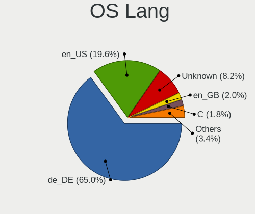
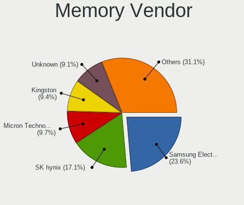

Linux in Germany - Tested Hardware & Statistics
-----------------------------------------------

A project to collect tested hardware configurations for Linux in Germany.

Anyone can contribute to this report by the [hw-probe](https://github.com/linuxhw/hw-probe) tool:

    sudo -E hw-probe -all -upload

Please contribute! Especially if your hardware is rare.

This is a report for all computer types. See also reports for [desktops](/Location/Germany/Desktop/README.md) and [notebooks](/Location/Germany/Notebook/README.md).

Contents
--------

* [ Test Cases ](#test-cases)

* [ System ](#system)
  - [ OS                       ](#os)
  - [ OS Family                ](#os-family)
  - [ Kernel                   ](#kernel)
  - [ Kernel Family            ](#kernel-family)
  - [ Kernel Major Ver.        ](#kernel-major-ver)
  - [ Arch                     ](#arch)
  - [ DE                       ](#de)
  - [ Display Server           ](#display-server)
  - [ Display Manager          ](#display-manager)
  - [ OS Lang                  ](#os-lang)
  - [ Boot Mode                ](#boot-mode)
  - [ Filesystem               ](#filesystem)
  - [ Part. scheme             ](#part-scheme)
  - [ Dual Boot with Linux/BSD ](#dual-boot-with-linuxbsd)
  - [ Dual Boot (Win)          ](#dual-boot-win)

* [ Board ](#board)
  - [ Vendor                   ](#vendor)
  - [ Model                    ](#model)
  - [ Model Family             ](#model-family)
  - [ MFG Year                 ](#mfg-year)
  - [ Form Factor              ](#form-factor)
  - [ Secure Boot              ](#secure-boot)
  - [ Coreboot                 ](#coreboot)
  - [ RAM Size                 ](#ram-size)
  - [ RAM Used                 ](#ram-used)
  - [ Total Drives             ](#total-drives)
  - [ Has CD-ROM               ](#has-cd-rom)
  - [ Has Ethernet             ](#has-ethernet)
  - [ Has WiFi                 ](#has-wifi)
  - [ Has Bluetooth            ](#has-bluetooth)

* [ Location ](#location)
  - [ Country                  ](#country)
  - [ City                     ](#city)

* [ Drives ](#drives)
  - [ Drive Vendor             ](#drive-vendor)
  - [ Drive Model              ](#drive-model)
  - [ HDD Vendor               ](#hdd-vendor)
  - [ SSD Vendor               ](#ssd-vendor)
  - [ Drive Kind               ](#drive-kind)
  - [ Drive Connector          ](#drive-connector)
  - [ Drive Size               ](#drive-size)
  - [ Space Total              ](#space-total)
  - [ Space Used               ](#space-used)
  - [ Malfunc. Drives          ](#malfunc-drives)
  - [ Malfunc. Drive Vendor    ](#malfunc-drive-vendor)
  - [ Malfunc. HDD Vendor      ](#malfunc-hdd-vendor)
  - [ Malfunc. Drive Kind      ](#malfunc-drive-kind)
  - [ Failed Drives            ](#failed-drives)
  - [ Failed Drive Vendor      ](#failed-drive-vendor)
  - [ Drive Status             ](#drive-status)

* [ Storage controller ](#storage-controller)
  - [ Storage Vendor           ](#storage-vendor)
  - [ Storage Model            ](#storage-model)
  - [ Storage Kind             ](#storage-kind)

* [ Processor ](#processor)
  - [ CPU Vendor               ](#cpu-vendor)
  - [ CPU Model                ](#cpu-model)
  - [ CPU Model Family         ](#cpu-model-family)
  - [ CPU Cores                ](#cpu-cores)
  - [ CPU Sockets              ](#cpu-sockets)
  - [ CPU Threads              ](#cpu-threads)
  - [ CPU Op-Modes             ](#cpu-op-modes)
  - [ CPU Microcode            ](#cpu-microcode)
  - [ CPU Microarch            ](#cpu-microarch)

* [ Graphics ](#graphics)
  - [ GPU Vendor               ](#gpu-vendor)
  - [ GPU Model                ](#gpu-model)
  - [ GPU Combo                ](#gpu-combo)
  - [ GPU Driver               ](#gpu-driver)
  - [ GPU Memory               ](#gpu-memory)

* [ Monitor ](#monitor)
  - [ Monitor Vendor           ](#monitor-vendor)
  - [ Monitor Model            ](#monitor-model)
  - [ Monitor Resolution       ](#monitor-resolution)
  - [ Monitor Diagonal         ](#monitor-diagonal)
  - [ Monitor Width            ](#monitor-width)
  - [ Aspect Ratio             ](#aspect-ratio)
  - [ Monitor Area             ](#monitor-area)
  - [ Pixel Density            ](#pixel-density)
  - [ Multiple Monitors        ](#multiple-monitors)

* [ Network ](#network)
  - [ Net Controller Vendor    ](#net-controller-vendor)
  - [ Net Controller Model     ](#net-controller-model)
  - [ Wireless Vendor          ](#wireless-vendor)
  - [ Wireless Model           ](#wireless-model)
  - [ Ethernet Vendor          ](#ethernet-vendor)
  - [ Ethernet Model           ](#ethernet-model)
  - [ Net Controller Kind      ](#net-controller-kind)
  - [ Used Controller          ](#used-controller)
  - [ NICs                     ](#nics)
  - [ IPv6                     ](#ipv6)

* [ Bluetooth ](#bluetooth)
  - [ Bluetooth Vendor         ](#bluetooth-vendor)
  - [ Bluetooth Model          ](#bluetooth-model)

* [ Sound ](#sound)
  - [ Sound Vendor             ](#sound-vendor)
  - [ Sound Model              ](#sound-model)

* [ Memory ](#memory)
  - [ Memory Vendor            ](#memory-vendor)
  - [ Memory Model             ](#memory-model)
  - [ Memory Kind              ](#memory-kind)
  - [ Memory Form Factor       ](#memory-form-factor)
  - [ Memory Size              ](#memory-size)
  - [ Memory Speed             ](#memory-speed)

* [ Printers & scanners ](#printers--scanners)
  - [ Printer Vendor           ](#printer-vendor)
  - [ Printer Model            ](#printer-model)
  - [ Scanner Vendor           ](#scanner-vendor)
  - [ Scanner Model            ](#scanner-model)

* [ Camera ](#camera)
  - [ Camera Vendor            ](#camera-vendor)
  - [ Camera Model             ](#camera-model)

* [ Security ](#security)
  - [ Fingerprint Vendor       ](#fingerprint-vendor)
  - [ Fingerprint Model        ](#fingerprint-model)
  - [ Chipcard Vendor          ](#chipcard-vendor)
  - [ Chipcard Model           ](#chipcard-model)

* [ Unsupported ](#unsupported)
  - [ Unsupported Devices      ](#unsupported-devices)
  - [ Unsupported Device Types ](#unsupported-device-types)

Test Cases
----------

Total: 32592

| Vendor        | Model                       | Form-Factor | Probe                                                      | Date         |
|---------------|-----------------------------|-------------|------------------------------------------------------------|--------------|
| Lenovo        | 312D SDK0J40697 WIN 3305... | Mini pc     | [ef03031eaa](https://linux-hardware.org/?probe=ef03031eaa) | Nov 06, 2023 |
| Gigabyte      | B550 AORUS ELITE V2         | Desktop     | [77a31d50ce](https://linux-hardware.org/?probe=77a31d50ce) | Nov 06, 2023 |
| ASUSTek       | M4A785TD-V EVO              | Desktop     | [d57d789e77](https://linux-hardware.org/?probe=d57d789e77) | Nov 06, 2023 |
| Dell          | Latitude E6420              | Notebook    | [9fd076e986](https://linux-hardware.org/?probe=9fd076e986) | Nov 06, 2023 |
| HP            | EliteBook 840 G5            | Notebook    | [279ac4ed92](https://linux-hardware.org/?probe=279ac4ed92) | Nov 06, 2023 |
| Gigabyte      | B550M S2H                   | Desktop     | [b58de33b7d](https://linux-hardware.org/?probe=b58de33b7d) | Nov 06, 2023 |
| MSI           | Bravo 17 C7VF               | Notebook    | [5982277b4b](https://linux-hardware.org/?probe=5982277b4b) | Nov 06, 2023 |
| ASUSTek       | ROG Maximus XII FORMULA     | Desktop     | [6c8bb1840e](https://linux-hardware.org/?probe=6c8bb1840e) | Nov 05, 2023 |
| Biostar       | A10N-8800E                  | Desktop     | [35b7407efb](https://linux-hardware.org/?probe=35b7407efb) | Nov 05, 2023 |
| Lenovo        | MIIX 320-10ICR 80XF         | Tablet      | [415cb187a2](https://linux-hardware.org/?probe=415cb187a2) | Nov 05, 2023 |
| ASUSTek       | VivoBook_ASUSLaptop X712... | Notebook    | [254a87d641](https://linux-hardware.org/?probe=254a87d641) | Nov 05, 2023 |
| TUXEDO        | Pulse 15 Gen1               | Notebook    | [4a5e89566c](https://linux-hardware.org/?probe=4a5e89566c) | Nov 05, 2023 |
| Gigabyte      | Q87M-D2H                    | Desktop     | [62a888f71c](https://linux-hardware.org/?probe=62a888f71c) | Nov 05, 2023 |
| Inter Sale... | NID-11125DE                 | Notebook    | [aca3d534de](https://linux-hardware.org/?probe=aca3d534de) | Nov 05, 2023 |
| Acer          | Predator PT516-52s          | Notebook    | [30b7a47643](https://linux-hardware.org/?probe=30b7a47643) | Nov 05, 2023 |
| sunxi         | Banana Pi BPI-M2-Zero       | Soc         | [fc24faaa0c](https://linux-hardware.org/?probe=fc24faaa0c) | Nov 05, 2023 |
| Dell          | 0J1C3P A01                  | Desktop     | [8aefbb37f5](https://linux-hardware.org/?probe=8aefbb37f5) | Nov 05, 2023 |
| Gigabyte      | B85M-D3H                    | Desktop     | [42cbdffa93](https://linux-hardware.org/?probe=42cbdffa93) | Nov 05, 2023 |
| Medion        | TJ4125                      | Desktop     | [65a059325e](https://linux-hardware.org/?probe=65a059325e) | Nov 05, 2023 |
| ASUSTek       | PRIME J4005I-C              | Desktop     | [76b89da142](https://linux-hardware.org/?probe=76b89da142) | Nov 05, 2023 |
| Acer          | Aspire A515-51              | Notebook    | [a0450fee29](https://linux-hardware.org/?probe=a0450fee29) | Nov 05, 2023 |
| Chuwi         | LarkBox X                   | Mini pc     | [21d2f3c41d](https://linux-hardware.org/?probe=21d2f3c41d) | Nov 05, 2023 |
| Gigabyte      | B450M H                     | Desktop     | [436a3dc68e](https://linux-hardware.org/?probe=436a3dc68e) | Nov 05, 2023 |
| HP            | Pavilion 17                 | Notebook    | [50a9cf65b3](https://linux-hardware.org/?probe=50a9cf65b3) | Nov 05, 2023 |
| Lenovo        | ThinkPad T580 20LAS62M07    | Notebook    | [56d9dc4a36](https://linux-hardware.org/?probe=56d9dc4a36) | Nov 05, 2023 |
| HP            | 8959                        | All in one  | [68870f0170](https://linux-hardware.org/?probe=68870f0170) | Nov 05, 2023 |
| MSI           | NIGHTBLADE Z97              | Desktop     | [3da62b47b3](https://linux-hardware.org/?probe=3da62b47b3) | Nov 05, 2023 |
| Notebook      | N85_N87,HJ,HJ1,HK1          | Notebook    | [53f5c381aa](https://linux-hardware.org/?probe=53f5c381aa) | Nov 05, 2023 |
| HP            | ProBook 4740s               | Notebook    | [2efc1092dd](https://linux-hardware.org/?probe=2efc1092dd) | Nov 05, 2023 |
| HP            | ProBook 4740s               | Notebook    | [0351f35099](https://linux-hardware.org/?probe=0351f35099) | Nov 05, 2023 |
| Lenovo        | Legion 5 17ITH6H 82JM       | Notebook    | [7bde99341f](https://linux-hardware.org/?probe=7bde99341f) | Nov 05, 2023 |
| Gigabyte      | MZBSWAP-K4                  | Desktop     | [ef6c15830d](https://linux-hardware.org/?probe=ef6c15830d) | Nov 05, 2023 |
| Gigabyte      | 970A-DS3P FX                | Desktop     | [615e914ddd](https://linux-hardware.org/?probe=615e914ddd) | Nov 05, 2023 |
| Acer          | Aspire ES1-311              | Notebook    | [d06185f74c](https://linux-hardware.org/?probe=d06185f74c) | Nov 05, 2023 |
| Gigabyte      | 970A-DS3P FX                | Desktop     | [7ba5de3dfd](https://linux-hardware.org/?probe=7ba5de3dfd) | Nov 05, 2023 |
| Dell          | Inspiron 7559               | Notebook    | [da97d12548](https://linux-hardware.org/?probe=da97d12548) | Nov 05, 2023 |
| AMI           | Unknown                     | Notebook    | [2512404fd7](https://linux-hardware.org/?probe=2512404fd7) | Nov 05, 2023 |
| Medion        | E6417 MD99252               | Notebook    | [8660ae1c16](https://linux-hardware.org/?probe=8660ae1c16) | Nov 05, 2023 |
| ASUSTek       | ROG STRIX B650E-E GAMING... | Desktop     | [60f590c96c](https://linux-hardware.org/?probe=60f590c96c) | Nov 05, 2023 |
| HP            | Mini 210-3000               | Notebook    | [8b55a876a9](https://linux-hardware.org/?probe=8b55a876a9) | Nov 05, 2023 |
| Framework     | Laptop 13 (AMD Ryzen 704... | Notebook    | [3f295082ce](https://linux-hardware.org/?probe=3f295082ce) | Nov 05, 2023 |
| GEEKOM        | A5                          | Desktop     | [d3dd0e1aca](https://linux-hardware.org/?probe=d3dd0e1aca) | Nov 05, 2023 |
| Fujitsu       | LIFEBOOK E736               | Notebook    | [a2b93486a9](https://linux-hardware.org/?probe=a2b93486a9) | Nov 05, 2023 |
| Notebook      | NL5xRU                      | Notebook    | [6dd04cca75](https://linux-hardware.org/?probe=6dd04cca75) | Nov 05, 2023 |
| ASRock        | 970 Pro3 R2.0               | Desktop     | [f070e73453](https://linux-hardware.org/?probe=f070e73453) | Nov 05, 2023 |
| Acer          | Aspire A515-57              | Notebook    | [532db79d07](https://linux-hardware.org/?probe=532db79d07) | Nov 05, 2023 |
| MSI           | MAG B550 TOMAHAWK           | Desktop     | [482f1a0fe7](https://linux-hardware.org/?probe=482f1a0fe7) | Nov 05, 2023 |
| Google        | Akemi                       | Notebook    | [350f53d84a](https://linux-hardware.org/?probe=350f53d84a) | Nov 05, 2023 |
| Tactus        | GeoFlex 140                 | Convertible | [1e6407d9d5](https://linux-hardware.org/?probe=1e6407d9d5) | Nov 04, 2023 |
| Apple         | Mac-AA95B1DDAB278B95 iMa... | All in one  | [b77c593ace](https://linux-hardware.org/?probe=b77c593ace) | Nov 04, 2023 |
| Apple         | Mac-AA95B1DDAB278B95 iMa... | All in one  | [1c80cbda1c](https://linux-hardware.org/?probe=1c80cbda1c) | Nov 04, 2023 |
| Acer          | Aspire A517-51G             | Notebook    | [11f85eb258](https://linux-hardware.org/?probe=11f85eb258) | Nov 04, 2023 |
| Acer          | Aspire 7750G                | Notebook    | [ddf88ff37c](https://linux-hardware.org/?probe=ddf88ff37c) | Nov 04, 2023 |
| Medion        | H110H4-EM                   | Desktop     | [9fe03aa296](https://linux-hardware.org/?probe=9fe03aa296) | Nov 04, 2023 |
| Unknown       | Unknown                     | Desktop     | [f1e059fa93](https://linux-hardware.org/?probe=f1e059fa93) | Nov 04, 2023 |
| Medion        | E6214                       | Notebook    | [776be82bf6](https://linux-hardware.org/?probe=776be82bf6) | Nov 04, 2023 |
| Lenovo        | ThinkPad X1 Carbon Gen 9... | Notebook    | [e95c10c89d](https://linux-hardware.org/?probe=e95c10c89d) | Nov 04, 2023 |
| HP            | 8767 A                      | Desktop     | [307b4eb17b](https://linux-hardware.org/?probe=307b4eb17b) | Nov 04, 2023 |
| ASUSTek       | TUF Gaming B550-PLUS        | Desktop     | [e6f4957064](https://linux-hardware.org/?probe=e6f4957064) | Nov 04, 2023 |
| MSI           | B560M PRO                   | Desktop     | [903907b7c0](https://linux-hardware.org/?probe=903907b7c0) | Nov 04, 2023 |
| ASRock        | H470M-STX                   | Desktop     | [5a50d371b8](https://linux-hardware.org/?probe=5a50d371b8) | Nov 04, 2023 |
| Apple         | MacBookAir6,2               | Notebook    | [f8507f333d](https://linux-hardware.org/?probe=f8507f333d) | Nov 04, 2023 |
| Lenovo        | ThinkPad T550 20CJS07P01    | Notebook    | [52157a4ee8](https://linux-hardware.org/?probe=52157a4ee8) | Nov 04, 2023 |
| Lenovo        | ThinkPad T460s 20FAS1NF0... | Notebook    | [8528f9946b](https://linux-hardware.org/?probe=8528f9946b) | Nov 04, 2023 |
| HP            | EliteBook 850 G5            | Notebook    | [a7f0f43604](https://linux-hardware.org/?probe=a7f0f43604) | Nov 04, 2023 |
| Sony          | VPCEH3J1E                   | Notebook    | [e0ae745034](https://linux-hardware.org/?probe=e0ae745034) | Nov 04, 2023 |
| Toshiba       | Satellite L70-A             | Notebook    | [bf7be11ced](https://linux-hardware.org/?probe=bf7be11ced) | Nov 04, 2023 |
| Lenovo        | IdeaPad 3 17ABA7 82RQ       | Notebook    | [12b6cd2d09](https://linux-hardware.org/?probe=12b6cd2d09) | Nov 04, 2023 |
| TrekStor      | Surfbook W2                 | Notebook    | [cfee0c0363](https://linux-hardware.org/?probe=cfee0c0363) | Nov 04, 2023 |
| MSI           | X570-A PRO                  | Desktop     | [30416c0355](https://linux-hardware.org/?probe=30416c0355) | Nov 04, 2023 |
| Gigabyte      | 945GM-S2                    | Desktop     | [f71f764594](https://linux-hardware.org/?probe=f71f764594) | Nov 04, 2023 |
| Medion        | E6214                       | Notebook    | [65976063e7](https://linux-hardware.org/?probe=65976063e7) | Nov 04, 2023 |
| Dell          | Latitude E6420              | Notebook    | [6bd73f2b0e](https://linux-hardware.org/?probe=6bd73f2b0e) | Nov 04, 2023 |
| ASUSTek       | M5A97 R2.0                  | Desktop     | [905d699d4d](https://linux-hardware.org/?probe=905d699d4d) | Nov 04, 2023 |
| Lenovo        | ThinkPad P43s 20RH0021MX    | Notebook    | [082adbf921](https://linux-hardware.org/?probe=082adbf921) | Nov 04, 2023 |
| HP            | 8767 A                      | Desktop     | [a9d65549d2](https://linux-hardware.org/?probe=a9d65549d2) | Nov 04, 2023 |
| Supermicro    | X11SCA-F                    | Server      | [e63931ed4f](https://linux-hardware.org/?probe=e63931ed4f) | Nov 04, 2023 |
| ASRock        | B450 Steel Legend           | Desktop     | [26aff1917e](https://linux-hardware.org/?probe=26aff1917e) | Nov 04, 2023 |
| ASRock        | B450 Steel Legend           | Desktop     | [2ab63a2fb6](https://linux-hardware.org/?probe=2ab63a2fb6) | Nov 04, 2023 |
| HP            | Elite x2 1012 G2 Tablet     | Tablet      | [8e563a8223](https://linux-hardware.org/?probe=8e563a8223) | Nov 03, 2023 |
| Intel         | NUC7i5BNB J31144-314        | Mini pc     | [5949f1fc04](https://linux-hardware.org/?probe=5949f1fc04) | Nov 03, 2023 |
| Acer          | Aspire E5-551G              | Notebook    | [f8e737dbde](https://linux-hardware.org/?probe=f8e737dbde) | Nov 03, 2023 |
| HP            | 255 G6 Notebook PC          | Notebook    | [b73e7cf536](https://linux-hardware.org/?probe=b73e7cf536) | Nov 03, 2023 |
| ASUSTek       | PRIME H510M-K               | Desktop     | [9501d6d6cf](https://linux-hardware.org/?probe=9501d6d6cf) | Nov 03, 2023 |
| VALE          | Notebook Classic C140       | Notebook    | [fd52185cf0](https://linux-hardware.org/?probe=fd52185cf0) | Nov 03, 2023 |
| HP            | 859C                        | Desktop     | [7928158950](https://linux-hardware.org/?probe=7928158950) | Nov 03, 2023 |
| HP            | Spectre Folio Convertibl... | Convertible | [aa5a6d3348](https://linux-hardware.org/?probe=aa5a6d3348) | Nov 03, 2023 |
| Inventec      | D CLASS A02                 | Desktop     | [4342649c26](https://linux-hardware.org/?probe=4342649c26) | Nov 03, 2023 |
| Biostar       | A10N-8800E                  | Desktop     | [76374cbbfe](https://linux-hardware.org/?probe=76374cbbfe) | Nov 03, 2023 |
| Dell          | Latitude E5570              | Notebook    | [a4617a2ea3](https://linux-hardware.org/?probe=a4617a2ea3) | Nov 03, 2023 |
| Dell          | Latitude E5570              | Notebook    | [82d66aaaf1](https://linux-hardware.org/?probe=82d66aaaf1) | Nov 03, 2023 |
| HP            | EliteBook 845 14 inch G9... | Notebook    | [5ff77430fa](https://linux-hardware.org/?probe=5ff77430fa) | Nov 03, 2023 |
| Lenovo        | IdeaPad Pro 5 14APH8 83A... | Notebook    | [0845a0ec43](https://linux-hardware.org/?probe=0845a0ec43) | Nov 03, 2023 |
| ASUSTek       | PRIME B450-PLUS             | Desktop     | [d6f5634b02](https://linux-hardware.org/?probe=d6f5634b02) | Nov 03, 2023 |
| Gigabyte      | GA-790XTA-UD4               | Desktop     | [71fd69724b](https://linux-hardware.org/?probe=71fd69724b) | Nov 03, 2023 |
| Acer          | Aspire V5-571P              | Notebook    | [36d10f86c0](https://linux-hardware.org/?probe=36d10f86c0) | Nov 03, 2023 |
| Schenker      | XMG CORE (REN/E21)          | Notebook    | [9edac2c8ee](https://linux-hardware.org/?probe=9edac2c8ee) | Nov 03, 2023 |
| ASUSTek       | VivoBook_ASUSLaptop N740... | Notebook    | [7fd71a723a](https://linux-hardware.org/?probe=7fd71a723a) | Nov 03, 2023 |
| Medion        | MS-7848                     | Desktop     | [ced5528ea5](https://linux-hardware.org/?probe=ced5528ea5) | Nov 03, 2023 |
| MSI           | MEG B550 UNIFY-X            | Desktop     | [88f58a978f](https://linux-hardware.org/?probe=88f58a978f) | Nov 03, 2023 |
| Fujitsu Si... | G31T-M2 V3.02               | Desktop     | [d069c6012d](https://linux-hardware.org/?probe=d069c6012d) | Nov 03, 2023 |
| Lenovo        | ThinkPad T480s 20L8S35G0... | Notebook    | [14074a05b9](https://linux-hardware.org/?probe=14074a05b9) | Nov 02, 2023 |
| Toshiba       | Satellite Pro L770-12Q      | Notebook    | [bd3567b828](https://linux-hardware.org/?probe=bd3567b828) | Nov 02, 2023 |
| Lenovo        | Unknown                     | Notebook    | [3b5aa652dc](https://linux-hardware.org/?probe=3b5aa652dc) | Nov 02, 2023 |
| Lenovo        | Unknown                     | Notebook    | [da6aff8db2](https://linux-hardware.org/?probe=da6aff8db2) | Nov 02, 2023 |
| Gigabyte      | Z370 HD3P-CF                | Desktop     | [1a0272a4ca](https://linux-hardware.org/?probe=1a0272a4ca) | Nov 02, 2023 |
| HP            | ProBook 6450b               | Notebook    | [a63f28d2be](https://linux-hardware.org/?probe=a63f28d2be) | Nov 02, 2023 |
| Gigabyte      | Z370 HD3P-CF                | Desktop     | [8ce1afee32](https://linux-hardware.org/?probe=8ce1afee32) | Nov 02, 2023 |
| MSI           | X370 SLI PLUS               | Desktop     | [98208c406a](https://linux-hardware.org/?probe=98208c406a) | Nov 02, 2023 |
| Google        | Akemi                       | Notebook    | [20ec65943c](https://linux-hardware.org/?probe=20ec65943c) | Nov 02, 2023 |
| HP            | ProBook 450 G5              | Notebook    | [b012e30cb6](https://linux-hardware.org/?probe=b012e30cb6) | Nov 02, 2023 |
| Wortmann      | 1220777_1400328             | Notebook    | [778b1abc73](https://linux-hardware.org/?probe=778b1abc73) | Nov 02, 2023 |
| Inventec      | VXC Class A02               | Desktop     | [15fcabdf83](https://linux-hardware.org/?probe=15fcabdf83) | Nov 02, 2023 |
| HP            | 250 G6 Notebook PC          | Notebook    | [7184f1aadf](https://linux-hardware.org/?probe=7184f1aadf) | Nov 02, 2023 |
| MSI           | H110M PRO-D                 | Desktop     | [da5c3ffb7e](https://linux-hardware.org/?probe=da5c3ffb7e) | Nov 02, 2023 |
| HP            | ENVY x360 Convertible 13... | Convertible | [cf88c7f3db](https://linux-hardware.org/?probe=cf88c7f3db) | Nov 02, 2023 |
| Lenovo        | ThinkPad T430 23493V2       | Notebook    | [6fc33e3528](https://linux-hardware.org/?probe=6fc33e3528) | Nov 02, 2023 |
| Lenovo        | IdeaPadFlex 5 16ABR8 82X... | Convertible | [6c6e5b80b5](https://linux-hardware.org/?probe=6c6e5b80b5) | Nov 02, 2023 |
| Dell          | 0FXD80 A00                  | Desktop     | [d9b51a3a36](https://linux-hardware.org/?probe=d9b51a3a36) | Nov 02, 2023 |
| MSI           | B560M PRO                   | Desktop     | [adf6c161fa](https://linux-hardware.org/?probe=adf6c161fa) | Nov 02, 2023 |
| ASUSTek       | PRIME B450-PLUS             | Desktop     | [6531cff0ef](https://linux-hardware.org/?probe=6531cff0ef) | Nov 02, 2023 |
| HP            | Laptop 17-cp0xxx            | Notebook    | [c7760958c8](https://linux-hardware.org/?probe=c7760958c8) | Nov 02, 2023 |
| HP            | Laptop 15-gw0xxx            | Notebook    | [35f5c2edc0](https://linux-hardware.org/?probe=35f5c2edc0) | Nov 02, 2023 |
| Dell          | XPS 15 9570                 | Notebook    | [2efa290a39](https://linux-hardware.org/?probe=2efa290a39) | Nov 02, 2023 |
| Gigabyte      | AORUS 17G KD                | Notebook    | [ac471f8580](https://linux-hardware.org/?probe=ac471f8580) | Nov 02, 2023 |
| HP            | 2AF7                        | Desktop     | [65ac8348d7](https://linux-hardware.org/?probe=65ac8348d7) | Nov 02, 2023 |
| ASUSTek       | P8B75-M LX                  | Desktop     | [77d328e8b9](https://linux-hardware.org/?probe=77d328e8b9) | Nov 02, 2023 |
| MSI           | B450M-A PRO MAX             | Desktop     | [97ef2a8173](https://linux-hardware.org/?probe=97ef2a8173) | Nov 02, 2023 |
| Gigabyte      | AX370-Gaming K7             | Desktop     | [0f4435d620](https://linux-hardware.org/?probe=0f4435d620) | Nov 02, 2023 |
| HP            | ProBook 650 G1              | Notebook    | [60c6e3a5d2](https://linux-hardware.org/?probe=60c6e3a5d2) | Nov 01, 2023 |
| MSI           | GT73VR 6RF                  | Notebook    | [3930a59e72](https://linux-hardware.org/?probe=3930a59e72) | Nov 01, 2023 |
| Lenovo        | ThinkPad T480 20L6S68T00    | Notebook    | [dba91e5612](https://linux-hardware.org/?probe=dba91e5612) | Nov 01, 2023 |
| HP            | Pavilion Gaming Laptop 1... | Notebook    | [f72ba9e16b](https://linux-hardware.org/?probe=f72ba9e16b) | Nov 01, 2023 |
| Lenovo        | B71-80 80RJ                 | Notebook    | [93507b3ead](https://linux-hardware.org/?probe=93507b3ead) | Nov 01, 2023 |
| HP            | Laptop 17-ca0xxx            | Notebook    | [888ed977bc](https://linux-hardware.org/?probe=888ed977bc) | Nov 01, 2023 |
| Lenovo        | ThinkPad X260 20F5A28AUK    | Notebook    | [c1e44a55c8](https://linux-hardware.org/?probe=c1e44a55c8) | Nov 01, 2023 |
| Lenovo        | ThinkPad X260 20F5A28AUK    | Notebook    | [84ca0a285d](https://linux-hardware.org/?probe=84ca0a285d) | Nov 01, 2023 |
| MSI           | MPG B550 GAMING PLUS        | Desktop     | [72a2946c83](https://linux-hardware.org/?probe=72a2946c83) | Nov 01, 2023 |
| Fujitsu       | LIFEBOOK T936               | Convertible | [2aa8c832a5](https://linux-hardware.org/?probe=2aa8c832a5) | Nov 01, 2023 |
| ASUSTek       | M5A87                       | Desktop     | [b254c30981](https://linux-hardware.org/?probe=b254c30981) | Nov 01, 2023 |
| VALE          | Notebook Classic C140       | Notebook    | [5be309c18b](https://linux-hardware.org/?probe=5be309c18b) | Nov 01, 2023 |
| Apple         | MacBookPro3,1               | Notebook    | [73a395f017](https://linux-hardware.org/?probe=73a395f017) | Nov 01, 2023 |
| Notebook      | P65_P67SA                   | Notebook    | [a8bf179e25](https://linux-hardware.org/?probe=a8bf179e25) | Nov 01, 2023 |
| MSI           | B450-A PRO MAX              | Desktop     | [5116fa401d](https://linux-hardware.org/?probe=5116fa401d) | Nov 01, 2023 |
| Lenovo        | 3704 SDK0J40700 WIN 3258... | Desktop     | [3987d09af3](https://linux-hardware.org/?probe=3987d09af3) | Nov 01, 2023 |
| Apple         | Mac-F2268DAE                | All in one  | [dcf2614ccc](https://linux-hardware.org/?probe=dcf2614ccc) | Nov 01, 2023 |
| MSI           | B450-A PRO                  | Desktop     | [f0b1ef4bc8](https://linux-hardware.org/?probe=f0b1ef4bc8) | Nov 01, 2023 |
| Lenovo        | ThinkPad T14s Gen 4 21F8... | Notebook    | [865e6764f2](https://linux-hardware.org/?probe=865e6764f2) | Nov 01, 2023 |
| HP            | Spectre Folio Convertibl... | Convertible | [a795221369](https://linux-hardware.org/?probe=a795221369) | Nov 01, 2023 |
| Lenovo        | ThinkPad T14s Gen 4 21F8... | Notebook    | [bf87ba6b55](https://linux-hardware.org/?probe=bf87ba6b55) | Nov 01, 2023 |
| Lenovo        | ThinkPad T420 42369U7       | Notebook    | [8de4ad6ae1](https://linux-hardware.org/?probe=8de4ad6ae1) | Nov 01, 2023 |
| Lenovo        | ThinkPad T430 23493V2       | Notebook    | [0d5b87b380](https://linux-hardware.org/?probe=0d5b87b380) | Nov 01, 2023 |
| Apple         | Mac-F2268DAE                | All in one  | [0d0622f1e9](https://linux-hardware.org/?probe=0d0622f1e9) | Nov 01, 2023 |
| ASRock        | B450M Pro4                  | Desktop     | [0dc16901b7](https://linux-hardware.org/?probe=0dc16901b7) | Nov 01, 2023 |
| MSI           | B550 GAMING GEN3            | Desktop     | [bd3efc9d84](https://linux-hardware.org/?probe=bd3efc9d84) | Nov 01, 2023 |
| ASUSTek       | B85M-E                      | Desktop     | [6709fd475b](https://linux-hardware.org/?probe=6709fd475b) | Nov 01, 2023 |
| Medion        | E6417 MD99252               | Notebook    | [56fcf238a1](https://linux-hardware.org/?probe=56fcf238a1) | Nov 01, 2023 |
| Raspberry ... | Raspberry Pi 3 Model B P... | Soc         | [389e2ebf4e](https://linux-hardware.org/?probe=389e2ebf4e) | Nov 01, 2023 |
| ASUSTek       | ROG STRIX B550-F GAMING ... | Desktop     | [56fe3d964b](https://linux-hardware.org/?probe=56fe3d964b) | Nov 01, 2023 |
| IBM           | 00KF656                     | Server      | [babec64e24](https://linux-hardware.org/?probe=babec64e24) | Nov 01, 2023 |
| TUXEDO        | Aura 15 Gen2                | Notebook    | [ca743b4e40](https://linux-hardware.org/?probe=ca743b4e40) | Nov 01, 2023 |
| Fujitsu       | D4017-A1 S26361-D4017-A1... | Desktop     | [939aebfa68](https://linux-hardware.org/?probe=939aebfa68) | Nov 01, 2023 |
| Google        | Akemi                       | Notebook    | [a5cea3a369](https://linux-hardware.org/?probe=a5cea3a369) | Oct 31, 2023 |
| Lenovo        | Unknown                     | Notebook    | [70268d88a4](https://linux-hardware.org/?probe=70268d88a4) | Oct 31, 2023 |
| ASUSTek       | M5A97 R2.0                  | Desktop     | [8c9a8c3bcc](https://linux-hardware.org/?probe=8c9a8c3bcc) | Oct 31, 2023 |
| Medion        | E3223                       | Convertible | [e35701b198](https://linux-hardware.org/?probe=e35701b198) | Oct 31, 2023 |
| Lenovo        | 312D SDK0J40697 WIN 3305... | Mini pc     | [abebb8beea](https://linux-hardware.org/?probe=abebb8beea) | Oct 31, 2023 |
| MSI           | H81M-E34                    | Desktop     | [0babe23a9d](https://linux-hardware.org/?probe=0babe23a9d) | Oct 31, 2023 |
| ASRock        | A520M Phantom Gaming 4      | Desktop     | [a63d934992](https://linux-hardware.org/?probe=a63d934992) | Oct 31, 2023 |
| Lenovo        | ThinkPad X1 Carbon 6th 2... | Notebook    | [ded975e57f](https://linux-hardware.org/?probe=ded975e57f) | Oct 31, 2023 |
| Lenovo        | ThinkPad X1 Carbon 6th 2... | Notebook    | [c90a14fcf5](https://linux-hardware.org/?probe=c90a14fcf5) | Oct 31, 2023 |
| Fujitsu       | LIFEBOOK U7510              | Notebook    | [e25f9a6add](https://linux-hardware.org/?probe=e25f9a6add) | Oct 31, 2023 |
| Gigabyte      | Z97P-D3                     | Desktop     | [cf26456a24](https://linux-hardware.org/?probe=cf26456a24) | Oct 31, 2023 |
| Fujitsu       | LIFEBOOK E5511              | Notebook    | [c4dbce515a](https://linux-hardware.org/?probe=c4dbce515a) | Oct 31, 2023 |
| Dell          | Inspiron 5406 2n1           | Convertible | [f504fe606f](https://linux-hardware.org/?probe=f504fe606f) | Oct 31, 2023 |
| Lenovo        | V145-15AST 81MT             | Notebook    | [6bd7131347](https://linux-hardware.org/?probe=6bd7131347) | Oct 31, 2023 |
| ASUSTek       | P8H67-M LE                  | Desktop     | [d4a5c11db9](https://linux-hardware.org/?probe=d4a5c11db9) | Oct 31, 2023 |
| Lenovo        | G50-80 80E5                 | Notebook    | [ee528fce07](https://linux-hardware.org/?probe=ee528fce07) | Oct 31, 2023 |
| HP            | Pavilion x360 Convertibl... | Convertible | [afffd7aeab](https://linux-hardware.org/?probe=afffd7aeab) | Oct 31, 2023 |
| Lenovo        | ThinkPad P50 20EQS4QL11     | Notebook    | [9fd9ad0312](https://linux-hardware.org/?probe=9fd9ad0312) | Oct 31, 2023 |
| Lenovo        | G50-80 80E5                 | Notebook    | [4e0042e20c](https://linux-hardware.org/?probe=4e0042e20c) | Oct 31, 2023 |
| MSI           | X370 GAMING PRO             | Desktop     | [c8ba0de51d](https://linux-hardware.org/?probe=c8ba0de51d) | Oct 31, 2023 |
| Fujitsu Si... | D2750-A2 S26361-D2750-A2    | Desktop     | [5432c8a9f1](https://linux-hardware.org/?probe=5432c8a9f1) | Oct 30, 2023 |
| MSI           | Thin GF63 12VE              | Notebook    | [1776ca1088](https://linux-hardware.org/?probe=1776ca1088) | Oct 30, 2023 |
| Lenovo        | ThinkPad T560 20FJS44L0B    | Notebook    | [12c0c78dc8](https://linux-hardware.org/?probe=12c0c78dc8) | Oct 30, 2023 |
| Medion        | E16402                      | Notebook    | [4a79a1b81a](https://linux-hardware.org/?probe=4a79a1b81a) | Oct 30, 2023 |
| ASUSTek       | STRIX H270F GAMING          | Desktop     | [b4f34c54ae](https://linux-hardware.org/?probe=b4f34c54ae) | Oct 30, 2023 |
| ASUSTek       | STRIX H270F GAMING          | Desktop     | [1c1290e065](https://linux-hardware.org/?probe=1c1290e065) | Oct 30, 2023 |
| Wortmann      | 1220766_1470449             | Notebook    | [a8eecd22f4](https://linux-hardware.org/?probe=a8eecd22f4) | Oct 30, 2023 |
| HP            | Laptop 15s-eq1xxx           | Notebook    | [755128955b](https://linux-hardware.org/?probe=755128955b) | Oct 30, 2023 |
| Inter Sale... | NID-11125DE                 | Notebook    | [2ba3404987](https://linux-hardware.org/?probe=2ba3404987) | Oct 30, 2023 |
| ASUSTek       | VivoBook 15_ASUS Laptop ... | Notebook    | [ed3aee0fd5](https://linux-hardware.org/?probe=ed3aee0fd5) | Oct 30, 2023 |
| HP            | EliteBook 840 G6            | Notebook    | [52786d6efa](https://linux-hardware.org/?probe=52786d6efa) | Oct 30, 2023 |
| HP            | ProLiant DL380 Gen9         | Server      | [bd41e0499e](https://linux-hardware.org/?probe=bd41e0499e) | Oct 30, 2023 |
| ASRock        | H61M-DGS R2.0               | Desktop     | [d8bd0d7795](https://linux-hardware.org/?probe=d8bd0d7795) | Oct 30, 2023 |
| MSI           | B450 GAMING PLUS            | Desktop     | [d7fb2de5a7](https://linux-hardware.org/?probe=d7fb2de5a7) | Oct 30, 2023 |
| Valve         | Jupiter                     | Notebook    | [ede97625bd](https://linux-hardware.org/?probe=ede97625bd) | Oct 30, 2023 |
| MSI           | MPG B550 GAMING PLUS        | Desktop     | [09d5186c37](https://linux-hardware.org/?probe=09d5186c37) | Oct 30, 2023 |
| HP            | ProBook 6570b               | Notebook    | [5b574791fa](https://linux-hardware.org/?probe=5b574791fa) | Oct 30, 2023 |
| Gigabyte      | MZBSWAP-K4                  | Desktop     | [aed94a16c1](https://linux-hardware.org/?probe=aed94a16c1) | Oct 30, 2023 |
| HP            | 1790                        | Desktop     | [8bde9984db](https://linux-hardware.org/?probe=8bde9984db) | Oct 29, 2023 |
| Apple         | Mac-942B59F58194171B iMa... | All in one  | [a115d38855](https://linux-hardware.org/?probe=a115d38855) | Oct 29, 2023 |
| Samsung       | RC410/RC510/RC710           | Notebook    | [3cc0feaa4e](https://linux-hardware.org/?probe=3cc0feaa4e) | Oct 29, 2023 |
| Trigkey       | Green G4 10                 | Desktop     | [bb72f6af02](https://linux-hardware.org/?probe=bb72f6af02) | Oct 29, 2023 |
| HP            | 2AF7                        | Desktop     | [1960b3a243](https://linux-hardware.org/?probe=1960b3a243) | Oct 29, 2023 |
| ASUSTek       | Z87-DELUXE                  | Desktop     | [00b15965c5](https://linux-hardware.org/?probe=00b15965c5) | Oct 29, 2023 |
| Dell          | Precision 7760              | Notebook    | [eaba0c73b0](https://linux-hardware.org/?probe=eaba0c73b0) | Oct 29, 2023 |
| Lenovo        | ThinkPad 25 20K70000GE      | Notebook    | [ce13c83c47](https://linux-hardware.org/?probe=ce13c83c47) | Oct 29, 2023 |
| Lenovo        | ThinkPad 25 20K70000GE      | Notebook    | [597958381f](https://linux-hardware.org/?probe=597958381f) | Oct 29, 2023 |
| Apple         | MacBookPro5,5               | Notebook    | [2815a5477f](https://linux-hardware.org/?probe=2815a5477f) | Oct 29, 2023 |
| Lenovo        | ThinkPad T460 20FMS5E018    | Notebook    | [98c446abbd](https://linux-hardware.org/?probe=98c446abbd) | Oct 29, 2023 |
| Medion        | H110H4-EM                   | Desktop     | [1a2d0e5ed4](https://linux-hardware.org/?probe=1a2d0e5ed4) | Oct 29, 2023 |
| Fujitsu       | D2912-A1 S26361-D2912-A1    | Desktop     | [e0b8432cdc](https://linux-hardware.org/?probe=e0b8432cdc) | Oct 29, 2023 |
| Lenovo        | ThinkPad E14 Gen 4 21ECS... | Notebook    | [c1d00eb91f](https://linux-hardware.org/?probe=c1d00eb91f) | Oct 29, 2023 |
| Lenovo        | ThinkPad T590 20N5S56P00    | Notebook    | [c410852108](https://linux-hardware.org/?probe=c410852108) | Oct 29, 2023 |
| ASUSTek       | PRIME B550-PLUS             | Desktop     | [28f261fb9a](https://linux-hardware.org/?probe=28f261fb9a) | Oct 29, 2023 |
| ASUSTek       | X75VC                       | Notebook    | [9b8051fb79](https://linux-hardware.org/?probe=9b8051fb79) | Oct 29, 2023 |
| MSI           | B450 TOMAHAWK MAX II        | Desktop     | [67a61bc860](https://linux-hardware.org/?probe=67a61bc860) | Oct 29, 2023 |
| Gigabyte      | B760 AORUS ELITE AX DDR4    | Desktop     | [53ff42384c](https://linux-hardware.org/?probe=53ff42384c) | Oct 29, 2023 |
| raspberryp... | Raspberry Pi 4 Model B R... | Soc         | [2aa83dbdfc](https://linux-hardware.org/?probe=2aa83dbdfc) | Oct 29, 2023 |
| MSI           | Z370M MORTAR                | Desktop     | [0af3708cd3](https://linux-hardware.org/?probe=0af3708cd3) | Oct 29, 2023 |
| Lenovo        | G50-70 20351                | Notebook    | [5d83a07987](https://linux-hardware.org/?probe=5d83a07987) | Oct 29, 2023 |
| ASUSTek       | Zenbook 15 UM3504DA_UM35... | Notebook    | [e34ea8701a](https://linux-hardware.org/?probe=e34ea8701a) | Oct 28, 2023 |
| Fujitsu       | D3222-A1 S26361-D3222-A1    | Desktop     | [db992da5fa](https://linux-hardware.org/?probe=db992da5fa) | Oct 28, 2023 |
| Lenovo        | ThinkPad T440s 20ARS32P0... | Notebook    | [58234989c1](https://linux-hardware.org/?probe=58234989c1) | Oct 28, 2023 |
| MSI           | MAG B650 TOMAHAWK WIFI      | Desktop     | [04e2b9cf4d](https://linux-hardware.org/?probe=04e2b9cf4d) | Oct 28, 2023 |
| Dell          | 0JP3NX A00                  | Desktop     | [434961d005](https://linux-hardware.org/?probe=434961d005) | Oct 28, 2023 |
| ASRock        | B550M-ITX/ac                | Desktop     | [1643900d75](https://linux-hardware.org/?probe=1643900d75) | Oct 28, 2023 |
| ASUSTek       | P5Q-PRO                     | Desktop     | [2722dd43f2](https://linux-hardware.org/?probe=2722dd43f2) | Oct 28, 2023 |
| Lenovo        | ThinkPad E520 1143A22       | Notebook    | [cd1af5dc70](https://linux-hardware.org/?probe=cd1af5dc70) | Oct 28, 2023 |
| Lenovo        | ThinkPad T480 20L6S68T00    | Notebook    | [57e3abc23d](https://linux-hardware.org/?probe=57e3abc23d) | Oct 28, 2023 |
| Acer          | Extensa 215-55              | Notebook    | [d1d57049ab](https://linux-hardware.org/?probe=d1d57049ab) | Oct 28, 2023 |
| ASRock        | B450 Steel Legend           | Desktop     | [21beb00969](https://linux-hardware.org/?probe=21beb00969) | Oct 28, 2023 |
| HP            | 1589                        | Desktop     | [fe31fa1d5e](https://linux-hardware.org/?probe=fe31fa1d5e) | Oct 28, 2023 |
| HP            | 1589                        | Desktop     | [5d14d38ded](https://linux-hardware.org/?probe=5d14d38ded) | Oct 28, 2023 |
| Acer          | TravelMate P214-41          | Notebook    | [53659e599e](https://linux-hardware.org/?probe=53659e599e) | Oct 28, 2023 |
| ASUSTek       | P8B75-M                     | Desktop     | [b9830b7f02](https://linux-hardware.org/?probe=b9830b7f02) | Oct 28, 2023 |
| Lenovo        | IdeaPad Yoga 13 2191        | Notebook    | [219a94f546](https://linux-hardware.org/?probe=219a94f546) | Oct 28, 2023 |
| Gigabyte      | B550 VISION D-P             | Desktop     | [d78b4f6222](https://linux-hardware.org/?probe=d78b4f6222) | Oct 28, 2023 |
| Lenovo        | ThinkCentre A70z 0401G6G    | Desktop     | [52e07e7ffe](https://linux-hardware.org/?probe=52e07e7ffe) | Oct 28, 2023 |
| Dell          | Latitude E6440              | Notebook    | [8d106c22bf](https://linux-hardware.org/?probe=8d106c22bf) | Oct 28, 2023 |
| HP            | Laptop 17-cp0xxx            | Notebook    | [9b3c09e73a](https://linux-hardware.org/?probe=9b3c09e73a) | Oct 27, 2023 |
| Biostar       | A960D+V2                    | Desktop     | [8631ec3b22](https://linux-hardware.org/?probe=8631ec3b22) | Oct 27, 2023 |
| Lenovo        | 36F7 SDK0J40700 WIN 3258... | Desktop     | [b5e0b9a020](https://linux-hardware.org/?probe=b5e0b9a020) | Oct 27, 2023 |
| Lenovo        | 36F7 SDK0J40700 WIN 3258... | Desktop     | [38ed4f25af](https://linux-hardware.org/?probe=38ed4f25af) | Oct 27, 2023 |
| HP            | EliteBook 840 G7 Noteboo... | Notebook    | [5591930fc0](https://linux-hardware.org/?probe=5591930fc0) | Oct 27, 2023 |
| Lenovo        | ThinkPad E14 Gen 4 21ECS... | Notebook    | [6fe7d8e13b](https://linux-hardware.org/?probe=6fe7d8e13b) | Oct 27, 2023 |
| Fujitsu       | D2912-A1 S26361-D2912-A1    | Desktop     | [eb1a1b2e44](https://linux-hardware.org/?probe=eb1a1b2e44) | Oct 27, 2023 |
| Medion        | TJ4125                      | Desktop     | [f791cf88cb](https://linux-hardware.org/?probe=f791cf88cb) | Oct 27, 2023 |
| HP            | Laptop 15s-fq3xxx           | Notebook    | [b718818efa](https://linux-hardware.org/?probe=b718818efa) | Oct 27, 2023 |
| HC Technol... | HCAR5000-MI                 | Desktop     | [0c3d1e964a](https://linux-hardware.org/?probe=0c3d1e964a) | Oct 27, 2023 |
| Acer          | TravelMate Spin P614RN-5    | Convertible | [e337a1e208](https://linux-hardware.org/?probe=e337a1e208) | Oct 27, 2023 |
| HP            | Laptop 15s-eq3xxx           | Notebook    | [e340ddc535](https://linux-hardware.org/?probe=e340ddc535) | Oct 27, 2023 |
| Lenovo        | SDK0J40700 WIN              | Desktop     | [09f4736f4f](https://linux-hardware.org/?probe=09f4736f4f) | Oct 27, 2023 |
| ASUSTek       | A68HM-PLUS                  | Desktop     | [9d662bd187](https://linux-hardware.org/?probe=9d662bd187) | Oct 27, 2023 |
| ASUSTek       | H81M-PLUS                   | Desktop     | [509c70e6c1](https://linux-hardware.org/?probe=509c70e6c1) | Oct 27, 2023 |
| Acer          | Predator PH317-51           | Notebook    | [941e333a3b](https://linux-hardware.org/?probe=941e333a3b) | Oct 27, 2023 |
| ASUSTek       | P6TD DELUXE                 | Desktop     | [46049da51f](https://linux-hardware.org/?probe=46049da51f) | Oct 27, 2023 |
| Lenovo        | ThinkPad T410 2537JC6       | Notebook    | [c84f5cb370](https://linux-hardware.org/?probe=c84f5cb370) | Oct 27, 2023 |
| Dell          | Precision M6800             | Notebook    | [e8fd7cce51](https://linux-hardware.org/?probe=e8fd7cce51) | Oct 27, 2023 |
| Lenovo        | IdeaPad 3 17ITL6 82H9       | Notebook    | [20d212f3d4](https://linux-hardware.org/?probe=20d212f3d4) | Oct 27, 2023 |
| ASRock        | Z790 PG SONIC               | Desktop     | [3d8af896cc](https://linux-hardware.org/?probe=3d8af896cc) | Oct 27, 2023 |
| ASUSTek       | Zenbook 15 UM3504DA_UM35... | Notebook    | [5e0942e6b0](https://linux-hardware.org/?probe=5e0942e6b0) | Oct 27, 2023 |
| Lenovo        | ThinkPad T410 2537JC6       | Notebook    | [51b394c8c9](https://linux-hardware.org/?probe=51b394c8c9) | Oct 27, 2023 |
| Fujitsu       | D3233-A1 S26361-D3233-A1    | Desktop     | [05961f3f8d](https://linux-hardware.org/?probe=05961f3f8d) | Oct 27, 2023 |
| Samsung       | 950QDB                      | Convertible | [c8257beb43](https://linux-hardware.org/?probe=c8257beb43) | Oct 27, 2023 |
| Dell          | 040DDP A01                  | Desktop     | [6d081e2627](https://linux-hardware.org/?probe=6d081e2627) | Oct 27, 2023 |
| Gigabyte      | Z790 GAMING X AX            | Desktop     | [8555f763b4](https://linux-hardware.org/?probe=8555f763b4) | Oct 27, 2023 |
| HP            | Laptop 14-ma0xxx            | Notebook    | [8482e4e6c2](https://linux-hardware.org/?probe=8482e4e6c2) | Oct 27, 2023 |
| HP            | Laptop 15-ef2xxx            | Notebook    | [01f4f7926d](https://linux-hardware.org/?probe=01f4f7926d) | Oct 27, 2023 |
| EXTRA Comp... | MS-1758                     | Notebook    | [eced546e79](https://linux-hardware.org/?probe=eced546e79) | Oct 26, 2023 |
| Acer          | Aspire 5750G                | Notebook    | [afe742ceca](https://linux-hardware.org/?probe=afe742ceca) | Oct 26, 2023 |
| MSI           | MS-1736                     | Notebook    | [929f0d008e](https://linux-hardware.org/?probe=929f0d008e) | Oct 26, 2023 |
| HP            | 2215                        | Desktop     | [01fd79c4fe](https://linux-hardware.org/?probe=01fd79c4fe) | Oct 26, 2023 |
| ASUSTek       | PRIME Z370-A                | Desktop     | [75fcf950c2](https://linux-hardware.org/?probe=75fcf950c2) | Oct 26, 2023 |
| Lenovo        | SHARKBAY SDK0E50510 WIN     | Desktop     | [bcbce33659](https://linux-hardware.org/?probe=bcbce33659) | Oct 26, 2023 |
| Medion        | Unknown                     | Notebook    | [ffcdfb3003](https://linux-hardware.org/?probe=ffcdfb3003) | Oct 26, 2023 |
| Gigabyte      | GA-990XA-UD3                | Desktop     | [0990fc4382](https://linux-hardware.org/?probe=0990fc4382) | Oct 26, 2023 |
| MSI           | B450-A PRO                  | Desktop     | [e71634ac32](https://linux-hardware.org/?probe=e71634ac32) | Oct 26, 2023 |
| Gigabyte      | GA-MA78GM-S2H               | Desktop     | [6c7a32d339](https://linux-hardware.org/?probe=6c7a32d339) | Oct 26, 2023 |
| Lenovo        | ThinkPad E14 Gen 4 21ECS... | Notebook    | [b6925d5638](https://linux-hardware.org/?probe=b6925d5638) | Oct 26, 2023 |
| Gigabyte      | 945GM-S2                    | Desktop     | [baaa212a39](https://linux-hardware.org/?probe=baaa212a39) | Oct 26, 2023 |
| Medion        | MS-7848                     | Desktop     | [ab89c9cc22](https://linux-hardware.org/?probe=ab89c9cc22) | Oct 26, 2023 |
| Acer          | Extensa 215-55              | Notebook    | [410da8fbb8](https://linux-hardware.org/?probe=410da8fbb8) | Oct 26, 2023 |
| ASUSTek       | Z170-A                      | Desktop     | [7d69a76c23](https://linux-hardware.org/?probe=7d69a76c23) | Oct 26, 2023 |
| Dell          | Latitude E6440              | Notebook    | [b72f1e313e](https://linux-hardware.org/?probe=b72f1e313e) | Oct 26, 2023 |
| Dell          | Latitude E6530              | Notebook    | [ec57b86fe6](https://linux-hardware.org/?probe=ec57b86fe6) | Oct 26, 2023 |
| Acer          | Swift SFG14-71              | Notebook    | [bba9f221f9](https://linux-hardware.org/?probe=bba9f221f9) | Oct 26, 2023 |
| ASUSTek       | M5A78L-M LX3                | Desktop     | [d3dacafdc2](https://linux-hardware.org/?probe=d3dacafdc2) | Oct 26, 2023 |
| Fujitsu       | D3162-A1 S26361-D3162-A1    | Desktop     | [37eda24908](https://linux-hardware.org/?probe=37eda24908) | Oct 26, 2023 |
| ASUSTek       | P5K-V                       | Desktop     | [d49d2a9835](https://linux-hardware.org/?probe=d49d2a9835) | Oct 26, 2023 |
| Lenovo        | IdeaPadFlex 15D 20334       | Notebook    | [ef8b5632b4](https://linux-hardware.org/?probe=ef8b5632b4) | Oct 26, 2023 |
| Schenker      | VISION (M23)                | Notebook    | [64cead24ba](https://linux-hardware.org/?probe=64cead24ba) | Oct 26, 2023 |
| ASUSTek       | ROG CROSSHAIR X670E HERO    | Desktop     | [f38d8a7556](https://linux-hardware.org/?probe=f38d8a7556) | Oct 26, 2023 |
| ASUSTek       | ROG STRIX B550-F GAMING ... | Desktop     | [336fa07e6a](https://linux-hardware.org/?probe=336fa07e6a) | Oct 26, 2023 |
| ASUSTek       | PRIME X370-PRO              | Desktop     | [9cb0b1ec27](https://linux-hardware.org/?probe=9cb0b1ec27) | Oct 26, 2023 |
| Intel         | NUC5i5RYB H40999-505        | Mini pc     | [78f407215c](https://linux-hardware.org/?probe=78f407215c) | Oct 26, 2023 |
| Intel         | NUC5i5RYB H40999-505        | Mini pc     | [f87489f8a3](https://linux-hardware.org/?probe=f87489f8a3) | Oct 26, 2023 |
| ASUSTek       | P8H61-M LE/USB3             | Desktop     | [13ad3bb316](https://linux-hardware.org/?probe=13ad3bb316) | Oct 26, 2023 |
| Dell          | XPS 13 9370                 | Notebook    | [0c1002fb74](https://linux-hardware.org/?probe=0c1002fb74) | Oct 26, 2023 |
| ASUSTek       | P8H61-M LE/USB3             | Desktop     | [a8d850eef8](https://linux-hardware.org/?probe=a8d850eef8) | Oct 26, 2023 |
| ASUSTek       | ROG STRIX X570-F GAMING     | Desktop     | [ca40b148a0](https://linux-hardware.org/?probe=ca40b148a0) | Oct 26, 2023 |
| HP            | ZBook 15 G3                 | Notebook    | [21bcc65553](https://linux-hardware.org/?probe=21bcc65553) | Oct 26, 2023 |
| ASUSTek       | VivoBook_ASUSLaptop X512... | Notebook    | [bd6ab7e486](https://linux-hardware.org/?probe=bd6ab7e486) | Oct 26, 2023 |
| ASUSTek       | VivoBook_ASUSLaptop X512... | Notebook    | [bfe12f37dc](https://linux-hardware.org/?probe=bfe12f37dc) | Oct 25, 2023 |
| Lenovo        | ThinkPad T460 20FMS3YG01    | Notebook    | [b23f4c86cb](https://linux-hardware.org/?probe=b23f4c86cb) | Oct 25, 2023 |
| HP            | 822A                        | Desktop     | [4d1e3ee1f2](https://linux-hardware.org/?probe=4d1e3ee1f2) | Oct 25, 2023 |
| Lenovo        | Yoga Slim 7 ProX 14ARH7 ... | Notebook    | [2473987add](https://linux-hardware.org/?probe=2473987add) | Oct 25, 2023 |
| Acer          | Aspire 5750G                | Notebook    | [b726b22da1](https://linux-hardware.org/?probe=b726b22da1) | Oct 25, 2023 |
| ASUSTek       | Pro WS WRX80E-SAGE SE WI... | Desktop     | [6ae562130f](https://linux-hardware.org/?probe=6ae562130f) | Oct 25, 2023 |
| GEEKOM        | A5                          | Desktop     | [2a6fe744c1](https://linux-hardware.org/?probe=2a6fe744c1) | Oct 25, 2023 |
| Intel         | JSL MRD                     | Desktop     | [4cf2468a9c](https://linux-hardware.org/?probe=4cf2468a9c) | Oct 25, 2023 |
| Lenovo        | G780 2182                   | Notebook    | [5c9917344a](https://linux-hardware.org/?probe=5c9917344a) | Oct 25, 2023 |
| Dell          | Precision 5480              | Notebook    | [0d66f24fe1](https://linux-hardware.org/?probe=0d66f24fe1) | Oct 25, 2023 |
| HP            | 255 15.6 inch G10 Notebo... | Notebook    | [6b46392321](https://linux-hardware.org/?probe=6b46392321) | Oct 25, 2023 |
| Gigabyte      | 945GM-S2                    | Desktop     | [259ddccf1b](https://linux-hardware.org/?probe=259ddccf1b) | Oct 25, 2023 |
| Toshiba       | Satellite C670D-126         | Notebook    | [b117860daf](https://linux-hardware.org/?probe=b117860daf) | Oct 25, 2023 |
| Acer          | Aspire ES1-521              | Notebook    | [2df6fb3e2a](https://linux-hardware.org/?probe=2df6fb3e2a) | Oct 25, 2023 |
| Dell          | Precision M4700             | Notebook    | [0b95109eba](https://linux-hardware.org/?probe=0b95109eba) | Oct 25, 2023 |
| Valve         | Jupiter                     | Notebook    | [0b8471e81a](https://linux-hardware.org/?probe=0b8471e81a) | Oct 25, 2023 |
| Lenovo        | ThinkPad P1 20MES05502      | Notebook    | [699bed0bd4](https://linux-hardware.org/?probe=699bed0bd4) | Oct 25, 2023 |
| ASUSTek       | ROG STRIX B760-I GAMING ... | Desktop     | [e0dc5536a8](https://linux-hardware.org/?probe=e0dc5536a8) | Oct 25, 2023 |
| Toshiba       | Satellite C660D             | Notebook    | [011e4e4756](https://linux-hardware.org/?probe=011e4e4756) | Oct 25, 2023 |
| Lenovo        | IdeaPadFlex 15D 20334       | Notebook    | [861e2b3154](https://linux-hardware.org/?probe=861e2b3154) | Oct 25, 2023 |
| Gigabyte      | Z77-D3H                     | Desktop     | [2355d71878](https://linux-hardware.org/?probe=2355d71878) | Oct 25, 2023 |
| Acer          | Aspire A515-57G             | Notebook    | [d61428d56d](https://linux-hardware.org/?probe=d61428d56d) | Oct 25, 2023 |
| Dell          | Latitude E6540              | Notebook    | [dfb08d307b](https://linux-hardware.org/?probe=dfb08d307b) | Oct 25, 2023 |
| MSI           | CX61 0OC/CX61 0OD/CX61 0... | Notebook    | [99c1b311f1](https://linux-hardware.org/?probe=99c1b311f1) | Oct 25, 2023 |
| MSI           | X370 SLI PLUS               | Desktop     | [926619798d](https://linux-hardware.org/?probe=926619798d) | Oct 25, 2023 |
| MSI           | X370 SLI PLUS               | Desktop     | [504b1a1994](https://linux-hardware.org/?probe=504b1a1994) | Oct 25, 2023 |
| Gigabyte      | 990FXA-UD7                  | Desktop     | [eb3960a181](https://linux-hardware.org/?probe=eb3960a181) | Oct 25, 2023 |
| HP            | Dragonfly Folio 13.5 inc... | Notebook    | [ffb075a639](https://linux-hardware.org/?probe=ffb075a639) | Oct 24, 2023 |
| HP            | 250 G7 Notebook PC          | Notebook    | [64d7d103a5](https://linux-hardware.org/?probe=64d7d103a5) | Oct 24, 2023 |
| Medion        | Akoya E6240T                | Notebook    | [67dbd98f9b](https://linux-hardware.org/?probe=67dbd98f9b) | Oct 24, 2023 |
| Raspberry ... | Raspberry Pi 3 Model B R... | Soc         | [930976d6ca](https://linux-hardware.org/?probe=930976d6ca) | Oct 24, 2023 |
| Acer          | Nitro AN515-44              | Notebook    | [20f40f9f55](https://linux-hardware.org/?probe=20f40f9f55) | Oct 24, 2023 |
| ASUSTek       | X551CAP                     | Notebook    | [bff9909d9b](https://linux-hardware.org/?probe=bff9909d9b) | Oct 24, 2023 |
| ASRock        | H87M Pro4                   | Desktop     | [64ba15c5e5](https://linux-hardware.org/?probe=64ba15c5e5) | Oct 24, 2023 |
| Medion        | Unknown                     | Notebook    | [fa168b5e75](https://linux-hardware.org/?probe=fa168b5e75) | Oct 24, 2023 |
| MSI           | GF615M-P33                  | Desktop     | [364be0dfae](https://linux-hardware.org/?probe=364be0dfae) | Oct 24, 2023 |
| ASRock        | H87M Pro4                   | Desktop     | [4677d3d0b8](https://linux-hardware.org/?probe=4677d3d0b8) | Oct 24, 2023 |
| Dell          | Latitude E6420              | Notebook    | [6f26cdd42a](https://linux-hardware.org/?probe=6f26cdd42a) | Oct 24, 2023 |
| Gigabyte      | A320M-S2H-CF                | Desktop     | [3b5b639e73](https://linux-hardware.org/?probe=3b5b639e73) | Oct 24, 2023 |
| ASUSTek       | Crosshair IV Formula        | Desktop     | [9664d44f1e](https://linux-hardware.org/?probe=9664d44f1e) | Oct 24, 2023 |
| Toshiba       | Satellite Pro L770-12Q      | Notebook    | [3ca47e347a](https://linux-hardware.org/?probe=3ca47e347a) | Oct 24, 2023 |
| Lenovo        | ThinkPad X1 Yoga Gen 6 2... | Convertible | [a5c5c4cd3d](https://linux-hardware.org/?probe=a5c5c4cd3d) | Oct 24, 2023 |
| Samsung       | R530/R730                   | Notebook    | [27caa8fdbe](https://linux-hardware.org/?probe=27caa8fdbe) | Oct 24, 2023 |
| HP            | 255 15.6 inch G10 Notebo... | Notebook    | [bde83ce236](https://linux-hardware.org/?probe=bde83ce236) | Oct 24, 2023 |
| HP            | 255 G5                      | Notebook    | [30164a995c](https://linux-hardware.org/?probe=30164a995c) | Oct 24, 2023 |
| HP            | ENVY x360 2-in-1 Laptop ... | Convertible | [b82599c22e](https://linux-hardware.org/?probe=b82599c22e) | Oct 24, 2023 |
| MSI           | B550-A PRO                  | Desktop     | [ed696b1c52](https://linux-hardware.org/?probe=ed696b1c52) | Oct 24, 2023 |
| HUAWEI        | NBLB-WAX9N                  | Notebook    | [7d30ed4803](https://linux-hardware.org/?probe=7d30ed4803) | Oct 24, 2023 |
| HP            | ProBook 450 G6              | Notebook    | [17c7c26cd0](https://linux-hardware.org/?probe=17c7c26cd0) | Oct 24, 2023 |
| Acer          | Aspire 7750G                | Notebook    | [91006bdfa7](https://linux-hardware.org/?probe=91006bdfa7) | Oct 24, 2023 |
| MSI           | Z390-A PRO                  | Desktop     | [48233204f6](https://linux-hardware.org/?probe=48233204f6) | Oct 23, 2023 |
| Samsung       | N150P                       | Notebook    | [83f77d7896](https://linux-hardware.org/?probe=83f77d7896) | Oct 23, 2023 |
| Lenovo        | ThinkPad T14s Gen 4 21F8... | Notebook    | [e2e4b18ec2](https://linux-hardware.org/?probe=e2e4b18ec2) | Oct 23, 2023 |
| Inventec      | D CLASS A02                 | Desktop     | [41bf70ff0b](https://linux-hardware.org/?probe=41bf70ff0b) | Oct 23, 2023 |
| Lenovo        | ThinkPad X1 Carbon 4th 2... | Notebook    | [66d2dedb14](https://linux-hardware.org/?probe=66d2dedb14) | Oct 23, 2023 |
| ASRock        | H61M-DGS R2.0               | Desktop     | [24d1406cad](https://linux-hardware.org/?probe=24d1406cad) | Oct 23, 2023 |
| HP            | Pavilion 17                 | Notebook    | [7e822923ca](https://linux-hardware.org/?probe=7e822923ca) | Oct 23, 2023 |
| ASUSTek       | Z97-A                       | Desktop     | [c715f1ecb0](https://linux-hardware.org/?probe=c715f1ecb0) | Oct 23, 2023 |
| Lenovo        | ThinkPad X1 Carbon 6th 2... | Notebook    | [e34ccf8825](https://linux-hardware.org/?probe=e34ccf8825) | Oct 23, 2023 |
| Lenovo        | ThinkPad X1 Carbon 4th 2... | Notebook    | [ca685c37ad](https://linux-hardware.org/?probe=ca685c37ad) | Oct 23, 2023 |
| ASRock        | 970 Extreme4                | Desktop     | [e1786f278d](https://linux-hardware.org/?probe=e1786f278d) | Oct 23, 2023 |
| Lenovo        | ThinkPad L13 Yoga 20R6S0... | Convertible | [9649ffc088](https://linux-hardware.org/?probe=9649ffc088) | Oct 23, 2023 |
| MSI           | B450M PRO-VDH MAX           | Desktop     | [b981ef3e39](https://linux-hardware.org/?probe=b981ef3e39) | Oct 23, 2023 |
| AWOW          | AL34                        | Notebook    | [d349e3c132](https://linux-hardware.org/?probe=d349e3c132) | Oct 23, 2023 |
| Lenovo        | IdeaPad 3 14ARE05 81W3      | Notebook    | [55c5bbce9f](https://linux-hardware.org/?probe=55c5bbce9f) | Oct 23, 2023 |
| Lenovo        | IdeaPad 3 14ARE05 81W3      | Notebook    | [bd89e392d1](https://linux-hardware.org/?probe=bd89e392d1) | Oct 23, 2023 |
| Lenovo        | 1037 SDK0Q40104 WIN 3305... | Server      | [efeaf74905](https://linux-hardware.org/?probe=efeaf74905) | Oct 23, 2023 |
| Schenker      | XMG NEO (TGL/M21)           | Notebook    | [6d63f6c5ba](https://linux-hardware.org/?probe=6d63f6c5ba) | Oct 23, 2023 |
| Dell          | 09KPNV A00                  | Desktop     | [e7d2257726](https://linux-hardware.org/?probe=e7d2257726) | Oct 23, 2023 |
| HP            | EliteBook 850 G3            | Notebook    | [e3df7c7494](https://linux-hardware.org/?probe=e3df7c7494) | Oct 23, 2023 |
| HP            | EliteBook 850 G3            | Notebook    | [0b37842809](https://linux-hardware.org/?probe=0b37842809) | Oct 23, 2023 |
| Shenzhen M... | F6BFC                       | Desktop     | [04dd8d9baf](https://linux-hardware.org/?probe=04dd8d9baf) | Oct 23, 2023 |
| Lenovo        | Legion Pro 7 16IRX8 82WR    | Notebook    | [205d62042e](https://linux-hardware.org/?probe=205d62042e) | Oct 22, 2023 |
| Lenovo        | IdeaPad Pro 5 14APH8 83A... | Notebook    | [081a9eb0fe](https://linux-hardware.org/?probe=081a9eb0fe) | Oct 22, 2023 |
| Gigabyte      | B550 AORUS ELITE V2         | Desktop     | [79ef1e4f2b](https://linux-hardware.org/?probe=79ef1e4f2b) | Oct 22, 2023 |
| ASUSTek       | PRIME B450M-A               | Desktop     | [e0f48fec00](https://linux-hardware.org/?probe=e0f48fec00) | Oct 22, 2023 |
| Google        | Reef                        | Notebook    | [819e00dd76](https://linux-hardware.org/?probe=819e00dd76) | Oct 22, 2023 |
| Lenovo        | ThinkPad L14 Gen 1 20U10... | Notebook    | [816fae3275](https://linux-hardware.org/?probe=816fae3275) | Oct 22, 2023 |
| Fujitsu       | D3601-A1 S26361-D3601-A1    | Desktop     | [dba9cc7689](https://linux-hardware.org/?probe=dba9cc7689) | Oct 22, 2023 |
| Dell          | Latitude E6520              | Notebook    | [5d73c1d444](https://linux-hardware.org/?probe=5d73c1d444) | Oct 22, 2023 |
| Gigabyte      | B85M-D3H                    | Desktop     | [93e9d3b857](https://linux-hardware.org/?probe=93e9d3b857) | Oct 22, 2023 |
| Packard Be... | FIH57                       | Desktop     | [322f0cceaa](https://linux-hardware.org/?probe=322f0cceaa) | Oct 22, 2023 |
| ASUSTek       | PRIME X670-P WIFI           | Desktop     | [8bc4a56151](https://linux-hardware.org/?probe=8bc4a56151) | Oct 22, 2023 |
| Gigabyte      | H77-D3H                     | Desktop     | [2c786f10b7](https://linux-hardware.org/?probe=2c786f10b7) | Oct 22, 2023 |
| Lenovo        | Legion Pro 7 16IRX8 82WR    | Notebook    | [329228b5c7](https://linux-hardware.org/?probe=329228b5c7) | Oct 22, 2023 |
| Gigabyte      | H77-D3H                     | Desktop     | [7b1e876aef](https://linux-hardware.org/?probe=7b1e876aef) | Oct 22, 2023 |
| Gigabyte      | B760 GAMING X DDR4          | Desktop     | [ce9770538c](https://linux-hardware.org/?probe=ce9770538c) | Oct 22, 2023 |
| Gigabyte      | Z390 UD                     | Desktop     | [c926b51230](https://linux-hardware.org/?probe=c926b51230) | Oct 22, 2023 |
| ASUSTek       | PRIME X670-P WIFI           | Desktop     | [9908be161f](https://linux-hardware.org/?probe=9908be161f) | Oct 22, 2023 |
| Dell          | XPS 15 9560                 | Notebook    | [c2c4d81d07](https://linux-hardware.org/?probe=c2c4d81d07) | Oct 22, 2023 |
| Valve         | Jupiter                     | Notebook    | [8e04b76eb0](https://linux-hardware.org/?probe=8e04b76eb0) | Oct 22, 2023 |
| Gigabyte      | A320M-S2H-CF                | Desktop     | [b3113ef419](https://linux-hardware.org/?probe=b3113ef419) | Oct 22, 2023 |
| Lenovo        | IdeaPad 1 15AMN7 82VG       | Notebook    | [9dae3fabcb](https://linux-hardware.org/?probe=9dae3fabcb) | Oct 22, 2023 |
| Fujitsu       | D3162-A1 S26361-D3162-A1    | Desktop     | [3e46064143](https://linux-hardware.org/?probe=3e46064143) | Oct 22, 2023 |
| Gigabyte      | GA-890FXA-UD5               | Desktop     | [bd8cdfe190](https://linux-hardware.org/?probe=bd8cdfe190) | Oct 22, 2023 |
| Gigabyte      | Z390 UD                     | Desktop     | [ce8bac4075](https://linux-hardware.org/?probe=ce8bac4075) | Oct 22, 2023 |
| Lenovo        | ThinkPad T460s 20F90060G... | Notebook    | [b44ed99aff](https://linux-hardware.org/?probe=b44ed99aff) | Oct 22, 2023 |
| ASUSTek       | ROG Strix G713RM_G713RM     | Notebook    | [fa46708f8f](https://linux-hardware.org/?probe=fa46708f8f) | Oct 22, 2023 |
| Acer          | Aspire 7750G                | Notebook    | [5962f780e9](https://linux-hardware.org/?probe=5962f780e9) | Oct 22, 2023 |
| Lenovo        | IdeaPad 1 15AMN7 82VG       | Notebook    | [38fcbd8bc7](https://linux-hardware.org/?probe=38fcbd8bc7) | Oct 21, 2023 |
| HUAWEI        | KLVL-WXXW                   | Notebook    | [b615345fa6](https://linux-hardware.org/?probe=b615345fa6) | Oct 21, 2023 |
| Gigabyte      | Q87M-D2H                    | Desktop     | [74d5de2172](https://linux-hardware.org/?probe=74d5de2172) | Oct 21, 2023 |
| Lenovo        | ThinkPad L15 Gen 1 20U8S... | Notebook    | [63924140af](https://linux-hardware.org/?probe=63924140af) | Oct 21, 2023 |
| VALE          | Notebook Classic C140       | Notebook    | [885bd9c1cf](https://linux-hardware.org/?probe=885bd9c1cf) | Oct 21, 2023 |
| HP            | 250 G6 Notebook PC          | Notebook    | [0ddb261c8c](https://linux-hardware.org/?probe=0ddb261c8c) | Oct 21, 2023 |
| MSI           | B550-A PRO                  | Desktop     | [8db756bae3](https://linux-hardware.org/?probe=8db756bae3) | Oct 21, 2023 |
| HP            | ProBook 650 G2              | Notebook    | [33216a8361](https://linux-hardware.org/?probe=33216a8361) | Oct 21, 2023 |
| ASUSTek       | TUF Gaming B650M-PLUS       | Desktop     | [67c6d6e482](https://linux-hardware.org/?probe=67c6d6e482) | Oct 21, 2023 |
| Acer          | Aspire 7750G                | Notebook    | [9990a91f59](https://linux-hardware.org/?probe=9990a91f59) | Oct 21, 2023 |
| Gigabyte      | B85M-D2V                    | Desktop     | [f7b3792e3e](https://linux-hardware.org/?probe=f7b3792e3e) | Oct 21, 2023 |
| TrekStor      | Surfbook W2                 | Notebook    | [001d67067b](https://linux-hardware.org/?probe=001d67067b) | Oct 21, 2023 |
| MSI           | B350M MORTAR                | Desktop     | [8dce4bcd71](https://linux-hardware.org/?probe=8dce4bcd71) | Oct 21, 2023 |
| Gigabyte      | B85-HD3                     | Desktop     | [36f840931d](https://linux-hardware.org/?probe=36f840931d) | Oct 21, 2023 |
| Lenovo        | ThinkPad E15 Gen 4 21EES... | Notebook    | [f1b2f555ef](https://linux-hardware.org/?probe=f1b2f555ef) | Oct 21, 2023 |
| Lenovo        | V130-15IGM 81HL             | Notebook    | [fc8d54a39c](https://linux-hardware.org/?probe=fc8d54a39c) | Oct 21, 2023 |
| ASUSTek       | PRIME B360-PLUS             | Desktop     | [1190f127a2](https://linux-hardware.org/?probe=1190f127a2) | Oct 21, 2023 |
| Notebook      | NJx0PU                      | Notebook    | [8c7eb17819](https://linux-hardware.org/?probe=8c7eb17819) | Oct 21, 2023 |
| Schenker      | XMG NEO (TGL/M21)           | Notebook    | [3afdd1b0da](https://linux-hardware.org/?probe=3afdd1b0da) | Oct 21, 2023 |
| ASUSTek       | ROG STRIX B550-A GAMING     | Desktop     | [87212fc8b1](https://linux-hardware.org/?probe=87212fc8b1) | Oct 21, 2023 |
| ASRock        | H97M Pro4                   | Desktop     | [04f6bc7f0c](https://linux-hardware.org/?probe=04f6bc7f0c) | Oct 21, 2023 |
| Packard Be... | FIH57                       | Desktop     | [b16d87199a](https://linux-hardware.org/?probe=b16d87199a) | Oct 21, 2023 |
| Sony          | SVF1521K6EW                 | Notebook    | [f179781ca4](https://linux-hardware.org/?probe=f179781ca4) | Oct 21, 2023 |
| Gigabyte      | B760 GAMING X AX DDR4       | Desktop     | [eb5de485aa](https://linux-hardware.org/?probe=eb5de485aa) | Oct 21, 2023 |
| Lenovo        | ThinkPad T14 Gen 3 21AH0... | Notebook    | [7fd3955384](https://linux-hardware.org/?probe=7fd3955384) | Oct 21, 2023 |
| Gigabyte      | B650 GAMING X AX            | Desktop     | [eb853298f9](https://linux-hardware.org/?probe=eb853298f9) | Oct 21, 2023 |
| OrangePi      | 4 LTS                       | Soc         | [46dd11286b](https://linux-hardware.org/?probe=46dd11286b) | Oct 21, 2023 |
| Fujitsu       | D3233-A1 S26361-D3233-A1    | Desktop     | [a3af824c75](https://linux-hardware.org/?probe=a3af824c75) | Oct 20, 2023 |
| Gigabyte      | B85M-D3H                    | Desktop     | [5a47896ccd](https://linux-hardware.org/?probe=5a47896ccd) | Oct 20, 2023 |
| Gigabyte      | Q87M-D2H                    | Desktop     | [4633508fb0](https://linux-hardware.org/?probe=4633508fb0) | Oct 20, 2023 |
| HP            | ProBook 450 15.6 inch G1... | Notebook    | [97607b5959](https://linux-hardware.org/?probe=97607b5959) | Oct 20, 2023 |
| HP            | Pavilion dv6                | Notebook    | [83e83b7e1c](https://linux-hardware.org/?probe=83e83b7e1c) | Oct 20, 2023 |
| Lenovo        | Y50-70 20378                | Notebook    | [e51b067a88](https://linux-hardware.org/?probe=e51b067a88) | Oct 20, 2023 |
| ASRock        | Q1900-ITX                   | Desktop     | [d4d8b74595](https://linux-hardware.org/?probe=d4d8b74595) | Oct 20, 2023 |
| ASUSTek       | T101HA                      | Tablet      | [2315267395](https://linux-hardware.org/?probe=2315267395) | Oct 20, 2023 |
| Lenovo        | SHARKBAY SDK0E50510 WIN     | Desktop     | [ed9af05f78](https://linux-hardware.org/?probe=ed9af05f78) | Oct 20, 2023 |
| Lenovo        | ThinkPad T470s W10DG 20J... | Notebook    | [2db6199949](https://linux-hardware.org/?probe=2db6199949) | Oct 20, 2023 |
| Gigabyte      | B450 I AORUS PRO WIFI-CF    | Desktop     | [bae930bd47](https://linux-hardware.org/?probe=bae930bd47) | Oct 20, 2023 |
| Fujitsu       | LIFEBOOK A555               | Notebook    | [73592fa9fb](https://linux-hardware.org/?probe=73592fa9fb) | Oct 20, 2023 |
| ASUSTek       | PRIME X570-PRO              | Desktop     | [3baedd7e19](https://linux-hardware.org/?probe=3baedd7e19) | Oct 20, 2023 |
| ASUSTek       | X551MA                      | Notebook    | [6ee41b351a](https://linux-hardware.org/?probe=6ee41b351a) | Oct 20, 2023 |
| Inter Sale... | NID-11125DE                 | Notebook    | [166e30e45b](https://linux-hardware.org/?probe=166e30e45b) | Oct 20, 2023 |
| Samsung       | 530U3C/530U4C               | Notebook    | [8d85a5bd07](https://linux-hardware.org/?probe=8d85a5bd07) | Oct 20, 2023 |
| Lenovo        | Y50-70 20378                | Notebook    | [2593407253](https://linux-hardware.org/?probe=2593407253) | Oct 20, 2023 |
| TUXEDO        | XMG FUSION 15 (XFU15L19)    | Notebook    | [af44d01ae9](https://linux-hardware.org/?probe=af44d01ae9) | Oct 19, 2023 |
| ASUSTek       | ROG Maximus Z790 HERO       | Desktop     | [e5b7455426](https://linux-hardware.org/?probe=e5b7455426) | Oct 19, 2023 |
| MSI           | MS-7309                     | Desktop     | [2d1eefe4be](https://linux-hardware.org/?probe=2d1eefe4be) | Oct 19, 2023 |
| MSI           | B85M-E45                    | Desktop     | [8c3f253c5e](https://linux-hardware.org/?probe=8c3f253c5e) | Oct 19, 2023 |
| MSI           | MAG Z590 TOMAHAWK WIFI      | Desktop     | [77079711d3](https://linux-hardware.org/?probe=77079711d3) | Oct 19, 2023 |
| ASUSTek       | H110M-A/M.2                 | Desktop     | [8b06221698](https://linux-hardware.org/?probe=8b06221698) | Oct 19, 2023 |
| MSI           | Z390-A PRO                  | Desktop     | [7fd0eeaeec](https://linux-hardware.org/?probe=7fd0eeaeec) | Oct 19, 2023 |
| Fujitsu       | D3432-A1 S26361-D3432-A1    | Desktop     | [87d2e5945b](https://linux-hardware.org/?probe=87d2e5945b) | Oct 19, 2023 |
| Dell          | 073MMW A02                  | Desktop     | [1c1ea56be3](https://linux-hardware.org/?probe=1c1ea56be3) | Oct 19, 2023 |
| HUAWEI        | KLVL-WXX9                   | Notebook    | [ca05cc8c35](https://linux-hardware.org/?probe=ca05cc8c35) | Oct 19, 2023 |
| Gigabyte      | B85M-D2V                    | Desktop     | [572daeb059](https://linux-hardware.org/?probe=572daeb059) | Oct 19, 2023 |
| Lenovo        | MAHOBAY                     | Desktop     | [56477ae2bb](https://linux-hardware.org/?probe=56477ae2bb) | Oct 19, 2023 |
| ASUSTek       | ROG Maximus X HERO          | Desktop     | [d7d89d2b1b](https://linux-hardware.org/?probe=d7d89d2b1b) | Oct 19, 2023 |
| Acer          | Aspire TC-330               | Desktop     | [99424bb03e](https://linux-hardware.org/?probe=99424bb03e) | Oct 19, 2023 |
| Apple         | MacBookPro8,3               | Notebook    | [4df4c395df](https://linux-hardware.org/?probe=4df4c395df) | Oct 19, 2023 |
| MSI           | H81M-E34                    | Desktop     | [18c6eb940d](https://linux-hardware.org/?probe=18c6eb940d) | Oct 19, 2023 |
| HP            | ENVY x360 Convertible 15... | Convertible | [8fd9d07f5d](https://linux-hardware.org/?probe=8fd9d07f5d) | Oct 19, 2023 |
| Fujitsu       | D2990-A3 S26361-D2990-A3    | Desktop     | [c2215ccabb](https://linux-hardware.org/?probe=c2215ccabb) | Oct 19, 2023 |
| Dell          | Latitude 5490               | Notebook    | [cdf021cc62](https://linux-hardware.org/?probe=cdf021cc62) | Oct 19, 2023 |
| Acer          | Aspire TC-330               | Desktop     | [ddabdcc2b7](https://linux-hardware.org/?probe=ddabdcc2b7) | Oct 19, 2023 |
| HP            | ENVY x360 2-in-1 Laptop ... | Convertible | [41666281fc](https://linux-hardware.org/?probe=41666281fc) | Oct 19, 2023 |
| Dell          | XPS 13 9380                 | Notebook    | [a108313537](https://linux-hardware.org/?probe=a108313537) | Oct 19, 2023 |
| Acer          | Predator G3-605             | Desktop     | [d3b59b34a0](https://linux-hardware.org/?probe=d3b59b34a0) | Oct 19, 2023 |
| Lenovo        | G505s 20255                 | Notebook    | [0e81bd9537](https://linux-hardware.org/?probe=0e81bd9537) | Oct 19, 2023 |
| ASUSTek       | PRIME X570-PRO              | Desktop     | [84517c1f4c](https://linux-hardware.org/?probe=84517c1f4c) | Oct 19, 2023 |
| ASRock        | N100M                       | Desktop     | [a52836d33c](https://linux-hardware.org/?probe=a52836d33c) | Oct 19, 2023 |
| ASUSTek       | X751SA                      | Notebook    | [21a2a5b900](https://linux-hardware.org/?probe=21a2a5b900) | Oct 18, 2023 |
| Gigabyte      | A320M-S2H-CF                | Desktop     | [3745e48bdc](https://linux-hardware.org/?probe=3745e48bdc) | Oct 18, 2023 |
| AXDIA Inte... | PRIMO WIN 10                | Tablet      | [50f89c1f2c](https://linux-hardware.org/?probe=50f89c1f2c) | Oct 18, 2023 |
| ASUSTek       | PRIME H510M-A               | Desktop     | [04e9833b48](https://linux-hardware.org/?probe=04e9833b48) | Oct 18, 2023 |
| HP            | EliteBook 2570p             | Notebook    | [6493441541](https://linux-hardware.org/?probe=6493441541) | Oct 18, 2023 |
| HP            | EliteBook 840 G5            | Notebook    | [728b29b59d](https://linux-hardware.org/?probe=728b29b59d) | Oct 18, 2023 |
| Lenovo        | ThinkPad X1 Carbon 6th 2... | Notebook    | [6b616c60de](https://linux-hardware.org/?probe=6b616c60de) | Oct 18, 2023 |
| Lenovo        | Legion 5 82B5               | Notebook    | [fecce40ebb](https://linux-hardware.org/?probe=fecce40ebb) | Oct 18, 2023 |
| Lenovo        | IdeaPad 1 15AMN7 82VG       | Notebook    | [417e10e47c](https://linux-hardware.org/?probe=417e10e47c) | Oct 18, 2023 |
| Dell          | Precision 7520              | Notebook    | [bd78f68578](https://linux-hardware.org/?probe=bd78f68578) | Oct 18, 2023 |
| Lenovo        | IdeaPadFlex 5 14ITL05 82... | Convertible | [5a960b4540](https://linux-hardware.org/?probe=5a960b4540) | Oct 18, 2023 |
| Lenovo        | ThinkPad P16s Gen 2 21K9... | Notebook    | [8762d7b263](https://linux-hardware.org/?probe=8762d7b263) | Oct 18, 2023 |
| Lenovo        | IdeaPad 330-15ARR 81D2      | Notebook    | [d8ab8a8fc8](https://linux-hardware.org/?probe=d8ab8a8fc8) | Oct 18, 2023 |
| Valve         | Jupiter                     | Notebook    | [4c916d65a8](https://linux-hardware.org/?probe=4c916d65a8) | Oct 18, 2023 |
| HP            | 15                          | Notebook    | [7767b3e03c](https://linux-hardware.org/?probe=7767b3e03c) | Oct 18, 2023 |
| HP            | 350 G2                      | Notebook    | [e89e096104](https://linux-hardware.org/?probe=e89e096104) | Oct 18, 2023 |
| Apple         | MacBookPro12,1              | Notebook    | [00940af7d1](https://linux-hardware.org/?probe=00940af7d1) | Oct 17, 2023 |
| ASUSTek       | ROG STRIX B550-F GAMING     | Desktop     | [8f79e82a3a](https://linux-hardware.org/?probe=8f79e82a3a) | Oct 17, 2023 |
| Sony          | VGN-FZ31Z                   | Notebook    | [9a6fd46a7d](https://linux-hardware.org/?probe=9a6fd46a7d) | Oct 17, 2023 |
| Samsung       | 530U3BI/530U4BI/530U4BH     | Notebook    | [fcb27574dc](https://linux-hardware.org/?probe=fcb27574dc) | Oct 17, 2023 |
| Samsung       | 530U3BI/530U4BI/530U4BH     | Notebook    | [3ef7b0b3c7](https://linux-hardware.org/?probe=3ef7b0b3c7) | Oct 17, 2023 |
| HP            | 84F5                        | Mini pc     | [1098a16b10](https://linux-hardware.org/?probe=1098a16b10) | Oct 17, 2023 |
| Foxconn       | 2ABF                        | Desktop     | [5d936f030f](https://linux-hardware.org/?probe=5d936f030f) | Oct 17, 2023 |
| Lenovo        | Yoga 7 14ARP8 82YM          | Notebook    | [7e446027c0](https://linux-hardware.org/?probe=7e446027c0) | Oct 17, 2023 |
| Gigabyte      | H110M-D2P-WG-CF             | Desktop     | [113b3d362d](https://linux-hardware.org/?probe=113b3d362d) | Oct 17, 2023 |
| ASUSTek       | Zenbook UX5401ZAS_UX5401... | Notebook    | [1430f19105](https://linux-hardware.org/?probe=1430f19105) | Oct 17, 2023 |
| ASUSTek       | P5K-V                       | Desktop     | [ca8e1433c5](https://linux-hardware.org/?probe=ca8e1433c5) | Oct 17, 2023 |
| HUAWEI        | MACH-WX9                    | Notebook    | [8cb8d0943c](https://linux-hardware.org/?probe=8cb8d0943c) | Oct 17, 2023 |
| ASRock        | X570 Phantom Gaming 4       | Desktop     | [78e9e09f46](https://linux-hardware.org/?probe=78e9e09f46) | Oct 17, 2023 |
| ASUSTek       | T101HA                      | Tablet      | [4e07ff33bd](https://linux-hardware.org/?probe=4e07ff33bd) | Oct 17, 2023 |
| Medion        | E16402                      | Notebook    | [270f180ff8](https://linux-hardware.org/?probe=270f180ff8) | Oct 17, 2023 |
| HP            | 212B                        | Desktop     | [f3793f3e05](https://linux-hardware.org/?probe=f3793f3e05) | Oct 17, 2023 |
| AMI           | IB70 V202                   | Desktop     | [712b29d6db](https://linux-hardware.org/?probe=712b29d6db) | Oct 17, 2023 |
| Lenovo        | ThinkPad L390 Yoga 20NT0... | Convertible | [4b1c8afb11](https://linux-hardware.org/?probe=4b1c8afb11) | Oct 17, 2023 |
| Lenovo        | ThinkPad P15 Gen 2i 20YQ... | Notebook    | [f9a0ba2cba](https://linux-hardware.org/?probe=f9a0ba2cba) | Oct 17, 2023 |
| Acer          | Aspire TC-886 V:2.0         | Desktop     | [808704ebf0](https://linux-hardware.org/?probe=808704ebf0) | Oct 17, 2023 |
| Lenovo        | ThinkPad E14 20RA0016GE     | Notebook    | [b71d628059](https://linux-hardware.org/?probe=b71d628059) | Oct 17, 2023 |
| Apple         | Mac-FC02E91DDD3FA6A4 iMa... | All in one  | [2e6122b0c2](https://linux-hardware.org/?probe=2e6122b0c2) | Oct 17, 2023 |
| Lenovo        | ThinkPad P15 Gen 2i 20YQ... | Notebook    | [902d95cec2](https://linux-hardware.org/?probe=902d95cec2) | Oct 17, 2023 |
| HP            | EliteBook 820 G2            | Notebook    | [14f5dbdc5a](https://linux-hardware.org/?probe=14f5dbdc5a) | Oct 17, 2023 |
| Gigabyte      | B560M AORUS PRO AX          | Desktop     | [5573fff3e6](https://linux-hardware.org/?probe=5573fff3e6) | Oct 17, 2023 |
| Acer          | Aspire V3-771               | Notebook    | [e56b3d3602](https://linux-hardware.org/?probe=e56b3d3602) | Oct 17, 2023 |
| ASRock        | FM2A68M-HD+                 | Desktop     | [3597183b2f](https://linux-hardware.org/?probe=3597183b2f) | Oct 17, 2023 |
| Acer          | Aspire 7750G                | Notebook    | [6c7f890049](https://linux-hardware.org/?probe=6c7f890049) | Oct 17, 2023 |
| Lenovo        | ThinkPad T590 20N5S56P00    | Notebook    | [913c616ff6](https://linux-hardware.org/?probe=913c616ff6) | Oct 17, 2023 |
| VALE          | Notebook Classic C140       | Notebook    | [5f573ef544](https://linux-hardware.org/?probe=5f573ef544) | Oct 17, 2023 |
| Sony          | SVF1421L1EW                 | Notebook    | [60cbc4c236](https://linux-hardware.org/?probe=60cbc4c236) | Oct 17, 2023 |
| HP            | Pavilion dv7                | Notebook    | [81b0ac96b9](https://linux-hardware.org/?probe=81b0ac96b9) | Oct 17, 2023 |
| ASRock        | X570 Phantom Gaming 4       | Desktop     | [3f87e6216a](https://linux-hardware.org/?probe=3f87e6216a) | Oct 16, 2023 |
| Fujitsu Si... | D2312-A3 S26361-D2312-A3    | Desktop     | [eb657acc28](https://linux-hardware.org/?probe=eb657acc28) | Oct 16, 2023 |
| Lenovo        | ThinkPad T470 W10DG 20JN... | Notebook    | [20c026b8a7](https://linux-hardware.org/?probe=20c026b8a7) | Oct 16, 2023 |
| HP            | 255 G7 Notebook PC          | Notebook    | [39eb0f056a](https://linux-hardware.org/?probe=39eb0f056a) | Oct 16, 2023 |
| HP            | 255 G7 Notebook PC          | Notebook    | [2f1a744273](https://linux-hardware.org/?probe=2f1a744273) | Oct 16, 2023 |
| ASRock        | B550 Steel Legend           | Desktop     | [dba8d15f50](https://linux-hardware.org/?probe=dba8d15f50) | Oct 16, 2023 |
| Lenovo        | SHARKBAY 31900058 STD       | Desktop     | [d48d54a951](https://linux-hardware.org/?probe=d48d54a951) | Oct 16, 2023 |
| Acer          | Aspire 7750G                | Notebook    | [2a2d5e2425](https://linux-hardware.org/?probe=2a2d5e2425) | Oct 16, 2023 |
| Lenovo        | Yoga 7 15ITL5 82BJ          | Convertible | [0ebd0d4ce6](https://linux-hardware.org/?probe=0ebd0d4ce6) | Oct 16, 2023 |
| Apple         | MacBookPro5,3               | Notebook    | [60e2d65ac4](https://linux-hardware.org/?probe=60e2d65ac4) | Oct 16, 2023 |
| Lenovo        | IdeaPad 3 15ITL6 82H8       | Notebook    | [a0f3ae3d1a](https://linux-hardware.org/?probe=a0f3ae3d1a) | Oct 16, 2023 |
| Lenovo        | ThinkPad P14s Gen 4 21K5... | Notebook    | [d5ac310d84](https://linux-hardware.org/?probe=d5ac310d84) | Oct 16, 2023 |
| ASUSTek       | 1015PN                      | Notebook    | [b6cbd56a75](https://linux-hardware.org/?probe=b6cbd56a75) | Oct 16, 2023 |
| Unknown       | Unknown                     | Desktop     | [90af9ca939](https://linux-hardware.org/?probe=90af9ca939) | Oct 16, 2023 |
| ASUSTek       | Z170-A                      | Desktop     | [9671bbc29b](https://linux-hardware.org/?probe=9671bbc29b) | Oct 16, 2023 |
| HP            | Pavilion Laptop 15-eh2xx... | Notebook    | [cb93196af0](https://linux-hardware.org/?probe=cb93196af0) | Oct 16, 2023 |
| Unknown       | Unknown                     | Soc         | [b51d195a9b](https://linux-hardware.org/?probe=b51d195a9b) | Oct 16, 2023 |
| HP            | Laptop 17-ca0xxx            | Notebook    | [37564ba566](https://linux-hardware.org/?probe=37564ba566) | Oct 16, 2023 |
| HP            | Laptop 17-ca0xxx            | Notebook    | [189f8ff7d0](https://linux-hardware.org/?probe=189f8ff7d0) | Oct 16, 2023 |
| Dell          | Precision 7670              | Notebook    | [6993d3fcea](https://linux-hardware.org/?probe=6993d3fcea) | Oct 16, 2023 |
| Sony          | VPCEF2S1E                   | Notebook    | [e4be1dd0e0](https://linux-hardware.org/?probe=e4be1dd0e0) | Oct 16, 2023 |
| ASRock        | B550 Phantom Gaming-ITX/... | Desktop     | [d294330c51](https://linux-hardware.org/?probe=d294330c51) | Oct 16, 2023 |
| HUAWEI        | MACH-WX9                    | Notebook    | [19ec3283fc](https://linux-hardware.org/?probe=19ec3283fc) | Oct 15, 2023 |
| Razer         | Book 13 - RZ09-0357         | Notebook    | [0a1c9e7aae](https://linux-hardware.org/?probe=0a1c9e7aae) | Oct 15, 2023 |
| Toshiba       | Satellite C670-169          | Notebook    | [b30404cbb6](https://linux-hardware.org/?probe=b30404cbb6) | Oct 15, 2023 |
| HP            | Pavilion Gaming Laptop 1... | Notebook    | [248c1c4918](https://linux-hardware.org/?probe=248c1c4918) | Oct 15, 2023 |
| HP            | Laptop 17-cp0xxx            | Notebook    | [7841cb689e](https://linux-hardware.org/?probe=7841cb689e) | Oct 15, 2023 |
| Toshiba       | Satellite C670-169          | Notebook    | [2b13bdaf52](https://linux-hardware.org/?probe=2b13bdaf52) | Oct 15, 2023 |
| HP            | Pavilion dv7                | Notebook    | [dc34e61e94](https://linux-hardware.org/?probe=dc34e61e94) | Oct 15, 2023 |
| Toshiba       | Satellite Pro C70-A         | Notebook    | [dfa5ff2f64](https://linux-hardware.org/?probe=dfa5ff2f64) | Oct 15, 2023 |
| Raspberry ... | Raspberry Pi 4 Model B R... | Soc         | [34f4a7b2a5](https://linux-hardware.org/?probe=34f4a7b2a5) | Oct 15, 2023 |
| Dell          | 0D28YY A01                  | Desktop     | [a69ebf1645](https://linux-hardware.org/?probe=a69ebf1645) | Oct 15, 2023 |
| MSI           | GT70 0NC/GT70 0NC           | Notebook    | [24e93d9411](https://linux-hardware.org/?probe=24e93d9411) | Oct 15, 2023 |
| Toshiba       | PORTEGE Z10T-A              | Notebook    | [e505fdce19](https://linux-hardware.org/?probe=e505fdce19) | Oct 15, 2023 |
| Lenovo        | ThinkPad T14s Gen 3 21BR... | Notebook    | [d8cc0d7855](https://linux-hardware.org/?probe=d8cc0d7855) | Oct 15, 2023 |
| Toshiba       | PORTEGE Z10T-A              | Notebook    | [e715a98daa](https://linux-hardware.org/?probe=e715a98daa) | Oct 15, 2023 |
| Lenovo        | G50-80 80E5                 | Notebook    | [3120810bcd](https://linux-hardware.org/?probe=3120810bcd) | Oct 15, 2023 |
| Lenovo        | ThinkPad T14 Gen 4 21K4S... | Notebook    | [a3153a725f](https://linux-hardware.org/?probe=a3153a725f) | Oct 15, 2023 |
| Gigabyte      | GA-78LMT-USB3 SEx           | Desktop     | [c0446b13ce](https://linux-hardware.org/?probe=c0446b13ce) | Oct 15, 2023 |
| Toshiba       | Satellite L850              | Notebook    | [5bd7b67574](https://linux-hardware.org/?probe=5bd7b67574) | Oct 15, 2023 |
| Valve         | Jupiter                     | Notebook    | [674d290b37](https://linux-hardware.org/?probe=674d290b37) | Oct 15, 2023 |
| Lenovo        | ThinkPad T14s Gen 3 21BR... | Notebook    | [5586f17a5a](https://linux-hardware.org/?probe=5586f17a5a) | Oct 15, 2023 |
| MSI           | MPG B550 GAMING EDGE WIF... | Desktop     | [5330b349cb](https://linux-hardware.org/?probe=5330b349cb) | Oct 15, 2023 |
| MSI           | MPG X570 GAMING EDGE WIF... | Desktop     | [a116875c3f](https://linux-hardware.org/?probe=a116875c3f) | Oct 15, 2023 |
| HP            | 212B                        | Desktop     | [8a59414060](https://linux-hardware.org/?probe=8a59414060) | Oct 15, 2023 |
| Samsung       | RC530/RC730                 | Notebook    | [97d4006d31](https://linux-hardware.org/?probe=97d4006d31) | Oct 15, 2023 |
| Lenovo        | G50-80 80E5                 | Notebook    | [7f8afc8d0c](https://linux-hardware.org/?probe=7f8afc8d0c) | Oct 15, 2023 |
| Chuwi         | GemiBook Pro                | Notebook    | [7bdbfccdd2](https://linux-hardware.org/?probe=7bdbfccdd2) | Oct 15, 2023 |
| Acer          | Aspire A317-32              | Notebook    | [e4bcb7e688](https://linux-hardware.org/?probe=e4bcb7e688) | Oct 15, 2023 |
| Lenovo        | ThinkPad P16v Gen 1 21FC... | Notebook    | [33ce923fc9](https://linux-hardware.org/?probe=33ce923fc9) | Oct 15, 2023 |
| Pegatron      | 2AB6                        | Desktop     | [9f5a8c985a](https://linux-hardware.org/?probe=9f5a8c985a) | Oct 15, 2023 |
| Apple         | Mac-F65AE981FFA204ED Mac... | Mini pc     | [bbe0a1064d](https://linux-hardware.org/?probe=bbe0a1064d) | Oct 15, 2023 |
| HP            | 212B                        | Desktop     | [c0b9765d6e](https://linux-hardware.org/?probe=c0b9765d6e) | Oct 15, 2023 |
| Pegatron      | 2AB6                        | Desktop     | [6f3a56878d](https://linux-hardware.org/?probe=6f3a56878d) | Oct 15, 2023 |
| ASRock        | X470 Gaming K4              | Desktop     | [740122e9fa](https://linux-hardware.org/?probe=740122e9fa) | Oct 15, 2023 |
| HP            | Pavilion Gaming Laptop 1... | Notebook    | [2dcb32d334](https://linux-hardware.org/?probe=2dcb32d334) | Oct 15, 2023 |
| HP            | Victus by Laptop 16-e0xx... | Notebook    | [585c33a966](https://linux-hardware.org/?probe=585c33a966) | Oct 15, 2023 |
| Lenovo        | ThinkPad T460s 20FAS2G90... | Notebook    | [36282033c6](https://linux-hardware.org/?probe=36282033c6) | Oct 15, 2023 |
| Apple         | Mac-942B59F58194171B iMa... | All in one  | [016669d718](https://linux-hardware.org/?probe=016669d718) | Oct 14, 2023 |
| Acer          | FIH57                       | Desktop     | [5146d9ed8a](https://linux-hardware.org/?probe=5146d9ed8a) | Oct 14, 2023 |
| Dell          | 0D28YY A01                  | Desktop     | [39ea3f0798](https://linux-hardware.org/?probe=39ea3f0798) | Oct 14, 2023 |
| Acer          | Aspire 5749                 | Notebook    | [0a04dad507](https://linux-hardware.org/?probe=0a04dad507) | Oct 14, 2023 |
| HP            | Unknown                     | Notebook    | [cae9b0ba31](https://linux-hardware.org/?probe=cae9b0ba31) | Oct 14, 2023 |
| ASUSTek       | ROG CROSSHAIR VIII HERO     | Desktop     | [430df05ea3](https://linux-hardware.org/?probe=430df05ea3) | Oct 14, 2023 |
| HP            | Compaq Presario CQ60        | Notebook    | [c6321b8063](https://linux-hardware.org/?probe=c6321b8063) | Oct 14, 2023 |
| Lenovo        | 3111 SDK0J40697 WIN 3305... | Desktop     | [1d1e26c1fe](https://linux-hardware.org/?probe=1d1e26c1fe) | Oct 14, 2023 |
| Lenovo        | IdeaPad 3 15ABA7 82RN       | Notebook    | [6d1cb1c712](https://linux-hardware.org/?probe=6d1cb1c712) | Oct 14, 2023 |
| Lenovo        | IdeaPad Gaming 3 16ARH7 ... | Notebook    | [e9d04fdd59](https://linux-hardware.org/?probe=e9d04fdd59) | Oct 14, 2023 |
| Gigabyte      | X58A-UD7                    | Desktop     | [1a722caeea](https://linux-hardware.org/?probe=1a722caeea) | Oct 14, 2023 |
| ASUSTek       | P8Q77-M                     | Desktop     | [ed4ca29c66](https://linux-hardware.org/?probe=ed4ca29c66) | Oct 14, 2023 |
| HP            | Victus by Laptop 16-e0xx... | Notebook    | [36327d381a](https://linux-hardware.org/?probe=36327d381a) | Oct 14, 2023 |
| TUXEDO        | Polaris Intel Gen3 (TGL)    | Notebook    | [62688a7965](https://linux-hardware.org/?probe=62688a7965) | Oct 14, 2023 |
| ASRock        | H610M-ITX/ac                | Desktop     | [6bfc83ddf0](https://linux-hardware.org/?probe=6bfc83ddf0) | Oct 14, 2023 |
| Apple         | MacBookPro3,1               | Notebook    | [0db9d6a5cf](https://linux-hardware.org/?probe=0db9d6a5cf) | Oct 14, 2023 |
| MSI           | MPG X570 GAMING PLUS        | Desktop     | [eaf16e3ac3](https://linux-hardware.org/?probe=eaf16e3ac3) | Oct 14, 2023 |
| HP            | Victus by Laptop 16-d1xx... | Notebook    | [50ebc1407b](https://linux-hardware.org/?probe=50ebc1407b) | Oct 14, 2023 |
| Acer          | Aspire A315-21              | Notebook    | [270a6baf5e](https://linux-hardware.org/?probe=270a6baf5e) | Oct 14, 2023 |
| Fujitsu       | D3221-A1 S26361-D3221-A1    | Desktop     | [babe25d4ce](https://linux-hardware.org/?probe=babe25d4ce) | Oct 14, 2023 |
| ASRock        | H55M-LE                     | Desktop     | [444d608969](https://linux-hardware.org/?probe=444d608969) | Oct 14, 2023 |
| Fujitsu       | LIFEBOOK S752               | Notebook    | [4015286a79](https://linux-hardware.org/?probe=4015286a79) | Oct 14, 2023 |
| Dell          | 0T568R A00                  | Desktop     | [ef9aa5b89c](https://linux-hardware.org/?probe=ef9aa5b89c) | Oct 14, 2023 |
| Lenovo        | 310B SDK0J40697 WIN 3305... | Mini pc     | [fbaebb19da](https://linux-hardware.org/?probe=fbaebb19da) | Oct 14, 2023 |
| Alienware     | 14                          | Notebook    | [4371dcc422](https://linux-hardware.org/?probe=4371dcc422) | Oct 13, 2023 |
| HP            | OMEN by Gaming Laptop 16... | Notebook    | [c2cbb1c407](https://linux-hardware.org/?probe=c2cbb1c407) | Oct 13, 2023 |
| MSI           | MPG B460I GAMING EDGE WI... | Desktop     | [1bea1dafbf](https://linux-hardware.org/?probe=1bea1dafbf) | Oct 13, 2023 |
| Inter Sale... | NID-11125DE                 | Notebook    | [1e44f2ed5f](https://linux-hardware.org/?probe=1e44f2ed5f) | Oct 13, 2023 |
| MSI           | X470 GAMING PRO CARBON      | Desktop     | [039e898b5d](https://linux-hardware.org/?probe=039e898b5d) | Oct 13, 2023 |
| Dell          | XPS 13 9305                 | Notebook    | [ffadf2894f](https://linux-hardware.org/?probe=ffadf2894f) | Oct 13, 2023 |
| Valve         | Jupiter                     | Notebook    | [bc127c6288](https://linux-hardware.org/?probe=bc127c6288) | Oct 13, 2023 |
| Lenovo        | ThinkPad E15 Gen 2 20TD0... | Notebook    | [f18ac93db8](https://linux-hardware.org/?probe=f18ac93db8) | Oct 13, 2023 |
| Inventec      | D CLASS A02                 | Desktop     | [9559c016fb](https://linux-hardware.org/?probe=9559c016fb) | Oct 13, 2023 |
| Inventec      | D CLASS A02                 | Desktop     | [e978ca79f0](https://linux-hardware.org/?probe=e978ca79f0) | Oct 13, 2023 |
| Inventec      | D CLASS A02                 | Desktop     | [2fcdc2d0c9](https://linux-hardware.org/?probe=2fcdc2d0c9) | Oct 13, 2023 |
| Inventec      | D CLASS A02                 | Desktop     | [4a80e43244](https://linux-hardware.org/?probe=4a80e43244) | Oct 13, 2023 |
| Lenovo        | ThinkPad P53 20QN20VZZC     | Notebook    | [4485ad6d0b](https://linux-hardware.org/?probe=4485ad6d0b) | Oct 13, 2023 |
| Unknown       | Apple MacBook Pro (16-in... | Notebook    | [bacec3031a](https://linux-hardware.org/?probe=bacec3031a) | Oct 13, 2023 |
| TUXEDO        | XP1610                      | Notebook    | [31be190f30](https://linux-hardware.org/?probe=31be190f30) | Oct 13, 2023 |
| ZOTAC         | ZBOX-MI643/MI623 Rev.00     | Mini pc     | [6c8521c902](https://linux-hardware.org/?probe=6c8521c902) | Oct 13, 2023 |
| HP            | 2B4B                        | Desktop     | [8dc275b21d](https://linux-hardware.org/?probe=8dc275b21d) | Oct 13, 2023 |
| ASRock        | H61M-DGS R2.0               | Desktop     | [8ca3e29982](https://linux-hardware.org/?probe=8ca3e29982) | Oct 13, 2023 |
| HP            | 83EC                        | Desktop     | [5a68f90404](https://linux-hardware.org/?probe=5a68f90404) | Oct 13, 2023 |
| Dell          | 0WR7PY A03                  | Desktop     | [f59286c03f](https://linux-hardware.org/?probe=f59286c03f) | Oct 13, 2023 |
| Lenovo        | IdeaPadFlex 5 14ALC05 82... | Convertible | [abfe76b2c9](https://linux-hardware.org/?probe=abfe76b2c9) | Oct 13, 2023 |
| Dell          | Latitude 7430               | Notebook    | [fb8c320433](https://linux-hardware.org/?probe=fb8c320433) | Oct 13, 2023 |
| MSI           | MAG B650 TOMAHAWK WIFI      | Desktop     | [e30927f66e](https://linux-hardware.org/?probe=e30927f66e) | Oct 12, 2023 |
| Dell          | Latitude E6510              | Notebook    | [e1909cd6fb](https://linux-hardware.org/?probe=e1909cd6fb) | Oct 12, 2023 |
| MSI           | MAG B650 TOMAHAWK WIFI      | Desktop     | [2869814e7d](https://linux-hardware.org/?probe=2869814e7d) | Oct 12, 2023 |
| Dell          | Vostro 2520                 | Notebook    | [aa4d9c935e](https://linux-hardware.org/?probe=aa4d9c935e) | Oct 12, 2023 |
| HP            | ZBook 15 G3                 | Notebook    | [cd9071e2ad](https://linux-hardware.org/?probe=cd9071e2ad) | Oct 12, 2023 |
| Acer          | Aspire XC-780               | Desktop     | [b92c12a77d](https://linux-hardware.org/?probe=b92c12a77d) | Oct 12, 2023 |
| Lenovo        | V110-15IAP 80TG             | Notebook    | [314d81343b](https://linux-hardware.org/?probe=314d81343b) | Oct 12, 2023 |
| Schenker      | XMG CORE (REN/M20)          | Notebook    | [48ee28954d](https://linux-hardware.org/?probe=48ee28954d) | Oct 12, 2023 |
| Medion        | P15645 MD61606              | Notebook    | [bcdde16348](https://linux-hardware.org/?probe=bcdde16348) | Oct 12, 2023 |
| ASRock        | WRX80 Creator R2.0          | Other       | [56b055ab70](https://linux-hardware.org/?probe=56b055ab70) | Oct 12, 2023 |
| Foxconn       | 45CMX/45GMX/45CMX-K         | Desktop     | [eed28015b6](https://linux-hardware.org/?probe=eed28015b6) | Oct 12, 2023 |
| MSI           | B560M PRO                   | Desktop     | [3ad673132a](https://linux-hardware.org/?probe=3ad673132a) | Oct 12, 2023 |
| Lenovo        | ThinkBook 16 G4+ IAP 21C... | Notebook    | [87e16d607b](https://linux-hardware.org/?probe=87e16d607b) | Oct 12, 2023 |
| Gigabyte      | X570S UD                    | Desktop     | [c7b68dbfe1](https://linux-hardware.org/?probe=c7b68dbfe1) | Oct 12, 2023 |
| Lenovo        | ThinkPad L14 Gen 1 20U10... | Notebook    | [c91d331bf0](https://linux-hardware.org/?probe=c91d331bf0) | Oct 12, 2023 |
| Gigabyte      | X570 AORUS ELITE            | Desktop     | [dc82ec9351](https://linux-hardware.org/?probe=dc82ec9351) | Oct 11, 2023 |
| Lenovo        | ThinkPad P14s Gen 1 20Y1... | Notebook    | [9de2f282f8](https://linux-hardware.org/?probe=9de2f282f8) | Oct 11, 2023 |
| Lenovo        | ThinkPad L14 Gen 1 20U10... | Notebook    | [dbc6f4ecc9](https://linux-hardware.org/?probe=dbc6f4ecc9) | Oct 11, 2023 |
| Lenovo        | ThinkPad P53 20QN20VZZC     | Notebook    | [2659f02d19](https://linux-hardware.org/?probe=2659f02d19) | Oct 11, 2023 |
| Fujitsu       | D3233-A1 S26361-D3233-A1    | Desktop     | [b3fedf98f7](https://linux-hardware.org/?probe=b3fedf98f7) | Oct 11, 2023 |
| ASRock        | WRX80 Creator R2.0          | Other       | [8b9a5127c0](https://linux-hardware.org/?probe=8b9a5127c0) | Oct 11, 2023 |
| MSI           | X470 GAMING PRO             | Desktop     | [24f5b87752](https://linux-hardware.org/?probe=24f5b87752) | Oct 11, 2023 |
| Lenovo        | Legion 5 Pro 16IAH7H 82R... | Notebook    | [cf3225396c](https://linux-hardware.org/?probe=cf3225396c) | Oct 11, 2023 |
| Lenovo        | B570 1068FRG                | Notebook    | [e912de748b](https://linux-hardware.org/?probe=e912de748b) | Oct 11, 2023 |
| VALE          | Notebook Classic C140       | Notebook    | [b31403a384](https://linux-hardware.org/?probe=b31403a384) | Oct 11, 2023 |
| Clevo         | W150HRM                     | Notebook    | [d579315a81](https://linux-hardware.org/?probe=d579315a81) | Oct 10, 2023 |
| Fujitsu       | D3222-A1 S26361-D3222-A1    | Desktop     | [8606120535](https://linux-hardware.org/?probe=8606120535) | Oct 10, 2023 |
| Acer          | Aspire 5750                 | Notebook    | [44a7bac1b9](https://linux-hardware.org/?probe=44a7bac1b9) | Oct 10, 2023 |
| HP            | 250 G7 Notebook PC          | Notebook    | [91d0aa5397](https://linux-hardware.org/?probe=91d0aa5397) | Oct 10, 2023 |
| HP            | 250 G7 Notebook PC          | Notebook    | [c2123c4f21](https://linux-hardware.org/?probe=c2123c4f21) | Oct 10, 2023 |
| Apple         | Mac-AA95B1DDAB278B95 iMa... | All in one  | [7bbfda81b1](https://linux-hardware.org/?probe=7bbfda81b1) | Oct 10, 2023 |
| Lenovo        | ThinkPad P1 20MES05502      | Notebook    | [869264ad64](https://linux-hardware.org/?probe=869264ad64) | Oct 10, 2023 |
| Medion        | TJ4125                      | Desktop     | [e60adf45ac](https://linux-hardware.org/?probe=e60adf45ac) | Oct 10, 2023 |
| ASRock        | B450 Gaming-ITX/ac          | Desktop     | [3d02079672](https://linux-hardware.org/?probe=3d02079672) | Oct 10, 2023 |
| Lenovo        | 30D2 NOK                    | Desktop     | [e81b1e1e21](https://linux-hardware.org/?probe=e81b1e1e21) | Oct 10, 2023 |
| Gigabyte      | Z97P-D3                     | Desktop     | [e8d34cd0b9](https://linux-hardware.org/?probe=e8d34cd0b9) | Oct 10, 2023 |
| AMI           | Intel                       | Desktop     | [1615dc16ba](https://linux-hardware.org/?probe=1615dc16ba) | Oct 10, 2023 |
| ASRock        | J5040-ITX                   | Desktop     | [8ed86b8780](https://linux-hardware.org/?probe=8ed86b8780) | Oct 10, 2023 |
| Fujitsu       | D3401-A1 S26361-D3401-A1    | Desktop     | [21bc932110](https://linux-hardware.org/?probe=21bc932110) | Oct 10, 2023 |
| Gigabyte      | GA-A75M-D2H                 | Desktop     | [541d9a0542](https://linux-hardware.org/?probe=541d9a0542) | Oct 10, 2023 |
| HP            | ENVY x360 Convertible 13... | Convertible | [87471871a7](https://linux-hardware.org/?probe=87471871a7) | Oct 10, 2023 |
| Lenovo        | ThinkPad T490 20N3S7DP00    | Notebook    | [eb9d7ec72c](https://linux-hardware.org/?probe=eb9d7ec72c) | Oct 10, 2023 |
| Gigabyte      | X570 GAMING X               | Desktop     | [b09f4a3a8a](https://linux-hardware.org/?probe=b09f4a3a8a) | Oct 10, 2023 |
| Lenovo        | ThinkPad T400 6474WPU       | Notebook    | [8c4f0dda0f](https://linux-hardware.org/?probe=8c4f0dda0f) | Oct 10, 2023 |
| ASUSTek       | M4A89GTD-PRO/USB3           | Desktop     | [9e03b4745f](https://linux-hardware.org/?probe=9e03b4745f) | Oct 10, 2023 |
| ASRock        | X570 Phantom Gaming 4       | Desktop     | [24e0ada60a](https://linux-hardware.org/?probe=24e0ada60a) | Oct 10, 2023 |
| Valve         | Jupiter                     | Notebook    | [79652d4b80](https://linux-hardware.org/?probe=79652d4b80) | Oct 10, 2023 |
| AMI           | Intel                       | Convertible | [dd83e7aaf0](https://linux-hardware.org/?probe=dd83e7aaf0) | Oct 10, 2023 |
| Dell          | Latitude 9430               | Convertible | [c7e409eb50](https://linux-hardware.org/?probe=c7e409eb50) | Oct 10, 2023 |
| Samsung       | RC530/RC730                 | Notebook    | [6126a55552](https://linux-hardware.org/?probe=6126a55552) | Oct 09, 2023 |
| Dell          | XPS 15 9570                 | Notebook    | [a40dbac784](https://linux-hardware.org/?probe=a40dbac784) | Oct 09, 2023 |
| Dell          | XPS 15 9570                 | Notebook    | [d6aaf4c55d](https://linux-hardware.org/?probe=d6aaf4c55d) | Oct 09, 2023 |
| LattePanda    | 3 Delta LP-BS-7-S70JR120... | Desktop     | [107d1f4d14](https://linux-hardware.org/?probe=107d1f4d14) | Oct 09, 2023 |
| ASUSTek       | ZenBook UX363EA_UX363EA     | Convertible | [5513cf503c](https://linux-hardware.org/?probe=5513cf503c) | Oct 09, 2023 |
| HUAWEI        | BOM-WXX9                    | Notebook    | [e6ebe1a37b](https://linux-hardware.org/?probe=e6ebe1a37b) | Oct 09, 2023 |
| ASUSTek       | ZenBook UX363EA_UX363EA     | Convertible | [2fc37ab8c6](https://linux-hardware.org/?probe=2fc37ab8c6) | Oct 09, 2023 |
| Acer          | Aspire one                  | Notebook    | [302dc95903](https://linux-hardware.org/?probe=302dc95903) | Oct 09, 2023 |
| ASUSTek       | Maximus VIII RANGER         | Desktop     | [e1dc170ad7](https://linux-hardware.org/?probe=e1dc170ad7) | Oct 09, 2023 |
| Lenovo        | Yoga 2 Pro 20266            | Notebook    | [3ba4207fd0](https://linux-hardware.org/?probe=3ba4207fd0) | Oct 09, 2023 |
| Medion        | E11201                      | Notebook    | [25afe8c1be](https://linux-hardware.org/?probe=25afe8c1be) | Oct 09, 2023 |
| HP            | Elite x2 1012 G1            | Notebook    | [f35db27578](https://linux-hardware.org/?probe=f35db27578) | Oct 09, 2023 |
| Lenovo        | Legion 5 Pro 16IAH7H 82R... | Notebook    | [825a1ee4bb](https://linux-hardware.org/?probe=825a1ee4bb) | Oct 09, 2023 |
| HP            | EliteBook 2570p             | Notebook    | [c41bac6f71](https://linux-hardware.org/?probe=c41bac6f71) | Oct 09, 2023 |
| Raspberry ... | Raspberry Pi Compute Mod... | Soc         | [e763607fe3](https://linux-hardware.org/?probe=e763607fe3) | Oct 09, 2023 |
| HP            | 82A2                        | Desktop     | [91032b3166](https://linux-hardware.org/?probe=91032b3166) | Oct 09, 2023 |
| ASRock        | H97 Anniversary             | Desktop     | [c9e7861ff4](https://linux-hardware.org/?probe=c9e7861ff4) | Oct 09, 2023 |
| Centerm       | C32A                        | Desktop     | [8943d70e57](https://linux-hardware.org/?probe=8943d70e57) | Oct 09, 2023 |
| Lenovo        | ThinkBook 16p Gen 2 20YM    | Notebook    | [1e4919234b](https://linux-hardware.org/?probe=1e4919234b) | Oct 09, 2023 |
| Dell          | 0WMJ54 A01                  | Desktop     | [58b4471d7e](https://linux-hardware.org/?probe=58b4471d7e) | Oct 09, 2023 |
| HP            | Laptop 15s-eq2xxx           | Notebook    | [341fc3d0f1](https://linux-hardware.org/?probe=341fc3d0f1) | Oct 09, 2023 |
| ASUSTek       | ROG Strix G713RW_G713RW     | Notebook    | [a5d3c4e894](https://linux-hardware.org/?probe=a5d3c4e894) | Oct 09, 2023 |
| HP            | Elite x2 1012 G2            | Tablet      | [b197f3a0b2](https://linux-hardware.org/?probe=b197f3a0b2) | Oct 08, 2023 |
| Dell          | XPS 15 9500                 | Notebook    | [864da49dd8](https://linux-hardware.org/?probe=864da49dd8) | Oct 08, 2023 |
| Lenovo        | IdeaPad Pro 5 16ARP8 83A... | Notebook    | [6ffdf4867b](https://linux-hardware.org/?probe=6ffdf4867b) | Oct 08, 2023 |
| Alienware     | P53IN1                      | Notebook    | [49c6f1cb7c](https://linux-hardware.org/?probe=49c6f1cb7c) | Oct 08, 2023 |
| MSI           | Z87-G45 GAMING              | Desktop     | [358f4a0030](https://linux-hardware.org/?probe=358f4a0030) | Oct 08, 2023 |
| TUXEDO        | InfinityBook S 14 v5        | Notebook    | [7ad7f14fea](https://linux-hardware.org/?probe=7ad7f14fea) | Oct 08, 2023 |
| ASUSTek       | PRIME B450M-K               | Desktop     | [ef1a8f61be](https://linux-hardware.org/?probe=ef1a8f61be) | Oct 08, 2023 |
| ASUSTek       | B85M-G                      | Desktop     | [b87a632a3b](https://linux-hardware.org/?probe=b87a632a3b) | Oct 08, 2023 |
| TrekStor      | YOURBOOK C11B               | Convertible | [cea0d12a81](https://linux-hardware.org/?probe=cea0d12a81) | Oct 08, 2023 |
| ASUSTek       | UX32A                       | Notebook    | [81ea4b540a](https://linux-hardware.org/?probe=81ea4b540a) | Oct 08, 2023 |
| Intel         | NUC5CPYB H61145-408         | Mini pc     | [62fb7072e8](https://linux-hardware.org/?probe=62fb7072e8) | Oct 08, 2023 |
| ASUSTek       | P8H67-M EVO                 | Desktop     | [146bc4cb2c](https://linux-hardware.org/?probe=146bc4cb2c) | Oct 08, 2023 |
| Gigabyte      | Z170-HD3P-CF                | Desktop     | [fb4e034718](https://linux-hardware.org/?probe=fb4e034718) | Oct 08, 2023 |
| HP            | EliteBook 2570p             | Notebook    | [4cfaadf9c9](https://linux-hardware.org/?probe=4cfaadf9c9) | Oct 08, 2023 |
| ASUSTek       | ROG STRIX B760-G GAMING ... | Desktop     | [21c1a0fa63](https://linux-hardware.org/?probe=21c1a0fa63) | Oct 08, 2023 |
| Apple         | MacBookPro11,5              | Notebook    | [61890a8e2e](https://linux-hardware.org/?probe=61890a8e2e) | Oct 08, 2023 |
| Toshiba       | Satellite L50-C             | Notebook    | [35c575a788](https://linux-hardware.org/?probe=35c575a788) | Oct 08, 2023 |
| ASUSTek       | ROG STRIX X570-E GAMING     | Desktop     | [94f6dd97ae](https://linux-hardware.org/?probe=94f6dd97ae) | Oct 08, 2023 |
| MSI           | B450M MORTAR MAX            | Desktop     | [b03eea6d75](https://linux-hardware.org/?probe=b03eea6d75) | Oct 08, 2023 |
| Lenovo        | IdeaPadFlex 5 14ITL05 82... | Convertible | [db64f95dac](https://linux-hardware.org/?probe=db64f95dac) | Oct 08, 2023 |
| Apple         | MacBookPro12,1              | Notebook    | [1a179deb84](https://linux-hardware.org/?probe=1a179deb84) | Oct 08, 2023 |
| HP            | Laptop 15-bw0xx             | Notebook    | [d2a193b638](https://linux-hardware.org/?probe=d2a193b638) | Oct 08, 2023 |
| Gigabyte      | B550 VISION D-P             | Desktop     | [b0a2980430](https://linux-hardware.org/?probe=b0a2980430) | Oct 08, 2023 |
| MSI           | X58 Pro-E                   | Desktop     | [939bfb5fe4](https://linux-hardware.org/?probe=939bfb5fe4) | Oct 08, 2023 |
| MSI           | X58 Pro-E                   | Desktop     | [fcf3cf909a](https://linux-hardware.org/?probe=fcf3cf909a) | Oct 08, 2023 |
| Gigabyte      | B450M DS3H V2               | Desktop     | [4f2f37c5ba](https://linux-hardware.org/?probe=4f2f37c5ba) | Oct 08, 2023 |
| Lenovo        | ThinkPad X1 Yoga Gen 7 2... | Convertible | [56d18c9f8a](https://linux-hardware.org/?probe=56d18c9f8a) | Oct 08, 2023 |
| MSI           | X370 SLI PLUS               | Desktop     | [61ffd24590](https://linux-hardware.org/?probe=61ffd24590) | Oct 08, 2023 |
| MSI           | B450M-A PRO MAX             | Desktop     | [3ac34a911c](https://linux-hardware.org/?probe=3ac34a911c) | Oct 08, 2023 |
| AXDIA Inte... | MYBOOK PRO 14 SE            | Notebook    | [344ed10ccd](https://linux-hardware.org/?probe=344ed10ccd) | Oct 07, 2023 |
| Dell          | XPS 13 9305                 | Notebook    | [0a86e682e1](https://linux-hardware.org/?probe=0a86e682e1) | Oct 07, 2023 |
| Lenovo        | Legion Y920-17IKB Laptop... | Notebook    | [881454bd02](https://linux-hardware.org/?probe=881454bd02) | Oct 07, 2023 |
| ASRock        | Q1900B-ITX                  | Desktop     | [f8ad7736e2](https://linux-hardware.org/?probe=f8ad7736e2) | Oct 07, 2023 |
| Notebook      | P7xxTM1                     | Notebook    | [2f5a95356e](https://linux-hardware.org/?probe=2f5a95356e) | Oct 07, 2023 |
| ASUSTek       | M5A78L-M LE                 | Desktop     | [c5387f239d](https://linux-hardware.org/?probe=c5387f239d) | Oct 07, 2023 |
| Dell          | Precision 7710              | Notebook    | [6dcd757659](https://linux-hardware.org/?probe=6dcd757659) | Oct 07, 2023 |
| HP            | ProBook 455 15.6 inch G9... | Notebook    | [3c93fdc206](https://linux-hardware.org/?probe=3c93fdc206) | Oct 07, 2023 |
| Framework     | Laptop                      | Notebook    | [92ced4e3c6](https://linux-hardware.org/?probe=92ced4e3c6) | Oct 07, 2023 |
| Medion        | E15408                      | Notebook    | [5104fa354e](https://linux-hardware.org/?probe=5104fa354e) | Oct 07, 2023 |
| Gigabyte      | B450M H                     | Desktop     | [0ad7f99071](https://linux-hardware.org/?probe=0ad7f99071) | Oct 07, 2023 |
| ASUSTek       | P8H61-MX USB3               | Desktop     | [f542691a6b](https://linux-hardware.org/?probe=f542691a6b) | Oct 07, 2023 |
| Lenovo        | ThinkPad T460s 20FAS08W0... | Notebook    | [24dee8bc07](https://linux-hardware.org/?probe=24dee8bc07) | Oct 07, 2023 |
| Medion        | E15302                      | Notebook    | [d26c76cedf](https://linux-hardware.org/?probe=d26c76cedf) | Oct 07, 2023 |
| TUXEDO        | Book XP15 / XP17 Gen12      | Notebook    | [5ff0e17804](https://linux-hardware.org/?probe=5ff0e17804) | Oct 07, 2023 |
| Lenovo        | ThinkPad A275 20KCS09T1G    | Notebook    | [1e797cb20f](https://linux-hardware.org/?probe=1e797cb20f) | Oct 07, 2023 |
| ASUSTek       | M5A78L-M LE/USB3            | Desktop     | [765a6eb640](https://linux-hardware.org/?probe=765a6eb640) | Oct 07, 2023 |
| Fujitsu       | D3432-A1 S26361-D3432-A1    | Desktop     | [100eb19d44](https://linux-hardware.org/?probe=100eb19d44) | Oct 07, 2023 |
| HP            | Laptop 17-bs1xx             | Notebook    | [032d9dddac](https://linux-hardware.org/?probe=032d9dddac) | Oct 07, 2023 |
| ASUSTek       | ROG Strix G513QY            | Notebook    | [084087e7bb](https://linux-hardware.org/?probe=084087e7bb) | Oct 07, 2023 |
| ASUSTek       | ROG STRIX B550-F GAMING     | Desktop     | [13d4e4c49f](https://linux-hardware.org/?probe=13d4e4c49f) | Oct 07, 2023 |
| Acer          | Aspire E1-571G              | Notebook    | [205a84adc9](https://linux-hardware.org/?probe=205a84adc9) | Oct 07, 2023 |
| ASUSTek       | B85M-G                      | Desktop     | [dbe9a8352b](https://linux-hardware.org/?probe=dbe9a8352b) | Oct 07, 2023 |
| ASUSTek       | P8Z77-V LX                  | Desktop     | [096a49de1b](https://linux-hardware.org/?probe=096a49de1b) | Oct 06, 2023 |
| ASUSTek       | GL752VW                     | Notebook    | [5527f067d8](https://linux-hardware.org/?probe=5527f067d8) | Oct 06, 2023 |
| Lenovo        | ThinkPad T560 20FJS44L0B    | Notebook    | [97e3298feb](https://linux-hardware.org/?probe=97e3298feb) | Oct 06, 2023 |
| Lenovo        | Yoga 7 15ITL5 82BJ          | Convertible | [95d81c3bb1](https://linux-hardware.org/?probe=95d81c3bb1) | Oct 06, 2023 |
| Thomson       | GEN360-4C128BK              | Notebook    | [ec04ddb0ba](https://linux-hardware.org/?probe=ec04ddb0ba) | Oct 06, 2023 |
| Lenovo        | G700 20251                  | Notebook    | [7988ecce03](https://linux-hardware.org/?probe=7988ecce03) | Oct 06, 2023 |
| Sony          | SVS1312G3EW                 | Notebook    | [c83adf32ea](https://linux-hardware.org/?probe=c83adf32ea) | Oct 06, 2023 |
| Dell          | 0T7D40 A00                  | Desktop     | [ede23a61ce](https://linux-hardware.org/?probe=ede23a61ce) | Oct 06, 2023 |
| Gigabyte      | Z390 UD                     | Desktop     | [539e4b56a6](https://linux-hardware.org/?probe=539e4b56a6) | Oct 06, 2023 |
| Dell          | Latitude E6410              | Notebook    | [d6db17e35f](https://linux-hardware.org/?probe=d6db17e35f) | Oct 06, 2023 |
| Lenovo        | ThinkPad E585 20KV000DGE    | Notebook    | [2413fa05d5](https://linux-hardware.org/?probe=2413fa05d5) | Oct 06, 2023 |
| Gigabyte      | B450 I AORUS PRO WIFI-CF    | Desktop     | [8ad2fc1fd8](https://linux-hardware.org/?probe=8ad2fc1fd8) | Oct 06, 2023 |
| Gigabyte      | H81M-D2V                    | Desktop     | [a41f086304](https://linux-hardware.org/?probe=a41f086304) | Oct 06, 2023 |
| Apple         | Mac-B809C3757DA9BB8D iMa... | All in one  | [6d79878780](https://linux-hardware.org/?probe=6d79878780) | Oct 06, 2023 |
| HP            | Laptop 15s-fq3xxx           | Notebook    | [3cbdc1eb94](https://linux-hardware.org/?probe=3cbdc1eb94) | Oct 06, 2023 |
| ASUSTek       | GL752VW                     | Notebook    | [b4be17035e](https://linux-hardware.org/?probe=b4be17035e) | Oct 06, 2023 |
| Lenovo        | ThinkPad T460 20FN003HUK    | Notebook    | [fd35988069](https://linux-hardware.org/?probe=fd35988069) | Oct 06, 2023 |
| HP            | Laptop 17-bs1xx             | Notebook    | [5a280f7c85](https://linux-hardware.org/?probe=5a280f7c85) | Oct 06, 2023 |
| Lenovo        | 3148 SDK0J40700 WIN 3258... | Desktop     | [06814a2a87](https://linux-hardware.org/?probe=06814a2a87) | Oct 06, 2023 |
| Dell          | 0T7D40 A00                  | Desktop     | [bdeb014556](https://linux-hardware.org/?probe=bdeb014556) | Oct 05, 2023 |
| Gigabyte      | GA-A75M-S2V                 | Desktop     | [aa3a892278](https://linux-hardware.org/?probe=aa3a892278) | Oct 05, 2023 |
| Medion        | MS-7707                     | Desktop     | [42bc6357f7](https://linux-hardware.org/?probe=42bc6357f7) | Oct 05, 2023 |
| Gigabyte      | X570 GAMING X               | Desktop     | [ebbd23f352](https://linux-hardware.org/?probe=ebbd23f352) | Oct 05, 2023 |
| Lenovo        | ThinkPad E14 Gen 4 21E30... | Notebook    | [8313e4fb72](https://linux-hardware.org/?probe=8313e4fb72) | Oct 05, 2023 |
| HP            | ZBook 14 G2                 | Notebook    | [e1b3f48f3c](https://linux-hardware.org/?probe=e1b3f48f3c) | Oct 05, 2023 |
| Tactus        | GeoFlex 140                 | Convertible | [054d66fb2b](https://linux-hardware.org/?probe=054d66fb2b) | Oct 05, 2023 |
| ASUSTek       | M5A78L-M/USB3               | Desktop     | [a2df1f8024](https://linux-hardware.org/?probe=a2df1f8024) | Oct 05, 2023 |
| ASUSTek       | M4A78T-E                    | Desktop     | [2eadbdec5d](https://linux-hardware.org/?probe=2eadbdec5d) | Oct 05, 2023 |
| Dell          | Latitude E5530 non-vPro     | Notebook    | [eb92998eac](https://linux-hardware.org/?probe=eb92998eac) | Oct 05, 2023 |
| Lenovo        | ThinkPad P1 Gen 4i 20Y4S... | Notebook    | [e23d98e73b](https://linux-hardware.org/?probe=e23d98e73b) | Oct 05, 2023 |
| HP            | Laptop 17-cp0xxx            | Notebook    | [00712632f0](https://linux-hardware.org/?probe=00712632f0) | Oct 05, 2023 |
| Dell          | Precision M6500             | Notebook    | [18605f38d4](https://linux-hardware.org/?probe=18605f38d4) | Oct 05, 2023 |
| HP            | Laptop 17-cp0xxx            | Notebook    | [7ac8335e38](https://linux-hardware.org/?probe=7ac8335e38) | Oct 05, 2023 |
| eMachines     | EL1352                      | Desktop     | [741a66b428](https://linux-hardware.org/?probe=741a66b428) | Oct 05, 2023 |
| Gigabyte      | Z68XP-UD4                   | Desktop     | [274ebab6c4](https://linux-hardware.org/?probe=274ebab6c4) | Oct 04, 2023 |
| MSI           | X370 SLI PLUS               | Desktop     | [2dd3582507](https://linux-hardware.org/?probe=2dd3582507) | Oct 04, 2023 |
| Acer          | Extensa 215-55              | Notebook    | [6a8c204e97](https://linux-hardware.org/?probe=6a8c204e97) | Oct 04, 2023 |
| Intel         | X79M-S                      | Desktop     | [a62dc4f931](https://linux-hardware.org/?probe=a62dc4f931) | Oct 04, 2023 |
| ASUSTek       | ROG STRIX B550-F GAMING     | Desktop     | [b8a1928378](https://linux-hardware.org/?probe=b8a1928378) | Oct 04, 2023 |
| Shenzhen M... | HX90G                       | Desktop     | [135859015c](https://linux-hardware.org/?probe=135859015c) | Oct 04, 2023 |
| ASUSTek       | PRIME H510M-K               | Desktop     | [43dfd73b17](https://linux-hardware.org/?probe=43dfd73b17) | Oct 04, 2023 |
| HP            | 3397                        | Desktop     | [e77e1b6391](https://linux-hardware.org/?probe=e77e1b6391) | Oct 04, 2023 |
| Lenovo        | ThinkPad X1 Carbon 7th 2... | Notebook    | [234f939987](https://linux-hardware.org/?probe=234f939987) | Oct 04, 2023 |
| Dell          | Latitude 7340               | Notebook    | [713640e574](https://linux-hardware.org/?probe=713640e574) | Oct 04, 2023 |
| HP            | 8594                        | Desktop     | [320d02db05](https://linux-hardware.org/?probe=320d02db05) | Oct 04, 2023 |
| Unknown       | Unknown                     | Desktop     | [bceb27e642](https://linux-hardware.org/?probe=bceb27e642) | Oct 04, 2023 |
| Packard Be... | EasyNote TK85               | Notebook    | [319d1c9284](https://linux-hardware.org/?probe=319d1c9284) | Oct 04, 2023 |
| ASRock        | Z97 Extreme4                | Desktop     | [eec7dacbba](https://linux-hardware.org/?probe=eec7dacbba) | Oct 04, 2023 |
| Lenovo        | ThinkPad X240 20AMS0J003    | Notebook    | [7119b5c3da](https://linux-hardware.org/?probe=7119b5c3da) | Oct 04, 2023 |
| Medion        | S6219 MD60808               | Notebook    | [cb30ae0c64](https://linux-hardware.org/?probe=cb30ae0c64) | Oct 04, 2023 |
| Dell          | G3 3579                     | Notebook    | [7730315a91](https://linux-hardware.org/?probe=7730315a91) | Oct 04, 2023 |
| Gigabyte      | B760 GAMING X DDR4          | Desktop     | [811561ec05](https://linux-hardware.org/?probe=811561ec05) | Oct 04, 2023 |
| Gigabyte      | X570S AORUS PRO AX          | Desktop     | [d034b84815](https://linux-hardware.org/?probe=d034b84815) | Oct 04, 2023 |
| Acer          | Aspire ES1-732              | Notebook    | [9f011f4756](https://linux-hardware.org/?probe=9f011f4756) | Oct 04, 2023 |
| Gigabyte      | GA-MA790XT-UD4P             | Desktop     | [dcdb58537e](https://linux-hardware.org/?probe=dcdb58537e) | Oct 04, 2023 |
| Acer          | Aspire G7760                | Desktop     | [a6d77a2162](https://linux-hardware.org/?probe=a6d77a2162) | Oct 04, 2023 |
| ASUSTek       | E2KM1I-DELUXE               | Desktop     | [bb9493309a](https://linux-hardware.org/?probe=bb9493309a) | Oct 04, 2023 |
| HP            | 0AA4h                       | Desktop     | [8e4a645689](https://linux-hardware.org/?probe=8e4a645689) | Oct 03, 2023 |
| ASUSTek       | PRIME X370-PRO              | Desktop     | [573f1da6a9](https://linux-hardware.org/?probe=573f1da6a9) | Oct 03, 2023 |
| Sony          | VPCEH2N1E                   | Notebook    | [b983141e0f](https://linux-hardware.org/?probe=b983141e0f) | Oct 03, 2023 |
| Lenovo        | ThinkPad L13 Yoga Gen 2 ... | Convertible | [eb2d379320](https://linux-hardware.org/?probe=eb2d379320) | Oct 03, 2023 |
| ASUSTek       | SABERTOOTH 990FX R3.0       | Desktop     | [b63af8760f](https://linux-hardware.org/?probe=b63af8760f) | Oct 03, 2023 |
| Acer          | TravelMate 5730             | Notebook    | [5b95d4de2f](https://linux-hardware.org/?probe=5b95d4de2f) | Oct 03, 2023 |
| Gigabyte      | 945GM-S2                    | Desktop     | [a445c2511c](https://linux-hardware.org/?probe=a445c2511c) | Oct 03, 2023 |
| HP            | Laptop 14-ck0xxx            | Notebook    | [c41cd8be8e](https://linux-hardware.org/?probe=c41cd8be8e) | Oct 03, 2023 |
| Lenovo        | ThinkPad X1 Yoga 2nd 20J... | Convertible | [e3121d6d02](https://linux-hardware.org/?probe=e3121d6d02) | Oct 03, 2023 |
| Gigabyte      | 945GM-S2                    | Desktop     | [49cddeaaea](https://linux-hardware.org/?probe=49cddeaaea) | Oct 03, 2023 |
| Gigabyte      | X570S UD                    | Desktop     | [5d8ef7c003](https://linux-hardware.org/?probe=5d8ef7c003) | Oct 03, 2023 |
| ASUSTek       | M5A97 R2.0                  | Desktop     | [2e1316fb48](https://linux-hardware.org/?probe=2e1316fb48) | Oct 03, 2023 |
| ASUSTek       | M5A78L-M/USB3               | Desktop     | [f289b8e738](https://linux-hardware.org/?probe=f289b8e738) | Oct 03, 2023 |
| Acer          | Nitro N50-600 V:1.1         | Desktop     | [8959fc9294](https://linux-hardware.org/?probe=8959fc9294) | Oct 03, 2023 |
| MSI           | PRO B650-P WIFI             | Desktop     | [b4c43b115b](https://linux-hardware.org/?probe=b4c43b115b) | Oct 03, 2023 |
| ASUSTek       | ROG STRIX B650E-F GAMING... | Desktop     | [400e01b1bf](https://linux-hardware.org/?probe=400e01b1bf) | Oct 03, 2023 |
| Biostar       | G41 DVI                     | Desktop     | [6eeec57cc9](https://linux-hardware.org/?probe=6eeec57cc9) | Oct 03, 2023 |
| Acer          | Aspire ES1-521              | Notebook    | [1e6ec4d559](https://linux-hardware.org/?probe=1e6ec4d559) | Oct 03, 2023 |
| HP            | Spectre x360 2-in-1 Lapt... | Convertible | [83ede540d1](https://linux-hardware.org/?probe=83ede540d1) | Oct 03, 2023 |
| HP            | ENVY x360 2-in-1 Laptop ... | Convertible | [de811bce37](https://linux-hardware.org/?probe=de811bce37) | Oct 03, 2023 |
| Medion        | TJ4125                      | Desktop     | [626065ec1b](https://linux-hardware.org/?probe=626065ec1b) | Oct 03, 2023 |
| Acer          | Aspire 7750G                | Notebook    | [49b9b6fc3a](https://linux-hardware.org/?probe=49b9b6fc3a) | Oct 03, 2023 |
| Intel         | JSL MRD                     | Desktop     | [5a4bfcaba3](https://linux-hardware.org/?probe=5a4bfcaba3) | Oct 03, 2023 |
| Gigabyte      | GA-880GM-USB3               | Desktop     | [4817937b18](https://linux-hardware.org/?probe=4817937b18) | Oct 03, 2023 |
| HP            | ElitePad 1000 G2            | Notebook    | [0cf716956e](https://linux-hardware.org/?probe=0cf716956e) | Oct 03, 2023 |
| Dell          | Inspiron 7506 2n1           | Convertible | [9ea02c2b87](https://linux-hardware.org/?probe=9ea02c2b87) | Oct 03, 2023 |
| HUAWEI        | KLVL-WXXW                   | Notebook    | [a55f97899c](https://linux-hardware.org/?probe=a55f97899c) | Oct 03, 2023 |
| Dell          | 0NK5PH A00                  | Desktop     | [acf4a7170d](https://linux-hardware.org/?probe=acf4a7170d) | Oct 03, 2023 |
| ASUSTek       | X555LJ                      | Notebook    | [251b560f75](https://linux-hardware.org/?probe=251b560f75) | Oct 03, 2023 |
| Kllisre       | X79 V1.2                    | Desktop     | [fb9b29c804](https://linux-hardware.org/?probe=fb9b29c804) | Oct 03, 2023 |
| Lenovo        | ThinkPad T420 4236BR4       | Notebook    | [002422b029](https://linux-hardware.org/?probe=002422b029) | Oct 03, 2023 |
| Lenovo        | ThinkPad P50 20EQS3BT2E     | Notebook    | [b9ff47bdcb](https://linux-hardware.org/?probe=b9ff47bdcb) | Oct 03, 2023 |
| HP            | EliteBook 830 G6            | Notebook    | [e684c274a6](https://linux-hardware.org/?probe=e684c274a6) | Oct 03, 2023 |
| Gigabyte      | B85M-D3H                    | Desktop     | [a6aa43cf26](https://linux-hardware.org/?probe=a6aa43cf26) | Oct 03, 2023 |
| Valve         | Jupiter                     | Notebook    | [1fc3301438](https://linux-hardware.org/?probe=1fc3301438) | Oct 03, 2023 |
| Valve         | Jupiter                     | Notebook    | [71e7e7bd84](https://linux-hardware.org/?probe=71e7e7bd84) | Oct 03, 2023 |
| Lenovo        | ThinkBook 14 G2 ARE 20VF    | Notebook    | [886b5140ec](https://linux-hardware.org/?probe=886b5140ec) | Oct 03, 2023 |
| Fujitsu Si... | G31T-M2 V3.02               | Desktop     | [8a0f0948e0](https://linux-hardware.org/?probe=8a0f0948e0) | Oct 03, 2023 |
| HP            | ProBook 650 G8 Notebook ... | Notebook    | [3ebf2aab50](https://linux-hardware.org/?probe=3ebf2aab50) | Oct 03, 2023 |
| Dell          | 03X6X0 A01                  | Server      | [eb082ebcfc](https://linux-hardware.org/?probe=eb082ebcfc) | Oct 03, 2023 |
| Dell          | 0Y3R3K A03                  | Desktop     | [0675277f70](https://linux-hardware.org/?probe=0675277f70) | Oct 03, 2023 |
| Valve         | Jupiter                     | Notebook    | [a37cbce440](https://linux-hardware.org/?probe=a37cbce440) | Oct 02, 2023 |
| Lenovo        | G700 20251                  | Notebook    | [7e2ef4889a](https://linux-hardware.org/?probe=7e2ef4889a) | Oct 02, 2023 |
| Lenovo        | G700 20251                  | Notebook    | [245f8e4c16](https://linux-hardware.org/?probe=245f8e4c16) | Oct 02, 2023 |
| MSI           | VR630                       | Notebook    | [a9ce96c1ff](https://linux-hardware.org/?probe=a9ce96c1ff) | Oct 02, 2023 |
| Medion        | MS-7713                     | Desktop     | [511fe2eef1](https://linux-hardware.org/?probe=511fe2eef1) | Oct 02, 2023 |
| Gigabyte      | B550M AORUS PRO-P           | Desktop     | [257a13e71a](https://linux-hardware.org/?probe=257a13e71a) | Oct 02, 2023 |
| Gigabyte      | Q87M-D2H                    | Desktop     | [ee49b13b77](https://linux-hardware.org/?probe=ee49b13b77) | Oct 02, 2023 |
| MSI           | B560M PRO                   | Desktop     | [1312550a66](https://linux-hardware.org/?probe=1312550a66) | Oct 02, 2023 |
| Dell          | 0WXD1Y A00                  | Server      | [d25a282d16](https://linux-hardware.org/?probe=d25a282d16) | Oct 02, 2023 |
| Notebook      | NL5xNU                      | Notebook    | [d5e4f28683](https://linux-hardware.org/?probe=d5e4f28683) | Oct 02, 2023 |
| Dell          | 0WMJ54 A01                  | Desktop     | [479028c9e5](https://linux-hardware.org/?probe=479028c9e5) | Oct 02, 2023 |
| ASUSTek       | P5K-V                       | Desktop     | [899f52c343](https://linux-hardware.org/?probe=899f52c343) | Oct 02, 2023 |
| Sophos        | UTM                         | Firewall    | [a1c39d146e](https://linux-hardware.org/?probe=a1c39d146e) | Oct 02, 2023 |
| MSI           | MPG B460I GAMING EDGE WI... | Desktop     | [124cb639c1](https://linux-hardware.org/?probe=124cb639c1) | Oct 02, 2023 |
| Acer          | Aspire A517-53              | Notebook    | [c0cf81c598](https://linux-hardware.org/?probe=c0cf81c598) | Oct 02, 2023 |
| Acer          | Aspire 7745G                | Notebook    | [e261210eb7](https://linux-hardware.org/?probe=e261210eb7) | Oct 02, 2023 |
| Dell          | XPS 13 9370                 | Notebook    | [cb2da7439c](https://linux-hardware.org/?probe=cb2da7439c) | Oct 02, 2023 |
| Gigabyte      | Z170-HD3P-CF                | Desktop     | [7a0bb156df](https://linux-hardware.org/?probe=7a0bb156df) | Oct 02, 2023 |
| Lenovo        | ThinkStation S20 4157E87    | Desktop     | [ef8fcbec51](https://linux-hardware.org/?probe=ef8fcbec51) | Oct 02, 2023 |
| Lenovo        | ThinkPad T420s 4176W23      | Notebook    | [0d27b7532c](https://linux-hardware.org/?probe=0d27b7532c) | Oct 02, 2023 |
| MSI           | B450M-A PRO MAX             | Desktop     | [57ddb0f758](https://linux-hardware.org/?probe=57ddb0f758) | Oct 01, 2023 |
| ASUSTek       | ROG Strix G713RW_G713RW     | Notebook    | [3bb0e0c792](https://linux-hardware.org/?probe=3bb0e0c792) | Oct 01, 2023 |
| Lenovo        | G500 20236                  | Notebook    | [fcef55efdf](https://linux-hardware.org/?probe=fcef55efdf) | Oct 01, 2023 |
| Gigabyte      | AX370-Gaming K7             | Desktop     | [f8ee109cbd](https://linux-hardware.org/?probe=f8ee109cbd) | Oct 01, 2023 |
| Acer          | Aspire 7745G                | Notebook    | [4e0f7a8051](https://linux-hardware.org/?probe=4e0f7a8051) | Oct 01, 2023 |
| Teclast       | F15Plus 2                   | Notebook    | [3779ac7003](https://linux-hardware.org/?probe=3779ac7003) | Oct 01, 2023 |
| Acer          | Aspire E1-572G              | Notebook    | [271131f10a](https://linux-hardware.org/?probe=271131f10a) | Oct 01, 2023 |
| ASRock        | B650E PG-ITX WiFi           | Desktop     | [10e1561364](https://linux-hardware.org/?probe=10e1561364) | Oct 01, 2023 |
| Dell          | Precision M4700             | Notebook    | [f3248146f8](https://linux-hardware.org/?probe=f3248146f8) | Oct 01, 2023 |
| Lenovo        | Yoga 500-14IBD 80N4         | Notebook    | [79df472fc6](https://linux-hardware.org/?probe=79df472fc6) | Oct 01, 2023 |
| Acer          | Aspire E1-572G              | Notebook    | [438271a68c](https://linux-hardware.org/?probe=438271a68c) | Oct 01, 2023 |
| Apple         | MacBookPro12,1              | Notebook    | [4a50045f1c](https://linux-hardware.org/?probe=4a50045f1c) | Oct 01, 2023 |
| MSI           | MAG Z790 TOMAHAWK WIFI      | Desktop     | [4869929ae9](https://linux-hardware.org/?probe=4869929ae9) | Oct 01, 2023 |
| Acer          | Aspire A515-56              | Notebook    | [1736db5a40](https://linux-hardware.org/?probe=1736db5a40) | Oct 01, 2023 |
| Acer          | Aspire X3400                | Desktop     | [9bdfd8cfd2](https://linux-hardware.org/?probe=9bdfd8cfd2) | Oct 01, 2023 |
| Lenovo        | ThinkPad T14s Gen 3 21CQ... | Notebook    | [6801ddb23b](https://linux-hardware.org/?probe=6801ddb23b) | Oct 01, 2023 |
| Lenovo        | IdeaPad 510-15IKB 80SV      | Notebook    | [0d2ad9eb61](https://linux-hardware.org/?probe=0d2ad9eb61) | Oct 01, 2023 |
| ASRock        | H61M-DGS R2.0               | Desktop     | [44eaf9c58d](https://linux-hardware.org/?probe=44eaf9c58d) | Oct 01, 2023 |
| Lenovo        | IdeaPad L340-15API 81LW     | Notebook    | [a8e9d8dd9c](https://linux-hardware.org/?probe=a8e9d8dd9c) | Oct 01, 2023 |
| Biostar       | A960D+V2                    | Desktop     | [61b27d4d00](https://linux-hardware.org/?probe=61b27d4d00) | Oct 01, 2023 |
| Dell          | Precision M4800             | Notebook    | [e03e592ad9](https://linux-hardware.org/?probe=e03e592ad9) | Oct 01, 2023 |
| Schenker      | VIA 15 Pro (M22)            | Notebook    | [1919690674](https://linux-hardware.org/?probe=1919690674) | Oct 01, 2023 |
| HP            | Pavilion Notebook           | Notebook    | [17558a0a3c](https://linux-hardware.org/?probe=17558a0a3c) | Oct 01, 2023 |
| ASUSTek       | SABERTOOTH 990FX R3.0       | Desktop     | [5ac9728fe0](https://linux-hardware.org/?probe=5ac9728fe0) | Oct 01, 2023 |
| HP            | Elite x2 1012 G1            | Notebook    | [5911146609](https://linux-hardware.org/?probe=5911146609) | Oct 01, 2023 |
| AZW           | MINI S 10                   | Desktop     | [13e3a733fd](https://linux-hardware.org/?probe=13e3a733fd) | Oct 01, 2023 |
| Gigabyte      | Z390 UD                     | Desktop     | [e470a4941a](https://linux-hardware.org/?probe=e470a4941a) | Oct 01, 2023 |
| Lenovo        | Flex 2-15D 20377            | Notebook    | [8f9e71f454](https://linux-hardware.org/?probe=8f9e71f454) | Oct 01, 2023 |
| HP            | Laptop 17-cn0xxx            | Notebook    | [aa4b869750](https://linux-hardware.org/?probe=aa4b869750) | Oct 01, 2023 |
| Lenovo        | IdeaPad 330-15ARR 81D2      | Notebook    | [5d6364a866](https://linux-hardware.org/?probe=5d6364a866) | Oct 01, 2023 |
| HP            | ProBook 650 G8 Notebook ... | Notebook    | [b02492c1dd](https://linux-hardware.org/?probe=b02492c1dd) | Oct 01, 2023 |
| Toshiba       | Satellite C870-1C2          | Notebook    | [d9750c9040](https://linux-hardware.org/?probe=d9750c9040) | Sep 30, 2023 |
| Lenovo        | ThinkPad T480s 20L7CTO1W... | Notebook    | [1135ddac8e](https://linux-hardware.org/?probe=1135ddac8e) | Sep 30, 2023 |
| Gigabyte      | Z390 UD                     | Desktop     | [864f9a143f](https://linux-hardware.org/?probe=864f9a143f) | Sep 30, 2023 |
| Fujitsu Si... | AMILO A1650G                | Notebook    | [ec61a60044](https://linux-hardware.org/?probe=ec61a60044) | Sep 30, 2023 |
| Unknown       | Unknown                     | Soc         | [8024d770d9](https://linux-hardware.org/?probe=8024d770d9) | Sep 30, 2023 |
| HP            | EliteBook 830 G6            | Notebook    | [154150aa88](https://linux-hardware.org/?probe=154150aa88) | Sep 30, 2023 |
| ASUSTek       | A55BM-K                     | Desktop     | [532e0b0654](https://linux-hardware.org/?probe=532e0b0654) | Sep 30, 2023 |
| ASRock        | B75 Pro3-M                  | Desktop     | [05c68ef556](https://linux-hardware.org/?probe=05c68ef556) | Sep 30, 2023 |
| ASRock        | H61M-DGS R2.0               | Desktop     | [6074f655ad](https://linux-hardware.org/?probe=6074f655ad) | Sep 30, 2023 |
| HP            | ProBook 650 G1              | Notebook    | [c9aca83f04](https://linux-hardware.org/?probe=c9aca83f04) | Sep 30, 2023 |
| Acer          | Predator G3610              | Desktop     | [cddfa514ba](https://linux-hardware.org/?probe=cddfa514ba) | Sep 30, 2023 |
| Fujitsu Si... | AMILO Pa 2548               | Notebook    | [ee2d5e25d3](https://linux-hardware.org/?probe=ee2d5e25d3) | Sep 30, 2023 |
| Acer          | Aspire E1-572G              | Notebook    | [f7375967ee](https://linux-hardware.org/?probe=f7375967ee) | Sep 30, 2023 |
| Dell          | Latitude 7280               | Notebook    | [dbe9d3e4be](https://linux-hardware.org/?probe=dbe9d3e4be) | Sep 30, 2023 |
| HUAWEI        | HLYL-WXX9                   | Notebook    | [d39169bf21](https://linux-hardware.org/?probe=d39169bf21) | Sep 30, 2023 |
| ASRock        | 960GM/U3S3 FX               | Desktop     | [e2175cc32b](https://linux-hardware.org/?probe=e2175cc32b) | Sep 30, 2023 |
| Fujitsu Si... | AMILO Pa 2548               | Notebook    | [a291afc6c3](https://linux-hardware.org/?probe=a291afc6c3) | Sep 30, 2023 |
| MSI           | MPG Z390M GAMING EDGE AC    | Desktop     | [04432690a4](https://linux-hardware.org/?probe=04432690a4) | Sep 30, 2023 |
| AZW           | MINI S 10                   | Desktop     | [e065b9c701](https://linux-hardware.org/?probe=e065b9c701) | Sep 30, 2023 |
| Valve         | Jupiter                     | Notebook    | [85eac5b7ce](https://linux-hardware.org/?probe=85eac5b7ce) | Sep 30, 2023 |
| HP            | Laptop 15s-eq1xxx           | Notebook    | [2a293067f5](https://linux-hardware.org/?probe=2a293067f5) | Sep 30, 2023 |
| Toshiba       | QOSMIO X770                 | Notebook    | [c747b27390](https://linux-hardware.org/?probe=c747b27390) | Sep 30, 2023 |
| Fujitsu       | D3401-A1 S26361-D3401-A1    | Desktop     | [5d41b45d45](https://linux-hardware.org/?probe=5d41b45d45) | Sep 30, 2023 |
| Apple         | MacBookPro12,1              | Notebook    | [b3617a1e58](https://linux-hardware.org/?probe=b3617a1e58) | Sep 30, 2023 |
| Valve         | Jupiter                     | Notebook    | [1ed8509a3d](https://linux-hardware.org/?probe=1ed8509a3d) | Sep 30, 2023 |
| Dell          | Inspiron 5521               | Notebook    | [a704dd3c01](https://linux-hardware.org/?probe=a704dd3c01) | Sep 30, 2023 |
| VALE          | Notebook Classic C140       | Notebook    | [5be7208021](https://linux-hardware.org/?probe=5be7208021) | Sep 30, 2023 |
| Fujitsu       | D3401-A1 S26361-D3401-A1    | Desktop     | [65643e78ef](https://linux-hardware.org/?probe=65643e78ef) | Sep 30, 2023 |
| Pegatron      | 2AB6                        | Desktop     | [4bb43a39c1](https://linux-hardware.org/?probe=4bb43a39c1) | Sep 29, 2023 |
| Lenovo        | G770 1037                   | Notebook    | [576bbd3839](https://linux-hardware.org/?probe=576bbd3839) | Sep 29, 2023 |
| Lenovo        | 1051F 60073                 | Tablet      | [dd35e37770](https://linux-hardware.org/?probe=dd35e37770) | Sep 29, 2023 |
| ASUSTek       | X551MA                      | Notebook    | [8ba160ee59](https://linux-hardware.org/?probe=8ba160ee59) | Sep 29, 2023 |
| Acer          | Aspire E1-572G              | Notebook    | [9fe3adb466](https://linux-hardware.org/?probe=9fe3adb466) | Sep 29, 2023 |
| Lenovo        | 1051F 60073                 | Tablet      | [9b9931bd50](https://linux-hardware.org/?probe=9b9931bd50) | Sep 29, 2023 |
| Lenovo        | 0B98401 PRO                 | Desktop     | [17bb772d78](https://linux-hardware.org/?probe=17bb772d78) | Sep 29, 2023 |
| Lenovo        | ThinkPad L15 Gen 1 20U70... | Notebook    | [e51fd2a8e9](https://linux-hardware.org/?probe=e51fd2a8e9) | Sep 29, 2023 |
| ASUSTek       | T102HA                      | Tablet      | [eb48f40a27](https://linux-hardware.org/?probe=eb48f40a27) | Sep 29, 2023 |
| Lenovo        | IdeaPad Pro 5 16APH8 83A... | Notebook    | [ee6e1996b9](https://linux-hardware.org/?probe=ee6e1996b9) | Sep 29, 2023 |
| Apple         | Mac-F221BEC8                | Desktop     | [7b4a0099a9](https://linux-hardware.org/?probe=7b4a0099a9) | Sep 29, 2023 |
| ASRock        | Z490 Phantom Gaming 4       | Desktop     | [6fc3fe7a63](https://linux-hardware.org/?probe=6fc3fe7a63) | Sep 29, 2023 |
| Acer          | Aspire A517-53              | Notebook    | [6023cecfb1](https://linux-hardware.org/?probe=6023cecfb1) | Sep 29, 2023 |
| Acer          | Aspire 7745G                | Notebook    | [55ea55a771](https://linux-hardware.org/?probe=55ea55a771) | Sep 29, 2023 |
| Acer          | Nitro AN517-54              | Notebook    | [3e1448c388](https://linux-hardware.org/?probe=3e1448c388) | Sep 29, 2023 |
| Acer          | Aspire A517-53              | Notebook    | [05ff23a1a1](https://linux-hardware.org/?probe=05ff23a1a1) | Sep 29, 2023 |
| MSI           | B560M PRO                   | Desktop     | [1dc06a927c](https://linux-hardware.org/?probe=1dc06a927c) | Sep 29, 2023 |
| HP            | 1790                        | Desktop     | [b87e9dd9ad](https://linux-hardware.org/?probe=b87e9dd9ad) | Sep 29, 2023 |
| HP            | 1790                        | Desktop     | [89791e7bf0](https://linux-hardware.org/?probe=89791e7bf0) | Sep 29, 2023 |
| HP            | 3398                        | Desktop     | [13aa132a7d](https://linux-hardware.org/?probe=13aa132a7d) | Sep 29, 2023 |
| Valve         | Jupiter                     | Notebook    | [d065544135](https://linux-hardware.org/?probe=d065544135) | Sep 29, 2023 |
| MSI           | B560M PRO                   | Desktop     | [ce2f5b7349](https://linux-hardware.org/?probe=ce2f5b7349) | Sep 29, 2023 |
| HP            | 198E                        | Desktop     | [a311728a5f](https://linux-hardware.org/?probe=a311728a5f) | Sep 29, 2023 |
| System76      | Darter Pro                  | Notebook    | [d8b78103d5](https://linux-hardware.org/?probe=d8b78103d5) | Sep 29, 2023 |
| Lenovo        | ThinkPad T500 22439AG       | Notebook    | [e5a2cd9816](https://linux-hardware.org/?probe=e5a2cd9816) | Sep 29, 2023 |
| Lenovo        | ThinkPad T420s 4174PEG      | Notebook    | [cf650bb4af](https://linux-hardware.org/?probe=cf650bb4af) | Sep 29, 2023 |
| ASUSTek       | ROG STRIX Z690-A GAMING ... | Desktop     | [0177e96165](https://linux-hardware.org/?probe=0177e96165) | Sep 28, 2023 |
| HP            | 8619                        | Desktop     | [d631850d2f](https://linux-hardware.org/?probe=d631850d2f) | Sep 28, 2023 |
| Fujitsu       | D3222-A1 S26361-D3222-A1    | Desktop     | [a40dc4964e](https://linux-hardware.org/?probe=a40dc4964e) | Sep 28, 2023 |
| MSI           | A520M-A PRO                 | Desktop     | [27d7959e57](https://linux-hardware.org/?probe=27d7959e57) | Sep 28, 2023 |
| Gigabyte      | Q87M-D2H                    | Desktop     | [1d749b29ad](https://linux-hardware.org/?probe=1d749b29ad) | Sep 28, 2023 |
| Acer          | Aspire 7745G                | Notebook    | [6def421696](https://linux-hardware.org/?probe=6def421696) | Sep 28, 2023 |
| Lenovo        | ThinkPad R60 9461DXG        | Notebook    | [4f74530d68](https://linux-hardware.org/?probe=4f74530d68) | Sep 28, 2023 |
| Lenovo        | ThinkPad R60 9461DXG        | Notebook    | [5fb1e549ea](https://linux-hardware.org/?probe=5fb1e549ea) | Sep 28, 2023 |
| Lenovo        | NOK                         | Desktop     | [95ba956749](https://linux-hardware.org/?probe=95ba956749) | Sep 28, 2023 |
| Lenovo        | ThinkPad T14 Gen 3 21AJS... | Notebook    | [38e71e4fe9](https://linux-hardware.org/?probe=38e71e4fe9) | Sep 28, 2023 |
| Lenovo        | ThinkPad T14 Gen 2i 20W0... | Notebook    | [c8dfaf68d0](https://linux-hardware.org/?probe=c8dfaf68d0) | Sep 28, 2023 |
| Acer          | Aspire ES1-732              | Notebook    | [f30d62d67b](https://linux-hardware.org/?probe=f30d62d67b) | Sep 28, 2023 |
| Fujitsu       | D3041-A1 S26361-D3041-A1    | Desktop     | [013801fc61](https://linux-hardware.org/?probe=013801fc61) | Sep 28, 2023 |
| Apple         | MacBookPro9,1               | Notebook    | [555dfa4f2e](https://linux-hardware.org/?probe=555dfa4f2e) | Sep 28, 2023 |
| HP            | Compaq Presario CQ70        | Notebook    | [8913bbd459](https://linux-hardware.org/?probe=8913bbd459) | Sep 28, 2023 |
| Valve         | Jupiter                     | Notebook    | [8de9bb39df](https://linux-hardware.org/?probe=8de9bb39df) | Sep 28, 2023 |
| Toshiba       | Satellite P775              | Notebook    | [7269165fd9](https://linux-hardware.org/?probe=7269165fd9) | Sep 28, 2023 |
| Fujitsu       | D3222-A1 S26361-D3222-A1    | Desktop     | [a1ef1eb6e6](https://linux-hardware.org/?probe=a1ef1eb6e6) | Sep 28, 2023 |
| Packard Be... | EasyNote MH36               | Notebook    | [91fcf40898](https://linux-hardware.org/?probe=91fcf40898) | Sep 28, 2023 |
| Dell          | Latitude E5570              | Notebook    | [150f9e624b](https://linux-hardware.org/?probe=150f9e624b) | Sep 28, 2023 |
| Lenovo        | ThinkPad T495 20NJ000XGE    | Notebook    | [737b3910bb](https://linux-hardware.org/?probe=737b3910bb) | Sep 28, 2023 |
| Lenovo        | ThinkPad T495 20NJ000XGE    | Notebook    | [b064b5b9ca](https://linux-hardware.org/?probe=b064b5b9ca) | Sep 28, 2023 |
| HP            | Laptop 17-bs0xx             | Notebook    | [85548f2790](https://linux-hardware.org/?probe=85548f2790) | Sep 28, 2023 |
| Acer          | Aspire VN7-791G             | Notebook    | [0cfe515d00](https://linux-hardware.org/?probe=0cfe515d00) | Sep 27, 2023 |
| HP            | ElitePad 1000 G2            | Notebook    | [a53de5d0bd](https://linux-hardware.org/?probe=a53de5d0bd) | Sep 27, 2023 |
| HP            | ElitePad 1000 G2            | Notebook    | [9c4b30a15c](https://linux-hardware.org/?probe=9c4b30a15c) | Sep 27, 2023 |
| HP            | ElitePad 1000 G2            | Notebook    | [2668770971](https://linux-hardware.org/?probe=2668770971) | Sep 27, 2023 |
| Fujitsu       | LIFEBOOK E4512              | Notebook    | [08b39b38bd](https://linux-hardware.org/?probe=08b39b38bd) | Sep 27, 2023 |
| ASUSTek       | ROG STRIX B550-A GAMING     | Desktop     | [7ed50e5e43](https://linux-hardware.org/?probe=7ed50e5e43) | Sep 27, 2023 |
| Acer          | Nitro AN515-42              | Notebook    | [dd4a3f701c](https://linux-hardware.org/?probe=dd4a3f701c) | Sep 27, 2023 |
| TUXEDO        | Stellaris Intel Gen4        | Notebook    | [0dcef3e6c3](https://linux-hardware.org/?probe=0dcef3e6c3) | Sep 27, 2023 |
| Gigabyte      | B550 AORUS ELITE AX V2      | Desktop     | [7cfa1007ee](https://linux-hardware.org/?probe=7cfa1007ee) | Sep 27, 2023 |
| HP            | Laptop 17-by0xxx            | Notebook    | [6eefb5fdd2](https://linux-hardware.org/?probe=6eefb5fdd2) | Sep 27, 2023 |
| Lenovo        | ThinkPad X1 Carbon Gen 8... | Notebook    | [b5dee453a3](https://linux-hardware.org/?probe=b5dee453a3) | Sep 27, 2023 |
| Lenovo        | ThinkPad T460s 20FAS2G90... | Notebook    | [50c8df3b79](https://linux-hardware.org/?probe=50c8df3b79) | Sep 27, 2023 |
| Lenovo        | ThinkPad T460s 20FAS2G90... | Notebook    | [6cfd6e2b34](https://linux-hardware.org/?probe=6cfd6e2b34) | Sep 27, 2023 |
| HP            | 8594                        | Desktop     | [374067df48](https://linux-hardware.org/?probe=374067df48) | Sep 27, 2023 |
| Lenovo        | 310B SDK0J40697 WIN 3305... | Mini pc     | [5991ea82e7](https://linux-hardware.org/?probe=5991ea82e7) | Sep 27, 2023 |
| Lenovo        | 3102 SDK0J40697 WIN 3305... | Desktop     | [1d8c54163d](https://linux-hardware.org/?probe=1d8c54163d) | Sep 27, 2023 |
| Gigabyte      | H61MA-D3V                   | Desktop     | [a9c8158139](https://linux-hardware.org/?probe=a9c8158139) | Sep 27, 2023 |
| MSI           | PRO Z790-A WIFI DDR4        | Desktop     | [74ea1c8adf](https://linux-hardware.org/?probe=74ea1c8adf) | Sep 27, 2023 |
| Lenovo        | 0B98401 PRO                 | Desktop     | [2cdf3dac45](https://linux-hardware.org/?probe=2cdf3dac45) | Sep 27, 2023 |
| Acer          | Aspire 5951G                | Notebook    | [cae145acab](https://linux-hardware.org/?probe=cae145acab) | Sep 26, 2023 |
| HP            | ElitePad 1000 G2            | Notebook    | [ee4b3f2b76](https://linux-hardware.org/?probe=ee4b3f2b76) | Sep 26, 2023 |
| MSI           | MAG B550M MORTAR            | Desktop     | [5a2571575f](https://linux-hardware.org/?probe=5a2571575f) | Sep 26, 2023 |
| HP            | Pavilion dv6                | Notebook    | [5eaa895f6e](https://linux-hardware.org/?probe=5eaa895f6e) | Sep 26, 2023 |
| HP            | Pavilion dv6                | Notebook    | [f785da65ca](https://linux-hardware.org/?probe=f785da65ca) | Sep 26, 2023 |
| Apple         | Mac-77F17D7DA9285301 iMa... | All in one  | [81540c48ee](https://linux-hardware.org/?probe=81540c48ee) | Sep 26, 2023 |
| Medion        | D3F3-EM                     | Desktop     | [82989a21af](https://linux-hardware.org/?probe=82989a21af) | Sep 26, 2023 |
| Valve         | Jupiter                     | Notebook    | [3c758abd49](https://linux-hardware.org/?probe=3c758abd49) | Sep 26, 2023 |

...

See full list of test cases in the file [Test_Cases.md](</Location/Germany/All/Test_Cases.md>).

System
------

OS
--

Installed operating systems

| Name                         | Computers | Percent |
|------------------------------|-----------|---------|
| Ubuntu 20.04                 | 2854      | 12.43%  |
| Ubuntu 22.04                 | 1325      | 5.77%   |
| Ubuntu 18.04                 | 1247      | 5.43%   |
| Debian 11                    | 631       | 2.75%   |
| Linux Mint 20.3              | 588       | 2.56%   |
| OpenMandriva 4.2             | 571       | 2.49%   |
| Linux Mint 20.2              | 568       | 2.47%   |
| OpenMandriva 4.3             | 551       | 2.4%    |
| Linux Mint 21.1              | 473       | 2.06%   |
| Arch Rolling                 | 417       | 1.82%   |
| Manjaro                      | 403       | 1.76%   |
| Zorin 16                     | 374       | 1.63%   |
| Linux Mint 20.1              | 364       | 1.59%   |
| Ubuntu 20.10                 | 344       | 1.5%    |
| Ubuntu 21.10                 | 342       | 1.49%   |
| Linux Mint 20                | 297       | 1.29%   |
| Arch                         | 287       | 1.25%   |
| Linux Mint 19.3              | 286       | 1.25%   |
| Xubuntu 20.04                | 261       | 1.14%   |
| KDE neon 20.04               | 252       | 1.1%    |
| Pop!_OS 22.04                | 247       | 1.08%   |
| openSUSE Tumbleweed-XXXXXXXX | 243       | 1.06%   |
| Linux Mint 21.2              | 242       | 1.05%   |
| Ubuntu 21.04                 | 238       | 1.04%   |
| Ubuntu 22.10                 | 216       | 0.94%   |
| Ubuntu 19.10                 | 216       | 0.94%   |
| Fedora 38                    | 216       | 0.94%   |
| Ubuntu 19.04                 | 203       | 0.88%   |
| Linux Mint 21                | 202       | 0.88%   |
| Ubuntu 23.04                 | 198       | 0.86%   |
| OpenMandriva 23.03           | 194       | 0.85%   |
| Debian 12                    | 187       | 0.81%   |
| OpenMandriva 23.01           | 184       | 0.8%    |
| Debian 10                    | 172       | 0.75%   |
| Fedora 37                    | 165       | 0.72%   |
| Fedora 36                    | 159       | 0.69%   |
| ArcoLinux Rolling            | 153       | 0.67%   |
| BlackPanther 18.1            | 146       | 0.64%   |
| Kubuntu 20.04                | 142       | 0.62%   |
| Pop!_OS 20.10                | 138       | 0.6%    |

OS Family
---------

OS without a version

| Name          | Computers | Percent |
|---------------|-----------|---------|
| Ubuntu        | 6897      | 32.17%  |
| Linux Mint    | 2988      | 13.94%  |
| OpenMandriva  | 1703      | 7.94%   |
| Debian        | 1169      | 5.45%   |
| Fedora        | 984       | 4.59%   |
| Manjaro       | 851       | 3.97%   |
| Arch          | 683       | 3.19%   |
| Pop!_OS       | 667       | 3.11%   |
| Xubuntu       | 529       | 2.47%   |
| Zorin         | 506       | 2.36%   |
| Kubuntu       | 490       | 2.29%   |
| openSUSE      | 445       | 2.08%   |
| ROSA          | 363       | 1.69%   |
| KDE neon      | 333       | 1.55%   |
| Gentoo        | 225       | 1.05%   |
| Elementary    | 178       | 0.83%   |
| ArcoLinux     | 170       | 0.79%   |
| Ubuntu MATE   | 160       | 0.75%   |
| BlackPanther  | 157       | 0.73%   |
| Endless       | 143       | 0.67%   |
| LMDE          | 130       | 0.61%   |
| Kali          | 125       | 0.58%   |
| Ubuntu Unity  | 117       | 0.55%   |
| EndeavourOS   | 111       | 0.52%   |
| SteamOS       | 110       | 0.51%   |
| Lubuntu       | 110       | 0.51%   |
| Ubuntu Budgie | 97        | 0.45%   |
| MX            | 74        | 0.35%   |
| Garuda Linux  | 60        | 0.28%   |
| CentOS        | 55        | 0.26%   |
| TUXEDO OS     | 54        | 0.25%   |
| Nobara        | 52        | 0.24%   |
| Raspbian      | 51        | 0.24%   |
| Clear Linux   | 51        | 0.24%   |
| Xero          | 39        | 0.18%   |
| Parrot        | 33        | 0.15%   |
| LinuxFX       | 27        | 0.13%   |
| Peppermint    | 26        | 0.12%   |
| NixOS         | 24        | 0.11%   |
| QTS           | 21        | 0.1%    |

Kernel
------

Version of the Linux kernel

| Version                  | Computers | Percent |
|--------------------------|-----------|---------|
| 5.10.14-desktop-1omv4002 | 545       | 2.11%   |
| 5.16.7-desktop-1omv4003  | 517       | 2.01%   |
| 5.4.0-42-generic         | 301       | 1.17%   |
| 5.15.0-56-generic        | 271       | 1.05%   |
| 5.4.0-58-generic         | 228       | 0.88%   |
| 5.15.0-58-generic        | 197       | 0.76%   |
| 6.2.6-desktop-1omv2390   | 190       | 0.74%   |
| 5.4.0-91-generic         | 179       | 0.69%   |
| 5.4.0-52-generic         | 178       | 0.69%   |
| 5.4.0-48-generic         | 175       | 0.68%   |
| 6.1.1-desktop-1omv2290   | 174       | 0.67%   |
| 5.15.0-52-generic        | 145       | 0.56%   |
| 5.15.0-48-generic        | 143       | 0.55%   |
| 5.15.0-60-generic        | 141       | 0.55%   |
| 5.4.0-26-generic         | 140       | 0.54%   |
| 5.19.0-35-generic        | 140       | 0.54%   |
| 5.15.0-46-generic        | 139       | 0.54%   |
| 5.8.0-43-generic         | 119       | 0.46%   |
| 5.15.0-67-generic        | 119       | 0.46%   |
| 5.4.0-65-generic         | 118       | 0.46%   |
| 5.11.0-27-generic        | 116       | 0.45%   |
| 5.13.0-39-generic        | 115       | 0.45%   |
| 5.4.0-54-generic         | 113       | 0.44%   |
| 5.4.0-40-generic         | 113       | 0.44%   |
| 5.11.0-37-generic        | 112       | 0.43%   |
| 5.11.0-38-generic        | 111       | 0.43%   |
| 5.13.0-28-generic        | 110       | 0.43%   |
| 5.4.0-29-generic         | 109       | 0.42%   |
| 5.3.0-40-generic         | 107       | 0.41%   |
| 5.11.0-40-generic        | 107       | 0.41%   |
| 5.15.0-53-generic        | 106       | 0.41%   |
| 5.15.0-47-generic        | 104       | 0.4%    |
| 5.4.0-72-generic         | 102       | 0.4%    |
| 4.18.16-desktop-1bP      | 102       | 0.4%    |
| 5.15.0-76-generic        | 100       | 0.39%   |
| 5.13.0-30-generic        | 99        | 0.38%   |
| 5.4.0-33-generic         | 98        | 0.38%   |
| 6.2.0-26-generic         | 97        | 0.38%   |
| 5.4.0-37-generic         | 96        | 0.37%   |
| 6.4.11-desktop-1omv2390  | 94        | 0.36%   |

Kernel Family
-------------

Linux kernel without a distro release

| Version | Computers | Percent |
|---------|-----------|---------|
| 5.4.0   | 4052      | 17.07%  |
| 5.15.0  | 2373      | 10%     |
| 5.8.0   | 1201      | 5.06%   |
| 4.15.0  | 1181      | 4.98%   |
| 5.11.0  | 1135      | 4.78%   |
| 5.13.0  | 1126      | 4.74%   |
| 5.19.0  | 809       | 3.41%   |
| 5.3.0   | 701       | 2.95%   |
| 5.10.0  | 664       | 2.8%    |
| 6.2.0   | 574       | 2.42%   |
| 5.10.14 | 550       | 2.32%   |
| 5.16.7  | 526       | 2.22%   |
| 5.0.0   | 486       | 2.05%   |
| 4.18.0  | 371       | 1.56%   |
| 6.1.0   | 278       | 1.17%   |
| 6.2.6   | 267       | 1.12%   |
| 6.1.1   | 196       | 0.83%   |
| 4.19.0  | 177       | 0.75%   |
| 6.4.11  | 114       | 0.48%   |
| 4.18.16 | 111       | 0.47%   |
| 6.0.0   | 84        | 0.35%   |
| 5.14.21 | 84        | 0.35%   |
| 5.14.0  | 79        | 0.33%   |
| 5.3.18  | 74        | 0.31%   |
| 4.9.20  | 63        | 0.27%   |
| 4.4.0   | 62        | 0.26%   |
| 6.5.0   | 60        | 0.25%   |
| 5.18.0  | 58        | 0.24%   |
| 4.9.60  | 58        | 0.24%   |
| 6.4.6   | 52        | 0.22%   |
| 6.0.12  | 52        | 0.22%   |
| 5.17.5  | 52        | 0.22%   |
| 5.6.14  | 50        | 0.21%   |
| 5.17.1  | 50        | 0.21%   |
| 5.11.12 | 50        | 0.21%   |
| 5.9.16  | 48        | 0.2%    |
| 6.5.5   | 47        | 0.2%    |
| 5.6.0   | 47        | 0.2%    |
| 5.16.0  | 46        | 0.19%   |
| 6.1.12  | 44        | 0.19%   |

Kernel Major Ver.
-----------------

Linux kernel major version

| Version | Computers | Percent |
|---------|-----------|---------|
| 5.4     | 4299      | 18.36%  |
| 5.15    | 2878      | 12.29%  |
| 5.10    | 1571      | 6.71%   |
| 5.8     | 1433      | 6.12%   |
| 5.11    | 1358      | 5.8%    |
| 5.13    | 1288      | 5.5%    |
| 4.15    | 1190      | 5.08%   |
| 6.2     | 1052      | 4.49%   |
| 5.19    | 1011      | 4.32%   |
| 6.1     | 893       | 3.81%   |
| 5.3     | 840       | 3.59%   |
| 5.16    | 783       | 3.34%   |
| 5.0     | 509       | 2.17%   |
| 4.18    | 496       | 2.12%   |
| 6.4     | 386       | 1.65%   |
| 6.0     | 359       | 1.53%   |
| 5.14    | 289       | 1.23%   |
| 5.9     | 274       | 1.17%   |
| 6.5     | 269       | 1.15%   |
| 6.3     | 249       | 1.06%   |
| 5.18    | 247       | 1.05%   |
| 4.9     | 241       | 1.03%   |
| 5.6     | 237       | 1.01%   |
| 4.19    | 228       | 0.97%   |
| 5.17    | 221       | 0.94%   |
| 5.12    | 170       | 0.73%   |
| 5.7     | 151       | 0.64%   |
| 5.5     | 100       | 0.43%   |
| 4.4     | 72        | 0.31%   |
| 5.2     | 43        | 0.18%   |
| 5.1     | 43        | 0.18%   |
| 4.1     | 39        | 0.17%   |
| 4.14    | 37        | 0.16%   |
| 4.12    | 36        | 0.15%   |
| 3.10    | 28        | 0.12%   |
| 4.13    | 27        | 0.12%   |
| 4.20    | 14        | 0.06%   |
| 4.17    | 11        | 0.05%   |
| 6.6     | 6         | 0.03%   |
| 5       | 6         | 0.03%   |

Arch
----

OS architecture (x86_64, i586, etc.)

| Name     | Computers | Percent |
|----------|-----------|---------|
| x86_64   | 19920     | 96.25%  |
| i686     | 497       | 2.4%    |
| aarch64  | 203       | 0.98%   |
| armv7l   | 54        | 0.26%   |
| armv6l   | 10        | 0.05%   |
| ppc      | 5         | 0.02%   |
| riscv64  | 3         | 0.01%   |
| armv8l   | 2         | 0.01%   |
| armv5tel | 2         | 0.01%   |
| mips     | 1         | 0.005%  |

DE
--

Desktop Environment

| Name              | Computers | Percent |
|-------------------|-----------|---------|
| GNOME             | 8539      | 39.41%  |
| KDE5              | 3952      | 18.24%  |
| X-Cinnamon        | 2409      | 11.12%  |
| Unknown           | 2393      | 11.04%  |
| XFCE              | 1610      | 7.43%   |
| MATE              | 614       | 2.83%   |
| KDE               | 493       | 2.28%   |
| Cinnamon          | 306       | 1.41%   |
| KDE4              | 203       | 0.94%   |
| Pantheon          | 175       | 0.81%   |
| LXQt              | 163       | 0.75%   |
| Budgie            | 128       | 0.59%   |
| i3                | 122       | 0.56%   |
| Unity             | 120       | 0.55%   |
| LXDE              | 110       | 0.51%   |
| GNOME Flashback   | 42        | 0.19%   |
| Deepin            | 40        | 0.18%   |
| GNOME Classic     | 29        | 0.13%   |
| sway              | 28        | 0.13%   |
| awesome           | 26        | 0.12%   |
| Hyprland          | 22        | 0.1%    |
| lightdm-xsession  | 19        | 0.09%   |
| Openbox           | 18        | 0.08%   |
| bspwm             | 12        | 0.06%   |
| qtile             | 9         | 0.04%   |
| dwm               | 9         | 0.04%   |
| xmonad            | 8         | 0.04%   |
| Herbstluftwm      | 8         | 0.04%   |
| Trinity           | 7         | 0.03%   |
| chadwm            | 7         | 0.03%   |
| Enlightenment     | 6         | 0.03%   |
| icewm             | 5         | 0.02%   |
| LeftWM            | 4         | 0.02%   |
| Yaru:ubuntu:GNOME | 3         | 0.01%   |
| x-session-manager | 2         | 0.01%   |
| Phosh:GNOME       | 2         | 0.01%   |
| i3-with-shmlog    | 2         | 0.01%   |
| fluxbox           | 2         | 0.01%   |
| default           | 2         | 0.01%   |
| cwm               | 2         | 0.01%   |

Display Server
--------------

X11 or Wayland

| Name        | Computers | Percent |
|-------------|-----------|---------|
| X11         | 16168     | 75.65%  |
| Wayland     | 3469      | 16.23%  |
| Unknown     | 1208      | 5.65%   |
| Tty         | 520       | 2.43%   |
| Web         | 3         | 0.01%   |
| Unspecified | 3         | 0.01%   |

Display Manager
---------------

SDDM, LightDM, etc.

| Name    | Computers | Percent |
|---------|-----------|---------|
| Unknown | 10325     | 47.79%  |
| SDDM    | 3373      | 15.61%  |
| GDM3    | 2723      | 12.6%   |
| LightDM | 2494      | 11.54%  |
| GDM     | 1727      | 7.99%   |
| TDM     | 642       | 2.97%   |
| KDM     | 205       | 0.95%   |
| XDM     | 38        | 0.18%   |
| SLiM    | 31        | 0.14%   |
| LXDM    | 16        | 0.07%   |
| NODM    | 11        | 0.05%   |
| GREETD  | 7         | 0.03%   |
| MDM     | 6         | 0.03%   |
| Ly      | 5         | 0.02%   |
| WDM     | 1         | 0.005%  |
| LY-DM   | 1         | 0.005%  |

OS Lang
-------

Language

| Lang       | Computers | Percent |
|------------|-----------|---------|
| de_DE      | 13708     | 64.72%  |
| en_US      | 3898      | 18.4%   |
| Unknown    | 2139      | 10.1%   |
| en_GB      | 403       | 1.9%    |
| C          | 334       | 1.58%   |
| ru_RU      | 96        | 0.45%   |
| en_DE      | 62        | 0.29%   |
| pl_PL      | 54        | 0.25%   |
| POSIX      | 52        | 0.25%   |
| it_IT      | 39        | 0.18%   |
| fr_FR      | 36        | 0.17%   |
| de_AT      | 31        | 0.15%   |
| es_ES      | 29        | 0.14%   |
| C.UTF8     | 23        | 0.11%   |
| de_CH      | 20        | 0.09%   |
| hu_HU      | 19        | 0.09%   |
| en_IE      | 17        | 0.08%   |
| nl_NL      | 16        | 0.08%   |
| en_DK      | 14        | 0.07%   |
| ro_RO      | 13        | 0.06%   |
| en_CA      | 13        | 0.06%   |
| ru_UA      | 10        | 0.05%   |
| de_BE      | 10        | 0.05%   |
| tr_TR      | 8         | 0.04%   |
| en_IN      | 8         | 0.04%   |
| en_AU      | 8         | 0.04%   |
| uk_UA      | 7         | 0.03%   |
| pt_BR      | 6         | 0.03%   |
| en_AG      | 6         | 0.03%   |
| bg_BG      | 6         | 0.03%   |
| el_GR      | 5         | 0.02%   |
| de_DE.UTF8 | 5         | 0.02%   |
| sk_SK      | 4         | 0.02%   |
| pt_PT      | 4         | 0.02%   |
| de_LI      | 4         | 0.02%   |
| de_IT      | 4         | 0.02%   |
| de_DE@euro | 4         | 0.02%   |
| cs_CZ      | 4         | 0.02%   |
| nds_DE     | 3         | 0.01%   |
| hr_HR      | 3         | 0.01%   |

Boot Mode
---------

EFI or BIOS

| Mode | Computers | Percent |
|------|-----------|---------|
| BIOS | 11170     | 52.68%  |
| EFI  | 10032     | 47.32%  |

Filesystem
----------

Type of filesystem

| Type          | Computers | Percent |
|---------------|-----------|---------|
| Ext4          | 15892     | 74.6%   |
| Btrfs         | 1867      | 8.76%   |
| Overlay       | 1770      | 8.31%   |
| Unknown       | 624       | 2.93%   |
| Tmpfs         | 552       | 2.59%   |
| Xfs           | 250       | 1.17%   |
| Zfs           | 151       | 0.71%   |
| Ext2          | 74        | 0.35%   |
| Ext3          | 54        | 0.25%   |
| F2fs          | 39        | 0.18%   |
| Reiserfs      | 7         | 0.03%   |
| Rootfs        | 4         | 0.02%   |
| Aufs          | 4         | 0.02%   |
| XXXXXXX       | 3         | 0.01%   |
| Jfs           | 3         | 0.01%   |
| XXX4          | 2         | 0.01%   |
| XXXXX         | 1         | 0.005%  |
| XXXX          | 1         | 0.005%  |
| XXXfs         | 1         | 0.005%  |
| OveXlay       | 1         | 0.005%  |
| Ntfs          | 1         | 0.005%  |
| Fuse.snapfuse | 1         | 0.005%  |

Part. scheme
------------

Scheme of partitioning

| Type    | Computers | Percent |
|---------|-----------|---------|
| Unknown | 10932     | 51.25%  |
| GPT     | 7954      | 37.29%  |
| MBR     | 2444      | 11.46%  |

Dual Boot with Linux/BSD
------------------------

Hosting more than one Linux/BSD

| Dual boot | Computers | Percent |
|-----------|-----------|---------|
| No        | 17616     | 83.17%  |
| Yes       | 3564      | 16.83%  |

Dual Boot (Win)
---------------

Hosting Linux and Windows

| Dual boot | Computers | Percent |
|-----------|-----------|---------|
| No        | 14984     | 70.97%  |
| Yes       | 6130      | 29.03%  |

Board
-----

Vendor
------

Motherboard manufacturer

| Name                    | Computers | Percent |
|-------------------------|-----------|---------|
| Lenovo                  | 3353      | 16.21%  |
| ASUSTek Computer        | 2960      | 14.31%  |
| Hewlett-Packard         | 2329      | 11.26%  |
| Dell                    | 1731      | 8.37%   |
| Acer                    | 1387      | 6.7%    |
| MSI                     | 1383      | 6.69%   |
| Gigabyte Technology     | 1371      | 6.63%   |
| ASRock                  | 1007      | 4.87%   |
| Fujitsu                 | 646       | 3.12%   |
| Medion                  | 546       | 2.64%   |
| Apple                   | 403       | 1.95%   |
| Toshiba                 | 276       | 1.33%   |
| Intel                   | 236       | 1.14%   |
| Samsung Electronics     | 233       | 1.13%   |
| TUXEDO                  | 218       | 1.05%   |
| Raspberry Pi Foundation | 184       | 0.89%   |
| Sony                    | 177       | 0.86%   |
| Fujitsu Siemens         | 170       | 0.82%   |
| Unknown                 | 160       | 0.77%   |
| HUAWEI                  | 138       | 0.67%   |
| Packard Bell            | 117       | 0.57%   |
| Valve                   | 109       | 0.53%   |
| Notebook                | 102       | 0.49%   |
| Biostar                 | 83        | 0.4%    |
| Schenker                | 80        | 0.39%   |
| Supermicro              | 72        | 0.35%   |
| Microsoft               | 72        | 0.35%   |
| Foxconn                 | 62        | 0.3%    |
| Wortmann AG             | 60        | 0.29%   |
| BESSTAR Tech            | 51        | 0.25%   |
| ZOTAC                   | 44        | 0.21%   |
| Shuttle                 | 43        | 0.21%   |
| Pegatron                | 41        | 0.2%    |
| TrekStor                | 40        | 0.19%   |
| AMI                     | 39        | 0.19%   |
| Chuwi                   | 29        | 0.14%   |
| Google                  | 28        | 0.14%   |
| IBM                     | 27        | 0.13%   |
| Alienware               | 26        | 0.13%   |
| AZW                     | 25        | 0.12%   |

Model
-----

Motherboard model

| Name                          | Computers | Percent |
|-------------------------------|-----------|---------|
| Unknown                       | 251       | 1.21%   |
| ASUS All Series               | 138       | 0.67%   |
| Valve Jupiter                 | 109       | 0.53%   |
| MSI MS-7C37                   | 74        | 0.36%   |
| RPi Raspberry Pi              | 70        | 0.34%   |
| MSI MS-7B86                   | 68        | 0.33%   |
| HP Notebook                   | 52        | 0.25%   |
| MSI MS-7A38                   | 49        | 0.24%   |
| ASUS PRIME A320M-K            | 47        | 0.23%   |
| ASUS PRIME B350-PLUS          | 38        | 0.18%   |
| ASRock B450M Pro4             | 37        | 0.18%   |
| MSI MS-7B89                   | 36        | 0.17%   |
| MSI MS-7B79                   | 36        | 0.17%   |
| ASUS M5A78L-M/USB3            | 36        | 0.17%   |
| MSI MS-7C56                   | 35        | 0.17%   |
| MSI MS-7C02                   | 35        | 0.17%   |
| Gigabyte X570 AORUS ELITE     | 34        | 0.16%   |
| ASUS PRIME X370-PRO           | 34        | 0.16%   |
| Dell OptiPlex 7010            | 33        | 0.16%   |
| Lenovo IdeaPad 5 15ARE05 81YQ | 30        | 0.15%   |
| Gigabyte 970A-DS3P            | 29        | 0.14%   |
| Dell OptiPlex 790             | 29        | 0.14%   |
| ASUS P50IJ                    | 29        | 0.14%   |
| MSI MS-7C91                   | 27        | 0.13%   |
| HP 255 G7 Notebook PC         | 27        | 0.13%   |
| ASUS A0000001                 | 27        | 0.13%   |
| MSI MS-7C52                   | 26        | 0.13%   |
| Dell Latitude E6420           | 26        | 0.13%   |
| ASUS A68HM-PLUS               | 26        | 0.13%   |
| MSI MS-7693                   | 25        | 0.12%   |
| ASUS TUF Gaming X570-PLUS     | 25        | 0.12%   |
| ASUS M5A97 R2.0               | 25        | 0.12%   |
| ASUS TUF Gaming B550-PLUS     | 24        | 0.12%   |
| ASUS ROG STRIX B550-F GAMING  | 24        | 0.12%   |
| ASRock 970 Pro3 R2.0          | 24        | 0.12%   |
| Supermicro Super Server       | 23        | 0.11%   |
| HP Laptop 15s-eq2xxx          | 23        | 0.11%   |
| Gigabyte GA-78LMT-USB3 6.0    | 23        | 0.11%   |
| Dell XPS 15 9570              | 23        | 0.11%   |
| Dell Latitude E6430           | 23        | 0.11%   |

Model Family
------------

Motherboard model prefix

| Name                  | Computers | Percent |
|-----------------------|-----------|---------|
| Lenovo ThinkPad       | 1941      | 9.38%   |
| Acer Aspire           | 921       | 4.45%   |
| Dell Latitude         | 589       | 2.85%   |
| Lenovo IdeaPad        | 440       | 2.13%   |
| ASUS PRIME            | 376       | 1.82%   |
| HP EliteBook          | 365       | 1.76%   |
| HP Pavilion           | 293       | 1.42%   |
| ASUS ROG              | 286       | 1.38%   |
| HP Laptop             | 270       | 1.31%   |
| Fujitsu LIFEBOOK      | 259       | 1.25%   |
| Fujitsu ESPRIMO       | 259       | 1.25%   |
| Dell OptiPlex         | 255       | 1.23%   |
| Unknown               | 251       | 1.21%   |
| HP Compaq             | 243       | 1.17%   |
| Dell XPS              | 234       | 1.13%   |
| Toshiba Satellite     | 224       | 1.08%   |
| Dell Precision        | 224       | 1.08%   |
| Dell Inspiron         | 222       | 1.07%   |
| HP ProBook            | 215       | 1.04%   |
| RPi Raspberry         | 182       | 0.88%   |
| Lenovo ThinkCentre    | 171       | 0.83%   |
| ASUS All              | 138       | 0.67%   |
| ASUS TUF              | 136       | 0.66%   |
| Lenovo Yoga           | 132       | 0.64%   |
| ASUS VivoBook         | 117       | 0.57%   |
| HP ENVY               | 115       | 0.56%   |
| Acer Swift            | 111       | 0.54%   |
| Valve Jupiter         | 109       | 0.53%   |
| Acer TravelMate       | 92        | 0.44%   |
| ASUS M5A78L-M         | 90        | 0.44%   |
| Medion Akoya          | 87        | 0.42%   |
| ASUS ZenBook          | 80        | 0.39%   |
| Packard Bell EasyNote | 76        | 0.37%   |
| HP EliteDesk          | 75        | 0.36%   |
| MSI MS-7C37           | 74        | 0.36%   |
| Gigabyte X570         | 74        | 0.36%   |
| Dell Vostro           | 74        | 0.36%   |
| Microsoft Surface     | 72        | 0.35%   |
| HP 255                | 70        | 0.34%   |
| MSI MS-7B86           | 68        | 0.33%   |

MFG Year
--------

Motherboard manufacture year

| Year    | Computers | Percent |
|---------|-----------|---------|
| 2018    | 1843      | 8.91%   |
| 2020    | 1817      | 8.78%   |
| 2019    | 1771      | 8.56%   |
| 2012    | 1741      | 8.42%   |
| 2011    | 1508      | 7.29%   |
| 2013    | 1408      | 6.81%   |
| 2017    | 1354      | 6.54%   |
| 2021    | 1267      | 6.12%   |
| 2014    | 1210      | 5.85%   |
| 2010    | 1141      | 5.52%   |
| 2015    | 1015      | 4.91%   |
| 2016    | 968       | 4.68%   |
| 2009    | 880       | 4.25%   |
| 2008    | 801       | 3.87%   |
| 2022    | 732       | 3.54%   |
| 2007    | 457       | 2.21%   |
| Unknown | 267       | 1.29%   |
| 2006    | 215       | 1.04%   |
| 2023    | 158       | 0.76%   |
| 2005    | 84        | 0.41%   |
| 2004    | 26        | 0.13%   |
| 2003    | 13        | 0.06%   |
| 2002    | 5         | 0.02%   |
| 2000    | 5         | 0.02%   |
| 2001    | 1         | 0.005%  |
| 1999    | 1         | 0.005%  |

Form Factor
-----------

Physical design of the computer

| Name           | Computers | Percent |
|----------------|-----------|---------|
| Notebook       | 10693     | 51.69%  |
| Desktop        | 8225      | 39.76%  |
| Convertible    | 584       | 2.82%   |
| Mini pc        | 359       | 1.74%   |
| System on chip | 246       | 1.19%   |
| Tablet         | 245       | 1.18%   |
| All in one     | 183       | 0.88%   |
| Server         | 137       | 0.66%   |
| Phone          | 12        | 0.06%   |
| Stick pc       | 2         | 0.01%   |
| Other          | 1         | 0.005%  |
| Firewall       | 1         | 0.005%  |

Secure Boot
-----------

Enabled or disabled

| State    | Computers | Percent |
|----------|-----------|---------|
| Disabled | 19319     | 92.67%  |
| Enabled  | 1527      | 7.33%   |

Coreboot
--------

Have coreboot on board

| Used | Computers | Percent |
|------|-----------|---------|
| No   | 20631     | 99.72%  |
| Yes  | 57        | 0.28%   |

RAM Size
--------

Total RAM memory

| Size in GB      | Computers | Percent |
|-----------------|-----------|---------|
| 4.01-8.0        | 4639      | 22.04%  |
| 16.01-24.0      | 4191      | 19.92%  |
| 3.01-4.0        | 3897      | 18.52%  |
| 8.01-16.0       | 3863      | 18.36%  |
| 32.01-64.0      | 2201      | 10.46%  |
| 1.01-2.0        | 691       | 3.28%   |
| 64.01-256.0     | 659       | 3.13%   |
| 24.01-32.0      | 409       | 1.94%   |
| 2.01-3.0        | 281       | 1.34%   |
| 0.51-1.0        | 151       | 0.72%   |
| More than 256.0 | 31        | 0.15%   |
| 0.01-0.5        | 27        | 0.13%   |
| Unknown         | 4         | 0.02%   |

RAM Used
--------

Used RAM memory

| Used GB     | Computers | Percent |
|-------------|-----------|---------|
| 1.01-2.0    | 9007      | 38.81%  |
| 2.01-3.0    | 5528      | 23.82%  |
| 4.01-8.0    | 3000      | 12.93%  |
| 3.01-4.0    | 2615      | 11.27%  |
| 0.51-1.0    | 1595      | 6.87%   |
| 8.01-16.0   | 847       | 3.65%   |
| 0.01-0.5    | 355       | 1.53%   |
| 16.01-24.0  | 141       | 0.61%   |
| 24.01-32.0  | 51        | 0.22%   |
| 32.01-64.0  | 43        | 0.19%   |
| 64.01-256.0 | 11        | 0.05%   |
| Unknown     | 8         | 0.03%   |
| 0           | 5         | 0.02%   |

Total Drives
------------

Number of drives on board

| Drives  | Computers | Percent |
|---------|-----------|---------|
| 1       | 12231     | 56.97%  |
| 2       | 5376      | 25.04%  |
| 3       | 1844      | 8.59%   |
| 4       | 927       | 4.32%   |
| 5       | 439       | 2.04%   |
| 0       | 217       | 1.01%   |
| 6       | 207       | 0.96%   |
| 7       | 100       | 0.47%   |
| 8       | 43        | 0.2%    |
| 9       | 25        | 0.12%   |
| 10      | 16        | 0.07%   |
| Unknown | 11        | 0.05%   |
| 13      | 9         | 0.04%   |
| 17      | 5         | 0.02%   |
| 12      | 5         | 0.02%   |
| 11      | 5         | 0.02%   |
| 14      | 2         | 0.01%   |
| 79      | 1         | 0.005%  |
| 32      | 1         | 0.005%  |
| 29      | 1         | 0.005%  |
| 23      | 1         | 0.005%  |
| 22      | 1         | 0.005%  |
| 20      | 1         | 0.005%  |
| 16      | 1         | 0.005%  |

Has CD-ROM
----------

Has CD-ROM on board

| Presented | Computers | Percent |
|-----------|-----------|---------|
| No        | 11282     | 54.05%  |
| Yes       | 9591      | 45.95%  |

Has Ethernet
------------

Has Ethernet on board

| Presented | Computers | Percent |
|-----------|-----------|---------|
| Yes       | 18168     | 87.56%  |
| No        | 2582      | 12.44%  |

Has WiFi
--------

Has WiFi module

| Presented | Computers | Percent |
|-----------|-----------|---------|
| Yes       | 14790     | 70.94%  |
| No        | 6058      | 29.06%  |

Has Bluetooth
-------------

Has Bluetooth module

| Presented | Computers | Percent |
|-----------|-----------|---------|
| Yes       | 11567     | 55.01%  |
| No        | 9461      | 44.99%  |

Location
--------

Country
-------

Geographic location (country)

| Country | Computers | Percent |
|---------|-----------|---------|
| Germany | 20688     | 100%    |

City
----

Geographic location (city)

| City                 | Computers | Percent |
|----------------------|-----------|---------|
| Berlin               | 1875      | 8.31%   |
| Munich               | 940       | 4.17%   |
| Hamburg              | 868       | 3.85%   |
| Frankfurt am Main    | 696       | 3.08%   |
| Cologne              | 501       | 2.22%   |
| Stuttgart            | 434       | 1.92%   |
| Leipzig              | 347       | 1.54%   |
| Nuremberg            | 260       | 1.15%   |
| Dresden              | 252       | 1.12%   |
| Dsseldorf          | 247       | 1.09%   |
| Essen                | 243       | 1.08%   |
| Karlsruhe            | 217       | 0.96%   |
| Mannheim             | 216       | 0.96%   |
| Dortmund             | 181       | 0.8%    |
| Hanover              | 157       | 0.7%    |
| Duisburg             | 154       | 0.68%   |
| Bonn                 | 153       | 0.68%   |
| Bremen               | 139       | 0.62%   |
| Wuppertal            | 133       | 0.59%   |
| Augsburg             | 126       | 0.56%   |
| Darmstadt            | 123       | 0.55%   |
| Bochum               | 120       | 0.53%   |
| Bielefeld            | 117       | 0.52%   |
| Braunschweig         | 114       | 0.51%   |
| Mnster             | 112       | 0.5%    |
| Wiesbaden            | 101       | 0.45%   |
| Mainz                | 101       | 0.45%   |
| Chemnitz             | 97        | 0.43%   |
| Kiel                 | 96        | 0.43%   |
| Aachen               | 93        | 0.41%   |
| Regensburg           | 91        | 0.4%    |
| Falkenstein          | 87        | 0.39%   |
| Halle                | 85        | 0.38%   |
| Krefeld              | 76        | 0.34%   |
| Freiburg im Breisgau | 75        | 0.33%   |
| Bamberg              | 73        | 0.32%   |
| Reutlingen           | 72        | 0.32%   |
| Erfurt               | 72        | 0.32%   |
| Saarbrcken         | 70        | 0.31%   |
| Mnchengladbach     | 70        | 0.31%   |

Drives
------

Drive Vendor
------------

Hard drive vendors

| Vendor                      | Computers | Drives | Percent |
|-----------------------------|-----------|--------|---------|
| Samsung Electronics         | 6566      | 10634  | 21.24%  |
| WDC                         | 4047      | 6615   | 13.09%  |
| Seagate                     | 3656      | 5836   | 11.82%  |
| SanDisk                     | 2409      | 3490   | 7.79%   |
| Toshiba                     | 1920      | 2700   | 6.21%   |
| Crucial                     | 1513      | 2165   | 4.89%   |
| Unknown                     | 1426      | 2042   | 4.61%   |
| Kingston                    | 1017      | 1360   | 3.29%   |
| Hitachi                     | 894       | 1189   | 2.89%   |
| Intenso                     | 887       | 1223   | 2.87%   |
| SK hynix                    | 700       | 871    | 2.26%   |
| Intel                       | 641       | 897    | 2.07%   |
| Micron Technology           | 509       | 674    | 1.65%   |
| HGST                        | 411       | 603    | 1.33%   |
| Phison                      | 230       | 325    | 0.74%   |
| A-DATA Technology           | 229       | 302    | 0.74%   |
| KIOXIA                      | 184       | 229    | 0.6%    |
| Transcend                   | 170       | 215    | 0.55%   |
| OCZ                         | 165       | 216    | 0.53%   |
| Apple                       | 165       | 212    | 0.53%   |
| Micron/Crucial Technology   | 162       | 223    | 0.52%   |
| Fujitsu                     | 132       | 172    | 0.43%   |
| China                       | 123       | 150    | 0.4%    |
| Unknown                     | 121       | 140    | 0.39%   |
| Phison Electronics          | 119       | 150    | 0.38%   |
| Patriot                     | 107       | 149    | 0.35%   |
| LITEON                      | 106       | 117    | 0.34%   |
| Silicon Motion              | 99        | 134    | 0.32%   |
| SPCC                        | 97        | 131    | 0.31%   |
| JMicron Technology          | 87        | 97     | 0.28%   |
| Kingston Technology Company | 86        | 111    | 0.28%   |
| Maxtor                      | 82        | 123    | 0.27%   |
| Corsair                     | 79        | 102    | 0.26%   |
| ASMT                        | 79        | 99     | 0.26%   |
| LITEONIT                    | 62        | 75     | 0.2%    |
| Leven                       | 62        | 84     | 0.2%    |
| PNY                         | 58        | 90     | 0.19%   |
| Netac                       | 53        | 69     | 0.17%   |
| SABRENT                     | 49        | 59     | 0.16%   |
| Apacer                      | 48        | 55     | 0.16%   |

Drive Model
-----------

Hard drive models

| Model                                              | Computers | Percent |
|----------------------------------------------------|-----------|---------|
| Samsung SSD 850 EVO 250GB                          | 405       | 1.17%   |
| Samsung SSD 860 EVO 500GB                          | 347       | 1%      |
| Samsung NVMe SSD Controller SM981/PM981/PM983 1TB  | 334       | 0.96%   |
| Samsung SSD 850 EVO 500GB                          | 312       | 0.9%    |
| Crucial CT1000MX500SSD1 1TB                        | 244       | 0.7%    |
| Unknown MMC Card  64GB                             | 238       | 0.69%   |
| Unknown MMC Card  32GB                             | 236       | 0.68%   |
| Crucial CT500MX500SSD1 500GB                       | 230       | 0.66%   |
| Samsung SSD 860 EVO 1TB                            | 221       | 0.64%   |
| Samsung NVMe SSD Drive 500GB                       | 180       | 0.52%   |
| SanDisk SSD PLUS 240GB                             | 172       | 0.5%    |
| Toshiba MQ01ABD100 1TB                             | 169       | 0.49%   |
| SanDisk SSD PLUS 1000GB                            | 164       | 0.47%   |
| Samsung SSD 860 EVO 250GB                          | 164       | 0.47%   |
| Samsung NVMe SSD Drive 512GB                       | 160       | 0.46%   |
| Samsung SSD 840 EVO 250GB                          | 158       | 0.46%   |
| Toshiba DT01ACA100 1TB                             | 157       | 0.45%   |
| Seagate ST500DM002-1BD142 500GB                    | 154       | 0.44%   |
| Samsung SSD 970 EVO Plus 1TB                       | 153       | 0.44%   |
| Samsung NVMe SSD Drive 1TB                         | 153       | 0.44%   |
| Samsung NVMe SSD Controller PM9A1/PM9A3/980PRO 1TB | 153       | 0.44%   |
| Seagate ST1000LM024 HN-M101MBB 1TB                 | 151       | 0.44%   |
| Crucial CT240BX500SSD1 240GB                       | 142       | 0.41%   |
| Unknown SD/MMC/MS PRO 16GB                         | 140       | 0.4%    |
| Unknown MMC Card  128GB                            | 127       | 0.37%   |
| SanDisk SSD PLUS 480GB                             | 127       | 0.37%   |
| SanDisk NVMe SSD Drive 512GB                       | 121       | 0.35%   |
| Unknown                                            | 121       | 0.35%   |
| Seagate ST1000LM035-1RK172 1TB                     | 117       | 0.34%   |
| Samsung SSD 840 EVO 120GB                          | 116       | 0.33%   |
| Kingston SA400S37240G 240GB SSD                    | 116       | 0.33%   |
| Toshiba HDWD110 1TB                                | 113       | 0.33%   |
| Seagate ST9500325AS 500GB                          | 112       | 0.32%   |
| Seagate ST2000DM008-2FR102 2TB                     | 112       | 0.32%   |
| Samsung PM963 2.5" NVMe PCIe SSD 256GB             | 110       | 0.32%   |
| Samsung SSD 870 QVO 1TB                            | 109       | 0.31%   |
| Intenso SSD SATAIII 512GB                          | 107       | 0.31%   |
| Samsung SSD 860 QVO 1TB                            | 105       | 0.3%    |
| Seagate ST1000DM010-2EP102 1TB                     | 104       | 0.3%    |
| Samsung SSD 970 EVO Plus 500GB                     | 104       | 0.3%    |

HDD Vendor
----------

Hard disk drive vendors

| Vendor              | Computers | Drives | Percent |
|---------------------|-----------|--------|---------|
| Seagate             | 3573      | 5710   | 32.39%  |
| WDC                 | 3296      | 5514   | 29.88%  |
| Toshiba             | 1373      | 1963   | 12.45%  |
| Hitachi             | 894       | 1189   | 8.11%   |
| Samsung Electronics | 825       | 1255   | 7.48%   |
| HGST                | 411       | 603    | 3.73%   |
| Unknown             | 148       | 219    | 1.34%   |
| Fujitsu             | 132       | 172    | 1.2%    |
| Intenso             | 85        | 129    | 0.77%   |
| Maxtor              | 78        | 116    | 0.71%   |
| Apple               | 41        | 46     | 0.37%   |
| USB3.0              | 15        | 16     | 0.14%   |
| ASMT                | 15        | 18     | 0.14%   |
| WD MediaMax         | 13        | 19     | 0.12%   |
| IBM/Hitachi         | 11        | 11     | 0.1%    |
| ExcelStor           | 11        | 12     | 0.1%    |
| USB                 | 10        | 11     | 0.09%   |
| SSK                 | 7         | 9      | 0.06%   |
| HGST HTS            | 7         | 7      | 0.06%   |
| Hewlett-Packard     | 7         | 26     | 0.06%   |
| External            | 7         | 7      | 0.06%   |
| IBM                 | 5         | 6      | 0.05%   |
| Dell                | 5         | 9      | 0.05%   |
| ASMedia             | 5         | 5      | 0.05%   |
| HPE                 | 4         | 13     | 0.04%   |
| MDT                 | 3         | 3      | 0.03%   |
| Maxone              | 3         | 4      | 0.03%   |
| LIO-ORG             | 3         | 10     | 0.03%   |
| Unknown             | 3         | 3      | 0.03%   |
| SILICONMOTION       | 2         | 3      | 0.02%   |
| SABRENT             | 2         | 3      | 0.02%   |
| Quantum             | 2         | 2      | 0.02%   |
| MARVELL             | 2         | 2      | 0.02%   |
| Magnetic Data       | 2         | 3      | 0.02%   |
| LaCie               | 2         | 2      | 0.02%   |
| KESU                | 2         | 2      | 0.02%   |
| IET                 | 2         | 2      | 0.02%   |
| IB-377U3            | 2         | 2      | 0.02%   |
| DELLBOSS            | 2         | 3      | 0.02%   |
| China               | 2         | 3      | 0.02%   |

SSD Vendor
----------

Solid state drive vendors

| Vendor              | Computers | Drives | Percent |
|---------------------|-----------|--------|---------|
| Samsung Electronics | 3637      | 5416   | 31.17%  |
| SanDisk             | 1771      | 2629   | 15.18%  |
| Crucial             | 1387      | 1981   | 11.89%  |
| Intenso             | 675       | 904    | 5.78%   |
| Kingston            | 666       | 903    | 5.71%   |
| WDC                 | 451       | 590    | 3.86%   |
| Intel               | 254       | 352    | 2.18%   |
| Micron Technology   | 240       | 325    | 2.06%   |
| Toshiba             | 231       | 288    | 1.98%   |
| A-DATA Technology   | 189       | 249    | 1.62%   |
| OCZ                 | 161       | 208    | 1.38%   |
| Transcend           | 155       | 191    | 1.33%   |
| SK hynix            | 155       | 188    | 1.33%   |
| China               | 120       | 146    | 1.03%   |
| LITEON              | 98        | 109    | 0.84%   |
| Patriot             | 95        | 133    | 0.81%   |
| Apple               | 93        | 108    | 0.8%    |
| SPCC                | 81        | 107    | 0.69%   |
| LITEONIT            | 62        | 75     | 0.53%   |
| Leven               | 60        | 82     | 0.51%   |
| ASMT                | 59        | 74     | 0.51%   |
| Netac               | 48        | 63     | 0.41%   |
| INNOVATION IT       | 46        | 60     | 0.39%   |
| SABRENT             | 44        | 53     | 0.38%   |
| PNY                 | 44        | 72     | 0.38%   |
| Corsair             | 44        | 61     | 0.38%   |
| Apacer              | 44        | 51     | 0.38%   |
| Unknown             | 44        | 53     | 0.38%   |
| Verbatim            | 40        | 65     | 0.34%   |
| Phison              | 35        | 62     | 0.3%    |
| Unknown             | 33        | 34     | 0.28%   |
| Emtec               | 30        | 34     | 0.26%   |
| Hewlett-Packard     | 28        | 35     | 0.24%   |
| ASMedia             | 25        | 28     | 0.21%   |
| Seagate             | 24        | 31     | 0.21%   |
| KingDian            | 23        | 28     | 0.2%    |
| Fanxiang            | 23        | 28     | 0.2%    |
| Team                | 21        | 28     | 0.18%   |
| Plextor             | 21        | 22     | 0.18%   |
| Mushkin             | 20        | 34     | 0.17%   |

Drive Kind
----------

HDD or SSD

| Kind    | Computers | Drives | Percent |
|---------|-----------|--------|---------|
| SSD     | 9967      | 16418  | 36.21%  |
| HDD     | 9102      | 17154  | 33.07%  |
| NVMe    | 6670      | 9855   | 24.24%  |
| MMC     | 1278      | 1718   | 4.64%   |
| Unknown | 505       | 771    | 1.83%   |

Drive Connector
---------------

SATA, SAS, NVMe, etc.

| Type | Computers | Drives | Percent |
|------|-----------|--------|---------|
| SATA | 15278     | 32238  | 62.19%  |
| NVMe | 6621      | 9749   | 26.95%  |
| SAS  | 1390      | 2211   | 5.66%   |
| MMC  | 1278      | 1718   | 5.2%    |

Drive Size
----------

Size of hard drive

| Size in TB      | Computers | Drives | Percent |
|-----------------|-----------|--------|---------|
| 0.01-0.5        | 11577     | 18911  | 57.05%  |
| 0.51-1.0        | 5569      | 8884   | 27.44%  |
| 1.01-2.0        | 1706      | 2887   | 8.41%   |
| 3.01-4.0        | 554       | 1099   | 2.73%   |
| 2.01-3.0        | 490       | 863    | 2.41%   |
| 4.01-10.0       | 317       | 773    | 1.56%   |
| 10.01-20.0      | 72        | 139    | 0.35%   |
| 20.01-50.0      | 5         | 9      | 0.02%   |
| 0               | 2         | 2      | 0.01%   |
| More than 100.0 | 1         | 1      | 0.005%  |
| 50.01-100.0     | 1         | 4      | 0.005%  |

Space Total
-----------

Amount of disk space available on the file system

| Size in GB     | Computers | Percent |
|----------------|-----------|---------|
| 101-250        | 5679      | 25.53%  |
| 251-500        | 4775      | 21.47%  |
| 501-1000       | 3300      | 14.84%  |
| 1001-2000      | 1797      | 8.08%   |
| 1-20           | 1676      | 7.53%   |
| 51-100         | 1377      | 6.19%   |
| More than 3000 | 1264      | 5.68%   |
| Unknown        | 854       | 3.84%   |
| 21-50          | 802       | 3.61%   |
| 2001-3000      | 719       | 3.23%   |

Space Used
----------

Amount of used disk space

| Used GB        | Computers | Percent |
|----------------|-----------|---------|
| 1-20           | 8508      | 36.71%  |
| 21-50          | 3811      | 16.44%  |
| 101-250        | 2835      | 12.23%  |
| 51-100         | 2535      | 10.94%  |
| 251-500        | 1820      | 7.85%   |
| 501-1000       | 1258      | 5.43%   |
| Unknown        | 854       | 3.68%   |
| 1001-2000      | 810       | 3.49%   |
| More than 3000 | 438       | 1.89%   |
| 2001-3000      | 302       | 1.3%    |
| 0              | 7         | 0.03%   |

Malfunc. Drives
---------------

Drive models with a malfunction

| Model                                 | Computers | Drives | Percent |
|---------------------------------------|-----------|--------|---------|
| Seagate ST500DM002-1BD142 500GB       | 21        | 30     | 1.36%   |
| Toshiba MQ01ABD100 1TB                | 14        | 18     | 0.91%   |
| Seagate ST9500325AS 500GB             | 14        | 20     | 0.91%   |
| Crucial CT525MX300SSD1 528GB          | 14        | 16     | 0.91%   |
| Seagate ST1000LM024 HN-M101MBB 1TB    | 13        | 17     | 0.84%   |
| SanDisk SSD PLUS 480GB                | 13        | 14     | 0.84%   |
| Seagate ST9320325AS 320GB             | 12        | 13     | 0.78%   |
| Samsung Electronics HD103UJ 1TB       | 12        | 12     | 0.78%   |
| SanDisk SSD PLUS 1000GB               | 11        | 12     | 0.71%   |
| WDC WD20EARS-00MVWB0 2TB              | 10        | 13     | 0.65%   |
| Seagate ST500LT012-1DG142 500GB       | 10        | 10     | 0.65%   |
| Seagate ST1000LM035-1RK172 1TB        | 10        | 10     | 0.65%   |
| SanDisk SSD PLUS 240GB                | 10        | 12     | 0.65%   |
| WDC WDS240G2G0A-00JH30 240GB SSD      | 9         | 10     | 0.58%   |
| WDC WD20EFRX-68EUZN0 2TB              | 9         | 14     | 0.58%   |
| WDC WD10EARS-00Y5B1 1TB               | 9         | 11     | 0.58%   |
| Seagate ST3500418AS 500GB             | 9         | 10     | 0.58%   |
| Samsung Electronics SP2504C 250GB     | 9         | 10     | 0.58%   |
| Samsung Electronics HD501LJ 500GB     | 9         | 21     | 0.58%   |
| HGST HTS541010A9E680 1TB              | 9         | 9      | 0.58%   |
| Seagate ST500LT012-9WS142 500GB       | 8         | 10     | 0.52%   |
| Seagate ST500LM000-1EJ162 500GB       | 8         | 11     | 0.52%   |
| Seagate ST31000528AS 1TB              | 8         | 9      | 0.52%   |
| Samsung Electronics HD103SI 1TB       | 8         | 8      | 0.52%   |
| HGST HTS725050A7E630 500GB            | 8         | 8      | 0.52%   |
| HGST HTS545050A7E680 500GB            | 8         | 12     | 0.52%   |
| WDC WD30EFRX-68EUZN0 3TB              | 7         | 10     | 0.45%   |
| WDC WD20EARX-00PASB0 2TB              | 7         | 7      | 0.45%   |
| WDC WD10JPVX-22JC3T0 1TB              | 7         | 9      | 0.45%   |
| Seagate ST500LM000-SSHD-8GB           | 7         | 7      | 0.45%   |
| Seagate ST2000DL003-9VT166 2TB        | 7         | 7      | 0.45%   |
| Seagate ST1000DM003-9YN162 1TB        | 7         | 10     | 0.45%   |
| Samsung Electronics SSD 970 EVO 500GB | 7         | 8      | 0.45%   |
| Kingston SV300S37A120G 120GB SSD      | 7         | 8      | 0.45%   |
| HGST HTS721010A9E630 1TB              | 7         | 8      | 0.45%   |
| WDC WD5000AADS-00S9B0 500GB           | 6         | 7      | 0.39%   |
| Toshiba DT01ACA100 1TB                | 6         | 7      | 0.39%   |
| Seagate ST9250315AS 250GB             | 6         | 7      | 0.39%   |
| Seagate ST2000DM001-1CH164 2TB        | 6         | 6      | 0.39%   |
| Seagate ST1000DM003-1CH162 1TB        | 6         | 8      | 0.39%   |

Malfunc. Drive Vendor
---------------------

Vendors of faulty drives

| Vendor                | Computers | Drives | Percent |
|-----------------------|-----------|--------|---------|
| Seagate               | 362       | 456    | 23.94%  |
| WDC                   | 311       | 440    | 20.57%  |
| Samsung Electronics   | 200       | 251    | 13.23%  |
| Hitachi               | 114       | 139    | 7.54%   |
| Toshiba               | 92        | 103    | 6.08%   |
| SanDisk               | 84        | 97     | 5.56%   |
| Crucial               | 51        | 61     | 3.37%   |
| HGST                  | 45        | 55     | 2.98%   |
| Intel                 | 34        | 35     | 2.25%   |
| SK hynix              | 30        | 33     | 1.98%   |
| Micron Technology     | 26        | 35     | 1.72%   |
| Kingston              | 20        | 22     | 1.32%   |
| Intenso               | 20        | 22     | 1.32%   |
| Fujitsu               | 19        | 22     | 1.26%   |
| Maxtor                | 15        | 24     | 0.99%   |
| A-DATA Technology     | 10        | 11     | 0.66%   |
| Apple                 | 9         | 10     | 0.6%    |
| Transcend             | 8         | 9      | 0.53%   |
| OCZ                   | 5         | 7      | 0.33%   |
| ASMedia               | 5         | 5      | 0.33%   |
| WD MediaMax           | 4         | 4      | 0.26%   |
| IBM                   | 4         | 4      | 0.26%   |
| Unknown               | 3         | 3      | 0.2%    |
| MDT                   | 3         | 3      | 0.2%    |
| China                 | 3         | 3      | 0.2%    |
| XPG                   | 2         | 2      | 0.13%   |
| PNY                   | 2         | 3      | 0.13%   |
| Plextor               | 2         | 2      | 0.13%   |
| LITEONIT              | 2         | 5      | 0.13%   |
| LITEON                | 2         | 2      | 0.13%   |
| IBM/Hitachi           | 2         | 2      | 0.13%   |
| USB3.0                | 1         | 1      | 0.07%   |
| TO Exter              | 1         | 1      | 0.07%   |
| SSSTC                 | 1         | 1      | 0.07%   |
| SPCC                  | 1         | 1      | 0.07%   |
| Realtek Semiconductor | 1         | 1      | 0.07%   |
| RDM-II                | 1         | 1      | 0.07%   |
| Phison                | 1         | 1      | 0.07%   |
| OCZ-VERTEX2           | 1         | 1      | 0.07%   |
| Netac                 | 1         | 1      | 0.07%   |

Malfunc. HDD Vendor
-------------------

Vendors of faulty HDD drives

| Vendor              | Computers | Drives | Percent |
|---------------------|-----------|--------|---------|
| Seagate             | 361       | 455    | 33.52%  |
| WDC                 | 290       | 417    | 26.93%  |
| Samsung Electronics | 119       | 153    | 11.05%  |
| Hitachi             | 114       | 139    | 10.58%  |
| Toshiba             | 86        | 95     | 7.99%   |
| HGST                | 45        | 55     | 4.18%   |
| Fujitsu             | 19        | 22     | 1.76%   |
| Maxtor              | 15        | 24     | 1.39%   |
| Apple               | 7         | 8      | 0.65%   |
| WD MediaMax         | 4         | 4      | 0.37%   |
| IBM                 | 4         | 4      | 0.37%   |
| MDT                 | 3         | 3      | 0.28%   |
| Intenso             | 2         | 2      | 0.19%   |
| IBM/Hitachi         | 2         | 2      | 0.19%   |
| USB3.0              | 1         | 1      | 0.09%   |
| Unknown             | 1         | 1      | 0.09%   |
| IB                  | 1         | 1      | 0.09%   |
| Hewlett-Packard     | 1         | 1      | 0.09%   |
| ExcelStor           | 1         | 1      | 0.09%   |
| ASMedia             | 1         | 1      | 0.09%   |

Malfunc. Drive Kind
-------------------

Kinds of faulty drives

| Kind | Computers | Drives | Percent |
|------|-----------|--------|---------|
| HDD  | 1012      | 1389   | 70.23%  |
| SSD  | 363       | 428    | 25.19%  |
| NVMe | 66        | 78     | 4.58%   |

Failed Drives
-------------

Failed drive models

| Model                                            | Computers | Drives | Percent |
|--------------------------------------------------|-----------|--------|---------|
| Samsung Electronics HD103UJ 1TB                  | 3         | 5      | 9.09%   |
| Samsung Electronics SSD 980 1TB                  | 2         | 2      | 6.06%   |
| Samsung Electronics HD252HJ 250GB                | 2         | 2      | 6.06%   |
| WDC WD5000BEVT-00A0RT0 500GB                     | 1         | 1      | 3.03%   |
| WDC WD40EZRZ-00GXCB0 4TB                         | 1         | 2      | 3.03%   |
| WDC WD30EZRS-00J99B0 3TB                         | 1         | 1      | 3.03%   |
| WDC WD1600YS-23SHB0 160GB                        | 1         | 1      | 3.03%   |
| WDC PC SN520 SDAPMUW-512G-1001 512GB             | 1         | 1      | 3.03%   |
| TPH00800640GB 640GB                              | 1         | 1      | 3.03%   |
| Toshiba MK5065GSX 500GB                          | 1         | 1      | 3.03%   |
| Toshiba MK3265GSX 320GB                          | 1         | 1      | 3.03%   |
| Toshiba MK1059GSM 1TB                            | 1         | 1      | 3.03%   |
| Toshiba MG03ACA300 3TB                           | 1         | 1      | 3.03%   |
| Seagate ST9500325AS 500GB                        | 1         | 1      | 3.03%   |
| Seagate ST9320325AS 320GB                        | 1         | 1      | 3.03%   |
| Seagate ST3640323AS 640GB                        | 1         | 1      | 3.03%   |
| Samsung Electronics SSD 980 500GB                | 1         | 1      | 3.03%   |
| Samsung Electronics SSD 850 250GB                | 1         | 1      | 3.03%   |
| Samsung Electronics MZVLB1T0HALR-00000 1TB       | 1         | 2      | 3.03%   |
| Samsung Electronics MZNTY128HDHP-00000 128GB SSD | 1         | 1      | 3.03%   |
| Samsung Electronics MZ7LN256HCHP-00000 256GB SSD | 1         | 2      | 3.03%   |
| Micron Technology 1100_MTFDDAV256TBN 256GB SSD   | 1         | 1      | 3.03%   |
| Maxtor STM3500320AS 500GB                        | 1         | 1      | 3.03%   |
| Intenso SSD SATAIII 512GB                        | 1         | 1      | 3.03%   |
| Intel SSDSCKGF256A5 SATA 256GB                   | 1         | 1      | 3.03%   |
| Intel SSDSA2BW160G3 160GB                        | 1         | 1      | 3.03%   |
| Hitachi HTS541010G9SA00 100GB                    | 1         | 1      | 3.03%   |
| Hitachi HDP725040GLA360 400GB                    | 1         | 1      | 3.03%   |
| HGST HTS721010A9E630 1TB                         | 1         | 1      | 3.03%   |

Failed Drive Vendor
-------------------

Failed drive vendors

| Vendor              | Computers | Drives | Percent |
|---------------------|-----------|--------|---------|
| Samsung Electronics | 12        | 16     | 36.36%  |
| WDC                 | 5         | 6      | 15.15%  |
| Toshiba             | 4         | 4      | 12.12%  |
| Seagate             | 3         | 3      | 9.09%   |
| Intel               | 2         | 2      | 6.06%   |
| Hitachi             | 2         | 2      | 6.06%   |
| TPH00800640GB       | 1         | 1      | 3.03%   |
| Micron Technology   | 1         | 1      | 3.03%   |
| Maxtor              | 1         | 1      | 3.03%   |
| Intenso             | 1         | 1      | 3.03%   |
| HGST                | 1         | 1      | 3.03%   |

Drive Status
------------

Number of failed and malfunc. drives

| Status   | Computers | Drives | Percent |
|----------|-----------|--------|---------|
| Detected | 12828     | 28350  | 57.22%  |
| Works    | 8155      | 15632  | 36.37%  |
| Malfunc  | 1403      | 1895   | 6.26%   |
| Failed   | 33        | 38     | 0.15%   |
| Limited  | 1         | 1      | 0.004%  |

Storage controller
------------------

Storage Vendor
--------------

Storage controller vendors

| Vendor                           | Computers | Percent |
|----------------------------------|-----------|---------|
| Intel                            | 12813     | 48.82%  |
| AMD                              | 4578      | 17.44%  |
| Samsung Electronics              | 2860      | 10.9%   |
| SanDisk                          | 1016      | 3.87%   |
| ASMedia Technology               | 521       | 1.98%   |
| SK hynix                         | 514       | 1.96%   |
| Kingston Technology Company      | 431       | 1.64%   |
| Nvidia                           | 395       | 1.5%    |
| Phison Electronics               | 376       | 1.43%   |
| Toshiba America Info Systems     | 333       | 1.27%   |
| Marvell Technology Group         | 326       | 1.24%   |
| JMicron Technology               | 325       | 1.24%   |
| Micron/Crucial Technology        | 306       | 1.17%   |
| Micron Technology                | 273       | 1.04%   |
| KIOXIA                           | 200       | 0.76%   |
| Silicon Motion                   | 133       | 0.51%   |
| VIA Technologies                 | 89        | 0.34%   |
| ADATA Technology                 | 86        | 0.33%   |
| Silicon Image                    | 64        | 0.24%   |
| Union Memory (Shenzhen)          | 63        | 0.24%   |
| LSI Logic / Symbios Logic        | 63        | 0.24%   |
| Broadcom / LSI                   | 62        | 0.24%   |
| Adaptec                          | 57        | 0.22%   |
| Seagate Technology               | 40        | 0.15%   |
| Silicon Integrated Systems [SiS] | 36        | 0.14%   |
| MAXIO Technology (Hangzhou)      | 34        | 0.13%   |
| Realtek Semiconductor            | 31        | 0.12%   |
| Solid State Storage Technology   | 29        | 0.11%   |
| Lenovo                           | 28        | 0.11%   |
| Apple                            | 25        | 0.1%    |
| Shenzhen Longsys Electronics     | 21        | 0.08%   |
| Lite-On Technology               | 21        | 0.08%   |
| Hewlett-Packard                  | 15        | 0.06%   |
| O2 Micro                         | 13        | 0.05%   |
| Integrated Technology Express    | 10        | 0.04%   |
| 3ware                            | 10        | 0.04%   |
| OCZ Technology Group             | 9         | 0.03%   |
| INNOGRIT                         | 5         | 0.02%   |
| ULi Electronics                  | 4         | 0.02%   |
| Netac Technology                 | 4         | 0.02%   |

Storage Model
-------------

Storage controller models

| Model                                                                          | Computers | Percent |
|--------------------------------------------------------------------------------|-----------|---------|
| AMD FCH SATA Controller [AHCI mode]                                            | 2843      | 9.31%   |
| Samsung NVMe SSD Controller SM981/PM981/PM983                                  | 1605      | 5.26%   |
| Intel 7 Series Chipset Family 6-port SATA Controller [AHCI mode]               | 936       | 3.07%   |
| Intel 8 Series/C220 Series Chipset Family 6-port SATA Controller 1 [AHCI mode] | 922       | 3.02%   |
| Intel Sunrise Point-LP SATA Controller [AHCI mode]                             | 909       | 2.98%   |
| AMD 400 Series Chipset SATA Controller                                         | 702       | 2.3%    |
| Intel 6 Series/C200 Series Chipset Family 6 port Mobile SATA AHCI Controller   | 675       | 2.21%   |
| AMD SB7x0/SB8x0/SB9x0 IDE Controller                                           | 665       | 2.18%   |
| AMD SB7x0/SB8x0/SB9x0 SATA Controller [AHCI mode]                              | 661       | 2.16%   |
| Intel Q170/Q150/B150/H170/H110/Z170/CM236 Chipset SATA Controller [AHCI Mode]  | 558       | 1.83%   |
| Intel 82801IBM/IEM (ICH9M/ICH9M-E) 4 port SATA Controller [AHCI mode]          | 507       | 1.66%   |
| Intel 82801 Mobile SATA Controller [RAID mode]                                 | 491       | 1.61%   |
| ASMedia ASM1062 Serial ATA Controller                                          | 482       | 1.58%   |
| Samsung NVMe SSD Controller 980 (DRAM-less)                                    | 445       | 1.46%   |
| Intel 6 Series/C200 Series Chipset Family 6 port Desktop SATA AHCI Controller  | 435       | 1.42%   |
| Intel 8 Series SATA Controller 1 [AHCI mode]                                   | 420       | 1.38%   |
| Intel 7 Series/C210 Series Chipset Family 6-port SATA Controller [AHCI mode]   | 412       | 1.35%   |
| Samsung NVMe SSD Controller PM9A1/PM9A3/980PRO                                 | 409       | 1.34%   |
| AMD 500 Series Chipset SATA Controller                                         | 409       | 1.34%   |
| AMD SB7x0/SB8x0/SB9x0 SATA Controller [IDE mode]                               | 379       | 1.24%   |
| Intel 5 Series/3400 Series Chipset 4 port SATA AHCI Controller                 | 340       | 1.11%   |
| Intel Volume Management Device NVMe RAID Controller                            | 339       | 1.11%   |
| Intel Celeron/Pentium Silver Processor SATA Controller                         | 339       | 1.11%   |
| Samsung NVMe SSD Controller SM961/PM961/SM963                                  | 335       | 1.1%    |
| Intel 200 Series PCH SATA controller [AHCI mode]                               | 326       | 1.07%   |
| Intel 5 Series/3400 Series Chipset 6 port SATA AHCI Controller                 | 322       | 1.05%   |
| Intel Wildcat Point-LP SATA Controller [AHCI Mode]                             | 318       | 1.04%   |
| SanDisk Extreme Pro / WD Black SN750 / PC SN730 / Red SN700 NVMe SSD           | 278       | 0.91%   |
| Intel NM10/ICH7 Family SATA Controller [IDE mode]                              | 272       | 0.89%   |
| Intel 82801G (ICH7 Family) IDE Controller                                      | 268       | 0.88%   |
| Intel Cannon Lake PCH SATA AHCI Controller                                     | 255       | 0.84%   |
| Intel 82801HM/HEM (ICH8M/ICH8M-E) IDE Controller                               | 239       | 0.78%   |
| Intel Cannon Lake Mobile PCH SATA AHCI Controller                              | 226       | 0.74%   |
| Intel SATA Controller [RAID mode]                                              | 216       | 0.71%   |
| Intel 82801HM/HEM (ICH8M/ICH8M-E) SATA Controller [AHCI mode]                  | 205       | 0.67%   |
| JMicron JMB363 SATA/IDE Controller                                             | 199       | 0.65%   |
| SanDisk Ultra 3D / WD Blue SN550 NVMe SSD                                      | 197       | 0.65%   |
| Intel Atom Processor E3800 Series SATA AHCI Controller                         | 197       | 0.65%   |
| Intel Comet Lake SATA AHCI Controller                                          | 191       | 0.63%   |
| Intel SSD 660P Series                                                          | 189       | 0.62%   |

Storage Kind
------------

Kind of storage controller (IDE, SATA, NVMe, SAS, ...)

| Kind | Computers | Percent |
|------|-----------|---------|
| SATA | 15313     | 57.74%  |
| NVMe | 6677      | 25.18%  |
| IDE  | 3022      | 11.39%  |
| RAID | 1343      | 5.06%   |
| SAS  | 93        | 0.35%   |
| SCSI | 74        | 0.28%   |

Processor
---------

CPU Vendor
----------

Processor vendors

| Vendor                | Computers | Percent |
|-----------------------|-----------|---------|
| Intel                 | 14650     | 70.81%  |
| AMD                   | 5754      | 27.81%  |
| ARM                   | 258       | 1.25%   |
| Unknown               | 7         | 0.03%   |
| Qualcomm              | 6         | 0.03%   |
| CentaurHauls          | 3         | 0.01%   |
| thead,c906            | 2         | 0.01%   |
| Marvell Semiconductor | 2         | 0.01%   |
| sifive,u74-mc         | 1         | 0.005%  |
| PowerMac3,6           | 1         | 0.005%  |
| PowerMac10,2          | 1         | 0.005%  |
| PowerBook5,6          | 1         | 0.005%  |
| PowerBook5,4          | 1         | 0.005%  |
| PowerBook3,4          | 1         | 0.005%  |
| MIPS                  | 1         | 0.005%  |

CPU Model
---------

Processor models

| Model                                         | Computers | Percent |
|-----------------------------------------------|-----------|---------|
| AMD Ryzen 5 3600 6-Core Processor             | 213       | 1.03%   |
| Intel Core i5-8250U CPU @ 1.60GHz             | 198       | 0.95%   |
| ARM Processor                                 | 184       | 0.89%   |
| Intel 11th Gen Core i7-1165G7 @ 2.80GHz       | 179       | 0.86%   |
| AMD Ryzen 7 3700X 8-Core Processor            | 178       | 0.86%   |
| Intel Core i5-7200U CPU @ 2.50GHz             | 166       | 0.8%    |
| Intel Core i7-8550U CPU @ 1.80GHz             | 164       | 0.79%   |
| Intel Core i5-3320M CPU @ 2.60GHz             | 164       | 0.79%   |
| Intel 11th Gen Core i5-1135G7 @ 2.40GHz       | 163       | 0.78%   |
| Intel Core i5-2520M CPU @ 2.50GHz             | 162       | 0.78%   |
| Intel Core i7-8565U CPU @ 1.80GHz             | 146       | 0.7%    |
| Intel Core i7-10510U CPU @ 1.80GHz            | 145       | 0.7%    |
| AMD Ryzen 5 3500U with Radeon Vega Mobile Gfx | 144       | 0.69%   |
| Intel Core i5-6300U CPU @ 2.40GHz             | 136       | 0.65%   |
| Intel Core i5-8265U CPU @ 1.60GHz             | 134       | 0.65%   |
| Intel Core i5-6200U CPU @ 2.30GHz             | 131       | 0.63%   |
| Intel Atom x5-Z8350 CPU @ 1.44GHz             | 126       | 0.61%   |
| AMD Ryzen 5 5500U with Radeon Graphics        | 126       | 0.61%   |
| AMD Ryzen 7 2700X Eight-Core Processor        | 120       | 0.58%   |
| AMD FX-8350 Eight-Core Processor              | 115       | 0.55%   |
| AMD Ryzen 5 2600 Six-Core Processor           | 112       | 0.54%   |
| AMD Custom APU 0405                           | 109       | 0.52%   |
| Intel Core i7-9750H CPU @ 2.60GHz             | 108       | 0.52%   |
| Intel Core i5-3210M CPU @ 2.50GHz             | 104       | 0.5%    |
| Intel Core i7-8750H CPU @ 2.20GHz             | 102       | 0.49%   |
| Intel Core i5-10210U CPU @ 1.60GHz            | 99        | 0.48%   |
| AMD Ryzen 7 4700U with Radeon Graphics        | 97        | 0.47%   |
| AMD FX-6300 Six-Core Processor                | 93        | 0.45%   |
| Intel Core i5-3470 CPU @ 3.20GHz              | 87        | 0.42%   |
| AMD Ryzen 7 5700U with Radeon Graphics        | 87        | 0.42%   |
| Intel Core i7-6700K CPU @ 4.00GHz             | 86        | 0.41%   |
| AMD Ryzen 7 5800X 8-Core Processor            | 85        | 0.41%   |
| Intel Core i7-7500U CPU @ 2.70GHz             | 83        | 0.4%    |
| Intel Core i5-5200U CPU @ 2.20GHz             | 83        | 0.4%    |
| Intel Core i5 CPU M 520 @ 2.40GHz             | 83        | 0.4%    |
| Intel Core i7-3770 CPU @ 3.40GHz              | 82        | 0.39%   |
| Intel Core i7-7700HQ CPU @ 2.80GHz            | 80        | 0.39%   |
| AMD Ryzen 5 4500U with Radeon Graphics        | 78        | 0.38%   |
| Intel Core i5-5300U CPU @ 2.30GHz             | 77        | 0.37%   |
| AMD Ryzen 9 3900X 12-Core Processor           | 76        | 0.37%   |

CPU Model Family
----------------

Processor model prefix

| Model                   | Computers | Percent |
|-------------------------|-----------|---------|
| Intel Core i5           | 4480      | 21.61%  |
| Intel Core i7           | 3477      | 16.77%  |
| Other                   | 1390      | 6.71%   |
| AMD Ryzen 5             | 1386      | 6.69%   |
| AMD Ryzen 7             | 1197      | 5.77%   |
| Intel Core i3           | 1184      | 5.71%   |
| Intel Core 2 Duo        | 939       | 4.53%   |
| Intel Celeron           | 868       | 4.19%   |
| Intel Pentium           | 570       | 2.75%   |
| Intel Xeon              | 451       | 2.18%   |
| AMD FX                  | 449       | 2.17%   |
| Intel Atom              | 424       | 2.05%   |
| AMD Ryzen 9             | 310       | 1.5%    |
| Intel Pentium Dual-Core | 235       | 1.13%   |
| AMD Ryzen 3             | 220       | 1.06%   |
| Intel Core 2 Quad       | 215       | 1.04%   |
| AMD A8                  | 187       | 0.9%    |
| AMD Phenom II X4        | 174       | 0.84%   |
| AMD Ryzen 7 PRO         | 156       | 0.75%   |
| Intel Pentium Silver    | 138       | 0.67%   |
| AMD A10                 | 138       | 0.67%   |
| AMD A4                  | 136       | 0.66%   |
| AMD Athlon II X2        | 125       | 0.6%    |
| Intel Core 2            | 123       | 0.59%   |
| AMD A6                  | 118       | 0.57%   |
| Intel Core i9           | 107       | 0.52%   |
| AMD E                   | 98        | 0.47%   |
| AMD Ryzen 5 PRO         | 91        | 0.44%   |
| Intel Pentium Dual      | 87        | 0.42%   |
| AMD Athlon 64 X2        | 78        | 0.38%   |
| AMD Athlon              | 72        | 0.35%   |
| Intel Genuine           | 68        | 0.33%   |
| AMD Athlon II X4        | 65        | 0.31%   |
| ARM BCM                 | 60        | 0.29%   |
| Intel Pentium 4         | 56        | 0.27%   |
| AMD Phenom II X6        | 50        | 0.24%   |
| AMD E2                  | 50        | 0.24%   |
| AMD Ryzen Threadripper  | 47        | 0.23%   |
| Intel Pentium M         | 44        | 0.21%   |
| AMD Turion 64 X2 Mobile | 44        | 0.21%   |

CPU Cores
---------

Number of processor cores

| Number  | Computers | Percent |
|---------|-----------|---------|
| 2       | 7824      | 37.7%   |
| 4       | 7732      | 37.26%  |
| 6       | 2004      | 9.66%   |
| 8       | 1671      | 8.05%   |
| 1       | 499       | 2.4%    |
| 12      | 319       | 1.54%   |
| 16      | 170       | 0.82%   |
| 3       | 163       | 0.79%   |
| 10      | 119       | 0.57%   |
| 14      | 99        | 0.48%   |
| Unknown | 63        | 0.3%    |
| 24      | 32        | 0.15%   |
| 32      | 16        | 0.08%   |
| 18      | 11        | 0.05%   |
| 5       | 9         | 0.04%   |
| 20      | 5         | 0.02%   |
| 40      | 4         | 0.02%   |
| 64      | 3         | 0.01%   |
| 36      | 3         | 0.01%   |
| 80      | 2         | 0.01%   |
| 68      | 1         | 0.005%  |
| 52      | 1         | 0.005%  |
| 28      | 1         | 0.005%  |

CPU Sockets
-----------

Number of sockets

| Number  | Computers | Percent |
|---------|-----------|---------|
| 1       | 20504     | 99.1%   |
| 2       | 148       | 0.72%   |
| Unknown | 30        | 0.14%   |
| 4       | 7         | 0.03%   |
| 3       | 1         | 0.005%  |

CPU Threads
-----------

Threads per core (Hyper-Threading)

| Number  | Computers | Percent |
|---------|-----------|---------|
| 2       | 13388     | 64.57%  |
| 1       | 7276      | 35.09%  |
| Unknown | 63        | 0.3%    |
| 4       | 6         | 0.03%   |
| 8       | 2         | 0.01%   |

CPU Op-Modes
------------

CPU Operation Modes (32-bit, 64-bit)

| Op mode        | Computers | Percent |
|----------------|-----------|---------|
| 32-bit, 64-bit | 20050     | 96.7%   |
| Unknown        | 445       | 2.15%   |
| 32-bit         | 213       | 1.03%   |
| 64-bit         | 26        | 0.13%   |

CPU Microcode
-------------

Microcode number

| Number     | Computers | Percent |
|------------|-----------|---------|
| Unknown    | 5809      | 26.88%  |
| 0x206a7    | 1102      | 5.1%    |
| 0x306a9    | 1078      | 4.99%   |
| 0x306c3    | 878       | 4.06%   |
| 0x1067a    | 720       | 3.33%   |
| 0x506e3    | 426       | 1.97%   |
| 0x906ea    | 408       | 1.89%   |
| 0x806ea    | 403       | 1.86%   |
| 0x806ec    | 377       | 1.74%   |
| 0x806c1    | 374       | 1.73%   |
| 0x40651    | 361       | 1.67%   |
| 0x406e3    | 360       | 1.67%   |
| 0x20655    | 339       | 1.57%   |
| 0x08701021 | 335       | 1.55%   |
| 0x806e9    | 318       | 1.47%   |
| 0x906e9    | 273       | 1.26%   |
| 0x306d4    | 272       | 1.26%   |
| 0x0800820d | 247       | 1.14%   |
| 0x010000c8 | 247       | 1.14%   |
| 0x06000852 | 241       | 1.12%   |
| 0x08108109 | 226       | 1.05%   |
| 0x0a50000c | 210       | 0.97%   |
| 0x6fd      | 209       | 0.97%   |
| 0x10676    | 206       | 0.95%   |
| 0x08600106 | 204       | 0.94%   |
| 0x406c4    | 198       | 0.92%   |
| 0x30678    | 177       | 0.82%   |
| 0x08608103 | 167       | 0.77%   |
| 0x06001119 | 167       | 0.77%   |
| 0x08108102 | 164       | 0.76%   |
| 0x20652    | 163       | 0.75%   |
| 0x706a1    | 157       | 0.73%   |
| 0x6fb      | 144       | 0.67%   |
| 0x08701013 | 137       | 0.63%   |
| 0x506c9    | 134       | 0.62%   |
| 0x806eb    | 128       | 0.59%   |
| 0x106e5    | 124       | 0.57%   |
| 0x706a8    | 113       | 0.52%   |
| 0x706e5    | 112       | 0.52%   |
| 0xa0652    | 105       | 0.49%   |

CPU Microarch
-------------

Microarchitecture

| Name             | Computers | Percent |
|------------------|-----------|---------|
| KabyLake         | 2735      | 13.18%  |
| Haswell          | 1694      | 8.17%   |
| SandyBridge      | 1475      | 7.11%   |
| IvyBridge        | 1435      | 6.92%   |
| Skylake          | 1148      | 5.53%   |
| Penryn           | 1140      | 5.49%   |
| Zen 2            | 1111      | 5.35%   |
| Unknown          | 1011      | 4.87%   |
| Zen+             | 822       | 3.96%   |
| Zen 3            | 693       | 3.34%   |
| Westmere         | 692       | 3.34%   |
| Silvermont       | 619       | 2.98%   |
| Core             | 595       | 2.87%   |
| Piledriver       | 563       | 2.71%   |
| K10              | 547       | 2.64%   |
| TigerLake        | 493       | 2.38%   |
| Zen              | 479       | 2.31%   |
| Broadwell        | 402       | 1.94%   |
| Goldmont plus    | 352       | 1.7%    |
| CometLake        | 308       | 1.48%   |
| Alderlake Hybrid | 255       | 1.23%   |
| IceLake          | 250       | 1.2%    |
| Nehalem          | 225       | 1.08%   |
| Excavator        | 205       | 0.99%   |
| K8 Hammer        | 200       | 0.96%   |
| Goldmont         | 181       | 0.87%   |
| Bonnell          | 178       | 0.86%   |
| Bobcat           | 168       | 0.81%   |
| Puma             | 125       | 0.6%    |
| P6               | 113       | 0.54%   |
| NetBurst         | 96        | 0.46%   |
| Bulldozer        | 89        | 0.43%   |
| Steamroller      | 81        | 0.39%   |
| Jaguar           | 81        | 0.39%   |
| K10 Llano        | 66        | 0.32%   |
| Tremont          | 63        | 0.3%    |
| K8 & K10 hybrid  | 39        | 0.19%   |
| Gracemont        | 10        | 0.05%   |
| K6               | 7         | 0.03%   |
| CannonLake       | 1         | 0.005%  |

Graphics
--------

GPU Vendor
----------

Vendors of graphics cards

| Vendor                                       | Computers | Percent |
|----------------------------------------------|-----------|---------|
| Intel                                        | 10932     | 46.46%  |
| Nvidia                                       | 6325      | 26.88%  |
| AMD                                          | 6022      | 25.6%   |
| ASPEED Technology                            | 97        | 0.41%   |
| Matrox Electronics Systems                   | 94        | 0.4%    |
| Silicon Integrated Systems [SiS]             | 18        | 0.08%   |
| VIA Technologies                             | 16        | 0.07%   |
| ATI Technologies                             | 9         | 0.04%   |
| S3 Graphics                                  | 8         | 0.03%   |
| XGI Technology (eXtreme Graphics Innovation) | 3         | 0.01%   |
| Silicon Motion                               | 1         | 0.004%  |
| Neomagic                                     | 1         | 0.004%  |
| Huawei Technologies                          | 1         | 0.004%  |
| Dome Imaging Systems                         | 1         | 0.004%  |

GPU Model
---------

Graphics card models

| Model                                                                                    | Computers | Percent |
|------------------------------------------------------------------------------------------|-----------|---------|
| Intel 2nd Generation Core Processor Family Integrated Graphics Controller                | 1015      | 4.19%   |
| Intel 3rd Gen Core processor Graphics Controller                                         | 854       | 3.52%   |
| AMD Renoir [Radeon RX Vega 6 (Ryzen 4000/5000 Mobile Series)]                            | 467       | 1.93%   |
| Intel UHD Graphics 620                                                                   | 465       | 1.92%   |
| AMD Picasso/Raven 2 [Radeon Vega Series / Radeon Vega Mobile Series]                     | 458       | 1.89%   |
| Intel Haswell-ULT Integrated Graphics Controller                                         | 449       | 1.85%   |
| Intel TigerLake-LP GT2 [Iris Xe Graphics]                                                | 434       | 1.79%   |
| Intel Skylake GT2 [HD Graphics 520]                                                      | 434       | 1.79%   |
| AMD Ellesmere [Radeon RX 470/480/570/570X/580/580X/590]                                  | 395       | 1.63%   |
| Intel Core Processor Integrated Graphics Controller                                      | 382       | 1.58%   |
| Intel Mobile 4 Series Chipset Integrated Graphics Controller                             | 377       | 1.55%   |
| Intel HD Graphics 620                                                                    | 373       | 1.54%   |
| Intel Xeon E3-1200 v3/4th Gen Core Processor Integrated Graphics Controller              | 355       | 1.46%   |
| Intel 4th Gen Core Processor Integrated Graphics Controller                              | 342       | 1.41%   |
| Intel WhiskeyLake-U GT2 [UHD Graphics 620]                                               | 340       | 1.4%    |
| Intel Atom/Celeron/Pentium Processor x5-E8000/J3xxx/N3xxx Integrated Graphics Controller | 338       | 1.39%   |
| Intel HD Graphics 530                                                                    | 335       | 1.38%   |
| Intel CometLake-U GT2 [UHD Graphics]                                                     | 289       | 1.19%   |
| AMD Cezanne [Radeon Vega Series / Radeon Vega Mobile Series]                             | 287       | 1.18%   |
| Intel HD Graphics 5500                                                                   | 285       | 1.18%   |
| Intel Atom Processor Z36xxx/Z37xxx Series Graphics & Display                             | 279       | 1.15%   |
| Intel CoffeeLake-H GT2 [UHD Graphics 630]                                                | 276       | 1.14%   |
| Intel GeminiLake [UHD Graphics 600]                                                      | 263       | 1.08%   |
| AMD Lucienne                                                                             | 240       | 0.99%   |
| Intel HD Graphics 630                                                                    | 233       | 0.96%   |
| Nvidia GP107 [GeForce GTX 1050 Ti]                                                       | 221       | 0.91%   |
| Intel CoffeeLake-S GT2 [UHD Graphics 630]                                                | 196       | 0.81%   |
| AMD Raven Ridge [Radeon Vega Series / Radeon Vega Mobile Series]                         | 190       | 0.78%   |
| Nvidia GK208B [GeForce GT 710]                                                           | 176       | 0.73%   |
| Intel Xeon E3-1200 v2/3rd Gen Core processor Graphics Controller                         | 171       | 0.71%   |
| Nvidia GP106 [GeForce GTX 1060 6GB]                                                      | 161       | 0.66%   |
| Intel 4 Series Chipset Integrated Graphics Controller                                    | 149       | 0.61%   |
| Intel Alder Lake-P GT2 [Iris Xe Graphics]                                                | 142       | 0.59%   |
| Intel Mobile GM965/GL960 Integrated Graphics Controller (secondary)                      | 138       | 0.57%   |
| Intel Mobile GM965/GL960 Integrated Graphics Controller (primary)                        | 138       | 0.57%   |
| AMD Navi 10 [Radeon RX 5600 OEM/5600 XT / 5700/5700 XT]                                  | 137       | 0.56%   |
| Nvidia GP108 [GeForce GT 1030]                                                           | 130       | 0.54%   |
| Intel CometLake-H GT2 [UHD Graphics]                                                     | 130       | 0.54%   |
| Intel HD Graphics 500                                                                    | 125       | 0.52%   |
| AMD Caicos [Radeon HD 6450/7450/8450 / R5 230 OEM]                                       | 117       | 0.48%   |

GPU Combo
---------

Combinations of graphics cards

| Name                              | Computers | Percent |
|-----------------------------------|-----------|---------|
| 1 x Intel                         | 8185      | 39.24%  |
| 1 x AMD                           | 5069      | 24.3%   |
| 1 x Nvidia                        | 3897      | 18.68%  |
| Intel + Nvidia                    | 2089      | 10.02%  |
| Intel + AMD                       | 438       | 2.1%    |
| Other                             | 296       | 1.42%   |
| 2 x AMD                           | 273       | 1.31%   |
| AMD + Nvidia                      | 243       | 1.17%   |
| 1 x Matrox                        | 82        | 0.39%   |
| 2 x Nvidia                        | 80        | 0.38%   |
| 1 x ASPEED                        | 73        | 0.35%   |
| 2 x Intel                         | 38        | 0.18%   |
| 1 x SiS                           | 18        | 0.09%   |
| 1 x VIA                           | 16        | 0.08%   |
| Nvidia + ASPEED                   | 14        | 0.07%   |
| AMD + ASPEED                      | 9         | 0.04%   |
| 1 x S3 Graphics                   | 8         | 0.04%   |
| Nvidia + Matrox                   | 7         | 0.03%   |
| AMD + Matrox                      | 4         | 0.02%   |
| Nvidia + XGI                      | 2         | 0.01%   |
| Intel + 2 x Nvidia                | 2         | 0.01%   |
| Intel + AMD + 1 x Nvidia          | 2         | 0.01%   |
| 5 x AMD                           | 1         | 0.005%  |
| 4 x Nvidia                        | 1         | 0.005%  |
| 2 x Nvidia + 1 x Matrox           | 1         | 0.005%  |
| 2 x Nvidia + 1 x ASPEED           | 1         | 0.005%  |
| 2 x Intel + 1 x Nvidia            | 1         | 0.005%  |
| 2 x AMD + 1 x Nvidia + 1 x ASPEED | 1         | 0.005%  |
| 1 x Silicon Motion                | 1         | 0.005%  |
| Nvidia + Dome Imaging Systems     | 1         | 0.005%  |
| 1 x Neomagic                      | 1         | 0.005%  |
| 1 x Intel + 4 x AMD               | 1         | 0.005%  |
| 1 x Huawei Technologies           | 1         | 0.005%  |
| AMD + XGI                         | 1         | 0.005%  |

GPU Driver
----------

Free vs proprietary

| Driver      | Computers | Percent |
|-------------|-----------|---------|
| Free        | 16677     | 79.21%  |
| Proprietary | 3259      | 15.48%  |
| Unknown     | 1119      | 5.31%   |

GPU Memory
----------

Total video memory

| Size in GB     | Computers | Percent |
|----------------|-----------|---------|
| Unknown        | 11674     | 54.44%  |
| 1.01-2.0       | 2543      | 11.86%  |
| 0.01-0.5       | 2484      | 11.58%  |
| 0.51-1.0       | 1680      | 7.83%   |
| 3.01-4.0       | 1283      | 5.98%   |
| 7.01-8.0       | 946       | 4.41%   |
| 5.01-6.0       | 394       | 1.84%   |
| 8.01-16.0      | 283       | 1.32%   |
| 2.01-3.0       | 111       | 0.52%   |
| 16.01-24.0     | 35        | 0.16%   |
| 4.01-5.0       | 10        | 0.05%   |
| More than 64.0 | 1         | 0.005%  |

Monitor
-------

Monitor Vendor
--------------

Monitor vendors

| Vendor                  | Computers | Percent |
|-------------------------|-----------|---------|
| Samsung Electronics     | 2809      | 12.58%  |
| AU Optronics            | 2519      | 11.28%  |
| LG Display              | 1977      | 8.85%   |
| Chimei Innolux          | 1543      | 6.91%   |
| BOE                     | 1382      | 6.19%   |
| Dell                    | 1085      | 4.86%   |
| Goldstar                | 1081      | 4.84%   |
| Acer                    | 888       | 3.98%   |
| BenQ                    | 804       | 3.6%    |
| Ancor Communications    | 575       | 2.58%   |
| Hewlett-Packard         | 572       | 2.56%   |
| Lenovo                  | 548       | 2.45%   |
| AOC                     | 466       | 2.09%   |
| Philips                 | 442       | 1.98%   |
| Apple                   | 364       | 1.63%   |
| Iiyama                  | 361       | 1.62%   |
| Fujitsu Siemens         | 350       | 1.57%   |
| Sharp                   | 347       | 1.55%   |
| Chi Mei Optoelectronics | 317       | 1.42%   |
| Eizo                    | 305       | 1.37%   |
| Medion                  | 214       | 0.96%   |
| PANDA                   | 173       | 0.77%   |
| ASUSTek Computer        | 160       | 0.72%   |
| Sony                    | 152       | 0.68%   |
| InfoVision              | 147       | 0.66%   |
| HannStar                | 139       | 0.62%   |
| Unknown                 | 135       | 0.6%    |
| LG Philips              | 134       | 0.6%    |
| ViewSonic               | 130       | 0.58%   |
| NEC Computers           | 124       | 0.56%   |
| LG Electronics          | 124       | 0.56%   |
| Panasonic               | 120       | 0.54%   |
| CSO                     | 94        | 0.42%   |
| Vestel Elektronik       | 83        | 0.37%   |
| Valve                   | 79        | 0.35%   |
| Compal                  | 73        | 0.33%   |
| Belinea                 | 73        | 0.33%   |
| Toshiba                 | 66        | 0.3%    |
| CPT                     | 59        | 0.26%   |
| MSI                     | 58        | 0.26%   |

Monitor Model
-------------

Monitor models

| Model                                                                     | Computers | Percent |
|---------------------------------------------------------------------------|-----------|---------|
| AU Optronics LCD Monitor AUO23EC 1366x768 344x193mm 15.5-inch             | 84        | 0.36%   |
| Vestel Elektronik 42 FHD_LCD-TV VES3700 1920x540                          | 83        | 0.36%   |
| AU Optronics LCD Monitor AUO38ED 1920x1080 344x193mm 15.5-inch            | 80        | 0.34%   |
| Chimei Innolux LCD Monitor CMN14D4 1920x1080 309x173mm 13.9-inch          | 79        | 0.34%   |
| Valve ANX7530 U VLV3001 800x1280 100x150mm 7.1-inch                       | 71        | 0.31%   |
| AU Optronics LCD Monitor AUO21ED 1920x1080 344x194mm 15.5-inch            | 68        | 0.29%   |
| BenQ GL2450H BNQ78A7 1920x1080 531x298mm 24.0-inch                        | 64        | 0.28%   |
| Samsung Electronics LCD Monitor SEC5441 1366x768 309x174mm 14.0-inch      | 63        | 0.27%   |
| LG Display LCD Monitor LGD02DC 1366x768 344x194mm 15.5-inch               | 62        | 0.27%   |
| Samsung Electronics C27F390 SAM0D32 1920x1080 598x336mm 27.0-inch         | 59        | 0.25%   |
| LG Display LCD Monitor LGD046F 1920x1080 345x194mm 15.6-inch              | 59        | 0.25%   |
| Lenovo LCD Monitor LEN40B1 1600x900 344x194mm 15.5-inch                   | 58        | 0.25%   |
| BOE LCD Monitor BOE0687 1920x1080 344x193mm 15.5-inch                     | 56        | 0.24%   |
| AU Optronics LCD Monitor AUO22EC 1366x768 344x193mm 15.5-inch             | 54        | 0.23%   |
| Grundig WXGA GRU4448 1600x1200                                            | 52        | 0.22%   |
| Chimei Innolux LCD Monitor CMN15DB 1366x768 344x193mm 15.5-inch           | 52        | 0.22%   |
| AU Optronics LCD Monitor AUO403D 1920x1080 309x173mm 13.9-inch            | 51        | 0.22%   |
| Samsung Electronics U28E590 SAM0C4D 3840x2160 610x350mm 27.7-inch         | 50        | 0.22%   |
| LG Display LCD Monitor LGD02D8 1366x768 277x156mm 12.5-inch               | 50        | 0.22%   |
| Chimei Innolux LCD Monitor CMN1735 1920x1080 381x214mm 17.2-inch          | 49        | 0.21%   |
| Chimei Innolux LCD Monitor CMN14C9 1920x1080 309x173mm 13.9-inch          | 48        | 0.21%   |
| Dell U2412M DELA07A 1920x1200 518x324mm 24.1-inch                         | 47        | 0.2%    |
| Ancor Communications VS248 ACI2498 1920x1080 531x299mm 24.0-inch          | 47        | 0.2%    |
| Samsung Electronics C24F390 SAM0D2C 1920x1080 521x293mm 23.5-inch         | 46        | 0.2%    |
| LG Display LCD Monitor LGD02E3 1366x768 344x194mm 15.5-inch               | 45        | 0.19%   |
| Goldstar Ultra HD GSM5B09 3840x2160 600x340mm 27.2-inch                   | 45        | 0.19%   |
| Chimei Innolux LCD Monitor CMN1728 1600x900 382x215mm 17.3-inch           | 45        | 0.19%   |
| Chimei Innolux LCD Monitor CMN15E7 1920x1080 344x193mm 15.5-inch          | 45        | 0.19%   |
| AU Optronics LCD Monitor AUO573D 1920x1080 309x174mm 14.0-inch            | 45        | 0.19%   |
| Chi Mei Optoelectronics LCD Monitor CMO1720 1920x1080 382x215mm 17.3-inch | 44        | 0.19%   |
| Ancor Communications ASUS VS247 ACI249A 1920x1080 521x293mm 23.5-inch     | 44        | 0.19%   |
| BOE LCD Monitor BOE0660 1600x900 382x215mm 17.3-inch                      | 43        | 0.19%   |
| Panasonic TV MEIA296 1920x1080 698x392mm 31.5-inch                        | 42        | 0.18%   |
| Chimei Innolux LCD Monitor CMN15E8 1920x1080 344x193mm 15.5-inch          | 42        | 0.18%   |
| AU Optronics LCD Monitor AUO213E 1600x900 309x174mm 14.0-inch             | 42        | 0.18%   |
| AU Optronics LCD Monitor AUO139E 1600x900 382x214mm 17.2-inch             | 42        | 0.18%   |
| AU Optronics LCD Monitor AUO109D 1920x1080 381x214mm 17.2-inch            | 42        | 0.18%   |
| Chimei Innolux LCD Monitor CMN15F5 1920x1080 344x193mm 15.5-inch          | 41        | 0.18%   |
| Samsung Electronics LCD Monitor SEC3245 1366x768 344x194mm 15.5-inch      | 38        | 0.16%   |
| LG Display LCD Monitor LGD056D 1920x1080 382x215mm 17.3-inch              | 38        | 0.16%   |

Monitor Resolution
------------------

Monitor screen resolution

| Resolution         | Computers | Percent |
|--------------------|-----------|---------|
| 1920x1080 (FHD)    | 9348      | 43.56%  |
| 1366x768 (WXGA)    | 2520      | 11.74%  |
| 3840x2160 (4K)     | 1539      | 7.17%   |
| 2560x1440 (QHD)    | 1210      | 5.64%   |
| 1600x900 (HD+)     | 1187      | 5.53%   |
| 1680x1050 (WSXGA+) | 872       | 4.06%   |
| 1280x1024 (SXGA)   | 831       | 3.87%   |
| 1920x1200 (WUXGA)  | 732       | 3.41%   |
| 1280x800 (WXGA)    | 528       | 2.46%   |
| 1440x900 (WXGA+)   | 402       | 1.87%   |
| Unknown            | 323       | 1.51%   |
| 3440x1440          | 265       | 1.23%   |
| 3840x1080          | 161       | 0.75%   |
| 2560x1600          | 153       | 0.71%   |
| 2560x1080          | 114       | 0.53%   |
| 2880x1800          | 95        | 0.44%   |
| 800x1280           | 90        | 0.42%   |
| 1024x600           | 84        | 0.39%   |
| 1600x1200          | 80        | 0.37%   |
| 1920x540           | 79        | 0.37%   |
| 1360x768           | 69        | 0.32%   |
| 1024x768 (XGA)     | 69        | 0.32%   |
| 3840x2400          | 61        | 0.28%   |
| 2160x1440          | 57        | 0.27%   |
| 3200x1800 (QHD+)   | 37        | 0.17%   |
| 3840x1600          | 36        | 0.17%   |
| 2736x1824          | 36        | 0.17%   |
| 1920x1280          | 33        | 0.15%   |
| 2256x1504          | 27        | 0.13%   |
| 3840x1200          | 26        | 0.12%   |
| 1280x720 (HD)      | 23        | 0.11%   |
| 4480x1440          | 21        | 0.1%    |
| 1680x945           | 21        | 0.1%    |
| 3000x2000          | 20        | 0.09%   |
| 2288x1287          | 19        | 0.09%   |
| 1400x1050          | 19        | 0.09%   |
| 2048x1152          | 17        | 0.08%   |
| 5760x2160          | 16        | 0.07%   |
| 3200x1080          | 13        | 0.06%   |
| 5760x1080          | 11        | 0.05%   |

Monitor Diagonal
----------------

Diagonal size in inches

| Inches  | Computers | Percent |
|---------|-----------|---------|
| 15      | 4604      | 20.72%  |
| 27      | 2064      | 9.29%   |
| 24      | 2051      | 9.23%   |
| 17      | 1777      | 8%      |
| 13      | 1668      | 7.51%   |
| 14      | 1505      | 6.77%   |
| 23      | 1363      | 6.13%   |
| Unknown | 1270      | 5.72%   |
| 21      | 913       | 4.11%   |
| 19      | 679       | 3.06%   |
| 22      | 623       | 2.8%    |
| 12      | 472       | 2.12%   |
| 31      | 451       | 2.03%   |
| 34      | 292       | 1.31%   |
| 84      | 244       | 1.1%    |
| 11      | 232       | 1.04%   |
| 20      | 208       | 0.94%   |
| 16      | 191       | 0.86%   |
| 18      | 182       | 0.82%   |
| 10      | 138       | 0.62%   |
| 40      | 133       | 0.6%    |
| 54      | 131       | 0.59%   |
| 72      | 124       | 0.56%   |
| 25      | 110       | 0.5%    |
| 32      | 109       | 0.49%   |
| 7       | 76        | 0.34%   |
| 28      | 64        | 0.29%   |
| 26      | 53        | 0.24%   |
| 65      | 49        | 0.22%   |
| 48      | 40        | 0.18%   |
| 37      | 40        | 0.18%   |
| 33      | 37        | 0.17%   |
| 52      | 32        | 0.14%   |
| 35      | 28        | 0.13%   |
| 36      | 25        | 0.11%   |
| 42      | 24        | 0.11%   |
| 49      | 23        | 0.1%    |
| 3       | 23        | 0.1%    |
| 55      | 19        | 0.09%   |
| 29      | 19        | 0.09%   |

Monitor Width
-------------

Physical width

| Width in mm    | Computers | Percent |
|----------------|-----------|---------|
| 301-350        | 7012      | 32.13%  |
| 501-600        | 5031      | 23.05%  |
| 351-400        | 2294      | 10.51%  |
| 401-500        | 2063      | 9.45%   |
| 201-300        | 1830      | 8.39%   |
| Unknown        | 1270      | 5.82%   |
| 601-700        | 759       | 3.48%   |
| 701-800        | 463       | 2.12%   |
| 1501-2000      | 372       | 1.7%    |
| 1001-1500      | 350       | 1.6%    |
| 801-900        | 218       | 1%      |
| 1-100          | 90        | 0.41%   |
| 901-1000       | 39        | 0.18%   |
| More than 2000 | 17        | 0.08%   |
| 101-200        | 16        | 0.07%   |

Aspect Ratio
------------

Proportional relationship between the width and the height

| Ratio   | Computers | Percent |
|---------|-----------|---------|
| 16/9    | 14385     | 71.09%  |
| 16/10   | 2851      | 14.09%  |
| Unknown | 1088      | 5.38%   |
| 5/4     | 760       | 3.76%   |
| 21/9    | 378       | 1.87%   |
| 3/2     | 298       | 1.47%   |
| 4/3     | 204       | 1.01%   |
| 6/5     | 79        | 0.39%   |
| 32/9    | 74        | 0.37%   |
| 0.67    | 71        | 0.35%   |
| 1.00    | 19        | 0.09%   |
| 0.56    | 9         | 0.04%   |
| 3.20    | 5         | 0.02%   |
| 3.73    | 4         | 0.02%   |
| 0.62    | 3         | 0.01%   |
| 3.40    | 1         | 0.005%  |
| 1.96    | 1         | 0.005%  |
| 0.89    | 1         | 0.005%  |
| 0.75    | 1         | 0.005%  |
| 0.65    | 1         | 0.005%  |
| 0.63    | 1         | 0.005%  |
| 0.45    | 1         | 0.005%  |
| 0.25    | 1         | 0.005%  |

Monitor Area
------------

Area in inch

| Area in inch | Computers | Percent |
|----------------|-----------|---------|
| 101-110        | 4600      | 20.89%  |
| 201-250        | 3800      | 17.26%  |
| 81-90          | 2360      | 10.72%  |
| 301-350        | 2107      | 9.57%   |
| 121-130        | 1340      | 6.09%   |
| Unknown        | 1270      | 5.77%   |
| 151-200        | 1159      | 5.26%   |
| 351-500        | 984       | 4.47%   |
| 251-300        | 886       | 4.02%   |
| 71-80          | 813       | 3.69%   |
| More than 1000 | 660       | 3%      |
| 61-70          | 442       | 2.01%   |
| 141-150        | 367       | 1.67%   |
| 501-1000       | 320       | 1.45%   |
| 131-140        | 249       | 1.13%   |
| 51-60          | 240       | 1.09%   |
| 111-120        | 136       | 0.62%   |
| 41-50          | 130       | 0.59%   |
| 1-40           | 106       | 0.48%   |
| 91-100         | 51        | 0.23%   |

Pixel Density
-------------

Pixels per inch

| Density       | Computers | Percent |
|---------------|-----------|---------|
| 51-100        | 7432      | 34.79%  |
| 121-160       | 5473      | 25.62%  |
| 101-120       | 4879      | 22.84%  |
| 161-240       | 1452      | 6.8%    |
| Unknown       | 1270      | 5.95%   |
| More than 240 | 464       | 2.17%   |
| 1-50          | 391       | 1.83%   |

Multiple Monitors
-----------------

Total monitors connected

| Total | Computers | Percent |
|-------|-----------|---------|
| 1     | 16485     | 77.63%  |
| 2     | 3114      | 14.66%  |
| 0     | 1162      | 5.47%   |
| 3     | 428       | 2.02%   |
| 4     | 43        | 0.2%    |
| 5     | 3         | 0.01%   |

Network
-------

Net Controller Vendor
---------------------

Controller vendors

| Vendor                            | Computers | Percent |
|-----------------------------------|-----------|---------|
| Realtek Semiconductor             | 10524     | 34.56%  |
| Intel                             | 10403     | 34.17%  |
| Qualcomm Atheros                  | 3005      | 9.87%   |
| Broadcom                          | 1618      | 5.31%   |
| Marvell Technology Group          | 360       | 1.18%   |
| MediaTek                          | 351       | 1.15%   |
| Broadcom Limited                  | 350       | 1.15%   |
| Nvidia                            | 317       | 1.04%   |
| Ralink Technology                 | 263       | 0.86%   |
| Sierra Wireless                   | 251       | 0.82%   |
| TP-Link                           | 235       | 0.77%   |
| Ralink                            | 190       | 0.62%   |
| Ericsson Business Mobile Networks | 187       | 0.61%   |
| ASIX Electronics                  | 185       | 0.61%   |
| Dell                              | 176       | 0.58%   |
| AVM                               | 135       | 0.44%   |
| Lenovo                            | 133       | 0.44%   |
| Microsoft                         | 127       | 0.42%   |
| Samsung Electronics               | 95        | 0.31%   |
| DisplayLink                       | 94        | 0.31%   |
| Huawei Technologies               | 89        | 0.29%   |
| Hewlett-Packard                   | 88        | 0.29%   |
| Edimax Technology                 | 87        | 0.29%   |
| D-Link System                     | 73        | 0.24%   |
| Aquantia                          | 66        | 0.22%   |
| IMC Networks                      | 64        | 0.21%   |
| ASUSTek Computer                  | 62        | 0.2%    |
| Fibocom                           | 59        | 0.19%   |
| D-Link                            | 55        | 0.18%   |
| Qualcomm Atheros Communications   | 50        | 0.16%   |
| VIA Technologies                  | 42        | 0.14%   |
| Qualcomm                          | 42        | 0.14%   |
| NetGear                           | 40        | 0.13%   |
| Microchip Technology              | 40        | 0.13%   |
| JMicron Technology                | 36        | 0.12%   |
| Xiaomi                            | 32        | 0.11%   |
| Silicon Integrated Systems [SiS]  | 27        | 0.09%   |
| Belkin Components                 | 27        | 0.09%   |
| Mellanox Technologies             | 23        | 0.08%   |
| Sitecom Europe                    | 21        | 0.07%   |

Net Controller Model
--------------------

Controller models

| Model                                                             | Computers | Percent |
|-------------------------------------------------------------------|-----------|---------|
| Realtek RTL8111/8168/8411 PCI Express Gigabit Ethernet Controller | 7597      | 20.98%  |
| Intel Wi-Fi 6 AX200                                               | 945       | 2.61%   |
| Intel 82579LM Gigabit Network Connection (Lewisville)             | 912       | 2.52%   |
| Realtek RTL810xE PCI Express Fast Ethernet controller             | 721       | 1.99%   |
| Realtek RTL8153 Gigabit Ethernet Adapter                          | 660       | 1.82%   |
| Intel Wireless 8265 / 8275                                        | 652       | 1.8%    |
| Intel I211 Gigabit Network Connection                             | 569       | 1.57%   |
| Realtek RTL8125 2.5GbE Controller                                 | 476       | 1.31%   |
| Realtek RTL8821CE 802.11ac PCIe Wireless Network Adapter          | 464       | 1.28%   |
| Intel Wireless 7260                                               | 449       | 1.24%   |
| Qualcomm Atheros AR9285 Wireless Network Adapter (PCI-Express)    | 446       | 1.23%   |
| Intel Centrino Advanced-N 6205 [Taylor Peak]                      | 441       | 1.22%   |
| Intel Wireless 8260                                               | 427       | 1.18%   |
| Qualcomm Atheros QCA9377 802.11ac Wireless Network Adapter        | 371       | 1.02%   |
| Intel Wireless 7265                                               | 369       | 1.02%   |
| Intel Wi-Fi 6 AX201                                               | 361       | 1%      |
| Realtek RTL8822CE 802.11ac PCIe Wireless Network Adapter          | 348       | 0.96%   |
| Intel Ethernet Connection (2) I219-V                              | 341       | 0.94%   |
| Intel Ethernet Connection I217-LM                                 | 311       | 0.86%   |
| Qualcomm Atheros AR9485 Wireless Network Adapter                  | 296       | 0.82%   |
| Intel Wireless 3165                                               | 289       | 0.8%    |
| Qualcomm Atheros QCA6174 802.11ac Wireless Network Adapter        | 263       | 0.73%   |
| Intel Wireless-AC 9260                                            | 258       | 0.71%   |
| Qualcomm Atheros AR8151 v2.0 Gigabit Ethernet                     | 244       | 0.67%   |
| Intel 82579V Gigabit Network Connection                           | 242       | 0.67%   |
| Qualcomm Atheros QCA9565 / AR9565 Wireless Network Adapter        | 234       | 0.65%   |
| Intel Dual Band Wireless-AC 3168NGW [Stone Peak]                  | 231       | 0.64%   |
| Intel Ethernet Controller I225-V                                  | 230       | 0.64%   |
| Intel Cannon Point-LP CNVi [Wireless-AC]                          | 230       | 0.64%   |
| Intel Comet Lake PCH-LP CNVi WiFi                                 | 221       | 0.61%   |
| Realtek RTL8723BE PCIe Wireless Network Adapter                   | 210       | 0.58%   |
| Intel Ethernet Connection I219-LM                                 | 192       | 0.53%   |
| Intel Wireless 3160                                               | 191       | 0.53%   |
| Intel Centrino Ultimate-N 6300                                    | 187       | 0.52%   |
| Intel 82577LM Gigabit Network Connection                          | 183       | 0.51%   |
| Intel Ethernet Connection I217-V                                  | 179       | 0.49%   |
| Intel Cannon Lake PCH CNVi WiFi                                   | 174       | 0.48%   |
| Intel Alder Lake-P PCH CNVi WiFi                                  | 173       | 0.48%   |
| MediaTek MT7921 802.11ax PCI Express Wireless Network Adapter     | 172       | 0.48%   |
| Intel Ethernet Connection (2) I219-LM                             | 171       | 0.47%   |

Wireless Vendor
---------------

Wireless vendors

| Vendor                                | Computers | Percent |
|---------------------------------------|-----------|---------|
| Intel                                 | 7582      | 47.92%  |
| Realtek Semiconductor                 | 2485      | 15.7%   |
| Qualcomm Atheros                      | 2287      | 14.45%  |
| Broadcom                              | 973       | 6.15%   |
| MediaTek                              | 345       | 2.18%   |
| Ralink Technology                     | 263       | 1.66%   |
| Sierra Wireless                       | 251       | 1.59%   |
| TP-Link                               | 224       | 1.42%   |
| Ralink                                | 190       | 1.2%    |
| Broadcom Limited                      | 167       | 1.06%   |
| AVM                                   | 135       | 0.85%   |
| Microsoft                             | 117       | 0.74%   |
| Dell                                  | 88        | 0.56%   |
| Edimax Technology                     | 87        | 0.55%   |
| IMC Networks                          | 64        | 0.4%    |
| ASUSTek Computer                      | 61        | 0.39%   |
| D-Link System                         | 60        | 0.38%   |
| Fibocom                               | 59        | 0.37%   |
| Qualcomm Atheros Communications       | 50        | 0.32%   |
| D-Link                                | 50        | 0.32%   |
| Marvell Technology Group              | 42        | 0.27%   |
| NetGear                               | 39        | 0.25%   |
| Qualcomm                              | 32        | 0.2%    |
| Ericsson Business Mobile Networks     | 26        | 0.16%   |
| Belkin Components                     | 24        | 0.15%   |
| Sitecom Europe                        | 20        | 0.13%   |
| Hewlett-Packard                       | 18        | 0.11%   |
| ZyXEL Communications                  | 11        | 0.07%   |
| ZyDAS                                 | 10        | 0.06%   |
| Wacom                                 | 7         | 0.04%   |
| Linksys                               | 7         | 0.04%   |
| Philips (or NXP)                      | 4         | 0.03%   |
| Fujitsu Siemens Computers             | 4         | 0.03%   |
| 802.11g Adapter [Linksys WUSB54GC v3] | 4         | 0.03%   |
| Winbond Electronics                   | 3         | 0.02%   |
| Texas Instruments                     | 3         | 0.02%   |
| Quectel Wireless Solutions            | 3         | 0.02%   |
| Gemtek                                | 3         | 0.02%   |
| Tenda                                 | 2         | 0.01%   |
| Sweex                                 | 2         | 0.01%   |

Wireless Model
--------------

Wireless models

| Model                                                                   | Computers | Percent |
|-------------------------------------------------------------------------|-----------|---------|
| Intel Wi-Fi 6 AX200                                                     | 945       | 5.93%   |
| Intel Wireless 8265 / 8275                                              | 652       | 4.09%   |
| Realtek RTL8821CE 802.11ac PCIe Wireless Network Adapter                | 464       | 2.91%   |
| Intel Wireless 7260                                                     | 449       | 2.82%   |
| Qualcomm Atheros AR9285 Wireless Network Adapter (PCI-Express)          | 446       | 2.8%    |
| Intel Centrino Advanced-N 6205 [Taylor Peak]                            | 441       | 2.77%   |
| Intel Wireless 8260                                                     | 427       | 2.68%   |
| Qualcomm Atheros QCA9377 802.11ac Wireless Network Adapter              | 371       | 2.33%   |
| Intel Wireless 7265                                                     | 369       | 2.32%   |
| Intel Wi-Fi 6 AX201                                                     | 361       | 2.27%   |
| Realtek RTL8822CE 802.11ac PCIe Wireless Network Adapter                | 348       | 2.18%   |
| Qualcomm Atheros AR9485 Wireless Network Adapter                        | 296       | 1.86%   |
| Intel Wireless 3165                                                     | 289       | 1.81%   |
| Qualcomm Atheros QCA6174 802.11ac Wireless Network Adapter              | 263       | 1.65%   |
| Intel Wireless-AC 9260                                                  | 258       | 1.62%   |
| Qualcomm Atheros QCA9565 / AR9565 Wireless Network Adapter              | 234       | 1.47%   |
| Intel Dual Band Wireless-AC 3168NGW [Stone Peak]                        | 231       | 1.45%   |
| Intel Cannon Point-LP CNVi [Wireless-AC]                                | 230       | 1.44%   |
| Intel Comet Lake PCH-LP CNVi WiFi                                       | 221       | 1.39%   |
| Realtek RTL8723BE PCIe Wireless Network Adapter                         | 210       | 1.32%   |
| Intel Wireless 3160                                                     | 191       | 1.2%    |
| Intel Centrino Ultimate-N 6300                                          | 187       | 1.17%   |
| Intel Cannon Lake PCH CNVi WiFi                                         | 174       | 1.09%   |
| MediaTek MT7921 802.11ax PCI Express Wireless Network Adapter           | 172       | 1.08%   |
| Intel Alder Lake-P PCH CNVi WiFi                                        | 172       | 1.08%   |
| Realtek RTL88x2bu [AC1200 Techkey]                                      | 169       | 1.06%   |
| Broadcom BCM4313 802.11bgn Wireless Network Adapter                     | 168       | 1.05%   |
| Broadcom BCM43142 802.11b/g/n                                           | 165       | 1.04%   |
| Qualcomm Atheros AR242x / AR542x Wireless Network Adapter (PCI-Express) | 156       | 0.98%   |
| Intel WiFi Link 5100                                                    | 153       | 0.96%   |
| Intel Wi-Fi 6 AX210/AX211/AX411 160MHz                                  | 149       | 0.93%   |
| Intel Comet Lake PCH CNVi WiFi                                          | 145       | 0.91%   |
| Qualcomm Atheros AR9462 Wireless Network Adapter                        | 142       | 0.89%   |
| Intel PRO/Wireless 3945ABG [Golan] Network Connection                   | 139       | 0.87%   |
| Intel Centrino Advanced-N 6200                                          | 137       | 0.86%   |
| Intel Centrino Wireless-N 2230                                          | 131       | 0.82%   |
| Qualcomm Atheros AR9287 Wireless Network Adapter (PCI-Express)          | 125       | 0.78%   |
| Realtek RTL8822BE 802.11a/b/g/n/ac WiFi adapter                         | 123       | 0.77%   |
| Intel Dual Band Wireless-AC 3165 Plus Bluetooth                         | 116       | 0.73%   |
| Realtek RTL8188CE 802.11b/g/n WiFi Adapter                              | 115       | 0.72%   |

Ethernet Vendor
---------------

Ethernet vendors

| Vendor                           | Computers | Percent |
|----------------------------------|-----------|---------|
| Realtek Semiconductor            | 9532      | 49.52%  |
| Intel                            | 5893      | 30.62%  |
| Qualcomm Atheros                 | 1066      | 5.54%   |
| Broadcom                         | 858       | 4.46%   |
| Marvell Technology Group         | 318       | 1.65%   |
| Nvidia                           | 317       | 1.65%   |
| Broadcom Limited                 | 190       | 0.99%   |
| ASIX Electronics                 | 185       | 0.96%   |
| Lenovo                           | 132       | 0.69%   |
| DisplayLink                      | 94        | 0.49%   |
| Samsung Electronics              | 88        | 0.46%   |
| Aquantia                         | 66        | 0.34%   |
| VIA Technologies                 | 41        | 0.21%   |
| Huawei Technologies              | 41        | 0.21%   |
| JMicron Technology               | 36        | 0.19%   |
| Microchip Technology             | 35        | 0.18%   |
| Xiaomi                           | 32        | 0.17%   |
| Hewlett-Packard                  | 28        | 0.15%   |
| Silicon Integrated Systems [SiS] | 25        | 0.13%   |
| Mellanox Technologies            | 20        | 0.1%    |
| Google                           | 20        | 0.1%    |
| 3Com                             | 18        | 0.09%   |
| Apple                            | 16        | 0.08%   |
| American Megatrends              | 15        | 0.08%   |
| D-Link System                    | 13        | 0.07%   |
| TP-Link                          | 11        | 0.06%   |
| Attansic Technology              | 11        | 0.06%   |
| Standard Microsystems            | 10        | 0.05%   |
| Qualcomm                         | 10        | 0.05%   |
| Microsoft                        | 10        | 0.05%   |
| ICS Advent                       | 7         | 0.04%   |
| ZTE WCDMA Technologies MSM       | 6         | 0.03%   |
| OPPO Electronics                 | 6         | 0.03%   |
| HMD Global                       | 6         | 0.03%   |
| Emulex                           | 6         | 0.03%   |
| MediaTek                         | 5         | 0.03%   |
| D-Link                           | 5         | 0.03%   |
| ADMtek                           | 5         | 0.03%   |
| OnePlus Technology (Shenzhen)    | 4         | 0.02%   |
| MosChip Semiconductor            | 4         | 0.02%   |

Ethernet Model
--------------

Ethernet models

| Model                                                             | Computers | Percent |
|-------------------------------------------------------------------|-----------|---------|
| Realtek RTL8111/8168/8411 PCI Express Gigabit Ethernet Controller | 7597      | 38.56%  |
| Intel 82579LM Gigabit Network Connection (Lewisville)             | 912       | 4.63%   |
| Realtek RTL810xE PCI Express Fast Ethernet controller             | 721       | 3.66%   |
| Realtek RTL8153 Gigabit Ethernet Adapter                          | 660       | 3.35%   |
| Intel I211 Gigabit Network Connection                             | 569       | 2.89%   |
| Realtek RTL8125 2.5GbE Controller                                 | 476       | 2.42%   |
| Intel Ethernet Connection (2) I219-V                              | 341       | 1.73%   |
| Intel Ethernet Connection I217-LM                                 | 311       | 1.58%   |
| Qualcomm Atheros AR8151 v2.0 Gigabit Ethernet                     | 244       | 1.24%   |
| Intel 82579V Gigabit Network Connection                           | 242       | 1.23%   |
| Intel Ethernet Controller I225-V                                  | 230       | 1.17%   |
| Intel Ethernet Connection I219-LM                                 | 192       | 0.97%   |
| Intel 82577LM Gigabit Network Connection                          | 183       | 0.93%   |
| Intel Ethernet Connection I217-V                                  | 179       | 0.91%   |
| Intel Ethernet Connection (2) I219-LM                             | 171       | 0.87%   |
| Intel I210 Gigabit Network Connection                             | 160       | 0.81%   |
| Intel Ethernet Connection (4) I219-V                              | 158       | 0.8%    |
| Intel Ethernet Connection (4) I219-LM                             | 157       | 0.8%    |
| Intel Ethernet Connection (7) I219-V                              | 153       | 0.78%   |
| ASIX AX88179 Gigabit Ethernet                                     | 148       | 0.75%   |
| Intel 82567LM Gigabit Network Connection                          | 135       | 0.69%   |
| Intel Ethernet Connection I218-LM                                 | 133       | 0.68%   |
| Intel Ethernet Connection (6) I219-V                              | 124       | 0.63%   |
| Intel Ethernet Connection (3) I218-LM                             | 124       | 0.63%   |
| Qualcomm Atheros AR8131 Gigabit Ethernet                          | 122       | 0.62%   |
| Qualcomm Atheros AR8161 Gigabit Ethernet                          | 110       | 0.56%   |
| Qualcomm Atheros AR8121/AR8113/AR8114 Gigabit or Fast Ethernet    | 110       | 0.56%   |
| Realtek RTL-8100/8101L/8139 PCI Fast Ethernet Adapter             | 108       | 0.55%   |
| Nvidia MCP61 Ethernet                                             | 107       | 0.54%   |
| Intel 82567LM-3 Gigabit Network Connection                        | 106       | 0.54%   |
| Intel Ethernet Connection (7) I219-LM                             | 101       | 0.51%   |
| Broadcom NetLink BCM57780 Gigabit Ethernet PCIe                   | 101       | 0.51%   |
| Qualcomm Atheros Killer E220x Gigabit Ethernet Controller         | 95        | 0.48%   |
| Intel Ethernet Connection (2) I218-V                              | 92        | 0.47%   |
| Intel 82574L Gigabit Network Connection                           | 90        | 0.46%   |
| Intel Ethernet Connection I219-V                                  | 88        | 0.45%   |
| Broadcom NetXtreme BCM57765 Gigabit Ethernet PCIe                 | 85        | 0.43%   |
| Broadcom NetXtreme BCM5764M Gigabit Ethernet PCIe                 | 82        | 0.42%   |
| Intel Ethernet Connection (10) I219-V                             | 81        | 0.41%   |
| Broadcom NetLink BCM57785 Gigabit Ethernet PCIe                   | 77        | 0.39%   |

Net Controller Kind
-------------------

Ethernet, WiFi or modem

| Kind     | Computers | Percent |
|----------|-----------|---------|
| Ethernet | 18150     | 54.23%  |
| WiFi     | 14762     | 44.11%  |
| Modem    | 514       | 1.54%   |
| Unknown  | 43        | 0.13%   |

Used Controller
---------------

Currently used network controller

| Kind     | Computers | Percent |
|----------|-----------|---------|
| WiFi     | 10838     | 50.27%  |
| Ethernet | 10714     | 49.7%   |
| Unknown  | 5         | 0.02%   |
| Modem    | 1         | 0.005%  |

NICs
----

Total network controllers on board

| Total | Computers | Percent |
|-------|-----------|---------|
| 2     | 10941     | 52.69%  |
| 1     | 8773      | 42.25%  |
| 0     | 488       | 2.35%   |
| 3     | 425       | 2.05%   |
| 4     | 79        | 0.38%   |
| 5     | 24        | 0.12%   |
| 6     | 16        | 0.08%   |
| 8     | 9         | 0.04%   |
| 7     | 4         | 0.02%   |
| 18    | 2         | 0.01%   |
| 10    | 2         | 0.01%   |
| 12    | 1         | 0.005%  |
| 9     | 1         | 0.005%  |

IPv6
----

IPv6 vs IPv4

| Used | Computers | Percent |
|------|-----------|---------|
| No   | 13459     | 62.87%  |
| Yes  | 7948      | 37.13%  |

Bluetooth
---------

Bluetooth Vendor
----------------

Controller vendors

| Vendor                          | Computers | Percent |
|---------------------------------|-----------|---------|
| Intel                           | 5636      | 48.05%  |
| Realtek Semiconductor           | 1221      | 10.41%  |
| Cambridge Silicon Radio         | 832       | 7.09%   |
| Broadcom                        | 685       | 5.84%   |
| Qualcomm Atheros Communications | 554       | 4.72%   |
| Foxconn / Hon Hai               | 444       | 3.79%   |
| IMC Networks                    | 436       | 3.72%   |
| Lite-On Technology              | 419       | 3.57%   |
| Apple                           | 373       | 3.18%   |
| Dell                            | 199       | 1.7%    |
| ASUSTek Computer                | 195       | 1.66%   |
| Hewlett-Packard                 | 101       | 0.86%   |
| MediaTek                        | 90        | 0.77%   |
| Toshiba                         | 79        | 0.67%   |
| Realtek                         | 69        | 0.59%   |
| Foxconn International           | 47        | 0.4%    |
| Marvell Semiconductor           | 39        | 0.33%   |
| Alps Electric                   | 33        | 0.28%   |
| Askey Computer                  | 32        | 0.27%   |
| TP-Link                         | 28        | 0.24%   |
| Integrated System Solution      | 26        | 0.22%   |
| Ralink                          | 25        | 0.21%   |
| Belkin Components               | 24        | 0.2%    |
| Edimax Technology               | 21        | 0.18%   |
| Taiyo Yuden                     | 18        | 0.15%   |
| USI                             | 16        | 0.14%   |
| Chicony Electronics             | 13        | 0.11%   |
| Qcom                            | 12        | 0.1%    |
| Ralink Technology               | 9         | 0.08%   |
| Logitech                        | 8         | 0.07%   |
| HTC (High Tech Computer)        | 7         | 0.06%   |
| Fujitsu                         | 7         | 0.06%   |
| Unknown                         | 5         | 0.04%   |
| Micro Star International        | 4         | 0.03%   |
| Actions                         | 3         | 0.03%   |
| SINO WEALTH                     | 2         | 0.02%   |
| Motorola PCS                    | 2         | 0.02%   |
| ISSC                            | 2         | 0.02%   |
| Fujitsu Siemens Computers       | 2         | 0.02%   |
| Conwise Technology              | 2         | 0.02%   |

Bluetooth Model
---------------

Controller models

| Model                                               | Computers | Percent |
|-----------------------------------------------------|-----------|---------|
| Intel Bluetooth wireless interface                  | 2222      | 18.93%  |
| Intel AX200 Bluetooth                               | 889       | 7.57%   |
| Intel AX201 Bluetooth                               | 831       | 7.08%   |
| Cambridge Silicon Radio Bluetooth Dongle (HCI mode) | 831       | 7.08%   |
| Realtek Bluetooth Radio                             | 791       | 6.74%   |
| Intel Bluetooth 9460/9560 Jefferson Peak (JfP)      | 637       | 5.43%   |
| Realtek  Bluetooth 4.2 Adapter                      | 303       | 2.58%   |
| Intel Bluetooth Device                              | 246       | 2.1%    |
| Intel Wireless-AC 9260 Bluetooth Adapter            | 244       | 2.08%   |
| Intel Wireless-AC 3168 Bluetooth                    | 223       | 1.9%    |
| IMC Networks Bluetooth Radio                        | 212       | 1.81%   |
| Intel Centrino Bluetooth Wireless Transceiver       | 211       | 1.8%    |
| Qualcomm Atheros  Bluetooth Device                  | 199       | 1.7%    |
| Apple Bluetooth Host Controller                     | 166       | 1.41%   |
| Broadcom BCM2045B (BDC-2.1)                         | 145       | 1.24%   |
| Intel AX210 Bluetooth                               | 137       | 1.17%   |
| Lite-On Qualcomm Atheros QCA9377 Bluetooth          | 133       | 1.13%   |
| Qualcomm Atheros AR3011 Bluetooth                   | 129       | 1.1%    |
| Lite-On Bluetooth Device                            | 129       | 1.1%    |
| Foxconn / Hon Hai Wireless_Device                   | 124       | 1.06%   |
| Foxconn / Hon Hai Bluetooth Device                  | 122       | 1.04%   |
| Broadcom BCM20702 Bluetooth 4.0 [ThinkPad]          | 110       | 0.94%   |
| Qualcomm Atheros QCA61x4 Bluetooth 4.0              | 102       | 0.87%   |
| IMC Networks Bluetooth Device                       | 94        | 0.8%    |
| Qualcomm Atheros AR3012 Bluetooth 4.0               | 93        | 0.79%   |
| Apple Bluetooth USB Host Controller                 | 90        | 0.77%   |
| MediaTek Wireless_Device                            | 88        | 0.75%   |
| ASUS Broadcom BCM20702A0 Bluetooth                  | 85        | 0.72%   |
| Dell DW375 Bluetooth Module                         | 81        | 0.69%   |
| Broadcom BCM20702A0 Bluetooth 4.0                   | 81        | 0.69%   |
| Lite-On Atheros AR3012 Bluetooth                    | 75        | 0.64%   |
| Apple Built-in Bluetooth 2.0+EDR HCI                | 70        | 0.6%    |
| Realtek Bluetooth Radio                             | 69        | 0.59%   |
| IMC Networks Wireless_Device                        | 61        | 0.52%   |
| HP Broadcom 2070 Bluetooth Combo                    | 61        | 0.52%   |
| Realtek RTL8723B Bluetooth                          | 52        | 0.44%   |
| Foxconn / Hon Hai BCM20702A0                        | 52        | 0.44%   |
| Dell BCM20702A0 Bluetooth Module                    | 50        | 0.43%   |
| Broadcom BCM2045B (BDC-2.1) [Bluetooth Controller]  | 50        | 0.43%   |
| Broadcom BCM2045 Bluetooth                          | 49        | 0.42%   |

Sound
-----

Sound Vendor
------------

Sound card vendors

| Vendor                           | Computers | Percent |
|----------------------------------|-----------|---------|
| Intel                            | 13818     | 48.27%  |
| AMD                              | 6674      | 23.31%  |
| Nvidia                           | 4694      | 16.4%   |
| C-Media Electronics              | 551       | 1.92%   |
| Logitech                         | 247       | 0.86%   |
| Creative Labs                    | 234       | 0.82%   |
| GN Netcom                        | 189       | 0.66%   |
| Lenovo                           | 151       | 0.53%   |
| Texas Instruments                | 139       | 0.49%   |
| Realtek Semiconductor            | 116       | 0.41%   |
| JMTek                            | 93        | 0.32%   |
| Focusrite-Novation               | 91        | 0.32%   |
| Plantronics                      | 87        | 0.3%    |
| Kingston Technology              | 82        | 0.29%   |
| Creative Technology              | 79        | 0.28%   |
| VIA Technologies                 | 73        | 0.25%   |
| Razer USA                        | 67        | 0.23%   |
| ASUSTek Computer                 | 61        | 0.21%   |
| Generalplus Technology           | 60        | 0.21%   |
| SteelSeries ApS                  | 48        | 0.17%   |
| Sennheiser Communications        | 46        | 0.16%   |
| Hewlett-Packard                  | 44        | 0.15%   |
| Yamaha                           | 41        | 0.14%   |
| Corsair                          | 41        | 0.14%   |
| RODE Microphones                 | 39        | 0.14%   |
| Silicon Integrated Systems [SiS] | 34        | 0.12%   |
| DSEA A/S                         | 34        | 0.12%   |
| BEHRINGER International          | 32        | 0.11%   |
| Samson Technologies              | 27        | 0.09%   |
| Micro Star International         | 27        | 0.09%   |
| TerraTec Electronic              | 26        | 0.09%   |
| Dell                             | 25        | 0.09%   |
| M-Audio                          | 21        | 0.07%   |
| Blue Microphones                 | 21        | 0.07%   |
| ROCCAT                           | 20        | 0.07%   |
| Native Instruments               | 20        | 0.07%   |
| GYROCOM C&C                      | 18        | 0.06%   |
| Apple                            | 18        | 0.06%   |
| Conexant Systems                 | 16        | 0.06%   |
| Sony                             | 15        | 0.05%   |

Sound Model
-----------

Sound card models

| Model                                                                      | Computers | Percent |
|----------------------------------------------------------------------------|-----------|---------|
| AMD Family 17h/19h HD Audio Controller                                     | 1883      | 5.49%   |
| Intel 7 Series/C216 Chipset Family High Definition Audio Controller        | 1462      | 4.26%   |
| Intel Sunrise Point-LP HD Audio                                            | 1426      | 4.16%   |
| Intel 6 Series/C200 Series Chipset Family High Definition Audio Controller | 1289      | 3.76%   |
| AMD SBx00 Azalia (Intel HDA)                                               | 1050      | 3.06%   |
| AMD Renoir Radeon High Definition Audio Controller                         | 1028      | 3%      |
| Intel 8 Series/C220 Series Chipset High Definition Audio Controller        | 976       | 2.84%   |
| AMD Starship/Matisse HD Audio Controller                                   | 854       | 2.49%   |
| Intel 5 Series/3400 Series Chipset High Definition Audio                   | 781       | 2.28%   |
| Intel 82801I (ICH9 Family) HD Audio Controller                             | 722       | 2.1%    |
| Intel Xeon E3-1200 v3/4th Gen Core Processor HD Audio Controller           | 721       | 2.1%    |
| AMD Raven/Raven2/Fenghuang HDMI/DP Audio Controller                        | 636       | 1.85%   |
| Intel 100 Series/C230 Series Chipset Family HD Audio Controller            | 590       | 1.72%   |
| AMD FCH Azalia Controller                                                  | 587       | 1.71%   |
| AMD Family 17h (Models 00h-0fh) HD Audio Controller                        | 584       | 1.7%    |
| Intel Cannon Lake PCH cAVS                                                 | 575       | 1.68%   |
| Intel Tiger Lake-LP Smart Sound Technology Audio Controller                | 492       | 1.43%   |
| Intel NM10/ICH7 Family High Definition Audio Controller                    | 487       | 1.42%   |
| Intel Haswell-ULT HD Audio Controller                                      | 456       | 1.33%   |
| Intel 8 Series HD Audio Controller                                         | 454       | 1.32%   |
| AMD Ellesmere HDMI Audio [Radeon RX 470/480 / 570/580/590]                 | 397       | 1.16%   |
| Intel Cannon Point-LP High Definition Audio Controller                     | 391       | 1.14%   |
| Nvidia GP107GL High Definition Audio Controller                            | 369       | 1.08%   |
| Intel Broadwell-U Audio Controller                                         | 367       | 1.07%   |
| Intel Wildcat Point-LP High Definition Audio Controller                    | 359       | 1.05%   |
| Intel Celeron/Pentium Silver Processor High Definition Audio               | 348       | 1.01%   |
| Intel 200 Series PCH HD Audio                                              | 334       | 0.97%   |
| Nvidia GK208 HDMI/DP Audio Controller                                      | 318       | 0.93%   |
| Nvidia GF108 High Definition Audio Controller                              | 315       | 0.92%   |
| Intel Comet Lake PCH-LP cAVS                                               | 307       | 0.89%   |
| Intel 82801H (ICH8 Family) HD Audio Controller                             | 300       | 0.87%   |
| AMD Kabini HDMI/DP Audio                                                   | 255       | 0.74%   |
| Nvidia GP106 High Definition Audio Controller                              | 251       | 0.73%   |
| Nvidia High Definition Audio Controller                                    | 246       | 0.72%   |
| Nvidia GP104 High Definition Audio Controller                              | 242       | 0.71%   |
| AMD Oland/Hainan/Cape Verde/Pitcairn HDMI Audio [Radeon HD 7000 Series]    | 241       | 0.7%    |
| AMD Rembrandt Radeon High Definition Audio Controller                      | 238       | 0.69%   |
| AMD Cedar HDMI Audio [Radeon HD 5400/6300/7300 Series]                     | 224       | 0.65%   |
| Nvidia GM107 High Definition Audio Controller [GeForce 940MX]              | 223       | 0.65%   |
| Intel Atom Processor Z36xxx/Z37xxx Series High Definition Audio Controller | 219       | 0.64%   |

Memory
------

Memory Vendor
-------------

Memory module vendors

| Vendor              | Computers | Percent |
|---------------------|-----------|---------|
| Samsung Electronics | 2864      | 23.78%  |
| SK hynix            | 2021      | 16.78%  |
| Unknown             | 1207      | 10.02%  |
| Micron Technology   | 1123      | 9.33%   |
| Kingston            | 1108      | 9.2%    |
| Crucial             | 891       | 7.4%    |
| G.Skill             | 733       | 6.09%   |
| Corsair             | 653       | 5.42%   |
| Ramaxel Technology  | 224       | 1.86%   |
| Elpida              | 172       | 1.43%   |
| A-DATA Technology   | 170       | 1.41%   |
| Nanya Technology    | 159       | 1.32%   |
| Unknown (ABCD)      | 155       | 1.29%   |
| Unknown             | 73        | 0.61%   |
| Team                | 64        | 0.53%   |
| Transcend           | 49        | 0.41%   |
| Patriot             | 34        | 0.28%   |
| GOODRAM             | 24        | 0.2%    |
| Avant               | 20        | 0.17%   |
| ASint Technology    | 19        | 0.16%   |
| Toshiba             | 17        | 0.14%   |
| GeIL                | 16        | 0.13%   |
| 48spaces            | 15        | 0.12%   |
| CSX                 | 12        | 0.1%    |
| Unifosa             | 11        | 0.09%   |
| Lexar               | 10        | 0.08%   |
| Qimonda             | 9         | 0.07%   |
| Hewlett-Packard     | 9         | 0.07%   |
| PNY                 | 8         | 0.07%   |
| Apacer              | 8         | 0.07%   |
| Timetec             | 7         | 0.06%   |
| SHARETRONIC         | 7         | 0.06%   |
| Mushkin             | 6         | 0.05%   |
| Aeneon              | 5         | 0.04%   |
| Unknown (AB)        | 4         | 0.03%   |
| Patriot Memory      | 4         | 0.03%   |
| Goldkey             | 4         | 0.03%   |
| Unknown (0x0E9D)    | 3         | 0.02%   |
| Swissbit            | 3         | 0.02%   |
| Silicon Power       | 3         | 0.02%   |

Memory Model
------------

Memory module models

| Model                                                            | Computers | Percent |
|------------------------------------------------------------------|-----------|---------|
| Unknown (ABCD) RAM 123456789012345678 2GB SODIMM LPDDR4 2400MT/s | 110       | 0.85%   |
| SK hynix RAM HMA81GS6AFR8N-UH 8GB SODIMM DDR4 2667MT/s           | 100       | 0.77%   |
| Samsung RAM M471B5273DH0-CH9 4GB SODIMM DDR3 1334MT/s            | 100       | 0.77%   |
| Samsung RAM M471A1G44AB0-CWE 8GB SODIMM DDR4 3200MT/s            | 90        | 0.7%    |
| G.Skill RAM F4-3000C16-8GISB 8GB DIMM DDR4 3200MT/s              | 88        | 0.68%   |
| SK hynix RAM HMT451S6BFR8A-PB 4GB SODIMM DDR3 1600MT/s           | 87        | 0.67%   |
| Samsung RAM M471B5173QH0-YK0 4GB SODIMM DDR3 1600MT/s            | 86        | 0.67%   |
| Samsung RAM M471A5244CB0-CTD 4GB SODIMM DDR4 3266MT/s            | 83        | 0.64%   |
| Samsung RAM M471A1K43DB1-CWE 8GB SODIMM DDR4 3200MT/s            | 79        | 0.61%   |
| Samsung RAM M471B5173DB0-YK0 4GB SODIMM DDR3 1600MT/s            | 78        | 0.6%    |
| Unknown                                                          | 73        | 0.56%   |
| SK hynix RAM HMAA1GS6CJR6N-XN 8GB SODIMM DDR4 3200MT/s           | 66        | 0.51%   |
| Samsung RAM M471A1K43CB1-CRC 8GB SODIMM DDR4 2667MT/s            | 65        | 0.5%    |
| Samsung RAM M471A1K43CB1-CTD 8GB SODIMM DDR4 2667MT/s            | 62        | 0.48%   |
| Samsung RAM M471B5273CH0-CH9 4GB SODIMM DDR3 1334MT/s            | 61        | 0.47%   |
| Samsung RAM M471B1G73QH0-YK0 8GB SODIMM DDR3 1867MT/s            | 60        | 0.46%   |
| Samsung RAM M471A2K43DB1-CWE 16GB SODIMM DDR4 3200MT/s           | 60        | 0.46%   |
| G.Skill RAM F4-3200C16-8GVKB 8GB DIMM DDR4 3866MT/s              | 58        | 0.45%   |
| SK hynix RAM HMT41GS6BFR8A-PB 8192MB SODIMM DDR3 1600MT/s        | 56        | 0.43%   |
| Corsair RAM CMK16GX4M2B3200C16 8GB DIMM DDR4 3600MT/s            | 56        | 0.43%   |
| SK hynix RAM HMT351S6CFR8C-PB 4GB SODIMM DDR3 1600MT/s           | 55        | 0.43%   |
| Samsung RAM M471A1G44BB0-CWE 8GB SODIMM DDR4 3200MT/s            | 55        | 0.43%   |
| Samsung RAM M471B5173EB0-YK0 4GB SODIMM DDR3 1600MT/s            | 54        | 0.42%   |
| Samsung RAM M471B1G73EB0-YK0 8GB SODIMM DDR3 1600MT/s            | 53        | 0.41%   |
| SK hynix RAM HMA81GS6DJR8N-XN 8GB SODIMM DDR4 3200MT/s           | 52        | 0.4%    |
| Samsung RAM M471A1K43BB1-CRC 8GB SODIMM DDR4 2667MT/s            | 52        | 0.4%    |
| G.Skill RAM F4-3200C16-8GIS 8GB DIMM DDR4 3200MT/s               | 51        | 0.39%   |
| Samsung RAM M471B1G73DB0-YK0 8GB SODIMM DDR3 1600MT/s            | 49        | 0.38%   |
| Samsung RAM M471A5244CB0-CRC 4GB SODIMM DDR4 2667MT/s            | 48        | 0.37%   |
| Micron RAM 4ATF1G64HZ-3G2E1 8GB Row Of Chips DDR4 3200MT/s       | 47        | 0.36%   |
| Unknown (ABCD) RAM 123456789012345678 2GB DIMM LPDDR4 2400MT/s   | 45        | 0.35%   |
| Samsung RAM M471A1K43EB1-CWE 8GB SODIMM DDR4 3200MT/s            | 45        | 0.35%   |
| SK hynix RAM HMA81GS6CJR8N-VK 8GB SODIMM DDR4 2667MT/s           | 44        | 0.34%   |
| Samsung RAM M471A2G44AM0-CWE 16384MB SODIMM DDR4 3200MT/s        | 44        | 0.34%   |
| SK hynix RAM HMA851S6CJR6N-VK 4GB SODIMM DDR4 2667MT/s           | 43        | 0.33%   |
| Samsung RAM M471A5244CB0-CWE 4GB SODIMM DDR4 3200MT/s            | 43        | 0.33%   |
| Samsung RAM M471A1K43DB1-CTD 8GB SODIMM DDR4 2667MT/s            | 43        | 0.33%   |
| G.Skill RAM F4-3200C16-16GVK 16GB DIMM DDR4 3600MT/s             | 43        | 0.33%   |
| Unknown RAM Module 4096MB DIMM 1333MT/s                          | 41        | 0.32%   |
| Samsung RAM M471A2K43DB1-CTD 16GB SODIMM DDR4 2667MT/s           | 41        | 0.32%   |

Memory Kind
-----------

Memory module kinds

| Kind            | Computers | Percent |
|-----------------|-----------|---------|
| DDR4            | 5030      | 47.33%  |
| DDR3            | 3496      | 32.89%  |
| DDR2            | 471       | 4.43%   |
| LPDDR4          | 441       | 4.15%   |
| Unknown         | 342       | 3.22%   |
| SDRAM           | 282       | 2.65%   |
| LPDDR3          | 245       | 2.31%   |
| DDR5            | 123       | 1.16%   |
| LPDDR5          | 91        | 0.86%   |
| DDR             | 70        | 0.66%   |
| DRAM            | 35        | 0.33%   |
| Logical non-vol | 1         | 0.01%   |
| EEPROM          | 1         | 0.01%   |

Memory Form Factor
------------------

Physical design of the memory module

| Name            | Computers | Percent |
|-----------------|-----------|---------|
| SODIMM          | 5900      | 55.66%  |
| DIMM            | 3873      | 36.54%  |
| Row Of Chips    | 706       | 6.66%   |
| Chip            | 85        | 0.8%    |
| Unknown         | 15        | 0.14%   |
| FB-DIMM         | 10        | 0.09%   |
| RIMM            | 9         | 0.08%   |
| Proprietary Car | 2         | 0.02%   |

Memory Size
-----------

Memory module size

| Size   | Computers | Percent |
|--------|-----------|---------|
| 8192   | 4506      | 39.41%  |
| 4096   | 2935      | 25.67%  |
| 16384  | 1797      | 15.71%  |
| 2048   | 1359      | 11.88%  |
| 32768  | 434       | 3.8%    |
| 1024   | 341       | 2.98%   |
| 512    | 44        | 0.38%   |
| 65536  | 5         | 0.04%   |
| 256    | 5         | 0.04%   |
| 128    | 4         | 0.03%   |
| 129408 | 1         | 0.01%   |
| 3072   | 1         | 0.01%   |
| 384    | 1         | 0.01%   |
| 16     | 1         | 0.01%   |
| 1      | 1         | 0.01%   |

Memory Speed
------------

Memory module speed

| Speed   | Computers | Percent |
|---------|-----------|---------|
| 1600    | 2199      | 19.2%   |
| 3200    | 1764      | 15.4%   |
| 2667    | 1558      | 13.6%   |
| 1333    | 828       | 7.23%   |
| 2400    | 817       | 7.13%   |
| 2133    | 557       | 4.86%   |
| 1334    | 366       | 3.2%    |
| 3600    | 286       | 2.5%    |
| 800     | 253       | 2.21%   |
| 667     | 252       | 2.2%    |
| Unknown | 236       | 2.06%   |
| 1867    | 212       | 1.85%   |
| 4267    | 170       | 1.48%   |
| 1067    | 165       | 1.44%   |
| 3266    | 121       | 1.06%   |
| 1066    | 105       | 0.92%   |
| 1866    | 104       | 0.91%   |
| 3733    | 90        | 0.79%   |
| 6400    | 87        | 0.76%   |
| 1800    | 86        | 0.75%   |
| 2933    | 82        | 0.72%   |
| 2666    | 81        | 0.71%   |
| 4800    | 78        | 0.68%   |
| 3000    | 78        | 0.68%   |
| 4199    | 63        | 0.55%   |
| 3866    | 63        | 0.55%   |
| 3400    | 62        | 0.54%   |
| 3800    | 45        | 0.39%   |
| 2048    | 43        | 0.38%   |
| 4266    | 42        | 0.37%   |
| 533     | 40        | 0.35%   |
| 8400    | 39        | 0.34%   |
| 400     | 39        | 0.34%   |
| 975     | 30        | 0.26%   |
| 3533    | 29        | 0.25%   |
| 3666    | 25        | 0.22%   |
| 2800    | 23        | 0.2%    |
| 5600    | 21        | 0.18%   |
| 333     | 21        | 0.18%   |
| 4000    | 19        | 0.17%   |

Printers & scanners
-------------------

Printer Vendor
--------------

Printer device vendors

| Vendor                   | Computers | Percent |
|--------------------------|-----------|---------|
| Hewlett-Packard          | 230       | 28.93%  |
| Brother Industries       | 153       | 19.25%  |
| Canon                    | 147       | 18.49%  |
| Samsung Electronics      | 97        | 12.2%   |
| Seiko Epson              | 62        | 7.8%    |
| Kyocera                  | 23        | 2.89%   |
| Prolific Technology      | 18        | 2.26%   |
| Dymo-CoStar              | 17        | 2.14%   |
| Lexmark International    | 13        | 1.64%   |
| QinHeng Electronics      | 12        | 1.51%   |
| Dell                     | 4         | 0.5%    |
| Xerox                    | 3         | 0.38%   |
| Ricoh                    | 3         | 0.38%   |
| Oki Data                 | 3         | 0.38%   |
| Magic Control Technology | 2         | 0.25%   |
| STMicroelectronics       | 1         | 0.13%   |
| Seiko Instruments        | 1         | 0.13%   |
| Panasonic (Matsushita)   | 1         | 0.13%   |
| MIIIW                    | 1         | 0.13%   |
| GG IMAGE                 | 1         | 0.13%   |
| ATEN International       | 1         | 0.13%   |
| Agere Systems (Lucent)   | 1         | 0.13%   |
| Unknown                  | 1         | 0.13%   |

Printer Model
-------------

Printer device models

| Model                                | Computers | Percent |
|--------------------------------------|-----------|---------|
| Prolific PL2305 Parallel Port        | 18        | 2.25%   |
| Samsung M2020 Series                 | 17        | 2.12%   |
| Brother HL-2030 Laser Printer        | 13        | 1.62%   |
| QinHeng CH340S                       | 12        | 1.5%    |
| Canon PIXMA MX920 Series             | 12        | 1.5%    |
| Canon LiDE 300                       | 12        | 1.5%    |
| Canon LiDE 400                       | 11        | 1.37%   |
| HP ENVY 4520 series                  | 10        | 1.25%   |
| Samsung C48x Series                  | 9         | 1.12%   |
| Canon iP7200 series                  | 9         | 1.12%   |
| Canon PIXMA MG3600 Series            | 8         | 1%      |
| Seiko Epson ET-2710 Series           | 7         | 0.87%   |
| HP Deskjet 2540 series               | 7         | 0.87%   |
| Canon TR8500 series                  | 7         | 0.87%   |
| Brother MFC-L2710DW series           | 7         | 0.87%   |
| Seiko Epson XP-2100 Series           | 6         | 0.75%   |
| Samsung M2070 Series                 | 6         | 0.75%   |
| HP OfficeJet 3830 series             | 6         | 0.75%   |
| HP ENVY 4500 series                  | 6         | 0.75%   |
| HP DeskJet 2700 series               | 6         | 0.75%   |
| Brother HL-3142CW series             | 6         | 0.75%   |
| Samsung SCX-472x Series              | 5         | 0.62%   |
| Samsung ML-1640 Series Laser Printer | 5         | 0.62%   |
| HP Officejet 4620 series             | 5         | 0.62%   |
| HP DeskJet F4200 series              | 5         | 0.62%   |
| HP DeskJet 4100 series               | 5         | 0.62%   |
| HP DeskJet 3700 series               | 5         | 0.62%   |
| HP Deskjet 3520 series               | 5         | 0.62%   |
| HP DeskJet 2600 series               | 5         | 0.62%   |
| HP Deskjet 2050 J510                 | 5         | 0.62%   |
| HP DeskJet 1110 series               | 5         | 0.62%   |
| Dymo-CoStar LabelWriter 450          | 5         | 0.62%   |
| Dymo-CoStar LabelWriter 400          | 5         | 0.62%   |
| Canon TS700 series                   | 5         | 0.62%   |
| Canon PIXMA MX490 Series             | 5         | 0.62%   |
| Canon Pixma iP4500 Printer           | 5         | 0.62%   |
| Brother MFC-L3750CDW                 | 5         | 0.62%   |
| Brother MFC-L2710DN series           | 5         | 0.62%   |
| Seiko Epson XP-4100 Series           | 4         | 0.5%    |
| Samsung M283x Series                 | 4         | 0.5%    |

Scanner Vendor
--------------

Scanner device vendors

| Vendor                                         | Computers | Percent |
|------------------------------------------------|-----------|---------|
| Canon                                          | 194       | 71.85%  |
| Seiko Epson                                    | 42        | 15.56%  |
| Hewlett-Packard                                | 14        | 5.19%   |
| AGFA-Gevaert NV                                | 8         | 2.96%   |
| Mustek Systems                                 | 6         | 2.22%   |
| Plustek                                        | 2         | 0.74%   |
| Ultima Electronics                             | 1         | 0.37%   |
| Siemens Information and Communication Products | 1         | 0.37%   |
| Nikon                                          | 1         | 0.37%   |
| Microtek International                         | 1         | 0.37%   |

Scanner Model
-------------

Scanner device models

| Model                                                                                 | Computers | Percent |
|---------------------------------------------------------------------------------------|-----------|---------|
| Canon CanoScan LiDE 220                                                               | 30        | 11.07%  |
| Canon CanoScan LiDE 210                                                               | 26        | 9.59%   |
| Canon CanoScan LiDE 110                                                               | 22        | 8.12%   |
| Canon CanoScan N670U/N676U/LiDE 20                                                    | 18        | 6.64%   |
| Canon CanoScan LIDE 25                                                                | 18        | 6.64%   |
| Canon CanoScan LiDE 120                                                               | 13        | 4.8%    |
| Canon CanoScan LiDE 100                                                               | 13        | 4.8%    |
| Seiko Epson GT-F520/GT-F570 [Perfection 3590 PHOTO]                                   | 8         | 2.95%   |
| Canon CanoScan LiDE 50/LiDE 35/LiDE 40                                                | 8         | 2.95%   |
| Canon CanoScan LiDE 90                                                                | 7         | 2.58%   |
| Canon CanoScan LiDE 200                                                               | 6         | 2.21%   |
| Seiko Epson GT-X770 [Perfection V500]                                                 | 5         | 1.85%   |
| Seiko Epson GT-F500/GT-F550 [Perfection 2480/2580 PHOTO]                              | 5         | 1.85%   |
| Seiko Epson GT-9300UF [Perfection 2400 PHOTO]                                         | 5         | 1.85%   |
| Canon CanoScan LiDE 60                                                                | 5         | 1.85%   |
| Canon CanoScan 9000F Mark II                                                          | 4         | 1.48%   |
| Canon CanoScan 8800F                                                                  | 4         | 1.48%   |
| AGFA-Gevaert NV SnapScan 1212U (?)                                                    | 4         | 1.48%   |
| HP ScanJet 3970c                                                                      | 3         | 1.11%   |
| Canon CanoScan N1240U/LiDE 30                                                         | 3         | 1.11%   |
| Canon CanoScan LiDE 600F                                                              | 3         | 1.11%   |
| Canon CanoScan LiDE 500F                                                              | 3         | 1.11%   |
| Seiko Epson GT-F730 [GT-S630/Perfection V33/V330 Photo]                               | 2         | 0.74%   |
| Seiko Epson GT-8400UF [Perfection 1670/1670 PHOTO]                                    | 2         | 0.74%   |
| Seiko Epson GT-8200U/GT-8200UF [Perfection 1650/1650 PHOTO]                           | 2         | 0.74%   |
| Seiko Epson GT-6600U [Perfection 610]                                                 | 2         | 0.74%   |
| Mustek Systems ScanExpress 1200 CU                                                    | 2         | 0.74%   |
| HP HP4470C                                                                            | 2         | 0.74%   |
| Canon CanoScan LiDE 700F                                                              | 2         | 0.74%   |
| Canon CanoScan 4400F                                                                  | 2         | 0.74%   |
| Canon CanoScan 3200F                                                                  | 2         | 0.74%   |
| Ultima Artec Ultima 2000 (GT6801 based)/Lifetec LT9385/ScanMagic 1200 UB Plus Scanner | 1         | 0.37%   |
| Siemens Information and Communication Products ID-Mouse with Fingerprint Reader       | 1         | 0.37%   |
| Seiko Epson GT-X750 [Perfection 4490 Photo]                                           | 1         | 0.37%   |
| Seiko Epson GT-F720 [GT-S620/Perfection V30/V300 Photo]                               | 1         | 0.37%   |
| Seiko Epson GT-F700 [Perfection V350]                                                 | 1         | 0.37%   |
| Seiko Epson GT-F650 [GT-S600/Perfection V10/V100]                                     | 1         | 0.37%   |
| Seiko Epson GT-9700F [Perfection 2450 PHOTO]                                          | 1         | 0.37%   |
| Seiko Epson GT-9400UF [Perfection 3170]                                               | 1         | 0.37%   |
| Seiko Epson GT-8700/GT-8700F [Perfection 1640SU/1640SU PHOTO]                         | 1         | 0.37%   |

Camera
------

Camera Vendor
-------------

Camera device vendors

| Vendor                                 | Computers | Percent |
|----------------------------------------|-----------|---------|
| Chicony Electronics                    | 2940      | 25.46%  |
| IMC Networks                           | 937       | 8.11%   |
| Logitech                               | 798       | 6.91%   |
| Microdia                               | 789       | 6.83%   |
| Realtek Semiconductor                  | 716       | 6.2%    |
| Bison Electronics                      | 690       | 5.98%   |
| Quanta                                 | 508       | 4.4%    |
| Sunplus Innovation Technology          | 493       | 4.27%   |
| Cheng Uei Precision Industry (Foxlink) | 388       | 3.36%   |
| Suyin                                  | 356       | 3.08%   |
| Apple                                  | 307       | 2.66%   |
| Syntek                                 | 264       | 2.29%   |
| Lite-On Technology                     | 264       | 2.29%   |
| Acer                                   | 212       | 1.84%   |
| Microsoft                              | 169       | 1.46%   |
| Alcor Micro                            | 166       | 1.44%   |
| Luxvisions Innotech Limited            | 125       | 1.08%   |
| Silicon Motion                         | 124       | 1.07%   |
| Ricoh                                  | 116       | 1%      |
| Lenovo                                 | 104       | 0.9%    |
| Samsung Electronics                    | 95        | 0.82%   |
| Z-Star Microelectronics                | 81        | 0.7%    |
| ALi                                    | 58        | 0.5%    |
| Generalplus Technology                 | 56        | 0.48%   |
| Creative Technology                    | 47        | 0.41%   |
| ARC International                      | 43        | 0.37%   |
| Sonix Technology                       | 39        | 0.34%   |
| Primax Electronics                     | 36        | 0.31%   |
| DigiTech                               | 33        | 0.29%   |
| SunplusIT                              | 30        | 0.26%   |
| Importek                               | 29        | 0.25%   |
| Sunplus Technology                     | 26        | 0.23%   |
| Cubeternet                             | 26        | 0.23%   |
| Trust                                  | 24        | 0.21%   |
| Jieli Technology                       | 22        | 0.19%   |
| MacroSilicon                           | 20        | 0.17%   |
| Genesys Logic                          | 18        | 0.16%   |
| GEMBIRD                                | 18        | 0.16%   |
| KYE Systems (Mouse Systems)            | 16        | 0.14%   |
| HD 2MP WEBCAM                          | 15        | 0.13%   |

Camera Model
------------

Camera device models

| Model                                            | Computers | Percent |
|--------------------------------------------------|-----------|---------|
| Chicony Integrated Camera                        | 634       | 5.44%   |
| IMC Networks Integrated Camera                   | 343       | 2.94%   |
| Chicony HD WebCam                                | 326       | 2.8%    |
| Microdia Integrated_Webcam_HD                    | 231       | 1.98%   |
| Realtek Integrated_Webcam_HD                     | 184       | 1.58%   |
| IMC Networks USB2.0 HD UVC WebCam                | 183       | 1.57%   |
| Bison Integrated Camera                          | 172       | 1.48%   |
| Logitech Webcam C270                             | 165       | 1.42%   |
| Syntek Integrated Camera                         | 156       | 1.34%   |
| Chicony FJ Camera                                | 145       | 1.24%   |
| Chicony USB2.0 Camera                            | 143       | 1.23%   |
| Logitech HD Pro Webcam C920                      | 116       | 1%      |
| Lite-On Integrated Camera                        | 115       | 0.99%   |
| Chicony HP HD Camera                             | 99        | 0.85%   |
| Apple Built-in iSight                            | 99        | 0.85%   |
| Sunplus HD WebCam                                | 95        | 0.82%   |
| Samsung Galaxy series, misc. (MTP mode)          | 92        | 0.79%   |
| Microdia Integrated Webcam                       | 91        | 0.78%   |
| Quanta HD User Facing                            | 88        | 0.76%   |
| Sunplus Integrated_Webcam_HD                     | 85        | 0.73%   |
| Acer Integrated Camera                           | 84        | 0.72%   |
| Chicony USB2.0 HD UVC WebCam                     | 81        | 0.7%    |
| Chicony HD User Facing                           | 81        | 0.7%    |
| Bison SunplusIT Integrated Camera                | 78        | 0.67%   |
| Chicony USB 2.0 Camera                           | 76        | 0.65%   |
| Chicony Integrated Camera (1280x720@30)          | 76        | 0.65%   |
| Microdia USB 2.0 Camera                          | 75        | 0.64%   |
| Bison Lenovo EasyCamera                          | 74        | 0.64%   |
| Microsoft LifeCam HD-3000                        | 70        | 0.6%    |
| Apple FaceTime HD Camera (Built-in)              | 70        | 0.6%    |
| Alcor Micro USB 2.0 Camera                       | 70        | 0.6%    |
| IMC Networks USB2.0 VGA UVC WebCam               | 69        | 0.59%   |
| Quanta HP Webcam                                 | 66        | 0.57%   |
| Quanta HP HD Camera                              | 66        | 0.57%   |
| Cheng Uei Precision Industry (Foxlink) HP Webcam | 66        | 0.57%   |
| Chicony TOSHIBA Web Camera - HD                  | 65        | 0.56%   |
| Realtek USB Camera                               | 64        | 0.55%   |
| Chicony HP Webcam                                | 63        | 0.54%   |
| Apple iPhone 5/5C/5S/6/SE/7/8/X                  | 61        | 0.52%   |
| Chicony HP TrueVision HD Camera                  | 58        | 0.5%    |

Security
--------

Fingerprint Vendor
------------------

Fingerprint sensor vendors

| Vendor                             | Computers | Percent |
|------------------------------------|-----------|---------|
| Validity Sensors                   | 781       | 30.56%  |
| Synaptics                          | 744       | 29.11%  |
| Shenzhen Goodix Technology         | 329       | 12.87%  |
| AuthenTec                          | 209       | 8.18%   |
| Upek                               | 167       | 6.53%   |
| LighTuning Technology              | 146       | 5.71%   |
| Elan Microelectronics              | 108       | 4.23%   |
| STMicroelectronics                 | 41        | 1.6%    |
| HOLTEK                             | 11        | 0.43%   |
| Realtek USB2.0 Finger Print Bridge | 8         | 0.31%   |
| Samsung Electronics                | 6         | 0.23%   |
| Focal-systems.Corp                 | 2         | 0.08%   |
| DigitalPersona                     | 2         | 0.08%   |
| Next Biometrics                    | 1         | 0.04%   |
| Dell                               | 1         | 0.04%   |

Fingerprint Model
-----------------

Fingerprint sensor models

| Model                                                                      | Computers | Percent |
|----------------------------------------------------------------------------|-----------|---------|
| Synaptics Prometheus MIS Touch Fingerprint Reader                          | 269       | 10.52%  |
| Shenzhen Goodix  FingerPrint Device                                        | 185       | 7.24%   |
| Upek Biometric Touchchip/Touchstrip Fingerprint Sensor                     | 156       | 6.1%    |
| Validity Sensors VFS495 Fingerprint Reader                                 | 143       | 5.59%   |
| Validity Sensors VFS 5011 fingerprint sensor                               | 124       | 4.85%   |
| Validity Sensors Synaptics WBDI                                            | 111       | 4.34%   |
| Shenzhen Goodix Fingerprint Reader                                         | 99        | 3.87%   |
| Synaptics Metallica MIS Touch Fingerprint Reader                           | 92        | 3.6%    |
| AuthenTec AES2810                                                          | 74        | 2.9%    |
| Validity Sensors VFS5011 Fingerprint Reader                                | 70        | 2.74%   |
| Elan ELAN:Fingerprint                                                      | 62        | 2.43%   |
| LighTuning EgisTec Touch Fingerprint Sensor                                | 60        | 2.35%   |
| Validity Sensors VFS7500 Touch Fingerprint Sensor                          | 58        | 2.27%   |
| Synaptics WBDI                                                             | 53        | 2.07%   |
| Synaptics Metallica MOH Touch Fingerprint Reader                           | 50        | 1.96%   |
| LighTuning ES603 Swipe Fingerprint Sensor                                  | 50        | 1.96%   |
| AuthenTec AES2501 Fingerprint Sensor                                       | 46        | 1.8%    |
| Validity Sensors VFS471 Fingerprint Reader                                 | 45        | 1.76%   |
| Shenzhen Goodix FingerPrint                                                | 45        | 1.76%   |
| Synaptics UWP WBDI                                                         | 43        | 1.68%   |
| Synaptics  FS7604 Touch Fingerprint Sensor with PurePrint                  | 43        | 1.68%   |
| Validity Sensors Swipe Fingerprint Sensor                                  | 42        | 1.64%   |
| STMicroelectronics Fingerprint Reader                                      | 41        | 1.6%    |
| Validity Sensors Synaptics VFS7552 Touch Fingerprint Sensor with PurePrint | 38        | 1.49%   |
| Synaptics Fingerprint reader [HP G6]                                       | 38        | 1.49%   |
| Elan ELAN:ARM-M4                                                           | 36        | 1.41%   |
| Validity Sensors VFS491                                                    | 35        | 1.37%   |
| Synaptics  WBDI                                                            | 34        | 1.33%   |
| AuthenTec Fingerprint Sensor                                               | 33        | 1.29%   |
| Validity Sensors VFS451 Fingerprint Reader                                 | 32        | 1.25%   |
| AuthenTec AES1600                                                          | 32        | 1.25%   |
| LighTuning Fingerprint Reader                                              | 30        | 1.17%   |
| Synaptics UWP WBDI Device                                                  | 27        | 1.06%   |
| Synaptics FS7604 Touch Fingerprint Sensor with PurePrint                   | 22        | 0.86%   |
| Unknown                                                                    | 22        | 0.86%   |
| Validity Sensors VFS101 Fingerprint Reader                                 | 21        | 0.82%   |
| Validity Sensors Fingerprint scanner                                       | 20        | 0.78%   |
| Synaptics TouchPad                                                         | 20        | 0.78%   |
| Validity Sensors Synaptics VFS7552 Touch Fingerprint Sensor                | 19        | 0.74%   |
| Synaptics WBDI Device                                                      | 15        | 0.59%   |

Chipcard Vendor
---------------

Chipcard module vendors

| Vendor                    | Computers | Percent |
|---------------------------|-----------|---------|
| Alcor Micro               | 585       | 39.99%  |
| Broadcom                  | 433       | 29.6%   |
| O2 Micro                  | 122       | 8.34%   |
| Lenovo                    | 113       | 7.72%   |
| Upek                      | 80        | 5.47%   |
| Reiner SCT Kartensysteme  | 27        | 1.85%   |
| Gemalto (was Gemplus)     | 18        | 1.23%   |
| Yubico.com                | 16        | 1.09%   |
| OmniKey                   | 13        | 0.89%   |
| Clay Logic                | 12        | 0.82%   |
| Cherry                    | 10        | 0.68%   |
| SCM Microsystems          | 8         | 0.55%   |
| Fujitsu Siemens Computers | 5         | 0.34%   |
| Advanced Card Systems     | 5         | 0.34%   |
| Kobil Systems             | 4         | 0.27%   |
| Realtek Semiconductor     | 3         | 0.21%   |
| NXP Semiconductors        | 2         | 0.14%   |
| In Focus Systems          | 2         | 0.14%   |
| Chicony Electronics       | 2         | 0.14%   |
| Purism, SPC               | 1         | 0.07%   |
| Microchip Technology      | 1         | 0.07%   |
| Aladdin Knowledge Systems | 1         | 0.07%   |

Chipcard Model
--------------

Chipcard module models

| Model                                                                        | Computers | Percent |
|------------------------------------------------------------------------------|-----------|---------|
| Alcor Micro AU9540 Smartcard Reader                                          | 583       | 39.85%  |
| Broadcom BCM5880 Secure Applications Processor                               | 165       | 11.28%  |
| Lenovo Integrated Smart Card Reader                                          | 112       | 7.66%   |
| O2 Micro OZ776 CCID Smartcard Reader                                         | 110       | 7.52%   |
| Broadcom 5880                                                                | 94        | 6.43%   |
| Broadcom BCM5880 Secure Applications Processor with fingerprint swipe sensor | 83        | 5.67%   |
| Broadcom 58200                                                               | 82        | 5.6%    |
| Upek TouchChip Fingerprint Coprocessor (WBF advanced mode)                   | 80        | 5.47%   |
| Reiner SCT Kartensysteme cyberJack RFID basis contactless smartcard reader   | 14        | 0.96%   |
| O2 Micro Oz776 SmartCard Reader                                              | 12        | 0.82%   |
| Clay Logic Nitrokey Pro                                                      | 12        | 0.82%   |
| Yubico.com Yubikey NEO(-N) OTP+CCID                                          | 9         | 0.62%   |
| Gemalto (was Gemplus) GemPC Twin SmartCard Reader                            | 9         | 0.62%   |
| Gemalto (was Gemplus) Compact Smart Card Reader Writer                       | 9         | 0.62%   |
| Broadcom BCM5880 Secure Applications Processor with fingerprint touch sensor | 9         | 0.62%   |
| Cherry SmartCard Reader Keyboard KC 1000 SC                                  | 8         | 0.55%   |
| Yubico.com Yubikey 4/5 U2F+CCID                                              | 7         | 0.48%   |
| Reiner SCT Kartensysteme cyberJack one                                       | 7         | 0.48%   |
| OmniKey CardMan 3021 / 3121                                                  | 5         | 0.34%   |
| Reiner SCT Kartensysteme tanJack USB                                         | 4         | 0.27%   |
| SCM Microsystems SCR335 SmartCard Reader                                     | 3         | 0.21%   |
| Realtek Semiconductor Smart Card Reader Interface                            | 3         | 0.21%   |
| OmniKey CardMan 4321                                                         | 3         | 0.21%   |
| OmniKey CardMan 3121 (HID Technologies)                                      | 3         | 0.21%   |
| Advanced Card Systems ACR122U                                                | 3         | 0.21%   |
| SCM Microsystems SCR3340 - ExpressCard54 Smart Card Reader                   | 2         | 0.14%   |
| Reiner SCT Kartensysteme cyberJack e-com/pinpad                              | 2         | 0.14%   |
| NXP Semiconductors PR533                                                     | 2         | 0.14%   |
| Kobil Systems Smart Token                                                    | 2         | 0.14%   |
| Kobil Systems KOBIL Class 3 Reader                                           | 2         | 0.14%   |
| In Focus Systems EMV Smartcard Reader                                        | 2         | 0.14%   |
| Fujitsu Siemens Computers Keyboard KB SCR                                    | 2         | 0.14%   |
| Chicony Electronics HP Skylab USB Smartcard Keyboard                         | 2         | 0.14%   |
| Alcor Micro Watchdata W 1981                                                 | 2         | 0.14%   |
| Advanced Card Systems ACR38 SmartCard Reader                                 | 2         | 0.14%   |
| SCM Microsystems SCR35xx Smart Card Reader                                   | 1         | 0.07%   |
| SCM Microsystems SCR3500 A Contact Reader                                    | 1         | 0.07%   |
| SCM Microsystems SCR331 SmartCard Reader                                     | 1         | 0.07%   |
| Purism, SPC Librem Key                                                       | 1         | 0.07%   |
| OmniKey CardMan Smart@Link                                                   | 1         | 0.07%   |

Unsupported
-----------

Unsupported Devices
-------------------

Total unsupported devices on board

| Total | Computers | Percent |
|-------|-----------|---------|
| 0     | 14501     | 68.19%  |
| 1     | 5112      | 24.04%  |
| 2     | 1282      | 6.03%   |
| 3     | 254       | 1.19%   |
| 4     | 72        | 0.34%   |
| 5     | 31        | 0.15%   |
| 6     | 6         | 0.03%   |
| 7     | 5         | 0.02%   |
| 8     | 2         | 0.01%   |
| 9     | 1         | 0.005%  |

Unsupported Device Types
------------------------

Types of unsupported devices

| Type                     | Computers | Percent |
|--------------------------|-----------|---------|
| Fingerprint reader       | 2522      | 29.56%  |
| Graphics card            | 1696      | 19.88%  |
| Chipcard                 | 1279      | 14.99%  |
| Net/wireless             | 954       | 11.18%  |
| Multimedia controller    | 503       | 5.9%    |
| Communication controller | 370       | 4.34%   |
| Camera                   | 203       | 2.38%   |
| Card reader              | 162       | 1.9%    |
| Storage                  | 157       | 1.84%   |
| Unassigned class         | 151       | 1.77%   |
| Sound                    | 140       | 1.64%   |
| Bluetooth                | 134       | 1.57%   |
| Net/ethernet             | 58        | 0.68%   |
| Modem                    | 53        | 0.62%   |
| Network                  | 43        | 0.5%    |
| Storage/raid             | 25        | 0.29%   |
| Storage/ide              | 20        | 0.23%   |
| Dvb card                 | 19        | 0.22%   |
| Flash memory             | 11        | 0.13%   |
| Firewire controller      | 10        | 0.12%   |
| Tv card                  | 6         | 0.07%   |
| Storage/nvme             | 5         | 0.06%   |
| Unclassified device      | 4         | 0.05%   |
| Storage/ata              | 4         | 0.05%   |
| Video                    | 2         | 0.02%   |

