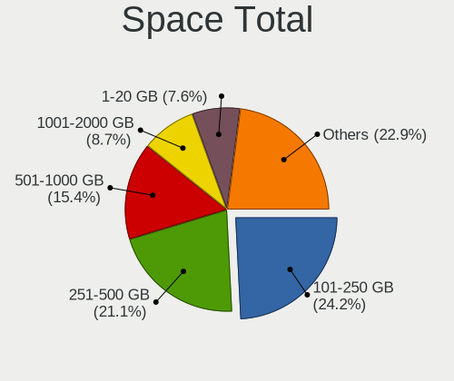
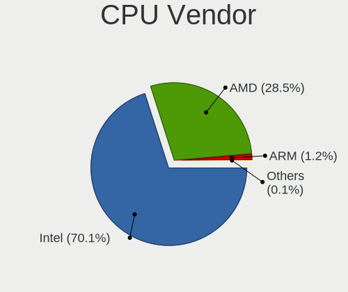
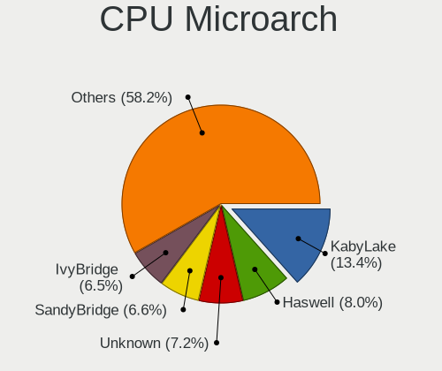

Linux in Germany - Tested Hardware & Statistics
-----------------------------------------------

A project to collect tested hardware configurations for Linux in Germany.

Anyone can contribute to this report by the [hw-probe](https://github.com/linuxhw/hw-probe) tool:

    sudo -E hw-probe -all -upload

Please contribute! Especially if your hardware is rare.

This is a report for all computer types. See also reports for [desktops](/Location/Germany/Desktop/README.md) and [notebooks](/Location/Germany/Notebook/README.md).

Contents
--------

* [ Test Cases ](#test-cases)

* [ System ](#system)
  - [ OS                       ](#os)
  - [ OS Family                ](#os-family)
  - [ Kernel                   ](#kernel)
  - [ Kernel Family            ](#kernel-family)
  - [ Kernel Major Ver.        ](#kernel-major-ver)
  - [ Arch                     ](#arch)
  - [ DE                       ](#de)
  - [ Display Server           ](#display-server)
  - [ Display Manager          ](#display-manager)
  - [ OS Lang                  ](#os-lang)
  - [ Boot Mode                ](#boot-mode)
  - [ Filesystem               ](#filesystem)
  - [ Part. scheme             ](#part-scheme)
  - [ Dual Boot with Linux/BSD ](#dual-boot-with-linuxbsd)
  - [ Dual Boot (Win)          ](#dual-boot-win)

* [ Board ](#board)
  - [ Vendor                   ](#vendor)
  - [ Model                    ](#model)
  - [ Model Family             ](#model-family)
  - [ MFG Year                 ](#mfg-year)
  - [ Form Factor              ](#form-factor)
  - [ Secure Boot              ](#secure-boot)
  - [ Coreboot                 ](#coreboot)
  - [ RAM Size                 ](#ram-size)
  - [ RAM Used                 ](#ram-used)
  - [ Total Drives             ](#total-drives)
  - [ Has CD-ROM               ](#has-cd-rom)
  - [ Has Ethernet             ](#has-ethernet)
  - [ Has WiFi                 ](#has-wifi)
  - [ Has Bluetooth            ](#has-bluetooth)

* [ Location ](#location)
  - [ Country                  ](#country)
  - [ City                     ](#city)

* [ Drives ](#drives)
  - [ Drive Vendor             ](#drive-vendor)
  - [ Drive Model              ](#drive-model)
  - [ HDD Vendor               ](#hdd-vendor)
  - [ SSD Vendor               ](#ssd-vendor)
  - [ Drive Kind               ](#drive-kind)
  - [ Drive Connector          ](#drive-connector)
  - [ Drive Size               ](#drive-size)
  - [ Space Total              ](#space-total)
  - [ Space Used               ](#space-used)
  - [ Malfunc. Drives          ](#malfunc-drives)
  - [ Malfunc. Drive Vendor    ](#malfunc-drive-vendor)
  - [ Malfunc. HDD Vendor      ](#malfunc-hdd-vendor)
  - [ Malfunc. Drive Kind      ](#malfunc-drive-kind)
  - [ Failed Drives            ](#failed-drives)
  - [ Failed Drive Vendor      ](#failed-drive-vendor)
  - [ Drive Status             ](#drive-status)

* [ Storage controller ](#storage-controller)
  - [ Storage Vendor           ](#storage-vendor)
  - [ Storage Model            ](#storage-model)
  - [ Storage Kind             ](#storage-kind)

* [ Processor ](#processor)
  - [ CPU Vendor               ](#cpu-vendor)
  - [ CPU Model                ](#cpu-model)
  - [ CPU Model Family         ](#cpu-model-family)
  - [ CPU Cores                ](#cpu-cores)
  - [ CPU Sockets              ](#cpu-sockets)
  - [ CPU Threads              ](#cpu-threads)
  - [ CPU Op-Modes             ](#cpu-op-modes)
  - [ CPU Microcode            ](#cpu-microcode)
  - [ CPU Microarch            ](#cpu-microarch)

* [ Graphics ](#graphics)
  - [ GPU Vendor               ](#gpu-vendor)
  - [ GPU Model                ](#gpu-model)
  - [ GPU Combo                ](#gpu-combo)
  - [ GPU Driver               ](#gpu-driver)
  - [ GPU Memory               ](#gpu-memory)

* [ Monitor ](#monitor)
  - [ Monitor Vendor           ](#monitor-vendor)
  - [ Monitor Model            ](#monitor-model)
  - [ Monitor Resolution       ](#monitor-resolution)
  - [ Monitor Diagonal         ](#monitor-diagonal)
  - [ Monitor Width            ](#monitor-width)
  - [ Aspect Ratio             ](#aspect-ratio)
  - [ Monitor Area             ](#monitor-area)
  - [ Pixel Density            ](#pixel-density)
  - [ Multiple Monitors        ](#multiple-monitors)

* [ Network ](#network)
  - [ Net Controller Vendor    ](#net-controller-vendor)
  - [ Net Controller Model     ](#net-controller-model)
  - [ Wireless Vendor          ](#wireless-vendor)
  - [ Wireless Model           ](#wireless-model)
  - [ Ethernet Vendor          ](#ethernet-vendor)
  - [ Ethernet Model           ](#ethernet-model)
  - [ Net Controller Kind      ](#net-controller-kind)
  - [ Used Controller          ](#used-controller)
  - [ NICs                     ](#nics)
  - [ IPv6                     ](#ipv6)

* [ Bluetooth ](#bluetooth)
  - [ Bluetooth Vendor         ](#bluetooth-vendor)
  - [ Bluetooth Model          ](#bluetooth-model)

* [ Sound ](#sound)
  - [ Sound Vendor             ](#sound-vendor)
  - [ Sound Model              ](#sound-model)

* [ Memory ](#memory)
  - [ Memory Vendor            ](#memory-vendor)
  - [ Memory Model             ](#memory-model)
  - [ Memory Kind              ](#memory-kind)
  - [ Memory Form Factor       ](#memory-form-factor)
  - [ Memory Size              ](#memory-size)
  - [ Memory Speed             ](#memory-speed)

* [ Printers & scanners ](#printers--scanners)
  - [ Printer Vendor           ](#printer-vendor)
  - [ Printer Model            ](#printer-model)
  - [ Scanner Vendor           ](#scanner-vendor)
  - [ Scanner Model            ](#scanner-model)

* [ Camera ](#camera)
  - [ Camera Vendor            ](#camera-vendor)
  - [ Camera Model             ](#camera-model)

* [ Security ](#security)
  - [ Fingerprint Vendor       ](#fingerprint-vendor)
  - [ Fingerprint Model        ](#fingerprint-model)
  - [ Chipcard Vendor          ](#chipcard-vendor)
  - [ Chipcard Model           ](#chipcard-model)

* [ Unsupported ](#unsupported)
  - [ Unsupported Devices      ](#unsupported-devices)
  - [ Unsupported Device Types ](#unsupported-device-types)

Test Cases
----------

Total: 25514

| Vendor        | Model                       | Form-Factor | Probe                                                      | Date         |
|---------------|-----------------------------|-------------|------------------------------------------------------------|--------------|
| ASUSTek       | TUF B450-PLUS GAMING        | Desktop     | [d44fb4f702](https://linux-hardware.org/?probe=d44fb4f702) | Feb 01, 2023 |
| ASUSTek       | A8N-SLI Premium             | Desktop     | [faf81c22ae](https://linux-hardware.org/?probe=faf81c22ae) | Feb 01, 2023 |
| Toshiba       | Satellite P775              | Notebook    | [c03f7668ac](https://linux-hardware.org/?probe=c03f7668ac) | Feb 01, 2023 |
| HP            | Compaq nx9420 (ES444ET#A... | Notebook    | [ac78478b3b](https://linux-hardware.org/?probe=ac78478b3b) | Feb 01, 2023 |
| MSI           | GP60 2PE                    | Notebook    | [a1bb8934a0](https://linux-hardware.org/?probe=a1bb8934a0) | Feb 01, 2023 |
| Lenovo        | ThinkPad X1 Carbon Gen 9... | Notebook    | [0de8121880](https://linux-hardware.org/?probe=0de8121880) | Feb 01, 2023 |
| Lenovo        | ThinkPad A485 20MVS0U500    | Notebook    | [b398a8e8e6](https://linux-hardware.org/?probe=b398a8e8e6) | Feb 01, 2023 |
| Lenovo        | ThinkPad T490s 20NYS4HL0... | Notebook    | [d792c0057e](https://linux-hardware.org/?probe=d792c0057e) | Feb 01, 2023 |
| ASUSTek       | P9X79                       | Desktop     | [01e8662b39](https://linux-hardware.org/?probe=01e8662b39) | Feb 01, 2023 |
| Lenovo        | ThinkPad X1 Carbon Gen 9... | Notebook    | [f39ab69b74](https://linux-hardware.org/?probe=f39ab69b74) | Feb 01, 2023 |
| Lenovo        | ThinkPad T520 4243WRK       | Notebook    | [924a321452](https://linux-hardware.org/?probe=924a321452) | Feb 01, 2023 |
| MSI           | Z170A PC MATE               | Desktop     | [ff305089b2](https://linux-hardware.org/?probe=ff305089b2) | Feb 01, 2023 |
| MSI           | Raider GE66 12UHS           | Notebook    | [75e83dae8b](https://linux-hardware.org/?probe=75e83dae8b) | Feb 01, 2023 |
| MSI           | B250M PRO-VDH               | Desktop     | [1dbacce612](https://linux-hardware.org/?probe=1dbacce612) | Feb 01, 2023 |
| MSI           | X470 GAMING PLUS MAX        | Desktop     | [f1fecf5447](https://linux-hardware.org/?probe=f1fecf5447) | Feb 01, 2023 |
| Acer          | Aspire A315-53              | Notebook    | [d221bc6b8d](https://linux-hardware.org/?probe=d221bc6b8d) | Feb 01, 2023 |
| Dell          | Precision M6700             | Notebook    | [743cb766c2](https://linux-hardware.org/?probe=743cb766c2) | Feb 01, 2023 |
| Lenovo        | ThinkPad T14s Gen 3 21CQ... | Notebook    | [6b9dc508e1](https://linux-hardware.org/?probe=6b9dc508e1) | Feb 01, 2023 |
| ASUSTek       | VivoBook_ASUSLaptop E510... | Notebook    | [08e071efa2](https://linux-hardware.org/?probe=08e071efa2) | Feb 01, 2023 |
| Gigabyte      | MZBSWMP-00                  | Desktop     | [894f632950](https://linux-hardware.org/?probe=894f632950) | Feb 01, 2023 |
| Gigabyte      | H55M-UD2H                   | Desktop     | [9337f49fff](https://linux-hardware.org/?probe=9337f49fff) | Feb 01, 2023 |
| Schenker      | VISION 16 Pro (L22)         | Notebook    | [0979a6ca2a](https://linux-hardware.org/?probe=0979a6ca2a) | Jan 31, 2023 |
| Lenovo        | ThinkPad T560 20FJS44L0B    | Notebook    | [06bf3870a5](https://linux-hardware.org/?probe=06bf3870a5) | Jan 31, 2023 |
| Lenovo        | ThinkPad T530 2394A11       | Notebook    | [e7946fa600](https://linux-hardware.org/?probe=e7946fa600) | Jan 31, 2023 |
| HUAWEI        | HLYL-WXX9                   | Notebook    | [6e8d45f76b](https://linux-hardware.org/?probe=6e8d45f76b) | Jan 31, 2023 |
| MSI           | 870A-G54                    | Desktop     | [0aaa012de5](https://linux-hardware.org/?probe=0aaa012de5) | Jan 31, 2023 |
| HP            | Laptop 14s-dq3xxx           | Notebook    | [12ebaf0896](https://linux-hardware.org/?probe=12ebaf0896) | Jan 31, 2023 |
| Dell          | Latitude E6540              | Notebook    | [156a047a82](https://linux-hardware.org/?probe=156a047a82) | Jan 31, 2023 |
| Medion        | E15410                      | Notebook    | [24135c324e](https://linux-hardware.org/?probe=24135c324e) | Jan 31, 2023 |
| Notebook      | W35xSTQ_370ST               | Notebook    | [b52cc29e08](https://linux-hardware.org/?probe=b52cc29e08) | Jan 31, 2023 |
| Dell          | XPS 13 7390                 | Notebook    | [5479d8c85b](https://linux-hardware.org/?probe=5479d8c85b) | Jan 31, 2023 |
| Dell          | XPS 13 9370                 | Notebook    | [cd12cbdc16](https://linux-hardware.org/?probe=cd12cbdc16) | Jan 31, 2023 |
| HUAWEI        | KLVL-WXXW                   | Notebook    | [4c8bff0f95](https://linux-hardware.org/?probe=4c8bff0f95) | Jan 31, 2023 |
| Lenovo        | ThinkPad E15 Gen 2 20T9S... | Notebook    | [51d249d102](https://linux-hardware.org/?probe=51d249d102) | Jan 31, 2023 |
| Dell          | 0NKW6Y A02                  | Desktop     | [4a63357651](https://linux-hardware.org/?probe=4a63357651) | Jan 31, 2023 |
| ASUSTek       | VivoBook_ASUSLaptop M340... | Notebook    | [cd9b7d5796](https://linux-hardware.org/?probe=cd9b7d5796) | Jan 31, 2023 |
| MSI           | B550-A PRO                  | Desktop     | [78ab25ef78](https://linux-hardware.org/?probe=78ab25ef78) | Jan 31, 2023 |
| Dell          | XPS 15 9570                 | Notebook    | [896d7f2fbd](https://linux-hardware.org/?probe=896d7f2fbd) | Jan 31, 2023 |
| Notebook      | W35xSTQ_370ST               | Notebook    | [b33ec828fc](https://linux-hardware.org/?probe=b33ec828fc) | Jan 31, 2023 |
| MSI           | B550-A PRO                  | Desktop     | [2458455037](https://linux-hardware.org/?probe=2458455037) | Jan 31, 2023 |
| HP            | EliteBook 840 G2            | Notebook    | [bf4741c8ad](https://linux-hardware.org/?probe=bf4741c8ad) | Jan 31, 2023 |
| ASUSTek       | P5V800-MX                   | Desktop     | [a8696956aa](https://linux-hardware.org/?probe=a8696956aa) | Jan 31, 2023 |
| Lenovo        | ThinkPad P15 Gen 2i 20YQ... | Notebook    | [ea48b6870c](https://linux-hardware.org/?probe=ea48b6870c) | Jan 31, 2023 |
| ASUSTek       | ZenBook UX425UA_UM425UA     | Notebook    | [4febaa325b](https://linux-hardware.org/?probe=4febaa325b) | Jan 31, 2023 |
| Lenovo        | ThinkPad T440 20B7S2GS0W    | Notebook    | [46008b3d38](https://linux-hardware.org/?probe=46008b3d38) | Jan 31, 2023 |
| TUXEDO        | Stellaris Intel Gen4        | Notebook    | [2df9f60f2e](https://linux-hardware.org/?probe=2df9f60f2e) | Jan 31, 2023 |
| Cube          | SurfTab twin 11.6           | Convertible | [ab9b9ee0b8](https://linux-hardware.org/?probe=ab9b9ee0b8) | Jan 31, 2023 |
| Maxtang       | EHL30 V1.0                  | Desktop     | [d104ad1307](https://linux-hardware.org/?probe=d104ad1307) | Jan 31, 2023 |
| Fujitsu       | LIFEBOOK S751               | Notebook    | [35948f3b5e](https://linux-hardware.org/?probe=35948f3b5e) | Jan 31, 2023 |
| Lenovo        | ThinkPad E14 Gen 4 21E30... | Notebook    | [87904d9d06](https://linux-hardware.org/?probe=87904d9d06) | Jan 31, 2023 |
| ASUSTek       | PRIME X670E-PRO WIFI        | Desktop     | [4f08ac24d9](https://linux-hardware.org/?probe=4f08ac24d9) | Jan 30, 2023 |
| Gigabyte      | X570 AORUS ELITE            | Desktop     | [034ae066aa](https://linux-hardware.org/?probe=034ae066aa) | Jan 30, 2023 |
| MSI           | MPG X570 GAMING EDGE WIF... | Desktop     | [353272e0d2](https://linux-hardware.org/?probe=353272e0d2) | Jan 30, 2023 |
| Acer          | Predator PH315-52           | Notebook    | [457b7cf5f0](https://linux-hardware.org/?probe=457b7cf5f0) | Jan 30, 2023 |
| ASRock        | B450M Pro4                  | Desktop     | [c63c663181](https://linux-hardware.org/?probe=c63c663181) | Jan 30, 2023 |
| Acer          | Aspire V3-772G              | Notebook    | [fce1ba6f6b](https://linux-hardware.org/?probe=fce1ba6f6b) | Jan 30, 2023 |
| Lenovo        | IdeaPad 530S-15IKB 81EV     | Notebook    | [58739a5bef](https://linux-hardware.org/?probe=58739a5bef) | Jan 30, 2023 |
| Lenovo        | 1046 SDK0T08861 WIN 3305... | Desktop     | [fa81cc9dea](https://linux-hardware.org/?probe=fa81cc9dea) | Jan 30, 2023 |
| HP            | Laptop 17-bs0xx             | Notebook    | [ed57a59e39](https://linux-hardware.org/?probe=ed57a59e39) | Jan 30, 2023 |
| Acer          | Aspire E5-771               | Notebook    | [389651889c](https://linux-hardware.org/?probe=389651889c) | Jan 30, 2023 |
| HP            | Compaq Presario CQ70        | Notebook    | [07e9e57b88](https://linux-hardware.org/?probe=07e9e57b88) | Jan 30, 2023 |
| HP            | Laptop 17-ak0xx             | Notebook    | [6e6f32430a](https://linux-hardware.org/?probe=6e6f32430a) | Jan 30, 2023 |
| Gigabyte      | GA-990FXA-UD3               | Desktop     | [78cd3f7f65](https://linux-hardware.org/?probe=78cd3f7f65) | Jan 30, 2023 |
| Gigabyte      | B550 AORUS ELITE            | Desktop     | [3fac03d01d](https://linux-hardware.org/?probe=3fac03d01d) | Jan 30, 2023 |
| ASRock        | X470 Master SLI             | Desktop     | [1746dfe4b1](https://linux-hardware.org/?probe=1746dfe4b1) | Jan 30, 2023 |
| ASUSTek       | H81M2                       | Desktop     | [304b95972c](https://linux-hardware.org/?probe=304b95972c) | Jan 30, 2023 |
| Acer          | Aspire E1-572G              | Notebook    | [6064a923c6](https://linux-hardware.org/?probe=6064a923c6) | Jan 30, 2023 |
| Acer          | Aspire 5755G                | Notebook    | [03c2f11b67](https://linux-hardware.org/?probe=03c2f11b67) | Jan 30, 2023 |
| TUXEDO        | Unknown                     | Notebook    | [81566e6fc9](https://linux-hardware.org/?probe=81566e6fc9) | Jan 30, 2023 |
| Lenovo        | ThinkPad P15 Gen 2i 20YR... | Notebook    | [3c0723977c](https://linux-hardware.org/?probe=3c0723977c) | Jan 30, 2023 |
| ASUSTek       | F5VL                        | Notebook    | [07e0539a43](https://linux-hardware.org/?probe=07e0539a43) | Jan 30, 2023 |
| ASUSTek       | Z170 PRO GAMING             | Desktop     | [c2a4529e33](https://linux-hardware.org/?probe=c2a4529e33) | Jan 30, 2023 |
| Fujitsu Si... | STYLISTIC ST5112            | Notebook    | [c343cec0c8](https://linux-hardware.org/?probe=c343cec0c8) | Jan 30, 2023 |
| Acer          | Swift SF514-52T             | Notebook    | [6f95748149](https://linux-hardware.org/?probe=6f95748149) | Jan 30, 2023 |
| ASUSTek       | B85M-G                      | Desktop     | [73deb30280](https://linux-hardware.org/?probe=73deb30280) | Jan 29, 2023 |
| HP            | 8460                        | Desktop     | [078e151afc](https://linux-hardware.org/?probe=078e151afc) | Jan 29, 2023 |
| Gigabyte      | Z270X-Ultra Gaming-CF       | Desktop     | [55c3e9597c](https://linux-hardware.org/?probe=55c3e9597c) | Jan 29, 2023 |
| Lenovo        | 3000 N200 0769BAG           | Notebook    | [f8f410eb2a](https://linux-hardware.org/?probe=f8f410eb2a) | Jan 29, 2023 |
| Gigabyte      | Z370 HD3-CF                 | Desktop     | [1721760555](https://linux-hardware.org/?probe=1721760555) | Jan 29, 2023 |
| MSI           | X399 SLI PLUS               | Desktop     | [f7008e788b](https://linux-hardware.org/?probe=f7008e788b) | Jan 29, 2023 |
| Lenovo        | IdeaPad 720S-14IKB 81BD     | Notebook    | [50eb066d41](https://linux-hardware.org/?probe=50eb066d41) | Jan 29, 2023 |
| HP            | 339A                        | Desktop     | [5bd8bab56c](https://linux-hardware.org/?probe=5bd8bab56c) | Jan 29, 2023 |
| Apple         | MacBookPro5,5               | Notebook    | [678b6fa5f6](https://linux-hardware.org/?probe=678b6fa5f6) | Jan 29, 2023 |
| Lenovo        | IdeaPad 100-15IBD 80QQ      | Notebook    | [84c2710911](https://linux-hardware.org/?probe=84c2710911) | Jan 29, 2023 |
| Medion        | TJ4125                      | Desktop     | [5fb5d01ae9](https://linux-hardware.org/?probe=5fb5d01ae9) | Jan 29, 2023 |
| Fujitsu Si... | D2587-A1 S26361-D2587-A1    | Desktop     | [6378111bbd](https://linux-hardware.org/?probe=6378111bbd) | Jan 29, 2023 |
| HP            | 8643 SMVB                   | Desktop     | [d9047d3c7b](https://linux-hardware.org/?probe=d9047d3c7b) | Jan 29, 2023 |
| ASUSTek       | PRIME H310I-PLUS R2.0       | Desktop     | [1b8a1f7b64](https://linux-hardware.org/?probe=1b8a1f7b64) | Jan 29, 2023 |
| Acer          | Nitro AN517-41              | Notebook    | [ecb7c49d2e](https://linux-hardware.org/?probe=ecb7c49d2e) | Jan 29, 2023 |
| ASUSTek       | ProArt B550-CREATOR         | Desktop     | [c93e84b79b](https://linux-hardware.org/?probe=c93e84b79b) | Jan 29, 2023 |
| Lenovo        | ThinkPad X1 Yoga Gen 7 2... | Convertible | [2fee4a59ba](https://linux-hardware.org/?probe=2fee4a59ba) | Jan 29, 2023 |
| ASUSTek       | ASUS TUF Gaming F15 FX50... | Notebook    | [608c0b8c88](https://linux-hardware.org/?probe=608c0b8c88) | Jan 29, 2023 |
| Lenovo        | Yoga Slim 7 Carbon 13ITL... | Notebook    | [d3936466af](https://linux-hardware.org/?probe=d3936466af) | Jan 29, 2023 |
| AXDIA Inte... | WINPAD V10                  | Notebook    | [c5f4838490](https://linux-hardware.org/?probe=c5f4838490) | Jan 29, 2023 |
| MSI           | A68HM GRENADE               | Desktop     | [696581b7b6](https://linux-hardware.org/?probe=696581b7b6) | Jan 28, 2023 |
| TUXEDO        | N14xWU                      | Notebook    | [5681ab6b5d](https://linux-hardware.org/?probe=5681ab6b5d) | Jan 28, 2023 |
| Fujitsu       | D3221-A1 S26361-D3221-A1    | Desktop     | [bc4b6513bb](https://linux-hardware.org/?probe=bc4b6513bb) | Jan 28, 2023 |
| HUAWEI        | MACH-WX9                    | Notebook    | [5b00f79b72](https://linux-hardware.org/?probe=5b00f79b72) | Jan 28, 2023 |
| Dell          | 05MW5F A00                  | Mini pc     | [dd56d67fef](https://linux-hardware.org/?probe=dd56d67fef) | Jan 28, 2023 |
| BESSTAR Te... | UM350                       | Desktop     | [1ec2f78884](https://linux-hardware.org/?probe=1ec2f78884) | Jan 28, 2023 |
| ASRock        | X570 Pro4                   | Desktop     | [bf09bd7413](https://linux-hardware.org/?probe=bf09bd7413) | Jan 28, 2023 |
| HP            | OMEN Laptop 15-en0xxx       | Notebook    | [e163d98802](https://linux-hardware.org/?probe=e163d98802) | Jan 28, 2023 |
| Lenovo        | ThinkPad 20FQ005TGE         | Convertible | [a8e34a1084](https://linux-hardware.org/?probe=a8e34a1084) | Jan 28, 2023 |
| ASRock        | Z97 Killer                  | Desktop     | [2658d00cd2](https://linux-hardware.org/?probe=2658d00cd2) | Jan 28, 2023 |
| Lenovo        | ThinkPad L15 Gen 1 20U4S... | Notebook    | [a8e2d5b5f0](https://linux-hardware.org/?probe=a8e2d5b5f0) | Jan 28, 2023 |
| MSI           | B85M-E45                    | Desktop     | [335cebea8b](https://linux-hardware.org/?probe=335cebea8b) | Jan 28, 2023 |
| Gigabyte      | AX370-Gaming K7             | Desktop     | [e369c6e5b8](https://linux-hardware.org/?probe=e369c6e5b8) | Jan 28, 2023 |
| Lenovo        | 3111 SDK0J40697 WIN 3305... | Mini pc     | [cbd1d84f00](https://linux-hardware.org/?probe=cbd1d84f00) | Jan 28, 2023 |
| ASRock        | Z370 Extreme4               | Desktop     | [8c6abbc491](https://linux-hardware.org/?probe=8c6abbc491) | Jan 28, 2023 |
| Acer          | Aspire ES1-711              | Notebook    | [3aa8f67a82](https://linux-hardware.org/?probe=3aa8f67a82) | Jan 28, 2023 |
| Lenovo        | Yoga 510-14IKB 80VB         | Convertible | [473f9c9cb3](https://linux-hardware.org/?probe=473f9c9cb3) | Jan 28, 2023 |
| Gigabyte      | X570 AORUS ULTRA            | Desktop     | [40152faf5b](https://linux-hardware.org/?probe=40152faf5b) | Jan 28, 2023 |
| HP            | Pavilion x360 Convertibl... | Convertible | [7961073f5f](https://linux-hardware.org/?probe=7961073f5f) | Jan 28, 2023 |
| HP            | ENVY x360 2-in-1 Laptop ... | Convertible | [40672aba71](https://linux-hardware.org/?probe=40672aba71) | Jan 28, 2023 |
| ASUSTek       | TUF Gaming X570-PLUS        | Desktop     | [c67c5a3cfe](https://linux-hardware.org/?probe=c67c5a3cfe) | Jan 28, 2023 |
| ASUSTek       | TUF Gaming X570-PLUS        | Desktop     | [6cdea948c5](https://linux-hardware.org/?probe=6cdea948c5) | Jan 28, 2023 |
| Lenovo        | ThinkPad X270 W10DG 20K6... | Notebook    | [ee4a3f359b](https://linux-hardware.org/?probe=ee4a3f359b) | Jan 27, 2023 |
| ASUSTek       | M5A78L-M LE                 | Desktop     | [a4c0ee5753](https://linux-hardware.org/?probe=a4c0ee5753) | Jan 27, 2023 |
| ASRock        | B550M-HDV                   | Desktop     | [29bdcc85ad](https://linux-hardware.org/?probe=29bdcc85ad) | Jan 27, 2023 |
| ASRock        | Z97 Killer                  | Desktop     | [d4c609c373](https://linux-hardware.org/?probe=d4c609c373) | Jan 27, 2023 |
| HP            | Laptop 15-bs0xx             | Notebook    | [9b10308469](https://linux-hardware.org/?probe=9b10308469) | Jan 27, 2023 |
| ASUSTek       | PRIME Z390-A                | Desktop     | [a30690db0c](https://linux-hardware.org/?probe=a30690db0c) | Jan 27, 2023 |
| Gigabyte      | GA-78LMT-USB3               | Desktop     | [55d50f6d18](https://linux-hardware.org/?probe=55d50f6d18) | Jan 27, 2023 |
| Toshiba       | Satellite L755              | Notebook    | [b15899ef80](https://linux-hardware.org/?probe=b15899ef80) | Jan 27, 2023 |
| Toshiba       | Satellite L755              | Notebook    | [357a0cd22d](https://linux-hardware.org/?probe=357a0cd22d) | Jan 27, 2023 |
| ASUSTek       | PRIME B450M-A               | Desktop     | [4a33dd0b76](https://linux-hardware.org/?probe=4a33dd0b76) | Jan 27, 2023 |
| Acer          | Predator G3620              | Desktop     | [0fdd7e30ce](https://linux-hardware.org/?probe=0fdd7e30ce) | Jan 27, 2023 |
| BESSTAR Te... | UM340                       | Desktop     | [77efbbb270](https://linux-hardware.org/?probe=77efbbb270) | Jan 27, 2023 |
| Acer          | Aspire 7741                 | Notebook    | [79d4beeb12](https://linux-hardware.org/?probe=79d4beeb12) | Jan 27, 2023 |
| ASUSTek       | P8H61-M LX R2.0             | Desktop     | [6d2e490a23](https://linux-hardware.org/?probe=6d2e490a23) | Jan 27, 2023 |
| ASUSTek       | Z170-K                      | Desktop     | [a1f535bfca](https://linux-hardware.org/?probe=a1f535bfca) | Jan 27, 2023 |
| Lenovo        | IdeaPad S130-11IGM 81J1     | Notebook    | [ee351959a0](https://linux-hardware.org/?probe=ee351959a0) | Jan 27, 2023 |
| Sony          | SVE1512H1EB                 | Notebook    | [9f9b853849](https://linux-hardware.org/?probe=9f9b853849) | Jan 27, 2023 |
| MSI           | B365M PRO-VDH               | Desktop     | [d5bbfc18d5](https://linux-hardware.org/?probe=d5bbfc18d5) | Jan 27, 2023 |
| Sony          | SVE1512H1EB                 | Notebook    | [a1f75687bc](https://linux-hardware.org/?probe=a1f75687bc) | Jan 27, 2023 |
| Lenovo        | IdeaPad 330-17AST 81D7      | Notebook    | [f409b1df0b](https://linux-hardware.org/?probe=f409b1df0b) | Jan 27, 2023 |
| Gigabyte      | Z170X-UD5 TH-CF             | Desktop     | [0d9491187e](https://linux-hardware.org/?probe=0d9491187e) | Jan 27, 2023 |
| Acer          | Aspire E1-522               | Notebook    | [b1e1e4bb29](https://linux-hardware.org/?probe=b1e1e4bb29) | Jan 27, 2023 |
| TUXEDO        | InfinityBook S 15 Gen6      | Notebook    | [ee44dc2539](https://linux-hardware.org/?probe=ee44dc2539) | Jan 27, 2023 |
| HUAWEI        | HVY-WXX9                    | Notebook    | [dddf41f4e3](https://linux-hardware.org/?probe=dddf41f4e3) | Jan 27, 2023 |
| Acer          | Aspire ES1-571              | Notebook    | [c35f2771dc](https://linux-hardware.org/?probe=c35f2771dc) | Jan 27, 2023 |
| Schenker      | XMG FOCUS (M22)             | Notebook    | [b04fdbb6da](https://linux-hardware.org/?probe=b04fdbb6da) | Jan 27, 2023 |
| HUAWEI        | BOHB-WAX9                   | Notebook    | [00e21c8359](https://linux-hardware.org/?probe=00e21c8359) | Jan 27, 2023 |
| MSI           | CX600                       | Notebook    | [643c7effe7](https://linux-hardware.org/?probe=643c7effe7) | Jan 27, 2023 |
| Samsung       | 750XDA                      | Notebook    | [747e2b49d4](https://linux-hardware.org/?probe=747e2b49d4) | Jan 27, 2023 |
| Samsung       | 750XDA                      | Notebook    | [18fe906041](https://linux-hardware.org/?probe=18fe906041) | Jan 27, 2023 |
| Lenovo        | V15-ADA 82C7                | Notebook    | [5e42d7b8a7](https://linux-hardware.org/?probe=5e42d7b8a7) | Jan 27, 2023 |
| ASUSTek       | VivoBook_ASUSLaptop TP42... | Convertible | [9912417dc3](https://linux-hardware.org/?probe=9912417dc3) | Jan 27, 2023 |
| Fujitsu       | LIFEBOOK A556               | Notebook    | [550ced1932](https://linux-hardware.org/?probe=550ced1932) | Jan 27, 2023 |
| AXDIA Inte... | WINPAD V10                  | Notebook    | [ba8bdae82f](https://linux-hardware.org/?probe=ba8bdae82f) | Jan 27, 2023 |
| Gigabyte      | J3455N-D3H                  | Desktop     | [3eb9131ab1](https://linux-hardware.org/?probe=3eb9131ab1) | Jan 27, 2023 |
| Medion        | TJ4125                      | Desktop     | [eaca458ea2](https://linux-hardware.org/?probe=eaca458ea2) | Jan 26, 2023 |
| Raspberry ... | Raspberry Pi 4 Model B R... | Soc         | [f6eac95147](https://linux-hardware.org/?probe=f6eac95147) | Jan 26, 2023 |
| Notebook      | P15SM-A/SM1-A               | Notebook    | [7f70263934](https://linux-hardware.org/?probe=7f70263934) | Jan 26, 2023 |
| ASUSTek       | PRIME Z490-A                | Desktop     | [91dbb8d045](https://linux-hardware.org/?probe=91dbb8d045) | Jan 26, 2023 |
| Lenovo        | Yoga Slim 7 Pro 16ACH6 8... | Notebook    | [9dfc820ceb](https://linux-hardware.org/?probe=9dfc820ceb) | Jan 26, 2023 |
| Lenovo        | Yoga Slim 7 Pro 16ACH6 8... | Notebook    | [0168a5cae2](https://linux-hardware.org/?probe=0168a5cae2) | Jan 26, 2023 |
| HP            | 255 G8 Notebook PC          | Notebook    | [fdcee64754](https://linux-hardware.org/?probe=fdcee64754) | Jan 26, 2023 |
| HP            | 255 G8 Notebook PC          | Notebook    | [814fe54dc5](https://linux-hardware.org/?probe=814fe54dc5) | Jan 26, 2023 |
| Dell          | Precision 7720              | Notebook    | [f5e8281d01](https://linux-hardware.org/?probe=f5e8281d01) | Jan 26, 2023 |
| ASUSTek       | M4N78 PRO                   | Desktop     | [e547b297b0](https://linux-hardware.org/?probe=e547b297b0) | Jan 26, 2023 |
| Lenovo        | Legion 5 15IMH05 82AU       | Notebook    | [3d7c3e004b](https://linux-hardware.org/?probe=3d7c3e004b) | Jan 26, 2023 |
| Gigabyte      | Sabre 15                    | Notebook    | [3ad57e9198](https://linux-hardware.org/?probe=3ad57e9198) | Jan 26, 2023 |
| Acer          | Nitro AN517-51              | Notebook    | [8c568dd8e5](https://linux-hardware.org/?probe=8c568dd8e5) | Jan 26, 2023 |
| ASUSTek       | P8H77-V LE                  | Desktop     | [0305833fbd](https://linux-hardware.org/?probe=0305833fbd) | Jan 26, 2023 |
| Fujitsu       | LIFEBOOK E752               | Notebook    | [2fc97553ae](https://linux-hardware.org/?probe=2fc97553ae) | Jan 26, 2023 |
| Lenovo        | ThinkPad T495 20NKS01Y00    | Notebook    | [a1dfc58700](https://linux-hardware.org/?probe=a1dfc58700) | Jan 26, 2023 |
| Lenovo        | ThinkPad T490 20N20048GE    | Notebook    | [54915be6bc](https://linux-hardware.org/?probe=54915be6bc) | Jan 26, 2023 |
| Apple         | Mac-F2268CC8                | All in one  | [fe389a3724](https://linux-hardware.org/?probe=fe389a3724) | Jan 26, 2023 |
| HP            | 18E4                        | Desktop     | [1f51508eeb](https://linux-hardware.org/?probe=1f51508eeb) | Jan 26, 2023 |
| Valve         | Jupiter                     | Notebook    | [44f513f83b](https://linux-hardware.org/?probe=44f513f83b) | Jan 26, 2023 |
| HP            | 3397                        | Desktop     | [1584c8c840](https://linux-hardware.org/?probe=1584c8c840) | Jan 26, 2023 |
| Medion        | E15410                      | Notebook    | [5ba9ffd6a8](https://linux-hardware.org/?probe=5ba9ffd6a8) | Jan 26, 2023 |
| HP            | 355 G2                      | Notebook    | [66f901e77a](https://linux-hardware.org/?probe=66f901e77a) | Jan 26, 2023 |
| Sony          | SVJ2022M1EWI                | Notebook    | [c4c9254e6d](https://linux-hardware.org/?probe=c4c9254e6d) | Jan 25, 2023 |
| Lenovo        | G50-30 80G0                 | Notebook    | [850fc5b742](https://linux-hardware.org/?probe=850fc5b742) | Jan 25, 2023 |
| Fujitsu       | D3233-A1 S26361-D3233-A1    | Desktop     | [d30b7c1657](https://linux-hardware.org/?probe=d30b7c1657) | Jan 25, 2023 |
| Lenovo        | V14-ADA 82C6                | Notebook    | [4d5aa34028](https://linux-hardware.org/?probe=4d5aa34028) | Jan 25, 2023 |
| Acer          | Aspire E1-571G              | Notebook    | [ed297cfa3b](https://linux-hardware.org/?probe=ed297cfa3b) | Jan 25, 2023 |
| Lenovo        | ThinkPad T14s Gen 3 21CQ... | Notebook    | [a780c8d844](https://linux-hardware.org/?probe=a780c8d844) | Jan 25, 2023 |
| Lenovo        | ThinkPad T14s Gen 3 21CQ... | Notebook    | [e6a1506275](https://linux-hardware.org/?probe=e6a1506275) | Jan 25, 2023 |
| Acer          | Switch SW512-52             | Tablet      | [7d44e4c760](https://linux-hardware.org/?probe=7d44e4c760) | Jan 25, 2023 |
| ASRock        | B75 Pro3-M                  | Desktop     | [cf662e2730](https://linux-hardware.org/?probe=cf662e2730) | Jan 25, 2023 |
| ASRock        | B75 Pro3-M                  | Desktop     | [c2ff1b1e23](https://linux-hardware.org/?probe=c2ff1b1e23) | Jan 25, 2023 |
| ASUSTek       | ROG STRIX H370-I GAMING     | Desktop     | [decfe6ab97](https://linux-hardware.org/?probe=decfe6ab97) | Jan 25, 2023 |
| Intel         | NUC7JYB J67967-404          | Mini pc     | [3fbe56012b](https://linux-hardware.org/?probe=3fbe56012b) | Jan 25, 2023 |
| Medion        | MS-7728                     | Desktop     | [76298f7282](https://linux-hardware.org/?probe=76298f7282) | Jan 25, 2023 |
| Dell          | Inspiron 5748               | Notebook    | [924749ac13](https://linux-hardware.org/?probe=924749ac13) | Jan 25, 2023 |
| ASRock        | X300M-STX                   | Desktop     | [f111e4de3b](https://linux-hardware.org/?probe=f111e4de3b) | Jan 25, 2023 |
| Valve         | Jupiter                     | Notebook    | [e6a43dd88c](https://linux-hardware.org/?probe=e6a43dd88c) | Jan 25, 2023 |
| ASUSTek       | B150M-A/M.2                 | Desktop     | [5c1d469037](https://linux-hardware.org/?probe=5c1d469037) | Jan 25, 2023 |
| HP            | EliteBook x360 830 G6       | Convertible | [d23feafd62](https://linux-hardware.org/?probe=d23feafd62) | Jan 25, 2023 |
| HP            | Stream 7 Tablet             | Tablet      | [d1fc8d3488](https://linux-hardware.org/?probe=d1fc8d3488) | Jan 25, 2023 |
| Lenovo        | 36F7 SDK0J40700 WIN 3258... | Desktop     | [b7dea81a92](https://linux-hardware.org/?probe=b7dea81a92) | Jan 25, 2023 |
| Lenovo        | 36F7 SDK0J40700 WIN 3258... | Desktop     | [831fd897ec](https://linux-hardware.org/?probe=831fd897ec) | Jan 25, 2023 |
| Lenovo        | ThinkPad X220 4291IR6       | Notebook    | [cc41fa5174](https://linux-hardware.org/?probe=cc41fa5174) | Jan 25, 2023 |
| ASRock        | B85M DASH/OL R2.0           | Desktop     | [71c0a5abe5](https://linux-hardware.org/?probe=71c0a5abe5) | Jan 25, 2023 |
| AXDIA Inte... | WINPAD V10                  | Notebook    | [be66e9073f](https://linux-hardware.org/?probe=be66e9073f) | Jan 25, 2023 |
| AXDIA Inte... | WINPAD V10                  | Notebook    | [3a8aced1b7](https://linux-hardware.org/?probe=3a8aced1b7) | Jan 25, 2023 |
| Medion        | MS-7728                     | Desktop     | [5759a31d8f](https://linux-hardware.org/?probe=5759a31d8f) | Jan 25, 2023 |
| Valve         | Jupiter                     | Notebook    | [9cdb614599](https://linux-hardware.org/?probe=9cdb614599) | Jan 25, 2023 |
| TUXEDO        | Unknown                     | Notebook    | [ebdbb886bc](https://linux-hardware.org/?probe=ebdbb886bc) | Jan 25, 2023 |
| MSI           | B550-A PRO                  | Desktop     | [0bbf395806](https://linux-hardware.org/?probe=0bbf395806) | Jan 25, 2023 |
| ASUSTek       | X555LD                      | Notebook    | [939802e4fa](https://linux-hardware.org/?probe=939802e4fa) | Jan 24, 2023 |
| Fujitsu       | LIFEBOOK U7511              | Notebook    | [7b9b00eccb](https://linux-hardware.org/?probe=7b9b00eccb) | Jan 24, 2023 |
| LG Electro... | 17Z90Q-G.AA79G              | Notebook    | [275f0a83ab](https://linux-hardware.org/?probe=275f0a83ab) | Jan 24, 2023 |
| Dell          | Latitude E7470              | Notebook    | [5258f49771](https://linux-hardware.org/?probe=5258f49771) | Jan 24, 2023 |
| Packard Be... | EasyNote MH36               | Notebook    | [07ba548a55](https://linux-hardware.org/?probe=07ba548a55) | Jan 24, 2023 |
| Schenker      | VISION 15 (SVS15E21)        | Notebook    | [bf22d53528](https://linux-hardware.org/?probe=bf22d53528) | Jan 24, 2023 |
| Dell          | Latitude 5491               | Notebook    | [37746d7f71](https://linux-hardware.org/?probe=37746d7f71) | Jan 24, 2023 |
| HP            | Pavilion x360 Convertibl... | Convertible | [5e5552846c](https://linux-hardware.org/?probe=5e5552846c) | Jan 24, 2023 |
| Dell          | Latitude E7470              | Notebook    | [647c279ad4](https://linux-hardware.org/?probe=647c279ad4) | Jan 24, 2023 |
| Intel         | NUC7i5BNB J31144-309        | Mini pc     | [6c40659202](https://linux-hardware.org/?probe=6c40659202) | Jan 24, 2023 |
| HP            | 82B4                        | Desktop     | [29e2d03c1a](https://linux-hardware.org/?probe=29e2d03c1a) | Jan 24, 2023 |
| HP            | 82B4                        | Desktop     | [3df98736a1](https://linux-hardware.org/?probe=3df98736a1) | Jan 24, 2023 |
| AXDIA Inte... | WINPAD V10                  | Notebook    | [dc93e9d9f0](https://linux-hardware.org/?probe=dc93e9d9f0) | Jan 24, 2023 |
| Lenovo        | ThinkPad T470p 20J60018G... | Notebook    | [b45a52bc35](https://linux-hardware.org/?probe=b45a52bc35) | Jan 24, 2023 |
| HUAWEI        | NBLK-WAX9X                  | Notebook    | [a227de29c5](https://linux-hardware.org/?probe=a227de29c5) | Jan 24, 2023 |
| HP            | 8460                        | Desktop     | [2bfad5b267](https://linux-hardware.org/?probe=2bfad5b267) | Jan 24, 2023 |
| Gigabyte      | B550 AORUS PRO AC           | Desktop     | [ac08bf34c3](https://linux-hardware.org/?probe=ac08bf34c3) | Jan 24, 2023 |
| Lenovo        | G700 20251                  | Notebook    | [0745c6189f](https://linux-hardware.org/?probe=0745c6189f) | Jan 23, 2023 |
| ASUSTek       | M51Tr                       | Notebook    | [03ed788f55](https://linux-hardware.org/?probe=03ed788f55) | Jan 23, 2023 |
| ASUSTek       | M51Tr                       | Notebook    | [d1f821e376](https://linux-hardware.org/?probe=d1f821e376) | Jan 23, 2023 |
| Dell          | Inspiron N5040              | Notebook    | [d3d4b5a577](https://linux-hardware.org/?probe=d3d4b5a577) | Jan 23, 2023 |
| Notebook      | W65_67SZ                    | Notebook    | [74d788dccb](https://linux-hardware.org/?probe=74d788dccb) | Jan 23, 2023 |
| ASRock        | 960GM-GS3 FX                | Desktop     | [f2894f6970](https://linux-hardware.org/?probe=f2894f6970) | Jan 23, 2023 |
| Medion        | E15410                      | Notebook    | [f7e27f2ba9](https://linux-hardware.org/?probe=f7e27f2ba9) | Jan 23, 2023 |
| ASUSTek       | PRIME X470-PRO              | Desktop     | [bfe0416657](https://linux-hardware.org/?probe=bfe0416657) | Jan 23, 2023 |
| Gigabyte      | B550 AORUS ELITE            | Desktop     | [7e91e49912](https://linux-hardware.org/?probe=7e91e49912) | Jan 23, 2023 |
| MicroByte     | ezbook                      | Notebook    | [ee3c30939d](https://linux-hardware.org/?probe=ee3c30939d) | Jan 23, 2023 |
| Lenovo        | ThinkPad T430 2344BZU       | Notebook    | [5e8acadc64](https://linux-hardware.org/?probe=5e8acadc64) | Jan 23, 2023 |
| Gigabyte      | X570 AORUS ULTRA            | Desktop     | [2f215e1ce7](https://linux-hardware.org/?probe=2f215e1ce7) | Jan 23, 2023 |
| Gigabyte      | B550 AORUS ELITE            | Desktop     | [3324fafe5a](https://linux-hardware.org/?probe=3324fafe5a) | Jan 23, 2023 |
| Apple         | MacBook4,1                  | Notebook    | [8d876754f3](https://linux-hardware.org/?probe=8d876754f3) | Jan 23, 2023 |
| Apple         | MacBook4,1                  | Notebook    | [f1f61785e5](https://linux-hardware.org/?probe=f1f61785e5) | Jan 23, 2023 |
| ASRock        | N68-S                       | Desktop     | [aeadf689c9](https://linux-hardware.org/?probe=aeadf689c9) | Jan 23, 2023 |
| MSI           | B550-A PRO                  | Desktop     | [88c03a1f6f](https://linux-hardware.org/?probe=88c03a1f6f) | Jan 23, 2023 |
| Lenovo        | ThinkPad E15 Gen 3 20YHS... | Notebook    | [091effd2ac](https://linux-hardware.org/?probe=091effd2ac) | Jan 23, 2023 |
| Valve         | Jupiter                     | Notebook    | [509a842501](https://linux-hardware.org/?probe=509a842501) | Jan 23, 2023 |
| MSI           | 870A-G54                    | Desktop     | [b1baf04990](https://linux-hardware.org/?probe=b1baf04990) | Jan 23, 2023 |
| Acer          | TravelMate Spin B118-RN     | Convertible | [0cb7f2c4bc](https://linux-hardware.org/?probe=0cb7f2c4bc) | Jan 23, 2023 |
| Apple         | MacBook5,1                  | Notebook    | [094f86e39f](https://linux-hardware.org/?probe=094f86e39f) | Jan 23, 2023 |
| HP            | 8952                        | Mini pc     | [e49754f551](https://linux-hardware.org/?probe=e49754f551) | Jan 23, 2023 |
| MSI           | Z390-A PRO                  | Desktop     | [68a1d06f54](https://linux-hardware.org/?probe=68a1d06f54) | Jan 23, 2023 |
| HP            | 8881                        | Mini pc     | [d9864f2860](https://linux-hardware.org/?probe=d9864f2860) | Jan 23, 2023 |
| HP            | 8952                        | Mini pc     | [c025c38b83](https://linux-hardware.org/?probe=c025c38b83) | Jan 23, 2023 |
| ASUSTek       | A68HM-PLUS                  | Desktop     | [3afbe94c21](https://linux-hardware.org/?probe=3afbe94c21) | Jan 23, 2023 |
| HP            | ZBook x2 G4                 | Tablet      | [f2799f616c](https://linux-hardware.org/?probe=f2799f616c) | Jan 23, 2023 |
| MSI           | B550-A PRO                  | Desktop     | [683938d28b](https://linux-hardware.org/?probe=683938d28b) | Jan 23, 2023 |
| Lenovo        | ThinkPad L13 Yoga Gen 2a... | Notebook    | [f6e09cc9fb](https://linux-hardware.org/?probe=f6e09cc9fb) | Jan 23, 2023 |
| Lenovo        | ThinkPad P50 20EQS12Q3M     | Notebook    | [e46b5a8b46](https://linux-hardware.org/?probe=e46b5a8b46) | Jan 23, 2023 |
| Lenovo        | ThinkPad L13 Yoga Gen 2a... | Notebook    | [306e6ae925](https://linux-hardware.org/?probe=306e6ae925) | Jan 23, 2023 |
| Dell          | XPS 13 9343                 | Notebook    | [f371c1c8b6](https://linux-hardware.org/?probe=f371c1c8b6) | Jan 23, 2023 |
| Acer          | Swift SFX16-52G             | Notebook    | [62e1cc77f9](https://linux-hardware.org/?probe=62e1cc77f9) | Jan 23, 2023 |
| Dell          | 0C27VV A01                  | Desktop     | [e43d24d2b6](https://linux-hardware.org/?probe=e43d24d2b6) | Jan 23, 2023 |
| ASUSTek       | PRIME A320M-K               | Desktop     | [bfb889f5d5](https://linux-hardware.org/?probe=bfb889f5d5) | Jan 23, 2023 |
| Dell          | Latitude 3340               | Notebook    | [cfb81c9c4b](https://linux-hardware.org/?probe=cfb81c9c4b) | Jan 23, 2023 |
| Acer          | Extensa 215-21              | Notebook    | [9bc19f3d42](https://linux-hardware.org/?probe=9bc19f3d42) | Jan 22, 2023 |
| MSI           | B450 GAMING PLUS            | Desktop     | [bc95b86800](https://linux-hardware.org/?probe=bc95b86800) | Jan 22, 2023 |
| Fujitsu       | LIFEBOOK S751               | Notebook    | [ff727a3560](https://linux-hardware.org/?probe=ff727a3560) | Jan 22, 2023 |
| Fujitsu       | LIFEBOOK S751               | Notebook    | [df0676ac87](https://linux-hardware.org/?probe=df0676ac87) | Jan 22, 2023 |
| HP            | 625                         | Notebook    | [33f03142db](https://linux-hardware.org/?probe=33f03142db) | Jan 22, 2023 |
| Fujitsu       | D3544-A1 S26361-D3544-A1... | Desktop     | [363fa41965](https://linux-hardware.org/?probe=363fa41965) | Jan 22, 2023 |
| Gigabyte      | B560M AORUS PRO AX          | Desktop     | [7407dcc533](https://linux-hardware.org/?probe=7407dcc533) | Jan 22, 2023 |
| Gigabyte      | Z77X-D3H                    | Desktop     | [e81c0bcfc4](https://linux-hardware.org/?probe=e81c0bcfc4) | Jan 22, 2023 |
| ASRock        | FM2A85X Extreme4-M          | Desktop     | [f51082b385](https://linux-hardware.org/?probe=f51082b385) | Jan 22, 2023 |
| Medion        | H110H4-EM                   | Desktop     | [02ac31d42d](https://linux-hardware.org/?probe=02ac31d42d) | Jan 22, 2023 |
| Lenovo        | ThinkPad W530 244723G       | Notebook    | [d0e5903d6c](https://linux-hardware.org/?probe=d0e5903d6c) | Jan 22, 2023 |
| MSI           | MPG B550 GAMING PLUS        | Desktop     | [b5e6a74fcb](https://linux-hardware.org/?probe=b5e6a74fcb) | Jan 22, 2023 |
| Medion        | MS-7797                     | Desktop     | [4c2ac2561e](https://linux-hardware.org/?probe=4c2ac2561e) | Jan 22, 2023 |
| ASUSTek       | ROG STRIX B550-A GAMING     | Desktop     | [d1b63bbd2d](https://linux-hardware.org/?probe=d1b63bbd2d) | Jan 22, 2023 |
| Lenovo        | ThinkPad X220 4291CZ6       | Notebook    | [44370bfe99](https://linux-hardware.org/?probe=44370bfe99) | Jan 22, 2023 |
| Hardkernel    | ODROID-H3                   | Desktop     | [98f5768c61](https://linux-hardware.org/?probe=98f5768c61) | Jan 22, 2023 |
| Lenovo        | ThinkPad T530 2394A11       | Notebook    | [7cc89d144b](https://linux-hardware.org/?probe=7cc89d144b) | Jan 22, 2023 |
| Lenovo        | ThinkPad X1C 5th W10DG 2... | Notebook    | [f3e565ffa6](https://linux-hardware.org/?probe=f3e565ffa6) | Jan 22, 2023 |
| Apple         | MacBookPro9,2               | Notebook    | [ffa1f65eeb](https://linux-hardware.org/?probe=ffa1f65eeb) | Jan 22, 2023 |
| ASUSTek       | TUF B450-PRO GAMING         | Desktop     | [27ea4205e5](https://linux-hardware.org/?probe=27ea4205e5) | Jan 22, 2023 |
| HP            | EliteBook 820 G3            | Notebook    | [3edd4ab0dc](https://linux-hardware.org/?probe=3edd4ab0dc) | Jan 22, 2023 |
| Lenovo        | V110-15IAP 80TG             | Notebook    | [1707a21fed](https://linux-hardware.org/?probe=1707a21fed) | Jan 22, 2023 |
| Medion        | GUARDIAN X10                | Notebook    | [4807ed03d5](https://linux-hardware.org/?probe=4807ed03d5) | Jan 22, 2023 |
| Lenovo        | ThinkPad T530 2394A11       | Notebook    | [1e88d6e7ca](https://linux-hardware.org/?probe=1e88d6e7ca) | Jan 21, 2023 |
| Lenovo        | IdeaPad 720S-13ARR 81BR     | Notebook    | [992ecbe8dc](https://linux-hardware.org/?probe=992ecbe8dc) | Jan 21, 2023 |
| ASUSTek       | P5B-Deluxe                  | Desktop     | [d61be7d11a](https://linux-hardware.org/?probe=d61be7d11a) | Jan 21, 2023 |
| TUXEDO        | InfinityBook S 15 Gen6      | Notebook    | [7bf2d60c0b](https://linux-hardware.org/?probe=7bf2d60c0b) | Jan 21, 2023 |
| HP            | 339A                        | Desktop     | [ceba4dbf16](https://linux-hardware.org/?probe=ceba4dbf16) | Jan 21, 2023 |
| ASRock        | X570 Phantom Gaming-ITX/... | Desktop     | [a7ed4482ca](https://linux-hardware.org/?probe=a7ed4482ca) | Jan 21, 2023 |
| MSI           | B550-A PRO                  | Desktop     | [54b061790b](https://linux-hardware.org/?probe=54b061790b) | Jan 21, 2023 |
| HP            | Victus by Gaming Laptop ... | Notebook    | [0aa98390a7](https://linux-hardware.org/?probe=0aa98390a7) | Jan 21, 2023 |
| ASUSTek       | ROG STRIX X570-F GAMING     | Desktop     | [be39389c7f](https://linux-hardware.org/?probe=be39389c7f) | Jan 21, 2023 |
| Gigabyte      | 8I945GMF                    | Desktop     | [2971006e43](https://linux-hardware.org/?probe=2971006e43) | Jan 21, 2023 |
| MSI           | B550-A PRO                  | Desktop     | [633a1df7d5](https://linux-hardware.org/?probe=633a1df7d5) | Jan 21, 2023 |
| Lenovo        | ThinkPad X1 Tablet Gen 3... | Tablet      | [aba0d29dd8](https://linux-hardware.org/?probe=aba0d29dd8) | Jan 21, 2023 |
| Acer          | TravelMate B118-M           | Notebook    | [029850a46e](https://linux-hardware.org/?probe=029850a46e) | Jan 21, 2023 |
| Wortmann      | 1220583_1470086             | Notebook    | [10016e75a1](https://linux-hardware.org/?probe=10016e75a1) | Jan 21, 2023 |
| ASRock        | AB350M Pro4 R2.0            | Desktop     | [e601a547c8](https://linux-hardware.org/?probe=e601a547c8) | Jan 21, 2023 |
| Lenovo        | Yoga Slim 7 ProX 14ARH7 ... | Notebook    | [15dde971f3](https://linux-hardware.org/?probe=15dde971f3) | Jan 21, 2023 |
| Lenovo        | IdeaPad 5 14ALC05 82LM      | Notebook    | [bccb4a4afe](https://linux-hardware.org/?probe=bccb4a4afe) | Jan 21, 2023 |
| ASUSTek       | ROG STRIX B550-F GAMING     | Desktop     | [b4591be73d](https://linux-hardware.org/?probe=b4591be73d) | Jan 21, 2023 |
| Gigabyte      | N3050ND3H                   | Desktop     | [1663928526](https://linux-hardware.org/?probe=1663928526) | Jan 21, 2023 |
| ASUSTek       | N53SN                       | Notebook    | [bc8c82ca9a](https://linux-hardware.org/?probe=bc8c82ca9a) | Jan 21, 2023 |
| HP            | ENVY Laptop 13-ba0xxx       | Notebook    | [cb34b6dd34](https://linux-hardware.org/?probe=cb34b6dd34) | Jan 21, 2023 |
| Intel         | DH77EB AAG39073-304         | Desktop     | [4af2ea2f7f](https://linux-hardware.org/?probe=4af2ea2f7f) | Jan 20, 2023 |
| Lenovo        | IdeaPad 5 Pro 14ARH7 82S... | Notebook    | [fb9f62bcc7](https://linux-hardware.org/?probe=fb9f62bcc7) | Jan 20, 2023 |
| ASUSTek       | Z87-PRO                     | Desktop     | [334bde8bc6](https://linux-hardware.org/?probe=334bde8bc6) | Jan 20, 2023 |
| ASRock        | X570S PG Riptide            | Desktop     | [66ed399dbf](https://linux-hardware.org/?probe=66ed399dbf) | Jan 20, 2023 |
| HP            | Laptop 17-by0xxx            | Notebook    | [88958e2846](https://linux-hardware.org/?probe=88958e2846) | Jan 20, 2023 |
| Lenovo        | 312D NOK                    | Mini pc     | [cbbda6f4f5](https://linux-hardware.org/?probe=cbbda6f4f5) | Jan 20, 2023 |
| Acer          | Extensa 215-21              | Notebook    | [e39e842e0d](https://linux-hardware.org/?probe=e39e842e0d) | Jan 20, 2023 |
| Gigabyte      | GB-BRR7H-4800               | Desktop     | [0f0f1ed390](https://linux-hardware.org/?probe=0f0f1ed390) | Jan 20, 2023 |
| MSI           | MS-7369                     | Desktop     | [7e96534421](https://linux-hardware.org/?probe=7e96534421) | Jan 20, 2023 |
| Lenovo        | ThinkPad T510 43494JG       | Notebook    | [0d71ec1156](https://linux-hardware.org/?probe=0d71ec1156) | Jan 20, 2023 |
| Dell          | Latitude 5501               | Notebook    | [d31f972a20](https://linux-hardware.org/?probe=d31f972a20) | Jan 20, 2023 |
| Apple         | MacBookAir7,2               | Notebook    | [cdaf37c421](https://linux-hardware.org/?probe=cdaf37c421) | Jan 20, 2023 |
| Fujitsu       | M2010                       | Notebook    | [dec6151200](https://linux-hardware.org/?probe=dec6151200) | Jan 20, 2023 |
| ASUSTek       | TUF B450-PLUS GAMING        | Desktop     | [b1dd15e0d8](https://linux-hardware.org/?probe=b1dd15e0d8) | Jan 20, 2023 |
| Google        | Pantheon                    | Notebook    | [adc7bcf716](https://linux-hardware.org/?probe=adc7bcf716) | Jan 20, 2023 |
| ASUSTek       | ProArt X670E-CREATOR WIF... | Desktop     | [5bbd614c0f](https://linux-hardware.org/?probe=5bbd614c0f) | Jan 20, 2023 |
| Lenovo        | IdeaPad 5 14ALC05 82LM      | Notebook    | [32962bb00f](https://linux-hardware.org/?probe=32962bb00f) | Jan 20, 2023 |
| ASUSTek       | TUF Gaming B550M-PLUS       | Desktop     | [ddf8638851](https://linux-hardware.org/?probe=ddf8638851) | Jan 20, 2023 |
| HP            | Pavilion dv7                | Notebook    | [e6f0a4a3a2](https://linux-hardware.org/?probe=e6f0a4a3a2) | Jan 20, 2023 |
| ASUSTek       | B85M-G                      | Desktop     | [632af1a08c](https://linux-hardware.org/?probe=632af1a08c) | Jan 20, 2023 |
| ASRock        | B450M Pro4                  | Desktop     | [ad81812b67](https://linux-hardware.org/?probe=ad81812b67) | Jan 20, 2023 |
| Acer          | Aspire E1-531               | Notebook    | [614c392e0f](https://linux-hardware.org/?probe=614c392e0f) | Jan 20, 2023 |
| Dell          | Inspiron 16 Plus 7620       | Notebook    | [9326386ab1](https://linux-hardware.org/?probe=9326386ab1) | Jan 19, 2023 |
| SLIMBOOK      | TITAN                       | Notebook    | [15c0522754](https://linux-hardware.org/?probe=15c0522754) | Jan 19, 2023 |
| Dell          | Inspiron 16 Plus 7620       | Notebook    | [0a3c8bbba5](https://linux-hardware.org/?probe=0a3c8bbba5) | Jan 19, 2023 |
| SLIMBOOK      | TITAN                       | Notebook    | [e81652a68c](https://linux-hardware.org/?probe=e81652a68c) | Jan 19, 2023 |
| Gigabyte      | B75M-D3H                    | Desktop     | [a3def8bf43](https://linux-hardware.org/?probe=a3def8bf43) | Jan 19, 2023 |
| MSI           | B550-A PRO                  | Desktop     | [502749ed41](https://linux-hardware.org/?probe=502749ed41) | Jan 19, 2023 |
| Gigabyte      | B85M-HD3G                   | Desktop     | [f57d881e5f](https://linux-hardware.org/?probe=f57d881e5f) | Jan 19, 2023 |
| Lenovo        | Yoga 6 13ALC6 82ND          | Convertible | [137c919a12](https://linux-hardware.org/?probe=137c919a12) | Jan 19, 2023 |
| Gigabyte      | B85M-HD3G                   | Desktop     | [3d569fc92f](https://linux-hardware.org/?probe=3d569fc92f) | Jan 19, 2023 |
| AZW           | GTR V02                     | Desktop     | [524948189b](https://linux-hardware.org/?probe=524948189b) | Jan 19, 2023 |
| Lenovo        | Remore CRB Win8 STD MM D... | All in one  | [75cbd49c72](https://linux-hardware.org/?probe=75cbd49c72) | Jan 19, 2023 |
| Schenker      | XMG PRO (Early 2021)        | Notebook    | [5b7b3243b0](https://linux-hardware.org/?probe=5b7b3243b0) | Jan 19, 2023 |
| Biostar       | A68N-5100                   | Desktop     | [22ac73677b](https://linux-hardware.org/?probe=22ac73677b) | Jan 19, 2023 |
| Valve         | Jupiter                     | Notebook    | [808500518b](https://linux-hardware.org/?probe=808500518b) | Jan 19, 2023 |
| ASUSTek       | M4A3000E                    | Desktop     | [650236c7cc](https://linux-hardware.org/?probe=650236c7cc) | Jan 19, 2023 |
| HP            | ZBook Power 15.6 inch G9... | Notebook    | [b318baed4f](https://linux-hardware.org/?probe=b318baed4f) | Jan 19, 2023 |
| ASRock        | B450 Pro4                   | Desktop     | [8131194ea1](https://linux-hardware.org/?probe=8131194ea1) | Jan 19, 2023 |
| Dell          | G3 3779                     | Notebook    | [c4c13ca86b](https://linux-hardware.org/?probe=c4c13ca86b) | Jan 19, 2023 |
| TUXEDO        | Pulse 15 Gen1               | Notebook    | [1f56f8cb21](https://linux-hardware.org/?probe=1f56f8cb21) | Jan 19, 2023 |
| Medion        | X781X                       | Notebook    | [d574c9c53c](https://linux-hardware.org/?probe=d574c9c53c) | Jan 19, 2023 |
| Dell          | 0GY6Y8 A02                  | Desktop     | [33b364ed89](https://linux-hardware.org/?probe=33b364ed89) | Jan 19, 2023 |
| Lenovo        | ThinkPad T480s 20L8S02D0... | Notebook    | [8bcbca2ea9](https://linux-hardware.org/?probe=8bcbca2ea9) | Jan 19, 2023 |
| Lenovo        | ThinkPad T480s 20L8S02D0... | Notebook    | [3572cb486b](https://linux-hardware.org/?probe=3572cb486b) | Jan 19, 2023 |
| ASUSTek       | M4A3000E                    | Desktop     | [4f8a71f0c5](https://linux-hardware.org/?probe=4f8a71f0c5) | Jan 19, 2023 |
| Acer          | Aspire E5-774G              | Notebook    | [f3ab78c392](https://linux-hardware.org/?probe=f3ab78c392) | Jan 19, 2023 |
| Schenker      | XMG PRO (E22)               | Notebook    | [475e812e56](https://linux-hardware.org/?probe=475e812e56) | Jan 19, 2023 |
| ASUSTek       | ROG STRIX X570-F GAMING     | Desktop     | [35e6e9ba34](https://linux-hardware.org/?probe=35e6e9ba34) | Jan 19, 2023 |
| MSI           | B550-A PRO                  | Desktop     | [d061beb5c1](https://linux-hardware.org/?probe=d061beb5c1) | Jan 19, 2023 |
| ASRock        | Z690 PG Riptide             | Desktop     | [582e3e3026](https://linux-hardware.org/?probe=582e3e3026) | Jan 19, 2023 |
| Lenovo        | IdeaPad 5 15ARE05 81YQ      | Notebook    | [3fa537973f](https://linux-hardware.org/?probe=3fa537973f) | Jan 18, 2023 |
| ASRock        | X300M-STX                   | Desktop     | [8303a9c2a0](https://linux-hardware.org/?probe=8303a9c2a0) | Jan 18, 2023 |
| Acer          | Iconia Tab W501             | Tablet      | [c3d132fb91](https://linux-hardware.org/?probe=c3d132fb91) | Jan 18, 2023 |
| Apple         | MacBookPro8,2               | Notebook    | [dcad06d796](https://linux-hardware.org/?probe=dcad06d796) | Jan 18, 2023 |
| HP            | Compaq 6910p                | Notebook    | [61d820a040](https://linux-hardware.org/?probe=61d820a040) | Jan 18, 2023 |
| HP            | ENVY Laptop 17-ce0xxx       | Notebook    | [1a0f3869dd](https://linux-hardware.org/?probe=1a0f3869dd) | Jan 18, 2023 |
| Dell          | Latitude E6330              | Notebook    | [0436245c6b](https://linux-hardware.org/?probe=0436245c6b) | Jan 18, 2023 |
| Lenovo        | IdeaPad 5 15ARE05 81YQ      | Notebook    | [377dd4141e](https://linux-hardware.org/?probe=377dd4141e) | Jan 18, 2023 |
| Lenovo        | ThinkPad X1 Titanium Gen... | Convertible | [cda19bda99](https://linux-hardware.org/?probe=cda19bda99) | Jan 18, 2023 |
| ASUSTek       | C60M1-I                     | Desktop     | [defd3912ae](https://linux-hardware.org/?probe=defd3912ae) | Jan 18, 2023 |
| Medion        | TJ4125                      | Desktop     | [b4f48c3140](https://linux-hardware.org/?probe=b4f48c3140) | Jan 18, 2023 |
| Lenovo        | ThinkPad P14s Gen 2a 21A... | Notebook    | [8c57e1afda](https://linux-hardware.org/?probe=8c57e1afda) | Jan 18, 2023 |
| Lenovo        | ThinkPad P14s Gen 2a 21A... | Notebook    | [c0055f8de2](https://linux-hardware.org/?probe=c0055f8de2) | Jan 18, 2023 |
| Lenovo        | V110-15IAP 80TG             | Notebook    | [cfe9a9d924](https://linux-hardware.org/?probe=cfe9a9d924) | Jan 18, 2023 |
| Lenovo        | 312D NOK                    | Mini pc     | [f65a5c3c9f](https://linux-hardware.org/?probe=f65a5c3c9f) | Jan 18, 2023 |
| Lenovo        | MIIX 3-1030 80HV            | Tablet      | [7f6be7cffe](https://linux-hardware.org/?probe=7f6be7cffe) | Jan 18, 2023 |
| ASUSTek       | K50IJ                       | Notebook    | [7bc215b8a6](https://linux-hardware.org/?probe=7bc215b8a6) | Jan 18, 2023 |
| HP            | Pavilion Notebook           | Notebook    | [9a0b1c62f5](https://linux-hardware.org/?probe=9a0b1c62f5) | Jan 18, 2023 |
| Dell          | Precision 7670              | Notebook    | [5c70243651](https://linux-hardware.org/?probe=5c70243651) | Jan 18, 2023 |
| ASUSTek       | ASUS EXPERTBOOK L1400CDA... | Notebook    | [7969ad351d](https://linux-hardware.org/?probe=7969ad351d) | Jan 18, 2023 |
| Dell          | G5 5590                     | Notebook    | [c2a3296ba7](https://linux-hardware.org/?probe=c2a3296ba7) | Jan 18, 2023 |
| Quanta        | TW9/SW9                     | Notebook    | [4a196739f5](https://linux-hardware.org/?probe=4a196739f5) | Jan 18, 2023 |
| HP            | 339A                        | Desktop     | [5166ade723](https://linux-hardware.org/?probe=5166ade723) | Jan 18, 2023 |
| ASUSTek       | ASUS BR1100FKA BR1100FKA... | Convertible | [4fba90df07](https://linux-hardware.org/?probe=4fba90df07) | Jan 17, 2023 |
| HP            | 255 G8 Notebook PC          | Notebook    | [e96d7dfab6](https://linux-hardware.org/?probe=e96d7dfab6) | Jan 17, 2023 |
| ASUSTek       | ASUS TUF Gaming F15 FX50... | Notebook    | [987dcf118c](https://linux-hardware.org/?probe=987dcf118c) | Jan 17, 2023 |
| Samsung       | RV415/RV515/E3415           | Notebook    | [8612e64617](https://linux-hardware.org/?probe=8612e64617) | Jan 17, 2023 |
| HUAWEI        | KLVL-WXX9                   | Notebook    | [bf8a560f29](https://linux-hardware.org/?probe=bf8a560f29) | Jan 17, 2023 |
| ASUSTek       | ZenBook UX431DA_UM431DA     | Notebook    | [a20814cabc](https://linux-hardware.org/?probe=a20814cabc) | Jan 17, 2023 |
| Acer          | Aspire Z5761                | All in one  | [c9b0737df4](https://linux-hardware.org/?probe=c9b0737df4) | Jan 17, 2023 |
| Acer          | Swift SFX14-51G             | Notebook    | [f0137b1f08](https://linux-hardware.org/?probe=f0137b1f08) | Jan 17, 2023 |
| HP            | 2B5E                        | Desktop     | [42896b55bb](https://linux-hardware.org/?probe=42896b55bb) | Jan 17, 2023 |
| Lenovo        | V330-14IKB 81B0             | Notebook    | [140f1537e2](https://linux-hardware.org/?probe=140f1537e2) | Jan 17, 2023 |
| Dell          | Latitude 5521               | Notebook    | [cfe9e36a5e](https://linux-hardware.org/?probe=cfe9e36a5e) | Jan 17, 2023 |
| HP            | 805A                        | Desktop     | [0f9521809b](https://linux-hardware.org/?probe=0f9521809b) | Jan 17, 2023 |
| ASRock        | Z590M-ITX/ax                | Desktop     | [15548bbea4](https://linux-hardware.org/?probe=15548bbea4) | Jan 17, 2023 |
| Lenovo        | ThinkPad X61 Tablet 7767... | Notebook    | [99e10e5d0f](https://linux-hardware.org/?probe=99e10e5d0f) | Jan 17, 2023 |
| Lenovo        | ThinkPad X61 Tablet 7767... | Notebook    | [624f47d1e3](https://linux-hardware.org/?probe=624f47d1e3) | Jan 17, 2023 |
| ASRock        | Z590M-ITX/ax                | Desktop     | [5663d8c22e](https://linux-hardware.org/?probe=5663d8c22e) | Jan 17, 2023 |
| Unknown       | Unknown                     | Notebook    | [c7fc2227fd](https://linux-hardware.org/?probe=c7fc2227fd) | Jan 17, 2023 |
| Lenovo        | ThinkPad E15 Gen 2 20T9S... | Notebook    | [d7e87dd461](https://linux-hardware.org/?probe=d7e87dd461) | Jan 17, 2023 |
| Gigabyte      | B450M S2H                   | Desktop     | [2ba8d32a71](https://linux-hardware.org/?probe=2ba8d32a71) | Jan 17, 2023 |
| ASUSTek       | Rampage IV GENE             | Desktop     | [64553c4fd7](https://linux-hardware.org/?probe=64553c4fd7) | Jan 17, 2023 |
| Gigabyte      | F2A88XM-D3H                 | Desktop     | [2f40be547f](https://linux-hardware.org/?probe=2f40be547f) | Jan 17, 2023 |
| Fujitsu       | D3233-A1 S26361-D3233-A1    | Desktop     | [8c0e31f290](https://linux-hardware.org/?probe=8c0e31f290) | Jan 17, 2023 |
| Dell          | Latitude E6230              | Notebook    | [92a496c87d](https://linux-hardware.org/?probe=92a496c87d) | Jan 16, 2023 |
| Dell          | Latitude E6230              | Notebook    | [0750c24bd9](https://linux-hardware.org/?probe=0750c24bd9) | Jan 16, 2023 |
| Acer          | Aspire A515-52              | Notebook    | [fdc8429b4f](https://linux-hardware.org/?probe=fdc8429b4f) | Jan 16, 2023 |
| HP            | 255 G2                      | Notebook    | [e3f8ff1bdc](https://linux-hardware.org/?probe=e3f8ff1bdc) | Jan 16, 2023 |
| Dell          | XPS 17 9720                 | Notebook    | [edb39e6e0f](https://linux-hardware.org/?probe=edb39e6e0f) | Jan 16, 2023 |
| Dell          | Latitude E7240              | Notebook    | [38d3c2b0e7](https://linux-hardware.org/?probe=38d3c2b0e7) | Jan 16, 2023 |
| Gigabyte      | B650M DS3H                  | Desktop     | [8493fa353c](https://linux-hardware.org/?probe=8493fa353c) | Jan 16, 2023 |
| Dell          | Latitude E7240              | Notebook    | [768ef76206](https://linux-hardware.org/?probe=768ef76206) | Jan 16, 2023 |
| Biostar       | A68N-5100                   | Desktop     | [61efb13e43](https://linux-hardware.org/?probe=61efb13e43) | Jan 16, 2023 |
| Wortmann      | Mobile 1524                 | Notebook    | [17fc7e2f75](https://linux-hardware.org/?probe=17fc7e2f75) | Jan 16, 2023 |
| Schenker      | XMG CORE 15 (M22)           | Notebook    | [6c2b631f12](https://linux-hardware.org/?probe=6c2b631f12) | Jan 16, 2023 |
| ASUSTek       | PRIME A320M-K               | Desktop     | [17fd020689](https://linux-hardware.org/?probe=17fd020689) | Jan 16, 2023 |
| Medion        | MS-7707                     | Desktop     | [9665ceabf1](https://linux-hardware.org/?probe=9665ceabf1) | Jan 16, 2023 |
| HP            | ProBook 430 G3              | Notebook    | [a320b048f1](https://linux-hardware.org/?probe=a320b048f1) | Jan 16, 2023 |
| HP            | ProBook 430 G3              | Notebook    | [68edfcd96a](https://linux-hardware.org/?probe=68edfcd96a) | Jan 16, 2023 |
| Microsoft     | Surface Go 3                | Tablet      | [3390ce67a2](https://linux-hardware.org/?probe=3390ce67a2) | Jan 16, 2023 |
| Valve         | Jupiter                     | Notebook    | [e4f87dd361](https://linux-hardware.org/?probe=e4f87dd361) | Jan 16, 2023 |
| HUAWEI        | HVY-WXX9                    | Notebook    | [0663975741](https://linux-hardware.org/?probe=0663975741) | Jan 16, 2023 |
| Medion        | E6226                       | Notebook    | [207705740c](https://linux-hardware.org/?probe=207705740c) | Jan 16, 2023 |
| Medion        | E6214                       | Notebook    | [b30ab20f02](https://linux-hardware.org/?probe=b30ab20f02) | Jan 16, 2023 |
| Acer          | Aspire V3-571G              | Notebook    | [c43319f7fe](https://linux-hardware.org/?probe=c43319f7fe) | Jan 16, 2023 |
| Fujitsu Si... | MS-7504VP-PV                | Desktop     | [11964c6701](https://linux-hardware.org/?probe=11964c6701) | Jan 16, 2023 |
| Fujitsu Si... | MS-7504VP-PV                | Desktop     | [a8325f9743](https://linux-hardware.org/?probe=a8325f9743) | Jan 16, 2023 |
| MSI           | MS-7369                     | Desktop     | [ab65628cf9](https://linux-hardware.org/?probe=ab65628cf9) | Jan 16, 2023 |
| Intel         | DH77EB AAG39073-304         | Desktop     | [cb3c4b1eb4](https://linux-hardware.org/?probe=cb3c4b1eb4) | Jan 16, 2023 |
| ASUSTek       | H87M-PLUS                   | Desktop     | [48f796fb17](https://linux-hardware.org/?probe=48f796fb17) | Jan 15, 2023 |
| HP            | Laptop 17-ca1xxx            | Notebook    | [ec0dcfaac5](https://linux-hardware.org/?probe=ec0dcfaac5) | Jan 15, 2023 |
| HP            | Laptop 17-ak0xx             | Notebook    | [f68cfc34ab](https://linux-hardware.org/?probe=f68cfc34ab) | Jan 15, 2023 |
| Acer          | Iconia Tab W501             | Tablet      | [9941154ca3](https://linux-hardware.org/?probe=9941154ca3) | Jan 15, 2023 |
| HP            | Laptop 15s-eq2xxx           | Notebook    | [32e5de4912](https://linux-hardware.org/?probe=32e5de4912) | Jan 15, 2023 |
| ASUSTek       | TUF Gaming B550-PLUS        | Desktop     | [b68ce1375d](https://linux-hardware.org/?probe=b68ce1375d) | Jan 15, 2023 |
| Foxconn       | nT-i2000 Series PCB         | Desktop     | [a879fdd461](https://linux-hardware.org/?probe=a879fdd461) | Jan 15, 2023 |
| Supermicro    | X9DRi-LN4+/X9DR3-LN4+       | Server      | [bd3c9aa4fd](https://linux-hardware.org/?probe=bd3c9aa4fd) | Jan 15, 2023 |
| Lenovo        | IdeaPad 5 14ALC05 82LM      | Notebook    | [b30f0e2202](https://linux-hardware.org/?probe=b30f0e2202) | Jan 15, 2023 |
| HP            | ProBook 455R G6             | Notebook    | [6ca9f4f6c0](https://linux-hardware.org/?probe=6ca9f4f6c0) | Jan 15, 2023 |
| MSI           | B450M PRO-VDH MAX           | Desktop     | [87e7a60bfa](https://linux-hardware.org/?probe=87e7a60bfa) | Jan 15, 2023 |
| Apple         | MacBookAir5,1               | Notebook    | [f316bddcf2](https://linux-hardware.org/?probe=f316bddcf2) | Jan 15, 2023 |
| HP            | 0A64h                       | Desktop     | [0bd8226db3](https://linux-hardware.org/?probe=0bd8226db3) | Jan 15, 2023 |
| Dell          | 0C27VV A00                  | Desktop     | [119d4062db](https://linux-hardware.org/?probe=119d4062db) | Jan 15, 2023 |
| HP            | ProBook 6560b               | Notebook    | [ac20c40cf5](https://linux-hardware.org/?probe=ac20c40cf5) | Jan 15, 2023 |
| MSI           | MS-7369                     | Desktop     | [470e3a3eca](https://linux-hardware.org/?probe=470e3a3eca) | Jan 15, 2023 |
| HP            | ProBook 6560b               | Notebook    | [076db0a934](https://linux-hardware.org/?probe=076db0a934) | Jan 15, 2023 |
| HP            | Laptop 17-bs0xx             | Notebook    | [9836c3d7c3](https://linux-hardware.org/?probe=9836c3d7c3) | Jan 15, 2023 |
| Acer          | Aspire V3-571G              | Notebook    | [08124c16a2](https://linux-hardware.org/?probe=08124c16a2) | Jan 15, 2023 |
| ASUSTek       | TUF Gaming B550-PLUS WIF... | Desktop     | [64bb2953ec](https://linux-hardware.org/?probe=64bb2953ec) | Jan 15, 2023 |
| ASRock        | B550 Extreme4               | Desktop     | [01f850d2fb](https://linux-hardware.org/?probe=01f850d2fb) | Jan 15, 2023 |
| ASUSTek       | ASUS TUF Gaming F17 FX70... | Notebook    | [0ec206a07d](https://linux-hardware.org/?probe=0ec206a07d) | Jan 15, 2023 |
| Acer          | Aspire A315-21              | Notebook    | [b035fd60cd](https://linux-hardware.org/?probe=b035fd60cd) | Jan 15, 2023 |
| Acer          | Aspire E1-572G              | Notebook    | [55fe8f2e99](https://linux-hardware.org/?probe=55fe8f2e99) | Jan 15, 2023 |
| ASUSTek       | TUF B450-PLUS GAMING        | Desktop     | [7b0f824533](https://linux-hardware.org/?probe=7b0f824533) | Jan 15, 2023 |
| ASUSTek       | VivoBook_ASUSLaptop M340... | Notebook    | [bb339afa44](https://linux-hardware.org/?probe=bb339afa44) | Jan 15, 2023 |
| Biostar       | A68N-5100                   | Desktop     | [01857de1c8](https://linux-hardware.org/?probe=01857de1c8) | Jan 15, 2023 |
| Acer          | Aspire E1-572G              | Notebook    | [8e8dfb80cb](https://linux-hardware.org/?probe=8e8dfb80cb) | Jan 15, 2023 |
| ASRock        | B450 Pro4                   | Desktop     | [4b28ddc6ca](https://linux-hardware.org/?probe=4b28ddc6ca) | Jan 15, 2023 |
| Dynabook      | Satellite Pro C50-J         | Notebook    | [ba8e771128](https://linux-hardware.org/?probe=ba8e771128) | Jan 15, 2023 |
| ASUSTek       | X751LK                      | Notebook    | [3129c43327](https://linux-hardware.org/?probe=3129c43327) | Jan 15, 2023 |
| Framework     | Laptop                      | Notebook    | [d7dd081a85](https://linux-hardware.org/?probe=d7dd081a85) | Jan 15, 2023 |
| MSI           | Z170A GAMING M5             | Desktop     | [c4f311b801](https://linux-hardware.org/?probe=c4f311b801) | Jan 15, 2023 |
| HP            | ProBook 6570b               | Notebook    | [919b330a89](https://linux-hardware.org/?probe=919b330a89) | Jan 15, 2023 |
| BESSTAR Te... | UM340                       | Desktop     | [c6abd16019](https://linux-hardware.org/?probe=c6abd16019) | Jan 15, 2023 |
| ASUSTek       | ZenBook UX431DA_UM431DA     | Notebook    | [80ab61d971](https://linux-hardware.org/?probe=80ab61d971) | Jan 15, 2023 |
| HP            | 1589                        | Desktop     | [483338b531](https://linux-hardware.org/?probe=483338b531) | Jan 15, 2023 |
| Apple         | MacBookPro9,2               | Notebook    | [003c03a597](https://linux-hardware.org/?probe=003c03a597) | Jan 15, 2023 |
| MSI           | B75MA-E33                   | Desktop     | [d8d5ce1a20](https://linux-hardware.org/?probe=d8d5ce1a20) | Jan 15, 2023 |
| ASRock        | J3455-ITX                   | Desktop     | [3ffcbce83c](https://linux-hardware.org/?probe=3ffcbce83c) | Jan 15, 2023 |
| MSI           | Z97-GD65 GAMING             | Desktop     | [da67dabbd2](https://linux-hardware.org/?probe=da67dabbd2) | Jan 15, 2023 |
| Lenovo        | ThinkPad L14 Gen 2a 20X5... | Notebook    | [251a926c19](https://linux-hardware.org/?probe=251a926c19) | Jan 14, 2023 |
| ASRock        | B450M Pro4                  | Desktop     | [39c541e374](https://linux-hardware.org/?probe=39c541e374) | Jan 14, 2023 |
| Intel         | D34010WYK H14771-302        | Desktop     | [7c336f50d2](https://linux-hardware.org/?probe=7c336f50d2) | Jan 14, 2023 |
| Lenovo        | ThinkPad T540p 20BFS2G00... | Notebook    | [6c7af52ee2](https://linux-hardware.org/?probe=6c7af52ee2) | Jan 14, 2023 |
| Gigabyte      | GA-790XT-USB3               | Desktop     | [22c3999607](https://linux-hardware.org/?probe=22c3999607) | Jan 14, 2023 |
| Lenovo        | IdeaPadFlex 15D 20334       | Notebook    | [331b5e3efa](https://linux-hardware.org/?probe=331b5e3efa) | Jan 14, 2023 |
| ASRock        | H110 Pro BTC+               | Desktop     | [306cc23f03](https://linux-hardware.org/?probe=306cc23f03) | Jan 14, 2023 |
| ASUSTek       | A8N32-SLI-Deluxe            | Desktop     | [5534c879b6](https://linux-hardware.org/?probe=5534c879b6) | Jan 14, 2023 |
| Lenovo        | IdeaPadFlex 15D 20334       | Notebook    | [19531b68b1](https://linux-hardware.org/?probe=19531b68b1) | Jan 14, 2023 |
| HP            | EliteBook 745 G5            | Notebook    | [941c62872e](https://linux-hardware.org/?probe=941c62872e) | Jan 14, 2023 |
| Lenovo        | Yoga 7 15ITL5 82BJ          | Convertible | [3cc4da20f0](https://linux-hardware.org/?probe=3cc4da20f0) | Jan 14, 2023 |
| HP            | 18E4                        | Desktop     | [64ced7ce97](https://linux-hardware.org/?probe=64ced7ce97) | Jan 14, 2023 |
| Intel         | DH61DL AAG14066-206         | Desktop     | [0157ca23e3](https://linux-hardware.org/?probe=0157ca23e3) | Jan 14, 2023 |
| ASRock        | 970M Pro3                   | Desktop     | [041c698c85](https://linux-hardware.org/?probe=041c698c85) | Jan 14, 2023 |
| ASRock        | B450M Pro4                  | Desktop     | [3ae4aad8a2](https://linux-hardware.org/?probe=3ae4aad8a2) | Jan 14, 2023 |
| HP            | EliteBook x360 1030 G2      | Convertible | [b17cfedd77](https://linux-hardware.org/?probe=b17cfedd77) | Jan 14, 2023 |
| ASUSTek       | ROG STRIX X570-F GAMING     | Desktop     | [63ae151c66](https://linux-hardware.org/?probe=63ae151c66) | Jan 14, 2023 |
| Medion        | E6214                       | Notebook    | [4ee7aa5359](https://linux-hardware.org/?probe=4ee7aa5359) | Jan 14, 2023 |
| HP            | 255 15.6 inch G9 Noteboo... | Notebook    | [0b51dca7c2](https://linux-hardware.org/?probe=0b51dca7c2) | Jan 14, 2023 |
| Lenovo        | ThinkPad T15 Gen 1 20S6S... | Notebook    | [b4629bd83f](https://linux-hardware.org/?probe=b4629bd83f) | Jan 14, 2023 |
| ASUSTek       | M5A78L-M/USB3               | Desktop     | [7f29ebf729](https://linux-hardware.org/?probe=7f29ebf729) | Jan 14, 2023 |
| HP            | Pavilion g7                 | Notebook    | [38bfacf170](https://linux-hardware.org/?probe=38bfacf170) | Jan 14, 2023 |
| Dell          | 00V62H A01                  | Desktop     | [47aa34eddd](https://linux-hardware.org/?probe=47aa34eddd) | Jan 14, 2023 |
| Lenovo        | ThinkPad E15 Gen 3 20YG0... | Notebook    | [88a24616cc](https://linux-hardware.org/?probe=88a24616cc) | Jan 14, 2023 |
| Dell          | Latitude E7440              | Notebook    | [9c4aac8b46](https://linux-hardware.org/?probe=9c4aac8b46) | Jan 14, 2023 |
| MSI           | Z170A PC MATE               | Desktop     | [5cec973cb5](https://linux-hardware.org/?probe=5cec973cb5) | Jan 14, 2023 |
| Fujitsu       | LIFEBOOK A531               | Notebook    | [7157b47b73](https://linux-hardware.org/?probe=7157b47b73) | Jan 14, 2023 |
| Fujitsu       | LIFEBOOK A530               | Notebook    | [64e3a1d972](https://linux-hardware.org/?probe=64e3a1d972) | Jan 14, 2023 |
| Unknown       | Unknown                     | Other       | [5d664be928](https://linux-hardware.org/?probe=5d664be928) | Jan 14, 2023 |
| HP            | Falco                       | Notebook    | [a52a8f8f4e](https://linux-hardware.org/?probe=a52a8f8f4e) | Jan 14, 2023 |
| Lenovo        | Z50-70 20354                | Notebook    | [426bac7c70](https://linux-hardware.org/?probe=426bac7c70) | Jan 14, 2023 |
| ASUSTek       | ZenBook UX325SA_UM325SA     | Notebook    | [ddf679df3a](https://linux-hardware.org/?probe=ddf679df3a) | Jan 14, 2023 |
| ASUSTek       | X751SA                      | Notebook    | [658c4a4cbd](https://linux-hardware.org/?probe=658c4a4cbd) | Jan 14, 2023 |
| Dell          | Precision M4800             | Notebook    | [c5deb205c7](https://linux-hardware.org/?probe=c5deb205c7) | Jan 14, 2023 |
| ASUSTek       | PN40                        | Mini pc     | [d3cc2a53b6](https://linux-hardware.org/?probe=d3cc2a53b6) | Jan 13, 2023 |
| ASUSTek       | X580VD                      | Notebook    | [4a8060c1cc](https://linux-hardware.org/?probe=4a8060c1cc) | Jan 13, 2023 |
| Lenovo        | ThinkPad T14 Gen 1 20S1S... | Notebook    | [828d390087](https://linux-hardware.org/?probe=828d390087) | Jan 13, 2023 |
| ASUSTek       | Z170-P D3                   | Desktop     | [990c8c732a](https://linux-hardware.org/?probe=990c8c732a) | Jan 13, 2023 |
| ASRock        | 970M Pro3                   | Desktop     | [692331d7d2](https://linux-hardware.org/?probe=692331d7d2) | Jan 13, 2023 |
| HP            | 339A                        | Desktop     | [2815b575f3](https://linux-hardware.org/?probe=2815b575f3) | Jan 13, 2023 |
| Dell          | 033FF6 A00                  | Desktop     | [7ec0ca850c](https://linux-hardware.org/?probe=7ec0ca850c) | Jan 13, 2023 |
| Dell          | 033FF6 A00                  | Desktop     | [b18da1bc5b](https://linux-hardware.org/?probe=b18da1bc5b) | Jan 13, 2023 |
| MSI           | B560M-A PRO                 | Desktop     | [182428165f](https://linux-hardware.org/?probe=182428165f) | Jan 13, 2023 |
| Packard Be... | EasyNote TK85               | Notebook    | [363a602a73](https://linux-hardware.org/?probe=363a602a73) | Jan 13, 2023 |
| ASRock        | Z68 Pro3                    | Desktop     | [40c7685a12](https://linux-hardware.org/?probe=40c7685a12) | Jan 13, 2023 |
| Supermicro    | X10DRi-LN4+                 | Server      | [f00173e1e2](https://linux-hardware.org/?probe=f00173e1e2) | Jan 13, 2023 |
| ASUSTek       | N71Jv                       | Notebook    | [084f05b7dc](https://linux-hardware.org/?probe=084f05b7dc) | Jan 13, 2023 |
| Dell          | Latitude 5414               | Notebook    | [bc4fdb0971](https://linux-hardware.org/?probe=bc4fdb0971) | Jan 13, 2023 |
| Lenovo        | 36F7 SDK0J40700 WIN 3258... | Desktop     | [882399aa2f](https://linux-hardware.org/?probe=882399aa2f) | Jan 13, 2023 |
| MSI           | CX61 0NC/CX61 0ND/CX61 0... | Notebook    | [fafc15930a](https://linux-hardware.org/?probe=fafc15930a) | Jan 13, 2023 |
| Acer          | Aspire 8735                 | Notebook    | [67d31c7012](https://linux-hardware.org/?probe=67d31c7012) | Jan 13, 2023 |
| ASRock        | H370M Pro4                  | Desktop     | [af4733abb4](https://linux-hardware.org/?probe=af4733abb4) | Jan 13, 2023 |
| Lenovo        | IdeaPad 5 15ARE05 81YQ      | Notebook    | [968604ceb2](https://linux-hardware.org/?probe=968604ceb2) | Jan 13, 2023 |
| Lenovo        | ThinkPad T480s 20L7001VG... | Notebook    | [b9ba7cc580](https://linux-hardware.org/?probe=b9ba7cc580) | Jan 13, 2023 |
| Medion        | TJ4125                      | Desktop     | [700f862aa6](https://linux-hardware.org/?probe=700f862aa6) | Jan 13, 2023 |
| Lenovo        | ThinkPad T14s Gen 1 20UJ... | Notebook    | [73533cda86](https://linux-hardware.org/?probe=73533cda86) | Jan 13, 2023 |
| ASUSTek       | X555LAB                     | Notebook    | [3485a44094](https://linux-hardware.org/?probe=3485a44094) | Jan 13, 2023 |
| Raspberry ... | Raspberry Pi 4 Model B R... | Soc         | [810b866ee4](https://linux-hardware.org/?probe=810b866ee4) | Jan 13, 2023 |
| ASUSTek       | K93SV                       | Notebook    | [250b4a09a0](https://linux-hardware.org/?probe=250b4a09a0) | Jan 13, 2023 |
| ASUSTek       | X555LAB                     | Notebook    | [bf37413b50](https://linux-hardware.org/?probe=bf37413b50) | Jan 13, 2023 |
| Lenovo        | ThinkPad T495s 20QKS2R40... | Notebook    | [28d821da5f](https://linux-hardware.org/?probe=28d821da5f) | Jan 13, 2023 |
| Acer          | FRS690L                     | Desktop     | [5b27fe10aa](https://linux-hardware.org/?probe=5b27fe10aa) | Jan 13, 2023 |
| ASUSTek       | M5A78L-M/USB3               | Desktop     | [87740a6180](https://linux-hardware.org/?probe=87740a6180) | Jan 13, 2023 |
| Dell          | Latitude 3320               | Notebook    | [f10d2a0741](https://linux-hardware.org/?probe=f10d2a0741) | Jan 13, 2023 |
| Dell          | Latitude 3320               | Notebook    | [613d7d50eb](https://linux-hardware.org/?probe=613d7d50eb) | Jan 13, 2023 |
| Lenovo        | G700                        | Notebook    | [85eb225e8f](https://linux-hardware.org/?probe=85eb225e8f) | Jan 13, 2023 |
| Lenovo        | ThinkPad T495s 20QKS2R40... | Notebook    | [e78a057172](https://linux-hardware.org/?probe=e78a057172) | Jan 13, 2023 |
| Intel         | NUC6CAYB J23203-402         | Mini pc     | [1fea61f80f](https://linux-hardware.org/?probe=1fea61f80f) | Jan 13, 2023 |
| ASRock        | H370M Pro4                  | Desktop     | [0a3cc3d3f4](https://linux-hardware.org/?probe=0a3cc3d3f4) | Jan 13, 2023 |
| Acer          | Swift SF514-54GT            | Notebook    | [748c1e00d7](https://linux-hardware.org/?probe=748c1e00d7) | Jan 12, 2023 |
| Lenovo        | Legion Y540-15IRH-PG0 81... | Notebook    | [b9ca7fb340](https://linux-hardware.org/?probe=b9ca7fb340) | Jan 12, 2023 |
| Acer          | Aspire ES1-711              | Notebook    | [87c00cc849](https://linux-hardware.org/?probe=87c00cc849) | Jan 12, 2023 |
| Chuwi         | UBook Pro                   | Tablet      | [b756ec6728](https://linux-hardware.org/?probe=b756ec6728) | Jan 12, 2023 |
| MSI           | B550-A PRO                  | Desktop     | [a71025c173](https://linux-hardware.org/?probe=a71025c173) | Jan 12, 2023 |
| HP            | Compaq 6735b                | Notebook    | [01878ee027](https://linux-hardware.org/?probe=01878ee027) | Jan 12, 2023 |
| Lenovo        | ThinkPad T14 Gen 1 20S1S... | Notebook    | [50dfb4259a](https://linux-hardware.org/?probe=50dfb4259a) | Jan 12, 2023 |
| AZW           | S3                          | Mini pc     | [0e94de97c8](https://linux-hardware.org/?probe=0e94de97c8) | Jan 12, 2023 |
| Fujitsu Si... | D2804-A1 S26361-D2804-A1    | Desktop     | [2cf01973f4](https://linux-hardware.org/?probe=2cf01973f4) | Jan 12, 2023 |
| Fujitsu       | D3654-C1 S26361-D3654-C1    | Desktop     | [0d5c20b240](https://linux-hardware.org/?probe=0d5c20b240) | Jan 12, 2023 |
| Intel         | NUC7JYB J67967-404          | Mini pc     | [5e5d5428a3](https://linux-hardware.org/?probe=5e5d5428a3) | Jan 12, 2023 |
| Lenovo        | ThinkPad X230 23245J8       | Notebook    | [c20b87316b](https://linux-hardware.org/?probe=c20b87316b) | Jan 12, 2023 |
| Dell          | XPS 15 7590                 | Notebook    | [503d37b2e2](https://linux-hardware.org/?probe=503d37b2e2) | Jan 12, 2023 |
| Lenovo        | ThinkPad T14s Gen 2a 20X... | Notebook    | [998a408a04](https://linux-hardware.org/?probe=998a408a04) | Jan 12, 2023 |
| MSI           | Raider GE66 12UHS           | Notebook    | [dc6fc59dfa](https://linux-hardware.org/?probe=dc6fc59dfa) | Jan 12, 2023 |
| HP            | 250 G8 Notebook PC          | Notebook    | [b1c15f0198](https://linux-hardware.org/?probe=b1c15f0198) | Jan 12, 2023 |
| Acer          | Aspire ES1-331              | Notebook    | [970c4e185f](https://linux-hardware.org/?probe=970c4e185f) | Jan 12, 2023 |
| Lenovo        | ThinkPad T470p 20J7S1JT0... | Notebook    | [856d91c1ca](https://linux-hardware.org/?probe=856d91c1ca) | Jan 12, 2023 |
| HP            | ProBook 6560b               | Notebook    | [9f06213ef6](https://linux-hardware.org/?probe=9f06213ef6) | Jan 12, 2023 |
| HP            | ProBook 6560b               | Notebook    | [5b71b83435](https://linux-hardware.org/?probe=5b71b83435) | Jan 12, 2023 |
| Acer          | Nitro AN517-42              | Notebook    | [c8440739f9](https://linux-hardware.org/?probe=c8440739f9) | Jan 12, 2023 |
| Gigabyte      | X470 AORUS ULTRA GAMING-... | Desktop     | [563d7aaba5](https://linux-hardware.org/?probe=563d7aaba5) | Jan 12, 2023 |
| Alienware     | 0H869M A00                  | Desktop     | [6dc1967760](https://linux-hardware.org/?probe=6dc1967760) | Jan 12, 2023 |
| Gigabyte      | 970A-DS3P                   | Desktop     | [da4d50adca](https://linux-hardware.org/?probe=da4d50adca) | Jan 12, 2023 |
| MSI           | X370 SLI PLUS               | Desktop     | [201f89bdd9](https://linux-hardware.org/?probe=201f89bdd9) | Jan 11, 2023 |
| Lenovo        | ThinkPad Yoga 260 20FES3... | Convertible | [f3bf17dba0](https://linux-hardware.org/?probe=f3bf17dba0) | Jan 11, 2023 |
| Acer          | Aspire E1-572G              | Notebook    | [a75a92fb92](https://linux-hardware.org/?probe=a75a92fb92) | Jan 11, 2023 |
| Gigabyte      | B85M-D3H                    | Desktop     | [e83827b548](https://linux-hardware.org/?probe=e83827b548) | Jan 11, 2023 |
| MSI           | B450 TOMAHAWK MAX II        | Desktop     | [5f719b2ac4](https://linux-hardware.org/?probe=5f719b2ac4) | Jan 11, 2023 |
| ASUSTek       | PRIME A320M-K               | Desktop     | [54711252e5](https://linux-hardware.org/?probe=54711252e5) | Jan 11, 2023 |
| Dell          | Latitude E6530              | Notebook    | [b73c66e6a3](https://linux-hardware.org/?probe=b73c66e6a3) | Jan 11, 2023 |
| Lenovo        | IdeaPad 5 14ALC05 82LM      | Notebook    | [3168aeca84](https://linux-hardware.org/?probe=3168aeca84) | Jan 11, 2023 |
| Samsung       | R520/R522/R620              | Notebook    | [78eb96d148](https://linux-hardware.org/?probe=78eb96d148) | Jan 11, 2023 |
| ASUSTek       | ZenBook UX425UA_UM425UA     | Notebook    | [0eb269d3a7](https://linux-hardware.org/?probe=0eb269d3a7) | Jan 11, 2023 |
| ASRockRack    | X470D4U2/1N1                | Desktop     | [ee2147214c](https://linux-hardware.org/?probe=ee2147214c) | Jan 11, 2023 |
| TrekStor      | Primebook_P15               | Notebook    | [bed85f0f24](https://linux-hardware.org/?probe=bed85f0f24) | Jan 11, 2023 |
| Lenovo        | ThinkPad X13 Gen 1 20T20... | Notebook    | [178042c9e5](https://linux-hardware.org/?probe=178042c9e5) | Jan 11, 2023 |
| TrekStor      | Primebook_P15               | Notebook    | [969e8f8e1a](https://linux-hardware.org/?probe=969e8f8e1a) | Jan 11, 2023 |
| MSI           | MAG X570 TOMAHAWK WIFI      | Desktop     | [72eca4e860](https://linux-hardware.org/?probe=72eca4e860) | Jan 11, 2023 |
| Acer          | Aspire E1-572G              | Notebook    | [2e6257a227](https://linux-hardware.org/?probe=2e6257a227) | Jan 11, 2023 |
| Gigabyte      | B85M-D3H                    | Desktop     | [0e81ffb471](https://linux-hardware.org/?probe=0e81ffb471) | Jan 11, 2023 |
| HP            | Laptop 17-cp0xxx            | Notebook    | [cf9f6f5785](https://linux-hardware.org/?probe=cf9f6f5785) | Jan 11, 2023 |
| Lenovo        | MAHOBAY NO DPK              | Desktop     | [b1f77d75b5](https://linux-hardware.org/?probe=b1f77d75b5) | Jan 11, 2023 |
| Fujitsu       | LIFEBOOK A512               | Notebook    | [4bb2de67c9](https://linux-hardware.org/?probe=4bb2de67c9) | Jan 11, 2023 |
| Gigabyte      | F2A78M-D3H                  | Desktop     | [28d357840c](https://linux-hardware.org/?probe=28d357840c) | Jan 11, 2023 |
| Samsung       | R520/R522/R620              | Notebook    | [9dfcb68d9a](https://linux-hardware.org/?probe=9dfcb68d9a) | Jan 11, 2023 |
| Lenovo        | ThinkPad X240 20AM001RGE    | Notebook    | [f4aafcf7a9](https://linux-hardware.org/?probe=f4aafcf7a9) | Jan 11, 2023 |
| Lenovo        | ThinkPad X13 Gen 1 20T20... | Notebook    | [07cbd05482](https://linux-hardware.org/?probe=07cbd05482) | Jan 11, 2023 |
| ASUSTek       | PRIME B450M-A II            | Desktop     | [744948f1ee](https://linux-hardware.org/?probe=744948f1ee) | Jan 10, 2023 |
| Medion        | GUARDIAN X10                | Notebook    | [ef011d0700](https://linux-hardware.org/?probe=ef011d0700) | Jan 10, 2023 |
| Wortmann      | TERRA_MOBILE_1062           | Tablet      | [d363c969bc](https://linux-hardware.org/?probe=d363c969bc) | Jan 10, 2023 |
| Lenovo        | G580 26896LG                | Notebook    | [7490bc0027](https://linux-hardware.org/?probe=7490bc0027) | Jan 10, 2023 |
| Intel         | NUC8BEB J72692-308          | Mini pc     | [18ca1dbf8f](https://linux-hardware.org/?probe=18ca1dbf8f) | Jan 10, 2023 |
| Lenovo        | IdeaPad 5 14ALC05 82LM      | Notebook    | [da042ea505](https://linux-hardware.org/?probe=da042ea505) | Jan 10, 2023 |
| ASUSTek       | PRIME A320M-K               | Desktop     | [09b4dd388a](https://linux-hardware.org/?probe=09b4dd388a) | Jan 10, 2023 |
| Valve         | Jupiter                     | Notebook    | [23f9746034](https://linux-hardware.org/?probe=23f9746034) | Jan 10, 2023 |
| Medion        | TJ4125                      | Desktop     | [a82000e2e9](https://linux-hardware.org/?probe=a82000e2e9) | Jan 10, 2023 |
| Acer          | Iconia Tab W501             | Tablet      | [ec34a44908](https://linux-hardware.org/?probe=ec34a44908) | Jan 10, 2023 |
| ASUSTek       | H81M-E                      | Desktop     | [a439deec55](https://linux-hardware.org/?probe=a439deec55) | Jan 10, 2023 |
| Fujitsu       | LIFEBOOK U7511              | Notebook    | [a170a45756](https://linux-hardware.org/?probe=a170a45756) | Jan 10, 2023 |
| HP            | EliteBook 8440p             | Notebook    | [5dfdb45036](https://linux-hardware.org/?probe=5dfdb45036) | Jan 10, 2023 |
| Lenovo        | ThinkPad L14 Gen 1 20U2S... | Notebook    | [63adbe137a](https://linux-hardware.org/?probe=63adbe137a) | Jan 10, 2023 |
| Lenovo        | ThinkPad T440 20B7000LGE    | Notebook    | [e094c1d3f4](https://linux-hardware.org/?probe=e094c1d3f4) | Jan 10, 2023 |
| Lenovo        | B50-70 80EU                 | Notebook    | [e11621e300](https://linux-hardware.org/?probe=e11621e300) | Jan 10, 2023 |
| ASRock        | X570M Pro4                  | Desktop     | [c9363854af](https://linux-hardware.org/?probe=c9363854af) | Jan 10, 2023 |
| Acer          | Aspire F5-573               | Notebook    | [56819b1d05](https://linux-hardware.org/?probe=56819b1d05) | Jan 10, 2023 |
| ASUSTek       | IP4BL-ME_S                  | Desktop     | [5a700a5c81](https://linux-hardware.org/?probe=5a700a5c81) | Jan 10, 2023 |
| ASUSTek       | PRIME H670-PLUS D4          | Desktop     | [760cc2eaed](https://linux-hardware.org/?probe=760cc2eaed) | Jan 10, 2023 |
| Fujitsu       | D3233-A1 S26361-D3233-A1    | Desktop     | [fe38670c16](https://linux-hardware.org/?probe=fe38670c16) | Jan 10, 2023 |
| Lenovo        | YG530-14ARR 81H9            | Convertible | [4af08e8513](https://linux-hardware.org/?probe=4af08e8513) | Jan 10, 2023 |
| HP            | 82F2 A01                    | Desktop     | [6fdcfd6469](https://linux-hardware.org/?probe=6fdcfd6469) | Jan 10, 2023 |
| Lenovo        | ThinkPad T590 20N5S4R800    | Notebook    | [51d6d75e64](https://linux-hardware.org/?probe=51d6d75e64) | Jan 10, 2023 |
| Unknown       | Unknown                     | Other       | [4d8a9e84c8](https://linux-hardware.org/?probe=4d8a9e84c8) | Jan 10, 2023 |
| ASUSTek       | UX31A                       | Notebook    | [c618ab31a8](https://linux-hardware.org/?probe=c618ab31a8) | Jan 10, 2023 |
| MPMAN         | CONVERTER 102               | Notebook    | [cc1eb56fbc](https://linux-hardware.org/?probe=cc1eb56fbc) | Jan 10, 2023 |
| Unknown       | Unknown                     | Notebook    | [cd585b620d](https://linux-hardware.org/?probe=cd585b620d) | Jan 10, 2023 |
| Unknown       | Unknown                     | Notebook    | [f28b2b0803](https://linux-hardware.org/?probe=f28b2b0803) | Jan 10, 2023 |
| ASUSTek       | P8H61/USB3 R2.0             | Desktop     | [5e29a1afb7](https://linux-hardware.org/?probe=5e29a1afb7) | Jan 10, 2023 |
| Gigabyte      | B450 AORUS M                | Desktop     | [93377fdd79](https://linux-hardware.org/?probe=93377fdd79) | Jan 09, 2023 |
| Gigabyte      | H110M-S2HP-CF               | Desktop     | [061e82a658](https://linux-hardware.org/?probe=061e82a658) | Jan 09, 2023 |
| Lenovo        | ThinkPad 10 2nd 20E30013... | Tablet      | [4bcaff2f2b](https://linux-hardware.org/?probe=4bcaff2f2b) | Jan 09, 2023 |
| Fujitsu       | D3348-A1 S26361-D3348-A1    | Desktop     | [45b391774f](https://linux-hardware.org/?probe=45b391774f) | Jan 09, 2023 |
| ASUSTek       | H97I-PLUS                   | Desktop     | [9f7ce3b1a8](https://linux-hardware.org/?probe=9f7ce3b1a8) | Jan 09, 2023 |
| Toshiba       | Satellite S50D-B            | Notebook    | [507bf77aa7](https://linux-hardware.org/?probe=507bf77aa7) | Jan 09, 2023 |
| Lenovo        | ThinkPad X1 Yoga 1st 20F... | Convertible | [99bb69023a](https://linux-hardware.org/?probe=99bb69023a) | Jan 09, 2023 |
| ASUSTek       | P8H61/USB3 R2.0             | Desktop     | [8daa546122](https://linux-hardware.org/?probe=8daa546122) | Jan 09, 2023 |
| HP            | 82B4                        | Desktop     | [889e00de1c](https://linux-hardware.org/?probe=889e00de1c) | Jan 09, 2023 |
| HP            | Compaq nx9420 (ES444ET#A... | Notebook    | [8d0b4a504d](https://linux-hardware.org/?probe=8d0b4a504d) | Jan 09, 2023 |
| Acer          | Aspire XC600 v1.0           | Desktop     | [1784713820](https://linux-hardware.org/?probe=1784713820) | Jan 09, 2023 |
| ASRock        | J3455-ITX                   | Desktop     | [7d3fc9bc9c](https://linux-hardware.org/?probe=7d3fc9bc9c) | Jan 09, 2023 |
| Apple         | Mac-77F17D7DA9285301 iMa... | All in one  | [c366df1d8d](https://linux-hardware.org/?probe=c366df1d8d) | Jan 09, 2023 |
| ASRock        | J3455-ITX                   | Desktop     | [d818a8b895](https://linux-hardware.org/?probe=d818a8b895) | Jan 09, 2023 |
| Lenovo        | MAHOBAY NO DPK              | Desktop     | [6e1a5dc6c1](https://linux-hardware.org/?probe=6e1a5dc6c1) | Jan 09, 2023 |
| ASUSTek       | K50IJ                       | Notebook    | [2f4bf7dfec](https://linux-hardware.org/?probe=2f4bf7dfec) | Jan 09, 2023 |
| ASUSTek       | X75A1                       | Notebook    | [02ad2b36f1](https://linux-hardware.org/?probe=02ad2b36f1) | Jan 09, 2023 |
| Fujitsu       | D3222-A1 S26361-D3222-A1    | Desktop     | [af255fa9f7](https://linux-hardware.org/?probe=af255fa9f7) | Jan 09, 2023 |
| BESSTAR Te... | GB1B                        | Mini pc     | [a2fd1e5a62](https://linux-hardware.org/?probe=a2fd1e5a62) | Jan 09, 2023 |
| Dell          | 0C27VV A02                  | Desktop     | [2167c523ba](https://linux-hardware.org/?probe=2167c523ba) | Jan 09, 2023 |
| ASRock        | Z390 Extreme4               | Desktop     | [a6f511ee0c](https://linux-hardware.org/?probe=a6f511ee0c) | Jan 09, 2023 |
| Acer          | Aspire E5-771               | Notebook    | [dc397ff7f7](https://linux-hardware.org/?probe=dc397ff7f7) | Jan 09, 2023 |
| Lenovo        | ThinkPad P14s Gen 2a 21A... | Notebook    | [4dcb7f82f6](https://linux-hardware.org/?probe=4dcb7f82f6) | Jan 09, 2023 |
| ASUSTek       | UX31A                       | Notebook    | [2eaea530ea](https://linux-hardware.org/?probe=2eaea530ea) | Jan 09, 2023 |
| ASUSTek       | ROG STRIX B450-F GAMING     | Desktop     | [3982bc570e](https://linux-hardware.org/?probe=3982bc570e) | Jan 09, 2023 |
| Lenovo        | ThinkPad T14s Gen 2a 20X... | Notebook    | [606c8dfd43](https://linux-hardware.org/?probe=606c8dfd43) | Jan 09, 2023 |
| Dell          | 0C27VV A02                  | Desktop     | [07c6aa5399](https://linux-hardware.org/?probe=07c6aa5399) | Jan 09, 2023 |
| BESSTAR Te... | GB1B                        | Mini pc     | [b2bd154a5c](https://linux-hardware.org/?probe=b2bd154a5c) | Jan 09, 2023 |
| ASUSTek       | M2N-E                       | Desktop     | [2a7342c2cb](https://linux-hardware.org/?probe=2a7342c2cb) | Jan 09, 2023 |
| ASUSTek       | ROG Maximus Z790 HERO       | Desktop     | [6473e002a6](https://linux-hardware.org/?probe=6473e002a6) | Jan 09, 2023 |
| Tactus        | GeoBook 140                 | Notebook    | [19395bff11](https://linux-hardware.org/?probe=19395bff11) | Jan 09, 2023 |
| Lenovo        | MIIX 3-1030 80HV            | Tablet      | [85cdf8560d](https://linux-hardware.org/?probe=85cdf8560d) | Jan 09, 2023 |
| Gigabyte      | B85M-HD3                    | Desktop     | [9b25d7ee46](https://linux-hardware.org/?probe=9b25d7ee46) | Jan 09, 2023 |
| TUXEDO        | InfinityBook Pro Gen7 (M... | Notebook    | [c8572f304a](https://linux-hardware.org/?probe=c8572f304a) | Jan 09, 2023 |
| Schenker      | WORK15 17 SWO15 17L19       | Notebook    | [2294afc503](https://linux-hardware.org/?probe=2294afc503) | Jan 09, 2023 |
| Apple         | MacBookPro11,1              | Notebook    | [92a4be502c](https://linux-hardware.org/?probe=92a4be502c) | Jan 09, 2023 |
| Lenovo        | IdeaPad 720-15IKB 81AG      | Notebook    | [8c76c72880](https://linux-hardware.org/?probe=8c76c72880) | Jan 08, 2023 |
| MSI           | Katana GF76 11UD            | Notebook    | [2ab31d8124](https://linux-hardware.org/?probe=2ab31d8124) | Jan 08, 2023 |
| Lenovo        | B50-30 80ES                 | Notebook    | [ad63e7abaf](https://linux-hardware.org/?probe=ad63e7abaf) | Jan 08, 2023 |
| Acer          | Aspire A315-53              | Notebook    | [a8f14a8a8e](https://linux-hardware.org/?probe=a8f14a8a8e) | Jan 08, 2023 |
| HP            | Laptop 15s-eq2xxx           | Notebook    | [2cb8833274](https://linux-hardware.org/?probe=2cb8833274) | Jan 08, 2023 |
| HP            | ProBook 6570b               | Notebook    | [71e645c6db](https://linux-hardware.org/?probe=71e645c6db) | Jan 08, 2023 |
| ASUSTek       | VivoBook_ASUSLaptop X712... | Notebook    | [5bd32eb6f6](https://linux-hardware.org/?probe=5bd32eb6f6) | Jan 08, 2023 |
| Sony          | VPCEH3J1E                   | Notebook    | [29df662ed2](https://linux-hardware.org/?probe=29df662ed2) | Jan 08, 2023 |
| MSI           | X570-A PRO                  | Desktop     | [cccac0a924](https://linux-hardware.org/?probe=cccac0a924) | Jan 08, 2023 |
| Fujitsu       | LIFEBOOK E736               | Notebook    | [96cf85d764](https://linux-hardware.org/?probe=96cf85d764) | Jan 08, 2023 |
| Medion        | WIM 2070                    | Notebook    | [892fd03e9f](https://linux-hardware.org/?probe=892fd03e9f) | Jan 08, 2023 |
| Tactus        | GeoFlex 110                 | Convertible | [7aed5d93ba](https://linux-hardware.org/?probe=7aed5d93ba) | Jan 08, 2023 |
| Gigabyte      | AX370-Gaming K7             | Desktop     | [3b3f695b94](https://linux-hardware.org/?probe=3b3f695b94) | Jan 08, 2023 |
| ASUSTek       | ROG STRIX B650E-I GAMING... | Desktop     | [38162bac47](https://linux-hardware.org/?probe=38162bac47) | Jan 08, 2023 |
| ASRock        | B550 Phantom Gaming 4       | Desktop     | [1b055dc79d](https://linux-hardware.org/?probe=1b055dc79d) | Jan 08, 2023 |
| Lenovo        | ThinkPad Z16 Gen 1 21D4C... | Notebook    | [d2e10cee5b](https://linux-hardware.org/?probe=d2e10cee5b) | Jan 08, 2023 |
| MSI           | X570-A PRO                  | Desktop     | [d3e35671cd](https://linux-hardware.org/?probe=d3e35671cd) | Jan 08, 2023 |
| MSI           | B550-A PRO                  | Desktop     | [cfb62074a7](https://linux-hardware.org/?probe=cfb62074a7) | Jan 08, 2023 |
| MSI           | B560M-A PRO                 | Desktop     | [af898286d5](https://linux-hardware.org/?probe=af898286d5) | Jan 08, 2023 |
| Toshiba       | Satellite L775-18J          | Notebook    | [556a819738](https://linux-hardware.org/?probe=556a819738) | Jan 08, 2023 |
| MSI           | B450M PRO-VDH MAX           | Desktop     | [2f2f7a3a60](https://linux-hardware.org/?probe=2f2f7a3a60) | Jan 08, 2023 |
| HP            | 8265                        | Desktop     | [83897e98cf](https://linux-hardware.org/?probe=83897e98cf) | Jan 08, 2023 |
| Intel         | NUC7i3BNB J22859-313        | Mini pc     | [22ba8b1aad](https://linux-hardware.org/?probe=22ba8b1aad) | Jan 08, 2023 |
| Medion        | MS-7728                     | Desktop     | [27c0dc6078](https://linux-hardware.org/?probe=27c0dc6078) | Jan 08, 2023 |
| Lenovo        | MIIX 3-1030 80HV            | Tablet      | [c953b633c4](https://linux-hardware.org/?probe=c953b633c4) | Jan 08, 2023 |
| Wortmann      | NA92                        | All in one  | [7e4e12aab4](https://linux-hardware.org/?probe=7e4e12aab4) | Jan 08, 2023 |
| Lenovo        | MIIX 3-1030 80HV            | Tablet      | [73363dc346](https://linux-hardware.org/?probe=73363dc346) | Jan 08, 2023 |
| Fujitsu       | D3531-A1 S26361-D3531-A1    | Desktop     | [90aefc5fbd](https://linux-hardware.org/?probe=90aefc5fbd) | Jan 08, 2023 |
| ASUSTek       | P7H55-M LE                  | Desktop     | [28ca031bfd](https://linux-hardware.org/?probe=28ca031bfd) | Jan 08, 2023 |
| ASUSTek       | UX31A                       | Notebook    | [5feb203761](https://linux-hardware.org/?probe=5feb203761) | Jan 08, 2023 |
| ASUSTek       | UX31A                       | Notebook    | [da175172b3](https://linux-hardware.org/?probe=da175172b3) | Jan 08, 2023 |
| Gigabyte      | Z390 AORUS MASTER-CF        | Desktop     | [78ed7a1a24](https://linux-hardware.org/?probe=78ed7a1a24) | Jan 08, 2023 |
| MSI           | Z97 MPOWER MAX AC           | Desktop     | [53a4b9ea17](https://linux-hardware.org/?probe=53a4b9ea17) | Jan 08, 2023 |
| MSI           | Z270 PC MATE                | Desktop     | [4d780d6bf9](https://linux-hardware.org/?probe=4d780d6bf9) | Jan 08, 2023 |
| ASUSTek       | Z170-A                      | Desktop     | [eb562a1e24](https://linux-hardware.org/?probe=eb562a1e24) | Jan 08, 2023 |
| ASUSTek       | TUF Gaming B550M-PLUS       | Desktop     | [7773146220](https://linux-hardware.org/?probe=7773146220) | Jan 08, 2023 |
| MSI           | MAG B560 TORPEDO            | Desktop     | [570d25dbe5](https://linux-hardware.org/?probe=570d25dbe5) | Jan 08, 2023 |
| Acer          | Swift SF314-51              | Notebook    | [c5c6adea56](https://linux-hardware.org/?probe=c5c6adea56) | Jan 07, 2023 |
| Hardkernel    | Odroid XU4                  | Soc         | [2188a4a04e](https://linux-hardware.org/?probe=2188a4a04e) | Jan 07, 2023 |
| ASUSTek       | F5VL                        | Notebook    | [14d0f34cf0](https://linux-hardware.org/?probe=14d0f34cf0) | Jan 07, 2023 |
| Medion        | Defender E15                | Notebook    | [fe5335c438](https://linux-hardware.org/?probe=fe5335c438) | Jan 07, 2023 |
| Lenovo        | ThinkPad T440s 20ARS1EQ0... | Notebook    | [45fa41817e](https://linux-hardware.org/?probe=45fa41817e) | Jan 07, 2023 |
| HP            | ProLiant MicroServer Gen... | Desktop     | [49a38aa896](https://linux-hardware.org/?probe=49a38aa896) | Jan 07, 2023 |
| HP            | 8653 A                      | Desktop     | [604431e12a](https://linux-hardware.org/?probe=604431e12a) | Jan 07, 2023 |
| HP            | 250 G7 Notebook PC          | Notebook    | [96625b7aa9](https://linux-hardware.org/?probe=96625b7aa9) | Jan 07, 2023 |
| Shuttle       | NC01U V1.0                  | Desktop     | [248dbe6335](https://linux-hardware.org/?probe=248dbe6335) | Jan 07, 2023 |
| Panasonic     | CF-53AAGZXDX                | Notebook    | [c15c808abc](https://linux-hardware.org/?probe=c15c808abc) | Jan 07, 2023 |
| HP            | ProLiant ML115 G5           | Desktop     | [a052401dd5](https://linux-hardware.org/?probe=a052401dd5) | Jan 07, 2023 |
| Panasonic     | CF-53AAGZXDX                | Notebook    | [84fcdc69ce](https://linux-hardware.org/?probe=84fcdc69ce) | Jan 07, 2023 |
| Acer          | Aspire V5-573G              | Notebook    | [a6aea9e1f9](https://linux-hardware.org/?probe=a6aea9e1f9) | Jan 07, 2023 |
| Gigabyte      | B450 AORUS ELITE            | Desktop     | [8865a695e5](https://linux-hardware.org/?probe=8865a695e5) | Jan 07, 2023 |
| MSI           | FM2-A55M-E33                | Desktop     | [1ce8a2718b](https://linux-hardware.org/?probe=1ce8a2718b) | Jan 07, 2023 |
| Medion        | WIM 2070                    | Notebook    | [6535d6abc1](https://linux-hardware.org/?probe=6535d6abc1) | Jan 07, 2023 |
| Dell          | Latitude 7480               | Notebook    | [ecdf167ccc](https://linux-hardware.org/?probe=ecdf167ccc) | Jan 07, 2023 |
| Gigabyte      | Z390 GAMING X-CF            | Desktop     | [237f175ef3](https://linux-hardware.org/?probe=237f175ef3) | Jan 07, 2023 |
| ASUSTek       | F5VL                        | Notebook    | [d160920830](https://linux-hardware.org/?probe=d160920830) | Jan 07, 2023 |
| ASUSTek       | F5VL                        | Notebook    | [b1d2d42252](https://linux-hardware.org/?probe=b1d2d42252) | Jan 07, 2023 |
| Lenovo        | ThinkPad X1 Yoga 1st 20F... | Convertible | [ca9c5df4b3](https://linux-hardware.org/?probe=ca9c5df4b3) | Jan 07, 2023 |
| Acer          | Aspire XC-780               | Desktop     | [66823871a5](https://linux-hardware.org/?probe=66823871a5) | Jan 07, 2023 |
| ASRock        | 970 Pro3 R2.0               | Desktop     | [beca9fd3ae](https://linux-hardware.org/?probe=beca9fd3ae) | Jan 07, 2023 |
| Acer          | Aspire 7745G                | Notebook    | [9119962d1f](https://linux-hardware.org/?probe=9119962d1f) | Jan 07, 2023 |
| ASUSTek       | ROG STRIX B650E-I GAMING... | Desktop     | [d601d866a1](https://linux-hardware.org/?probe=d601d866a1) | Jan 07, 2023 |
| MSI           | B450 TOMAHAWK MAX           | Desktop     | [874ab2d9a6](https://linux-hardware.org/?probe=874ab2d9a6) | Jan 07, 2023 |
| Lenovo        | ThinkPad X270 20HMS1TJ3A    | Notebook    | [b8293b6fb2](https://linux-hardware.org/?probe=b8293b6fb2) | Jan 07, 2023 |
| ASUSTek       | UX31A                       | Notebook    | [70c0faff38](https://linux-hardware.org/?probe=70c0faff38) | Jan 07, 2023 |
| Lenovo        | ThinkPad X270 20HMS1TJ3A    | Notebook    | [1a2c09c2c2](https://linux-hardware.org/?probe=1a2c09c2c2) | Jan 07, 2023 |
| HP            | EliteBook 840 G3            | Notebook    | [dc4a4424a4](https://linux-hardware.org/?probe=dc4a4424a4) | Jan 07, 2023 |
| HP            | EliteBook 840 G3            | Notebook    | [25481638d5](https://linux-hardware.org/?probe=25481638d5) | Jan 07, 2023 |
| Acer          | Aspire A315-58              | Notebook    | [ac9e3aa480](https://linux-hardware.org/?probe=ac9e3aa480) | Jan 07, 2023 |
| Acer          | Aspire 7741                 | Notebook    | [d0e4567b4a](https://linux-hardware.org/?probe=d0e4567b4a) | Jan 07, 2023 |
| Microsoft     | Surface Go                  | Tablet      | [02916352d1](https://linux-hardware.org/?probe=02916352d1) | Jan 07, 2023 |
| Microsoft     | Surface Go                  | Tablet      | [81e0df42d4](https://linux-hardware.org/?probe=81e0df42d4) | Jan 07, 2023 |
| HP            | 255 G4                      | Notebook    | [9c0a1f78a9](https://linux-hardware.org/?probe=9c0a1f78a9) | Jan 07, 2023 |
| ASUSTek       | VivoBook_ASUSLaptop X515... | Notebook    | [b235be23a9](https://linux-hardware.org/?probe=b235be23a9) | Jan 07, 2023 |
| Lenovo        | G500 20236                  | Notebook    | [62646e885a](https://linux-hardware.org/?probe=62646e885a) | Jan 07, 2023 |
| Lenovo        | V15-IGL 82C3                | Notebook    | [3bc9e3b318](https://linux-hardware.org/?probe=3bc9e3b318) | Jan 07, 2023 |
| HP            | Laptop 17-cp0xxx            | Notebook    | [467b323e3a](https://linux-hardware.org/?probe=467b323e3a) | Jan 07, 2023 |
| Dell          | Inspiron 7791 2n1           | Convertible | [29f37699ed](https://linux-hardware.org/?probe=29f37699ed) | Jan 07, 2023 |
| HUAWEI        | DRC-WXX                     | Tablet      | [b598f4182c](https://linux-hardware.org/?probe=b598f4182c) | Jan 07, 2023 |
| HP            | ProBook 6570b               | Notebook    | [6db7bfdd12](https://linux-hardware.org/?probe=6db7bfdd12) | Jan 07, 2023 |
| TUXEDO        | Aura 15 Gen1                | Notebook    | [fa91397209](https://linux-hardware.org/?probe=fa91397209) | Jan 07, 2023 |
| Microsoft     | Surface Pro 4               | Tablet      | [6fabc91907](https://linux-hardware.org/?probe=6fabc91907) | Jan 07, 2023 |
| ASUSTek       | H97M-PLUS                   | Desktop     | [f8eb9887b6](https://linux-hardware.org/?probe=f8eb9887b6) | Jan 07, 2023 |
| Acer          | Aspire A517-52G             | Notebook    | [26c56a55c9](https://linux-hardware.org/?probe=26c56a55c9) | Jan 06, 2023 |
| Hardkernel    | Odroid XU4                  | Soc         | [5c688c4595](https://linux-hardware.org/?probe=5c688c4595) | Jan 06, 2023 |
| Acer          | Aspire A517-52G             | Notebook    | [a79502b9b6](https://linux-hardware.org/?probe=a79502b9b6) | Jan 06, 2023 |
| Medion        | TJ4125                      | Desktop     | [300abe4711](https://linux-hardware.org/?probe=300abe4711) | Jan 06, 2023 |
| Lenovo        | ThinkPad X1 Yoga 1st 20F... | Convertible | [5f50538338](https://linux-hardware.org/?probe=5f50538338) | Jan 06, 2023 |
| Dell          | XPS 15 9510                 | Notebook    | [1893fb2388](https://linux-hardware.org/?probe=1893fb2388) | Jan 06, 2023 |
| Dell          | XPS 15 9510                 | Notebook    | [c3fbbaf7de](https://linux-hardware.org/?probe=c3fbbaf7de) | Jan 06, 2023 |
| Medion        | TJ4125                      | Desktop     | [8cc0541dff](https://linux-hardware.org/?probe=8cc0541dff) | Jan 06, 2023 |
| Acer          | Aspire E5-772G              | Notebook    | [4827c2c08d](https://linux-hardware.org/?probe=4827c2c08d) | Jan 06, 2023 |
| Lenovo        | ThinkPad P14s Gen 3 21AK... | Notebook    | [d1248a46c5](https://linux-hardware.org/?probe=d1248a46c5) | Jan 06, 2023 |
| Apple         | Mac-F2268CC8                | All in one  | [6ef8fba020](https://linux-hardware.org/?probe=6ef8fba020) | Jan 06, 2023 |
| Medion        | E3216 MD60900               | Convertible | [7ac17f1e6b](https://linux-hardware.org/?probe=7ac17f1e6b) | Jan 06, 2023 |
| HP            | ZBook Fury 15 G7 Mobile ... | Notebook    | [6aeb20f09e](https://linux-hardware.org/?probe=6aeb20f09e) | Jan 06, 2023 |
| Lenovo        | ThinkPad P14s Gen 3 21AK... | Notebook    | [fb190bab3a](https://linux-hardware.org/?probe=fb190bab3a) | Jan 06, 2023 |
| Apple         | MacBookPro8,1               | Notebook    | [a62f62fe0f](https://linux-hardware.org/?probe=a62f62fe0f) | Jan 06, 2023 |
| Dell          | Inspiron 15 3511            | Notebook    | [f4349052b8](https://linux-hardware.org/?probe=f4349052b8) | Jan 06, 2023 |
| &#er &&       | Aspire 5100                 | Notebook    | [26da9e8ee1](https://linux-hardware.org/?probe=26da9e8ee1) | Jan 06, 2023 |
| Gigabyte      | X79-UP4                     | Desktop     | [01459563cf](https://linux-hardware.org/?probe=01459563cf) | Jan 06, 2023 |
| Lenovo        | ThinkPad T14 Gen 1 20S1S... | Notebook    | [da78ec1731](https://linux-hardware.org/?probe=da78ec1731) | Jan 06, 2023 |
| Acer          | Spin SP513-51               | Convertible | [1fe9e7fa54](https://linux-hardware.org/?probe=1fe9e7fa54) | Jan 06, 2023 |
| HP            | ProBook 6570b               | Notebook    | [32d96991fd](https://linux-hardware.org/?probe=32d96991fd) | Jan 06, 2023 |
| Lenovo        | ThinkPad T540p 20BE00B5G... | Notebook    | [ca159c3be1](https://linux-hardware.org/?probe=ca159c3be1) | Jan 06, 2023 |
| Dell          | Inspiron N5040              | Notebook    | [f5444a2d93](https://linux-hardware.org/?probe=f5444a2d93) | Jan 05, 2023 |
| ASUSTek       | H97M-PLUS                   | Desktop     | [4a90c46eaa](https://linux-hardware.org/?probe=4a90c46eaa) | Jan 05, 2023 |
| MSI           | MS-B120                     | Mini pc     | [d886d84d3f](https://linux-hardware.org/?probe=d886d84d3f) | Jan 05, 2023 |
| Toshiba       | Satellite M70               | Notebook    | [616dbdfa63](https://linux-hardware.org/?probe=616dbdfa63) | Jan 05, 2023 |
| HP            | TouchSmart tm2              | Notebook    | [225a456244](https://linux-hardware.org/?probe=225a456244) | Jan 05, 2023 |
| Fujitsu       | D3233-A1 S26361-D3233-A1    | Desktop     | [567e08a2d6](https://linux-hardware.org/?probe=567e08a2d6) | Jan 05, 2023 |
| Lenovo        | ThinkPad Yoga 370 20JJS0... | Convertible | [a2a0663674](https://linux-hardware.org/?probe=a2a0663674) | Jan 05, 2023 |
| Dell          | Precision 5570              | Notebook    | [24a58920b7](https://linux-hardware.org/?probe=24a58920b7) | Jan 05, 2023 |
| HP            | Elite x2 1012 G2            | Tablet      | [a5e1965b89](https://linux-hardware.org/?probe=a5e1965b89) | Jan 05, 2023 |
| Acer          | Aspire 7745G                | Notebook    | [4f54cd1f61](https://linux-hardware.org/?probe=4f54cd1f61) | Jan 05, 2023 |
| Acer          | Swift SF314-71              | Notebook    | [21ebb26df9](https://linux-hardware.org/?probe=21ebb26df9) | Jan 05, 2023 |
| Dell          | Inspiron 7577               | Notebook    | [3a2d386a30](https://linux-hardware.org/?probe=3a2d386a30) | Jan 05, 2023 |
| Acer          | Aspire 7745G                | Notebook    | [0393900e99](https://linux-hardware.org/?probe=0393900e99) | Jan 05, 2023 |
| ASUSTek       | K54HR                       | Notebook    | [a0ec3679d5](https://linux-hardware.org/?probe=a0ec3679d5) | Jan 05, 2023 |
| Toshiba       | Satellite C870-19R          | Notebook    | [53cb3dfc80](https://linux-hardware.org/?probe=53cb3dfc80) | Jan 04, 2023 |
| Valve         | Jupiter                     | Notebook    | [fbc100d971](https://linux-hardware.org/?probe=fbc100d971) | Jan 04, 2023 |
| ASUSTek       | H81M-E                      | Desktop     | [c854243b33](https://linux-hardware.org/?probe=c854243b33) | Jan 04, 2023 |
| ASRock        | B550 Phantom Gaming 4       | Desktop     | [98fafd877d](https://linux-hardware.org/?probe=98fafd877d) | Jan 04, 2023 |
| Apple         | Mac-00BE6ED71E35EB86 iMa... | All in one  | [9958206000](https://linux-hardware.org/?probe=9958206000) | Jan 04, 2023 |
| Unknown       | Unknown                     | Desktop     | [5194029152](https://linux-hardware.org/?probe=5194029152) | Jan 04, 2023 |
| Dell          | Latitude E5420              | Notebook    | [1e9b1cd8b7](https://linux-hardware.org/?probe=1e9b1cd8b7) | Jan 04, 2023 |
| Notebook      | W35xSTQ_370ST               | Notebook    | [81d0c15927](https://linux-hardware.org/?probe=81d0c15927) | Jan 04, 2023 |
| Acer          | Aspire 5530                 | Notebook    | [8c12909b0a](https://linux-hardware.org/?probe=8c12909b0a) | Jan 04, 2023 |
| Lenovo        | ThinkPad T15 Gen 1 20S7S... | Notebook    | [813e8fcfb4](https://linux-hardware.org/?probe=813e8fcfb4) | Jan 04, 2023 |
| Lenovo        | ThinkPad T15 Gen 1 20S7S... | Notebook    | [27b151088f](https://linux-hardware.org/?probe=27b151088f) | Jan 04, 2023 |
| HP            | Compaq 15                   | Notebook    | [c282ede7c5](https://linux-hardware.org/?probe=c282ede7c5) | Jan 04, 2023 |
| Notebook      | W35xSTQ_370ST               | Notebook    | [79baa63c26](https://linux-hardware.org/?probe=79baa63c26) | Jan 04, 2023 |
| ASUSTek       | ROG STRIX B650E-I GAMING... | Desktop     | [ee715da567](https://linux-hardware.org/?probe=ee715da567) | Jan 04, 2023 |
| HP            | Notebook                    | Notebook    | [679c0bfbe8](https://linux-hardware.org/?probe=679c0bfbe8) | Jan 04, 2023 |
| Valve         | Jupiter                     | Notebook    | [e7e5475978](https://linux-hardware.org/?probe=e7e5475978) | Jan 04, 2023 |
| Raspberry ... | Raspberry Pi 4 Model B R... | Soc         | [5874f73855](https://linux-hardware.org/?probe=5874f73855) | Jan 04, 2023 |
| Lenovo        | ThinkPad X390 Yoga 20NN0... | Convertible | [7f62577241](https://linux-hardware.org/?probe=7f62577241) | Jan 04, 2023 |
| Dell          | Precision 7720              | Notebook    | [81ca42c5dc](https://linux-hardware.org/?probe=81ca42c5dc) | Jan 04, 2023 |
| Dell          | G5 5590                     | Notebook    | [c0bba3f9fd](https://linux-hardware.org/?probe=c0bba3f9fd) | Jan 04, 2023 |
| Dell          | G5 5590                     | Notebook    | [cb89cf0f00](https://linux-hardware.org/?probe=cb89cf0f00) | Jan 04, 2023 |
| Lenovo        | ThinkPad T430s 2356BQ5      | Notebook    | [fdf6545b20](https://linux-hardware.org/?probe=fdf6545b20) | Jan 04, 2023 |
| MSI           | H110M PRO-VD                | Desktop     | [5b2857e18b](https://linux-hardware.org/?probe=5b2857e18b) | Jan 04, 2023 |
| Dell          | 0NW6H5 A00                  | Desktop     | [5d3c5f4546](https://linux-hardware.org/?probe=5d3c5f4546) | Jan 04, 2023 |
| Acer          | Aspire 8943G                | Notebook    | [adb6f678b7](https://linux-hardware.org/?probe=adb6f678b7) | Jan 04, 2023 |
| ASUSTek       | K501UW                      | Notebook    | [22218917b9](https://linux-hardware.org/?probe=22218917b9) | Jan 04, 2023 |
| HP            | Laptop 17-ca1xxx            | Notebook    | [8832b1bbf2](https://linux-hardware.org/?probe=8832b1bbf2) | Jan 04, 2023 |
| ASUSTek       | A68HM-K                     | Desktop     | [e73ee99f9d](https://linux-hardware.org/?probe=e73ee99f9d) | Jan 03, 2023 |
| HP            | Laptop 17-ca1xxx            | Notebook    | [fa12a88d9d](https://linux-hardware.org/?probe=fa12a88d9d) | Jan 03, 2023 |
| ASUSTek       | A68HM-K                     | Desktop     | [bfd9c22459](https://linux-hardware.org/?probe=bfd9c22459) | Jan 03, 2023 |
| Dell          | Inspiron N5040              | Notebook    | [12ac0f9187](https://linux-hardware.org/?probe=12ac0f9187) | Jan 03, 2023 |
| Lenovo        | ThinkPad T500 2089W3A       | Notebook    | [77d8aae87c](https://linux-hardware.org/?probe=77d8aae87c) | Jan 03, 2023 |
| Apple         | Mac-35C5E08120C7EEAF Mac... | Mini pc     | [c0e5361a69](https://linux-hardware.org/?probe=c0e5361a69) | Jan 03, 2023 |
| Valve         | Jupiter                     | Notebook    | [695155af69](https://linux-hardware.org/?probe=695155af69) | Jan 03, 2023 |
| MiPi PC       | Mini PC                     | Mini pc     | [776c827bdb](https://linux-hardware.org/?probe=776c827bdb) | Jan 03, 2023 |
| ASUSTek       | UX31A                       | Notebook    | [c8d9352d43](https://linux-hardware.org/?probe=c8d9352d43) | Jan 03, 2023 |
| ASUSTek       | UX31A                       | Notebook    | [ddadb5f34d](https://linux-hardware.org/?probe=ddadb5f34d) | Jan 03, 2023 |
| ASUSTek       | H97M-PLUS                   | Desktop     | [f15e1ca72e](https://linux-hardware.org/?probe=f15e1ca72e) | Jan 03, 2023 |
| HP            | 8459                        | Desktop     | [18f44a4e07](https://linux-hardware.org/?probe=18f44a4e07) | Jan 03, 2023 |
| Lenovo        | IdeaPad 5 Pro 16ACH6 82L... | Notebook    | [5cfd5fa391](https://linux-hardware.org/?probe=5cfd5fa391) | Jan 03, 2023 |
| Fujitsu       | LIFEBOOK E752               | Notebook    | [1c368b283c](https://linux-hardware.org/?probe=1c368b283c) | Jan 03, 2023 |
| Lenovo        | ThinkPad X1 Carbon 5th 2... | Notebook    | [059e72c9a0](https://linux-hardware.org/?probe=059e72c9a0) | Jan 03, 2023 |
| Notebook      | NK50S5_SZ                   | Notebook    | [16bb085a83](https://linux-hardware.org/?probe=16bb085a83) | Jan 03, 2023 |
| Notebook      | NK50S5_SZ                   | Notebook    | [046de21bc2](https://linux-hardware.org/?probe=046de21bc2) | Jan 03, 2023 |
| Packard Be... | EasyNote TE69CX             | Notebook    | [baa9a2163d](https://linux-hardware.org/?probe=baa9a2163d) | Jan 03, 2023 |
| ASUSTek       | M5A78L-M/USB3               | Desktop     | [636d76f55d](https://linux-hardware.org/?probe=636d76f55d) | Jan 03, 2023 |
| ASUSTek       | M5A78L-M/USB3               | Desktop     | [b2e9e7e99f](https://linux-hardware.org/?probe=b2e9e7e99f) | Jan 03, 2023 |
| Fujitsu       | D3432-A1 S26361-D3432-A1    | Desktop     | [afe5105302](https://linux-hardware.org/?probe=afe5105302) | Jan 03, 2023 |
| Acer          | Aspire M5-481T              | Notebook    | [2e2e7afb8a](https://linux-hardware.org/?probe=2e2e7afb8a) | Jan 03, 2023 |
| Acer          | Aspire M5-481T              | Notebook    | [54bd1d5aae](https://linux-hardware.org/?probe=54bd1d5aae) | Jan 03, 2023 |
| Lenovo        | Legion 5 Pro 16ACH6H 82J... | Notebook    | [bc57a904f7](https://linux-hardware.org/?probe=bc57a904f7) | Jan 03, 2023 |
| MSI           | Alpha 17 B5EEK              | Notebook    | [a5881c627c](https://linux-hardware.org/?probe=a5881c627c) | Jan 03, 2023 |
| Medion        | MS-7797                     | Desktop     | [dcb2dc9b1f](https://linux-hardware.org/?probe=dcb2dc9b1f) | Jan 02, 2023 |
| ASUSTek       | F5SL                        | Notebook    | [67882c0f69](https://linux-hardware.org/?probe=67882c0f69) | Jan 02, 2023 |
| Gigabyte      | GB-BSi5A-6200               | Notebook    | [73ee0ecfd6](https://linux-hardware.org/?probe=73ee0ecfd6) | Jan 02, 2023 |
| ASUSTek       | F5SL                        | Notebook    | [42ef1fbf40](https://linux-hardware.org/?probe=42ef1fbf40) | Jan 02, 2023 |
| Acer          | Aspire ES1-711              | Notebook    | [735e062168](https://linux-hardware.org/?probe=735e062168) | Jan 02, 2023 |
| MSI           | X370 GAMING PRO CARBON      | Desktop     | [54403a8bbf](https://linux-hardware.org/?probe=54403a8bbf) | Jan 02, 2023 |
| Lenovo        | ThinkPad X1 Carbon 3rd 2... | Notebook    | [7d9173e643](https://linux-hardware.org/?probe=7d9173e643) | Jan 02, 2023 |
| HP            | Notebook                    | Notebook    | [530e6cfeb9](https://linux-hardware.org/?probe=530e6cfeb9) | Jan 02, 2023 |
| MSI           | GE75 Raider 8SG             | Notebook    | [b6fa9be350](https://linux-hardware.org/?probe=b6fa9be350) | Jan 02, 2023 |
| Toshiba       | Satellite C660              | Notebook    | [03693cd355](https://linux-hardware.org/?probe=03693cd355) | Jan 02, 2023 |
| ASRock        | B550M Steel Legend          | Desktop     | [e8ad216a59](https://linux-hardware.org/?probe=e8ad216a59) | Jan 02, 2023 |
| HP            | Pro x360 435 13.3 inch G... | Convertible | [097761efca](https://linux-hardware.org/?probe=097761efca) | Jan 02, 2023 |
| ASRock        | QC5000M                     | Desktop     | [ea11df2a20](https://linux-hardware.org/?probe=ea11df2a20) | Jan 02, 2023 |
| Shenzhen M... | F7BFC                       | Desktop     | [6a53c626dd](https://linux-hardware.org/?probe=6a53c626dd) | Jan 02, 2023 |
| HP            | EliteBook 2570p             | Notebook    | [fcf5d132a5](https://linux-hardware.org/?probe=fcf5d132a5) | Jan 02, 2023 |
| ASUSTek       | X756UXK                     | Notebook    | [f0bc632c50](https://linux-hardware.org/?probe=f0bc632c50) | Jan 02, 2023 |
| MSI           | Z97S SLI Krait Edition      | Desktop     | [432bfa0f40](https://linux-hardware.org/?probe=432bfa0f40) | Jan 02, 2023 |
| Lenovo        | IdeaPadFlex 5 16ALC7 82R... | Convertible | [66bd67415e](https://linux-hardware.org/?probe=66bd67415e) | Jan 02, 2023 |
| Lenovo        | ThinkPad T480 20L5000BGE    | Notebook    | [acdb8c643e](https://linux-hardware.org/?probe=acdb8c643e) | Jan 02, 2023 |
| Gigabyte      | AX370-Gaming K5-CF          | Desktop     | [8b0b477726](https://linux-hardware.org/?probe=8b0b477726) | Jan 02, 2023 |
| Valve         | Jupiter                     | Notebook    | [45c18f6aa3](https://linux-hardware.org/?probe=45c18f6aa3) | Jan 02, 2023 |
| Valve         | Jupiter                     | Notebook    | [5789dd07b3](https://linux-hardware.org/?probe=5789dd07b3) | Jan 02, 2023 |
| Dell          | Latitude E6520              | Notebook    | [e9bb487169](https://linux-hardware.org/?probe=e9bb487169) | Jan 02, 2023 |
| Lenovo        | 312F NOK                    | Mini pc     | [0d87f23fb1](https://linux-hardware.org/?probe=0d87f23fb1) | Jan 01, 2023 |
| ASUSTek       | M5A78L-M LX V2              | Desktop     | [704cc86124](https://linux-hardware.org/?probe=704cc86124) | Jan 01, 2023 |
| Lenovo        | ThinkPad L13 Yoga Gen 3 ... | Convertible | [18d10ee7ac](https://linux-hardware.org/?probe=18d10ee7ac) | Jan 01, 2023 |
| HP            | Laptop 17-bs0xx             | Notebook    | [f1494f113b](https://linux-hardware.org/?probe=f1494f113b) | Jan 01, 2023 |
| Dell          | Latitude E5540              | Notebook    | [dc77fda19f](https://linux-hardware.org/?probe=dc77fda19f) | Jan 01, 2023 |
| HP            | 255 15.6 inch G9 Noteboo... | Notebook    | [20d1d26e61](https://linux-hardware.org/?probe=20d1d26e61) | Jan 01, 2023 |
| Dell          | Latitude E5570              | Notebook    | [fa17c3ab5d](https://linux-hardware.org/?probe=fa17c3ab5d) | Jan 01, 2023 |
| HP            | ENVY x360 Convertible 13... | Convertible | [a5b2453630](https://linux-hardware.org/?probe=a5b2453630) | Jan 01, 2023 |
| HP            | EliteBook 2560p             | Notebook    | [c7f81ea5f8](https://linux-hardware.org/?probe=c7f81ea5f8) | Jan 01, 2023 |
| Medion        | E14412                      | Notebook    | [0e49564d0e](https://linux-hardware.org/?probe=0e49564d0e) | Jan 01, 2023 |
| Dell          | Latitude E7240              | Notebook    | [ca82922df4](https://linux-hardware.org/?probe=ca82922df4) | Jan 01, 2023 |
| Acer          | Aspire E1-572G              | Notebook    | [7adb01df02](https://linux-hardware.org/?probe=7adb01df02) | Jan 01, 2023 |
| ASRock        | X570 Extreme4               | Desktop     | [e8c0ee1f17](https://linux-hardware.org/?probe=e8c0ee1f17) | Jan 01, 2023 |
| Acer          | Aspire V3-571G              | Notebook    | [0e029457e7](https://linux-hardware.org/?probe=0e029457e7) | Jan 01, 2023 |
| Acer          | Nitro AN515-43              | Notebook    | [0e2f3fbb7c](https://linux-hardware.org/?probe=0e2f3fbb7c) | Jan 01, 2023 |
| Lenovo        | IdeaPad Duet 3 10IGL5 82... | Tablet      | [e2215a9d80](https://linux-hardware.org/?probe=e2215a9d80) | Jan 01, 2023 |
| Lenovo        | IdeaPad 3 15ITL6 82H8       | Notebook    | [fb967bb48d](https://linux-hardware.org/?probe=fb967bb48d) | Jan 01, 2023 |
| Valve         | Jupiter                     | Notebook    | [b06ca7641d](https://linux-hardware.org/?probe=b06ca7641d) | Jan 01, 2023 |
| ASUSTek       | M5A97 R2.0                  | Desktop     | [e877a9f9e3](https://linux-hardware.org/?probe=e877a9f9e3) | Jan 01, 2023 |
| Dell          | 0DF42J A00                  | Desktop     | [a3e1f5ed40](https://linux-hardware.org/?probe=a3e1f5ed40) | Jan 01, 2023 |
| Acer          | Nitro AN515-43              | Notebook    | [71665a07cf](https://linux-hardware.org/?probe=71665a07cf) | Jan 01, 2023 |
| Dell          | XPS 13 9360                 | Notebook    | [68ae2ea90f](https://linux-hardware.org/?probe=68ae2ea90f) | Jan 01, 2023 |
| HUAWEI        | NBLK-WAX9X                  | Notebook    | [2391058f73](https://linux-hardware.org/?probe=2391058f73) | Jan 01, 2023 |
| ASUSTek       | PRIME A320M-K               | Desktop     | [afbe6b4362](https://linux-hardware.org/?probe=afbe6b4362) | Dec 31, 2022 |
| Lenovo        | ThinkPad T410 2537DH6       | Notebook    | [23c0cbbe94](https://linux-hardware.org/?probe=23c0cbbe94) | Dec 31, 2022 |
| Dell          | 0PTTT9 A00                  | Desktop     | [7f2851fcf5](https://linux-hardware.org/?probe=7f2851fcf5) | Dec 31, 2022 |
| Acidanther... | Mac-7BA5B2D9E42DDD94 iMa... | All in one  | [a470da90e8](https://linux-hardware.org/?probe=a470da90e8) | Dec 31, 2022 |
| ASUSTek       | Crosshair IV Formula        | Desktop     | [da685b7ff8](https://linux-hardware.org/?probe=da685b7ff8) | Dec 31, 2022 |
| ASUSTek       | UN45                        | Desktop     | [bde2e2efb1](https://linux-hardware.org/?probe=bde2e2efb1) | Dec 31, 2022 |
| Lenovo        | G500 20236                  | Notebook    | [75f2e6fae1](https://linux-hardware.org/?probe=75f2e6fae1) | Dec 31, 2022 |
| Lenovo        | G500 20236                  | Notebook    | [0d3ed20685](https://linux-hardware.org/?probe=0d3ed20685) | Dec 31, 2022 |
| ASUSTek       | UX31E                       | Notebook    | [58391b15a5](https://linux-hardware.org/?probe=58391b15a5) | Dec 31, 2022 |
| Medion        | MS-7728                     | Desktop     | [3d6078552c](https://linux-hardware.org/?probe=3d6078552c) | Dec 31, 2022 |
| TrekStor      | Primebook C11B              | Convertible | [e96819bd00](https://linux-hardware.org/?probe=e96819bd00) | Dec 31, 2022 |
| HP            | Laptop 15-db0xxx            | Notebook    | [375dccca30](https://linux-hardware.org/?probe=375dccca30) | Dec 31, 2022 |
| Fujitsu       | LIFEBOOK U772               | Notebook    | [3ecdad230a](https://linux-hardware.org/?probe=3ecdad230a) | Dec 31, 2022 |
| HP            | Pavilion 17                 | Notebook    | [ce5baca257](https://linux-hardware.org/?probe=ce5baca257) | Dec 31, 2022 |
| MSI           | MS-7502 Fab D               | Desktop     | [9126e1035f](https://linux-hardware.org/?probe=9126e1035f) | Dec 31, 2022 |
| ASRock        | A320M-DGS                   | Desktop     | [a9df519d4f](https://linux-hardware.org/?probe=a9df519d4f) | Dec 31, 2022 |
| ASUSTek       | X550VXK                     | Notebook    | [b8cd38522a](https://linux-hardware.org/?probe=b8cd38522a) | Dec 31, 2022 |
| Chuwi         | UBook X                     | Convertible | [93f1861a61](https://linux-hardware.org/?probe=93f1861a61) | Dec 31, 2022 |
| Valve         | Jupiter                     | Notebook    | [1922673e86](https://linux-hardware.org/?probe=1922673e86) | Dec 31, 2022 |
| Valve         | Jupiter                     | Notebook    | [b5b95e62a1](https://linux-hardware.org/?probe=b5b95e62a1) | Dec 31, 2022 |
| Lenovo        | IdeaPad Y560                | Notebook    | [c9d3a1d0a3](https://linux-hardware.org/?probe=c9d3a1d0a3) | Dec 31, 2022 |
| ASUSTek       | P5Q-PRO                     | Desktop     | [cec0830928](https://linux-hardware.org/?probe=cec0830928) | Dec 31, 2022 |
| MSI           | MAG B650 TOMAHAWK WIFI      | Desktop     | [b1220a23ad](https://linux-hardware.org/?probe=b1220a23ad) | Dec 31, 2022 |
| MSI           | MAG B650 TOMAHAWK WIFI      | Desktop     | [31343e35f0](https://linux-hardware.org/?probe=31343e35f0) | Dec 31, 2022 |
| ASUSTek       | Pro WS X570-ACE             | Desktop     | [fc2f55c02e](https://linux-hardware.org/?probe=fc2f55c02e) | Dec 31, 2022 |
| HUAWEI        | BOHK-WAX9X                  | Notebook    | [62b14864e1](https://linux-hardware.org/?probe=62b14864e1) | Dec 30, 2022 |
| Acer          | Aspire 8943G                | Notebook    | [dd6e590470](https://linux-hardware.org/?probe=dd6e590470) | Dec 30, 2022 |
| Acer          | TravelMate B117-M           | Notebook    | [23985812a9](https://linux-hardware.org/?probe=23985812a9) | Dec 30, 2022 |
| Fujitsu       | D3003-S2 S26361-D3003-S2    | Desktop     | [cb55beafca](https://linux-hardware.org/?probe=cb55beafca) | Dec 30, 2022 |
| Acer          | Aspire XC-1660 V:1.1        | Desktop     | [9c4b578c67](https://linux-hardware.org/?probe=9c4b578c67) | Dec 30, 2022 |
| Fujitsu       | D3003-S2 S26361-D3003-S2    | Desktop     | [938db016a2](https://linux-hardware.org/?probe=938db016a2) | Dec 30, 2022 |
| HP            | EliteBook 2570p             | Notebook    | [b8eccb0fbe](https://linux-hardware.org/?probe=b8eccb0fbe) | Dec 30, 2022 |
| Dell          | 0HN7XN A00                  | Desktop     | [27fa9012d0](https://linux-hardware.org/?probe=27fa9012d0) | Dec 30, 2022 |
| HP            | ProBook 455R G6             | Notebook    | [71c9651ee2](https://linux-hardware.org/?probe=71c9651ee2) | Dec 30, 2022 |
| HP            | EliteBook 830 G5            | Notebook    | [bdd6f3912d](https://linux-hardware.org/?probe=bdd6f3912d) | Dec 30, 2022 |
| MSI           | 760GM-P23                   | Desktop     | [06c8e21a6f](https://linux-hardware.org/?probe=06c8e21a6f) | Dec 30, 2022 |
| ASUSTek       | UX31E                       | Notebook    | [5e6dc18098](https://linux-hardware.org/?probe=5e6dc18098) | Dec 30, 2022 |
| Lenovo        | G575 4383                   | Notebook    | [7c203c43cc](https://linux-hardware.org/?probe=7c203c43cc) | Dec 30, 2022 |
| Supermicro    | X11SRA-RF                   | Server      | [2887a82948](https://linux-hardware.org/?probe=2887a82948) | Dec 30, 2022 |
| Supermicro    | X11SRA-RF                   | Server      | [e5f0b1d802](https://linux-hardware.org/?probe=e5f0b1d802) | Dec 30, 2022 |
| Supermicro    | X11SRA-RF                   | Server      | [cd84ddc342](https://linux-hardware.org/?probe=cd84ddc342) | Dec 30, 2022 |
| Acer          | Aspire XC-1660 V:1.1        | Desktop     | [c352c59c64](https://linux-hardware.org/?probe=c352c59c64) | Dec 30, 2022 |
| Lenovo        | G575 4383                   | Notebook    | [c9656285fc](https://linux-hardware.org/?probe=c9656285fc) | Dec 30, 2022 |
| HP            | Laptop 17-by0xxx            | Notebook    | [0da7f8e1d5](https://linux-hardware.org/?probe=0da7f8e1d5) | Dec 30, 2022 |
| Gigabyte      | 970A-DS3P                   | Desktop     | [c841093094](https://linux-hardware.org/?probe=c841093094) | Dec 30, 2022 |
| Acer          | Aspire A517-51              | Notebook    | [7ec5b8bb3f](https://linux-hardware.org/?probe=7ec5b8bb3f) | Dec 29, 2022 |
| Medion        | Akoya E6416                 | Notebook    | [ddd9ba1ffc](https://linux-hardware.org/?probe=ddd9ba1ffc) | Dec 29, 2022 |
| Dell          | Latitude E6430              | Notebook    | [8ecaae98d3](https://linux-hardware.org/?probe=8ecaae98d3) | Dec 29, 2022 |
| MSI           | X99A RAIDER                 | Desktop     | [59f6170d5b](https://linux-hardware.org/?probe=59f6170d5b) | Dec 29, 2022 |
| MSI           | A320M-A PRO MAX             | Desktop     | [6a419b06d6](https://linux-hardware.org/?probe=6a419b06d6) | Dec 29, 2022 |
| ASRock        | B650M PG Riptide            | Desktop     | [614e6307eb](https://linux-hardware.org/?probe=614e6307eb) | Dec 29, 2022 |
| ASRock        | P67 Pro3                    | Desktop     | [47ea7331f5](https://linux-hardware.org/?probe=47ea7331f5) | Dec 29, 2022 |
| ASUSTek       | PRIME B360M-C               | Desktop     | [c38ca6386e](https://linux-hardware.org/?probe=c38ca6386e) | Dec 29, 2022 |
| Samsung       | 935XDB                      | Notebook    | [650bd43eae](https://linux-hardware.org/?probe=650bd43eae) | Dec 29, 2022 |
| Lenovo        | ThinkPad T470p 20J7S1JT0... | Notebook    | [4b7bbb186f](https://linux-hardware.org/?probe=4b7bbb186f) | Dec 29, 2022 |
| Acer          | Aspire A517-51              | Notebook    | [d6e1d87869](https://linux-hardware.org/?probe=d6e1d87869) | Dec 29, 2022 |
| Intel         | DP55WB AAE64798-206         | Desktop     | [2373b5141b](https://linux-hardware.org/?probe=2373b5141b) | Dec 29, 2022 |
| TUXEDO        | Polaris (CML/Gen2)          | Notebook    | [a14e00ab97](https://linux-hardware.org/?probe=a14e00ab97) | Dec 29, 2022 |
| ASUSTek       | ROG STRIX B650E-I GAMING... | Desktop     | [e4c8909f2c](https://linux-hardware.org/?probe=e4c8909f2c) | Dec 29, 2022 |
| ASUSTek       | Z170 PRO GAMING/AURA        | Desktop     | [87e8ae1350](https://linux-hardware.org/?probe=87e8ae1350) | Dec 29, 2022 |
| MSI           | B450M PRO-VDH MAX           | Desktop     | [0447771b4f](https://linux-hardware.org/?probe=0447771b4f) | Dec 29, 2022 |
| TUXEDO        | Polaris (CML/Gen2)          | Notebook    | [00e25b3232](https://linux-hardware.org/?probe=00e25b3232) | Dec 29, 2022 |
| Lenovo        | ThinkPad T500 2089W3A       | Notebook    | [401f529e18](https://linux-hardware.org/?probe=401f529e18) | Dec 29, 2022 |
| Lenovo        | V17 G2 ITL 82NX             | Notebook    | [5e094b34a5](https://linux-hardware.org/?probe=5e094b34a5) | Dec 29, 2022 |
| MSI           | MPG Z490 GAMING EDGE WIF... | Desktop     | [a72887241e](https://linux-hardware.org/?probe=a72887241e) | Dec 29, 2022 |
| Unknown       | Freecom Silverstore HNCN... | Desktop     | [723fbcd23f](https://linux-hardware.org/?probe=723fbcd23f) | Dec 29, 2022 |
| Lenovo        | G50-45 80E3                 | Notebook    | [05070bdc72](https://linux-hardware.org/?probe=05070bdc72) | Dec 29, 2022 |
| TrekStor      | Primebook P14               | Notebook    | [c22676280e](https://linux-hardware.org/?probe=c22676280e) | Dec 29, 2022 |
| HP            | ZBook 15 G6                 | Notebook    | [af1655497e](https://linux-hardware.org/?probe=af1655497e) | Dec 29, 2022 |
| Lenovo        | Yoga Slim 7 Pro 16ACH6 8... | Notebook    | [1c46a3fdd3](https://linux-hardware.org/?probe=1c46a3fdd3) | Dec 29, 2022 |
| HP            | ZBook 17 G4                 | Notebook    | [86eec5f93c](https://linux-hardware.org/?probe=86eec5f93c) | Dec 29, 2022 |
| ASUSTek       | P5K SE/EPU                  | Desktop     | [6eed1ad6e5](https://linux-hardware.org/?probe=6eed1ad6e5) | Dec 29, 2022 |
| Apple         | MacBookAir6,2               | Notebook    | [af9ab4ba4d](https://linux-hardware.org/?probe=af9ab4ba4d) | Dec 29, 2022 |
| HP            | EliteBook 2560p             | Notebook    | [e0c82de440](https://linux-hardware.org/?probe=e0c82de440) | Dec 29, 2022 |
| Schenker      | VISION 16 Pro (L22)         | Notebook    | [bbd6e1daf5](https://linux-hardware.org/?probe=bbd6e1daf5) | Dec 29, 2022 |
| Lenovo        | V14-IIL 82C4                | Notebook    | [9b77a1e3f3](https://linux-hardware.org/?probe=9b77a1e3f3) | Dec 29, 2022 |
| HP            | OMEN Laptop 15-en0xxx       | Notebook    | [23fe358945](https://linux-hardware.org/?probe=23fe358945) | Dec 29, 2022 |
| Schenker      | VISION 16 Pro (L22)         | Notebook    | [2412713729](https://linux-hardware.org/?probe=2412713729) | Dec 29, 2022 |
| ASUSTek       | P5K SE/EPU                  | Desktop     | [3f0c89985c](https://linux-hardware.org/?probe=3f0c89985c) | Dec 29, 2022 |
| Notebook      | W65_67SZ                    | Notebook    | [cbebefb520](https://linux-hardware.org/?probe=cbebefb520) | Dec 29, 2022 |
| Acer          | Aspire A315-41              | Notebook    | [09c901fe98](https://linux-hardware.org/?probe=09c901fe98) | Dec 29, 2022 |
| Fujitsu       | LIFEBOOK P702               | Notebook    | [4734f4370b](https://linux-hardware.org/?probe=4734f4370b) | Dec 28, 2022 |
| Gigabyte      | Z77M-D3H                    | Desktop     | [f20c6365d3](https://linux-hardware.org/?probe=f20c6365d3) | Dec 28, 2022 |
| Toshiba       | Satellite C870-1C2          | Notebook    | [cc1dd99957](https://linux-hardware.org/?probe=cc1dd99957) | Dec 28, 2022 |
| HP            | 339A                        | Desktop     | [eb2bb9bcec](https://linux-hardware.org/?probe=eb2bb9bcec) | Dec 28, 2022 |
| Apple         | Mac-F2268CC8                | All in one  | [fd1cdfc132](https://linux-hardware.org/?probe=fd1cdfc132) | Dec 28, 2022 |
| HP            | ProLiant ML30 Gen9          | Desktop     | [174e7e831b](https://linux-hardware.org/?probe=174e7e831b) | Dec 28, 2022 |
| Acer          | Aspire ES1-531              | Notebook    | [c29088a63f](https://linux-hardware.org/?probe=c29088a63f) | Dec 28, 2022 |
| HP            | EliteBook 820 G2            | Notebook    | [bd56ec4f01](https://linux-hardware.org/?probe=bd56ec4f01) | Dec 28, 2022 |
| Lenovo        | V14-IIL 82C4                | Notebook    | [58825656f9](https://linux-hardware.org/?probe=58825656f9) | Dec 28, 2022 |
| MSI           | PRO Z690-A WIFI DDR4        | Desktop     | [a4292b855d](https://linux-hardware.org/?probe=a4292b855d) | Dec 28, 2022 |
| Lenovo        | IdeaPad 5 15ARE05 81YQ      | Notebook    | [b8099c7a94](https://linux-hardware.org/?probe=b8099c7a94) | Dec 28, 2022 |
| ASUSTek       | M5A78L-M LX                 | Desktop     | [a8b80cb4f6](https://linux-hardware.org/?probe=a8b80cb4f6) | Dec 28, 2022 |
| Valve         | Jupiter                     | Notebook    | [a89e87f342](https://linux-hardware.org/?probe=a89e87f342) | Dec 28, 2022 |
| Dell          | 0JP3NX A01                  | Desktop     | [acbe3ce1ef](https://linux-hardware.org/?probe=acbe3ce1ef) | Dec 28, 2022 |
| BESSTAR Te... | F6BFC                       | Desktop     | [7c6adb6279](https://linux-hardware.org/?probe=7c6adb6279) | Dec 28, 2022 |
| Raspberry ... | Raspberry Pi Compute Mod... | Soc         | [7c60cc0210](https://linux-hardware.org/?probe=7c60cc0210) | Dec 28, 2022 |
| Lenovo        | ThinkBook 13s G3 ACN 20Y... | Notebook    | [f5c5147826](https://linux-hardware.org/?probe=f5c5147826) | Dec 28, 2022 |
| ASRock        | B75 Pro3-M                  | Desktop     | [108f0c24de](https://linux-hardware.org/?probe=108f0c24de) | Dec 28, 2022 |
| BESSTAR Te... | F6BFC                       | Desktop     | [59b38f9b63](https://linux-hardware.org/?probe=59b38f9b63) | Dec 28, 2022 |
| Lenovo        | ThinkBook 13s G3 ACN 20Y... | Notebook    | [8dfcf5860f](https://linux-hardware.org/?probe=8dfcf5860f) | Dec 28, 2022 |
| MSI           | Z370 PC PRO                 | Desktop     | [367bcf2d16](https://linux-hardware.org/?probe=367bcf2d16) | Dec 28, 2022 |
| Lenovo        | ThinkPad X1 Yoga 2nd 20J... | Convertible | [72f770277e](https://linux-hardware.org/?probe=72f770277e) | Dec 28, 2022 |
| ASUSTek       | PRIME A320M-K               | Desktop     | [20c0841830](https://linux-hardware.org/?probe=20c0841830) | Dec 28, 2022 |
| HP            | ProBook 6470b               | Notebook    | [055705b3f2](https://linux-hardware.org/?probe=055705b3f2) | Dec 28, 2022 |
| ASUSTek       | PRIME Z790-P WIFI           | Desktop     | [7bb247e453](https://linux-hardware.org/?probe=7bb247e453) | Dec 28, 2022 |
| Lenovo        | ThinkPad X1 Yoga 2nd 20J... | Convertible | [0e619635fe](https://linux-hardware.org/?probe=0e619635fe) | Dec 28, 2022 |
| HP            | EliteBook 850 G6            | Notebook    | [b30d6f1b58](https://linux-hardware.org/?probe=b30d6f1b58) | Dec 28, 2022 |
| Samsung       | 305E4A/305E5A/305E7A        | Notebook    | [75fe6d9325](https://linux-hardware.org/?probe=75fe6d9325) | Dec 28, 2022 |
| pine64,pin... | Pinebook Pro                | Soc         | [931d20e8ae](https://linux-hardware.org/?probe=931d20e8ae) | Dec 28, 2022 |
| ASUSTek       | P5K SE/EPU                  | Desktop     | [ea64c817e2](https://linux-hardware.org/?probe=ea64c817e2) | Dec 28, 2022 |
| ASUSTek       | P5K SE/EPU                  | Desktop     | [b1c95f1d21](https://linux-hardware.org/?probe=b1c95f1d21) | Dec 28, 2022 |
| ASUSTek       | Z170M-PLUS                  | Desktop     | [6b61c9a811](https://linux-hardware.org/?probe=6b61c9a811) | Dec 28, 2022 |
| HUAWEI        | BOM-WXX9                    | Notebook    | [826a683b58](https://linux-hardware.org/?probe=826a683b58) | Dec 28, 2022 |
| HP            | EliteBook 820 G3            | Notebook    | [3c494dd1eb](https://linux-hardware.org/?probe=3c494dd1eb) | Dec 28, 2022 |
| Dell          | 040DDP A01                  | Desktop     | [3548fd618d](https://linux-hardware.org/?probe=3548fd618d) | Dec 28, 2022 |
| Lenovo        | ThinkPad P50 20EQS3BT1R     | Notebook    | [a86fddc0b9](https://linux-hardware.org/?probe=a86fddc0b9) | Dec 28, 2022 |
| HP            | 2B4B                        | Desktop     | [b07e2ecc23](https://linux-hardware.org/?probe=b07e2ecc23) | Dec 28, 2022 |
| Apple         | Mac-F221BEC8                | Desktop     | [85730ed1a1](https://linux-hardware.org/?probe=85730ed1a1) | Dec 28, 2022 |
| ASUSTek       | P8H61-M LE R2.0             | Desktop     | [b9fd8381a4](https://linux-hardware.org/?probe=b9fd8381a4) | Dec 27, 2022 |
| Valve         | Jupiter                     | Notebook    | [42288a62eb](https://linux-hardware.org/?probe=42288a62eb) | Dec 27, 2022 |
| Lenovo        | G555 0873                   | Notebook    | [f705d0146a](https://linux-hardware.org/?probe=f705d0146a) | Dec 27, 2022 |
| Apple         | Mac-F221BEC8                | Desktop     | [94ae481e51](https://linux-hardware.org/?probe=94ae481e51) | Dec 27, 2022 |
| Valve         | Jupiter                     | Notebook    | [bcdce3240d](https://linux-hardware.org/?probe=bcdce3240d) | Dec 27, 2022 |
| HP            | ZBook 17 G5                 | Notebook    | [870deddfbe](https://linux-hardware.org/?probe=870deddfbe) | Dec 27, 2022 |
| HP            | EliteBook 8440p             | Notebook    | [6674099744](https://linux-hardware.org/?probe=6674099744) | Dec 27, 2022 |
| ASUSTek       | VivoBook_ASUSLaptop X712... | Notebook    | [2c2b5135eb](https://linux-hardware.org/?probe=2c2b5135eb) | Dec 27, 2022 |
| Gigabyte      | B85M-D3H                    | Desktop     | [4283e3bb1e](https://linux-hardware.org/?probe=4283e3bb1e) | Dec 27, 2022 |
| Schenker      | VISION 15 (SVS15E21)        | Notebook    | [9409e9bfce](https://linux-hardware.org/?probe=9409e9bfce) | Dec 27, 2022 |
| HP            | 255 15.6 inch G9 Noteboo... | Notebook    | [dc9d334f95](https://linux-hardware.org/?probe=dc9d334f95) | Dec 27, 2022 |
| ASUSTek       | PRIME B450-PLUS             | Desktop     | [ee1658b320](https://linux-hardware.org/?probe=ee1658b320) | Dec 27, 2022 |
| Dell          | Venue 11 Pro 5130           | Notebook    | [c68cba64e9](https://linux-hardware.org/?probe=c68cba64e9) | Dec 27, 2022 |
| ASUSTek       | H97I-PLUS                   | Desktop     | [8f039f1be9](https://linux-hardware.org/?probe=8f039f1be9) | Dec 27, 2022 |
| Lenovo        | ThinkPad X1 Carbon 6th 2... | Notebook    | [a7b2bad562](https://linux-hardware.org/?probe=a7b2bad562) | Dec 27, 2022 |
| ZOTAC         | ZBOX-AD02                   | Mini pc     | [b4447459df](https://linux-hardware.org/?probe=b4447459df) | Dec 27, 2022 |
| HP            | 876C SMVB                   | Desktop     | [7926807626](https://linux-hardware.org/?probe=7926807626) | Dec 27, 2022 |
| Valve         | Jupiter                     | Notebook    | [d244a4aa10](https://linux-hardware.org/?probe=d244a4aa10) | Dec 27, 2022 |
| Samsung       | SP55S                       | Notebook    | [ce8b6d3fdb](https://linux-hardware.org/?probe=ce8b6d3fdb) | Dec 27, 2022 |

...

See full list of test cases in the file [Test_Cases.md](</Location/Germany/All/Test_Cases.md>).

System
------

OS
--

Installed operating systems

| Name                         | Computers | Percent |
|------------------------------|-----------|---------|
| Ubuntu 20.04                 | 2779      | 15.33%  |
| Ubuntu 18.04                 | 1242      | 6.85%   |
| Ubuntu 22.04                 | 674       | 3.72%   |
| Linux Mint 20.2              | 562       | 3.1%    |
| OpenMandriva 4.2             | 554       | 3.06%   |
| Linux Mint 20.3              | 511       | 2.82%   |
| OpenMandriva 4.3             | 508       | 2.8%    |
| Debian 11                    | 441       | 2.43%   |
| Linux Mint 20.1              | 359       | 1.98%   |
| Ubuntu 20.10                 | 343       | 1.89%   |
| Ubuntu 21.10                 | 340       | 1.88%   |
| Manjaro                      | 328       | 1.81%   |
| Linux Mint 20                | 287       | 1.58%   |
| Arch                         | 287       | 1.58%   |
| Linux Mint 19.3              | 282       | 1.56%   |
| Arch Rolling                 | 268       | 1.48%   |
| Zorin 16                     | 256       | 1.41%   |
| Xubuntu 20.04                | 255       | 1.41%   |
| KDE neon 20.04               | 252       | 1.39%   |
| Ubuntu 21.04                 | 238       | 1.31%   |
| Ubuntu 19.10                 | 216       | 1.19%   |
| Ubuntu 19.04                 | 203       | 1.12%   |
| Linux Mint 21                | 174       | 0.96%   |
| Debian 10                    | 168       | 0.93%   |
| openSUSE Tumbleweed-XXXXXXXX | 164       | 0.9%    |
| Fedora 36                    | 155       | 0.86%   |
| BlackPanther 18.1            | 142       | 0.78%   |
| Kubuntu 20.04                | 141       | 0.78%   |
| Pop!_OS 20.10                | 138       | 0.76%   |
| Fedora 33                    | 137       | 0.76%   |
| Pop!_OS 22.04                | 120       | 0.66%   |
| Pop!_OS 20.04                | 115       | 0.63%   |
| Pop!_OS 21.04                | 114       | 0.63%   |
| Fedora 32                    | 113       | 0.62%   |
| OpenMandriva 23.01           | 112       | 0.62%   |
| Zorin 15                     | 109       | 0.6%    |
| Linux Mint 19.2              | 109       | 0.6%    |
| Fedora 34                    | 105       | 0.58%   |
| Fedora 35                    | 104       | 0.57%   |
| Ubuntu 18.10                 | 101       | 0.56%   |

OS Family
---------

OS without a version

| Name          | Computers | Percent |
|---------------|-----------|---------|
| Ubuntu        | 5942      | 34.73%  |
| Linux Mint    | 2314      | 13.53%  |
| OpenMandriva  | 1298      | 7.59%   |
| Debian        | 782       | 4.57%   |
| Fedora        | 713       | 4.17%   |
| Manjaro       | 703       | 4.11%   |
| Pop!_OS       | 543       | 3.17%   |
| Arch          | 540       | 3.16%   |
| Xubuntu       | 478       | 2.79%   |
| Zorin         | 386       | 2.26%   |
| Kubuntu       | 357       | 2.09%   |
| ROSA          | 345       | 2.02%   |
| openSUSE      | 298       | 1.74%   |
| KDE neon      | 296       | 1.73%   |
| Gentoo        | 198       | 1.16%   |
| BlackPanther  | 153       | 0.89%   |
| Endless       | 139       | 0.81%   |
| Ubuntu MATE   | 136       | 0.79%   |
| Elementary    | 134       | 0.78%   |
| ArcoLinux     | 114       | 0.67%   |
| Ubuntu Unity  | 107       | 0.63%   |
| LMDE          | 87        | 0.51%   |
| Lubuntu       | 86        | 0.5%    |
| Kali          | 86        | 0.5%    |
| Ubuntu Budgie | 84        | 0.49%   |
| EndeavourOS   | 66        | 0.39%   |
| SteamOS       | 61        | 0.36%   |
| CentOS        | 49        | 0.29%   |
| MX            | 48        | 0.28%   |
| Clear Linux   | 44        | 0.26%   |
| Garuda Linux  | 40        | 0.23%   |
| Raspbian      | 35        | 0.2%    |
| Peppermint    | 25        | 0.15%   |
| LinuxFX       | 25        | 0.15%   |
| Parrot        | 23        | 0.13%   |
| QTS           | 21        | 0.12%   |
| RHEL          | 17        | 0.1%    |
| Ubuntu Studio | 16        | 0.09%   |
| Nobara        | 15        | 0.09%   |
| Artix         | 15        | 0.09%   |

Kernel
------

Version of the Linux kernel

| Version                  | Computers | Percent |
|--------------------------|-----------|---------|
| 5.10.14-desktop-1omv4002 | 528       | 2.6%    |
| 5.16.7-desktop-1omv4003  | 494       | 2.44%   |
| 5.4.0-42-generic         | 301       | 1.48%   |
| 5.15.0-56-generic        | 238       | 1.17%   |
| 5.4.0-58-generic         | 228       | 1.12%   |
| 5.4.0-52-generic         | 178       | 0.88%   |
| 5.4.0-91-generic         | 177       | 0.87%   |
| 5.4.0-48-generic         | 175       | 0.86%   |
| 5.15.0-52-generic        | 141       | 0.7%    |
| 5.15.0-48-generic        | 140       | 0.69%   |
| 5.4.0-26-generic         | 136       | 0.67%   |
| 5.15.0-46-generic        | 135       | 0.67%   |
| 5.4.0-65-generic         | 118       | 0.58%   |
| 5.8.0-43-generic         | 117       | 0.58%   |
| 5.13.0-39-generic        | 115       | 0.57%   |
| 5.11.0-27-generic        | 115       | 0.57%   |
| 5.4.0-54-generic         | 113       | 0.56%   |
| 5.4.0-40-generic         | 113       | 0.56%   |
| 5.11.0-37-generic        | 112       | 0.55%   |
| 6.1.1-desktop-1omv2290   | 111       | 0.55%   |
| 5.11.0-38-generic        | 111       | 0.55%   |
| 5.13.0-28-generic        | 110       | 0.54%   |
| 5.4.0-29-generic         | 109       | 0.54%   |
| 5.15.0-58-generic        | 109       | 0.54%   |
| 5.3.0-40-generic         | 107       | 0.53%   |
| 5.11.0-40-generic        | 107       | 0.53%   |
| 5.15.0-53-generic        | 105       | 0.52%   |
| 5.4.0-72-generic         | 102       | 0.5%    |
| 4.18.16-desktop-1bP      | 101       | 0.5%    |
| 5.4.0-33-generic         | 98        | 0.48%   |
| 5.15.0-47-generic        | 98        | 0.48%   |
| 5.13.0-30-generic        | 97        | 0.48%   |
| 5.4.0-37-generic         | 96        | 0.47%   |
| 5.4.0-56-generic         | 94        | 0.46%   |
| 5.4.0-81-generic         | 92        | 0.45%   |
| 5.4.0-80-generic         | 91        | 0.45%   |
| 5.4.0-74-generic         | 91        | 0.45%   |
| 5.4.0-90-generic         | 88        | 0.43%   |
| 5.11.0-43-generic        | 87        | 0.43%   |
| 5.8.0-44-generic         | 85        | 0.42%   |

Kernel Family
-------------

Linux kernel without a distro release

| Version | Computers | Percent |
|---------|-----------|---------|
| 5.4.0   | 3941      | 21.09%  |
| 5.15.0  | 1396      | 7.47%   |
| 5.8.0   | 1198      | 6.41%   |
| 4.15.0  | 1174      | 6.28%   |
| 5.11.0  | 1131      | 6.05%   |
| 5.13.0  | 1072      | 5.74%   |
| 5.3.0   | 701       | 3.75%   |
| 5.10.14 | 533       | 2.85%   |
| 5.16.7  | 503       | 2.69%   |
| 5.10.0  | 486       | 2.6%    |
| 5.0.0   | 486       | 2.6%    |
| 4.18.0  | 368       | 1.97%   |
| 4.19.0  | 173       | 0.93%   |
| 5.19.0  | 161       | 0.86%   |
| 6.1.1   | 130       | 0.7%    |
| 4.18.16 | 110       | 0.59%   |
| 5.3.18  | 74        | 0.4%    |
| 5.14.0  | 69        | 0.37%   |
| 4.9.20  | 63        | 0.34%   |
| 4.4.0   | 62        | 0.33%   |
| 5.18.0  | 58        | 0.31%   |
| 4.9.60  | 58        | 0.31%   |
| 6.0.0   | 51        | 0.27%   |
| 5.17.5  | 51        | 0.27%   |
| 5.17.1  | 49        | 0.26%   |
| 5.9.16  | 48        | 0.26%   |
| 5.6.0   | 46        | 0.25%   |
| 5.11.12 | 46        | 0.25%   |
| 5.6.14  | 44        | 0.24%   |
| 5.16.0  | 44        | 0.24%   |
| 5.12.4  | 44        | 0.24%   |
| 5.9.0   | 43        | 0.23%   |
| 5.9.11  | 41        | 0.22%   |
| 5.18.12 | 39        | 0.21%   |
| 5.8.16  | 36        | 0.19%   |
| 4.12.14 | 36        | 0.19%   |
| 5.7.0   | 35        | 0.19%   |
| 6.0.12  | 34        | 0.18%   |
| 6.0.2   | 31        | 0.17%   |
| 6.0.10  | 31        | 0.17%   |

Kernel Major Ver.
-----------------

Linux kernel major version

| Version | Computers | Percent |
|---------|-----------|---------|
| 5.4     | 4187      | 22.68%  |
| 5.15    | 1823      | 9.88%   |
| 5.8     | 1430      | 7.75%   |
| 5.10    | 1357      | 7.35%   |
| 5.11    | 1349      | 7.31%   |
| 5.13    | 1234      | 6.69%   |
| 4.15    | 1183      | 6.41%   |
| 5.3     | 840       | 4.55%   |
| 5.16    | 738       | 4%      |
| 5.0     | 509       | 2.76%   |
| 4.18    | 492       | 2.67%   |
| 5.19    | 359       | 1.94%   |
| 6.0     | 294       | 1.59%   |
| 5.9     | 274       | 1.48%   |
| 5.18    | 239       | 1.29%   |
| 4.9     | 239       | 1.29%   |
| 5.6     | 230       | 1.25%   |
| 4.19    | 224       | 1.21%   |
| 6.1     | 219       | 1.19%   |
| 5.17    | 215       | 1.16%   |
| 5.14    | 215       | 1.16%   |
| 5.12    | 170       | 0.92%   |
| 5.7     | 151       | 0.82%   |
| 5.5     | 99        | 0.54%   |
| 4.4     | 72        | 0.39%   |
| 5.2     | 43        | 0.23%   |
| 5.1     | 43        | 0.23%   |
| 4.1     | 39        | 0.21%   |
| 4.14    | 36        | 0.2%    |
| 4.12    | 36        | 0.2%    |
| 3.10    | 28        | 0.15%   |
| 4.13    | 27        | 0.15%   |
| 4.20    | 14        | 0.08%   |
| 4.17    | 11        | 0.06%   |
| 5       | 6         | 0.03%   |
| 4.8     | 5         | 0.03%   |
| 4.10    | 5         | 0.03%   |
| 4.11    | 4         | 0.02%   |
| 6.2     | 3         | 0.02%   |
| 4.16    | 3         | 0.02%   |

Arch
----

OS architecture (x86_64, i586, etc.)

| Name     | Computers | Percent |
|----------|-----------|---------|
| x86_64   | 15882     | 95.74%  |
| i686     | 478       | 2.88%   |
| aarch64  | 167       | 1.01%   |
| armv7l   | 43        | 0.26%   |
| armv6l   | 8         | 0.05%   |
| ppc      | 5         | 0.03%   |
| armv8l   | 2         | 0.01%   |
| armv5tel | 2         | 0.01%   |
| mips     | 1         | 0.01%   |

DE
--

Desktop Environment

| Name              | Computers | Percent |
|-------------------|-----------|---------|
| GNOME             | 6865      | 39.62%  |
| KDE5              | 2859      | 16.5%   |
| Unknown           | 2187      | 12.62%  |
| X-Cinnamon        | 1799      | 10.38%  |
| XFCE              | 1291      | 7.45%   |
| MATE              | 511       | 2.95%   |
| KDE               | 475       | 2.74%   |
| Cinnamon          | 255       | 1.47%   |
| KDE4              | 202       | 1.17%   |
| Pantheon          | 129       | 0.74%   |
| Unity             | 111       | 0.64%   |
| Budgie            | 109       | 0.63%   |
| LXQt              | 108       | 0.62%   |
| i3                | 96        | 0.55%   |
| LXDE              | 83        | 0.48%   |
| GNOME Flashback   | 38        | 0.22%   |
| Deepin            | 35        | 0.2%    |
| GNOME Classic     | 24        | 0.14%   |
| sway              | 21        | 0.12%   |
| awesome           | 20        | 0.12%   |
| lightdm-xsession  | 16        | 0.09%   |
| Openbox           | 14        | 0.08%   |
| bspwm             | 10        | 0.06%   |
| DWM               | 9         | 0.05%   |
| herbstluftwm      | 8         | 0.05%   |
| Trinity           | 7         | 0.04%   |
| qtile             | 7         | 0.04%   |
| Enlightenment     | 6         | 0.03%   |
| xmonad            | 5         | 0.03%   |
| LeftWM            | 3         | 0.02%   |
| Hyprland          | 3         | 0.02%   |
| Yaru:ubuntu:GNOME | 2         | 0.01%   |
| x-session-manager | 2         | 0.01%   |
| Phosh:GNOME       | 2         | 0.01%   |
| default           | 2         | 0.01%   |
| cwm               | 2         | 0.01%   |
| xubuntu           | 1         | 0.01%   |
| ubuntustudio      | 1         | 0.01%   |
| pearl:GNOME       | 1         | 0.01%   |
| nxde              | 1         | 0.01%   |

Display Server
--------------

X11 or Wayland

| Name        | Computers | Percent |
|-------------|-----------|---------|
| X11         | 13498     | 79.22%  |
| Wayland     | 2068      | 12.14%  |
| Unknown     | 1104      | 6.48%   |
| Tty         | 364       | 2.14%   |
| Web         | 2         | 0.01%   |
| Unspecified | 2         | 0.01%   |

Display Manager
---------------

SDDM, LightDM, etc.

| Name    | Computers | Percent |
|---------|-----------|---------|
| Unknown | 8872      | 51.4%   |
| SDDM    | 2515      | 14.57%  |
| GDM3    | 1758      | 10.18%  |
| LightDM | 1723      | 9.98%   |
| GDM     | 1467      | 8.5%    |
| TDM     | 641       | 3.71%   |
| KDM     | 203       | 1.18%   |
| XDM     | 30        | 0.17%   |
| SLiM    | 24        | 0.14%   |
| NODM    | 9         | 0.05%   |
| LXDM    | 7         | 0.04%   |
| MDM     | 6         | 0.03%   |
| GREETD  | 4         | 0.02%   |
| Ly      | 3         | 0.02%   |

OS Lang
-------

Language

| Lang       | Computers | Percent |
|------------|-----------|---------|
| de_DE      | 10823     | 63.84%  |
| en_US      | 2941      | 17.35%  |
| Unknown    | 2078      | 12.26%  |
| en_GB      | 302       | 1.78%   |
| C          | 259       | 1.53%   |
| ru_RU      | 70        | 0.41%   |
| en_DE      | 51        | 0.3%    |
| pl_PL      | 46        | 0.27%   |
| POSIX      | 39        | 0.23%   |
| fr_FR      | 33        | 0.19%   |
| it_IT      | 29        | 0.17%   |
| es_ES      | 28        | 0.17%   |
| de_AT      | 24        | 0.14%   |
| C.UTF8     | 17        | 0.1%    |
| hu_HU      | 15        | 0.09%   |
| de_CH      | 15        | 0.09%   |
| en_IE      | 14        | 0.08%   |
| en_CA      | 12        | 0.07%   |
| ro_RO      | 11        | 0.06%   |
| nl_NL      | 10        | 0.06%   |
| en_DK      | 10        | 0.06%   |
| ru_UA      | 8         | 0.05%   |
| en_AU      | 7         | 0.04%   |
| de_BE      | 7         | 0.04%   |
| tr_TR      | 6         | 0.04%   |
| en_IN      | 6         | 0.04%   |
| pt_BR      | 5         | 0.03%   |
| en_AG      | 5         | 0.03%   |
| el_GR      | 5         | 0.03%   |
| bg_BG      | 5         | 0.03%   |
| de_IT      | 4         | 0.02%   |
| cs_CZ      | 4         | 0.02%   |
| uk_UA      | 3         | 0.02%   |
| sk_SK      | 3         | 0.02%   |
| pt_PT      | 3         | 0.02%   |
| nds_DE     | 3         | 0.02%   |
| hr_HR      | 3         | 0.02%   |
| de_LI      | 3         | 0.02%   |
| de_DE@euro | 3         | 0.02%   |
| de_DE.UTF8 | 3         | 0.02%   |

Boot Mode
---------

EFI or BIOS

| Mode | Computers | Percent |
|------|-----------|---------|
| BIOS | 9215      | 54.4%   |
| EFI  | 7723      | 45.6%   |

Filesystem
----------

Type of filesystem

| Type          | Computers | Percent |
|---------------|-----------|---------|
| Ext4          | 13077     | 77.49%  |
| Overlay       | 1517      | 8.99%   |
| Btrfs         | 1180      | 6.99%   |
| Unknown       | 621       | 3.68%   |
| Xfs           | 203       | 1.2%    |
| Zfs           | 96        | 0.57%   |
| Ext2          | 68        | 0.4%    |
| Ext3          | 50        | 0.3%    |
| F2fs          | 28        | 0.17%   |
| Tmpfs         | 13        | 0.08%   |
| Reiserfs      | 7         | 0.04%   |
| Aufs          | 4         | 0.02%   |
| XXXXXXX       | 3         | 0.02%   |
| Rootfs        | 3         | 0.02%   |
| Jfs           | 2         | 0.01%   |
| XXXXX         | 1         | 0.01%   |
| XXXX          | 1         | 0.01%   |
| OveXlay       | 1         | 0.01%   |
| Fuse.snapfuse | 1         | 0.01%   |

Part. scheme
------------

Scheme of partitioning

| Type    | Computers | Percent |
|---------|-----------|---------|
| Unknown | 9668      | 56.97%  |
| GPT     | 5362      | 31.6%   |
| MBR     | 1939      | 11.43%  |

Dual Boot with Linux/BSD
------------------------

Hosting more than one Linux/BSD

| Dual boot | Computers | Percent |
|-----------|-----------|---------|
| No        | 14055     | 83.11%  |
| Yes       | 2857      | 16.89%  |

Dual Boot (Win)
---------------

Hosting Linux and Windows

| Dual boot | Computers | Percent |
|-----------|-----------|---------|
| No        | 11856     | 70.16%  |
| Yes       | 5042      | 29.84%  |

Board
-----

Vendor
------

Motherboard manufacturer

| Name                    | Computers | Percent |
|-------------------------|-----------|---------|
| Lenovo                  | 2638      | 15.91%  |
| ASUSTek Computer        | 2423      | 14.61%  |
| Hewlett-Packard         | 1838      | 11.09%  |
| Dell                    | 1406      | 8.48%   |
| Acer                    | 1134      | 6.84%   |
| MSI                     | 1130      | 6.82%   |
| Gigabyte Technology     | 1115      | 6.73%   |
| ASRock                  | 837       | 5.05%   |
| Fujitsu                 | 496       | 2.99%   |
| Medion                  | 461       | 2.78%   |
| Apple                   | 289       | 1.74%   |
| Toshiba                 | 233       | 1.41%   |
| Samsung Electronics     | 198       | 1.19%   |
| Intel                   | 187       | 1.13%   |
| Raspberry Pi Foundation | 154       | 0.93%   |
| TUXEDO                  | 152       | 0.92%   |
| Fujitsu Siemens         | 152       | 0.92%   |
| Sony                    | 148       | 0.89%   |
| Unknown                 | 116       | 0.7%    |
| Packard Bell            | 100       | 0.6%    |
| HUAWEI                  | 99        | 0.6%    |
| Notebook                | 87        | 0.52%   |
| Biostar                 | 68        | 0.41%   |
| Valve                   | 62        | 0.37%   |
| Schenker                | 62        | 0.37%   |
| Supermicro              | 54        | 0.33%   |
| Microsoft               | 53        | 0.32%   |
| Wortmann AG             | 51        | 0.31%   |
| Foxconn                 | 51        | 0.31%   |
| BESSTAR Tech            | 40        | 0.24%   |
| TrekStor                | 37        | 0.22%   |
| Pegatron                | 35        | 0.21%   |
| ZOTAC                   | 33        | 0.2%    |
| Shuttle                 | 32        | 0.19%   |
| AMI                     | 31        | 0.19%   |
| IBM                     | 25        | 0.15%   |
| Chuwi                   | 21        | 0.13%   |
| eMachines               | 20        | 0.12%   |
| Google                  | 19        | 0.11%   |
| Alienware               | 19        | 0.11%   |

Model
-----

Motherboard model

| Name                          | Computers | Percent |
|-------------------------------|-----------|---------|
| Unknown                       | 194       | 1.17%   |
| ASUS All Series               | 118       | 0.71%   |
| RPi Raspberry Pi              | 68        | 0.41%   |
| Valve Jupiter                 | 62        | 0.37%   |
| MSI MS-7C37                   | 61        | 0.37%   |
| MSI MS-7B86                   | 53        | 0.32%   |
| HP Notebook                   | 44        | 0.27%   |
| MSI MS-7A38                   | 41        | 0.25%   |
| ASUS PRIME A320M-K            | 40        | 0.24%   |
| ASUS PRIME B350-PLUS          | 33        | 0.2%    |
| ASUS M5A78L-M/USB3            | 33        | 0.2%    |
| MSI MS-7C02                   | 31        | 0.19%   |
| MSI MS-7B89                   | 31        | 0.19%   |
| Dell OptiPlex 7010            | 30        | 0.18%   |
| ASRock B450M Pro4             | 30        | 0.18%   |
| ASUS P50IJ                    | 29        | 0.17%   |
| Lenovo IdeaPad 5 15ARE05 81YQ | 28        | 0.17%   |
| ASUS PRIME X370-PRO           | 28        | 0.17%   |
| Gigabyte X570 AORUS ELITE     | 27        | 0.16%   |
| Gigabyte 970A-DS3P            | 27        | 0.16%   |
| MSI MS-7B79                   | 26        | 0.16%   |
| MSI MS-7C56                   | 25        | 0.15%   |
| HP 255 G7 Notebook PC         | 23        | 0.14%   |
| Dell OptiPlex 790             | 23        | 0.14%   |
| Dell Latitude E6420           | 23        | 0.14%   |
| ASUS A68HM-PLUS               | 23        | 0.14%   |
| MSI MS-7693                   | 22        | 0.13%   |
| ASUS A0000001                 | 22        | 0.13%   |
| MSI MS-7C91                   | 21        | 0.13%   |
| Gigabyte GA-78LMT-USB3 6.0    | 21        | 0.13%   |
| ASUS TUF Gaming X570-PLUS     | 21        | 0.13%   |
| ASUS PRIME B450M-A            | 21        | 0.13%   |
| ASRock B450 Pro4              | 21        | 0.13%   |
| ASRock 970 Pro3 R2.0          | 21        | 0.13%   |
| Supermicro Super Server       | 20        | 0.12%   |
| Dell XPS 15 9570              | 20        | 0.12%   |
| Dell OptiPlex 780             | 20        | 0.12%   |
| Dell Latitude E6410           | 20        | 0.12%   |
| ASUS PRIME X470-PRO           | 20        | 0.12%   |
| MSI MS-7A32                   | 19        | 0.11%   |

Model Family
------------

Motherboard model prefix

| Name                    | Computers | Percent |
|-------------------------|-----------|---------|
| Lenovo ThinkPad         | 1518      | 9.16%   |
| Acer Aspire             | 753       | 4.54%   |
| Dell Latitude           | 479       | 2.89%   |
| Lenovo IdeaPad          | 351       | 2.12%   |
| ASUS PRIME              | 300       | 1.81%   |
| HP EliteBook            | 285       | 1.72%   |
| HP Pavilion             | 227       | 1.37%   |
| Dell OptiPlex           | 215       | 1.3%    |
| HP Compaq               | 210       | 1.27%   |
| HP Laptop               | 207       | 1.25%   |
| Fujitsu LIFEBOOK        | 194       | 1.17%   |
| Fujitsu ESPRIMO         | 194       | 1.17%   |
| Unknown                 | 194       | 1.17%   |
| Dell Inspiron           | 190       | 1.15%   |
| Toshiba Satellite       | 188       | 1.13%   |
| ASUS ROG                | 187       | 1.13%   |
| Dell XPS                | 186       | 1.12%   |
| HP ProBook              | 181       | 1.09%   |
| Dell Precision          | 165       | 1%      |
| RPi Raspberry           | 152       | 0.92%   |
| Lenovo ThinkCentre      | 136       | 0.82%   |
| ASUS All                | 118       | 0.71%   |
| ASUS TUF                | 110       | 0.66%   |
| Lenovo Yoga             | 105       | 0.63%   |
| Acer Swift              | 91        | 0.55%   |
| ASUS VivoBook           | 87        | 0.52%   |
| HP ENVY                 | 86        | 0.52%   |
| ASUS M5A78L-M           | 80        | 0.48%   |
| Acer TravelMate         | 75        | 0.45%   |
| Medion Akoya            | 69        | 0.42%   |
| Packard Bell EasyNote   | 63        | 0.38%   |
| Gigabyte X570           | 63        | 0.38%   |
| Valve Jupiter           | 62        | 0.37%   |
| Dell Vostro             | 62        | 0.37%   |
| MSI MS-7C37             | 61        | 0.37%   |
| ASUS ZenBook            | 61        | 0.37%   |
| MSI MS-7B86             | 53        | 0.32%   |
| Microsoft Surface       | 53        | 0.32%   |
| Fujitsu Siemens ESPRIMO | 53        | 0.32%   |
| HP 255                  | 51        | 0.31%   |

MFG Year
--------

Motherboard manufacture year

| Year    | Computers | Percent |
|---------|-----------|---------|
| 2018    | 1532      | 9.24%   |
| 2019    | 1500      | 9.05%   |
| 2012    | 1463      | 8.82%   |
| 2020    | 1414      | 8.53%   |
| 2011    | 1266      | 7.64%   |
| 2013    | 1152      | 6.95%   |
| 2017    | 1115      | 6.73%   |
| 2010    | 968       | 5.84%   |
| 2014    | 952       | 5.74%   |
| 2021    | 874       | 5.27%   |
| 2015    | 821       | 4.95%   |
| 2016    | 790       | 4.77%   |
| 2009    | 763       | 4.6%    |
| 2008    | 717       | 4.32%   |
| 2007    | 412       | 2.49%   |
| 2022    | 298       | 1.8%    |
| Unknown | 215       | 1.3%    |
| 2006    | 197       | 1.19%   |
| 2005    | 82        | 0.49%   |
| 2004    | 25        | 0.15%   |
| 2003    | 12        | 0.07%   |
| 2000    | 5         | 0.03%   |
| 2002    | 4         | 0.02%   |
| 2001    | 1         | 0.01%   |
| 1999    | 1         | 0.01%   |

Form Factor
-----------

Physical design of the computer

| Name           | Computers | Percent |
|----------------|-----------|---------|
| Notebook       | 8514      | 51.35%  |
| Desktop        | 6703      | 40.43%  |
| Convertible    | 456       | 2.75%   |
| Mini pc        | 263       | 1.59%   |
| System on chip | 195       | 1.18%   |
| Tablet         | 190       | 1.15%   |
| All in one     | 143       | 0.86%   |
| Server         | 102       | 0.62%   |
| Phone          | 11        | 0.07%   |
| Other          | 1         | 0.01%   |
| Stick pc       | 1         | 0.01%   |

Secure Boot
-----------

Enabled or disabled

| State    | Computers | Percent |
|----------|-----------|---------|
| Disabled | 15488     | 92.82%  |
| Enabled  | 1198      | 7.18%   |

Coreboot
--------

Have coreboot on board

| Used | Computers | Percent |
|------|-----------|---------|
| No   | 16537     | 99.75%  |
| Yes  | 42        | 0.25%   |

RAM Size
--------

Total RAM memory

| Size in GB      | Computers | Percent |
|-----------------|-----------|---------|
| 4.01-8.0        | 3664      | 21.77%  |
| 3.01-4.0        | 3354      | 19.93%  |
| 16.01-24.0      | 3308      | 19.66%  |
| 8.01-16.0       | 3133      | 18.62%  |
| 32.01-64.0      | 1597      | 9.49%   |
| 1.01-2.0        | 616       | 3.66%   |
| 64.01-256.0     | 463       | 2.75%   |
| 24.01-32.0      | 279       | 1.66%   |
| 2.01-3.0        | 238       | 1.41%   |
| 0.51-1.0        | 133       | 0.79%   |
| 0.01-0.5        | 21        | 0.12%   |
| More than 256.0 | 18        | 0.11%   |
| Unknown         | 4         | 0.02%   |

RAM Used
--------

Used RAM memory

| Used GB     | Computers | Percent |
|-------------|-----------|---------|
| 1.01-2.0    | 7605      | 41.32%  |
| 2.01-3.0    | 4295      | 23.34%  |
| 4.01-8.0    | 2090      | 11.36%  |
| 3.01-4.0    | 1920      | 10.43%  |
| 0.51-1.0    | 1431      | 7.78%   |
| 8.01-16.0   | 607       | 3.3%    |
| 0.01-0.5    | 282       | 1.53%   |
| 16.01-24.0  | 92        | 0.5%    |
| 24.01-32.0  | 34        | 0.18%   |
| 32.01-64.0  | 31        | 0.17%   |
| Unknown     | 8         | 0.04%   |
| 64.01-256.0 | 6         | 0.03%   |
| 0           | 4         | 0.02%   |

Total Drives
------------

Number of drives on board

| Drives  | Computers | Percent |
|---------|-----------|---------|
| 1       | 9726      | 56.73%  |
| 2       | 4328      | 25.24%  |
| 3       | 1471      | 8.58%   |
| 4       | 745       | 4.35%   |
| 5       | 351       | 2.05%   |
| 0       | 189       | 1.1%    |
| 6       | 159       | 0.93%   |
| 7       | 81        | 0.47%   |
| 8       | 32        | 0.19%   |
| 9       | 14        | 0.08%   |
| 10      | 12        | 0.07%   |
| Unknown | 11        | 0.06%   |
| 13      | 6         | 0.03%   |
| 12      | 5         | 0.03%   |
| 17      | 4         | 0.02%   |
| 11      | 4         | 0.02%   |
| 14      | 2         | 0.01%   |
| 23      | 1         | 0.01%   |
| 22      | 1         | 0.01%   |
| 20      | 1         | 0.01%   |
| 16      | 1         | 0.01%   |

Has CD-ROM
----------

Has CD-ROM on board

| Presented | Computers | Percent |
|-----------|-----------|---------|
| No        | 8550      | 51.12%  |
| Yes       | 8175      | 48.88%  |

Has Ethernet
------------

Has Ethernet on board

| Presented | Computers | Percent |
|-----------|-----------|---------|
| Yes       | 14656     | 88.18%  |
| No        | 1964      | 11.82%  |

Has WiFi
--------

Has WiFi module

| Presented | Computers | Percent |
|-----------|-----------|---------|
| Yes       | 11688     | 70%     |
| No        | 5010      | 30%     |

Has Bluetooth
-------------

Has Bluetooth module

| Presented | Computers | Percent |
|-----------|-----------|---------|
| Yes       | 8919      | 52.95%  |
| No        | 7925      | 47.05%  |

Location
--------

Country
-------

Geographic location (country)

| Country | Computers | Percent |
|---------|-----------|---------|
| Germany | 16579     | 100%    |

City
----

Geographic location (city)

| City                 | Computers | Percent |
|----------------------|-----------|---------|
| Berlin               | 1486      | 8.29%   |
| Munich               | 776       | 4.33%   |
| Hamburg              | 694       | 3.87%   |
| Frankfurt am Main    | 555       | 3.1%    |
| Cologne              | 388       | 2.17%   |
| Stuttgart            | 351       | 1.96%   |
| Leipzig              | 280       | 1.56%   |
| Nuremberg            | 203       | 1.13%   |
| Dresden              | 197       | 1.1%    |
| Dsseldorf          | 192       | 1.07%   |
| Essen                | 188       | 1.05%   |
| Mannheim             | 169       | 0.94%   |
| Karlsruhe            | 159       | 0.89%   |
| Dortmund             | 143       | 0.8%    |
| Duisburg             | 130       | 0.73%   |
| Bremen               | 115       | 0.64%   |
| Bonn                 | 104       | 0.58%   |
| Hanover              | 100       | 0.56%   |
| Wuppertal            | 99        | 0.55%   |
| Darmstadt            | 95        | 0.53%   |
| Mnster             | 94        | 0.52%   |
| Augsburg             | 93        | 0.52%   |
| Braunschweig         | 90        | 0.5%    |
| Bochum               | 90        | 0.5%    |
| Bielefeld            | 90        | 0.5%    |
| Mainz                | 87        | 0.49%   |
| Wiesbaden            | 84        | 0.47%   |
| Regensburg           | 77        | 0.43%   |
| Kiel                 | 74        | 0.41%   |
| Falkenstein          | 74        | 0.41%   |
| Chemnitz             | 73        | 0.41%   |
| Halle                | 71        | 0.4%    |
| Aachen               | 71        | 0.4%    |
| Freiburg im Breisgau | 64        | 0.36%   |
| Bamberg              | 62        | 0.35%   |
| Erfurt               | 60        | 0.33%   |
| Krefeld              | 59        | 0.33%   |
| Garbsen              | 59        | 0.33%   |
| Heilbronn            | 55        | 0.31%   |
| Giessen              | 55        | 0.31%   |

Drives
------

Drive Vendor
------------

Hard drive vendors

| Vendor                    | Computers | Drives | Percent |
|---------------------------|-----------|--------|---------|
| Samsung Electronics       | 5208      | 8231   | 21.14%  |
| WDC                       | 3428      | 5470   | 13.92%  |
| Seagate                   | 3111      | 4776   | 12.63%  |
| SanDisk                   | 1881      | 2651   | 7.64%   |
| Toshiba                   | 1588      | 2184   | 6.45%   |
| Unknown                   | 1166      | 1638   | 4.73%   |
| Crucial                   | 1163      | 1646   | 4.72%   |
| Kingston                  | 810       | 1053   | 3.29%   |
| Hitachi                   | 770       | 1003   | 3.13%   |
| Intenso                   | 665       | 907    | 2.7%    |
| SK hynix                  | 540       | 669    | 2.19%   |
| Intel                     | 515       | 710    | 2.09%   |
| Micron Technology         | 347       | 448    | 1.41%   |
| HGST                      | 337       | 474    | 1.37%   |
| Phison                    | 200       | 276    | 0.81%   |
| A-DATA Technology         | 183       | 236    | 0.74%   |
| OCZ                       | 149       | 191    | 0.6%    |
| Transcend                 | 134       | 161    | 0.54%   |
| KIOXIA                    | 118       | 145    | 0.48%   |
| Fujitsu                   | 118       | 151    | 0.48%   |
| Apple                     | 110       | 133    | 0.45%   |
| Micron/Crucial Technology | 92        | 125    | 0.37%   |
| LITEON                    | 91        | 98     | 0.37%   |
| Patriot                   | 82        | 115    | 0.33%   |
| China                     | 80        | 94     | 0.32%   |
| Maxtor                    | 73        | 111    | 0.3%    |
| SPCC                      | 71        | 94     | 0.29%   |
| JMicron Technology        | 68        | 73     | 0.28%   |
| Corsair                   | 67        | 85     | 0.27%   |
| Silicon Motion            | 65        | 86     | 0.26%   |
| Unknown                   | 63        | 74     | 0.26%   |
| ASMT                      | 56        | 71     | 0.23%   |
| LITEONIT                  | 52        | 63     | 0.21%   |
| Leven                     | 52        | 67     | 0.21%   |
| Phison Electronics        | 44        | 52     | 0.18%   |
| PNY                       | 42        | 57     | 0.17%   |
| Hewlett-Packard           | 40        | 59     | 0.16%   |
| Netac                     | 39        | 44     | 0.16%   |
| SABRENT                   | 36        | 41     | 0.15%   |
| INNOVATION IT             | 35        | 42     | 0.14%   |

Drive Model
-----------

Hard drive models

| Model                                               | Computers | Percent |
|-----------------------------------------------------|-----------|---------|
| Samsung SSD 850 EVO 250GB                           | 326       | 1.18%   |
| Samsung SSD 860 EVO 500GB                           | 294       | 1.07%   |
| Samsung SSD 850 EVO 500GB                           | 272       | 0.99%   |
| Unknown MMC Card  32GB                              | 198       | 0.72%   |
| Unknown MMC Card  64GB                              | 188       | 0.68%   |
| Crucial CT1000MX500SSD1 1TB                         | 184       | 0.67%   |
| Samsung SSD 860 EVO 1TB                             | 183       | 0.66%   |
| Samsung NVMe SSD Drive 500GB                        | 180       | 0.65%   |
| Crucial CT500MX500SSD1 500GB                        | 179       | 0.65%   |
| Samsung NVMe SSD Drive 512GB                        | 160       | 0.58%   |
| Samsung NVMe SSD Drive 1TB                          | 153       | 0.55%   |
| Toshiba MQ01ABD100 1TB                              | 144       | 0.52%   |
| Samsung SSD 860 EVO 250GB                           | 139       | 0.5%    |
| Seagate ST500DM002-1BD142 500GB                     | 136       | 0.49%   |
| SanDisk SSD PLUS 240GB                              | 133       | 0.48%   |
| Samsung SSD 840 EVO 250GB                           | 133       | 0.48%   |
| Seagate ST1000LM024 HN-M101MBB 1TB                  | 129       | 0.47%   |
| Toshiba DT01ACA100 1TB                              | 127       | 0.46%   |
| SanDisk SSD PLUS 1000GB                             | 126       | 0.46%   |
| Samsung NVMe SSD Controller SM981/PM981/PM983 500GB | 118       | 0.43%   |
| SanDisk NVMe SSD Drive 512GB                        | 115       | 0.42%   |
| Samsung SSD 970 EVO Plus 1TB                        | 115       | 0.42%   |
| Crucial CT240BX500SSD1 240GB                        | 115       | 0.42%   |
| Samsung SM963 2.5" NVMe PCIe SSD 256GB              | 110       | 0.4%    |
| Unknown SD/MMC/MS PRO 2GB                           | 109       | 0.39%   |
| Seagate ST9500325AS 500GB                           | 104       | 0.38%   |
| Unknown MMC Card  128GB                             | 102       | 0.37%   |
| SanDisk SSD PLUS 480GB                              | 97        | 0.35%   |
| Samsung SSD 840 EVO 120GB                           | 97        | 0.35%   |
| Seagate ST1000LM035-1RK172 1TB                      | 96        | 0.35%   |
| Kingston SA400S37240G 240GB SSD                     | 96        | 0.35%   |
| Toshiba HDWD110 1TB                                 | 93        | 0.34%   |
| Seagate ST1000DM010-2EP102 1TB                      | 89        | 0.32%   |
| Samsung SSD 970 EVO Plus 500GB                      | 89        | 0.32%   |
| Samsung SSD 860 QVO 1TB                             | 86        | 0.31%   |
| Intenso SSD SATAIII 512GB                           | 85        | 0.31%   |
| Seagate ST2000DM008-2FR102 2TB                      | 83        | 0.3%    |
| Samsung NVMe SSD Drive 1024GB                       | 80        | 0.29%   |
| Kingston SA400S37120G 120GB SSD                     | 77        | 0.28%   |
| WDC WD10EZEX-08WN4A0 1TB                            | 76        | 0.28%   |

HDD Vendor
----------

Hard disk drive vendors

| Vendor              | Computers | Drives | Percent |
|---------------------|-----------|--------|---------|
| Seagate             | 3047      | 4679   | 32.21%  |
| WDC                 | 2826      | 4596   | 29.87%  |
| Toshiba             | 1136      | 1585   | 12.01%  |
| Hitachi             | 770       | 1003   | 8.14%   |
| Samsung Electronics | 734       | 1086   | 7.76%   |
| HGST                | 337       | 474    | 3.56%   |
| Fujitsu             | 118       | 151    | 1.25%   |
| Unknown             | 117       | 176    | 1.24%   |
| Intenso             | 72        | 107    | 0.76%   |
| Maxtor              | 70        | 105    | 0.74%   |
| ASMT                | 47        | 60     | 0.5%    |
| SABRENT             | 29        | 33     | 0.31%   |
| Apple               | 28        | 31     | 0.3%    |
| ASMedia             | 17        | 19     | 0.18%   |
| WD MediaMax         | 13        | 16     | 0.14%   |
| USB3.0              | 13        | 14     | 0.14%   |
| IBM/Hitachi         | 11        | 11     | 0.12%   |
| ExcelStor           | 10        | 11     | 0.11%   |
| USB                 | 6         | 6      | 0.06%   |
| Hewlett-Packard     | 6         | 13     | 0.06%   |
| HGST HTS            | 5         | 5      | 0.05%   |
| Dell                | 5         | 9      | 0.05%   |
| IBM                 | 4         | 5      | 0.04%   |
| LIO-ORG             | 3         | 10     | 0.03%   |
| HPE                 | 3         | 12     | 0.03%   |
| SILICONMOTION       | 2         | 3      | 0.02%   |
| MDT                 | 2         | 2      | 0.02%   |
| MARVELL             | 2         | 2      | 0.02%   |
| Magnetic Data       | 2         | 3      | 0.02%   |
| KESU                | 2         | 2      | 0.02%   |
| IET                 | 2         | 2      | 0.02%   |
| China               | 2         | 2      | 0.02%   |
| TPH00800640GB       | 1         | 1      | 0.01%   |
| TANDBERG            | 1         | 1      | 0.01%   |
| Synology            | 1         | 1      | 0.01%   |
| StoreJet            | 1         | 1      | 0.01%   |
| Quantum             | 1         | 1      | 0.01%   |
| PHD 3.0             | 1         | 2      | 0.01%   |
| Maxone              | 1         | 1      | 0.01%   |
| LaCie               | 1         | 1      | 0.01%   |

SSD Vendor
----------

Solid state drive vendors

| Vendor              | Computers | Drives | Percent |
|---------------------|-----------|--------|---------|
| Samsung Electronics | 2975      | 4334   | 32.09%  |
| SanDisk             | 1453      | 2094   | 15.67%  |
| Crucial             | 1085      | 1535   | 11.7%   |
| Kingston            | 547       | 717    | 5.9%    |
| Intenso             | 495       | 653    | 5.34%   |
| WDC                 | 353       | 457    | 3.81%   |
| Intel               | 206       | 274    | 2.22%   |
| Toshiba             | 187       | 233    | 2.02%   |
| Micron Technology   | 187       | 233    | 2.02%   |
| A-DATA Technology   | 152       | 198    | 1.64%   |
| OCZ                 | 145       | 183    | 1.56%   |
| SK hynix            | 134       | 161    | 1.45%   |
| Transcend           | 122       | 141    | 1.32%   |
| LITEON              | 85        | 92     | 0.92%   |
| China               | 77        | 91     | 0.83%   |
| Patriot             | 76        | 107    | 0.82%   |
| SPCC                | 60        | 78     | 0.65%   |
| Apple               | 60        | 67     | 0.65%   |
| LITEONIT            | 52        | 63     | 0.56%   |
| Leven               | 50        | 65     | 0.54%   |
| JMicron Technology  | 46        | 49     | 0.5%    |
| Corsair             | 39        | 52     | 0.42%   |
| Netac               | 38        | 43     | 0.41%   |
| INNOVATION IT       | 35        | 42     | 0.38%   |
| PNY                 | 34        | 49     | 0.37%   |
| Apacer              | 31        | 38     | 0.33%   |
| Unknown             | 29        | 36     | 0.31%   |
| Unknown             | 28        | 29     | 0.3%    |
| Hewlett-Packard     | 26        | 30     | 0.28%   |
| Phison              | 22        | 35     | 0.24%   |
| KingDian            | 22        | 24     | 0.24%   |
| Seagate             | 21        | 27     | 0.23%   |
| Verbatim            | 20        | 31     | 0.22%   |
| Emtec               | 20        | 23     | 0.22%   |
| Dogfish             | 17        | 33     | 0.18%   |
| Plextor             | 16        | 17     | 0.17%   |
| Mushkin             | 16        | 26     | 0.17%   |
| Team                | 14        | 19     | 0.15%   |
| TrekStor            | 12        | 14     | 0.13%   |
| TO Exter            | 12        | 17     | 0.13%   |

Drive Kind
----------

HDD or SSD

| Kind    | Computers | Drives | Percent |
|---------|-----------|--------|---------|
| SSD     | 7981      | 12757  | 36.3%   |
| HDD     | 7815      | 14258  | 35.55%  |
| NVMe    | 4762      | 6844   | 21.66%  |
| MMC     | 1036      | 1365   | 4.71%   |
| Unknown | 392       | 591    | 1.78%   |

Drive Connector
---------------

SATA, SAS, NVMe, etc.

| Type | Computers | Drives | Percent |
|------|-----------|--------|---------|
| SATA | 12638     | 25963  | 64.82%  |
| NVMe | 4757      | 6825   | 24.4%   |
| SAS  | 1066      | 1662   | 5.47%   |
| MMC  | 1036      | 1365   | 5.31%   |

Drive Size
----------

Size of hard drive

| Size in TB  | Computers | Drives | Percent |
|-------------|-----------|--------|---------|
| 0.01-0.5    | 9721      | 15627  | 58.12%  |
| 0.51-1.0    | 4484      | 6943   | 26.81%  |
| 1.01-2.0    | 1355      | 2265   | 8.1%    |
| 3.01-4.0    | 459       | 827    | 2.74%   |
| 4.01-10.0   | 338       | 663    | 2.02%   |
| 2.01-3.0    | 313       | 565    | 1.87%   |
| 10.01-20.0  | 50        | 112    | 0.3%    |
| 20.01-50.0  | 4         | 8      | 0.02%   |
| 50.01-100.0 | 1         | 4      | 0.01%   |
| 0           | 1         | 1      | 0.01%   |

Space Total
-----------

Amount of disk space available on the file system

| Size in GB     | Computers | Percent |
|----------------|-----------|---------|
| 101-250        | 4628      | 26.21%  |
| 251-500        | 3847      | 21.78%  |
| 501-1000       | 2526      | 14.3%   |
| 1001-2000      | 1348      | 7.63%   |
| 1-20           | 1343      | 7.6%    |
| 51-100         | 1149      | 6.51%   |
| More than 3000 | 918       | 5.2%    |
| 21-50          | 687       | 3.89%   |
| Unknown        | 669       | 3.79%   |
| 2001-3000      | 545       | 3.09%   |

Space Used
----------

Amount of used disk space

| Used GB        | Computers | Percent |
|----------------|-----------|---------|
| 1-20           | 7067      | 38.41%  |
| 21-50          | 2990      | 16.25%  |
| 101-250        | 2188      | 11.89%  |
| 51-100         | 1984      | 10.78%  |
| 251-500        | 1366      | 7.43%   |
| 501-1000       | 966       | 5.25%   |
| Unknown        | 669       | 3.64%   |
| 1001-2000      | 611       | 3.32%   |
| More than 3000 | 323       | 1.76%   |
| 2001-3000      | 226       | 1.23%   |
| 0              | 7         | 0.04%   |

Malfunc. Drives
---------------

Drive models with a malfunction

| Model                                               | Computers | Drives | Percent |
|-----------------------------------------------------|-----------|--------|---------|
| Seagate ST500DM002-1BD142 500GB                     | 17        | 19     | 1.44%   |
| Seagate ST9500325AS 500GB                           | 13        | 19     | 1.1%    |
| Samsung Electronics HD103UJ 1TB                     | 12        | 12     | 1.01%   |
| Crucial CT525MX300SSD1 528GB                        | 12        | 13     | 1.01%   |
| Toshiba MQ01ABD100 1TB                              | 10        | 12     | 0.84%   |
| Seagate ST1000LM024 HN-M101MBB 1TB                  | 10        | 13     | 0.84%   |
| WDC WD20EARS-00MVWB0 2TB                            | 9         | 11     | 0.76%   |
| Seagate ST9320325AS 320GB                           | 9         | 10     | 0.76%   |
| Samsung Electronics SP2504C 250GB                   | 9         | 9      | 0.76%   |
| Samsung Electronics HD501LJ 500GB                   | 9         | 13     | 0.76%   |
| WDC WDS240G2G0A-00JH30 240GB SSD                    | 8         | 8      | 0.68%   |
| Seagate ST500LT012-9WS142 500GB                     | 8         | 10     | 0.68%   |
| Seagate ST500LT012-1DG142 500GB                     | 8         | 8      | 0.68%   |
| WDC WD20EFRX-68EUZN0 2TB                            | 7         | 11     | 0.59%   |
| WDC WD10EARS-00Y5B1 1TB                             | 7         | 7      | 0.59%   |
| Seagate ST500LM000-SSHD-8GB                         | 7         | 7      | 0.59%   |
| Seagate ST500LM000-1EJ162 500GB                     | 7         | 9      | 0.59%   |
| Seagate ST1000LM035-1RK172 1TB                      | 7         | 7      | 0.59%   |
| SanDisk SSD PLUS 480GB                              | 7         | 7      | 0.59%   |
| HGST HTS545050A7E680 500GB                          | 7         | 11     | 0.59%   |
| Seagate ST9250315AS 250GB                           | 6         | 7      | 0.51%   |
| Seagate ST3500418AS 500GB                           | 6         | 7      | 0.51%   |
| Seagate ST31000528AS 1TB                            | 6         | 7      | 0.51%   |
| SanDisk SSD PLUS 240GB                              | 6         | 8      | 0.51%   |
| Samsung Electronics HD160JJ 160GB                   | 6         | 9      | 0.51%   |
| Samsung Electronics HD103SI 1TB                     | 6         | 6      | 0.51%   |
| Kingston SV300S37A120G 120GB SSD                    | 6         | 7      | 0.51%   |
| HGST HTS725050A7E630 500GB                          | 6         | 6      | 0.51%   |
| WDC WD20EARX-00PASB0 2TB                            | 5         | 5      | 0.42%   |
| WDC WD10JPVX-22JC3T0 1TB                            | 5         | 6      | 0.42%   |
| WDC WD10EADS-00L5B1 1TB                             | 5         | 5      | 0.42%   |
| Seagate ST1000DM003-9YN162 1TB                      | 5         | 5      | 0.42%   |
| Seagate ST1000DM003-1CH162 1TB                      | 5         | 7      | 0.42%   |
| SanDisk SSD PLUS 1000GB                             | 5         | 6      | 0.42%   |
| Samsung Electronics SSD 840 EVO 120GB               | 5         | 6      | 0.42%   |
| Samsung Electronics HD753LJ 752GB                   | 5         | 6      | 0.42%   |
| Samsung Electronics HD103SJ 1TB                     | 5         | 5      | 0.42%   |
| Micron Technology MTFDDAV256TDL-1AW1ZABHA 256GB SSD | 5         | 5      | 0.42%   |
| Hitachi HTS545050A7E380 500GB                       | 5         | 5      | 0.42%   |
| HGST HTS545050A7E380 500GB                          | 5         | 8      | 0.42%   |

Malfunc. Drive Vendor
---------------------

Vendors of faulty drives

| Vendor              | Computers | Drives | Percent |
|---------------------|-----------|--------|---------|
| Seagate             | 285       | 347    | 24.57%  |
| WDC                 | 238       | 321    | 20.52%  |
| Samsung Electronics | 158       | 188    | 13.62%  |
| Hitachi             | 98        | 121    | 8.45%   |
| Toshiba             | 63        | 69     | 5.43%   |
| SanDisk             | 61        | 70     | 5.26%   |
| Crucial             | 40        | 42     | 3.45%   |
| HGST                | 34        | 43     | 2.93%   |
| Intel               | 23        | 23     | 1.98%   |
| SK hynix            | 22        | 24     | 1.9%    |
| Micron Technology   | 22        | 24     | 1.9%    |
| Fujitsu             | 17        | 20     | 1.47%   |
| Kingston            | 15        | 16     | 1.29%   |
| Maxtor              | 11        | 17     | 0.95%   |
| Intenso             | 10        | 11     | 0.86%   |
| Transcend           | 7         | 8      | 0.6%    |
| A-DATA Technology   | 7         | 8      | 0.6%    |
| Apple               | 6         | 7      | 0.52%   |
| WD MediaMax         | 3         | 3      | 0.26%   |
| Unknown             | 3         | 3      | 0.26%   |
| IBM                 | 3         | 3      | 0.26%   |
| ASMedia             | 3         | 3      | 0.26%   |
| XPG                 | 2         | 2      | 0.17%   |
| OCZ                 | 2         | 4      | 0.17%   |
| MDT                 | 2         | 2      | 0.17%   |
| LITEONIT            | 2         | 5      | 0.17%   |
| IBM/Hitachi         | 2         | 2      | 0.17%   |
| USB3.0              | 1         | 1      | 0.09%   |
| TO Exter            | 1         | 1      | 0.09%   |
| SSSTC               | 1         | 1      | 0.09%   |
| SPCC                | 1         | 1      | 0.09%   |
| PNY                 | 1         | 1      | 0.09%   |
| Plextor             | 1         | 1      | 0.09%   |
| Phison              | 1         | 1      | 0.09%   |
| OCZ-VERTEX2         | 1         | 1      | 0.09%   |
| Netac               | 1         | 1      | 0.09%   |
| Neo Forza           | 1         | 1      | 0.09%   |
| Mushkin             | 1         | 1      | 0.09%   |
| LITEON              | 1         | 1      | 0.09%   |
| KingSpec            | 1         | 1      | 0.09%   |

Malfunc. HDD Vendor
-------------------

Vendors of faulty HDD drives

| Vendor              | Computers | Drives | Percent |
|---------------------|-----------|--------|---------|
| Seagate             | 285       | 347    | 33.69%  |
| WDC                 | 223       | 306    | 26.36%  |
| Samsung Electronics | 101       | 121    | 11.94%  |
| Hitachi             | 98        | 121    | 11.58%  |
| Toshiba             | 57        | 61     | 6.74%   |
| HGST                | 34        | 43     | 4.02%   |
| Fujitsu             | 17        | 20     | 2.01%   |
| Maxtor              | 11        | 17     | 1.3%    |
| Apple               | 4         | 5      | 0.47%   |
| WD MediaMax         | 3         | 3      | 0.35%   |
| IBM                 | 3         | 3      | 0.35%   |
| MDT                 | 2         | 2      | 0.24%   |
| IBM/Hitachi         | 2         | 2      | 0.24%   |
| ASMedia             | 2         | 2      | 0.24%   |
| USB3.0              | 1         | 1      | 0.12%   |
| Unknown             | 1         | 1      | 0.12%   |
| IB                  | 1         | 1      | 0.12%   |
| Hewlett-Packard     | 1         | 1      | 0.12%   |

Malfunc. Drive Kind
-------------------

Kinds of faulty drives

| Kind | Computers | Drives | Percent |
|------|-----------|--------|---------|
| HDD  | 798       | 1057   | 71.96%  |
| SSD  | 271       | 303    | 24.44%  |
| NVMe | 40        | 47     | 3.61%   |

Failed Drives
-------------

Failed drive models

| Model                                            | Computers | Drives | Percent |
|--------------------------------------------------|-----------|--------|---------|
| Samsung Electronics HD103UJ 1TB                  | 3         | 3      | 10.71%  |
| Samsung Electronics HD252HJ 250GB                | 2         | 2      | 7.14%   |
| WDC WD5000BEVT-00A0RT0 500GB                     | 1         | 1      | 3.57%   |
| WDC WD40EZRZ-00GXCB0 4TB                         | 1         | 2      | 3.57%   |
| WDC WD30EZRS-00J99B0 3TB                         | 1         | 1      | 3.57%   |
| WDC WD1600YS-23SHB0 160GB                        | 1         | 1      | 3.57%   |
| WDC PC SN520 SDAPMUW-512G-1001 512GB             | 1         | 1      | 3.57%   |
| TPH00800640GB 640GB                              | 1         | 1      | 3.57%   |
| Toshiba MK5065GSX 500GB                          | 1         | 1      | 3.57%   |
| Toshiba MK1059GSM 1TB                            | 1         | 1      | 3.57%   |
| Toshiba MG03ACA300 3TB                           | 1         | 1      | 3.57%   |
| Seagate ST9500325AS 500GB                        | 1         | 1      | 3.57%   |
| Seagate ST9320325AS 320GB                        | 1         | 1      | 3.57%   |
| Seagate ST3640323AS 640GB                        | 1         | 1      | 3.57%   |
| Samsung Electronics SSD 850 250GB                | 1         | 1      | 3.57%   |
| Samsung Electronics MZVLB1T0HALR-00000 1TB       | 1         | 2      | 3.57%   |
| Samsung Electronics MZ7LN256HCHP-00000 256GB SSD | 1         | 2      | 3.57%   |
| Micron Technology 1100_MTFDDAV256TBN 256GB SSD   | 1         | 1      | 3.57%   |
| Maxtor STM3500320AS 500GB                        | 1         | 1      | 3.57%   |
| Intenso SSD SATAIII 512GB                        | 1         | 1      | 3.57%   |
| Intel SSDSCKGF256A5 SATA 256GB                   | 1         | 1      | 3.57%   |
| Intel SSDSA2BW160G3 160GB                        | 1         | 1      | 3.57%   |
| Hitachi HTS541010G9SA00 100GB                    | 1         | 1      | 3.57%   |
| Hitachi HDP725040GLA360 400GB                    | 1         | 1      | 3.57%   |
| HGST HTS721010A9E630 1TB                         | 1         | 1      | 3.57%   |

Failed Drive Vendor
-------------------

Failed drive vendors

| Vendor              | Computers | Drives | Percent |
|---------------------|-----------|--------|---------|
| Samsung Electronics | 8         | 10     | 28.57%  |
| WDC                 | 5         | 6      | 17.86%  |
| Toshiba             | 3         | 3      | 10.71%  |
| Seagate             | 3         | 3      | 10.71%  |
| Intel               | 2         | 2      | 7.14%   |
| Hitachi             | 2         | 2      | 7.14%   |
| TPH00800640GB       | 1         | 1      | 3.57%   |
| Micron Technology   | 1         | 1      | 3.57%   |
| Maxtor              | 1         | 1      | 3.57%   |
| Intenso             | 1         | 1      | 3.57%   |
| HGST                | 1         | 1      | 3.57%   |

Drive Status
------------

Number of failed and malfunc. drives

| Status   | Computers | Drives | Percent |
|----------|-----------|--------|---------|
| Detected | 10643     | 22957  | 59.69%  |
| Works    | 6077      | 11419  | 34.08%  |
| Malfunc  | 1082      | 1407   | 6.07%   |
| Failed   | 28        | 31     | 0.16%   |
| Limited  | 1         | 1      | 0.01%   |

Storage controller
------------------

Storage Vendor
--------------

Storage controller vendors

| Vendor                           | Computers | Percent |
|----------------------------------|-----------|---------|
| Intel                            | 10463     | 50.58%  |
| AMD                              | 3690      | 17.84%  |
| Samsung Electronics              | 2091      | 10.11%  |
| SanDisk                          | 725       | 3.5%    |
| ASMedia Technology               | 415       | 2.01%   |
| SK hynix                         | 380       | 1.84%   |
| Nvidia                           | 344       | 1.66%   |
| Kingston Technology Company      | 292       | 1.41%   |
| JMicron Technology               | 281       | 1.36%   |
| Marvell Technology Group         | 278       | 1.34%   |
| Toshiba America Info Systems     | 273       | 1.32%   |
| Phison Electronics               | 271       | 1.31%   |
| Micron/Crucial Technology        | 183       | 0.88%   |
| Micron Technology                | 163       | 0.79%   |
| KIOXIA                           | 133       | 0.64%   |
| Silicon Motion                   | 90        | 0.44%   |
| VIA Technologies                 | 77        | 0.37%   |
| ADATA Technology                 | 61        | 0.29%   |
| Silicon Image                    | 57        | 0.28%   |
| LSI Logic / Symbios Logic        | 53        | 0.26%   |
| Broadcom / LSI                   | 47        | 0.23%   |
| Adaptec                          | 45        | 0.22%   |
| Union Memory (Shenzhen)          | 35        | 0.17%   |
| Silicon Integrated Systems [SiS] | 31        | 0.15%   |
| Seagate Technology               | 27        | 0.13%   |
| Realtek Semiconductor            | 22        | 0.11%   |
| Lenovo                           | 21        | 0.1%    |
| Lite-On Technology               | 18        | 0.09%   |
| Apple                            | 17        | 0.08%   |
| Solid State Storage Technology   | 15        | 0.07%   |
| Hewlett-Packard                  | 13        | 0.06%   |
| Shenzhen Longsys Electronics     | 9         | 0.04%   |
| Integrated Technology Express    | 9         | 0.04%   |
| 3ware                            | 9         | 0.04%   |
| OCZ Technology Group             | 8         | 0.04%   |
| O2 Micro                         | 7         | 0.03%   |
| MAXIO Technology (Hangzhou)      | 6         | 0.03%   |
| Yangtze Memory Technologies      | 3         | 0.01%   |
| ULi Electronics                  | 3         | 0.01%   |
| INNOGRIT                         | 3         | 0.01%   |

Storage Model
-------------

Storage controller models

| Model                                                                          | Computers | Percent |
|--------------------------------------------------------------------------------|-----------|---------|
| AMD FCH SATA Controller [AHCI mode]                                            | 2272      | 9.36%   |
| Samsung NVMe SSD Controller SM981/PM981/PM983                                  | 1257      | 5.18%   |
| Intel 7 Series Chipset Family 6-port SATA Controller [AHCI mode]               | 770       | 3.17%   |
| Intel 8 Series/C220 Series Chipset Family 6-port SATA Controller 1 [AHCI mode] | 748       | 3.08%   |
| Intel Sunrise Point-LP SATA Controller [AHCI mode]                             | 723       | 2.98%   |
| AMD SB7x0/SB8x0/SB9x0 IDE Controller                                           | 578       | 2.38%   |
| Intel 6 Series/C200 Series Chipset Family 6 port Mobile SATA AHCI Controller   | 571       | 2.35%   |
| AMD 400 Series Chipset SATA Controller                                         | 570       | 2.35%   |
| AMD SB7x0/SB8x0/SB9x0 SATA Controller [AHCI mode]                              | 569       | 2.34%   |
| Intel 82801IBM/IEM (ICH9M/ICH9M-E) 4 port SATA Controller [AHCI mode]          | 460       | 1.89%   |
| Intel Q170/Q150/B150/H170/H110/Z170/CM236 Chipset SATA Controller [AHCI Mode]  | 438       | 1.8%    |
| Intel 82801 Mobile SATA Controller [RAID mode]                                 | 403       | 1.66%   |
| ASMedia ASM1062 Serial ATA Controller                                          | 387       | 1.59%   |
| Intel 6 Series/C200 Series Chipset Family 6 port Desktop SATA AHCI Controller  | 372       | 1.53%   |
| Intel 7 Series/C210 Series Chipset Family 6-port SATA Controller [AHCI mode]   | 350       | 1.44%   |
| Intel 8 Series SATA Controller 1 [AHCI mode]                                   | 348       | 1.43%   |
| AMD SB7x0/SB8x0/SB9x0 SATA Controller [IDE mode]                               | 320       | 1.32%   |
| Samsung NVMe SSD Controller 980                                                | 299       | 1.23%   |
| Intel 5 Series/3400 Series Chipset 4 port SATA AHCI Controller                 | 286       | 1.18%   |
| AMD 500 Series Chipset SATA Controller                                         | 283       | 1.17%   |
| Samsung NVMe SSD Controller SM961/PM961/SM963                                  | 271       | 1.12%   |
| Intel 200 Series PCH SATA controller [AHCI mode]                               | 264       | 1.09%   |
| Intel 5 Series/3400 Series Chipset 6 port SATA AHCI Controller                 | 262       | 1.08%   |
| Intel Celeron/Pentium Silver Processor SATA Controller                         | 260       | 1.07%   |
| Intel Wildcat Point-LP SATA Controller [AHCI Mode]                             | 257       | 1.06%   |
| Intel 82801G (ICH7 Family) IDE Controller                                      | 244       | 1%      |
| Intel NM10/ICH7 Family SATA Controller [IDE mode]                              | 242       | 1%      |
| Samsung NVMe SSD Controller PM9A1/PM9A3/980PRO                                 | 228       | 0.94%   |
| SanDisk WD Black SN750 / PC SN730 NVMe SSD                                     | 220       | 0.91%   |
| Intel Volume Management Device NVMe RAID Controller                            | 215       | 0.89%   |
| Intel 82801HM/HEM (ICH8M/ICH8M-E) IDE Controller                               | 212       | 0.87%   |
| Intel Cannon Lake PCH SATA AHCI Controller                                     | 206       | 0.85%   |
| Intel Cannon Lake Mobile PCH SATA AHCI Controller                              | 182       | 0.75%   |
| Intel SATA Controller [RAID mode]                                              | 179       | 0.74%   |
| Intel 82801HM/HEM (ICH8M/ICH8M-E) SATA Controller [AHCI mode]                  | 179       | 0.74%   |
| JMicron JMB363 SATA/IDE Controller                                             | 173       | 0.71%   |
| Intel Atom Processor E3800 Series SATA AHCI Controller                         | 163       | 0.67%   |
| Micron Non-Volatile memory controller                                          | 162       | 0.67%   |
| Intel SSD 660P Series                                                          | 157       | 0.65%   |
| Intel Celeron N3350/Pentium N4200/Atom E3900 Series SATA AHCI Controller       | 157       | 0.65%   |

Storage Kind
------------

Kind of storage controller (IDE, SATA, NVMe, SAS, ...)

| Kind | Computers | Percent |
|------|-----------|---------|
| SATA | 12413     | 58.99%  |
| NVMe | 4817      | 22.89%  |
| IDE  | 2642      | 12.56%  |
| RAID | 1032      | 4.9%    |
| SAS  | 72        | 0.34%   |
| SCSI | 66        | 0.31%   |

Processor
---------

CPU Vendor
----------

Processor vendors

| Vendor                | Computers | Percent |
|-----------------------|-----------|---------|
| Intel                 | 11808     | 71.22%  |
| AMD                   | 4541      | 27.39%  |
| ARM                   | 209       | 1.26%   |
| Qualcomm              | 6         | 0.04%   |
| Unknown               | 6         | 0.04%   |
| Marvell Semiconductor | 2         | 0.01%   |
| PowerMac3,6           | 1         | 0.01%   |
| PowerMac10,2          | 1         | 0.01%   |
| PowerBook5,6          | 1         | 0.01%   |
| PowerBook5,4          | 1         | 0.01%   |
| PowerBook3,4          | 1         | 0.01%   |
| MIPS                  | 1         | 0.01%   |
| CentaurHauls          | 1         | 0.01%   |

CPU Model
---------

Processor models

| Model                                         | Computers | Percent |
|-----------------------------------------------|-----------|---------|
| Intel Core i5-8250U CPU @ 1.60GHz             | 171       | 1.03%   |
| AMD Ryzen 5 3600 6-Core Processor             | 171       | 1.03%   |
| ARM Processor                                 | 155       | 0.93%   |
| AMD Ryzen 7 3700X 8-Core Processor            | 150       | 0.9%    |
| Intel 11th Gen Core i7-1165G7 @ 2.80GHz       | 144       | 0.87%   |
| Intel Core i7-8550U CPU @ 1.80GHz             | 141       | 0.85%   |
| Intel Core i5-3320M CPU @ 2.60GHz             | 139       | 0.84%   |
| Intel Core i5-2520M CPU @ 2.50GHz             | 136       | 0.82%   |
| Intel Core i5-7200U CPU @ 2.50GHz             | 128       | 0.77%   |
| Intel Core i7-8565U CPU @ 1.80GHz             | 126       | 0.76%   |
| Intel Core i7-10510U CPU @ 1.80GHz            | 123       | 0.74%   |
| AMD Ryzen 5 3500U with Radeon Vega Mobile Gfx | 121       | 0.73%   |
| Intel 11th Gen Core i5-1135G7 @ 2.40GHz       | 114       | 0.69%   |
| Intel Core i5-6200U CPU @ 2.30GHz             | 109       | 0.66%   |
| Intel Atom x5-Z8350 CPU @ 1.44GHz             | 109       | 0.66%   |
| AMD Ryzen 7 2700X Eight-Core Processor        | 107       | 0.64%   |
| Intel Core i5-8265U CPU @ 1.60GHz             | 106       | 0.64%   |
| AMD FX-8350 Eight-Core Processor              | 100       | 0.6%    |
| Intel Core i5-6300U CPU @ 2.40GHz             | 92        | 0.55%   |
| AMD Ryzen 5 5500U with Radeon Graphics        | 89        | 0.54%   |
| AMD Ryzen 7 4700U with Radeon Graphics        | 87        | 0.52%   |
| Intel Core i7-9750H CPU @ 2.60GHz             | 85        | 0.51%   |
| AMD Ryzen 5 2600 Six-Core Processor           | 85        | 0.51%   |
| Intel Core i7-8750H CPU @ 2.20GHz             | 84        | 0.51%   |
| Intel Core i5-10210U CPU @ 1.60GHz            | 83        | 0.5%    |
| AMD FX-6300 Six-Core Processor                | 83        | 0.5%    |
| Intel Core i7-6700K CPU @ 4.00GHz             | 79        | 0.48%   |
| Intel Core i5-3210M CPU @ 2.50GHz             | 79        | 0.48%   |
| Intel Core i5-3470 CPU @ 3.20GHz              | 76        | 0.46%   |
| Intel Core i5-5200U CPU @ 2.20GHz             | 74        | 0.44%   |
| Intel Core i5 CPU M 520 @ 2.40GHz             | 71        | 0.43%   |
| Intel Core i7-7500U CPU @ 2.70GHz             | 70        | 0.42%   |
| AMD Ryzen 9 3900X 12-Core Processor           | 69        | 0.41%   |
| Intel Core i7-3770 CPU @ 3.40GHz              | 68        | 0.41%   |
| AMD Ryzen 5 4500U with Radeon Graphics        | 68        | 0.41%   |
| Intel Core 2 Duo CPU E8400 @ 3.00GHz          | 67        | 0.4%    |
| Intel Core i7-7700HQ CPU @ 2.80GHz            | 66        | 0.4%    |
| AMD Ryzen 7 PRO 4750U with Radeon Graphics    | 64        | 0.38%   |
| Intel Core i5-2400 CPU @ 3.10GHz              | 62        | 0.37%   |
| AMD Custom APU 0405                           | 62        | 0.37%   |

CPU Model Family
----------------

Processor model prefix

| Model                   | Computers | Percent |
|-------------------------|-----------|---------|
| Intel Core i5           | 3573      | 21.52%  |
| Intel Core i7           | 2848      | 17.15%  |
| AMD Ryzen 5             | 1056      | 6.36%   |
| Intel Core i3           | 988       | 5.95%   |
| AMD Ryzen 7             | 875       | 5.27%   |
| Other                   | 861       | 5.18%   |
| Intel Core 2 Duo        | 842       | 5.07%   |
| Intel Celeron           | 680       | 4.09%   |
| Intel Pentium           | 477       | 2.87%   |
| AMD FX                  | 397       | 2.39%   |
| Intel Xeon              | 378       | 2.28%   |
| Intel Atom              | 368       | 2.22%   |
| AMD Ryzen 9             | 214       | 1.29%   |
| Intel Pentium Dual-Core | 210       | 1.26%   |
| Intel Core 2 Quad       | 187       | 1.13%   |
| AMD Ryzen 3             | 173       | 1.04%   |
| AMD A8                  | 158       | 0.95%   |
| AMD Phenom II X4        | 150       | 0.9%    |
| AMD Ryzen 7 PRO         | 124       | 0.75%   |
| AMD A4                  | 124       | 0.75%   |
| AMD A10                 | 117       | 0.7%    |
| Intel Core 2            | 115       | 0.69%   |
| Intel Pentium Silver    | 107       | 0.64%   |
| AMD Athlon II X2        | 107       | 0.64%   |
| AMD A6                  | 101       | 0.61%   |
| AMD E                   | 88        | 0.53%   |
| Intel Core i9           | 85        | 0.51%   |
| Intel Pentium Dual      | 76        | 0.46%   |
| AMD Athlon 64 X2        | 69        | 0.42%   |
| AMD Ryzen 5 PRO         | 68        | 0.41%   |
| Intel Genuine           | 61        | 0.37%   |
| AMD Athlon              | 60        | 0.36%   |
| AMD Athlon II X4        | 57        | 0.34%   |
| Intel Pentium 4         | 53        | 0.32%   |
| ARM BCM                 | 43        | 0.26%   |
| Intel Pentium M         | 42        | 0.25%   |
| AMD E2                  | 42        | 0.25%   |
| AMD Turion 64 X2 Mobile | 41        | 0.25%   |
| AMD Phenom II X6        | 40        | 0.24%   |
| AMD Ryzen Threadripper  | 33        | 0.2%    |

CPU Cores
---------

Number of processor cores

| Number  | Computers | Percent |
|---------|-----------|---------|
| 2       | 6519      | 39.22%  |
| 4       | 6280      | 37.79%  |
| 6       | 1503      | 9.04%   |
| 8       | 1220      | 7.34%   |
| 1       | 458       | 2.76%   |
| 12      | 191       | 1.15%   |
| 3       | 141       | 0.85%   |
| 16      | 118       | 0.71%   |
| 10      | 56        | 0.34%   |
| Unknown | 52        | 0.31%   |
| 14      | 38        | 0.23%   |
| 32      | 10        | 0.06%   |
| 24      | 9         | 0.05%   |
| 18      | 7         | 0.04%   |
| 40      | 4         | 0.02%   |
| 5       | 4         | 0.02%   |
| 20      | 3         | 0.02%   |
| 80      | 2         | 0.01%   |
| 64      | 2         | 0.01%   |
| 36      | 2         | 0.01%   |
| 68      | 1         | 0.01%   |

CPU Sockets
-----------

Number of sockets

| Number  | Computers | Percent |
|---------|-----------|---------|
| 1       | 16437     | 99.14%  |
| 2       | 118       | 0.71%   |
| Unknown | 19        | 0.11%   |
| 4       | 5         | 0.03%   |
| 3       | 1         | 0.01%   |

CPU Threads
-----------

Threads per core (Hyper-Threading)

| Number  | Computers | Percent |
|---------|-----------|---------|
| 2       | 10445     | 62.87%  |
| 1       | 6111      | 36.78%  |
| Unknown | 52        | 0.31%   |
| 4       | 3         | 0.02%   |
| 8       | 2         | 0.01%   |

CPU Op-Modes
------------

CPU Operation Modes (32-bit, 64-bit)

| Op mode        | Computers | Percent |
|----------------|-----------|---------|
| 32-bit, 64-bit | 15987     | 96.16%  |
| Unknown        | 416       | 2.5%    |
| 32-bit         | 203       | 1.22%   |
| 64-bit         | 19        | 0.11%   |

CPU Microcode
-------------

Microcode number

| Number     | Computers | Percent |
|------------|-----------|---------|
| Unknown    | 3608      | 21.02%  |
| 0x206a7    | 1003      | 5.84%   |
| 0x306a9    | 967       | 5.63%   |
| 0x306c3    | 774       | 4.51%   |
| 0x1067a    | 668       | 3.89%   |
| 0x506e3    | 368       | 2.14%   |
| 0x906ea    | 361       | 2.1%    |
| 0x806ea    | 361       | 2.1%    |
| 0x806ec    | 329       | 1.92%   |
| 0x40651    | 312       | 1.82%   |
| 0x406e3    | 306       | 1.78%   |
| 0x806c1    | 303       | 1.77%   |
| 0x20655    | 298       | 1.74%   |
| 0x08701021 | 281       | 1.64%   |
| 0x806e9    | 273       | 1.59%   |
| 0x906e9    | 243       | 1.42%   |
| 0x306d4    | 239       | 1.39%   |
| 0x06000852 | 223       | 1.3%    |
| 0x010000c8 | 214       | 1.25%   |
| 0x0800820d | 206       | 1.2%    |
| 0x6fd      | 197       | 1.15%   |
| 0x10676    | 191       | 1.11%   |
| 0x08108109 | 189       | 1.1%    |
| 0x406c4    | 179       | 1.04%   |
| 0x30678    | 167       | 0.97%   |
| 0x08600106 | 159       | 0.93%   |
| 0x06001119 | 155       | 0.9%    |
| 0x20652    | 150       | 0.87%   |
| 0x0a50000c | 146       | 0.85%   |
| 0x08108102 | 144       | 0.84%   |
| 0x706a1    | 141       | 0.82%   |
| 0x6fb      | 134       | 0.78%   |
| 0x08701013 | 128       | 0.75%   |
| 0x506c9    | 125       | 0.73%   |
| 0x806eb    | 116       | 0.68%   |
| 0x106e5    | 112       | 0.65%   |
| 0x08608103 | 109       | 0.63%   |
| 0x706e5    | 101       | 0.59%   |
| 0xa0652    | 92        | 0.54%   |
| 0x906ed    | 85        | 0.5%    |

CPU Microarch
-------------

Microarchitecture

| Name             | Computers | Percent |
|------------------|-----------|---------|
| KabyLake         | 2205      | 13.27%  |
| Haswell          | 1376      | 8.28%   |
| SandyBridge      | 1244      | 7.49%   |
| IvyBridge        | 1181      | 7.11%   |
| Penryn           | 1014      | 6.1%    |
| Zen 2            | 910       | 5.48%   |
| Skylake          | 883       | 5.32%   |
| Zen+             | 689       | 4.15%   |
| Unknown          | 586       | 3.53%   |
| Westmere         | 577       | 3.47%   |
| Core             | 536       | 3.23%   |
| Silvermont       | 520       | 3.13%   |
| Piledriver       | 505       | 3.04%   |
| K10              | 470       | 2.83%   |
| Zen 3            | 411       | 2.47%   |
| Zen              | 411       | 2.47%   |
| TigerLake        | 357       | 2.15%   |
| Broadwell        | 317       | 1.91%   |
| Goldmont plus    | 265       | 1.6%    |
| CometLake        | 229       | 1.38%   |
| Nehalem          | 195       | 1.17%   |
| K8 Hammer        | 183       | 1.1%    |
| IceLake          | 183       | 1.1%    |
| Excavator        | 170       | 1.02%   |
| Goldmont         | 160       | 0.96%   |
| Bonnell          | 159       | 0.96%   |
| Bobcat           | 137       | 0.82%   |
| P6               | 108       | 0.65%   |
| Puma             | 103       | 0.62%   |
| NetBurst         | 90        | 0.54%   |
| Alderlake Hybrid | 90        | 0.54%   |
| Bulldozer        | 77        | 0.46%   |
| Jaguar           | 70        | 0.42%   |
| Steamroller      | 66        | 0.4%    |
| K10 Llano        | 60        | 0.36%   |
| Tremont          | 34        | 0.2%    |
| K8 & K10 hybrid  | 34        | 0.2%    |
| K6               | 6         | 0.04%   |
| CannonLake       | 1         | 0.01%   |

Graphics
--------

GPU Vendor
----------

Vendors of graphics cards

| Vendor                                       | Computers | Percent |
|----------------------------------------------|-----------|---------|
| Intel                                        | 8681      | 46.18%  |
| Nvidia                                       | 5122      | 27.25%  |
| AMD                                          | 4795      | 25.51%  |
| Matrox Electronics Systems                   | 78        | 0.41%   |
| ASPEED Technology                            | 73        | 0.39%   |
| Silicon Integrated Systems [SiS]             | 16        | 0.09%   |
| VIA Technologies                             | 13        | 0.07%   |
| S3 Graphics                                  | 8         | 0.04%   |
| ATI Technologies                             | 7         | 0.04%   |
| XGI Technology (eXtreme Graphics Innovation) | 3         | 0.02%   |
| Neomagic                                     | 1         | 0.01%   |
| Dome Imaging Systems                         | 1         | 0.01%   |

GPU Model
---------

Graphics card models

| Model                                                                                    | Computers | Percent |
|------------------------------------------------------------------------------------------|-----------|---------|
| Intel 2nd Generation Core Processor Family Integrated Graphics Controller                | 859       | 4.43%   |
| Intel 3rd Gen Core processor Graphics Controller                                         | 691       | 3.56%   |
| AMD Picasso/Raven 2 [Radeon Vega Series / Radeon Vega Mobile Series]                     | 386       | 1.99%   |
| Intel UHD Graphics 620                                                                   | 384       | 1.98%   |
| AMD Renoir                                                                               | 377       | 1.94%   |
| Intel Haswell-ULT Integrated Graphics Controller                                         | 368       | 1.9%    |
| Intel Mobile 4 Series Chipset Integrated Graphics Controller                             | 341       | 1.76%   |
| AMD Ellesmere [Radeon RX 470/480/570/570X/580/580X/590]                                  | 334       | 1.72%   |
| Intel Skylake GT2 [HD Graphics 520]                                                      | 330       | 1.7%    |
| Intel TigerLake-LP GT2 [Iris Xe Graphics]                                                | 320       | 1.65%   |
| Intel Core Processor Integrated Graphics Controller                                      | 310       | 1.6%    |
| Intel Atom/Celeron/Pentium Processor x5-E8000/J3xxx/N3xxx Integrated Graphics Controller | 289       | 1.49%   |
| Intel Xeon E3-1200 v3/4th Gen Core Processor Integrated Graphics Controller              | 286       | 1.47%   |
| Intel 4th Gen Core Processor Integrated Graphics Controller                              | 286       | 1.47%   |
| Intel HD Graphics 620                                                                    | 283       | 1.46%   |
| Intel WhiskeyLake-U GT2 [UHD Graphics 620]                                               | 279       | 1.44%   |
| Intel HD Graphics 530                                                                    | 244       | 1.26%   |
| Intel CometLake-U GT2 [UHD Graphics]                                                     | 235       | 1.21%   |
| Intel HD Graphics 5500                                                                   | 230       | 1.19%   |
| Intel Atom Processor Z36xxx/Z37xxx Series Graphics & Display                             | 229       | 1.18%   |
| Intel CoffeeLake-H GT2 [UHD Graphics 630]                                                | 225       | 1.16%   |
| Intel GeminiLake [UHD Graphics 600]                                                      | 194       | 1%      |
| Intel HD Graphics 630                                                                    | 191       | 0.98%   |
| AMD Cezanne [Radeon Vega Series / Radeon Vega Mobile Series]                             | 186       | 0.96%   |
| Nvidia GP107 [GeForce GTX 1050 Ti]                                                       | 181       | 0.93%   |
| AMD Raven Ridge [Radeon Vega Series / Radeon Vega Mobile Series]                         | 164       | 0.85%   |
| AMD Lucienne                                                                             | 159       | 0.82%   |
| Intel CoffeeLake-S GT2 [UHD Graphics 630]                                                | 157       | 0.81%   |
| Nvidia GK208B [GeForce GT 710]                                                           | 148       | 0.76%   |
| Intel Xeon E3-1200 v2/3rd Gen Core processor Graphics Controller                         | 141       | 0.73%   |
| Nvidia GP106 [GeForce GTX 1060 6GB]                                                      | 137       | 0.71%   |
| Intel 4 Series Chipset Integrated Graphics Controller                                    | 131       | 0.68%   |
| Intel Mobile GM965/GL960 Integrated Graphics Controller (secondary)                      | 122       | 0.63%   |
| Intel Mobile GM965/GL960 Integrated Graphics Controller (primary)                        | 122       | 0.63%   |
| AMD Navi 10 [Radeon RX 5600 OEM/5600 XT / 5700/5700 XT]                                  | 116       | 0.6%    |
| Intel Mobile 945GM/GMS/GME, 943/940GML Express Integrated Graphics Controller            | 110       | 0.57%   |
| Intel HD Graphics 500                                                                    | 108       | 0.56%   |
| Intel CometLake-H GT2 [UHD Graphics]                                                     | 104       | 0.54%   |
| AMD Caicos [Radeon HD 6450/7450/8450 / R5 230 OEM]                                       | 102       | 0.53%   |
| AMD Stoney [Radeon R2/R3/R4/R5 Graphics]                                                 | 100       | 0.52%   |

GPU Combo
---------

Combinations of graphics cards

| Name                              | Computers | Percent |
|-----------------------------------|-----------|---------|
| 1 x Intel                         | 6504      | 38.95%  |
| 1 x AMD                           | 4068      | 24.36%  |
| 1 x Nvidia                        | 3233      | 19.36%  |
| Intel + Nvidia                    | 1651      | 9.89%   |
| Intel + AMD                       | 359       | 2.15%   |
| Other                             | 239       | 1.43%   |
| 2 x AMD                           | 212       | 1.27%   |
| AMD + Nvidia                      | 152       | 0.91%   |
| 2 x Nvidia                        | 69        | 0.41%   |
| 1 x Matrox                        | 68        | 0.41%   |
| 1 x ASPEED                        | 54        | 0.32%   |
| 1 x SiS                           | 16        | 0.1%    |
| 2 x Intel                         | 13        | 0.08%   |
| 1 x VIA                           | 13        | 0.08%   |
| Nvidia + ASPEED                   | 12        | 0.07%   |
| 1 x S3 Graphics                   | 8         | 0.05%   |
| Nvidia + Matrox                   | 6         | 0.04%   |
| AMD + ASPEED                      | 5         | 0.03%   |
| AMD + Matrox                      | 4         | 0.02%   |
| Nvidia + XGI                      | 2         | 0.01%   |
| Intel + 2 x Nvidia                | 2         | 0.01%   |
| Intel + AMD + 1 x Nvidia          | 2         | 0.01%   |
| 5 x AMD                           | 1         | 0.01%   |
| 4 x Nvidia                        | 1         | 0.01%   |
| 2 x Nvidia + 1 x ASPEED           | 1         | 0.01%   |
| 2 x AMD + 1 x Nvidia + 1 x ASPEED | 1         | 0.01%   |
| Nvidia + Dome Imaging Systems     | 1         | 0.01%   |
| 1 x Neomagic                      | 1         | 0.01%   |
| 1 x Intel + 4 x AMD               | 1         | 0.01%   |
| AMD + XGI                         | 1         | 0.01%   |

GPU Driver
----------

Free vs proprietary

| Driver      | Computers | Percent |
|-------------|-----------|---------|
| Free        | 13340     | 79.12%  |
| Proprietary | 2612      | 15.49%  |
| Unknown     | 909       | 5.39%   |

GPU Memory
----------

Total video memory

| Size in GB     | Computers | Percent |
|----------------|-----------|---------|
| Unknown        | 8959      | 52.19%  |
| 1.01-2.0       | 2180      | 12.7%   |
| 0.01-0.5       | 2098      | 12.22%  |
| 0.51-1.0       | 1471      | 8.57%   |
| 3.01-4.0       | 1073      | 6.25%   |
| 7.01-8.0       | 763       | 4.44%   |
| 5.01-6.0       | 322       | 1.88%   |
| 8.01-16.0      | 175       | 1.02%   |
| 2.01-3.0       | 101       | 0.59%   |
| 16.01-24.0     | 15        | 0.09%   |
| 4.01-5.0       | 8         | 0.05%   |
| More than 64.0 | 1         | 0.01%   |

Monitor
-------

Monitor Vendor
--------------

Monitor vendors

| Vendor                  | Computers | Percent |
|-------------------------|-----------|---------|
| Samsung Electronics     | 2274      | 12.75%  |
| AU Optronics            | 2057      | 11.53%  |
| LG Display              | 1591      | 8.92%   |
| Chimei Innolux          | 1202      | 6.74%   |
| BOE                     | 1030      | 5.77%   |
| Goldstar                | 907       | 5.08%   |
| Dell                    | 853       | 4.78%   |
| Acer                    | 712       | 3.99%   |
| BenQ                    | 661       | 3.71%   |
| Ancor Communications    | 476       | 2.67%   |
| Hewlett-Packard         | 469       | 2.63%   |
| Lenovo                  | 441       | 2.47%   |
| Philips                 | 360       | 2.02%   |
| AOC                     | 357       | 2%      |
| Fujitsu Siemens         | 281       | 1.58%   |
| Iiyama                  | 272       | 1.52%   |
| Sharp                   | 267       | 1.5%    |
| Chi Mei Optoelectronics | 264       | 1.48%   |
| Apple                   | 257       | 1.44%   |
| Eizo                    | 247       | 1.38%   |
| Medion                  | 190       | 1.07%   |
| PANDA                   | 134       | 0.75%   |
| Sony                    | 124       | 0.7%    |
| HannStar                | 123       | 0.69%   |
| Unknown                 | 121       | 0.68%   |
| LG Philips              | 119       | 0.67%   |
| ASUSTek Computer        | 111       | 0.62%   |
| InfoVision              | 110       | 0.62%   |
| NEC Computers           | 109       | 0.61%   |
| LG Electronics          | 104       | 0.58%   |
| Panasonic               | 100       | 0.56%   |
| ViewSonic               | 91        | 0.51%   |
| Vestel Elektronik       | 74        | 0.41%   |
| Belinea                 | 62        | 0.35%   |
| Toshiba                 | 59        | 0.33%   |
| CPT                     | 56        | 0.31%   |
| Compal                  | 56        | 0.31%   |
| CSO                     | 53        | 0.3%    |
| Grundig                 | 44        | 0.25%   |
| Idek Iiyama             | 43        | 0.24%   |

Monitor Model
-------------

Monitor models

| Model                                                                 | Computers | Percent |
|-----------------------------------------------------------------------|-----------|---------|
| Vestel Elektronik 50FHD_LCD_TV VES3700 1920x1080 1280x720mm 57.8-inch | 74        | 0.4%    |
| AU Optronics LCD Monitor AUO23EC 1366x768 344x193mm 15.5-inch         | 72        | 0.39%   |
| Chimei Innolux LCD Monitor CMN14D4 1920x1080 309x173mm 13.9-inch      | 68        | 0.37%   |
| AU Optronics LCD Monitor AUO38ED 1920x1080 344x193mm 15.5-inch        | 62        | 0.33%   |
| Samsung Electronics LCD Monitor SEC5441 1366x768 344x194mm 15.5-inch  | 58        | 0.31%   |
| AU Optronics LCD Monitor AUO21ED 1920x1080 344x194mm 15.5-inch        | 57        | 0.31%   |
| BenQ GL2450H BNQ78A7 1920x1080 531x298mm 24.0-inch                    | 54        | 0.29%   |
| LG Display LCD Monitor LGD046F 1920x1080 344x194mm 15.5-inch          | 50        | 0.27%   |
| LG Display LCD Monitor LGD02DC 1366x768 344x194mm 15.5-inch           | 49        | 0.26%   |
| Lenovo LCD Monitor LEN40B1 1600x900 344x193mm 15.5-inch               | 48        | 0.26%   |
| BOE LCD Monitor BOE0687 1920x1080 344x193mm 15.5-inch                 | 47        | 0.25%   |
| Chimei Innolux LCD Monitor CMN15DB 1366x768 344x193mm 15.5-inch       | 45        | 0.24%   |
| Samsung Electronics C27F390 SAM0D32 1920x1080 598x336mm 27.0-inch     | 44        | 0.24%   |
| Chimei Innolux LCD Monitor CMN14C9 1920x1080 309x173mm 13.9-inch      | 43        | 0.23%   |
| AU Optronics LCD Monitor AUO61ED 1920x1080 344x194mm 15.5-inch        | 43        | 0.23%   |
| AU Optronics LCD Monitor AUO573D 1920x1080 309x174mm 14.0-inch        | 42        | 0.23%   |
| AU Optronics LCD Monitor AUO22EC 1366x768 344x193mm 15.5-inch         | 42        | 0.23%   |
| Grundig WXGA GRU4448 1600x1200                                        | 41        | 0.22%   |
| Ancor Communications VS248 ACI2498 1920x1080 531x299mm 24.0-inch      | 41        | 0.22%   |
| Chimei Innolux LCD Monitor CMN1735 1920x1080 382x215mm 17.3-inch      | 40        | 0.22%   |
| LG Display LCD Monitor LGD02D8 1366x768 277x156mm 12.5-inch           | 39        | 0.21%   |
| Samsung Electronics U28E590 SAM0C4D 3840x2160 607x345mm 27.5-inch     | 38        | 0.2%    |
| AU Optronics LCD Monitor AUO403D 1920x1080 309x173mm 13.9-inch        | 38        | 0.2%    |
| Goldstar Ultra HD GSM5B09 3840x2160 600x340mm 27.2-inch               | 37        | 0.2%    |
| AU Optronics LCD Monitor AUO213E 1600x900 309x174mm 14.0-inch         | 37        | 0.2%    |
| Panasonic TV MEIA296 1920x1080 1280x720mm 57.8-inch                   | 36        | 0.19%   |
| LG Display LCD Monitor LGD02E3 1366x768 344x194mm 15.5-inch           | 36        | 0.19%   |
| Chimei Innolux LCD Monitor CMN15E8 1920x1080 344x193mm 15.5-inch      | 36        | 0.19%   |
| BOE LCD Monitor BOE0660 1600x900 382x215mm 17.3-inch                  | 36        | 0.19%   |
| AU Optronics LCD Monitor AUO139E 1600x900 380x210mm 17.1-inch         | 36        | 0.19%   |
| Samsung Electronics C24F390 SAM0D2C 1920x1080 521x293mm 23.5-inch     | 35        | 0.19%   |
| Dell U2412M DELA07A 1920x1200 518x324mm 24.1-inch                     | 35        | 0.19%   |
| Chimei Innolux LCD Monitor CMN1728 1600x900 382x215mm 17.3-inch       | 35        | 0.19%   |
| Ancor Communications ASUS VS247 ACI249A 1920x1080 520x290mm 23.4-inch | 35        | 0.19%   |
| Samsung Electronics LCD Monitor SEC3245 1366x768 344x194mm 15.5-inch  | 34        | 0.18%   |
| AU Optronics LCD Monitor AUO109D 1920x1080 380x210mm 17.1-inch        | 34        | 0.18%   |
| BOE LCD Monitor BOE06A5 1366x768 344x194mm 15.5-inch                  | 32        | 0.17%   |
| Panasonic VVX14P048M00 MEI96A2 3000x2000 285x190mm 13.5-inch          | 31        | 0.17%   |
| LG Display LCD Monitor LGD056D 1920x1080 382x215mm 17.3-inch          | 31        | 0.17%   |
| Lenovo LCD Monitor LEN40B2 1920x1080 344x193mm 15.5-inch              | 31        | 0.17%   |

Monitor Resolution
------------------

Monitor screen resolution

| Resolution         | Computers | Percent |
|--------------------|-----------|---------|
| 1920x1080 (FHD)    | 7454      | 43.4%   |
| 1366x768 (WXGA)    | 2084      | 12.13%  |
| 3840x2160 (4K)     | 1175      | 6.84%   |
| 1600x900 (HD+)     | 995       | 5.79%   |
| 2560x1440 (QHD)    | 887       | 5.16%   |
| 1280x1024 (SXGA)   | 725       | 4.22%   |
| 1680x1050 (WSXGA+) | 724       | 4.22%   |
| 1920x1200 (WUXGA)  | 559       | 3.25%   |
| 1280x800 (WXGA)    | 464       | 2.7%    |
| 1440x900 (WXGA+)   | 344       | 2%      |
| Unknown            | 269       | 1.57%   |
| 3440x1440          | 185       | 1.08%   |
| 3840x1080          | 135       | 0.79%   |
| 2560x1080          | 96        | 0.56%   |
| 2560x1600          | 90        | 0.52%   |
| 1024x600           | 79        | 0.46%   |
| 1600x1200          | 69        | 0.4%    |
| 1920x540           | 67        | 0.39%   |
| 1024x768 (XGA)     | 63        | 0.37%   |
| 1360x768           | 62        | 0.36%   |
| 800x1280           | 61        | 0.36%   |
| 2880x1800          | 45        | 0.26%   |
| 2160x1440          | 43        | 0.25%   |
| 3840x2400          | 40        | 0.23%   |
| 3200x1800 (QHD+)   | 30        | 0.17%   |
| 3840x1600          | 27        | 0.16%   |
| 2736x1824          | 26        | 0.15%   |
| 2256x1504          | 22        | 0.13%   |
| 3840x1200          | 21        | 0.12%   |
| 1920x1280          | 20        | 0.12%   |
| 1680x945           | 20        | 0.12%   |
| 4480x1440          | 19        | 0.11%   |
| 1400x1050          | 17        | 0.1%    |
| 3000x2000          | 16        | 0.09%   |
| 1280x720 (HD)      | 16        | 0.09%   |
| 2048x1152          | 14        | 0.08%   |
| 5760x2160          | 13        | 0.08%   |
| 3200x1080          | 12        | 0.07%   |
| 2288x1287          | 10        | 0.06%   |
| 5760x1080          | 9         | 0.05%   |

Monitor Diagonal
----------------

Diagonal size in inches

| Inches  | Computers | Percent |
|---------|-----------|---------|
| 15      | 3708      | 20.9%   |
| 24      | 1620      | 9.13%   |
| 27      | 1602      | 9.03%   |
| 17      | 1432      | 8.07%   |
| 13      | 1323      | 7.46%   |
| 14      | 1173      | 6.61%   |
| Unknown | 1129      | 6.36%   |
| 23      | 1110      | 6.26%   |
| 21      | 737       | 4.15%   |
| 19      | 591       | 3.33%   |
| 22      | 524       | 2.95%   |
| 12      | 372       | 2.1%    |
| 31      | 303       | 1.71%   |
| 34      | 216       | 1.22%   |
| 84      | 200       | 1.13%   |
| 11      | 198       | 1.12%   |
| 20      | 179       | 1.01%   |
| 18      | 158       | 0.89%   |
| 10      | 117       | 0.66%   |
| 54      | 107       | 0.6%    |
| 16      | 107       | 0.6%    |
| 40      | 103       | 0.58%   |
| 72      | 98        | 0.55%   |
| 25      | 96        | 0.54%   |
| 32      | 89        | 0.5%    |
| 28      | 46        | 0.26%   |
| 26      | 43        | 0.24%   |
| 65      | 32        | 0.18%   |
| 37      | 32        | 0.18%   |
| 48      | 31        | 0.17%   |
| 33      | 28        | 0.16%   |
| 52      | 26        | 0.15%   |
| 49      | 23        | 0.13%   |
| 7       | 22        | 0.12%   |
| 42      | 16        | 0.09%   |
| 35      | 16        | 0.09%   |
| 43      | 14        | 0.08%   |
| 39      | 14        | 0.08%   |
| 29      | 14        | 0.08%   |
| 55      | 12        | 0.07%   |

Monitor Width
-------------

Physical width

| Width in mm    | Computers | Percent |
|----------------|-----------|---------|
| 301-350        | 5562      | 31.9%   |
| 501-600        | 3992      | 22.89%  |
| 351-400        | 1882      | 10.79%  |
| 401-500        | 1707      | 9.79%   |
| 201-300        | 1464      | 8.4%    |
| Unknown        | 1129      | 6.47%   |
| 601-700        | 553       | 3.17%   |
| 701-800        | 339       | 1.94%   |
| 1501-2000      | 300       | 1.72%   |
| 1001-1500      | 274       | 1.57%   |
| 801-900        | 166       | 0.95%   |
| 901-1000       | 29        | 0.17%   |
| 1-100          | 19        | 0.11%   |
| 101-200        | 13        | 0.07%   |
| More than 2000 | 9         | 0.05%   |

Aspect Ratio
------------

Proportional relationship between the width and the height

| Ratio   | Computers | Percent |
|---------|-----------|---------|
| 16/9    | 11482     | 70.85%  |
| 16/10   | 2247      | 13.86%  |
| Unknown | 941       | 5.81%   |
| 5/4     | 665       | 4.1%    |
| 21/9    | 280       | 1.73%   |
| 3/2     | 219       | 1.35%   |
| 4/3     | 178       | 1.1%    |
| 32/9    | 59        | 0.36%   |
| 6/5     | 48        | 0.3%    |
| 0.62    | 45        | 0.28%   |
| 0.67    | 19        | 0.12%   |
| 1.00    | 11        | 0.07%   |
| 3.20    | 4         | 0.02%   |
| 0.56    | 3         | 0.02%   |
| 3.73    | 2         | 0.01%   |
| 1.96    | 1         | 0.01%   |
| 0.89    | 1         | 0.01%   |
| 0.65    | 1         | 0.01%   |
| 0.45    | 1         | 0.01%   |

Monitor Area
------------

Area in inch

| Area in inch | Computers | Percent |
|----------------|-----------|---------|
| 101-110        | 3712      | 21.1%   |
| 201-250        | 3079      | 17.5%   |
| 81-90          | 1845      | 10.49%  |
| 301-350        | 1634      | 9.29%   |
| Unknown        | 1129      | 6.42%   |
| 121-130        | 1061      | 6.03%   |
| 151-200        | 982       | 5.58%   |
| 251-300        | 728       | 4.14%   |
| 351-500        | 700       | 3.98%   |
| 71-80          | 654       | 3.72%   |
| More than 1000 | 521       | 2.96%   |
| 61-70          | 348       | 1.98%   |
| 141-150        | 317       | 1.8%    |
| 501-1000       | 237       | 1.35%   |
| 131-140        | 202       | 1.15%   |
| 51-60          | 200       | 1.14%   |
| 41-50          | 114       | 0.65%   |
| 111-120        | 62        | 0.35%   |
| 91-100         | 37        | 0.21%   |
| 1-40           | 32        | 0.18%   |

Pixel Density
-------------

Pixels per inch

| Density       | Computers | Percent |
|---------------|-----------|---------|
| 51-100        | 6076      | 35.56%  |
| 121-160       | 4267      | 24.98%  |
| 101-120       | 3957      | 23.16%  |
| Unknown       | 1129      | 6.61%   |
| 161-240       | 1030      | 6.03%   |
| 1-50          | 314       | 1.84%   |
| More than 240 | 312       | 1.83%   |

Multiple Monitors
-----------------

Total monitors connected

| Total | Computers | Percent |
|-------|-----------|---------|
| 1     | 13295     | 78.31%  |
| 2     | 2413      | 14.21%  |
| 0     | 924       | 5.44%   |
| 3     | 314       | 1.85%   |
| 4     | 29        | 0.17%   |
| 5     | 2         | 0.01%   |

Network
-------

Net Controller Vendor
---------------------

Controller vendors

| Vendor                            | Computers | Percent |
|-----------------------------------|-----------|---------|
| Realtek Semiconductor             | 8398      | 34.47%  |
| Intel                             | 8267      | 33.94%  |
| Qualcomm Atheros                  | 2539      | 10.42%  |
| Broadcom                          | 1310      | 5.38%   |
| Marvell Technology Group          | 319       | 1.31%   |
| Broadcom Limited                  | 285       | 1.17%   |
| Nvidia                            | 281       | 1.15%   |
| Ralink Technology                 | 209       | 0.86%   |
| Sierra Wireless                   | 188       | 0.77%   |
| TP-Link                           | 183       | 0.75%   |
| Ericsson Business Mobile Networks | 166       | 0.68%   |
| Ralink                            | 165       | 0.68%   |
| MediaTek                          | 162       | 0.66%   |
| Dell                              | 145       | 0.6%    |
| ASIX Electronics                  | 124       | 0.51%   |
| AVM                               | 109       | 0.45%   |
| Lenovo                            | 105       | 0.43%   |
| Microsoft                         | 102       | 0.42%   |
| DisplayLink                       | 76        | 0.31%   |
| Edimax Technology                 | 74        | 0.3%    |
| Samsung Electronics               | 73        | 0.3%    |
| Huawei Technologies               | 68        | 0.28%   |
| Hewlett-Packard                   | 67        | 0.28%   |
| D-Link System                     | 65        | 0.27%   |
| IMC Networks                      | 61        | 0.25%   |
| ASUSTek Computer                  | 54        | 0.22%   |
| Aquantia                          | 49        | 0.2%    |
| Qualcomm Atheros Communications   | 46        | 0.19%   |
| Fibocom                           | 43        | 0.18%   |
| D-Link                            | 40        | 0.16%   |
| VIA Technologies                  | 39        | 0.16%   |
| NetGear                           | 33        | 0.14%   |
| JMicron Technology                | 29        | 0.12%   |
| Xiaomi                            | 26        | 0.11%   |
| Belkin Components                 | 25        | 0.1%    |
| Microchip Technology              | 24        | 0.1%    |
| Silicon Integrated Systems [SiS]  | 23        | 0.09%   |
| Qualcomm                          | 23        | 0.09%   |
| Sitecom Europe                    | 19        | 0.08%   |
| Mellanox Technologies             | 16        | 0.07%   |

Net Controller Model
--------------------

Controller models

| Model                                                                   | Computers | Percent |
|-------------------------------------------------------------------------|-----------|---------|
| Realtek RTL8111/8168/8411 PCI Express Gigabit Ethernet Controller       | 6213      | 21.51%  |
| Intel 82579LM Gigabit Network Connection (Lewisville)                   | 770       | 2.67%   |
| Intel Wi-Fi 6 AX200                                                     | 758       | 2.62%   |
| Realtek RTL810xE PCI Express Fast Ethernet controller                   | 603       | 2.09%   |
| Intel Wireless 8265 / 8275                                              | 501       | 1.73%   |
| Intel I211 Gigabit Network Connection                                   | 465       | 1.61%   |
| Realtek RTL8153 Gigabit Ethernet Adapter                                | 455       | 1.58%   |
| Qualcomm Atheros AR9285 Wireless Network Adapter (PCI-Express)          | 396       | 1.37%   |
| Intel Wireless 7260                                                     | 382       | 1.32%   |
| Intel Centrino Advanced-N 6205 [Taylor Peak]                            | 370       | 1.28%   |
| Realtek RTL8821CE 802.11ac PCIe Wireless Network Adapter                | 356       | 1.23%   |
| Intel Wireless 8260                                                     | 320       | 1.11%   |
| Qualcomm Atheros QCA9377 802.11ac Wireless Network Adapter              | 304       | 1.05%   |
| Intel Wireless 7265                                                     | 298       | 1.03%   |
| Realtek RTL8125 2.5GbE Controller                                       | 297       | 1.03%   |
| Intel Ethernet Connection (2) I219-V                                    | 285       | 0.99%   |
| Intel Wi-Fi 6 AX201                                                     | 260       | 0.9%    |
| Intel Ethernet Connection I217-LM                                       | 245       | 0.85%   |
| Qualcomm Atheros AR9485 Wireless Network Adapter                        | 241       | 0.83%   |
| Intel Wireless 3165                                                     | 233       | 0.81%   |
| Realtek RTL8822CE 802.11ac PCIe Wireless Network Adapter                | 231       | 0.8%    |
| Qualcomm Atheros QCA6174 802.11ac Wireless Network Adapter              | 222       | 0.77%   |
| Intel 82579V Gigabit Network Connection                                 | 211       | 0.73%   |
| Intel Wireless-AC 9260                                                  | 208       | 0.72%   |
| Qualcomm Atheros AR8151 v2.0 Gigabit Ethernet                           | 199       | 0.69%   |
| Intel Cannon Point-LP CNVi [Wireless-AC]                                | 195       | 0.68%   |
| Qualcomm Atheros QCA9565 / AR9565 Wireless Network Adapter              | 192       | 0.66%   |
| Realtek RTL8723BE PCIe Wireless Network Adapter                         | 183       | 0.63%   |
| Intel Dual Band Wireless-AC 3168NGW [Stone Peak]                        | 182       | 0.63%   |
| Intel Comet Lake PCH-LP CNVi WiFi                                       | 180       | 0.62%   |
| Intel Centrino Ultimate-N 6300                                          | 156       | 0.54%   |
| Intel Wireless 3160                                                     | 155       | 0.54%   |
| Intel Ethernet Connection I217-V                                        | 151       | 0.52%   |
| Intel 82577LM Gigabit Network Connection                                | 147       | 0.51%   |
| Qualcomm Atheros AR242x / AR542x Wireless Network Adapter (PCI-Express) | 143       | 0.5%    |
| Broadcom BCM4313 802.11bgn Wireless Network Adapter                     | 141       | 0.49%   |
| Intel Cannon Lake PCH CNVi WiFi                                         | 140       | 0.48%   |
| Intel WiFi Link 5100                                                    | 136       | 0.47%   |
| Intel Ethernet Connection I219-LM                                       | 133       | 0.46%   |
| Broadcom BCM43142 802.11b/g/n                                           | 131       | 0.45%   |

Wireless Vendor
---------------

Wireless vendors

| Vendor                                | Computers | Percent |
|---------------------------------------|-----------|---------|
| Intel                                 | 5983      | 47.91%  |
| Qualcomm Atheros                      | 1933      | 15.48%  |
| Realtek Semiconductor                 | 1915      | 15.33%  |
| Broadcom                              | 768       | 6.15%   |
| Ralink Technology                     | 209       | 1.67%   |
| Sierra Wireless                       | 188       | 1.51%   |
| TP-Link                               | 173       | 1.39%   |
| Ralink                                | 165       | 1.32%   |
| MediaTek                              | 157       | 1.26%   |
| Broadcom Limited                      | 133       | 1.06%   |
| AVM                                   | 109       | 0.87%   |
| Microsoft                             | 95        | 0.76%   |
| Edimax Technology                     | 74        | 0.59%   |
| Dell                                  | 70        | 0.56%   |
| IMC Networks                          | 61        | 0.49%   |
| ASUSTek Computer                      | 54        | 0.43%   |
| D-Link System                         | 53        | 0.42%   |
| Qualcomm Atheros Communications       | 46        | 0.37%   |
| Fibocom                               | 42        | 0.34%   |
| Marvell Technology Group              | 36        | 0.29%   |
| D-Link                                | 36        | 0.29%   |
| NetGear                               | 33        | 0.26%   |
| Ericsson Business Mobile Networks     | 22        | 0.18%   |
| Belkin Components                     | 22        | 0.18%   |
| Sitecom Europe                        | 19        | 0.15%   |
| Qualcomm                              | 16        | 0.13%   |
| Hewlett-Packard                       | 14        | 0.11%   |
| ZyDAS                                 | 9         | 0.07%   |
| ZyXEL Communications                  | 8         | 0.06%   |
| Linksys                               | 6         | 0.05%   |
| Wacom                                 | 4         | 0.03%   |
| Philips (or NXP)                      | 4         | 0.03%   |
| Texas Instruments                     | 3         | 0.02%   |
| Samsung Electronics                   | 3         | 0.02%   |
| Quectel Wireless Solutions            | 3         | 0.02%   |
| Fujitsu Siemens Computers             | 3         | 0.02%   |
| Winbond Electronics                   | 2         | 0.02%   |
| Micro Star International              | 2         | 0.02%   |
| Gemtek                                | 2         | 0.02%   |
| 802.11g Adapter [Linksys WUSB54GC v3] | 2         | 0.02%   |

Wireless Model
--------------

Wireless models

| Model                                                                   | Computers | Percent |
|-------------------------------------------------------------------------|-----------|---------|
| Intel Wi-Fi 6 AX200                                                     | 758       | 6.03%   |
| Intel Wireless 8265 / 8275                                              | 501       | 3.98%   |
| Qualcomm Atheros AR9285 Wireless Network Adapter (PCI-Express)          | 396       | 3.15%   |
| Intel Wireless 7260                                                     | 382       | 3.04%   |
| Intel Centrino Advanced-N 6205 [Taylor Peak]                            | 370       | 2.94%   |
| Realtek RTL8821CE 802.11ac PCIe Wireless Network Adapter                | 356       | 2.83%   |
| Intel Wireless 8260                                                     | 320       | 2.54%   |
| Qualcomm Atheros QCA9377 802.11ac Wireless Network Adapter              | 304       | 2.42%   |
| Intel Wireless 7265                                                     | 298       | 2.37%   |
| Intel Wi-Fi 6 AX201                                                     | 260       | 2.07%   |
| Qualcomm Atheros AR9485 Wireless Network Adapter                        | 241       | 1.92%   |
| Intel Wireless 3165                                                     | 233       | 1.85%   |
| Realtek RTL8822CE 802.11ac PCIe Wireless Network Adapter                | 231       | 1.84%   |
| Qualcomm Atheros QCA6174 802.11ac Wireless Network Adapter              | 222       | 1.76%   |
| Intel Wireless-AC 9260                                                  | 208       | 1.65%   |
| Intel Cannon Point-LP CNVi [Wireless-AC]                                | 195       | 1.55%   |
| Qualcomm Atheros QCA9565 / AR9565 Wireless Network Adapter              | 192       | 1.53%   |
| Realtek RTL8723BE PCIe Wireless Network Adapter                         | 183       | 1.45%   |
| Intel Dual Band Wireless-AC 3168NGW [Stone Peak]                        | 182       | 1.45%   |
| Intel Comet Lake PCH-LP CNVi WiFi                                       | 180       | 1.43%   |
| Intel Centrino Ultimate-N 6300                                          | 156       | 1.24%   |
| Intel Wireless 3160                                                     | 155       | 1.23%   |
| Qualcomm Atheros AR242x / AR542x Wireless Network Adapter (PCI-Express) | 143       | 1.14%   |
| Broadcom BCM4313 802.11bgn Wireless Network Adapter                     | 141       | 1.12%   |
| Intel Cannon Lake PCH CNVi WiFi                                         | 140       | 1.11%   |
| Intel WiFi Link 5100                                                    | 136       | 1.08%   |
| Broadcom BCM43142 802.11b/g/n                                           | 131       | 1.04%   |
| Realtek RTL88x2bu [AC1200 Techkey]                                      | 130       | 1.03%   |
| Intel PRO/Wireless 3945ABG [Golan] Network Connection                   | 129       | 1.03%   |
| Intel Comet Lake PCH CNVi WiFi                                          | 117       | 0.93%   |
| Intel Centrino Advanced-N 6200                                          | 112       | 0.89%   |
| Intel Centrino Wireless-N 2230                                          | 110       | 0.87%   |
| Qualcomm Atheros AR9462 Wireless Network Adapter                        | 108       | 0.86%   |
| Qualcomm Atheros AR9287 Wireless Network Adapter (PCI-Express)          | 105       | 0.83%   |
| Realtek RTL8822BE 802.11a/b/g/n/ac WiFi adapter                         | 104       | 0.83%   |
| Intel Dual Band Wireless-AC 3165 Plus Bluetooth                         | 100       | 0.79%   |
| Qualcomm Atheros AR928X Wireless Network Adapter (PCI-Express)          | 99        | 0.79%   |
| MediaTek MT7921 802.11ax PCI Express Wireless Network Adapter           | 98        | 0.78%   |
| Realtek RTL8188CE 802.11b/g/n WiFi Adapter                              | 97        | 0.77%   |
| Realtek RTL8188EUS 802.11n Wireless Network Adapter                     | 91        | 0.72%   |

Ethernet Vendor
---------------

Ethernet vendors

| Vendor                                 | Computers | Percent |
|----------------------------------------|-----------|---------|
| Realtek Semiconductor                  | 7656      | 49.43%  |
| Intel                                  | 4691      | 30.29%  |
| Qualcomm Atheros                       | 897       | 5.79%   |
| Broadcom                               | 704       | 4.55%   |
| Marvell Technology Group               | 283       | 1.83%   |
| Nvidia                                 | 281       | 1.81%   |
| Broadcom Limited                       | 158       | 1.02%   |
| ASIX Electronics                       | 124       | 0.8%    |
| Lenovo                                 | 105       | 0.68%   |
| DisplayLink                            | 76        | 0.49%   |
| Samsung Electronics                    | 66        | 0.43%   |
| Aquantia                               | 49        | 0.32%   |
| VIA Technologies                       | 38        | 0.25%   |
| Huawei Technologies                    | 33        | 0.21%   |
| JMicron Technology                     | 29        | 0.19%   |
| Xiaomi                                 | 26        | 0.17%   |
| Silicon Integrated Systems [SiS]       | 21        | 0.14%   |
| Microchip Technology                   | 21        | 0.14%   |
| Hewlett-Packard                        | 17        | 0.11%   |
| Apple                                  | 15        | 0.1%    |
| 3Com                                   | 15        | 0.1%    |
| Mellanox Technologies                  | 14        | 0.09%   |
| Google                                 | 13        | 0.08%   |
| D-Link System                          | 12        | 0.08%   |
| Attansic Technology                    | 11        | 0.07%   |
| TP-Link                                | 10        | 0.06%   |
| American Megatrends                    | 9         | 0.06%   |
| Standard Microsystems                  | 7         | 0.05%   |
| Qualcomm                               | 7         | 0.05%   |
| Microsoft                              | 7         | 0.05%   |
| HMD Global                             | 6         | 0.04%   |
| ICS Advent                             | 5         | 0.03%   |
| ADMtek                                 | 5         | 0.03%   |
| MosChip Semiconductor                  | 4         | 0.03%   |
| MediaTek                               | 4         | 0.03%   |
| IBM                                    | 4         | 0.03%   |
| D-Link                                 | 4         | 0.03%   |
| ZTE WCDMA Technologies MSM             | 3         | 0.02%   |
| T & A Mobile Phones                    | 3         | 0.02%   |
| Sony Ericsson Mobile Communications AB | 3         | 0.02%   |

Ethernet Model
--------------

Ethernet models

| Model                                                             | Computers | Percent |
|-------------------------------------------------------------------|-----------|---------|
| Realtek RTL8111/8168/8411 PCI Express Gigabit Ethernet Controller | 6213      | 39.25%  |
| Intel 82579LM Gigabit Network Connection (Lewisville)             | 770       | 4.86%   |
| Realtek RTL810xE PCI Express Fast Ethernet controller             | 603       | 3.81%   |
| Intel I211 Gigabit Network Connection                             | 465       | 2.94%   |
| Realtek RTL8153 Gigabit Ethernet Adapter                          | 455       | 2.87%   |
| Realtek RTL8125 2.5GbE Controller                                 | 297       | 1.88%   |
| Intel Ethernet Connection (2) I219-V                              | 285       | 1.8%    |
| Intel Ethernet Connection I217-LM                                 | 245       | 1.55%   |
| Intel 82579V Gigabit Network Connection                           | 211       | 1.33%   |
| Qualcomm Atheros AR8151 v2.0 Gigabit Ethernet                     | 199       | 1.26%   |
| Intel Ethernet Connection I217-V                                  | 151       | 0.95%   |
| Intel 82577LM Gigabit Network Connection                          | 147       | 0.93%   |
| Intel Ethernet Connection I219-LM                                 | 133       | 0.84%   |
| Intel Ethernet Controller I225-V                                  | 129       | 0.82%   |
| Intel I210 Gigabit Network Connection                             | 126       | 0.8%    |
| Intel Ethernet Connection (7) I219-V                              | 126       | 0.8%    |
| Intel Ethernet Connection (2) I219-LM                             | 125       | 0.79%   |
| Intel 82567LM Gigabit Network Connection                          | 125       | 0.79%   |
| Intel Ethernet Connection (4) I219-V                              | 123       | 0.78%   |
| Intel Ethernet Connection I218-LM                                 | 118       | 0.75%   |
| Qualcomm Atheros AR8131 Gigabit Ethernet                          | 110       | 0.69%   |
| Intel Ethernet Connection (6) I219-V                              | 103       | 0.65%   |
| Intel Ethernet Connection (4) I219-LM                             | 101       | 0.64%   |
| Realtek RTL-8100/8101L/8139 PCI Fast Ethernet Adapter             | 99        | 0.63%   |
| Nvidia MCP61 Ethernet                                             | 98        | 0.62%   |
| Intel 82567LM-3 Gigabit Network Connection                        | 97        | 0.61%   |
| Intel Ethernet Connection (3) I218-LM                             | 95        | 0.6%    |
| Qualcomm Atheros AR8121/AR8113/AR8114 Gigabit or Fast Ethernet    | 92        | 0.58%   |
| ASIX AX88179 Gigabit Ethernet                                     | 91        | 0.57%   |
| Broadcom NetLink BCM57780 Gigabit Ethernet PCIe                   | 87        | 0.55%   |
| Qualcomm Atheros AR8161 Gigabit Ethernet                          | 85        | 0.54%   |
| Intel Ethernet Connection (2) I218-V                              | 82        | 0.52%   |
| Qualcomm Atheros Killer E220x Gigabit Ethernet Controller         | 78        | 0.49%   |
| Intel Ethernet Connection (7) I219-LM                             | 78        | 0.49%   |
| Intel 82574L Gigabit Network Connection                           | 76        | 0.48%   |
| Intel Ethernet Connection I219-V                                  | 71        | 0.45%   |
| Intel Ethernet Connection (10) I219-V                             | 71        | 0.45%   |
| Broadcom NetXtreme BCM5764M Gigabit Ethernet PCIe                 | 69        | 0.44%   |
| Broadcom NetLink BCM57785 Gigabit Ethernet PCIe                   | 63        | 0.4%    |
| Nvidia MCP79 Ethernet                                             | 59        | 0.37%   |

Net Controller Kind
-------------------

Ethernet, WiFi or modem

| Kind     | Computers | Percent |
|----------|-----------|---------|
| Ethernet | 14640     | 54.68%  |
| WiFi     | 11669     | 43.58%  |
| Modem    | 432       | 1.61%   |
| Unknown  | 34        | 0.13%   |

Used Controller
---------------

Currently used network controller

| Kind     | Computers | Percent |
|----------|-----------|---------|
| Ethernet | 8634      | 50.19%  |
| WiFi     | 8564      | 49.78%  |
| Unknown  | 5         | 0.03%   |

NICs
----

Total network controllers on board

| Total | Computers | Percent |
|-------|-----------|---------|
| 2     | 8752      | 52.63%  |
| 1     | 7057      | 42.44%  |
| 0     | 385       | 2.32%   |
| 3     | 334       | 2.01%   |
| 4     | 59        | 0.35%   |
| 5     | 15        | 0.09%   |
| 6     | 12        | 0.07%   |
| 8     | 6         | 0.04%   |
| 7     | 3         | 0.02%   |
| 18    | 2         | 0.01%   |
| 10    | 2         | 0.01%   |
| 12    | 1         | 0.01%   |

IPv6
----

IPv6 vs IPv4

| Used | Computers | Percent |
|------|-----------|---------|
| No   | 11652     | 68.14%  |
| Yes  | 5448      | 31.86%  |

Bluetooth
---------

Bluetooth Vendor
----------------

Controller vendors

| Vendor                          | Computers | Percent |
|---------------------------------|-----------|---------|
| Intel                           | 4298      | 47.61%  |
| Realtek Semiconductor           | 922       | 10.21%  |
| Cambridge Silicon Radio         | 695       | 7.7%    |
| Broadcom                        | 580       | 6.43%   |
| Qualcomm Atheros Communications | 455       | 5.04%   |
| Lite-On Technology              | 345       | 3.82%   |
| IMC Networks                    | 307       | 3.4%    |
| Foxconn / Hon Hai               | 292       | 3.23%   |
| Apple                           | 271       | 3%      |
| Dell                            | 166       | 1.84%   |
| ASUSTek Computer                | 162       | 1.79%   |
| Hewlett-Packard                 | 90        | 1%      |
| Toshiba                         | 67        | 0.74%   |
| Realtek                         | 47        | 0.52%   |
| Foxconn International           | 42        | 0.47%   |
| Marvell Semiconductor           | 33        | 0.37%   |
| MediaTek                        | 28        | 0.31%   |
| Alps Electric                   | 28        | 0.31%   |
| Askey Computer                  | 25        | 0.28%   |
| Ralink                          | 23        | 0.25%   |
| Integrated System Solution      | 21        | 0.23%   |
| Belkin Components               | 20        | 0.22%   |
| Taiyo Yuden                     | 16        | 0.18%   |
| Edimax Technology               | 13        | 0.14%   |
| Chicony Electronics             | 11        | 0.12%   |
| TP-Link                         | 10        | 0.11%   |
| Qcom                            | 10        | 0.11%   |
| Ralink Technology               | 9         | 0.1%    |
| Logitech                        | 8         | 0.09%   |
| USI                             | 6         | 0.07%   |
| Micro Star International        | 4         | 0.04%   |
| HTC (High Tech Computer)        | 4         | 0.04%   |
| Fujitsu                         | 3         | 0.03%   |
| Motorola PCS                    | 2         | 0.02%   |
| Fujitsu Siemens Computers       | 2         | 0.02%   |
| Conwise Technology              | 2         | 0.02%   |
| Syntek                          | 1         | 0.01%   |
| Sitecom Europe                  | 1         | 0.01%   |
| SINO WEALTH                     | 1         | 0.01%   |
| SIN                             | 1         | 0.01%   |

Bluetooth Model
---------------

Controller models

| Model                                               | Computers | Percent |
|-----------------------------------------------------|-----------|---------|
| Intel Bluetooth wireless interface                  | 1760      | 19.49%  |
| Intel AX200 Bluetooth                               | 704       | 7.79%   |
| Cambridge Silicon Radio Bluetooth Dongle (HCI mode) | 694       | 7.68%   |
| Intel Bluetooth Device                              | 651       | 7.21%   |
| Realtek Bluetooth Radio                             | 564       | 6.24%   |
| Intel Bluetooth 9460/9560 Jefferson Peak (JfP)      | 503       | 5.57%   |
| Realtek  Bluetooth 4.2 Adapter                      | 253       | 2.8%    |
| Lite-On Bluetooth Device                            | 224       | 2.48%   |
| Intel Wireless-AC 9260 Bluetooth Adapter            | 195       | 2.16%   |
| Intel Wireless-AC 3168 Bluetooth                    | 176       | 1.95%   |
| Intel Centrino Bluetooth Wireless Transceiver       | 172       | 1.9%    |
| Qualcomm Atheros  Bluetooth Device                  | 162       | 1.79%   |
| IMC Networks Bluetooth Radio                        | 140       | 1.55%   |
| Broadcom BCM2045B (BDC-2.1)                         | 118       | 1.31%   |
| Qualcomm Atheros AR3011 Bluetooth                   | 112       | 1.24%   |
| Apple Bluetooth Host Controller                     | 105       | 1.16%   |
| Foxconn / Hon Hai Bluetooth Device                  | 93        | 1.03%   |
| Broadcom BCM20702 Bluetooth 4.0 [ThinkPad]          | 92        | 1.02%   |
| Qualcomm Atheros QCA61x4 Bluetooth 4.0              | 83        | 0.92%   |
| Intel AX210 Bluetooth                               | 82        | 0.91%   |
| IMC Networks Bluetooth Device                       | 77        | 0.85%   |
| ASUS Broadcom BCM20702A0 Bluetooth                  | 74        | 0.82%   |
| Qualcomm Atheros AR3012 Bluetooth 4.0               | 72        | 0.8%    |
| Broadcom BCM20702A0 Bluetooth 4.0                   | 72        | 0.8%    |
| Apple Bluetooth USB Host Controller                 | 67        | 0.74%   |
| Dell DW375 Bluetooth Module                         | 66        | 0.73%   |
| Lite-On Atheros AR3012 Bluetooth                    | 63        | 0.7%    |
| Intel Centrino Advanced-N 6230 Bluetooth adapter    | 57        | 0.63%   |
| Apple Built-in Bluetooth 2.0+EDR HCI                | 57        | 0.63%   |
| HP Broadcom 2070 Bluetooth Combo                    | 54        | 0.6%    |
| Foxconn / Hon Hai Wireless_Device                   | 52        | 0.58%   |
| Broadcom BCM2045B (BDC-2.1) [Bluetooth Controller]  | 48        | 0.53%   |
| Realtek RTL8723B Bluetooth                          | 47        | 0.52%   |
| Realtek Bluetooth Radio                             | 47        | 0.52%   |
| Foxconn / Hon Hai BCM20702A0                        | 45        | 0.5%    |
| Foxconn International BCM43142A0 Bluetooth module   | 42        | 0.47%   |
| Broadcom BCM2045 Bluetooth                          | 41        | 0.45%   |
| Apple Bluetooth HCI                                 | 41        | 0.45%   |
| Dell BCM20702A0 Bluetooth Module                    | 40        | 0.44%   |
| HP Bluetooth 2.0 Interface [Broadcom BCM2045]       | 36        | 0.4%    |

Sound
-----

Sound Vendor
------------

Sound card vendors

| Vendor                           | Computers | Percent |
|----------------------------------|-----------|---------|
| Intel                            | 11105     | 48.77%  |
| AMD                              | 5317      | 23.35%  |
| Nvidia                           | 3767      | 16.54%  |
| C-Media Electronics              | 428       | 1.88%   |
| Creative Labs                    | 197       | 0.87%   |
| Logitech                         | 190       | 0.83%   |
| GN Netcom                        | 137       | 0.6%    |
| Lenovo                           | 110       | 0.48%   |
| Texas Instruments                | 105       | 0.46%   |
| Realtek Semiconductor            | 88        | 0.39%   |
| Plantronics                      | 68        | 0.3%    |
| JMTek                            | 67        | 0.29%   |
| Focusrite-Novation               | 65        | 0.29%   |
| Creative Technology              | 65        | 0.29%   |
| Kingston Technology              | 64        | 0.28%   |
| VIA Technologies                 | 62        | 0.27%   |
| Sennheiser Communications        | 46        | 0.2%    |
| Razer USA                        | 44        | 0.19%   |
| Generalplus Technology           | 39        | 0.17%   |
| Yamaha                           | 34        | 0.15%   |
| SteelSeries ApS                  | 34        | 0.15%   |
| ASUSTek Computer                 | 31        | 0.14%   |
| Silicon Integrated Systems [SiS] | 29        | 0.13%   |
| RODE Microphones                 | 29        | 0.13%   |
| Hewlett-Packard                  | 28        | 0.12%   |
| Corsair                          | 28        | 0.12%   |
| Samson Technologies              | 25        | 0.11%   |
| BEHRINGER International          | 24        | 0.11%   |
| TerraTec Electronic              | 21        | 0.09%   |
| Dell                             | 21        | 0.09%   |
| Native Instruments               | 18        | 0.08%   |
| GYROCOM C&C                      | 16        | 0.07%   |
| DSEA A/S                         | 16        | 0.07%   |
| M-Audio                          | 15        | 0.07%   |
| Blue Microphones                 | 15        | 0.07%   |
| Conexant Systems                 | 14        | 0.06%   |
| ROCCAT                           | 12        | 0.05%   |
| Cambridge Silicon Radio          | 12        | 0.05%   |
| Apple                            | 12        | 0.05%   |
| AKAI Professional M.I.           | 12        | 0.05%   |

Sound Model
-----------

Sound card models

| Model                                                                             | Computers | Percent |
|-----------------------------------------------------------------------------------|-----------|---------|
| AMD Family 17h/19h HD Audio Controller                                            | 1346      | 4.95%   |
| Intel 7 Series/C216 Chipset Family High Definition Audio Controller               | 1208      | 4.44%   |
| Intel Sunrise Point-LP HD Audio                                                   | 1113      | 4.09%   |
| Intel 6 Series/C200 Series Chipset Family High Definition Audio Controller        | 1087      | 3.99%   |
| AMD SBx00 Azalia (Intel HDA)                                                      | 912       | 3.35%   |
| Intel 8 Series/C220 Series Chipset High Definition Audio Controller               | 778       | 2.86%   |
| AMD Renoir Radeon High Definition Audio Controller                                | 706       | 2.59%   |
| AMD Starship/Matisse HD Audio Controller                                          | 659       | 2.42%   |
| Intel 5 Series/3400 Series Chipset High Definition Audio                          | 654       | 2.4%    |
| Intel 82801I (ICH9 Family) HD Audio Controller                                    | 650       | 2.39%   |
| Intel Xeon E3-1200 v3/4th Gen Core Processor HD Audio Controller                  | 593       | 2.18%   |
| AMD Raven/Raven2/Fenghuang HDMI/DP Audio Controller                               | 541       | 1.99%   |
| AMD FCH Azalia Controller                                                         | 508       | 1.87%   |
| AMD Family 17h (Models 00h-0fh) HD Audio Controller                               | 490       | 1.8%    |
| Intel 100 Series/C230 Series Chipset Family HD Audio Controller                   | 463       | 1.7%    |
| Intel Cannon Lake PCH cAVS                                                        | 462       | 1.7%    |
| Intel NM10/ICH7 Family High Definition Audio Controller                           | 444       | 1.63%   |
| Intel Haswell-ULT HD Audio Controller                                             | 373       | 1.37%   |
| Intel 8 Series HD Audio Controller                                                | 371       | 1.36%   |
| Intel Tiger Lake-LP Smart Sound Technology Audio Controller                       | 357       | 1.31%   |
| AMD Ellesmere HDMI Audio [Radeon RX 470/480 / 570/580/590]                        | 335       | 1.23%   |
| Intel Cannon Point-LP High Definition Audio Controller                            | 324       | 1.19%   |
| Nvidia GP107GL High Definition Audio Controller                                   | 298       | 1.1%    |
| Intel Broadwell-U Audio Controller                                                | 289       | 1.06%   |
| Intel Wildcat Point-LP High Definition Audio Controller                           | 284       | 1.04%   |
| Intel 200 Series PCH HD Audio                                                     | 273       | 1%      |
| Nvidia GF108 High Definition Audio Controller                                     | 271       | 1%      |
| Intel 82801H (ICH8 Family) HD Audio Controller                                    | 269       | 0.99%   |
| Nvidia GK208 HDMI/DP Audio Controller                                             | 265       | 0.97%   |
| Intel Celeron/Pentium Silver Processor High Definition Audio                      | 262       | 0.96%   |
| Intel Comet Lake PCH-LP cAVS                                                      | 248       | 0.91%   |
| Nvidia High Definition Audio Controller                                           | 213       | 0.78%   |
| Nvidia GP106 High Definition Audio Controller                                     | 208       | 0.76%   |
| AMD Oland/Hainan/Cape Verde/Pitcairn HDMI Audio [Radeon HD 7000 Series]           | 206       | 0.76%   |
| AMD Kabini HDMI/DP Audio                                                          | 205       | 0.75%   |
| Nvidia GP104 High Definition Audio Controller                                     | 202       | 0.74%   |
| AMD Cedar HDMI Audio [Radeon HD 5400/6300/7300 Series]                            | 190       | 0.7%    |
| Intel Atom Processor Z36xxx/Z37xxx Series High Definition Audio Controller        | 181       | 0.67%   |
| AMD Caicos HDMI Audio [Radeon HD 6450 / 7450/8450/8490 OEM / R5 230/235/235X OEM] | 172       | 0.63%   |
| AMD Family 15h (Models 60h-6fh) Audio Controller                                  | 167       | 0.61%   |

Memory
------

Memory Vendor
-------------

Memory module vendors

| Vendor              | Computers | Percent |
|---------------------|-----------|---------|
| Samsung Electronics | 2184      | 23.63%  |
| SK hynix            | 1519      | 16.44%  |
| Unknown             | 1002      | 10.84%  |
| Kingston            | 876       | 9.48%   |
| Micron Technology   | 826       | 8.94%   |
| Crucial             | 671       | 7.26%   |
| G.Skill             | 557       | 6.03%   |
| Corsair             | 504       | 5.45%   |
| Ramaxel Technology  | 166       | 1.8%    |
| Elpida              | 138       | 1.49%   |
| A-DATA Technology   | 132       | 1.43%   |
| Nanya Technology    | 131       | 1.42%   |
| Unknown (ABCD)      | 120       | 1.3%    |
| Unknown             | 53        | 0.57%   |
| Team                | 50        | 0.54%   |
| Transcend           | 41        | 0.44%   |
| Patriot             | 29        | 0.31%   |
| GOODRAM             | 18        | 0.19%   |
| ASint Technology    | 18        | 0.19%   |
| Avant               | 16        | 0.17%   |
| GeIL                | 14        | 0.15%   |
| 48spaces            | 13        | 0.14%   |
| Toshiba             | 11        | 0.12%   |
| Unifosa             | 10        | 0.11%   |
| CSX                 | 10        | 0.11%   |
| Qimonda             | 7         | 0.08%   |
| Lexar               | 7         | 0.08%   |
| PNY                 | 6         | 0.06%   |
| Hewlett-Packard     | 6         | 0.06%   |
| SHARETRONIC         | 5         | 0.05%   |
| Mushkin             | 5         | 0.05%   |
| Apacer              | 5         | 0.05%   |
| Aeneon              | 5         | 0.05%   |
| Unknown (AB)        | 3         | 0.03%   |
| Timetec             | 3         | 0.03%   |
| Patriot Memory      | 3         | 0.03%   |
| Golden Empire       | 3         | 0.03%   |
| Exceleram           | 3         | 0.03%   |
| Unknown (8ECE)      | 2         | 0.02%   |
| TakeMS              | 2         | 0.02%   |

Memory Model
------------

Memory module models

| Model                                                            | Computers | Percent |
|------------------------------------------------------------------|-----------|---------|
| Unknown (ABCD) RAM 123456789012345678 2GB SODIMM LPDDR4 2400MT/s | 86        | 0.87%   |
| SK hynix RAM HMA81GS6AFR8N-UH 8192MB SODIMM DDR4 2667MT/s        | 82        | 0.83%   |
| Samsung RAM M471B5273DH0-CH9 4GB SODIMM DDR3 1334MT/s            | 82        | 0.83%   |
| Samsung RAM M471A1G44AB0-CWE 8GB SODIMM DDR4 3200MT/s            | 74        | 0.75%   |
| Samsung RAM M471A5244CB0-CTD 4GB SODIMM DDR4 3266MT/s            | 73        | 0.74%   |
| G.Skill RAM F4-3000C16-8GISB 8GB DIMM DDR4 3200MT/s              | 72        | 0.73%   |
| Samsung RAM M471B5173QH0-YK0 4GB SODIMM DDR3 1600MT/s            | 69        | 0.7%    |
| Samsung RAM M471B5173DB0-YK0 4GB SODIMM DDR3 1600MT/s            | 61        | 0.62%   |
| Samsung RAM M471A1K43DB1-CWE 8GB SODIMM DDR4 3200MT/s            | 56        | 0.56%   |
| Samsung RAM M471A1K43CB1-CRC 8GB SODIMM DDR4 2667MT/s            | 53        | 0.53%   |
| Unknown                                                          | 53        | 0.53%   |
| SK hynix RAM HMT41GS6BFR8A-PB 8GB SODIMM DDR3 1600MT/s           | 52        | 0.52%   |
| Samsung RAM M471A2K43DB1-CWE 16GB SODIMM DDR4 3200MT/s           | 50        | 0.5%    |
| Samsung RAM M471B5273CH0-CH9 4GB SODIMM DDR3 1334MT/s            | 49        | 0.49%   |
| Samsung RAM M471B1G73QH0-YK0 8GB SODIMM DDR3 1867MT/s            | 48        | 0.48%   |
| G.Skill RAM F4-3200C16-8GVKB 8GB DIMM DDR4 3866MT/s              | 46        | 0.46%   |
| Samsung RAM M471A1K43CB1-CTD 8GB SODIMM DDR4 2667MT/s            | 45        | 0.45%   |
| Samsung RAM M471A1K43BB1-CRC 8GB SODIMM DDR4 2667MT/s            | 45        | 0.45%   |
| SK hynix RAM HMT451S6BFR8A-PB 4096MB SODIMM DDR3 1600MT/s        | 44        | 0.44%   |
| Samsung RAM M471B5173EB0-YK0 4GB SODIMM DDR3 1600MT/s            | 42        | 0.42%   |
| Samsung RAM M471B1G73DB0-YK0 8GB SODIMM DDR3 1600MT/s            | 42        | 0.42%   |
| Samsung RAM M471B1G73EB0-YK0 8GB SODIMM DDR3 1600MT/s            | 41        | 0.41%   |
| Unknown RAM Module 4096MB DIMM 1333MT/s                          | 39        | 0.39%   |
| SK hynix RAM HMT351S6CFR8C-PB 4GB SODIMM DDR3 1600MT/s           | 39        | 0.39%   |
| Corsair RAM CMK16GX4M2B3200C16 8GB DIMM DDR4 3600MT/s            | 39        | 0.39%   |
| SK hynix RAM HMAA1GS6CJR6N-XN 8GB SODIMM DDR4 3200MT/s           | 38        | 0.38%   |
| SK hynix RAM HMA81GS6CJR8N-VK 8GB SODIMM DDR4 2667MT/s           | 38        | 0.38%   |
| G.Skill RAM F4-3200C16-8GIS 8GB DIMM DDR4 3200MT/s               | 37        | 0.37%   |
| G.Skill RAM F4-3200C16-16GVK 16GB DIMM DDR4 3600MT/s             | 37        | 0.37%   |
| Micron RAM 4ATF1G64HZ-3G2E1 8GB Row Of Chips DDR4 3200MT/s       | 36        | 0.36%   |
| Unknown (ABCD) RAM 123456789012345678 4GB DIMM DDR4 2400MT/s     | 34        | 0.34%   |
| Samsung RAM M471A5244CB0-CRC 4GB SODIMM DDR4 2667MT/s            | 34        | 0.34%   |
| Micron RAM 8ATF1G64HZ-2G6E1 8GB SODIMM DDR4 2667MT/s             | 34        | 0.34%   |
| SK hynix RAM HMA81GS6DJR8N-XN 8GB SODIMM DDR4 3200MT/s           | 33        | 0.33%   |
| Samsung RAM M471A2G44AM0-CWE 16GB SODIMM DDR4 3200MT/s           | 33        | 0.33%   |
| Micron RAM 4ATF1G64HZ-3G2E1 8GB SODIMM DDR4 3200MT/s             | 33        | 0.33%   |
| Samsung RAM M471B5273DH0-CK0 4GB SODIMM DDR3 1600MT/s            | 32        | 0.32%   |
| Samsung RAM M471A2K43CB1-CTD 16384MB SODIMM DDR4 8400MT/s        | 32        | 0.32%   |
| Samsung RAM M471A1K43DB1-CTD 8GB SODIMM DDR4 2667MT/s            | 32        | 0.32%   |
| Samsung RAM M471A4G43MB1-CTD 32GB SODIMM DDR4 2667MT/s           | 31        | 0.31%   |

Memory Kind
-----------

Memory module kinds

| Kind    | Computers | Percent |
|---------|-----------|---------|
| DDR4    | 3780      | 46.24%  |
| DDR3    | 2803      | 34.29%  |
| DDR2    | 405       | 4.95%   |
| LPDDR4  | 331       | 4.05%   |
| Unknown | 278       | 3.4%    |
| SDRAM   | 239       | 2.92%   |
| LPDDR3  | 182       | 2.23%   |
| DDR     | 66        | 0.81%   |
| DDR5    | 35        | 0.43%   |
| LPDDR5  | 32        | 0.39%   |
| DRAM    | 23        | 0.28%   |

Memory Form Factor
------------------

Physical design of the memory module

| Name            | Computers | Percent |
|-----------------|-----------|---------|
| SODIMM          | 4487      | 55.13%  |
| DIMM            | 3071      | 37.73%  |
| Row Of Chips    | 496       | 6.09%   |
| Chip            | 61        | 0.75%   |
| FB-DIMM         | 9         | 0.11%   |
| RIMM            | 8         | 0.1%    |
| Unknown         | 6         | 0.07%   |
| Proprietary Car | 1         | 0.01%   |

Memory Size
-----------

Memory module size

| Size   | Computers | Percent |
|--------|-----------|---------|
| 8192   | 3345      | 38.23%  |
| 4096   | 2409      | 27.53%  |
| 16384  | 1268      | 14.49%  |
| 2048   | 1116      | 12.76%  |
| 1024   | 295       | 3.37%   |
| 32768  | 265       | 3.03%   |
| 512    | 37        | 0.42%   |
| 256    | 5         | 0.06%   |
| 128    | 4         | 0.05%   |
| 65536  | 3         | 0.03%   |
| 129408 | 1         | 0.01%   |
| 16     | 1         | 0.01%   |

Memory Speed
------------

Memory module speed

| Speed   | Computers | Percent |
|---------|-----------|---------|
| 1600    | 1782      | 20.22%  |
| 3200    | 1236      | 14.03%  |
| 2667    | 1226      | 13.91%  |
| 1333    | 686       | 7.78%   |
| 2400    | 657       | 7.46%   |
| 2133    | 442       | 5.02%   |
| 1334    | 302       | 3.43%   |
| 3600    | 229       | 2.6%    |
| 667     | 222       | 2.52%   |
| 800     | 201       | 2.28%   |
| Unknown | 200       | 2.27%   |
| 1867    | 154       | 1.75%   |
| 1067    | 140       | 1.59%   |
| 4267    | 126       | 1.43%   |
| 3266    | 86        | 0.98%   |
| 1066    | 84        | 0.95%   |
| 1866    | 81        | 0.92%   |
| 3000    | 75        | 0.85%   |
| 2666    | 60        | 0.68%   |
| 4199    | 55        | 0.62%   |
| 3733    | 55        | 0.62%   |
| 2933    | 55        | 0.62%   |
| 3400    | 51        | 0.58%   |
| 3866    | 49        | 0.56%   |
| 2048    | 39        | 0.44%   |
| 4266    | 36        | 0.41%   |
| 1800    | 36        | 0.41%   |
| 3466    | 33        | 0.37%   |
| 533     | 33        | 0.37%   |
| 400     | 33        | 0.37%   |
| 8400    | 32        | 0.36%   |
| 4800    | 32        | 0.36%   |
| 6400    | 30        | 0.34%   |
| 3800    | 29        | 0.33%   |
| 975     | 25        | 0.28%   |
| 333     | 19        | 0.22%   |
| 2800    | 18        | 0.2%    |
| 3500    | 13        | 0.15%   |
| 3666    | 12        | 0.14%   |
| 1639    | 10        | 0.11%   |

Printers & scanners
-------------------

Printer Vendor
--------------

Printer device vendors

| Vendor                   | Computers | Percent |
|--------------------------|-----------|---------|
| Hewlett-Packard          | 198       | 30.05%  |
| Brother Industries       | 125       | 18.97%  |
| Canon                    | 118       | 17.91%  |
| Samsung Electronics      | 87        | 13.2%   |
| Seiko Epson              | 41        | 6.22%   |
| Kyocera                  | 20        | 3.03%   |
| Prolific Technology      | 16        | 2.43%   |
| Dymo-CoStar              | 13        | 1.97%   |
| QinHeng Electronics      | 11        | 1.67%   |
| Lexmark International    | 11        | 1.67%   |
| Ricoh                    | 3         | 0.46%   |
| Dell                     | 3         | 0.46%   |
| Xerox                    | 2         | 0.3%    |
| Oki Data                 | 2         | 0.3%    |
| Magic Control Technology | 2         | 0.3%    |
| STMicroelectronics       | 1         | 0.15%   |
| Seiko Instruments        | 1         | 0.15%   |
| Panasonic (Matsushita)   | 1         | 0.15%   |
| MIIIW                    | 1         | 0.15%   |
| ATEN International       | 1         | 0.15%   |
| Agere Systems (Lucent)   | 1         | 0.15%   |
| Unknown                  | 1         | 0.15%   |

Printer Model
-------------

Printer device models

| Model                                | Computers | Percent |
|--------------------------------------|-----------|---------|
| Samsung M2020 Series                 | 16        | 2.41%   |
| Prolific PL2305 Parallel Port        | 16        | 2.41%   |
| Brother HL-2030 Laser Printer        | 13        | 1.96%   |
| QinHeng CH340S                       | 11        | 1.66%   |
| HP ENVY 4520 series                  | 10        | 1.51%   |
| Canon PIXMA MX920 Series             | 10        | 1.51%   |
| Canon CanoScan LiDE 300              | 9         | 1.36%   |
| Samsung C48x Series                  | 8         | 1.21%   |
| Canon PIXMA MG3600 Series            | 8         | 1.21%   |
| Canon iP7200 series                  | 8         | 1.21%   |
| HP Deskjet 2540 series               | 7         | 1.06%   |
| HP OfficeJet 3830 series             | 6         | 0.9%    |
| Canon LiDE 400                       | 6         | 0.9%    |
| Brother MFC-L2710DW series           | 6         | 0.9%    |
| Seiko Epson ET-2710 Series           | 5         | 0.75%   |
| Samsung SCX-472x Series              | 5         | 0.75%   |
| Samsung ML-1640 Series Laser Printer | 5         | 0.75%   |
| Samsung M2070 Series                 | 5         | 0.75%   |
| HP ENVY 4500 series                  | 5         | 0.75%   |
| HP DeskJet F4200 series              | 5         | 0.75%   |
| HP DeskJet 2600 series               | 5         | 0.75%   |
| Canon TR8500 series                  | 5         | 0.75%   |
| Brother HL-3142CW series             | 5         | 0.75%   |
| Samsung M283x Series                 | 4         | 0.6%    |
| Kyocera Mita FS-820                  | 4         | 0.6%    |
| HP Officejet Pro 8100                | 4         | 0.6%    |
| HP Officejet 4620 series             | 4         | 0.6%    |
| HP Officejet 2620 series             | 4         | 0.6%    |
| HP DeskJet 3700 series               | 4         | 0.6%    |
| HP Deskjet 3520 series               | 4         | 0.6%    |
| HP DeskJet 2700 series               | 4         | 0.6%    |
| HP DeskJet 1110 series               | 4         | 0.6%    |
| HP Deskjet 1050 J410                 | 4         | 0.6%    |
| Canon TS700 series                   | 4         | 0.6%    |
| Canon TS5100 series                  | 4         | 0.6%    |
| Canon PIXMA MG2500 Series            | 4         | 0.6%    |
| Canon Pixma iP4500 Printer           | 4         | 0.6%    |
| Brother MFC-L3750CDW                 | 4         | 0.6%    |
| Brother MFC-L2710DN series           | 4         | 0.6%    |
| Brother DCP-7055W                    | 4         | 0.6%    |

Scanner Vendor
--------------

Scanner device vendors

| Vendor                 | Computers | Percent |
|------------------------|-----------|---------|
| Canon                  | 165       | 70.82%  |
| Seiko Epson            | 37        | 15.88%  |
| Hewlett-Packard        | 14        | 6.01%   |
| AGFA-Gevaert NV        | 8         | 3.43%   |
| Mustek Systems         | 6         | 2.58%   |
| Plustek                | 1         | 0.43%   |
| Nikon                  | 1         | 0.43%   |
| Microtek International | 1         | 0.43%   |

Scanner Model
-------------

Scanner device models

| Model                                                         | Computers | Percent |
|---------------------------------------------------------------|-----------|---------|
| Canon CanoScan LiDE 220                                       | 24        | 10.3%   |
| Canon CanoScan LiDE 210                                       | 22        | 9.44%   |
| Canon CanoScan LiDE 110                                       | 19        | 8.15%   |
| Canon CanoScan LIDE 25                                        | 17        | 7.3%    |
| Canon CanoScan N670U/N676U/LiDE 20                            | 15        | 6.44%   |
| Canon CanoScan LiDE 120                                       | 11        | 4.72%   |
| Seiko Epson GT-F520/GT-F570 [Perfection 3590 PHOTO]           | 8         | 3.43%   |
| Canon CanoScan LiDE 50/LiDE 35/LiDE 40                        | 8         | 3.43%   |
| Canon CanoScan LiDE 100                                       | 8         | 3.43%   |
| Seiko Epson GT-X770 [Perfection V500]                         | 5         | 2.15%   |
| Seiko Epson GT-9300UF [Perfection 2400 PHOTO]                 | 5         | 2.15%   |
| Canon CanoScan LiDE 90                                        | 5         | 2.15%   |
| Seiko Epson GT-F500/GT-F550 [Perfection 2480/2580 PHOTO]      | 4         | 1.72%   |
| Canon CanoScan LiDE 60                                        | 4         | 1.72%   |
| Canon CanoScan LiDE 200                                       | 4         | 1.72%   |
| Canon CanoScan 9000F Mark II                                  | 4         | 1.72%   |
| Canon CanoScan 8800F                                          | 4         | 1.72%   |
| AGFA-Gevaert NV SnapScan 1212U (?)                            | 4         | 1.72%   |
| HP ScanJet 3970c                                              | 3         | 1.29%   |
| Canon CanoScan N1240U/LiDE 30                                 | 3         | 1.29%   |
| Canon CanoScan LiDE 600F                                      | 3         | 1.29%   |
| Canon CanoScan LiDE 500F                                      | 3         | 1.29%   |
| Seiko Epson GT-8400UF [Perfection 1670/1670 PHOTO]            | 2         | 0.86%   |
| Mustek Systems ScanExpress 1200 CU                            | 2         | 0.86%   |
| HP HP4470C                                                    | 2         | 0.86%   |
| Canon CanoScan LiDE 700F                                      | 2         | 0.86%   |
| Canon CanoScan 3200F                                          | 2         | 0.86%   |
| Seiko Epson GT-X750 [Perfection 4490 Photo]                   | 1         | 0.43%   |
| Seiko Epson GT-F730 [GT-S630/Perfection V33/V330 Photo]       | 1         | 0.43%   |
| Seiko Epson GT-F720 [GT-S620/Perfection V30/V300 Photo]       | 1         | 0.43%   |
| Seiko Epson GT-F700 [Perfection V350]                         | 1         | 0.43%   |
| Seiko Epson GT-F650 [GT-S600/Perfection V10/V100]             | 1         | 0.43%   |
| Seiko Epson GT-9700F [Perfection 2450 PHOTO]                  | 1         | 0.43%   |
| Seiko Epson GT-9400UF [Perfection 3170]                       | 1         | 0.43%   |
| Seiko Epson GT-8700/GT-8700F [Perfection 1640SU/1640SU PHOTO] | 1         | 0.43%   |
| Seiko Epson GT-8200U/GT-8200UF [Perfection 1650/1650 PHOTO]   | 1         | 0.43%   |
| Seiko Epson GT-7700U [Perfection 1240U]                       | 1         | 0.43%   |
| Seiko Epson GT-7200U [Perfection 1250/1250 PHOTO]             | 1         | 0.43%   |
| Seiko Epson ES-H300 [GT-2500]                                 | 1         | 0.43%   |
| Seiko Epson CC-570L [Stylus CX3100/CX3200]                    | 1         | 0.43%   |

Camera
------

Camera Vendor
-------------

Camera device vendors

| Vendor                                 | Computers | Percent |
|----------------------------------------|-----------|---------|
| Chicony Electronics                    | 2338      | 25.6%   |
| IMC Networks                           | 742       | 8.12%   |
| Acer                                   | 707       | 7.74%   |
| Microdia                               | 642       | 7.03%   |
| Logitech                               | 621       | 6.8%    |
| Realtek Semiconductor                  | 583       | 6.38%   |
| Quanta                                 | 380       | 4.16%   |
| Sunplus Innovation Technology          | 375       | 4.11%   |
| Cheng Uei Precision Industry (Foxlink) | 315       | 3.45%   |
| Suyin                                  | 303       | 3.32%   |
| Apple                                  | 228       | 2.5%    |
| Lite-On Technology                     | 212       | 2.32%   |
| Syntek                                 | 197       | 2.16%   |
| Microsoft                              | 145       | 1.59%   |
| Alcor Micro                            | 140       | 1.53%   |
| Silicon Motion                         | 108       | 1.18%   |
| Ricoh                                  | 98        | 1.07%   |
| Luxvisions Innotech Limited            | 85        | 0.93%   |
| Lenovo                                 | 84        | 0.92%   |
| Samsung Electronics                    | 80        | 0.88%   |
| Z-Star Microelectronics                | 73        | 0.8%    |
| Generalplus Technology                 | 47        | 0.51%   |
| ALi                                    | 46        | 0.5%    |
| Creative Technology                    | 38        | 0.42%   |
| ARC International                      | 37        | 0.41%   |
| Primax Electronics                     | 34        | 0.37%   |
| DigiTech                               | 25        | 0.27%   |
| Importek                               | 24        | 0.26%   |
| SunplusIT                              | 23        | 0.25%   |
| Sunplus Technology                     | 22        | 0.24%   |
| Sonix Technology                       | 22        | 0.24%   |
| Cubeternet                             | 20        | 0.22%   |
| Trust                                  | 18        | 0.2%    |
| Unknown                                | 16        | 0.18%   |
| Genesys Logic                          | 16        | 0.18%   |
| Jieli Technology                       | 15        | 0.16%   |
| GEMBIRD                                | 15        | 0.16%   |
| MacroSilicon                           | 12        | 0.13%   |
| KYE Systems (Mouse Systems)            | 12        | 0.13%   |
| 2M UVC CAMERA                          | 11        | 0.12%   |

Camera Model
------------

Camera device models

| Model                                            | Computers | Percent |
|--------------------------------------------------|-----------|---------|
| Chicony Integrated Camera                        | 485       | 5.27%   |
| Chicony HD WebCam                                | 281       | 3.05%   |
| IMC Networks Integrated Camera                   | 268       | 2.91%   |
| Acer Integrated Camera                           | 197       | 2.14%   |
| Microdia Integrated_Webcam_HD                    | 185       | 2.01%   |
| Realtek Integrated_Webcam_HD                     | 148       | 1.61%   |
| IMC Networks USB2.0 HD UVC WebCam                | 136       | 1.48%   |
| Logitech Webcam C270                             | 131       | 1.42%   |
| Chicony USB2.0 Camera                            | 114       | 1.24%   |
| Syntek Integrated Camera                         | 107       | 1.16%   |
| Chicony FJ Camera                                | 104       | 1.13%   |
| Acer Lenovo EasyCamera                           | 104       | 1.13%   |
| Lite-On Integrated Camera                        | 88        | 0.96%   |
| Microdia USB 2.0 Camera                          | 87        | 0.95%   |
| Chicony USB 2.0 Camera                           | 87        | 0.95%   |
| Logitech HD Pro Webcam C920                      | 86        | 0.93%   |
| Samsung Galaxy A5 (MTP)                          | 79        | 0.86%   |
| Apple Built-in iSight                            | 76        | 0.83%   |
| Microdia Integrated Webcam                       | 72        | 0.78%   |
| Chicony HD User Facing                           | 70        | 0.76%   |
| Acer BisonCam, NB Pro                            | 69        | 0.75%   |
| Quanta HD User Facing                            | 67        | 0.73%   |
| Chicony USB2.0 HD UVC WebCam                     | 67        | 0.73%   |
| Sunplus HD WebCam                                | 64        | 0.7%    |
| Chicony HP HD Camera                             | 64        | 0.7%    |
| Chicony Integrated Camera (1280x720@30)          | 63        | 0.68%   |
| IMC Networks USB2.0 VGA UVC WebCam               | 62        | 0.67%   |
| Microsoft LifeCam HD-3000                        | 61        | 0.66%   |
| Cheng Uei Precision Industry (Foxlink) HP Webcam | 61        | 0.66%   |
| Acer SunplusIT Integrated Camera                 | 61        | 0.66%   |
| Sunplus Integrated_Webcam_HD                     | 59        | 0.64%   |
| Realtek USB Camera                               | 57        | 0.62%   |
| Quanta HP Webcam                                 | 53        | 0.58%   |
| Chicony HP Webcam                                | 51        | 0.55%   |
| Apple iPhone 5/5C/5S/6/SE                        | 51        | 0.55%   |
| Quanta HP HD Camera                              | 49        | 0.53%   |
| Chicony ThinkPad T490 Webcam                     | 49        | 0.53%   |
| Suyin Acer/HP Integrated Webcam [CN0314]         | 48        | 0.52%   |
| Chicony EasyCamera                               | 48        | 0.52%   |
| Apple FaceTime HD Camera (Built-in)              | 48        | 0.52%   |

Security
--------

Fingerprint Vendor
------------------

Fingerprint sensor vendors

| Vendor                     | Computers | Percent |
|----------------------------|-----------|---------|
| Validity Sensors           | 621       | 30.34%  |
| Synaptics                  | 582       | 28.43%  |
| Shenzhen Goodix Technology | 261       | 12.75%  |
| AuthenTec                  | 179       | 8.74%   |
| Upek                       | 141       | 6.89%   |
| LighTuning Technology      | 124       | 6.06%   |
| Elan Microelectronics      | 87        | 4.25%   |
| STMicroelectronics         | 37        | 1.81%   |
| HOLTEK                     | 6         | 0.29%   |
| Samsung Electronics        | 5         | 0.24%   |
| DigitalPersona             | 2         | 0.1%    |
| Next Biometrics            | 1         | 0.05%   |
| Focal-systems.Corp         | 1         | 0.05%   |

Fingerprint Model
-----------------

Fingerprint sensor models

| Model                                                                      | Computers | Percent |
|----------------------------------------------------------------------------|-----------|---------|
| Synaptics Prometheus MIS Touch Fingerprint Reader                          | 216       | 10.55%  |
| Unknown                                                                    | 148       | 7.23%   |
| Shenzhen Goodix  Fingerprint Device                                        | 143       | 6.99%   |
| Upek Biometric Touchchip/Touchstrip Fingerprint Sensor                     | 133       | 6.5%    |
| Validity Sensors VFS495 Fingerprint Reader                                 | 112       | 5.47%   |
| Validity Sensors VFS 5011 fingerprint sensor                               | 104       | 5.08%   |
| Shenzhen Goodix Fingerprint Reader                                         | 81        | 3.96%   |
| Validity Sensors Synaptics WBDI                                            | 78        | 3.81%   |
| AuthenTec AES2810                                                          | 65        | 3.18%   |
| Synaptics Metallica MIS Touch Fingerprint Reader                           | 62        | 3.03%   |
| Validity Sensors VFS5011 Fingerprint Reader                                | 59        | 2.88%   |
| LighTuning EgisTec Touch Fingerprint Sensor                                | 55        | 2.69%   |
| Elan ELAN:Fingerprint                                                      | 54        | 2.64%   |
| Validity Sensors VFS7500 Touch Fingerprint Sensor                          | 48        | 2.34%   |
| Validity Sensors VFS471 Fingerprint Reader                                 | 44        | 2.15%   |
| Synaptics Metallica MOH Touch Fingerprint Reader                           | 43        | 2.1%    |
| LighTuning ES603 Swipe Fingerprint Sensor                                  | 41        | 2%      |
| Synaptics  FS7604 Touch Fingerprint Sensor with PurePrint                  | 40        | 1.95%   |
| AuthenTec AES2501 Fingerprint Sensor                                       | 39        | 1.91%   |
| STMicroelectronics Fingerprint Reader                                      | 37        | 1.81%   |
| Shenzhen Goodix FingerPrint                                                | 37        | 1.81%   |
| Validity Sensors Swipe Fingerprint Sensor                                  | 36        | 1.76%   |
| AuthenTec AES1600                                                          | 31        | 1.51%   |
| Validity Sensors VFS491                                                    | 29        | 1.42%   |
| Synaptics  WBDI                                                            | 29        | 1.42%   |
| Synaptics  VFS7552 Touch Fingerprint Sensor with PurePrint                 | 29        | 1.42%   |
| Validity Sensors VFS451 Fingerprint Reader                                 | 28        | 1.37%   |
| Validity Sensors Synaptics VFS7552 Touch Fingerprint Sensor with PurePrint | 27        | 1.32%   |
| AuthenTec Fingerprint Sensor                                               | 26        | 1.27%   |
| LighTuning Fingerprint Reader                                              | 25        | 1.22%   |
| Elan ELAN:ARM-M4                                                           | 23        | 1.12%   |
| Validity Sensors VFS101 Fingerprint Reader                                 | 15        | 0.73%   |
| Validity Sensors Fingerprint scanner                                       | 15        | 0.73%   |
| Synaptics WBDI Device                                                      | 12        | 0.59%   |
| Elan fingerprint sensor [FeinTech FPS00200]                                | 10        | 0.49%   |
| AuthenTec AES2550 Fingerprint Sensor                                       | 9         | 0.44%   |
| Upek TCS5B Fingerprint sensor                                              | 8         | 0.39%   |
| AuthenTec AES1660 Fingerprint Sensor                                       | 8         | 0.39%   |
| Validity Sensors VFS Fingerprint sensor                                    | 7         | 0.34%   |
| Validity Sensors Synaptics VFS7552 Touch Fingerprint Sensor                | 7         | 0.34%   |

Chipcard Vendor
---------------

Chipcard module vendors

| Vendor                    | Computers | Percent |
|---------------------------|-----------|---------|
| Alcor Micro               | 459       | 39.4%   |
| Broadcom                  | 339       | 29.1%   |
| Lenovo                    | 99        | 8.5%    |
| O2 Micro                  | 97        | 8.33%   |
| Upek                      | 66        | 5.67%   |
| Reiner SCT Kartensysteme  | 25        | 2.15%   |
| Gemalto (was Gemplus)     | 12        | 1.03%   |
| Yubico.com                | 11        | 0.94%   |
| Clay Logic                | 11        | 0.94%   |
| OmniKey                   | 9         | 0.77%   |
| SCM Microsystems          | 8         | 0.69%   |
| Cherry                    | 7         | 0.6%    |
| Fujitsu Siemens Computers | 5         | 0.43%   |
| Kobil Systems             | 4         | 0.34%   |
| Advanced Card Systems     | 3         | 0.26%   |
| Realtek Semiconductor     | 2         | 0.17%   |
| NXP Semiconductors        | 2         | 0.17%   |
| In Focus Systems          | 2         | 0.17%   |
| Purism, SPC               | 1         | 0.09%   |
| Microchip Technology      | 1         | 0.09%   |
| Chicony Electronics       | 1         | 0.09%   |
| Aladdin Knowledge Systems | 1         | 0.09%   |

Chipcard Model
--------------

Chipcard module models

| Model                                                                        | Computers | Percent |
|------------------------------------------------------------------------------|-----------|---------|
| Alcor Micro AU9540 Smartcard Reader                                          | 457       | 39.23%  |
| Broadcom BCM5880 Secure Applications Processor                               | 136       | 11.67%  |
| Lenovo Integrated Smart Card Reader                                          | 98        | 8.41%   |
| O2 Micro OZ776 CCID Smartcard Reader                                         | 86        | 7.38%   |
| Broadcom BCM5880 Secure Applications Processor with fingerprint swipe sensor | 72        | 6.18%   |
| Broadcom 5880                                                                | 70        | 6.01%   |
| Upek TouchChip Fingerprint Coprocessor (WBF advanced mode)                   | 66        | 5.67%   |
| Broadcom 58200                                                               | 55        | 4.72%   |
| Reiner SCT Kartensysteme cyberJack RFID basis contactless smartcard reader   | 12        | 1.03%   |
| O2 Micro Oz776 SmartCard Reader                                              | 11        | 0.94%   |
| Clay Logic Nitrokey Pro                                                      | 11        | 0.94%   |
| Yubico.com Yubikey NEO(-N) OTP+CCID                                          | 8         | 0.69%   |
| Reiner SCT Kartensysteme cyberJack one                                       | 7         | 0.6%    |
| Gemalto (was Gemplus) GemPC Twin SmartCard Reader                            | 6         | 0.52%   |
| Gemalto (was Gemplus) Compact Smart Card Reader Writer                       | 6         | 0.52%   |
| Broadcom BCM5880 Secure Applications Processor with fingerprint touch sensor | 6         | 0.52%   |
| Cherry SmartCard Reader Keyboard KC 1000 SC                                  | 5         | 0.43%   |
| Reiner SCT Kartensysteme tanJack USB                                         | 4         | 0.34%   |
| OmniKey CardMan 3021 / 3121                                                  | 4         | 0.34%   |
| Yubico.com Yubikey 4/5 U2F+CCID                                              | 3         | 0.26%   |
| SCM Microsystems SCR335 SmartCard Reader                                     | 3         | 0.26%   |
| OmniKey CardMan 4321                                                         | 3         | 0.26%   |
| SCM Microsystems SCR3340 - ExpressCard54 Smart Card Reader                   | 2         | 0.17%   |
| Reiner SCT Kartensysteme cyberJack e-com/pinpad                              | 2         | 0.17%   |
| Realtek Semiconductor Smart Card Reader Interface                            | 2         | 0.17%   |
| NXP Semiconductors PR533                                                     | 2         | 0.17%   |
| Kobil Systems Smart Token                                                    | 2         | 0.17%   |
| Kobil Systems KOBIL Class 3 Reader                                           | 2         | 0.17%   |
| In Focus Systems EMV Smartcard Reader                                        | 2         | 0.17%   |
| Fujitsu Siemens Computers Keyboard KB SCR                                    | 2         | 0.17%   |
| Alcor Micro Watchdata W 1981                                                 | 2         | 0.17%   |
| Advanced Card Systems ACR122U                                                | 2         | 0.17%   |
| SCM Microsystems SCR35xx Smart Card Reader                                   | 1         | 0.09%   |
| SCM Microsystems SCR3500 A Contact Reader                                    | 1         | 0.09%   |
| SCM Microsystems SCR331 SmartCard Reader                                     | 1         | 0.09%   |
| Purism, SPC Librem Key                                                       | 1         | 0.09%   |
| OmniKey CardMan 3121 (HID Technologies)                                      | 1         | 0.09%   |
| OmniKey 3x21 Smart Card Reader                                               | 1         | 0.09%   |
| Microchip Technology SMSC USX101x Reader                                     | 1         | 0.09%   |
| Lenovo Smartcard Keyboard                                                    | 1         | 0.09%   |

Unsupported
-----------

Unsupported Devices
-------------------

Total unsupported devices on board

| Total | Computers | Percent |
|-------|-----------|---------|
| 0     | 11678     | 68.69%  |
| 1     | 3951      | 23.24%  |
| 2     | 1071      | 6.3%    |
| 3     | 205       | 1.21%   |
| 4     | 54        | 0.32%   |
| 5     | 29        | 0.17%   |
| 7     | 5         | 0.03%   |
| 6     | 5         | 0.03%   |
| 9     | 1         | 0.01%   |
| 8     | 1         | 0.01%   |

Unsupported Device Types
------------------------

Types of unsupported devices

| Type                     | Computers | Percent |
|--------------------------|-----------|---------|
| Fingerprint reader       | 2020      | 29.7%   |
| Graphics card            | 1323      | 19.45%  |
| Chipcard                 | 1032      | 15.17%  |
| Net/wireless             | 784       | 11.53%  |
| Multimedia controller    | 375       | 5.51%   |
| Communication controller | 307       | 4.51%   |
| Camera                   | 148       | 2.18%   |
| Storage                  | 138       | 2.03%   |
| Card reader              | 134       | 1.97%   |
| Unassigned class         | 118       | 1.73%   |
| Sound                    | 111       | 1.63%   |
| Bluetooth                | 105       | 1.54%   |
| Modem                    | 46        | 0.68%   |
| Net/ethernet             | 42        | 0.62%   |
| Network                  | 33        | 0.49%   |
| Storage/raid             | 20        | 0.29%   |
| Storage/ide              | 18        | 0.26%   |
| Dvb card                 | 12        | 0.18%   |
| Flash memory             | 10        | 0.15%   |
| Firewire controller      | 9         | 0.13%   |
| Tv card                  | 6         | 0.09%   |
| Unclassified device      | 4         | 0.06%   |
| Storage/ata              | 3         | 0.04%   |
| Video                    | 2         | 0.03%   |
| Storage/nvme             | 2         | 0.03%   |

