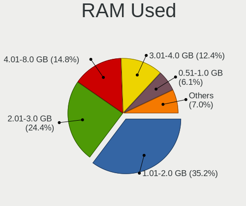
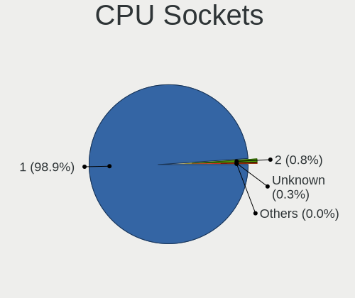
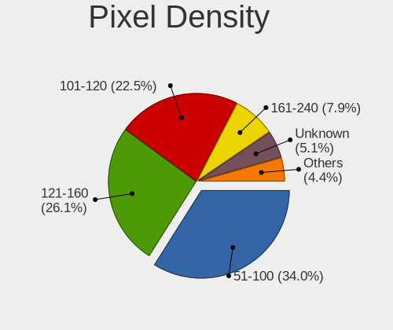
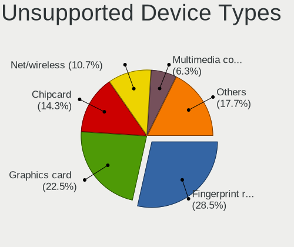

Linux in Germany - Tested Hardware & Statistics
-----------------------------------------------

A project to collect tested hardware configurations for Linux in Germany.

Anyone can contribute to this report by the [hw-probe](https://github.com/linuxhw/hw-probe) tool:

    sudo -E hw-probe -all -upload

Please contribute! Especially if your hardware is rare.

This is a report for all computer types. See also reports for [desktops](/Location/Germany/Desktop/README.md) and [notebooks](/Location/Germany/Notebook/README.md).

Contents
--------

* [ Test Cases ](#test-cases)

* [ System ](#system)
  - [ OS                       ](#os)
  - [ OS Family                ](#os-family)
  - [ Kernel                   ](#kernel)
  - [ Kernel Family            ](#kernel-family)
  - [ Kernel Major Ver.        ](#kernel-major-ver)
  - [ Arch                     ](#arch)
  - [ DE                       ](#de)
  - [ Display Server           ](#display-server)
  - [ Display Manager          ](#display-manager)
  - [ OS Lang                  ](#os-lang)
  - [ Boot Mode                ](#boot-mode)
  - [ Filesystem               ](#filesystem)
  - [ Part. scheme             ](#part-scheme)
  - [ Dual Boot with Linux/BSD ](#dual-boot-with-linuxbsd)
  - [ Dual Boot (Win)          ](#dual-boot-win)

* [ Board ](#board)
  - [ Vendor                   ](#vendor)
  - [ Model                    ](#model)
  - [ Model Family             ](#model-family)
  - [ MFG Year                 ](#mfg-year)
  - [ Form Factor              ](#form-factor)
  - [ Secure Boot              ](#secure-boot)
  - [ Coreboot                 ](#coreboot)
  - [ RAM Size                 ](#ram-size)
  - [ RAM Used                 ](#ram-used)
  - [ Total Drives             ](#total-drives)
  - [ Has CD-ROM               ](#has-cd-rom)
  - [ Has Ethernet             ](#has-ethernet)
  - [ Has WiFi                 ](#has-wifi)
  - [ Has Bluetooth            ](#has-bluetooth)

* [ Location ](#location)
  - [ Country                  ](#country)
  - [ City                     ](#city)

* [ Drives ](#drives)
  - [ Drive Vendor             ](#drive-vendor)
  - [ Drive Model              ](#drive-model)
  - [ HDD Vendor               ](#hdd-vendor)
  - [ SSD Vendor               ](#ssd-vendor)
  - [ Drive Kind               ](#drive-kind)
  - [ Drive Connector          ](#drive-connector)
  - [ Drive Size               ](#drive-size)
  - [ Space Total              ](#space-total)
  - [ Space Used               ](#space-used)
  - [ Malfunc. Drives          ](#malfunc-drives)
  - [ Malfunc. Drive Vendor    ](#malfunc-drive-vendor)
  - [ Malfunc. HDD Vendor      ](#malfunc-hdd-vendor)
  - [ Malfunc. Drive Kind      ](#malfunc-drive-kind)
  - [ Failed Drives            ](#failed-drives)
  - [ Failed Drive Vendor      ](#failed-drive-vendor)
  - [ Drive Status             ](#drive-status)

* [ Storage controller ](#storage-controller)
  - [ Storage Vendor           ](#storage-vendor)
  - [ Storage Model            ](#storage-model)
  - [ Storage Kind             ](#storage-kind)

* [ Processor ](#processor)
  - [ CPU Vendor               ](#cpu-vendor)
  - [ CPU Model                ](#cpu-model)
  - [ CPU Model Family         ](#cpu-model-family)
  - [ CPU Cores                ](#cpu-cores)
  - [ CPU Sockets              ](#cpu-sockets)
  - [ CPU Threads              ](#cpu-threads)
  - [ CPU Op-Modes             ](#cpu-op-modes)
  - [ CPU Microcode            ](#cpu-microcode)
  - [ CPU Microarch            ](#cpu-microarch)

* [ Graphics ](#graphics)
  - [ GPU Vendor               ](#gpu-vendor)
  - [ GPU Model                ](#gpu-model)
  - [ GPU Combo                ](#gpu-combo)
  - [ GPU Driver               ](#gpu-driver)
  - [ GPU Memory               ](#gpu-memory)

* [ Monitor ](#monitor)
  - [ Monitor Vendor           ](#monitor-vendor)
  - [ Monitor Model            ](#monitor-model)
  - [ Monitor Resolution       ](#monitor-resolution)
  - [ Monitor Diagonal         ](#monitor-diagonal)
  - [ Monitor Width            ](#monitor-width)
  - [ Aspect Ratio             ](#aspect-ratio)
  - [ Monitor Area             ](#monitor-area)
  - [ Pixel Density            ](#pixel-density)
  - [ Multiple Monitors        ](#multiple-monitors)

* [ Network ](#network)
  - [ Net Controller Vendor    ](#net-controller-vendor)
  - [ Net Controller Model     ](#net-controller-model)
  - [ Wireless Vendor          ](#wireless-vendor)
  - [ Wireless Model           ](#wireless-model)
  - [ Ethernet Vendor          ](#ethernet-vendor)
  - [ Ethernet Model           ](#ethernet-model)
  - [ Net Controller Kind      ](#net-controller-kind)
  - [ Used Controller          ](#used-controller)
  - [ NICs                     ](#nics)
  - [ IPv6                     ](#ipv6)

* [ Bluetooth ](#bluetooth)
  - [ Bluetooth Vendor         ](#bluetooth-vendor)
  - [ Bluetooth Model          ](#bluetooth-model)

* [ Sound ](#sound)
  - [ Sound Vendor             ](#sound-vendor)
  - [ Sound Model              ](#sound-model)

* [ Memory ](#memory)
  - [ Memory Vendor            ](#memory-vendor)
  - [ Memory Model             ](#memory-model)
  - [ Memory Kind              ](#memory-kind)
  - [ Memory Form Factor       ](#memory-form-factor)
  - [ Memory Size              ](#memory-size)
  - [ Memory Speed             ](#memory-speed)

* [ Printers & scanners ](#printers--scanners)
  - [ Printer Vendor           ](#printer-vendor)
  - [ Printer Model            ](#printer-model)
  - [ Scanner Vendor           ](#scanner-vendor)
  - [ Scanner Model            ](#scanner-model)

* [ Camera ](#camera)
  - [ Camera Vendor            ](#camera-vendor)
  - [ Camera Model             ](#camera-model)

* [ Security ](#security)
  - [ Fingerprint Vendor       ](#fingerprint-vendor)
  - [ Fingerprint Model        ](#fingerprint-model)
  - [ Chipcard Vendor          ](#chipcard-vendor)
  - [ Chipcard Model           ](#chipcard-model)

* [ Unsupported ](#unsupported)
  - [ Unsupported Devices      ](#unsupported-devices)
  - [ Unsupported Device Types ](#unsupported-device-types)

Test Cases
----------

Total: 23333

| Vendor        | Model                       | Form-Factor | Probe                                                      | Date         |
|---------------|-----------------------------|-------------|------------------------------------------------------------|--------------|
| Lenovo        | G50-45 80E3                 | Notebook    | [d4f08c71a6](https://linux-hardware.org/?probe=d4f08c71a6) | Nov 02, 2022 |
| Samsung       | 600B4B/600B5B               | Notebook    | [56767f430b](https://linux-hardware.org/?probe=56767f430b) | Nov 02, 2022 |
| MSI           | MPG B550I GAMING EDGE WI... | Desktop     | [77f847ca29](https://linux-hardware.org/?probe=77f847ca29) | Nov 02, 2022 |
| ASRock        | B450 Pro4                   | Desktop     | [5da1d76cd5](https://linux-hardware.org/?probe=5da1d76cd5) | Nov 02, 2022 |
| Samsung       | 600B4B/600B5B               | Notebook    | [b1ffa94d76](https://linux-hardware.org/?probe=b1ffa94d76) | Nov 02, 2022 |
| ASUSTek       | ROG STRIX Z490-G GAMING     | Desktop     | [706fb22c95](https://linux-hardware.org/?probe=706fb22c95) | Nov 02, 2022 |
| ASRock        | Q1900B-ITX                  | Desktop     | [6305a98777](https://linux-hardware.org/?probe=6305a98777) | Nov 02, 2022 |
| ASUSTek       | ROG STRIX X570-E GAMING     | Desktop     | [86bf890d23](https://linux-hardware.org/?probe=86bf890d23) | Nov 02, 2022 |
| ASUSTek       | ROG STRIX Z490-G GAMING     | Desktop     | [da6ecef3a7](https://linux-hardware.org/?probe=da6ecef3a7) | Nov 02, 2022 |
| Schenker      | VISION 15 (SVS15E21)        | Notebook    | [2b5c165e30](https://linux-hardware.org/?probe=2b5c165e30) | Nov 02, 2022 |
| HP            | 8054                        | Desktop     | [0f866b3605](https://linux-hardware.org/?probe=0f866b3605) | Nov 02, 2022 |
| Lenovo        | Yoga 7 14ACN6 82N7          | Convertible | [2c7d7e2c8a](https://linux-hardware.org/?probe=2c7d7e2c8a) | Nov 02, 2022 |
| ASRock        | N68C-GS UCC                 | Desktop     | [9430ecf81c](https://linux-hardware.org/?probe=9430ecf81c) | Nov 02, 2022 |
| Dell          | XPS 13 9305                 | Notebook    | [4ffebc50a0](https://linux-hardware.org/?probe=4ffebc50a0) | Nov 02, 2022 |
| Lenovo        | ThinkCentre A57 970274G     | Desktop     | [809e137f17](https://linux-hardware.org/?probe=809e137f17) | Nov 02, 2022 |
| Pegatron      | 2AD5                        | Desktop     | [0b91ee456b](https://linux-hardware.org/?probe=0b91ee456b) | Nov 02, 2022 |
| ASUSTek       | F2A55-M LK                  | Desktop     | [40cedc7d2c](https://linux-hardware.org/?probe=40cedc7d2c) | Nov 02, 2022 |
| HP            | 625                         | Notebook    | [830c5c0d14](https://linux-hardware.org/?probe=830c5c0d14) | Nov 02, 2022 |
| MSI           | H97 GAMING 3                | Desktop     | [1a8c44ca83](https://linux-hardware.org/?probe=1a8c44ca83) | Nov 02, 2022 |
| HP            | 625                         | Notebook    | [4c627cab51](https://linux-hardware.org/?probe=4c627cab51) | Nov 02, 2022 |
| HUAWEI        | HVY-WXX9                    | Notebook    | [87ab6daba5](https://linux-hardware.org/?probe=87ab6daba5) | Nov 02, 2022 |
| Lenovo        | IdeaPadFlex 15D 20334       | Notebook    | [005b25ef06](https://linux-hardware.org/?probe=005b25ef06) | Nov 02, 2022 |
| Dell          | Vostro 15 3515              | Notebook    | [59c101934c](https://linux-hardware.org/?probe=59c101934c) | Nov 02, 2022 |
| Pegatron      | 2AD5                        | Desktop     | [5f90d4e478](https://linux-hardware.org/?probe=5f90d4e478) | Nov 02, 2022 |
| ASUSTek       | PRO B460M-C                 | Desktop     | [dcf7112b3d](https://linux-hardware.org/?probe=dcf7112b3d) | Nov 01, 2022 |
| ASUSTek       | PRO B460M-C                 | Desktop     | [a333f47ffa](https://linux-hardware.org/?probe=a333f47ffa) | Nov 01, 2022 |
| HP            | 1905                        | Desktop     | [df0d192970](https://linux-hardware.org/?probe=df0d192970) | Nov 01, 2022 |
| Fujitsu       | LIFEBOOK A532               | Notebook    | [d4af3b0745](https://linux-hardware.org/?probe=d4af3b0745) | Nov 01, 2022 |
| Gigabyte      | P55-UD6                     | Desktop     | [2898ec20b3](https://linux-hardware.org/?probe=2898ec20b3) | Nov 01, 2022 |
| ASUSTek       | M5A78L-M LX V2              | Desktop     | [50bd7a7436](https://linux-hardware.org/?probe=50bd7a7436) | Nov 01, 2022 |
| Dell          | 0C522T A01                  | Desktop     | [efee8139b0](https://linux-hardware.org/?probe=efee8139b0) | Nov 01, 2022 |
| Apple         | Mac-AA95B1DDAB278B95 iMa... | All in one  | [64cb818993](https://linux-hardware.org/?probe=64cb818993) | Nov 01, 2022 |
| HP            | ZBook 15 G3                 | Notebook    | [06ea8207dc](https://linux-hardware.org/?probe=06ea8207dc) | Nov 01, 2022 |
| Lenovo        | ThinkPad E14 Gen 4 21ECS... | Notebook    | [766e7fb0d0](https://linux-hardware.org/?probe=766e7fb0d0) | Nov 01, 2022 |
| Gigabyte      | Z170-HD3P-CF                | Desktop     | [5fd845ca54](https://linux-hardware.org/?probe=5fd845ca54) | Nov 01, 2022 |
| ASUSTek       | TUF Gaming X570-PLUS        | Desktop     | [6e577f6de5](https://linux-hardware.org/?probe=6e577f6de5) | Nov 01, 2022 |
| HP            | 339A                        | Desktop     | [68392c18c9](https://linux-hardware.org/?probe=68392c18c9) | Nov 01, 2022 |
| HUAWEI        | CREM-WXX9                   | Notebook    | [1d24aac4ce](https://linux-hardware.org/?probe=1d24aac4ce) | Nov 01, 2022 |
| HUAWEI        | CREM-WXX9                   | Notebook    | [2eb32b1bb3](https://linux-hardware.org/?probe=2eb32b1bb3) | Nov 01, 2022 |
| Timi          | TM1701                      | Notebook    | [84a5a6ce39](https://linux-hardware.org/?probe=84a5a6ce39) | Nov 01, 2022 |
| Lenovo        | G710 20252                  | Notebook    | [834e3f17aa](https://linux-hardware.org/?probe=834e3f17aa) | Oct 31, 2022 |
| Lenovo        | G710 20252                  | Notebook    | [acc007bae4](https://linux-hardware.org/?probe=acc007bae4) | Oct 31, 2022 |
| HP            | 1850                        | Desktop     | [b39eac8f74](https://linux-hardware.org/?probe=b39eac8f74) | Oct 31, 2022 |
| Lenovo        | ThinkPad L14 Gen 1 20U50... | Notebook    | [c9e0b81f80](https://linux-hardware.org/?probe=c9e0b81f80) | Oct 31, 2022 |
| Sony          | VPCZ12C5E                   | Notebook    | [b1e6524541](https://linux-hardware.org/?probe=b1e6524541) | Oct 31, 2022 |
| Gigabyte      | X99-SLI-CF                  | Desktop     | [d6bc77d638](https://linux-hardware.org/?probe=d6bc77d638) | Oct 31, 2022 |
| Gigabyte      | X570 AORUS ELITE            | Desktop     | [966eb5bb18](https://linux-hardware.org/?probe=966eb5bb18) | Oct 31, 2022 |
| HP            | Laptop 17-ca3xxx            | Notebook    | [2c42913712](https://linux-hardware.org/?probe=2c42913712) | Oct 31, 2022 |
| Unknown       | Unknown                     | Desktop     | [7cce0a2867](https://linux-hardware.org/?probe=7cce0a2867) | Oct 31, 2022 |
| Dell          | Latitude E6500              | Notebook    | [b7be8c3204](https://linux-hardware.org/?probe=b7be8c3204) | Oct 31, 2022 |
| Dell          | Latitude E6500              | Notebook    | [cb3b467ba8](https://linux-hardware.org/?probe=cb3b467ba8) | Oct 31, 2022 |
| Gigabyte      | X570 AORUS ELITE            | Desktop     | [860f45c4c1](https://linux-hardware.org/?probe=860f45c4c1) | Oct 31, 2022 |
| Lenovo        | ThinkPad T495 20NKS01Y00    | Notebook    | [c6a13e1ab3](https://linux-hardware.org/?probe=c6a13e1ab3) | Oct 31, 2022 |
| Lenovo        | ThinkPad T440p 20AW005BG... | Notebook    | [b25134edde](https://linux-hardware.org/?probe=b25134edde) | Oct 31, 2022 |
| Sony          | VPCZ12C5E                   | Notebook    | [85803f499a](https://linux-hardware.org/?probe=85803f499a) | Oct 31, 2022 |
| Lenovo        | G700                        | Notebook    | [9bf9b4e263](https://linux-hardware.org/?probe=9bf9b4e263) | Oct 31, 2022 |
| HP            | 18E4                        | Desktop     | [89b197e8a9](https://linux-hardware.org/?probe=89b197e8a9) | Oct 31, 2022 |
| ASUSTek       | PRIME B450M-A II            | Desktop     | [c23efa8caa](https://linux-hardware.org/?probe=c23efa8caa) | Oct 31, 2022 |
| Sony          | SVT13118FXS                 | Notebook    | [13b4af9ec3](https://linux-hardware.org/?probe=13b4af9ec3) | Oct 31, 2022 |
| Gigabyte      | GA-770TA-UD3                | Desktop     | [4833a609c3](https://linux-hardware.org/?probe=4833a609c3) | Oct 31, 2022 |
| Vulcan Ele... | Excursion XB                | Notebook    | [30ceac1216](https://linux-hardware.org/?probe=30ceac1216) | Oct 31, 2022 |
| MSI           | MAG B550M MORTAR WIFI       | Desktop     | [56ee27b737](https://linux-hardware.org/?probe=56ee27b737) | Oct 31, 2022 |
| ASRock        | Z97 Extreme3                | Desktop     | [c741e4ffe8](https://linux-hardware.org/?probe=c741e4ffe8) | Oct 31, 2022 |
| ASUSTek       | K73SV                       | Notebook    | [d505f0c0d0](https://linux-hardware.org/?probe=d505f0c0d0) | Oct 30, 2022 |
| Lenovo        | ThinkPad Z16 Gen 1 21D4C... | Notebook    | [2e39c3ce92](https://linux-hardware.org/?probe=2e39c3ce92) | Oct 30, 2022 |
| Gigabyte      | X570 GAMING X               | Desktop     | [d6c135685f](https://linux-hardware.org/?probe=d6c135685f) | Oct 30, 2022 |
| Lenovo        | IdeaPad 320-15IKB 80XL      | Notebook    | [cf460716f9](https://linux-hardware.org/?probe=cf460716f9) | Oct 30, 2022 |
| ASUSTek       | A8N32-SLI-Deluxe            | Desktop     | [85389b6454](https://linux-hardware.org/?probe=85389b6454) | Oct 30, 2022 |
| Gigabyte      | Z77M-D3H                    | Desktop     | [83cd207e4e](https://linux-hardware.org/?probe=83cd207e4e) | Oct 30, 2022 |
| HP            | ProBook 450 G6              | Notebook    | [224f9c8141](https://linux-hardware.org/?probe=224f9c8141) | Oct 30, 2022 |
| ASRock        | B550M Pro4                  | Desktop     | [078fd46e0a](https://linux-hardware.org/?probe=078fd46e0a) | Oct 30, 2022 |
| Shuttle       | FH61R                       | Desktop     | [26f86947ef](https://linux-hardware.org/?probe=26f86947ef) | Oct 30, 2022 |
| Lenovo        | ThinkPad L15 Gen 1 20U8S... | Notebook    | [4b778e52ee](https://linux-hardware.org/?probe=4b778e52ee) | Oct 30, 2022 |
| ASRock        | 960GM-VGS3 FX               | Desktop     | [ac82c6bda9](https://linux-hardware.org/?probe=ac82c6bda9) | Oct 30, 2022 |
| ASRock        | X570 Pro4                   | Desktop     | [d2407c253b](https://linux-hardware.org/?probe=d2407c253b) | Oct 30, 2022 |
| HP            | Pavilion x360 Convertibl... | Convertible | [1b3c0e501b](https://linux-hardware.org/?probe=1b3c0e501b) | Oct 30, 2022 |
| Lenovo        | ThinkPad X200 Tablet 745... | Notebook    | [d58eb8b2f0](https://linux-hardware.org/?probe=d58eb8b2f0) | Oct 30, 2022 |
| ASUSTek       | A8N32-SLI-Deluxe            | Desktop     | [55be6f23ce](https://linux-hardware.org/?probe=55be6f23ce) | Oct 30, 2022 |
| Lenovo        | V110-15IAP 80TG             | Notebook    | [01d8b89e0d](https://linux-hardware.org/?probe=01d8b89e0d) | Oct 30, 2022 |
| Lenovo        | ThinkPad X200 Tablet 745... | Notebook    | [032bc01698](https://linux-hardware.org/?probe=032bc01698) | Oct 30, 2022 |
| Lenovo        | V110-15IAP 80TG             | Notebook    | [183feb626d](https://linux-hardware.org/?probe=183feb626d) | Oct 30, 2022 |
| Medion        | MS-7707                     | Desktop     | [4f018e8577](https://linux-hardware.org/?probe=4f018e8577) | Oct 30, 2022 |
| Tactus        | GeoBook 140                 | Notebook    | [71f32a229a](https://linux-hardware.org/?probe=71f32a229a) | Oct 30, 2022 |
| MSI           | MS-7358                     | Desktop     | [3ddf4b8fff](https://linux-hardware.org/?probe=3ddf4b8fff) | Oct 30, 2022 |
| ASRock        | 960GM-VGS3 FX               | Desktop     | [5769997d2a](https://linux-hardware.org/?probe=5769997d2a) | Oct 29, 2022 |
| Lenovo        | ThinkPad E14 Gen 3 20Y70... | Notebook    | [97425e2f52](https://linux-hardware.org/?probe=97425e2f52) | Oct 29, 2022 |
| Lenovo        | ThinkPad E15 Gen 2 20T9S... | Notebook    | [42fcb880db](https://linux-hardware.org/?probe=42fcb880db) | Oct 29, 2022 |
| HP            | 0AECh D                     | Desktop     | [ee09a01e9e](https://linux-hardware.org/?probe=ee09a01e9e) | Oct 29, 2022 |
| Apple         | MacBookPro11,2              | Notebook    | [c5955c7440](https://linux-hardware.org/?probe=c5955c7440) | Oct 29, 2022 |
| Lenovo        | G710 20252                  | Notebook    | [f700e495ba](https://linux-hardware.org/?probe=f700e495ba) | Oct 29, 2022 |
| ASRock        | Z77 Pro4                    | Desktop     | [5ab5790e5f](https://linux-hardware.org/?probe=5ab5790e5f) | Oct 29, 2022 |
| Lenovo        | ThinkPad E15 Gen 2 20T9S... | Notebook    | [242fbb2c79](https://linux-hardware.org/?probe=242fbb2c79) | Oct 29, 2022 |
| ASRock        | Z77 Pro4                    | Desktop     | [74cc7f147b](https://linux-hardware.org/?probe=74cc7f147b) | Oct 29, 2022 |
| Fujitsu       | D3161-A1 S26361-D3161-A1    | Desktop     | [068d4ec2e6](https://linux-hardware.org/?probe=068d4ec2e6) | Oct 29, 2022 |
| Apple         | MacBookPro3,1               | Notebook    | [27a5553057](https://linux-hardware.org/?probe=27a5553057) | Oct 29, 2022 |
| HP            | Laptop 17-bs0xx             | Notebook    | [68238274ff](https://linux-hardware.org/?probe=68238274ff) | Oct 29, 2022 |
| Acer          | Extensa 5635ZG              | Notebook    | [8c0a7c0aa1](https://linux-hardware.org/?probe=8c0a7c0aa1) | Oct 29, 2022 |
| Fujitsu       | D3221-A1 S26361-D3221-A1    | Desktop     | [2c57f9b6a3](https://linux-hardware.org/?probe=2c57f9b6a3) | Oct 29, 2022 |
| MSI           | GE60 0NC\0ND                | Notebook    | [79bd38da8f](https://linux-hardware.org/?probe=79bd38da8f) | Oct 29, 2022 |
| Dell          | Latitude 5590               | Notebook    | [c7fa986fbd](https://linux-hardware.org/?probe=c7fa986fbd) | Oct 29, 2022 |
| Lenovo        | ThinkPad T480s 20L8S4PR1... | Notebook    | [d99f500b00](https://linux-hardware.org/?probe=d99f500b00) | Oct 29, 2022 |
| Lenovo        | V15-IGL 82C3                | Notebook    | [5bd4292187](https://linux-hardware.org/?probe=5bd4292187) | Oct 29, 2022 |
| Pine Micro... | Pine64 PinePhone (1.2)      | Phone       | [fce691523b](https://linux-hardware.org/?probe=fce691523b) | Oct 29, 2022 |
| Lenovo        | ThinkPad E15 Gen 2 20T9S... | Notebook    | [7800fc7b5b](https://linux-hardware.org/?probe=7800fc7b5b) | Oct 29, 2022 |
| Gigabyte      | X570 AORUS ELITE            | Desktop     | [836d9e4de1](https://linux-hardware.org/?probe=836d9e4de1) | Oct 29, 2022 |
| Gigabyte      | X570 AORUS ELITE            | Desktop     | [b7b7481628](https://linux-hardware.org/?probe=b7b7481628) | Oct 29, 2022 |
| Dell          | 0GY6Y8 A03                  | Desktop     | [1c95e9ba40](https://linux-hardware.org/?probe=1c95e9ba40) | Oct 28, 2022 |
| HP            | 255 G8 Notebook PC          | Notebook    | [7e9c19c994](https://linux-hardware.org/?probe=7e9c19c994) | Oct 28, 2022 |
| Lenovo        | IdeaPad 3 15ADA05 81W1      | Notebook    | [0971db18ed](https://linux-hardware.org/?probe=0971db18ed) | Oct 28, 2022 |
| ASUSTek       | PRIME H670-PLUS D4          | Desktop     | [ce9a718851](https://linux-hardware.org/?probe=ce9a718851) | Oct 28, 2022 |
| TUXEDO        | Unknown                     | Notebook    | [99555fc4eb](https://linux-hardware.org/?probe=99555fc4eb) | Oct 28, 2022 |
| Lenovo        | ThinkPad W530 2438CTO       | Notebook    | [1915c9d3b0](https://linux-hardware.org/?probe=1915c9d3b0) | Oct 28, 2022 |
| Lenovo        | ThinkPad Edge E320 1298R... | Notebook    | [c79d1e6209](https://linux-hardware.org/?probe=c79d1e6209) | Oct 28, 2022 |
| TUXEDO        | Aura 15 Gen1                | Notebook    | [4055c79756](https://linux-hardware.org/?probe=4055c79756) | Oct 28, 2022 |
| ASRock        | Z87 Extreme6                | Desktop     | [a3056065b9](https://linux-hardware.org/?probe=a3056065b9) | Oct 28, 2022 |
| Dell          | Inspiron MM061              | Notebook    | [e1709bf653](https://linux-hardware.org/?probe=e1709bf653) | Oct 28, 2022 |
| Dell          | Inspiron MM061              | Notebook    | [05cffb09e0](https://linux-hardware.org/?probe=05cffb09e0) | Oct 28, 2022 |
| Acer          | Aspire E5-575G              | Notebook    | [04d54cb9c8](https://linux-hardware.org/?probe=04d54cb9c8) | Oct 28, 2022 |
| ASRock        | Z87 Extreme6                | Desktop     | [b9e3562398](https://linux-hardware.org/?probe=b9e3562398) | Oct 28, 2022 |
| Dell          | Inspiron 15 3511            | Notebook    | [7cc13c49e2](https://linux-hardware.org/?probe=7cc13c49e2) | Oct 28, 2022 |
| HP            | 339A                        | Desktop     | [0fdbd7b1d7](https://linux-hardware.org/?probe=0fdbd7b1d7) | Oct 28, 2022 |
| HP            | 250 G5 Notebook PC          | Notebook    | [da6915a49b](https://linux-hardware.org/?probe=da6915a49b) | Oct 28, 2022 |
| ASUSTek       | ROG CROSSHAIR VI EXTREME    | Desktop     | [d66f4b6bd9](https://linux-hardware.org/?probe=d66f4b6bd9) | Oct 28, 2022 |
| Lenovo        | ThinkPad E470 20H2S00700    | Notebook    | [768c6c8357](https://linux-hardware.org/?probe=768c6c8357) | Oct 28, 2022 |
| Dell          | Inspiron 5490               | Notebook    | [bbea359211](https://linux-hardware.org/?probe=bbea359211) | Oct 28, 2022 |
| Packard Be... | EasyNote MH45               | Notebook    | [b9aa4cc6d5](https://linux-hardware.org/?probe=b9aa4cc6d5) | Oct 27, 2022 |
| Toshiba       | Satellite L300              | Notebook    | [60618ba137](https://linux-hardware.org/?probe=60618ba137) | Oct 27, 2022 |
| Lenovo        | G710 20252                  | Notebook    | [d15bee47c4](https://linux-hardware.org/?probe=d15bee47c4) | Oct 27, 2022 |
| Gigabyte      | B450 AORUS ELITE            | Desktop     | [81e31b481f](https://linux-hardware.org/?probe=81e31b481f) | Oct 27, 2022 |
| HP            | EliteBook 850 G8 Noteboo... | Notebook    | [84acb8d19b](https://linux-hardware.org/?probe=84acb8d19b) | Oct 27, 2022 |
| Radxa         | Zero                        | Soc         | [e35d41a9a6](https://linux-hardware.org/?probe=e35d41a9a6) | Oct 27, 2022 |
| LG Electro... | 16T90P-G.AA78G              | Convertible | [017014433e](https://linux-hardware.org/?probe=017014433e) | Oct 27, 2022 |
| Lenovo        | ThinkPad E15 Gen 4 21E6C... | Notebook    | [7ffc8c3537](https://linux-hardware.org/?probe=7ffc8c3537) | Oct 27, 2022 |
| Intel         | NUC5i5MYBE H47797-206       | Mini pc     | [9cc560907d](https://linux-hardware.org/?probe=9cc560907d) | Oct 27, 2022 |
| ASUSTek       | UL50VT                      | Notebook    | [e156a74255](https://linux-hardware.org/?probe=e156a74255) | Oct 27, 2022 |
| HP            | 894B 10                     | Desktop     | [56afe0f581](https://linux-hardware.org/?probe=56afe0f581) | Oct 27, 2022 |
| HUAWEI        | NBLB-WAX9N                  | Notebook    | [3541e2e011](https://linux-hardware.org/?probe=3541e2e011) | Oct 27, 2022 |
| ASUSTek       | ZenBook UX363EA_UX363EA     | Convertible | [226e4471e1](https://linux-hardware.org/?probe=226e4471e1) | Oct 27, 2022 |
| ZOTAC         | ZBOX-EN72080V/EN72070V/E... | Mini pc     | [fef5f08978](https://linux-hardware.org/?probe=fef5f08978) | Oct 27, 2022 |
| Lenovo        | ThinkPad L590 20Q7001HGE    | Notebook    | [187544b911](https://linux-hardware.org/?probe=187544b911) | Oct 27, 2022 |
| Dell          | Precision 7760              | Notebook    | [b8fce270db](https://linux-hardware.org/?probe=b8fce270db) | Oct 27, 2022 |
| Acer          | Aspire 8730                 | Notebook    | [86bffd9523](https://linux-hardware.org/?probe=86bffd9523) | Oct 27, 2022 |
| Gigabyte      | H370 HD3-CF                 | Desktop     | [275bc51aaf](https://linux-hardware.org/?probe=275bc51aaf) | Oct 27, 2022 |
| ASUSTek       | ROG CROSSHAIR VIII HERO     | Desktop     | [865ff52614](https://linux-hardware.org/?probe=865ff52614) | Oct 27, 2022 |
| ASUSTek       | ROG CROSSHAIR VIII HERO     | Desktop     | [4411ceb907](https://linux-hardware.org/?probe=4411ceb907) | Oct 27, 2022 |
| HP            | 2B17                        | Desktop     | [9e5c7e9258](https://linux-hardware.org/?probe=9e5c7e9258) | Oct 27, 2022 |
| Lenovo        | ThinkPad E15 Gen 2 20TD0... | Notebook    | [4386ec3fb8](https://linux-hardware.org/?probe=4386ec3fb8) | Oct 27, 2022 |
| Gigabyte      | B450M DS3H-CF               | Desktop     | [4659be383c](https://linux-hardware.org/?probe=4659be383c) | Oct 27, 2022 |
| HP            | 1494                        | Desktop     | [ce43cdfac1](https://linux-hardware.org/?probe=ce43cdfac1) | Oct 26, 2022 |
| HP            | 1494                        | Desktop     | [a23d74a9b3](https://linux-hardware.org/?probe=a23d74a9b3) | Oct 26, 2022 |
| Acer          | Aspire E3-112               | Notebook    | [fd34f66305](https://linux-hardware.org/?probe=fd34f66305) | Oct 26, 2022 |
| HP            | ProBook 445 G7              | Notebook    | [d9f63cbff8](https://linux-hardware.org/?probe=d9f63cbff8) | Oct 26, 2022 |
| ASUSTek       | Maximus VIII HERO           | Desktop     | [cb657f604d](https://linux-hardware.org/?probe=cb657f604d) | Oct 26, 2022 |
| ASUSTek       | X510UQ                      | Notebook    | [8907b3e019](https://linux-hardware.org/?probe=8907b3e019) | Oct 26, 2022 |
| LincPlus      | P1                          | Notebook    | [cc97e9ec36](https://linux-hardware.org/?probe=cc97e9ec36) | Oct 26, 2022 |
| Fujitsu       | D3498-A2 S26361-D3498-A2    | Desktop     | [d34926f87f](https://linux-hardware.org/?probe=d34926f87f) | Oct 26, 2022 |
| ASUSTek       | TUF Gaming B660M-PLUS D4    | Desktop     | [26c34998ae](https://linux-hardware.org/?probe=26c34998ae) | Oct 26, 2022 |
| Fujitsu       | D3313-A1 S26361-D3313-A1    | Desktop     | [8c97ee418a](https://linux-hardware.org/?probe=8c97ee418a) | Oct 26, 2022 |
| Fujitsu       | D3221-A1 S26361-D3221-A1    | Desktop     | [7a0f5285f2](https://linux-hardware.org/?probe=7a0f5285f2) | Oct 26, 2022 |
| Dell          | Precision 5570              | Notebook    | [3d5a222867](https://linux-hardware.org/?probe=3d5a222867) | Oct 26, 2022 |
| HP            | ProBook 640 G1              | Notebook    | [e30a33bfd8](https://linux-hardware.org/?probe=e30a33bfd8) | Oct 26, 2022 |
| ASRock        | B450 Pro4                   | Desktop     | [666aba57b3](https://linux-hardware.org/?probe=666aba57b3) | Oct 26, 2022 |
| MSI           | MPG Z490 GAMING EDGE WIF... | Desktop     | [ed68d3c49d](https://linux-hardware.org/?probe=ed68d3c49d) | Oct 26, 2022 |
| MSI           | MPG Z490 GAMING EDGE WIF... | Desktop     | [8248930fb7](https://linux-hardware.org/?probe=8248930fb7) | Oct 26, 2022 |
| ASRock        | FM2A78M-HD+                 | Desktop     | [2d0d5ac22b](https://linux-hardware.org/?probe=2d0d5ac22b) | Oct 26, 2022 |
| Dell          | Latitude 7480               | Notebook    | [ec106dc62b](https://linux-hardware.org/?probe=ec106dc62b) | Oct 26, 2022 |
| Fujitsu       | D2679-B1 S26361-D2679-Bx... | Desktop     | [8e957f305e](https://linux-hardware.org/?probe=8e957f305e) | Oct 26, 2022 |
| HP            | 250 G5 Notebook PC          | Notebook    | [3f112eb783](https://linux-hardware.org/?probe=3f112eb783) | Oct 26, 2022 |
| HP            | 250 G5 Notebook PC          | Notebook    | [282a978812](https://linux-hardware.org/?probe=282a978812) | Oct 26, 2022 |
| Medion        | Unknown                     | Notebook    | [4645bf772f](https://linux-hardware.org/?probe=4645bf772f) | Oct 26, 2022 |
| HUAWEI        | BOM-WXX9                    | Notebook    | [bd0f4d864e](https://linux-hardware.org/?probe=bd0f4d864e) | Oct 25, 2022 |
| ASUSTek       | ROG Zephyrus G14 GA401QC... | Notebook    | [ae3d3abdf0](https://linux-hardware.org/?probe=ae3d3abdf0) | Oct 25, 2022 |
| Gigabyte      | GA-MA770-UD3                | Desktop     | [ef555f6161](https://linux-hardware.org/?probe=ef555f6161) | Oct 25, 2022 |
| Acer          | Aspire 5750                 | Notebook    | [20df7ad008](https://linux-hardware.org/?probe=20df7ad008) | Oct 25, 2022 |
| Fujitsu       | D3161-A1 S26361-D3161-A1    | Desktop     | [46d64e9947](https://linux-hardware.org/?probe=46d64e9947) | Oct 25, 2022 |
| MSI           | B450 GAMING PLUS MAX        | Desktop     | [bb655d6ea7](https://linux-hardware.org/?probe=bb655d6ea7) | Oct 25, 2022 |
| ASUSTek       | P5K-VM                      | Desktop     | [cc1ae5c7f4](https://linux-hardware.org/?probe=cc1ae5c7f4) | Oct 25, 2022 |
| Dell          | Precision 5570              | Notebook    | [d74abc314b](https://linux-hardware.org/?probe=d74abc314b) | Oct 25, 2022 |
| ASUSTek       | TUF Gaming B550M-PLUS       | Desktop     | [3c65639aad](https://linux-hardware.org/?probe=3c65639aad) | Oct 25, 2022 |
| sunxi         | LeMaker Banana Pi           | Soc         | [f119d203e0](https://linux-hardware.org/?probe=f119d203e0) | Oct 25, 2022 |
| Valve         | Jupiter                     | Notebook    | [98a9dbc46f](https://linux-hardware.org/?probe=98a9dbc46f) | Oct 25, 2022 |
| MSI           | B450M PRO-VDH MAX           | Desktop     | [c1ce4e70e0](https://linux-hardware.org/?probe=c1ce4e70e0) | Oct 25, 2022 |
| ASUSTek       | PRIME B550M-A               | Desktop     | [64e6199c96](https://linux-hardware.org/?probe=64e6199c96) | Oct 25, 2022 |
| Lenovo        | IdeaPad U530 Touch 20289    | Notebook    | [93932086e7](https://linux-hardware.org/?probe=93932086e7) | Oct 25, 2022 |
| Intel         | NUC7JYB J67967-404          | Mini pc     | [739b6fc4a9](https://linux-hardware.org/?probe=739b6fc4a9) | Oct 25, 2022 |
| Lenovo        | IdeaPad 320-15AST 80XV      | Notebook    | [80177955c3](https://linux-hardware.org/?probe=80177955c3) | Oct 25, 2022 |
| Fujitsu       | D3161-A1 S26361-D3161-A1    | Desktop     | [4ef2a348fc](https://linux-hardware.org/?probe=4ef2a348fc) | Oct 25, 2022 |
| Lenovo        | ThinkPad X1 Carbon 5th 2... | Notebook    | [e4d7dc5f38](https://linux-hardware.org/?probe=e4d7dc5f38) | Oct 25, 2022 |
| Raspberry ... | Raspberry Pi 4 Model B R... | Soc         | [6dc9ec5190](https://linux-hardware.org/?probe=6dc9ec5190) | Oct 24, 2022 |
| Hardkernel    | ODROID-H2                   | Desktop     | [6398e45c99](https://linux-hardware.org/?probe=6398e45c99) | Oct 24, 2022 |
| Medion        | P8612                       | Notebook    | [a5c437d5f8](https://linux-hardware.org/?probe=a5c437d5f8) | Oct 24, 2022 |
| HP            | Laptop 17-cp0xxx            | Notebook    | [4a818d766f](https://linux-hardware.org/?probe=4a818d766f) | Oct 24, 2022 |
| Gigabyte      | EP45-DS3L                   | Desktop     | [ee6005f3e7](https://linux-hardware.org/?probe=ee6005f3e7) | Oct 24, 2022 |
| Gigabyte      | EP45-DS3L                   | Desktop     | [b2a8d40905](https://linux-hardware.org/?probe=b2a8d40905) | Oct 24, 2022 |
| HP            | 2B17                        | Desktop     | [4a29395403](https://linux-hardware.org/?probe=4a29395403) | Oct 24, 2022 |
| ASUSTek       | PRIME A320M-K               | Desktop     | [c0b3f0d88e](https://linux-hardware.org/?probe=c0b3f0d88e) | Oct 24, 2022 |
| Dell          | XPS 15 9500                 | Notebook    | [ebe6337ddc](https://linux-hardware.org/?probe=ebe6337ddc) | Oct 24, 2022 |
| TUXEDO        | Polaris (CML/Gen2)          | Notebook    | [3cb2ce5a02](https://linux-hardware.org/?probe=3cb2ce5a02) | Oct 24, 2022 |
| Gigabyte      | Z77-DS3H                    | Desktop     | [e894ec1b8d](https://linux-hardware.org/?probe=e894ec1b8d) | Oct 24, 2022 |
| ASUSTek       | STRIX Z270F GAMING          | Desktop     | [ce3e956a0a](https://linux-hardware.org/?probe=ce3e956a0a) | Oct 24, 2022 |
| Tactus        | GeoBook_240                 | Notebook    | [5331bf15bd](https://linux-hardware.org/?probe=5331bf15bd) | Oct 23, 2022 |
| ASUSTek       | PB62                        | Desktop     | [ddec39293d](https://linux-hardware.org/?probe=ddec39293d) | Oct 23, 2022 |
| Dell          | XPS 15 9500                 | Notebook    | [5fc8ebf31f](https://linux-hardware.org/?probe=5fc8ebf31f) | Oct 23, 2022 |
| ASUSTek       | P8Z68-V LX                  | Desktop     | [86cff422a6](https://linux-hardware.org/?probe=86cff422a6) | Oct 23, 2022 |
| Valve         | Jupiter                     | Notebook    | [6e4712d276](https://linux-hardware.org/?probe=6e4712d276) | Oct 23, 2022 |
| Medion        | MS-7707                     | Desktop     | [e6d2f4c633](https://linux-hardware.org/?probe=e6d2f4c633) | Oct 23, 2022 |
| ASRock        | FM2A88X-ITX+                | Desktop     | [4865089bf5](https://linux-hardware.org/?probe=4865089bf5) | Oct 23, 2022 |
| Lenovo        | ThinkPad E15 Gen 4 21EES... | Notebook    | [7f98afbe41](https://linux-hardware.org/?probe=7f98afbe41) | Oct 23, 2022 |
| Lenovo        | Yoga 520-14IKB 81C8         | Convertible | [dac168fe77](https://linux-hardware.org/?probe=dac168fe77) | Oct 23, 2022 |
| MSI           | A320M PRO-M2 V2             | Desktop     | [1691497b7a](https://linux-hardware.org/?probe=1691497b7a) | Oct 23, 2022 |
| Unknown       | 1.0                         | Desktop     | [2a12c33601](https://linux-hardware.org/?probe=2a12c33601) | Oct 23, 2022 |
| Lenovo        | ThinkPad L15 Gen 1 20U70... | Notebook    | [b5315c133f](https://linux-hardware.org/?probe=b5315c133f) | Oct 23, 2022 |
| Valve         | Jupiter                     | Notebook    | [719742423c](https://linux-hardware.org/?probe=719742423c) | Oct 23, 2022 |
| MSI           | 760GM-P23                   | Desktop     | [21db3e8ee8](https://linux-hardware.org/?probe=21db3e8ee8) | Oct 23, 2022 |
| HP            | 3647h                       | Desktop     | [b65d5d4bff](https://linux-hardware.org/?probe=b65d5d4bff) | Oct 23, 2022 |
| Samsung       | R59P/R60P/R61P              | Notebook    | [0465cb7dee](https://linux-hardware.org/?probe=0465cb7dee) | Oct 23, 2022 |
| Lenovo        | ThinkPad T460s 20FAS6EH0... | Notebook    | [794fa1859f](https://linux-hardware.org/?probe=794fa1859f) | Oct 23, 2022 |
| Schenker      | VISION 15 (SVS15E21)        | Notebook    | [8138e910ce](https://linux-hardware.org/?probe=8138e910ce) | Oct 23, 2022 |
| ASUSTek       | X510UQ                      | Notebook    | [6d976f6f96](https://linux-hardware.org/?probe=6d976f6f96) | Oct 23, 2022 |
| Lenovo        | IdeaPad 5 15ALC05 82LN      | Notebook    | [4884be1a24](https://linux-hardware.org/?probe=4884be1a24) | Oct 22, 2022 |
| Apple         | MacBookPro3,1               | Notebook    | [64087e63a2](https://linux-hardware.org/?probe=64087e63a2) | Oct 22, 2022 |
| ASRock        | FM2A68M-HD+                 | Desktop     | [1a49be478c](https://linux-hardware.org/?probe=1a49be478c) | Oct 22, 2022 |
| Panasonic     | CF-LX3J-50M3                | Notebook    | [949acb4c3a](https://linux-hardware.org/?probe=949acb4c3a) | Oct 22, 2022 |
| Lenovo        | IdeaPad 3 17ABA7 82RQ       | Notebook    | [a8a9cdfabc](https://linux-hardware.org/?probe=a8a9cdfabc) | Oct 22, 2022 |
| Gigabyte      | TRX40 DESIGNARE             | Desktop     | [16f90b14dc](https://linux-hardware.org/?probe=16f90b14dc) | Oct 22, 2022 |
| Lenovo        | IdeaPad 3 17ABA7 82RQ       | Notebook    | [d82378ea41](https://linux-hardware.org/?probe=d82378ea41) | Oct 22, 2022 |
| Acer          | Aspire TC-780               | Desktop     | [fd6c66dac7](https://linux-hardware.org/?probe=fd6c66dac7) | Oct 22, 2022 |
| Lenovo        | ThinkPad X200 7459J74       | Notebook    | [7ca95da1a5](https://linux-hardware.org/?probe=7ca95da1a5) | Oct 22, 2022 |
| Lenovo        | IdeaPad 5 15ALC05 82LN      | Notebook    | [079a05485d](https://linux-hardware.org/?probe=079a05485d) | Oct 22, 2022 |
| MSI           | B550-A PRO                  | Desktop     | [52d3513a9c](https://linux-hardware.org/?probe=52d3513a9c) | Oct 22, 2022 |
| ASUSTek       | X705UAP                     | Notebook    | [97de42a1ec](https://linux-hardware.org/?probe=97de42a1ec) | Oct 22, 2022 |
| Lenovo        | 1036 SDK0K17763 WIN 1801... | Desktop     | [94f3d7aa9d](https://linux-hardware.org/?probe=94f3d7aa9d) | Oct 22, 2022 |
| HP            | 81C3                        | Desktop     | [8c2524a9ba](https://linux-hardware.org/?probe=8c2524a9ba) | Oct 22, 2022 |
| Global Dis... | W11651                      | Notebook    | [9cf1e2df07](https://linux-hardware.org/?probe=9cf1e2df07) | Oct 22, 2022 |
| Lenovo        | ThinkPad X270 W10DG 20K6... | Notebook    | [c097316857](https://linux-hardware.org/?probe=c097316857) | Oct 22, 2022 |
| PC Special... | N750HU                      | Notebook    | [c90194cfb9](https://linux-hardware.org/?probe=c90194cfb9) | Oct 22, 2022 |
| Lenovo        | Legion 5 82B5               | Notebook    | [3d67f01531](https://linux-hardware.org/?probe=3d67f01531) | Oct 22, 2022 |
| MSI           | MPG X570 GAMING EDGE WIF... | Desktop     | [edf45abefe](https://linux-hardware.org/?probe=edf45abefe) | Oct 21, 2022 |
| MSI           | B550-A PRO                  | Desktop     | [d17faed180](https://linux-hardware.org/?probe=d17faed180) | Oct 21, 2022 |
| Lenovo        | ThinkPad E15 Gen 3 20YG0... | Notebook    | [8eebebb58f](https://linux-hardware.org/?probe=8eebebb58f) | Oct 21, 2022 |
| Lenovo        | Yoga 7 15ITL5 82BJ          | Convertible | [a623ace599](https://linux-hardware.org/?probe=a623ace599) | Oct 21, 2022 |
| MSI           | Katana GF76 11UG            | Notebook    | [ab90111e61](https://linux-hardware.org/?probe=ab90111e61) | Oct 21, 2022 |
| Dell          | 0GM819                      | Desktop     | [e2ebe8bae1](https://linux-hardware.org/?probe=e2ebe8bae1) | Oct 21, 2022 |
| ASUSTek       | P8Z68-V GEN3                | Desktop     | [24a7381e8b](https://linux-hardware.org/?probe=24a7381e8b) | Oct 21, 2022 |
| MSI           | A320M-A PRO MAX             | Desktop     | [774861eae7](https://linux-hardware.org/?probe=774861eae7) | Oct 21, 2022 |
| ASRock        | N68-S                       | Desktop     | [3cfa7cd9f8](https://linux-hardware.org/?probe=3cfa7cd9f8) | Oct 21, 2022 |
| Lenovo        | Legion 5 Pro 16IAH7H 82R... | Notebook    | [1ab0245c57](https://linux-hardware.org/?probe=1ab0245c57) | Oct 21, 2022 |
| Acer          | Swift SF314-42              | Notebook    | [2449f6a1b7](https://linux-hardware.org/?probe=2449f6a1b7) | Oct 21, 2022 |
| Timi          | Xiaomi Book Pro 16 2022     | Notebook    | [41bade1339](https://linux-hardware.org/?probe=41bade1339) | Oct 21, 2022 |
| Lenovo        | Legion 5 Pro 16IAH7H 82R... | Notebook    | [1c9e2ec0c2](https://linux-hardware.org/?probe=1c9e2ec0c2) | Oct 21, 2022 |
| Fujitsu       | LIFEBOOK E746               | Notebook    | [4c699ac628](https://linux-hardware.org/?probe=4c699ac628) | Oct 21, 2022 |
| MSI           | H81M-E34                    | Desktop     | [b036f0d602](https://linux-hardware.org/?probe=b036f0d602) | Oct 21, 2022 |
| Intel         | NUC12WSBi7 M46422-302       | Mini pc     | [c389b44ab5](https://linux-hardware.org/?probe=c389b44ab5) | Oct 21, 2022 |
| ASUSTek       | Z97-P                       | Desktop     | [f5b8282e1f](https://linux-hardware.org/?probe=f5b8282e1f) | Oct 21, 2022 |
| Dell          | Precision M6800             | Notebook    | [9b909039ee](https://linux-hardware.org/?probe=9b909039ee) | Oct 21, 2022 |
| Lenovo        | 310B SDK0J40705 WIN 3425... | Desktop     | [8a5ccf8170](https://linux-hardware.org/?probe=8a5ccf8170) | Oct 21, 2022 |
| ASUSTek       | ZenBook UX363EA_UX363EA     | Convertible | [27c047341d](https://linux-hardware.org/?probe=27c047341d) | Oct 21, 2022 |
| Acer          | Extensa 215-52              | Notebook    | [aaf7209d03](https://linux-hardware.org/?probe=aaf7209d03) | Oct 21, 2022 |
| ASUSTek       | H97I-PLUS                   | Desktop     | [b403dcc362](https://linux-hardware.org/?probe=b403dcc362) | Oct 21, 2022 |
| Dell          | Vostro V13                  | Notebook    | [c7cd7a2ddf](https://linux-hardware.org/?probe=c7cd7a2ddf) | Oct 21, 2022 |
| Dell          | Vostro V13                  | Notebook    | [43eb559763](https://linux-hardware.org/?probe=43eb559763) | Oct 21, 2022 |
| HP            | 2B17                        | Desktop     | [649ee9692f](https://linux-hardware.org/?probe=649ee9692f) | Oct 21, 2022 |
| Radxa         | ROCK Pi 4B (DT)             | Soc         | [f05063925b](https://linux-hardware.org/?probe=f05063925b) | Oct 21, 2022 |
| Lenovo        | ThinkPad E15 Gen 4 21EES... | Notebook    | [b13dc58884](https://linux-hardware.org/?probe=b13dc58884) | Oct 20, 2022 |
| MSI           | GT70 0NC/GT70 0NC           | Notebook    | [592b788d62](https://linux-hardware.org/?probe=592b788d62) | Oct 20, 2022 |
| ASRock        | Q1900-ITX                   | Desktop     | [c9d76cd138](https://linux-hardware.org/?probe=c9d76cd138) | Oct 20, 2022 |
| Gigabyte      | B550 AORUS ELITE V2         | Desktop     | [7a1b569725](https://linux-hardware.org/?probe=7a1b569725) | Oct 20, 2022 |
| Dell          | Latitude 5520               | Notebook    | [0455df4135](https://linux-hardware.org/?probe=0455df4135) | Oct 20, 2022 |
| HP            | 1850                        | Desktop     | [786fd367d5](https://linux-hardware.org/?probe=786fd367d5) | Oct 20, 2022 |
| Acer          | Extensa M2610 V:1.0         | Desktop     | [1791236969](https://linux-hardware.org/?probe=1791236969) | Oct 20, 2022 |
| Lenovo        | G780                        | Notebook    | [986b0fdbd0](https://linux-hardware.org/?probe=986b0fdbd0) | Oct 20, 2022 |
| Acer          | Extensa M2610 V:1.0         | Desktop     | [e482e312c8](https://linux-hardware.org/?probe=e482e312c8) | Oct 20, 2022 |
| HP            | Laptop 15-db0xxx            | Notebook    | [c9962923a9](https://linux-hardware.org/?probe=c9962923a9) | Oct 20, 2022 |
| HP            | ZBook Firefly 15 inch G8... | Notebook    | [4c0b27f18e](https://linux-hardware.org/?probe=4c0b27f18e) | Oct 20, 2022 |
| HP            | EliteBook Folio 9470m       | Notebook    | [8e8d9a5c1d](https://linux-hardware.org/?probe=8e8d9a5c1d) | Oct 20, 2022 |
| Apple         | Mac-942B59F58194171B iMa... | All in one  | [f91d8722f9](https://linux-hardware.org/?probe=f91d8722f9) | Oct 20, 2022 |
| HP            | EliteBook Folio 9470m       | Notebook    | [5b059add3e](https://linux-hardware.org/?probe=5b059add3e) | Oct 20, 2022 |
| HP            | ENVY Laptop 17-ch1xxx       | Notebook    | [162e7a20b2](https://linux-hardware.org/?probe=162e7a20b2) | Oct 20, 2022 |
| Valve         | Jupiter                     | Notebook    | [53e7ae8cd4](https://linux-hardware.org/?probe=53e7ae8cd4) | Oct 20, 2022 |
| HP            | EliteBook 850 G2            | Notebook    | [b6fd429ceb](https://linux-hardware.org/?probe=b6fd429ceb) | Oct 20, 2022 |
| Valve         | Jupiter                     | Notebook    | [bdca0279e2](https://linux-hardware.org/?probe=bdca0279e2) | Oct 20, 2022 |
| HP            | EliteBook 850 G2            | Notebook    | [f33baf66a9](https://linux-hardware.org/?probe=f33baf66a9) | Oct 20, 2022 |
| HP            | 250 G8 Notebook PC          | Notebook    | [e8dc04cc0e](https://linux-hardware.org/?probe=e8dc04cc0e) | Oct 20, 2022 |
| HUAWEI        | HLYL-WXX9                   | Notebook    | [6a7e7ac7ce](https://linux-hardware.org/?probe=6a7e7ac7ce) | Oct 19, 2022 |
| ASUSTek       | Z170 PRO GAMING             | Desktop     | [01338c4f3c](https://linux-hardware.org/?probe=01338c4f3c) | Oct 19, 2022 |
| ASRock        | B450 Pro4                   | Desktop     | [d7784759fb](https://linux-hardware.org/?probe=d7784759fb) | Oct 19, 2022 |
| MSI           | A320M PRO-M2 V2             | Desktop     | [7524f39579](https://linux-hardware.org/?probe=7524f39579) | Oct 19, 2022 |
| Dell          | Latitude 7420               | Notebook    | [332d2cd420](https://linux-hardware.org/?probe=332d2cd420) | Oct 19, 2022 |
| HP            | Pavilion Laptop 15-cs3xx... | Notebook    | [30bf540299](https://linux-hardware.org/?probe=30bf540299) | Oct 19, 2022 |
| Lenovo        | ThinkPad T460s 20FAS1Q10... | Notebook    | [a96060006f](https://linux-hardware.org/?probe=a96060006f) | Oct 19, 2022 |
| Lenovo        | IdeaPadFlex 5 14ARE05 81... | Convertible | [aeedc0bfd0](https://linux-hardware.org/?probe=aeedc0bfd0) | Oct 19, 2022 |
| Toshiba       | Satellite L300              | Notebook    | [ccd5c1a1d7](https://linux-hardware.org/?probe=ccd5c1a1d7) | Oct 19, 2022 |
| Microsoft     | Surface Laptop              | Tablet      | [e62cb4bee5](https://linux-hardware.org/?probe=e62cb4bee5) | Oct 19, 2022 |
| HP            | 3397                        | Desktop     | [b32a50dc29](https://linux-hardware.org/?probe=b32a50dc29) | Oct 19, 2022 |
| HP            | 876C SMVB                   | Desktop     | [384313312d](https://linux-hardware.org/?probe=384313312d) | Oct 19, 2022 |
| HP            | ZBook 15 G3                 | Notebook    | [a078a2f2ae](https://linux-hardware.org/?probe=a078a2f2ae) | Oct 19, 2022 |
| Tactus        | GeoBook 140                 | Notebook    | [6d01f5c57b](https://linux-hardware.org/?probe=6d01f5c57b) | Oct 19, 2022 |
| ASUSTek       | N82JV                       | Notebook    | [7157bb5872](https://linux-hardware.org/?probe=7157bb5872) | Oct 19, 2022 |
| ASUSTek       | BU201LAV                    | Notebook    | [9d1fe7cb6f](https://linux-hardware.org/?probe=9d1fe7cb6f) | Oct 19, 2022 |
| Acer          | Aspire V3-772G              | Notebook    | [b901145ed0](https://linux-hardware.org/?probe=b901145ed0) | Oct 19, 2022 |
| Tactus        | GeoFlex 110                 | Convertible | [f329d7485d](https://linux-hardware.org/?probe=f329d7485d) | Oct 19, 2022 |
| MSI           | 970A-G43                    | Desktop     | [cf36036d1d](https://linux-hardware.org/?probe=cf36036d1d) | Oct 18, 2022 |
| Tactus        | GeoFlex 110                 | Convertible | [419bdfa23d](https://linux-hardware.org/?probe=419bdfa23d) | Oct 18, 2022 |
| MSI           | GE60 0NC/GE60 0ND           | Notebook    | [829326a8e5](https://linux-hardware.org/?probe=829326a8e5) | Oct 18, 2022 |
| MSI           | GE60 0NC/GE60 0ND           | Notebook    | [697ccec46b](https://linux-hardware.org/?probe=697ccec46b) | Oct 18, 2022 |
| MSI           | Katana GF66 11UE            | Notebook    | [0e2d9432e1](https://linux-hardware.org/?probe=0e2d9432e1) | Oct 18, 2022 |
| Dell          | XPS L701X                   | Notebook    | [53c5b7ea24](https://linux-hardware.org/?probe=53c5b7ea24) | Oct 18, 2022 |
| HP            | 0A58h                       | Desktop     | [4c8d533bb0](https://linux-hardware.org/?probe=4c8d533bb0) | Oct 18, 2022 |
| Notebook      | N15_17RD,RD2                | Notebook    | [50713b916b](https://linux-hardware.org/?probe=50713b916b) | Oct 18, 2022 |
| Valve         | Jupiter                     | Notebook    | [a52a79aad6](https://linux-hardware.org/?probe=a52a79aad6) | Oct 18, 2022 |
| HP            | 3397                        | Desktop     | [549104078d](https://linux-hardware.org/?probe=549104078d) | Oct 18, 2022 |
| Lenovo        | Legion S7 16ARHA7 82UG      | Notebook    | [28a1d15220](https://linux-hardware.org/?probe=28a1d15220) | Oct 18, 2022 |
| Gigabyte      | B450 AORUS ELITE            | Desktop     | [e0b5c85988](https://linux-hardware.org/?probe=e0b5c85988) | Oct 18, 2022 |
| Lenovo        | ThinkPad X1 Carbon Gen 1... | Notebook    | [437cb780cb](https://linux-hardware.org/?probe=437cb780cb) | Oct 18, 2022 |
| HP            | EliteBook 850 G1            | Notebook    | [dfeb98414b](https://linux-hardware.org/?probe=dfeb98414b) | Oct 18, 2022 |
| Dell          | 09WH54 A00                  | Desktop     | [b16396bd74](https://linux-hardware.org/?probe=b16396bd74) | Oct 18, 2022 |
| Dell          | Precision 7760              | Notebook    | [44b60a4fcf](https://linux-hardware.org/?probe=44b60a4fcf) | Oct 18, 2022 |
| ASRock        | X300M-STX                   | Desktop     | [549fe857a6](https://linux-hardware.org/?probe=549fe857a6) | Oct 18, 2022 |
| HP            | EliteBook 850 G2            | Notebook    | [79a8b3d707](https://linux-hardware.org/?probe=79a8b3d707) | Oct 18, 2022 |
| Toshiba       | Satellite L300              | Notebook    | [5c7a54a7ad](https://linux-hardware.org/?probe=5c7a54a7ad) | Oct 18, 2022 |
| Toshiba       | Satellite L755              | Notebook    | [8a3de9dbf2](https://linux-hardware.org/?probe=8a3de9dbf2) | Oct 18, 2022 |
| HP            | Laptop 17-bs0xx             | Notebook    | [369934a06c](https://linux-hardware.org/?probe=369934a06c) | Oct 18, 2022 |
| Toshiba       | Satellite L755              | Notebook    | [3dd30d87be](https://linux-hardware.org/?probe=3dd30d87be) | Oct 18, 2022 |
| Raspberry ... | Raspberry Pi 4 Model B R... | Soc         | [40c831481b](https://linux-hardware.org/?probe=40c831481b) | Oct 18, 2022 |
| MSI           | B450M PRO-VDH MAX           | Desktop     | [71ab3d919c](https://linux-hardware.org/?probe=71ab3d919c) | Oct 18, 2022 |
| Acer          | Aspire V3-772G              | Notebook    | [8231c6e6ef](https://linux-hardware.org/?probe=8231c6e6ef) | Oct 18, 2022 |
| HP            | EliteBook 850 G1            | Notebook    | [7f8c9d778c](https://linux-hardware.org/?probe=7f8c9d778c) | Oct 18, 2022 |
| HP            | 8924 0101                   | All in one  | [0b06e0389e](https://linux-hardware.org/?probe=0b06e0389e) | Oct 18, 2022 |
| HP            | 8399                        | Desktop     | [2637ec62e5](https://linux-hardware.org/?probe=2637ec62e5) | Oct 18, 2022 |
| Lenovo        | ThinkCentre A70 7844H9G     | Desktop     | [1b0e52eddb](https://linux-hardware.org/?probe=1b0e52eddb) | Oct 18, 2022 |
| Sony          | SVF1532W4E                  | Notebook    | [e66750b690](https://linux-hardware.org/?probe=e66750b690) | Oct 18, 2022 |
| Lenovo        | IdeaPad 5 15ITL05 82FG      | Notebook    | [e33a95e0b0](https://linux-hardware.org/?probe=e33a95e0b0) | Oct 18, 2022 |
| Fujitsu Si... | D1561 S26361-D1561          | Desktop     | [ac60151848](https://linux-hardware.org/?probe=ac60151848) | Oct 18, 2022 |
| ASRock        | X570 Phantom Gaming 4       | Desktop     | [98024d1066](https://linux-hardware.org/?probe=98024d1066) | Oct 17, 2022 |
| Gigabyte      | MZBSWAP-K4                  | Desktop     | [ef6d1400a3](https://linux-hardware.org/?probe=ef6d1400a3) | Oct 17, 2022 |
| MSI           | GP72VR 7RF                  | Notebook    | [86a4902866](https://linux-hardware.org/?probe=86a4902866) | Oct 17, 2022 |
| Gigabyte      | M68MT-S2                    | Desktop     | [282e240d2b](https://linux-hardware.org/?probe=282e240d2b) | Oct 17, 2022 |
| Valve         | Jupiter                     | Notebook    | [1c513b151b](https://linux-hardware.org/?probe=1c513b151b) | Oct 17, 2022 |
| Intel         | NUC12WSBi7 M46422-302       | Mini pc     | [b6c2cf5b2e](https://linux-hardware.org/?probe=b6c2cf5b2e) | Oct 17, 2022 |
| Lenovo        | 310B SDK0J40705 WIN 3425... | Desktop     | [ca239da906](https://linux-hardware.org/?probe=ca239da906) | Oct 17, 2022 |
| Dell          | Latitude E7250              | Notebook    | [f7089d8635](https://linux-hardware.org/?probe=f7089d8635) | Oct 17, 2022 |
| Intel         | NUC12WSBi7 M46422-302       | Mini pc     | [1f6ff0e213](https://linux-hardware.org/?probe=1f6ff0e213) | Oct 17, 2022 |
| ASRock        | Z87M Pro4                   | Desktop     | [cf5be4f1e6](https://linux-hardware.org/?probe=cf5be4f1e6) | Oct 17, 2022 |
| ASUSTek       | PRIME A520M-A II            | Desktop     | [cbf3a839e2](https://linux-hardware.org/?probe=cbf3a839e2) | Oct 17, 2022 |
| Dell          | Latitude E5270              | Notebook    | [6f07cdee36](https://linux-hardware.org/?probe=6f07cdee36) | Oct 17, 2022 |
| ASUSTek       | X553MA                      | Notebook    | [71cfc713af](https://linux-hardware.org/?probe=71cfc713af) | Oct 17, 2022 |
| Acer          | MCP7A                       | Desktop     | [32f914d009](https://linux-hardware.org/?probe=32f914d009) | Oct 17, 2022 |
| ASUSTek       | UX21A                       | Notebook    | [1d7d76b463](https://linux-hardware.org/?probe=1d7d76b463) | Oct 16, 2022 |
| MSI           | MEG X570 UNIFY              | Desktop     | [0ec570b33c](https://linux-hardware.org/?probe=0ec570b33c) | Oct 16, 2022 |
| ASRock        | B450M Pro4                  | Desktop     | [d55b50c6c7](https://linux-hardware.org/?probe=d55b50c6c7) | Oct 16, 2022 |
| ASRock        | B450M Pro4                  | Desktop     | [4af4c60051](https://linux-hardware.org/?probe=4af4c60051) | Oct 16, 2022 |
| Sony          | SVE1712C1EW                 | Notebook    | [d4f9a0d03b](https://linux-hardware.org/?probe=d4f9a0d03b) | Oct 16, 2022 |
| MSI           | A75MA-G55                   | Desktop     | [79c4c3b21f](https://linux-hardware.org/?probe=79c4c3b21f) | Oct 16, 2022 |
| Dell          | 0W0CHX A00                  | Desktop     | [f305948282](https://linux-hardware.org/?probe=f305948282) | Oct 16, 2022 |
| Fujitsu       | D3413-A1 S26361-D3413-A1    | Desktop     | [62cacee577](https://linux-hardware.org/?probe=62cacee577) | Oct 16, 2022 |
| HP            | EliteBook 8460p             | Notebook    | [62291b3c66](https://linux-hardware.org/?probe=62291b3c66) | Oct 16, 2022 |
| Dell          | XPS 13 7390                 | Notebook    | [c78fae026e](https://linux-hardware.org/?probe=c78fae026e) | Oct 16, 2022 |
| ASUSTek       | PRIME B250M-PLUS            | Desktop     | [c0feb12708](https://linux-hardware.org/?probe=c0feb12708) | Oct 16, 2022 |
| Dell          | Latitude 3350               | Notebook    | [4c634a0308](https://linux-hardware.org/?probe=4c634a0308) | Oct 16, 2022 |
| Samsung       | NC10                        | Notebook    | [1ea93f5095](https://linux-hardware.org/?probe=1ea93f5095) | Oct 16, 2022 |
| Lenovo        | SHARKBAY SDK0E50510 WIN     | Desktop     | [a897ba9d5d](https://linux-hardware.org/?probe=a897ba9d5d) | Oct 16, 2022 |
| MSI           | Katana GF76 11UG            | Notebook    | [460ceb1307](https://linux-hardware.org/?probe=460ceb1307) | Oct 16, 2022 |
| Dell          | Latitude 3320               | Notebook    | [300f16471f](https://linux-hardware.org/?probe=300f16471f) | Oct 16, 2022 |
| Dell          | Latitude 3320               | Notebook    | [e4645890b8](https://linux-hardware.org/?probe=e4645890b8) | Oct 16, 2022 |
| HP            | Laptop 17-bs0xx             | Notebook    | [090cc3b6c5](https://linux-hardware.org/?probe=090cc3b6c5) | Oct 16, 2022 |
| MSI           | A320M-A PRO MAX             | Desktop     | [176bc5b449](https://linux-hardware.org/?probe=176bc5b449) | Oct 16, 2022 |
| Dell          | Inspiron 3505               | Notebook    | [ea75db9cc9](https://linux-hardware.org/?probe=ea75db9cc9) | Oct 16, 2022 |
| HP            | 8027                        | Desktop     | [9f3d6e24b5](https://linux-hardware.org/?probe=9f3d6e24b5) | Oct 15, 2022 |
| Lenovo        | G70-70 80HW                 | Notebook    | [75e3a82cdf](https://linux-hardware.org/?probe=75e3a82cdf) | Oct 15, 2022 |
| Gigabyte      | GA-78LMT-USB3               | Desktop     | [b7ebef4e11](https://linux-hardware.org/?probe=b7ebef4e11) | Oct 15, 2022 |
| Timi          | TM1701                      | Notebook    | [c2b709ff0c](https://linux-hardware.org/?probe=c2b709ff0c) | Oct 15, 2022 |
| Lenovo        | Yoga Slim 7 14ARE05 82A2    | Notebook    | [cce0f23c1a](https://linux-hardware.org/?probe=cce0f23c1a) | Oct 15, 2022 |
| TUXEDO        | InfinityBook_Pro13_14_v4    | Notebook    | [ba752883e7](https://linux-hardware.org/?probe=ba752883e7) | Oct 15, 2022 |
| Fujitsu       | LIFEBOOK E754               | Notebook    | [4a2e6b2db6](https://linux-hardware.org/?probe=4a2e6b2db6) | Oct 15, 2022 |
| Acer          | Aspire A515-44              | Notebook    | [a19fc69283](https://linux-hardware.org/?probe=a19fc69283) | Oct 15, 2022 |
| MSI           | MAG B560 TORPEDO            | Desktop     | [e4522a15ff](https://linux-hardware.org/?probe=e4522a15ff) | Oct 15, 2022 |
| MSI           | A320M-A PRO MAX             | Desktop     | [5f85879cf4](https://linux-hardware.org/?probe=5f85879cf4) | Oct 15, 2022 |
| Gigabyte      | X79S-UP5                    | Desktop     | [62f59af32c](https://linux-hardware.org/?probe=62f59af32c) | Oct 15, 2022 |
| Medion        | MS-7800                     | Desktop     | [8f5e15be42](https://linux-hardware.org/?probe=8f5e15be42) | Oct 15, 2022 |
| Gigabyte      | B75M-D3H                    | Desktop     | [7ead04b896](https://linux-hardware.org/?probe=7ead04b896) | Oct 14, 2022 |
| Panasonic     | CF-LX3J-50M3                | Notebook    | [95386977de](https://linux-hardware.org/?probe=95386977de) | Oct 14, 2022 |
| Lenovo        | V15 G2 IJL 82QY             | Notebook    | [240811f34a](https://linux-hardware.org/?probe=240811f34a) | Oct 14, 2022 |
| TUXEDO        | Pulse 15 Gen1               | Notebook    | [e93bd87f1b](https://linux-hardware.org/?probe=e93bd87f1b) | Oct 14, 2022 |
| Toshiba       | Satellite C70-B             | Notebook    | [610178423d](https://linux-hardware.org/?probe=610178423d) | Oct 14, 2022 |
| Gigabyte      | F2A55M-DS2                  | Desktop     | [1feb9942e8](https://linux-hardware.org/?probe=1feb9942e8) | Oct 14, 2022 |
| Acer          | Aspire A515-45              | Notebook    | [f5f09c5dd6](https://linux-hardware.org/?probe=f5f09c5dd6) | Oct 14, 2022 |
| Acer          | Aspire A515-45              | Notebook    | [8b3d048a4b](https://linux-hardware.org/?probe=8b3d048a4b) | Oct 14, 2022 |
| HP            | ENVY x360 Convertible 15... | Convertible | [dfceec4527](https://linux-hardware.org/?probe=dfceec4527) | Oct 14, 2022 |
| Acer          | Aspire 5820TG               | Notebook    | [21ed56e447](https://linux-hardware.org/?probe=21ed56e447) | Oct 14, 2022 |
| Dell          | Latitude 5420               | Notebook    | [6621462af3](https://linux-hardware.org/?probe=6621462af3) | Oct 14, 2022 |
| Fujitsu       | D3221-A1 S26361-D3221-A1    | Desktop     | [9554b1f29a](https://linux-hardware.org/?probe=9554b1f29a) | Oct 14, 2022 |
| Fujitsu       | D3062-A1 S26361-D3062-A1    | Desktop     | [60e6bd1280](https://linux-hardware.org/?probe=60e6bd1280) | Oct 14, 2022 |
| ASUSTek       | N750JK                      | Notebook    | [cfa8b0a147](https://linux-hardware.org/?probe=cfa8b0a147) | Oct 14, 2022 |
| Lenovo        | ThinkPad T520 42434YG       | Notebook    | [cdfaf8e110](https://linux-hardware.org/?probe=cdfaf8e110) | Oct 14, 2022 |
| Dell          | Latitude E6330              | Notebook    | [009302e426](https://linux-hardware.org/?probe=009302e426) | Oct 14, 2022 |
| ASUSTek       | PRIME B365M-A               | Desktop     | [e025a87662](https://linux-hardware.org/?probe=e025a87662) | Oct 13, 2022 |
| ASUSTek       | PRIME B365M-A               | Desktop     | [df44c77cfa](https://linux-hardware.org/?probe=df44c77cfa) | Oct 13, 2022 |
| Lenovo        | ThinkPad E14 Gen 4 21EB0... | Notebook    | [77adb778b6](https://linux-hardware.org/?probe=77adb778b6) | Oct 13, 2022 |
| Gigabyte      | G5 MD                       | Notebook    | [fd8b812638](https://linux-hardware.org/?probe=fd8b812638) | Oct 13, 2022 |
| Dell          | XPS 13 7390                 | Notebook    | [60b21aed9a](https://linux-hardware.org/?probe=60b21aed9a) | Oct 13, 2022 |
| ASUSTek       | X553MA                      | Notebook    | [256cb98ed8](https://linux-hardware.org/?probe=256cb98ed8) | Oct 13, 2022 |
| Tactus        | GeoFlex 110                 | Convertible | [2188336cf7](https://linux-hardware.org/?probe=2188336cf7) | Oct 13, 2022 |
| Dell          | Precision 7720              | Notebook    | [4cadd86832](https://linux-hardware.org/?probe=4cadd86832) | Oct 13, 2022 |
| Schenker      | SLIM_13_14_SSL13_14L18      | Notebook    | [b7bd0894f2](https://linux-hardware.org/?probe=b7bd0894f2) | Oct 13, 2022 |
| Lenovo        | ThinkPad X270 20HMS2R900    | Notebook    | [38739fd54f](https://linux-hardware.org/?probe=38739fd54f) | Oct 13, 2022 |
| Fujitsu       | LIFEBOOK E752               | Notebook    | [b4b93e4c15](https://linux-hardware.org/?probe=b4b93e4c15) | Oct 13, 2022 |
| ASUSTek       | P8H67-V                     | Desktop     | [0a4b34dba9](https://linux-hardware.org/?probe=0a4b34dba9) | Oct 13, 2022 |
| Dell          | Latitude E6420              | Notebook    | [f39e0305c5](https://linux-hardware.org/?probe=f39e0305c5) | Oct 13, 2022 |
| ASUSTek       | PRIME A520M-A II            | Desktop     | [736d5cdccc](https://linux-hardware.org/?probe=736d5cdccc) | Oct 13, 2022 |
| Lenovo        | ThinkPad T520 42434YG       | Notebook    | [d29671c689](https://linux-hardware.org/?probe=d29671c689) | Oct 13, 2022 |
| MSI           | A320M PRO-M2 V2             | Desktop     | [6c895cb5df](https://linux-hardware.org/?probe=6c895cb5df) | Oct 13, 2022 |
| Lenovo        | ThinkPad X1 Carbon 6th 2... | Notebook    | [b604d02690](https://linux-hardware.org/?probe=b604d02690) | Oct 13, 2022 |
| Supermicro    | H8SGL                       | Server      | [0c858801cd](https://linux-hardware.org/?probe=0c858801cd) | Oct 13, 2022 |
| MSI           | Prestige 14 A11SCS          | Notebook    | [e552920463](https://linux-hardware.org/?probe=e552920463) | Oct 13, 2022 |
| Valve         | Jupiter                     | Notebook    | [ec6c38cc2e](https://linux-hardware.org/?probe=ec6c38cc2e) | Oct 13, 2022 |
| Schenker      | VISION 15 (SVS15E21)        | Notebook    | [705931711b](https://linux-hardware.org/?probe=705931711b) | Oct 13, 2022 |
| Tactus        | GeoFlex 110                 | Convertible | [70fe7376b5](https://linux-hardware.org/?probe=70fe7376b5) | Oct 12, 2022 |
| Valve         | Jupiter                     | Notebook    | [88385d207c](https://linux-hardware.org/?probe=88385d207c) | Oct 12, 2022 |
| HP            | EliteBook 830 G6            | Notebook    | [0dc42d7e5e](https://linux-hardware.org/?probe=0dc42d7e5e) | Oct 12, 2022 |
| HUAWEI        | HVY-WXX9                    | Notebook    | [a2ec61226c](https://linux-hardware.org/?probe=a2ec61226c) | Oct 12, 2022 |
| Hardkernel    | ODROID-M1                   | Soc         | [138708e2f1](https://linux-hardware.org/?probe=138708e2f1) | Oct 12, 2022 |
| HP            | x2 210                      | Notebook    | [8b73f83532](https://linux-hardware.org/?probe=8b73f83532) | Oct 12, 2022 |
| HP            | x2 210                      | Notebook    | [981b59c927](https://linux-hardware.org/?probe=981b59c927) | Oct 12, 2022 |
| Gigabyte      | B450 AORUS PRO-CF           | Desktop     | [4bc8ad9e5f](https://linux-hardware.org/?probe=4bc8ad9e5f) | Oct 12, 2022 |
| Lenovo        | ThinkPad L14 Gen 1 20U50... | Notebook    | [ccee0b66d9](https://linux-hardware.org/?probe=ccee0b66d9) | Oct 12, 2022 |
| Lenovo        | ThinkBook 14 G4+ IAP 21C... | Notebook    | [8b554dcfe0](https://linux-hardware.org/?probe=8b554dcfe0) | Oct 12, 2022 |
| Acer          | Aspire 8943G                | Notebook    | [b2db9705c1](https://linux-hardware.org/?probe=b2db9705c1) | Oct 12, 2022 |
| ASUSTek       | VivoBook_ASUSLaptop E410... | Notebook    | [1bbc611d89](https://linux-hardware.org/?probe=1bbc611d89) | Oct 12, 2022 |
| BESSTAR Te... | UM350                       | Desktop     | [f58608a000](https://linux-hardware.org/?probe=f58608a000) | Oct 11, 2022 |
| Unknown       | Unknown                     | Notebook    | [a098b893f4](https://linux-hardware.org/?probe=a098b893f4) | Oct 11, 2022 |
| HUAWEI        | DRC-WXX                     | Tablet      | [e2a5049dc1](https://linux-hardware.org/?probe=e2a5049dc1) | Oct 11, 2022 |
| HP            | 0A5Ch                       | Desktop     | [e45ea1b715](https://linux-hardware.org/?probe=e45ea1b715) | Oct 11, 2022 |
| ASUSTek       | P5K-VM                      | Desktop     | [4401db984a](https://linux-hardware.org/?probe=4401db984a) | Oct 11, 2022 |
| Lenovo        | IdeaPadFlex 5 14ITL05 82... | Convertible | [485430b46f](https://linux-hardware.org/?probe=485430b46f) | Oct 11, 2022 |
| Acer          | Nitro AN515-51              | Notebook    | [68df5abb66](https://linux-hardware.org/?probe=68df5abb66) | Oct 11, 2022 |
| MSI           | B550M PRO-VDH WIFI          | Desktop     | [300975f708](https://linux-hardware.org/?probe=300975f708) | Oct 11, 2022 |
| ASUSTek       | PRIME X370-PRO              | Desktop     | [89070a8e96](https://linux-hardware.org/?probe=89070a8e96) | Oct 11, 2022 |
| HP            | 2171                        | Desktop     | [105af7e899](https://linux-hardware.org/?probe=105af7e899) | Oct 11, 2022 |
| ASUSTek       | P8H67-M LE                  | Desktop     | [4f4f9e3cef](https://linux-hardware.org/?probe=4f4f9e3cef) | Oct 11, 2022 |
| ASUSTek       | PRIME B550-PLUS             | Desktop     | [e8a439bb9d](https://linux-hardware.org/?probe=e8a439bb9d) | Oct 11, 2022 |
| Lenovo        | ThinkPad T430 2347DS3       | Notebook    | [970542656e](https://linux-hardware.org/?probe=970542656e) | Oct 11, 2022 |
| ASUSTek       | VivoBook_ASUSLaptop X513... | Notebook    | [62dbb6973e](https://linux-hardware.org/?probe=62dbb6973e) | Oct 11, 2022 |
| MSI           | B550-A PRO                  | Desktop     | [0526dffee9](https://linux-hardware.org/?probe=0526dffee9) | Oct 11, 2022 |
| Medion        | E7424 MD60750               | Notebook    | [7c9ea600ad](https://linux-hardware.org/?probe=7c9ea600ad) | Oct 11, 2022 |
| TERRA         | TERRAPC                     | Notebook    | [048f3ad5ef](https://linux-hardware.org/?probe=048f3ad5ef) | Oct 11, 2022 |
| Lenovo        | G710 20252                  | Notebook    | [d83e7270f9](https://linux-hardware.org/?probe=d83e7270f9) | Oct 11, 2022 |
| Gigabyte      | X299X DESIGNARE 10G         | Desktop     | [fd590a067e](https://linux-hardware.org/?probe=fd590a067e) | Oct 10, 2022 |
| HP            | Elite x2 1012 G2            | Tablet      | [cae3279751](https://linux-hardware.org/?probe=cae3279751) | Oct 10, 2022 |
| Lenovo        | Yoga 300-11IBY 80M0         | Notebook    | [3c02b5a75c](https://linux-hardware.org/?probe=3c02b5a75c) | Oct 10, 2022 |
| Valve         | Jupiter                     | Notebook    | [4c324f424d](https://linux-hardware.org/?probe=4c324f424d) | Oct 10, 2022 |
| Raspberry ... | Raspberry Pi 3 Model B R... | Soc         | [2504ad4fa5](https://linux-hardware.org/?probe=2504ad4fa5) | Oct 10, 2022 |
| HP            | Berknip                     | Notebook    | [016d401f29](https://linux-hardware.org/?probe=016d401f29) | Oct 10, 2022 |
| MSI           | 970A-G43                    | Desktop     | [c9c2e07ada](https://linux-hardware.org/?probe=c9c2e07ada) | Oct 10, 2022 |
| Sony          | VGN-N21E_W                  | Notebook    | [464905b4f8](https://linux-hardware.org/?probe=464905b4f8) | Oct 10, 2022 |
| ASUSTek       | VivoBook_ASUSLaptop X571... | Notebook    | [98a14153ba](https://linux-hardware.org/?probe=98a14153ba) | Oct 10, 2022 |
| ASUSTek       | VivoBook_ASUSLaptop X571... | Notebook    | [58eb34d574](https://linux-hardware.org/?probe=58eb34d574) | Oct 10, 2022 |
| HP            | 829E                        | Mini pc     | [465ec7a2fe](https://linux-hardware.org/?probe=465ec7a2fe) | Oct 10, 2022 |
| MSI           | P67A-GD65                   | Desktop     | [009f3853bf](https://linux-hardware.org/?probe=009f3853bf) | Oct 10, 2022 |
| MSI           | EX610                       | Notebook    | [60ac12983f](https://linux-hardware.org/?probe=60ac12983f) | Oct 10, 2022 |
| MSI           | 970A-G43                    | Desktop     | [0b6ff268e1](https://linux-hardware.org/?probe=0b6ff268e1) | Oct 10, 2022 |
| Acer          | Aspire A317-52              | Notebook    | [af63fa24cb](https://linux-hardware.org/?probe=af63fa24cb) | Oct 09, 2022 |
| Notebook      | N13xWU                      | Notebook    | [b9d5ec8b96](https://linux-hardware.org/?probe=b9d5ec8b96) | Oct 09, 2022 |
| Dell          | Inspiron 14 5420            | Notebook    | [d9f937a8c4](https://linux-hardware.org/?probe=d9f937a8c4) | Oct 09, 2022 |
| HP            | 255 G8 Notebook PC          | Notebook    | [6a56a66eae](https://linux-hardware.org/?probe=6a56a66eae) | Oct 09, 2022 |
| HP            | EliteBook 845 G7 Noteboo... | Notebook    | [99d95e9424](https://linux-hardware.org/?probe=99d95e9424) | Oct 09, 2022 |
| Dell          | Studio 1745                 | Notebook    | [0a38385b3c](https://linux-hardware.org/?probe=0a38385b3c) | Oct 09, 2022 |
| Gigabyte      | M68MT-S2                    | Desktop     | [9122f26c80](https://linux-hardware.org/?probe=9122f26c80) | Oct 09, 2022 |
| Lenovo        | ThinkPad E15 Gen 4 21EES... | Notebook    | [cd06846004](https://linux-hardware.org/?probe=cd06846004) | Oct 09, 2022 |
| Lenovo        | ThinkPad E15 Gen 4 21EES... | Notebook    | [2f4281aaaf](https://linux-hardware.org/?probe=2f4281aaaf) | Oct 09, 2022 |
| Dell          | XPS 13 9310 2-in-1          | Convertible | [09ba76a57e](https://linux-hardware.org/?probe=09ba76a57e) | Oct 09, 2022 |
| Lenovo        | ThinkPad T61 765912G        | Notebook    | [e7f2dc737e](https://linux-hardware.org/?probe=e7f2dc737e) | Oct 09, 2022 |
| HP            | EliteBook 8460p             | Notebook    | [c49812c597](https://linux-hardware.org/?probe=c49812c597) | Oct 09, 2022 |
| Fujitsu       | D3003-D1 S26361-D3003-D1    | Desktop     | [afba95481a](https://linux-hardware.org/?probe=afba95481a) | Oct 09, 2022 |
| HP            | EliteBook 8460p             | Notebook    | [0a13b34320](https://linux-hardware.org/?probe=0a13b34320) | Oct 09, 2022 |
| Fujitsu       | D3224-A1 S26361-D3224-A1    | Desktop     | [37068529a1](https://linux-hardware.org/?probe=37068529a1) | Oct 09, 2022 |
| ASUSTek       | TUF Gaming FX505DY_FX505... | Notebook    | [7785f0ebfb](https://linux-hardware.org/?probe=7785f0ebfb) | Oct 09, 2022 |
| Fujitsu Si... | D2750-A2 S26361-D2750-A2    | Desktop     | [f8ffca88cc](https://linux-hardware.org/?probe=f8ffca88cc) | Oct 09, 2022 |
| Dell          | 0T568R A00                  | Desktop     | [f217db1e8b](https://linux-hardware.org/?probe=f217db1e8b) | Oct 09, 2022 |
| HP            | 2B4B                        | Desktop     | [b36dc773b0](https://linux-hardware.org/?probe=b36dc773b0) | Oct 09, 2022 |
| Lenovo        | SHARKBAY SDK0E50510 WIN     | Desktop     | [4965ccfef4](https://linux-hardware.org/?probe=4965ccfef4) | Oct 09, 2022 |
| Fujitsu       | D3224-A1 S26361-D3224-A1    | Desktop     | [f80d633c86](https://linux-hardware.org/?probe=f80d633c86) | Oct 09, 2022 |
| HP            | EliteBook 850 G7 Noteboo... | Notebook    | [4b42e61542](https://linux-hardware.org/?probe=4b42e61542) | Oct 08, 2022 |
| ASUSTek       | VivoBook_ASUSLaptop E410... | Notebook    | [49802b54cd](https://linux-hardware.org/?probe=49802b54cd) | Oct 08, 2022 |
| HP            | EliteBook 850 G7 Noteboo... | Notebook    | [f2e24545a0](https://linux-hardware.org/?probe=f2e24545a0) | Oct 08, 2022 |
| Acer          | Aspire XC-105               | Desktop     | [92ba1e0dd4](https://linux-hardware.org/?probe=92ba1e0dd4) | Oct 08, 2022 |
| Sony          | VGN-AR71J                   | Notebook    | [57348f6a71](https://linux-hardware.org/?probe=57348f6a71) | Oct 08, 2022 |
| Lenovo        | ThinkPad T495 20NKS01Y00    | Notebook    | [ff4f9614fd](https://linux-hardware.org/?probe=ff4f9614fd) | Oct 08, 2022 |
| Lenovo        | ThinkPad E14 Gen 4 21ECS... | Notebook    | [f28b3e73c0](https://linux-hardware.org/?probe=f28b3e73c0) | Oct 08, 2022 |
| ASRock        | A75M                        | Desktop     | [b3df324d02](https://linux-hardware.org/?probe=b3df324d02) | Oct 08, 2022 |
| Dell          | Studio 1745                 | Notebook    | [35a2b9314f](https://linux-hardware.org/?probe=35a2b9314f) | Oct 08, 2022 |
| Lenovo        | ThinkPad L470 20J4CTO1WW    | Notebook    | [3aee91df8c](https://linux-hardware.org/?probe=3aee91df8c) | Oct 08, 2022 |
| MSI           | MPG X570 GAMING EDGE WIF... | Desktop     | [1335441845](https://linux-hardware.org/?probe=1335441845) | Oct 08, 2022 |
| MSI           | MPG Z590M GAMING EDGE WI... | Desktop     | [b9c9bb7f82](https://linux-hardware.org/?probe=b9c9bb7f82) | Oct 08, 2022 |
| Apple         | Mac-942B5BF58194151B        | All in one  | [9b5141f179](https://linux-hardware.org/?probe=9b5141f179) | Oct 08, 2022 |
| HP            | 0AE8h C                     | Desktop     | [f0b3766b7e](https://linux-hardware.org/?probe=f0b3766b7e) | Oct 08, 2022 |
| Lenovo        | ThinkPad X200 7458EB2       | Notebook    | [70673f67bd](https://linux-hardware.org/?probe=70673f67bd) | Oct 08, 2022 |
| HP            | 0AE8h C                     | Desktop     | [4a7d6ce6df](https://linux-hardware.org/?probe=4a7d6ce6df) | Oct 08, 2022 |
| Lenovo        | ThinkPad T410 2537AF8       | Notebook    | [06dd00b171](https://linux-hardware.org/?probe=06dd00b171) | Oct 08, 2022 |
| Toshiba       | Satellite P200              | Notebook    | [55e4a786bd](https://linux-hardware.org/?probe=55e4a786bd) | Oct 08, 2022 |
| AXDIA Inte... | WINBOOK 13                  | Notebook    | [35638411ee](https://linux-hardware.org/?probe=35638411ee) | Oct 08, 2022 |
| HP            | Laptop 15s-eq2xxx           | Notebook    | [3d968cc61a](https://linux-hardware.org/?probe=3d968cc61a) | Oct 08, 2022 |
| ASRock        | A320M-DGS                   | Desktop     | [b602eb3419](https://linux-hardware.org/?probe=b602eb3419) | Oct 08, 2022 |
| Packard Be... | EasyNote LS11HR             | Notebook    | [f606170c85](https://linux-hardware.org/?probe=f606170c85) | Oct 08, 2022 |
| HP            | ProBook 470 G1              | Notebook    | [8572d5cbb6](https://linux-hardware.org/?probe=8572d5cbb6) | Oct 08, 2022 |
| ASRock        | H87 Pro4                    | Desktop     | [d61835444b](https://linux-hardware.org/?probe=d61835444b) | Oct 08, 2022 |
| Gigabyte      | X570 AORUS MASTER           | Desktop     | [937941b02e](https://linux-hardware.org/?probe=937941b02e) | Oct 08, 2022 |
| HP            | 3647h                       | Desktop     | [ddffa21a6e](https://linux-hardware.org/?probe=ddffa21a6e) | Oct 07, 2022 |
| ASUSTek       | P8H67-M LE                  | Desktop     | [9cd069f242](https://linux-hardware.org/?probe=9cd069f242) | Oct 07, 2022 |
| Valve         | Jupiter                     | Notebook    | [2d8b46d523](https://linux-hardware.org/?probe=2d8b46d523) | Oct 07, 2022 |
| ASUSTek       | PRIME B550M-A               | Desktop     | [c203d7c388](https://linux-hardware.org/?probe=c203d7c388) | Oct 07, 2022 |
| Toshiba       | Satellite L500              | Notebook    | [90c1d12ca3](https://linux-hardware.org/?probe=90c1d12ca3) | Oct 07, 2022 |
| Raspberry ... | Raspberry Pi                | Soc         | [3a409e83a0](https://linux-hardware.org/?probe=3a409e83a0) | Oct 07, 2022 |
| Lenovo        | IdeaPad Slim 1-14AST-05 ... | Notebook    | [dc99eb14fb](https://linux-hardware.org/?probe=dc99eb14fb) | Oct 07, 2022 |
| Dell          | 0F0XJ6 A11                  | Server      | [5eb1758869](https://linux-hardware.org/?probe=5eb1758869) | Oct 07, 2022 |
| ASUSTek       | Z170-K                      | Desktop     | [69c51c7d03](https://linux-hardware.org/?probe=69c51c7d03) | Oct 07, 2022 |
| ASUSTek       | WS X299 SAGE/10G            | Desktop     | [d0e2d24e97](https://linux-hardware.org/?probe=d0e2d24e97) | Oct 07, 2022 |
| Dell          | 0M9KCM A01                  | Desktop     | [6fa93f6da5](https://linux-hardware.org/?probe=6fa93f6da5) | Oct 07, 2022 |
| Fujitsu       | LIFEBOOK E736               | Notebook    | [3e7cc2c14a](https://linux-hardware.org/?probe=3e7cc2c14a) | Oct 07, 2022 |
| Clevo         | W150HRM                     | Notebook    | [0aa2ea3e92](https://linux-hardware.org/?probe=0aa2ea3e92) | Oct 07, 2022 |
| HP            | ProBook 455 G7              | Notebook    | [26dfdb5aed](https://linux-hardware.org/?probe=26dfdb5aed) | Oct 07, 2022 |
| Lenovo        | MAHOBAY NO DPK              | Desktop     | [b457bc3cd2](https://linux-hardware.org/?probe=b457bc3cd2) | Oct 07, 2022 |
| TERRA         | TERRAPC                     | Notebook    | [ec9068f7ea](https://linux-hardware.org/?probe=ec9068f7ea) | Oct 07, 2022 |
| Acer          | Swift SF314-42              | Notebook    | [b20fc20189](https://linux-hardware.org/?probe=b20fc20189) | Oct 07, 2022 |
| HP            | Compaq 6530b (GW688AV)      | Notebook    | [4f99aa083c](https://linux-hardware.org/?probe=4f99aa083c) | Oct 07, 2022 |
| Fujitsu       | D3417-B1 S26361-D3417-B1    | Desktop     | [aa89234022](https://linux-hardware.org/?probe=aa89234022) | Oct 07, 2022 |
| Lenovo        | ThinkPad T14 Gen 1 20S00... | Notebook    | [08e98e28c2](https://linux-hardware.org/?probe=08e98e28c2) | Oct 07, 2022 |
| Lenovo        | ThinkPad W510 4391B76       | Notebook    | [1c7ffe7f28](https://linux-hardware.org/?probe=1c7ffe7f28) | Oct 07, 2022 |
| HP            | Compaq 6530b (GW688AV)      | Notebook    | [805c7c3031](https://linux-hardware.org/?probe=805c7c3031) | Oct 06, 2022 |
| Lenovo        | IdeaPad Slim 1-14AST-05 ... | Notebook    | [2bcb266a0a](https://linux-hardware.org/?probe=2bcb266a0a) | Oct 06, 2022 |
| Medion        | P6618                       | Notebook    | [58fc953d6c](https://linux-hardware.org/?probe=58fc953d6c) | Oct 06, 2022 |
| Lenovo        | ThinkPad E14 Gen 4 21EB0... | Notebook    | [b5d789a7f9](https://linux-hardware.org/?probe=b5d789a7f9) | Oct 06, 2022 |
| Lenovo        | Inagua CRB                  | All in one  | [861af1fd97](https://linux-hardware.org/?probe=861af1fd97) | Oct 06, 2022 |
| HP            | ProBook 440 G7              | Notebook    | [46e7baeae1](https://linux-hardware.org/?probe=46e7baeae1) | Oct 06, 2022 |
| Acer          | Aspire A317-52              | Notebook    | [9e6708de22](https://linux-hardware.org/?probe=9e6708de22) | Oct 06, 2022 |
| Gigabyte      | B360HD3PLM-CF               | Desktop     | [fc706adba7](https://linux-hardware.org/?probe=fc706adba7) | Oct 06, 2022 |
| Google        | Panther                     | Desktop     | [4040ad4267](https://linux-hardware.org/?probe=4040ad4267) | Oct 06, 2022 |
| Fujitsu       | D3071-S1 S26361-D3071-S1    | Desktop     | [852194f41b](https://linux-hardware.org/?probe=852194f41b) | Oct 06, 2022 |
| Acer          | Swift SF113-31              | Notebook    | [be00c7fd40](https://linux-hardware.org/?probe=be00c7fd40) | Oct 06, 2022 |
| Lenovo        | IdeaPad Y560                | Notebook    | [15e2c8994f](https://linux-hardware.org/?probe=15e2c8994f) | Oct 06, 2022 |
| HP            | ProBook 650 G2              | Notebook    | [9a79250780](https://linux-hardware.org/?probe=9a79250780) | Oct 06, 2022 |
| Acer          | Swift SF113-31              | Notebook    | [6821710730](https://linux-hardware.org/?probe=6821710730) | Oct 06, 2022 |
| Lenovo        | ThinkPad X390 Yoga 20NQS... | Convertible | [ddf48e7a31](https://linux-hardware.org/?probe=ddf48e7a31) | Oct 06, 2022 |
| Dell          | 0C27VV A00                  | Desktop     | [0866f99d43](https://linux-hardware.org/?probe=0866f99d43) | Oct 06, 2022 |
| HP            | Pavilion g7                 | Notebook    | [cc745de07f](https://linux-hardware.org/?probe=cc745de07f) | Oct 06, 2022 |
| MSI           | 760GM-P23                   | Desktop     | [236a43a0ce](https://linux-hardware.org/?probe=236a43a0ce) | Oct 06, 2022 |
| Toshiba       | Satellite C650D             | Notebook    | [69db41a0b6](https://linux-hardware.org/?probe=69db41a0b6) | Oct 06, 2022 |
| MSI           | Katana GF66 11UE            | Notebook    | [e95b16017c](https://linux-hardware.org/?probe=e95b16017c) | Oct 05, 2022 |
| MSI           | B550-A PRO                  | Desktop     | [de85238b42](https://linux-hardware.org/?probe=de85238b42) | Oct 05, 2022 |
| MSI           | X399 GAMING PRO CARBON A... | Desktop     | [1b399dcbb2](https://linux-hardware.org/?probe=1b399dcbb2) | Oct 05, 2022 |
| MSI           | X470 GAMING PRO MAX         | Desktop     | [2e45442f11](https://linux-hardware.org/?probe=2e45442f11) | Oct 05, 2022 |
| HP            | ProBook 6560b               | Notebook    | [c66d244ff2](https://linux-hardware.org/?probe=c66d244ff2) | Oct 05, 2022 |
| HP            | ProBook 6560b               | Notebook    | [ed2bd7adce](https://linux-hardware.org/?probe=ed2bd7adce) | Oct 05, 2022 |
| Lenovo        | ThinkPad P14s Gen 2a 21A... | Notebook    | [96b4cda722](https://linux-hardware.org/?probe=96b4cda722) | Oct 05, 2022 |
| Lenovo        | ThinkPad T480 20L50004MZ    | Notebook    | [f2c440fdf6](https://linux-hardware.org/?probe=f2c440fdf6) | Oct 05, 2022 |
| Lenovo        | ThinkPad T480 20L50004MZ    | Notebook    | [8159009c50](https://linux-hardware.org/?probe=8159009c50) | Oct 05, 2022 |
| Alienware     | x14                         | Notebook    | [ad37874de1](https://linux-hardware.org/?probe=ad37874de1) | Oct 05, 2022 |
| Fujitsu       | D3224-A1 S26361-D3224-A1    | Desktop     | [d69f58e683](https://linux-hardware.org/?probe=d69f58e683) | Oct 05, 2022 |
| Lenovo        | Yoga 510-14IKB 80VB         | Convertible | [e328286003](https://linux-hardware.org/?probe=e328286003) | Oct 05, 2022 |
| Acer          | Aspire S3                   | Notebook    | [ab3226a7fe](https://linux-hardware.org/?probe=ab3226a7fe) | Oct 05, 2022 |
| Lenovo        | ThinkPad T400 6474WPU       | Notebook    | [14423cc638](https://linux-hardware.org/?probe=14423cc638) | Oct 05, 2022 |
| Lenovo        | Yoga Slim 7 14ARE05 82A2    | Notebook    | [4ba2e11c73](https://linux-hardware.org/?probe=4ba2e11c73) | Oct 05, 2022 |
| MSI           | A520M-A PRO                 | Desktop     | [ce78c6c4ee](https://linux-hardware.org/?probe=ce78c6c4ee) | Oct 05, 2022 |
| HP            | ZBook 17 G4                 | Notebook    | [d97c3b286d](https://linux-hardware.org/?probe=d97c3b286d) | Oct 04, 2022 |
| Lenovo        | ThinkPad E570 20H500B4GE    | Notebook    | [46e06a46c3](https://linux-hardware.org/?probe=46e06a46c3) | Oct 04, 2022 |
| TrekStor      | Primebook C13               | Convertible | [8e07444c9b](https://linux-hardware.org/?probe=8e07444c9b) | Oct 04, 2022 |
| HP            | EliteBook 735 G6            | Notebook    | [c3f86b0e1a](https://linux-hardware.org/?probe=c3f86b0e1a) | Oct 04, 2022 |
| ASUSTek       | M5A78L-M/USB3               | Desktop     | [b151ce6353](https://linux-hardware.org/?probe=b151ce6353) | Oct 04, 2022 |
| Lenovo        | ThinkPad E14 Gen 4 21EB0... | Notebook    | [891c122bbe](https://linux-hardware.org/?probe=891c122bbe) | Oct 04, 2022 |
| MSI           | H81M-E34                    | Desktop     | [ddae6a50ce](https://linux-hardware.org/?probe=ddae6a50ce) | Oct 04, 2022 |
| Lenovo        | ThinkPad P14s Gen 2a 21A... | Notebook    | [31fa8b62ff](https://linux-hardware.org/?probe=31fa8b62ff) | Oct 04, 2022 |
| Wortmann      | 1220676_1470204             | Tablet      | [09cdce1807](https://linux-hardware.org/?probe=09cdce1807) | Oct 04, 2022 |
| Lenovo        | ThinkPad Edge 03193UG       | Notebook    | [49afe38831](https://linux-hardware.org/?probe=49afe38831) | Oct 04, 2022 |
| Gigabyte      | GA-890GPA-UD3H              | Desktop     | [bb43eb5333](https://linux-hardware.org/?probe=bb43eb5333) | Oct 04, 2022 |
| Inventec      | D CLASS A02                 | Desktop     | [851214001a](https://linux-hardware.org/?probe=851214001a) | Oct 04, 2022 |
| ASUSTek       | P6T DELUXE V2               | Desktop     | [1c6fd70d5f](https://linux-hardware.org/?probe=1c6fd70d5f) | Oct 04, 2022 |
| Packard Be... | EasyNote TS11HR             | Notebook    | [34c6b23624](https://linux-hardware.org/?probe=34c6b23624) | Oct 04, 2022 |
| ASRock        | J4005M                      | Desktop     | [0216eb9ea3](https://linux-hardware.org/?probe=0216eb9ea3) | Oct 04, 2022 |
| Gigabyte      | B360M D2V                   | Desktop     | [e0bf78b6b1](https://linux-hardware.org/?probe=e0bf78b6b1) | Oct 04, 2022 |
| ASUSTek       | ZenBook UX425UAZ_UM425UA... | Notebook    | [85bcec60e7](https://linux-hardware.org/?probe=85bcec60e7) | Oct 04, 2022 |
| HP            | ProLiant DL360 Gen9         | Server      | [eb5e8725ae](https://linux-hardware.org/?probe=eb5e8725ae) | Oct 04, 2022 |
| Unknown       | Intel X79                   | Desktop     | [3f0526bc2e](https://linux-hardware.org/?probe=3f0526bc2e) | Oct 04, 2022 |
| Biostar       | A960D+V2                    | Desktop     | [9199dbc3dc](https://linux-hardware.org/?probe=9199dbc3dc) | Oct 03, 2022 |
| Acer          | TravelMate 5744             | Notebook    | [4817d4810d](https://linux-hardware.org/?probe=4817d4810d) | Oct 03, 2022 |
| Gigabyte      | B85M-D2V                    | Desktop     | [4e6047ec5b](https://linux-hardware.org/?probe=4e6047ec5b) | Oct 03, 2022 |
| Lenovo        | MAHOBAY Win8 Pro DPK TPG    | Desktop     | [08ff84f83f](https://linux-hardware.org/?probe=08ff84f83f) | Oct 03, 2022 |
| ASRock        | 990FX Extreme4              | Desktop     | [3f4ae9ce5e](https://linux-hardware.org/?probe=3f4ae9ce5e) | Oct 03, 2022 |
| HP            | ENVY x360 Convertible 15... | Convertible | [bc2c6ecdb5](https://linux-hardware.org/?probe=bc2c6ecdb5) | Oct 03, 2022 |
| MSI           | Katana GF66 11UE            | Notebook    | [cef4eb985c](https://linux-hardware.org/?probe=cef4eb985c) | Oct 03, 2022 |
| Teclast       | TbooK 16 Power              | Tablet      | [4391ab4a6f](https://linux-hardware.org/?probe=4391ab4a6f) | Oct 03, 2022 |
| Lenovo        | ThinkPad E15 Gen 2 20TD0... | Notebook    | [4d7411d37a](https://linux-hardware.org/?probe=4d7411d37a) | Oct 03, 2022 |
| MSI           | Katana GF76 11UG            | Notebook    | [d433417836](https://linux-hardware.org/?probe=d433417836) | Oct 03, 2022 |
| ASUSTek       | X555LAB                     | Notebook    | [68ce30e7c8](https://linux-hardware.org/?probe=68ce30e7c8) | Oct 03, 2022 |
| Lenovo        | V130-15IKB 81HN             | Notebook    | [823a068620](https://linux-hardware.org/?probe=823a068620) | Oct 03, 2022 |
| Acer          | Predator G3-605             | Desktop     | [19cb18a1b3](https://linux-hardware.org/?probe=19cb18a1b3) | Oct 03, 2022 |
| HP            | Pavilion Gaming Laptop 1... | Notebook    | [d3bcd51be1](https://linux-hardware.org/?probe=d3bcd51be1) | Oct 03, 2022 |
| Lenovo        | ThinkPad T14 Gen 1 20UD0... | Notebook    | [64f2393fde](https://linux-hardware.org/?probe=64f2393fde) | Oct 03, 2022 |
| Medion        | E6220                       | Notebook    | [51ae620c3d](https://linux-hardware.org/?probe=51ae620c3d) | Oct 03, 2022 |
| MSI           | GP76 Leopard 10UE           | Notebook    | [642a408011](https://linux-hardware.org/?probe=642a408011) | Oct 03, 2022 |
| MSI           | GP76 Leopard 10UE           | Notebook    | [718cd28f70](https://linux-hardware.org/?probe=718cd28f70) | Oct 03, 2022 |
| MSI           | MEG X570 UNIFY              | Desktop     | [758fa4a1d6](https://linux-hardware.org/?probe=758fa4a1d6) | Oct 03, 2022 |
| Dell          | XPS 13 9310                 | Notebook    | [f58849d2c7](https://linux-hardware.org/?probe=f58849d2c7) | Oct 03, 2022 |
| ASUSTek       | X555LAB                     | Notebook    | [f999cc5d3c](https://linux-hardware.org/?probe=f999cc5d3c) | Oct 02, 2022 |
| Valve         | Jupiter                     | Notebook    | [e051d6a0a9](https://linux-hardware.org/?probe=e051d6a0a9) | Oct 02, 2022 |
| ASUSTek       | A55BM-K                     | Desktop     | [7cb1df8ece](https://linux-hardware.org/?probe=7cb1df8ece) | Oct 02, 2022 |
| Lenovo        | Yoga Slim 7 Carbon 13ITL... | Notebook    | [8f24127ac0](https://linux-hardware.org/?probe=8f24127ac0) | Oct 02, 2022 |
| Lenovo        | ThinkPad T460s 20F90060G... | Notebook    | [8d17d38142](https://linux-hardware.org/?probe=8d17d38142) | Oct 02, 2022 |
| Lenovo        | IdeaPad 100-14IBY 80MH      | Notebook    | [676289f650](https://linux-hardware.org/?probe=676289f650) | Oct 02, 2022 |
| ASUSTek       | ROG STRIX B550-A GAMING     | Desktop     | [b1514ab047](https://linux-hardware.org/?probe=b1514ab047) | Oct 02, 2022 |
| Lenovo        | ThinkPad E15 Gen 2 20TD0... | Notebook    | [9d1b373e90](https://linux-hardware.org/?probe=9d1b373e90) | Oct 02, 2022 |
| Dell          | Latitude E4310              | Notebook    | [30e28f8806](https://linux-hardware.org/?probe=30e28f8806) | Oct 02, 2022 |
| MSI           | 970A-G43                    | Desktop     | [c8f6fa5b53](https://linux-hardware.org/?probe=c8f6fa5b53) | Oct 02, 2022 |
| Dell          | Vostro 3560                 | Notebook    | [79f922d367](https://linux-hardware.org/?probe=79f922d367) | Oct 02, 2022 |
| Lenovo        | ThinkPad Edge E330 3354E... | Notebook    | [b8d2c9adc6](https://linux-hardware.org/?probe=b8d2c9adc6) | Oct 02, 2022 |
| ASUSTek       | M5A97 R2.0                  | Desktop     | [78ff851478](https://linux-hardware.org/?probe=78ff851478) | Oct 02, 2022 |
| Gigabyte      | H87-HD3                     | Desktop     | [bc172de17b](https://linux-hardware.org/?probe=bc172de17b) | Oct 02, 2022 |
| Dell          | Vostro 3560                 | Notebook    | [59c14fb5c0](https://linux-hardware.org/?probe=59c14fb5c0) | Oct 02, 2022 |
| Biostar       | A75MG                       | Desktop     | [ba1785b4b6](https://linux-hardware.org/?probe=ba1785b4b6) | Oct 02, 2022 |
| MSI           | X370 XPOWER GAMING TITAN... | Desktop     | [9121550ca1](https://linux-hardware.org/?probe=9121550ca1) | Oct 02, 2022 |
| HP            | Laptop 15-da0xxx            | Notebook    | [831cd8e80f](https://linux-hardware.org/?probe=831cd8e80f) | Oct 02, 2022 |
| Notebook      | NL5xNU                      | Notebook    | [f9a21d9492](https://linux-hardware.org/?probe=f9a21d9492) | Oct 02, 2022 |
| MSI           | B450M MORTAR MAX            | Desktop     | [6e3b616977](https://linux-hardware.org/?probe=6e3b616977) | Oct 02, 2022 |
| ASUSTek       | G752VS                      | Notebook    | [49ca9b71c8](https://linux-hardware.org/?probe=49ca9b71c8) | Oct 02, 2022 |
| MSI           | MPG X570 GAMING EDGE WIF... | Desktop     | [b1caaffb40](https://linux-hardware.org/?probe=b1caaffb40) | Oct 02, 2022 |
| Lenovo        | Legion 5 Pro 16ACH6H 82J... | Notebook    | [4cff6af25b](https://linux-hardware.org/?probe=4cff6af25b) | Oct 02, 2022 |
| Acer          | Aspire V3-772G              | Notebook    | [16789117f4](https://linux-hardware.org/?probe=16789117f4) | Oct 02, 2022 |
| Dell          | Vostro 5320                 | Notebook    | [93a0c7d88f](https://linux-hardware.org/?probe=93a0c7d88f) | Oct 02, 2022 |
| Acer          | Aspire A317-52              | Notebook    | [c59c599497](https://linux-hardware.org/?probe=c59c599497) | Oct 02, 2022 |
| OEM           | Unknown                     | Notebook    | [1fd130f9bf](https://linux-hardware.org/?probe=1fd130f9bf) | Oct 02, 2022 |
| Apple         | Mac-F65AE981FFA204ED Mac... | Mini pc     | [a9d3a75926](https://linux-hardware.org/?probe=a9d3a75926) | Oct 01, 2022 |
| ASRock        | Z97 Anniversary             | Desktop     | [558ca4b56e](https://linux-hardware.org/?probe=558ca4b56e) | Oct 01, 2022 |
| Acer          | Aspire 5920G                | Notebook    | [9bd67cf4f9](https://linux-hardware.org/?probe=9bd67cf4f9) | Oct 01, 2022 |
| HUAWEI        | HLYL-WXX9                   | Notebook    | [318010d949](https://linux-hardware.org/?probe=318010d949) | Oct 01, 2022 |
| ASUSTek       | ROG STRIX X570-F GAMING     | Desktop     | [ff1c77c45a](https://linux-hardware.org/?probe=ff1c77c45a) | Oct 01, 2022 |
| ASUSTek       | ROG STRIX B550-E GAMING     | Desktop     | [8a75a2c50b](https://linux-hardware.org/?probe=8a75a2c50b) | Oct 01, 2022 |
| MSI           | MAG B550 TOMAHAWK           | Desktop     | [a7268f8fba](https://linux-hardware.org/?probe=a7268f8fba) | Oct 01, 2022 |
| Lenovo        | ThinkCentre M58 9728AHG     | Desktop     | [a2bc7fc88f](https://linux-hardware.org/?probe=a2bc7fc88f) | Oct 01, 2022 |
| Medion        | MS-7366                     | Desktop     | [c8138f4ffe](https://linux-hardware.org/?probe=c8138f4ffe) | Oct 01, 2022 |
| Medion        | MS-7366                     | Desktop     | [c25c10b259](https://linux-hardware.org/?probe=c25c10b259) | Oct 01, 2022 |
| Lenovo        | IdeaPad 530S-14ARR 81H1     | Notebook    | [68b0c0ca1a](https://linux-hardware.org/?probe=68b0c0ca1a) | Oct 01, 2022 |
| ASRock        | H87M Pro4                   | Desktop     | [bf8e635afa](https://linux-hardware.org/?probe=bf8e635afa) | Oct 01, 2022 |
| Fujitsu       | D2990-A2 S26361-D2990-A2    | Desktop     | [982b143d73](https://linux-hardware.org/?probe=982b143d73) | Oct 01, 2022 |
| MSI           | MAG B550 TOMAHAWK           | Desktop     | [151510a184](https://linux-hardware.org/?probe=151510a184) | Oct 01, 2022 |
| HP            | ProBook 430 G7              | Notebook    | [bf25686a1f](https://linux-hardware.org/?probe=bf25686a1f) | Oct 01, 2022 |
| MSI           | X370 GAMING PLUS            | Desktop     | [2aa92cb043](https://linux-hardware.org/?probe=2aa92cb043) | Oct 01, 2022 |
| Apple         | Mac-F65AE981FFA204ED Mac... | Mini pc     | [f97d2b97ad](https://linux-hardware.org/?probe=f97d2b97ad) | Oct 01, 2022 |
| Lenovo        | ThinkPad X270 W10DG 20K5... | Notebook    | [012add7349](https://linux-hardware.org/?probe=012add7349) | Oct 01, 2022 |
| ASUSTek       | M4N72-E                     | Desktop     | [c1c308be2a](https://linux-hardware.org/?probe=c1c308be2a) | Oct 01, 2022 |
| Lenovo        | Yoga 7 14ITL5 82BH          | Convertible | [d60b15ea91](https://linux-hardware.org/?probe=d60b15ea91) | Oct 01, 2022 |
| HP            | ZBook 17 G4                 | Notebook    | [1476da42c3](https://linux-hardware.org/?probe=1476da42c3) | Sep 30, 2022 |
| MSI           | A55M-E33                    | Desktop     | [13bd049f55](https://linux-hardware.org/?probe=13bd049f55) | Sep 30, 2022 |
| MSI           | MEG X570 UNIFY              | Desktop     | [4d2e449699](https://linux-hardware.org/?probe=4d2e449699) | Sep 30, 2022 |
| Lenovo        | Yoga 7 15ITL5 82BJ          | Convertible | [2e9261e2a7](https://linux-hardware.org/?probe=2e9261e2a7) | Sep 30, 2022 |
| OEM           | Unknown                     | Notebook    | [af7df2aea6](https://linux-hardware.org/?probe=af7df2aea6) | Sep 30, 2022 |
| OEM           | Unknown                     | Notebook    | [4fd2ca7d03](https://linux-hardware.org/?probe=4fd2ca7d03) | Sep 30, 2022 |
| ASUSTek       | M5A78L-M LX3                | Desktop     | [938523ed34](https://linux-hardware.org/?probe=938523ed34) | Sep 30, 2022 |
| ASRock        | H87M Pro4                   | Desktop     | [f8bb8b6de8](https://linux-hardware.org/?probe=f8bb8b6de8) | Sep 30, 2022 |
| Dell          | Precision 3551              | Notebook    | [d0341acb53](https://linux-hardware.org/?probe=d0341acb53) | Sep 30, 2022 |
| HP            | Compaq CQ58                 | Notebook    | [28048a6d3e](https://linux-hardware.org/?probe=28048a6d3e) | Sep 30, 2022 |
| MSI           | B450 GAMING PLUS MAX        | Desktop     | [c06e7e3586](https://linux-hardware.org/?probe=c06e7e3586) | Sep 30, 2022 |
| ASUSTek       | PRIME B450M-A               | Desktop     | [cfe1aba7e6](https://linux-hardware.org/?probe=cfe1aba7e6) | Sep 30, 2022 |
| MSI           | Z97 MPOWER                  | Desktop     | [f16a15a5b7](https://linux-hardware.org/?probe=f16a15a5b7) | Sep 30, 2022 |
| Sony          | SVE1512C6EB                 | Notebook    | [c47a3a5bd7](https://linux-hardware.org/?probe=c47a3a5bd7) | Sep 30, 2022 |
| Gigabyte      | B660M DS3H AX DDR4          | Desktop     | [97e7d2d80f](https://linux-hardware.org/?probe=97e7d2d80f) | Sep 30, 2022 |
| Acer          | Aspire E1-531               | Notebook    | [fbe026b995](https://linux-hardware.org/?probe=fbe026b995) | Sep 30, 2022 |
| Valve         | Jupiter                     | Notebook    | [5e7ec518d4](https://linux-hardware.org/?probe=5e7ec518d4) | Sep 30, 2022 |
| ASUSTek       | EX-A320M-GAMING             | Desktop     | [33d5d34654](https://linux-hardware.org/?probe=33d5d34654) | Sep 30, 2022 |
| Acer          | Aspire A315-56              | Notebook    | [1ee3922873](https://linux-hardware.org/?probe=1ee3922873) | Sep 30, 2022 |
| Lenovo        | ThinkPad T470s 20HGS09L0... | Notebook    | [7c384e5578](https://linux-hardware.org/?probe=7c384e5578) | Sep 30, 2022 |
| SIEMENS       | SIMATIC ITP1000             | Notebook    | [adbd7dbca6](https://linux-hardware.org/?probe=adbd7dbca6) | Sep 30, 2022 |
| Lenovo        | ThinkCentre M58 9728AHG     | Desktop     | [773ae7f01e](https://linux-hardware.org/?probe=773ae7f01e) | Sep 30, 2022 |
| Intel         | NUC11ATBPE M49844-202       | Mini pc     | [9e0aff1fbd](https://linux-hardware.org/?probe=9e0aff1fbd) | Sep 30, 2022 |
| Dell          | Inspiron 3505               | Notebook    | [097825430f](https://linux-hardware.org/?probe=097825430f) | Sep 30, 2022 |
| Timi          | Xiaomi Book Pro 16 2022     | Notebook    | [d2a3575975](https://linux-hardware.org/?probe=d2a3575975) | Sep 30, 2022 |
| Valve         | Jupiter                     | Notebook    | [a031955ffb](https://linux-hardware.org/?probe=a031955ffb) | Sep 30, 2022 |
| ASRock        | Q1900M                      | Desktop     | [e6804dc6b7](https://linux-hardware.org/?probe=e6804dc6b7) | Sep 29, 2022 |
| HP            | 3398                        | Desktop     | [c2190a0657](https://linux-hardware.org/?probe=c2190a0657) | Sep 29, 2022 |
| Toshiba       | TECRA M10                   | Notebook    | [64ad67c8e9](https://linux-hardware.org/?probe=64ad67c8e9) | Sep 29, 2022 |
| ASUSTek       | Zenbook UM3402YA_UM3402Y... | Notebook    | [36ad3c69ee](https://linux-hardware.org/?probe=36ad3c69ee) | Sep 29, 2022 |
| Acer          | Aspire ES1-311              | Notebook    | [0f40a045a9](https://linux-hardware.org/?probe=0f40a045a9) | Sep 29, 2022 |
| ASUSTek       | AM1I-A                      | Desktop     | [201c745d4e](https://linux-hardware.org/?probe=201c745d4e) | Sep 29, 2022 |
| HP            | Compaq nx6325 (EY344EA#A... | Notebook    | [8808f98c62](https://linux-hardware.org/?probe=8808f98c62) | Sep 29, 2022 |
| ASUSTek       | N56VZ                       | Notebook    | [2b78a7c7f1](https://linux-hardware.org/?probe=2b78a7c7f1) | Sep 29, 2022 |
| Apple         | MacBookPro3,1               | Notebook    | [00f2a6e705](https://linux-hardware.org/?probe=00f2a6e705) | Sep 29, 2022 |
| Dell          | Latitude E7250              | Notebook    | [bed2e025b0](https://linux-hardware.org/?probe=bed2e025b0) | Sep 29, 2022 |
| HP            | ProBook 6560b               | Notebook    | [902ef8ef79](https://linux-hardware.org/?probe=902ef8ef79) | Sep 29, 2022 |
| HUAWEI        | KLVL-WXXW                   | Notebook    | [fd8b95bb3b](https://linux-hardware.org/?probe=fd8b95bb3b) | Sep 29, 2022 |
| Lenovo        | IdeaPad 720-15IKB 81AG      | Notebook    | [9ac63cdce6](https://linux-hardware.org/?probe=9ac63cdce6) | Sep 29, 2022 |
| ASRock        | Z97 Pro3                    | Desktop     | [7b34a50df8](https://linux-hardware.org/?probe=7b34a50df8) | Sep 28, 2022 |
| Medion        | Akoya E6422 MD99680         | Notebook    | [52c1708200](https://linux-hardware.org/?probe=52c1708200) | Sep 28, 2022 |
| Gigabyte      | H81M-D2W                    | Desktop     | [467845e1c1](https://linux-hardware.org/?probe=467845e1c1) | Sep 28, 2022 |
| Notebook      | PB50_70RF,RD,RC             | Notebook    | [d56e485c88](https://linux-hardware.org/?probe=d56e485c88) | Sep 28, 2022 |
| Lenovo        | ThinkPad L15 Gen 1 20U70... | Notebook    | [d137298cb5](https://linux-hardware.org/?probe=d137298cb5) | Sep 28, 2022 |
| Dell          | System Vostro 3750          | Notebook    | [4e08b9be50](https://linux-hardware.org/?probe=4e08b9be50) | Sep 28, 2022 |
| Microsoft     | Surface Pro 3               | Tablet      | [b6bbdd2fc0](https://linux-hardware.org/?probe=b6bbdd2fc0) | Sep 28, 2022 |
| Medion        | MS-7707                     | Desktop     | [240ac993dc](https://linux-hardware.org/?probe=240ac993dc) | Sep 28, 2022 |
| ASUSTek       | VivoBook 17_ASUS Laptop ... | Notebook    | [a3fc8eb1bc](https://linux-hardware.org/?probe=a3fc8eb1bc) | Sep 28, 2022 |
| HP            | Laptop 15s-eq2xxx           | Notebook    | [6d9c960574](https://linux-hardware.org/?probe=6d9c960574) | Sep 28, 2022 |
| Dell          | Latitude E7250              | Notebook    | [4bf6378dde](https://linux-hardware.org/?probe=4bf6378dde) | Sep 28, 2022 |
| Raspberry ... | Raspberry Pi 4 Model B R... | Soc         | [b063a72d21](https://linux-hardware.org/?probe=b063a72d21) | Sep 28, 2022 |
| Dell          | Latitude E5430 non-vPro     | Notebook    | [12e886f006](https://linux-hardware.org/?probe=12e886f006) | Sep 28, 2022 |
| Medion        | E6234                       | Notebook    | [19f1d7841e](https://linux-hardware.org/?probe=19f1d7841e) | Sep 28, 2022 |
| Fujitsu       | D2939-B1 S26361-D2939-B1... | Server      | [efe128ba47](https://linux-hardware.org/?probe=efe128ba47) | Sep 28, 2022 |
| Lenovo        | IdeaPadFlex 5 14ALC05 82... | Convertible | [89253de6f0](https://linux-hardware.org/?probe=89253de6f0) | Sep 28, 2022 |
| Lenovo        | ThinkBook 14 G3 ACL 21A2    | Notebook    | [9271d6a014](https://linux-hardware.org/?probe=9271d6a014) | Sep 28, 2022 |
| Medion        | Unknown                     | Notebook    | [821c3c8fed](https://linux-hardware.org/?probe=821c3c8fed) | Sep 28, 2022 |
| MSI           | 2A9Ch                       | Desktop     | [16d3df803b](https://linux-hardware.org/?probe=16d3df803b) | Sep 28, 2022 |
| Samsung       | RV420/RV520/RV720/E3530/... | Notebook    | [9a1e3a98ab](https://linux-hardware.org/?probe=9a1e3a98ab) | Sep 28, 2022 |
| Dell          | Latitude E6330              | Notebook    | [47b2074732](https://linux-hardware.org/?probe=47b2074732) | Sep 27, 2022 |
| ASUSTek       | VivoBook_ASUSLaptop E410... | Notebook    | [ebfbdd37b8](https://linux-hardware.org/?probe=ebfbdd37b8) | Sep 27, 2022 |
| Acer          | Aspire 5750G                | Notebook    | [f73c1084d0](https://linux-hardware.org/?probe=f73c1084d0) | Sep 27, 2022 |
| ASRock        | B450 Pro4                   | Desktop     | [9053250a2c](https://linux-hardware.org/?probe=9053250a2c) | Sep 27, 2022 |
| HP            | ENVY x360 Convertible 13... | Convertible | [d5a3950c4e](https://linux-hardware.org/?probe=d5a3950c4e) | Sep 27, 2022 |
| ASUSTek       | PRIME B550-PLUS             | Desktop     | [1e0110dd5c](https://linux-hardware.org/?probe=1e0110dd5c) | Sep 27, 2022 |
| ASRock        | Z97 Anniversary             | Desktop     | [6132513116](https://linux-hardware.org/?probe=6132513116) | Sep 27, 2022 |
| Acer          | Aspire A317-52              | Notebook    | [6cc6160f7c](https://linux-hardware.org/?probe=6cc6160f7c) | Sep 27, 2022 |
| MSI           | B550-A PRO                  | Desktop     | [2a5a7aeb95](https://linux-hardware.org/?probe=2a5a7aeb95) | Sep 27, 2022 |
| Medion        | MS-7707                     | Desktop     | [a88f6ba4da](https://linux-hardware.org/?probe=a88f6ba4da) | Sep 27, 2022 |
| MSI           | X570-A PRO                  | Desktop     | [a26dee0cd5](https://linux-hardware.org/?probe=a26dee0cd5) | Sep 27, 2022 |
| Raspberry ... | Raspberry Pi                | Soc         | [723ba52c05](https://linux-hardware.org/?probe=723ba52c05) | Sep 27, 2022 |
| Dell          | Latitude E7470              | Notebook    | [5bdc528b5a](https://linux-hardware.org/?probe=5bdc528b5a) | Sep 27, 2022 |
| Gigabyte      | GA-78LMT-USB3 R2 sex        | Desktop     | [63cd838fcc](https://linux-hardware.org/?probe=63cd838fcc) | Sep 27, 2022 |
| Lenovo        | G780                        | Notebook    | [057a86bcdc](https://linux-hardware.org/?probe=057a86bcdc) | Sep 27, 2022 |
| Lenovo        | ThinkPad T14s Gen 2i 20W... | Notebook    | [5b7d4c6b7a](https://linux-hardware.org/?probe=5b7d4c6b7a) | Sep 27, 2022 |
| HP            | 635                         | Notebook    | [0509987782](https://linux-hardware.org/?probe=0509987782) | Sep 27, 2022 |
| Medion        | MS-7728                     | Desktop     | [0b9b2ca570](https://linux-hardware.org/?probe=0b9b2ca570) | Sep 27, 2022 |
| Toshiba       | Satellite C50-B             | Notebook    | [3cea1ede58](https://linux-hardware.org/?probe=3cea1ede58) | Sep 27, 2022 |
| Lenovo        | ThinkPad X270 W10DG 20K5... | Notebook    | [ae7c83bb37](https://linux-hardware.org/?probe=ae7c83bb37) | Sep 27, 2022 |
| Dell          | Latitude 5290 2-in-1        | Notebook    | [19d835ace8](https://linux-hardware.org/?probe=19d835ace8) | Sep 27, 2022 |
| HP            | 829A                        | Mini pc     | [1e26c7813f](https://linux-hardware.org/?probe=1e26c7813f) | Sep 27, 2022 |
| Lenovo        | MAHOBAY NO DPK              | Desktop     | [1979013fa2](https://linux-hardware.org/?probe=1979013fa2) | Sep 27, 2022 |
| Samsung       | R425/R525                   | Notebook    | [a5b0ee0a18](https://linux-hardware.org/?probe=a5b0ee0a18) | Sep 27, 2022 |
| Fujitsu Si... | ESPRIMO Mobile V5535        | Notebook    | [6f4452adc5](https://linux-hardware.org/?probe=6f4452adc5) | Sep 27, 2022 |
| Lenovo        | ThinkPad E15 Gen 3 20YGC... | Notebook    | [9616464154](https://linux-hardware.org/?probe=9616464154) | Sep 26, 2022 |
| Fujitsu       | LIFEBOOK E752               | Notebook    | [f4e2b14498](https://linux-hardware.org/?probe=f4e2b14498) | Sep 26, 2022 |
| Tactus        | GeoFlex 110                 | Convertible | [8d3efd7b21](https://linux-hardware.org/?probe=8d3efd7b21) | Sep 26, 2022 |
| Dell          | System Inspiron N7110       | Notebook    | [90fffc8800](https://linux-hardware.org/?probe=90fffc8800) | Sep 26, 2022 |
| Medion        | C15MU-N                     | Notebook    | [e4a1e96ebd](https://linux-hardware.org/?probe=e4a1e96ebd) | Sep 26, 2022 |
| HP            | 1494                        | Desktop     | [aa2bd7da6c](https://linux-hardware.org/?probe=aa2bd7da6c) | Sep 26, 2022 |
| Dell          | Precision 7520              | Notebook    | [a7b1df0888](https://linux-hardware.org/?probe=a7b1df0888) | Sep 26, 2022 |
| Dell          | Latitude E7470              | Notebook    | [1dba765507](https://linux-hardware.org/?probe=1dba765507) | Sep 26, 2022 |
| HUAWEI        | NBLB-WAX9N                  | Notebook    | [f1d78ca455](https://linux-hardware.org/?probe=f1d78ca455) | Sep 26, 2022 |
| HP            | ZBook 17 G2                 | Notebook    | [d6d9af3173](https://linux-hardware.org/?probe=d6d9af3173) | Sep 26, 2022 |
| HP            | 8710                        | Mini pc     | [fdd0fee41e](https://linux-hardware.org/?probe=fdd0fee41e) | Sep 26, 2022 |
| HP            | ZBook 17 G2                 | Notebook    | [ff70118578](https://linux-hardware.org/?probe=ff70118578) | Sep 26, 2022 |
| ASRock        | A75M-HVS                    | Desktop     | [75d51e6237](https://linux-hardware.org/?probe=75d51e6237) | Sep 26, 2022 |
| Lenovo        | ThinkPad T460p 20FW000EG... | Notebook    | [60138ee2f9](https://linux-hardware.org/?probe=60138ee2f9) | Sep 26, 2022 |
| ASUSTek       | K93SV                       | Notebook    | [541a21ceb8](https://linux-hardware.org/?probe=541a21ceb8) | Sep 26, 2022 |
| HP            | 0B40h                       | Desktop     | [d72bb749ff](https://linux-hardware.org/?probe=d72bb749ff) | Sep 26, 2022 |
| Lenovo        | Myrtle CRB SDK0J40700 WI... | Desktop     | [508c873693](https://linux-hardware.org/?probe=508c873693) | Sep 26, 2022 |
| HUAWEI        | BOHB-WAX9                   | Notebook    | [64fd780b2f](https://linux-hardware.org/?probe=64fd780b2f) | Sep 26, 2022 |
| HUAWEI        | BOHB-WAX9                   | Notebook    | [d557cdbe1c](https://linux-hardware.org/?probe=d557cdbe1c) | Sep 26, 2022 |
| Gigabyte      | X399 AORUS XTREME-CF        | Desktop     | [762ad6e460](https://linux-hardware.org/?probe=762ad6e460) | Sep 26, 2022 |
| ASUSTek       | X201EP                      | Notebook    | [4e6c202d5d](https://linux-hardware.org/?probe=4e6c202d5d) | Sep 26, 2022 |
| HP            | ENVY x360 Convertible 15... | Convertible | [4b6ce98f70](https://linux-hardware.org/?probe=4b6ce98f70) | Sep 25, 2022 |
| Dell          | XPS 13 7390 2-in-1          | Convertible | [6ff36a4765](https://linux-hardware.org/?probe=6ff36a4765) | Sep 25, 2022 |
| Valve         | Jupiter                     | Notebook    | [315719a312](https://linux-hardware.org/?probe=315719a312) | Sep 25, 2022 |
| Lenovo        | ThinkPad X250 20CL001DMS    | Notebook    | [7662278b86](https://linux-hardware.org/?probe=7662278b86) | Sep 25, 2022 |
| ASUSTek       | B150-PLUS                   | Desktop     | [c64181dd6a](https://linux-hardware.org/?probe=c64181dd6a) | Sep 25, 2022 |
| ASRockRack    | X570D4U-2L2T                | Desktop     | [779faa3cfd](https://linux-hardware.org/?probe=779faa3cfd) | Sep 25, 2022 |
| HUAWEI        | KLVL-WXXW                   | Notebook    | [6828f26ab2](https://linux-hardware.org/?probe=6828f26ab2) | Sep 25, 2022 |
| Dell          | 0Y2MRG A00                  | Desktop     | [af1ab104ed](https://linux-hardware.org/?probe=af1ab104ed) | Sep 25, 2022 |
| ASRock        | B450M-HDV                   | Desktop     | [a1639d1654](https://linux-hardware.org/?probe=a1639d1654) | Sep 25, 2022 |
| Lenovo        | ThinkPad T14 Gen 3 21AHC... | Notebook    | [0e69d41fef](https://linux-hardware.org/?probe=0e69d41fef) | Sep 25, 2022 |
| ASRock        | J3160M                      | Desktop     | [c9cc54f48e](https://linux-hardware.org/?probe=c9cc54f48e) | Sep 25, 2022 |
| Lenovo        | ThinkPad E15 Gen 4 21EES... | Notebook    | [fb7029173f](https://linux-hardware.org/?probe=fb7029173f) | Sep 25, 2022 |
| ASUSTek       | ROG STRIX B550-F GAMING     | Desktop     | [208c7988f7](https://linux-hardware.org/?probe=208c7988f7) | Sep 25, 2022 |
| ASRock        | QC5000M-ITX/PH              | Desktop     | [571b95c201](https://linux-hardware.org/?probe=571b95c201) | Sep 25, 2022 |
| HP            | EliteBook 830 G6            | Notebook    | [cdbc7c7949](https://linux-hardware.org/?probe=cdbc7c7949) | Sep 25, 2022 |
| Supermicro    | H11SSL-i                    | Server      | [dd3ce003e4](https://linux-hardware.org/?probe=dd3ce003e4) | Sep 25, 2022 |
| HP            | EliteBook 830 G6            | Notebook    | [907383d255](https://linux-hardware.org/?probe=907383d255) | Sep 25, 2022 |
| Dell          | XPS 13 9380                 | Notebook    | [332540a4c8](https://linux-hardware.org/?probe=332540a4c8) | Sep 24, 2022 |
| ASUSTek       | P8Z77-V DELUXE              | Desktop     | [cd57bfa69c](https://linux-hardware.org/?probe=cd57bfa69c) | Sep 24, 2022 |
| ASUSTek       | P8Z77-V DELUXE              | Desktop     | [bad1de13cc](https://linux-hardware.org/?probe=bad1de13cc) | Sep 24, 2022 |
| Medion        | MS-7616                     | Desktop     | [72af7b904f](https://linux-hardware.org/?probe=72af7b904f) | Sep 24, 2022 |
| ASUSTek       | TUF Gaming B550-PLUS WIF... | Desktop     | [0daf5c5df5](https://linux-hardware.org/?probe=0daf5c5df5) | Sep 24, 2022 |
| Fujitsu Si... | MS-7504VP-PV                | Desktop     | [fa75c2dfde](https://linux-hardware.org/?probe=fa75c2dfde) | Sep 24, 2022 |
| MSI           | H510M PRO                   | Desktop     | [bb7475d072](https://linux-hardware.org/?probe=bb7475d072) | Sep 24, 2022 |
| ASUSTek       | N750JV                      | Notebook    | [04cc8b4e36](https://linux-hardware.org/?probe=04cc8b4e36) | Sep 24, 2022 |
| ASRock        | X300M-STX                   | Desktop     | [c354f2b293](https://linux-hardware.org/?probe=c354f2b293) | Sep 24, 2022 |
| Lenovo        | NO DPK                      | Desktop     | [7bdaedd0f7](https://linux-hardware.org/?probe=7bdaedd0f7) | Sep 24, 2022 |
| Lenovo        | ThinkPad T61 765912G        | Notebook    | [bd04e564a0](https://linux-hardware.org/?probe=bd04e564a0) | Sep 24, 2022 |
| Acer          | Extensa 5635ZG              | Notebook    | [ade183eadc](https://linux-hardware.org/?probe=ade183eadc) | Sep 24, 2022 |
| Lenovo        | ThinkPad L14 Gen 1 20U50... | Notebook    | [dc165f65b5](https://linux-hardware.org/?probe=dc165f65b5) | Sep 24, 2022 |
| Lenovo        | SHARKBAY SDK0E50510 WIN     | Desktop     | [fd63352b24](https://linux-hardware.org/?probe=fd63352b24) | Sep 24, 2022 |
| Dell          | Precision 7560              | Notebook    | [8124a7a3eb](https://linux-hardware.org/?probe=8124a7a3eb) | Sep 24, 2022 |
| Dell          | Latitude 3320               | Notebook    | [3296a12784](https://linux-hardware.org/?probe=3296a12784) | Sep 24, 2022 |
| HP            | 250 G8 Notebook PC          | Notebook    | [fab0eac5a6](https://linux-hardware.org/?probe=fab0eac5a6) | Sep 24, 2022 |
| MSI           | MS-7358                     | Desktop     | [29d88b0c3b](https://linux-hardware.org/?probe=29d88b0c3b) | Sep 23, 2022 |
| Medion        | B460H6-EM                   | Desktop     | [9ab2a06631](https://linux-hardware.org/?probe=9ab2a06631) | Sep 23, 2022 |
| ASRock        | A320M-DVS R4.0              | Desktop     | [42deee504b](https://linux-hardware.org/?probe=42deee504b) | Sep 23, 2022 |
| ASUSTek       | PRIME B365M-A               | Desktop     | [c4c88d72ae](https://linux-hardware.org/?probe=c4c88d72ae) | Sep 23, 2022 |
| HP            | 0AA8h                       | Desktop     | [9c02e3fc31](https://linux-hardware.org/?probe=9c02e3fc31) | Sep 23, 2022 |
| Pegatron      | A15                         | Notebook    | [a865984ad5](https://linux-hardware.org/?probe=a865984ad5) | Sep 23, 2022 |
| Pegatron      | A15                         | Notebook    | [ea527d6d5a](https://linux-hardware.org/?probe=ea527d6d5a) | Sep 23, 2022 |
| Fujitsu Si... | MS-7504VP-PV                | Desktop     | [f0916efbf9](https://linux-hardware.org/?probe=f0916efbf9) | Sep 23, 2022 |
| Dell          | XPS 15 9520                 | Notebook    | [1a7e610c32](https://linux-hardware.org/?probe=1a7e610c32) | Sep 23, 2022 |
| Gigabyte      | B660I AORUS PRO DDR4        | Desktop     | [810c7883d4](https://linux-hardware.org/?probe=810c7883d4) | Sep 23, 2022 |
| Tactus        | GeoBook 140                 | Notebook    | [7d8700d0e1](https://linux-hardware.org/?probe=7d8700d0e1) | Sep 23, 2022 |
| HP            | 8924 0101                   | All in one  | [3130463385](https://linux-hardware.org/?probe=3130463385) | Sep 23, 2022 |
| HP            | 876C SMVB                   | Desktop     | [c6fbf7c631](https://linux-hardware.org/?probe=c6fbf7c631) | Sep 23, 2022 |
| Lenovo        | ThinkPad X220 Tablet 429... | Notebook    | [845256127e](https://linux-hardware.org/?probe=845256127e) | Sep 23, 2022 |
| Lenovo        | Yoga Slim 7 Carbon 13ITL... | Notebook    | [c916654073](https://linux-hardware.org/?probe=c916654073) | Sep 22, 2022 |
| BESSTAR Te... | GB1                         | Mini pc     | [e2d1cd31c3](https://linux-hardware.org/?probe=e2d1cd31c3) | Sep 22, 2022 |
| VALE          | Notebook Classic C140       | Notebook    | [5a8e431c98](https://linux-hardware.org/?probe=5a8e431c98) | Sep 22, 2022 |
| HP            | EliteBook 840 G3            | Notebook    | [c3a88ed62d](https://linux-hardware.org/?probe=c3a88ed62d) | Sep 22, 2022 |
| HP            | 1494                        | Desktop     | [cd3778e7eb](https://linux-hardware.org/?probe=cd3778e7eb) | Sep 22, 2022 |
| TUXEDO        | Pulse 15 Gen1               | Notebook    | [57ee917c21](https://linux-hardware.org/?probe=57ee917c21) | Sep 22, 2022 |
| HP            | 1494                        | Desktop     | [4a3ad3e89d](https://linux-hardware.org/?probe=4a3ad3e89d) | Sep 22, 2022 |
| TUXEDO        | Book BA1510                 | Notebook    | [76a485fe7e](https://linux-hardware.org/?probe=76a485fe7e) | Sep 22, 2022 |
| Apple         | Mac-F4228EC8 DVT            | All in one  | [17d1bfe3d9](https://linux-hardware.org/?probe=17d1bfe3d9) | Sep 22, 2022 |
| MSI           | X470 GAMING PRO             | Desktop     | [a48daa11cd](https://linux-hardware.org/?probe=a48daa11cd) | Sep 22, 2022 |
| Lenovo        | ThinkPad X200s 7470WWD      | Notebook    | [268aa65de3](https://linux-hardware.org/?probe=268aa65de3) | Sep 22, 2022 |
| ASUSTek       | M5A78L-M LX3                | Desktop     | [75a6fc3a08](https://linux-hardware.org/?probe=75a6fc3a08) | Sep 22, 2022 |
| ASUSTek       | M5A99X EVO                  | Desktop     | [48f4738047](https://linux-hardware.org/?probe=48f4738047) | Sep 22, 2022 |
| ASUSTek       | M5A99X EVO                  | Desktop     | [a484071017](https://linux-hardware.org/?probe=a484071017) | Sep 22, 2022 |
| ASUSTek       | B85M-E                      | Desktop     | [07477a078f](https://linux-hardware.org/?probe=07477a078f) | Sep 22, 2022 |
| Acer          | Aspire ES1-512              | Notebook    | [00e679e86c](https://linux-hardware.org/?probe=00e679e86c) | Sep 22, 2022 |
| Acer          | Aspire ES1-512              | Notebook    | [318436c7ab](https://linux-hardware.org/?probe=318436c7ab) | Sep 22, 2022 |
| Dell          | Precision 7760              | Notebook    | [f6600a1244](https://linux-hardware.org/?probe=f6600a1244) | Sep 22, 2022 |
| HP            | 3647h                       | Desktop     | [7c54133b32](https://linux-hardware.org/?probe=7c54133b32) | Sep 22, 2022 |
| ASUSTek       | Z97-PRO GAMER               | Desktop     | [f6e7ad269e](https://linux-hardware.org/?probe=f6e7ad269e) | Sep 22, 2022 |
| ASUSTek       | ROG Zephyrus G14 GA401QE... | Notebook    | [ba5fdd39e6](https://linux-hardware.org/?probe=ba5fdd39e6) | Sep 21, 2022 |
| Lenovo        | G500 20236                  | Notebook    | [ede942e5a1](https://linux-hardware.org/?probe=ede942e5a1) | Sep 21, 2022 |
| MSI           | 2A9C                        | Desktop     | [0c026ab669](https://linux-hardware.org/?probe=0c026ab669) | Sep 21, 2022 |
| Framework     | Laptop (12th Gen Intel C... | Notebook    | [69d5dcb9b7](https://linux-hardware.org/?probe=69d5dcb9b7) | Sep 21, 2022 |
| BESSTAR Te... | UM350                       | Desktop     | [62a9723eb7](https://linux-hardware.org/?probe=62a9723eb7) | Sep 21, 2022 |
| ASUSTek       | A8N-SLI                     | Desktop     | [95d20defd7](https://linux-hardware.org/?probe=95d20defd7) | Sep 21, 2022 |
| Lenovo        | 30BB SDK0J40697 WIN 3305... | All in one  | [989f23b214](https://linux-hardware.org/?probe=989f23b214) | Sep 21, 2022 |
| MSI           | X470 GAMING PRO             | Desktop     | [5c64c61090](https://linux-hardware.org/?probe=5c64c61090) | Sep 21, 2022 |
| ASRock        | A75M-HVS                    | Desktop     | [0f81852612](https://linux-hardware.org/?probe=0f81852612) | Sep 21, 2022 |
| Lenovo        | ThinkPad X230 23255Z6       | Notebook    | [25cc23e2ad](https://linux-hardware.org/?probe=25cc23e2ad) | Sep 21, 2022 |
| Lenovo        | ThinkPad L580 20LWCTO1WW    | Notebook    | [a80367f777](https://linux-hardware.org/?probe=a80367f777) | Sep 21, 2022 |
| Lenovo        | ThinkPad T61 6468AE1        | Notebook    | [8719597c22](https://linux-hardware.org/?probe=8719597c22) | Sep 21, 2022 |
| Acer          | Aspire ES1-111M             | Notebook    | [04f08de672](https://linux-hardware.org/?probe=04f08de672) | Sep 21, 2022 |
| Lenovo        | Yoga 3 Pro-1370 80HE        | Notebook    | [65d258e56a](https://linux-hardware.org/?probe=65d258e56a) | Sep 21, 2022 |
| Lenovo        | ThinkCentre M81 5049W16     | Desktop     | [67067bfc09](https://linux-hardware.org/?probe=67067bfc09) | Sep 21, 2022 |
| HUAWEI        | KLVL-WXXW                   | Notebook    | [8e46e07b3a](https://linux-hardware.org/?probe=8e46e07b3a) | Sep 21, 2022 |
| Dell          | G5 5505                     | Notebook    | [82017aa2ae](https://linux-hardware.org/?probe=82017aa2ae) | Sep 21, 2022 |
| Lenovo        | ThinkPad W500 4061BC8       | Notebook    | [f2280ae816](https://linux-hardware.org/?probe=f2280ae816) | Sep 21, 2022 |
| Medion        | E6220                       | Notebook    | [59b39f54d8](https://linux-hardware.org/?probe=59b39f54d8) | Sep 21, 2022 |
| Valve         | Jupiter                     | Notebook    | [7bc45b1077](https://linux-hardware.org/?probe=7bc45b1077) | Sep 21, 2022 |
| MSI           | X470 GAMING PLUS MAX        | Desktop     | [ed6f75ec9f](https://linux-hardware.org/?probe=ed6f75ec9f) | Sep 20, 2022 |
| AXDIA Inte... | MYBOOK 14 PRO               | Notebook    | [0ada4a5b83](https://linux-hardware.org/?probe=0ada4a5b83) | Sep 20, 2022 |
| HP            | 1589                        | Desktop     | [da376a40a1](https://linux-hardware.org/?probe=da376a40a1) | Sep 20, 2022 |
| HP            | Pavilion Aero Laptop 13-... | Notebook    | [c321ff96af](https://linux-hardware.org/?probe=c321ff96af) | Sep 20, 2022 |
| Lenovo        | MIIX 310-10ICR 80SG         | Tablet      | [c45724d6d3](https://linux-hardware.org/?probe=c45724d6d3) | Sep 20, 2022 |
| Dell          | Inspiron 5515               | Notebook    | [a7f0e24464](https://linux-hardware.org/?probe=a7f0e24464) | Sep 20, 2022 |
| Lenovo        | MIIX 310-10ICR 80SG         | Tablet      | [2f9ab4273a](https://linux-hardware.org/?probe=2f9ab4273a) | Sep 20, 2022 |
| Gigabyte      | X570 I AORUS PRO WIFI       | Desktop     | [1869422fde](https://linux-hardware.org/?probe=1869422fde) | Sep 20, 2022 |
| Dell          | Latitude 9420               | Convertible | [e8c592b354](https://linux-hardware.org/?probe=e8c592b354) | Sep 20, 2022 |
| ASUSTek       | M5A99X EVO                  | Desktop     | [c59de2d375](https://linux-hardware.org/?probe=c59de2d375) | Sep 20, 2022 |
| MSI           | B450M PRO-VDH MAX           | Desktop     | [06d6be8b85](https://linux-hardware.org/?probe=06d6be8b85) | Sep 20, 2022 |
| Lenovo        | ThinkPad Yoga 370 20JJS1... | Convertible | [7ae4855566](https://linux-hardware.org/?probe=7ae4855566) | Sep 20, 2022 |
| Lenovo        | SHARKBAY SDK0E50510 WIN     | Desktop     | [88b0561dbc](https://linux-hardware.org/?probe=88b0561dbc) | Sep 20, 2022 |
| Lenovo        | ThinkPad X260 20F5003EMB    | Notebook    | [302eacc4ff](https://linux-hardware.org/?probe=302eacc4ff) | Sep 20, 2022 |
| Lenovo        | ThinkPad T61 6468AE1        | Notebook    | [028ead1680](https://linux-hardware.org/?probe=028ead1680) | Sep 20, 2022 |
| Gigabyte      | EP45T-UD3R                  | Desktop     | [979765d106](https://linux-hardware.org/?probe=979765d106) | Sep 20, 2022 |
| Gigabyte      | GA-78LMT-USB3               | Desktop     | [a0a61b5d8c](https://linux-hardware.org/?probe=a0a61b5d8c) | Sep 20, 2022 |
| Gigabyte      | GA-78LMT-USB3               | Desktop     | [bb8e3ae62a](https://linux-hardware.org/?probe=bb8e3ae62a) | Sep 20, 2022 |
| HP            | ProBook 455 G7              | Notebook    | [80d61eb345](https://linux-hardware.org/?probe=80d61eb345) | Sep 20, 2022 |
| ASUSTek       | TUF B450-PRO GAMING         | Desktop     | [37673aa4e2](https://linux-hardware.org/?probe=37673aa4e2) | Sep 20, 2022 |
| Intel         | NUC6CAYB J23203-402         | Mini pc     | [1bcf33d9ba](https://linux-hardware.org/?probe=1bcf33d9ba) | Sep 19, 2022 |
| Medion        | P15648                      | Notebook    | [e3d7873a30](https://linux-hardware.org/?probe=e3d7873a30) | Sep 19, 2022 |
| HP            | EliteBook 850 G3            | Notebook    | [7cfeb3607a](https://linux-hardware.org/?probe=7cfeb3607a) | Sep 19, 2022 |
| ASUSTek       | PRIME X470-PRO              | Desktop     | [a6857e4b03](https://linux-hardware.org/?probe=a6857e4b03) | Sep 19, 2022 |
| HP            | EliteBook 850 G3            | Notebook    | [1b461187db](https://linux-hardware.org/?probe=1b461187db) | Sep 19, 2022 |
| Dell          | 0GX297                      | Desktop     | [57e334a0c2](https://linux-hardware.org/?probe=57e334a0c2) | Sep 19, 2022 |
| ASUSTek       | ROG STRIX X570-F GAMING     | Desktop     | [7a1dbe2204](https://linux-hardware.org/?probe=7a1dbe2204) | Sep 19, 2022 |
| Raspberry ... | Raspberry Pi 4 Model B R... | Soc         | [e98a0964e8](https://linux-hardware.org/?probe=e98a0964e8) | Sep 19, 2022 |
| Intel         | NUC11PABi5 K90634-305       | Mini pc     | [573e0dd8fd](https://linux-hardware.org/?probe=573e0dd8fd) | Sep 19, 2022 |
| ASUSTek       | TUF B450-PRO GAMING         | Desktop     | [8c4a94cb33](https://linux-hardware.org/?probe=8c4a94cb33) | Sep 19, 2022 |
| Foxconn       | 2ADA                        | Desktop     | [736a1c0eec](https://linux-hardware.org/?probe=736a1c0eec) | Sep 19, 2022 |
| ASRock        | AB350M-HDV                  | Desktop     | [22b753798c](https://linux-hardware.org/?probe=22b753798c) | Sep 19, 2022 |
| Lenovo        | ThinkPad T14s Gen 2a 20X... | Notebook    | [474f619a29](https://linux-hardware.org/?probe=474f619a29) | Sep 19, 2022 |
| ASRock        | Z97 Anniversary             | Desktop     | [8c308a3e22](https://linux-hardware.org/?probe=8c308a3e22) | Sep 19, 2022 |
| MSI           | Z590-A PRO                  | Desktop     | [42bc6e4e69](https://linux-hardware.org/?probe=42bc6e4e69) | Sep 19, 2022 |
| Lenovo        | ThinkPad L13 Yoga Gen 2 ... | Convertible | [e86bb2a6b9](https://linux-hardware.org/?probe=e86bb2a6b9) | Sep 19, 2022 |
| Lenovo        | ThinkPad E14 Gen 3 20Y70... | Notebook    | [75cc4fa084](https://linux-hardware.org/?probe=75cc4fa084) | Sep 19, 2022 |
| MSI           | MPG X570 GAMING EDGE WIF... | Desktop     | [a479d9ef5f](https://linux-hardware.org/?probe=a479d9ef5f) | Sep 19, 2022 |
| ASRock        | Z590M-ITX/ax                | Desktop     | [d202b0a504](https://linux-hardware.org/?probe=d202b0a504) | Sep 19, 2022 |
| Lenovo        | ThinkPad L13 Yoga Gen 2 ... | Convertible | [ee11b23627](https://linux-hardware.org/?probe=ee11b23627) | Sep 19, 2022 |
| Lenovo        | ThinkPad T14s Gen 1 20UJ... | Notebook    | [167d69530f](https://linux-hardware.org/?probe=167d69530f) | Sep 19, 2022 |
| Lenovo        | ThinkPad T14s Gen 1 20UJ... | Notebook    | [d3b972d870](https://linux-hardware.org/?probe=d3b972d870) | Sep 19, 2022 |
| Lenovo        | ThinkPad T14 Gen 3 21CF0... | Notebook    | [8bf0000c61](https://linux-hardware.org/?probe=8bf0000c61) | Sep 19, 2022 |
| Dell          | Precision 5560              | Notebook    | [5e70cfd82f](https://linux-hardware.org/?probe=5e70cfd82f) | Sep 19, 2022 |
| Dell          | Latitude E6420              | Notebook    | [44dd859fbb](https://linux-hardware.org/?probe=44dd859fbb) | Sep 19, 2022 |
| ASUSTek       | TUF Gaming B550-PLUS        | Desktop     | [ca1b76cefe](https://linux-hardware.org/?probe=ca1b76cefe) | Sep 19, 2022 |
| Gigabyte      | EP45-UD3                    | Desktop     | [3a6ef7d23b](https://linux-hardware.org/?probe=3a6ef7d23b) | Sep 19, 2022 |
| Lenovo        | ThinkPad P14s Gen 1 20Y1... | Notebook    | [61cbfb879a](https://linux-hardware.org/?probe=61cbfb879a) | Sep 19, 2022 |
| Lenovo        | ThinkPad P14s Gen 1 20Y1... | Notebook    | [d2e3e6c9bb](https://linux-hardware.org/?probe=d2e3e6c9bb) | Sep 19, 2022 |
| Lenovo        | ThinkPad P14s Gen 1 20Y1... | Notebook    | [e404df9b2f](https://linux-hardware.org/?probe=e404df9b2f) | Sep 19, 2022 |
| Lenovo        | ThinkCentre M71e 3157AE2    | Desktop     | [9022058466](https://linux-hardware.org/?probe=9022058466) | Sep 19, 2022 |
| Lenovo        | ThinkPad X220 42918F6       | Notebook    | [69dda668fc](https://linux-hardware.org/?probe=69dda668fc) | Sep 18, 2022 |
| Lenovo        | ThinkPad T400 6474WPU       | Notebook    | [892c3fb361](https://linux-hardware.org/?probe=892c3fb361) | Sep 18, 2022 |
| Gigabyte      | Z77-DS3H                    | Desktop     | [5de472d6c0](https://linux-hardware.org/?probe=5de472d6c0) | Sep 18, 2022 |
| ASUSTek       | M5A97 R2.0                  | Desktop     | [a7b0a5d6f3](https://linux-hardware.org/?probe=a7b0a5d6f3) | Sep 18, 2022 |
| ASUSTek       | P7H55-M LX/USB3             | Desktop     | [76eedbf647](https://linux-hardware.org/?probe=76eedbf647) | Sep 18, 2022 |
| MSI           | MPG B550 GAMING EDGE WIF... | Desktop     | [543fad9f1c](https://linux-hardware.org/?probe=543fad9f1c) | Sep 18, 2022 |
| ASUSTek       | P7H55-M LX/USB3             | Desktop     | [95015c9edb](https://linux-hardware.org/?probe=95015c9edb) | Sep 18, 2022 |
| Medion        | MS-7707                     | Desktop     | [df4472374c](https://linux-hardware.org/?probe=df4472374c) | Sep 18, 2022 |
| Medion        | MS-7707                     | Desktop     | [248b893ed4](https://linux-hardware.org/?probe=248b893ed4) | Sep 18, 2022 |
| Raspberry ... | Raspberry Pi 4 Model B R... | Soc         | [e2b4056812](https://linux-hardware.org/?probe=e2b4056812) | Sep 18, 2022 |
| Lenovo        | G780                        | Notebook    | [eb3df9a17e](https://linux-hardware.org/?probe=eb3df9a17e) | Sep 18, 2022 |
| ASUSTek       | ROG STRIX Z690-A GAMING ... | Desktop     | [21da8441d5](https://linux-hardware.org/?probe=21da8441d5) | Sep 18, 2022 |
| Lenovo        | IdeaPad 720s-13ARR 81BR     | Notebook    | [fa45602fc5](https://linux-hardware.org/?probe=fa45602fc5) | Sep 18, 2022 |
| Valve         | Jupiter                     | Notebook    | [de74f87be5](https://linux-hardware.org/?probe=de74f87be5) | Sep 18, 2022 |
| ASUSTek       | X553MA                      | Notebook    | [28839dfd9e](https://linux-hardware.org/?probe=28839dfd9e) | Sep 18, 2022 |
| Valve         | Jupiter                     | Notebook    | [8273135785](https://linux-hardware.org/?probe=8273135785) | Sep 18, 2022 |
| Lenovo        | ThinkStation D20 4158F76    | Desktop     | [d6b369855e](https://linux-hardware.org/?probe=d6b369855e) | Sep 18, 2022 |
| Lenovo        | ThinkPad E480 20KQS00000    | Notebook    | [c3c44800e7](https://linux-hardware.org/?probe=c3c44800e7) | Sep 18, 2022 |
| Acer          | Spin SP111-31               | Convertible | [fbeb9df498](https://linux-hardware.org/?probe=fbeb9df498) | Sep 17, 2022 |
| MSI           | MAG Z590 TORPEDO            | Desktop     | [2daced0309](https://linux-hardware.org/?probe=2daced0309) | Sep 17, 2022 |
| Valve         | Jupiter                     | Notebook    | [b667f00856](https://linux-hardware.org/?probe=b667f00856) | Sep 17, 2022 |
| Biostar       | H410MH S2                   | Desktop     | [832dd81851](https://linux-hardware.org/?probe=832dd81851) | Sep 17, 2022 |
| Samsung       | 950QCG                      | Convertible | [92aaede7a0](https://linux-hardware.org/?probe=92aaede7a0) | Sep 17, 2022 |
| ASUSTek       | M5A99X EVO                  | Desktop     | [5653a39e40](https://linux-hardware.org/?probe=5653a39e40) | Sep 17, 2022 |
| Lenovo        | ThinkPad T14 Gen 1 20UD0... | Notebook    | [a779591dc1](https://linux-hardware.org/?probe=a779591dc1) | Sep 17, 2022 |
| HP            | 0AECh D                     | Desktop     | [23adee752f](https://linux-hardware.org/?probe=23adee752f) | Sep 17, 2022 |
| Fujitsu       | D3617-A1 S26361-D3617-A1    | Desktop     | [51d9d832b7](https://linux-hardware.org/?probe=51d9d832b7) | Sep 17, 2022 |
| Dell          | Latitude E7440              | Notebook    | [5194c92c15](https://linux-hardware.org/?probe=5194c92c15) | Sep 17, 2022 |
| Lenovo        | IdeaPad 5 14ALC05 82LM      | Notebook    | [8e5e19a8bd](https://linux-hardware.org/?probe=8e5e19a8bd) | Sep 17, 2022 |
| Medion        | Akoya S6213T                | Notebook    | [6fb8ca6c1b](https://linux-hardware.org/?probe=6fb8ca6c1b) | Sep 17, 2022 |
| Lenovo        | IdeaPad 5 Pro 14ARH7 82S... | Notebook    | [3615e82cb6](https://linux-hardware.org/?probe=3615e82cb6) | Sep 17, 2022 |
| Lenovo        | ThinkPad T450s 20BWS21K0... | Notebook    | [1fa176a244](https://linux-hardware.org/?probe=1fa176a244) | Sep 17, 2022 |
| Intel         | NUC11ATBC4 M53051-303       | Mini pc     | [e90f168305](https://linux-hardware.org/?probe=e90f168305) | Sep 17, 2022 |
| Intel         | NUC7JYB J67967-404          | Mini pc     | [221b15c3e0](https://linux-hardware.org/?probe=221b15c3e0) | Sep 17, 2022 |
| ASUSTek       | P8P67                       | Desktop     | [a790b35cc1](https://linux-hardware.org/?probe=a790b35cc1) | Sep 17, 2022 |
| Unknown       | Unknown                     | Other       | [a69a20b401](https://linux-hardware.org/?probe=a69a20b401) | Sep 17, 2022 |
| Apple         | Mac-F4228EC8 DVT            | All in one  | [9decbc216e](https://linux-hardware.org/?probe=9decbc216e) | Sep 17, 2022 |
| Acer          | TravelMate 5735Z            | Notebook    | [b920fce554](https://linux-hardware.org/?probe=b920fce554) | Sep 17, 2022 |
| Apple         | Mac-F4228EC8 DVT            | All in one  | [f042a1fd24](https://linux-hardware.org/?probe=f042a1fd24) | Sep 17, 2022 |
| Raspberry ... | Raspberry Pi                | Soc         | [7e56cce9c8](https://linux-hardware.org/?probe=7e56cce9c8) | Sep 17, 2022 |
| Rockchip      | RK3288 Asus Tinker Board... | Soc         | [33cd540c8b](https://linux-hardware.org/?probe=33cd540c8b) | Sep 17, 2022 |
| HP            | Falco                       | Notebook    | [5fa86b77d6](https://linux-hardware.org/?probe=5fa86b77d6) | Sep 17, 2022 |
| Unknown       | Unknown                     | Desktop     | [e61dc9628f](https://linux-hardware.org/?probe=e61dc9628f) | Sep 17, 2022 |
| Acer          | Aspire 5820TG               | Notebook    | [df263f4d0b](https://linux-hardware.org/?probe=df263f4d0b) | Sep 17, 2022 |
| ASUSTek       | P5K                         | Desktop     | [4a3727841e](https://linux-hardware.org/?probe=4a3727841e) | Sep 17, 2022 |
| ASUSTek       | PRIME A520M-A II            | Desktop     | [0bec316a0b](https://linux-hardware.org/?probe=0bec316a0b) | Sep 17, 2022 |
| ASUSTek       | P8Z77-M                     | Desktop     | [c06544862e](https://linux-hardware.org/?probe=c06544862e) | Sep 16, 2022 |
| ASUSTek       | PRIME B365M-A               | Desktop     | [e191511194](https://linux-hardware.org/?probe=e191511194) | Sep 16, 2022 |
| Microsoft     | Surface Pro 6               | Tablet      | [88481ce853](https://linux-hardware.org/?probe=88481ce853) | Sep 16, 2022 |
| Dell          | Latitude 5290 2-in-1        | Notebook    | [21620af2bb](https://linux-hardware.org/?probe=21620af2bb) | Sep 16, 2022 |
| Gigabyte      | 970A-DS3P                   | Desktop     | [c362a2f06e](https://linux-hardware.org/?probe=c362a2f06e) | Sep 16, 2022 |
| ASUSTek       | KCMA-D8                     | Desktop     | [dc8ecec94f](https://linux-hardware.org/?probe=dc8ecec94f) | Sep 16, 2022 |
| Intel         | NUC11PABi5 K90634-305       | Mini pc     | [db48d27324](https://linux-hardware.org/?probe=db48d27324) | Sep 16, 2022 |
| Dell          | 0X8582                      | Desktop     | [3498499960](https://linux-hardware.org/?probe=3498499960) | Sep 16, 2022 |
| Intel         | NUC7i3BNB J22859-313        | Mini pc     | [97b748d5d3](https://linux-hardware.org/?probe=97b748d5d3) | Sep 16, 2022 |
| Biostar       | A10N-8800E                  | Desktop     | [4a06fb8bfa](https://linux-hardware.org/?probe=4a06fb8bfa) | Sep 16, 2022 |
| Valve         | Jupiter                     | Notebook    | [d5464b13f9](https://linux-hardware.org/?probe=d5464b13f9) | Sep 16, 2022 |
| HP            | 82F2 A01                    | Desktop     | [f97faeff54](https://linux-hardware.org/?probe=f97faeff54) | Sep 16, 2022 |
| Lenovo        | Yoga C740-15IML 81TD        | Convertible | [05b029f919](https://linux-hardware.org/?probe=05b029f919) | Sep 16, 2022 |
| Lenovo        | IdeaPadFlex 15D 20334       | Notebook    | [5620510083](https://linux-hardware.org/?probe=5620510083) | Sep 16, 2022 |
| Lenovo        | Z50-70 20354                | Notebook    | [fafabb8c1f](https://linux-hardware.org/?probe=fafabb8c1f) | Sep 16, 2022 |
| ASUSTek       | ROG STRIX Z690-A GAMING ... | Desktop     | [081d4b1d50](https://linux-hardware.org/?probe=081d4b1d50) | Sep 16, 2022 |
| Lenovo        | ThinkPad T14s Gen 1 20UJ... | Notebook    | [a1f16914f7](https://linux-hardware.org/?probe=a1f16914f7) | Sep 16, 2022 |
| Apple         | MacBookPro5,4               | Notebook    | [9cc24963d4](https://linux-hardware.org/?probe=9cc24963d4) | Sep 16, 2022 |
| ASUSTek       | P8Z68-V LX                  | Desktop     | [07dd87b76b](https://linux-hardware.org/?probe=07dd87b76b) | Sep 16, 2022 |
| Apple         | MacBookPro5,4               | Notebook    | [6d28bb81ce](https://linux-hardware.org/?probe=6d28bb81ce) | Sep 16, 2022 |
| Lenovo        | ThinkStation D20 4158F76    | Desktop     | [45a3f96ced](https://linux-hardware.org/?probe=45a3f96ced) | Sep 16, 2022 |
| MSI           | B450-A PRO MAX              | Desktop     | [c63f6d45b4](https://linux-hardware.org/?probe=c63f6d45b4) | Sep 16, 2022 |
| ASUSTek       | P5K-VM                      | Desktop     | [b0242689c2](https://linux-hardware.org/?probe=b0242689c2) | Sep 16, 2022 |
| Fujitsu       | D3028-A1 S26361-D3028-A1    | Desktop     | [26699f7431](https://linux-hardware.org/?probe=26699f7431) | Sep 16, 2022 |
| Packard Be... | IMEDIA S3850                | Desktop     | [1fd4536a73](https://linux-hardware.org/?probe=1fd4536a73) | Sep 16, 2022 |
| Fujitsu       | D3028-A1 S26361-D3028-A1    | Desktop     | [b8262094b0](https://linux-hardware.org/?probe=b8262094b0) | Sep 16, 2022 |
| GPD           | MicroPC                     | Notebook    | [dadac68a23](https://linux-hardware.org/?probe=dadac68a23) | Sep 15, 2022 |
| Dell          | Latitude E6520              | Notebook    | [df5bdafb78](https://linux-hardware.org/?probe=df5bdafb78) | Sep 15, 2022 |
| Gigabyte      | AB350N-Gaming WIFI-CF       | Desktop     | [dcaf7e8bd0](https://linux-hardware.org/?probe=dcaf7e8bd0) | Sep 15, 2022 |
| HP            | Laptop 15s-fq1xxx           | Notebook    | [be467d8dfe](https://linux-hardware.org/?probe=be467d8dfe) | Sep 15, 2022 |
| ASUSTek       | VivoBook_ASUSLaptop S540... | Notebook    | [cbfa465b68](https://linux-hardware.org/?probe=cbfa465b68) | Sep 15, 2022 |
| ASUSTek       | CROSSHAIR V FORMULA-Z       | Desktop     | [68749016d1](https://linux-hardware.org/?probe=68749016d1) | Sep 15, 2022 |
| Foxconn       | 2ADA                        | Desktop     | [812586d5e3](https://linux-hardware.org/?probe=812586d5e3) | Sep 15, 2022 |
| Dell          | Latitude 7430               | Notebook    | [4fdf1a303c](https://linux-hardware.org/?probe=4fdf1a303c) | Sep 15, 2022 |
| Lenovo        | ThinkPad X270 W10DG 20K5... | Notebook    | [31c810e744](https://linux-hardware.org/?probe=31c810e744) | Sep 15, 2022 |
| Fujitsu       | D3221-A1 S26361-D3221-A1    | Desktop     | [875435f3f0](https://linux-hardware.org/?probe=875435f3f0) | Sep 15, 2022 |
| Acer          | FMP55                       | Desktop     | [6721345b03](https://linux-hardware.org/?probe=6721345b03) | Sep 15, 2022 |
| Raspberry ... | Raspberry Pi                | Soc         | [3f823868fd](https://linux-hardware.org/?probe=3f823868fd) | Sep 15, 2022 |
| Panasonic     | CF-53JWX1CFG                | Notebook    | [f4e1cd21d9](https://linux-hardware.org/?probe=f4e1cd21d9) | Sep 15, 2022 |
| Wortmann      | TERRA_PAD_1061              | Tablet      | [98e4f9fa2a](https://linux-hardware.org/?probe=98e4f9fa2a) | Sep 15, 2022 |
| Gigabyte      | EP45T-UD3R                  | Desktop     | [007e9d4205](https://linux-hardware.org/?probe=007e9d4205) | Sep 15, 2022 |
| Medion        | E6234                       | Notebook    | [2ea41cb7ed](https://linux-hardware.org/?probe=2ea41cb7ed) | Sep 15, 2022 |
| HP            | 3048h                       | Desktop     | [34d67ab175](https://linux-hardware.org/?probe=34d67ab175) | Sep 15, 2022 |
| HP            | EliteBook 850 G3            | Notebook    | [f1e4aef2f2](https://linux-hardware.org/?probe=f1e4aef2f2) | Sep 15, 2022 |
| HP            | 876C SMVB                   | Desktop     | [adc81b2fd5](https://linux-hardware.org/?probe=adc81b2fd5) | Sep 15, 2022 |
| ASUSTek       | H97I-PLUS                   | Desktop     | [5269bfb990](https://linux-hardware.org/?probe=5269bfb990) | Sep 14, 2022 |
| HP            | EliteBook 850 G3            | Notebook    | [de3a2e822c](https://linux-hardware.org/?probe=de3a2e822c) | Sep 14, 2022 |
| MSI           | B450-A PRO MAX              | Desktop     | [f1c8ae3891](https://linux-hardware.org/?probe=f1c8ae3891) | Sep 14, 2022 |
| ASUSTek       | X200CA                      | Notebook    | [6e71dffc7b](https://linux-hardware.org/?probe=6e71dffc7b) | Sep 14, 2022 |
| Gigabyte      | P35C-DS3R                   | Desktop     | [eb49db3a8c](https://linux-hardware.org/?probe=eb49db3a8c) | Sep 14, 2022 |
| ASUSTek       | X55CR                       | Notebook    | [43b77d436c](https://linux-hardware.org/?probe=43b77d436c) | Sep 14, 2022 |
| Acer          | V5-131                      | Notebook    | [7a218d1ae7](https://linux-hardware.org/?probe=7a218d1ae7) | Sep 14, 2022 |
| Samsung       | 930MBE                      | Convertible | [2cc74e7fa0](https://linux-hardware.org/?probe=2cc74e7fa0) | Sep 14, 2022 |
| HP            | 1495                        | Desktop     | [462389df36](https://linux-hardware.org/?probe=462389df36) | Sep 14, 2022 |
| ASUSTek       | Maximus VIII RANGER         | Desktop     | [832824de54](https://linux-hardware.org/?probe=832824de54) | Sep 14, 2022 |
| Dell          | Latitude 7420               | Convertible | [5d119f6255](https://linux-hardware.org/?probe=5d119f6255) | Sep 14, 2022 |
| Intel         | NUC8BEB J72692-306          | Mini pc     | [140acd2c8a](https://linux-hardware.org/?probe=140acd2c8a) | Sep 14, 2022 |
| HP            | Laptop 15-db0xxx            | Notebook    | [3e082463a9](https://linux-hardware.org/?probe=3e082463a9) | Sep 14, 2022 |
| Gigabyte      | X470 AORUS GAMING 7 WIFI... | Desktop     | [e7cb70c141](https://linux-hardware.org/?probe=e7cb70c141) | Sep 14, 2022 |
| Gigabyte      | X470 AORUS ULTRA GAMING-... | Desktop     | [754d0f3a2b](https://linux-hardware.org/?probe=754d0f3a2b) | Sep 14, 2022 |
| Lenovo        | ThinkCentre M71e 3157AE2    | Desktop     | [d88e0026dc](https://linux-hardware.org/?probe=d88e0026dc) | Sep 14, 2022 |
| ASUSTek       | ROG STRIX X570-F GAMING     | Desktop     | [175c84f6ea](https://linux-hardware.org/?probe=175c84f6ea) | Sep 13, 2022 |
| Gigabyte      | B365M H                     | Desktop     | [20125b1c13](https://linux-hardware.org/?probe=20125b1c13) | Sep 13, 2022 |

...

See full list of test cases in the file [Test_Cases.md](</Location/Germany/All/Test_Cases.md>).

System
------

OS
--

Installed operating systems

| Name                         | Computers | Percent |
|------------------------------|-----------|---------|
| Ubuntu 20.04                 | 2732      | 16.47%  |
| Ubuntu 18.04                 | 1226      | 7.39%   |
| Linux Mint 20.2              | 557       | 3.36%   |
| OpenMandriva 4.2             | 553       | 3.33%   |
| Linux Mint 20.3              | 464       | 2.8%    |
| OpenMandriva 4.3             | 462       | 2.78%   |
| Ubuntu 22.04                 | 434       | 2.62%   |
| Debian 11                    | 364       | 2.19%   |
| Linux Mint 20.1              | 358       | 2.16%   |
| Ubuntu 20.10                 | 343       | 2.07%   |
| Ubuntu 21.10                 | 339       | 2.04%   |
| Manjaro                      | 309       | 1.86%   |
| Arch                         | 287       | 1.73%   |
| Linux Mint 20                | 286       | 1.72%   |
| Linux Mint 19.3              | 280       | 1.69%   |
| KDE neon 20.04               | 249       | 1.5%    |
| Xubuntu 20.04                | 247       | 1.49%   |
| Ubuntu 21.04                 | 238       | 1.43%   |
| Arch Rolling                 | 219       | 1.32%   |
| Zorin 16                     | 216       | 1.3%    |
| Ubuntu 19.10                 | 215       | 1.3%    |
| Ubuntu 19.04                 | 203       | 1.22%   |
| Debian 10                    | 162       | 0.98%   |
| BlackPanther 18.1            | 141       | 0.85%   |
| openSUSE Tumbleweed-XXXXXXXX | 140       | 0.84%   |
| Pop!_OS 20.10                | 138       | 0.83%   |
| Fedora 33                    | 137       | 0.83%   |
| Kubuntu 20.04                | 135       | 0.81%   |
| Fedora 36                    | 134       | 0.81%   |
| Pop!_OS 20.04                | 115       | 0.69%   |
| Pop!_OS 21.04                | 114       | 0.69%   |
| Fedora 32                    | 113       | 0.68%   |
| Zorin 15                     | 109       | 0.66%   |
| Linux Mint 21                | 107       | 0.65%   |
| Linux Mint 19.2              | 107       | 0.65%   |
| Fedora 34                    | 105       | 0.63%   |
| Fedora 35                    | 103       | 0.62%   |
| Ubuntu 18.10                 | 101       | 0.61%   |
| ArcoLinux Rolling            | 94        | 0.57%   |
| Xubuntu 18.04                | 93        | 0.56%   |

OS Family
---------

OS without a version

| Name          | Computers | Percent |
|---------------|-----------|---------|
| Ubuntu        | 5597      | 35.67%  |
| Linux Mint    | 2139      | 13.63%  |
| OpenMandriva  | 1104      | 7.04%   |
| Debian        | 677       | 4.31%   |
| Manjaro       | 661       | 4.21%   |
| Fedora        | 629       | 4.01%   |
| Pop!_OS       | 503       | 3.21%   |
| Arch          | 491       | 3.13%   |
| Xubuntu       | 443       | 2.82%   |
| Zorin         | 345       | 2.2%    |
| ROSA          | 336       | 2.14%   |
| Kubuntu       | 314       | 2%      |
| KDE neon      | 273       | 1.74%   |
| openSUSE      | 268       | 1.71%   |
| Gentoo        | 193       | 1.23%   |
| BlackPanther  | 152       | 0.97%   |
| Endless       | 133       | 0.85%   |
| Ubuntu MATE   | 124       | 0.79%   |
| Elementary    | 119       | 0.76%   |
| ArcoLinux     | 108       | 0.69%   |
| Ubuntu Unity  | 107       | 0.68%   |
| Ubuntu Budgie | 80        | 0.51%   |
| Kali          | 74        | 0.47%   |
| Lubuntu       | 72        | 0.46%   |
| LMDE          | 66        | 0.42%   |
| EndeavourOS   | 57        | 0.36%   |
| CentOS        | 47        | 0.3%    |
| MX            | 43        | 0.27%   |
| Clear Linux   | 43        | 0.27%   |
| SteamOS       | 35        | 0.22%   |
| Garuda Linux  | 33        | 0.21%   |
| Raspbian      | 29        | 0.18%   |
| Peppermint    | 24        | 0.15%   |
| LinuxFX       | 23        | 0.15%   |
| Parrot        | 22        | 0.14%   |
| QTS           | 21        | 0.13%   |
| Ubuntu Studio | 15        | 0.1%    |
| RHEL          | 15        | 0.1%    |
| Artix         | 15        | 0.1%    |
| Reborn OS     | 14        | 0.09%   |

Kernel
------

Version of the Linux kernel

| Version                  | Computers | Percent |
|--------------------------|-----------|---------|
| 5.10.14-desktop-1omv4002 | 528       | 2.84%   |
| 5.16.7-desktop-1omv4003  | 450       | 2.42%   |
| 5.4.0-42-generic         | 300       | 1.61%   |
| 5.4.0-58-generic         | 226       | 1.22%   |
| 5.4.0-52-generic         | 178       | 0.96%   |
| 5.4.0-91-generic         | 175       | 0.94%   |
| 5.4.0-48-generic         | 175       | 0.94%   |
| 5.4.0-26-generic         | 136       | 0.73%   |
| 5.15.0-46-generic        | 134       | 0.72%   |
| 5.15.0-48-generic        | 133       | 0.72%   |
| 5.4.0-65-generic         | 118       | 0.64%   |
| 5.8.0-43-generic         | 117       | 0.63%   |
| 5.13.0-39-generic        | 115       | 0.62%   |
| 5.11.0-27-generic        | 114       | 0.61%   |
| 5.4.0-54-generic         | 113       | 0.61%   |
| 5.4.0-40-generic         | 113       | 0.61%   |
| 5.11.0-38-generic        | 111       | 0.6%    |
| 5.11.0-37-generic        | 111       | 0.6%    |
| 5.13.0-28-generic        | 110       | 0.59%   |
| 5.4.0-29-generic         | 109       | 0.59%   |
| 5.3.0-40-generic         | 107       | 0.58%   |
| 5.11.0-40-generic        | 107       | 0.58%   |
| 4.18.16-desktop-1bP      | 101       | 0.54%   |
| 5.4.0-72-generic         | 99        | 0.53%   |
| 5.4.0-33-generic         | 98        | 0.53%   |
| 5.4.0-37-generic         | 96        | 0.52%   |
| 5.15.0-47-generic        | 96        | 0.52%   |
| 5.13.0-30-generic        | 96        | 0.52%   |
| 5.4.0-56-generic         | 94        | 0.51%   |
| 5.4.0-81-generic         | 92        | 0.5%    |
| 5.4.0-80-generic         | 91        | 0.49%   |
| 5.4.0-74-generic         | 91        | 0.49%   |
| 5.4.0-90-generic         | 88        | 0.47%   |
| 5.11.0-43-generic        | 87        | 0.47%   |
| 5.8.0-44-generic         | 85        | 0.46%   |
| 5.4.0-47-generic         | 85        | 0.46%   |
| 5.4.0-70-generic         | 83        | 0.45%   |
| 5.11.0-25-generic        | 82        | 0.44%   |
| 5.0.0-37-generic         | 82        | 0.44%   |
| 5.8.0-59-generic         | 81        | 0.44%   |

Kernel Family
-------------

Linux kernel without a distro release

| Version | Computers | Percent |
|---------|-----------|---------|
| 5.4.0   | 3872      | 22.61%  |
| 5.8.0   | 1197      | 6.99%   |
| 4.15.0  | 1161      | 6.78%   |
| 5.11.0  | 1124      | 6.56%   |
| 5.13.0  | 1040      | 6.07%   |
| 5.15.0  | 824       | 4.81%   |
| 5.3.0   | 699       | 4.08%   |
| 5.10.14 | 533       | 3.11%   |
| 5.0.0   | 485       | 2.83%   |
| 5.16.7  | 459       | 2.68%   |
| 5.10.0  | 395       | 2.31%   |
| 4.18.0  | 365       | 2.13%   |
| 4.19.0  | 167       | 0.98%   |
| 4.18.16 | 110       | 0.64%   |
| 5.3.18  | 72        | 0.42%   |
| 4.9.20  | 63        | 0.37%   |
| 5.14.0  | 62        | 0.36%   |
| 4.4.0   | 61        | 0.36%   |
| 4.9.60  | 58        | 0.34%   |
| 5.19.0  | 57        | 0.33%   |
| 5.18.0  | 55        | 0.32%   |
| 5.17.5  | 49        | 0.29%   |
| 5.17.1  | 49        | 0.29%   |
| 5.9.16  | 46        | 0.27%   |
| 5.6.0   | 46        | 0.27%   |
| 5.11.12 | 45        | 0.26%   |
| 5.16.0  | 44        | 0.26%   |
| 5.9.0   | 43        | 0.25%   |
| 5.6.14  | 43        | 0.25%   |
| 5.12.4  | 43        | 0.25%   |
| 5.9.11  | 42        | 0.25%   |
| 5.8.16  | 36        | 0.21%   |
| 5.7.0   | 35        | 0.2%    |
| 5.18.12 | 35        | 0.2%    |
| 4.12.14 | 35        | 0.2%    |
| 5.9.8   | 31        | 0.18%   |
| 5.13.19 | 31        | 0.18%   |
| 5.11.16 | 30        | 0.18%   |
| 5.15.12 | 29        | 0.17%   |
| 4.9.0   | 29        | 0.17%   |

Kernel Major Ver.
-----------------

Linux kernel major version

| Version | Computers | Percent |
|---------|-----------|---------|
| 5.4     | 4114      | 24.31%  |
| 5.8     | 1429      | 8.44%   |
| 5.11    | 1341      | 7.92%   |
| 5.10    | 1261      | 7.45%   |
| 5.15    | 1205      | 7.12%   |
| 5.13    | 1202      | 7.1%    |
| 4.15    | 1170      | 6.91%   |
| 5.3     | 836       | 4.94%   |
| 5.16    | 690       | 4.08%   |
| 5.0     | 508       | 3%      |
| 4.18    | 489       | 2.89%   |
| 5.9     | 273       | 1.61%   |
| 4.9     | 238       | 1.41%   |
| 5.6     | 229       | 1.35%   |
| 5.18    | 228       | 1.35%   |
| 5.19    | 226       | 1.34%   |
| 4.19    | 218       | 1.29%   |
| 5.17    | 211       | 1.25%   |
| 5.14    | 207       | 1.22%   |
| 5.12    | 169       | 1%      |
| 5.7     | 151       | 0.89%   |
| 5.5     | 99        | 0.59%   |
| 4.4     | 70        | 0.41%   |
| 6.0     | 45        | 0.27%   |
| 5.2     | 43        | 0.25%   |
| 5.1     | 43        | 0.25%   |
| 4.1     | 39        | 0.23%   |
| 4.14    | 36        | 0.21%   |
| 4.12    | 35        | 0.21%   |
| 3.10    | 28        | 0.17%   |
| 4.13    | 27        | 0.16%   |
| 4.20    | 14        | 0.08%   |
| 4.17    | 11        | 0.07%   |
| 5       | 6         | 0.04%   |
| 4.8     | 5         | 0.03%   |
| 4.10    | 5         | 0.03%   |
| 4.11    | 4         | 0.02%   |
| 4.16    | 3         | 0.02%   |
| 4.6     | 2         | 0.01%   |
| 4.3     | 2         | 0.01%   |

Arch
----

OS architecture (x86_64, i586, etc.)

| Name     | Computers | Percent |
|----------|-----------|---------|
| x86_64   | 14547     | 95.57%  |
| i686     | 467       | 3.07%   |
| aarch64  | 153       | 1.01%   |
| armv7l   | 37        | 0.24%   |
| armv6l   | 7         | 0.05%   |
| ppc      | 5         | 0.03%   |
| armv8l   | 2         | 0.01%   |
| armv5tel | 2         | 0.01%   |
| mips     | 1         | 0.01%   |

DE
--

Desktop Environment

| Name              | Computers | Percent |
|-------------------|-----------|---------|
| GNOME             | 6302      | 39.6%   |
| KDE5              | 2498      | 15.7%   |
| Unknown           | 2117      | 13.3%   |
| X-Cinnamon        | 1619      | 10.17%  |
| XFCE              | 1185      | 7.45%   |
| MATE              | 481       | 3.02%   |
| KDE               | 468       | 2.94%   |
| Cinnamon          | 241       | 1.51%   |
| KDE4              | 200       | 1.26%   |
| Pantheon          | 115       | 0.72%   |
| Unity             | 111       | 0.7%    |
| Budgie            | 103       | 0.65%   |
| LXQt              | 92        | 0.58%   |
| i3                | 85        | 0.53%   |
| LXDE              | 75        | 0.47%   |
| GNOME Flashback   | 36        | 0.23%   |
| Deepin            | 34        | 0.21%   |
| GNOME Classic     | 23        | 0.14%   |
| awesome           | 18        | 0.11%   |
| sway              | 16        | 0.1%    |
| lightdm-xsession  | 16        | 0.1%    |
| Openbox           | 12        | 0.08%   |
| dwm               | 9         | 0.06%   |
| bspwm             | 9         | 0.06%   |
| herbstluftwm      | 8         | 0.05%   |
| trinity           | 7         | 0.04%   |
| qtile             | 7         | 0.04%   |
| xmonad            | 5         | 0.03%   |
| leftwm            | 3         | 0.02%   |
| Yaru:ubuntu:GNOME | 2         | 0.01%   |
| Hyprland          | 2         | 0.01%   |
| Enlightenment     | 2         | 0.01%   |
| default           | 2         | 0.01%   |
| xubuntu           | 1         | 0.01%   |
| ubuntustudio      | 1         | 0.01%   |
| pearl:GNOME       | 1         | 0.01%   |
| nxde              | 1         | 0.01%   |
| KDE:old           | 1         | 0.01%   |
| icewm             | 1         | 0.01%   |
| i3-with-shmlog    | 1         | 0.01%   |

Display Server
--------------

X11 or Wayland

| Name        | Computers | Percent |
|-------------|-----------|---------|
| X11         | 12537     | 80.24%  |
| Wayland     | 1693      | 10.84%  |
| Unknown     | 1082      | 6.93%   |
| Tty         | 308       | 1.97%   |
| Web         | 2         | 0.01%   |
| Unspecified | 2         | 0.01%   |

Display Manager
---------------

SDDM, LightDM, etc.

| Name    | Computers | Percent |
|---------|-----------|---------|
| Unknown | 8425      | 53.21%  |
| SDDM    | 2230      | 14.08%  |
| LightDM | 1485      | 9.38%   |
| GDM3    | 1414      | 8.93%   |
| GDM     | 1361      | 8.6%    |
| TDM     | 641       | 4.05%   |
| KDM     | 201       | 1.27%   |
| XDM     | 29        | 0.18%   |
| SLiM    | 22        | 0.14%   |
| NODM    | 9         | 0.06%   |
| MDM     | 6         | 0.04%   |
| LXDM    | 4         | 0.03%   |
| Ly      | 3         | 0.02%   |
| GREETD  | 3         | 0.02%   |

OS Lang
-------

Language

| Lang       | Computers | Percent |
|------------|-----------|---------|
| de_DE      | 9930      | 63.81%  |
| en_US      | 2573      | 16.53%  |
| Unknown    | 2071      | 13.31%  |
| en_GB      | 275       | 1.77%   |
| C          | 234       | 1.5%    |
| ru_RU      | 62        | 0.4%    |
| pl_PL      | 44        | 0.28%   |
| en_DE      | 42        | 0.27%   |
| POSIX      | 31        | 0.2%    |
| fr_FR      | 27        | 0.17%   |
| it_IT      | 25        | 0.16%   |
| es_ES      | 23        | 0.15%   |
| de_AT      | 18        | 0.12%   |
| C.UTF8     | 16        | 0.1%    |
| de_CH      | 15        | 0.1%    |
| en_IE      | 13        | 0.08%   |
| hu_HU      | 12        | 0.08%   |
| en_CA      | 11        | 0.07%   |
| ro_RO      | 10        | 0.06%   |
| nl_NL      | 10        | 0.06%   |
| en_DK      | 8         | 0.05%   |
| de_BE      | 7         | 0.04%   |
| en_IN      | 6         | 0.04%   |
| en_AU      | 6         | 0.04%   |
| ru_UA      | 5         | 0.03%   |
| pt_BR      | 5         | 0.03%   |
| bg_BG      | 5         | 0.03%   |
| tr_TR      | 4         | 0.03%   |
| el_GR      | 4         | 0.03%   |
| de_IT      | 4         | 0.03%   |
| sk_SK      | 3         | 0.02%   |
| pt_PT      | 3         | 0.02%   |
| nds_DE     | 3         | 0.02%   |
| hr_HR      | 3         | 0.02%   |
| en_AG      | 3         | 0.02%   |
| de_LI      | 3         | 0.02%   |
| de_DE@euro | 3         | 0.02%   |
| de_DE.UTF8 | 3         | 0.02%   |
| cs_CZ      | 3         | 0.02%   |
| bs_BA      | 3         | 0.02%   |

Boot Mode
---------

EFI or BIOS

| Mode | Computers | Percent |
|------|-----------|---------|
| BIOS | 8537      | 55%     |
| EFI  | 6986      | 45%     |

Filesystem
----------

Type of filesystem

| Type          | Computers | Percent |
|---------------|-----------|---------|
| Ext4          | 12093     | 78.06%  |
| Overlay       | 1331      | 8.59%   |
| Btrfs         | 999       | 6.45%   |
| Unknown       | 621       | 4.01%   |
| Xfs           | 180       | 1.16%   |
| Zfs           | 88        | 0.57%   |
| Ext2          | 68        | 0.44%   |
| Ext3          | 49        | 0.32%   |
| F2fs          | 27        | 0.17%   |
| Tmpfs         | 12        | 0.08%   |
| Reiserfs      | 7         | 0.05%   |
| Aufs          | 4         | 0.03%   |
| XXXXXXX       | 3         | 0.02%   |
| Rootfs        | 3         | 0.02%   |
| Jfs           | 2         | 0.01%   |
| XXXXX         | 1         | 0.01%   |
| XXXX          | 1         | 0.01%   |
| OveXlay       | 1         | 0.01%   |
| Fuse.snapfuse | 1         | 0.01%   |

Part. scheme
------------

Scheme of partitioning

| Type    | Computers | Percent |
|---------|-----------|---------|
| Unknown | 9278      | 59.8%   |
| GPT     | 4504      | 29.03%  |
| MBR     | 1734      | 11.18%  |

Dual Boot with Linux/BSD
------------------------

Hosting more than one Linux/BSD

| Dual boot | Computers | Percent |
|-----------|-----------|---------|
| No        | 12924     | 83.3%   |
| Yes       | 2591      | 16.7%   |

Dual Boot (Win)
---------------

Hosting Linux and Windows

| Dual boot | Computers | Percent |
|-----------|-----------|---------|
| No        | 10857     | 70%     |
| Yes       | 4653      | 30%     |

Board
-----

Vendor
------

Motherboard manufacturer

| Name                    | Computers | Percent |
|-------------------------|-----------|---------|
| Lenovo                  | 2405      | 15.81%  |
| ASUSTek Computer        | 2235      | 14.69%  |
| Hewlett-Packard         | 1695      | 11.14%  |
| Dell                    | 1290      | 8.48%   |
| MSI                     | 1049      | 6.9%    |
| Gigabyte Technology     | 1035      | 6.8%    |
| Acer                    | 1031      | 6.78%   |
| ASRock                  | 781       | 5.13%   |
| Fujitsu                 | 449       | 2.95%   |
| Medion                  | 434       | 2.85%   |
| Apple                   | 256       | 1.68%   |
| Toshiba                 | 221       | 1.45%   |
| Samsung Electronics     | 187       | 1.23%   |
| Intel                   | 174       | 1.14%   |
| Fujitsu Siemens         | 146       | 0.96%   |
| Raspberry Pi Foundation | 142       | 0.93%   |
| Sony                    | 140       | 0.92%   |
| TUXEDO                  | 138       | 0.91%   |
| Unknown                 | 101       | 0.66%   |
| Packard Bell            | 94        | 0.62%   |
| HUAWEI                  | 85        | 0.56%   |
| Notebook                | 81        | 0.53%   |
| Biostar                 | 65        | 0.43%   |
| Schenker                | 51        | 0.34%   |
| Foxconn                 | 49        | 0.32%   |
| Microsoft               | 47        | 0.31%   |
| Supermicro              | 45        | 0.3%    |
| Wortmann AG             | 44        | 0.29%   |
| Valve                   | 36        | 0.24%   |
| TrekStor                | 35        | 0.23%   |
| Pegatron                | 34        | 0.22%   |
| ZOTAC                   | 30        | 0.2%    |
| Shuttle                 | 30        | 0.2%    |
| BESSTAR Tech            | 30        | 0.2%    |
| AMI                     | 30        | 0.2%    |
| IBM                     | 25        | 0.16%   |
| eMachines               | 20        | 0.13%   |
| Alienware               | 17        | 0.11%   |
| Panasonic               | 16        | 0.11%   |
| Chuwi                   | 16        | 0.11%   |

Model
-----

Motherboard model

| Name                          | Computers | Percent |
|-------------------------------|-----------|---------|
| Unknown                       | 175       | 1.15%   |
| ASUS All Series               | 113       | 0.74%   |
| RPi Raspberry Pi              | 69        | 0.45%   |
| MSI MS-7C37                   | 57        | 0.37%   |
| MSI MS-7B86                   | 49        | 0.32%   |
| HP Notebook                   | 42        | 0.28%   |
| MSI MS-7A38                   | 38        | 0.25%   |
| Valve Jupiter                 | 36        | 0.24%   |
| ASUS PRIME B350-PLUS          | 32        | 0.21%   |
| MSI MS-7B89                   | 31        | 0.2%    |
| ASUS PRIME A320M-K            | 31        | 0.2%    |
| ASUS P50IJ                    | 29        | 0.19%   |
| ASUS M5A78L-M/USB3            | 29        | 0.19%   |
| MSI MS-7C02                   | 28        | 0.18%   |
| Dell OptiPlex 7010            | 27        | 0.18%   |
| ASRock B450M Pro4             | 27        | 0.18%   |
| Gigabyte X570 AORUS ELITE     | 25        | 0.16%   |
| Gigabyte 970A-DS3P            | 25        | 0.16%   |
| ASUS PRIME X370-PRO           | 25        | 0.16%   |
| MSI MS-7B79                   | 24        | 0.16%   |
| Lenovo IdeaPad 5 15ARE05 81YQ | 24        | 0.16%   |
| ASUS A68HM-PLUS               | 23        | 0.15%   |
| Dell OptiPlex 790             | 22        | 0.14%   |
| Dell Latitude E6420           | 22        | 0.14%   |
| MSI MS-7C56                   | 21        | 0.14%   |
| MSI MS-7693                   | 21        | 0.14%   |
| HP 255 G7 Notebook PC         | 21        | 0.14%   |
| Gigabyte GA-78LMT-USB3 6.0    | 21        | 0.14%   |
| MSI MS-7C91                   | 20        | 0.13%   |
| Dell Latitude E6410           | 20        | 0.13%   |
| ASUS PRIME B450M-A            | 20        | 0.13%   |
| ASRock B450 Pro4              | 20        | 0.13%   |
| ASRock 970 Pro3 R2.0          | 20        | 0.13%   |
| Dell XPS 15 9570              | 19        | 0.12%   |
| ASUS TUF Gaming X570-PLUS     | 19        | 0.12%   |
| ASUS PRIME X470-PRO           | 19        | 0.12%   |
| ASUS M5A97 R2.0               | 19        | 0.12%   |
| ASUS A0000001                 | 19        | 0.12%   |
| MSI MS-7816                   | 18        | 0.12%   |
| Gigabyte GA-78LMT-S2P         | 18        | 0.12%   |

Model Family
------------

Motherboard model prefix

| Name                    | Computers | Percent |
|-------------------------|-----------|---------|
| Lenovo ThinkPad         | 1381      | 9.08%   |
| Acer Aspire             | 688       | 4.52%   |
| Dell Latitude           | 450       | 2.96%   |
| Lenovo IdeaPad          | 323       | 2.12%   |
| ASUS PRIME              | 272       | 1.79%   |
| HP EliteBook            | 258       | 1.7%    |
| HP Pavilion             | 211       | 1.39%   |
| HP Compaq               | 201       | 1.32%   |
| Dell OptiPlex           | 196       | 1.29%   |
| HP Laptop               | 190       | 1.25%   |
| Toshiba Satellite       | 176       | 1.16%   |
| Fujitsu LIFEBOOK        | 176       | 1.16%   |
| Unknown                 | 175       | 1.15%   |
| Fujitsu ESPRIMO         | 173       | 1.14%   |
| HP ProBook              | 172       | 1.13%   |
| Dell Inspiron           | 170       | 1.12%   |
| ASUS ROG                | 169       | 1.11%   |
| Dell XPS                | 166       | 1.09%   |
| Dell Precision          | 152       | 1%      |
| RPi Raspberry           | 140       | 0.92%   |
| Lenovo ThinkCentre      | 127       | 0.83%   |
| ASUS All                | 113       | 0.74%   |
| ASUS TUF                | 103       | 0.68%   |
| Lenovo Yoga             | 92        | 0.6%    |
| Acer Swift              | 81        | 0.53%   |
| HP ENVY                 | 79        | 0.52%   |
| ASUS VivoBook           | 77        | 0.51%   |
| ASUS M5A78L-M           | 71        | 0.47%   |
| Acer TravelMate         | 68        | 0.45%   |
| Medion Akoya            | 67        | 0.44%   |
| Dell Vostro             | 60        | 0.39%   |
| Gigabyte X570           | 59        | 0.39%   |
| Packard Bell EasyNote   | 57        | 0.37%   |
| MSI MS-7C37             | 57        | 0.37%   |
| ASUS ZenBook            | 52        | 0.34%   |
| Fujitsu Siemens ESPRIMO | 50        | 0.33%   |
| MSI MS-7B86             | 49        | 0.32%   |
| Microsoft Surface       | 47        | 0.31%   |
| HP 255                  | 45        | 0.3%    |
| Gigabyte GA-78LMT-USB3  | 45        | 0.3%    |

MFG Year
--------

Motherboard manufacture year

| Year    | Computers | Percent |
|---------|-----------|---------|
| 2018    | 1424      | 9.36%   |
| 2019    | 1386      | 9.11%   |
| 2012    | 1347      | 8.85%   |
| 2020    | 1303      | 8.57%   |
| 2011    | 1196      | 7.86%   |
| 2013    | 1086      | 7.14%   |
| 2017    | 1012      | 6.65%   |
| 2010    | 920       | 6.05%   |
| 2014    | 890       | 5.85%   |
| 2016    | 740       | 4.86%   |
| 2015    | 734       | 4.83%   |
| 2009    | 718       | 4.72%   |
| 2021    | 717       | 4.71%   |
| 2008    | 685       | 4.5%    |
| 2007    | 394       | 2.59%   |
| Unknown | 194       | 1.28%   |
| 2006    | 192       | 1.26%   |
| 2022    | 150       | 0.99%   |
| 2005    | 76        | 0.5%    |
| 2004    | 25        | 0.16%   |
| 2003    | 12        | 0.08%   |
| 2000    | 5         | 0.03%   |
| 2002    | 4         | 0.03%   |
| 2001    | 1         | 0.01%   |
| 1999    | 1         | 0.01%   |

Form Factor
-----------

Physical design of the computer

| Name           | Computers | Percent |
|----------------|-----------|---------|
| Notebook       | 7767      | 51.06%  |
| Desktop        | 6235      | 40.99%  |
| Convertible    | 402       | 2.64%   |
| Mini pc        | 229       | 1.51%   |
| System on chip | 176       | 1.16%   |
| Tablet         | 167       | 1.1%    |
| All in one     | 133       | 0.87%   |
| Server         | 91        | 0.6%    |
| Phone          | 10        | 0.07%   |
| Other          | 1         | 0.01%   |
| Stick pc       | 1         | 0.01%   |

Secure Boot
-----------

Enabled or disabled

| State    | Computers | Percent |
|----------|-----------|---------|
| Disabled | 14213     | 92.89%  |
| Enabled  | 1088      | 7.11%   |

Coreboot
--------

Have coreboot on board

| Used | Computers | Percent |
|------|-----------|---------|
| No   | 15177     | 99.77%  |
| Yes  | 35        | 0.23%   |

RAM Size
--------

Total RAM memory

| Size in GB      | Computers | Percent |
|-----------------|-----------|---------|
| 4.01-8.0        | 3361      | 21.75%  |
| 3.01-4.0        | 3139      | 20.32%  |
| 16.01-24.0      | 3046      | 19.71%  |
| 8.01-16.0       | 2860      | 18.51%  |
| 32.01-64.0      | 1416      | 9.16%   |
| 1.01-2.0        | 584       | 3.78%   |
| 64.01-256.0     | 410       | 2.65%   |
| 24.01-32.0      | 242       | 1.57%   |
| 2.01-3.0        | 226       | 1.46%   |
| 0.51-1.0        | 127       | 0.82%   |
| 0.01-0.5        | 20        | 0.13%   |
| More than 256.0 | 16        | 0.1%    |
| Unknown         | 4         | 0.03%   |

RAM Used
--------

Used RAM memory

| Used GB     | Computers | Percent |
|-------------|-----------|---------|
| 1.01-2.0    | 7079      | 41.92%  |
| 2.01-3.0    | 3886      | 23.01%  |
| 4.01-8.0    | 1887      | 11.17%  |
| 3.01-4.0    | 1724      | 10.21%  |
| 0.51-1.0    | 1355      | 8.02%   |
| 8.01-16.0   | 537       | 3.18%   |
| 0.01-0.5    | 264       | 1.56%   |
| 16.01-24.0  | 79        | 0.47%   |
| 24.01-32.0  | 31        | 0.18%   |
| 32.01-64.0  | 29        | 0.17%   |
| Unknown     | 8         | 0.05%   |
| 64.01-256.0 | 6         | 0.04%   |
| 0           | 3         | 0.02%   |

Total Drives
------------

Number of drives on board

| Drives  | Computers | Percent |
|---------|-----------|---------|
| 1       | 8898      | 56.58%  |
| 2       | 3961      | 25.19%  |
| 3       | 1373      | 8.73%   |
| 4       | 694       | 4.41%   |
| 5       | 325       | 2.07%   |
| 0       | 177       | 1.13%   |
| 6       | 145       | 0.92%   |
| 7       | 69        | 0.44%   |
| 8       | 30        | 0.19%   |
| 9       | 13        | 0.08%   |
| Unknown | 11        | 0.07%   |
| 10      | 10        | 0.06%   |
| 17      | 4         | 0.03%   |
| 13      | 4         | 0.03%   |
| 12      | 4         | 0.03%   |
| 11      | 4         | 0.03%   |
| 14      | 2         | 0.01%   |
| 22      | 1         | 0.01%   |
| 20      | 1         | 0.01%   |
| 16      | 1         | 0.01%   |

Has CD-ROM
----------

Has CD-ROM on board

| Presented | Computers | Percent |
|-----------|-----------|---------|
| No        | 7710      | 50.24%  |
| Yes       | 7635      | 49.76%  |

Has Ethernet
------------

Has Ethernet on board

| Presented | Computers | Percent |
|-----------|-----------|---------|
| Yes       | 13514     | 88.62%  |
| No        | 1735      | 11.38%  |

Has WiFi
--------

Has WiFi module

| Presented | Computers | Percent |
|-----------|-----------|---------|
| Yes       | 10650     | 69.52%  |
| No        | 4669      | 30.48%  |

Has Bluetooth
-------------

Has Bluetooth module

| Presented | Computers | Percent |
|-----------|-----------|---------|
| Yes       | 8068      | 52.19%  |
| No        | 7391      | 47.81%  |

Location
--------

Country
-------

Geographic location (country)

| Country | Computers | Percent |
|---------|-----------|---------|
| Germany | 15212     | 100%    |

City
----

Geographic location (city)

| City                 | Computers | Percent |
|----------------------|-----------|---------|
| Berlin               | 1364      | 8.31%   |
| Munich               | 718       | 4.38%   |
| Hamburg              | 635       | 3.87%   |
| Frankfurt am Main    | 501       | 3.05%   |
| Cologne              | 349       | 2.13%   |
| Stuttgart            | 317       | 1.93%   |
| Leipzig              | 267       | 1.63%   |
| Dresden              | 187       | 1.14%   |
| Nuremberg            | 177       | 1.08%   |
| Essen                | 174       | 1.06%   |
| Dsseldorf          | 174       | 1.06%   |
| Mannheim             | 155       | 0.94%   |
| Karlsruhe            | 149       | 0.91%   |
| Dortmund             | 134       | 0.82%   |
| Duisburg             | 120       | 0.73%   |
| Bremen               | 103       | 0.63%   |
| Bonn                 | 93        | 0.57%   |
| Wuppertal            | 92        | 0.56%   |
| Darmstadt            | 90        | 0.55%   |
| Mnster             | 86        | 0.52%   |
| Bochum               | 84        | 0.51%   |
| Hanover              | 83        | 0.51%   |
| Bielefeld            | 83        | 0.51%   |
| Braunschweig         | 81        | 0.49%   |
| Augsburg             | 79        | 0.48%   |
| Mainz                | 78        | 0.48%   |
| Regensburg           | 74        | 0.45%   |
| Wiesbaden            | 73        | 0.44%   |
| Kiel                 | 71        | 0.43%   |
| Chemnitz             | 69        | 0.42%   |
| Falkenstein          | 68        | 0.41%   |
| Halle                | 67        | 0.41%   |
| Aachen               | 64        | 0.39%   |
| Bamberg              | 60        | 0.37%   |
| Garbsen              | 58        | 0.35%   |
| Freiburg im Breisgau | 58        | 0.35%   |
| Erfurt               | 56        | 0.34%   |
| Krefeld              | 55        | 0.34%   |
| Giessen              | 52        | 0.32%   |
| Hemmingen            | 51        | 0.31%   |

Drives
------

Drive Vendor
------------

Hard drive vendors

| Vendor                    | Computers | Drives | Percent |
|---------------------------|-----------|--------|---------|
| Samsung Electronics       | 4759      | 7470   | 21.1%   |
| WDC                       | 3200      | 5102   | 14.19%  |
| Seagate                   | 2929      | 4481   | 12.99%  |
| SanDisk                   | 1702      | 2402   | 7.55%   |
| Toshiba                   | 1478      | 2029   | 6.55%   |
| Crucial                   | 1071      | 1519   | 4.75%   |
| Unknown                   | 1053      | 1476   | 4.67%   |
| Kingston                  | 737       | 955    | 3.27%   |
| Hitachi                   | 720       | 930    | 3.19%   |
| Intenso                   | 604       | 819    | 2.68%   |
| SK hynix                  | 480       | 596    | 2.13%   |
| Intel                     | 469       | 646    | 2.08%   |
| HGST                      | 321       | 448    | 1.42%   |
| Micron Technology         | 306       | 399    | 1.36%   |
| Phison                    | 192       | 263    | 0.85%   |
| A-DATA Technology         | 176       | 227    | 0.78%   |
| OCZ                       | 139       | 175    | 0.62%   |
| Transcend                 | 125       | 152    | 0.55%   |
| Fujitsu                   | 113       | 145    | 0.5%    |
| KIOXIA                    | 92        | 116    | 0.41%   |
| Apple                     | 92        | 115    | 0.41%   |
| LITEON                    | 84        | 90     | 0.37%   |
| Micron/Crucial Technology | 75        | 104    | 0.33%   |
| Patriot                   | 73        | 106    | 0.32%   |
| Maxtor                    | 71        | 108    | 0.31%   |
| China                     | 68        | 80     | 0.3%    |
| Corsair                   | 67        | 84     | 0.3%    |
| SPCC                      | 59        | 78     | 0.26%   |
| JMicron Technology        | 56        | 61     | 0.25%   |
| Silicon Motion            | 54        | 72     | 0.24%   |
| LITEONIT                  | 49        | 58     | 0.22%   |
| ASMT                      | 49        | 63     | 0.22%   |
| Unknown                   | 48        | 57     | 0.21%   |
| Leven                     | 47        | 62     | 0.21%   |
| PNY                       | 37        | 50     | 0.16%   |
| INNOVATION IT             | 35        | 41     | 0.16%   |
| Hewlett-Packard           | 35        | 46     | 0.16%   |
| SABRENT                   | 33        | 36     | 0.15%   |
| Netac                     | 31        | 35     | 0.14%   |
| Apacer                    | 29        | 32     | 0.13%   |

Drive Model
-----------

Hard drive models

| Model                                  | Computers | Percent |
|----------------------------------------|-----------|---------|
| Samsung SSD 850 EVO 250GB              | 305       | 1.21%   |
| Samsung SSD 860 EVO 500GB              | 271       | 1.07%   |
| Samsung SSD 850 EVO 500GB              | 249       | 0.99%   |
| Unknown MMC Card  32GB                 | 180       | 0.71%   |
| Samsung NVMe SSD Drive 500GB           | 180       | 0.71%   |
| Unknown MMC Card  64GB                 | 175       | 0.69%   |
| Samsung SSD 860 EVO 1TB                | 175       | 0.69%   |
| Crucial CT500MX500SSD1 500GB           | 165       | 0.65%   |
| Crucial CT1000MX500SSD1 1TB            | 163       | 0.65%   |
| Samsung NVMe SSD Drive 512GB           | 160       | 0.63%   |
| Samsung NVMe SSD Drive 1TB             | 153       | 0.61%   |
| Samsung SSD 860 EVO 250GB              | 136       | 0.54%   |
| Toshiba MQ01ABD100 1TB                 | 135       | 0.54%   |
| SanDisk SSD PLUS 240GB                 | 129       | 0.51%   |
| Seagate ST500DM002-1BD142 500GB        | 126       | 0.5%    |
| Samsung SSD 840 EVO 250GB              | 124       | 0.49%   |
| Toshiba DT01ACA100 1TB                 | 121       | 0.48%   |
| Seagate ST1000LM024 HN-M101MBB 1TB     | 120       | 0.48%   |
| SanDisk NVMe SSD Drive 512GB           | 115       | 0.46%   |
| SanDisk SSD PLUS 1000GB                | 111       | 0.44%   |
| Samsung SM963 2.5" NVMe PCIe SSD 256GB | 110       | 0.44%   |
| Crucial CT240BX500SSD1 240GB           | 110       | 0.44%   |
| Samsung SSD 970 EVO Plus 1TB           | 102       | 0.4%    |
| Seagate ST9500325AS 500GB              | 99        | 0.39%   |
| Unknown SD/MMC/MS PRO 1TB              | 96        | 0.38%   |
| Seagate ST1000LM035-1RK172 1TB         | 92        | 0.36%   |
| SanDisk SSD PLUS 480GB                 | 90        | 0.36%   |
| Samsung SSD 840 EVO 120GB              | 88        | 0.35%   |
| Unknown MMC Card  128GB                | 84        | 0.33%   |
| Seagate ST1000DM010-2EP102 1TB         | 84        | 0.33%   |
| Toshiba HDWD110 1TB                    | 83        | 0.33%   |
| Samsung SSD 970 EVO Plus 500GB         | 83        | 0.33%   |
| Kingston SA400S37240G 240GB SSD        | 82        | 0.32%   |
| Samsung SSD 860 QVO 1TB                | 81        | 0.32%   |
| Samsung NVMe SSD Drive 1024GB          | 80        | 0.32%   |
| Intenso SSD SATAIII 240GB              | 79        | 0.31%   |
| Seagate ST2000DM008-2FR102 2TB         | 77        | 0.31%   |
| SK hynix NVMe SSD Drive 512GB          | 75        | 0.3%    |
| Samsung SSD 840 EVO 500GB              | 75        | 0.3%    |
| WDC WD10EZEX-08WN4A0 1TB               | 73        | 0.29%   |

HDD Vendor
----------

Hard disk drive vendors

| Vendor              | Computers | Drives | Percent |
|---------------------|-----------|--------|---------|
| Seagate             | 2873      | 4395   | 32.43%  |
| WDC                 | 2661      | 4311   | 30.04%  |
| Toshiba             | 1058      | 1476   | 11.94%  |
| Hitachi             | 720       | 930    | 8.13%   |
| Samsung Electronics | 689       | 1010   | 7.78%   |
| HGST                | 321       | 448    | 3.62%   |
| Fujitsu             | 113       | 145    | 1.28%   |
| Unknown             | 104       | 160    | 1.17%   |
| Maxtor              | 69        | 104    | 0.78%   |
| Intenso             | 66        | 98     | 0.75%   |
| SABRENT             | 27        | 30     | 0.3%    |
| Apple               | 23        | 26     | 0.26%   |
| WD MediaMax         | 13        | 16     | 0.15%   |
| ASMedia             | 13        | 15     | 0.15%   |
| IBM/Hitachi         | 11        | 11     | 0.12%   |
| USB3.0              | 10        | 11     | 0.11%   |
| ExcelStor           | 10        | 11     | 0.11%   |
| ASMT                | 9         | 12     | 0.1%    |
| USB                 | 6         | 6      | 0.07%   |
| Inateck             | 6         | 6      | 0.07%   |
| HGST HTS            | 5         | 5      | 0.06%   |
| Dell                | 5         | 9      | 0.06%   |
| IBM                 | 4         | 5      | 0.05%   |
| Hewlett-Packard     | 4         | 4      | 0.05%   |
| LIO-ORG             | 3         | 10     | 0.03%   |
| HPE                 | 3         | 11     | 0.03%   |
| SILICONMOTION       | 2         | 3      | 0.02%   |
| MDT                 | 2         | 2      | 0.02%   |
| MARVELL             | 2         | 2      | 0.02%   |
| Magnetic Data       | 2         | 3      | 0.02%   |
| KESU                | 2         | 2      | 0.02%   |
| IET                 | 2         | 2      | 0.02%   |
| China               | 2         | 2      | 0.02%   |
| TPH00800640GB       | 1         | 1      | 0.01%   |
| TANDBERG            | 1         | 1      | 0.01%   |
| Synology            | 1         | 1      | 0.01%   |
| Quantum             | 1         | 1      | 0.01%   |
| PHD 3.0             | 1         | 2      | 0.01%   |
| Maxone              | 1         | 1      | 0.01%   |
| LaCie               | 1         | 1      | 0.01%   |

SSD Vendor
----------

Solid state drive vendors

| Vendor              | Computers | Drives | Percent |
|---------------------|-----------|--------|---------|
| Samsung Electronics | 2766      | 4001   | 32.43%  |
| SanDisk             | 1342      | 1938   | 15.73%  |
| Crucial             | 1005      | 1425   | 11.78%  |
| Kingston            | 501       | 650    | 5.87%   |
| Intenso             | 453       | 593    | 5.31%   |
| WDC                 | 324       | 417    | 3.8%    |
| Intel               | 188       | 252    | 2.2%    |
| Toshiba             | 178       | 218    | 2.09%   |
| Micron Technology   | 169       | 212    | 1.98%   |
| A-DATA Technology   | 147       | 191    | 1.72%   |
| OCZ                 | 135       | 167    | 1.58%   |
| SK hynix            | 128       | 154    | 1.5%    |
| Transcend           | 114       | 133    | 1.34%   |
| LITEON              | 78        | 84     | 0.91%   |
| Patriot             | 69        | 100    | 0.81%   |
| China               | 65        | 77     | 0.76%   |
| SPCC                | 50        | 64     | 0.59%   |
| LITEONIT            | 49        | 58     | 0.57%   |
| Apple               | 48        | 55     | 0.56%   |
| Leven               | 44        | 56     | 0.52%   |
| Corsair             | 39        | 51     | 0.46%   |
| ASMT                | 38        | 47     | 0.45%   |
| INNOVATION IT       | 35        | 41     | 0.41%   |
| PNY                 | 30        | 43     | 0.35%   |
| Netac               | 30        | 34     | 0.35%   |
| Apacer              | 27        | 30     | 0.32%   |
| Unknown             | 25        | 26     | 0.29%   |
| Hewlett-Packard     | 24        | 27     | 0.28%   |
| Unknown             | 23        | 29     | 0.27%   |
| KingDian            | 21        | 23     | 0.25%   |
| Phison              | 19        | 30     | 0.22%   |
| Seagate             | 18        | 23     | 0.21%   |
| Emtec               | 18        | 21     | 0.21%   |
| Dogfish             | 17        | 33     | 0.2%    |
| Verbatim            | 16        | 24     | 0.19%   |
| Plextor             | 16        | 17     | 0.19%   |
| Mushkin             | 16        | 25     | 0.19%   |
| Team                | 12        | 17     | 0.14%   |
| KingSpec            | 12        | 20     | 0.14%   |
| GOODRAM             | 12        | 16     | 0.14%   |

Drive Kind
----------

HDD or SSD

| Kind    | Computers | Drives | Percent |
|---------|-----------|--------|---------|
| SSD     | 7356      | 11713  | 36.47%  |
| HDD     | 7349      | 13305  | 36.44%  |
| NVMe    | 4195      | 6014   | 20.8%   |
| MMC     | 929       | 1223   | 4.61%   |
| Unknown | 340       | 514    | 1.69%   |

Drive Connector
---------------

SATA, SAS, NVMe, etc.

| Type | Computers | Drives | Percent |
|------|-----------|--------|---------|
| SATA | 11762     | 24124  | 66.1%   |
| NVMe | 4166      | 5956   | 23.41%  |
| SAS  | 936       | 1466   | 5.26%   |
| MMC  | 929       | 1223   | 5.22%   |

Drive Size
----------

Size of hard drive

| Size in TB  | Computers | Drives | Percent |
|-------------|-----------|--------|---------|
| 0.01-0.5    | 9092      | 14424  | 58.44%  |
| 0.51-1.0    | 4110      | 6435   | 26.42%  |
| 1.01-2.0    | 1353      | 2282   | 8.7%    |
| 3.01-4.0    | 437       | 793    | 2.81%   |
| 2.01-3.0    | 290       | 513    | 1.86%   |
| 4.01-10.0   | 225       | 458    | 1.45%   |
| 10.01-20.0  | 44        | 100    | 0.28%   |
| 20.01-50.0  | 4         | 8      | 0.03%   |
| 50.01-100.0 | 1         | 4      | 0.01%   |
| 0           | 1         | 1      | 0.01%   |

Space Total
-----------

Amount of disk space available on the file system

| Size in GB     | Computers | Percent |
|----------------|-----------|---------|
| 101-250        | 4271      | 26.38%  |
| 251-500        | 3517      | 21.73%  |
| 501-1000       | 2298      | 14.2%   |
| 1001-2000      | 1236      | 7.64%   |
| 1-20           | 1200      | 7.41%   |
| 51-100         | 1068      | 6.6%    |
| More than 3000 | 843       | 5.21%   |
| 21-50          | 649       | 4.01%   |
| Unknown        | 612       | 3.78%   |
| 2001-3000      | 494       | 3.05%   |

Space Used
----------

Amount of used disk space

| Used GB        | Computers | Percent |
|----------------|-----------|---------|
| 1-20           | 6523      | 38.65%  |
| 21-50          | 2732      | 16.19%  |
| 101-250        | 2020      | 11.97%  |
| 51-100         | 1807      | 10.71%  |
| 251-500        | 1226      | 7.26%   |
| 501-1000       | 881       | 5.22%   |
| Unknown        | 612       | 3.63%   |
| 1001-2000      | 562       | 3.33%   |
| More than 3000 | 302       | 1.79%   |
| 2001-3000      | 206       | 1.22%   |
| 0              | 5         | 0.03%   |

Malfunc. Drives
---------------

Drive models with a malfunction

| Model                                               | Computers | Drives | Percent |
|-----------------------------------------------------|-----------|--------|---------|
| Seagate ST500DM002-1BD142 500GB                     | 16        | 18     | 1.47%   |
| Seagate ST9500325AS 500GB                           | 13        | 19     | 1.19%   |
| Samsung Electronics HD103UJ 1TB                     | 12        | 12     | 1.1%    |
| Crucial CT525MX300SSD1 528GB                        | 12        | 13     | 1.1%    |
| Toshiba MQ01ABD100 1TB                              | 10        | 12     | 0.92%   |
| Seagate ST1000LM024 HN-M101MBB 1TB                  | 10        | 13     | 0.92%   |
| Seagate ST9320325AS 320GB                           | 9         | 10     | 0.83%   |
| Samsung Electronics SP2504C 250GB                   | 9         | 9      | 0.83%   |
| Samsung Electronics HD501LJ 500GB                   | 9         | 12     | 0.83%   |
| WDC WDS240G2G0A-00JH30 240GB SSD                    | 8         | 8      | 0.73%   |
| WDC WD20EARS-00MVWB0 2TB                            | 8         | 10     | 0.73%   |
| Seagate ST500LT012-9WS142 500GB                     | 8         | 10     | 0.73%   |
| Seagate ST500LT012-1DG142 500GB                     | 7         | 7      | 0.64%   |
| Seagate ST500LM000-SSHD-8GB                         | 7         | 7      | 0.64%   |
| Seagate ST500LM000-1EJ162 500GB                     | 7         | 9      | 0.64%   |
| Seagate ST1000LM035-1RK172 1TB                      | 7         | 7      | 0.64%   |
| HGST HTS545050A7E680 500GB                          | 7         | 11     | 0.64%   |
| WDC WD20EFRX-68EUZN0 2TB                            | 6         | 9      | 0.55%   |
| WDC WD10EARS-00Y5B1 1TB                             | 6         | 6      | 0.55%   |
| Seagate ST9250315AS 250GB                           | 6         | 7      | 0.55%   |
| Seagate ST31000528AS 1TB                            | 6         | 7      | 0.55%   |
| SanDisk SSD PLUS 480GB                              | 6         | 6      | 0.55%   |
| Samsung Electronics HD160JJ 160GB                   | 6         | 9      | 0.55%   |
| HGST HTS725050A7E630 500GB                          | 6         | 6      | 0.55%   |
| WDC WD20EARX-00PASB0 2TB                            | 5         | 5      | 0.46%   |
| Seagate ST3500418AS 500GB                           | 5         | 6      | 0.46%   |
| Seagate ST1000DM003-9YN162 1TB                      | 5         | 5      | 0.46%   |
| Seagate ST1000DM003-1CH162 1TB                      | 5         | 7      | 0.46%   |
| SanDisk SSD PLUS 240GB                              | 5         | 6      | 0.46%   |
| SanDisk SSD PLUS 1000GB                             | 5         | 5      | 0.46%   |
| Samsung Electronics SSD 840 EVO 120GB               | 5         | 6      | 0.46%   |
| Samsung Electronics HD753LJ 752GB                   | 5         | 6      | 0.46%   |
| Samsung Electronics HD103SI 1TB                     | 5         | 5      | 0.46%   |
| Micron Technology MTFDDAV256TDL-1AW1ZABHA 256GB SSD | 5         | 5      | 0.46%   |
| Kingston SV300S37A120G 120GB SSD                    | 5         | 6      | 0.46%   |
| Hitachi HTS545050A7E380 500GB                       | 5         | 5      | 0.46%   |
| HGST HTS545050A7E380 500GB                          | 5         | 8      | 0.46%   |
| Crucial M4-CT256M4SSD3 256GB                        | 5         | 5      | 0.46%   |
| WDC WD5000AAKX-001CA0 500GB                         | 4         | 5      | 0.37%   |
| WDC WD5000AADS-00S9B0 500GB                         | 4         | 5      | 0.37%   |

Malfunc. Drive Vendor
---------------------

Vendors of faulty drives

| Vendor              | Computers | Drives | Percent |
|---------------------|-----------|--------|---------|
| Seagate             | 270       | 329    | 25.26%  |
| WDC                 | 220       | 295    | 20.58%  |
| Samsung Electronics | 143       | 171    | 13.38%  |
| Hitachi             | 91        | 114    | 8.51%   |
| Toshiba             | 59        | 63     | 5.52%   |
| SanDisk             | 55        | 62     | 5.14%   |
| Crucial             | 38        | 40     | 3.55%   |
| HGST                | 34        | 43     | 3.18%   |
| SK hynix            | 20        | 22     | 1.87%   |
| Micron Technology   | 17        | 19     | 1.59%   |
| Fujitsu             | 17        | 20     | 1.59%   |
| Intel               | 16        | 16     | 1.5%    |
| Kingston            | 12        | 13     | 1.12%   |
| Maxtor              | 10        | 16     | 0.94%   |
| Intenso             | 9         | 10     | 0.84%   |
| Transcend           | 6         | 7      | 0.56%   |
| Apple               | 6         | 7      | 0.56%   |
| A-DATA Technology   | 6         | 7      | 0.56%   |
| WD MediaMax         | 3         | 3      | 0.28%   |
| Unknown             | 3         | 3      | 0.28%   |
| IBM                 | 3         | 3      | 0.28%   |
| ASMedia             | 3         | 3      | 0.28%   |
| XPG                 | 2         | 2      | 0.19%   |
| OCZ                 | 2         | 4      | 0.19%   |
| MDT                 | 2         | 2      | 0.19%   |
| LITEONIT            | 2         | 3      | 0.19%   |
| IBM/Hitachi         | 2         | 2      | 0.19%   |
| TO Exter            | 1         | 1      | 0.09%   |
| SSSTC               | 1         | 1      | 0.09%   |
| SPCC                | 1         | 1      | 0.09%   |
| PNY                 | 1         | 1      | 0.09%   |
| Plextor             | 1         | 1      | 0.09%   |
| Phison              | 1         | 1      | 0.09%   |
| OCZ-VERTEX2         | 1         | 1      | 0.09%   |
| Neo Forza           | 1         | 1      | 0.09%   |
| Mushkin             | 1         | 1      | 0.09%   |
| LITEON              | 1         | 1      | 0.09%   |
| KingSpec            | 1         | 1      | 0.09%   |
| INNOVATION IT       | 1         | 1      | 0.09%   |
| IB                  | 1         | 1      | 0.09%   |

Malfunc. HDD Vendor
-------------------

Vendors of faulty HDD drives

| Vendor              | Computers | Drives | Percent |
|---------------------|-----------|--------|---------|
| Seagate             | 270       | 329    | 33.92%  |
| WDC                 | 207       | 282    | 26.01%  |
| Samsung Electronics | 96        | 114    | 12.06%  |
| Hitachi             | 91        | 114    | 11.43%  |
| Toshiba             | 53        | 56     | 6.66%   |
| HGST                | 34        | 43     | 4.27%   |
| Fujitsu             | 17        | 20     | 2.14%   |
| Maxtor              | 10        | 16     | 1.26%   |
| Apple               | 4         | 5      | 0.5%    |
| WD MediaMax         | 3         | 3      | 0.38%   |
| IBM                 | 3         | 3      | 0.38%   |
| MDT                 | 2         | 2      | 0.25%   |
| IBM/Hitachi         | 2         | 2      | 0.25%   |
| ASMedia             | 2         | 2      | 0.25%   |
| Unknown             | 1         | 1      | 0.13%   |
| IB                  | 1         | 1      | 0.13%   |

Malfunc. Drive Kind
-------------------

Kinds of faulty drives

| Kind | Computers | Drives | Percent |
|------|-----------|--------|---------|
| HDD  | 750       | 993    | 73.39%  |
| SSD  | 240       | 265    | 23.48%  |
| NVMe | 32        | 39     | 3.13%   |

Failed Drives
-------------

Failed drive models

| Model                                            | Computers | Drives | Percent |
|--------------------------------------------------|-----------|--------|---------|
| Samsung Electronics HD252HJ 250GB                | 2         | 2      | 7.69%   |
| Samsung Electronics HD103UJ 1TB                  | 2         | 2      | 7.69%   |
| WDC WD5000BEVT-00A0RT0 500GB                     | 1         | 1      | 3.85%   |
| WDC WD40EZRZ-00GXCB0 4TB                         | 1         | 2      | 3.85%   |
| WDC WD30EZRS-00J99B0 3TB                         | 1         | 1      | 3.85%   |
| WDC WD1600YS-23SHB0 160GB                        | 1         | 1      | 3.85%   |
| WDC PC SN520 SDAPMUW-512G-1001 512GB             | 1         | 1      | 3.85%   |
| TPH00800640GB 640GB                              | 1         | 1      | 3.85%   |
| Toshiba MK5065GSX 500GB                          | 1         | 1      | 3.85%   |
| Toshiba MK1059GSM 1TB                            | 1         | 1      | 3.85%   |
| Seagate ST9500325AS 500GB                        | 1         | 1      | 3.85%   |
| Seagate ST9320325AS 320GB                        | 1         | 1      | 3.85%   |
| Seagate ST3640323AS 640GB                        | 1         | 1      | 3.85%   |
| Samsung Electronics SSD 850 250GB                | 1         | 1      | 3.85%   |
| Samsung Electronics MZVLB1T0HALR-00000 1TB       | 1         | 2      | 3.85%   |
| Samsung Electronics MZ7LN256HCHP-00000 256GB SSD | 1         | 2      | 3.85%   |
| Micron Technology 1100_MTFDDAV256TBN 256GB SSD   | 1         | 1      | 3.85%   |
| Maxtor STM3500320AS 500GB                        | 1         | 1      | 3.85%   |
| Intenso SSD SATAIII 240GB                        | 1         | 1      | 3.85%   |
| Intel SSDSCKGF256A5 SATA 256GB                   | 1         | 1      | 3.85%   |
| Intel SSDSA2BW160G3 160GB                        | 1         | 1      | 3.85%   |
| Hitachi HTS541010G9SA00 100GB                    | 1         | 1      | 3.85%   |
| Hitachi HDP725040GLA360 400GB                    | 1         | 1      | 3.85%   |
| HGST HTS721010A9E630 1TB                         | 1         | 1      | 3.85%   |

Failed Drive Vendor
-------------------

Failed drive vendors

| Vendor              | Computers | Drives | Percent |
|---------------------|-----------|--------|---------|
| Samsung Electronics | 7         | 9      | 26.92%  |
| WDC                 | 5         | 6      | 19.23%  |
| Seagate             | 3         | 3      | 11.54%  |
| Toshiba             | 2         | 2      | 7.69%   |
| Intel               | 2         | 2      | 7.69%   |
| Hitachi             | 2         | 2      | 7.69%   |
| TPH00800640GB       | 1         | 1      | 3.85%   |
| Micron Technology   | 1         | 1      | 3.85%   |
| Maxtor              | 1         | 1      | 3.85%   |
| Intenso             | 1         | 1      | 3.85%   |
| HGST                | 1         | 1      | 3.85%   |

Drive Status
------------

Number of failed and malfunc. drives

| Status   | Computers | Drives | Percent |
|----------|-----------|--------|---------|
| Detected | 9871      | 21241  | 60.53%  |
| Works    | 5414      | 10201  | 33.2%   |
| Malfunc  | 996       | 1297   | 6.11%   |
| Failed   | 26        | 29     | 0.16%   |
| Limited  | 1         | 1      | 0.01%   |

Storage controller
------------------

Storage Vendor
--------------

Storage controller vendors

| Vendor                           | Computers | Percent |
|----------------------------------|-----------|---------|
| Intel                            | 9684      | 51.27%  |
| AMD                              | 3396      | 17.98%  |
| Samsung Electronics              | 1852      | 9.81%   |
| SanDisk                          | 623       | 3.3%    |
| ASMedia Technology               | 380       | 2.01%   |
| SK hynix                         | 329       | 1.74%   |
| Nvidia                           | 327       | 1.73%   |
| JMicron Technology               | 268       | 1.42%   |
| Marvell Technology Group         | 261       | 1.38%   |
| Toshiba America Info Systems     | 247       | 1.31%   |
| Kingston Technology Company      | 247       | 1.31%   |
| Phison Electronics               | 236       | 1.25%   |
| Micron/Crucial Technology        | 152       | 0.8%    |
| Micron Technology                | 140       | 0.74%   |
| KIOXIA                           | 108       | 0.57%   |
| Silicon Motion                   | 77        | 0.41%   |
| VIA Technologies                 | 75        | 0.4%    |
| ADATA Technology                 | 57        | 0.3%    |
| Silicon Image                    | 55        | 0.29%   |
| LSI Logic / Symbios Logic        | 49        | 0.26%   |
| Broadcom / LSI                   | 46        | 0.24%   |
| Adaptec                          | 42        | 0.22%   |
| Union Memory (Shenzhen)          | 30        | 0.16%   |
| Silicon Integrated Systems [SiS] | 27        | 0.14%   |
| Seagate Technology               | 24        | 0.13%   |
| Lenovo                           | 21        | 0.11%   |
| Realtek Semiconductor            | 18        | 0.1%    |
| Lite-On Technology               | 18        | 0.1%    |
| Apple                            | 16        | 0.08%   |
| Solid State Storage Technology   | 13        | 0.07%   |
| Hewlett-Packard                  | 12        | 0.06%   |
| 3ware                            | 9         | 0.05%   |
| Shenzhen Longsys Electronics     | 8         | 0.04%   |
| Integrated Technology Express    | 8         | 0.04%   |
| OCZ Technology Group             | 7         | 0.04%   |
| ULi Electronics                  | 3         | 0.02%   |
| Advanced System Products         | 3         | 0.02%   |
| Yangtze Memory Technologies      | 2         | 0.01%   |
| Unknown                          | 2         | 0.01%   |
| Promise Technology               | 2         | 0.01%   |

Storage Model
-------------

Storage controller models

| Model                                                                          | Computers | Percent |
|--------------------------------------------------------------------------------|-----------|---------|
| AMD FCH SATA Controller [AHCI mode]                                            | 2094      | 9.4%    |
| Samsung NVMe SSD Controller SM981/PM981/PM983                                  | 1141      | 5.12%   |
| Intel 7 Series Chipset Family 6-port SATA Controller [AHCI mode]               | 720       | 3.23%   |
| Intel 8 Series/C220 Series Chipset Family 6-port SATA Controller 1 [AHCI mode] | 693       | 3.11%   |
| Intel Sunrise Point-LP SATA Controller [AHCI mode]                             | 674       | 3.03%   |
| AMD SB7x0/SB8x0/SB9x0 IDE Controller                                           | 545       | 2.45%   |
| AMD SB7x0/SB8x0/SB9x0 SATA Controller [AHCI mode]                              | 539       | 2.42%   |
| Intel 6 Series/C200 Series Chipset Family 6 port Mobile SATA AHCI Controller   | 534       | 2.4%    |
| AMD 400 Series Chipset SATA Controller                                         | 533       | 2.39%   |
| Intel 82801IBM/IEM (ICH9M/ICH9M-E) 4 port SATA Controller [AHCI mode]          | 439       | 1.97%   |
| Intel Q170/Q150/B150/H170/H110/Z170/CM236 Chipset SATA Controller [AHCI Mode]  | 392       | 1.76%   |
| Intel 82801 Mobile SATA Controller [RAID mode]                                 | 369       | 1.66%   |
| Intel 6 Series/C200 Series Chipset Family 6 port Desktop SATA AHCI Controller  | 358       | 1.61%   |
| ASMedia ASM1062 Serial ATA Controller                                          | 354       | 1.59%   |
| Intel 7 Series/C210 Series Chipset Family 6-port SATA Controller [AHCI mode]   | 323       | 1.45%   |
| Intel 8 Series SATA Controller 1 [AHCI mode]                                   | 319       | 1.43%   |
| AMD SB7x0/SB8x0/SB9x0 SATA Controller [IDE mode]                               | 300       | 1.35%   |
| Intel 5 Series/3400 Series Chipset 4 port SATA AHCI Controller                 | 262       | 1.18%   |
| Samsung NVMe SSD Controller 980                                                | 251       | 1.13%   |
| Intel 5 Series/3400 Series Chipset 6 port SATA AHCI Controller                 | 251       | 1.13%   |
| Samsung NVMe SSD Controller SM961/PM961/SM963                                  | 250       | 1.12%   |
| AMD 500 Series Chipset SATA Controller                                         | 250       | 1.12%   |
| Intel NM10/ICH7 Family SATA Controller [IDE mode]                              | 238       | 1.07%   |
| Intel 82801G (ICH7 Family) IDE Controller                                      | 237       | 1.06%   |
| Intel 200 Series PCH SATA controller [AHCI mode]                               | 236       | 1.06%   |
| Intel Wildcat Point-LP SATA Controller [AHCI Mode]                             | 233       | 1.05%   |
| Intel Celeron/Pentium Silver Processor SATA Controller                         | 223       | 1%      |
| Intel 82801HM/HEM (ICH8M/ICH8M-E) IDE Controller                               | 205       | 0.92%   |
| SanDisk WD Black SN750 / PC SN730 NVMe SSD                                     | 199       | 0.89%   |
| Intel Cannon Lake PCH SATA AHCI Controller                                     | 193       | 0.87%   |
| Samsung NVMe SSD Controller PM9A1/PM9A3/980PRO                                 | 179       | 0.8%    |
| Intel Volume Management Device NVMe RAID Controller                            | 177       | 0.79%   |
| Intel 82801HM/HEM (ICH8M/ICH8M-E) SATA Controller [AHCI mode]                  | 172       | 0.77%   |
| Intel SATA Controller [RAID mode]                                              | 166       | 0.75%   |
| JMicron JMB363 SATA/IDE Controller                                             | 165       | 0.74%   |
| Intel Cannon Lake Mobile PCH SATA AHCI Controller                              | 160       | 0.72%   |
| Intel Atom Processor E3800 Series SATA AHCI Controller                         | 152       | 0.68%   |
| Intel Celeron N3350/Pentium N4200/Atom E3900 Series SATA AHCI Controller       | 144       | 0.65%   |
| Intel SSD 660P Series                                                          | 143       | 0.64%   |
| Intel Comet Lake SATA AHCI Controller                                          | 140       | 0.63%   |

Storage Kind
------------

Kind of storage controller (IDE, SATA, NVMe, SAS, ...)

| Kind | Computers | Percent |
|------|-----------|---------|
| SATA | 11430     | 59.33%  |
| NVMe | 4227      | 21.94%  |
| IDE  | 2546      | 13.22%  |
| RAID | 931       | 4.83%   |
| SAS  | 68        | 0.35%   |
| SCSI | 62        | 0.32%   |

Processor
---------

CPU Vendor
----------

Processor vendors

| Vendor                | Computers | Percent |
|-----------------------|-----------|---------|
| Intel                 | 10864     | 71.42%  |
| AMD                   | 4139      | 27.21%  |
| ARM                   | 189       | 1.24%   |
| Qualcomm              | 6         | 0.04%   |
| Unknown               | 5         | 0.03%   |
| Marvell Semiconductor | 2         | 0.01%   |
| PowerMac3,6           | 1         | 0.01%   |
| PowerMac10,2          | 1         | 0.01%   |
| PowerBook5,6          | 1         | 0.01%   |
| PowerBook5,4          | 1         | 0.01%   |
| PowerBook3,4          | 1         | 0.01%   |
| MIPS                  | 1         | 0.01%   |
| CentaurHauls          | 1         | 0.01%   |

CPU Model
---------

Processor models

| Model                                         | Computers | Percent |
|-----------------------------------------------|-----------|---------|
| AMD Ryzen 5 3600 6-Core Processor             | 162       | 1.06%   |
| Intel Core i5-8250U CPU @ 1.60GHz             | 161       | 1.06%   |
| ARM Processor                                 | 143       | 0.94%   |
| AMD Ryzen 7 3700X 8-Core Processor            | 136       | 0.89%   |
| Intel Core i7-8550U CPU @ 1.80GHz             | 131       | 0.86%   |
| Intel Core i5-2520M CPU @ 2.50GHz             | 130       | 0.85%   |
| Intel 11th Gen Core i7-1165G7 @ 2.80GHz       | 130       | 0.85%   |
| Intel Core i5-3320M CPU @ 2.60GHz             | 128       | 0.84%   |
| Intel Core i5-7200U CPU @ 2.50GHz             | 122       | 0.8%    |
| Intel Core i7-8565U CPU @ 1.80GHz             | 119       | 0.78%   |
| Intel Core i7-10510U CPU @ 1.80GHz            | 113       | 0.74%   |
| AMD Ryzen 5 3500U with Radeon Vega Mobile Gfx | 111       | 0.73%   |
| AMD Ryzen 7 2700X Eight-Core Processor        | 104       | 0.68%   |
| Intel Atom x5-Z8350 CPU @ 1.44GHz             | 100       | 0.66%   |
| Intel Core i5-6200U CPU @ 2.30GHz             | 99        | 0.65%   |
| Intel Core i5-8265U CPU @ 1.60GHz             | 98        | 0.64%   |
| Intel 11th Gen Core i5-1135G7 @ 2.40GHz       | 97        | 0.64%   |
| AMD FX-8350 Eight-Core Processor              | 92        | 0.6%    |
| AMD FX-6300 Six-Core Processor                | 81        | 0.53%   |
| Intel Core i7-9750H CPU @ 2.60GHz             | 78        | 0.51%   |
| Intel Core i5-6300U CPU @ 2.40GHz             | 78        | 0.51%   |
| AMD Ryzen 7 4700U with Radeon Graphics        | 78        | 0.51%   |
| Intel Core i7-8750H CPU @ 2.20GHz             | 77        | 0.5%    |
| AMD Ryzen 5 2600 Six-Core Processor           | 75        | 0.49%   |
| AMD Ryzen 5 5500U with Radeon Graphics        | 74        | 0.48%   |
| Intel Core i5-3210M CPU @ 2.50GHz             | 73        | 0.48%   |
| Intel Core i5-10210U CPU @ 1.60GHz            | 73        | 0.48%   |
| Intel Core i7-6700K CPU @ 4.00GHz             | 70        | 0.46%   |
| Intel Core i5-5200U CPU @ 2.20GHz             | 67        | 0.44%   |
| Intel Core i5-3470 CPU @ 3.20GHz              | 67        | 0.44%   |
| Intel Core i7-7500U CPU @ 2.70GHz             | 66        | 0.43%   |
| AMD Ryzen 5 4500U with Radeon Graphics        | 66        | 0.43%   |
| Intel Core i5 CPU M 520 @ 2.40GHz             | 65        | 0.43%   |
| AMD Ryzen 9 3900X 12-Core Processor           | 65        | 0.43%   |
| Intel Core i7-3770 CPU @ 3.40GHz              | 64        | 0.42%   |
| Intel Core 2 Duo CPU E8400 @ 3.00GHz          | 64        | 0.42%   |
| AMD Ryzen 7 PRO 4750U with Radeon Graphics    | 62        | 0.41%   |
| Intel Core i7-7700HQ CPU @ 2.80GHz            | 61        | 0.4%    |
| Intel Core i5-2400 CPU @ 3.10GHz              | 61        | 0.4%    |
| Intel Core i7-4790K CPU @ 4.00GHz             | 57        | 0.37%   |

CPU Model Family
----------------

Processor model prefix

| Model                   | Computers | Percent |
|-------------------------|-----------|---------|
| Intel Core i5           | 3267      | 21.44%  |
| Intel Core i7           | 2641      | 17.33%  |
| AMD Ryzen 5             | 946       | 6.21%   |
| Intel Core i3           | 917       | 6.02%   |
| Intel Core 2 Duo        | 807       | 5.3%    |
| AMD Ryzen 7             | 783       | 5.14%   |
| Other                   | 706       | 4.63%   |
| Intel Celeron           | 609       | 4%      |
| Intel Pentium           | 444       | 2.91%   |
| AMD FX                  | 379       | 2.49%   |
| Intel Xeon              | 355       | 2.33%   |
| Intel Atom              | 345       | 2.26%   |
| Intel Pentium Dual-Core | 198       | 1.3%    |
| AMD Ryzen 9             | 185       | 1.21%   |
| Intel Core 2 Quad       | 179       | 1.17%   |
| AMD Ryzen 3             | 158       | 1.04%   |
| AMD A8                  | 150       | 0.98%   |
| AMD Phenom II X4        | 143       | 0.94%   |
| AMD A4                  | 117       | 0.77%   |
| Intel Core 2            | 110       | 0.72%   |
| AMD Ryzen 7 PRO         | 110       | 0.72%   |
| AMD A10                 | 110       | 0.72%   |
| AMD Athlon II X2        | 101       | 0.66%   |
| Intel Pentium Silver    | 95        | 0.62%   |
| AMD A6                  | 94        | 0.62%   |
| AMD E                   | 82        | 0.54%   |
| Intel Core i9           | 78        | 0.51%   |
| Intel Pentium Dual      | 69        | 0.45%   |
| AMD Athlon 64 X2        | 66        | 0.43%   |
| Intel Genuine           | 59        | 0.39%   |
| AMD Ryzen 5 PRO         | 59        | 0.39%   |
| AMD Athlon              | 57        | 0.37%   |
| AMD Athlon II X4        | 55        | 0.36%   |
| Intel Pentium 4         | 52        | 0.34%   |
| AMD E2                  | 40        | 0.26%   |
| Intel Pentium M         | 39        | 0.26%   |
| AMD Turion 64 X2 Mobile | 39        | 0.26%   |
| ARM BCM                 | 37        | 0.24%   |
| AMD Phenom II X6        | 37        | 0.24%   |
| AMD Ryzen Threadripper  | 32        | 0.21%   |

CPU Cores
---------

Number of processor cores

| Number  | Computers | Percent |
|---------|-----------|---------|
| 2       | 6055      | 39.7%   |
| 4       | 5766      | 37.8%   |
| 6       | 1349      | 8.84%   |
| 8       | 1080      | 7.08%   |
| 1       | 444       | 2.91%   |
| 12      | 163       | 1.07%   |
| 3       | 136       | 0.89%   |
| 16      | 102       | 0.67%   |
| Unknown | 48        | 0.31%   |
| 10      | 46        | 0.3%    |
| 14      | 23        | 0.15%   |
| 32      | 10        | 0.07%   |
| 24      | 7         | 0.05%   |
| 18      | 6         | 0.04%   |
| 40      | 4         | 0.03%   |
| 5       | 4         | 0.03%   |
| 20      | 3         | 0.02%   |
| 80      | 2         | 0.01%   |
| 64      | 2         | 0.01%   |
| 68      | 1         | 0.01%   |
| 36      | 1         | 0.01%   |

CPU Sockets
-----------

Number of sockets

| Number  | Computers | Percent |
|---------|-----------|---------|
| 1       | 15083     | 99.15%  |
| 2       | 110       | 0.72%   |
| Unknown | 15        | 0.1%    |
| 4       | 5         | 0.03%   |

CPU Threads
-----------

Threads per core (Hyper-Threading)

| Number  | Computers | Percent |
|---------|-----------|---------|
| 2       | 9501      | 62.33%  |
| 1       | 5688      | 37.32%  |
| Unknown | 48        | 0.31%   |
| 4       | 3         | 0.02%   |
| 8       | 2         | 0.01%   |

CPU Op-Modes
------------

CPU Operation Modes (32-bit, 64-bit)

| Op mode        | Computers | Percent |
|----------------|-----------|---------|
| 32-bit, 64-bit | 14641     | 95.96%  |
| Unknown        | 406       | 2.66%   |
| 32-bit         | 195       | 1.28%   |
| 64-bit         | 15        | 0.1%    |

CPU Microcode
-------------

Microcode number

| Number     | Computers | Percent |
|------------|-----------|---------|
| Unknown    | 3166      | 20.12%  |
| 0x206a7    | 955       | 6.07%   |
| 0x306a9    | 911       | 5.79%   |
| 0x306c3    | 731       | 4.65%   |
| 0x1067a    | 641       | 4.07%   |
| 0x906ea    | 337       | 2.14%   |
| 0x506e3    | 335       | 2.13%   |
| 0x806ea    | 333       | 2.12%   |
| 0x806ec    | 304       | 1.93%   |
| 0x40651    | 288       | 1.83%   |
| 0x20655    | 286       | 1.82%   |
| 0x406e3    | 278       | 1.77%   |
| 0x806c1    | 270       | 1.72%   |
| 0x08701021 | 255       | 1.62%   |
| 0x806e9    | 249       | 1.58%   |
| 0x906e9    | 220       | 1.4%    |
| 0x306d4    | 220       | 1.4%    |
| 0x06000852 | 218       | 1.39%   |
| 0x010000c8 | 205       | 1.3%    |
| 0x0800820d | 195       | 1.24%   |
| 0x6fd      | 188       | 1.19%   |
| 0x10676    | 183       | 1.16%   |
| 0x08108109 | 168       | 1.07%   |
| 0x406c4    | 164       | 1.04%   |
| 0x30678    | 154       | 0.98%   |
| 0x06001119 | 150       | 0.95%   |
| 0x08600106 | 144       | 0.92%   |
| 0x20652    | 141       | 0.9%    |
| 0x08108102 | 138       | 0.88%   |
| 0x6fb      | 129       | 0.82%   |
| 0x706a1    | 126       | 0.8%    |
| 0x08701013 | 123       | 0.78%   |
| 0x0a50000c | 118       | 0.75%   |
| 0x506c9    | 116       | 0.74%   |
| 0x806eb    | 109       | 0.69%   |
| 0x106e5    | 108       | 0.69%   |
| 0x08608103 | 92        | 0.58%   |
| 0x706e5    | 87        | 0.55%   |
| 0xa0652    | 85        | 0.54%   |
| 0x6f6      | 79        | 0.5%    |

CPU Microarch
-------------

Microarchitecture

| Name             | Computers | Percent |
|------------------|-----------|---------|
| KabyLake         | 2024      | 13.28%  |
| Haswell          | 1269      | 8.33%   |
| SandyBridge      | 1170      | 7.68%   |
| IvyBridge        | 1101      | 7.22%   |
| Penryn           | 967       | 6.35%   |
| Zen 2            | 843       | 5.53%   |
| Skylake          | 791       | 5.19%   |
| Zen+             | 637       | 4.18%   |
| Westmere         | 543       | 3.56%   |
| Core             | 515       | 3.38%   |
| Piledriver       | 487       | 3.2%    |
| Silvermont       | 472       | 3.1%    |
| Unknown          | 471       | 3.09%   |
| K10              | 446       | 2.93%   |
| Zen              | 389       | 2.55%   |
| Zen 3            | 324       | 2.13%   |
| TigerLake        | 310       | 2.03%   |
| Broadwell        | 288       | 1.89%   |
| Goldmont plus    | 227       | 1.49%   |
| CometLake        | 212       | 1.39%   |
| Nehalem          | 184       | 1.21%   |
| K8 Hammer        | 177       | 1.16%   |
| Excavator        | 158       | 1.04%   |
| IceLake          | 155       | 1.02%   |
| Bonnell          | 154       | 1.01%   |
| Goldmont         | 147       | 0.96%   |
| Bobcat           | 124       | 0.81%   |
| P6               | 102       | 0.67%   |
| Puma             | 97        | 0.64%   |
| NetBurst         | 88        | 0.58%   |
| Bulldozer        | 71        | 0.47%   |
| Jaguar           | 66        | 0.43%   |
| Steamroller      | 61        | 0.4%    |
| K10 Llano        | 55        | 0.36%   |
| Alderlake Hybrid | 51        | 0.33%   |
| K8 & K10 hybrid  | 31        | 0.2%    |
| Tremont          | 26        | 0.17%   |
| K6               | 6         | 0.04%   |
| CannonLake       | 1         | 0.01%   |

Graphics
--------

GPU Vendor
----------

Vendors of graphics cards

| Vendor                                       | Computers | Percent |
|----------------------------------------------|-----------|---------|
| Intel                                        | 7936      | 46.07%  |
| Nvidia                                       | 4722      | 27.41%  |
| AMD                                          | 4388      | 25.47%  |
| Matrox Electronics Systems                   | 72        | 0.42%   |
| ASPEED Technology                            | 62        | 0.36%   |
| Silicon Integrated Systems [SiS]             | 15        | 0.09%   |
| VIA Technologies                             | 12        | 0.07%   |
| S3 Graphics                                  | 8         | 0.05%   |
| ATI Technologies                             | 5         | 0.03%   |
| XGI Technology (eXtreme Graphics Innovation) | 3         | 0.02%   |
| Neomagic                                     | 1         | 0.01%   |
| Dome Imaging Systems                         | 1         | 0.01%   |

GPU Model
---------

Graphics card models

| Model                                                                                    | Computers | Percent |
|------------------------------------------------------------------------------------------|-----------|---------|
| Intel 2nd Generation Core Processor Family Integrated Graphics Controller                | 809       | 4.55%   |
| Intel 3rd Gen Core processor Graphics Controller                                         | 650       | 3.65%   |
| Intel UHD Graphics 620                                                                   | 355       | 1.99%   |
| AMD Picasso/Raven 2 [Radeon Vega Series / Radeon Vega Mobile Series]                     | 351       | 1.97%   |
| AMD Renoir                                                                               | 349       | 1.96%   |
| Intel Haswell-ULT Integrated Graphics Controller                                         | 335       | 1.88%   |
| Intel Mobile 4 Series Chipset Integrated Graphics Controller                             | 328       | 1.84%   |
| AMD Ellesmere [Radeon RX 470/480/570/570X/580/580X/590]                                  | 316       | 1.78%   |
| Intel Skylake GT2 [HD Graphics 520]                                                      | 294       | 1.65%   |
| Intel Core Processor Integrated Graphics Controller                                      | 289       | 1.62%   |
| Intel TigerLake-LP GT2 [Iris Xe Graphics]                                                | 283       | 1.59%   |
| Intel Xeon E3-1200 v3/4th Gen Core Processor Integrated Graphics Controller              | 264       | 1.48%   |
| Intel 4th Gen Core Processor Integrated Graphics Controller                              | 262       | 1.47%   |
| Intel Atom/Celeron/Pentium Processor x5-E8000/J3xxx/N3xxx Integrated Graphics Controller | 261       | 1.47%   |
| Intel WhiskeyLake-U GT2 [UHD Graphics 620]                                               | 259       | 1.46%   |
| Intel HD Graphics 620                                                                    | 258       | 1.45%   |
| Intel HD Graphics 530                                                                    | 218       | 1.23%   |
| Intel CometLake-U GT2 [UHD Graphics]                                                     | 211       | 1.19%   |
| Intel Atom Processor Z36xxx/Z37xxx Series Graphics & Display                             | 209       | 1.17%   |
| Intel HD Graphics 5500                                                                   | 208       | 1.17%   |
| Intel CoffeeLake-H GT2 [UHD Graphics 630]                                                | 202       | 1.14%   |
| Intel HD Graphics 630                                                                    | 174       | 0.98%   |
| Nvidia GP107 [GeForce GTX 1050 Ti]                                                       | 169       | 0.95%   |
| Intel GeminiLake [UHD Graphics 600]                                                      | 164       | 0.92%   |
| AMD Raven Ridge [Radeon Vega Series / Radeon Vega Mobile Series]                         | 150       | 0.84%   |
| Intel CoffeeLake-S GT2 [UHD Graphics 630]                                                | 148       | 0.83%   |
| AMD Cezanne                                                                              | 144       | 0.81%   |
| Nvidia GK208B [GeForce GT 710]                                                           | 139       | 0.78%   |
| AMD Lucienne                                                                             | 135       | 0.76%   |
| Nvidia GP106 [GeForce GTX 1060 6GB]                                                      | 131       | 0.74%   |
| Intel 4 Series Chipset Integrated Graphics Controller                                    | 128       | 0.72%   |
| Intel Xeon E3-1200 v2/3rd Gen Core processor Graphics Controller                         | 127       | 0.71%   |
| Intel Mobile GM965/GL960 Integrated Graphics Controller (secondary)                      | 116       | 0.65%   |
| Intel Mobile GM965/GL960 Integrated Graphics Controller (primary)                        | 116       | 0.65%   |
| AMD Navi 10 [Radeon RX 5600 OEM/5600 XT / 5700/5700 XT]                                  | 111       | 0.62%   |
| Intel Mobile 945GM/GMS/GME, 943/940GML Express Integrated Graphics Controller            | 106       | 0.6%    |
| AMD Caicos [Radeon HD 6450/7450/8450 / R5 230 OEM]                                       | 99        | 0.56%   |
| Intel HD Graphics 500                                                                    | 98        | 0.55%   |
| Intel CometLake-H GT2 [UHD Graphics]                                                     | 94        | 0.53%   |
| AMD Stoney [Radeon R2/R3/R4/R5 Graphics]                                                 | 92        | 0.52%   |

GPU Combo
---------

Combinations of graphics cards

| Name                              | Computers | Percent |
|-----------------------------------|-----------|---------|
| 1 x Intel                         | 5950      | 38.83%  |
| 1 x AMD                           | 3729      | 24.34%  |
| 1 x Nvidia                        | 3018      | 19.7%   |
| Intel + Nvidia                    | 1503      | 9.81%   |
| Intel + AMD                       | 338       | 2.21%   |
| Other                             | 217       | 1.42%   |
| 2 x AMD                           | 196       | 1.28%   |
| AMD + Nvidia                      | 119       | 0.78%   |
| 2 x Nvidia                        | 67        | 0.44%   |
| 1 x Matrox                        | 63        | 0.41%   |
| 1 x ASPEED                        | 44        | 0.29%   |
| 1 x SiS                           | 15        | 0.1%    |
| 1 x VIA                           | 12        | 0.08%   |
| Nvidia + ASPEED                   | 11        | 0.07%   |
| 1 x S3 Graphics                   | 8         | 0.05%   |
| 2 x Intel                         | 6         | 0.04%   |
| Nvidia + Matrox                   | 5         | 0.03%   |
| AMD + ASPEED                      | 5         | 0.03%   |
| AMD + Matrox                      | 4         | 0.03%   |
| Nvidia + XGI                      | 2         | 0.01%   |
| Intel + AMD + 1 x Nvidia          | 2         | 0.01%   |
| 5 x AMD                           | 1         | 0.01%   |
| 4 x Nvidia                        | 1         | 0.01%   |
| 2 x Nvidia + 1 x ASPEED           | 1         | 0.01%   |
| 2 x AMD + 1 x Nvidia + 1 x ASPEED | 1         | 0.01%   |
| Nvidia + Dome Imaging Systems     | 1         | 0.01%   |
| 1 x Neomagic                      | 1         | 0.01%   |
| 1 x Intel + 4 x AMD               | 1         | 0.01%   |
| AMD + XGI                         | 1         | 0.01%   |

GPU Driver
----------

Free vs proprietary

| Driver      | Computers | Percent |
|-------------|-----------|---------|
| Free        | 12227     | 79.02%  |
| Proprietary | 2407      | 15.56%  |
| Unknown     | 839       | 5.42%   |

GPU Memory
----------

Total video memory

| Size in GB | Computers | Percent |
|------------|-----------|---------|
| Unknown    | 8045      | 51.12%  |
| 1.01-2.0   | 2054      | 13.05%  |
| 0.01-0.5   | 1969      | 12.51%  |
| 0.51-1.0   | 1383      | 8.79%   |
| 3.01-4.0   | 1018      | 6.47%   |
| 7.01-8.0   | 706       | 4.49%   |
| 5.01-6.0   | 295       | 1.87%   |
| 8.01-16.0  | 154       | 0.98%   |
| 2.01-3.0   | 97        | 0.62%   |
| 16.01-24.0 | 9         | 0.06%   |
| 4.01-5.0   | 8         | 0.05%   |

Monitor
-------

Monitor Vendor
--------------

Monitor vendors

| Vendor                  | Computers | Percent |
|-------------------------|-----------|---------|
| Samsung Electronics     | 2106      | 12.89%  |
| AU Optronics            | 1881      | 11.51%  |
| LG Display              | 1468      | 8.98%   |
| Chimei Innolux          | 1069      | 6.54%   |
| BOE                     | 895       | 5.48%   |
| Goldstar                | 841       | 5.15%   |
| Dell                    | 782       | 4.78%   |
| Acer                    | 660       | 4.04%   |
| BenQ                    | 607       | 3.71%   |
| Ancor Communications    | 450       | 2.75%   |
| Hewlett-Packard         | 433       | 2.65%   |
| Lenovo                  | 413       | 2.53%   |
| Philips                 | 334       | 2.04%   |
| AOC                     | 329       | 2.01%   |
| Fujitsu Siemens         | 263       | 1.61%   |
| Iiyama                  | 254       | 1.55%   |
| Chi Mei Optoelectronics | 247       | 1.51%   |
| Sharp                   | 244       | 1.49%   |
| Apple                   | 231       | 1.41%   |
| Eizo                    | 217       | 1.33%   |
| Medion                  | 179       | 1.1%    |
| PANDA                   | 125       | 0.76%   |
| Sony                    | 119       | 0.73%   |
| Unknown                 | 117       | 0.72%   |
| HannStar                | 116       | 0.71%   |
| LG Philips              | 113       | 0.69%   |
| NEC Computers           | 101       | 0.62%   |
| LG Electronics          | 100       | 0.61%   |
| InfoVision              | 98        | 0.6%    |
| ASUSTek Computer        | 94        | 0.58%   |
| Panasonic               | 91        | 0.56%   |
| ViewSonic               | 76        | 0.47%   |
| Vestel Elektronik       | 68        | 0.42%   |
| Belinea                 | 59        | 0.36%   |
| Toshiba                 | 55        | 0.34%   |
| Compal                  | 53        | 0.32%   |
| CPT                     | 51        | 0.31%   |
| Idek Iiyama             | 43        | 0.26%   |
| Grundig                 | 42        | 0.26%   |
| CSO                     | 40        | 0.24%   |

Monitor Model
-------------

Monitor models

| Model                                                                     | Computers | Percent |
|---------------------------------------------------------------------------|-----------|---------|
| AU Optronics LCD Monitor AUO23EC 1366x768 344x193mm 15.5-inch             | 69        | 0.41%   |
| Vestel Elektronik 50UHD_LCD_TV VES3700 3840x2160 1872x1053mm 84.6-inch    | 68        | 0.4%    |
| Chimei Innolux LCD Monitor CMN14D4 1920x1080 309x173mm 13.9-inch          | 64        | 0.38%   |
| AU Optronics LCD Monitor AUO38ED 1920x1080 344x193mm 15.5-inch            | 59        | 0.35%   |
| Samsung Electronics LCD Monitor SEC5441 1366x768 344x194mm 15.5-inch      | 56        | 0.33%   |
| AU Optronics LCD Monitor AUO21ED 1920x1080 344x193mm 15.5-inch            | 53        | 0.31%   |
| LG Display LCD Monitor LGD046F 1920x1080 345x194mm 15.6-inch              | 49        | 0.29%   |
| BenQ GL2450H BNQ78A7 1920x1080 531x298mm 24.0-inch                        | 49        | 0.29%   |
| Lenovo LCD Monitor LEN40B1 1600x900 345x194mm 15.6-inch                   | 45        | 0.26%   |
| BOE LCD Monitor BOE0687 1920x1080 344x193mm 15.5-inch                     | 44        | 0.26%   |
| LG Display LCD Monitor LGD02DC 1366x768 344x194mm 15.5-inch               | 42        | 0.25%   |
| Chimei Innolux LCD Monitor CMN15DB 1366x768 344x193mm 15.5-inch           | 40        | 0.24%   |
| AU Optronics LCD Monitor AUO573D 1920x1080 309x174mm 14.0-inch            | 40        | 0.24%   |
| Ancor Communications VS248 ACI2498 1920x1080 531x299mm 24.0-inch          | 40        | 0.24%   |
| Samsung Electronics C27F390 SAM0D32 1920x1080 598x336mm 27.0-inch         | 39        | 0.23%   |
| Grundig WXGA GRU4448 1600x1200                                            | 39        | 0.23%   |
| AU Optronics LCD Monitor AUO61ED 1920x1080 344x194mm 15.5-inch            | 39        | 0.23%   |
| AU Optronics LCD Monitor AUO22EC 1366x768 344x193mm 15.5-inch             | 39        | 0.23%   |
| AU Optronics LCD Monitor AUO403D 1920x1080 309x173mm 13.9-inch            | 37        | 0.22%   |
| LG Display LCD Monitor LGD02D8 1366x768 277x156mm 12.5-inch               | 36        | 0.21%   |
| Chimei Innolux LCD Monitor CMN14C9 1920x1080 309x173mm 13.9-inch          | 36        | 0.21%   |
| AU Optronics LCD Monitor AUO213E 1600x900 309x174mm 14.0-inch             | 36        | 0.21%   |
| Chimei Innolux LCD Monitor CMN1735 1920x1080 382x215mm 17.3-inch          | 35        | 0.21%   |
| Goldstar Ultra HD GSM5B09 3840x2160 600x340mm 27.2-inch                   | 34        | 0.2%    |
| BOE LCD Monitor BOE0660 1600x900 382x215mm 17.3-inch                      | 34        | 0.2%    |
| Ancor Communications ASUS VS247 ACI249A 1920x1080 521x293mm 23.5-inch     | 34        | 0.2%    |
| Samsung Electronics LCD Monitor SEC3245 1366x768 344x194mm 15.5-inch      | 33        | 0.19%   |
| LG Display LCD Monitor LGD02E3 1366x768 344x194mm 15.5-inch               | 33        | 0.19%   |
| Dell U2412M DELA07A 1920x1200 518x324mm 24.1-inch                         | 33        | 0.19%   |
| AU Optronics LCD Monitor AUO139E 1600x900 382x214mm 17.2-inch             | 33        | 0.19%   |
| Samsung Electronics U28E590 SAM0C4D 3840x2160 607x345mm 27.5-inch         | 32        | 0.19%   |
| Samsung Electronics C24F390 SAM0D2C 1920x1080 520x290mm 23.4-inch         | 32        | 0.19%   |
| Chimei Innolux LCD Monitor CMN15E8 1920x1080 344x193mm 15.5-inch          | 32        | 0.19%   |
| BOE LCD Monitor BOE06A5 1366x768 344x194mm 15.5-inch                      | 32        | 0.19%   |
| Panasonic TV MEIA296 3840x2160 698x392mm 31.5-inch                        | 31        | 0.18%   |
| Chimei Innolux LCD Monitor CMN1728 1600x900 382x215mm 17.3-inch           | 31        | 0.18%   |
| AU Optronics LCD Monitor AUO109D 1920x1080 381x214mm 17.2-inch            | 31        | 0.18%   |
| LG Display LCD Monitor LGD056D 1920x1080 382x215mm 17.3-inch              | 30        | 0.18%   |
| Chi Mei Optoelectronics LCD Monitor CMO1720 1920x1080 382x215mm 17.3-inch | 30        | 0.18%   |
| LG Display LCD Monitor LGD033A 1366x768 344x194mm 15.5-inch               | 29        | 0.17%   |

Monitor Resolution
------------------

Monitor screen resolution

| Resolution         | Computers | Percent |
|--------------------|-----------|---------|
| 1920x1080 (FHD)    | 6813      | 43.27%  |
| 1366x768 (WXGA)    | 1931      | 12.26%  |
| 3840x2160 (4K)     | 1050      | 6.67%   |
| 1600x900 (HD+)     | 922       | 5.86%   |
| 2560x1440 (QHD)    | 796       | 5.06%   |
| 1680x1050 (WSXGA+) | 687       | 4.36%   |
| 1280x1024 (SXGA)   | 684       | 4.34%   |
| 1920x1200 (WUXGA)  | 516       | 3.28%   |
| 1280x800 (WXGA)    | 437       | 2.78%   |
| 1440x900 (WXGA+)   | 321       | 2.04%   |
| Unknown            | 262       | 1.66%   |
| 3440x1440          | 159       | 1.01%   |
| 3840x1080          | 123       | 0.78%   |
| 2560x1080          | 92        | 0.58%   |
| 1024x600           | 76        | 0.48%   |
| 2560x1600          | 71        | 0.45%   |
| 1600x1200          | 65        | 0.41%   |
| 1920x540           | 64        | 0.41%   |
| 1024x768 (XGA)     | 59        | 0.37%   |
| 1360x768           | 54        | 0.34%   |
| 2160x1440          | 39        | 0.25%   |
| 800x1280           | 35        | 0.22%   |
| 2880x1800          | 35        | 0.22%   |
| 3840x2400          | 34        | 0.22%   |
| 3200x1800 (QHD+)   | 28        | 0.18%   |
| 3840x1600          | 26        | 0.17%   |
| 2736x1824          | 22        | 0.14%   |
| 4480x1440          | 19        | 0.12%   |
| 3840x1200          | 19        | 0.12%   |
| 1920x1280          | 19        | 0.12%   |
| 1680x945           | 19        | 0.12%   |
| 2256x1504          | 17        | 0.11%   |
| 1400x1050          | 15        | 0.1%    |
| 1280x720 (HD)      | 15        | 0.1%    |
| 2048x1152          | 14        | 0.09%   |
| 5760x2160          | 13        | 0.08%   |
| 3000x2000          | 12        | 0.08%   |
| 3200x1080          | 11        | 0.07%   |
| 5760x1080          | 9         | 0.06%   |
| 1280x768           | 9         | 0.06%   |

Monitor Diagonal
----------------

Diagonal size in inches

| Inches  | Computers | Percent |
|---------|-----------|---------|
| 15      | 3397      | 20.91%  |
| 27      | 1491      | 9.18%   |
| 24      | 1491      | 9.18%   |
| 17      | 1299      | 7.99%   |
| 13      | 1178      | 7.25%   |
| Unknown | 1078      | 6.63%   |
| 14      | 1065      | 6.55%   |
| 23      | 1017      | 6.26%   |
| 21      | 696       | 4.28%   |
| 19      | 560       | 3.45%   |
| 22      | 495       | 3.05%   |
| 12      | 343       | 2.11%   |
| 31      | 256       | 1.58%   |
| 34      | 190       | 1.17%   |
| 11      | 183       | 1.13%   |
| 84      | 178       | 1.1%    |
| 20      | 170       | 1.05%   |
| 18      | 149       | 0.92%   |
| 10      | 109       | 0.67%   |
| 54      | 103       | 0.63%   |
| 72      | 92        | 0.57%   |
| 25      | 92        | 0.57%   |
| 16      | 86        | 0.53%   |
| 32      | 82        | 0.5%    |
| 40      | 59        | 0.36%   |
| 28      | 43        | 0.26%   |
| 26      | 35        | 0.22%   |
| 65      | 30        | 0.18%   |
| 37      | 30        | 0.18%   |
| 33      | 26        | 0.16%   |
| 48      | 25        | 0.15%   |
| 52      | 23        | 0.14%   |
| 49      | 19        | 0.12%   |
| 35      | 16        | 0.1%    |
| 46      | 14        | 0.09%   |
| 42      | 14        | 0.09%   |
| 43      | 13        | 0.08%   |
| 39      | 13        | 0.08%   |
| 29      | 13        | 0.08%   |
| 50      | 11        | 0.07%   |

Monitor Width
-------------

Physical width

| Width in mm    | Computers | Percent |
|----------------|-----------|---------|
| 301-350        | 5068      | 31.73%  |
| 501-600        | 3694      | 23.13%  |
| 351-400        | 1731      | 10.84%  |
| 401-500        | 1614      | 10.1%   |
| 201-300        | 1316      | 8.24%   |
| Unknown        | 1078      | 6.75%   |
| 601-700        | 481       | 3.01%   |
| 701-800        | 299       | 1.87%   |
| 1501-2000      | 273       | 1.71%   |
| 1001-1500      | 251       | 1.57%   |
| 801-900        | 118       | 0.74%   |
| 901-1000       | 27        | 0.17%   |
| 101-200        | 13        | 0.08%   |
| More than 2000 | 7         | 0.04%   |
| 1-100          | 3         | 0.02%   |

Aspect Ratio
------------

Proportional relationship between the width and the height

| Ratio   | Computers | Percent |
|---------|-----------|---------|
| 16/9    | 10495     | 70.63%  |
| 16/10   | 2061      | 13.87%  |
| Unknown | 915       | 6.16%   |
| 5/4     | 629       | 4.23%   |
| 21/9    | 251       | 1.69%   |
| 3/2     | 196       | 1.32%   |
| 4/3     | 167       | 1.12%   |
| 32/9    | 47        | 0.32%   |
| 6/5     | 42        | 0.28%   |
| 0.62    | 35        | 0.24%   |
| 1.00    | 9         | 0.06%   |
| 3.20    | 3         | 0.02%   |
| 0.67    | 3         | 0.02%   |
| 3.73    | 1         | 0.01%   |
| 1.96    | 1         | 0.01%   |
| 0.89    | 1         | 0.01%   |
| 0.65    | 1         | 0.01%   |
| 0.56    | 1         | 0.01%   |
| 0.45    | 1         | 0.01%   |

Monitor Area
------------

Area in inch

| Area in inch | Computers | Percent |
|----------------|-----------|---------|
| 101-110        | 3402      | 21.12%  |
| 201-250        | 2851      | 17.7%   |
| 81-90          | 1662      | 10.32%  |
| 301-350        | 1516      | 9.41%   |
| Unknown        | 1078      | 6.69%   |
| 121-130        | 958       | 5.95%   |
| 151-200        | 932       | 5.79%   |
| 251-300        | 675       | 4.19%   |
| 351-500        | 616       | 3.82%   |
| 71-80          | 585       | 3.63%   |
| More than 1000 | 474       | 2.94%   |
| 61-70          | 322       | 2%      |
| 141-150        | 294       | 1.82%   |
| 51-60          | 184       | 1.14%   |
| 131-140        | 184       | 1.14%   |
| 501-1000       | 177       | 1.1%    |
| 41-50          | 107       | 0.66%   |
| 111-120        | 46        | 0.29%   |
| 91-100         | 31        | 0.19%   |
| 1-40           | 16        | 0.1%    |

Pixel Density
-------------

Pixels per inch

| Density       | Computers | Percent |
|---------------|-----------|---------|
| 51-100        | 5622      | 35.94%  |
| 121-160       | 3853      | 24.63%  |
| 101-120       | 3644      | 23.29%  |
| Unknown       | 1078      | 6.89%   |
| 161-240       | 883       | 5.64%   |
| 1-50          | 293       | 1.87%   |
| More than 240 | 271       | 1.73%   |

Multiple Monitors
-----------------

Total monitors connected

| Total | Computers | Percent |
|-------|-----------|---------|
| 1     | 12201     | 78.34%  |
| 2     | 2215      | 14.22%  |
| 0     | 849       | 5.45%   |
| 3     | 280       | 1.8%    |
| 4     | 28        | 0.18%   |
| 5     | 2         | 0.01%   |

Network
-------

Net Controller Vendor
---------------------

Controller vendors

| Vendor                            | Computers | Percent |
|-----------------------------------|-----------|---------|
| Realtek Semiconductor             | 7703      | 34.51%  |
| Intel                             | 7547      | 33.81%  |
| Qualcomm Atheros                  | 2356      | 10.55%  |
| Broadcom                          | 1223      | 5.48%   |
| Marvell Technology Group          | 302       | 1.35%   |
| Nvidia                            | 268       | 1.2%    |
| Broadcom Limited                  | 259       | 1.16%   |
| Ralink Technology                 | 191       | 0.86%   |
| Sierra Wireless                   | 164       | 0.73%   |
| TP-Link                           | 163       | 0.73%   |
| Ralink                            | 159       | 0.71%   |
| Ericsson Business Mobile Networks | 153       | 0.69%   |
| Dell                              | 136       | 0.61%   |
| MediaTek                          | 110       | 0.49%   |
| Microsoft                         | 99        | 0.44%   |
| AVM                               | 99        | 0.44%   |
| ASIX Electronics                  | 97        | 0.43%   |
| Lenovo                            | 94        | 0.42%   |
| Edimax Technology                 | 69        | 0.31%   |
| Samsung Electronics               | 67        | 0.3%    |
| DisplayLink                       | 65        | 0.29%   |
| D-Link System                     | 65        | 0.29%   |
| Hewlett-Packard                   | 63        | 0.28%   |
| Huawei Technologies               | 62        | 0.28%   |
| IMC Networks                      | 55        | 0.25%   |
| ASUSTek Computer                  | 50        | 0.22%   |
| Aquantia                          | 44        | 0.2%    |
| Qualcomm Atheros Communications   | 43        | 0.19%   |
| D-Link                            | 40        | 0.18%   |
| FIBOCOM                           | 39        | 0.17%   |
| VIA Technologies                  | 36        | 0.16%   |
| NetGear                           | 33        | 0.15%   |
| JMicron Technology                | 28        | 0.13%   |
| Belkin Components                 | 24        | 0.11%   |
| Xiaomi                            | 23        | 0.1%    |
| Microchip Technology              | 22        | 0.1%    |
| Silicon Integrated Systems [SiS]  | 20        | 0.09%   |
| Sitecom Europe                    | 18        | 0.08%   |
| Qualcomm                          | 16        | 0.07%   |
| Mellanox Technologies             | 15        | 0.07%   |

Net Controller Model
--------------------

Controller models

| Model                                                                   | Computers | Percent |
|-------------------------------------------------------------------------|-----------|---------|
| Realtek RTL8111/8168/8411 PCI Express Gigabit Ethernet Controller       | 5764      | 21.76%  |
| Intel 82579LM Gigabit Network Connection (Lewisville)                   | 723       | 2.73%   |
| Intel Wi-Fi 6 AX200                                                     | 697       | 2.63%   |
| Realtek RTL810xE PCI Express Fast Ethernet controller                   | 565       | 2.13%   |
| Intel Wireless 8265 / 8275                                              | 449       | 1.7%    |
| Intel I211 Gigabit Network Connection                                   | 433       | 1.63%   |
| Realtek RTL8153 Gigabit Ethernet Adapter                                | 395       | 1.49%   |
| Qualcomm Atheros AR9285 Wireless Network Adapter (PCI-Express)          | 369       | 1.39%   |
| Intel Wireless 7260                                                     | 357       | 1.35%   |
| Intel Centrino Advanced-N 6205 [Taylor Peak]                            | 344       | 1.3%    |
| Realtek RTL8821CE 802.11ac PCIe Wireless Network Adapter                | 321       | 1.21%   |
| Intel Wireless 8260                                                     | 289       | 1.09%   |
| Qualcomm Atheros QCA9377 802.11ac Wireless Network Adapter              | 275       | 1.04%   |
| Intel Wireless 7265                                                     | 268       | 1.01%   |
| Realtek RTL8125 2.5GbE Controller                                       | 259       | 0.98%   |
| Intel Ethernet Connection (2) I219-V                                    | 257       | 0.97%   |
| Intel Wi-Fi 6 AX201                                                     | 228       | 0.86%   |
| Qualcomm Atheros AR9485 Wireless Network Adapter                        | 222       | 0.84%   |
| Intel Wireless 3165                                                     | 217       | 0.82%   |
| Intel Ethernet Connection I217-LM                                       | 217       | 0.82%   |
| Qualcomm Atheros QCA6174 802.11ac Wireless Network Adapter              | 208       | 0.79%   |
| Intel Wireless-AC 9260                                                  | 193       | 0.73%   |
| Intel 82579V Gigabit Network Connection                                 | 191       | 0.72%   |
| Qualcomm Atheros AR8151 v2.0 Gigabit Ethernet                           | 190       | 0.72%   |
| Realtek RTL8822CE 802.11ac PCIe Wireless Network Adapter                | 189       | 0.71%   |
| Intel Cannon Point-LP CNVi [Wireless-AC]                                | 179       | 0.68%   |
| Qualcomm Atheros QCA9565 / AR9565 Wireless Network Adapter              | 173       | 0.65%   |
| Realtek RTL8723BE PCIe Wireless Network Adapter                         | 169       | 0.64%   |
| Intel Dual Band Wireless-AC 3168NGW [Stone Peak]                        | 167       | 0.63%   |
| Intel Comet Lake PCH-LP CNVi WiFi                                       | 162       | 0.61%   |
| Intel Centrino Ultimate-N 6300                                          | 147       | 0.55%   |
| Intel Wireless 3160                                                     | 145       | 0.55%   |
| Intel Ethernet Connection I217-V                                        | 145       | 0.55%   |
| Intel 82577LM Gigabit Network Connection                                | 144       | 0.54%   |
| Qualcomm Atheros AR242x / AR542x Wireless Network Adapter (PCI-Express) | 135       | 0.51%   |
| Broadcom BCM4313 802.11bgn Wireless Network Adapter                     | 134       | 0.51%   |
| Intel WiFi Link 5100                                                    | 132       | 0.5%    |
| Intel Cannon Lake PCH CNVi WiFi                                         | 124       | 0.47%   |
| Intel PRO/Wireless 3945ABG [Golan] Network Connection                   | 123       | 0.46%   |
| Broadcom BCM43142 802.11b/g/n                                           | 122       | 0.46%   |

Wireless Vendor
---------------

Wireless vendors

| Vendor                                | Computers | Percent |
|---------------------------------------|-----------|---------|
| Intel                                 | 5455      | 48.03%  |
| Qualcomm Atheros                      | 1786      | 15.73%  |
| Realtek Semiconductor                 | 1725      | 15.19%  |
| Broadcom                              | 716       | 6.3%    |
| Ralink Technology                     | 191       | 1.68%   |
| Sierra Wireless                       | 164       | 1.44%   |
| Ralink                                | 159       | 1.4%    |
| TP-Link                               | 155       | 1.36%   |
| Broadcom Limited                      | 121       | 1.07%   |
| MediaTek                              | 105       | 0.92%   |
| AVM                                   | 99        | 0.87%   |
| Microsoft                             | 92        | 0.81%   |
| Edimax Technology                     | 69        | 0.61%   |
| Dell                                  | 61        | 0.54%   |
| IMC Networks                          | 55        | 0.48%   |
| D-Link System                         | 53        | 0.47%   |
| ASUSTek Computer                      | 50        | 0.44%   |
| Qualcomm Atheros Communications       | 43        | 0.38%   |
| FIBOCOM                               | 38        | 0.33%   |
| D-Link                                | 36        | 0.32%   |
| Marvell Technology Group              | 34        | 0.3%    |
| NetGear                               | 33        | 0.29%   |
| Belkin Components                     | 21        | 0.18%   |
| Sitecom Europe                        | 18        | 0.16%   |
| Hewlett-Packard                       | 13        | 0.11%   |
| Qualcomm                              | 11        | 0.1%    |
| ZyXEL Communications                  | 8         | 0.07%   |
| ZyDAS                                 | 8         | 0.07%   |
| Linksys                               | 6         | 0.05%   |
| Wacom                                 | 4         | 0.04%   |
| Samsung Electronics                   | 3         | 0.03%   |
| Philips (or NXP)                      | 3         | 0.03%   |
| Fujitsu Siemens Computers             | 3         | 0.03%   |
| Winbond Electronics                   | 2         | 0.02%   |
| Texas Instruments                     | 2         | 0.02%   |
| Micro Star International              | 2         | 0.02%   |
| Gemtek                                | 2         | 0.02%   |
| 802.11g Adapter [Linksys WUSB54GC v3] | 2         | 0.02%   |
| Wilocity                              | 1         | 0.01%   |
| Quectel Wireless Solutions            | 1         | 0.01%   |

Wireless Model
--------------

Wireless models

| Model                                                                   | Computers | Percent |
|-------------------------------------------------------------------------|-----------|---------|
| Intel Wi-Fi 6 AX200                                                     | 697       | 6.09%   |
| Intel Wireless 8265 / 8275                                              | 449       | 3.92%   |
| Qualcomm Atheros AR9285 Wireless Network Adapter (PCI-Express)          | 369       | 3.22%   |
| Intel Wireless 7260                                                     | 357       | 3.12%   |
| Intel Centrino Advanced-N 6205 [Taylor Peak]                            | 344       | 3.01%   |
| Realtek RTL8821CE 802.11ac PCIe Wireless Network Adapter                | 321       | 2.81%   |
| Intel Wireless 8260                                                     | 289       | 2.53%   |
| Qualcomm Atheros QCA9377 802.11ac Wireless Network Adapter              | 275       | 2.4%    |
| Intel Wireless 7265                                                     | 268       | 2.34%   |
| Intel Wi-Fi 6 AX201                                                     | 228       | 1.99%   |
| Qualcomm Atheros AR9485 Wireless Network Adapter                        | 222       | 1.94%   |
| Intel Wireless 3165                                                     | 217       | 1.9%    |
| Qualcomm Atheros QCA6174 802.11ac Wireless Network Adapter              | 208       | 1.82%   |
| Intel Wireless-AC 9260                                                  | 193       | 1.69%   |
| Realtek RTL8822CE 802.11ac PCIe Wireless Network Adapter                | 189       | 1.65%   |
| Intel Cannon Point-LP CNVi [Wireless-AC]                                | 179       | 1.56%   |
| Qualcomm Atheros QCA9565 / AR9565 Wireless Network Adapter              | 173       | 1.51%   |
| Realtek RTL8723BE PCIe Wireless Network Adapter                         | 169       | 1.48%   |
| Intel Dual Band Wireless-AC 3168NGW [Stone Peak]                        | 167       | 1.46%   |
| Intel Comet Lake PCH-LP CNVi WiFi                                       | 162       | 1.42%   |
| Intel Centrino Ultimate-N 6300                                          | 147       | 1.28%   |
| Intel Wireless 3160                                                     | 145       | 1.27%   |
| Qualcomm Atheros AR242x / AR542x Wireless Network Adapter (PCI-Express) | 135       | 1.18%   |
| Broadcom BCM4313 802.11bgn Wireless Network Adapter                     | 134       | 1.17%   |
| Intel WiFi Link 5100                                                    | 132       | 1.15%   |
| Intel Cannon Lake PCH CNVi WiFi                                         | 124       | 1.08%   |
| Intel PRO/Wireless 3945ABG [Golan] Network Connection                   | 123       | 1.07%   |
| Broadcom BCM43142 802.11b/g/n                                           | 122       | 1.07%   |
| Realtek RTL88x2bu [AC1200 Techkey]                                      | 114       | 1%      |
| Intel Centrino Advanced-N 6200                                          | 106       | 0.93%   |
| Intel Comet Lake PCH CNVi WiFi                                          | 105       | 0.92%   |
| Intel Centrino Wireless-N 2230                                          | 105       | 0.92%   |
| Qualcomm Atheros AR9287 Wireless Network Adapter (PCI-Express)          | 101       | 0.88%   |
| Qualcomm Atheros AR9462 Wireless Network Adapter                        | 100       | 0.87%   |
| Realtek RTL8822BE 802.11a/b/g/n/ac WiFi adapter                         | 98        | 0.86%   |
| Intel Dual Band Wireless-AC 3165 Plus Bluetooth                         | 95        | 0.83%   |
| Realtek RTL8188CE 802.11b/g/n WiFi Adapter                              | 91        | 0.8%    |
| Qualcomm Atheros AR928X Wireless Network Adapter (PCI-Express)          | 89        | 0.78%   |
| Realtek RTL8188EUS 802.11n Wireless Network Adapter                     | 86        | 0.75%   |
| Intel PRO/Wireless 4965 AG or AGN [Kedron] Network Connection           | 82        | 0.72%   |

Ethernet Vendor
---------------

Ethernet vendors

| Vendor                           | Computers | Percent |
|----------------------------------|-----------|---------|
| Realtek Semiconductor            | 7058      | 49.49%  |
| Intel                            | 4295      | 30.11%  |
| Qualcomm Atheros                 | 851       | 5.97%   |
| Broadcom                         | 655       | 4.59%   |
| Nvidia                           | 268       | 1.88%   |
| Marvell Technology Group         | 268       | 1.88%   |
| Broadcom Limited                 | 144       | 1.01%   |
| ASIX Electronics                 | 97        | 0.68%   |
| Lenovo                           | 94        | 0.66%   |
| DisplayLink                      | 65        | 0.46%   |
| Samsung Electronics              | 60        | 0.42%   |
| Aquantia                         | 44        | 0.31%   |
| VIA Technologies                 | 36        | 0.25%   |
| Huawei Technologies              | 31        | 0.22%   |
| JMicron Technology               | 28        | 0.2%    |
| Xiaomi                           | 23        | 0.16%   |
| Microchip Technology             | 20        | 0.14%   |
| Silicon Integrated Systems [SiS] | 18        | 0.13%   |
| Hewlett-Packard                  | 15        | 0.11%   |
| 3Com                             | 15        | 0.11%   |
| Apple                            | 14        | 0.1%    |
| Mellanox Technologies            | 13        | 0.09%   |
| D-Link System                    | 12        | 0.08%   |
| Google                           | 11        | 0.08%   |
| Attansic Technology              | 11        | 0.08%   |
| TP-Link                          | 8         | 0.06%   |
| American Megatrends              | 8         | 0.06%   |
| Standard Microsystems            | 7         | 0.05%   |
| Microsoft                        | 7         | 0.05%   |
| HMD Global                       | 6         | 0.04%   |
| Qualcomm                         | 5         | 0.04%   |
| ICS Advent                       | 5         | 0.04%   |
| ADMtek                           | 5         | 0.04%   |
| MediaTek                         | 4         | 0.03%   |
| IBM                              | 4         | 0.03%   |
| D-Link                           | 4         | 0.03%   |
| ZTE WCDMA Technologies MSM       | 3         | 0.02%   |
| T & A Mobile Phones              | 3         | 0.02%   |
| Netchip Technology               | 3         | 0.02%   |
| Emulex                           | 3         | 0.02%   |

Ethernet Model
--------------

Ethernet models

| Model                                                             | Computers | Percent |
|-------------------------------------------------------------------|-----------|---------|
| Realtek RTL8111/8168/8411 PCI Express Gigabit Ethernet Controller | 5764      | 39.55%  |
| Intel 82579LM Gigabit Network Connection (Lewisville)             | 723       | 4.96%   |
| Realtek RTL810xE PCI Express Fast Ethernet controller             | 565       | 3.88%   |
| Intel I211 Gigabit Network Connection                             | 433       | 2.97%   |
| Realtek RTL8153 Gigabit Ethernet Adapter                          | 395       | 2.71%   |
| Realtek RTL8125 2.5GbE Controller                                 | 259       | 1.78%   |
| Intel Ethernet Connection (2) I219-V                              | 257       | 1.76%   |
| Intel Ethernet Connection I217-LM                                 | 217       | 1.49%   |
| Intel 82579V Gigabit Network Connection                           | 191       | 1.31%   |
| Qualcomm Atheros AR8151 v2.0 Gigabit Ethernet                     | 190       | 1.3%    |
| Intel Ethernet Connection I217-V                                  | 145       | 0.99%   |
| Intel 82577LM Gigabit Network Connection                          | 144       | 0.99%   |
| Intel 82567LM Gigabit Network Connection                          | 120       | 0.82%   |
| Intel Ethernet Connection (7) I219-V                              | 118       | 0.81%   |
| Intel I210 Gigabit Network Connection                             | 116       | 0.8%    |
| Intel Ethernet Connection (2) I219-LM                             | 116       | 0.8%    |
| Intel Ethernet Connection I219-LM                                 | 115       | 0.79%   |
| Intel Ethernet Connection (4) I219-V                              | 114       | 0.78%   |
| Intel Ethernet Connection I218-LM                                 | 106       | 0.73%   |
| Qualcomm Atheros AR8131 Gigabit Ethernet                          | 100       | 0.69%   |
| Intel Ethernet Controller I225-V                                  | 99        | 0.68%   |
| Intel Ethernet Connection (6) I219-V                              | 97        | 0.67%   |
| Realtek RTL-8100/8101L/8139 PCI Fast Ethernet Adapter             | 96        | 0.66%   |
| Nvidia MCP61 Ethernet                                             | 96        | 0.66%   |
| Intel 82567LM-3 Gigabit Network Connection                        | 92        | 0.63%   |
| Qualcomm Atheros AR8121/AR8113/AR8114 Gigabit or Fast Ethernet    | 89        | 0.61%   |
| Intel Ethernet Connection (3) I218-LM                             | 87        | 0.6%    |
| Intel Ethernet Connection (4) I219-LM                             | 85        | 0.58%   |
| Qualcomm Atheros AR8161 Gigabit Ethernet                          | 83        | 0.57%   |
| Broadcom NetLink BCM57780 Gigabit Ethernet PCIe                   | 81        | 0.56%   |
| Intel Ethernet Connection (2) I218-V                              | 76        | 0.52%   |
| Qualcomm Atheros Killer E220x Gigabit Ethernet Controller         | 73        | 0.5%    |
| Intel Ethernet Connection (7) I219-LM                             | 71        | 0.49%   |
| Intel 82574L Gigabit Network Connection                           | 71        | 0.49%   |
| ASIX AX88179 Gigabit Ethernet                                     | 70        | 0.48%   |
| Broadcom NetXtreme BCM5764M Gigabit Ethernet PCIe                 | 66        | 0.45%   |
| Intel Ethernet Connection I219-V                                  | 65        | 0.45%   |
| Intel Ethernet Connection (10) I219-V                             | 65        | 0.45%   |
| Broadcom NetLink BCM57785 Gigabit Ethernet PCIe                   | 57        | 0.39%   |
| Nvidia MCP79 Ethernet                                             | 55        | 0.38%   |

Net Controller Kind
-------------------

Ethernet, WiFi or modem

| Kind     | Computers | Percent |
|----------|-----------|---------|
| Ethernet | 13501     | 54.88%  |
| WiFi     | 10637     | 43.24%  |
| Modem    | 428       | 1.74%   |
| Unknown  | 35        | 0.14%   |

Used Controller
---------------

Currently used network controller

| Kind     | Computers | Percent |
|----------|-----------|---------|
| Ethernet | 7984      | 50.56%  |
| WiFi     | 7803      | 49.41%  |
| Unknown  | 5         | 0.03%   |

NICs
----

Total network controllers on board

| Total | Computers | Percent |
|-------|-----------|---------|
| 2     | 8057      | 52.82%  |
| 1     | 6458      | 42.34%  |
| 0     | 345       | 2.26%   |
| 3     | 302       | 1.98%   |
| 4     | 54        | 0.35%   |
| 6     | 12        | 0.08%   |
| 5     | 12        | 0.08%   |
| 8     | 6         | 0.04%   |
| 7     | 3         | 0.02%   |
| 18    | 2         | 0.01%   |
| 10    | 2         | 0.01%   |
| 12    | 1         | 0.01%   |

IPv6
----

IPv6 vs IPv4

| Used | Computers | Percent |
|------|-----------|---------|
| No   | 11002     | 70.13%  |
| Yes  | 4687      | 29.87%  |

Bluetooth
---------

Bluetooth Vendor
----------------

Controller vendors

| Vendor                          | Computers | Percent |
|---------------------------------|-----------|---------|
| Intel                           | 3878      | 47.49%  |
| Realtek Semiconductor           | 829       | 10.15%  |
| Cambridge Silicon Radio         | 645       | 7.9%    |
| Broadcom                        | 545       | 6.67%   |
| Qualcomm Atheros Communications | 424       | 5.19%   |
| Lite-On Technology              | 308       | 3.77%   |
| Foxconn / Hon Hai               | 255       | 3.12%   |
| IMC Networks                    | 254       | 3.11%   |
| Apple                           | 239       | 2.93%   |
| Dell                            | 160       | 1.96%   |
| ASUSTek Computer                | 144       | 1.76%   |
| Hewlett-Packard                 | 81        | 0.99%   |
| Toshiba                         | 63        | 0.77%   |
| Realtek                         | 41        | 0.5%    |
| Foxconn International           | 40        | 0.49%   |
| Marvell Semiconductor           | 31        | 0.38%   |
| Alps Electric                   | 28        | 0.34%   |
| Askey Computer                  | 24        | 0.29%   |
| Ralink                          | 23        | 0.28%   |
| Integrated System Solution      | 20        | 0.24%   |
| Belkin Components               | 20        | 0.24%   |
| MediaTek                        | 16        | 0.2%    |
| Taiyo Yuden                     | 15        | 0.18%   |
| Edimax Technology               | 13        | 0.16%   |
| Chicony Electronics             | 11        | 0.13%   |
| Ralink Technology               | 9         | 0.11%   |
| Qcom                            | 9         | 0.11%   |
| Logitech                        | 7         | 0.09%   |
| TP-Link                         | 6         | 0.07%   |
| HTC (High Tech Computer)        | 4         | 0.05%   |
| USI                             | 3         | 0.04%   |
| Micro Star International        | 3         | 0.04%   |
| Fujitsu                         | 3         | 0.04%   |
| SINO WEALTH                     | 2         | 0.02%   |
| Motorola PCS                    | 2         | 0.02%   |
| Conwise Technology              | 2         | 0.02%   |
| Syntek                          | 1         | 0.01%   |
| Sitecom Europe                  | 1         | 0.01%   |
| National Semiconductor          | 1         | 0.01%   |
| Microsoft                       | 1         | 0.01%   |

Bluetooth Model
---------------

Controller models

| Model                                               | Computers | Percent |
|-----------------------------------------------------|-----------|---------|
| Intel Bluetooth wireless interface                  | 1607      | 19.67%  |
| Intel AX200 Bluetooth                               | 647       | 7.92%   |
| Cambridge Silicon Radio Bluetooth Dongle (HCI mode) | 644       | 7.88%   |
| Intel AX201 Bluetooth                               | 519       | 6.35%   |
| Realtek Bluetooth Radio                             | 493       | 6.03%   |
| Intel Bluetooth 9460/9560 Jefferson Peak (JfP)      | 451       | 5.52%   |
| Realtek  Bluetooth 4.2 Adapter                      | 239       | 2.93%   |
| Intel Wireless-AC 9260 Bluetooth Adapter            | 181       | 2.22%   |
| Intel Wireless-AC 3168 Bluetooth                    | 162       | 1.98%   |
| Intel Centrino Bluetooth Wireless Transceiver       | 162       | 1.98%   |
| Qualcomm Atheros  Bluetooth Device                  | 149       | 1.82%   |
| Broadcom BCM2045B (BDC-2.1)                         | 115       | 1.41%   |
| IMC Networks Bluetooth Radio                        | 107       | 1.31%   |
| Qualcomm Atheros AR3011 Bluetooth                   | 106       | 1.3%    |
| Lite-On Bluetooth Device                            | 106       | 1.3%    |
| Lite-On Qualcomm Atheros QCA9377 Bluetooth          | 99        | 1.21%   |
| Apple Bluetooth Host Controller                     | 92        | 1.13%   |
| Foxconn / Hon Hai Bluetooth Device                  | 84        | 1.03%   |
| Qualcomm Atheros QCA61x4 Bluetooth 4.0              | 80        | 0.98%   |
| Broadcom BCM20702 Bluetooth 4.0 [ThinkPad]          | 80        | 0.98%   |
| IMC Networks Bluetooth Device                       | 69        | 0.84%   |
| Broadcom BCM20702A0 Bluetooth 4.0                   | 68        | 0.83%   |
| ASUS Broadcom BCM20702A0 Bluetooth                  | 68        | 0.83%   |
| Qualcomm Atheros AR3012 Bluetooth 4.0               | 65        | 0.8%    |
| Intel AX210 Bluetooth                               | 65        | 0.8%    |
| Dell DW375 Bluetooth Module                         | 65        | 0.8%    |
| Apple Bluetooth USB Host Controller                 | 58        | 0.71%   |
| Lite-On Atheros AR3012 Bluetooth                    | 56        | 0.69%   |
| Intel Centrino Advanced-N 6230 Bluetooth adapter    | 54        | 0.66%   |
| Apple Built-in Bluetooth 2.0+EDR HCI                | 50        | 0.61%   |
| HP Broadcom 2070 Bluetooth Combo                    | 47        | 0.58%   |
| Broadcom BCM2045B (BDC-2.1) [Bluetooth Controller]  | 45        | 0.55%   |
| Realtek RTL8723B Bluetooth                          | 43        | 0.53%   |
| Realtek Bluetooth Radio                             | 41        | 0.5%    |
| Foxconn / Hon Hai BCM20702A0                        | 41        | 0.5%    |
| Foxconn International BCM43142A0 Bluetooth module   | 40        | 0.49%   |
| Broadcom BCM2045 Bluetooth                          | 40        | 0.49%   |
| Dell BCM20702A0 Bluetooth Module                    | 38        | 0.47%   |
| Apple Bluetooth HCI                                 | 38        | 0.47%   |
| HP Bluetooth 2.0 Interface [Broadcom BCM2045]       | 34        | 0.42%   |

Sound
-----

Sound Vendor
------------

Sound card vendors

| Vendor                           | Computers | Percent |
|----------------------------------|-----------|---------|
| Intel                            | 10215     | 48.92%  |
| AMD                              | 4863      | 23.29%  |
| Nvidia                           | 3451      | 16.53%  |
| C-Media Electronics              | 398       | 1.91%   |
| Creative Labs                    | 185       | 0.89%   |
| Logitech                         | 175       | 0.84%   |
| GN Netcom                        | 118       | 0.57%   |
| Texas Instruments                | 99        | 0.47%   |
| Lenovo                           | 97        | 0.46%   |
| Realtek Semiconductor            | 85        | 0.41%   |
| Plantronics                      | 67        | 0.32%   |
| Creative Technology              | 60        | 0.29%   |
| VIA Technologies                 | 59        | 0.28%   |
| Kingston Technology              | 59        | 0.28%   |
| JMTek                            | 59        | 0.28%   |
| Focusrite-Novation               | 59        | 0.28%   |
| Sennheiser Communications        | 51        | 0.24%   |
| Razer USA                        | 37        | 0.18%   |
| Generalplus Technology           | 33        | 0.16%   |
| Yamaha                           | 30        | 0.14%   |
| SteelSeries ApS                  | 28        | 0.13%   |
| RODE Microphones                 | 27        | 0.13%   |
| Corsair                          | 26        | 0.12%   |
| ASUSTek Computer                 | 26        | 0.12%   |
| Silicon Integrated Systems [SiS] | 25        | 0.12%   |
| Samson Technologies              | 24        | 0.11%   |
| Hewlett-Packard                  | 24        | 0.11%   |
| BEHRINGER International          | 23        | 0.11%   |
| TerraTec Electronic              | 21        | 0.1%    |
| Dell                             | 21        | 0.1%    |
| M-Audio                          | 15        | 0.07%   |
| GYROCOM C&C                      | 15        | 0.07%   |
| Native Instruments               | 14        | 0.07%   |
| Conexant Systems                 | 13        | 0.06%   |
| Blue Microphones                 | 13        | 0.06%   |
| ROCCAT                           | 11        | 0.05%   |
| Cambridge Silicon Radio          | 11        | 0.05%   |
| Apple                            | 11        | 0.05%   |
| AKAI Professional M.I.           | 11        | 0.05%   |
| Microsoft                        | 9         | 0.04%   |

Sound Model
-----------

Sound card models

| Model                                                                             | Computers | Percent |
|-----------------------------------------------------------------------------------|-----------|---------|
| AMD Family 17h/19h HD Audio Controller                                            | 1168      | 4.68%   |
| Intel 7 Series/C216 Chipset Family High Definition Audio Controller               | 1123      | 4.5%    |
| Intel 6 Series/C200 Series Chipset Family High Definition Audio Controller        | 1030      | 4.13%   |
| Intel Sunrise Point-LP HD Audio                                                   | 1014      | 4.07%   |
| AMD SBx00 Azalia (Intel HDA)                                                      | 861       | 3.45%   |
| Intel 8 Series/C220 Series Chipset High Definition Audio Controller               | 719       | 2.88%   |
| Intel 82801I (ICH9 Family) HD Audio Controller                                    | 620       | 2.49%   |
| Intel 5 Series/3400 Series Chipset High Definition Audio                          | 615       | 2.47%   |
| AMD Renoir Radeon High Definition Audio Controller                                | 599       | 2.4%    |
| AMD Starship/Matisse HD Audio Controller                                          | 598       | 2.4%    |
| Intel Xeon E3-1200 v3/4th Gen Core Processor HD Audio Controller                  | 542       | 2.17%   |
| AMD Raven/Raven2/Fenghuang HDMI/DP Audio Controller                               | 492       | 1.97%   |
| AMD FCH Azalia Controller                                                         | 481       | 1.93%   |
| AMD Family 17h (Models 00h-0fh) HD Audio Controller                               | 466       | 1.87%   |
| Intel NM10/ICH7 Family High Definition Audio Controller                           | 431       | 1.73%   |
| Intel Cannon Lake PCH cAVS                                                        | 426       | 1.71%   |
| Intel 100 Series/C230 Series Chipset Family HD Audio Controller                   | 418       | 1.68%   |
| Intel Haswell-ULT HD Audio Controller                                             | 339       | 1.36%   |
| Intel 8 Series HD Audio Controller                                                | 337       | 1.35%   |
| AMD Ellesmere HDMI Audio [Radeon RX 470/480 / 570/580/590]                        | 317       | 1.27%   |
| Intel Tiger Lake-LP Smart Sound Technology Audio Controller                       | 310       | 1.24%   |
| Intel Cannon Point-LP High Definition Audio Controller                            | 303       | 1.22%   |
| Nvidia GP107GL High Definition Audio Controller                                   | 280       | 1.12%   |
| Intel Broadwell-U Audio Controller                                                | 261       | 1.05%   |
| Intel 82801H (ICH8 Family) HD Audio Controller                                    | 259       | 1.04%   |
| Intel Wildcat Point-LP High Definition Audio Controller                           | 256       | 1.03%   |
| Nvidia GK208 HDMI/DP Audio Controller                                             | 252       | 1.01%   |
| Intel 200 Series PCH HD Audio                                                     | 249       | 1%      |
| Nvidia GF108 High Definition Audio Controller                                     | 242       | 0.97%   |
| Intel Comet Lake PCH-LP cAVS                                                      | 224       | 0.9%    |
| Intel Celeron/Pentium Silver Processor High Definition Audio                      | 224       | 0.9%    |
| Nvidia High Definition Audio Controller                                           | 203       | 0.81%   |
| AMD Oland/Hainan/Cape Verde/Pitcairn HDMI Audio [Radeon HD 7000 Series]           | 196       | 0.79%   |
| Nvidia GP106 High Definition Audio Controller                                     | 195       | 0.78%   |
| AMD Kabini HDMI/DP Audio                                                          | 194       | 0.78%   |
| AMD Cedar HDMI Audio [Radeon HD 5400/6300/7300 Series]                            | 182       | 0.73%   |
| Nvidia GP104 High Definition Audio Controller                                     | 178       | 0.71%   |
| Intel Atom Processor Z36xxx/Z37xxx Series High Definition Audio Controller        | 168       | 0.67%   |
| AMD Caicos HDMI Audio [Radeon HD 6450 / 7450/8450/8490 OEM / R5 230/235/235X OEM] | 166       | 0.67%   |
| Nvidia GM107 High Definition Audio Controller [GeForce 940MX]                     | 158       | 0.63%   |

Memory
------

Memory Vendor
-------------

Memory module vendors

| Vendor              | Computers | Percent |
|---------------------|-----------|---------|
| Samsung Electronics | 1972      | 23.64%  |
| SK hynix            | 1362      | 16.33%  |
| Unknown             | 927       | 11.11%  |
| Kingston            | 798       | 9.56%   |
| Micron Technology   | 729       | 8.74%   |
| Crucial             | 604       | 7.24%   |
| G.Skill             | 518       | 6.21%   |
| Corsair             | 455       | 5.45%   |
| Ramaxel Technology  | 155       | 1.86%   |
| Elpida              | 127       | 1.52%   |
| Nanya Technology    | 121       | 1.45%   |
| A-DATA Technology   | 121       | 1.45%   |
| Unknown (ABCD)      | 102       | 1.22%   |
| Team                | 44        | 0.53%   |
| Unknown             | 37        | 0.44%   |
| Transcend           | 34        | 0.41%   |
| Patriot             | 27        | 0.32%   |
| ASint Technology    | 17        | 0.2%    |
| GeIL                | 14        | 0.17%   |
| Avant               | 13        | 0.16%   |
| 48spaces            | 13        | 0.16%   |
| GOODRAM             | 12        | 0.14%   |
| Toshiba             | 10        | 0.12%   |
| Unifosa             | 9         | 0.11%   |
| CSX                 | 9         | 0.11%   |
| Qimonda             | 6         | 0.07%   |
| Lexar               | 6         | 0.07%   |
| PNY                 | 5         | 0.06%   |
| Mushkin             | 5         | 0.06%   |
| Hewlett-Packard     | 5         | 0.06%   |
| Apacer              | 5         | 0.06%   |
| Aeneon              | 5         | 0.06%   |
| SHARETRONIC         | 4         | 0.05%   |
| Unknown (AB)        | 3         | 0.04%   |
| Patriot Memory      | 3         | 0.04%   |
| Golden Empire       | 3         | 0.04%   |
| Timetec             | 2         | 0.02%   |
| Swissbit            | 2         | 0.02%   |
| Silicon Power       | 2         | 0.02%   |
| S                   | 2         | 0.02%   |

Memory Model
------------

Memory module models

| Model                                                            | Computers | Percent |
|------------------------------------------------------------------|-----------|---------|
| SK hynix RAM HMA81GS6AFR8N-UH 8GB SODIMM DDR4 2667MT/s           | 76        | 0.85%   |
| Unknown (ABCD) RAM 123456789012345678 2GB SODIMM LPDDR4 2400MT/s | 74        | 0.83%   |
| Samsung RAM M471B5273DH0-CH9 4GB SODIMM DDR3 1334MT/s            | 73        | 0.81%   |
| Samsung RAM M471A5244CB0-CTD 4GB SODIMM DDR4 3266MT/s            | 66        | 0.74%   |
| G.Skill RAM F4-3000C16-8GISB 8GB DIMM DDR4 3200MT/s              | 66        | 0.74%   |
| Samsung RAM M471A1G44AB0-CWE 8GB SODIMM DDR4 3200MT/s            | 65        | 0.72%   |
| Samsung RAM M471B5173QH0-YK0 4GB SODIMM DDR3 1600MT/s            | 62        | 0.69%   |
| Samsung RAM M471B5173DB0-YK0 4GB SODIMM DDR3 1600MT/s            | 55        | 0.61%   |
| Samsung RAM M471A1K43DB1-CWE 8GB SODIMM DDR4 3200MT/s            | 51        | 0.57%   |
| SK hynix RAM HMT451S6BFR8A-PB 4GB SODIMM DDR3 1600MT/s           | 48        | 0.54%   |
| SK hynix RAM HMT41GS6BFR8A-PB 8GB SODIMM DDR3 1600MT/s           | 48        | 0.54%   |
| Samsung RAM M471A1K43CB1-CRC 8GB SODIMM DDR4 2667MT/s            | 48        | 0.54%   |
| Samsung RAM M471A2K43DB1-CWE 16GB SODIMM DDR4 3200MT/s           | 47        | 0.52%   |
| Samsung RAM M471B5273CH0-CH9 4GB SODIMM DDR3 1334MT/s            | 45        | 0.5%    |
| G.Skill RAM F4-3200C16-8GVKB 8GB DIMM DDR4 3866MT/s              | 43        | 0.48%   |
| Samsung RAM M471B1G73QH0-YK0 8GB SODIMM DDR3 1600MT/s            | 42        | 0.47%   |
| Samsung RAM M471B1G73EB0-YK0 8GB SODIMM DDR3 1600MT/s            | 40        | 0.45%   |
| Samsung RAM M471A1K43BB1-CRC 8GB SODIMM DDR4 2667MT/s            | 40        | 0.45%   |
| Unknown RAM Module 4096MB DIMM 1333MT/s                          | 39        | 0.43%   |
| SK hynix RAM HMT351S6CFR8C-PB 4GB SODIMM DDR3 1600MT/s           | 39        | 0.43%   |
| Samsung RAM M471B1G73DB0-YK0 8GB SODIMM DDR3 1600MT/s            | 39        | 0.43%   |
| Samsung RAM M471A1K43CB1-CTD 8GB SODIMM DDR4 2667MT/s            | 37        | 0.41%   |
| Corsair RAM CMK16GX4M2B3200C16 8192MB DIMM DDR4 3600MT/s         | 37        | 0.41%   |
| Unknown                                                          | 37        | 0.41%   |
| SK hynix RAM HMA81GS6CJR8N-VK 8GB SODIMM DDR4 2667MT/s           | 36        | 0.4%    |
| Samsung RAM M471B5173EB0-YK0 4GB SODIMM DDR3 1600MT/s            | 36        | 0.4%    |
| G.Skill RAM F4-3200C16-16GVK 16GB DIMM DDR4 3600MT/s             | 35        | 0.39%   |
| G.Skill RAM F4-3200C16-8GIS 8GB DIMM DDR4 3200MT/s               | 34        | 0.38%   |
| Micron RAM 8ATF1G64HZ-2G6E1 8GB SODIMM DDR4 2667MT/s             | 33        | 0.37%   |
| Micron RAM 4ATF1G64HZ-3G2E1 8GB Row Of Chips DDR4 3200MT/s       | 33        | 0.37%   |
| Samsung RAM M471A5244CB0-CRC 4GB SODIMM DDR4 2667MT/s            | 32        | 0.36%   |
| Samsung RAM M471A4G43MB1-CTD 32GB SODIMM DDR4 2667MT/s           | 31        | 0.35%   |
| Samsung RAM M471A1K43DB1-CTD 8GB SODIMM DDR4 2667MT/s            | 31        | 0.35%   |
| SK hynix RAM HMA81GS6DJR8N-XN 8GB SODIMM DDR4 3200MT/s           | 30        | 0.33%   |
| Micron RAM 4ATF1G64HZ-3G2E1 8GB SODIMM DDR4 3200MT/s             | 30        | 0.33%   |
| Samsung RAM M471A2K43DB1-CTD 16GB SODIMM DDR4 2667MT/s           | 29        | 0.32%   |
| Unknown (ABCD) RAM 123456789012345678 8GB DIMM DDR4 2400MT/s     | 28        | 0.31%   |
| Samsung RAM M471A2G44AM0-CWE 16384MB SODIMM DDR4 3200MT/s        | 28        | 0.31%   |
| Unknown RAM Module 2048MB DIMM 1333MT/s                          | 27        | 0.3%    |
| Samsung RAM M471B5273DH0-CK0 4GB SODIMM DDR3 1600MT/s            | 27        | 0.3%    |

Memory Kind
-----------

Memory module kinds

| Kind    | Computers | Percent |
|---------|-----------|---------|
| DDR4    | 3376      | 45.78%  |
| DDR3    | 2577      | 34.95%  |
| DDR2    | 379       | 5.14%   |
| LPDDR4  | 286       | 3.88%   |
| Unknown | 269       | 3.65%   |
| SDRAM   | 214       | 2.9%    |
| LPDDR3  | 163       | 2.21%   |
| DDR     | 60        | 0.81%   |
| DRAM    | 22        | 0.3%    |
| LPDDR5  | 14        | 0.19%   |
| DDR5    | 14        | 0.19%   |

Memory Form Factor
------------------

Physical design of the memory module

| Name            | Computers | Percent |
|-----------------|-----------|---------|
| SODIMM          | 4013      | 54.67%  |
| DIMM            | 2822      | 38.44%  |
| Row Of Chips    | 429       | 5.84%   |
| Chip            | 54        | 0.74%   |
| FB-DIMM         | 9         | 0.12%   |
| RIMM            | 8         | 0.11%   |
| Unknown         | 5         | 0.07%   |
| Proprietary Car | 1         | 0.01%   |

Memory Size
-----------

Memory module size

| Size   | Computers | Percent |
|--------|-----------|---------|
| 8192   | 2939      | 37.18%  |
| 4096   | 2276      | 28.79%  |
| 16384  | 1110      | 14.04%  |
| 2048   | 1034      | 13.08%  |
| 1024   | 277       | 3.5%    |
| 32768  | 222       | 2.81%   |
| 512    | 34        | 0.43%   |
| 256    | 5         | 0.06%   |
| 128    | 4         | 0.05%   |
| 65536  | 2         | 0.03%   |
| 129408 | 1         | 0.01%   |
| 16     | 1         | 0.01%   |

Memory Speed
------------

Memory module speed

| Speed   | Computers | Percent |
|---------|-----------|---------|
| 1600    | 1631      | 20.49%  |
| 2667    | 1109      | 13.93%  |
| 3200    | 1076      | 13.52%  |
| 1333    | 639       | 8.03%   |
| 2400    | 596       | 7.49%   |
| 2133    | 396       | 4.97%   |
| 1334    | 282       | 3.54%   |
| 3600    | 215       | 2.7%    |
| 667     | 213       | 2.68%   |
| 800     | 194       | 2.44%   |
| Unknown | 185       | 2.32%   |
| 1867    | 134       | 1.68%   |
| 1067    | 127       | 1.6%    |
| 4267    | 113       | 1.42%   |
| 3266    | 78        | 0.98%   |
| 1866    | 78        | 0.98%   |
| 1066    | 77        | 0.97%   |
| 3000    | 72        | 0.9%    |
| 2666    | 59        | 0.74%   |
| 4199    | 50        | 0.63%   |
| 3866    | 46        | 0.58%   |
| 2933    | 42        | 0.53%   |
| 3733    | 39        | 0.49%   |
| 3400    | 39        | 0.49%   |
| 2048    | 36        | 0.45%   |
| 1800    | 33        | 0.41%   |
| 533     | 31        | 0.39%   |
| 400     | 31        | 0.39%   |
| 8400    | 27        | 0.34%   |
| 3466    | 27        | 0.34%   |
| 4266    | 26        | 0.33%   |
| 3800    | 26        | 0.33%   |
| 975     | 23        | 0.29%   |
| 4800    | 17        | 0.21%   |
| 2800    | 17        | 0.21%   |
| 333     | 17        | 0.21%   |
| 6400    | 13        | 0.16%   |
| 3500    | 12        | 0.15%   |
| 1639    | 10        | 0.13%   |
| 3666    | 9         | 0.11%   |

Printers & scanners
-------------------

Printer Vendor
--------------

Printer device vendors

| Vendor                   | Computers | Percent |
|--------------------------|-----------|---------|
| Hewlett-Packard          | 186       | 30.59%  |
| Brother Industries       | 113       | 18.59%  |
| Canon                    | 107       | 17.6%   |
| Samsung Electronics      | 80        | 13.16%  |
| Seiko Epson              | 37        | 6.09%   |
| Kyocera                  | 19        | 3.13%   |
| Prolific Technology      | 16        | 2.63%   |
| Dymo-CoStar              | 12        | 1.97%   |
| Lexmark International    | 11        | 1.81%   |
| QinHeng Electronics      | 10        | 1.64%   |
| Dell                     | 3         | 0.49%   |
| Xerox                    | 2         | 0.33%   |
| Oki Data                 | 2         | 0.33%   |
| Magic Control Technology | 2         | 0.33%   |
| STMicroelectronics       | 1         | 0.16%   |
| Seiko Instruments        | 1         | 0.16%   |
| Ricoh                    | 1         | 0.16%   |
| Panasonic (Matsushita)   | 1         | 0.16%   |
| MIIIW                    | 1         | 0.16%   |
| ATEN International       | 1         | 0.16%   |
| Agere Systems (Lucent)   | 1         | 0.16%   |
| Unknown                  | 1         | 0.16%   |

Printer Model
-------------

Printer device models

| Model                                                  | Computers | Percent |
|--------------------------------------------------------|-----------|---------|
| Prolific PL2305 Parallel Port                          | 16        | 2.61%   |
| Samsung M2020 Series                                   | 14        | 2.29%   |
| Brother HL-2030 Laser Printer                          | 12        | 1.96%   |
| QinHeng CH340S                                         | 10        | 1.63%   |
| HP ENVY 4520 series                                    | 10        | 1.63%   |
| Canon PIXMA MX920 Series                               | 9         | 1.47%   |
| Canon iP7200 series                                    | 8         | 1.31%   |
| Samsung C48x Series Color Laser Multifunction Printer  | 7         | 1.14%   |
| HP Deskjet 2540 series                                 | 7         | 1.14%   |
| Canon PIXMA MG3600 Series                              | 7         | 1.14%   |
| Canon CanoScan LiDE 300                                | 7         | 1.14%   |
| Canon LiDE 400                                         | 6         | 0.98%   |
| Samsung ML-1640 Series Laser Printer                   | 5         | 0.82%   |
| Samsung M2070 Series                                   | 5         | 0.82%   |
| HP ENVY 4500 series                                    | 5         | 0.82%   |
| HP DeskJet F4200 series                                | 5         | 0.82%   |
| HP DeskJet 2620 All-in-One Printer                     | 5         | 0.82%   |
| Brother MFC-L2710DW series                             | 5         | 0.82%   |
| Seiko Epson ET-2710 Series                             | 4         | 0.65%   |
| Samsung SCX-472x Series                                | 4         | 0.65%   |
| Samsung M283x Series                                   | 4         | 0.65%   |
| HP Officejet Pro 8100                                  | 4         | 0.65%   |
| HP Officejet 4620 series                               | 4         | 0.65%   |
| HP OfficeJet 3830 series                               | 4         | 0.65%   |
| HP Officejet 2620 series                               | 4         | 0.65%   |
| HP DeskJet 3700 series                                 | 4         | 0.65%   |
| HP Deskjet 3520 series                                 | 4         | 0.65%   |
| HP DeskJet 2700 series                                 | 4         | 0.65%   |
| HP DeskJet 1110 series                                 | 4         | 0.65%   |
| HP Deskjet 1050 J410                                   | 4         | 0.65%   |
| Canon TS700 series                                     | 4         | 0.65%   |
| Canon PIXMA MG2500 Series                              | 4         | 0.65%   |
| Canon Pixma iP4500 Printer                             | 4         | 0.65%   |
| Brother MFC-L3750CDW                                   | 4         | 0.65%   |
| Brother HL-3142CW series                               | 4         | 0.65%   |
| Brother DCP-7055W                                      | 4         | 0.65%   |
| Seiko Epson XP-4100 Series                             | 3         | 0.49%   |
| Seiko Epson XP-2100 Series                             | 3         | 0.49%   |
| Seiko Epson WF-2530 Series                             | 3         | 0.49%   |
| Seiko Epson ME Office 600F/Stylus Office BX300F/TX300F | 3         | 0.49%   |

Scanner Vendor
--------------

Scanner device vendors

| Vendor                 | Computers | Percent |
|------------------------|-----------|---------|
| Canon                  | 155       | 70.14%  |
| Seiko Epson            | 36        | 16.29%  |
| Hewlett-Packard        | 13        | 5.88%   |
| AGFA-Gevaert NV        | 8         | 3.62%   |
| Mustek Systems         | 6         | 2.71%   |
| Plustek                | 1         | 0.45%   |
| Nikon                  | 1         | 0.45%   |
| Microtek International | 1         | 0.45%   |

Scanner Model
-------------

Scanner device models

| Model                                                         | Computers | Percent |
|---------------------------------------------------------------|-----------|---------|
| Canon CanoScan LiDE 220                                       | 22        | 9.95%   |
| Canon CanoScan LiDE 210                                       | 20        | 9.05%   |
| Canon CanoScan LIDE 25                                        | 17        | 7.69%   |
| Canon CanoScan LiDE 110                                       | 17        | 7.69%   |
| Canon CanoScan N670U/N676U/LiDE 20                            | 15        | 6.79%   |
| Canon CanoScan LiDE 120                                       | 11        | 4.98%   |
| Seiko Epson GT-F520/GT-F570 [Perfection 3590 PHOTO]           | 8         | 3.62%   |
| Canon CanoScan LiDE 100                                       | 8         | 3.62%   |
| Canon CanoScan LiDE 50/LiDE 35/LiDE 40                        | 6         | 2.71%   |
| Seiko Epson GT-X770 [Perfection V500]                         | 5         | 2.26%   |
| Seiko Epson GT-9300UF [Perfection 2400 PHOTO]                 | 5         | 2.26%   |
| Canon CanoScan LiDE 90                                        | 5         | 2.26%   |
| Canon CanoScan LiDE 60                                        | 4         | 1.81%   |
| Canon CanoScan 9000F Mark II                                  | 4         | 1.81%   |
| Canon CanoScan 8800F                                          | 4         | 1.81%   |
| AGFA-Gevaert NV SnapScan 1212U (?)                            | 4         | 1.81%   |
| Seiko Epson GT-F500/GT-F550 [Perfection 2480/2580 PHOTO]      | 3         | 1.36%   |
| HP ScanJet 3970c                                              | 3         | 1.36%   |
| Canon CanoScan N1240U/LiDE 30                                 | 3         | 1.36%   |
| Canon CanoScan LiDE 600F                                      | 3         | 1.36%   |
| Canon CanoScan LiDE 500F                                      | 3         | 1.36%   |
| Canon CanoScan LiDE 200                                       | 3         | 1.36%   |
| Seiko Epson GT-8400UF [Perfection 1670/1670 PHOTO]            | 2         | 0.9%    |
| Mustek Systems ScanExpress 1200 CU                            | 2         | 0.9%    |
| HP HP4470C                                                    | 2         | 0.9%    |
| Canon CanoScan LiDE 700F                                      | 2         | 0.9%    |
| Canon CanoScan 3200F                                          | 2         | 0.9%    |
| Seiko Epson GT-X750 [Perfection 4490 Photo]                   | 1         | 0.45%   |
| Seiko Epson GT-F730 [GT-S630/Perfection V33/V330 Photo]       | 1         | 0.45%   |
| Seiko Epson GT-F720 [GT-S620/Perfection V30/V300 Photo]       | 1         | 0.45%   |
| Seiko Epson GT-F700 [Perfection V350]                         | 1         | 0.45%   |
| Seiko Epson GT-F650 [GT-S600/Perfection V10/V100]             | 1         | 0.45%   |
| Seiko Epson GT-9700F [Perfection 2450 PHOTO]                  | 1         | 0.45%   |
| Seiko Epson GT-9400UF [Perfection 3170]                       | 1         | 0.45%   |
| Seiko Epson GT-8700/GT-8700F [Perfection 1640SU/1640SU PHOTO] | 1         | 0.45%   |
| Seiko Epson GT-8200U/GT-8200UF [Perfection 1650/1650 PHOTO]   | 1         | 0.45%   |
| Seiko Epson GT-7700U [Perfection 1240U]                       | 1         | 0.45%   |
| Seiko Epson GT-7200U [Perfection 1250/1250 PHOTO]             | 1         | 0.45%   |
| Seiko Epson ES-H300 [GT-2500]                                 | 1         | 0.45%   |
| Seiko Epson CC-570L [Stylus CX3100/CX3200]                    | 1         | 0.45%   |

Camera
------

Camera Vendor
-------------

Camera device vendors

| Vendor                                 | Computers | Percent |
|----------------------------------------|-----------|---------|
| Chicony Electronics                    | 2159      | 25.91%  |
| IMC Networks                           | 670       | 8.04%   |
| Acer                                   | 635       | 7.62%   |
| Logitech                               | 579       | 6.95%   |
| Microdia                               | 565       | 6.78%   |
| Realtek Semiconductor                  | 540       | 6.48%   |
| Sunplus Innovation Technology          | 356       | 4.27%   |
| Quanta                                 | 332       | 3.98%   |
| Cheng Uei Precision Industry (Foxlink) | 286       | 3.43%   |
| Suyin                                  | 274       | 3.29%   |
| Apple                                  | 206       | 2.47%   |
| Lite-On Technology                     | 197       | 2.36%   |
| Syntek                                 | 176       | 2.11%   |
| Microsoft                              | 137       | 1.64%   |
| Alcor Micro                            | 131       | 1.57%   |
| Silicon Motion                         | 100       | 1.2%    |
| Ricoh                                  | 91        | 1.09%   |
| Lenovo                                 | 76        | 0.91%   |
| Samsung Electronics                    | 73        | 0.88%   |
| Z-Star Microelectronics                | 69        | 0.83%   |
| Luxvisions Innotech Limited            | 68        | 0.82%   |
| ALi                                    | 44        | 0.53%   |
| Generalplus Technology                 | 43        | 0.52%   |
| Creative Technology                    | 38        | 0.46%   |
| ARC International                      | 34        | 0.41%   |
| Primax Electronics                     | 30        | 0.36%   |
| DigiTech                               | 25        | 0.3%    |
| Importek                               | 23        | 0.28%   |
| Sunplus Technology                     | 21        | 0.25%   |
| Cubeternet                             | 18        | 0.22%   |
| Trust                                  | 17        | 0.2%    |
| Sonix Technology                       | 16        | 0.19%   |
| Unknown                                | 15        | 0.18%   |
| GEMBIRD                                | 15        | 0.18%   |
| Jieli Technology                       | 14        | 0.17%   |
| Genesys Logic                          | 14        | 0.17%   |
| MacroSilicon                           | 12        | 0.14%   |
| SunplusIT                              | 11        | 0.13%   |
| KYE Systems (Mouse Systems)            | 11        | 0.13%   |
| Intel                                  | 10        | 0.12%   |

Camera Model
------------

Camera device models

| Model                                            | Computers | Percent |
|--------------------------------------------------|-----------|---------|
| Chicony Integrated Camera                        | 439       | 5.23%   |
| Chicony HD WebCam                                | 254       | 3.02%   |
| IMC Networks Integrated Camera                   | 233       | 2.77%   |
| Acer Integrated Camera                           | 177       | 2.11%   |
| Microdia Integrated_Webcam_HD                    | 163       | 1.94%   |
| Realtek Integrated_Webcam_HD                     | 139       | 1.65%   |
| Logitech Webcam C270                             | 124       | 1.48%   |
| IMC Networks USB2.0 HD UVC WebCam                | 118       | 1.4%    |
| Chicony USB2.0 Camera                            | 105       | 1.25%   |
| Chicony FJ Camera                                | 97        | 1.15%   |
| Syntek Integrated Camera                         | 90        | 1.07%   |
| Chicony USB 2.0 Camera                           | 85        | 1.01%   |
| Lite-On Integrated Camera                        | 81        | 0.96%   |
| Logitech HD Pro Webcam C920                      | 79        | 0.94%   |
| Samsung Galaxy series, misc. (MTP mode)          | 72        | 0.86%   |
| Acer Lenovo EasyCamera                           | 72        | 0.86%   |
| Apple Built-in iSight                            | 71        | 0.85%   |
| Acer BisonCam, NB Pro                            | 64        | 0.76%   |
| Chicony USB2.0 HD UVC WebCam                     | 62        | 0.74%   |
| Chicony Integrated Camera (1280x720@30)          | 62        | 0.74%   |
| Chicony HD User Facing                           | 62        | 0.74%   |
| Microdia USB 2.0 Camera                          | 61        | 0.73%   |
| Microdia Integrated Webcam                       | 61        | 0.73%   |
| Quanta HD User Facing                            | 59        | 0.7%    |
| IMC Networks USB2.0 VGA UVC WebCam               | 59        | 0.7%    |
| Sunplus HD WebCam                                | 58        | 0.69%   |
| Microsoft LifeCam HD-3000                        | 57        | 0.68%   |
| Chicony HP HD Camera                             | 55        | 0.65%   |
| Acer SunplusIT Integrated Camera                 | 54        | 0.64%   |
| Sunplus Integrated_Webcam_HD                     | 53        | 0.63%   |
| Quanta HP Webcam                                 | 52        | 0.62%   |
| Cheng Uei Precision Industry (Foxlink) HP Webcam | 51        | 0.61%   |
| Chicony HP Webcam                                | 49        | 0.58%   |
| Chicony TOSHIBA Web Camera - HD                  | 48        | 0.57%   |
| Chicony ThinkPad T490 Webcam                     | 47        | 0.56%   |
| Realtek USB Camera                               | 45        | 0.54%   |
| Chicony EasyCamera                               | 45        | 0.54%   |
| Apple iPhone 5/5C/5S/6/SE                        | 45        | 0.54%   |
| Suyin Acer/HP Integrated Webcam [CN0314]         | 44        | 0.52%   |
| Acer Lenovo Integrated Webcam                    | 44        | 0.52%   |

Security
--------

Fingerprint Vendor
------------------

Fingerprint sensor vendors

| Vendor                     | Computers | Percent |
|----------------------------|-----------|---------|
| Validity Sensors           | 566       | 30.46%  |
| Synaptics                  | 520       | 27.99%  |
| Shenzhen Goodix Technology | 224       | 12.06%  |
| AuthenTec                  | 172       | 9.26%   |
| Upek                       | 134       | 7.21%   |
| LighTuning Technology      | 116       | 6.24%   |
| Elan Microelectronics      | 79        | 4.25%   |
| STMicroelectronics         | 35        | 1.88%   |
| Samsung Electronics        | 5         | 0.27%   |
| HOLTEK                     | 5         | 0.27%   |
| Focal-systems.Corp         | 1         | 0.05%   |
| DigitalPersona             | 1         | 0.05%   |

Fingerprint Model
-----------------

Fingerprint sensor models

| Model                                                                      | Computers | Percent |
|----------------------------------------------------------------------------|-----------|---------|
| Synaptics Prometheus MIS Touch Fingerprint Reader                          | 194       | 10.44%  |
| Upek Biometric Touchchip/Touchstrip Fingerprint Sensor                     | 127       | 6.84%   |
| Unknown                                                                    | 122       | 6.57%   |
| Shenzhen Goodix  Fingerprint Device                                        | 120       | 6.46%   |
| Validity Sensors VFS495 Fingerprint Reader                                 | 100       | 5.38%   |
| Validity Sensors VFS 5011 fingerprint sensor                               | 94        | 5.06%   |
| Shenzhen Goodix Fingerprint Reader                                         | 70        | 3.77%   |
| Validity Sensors Synaptics WBDI                                            | 68        | 3.66%   |
| AuthenTec AES2810                                                          | 62        | 3.34%   |
| Validity Sensors VFS5011 Fingerprint Reader                                | 57        | 3.07%   |
| Synaptics Metallica MIS Touch Fingerprint Reader                           | 57        | 3.07%   |
| LighTuning EgisTec Touch Fingerprint Sensor                                | 50        | 2.69%   |
| Elan ELAN:Fingerprint                                                      | 50        | 2.69%   |
| Synaptics Metallica MOH Touch Fingerprint Reader                           | 43        | 2.31%   |
| Validity Sensors VFS7500 Touch Fingerprint Sensor                          | 42        | 2.26%   |
| Validity Sensors VFS471 Fingerprint Reader                                 | 39        | 2.1%    |
| Synaptics  FS7604 Touch Fingerprint Sensor with PurePrint                  | 39        | 2.1%    |
| LighTuning EgisTec_ES603                                                   | 38        | 2.05%   |
| AuthenTec AES2501 Fingerprint Sensor                                       | 38        | 2.05%   |
| Validity Sensors Swipe Fingerprint Sensor                                  | 35        | 1.88%   |
| STMicroelectronics Fingerprint Reader                                      | 35        | 1.88%   |
| Shenzhen Goodix FingerPrint                                                | 34        | 1.83%   |
| AuthenTec AES1600                                                          | 30        | 1.61%   |
| Validity Sensors VFS491                                                    | 28        | 1.51%   |
| Validity Sensors VFS451 Fingerprint Reader                                 | 28        | 1.51%   |
| Synaptics  VFS7552 Touch Fingerprint Sensor with PurePrint                 | 26        | 1.4%    |
| LighTuning Fingerprint Reader                                              | 25        | 1.35%   |
| Synaptics  WBDI                                                            | 24        | 1.29%   |
| AuthenTec Fingerprint Sensor                                               | 24        | 1.29%   |
| Validity Sensors Synaptics VFS7552 Touch Fingerprint Sensor with PurePrint | 23        | 1.24%   |
| Elan ELAN:ARM-M4                                                           | 19        | 1.02%   |
| Validity Sensors VFS101 Fingerprint Reader                                 | 15        | 0.81%   |
| Validity Sensors Fingerprint scanner                                       | 15        | 0.81%   |
| Synaptics WBDI Device                                                      | 12        | 0.65%   |
| Elan fingerprint sensor [FeinTech FPS00200]                                | 10        | 0.54%   |
| AuthenTec AES2550 Fingerprint Sensor                                       | 9         | 0.48%   |
| AuthenTec AES1660 Fingerprint Sensor                                       | 8         | 0.43%   |
| Upek TCS5B Fingerprint sensor                                              | 7         | 0.38%   |
| Validity Sensors VFS Fingerprint sensor                                    | 6         | 0.32%   |
| Validity Sensors Synaptics VFS7552 Touch Fingerprint Sensor                | 6         | 0.32%   |

Chipcard Vendor
---------------

Chipcard module vendors

| Vendor                    | Computers | Percent |
|---------------------------|-----------|---------|
| Alcor Micro               | 411       | 38.2%   |
| Broadcom                  | 319       | 29.65%  |
| Lenovo                    | 92        | 8.55%   |
| O2 Micro                  | 91        | 8.46%   |
| Upek                      | 63        | 5.86%   |
| Reiner SCT Kartensysteme  | 23        | 2.14%   |
| Gemalto (was Gemplus)     | 11        | 1.02%   |
| Yubico.com                | 10        | 0.93%   |
| Clay Logic                | 10        | 0.93%   |
| OmniKey                   | 9         | 0.84%   |
| SCM Microsystems          | 8         | 0.74%   |
| Cherry                    | 7         | 0.65%   |
| Fujitsu Siemens Computers | 5         | 0.46%   |
| Kobil Systems             | 4         | 0.37%   |
| Advanced Card Systems     | 3         | 0.28%   |
| Realtek Semiconductor     | 2         | 0.19%   |
| NXP Semiconductors        | 2         | 0.19%   |
| In Focus Systems          | 2         | 0.19%   |
| Purism, SPC               | 1         | 0.09%   |
| Microchip Technology      | 1         | 0.09%   |
| Chicony Electronics       | 1         | 0.09%   |
| Aladdin Knowledge Systems | 1         | 0.09%   |

Chipcard Model
--------------

Chipcard module models

| Model                                                                        | Computers | Percent |
|------------------------------------------------------------------------------|-----------|---------|
| Alcor Micro AU9540 Smartcard Reader                                          | 409       | 38.01%  |
| Broadcom BCM5880 Secure Applications Processor                               | 131       | 12.17%  |
| Lenovo Integrated Smart Card Reader                                          | 91        | 8.46%   |
| O2 Micro OZ776 CCID Smartcard Reader                                         | 80        | 7.43%   |
| Broadcom BCM5880 Secure Applications Processor with fingerprint swipe sensor | 66        | 6.13%   |
| Broadcom 5880                                                                | 64        | 5.95%   |
| Upek TouchChip Fingerprint Coprocessor (WBF advanced mode)                   | 63        | 5.86%   |
| Broadcom 58200                                                               | 52        | 4.83%   |
| O2 Micro Oz776 SmartCard Reader                                              | 11        | 1.02%   |
| Reiner SCT Kartensysteme cyberJack RFID basis contactless smartcard reader   | 10        | 0.93%   |
| Clay Logic Nitrokey Pro                                                      | 10        | 0.93%   |
| Yubico.com Yubikey NEO(-N) OTP+CCID                                          | 7         | 0.65%   |
| Reiner SCT Kartensysteme cyberJack one                                       | 7         | 0.65%   |
| Gemalto (was Gemplus) Compact Smart Card Reader Writer                       | 6         | 0.56%   |
| Broadcom BCM5880 Secure Applications Processor with fingerprint touch sensor | 6         | 0.56%   |
| Gemalto (was Gemplus) GemPC Twin SmartCard Reader                            | 5         | 0.46%   |
| Cherry SmartCard Reader Keyboard KC 1000 SC                                  | 5         | 0.46%   |
| Reiner SCT Kartensysteme tanJack USB                                         | 4         | 0.37%   |
| OmniKey CardMan 3021 / 3121                                                  | 4         | 0.37%   |
| Yubico.com Yubikey 4/5 U2F+CCID                                              | 3         | 0.28%   |
| SCM Microsystems SCR335 SmartCard Reader                                     | 3         | 0.28%   |
| OmniKey CardMan 4321                                                         | 3         | 0.28%   |
| SCM Microsystems SCR3340 - ExpressCard54 Smart Card Reader                   | 2         | 0.19%   |
| Reiner SCT Kartensysteme cyberJack e-com/pinpad                              | 2         | 0.19%   |
| Realtek Semiconductor Smart Card Reader Interface                            | 2         | 0.19%   |
| NXP Semiconductors PR533                                                     | 2         | 0.19%   |
| Kobil Systems Smart Token                                                    | 2         | 0.19%   |
| Kobil Systems KOBIL Class 3 Reader                                           | 2         | 0.19%   |
| In Focus Systems EMV Smartcard Reader                                        | 2         | 0.19%   |
| Fujitsu Siemens Computers Keyboard KB SCR                                    | 2         | 0.19%   |
| Alcor Micro Watchdata W 1981                                                 | 2         | 0.19%   |
| Advanced Card Systems ACR122U                                                | 2         | 0.19%   |
| SCM Microsystems SCR35xx Smart Card Reader                                   | 1         | 0.09%   |
| SCM Microsystems SCR3500 A Contact Reader                                    | 1         | 0.09%   |
| SCM Microsystems SCR331 SmartCard Reader                                     | 1         | 0.09%   |
| Purism, SPC Librem Key                                                       | 1         | 0.09%   |
| OmniKey CardMan 3121 (HID Technologies)                                      | 1         | 0.09%   |
| OmniKey 3x21 Smart Card Reader                                               | 1         | 0.09%   |
| Microchip Technology SMSC USX101x Reader                                     | 1         | 0.09%   |
| Lenovo Smartcard Keyboard                                                    | 1         | 0.09%   |

Unsupported
-----------

Unsupported Devices
-------------------

Total unsupported devices on board

| Total | Computers | Percent |
|-------|-----------|---------|
| 0     | 10772     | 69.08%  |
| 1     | 3622      | 23.23%  |
| 2     | 939       | 6.02%   |
| 3     | 176       | 1.13%   |
| 4     | 49        | 0.31%   |
| 5     | 25        | 0.16%   |
| 7     | 5         | 0.03%   |
| 6     | 4         | 0.03%   |
| 9     | 1         | 0.01%   |

Unsupported Device Types
------------------------

Types of unsupported devices

| Type                     | Computers | Percent |
|--------------------------|-----------|---------|
| Fingerprint reader       | 1834      | 30.01%  |
| Graphics card            | 1122      | 18.36%  |
| Chipcard                 | 955       | 15.63%  |
| Net/wireless             | 716       | 11.72%  |
| Multimedia controller    | 326       | 5.33%   |
| Communication controller | 280       | 4.58%   |
| Storage                  | 133       | 2.18%   |
| Camera                   | 127       | 2.08%   |
| Card reader              | 125       | 2.05%   |
| Unassigned class         | 112       | 1.83%   |
| Sound                    | 98        | 1.6%    |
| Bluetooth                | 97        | 1.59%   |
| Modem                    | 44        | 0.72%   |
| Net/ethernet             | 36        | 0.59%   |
| Network                  | 30        | 0.49%   |
| Storage/ide              | 17        | 0.28%   |
| Storage/raid             | 13        | 0.21%   |
| Dvb card                 | 12        | 0.2%    |
| Flash memory             | 9         | 0.15%   |
| Firewire controller      | 9         | 0.15%   |
| Tv card                  | 5         | 0.08%   |
| Unclassified device      | 4         | 0.07%   |
| Storage/ata              | 3         | 0.05%   |
| Video                    | 2         | 0.03%   |
| Storage/nvme             | 2         | 0.03%   |

